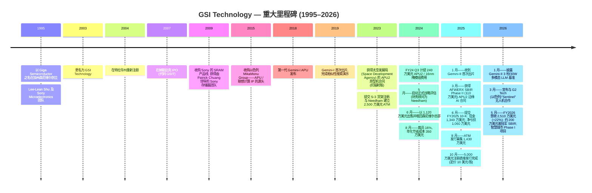
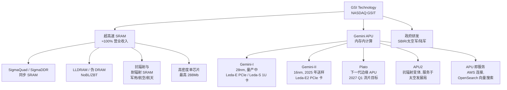
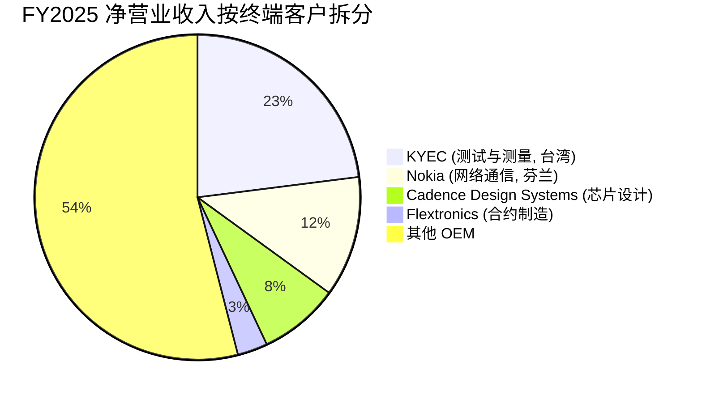
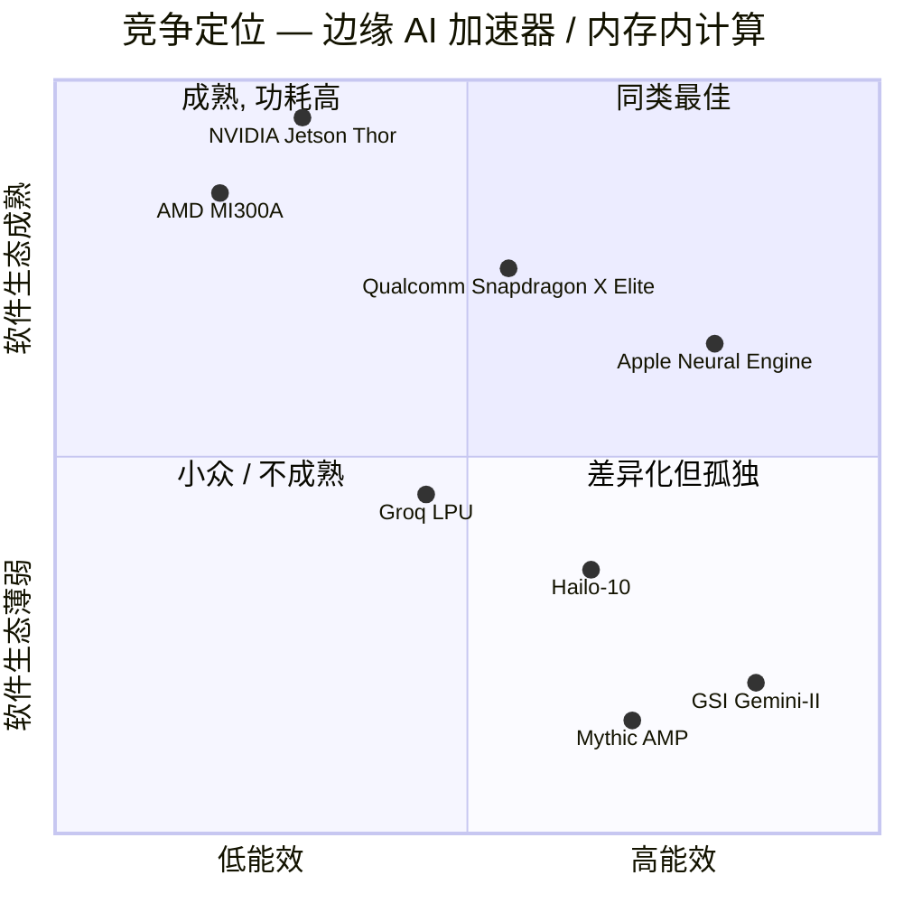

# GSI Technology, Inc. (NASDAQ:GSIT) — 公司研究报告

**日期: 2026-05-20**
**行业: 半导体——专用存储器与内存内计算 (Compute-in-Memory, CIM)**
**上市地: 纳斯达克全球市场 (NASDAQ Global Market), 代码 `GSIT`**
**财年: 4 月 1 日至次年 3 月 31 日 (FY2026 结束于 2026-03-31)**
**报告语言: 简体中文 (英文版同时存在于本目录)**

> **业绩更新——FY2026 营收同比 +22%, 全年业绩于 2026-05-07 披露。** FY2026 全年营业收入升至 **2,510 万美元** (相较 FY2025 的 2,050 万美元同比 +22%), 毛利率 (gross margin) 扩张至 **54.5%** (从 49.4%), 受益于芯片设计与军用/航空航天 SRAM 业务结构改善。公司指引 FY2027 Q1 净营业收入 **590 万–670 万美元**, 毛利率 **54%–56%**。期末账面现金达 **6,720 万美元且无任何债务**, 主要得益于 2025 年 10 月完成的 5,000 万美元注册直接发行 (registered-direct) 股权融资。FY2026 净亏损 **1,320 万美元** (相比 FY2025 的 1,060 万美元)。来源: [GSI Technology FY2026 财年 Q4 / 全年业绩公告, 2026-05-07](https://www.sec.gov/Archives/edgar/data/1126741/000117184326003155/exh_991.htm)。

---

## 目录

1. 公司概览
2. 公司历史
3. 管理团队
4. 产品与服务
5. 客户与上市策略
6. 行业概览
7. 竞争格局
8. 市场机会 (TAM)
9. 风险评估
10. 参考资料

---

## 1. 公司概览

GSI Technology, Inc. 是一家总部位于加州森尼维尔 (Sunnyvale) 的小盘无晶圆 (fabless) 半导体公司。公司在 121 人规模的单一组织内焊接了两类截然不同的业务: (i) 一项历史悠久但能产生现金流的 **超高速 SRAM (Very Fast SRAM, 静态随机存取存储器)** 产品线, 服务网络通信、测试设备及军用/航空航天客户; 以及 (ii) 处于萌芽阶段的 **Gemini 系列联想处理器 (Associative Processing Unit, APU)**——这是一种 GSI 专有的内存内计算 (in-memory computing) 架构, 公司将其定位为面向相似性搜索 (similarity search)、向量搜索 (vector search)、合成孔径雷达 (Synthetic Aperture Radar, SAR) 处理、边缘 AI 推理 (edge AI inference) 等并行工作负载的低功耗 GPU/CPU 替代方案。SRAM 老业务负责现金流, APU 业务则是这只股票的看涨期权 ([GSI Technology FY2025 10-K, Item 1 — Business](https://www.sec.gov/Archives/edgar/data/1126741/000155837025008723/0001558370-25-008723-index.htm))。

**业务模式。** GSI 是无晶圆模式: 所有 SRAM 与 APU 晶圆均由台积电 (TSMC) 在无长期供应合同的采购订单基础上生产; 封装与测试同样外包。公司通过三个渠道销售——直接面向 OEM、通过合约制造商 (contract manufacturer) 间接销售 (历史上以 Flextronics 最为重要), 以及通过以 Avnet Logistics、Holystone、Nexcomm、Mouser、Digi-Key 为核心的全球分销商网络销售。FY2025 中, **91.7% 的净营业收入通过分销商流转, 仅 7.9% 通过合约制造商直接销售**, 这是相对 FY2023 的结构性变化 (当时分销商占比 77.5%) ([GSI Technology FY2025 10-K, p. 11](https://www.sec.gov/Archives/edgar/data/1126741/000155837025008723/0001558370-25-008723-index.htm))。这一转变同时反映了 Flextronics 份额的下降 (FY2023/24/25 分别为 10.4% / 13.5% / 2.7%) 以及亚洲分销商的崛起 (特别是 Holystone 从 FY2024 的 2.5% 跃升至 FY2025 的 22.6%)。

**地理布局。** 总部及大部分管理职能位于加州森尼维尔; 台湾办公室 (40 名员工) 负责运营及与台积电的代工对接; 以色列工厂 (33 名员工) 是 APU 软件开发中心, 源自 2015 年收购 MikaMonu 的传承。FY2025 海外营业收入占比 **47.3%** ([10-K FY2025, Risk Factors](https://www.sec.gov/Archives/edgar/data/1126741/000155837025008723/0001558370-25-008723-index.htm))。以色列运营受持续的中东冲突影响——GSI 在文件中明确将此列为重大风险。

**规模。** 按所有指标看, GSI 都是一家微型市值公司。FY2026 净营业收入 **2,510 万美元** ([Q4 FY2026 业绩公告, 2026-05-07](https://www.sec.gov/Archives/edgar/data/1126741/000117184326003155/exh_991.htm)), 截至 2025-03-31 共有 121 名全职员工, 其中 82 名为工程师 (47 名在研发岗, 其中 32 名拥有博士或硕士学位) ([10-K FY2025, Human Capital](https://www.sec.gov/Archives/edgar/data/1126741/000155837025008723/0001558370-25-008723-index.htm))。公司持有 **142 项已授权的美国专利** (60 项存储器专利、82 项联想计算专利), 另有十多项待审专利申请——对这种规模的公司而言, 是相当可观的知识产权资产。

*来源: GSI Technology [FY2025 10-K](https://www.sec.gov/Archives/edgar/data/1126741/000155837025008723/0001558370-25-008723-index.htm) 与 [FY2026 Q4 业绩公告, 2026-05-07](https://www.sec.gov/Archives/edgar/data/1126741/000117184326003155/exh_991.htm)。*

**估值快照。** GSIT 的估值倍数极高, 无法以传统市盈率视角解读, 因为公司在 GAAP 口径下持续不盈利。截至 2026 年 5 月中旬, 股价约在 **9–12 美元**, 市值约 **3.06 亿–3.24 亿美元** ([GSI Technology — stockanalysis.com](https://stockanalysis.com/stocks/gsit/))。过去十二个月 (TTM) 市盈率 (P/E) 为**负值**——GSI FY2026 净亏损 1,320 万美元——因此该倍数在教科书意义上"不具备意义"。从市销率角度看, 该股估值约为 **TTM 营业收入的 12–13 倍** (按约 3.15 亿美元市值除以 2,510 万美元 FY2026 营收), 对一家在多年期视角下持续萎缩的半导体业务而言, 这是极高的倍数 (FY2022 营收约 3,380 万美元、FY2024 2,180 万美元、FY2025 2,050 万美元、FY2026 2,510 万美元)。市场支付的并非 12 倍销售对应的 SRAM 营收——它在为 APU/Gemini-II/Plato 内存内计算路线图的可选性, 以及 GSI 架构在边缘 AI 推理中取得立足点的可能性定价。该股过去十二个月上涨约 **227%** ([stockanalysis.com](https://stockanalysis.com/stocks/gsit/)), 强烈再评级的两大催化剂分别为: (a) 第三方基准测试显示 Gemini-II 在 120 亿参数多模态 LLM 上实现约 **30W 功耗下 3 秒首词时延 (time-to-first-token)**, 相比之下 Qualcomm Snapdragon X Elite 为 30W/12s、NVIDIA Jetson Thor 为 >100W/3s ([GSI Technology 业绩公告, 2026-01-29](https://www.globenewswire.com/news-release/2026/01/29/3228572/0/en/GSI-Technology-Reports-3-Second-Time-to-First-Token-for-Edge-Multimodal-LLM-Inference-on-Gemini-II.html)); (b) 2025 年 10 月的股权融资消除了近期偿付能力问题。对位可比并不容易——GSI 体量上没有干净的内存内计算纯粹对位公司——但作为背景: 成熟 SRAM/专用存储器同业如 Cypress Semiconductor (被收购前) 与 Integrated Silicon Solution 在盈利期通常以 1.5–3 倍市销率交易; AI 题材股如 Cerebras (未上市)、Groq (未上市) 与已上市的 Ambarella (NASDAQ: AMBA) 以 5–12 倍市销率交易, 但其营收规模为 GSIT 的 10–30 倍。结论: **GSIT 的定价是 Gemini-II 商业化成功与否的二元期权, 而非一家存储器公司的估值**。我们在第 9 章中将这一拉伸的倍数本身列为财务/估值压缩风险。

现金与运营周期: 截至 2026-03-31, GSI 持有 **6,720 万美元现金及等价物且无任何债务** ([Q4 FY2026 业绩公告](https://www.sec.gov/Archives/edgar/data/1126741/000117184326003155/exh_991.htm))。按年度运营现金消耗约 1,300 万美元计 (FY2025 经营活动用现金 1,300 万美元 [10-K FY2025, 流动性章节](https://www.sec.gov/Archives/edgar/data/1126741/000155837025008723/0001558370-25-008723-index.htm)), 仅就现金而言, 无进一步稀释下的运营周期超过五年——尽管 FY2026 研发支出将随 Plato 开发加速而上行, 将自筹资金的时间窗收窄至约 3–4 年, 直至下一次资本事件。近期文件已删除关于持续经营能力的警示性语言; 10-K 明确指出"我们相信现有现金余额……足以满足至少未来 12 个月的营运资金与资本支出需求" ([10-K FY2025, Liquidity](https://www.sec.gov/Archives/edgar/data/1126741/000155837025008723/0001558370-25-008723-index.htm))。

---

## 2. 公司历史

GSI Technology 于 **1995 年 3 月以"Giga Semiconductor, Inc." 之名在加州注册成立**, 创始人为 Lee-Lean Shu 及一群小规模联合创始人, 其中数位 (包括日后担任高级副总裁——存储器设计的 Patrick Chuang) 后于 Sony Microelectronics Corporation 加入 GSI, Shu 在 Sony 曾任 SRAM Design Director ([10-K FY2025, p. 13, Item 1](https://www.sec.gov/Archives/edgar/data/1126741/000155837025008723/0001558370-25-008723-index.htm))。公司于 2003 年 12 月更名为 GSI Technology, Inc., 并于 2004 年 6 月在特拉华州 (Delaware) 重新注册。创立的核心命题朴素直接: 打造市场上最快的同步 SRAM (synchronous SRAM), 取代网络通信与电信基础设施设备中的既有供应商。

**并购与战略转折点。** 三项交易重塑了 GSI 的故事。

- **2009 年 7 月——收购 Sony SRAM 产品线。** GSI 收购了 Sony Microelectronics 实际上全部的 SRAM 存储器产品线资产。此举将当时担任 Sony 高级副总裁——存储器设计的 Patrick Chuang, 以及更广泛的 Sony SRAM 设计团队带入 GSI, 一夜之间将存储器技术人员翻倍, 并为 GSI 提供了更高密度、更高速率的产品设计。这笔交易解释了为何 GSI 多位高级管理人员都拥有数十年 Sony 履历。
- **2015 年 11 月——收购 MikaMonu Group Ltd.** 这是公司历史上影响最深远的一笔交易。MikaMonu 是一家由 Avidan Akerib 博士 (Weizmann Institute 博士; 累计 50 余项内存内联想计算专利) 创立的以色列内存内计算/联想计算知识产权开发商。MikaMonu 是整个 Gemini APU 家族的技术种子, 而 Akerib 博士至今仍担任副总裁——联想计算。GSI 在 FY2025 资产负债表上记录有源自此次收购的 **800 万美元商誉 (goodwill)** 与约 130 万美元无形资产 ([10-K FY2025, Note 1](https://www.sec.gov/Archives/edgar/data/1126741/000155837025008723/0001558370-25-008723-index.htm))。与 APU 营业收入指标挂钩的或有对价已被重新计量为 **0 美元**, 因为相应里程碑未达成——这相当于默认 APU 营业收入相较 2015 年原计划已延迟了约十年。
- **2024 年 6 月——森尼维尔总部售后回租。** 此项交易意在战略评估期间延展运营周期, GSI 出售位于 1213 Elko Drive 的总部并回租, 确认 **1,120 万美元现金所得及 580 万美元 GAAP 收益** ([10-K FY2025, MD&A](https://www.sec.gov/Archives/edgar/data/1126741/000155837025008723/0001558370-25-008723-index.htm))。这本质上是一次性的房地产货币化, 而非可重复的现金来源。

**战略评估 (2024 年 5 月——进行中)。** 2024-05-02, GSI 宣布"为最大化股东价值开展全面战略评估", 明确包含"股权或债务融资、资产剥离、技术授权或其他战略安排, 包括出售公司", **Needham & Company 担任财务顾问** ([10-K FY2025, Risk Factors](https://www.sec.gov/Archives/edgar/data/1126741/000155837025008723/0001558370-25-008723-index.htm))。截至 FY2026 业绩披露, 整体出售尚未实现。战略评估最具体的产出是 **2025 年 10 月的 5,000 万美元注册直接发行股权融资**, 实质上重置了运营周期, 并消除了最迫在眉睫的偿付能力悬念。

**裁员行动 (2024 年 8 月)。** 与战略评估同步, GSI 执行了全球约 16% 的裁员, 创造了 350 万美元年化运行率节省。终止费现金成本为 66.8 万美元, 于 FY2025 Q2 支付。关键的是, 公司表示"Gemini-II 芯片开发及核心 APU 软件开发的人员均不会受裁员影响"——裁员针对共享服务与 SRAM 侧岗位, 未影响 APU 团队 ([10-K FY2025, MD&A](https://www.sec.gov/Archives/edgar/data/1126741/000155837025008723/0001558370-25-008723-index.htm))。这与管理层宣称的资本配置一致: SRAM 营业收入为 APU 研发提供资金。

---

## 3. 管理团队

GSI 的领导班子相对其他小盘半导体公司更年长且稳定异常。FY2025 10-K 中列示的七位高管中有五位在 2010 年前已加入公司, 高管团队平均年龄约为 69 岁 ([10-K FY2025, p. 16, Executive Officers](https://www.sec.gov/Archives/edgar/data/1126741/000155837025008723/0001558370-25-008723-index.htm))。这既是优势 (机构记忆、深度技术专长、低关键人物轮换风险), 也是劣势 (C 级高管的年龄相关接班风险真实存在, 且公开方面尚未予以应对)。

### Lee-Lean Shu——主席、总裁及首席执行官 (~350 字)

Lee-Lean Shu, 截至 2025 年 6 月 70 岁, **于 1995 年 3 月联合创立 GSI Technology**, 自成立以来一直担任总裁兼首席执行官, 自 2000 年 10 月起担任董事会主席 ([10-K FY2025, p. 16](https://www.sec.gov/Archives/edgar/data/1126741/000155837025008723/0001558370-25-008723-index.htm); [DEF 14A 2025, p. 5](https://www.sec.gov/Archives/edgar/data/1126741/000110465925068655/0001104659-25-068655-index.htm))。学历背景: Tatung Institute of Technology (台湾大同工学院) 电气工程学士、UCLA 电气工程硕士。创立 GSI 前, 他在 **1990 年 7 月至 1995 年 3 月在 Sony Microelectronics Corporation** (Sony 美国子公司) 工作, 由设计经理升至 SRAM Design Director。该岗位是 GSI 的技术种子——Shu 实际上从 Sony 衍生出 SRAM 设计能力并以此为核心创立公司, 而 2009 年收购 Sony SRAM 产品线正是这一关系的延续。

**在 GSI 的经营成就。** 在 31 年的 CEO 任期内, Shu 将公司从一家风险投资支持的初创企业打造成纳斯达克上市公司, 在台积电 (TSMC) 多代制程 (当前从 0.13µm 到 16nm) 上量产多代 SRAM, 并使公司经历了网络通信/电信设备市场三轮宏观周期。Shu 最具代表性的战略决策是 **2015 年的 MikaMonu 收购**——在 AI 工作负载与 GPU 短缺尚不存在当今规模时, 提前购入联想计算 IP。十年后, 该 IP 支撑起整个 Gemini APU 投资逻辑。最重大的战略**失败**也同样归属于 Shu: APU 营业收入未按 2015 年原计划兑现 (或有对价计提已写至零), SRAM 业务多年视角下大幅萎缩。这一延迟反映的是投资不足、资本化不足、技术不成熟, 还是单纯地超前——这一点可争论——但 Shu 对此负有责任。

**持股与薪酬。** 截至 2025-06-30, Shu 持有 **3,614,615 股 (占流通股 12.0%)** ([DEF 14A 2025, Beneficial Ownership table](https://www.sec.gov/Archives/edgar/data/1126741/000110465925068655/0001104659-25-068655-index.htm))——显著的创始人利益绑定。在治理方面值得一提的姿态是, Shu 于 **2022 年 11 月接受基础薪资削减 30%** (降至 302,339 美元/年), 作为成本削减举措的一部分 ([DEF 14A 2025, Compensation Discussion and Analysis](https://www.sec.gov/Archives/edgar/data/1126741/000110465925068655/0001104659-25-068655-index.htm))。FY2025 目标奖金为 275,000 美元; 实际只获得 **54,828 美元**激励薪酬, 因为 APU 营业收入指标未达成, SRAM 营业收入也仅低于计划 0.3%。因此 FY2025 现金薪酬总额接近 357,000 美元——对一家美股上市半导体 CEO 而言相当克制, 与深度创始人利益绑定一致。

### Douglas Schirle——首席财务官 (~180 字)

Douglas Schirle, 70 岁, 自 **2000 年 8 月起担任 CFO**——25 年任期 ([10-K FY2025, p. 16](https://www.sec.gov/Archives/edgar/data/1126741/000155837025008723/0001558370-25-008723-index.htm))。加入 GSI 之前为公司财务总监 (1999 年 6 月——2000 年 8 月)。再之前两年担任 Pericom Semiconductor 财务总监, 并在 1990 年代末退出市场的 SRAM 厂商 Paradigm Technology 担任高级财务职务 (财务总监后晋升为副总裁——财务)。Schirle 曾是注册会计师 (CPA)。他经历了 GSI 的 2007 年纳斯达克 IPO、2009 年 Sony SRAM 收购、2015 年 MikaMonu 交易、2023 年 ATM 工具、2024 年售后回租、2024 年 8 月裁员, 以及 2025 年 10 月 5,000 万美元注册直接发行——一份全部集中在单一发行人的长期资本市场履历。作为 GSI 财务团队深度的指标, 10-K 指出: **"我们美国财务部门目前仅有四名员工, 包括首席财务官"** ([10-K FY2025, Risk Factors](https://www.sec.gov/Archives/edgar/data/1126741/000155837025008723/0001558370-25-008723-index.htm))。70 岁高龄且没有公开宣布接班人, CFO 接班是被低估的近期治理风险。

### 其他核心高管 (~280 字)

**Avidan Akerib 博士——副总裁, 联想计算 (以色列)。** 69 岁。2015 年 11 月通过 MikaMonu 收购加入 GSI。曾为 MikaMonu 联合创始人兼首席技术专家 (2011 年 7 月——2015 年 11 月), 此前任 ZikBit Ltd. (DRAM 计算) 首席科学家及 NeoMagic Israel 总经理。Weizmann Institute 应用数学与计算机科学博士; 特拉维夫大学电气工程硕士、本古里安大学电气工程学士。**Akerib 博士是并行与内存内联想计算 50 余项专利的发明人**, 是公司中除 Shu 之外最重要的单一技术人物。他领导以色列软件团队, 该团队对 APU 商业化采纳至关重要——按 GSI 自己的话: "该团队是使用我们 APU 产品所需软件开发的必要团队" ([10-K FY2025, p. 60](https://www.sec.gov/Archives/edgar/data/1126741/000155837025008723/0001558370-25-008723-index.htm))。

**Patrick Chuang——高级副总裁, 存储器设计。** 75 岁。2009 年 7 月随 SRAM 产品线收购从 Sony Microelectronics 加入 GSI。1990 年至 2009 年在 Sony Microelectronics 担任高级副总裁——存储器设计, 此前 (1980—1990) 任 AMD NMOS DRAM 设计总监。Chuang 已在 GSI 管理 SRAM 设计组织 16 年。

**Didier Lasserre——副总裁, 销售。** 60 岁。1997 年加入 GSI, 2002 年晋升为销售副总裁。销售背景源自 Cypress Semiconductor (1988—96) 与 Solectron (1996—97)。

**Ping Wu——副总裁, 美国运营。** 在 QPixel Technology 短暂任职后于 2006 年回归 GSI; 1999 年首次加入公司。

**Bor-Tay Wu——副总裁, 台湾运营。** 自 1997 年 1 月加入 GSI。

### 董事会与治理 (~120 字)

GSI 在 2025 年年度股东大会后的五人董事会由 Lee-Lean Shu (唯一的非独立董事)、**Elizabeth Cholawsky** (HG Insights 前 CEO; Updata Partners 运营顾问)、**Haydn Hsieh** (Wistron NeWeb Corp. 主席兼首席战略官——亦为关联制造合作伙伴, 见下文)、**Ruey L. Lu** (eMPIA Technology 总裁) 与新任独立董事 **Ronald R. Steger** (KPMG 前审计合伙人; Great Lakes Dredge & Dock 董事) 组成, Steger 接替 Jack Bradley ([DEF 14A 2025](https://www.sec.gov/Archives/edgar/data/1126741/000110465925068655/0001104659-25-068655-index.htm))。

**内部人持股** (董事与高管合计, 2025-06-30) 占流通股 **25.4%** ([DEF 14A 2025, Beneficial Ownership](https://www.sec.gov/Archives/edgar/data/1126741/000110465925068655/0001104659-25-068655-index.htm))。披露的最大外部股东为 **HolyStone / 唐先生 持有 5.2%**——唐先生同时为 HolyStone Enterprises 的 CEO (该 GSI 分销商占 FY2025 营业收入 22.6%), 这是一项相互交织的持股与销售关系, 值得关注但已公开披露。

**关联方提示。** 董事 Haydn Hsieh 是 **Wistron NeWeb Corporation (WNC)** 的主席兼首席战略官, GSI 通过 WNC 制造单 APU PCIe 板。GSI 在 FY2025 向 WNC 支付约 14 万美元、FY2024 约 50 万美元的工程费 (NRE) 与制造服务费 ([DEF 14A 2025, Certain Relationships and Related Transactions](https://www.sec.gov/Archives/edgar/data/1126741/000110465925068655/0001104659-25-068655-index.htm))。金额并不重大, 但关联性是真实的。

### 管理层业绩综述 (~80 字)

Shu 及团队在战略上困难的市场中持续兑现了技术执行——他们构建并发货了多代 SRAM、整合了两次收购, 并将一种全新的内存内计算架构 (Gemini-I 量产, Gemini-II 于 2025 年 1 月获首次出片) 转化为可工作的芯片。他们**未**兑现的, 是 APU 营业收入, 无论是 2015 年的原始时间表还是任何后续的修订时间表。第 9 章的投资逻辑核心在于 Gemini-II 是否能改变这一点。创始人持股 (Shu 12%)、自愿接受降薪以及 31 年任期均说明真实的利益绑定。

---

## 4. 产品与服务

GSI 的产品组合干净地划分为两大产品族: **(A) 超高速 SRAM 存储产品**, 当前贡献几乎 100% 的营业收入; 与 **(B) Gemini APU 家族** (联想处理器/内存内计算芯片), 尚未产生实质商业营业收入, 但承载整个股票叙事的核心。

*来源: [GSI Technology FY2025 10-K, Item 1 — Products](https://www.sec.gov/Archives/edgar/data/1126741/000155837025008723/0001558370-25-008723-index.htm) 与 [Q3 FY2026 10-Q, MD&A](https://www.sec.gov/Archives/edgar/data/1126741/000117184326000515/exh_991.htm)。*

### A. 超高速 SRAM 产品组合

GSI 是全球少数几家商用 SRAM 供应商之一, 也是**唯一**提供单芯片高达 **288Mb** 密度的供应商 ([10-K FY2025, p. 8](https://www.sec.gov/Archives/edgar/data/1126741/000155837025008723/0001558370-25-008723-index.htm))。亚 10 纳秒级 ("超高速") 同步 SRAM 用作以下场景中的外部引脚可访问缓存与查找存储器:

- **网络通信与电信设备**——路由器、交换机、广域网基础设施、无线基站、网络接入设备。**历史锚定市场**, 随着 ASIC/控制器厂商在片上集成更多 SRAM 而下降。FY2025 网络通信与电信占出货量 **19%** (FY2024 为 34%) ([10-K FY2025, MD&A](https://www.sec.gov/Archives/edgar/data/1126741/000155837025008723/0001558370-25-008723-index.htm))。最大的历史客户是 **Nokia**, 主要用于无线接入网设备。
- **测试与测量设备**——高速测试仪 (如自动测试设备 / Automatic Test Equipment, ATE) 与需要极高随机事务速率的仪器仪表。**京元电子 (KYEC)** 是此细分市场中最大的终端客户 (亦为 FY2025 整体最大终端客户, 占净营业收入 23%)。
- **军用、防务与航空航天**——雷达、制导系统、导弹、卫星和信号处理平台。此处需求面向**耐辐射/抗辐射 SRAM (radiation-tolerant / radiation-hardened, rad-hard)**——比商业 SRAM 利润率高得多的细分市场。该细分市场中的具名 OEM 客户包括 **Lockheed Martin、Northrop Grumman、BAE Systems、Airbus、Rockwell Collins** ([10-K FY2025, p. 11 — 代表性客户清单](https://www.sec.gov/Archives/edgar/data/1126741/000155837025008723/0001558370-25-008723-index.htm))。GSI 主张 "唯一提供 288Mb 单芯片密度且提供业内最高真随机事务速率——18.66 亿次/秒"是雷达与 SAR 应用中真实的技术差异化点 ([10-K FY2025, Item 1](https://www.sec.gov/Archives/edgar/data/1126741/000155837025008723/0001558370-25-008723-index.htm))。
- **工业、医疗、汽车、音视频**——长尾残留应用。

**制程技术。** SRAM 产品横跨 0.13µm、90nm、65nm、40nm 制程, 由 TSMC 在 300mm 晶圆上生产 ([10-K FY2025, p. 12](https://www.sec.gov/Archives/edgar/data/1126741/000155837025008723/0001558370-25-008723-index.htm))。APU 产品为 28nm (Gemini-I) 与 16nm (Gemini-II / APU2)。16nm 制程切换在 FY2024 Q3 引发 240 万美元的预生产掩模费用, 在 FY2026 Q3 又引发针对 Plato 项目的 320 万美元知识产权费用 ([Q3 FY2026 10-Q, MD&A](https://www.sec.gov/Archives/edgar/data/1126741/000117184326000515/exh_991.htm))。

**竞争优势评估——SRAM。** *是, 部分。* 护城河类型为**技术 + 客户资格认证锁定**: 在雷达、防务与 ATE 中, GSI 的器件经多年项目设计导入, 切换成本高 (重新资格认证、电路板重新设计、系统级再认证)。FY2024—FY2026 期间 **49%–55% 的毛利率** 高于通用存储器基准, 与专用产品定位一致。*但是*, 商业级 SRAM 部分是结构性萎缩市场——网络通信 ASIC 内化 SRAM, 而 Nokia 等客户已减少外部 SRAM 消耗。GSI 的赌注是: 即使商业 SRAM 总市场 (TAM) 萎缩, 抗辐射、高密度与测试/测量细分仍能存续并增长。最接近的竞争产品: **Cypress Semiconductor (现为 Infineon) 的同步 SRAM 系列** (覆盖更广、出货量更大, 但 Infineon 已弱化 SRAM 业务); **Integrated Silicon Solution Inc. (ISSI)** 的 SRAM 产品 (面向量产、主流定位); **Renesas SRAM** (专用, 整体可比)。GSI 的优势: 密度 (288Mb 单芯片)、速度 (亚 10ns) 与抗辐射版本。GSI 的脆弱性: 相对于具备更深代工厂关系的竞争对手, 绝对出货量较低。

### B. Gemini APU 家族

联想处理器 (APU, Associative Processing Unit) 是 GSI 专有的**非冯·诺依曼 (non-Von Neumann) 内存内计算**集成电路。该架构将大规模位单元存储阵列与原位算术及布尔逻辑相结合, 在不将数据从存储搬运至独立处理器的情况下实现并行操作。这消除了瓶颈传统 CPU 与 GPU 架构特定内存绑定 (memory-bound) 工作负载的所谓"内存墙 (memory wall)"——最显著的应用包括**相似性搜索、向量搜索、实时 SAR 图像处理, 以及 (根据近期基准测试) 边缘低功耗多模态 LLM 推理**。

- **Gemini-I (28nm)。** 量产中。以 **Leda-E** 全尺寸 PCIe 卡与 **Leda-S** 1U E1.L 卡形式销售。目标应用为相似性搜索与向量搜索加速。2026 年 3 月发布的独立第三方测试报告显示 **Gemini-I 在 RAG (检索增强生成, retrieval-augmented generation) 工作负载上达到 GPU 级吞吐量, 同时能耗较 NVIDIA A6000 降低 98%** ([GSI Technology 业绩公告, 2026-03-10](https://www.stocktitan.net/news/GSIT/compute-in-memory-apu-achieves-gpu-class-ai-performance-at-a-a9souzbf11hy.html))。
- **Gemini-II (16nm)。** 2024 年 1 月获得首次出片; 2025 年末以 **Leda-E2** PCIe 卡形式送样。性能较 Gemini-I 提升一个量级。2026-01-29 披露的旗舰基准: **在 Gemma-3 12B 多模态 LLM 上以约 30W 实现 3 秒首词时延 (TTFT)** (AI 子系统级)——相比之下 **Qualcomm Snapdragon X Elite 为 30W/12s**, **NVIDIA Jetson Thor 为 >100W/3s** ([GSI Technology 业绩公告, 2026-01-29](https://www.globenewswire.com/news-release/2026/01/29/3228572/0/en/GSI-Technology-Reports-3-Second-Time-to-First-Token-for-Edge-Multimodal-LLM-Inference-on-Gemini-II.html))。如果客户能复现, 这就是嵌入式边缘 AI 细分中实质性的每瓦性能差异化。
- **APU2 (16nm 抗辐射变体)。** 由**太空发展局 (Space Development Agency) 原型机协议**资助 (初始 125 万美元, 2025 年 9 月修订至 200 万美元, 增加抗辐射特性表征里程碑)。GSI 正在为美国太空军 (US Space Force) 在轨大数据处理开发抗辐射 APU2 硅片 ([Q3 FY2026 10-Q, p. 60](https://www.sec.gov/Archives/edgar/data/1126741/000117184326000515/exh_991.htm))。
- **Plato。** 下一代边缘 AI APU, 当前处于设计阶段。根据 GSI 在 FY2026 Q3 业绩说明会的表态 (investing.com 转述): **流片目标为 2027 日历年 Q1, 初始晶圆于 2027 年夏季完成** ([Investing.com FY2026 Q3 业绩说明会摘要](https://in.investing.com/news/transcripts/earnings-call-transcript-gsi-technology-q3-2026-reveals-revenue-growth-eps-miss-93CH-5217818))。FY2026 Q3 GSI 计入 **320 万美元的 Plato IP 采购费用至研发支出** ([Q3 FY2026 10-Q, MD&A](https://www.sec.gov/Archives/edgar/data/1126741/000117184326000515/exh_991.htm))。
- **APU 即服务 (APU-as-a-Service)。** 通过 AWS 提供云端托管的 Gemini APU 访问, 旨在以 SaaS 方式服务 OpenSearch 向量搜索加速与 SAR 图像处理。GSI 明确指出, 包括 SaaS 在内的 APU 营业收入 **"至今未产生实质性营业收入"** ([Q3 FY2026 10-Q, MD&A](https://www.sec.gov/Archives/edgar/data/1126741/000117184326000515/exh_991.htm))。

**竞争优势评估——APU。** *部分, 伴随高二元风险。* 技术护城河真实存在——142 项专利 (其中 82 项专门针对联想计算)、Gemini-II 硅片已工作、第三方验证的基准。该架构在特定一类工作负载 (相似性搜索、向量搜索、SAR、边缘多模态 LLM 推理) 上相对 GPU 与 CPU 是**真正**差异化的。然而商业护城河*尚未*被证实——没有实质 APU 营业收入、没有具名大型锚定客户、没有可与 NVIDIA 或 AMD 媲美的设计胜出 (design-win) 披露框架。最接近的竞争架构为:

- **NVIDIA Jetson 家族** (边缘 AI GPU)——生态系统远更庞大、软件覆盖更广, 但同一工作负载功耗高于 Gemini-II 的基准结果。
- **Qualcomm Snapdragon X Elite / AI100**——功耗有竞争力, 但多模态基准的 TTFT 较慢。
- **Groq LPU**——另一种非 GPU 内存内/缓存内计算架构, 未上市, 以高估值融资。
- **Cerebras**——晶圆级计算, 形态与目标市场差异显著 (数据中心而非边缘), 未上市。
- **Mythic、Untether AI、EnCharge AI、Axelera AI、Hailo、Sima.ai**——风险投资支持的内存内或近内存推理初创公司, 大多未上市且尚未盈利或处于早期营收阶段。**Mythic** 拥有 Series 轮融资支持的模拟 CIM; **EnCharge** 以开关电容模拟 CIM 募资; **Untether** 拥有 Series 轮支持的器件。它们均非公开同业。

一句话评判: 在向量与多模态工作负载的每瓦性能维度上, GSI 的 APU 在竞争领域中拥有可防御的技术差异化与基准验证, 是其他玩家无法企及的。能否转化为营业收入, 纯粹是执行与上市策略问题——这恰是该股票当前在定价的内容。

### 最近发布与路线图 (过去 12 个月)

- **2025 年 6 月**——FY25 Q4 业绩、启动 1,430 万美元 ATM 募资
- **2025 年 8 月**——完成 1,430 万美元 ATM 股权融资
- **2025 年 10 月 21 日**——5,000 万美元注册直接发行完成
- **2026 年 1 月 29 日**——在 Gemma-3 12B 多模态上发布 Gemini-II 3 秒 TTFT 基准
- **2026 年 3 月**——Gemini-II "无人机安防对比赛" 击败 NVIDIA 与 Qualcomm
- **2026 年 4 月**——FY26 Q3 10-Q 披露 Plato 项目 320 万美元 IP 采购
- **2026 年 5 月**——FY26 业绩: 获得 Phase I 智慧城市合同; 约 200 万美元美陆军 SBIR Phase II 合同 (面向强固型 Gemini-II 边缘 AI 防务平台); 与 G2 Tech "Sentinel" 无人机 POC 计划于 2026 年 6 月演示

Plato 路线图 (2027 日历年 Q1 流片) 与 SBIR/政府合同管线表明 GSI 拥有 12—24 个月的催化剂窗口。

---

## 5. 客户与上市策略

GSI 的客户基础高度集中, 结构性依赖少数 OEM, 并通过少数分销商进行路由。这是关于公司最重要的单一商业事实。

### 客户集中度 (必备——源自 FY2025 10-K 与 FY2026 Q3 10-Q)

*来源: [GSI Technology FY2025 10-K, p. 11, 客户集中度表](https://www.sec.gov/Archives/edgar/data/1126741/000155837025008723/0001558370-25-008723-index.htm)。占比为基于合约制造商与分销商提供信息的直接与间接终端客户营业收入合并。*

**Top 1 终端客户 (FY2025):** KYEC (台湾), 23% 净营业收入——一家台湾测试与测量设备公司; 采购通过合约制造商与分销商路由。**KYEC 的销售额从 FY2024 的 50 万美元增长至 FY2025 的 460 万美元**, 8 倍变动解释了两年间客户结构变化的大部分。

**Top 5 终端客户 (FY2025):** KYEC (23%) + Nokia (12%) + Cadence Design Systems (8%) + Flextronics (3%, 合约制造商) + 下一家未具名客户将使 Top-5 占比达约 **50—55%**——按任何标准规则, 这都明确属于**实质性集中**。风险分类 (Top-1 > 20%、Top-5 > 50%) 将此标记为第 9 章高严重度风险。

**分销商集中度更甚。** **Avnet Logistics 占 FY2025 净营业收入 49.6%**, FY2024 为 50.6%, FY2023 为 48.1% ([10-K FY2025, Risk Factors](https://www.sec.gov/Archives/edgar/data/1126741/000155837025008723/0001558370-25-008723-index.htm))。**Holystone 从 FY2024 的 2.5% 跃升至 FY2025 的 22.6%**。两份关系均为操作性物流安排, 并非承诺——分销商可随时转向竞争产品。

**三年期客户结构 (10% 直接客户):**

| 直接客户 | FY2023 | FY2024 | FY2025 | 9M FY2026 |
|---|---|---|---|---|
| Avnet Logistics (分销商) | 48.1% | 50.6% | 49.6% | 未披露 |
| Holystone (分销商) | 2.4% | 2.5% | 22.6% | 未披露 |
| Nexcomm (分销商) | 16.6% | 9.3% | 9.8% | 未披露 |
| Flextronics (合约制造商) | 10.4% | 13.5% | 2.7% | 未披露 |

*来源: [10-K FY2025, p. 11](https://www.sec.gov/Archives/edgar/data/1126741/000155837025008723/0001558370-25-008723-index.htm) 与 [Q3 FY2026 10-Q](https://www.sec.gov/Archives/edgar/data/1126741/000117184326000515/exh_991.htm)。*

**Nokia / KYEC / Cadence Design Systems 占净营业收入的终端客户趋势:**

| 终端客户 | FY2023 | FY2024 | FY2025 | 9M FY2026 |
|---|---|---|---|---|
| KYEC | 2% | 3% | 23% | 11% |
| Nokia | 17% | 21% | 12% | 8% |
| Cadence Design Systems | 0% | 8% | 8% | 17% |

*来源: [10-K FY2025](https://www.sec.gov/Archives/edgar/data/1126741/000155837025008723/0001558370-25-008723-index.htm) 与 [Q3 FY2026 10-Q, p. 41](https://www.sec.gov/Archives/edgar/data/1126741/000117184326000515/exh_991.htm)。*

*来源: 同上。KYEC、Nokia 与 Cadence 互为头名客户; 三家合计每年约 35—50% 净营业收入——即使名字轮换, 结构性依赖依然存在。*

**关键观察。**
1. **头名客户逐年轮换。** Nokia 在 FY23—FY24 为第一名; KYEC 在 FY25 接手; Cadence Design Systems 是 9M FY26 的领跑者。这种轮换表明 GSI **没有单一不可替代的锚定关系**——但也意味着**单一客户需求波动可使全年营业收入波动 ±15—20%**。
2. **没有长期采购承诺。** 据 10-K: "我们与 KYEC、Nokia 或任何其他主要 OEM 客户、分销商或合约制造商之间没有长期合同义务他们必须采购我们的产品" ([10-K FY2025, p. 22](https://www.sec.gov/Archives/edgar/data/1126741/000155837025008723/0001558370-25-008723-index.htm))。订单基于 PO 逐单下达, 在交货前 30 天可重新安排或取消。
3. **销售周期长但设计胜出黏性高。** "我们的销售周期长达 24 个月才能完成…… 如果 OEM 客户在设计阶段决定不采用我们的产品, 我们将在该客户产品的多个月或数年内不会再有设计胜出机会" ([10-K FY2025, p. 26](https://www.sec.gov/Archives/edgar/data/1126741/000155837025008723/0001558370-25-008723-index.htm))。
4. **Cadence 的崛起对投资逻辑有意义。** 先进制程的芯片设计仿真与验证需要使用高密度外部 SRAM——随着半导体设计复杂度上升, 这是一个结构性增长应用, 而 GSI 的 288Mb 单芯片 SRAM 高度匹配该需求。9M FY26 跃升至 17% 表明 Cadence 正成为持久客户而非单季度尖峰。

### 上市策略

GSI 通过**全球约 200 名独立销售代表** ([10-K FY2025, p. 12](https://www.sec.gov/Archives/edgar/data/1126741/000155837025008723/0001558370-25-008723-index.htm)) 以及一支小规模内部销售/营销团队 (截至 2025 年 3 月约 15 人) 进行销售。区域销售办公室位于香港、以色列与美国。分销商锚定关系 (美国 Avnet、Mouser、Digi-Key; 亚洲 Holystone 与 Nexcomm) 实际上是公司的物流与信贷基础设施。

APU 上市策略显著不同: 它通过**概念验证 (Proof-of-Concept, POC) 与 SBIR 资助的合同**孵化客户互动, 而非通过分销商目录销售。G2 Tech "Sentinel" 无人机 POC、面向强固型 Gemini-II 边缘平台的美陆军 SBIR Phase II 合同、Phase I 智慧城市部署, 以及 AFWERX/AFRL 合同均遵循此模式。CEO 在 FY2026 Q4 业绩说明会上描述策略: "我们利用可重用的开发平台, 跨应用复用核心软件、模型与系统架构, 减少增量开发时间与成本" ([Q4 FY2026 业绩公告, 2026-05-07](https://www.sec.gov/Archives/edgar/data/1126741/000117184326003155/exh_991.htm))。对销售触达有限的小盘公司, 这是合理打法——但取决于 POC 至设计胜出再至营业收入的转化, 而该转化历史上一直缓慢。

### 客户案例 (具名胜出)

- **Nokia (至少自 FY2018 起)。** 网络通信设备 SRAM 客户, 主要用于无线接入网设备。Nokia 直接 + 间接营业收入: 450 万美元 (FY24) → 250 万美元 (FY25) → 140 万美元 (9M FY26)——下降趋势。
- **KYEC (台湾)。** 测试设备 SRAM。50 万美元 (FY24) → 460 万美元 (FY25)——与单一终端市场周期挂钩的快速爬升。
- **Cadence Design Systems。** EDA / 芯片设计仿真。9M FY2026 向 GSI 支付 310 万美元——新兴锚定客户。
- **美国政府 (空军研究实验室、太空发展局、美陆军)。** 至今累计获得约 **500 万美元的非稀释性 SBIR 资助** ([Q4 FY2026 业绩公告, 2026-05-07](https://www.sec.gov/Archives/edgar/data/1126741/000117184326003155/exh_991.htm)), 用于资助 APU2 与 Gemini-II 开发, 服务边缘 AI、SAR 处理与抗辐射太空应用。
- **G2 Tech (以色列)。** "Sentinel" 自主周界安防系统的合作伙伴; 2026 年 6 月演示目标。
- **Lockheed Martin、Northrop Grumman、BAE Systems、Airbus、Rockwell。** 列为 FY2025 SRAM 采购额超 48 万美元的代表性 OEM 客户 ([10-K FY2025, p. 10](https://www.sec.gov/Archives/edgar/data/1126741/000155837025008723/0001558370-25-008723-index.htm))——这些是军用/航空航天抗辐射客户。

### 关于 Nokia Bell Labs 的说明

公开评论偶尔提到 "Nokia Bell Labs 合作"。我们未能在 10-K、10-Q、DEF 14A 或 2026 年 5 月前向 SEC 提交的任何业绩公告中找到关于 Bell Labs 合作的明确披露; 网络搜索只能找到 Bell Labs 本身及无关的 GSI 业绩条目。**Nokia 是用于 Nokia 网络通信设备消耗的 SRAM 产品的客户, 但与 Nokia Bell Labs 的研究合作关系并未在主要文件中披露——我们无法从公开来源对其加以确认。**

---

## 6. 行业概览

GSI Technology 跨越两个行业: **专用/高性能 SRAM 存储** (老业务) 与 **内存内计算 (CIM) / AI 加速器半导体** (看涨期权)。两者在规模、增长与竞争动力上有着截然不同的特征。

### 静态随机存取存储器 (Static Random-Access Memory, SRAM) 市场

SRAM 是商用最快的存储技术, 但单位比特成本显著高于 DRAM 或 NAND。它用于三类主要场景: (i) 片上缓存 (绝大多数应用, 但嵌入式——不属于 GSI 等商用 SRAM 供应商可寻址市场); (ii) 用于网络通信设备中高速查找、包缓冲、流水线寄存器的独立外部 SRAM; (iii) 服务军用/航空航天、ATE 等小众应用的专用抗辐射或工业温度 SRAM。**商用 SRAM (GSI 参与的细分市场) 是一个规模小、成熟且结构性衰退的市场**。行业分析师对*独立离散* SRAM 市场的估算因定义不同差异巨大:

- Mordor Intelligence: "2025 年 SRAM 市场规模为 17.1 亿美元……到 2031 年增长至 23.7 亿美元, 年复合增长率 5.56%" ([Mordor Intelligence](https://www.mordorintelligence.com/industry-reports/static-random-access-memory-market))。
- Global Market Insights: SRAM 市场 "2025 年估值 7.18 亿美元……到 2035 年增长至 11.6 亿美元, 年复合增长率 4.9%"——口径更窄, 更接近商用外部 SRAM ([GMI](https://www.gminsights.com/industry-analysis/static-random-access-memory-market))。
- Verified Market Reports: "SRAM 芯片市场 2025 年规模为 158 亿美元……年复合增长率 6.5%"——口径最宽, 包含嵌入式 SRAM ([VMR](https://www.verifiedmarketreports.com/product/sram-chip-market/))。

与 GSI 相关的商用外部 SRAM 总市场更接近 GMI 定义 (全球 7—12 亿美元)。GSI **FY2026 营业收入 2,510 万美元意味着全球商用 SRAM 市场份额约 2—3%**——对专用供应商而言是合理位置, 但并非规模玩家。结构性逆风众所周知, 在每份 GSI 年报中均有承认: "网络通信与电信市场对高速同步 SRAM 的需求一直在下降, 预计将继续下降, 原因是行业趋势是每代 ASIC/控制器产品嵌入越来越多的 SRAM" ([10-K FY2025, p. 8](https://www.sec.gov/Archives/edgar/data/1126741/000155837025008723/0001558370-25-008723-index.htm))。GSI 的战略应对是从商品化网络通信 SRAM 撤退, 转向 (a) 高密度芯片设计/EDA 工作负载 (Cadence), (b) 测试与测量仪器 (KYEC), (c) 抗辐射/耐辐射军用/航空航天/太空 SRAM。FY2026 Q4 军用/防务出货占比达 **45.7%**——多年来最高 ([Q4 FY2026 业绩公告](https://www.sec.gov/Archives/edgar/data/1126741/000117184326003155/exh_991.htm))。

*根据披露的出货占比估算的终端市场结构。来源: [GSI Technology FY2025 10-K](https://www.sec.gov/Archives/edgar/data/1126741/000155837025008723/0001558370-25-008723-index.htm) 与 [FY2026 Q4 业绩公告, 2026-05-07](https://www.sec.gov/Archives/edgar/data/1126741/000117184326003155/exh_991.htm)。FY2022/FY2023 拆分为估算值, 仅作指示性参考。*

### 内存内计算 (CIM) / 边缘 AI 加速器市场

这是驱动 GSI 股票估值的高增长叙事。内存内计算是一个宽泛的架构类别, 包含:

- **SRAM 内模拟计算** (Mythic、Untether AI 早期世代)
- **SRAM 内数字计算** (GSI APU、EnCharge AI、其他)
- **DRAM 内计算** (UPMEM、三星 HBM-PIM 努力)
- **电阻/忆阻器计算** (研究阶段, 基于 MRAM 的方法)
- **晶圆级与数据流计算** (Cerebras、SambaNova、Groq——邻近但架构差异)

AI 推理芯片的总可寻址市场——CIM 在此伞下竞争——按多份行业预测, 到 2030 年达到**数千亿美元**, 但这包括 NVIDIA、AMD 与主要超大规模云厂商自研芯片团队 (Google TPU、AWS Trainium/Inferentia、Microsoft Maia) 主导的数据中心推理。GSI 在云数据中心推理上并不具备可信竞争力。**GSI 的可服务市场是边缘 AI 推理**, 尤其包括:

- **嵌入式无人机/机器人 AI**——50W 以下功耗包络, 视觉与 SAR 工作负载。GSI 在其边缘策略业绩公告中提到 **2030 年 27 亿美元的无人机市场** ([GSI Technology Edge Strategy, IR 页面](https://ir.gsitechnology.com/news-releases/news-release-details/gsi-technology-defines-edge-strategy-capture-growth-27-billion/))——这是可寻址的邻近市场, 而非 GSI 的营收机会, 我们将其视为外缘的*可服务市场 (SAM)*。
- **向量/相似性搜索加速**——本地与边缘的 OpenSearch、Elasticsearch、NoSQL 工作负载, 药物发现相似性搜索, 网络安全匹配, 以及电子商务视觉搜索。
- **实时 SAR 处理**——防务与遥感应用, 其数据量过大, 无法回传至云 GPU。
- **边缘多模态 LLM 推理**——新兴细分, 由 2026 年 1 月的 3 秒 TTFT 基准证明。

行业结构在此**碎片化且尚未整合**。公开玩家有限——NVIDIA Jetson 凭借声誉占据边缘 AI 开发市场, Qualcomm Snapdragon 拥有源自智能手机的规模, AMD/Intel 占据较小位置。私营 CIM 与推理加速器玩家已积极融资 (Groq、Cerebras、Mythic、EnCharge、Axelera、Hailo、Sima.ai、Untether)。GSI 的独特竞争位置在于其是**唯一上市的内存内计算纯粹玩家**——这既增加了曝光度 (股票作为 CIM 代理交易), 又使其面临小流通量/叙事驱动的再评级。

### 监管环境

- **出口管制。** GSI 的 SRAM 与 APU 产品受美国出口管制 (EAR) 约束, 鉴于军用/防务应用, 对某些海外客户的出货受到加严审查。美中半导体出口规则收紧增加了亚洲销售的复杂性 (台湾 KYEC 当前不在受限终端用户列表上, 但供应链敞口存在)。
- **政府合同。** 太空发展局、美空军、美陆军的 SBIR 奖项受标准 DFARS / FAR 条款约束, 包括知识产权保留条款。GSI 表示其"保留所有开发的知识产权"在原型机协议下, 并适用 IAS 20, 将奖金作为研发抵消而非营业收入确认 ([Q3 FY2026 10-Q, p. 30](https://www.sec.gov/Archives/edgar/data/1126741/000117184326000515/exh_991.htm))。
- **关税与贸易。** 美国近期对半导体投入与成品的关税上调与贸易限制, 在管理层讨论中反复被列为宏观逆风 ([10-K FY2025, MD&A](https://www.sec.gov/Archives/edgar/data/1126741/000155837025008723/0001558370-25-008723-index.htm); [Q3 FY2026 10-Q, MD&A](https://www.sec.gov/Archives/edgar/data/1126741/000117184326000515/exh_991.htm))。

### 行业动力

- **供应商议价能力: 高。** GSI 全部晶圆制造依赖 TSMC。10-K 明确指出"我们当前与代工厂没有长期供应合同, 因此, TSMC 没有义务在任何指定期间、任何指定数量或任何指定价格上为我们生产产品" ([10-K FY2025, p. 12](https://www.sec.gov/Archives/edgar/data/1126741/000155837025008723/0001558370-25-008723-index.htm))。在 GSI 当前规模下, 公司是 TSMC 90nm/65nm/40nm/28nm/16nm 产能的极小客户, 在产能紧张环境下可能被降级。
- **买方议价能力: 高。** 一小撮分销商与少数 OEM 贡献了大部分营业收入; 没有任何一家签署了长期承诺。
- **替代风险: 商品 SRAM 高、抗辐射与 APU 较低。** 嵌入式 SRAM 与更快的 DDR 存储继续在商业网络通信中占据外部 SRAM 份额; 抗辐射 SRAM 与内存内计算 APU 在其特定细分市场没有近似完美替代品。
- **资本密集度: 低 (无晶圆模式)。** GSI 每年资本支出在 4.5—64.5 万美元之间 ([10-K FY2025, 现金流量表](https://www.sec.gov/Archives/edgar/data/1126741/000155837025008723/0001558370-25-008723-index.htm))。掩模组为非研发薪资以外的主要现金流出 (每个主要节点 240—320 万美元的一次性费用)。

---

## 7. 竞争格局

GSI 在两个邻近的竞争格局中竞争: **萎缩的商用 SRAM 市场** (此处竞争对手是 SRAM 仅为边缘业务的大型多元化半导体公司) 与 **新兴的内存内计算推理市场** (此处竞争对手主要为私营风投资助的初创公司与 NVIDIA、Qualcomm 等大型平台玩家)。

*定位为指示性, 基于公开披露的每瓦性能基准与生态系统成熟度评估。来源: [GSI Technology 2026 年 1 月基准业绩公告](https://www.globenewswire.com/news-release/2026/01/29/3228572/0/en/GSI-Technology-Reports-3-Second-Time-to-First-Token-for-Edge-Multimodal-LLM-Inference-on-Gemini-II.html); 公司产品页面。*

### 直接 SRAM 竞争对手

根据 FY2025 10-K, GSI 标识其主要 SRAM 竞争对手为 **Cypress Semiconductor (现为 Infineon Technologies AG)、Integrated Silicon Solution Inc. (ISSI) 与 Renesas Electronics Corporation** ([10-K FY2025, p. 14](https://www.sec.gov/Archives/edgar/data/1126741/000155837025008723/0001558370-25-008723-index.htm))。三家均为大型多元化半导体公司, 商用 SRAM 仅占其总营业收入的一小部分。Infineon 在收购 Cypress 后已弱化商用 SRAM, 最终可能退出; ISSI 在 2015 年被中国财团私有化, 继续依靠出货量竞争; Renesas 专注于专用存储器与汽车。GSI 在 SRAM 市场的竞争地位在细分市场 (288Mb 高密度、亚 10ns 速度档、抗辐射) 是可持续的, 因为更大的竞争对手已向上游迁移或退出, 但这并非增长业务。

### 内存内计算 / 边缘 AI 推理竞争对手

这是一个拥挤但大多为私营的领域:

- **NVIDIA Jetson 家族** (Jetson Thor、Jetson AGX Orin、Jetson Orin Nano)——主导的边缘 AI 开发平台。优势: 庞大的软件生态 (CUDA、TensorRT、JetPack)、海量开发者基础、广泛模型支持。劣势: 功耗高 (Jetson Thor 在前述多模态 LLM 基准中需要 >100W); GPU 架构在 GSI 的特定工作负载类别 (相似性 / 向量搜索) 上并非最优。
- **Qualcomm Snapdragon X Elite / AI100**——借助智能手机 SoC 规模经济。功耗有竞争力; 在 GSI 引用的多模态 LLM TTFT 基准上较弱。
- **AMD (Instinct MI300A、边缘 Ryzen AI)**——专注于数据中心; 边缘推理渗透极少。
- **Apple Neural Engine**——封闭生态系统、捕获式 (iPhone、Mac)。
- **Groq LPU**——专用推理加速器, 专注于数据中心 LLM 服务而非边缘。未上市; 2024 年以 28 亿美元估值募资。
- **Cerebras Systems**——晶圆级 AI 计算, 形态截然不同; 数据中心定位。2024 年提交 S-1。
- **Mythic**——模拟内存内计算; 多次重组与再融资。
- **EnCharge AI**——开关电容模拟 CIM; Series 轮资助。
- **Hailo**——边缘 AI 推理加速器 (以色列); 未上市。
- **Sima.ai、Axelera AI、Untether AI**——各类边缘推理初创公司。
- **Tenstorrent**——基于 RISC-V 的 AI 计算; 未上市, 在成长。

GSI 的独特位置在于其是**唯一上市的内存内计算纯粹玩家**, 以及唯一拥有可工作硅片与软件栈、已发货产品 (Gemini-I) 并在公开多模态 LLM 基准 (Gemini-II, 30W 下 3 秒 TTFT) 上证明竞争力的玩家。

### 竞争优势

1. **在内存绑定工作负载上的架构差异化。** 联想存储 APU 模型在相似性搜索、向量搜索以及一类低比特宽度推理工作负载上的确优于 GPU。这并非营销——已反映于第三方验证的基准。
2. **能效。** **15W 包络对比同等 GPU 配置的 2kW** 是 GSI 在边缘/无人机工作负载上的旗舰指标 ([GSI Technology Edge Strategy, IR](https://ir.gsitechnology.com/news-releases/news-release-details/gsi-technology-defines-edge-strategy-capture-growth-27-billion/))。对电池供电的边缘平台具有决定性意义。
3. **防务/抗辐射资质。** 与 Lockheed、Northrop、BAE、Airbus、Rockwell 的既有关系, 以及与空军/太空军/陆军的活跃 SBIR 合同, 形成可防御的非商业营业收入来源。
4. **知识产权资产。** 142 项已授权美国专利, 其中 82 项为联想计算专利——在多数竞争对手仍处于预产品阶段的领域中, 这是有意义的资产。
5. **创始人领导、长任期技术领导团队。** Shu (31 年)、Akerib (10+ 年, MikaMonu 后)、Chuang (16 年, Sony 后) ——机构记忆杰出。

### 竞争脆弱性

1. **软件生态是瓶颈。** GSI 在 2024—2026 年明确投资以"为 Gemini-II 提供 Python 支持的编译器"和"内存内计算的集成框架环境" ([10-K FY2025, p. 9](https://www.sec.gov/Archives/edgar/data/1126741/000155837025008723/0001558370-25-008723-index.htm))。即便如此, 与 NVIDIA CUDA 生态的差距巨大, 而移植工作量是 APU 客户采纳的最大单一障碍。
2. **规模与销售触达。** 15 名销售/营销人员 + 约 200 名独立代表无法匹敌 NVIDIA 的企业销售动力或 Qualcomm 的 OEM 关系。
3. **相对竞争对手研发预算的现金体量。** 6,720 万美元现金对比竞争对手每年数亿至数十亿美元的研发预算。
4. **SRAM 业务在萎缩。** APU 开发的资金来源本身在收缩, 为 APU 商业化运营周期设定了时钟。
5. **客户集中度风险**——在第 5 章中已详述。

---

## 8. 市场机会 (TAM)

GSI 在披露与 IR 材料中呈现两个 TAM, 层叠组合:

**第 1 层——老业务专用 SRAM TAM。** 全球商用外部 SRAM 约 **7—12 亿美元** (Mordor Intelligence、Global Market Insights), 子细分包括 (a) 芯片设计/EDA 仿真, (b) 测试与测量, (c) 军用/防务/航空航天抗辐射, (d) 萎缩的网络通信/电信基础设施。GSI 在此细分中的可服务市场 (SAM) 约为 **2—4 亿美元**, 集中在高密度 (≥72Mb) 子细分, 此处 GSI 的 288Mb 单芯片与 18.66 亿 MT/s 器件具备差异化价值。当前 2,510 万美元营业收入意味着可获取市场 (SOM) 约为 **SAM 的 6—12%**——在 EDA、ATE 与抗辐射的份额获取仍有增长空间, 但*整体*市场不增长快。

**第 2 层——边缘 AI 推理/内存内计算 TAM。** 这是股票叙事的 TAM。GSI 引用 **2030 年 27 亿美元的无人机市场** 作为目标邻近市场之一 ([GSI Technology Edge Strategy](https://ir.gsitechnology.com/news-releases/news-release-details/gsi-technology-defines-edge-strategy-capture-growth-27-billion/))。各行业分析师预测, 边缘 AI 推理加速器芯片市场将从今日的个位数十亿美元规模增长至 **2030 年 300—1,000 亿美元+**, 取决于定义。在其中, GSI 瞄准特定细分:

- **防务/航空航天边缘 AI**——SAR 处理、自主无人机周界安防、雷达系统边缘智能。在美国国防部 (DoD) 边缘 AI 采购计划驱动下, 2030 年规模可能为 10—30 亿美元。
- **向量搜索/RAG 推理**——数据中心与边缘的嵌入式 LLM 与相似性搜索加速。近期 **RAG 工作负载上较 NVIDIA A6000 降低 98% 能耗** 的基准 ([GSI Technology 业绩公告, 2026 年 3 月](https://www.stocktitan.net/news/GSIT/compute-in-memory-apu-achieves-gpu-class-ai-performance-at-a-a9souzbf11hy.html)) 是 GSI 用以追逐该机会的证据点。
- **边缘多模态 LLM 推理**——由 Gemma 类小型多模态 LLM (12B 参数及以下) 推动的新兴细分。2030 年 SAM 可能为 10—50 亿美元; GSI 2026 年 1 月的基准将 Gemini-II 定位为可信竞争者。
- **智慧城市/工业自主系统**——2026 年 5 月宣布的 Phase I 智慧城市合同是意向性标志而非规模化。

**APU 业务的 SOM 情景 (指示性, 非 GSI 指引):**

- *牛市情景:* Gemini-II + Plato 在 2030 年捕获 300 亿美元边缘 AI 推理 TAM 的 1—2%——隐含营业收入 3—6 亿美元。这是该股以 12—13 倍市销率定价的情景。
- *基本情景:* GSI 到 2030 年由防务 + 小众工业 + 早期超大规模云厂商合作构建 5,000 万—1.5 亿美元的 APU 业务。仍较当前水平增长 5—15 倍, 但明显低于牛市情景。
- *熊市情景:* 2030 年 APU 营业收入保持低于 2,500 万美元 (与过去十年轨迹类似); 战略替代方案变为将 IP 资产出售给战略买家或清盘。

**渗透策略。** GSI 的商业化打法是 (a) SBIR / 政府资助开发以无稀释方式孵化平台, (b) 与系统集成商 (G2 Tech、智慧城市运营商) 的 POC 合作以验证 Gemini-II 在目标细分中的表现, (c) "可重用开发平台"模式以跨客户摊销软件工作量——由 CEO Shu 在 FY2026 Q4 业绩说明会中明确引述 ([Q4 FY2026 业绩公告](https://www.sec.gov/Archives/edgar/data/1126741/000117184326003155/exh_991.htm))。随着 Plato 瞄准 2027 日历年 Q1 流片, 未来 18—24 个月将决定 GSI 的 APU 营业收入能否从微不足道中拐点反弹。

---

## 9. 风险评估

### 公司层面风险 (6 项)

**1. 客户集中度——实质性至高严重度。** Top-1 终端客户占 FY2025 净营业收入 23%; Top-5 OEM 可能接近 50%。单一分销商 Avnet Logistics 占营业收入约 50%, 第二分销商 (Holystone) 在 FY2025 跃升至 23%。没有长期采购承诺。从单一 Top 客户的损失或回缩中, 20—25% 的营业收入波动是历史常态——公司本身指出, 在近期两年窗口中, 当净营业收入在 460 万—900 万美元之间波动时, 每个季度的营业亏损在 230—670 万美元之间 ([10-K FY2025, p. 20](https://www.sec.gov/Archives/edgar/data/1126741/000155837025008723/0001558370-25-008723-index.htm))。缓解因素: 终端客户轮换对 GSI 有利 (KYEC、Cadence、SBIR 合同先后崛起) ——没有任何单一客户是不可替代的。

**2. APU 商业化风险——高严重度、高不确定性。** MikaMonu 收购十年后, Gemini APU 尚未产生实质营业收入。与 MikaMonu 营业收入里程碑挂钩的或有对价负债已被计提为 0 美元, 反映管理层对这些目标无法达成的自我评估。当前估值嵌入了 APU 营业收入的实质性拐点; 若未能将 POC 与基准转化为设计胜出, 当前倍数将不可持续。缓解因素: Gemini-II 基准验证 (2026 年 1 月)、扩展中的 SBIR 管线以及 Plato 路线图均表明有形的技术进展。

**3. 关键人物依赖——高。** Lee-Lean Shu (70 岁, 创始人兼 CEO 31 年任期)、Avidan Akerib (69 岁, 联想计算 IP 唯一架构师)、Patrick Chuang (75 岁)、Douglas Schirle (70 岁)。GSI 未持有关键人物保险, 且没有雇佣合同。任一职位均无公开宣布的接班方案 ([10-K FY2025, Risk Factors](https://www.sec.gov/Archives/edgar/data/1126741/000155837025008723/0001558370-25-008723-index.htm))。

**4. 供应商集中度——高。** TSMC 制造 100% 的 GSI 晶圆, 没有长期供应合同。在 GSI 当前规模下, 公司是 TSMC 老制程产能的极小客户, 可能在产能紧张时被降级。以色列软件团队是 GSI 唯一的 APU 软件能力, 受持续中东冲突影响。

**5. 战略评估不确定性。** 战略评估流程自 2024 年 5 月开始, 无任何结果宣布。持续的开放性产生客户犹豫、关键工程员工保留风险, 以及股东不确定性。缓解因素: 2025 年 10 月的 5,000 万美元股权融资实质上把最迫在眉睫的偿付能力结果排除在外。

**6. 软件生态差距。** 没有可与 NVIDIA CUDA 甚至 Qualcomm SDK 媲美的健壮软件栈, 客户采纳缓慢。GSI 一直在投资 Python 支持的编译器与预构建 API, 但在其规模下结构性难以缩小差距。

### 行业 / 市场风险 (3 项)

**7. 网络通信与电信 SRAM 长期衰退。** 网络通信设备中的外部 SRAM 消耗持续被 ASIC 内的片上嵌入式 SRAM 替代。Nokia (GSI 网络通信锚定客户) 的直接 + 间接采购已从 FY2024 的 450 万美元下降至 9M FY2026 的 140 万美元。该趋势不可逆转。

**8. 竞争强度——边缘 AI 推理。** NVIDIA、Qualcomm、AMD 及一群风投资助的 CIM 初创公司均在追逐同一边缘推理 TAM。NVIDIA 的 CUDA 生态系统与 Qualcomm 的 OEM 关系使得即便拥有优越每瓦性能, 取代仍困难。

**9. 技术颠覆——替代架构。** 电阻存储 (memristor)、DRAM 内计算、基于光子的计算与 HBM-PIM (三星) 都是替代性内存内计算方法, 可能在 5—10 年视角下跨越基于 SRAM 的 APU 架构。

### 财务风险 (3 项)

**10. 估值/倍数压缩风险——高。** GSIT 当前以约 **TTM 营业收入 12—13 倍** 交易, TTM 盈利为负, 市值约 3.15 亿美元对应 FY2026 营业收入 2,510 万美元。该股票在 Gemini-II 基准披露与 2025 年 10 月资本融资支撑下 12 个月上涨 227%。当前没有可锚定于基本面的"公允倍数"——倍数是 APU 营业收入拐点的折现看涨期权。再评级触发因素: (a) Gemini-II POC 未能转化为设计胜出, (b) Plato 流片延误至 2027 日历年 Q1 之后, (c) 实质性损失现有 Top-5 SRAM 客户且市场无法将其归为暂时性, (d) 板块从小盘 AI 叙事中轮动, (e) 稀释性后续股权融资。现金消耗约每年 1,300 万美元对应约 6,700 万美元现金, 后续融资并非迫在眉睫, 但若 Plato 开发加速可能被触发。

**11. 盈利时间表 / 现金消耗。** FY2024—FY2025 期间运营现金消耗约 **每年 1,300—1,700 万美元**, FY2026 研发将从 1,600 万美元上行至 1,990 万美元, 因 Plato 开发加速。即便当前现金 6,720 万美元, 在维持现状基础上运营周期为 3—5 年; 如果 APU 营业收入未能在 FY2028—FY2029 拐点回升, 另一轮股权融资可能性较高。

**12. 稀释风险。** GSI 同时使用 ATM 发行 (2025 年 5—8 月募集约 1,430 万美元) 与注册直接发行 (2025 年 10 月 5,000 万美元), 大幅扩张股本。2025 年 10 月发行向约 2,900 万股的基数增加约 **500 万股 (150 万股普通股 + 350 万股预先注资认股权证, 全部行使)**——单笔交易稀释约 **17%**。在 APU 营业收入实现自筹资金之前, 未来稀释风险仍真实存在。

### 宏观经济风险 (2 项)

**13. 关税、出口管制与中美脱钩。** GSI 大量出口至亚洲, 且全部晶圆生产依赖 TSMC (台湾)。半导体出口限制升级、成品电子产品关税以及台湾地缘政治风险均影响供需双端。管理层在 FY2026 Q3 MD&A 中明确将"关税增加或新征关税、出口管制以及其他贸易壁垒与贸易争端"列为持续的需求拖累 ([Q3 FY2026 10-Q](https://www.sec.gov/Archives/edgar/data/1126741/000117184326000515/exh_991.htm))。

**14. 地缘政治风险——以色列与台湾敞口。** GSI 121 名员工中 33 名在以色列 (APU 软件开发); 40 名在台湾 (运营/代工接口)。两地在 2026 年都带有实质地缘政治风险 (以色列-加沙冲突持续; 台海紧张持续)。任一地单一重大中断都可能实质性损害 GSI 的产品路线图或生产能力。

---

## 10. 参考资料

**SEC 文件 (主要来源)**
- [GSI Technology, Inc. — 截至 2025-03-31 的 10-K 表 (2025-06-18 提交)](https://www.sec.gov/Archives/edgar/data/1126741/000155837025008723/0001558370-25-008723-index.htm) ——业务描述、产品、客户集中度、MD&A、财务数据、高管资料、风险因素的核心来源。
- [GSI Technology, Inc. — 截至 2025-12-31 的 10-Q 表 (2026-02-06 提交)](https://www.sec.gov/Archives/edgar/data/1126741/000110465926011501/0001104659-26-011501-index.htm) ——FY2026 Q3 财务数据、包括 Cadence Design Systems 的更新客户集中度、Plato IP 费用、5,000 万美元注册直接发行披露。
- [GSI Technology, Inc. — 2025 年股东大会 DEF 14A 委托书 (2025-07-17 提交)](https://www.sec.gov/Archives/edgar/data/1126741/000110465925068655/0001104659-25-068655-index.htm) ——受益所有权表、高管简介、薪酬讨论、关联方交易 (Wistron NeWeb)。
- [GSI Technology 8-K — FY2026 Q4 / 全年业绩公告, 2026-05-07](https://www.sec.gov/Archives/edgar/data/1126741/000117184326003155/exh_991.htm) ——FY2026 全年财务数据、FY2027 Q1 指引、美陆军 SBIR Phase II、智慧城市 Phase I。
- [GSI Technology 8-K — 5,000 万美元注册直接发行, 2025-10-21](https://www.sec.gov/Archives/edgar/data/1126741/000110465925101301/tm2529173d1_ex99-1.htm) ——定价细节、所得款用途、Needham 担任配售代理。
- [GSI Technology 8-K — FY2026 Q3 业绩公告, 2026-01-29](https://www.sec.gov/Archives/edgar/data/1126741/000117184326000515/exh_991.htm) ——Plato 芯片提及; Q3 财务摘要。

**公司业绩公告与投资者材料**
- [GSI Technology — Gemini-II 3 秒 TTFT 多模态 LLM 基准业绩公告, 2026-01-29](https://www.globenewswire.com/news-release/2026/01/29/3228572/0/en/GSI-Technology-Reports-3-Second-Time-to-First-Token-for-Edge-Multimodal-LLM-Inference-on-Gemini-II.html)
- [GSI Technology — Gemini-I 较 NVIDIA A6000 降低 98% 能耗 RAG 基准, 2026-03](https://www.stocktitan.net/news/GSIT/compute-in-memory-apu-achieves-gpu-class-ai-performance-at-a-a9souzbf11hy.html)
- [GSI Technology — 边缘策略业绩公告 (27 亿美元无人机市场)](https://ir.gsitechnology.com/news-releases/news-release-details/gsi-technology-defines-edge-strategy-capture-growth-27-billion/)
- [GSI Technology — 与 G2 Tech 政府资助 GEMINI-II POC, 2026-01-14](https://www.globenewswire.com/news-release/2026/01/14/3218534/0/en/GSI-Technology-Announces-Government-Funded-GEMINI-II-Proof-of-Concept-with-G2-Tech-For-Edge-AI-Autonomous-Security-System.html)
- [GSI Technology — Gemini-II 无人机安防对比赛击败 NVIDIA 与 Qualcomm, 2026-03-10](https://www.stocksfoundry.com/articles/gsi-technologys-gemini-ii-wins-drone-security-bake-off-against-nvidia-and-qualcomm-on-power-efficiency-20260310)
- [GSI Technology — 投资者关系网站](https://ir.gsitechnology.com/)

**市场数据**
- [GSI Technology — stockanalysis.com 概览](https://stockanalysis.com/stocks/gsit/) ——当前价格、市值、12 个月回报。
- [GSI Technology — Yahoo Finance](https://finance.yahoo.com/quote/GSIT/)
- [GSI Technology — Stocktitan 摘要, "小型芯片厂商 GSI 累积 7,070 万美元现金"](https://www.stocktitan.net/news/GSIT/gsi-technology-inc-announces-third-quarter-fiscal-2026-fplcmj3hg33z.html)

**行业 / 市场规模**
- [Mordor Intelligence — 静态随机存取存储器市场报告, 2025-2031](https://www.mordorintelligence.com/industry-reports/static-random-access-memory-market)
- [Global Market Insights — 静态随机存取存储器市场规模, 2025-2035](https://www.gminsights.com/industry-analysis/static-random-access-memory-market)
- [Verified Market Reports — SRAM 芯片市场](https://www.verifiedmarketreports.com/product/sram-chip-market/)
- [Fortune Business Insights — 半导体存储器市场](https://www.fortunebusinessinsights.com/semiconductor-memory-market-114132)

**业绩说明会评论 (次要)**
- [Investing.com — GSI Technology FY2026 Q3 业绩说明会纪要摘要](https://in.investing.com/news/transcripts/earnings-call-transcript-gsi-technology-q3-2026-reveals-revenue-growth-eps-miss-93CH-5217818) ——Plato 2027 日历年 Q1 流片、运营支出上行。
- [Quiver Quantitative — GSI Technology 边缘策略](https://www.quiverquant.com/news/GSI+Technology+Announces+Edge+Strategy+for+Gemini-II+APU+to+Capitalize+on+Growing+AI+Processor+Market)
- [Dr. Robert Castellano — "GSI Technology 2025: The Moonshot for AI at the Edge" (Substack)](https://drrobertcastellano.substack.com/p/gsi-technology-2025-the-moonshot)

---

*本报告完全基于公开可用的主要文件 (SEC EDGAR) 与已引用的公开业绩公告编写。在某项事实无法从主要来源确认的情形——最显著的是任何"Nokia Bell Labs 合作"——其缺失已在报告正文中披露, 而非以次要推测加以掩盖。GSI Technology 是一家微型市值公司, 卖方研究覆盖稀少, 信息不对称程度高; 读者应将所有前瞻性内容视为可能随新披露材料浮现而进行实质性修订。*
