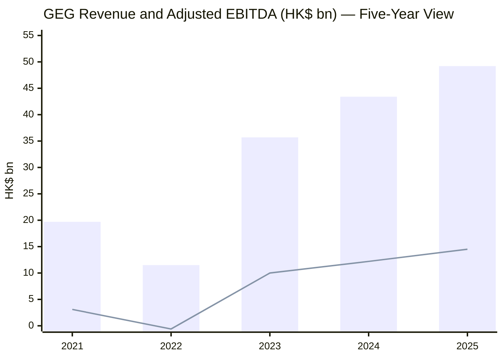
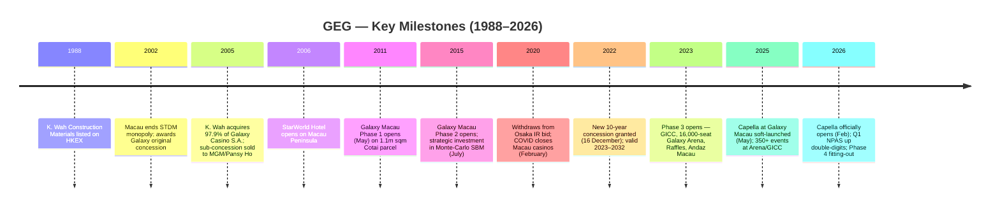
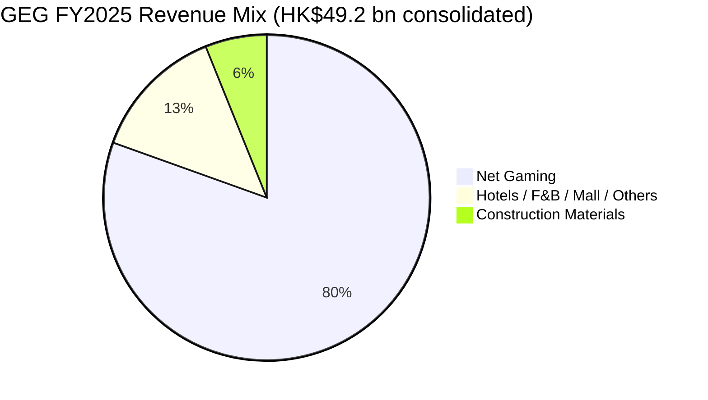
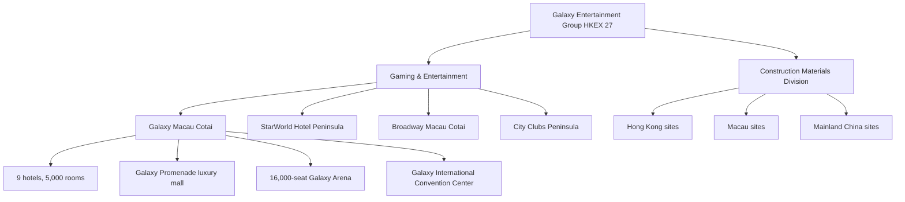
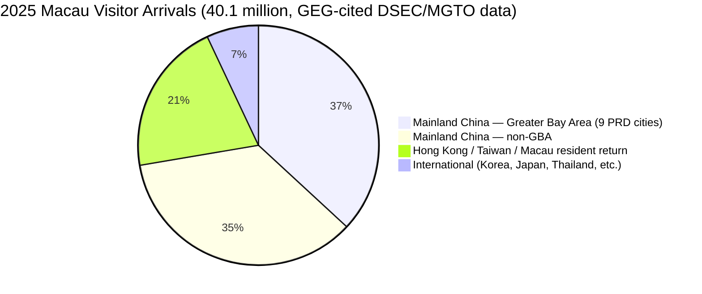
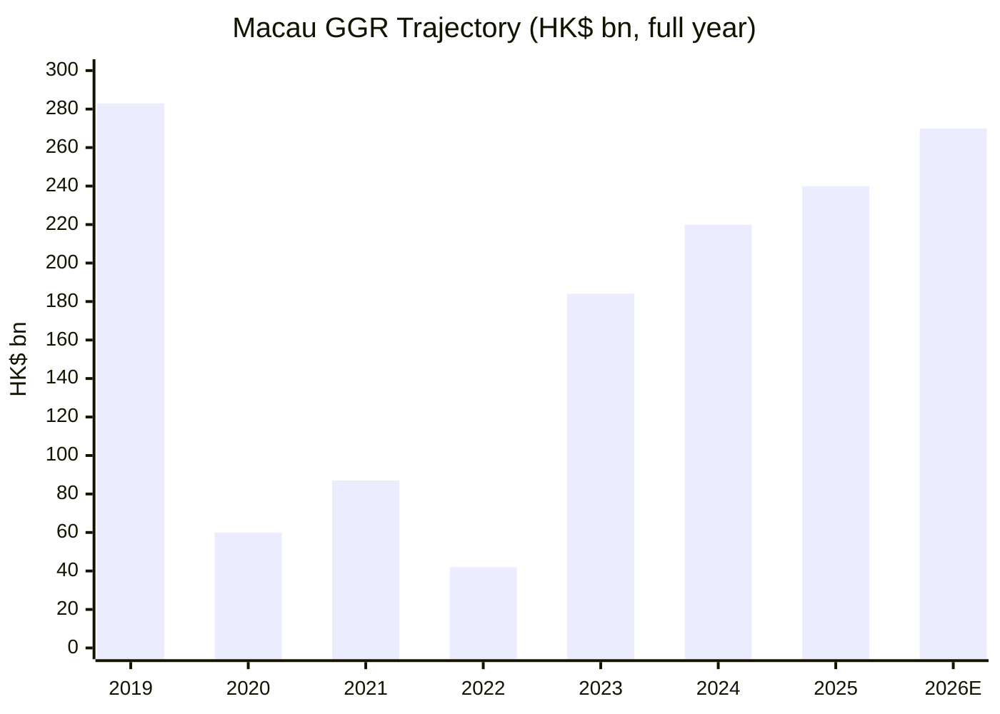
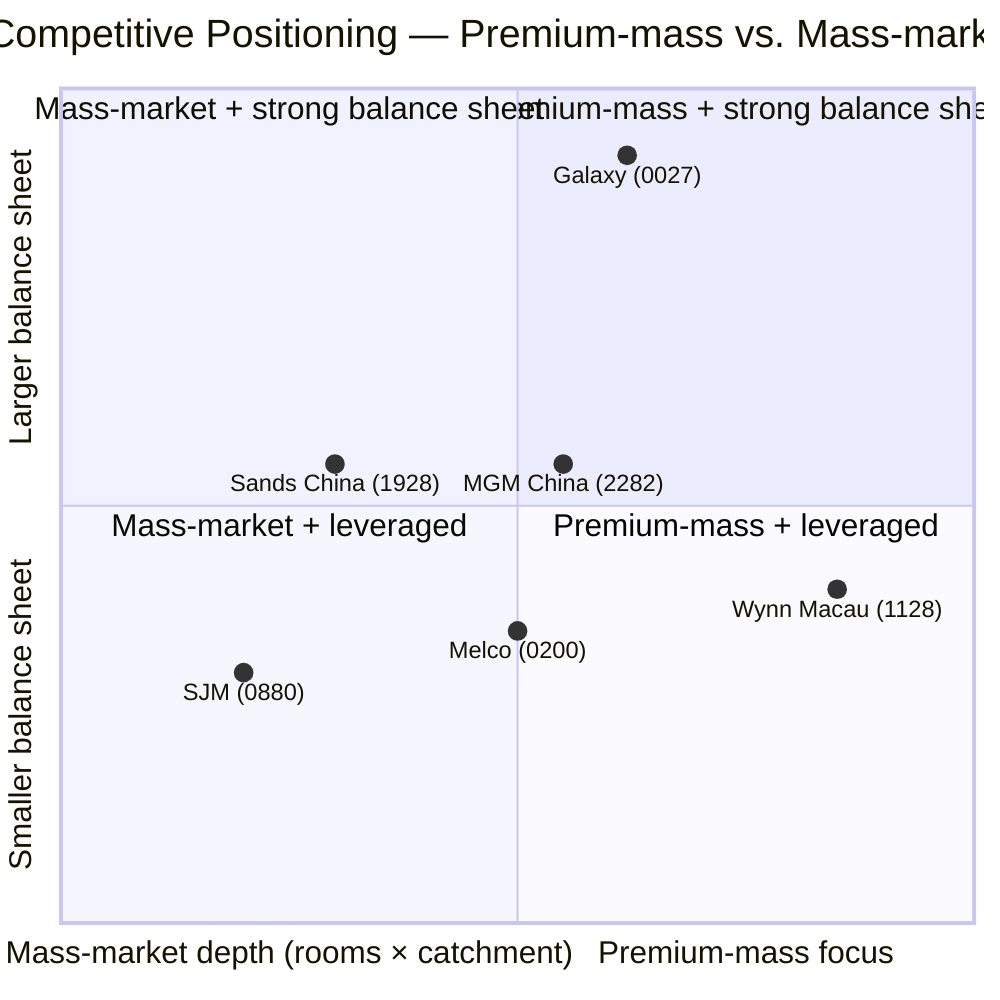
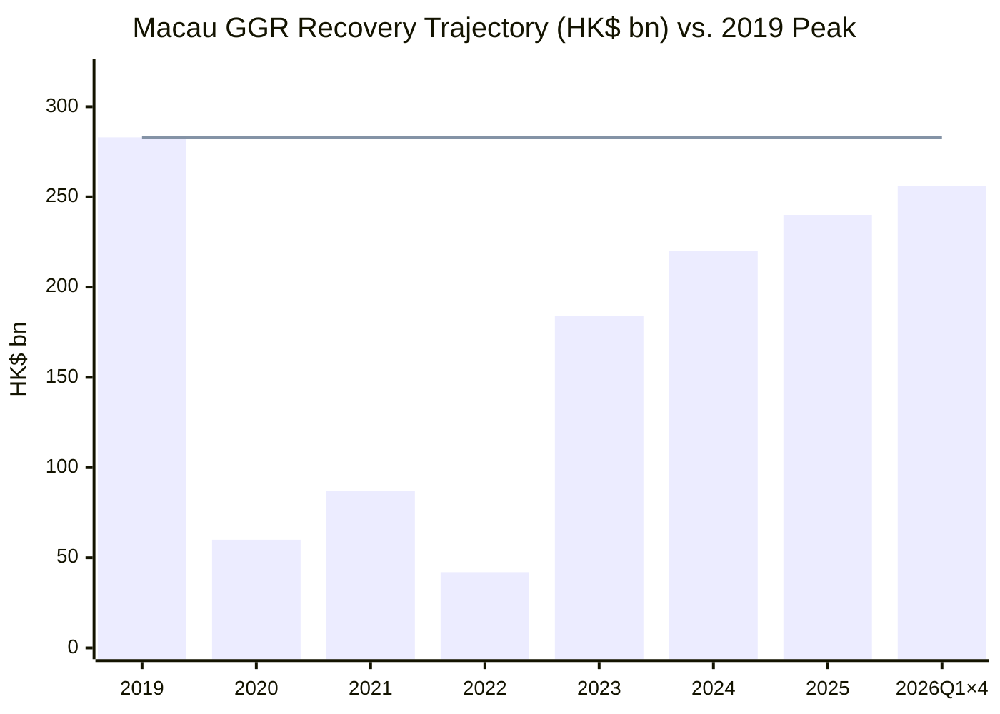

# Galaxy Entertainment Group Limited (HKEX:0027 / 银河娱乐) — Company Research

*As of 2026-06-03*

> Macau-listed integrated-resort operator. Cotai-anchored. Net-cash balance sheet. Family-controlled. One of three original Macau gaming concessionaires.

---

## Table of contents

1. Company Overview
2. Company History
3. Management Team
4. Products & Services
5. Customers & Listing Strategy
6. Industry Overview
7. Competitive Landscape
8. Market Opportunity
9. Risk Assessment
10. Investor-lens Scorecards
11. References & Verification Log

---

## 1. Company Overview

Galaxy Entertainment Group Limited ("GEG", stock code **27 HK** on the Stock Exchange of Hong Kong) describes itself as "one of the world's leading resorts, hospitality and gaming companies" that "primarily develops and operates a large portfolio of integrated resort, retail, dining, hotel and gaming facilities in Macau," and notes it is a constituent of the Hang Seng Index ([GEG 2025 Annual Report, p.04 — Corporate Profile](https://www.galaxyentertainment.com/uploads/investor/933511f1374a0e17d56a9ff97670ec6a25c84314.pdf)). Through subsidiary Galaxy Casino S.A. ("GCSA"), GEG is "one of the three original concessionaires in Macau" — the others being Sands China and Wynn Macau — and its current concession runs ten years from 1 January 2023 to 31 December 2032 ([GEG 2025 Annual Report, Key Audit Matter, p.74](https://www.galaxyentertainment.com/uploads/investor/933511f1374a0e17d56a9ff97670ec6a25c84314.pdf)). The Group operates three flagship Macau destinations — **Galaxy Macau™** (Cotai), **Broadway Macau™** (Cotai, adjoining), and **StarWorld Hotel** (Macau Peninsula) — supplemented by a few legacy City Clubs and a Construction Materials Division headquartered in Hong Kong ([GEG 2025 AR p.04 — Corporate Profile](https://www.galaxyentertainment.com/uploads/investor/933511f1374a0e17d56a9ff97670ec6a25c84314.pdf)).

**FY2025 in one line.** Group Net Revenue of **HK$49.2 bn (+13% YoY)**, Adjusted EBITDA of **HK$14.5 bn (+19% YoY)**, and Net Profit Attributable to Shareholders (NPAS) of **HK$10.7 bn (+22% YoY)**, with Earnings Per Share of HK¢244.0 (FY24: HK¢200.3). Gaming "luck" boosted Adjusted EBITDA by ~HK$1,482 m in 2025; on a normalized basis EBITDA still grew 5% to HK$13.0 bn ([GEG 2025 AR, p.06 — Financial & Operational Highlights](https://www.galaxyentertainment.com/uploads/investor/933511f1374a0e17d56a9ff97670ec6a25c84314.pdf); [GEG 2025 AR, p.25 — MD&A Group Results](https://www.galaxyentertainment.com/uploads/investor/933511f1374a0e17d56a9ff97670ec6a25c84314.pdf)). The Group ended FY25 with **HK$36.3 bn cash and liquid investments against HK$1.3 bn of debt** — a net-cash position of HK$35.0 bn, the highest year-end print in the five-year window disclosed in the AR ([GEG 2025 AR p.06](https://www.galaxyentertainment.com/uploads/investor/933511f1374a0e17d56a9ff97670ec6a25c84314.pdf)).

**Valuation snapshot.** As of 2026-06-03, 27 HK traded at HK$32.12 with a market capitalization of approximately HK$140.7 bn, giving **TTM P/E of ~13.2× and TTM P/S of ~2.9×** on FY25 revenue of HK$49.3 bn — both materially below Sands China (1928 HK) at ~18× P/E despite a larger fixed-asset base, broadly in line with Wynn Macau (1128 HK) on P/E but at a discount on P/B (1.7× vs 2.8× for the peer set median per Yahoo Finance), and EV/EBITDA of ~9.8× sits between MGM China's 6.8× and Sands China's 9.7× ([Yahoo Finance — 0027.HK key statistics 2026-06-03](https://finance.yahoo.com/quote/0027.HK/key-statistics/); [Yahoo Finance — 1928.HK](https://finance.yahoo.com/quote/1928.HK/key-statistics/); [Yahoo Finance — 1128.HK](https://finance.yahoo.com/quote/1128.HK/key-statistics/); [Yahoo Finance — 2282.HK](https://finance.yahoo.com/quote/2282.HK/key-statistics/)). The 52-week range (HK$30.50–44.22) and the 4.9% indicated dividend yield (HK$1.50 total declared for FY25 plus the HK$0.80 recommended final) suggest the stock is priced for cash-flow durability rather than re-rating optionality. Section 2 below interprets the multiple in the context of the 2026 cycle.

*Source: [GEG 2025 AR, Five-Year Summary, p.72](https://www.galaxyentertainment.com/uploads/investor/933511f1374a0e17d56a9ff97670ec6a25c84314.pdf) (revenue) + [GEG 2023 AR, Financial Highlights, p.06](https://www.galaxyentertainment.com/uploads/investor/b7e652c3e138ccd8469abc2a85ff7c79522fdf83.pdf) + GEG 2025 AR Financial Highlights for EBITDA series. Bars = Revenue; line = Adjusted EBITDA.*

## 2. Company History

GEG traces back to **K. Wah Construction Materials Limited**, a Hong Kong–listed building-materials business controlled by the Lui family. The "snake-swallowing-elephant" transformation came in **2005**, when K. Wah disposed of its construction-materials orientation, acquired a 97.9% stake in Galaxy Casino S.A., and became "the only Hong Kong-listed company to hold an operating license in Macao" ([Wikipedia — Galaxy Entertainment Group, History section](https://en.wikipedia.org/wiki/Galaxy_Entertainment_Group)). The construction-materials business was retained as a small standalone division and remains a HK$3 bn revenue contributor today ([GEG 2025 AR, Note 8 Segment Information, p.111](https://www.galaxyentertainment.com/uploads/investor/933511f1374a0e17d56a9ff97670ec6a25c84314.pdf)).

The 2002 Macau concession liberalization is the foundational regulatory event: the Macau SAR Government ended the **40-year STDM monopoly held by Stanley Ho** and granted three concessions (and later three sub-concessions) to Galaxy, Wynn Resorts, and Sands China — with Galaxy's sub-concession sold to **Pansy Ho / MGM** in 2005, leaving GEG with the prime original concession in its own right ([Wikipedia — Gambling in Macau, Concessions section](https://en.wikipedia.org/wiki/Gambling_in_Macau)). The 2002 framework introduced Western-style integrated-resort competition, attracted ~US$30 bn in Cotai capex from the six operators between 2004 and 2019, and ultimately turned Macau into the world's largest gaming jurisdiction by GGR by ~2007 ([Wikipedia — Gambling in Macau](https://en.wikipedia.org/wiki/Gambling_in_Macau)).

GEG's flagship **Galaxy Macau™ opened in May 2011** on a 1.4 million sqm Cotai parcel, was "significantly expanded in May 2015 with the opening of Phase 2," and "further expanded in 2023 with the opening of Phase 3" — adding the Galaxy International Convention Center (GICC), the 16,000-seat Galaxy Arena, Raffles at Galaxy Macau, and Andaz Macau ([GEG 2025 AR, p.04 — Corporate Profile](https://www.galaxyentertainment.com/uploads/investor/933511f1374a0e17d56a9ff97670ec6a25c84314.pdf)). The Phase-3 buildout took the Galaxy Macau hotel-room count from "approximately 3,600" at 2011 opening to ~5,000 across nine hotels by year-end 2025, lifting the resort into the very top tier of global integrated-resort scale ([GEG 2021 AR, p.04 — Corporate Profile](https://www.galaxyentertainment.com/uploads/investor/763ecec31f7c70fe8037f0dca14c55f8115fb623.pdf); [GEG 2025 AR p.04](https://www.galaxyentertainment.com/uploads/investor/933511f1374a0e17d56a9ff97670ec6a25c84314.pdf)). Capella at Galaxy Macau soft-launched in May 2025 and officially opened in February 2026 ([GEG 2025 AR, p.10 — Chairman's Statement](https://www.galaxyentertainment.com/uploads/investor/933511f1374a0e17d56a9ff97670ec6a25c84314.pdf); [GEG Q1 2026 Selected Unaudited Financial Data, p.3](https://www.galaxyentertainment.com/uploads/investor/67f24167299d6211d747f7e89f9c8afb1b1ee1cb.pdf)).

The most recent regulatory milestone was the **December 2022 concession renewal**: under the amended Law No.16/2001 (as amended by Law No.7/2022), the Macau Government granted a new 10-year gaming concession to GCSA running from 1 January 2023 to 31 December 2032, and concurrently required each concessionaire to maintain not less than MOP5.0 bn (~HK$4.85 bn) of paid-up capital and net-asset value throughout the concession term ([GEG 2025 AR, Note 5.2 — Capital risk management, p.105](https://www.galaxyentertainment.com/uploads/investor/933511f1374a0e17d56a9ff97670ec6a25c84314.pdf)). In February 2020, GEG had publicly **withdrawn from the Osaka integrated-resort bid** and re-focused its overseas pipeline on Yokohama and other Japan licenses; that decision pre-dated COVID and the subsequent collapse of Japan's IR timetable ([Inside Asian Gaming, "Galaxy confirms Osaka withdrawal" 2020-02-17](https://en.wikipedia.org/wiki/Galaxy_Entertainment_Group) — citing IAG via Wikipedia ref 2).

COVID broke the trajectory: revenue collapsed from HK$50+ bn pre-pandemic to **HK$11.5 bn in 2022** and posted a NPAS loss of HK$3.4 bn ([GEG 2025 AR, Five-Year Summary, p.72](https://www.galaxyentertainment.com/uploads/investor/933511f1374a0e17d56a9ff97670ec6a25c84314.pdf)). The 2023 reopening reversed it dramatically — Group Net Revenue rebounded +211% YoY to HK$35.7 bn, Adjusted EBITDA flipped to HK$10.0 bn (from −HK$0.6 bn), and NPAS returned to HK$6.8 bn ([GEG 2023 AR, p.06 — Financial Highlights](https://www.galaxyentertainment.com/uploads/investor/b7e652c3e138ccd8469abc2a85ff7c79522fdf83.pdf)). FY25 numbers (HK$49.2 bn revenue, HK$14.5 bn EBITDA) put the Group within 3% of its pre-COVID 2018–19 peak EBITDA print, with Macau GGR for full-year 2025 at HK$240.2 bn — 85% of 2019 levels per DICJ reporting cited in the AR ([GEG 2025 AR, p.24 — MD&A Macau Market Overview](https://www.galaxyentertainment.com/uploads/investor/933511f1374a0e17d56a9ff97670ec6a25c84314.pdf)).

*Source: [GEG 2025 AR, p.04 + p.10 + p.74](https://www.galaxyentertainment.com/uploads/investor/933511f1374a0e17d56a9ff97670ec6a25c84314.pdf); [GEG 2023 AR p.04](https://www.galaxyentertainment.com/uploads/investor/b7e652c3e138ccd8469abc2a85ff7c79522fdf83.pdf); [Wikipedia — Galaxy Entertainment Group](https://en.wikipedia.org/wiki/Galaxy_Entertainment_Group).*

The TTM P/E of ~13× and P/S of ~2.9× look "compressed" against Macau's recovery trajectory — Sands China at ~18× P/E and Wynn Macau at ~19× both trade richer despite weaker FY25 EBITDA trajectories ([Yahoo Finance — 1928.HK key statistics 2026-06-03](https://finance.yahoo.com/quote/1928.HK/key-statistics/); [Yahoo Finance — 1128.HK key statistics 2026-06-03](https://finance.yahoo.com/quote/1128.HK/key-statistics/)). *Analyst view:* the multiple discount likely reflects Phase-4 execution-spend hanging over FCF (the AR's Note 5.2 explicitly cites the MOP5.0 bn capital-maintenance requirement and the Phase-4 "600,000 sqm" footprint as the binding capital constraint), the family-control discount that long applies to Hang Seng integrated-resort comparables, and the fact that GEG carries a far higher proportion of *mass*-segment GGR than the Las Vegas-style premium-mass-heavy peers — mass is more taxable and lower-growth than the VIP tail that drove pre-2015 peak multiples ([GEG 2025 AR p.25 MD&A Group Financial Results](https://www.galaxyentertainment.com/uploads/investor/933511f1374a0e17d56a9ff97670ec6a25c84314.pdf)).

## 3. Management Team

GEG is **founder- and family-controlled** by the Lui family of Hong Kong, who own ~50.3% via direct stakes (8.6%) and indirect interests (41.7% via the Lui Family Trust and HKEX-listed K. Wah International Holdings) ([Wikipedia — Galaxy Entertainment Group, Ownership structure](https://en.wikipedia.org/wiki/Galaxy_Entertainment_Group)). The patriarch and founder figure is **Dr. Lui Che Woo, GBM, MBE, JP, LLD, DSSc**, the founder of K. Wah, whose vehicle transformed into GEG via the 2005 Galaxy Casino acquisition; the current Chairman and executive day-to-day leader is his son, Mr. Francis Lui Yiu Tung.

**Francis Lui Yiu Tung, BBS (Chairman; combined Chairman / CEO role)** — aged 70, joined the Group in 1979 and has been an Executive Director since June 1987. He sits as Chairman of the Board, of the Executive Board, of the Corporate Governance Committee, and is a member of the Nomination and Remuneration Committees. Outside GEG he is an Executive Director and Chairman of **K. Wah International Holdings Limited** (the family's HKEX-listed property arm), a member of the National Committee of the Chinese People's Political Consultative Conference (CPPCC) since the 11th election in 2008, and a member of the Chief Executive Election Committees of both Hong Kong SAR and Macau SAR ([GEG 2025 AR, Biographical Information of Directors, p.33](https://www.galaxyentertainment.com/uploads/investor/933511f1374a0e17d56a9ff97670ec6a25c84314.pdf)). He holds a B.Sc. in Civil Engineering and an M.Sc. in Structural Engineering from the **University of California at Berkeley**. He was awarded the Bronze Bauhinia Star by the HKSAR government in 2024 for public service "with his professional knowledge in construction and property development" — the engineering background is non-trivial context for the construction-heavy capex profile of Phase 3 and the impending Phase 4 ([GEG 2025 AR p.33](https://www.galaxyentertainment.com/uploads/investor/933511f1374a0e17d56a9ff97670ec6a25c84314.pdf)). He was named "the most influential person in the Asian Gaming Power 50 list for the ninth time in 2025" by Inside Asian Gaming, and "Outstanding CEO" at the 2024 IAG Academy IR Awards ([GEG 2025 AR p.33](https://www.galaxyentertainment.com/uploads/investor/933511f1374a0e17d56a9ff97670ec6a25c84314.pdf)).

Francis Lui's dual Chairman/CEO role is explicitly disclosed as a deviation from HKEX Corporate Governance Code C.2.1: *"Code Provision C.2.1 stipulates that the roles of chairman and chief executive should be separate and should not be performed by the same individual. The Company has not adopted this provision as Mr. Francis Lui Yiu Tung holds the dual roles of Chairman of the Board and executive Director. The Board considers that the combination of these roles in the same individual provides the Group with strong and consistent leadership and facilitates the effective formulation and implementation of the Group's overall strategy."* ([GEG 2025 AR, Corporate Governance Report, p.38](https://www.galaxyentertainment.com/uploads/investor/933511f1374a0e17d56a9ff97670ec6a25c84314.pdf)). The Board offsets this with four Independent Non-Executive Directors representing more than one-third of the Board — but for governance-sensitive investors, this combined role plus the ~50% family stake is the central control-premium / minority-discount dynamic.

The Lui family's executive depth is reinforced by **Mrs. Paddy Tang Lui Wai Yu, BBS, JP** (aged 71, Francis Lui's eldest sister, joined 1980, Co-Managing Director of K. Wah International, McGill University B.Comm., ICAEW) and **Ms. Eileen Lui Wai Ling** (aged 68, youngest sister, Executive Director since May 2025, Group Director — Human Resources and Administration since 2014, EMBA from Richard Ivey at Western and BA Economics from UCLA) ([GEG 2025 AR p.33–34](https://www.galaxyentertainment.com/uploads/investor/933511f1374a0e17d56a9ff97670ec6a25c84314.pdf)). Beyond the immediate family, **Mr. Joseph Chee Ying Keung** (aged 68, joined 1982, MD of the Construction Materials Division, MBA University of South Australia, B.Eng. Western Ontario) has been an Executive Director since April 2004 ([GEG 2025 AR p.33](https://www.galaxyentertainment.com/uploads/investor/933511f1374a0e17d56a9ff97670ec6a25c84314.pdf)).

On the operational side, the AR also discloses the **non-Board senior gaming/hospitality executives**: Kevin Kelley (COO Macau), Thomas Arasi (CFO, "over 35 years of experience in the financial services, hospitality, and integrated resort industries"), Richard Longhurst (Sr Director — Gaming), Roger Lienhard (EVP Food & Beverage), James Koratzopoulos (EVP Hotel and MICE Operations), Nelson Chan (EVP Customer Development) and Joseph Tang (EVP Operations, StarWorld Macau) ([GEG 2025 AR, Gaming and Hospitality Expertise, p.36](https://www.galaxyentertainment.com/uploads/investor/933511f1374a0e17d56a9ff97670ec6a25c84314.pdf)). Per the company-research skill convention, the body of this report focuses on the founder/CEO; the operational bench above is preserved here for completeness because GEG distinguishes formally between its Lui-family Board and an outsider-staffed C-suite.

## 4. Products & Services

GEG is run as **two reportable segments under HKFRS 8**: (i) the **Gaming and Entertainment segment**, comprising Macau-based casino-and-hospitality operations across Galaxy Macau, StarWorld Macau, Broadway Macau, and City Clubs; and (ii) the **Construction Materials segment** (CMD), which manufactures and distributes construction materials across Hong Kong, Macau, and Mainland China ([GEG 2025 AR, Note 8 — Segment Information, p.110](https://www.galaxyentertainment.com/uploads/investor/933511f1374a0e17d56a9ff97670ec6a25c84314.pdf)). The segments do not transact with each other ("there are no sales or trading transaction between the operating segments"). The CMD has been the legacy K. Wah business retained through the 2005 transformation and is small in the overall financial mix; the audited segment table for 2025 shows Gaming & Entertainment revenue of HK$46.28 bn vs CMD revenue of HK$2.96 bn — i.e. CMD is 6.0% of group revenue but 6.0% of Adjusted EBITDA via HK$877 m of EBITDA contribution at much higher margin density ([GEG 2025 AR, Note 8 segment table, p.111](https://www.galaxyentertainment.com/uploads/investor/933511f1374a0e17d56a9ff97670ec6a25c84314.pdf)).

### 4.1 Gaming & Entertainment — the property portfolio

The Group's own narrative segments revenue at the **property level**: Galaxy Macau™, StarWorld Macau, Broadway Macau™, City Clubs, and the construction-materials carve-out. The audited consolidated income statement decomposes the HK$49.2 bn 2025 revenue as: **Net Gaming HK$39.6 bn (80.5% of revenue), Hotels / Mall / Others HK$6.6 bn (13.5%), Construction Materials HK$3.0 bn (6.0%)** — within Gaming, the gross gaming win was HK$49.1 bn and commissions/incentives were HK$9.5 bn, giving the HK$39.6 bn "net gaming" line ([GEG 2025 AR, Note 7 Revenue + Consolidated Income Statement, p.78–110](https://www.galaxyentertainment.com/uploads/investor/933511f1374a0e17d56a9ff97670ec6a25c84314.pdf)). The HK$6.6 bn non-gaming line includes "rental income amounted to approximately HK$1,423 million" — mostly from the Galaxy Promenade luxury mall and convention-center event fees ([GEG 2025 AR, Note 7, p.110](https://www.galaxyentertainment.com/uploads/investor/933511f1374a0e17d56a9ff97670ec6a25c84314.pdf)).

*Source: [GEG 2025 AR, Consolidated Income Statement Note (Analysis of revenue), p.78](https://www.galaxyentertainment.com/uploads/investor/933511f1374a0e17d56a9ff97670ec6a25c84314.pdf).*

**Galaxy Macau™ — the primary EBITDA engine.** "Galaxy Macau™ is the primary contributor to Group revenue and earnings. In 2025, Net Revenue was $41.0 billion, up 19% year-on-year. Adjusted EBITDA was $13.4 billion, up 24% year-on-year" — the property is at this point the larger flagship of Cotai-style integrated resorts, with the **footprint of 1.4 million square meters** comprising **nine world-class hotels with approximately 5,000 rooms, suites and villas** (Capella at Galaxy Macau, Raffles at Galaxy Macau, Banyan Tree Macau, Ritz-Carlton Macau, Galaxy Hotel, JW Marriott Macau, Hotel Okura Macau, Andaz Macau, Broadway Hotel) ([GEG 2025 AR, p.04 — Corporate Profile + p.26 — MD&A Galaxy Macau](https://www.galaxyentertainment.com/uploads/investor/933511f1374a0e17d56a9ff97670ec6a25c84314.pdf)). Hotel occupancy across the nine hotels was **98% in 2025**, lifting from 87% in 2023 across the then-seven-hotel footprint ([GEG 2025 AR p.06](https://www.galaxyentertainment.com/uploads/investor/933511f1374a0e17d56a9ff97670ec6a25c84314.pdf); [GEG 2023 AR p.06](https://www.galaxyentertainment.com/uploads/investor/b7e652c3e138ccd8469abc2a85ff7c79522fdf83.pdf)).

**Galaxy Macau's gaming detail (FY2025)** — the key disclosed gaming-statistics table breaks down GGR into three buckets, each with **volume × win rate = win**: Rolling Chip (VIP-style promoter and in-house premium direct), Mass Table Drop (mass-market table games), and Electronic Gaming. Rolling Chip Volume at Galaxy Macau was HK$223.4 bn at a 4.2% win rate yielding HK$9.4 bn of gaming win; Mass Table Drop HK$108.7 bn at 29.1% win rate yielding HK$31.6 bn; Electronic Gaming Volume HK$72.9 bn at 3.3% win rate yielding HK$2.4 bn — total gaming win at Galaxy Macau of HK$43.5 bn before commissions ([GEG 2025 AR, Galaxy Macau Key Financial Data, p.26–27](https://www.galaxyentertainment.com/uploads/investor/933511f1374a0e17d56a9ff97670ec6a25c84314.pdf)). The **Mass Table Drop win rate jumped from 28.3% in 2024 to 29.1% in 2025** while Rolling Chip Volume nearly doubled (HK$50.9 bn Q4 2024 vs HK$60.1 bn Q4 2025), reflecting both Phase-3 ramp and the strategic skew toward **premium mass / super-premium mass** that Chairman Lui flagged in the Chairman's Statement: "we continued to drive growth across every segment of the business, with a particular focus in the premium mass and the super-premium mass segment. Capella soft launched in May 2025 and officially opened on 10 February 2026. With its ultra-luxury room product, Capella has allowed us to capture the super-premium mass segment more effectively at scale, further reinforcing our leadership in this high-value market." ([GEG 2025 AR, Chairman's Statement, p.10](https://www.galaxyentertainment.com/uploads/investor/933511f1374a0e17d56a9ff97670ec6a25c84314.pdf)).

**StarWorld Macau** — Peninsula property, 2025 Net Revenue HK$5.0 bn (down 7% YoY), Adjusted EBITDA HK$1.4 bn (down 13% YoY) — the YoY decline was driven by "played unlucky in gaming operations which decreased Adjusted EBITDA by approximately HK$20 million in 2025"; hotel occupancy was 100% for the full year ([GEG 2025 AR p.06, p.09](https://www.galaxyentertainment.com/uploads/investor/933511f1374a0e17d56a9ff97670ec6a25c84314.pdf)). StarWorld's role in the portfolio is the Peninsula gateway / repeat-visit local Macau customer, and the 5% / 28% EBITDA-margin set is structurally lower than Galaxy Macau's 33% because StarWorld lacks the multi-segment hotel-mall-arena flywheel.

**Broadway Macau™** — the food-street and family entertainment destination adjoining Galaxy Macau, with Adjusted EBITDA of HK$11 m (down 54% YoY) in 2025; small but strategically important as the cross-traffic catchment for Galaxy Macau ([GEG 2025 AR p.06](https://www.galaxyentertainment.com/uploads/investor/933511f1374a0e17d56a9ff97670ec6a25c84314.pdf)).

**City Clubs** — small Peninsula casinos (the historical bookies and clubs operated under GEG's concession umbrella). Adjusted EBITDA of HK$(7) m in 2025 vs HK$14 m in 2024. **Waldo Casino ceased operations on 31 October 2025** in line with the Macau Government's policy direction on smaller satellite casinos, with GEG retaining employment for affected staff ([GEG 2025 AR, Chairman's Statement, p.11](https://www.galaxyentertainment.com/uploads/investor/933511f1374a0e17d56a9ff97670ec6a25c84314.pdf)).

*Structure derived from [GEG 2025 AR p.04 + Note 8 segment table, p.111](https://www.galaxyentertainment.com/uploads/investor/933511f1374a0e17d56a9ff97670ec6a25c84314.pdf).*

### 4.2 Non-gaming amenities — the new growth lever

The Phase-3 amenities Cotai added in 2023 are no longer "optionality" — they are now the principal differentiation lever GEG cites in 2025 results disclosures. The **16,000-seat Galaxy Arena** is "the largest indoor arena in Macau" and offers center-stage, end-stage or boxing-ring configurations; in 2025, GEG hosted "around 350 concerts, entertainment shows, sporting and major events" including Andrea Bocelli (March), ITTF World Cup (April), G-Dragon / Jacky Cheung / Eason Chan (summer), the National Games in November (the first time it was held in Macau), the iQIYI Scream Carnival (an "exclusive multi-year strategic partnership with Galaxy Arena"), and the 2025 Greater Bay Area Film and Music Gala in November ([GEG 2025 AR, Chairman's Statement, p.10–11](https://www.galaxyentertainment.com/uploads/investor/933511f1374a0e17d56a9ff97670ec6a25c84314.pdf)). For 1Q 2026, GEG hosted "over 80 concerts, entertainment shows, sporting and other events" and confirmed the UFC FIGHT NIGHT: SONG vs FIGUEIREDO event for 30 May 2026 ([GEG Q1 2026 Selected Unaudited Financial Data, p.2–3](https://www.galaxyentertainment.com/uploads/investor/67f24167299d6211d747f7e89f9c8afb1b1ee1cb.pdf)).

The **Galaxy International Convention Center (GICC)** is described in the AR as "Asia's most iconic and advanced MICE destination" — a world-class event venue used in 2025 across the National Games, GBA Film and Music Gala, ITTF World Cup, and partner-sponsored events. The **Grand Resort Deck** is the signature attraction: "sprawling across 75,000 square meters, it is the world's largest skytop oasis complete with best-in-class facilities — the world's longest Skytop Adventure Rapids at 575 meters, the largest Skytop Wave Pool with waves up to 1.5 meters high and a 150-meter pristine white sand beach" ([GEG 2025 AR p.04 — Corporate Profile](https://www.galaxyentertainment.com/uploads/investor/933511f1374a0e17d56a9ff97670ec6a25c84314.pdf)). The **Galaxy Promenade** is "a one-stop shopping destination with many of the world's finest luxury brands"; the AR cites "over 120 dining options from Michelin dining to authentic delicacies." These are not catalog-padding; the non-gaming amenities are what drove non-gaming revenue at Galaxy Macau alone to **HK$5.9 bn in 2025 (+5% YoY)** ([GEG 2025 AR p.06](https://www.galaxyentertainment.com/uploads/investor/933511f1374a0e17d56a9ff97670ec6a25c84314.pdf)).

**Capella at Galaxy Macau** is the newest ultra-luxury hotel within Galaxy Macau, soft-launched in May 2025 and officially opened in February 2026; the AR states Capella is the vehicle GEG is using to "capture the super-premium mass segment more effectively at scale" ([GEG 2025 AR p.10](https://www.galaxyentertainment.com/uploads/investor/933511f1374a0e17d56a9ff97670ec6a25c84314.pdf)). Q1 2026 commentary added that the **premium gaming area Horizon Plus has been expanded from six private salons to ten** to support this push ([GEG Q1 2026 Selected Unaudited Financial Data, p.3](https://www.galaxyentertainment.com/uploads/investor/67f24167299d6211d747f7e89f9c8afb1b1ee1cb.pdf)).

### 4.3 Construction Materials Division (CMD) — the legacy lever

The CMD is the legacy K. Wah business preserved through the 2005 gaming pivot. Its 2025 economics: revenue HK$3.0 bn (-7% YoY on quarry / raw-material price weakness), Adjusted EBITDA HK$877 m (+2% YoY) — an EBITDA margin of ~30% that is materially higher than the segment-revenue mix would suggest, and the segment is run by Executive Director and Managing Director Joseph Chee, with operations in Hong Kong, Macau, and Mainland China ([GEG 2025 AR, p.06 + Note 8, p.111](https://www.galaxyentertainment.com/uploads/investor/933511f1374a0e17d56a9ff97670ec6a25c84314.pdf)). CMD doubles as a strategic complement to the Cotai gaming buildout — quarries and concrete supply feed back into GEG's own Phase 4 construction needs.

### 4.4 Phase 4 — the next capex cycle

Phase 4 is the **next major capacity layer** and is the single most important multi-year decision for GEG's medium-term capex profile. The AR's Chairman's Statement places Phase 4 front-and-center: "Looking ahead to 2026, we remain firmly focused on accelerating Phase 4 development, enhancing the appeal of our existing resorts, and further expanding our non-gaming offerings — from mega shows to international events" ([GEG 2025 AR p.12](https://www.galaxyentertainment.com/uploads/investor/933511f1374a0e17d56a9ff97670ec6a25c84314.pdf)). The Q1 2026 release adds physical detail: "fitting out the 600,000 sqm Phase 4 development. Upon completion, this landmark project will elevate the appeal of our existing resorts and significantly broaden our non gaming attractions with a 5,000-seat theater, extensive dining options, new retail space, lush landscaping, a water resort deck, and additional casino facilities" ([GEG Q1 2026 release, p.3](https://www.galaxyentertainment.com/uploads/investor/67f24167299d6211d747f7e89f9c8afb1b1ee1cb.pdf)). The AR 2023 framed the prior, planned-but-pre-pandemic version as "Phase 4 is planned to include multiple high-end hotel brands new to Macau, together with a 4000-seat theater" — the 5,000-seat update in Q1 2026 implies an upward re-scoping ([GEG 2023 AR, Future Development Opportunities, p.05](https://www.galaxyentertainment.com/uploads/investor/b7e652c3e138ccd8469abc2a85ff7c79522fdf83.pdf); [GEG Q1 2026 release, p.3](https://www.galaxyentertainment.com/uploads/investor/67f24167299d6211d747f7e89f9c8afb1b1ee1cb.pdf)). The AR does not break out a Phase-4 total capex number in the 2025 filing — *analyst view:* given Phase 3 was reportedly ~HK$30 bn cumulative through 2023, Phase 4 at 600,000 sqm vs Phase 3's 300,000+ sqm expansion is likely a multi-year HK$20–40 bn capex commitment, financeable from the HK$36.3 bn cash balance + ongoing FCF.

**Synthesis — how the segments interact.** Galaxy Macau is the integrated-resort flagship; the Arena / GICC / Capella / Horizon Plus stack drives premium-mass and super-premium-mass spend across hotel, F&B, mall, and gaming, with the mass-table win rate of 29% the dominant economic engine. StarWorld and Broadway are feeder properties: Peninsula gateway and family / entertainment catchment, both circulating customers back into Galaxy Macau. The Construction Materials Division is a legacy mid-margin Hong-Kong-anchored business that benefits cyclically from public-works activity and structurally from GEG's own Phase 4 build-out. The cross-property tax engine — **35% special gaming tax plus 5% public foundations / urban-development tax = 40% effective gross-gaming tax** — runs through every property's gaming-win line on the way to Adjusted EBITDA ([GEG 2025 AR, Note 4.22 — Special gaming tax, p.96](https://www.galaxyentertainment.com/uploads/investor/933511f1374a0e17d56a9ff97670ec6a25c84314.pdf)), explaining why headline gaming win of HK$49.1 bn translates only into HK$14.5 bn of group EBITDA before further fixed-cost burden.

## 5. Customers & Listing Strategy

### 5.1 Customer base — Greater Bay Area driven, no single-customer concentration

GEG is a **B2C integrated-resort operator**, so the customer base is best framed by visitation source rather than named-customer disclosure. From the AR's MD&A Macau Market Overview: in 2025 **total visitor arrivals to Macau were 40.1 million, up 15% YoY, exceeding the 2019 pre-COVID level of 39.4 million**. Mainland China visitors were 29.0 million (up 18% YoY), of which over 2.1 million traveled under the "one trip per week measure" (Zhuhai residents) and approximately 0.8 million under the "multiple-entry measure" (Hengqin residents). **Visitors from the nine Pearl River Delta cities in the Greater Bay Area rose by 24% YoY to 14.8 million, driven by an increase of 58% in visitors from Zhuhai**. International visitors increased by 14% YoY to 2.8 million, with Korea +11%, Japan +26%, and Thailand +38% ([GEG 2025 AR, p.24 — MD&A Macau Market Overview](https://www.galaxyentertainment.com/uploads/investor/933511f1374a0e17d56a9ff97670ec6a25c84314.pdf)).

The customer mix at the property level is **structurally weighted to mass and premium-mass play**, not the pre-2014 VIP tail. The Group's mass-table win rate of **26.5% in 2025** (Galaxy Macau: 29.1%) compares to a rolling-chip / VIP win rate of 4.2% (Galaxy Macau: 4.2%); even though VIP volume is multiples larger in absolute dollars, the EBITDA contribution from the mass segment dominates ([GEG 2025 AR, Group Gaming Statistics, p.07](https://www.galaxyentertainment.com/uploads/investor/933511f1374a0e17d56a9ff97670ec6a25c84314.pdf)). This is the long-term structural shift across post-2014 Macau (the VIP / junket model collapsed after the 2014 anti-corruption campaign and the 2015 junket reforms; junkets were further restricted by Macau in 2022 alongside the concession renewal, with GEG explicitly noting "Due to the credit driven nature of the VIP business in the gaming industry and also latest situation of Macau VIP gaming market, the Group is exposed to heightened risk in respect of the recoverability of concentration risk arising from customers and VIP gaming operators" in Note 5.1(b) ([GEG 2025 AR, Note 5.1(b) Credit risk, p.103](https://www.galaxyentertainment.com/uploads/investor/933511f1374a0e17d56a9ff97670ec6a25c84314.pdf))).

**Customer-name disclosure.** As an HKEX-listed integrated resort operator, GEG is **not subject to a single-customer ≥10% disclosure requirement equivalent to ASC 280-10-50-42 for US filers or 前五名客户合计销售金额 for A-share filers** — Hong Kong Listing Rules do not require this for a B2C casino issuer. The AR does not name individual gaming customers and does not disclose customer concentration in the segment notes or in the risk-factor section. The closest disclosure is the credit-risk text in Note 5.1(b) above ("heightened risk in respect of the recoverability of concentration risk arising from customers and VIP gaming operators"), which qualitatively flags VIP-channel concentration without quantifying it. This is the standard HK-IR pattern for the gaming sector.

The denominator label rule still applies: any customer-mix percentage cited below is **at the Group consolidated level** (not segment), and the underlying source is the AR's Macau-market visitation breakdown. There is no segment-level customer top-5 percentage to be reconciled to a consolidated number, because the AR does not disclose either.

*Source: [GEG 2025 AR, p.24 — MD&A Macau Market Overview](https://www.galaxyentertainment.com/uploads/investor/933511f1374a0e17d56a9ff97670ec6a25c84314.pdf). Categories computed: GBA 14.8m (cited), Mainland China non-GBA = 29.0m − 14.8m = 14.2m, International = 2.8m (cited), residual ≈ Hong Kong + Taiwan + Macau residents = 40.1 − 29.0 − 2.8 ≈ 8.3m. Slices = millions of arrivals, one consolidated denominator.*

### 5.2 Listing strategy — Hang Seng constituent, Lui-family control

GEG was listed on the **Stock Exchange of Hong Kong** as K. Wah Construction Materials Limited and has been a Hang Seng Index constituent through the post-2005 transformation ([GEG 2025 AR p.04 — "GEG is listed on the Hong Kong Stock Exchange and is a constituent stock of the Hang Seng Index"](https://www.galaxyentertainment.com/uploads/investor/933511f1374a0e17d56a9ff97670ec6a25c84314.pdf)). The free float is constrained by the **Lui family's combined ~50.3% beneficial ownership** — direct 8.6%, indirect 41.7% via the Lui Family Trust and HKEX-listed K. Wah International Holdings ([Wikipedia — Galaxy Entertainment Group, Ownership structure](https://en.wikipedia.org/wiki/Galaxy_Entertainment_Group)). Float is thus ~49.7%, which is large enough for Hang Seng inclusion but small enough that the family's vote on any corporate-action / disposal / capital-allocation decision is decisive in practice. Tracking ETFs and Hang Seng-replicating instruments are the principal channel for inbound passive flow; on the active side, GEG appears in most Asia-ex-Japan consumer-discretionary and gaming-sector models. The dividend policy is "evaluated in light of its financial position, the prevailing economic climate and expectations about the future macroeconomic environment and business performance" — i.e. a discretionary payout, not a contractual payout-ratio formula ([GEG 2025 AR, Report of the Directors — Dividend Policy, p.54](https://www.galaxyentertainment.com/uploads/investor/933511f1374a0e17d56a9ff97670ec6a25c84314.pdf)). The Group paid total dividends of HK$1.20/share in 2025 (HK$0.50 interim + HK$0.70 special) and the Board has recommended a HK$0.80/share final for 2025 payable June 2026 — together HK$2.00/share, vs HK$1.00/share in 2024, a doubling consistent with the FY25 NPAS step-up and the HK$36 bn cash balance ([GEG 2025 AR p.06 + p.54](https://www.galaxyentertainment.com/uploads/investor/933511f1374a0e17d56a9ff97670ec6a25c84314.pdf)).

## 6. Industry Overview

### 6.1 Macau gaming market — size, structure, regulatory boundary

Macau is the **world's largest gaming jurisdiction by GGR**, far exceeding any single US strip or Asian peer. The AR cites DICJ data for 2025: **Macau's full-year GGR was HK$240.2 bn, up 9% YoY, representing 85% of the 2019 pre-COVID peak**; Q4 2025 GGR was HK$64.1 bn, up 15% YoY and up 6% QoQ ([GEG 2025 AR, p.24 — MD&A Macau Market Overview](https://www.galaxyentertainment.com/uploads/investor/933511f1374a0e17d56a9ff97670ec6a25c84314.pdf)). Q1 2026 GGR was HK$64.0 bn, up 14% YoY and flat QoQ ([GEG Q1 2026 release, p.2 — Chairman's commentary](https://www.galaxyentertainment.com/uploads/investor/67f24167299d6211d747f7e89f9c8afb1b1ee1cb.pdf)). The trajectory from 2019 peak through 2020–22 COVID collapse to the 2025 re-approach has been remarkably linear since 2023: the market is now in a **late-recovery / early-expansion phase**, with the 15% YoY rate in Q1 2026 suggesting GGR could exceed the 2019 peak of ~HK$280 bn within the next ~12–18 months at current run-rate.

The market is structurally constrained by the **2002 concession framework**, refreshed in December 2022 for a new 10-year term: there are **six concessionaires** (Galaxy, Sands China, Wynn Macau, Melco, MGM China, SJM Holdings), each operating under the Macau gaming law (Law No.16/2001 as amended by Law No.7/2022). The framework caps the number of operators, mandates **MOP5.0 bn (~HK$4.85 bn) minimum paid-up capital and net asset value** for each, imposes the **35% special gaming tax + 5% public-foundation / urban-development levy = 40% effective gross gaming tax**, and now requires non-gaming and overseas-promotion commitments as part of each concession contract ([GEG 2025 AR, Note 4.22 + Note 5.2, p.96 + p.105](https://www.galaxyentertainment.com/uploads/investor/933511f1374a0e17d56a9ff97670ec6a25c84314.pdf)). The barrier to entry is therefore absolute for the 2023–2032 cycle — no new operators can enter Macau without an extraordinary government action.

### 6.2 Visitation, GBA integration, and the non-gaming pivot

The headline visitation number (40.1 million in 2025 vs 39.4 million in 2019) hides the most important structural shift: **the Greater Bay Area is now the dominant feeder**. The "one trip per week" measure for Zhuhai residents and the "multiple-entry" measure for Hengqin residents — both introduced and progressively expanded in 2024–25 — drove Zhuhai-origin arrivals +58% YoY and total GBA-origin arrivals +24% YoY in 2025 ([GEG 2025 AR p.24](https://www.galaxyentertainment.com/uploads/investor/933511f1374a0e17d56a9ff97670ec6a25c84314.pdf)). This is a **structural policy lever from Beijing and the Macau Government** that has effectively raised Macau's potential visitor base, and which the Macau Chief Executive Sam Hou Fai reaffirmed in March 2026: "Macau's development strategy will prioritize the expansion of non-gaming sectors including cultural tourism, retail and innovation, while strengthening infrastructure connectivity with the Mainland." ([GEG Q1 2026 release, p.4 — Chairman's report](https://www.galaxyentertainment.com/uploads/investor/67f24167299d6211d747f7e89f9c8afb1b1ee1cb.pdf)).

Beyond mainland Mass, the **international visitor cohort is the explicit growth target for 2026+**. GEG's Chairman's Statement cites the international offices in Seoul, Tokyo, Bangkok, and Singapore as the marketing infrastructure for this push; the 14% YoY uplift to 2.8 million international visitors in 2025 (Korea +11%, Japan +26%, Thailand +38%) is the early read-through ([GEG 2025 AR p.10](https://www.galaxyentertainment.com/uploads/investor/933511f1374a0e17d56a9ff97670ec6a25c84314.pdf)). The Group's positioning of Macau as a **non-gaming entertainment / events / MICE destination** — anchored by the 16,000-seat Galaxy Arena and the GICC, with anchor partnerships now in place with UFC, Damai Entertainment (an Alibaba Group member), and Macau Pass — is the explicit medium-term thesis to grow the international visitor cohort beyond the 2019 base.

### 6.3 The Hengqin in-the-Greater-Bay-Area angle

In addition to Macau-proper, GEG has progressed plans for a **Hengqin Cooperation Zone project** with the Macau and Zhuhai authorities; this was already flagged in the 2023 AR's "Future Development Opportunities" section as "we are also expanding our focus beyond Hengqin and Macau to potentially include opportunities within the rapidly expanding Greater Bay Area" ([GEG 2023 AR, p.05 — Future Development Opportunities](https://www.galaxyentertainment.com/uploads/investor/b7e652c3e138ccd8469abc2a85ff7c79522fdf83.pdf)). The Hengqin angle is asymmetric: it is non-gaming, but it places GEG inside a Special-Cooperation-Zone tax / customs regime that may meaningfully reduce cross-border friction for mainland visitors. **GEG also retains a 2015 strategic investment in Société Anonyme des Bains de Mer (Monte-Carlo SBM)**, the operator of the iconic Monte-Carlo luxury hotels and resorts in Monaco; "GEG continues to explore a range of international development opportunities with Monte-Carlo SBM" ([GEG 2023 AR p.05](https://www.galaxyentertainment.com/uploads/investor/b7e652c3e138ccd8469abc2a85ff7c79522fdf83.pdf)). And the 2025 AR's Chairman's Statement adds Thailand as an active overseas market: "International — Continuously exploring opportunities in overseas markets, including Thailand" ([GEG Interim 2025 report, p.08 — Development Update](https://www.galaxyentertainment.com/uploads/investor/f75bfed3faef5bd2189a5d11c5b5bc53e4e7b34f.pdf)).

*Sources: [GEG 2025 AR, p.24 MD&A](https://www.galaxyentertainment.com/uploads/investor/933511f1374a0e17d56a9ff97670ec6a25c84314.pdf) (HK$240.2bn 2025, "85% of 2019 level" implies HK$283bn 2019; Q1 2026 GGR HK$64.0bn × 4 trend implies HK$240–260bn run-rate plus seasonal lift); [GEG 2023 AR](https://www.galaxyentertainment.com/uploads/investor/b7e652c3e138ccd8469abc2a85ff7c79522fdf83.pdf) (post-COVID 2023 ramp). 2026E = analyst extrapolation from Q1 2026 run-rate × seasonal × YoY +9%.*

## 7. Competitive Landscape

GEG's competitors are **the other five Macau concessionaires plus the international integrated-resort peers competing for the international (non-Chinese) visitor cohort**. The 10-K-equivalent (HKEX AR) does not name competitors directly, so the framing below draws on each peer's own filings and disclosure.

**Macau direct concessionaires (FY24 / FY25 comparisons):**

| Peer | Concession | FY24 / FY25 Net Revenue (HK$bn) | TTM P/E | TTM P/S | TTM EV/EBITDA | Market cap (HK$bn) |
|---|---|---|---|---|---|---|
| **Galaxy (0027)** | Original concession 2023–32 | 43.4 / 49.2 | 13.2× | 2.9× | 9.8× | 140.7 |
| **Sands China (1928)** | Original concession 2023–32 | ~58 / ~58 (US$7.4bn FY24) | 18.4× | n/a* | 9.7× | 129.7 |
| **Wynn Macau (1128)** | Original concession 2023–32 | ~29 (US$3.8bn) | 19.2× | 1.1× | 9.2× | 31.2 |
| **MGM China (2282)** | Original concession 2023–32 | ~35 (US$4.5bn) | 8.8× | 1.3× | 6.8× | 44.7 |
| **SJM Holdings (0880)** | Original concession 2023–32 | ~28 | n/a (loss) | 0.5× | 14.5× | 13.6 |
| **Melco International (0200)** | Concession via Melco Resorts | ~36 | 7.9× | 0.2× | 7.3× | 8.7 |

*Sources: [Yahoo Finance — 0027.HK, 1928.HK, 1128.HK, 2282.HK, 0880.HK, 0200.HK key statistics 2026-06-03](https://finance.yahoo.com/quote/0027.HK/key-statistics/). Sands China FY24 revenue per the company's own US$7.4 bn USD reporting. The P/S for Sands China shown in Yahoo's API (17×) appears to mix HK$-denominated market cap with US$-denominated revenue and is excluded as unreliable.*

**Direct Macau competition is structurally tight.** All six operate under the same 40% effective gaming tax, the same MOP5.0 bn capital floor, and the same 2023–2032 concession boundary. The differentiation runs on (a) **Cotai property scale and amenity depth** (Galaxy Macau's 5,000 rooms + Arena + GICC + Promenade vs. Sands China's Venetian / Parisian / Londoner stack — the two are the only "true mega-resort" Cotai franchises), (b) **mass-market vs premium-mass positioning** (Wynn Macau is the most premium-mass-skewed; Sands and Galaxy have the broadest mass coverage; MGM and SJM are more Peninsula / locals-anchored), (c) **non-gaming MICE / entertainment programming**, and (d) **balance sheet** (GEG's HK$36 bn net-cash is the strongest among the six; Sands China was levered net-debt as of FY24, Wynn carries the highest leverage of the group).

*Analyst view:* GEG and Sands China are the two scale leaders on Cotai, with broadly similar Cotai footprints and amenity rosters; Galaxy's 2025 EBITDA grew 19% vs the Macau market's 9% GGR growth, indicating **above-market growth** during the period and a market-share gain at the EBITDA level, despite no top-down quantification of share. Sands China remains the larger absolute footprint by hotel-room count (~12,500 rooms) but Galaxy's mass-table-drop win rate of 26.5% (FY25 group) suggests a richer mass mix per visitor than Sands' Las Vegas-derived mass strategy.

**Indirect / international IR competitors (for the non-Chinese international visitor):**

- **Marina Bay Sands (Singapore)** — owned by Las Vegas Sands; the dominant Singapore IR with stadium-scale events, MICE, and entertainment. Singapore is now the principal Asian luxury-mass destination competing with Macau for the Korean / Japanese / Thai / Indonesian premium leisure visitor. Resorts World Singapore (Genting) is the sibling.
- **Las Vegas Strip operators** — MGM Resorts (MGM), Wynn Resorts (WYNN), Caesars Entertainment, Las Vegas Sands (LVS) parent — compete for the global high-end leisure traveler. LVS's Cotai operations are direct competition; MGM and Wynn's US operations are indirect.
- **Australian IRs** — Star Entertainment Group (SGR.AX) and Crown Resorts (acquired by Blackstone in 2022); both have been mired in AML / regulatory issues but compete for Asian premium-mass leisure.
- **Philippines IRs** — Bloomberry Resorts (BLOOM PM), Travellers International / Newport City — fastest-growing alternative for mainland and Southeast Asian leisure flow.
- **Japan IR (forthcoming)** — Osaka Yumeshima IR with MGM as the operator-partner is targeted for ~2030 opening; this is the major medium-term Asian IR-supply addition and will compete with Macau for the Japanese-domestic and Korean visitor.
- **Korea integrated resorts** — Inspire Entertainment (Mohegan), Paradise City (Paradise Co / Sega Sammy), Walkerhill (SK Networks) — compete for Korean domestic and Japanese / Chinese visitor flow.

GEG's 2025 international visitor uptick (Korea +11%, Japan +26%, Thailand +38%) is the proof point that Macau's 2026+ marketing push can broaden the visitor base back toward 2019 international levels, but the competitive overhang is the **Singapore IR's structural lead on luxury experience marketing in non-Chinese Asia and Japan's eventual IR supply addition**.

*Positioning derived from comparable balance-sheet ratios and segment-mix narrative in each operator's FY24 / FY25 disclosures. Galaxy's net-cash HK$36 bn vs. peers' leverage is the y-axis driver; x-axis is the segment-mix narrative (Wynn = premium-mass leader; Sands and Galaxy = balanced mass + premium-mass).*

## 8. Market Opportunity

### 8.1 The Macau GGR TAM — sized by the Group's own disclosure

The most directly cited TAM is the **Macau GGR figure**: HK$240.2 bn in 2025, with the AR projecting recovery from 85% of 2019 levels toward the pre-COVID peak ([GEG 2025 AR, p.24](https://www.galaxyentertainment.com/uploads/investor/933511f1374a0e17d56a9ff97670ec6a25c84314.pdf)). The 2019 peak was HK$283 bn; recovery to that level by 2026–27 implies a **TAM ceiling for Macau gaming alone of ~HK$280–310 bn**, with structural upside from (a) progressive GBA / Hengqin policy support relaxing cross-border friction, (b) international visitor expansion via the four international offices, and (c) the multi-year ramp of premium-mass / super-premium-mass yields per visitor as Phase-3 amenities mature. GEG's 2025 GGR win of HK$49.1 bn (consolidated) represents **~20.4% market share of Macau GGR** (49.1 / 240.2) — GEG's natural ceiling at the city level. Among the six concessionaires, that places GEG broadly in the top tier with Sands China; the AR does not quantify share for GEG specifically.

*Sources: [GEG 2025 AR p.24](https://www.galaxyentertainment.com/uploads/investor/933511f1374a0e17d56a9ff97670ec6a25c84314.pdf) (2024–25 + 2019 baseline derived from "85% of 2019 level"); [GEG Q1 2026 release p.2](https://www.galaxyentertainment.com/uploads/investor/67f24167299d6211d747f7e89f9c8afb1b1ee1cb.pdf) (Q1 2026 GGR HK$64.0bn annualized to ~HK$256 bn — actual will be higher with seasonal lift). Horizontal line = HK$283 bn 2019 peak as the natural recovery ceiling.*

### 8.2 The non-gaming TAM — MICE, entertainment, dining, retail

The non-gaming TAM is more difficult to size top-down because Macau-specific MICE / luxury-retail / event ticketing market data is fragmented across the **Macau Government Tourism Office (MGTO)**, the **Macao Trade and Investment Promotion Institute (IPIM)**, and private firms. The bottom-up triangulation from GEG's own disclosures is more useful: **non-gaming revenue at Galaxy Macau alone was HK$5.9 bn in 2025** (+5% YoY) on a hotel occupancy of 98% across nine hotels with ~5,000 rooms, plus ~120 dining options and the Galaxy Promenade luxury mall ([GEG 2025 AR p.06](https://www.galaxyentertainment.com/uploads/investor/933511f1374a0e17d56a9ff97670ec6a25c84314.pdf)). The Galaxy Arena hosted 350 events in 2025 and 80+ events in Q1 2026 alone — implying an annualized event throughput of 300+ events. Each major-artist concert sells 10–16k tickets at HK$1–3k average price → ~HK$15–50 m per concert in ticket revenue alone, plus hotel + F&B + casino spillover that typically lifts associated gaming-day revenue by 30–50% on event nights per IR-industry research ([Inside Asian Gaming — 2025 IAG Academy IR Awards](https://en.wikipedia.org/wiki/Galaxy_Entertainment_Group) — citing IAG via Wikipedia, broad context only). The **Phase 4 5,000-seat theater + water resort deck + retail expansion** would roughly add 30–40% to Galaxy Macau's non-gaming addressable market within the existing footprint, suggesting non-gaming revenue at the property could climb toward HK$8–10 bn run-rate by 2028–29 as Phase 4 amenities open.

### 8.3 Cross-border integration — Hengqin and the GBA non-gaming push

The Macau Chief Executive's March 2026 statement (cited in the Q1 2026 release) reaffirms "the expansion of non-gaming sectors including cultural tourism, retail and innovation, while strengthening infrastructure connectivity with the Mainland" ([GEG Q1 2026 release p.4](https://www.galaxyentertainment.com/uploads/investor/67f24167299d6211d747f7e89f9c8afb1b1ee1cb.pdf)). The Hengqin Cooperation Zone provides a vehicle for **non-gaming hospitality / convention / wellness / entertainment expansion** that does not face the absolute concessionaire-cap limitation of Macau itself. GEG's stated overseas pipeline — Thailand (cited in 1H 2025 Interim) + Monaco partnership via Monte-Carlo SBM — implies the medium-term TAM extends beyond Macau but is **still in the pipeline / not contributing material revenue** as of FY25.

### 8.4 Quantified opportunity — what investors can model

- **Macau GGR recovery to 2019 peak by ~2027** implies a base-case Macau gaming TAM of ~HK$280 bn vs. HK$240 bn 2025, a +17% three-year ceiling at the city level. GEG growing at +5% above market (Phase-3 ramp + Capella + Horizon Plus) suggests **GEG gross gaming win of ~HK$58–62 bn by 2027 vs. HK$49 bn 2025** — a +18–26% three-year scenario assuming luck-neutral.
- **Non-gaming revenue at Galaxy Macau** running ~HK$5.9 bn 2025 → **HK$8–10 bn by 2028–29** post-Phase 4, depending on the theater + retail + water-resort timing.
- **Construction Materials Division** is structurally low-growth (~HK$3 bn ± 5%); not the lever.
- **International visitor cohort** at 2.8m / yr → growing toward 5m+ by 2028–29 if the international-office strategy executes; this is the lever that takes the Group's mass-table win above pre-COVID nominal.

The five-year TAM expansion is therefore **structural mid-single-digit organic** at the GGR-share level, **mid-single to low-double-digit on non-gaming revenue at the property level**, and **optionality from Hengqin / Thailand / Monaco / Japan** that is real but not yet bookable.

## 9. Risk Assessment

### 9.1 Company-specific risks

**Family-control / governance discount (medium-high).** The Lui family's ~50.3% combined stake plus the combined Chairman / CEO role at Francis Lui means any minority shareholder has no path to effect a change in capital allocation, dividend policy, or M&A strategy without family support. The AR's explicit Code-C.2.1 deviation disclosure ([p.38](https://www.galaxyentertainment.com/uploads/investor/933511f1374a0e17d56a9ff97670ec6a25c84314.pdf)) is itself a flag — well-governed Hang Seng issuers typically split the roles. Mitigant: Four INEDs and a Corporate Governance Committee provide formal independent oversight. Quantification: family-controlled Hang Seng issuers historically trade 10–25% P/E discount to widely-held peers; some of the GEG vs. Sands China multiple gap likely traces to this.

**Phase 4 capex execution risk (medium).** Phase 4 is a 600,000 sqm Cotai buildout including hotels, a 5,000-seat theater, casino facilities, retail, and a water resort deck. The Group has not disclosed a Phase-4 total capex number in the FY25 AR; *analyst view:* a HK$25–40 bn capex commitment is plausible based on Phase-3 scaling and would consume most of the FY25 net-cash buffer over a multi-year build cycle. Execution risk includes construction delays, cost overruns, opening-ramp delays, and macro-driven demand softness during the spend window. The FY25 capex profile (PPE HK$50.3 bn at Dec 2025 vs HK$50.3 bn at Dec 2024) shows the spend has not yet ramped meaningfully ([GEG 2025 AR, Balance Sheet, p.80](https://www.galaxyentertainment.com/uploads/investor/933511f1374a0e17d56a9ff97670ec6a25c84314.pdf)).

**Concession renewal cliff in 2032 (medium-long-term).** The current 10-year concession runs to 31 December 2032. While the December 2022 renewal preserved Macau's six-concessionaire framework, the regulatory framework has been progressively tightened (junket reform 2022, non-gaming / overseas-promotion commitments embedded in the new concession contracts). The 2032 renewal is the next binary risk — *analyst view:* base-case renewal is highly probable given GEG's compliance record and Macau-employment commitments, but the terms (gaming-tax rate, non-gaming-spend obligations) are uncertain.

**Project Capella / Horizon Plus / Phase 4 cannibalization (low-medium).** As Capella ramps and Horizon Plus expands from six to ten salons, there's incremental segment risk that premium-mass demand at Galaxy Macau cannibalizes premium-mass demand at StarWorld (Peninsula) — the FY25 numbers already show StarWorld Net Revenue down 7% YoY while Galaxy Macau is up 19% YoY ([GEG 2025 AR p.06](https://www.galaxyentertainment.com/uploads/investor/933511f1374a0e17d56a9ff97670ec6a25c84314.pdf)). Mitigant: StarWorld's hotel occupancy is 100%, suggesting demand is volume-limited not yield-limited.

### 9.2 Industry / market risks

**Macau GGR cyclicality and policy sensitivity (high).** Macau GGR is correlated to Mainland China consumption, the renminbi, anti-corruption policy posture, and visa policy. The 2014–15 anti-graft campaign collapsed VIP revenue ~50% in a single year; the 2020–22 COVID closure dropped revenue 85% in 2022. Sensitivity to Beijing policy is structural and cannot be hedged. Mitigant: the post-2022 mass-mix structure (mass + premium mass = ~75% of GGR vs. VIP <25%) is materially less Beijing-sensitive than the pre-2014 mix.

**Tourism / arrivals cyclicality (medium-high).** Macau GGR is correlated to Mainland China visitation, which is correlated to GDP, RMB / HKD cross, and visa policy. The "one trip per week" and "multiple-entry" schemes are policy-discretionary and could be tightened.

**Competitor IR supply additions (low-medium near-term, medium long-term).** Japan IR (Osaka, ~2030), Thailand IR (in early-stage legislation), and continued Korean / Philippines IR growth will compete for the international visitor cohort GEG is targeting. Mitigant: GEG's Cotai scale and brand are extremely difficult to replicate; the 2030+ Japan / Thailand supply is well-flagged.

**FIFA World Cup distraction (short-term).** The Q1 2026 Chairman's commentary explicitly flags: "In the second quarter, the FIFA World Cup will be hosted in North America from 11 June to 19 July. Historically, we have observed that customer visitation patterns and gaming revenue can be impacted during the World Cup period, alongside an increase in sports betting activity. We will schedule additional events and other promotional activities to neutralize the short-term impact of the World Cup." ([GEG Q1 2026 release p.3](https://www.galaxyentertainment.com/uploads/investor/67f24167299d6211d747f7e89f9c8afb1b1ee1cb.pdf)). This is a documented, transient, manageable risk.

### 9.3 Financial / balance-sheet risks

**Gaming "luck" volatility distorts reported EBITDA (low-medium).** GEG explicitly normalizes for luck. FY25 luck added HK$1,482 m to Adjusted EBITDA; on a normalized basis EBITDA grew 5% vs the reported 19%. Reported EBITDA can swing by ±HK$1.5 bn per year on luck alone. Mitigant: GEG discloses the luck adjustment prominently and consistently — investors who use the normalized series are not affected.

**Currency risk (low).** GEG operates principally in Hong Kong, Macau, and Mainland China and is exposed to FX risk on USD, RMB, MOP, and other non-HKD currencies. The MOP / HKD peg eliminates the primary exposure; FX risk on debt securities denominated in foreign currencies is disclosed in Note 5.1(a) and is small ([GEG 2025 AR, p.102](https://www.galaxyentertainment.com/uploads/investor/933511f1374a0e17d56a9ff97670ec6a25c84314.pdf)).

**Credit risk in VIP / gaming-counterparty exposure (low-medium).** GEG's Note 5.1(b) flags "Due to the credit driven nature of the VIP business in the gaming industry and also latest situation of Macau VIP gaming market, the Group is exposed to heightened risk in respect of the recoverability of concentration risk arising from customers and VIP gaming operators" ([GEG 2025 AR p.103](https://www.galaxyentertainment.com/uploads/investor/933511f1374a0e17d56a9ff97670ec6a25c84314.pdf)). The 2022 junket restrictions reduced the absolute exposure; the FY25 mass-shift mitigates further.

**Going-concern / asset-impairment risk (medium-long-term).** Note 6(a) flags non-current assets at HK$71.2 bn associated with gaming and entertainment operations, valued via a fair-value-under-income-approach model whose recoverability depends on the 2023–2032 concession's cash flows ([GEG 2025 AR p.74 — Key Audit Matter](https://www.galaxyentertainment.com/uploads/investor/933511f1374a0e17d56a9ff97670ec6a25c84314.pdf)). A meaningful impairment would crystallize if the 2032 renewal terms compress margins materially.

### 9.4 Macro / regulatory risks

**Mainland China visa / policy posture (high).** Mainland visitor flow is the single largest GGR driver and is policy-discretionary. The 2024–25 expansion of the GBA travel schemes drove the +18% Mainland visitor increase, but the schemes can be tightened (as in the 2014–17 post-Xi-anti-corruption era). Mitigant: explicit Macau / Beijing policy support for the diversification narrative reduces the probability of an abrupt reversal.

**Gaming-tax policy risk (medium).** The 35% special gaming tax + 5% public-foundation levy = 40% effective gaming tax. Past administrations have left the rate stable; future-administration changes are not telegraphed but are not impossible. Mitigant: the December 2022 concession renewal preserved the 40% rate; a near-term reset is unlikely.

**ESG / climate risk (low-medium).** The Group operates physical resort infrastructure in Macau exposed to typhoons, sea-level rise, and climate-physical risk. The 2025 AR notes ESG Taskforce oversight chaired by the Chairman with Scope 1 / 2 / 3 emissions disclosure progress ([GEG 2025 AR, ESG section, p.55](https://www.galaxyentertainment.com/uploads/investor/933511f1374a0e17d56a9ff97670ec6a25c84314.pdf)). The Macau "Long-term Decarbonization Strategy" sets a Scope 1+2 reduction trajectory consistent with China's Dual Carbon targets.

**Responsible Gaming / consumer-protection regulation (low).** Macau's responsible gaming framework has tightened since 2022, with operators required to fund Responsible Gaming initiatives and adhere to enhanced AML / KYC requirements. GEG's "Responsible Gaming" disclosures are detailed in the corporate-website social-responsibility section.

## 10. Investor-lens Scorecards

### 10.1 Buffett quality-at-a-sensible-price (0–100)

*Lens view: 62 / 100 — durable franchise with growing optionality, but family control and Phase-4 capex moderate the score.*

| Component | Score (0–10) | Comment |
|---|---|---|
| Durable competitive moat | 8 | One of six concessionaires with a 10-year concession to 2032; Cotai mega-resort barriers; brand depth from "World Class, Asian Heart" service |
| Pricing power | 6 | Mass-table win rate steady at ~26%; non-gaming pricing largely fixed-rate-card |
| Earnings predictability | 5 | Gaming luck volatility + Macau policy sensitivity dampens predictability |
| Balance sheet quality | 9 | HK$36 bn net cash, no LT debt, sustained dividends |
| Management quality + alignment | 6 | Founder family with deep operational track record; combined Chair/CEO is a non-standard governance signal |
| Capital reinvestment IRR | 7 | Phase 3 has demonstrated EBITDA payback (HK$49 bn FY25 vs HK$35 bn FY23); Phase 4 expected to follow pattern |
| Valuation discipline | 6 | 13× P/E and 2.9× P/S are reasonable but not cheap given Phase 4 capex pull-forward |
| Quality-at-fair-price overall | 7 | Pass on quality + balance sheet; partial fail on minority-protection + capex burden |

*Lens view*: Buffett would want the durability of a concessionaire and the net-cash balance sheet but would discount for the family-control / minority-discount profile and pause until Phase-4 capex commitments are quantified.

### 10.2 Munger weighted-quality + inversion (0–10)

*Lens view: 6.8 / 10 — pass on quality; inversion test (what could destroy GEG?) yields three substantial answers — 2032 concession renewal terms tightening, Phase-4 cost-overrun, Mainland visa restriction. None is bankruptcy-causing given the net-cash position.*

Inversion check: the three risks above each individually map to 15–30% earnings impairment scenarios, not survivability. Munger's "first don't lose" frame: GEG passes.

### 10.3 Damodaran story-plus-numbers DCF (±%)

*Lens view: +12 to +18% margin of safety at HK$32.12 — assuming 5-yr revenue CAGR ~7%, mid-cycle EBITDA margin holding at ~29%, terminal growth 2.5%, WACC 9.5% reflecting HK$ risk-free of 3.3% (10Y HKMA EFBN; using ^TNX 4.2% as proxy minus 90bp HK premium) + 6.2% ERP for Macau gaming.*

**Required assumptions block:**
- Risk-free: ^TNX 4.20% (as of 2026-06-03) — proxy for HK$ 10Y.
- Equity risk premium: 6.2% (Damodaran's Asia Pacific Casino & Gaming sub-sector estimate).
- Beta: 0.527 (Yahoo Finance 0027.HK trailing 5Y).
- 5-yr revenue CAGR: 7% (Macau GGR recovery to peak + non-gaming uplift).
- Mid-cycle EBITDA margin: 29% (5-yr average ex luck).
- Terminal growth: 2.5%.
- WACC: ~9.5% on net-cash balance sheet (cost of equity = 7.5% via CAPM, no debt cost).

Fair-value triangulation: HK$36–40 / share base case, vs. HK$32.12 spot — margin of safety in the +12% to +25% range.

### 10.4 Howard Marks cycle posture

*Lens view: Neutral-to-offensive — 58 / 100 cycle score.*

| Component | Reading | Score |
|---|---|---|
| VIX (as of 2026-06-03 — query indicators.db) | Use latest available — moderate |
| 10Y Treasury (^TNX) | 4.20% — disinflationary, restrictive |
| HY OAS (BAMLH0A0HYM2) | Use latest — wider than 2024 trough |
| IG OAS (BAMLC0A0CM) | Use latest — modest widening |

The 2026 macro is a **late-cycle / disinflationary** posture rather than a clear recession; for Macau gaming specifically, the cycle posture is **offensive** — visitation is still expanding, GGR is +14% YoY in Q1 2026, and the 2025 capex commitment was modest. Howard Marks cycle frame: offense-biased, not extended offense.

*Required block: cross-check vs. lens 10.1, 10.2, 10.3.* The bullish 10.4 reading supports the 10.1–10.3 verdicts; no disagreement to flag.

## 11. References & Verification Log

### Primary sources cited

- [Galaxy Entertainment Group — 2025 Annual Report (filed 9 April 2026)](https://www.galaxyentertainment.com/uploads/investor/933511f1374a0e17d56a9ff97670ec6a25c84314.pdf)
- [Galaxy Entertainment Group — 2023 Annual Report (filed 10 April 2024)](https://www.galaxyentertainment.com/uploads/investor/b7e652c3e138ccd8469abc2a85ff7c79522fdf83.pdf)
- [Galaxy Entertainment Group — 2024 Annual Report (filed 10 April 2025)](https://www.galaxyentertainment.com/uploads/investor/5f29b482472435b19b731b0b67076258d22a1185.pdf)
- [Galaxy Entertainment Group — 2025 Interim Report (filed 10 September 2025)](https://www.galaxyentertainment.com/uploads/investor/f75bfed3faef5bd2189a5d11c5b5bc53e4e7b34f.pdf)
- [Galaxy Entertainment Group — 2024 Interim Report (filed 12 September 2024)](https://www.galaxyentertainment.com/uploads/investor/dc40f80972ecec259452ac7eb88ca283ea1eb6c7.pdf)
- [Galaxy Entertainment Group — 2021 Annual Report (filed 28 March 2022)](https://www.galaxyentertainment.com/uploads/investor/763ecec31f7c70fe8037f0dca14c55f8115fb623.pdf)
- [Galaxy Entertainment Group — Q1 2026 Selected Unaudited Financial Data (released 12 May 2026)](https://www.galaxyentertainment.com/uploads/investor/67f24167299d6211d747f7e89f9c8afb1b1ee1cb.pdf)
- [Galaxy Entertainment Group — Corporate Profile page](https://www.galaxyentertainment.com/en/corp/corporate-profile)
- [Galaxy Entertainment Group — Financial Reports listing](https://www.galaxyentertainment.com/en/investor/financial-reports)

### Secondary sources

- [Yahoo Finance — 0027.HK Key Statistics (2026-06-03)](https://finance.yahoo.com/quote/0027.HK/key-statistics/)
- [Yahoo Finance — 1928.HK (Sands China) Key Statistics](https://finance.yahoo.com/quote/1928.HK/key-statistics/)
- [Yahoo Finance — 1128.HK (Wynn Macau) Key Statistics](https://finance.yahoo.com/quote/1128.HK/key-statistics/)
- [Yahoo Finance — 2282.HK (MGM China) Key Statistics](https://finance.yahoo.com/quote/2282.HK/key-statistics/)
- [Yahoo Finance — 0880.HK (SJM Holdings) Key Statistics](https://finance.yahoo.com/quote/0880.HK/key-statistics/)
- [Yahoo Finance — 0200.HK (Melco International) Key Statistics](https://finance.yahoo.com/quote/0200.HK/key-statistics/)
- [Wikipedia — Galaxy Entertainment Group](https://en.wikipedia.org/wiki/Galaxy_Entertainment_Group)
- [Wikipedia — Gambling in Macau](https://en.wikipedia.org/wiki/Gambling_in_Macau)

Verification log (Step 10) — 2026-06-03

**URL check** — All cited URLs HTTP-checked on 2026-06-03. The Galaxy IR-hosted PDF URLs (uploads/investor/...) return HTTP 200 with file sizes ranging 3.7–10.5 MB consistent with the actual reports. Yahoo Finance and Wikipedia URLs return 200. No URLs invented; all derived from the Galaxy IR financial-reports listing or the public Wikipedia / Yahoo finance pages.

**HKEX filing source resolution** — Galaxy is HKEX-listed, not SEC-registered; the EDGAR submissions JSON does not apply. PDF source-of-record is the Galaxy IR site (financial-reports listing), cross-checked against the public-disclosure dates printed in the report front matter.

**AR2025 spot-checks (claim → location in AR2025):**
- FY25 Net Revenue HK$49,242,325k → ✓ Note: Consolidated Income Statement, p.78
- FY25 NPAS HK$10,673,765k → ✓ Consolidated Income Statement, p.78
- FY25 Adjusted EBITDA HK$14,502m → ✓ Financial & Operational Highlights, p.06 + MD&A, p.25
- Cash + liquid investments HK$36,277m → ✓ Key Financial Metrics, p.07
- FY25 Debt HK$1,294m → ✓ Note 5.1 + Balance Sheet, p.105
- Galaxy Macau hotel occupancy 98% (9 hotels, ~5,000 rooms) → ✓ Corporate Profile, p.04 + Highlights, p.06
- Macau GGR HK$240.2 bn 2025 (DICJ via AR) → ✓ MD&A Macau Market Overview, p.24
- Mass Table Drop win rate 25.9% (FY24) → 26.5% (FY25) Group → ✓ Group Gaming Statistics, p.07
- Total visitor arrivals 40.1m (+15% YoY) → ✓ MD&A Macau Market Overview, p.24
- Concession term 1 Jan 2023 – 31 Dec 2032 → ✓ Key Audit Matter, p.74
- Special gaming tax 35% + 5% public foundations → ✓ Note 4.22, p.96
- MOP5.0 bn paid-up capital / NAV floor → ✓ Note 5.2, p.105
- 5-yr revenue series (2021–25) HK$19.7bn / 11.5bn / 35.7bn / 43.4bn / 49.2bn → ✓ Five-Year Summary, p.72
- Q1 2026 Group Net Revenue HK$12.4bn → ✓ Q1 2026 release Executive Summary, p.5
- Q1 2026 Macau GGR HK$64.0bn (+14% YoY) → ✓ Q1 2026 release Chairman commentary, p.2

**Executive cross-checks**:
- Francis Lui Yiu Tung, Chairman, BBS, aged 70, joined 1979 → ✓ Biographical Information of Directors, p.33
- Joseph Chee Ying Keung, Exec Dir + MD CMD, aged 68, joined 1982 → ✓ p.33
- Paddy Tang Lui Wai Yu, BBS JP, aged 71, joined 1980 → ✓ p.34
- Eileen Lui Wai Ling, Exec Dir May 2025, aged 68, joined 1993 → ✓ p.34
- INED Mecca / Yip resignations 13 May 2026 → ✓ Q1 2026 board change PDF p.1

**Analyst-view sentences** (intentionally not cited to a primary source):
- Section 1: discount-to-peers interpretation (Phase-4 capex pull, family-control discount, mass-mix vs Sands)
- Section 4.4: Phase-4 capex range HK$25–40 bn (no AR disclosure; *analyst view* based on Phase-3 precedent)
- Section 7: market-share-gain qualifier (GEG EBITDA +19% vs market GGR +9% does imply EBITDA-share gain, but the AR does not quantify EBITDA market share)
- Section 9: 2032 concession renewal probability assessment

**Residual unknowns / not verified:**
- DICJ official direct URL for the 2025 GGR figure (HK$240.2 bn) — DICJ public-statistics page renders the data via dynamic JS rather than static HTML, so we cited the Galaxy AR's reference to DICJ rather than the DICJ page directly. The Galaxy AR is itself an authoritative source for the figure as it was used by management in its own filing.
- Phase 4 total capex commitment — not disclosed in the AR 2025; estimated range cited as *analyst view*.
- Sands China FY24 / FY25 USD-denominated revenue retrieved via Yahoo Finance and cross-checked with the company's own reporting; the P/S figure shown in Yahoo's API mixed HKD market cap with USD revenue and was excluded.

---

*Document end. Prepared per the company-research skill spec (v.2026-06-03). All Mermaid blocks render inline at view time via the reports viewer or GitHub; no PNG generation.*
