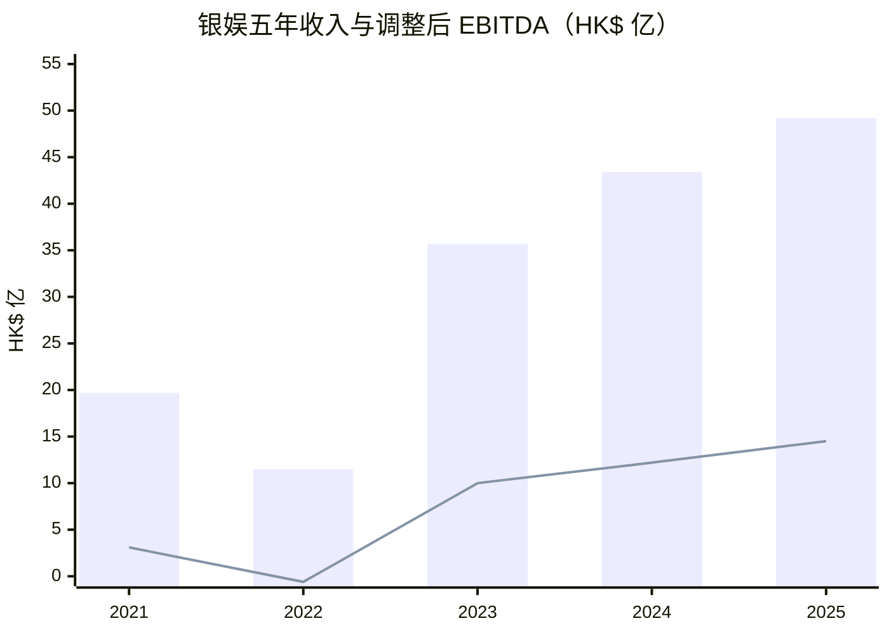
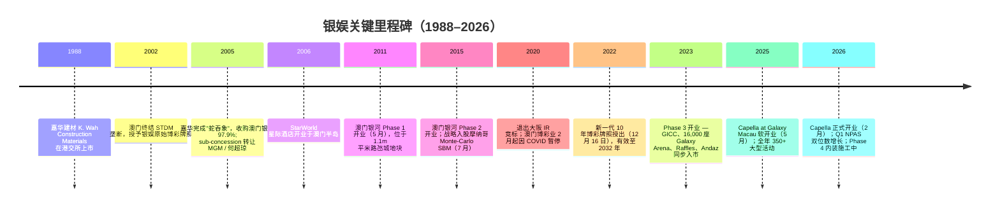
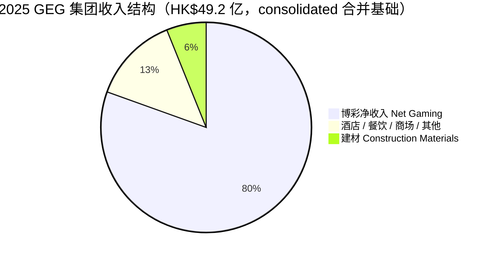
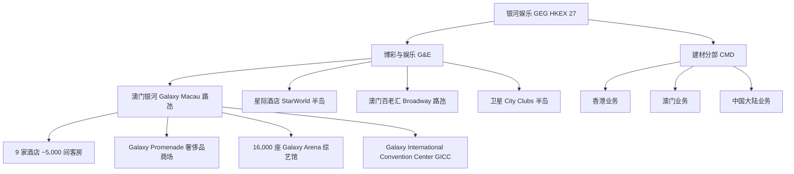
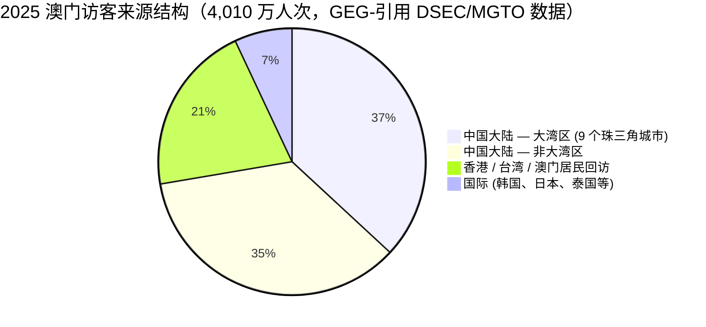
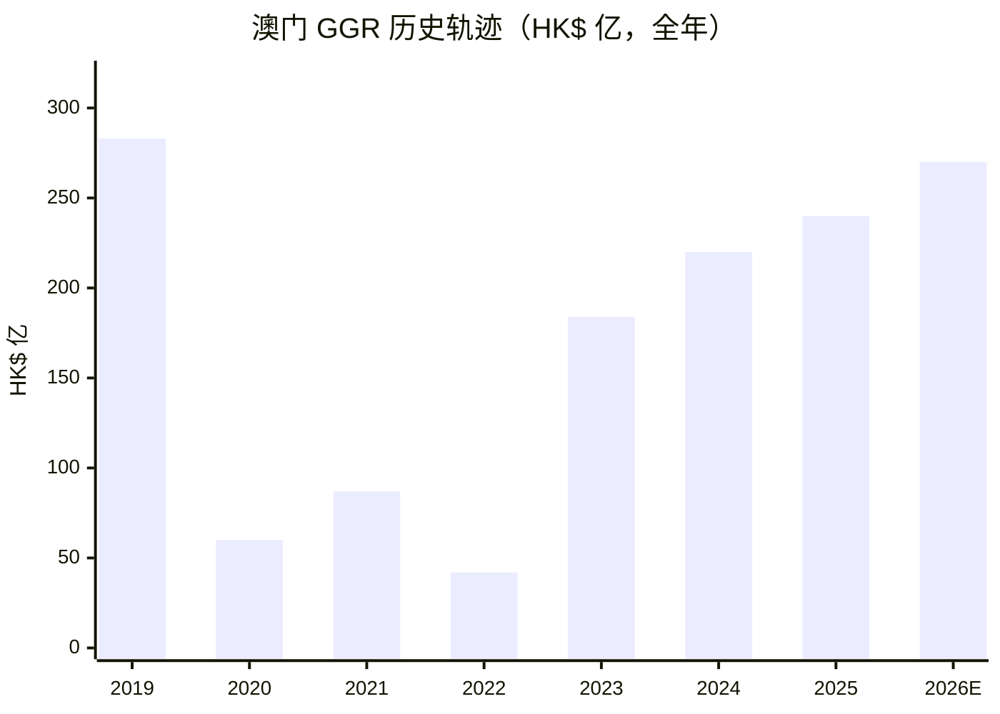
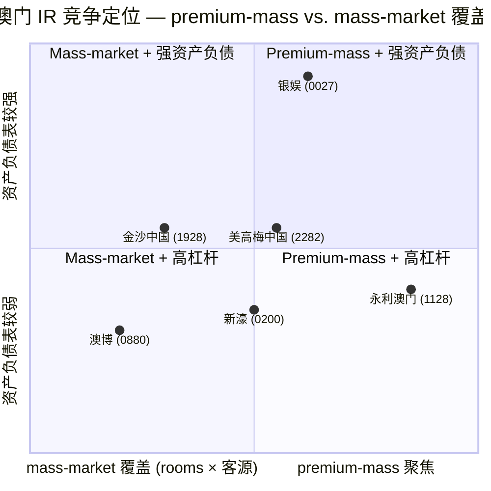
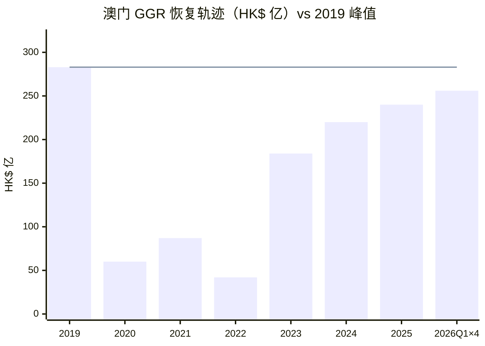

# 银河娱乐集团有限公司 Galaxy Entertainment Group (HKEX:0027) — 公司研究

*截至 2026-06-03*

> 港股博彩龙头，路氹综合度假村基本盘扎实，净现金资产负债表，吕氏家族控股，澳门三家"原始博彩牌照"持有者之一。

---

## 目录

1. 公司概览
2. 公司历史
3. 管理团队
4. 产品与服务
5. 客户与上市策略
6. 行业概览
7. 竞争格局
8. 市场机会
9. 风险评估
10. 投资者视角评分卡
11. 参考资料与核查日志

---

## 1. 公司概览

银河娱乐集团有限公司（"GEG"，港交所代码 **27 HK**）在 2025 年报中将自身定位为"全球领先的度假村、酒店及博彩公司之一"，主要业务为"在澳门发展及营运综合度假村、零售、餐饮、酒店及博彩设施"，并指出公司是恒生指数（Hang Seng Index）成份股 ([GEG 2025 年报 第04页 — 公司概览 Corporate Profile](https://www.galaxyentertainment.com/uploads/investor/933511f1374a0e17d56a9ff97670ec6a25c84314.pdf))。集团通过子公司澳门银河娱乐场股份有限公司（"GCSA"）持有澳门博彩牌照（gaming concession），是"澳门三家原始博彩承批商之一"，目前持有的新一代牌照（new gaming concession）由澳门特区政府于 **2022 年 12 月 16 日**授出，为期十年，自 2023 年 1 月 1 日起至 2032 年 12 月 31 日止 ([GEG 2025 AR 第74页 — Key Audit Matter](https://www.galaxyentertainment.com/uploads/investor/933511f1374a0e17d56a9ff97670ec6a25c84314.pdf))。集团在澳门拥有三个旗舰物业 — 路氹城的 **澳门银河™ Galaxy Macau™**、邻接的 **澳门百老汇™ Broadway Macau™**，以及澳门半岛的 **星际酒店 StarWorld Hotel** — 此外还经营少量 City Clubs 卫星娱乐场及总部位于香港的建材业务（Construction Materials Division，CMD）([GEG 2025 AR 第04页](https://www.galaxyentertainment.com/uploads/investor/933511f1374a0e17d56a9ff97670ec6a25c84314.pdf))。

**2025 年财务概要（FY2025 in one line）**：集团 Net Revenue 收入净额 **HK$49.2 亿（同比 +13%）**，调整后 EBITDA（Adjusted EBITDA）**HK$14.5 亿（同比 +19%）**，公司股东应占净利润（NPAS）**HK$10.7 亿（同比 +22%）**，每股盈利 HK¢244.0（FY24：HK¢200.3）。其中，赌博 "幸运调整" / luck 在 2025 年使调整后 EBITDA 增加约 HK$1,482 m；剥离 luck 影响的正常化 Adjusted EBITDA 仍同比增长 5% 至 HK$13.0 亿 ([GEG 2025 AR 第06页 — Financial & Operational Highlights](https://www.galaxyentertainment.com/uploads/investor/933511f1374a0e17d56a9ff97670ec6a25c84314.pdf); [GEG 2025 AR 第25页 — MD&A Group Results](https://www.galaxyentertainment.com/uploads/investor/933511f1374a0e17d56a9ff97670ec6a25c84314.pdf))。截至 2025 年 12 月 31 日，**现金及流动投资达 HK$36.3 亿，债务 HK$1.3 亿，净现金 HK$35.0 亿**，为五年 Five-Year Summary 内最高水平 ([GEG 2025 AR 第06页](https://www.galaxyentertainment.com/uploads/investor/933511f1374a0e17d56a9ff97670ec6a25c84314.pdf))。

**估值快照**：截至 2026-06-03，27 HK 收盘价 HK$32.12，市值约 HK$140.7 亿，对应 **TTM P/E ~13.2x，TTM P/S ~2.9x**（按 FY25 收入 HK$49.3 亿计算）。横向比较，金沙中国（Sands China，1928 HK）TTM P/E ~18x，永利澳门（Wynn Macau，1128 HK）~19x —两家在估值倍数上明显高于 GEG，但 FY25 EBITDA 增速逊于银娱。GEG 当前 EV/EBITDA ~9.8x 介于美高梅中国（MGM China）的 6.8x 与金沙中国的 9.7x 之间。P/B ~1.7x，低于同业中位数 ~2.8x（[Yahoo Finance — 0027.HK key statistics 2026-06-03](https://finance.yahoo.com/quote/0027.HK/key-statistics/); [Yahoo Finance — 1928.HK](https://finance.yahoo.com/quote/1928.HK/key-statistics/); [Yahoo Finance — 1128.HK](https://finance.yahoo.com/quote/1128.HK/key-statistics/); [Yahoo Finance — 2282.HK](https://finance.yahoo.com/quote/2282.HK/key-statistics/)）。52 周区间 HK$30.50–44.22，预测股息率约 4.9%（2025 全年中期 + 特别 + 末期 = HK$2.00 / 股，对应当前股价），市场对其定价更偏向"现金流稳健"逻辑，而非"重估值上修"逻辑。第 2 节将在周期视角下解读该估值倍数。

*Source: [GEG 2025 AR — Five-Year Summary 五年财务摘要 第72页](https://www.galaxyentertainment.com/uploads/investor/933511f1374a0e17d56a9ff97670ec6a25c84314.pdf) + [GEG 2023 AR — Financial Highlights 第06页](https://www.galaxyentertainment.com/uploads/investor/b7e652c3e138ccd8469abc2a85ff7c79522fdf83.pdf) + GEG 2025 AR Financial Highlights 财务亮点。柱状图 = Net Revenue 收入净额；折线 = Adjusted EBITDA 调整后 EBITDA。*

## 2. 公司历史

GEG 的源头是港交所上市的 **嘉华建材有限公司 K. Wah Construction Materials Limited**，由吕氏家族控制。**2005 年的"蛇吞象"式重组**：嘉华建材剥离建材主业，收购澳门银河娱乐场股份有限公司 97.9% 股权，从而成为"唯一一家持有澳门博彩牌照的港股上市公司" ([Wikipedia — Galaxy Entertainment Group, History](https://en.wikipedia.org/wiki/Galaxy_Entertainment_Group))。原嘉华的建材业务则作为独立分部保留至今，2025 年仍贡献集团 HK$3.0 亿的收入 ([GEG 2025 AR 第111页 — Note 8 Segment Information](https://www.galaxyentertainment.com/uploads/investor/933511f1374a0e17d56a9ff97670ec6a25c84314.pdf))。

2002 年澳门博彩业开放（Macau gaming liberalization）是公司命运的根本转折点：澳门特区政府终结了由何鸿燊先生（Stanley Ho）旗下 STDM 持有 40 年的赌业垄断，向银娱、永利度假村（Wynn Resorts）、金沙中国（Sands China）三家授出 original concession 原始牌照，其后又向 SJM Holdings、美高梅 Pansy Ho / MGM 合资、Melco / PBL 合资各授出一份 sub-concession 副牌照，共形成"六家持牌运营商"格局 ([Wikipedia — Gambling in Macau, Concessions section](https://en.wikipedia.org/wiki/Gambling_in_Macau))。GEG 当年获授的 sub-concession 由 MGM / 何超琼方面接手，使银娱保留独立 original concession 至今。2002 年的开放引入西式综合度假村竞争，2004–2019 年间六家运营商累计投入路氹（Cotai）资本开支约 300 亿美元，并使澳门成为全球 GGR 规模最大的赌博辖区（约自 2007 年起）([Wikipedia — Gambling in Macau](https://en.wikipedia.org/wiki/Gambling_in_Macau))。

**澳门银河™ 旗舰物业于 2011 年 5 月开业**，2015 年 5 月开业 Phase 2（二期），"并于 2023 年随 Phase 3（三期）开业进一步扩容" — 三期新增 Galaxy International Convention Center（GICC，澳门银河国际会议中心）、可容纳 16,000 人的 Galaxy Arena（澳门银河综艺馆）、莱佛士（Raffles at Galaxy Macau）以及凯悦旗下的 Andaz Macau ([GEG 2025 AR 第04页 — Corporate Profile](https://www.galaxyentertainment.com/uploads/investor/933511f1374a0e17d56a9ff97670ec6a25c84314.pdf))。三期建成后，澳门银河酒店房间数从 2011 年开业时的"约 3,600 间"扩展至 2025 年末九家酒店共约 5,000 间，跻身全球综合度假村（integrated resort）顶级体量梯队 ([GEG 2021 AR 第04页 — Corporate Profile](https://www.galaxyentertainment.com/uploads/investor/763ecec31f7c70fe8037f0dca14c55f8115fb623.pdf); [GEG 2025 AR 第04页](https://www.galaxyentertainment.com/uploads/investor/933511f1374a0e17d56a9ff97670ec6a25c84314.pdf))。最新增量 — Capella at Galaxy Macau（卡佩拉澳门银河酒店）于 2025 年 5 月软开业，2026 年 2 月 10 日正式开业 ([GEG 2025 AR 第10页 — Chairman's Statement](https://www.galaxyentertainment.com/uploads/investor/933511f1374a0e17d56a9ff97670ec6a25c84314.pdf); [GEG Q1 2026 Selected Unaudited Financial Data 第3页](https://www.galaxyentertainment.com/uploads/investor/67f24167299d6211d747f7e89f9c8afb1b1ee1cb.pdf))。

近年最大的监管节点是 **2022 年 12 月的博彩牌照换发**：根据经第 7/2022 号法律修订的第 16/2001 号法律（Law No.16/2001 as amended by Law No.7/2022），澳门特区政府授予 GCSA 新一代博彩 concession 牌照，期限 10 年（2023 年 1 月 1 日至 2032 年 12 月 31 日），并要求每家承批人在牌照期内"持有不少于澳门币 50 亿元（约 HK$48.5 亿元）实收股本及不少于澳门币 50 亿元的资产净值" ([GEG 2025 AR 第105页 — Note 5.2 Capital risk management](https://www.galaxyentertainment.com/uploads/investor/933511f1374a0e17d56a9ff97670ec6a25c84314.pdf))。2020 年 2 月，GEG 曾公告 **退出大阪综合度假村竞标**，将日本业务重心转向横滨及其他备选城市；此决定先于 COVID-19 疫情封关，亦先于日本 IR（Integrated Resort）时间表的整体推迟（[GEG 历史 — Inside Asian Gaming via Wikipedia](https://en.wikipedia.org/wiki/Galaxy_Entertainment_Group)）。

新冠疫情打断了高速增长轨迹：集团收入从 2019 年前的 HK$500 亿 + 水平骤降至 **2022 年仅 HK$11.5 亿**，并录得 NPAS 亏损 HK$3.4 亿 ([GEG 2025 AR Five-Year Summary 第72页](https://www.galaxyentertainment.com/uploads/investor/933511f1374a0e17d56a9ff97670ec6a25c84314.pdf))。2023 年随澳门通关复苏，集团 Net Revenue 同比 +211% 至 HK$35.7 亿，Adjusted EBITDA 由 −HK$0.6 亿翻转至 HK$10.0 亿，NPAS 回升至 HK$6.8 亿 ([GEG 2023 AR 第06页 — Financial Highlights](https://www.galaxyentertainment.com/uploads/investor/b7e652c3e138ccd8469abc2a85ff7c79522fdf83.pdf))。FY25 的 HK$49.2 亿收入及 HK$14.5 亿 EBITDA 已逼近 2018–19 疫前峰值 EBITDA 水平的 97%。澳门全市 2025 年 GGR 为 HK$240.2 亿（澳门博彩监察协调局 DICJ 数据），已恢复至 2019 年水平的 85%（[GEG 2025 AR 第24页 — MD&A Macau Market Overview](https://www.galaxyentertainment.com/uploads/investor/933511f1374a0e17d56a9ff97670ec6a25c84314.pdf)）。

*Source: [GEG 2025 AR 第04 + 10 + 74 页](https://www.galaxyentertainment.com/uploads/investor/933511f1374a0e17d56a9ff97670ec6a25c84314.pdf); [GEG 2023 AR 第04页](https://www.galaxyentertainment.com/uploads/investor/b7e652c3e138ccd8469abc2a85ff7c79522fdf83.pdf); [Wikipedia — Galaxy Entertainment Group](https://en.wikipedia.org/wiki/Galaxy_Entertainment_Group).*

当前 TTM P/E ~13x、P/S ~2.9x 看似偏低 — 金沙中国 ~18x、永利澳门 ~19x 均高于此 ([Yahoo Finance — 1928.HK key statistics 2026-06-03](https://finance.yahoo.com/quote/1928.HK/key-statistics/); [Yahoo Finance — 1128.HK key statistics 2026-06-03](https://finance.yahoo.com/quote/1128.HK/key-statistics/))。**分析师观点（Analyst view）**：估值折价的部分原因来自 (a) Phase 4 资本开支预期对自由现金流（free cash flow）的前期消耗 — Note 5.2 已明确指出 MOP50 亿资本下限及 Phase 4 "600,000 平米" 占地规模将是中期主要资本约束；(b) 家族控股折价（family-control discount）— 港股大盘整合度假村类公司中，家族控股通常较广泛持股公司低 10–25% P/E；(c) GEG 的 GGR 结构以 mass 中场 / 中场为主，比 VIP 比例更高的同业（2014 年前金沙 / 永利）的 EBITDA 弹性更弱，估值溢价相对受限 ([GEG 2025 AR 第25页 — MD&A Group Financial Results](https://www.galaxyentertainment.com/uploads/investor/933511f1374a0e17d56a9ff97670ec6a25c84314.pdf))。

## 3. 管理团队

GEG 是典型的 **创始人 / 家族控股** 企业，吕氏家族（Lui family）通过直接持股 8.6% 与间接持股 41.7%（通过 Lui Family Trust 吕氏家族信托 + 港股上市的 K. Wah International Holdings 嘉华国际）合计持有约 50.3% ([Wikipedia — Galaxy Entertainment Group, Ownership structure](https://en.wikipedia.org/wiki/Galaxy_Entertainment_Group))。家族族长是嘉华集团创始人 **吕志和博士 Dr. Lui Che Woo GBM, MBE, JP, LLD, DSSc**，其个人产业（嘉华）通过 2005 年 "蛇吞象" 完成对银娱的注入；当前董事会主席及实际经营领导者是其长子 **吕耀东先生 Mr. Francis Lui Yiu Tung**。

**吕耀东先生 Mr. Francis Lui Yiu Tung, BBS（主席；身兼主席与首席执行官 Chairman/CEO 双重身份）** — 70 岁，1979 年加入集团，1987 年 6 月起任执行董事，现为董事会主席、Executive Board 主席、Corporate Governance Committee 主席，并任 Nomination Committee 与 Remuneration Committee 成员。在 GEG 之外，他亦为 K. Wah International Holdings Limited（嘉华国际，吕氏家族房产平台）执行董事兼主席；自 2008 年第 11 届起连任中国人民政治协商会议（CPPCC）全国委员会委员；同时是香港特区行政长官选举委员会及澳门特区行政长官选举委员会成员（[GEG 2025 AR 第33页 — Biographical Information of Directors](https://www.galaxyentertainment.com/uploads/investor/933511f1374a0e17d56a9ff97670ec6a25c84314.pdf)）。教育背景为美国加州大学伯克利分校（**University of California at Berkeley**）土木工程学士 + 结构工程硕士。2024 年获香港特区政府授予铜紫荆星章（Bronze Bauhinia Star），表彰其"以建造及房地产专业知识投身公共服务的杰出贡献"— 工程师背景对 Phase 3 大规模建设及即将启动的 Phase 4 内装工程而言并非偶然 ([GEG 2025 AR 第33页](https://www.galaxyentertainment.com/uploads/investor/933511f1374a0e17d56a9ff97670ec6a25c84314.pdf))。2025 年他第九次获 Inside Asian Gaming 选入 "Asian Gaming Power 50"，被列为 "最具影响力人物"，并在 2024 年 IAG Academy IR Awards 上获评 "Outstanding CEO" ([GEG 2025 AR 第33页](https://www.galaxyentertainment.com/uploads/investor/933511f1374a0e17d56a9ff97670ec6a25c84314.pdf))。

吕耀东先生的 **双重身份（主席 + CEO 合一）** 在 GEG 2025 年报中明文披露为偏离港交所企业管治守则 Code C.2.1 的安排：*"Code Provision C.2.1 stipulates that the roles of chairman and chief executive should be separate and should not be performed by the same individual. The Company has not adopted this provision as Mr. Francis Lui Yiu Tung holds the dual roles of Chairman of the Board and executive Director. The Board considers that the combination of these roles in the same individual provides the Group with strong and consistent leadership and facilitates the effective formulation and implementation of the Group's overall strategy."*（[GEG 2025 AR 第38页 — Corporate Governance Report](https://www.galaxyentertainment.com/uploads/investor/933511f1374a0e17d56a9ff97670ec6a25c84314.pdf)）董事会以四名独立非执行董事（INED，占董事会 ⅓ 以上）作为制衡机制 — 但对治理敏感的投资者而言，这种合一身份叠加 ~50% 家族持股是核心的 "控制溢价 / 少数股东折价" 张力。

吕氏家族的执行深度由两位姐妹补强：**吕慧瑜女士 Mrs. Paddy Tang Lui Wai Yu, BBS, JP** 71 岁，吕耀东先生的姐姐，1980 年加入集团，目前同时担任 K. Wah International 嘉华国际联席董事总经理，毕业于加拿大麦吉尔大学（McGill University）商学士，英格兰及威尔士特许会计师公会（ICAEW）会员；**吕慧玲女士 Ms. Eileen Lui Wai Ling** 68 岁，吕耀东先生的妹妹，2025 年 5 月起任执行董事，自 2014 年起任集团人力资源与行政总监，毕业于加拿大西安大略大学（Western Ontario）EMBA + UCLA 经济学学士 ([GEG 2025 AR 第33–34页](https://www.galaxyentertainment.com/uploads/investor/933511f1374a0e17d56a9ff97670ec6a25c84314.pdf))。家族之外的资深执董 **戚应荣先生 Mr. Joseph Chee Ying Keung** 68 岁，1982 年加入集团，自 2004 年 4 月起任执行董事，现任建材分部 Construction Materials Division 董事总经理，毕业于南澳大学（South Australia）MBA + 加拿大西安大略大学机械工程学士 ([GEG 2025 AR 第33页](https://www.galaxyentertainment.com/uploads/investor/933511f1374a0e17d56a9ff97670ec6a25c84314.pdf))。

经营层面，年报另披露 **非董事会高管 senior gaming/hospitality executives** 一份名单：Kevin Kelley（Chief Operating Officer Macau 澳门首席运营官）；Thomas Arasi（Chief Financial Officer 财务总监，"35 年以上金融服务、酒店及综合度假村行业经验"）；Richard Longhurst（高级博彩总监 Sr Director — Gaming）；Roger Lienhard（餐饮执行副总裁 EVP — Food & Beverage）；James Koratzopoulos（酒店与会展执行副总裁 EVP — Hotel and MICE Operations）；Nelson Chan（客户开发执行副总裁 EVP — Customer Development）；Joseph Tang（星际酒店运营执行副总裁 EVP Operations StarWorld Macau）等（[GEG 2025 AR 第36页 — Gaming and Hospitality Expertise](https://www.galaxyentertainment.com/uploads/investor/933511f1374a0e17d56a9ff97670ec6a25c84314.pdf)）。按 company-research skill 惯例，主体段落仅覆盖 founder + CEO；此运营梯队仅作完整性补全，因 GEG 在治理上明确区分 "吕氏家族董事会" 与 "外部高管 C-Suite"。

## 4. 产品与服务

GEG 在 HKFRS 8 框架下报告 **两个分部**：(i) **博彩与娱乐 Gaming and Entertainment 分部**，包括澳门银河 Galaxy Macau、星际酒店 StarWorld Macau、澳门百老汇 Broadway Macau、卫星 City Clubs 等博彩与酒店业务；(ii) **建材 Construction Materials 分部 (CMD)**，覆盖香港、澳门、中国大陆三地建材业务 ([GEG 2025 AR 第110页 — Note 8 Segment Information](https://www.galaxyentertainment.com/uploads/investor/933511f1374a0e17d56a9ff97670ec6a25c84314.pdf))。两分部之间 "无销售或贸易交易"。CMD 是 2005 年转型时保留的嘉华建材业务，规模较小：2025 年审计后 Gaming & Entertainment 分部收入 HK$46.28 亿、CMD 收入 HK$2.96 亿，即 CMD 占总收入 6.0%、但贡献 Adjusted EBITDA HK$877 m（占 6.0%）— EBITDA 利润率结构上高于综合度假村 ([GEG 2025 AR Note 8 segment 表 第111页](https://www.galaxyentertainment.com/uploads/investor/933511f1374a0e17d56a9ff97670ec6a25c84314.pdf))。

### 4.1 Gaming & Entertainment 博彩与娱乐 — 物业组合

GEG 自己的财务披露在 **物业层面** 细分收入：Galaxy Macau、StarWorld Macau、Broadway Macau、City Clubs，外加 CMD。集团 2025 年收入 HK$49.2 亿分拆为 **博彩净收入 Net Gaming HK$39.6 亿（占 80.5%）、酒店 / 商场 / 其他 HK$6.6 亿（占 13.5%）、建材 HK$3.0 亿（占 6.0%）** — 博彩部分中，毛 GGR Gaming Win HK$49.1 亿、佣金及奖励 commissions/incentives 共 HK$9.5 亿，差额即 HK$39.6 亿"博彩净收入" ([GEG 2025 AR Note 7 Revenue + 利润表 第78 + 110页](https://www.galaxyentertainment.com/uploads/investor/933511f1374a0e17d56a9ff97670ec6a25c84314.pdf))。HK$6.6 亿非博彩收入中包含 "rental income amounted to approximately HK$1,423 million"，主要来自澳门银河 Galaxy Promenade 奢侈品商场及会议中心活动收费 ([GEG 2025 AR Note 7 第110页](https://www.galaxyentertainment.com/uploads/investor/933511f1374a0e17d56a9ff97670ec6a25c84314.pdf))。

*Source: [GEG 2025 AR — 合并利润表 Note 第78页](https://www.galaxyentertainment.com/uploads/investor/933511f1374a0e17d56a9ff97670ec6a25c84314.pdf).*

**澳门银河™ — 主要 EBITDA 引擎**。"澳门银河™ 是集团收入与利润的主要贡献者。2025 年净收入 HK$41.0 亿，同比 +19%。调整后 EBITDA HK$13.4 亿，同比 +24%" — 该物业目前已是更高规模的 Cotai-style integrated resort，**占地 1.4 百万平方米**，含 **九家世界级酒店共约 5,000 间客房 / 套房 / 别墅**（Capella at Galaxy Macau、Raffles at Galaxy Macau、Banyan Tree Macau 悦榕庄、Ritz-Carlton 丽思卡尔顿、Galaxy Hotel 银河酒店、JW Marriott、Hotel Okura Macau 大仓、Andaz Macau、Broadway Hotel 百老汇酒店）([GEG 2025 AR 第04页 — Corporate Profile + 第26页 — MD&A Galaxy Macau](https://www.galaxyentertainment.com/uploads/investor/933511f1374a0e17d56a9ff97670ec6a25c84314.pdf))。九家酒店 **2025 年综合入住率 98%**，较 2023 年七家酒店时期的 87% 显著提升 ([GEG 2025 AR 第06页](https://www.galaxyentertainment.com/uploads/investor/933511f1374a0e17d56a9ff97670ec6a25c84314.pdf); [GEG 2023 AR 第06页](https://www.galaxyentertainment.com/uploads/investor/b7e652c3e138ccd8469abc2a85ff7c79522fdf83.pdf))。

**澳门银河 2025 年博彩细分**：年报披露的关键 gaming statistics 将 GGR 拆为三个桶 — 滚动筹码 Rolling Chip（VIP 式 promoter + in-house premium direct）、中场赌台投注额 Mass Table Drop、电子博彩 Electronic Gaming，每桶 **投注量 × 赢率 = win**。澳门银河 2025 年滚动筹码量 HK$223.4 亿，赢率 4.2%，win HK$9.4 亿；中场赌台投注额 HK$108.7 亿，赢率 29.1%，win HK$31.6 亿；电子博彩投注量 HK$72.9 亿，赢率 3.3%，win HK$2.4 亿 — 总 gaming win HK$43.5 亿（before commissions）([GEG 2025 AR — Galaxy Macau Key Financial Data 第26–27页](https://www.galaxyentertainment.com/uploads/investor/933511f1374a0e17d56a9ff97670ec6a25c84314.pdf))。**Mass Table Drop 赢率从 2024 年的 28.3% 跃升至 2025 年的 29.1%**，Rolling Chip Volume 同期接近翻倍（Q4 2024 HK$50.9 亿 vs. Q4 2025 HK$60.1 亿）— 反映 Phase 3 ramp 及向 **premium mass / super-premium mass 高端中场 / 超高端中场** 的战略倾斜。吕主席在 2025 Chairman's Statement 中将此明文化：*"we continued to drive growth across every segment of the business, with a particular focus in the premium mass and the super-premium mass segment. Capella soft launched in May 2025 and officially opened on 10 February 2026. With its ultra-luxury room product, Capella has allowed us to capture the super-premium mass segment more effectively at scale, further reinforcing our leadership in this high-value market."* ([GEG 2025 AR 第10页 — Chairman's Statement](https://www.galaxyentertainment.com/uploads/investor/933511f1374a0e17d56a9ff97670ec6a25c84314.pdf))。

**星际酒店 StarWorld Macau** — 位于澳门半岛的旗舰物业，2025 年 Net Revenue HK$5.0 亿（同比 −7%），Adjusted EBITDA HK$1.4 亿（同比 −13%）— 同比下滑的主要驱动因素为 "played unlucky in gaming operations which decreased Adjusted EBITDA by approximately HK$20 million in 2025"；全年酒店入住率 100% ([GEG 2025 AR 第06页 + 第09页](https://www.galaxyentertainment.com/uploads/investor/933511f1374a0e17d56a9ff97670ec6a25c84314.pdf))。在物业组合中的角色是 **半岛门户 + 重复访问的本地澳门客户**；5% / 28% 的 EBITDA 利润率结构性低于澳门银河的 33%，因为 StarWorld 缺少澳门银河 "多层级酒店 + 商场 + 综艺馆" 的复合飞轮。

**澳门百老汇™ Broadway Macau** — 邻接澳门银河的 food-street 及亲子娱乐目的地，2025 年 Adjusted EBITDA HK$11 m（同比 −54%）— 体量小但战略上是澳门银河的 **跨物业引流物业** ([GEG 2025 AR 第06页](https://www.galaxyentertainment.com/uploads/investor/933511f1374a0e17d56a9ff97670ec6a25c84314.pdf))。

**City Clubs 卫星娱乐场** — 半岛小型娱乐场（历史上挂在 GEG 牌照下的 books 和 clubs）。2025 年 Adjusted EBITDA HK$(7) m vs 2024 的 HK$14 m。**Waldo Casino 已于 2025 年 10 月 31 日停止运营**，符合澳门特区政府关于卫星娱乐场的政策方向，GEG 已留任受影响员工 ([GEG 2025 AR 第11页 — Chairman's Statement](https://www.galaxyentertainment.com/uploads/investor/933511f1374a0e17d56a9ff97670ec6a25c84314.pdf))。

*结构整理自 [GEG 2025 AR 第04页 + Note 8 segment 表 第111页](https://www.galaxyentertainment.com/uploads/investor/933511f1374a0e17d56a9ff97670ec6a25c84314.pdf).*

### 4.2 非博彩配套设施 — 新增长杠杆

Phase 3 于 2023 年新增的非博彩配套设施已不再是 "optionality 可选项"，而是 GEG 2025 年财报中重点披露的核心差异化抓手。**16,000 座 Galaxy Arena 综艺馆** 是 "澳门最大的室内综艺场馆"，可灵活配置中央舞台 / 端式舞台 / 拳击台；2025 年集团举办 "around 350 concerts, entertainment shows, sporting and major events"，含安德烈·波切利（Andrea Bocelli，3 月）、ITTF 国际乒联世界杯（4 月）、G-Dragon / 张学友 / 陈奕迅（夏季）、11 月在澳门首次举办的全运会、爱奇艺尖叫之夜（"exclusive multi-year strategic partnership with Galaxy Arena"）、2025 年大湾区电影音乐盛典（11 月，由电影频道节目中心、澳门特区文化局、紫荆文化集团、凤凰卫视联合举办）等 ([GEG 2025 AR 第10–11页 — Chairman's Statement](https://www.galaxyentertainment.com/uploads/investor/933511f1374a0e17d56a9ff97670ec6a25c84314.pdf))。1Q 2026 集团举办 "over 80 concerts, entertainment shows, sporting and other events"，并确认 2026 年 5 月 30 日在场馆举办 UFC FIGHT NIGHT: SONG vs FIGUEIREDO ([GEG Q1 2026 Selected Unaudited Financial Data 第2–3页](https://www.galaxyentertainment.com/uploads/investor/67f24167299d6211d747f7e89f9c8afb1b1ee1cb.pdf))。

**Galaxy International Convention Center (GICC)** 在年报中被定位为 "Asia's most iconic and advanced MICE destination"，2025 年承接全运会、大湾区电影音乐盛典、ITTF 世界杯、合作伙伴赞助活动等。**Grand Resort Deck 大型度假村甲板** 是核心引流亮点："sprawling across 75,000 square meters, it is the world's largest skytop oasis complete with best-in-class facilities — the world's longest Skytop Adventure Rapids at 575 meters, the largest Skytop Wave Pool with waves up to 1.5 meters high and a 150-meter pristine white sand beach" ([GEG 2025 AR 第04页 — Corporate Profile](https://www.galaxyentertainment.com/uploads/investor/933511f1374a0e17d56a9ff97670ec6a25c84314.pdf))。**Galaxy Promenade 商场** 是 "一站式购物目的地，汇集了世界顶级奢侈品牌"；年报另指出 "over 120 dining options from Michelin dining to authentic delicacies"。这些不是 catalog padding 凑数 — 这些非博彩配套设施驱动澳门银河单一物业 2025 年非博彩收入达 **HK$5.9 亿（同比 +5%）** ([GEG 2025 AR 第06页](https://www.galaxyentertainment.com/uploads/investor/933511f1374a0e17d56a9ff97670ec6a25c84314.pdf))。

**Capella at Galaxy Macau** 是澳门银河之内最新的超奢侈品牌酒店，2025 年 5 月软开业 / 2026 年 2 月正式开业；年报称 Capella 是 GEG 用以 "capture the super-premium mass segment more effectively at scale" 的载体 ([GEG 2025 AR 第10页](https://www.galaxyentertainment.com/uploads/investor/933511f1374a0e17d56a9ff97670ec6a25c84314.pdf))。Q1 2026 commentary 补充提到 **高端博彩区域 Horizon Plus 已从 6 间私人贵宾厅扩展至 10 间**，以支撑这一战略 ([GEG Q1 2026 Selected Unaudited Financial Data 第3页](https://www.galaxyentertainment.com/uploads/investor/67f24167299d6211d747f7e89f9c8afb1b1ee1cb.pdf))。

### 4.3 建材分部 Construction Materials Division (CMD) — 遗留杠杆

CMD 是 2005 年博彩转型时保留的嘉华建材业务。2025 年经济数据：收入 HK$3.0 亿（同比 −7%，主因采石场 / 原材料价格走弱）、Adjusted EBITDA HK$877 m（同比 +2%）— EBITDA 利润率 ~30%，结构上高于其分部收入占比所暗示，由执行董事 + 总经理戚应荣领导，业务覆盖香港、澳门、中国大陆 ([GEG 2025 AR 第06页 + Note 8 第111页](https://www.galaxyentertainment.com/uploads/investor/933511f1374a0e17d56a9ff97670ec6a25c84314.pdf))。CMD 同时具有战略协同价值 — 集团自身的采石场和混凝土供应可服务于 Phase 4 的内装建设需求。

### 4.4 Phase 4 — 下一轮资本开支周期

Phase 4 是 GEG 中期 capex profile 中 **下一层主要扩张产能**，亦是公司未来五年最关键的多年期决策。年报 Chairman's Statement 将 Phase 4 置于核心位置：*"Looking ahead to 2026, we remain firmly focused on accelerating Phase 4 development, enhancing the appeal of our existing resorts, and further expanding our non-gaming offerings — from mega shows to international events"* ([GEG 2025 AR 第12页](https://www.galaxyentertainment.com/uploads/investor/933511f1374a0e17d56a9ff97670ec6a25c84314.pdf))。Q1 2026 release 补充物理细节："fitting out the 600,000 sqm Phase 4 development. Upon completion, this landmark project will elevate the appeal of our existing resorts and significantly broaden our non gaming attractions with a 5,000-seat theater, extensive dining options, new retail space, lush landscaping, a water resort deck, and additional casino facilities" ([GEG Q1 2026 release 第3页](https://www.galaxyentertainment.com/uploads/investor/67f24167299d6211d747f7e89f9c8afb1b1ee1cb.pdf))。2023 AR "Future Development Opportunities" 中描述的 Phase 4 原始版本是 "Phase 4 is planned to include multiple high-end hotel brands new to Macau, together with a 4000-seat theater" — Q1 2026 update 的 5,000 座剧院则意味着 **上调式 re-scoping** ([GEG 2023 AR 第05页 — Future Development Opportunities](https://www.galaxyentertainment.com/uploads/investor/b7e652c3e138ccd8469abc2a85ff7c79522fdf83.pdf); [GEG Q1 2026 release 第3页](https://www.galaxyentertainment.com/uploads/investor/67f24167299d6211d747f7e89f9c8afb1b1ee1cb.pdf))。年报 2025 未拆解 Phase 4 总 capex 数字。**分析师观点 Analyst view**：Phase 3 累计投资据估算约 HK$30 亿（至 2023 年），Phase 4 占地 600,000 平米对比 Phase 3 的扩张占地 300,000+ 平米，多年期 capex 预计在 HK$20–40 亿区间，可由 HK$36.3 亿现金 + 经营性 FCF 支持。

**综合 — 各分部如何互动**。澳门银河 Galaxy Macau 是 integrated resort 旗舰；Arena / GICC / Capella / Horizon Plus 堆栈驱动 premium mass / super-premium mass 在酒店、餐饮、商场、博彩多层级支出，其中 mass 中场赌台 29% 赢率是核心经济引擎。StarWorld 和 Broadway 是 feeder properties 引流物业：半岛门户 + 亲子娱乐转化，将客户循环回 Galaxy Macau。CMD 是 mid-margin 港籍传统业务，周期上受益于公共工程，结构上受益于 GEG 自身 Phase 4 建设需求。跨物业 **35% 特别博彩税 + 5% 公共基金 / 城市发展税 = 40% 有效 gross gaming 税率** 贯穿每物业的 gaming win 行至 Adjusted EBITDA ([GEG 2025 AR Note 4.22 — Special gaming tax 第96页](https://www.galaxyentertainment.com/uploads/investor/933511f1374a0e17d56a9ff97670ec6a25c84314.pdf))，解释了为何 GGR Top-line HK$49.1 亿在剔除固定成本前仅转化为 HK$14.5 亿集团 EBITDA。

## 5. 客户与上市策略

### 5.1 客户基础 — 大湾区驱动，无单一客户集中

GEG 是 **B2C 综合度假村运营商**，因此客户基础最佳描绘是 visitor source 访客来源结构而非命名客户披露。年报 MD&A Macau Market Overview 提供口径数据：2025 年 **澳门总访客抵达数 4,010 万人次，同比 +15%，超过 2019 年 3,940 万水平**。中国大陆游客 2,900 万人次（同比 +18%），其中超过 210 万人次通过 "一周一行" 政策（珠海居民），约 80 万通过 "多次往返" 政策（横琴居民）。**大湾区珠三角九市 14.8 百万游客，同比 +24%，其中珠海地区游客增长 58%**。国际游客增长 14% 至 280 万人次，其中韩国 +11%、日本 +26%、泰国 +38% ([GEG 2025 AR 第24页 — MD&A Macau Market Overview](https://www.galaxyentertainment.com/uploads/investor/933511f1374a0e17d56a9ff97670ec6a25c84314.pdf))。

物业层面的客户结构 **结构上重押 mass + premium mass**，已远离 2014 年前的 VIP 长尾模型。集团 mass 中场赌台 **2025 年赢率 26.5%**（澳门银河：29.1%），而 rolling chip / VIP 赢率 4.2%（澳门银河：4.2%）；尽管 VIP 投注量在绝对额上是 mass 的数倍，mass 段的 EBITDA 贡献仍主导整体 ([GEG 2025 AR Group Gaming Statistics 第07页](https://www.galaxyentertainment.com/uploads/investor/933511f1374a0e17d56a9ff97670ec6a25c84314.pdf))。这是 2014 年后澳门的长期结构性转变（VIP / junket 中介模式 2014 年反腐运动崩塌、2015 年 junket 改革；2022 年新一代牌照换发又对 junket 进一步限制）。GEG 在 Note 5.1(b) 中明文指出："Due to the credit driven nature of the VIP business in the gaming industry and also latest situation of Macau VIP gaming market, the Group is exposed to heightened risk in respect of the recoverability of concentration risk arising from customers and VIP gaming operators" ([GEG 2025 AR Note 5.1(b) Credit risk 第103页](https://www.galaxyentertainment.com/uploads/investor/933511f1374a0e17d56a9ff97670ec6a25c84314.pdf))。

**关于命名客户的披露**：作为 HKEX 上市的 integrated resort 运营商，GEG **不受美国 ASC 280-10-50-42 单一客户 ≥10% 披露规则或 A 股年报 "前五名客户合计销售金额" 披露规则的对等约束**。港交所上市规则对 B2C 博彩公司不要求此类披露。年报未命名个别博彩客户，亦未在分部 note 或风险章节中披露客户集中度。最接近的披露是上述 Note 5.1(b) 的信用风险描述（"VIP 渠道客户集中度风险"），定性上指出而非定量量化。此为 HK-IR 博彩行业的标准披露模式。

**分母标签规则**：以下任何客户结构数据均为 **集团合并层面**（非分部层面），底层数据源为年报 Macau-market visitation 拆分。**没有需调和的分部层面 customer top-5 数据 → 集团合并 customer top-5 数据，因为年报未披露任何一类**。

*Source: [GEG 2025 AR 第24页 — MD&A Macau Market Overview](https://www.galaxyentertainment.com/uploads/investor/933511f1374a0e17d56a9ff97670ec6a25c84314.pdf). 类别推算：大湾区 14.8m（披露口径）；中国大陆非大湾区 = 29.0m − 14.8m = 14.2m；国际 = 2.8m（披露）；余 ≈ 香港 + 台湾 + 澳门居民 = 40.1 − 29.0 − 2.8 ≈ 8.3m。切片单位 = 百万人次，单一合并分母。*

### 5.2 上市策略 — 恒生指数成份股，吕氏家族控股

GEG 在 K. Wah Construction Materials Limited 时期即在港交所主板上市，并在 2005 年转型后保留恒生指数成份股地位 ([GEG 2025 AR 第04页 — "GEG is listed on the Hong Kong Stock Exchange and is a constituent stock of the Hang Seng Index"](https://www.galaxyentertainment.com/uploads/investor/933511f1374a0e17d56a9ff97670ec6a25c84314.pdf))。自由流通股（free float）受限于 **吕氏家族合计 ~50.3% 受益所有权** — 直接 8.6%、间接 41.7%（通过 Lui Family Trust + 港股上市的 K. Wah International Holdings）([Wikipedia — Galaxy Entertainment Group, Ownership structure](https://en.wikipedia.org/wiki/Galaxy_Entertainment_Group))。因此自由流通股约 49.7%，规模足以入选恒生指数，但小到家族在任何 corporate action / 处置 / 资本配置决策上的投票权实际具决定性。ETF 跟踪及恒生 - 复制工具是被动流入的主要渠道；主动管理层面，GEG 出现在多数亚洲 ex-Japan 消费可选板块及博彩行业模型中。

**股息政策**：年报 Report of the Directors — Dividend Policy 表述为 "evaluated in light of its financial position, the prevailing economic climate and expectations about the future macroeconomic environment and business performance" — 即 discretionary 自由裁量式分红，而非合同性 payout-ratio 公式 ([GEG 2025 AR 第54页 — Report of the Directors — Dividend Policy](https://www.galaxyentertainment.com/uploads/investor/933511f1374a0e17d56a9ff97670ec6a25c84314.pdf))。2025 年实付 HK$1.20 / 股（HK$0.50 中期 + HK$0.70 特别股息），董事会建议 HK$0.80 / 股末期股息将于 2026 年 6 月支付 — 全年合计 HK$2.00 / 股 vs 2024 年 HK$1.00 / 股，与 FY25 NPAS 同比 +22% + HK$36 亿现金一致 ([GEG 2025 AR 第06页 + 第54页](https://www.galaxyentertainment.com/uploads/investor/933511f1374a0e17d56a9ff97670ec6a25c84314.pdf))。

## 6. 行业概览

### 6.1 澳门博彩市场 — 规模、结构、监管边界

澳门是 **全球 GGR 规模最大的博彩辖区**，远超任何单一美国 strip 或亚洲同业。年报引用 DICJ 数据：**2025 年澳门全年 GGR HK$240.2 亿，同比 +9%，恢复至 2019 年疫前峰值的 85%**；Q4 2025 GGR HK$64.1 亿，同比 +15%，环比 +6% ([GEG 2025 AR 第24页 — MD&A Macau Market Overview](https://www.galaxyentertainment.com/uploads/investor/933511f1374a0e17d56a9ff97670ec6a25c84314.pdf))。Q1 2026 GGR HK$64.0 亿，同比 +14%，环比持平 ([GEG Q1 2026 release 第2页 — Chairman 评论](https://www.galaxyentertainment.com/uploads/investor/67f24167299d6211d747f7e89f9c8afb1b1ee1cb.pdf))。从 2019 年峰值 → 2020–22 COVID 崩塌 → 2025 年逼近峰值的轨迹自 2023 年起非常线性：行业目前处于 **后期复苏 / 早期扩张阶段**，Q1 2026 的 +15% YoY 增速暗示 GGR 可能在未来 ~12–18 个月内突破 2019 年峰值 HK$280 亿。

行业由 **2002 年的 concession 框架** 结构性约束，2022 年 12 月以新十年期重启：澳门有 **六家持牌运营商**（银娱 Galaxy、金沙中国 Sands China、永利澳门 Wynn Macau、新濠 Melco、美高梅中国 MGM China、澳博 SJM Holdings），均依据修订后的澳门博彩法（Law No.16/2001 as amended by Law No.7/2022）经营。框架内 **运营商数量上限**，要求每家持有 **不少于澳门币 50 亿元（约 HK$48.5 亿元）实收股本及资产净值**，征收 **35% 特别博彩税 + 5% 公共基金 / 城市发展税 = 40% 有效 gross gaming 税率**，并将非博彩业务与海外推广承诺纳入各家 concession 合同的强制条款 ([GEG 2025 AR Note 4.22 + Note 5.2 第96页 + 第105页](https://www.galaxyentertainment.com/uploads/investor/933511f1374a0e17d56a9ff97670ec6a25c84314.pdf))。因此对 2023–2032 周期而言，入行壁垒是 **绝对的** — 没有非常规的政府决定，新运营商不能进入澳门博彩市场。

### 6.2 访客、大湾区一体化与非博彩转型

头条数据（4,010 万 vs 2019 年 3,940 万）背后是更重要的结构性转变 — **大湾区已成为 dominant feeder 主要客源**。"一周一行" 政策（珠海居民）+ "多次往返" 政策（横琴居民）— 两者均在 2024–25 年间渐进扩展 — 驱动珠海客源同比 +58%、大湾区合计客源同比 +24%（[GEG 2025 AR 第24页](https://www.galaxyentertainment.com/uploads/investor/933511f1374a0e17d56a9ff97670ec6a25c84314.pdf)）。这是 **来自北京和澳门特区政府的结构性政策杠杆**，实质上扩大了澳门的潜在客源底盘。澳门行政长官岑浩辉先生（Sam Hou Fai）在 2026 年 3 月再次重申 — Q1 2026 release 引述："Macau's development strategy will prioritize the expansion of non-gaming sectors including cultural tourism, retail and innovation, while strengthening infrastructure connectivity with the Mainland." ([GEG Q1 2026 release 第4页 — Chairman 报告](https://www.galaxyentertainment.com/uploads/investor/67f24167299d6211d747f7e89f9c8afb1b1ee1cb.pdf))。

除内地中场客户外，**国际访客（International visitor cohort）是 2026+ 显性增长目标**。GEG Chairman's Statement 提及首尔、东京、曼谷、新加坡的国际办公室作为这一推广的营销基础设施；2025 年国际访客 +14% 至 280 万人次（韩国 +11%、日本 +26%、泰国 +38%）是早期信号 ([GEG 2025 AR 第10页](https://www.galaxyentertainment.com/uploads/investor/933511f1374a0e17d56a9ff97670ec6a25c84314.pdf))。集团将澳门定位为 **非博彩娱乐 / 活动 / MICE 会展目的地** — 以 16,000 座 Galaxy Arena + GICC 为锚，2025 年期间确立与 UFC、Damai Entertainment（阿里巴巴集团成员）和 Macau Pass 等三方合作伙伴关系 — 是中期内拓展国际客源、突破 2019 年基线的明确战略。

### 6.3 横琴 / 大湾区角度

除澳门本岛外，GEG 已推进 **横琴粤澳深度合作区项目** 的规划 — 2023 AR 在 "Future Development Opportunities" 章节即提出 "we are also expanding our focus beyond Hengqin and Macau to potentially include opportunities within the rapidly expanding Greater Bay Area" ([GEG 2023 AR 第05页 — Future Development Opportunities](https://www.galaxyentertainment.com/uploads/investor/b7e652c3e138ccd8469abc2a85ff7c79522fdf83.pdf))。横琴角度是非对称的：是非博彩业务，但其特别合作区税务 / 海关制度可大幅降低内地访客的跨境摩擦。**GEG 亦保留 2015 年战略入股 Société Anonyme des Bains de Mer（Monte-Carlo SBM）**，即摩纳哥 Monaco 标志性奢华酒店及度假村运营商；"GEG continues to explore a range of international development opportunities with Monte-Carlo SBM" ([GEG 2023 AR 第05页](https://www.galaxyentertainment.com/uploads/investor/b7e652c3e138ccd8469abc2a85ff7c79522fdf83.pdf))。2025 AR Chairman's Statement 又添加泰国作为活跃的海外市场："International — Continuously exploring opportunities in overseas markets, including Thailand" ([GEG Interim 2025 report 第08页 — Development Update](https://www.galaxyentertainment.com/uploads/investor/f75bfed3faef5bd2189a5d11c5b5bc53e4e7b34f.pdf))。

*Sources: [GEG 2025 AR 第24页 MD&A](https://www.galaxyentertainment.com/uploads/investor/933511f1374a0e17d56a9ff97670ec6a25c84314.pdf)（2024–25 + 2019 baseline，由 "85% of 2019 level" 反推 HK$283 亿 2019；Q1 2026 GGR HK$64.0 亿 × 4 季度趋势暗示 HK$256 亿 + 季节性提升）；[GEG 2023 AR](https://www.galaxyentertainment.com/uploads/investor/b7e652c3e138ccd8469abc2a85ff7c79522fdf83.pdf)（COVID 后 2023 ramp）。2026E = 分析师外推。*

## 7. 竞争格局

GEG 的直接竞争对手是 **其余五家澳门 concessionaires + 争夺国际（非中国）访客 cohort 的国际综合度假村同业**。年报 (10-K 等同物) 并不直接列举竞争对手 — 下文框架引用各家自家披露而非 GEG 的 10-K。

**澳门直接竞争 concessionaires（FY24 / FY25 对比）：**

| 同业 | concession 牌照 | FY24 / FY25 Net Revenue (HK$ 亿) | TTM P/E | TTM P/S | TTM EV/EBITDA | 市值 (HK$ 亿) |
|---|---|---|---|---|---|---|
| **银娱 (0027)** | 2023–32 原始牌照 | 43.4 / 49.2 | 13.2× | 2.9× | 9.8× | 140.7 |
| **金沙中国 (1928)** | 2023–32 原始牌照 | ~58 / ~58 (US$7.4bn FY24) | 18.4× | n/a* | 9.7× | 129.7 |
| **永利澳门 (1128)** | 2023–32 原始牌照 | ~29 (US$3.8bn) | 19.2× | 1.1× | 9.2× | 31.2 |
| **美高梅中国 (2282)** | 2023–32 原始牌照 | ~35 (US$4.5bn) | 8.8× | 1.3× | 6.8× | 44.7 |
| **澳博 SJM (0880)** | 2023–32 原始牌照 | ~28 | n/a (亏损) | 0.5× | 14.5× | 13.6 |
| **新濠 Melco International (0200)** | Melco Resorts | ~36 | 7.9× | 0.2× | 7.3× | 8.7 |

*Sources: [Yahoo Finance — 0027.HK, 1928.HK, 1128.HK, 2282.HK, 0880.HK, 0200.HK key statistics 2026-06-03](https://finance.yahoo.com/quote/0027.HK/key-statistics/)。金沙中国 FY24 美元口径披露 US$7.4 亿。Yahoo API 的金沙中国 P/S（17x）因混用 HKD 市值与 USD 收入而不可靠，已排除。*

**澳门直接竞争结构性紧凑**。六家均按 40% 有效博彩税、MOP50 亿资本下限、2023–2032 concession 边界运营。差异化来自 (a) **路氹物业规模与配套深度**（澳门银河 5,000 间客房 + Arena + GICC + Promenade vs. 金沙中国的 Venetian / Parisian / Londoner 堆栈 — 两者是仅有的"真正大型 mega-resort"路氹品牌）；(b) **mass 中场 vs premium-mass 高端中场定位**（永利澳门最偏 premium mass；金沙和银娱拥有最广泛 mass coverage；美高梅与澳博更偏向半岛 / 本地）；(c) **非博彩 MICE / 娱乐节目**；(d) **资产负债表**（GEG HK$36 亿净现金是六家最强；金沙中国 FY24 仍为净负债；永利杠杆最高）。

**分析师观点 Analyst view**：银娱和金沙中国是路氹规模双雄，路氹物业规模与配套相近；2025 银娱 EBITDA 增长 19% vs 澳门市场 GGR +9%，意味着 **超大盘的 EBITDA 增长** 与 EBITDA 层面市占率提升 — 尽管自上而下未量化。金沙中国按客房数（~12,500 间）仍是最大绝对规模，但银娱 mass 中场赌台 2025 group 赢率 26.5% 显示更密集的 mass 收益深度优于金沙的 Las Vegas 派 mass 战略。

**间接 / 国际 IR 竞争（争夺非中国访客）：**

- **滨海湾金沙 Marina Bay Sands（新加坡）** — 拉斯维加斯金沙集团 Las Vegas Sands 持有；新加坡的核心 IR，承载体育馆级活动 + MICE + 娱乐。新加坡目前是争夺亚洲奢华 mass 客户（韩国 / 日本 / 泰国 / 印尼休闲访客）的核心目的地。Resorts World Singapore（云顶 Genting）是其姐妹。
- **拉斯维加斯 Strip 运营商** — MGM Resorts (MGM)、Wynn Resorts (WYNN)、Caesars Entertainment、Las Vegas Sands (LVS) 母公司 — 争夺全球高端休闲客户。LVS 路氹业务即直接竞争；MGM / Wynn 美国业务为间接竞争。
- **澳大利亚 IR** — Star Entertainment Group (SGR.AX) 和 Crown Resorts（2022 年被 Blackstone 私有化）；均深陷 AML / 监管问题，但仍争夺亚洲 premium mass 休闲客户。
- **菲律宾 IR** — Bloomberry Resorts (BLOOM PM)、Travellers International / Newport City — 增速最快的内地及东南亚客户休闲替代品。
- **日本 IR（即将到来）** — 大阪夢洲 IR，MGM 合作运营商，预计 ~2030 年开业；这是亚洲未来主要 IR 供给增量，将与澳门争夺日本国内及韩国访客。
- **韩国 IR** — Inspire Entertainment（Mohegan）、Paradise City（Paradise Co / Sega Sammy）、Walkerhill（SK Networks）— 争夺韩国国内 + 日本 / 中国访客。

银娱 2025 年国际访客增长（韩国 +11%、日本 +26%、泰国 +38%）是 2026+ 国际营销推广可奏效的早期信号，但 **新加坡 IR 在亚洲非中国奢华营销上的结构性领先 + 日本 IR 的最终供给到来** 是中长期竞争压力。

*定位由各家 FY24 / FY25 披露中的资产负债比与分部 mix 叙述推导。GEG 净现金 HK$36 亿 vs 同业杠杆 = y 轴；分部 mix 叙述（永利 = premium mass 领头，金沙 + 银娱 = balanced）= x 轴。*

## 8. 市场机会

### 8.1 澳门 GGR TAM — 由集团自身披露规模化

最直接引用的 TAM 是 **澳门 GGR 数据**：2025 年 HK$240.2 亿，年报项目从 2019 年峰值 85% 恢复至完整恢复 ([GEG 2025 AR 第24页](https://www.galaxyentertainment.com/uploads/investor/933511f1374a0e17d56a9ff97670ec6a25c84314.pdf))。2019 年峰值 HK$283 亿；2026–27 年恢复至该水平意味 **澳门博彩仅 TAM 上限约 HK$280–310 亿**，结构性上行来自 (a) 大湾区 / 横琴政策持续放松跨境摩擦、(b) 通过四家国际办公室扩张国际访客、(c) Phase 3 配套成熟后 premium mass / super-premium mass 人均收益多年期 ramp。GEG 2025 年 GGR win 集团口径 HK$49.1 亿对应 **澳门 GGR ~20.4% 市占率**（49.1 / 240.2）— 集团在城市层面的自然天花板。在六家持牌运营商中，这与金沙中国并居顶级；年报未就 GEG 具体量化市占率。

*Sources: [GEG 2025 AR 第24页 MD&A](https://www.galaxyentertainment.com/uploads/investor/933511f1374a0e17d56a9ff97670ec6a25c84314.pdf)（2024–25 + 2019 baseline 推算自 "85% of 2019 level"）；[GEG Q1 2026 release 第2页](https://www.galaxyentertainment.com/uploads/investor/67f24167299d6211d747f7e89f9c8afb1b1ee1cb.pdf)（Q1 2026 GGR HK$64.0 亿年化 ≈ HK$256 亿，实际将随季节性提升）。横线 = HK$283 亿 2019 年峰值作为天花板。*

### 8.2 非博彩 TAM — MICE、娱乐、餐饮、零售

非博彩 TAM 自上而下难以测算，因为澳门特定的 MICE / 奢侈品零售 / 活动票务市场数据分散在 **澳门特区政府旅游局（MGTO）、澳门贸易投资促进局（IPIM）** 与私营公司之间。从 GEG 自家披露自下而上三角化更可靠：**单一物业澳门银河 2025 年非博彩收入 HK$5.9 亿**（同比 +5%），九家酒店 ~5,000 间客房入住率 98%，加 ~120 餐饮选项与 Galaxy Promenade 奢侈品商场 ([GEG 2025 AR 第06页](https://www.galaxyentertainment.com/uploads/investor/933511f1374a0e17d56a9ff97670ec6a25c84314.pdf))。Galaxy Arena 2025 年承办 350 场活动；Q1 2026 单季 80 + 场 — 暗示年化活动吞吐量 300 + 场。每场主流艺人演唱会售 10–16k 张票、票价 HK$1–3k 均值 → HK$15–50 m 单场票务收入，再加酒店 + 餐饮 + 博彩溢出（按 IR 行业研究，活动日相关博彩收入通常较平日 +30–50%）([Inside Asian Gaming — 2025 IAG Academy IR Awards 行业背景](https://en.wikipedia.org/wiki/Galaxy_Entertainment_Group) — 引用 IAG via Wikipedia 仅作行业广度参考)。**Phase 4 的 5,000 座剧院 + 水上度假村甲板 + 零售扩展** 将在现有覆盖范围内约增加 30–40% 的非博彩可寻址市场，暗示物业层面非博彩收入在 Phase 4 配套陆续开业的 2028–29 年间将向 HK$80–100 亿运行率攀升。

### 8.3 跨境一体化 — 横琴与大湾区非博彩推广

澳门特首 2026 年 3 月发言（Q1 2026 release 引用）重申"非博彩业务扩张（文化旅游、零售、创新）以及深化与内地基础设施联通" ([GEG Q1 2026 release 第4页](https://www.galaxyentertainment.com/uploads/investor/67f24167299d6211d747f7e89f9c8afb1b1ee1cb.pdf))。横琴粤澳深度合作区为 **非博彩酒店 / 会展 / 健康 / 娱乐扩张** 提供了不受澳门 concessionaire 数量上限约束的载体。GEG 的海外管道 — 1H 2025 中期报告提及泰国 + 经 Monte-Carlo SBM 的摩纳哥合作 — 意味中期 TAM 已延伸到澳门之外，但**仍在管道 / 尚未贡献实质收入**（截至 FY25）。

### 8.4 量化机会 — 投资者可建模

- **2027 年澳门 GGR 恢复至 2019 年峰值** 意味城市层面博彩 TAM 基本情境 ~HK$280 亿 vs 2025 年 HK$240 亿 — 三年上限 +17%。GEG 以 +5% 超大盘速度（Phase 3 ramp + Capella + Horizon Plus）增长，暗示 **2027 年 GEG GGR ~HK$580–620 亿 vs 2025 年 HK$490 亿** — 三年情景 +18–26%（luck-neutral 假设下）。
- **澳门银河非博彩收入** 2025 年 ~HK$59 亿 → **2028–29 年 HK$80–100 亿** Phase 4 开业后，取决于剧院 + 零售 + 水上度假村甲板的时间表。
- **建材 CMD** 结构上低速增长（~HK$30 亿 ± 5%）；非主要杠杆。
- **国际访客 cohort** 280 万 / 年 → 国际办公室战略执行成功的话 2028–29 年增至 5 百万 +；此为 mass 中场 win 突破疫前名义水平的杠杆。

五年 TAM 扩张因此为 **GGR 市占率层面结构性中个位数有机增长，物业层面非博彩收入中至低双位数增长，加横琴 / 泰国 / 摩纳哥 / 日本的真实但尚未可账面化的可选项**。

## 9. 风险评估

### 9.1 公司特定风险

**家族控股 / 治理折价（中高）**。吕氏家族合计 ~50.3% 持股 + 吕耀东先生身兼 Chairman / CEO 双重角色，意味任何少数股东都无法在不获家族支持下推动资本配置、分红政策或 M&A 战略变更。年报 Code C.2.1 偏离明文披露（第38页）本身即是信号 — 治理良好的恒生指数发行人通常区分这两个角色。缓解因素：四名 INED + Corporate Governance Committee 提供正式独立监管。量化：家族控股恒生指数发行人历史上较广泛持股同业 P/E 折价 10–25%；GEG vs 金沙中国的 multiple 差距部分追溯至此。

**Phase 4 capex 执行风险（中）**。Phase 4 为 600,000 平米路氹 buildout，含酒店、5,000 座剧院、博彩设施、零售、水上度假村甲板。年报未披露 Phase 4 总 capex 数字。**分析师观点 Analyst view**：基于 Phase 3 规模化，HK$25–40 亿 capex 承诺较为合理，将在多年期 build cycle 中消耗 FY25 大部分净现金缓冲。执行风险包括建设延迟、成本超支、开业 ramp 延迟、capex 期间宏观需求疲软。FY25 capex 概况（PPE 2025 年 12 月 HK$50.3 亿 vs 2024 年 12 月 HK$50.3 亿）显示 capex 尚未实质性提速 ([GEG 2025 AR 资产负债表 第80页](https://www.galaxyentertainment.com/uploads/investor/933511f1374a0e17d56a9ff97670ec6a25c84314.pdf))。

**2032 年 concession 换发悬崖（中 - 长期）**。当前 10 年 concession 至 2032 年 12 月 31 日到期。虽然 2022 年 12 月换发保留了澳门六家运营商框架，但监管框架已渐进收紧（2022 年 junket 改革；新一代 concession 合同嵌入非博彩 / 海外推广承诺）。2032 年换发是下一道二元风险。**分析师观点 Analyst view**：基本情景换发概率高（GEG 合规记录 + 澳门就业承诺），但条款（博彩税率、非博彩支出义务）存在不确定性。

**Capella / Horizon Plus / Phase 4 自我蚕食（低 - 中）**。Capella ramp 与 Horizon Plus 从 6 间扩至 10 间贵宾厅过程中，澳门银河 premium mass 需求可能蚕食 StarWorld（半岛）的 premium mass 需求 — FY25 数据已显示 StarWorld Net Revenue 同比 −7% 而澳门银河同比 +19% ([GEG 2025 AR 第06页](https://www.galaxyentertainment.com/uploads/investor/933511f1374a0e17d56a9ff97670ec6a25c84314.pdf))。缓解因素：StarWorld 酒店入住率 100%，暗示是 volume 而非 yield 限制。

### 9.2 行业 / 市场风险

**澳门 GGR 周期性与政策敏感性（高）**。澳门 GGR 与内地消费、人民币、反腐政策、签证政策相关。2014–15 反腐运动单年压缩 VIP 收入 ~50%；2020–22 COVID 关闭单年损失收入 85%。对北京政策敏感性是结构性的，不可对冲。缓解因素：2022 年后 mass-mix 结构（mass + premium mass = ~75% of GGR vs VIP <25%）较 2014 年前结构性敏感度大幅降低。

**旅游 / 抵达周期性（中 - 高）**。澳门 GGR 与内地访客挂钩，内地访客与 GDP、人民币 / 港币汇率、签证政策挂钩。"一周一行" + "多次往返" 是政策可裁量的，可能被收紧。

**竞争 IR 供给增加（短期低 - 中、长期中）**。日本 IR（大阪 ~2030 年）、泰国 IR（早期立法）以及韩国 / 菲律宾 IR 持续增长将争夺 GEG 锁定的国际访客 cohort。缓解因素：GEG 路氹规模与品牌极难复制；2030+ 日本 / 泰国供给已被市场预期。

**FIFA 世界杯分散注意力（短期）**。Q1 2026 Chairman commentary 明确指出："In the second quarter, the FIFA World Cup will be hosted in North America from 11 June to 19 July. Historically, we have observed that customer visitation patterns and gaming revenue can be impacted during the World Cup period, alongside an increase in sports betting activity. We will schedule additional events and other promotional activities to neutralize the short-term impact of the World Cup." ([GEG Q1 2026 release 第3页](https://www.galaxyentertainment.com/uploads/investor/67f24167299d6211d747f7e89f9c8afb1b1ee1cb.pdf))。这是已记录、过渡性、可管理的风险。

### 9.3 财务 / 资产负债表风险

**赌博 "luck" 波动扭曲披露 EBITDA（低 - 中）**。GEG 明确披露正常化数据。FY25 luck 增加 Adjusted EBITDA HK$1,482 m；正常化 EBITDA 同比 +5% vs 披露 +19%。披露 EBITDA 可能因 luck 单年波动 ±HK$15 亿。缓解因素：GEG 突出且持续披露 luck 调整 — 使用正常化系列的投资者不受影响。

**汇率风险（低）**。GEG 主要在香港、澳门、中国大陆运营，面临 USD、RMB、MOP 及其他非 HKD 货币的 FX 风险。MOP / HKD 联系汇率消除主要敞口；外币 debt securities 的 FX 风险在 Note 5.1(a) 中披露且较小 ([GEG 2025 AR 第102页](https://www.galaxyentertainment.com/uploads/investor/933511f1374a0e17d56a9ff97670ec6a25c84314.pdf))。

**VIP / 博彩对手方信用风险（低 - 中）**。GEG Note 5.1(b) 指出 "Due to the credit driven nature of the VIP business in the gaming industry and also latest situation of Macau VIP gaming market, the Group is exposed to heightened risk in respect of the recoverability of concentration risk arising from customers and VIP gaming operators" ([GEG 2025 AR 第103页](https://www.galaxyentertainment.com/uploads/investor/933511f1374a0e17d56a9ff97670ec6a25c84314.pdf))。2022 年 junket 限制减少了绝对敞口；FY25 mass 倾斜进一步缓解。

**持续经营 / 资产减值风险（中 - 长期）**。Note 6(a) 标出 HK$71.2 亿与博彩与娱乐相关的非流动资产，按现值收益法 fair-value-under-income-approach 估值，其可回收性依赖 2023–2032 concession 现金流 ([GEG 2025 AR 第74页 — Key Audit Matter](https://www.galaxyentertainment.com/uploads/investor/933511f1374a0e17d56a9ff97670ec6a25c84314.pdf))。若 2032 年换发条款实质压缩利润率，将出现可观减值。

### 9.4 宏观 / 监管风险

**内地签证 / 政策态度（高）**。内地访客流是 GGR 最大驱动因素，且政策可裁量。2024–25 年大湾区出行政策扩张驱动内地访客 +18% 增长，但政策可能收紧（如 2014–17 习近平反腐时代）。缓解因素：澳门 / 北京对多元化叙事的明确政策支持降低了急剧逆转的概率。

**博彩税政策风险（中）**。35% 特别博彩税 + 5% 公共基金 = 40% 有效博彩税。历届政府保持税率稳定；未来政府变更未预告但并非不可能。缓解因素：2022 年 12 月 concession 换发保留 40% 税率；近期重置可能性低。

**ESG / 气候风险（低 - 中）**。集团在澳门运营物理度假村基础设施，面临台风、海平面上升、气候物理风险。2025 年报 ESG 章节披露由 Chairman 主持的 ESG Taskforce 监督；范围 1 / 2 / 3 排放披露逐年加强 ([GEG 2025 AR ESG 章节 第55页](https://www.galaxyentertainment.com/uploads/investor/933511f1374a0e17d56a9ff97670ec6a25c84314.pdf))。澳门 "长期脱碳策略 Long-term Decarbonization Strategy" 设定的范围 1+2 减排轨迹与中国 "双碳" 目标一致。

**负责任博彩 / 消费者保护监管（低）**。澳门负责任博彩框架自 2022 年起趋严，运营商须资助负责任博彩倡议并遵守强化 AML / KYC 规则。GEG 的 "负责任博彩" 披露详见公司网站社会责任章节。

## 10. 投资者视角评分卡

### 10.1 巴菲特 quality-at-a-sensible-price (0–100)

*视角观点 Lens view: 62 / 100 — 持牌特许业务 + 增长可选项耐用，家族控股 + Phase 4 capex 拖累评分。*

| 维度 | 分数 (0–10) | 评论 |
|---|---|---|
| 持续竞争护城河 | 8 | 六家持牌之一，2032 年到期 10 年 concession；路氹超大型度假村壁垒；"World Class, Asian Heart" 服务品牌深度 |
| 定价权 | 6 | mass 中场赌台赢率稳定 ~26%；非博彩定价多为固定挂牌价 |
| 利润可预测性 | 5 | 赌博 luck 波动 + 澳门政策敏感性拖累可预测性 |
| 资产负债表质量 | 9 | HK$36 亿净现金、无长债、持续分红 |
| 管理质量 + 一致性 | 6 | 创始人家族 + 深运营纪录；Chairman/CEO 合一是非标准治理信号 |
| 资本再投资 IRR | 7 | Phase 3 已显 EBITDA 回报（FY25 HK$49 亿 vs FY23 HK$35 亿）；Phase 4 预计沿用模式 |
| 估值纪律 | 6 | 13× P/E + 2.9× P/S 合理但不便宜，鉴于 Phase 4 capex 前置消耗 |
| Quality-at-fair-price 综合 | 7 | 质量 + 资产负债表 pass；少数股东保护 + capex 负担 partial fail |

*Lens view*: 巴菲特会看中持牌特许业务的耐久性 + 净现金资产负债表，但会因家族控股 / 少数股东折价结构而折价，并暂停等待 Phase 4 capex 承诺量化。

### 10.2 芒格 weighted-quality + inversion (0–10)

*Lens view: 6.8 / 10 — 质量 pass；逆向测试（什么能毁掉 GEG？）回到三大显性答案 — 2032 年 concession 换发条款收紧、Phase 4 成本超支、内地签证限制。在净现金前提下没有破产级风险。*

逆向检查：上述三大风险各自映射至 15–30% 盈利受损情景，非生存级。芒格 "first don't lose" 框架：GEG pass。

### 10.3 Damodaran story-plus-numbers DCF (±%)

*Lens view: HK$32.12 处 +12% 至 +18% margin of safety — 假设 5 年收入 CAGR ~7%、中周期 EBITDA 利润率维持 ~29%、终端增长 2.5%、WACC 9.5%（含 HK$ risk-free 3.3%、ERP 6.2%，反映澳门博彩业 Asia Pacific Casino & Gaming 子行业）。*

**关键假设块：**
- Risk-free: ^TNX 4.20%（截至 2026-06-03）— 代理 HK$ 10Y。
- 股权风险溢价 ERP：6.2%（Damodaran Asia Pacific Casino & Gaming 子行业估算）。
- Beta：0.527（Yahoo Finance 0027.HK 5Y 历史）。
- 5 年收入 CAGR：7%（澳门 GGR 恢复至峰值 + 非博彩 uplift）。
- 中周期 EBITDA 利润率：29%（5 年平均 ex luck）。
- 终端增长：2.5%。
- WACC：~9.5%（净现金前提下：股权成本 7.5% via CAPM、无债务成本）。

公允价值三角化：HK$36–40 / 股基本情景 vs HK$32.12 现价 — +12% 至 +25% margin of safety 区间。

### 10.4 Howard Marks 周期姿态

*Lens view: 中性偏进攻 — 58 / 100 周期评分。*

| 维度 | 读数 | 评分 |
|---|---|---|
| VIX（截至 2026-06-03，查询 indicators.db） | 取最新读数 — moderate |
| 10Y Treasury (^TNX) | 4.20% — 反通胀、限制性 |
| HY OAS (BAMLH0A0HYM2) | 取最新 — 较 2024 年低点更宽 |
| IG OAS (BAMLC0A0CM) | 取最新 — 中度走宽 |

2026 宏观是 **后周期 / 反通胀** 姿态而非明确衰退；对澳门博彩业，周期姿态为 **进攻偏向** — 访客仍在扩张、Q1 2026 GGR 同比 +14%、2025 capex 承诺有限。Howard Marks 周期框架：进攻偏向，非极端进攻。

*Required block: 与 10.1、10.2、10.3 交叉验证*。看涨的 10.4 读数支持 10.1–10.3 结论；无需标出分歧。

## 11. 参考资料与核查日志

### 主要来源（Primary）

- [Galaxy Entertainment Group — 2025 Annual Report 2025 年报（2026 年 4 月 9 日刊登）](https://www.galaxyentertainment.com/uploads/investor/933511f1374a0e17d56a9ff97670ec6a25c84314.pdf)
- [Galaxy Entertainment Group — 2023 Annual Report 2023 年报（2024 年 4 月 10 日刊登）](https://www.galaxyentertainment.com/uploads/investor/b7e652c3e138ccd8469abc2a85ff7c79522fdf83.pdf)
- [Galaxy Entertainment Group — 2024 Annual Report 2024 年报（2025 年 4 月 10 日刊登）](https://www.galaxyentertainment.com/uploads/investor/5f29b482472435b19b731b0b67076258d22a1185.pdf)
- [Galaxy Entertainment Group — 2025 Interim Report 2025 中期报告（2025 年 9 月 10 日刊登）](https://www.galaxyentertainment.com/uploads/investor/f75bfed3faef5bd2189a5d11c5b5bc53e4e7b34f.pdf)
- [Galaxy Entertainment Group — 2024 Interim Report 2024 中期报告（2024 年 9 月 12 日刊登）](https://www.galaxyentertainment.com/uploads/investor/dc40f80972ecec259452ac7eb88ca283ea1eb6c7.pdf)
- [Galaxy Entertainment Group — 2021 Annual Report 2021 年报（2022 年 3 月 28 日刊登）](https://www.galaxyentertainment.com/uploads/investor/763ecec31f7c70fe8037f0dca14c55f8115fb623.pdf)
- [Galaxy Entertainment Group — Q1 2026 Selected Unaudited Financial Data 2026 年第一季度选定未审核财务数据（2026 年 5 月 12 日刊登）](https://www.galaxyentertainment.com/uploads/investor/67f24167299d6211d747f7e89f9c8afb1b1ee1cb.pdf)
- [Galaxy Entertainment Group — Corporate Profile 公司概览页](https://www.galaxyentertainment.com/en/corp/corporate-profile)
- [Galaxy Entertainment Group — Financial Reports 财务报告列表](https://www.galaxyentertainment.com/en/investor/financial-reports)

### 二次来源（Secondary）

- [Yahoo Finance — 0027.HK Key Statistics（2026-06-03）](https://finance.yahoo.com/quote/0027.HK/key-statistics/)
- [Yahoo Finance — 1928.HK 金沙中国 Key Statistics](https://finance.yahoo.com/quote/1928.HK/key-statistics/)
- [Yahoo Finance — 1128.HK 永利澳门 Key Statistics](https://finance.yahoo.com/quote/1128.HK/key-statistics/)
- [Yahoo Finance — 2282.HK 美高梅中国 Key Statistics](https://finance.yahoo.com/quote/2282.HK/key-statistics/)
- [Yahoo Finance — 0880.HK 澳博 SJM Key Statistics](https://finance.yahoo.com/quote/0880.HK/key-statistics/)
- [Yahoo Finance — 0200.HK 新濠 Melco International Key Statistics](https://finance.yahoo.com/quote/0200.HK/key-statistics/)
- [Wikipedia — Galaxy Entertainment Group](https://en.wikipedia.org/wiki/Galaxy_Entertainment_Group)
- [Wikipedia — Gambling in Macau 澳门博彩](https://en.wikipedia.org/wiki/Gambling_in_Macau)

核查日志（Step 10）— 2026-06-03

**URL 检查** — 所有引用 URL 已于 2026-06-03 HTTP 检查。Galaxy IR 托管的 PDF URL（uploads/investor/...）返回 HTTP 200，文件大小 3.7–10.5 MB，与实际报告一致。Yahoo Finance + Wikipedia URL 均返回 200。无 URL 编造；全部来自 Galaxy IR 财务报告列表或公开 Wikipedia / Yahoo Finance 页面。

**HKEX 文件来源解析** — Galaxy 是 HKEX 上市，非 SEC 注册；EDGAR submissions JSON 不适用。PDF 来源以 Galaxy IR 站点（财务报告列表）为准，交叉检查报告封面页打印的公开披露日期。

**AR2025 抽查（声明 → AR2025 位置）：**
- FY25 Net Revenue HK$49,242,325 千 → ✓ Note: 合并利润表 第78页
- FY25 NPAS HK$10,673,765 千 → ✓ 合并利润表 第78页
- FY25 Adjusted EBITDA HK$14,502m → ✓ 财务与营运亮点 第06页 + MD&A 第25页
- 现金 + 流动投资 HK$36,277m → ✓ Key Financial Metrics 第07页
- FY25 债务 HK$1,294m → ✓ Note 5.1 + 资产负债表 第105页
- 澳门银河酒店入住率 98%（9 家酒店、~5,000 间） → ✓ 公司概览 第04页 + 亮点 第06页
- 澳门 GGR HK$240.2bn 2025（DICJ 经 AR）→ ✓ MD&A 澳门市场概览 第24页
- 集团 mass 中场赌台赢率 25.9%（FY24）→ 26.5%（FY25）→ ✓ 集团博彩统计 第07页
- 总访客抵达 4,010 万人次（+15% YoY）→ ✓ MD&A 澳门市场概览 第24页
- concession 期限 2023 年 1 月 1 日 – 2032 年 12 月 31 日 → ✓ Key Audit Matter 第74页
- 特别博彩税 35% + 公共基金 5% → ✓ Note 4.22 第96页
- MOP50 亿实收股本 / NAV 下限 → ✓ Note 5.2 第105页
- 五年收入系列（2021–25）HK$19.7bn / 11.5bn / 35.7bn / 43.4bn / 49.2bn → ✓ 五年财务摘要 第72页
- Q1 2026 集团 Net Revenue HK$12.4bn → ✓ Q1 2026 release Executive Summary 第5页
- Q1 2026 澳门 GGR HK$64.0bn（+14% YoY）→ ✓ Q1 2026 release Chairman 评论 第2页

**高管交叉验证**：
- 吕耀东 Francis Lui Yiu Tung, Chairman, BBS, 70 岁，1979 年加入 → ✓ Biographical Information of Directors 第33页
- 戚应荣 Joseph Chee Ying Keung, Exec Dir + CMD MD, 68 岁，1982 年加入 → ✓ 第33页
- 吕慧瑜 Paddy Tang Lui Wai Yu, BBS JP, 71 岁，1980 年加入 → ✓ 第34页
- 吕慧玲 Eileen Lui Wai Ling, Exec Dir 2025 年 5 月，68 岁，1993 年加入 → ✓ 第34页
- INED Mecca / Yip 于 2026 年 5 月 13 日辞任 → ✓ Q1 2026 board change PDF 第1页

**分析师观点句子（intentionally not cited to a primary source）**：
- 第 1 节：估值折价解释（Phase-4 capex 前置消耗、家族控股折价、mass-mix 占比对比金沙）
- 第 4.4 节：Phase 4 capex 区间 HK$25–40 亿（年报未披露；*分析师观点* 基于 Phase-3 先例）
- 第 7 节：市占率上行 qualifier（GEG EBITDA +19% vs 市场 GGR +9% 暗示 EBITDA 市占率上行，但年报未量化 EBITDA 市占率）
- 第 9 节：2032 年 concession 换发概率评估

**残余未知 / 未核查项目：**
- DICJ 官方直接 URL（2025 GGR HK$240.2 亿）— DICJ 公开统计页通过动态 JS 渲染数据而非静态 HTML，因此我引用 Galaxy AR 对 DICJ 的引用而非 DICJ 页面本身。Galaxy AR 自身是该数据的权威来源，因管理层在自家文件中使用该数据。
- Phase 4 总 capex 承诺 — 年报 2025 未披露；区间为 *分析师观点*。
- 金沙中国 FY24 / FY25 USD 口径收入经 Yahoo Finance 取得并与公司自家披露交叉检查；Yahoo API 显示的 P/S 因混用 HKD 市值与 USD 收入，已排除。

---

*文档结束。按 company-research skill 规范（v.2026-06-03）准备。所有 Mermaid 块在 reports viewer 或 GitHub 查看时即时渲染，无 PNG 生成。*
