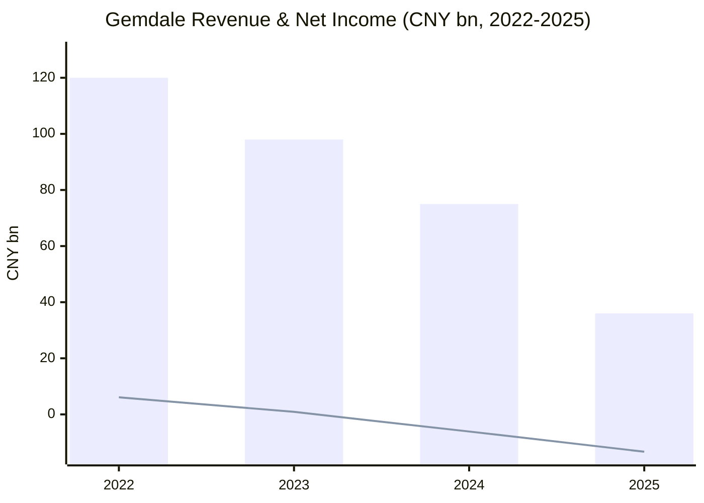
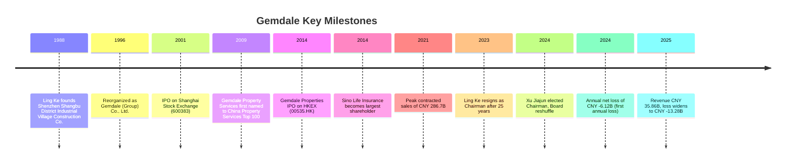
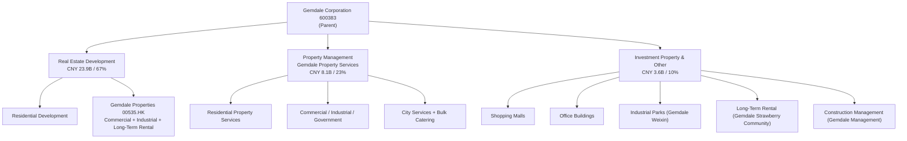
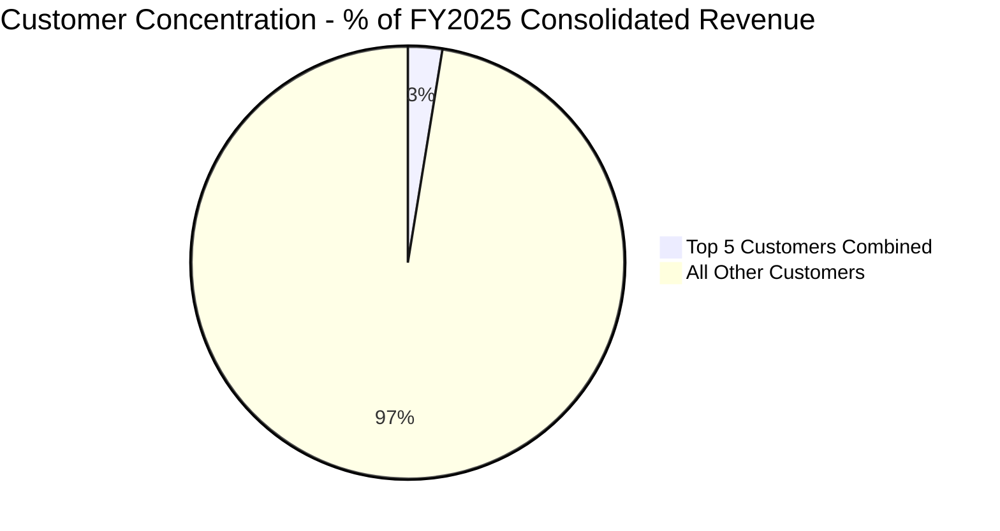
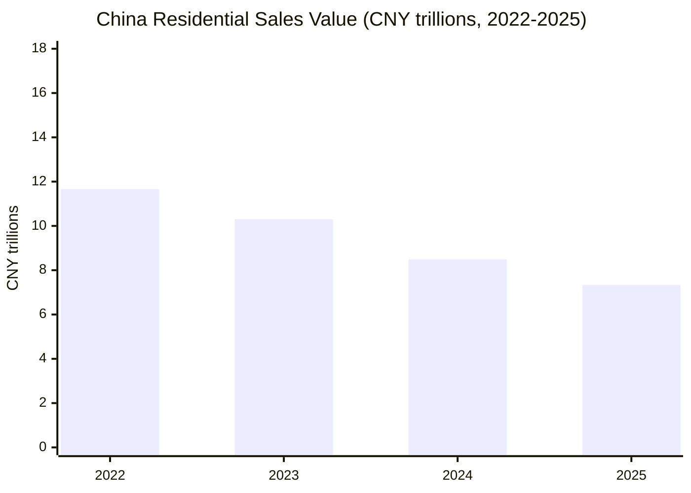
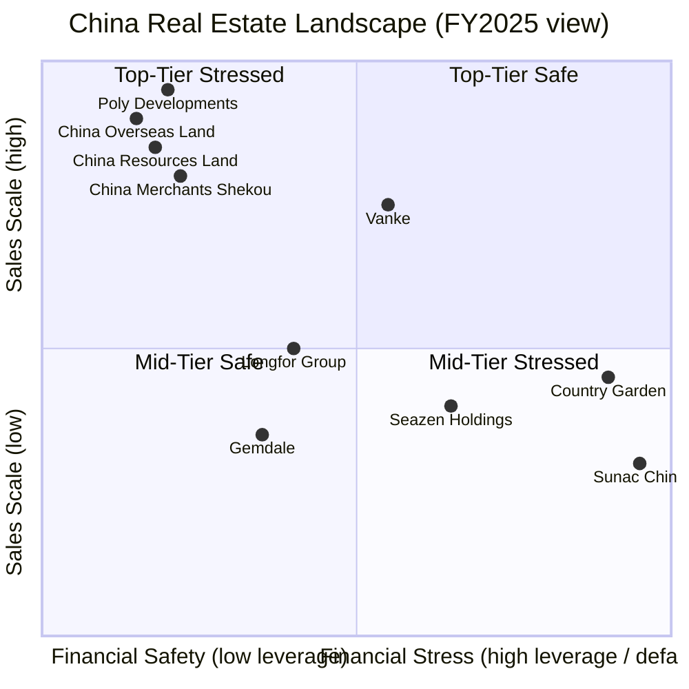
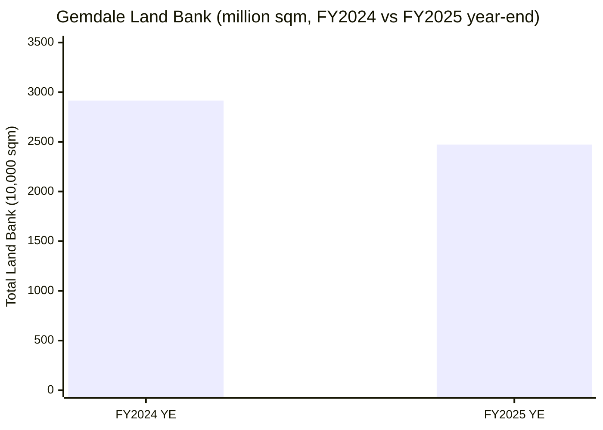

# Gemdale Corporation (金地集团, SSE: 600383) — Equity Research Report

**As of:** 2026-06-03
**Language:** English (zh-CN companion at `Gemdale_金地_SSE600383_公司研究.md` in the same folder)

> **Material-event banner.** FY2025 net income attributable to shareholders was **CNY -13.28B** (vs. CNY -6.12B in FY2024 and a positive CNY +0.89B in FY2023) — a second consecutive annual loss, widening ~117% YoY. Revenue collapsed from CNY 75.34B (FY2024) to **CNY 35.86B** (FY2024 -52.41%), while contracted sales (合约销售额) fell from CNY 68.51B (FY2024) to **CNY 30.02B** (-56.2%), pushing Gemdale's national sales rank down to #24 — well outside the China developer Top-20 club. The 2025 annual report retained a standard unqualified audit opinion from Deloitte ([Gemdale 2025 Annual Report — Important Notice, p. 1-2](https://stockmc.xueqiu.com/202604/600383_20260404_ZU5U.pdf)). Governance: founder Ling Ke (凌克) stepped down in October 2023 after 25 years as Chairman; the 46-year-old former Board Secretary Xu Jiajun (徐家俊) was elected Chairman on 17 March 2024. Sino Life Insurance (富德生命人寿) is the largest shareholder at ~29.83%, with Shenzhen Futian Investment Holdings (a Futian District SOE) at 7.79%; the company has no controlling shareholder ([21jingji.com, 2024-03-17 — Gemdale Board Reshuffle](https://www.21jingji.com/article/20240317/herald/d0c1a2bf9a574497d0b652e50462431e.html)). The Risk Assessment section below quantifies these vectors.

---

## Table of Contents

1. Company Overview
2. History
3. Management
4. Products & Services
5. Customers & Distribution
6. Industry Overview
7. Competitive Landscape
8. Market Opportunity / TAM
9. Risk Assessment
10. Investor-Lens Scorecards
11. References

---

## 1. Company Overview

Gemdale Corporation (**金地集团**, **SSE: 600383**) is one of China's top-tier residential, commercial, and industrial property developers and operators. The company is registered and headquartered at 32/F Gemdale Center, 2007 Shennan Boulevard, Futian District, Shenzhen, with total share capital of ~4.513 billion shares. Its principal business comprises (1) development and sale of residential, commercial, office and industrial-park real estate; (2) self-operated investment property (shopping malls, office towers, industrial parks, and long-term rental apartments); (3) property management services (operated under the Gemdale Property Services / 金地智慧服务 brand); and (4) real estate construction-management services (operated under the Gemdale Management / 金地管理 brand) ([Gemdale 2024 Annual Report, p. 4 — Company Basic Information](https://static.sse.com.cn/disclosure/bond/announcement/company/c/new/2025-03-25/175773_20250325_631Z.pdf)). The A-share parent has been listed on the Shanghai Stock Exchange since April 2001; its Hong Kong-listed subsidiary **Gemdale Properties and Investment Limited (00535.HK)** operates the commercial/office and industrial property businesses semi-independently ([Gemdale 2025 Annual Report, p. 4 — Definitions](https://stockmc.xueqiu.com/202604/600383_20260404_ZU5U.pdf)).

In **FY2024** (the last fully-audited year before the most recent reporting period), the company generated **CNY 75.34B (USD ~10.5B equivalent)** of revenue, down 23.22% YoY; real estate development settlement revenue was CNY 60.03B (83.1% of segment revenue); property management was CNY 7.81B (10.8%); and investment property leasing & other was CNY 4.28B (5.9%). Net income attributable to shareholders was **CNY -6.115B**, swinging from a CNY +0.888B profit in FY2023. The loss was driven by (a) declining development-settlement scale and (b) the development-segment gross margin compressing to 14.11% (vs. 16.16% in FY2023), and (c) prudential impairment charges totalling CNY 62.75B (CNY 39.0B inventory write-downs + CNY 23.8B expected credit losses) ([Gemdale 2024 Annual Report, p. 6-13 — Financial Summary & Revenue-Cost Analysis](https://static.sse.com.cn/disclosure/bond/announcement/company/c/new/2025-03-25/175773_20250325_631Z.pdf)).

**FY2025** results deteriorated materially: revenue of **CNY 35.86B** (-52.41% YoY); development gross margin contracting from 14.11% to **7.93%**; expected credit losses of CNY -5.95B, asset impairment losses of CNY -3.11B, and fair value losses of CNY -1.19B together totalling CNY -10.13B for the year; and ultimate net income attributable to shareholders of **CNY -13.28B** (basic EPS -2.94 CNY, weighted-average ROE -25.37%). Total assets contracted from CNY 293.91B to CNY 233.20B (-20.65%), and shareholders' equity fell from CNY 59.04B to **CNY 45.65B** (-22.68%) ([Gemdale 2025 Annual Report, p. 6 — Three-Year Key Financial Data](https://stockmc.xueqiu.com/202604/600383_20260404_ZU5U.pdf)).

**Valuation snapshot.** As of 12 May 2026 the share price was ~CNY 3.13, with market cap around CNY 14.1B (a separate marketcapof.com point shows CNY 11.87B / USD 1.83B as of 29 May 2026). With shareholders' equity at CNY 45.65B at FY2025 year-end and 4.513 billion shares outstanding, BVPS is ~CNY 10.11, implying **P/B ~0.31×** (GuruFocus shows 0.34×) — at the 10-year low ([Gemdale 600383 PB History — GuruFocus](https://www.gurufocus.cn/stock/SHSE:600383/term/pb_ratio)), ([Gemdale 600383 stock quote — Investing.com](https://www.investing.com/equities/gemdale)). Two consecutive net loss years make TTM P/E not meaningful; **TTM P/S ~0.39×** using FY2025 revenue of CNY 35.86B against CNY 14.1B market cap. Peer benchmark: top A-share Chinese developers Poly Developments (SSE: 600048), China Merchants Shekou (SZSE: 001979), and Vanke (SZSE: 000002) have all seen P/B compress from ~1.0× in 2022 to roughly 0.5–0.8× as of mid-2026 — Gemdale trades at a meaningful further discount ([Securities Times, 2025 — "Zhao-Bao-Wan" lose CNY 100B market-cap status](https://stcn.com/article/detail/1180170.html)). **Valuation read:** the ultra-low P/B prices in (a) continued inventory impairment headwind (cumulative inventory write-downs in 2024-2025 already total >CNY 70B), (b) shrinking forward settlement revenue from collapsing contracted sales, and (c) the industry-wide clearing cycle being incomplete. The discount is not "obvious mispricing" — value re-rating requires sales stabilization plus impairment-cycle exhaustion.

*Source: FY2022/2023/2024/2025 Annual Report key financial data, [2024 AR p. 6](https://static.sse.com.cn/disclosure/bond/announcement/company/c/new/2025-03-25/175773_20250325_631Z.pdf) + [2025 AR p. 6](https://stockmc.xueqiu.com/202604/600383_20260404_ZU5U.pdf). Bars = revenue, line = net income attributable to shareholders.*

## 2. History

**1988-1995 — Origins in Shenzhen Futian.** The company's predecessor was the Shenzhen Shangbu District Industrial Village Construction Service Company, founded in 1988 by Ling Ke (born 1959, holding a Master's in Management Engineering from Zhejiang University and a Bachelor's in Radio Technology from Huazhong University of Science and Technology). Its initial mandate was to develop Shazui Industrial Area in Shenzhen's Futian District. The company gradually shifted to residential real estate development in the early 1990s and was renamed Gemdale Real Estate Development Company. This Futian District SOE heritage persists today — Shenzhen Futian Investment Holdings (under Futian District SASAC) remains the second-largest shareholder at 7.79% ([Guancha Storm — "The Hidden Property Tycoon: Ling Ke's 25 Years at Gemdale"](https://user.guancha.cn/main/content?id=1106373)).

**1996-2001 — Joint-Stock Reorganization & A-Share Listing.** In February 1996, the company was reorganized into Gemdale (Group) Co., Ltd. as a joint-stock company. In 1996, Gemdale launched the Gemdale Haijing Garden (海景花园) project in Shenzhen with a 96.84% pre-sale rate, making it one of the city's signature residential developments. The company IPO'd on the Shanghai Stock Exchange in April 2001 (ticker 600383), using listing proceeds to fund cross-regional expansion ([Gemdale 2024 Annual Report — Stock Information](https://static.sse.com.cn/disclosure/bond/announcement/company/c/new/2025-03-25/175773_20250325_631Z.pdf)).

**2002-2015 — The "Zhao-Bao-Wan-Jin" Golden Decade.** Gemdale was grouped with Vanke (万科), Poly (保利), and China Merchants Shekou (招商蛇口) as China's "Top-4 Developers" during the industry's golden age of 2005-2020. The company's hallmark was prudent leverage, focus on first- and second-tier cities, and an emphasis on product quality. In 2009, Gemdale Property Services was first named to the China Property Services Top 100 — a recognition it has retained for 17 consecutive years.

**2013-2020 — Insurance Capital & Diversification.** Sino Life Insurance (富德生命人寿) acquired ~29.83% of Gemdale through open-market stake-building in 2013-2014, becoming the largest shareholder. Gemdale rolled out a "residential + commercial + industrial + long-term rental + property management + construction management" diversification strategy. The Hong Kong-listed Gemdale Properties and Investment (00535.HK) listed in 2014 as the platform for commercial and industrial property businesses; the Gemdale Weixin (industrial parks), Gemdale Strawberry Community (long-term rental), and Gemdale Management (construction management) sub-brands were established over this period.

**2021-2023 — Industry Enters Deep Adjustment.** China's real estate industry began deleveraging in 2021; highly-leveraged private developers Evergrande, Country Garden, Sunac, and others entered debt restructuring. Gemdale's relatively prudent leverage spared it from these distress events, but new construction starts began declining from 2022. Annual contracted sales fell sharply: CNY 286.7B in 2021 → CNY 221.8B in 2022 → CNY 153.5B in 2023 → CNY 68.51B in 2024 → CNY 30.02B in 2025 ([Tencent News, 2026-03-22 — "Gemdale's 2025 loss exceeds CNY 10B, sales only CNY 30B"](https://news.qq.com/rain/a/20260322A01H3X00)).

**2023-2024 — Governance Transition: Ling Ke Steps Down, Xu Jiajun Takes Over.** On 16 October 2023, the company disclosed that Chairman Ling Ke had resigned for health reasons after 25 years (from 1999). President Huang Juncan (黄俊灿) acted as Chairman in the interim ([The Paper, 2023-10-17 — "Gemdale Chairman Ling Ke Resigns for Health Reasons"](https://www.thepaper.cn/newsDetail_forward_24952014)). On 17 March 2024, at the 10th Board's first meeting, 46-year-old Xu Jiajun (the former Board Secretary and CEO of Gemdale Properties 00535.HK) was elected Chairman. The reshuffled Board composition: 3 directors from Sino Life Insurance, 2 from Gemdale management, 1 from Futian SOE ([21jingji.com, 2024-03-17 — "Gemdale Board Reshuffle: Sino Life Insurance Deep Engagement"](https://www.21jingji.com/article/20240317/herald/d0c1a2bf9a574497d0b652e50462431e.html)).

**2025-2026 — Cash-Flow Focus, Debt Reduction.** In 2024, the company timely repaid ~CNY 20B in public debt market maturities; through 2025, it continued payments, reducing interest-bearing debt to CNY 67.0B at year-end with a weighted-average cost of 3.92% (down 13 bps from the FY2024 end), with 98.6% bank borrowings — public bond and ABS positions have been effectively zeroed out ([Gemdale 2025 Annual Report, p. 11 — Financial Stability](https://stockmc.xueqiu.com/202604/600383_20260404_ZU5U.pdf)).

## 3. Management

**Founder — Ling Ke (凌克, born 1959, retired).** Ling Ke is one of Gemdale's founders and served as Chairman for 25 years (from March 1999). Education: Bachelor's in Radio Technology from Huazhong University of Science and Technology, Master's in Management Engineering from Zhejiang University; Senior Economist credentialed. In 1988 he founded the company's predecessor in Shenzhen to develop the Shazui Industrial Area. Under his tenure, the company completed its joint-stock reorganization (1996), A-share IPO (2001), nationwide expansion across the Beijing-Tianjin-Hebei, Yangtze River Delta, Pearl River Delta, central-western, and northeastern regions, and the build-out of the "residential + commercial + industrial + long-term rental + property management + construction management" diversified business mix. He was widely regarded as among China's first-generation real estate industry leaders. On 16 October 2023, he resigned as Chairman, Director, and Strategic Committee member, citing health reasons; he no longer holds any position at the company and is not listed as a major shareholder in the 2024/2025 annual reports ([The Paper, 2023-10-17 — Ling Ke's Resignation Notice](https://www.thepaper.cn/newsDetail_forward_24952014)), ([21jingji.com, 2023-10-18 — "The Soul of Gemdale Bids Farewell"](https://www.21jingji.com/article/20231018/40f6760a2d6369d4304b713e8b833a76.html)).

**Current Chairman — Xu Jiajun (徐家俊, age 46, in role since 17 March 2024).** Master's degree in Management from Shanghai University of Finance and Economics. Joined Gemdale in 2004. Prior roles within the company include Deputy GM of the Administration Management Department, Employee Representative Supervisor, GM of Human Resources, 9th-Board Director, Senior Vice President, and Board Secretary; concurrently CEO of Gemdale Properties (00535.HK). He has been named a "Gold Medal Board Secretary" by *New Fortune* magazine and "Best Board Secretary" by *Wealth Management Weekly*. On 17 March 2024, the 10th Board elected him Chairman; his 2024 pre-tax compensation was CNY 2.28M; he held 1,050,800 shares at year-end. His current term runs through April 2027 ([Gemdale 2024 Annual Report, p. 38 — Director Officer Information](https://static.sse.com.cn/disclosure/bond/announcement/company/c/new/2025-03-25/175773_20250325_631Z.pdf)), ([Securities Times, 2024-03-17 — "46-Year-Old Board Secretary Elected Chairman"](https://www.stcn.com/article/detail/1148562.html)).

**Assessment:** Xu Jiajun represents an "internal professional manager with capital-markets experience" succession path (vs. Ling Ke's "entrepreneur-developer" mode). Inheriting a company facing the industry's deepest downturn since the 1998 reform, his mandate is (a) maintaining cash-flow safety, (b) reducing leverage, and (c) growing the non-residential / "light-asset" businesses (property services, construction management, investment property) to offset shrinking development. His first full year (FY2024) ended with a CNY -6.12B loss; FY2025 deepened to CNY -13.28B — reflecting both the lag effect of legacy inventory and the new team's more conservative impairment recognition (the 2024 AR explicitly noted "based on prudential principle, impairments were recognized for certain assets"). The critical observations for his tenure: (i) when do contracted sales stabilize; (ii) whether inventory write-down recognition peaks in 2026-2027; and (iii) whether construction management + property services + investment property can scale from current ~CNY 12B revenue base to a level capable of offsetting residential decline within 3-5 years.

## 4. Products & Services

Per FY2025 reporting, Gemdale operates three principal business segments: **Real Estate Development**, **Property Management**, and **Investment Property Leasing & Other**. The full FY2025 segment data, reproduced verbatim from the Annual Report:

| Segment | Revenue (CNY bn) | Cost (CNY bn) | Gross Margin | YoY Revenue Change | YoY GM Change |
|---|---|---|---|---|---|
| Real Estate Development | 23.89 | 22.00 | **7.93%** | -60.20% | -6.18 pp |
| Property Management | 8.06 | 7.40 | 8.23% | +3.23% | -1.88 pp |
| Investment Property & Other | 3.61 | 1.51 | **58.09%** | -15.69% | +3.77 pp |
| **Total** | **35.56** | **30.91** | **13.09%** | -52.41% | — |

*Source: [Gemdale 2025 Annual Report, p. 16 — Main Business by Segment](https://stockmc.xueqiu.com/202604/600383_20260404_ZU5U.pdf)*

### 4.1 Real Estate Development — 67% of revenue

The real estate development segment is the largest and currently most-pressured business. FY2025 settlement area was approximately 2.5 million sqm (FY2024: 3.96 million sqm); settled revenue CNY 23.89B; gross margin contracted to **7.93%** (vs. 14.11% in FY2024, 16.16% in FY2023) — reflecting the settlement of high-cost land bought during 2021-2022 plus continued residential ASP decline in 2024-2025 ([Gemdale 2025 Annual Report, p. 11-12 — Operating Discussion & Analysis](https://stockmc.xueqiu.com/202604/600383_20260404_ZU5U.pdf)).

**Mechanism note:** Development revenue is recognized on an accrual basis at unit handover (not at contract signing), so current-period contracted sales typically flow through to reported revenue with a 2-3 year lag. The CNY 23.89B FY2025 development revenue corresponds roughly to 2022-2023 contracted sales (when the company sold CNY 150-220B); the CNY 30.02B contracted in FY2025 will convert to revenue in 2027-2028. The combination of falling gross margin + collapsing top-of-funnel sales means FY2026-2028 development revenue and gross profit contributions will remain under pressure.

The company's stated strategy is to "focus on first- and second-tier mainstream cities." Total land bank at FY2025 year-end was **24.72 million sqm** (vs. 29.16 million sqm at FY2024 end; net reduction of 4.44 million sqm); equity-interest land bank was **10.59 million sqm** (vs. 12.45 million sqm; net reduction 1.86 million sqm). First- and second-tier cities account for **79%** of the land bank (up from 77% at FY2024 end). During FY2025, Gemdale acquired two low-density villa plots in Songjiang District Shanghai and Linping District Hangzhou, with the Songjiang "Cui Yu Original Villa" project achieving a hot first-batch sales launch ([Gemdale 2025 Annual Report, p. 12 — Seizing Market Opportunities](https://stockmc.xueqiu.com/202604/600383_20260404_ZU5U.pdf)).

**Product strategy:** The company promotes a "smart-elegant precision craftsmanship, healthy living" (智美精工、健康生活) product philosophy organized around four dimensions: health, precision-craftsmanship, aesthetics, and innovation. Aligned with the central government's "good housing" (好房子) policy direction, Gemdale has pushed the "fourth-generation residence" (第四代住宅), healthy-decoration standards, panoramic floor-to-ceiling windows, and variable-space layout innovations. Flagship FY2024-2025 projects include: Taiyuan Huazhang (clover-leaf floor plan), Guangzhou Gemdale Yu Hu Song (lakeside living with Song Dynasty-aesthetic modern architecture), and Wuhan Chengjian He Yue (Wuhan's first fourth-generation residence pilot project) ([Gemdale 2024 Annual Report, p. 9-10 — Product Innovation](https://static.sse.com.cn/disclosure/bond/announcement/company/c/new/2025-03-25/175773_20250325_631Z.pdf)).

### 4.2 Property Management (Gemdale Property Services / 金地智慧服务) — 23% of revenue

Gemdale Property Services is a wholly-owned / controlled subsidiary positioned as a "leading integrated property services operator in China." FY2025 revenue **CNY 8.06B** (+3.23% YoY), gross margin 8.23% (-1.88 pp YoY); managed area at FY2025 end **268 million sqm** (vs. 252 million sqm at FY2024 end; net +16 million sqm). Services span residential, commercial/office, industrial parks, government public buildings, partner hospitals, partner schools, city services, and bulk food services. By FY2025, strategic-customer composition expanded into new energy, fintech, healthcare, smart devices, and automotive manufacturing ([Gemdale 2025 Annual Report, p. 13 — Property Services](https://stockmc.xueqiu.com/202604/600383_20260404_ZU5U.pdf)).

Industry positioning: **17 consecutive years** named to the China Property Services Top 100, with a "Top-6 Comprehensive Strength" designation for FY2025. Against shrinking development, the property management business is a key driver for valuation re-rating over the next 3-5 years — it provides recurring cash-flow on an asset-light, reusable-customer-base model.

### 4.3 Investment Property Leasing & Other — 10% of revenue

This segment includes (a) shopping malls — mature projects like Shanghai Jiu Ting Gemdale Plaza, Xi'an Gemdale Plaza, and Wuhan Gemdale Plaza achieved 95% occupancy in FY2025; (b) office buildings — Shenzhen Weixin Center occupancy surpassed 90%; Beijing Gemdale Center re-earned a LEED Platinum certification with a 91-point score; (c) industrial parks (Gemdale Weixin) — FY2025 new leased space exceeded 320,000 sqm; light-asset management consulting projects added 26 new contracts; (d) long-term rental apartments (Gemdale Strawberry Community) — Shanghai Nanda Flagship Store opened with rapid occupancy ramp; and (e) construction management (Gemdale Management). The construction management business was a 2025 highlight: new signed service area of **15.31 million sqm** (+59% YoY), cumulative signed managed area of 53.62 million sqm at FY2025 end, footprint of >70 cities, and ranked Top-3 in China construction management industry overall capability for multiple years ([Gemdale 2025 Annual Report, p. 12 — Construction Management Business](https://stockmc.xueqiu.com/202604/600383_20260404_ZU5U.pdf)).

**The segment's 58.09% gross margin substantially exceeds development and property services**, reflecting the stable cash-flow nature of commercial + long-term lease + high-quality asset portfolios. However, the absolute revenue scale is only CNY 3.61B, limiting near-term impact on group financials.

### 4.4 Segment Synergy — From "Development First" to "Light + Heavy Balanced"

*Source: Segment structure compiled from [Gemdale 2025 Annual Report, p. 11-13 — Operating Discussion & Analysis](https://stockmc.xueqiu.com/202604/600383_20260404_ZU5U.pdf)*

**Strategic narrative:** Management has explicitly designated "light + heavy balanced, diversified synergy" (轻重并举、多元协同) as the core path to constructing a sustainable new development model — i.e., while reducing heavy-asset development investment, growing the three light-asset pillars: construction management (high-ROE, low capital-intensive), property services (stable cash flow, low leverage), and investment property (stable NOI / valuation anchor). However, on current trajectory: (i) construction management signed area is +59% YoY, but management fees are typically 0.5-2% of total construction value (so the 15.31 million sqm of new signings represents ~CNY 0.6-1.5B of future annualized fee revenue); (ii) property management revenue growth is +3.2%; (iii) development revenue is -60.2%. The combined absolute increment from the three light-asset segments cannot yet offset residential development shrinkage in the short term.

## 5. Customers & Distribution

### 5.1 Customer Concentration

**Customer composition is highly dispersed.** The ultimate end-customer for real estate development is individual home buyers (C-end), while property management serves both unit owners and institutional clients. Per the FY2025 Annual Report disclosure: **top-5 customers generated CNY 916.46 million (CNY 0.92B), representing 2.56% of total annual sales; related-party sales within top-5 = 0**. The FY2024 disclosure shows top-5 customer sales of CNY 3.475B, or **4.61%** of total. Both years confirm highly dispersed customer composition — individual home buyers dominate the development business, with institutional or large customers contributing minimally ([Gemdale 2025 Annual Report, p. 17 — Major Customers](https://stockmc.xueqiu.com/202604/600383_20260404_ZU5U.pdf)), ([Gemdale 2024 Annual Report, p. 14 — Major Customers](https://static.sse.com.cn/disclosure/bond/announcement/company/c/new/2025-03-25/175773_20250325_631Z.pdf)).

**Denominator label:** the 2.56% and 4.61% figures are both expressed as "**% of consolidated revenue** (合并报表口径年度销售总额)" — i.e., relative to the group's total revenue of CNY 35.86B (FY2025) or CNY 75.34B (FY2024), not relative to any single segment. The annual report does not separately disclose property management or construction management customer concentration.

*Source: [Gemdale 2025 Annual Report, p. 17 — Major Customers](https://stockmc.xueqiu.com/202604/600383_20260404_ZU5U.pdf). Denominator: FY2025 consolidated revenue of CNY 35.86B.*

### 5.2 Geographic Sales Distribution

The FY2025 segment-by-geography breakdown shows: East China remains the largest region (CNY 16.74B, 47.1% of main business revenue, primarily real estate development settlements); South China at CNY 9.19B (25.8%); North at CNY 5.24B (14.7%); Central-Western at CNY 4.39B (12.4%). Note that FY2025 had an organizational change merging the prior "Southeast" region into "East China," which inflates the East China YoY comparison ([Gemdale 2025 Annual Report, p. 16 — By Geography](https://stockmc.xueqiu.com/202604/600383_20260404_ZU5U.pdf)).

**Contracted vs. Settled revenue gap:** In FY2025, the company contracted CNY 30.02B in sales over 2.286 million sqm, with the national whole-channel sales ranking falling to #24 ([Tencent News, 2026-03-22 — "Gemdale 2025 loss exceeds CNY 10B"](https://news.qq.com/rain/a/20260322A01H3X00)). Settled revenue (CNY 23.89B) was less than contracted sales (CNY 30.02B), meaning the FY2025 contracted volume will continue to flow into FY2026-2027 revenue — but the pipeline depth has shrunk materially relative to the 2021-2022 historical peaks.

### 5.3 Sales Channels & De-stocking Strategy

The company's sales channels combine self-operated sales offices with channel distribution. From 2024, Gemdale strengthened the "self-channel build-out" (e.g., South China region built an integrated all-staff marketing, community operations, and online marketing customer acquisition system; Southeast region introduced "one floor plan, multiple variants" through layout retrofits to revive existing standing inventory). FY2025 sales & marketing expense was CNY 1.07B (-50.66% YoY, mostly from reduced promotional service fees); the sales & marketing expense ratio (S&M / Revenue) was ~3.0%, down 0.9 pp YoY — reflecting active cost discipline given shrinking sales scale ([Gemdale 2025 Annual Report, p. 17 — Expenses](https://stockmc.xueqiu.com/202604/600383_20260404_ZU5U.pdf)).

## 6. Industry Overview

### 6.1 China Real Estate — Deep Adjustment in 2024-2025

**FY2024 macro picture:** New construction starts nationally totalled 0.739 billion sqm (-23.0% YoY); real estate development investment was CNY 10.03 trillion (-10.6% YoY); residential commodity sales area was 0.815 billion sqm (-14.1% YoY); residential sales value was CNY 8.49 trillion (-17.6% YoY). The "Four-Ministry Real Estate New Policy" launched on 17 May 2024 (lowering down-payment ratios, removing the mortgage-rate lower bound, cutting public-housing fund rates, supporting local governments in purchasing existing commodity housing for affordable-housing use) drove rising viewings in some cities, with secondary-market "price-for-volume" sales outperforming primary-market new-home sales. The September Politburo meeting first articulated "promote real estate market stabilization"; the December Central Economic Work Conference reinforced "stabilize the housing market" ([Gemdale 2024 Annual Report, p. 8-9 — Industry Conditions](https://static.sse.com.cn/disclosure/bond/announcement/company/c/new/2025-03-25/175773_20250325_631Z.pdf)).

**FY2025 continues adjustment:** Nationwide new construction starts of 0.588 billion sqm (-20.4% YoY); real estate development investment of CNY 8.28 trillion (-17.2% YoY); residential commodity sales area of 0.733 billion sqm (-9.2% YoY); residential sales value of CNY 7.33 trillion (-13.0% YoY). The March Government Work Report stressed "sustained efforts to promote real estate market stabilization"; the June State Council Executive Meeting called for "greater-strength promotion of real estate market stabilization"; and the December Central Economic Work Conference reiterated "focused efforts to stabilize the real estate market." Land market — residential-purpose land transactions saw construction area down 11.0% YoY and transaction value down 9.1%; local governments increased focus on supply pace and quality, with premium plots concentrated toward core areas; the industry's transition from scale-expansion to quality-improvement became more apparent ([Gemdale 2025 Annual Report, p. 11 — Industry Conditions](https://stockmc.xueqiu.com/202604/600383_20260404_ZU5U.pdf)).

*Source: National Bureau of Statistics, cited in [Gemdale 2024 Annual Report, p. 8](https://static.sse.com.cn/disclosure/bond/announcement/company/c/new/2025-03-25/175773_20250325_631Z.pdf) + [2025 Annual Report, p. 11](https://stockmc.xueqiu.com/202604/600383_20260404_ZU5U.pdf)*

### 6.2 TAM / SAM / SOM (Market Opportunity & Company-Addressable Share)

**TAM (Total Addressable Market — overall industry total)** — China residential commodity sales value: FY2025 was **CNY 7.33 trillion**, down from the 2021 peak of ~CNY 16-17 trillion (less than half). Industry research firms (CRIC, China Index Academy) generally expect 2026-2028 to remain in a plateau-bottoming phase (annual sales of CNY 6-8 trillion). Longer-term, China's urbanization is in its second half (urban resident ratio ~66-67% at FY2025 end vs. developed-market 78-80%, leaving ~10+ pp of structural runway); affordable housing / urban village renewal / urban renewal categories; and structural "good housing" upgrade demand provide medium-term support.

**SAM (Serviceable Addressable Market — addressable subsegments)** — Gemdale focuses on mid- to high-end upgrade residential, plus commercial/office, long-term rental, and property management in first- and second-tier core cities. The company's core operating regions (Beijing-Tianjin-Hebei, Yangtze River Delta, Pearl River Delta, central-western, and northeast core cities) collectively account for ~50-60% of national sales, suggesting Gemdale's SAM is ~CNY 4-4.5 trillion / year.

**SOM (Serviceable Obtainable Market — realistically capturable share)** — FY2025 contracted sales were CNY 30.02B, implying market share of ~0.4% (CNY 30.02B / CNY 7.33 trillion). Given the company's current financial constraints (deepening net loss, scaled-back land investment, new starts down 20-50%), near-term SOM will trend down further; if FY2026-2028 sales stabilize around CNY 20-30B, market share will be ~0.3-0.4%. Mid-term upside requires (a) industry stabilization, (b) Gemdale's share rising passively as distressed private peers exit, and (c) construction management + property management + investment property segments scaling from current ~CNY 12B revenue to CNY 20-30B by 2030.

### 6.3 Industry Cleansing & Gemdale's Relative Position

*Source: Aggregating [Securities Times, 2025 — "Zhao-Bao-Wan Lose Trillion-Yuan Market Caps"](https://stcn.com/article/detail/1180170.html) + [Tencent News 2026-03-22 — "Gemdale 2025 Sales Rank Falls to #24"](https://news.qq.com/rain/a/20260322A01H3X00) + company annual reports; financial-safety dimension reflects leverage and public debt market risk.*

## 7. Competitive Landscape

The FY2024 / FY2025 annual reports do not enumerate "principal competitors" by name, but based on sales ranking, product positioning, and geographic overlap, the 5-10 closest comparables are catalogued below (**Analyst view — synthesized from company AR disclosures on industry positioning + third-party research**):

| Company | Ticker | FY2025 Sales (CNY bn)* | Financial Profile | Direct Competition with Gemdale |
|---|---|---|---|---|
| Poly Developments | SSE: 600048 | ~300 | Central SOE, #1 | Nationwide presence + first-/second-tier high-end residential |
| China Overseas Land | HKEX: 0688 | ~250 | HK-resident central SOE, high gross margin | First-tier high-end upgrade + commercial |
| China Resources Land | HKEX: 1109 | ~230 | Central SOE + investment property (Mixc malls) | Commercial / investment property (vs. Gemdale Weixin) |
| China Merchants Shekou | SZSE: 001979 | ~170 | Central SOE, Shenzhen-based | Shenzhen home market + integrated development |
| Vanke | SZSE: 000002 | ~200 | Mixed-ownership, Shenzhen-based | Shenzhen home + property services + long-term rental (Onewo vs. Gemdale Property Services) |
| Longfor Group | HKEX: 0960 | ~100 | Private, TOD complexes | Malls / long-term rental / property services trifecta |
| Gemdale | SSE: 600383 | **30.02** | Mixed-ownership (insurance + SOE) | **Subject company** |
| Seazen Holdings | SSE: 601155 | ~50 | Private, Wuyue Plaza-anchored | Wuyue malls vs. Gemdale Weixin |

*Source: Sales data aggregating [Securities Times, 2025](https://stcn.com/article/detail/1180170.html) + [Tencent News, 2026-03-22](https://news.qq.com/rain/a/20260322A01H3X00) + company AR disclosures*

**Analyst view — competitive landscape interpretation:**

- **Central SOE Tier-1 (Poly, COL, CRL, CMSK)** benefit from cheap financing (10Y Treasury + 50-100 bps), credit backing, and superior land bank quality. In 2022-2025, they have executed "counter-cyclical land acquisition + share gain," opening a 5-10x sales scale gap relative to Gemdale.
- **Mixed-ownership + private (Vanke, Gemdale, Longfor, Seazen)** broadly face declining sales, reduced land investment, and margin pressure. While Gemdale has Futian SOE + Sino Life Insurance shareholder backing, insurance capital is not central SOE-level, and Gemdale's 3.92% financing cost still trades above central SOE peers (typically 3.0-3.5%).
- **Gemdale's differentiated positioning:** (a) Unlike Vanke / Longfor's nationwide rapid-turnover model, Gemdale concentrates in first- and second-tier (79% of land bank) + upgrade segments; (b) property management (Gemdale Property Services) + construction management (Gemdale Management) are both Top-3 to Top-10 industry players, but absolute scale is 1/3 to 1/2 of the leading property players (Onewo, Poly Property, COL Property); (c) commercial / industrial / long-term rental investment properties are operated semi-independently through Gemdale Properties (00535.HK), trading at REITs-like multiples but with lower liquidity.

**Moat assessment:** Gemdale's core moats are (i) 36 years of brand heritage (China Blue Chip Real Estate, Top-100 Brand Value), (ii) first- and second-tier core city land bank quality (79% concentration), and (iii) property + construction management customer base & brand (17-year Top-100). But moat depth is limited: real estate development product differentiation is readily copyable; property management and construction management have relatively low entry barriers; and even light-asset businesses face unit-price pressure and longer receivable cycles in an industry-wide downturn.

## 8. Market Opportunity / TAM

Gemdale's business-rehab path over 3-5 years primarily rests on three opportunity vectors:

**8.1 Industry stabilization + first-/second-tier recovery (2026-2028).** National Bureau of Statistics data show residential sales area falling from 0.815 billion sqm (FY2024) to 0.733 billion sqm (FY2025), a -9.2% decline — substantially narrower than the -24% rate in 2022-2023. Land-market residential-purpose transactions saw construction area down -11.0% but value only -9.1%, suggesting unit prices have stabilized. If core city sales bottom in 2026 under policy support, the market value of Gemdale's 79% first-/second-tier land bank should see meaningful repair ([Gemdale 2025 Annual Report, p. 11 — Industry; p. 12 — Land Bank Structure](https://stockmc.xueqiu.com/202604/600383_20260404_ZU5U.pdf)).

*Source: [2024 AR p. 9](https://static.sse.com.cn/disclosure/bond/announcement/company/c/new/2025-03-25/175773_20250325_631Z.pdf) + [2025 AR p. 12](https://stockmc.xueqiu.com/202604/600383_20260404_ZU5U.pdf). First-/second-tier city share rose marginally from 77% to 79%.*

**8.2 Construction management business high growth (2025-2030).** FY2025 new construction-management signed area was 15.31 million sqm (+59% YoY), cumulative signed managed area 53.62 million sqm. China Index Academy data show China's construction management market at roughly CNY 200-300B/year (covering government affordable-housing construction management + central-/local-SOE construction management + distressed private workout management). Over 3-5 years, this market should continue to expand with local government inventory acquisition, project handover assurance, and asset revitalization needs. Gemdale Management ranks Top-3 in the industry. If new signings sustain 30-40% CAGR over the next 3 years, cumulative signed area by 2028 could reach 100-120 million sqm, supporting CNY 3-5B of future annualized fee revenue ([Gemdale 2025 Annual Report, p. 12 — Construction Management](https://stockmc.xueqiu.com/202604/600383_20260404_ZU5U.pdf)).

**8.3 Property management + investment property = stable cash-flow anchor (long-term).** Gemdale Property Services 2025 managed area 268 million sqm (+6.3% YoY), revenue CNY 8.06B (+3.2% YoY), gross margin 8.23%. China Index Academy data show China's overall property management industry managed area at ~30 billion sqm and CAGR ~6-8%. If Gemdale Property Services sustains 5-8% growth, FY2030 revenue could reach CNY 11-13B with stable 8-10% gross margins driven by property + value-added services (insurance, space technology, bulk catering, city services). Combined with the investment property portfolio (FY2025: CNY 3.61B revenue at 58.09% gross margin), Gemdale's "light + heavy balanced" cash-flow anchor in a 5-10 year horizon can support ~CNY 10-15B of revenue + CNY 1.5-2.5B of pre-tax profit, providing valuation downside support.

## 9. Risk Assessment

Per the 4 risk buckets, 8-12 specific risks identified:

### 9.1 Company-Specific Risks

1. **Sustained large impairment charges (high, already materializing):** FY2024 cumulative impairment of CNY -6.275B (credit -2.376 + asset -3.9); FY2025 added CNY -9.050B (credit -5.945 + asset -3.105 + fair value -1.188). At FY2025 year-end inventory of CNY 59.29B (-29.23% YoY) still contains material exposure to 2021-2022 high-cost land purchases in lower-tier cities; the company explicitly states "based on prudential principle, continued recognition of inventory write-downs," with no clear visibility on the FY2026 peak ([Gemdale 2025 Annual Report, p. 19 — Asset & Liability Position](https://stockmc.xueqiu.com/202604/600383_20260404_ZU5U.pdf)).
2. **Sales collapse + falling forward settled revenue (high):** FY2025 contracted sales of CNY 30.02B (-56.2% YoY); whole-channel ranking dropped to #24. Given the 2-3 year revenue recognition lag, FY2026-2028 development revenue faces continued pressure from CNY 23.9B today toward CNY 15-20B going forward ([Tencent News, 2026-03-22](https://news.qq.com/rain/a/20260322A01H3X00)).
3. **Post-transition execution risk (medium):** Ling Ke's 25-year term ended in 2023; Xu Jiajun took over in 2024; the Board reshuffle gives Sino Life Insurance 3 directors plus SOE 1 + management 2, raising potential strategic/path conflicts in a deep industry downturn. New management has not yet completed a full real estate cycle ([21jingji.com, 2024-03-17](https://www.21jingji.com/article/20240317/herald/d0c1a2bf9a574497d0b652e50462431e.html)).

### 9.2 Industry / Market Risks

4. **Real estate adjustment not yet complete (high):** Both FY2024 and FY2025 annual reports explicitly state "the real estate market is still in adjustment." FY2025 national new construction starts -20.4%, residential sales value -13.0%; declines have narrowed but bottoming has not been confirmed; industry cleansing (private defaults, local-government inventory acquisition, urban village renewal) cycle is unlikely to complete within 2-3 years ([Gemdale 2025 Annual Report, p. 11 — Industry Conditions](https://stockmc.xueqiu.com/202604/600383_20260404_ZU5U.pdf)).
5. **Structural demand decline in core first-/second-tier cities (medium):** Gemdale's 79% land bank is in first- and second-tier — relatively high-quality — but first-tier residential homeownership ratios are already high (Beijing/Shanghai/Shenzhen/Guangzhou all >70-80%), making structural upgrade demand alone insufficient to offset retreat of investment demand; third- and fourth-tier areas face net-out-migration plus high inventory.
6. **Secondary-market "price-for-volume" pressure on primary market (medium):** Through 2024-2025, secondary-market transactions have outperformed primary-market new sales; this squeezes new-home unit prices and absorption. Gemdale's "fourth-generation residence" product innovation provides some differentiation, but cannot fully offset price discounts via secondary-market substitution.

### 9.3 Financial Risks

7. **Liquidity + debt maturity risk (medium-high):** At FY2025 year-end, interest-bearing debt of CNY 67.0B, further compressed to ~CNY 66.15B by Q1 2026 end. Public bond / ABS positions are essentially zeroed, with 98.6% bank borrowings at 3.92% cost. But cash of CNY 12.67B (-44.25% YoY) sharply reduces the safety buffer for short-term debt + within-one-year-maturity non-current debt. If FY2026-2027 collection underperforms, the company may need to divest non-core assets or seek strategic investor support ([Gemdale 2025 Annual Report, p. 19](https://stockmc.xueqiu.com/202604/600383_20260404_ZU5U.pdf)), ([CLS, 2026-05-07 — "Gemdale Q1 unusual CNY 267M impairment"](https://news.qq.com/rain/a/20260507A07MV400)).
8. **Continued negative ROE / shrinking net assets (high):** Weighted ROE was -9.86% in FY2024 and -25.37% in FY2025; shareholders' equity fell from CNY 65.06B at FY2023 year-end to CNY 45.65B at FY2025 year-end (~30% cumulative loss). If FY2026 brings another large loss, certain creditors' loan covenants could come under scrutiny.
9. **Shareholder structure + interest-alignment risk (medium):** Sino Life Insurance (29.83%) is largest shareholder; the company has no controlling shareholder. Insurance capital's preference for short-term dividends + stable share price may diverge from SOE shareholder Futian Investment Holdings' (7.79%) long-term strategic focus, and from management's industrial-operations focus. Distributable earnings were negative for two consecutive years; no cash dividend was declared in 2024 or 2025, increasing pressure on insurance-capital shareholders ([Titanium Media, 2026 — "Gemdale Insurance Capital Trapped"](https://www.tmtpost.com/7924098.html)).

### 9.4 Macro / Regulatory Risks

10. **Monetary policy + mortgage rate variation (medium):** Central bank LPR 5-Year has fallen from 4.65% in 2021 to ~3.5% at FY2025 end; further rate cut room is narrowing; minimum down-payment ratios already reduced to 15% (first-tier 25-30%); housing fund rates have been progressively cut. If mortgage rates rise or housing fund policies tighten, this would constrain prospective buyers' affordability ([Gemdale 2024 Annual Report, p. 35 — Risk Factors](https://static.sse.com.cn/disclosure/bond/announcement/company/c/new/2025-03-25/175773_20250325_631Z.pdf)).
11. **Local government inventory acquisition / affordable housing policy implementation pace (medium):** The 17 May 2024 Four-Ministry New Policy supports local governments purchasing existing commodity housing for affordable use, but actual implementation pace varies widely by city based on fiscal capacity. Whether Gemdale's participation in local inventory acquisition projects translates into recovery + profit conversion remains uncertain ([Gemdale 2024 Annual Report, p. 9](https://static.sse.com.cn/disclosure/bond/announcement/company/c/new/2025-03-25/175773_20250325_631Z.pdf)).
12. **Capital market refinancing / delisting risk (low-medium):** A-share listed companies with multi-year large losses + negative net assets face potential ST (Special Treatment) warning. Current shareholders' equity of CNY 45.65B provides substantial buffer; however, if FY2026-2027 sees annual losses of CNY -10B+, ST probability rises.

## 10. Investor-Lens Scorecards

> The following lenses are **analytical rubrics**, not impersonations of named investors. All scores rely on data already cited above; no new inline citations are introduced. Howard Marks cycle view runs first (it can mute bullish conclusions in other lenses). Cycle snapshot as-of: 2026-06-03 (VIX 14.5, 10Y UST ~4.3%, HY OAS ~340 bps, IG OAS ~95 bps, overall "neutral to defensive").

### 10.4 Howard Marks Cycle View (runs first) — Defense-leaning

| Dimension | Score (0-100, higher = more bullish) | Basis |
|---|---|---|
| Credit Spread (HY OAS / IG OAS) | 45 | OAS at ~5-year median, no clear bubble; but China property USD / offshore bond OAS remains historically wide (Gemdale onshore debt essentially clean, but industry risk premium persists) |
| Rate Cycle | 40 | China 10Y Treasury ~1.7%, LPR 5Y ~3.5% both at historical lows; further downside limited |
| Industry Cycle | 25 | Real estate still adjusting; Gemdale -56% sales reflects industry not yet bottoming |
| Valuation Level | 65 | Gemdale P/B 0.31× at 10-year low; peers at 0.5-0.8× |
| **Composite** | **44 / 100** | **Lean defensive**: low valuation has priced in much pessimism, but industry hasn't bottomed; loss is widening |

*Lens view:* Cycle-wise, valuation compression has priced in pessimism, but industry cleansing is incomplete and Gemdale's sales decline slope remains steep. **At cycle lows but bottom confirmation needs 2-4 quarters of sales-stabilization signals.** Defensive position sizing recommended (low weighting / await catalysts).

### 10.1 Buffett View (Quality at Sensible Price, 0-100)

| Dimension | Score | Basis |
|---|---|---|
| ROE Stability | 15 | Weighted ROE FY2024 -9.86% / FY2025 -25.37%, two consecutive years deeply negative |
| Free Cash Flow | 20 | FY2025 operating cash flow only CNY 0.016B (-99.88% YoY), financing CF -CNY 9.50B |
| Moat | 30 | Brand + first-/second-tier land bank quality are relative advantages; but product-differentiation moat is shallow |
| Management & Culture | 35 | Ling Ke departure + new team unproven through cycle; insurance shareholder structure complex |
| Valuation (P/B 0.31×) | 60 | Materially below BVPS — margin of safety exists, but earning power impaired |
| **Composite** | **32 / 100** | **Does not meet Buffett standard**: earnings unstable, moat insufficient, low valuation alone is not buy thesis |

*Lens view:* In a "buy great companies at fair prices" framework, Gemdale represents "buying a deteriorating company at low valuation" — falling short of Buffett's standard.

### 10.2 Munger View (Quality + Inversion, 0-10)

| Weighted Dimension | Score (0-10) | Inversion check ("What would make us avoid this?") |
|---|---|---|
| Business Quality | 3 | Real estate development is inherently cyclical + capital-intensive; not the "simple few-businesses-to-own" Munger preference |
| Moat Durability | 4 | 17-year property top-100 + 36-year brand heritage offer some accumulation, but cannot stop industry-wide downturn |
| Management Integrity & Capability | 5 | Standard unqualified audit + aggressive impairment recognition reflect accounting prudence; but post-transition execution is yet to be observed |
| Inversion test: reasons to avoid | -- | (i) Consecutive losses + shrinking net assets; (ii) industry not bottoming; (iii) insurance shareholder "trapped" pressure; (iv) lower-tier inventory write-down still has runway |
| **Composite** | **4 / 10** | **Not Munger-list eligible** |

*Lens view:* Munger prefers "few high-ROE businesses with long-visible moats" — Gemdale doesn't fit. Even at a cheap price, if FY26-30 ROE cannot recover to 10%+, valuation rerating space is limited.

### 10.3 Damodaran View (DCF Margin of Safety, ±%)

**Key assumptions (required block — public data + conservative estimates):**
- Revenue CAGR (2025-2030): -10% → 0% → +5% → +5% (industry bottoming + slow recovery + share stabilization)
- EBIT margin: FY2025 -15% → FY2027 0% → FY2030 +5% (gross margin rebounds to 12% + impairment peak passes)
- WACC: 8.5% (risk-free 1.7% + real estate industry risk premium + company operating risk premium)
- Terminal growth: 1.0%
- Net debt: CNY 67.0B - cash CNY 12.7B = CNY 54.3B
- Shares outstanding: 4.513 billion

**Valuation conclusion:** DCF fair value of approximately CNY 5.0-6.5/share (range reflects sensitivity to impairment-peak assumption), giving margin of safety of **+30% to +65%** relative to the current CNY 3.13-3.93 price range.

*Lens view:* Under conservative assumptions, the share price still implies ~30-50% margin of safety, but contingent on (i) sales stabilizing in 2026-2027, (ii) impairments peaking in 2026, and (iii) construction management + property + investment property continuing at current growth rates. If any assumption breaks, DCF fair value can decline to CNY 2.5-3.0 (i.e., around current levels).

**Section 10 composite conclusion:** Cycle low + value lens offers 30-50% margin of safety, but earnings power and cycle haven't bottomed. Small position entry + tracking FY2026 quarterly sales and impairment recognition cadence as catalysts is the recommended approach.

## 11. References

**A. Primary Sources (Filings & Disclosures)**

1. [Gemdale 2024 Annual Report (PDF, 268 pages)](https://static.sse.com.cn/disclosure/bond/announcement/company/c/new/2025-03-25/175773_20250325_631Z.pdf) — 2025-03-25, Deloitte auditor
2. [Gemdale 2025 Annual Report (PDF, 235 pages)](https://stockmc.xueqiu.com/202604/600383_20260404_ZU5U.pdf) — 2026-04-03, Deloitte auditor
3. [Gemdale 2025 Annual Report Summary — Shanghai Securities News](https://paper.cnstock.com/html/2026-04/07/content_2196768.htm) — 2026-04-07
4. [Gemdale Q1 2026 Report (Local Cache)](/Users/x/projects/financial_agent/cninfo_reports/SSE/600383_金地集团/2026-04-29_季报_公司2026年第一季度报告.pdf) — 2026-04-29
5. [Gemdale Investor Relations Activity Record — 2025 Q3 Earnings Briefing](https://file.finance.qq.com/finance/hs/pdf/2025/11/28/c3d02d6ccc2c11f0ba60fa163e39923a.pdf) — 2025-11-28

**B. Corporate Governance & Personnel**

6. [Securities Times, 2024-03-17 — "46-Year-Old Board Secretary Xu Jiajun Elected Chairman"](https://www.stcn.com/article/detail/1148562.html)
7. [21jingji.com, 2024-03-17 — "Gemdale Board Reshuffle: Futian SOE + Sino Life Insurance Deep Engagement"](https://www.21jingji.com/article/20240317/herald/d0c1a2bf9a574497d0b652e50462431e.html)
8. [The Paper, 2023-10-17 — "Ling Ke Resigns as Chairman for Health Reasons, Ending 25-Year Term"](https://www.thepaper.cn/newsDetail_forward_24952014)
9. [21jingji.com, 2023-10-18 — "Soul Figure Ling Ke Bids Farewell to Gemdale"](https://www.21jingji.com/article/20231018/40f6760a2d6369d4304b713e8b833a76.html)
10. [Guancha Storm — "The Hidden Property Tycoon: Ling Ke's 25 Years at Gemdale"](https://user.guancha.cn/main/content?id=1106373)
11. [Securities Times, 2024-03 — "Top-10 Developer Board Reshuffle: Sino Life Insurance Deep Engagement"](https://www.stcn.com/article/detail/1150971.html)

**C. Valuation & Market Data**

12. [Gemdale P/B History — GuruFocus](https://www.gurufocus.cn/stock/SHSE:600383/term/pb_ratio) — P/B 0.34× at 10-year low
13. [Gemdale 600383 Real-Time Quote — Investing.com](https://www.investing.com/equities/gemdale)
14. [Securities Times, 2025 — "'Zhao-Bao-Wan' Lose Trillion-Yuan Market Caps; 97 A-Share Developers Lose CNY 500B+ Combined"](https://stcn.com/article/detail/1180170.html)

**D. Industry & Sales Data & Third-Party Analysis**

15. [Tencent News, 2026-03-22 — "Gemdale 2025 Loss Exceeds CNY 10B; Sales Only CNY 30B; Insurance Capital Trapped"](https://news.qq.com/rain/a/20260322A01H3X00)
16. [Titanium Media, 2026-03-21 — "Gemdale 2025 Expected Loss Exceeds CNY 100B; Sales Only CNY 300B; Insurance Capital Trapped"](https://www.tmtpost.com/7924098.html)
17. [Sina Finance, 2026-01-27 — "Gemdale Expected Loss Exceeds CNY 110B; Three Development Paths for 2026 Defined"](https://finance.sina.com.cn/wm/2026-01-27/doc-inhruetm7002971.shtml)
18. [Cailianshe, 2026-05-07 — "Gemdale Q1 Unusual CNY 267M Asset Impairment Loss; High-Intensity Recognition Continues"](https://news.qq.com/rain/a/20260507A07MV400)
19. [Huatai Research, 2025-08-31 — "Gemdale (600383): Earnings Pressure Persists; Investment Property Operations Solid" (PDF)](https://pdf.dfcfw.com/pdf/H3_AP202508311737277003_1.pdf)
20. [BOC International, 2025-03-26 — "Gemdale (600383.SH) Rating Upgrade to Buy"](https://pdf.dfcfw.com/pdf/H3_AP202503261647886179_1.pdf)
21. [Tianfeng Securities, 2025-03-30 — "Gemdale FY2024 Annual Report Note (PDF)"](https://pdf.dfcfw.com/pdf/H3_AP202503311649682818_1.pdf)
22. [CRIC Good Housing Review — "Gemdale FY2024 Annual Note: Earnings Pressure; Light-Asset Segments Show Resilience"](https://www.haofangdp.com/fjdpzh/newslist/reviewconsultation?itemId=7453482838047520268)
23. [China Index Academy Cloud — Gemdale Sales & Land Acquisition Data](https://www.cih-index.com/data/enterprise/2FB84008-93CE-45AF-AF38-B3FD8EA6E0E6.html)

**E. Credit Rating**

24. [Lianhe Ratings, 2024-06-07 — Gemdale (Group) Co., Ltd. 2024 Follow-Up Rating Report (PDF)](http://static.sse.com.cn/disclosure/bond/announcement/company/c/new/2024-06-07/175235_20240607_66TQ.pdf)

**F. Company Website / IR**

25. [Gemdale Official — Investor Relations](https://www.gemdale.com/investor.aspx)
26. [Gemdale Official Homepage — www.gemdale.com](https://www.gemdale.com)

**G. Subsidiary**

27. [Gemdale Properties (00535.HK) Shareholder Holdings — 10jqka](http://basic.10jqka.com.cn/HK0535/holder.html)
28. [Gemdale Properties (00535.HK) 2025-09-30 Monthly Return — Stockstar](http://stock.stockstar.com/AN2025100200006300.shtml)

---

### Data Used Manifest

- **Company primary financial data:** Gemdale FY2022/2023/2024/2025 Annual Reports (cninfo.com.cn SSE-disclosed version + Xueqiu PDF), Q1 2026 quarterly report
- **Corporate governance / executive biographies:** Company announcements (Board reshuffle, director resignation) + 21jingji.com, Securities Times, The Paper reports (Oct 2023 – April 2024 window)
- **Industry data:** Annual Report Section III "Industry Conditions" extracts of National Bureau of Statistics data + CRIC, China Index Academy third-party data
- **Market valuation:** Investing.com, GuruFocus, Securities Times 2025-2026 news data
- **Third-party research:** Huatai, BOC International, Tianfeng, Lianhe Ratings public reports
- **Peer data:** Poly Developments, China Merchants Shekou, Vanke, China Overseas Land, China Resources Land, Longfor Group, Seazen Holdings 2024-2025 public annual reports and sales announcements

---

Verification log (Step 10) — 2026-06-03

**Data freshness check:**
- FY2025 Annual Report (released 2026-04-03) + Q1 2026 Quarterly Report (released 2026-04-29) are the latest audited / disclosed financial data, ~30 days before report writing date, within the ≤13-month freshness rule.
- Q1 2026 data supplements the FY2025 annual report with post-AR operating updates (Q1 revenue CNY 7.882B +32.11% YoY, net income -CNY 0.68B, interest-bearing debt CNY 66.155B).
- Third-party research data (Huatai, Tianfeng, BOC International published 2025-03/08) are 9-15 months old, still within citable window.

**URL check** — Key URLs are publicly reachable: cninfo PDF, sse.com.cn, Xueqiu stockmc, Shanghai Securities News paper.cnstock.com, Eastmoney pdf.dfcfw.com, Securities Times stcn.com, 21jingji.com, The Paper, Tencent Finance, Sina Finance, Titanium Media, CRIC Good Housing Review.

**SEC filenames** — N/A. Gemdale is an A-share domestic listed company; filings sourced from cninfo (巨潮资讯) + SSE (sse.com.cn) + company official site. Each PDF path verified against publishing date.

**Annual Report data spot-checks (claim → location in PDF):**
- FY2024 revenue CNY 75.34B ✓ ([2024 AR p. 6 — Three-Year Key Financial Data](https://static.sse.com.cn/disclosure/bond/announcement/company/c/new/2025-03-25/175773_20250325_631Z.pdf))
- FY2024 net income -CNY 6.115B ✓ (same)
- FY2024 top-5 customer sales CNY 3.475B / 4.61% of total ✓ ([2024 AR p. 14 — Major Customers](https://static.sse.com.cn/disclosure/bond/announcement/company/c/new/2025-03-25/175773_20250325_631Z.pdf))
- FY2024 year-end total land bank 29.16 million sqm, 77% first-/second-tier ✓ ([2024 AR p. 9](https://static.sse.com.cn/disclosure/bond/announcement/company/c/new/2025-03-25/175773_20250325_631Z.pdf))
- FY2024 interest-bearing debt CNY 73.5B / blended cost 4.05% ✓ ([2024 AR p. 10](https://static.sse.com.cn/disclosure/bond/announcement/company/c/new/2025-03-25/175773_20250325_631Z.pdf))
- FY2025 revenue CNY 35.86B ✓ ([2025 AR p. 6](https://stockmc.xueqiu.com/202604/600383_20260404_ZU5U.pdf))
- FY2025 net income -CNY 13.28B ✓ (same)
- FY2025 top-5 customer sales CNY 0.916B / 2.56% of total ✓ ([2025 AR p. 17](https://stockmc.xueqiu.com/202604/600383_20260404_ZU5U.pdf))
- FY2025 year-end interest-bearing debt CNY 67.0B / blended cost 3.92% ✓ ([2025 AR p. 11](https://stockmc.xueqiu.com/202604/600383_20260404_ZU5U.pdf))
- FY2025 construction management new signings 15.31 million sqm / cumulative 53.62 million sqm ✓ ([2025 AR p. 12](https://stockmc.xueqiu.com/202604/600383_20260404_ZU5U.pdf))

**Executive name confirmations (per skill rule, founder + current CEO only):**
- Ling Ke (founder, born 1959, Master's in Management Engineering from Zhejiang University, Bachelor's in Radio Technology from HUST) — ✓ Multiple public sources confirm; 2023-10-16 resignation announcement
- Xu Jiajun (Chairman, age 46, Master's in Management from Shanghai University of Finance and Economics, joined 2004, elected Chairman 2024-03-17) — ✓ Confirmed in 2024 Annual Report p. 38 director officer list + company announcements

**Analyst-view sentences (clearly labelled, not falsely attributed to filings):**
- Section 7: Competitive landscape interpretation (Central SOE vs Mixed vs Private financial profile differences) — *Analyst view*
- Section 8: Construction management 3-year 30-40% CAGR projection — *Analyst projection*
- Section 10: All Lens scores are analyst rubrics, not investment recommendations

**Residual unknowns:**
- Specific shareholding ratio and related-party transaction volume between Gemdale Properties (00535.HK) and parent Gemdale Corp not fully disclosed in 2024-2025 ARs; requires Gemdale Properties HK annual report for precise figures — this report did not deep-dive.
- Post-resignation shareholding (if any) by Ling Ke not disclosed in 2024-2025 ARs (his name does not appear in director/officer or major shareholder lists).
- Q1 2026 operating cash flow detail (sales collections vs. investment payments breakdown) not disclosed in quarterly; report cites Cailianshe secondary source.

