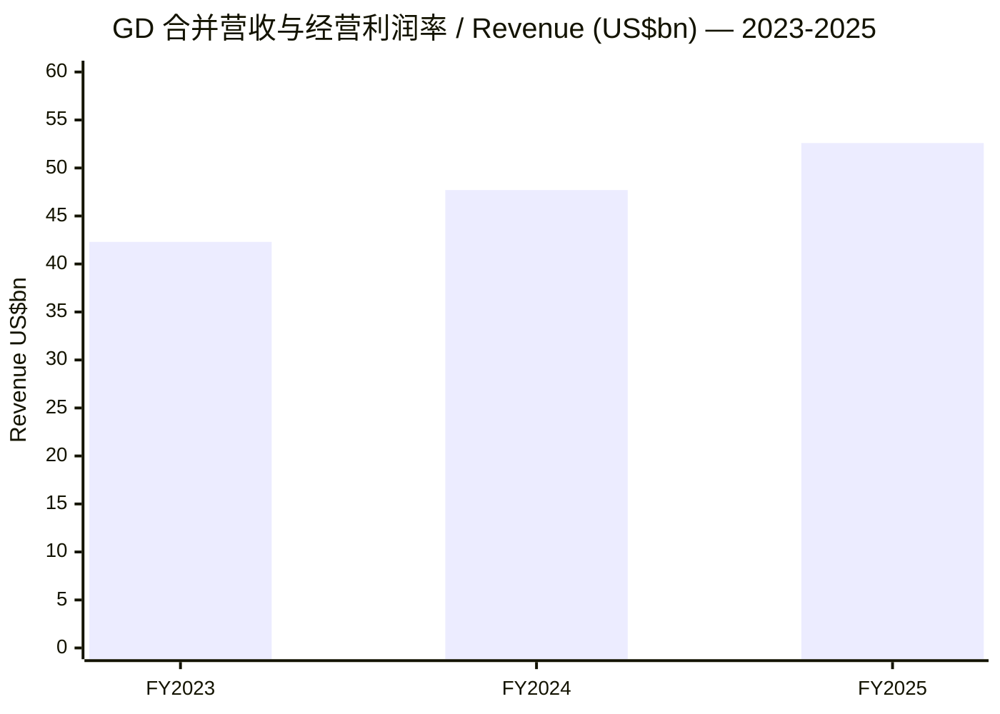
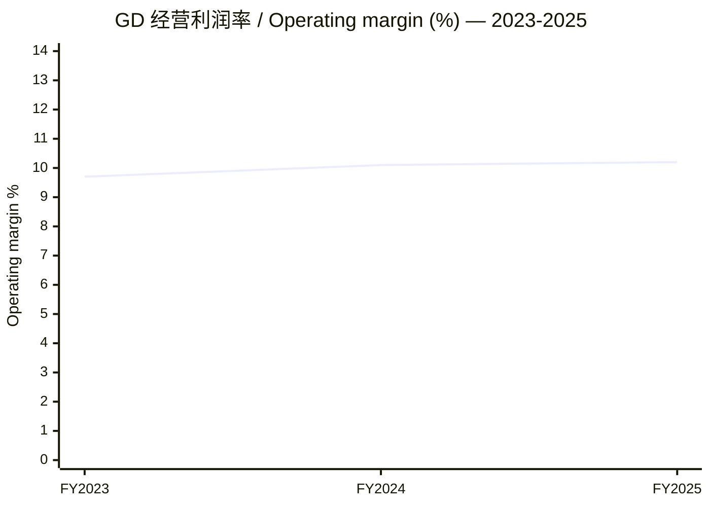
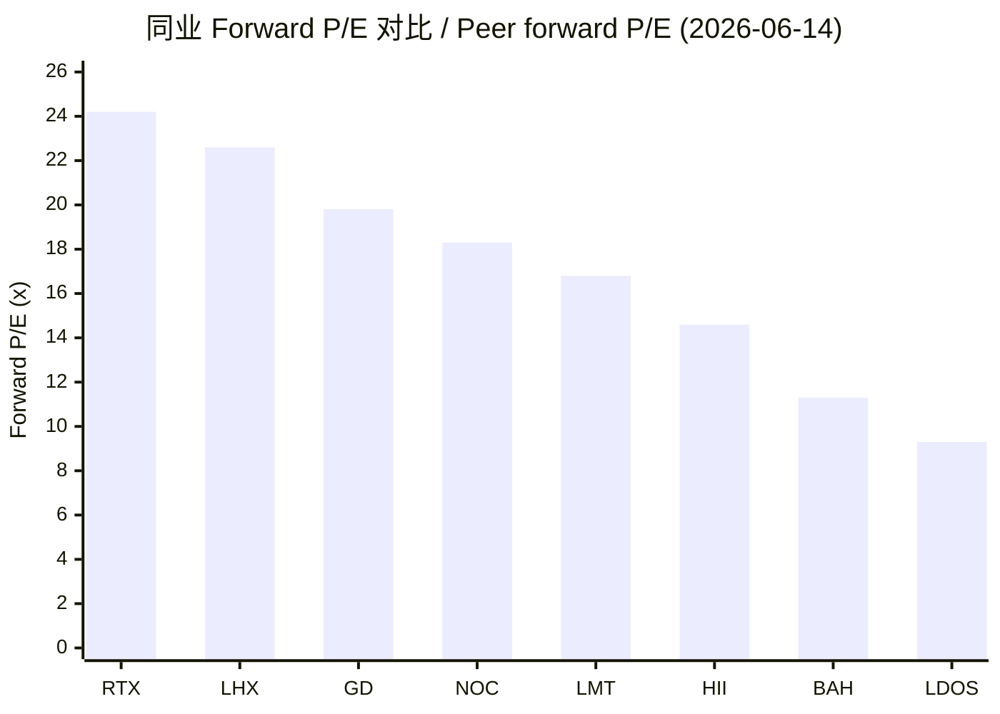
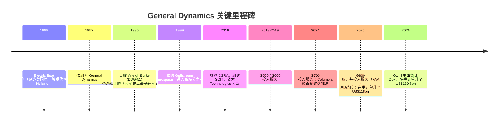
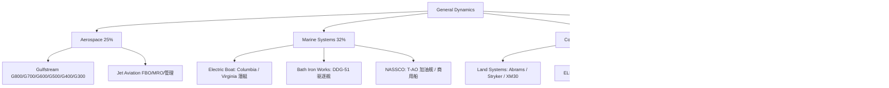
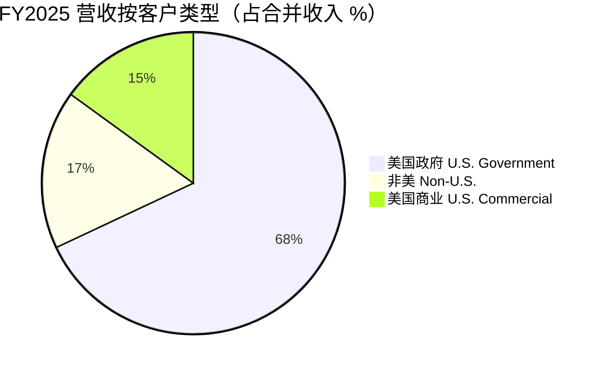
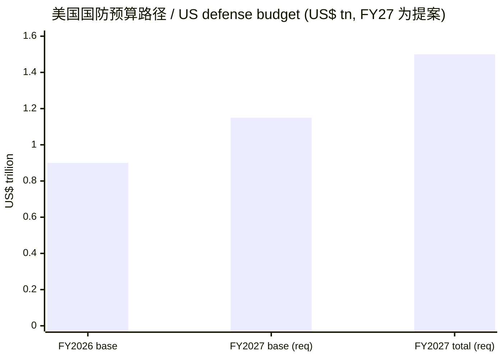
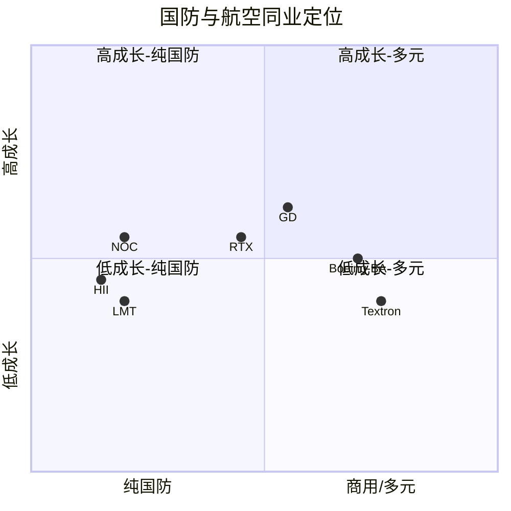

# General Dynamics（通用动力，NYSE: GD）公司研究报告

> **数据截止 / As of：2026-06-14**　|　报告币种：US$（除特别注明）　|　主要文件：[GD FY2025 10-K（2026-01-30 报送）](https://www.sec.gov/Archives/edgar/data/40533/000004053326000006/gd-20251231.htm)、[GD Q1-2026 10-Q](https://www.sec.gov/Archives/edgar/data/40533/000004053326000012/gd-20260405.htm)、[GD Q1-2026 业绩 8-K（EX-99.1）](https://www.sec.gov/Archives/edgar/data/40533/000004053326000010/gd-20260405exhibit991.htm)

---

## 投资摘要（Investment Summary）

> 以下评级、目标价（price target, PT）与情景均为 **本报告分析师观点（*分析师观点：*）**，不附着于任何监管文件；10-K 不含目标价，将 PT 附在 10-K 上属误用。

| 项目 | 内容 |
|---|---|
| **评级 / Rating** | **增持 / Overweight（Buy）** *（分析师观点）* |
| **12 个月目标价 / PT** | **US$390** *（分析师观点）* |
| 现价 / Price | US$360.22（2026-06-14） |
| 隐含空间 / Upside | **+8%**（价格）＋约 1.8% 股息 ≈ **+10% 总回报** |
| 估值方法 | 2027E EPS US$18.6 × 21× forward P/E |
| 市值 / Market cap | 约 US$97.4bn（约 2.70 亿股） |
| 52 周区间 | US$275.49 – US$369.70 |
| TTM P/E / forward P/E | 22.7× / 19.8× |
| Beta | 0.34（低于大盘的防御属性） |
| 股息 / Dividend | 季度 US$1.59，年化 US$6.36，连续第 29 年增长 |

**四条投资主线（thesis pillars，*分析师观点*）：**

1. **结构性国防上行周期 + 商用公务机双引擎。** 约 68% 收入来自美国政府、25% 来自 Gulfstream 公务机，二者当前同时处于上行周期：白宫提出 FY2027 高达 US$1.5tn 的国防预算、海军造船请求同比近 +50%，而 Gulfstream 在新机型换代下 FY2025 交付同比 +16%。
2. **US$118bn 在手订单 + 1.6× 国防订单出货比锁定多年现金流。** 总在手订单同比 +30%，Q1-2026 进一步升至 US$130.8bn、整体订单出货比 2.0×，可见度延伸到 2030 年代。
3. **潜艇是被低估的复利引擎。** Marine Systems（Electric Boat）是 Columbia 级（program of record > US$125bn）与 Virginia 级的总包/主建船厂，营收 FY2025 +16.6%、利润率从 6.5% 修复到 7.0%，仍有进一步修复空间。
4. **高质量资本回报 + 防御属性。** ROIC 连续三年提升至 14.2%，自由现金流（FCF）/净利润 94%，连续 29 年提高股息，Beta 仅 0.34。

---

## 目录

1. [公司概览](#一公司概览)
1B. [GF Score 基本面评分](#1bgf-score-基本面评分)
2. [估值与目标价 · 公司历史](#二估值与目标价)
3. [管理团队](#三管理团队)
4. [产品与服务](#四产品与服务最核心章节)
5. [客户与上市策略](#五客户与上市策略)
6. [行业概览](#六行业概览)
7. [竞争格局](#七竞争格局)
8. [市场机会（TAM）与资本结构](#八市场机会tam与资本结构)
9. [风险评估](#九风险评估)
9.5 [核心分歧与催化剂](#95-核心分歧与催化剂)
10. [投资视角评分](#十投资视角评分)
- [Data Used 数据清单](#data-used-数据清单)
- [参考资料](#参考资料)

---

## 一、公司概览

**一句话定位与本报告观点（BLUF）：** General Dynamics 是全球少数同时横跨"高端商用公务机 + 三大国防硬件/服务"四大业务的航空与国防巨头；我们给予**增持（Overweight）**评级、12 个月目标价 US$390，核心逻辑是国防预算上行周期、Gulfstream 新机换代与 US$118bn 在手订单三者叠加，使其在未来三年具备约 11% 的收入复合增速与持续提升的资本回报，而当前 19.8× 的 forward P/E 尚未充分反映这一可见度。GD 在其 [FY2025 10-K](https://www.sec.gov/Archives/edgar/data/40533/000004053326000006/gd-20251231.htm) 中自述为"a global aerospace and defense company that specializes in high-end design, engineering and manufacturing"，业务覆盖"business aviation; ship construction and repair; land combat vehicles, weapon systems and munitions; and technology products and services"（[GD FY2025 10-K, Item 1 Business Overview](https://www.sec.gov/Archives/edgar/data/40533/000004053326000006/gd-20251231.htm)）。

公司由 10 个业务单元组成，归入四个运营分部——**Aerospace、Marine Systems、Combat Systems、Technologies**，后三者合称"国防分部（defense segments）"；公司采用"精简总部 + 业务单元自负盈亏"的治理结构，总部仅负责战略与资本配置（[GD FY2025 10-K, Item 1 Business Overview](https://www.sec.gov/Archives/edgar/data/40533/000004053326000006/gd-20251231.htm)）。总部位于弗吉尼亚州 Reston，全球雇员"more than 110,000"（10-K 的 human capital 口径为约 117,000 人），FY2025 营收 US$52.6bn（[GD Q1-2026 业绩 8-K, EX-99.1](https://www.sec.gov/Archives/edgar/data/40533/000004053326000010/gd-20260405exhibit991.htm)）。

**FY2025 经营回顾（强劲且全面增长）：** 公司 FY2025 营收 US$52,550M、同比 +10.1%，operating earnings（经营利润）US$5,356M、+11.7%，operating margin（经营利润率）10.2%，diluted EPS（摊薄每股收益）US$15.45、+13.4%，经营活动现金流 US$5.1bn（为净利润的 122%）；总在手订单 US$118bn、同比 +30%，其中包括美国海军 Virginia 级与 Columbia 级潜艇合计 US$20.1bn 的订单与面向国际客户的 US$9.2bn 轮式/履带车辆订单（[GD FY2025 10-K, Item 7 — 2025 in Review](https://www.sec.gov/Archives/edgar/data/40533/000004053326000006/gd-20251231.htm)）。下方"利润表资金流"图直观展示了营收如何沿四大分部流入、再经成本与税费形成 US$4,210M 的净利润。

<svg xmlns="http://www.w3.org/2000/svg" viewBox="0 0 1000 560" width="1000" height="560" role="img" aria-label="income statement Sankey"><rect x="0" y="0" width="1000" height="560" fill="#ffffff"/>
<text x="20.00" y="30.00" text-anchor="start" font-family="Helvetica,Arial,sans-serif" font-size="15" font-weight="700" fill="#1f2933">General Dynamics — 利润表资金流 / Income Statement (FY2025)</text>
<path d="M 204.00,64.00 C 258.00,64.00 258.00,85.00 312.00,85.00 L 312.00,214.84 C 258.00,214.84 258.00,193.84 204.00,193.84 Z" fill="#93c5fd" fill-opacity="0.55"/>
<path d="M 452.00,78.00 C 506.00,78.00 506.00,242.92 560.00,242.92 L 560.00,284.50 C 506.00,284.50 506.00,119.58 452.00,119.58 Z" fill="#86efac" fill-opacity="0.55"/>
<path d="M 452.00,119.58 C 506.00,119.58 506.00,298.50 560.00,298.50 L 560.00,318.65 C 506.00,318.65 506.00,139.73 452.00,139.73 Z" fill="#fca5a5" fill-opacity="0.55"/>
<path d="M 328.00,85.00 C 382.00,85.00 382.00,78.00 436.00,78.00 L 436.00,139.73 C 382.00,139.73 382.00,146.73 328.00,146.73 Z" fill="#86efac" fill-opacity="0.55"/>
<path d="M 328.00,146.73 C 382.00,146.73 382.00,153.73 436.00,153.73 L 436.00,500.00 C 382.00,500.00 382.00,493.00 328.00,493.00 Z" fill="#fca5a5" fill-opacity="0.55"/>
<path d="M 204.00,207.84 C 258.00,207.84 258.00,214.84 312.00,214.84 L 312.00,319.43 C 258.00,319.43 258.00,312.43 204.00,312.43 Z" fill="#93c5fd" fill-opacity="0.55"/>
<path d="M 576.00,242.92 C 630.00,242.92 630.00,252.12 684.00,252.12 L 684.00,293.70 C 630.00,293.70 630.00,284.50 576.00,284.50 Z" fill="#86efac" fill-opacity="0.55"/>
<path d="M 700.00,252.12 C 754.00,252.12 754.00,262.19 808.00,262.19 L 808.00,294.88 C 754.00,294.88 754.00,284.80 700.00,284.80 Z" fill="#86efac" fill-opacity="0.55"/>
<path d="M 700.00,284.80 C 754.00,284.80 754.00,308.88 808.00,308.88 L 808.00,315.81 C 754.00,315.81 754.00,291.74 700.00,291.74 Z" fill="#fca5a5" fill-opacity="0.55"/>
<path d="M 576.00,298.50 C 630.00,298.50 630.00,305.74 684.00,305.74 L 684.00,325.88 C 630.00,325.88 630.00,318.65 576.00,318.65 Z" fill="#fca5a5" fill-opacity="0.55"/>
<path d="M 204.00,326.43 C 258.00,326.43 258.00,319.43 312.00,319.43 L 312.00,421.21 C 258.00,421.21 258.00,428.21 204.00,428.21 Z" fill="#93c5fd" fill-opacity="0.55"/>
<path d="M 576.00,332.65 C 630.00,332.65 630.00,293.70 684.00,293.70 L 684.00,296.14 C 630.00,296.14 630.00,335.08 576.00,335.08 Z" fill="#93c5fd" fill-opacity="0.55"/>
<path d="M 204.00,442.21 C 258.00,442.21 258.00,421.21 312.00,421.21 L 312.00,493.00 C 258.00,493.00 258.00,514.00 204.00,514.00 Z" fill="#93c5fd" fill-opacity="0.55"/>
<rect x="188.00" y="64.00" width="16" height="129.84" rx="1.5" fill="#2563eb"/>
<rect x="188.00" y="207.84" width="16" height="104.59" rx="1.5" fill="#2563eb"/>
<rect x="188.00" y="326.43" width="16" height="101.79" rx="1.5" fill="#2563eb"/>
<rect x="188.00" y="442.21" width="16" height="71.79" rx="1.5" fill="#2563eb"/>
<rect x="312.00" y="85.00" width="16" height="408.00" rx="1.5" fill="#1e3a8a"/>
<rect x="436.00" y="78.00" width="16" height="61.73" rx="1.5" fill="#15803d"/>
<rect x="436.00" y="153.73" width="16" height="346.27" rx="1.5" fill="#dc2626"/>
<rect x="560.00" y="242.92" width="16" height="41.58" rx="1.5" fill="#15803d"/>
<rect x="560.00" y="298.50" width="16" height="20.15" rx="1.5" fill="#dc2626"/>
<rect x="560.00" y="332.65" width="16" height="2.44" rx="1.5" fill="#2563eb"/>
<rect x="684.00" y="252.12" width="16" height="39.62" rx="1.5" fill="#15803d"/>
<rect x="684.00" y="305.74" width="16" height="20.15" rx="1.5" fill="#dc2626"/>
<rect x="808.00" y="262.19" width="16" height="32.69" rx="1.5" fill="#15803d"/>
<rect x="808.00" y="308.88" width="16" height="6.93" rx="1.5" fill="#dc2626"/>
<text x="179.00" y="125.92" text-anchor="end" font-family="Helvetica,Arial,sans-serif" font-size="11.5" font-weight="700" fill="#1f2933">Marine Systems</text>
<text x="179.00" y="138.92" text-anchor="end" font-family="Helvetica,Arial,sans-serif" font-size="10" font-weight="400" fill="#52606d">US$16.7B  (31.8%)</text>
<text x="179.00" y="257.13" text-anchor="end" font-family="Helvetica,Arial,sans-serif" font-size="11.5" font-weight="700" fill="#1f2933">Technologies</text>
<text x="179.00" y="270.13" text-anchor="end" font-family="Helvetica,Arial,sans-serif" font-size="10" font-weight="400" fill="#52606d">US$13.5B  (25.6%)</text>
<text x="179.00" y="374.32" text-anchor="end" font-family="Helvetica,Arial,sans-serif" font-size="11.5" font-weight="700" fill="#1f2933">Aerospace</text>
<text x="179.00" y="387.32" text-anchor="end" font-family="Helvetica,Arial,sans-serif" font-size="10" font-weight="400" fill="#52606d">US$13.1B  (24.9%)</text>
<text x="179.00" y="475.11" text-anchor="end" font-family="Helvetica,Arial,sans-serif" font-size="11.5" font-weight="700" fill="#1f2933">Combat Systems</text>
<text x="179.00" y="488.11" text-anchor="end" font-family="Helvetica,Arial,sans-serif" font-size="10" font-weight="400" fill="#52606d">US$9.2B  (17.6%)</text>
<rect x="331.00" y="67.00" width="119.40" height="26" rx="2" fill="#ffffff" fill-opacity="0.72"/>
<text x="334.00" y="79.00" text-anchor="start" font-family="Helvetica,Arial,sans-serif" font-size="11.5" font-weight="700" fill="#1f2933">Revenue</text>
<text x="334.00" y="92.00" text-anchor="start" font-family="Helvetica,Arial,sans-serif" font-size="10" font-weight="400" fill="#52606d">US$52.5B  (100.0%)</text>
<rect x="455.00" y="60.00" width="106.80" height="26" rx="2" fill="#ffffff" fill-opacity="0.72"/>
<text x="458.00" y="72.00" text-anchor="start" font-family="Helvetica,Arial,sans-serif" font-size="11.5" font-weight="700" fill="#1f2933">Gross Profit</text>
<text x="458.00" y="85.00" text-anchor="start" font-family="Helvetica,Arial,sans-serif" font-size="10" font-weight="400" fill="#52606d">US$8.0B  (15.1%)</text>
<rect x="455.00" y="135.73" width="144.60" height="26" rx="2" fill="#ffffff" fill-opacity="0.72"/>
<text x="458.00" y="147.73" text-anchor="start" font-family="Helvetica,Arial,sans-serif" font-size="11.5" font-weight="700" fill="#1f2933">Cost of Revenue (COGS)</text>
<text x="458.00" y="160.73" text-anchor="start" font-family="Helvetica,Arial,sans-serif" font-size="10" font-weight="400" fill="#52606d">US$44.6B  (84.9%)</text>
<rect x="579.00" y="224.92" width="106.80" height="26" rx="2" fill="#ffffff" fill-opacity="0.72"/>
<text x="582.00" y="236.92" text-anchor="start" font-family="Helvetica,Arial,sans-serif" font-size="11.5" font-weight="700" fill="#1f2933">Operating Income</text>
<text x="582.00" y="249.92" text-anchor="start" font-family="Helvetica,Arial,sans-serif" font-size="10" font-weight="400" fill="#52606d">US$5.4B  (10.2%)</text>
<rect x="579.00" y="280.50" width="150.90" height="26" rx="2" fill="#ffffff" fill-opacity="0.72"/>
<text x="582.00" y="292.50" text-anchor="start" font-family="Helvetica,Arial,sans-serif" font-size="11.5" font-weight="700" fill="#1f2933">Total Operating Expense</text>
<text x="582.00" y="305.50" text-anchor="start" font-family="Helvetica,Arial,sans-serif" font-size="10" font-weight="400" fill="#52606d">US$2.6B  (4.9%)</text>
<text x="551.00" y="330.87" text-anchor="end" font-family="Helvetica,Arial,sans-serif" font-size="11.5" font-weight="700" fill="#1f2933">Net Interest / Other Income</text>
<text x="551.00" y="343.87" text-anchor="end" font-family="Helvetica,Arial,sans-serif" font-size="10" font-weight="400" fill="#52606d">US$314.0M  (0.60%)</text>
<rect x="703.00" y="234.12" width="100.50" height="26" rx="2" fill="#ffffff" fill-opacity="0.72"/>
<text x="706.00" y="246.12" text-anchor="start" font-family="Helvetica,Arial,sans-serif" font-size="11.5" font-weight="700" fill="#1f2933">Pretax Income</text>
<text x="706.00" y="259.12" text-anchor="start" font-family="Helvetica,Arial,sans-serif" font-size="10" font-weight="400" fill="#52606d">US$5.1B  (9.7%)</text>
<rect x="703.00" y="287.74" width="100.50" height="26" rx="2" fill="#ffffff" fill-opacity="0.72"/>
<text x="706.00" y="299.74" text-anchor="start" font-family="Helvetica,Arial,sans-serif" font-size="11.5" font-weight="700" fill="#1f2933">SG&amp;A</text>
<text x="706.00" y="312.74" text-anchor="start" font-family="Helvetica,Arial,sans-serif" font-size="10" font-weight="400" fill="#52606d">US$2.6B  (4.9%)</text>
<text x="833.00" y="275.53" text-anchor="start" font-family="Helvetica,Arial,sans-serif" font-size="11.5" font-weight="700" fill="#1f2933">Net Income</text>
<text x="833.00" y="288.53" text-anchor="start" font-family="Helvetica,Arial,sans-serif" font-size="10" font-weight="400" fill="#52606d">US$4.2B  (8.0%)</text>
<text x="833.00" y="309.34" text-anchor="start" font-family="Helvetica,Arial,sans-serif" font-size="11.5" font-weight="700" fill="#1f2933">Income Tax</text>
<text x="833.00" y="322.34" text-anchor="start" font-family="Helvetica,Arial,sans-serif" font-size="10" font-weight="400" fill="#52606d">US$893.0M  (1.7%)</text>
<text x="500.00" y="544.00" text-anchor="middle" font-family="Helvetica,Arial,sans-serif" font-size="10" font-weight="400" fill="#52606d">Source: GD FY2025 10-K (Item 7 / Item 8), filed 2026-01-30</text>
</svg>

**分部结构与营收构成。** FY2025 各分部营收占比为 Marine Systems 32%、Technologies 26%、Aerospace 25%、Combat Systems 17%，呈现"国防硬件 + 商用航空 + 技术服务"的多元平衡（[GD FY2025 10-K, Item 1](https://www.sec.gov/Archives/edgar/data/40533/000004053326000006/gd-20251231.htm)）。这种组合的价值在于：当国防采购周期波动时 Gulfstream 提供商用上行，而当公务机需求走弱时长达二十年的潜艇/造船在手订单提供下行保护——这是 GD 相对纯国防同业的关键差异。

<svg xmlns="http://www.w3.org/2000/svg" viewBox="0 0 720 460" width="720" height="460" role="img" aria-label="revenue donut"><rect x="0" y="0" width="720" height="460" fill="#ffffff"/>
<text x="20.00" y="30.00" text-anchor="start" font-family="Helvetica,Arial,sans-serif" font-size="15" font-weight="700" fill="#1f2933">FY2025 营收按分部 / Revenue by Segment</text>
<path d="M 288.00,107.20 A 132 132 0 0 1 408.05,294.07 L 358.94,271.62 A 78 78 0 0 0 288.00,161.20 Z" fill="#2563eb"/>
<path d="M 408.05,294.07 A 132 132 0 0 1 228.39,356.97 L 252.77,308.79 A 78 78 0 0 0 358.94,271.62 Z" fill="#15803d"/>
<path d="M 228.39,356.97 A 132 132 0 0 1 170.03,179.97 L 218.29,204.20 A 78 78 0 0 0 252.77,308.79 Z" fill="#d97706"/>
<path d="M 170.03,179.97 A 132 132 0 0 1 288.00,107.20 L 288.00,161.20 A 78 78 0 0 0 218.29,204.20 Z" fill="#7c3aed"/>
<text x="288.00" y="235.20" text-anchor="middle" font-family="Helvetica,Arial,sans-serif" font-size="18" font-weight="800" fill="#1f2933">GD</text>
<text x="288.00" y="255.20" text-anchor="middle" font-family="Helvetica,Arial,sans-serif" font-size="13" font-weight="600" fill="#52606d">US$52.5B</text>
<text x="288.00" y="271.20" text-anchor="middle" font-family="Helvetica,Arial,sans-serif" font-size="10" font-weight="400" fill="#8a97a3">total</text>
<line x1="404.10" y1="164.61" x2="420.10" y2="164.61" stroke="#2563eb" stroke-width="1.4"/>
<text x="424.10" y="162.61" text-anchor="start" font-family="Helvetica,Arial,sans-serif" font-size="11" font-weight="700" fill="#1f2933">Marine Systems</text>
<text x="424.10" y="176.61" text-anchor="start" font-family="Helvetica,Arial,sans-serif" font-size="10" font-weight="400" fill="#52606d">US$16.7B  (31.8%)</text>
<line x1="333.60" y1="369.45" x2="349.60" y2="369.45" stroke="#15803d" stroke-width="1.4"/>
<text x="353.60" y="367.45" text-anchor="start" font-family="Helvetica,Arial,sans-serif" font-size="11" font-weight="700" fill="#1f2933">Technologies</text>
<text x="353.60" y="381.45" text-anchor="start" font-family="Helvetica,Arial,sans-serif" font-size="10" font-weight="400" fill="#52606d">US$13.5B  (25.6%)</text>
<line x1="156.94" y1="282.41" x2="140.94" y2="282.41" stroke="#d97706" stroke-width="1.4"/>
<text x="136.94" y="280.41" text-anchor="end" font-family="Helvetica,Arial,sans-serif" font-size="11" font-weight="700" fill="#1f2933">Aerospace</text>
<text x="136.94" y="294.41" text-anchor="end" font-family="Helvetica,Arial,sans-serif" font-size="10" font-weight="400" fill="#52606d">US$13.1B  (24.9%)</text>
<line x1="215.55" y1="121.75" x2="199.55" y2="121.75" stroke="#7c3aed" stroke-width="1.4"/>
<text x="195.55" y="119.75" text-anchor="end" font-family="Helvetica,Arial,sans-serif" font-size="11" font-weight="700" fill="#1f2933">Combat Systems</text>
<text x="195.55" y="133.75" text-anchor="end" font-family="Helvetica,Arial,sans-serif" font-size="10" font-weight="400" fill="#52606d">US$9.2B  (17.6%)</text>
<text x="360.00" y="444.00" text-anchor="middle" font-family="Helvetica,Arial,sans-serif" font-size="10" font-weight="400" fill="#52606d">Source: GD FY2025 10-K (Item 7 / Item 8), filed 2026-01-30</text>
</svg>

**三年营收轨迹（development over time）。** 从 FY2023 到 FY2025，公司营收由 US$42,272M 增至 US$52,550M（约 +11.5% CAGR），增长动力依次切换：FY2023→FY2024 主要由 Aerospace（G700 上量）与 Marine 拉动，FY2024→FY2025 则由 Marine（潜艇放量）与 Aerospace（G700 增量 + G800 首交付）共同驱动，Combat 与 Technologies 保持低个位数稳增（[GD FY2025 10-K, Item 1 分部营收表](https://www.sec.gov/Archives/edgar/data/40533/000004053326000006/gd-20251231.htm)）。下图为分部营收三年堆叠。

<svg xmlns="http://www.w3.org/2000/svg" viewBox="0 0 860 470" width="860" height="470" role="img" aria-label="historical revenue bars"><rect x="0" y="0" width="860" height="470" fill="#ffffff"/>
<text x="20.00" y="30.00" text-anchor="start" font-family="Helvetica,Arial,sans-serif" font-size="15" font-weight="700" fill="#1f2933">营收增长（按分部）/ Revenue by Segment 2023–2025</text>
<rect x="20.00" y="44" width="11" height="11" rx="2" fill="#2563eb"/>
<text x="36.00" y="53.00" text-anchor="start" font-family="Helvetica,Arial,sans-serif" font-size="10.5" font-weight="400" fill="#1f2933">Aerospace</text>
<rect x="109.40" y="44" width="11" height="11" rx="2" fill="#15803d"/>
<text x="125.40" y="53.00" text-anchor="start" font-family="Helvetica,Arial,sans-serif" font-size="10.5" font-weight="400" fill="#1f2933">Marine Systems</text>
<rect x="231.80" y="44" width="11" height="11" rx="2" fill="#d97706"/>
<text x="247.80" y="53.00" text-anchor="start" font-family="Helvetica,Arial,sans-serif" font-size="10.5" font-weight="400" fill="#1f2933">Combat Systems</text>
<rect x="354.20" y="44" width="11" height="11" rx="2" fill="#7c3aed"/>
<text x="370.20" y="53.00" text-anchor="start" font-family="Helvetica,Arial,sans-serif" font-size="10.5" font-weight="400" fill="#1f2933">Technologies</text>
<line x1="70" y1="412.00" x2="834" y2="412.00" stroke="#eceff2" stroke-width="1"/>
<text x="64.00" y="415.00" text-anchor="end" font-family="Helvetica,Arial,sans-serif" font-size="9.5" font-weight="400" fill="#52606d">US$0</text>
<line x1="70" y1="345.20" x2="834" y2="345.20" stroke="#eceff2" stroke-width="1"/>
<text x="64.00" y="348.20" text-anchor="end" font-family="Helvetica,Arial,sans-serif" font-size="9.5" font-weight="400" fill="#52606d">US$11.4B</text>
<line x1="70" y1="278.40" x2="834" y2="278.40" stroke="#eceff2" stroke-width="1"/>
<text x="64.00" y="281.40" text-anchor="end" font-family="Helvetica,Arial,sans-serif" font-size="9.5" font-weight="400" fill="#52606d">US$22.7B</text>
<line x1="70" y1="211.60" x2="834" y2="211.60" stroke="#eceff2" stroke-width="1"/>
<text x="64.00" y="214.60" text-anchor="end" font-family="Helvetica,Arial,sans-serif" font-size="9.5" font-weight="400" fill="#52606d">US$34.1B</text>
<line x1="70" y1="144.80" x2="834" y2="144.80" stroke="#eceff2" stroke-width="1"/>
<text x="64.00" y="147.80" text-anchor="end" font-family="Helvetica,Arial,sans-serif" font-size="9.5" font-weight="400" fill="#52606d">US$45.4B</text>
<line x1="70" y1="78.00" x2="834" y2="78.00" stroke="#eceff2" stroke-width="1"/>
<text x="64.00" y="81.00" text-anchor="end" font-family="Helvetica,Arial,sans-serif" font-size="9.5" font-weight="400" fill="#52606d">US$56.8B</text>
<rect x="123.48" y="361.27" width="147.71" height="50.73" fill="#2563eb"/>
<rect x="123.48" y="287.93" width="147.71" height="73.33" fill="#15803d"/>
<rect x="123.48" y="239.27" width="147.71" height="48.66" fill="#d97706"/>
<rect x="123.48" y="163.23" width="147.71" height="76.05" fill="#7c3aed"/>
<text x="197.33" y="428.00" text-anchor="middle" font-family="Helvetica,Arial,sans-serif" font-size="10" font-weight="400" fill="#52606d">2023</text>
<rect x="378.15" y="345.80" width="147.71" height="66.20" fill="#2563eb"/>
<rect x="378.15" y="261.39" width="147.71" height="84.41" fill="#15803d"/>
<rect x="378.15" y="208.44" width="147.71" height="52.95" fill="#d97706"/>
<rect x="378.15" y="131.19" width="147.71" height="77.25" fill="#7c3aed"/>
<text x="452.00" y="428.00" text-anchor="middle" font-family="Helvetica,Arial,sans-serif" font-size="10" font-weight="400" fill="#52606d">2024</text>
<rect x="632.81" y="334.85" width="147.71" height="77.15" fill="#2563eb"/>
<rect x="632.81" y="236.43" width="147.71" height="98.42" fill="#15803d"/>
<rect x="632.81" y="182.02" width="147.71" height="54.41" fill="#d97706"/>
<rect x="632.81" y="102.74" width="147.71" height="79.28" fill="#7c3aed"/>
<text x="706.67" y="428.00" text-anchor="middle" font-family="Helvetica,Arial,sans-serif" font-size="10" font-weight="400" fill="#52606d">2025</text>
<text x="430.00" y="454.00" text-anchor="middle" font-family="Helvetica,Arial,sans-serif" font-size="10" font-weight="400" fill="#52606d">Source: GD FY2025 10-K (Item 7 / Item 8), filed 2026-01-30</text>
</svg>

*经营利润率由 FY2023 的约 9.7% 升至 FY2025 的 10.2%，主要受 Aerospace（13.3%）与 Combat（14.4%）高利润率分部占比及 Marine 利润率修复带动（[GD FY2025 10-K, Item 7](https://www.sec.gov/Archives/edgar/data/40533/000004053326000006/gd-20251231.htm)）。*

**估值快照（valuation snapshot）。** 截至 2026-06-14，GD 现价 US$360.22、市值约 US$97.4bn，TTM P/E 22.7×、forward P/E 19.8×、P/S 1.81×、P/B 3.73×、EV/EBITDA 15.9×（[stockanalysis.com — GD statistics, 2026-06-14](https://stockanalysis.com/stocks/gd/)）。22.7× 的 TTM P/E 高于 LMT 与 NOC，但低于 RTX（34.5×）与 LHX（33.5×）；考虑到 GD 约四分之一收入来自增长更快、利润率更高的 Gulfstream 公务机，加上潜艇业务长达二十年的可见度，相对纯国防大厂的溢价具备基本面支撑（详见第七节）。这一倍数既非便宜也非昂贵，因此 GF Value 维度仅给 5/10（详见 1B）。*分析师观点：* 摩根士丹利指出，国防大厂当前在 NTM P/FCF 口径上较标普 500 折价约 16%，未充分反映预算上行（[Morgan Stanley — Defense: Dollars, Disruptors, and De(Consolidation), 2026-03-06, p.1](http://xs-macbook-air.local:5001/zsxq/pdf/184442822484282/Morgan%20Stanley-Defense%EF%BC%9ADollars%EF%BC%8C%20Disruptors%EF%BC%8C%20and%20De%EF%BC%88Consolidation%EF%BC%89%EF%BC%9B%20Identifying%20Investment%20Opportunities-260306.pdf)）。

---

## 1B、GF Score 基本面评分

> GF Score 为 GuruFocus 风格的五维基本面评分，是**本报告分析师自建的评分体系（*分析师观点：*）**，并非来自 GuruFocus，也不附着任何监管文件；各维度底层指标均在第 1–2 节单独引用。

<svg xmlns="http://www.w3.org/2000/svg" viewBox="0 0 500 500" width="500" height="500" role="img" aria-label="GF Score radar">
<rect x="0" y="0" width="500" height="500" fill="#ffffff"/>
<text x="20" y="24" font-family="Helvetica,Arial,sans-serif" font-size="15" font-weight="700" fill="#1f2933">GF Score (GuruFocus-style): 76/100</text>
<text x="20" y="41" font-family="Helvetica,Arial,sans-serif" font-size="11" fill="#52606d">71–80 Likely average performance</text>
<polygon points="250.0,88.0 392.7,191.6 338.2,359.4 161.8,359.4 107.3,191.6" fill="#e9f5ec" stroke="none"/>
<polygon points="250.0,208.0 278.5,228.7 267.6,262.3 232.4,262.3 221.5,228.7" fill="none" stroke="#c5d3cb" stroke-width="1"/>
<polygon points="250.0,178.0 307.1,219.5 285.3,286.5 214.7,286.5 192.9,219.5" fill="none" stroke="#c5d3cb" stroke-width="1"/>
<polygon points="250.0,148.0 335.6,210.2 302.9,310.8 197.1,310.8 164.4,210.2" fill="none" stroke="#c5d3cb" stroke-width="1"/>
<polygon points="250.0,118.0 364.1,200.9 320.5,335.1 179.5,335.1 135.9,200.9" fill="none" stroke="#c5d3cb" stroke-width="1"/>
<polygon points="250.0,88.0 392.7,191.6 338.2,359.4 161.8,359.4 107.3,191.6" fill="none" stroke="#c5d3cb" stroke-width="1.3"/>
<line x1="250" y1="238" x2="161.8" y2="359.4" stroke="#cfdad3" stroke-width="1"/>
<text x="146.5" y="392.4" text-anchor="end" font-family="Helvetica,Arial,sans-serif" font-size="11.5" font-weight="600" fill="#1f2933">Financial Strength</text>
<text x="146.5" y="405.4" text-anchor="end" font-family="Helvetica,Arial,sans-serif" font-size="9.5" fill="#52606d">财务实力</text>
<text x="179.5" y="329.1" text-anchor="middle" font-family="Helvetica,Arial,sans-serif" font-size="10.5" font-weight="700" fill="#1f2933">8</text>
<line x1="250" y1="238" x2="250.0" y2="88.0" stroke="#cfdad3" stroke-width="1"/>
<text x="250.0" y="58.0" text-anchor="middle" font-family="Helvetica,Arial,sans-serif" font-size="11.5" font-weight="600" fill="#1f2933">Profitability</text>
<text x="250.0" y="71.0" text-anchor="middle" font-family="Helvetica,Arial,sans-serif" font-size="9.5" fill="#52606d">盈利能力</text>
<text x="250.0" y="112.0" text-anchor="middle" font-family="Helvetica,Arial,sans-serif" font-size="10.5" font-weight="700" fill="#1f2933">8</text>
<line x1="250" y1="238" x2="107.3" y2="191.6" stroke="#cfdad3" stroke-width="1"/>
<text x="82.6" y="183.6" text-anchor="end" font-family="Helvetica,Arial,sans-serif" font-size="11.5" font-weight="600" fill="#1f2933">Growth</text>
<text x="82.6" y="196.6" text-anchor="end" font-family="Helvetica,Arial,sans-serif" font-size="9.5" fill="#52606d">成长性</text>
<text x="135.9" y="194.9" text-anchor="middle" font-family="Helvetica,Arial,sans-serif" font-size="10.5" font-weight="700" fill="#1f2933">8</text>
<line x1="250" y1="238" x2="392.7" y2="191.6" stroke="#cfdad3" stroke-width="1"/>
<text x="417.4" y="183.6" text-anchor="start" font-family="Helvetica,Arial,sans-serif" font-size="11.5" font-weight="600" fill="#1f2933">GF Value</text>
<text x="417.4" y="196.6" text-anchor="start" font-family="Helvetica,Arial,sans-serif" font-size="9.5" fill="#52606d">估值</text>
<text x="321.3" y="208.8" text-anchor="middle" font-family="Helvetica,Arial,sans-serif" font-size="10.5" font-weight="700" fill="#1f2933">5</text>
<line x1="250" y1="238" x2="338.2" y2="359.4" stroke="#cfdad3" stroke-width="1"/>
<text x="353.5" y="392.4" text-anchor="start" font-family="Helvetica,Arial,sans-serif" font-size="11.5" font-weight="600" fill="#1f2933">Momentum</text>
<text x="353.5" y="405.4" text-anchor="start" font-family="Helvetica,Arial,sans-serif" font-size="9.5" fill="#52606d">动量</text>
<text x="320.5" y="329.1" text-anchor="middle" font-family="Helvetica,Arial,sans-serif" font-size="10.5" font-weight="700" fill="#1f2933">8</text>
<polygon points="250.0,118.0 321.3,214.8 320.5,335.1 179.5,335.1 135.9,200.9" fill="#2e8b57" fill-opacity="0.34" stroke="#2e8b57" stroke-width="2"/>
<circle cx="179.5" cy="335.1" r="2.6" fill="#2e8b57"/>
<circle cx="250.0" cy="118.0" r="2.6" fill="#2e8b57"/>
<circle cx="135.9" cy="200.9" r="2.6" fill="#2e8b57"/>
<circle cx="321.3" cy="214.8" r="2.6" fill="#2e8b57"/>
<circle cx="320.5" cy="335.1" r="2.6" fill="#2e8b57"/>
<text x="250" y="470" text-anchor="middle" font-family="Helvetica,Arial,sans-serif" font-size="9.5" fill="#52606d">Source: GD FY2025 10-K · Yahoo Finance · indicators.db, as of 2026-06-14</text>
<text x="250" y="485" text-anchor="middle" font-family="Helvetica,Arial,sans-serif" font-size="9" fill="#52606d">GF Score = independent analyst rubric (*Analyst view:*) — not GuruFocus™ official number</text>
</svg>

| 维度 / Dimension | 评分 / Score (0–10) | |
|---|---|---|
| Financial Strength (财务实力) | 8 | `████████░░` |
| Profitability (盈利能力) | 8 | `████████░░` |
| Growth (成长性) | 8 | `████████░░` |
| GF Value (估值) | 5 | `█████░░░░░` |
| Momentum (动量) | 8 | `████████░░` |
| **GF Score (composite, *Analyst view:*)** | **76 / 100** | **71–80 Likely average performance** |

*Composite weights (*Analyst view:*): Financial Strength 20% · Profitability 25% · Growth 25% · GF Value 15% · Momentum 15% (transparent reproduction — not GuruFocus's proprietary weighting).*

**各维度评分理由：**

- **Financial Strength（财务实力）8/10：** 资产负债表稳健——总债务 US$8,013M（短期 US$1,006M + 长期 US$7,007M），现金 US$2,333M，净债务约 US$5.7bn；以 operating earnings US$5,356M / net interest US$314M 计，利息保障倍数约 17×（[GD FY2025 10-K, Item 8 资产负债表](https://www.sec.gov/Archives/edgar/data/40533/000004053326000006/gd-20251231.htm)）。未给满分主要因 goodwill 高达 US$21,009M（主要来自 GDIT/CSRA 收购）与养老金负债（[GD FY2025 10-K, Item 8](https://www.sec.gov/Archives/edgar/data/40533/000004053326000006/gd-20251231.htm)）。
- **Profitability（盈利能力）8/10：** operating margin 10.2%、net margin 8.0%、ROE 约 18%、ROIC 14.2% 且连续三年抬升（12.3%→13.2%→14.2%），盈利稳定性优异（[GD FY2025 10-K, Item 7 — ROIC](https://www.sec.gov/Archives/edgar/data/40533/000004053326000006/gd-20251231.htm)）。
- **Growth（成长性）8/10：** 营收 +10.1%、EPS +13.4%、在手订单 +30%；FY2023–FY2025 营收 CAGR 约 11.5%（[GD FY2025 10-K, Item 7](https://www.sec.gov/Archives/edgar/data/40533/000004053326000006/gd-20251231.htm)）。
- **GF Value（估值，越高越便宜）5/10：** forward P/E 19.8× 略高于自身历史中枢（约 16–18×），股价逼近 52 周高点，安全边际有限（[stockanalysis.com — GD statistics, 2026-06-14](https://stockanalysis.com/stocks/gd/)）。
- **Momentum（动量）8/10：** 现价 US$360 接近 52 周高点 US$369.70、较低点 US$275.49 上行约 31%，位于 200 日均线上方（[Yahoo Finance — GD](https://finance.yahoo.com/quote/GD/)）。

综合得分 76/100，落在"71–80 可能优于平均"区间，与本报告"高质量、可见度强、但估值已不便宜"的整体判断一致。

---

## 二、估值与目标价

> 本节所有前瞻预测、目标价与情景均为 **本报告分析师观点（*分析师观点：*）**，构建自 10-K 分部数据 + 管理层指引 + 行业预测；公司自身模型不作为数据来源。

### 2.1 前瞻财务预测（*分析师观点*）

预测以 GD 自身 [FY2025 10-K Item 7 的 2026 分部指引](https://www.sec.gov/Archives/edgar/data/40533/000004053326000006/gd-20251231.htm)为锚——Aerospace 约 US$13.6bn / 约 14% 利润率、Marine US$17.3–17.7bn / 约 7.3%、Combat US$9.6–9.7bn / 约 14.1%、Technologies 约 US$13.8bn / 约 9.2%、Corporate 约 −US$160M、税率约 17.5%——并在此基础上按潜艇与 Gulfstream 的产能爬坡外推 FY2027–2028。

| 指标（*分析师观点*） | FY2025A | FY2026E | FY2027E | FY2028E |
|---|---|---|---|---|
| 营收 Revenue（US$bn） | 52.6 | 54.6（+3.9%） | 58.4（+7.0%） | 62.3（+6.7%） |
| 经营利润率 Op. margin | 10.2% | 10.4% | 10.6% | 10.8% |
| EPS（diluted, US$） | 15.45 | 16.7（+8%） | 18.6（+11%） | 20.6（+11%） |
| ROIC | 14.2% | ~14.7% | ~15.2% | ~15.6% |

各分部的驱动与利润率轨迹（mix shift，而非笼统的"利润率改善"）：（1）**Marine** 由 Columbia 级（年产 1 艘）+ Virginia 级（爬坡至年产 2 艘）放量驱动收入，利润率随产线学习曲线由 7.0% 逐步修复（早期生产合同利润率偏低，随交付增加而抬升，是 10-K 明确的 contract-mix 机制，[GD FY2025 10-K, Item 7 — Backlog 段](https://www.sec.gov/Archives/edgar/data/40533/000004053326000006/gd-20251231.htm)）;（2）**Aerospace** 由 G700/G800/G400/G300 新机换代 + 售后扩张驱动，利润率受 G800 取证 R&D 完成后下降而抬升（FY2025 已 +30bp 至 13.3%，[GD FY2025 10-K, Item 7 — Aerospace](https://www.sec.gov/Archives/edgar/data/40533/000004053326000006/gd-20251231.htm)）;（3）**Combat** 由国际轮式/履带车辆 + 弹药/推进剂扩产驱动;（4）**Technologies** 由联邦 IT 现代化驱动，利润率受 IT 服务占比上升而略承压。

### 2.2 目标价推导（*分析师观点*）

**方法：forward P/E × 目标倍数。** 取 FY2027E EPS US$18.6 × 21× = **US$390**（12 个月目标价）。

**为什么用 21×：** GD 历史 forward P/E 中枢约 16–19×；给予约 21× 反映其相对纯国防大厂的两点溢价——（1）约 25% 收入来自增长更快、利润率更高的 Gulfstream 商用公务机;（2）潜艇业务长达二十年的在手订单可见度。以 forward P/E 对标同业（[stockanalysis.com — GD statistics, 2026-06-14](https://stockanalysis.com/stocks/gd/)）：RTX 24.2×、LHX 22.6×、GD 19.8×、NOC 18.3×、LMT 16.8×、HII 14.6×、IT 服务同业 BAH 11.3× / LDOS 9.3×。GD 居于中上，21× 的目标倍数较其自身 19.8× 现值小幅扩张，前提是预算上行与订单兑现。

*来源：[stockanalysis.com — GD statistics, 2026-06-14](https://stockanalysis.com/stocks/gd/)。BA 因 TTM 亏损未纳入。*

### 2.3 牛/基/熊情景（*分析师观点*）

| 情景 | 关键摆动假设 | EPS×倍数 | 目标价 | 相对现价 |
|---|---|---|---|---|
| **牛 Bull** | Gulfstream 加速交付 + Marine 利润率回 8–9% + 倍数扩至 23× | 2027E ~19.5 × 23× | **US$448** | **+24%** |
| **基 Base** | 中性预测，预算如期、潜艇按节奏爬坡 | 2027E 18.6 × 21× | **US$390** | **+8%** |
| **熊 Bear** | 持续 CR/预算延迟 + 公务机周期走弱 + 倍数压缩至 17× | 2027E ~17.0 × 17× | **US$289** | **−20%** |

### 2.4 与市场一致预期的对比（consensus benchmark）

我们 US$390 的基准目标价与卖方一致预期基本一致：当前 21 位分析师的平均目标价 US$393.17（最高 US$444、最低 US$313），综合评级为"买入（buy）"（[stockanalysis.com — GD analyst forecast, 2026-06-14](https://stockanalysis.com/stocks/gd/forecast/)）。

### 2.5 最该盯紧的变量（swing variables）

1. **Marine Systems 利润率轨迹。** 7.0% 能否随 Columbia/Virginia 过了早期低利润率阶段而升向 8–9%，是 GD 最大的盈利弹性来源，也最受供应商成本/劳动力扰动（FY2024 即因 supplier cost growth 拖累利润率，[GD FY2025 10-K, Item 7 — Marine](https://www.sec.gov/Archives/edgar/data/40533/000004053326000006/gd-20251231.htm)）。
2. **Gulfstream 交付节奏与订单出货比。** FY2025 交付 158 架、book-to-bill 1.2×；G400 量产、G800 爬坡与 G300 推出能否对冲公务机周期，是 Aerospace 上行的关键（[GD FY2025 10-K, Item 7 — Aerospace](https://www.sec.gov/Archives/edgar/data/40533/000004053326000006/gd-20251231.htm)）。

### 2.6 卖方观点演变（Sell-side view evolution）

本地券商库（`db/zsxq.db`）对 GD 主要以**国防行业报告**形式覆盖（无单一公司深度报告），且 `db/stock_price_target.db` 当前无 GD 记录；以下为按机构整理的可得观点，均为 *分析师观点*：

| 机构 | 日期 | 评级 / 框架 | 对 GD 的核心论点 |
|---|---|---|---|
| Morgan Stanley | 2026-03-06 | **GD = Overweight（超配）** | 在 US$1.5tn FY27 国防预算情景下上调防务大厂牛市目标价（GD 牛市 PT 上调幅度居前），认为"颠覆是技术赋能而非行业取代"，大厂与新进入者均可增长（[MS — Defense: Dollars, Disruptors, and De(Consolidation), 2026-03-06, p.1](http://xs-macbook-air.local:5001/zsxq/pdf/184442822484282/Morgan%20Stanley-Defense%EF%BC%9ADollars%EF%BC%8C%20Disruptors%EF%BC%8C%20and%20De%EF%BC%88Consolidation%EF%BC%89%EF%BC%9B%20Identifying%20Investment%20Opportunities-260306.pdf)） |
| J.P. Morgan | 2026-06-08 | 结构性（无 PT） | 将 GD 列为美国国防工业基础的"五大寡头"之一（洛马/波音/诺格/RTX/通用动力），并警示其面临 Anduril、Shield AI 等"商业—军工融合 + 可规模化量产"新进入者的长期挑战（[J.P. Morgan — Revamping the U.S. defense industrial base, 2026-06-08, p.1](http://xs-macbook-air.local:5001/zsxq/pdf/814528415518812/J.P.%20Morgan-One%20battle%20after%20another%EF%BC%9ARevamping%20the%20U.S.%20defense%20industrial%20base-260608.pdf)） |
| Bernstein | 2026-06-02 | 行业（造船改善） | 在与 12 家 A&D CEO 交流后指出造船产能/劳动力/供应商问题正逐步缓解、导弹与太空需求最旺——利好 GD 的 Marine 与 Combat（[Bernstein — Twelve CEOs in three days, 2026-06-02, p.1](http://xs-macbook-air.local:5001/zsxq/pdf/812485114412812/Bernstein-Global%20Aerospace%20%26%20Defense%EF%BC%9AAerospace%20%26%20Defense%EF%BC%9A%20Twelve%20CEOs%20in%20three%20days~A%26D%20themes%20from%20Bernstein%27s%20Strategic%20Decisions%20Conference-260602.pdf)） |

**机构间分歧（机构间一致度较高，分歧在"新进入者威胁"的程度）：** MS 与 Bernstein 偏多（预算上行 + 造船改善直接利好 GD 现有平台）；JPM 不否认短期受益，但强调 GD 这类传统大厂在体制僵化、采办周期长（主力装备达 8 年）下，长期面临被低成本可消耗系统与软件定义作战重塑的风险——"什么证据能证明 JPM 正确"：若 Anduril/Shield AI 等持续中标本应属大厂的量产/自主合同，则 GD 的 Combat 与 Technologies 估值需下修。

### 2.7 公司历史

GD 的当代形态由 1952 年 Electric Boat（成立于 1899 年、建造美国第一艘现代潜艇）改组而来，并以一系列并购与剥离塑造为今日的四分部结构。下图为关键里程碑（DuPont ROE 分解见下方，展示当前回报由净利率、资产周转与权益乘数共同驱动）。

*来源：[GD FY2025 10-K, Item 1（业务沿革）](https://www.sec.gov/Archives/edgar/data/40533/000004053326000006/gd-20251231.htm)、[GD Q1-2026 业绩 8-K](https://www.sec.gov/Archives/edgar/data/40533/000004053326000010/gd-20260405exhibit991.htm)。*

<svg xmlns="http://www.w3.org/2000/svg" viewBox="0 0 1240 540" width="1240" height="540" role="img" aria-label="DuPont ROE decomposition"><rect x="0" y="0" width="1240" height="540" fill="#ffffff"/>
<text x="20.00" y="30.00" text-anchor="start" font-family="Helvetica,Arial,sans-serif" font-size="15" font-weight="700" fill="#1f2933">General Dynamics — DuPont ROE 分解 (FY2025)</text>
<rect x="545.00" y="56.00" width="150" height="56" rx="7" fill="#1e3a8a"/>
<text x="620.00" y="76.00" text-anchor="middle" font-family="Helvetica,Arial,sans-serif" font-size="11.5" font-weight="700" fill="#ffffff">ROE</text>
<text x="620.00" y="94.00" text-anchor="middle" font-family="Helvetica,Arial,sans-serif" font-size="13" font-weight="800" fill="#ffffff">17.66%</text>
<text x="620.00" y="106.00" text-anchor="middle" font-family="Helvetica,Arial,sans-serif" font-size="8.5" font-weight="400" fill="#dbeafe">= Net Income / Avg Equity</text>
<rect x="191.60" y="168.00" width="150" height="56" rx="7" fill="#2563eb"/>
<text x="266.60" y="188.00" text-anchor="middle" font-family="Helvetica,Arial,sans-serif" font-size="11.5" font-weight="700" fill="#ffffff">Net Margin</text>
<text x="266.60" y="206.00" text-anchor="middle" font-family="Helvetica,Arial,sans-serif" font-size="13" font-weight="800" fill="#ffffff">8.01%</text>
<text x="266.60" y="218.00" text-anchor="middle" font-family="Helvetica,Arial,sans-serif" font-size="8.5" font-weight="400" fill="#dbeafe">Net Income / Revenue</text>
<line x1="620.00" y1="112.00" x2="266.60" y2="168.00" stroke="#94a3b8" stroke-width="1.4"/>
<rect x="545.00" y="168.00" width="150" height="56" rx="7" fill="#2563eb"/>
<text x="620.00" y="188.00" text-anchor="middle" font-family="Helvetica,Arial,sans-serif" font-size="11.5" font-weight="700" fill="#ffffff">Asset Turnover</text>
<text x="620.00" y="206.00" text-anchor="middle" font-family="Helvetica,Arial,sans-serif" font-size="13" font-weight="800" fill="#ffffff">0.93</text>
<text x="620.00" y="218.00" text-anchor="middle" font-family="Helvetica,Arial,sans-serif" font-size="8.5" font-weight="400" fill="#dbeafe">Revenue / Avg Assets</text>
<line x1="620.00" y1="112.00" x2="620.00" y2="168.00" stroke="#94a3b8" stroke-width="1.4"/>
<rect x="898.40" y="168.00" width="150" height="56" rx="7" fill="#2563eb"/>
<text x="973.40" y="188.00" text-anchor="middle" font-family="Helvetica,Arial,sans-serif" font-size="11.5" font-weight="700" fill="#ffffff">Equity Multiplier</text>
<text x="973.40" y="206.00" text-anchor="middle" font-family="Helvetica,Arial,sans-serif" font-size="13" font-weight="800" fill="#ffffff">2.37</text>
<text x="973.40" y="218.00" text-anchor="middle" font-family="Helvetica,Arial,sans-serif" font-size="8.5" font-weight="400" fill="#dbeafe">Avg Assets / Avg Equity</text>
<line x1="620.00" y1="112.00" x2="973.40" y2="168.00" stroke="#94a3b8" stroke-width="1.4"/>
<circle cx="443.30" cy="196.00" r="11" fill="#ffffff" stroke="#94a3b8" stroke-width="1.2"/>
<text x="443.30" y="201.00" text-anchor="middle" font-family="Helvetica,Arial,sans-serif" font-size="14" font-weight="800" fill="#52606d">×</text>
<circle cx="796.70" cy="196.00" r="11" fill="#ffffff" stroke="#94a3b8" stroke-width="1.2"/>
<text x="796.70" y="201.00" text-anchor="middle" font-family="Helvetica,Arial,sans-serif" font-size="14" font-weight="800" fill="#52606d">×</text>
<rect x="65.00" y="300.00" width="118" height="56" rx="7" fill="#2563eb"/>
<text x="124.00" y="320.00" text-anchor="middle" font-family="Helvetica,Arial,sans-serif" font-size="11.5" font-weight="700" fill="#ffffff">Operating Margin</text>
<text x="124.00" y="338.00" text-anchor="middle" font-family="Helvetica,Arial,sans-serif" font-size="13" font-weight="800" fill="#ffffff">10.19%</text>
<text x="124.00" y="350.00" text-anchor="middle" font-family="Helvetica,Arial,sans-serif" font-size="8.5" font-weight="400" fill="#dbeafe">Op Inc / Revenue</text>
<line x1="266.60" y1="224.00" x2="124.00" y2="300.00" stroke="#94a3b8" stroke-width="1.4"/>
<rect x="207.60" y="300.00" width="118" height="56" rx="7" fill="#2563eb"/>
<text x="266.60" y="320.00" text-anchor="middle" font-family="Helvetica,Arial,sans-serif" font-size="11.5" font-weight="700" fill="#ffffff">Tax Burden</text>
<text x="266.60" y="338.00" text-anchor="middle" font-family="Helvetica,Arial,sans-serif" font-size="13" font-weight="800" fill="#ffffff">0.8250</text>
<text x="266.60" y="350.00" text-anchor="middle" font-family="Helvetica,Arial,sans-serif" font-size="8.5" font-weight="400" fill="#dbeafe">Net Inc / Pretax</text>
<line x1="266.60" y1="224.00" x2="266.60" y2="300.00" stroke="#94a3b8" stroke-width="1.4"/>
<rect x="350.20" y="300.00" width="118" height="56" rx="7" fill="#2563eb"/>
<text x="409.20" y="320.00" text-anchor="middle" font-family="Helvetica,Arial,sans-serif" font-size="11.5" font-weight="700" fill="#ffffff">Interest Burden</text>
<text x="409.20" y="338.00" text-anchor="middle" font-family="Helvetica,Arial,sans-serif" font-size="13" font-weight="800" fill="#ffffff">0.9528</text>
<text x="409.20" y="350.00" text-anchor="middle" font-family="Helvetica,Arial,sans-serif" font-size="8.5" font-weight="400" fill="#dbeafe">Pretax / Op Inc</text>
<line x1="266.60" y1="224.00" x2="409.20" y2="300.00" stroke="#94a3b8" stroke-width="1.4"/>
<circle cx="195.30" cy="328.00" r="11" fill="#ffffff" stroke="#94a3b8" stroke-width="1.2"/>
<text x="195.30" y="333.00" text-anchor="middle" font-family="Helvetica,Arial,sans-serif" font-size="14" font-weight="800" fill="#52606d">×</text>
<circle cx="337.90" cy="328.00" r="11" fill="#ffffff" stroke="#94a3b8" stroke-width="1.2"/>
<text x="337.90" y="333.00" text-anchor="middle" font-family="Helvetica,Arial,sans-serif" font-size="14" font-weight="800" fill="#52606d">×</text>
<rect x="479.00" y="300.00" width="118" height="56" rx="7" fill="#2563eb"/>
<text x="538.00" y="326.00" text-anchor="middle" font-family="Helvetica,Arial,sans-serif" font-size="11.5" font-weight="700" fill="#ffffff">Revenue</text>
<text x="538.00" y="342.00" text-anchor="middle" font-family="Helvetica,Arial,sans-serif" font-size="13" font-weight="800" fill="#ffffff">US$52.5B</text>
<line x1="620.00" y1="224.00" x2="538.00" y2="300.00" stroke="#94a3b8" stroke-width="1.4"/>
<rect x="643.00" y="300.00" width="118" height="56" rx="7" fill="#2563eb"/>
<text x="702.00" y="320.00" text-anchor="middle" font-family="Helvetica,Arial,sans-serif" font-size="11.5" font-weight="700" fill="#ffffff">Avg Total Assets</text>
<text x="702.00" y="338.00" text-anchor="middle" font-family="Helvetica,Arial,sans-serif" font-size="13" font-weight="800" fill="#ffffff">US$56.6B</text>
<text x="702.00" y="350.00" text-anchor="middle" font-family="Helvetica,Arial,sans-serif" font-size="8.5" font-weight="400" fill="#dbeafe">(begin+end)/2</text>
<line x1="620.00" y1="224.00" x2="702.00" y2="300.00" stroke="#94a3b8" stroke-width="1.4"/>
<circle cx="620.00" cy="328.00" r="11" fill="#ffffff" stroke="#94a3b8" stroke-width="1.2"/>
<text x="620.00" y="333.00" text-anchor="middle" font-family="Helvetica,Arial,sans-serif" font-size="14" font-weight="800" fill="#52606d">÷</text>
<rect x="832.40" y="300.00" width="118" height="56" rx="7" fill="#2563eb"/>
<text x="891.40" y="320.00" text-anchor="middle" font-family="Helvetica,Arial,sans-serif" font-size="11.5" font-weight="700" fill="#ffffff">Avg Total Assets</text>
<text x="891.40" y="338.00" text-anchor="middle" font-family="Helvetica,Arial,sans-serif" font-size="13" font-weight="800" fill="#ffffff">US$56.6B</text>
<text x="891.40" y="350.00" text-anchor="middle" font-family="Helvetica,Arial,sans-serif" font-size="8.5" font-weight="400" fill="#dbeafe">(begin+end)/2</text>
<line x1="973.40" y1="224.00" x2="891.40" y2="300.00" stroke="#94a3b8" stroke-width="1.4"/>
<rect x="996.40" y="300.00" width="118" height="56" rx="7" fill="#2563eb"/>
<text x="1055.40" y="320.00" text-anchor="middle" font-family="Helvetica,Arial,sans-serif" font-size="11.5" font-weight="700" fill="#ffffff">Avg Total Equity</text>
<text x="1055.40" y="338.00" text-anchor="middle" font-family="Helvetica,Arial,sans-serif" font-size="13" font-weight="800" fill="#ffffff">US$23.8B</text>
<text x="1055.40" y="350.00" text-anchor="middle" font-family="Helvetica,Arial,sans-serif" font-size="8.5" font-weight="400" fill="#dbeafe">(begin+end)/2</text>
<line x1="973.40" y1="224.00" x2="1055.40" y2="300.00" stroke="#94a3b8" stroke-width="1.4"/>
<circle cx="967.20" cy="328.00" r="11" fill="#ffffff" stroke="#94a3b8" stroke-width="1.2"/>
<text x="967.20" y="333.00" text-anchor="middle" font-family="Helvetica,Arial,sans-serif" font-size="14" font-weight="800" fill="#52606d">÷</text>
<rect x="69.00" y="420.00" width="110" height="48" rx="7" fill="#3b82f6"/>
<text x="124.00" y="442.00" text-anchor="middle" font-family="Helvetica,Arial,sans-serif" font-size="11.5" font-weight="700" fill="#ffffff">Operating Income</text>
<text x="124.00" y="458.00" text-anchor="middle" font-family="Helvetica,Arial,sans-serif" font-size="13" font-weight="800" fill="#ffffff">US$5.4B</text>
<line x1="124.00" y1="356.00" x2="124.00" y2="420.00" stroke="#94a3b8" stroke-width="1.4"/>
<rect x="211.60" y="420.00" width="110" height="48" rx="7" fill="#3b82f6"/>
<text x="266.60" y="442.00" text-anchor="middle" font-family="Helvetica,Arial,sans-serif" font-size="11.5" font-weight="700" fill="#ffffff">Net Income</text>
<text x="266.60" y="458.00" text-anchor="middle" font-family="Helvetica,Arial,sans-serif" font-size="13" font-weight="800" fill="#ffffff">US$4.2B</text>
<line x1="266.60" y1="356.00" x2="266.60" y2="420.00" stroke="#94a3b8" stroke-width="1.4"/>
<rect x="354.20" y="420.00" width="110" height="48" rx="7" fill="#3b82f6"/>
<text x="409.20" y="442.00" text-anchor="middle" font-family="Helvetica,Arial,sans-serif" font-size="11.5" font-weight="700" fill="#ffffff">Pretax Income</text>
<text x="409.20" y="458.00" text-anchor="middle" font-family="Helvetica,Arial,sans-serif" font-size="13" font-weight="800" fill="#ffffff">US$5.1B</text>
<line x1="409.20" y1="356.00" x2="409.20" y2="420.00" stroke="#94a3b8" stroke-width="1.4"/>
<text x="620.00" y="524.00" text-anchor="middle" font-family="Helvetica,Arial,sans-serif" font-size="10" font-weight="400" fill="#52606d">Source: GD FY2025 10-K (Item 7 / Item 8), filed 2026-01-30</text>
</svg>

---

## 三、管理团队

GD 没有单一在世创始人（公司由 1952 年合并而来），管理章节聚焦现任董事长兼 CEO。

**Phebe N. Novakovic — 董事长兼首席执行官（Chairman & CEO，自 2013 年 1 月）。** 现年 68 岁，是标普 500 中任期最长的女性 CEO 之一，背景在国防承包商 CEO 中极为独特。据其公开履历，她 1979 年起在 McLean Research Center 从事国防部武器系统的运营分析；1983–1986 年任**中央情报局（CIA）行动官（operations officer）**；其后在白宫管理预算办公室（OMB）任 National Security 副助理主任、主管总统提交的国防部预算；1997–2001 年任**国防部长与副部长特别助理**；并于 1988 年获沃顿商学院 MBA（[Wikipedia — Phebe Novakovic](https://en.wikipedia.org/wiki/Phebe_Novakovic)、[Britannica Money — Phebe Novakovic](https://www.britannica.com/money/Phebe-Novakovic)）。这段"情报 + 国防预算 + 五角大楼内部"的履历，使她对国防客户的采购逻辑与预算周期有同业罕见的洞察。

她于 2001 年加入 GD，历任战略规划副总裁（2002–2005）、规划与发展高级副总裁（2005–2010）、Marine Systems 执行副总裁（2010–2012）、总裁兼 COO（2012），并于 2013 年 1 月出任董事长兼 CEO（[GD FY2025 10-K — Information About our Executive Officers](https://www.sec.gov/Archives/edgar/data/40533/000004053326000006/gd-20251231.htm)）。其任内以严格的成本纪律、资本回报导向与稳定的股东回报著称——连续 29 年提高股息即是这一哲学的体现。

**管理层近期变动（development over time）：** GD 在 2024–2025 年完成多项高管轮岗——Kimberly A. Kuryea 于 2024 年 2 月接任高级副总裁兼 CFO；前 CFO Jason W. Aiken 转任 Combat Systems 与 Mission Systems 执行副总裁；**Danny Deep 于 2025 年 12 月出任公司总裁（President）**，强化了 COO 层的接班梯队（[GD FY2025 10-K — Information About our Executive Officers](https://www.sec.gov/Archives/edgar/data/40533/000004053326000006/gd-20251231.htm)）。这一梯队建设降低了对单一 CEO 的依赖（关键人风险见第九节）。

---

## 四、产品与服务（最核心章节）

GD 的四个分部分别对应四条完全不同的价值链——商用公务机、核动力潜艇与水面舰、陆战平台与弹药、政府 IT 与国防电子。理解这四条链如何运转，是理解后续客户、行业、竞争与风险各章的基础。下表先以 10-K 自身口径复刻产品矩阵（营收为 FY2025，US$M）。

### 4.1 产品矩阵（复刻自 10-K，verbatim）

| 分部 | 业务单元 | 主要产品/服务 | FY2025 营收 | FY2025 利润率 |
|---|---|---|---|---|
| **Aerospace** | Gulfstream、Jet Aviation | Aircraft manufacturing US$9,413 + Aircraft services US$3,697 | **US$13,110** | 13.3% |
| **Marine Systems** | Electric Boat、Bath Iron Works、NASSCO | Nuclear-powered submarines US$12,608 + Surface ships US$2,932 + Repair & other US$1,183 | **US$16,723** | 7.0% |
| **Combat Systems** | Land Systems、European Land Systems (ELS)、Ordnance and Tactical Systems (OTS) | Military vehicles US$4,970 + Weapon systems & munitions US$3,104 + Engineering & other US$1,172 | **US$9,246** | 14.4% |
| **Technologies** | GDIT（IT）、Mission Systems | IT services US$9,057 + C5ISR solutions US$4,414 | **US$13,471** | 9.5% |

*来源：[GD FY2025 10-K, Item 1（各分部营收表）+ Item 7（分部利润率）](https://www.sec.gov/Archives/edgar/data/40533/000004053326000006/gd-20251231.htm)。*

### 4.2 供应链资金流（钱从哪来、流向何处）

我们采用"需求/收入视角"绘制资金流图——左侧为付钱的客户、中间为 GD 四大分部、右侧为现金最终汇聚的供应商/咽喉环节。下图揭示了财务报表 Sankey 无法展示的一点：GD 的 COGS 最终落在潜艇产业基地、Rolls-Royce 发动机与微电子/铸件等少数咽喉上。

<svg xmlns="http://www.w3.org/2000/svg" viewBox="0 0 1180 1198" width="1180" height="1198" role="img" aria-label="钱从哪来、流向何处 / Who pays GD → its 4 segments → where the dollars pool" font-family="'Space Grotesk',system-ui,-apple-system,'Segoe UI',sans-serif">
<defs><linearGradient id="mfgold" gradientUnits="userSpaceOnUse" x1="0" y1="0" x2="1180" y2="0"><stop offset="0" stop-color="#f6dc97"/><stop offset="0.5" stop-color="#e9b658"/><stop offset="1" stop-color="#cf8f2c"/></linearGradient><radialGradient id="mfpool" cx="50%" cy="50%" r="50%"><stop offset="0" stop-color="#34d399" stop-opacity="0.16"/><stop offset="1" stop-color="#34d399" stop-opacity="0"/></radialGradient></defs>
<rect x="0" y="0" width="1180" height="1198" rx="16" fill="#0b0f1a"/>
<text x="42.00" y="56.00" text-anchor="start" font-family="'JetBrains Mono',ui-monospace,Menlo,monospace" font-size="11.5" font-weight="600" fill="#e9b658" letter-spacing="3">GENERAL DYNAMICS 供应链资金流 · FY2025</text>
<text x="42.00" y="100.00" text-anchor="start" font-family="'Space Grotesk',system-ui,-apple-system,'Segoe UI',sans-serif" font-size="32" font-weight="700" fill="#e8ecf5">钱从哪来、流向何处 / Who pays GD → its 4 segments → where the dollars</text>
<text x="42.00" y="138.00" text-anchor="start" font-family="'Space Grotesk',system-ui,-apple-system,'Segoe UI',sans-serif" font-size="32" font-weight="700" fill="#e8ecf5">pool</text>
<text x="42.00" y="180.00" text-anchor="start" font-family="'Space Grotesk',system-ui,-apple-system,'Segoe UI',sans-serif" font-size="15" font-weight="400" fill="#8a93a8">约 68% 的收入来自美国政府；现金沿 4 个分部流出，最终汇聚到潜艇产业基地、Rolls-Royce 发动机与少数微电子/铸件咽喉环节。</text>
<ellipse cx="1031.00" cy="516.00" rx="190" ry="150" fill="url(#mfpool)"/>
<line x1="369.50" y1="226.00" x2="369.50" y2="802.00" stroke="#222a3a" stroke-dasharray="2 8"/>
<line x1="810.50" y1="226.00" x2="810.50" y2="802.00" stroke="#222a3a" stroke-dasharray="2 8"/>
<text x="42.00" y="210.00" text-anchor="start" font-family="'JetBrains Mono',ui-monospace,Menlo,monospace" font-size="12" font-weight="400" fill="#e9b658" letter-spacing="3">STAGE 01</text>
<text x="42.00" y="226.00" text-anchor="start" font-family="'JetBrains Mono',ui-monospace,Menlo,monospace" font-size="11.5" font-weight="400" fill="#646d82">谁在付钱 / Who pays</text>
<text x="483.00" y="210.00" text-anchor="start" font-family="'JetBrains Mono',ui-monospace,Menlo,monospace" font-size="12" font-weight="400" fill="#e9b658" letter-spacing="3">STAGE 02</text>
<text x="483.00" y="226.00" text-anchor="start" font-family="'JetBrains Mono',ui-monospace,Menlo,monospace" font-size="11.5" font-weight="400" fill="#646d82">买了什么 / GD segments</text>
<text x="924.00" y="210.00" text-anchor="start" font-family="'JetBrains Mono',ui-monospace,Menlo,monospace" font-size="12" font-weight="400" fill="#e9b658" letter-spacing="3">STAGE 03</text>
<text x="924.00" y="226.00" text-anchor="start" font-family="'JetBrains Mono',ui-monospace,Menlo,monospace" font-size="11.5" font-weight="400" fill="#646d82">钱最终汇聚到哪 / Where it pools</text>
<path d="M 256.00 341.40 C 369.50 341.40, 369.50 351.00, 483.00 351.00" fill="none" stroke="url(#mfgold)" stroke-width="24.00" stroke-linecap="round" opacity="0.9"/>
<path d="M 256.00 367.80 C 369.50 367.80, 369.50 683.60, 483.00 683.60" fill="none" stroke="url(#mfgold)" stroke-width="9.60" stroke-linecap="round" opacity="0.9"/>
<path d="M 256.00 358.20 C 369.50 358.20, 369.50 465.40, 483.00 465.40" fill="none" stroke="url(#mfgold)" stroke-width="9.60" stroke-linecap="round" opacity="0.9"/>
<path d="M 256.00 474.00 C 369.50 474.00, 369.50 473.80, 483.00 473.80" fill="none" stroke="url(#mfgold)" stroke-width="7.20" stroke-linecap="round" opacity="0.9"/>
<path d="M 256.00 584.00 C 369.50 584.00, 369.50 575.40, 483.00 575.40" fill="none" stroke="url(#mfgold)" stroke-width="14.40" stroke-linecap="round" opacity="0.9"/>
<path d="M 256.00 697.60 C 369.50 697.60, 369.50 693.80, 483.00 693.80" fill="none" stroke="url(#mfgold)" stroke-width="10.80" stroke-linecap="round" opacity="0.9"/>
<path d="M 256.00 688.60 C 369.50 688.60, 369.50 586.20, 483.00 586.20" fill="none" stroke="url(#mfgold)" stroke-width="7.20" stroke-linecap="round" opacity="0.9"/>
<path d="M 697.00 346.80 C 810.50 346.80, 810.50 296.00, 924.00 296.00" fill="none" stroke="url(#mfgold)" stroke-width="19.20" stroke-linecap="round" opacity="0.9"/>
<path d="M 697.00 473.20 C 810.50 473.20, 810.50 745.40, 924.00 745.40" fill="none" stroke="url(#mfgold)" stroke-width="5.00" stroke-linecap="round" opacity="0.9"/>
<path d="M 697.00 689.00 C 810.50 689.00, 810.50 751.50, 924.00 751.50" fill="none" stroke="url(#mfgold)" stroke-width="7.20" stroke-linecap="round" opacity="0.9"/>
<path d="M 697.00 360.60 C 810.50 360.60, 810.50 419.00, 924.00 419.00" fill="none" stroke="url(#mfgold)" stroke-width="8.40" stroke-linecap="round" opacity="0.78" stroke-dasharray="0.1 11"/>
<path d="M 697.00 579.00 C 810.50 579.00, 810.50 529.00, 924.00 529.00" fill="none" stroke="url(#mfgold)" stroke-width="9.60" stroke-linecap="round" opacity="0.78" stroke-dasharray="0.1 11"/>
<path d="M 697.00 466.50 C 810.50 466.50, 810.50 639.00, 924.00 639.00" fill="none" stroke="url(#mfgold)" stroke-width="8.40" stroke-linecap="round" opacity="0.78" stroke-dasharray="0.1 11"/>
<text x="369.50" y="340.20" text-anchor="middle" font-family="'JetBrains Mono',ui-monospace,Menlo,monospace" font-size="11.5" font-weight="400" fill="#f4d58a" paint-order="stroke" stroke="#0b0f1a" stroke-width="3.2" stroke-linejoin="round">$29.8B 国防部</text>
<text x="369.50" y="467.90" text-anchor="middle" font-family="'JetBrains Mono',ui-monospace,Menlo,monospace" font-size="11.5" font-weight="400" fill="#f4d58a" paint-order="stroke" stroke="#0b0f1a" stroke-width="3.2" stroke-linejoin="round">$5.0B 联邦民用/情报</text>
<text x="369.50" y="573.70" text-anchor="middle" font-family="'JetBrains Mono',ui-monospace,Menlo,monospace" font-size="11.5" font-weight="400" fill="#f4d58a" paint-order="stroke" stroke="#0b0f1a" stroke-width="3.2" stroke-linejoin="round">$7.6B 公务机</text>
<text x="369.50" y="689.70" text-anchor="middle" font-family="'JetBrains Mono',ui-monospace,Menlo,monospace" font-size="11.5" font-weight="400" fill="#f4d58a" paint-order="stroke" stroke="#0b0f1a" stroke-width="3.2" stroke-linejoin="round">非美 $9.2B</text>
<rect x="42.00" y="291.00" width="214" height="120.00" rx="12" fill="#15101a" stroke="#f2655f" stroke-opacity="0.5"/>
<rect x="42.00" y="291.00" width="3" height="120.00" rx="2" fill="#f2655f"/>
<text x="60.00" y="324.00" text-anchor="start" font-family="'Space Grotesk',system-ui,-apple-system,'Segoe UI',sans-serif" font-size="17" font-weight="700" fill="#ffffff">U.S. DEPT OF WAR</text>
<text x="60.00" y="345.00" text-anchor="start" font-family="'JetBrains Mono',ui-monospace,Menlo,monospace" font-size="11" font-weight="400" fill="#c98c87">国防部 (原 DoD)</text>
<text x="60.00" y="362.00" text-anchor="start" font-family="'JetBrains Mono',ui-monospace,Menlo,monospace" font-size="11" font-weight="400" fill="#c98c87">$29.8B FY25</text>
<rect x="42.00" y="427.00" width="214" height="94.00" rx="12" fill="#15101a" stroke="#f2655f" stroke-opacity="0.5"/>
<rect x="42.00" y="427.00" width="3" height="94.00" rx="2" fill="#f2655f"/>
<text x="60.00" y="460.00" text-anchor="start" font-family="'Space Grotesk',system-ui,-apple-system,'Segoe UI',sans-serif" font-size="17" font-weight="700" fill="#ffffff">OTHER U.S. GOV</text>
<text x="60.00" y="481.00" text-anchor="start" font-family="'JetBrains Mono',ui-monospace,Menlo,monospace" font-size="11" font-weight="400" fill="#c98c87">情报/联邦民用</text>
<text x="60.00" y="498.00" text-anchor="start" font-family="'JetBrains Mono',ui-monospace,Menlo,monospace" font-size="11" font-weight="400" fill="#c98c87">$5.0B</text>
<rect x="42.00" y="537.00" width="214" height="94.00" rx="12" fill="#0f1622" stroke="#7fa8f5" stroke-opacity="0.5"/>
<rect x="42.00" y="537.00" width="3" height="94.00" rx="2" fill="#7fa8f5"/>
<text x="60.00" y="570.00" text-anchor="start" font-family="'Space Grotesk',system-ui,-apple-system,'Segoe UI',sans-serif" font-size="17" font-weight="700" fill="#ffffff">U.S. COMMERCIAL</text>
<text x="60.00" y="591.00" text-anchor="start" font-family="'JetBrains Mono',ui-monospace,Menlo,monospace" font-size="11" font-weight="400" fill="#8ca6d6">公务机买家</text>
<text x="60.00" y="608.00" text-anchor="start" font-family="'JetBrains Mono',ui-monospace,Menlo,monospace" font-size="11" font-weight="400" fill="#8ca6d6">$7.6B</text>
<rect x="42.00" y="647.00" width="214" height="94.00" rx="12" fill="#0f1622" stroke="#7fa8f5" stroke-opacity="0.5"/>
<rect x="42.00" y="647.00" width="3" height="94.00" rx="2" fill="#7fa8f5"/>
<text x="60.00" y="680.00" text-anchor="start" font-family="'Space Grotesk',system-ui,-apple-system,'Segoe UI',sans-serif" font-size="17" font-weight="700" fill="#ffffff">ALLIES + FMS</text>
<text x="60.00" y="701.00" text-anchor="start" font-family="'JetBrains Mono',ui-monospace,Menlo,monospace" font-size="11" font-weight="400" fill="#8ca6d6">盟国政府/对外军售</text>
<text x="60.00" y="718.00" text-anchor="start" font-family="'JetBrains Mono',ui-monospace,Menlo,monospace" font-size="11" font-weight="400" fill="#8ca6d6">非美 $9.2B</text>
<rect x="483.00" y="296.00" width="214" height="110.00" rx="12" fill="#141a2a" stroke="#e9b658" stroke-opacity="0.5"/>
<rect x="483.00" y="296.00" width="3" height="110.00" rx="2" fill="#e9b658"/>
<text x="501.00" y="329.00" text-anchor="start" font-family="'Space Grotesk',system-ui,-apple-system,'Segoe UI',sans-serif" font-size="17" font-weight="700" fill="#ffffff">MARINE SYSTEMS</text>
<text x="501.00" y="350.00" text-anchor="start" font-family="'JetBrains Mono',ui-monospace,Menlo,monospace" font-size="11" font-weight="400" fill="#8a93a8">潜艇/水面舰</text>
<text x="501.00" y="367.00" text-anchor="start" font-family="'JetBrains Mono',ui-monospace,Menlo,monospace" font-size="11" font-weight="400" fill="#8a93a8">$16.7B · 32%</text>
<rect x="483.00" y="422.00" width="214" height="94.00" rx="12" fill="#0f1622" stroke="#7fa8f5" stroke-opacity="0.5"/>
<rect x="483.00" y="422.00" width="3" height="94.00" rx="2" fill="#7fa8f5"/>
<text x="501.00" y="455.00" text-anchor="start" font-family="'Space Grotesk',system-ui,-apple-system,'Segoe UI',sans-serif" font-size="17" font-weight="700" fill="#ffffff">TECHNOLOGIES</text>
<text x="501.00" y="476.00" text-anchor="start" font-family="'JetBrains Mono',ui-monospace,Menlo,monospace" font-size="11" font-weight="400" fill="#9bb3df">GDIT IT + C5ISR</text>
<text x="501.00" y="493.00" text-anchor="start" font-family="'JetBrains Mono',ui-monospace,Menlo,monospace" font-size="11" font-weight="400" fill="#9bb3df">$13.5B · 26%</text>
<rect x="483.00" y="532.00" width="214" height="94.00" rx="12" fill="#141a2a" stroke="#d9a05b" stroke-opacity="0.5"/>
<rect x="483.00" y="532.00" width="3" height="94.00" rx="2" fill="#d9a05b"/>
<text x="501.00" y="565.00" text-anchor="start" font-family="'Space Grotesk',system-ui,-apple-system,'Segoe UI',sans-serif" font-size="17" font-weight="700" fill="#ffffff">AEROSPACE</text>
<text x="501.00" y="586.00" text-anchor="start" font-family="'JetBrains Mono',ui-monospace,Menlo,monospace" font-size="11" font-weight="400" fill="#bcae98">Gulfstream 公务机</text>
<text x="501.00" y="603.00" text-anchor="start" font-family="'JetBrains Mono',ui-monospace,Menlo,monospace" font-size="11" font-weight="400" fill="#bcae98">$13.1B · 25%</text>
<rect x="483.00" y="642.00" width="214" height="94.00" rx="12" fill="#0f1622" stroke="#7fa8f5" stroke-opacity="0.5"/>
<rect x="483.00" y="642.00" width="3" height="94.00" rx="2" fill="#7fa8f5"/>
<text x="501.00" y="675.00" text-anchor="start" font-family="'Space Grotesk',system-ui,-apple-system,'Segoe UI',sans-serif" font-size="17" font-weight="700" fill="#ffffff">COMBAT SYSTEMS</text>
<text x="501.00" y="696.00" text-anchor="start" font-family="'JetBrains Mono',ui-monospace,Menlo,monospace" font-size="11" font-weight="400" fill="#9bb3df">战车/弹药</text>
<text x="501.00" y="713.00" text-anchor="start" font-family="'JetBrains Mono',ui-monospace,Menlo,monospace" font-size="11" font-weight="400" fill="#9bb3df">$9.2B · 17%</text>
<rect x="924.00" y="236.00" width="214" height="120.00" rx="12" fill="#141a2a" stroke="#e9b658" stroke-opacity="0.5"/>
<rect x="924.00" y="236.00" width="3" height="120.00" rx="2" fill="#e9b658"/>
<text x="942.00" y="269.00" text-anchor="start" font-family="'Space Grotesk',system-ui,-apple-system,'Segoe UI',sans-serif" font-size="17" font-weight="700" fill="#ffffff">SUBMARINE BASE</text>
<text x="942.00" y="290.00" text-anchor="start" font-family="'JetBrains Mono',ui-monospace,Menlo,monospace" font-size="11" font-weight="400" fill="#8a93a8">~3,000 家供应商</text>
<text x="942.00" y="307.00" text-anchor="start" font-family="'JetBrains Mono',ui-monospace,Menlo,monospace" font-size="11" font-weight="400" fill="#8a93a8">海军核动力咽喉</text>
<rect x="924.00" y="372.00" width="214" height="94.00" rx="12" fill="#141a2a" stroke="#e9b658" stroke-opacity="0.5"/>
<rect x="924.00" y="372.00" width="3" height="94.00" rx="2" fill="#e9b658"/>
<text x="942.00" y="405.00" text-anchor="start" font-family="'Space Grotesk',system-ui,-apple-system,'Segoe UI',sans-serif" font-size="14" font-weight="700" fill="#ffffff">HII (Newport News)</text>
<text x="942.00" y="426.00" text-anchor="start" font-family="'JetBrains Mono',ui-monospace,Menlo,monospace" font-size="11" font-weight="400" fill="#8a93a8">Virginia 级合建</text>
<text x="942.00" y="443.00" text-anchor="start" font-family="'JetBrains Mono',ui-monospace,Menlo,monospace" font-size="11" font-weight="400" fill="#8a93a8">Columbia 级转包</text>
<rect x="924.00" y="482.00" width="214" height="94.00" rx="12" fill="#141a2a" stroke="#d9a05b" stroke-opacity="0.5"/>
<rect x="924.00" y="482.00" width="3" height="94.00" rx="2" fill="#d9a05b"/>
<text x="942.00" y="515.00" text-anchor="start" font-family="'Space Grotesk',system-ui,-apple-system,'Segoe UI',sans-serif" font-size="17" font-weight="700" fill="#ffffff">ROLLS-ROYCE</text>
<text x="942.00" y="536.00" text-anchor="start" font-family="'JetBrains Mono',ui-monospace,Menlo,monospace" font-size="11" font-weight="400" fill="#bcae98">Pearl 发动机</text>
<text x="942.00" y="553.00" text-anchor="start" font-family="'JetBrains Mono',ui-monospace,Menlo,monospace" font-size="11" font-weight="400" fill="#bcae98">G700/G800</text>
<rect x="924.00" y="592.00" width="214" height="94.00" rx="12" fill="#141a2a" stroke="#56c6e6" stroke-opacity="0.5"/>
<rect x="924.00" y="592.00" width="3" height="94.00" rx="2" fill="#56c6e6"/>
<text x="942.00" y="625.00" text-anchor="start" font-family="'Space Grotesk',system-ui,-apple-system,'Segoe UI',sans-serif" font-size="17" font-weight="700" fill="#ffffff">HYPERSCALE CLOUD</text>
<text x="942.00" y="646.00" text-anchor="start" font-family="'JetBrains Mono',ui-monospace,Menlo,monospace" font-size="11" font-weight="400" fill="#8a93a8">AWS/Microsoft/Google</text>
<text x="942.00" y="663.00" text-anchor="start" font-family="'JetBrains Mono',ui-monospace,Menlo,monospace" font-size="11" font-weight="400" fill="#8a93a8">GDIT 转包</text>
<rect x="924.00" y="702.00" width="214" height="94.00" rx="12" fill="#15101a" stroke="#f2655f" stroke-opacity="0.5"/>
<rect x="924.00" y="702.00" width="3" height="94.00" rx="2" fill="#f2655f"/>
<text x="942.00" y="735.00" text-anchor="start" font-family="'Space Grotesk',system-ui,-apple-system,'Segoe UI',sans-serif" font-size="17" font-weight="700" fill="#ffffff">MICROELECTRONICS</text>
<text x="942.00" y="756.00" text-anchor="start" font-family="'JetBrains Mono',ui-monospace,Menlo,monospace" font-size="11" font-weight="400" fill="#d49b96">芯片/铸件/特种钢</text>
<text x="942.00" y="773.00" text-anchor="start" font-family="'JetBrains Mono',ui-monospace,Menlo,monospace" font-size="11" font-weight="400" fill="#d49b96">产能咽喉</text>
<rect x="42.00" y="822.00" width="26" height="4" rx="2" fill="#e9b658"/>
<text x="78.00" y="826.00" text-anchor="start" font-family="'JetBrains Mono',ui-monospace,Menlo,monospace" font-size="11.5" font-weight="400" fill="#8a93a8">money paid directly</text>
<circle cx="242.80" cy="824.00" r="2" fill="#e9b658"/>
<circle cx="249.80" cy="824.00" r="2" fill="#e9b658"/>
<circle cx="256.80" cy="824.00" r="2" fill="#e9b658"/>
<circle cx="263.80" cy="824.00" r="2" fill="#e9b658"/>
<text x="276.80" y="826.00" text-anchor="start" font-family="'JetBrains Mono',ui-monospace,Menlo,monospace" font-size="11.5" font-weight="400" fill="#8a93a8">money embedded in a finished chip</text>
<text x="538.40" y="826.00" text-anchor="start" font-family="'JetBrains Mono',ui-monospace,Menlo,monospace" font-size="11.5" font-weight="400" fill="#8a93a8">thickness ≈ rough scale</text>
<rect x="728.00" y="817.00" width="11" height="11" rx="3" fill="#e9b658"/>
<text x="747.00" y="826.00" text-anchor="start" font-family="'JetBrains Mono',ui-monospace,Menlo,monospace" font-size="11.5" font-weight="400" fill="#8a93a8">supplier</text>
<rect x="828.60" y="817.00" width="11" height="11" rx="3" fill="#7fa8f5"/>
<text x="847.60" y="826.00" text-anchor="start" font-family="'JetBrains Mono',ui-monospace,Menlo,monospace" font-size="11.5" font-weight="400" fill="#8a93a8">custom modules</text>
<rect x="972.40" y="817.00" width="11" height="11" rx="3" fill="#d9a05b"/>
<text x="991.40" y="826.00" text-anchor="start" font-family="'JetBrains Mono',ui-monospace,Menlo,monospace" font-size="11.5" font-weight="400" fill="#8a93a8">power / analog</text>
<rect x="42.00" y="837.00" width="11" height="11" rx="3" fill="#7fa8f5"/>
<text x="61.00" y="846.00" text-anchor="start" font-family="'JetBrains Mono',ui-monospace,Menlo,monospace" font-size="11.5" font-weight="400" fill="#8a93a8">RF / wireless</text>
<rect x="178.60" y="837.00" width="11" height="11" rx="3" fill="#56c6e6"/>
<text x="197.60" y="846.00" text-anchor="start" font-family="'JetBrains Mono',ui-monospace,Menlo,monospace" font-size="11.5" font-weight="400" fill="#8a93a8">compute</text>
<rect x="272.00" y="837.00" width="11" height="11" rx="3" fill="#f2655f"/>
<text x="291.00" y="846.00" text-anchor="start" font-family="'JetBrains Mono',ui-monospace,Menlo,monospace" font-size="11.5" font-weight="400" fill="#8a93a8">in-house silicon</text>
<line x1="42" y1="862.00" x2="1138" y2="862.00" stroke="#222a3a"/>
<text x="42.00" y="878.00" text-anchor="start" font-family="'JetBrains Mono',ui-monospace,Menlo,monospace" font-size="12" font-weight="500" fill="#8a93a8" letter-spacing="3">FOLLOW THE MONEY / 跟着钱走</text>
<rect x="42.00" y="898.00" width="356.00" height="116.00" rx="13" fill="#0e1320" stroke="#f2655f" stroke-opacity="0.28"/>
<rect x="42.00" y="898.00" width="3" height="116.00" rx="2" fill="#f2655f"/>
<text x="58.00" y="922.00" text-anchor="start" font-family="'JetBrains Mono',ui-monospace,Menlo,monospace" font-size="10" font-weight="600" fill="#f2655f" letter-spacing="1">客户集中 · CUSTOMER MIX</text>
<text x="58.00" y="940.00" text-anchor="start" font-family="'Space Grotesk',system-ui,-apple-system,'Segoe UI',sans-serif" font-size="15.5" font-weight="700" fill="#ffffff">68% 是美国政府</text>
<text x="58.00" y="964.00" font-family="'Space Grotesk',system-ui,-apple-system,'Segoe UI',sans-serif" font-size="12" xml:space="preserve"><tspan fill="#9aa3b8" font-weight="400">FY2025</tspan><tspan fill="#f4d58a" font-weight="700"> 68%</tspan><tspan fill="#9aa3b8" font-weight="400"> 的收入来自美国政府（</tspan><tspan fill="#f4d58a" font-weight="700"> $35.8B</tspan><tspan fill="#9aa3b8" font-weight="400"> ），其中</tspan><tspan fill="#f4d58a" font-weight="700"> 国防部</tspan><tspan fill="#f4d58a" font-weight="700"> (DoW)</tspan><tspan fill="#9aa3b8" font-weight="400"> 一家就贡献</tspan></text>
<text x="58.00" y="980.00" font-family="'Space Grotesk',system-ui,-apple-system,'Segoe UI',sans-serif" font-size="12" xml:space="preserve"><tspan fill="#f4d58a" font-weight="700">$29.8B</tspan><tspan fill="#9aa3b8" font-weight="400"> ；这是</tspan><tspan fill="#9aa3b8" font-weight="400"> GD</tspan><tspan fill="#9aa3b8" font-weight="400"> 最大的护城河，也是最大的单点风险。</tspan></text>
<rect x="412.00" y="898.00" width="356.00" height="116.00" rx="13" fill="#0e1320" stroke="#e9b658" stroke-opacity="0.28"/>
<rect x="412.00" y="898.00" width="3" height="116.00" rx="2" fill="#e9b658"/>
<text x="428.00" y="922.00" text-anchor="start" font-family="'JetBrains Mono',ui-monospace,Menlo,monospace" font-size="10" font-weight="600" fill="#e9b658" letter-spacing="1">潜艇 · SUBMARINES</text>
<text x="428.00" y="940.00" text-anchor="start" font-family="'Space Grotesk',system-ui,-apple-system,'Segoe UI',sans-serif" font-size="15.5" font-weight="700" fill="#ffffff">Marine 是最大引擎</text>
<text x="428.00" y="964.00" font-family="'Space Grotesk',system-ui,-apple-system,'Segoe UI',sans-serif" font-size="12" xml:space="preserve"><tspan fill="#9aa3b8" font-weight="400">核动力潜艇</tspan><tspan fill="#9aa3b8" font-weight="400"> FY2025</tspan><tspan fill="#9aa3b8" font-weight="400"> 收入</tspan><tspan fill="#f4d58a" font-weight="700"> $12.6B</tspan><tspan fill="#9aa3b8" font-weight="400"> ；Columbia</tspan><tspan fill="#9aa3b8" font-weight="400"> 级海军采购总额超</tspan><tspan fill="#f4d58a" font-weight="700"> $125B</tspan><tspan fill="#9aa3b8" font-weight="400"> 。GD</tspan><tspan fill="#9aa3b8" font-weight="400"> 与</tspan></text>
<text x="428.00" y="980.00" font-family="'Space Grotesk',system-ui,-apple-system,'Segoe UI',sans-serif" font-size="12" xml:space="preserve"><tspan fill="#f4d58a" font-weight="700">HII</tspan><tspan fill="#9aa3b8" font-weight="400"> 在</tspan><tspan fill="#9aa3b8" font-weight="400"> Virginia</tspan><tspan fill="#9aa3b8" font-weight="400"> 级上合建、在</tspan><tspan fill="#9aa3b8" font-weight="400"> Columbia</tspan><tspan fill="#9aa3b8" font-weight="400"> 级上向其转包艏段。</tspan></text>
<rect x="782.00" y="898.00" width="356.00" height="116.00" rx="13" fill="#0e1320" stroke="#d9a05b" stroke-opacity="0.28"/>
<rect x="782.00" y="898.00" width="3" height="116.00" rx="2" fill="#d9a05b"/>
<text x="798.00" y="922.00" text-anchor="start" font-family="'JetBrains Mono',ui-monospace,Menlo,monospace" font-size="10" font-weight="600" fill="#d9a05b" letter-spacing="1">公务机 · GULFSTREAM</text>
<text x="798.00" y="940.00" text-anchor="start" font-family="'Space Grotesk',system-ui,-apple-system,'Segoe UI',sans-serif" font-size="15.5" font-weight="700" fill="#ffffff">发动机是买来的成品</text>
<text x="798.00" y="964.00" font-family="'Space Grotesk',system-ui,-apple-system,'Segoe UI',sans-serif" font-size="12" xml:space="preserve"><tspan fill="#9aa3b8" font-weight="400">Aerospace</tspan><tspan fill="#f4d58a" font-weight="700"> $13.1B</tspan><tspan fill="#9aa3b8" font-weight="400"> 中绝大部分是</tspan><tspan fill="#9aa3b8" font-weight="400"> Gulfstream；G700/G800</tspan><tspan fill="#9aa3b8" font-weight="400"> 的</tspan></text>
<text x="798.00" y="980.00" font-family="'Space Grotesk',system-ui,-apple-system,'Segoe UI',sans-serif" font-size="12" xml:space="preserve"><tspan fill="#f4d58a" font-weight="700">Rolls-Royce</tspan><tspan fill="#f4d58a" font-weight="700"> Pearl</tspan><tspan fill="#9aa3b8" font-weight="400"> 发动机以成品方式采购（嵌入式成本），是关键外部依赖。</tspan></text>
<rect x="42.00" y="1028.00" width="356.00" height="116.00" rx="13" fill="#0e1320" stroke="#56c6e6" stroke-opacity="0.28"/>
<rect x="42.00" y="1028.00" width="3" height="116.00" rx="2" fill="#56c6e6"/>
<text x="58.00" y="1052.00" text-anchor="start" font-family="'JetBrains Mono',ui-monospace,Menlo,monospace" font-size="10" font-weight="600" fill="#56c6e6" letter-spacing="1">IT 转包 · PASS-THROUGH</text>
<text x="58.00" y="1070.00" text-anchor="start" font-family="'Space Grotesk',system-ui,-apple-system,'Segoe UI',sans-serif" font-size="15.5" font-weight="700" fill="#ffffff">GDIT 的钱流向云</text>
<text x="58.00" y="1094.00" font-family="'Space Grotesk',system-ui,-apple-system,'Segoe UI',sans-serif" font-size="12" xml:space="preserve"><tspan fill="#9aa3b8" font-weight="400">Technologies</tspan><tspan fill="#9aa3b8" font-weight="400"> 的</tspan><tspan fill="#f4d58a" font-weight="700"> $9.1B</tspan><tspan fill="#9aa3b8" font-weight="400"> IT</tspan><tspan fill="#9aa3b8" font-weight="400"> 服务收入很大一部分转包给商用</tspan><tspan fill="#f4d58a" font-weight="700"> 云</tspan></text>
<text x="58.00" y="1110.00" font-family="'Space Grotesk',system-ui,-apple-system,'Segoe UI',sans-serif" font-size="12" xml:space="preserve"><tspan fill="#9aa3b8" font-weight="400">（AWS/Microsoft/Google）与微电子，GD</tspan><tspan fill="#9aa3b8" font-weight="400"> 赚取集成与安全合规的价差。</tspan></text>
<rect x="412.00" y="1028.00" width="356.00" height="116.00" rx="13" fill="#0e1320" stroke="#f2655f" stroke-opacity="0.28"/>
<rect x="412.00" y="1028.00" width="3" height="116.00" rx="2" fill="#f2655f"/>
<text x="428.00" y="1052.00" text-anchor="start" font-family="'JetBrains Mono',ui-monospace,Menlo,monospace" font-size="10" font-weight="600" fill="#f2655f" letter-spacing="1">咽喉 · CHOKEPOINT</text>
<text x="428.00" y="1070.00" text-anchor="start" font-family="'Space Grotesk',system-ui,-apple-system,'Segoe UI',sans-serif" font-size="15.5" font-weight="700" fill="#ffffff">产能而非订单是约束</text>
<text x="428.00" y="1094.00" font-family="'Space Grotesk',system-ui,-apple-system,'Segoe UI',sans-serif" font-size="12" xml:space="preserve"><tspan fill="#9aa3b8" font-weight="400">Marine</tspan><tspan fill="#9aa3b8" font-weight="400"> 的成本最终落到约</tspan><tspan fill="#f4d58a" font-weight="700"> 3,000</tspan></text>
<text x="428.00" y="1110.00" font-family="'Space Grotesk',system-ui,-apple-system,'Segoe UI',sans-serif" font-size="12" xml:space="preserve"><tspan fill="#9aa3b8" font-weight="400">家潜艇供应商与海军核动力基地；微电子、铸件、特种钢是跨分部共用的咽喉，扩产慢于需求。</tspan></text>
<rect x="782.00" y="1028.00" width="356.00" height="116.00" rx="13" fill="#0e1320" stroke="#7fa8f5" stroke-opacity="0.28"/>
<rect x="782.00" y="1028.00" width="3" height="116.00" rx="2" fill="#7fa8f5"/>
<text x="798.00" y="1052.00" text-anchor="start" font-family="'JetBrains Mono',ui-monospace,Menlo,monospace" font-size="10" font-weight="600" fill="#7fa8f5" letter-spacing="1">订单 · BACKLOG</text>
<text x="798.00" y="1070.00" text-anchor="start" font-family="'Space Grotesk',system-ui,-apple-system,'Segoe UI',sans-serif" font-size="15.5" font-weight="700" fill="#ffffff">$118B 在手订单锁定多年现金流</text>
<text x="798.00" y="1094.00" font-family="'Space Grotesk',system-ui,-apple-system,'Segoe UI',sans-serif" font-size="12" xml:space="preserve"><tspan fill="#9aa3b8" font-weight="400">总在手订单</tspan><tspan fill="#f4d58a" font-weight="700"> $118B</tspan><tspan fill="#9aa3b8" font-weight="400"> （同比</tspan><tspan fill="#9aa3b8" font-weight="400"> +</tspan><tspan fill="#f4d58a" font-weight="700"> 30%</tspan><tspan fill="#9aa3b8" font-weight="400"> ），国防分部订单出货比</tspan><tspan fill="#f4d58a" font-weight="700"> 1.6×</tspan><tspan fill="#9aa3b8" font-weight="400"> ；Q1'26</tspan><tspan fill="#9aa3b8" font-weight="400"> 订单出货比</tspan></text>
<text x="798.00" y="1110.00" font-family="'Space Grotesk',system-ui,-apple-system,'Segoe UI',sans-serif" font-size="12" xml:space="preserve"><tspan fill="#f4d58a" font-weight="700">2.0×</tspan><tspan fill="#9aa3b8" font-weight="400"> ，把上述资金流锁定到</tspan><tspan fill="#9aa3b8" font-weight="400"> 2030</tspan><tspan fill="#9aa3b8" font-weight="400"> 年代。</tspan></text>
<text x="590.00" y="1180.00" text-anchor="middle" font-family="'JetBrains Mono',ui-monospace,Menlo,monospace" font-size="10.5" font-weight="400" fill="#646d82">Source: GD FY2025 10-K (Item 1 Business; Item 7 segments &amp; backlog); GD Q1-2026 8-K EX-99 (2026-04-29)</text>
</svg>

*跟着钱走（follow the money）：GD 约 68% 收入来自美国政府（US$35.8bn），其中国防部（DoW）一家 US$29.8bn（[GD FY2025 10-K, Item 1 — Customers](https://www.sec.gov/Archives/edgar/data/40533/000004053326000006/gd-20251231.htm)）。Marine 是最大引擎，核动力潜艇 FY2025 收入 US$12.6bn，Columbia 级海军采购总额超 US$125bn；GD 与其唯一主要竞争对手（即 HII / Newport News）在 Virginia 级上合建、在 Columbia 级上向其转包（[GD FY2025 10-K, Item 1 — Marine Systems & Competition](https://www.sec.gov/Archives/edgar/data/40533/000004053326000006/gd-20251231.htm)）。Gulfstream G700/G800 的发动机为外购成品（Rolls-Royce Pearl 系列），属关键外部依赖（[Gulfstream — G700](https://www.gulfstream.com/en/aircraft/gulfstream-g700/)）。潜艇成本最终落到约 3,000 家供应商与海军核动力基地，"产能而非订单"是当前约束（[GD FY2025 10-K, Item 1 — Marine Systems](https://www.sec.gov/Archives/edgar/data/40533/000004053326000006/gd-20251231.htm)）。*

### 4.3 Aerospace（Gulfstream + Jet Aviation）——商用增长引擎

**物理作用与产品线。** Aerospace 是全球高端公务机的标杆，10-K 称其为"a leading producer of business jets and the standard bearer in new technology aircraft"（[GD FY2025 10-K, Item 1 — Aerospace](https://www.sec.gov/Archives/edgar/data/40533/000004053326000006/gd-20251231.htm)）。当前 Gulfstream 完成了"近二十年一代全新机队"的换代：

| 机型 | 最大航程 | 最大速度 | 状态 |
|---|---|---|---|
| **G800** | 8,200 nm | Mach 0.925 | 2025 投服（FAA 4 月取证），航程最长 |
| **G700** | 7,750 nm | Mach 0.935 | 2024 投服，超远程超大客舱 |
| **G600** | 6,600 nm | Mach 0.925 | 在产 |
| **G500** | 5,300 nm | Mach 0.925 | 在产（2018 投服） |
| **G400** | 4,200 nm | Mach 0.88 | 研发中，2026 初交付，重返大客舱细分 |
| **G300** | 3,600 nm | Mach 0.84 | 2025 下半年发布，取代 G280（super-midsize） |

*来源：[Gulfstream — Aircraft](https://www.gulfstream.com/en/aircraft/)、[GD FY2025 10-K, Item 1 — Aerospace](https://www.sec.gov/Archives/edgar/data/40533/000004053326000006/gd-20251231.htm)。*

**差异化与战略意义。** 10-K 明确：G800 是"Gulfstream's longest-range aircraft, offering an 8,200-nautical-mile range at Mach 0.85"，取代 G650/G650ER（其家族在 55 国有 595+ 架在役）；G800 配备业界最先进的 Symmetry Flight Deck（[GD FY2025 10-K, Item 1 — Aerospace](https://www.sec.gov/Archives/edgar/data/40533/000004053326000006/gd-20251231.htm)）。**中文释义 / Plain-language gloss：** 公务机的竞争力 = 航程 × 速度 × 客舱舒适 × 安全航电；Gulfstream 的护城河在于"持续推出新机型 + 全球售后网络"，其在役机队保持 350+ 项城市对速度纪录、多于任何其他制造商（[GD FY2025 10-K, Item 1 — Aerospace](https://www.sec.gov/Archives/edgar/data/40533/000004053326000006/gd-20251231.htm)）。Jet Aviation 则提供 FBO（fixed-base operator，固定基地运营）网络（四大洲约 30 个站点）、公务机管理（管理 300+ 架）与改装/完工，2025 年新购入巴黎 Le Bourget 机场的 FBO（[GD FY2025 10-K, Item 1 — Aerospace](https://www.sec.gov/Archives/edgar/data/40533/000004053326000006/gd-20251231.htm)）。Aerospace 是 GD 的"商用对冲"：FY2025 交付 158 架（同比 +16.2%）、利润率升至 13.3%，是四分部中利润率第二高、增速最快者（[GD FY2025 10-K, Item 7 — Aerospace](https://www.sec.gov/Archives/edgar/data/40533/000004053326000006/gd-20251231.htm)）。

### 4.4 Marine Systems（Electric Boat / BIW / NASSCO）——最大引擎与最深护城河

**物理作用。** Marine Systems 是核动力潜艇全球领先设计与建造商。**Electric Boat** 是所有海军核潜艇项目的总包与主建船厂，主导 **Columbia 级弹道导弹潜艇**（12 艘计划、国家最高采购优先级、program of record 价值超 US$125bn、首艇预计 2028 交付）与 **Virginia 级攻击潜艇**（在手 14 艘、交付至 2034 年，其中 Block V 的 10 艘含 Virginia Payload Module、使打击能力增至三倍以上）（[GD FY2025 10-K, Item 1 — Marine Systems](https://www.sec.gov/Archives/edgar/data/40533/000004053326000006/gd-20251231.htm)）。**Bath Iron Works (BIW)** 是 Arleigh Burke 级（DDG-51）驱逐舰两家建造商之一，2025 年竞标获得增建 DDG-148、在手 11 艘交付至 2032 年（[GD FY2025 10-K, Item 1 — Marine Systems](https://www.sec.gov/Archives/edgar/data/40533/000004053326000006/gd-20251231.htm)）。**NASSCO** 专注海军辅助/补给舰（如 John Lewis 级 T-AO-205 加油舰）并建造商用 Jones Act 船舶（与韩国 DSEC、三星重工合作）（[GD FY2025 10-K, Item 1 — Marine Systems](https://www.sec.gov/Archives/edgar/data/40533/000004053326000006/gd-20251231.htm)）。

**差异化与战略意义。** 潜艇是 GD 最深的护城河——核动力潜艇设计与建造是美国国防工业基础的关键单点能力，进入壁垒极高，且需求由海军未来二十年的扩军计划锁定（公司预期 Electric Boat 产能爬坡至"年产 1 艘 Columbia + 最多 2 艘 Virginia"，[GD FY2025 10-K, Item 1 — Marine Systems](https://www.sec.gov/Archives/edgar/data/40533/000004053326000006/gd-20251231.htm)）。当前痛点是**产能与供应链**而非订单：公司近年大举投资扩建 Electric Boat 设施、与约 3,000 家供应商协同，利润率（7.0%）仍处于产线学习曲线早期、有修复空间（[GD FY2025 10-K, Item 7 — Marine](https://www.sec.gov/Archives/edgar/data/40533/000004053326000006/gd-20251231.htm)）。**与同业对比** — Bernstein 在与 HII 等船厂交流后指出造船吞吐量正改善、劳动力与供应商问题逐步解决，目标船坞利润率回归 9%–10%（*分析师观点：* [Bernstein — Twelve CEOs in three days, 2026-06-02, p.1](http://xs-macbook-air.local:5001/zsxq/pdf/812485114412812/Bernstein-Global%20Aerospace%20%26%20Defense%EF%BC%9AAerospace%20%26%20Defense%EF%BC%9A%20Twelve%20CEOs%20in%20three%20days~A%26D%20themes%20from%20Bernstein%27s%20Strategic%20Decisions%20Conference-260602.pdf)）。

### 4.5 Combat Systems（Land Systems / ELS / OTS）——陆战平台与弹药

**物理作用与差异化。** Land Systems 是美国陆军两大基石平台——**Abrams 主战坦克**与 **Stryker 八轮中型战车**——的唯一来源（sole-source）生产商，并正与陆军研发下一代 M1E3 Abrams 与替代 M2 Bradley 的 XM30（[GD FY2025 10-K, Item 1 — Combat Systems](https://www.sec.gov/Archives/edgar/data/40533/000004053326000006/gd-20251231.htm)）。**ELS（European Land Systems）** 在欧洲生产 Piranha（8×8 轮式装甲车）、ASCOD（履带车）等，是欧洲重整军备的直接受益者，在轻型装甲车（LAV）领域拥有 12,000+ 辆在役的领先地位（[GD FY2025 10-K, Item 1 — Combat Systems](https://www.sec.gov/Archives/edgar/data/40533/000004053326000006/gd-20251231.htm)）。**OTS（Ordnance and Tactical Systems）** 在大口径坦克弹药、中口径弹药、高速 Gatling 炮与推进剂（全球最大 Ball Powder 推进剂生产商）领先，正大举扩产以应对弹药需求（[GD FY2025 10-K, Item 1 — Combat Systems](https://www.sec.gov/Archives/edgar/data/40533/000004053326000006/gd-20251231.htm)）。**战略意义：** Combat 是四分部中利润率最高者（14.4%），FY2025 收入受国际车辆 + 弹药/推进剂扩产驱动、抵消了美国军车（含 M10 Booker 项目终止）的下滑（[GD FY2025 10-K, Item 7 — Combat](https://www.sec.gov/Archives/edgar/data/40533/000004053326000006/gd-20251231.htm)）。

### 4.6 Technologies（GDIT + Mission Systems）——政府 IT 与国防电子

**物理作用与差异化。** **GDIT** 运营遍布联邦政府的数千个数字现代化项目，组合涵盖云、网络安全、网络现代化、AI/ML、应用开发与 5G——代表性项目包括为 CMS 运营处理日均约 450 万笔 Medicare 交易、年逾 US$1.7tn 支付的 HIGLAS 系统，以及现代化 CENTCOM 的企业 IT（[GD FY2025 10-K, Item 1 — Technologies](https://www.sec.gov/Archives/edgar/data/40533/000004053326000006/gd-20251231.htm)）。**Mission Systems** 是 C5ISR 国防电子制造与集成商，产品包括 NSA 认证的 Type 1 高保密加密设备、潜艇火控/武器发射系统、为太空发展局（SDA）建设 LEO 卫星地面段、以及 Bluefin 无人潜航器（UUV）（[GD FY2025 10-K, Item 1 — Technologies](https://www.sec.gov/Archives/edgar/data/40533/000004053326000006/gd-20251231.htm)）。**战略意义：** 该分部约 4 万名员工、合同高度分散（无单一合同对分部 material），是 GD 接触 AI/ML、太空、自主系统等新增长点的入口，但利润率（9.5%）为四分部最低、且因 IT 服务占比上升而略承压（[GD FY2025 10-K, Item 7 — Technologies](https://www.sec.gov/Archives/edgar/data/40533/000004053326000006/gd-20251231.htm)）。

### 4.7 产品组合树与综合视图

**四链如何互相强化：** GD 的四条价值链并非孤立——Mission Systems 为 Marine 的潜艇提供火控与声学子系统（"超过 60 年为海军潜艇提供关键系统"），为 Combat 的车辆提供 C4ISR 网络，形成"平台 + 电子"的内部协同（[GD FY2025 10-K, Item 1 — Technologies](https://www.sec.gov/Archives/edgar/data/40533/000004053326000006/gd-20251231.htm)）；而 Aerospace 则是唯一与国防周期不完全相关的商用对冲。这种"三大国防硬件/服务 + 一个高端商用"的组合，是 GD 区别于 LMT/NOC/RTX 等纯国防大厂的根本特征。

**延伸观看 / Further viewing：**

- [Gulfstream G800 官方介绍 — 直观了解超远程公务机的座舱与航电](https://www.youtube.com/results?search_query=gulfstream+g800)（厂商频道，了解 Aerospace 产品；如失效请在 gulfstream.com 检索 G800）
- [Virginia-class submarine 如何建造 — 理解 Electric Boat 的核心能力](https://www.youtube.com/results?search_query=virginia+class+submarine+electric+boat+construction)（科普/海军频道，帮助可视化潜艇产业链）

*（视频仅为帮助理解的教学辅助，不作为任何数据/数字的引用来源。）*

---

## 五、客户与上市策略

**客户构成（带分母标注）。** FY2025，GD 合并收入中 **68% 来自美国政府、15% 来自美国商业客户、8% 来自非美政府、9% 来自非美商业客户**（[GD FY2025 10-K, Item 1 — Customers](https://www.sec.gov/Archives/edgar/data/40533/000004053326000006/gd-20251231.htm)）。下方按客户类型的环形图与饼图均以**合并收入（consolidated revenue）**为单一分母。

<svg xmlns="http://www.w3.org/2000/svg" viewBox="0 0 720 460" width="720" height="460" role="img" aria-label="revenue donut"><rect x="0" y="0" width="720" height="460" fill="#ffffff"/>
<text x="20.00" y="30.00" text-anchor="start" font-family="Helvetica,Arial,sans-serif" font-size="15" font-weight="700" fill="#1f2933">FY2025 营收按客户类型 / Revenue by Customer</text>
<path d="M 288.00,107.20 A 132 132 0 1 1 168.41,295.07 L 217.33,272.22 A 78 78 0 1 0 288.00,161.20 Z" fill="#2563eb"/>
<path d="M 168.41,295.07 A 132 132 0 0 1 183.89,158.05 L 226.48,191.25 A 78 78 0 0 0 217.33,272.22 Z" fill="#15803d"/>
<path d="M 183.89,158.05 A 132 132 0 0 1 288.00,107.20 L 288.00,161.20 A 78 78 0 0 0 226.48,191.25 Z" fill="#d97706"/>
<text x="288.00" y="235.20" text-anchor="middle" font-family="Helvetica,Arial,sans-serif" font-size="18" font-weight="800" fill="#1f2933">GD</text>
<text x="288.00" y="255.20" text-anchor="middle" font-family="Helvetica,Arial,sans-serif" font-size="13" font-weight="600" fill="#52606d">US$52.5B</text>
<text x="288.00" y="271.20" text-anchor="middle" font-family="Helvetica,Arial,sans-serif" font-size="10" font-weight="400" fill="#8a97a3">total</text>
<line x1="404.42" y1="313.30" x2="420.42" y2="313.30" stroke="#2563eb" stroke-width="1.4"/>
<text x="424.42" y="311.30" text-anchor="start" font-family="Helvetica,Arial,sans-serif" font-size="11" font-weight="700" fill="#1f2933">U.S. Government</text>
<text x="424.42" y="325.30" text-anchor="start" font-family="Helvetica,Arial,sans-serif" font-size="10" font-weight="400" fill="#52606d">US$35.8B  (68.0%)</text>
<line x1="150.87" y1="223.71" x2="134.87" y2="223.71" stroke="#15803d" stroke-width="1.4"/>
<text x="130.87" y="221.71" text-anchor="end" font-family="Helvetica,Arial,sans-serif" font-size="11" font-weight="700" fill="#1f2933">Non-U.S.</text>
<text x="130.87" y="235.71" text-anchor="end" font-family="Helvetica,Arial,sans-serif" font-size="10" font-weight="400" fill="#52606d">US$9.2B  (17.5%)</text>
<line x1="227.43" y1="115.20" x2="211.43" y2="115.20" stroke="#d97706" stroke-width="1.4"/>
<text x="207.43" y="113.20" text-anchor="end" font-family="Helvetica,Arial,sans-serif" font-size="11" font-weight="700" fill="#1f2933">U.S. Commercial</text>
<text x="207.43" y="127.20" text-anchor="end" font-family="Helvetica,Arial,sans-serif" font-size="10" font-weight="400" fill="#52606d">US$7.6B  (14.5%)</text>
<text x="360.00" y="444.00" text-anchor="middle" font-family="Helvetica,Arial,sans-serif" font-size="10" font-weight="400" fill="#52606d">Source: GD FY2025 10-K (Item 7 / Item 8), filed 2026-01-30 (Customers)</text>
</svg>

**美国政府收入拆解（占合并收入）。** FY2025 美国政府收入 US$35,757M（68%），其中**国防部（Department of War, DoW，即原 DoD 的新称谓）US$29,788M**、非国防部（情报/联邦民用）US$4,954M、对外军售（FMS）US$1,015M（[GD FY2025 10-K, Item 1 — U.S. Government](https://www.sec.gov/Archives/edgar/data/40533/000004053326000006/gd-20251231.htm)）。值得注意的是政府收入占比正温和下降（FY2023 为 72%、FY2024 为 69%、FY2025 为 68%），反映 Gulfstream 商业收入增速更快——这是降低单一客户依赖的积极信号（[GD FY2025 10-K, Item 1 — Customers](https://www.sec.gov/Archives/edgar/data/40533/000004053326000006/gd-20251231.htm)）。

**合同结构（占美国政府收入）。** 固定价格（fixed-price）合同占 51%、成本补偿（cost-reimbursement）占 44%、工时材料（time-and-materials）占 5%；生产类合同以固定价格为主（承担成本超支风险），研发/维修/服务类多为成本补偿（[GD FY2025 10-K, Item 1 — U.S. Government](https://www.sec.gov/Archives/edgar/data/40533/000004053326000006/gd-20251231.htm)）。固定价格占比过半，意味着潜艇等长周期生产项目的执行风险（EAC，估算完工成本）直接影响利润率——这是 Marine 利润率波动的根源。

**美国商业与非美收入。** 美国商业收入 US$7.6bn（15%），绝大部分是 Gulfstream 公务机及相关服务，客户为各行业的个人与公私企业；非美收入 US$9.2bn（17%），含公务机出口与海外国防子公司（[GD FY2025 10-K, Item 1 — U.S. Commercial / Non-U.S.](https://www.sec.gov/Archives/edgar/data/40533/000004053326000006/gd-20251231.htm)）。Gulfstream 订单中 68% 来自美国客户、在手订单中 61% 为美国客户，显示国内需求强劲（[GD FY2025 10-K, Item 7 — Aerospace backlog](https://www.sec.gov/Archives/edgar/data/40533/000004053326000006/gd-20251231.htm)）。

**"上市策略"= 资本回报政策。** GD 已是成熟蓝筹，资本配置以"再投资 + 股东回报"为主：FY2025 派息 US$1,593M、回购 US$637M（仅覆盖股权激励稀释），并连续第 29 年提高股息——2026 年 3 月将季度股息提至 US$1.59（年化 US$6.36）（[GD FY2025 10-K, Item 5 / Item 7](https://www.sec.gov/Archives/edgar/data/40533/000004053326000006/gd-20251231.htm)、[General Dynamics Board Declares Dividend, 2026](https://www.prnewswire.com/news-releases/general-dynamics-board-declares-dividend-302708475.html)）。

---

## 六、行业概览

GD 横跨两个截然不同的行业——美国/盟国国防采购，以及全球高端公务机——以下分别刻画其规模与驱动。

**（1）美国国防采购：处于罕见的上行周期。** 这是 GD 约 68% 收入的来源。当前美国国防预算正经历结构性上行：白宫提出 **FY2027 总额约 US$1.5tn 的国防预算**（base budget 约 US$1.15tn + 约 US$350bn 的对账（reconciliation）资源），较当前水平大幅跃升（[Breaking Defense, 2026-04](https://breakingdefense.com/2026/04/trump-to-propose-1-5-trillion-defense-budget-banking-on-350-billion-from-reconciliation/)、[IISS — The US FY27 defence budget request, 2026-04](https://www.iiss.org/online-analysis/military-balance/2026/04/uplift-and-uncertainty-the-us-fy27-defence-budget-request/)）。**造船**是 GD 的核心受益方向：FY2027 海军造船请求同比近 +50%、达约 US$65.8bn，Columbia 级资金由 FY2026 的约 US$9.3bn 升至约 US$15.2bn（[Defense One — Navy shipbuilding request rises nearly 50%, 2026-04](https://www.defenseone.com/policy/2026/04/navy-shipbuilding-request-2027-budget/412633/)）。此前 FY2026 已通过约 US$150bn 的国防对账资金，并在 NDAA 中为 Virginia/Columbia/Arleigh Burke 授权高于请求的资金（[Congress.gov CRS — FY2026 Defense Budget, R48860](https://www.congress.gov/crs-product/R48860)）。

*来源：[IISS, 2026-04](https://www.iiss.org/online-analysis/military-balance/2026/04/uplift-and-uncertainty-the-us-fy27-defence-budget-request/)、[Breaking Defense, 2026-04](https://breakingdefense.com/2026/04/trump-to-propose-1-5-trillion-defense-budget-banking-on-350-billion-from-reconciliation/)。FY27 为提案，最终拨款可能低于提案。*

**行业结构与变革。** *分析师观点：* 美国国防工业基础高度集中于"五大寡头"（洛马/波音/诺格/RTX/通用动力），采办周期长（主力装备达 8 年），正受到中国军民融合的规模优势与乌克兰战争揭示的"低成本消耗战"逻辑挑战；FY26 NDAA 推行"商用优先（Commercial First）"、OTA 与软件订阅制采购，意在引入 Anduril、Shield AI 等新进入者（[J.P. Morgan — Revamping the U.S. defense industrial base, 2026-06-08, p.1](http://xs-macbook-air.local:5001/zsxq/pdf/814528415518812/J.P.%20Morgan-One%20battle%20after%20another%EF%BC%9ARevamping%20the%20U.S.%20defense%20industrial%20base-260608.pdf)）。这对 GD 既是机会（预算上行、其潜艇/弹药的不可替代性）也是长期威胁（新进入者在无人系统/软件领域的渗透）。

**（2）全球公务机市场：供给紧、定价强。** 这是 GD 约 25% 收入（Aerospace）的来源。第三方测算 2026 年全球公务机市场约 US$26.6bn，到 2031 年约 US$31.6bn（约 3.5% CAGR），其中**大客舱（large-cabin）机型占 2025 年交付的约 81.6%**，因超远程能力需求旺盛——Gulfstream、Bombardier、Dassault 三家主导这一高端层（[Mordor Intelligence — Business Jet Market](https://www.mordorintelligence.com/industry-reports/business-jet-market)）。当前行业供给偏紧、定价坚挺，利好 Gulfstream 新机型换代节奏。

---

## 七、竞争格局

GD 在四个分部面对完全不同的竞争对手，没有单一"全面对标"的同业。

**整体定位（按"国防纯度 vs 商用/成长属性"）。**

**各分部竞争对手。** 10-K 的 Competition 章节直接点明：Marine Systems"has one primary competitor with which it also partners on the Virginia-class submarine program, and to which it subcontracts on the Columbia-class"——即 **HII（Huntington Ingalls / Newport News）**，二者既竞争又合作；商用与维修则面对多家美国船厂（[GD FY2025 10-K, Item 1 — Competition](https://www.sec.gov/Archives/edgar/data/40533/000004053326000006/gd-20251231.htm)）。Combat Systems"competes with a large number of U.S. and non-U.S. businesses"——在欧洲主要对手为 **Rheinmetall（莱茵金属）**、BAE Systems 等；Technologies"competes with many companies, from large government contracting and commercial technology companies to small niche competitors"——对手包括 **Leidos、Booz Allen Hamilton、SAIC、Accenture Federal** 等（[GD FY2025 10-K, Item 1 — Competition](https://www.sec.gov/Archives/edgar/data/40533/000004053326000006/gd-20251231.htm)）。Aerospace 的 Gulfstream 在大客舱层主要对手为 **Bombardier（Global 系列）与 Dassault（Falcon 系列）**（[GD FY2025 10-K, Item 1 — Business Jet Aircraft Market Competition](https://www.sec.gov/Archives/edgar/data/40533/000004053326000006/gd-20251231.htm)；竞品平台另见 [Mordor Intelligence — Business Jet Market](https://www.mordorintelligence.com/industry-reports/business-jet-market)）。

**估值对标（forward P/E，*分析师观点*）。** GD 19.8× 居于纯国防大厂（LMT 16.8×、NOC 18.3×、HII 14.6×）之上、商用/航发暴露更高的 RTX（24.2×）与 LHX（22.6×）之下；IT 服务同业（BAH 11.3×、LDOS 9.3×）显著更低（[stockanalysis.com — GD statistics, 2026-06-14](https://stockanalysis.com/stocks/gd/)）。GD 的相对溢价反映其 Gulfstream 成长属性 + 潜艇可见度的组合——这一溢价是否合理，取决于 Marine 利润率修复与公务机周期（见第二节摆动变量）。

**GD 的竞争优势与脆弱性。** 优势：潜艇（Electric Boat）的设计/建造是美国国防工业基础的关键单点能力，进入壁垒极高；Abrams/Stryker 为唯一来源生产；Gulfstream 拥有完整新机队 + 全球售后网络。脆弱性：Marine 利润率偏低且受供应链/劳动力扰动；*分析师观点：* 长期看，Anduril、Shield AI 等"软件优先 + 可规模化量产"的新防务科技公司可能侵蚀 Combat/Technologies 在无人系统与自主作战领域的份额（[J.P. Morgan, 2026-06-08, p.1](http://xs-macbook-air.local:5001/zsxq/pdf/814528415518812/J.P.%20Morgan-One%20battle%20after%20another%EF%BC%9ARevamping%20the%20U.S.%20defense%20industrial%20base-260608.pdf)）。

---

## 八、市场机会（TAM）与资本结构

**国防 TAM。** *分析师观点：* 摩根士丹利测算，US$1.5tn 的 FY27 国防预算情景可使可寻址市场（addressable market）扩大约 2 倍；即便不能完全兑现，预算上行的方向明确（[Morgan Stanley — Defense, 2026-03-06, p.1](http://xs-macbook-air.local:5001/zsxq/pdf/184442822484282/Morgan%20Stanley-Defense%EF%BC%9ADollars%EF%BC%8C%20Disruptors%EF%BC%8C%20and%20De%EF%BC%88Consolidation%EF%BC%89%EF%BC%9B%20Identifying%20Investment%20Opportunities-260306.pdf)）。对 GD 而言，最直接的 SAM 是海军造船（FY27 请求约 US$65.8bn、同比近 +50%）与弹药/陆战平台（欧洲重整军备）（[Defense One, 2026-04](https://www.defenseone.com/policy/2026/04/navy-shipbuilding-request-2027-budget/412633/)）。

**公务机 TAM。** 全球公务机市场约 US$26.6bn（2026E）、大客舱占交付约 81.6%，Gulfstream 是该高端层三巨头之一——这是 GD 触及非国防成长的窗口（[Mordor Intelligence — Business Jet Market](https://www.mordorintelligence.com/industry-reports/business-jet-market)）。

**GD 实际可捕获的份额（SOM）= 在手订单。** 比任何自上而下的 TAM 更可靠的，是 GD 已签的在手订单：FY2025 末总在手订单 US$118.0bn、总估算合同价值 US$178.9bn，其中 Marine US$52.3bn（估算合同价值 US$64.2bn）、Combat US$27.2bn、Aerospace US$21.8bn、Technologies US$16.7bn（[GD FY2025 10-K, Item 7 — Backlog](https://www.sec.gov/Archives/edgar/data/40533/000004053326000006/gd-20251231.htm)）。Q1-2026 在手订单进一步升至 US$130.8bn、总估算合同价值 US$188.4bn、整体订单出货比 2.0×（[GD Q1-2026 业绩 8-K, EX-99.1](https://www.sec.gov/Archives/edgar/data/40533/000004053326000010/gd-20260405exhibit991.htm)）。约 2.2 倍年收入的在手订单，是 GD 未来三年预测的可靠地基。

**资本结构（资产负债表）。** GD 资产负债表稳健、投资级——下图展示资产（含 US$21.0bn goodwill、US$7.5bn PP&E、US$9.2bn 存货）与负债+权益（总债务 US$8.0bn、客户预收款 US$9.8bn、股东权益 US$25.6bn）的结构。

<svg xmlns="http://www.w3.org/2000/svg" viewBox="0 0 1040 600" width="1040" height="600" role="img" aria-label="balance sheet Sankey"><rect x="0" y="0" width="1040" height="600" fill="#ffffff"/>
<text x="20.00" y="30.00" text-anchor="start" font-family="Helvetica,Arial,sans-serif" font-size="15" font-weight="700" fill="#1f2933">General Dynamics — 资产负债表 / Balance Sheet (2025-12-31)</text>
<path d="M 204.00,64.00 C 262.00,64.00 262.00,113.00 320.00,113.00 L 320.00,128.40 C 262.00,128.40 262.00,79.40 204.00,79.40 Z" fill="#93c5fd" fill-opacity="0.55"/>
<path d="M 204.00,93.40 C 262.00,93.40 262.00,128.40 320.00,128.40 L 320.00,144.29 C 262.00,144.29 262.00,109.29 204.00,109.29 Z" fill="#93c5fd" fill-opacity="0.55"/>
<path d="M 732.00,106.00 C 790.00,106.00 790.00,78.00 848.00,78.00 L 848.00,84.64 C 790.00,84.64 790.00,112.64 732.00,112.64 Z" fill="#fca5a5" fill-opacity="0.55"/>
<path d="M 732.00,112.64 C 790.00,112.64 790.00,98.64 848.00,98.64 L 848.00,116.32 C 790.00,116.32 790.00,130.32 732.00,130.32 Z" fill="#fca5a5" fill-opacity="0.55"/>
<path d="M 732.00,130.32 C 790.00,130.32 790.00,130.32 848.00,130.32 L 848.00,195.19 C 790.00,195.19 790.00,195.19 732.00,195.19 Z" fill="#fca5a5" fill-opacity="0.55"/>
<path d="M 732.00,195.19 C 790.00,195.19 790.00,209.19 848.00,209.19 L 848.00,230.90 C 790.00,230.90 790.00,216.90 732.00,216.90 Z" fill="#fca5a5" fill-opacity="0.55"/>
<path d="M 600.00,113.00 C 658.00,113.00 658.00,106.00 716.00,106.00 L 716.00,216.90 C 658.00,216.90 658.00,223.90 600.00,223.90 Z" fill="#fca5a5" fill-opacity="0.55"/>
<path d="M 336.00,113.00 C 394.00,113.00 394.00,120.00 452.00,120.00 L 452.00,280.10 C 394.00,280.10 394.00,273.10 336.00,273.10 Z" fill="#86efac" fill-opacity="0.55"/>
<path d="M 600.00,223.90 C 658.00,223.90 658.00,230.90 716.00,230.90 L 716.00,328.82 C 658.00,328.82 658.00,321.82 600.00,321.82 Z" fill="#fca5a5" fill-opacity="0.55"/>
<path d="M 468.00,120.00 C 526.00,120.00 526.00,113.00 584.00,113.00 L 584.00,321.82 C 526.00,321.82 526.00,328.82 468.00,328.82 Z" fill="#fca5a5" fill-opacity="0.55"/>
<path d="M 468.00,328.82 C 526.00,328.82 526.00,335.82 584.00,335.82 L 584.00,505.00 C 526.00,505.00 526.00,498.00 468.00,498.00 Z" fill="#86efac" fill-opacity="0.55"/>
<path d="M 204.00,123.29 C 262.00,123.29 262.00,144.29 320.00,144.29 L 320.00,199.62 C 262.00,199.62 262.00,178.62 204.00,178.62 Z" fill="#93c5fd" fill-opacity="0.55"/>
<path d="M 204.00,192.62 C 262.00,192.62 262.00,199.62 320.00,199.62 L 320.00,260.58 C 262.00,260.58 262.00,253.58 204.00,253.58 Z" fill="#93c5fd" fill-opacity="0.55"/>
<path d="M 732.00,230.90 C 790.00,230.90 790.00,244.90 848.00,244.90 L 848.00,291.16 C 790.00,291.16 790.00,277.16 732.00,277.16 Z" fill="#fca5a5" fill-opacity="0.55"/>
<path d="M 732.00,277.16 C 790.00,277.16 790.00,305.16 848.00,305.16 L 848.00,356.82 C 790.00,356.82 790.00,328.82 732.00,328.82 Z" fill="#fca5a5" fill-opacity="0.55"/>
<path d="M 204.00,267.58 C 262.00,267.58 262.00,260.58 320.00,260.58 L 320.00,273.10 C 262.00,273.10 262.00,280.10 204.00,280.10 Z" fill="#93c5fd" fill-opacity="0.55"/>
<path d="M 336.00,287.10 C 394.00,287.10 394.00,280.10 452.00,280.10 L 452.00,498.00 C 394.00,498.00 394.00,505.00 336.00,505.00 Z" fill="#86efac" fill-opacity="0.55"/>
<path d="M 204.00,294.10 C 262.00,294.10 262.00,287.10 320.00,287.10 L 320.00,336.79 C 262.00,336.79 262.00,343.79 204.00,343.79 Z" fill="#93c5fd" fill-opacity="0.55"/>
<path d="M 600.00,335.82 C 658.00,335.82 658.00,342.82 716.00,342.82 L 716.00,512.00 C 658.00,512.00 658.00,505.00 600.00,505.00 Z" fill="#86efac" fill-opacity="0.55"/>
<path d="M 732.00,342.82 C 790.00,342.82 790.00,370.82 848.00,370.82 L 848.00,540.00 C 790.00,540.00 790.00,512.00 732.00,512.00 Z" fill="#86efac" fill-opacity="0.55"/>
<path d="M 204.00,357.79 C 262.00,357.79 262.00,336.79 320.00,336.79 L 320.00,475.51 C 262.00,475.51 262.00,496.51 204.00,496.51 Z" fill="#93c5fd" fill-opacity="0.55"/>
<path d="M 204.00,510.51 C 262.00,510.51 262.00,475.51 320.00,475.51 L 320.00,484.58 C 262.00,484.58 262.00,519.58 204.00,519.58 Z" fill="#93c5fd" fill-opacity="0.55"/>
<path d="M 204.00,533.58 C 262.00,533.58 262.00,484.58 320.00,484.58 L 320.00,505.00 C 262.00,505.00 262.00,554.00 204.00,554.00 Z" fill="#93c5fd" fill-opacity="0.55"/>
<rect x="188.00" y="64.00" width="16" height="15.40" rx="1.5" fill="#2563eb"/>
<rect x="188.00" y="93.40" width="16" height="15.89" rx="1.5" fill="#2563eb"/>
<rect x="188.00" y="123.29" width="16" height="55.33" rx="1.5" fill="#2563eb"/>
<rect x="188.00" y="192.62" width="16" height="60.96" rx="1.5" fill="#2563eb"/>
<rect x="188.00" y="267.58" width="16" height="12.53" rx="1.5" fill="#2563eb"/>
<rect x="188.00" y="294.10" width="16" height="49.69" rx="1.5" fill="#2563eb"/>
<rect x="188.00" y="357.79" width="16" height="138.72" rx="1.5" fill="#2563eb"/>
<rect x="188.00" y="510.51" width="16" height="9.08" rx="1.5" fill="#2563eb"/>
<rect x="188.00" y="533.58" width="16" height="20.42" rx="1.5" fill="#2563eb"/>
<rect x="320.00" y="113.00" width="16" height="160.10" rx="1.5" fill="#15803d"/>
<rect x="320.00" y="287.10" width="16" height="217.90" rx="1.5" fill="#15803d"/>
<rect x="452.00" y="120.00" width="16" height="378.00" rx="1.5" fill="#1e3a8a"/>
<rect x="584.00" y="113.00" width="16" height="208.82" rx="1.5" fill="#dc2626"/>
<rect x="584.00" y="335.82" width="16" height="169.18" rx="1.5" fill="#15803d"/>
<rect x="716.00" y="106.00" width="16" height="110.90" rx="1.5" fill="#dc2626"/>
<rect x="716.00" y="230.90" width="16" height="97.93" rx="1.5" fill="#dc2626"/>
<rect x="716.00" y="342.82" width="16" height="169.18" rx="1.5" fill="#15803d"/>
<rect x="848.00" y="78.00" width="16" height="6.64" rx="1.5" fill="#dc2626"/>
<rect x="848.00" y="98.64" width="16" height="17.68" rx="1.5" fill="#dc2626"/>
<rect x="848.00" y="130.32" width="16" height="64.87" rx="1.5" fill="#dc2626"/>
<rect x="848.00" y="209.19" width="16" height="21.71" rx="1.5" fill="#dc2626"/>
<rect x="848.00" y="244.90" width="16" height="46.27" rx="1.5" fill="#dc2626"/>
<rect x="848.00" y="305.16" width="16" height="51.66" rx="1.5" fill="#dc2626"/>
<rect x="848.00" y="370.82" width="16" height="169.18" rx="1.5" fill="#15803d"/>
<text x="179.00" y="68.70" text-anchor="end" font-family="Helvetica,Arial,sans-serif" font-size="11.5" font-weight="700" fill="#1f2933">Cash &amp; equiv</text>
<text x="179.00" y="81.70" text-anchor="end" font-family="Helvetica,Arial,sans-serif" font-size="10" font-weight="400" fill="#52606d">US$2.3B  (4.1%)</text>
<text x="179.00" y="98.35" text-anchor="end" font-family="Helvetica,Arial,sans-serif" font-size="11.5" font-weight="700" fill="#1f2933">Receivables</text>
<text x="179.00" y="111.35" text-anchor="end" font-family="Helvetica,Arial,sans-serif" font-size="10" font-weight="400" fill="#52606d">US$2.4B  (4.2%)</text>
<text x="179.00" y="147.96" text-anchor="end" font-family="Helvetica,Arial,sans-serif" font-size="11.5" font-weight="700" fill="#1f2933">Unbilled receivables</text>
<text x="179.00" y="160.96" text-anchor="end" font-family="Helvetica,Arial,sans-serif" font-size="10" font-weight="400" fill="#52606d">US$8.4B  (14.6%)</text>
<text x="179.00" y="220.10" text-anchor="end" font-family="Helvetica,Arial,sans-serif" font-size="11.5" font-weight="700" fill="#1f2933">Inventories</text>
<text x="179.00" y="233.10" text-anchor="end" font-family="Helvetica,Arial,sans-serif" font-size="10" font-weight="400" fill="#52606d">US$9.2B  (16.1%)</text>
<text x="179.00" y="270.84" text-anchor="end" font-family="Helvetica,Arial,sans-serif" font-size="11.5" font-weight="700" fill="#1f2933">Other current</text>
<text x="179.00" y="283.84" text-anchor="end" font-family="Helvetica,Arial,sans-serif" font-size="10" font-weight="400" fill="#52606d">US$1.9B  (3.3%)</text>
<text x="179.00" y="315.95" text-anchor="end" font-family="Helvetica,Arial,sans-serif" font-size="11.5" font-weight="700" fill="#1f2933">PP&amp;E net</text>
<text x="179.00" y="328.95" text-anchor="end" font-family="Helvetica,Arial,sans-serif" font-size="10" font-weight="400" fill="#52606d">US$7.5B  (13.1%)</text>
<text x="179.00" y="424.15" text-anchor="end" font-family="Helvetica,Arial,sans-serif" font-size="11.5" font-weight="700" fill="#1f2933">Goodwill</text>
<text x="179.00" y="437.15" text-anchor="end" font-family="Helvetica,Arial,sans-serif" font-size="10" font-weight="400" fill="#52606d">US$21.0B  (36.7%)</text>
<text x="179.00" y="512.04" text-anchor="end" font-family="Helvetica,Arial,sans-serif" font-size="11.5" font-weight="700" fill="#1f2933">Intangibles</text>
<text x="179.00" y="525.04" text-anchor="end" font-family="Helvetica,Arial,sans-serif" font-size="10" font-weight="400" fill="#52606d">US$1.4B  (2.4%)</text>
<text x="179.00" y="540.79" text-anchor="end" font-family="Helvetica,Arial,sans-serif" font-size="11.5" font-weight="700" fill="#1f2933">Other assets</text>
<text x="179.00" y="553.79" text-anchor="end" font-family="Helvetica,Arial,sans-serif" font-size="10" font-weight="400" fill="#52606d">US$3.1B  (5.4%)</text>
<rect x="339.00" y="95.00" width="132.00" height="26" rx="2" fill="#ffffff" fill-opacity="0.72"/>
<text x="342.00" y="107.00" text-anchor="start" font-family="Helvetica,Arial,sans-serif" font-size="11.5" font-weight="700" fill="#1f2933">Total Current Assets</text>
<text x="342.00" y="120.00" text-anchor="start" font-family="Helvetica,Arial,sans-serif" font-size="10" font-weight="400" fill="#52606d">US$24.2B  (42.4%)</text>
<rect x="339.00" y="269.10" width="157.20" height="26" rx="2" fill="#ffffff" fill-opacity="0.72"/>
<text x="342.00" y="281.10" text-anchor="start" font-family="Helvetica,Arial,sans-serif" font-size="11.5" font-weight="700" fill="#1f2933">Total Non-Current Assets</text>
<text x="342.00" y="294.10" text-anchor="start" font-family="Helvetica,Arial,sans-serif" font-size="10" font-weight="400" fill="#52606d">US$33.0B  (57.6%)</text>
<rect x="471.00" y="102.00" width="119.40" height="26" rx="2" fill="#ffffff" fill-opacity="0.72"/>
<text x="474.00" y="114.00" text-anchor="start" font-family="Helvetica,Arial,sans-serif" font-size="11.5" font-weight="700" fill="#1f2933">Total Assets</text>
<text x="474.00" y="127.00" text-anchor="start" font-family="Helvetica,Arial,sans-serif" font-size="10" font-weight="400" fill="#52606d">US$57.2B  (100.0%)</text>
<rect x="603.00" y="95.00" width="113.10" height="26" rx="2" fill="#ffffff" fill-opacity="0.72"/>
<text x="606.00" y="107.00" text-anchor="start" font-family="Helvetica,Arial,sans-serif" font-size="11.5" font-weight="700" fill="#1f2933">Total Liabilities</text>
<text x="606.00" y="120.00" text-anchor="start" font-family="Helvetica,Arial,sans-serif" font-size="10" font-weight="400" fill="#52606d">US$31.6B  (55.2%)</text>
<rect x="603.00" y="317.82" width="113.10" height="26" rx="2" fill="#ffffff" fill-opacity="0.72"/>
<text x="606.00" y="329.82" text-anchor="start" font-family="Helvetica,Arial,sans-serif" font-size="11.5" font-weight="700" fill="#1f2933">Total Equity</text>
<text x="606.00" y="342.82" text-anchor="start" font-family="Helvetica,Arial,sans-serif" font-size="10" font-weight="400" fill="#52606d">US$25.6B  (44.8%)</text>
<rect x="735.00" y="88.00" width="125.70" height="26" rx="2" fill="#ffffff" fill-opacity="0.72"/>
<text x="738.00" y="100.00" text-anchor="start" font-family="Helvetica,Arial,sans-serif" font-size="11.5" font-weight="700" fill="#1f2933">Current Liabilities</text>
<text x="738.00" y="113.00" text-anchor="start" font-family="Helvetica,Arial,sans-serif" font-size="10" font-weight="400" fill="#52606d">US$16.8B  (29.3%)</text>
<rect x="735.00" y="212.90" width="150.90" height="26" rx="2" fill="#ffffff" fill-opacity="0.72"/>
<text x="738.00" y="224.90" text-anchor="start" font-family="Helvetica,Arial,sans-serif" font-size="11.5" font-weight="700" fill="#1f2933">Non-Current Liabilities</text>
<text x="738.00" y="237.90" text-anchor="start" font-family="Helvetica,Arial,sans-serif" font-size="10" font-weight="400" fill="#52606d">US$14.8B  (25.9%)</text>
<rect x="735.00" y="324.82" width="132.00" height="26" rx="2" fill="#ffffff" fill-opacity="0.72"/>
<text x="738.00" y="336.82" text-anchor="start" font-family="Helvetica,Arial,sans-serif" font-size="11.5" font-weight="700" fill="#1f2933">Shareholders' Equity</text>
<text x="738.00" y="349.82" text-anchor="start" font-family="Helvetica,Arial,sans-serif" font-size="10" font-weight="400" fill="#52606d">US$25.6B  (44.8%)</text>
<text x="873.00" y="78.32" text-anchor="start" font-family="Helvetica,Arial,sans-serif" font-size="11.5" font-weight="700" fill="#1f2933">Short-term debt</text>
<text x="873.00" y="91.32" text-anchor="start" font-family="Helvetica,Arial,sans-serif" font-size="10" font-weight="400" fill="#52606d">US$1.0B  (1.8%)</text>
<text x="873.00" y="104.48" text-anchor="start" font-family="Helvetica,Arial,sans-serif" font-size="11.5" font-weight="700" fill="#1f2933">Accounts payable</text>
<text x="873.00" y="117.48" text-anchor="start" font-family="Helvetica,Arial,sans-serif" font-size="10" font-weight="400" fill="#52606d">US$2.7B  (4.7%)</text>
<text x="873.00" y="159.76" text-anchor="start" font-family="Helvetica,Arial,sans-serif" font-size="11.5" font-weight="700" fill="#1f2933">Customer advances</text>
<text x="873.00" y="172.76" text-anchor="start" font-family="Helvetica,Arial,sans-serif" font-size="10" font-weight="400" fill="#52606d">US$9.8B  (17.2%)</text>
<text x="873.00" y="217.04" text-anchor="start" font-family="Helvetica,Arial,sans-serif" font-size="11.5" font-weight="700" fill="#1f2933">Other current liab</text>
<text x="873.00" y="230.04" text-anchor="start" font-family="Helvetica,Arial,sans-serif" font-size="10" font-weight="400" fill="#52606d">US$3.3B  (5.7%)</text>
<text x="873.00" y="265.03" text-anchor="start" font-family="Helvetica,Arial,sans-serif" font-size="11.5" font-weight="700" fill="#1f2933">Long-term debt</text>
<text x="873.00" y="278.03" text-anchor="start" font-family="Helvetica,Arial,sans-serif" font-size="10" font-weight="400" fill="#52606d">US$7.0B  (12.2%)</text>
<text x="873.00" y="327.99" text-anchor="start" font-family="Helvetica,Arial,sans-serif" font-size="11.5" font-weight="700" fill="#1f2933">Other LT liab</text>
<text x="873.00" y="340.99" text-anchor="start" font-family="Helvetica,Arial,sans-serif" font-size="10" font-weight="400" fill="#52606d">US$7.8B  (13.7%)</text>
<text x="873.00" y="452.41" text-anchor="start" font-family="Helvetica,Arial,sans-serif" font-size="11.5" font-weight="700" fill="#1f2933">Shareholders' equity</text>
<text x="873.00" y="465.41" text-anchor="start" font-family="Helvetica,Arial,sans-serif" font-size="10" font-weight="400" fill="#52606d">US$25.6B  (44.8%)</text>
<text x="520.00" y="584.00" text-anchor="middle" font-family="Helvetica,Arial,sans-serif" font-size="10" font-weight="400" fill="#52606d">Source: GD FY2025 10-K (Item 7 / Item 8), filed 2026-01-30</text>
</svg>

**现金流与资本配置。** FY2025 经营活动现金流 US$5,120M、capex US$1,161M、自由现金流（FCF）US$3,959M（为净利润的 94%）；现金主要用于派息 US$1,593M、净偿债约 US$753M、回购 US$637M（[GD FY2025 10-K, Item 7 — Cash flows / Free cash flow](https://www.sec.gov/Archives/edgar/data/40533/000004053326000006/gd-20251231.htm)）。下图为现金流瀑布。

<svg xmlns="http://www.w3.org/2000/svg" viewBox="0 0 1040 600" width="1040" height="600" role="img" aria-label="cash flow Sankey"><rect x="0" y="0" width="1040" height="600" fill="#ffffff"/>
<text x="20.00" y="30.00" text-anchor="start" font-family="Helvetica,Arial,sans-serif" font-size="15" font-weight="700" fill="#1f2933">General Dynamics — 现金流 / Cash Flow (FY2025)</text>
<path d="M 204.00,78.00 C 306.00,78.00 306.00,85.00 408.00,85.00 L 408.00,196.52 C 306.00,196.52 306.00,189.52 204.00,189.52 Z" fill="#93c5fd" fill-opacity="0.55"/>
<path d="M 424.00,85.00 C 526.00,85.00 526.00,71.00 628.00,71.00 L 628.00,79.08 C 526.00,79.08 526.00,93.08 424.00,93.08 Z" fill="#fca5a5" fill-opacity="0.55"/>
<path d="M 424.00,93.08 C 526.00,93.08 526.00,93.08 628.00,93.08 L 628.00,302.72 C 526.00,302.72 526.00,302.72 424.00,302.72 Z" fill="#fca5a5" fill-opacity="0.55"/>
<path d="M 424.00,302.72 C 526.00,302.72 526.00,316.72 628.00,316.72 L 628.00,547.00 C 526.00,547.00 526.00,533.00 424.00,533.00 Z" fill="#86efac" fill-opacity="0.55"/>
<path d="M 644.00,93.08 C 746.00,93.08 746.00,183.18 848.00,183.18 L 848.00,287.87 C 746.00,287.87 746.00,197.77 644.00,197.77 Z" fill="#fca5a5" fill-opacity="0.55"/>
<path d="M 644.00,197.77 C 746.00,197.77 746.00,301.87 848.00,301.87 L 848.00,343.73 C 746.00,343.73 746.00,239.63 644.00,239.63 Z" fill="#fca5a5" fill-opacity="0.55"/>
<path d="M 644.00,239.63 C 746.00,239.63 746.00,357.73 848.00,357.73 L 848.00,407.22 C 746.00,407.22 746.00,289.12 644.00,289.12 Z" fill="#fca5a5" fill-opacity="0.55"/>
<path d="M 644.00,289.12 C 746.00,289.12 746.00,421.22 848.00,421.22 L 848.00,434.82 C 746.00,434.82 746.00,302.72 644.00,302.72 Z" fill="#fca5a5" fill-opacity="0.55"/>
<path d="M 204.00,203.52 C 306.00,203.52 306.00,196.52 408.00,196.52 L 408.00,533.00 C 306.00,533.00 306.00,540.00 204.00,540.00 Z" fill="#93c5fd" fill-opacity="0.55"/>
<rect x="188.00" y="78.00" width="16" height="111.52" rx="1.5" fill="#2563eb"/>
<rect x="188.00" y="203.52" width="16" height="336.48" rx="1.5" fill="#2563eb"/>
<rect x="408.00" y="85.00" width="16" height="448.00" rx="1.5" fill="#1e3a8a"/>
<rect x="628.00" y="71.00" width="16" height="8.08" rx="1.5" fill="#dc2626"/>
<rect x="628.00" y="93.08" width="16" height="209.64" rx="1.5" fill="#dc2626"/>
<rect x="628.00" y="316.72" width="16" height="230.28" rx="1.5" fill="#15803d"/>
<rect x="848.00" y="183.18" width="16" height="104.69" rx="1.5" fill="#dc2626"/>
<rect x="848.00" y="301.87" width="16" height="41.86" rx="1.5" fill="#dc2626"/>
<rect x="848.00" y="357.73" width="16" height="49.49" rx="1.5" fill="#dc2626"/>
<rect x="848.00" y="421.22" width="16" height="13.60" rx="1.5" fill="#dc2626"/>
<text x="179.00" y="130.76" text-anchor="end" font-family="Helvetica,Arial,sans-serif" font-size="11.5" font-weight="700" fill="#1f2933">Beginning Cash</text>
<text x="179.00" y="143.76" text-anchor="end" font-family="Helvetica,Arial,sans-serif" font-size="10" font-weight="400" fill="#52606d">US$1.7B  (24.9%)</text>
<rect x="207.00" y="185.52" width="106.80" height="26" rx="2" fill="#ffffff" fill-opacity="0.72"/>
<text x="210.00" y="197.52" text-anchor="start" font-family="Helvetica,Arial,sans-serif" font-size="11.5" font-weight="700" fill="#1f2933">Operating (CFO)</text>
<text x="210.00" y="210.52" text-anchor="start" font-family="Helvetica,Arial,sans-serif" font-size="10" font-weight="400" fill="#52606d">US$5.1B  (75.1%)</text>
<rect x="427.00" y="67.00" width="132.00" height="26" rx="2" fill="#ffffff" fill-opacity="0.72"/>
<text x="430.00" y="79.00" text-anchor="start" font-family="Helvetica,Arial,sans-serif" font-size="11.5" font-weight="700" fill="#1f2933">Total Cash Mobilized</text>
<text x="430.00" y="92.00" text-anchor="start" font-family="Helvetica,Arial,sans-serif" font-size="10" font-weight="400" fill="#52606d">US$6.8B  (100.0%)</text>
<rect x="647.00" y="53.00" width="113.10" height="26" rx="2" fill="#ffffff" fill-opacity="0.72"/>
<text x="650.00" y="65.00" text-anchor="start" font-family="Helvetica,Arial,sans-serif" font-size="11.5" font-weight="700" fill="#1f2933">Investing (CFI)</text>
<text x="650.00" y="78.00" text-anchor="start" font-family="Helvetica,Arial,sans-serif" font-size="10" font-weight="400" fill="#52606d">US$123.0M  (1.8%)</text>
<rect x="647.00" y="78.00" width="106.80" height="26" rx="2" fill="#ffffff" fill-opacity="0.72"/>
<text x="650.00" y="90.00" text-anchor="start" font-family="Helvetica,Arial,sans-serif" font-size="11.5" font-weight="700" fill="#1f2933">Financing (CFF)</text>
<text x="650.00" y="103.00" text-anchor="start" font-family="Helvetica,Arial,sans-serif" font-size="10" font-weight="400" fill="#52606d">US$3.2B  (46.8%)</text>
<text x="653.00" y="428.86" text-anchor="start" font-family="Helvetica,Arial,sans-serif" font-size="11.5" font-weight="700" fill="#1f2933">Ending Cash</text>
<text x="653.00" y="441.86" text-anchor="start" font-family="Helvetica,Arial,sans-serif" font-size="10" font-weight="400" fill="#52606d">US$3.5B  (51.4%)</text>
<text x="873.00" y="232.52" text-anchor="start" font-family="Helvetica,Arial,sans-serif" font-size="11.5" font-weight="700" fill="#1f2933">股息 Dividends</text>
<text x="873.00" y="245.52" text-anchor="start" font-family="Helvetica,Arial,sans-serif" font-size="10" font-weight="400" fill="#52606d">US$1.6B  (23.4%)</text>
<text x="873.00" y="319.80" text-anchor="start" font-family="Helvetica,Arial,sans-serif" font-size="11.5" font-weight="700" fill="#1f2933">回购 Buybacks</text>
<text x="873.00" y="332.80" text-anchor="start" font-family="Helvetica,Arial,sans-serif" font-size="10" font-weight="400" fill="#52606d">US$637.0M  (9.3%)</text>
<text x="873.00" y="379.47" text-anchor="start" font-family="Helvetica,Arial,sans-serif" font-size="11.5" font-weight="700" fill="#1f2933">净偿债 Net debt repay</text>
<text x="873.00" y="392.47" text-anchor="start" font-family="Helvetica,Arial,sans-serif" font-size="10" font-weight="400" fill="#52606d">US$753.0M  (11.0%)</text>
<text x="873.00" y="425.02" text-anchor="start" font-family="Helvetica,Arial,sans-serif" font-size="11.5" font-weight="700" fill="#1f2933">其他 Other</text>
<text x="873.00" y="438.02" text-anchor="start" font-family="Helvetica,Arial,sans-serif" font-size="10" font-weight="400" fill="#52606d">US$207.0M  (3.0%)</text>
<text x="520.00" y="570.00" text-anchor="middle" font-family="Helvetica,Arial,sans-serif" font-size="10" font-weight="400" font-style="italic" fill="#8a97a3">Free Cash Flow = CFO − CapEx = US$4.0B</text>
<text x="520.00" y="584.00" text-anchor="middle" font-family="Helvetica,Arial,sans-serif" font-size="10" font-weight="400" fill="#52606d">Source: GD FY2025 10-K (Item 7 / Item 8), filed 2026-01-30</text>
</svg>

---

## 九、风险评估

以下 10 项风险按"公司/行业/财务/宏观"四类组织，括注 10-K 风险因素出处。

1. **美国政府收入高度集中（公司/行业）。** 约 70% 收入来自美国政府，国防开支受国内政治、国家优先级与财政竞争影响，预算削减/重排可能使项目缩减、延迟或终止（[GD FY2025 10-K, Item 1A — "The U.S. government provides a significant portion of our revenue"](https://www.sec.gov/Archives/edgar/data/40533/000004053326000006/gd-20251231.htm)）。
2. **预算/拨款周期中断（持续决议 CR）。** 若新财年预算未及时通过，政府可能停摆或在持续决议（continuing resolution）下按上年水平运作，影响项目资金与新订单时点；多年合同的未来收入取决于国会逐年拨款（[GD FY2025 10-K, Item 1A — "U.S. government contracts are not always fully funded at inception"](https://www.sec.gov/Archives/edgar/data/40533/000004053326000006/gd-20251231.htm)）。
3. **合同可被"为便利终止"（termination for convenience）。** 政府可全部或部分终止合同；"为便利终止"通常补偿已发生成本与按比例费用，"违约终止"则仅支付已验收工作；多个/大型项目被终止可能产生重大不利影响（[GD FY2025 10-K, Item 1A — "Government contracts are subject to termination rights"](https://www.sec.gov/Archives/edgar/data/40533/000004053326000006/gd-20251231.htm)）。M10 Booker 项目的终止即为近例（[GD FY2025 10-K, Item 7 — Combat](https://www.sec.gov/Archives/edgar/data/40533/000004053326000006/gd-20251231.htm)）。
4. **固定价格合同的执行/EAC 风险（财务）。** 固定价格合同占美国政府收入 51%；盈利依赖管理层对劳动力生产率、材料成本与进度的假设，假设变化会直接影响利润率（[GD FY2025 10-K, Item 1A — "Earnings and margin depend on our ability to perform on our contracts"](https://www.sec.gov/Archives/edgar/data/40533/000004053326000006/gd-20251231.htm)）。这是 Marine 利润率波动的主因。
5. **供应商与单一来源风险（公司）。** 公司依赖供应商提供材料/部件/子系统，部分仅有一两家来源，供应中断可能影响交付（[GD FY2025 10-K, Item 1A — "We sometimes rely on only one or two sources of supply"](https://www.sec.gov/Archives/edgar/data/40533/000004053326000006/gd-20251231.htm)）。潜艇产线扩产的瓶颈正在于约 3,000 家供应商的产能。
6. **Gulfstream 周期性（行业）。** 公务机需求受宏观、信贷可得性与资本品周期影响，需求下行或客户违约可能重创 Aerospace 收入与利润（[GD FY2025 10-K, Item 1A — "Our Aerospace segment is subject to changing customer demand for business aircraft"](https://www.sec.gov/Archives/edgar/data/40533/000004053326000006/gd-20251231.htm)）。
7. **政府审计与合规（公司）。** 承包商受 FAR/CAS 监管并被 DCAA 等审计，审计可能导致付款延迟、成本不予报销、罚款乃至暂停承接政府业务（[GD FY2025 10-K, Item 1A — "Government contractors operate in a highly regulated environment"](https://www.sec.gov/Archives/edgar/data/40533/000004053326000006/gd-20251231.htm)）。
8. **新防务科技颠覆（行业，长期）。** *分析师观点：* Anduril、Shield AI、Saronic 等"商业—军工融合 + 可规模化量产 + 软件迭代"的新进入者获大额融资与 DoD 合同，可能在无人系统/自主作战领域侵蚀传统大厂份额（[J.P. Morgan, 2026-06-08, p.1](http://xs-macbook-air.local:5001/zsxq/pdf/814528415518812/J.P.%20Morgan-One%20battle%20after%20another%EF%BC%9ARevamping%20the%20U.S.%20defense%20industrial%20base-260608.pdf)）。
9. **商誉与并购整合（财务）。** 资产负债表含 US$21.0bn goodwill（主要来自 GDIT/CSRA），若 Technologies 增长或利润率不及预期可能面临减值（[GD FY2025 10-K, Item 8 — Goodwill](https://www.sec.gov/Archives/edgar/data/40533/000004053326000006/gd-20251231.htm)）。
10. **估值/倍数压缩（宏观/财务）。** GD 现价逼近 52 周高点、forward P/E 19.8× 高于自身历史中枢；若预算上行不及预期或利率走高，倍数有压缩空间（[stockanalysis.com — GD statistics, 2026-06-14](https://stockanalysis.com/stocks/gd/)）。

---

## 9.5 核心分歧与催化剂

**核心分歧（bear 论点与反驳）：**

- **分歧一："国防大厂会被新防务科技公司取代"。** *Bull 反驳：* 摩根士丹利认为在预算扩张下"颠覆是技术赋能而非行业取代"，大厂与新进入者均可增长，且 GD 的潜艇/弹药具不可替代性（[MS, 2026-03-06, p.1](http://xs-macbook-air.local:5001/zsxq/pdf/184442822484282/Morgan%20Stanley-Defense%EF%BC%9ADollars%EF%BC%8C%20Disruptors%EF%BC%8C%20and%20De%EF%BC%88Consolidation%EF%BC%89%EF%BC%9B%20Identifying%20Investment%20Opportunities-260306.pdf)）。*验证证据：* 若新进入者持续中标本属大厂的量产/自主合同，则 bear 成立。
- **分歧二："Marine 利润率上不去"。** *Bull 反驳：* FY2025 利润率已从 6.5% 修复至 7.0%，且产线随 Columbia/Virginia 成熟将沿学习曲线抬升；Bernstein 渠道调研显示造船劳动力/供应商问题正缓解（[Bernstein, 2026-06-02, p.1](http://xs-macbook-air.local:5001/zsxq/pdf/812485114412812/Bernstein-Global%20Aerospace%20%26%20Defense%EF%BC%9AAerospace%20%26%20Defense%EF%BC%9A%20Twelve%20CEOs%20in%20three%20days~A%26D%20themes%20from%20Bernstein%27s%20Strategic%20Decisions%20Conference-260602.pdf)）。
- **分歧三："估值已不便宜"。** *Bear 认可，Bull 反驳：* GD 确实逼近高点，但国防大厂整体较标普 500 仍有约 16% 的 P/FCF 折价，未充分反映预算上行（[MS, 2026-03-06, p.1](http://xs-macbook-air.local:5001/zsxq/pdf/184442822484282/Morgan%20Stanley-Defense%EF%BC%9ADollars%EF%BC%8C%20Disruptors%EF%BC%8C%20and%20De%EF%BC%88Consolidation%EF%BC%89%EF%BC%9B%20Identifying%20Investment%20Opportunities-260306.pdf)）。

**未来 12 个月催化剂（dated catalysts，可用 catalyst-calendar 持续跟踪）：**

- 季度业绩（约每年 1 月底/4 月底/7 月/10 月）——重点看 Marine 利润率、Gulfstream 交付与订单出货比。
- FY2027 国防预算/NDAA 立法进程（2026 年内）——决定潜艇/造船拨款（[IISS, 2026-04](https://www.iiss.org/online-analysis/military-balance/2026/04/uplift-and-uncertainty-the-us-fy27-defence-budget-request/)）。
- G400 量产交付（2026 初）、G300 项目进展（[Gulfstream — Aircraft](https://www.gulfstream.com/en/aircraft/)）。
- Columbia 级首艇 2028 交付前的建造里程碑（[GD FY2025 10-K, Item 1 — Marine](https://www.sec.gov/Archives/edgar/data/40533/000004053326000006/gd-20251231.htm)）。
- 2026 年股息再次提高（已于 3 月提至 US$1.59，连续第 29 年，[GD dividend, 2026](https://www.prnewswire.com/news-releases/general-dynamics-board-declares-dividend-302708475.html)）。

---

## 十、投资视角评分

> 以下为分析师以名家框架作为评分量表（rubric）对前文已引用事实的二次评估，**非角色扮演、非背书**；标注 *视角观点:*。周期快照来源：indicators.db 本地快照（FRED BAMLH0A0HYM2 / ^TNX + yfinance），as of 2026-06-14。

**10.1 Buffett（优质企业 + 合理价格，0–100）— 72/100。** *视角观点:* GD 具备宽护城河（潜艇单点能力、Abrams/Stryker 唯一来源、Gulfstream 品牌）、ROIC 14.2% 且连续抬升、连续 29 年提高股息——质地优秀；但现价逼近高点、forward P/E 19.8× 高于历史中枢，"合理价格"打折扣。Buffett 框架下属"伟大企业、价格尚可"。

**10.2 Munger（质地加权 + 逆向思考，0–10）— 7/10。** *视角观点:* 逆向（inversion）——什么会毁掉 GD？答案是"美国大幅削减国防 + 公务机长期萧条 + 潜艇执行失败"三者同时发生，概率低但非零。质地高、管理层资本纪律强，扣分项在估值与对单一客户（美国政府）的依赖。

**10.3 Damodaran（故事 + 数字 DCF，安全边际）— 约 +5%。** *视角观点:* 以 10Y Treasury 约 4.2%（indicators.db 快照，as of 2026-06-14）为无风险利率、Beta 0.34、ERP 4.5% 构建 WACC 约 6.0%，终值增速 ≤ 无风险利率；以 FCF ~US$4bn、未来三年 ~8–10% 增长折现，得出的内在价值区间中枢略高于现价，安全边际约 +5%（与基准 PT +8% 一致）。**关键假设：** WACC 6.0%、终值增速 2.5%、FCF 转化率维持 ~90%。

**10.4 Howard Marks（周期定位，0–100）— 55/100（中性偏进攻）。** *视角观点:* 当前信用利差偏紧、VIX 温和（indicators.db 快照，as of 2026-06-14），市场风险偏好不低；但 GD 作为低 Beta（0.34）防御性国防股，在"攻守之间"更偏防御配置价值——周期不构成对 GD 的明显逆风，但也提示对高估值个股保持纪律。

**10.5 Lynch（GARP，PEG）— 类别：稳健增长股（stalwart）。** *视角观点:* 以 forward P/E 19.8× / 预期 EPS 增速约 10–11% 计，PEG 约 1.7–1.8，略高于 1 的理想值，属"合理价格的稳健增长股"，适合作为组合压舱石而非高弹性标的。

**四大核心视角与周期定位的一致性说明：** 各视角一致指向"高质量、可持有，但估值已不便宜、安全边际有限"——这与本报告增持（Overweight）但仅 +8% 价格空间、依赖股息补足总回报的结论自洽。

---

## Data Used 数据清单

**一手文件（监管/IR）：**
- [GD FY2025 10-K（2026-01-30）](https://www.sec.gov/Archives/edgar/data/40533/000004053326000006/gd-20251231.htm) — 分部营收/利润率、客户、在手订单、风险因素、高管、现金流、资产负债表
- [GD FY2024 10-K（2025-02-07）](https://www.sec.gov/Archives/edgar/data/40533/000004053325000008/gd-20241231.htm) — 历史对比
- [GD Q1-2026 10-Q](https://www.sec.gov/Archives/edgar/data/40533/000004053326000012/gd-20260405.htm)
- [GD Q1-2026 业绩 8-K, EX-99.1（2026-04-29）](https://www.sec.gov/Archives/edgar/data/40533/000004053326000010/gd-20260405exhibit991.htm) — Q1 营收/EPS/在手订单
- [General Dynamics Board Declares Dividend（US$1.59, 2026）](https://www.prnewswire.com/news-releases/general-dynamics-board-declares-dividend-302708475.html)
- [Gulfstream — Aircraft 规格](https://www.gulfstream.com/en/aircraft/)、[G700](https://www.gulfstream.com/en/aircraft/gulfstream-g700/)

**市场/行业数据：**
- [stockanalysis.com — GD statistics, 2026-06-14](https://stockanalysis.com/stocks/gd/)（估值/同业倍数, 2026-06-14）
- [Mordor Intelligence — Business Jet Market](https://www.mordorintelligence.com/industry-reports/business-jet-market)
- [IISS — US FY27 defence budget request, 2026-04](https://www.iiss.org/online-analysis/military-balance/2026/04/uplift-and-uncertainty-the-us-fy27-defence-budget-request/)、[Breaking Defense, 2026-04](https://breakingdefense.com/2026/04/trump-to-propose-1-5-trillion-defense-budget-banking-on-350-billion-from-reconciliation/)、[Defense One — Navy shipbuilding +50%, 2026-04](https://www.defenseone.com/policy/2026/04/navy-shipbuilding-request-2027-budget/412633/)、[Congress.gov CRS R48860](https://www.congress.gov/crs-product/R48860)
- [Wikipedia — Phebe Novakovic](https://en.wikipedia.org/wiki/Phebe_Novakovic)、[Britannica Money — Phebe Novakovic](https://www.britannica.com/money/Phebe-Novakovic)

**本地券商库（`db/zsxq.db`，均为 *分析师观点*）：**
- file_id 184442822484282 — [Morgan Stanley — Defense: Dollars, Disruptors, and De(Consolidation), 2026-03-06](http://xs-macbook-air.local:5001/zsxq/pdf/184442822484282/Morgan%20Stanley-Defense%EF%BC%9ADollars%EF%BC%8C%20Disruptors%EF%BC%8C%20and%20De%EF%BC%88Consolidation%EF%BC%89%EF%BC%9B%20Identifying%20Investment%20Opportunities-260306.pdf)（GD = Overweight）
- file_id 814528415518812 — [J.P. Morgan — Revamping the U.S. defense industrial base, 2026-06-08](http://xs-macbook-air.local:5001/zsxq/pdf/814528415518812/J.P.%20Morgan-One%20battle%20after%20another%EF%BC%9ARevamping%20the%20U.S.%20defense%20industrial%20base-260608.pdf)
- file_id 812485114412812 — [Bernstein — Twelve CEOs in three days, 2026-06-02](http://xs-macbook-air.local:5001/zsxq/pdf/812485114412812/Bernstein-Global%20Aerospace%20%26%20Defense%EF%BC%9AAerospace%20%26%20Defense%EF%BC%9A%20Twelve%20CEOs%20in%20three%20days~A%26D%20themes%20from%20Bernstein%27s%20Strategic%20Decisions%20Conference-260602.pdf)

**图表数据来源：** 全部财务图表（income/balance/cashflow Sankey、donut、revbars、DuPont）数字均取自 [GD FY2025 10-K, Item 7/Item 8](https://www.sec.gov/Archives/edgar/data/40533/000004053326000006/gd-20251231.htm)；GF Score 为分析师自建评分；money-flow 节点取自 10-K 供应商/客户披露 + Q1-2026 8-K。

---

## 参考资料

见上方 Data Used 清单；正文每个实质段落均附段落级内联引用。本地 `/zsxq/pdf/...` 链接仅在用户本机有效。

---

Verification log (Step 10) — 2026-06-14

**Step 0.5 sec-report-summary** — skipped（首次覆盖 GD；为控制 16GB 机器内存，未单独运行多年期 SEC 叙事，历史演变线索直接从 FY2024+FY2025 10-K 分部数据构建；如需可补跑 `/sec-report-summary GD`）。

**URL checks（一手文件）：**
- FY2025 10-K / FY2024 10-K / Q1-2026 10-Q / Q1-2026 8-K EX-99 URL 均经 EDGAR submissions JSON（CIK 0000040533）解析真实 primaryDocument 文件名，非构造（gd-20251231.htm / gd-20241231.htm / gd-20260405.htm / gd-20260405exhibit991.htm）。
- zsxq 链接采用 `/zsxq/pdf/<file_id>/<filename>` 直下载路由，file_id 经 find_pdf.py 确认 local_exists=true（用户本机有效）。

**10-K 数字抽查（string-match against extracted 10-K text）：**
- 营收 US$52,550M / 经营利润 US$5,356M / EPS US$15.45 / 在手订单 US$118bn ✓
- 分部营收 Aerospace 13,110 / Marine 16,723 / Combat 9,246 / Technologies 13,471 ✓（合计 52,550）
- 分部利润率 13.3% / 7.0% / 14.4% / 9.5% ✓
- 客户：美国政府 68%、DoW US$29,788M、FMS US$1,015M ✓
- 现金流 CFO US$5,120M / capex US$1,161M / FCF US$3,959M / 派息 US$1,593M / 回购 US$637M ✓
- 资产负债表 现金 US$2,333M / 长期债务 US$7,007M / 短期债务 US$1,006M / 股东权益 US$25,622M / goodwill US$21,009M ✓
- ROIC 14.2% / 连续 29 年提高股息（10-K 称 US$1.50 为第 28 次，2026-03 提至 US$1.59 = 第 29 次）✓
- R&D US$486M ✓

**Q1-2026 8-K 抽查：** 营收 US$13.5bn(+10.3%) / EPS US$4.10(+12%) / 在手订单 US$130.8bn / 订单出货比 2.0× ✓

**高管核对：** Phebe N. Novakovic（Chairman & CEO since 2013）、Kimberly A. Kuryea（CFO since 2024-02）、Danny Deep（President since 2025-12）均见 10-K "Information About our Executive Officers"；CIA/OMB/DoD 背景见 Wikipedia/Britannica（非文件，已标注二手）。

**Analyst-view 标注：** MS（GD = Overweight）、JPM（五大寡头/新进入者威胁）、Bernstein（造船改善）、所有 PT/情景/GF Score/投资视角均标 *分析师观点:* / *视角观点:*，未附着任何 10-K 引用。MS 关键串"OW-rated Northrop Grumman and General Dynamics"、"$1.5tn"、"~16% discount to the S&P 500 on a P/FCF basis"经 OCR 文本 string-match 确认。

**财务图表 string-match：** income/balance/cashflow/donut/revbars/DuPont 每个数字均来自上述 10-K 抽查项；图表 un-fenced 粘贴以便渲染；--source footer 已注明 FY2025 10-K。

**Money-flow：** 每个节点均为 10-K 披露的真实交易方（DoW、US commercial、HII、~3,000 suppliers、Rolls-Royce/Gulfstream 发动机、AWS/Microsoft/Google 为 GDIT 商用云）；卡片中 $ 数字（US$35.8B/29.8B/12.6B/125B/9.1B/118B/30%/1.6×）均与 10-K string-match。

**残留未知：** （1）未单独获取 GD 各供应商的采购金额（money-flow 供应侧无 $ 标注，仅定性）；（2）MS 对 GD 牛市 PT "+76%" 取自 zsxq 译文摘要，正文已表述为"上调幅度居前"而非精确引用；（3）Novakovic 早期履历为二手来源（已标注）。

**Mermaid 渲染：** xychart-beta 标题与 x 轴标签均加引号、y 轴用 `min --> max`；quadrantChart 标签未含半角括号——符合项目 mermaid 渲染规则。

