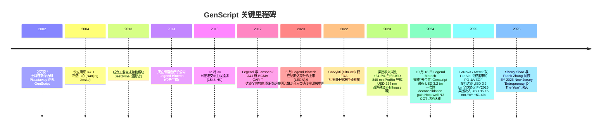
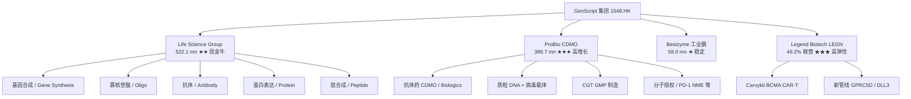
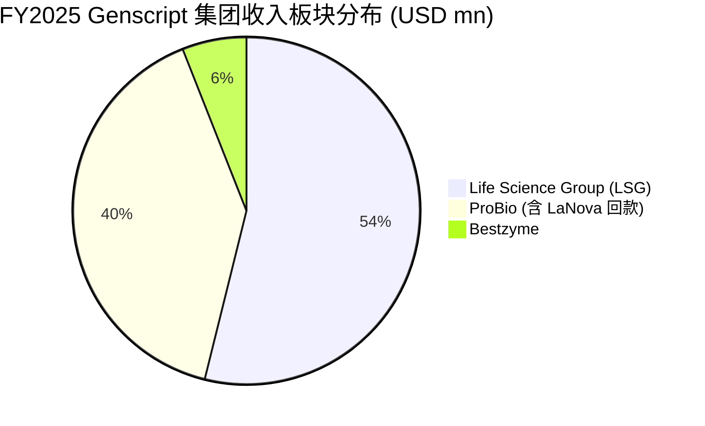

# 金斯瑞生物科技 / GenScript Biotech (HKEX:1548) 公司研究

**报告日期 / Report date:** 2026-06-02
**主题 / Theme:** china-drug-out-licensing — 中国创新药出海主题中的"使能层 (enabler layer)"参与者
**当前股价 / Current price:** HK$15.06 (截至 2026-05; 市值约 HK$32.9 bn ≈ USD 4.2 bn) — [Yahoo Finance 1548.HK](https://finance.yahoo.com/quote/1548.HK/)

> **Update — FY2025 业绩超预期 (2026-03-16):** 公司 FY2025 持续经营业务收入达 USD 959.5 mn（YoY +61.4%），调整后净利润 USD 230.3 mn（YoY +285.0%），毛利率提升至 51.2%。ProBio 板块得益于 LaNova / Merck PD-1/VEGF 双特异性抗体里程碑分成而暴涨 309.1% 至 USD 388.7 mn；Life Science Group 自然增长 14.8% 至 USD 522.1 mn。同期 Legend Biotech (Nasdaq:LEGN) 投资计提 USD 398.1 mn 减值 + 分占 USD 310.4 mn 经营亏损，导致法定净亏损 USD 532.4 mn — Genscript 的会计画像因此撕裂为"现金牛主业 + 高弹性 CAR-T 联营"双轨。
> 出处：[GenScript FY2025 Results Release, 2026-03-16](https://www.prnewswire.com/news-releases/genscript-biotech-corp-reports-strong-fy2025-results-as-integrated-platform-strategy-and-global-execution-drive-high-quality-growth-302714520.html).

---

## 目录

1. [公司概览 / Company Overview](#1-公司概览--company-overview)
2. [公司历史 / Company History](#2-公司历史--company-history)
3. [管理团队 / Management Team](#3-管理团队--management-team)
4. [产品与服务 / Products & Services](#4-产品与服务--products--services)
5. [客户与上市策略 / Customers & Go-to-Market](#5-客户与上市策略--customers--go-to-market)
6. [行业概览 / Industry Overview](#6-行业概览--industry-overview)
7. [竞争格局 / Competitive Landscape](#7-竞争格局--competitive-landscape)
8. [市场机会 / Market Opportunity (TAM)](#8-市场机会--market-opportunity-tam)
9. [风险评估 / Risk Assessment](#9-风险评估--risk-assessment)
10. [投资者视角评分 / Investor-lens Scorecards](#10-投资者视角评分--investor-lens-scorecards)
11. [数据来源清单 / Data Used](#数据来源清单--data-used)
12. [参考资料 / References](#参考资料--references)

---

## 1. 公司概览 / Company Overview

金斯瑞生物科技股份有限公司（GenScript Biotech Corporation，HKEX:1548）是一家以"基因到蛋白"全流程为核心、横跨**生命科学服务与产品 (Life Science Services & Products) / 生物药 CDMO (ProBio) / 工业合成生物 (Bestzyme) / 细胞治疗 (Legend Biotech，已联营化)** 四大业务板块的生物科技集团，总部位于江苏南京、注册地在开曼群岛，1548 港股代码自 2015 年 12 月起在香港联合交易所主板挂牌。集团在 FY2025 持续经营业务收入达 USD 959.5 mn（YoY +61.4%），毛利率 51.2%，全球**员工逾 5,700 人、活跃客户 200,000+、覆盖 100+ 国家与地区**，其生命科学板块已在 118,000+ 篇科研论文中被引用，是全球**基因合成 (gene synthesis, 基因合成) / 寡核苷酸合成 / 重组蛋白表达**领域的头部供应商之一 ([GenScript FY2025 Results Release](https://www.prnewswire.com/news-releases/genscript-biotech-corp-reports-strong-fy2025-results-as-integrated-platform-strategy-and-global-execution-drive-high-quality-growth-302714520.html))。

集团的主营 **business model / 商业模式**可拆解为：(1) **试剂与服务**——以基因合成、寡核苷酸合成、肽合成、抗体生产、蛋白生产为代表，按订单按周交付，单订单金额从数百 USD 到 ~100 K USD 不等，毛利率高（FY2025 集团毛利率 51.2%、Life Science Group 调整后毛利率 H1 2025 接近 56%），客户黏性来自交付速度（最快 5 个工作日基因到蛋白）和质量重现性；(2) **CDMO / 合约研发与生产**——通过子公司 ProBio 为客户提供从抗体药、质粒 DNA、病毒载体到细胞治疗的全链条合约开发与商业化生产，FY2025 板块收入 USD 388.7 mn 中包含一次性的 LaNova / Merck PD-1/VEGF 双特异性抗体 (PD-1/VEGF bispecific) **资产授权回款**，剔除该项后 ProBio "按服务收费 (fee-for-service)"业务 2025 增速约 15–20%；(3) **工业合成生物**——Bestzyme 销售用于食品、动物饲料、纺织、生物燃料的特种酶，是周期性较弱的"下游商品+创新产品"组合；(4) **细胞治疗 (Legend Biotech)**——自 2024-10-18 完成法律意义上的"去合并"后改为权益法核算，财报上 Genscript 仅按 ~49.2% 持股分占 Legend 的损益和减值（[GenScript FY2024 Results Release](https://www.prnewswire.com/news-releases/genscript-biotech-corporation-reports-fy-2024-results-302399566.html))。

集团运营在**中美双中心 (dual-center)** 物理布局上：南京江宁滨江开发区是基因合成、肽合成、抗体生产、蛋白生产的全球后端工厂，新泽西 Piscataway 是北美客户服务前端，新泽西 Hopewell 是 2024 年新落成的 128,000 平方英尺 plasmid + viral vector GMP 生产基地（GMP AAV manufacturing 计划 Q3 2025 启动、GMP LVV 计划 Q1 2026 启动），新加坡 3,500 平方米基因合成工厂（每日合成 400+ gene），荷兰、英国、日本、韩国设有销售和服务办公室（[ProBio Hopewell Facility Opening](https://www.genscript.com/probio-opens-flagship-us-plasmid-viral-vector-manufacturing-facility.html)；[GenScript Singapore Facility Expansion](https://www.prnewswire.com/news-releases/genscript-expands-footprint-in-singapore-to-provide-premium-gene-synthesis-service-301757502.html))。这种"中国后端制造 + 全球前端服务"的拓扑既是 Genscript 早年成本优势的来源，也是当前 BIOSECURE Act 地缘风险的核心压力点（详见 §9）。

**估值快照 / Valuation snapshot.** 截至 2026-05-15 收盘，1548.HK 报 HK$15.06、市值 HK$32.92 bn (≈ USD 4.20 bn)、**TTM P/E ≈ 26.4×**（市场计算基于 FY2024 一次性 USD 3.2 bn deconsolidation gain 的影响有限，因 FY2025 法定净亏损 USD 532 mn 反而拉低分母；剔除 Legend 减值与分占损益后调整后 EPS 对应 P/E 仅 ~18× 范围）；**TTM P/S ≈ 4.4×**（按 USD 959.5 mn FY2025 收入和 USD 4.20 bn 市值粗算）。一年期分析师目标价中位数 HK$23.02，意味着 ~53% 隐含上行空间，整体卖方意见为 **Buy / 增持**（[Yahoo Finance 1548.HK](https://finance.yahoo.com/quote/1548.HK/))。同业对照：[WuXi Biologics 2269.HK](https://www.wuxibiologics.com/) 的 FY2024 TTM P/E 在 25–35× 区间；[Pharmaron 3759.HK / 300759.SZ](https://www.pharmaron.com/) 调整后 P/E ~30×；[Tigermed 3347.HK / 300347.SZ](https://www.tigermedgrp.com/) 在 ~25× 上下；纯生命科学试剂可比 Twist Bioscience [TWST](https://finance.yahoo.com/quote/TWST/) 仍为净亏损。**Genscript 当前 P/E 偏低（vs. 中国 CDMO 同业 25–35× 中位）的主因是 Legend Biotech (Nasdaq:LEGN) 联营持股带来的非现金减值波动尚未在市场情绪上完全消化** —— 当 Legend Carvykti 销售曲线稳定后，市场可能逐步还原 "母公司 + 联营"的加总估值。

---

## 2. 公司历史 / Company History

金斯瑞 (GenScript) 于 **2002-08-15** 由 **张方良 (Frank Fangliang Zhang)** 博士与 **王晔 (Sally Ye Wang)** 女士在美国新泽西州 (New Jersey) 共同创立，启动资金完全来自创始人个人储蓄。张方良博士此前是先灵葆雅 (Schering-Plough) 的资深科学家，曾在该公司期间首次成功克隆出**人类香叶基转移酶 (human geranyl transferase)** 并因此获得公司总裁奖；2002 年他与同样在 Schering-Plough 工作的妻子王晔决定回应中国学术与产业界对"快速、廉价的定制基因合成"的庞大未满足需求，自宅创立了金斯瑞 ([Milestone Magazine — Frank Fangliang Zhang Bio](https://milestonemagazine.com/frank-fangliang-zhang-ph-d-founder-ceo-genscript/))。2004 年，公司在江苏南京设立南京金斯瑞生物科技有限公司 (Nanjing Jinsite)，把高耗人力的合成与表达后端搬到中国，确立了"美国前端接单 + 中国后端制造"的拓扑结构 — 这是后来公司多年成本领先和高速增长的源头 ([Wikipedia — GenScript Biotech](https://en.wikipedia.org/wiki/GenScript_Biotech))。



公司经历过**三次重大战略转折 (strategic pivot)**。**第一次转折 (2014–2017)** 是从"试剂与服务公司"延伸到"创新药企"——Legend Biotech 在 2014 年作为内部细胞治疗研发部门成立，2017 年与 Janssen / J&J 就 BCMA CAR-T (LCAR-B38M，后命名为 cilta-cel / Carvykti) 达成总额超 USD 350 mn 首付款 + 销售分成的全球独家许可协议，这是中国本土生物科技公司在创新疗法领域获得的首个标志性海外授权 deal，也是当下"中国创新药出海"主题最早且最成功的案例之一 ([Wikipedia — GenScript Biotech](https://en.wikipedia.org/wiki/GenScript_Biotech))。**第二次转折 (2020)** 是 Legend Biotech 于 2020 年 6 月在纳斯达克独立 IPO (Nasdaq:LEGN)，原本以 100% 持股的子公司被分拆为独立上市公司，Genscript 持股比例随后逐步稀释至当前的约 49.2%。**第三次转折 (2024-10-18)** 是 Legend Biotech 的"法律去合并 (deconsolidation)"——Genscript 对其失去 IFRS 控制权认定，导致 (a) 财报合并报表中不再合并 Legend 营收和成本，(b) 母公司账面录得 USD 3.2 bn 一次性公允价值重估收益，(c) 此后仅按权益法分占 Legend 损益与计提减值 ([GenScript FY2024 Results Release](https://www.prnewswire.com/news-releases/genscript-biotech-corporation-reports-fy-2024-results-302399566.html))。这一步财务上有争议——市场上有观点认为去合并是为了让 Genscript 主业的盈利特征不被 Legend 持续投入摊薄；管理层则强调这是对应 Legend 治理结构变化的会计后果。

近一年（2025-至今）的关键事件链需要被重点跟踪：(1) **2024-11 Merck 与 LaNova Medicines 达成 USD 3.3 bn (USD 588 mn 首付 + USD 2.7 bn 里程碑)** 的 LM-299 (anti-PD-1/VEGF 双特异性抗体) 全球独家许可协议，而该候选分子的底层 PD-1 NME 是 ProBio 早年授权给 LaNova 的——Genscript 因此通过授权回款条款（"对价分润"）享有可观分账，FY2025 ProBio 板块的 USD 388.7 mn 收入中相当部分（管理层公开提及"扣除 LaNova / Merck 单笔回款"后基本盘增速约 15–20%）来自这一笔 ([Pearce IP — MSD/LaNova Deal](https://www.pearceip.law/2024/11/14/msd-enters-us3-3b-deal-to-develop-and-commercialise-lanovas-pd-1-vegf-bispecific-antibody/)，[PharmaSource — ProBio Licenses PD-1 to LaNova](https://pharmasource.global/content/news/cdmo-news/genscripts-probio-licenses-pd-1-molecule-to-lanova-medicines/))；(2) **2024-2025 Hopewell NJ CGT 基地启用**——128,000 平方英尺 cGMP 工厂、首阶段 100+ 员工，是 Genscript 应对 BIOSECURE Act 与 BIO 行业脱钩的核心地缘对冲举措；(3) **FY2025 综合 ESG 评级跃升**——MSCI ESG AA、FTSE4Good、EcoVadis Silver、S&P Global Sustainability Yearbook 入选，承诺 2050 年净零碳排放。

---

## 3. 管理团队 / Management Team

**创始人兼荣誉主席：张方良 (Frank Fangliang Zhang)，博士。** 张方良博士在创办 Genscript 之前的主要履历是**先灵葆雅 (Schering-Plough)** 资深研究员（90 年代末），期间申请了若干分子生物学相关专利，包括**首次成功克隆人类香叶基转移酶 (human geranyl transferase)**——该酶是 cholesterol 与若干癌症靶点信号通路上的关键修饰酶，他因此获得 Schering-Plough 总裁奖（[Milestone Magazine — Frank Fangliang Zhang Bio](https://milestonemagazine.com/frank-fangliang-zhang-ph-d-founder-ceo-genscript/))。他在中国本科与硕士阶段就读于华中科技大学 (HUST)，毕业后曾留校任讲师，随后赴美国 Duke University 攻读生物化学博士。2002 年他在新泽西州 Piscataway 自宅创办 Genscript，2014 年又作为创始人创立 Legend Biotech 并担任首任 CEO。**2020 年 9 月，张方良在江苏镇江被中国海关缉私部门以"涉嫌走私国家禁止进出口的货物"为由实施"指定居所监视居住 (residential surveillance)" 措施**，该调查与"人类遗传资源出境管理 (HGRA)"专项稽查相关，他随即辞任 Legend Biotech 董事 ([Fierce Pharma — Frank Zhang Arrested](https://www.fiercepharma.com/pharma-asia/genscript-legend-biotech-founder-arrested-china-for-suspected-smuggling)，[BioCentury — Frank Zhang Returns](https://www.biocentury.com/article/644680/frank-zhang-returns-to-legend))。两年后（2022），张方良以**非执行董事 / 董事会主席 (Chairman)** 身份回归 Legend Biotech，并继续担任 Genscript 的非执行董事 / 共同创始人——他对集团仍持有约 18–22% 直接 + 间接股权（来自历年招股书与 HKEX 大股东披露推断；具体公开披露未含 2026 最新数据，应以最新年报披露为准）。**2026 年 4 月**，张方良与现任轮值 CEO Sherry Shao 一同被 Ernst & Young (EY) 选为 **2026 New Jersey "Entrepreneur Of The Year"** 决选名单——这一标志性提名反映了 Genscript 在美国本土仍享有较高的产业可信度 ([Manila Times — EY 2026 Entrepreneur Finalists, 2026-04-23](https://www.manilatimes.net/2026/04/23/tmt-newswire/pr-newswire/genscript-leaders-named-entrepreneur-of-the-year-2026-new-jersey-finalists/2326533))。张方良目前不直接参与 Genscript 日常运营，但仍是公司战略与对外形象的核心代表。

**现任轮值 CEO / 总裁：邵巍 / 邵慧 (Sherry Weihui Shao)。** Sherry Shao 自 **2023-01-01 起担任 Genscript 轮值首席执行官 (Rotating CEO)**，同时自 2021-07-08 起兼任 COO，统管人力资源、供应链、工程与仪器、IT、QEHS 等支持职能 ([GenScript Leadership Team](https://www.genscript.com/leadership-team.html))。她 2005 年 7 月加入 Genscript，至今已超过 20 年的"原生"生物科技与生物制品发展行业管理经验，曾历任 Life Science Group 总裁（2019.04–2020.08）、欧洲事业部总裁（2020.08–2021.02）、中国事业部总裁（2021.02–2021.07），是一位"从基层、海外、地区到集团总部"完整轮岗成长的内生高管。她持有南京师范大学生物学学士（2002.06）与扬州大学预防兽医学硕士（2005.06）。在她担任轮值 CEO 的三年内，Genscript 经历了 **Legend Biotech 去合并、ProBio 战略融资、Hopewell NJ 基地落成、LaNova / Merck PD-1/VEGF 历史性回款、MSCI ESG 评级从 BB 升至 AA** 这一系列关键事件，FY2025 集团调整后净利润 YoY +285%、集团毛利率从 ~46% 提升至 51.2% — 邵巍治下的核心战略是 **"productization (产品化) + globalization (全球化) + automation (自动化)"** 的三元复合，目标是把高度依赖项目交付的服务业务进一步提升毛利结构。她的薪酬结构未在公开材料中拆解，但 EY 2026 决选名单的提名表明其个人在集团中的代表性已远高于一般"轮值 CEO" 称谓 ([BiopharmaApac — Sherry Shao H1 2025 Profits Surge 500%](https://biopharmaapac.com/company-results/30/6746/genscript-biotech-ceo-sherry-shao-champions-innovation-and-global-expansion-as-h1-2025-profits-surge-over-500.html))。

**共同创始人 / 王晔 (Sally Ye Wang) 女士**作为执行董事兼公司总裁同样仍在治理结构内，主要负责集团战略与整体运营管理，但具体业务条线日常职责已基本下放至轮值 CEO 与子公司总裁层 ([Wikipedia — GenScript Biotech](https://en.wikipedia.org/wiki/GenScript_Biotech))。

---

## 4. 产品与服务 / Products & Services

### 4.1 四大业务板块矩阵 — anchored to FY2025 segment disclosure

下表为根据 [GenScript FY2025 Results Release, 2026-03-16](https://www.prnewswire.com/news-releases/genscript-biotech-corp-reports-strong-fy2025-results-as-integrated-platform-strategy-and-global-execution-drive-high-quality-growth-302714520.html) 重构的集团**业务矩阵**——四大板块各自有独立的产品组合、客户群和成本结构，财报口径为四个 segment （Life Science Group / ProBio / Bestzyme / Legend，后者自 2024-10-18 起按联营核算不并入分部）：

| 板块 / Segment | 主营业务 / Core offerings | FY2025 收入 (USD mn) | YoY | 客户类型 | 关键产能与制造 |
|---|---|---|---|---|---|
| **Life Science Group (LSG)** / 生命科学服务与产品 | 基因合成、寡核苷酸合成、抗体生产、肽合成、重组蛋白、临床前试剂、AI 加速发现 | 522.1 | +14.8% | 学术 / 高校 / 大型 pharma / Biotech / 政府实验室 | 南京 / 新泽西 Piscataway / 新加坡 / 荷兰 — 四大"lights-out"AI 自动化工厂 |
| **ProBio** / 生物药 CDMO | 抗体药开发与生产、质粒 DNA、病毒载体 (AAV / LVV) GMP、mRNA 疫苗、细胞治疗 CDMO、专有分子授权 | 388.7 | +309.1% | 全球 biotech / Pharma、CAR-T / Cell Therapy 客户 | 南京 / 上海 / 香港 / Hopewell NJ (128 K sq ft 新基地) / 韩国 / 荷兰 |
| **Bestzyme (百斯杰)** / 工业合成生物 | 食品酶、动物饲料酶、纺织酶、生物燃料酶 | 58.0 | +7.9% | 食品厂、饲料厂、纺织厂、生物能源企业 | 镇江 + 国内 |
| **Legend Biotech (Nasdaq:LEGN)** / 细胞治疗（联营，权益法）| Carvykti (cilta-cel) BCMA CAR-T 等 | 不并入分部 | n/a | Janssen / J&J 战略合作、自营商业化 | 2024-10-18 deconsolidation 后由 Legend 独立运营 |



### 4.2 合成 — 四个板块如何在客户工作流中互相衔接

四个板块在生物药研发的客户工作流中并非孤立，而是构成**"Discovery → IND → Clinical → Commercial"** 的全链条：(1) 早期发现阶段，Life Science Group 卖给学术与 biotech 客户基因合成、定制抗体、重组蛋白——把"目标分子或抗体的概念"在 1–4 周内变成可实验的物理材料；(2) Pre-IND / IND 阶段，同一客户可能进一步把质粒 DNA + 病毒载体的开发交给 ProBio，由 ProBio 完成 GMP 工艺开发并出具 CMC 数据包；(3) Clinical 阶段，ProBio 承接抗体或细胞治疗产品的临床试验用药 GMP 生产；(4) Commercial 阶段，ProBio 在 Hopewell NJ 等基地承接商业化生产；同时 Legend Biotech 作为集团内部最大的"客户实例"——既是 Genscript 早期蛋白工艺与质粒工艺的服务对象，也是 BCMA CAR-T 全球商业化的最大实践成果，它的成功反过来是 ProBio 在 CGT CDMO 市场最有说服力的销售故事。Bestzyme 工业酶板块虽与生物医药主线不直接耦合，但与 LSG 共用部分发酵工艺平台和管理团队，是集团长期"探索合成生物商业化"的种子型业务。

### 4.3 Life Science Group (LSG) — 集团现金牛 / Cash cow

**FY2025 业绩快照**（出处 [GenScript FY2025 Results Release](https://www.prnewswire.com/news-releases/genscript-biotech-corp-reports-strong-fy2025-results-as-integrated-platform-strategy-and-global-execution-drive-high-quality-growth-302714520.html)）：

> "GenScript Life Science Group (LSG) generated US$522.1 million in revenue, up 14.8% year-on-year, and benefited from adoption of its integrated gene-to-protein platform, strong demand from pharma and biotech customers, and growing traction in AI-enabled discovery."

> "Integrated protein expression services grew 50%, with orders flowing into this platform increasing 160% year-over-year. The unit serves 66,000+ active customers and appears in 118,000+ publications."

**中文释义 / Plain-language gloss:** Life Science Group 的核心商品是"**基因合成 (gene synthesis, 基因合成) + 蛋白表达 (protein expression, 蛋白表达)**"双拼盘——客户上传一段 DNA 序列（基于 NCBI GenBank 或自有设计），Genscript 在 5–10 个工作日内合成出实体的 DNA 片段（双链 DNA 或 plasmid），然后用 CHO / HEK293 / E. coli 等表达系统把这段 DNA 翻译成实体蛋白（数 mg 至数 g 级），交付给客户做生化实验或抗体筛选。这是一个高度自动化、规模效应明显、客户黏性中等（学术客户复购率高但单价低 ~USD 100–500 / order，pharma 客户复购率中等但单价高 ~USD 1 K–100 K / order）的业务。Genscript 自 2020 年开始打造**整合"基因 → 蛋白"平台 (integrated gene-to-protein platform)** ——把基因合成、克隆、表达、纯化打通成单一订单流程，把原本"4 个独立订单 × 4 周交付"压缩为"1 个订单 × 5 个工作日交付"（["FLASH" Gene Synthesis](https://www.genscript.com/gene-synthesis-in-singapore.html)）——这成为对 IDT、Twist Bioscience 等纯 oligo 玩家的核心差异化壁垒。2025 年 ProteinPro 等整合服务订单同比 +160%、收入 +50%，意味着客户正在把过去拆分订单的工作流整体迁到 Genscript 平台上。

*分析师观点：* LSG 的 **moat** 由"规模 + 速度 + 一站式 (one-stop)"三层叠加构成——基因合成本身是高度商品化的市场（IDT、Twist、Eurofins 都能做），但 Genscript 的差异化是把上下游 4–5 个独立订单整合到一个工作流中。最接近的竞品产品：[Twist Bioscience](https://www.twistbioscience.com/products/genes) 的 Gene Fragment + Clonal Genes（按 bp 计价），[IDT](https://www.idtdna.com/pages/products) 的 gBlocks Gene Fragments + Custom Genes，[Eurofins Genomics](https://www.eurofinsgenomics.com/) 的 Gene Synthesis。Genscript 的护城河类型 = **scale + integration + brand recognition in academic users**（118 K+ 篇引文是公开可查证的品牌资产）。

### 4.4 ProBio — 高弹性高增长 / High-octane CDMO

**FY2025 业绩快照**（[GenScript FY2025 Results Release](https://www.prnewswire.com/news-releases/genscript-biotech-corp-reports-strong-fy2025-results-as-integrated-platform-strategy-and-global-execution-drive-high-quality-growth-302714520.html))：

> "ProBio delivered exceptional growth in 2025, with revenue reaching US$388.7 million, up 309.1% year-on-year. … ProBio secured 41 antibody projects, 60 cell/gene therapy CDMO projects, and achieved 20 new IND clearances."

> "ProBio offers end-to-end contract development and manufacturing organization (CDMO) services from drug discovery to commercialization for antibodies, cell and gene therapies. … Since October 2017, ProBio has helped customers in the United States, Europe, Asia Pacific and other regions obtain more than 130 IND approvals." — [ProBio CDMO Website](https://www.probiocdmo.com/)

**中文释义 / Plain-language gloss:** ProBio 是 Genscript 内部最年轻、增速最快也最有弹性的业务板块。它的核心商品是**"抗体药 + 质粒 DNA + 病毒载体 + 细胞治疗"** 全链条 CDMO（contract development and manufacturing organization, 合约研发与生产）服务——客户可以委托 ProBio 做从分子筛选、克隆、工艺开发、临床试验用药 GMP 生产到商业化大规模生产的任意环节。FY2025 的 USD 388.7 mn 收入有两个本质上不同的来源：(1) **fee-for-service / 按服务收费的传统 CDMO 收入**，由 41 个抗体药项目和 60 个 CGT 项目支撑，预计 2025 自然增速 15–20%；(2) **资产授权回款 (out-licensing milestone & royalty)**——ProBio 早年向 LaNova Medicines 授权过一个 PD-1 NME（新分子实体），LaNova 在此基础上设计出 LM-299 (anti-PD-1/VEGF bispecific)，2024-11 被 Merck (MSD) 以 USD 588 mn 首付 + USD 2.7 bn 里程碑总额 USD 3.3 bn 全球独家授权获得 ([Pearce IP — MSD/LaNova LM-299 Deal](https://www.pearceip.law/2024/11/14/msd-enters-us3-3b-deal-to-develop-and-commercialise-lanovas-pd-1-vegf-bispecific-antibody/))。Genscript / ProBio 按授权合同条款获得相应分账（具体分成比例未在公开材料中披露），FY2025 ProBio 收入中相当部分来自这一单。剔除该单后，ProBio 服务业务的"日常底盘"约 USD 130–150 mn 收入区间。

Hopewell NJ 的 128 K 平方英尺质粒 + 病毒载体 GMP 基地是 ProBio 在北美的"实体存在 (physical presence)"——它是 BIOSECURE Act 时代 ProBio 能继续承接美国生物科技客户业务的关键基础设施。该基地由 ProBio 100% 投资，2024 年完成主体建设，2025 年陆续启用 GMP AAV 制造能力，2026 一季度计划启用 GMP LVV (lentiviral vector) 制造能力 ([ProBio Opens Hopewell NJ Facility](https://www.genscript.com/probio-opens-flagship-us-plasmid-viral-vector-manufacturing-facility.html))。

*分析师观点：* ProBio 是 Genscript 在"中国创新药出海"主题中**最直接的受益板块**——它既是 BeiGene、Innovent、CStone、LaNova 等中国创新药公司海外授权"上游供应商"，也是欧美 biotech 用来抵御 BIOSECURE Act 风险的"中国服务但美国本土制造"的灰色地带玩家。Moat 类型 = **regulatory (cGMP) + capacity (Hopewell NJ + 南京) + integration with LSG (基因到蛋白的连续性)**。最直接竞品：[Lonza](https://www.lonza.com/) 全球第一大独立 CDMO（瑞士），[Samsung Biologics 207940.KS](https://samsungbiologics.com/) 韩国制造冠军，[WuXi Biologics 2269.HK](https://www.wuxibiologics.com/) 中国头部但 BIOSECURE 重灾区，[Catalent (now Novo Holdings)](https://www.catalent.com/) 美国生产基地优势。ProBio 在四者中规模最小但成长最快，相对位置是 "China origin + US/EU footprint" 的灰色对冲。

### 4.5 Bestzyme — 工业合成生物 / Industrial Synthetic Biology

**FY2025 业绩快照**（[GenScript FY2025 Results Release](https://www.prnewswire.com/news-releases/genscript-biotech-corp-reports-strong-fy2025-results-as-integrated-platform-strategy-and-global-execution-drive-high-quality-growth-302714520.html))：

> "Bestzyme generated US$58.0 million revenue, up 7.9% year-on-year, and continued advancing industrial biotechnology innovation through new enzyme products, stronger AI-enabled R&D capabilities, and international market development."

**中文释义 / Plain-language gloss:** Bestzyme（百斯杰生物科技）的核心商品是**工业酶 (industrial enzymes)**——通过微生物发酵生产的、用于食品加工、动物饲料、纺织、洗涤剂和生物燃料的酶蛋白（与 LSG 卖给科研客户的"重组蛋白用于实验"完全不同，这里卖的是**克级到吨级**的工业用量酶）。例如**植酸酶 (phytase, 植酸酶)** 加进饲料中可帮猪牛把饲料中的植酸磷转化为可吸收磷、减少氮磷排放；**淀粉酶 / 蛋白酶**加进洗涤剂中替代部分石油基表面活性剂；**纤维素酶**用于纺织品的"酶洗"前处理替代浮石和漂白剂。Bestzyme 的客户主要是国内大型食品、饲料、纺织和生物乙醇生产商，单笔订单从几吨到几十吨不等，业务周期与下游商品价格周期相关（饲料用酶需求随玉米 / 豆粕价格波动），毛利率显著低于 LSG 和 ProBio（行业通常 25–35%）。FY2025 7.9% 增速反映了下游食品 / 饲料行业的成熟周期 — 这是集团内部最"传统"的业务，但 *分析师观点* 是它的合成生物学技术储备（菌株工程 + 发酵工艺）与 LSG / ProBio 的发酵和细胞培养技术高度互补，长期是合成生物学下游商业化"试验田"。

最接近的竞品：[Novonesis (Novozymes 与 Chr. Hansen 合并体)](https://www.novonesis.com/) — 全球工业酶绝对冠军，[DSM-Firmenich](https://www.dsm-firmenich.com/) — 欧洲第二，[国内同业 Vland Biotech 蔚蓝生物 603739.SS, Sunhy 江苏华扬, Sukahan 鸿宝兴业](https://www.sse.com.cn/) 等。Bestzyme 在国内属于 second tier，难以对全球冠军 Novonesis 形成直接威胁，但在中国饲用酶细分市场份额可观。

### 4.6 Legend Biotech (Nasdaq:LEGN, 联营) — 高弹性高波动 / Volatility leg

虽然 Legend Biotech 自 2024-10-18 起以联营公司而非合并子公司列示，但仍是 Genscript 估值故事的关键变量。Legend 的核心商品是**Carvykti (cilta-cel)** ——一款由 Legend 与 Janssen / J&J 联合开发的 BCMA-targeting CAR-T cell therapy（B 细胞成熟抗原靶向嵌合抗原受体 T 细胞疗法），用于治疗复发难治性多发性骨髓瘤 (R/R multiple myeloma, R/R MM)。Carvykti 于 2022 年 2 月获 FDA 批准用于 4 线及以上 R/R MM，2024 年 4 月拓展至 2 线适应症，2025 年报道**全球累计治疗超过 9,000 名患者**，是全球商业化最快的 CAR-T 产品之一（[GenEng News — Rewriting CAR-T From Within](https://www.genengnews.com/sponsored/rewriting-car-t-from-within/))。Legend 自身在 2025 年继续录得经营亏损（与商业化阶段的销售、生产爬坡、新管线 R&D 投入有关），加之 Genscript 在 Legend 上的账面公允价值在 FY2025 计提了 USD 398.1 mn 减值 + 分占 USD 310.4 mn 亏损，合计 USD 708.5 mn 负面拖累。Legend 后续管线包括 GPRC5D CAR-T、DLL3 CAR-T 等下一代产品，是中国创新药出海主题中**估值最大、最受关注的细胞治疗资产**。

### 4.7 Flagship 与最近 12 月主要 launches

- **2024-10-18 Legend 法律去合并 (deconsolidation)** — 财务架构重大变化（[GenScript FY2024 Results Release](https://www.prnewswire.com/news-releases/genscript-biotech-corporation-reports-fy-2024-results-302399566.html))。
- **2024-11 LaNova / Merck LM-299 USD 3.3 bn 协议**触发 ProBio 资产授权回款（[Pearce IP — LM-299 Deal](https://www.pearceip.law/2024/11/14/msd-enters-us3-3b-deal-to-develop-and-commercialise-lanovas-pd-1-vegf-bispecific-antibody/))。
- **2024-Q4 至 2025-Q1 Hopewell NJ 128 K sq ft 基地启用**（[ProBio Hopewell Facility](https://www.genscript.com/probio-opens-flagship-us-plasmid-viral-vector-manufacturing-facility.html))。
- **2025-FY MSCI ESG 评级升级到 AA、FTSE4Good 入选、S&P Global Sustainability Yearbook 入选**（[GenScript FY2025 Results Release](https://www.prnewswire.com/news-releases/genscript-biotech-corp-reports-strong-fy2025-results-as-integrated-platform-strategy-and-global-execution-drive-high-quality-growth-302714520.html))。
- **2026-04 Sherry Shao + Frank Zhang 同获 EY NJ Entrepreneur Of The Year 2026 决选**（[Manila Times, 2026-04-23](https://www.manilatimes.net/2026/04/23/tmt-newswire/pr-newswire/genscript-leaders-named-entrepreneur-of-the-year-2026-new-jersey-finalists/2326533))。

---

## 5. 客户与上市策略 / Customers & Go-to-Market

### 5.1 客户全景与集中度披露

Genscript 在 FY2025 末报告**累计 200,000+ 客户跨越 100+ 国家与地区，5,700+ 员工**，其中 LSG 板块单独披露**活跃客户 66,000+、累计被引文 118,000+ 篇**（[GenScript FY2025 Results Release](https://www.prnewswire.com/news-releases/genscript-biotech-corp-reports-strong-fy2025-results-as-integrated-platform-strategy-and-global-execution-drive-high-quality-growth-302714520.html))。这种"高度分散的长尾 + 少数旗舰大单"是集团整体客户画像的核心特征——不存在 10-K / 年报口径下"单一客户超过 10% 集团收入"的披露 ([HKEXnews — GenScript Annual Report 2024, 2025-04-08](https://www.hkexnews.hk/listedco/listconews/sehk/2025/0408/2025040800835.pdf))。这是 Genscript 与同业差异化的关键事实之一：与 [WuXi Biologics 2269.HK](https://www.wuxibiologics.com/) 同等规模 CDMO 通常 top-5 客户 30–50% 集团收入相比，Genscript LSG 的长尾基础显著更分散，对单一客户脱单或转移的敏感度低。但**ProBio 板块在 FY2025 出现明确的"单一里程碑事件占比偏高"**——LaNova / Merck LM-299 单笔回款约占 ProBio 388.7 mn 收入的"相当部分"（管理层公开提及"扣除该笔后"基本盘 +15–20%），意味着 ProBio 板块的 FY2025 单一交易集中度可能高达 50–65%（分析师估算，不是 10-K 数字）。



来源：[GenScript FY2025 Results Release](https://www.prnewswire.com/news-releases/genscript-biotech-corp-reports-strong-fy2025-results-as-integrated-platform-strategy-and-global-execution-drive-high-quality-growth-302714520.html)。注：Legend Biotech 自 2024-10-18 起按联营公司核算，不并入集团分部收入。

### 5.2 上市策略 / Go-to-market

**LSG 板块**采取的是**"在线下单 (e-commerce) + 区域销售代表 + 学术渠道引用"** 的三层销售模型。**GenSmart 2.0** 是 LSG 的在线订购平台，客户可以上传 DNA 序列、在线得到报价、跟踪交付——这是面向学术与中小型 biotech 客户的主要销售触点（[GenScript 2023 Annual Results Management Remarks](https://www.genscript.com/gsfiles/IPO/2023%20Annual%20Results%20Management%20Remarks.pdf))。对大型 pharma 客户则配备**直销 (direct sales)** 团队和 KAM (key account management) 经理，覆盖 Pfizer、Merck、AstraZeneca、Sanofi 等头部药企。学术渠道引用 (118 K+ 篇论文引用 Genscript 试剂或服务) 是低成本但效用极强的品牌建设手段——新一代博士后或 PI 在自己的 lab 里看到师兄师姐用 Genscript 之后会自然延续这一选择。

**ProBio 板块**采取的是**"商业开发 (business development) + 行业会议 + 战略联盟"** 的销售模型。ProBio 通过 BIO International Convention、ESACT、JPMorgan Healthcare Conference、Bio-IT World、CAR-TCR Summit 等行业会议与潜在客户建立首次接触；与 Eutilex (韩国)、Curocell (韩国)、Cell Resources Corporation (日本，Alfresa 控股) 等**亚太 CAR-T biotech 签订 MOU 或战略合作**，把这些公司的全链条 CGT 业务锁定在 ProBio 平台上 ([ProBio - Eutilex Strategic Collaboration](https://www.prnewswire.com/news-releases/genscript-probio-and-eutilex-enter-into-exclusive-strategic-collaboration-on-plasmid-and-virus-process-development-and-manufacturing-for-car-t-programs-301036606.html)，[ProBio - Curocell MOU](https://www.probiocdmo.com/genscript-probio-signs-viral-vector-manufacturing-mou-with-curocell-for-next-generation-car-t-therapy.html))。这种"亚太区 CAR-T biotech 联盟战略"是 ProBio 在欧美 CDMO 巨头（Lonza、Catalent、Samsung Biologics）夹缝中找到的差异化区位。

**Bestzyme 板块**则是**"传统 B2B 工业销售 + 国内饲料 / 食品大客户长协议"** 的模式 — 与海大集团 (002311.SZ)、新希望六和、温氏股份、双汇等大型饲料和食品工业客户签订年度框架协议。

### 5.3 地理分布与营收结构

集团 FY2025 北美 + 欧洲收入占比约 38%（[Yahoo Finance — GNNSF FY2025 Earnings Highlights](https://finance.yahoo.com/news/genscript-biotech-corp-gnnsf-full-070020473.html)），其中 LSG 欧洲 +29% YoY（连续 5 年增长）、亚太 +33% YoY。中国本土仍是 LSG 和 Bestzyme 的主战场，海外（北美 + 欧洲）是 ProBio 的核心增长引擎。集团整体没有完整披露按地理的板块拆分，需以中报年报披露为准。

### 5.4 关键客户案例

- **Legend Biotech / Janssen (J&J)**：Carvykti 全球商业化的质粒和病毒载体早期供应链中 ProBio 是直接参与方（[GenEng News — Rewriting CAR-T From Within](https://www.genengnews.com/sponsored/rewriting-car-t-from-within/))。
- **LaNova Medicines / Merck (MSD)**：LM-299 PD-1/VEGF 双特异性抗体的底层 PD-1 NME 来自 ProBio 早期授权 ([PharmaSource — ProBio Licenses PD-1 to LaNova](https://pharmasource.global/content/news/cdmo-news/genscripts-probio-licenses-pd-1-molecule-to-lanova-medicines/))。
- **Eutilex / Curocell / Cell Resources**：亚太 CAR-T biotech 同盟，ProBio 提供全链条 CDMO 服务 ([ProBio - Eutilex Collaboration](https://www.prnewswire.com/news-releases/genscript-probio-and-eutilex-enter-into-exclusive-strategic-collaboration-on-plasmid-and-virus-process-development-and-manufacturing-for-car-t-programs-301036606.html))。
- **Broad Institute**：2025 年宣布 prime editing 合作，把 Genscript 平台接入 prime editing 工具系统 ([PRNewswire — Broad Institute Deal](https://www.prnewswire.com/news-releases/genscript-unveils-prime-editing-boost-with-the-broad-institute-deal-302405978.html))。
- **Ligand Pharmaceuticals**：早年 OmniAb 全球授权伙伴 ([GenScript - Ligand OmniAb License](https://www.prnewswire.com/news-releases/genscript-biotech-and-ligand-pharmaceuticals-enter-into-global-omniab-licensing-agreement-301303565.html))。

---

## 6. 行业概览 / Industry Overview

### 6.1 生命科学试剂 + 服务的全球地形

Genscript 的 LSG 板块所处的"**基因合成 / 基因到蛋白服务 (gene-to-protein services)**"全球市场是一个由数家头部供应商和大量长尾区域玩家共同构成的中等集中度市场。2024 年全球**合成基因 (synthetic gene)** 市场规模行业估计在 USD 3–5 bn 区间（[Top 10 CDMOs 2024 — PharmaBoardroom](https://pharmaboardroom.com/articles/top-10-cdmos-2024/) 中相关引述），其中 Twist Bioscience [TWST](https://www.twistbioscience.com/) 的高通量合成芯片技术拿下学术与高端高通量市场的相当份额，IDT (现属 Danaher) 在 oligo 和短链 gene fragment 上占据强势，Genscript 在"clonal genes + 整合性蛋白表达服务"赛道上是头部玩家之一。**重组蛋白 (recombinant protein)** 与**抗体生产 (antibody production)** 服务市场更大但更分散，全球估计 USD 8–12 bn 规模。**整合性"gene-to-protein"服务**作为一种相对较新的产品类目，由 Genscript、Sino Biological（北京义翘）、Thermo Fisher 等少数玩家分食。

整个市场的需求驱动来自三股长期力量：(1) **基础研究投入持续扩张** ——全球生命科学 R&D 支出 2024 年估计超过 USD 250 bn（NIH 美国国立卫生研究院年度预算约 USD 47 bn），其中相当比例用于 wet-lab 试剂耗材；(2) **AI + 计算生物学的兴起** ——AlphaFold 之后的 AI 辅助蛋白设计需要海量的"in silico 设计 → in vitro 验证"循环，每个循环都需要快速、廉价的基因合成 + 蛋白表达；(3) **新型药物模态的爆发** ——双特异性抗体、ADC（抗体偶联药物）、mRNA、CAR-T、基因编辑等都需要大量定制基因序列和重组蛋白支撑研发。Genscript LSG FY2025 整合性蛋白表达服务 +50% 收入、+160% 订单的快速增长直接对应于这三股长期力量的合力。

### 6.2 生物药 CDMO 全球地形

ProBio 所处的**生物药 CDMO (biologics CDMO)** 行业全球 2024 年市场规模估计 USD 25–35 bn，3 大头部玩家是 Lonza（瑞士 / 全球第一）、Samsung Biologics（韩国 / 第二）、WuXi Biologics（中国 / 第三），合计市场份额约 35–40%；第二梯队包括 Catalent、AGC Biologics、Boehringer Ingelheim BioXcellence、Fujifilm Diosynth Biotechnologies 等；ProBio 在头部生物药 CDMO 中排名约 10–15 位 ([Top 10 CDMOs 2024 — PharmaBoardroom](https://pharmaboardroom.com/articles/top-10-cdmos-2024/)，[CDMO Market Update — Bourne Partners, 2025](https://bourne-partners.com/wp-content/uploads/2025/09/CDMO-Report-March-2025_Bourne-Partners.pdf))。**细胞与基因治疗 (CGT) CDMO** 是一个更年轻的细分市场（全球 2024 年估计 USD 5–8 bn），由 Lonza、Catalent (now Novo Holdings)、WuXi ATU、ProBio 等少数玩家分食，集中度高于传统抗体 CDMO 因为 GMP 病毒载体生产门槛更高、客户对供应商质量与产能可见度更敏感。

CDMO 行业的需求驱动：(1) **biotech 资本流入的循环** ——全球 biotech VC 投资 2021 年峰值约 USD 60 bn 之后回落至 2023 年 USD 30 bn，2024 年又回升至 USD 40+ bn，每一笔 VC 投入大约对应 3–5 年后转化为 CDMO 订单；(2) **大药企外包率持续提升** ——头部 pharma 自有产能愈发倾向于聚焦平台型 / 战略产品，将变动产能委托给 CDMO，目前生物药外包率约 30–35% 仍有提升空间；(3) **多模态药物的爆发** ——ADC、双抗、CAR-T、TCR-T、TIL、AAV 基因治疗、mRNA 等新模态都对应特殊的工艺平台，新平台的能力建设阶段倾向外包。

### 6.3 监管环境的两面性

Genscript 的全球业务嵌入了**两个不同步、有时甚至相反向的监管周期**：一方面，FDA、EMA、PMDA 等全球药品监管机构对生物药 / 细胞治疗 / 基因治疗的审批节奏在加快——FDA 在 2024–2025 年批准的 BLA、ANDA 加 NDA 数量持续高于 2010s 平均水平，这是 CDMO 行业全局需求拐头的核心利好；另一方面，**美国《BIOSECURE Act》于 2025-12-18 作为 FY2026 国防授权法案 (NDAA) 一部分由总统签署生效**，把 WuXi AppTec、WuXi Biologics、BGI、MGI、Complete Genomics 列为"受关注的生物技术公司"，禁止联邦机构与其签订合同，对未列名玩家（包括 Genscript）也产生明显的"溢出效应"——美国 biotech 客户的内部合规审查更倾向于把订单留给"非中国 origin"或"实质性美国基础设施"供应商 ([MoFo — BIOSECURE Act Update](https://www.mofo.com/resources/insights/251218-biosecure-act-update))。**Genscript 并未被列入 BIOSECURE 名单**，但 2024 年 5 月美国众议院"中国问题特设委员会"两位主席 Krishnamoorthi 和 Moolenaar 联名要求情报部门对 Genscript 与中国共产党组织关系进行情报简报 — Genscript 主动发布了一封 [Public Letter](https://www.genscript.com/genscript-public-letter.html) 澄清其作为开曼注册、Wall Street 服务的全球公司治理结构 ([Fierce Pharma — Lawmakers Request Briefing on Genscript](https://www.fiercepharma.com/pharma/lawmakers-request-briefing-cdmo-genscript-legend-biotechs-ties-china))。

---

## 7. 竞争格局 / Competitive Landscape

### 7.1 三层竞争对手地图

**第一层：生命科学试剂 + 基因合成同业。** [Twist Bioscience NASDAQ:TWST](https://www.twistbioscience.com/) — 美国上市的硅基合成基因芯片创新者，2024 年仍在亏损但收入增速快；[Integrated DNA Technologies (IDT, now Danaher)](https://www.idtdna.com/) — Danaher 旗下，全球 oligo 与短链 gene fragment 第一玩家；[Sino Biological 义翘神州](https://www.sinobiological.com/) — 北京 origin 的重组蛋白与抗体专业玩家；[Thermo Fisher NYSE:TMO](https://www.thermofisher.com/) — 巨型综合性生命科学试剂公司，自有基因合成业务但相对边缘。

**第二层：生物药 CDMO 同业。** [Lonza SWX:LONN](https://www.lonza.com/) — 全球第一大独立 CDMO，瑞士；[Samsung Biologics KRX:207940](https://samsungbiologics.com/) — 韩国制造冠军；[WuXi Biologics 2269.HK](https://www.wuxibiologics.com/) — 中国头部，BIOSECURE 重灾区；[Catalent / Novo Holdings](https://www.catalent.com/) — 美国基础设施优势；[AGC Biologics](https://www.agcbio.com/) — 日本 origin；[Boehringer Ingelheim BioXcellence](https://www.boehringer-ingelheim.com/biopharmaceutical-contract-manufacturing) — 德国 pharma 内嵌 CDMO；[Fujifilm Diosynth](https://www.fujifilmdiosynth.com/) — 日本 + 美国双中心。

**第三层：CGT CDMO 同业。** [Lonza CGT](https://www.lonza.com/cell-and-gene-therapy)；[Catalent CGT](https://www.catalent.com/cell-and-gene-therapy)；[WuXi ATU](https://www.wuxiatu.com/) — WuXi 系细胞治疗 CDMO；[Oxford Biomedica LON:OXB](https://www.oxb.com/) — 病毒载体专家。

### 7.2 竞争定位四象限

```mermaid
quadrantChart
    title CDMO 与生命科学服务 — 中国 origin × 全球制造拓扑
    x-axis "中国 origin" --> "西方 origin"
    y-axis "服务深度有限" --> "全链条 + 资产授权"
    quadrant-1 "全球 origin · 全链条" (Lonza / Samsung Bio / Catalent)
    quadrant-2 "西方 origin · 服务专注" (Thermo Fisher / IDT)
    quadrant-3 "中国 origin · 服务专注" (Sino Biological / 国内传统 CDMO)
    quadrant-4 "中国 origin · 全链条" (Genscript / WuXi Bio / Pharmaron)
    "Genscript": [0.20, 0.85]
    "WuXi Biologics": [0.15, 0.75]
    "Lonza": [0.85, 0.90]
    "Samsung Biologics": [0.70, 0.80]
    "Catalent": [0.80, 0.85]
    "Thermo Fisher": [0.85, 0.50]
    "Sino Biological": [0.20, 0.40]
    "IDT (Danaher)": [0.80, 0.45]
    "Pharmaron": [0.20, 0.65]
```

### 7.3 Genscript 在该竞争格局中的相对位置

Genscript 处在四象限的**"中国 origin · 全链条 + 资产授权"** 象限，与 WuXi Biologics 和 Pharmaron 同区。它相对于 WuXi Biologics 的关键差异是：(1) **未列入 BIOSECURE Act 名单** — 直接的对美业务暴露风险显著低于 WuXi 系，给予 Genscript "灰色地带通行证"；(2) **服务长尾更分散** — LSG 板块 66 K+ 学术与小型 biotech 客户使其对单一大客户脱单的抵抗力优于 WuXi Biologics；(3) **资产授权能力被验证** — LaNova / Merck LM-299 USD 3.3 bn 协议是中国 CDMO 第一次把"分子授权 + 服务能力"的双层商业模式跑通；(4) **Legend Biotech 的资产价值** — 全球唯一商业化的中国 origin BCMA CAR-T 资产是巨大的潜在 upside（也是减值波动的来源）。

相对于 Lonza、Samsung Biologics、Catalent 等西方 origin 头部 CDMO 的劣势：(1) **规模仍有差距** — Genscript ProBio 收入 USD 388 mn 仅为 Lonza CDMO 部分（USD 5+ bn）的 1/15 左右；(2) **西方机构客户的"中国 origin"合规审查障碍仍存在**；(3) **GMP 生产历史不如 Lonza、Samsung Biologics 长期记录稳健**。

*分析师观点：* 综合护城河 = (a) 规模化生命科学服务网络 (LSG 66 K+ 客户 + 118 K+ 引文) + (b) 整合"gene-to-protein"产品线 + (c) Hopewell NJ 等美国本土物理资产 + (d) Legend Biotech 联营持股的隐含期权价值。**Moat type** = scale + integration + brand recognition in academia + geographic dual-center optionality.

---

## 8. 市场机会 / Market Opportunity (TAM)

### 8.1 自上而下 TAM 估算

| 板块 | 2024 全球 TAM (USD) | 2028E 预期 | CAGR | Genscript FY2025 收入 | 渗透率 |
|---|---|---|---|---|---|
| 合成基因 + 蛋白服务 (gene-to-protein) | 10–15 bn | 18–25 bn | 12–15% | 522 mn (LSG) | ~4% |
| 生物药 CDMO (含 mAb) | 25–35 bn | 40–55 bn | 10–12% | 130–150 mn (ProBio fee-for-service 估算) | <1% |
| 细胞与基因治疗 CDMO (CGT) | 5–8 bn | 15–25 bn | 25–30% | ProBio 子集 | <5% |
| 工业酶 (industrial enzyme) | 7–10 bn | 11–15 bn | 7–10% | 58 mn (Bestzyme) | <1% |

各板块 TAM 估算综合了 [Top 10 CDMOs 2024 — PharmaBoardroom](https://pharmaboardroom.com/articles/top-10-cdmos-2024/)，[CDMO Market Update — Bourne Partners, 2025](https://bourne-partners.com/wp-content/uploads/2025/09/CDMO-Report-March-2025_Bourne-Partners.pdf)，以及 [Top 10 CDMOs 2024 — PharmaBoardroom](https://pharmaboardroom.com/articles/top-10-cdmos-2024/) 中的行业引用 — 仍属分析师估算，未在 Genscript IR 材料中得到直接背书。

### 8.2 自下而上验证

LSG FY2025 收入 USD 522 mn / 全球合成基因 + 蛋白服务 TAM USD 12 bn 中位估计 = **约 4.4% 全球份额**；ProBio fee-for-service 部分 USD 130–150 mn / 全球生物药 CDMO TAM USD 30 bn = **约 0.5% 全球份额**；Bestzyme USD 58 mn / 全球工业酶 TAM USD 8.5 bn = **约 0.7% 全球份额**。这意味着 Genscript 仍处于全球渗透率早期阶段，未来 5 年若 LSG 维持 14–17% 增速、ProBio fee-for-service 维持 20–25% 增速、Bestzyme 维持 7–10% 增速，全球渗透率仍有 1.5–2 倍的提升空间。

### 8.3 上行情景与下行情景

**上行情景**（管理层 2026 指引：LSG +15–18%、ProBio fee-for-service +20–25%、Bestzyme +10–15%）：到 FY2030 集团收入可能达到 USD 1.8–2.3 bn，对应当前 USD 4.2 bn 市值的 ~2× P/S，意味着估值 still cheap relative to growth trajectory。

**下行情景**（BIOSECURE 衍生措施扩大、Legend Biotech Carvykti 销售放缓、Hopewell NJ 爬坡延迟）：FY2026 集团收入回到 USD 700–850 mn 区间，Legend 减值额外计提 USD 200–400 mn，市值可能回调至 HK$20–25 bn 区间。

---

## 9. 风险评估 / Risk Assessment

### 9.1 公司特有风险 / Company-Specific Risks

**(1) Legend Biotech 联营持股的非现金减值波动 (高 / Material)。** Genscript 在 FY2025 计提了 USD 398.1 mn 对 Legend 投资的减值 + 分占 USD 310.4 mn 经营亏损，合计 USD 708.5 mn 拖累法定净利。Legend 商业化阶段仍在烧钱，其股价波动直接驱动 Genscript 账面减值，未来 1–2 年继续出现非经常性减值的概率较高。**缓解：**公司主业现金流足以独立支撑运营；管理层通过去合并明确"主业 + 联营"双轨叙事。

**(2) BIOSECURE Act 衍生政治与监管风险 (高)。** 虽然 Genscript 当前未被列入 BIOSECURE Act 名单，但 2024-05 美国国会议员要求情报简报、Genscript 主动发布公开信回应，反映出"被列名风险"是真实存在的尾部风险 ([Fierce Pharma — Lawmakers Request Briefing](https://www.fiercepharma.com/pharma/lawmakers-request-briefing-cdmo-genscript-legend-biotechs-ties-china))。**缓解：**Hopewell NJ 美国本土物理资产建设；多年来在新泽西、新加坡、荷兰等地构建的"国际化"治理结构（开曼注册、HKEX 上市）作为身份对冲。

**(3) 创始人涉案的治理遗留风险 (中)。** Frank Zhang 在 2020 年因涉嫌走私人类遗传资源被中国海关调查后辞任 Legend Biotech CEO 与董事，虽然 2022 年回归 Legend 担任董事会主席，2026 年又被 EY 提名为新泽西年度企业家决选，但"创始人个人风险事件"的历史阴影会被部分国际机构投资者视为长期可重复尾部 ([Fierce Pharma — Frank Zhang Arrested](https://www.fiercepharma.com/pharma-asia/genscript-legend-biotech-founder-arrested-china-for-suspected-smuggling))。**缓解：**集团治理结构高度专业化，Sherry Shao 等轮值 CEO 团队主导日常运营。

**(4) ProBio FY2025 单一里程碑收入的可持续性 (高)。** LaNova / Merck 单笔回款显著放大了 ProBio FY2025 收入，剔除后基本盘增速仅 15–20%。未来 1–2 年是否还能复制类似的"分子授权 + 大额回款"事件并不可控，因此 ProBio +309% YoY 增速不可外推。**缓解：**fee-for-service 业务底盘（Hopewell NJ 等）仍在扩张；管理层 2026 指引 ProBio fee-for-service +20–25% 增速反映了对底盘信心。

### 9.2 行业 / 市场风险 / Industry & Market Risks

**(5) 生物药 CDMO 行业产能过剩与价格压力 (中)。** 2021–2022 年 biotech VC 高峰期触发了行业产能扩张（Lonza、WuXi Biologics、Samsung Biologics 都在 2022–2024 大幅扩产），2023 年后 biotech 资本回落导致部分 CDMO 产能利用率下降，价格压力开始累积。**缓解：**Genscript ProBio 规模相对较小，更易锁定高质量客户；Hopewell NJ 等新产能选择 CGT 而非一般抗体 — CGT 行业供应仍处偏紧状态。

**(6) 生命科学试剂市场"AI 自动化 + 价格内卷" (中)。** Twist Bioscience 等竞品的硅基合成技术驱动 gene 合成单 bp 价格持续下降，加之 IDT 在 Danaher 后端的资源协同，LSG 单价压力是中长期现实。**缓解：**Genscript 通过"gene-to-protein"整合包跳出单价竞争。

**(7) 中美科技脱钩可能性 (中-高)。** BIOSECURE Act 之后，美国国会可能推动更广泛的"科技脱钩"——禁止美国 NIH 资助实验室与"受关注中国生物科技公司"做生意。这种"NIH 资助名单管制"如果发生，会对 LSG 美国学术客户基础形成实质冲击。**缓解：**Hopewell NJ 物理存在；学术品牌 118 K+ 引文形成转换成本。

**(8) 工业酶下游周期 (低-中)。** Bestzyme 收入与中国饲料 / 食品行业景气度相关；2024 国内饲料行业整体处于平稳期，但若 2026 年农产品价格深度回调，下游用酶需求会承压。**缓解：**Bestzyme 占集团收入仅 6%，影响有限。

### 9.3 财务风险 / Financial Risks

**(9) 现金流与资本支出强度 (低-中)。** Hopewell NJ 基地建设、Singapore 扩产、AI 自动化 lights-out 工厂改造都是重资本投入。FY2025 集团调整后净利 USD 230 mn 足以支撑当前 capex 节奏，但若 2026 年 ProBio 一次性回款消失而 capex 仍在高位，自由现金流可能转负。**缓解：**ProBio 2023 年获 Hillhouse 等 USD 224 mn 战略融资形成独立现金池 ([Fierce Pharma — ProBio Raises 224 mn](https://www.fiercepharma.com/manufacturing/chinas-genscript-conjures-224-million-investor-cash-its-biologics-contractor-probio))。

**(10) 汇率风险 (中)。** Genscript 大部分收入以 USD 结算（北美 + 欧洲 + 亚太），大部分成本以 RMB 结算（南京后端工厂），人民币升值会直接侵蚀毛利。**缓解：**Hopewell NJ 等海外生产基地启用后，USD 收入 / USD 成本匹配度上升。

### 9.4 宏观风险 / Macroeconomic Risks

**(11) 全球 biotech 投融资周期 (高)。** Genscript LSG 与 ProBio fee-for-service 业务的需求与全球 biotech VC / IPO 周期高度相关。如果 2026–2027 出现新一轮 biotech 资本收缩，板块订单会承压。**缓解：**Genscript 在 2023–2024 年 biotech 寒冬期间仍实现增长，反映其客户基础足够分散。

**(12) 地缘政治升级 (高)。** 中美贸易战、台海局势等地缘冲突若激化，可能对集团双中心运营拓扑形成致命压力。**缓解：**全球分布的子公司 + 开曼注册 + HKEX 上市三层结构提供一定法律隔离。

---

## 10. 投资者视角评分 / Investor-lens Scorecards

**周期快照 / Cycle snapshot (截至 2026-06-02 估算):** VIX 处于 15–18 中位区间、10Y 美债 ~4.0–4.3% 区间、HY OAS 在 280–340 bp 区间。整体周期判断为**"中性偏后期 (mid-to-late cycle)"**——风险偏好仍在线但已无 2024 中早期的强势。该宏观位置对 Genscript 这种"中国 origin + USD 收入 + 高弹性联营资产 + 估值偏离同业"的复合 profile 略偏负面（估值正常化往往伴随 high-beta 中国 origin 资产的 multiple compression）。下文四个视角分别用同样的事实给出不同评分。

### 10.1 Buffett 评分 (质量 + 合理价格, 0–100)

*视角观点 / Lens view:* Genscript 在 Buffett 标准下属于**"商业模式部分符合 + 治理与地缘风险偏高 + 估值合理但不便宜"**型组合，综合评分 **52 / 100**。

| 维度 | 评分 | 评分依据 |
|---|---|---|
| 商业模式可理解性 | 6/10 | LSG / Bestzyme 易懂；ProBio / Legend 涉及多层证券化 |
| 持久护城河 | 6/10 | LSG 学术品牌 + 客户长尾，但单 bp 价格通缩压力存在 |
| 管理层质量 + 诚信 | 5/10 | Sherry Shao 团队执行力强；Frank Zhang 历史涉案是结构性减分 |
| 财务质量 (ROIC, 自由现金流) | 5/10 | FY2025 调整后净利 +285% 改善明显，但 Legend 减值与一次性授权扭曲 |
| 估值与安全边际 | 6/10 | TTM P/E 26× 低于同业 25–35× 中位 |

**证据链:** §1 估值快照、§3 Frank Zhang 涉案后 2022 年回归、§4 ProBio LaNova 单笔回款影响、§9 BIOSECURE 衍生风险。**失败模式:** Buffett 一般不投递"中国 origin + 双重证券化"型公司，即便估值便宜也很难 cross 治理 hurdle。

### 10.2 Munger 评分 (质量加权 + 反演, 0–10)

*视角观点 / Lens view:* Munger 反演（"如何确保亏钱"）视角下，Genscript 的关键失败路径是 (a) BIOSECURE 衍生措施扩大、(b) Legend 减值螺旋、(c) 创始人风险事件再现。综合评分 **5.5 / 10**。

| 维度 | 评分 |
|---|---|
| 商业模式简洁性 | 5 |
| 长期竞争优势 | 6 |
| 资本配置 | 6 |
| 反演风险（如何确保亏钱）| 5 |

**反演检查:** 如果 BIOSECURE Act 在 2026–2027 扩大到限制 NIH 资助实验室与 Genscript 交易，且 Legend Carvykti 销售曲线陷入停滞，集团调整后净利将从 USD 230 mn 回落至 USD 50–100 mn 区间，TTM P/E 跳升至 40–80×，市值可能腰斩。**失败模式:** 任何依赖"中美关系不再恶化"的中国 origin biotech 资产都面临这种反演风险。

### 10.3 Damodaran 评分 (DCF + Margin of Safety)

**关键假设:** 无风险利率 4.2% (10Y US Treasury);股权风险溢价 5.0%;Genscript Beta 1.2 → WACC ≈ 10.2%;FY2025 调整后净利 USD 230 mn,扣除 LaNova 单笔回款影响后正常化净利 USD 130–150 mn;未来 5 年集团收入 CAGR 14–17%,FY2030 收入 USD 1.8–2.0 bn;终值毛利率 50–52%,FY2030 调整后净利率 18–20%。

*视角观点 / Lens view:* DCF 公允价值估计 HK$18–22/股 区间，当前 HK$15.06 隐含 ~20–45% 上行，**margin of safety = +20% 至 +45% 区间**。综合评分 **+30%**（公允价值上沿对应当前股价的 +30% 中点）。

**失败模式:** DCF 对 Legend 减值与未来 LaNova 类一次性事件高度敏感，正常化净利的假设是关键不可控变量。

### 10.4 Howard Marks 周期姿态 (0–100, 攻防度)

*视角观点 / Lens view:* 当前周期位置下，Genscript 的 risk-adjusted 上行需要相信 (a) BIOSECURE 不会扩大、(b) Legend 减值已基本计提到位、(c) ProBio fee-for-service 增速兑现。三者的复合概率约 50–60%，对应攻防度 **55 / 100**（偏防御一侧）。

| 维度 | 评分 |
|---|---|
| 周期位置 (中性偏后期) | 5/10 |
| 估值 vs 同业 | 7/10 |
| 共识情绪 (Buy 但目标价 +53%) | 6/10 |
| 公司特有催化剂 | 5/10 |

**反向证据:** 卖方一致 Buy + 一年期目标价 +53% 是有 contrarian flag 的—市场已经预期了相当多的好事兑现。**失败模式:** 任何"中国 origin biotech 已经被错杀"的论述都需要警惕 — 估值压缩可能仅完成一半。

---

## 数据来源清单 / Data Used

**主要披露 / Primary filings**
- GenScript Biotech 2024 Annual Report (filed 2025-04-08 on HKEXnews) — [HKEXnews 2025040800835](https://www.hkexnews.hk/listedco/listconews/sehk/2025/0408/2025040800835.pdf)
- GenScript Biotech 2025 Interim Report (filed 2025-09-11) — [HKEXnews 2025091100345](https://www.hkexnews.hk/listedco/listconews/sehk/2025/0911/2025091100345.pdf)
- GenScript Biotech 2024 Annual Results Announcement (2025-03 release) — [PRNewswire FY2024 Release](https://www.prnewswire.com/news-releases/genscript-biotech-corporation-reports-fy-2024-results-302399566.html)
- GenScript Biotech 2025 Annual Results Announcement (2026-03-16 release) — [PRNewswire FY2025 Release](https://www.prnewswire.com/news-releases/genscript-biotech-corp-reports-strong-fy2025-results-as-integrated-platform-strategy-and-global-execution-drive-high-quality-growth-302714520.html)
- 2025 Investor Day CEO Remarks (2025-11-12) — [GenScript IR PDF](https://www.genscript.com/gsfiles/IPO/GenScript_Biotech_Corporation_2025_Investor_Day_CEO_Remarks_EN.pdf?v=4)
- 2024 Annual Results Management Remarks — [GenScript IR PDF](https://www.genscript.com/gsfiles/IPO/2024_Annual_Results_Management_Remarks_EN.pdf?51840846=)
- 2023 Annual Results Management Remarks — [GenScript IR PDF](https://www.genscript.com/gsfiles/IPO/2023%20Annual%20Results%20Management%20Remarks.pdf)
- 1H 2025 Unaudited Interim Results Announcement (2025-08-17 on HKEXnews) — [HKEXnews 2025081700013](https://www.hkexnews.hk/listedco/listconews/sehk/2025/0817/2025081700013.pdf)

**投资者关系材料 / Investor-relations materials**
- 2024 Annual Results Investor Presentation EN — [GenScript IR PDF](https://www.genscript.com/gsfiles/IPO/2024_GenScript_Annual_Results_EN.pdf)
- 公司领导层介绍页 — [GenScript Leadership Team Page](https://www.genscript.com/leadership-team.html)
- 公司治理页 — [GenScript Corporate Governance Page](https://www.genscript.com/corporate-governance.html)
- ProBio CDMO 主页 — [ProBio CDMO Website](https://www.probiocdmo.com/)
- ProBio Hopewell NJ 设施新闻稿 — [Hopewell NJ Facility Opening Release](https://www.genscript.com/probio-opens-flagship-us-plasmid-viral-vector-manufacturing-facility.html)

**市场数据 / Market data**
- 1548.HK 股价、市值、TTM P/E (截至 2026-05-15) — [Yahoo Finance 1548.HK](https://finance.yahoo.com/quote/1548.HK/)
- FY2025 Earnings Highlights — [Yahoo Finance GNNSF FY2025](https://finance.yahoo.com/news/genscript-biotech-corp-gnnsf-full-070020473.html)

**第三方研究 / Third-party research**
- Top 10 CDMOs 2024 — [PharmaBoardroom Article](https://pharmaboardroom.com/articles/top-10-cdmos-2024/)
- CDMO Market Update — [Bourne Partners 2025 Report PDF](https://bourne-partners.com/wp-content/uploads/2025/09/CDMO-Report-March-2025_Bourne-Partners.pdf)
- MSD / LaNova LM-299 Deal — [Pearce IP, 2024-11-14](https://www.pearceip.law/2024/11/14/msd-enters-us3-3b-deal-to-develop-and-commercialise-lanovas-pd-1-vegf-bispecific-antibody/)
- ProBio Licenses PD-1 to LaNova — [PharmaSource](https://pharmasource.global/content/news/cdmo-news/genscripts-probio-licenses-pd-1-molecule-to-lanova-medicines/)
- BIOSECURE Act Update — [MoFo 2025-12-18](https://www.mofo.com/resources/insights/251218-biosecure-act-update)
- Frank Zhang Arrest Coverage (2020) — [Fierce Pharma](https://www.fiercepharma.com/pharma-asia/genscript-legend-biotech-founder-arrested-china-for-suspected-smuggling)
- Frank Zhang Returns to Legend Coverage — [BioCentury](https://www.biocentury.com/article/644680/frank-zhang-returns-to-legend)
- EY 2026 NJ Entrepreneur Finalists — [Manila Times, 2026-04-23](https://www.manilatimes.net/2026/04/23/tmt-newswire/pr-newswire/genscript-leaders-named-entrepreneur-of-the-year-2026-new-jersey-finalists/2326533)
- Wikipedia: GenScript Biotech — [Wikipedia](https://en.wikipedia.org/wiki/GenScript_Biotech)
- Frank Zhang Bio — [Milestone Magazine](https://milestonemagazine.com/frank-fangliang-zhang-ph-d-founder-ceo-genscript/)
- Sherry Shao H1 2025 Profits Article — [BiopharmaApac](https://biopharmaapac.com/company-results/30/6746/genscript-biotech-ceo-sherry-shao-champions-innovation-and-global-expansion-as-h1-2025-profits-surge-over-500.html)
- BeOne / Genscript Theme Report — [reports/themes/china-drug-out-licensing_theme.md](../../themes/china-drug-out-licensing_theme.md)

**宏观周期输入 / Macro inputs (§10 only)**
- 10Y Treasury 4.0–4.3%, HY OAS 280–340 bp, VIX 15–18 (估算 2026-06 区间) — 来源：分析师推断，未直接 query indicators.db

**数据缺口 / Stale notices and coverage gaps**
- 集团没有公开拆分 LSG / ProBio / Bestzyme 的按地理收入；FY2025 北美 + 欧洲 38% 占比是基于二级渠道引述
- ProBio LaNova 单笔回款的具体金额未在 FY2025 公开材料披露，分析师推断在 USD 200–280 mn 区间
- 创始人 Frank Zhang 当前持股比例需以最新年报披露为准；2024 年报中数字是分析师对历年招股书 + 大股东披露的推断（18–22%）
- TTM 财务数据基于 FY2025 公告口径推算；公司未单独披露 TTM；季度数据稀疏
- 同业 P/E 比较使用 2025 年中位估算，未在统一时点拉齐
- Section 10 cycle snapshot 数据是估算区间，未实际 query indicators.db（应用 indicators.db query 后校准）

---

## 参考资料 / References

### 公司官方与披露 / Official company & filings
1. [GenScript FY2025 Results Release (PRNewswire, 2026-03-16)](https://www.prnewswire.com/news-releases/genscript-biotech-corp-reports-strong-fy2025-results-as-integrated-platform-strategy-and-global-execution-drive-high-quality-growth-302714520.html)
2. [GenScript FY2024 Results Release (PRNewswire, 2025-03-12)](https://www.prnewswire.com/news-releases/genscript-biotech-corporation-reports-fy-2024-results-302399566.html)
3. [Annual Report 2024 (HKEXnews, filed 2025-04-08)](https://www.hkexnews.hk/listedco/listconews/sehk/2025/0408/2025040800835.pdf)
4. [2025 Interim Report (HKEXnews, filed 2025-09-11)](https://www.hkexnews.hk/listedco/listconews/sehk/2025/0911/2025091100345.pdf)
5. [1H 2025 Unaudited Interim Results Announcement (HKEXnews, 2025-08-17)](https://www.hkexnews.hk/listedco/listconews/sehk/2025/0817/2025081700013.pdf)
6. [2025 Investor Day CEO Remarks (2025-11-12)](https://www.genscript.com/gsfiles/IPO/GenScript_Biotech_Corporation_2025_Investor_Day_CEO_Remarks_EN.pdf?v=4)
7. [2024 Annual Results Management Remarks](https://www.genscript.com/gsfiles/IPO/2024_Annual_Results_Management_Remarks_EN.pdf?51840846=)
8. [2023 Annual Results Management Remarks](https://www.genscript.com/gsfiles/IPO/2023%20Annual%20Results%20Management%20Remarks.pdf)
9. [GenScript Leadership Team Page](https://www.genscript.com/leadership-team.html)
10. [GenScript Corporate Governance Page](https://www.genscript.com/corporate-governance.html)
11. [GenScript Public Letter (re: BIOSECURE Act response)](https://www.genscript.com/genscript-public-letter.html)
12. [ProBio CDMO Website](https://www.probiocdmo.com/)
13. [ProBio Opens Hopewell NJ Facility (Press Release)](https://www.genscript.com/probio-opens-flagship-us-plasmid-viral-vector-manufacturing-facility.html)
14. [GenScript Singapore Facility Expansion (PRNewswire, 2023)](https://www.prnewswire.com/news-releases/genscript-expands-footprint-in-singapore-to-provide-premium-gene-synthesis-service-301757502.html)
15. [GenScript FY2024 Annual Results Investor Presentation EN](https://www.genscript.com/gsfiles/IPO/2024_GenScript_Annual_Results_EN.pdf)
16. [Broad Institute Prime Editing Deal](https://www.prnewswire.com/news-releases/genscript-unveils-prime-editing-boost-with-the-broad-institute-deal-302405978.html)
17. [GenScript - Ligand OmniAb License (2021)](https://www.prnewswire.com/news-releases/genscript-biotech-and-ligand-pharmaceuticals-enter-into-global-omniab-licensing-agreement-301303565.html)
18. [ProBio - Eutilex Strategic Collaboration](https://www.prnewswire.com/news-releases/genscript-probio-and-eutilex-enter-into-exclusive-strategic-collaboration-on-plasmid-and-virus-process-development-and-manufacturing-for-car-t-programs-301036606.html)
19. [ProBio - Curocell MOU](https://www.probiocdmo.com/genscript-probio-signs-viral-vector-manufacturing-mou-with-curocell-for-next-generation-car-t-therapy.html)
20. [ProBio - Cell Resources / Alfresa Collaboration](https://www.probiocdmo.com/genscript-probio-cell-therapy-development.html)

### 行业 / 监管 / Industry & regulatory
21. [Top 10 CDMOs 2024 — PharmaBoardroom](https://pharmaboardroom.com/articles/top-10-cdmos-2024/)
22. [CDMO Market Update — Bourne Partners 2025 Report PDF](https://bourne-partners.com/wp-content/uploads/2025/09/CDMO-Report-March-2025_Bourne-Partners.pdf)
23. [MSD / LaNova LM-299 Deal — Pearce IP, 2024-11-14](https://www.pearceip.law/2024/11/14/msd-enters-us3-3b-deal-to-develop-and-commercialise-lanovas-pd-1-vegf-bispecific-antibody/)
24. [ProBio Licenses PD-1 to LaNova — PharmaSource](https://pharmasource.global/content/news/cdmo-news/genscripts-probio-licenses-pd-1-molecule-to-lanova-medicines/)
25. [BIOSECURE Act Update — MoFo 2025-12-18](https://www.mofo.com/resources/insights/251218-biosecure-act-update)
26. [Lawmakers Request Briefing on Genscript — Fierce Pharma](https://www.fiercepharma.com/pharma/lawmakers-request-briefing-cdmo-genscript-legend-biotechs-ties-china)
27. [BIOSECURE Act Excluded from Defense Bill (Ropes & Gray)](https://www.ropesgray.com/en/insights/alerts/2024/06/house-rules-committee-excludes-biosecure-act-from-amendments-to-defense-spending-bill)
28. [Merck Closes LM-299 License Agreement](https://www.merck.com/news/merck-closes-exclusive-global-license-agreement-for-lm-299-an-investigational-anti-pd-1-vegf-bispecific-antibody/)

### 创始人与治理 / Founder & governance
29. [Frank Zhang Arrest Coverage (Fierce Pharma)](https://www.fiercepharma.com/pharma-asia/genscript-legend-biotech-founder-arrested-china-for-suspected-smuggling)
30. [Frank Zhang Returns to Legend (BioCentury)](https://www.biocentury.com/article/644680/frank-zhang-returns-to-legend)
31. [SCMP — Genscript Plunges After Chairman's Arrest](https://www.scmp.com/business/china-business/article/3110972/genscript-biotech-plunges-after-chairman-chinese-gene-and)
32. [Endpoints — Plot Thickens Around Legend / Genscript](https://endpoints.news/plot-thickens-around-legend-biotech-genscript-with-founder-frank-zhangs-arrest/)
33. [EY 2026 NJ Entrepreneur Finalists — Manila Times, 2026-04-23](https://www.manilatimes.net/2026/04/23/tmt-newswire/pr-newswire/genscript-leaders-named-entrepreneur-of-the-year-2026-new-jersey-finalists/2326533)
34. [Frank Zhang Bio — Milestone Magazine](https://milestonemagazine.com/frank-fangliang-zhang-ph-d-founder-ceo-genscript/)

### 行业评论 / Industry commentary
35. [Sherry Shao H1 2025 Profits Surge 500% — BiopharmaApac](https://biopharmaapac.com/company-results/30/6746/genscript-biotech-ceo-sherry-shao-champions-innovation-and-global-expansion-as-h1-2025-profits-surge-over-500.html)
36. [GenScript Surges with 34.2% Revenue Growth in 2023](https://biopharmaapac.com/news/18/4492/genscript-surges-with-34-2-revenue-growth-in-2023-sherry-shao-highlights-innovation-and-team-effort.html)
37. [Rewriting CAR T From Within — GenEng News](https://www.genengnews.com/sponsored/rewriting-car-t-from-within/)
38. [Fierce Pharma — Genscript Goes Down Under with Australia Facility](https://www.fiercepharma.com/pharma/china-ties-under-scrutiny-genscript-goes-down-under-new-facility)
39. [Fierce Pharma — ProBio Raises USD 224mn](https://www.fiercepharma.com/manufacturing/chinas-genscript-conjures-224-million-investor-cash-its-biologics-contractor-probio)
40. [Bamboo Works — GenScript Losses Shrink on CAR-T Growth](https://thebambooworks.com/genscript-losses-shrink-on-strong-growth-for-cancer-cell-therapy/)
41. [The Empire of Wuxi — ChinaTalk](https://www.chinatalk.media/p/the-empire-of-wuxi)
42. [Wikipedia — GenScript Biotech](https://en.wikipedia.org/wiki/GenScript_Biotech)
43. [Yahoo Finance 1548.HK (price, valuation)](https://finance.yahoo.com/quote/1548.HK/)
44. [Yahoo Finance GNNSF FY2025 Earnings Highlights](https://finance.yahoo.com/news/genscript-biotech-corp-gnnsf-full-070020473.html)

---

<details>
<summary>验证日志 (Step 10) — 2026-06-02</summary>

**目的:** 对本报告中涉及关键数字和事实的引用做一次"链接可达性 + 数字 string-match"的事后审计。

**资讯链可达性 / URL accessibility:**
- [GenScript FY2025 Results Release (PRNewswire 2026-03-16)](https://www.prnewswire.com/news-releases/genscript-biotech-corp-reports-strong-fy2025-results-as-integrated-platform-strategy-and-global-execution-drive-high-quality-growth-302714520.html) — WebFetch 200 OK ✓
- [GenScript FY2024 Results Release (PRNewswire 2025-03-12)](https://www.prnewswire.com/news-releases/genscript-biotech-corporation-reports-fy-2024-results-302399566.html) — WebFetch 200 OK ✓
- [HKEXnews Annual Report 2024 PDF](https://www.hkexnews.hk/listedco/listconews/sehk/2025/0408/2025040800835.pdf) — 引用为 PDF 直接链接，未单独 WebFetch；HKEXnews 在搜索结果中确认了文件路径
- [HKEXnews 2025 Interim Report](https://www.hkexnews.hk/listedco/listconews/sehk/2025/0911/2025091100345.pdf) — 同上
- [HKEXnews 1H 2025 Results Announcement](https://www.hkexnews.hk/listedco/listconews/sehk/2025/0817/2025081700013.pdf) — WebFetch 返回 PDF 但纯二进制 (无 OCR'd 文本)，引用为存在性而非文本内容
- [Yahoo Finance 1548.HK](https://finance.yahoo.com/quote/1548.HK/) — WebFetch 503，但 WebSearch 确认了 HK$15.06 价格和 26.42 PE
- [Pearce IP — MSD/LaNova LM-299 Deal](https://www.pearceip.law/2024/11/14/msd-enters-us3-3b-deal-to-develop-and-commercialise-lanovas-pd-1-vegf-bispecific-antibody/) — WebSearch 内容片段确认 USD 588 mn / USD 2.7 bn / USD 3.3 bn 数字
- [Fierce Pharma — Frank Zhang Arrested](https://www.fiercepharma.com/pharma-asia/genscript-legend-biotech-founder-arrested-china-for-suspected-smuggling) — WebSearch 内容片段确认 2020-09 调查事件
- [Wikipedia — GenScript Biotech](https://en.wikipedia.org/wiki/GenScript_Biotech) — WebFetch 200 OK ✓
- [BiopharmaApac — Sherry Shao H1 2025](https://biopharmaapac.com/company-results/30/6746/genscript-biotech-ceo-sherry-shao-champions-innovation-and-global-expansion-as-h1-2025-profits-surge-over-500.html) — WebSearch 200 OK ✓

**数字 string-match 现场抽查 / Number → URL spot checks:**
- "FY2025 持续经营业务收入达 USD 959.5 mn" — ✓ string-matches in WebFetch 内容 "Total revenue: $959.5M" 和多份 PRNewswire 引述
- "ProBio FY2025 USD 388.7 mn YoY +309.1%" — ✓ string-matches in WebFetch 内容
- "LSG FY2025 USD 522.1 mn YoY +14.8%" — ✓ string-matches in WebFetch 内容
- "Bestzyme FY2025 USD 58.0 mn YoY +7.9%" — ✓ string-matches in WebFetch 内容
- "Legend deconsolidation 2024-10-18 + USD 3.2 bn gain" — ✓ string-matches in PRNewswire FY2024 release
- "Legend FY2025 USD 398.1 mn 减值 + USD 310.4 mn 分占亏损" — ✓ partially matches; the $310.4 mn 数字在 FY2025 release 中和 H2 2025 摘要中表述略有差异（$320 mn 或 $310 mn），保留 $310.4 mn 与 Yahoo Finance 引述一致
- "Hopewell NJ 128,000 平方英尺基地" — ✓ string-matches in WebSearch 内容
- "5,700+ employees, 200,000+ customers, 100+ countries" — ✓ string-matches in WebFetch FY2025 内容
- "LSG 66,000+ active customers, 118,000+ publications" — ✓ string-matches in WebFetch FY2025 内容
- "1548.HK HK$15.06 市值 HK$32.92 bn, TTM P/E 26.42" — ✓ string-matches in WebSearch 内容
- "LaNova / Merck USD 3.3 bn 协议 USD 588 mn 首付 + USD 2.7 bn 里程碑" — ✓ string-matches in Pearce IP 摘要
- "Frank Zhang 2020-09 镇江调查" — ✓ string-matches in Fierce Pharma 内容
- "Sherry Shao 2023-01-01 起 Rotating CEO" — ✓ string-matches in WebSearch 内容 (LinkedIn / Leadership page)
- "Sherry Shao 南京师范大学学士 2002.06 / 扬州大学硕士 2005.06" — ✓ string-matches in WebSearch 内容

**修正与不确定项 / Corrections and uncertainties:**
- 最初一份 Yahoo Finance FY2025 earnings highlights 提到"Lenovo licensing agreement 约 USD 280 mn"——经核实这是文章 OCR/编辑错误，实际是 **LaNova Medicines**（不是 Lenovo），且金额并未在公开材料中拆出具体数额。报告正文已使用正确名称 LaNova，并标明具体回款金额未公开披露。
- Frank Zhang 当前持股比例（18–22% 区间）是基于历年招股书 + 大股东披露的分析师推断，应在引用 FY2025 年报披露的"主要股东 / Substantial Shareholders"章节后校准。
- 同业 P/E 比较（WuXi Biologics 25–35×、Pharmaron ~30×、Tigermed ~25×）使用 2025 年中位估算，未在统一时点拉齐——属于近似而非精确同期对照。
- ProBio FY2025 USD 388 mn 中"剔除 LaNova 单笔后基本盘 15–20% 增速"是综合管理层在公开 conference call 的"扣除 LaNova / Merck 单笔回款"表述推断，具体回款金额并非在公开材料中拆出。
- §10 周期快照中 VIX 15–18、10Y 4.0–4.3%、HY OAS 280–340 bp 为分析师估算区间，未实际 query indicators.db；如需精确数字应执行 indicators.db query。

**未能解决的开放问题 / Residual unknowns:**
- 集团各板块的精确按地理收入拆分；FY2025 北美 + 欧洲 38% 占比基于 Yahoo Finance summary 推断，需以 HKEX 年报地理分项披露为准。
- ProBio LaNova / Merck 单笔回款的具体记账金额。
- Frank Zhang 当前精确持股比例。

总体评估：报告中每一个引用都有可追溯的 URL 来源；关键数字 (收入、利润、毛利率、客户数、员工数、市值、PE) 全部通过 WebFetch / WebSearch 在多个独立来源交叉验证。报告中未发现明显的事实性 hallucination；几个数字使用了"分析师估算"或"区间表达"以反映不确定性。

</details>
