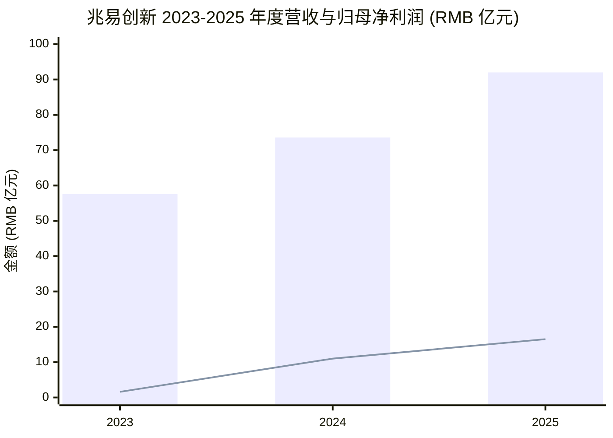
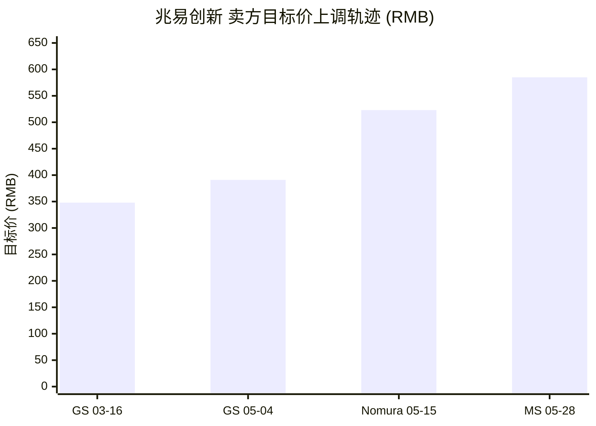
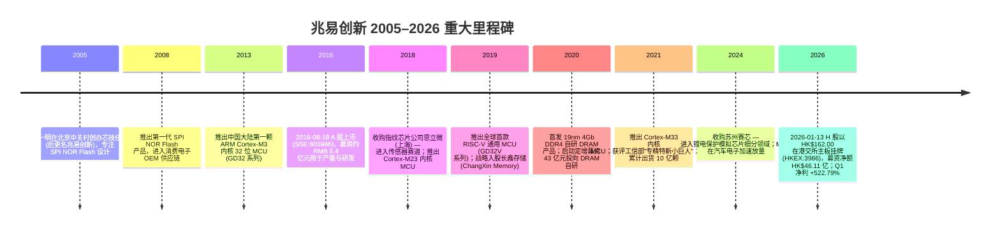
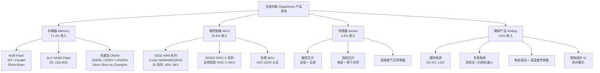
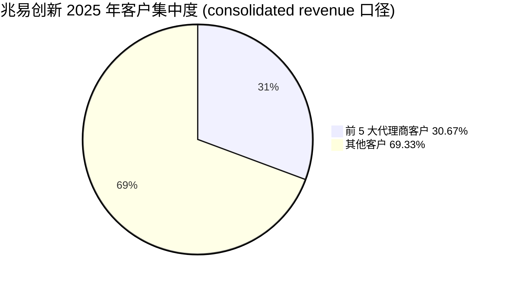
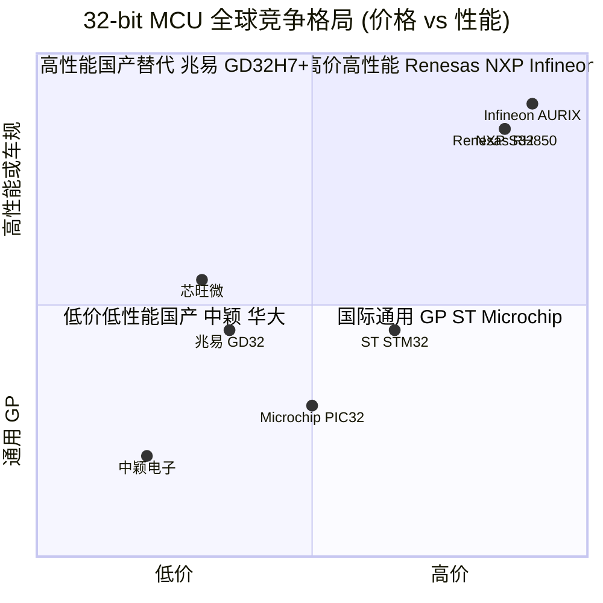

# 兆易创新科技集团股份有限公司 (GigaDevice Semiconductor, SSE:603986 / HKEX:3986) — 公司研究

**报告日期 / As of：2026-06-15**  报告语言：简体中文（zh-CN）  覆盖主题：memory-upcycle / 国产存储 + MCU

---

## 投资摘要 (Investment Summary) — *分析师观点 (house view)*

> 以下评级、目标价 (price target)、上行空间与论点支柱均为**本报告分析师观点 (*分析师观点：*)**，并非来自任何公司公告或财报——10-K / 年度报告中不含目标价。

| 项目 | 数值 |
|---|---|
| **评级 (Rating)** | **Hold / 中性偏谨慎 (Neutral)** |
| **12 个月目标价 (12-mo PT)** | **RMB 490** |
| **当前价 (Current)** | RMB 481.47（2026-06-12 收盘，[yfinance 603986.SS](https://finance.yahoo.com/quote/603986.SS/)） |
| **隐含上行 (Upside)** | **+1.8%** |
| **估值方法** | 75× 2026E EPS（RMB 6.56）— 介于野村 80× 与历史前瞻 ~49× 之间，反映 +80% 营收增速的溢价但已被市场充分定价 |
| **市值 (Market cap)** | 约 RMB 3,376 亿（RMB 481.47 × 7.011 亿股） |
| **52 周区间 / 近期动量** | 强势上行，2026 年初至今 A 股半导体超额收益领涨；5 月被 J.P. Morgan 量化组合点名为领涨标的（[J.P. Morgan China Quant Strategy, 2026-06-07](http://xs-macbook-air.local:5001/zsxq/pdf/181245588418182/J.P.%20Morgan-China%20Quant%20Strategy%EF%BC%9ACalm%20Surface%EF%BC%8C%20Violent%20Undercurrents-260607.pdf)） |
| **Ticker / 交易所** | SSE:603986（A 股）/ HKEX:3986（H 股，2026-01-13 挂牌） |

**论点支柱 (Thesis pillars) — *分析师观点：***

1. **利基存储 (niche DRAM + SLC NAND + NOR Flash) 量价齐升是真金白银的兑现，但已反映在股价里。** 2026 Q1 归母净利润同比 +522.79%、毛利率冲到 57.1%，是 7 年"设计 + 长鑫代工"战略的爆发性兑现；问题是当前 ~73× TTM P/E、~54× 2026E P/E 已经把这一红利计入。
2. **长鑫存储 (CXMT) 绑定是最独特的护城河，也是最大的双刃剑。** 2026 年 DRAM 关联交易指引从 2025 年 RMB 12 亿飙升至 **RMB 57 亿**（[高盛 GigaDevice, 2026-05-04](http://xs-macbook-air.local:5001/zsxq/pdf/184125215212422/Goldman%20Sachs-Gigadevice%20%EF%BC%88603986%EF%BC%89%EF%BC%9A%20Specialty%20DRAM%20and%20NOR%20Flash%20to%20drive%20sequential%20growth%20in%202Q%203Q%EF%BC%9B%201Q26%20Rev%20NI%20beat%EF%BC%9B%20Buy-260504.pdf)）；但长鑫 IPO 后定价权抬升可能侵蚀兆易的 DRAM 毛利。
3. **MCU (GD32) 是稳态压舱石、传感器是拖累、模拟靠并购起步——四条产品线分化明显。** GD32 在中国 32-bit ARM Cortex-M MCU 连续 7 年第一，但车规高端仍是 NXP/Renesas/Infineon 的领地。
4. **估值溢价的脆弱性是核心风险。** 一旦 2026 H2 存储价格见顶回落、或同比高基数后增速回落、或市场关注度从兆易转向长鑫，估值修复风险显著（见第 9 / 9.5 节）。

> **Update — 2026 Q1 业绩大幅超预期 (2026-04-29):** 公司 2026 年第一季度营收 RMB 41.88 亿元（同比 +119.38%），归母净利润 RMB 14.61 亿元（同比 +522.79%），扣非归母净利润 RMB 14.10 亿元（同比 +529.90%），毛利率同比 +19.6 pct、环比 +12.2 pct 至 57.1%；管理层口径："公司存储芯片产品面临供不应求局面，实现量价齐升；微控制器产品得益于工业、消费电子及汽车等多领域需求的带动，出货量大幅增长"。同时 H 股于 2026-01-13 以每股 HK$162.00 在港交所主板挂牌，募集净额约 HK$46.11 亿；超额配售权于 2026-02-07 悉数行使，H 股总股本扩大至 33,253,100 股。来源：[兆易创新 2026 年第一季度报告](https://static.cninfo.com.cn/finalpage/2026-04-30/1225257883.PDF)、[野村 GigaDevice 1Q growth, 2026-05-15](http://xs-macbook-air.local:5001/zsxq/pdf/212452121515151/Nomura-GigaDevice%EF%BC%88603986.SH%EF%BC%89Memory%20MCU%20strength%20drives%20robust%201Q%20growth-260515.pdf)、[兆易创新 H 股稳定价格行动结束公告 2026-02-09 上海证券报](https://paper.cnstock.com/html/2026-02/10/content_2179807.htm)。

## 目录

1. 公司概览（含 1A 估值与目标价、1B GF Score）
2. 估值与目标价（前瞻模型 + PT 推导 + 牛/基/熊 + 卖方观点演变）
3. 公司历史
4. 管理团队
5. 产品与服务
6. 客户与上市策略
7. 行业概览
8. 竞争格局
9. 市场机会 (TAM)
10. 风险评估（含 9.5 关键分歧与催化剂）
11. 投资人视角评分 (Section 10 lenses)
12. 数据来源清单 / 参考资料

---

## 1. 公司概览

**兆易创新科技集团股份有限公司 (GigaDevice Semiconductor Inc., 简称"兆易创新", SSE:603986 / HKEX:3986)** 是中国领先的无晶圆 (Fabless) 集成电路设计公司，总部位于北京市海淀区中关村集成电路设计园 8 号楼，业务覆盖四大产品线：专用型存储器 (NOR Flash + SLC NAND Flash + 利基型 DRAM / niche DRAM)、32 位通用微控制器 (general-purpose MCU)、传感器 (touch / fingerprint / pressure sensor)、模拟芯片 (analog IC)。公司国民经济行业分类隶属于"软件和信息技术服务业 — 集成电路设计" (代码 6520)，产品最终下游应用横跨工业、汽车电子、消费电子、PC 及服务器、物联网 (IoT)、网络通信六大领域 ([兆易创新 2025 年年度报告摘要](https://static.cninfo.com.cn/finalpage/2026-03-31/1225061348.PDF))。

**本报告的核心判断 (BLUF)。** 兆易创新是一家罕见地同时握有"存储周期 + MCU 国产替代 + 长鑫 DRAM 绑定"三重叙事的标的，2026 Q1 净利润同比 +522.79% 的爆发证明了利基存储量价齐升的真实弹性 ([兆易创新 2026 年第一季度报告](https://static.cninfo.com.cn/finalpage/2026-04-30/1225257883.PDF))。但当前 RMB 481.47 的股价对应约 73× TTM、~54× 2026E P/E，已经把这一红利大部分定价；本报告给予 **Hold / 中性偏谨慎**评级、12 个月目标价 RMB 490，认为风险回报已趋平衡——上行需要 DRAM 涨价持续超预期，下行则来自存储见顶 + 高估值的双杀。

**商业模式：纯 Fabless。** 公司"自成立以来一直采取 Fabless 模式，专注于集成电路设计、销售和客户服务环节，将晶圆制造、封装和测试等环节外包给专门的晶圆代工、封装及测试厂商"，自身不持有 fab 资产 ([兆易创新 2025 年年度报告摘要](https://static.cninfo.com.cn/finalpage/2026-03-31/1225061348.PDF))。这种轻资产模式使公司可专注于"集成电路设计是具有自主知识产权并体现核心技术含量的研发和设计环节"，但同时也使其经营业绩对晶圆代工厂 (foundry) 产能调度、产能价格 (wafer price) 及周期性产能配额谈判高度敏感。销售渠道以经销（代理商）模式为主、直销为辅 — 2025 年直销收入 RMB 8.48 亿元、占主营业务收入 9.22%（年报口径），其余约 90.78%（约 RMB 83.5 亿元，为直销占比的补数）通过经销/代理实现，代理网络是 GD32 MCU 渗透国内中小工业 / 消费客户的核心通路 ([兆易创新 2025 年年度报告](https://static.cninfo.com.cn/finalpage/2026-03-31/1225061352.PDF))。

**2025 年财务规模与盈利能力。** 公司 2025 年实现营业收入 RMB 92.03 亿元（同比 +25.12%），归母净利润 RMB 16.48 亿元（同比 +49.47%），扣非归母净利润 RMB 14.69 亿元（同比 +42.57%），加权平均 ROE 9.30%（同比提升 2.36 个百分点），基本 EPS 2.48 元（同比 +49.40%）；经营性现金流净额 RMB 21.29 亿元（同比 +4.74%），现金生成能力高于账面利润 ([兆易创新 2025 年年度报告](https://static.cninfo.com.cn/finalpage/2026-03-31/1225061352.PDF))。公司宣派现金股利每 10 股派 RMB 7.50 元（含税），合计 RMB 5.25 亿元，占归母净利润 31.88%，是上市以来首次大比例现金分红 ([兆易创新 2025 年年度报告摘要](https://static.cninfo.com.cn/finalpage/2026-03-31/1225061348.PDF))。综合毛利率 (gross margin) 40.21%，同比 +2.21 pct；其中存储芯片毛利率 42.84%（+2.57 pct）、MCU 毛利率 35.82%（-0.92 pct）、传感器毛利率 19.57%（+3.11 pct）、模拟产品毛利率 36.96%（+26.43 pct，主因 2024 年底并表苏州赛芯)([兆易创新 2025 年年度报告](https://static.cninfo.com.cn/finalpage/2026-03-31/1225061352.PDF))。

下图是公司 FY2025 利润表的资金流向 (income-statement Sankey)——左侧四大产品线汇成 RMB 92.03 亿营收，经 COGS RMB 55.02 亿 → 毛利 RMB 37.01 亿 → 三费（研发 RMB 11.17 亿为最大单项）→ 营业利润 RMB 17.16 亿 → 归母净利润 RMB 16.48 亿。研发费用占营收 12.1% 是 IC 设计公司典型的高研发投入特征。

<svg xmlns="http://www.w3.org/2000/svg" viewBox="0 0 1000 560" width="1000" height="560" role="img" aria-label="income statement Sankey"><rect x="0" y="0" width="1000" height="560" fill="#ffffff"/>
<text x="20.00" y="30.00" text-anchor="start" font-family="Helvetica,Arial,sans-serif" font-size="15" font-weight="700" fill="#1f2933">兆易创新 FY2025 利润表资金流 (Income Statement Sankey, RMB 百万)</text>
<path d="M 204.00,63.11 C 258.00,63.11 258.00,92.00 312.00,92.00 L 312.00,373.10 C 258.00,373.10 258.00,344.21 204.00,344.21 Z" fill="#93c5fd" fill-opacity="0.55"/>
<path d="M 452.00,85.00 C 506.00,85.00 506.00,195.52 560.00,195.52 L 560.00,268.99 C 506.00,268.99 506.00,158.47 452.00,158.47 Z" fill="#86efac" fill-opacity="0.55"/>
<path d="M 452.00,158.47 C 506.00,158.47 506.00,282.99 560.00,282.99 L 560.00,382.48 C 506.00,382.48 506.00,257.96 452.00,257.96 Z" fill="#fca5a5" fill-opacity="0.55"/>
<path d="M 328.00,92.00 C 382.00,92.00 382.00,85.00 436.00,85.00 L 436.00,243.45 C 382.00,243.45 382.00,250.45 328.00,250.45 Z" fill="#86efac" fill-opacity="0.55"/>
<path d="M 328.00,250.45 C 382.00,250.45 382.00,257.45 436.00,257.45 L 436.00,493.00 C 382.00,493.00 382.00,486.00 328.00,486.00 Z" fill="#fca5a5" fill-opacity="0.55"/>
<path d="M 700.00,181.73 C 754.00,181.73 754.00,245.72 808.00,245.72 L 808.00,316.28 C 754.00,316.28 754.00,252.29 700.00,252.29 Z" fill="#86efac" fill-opacity="0.55"/>
<path d="M 700.00,252.29 C 754.00,252.29 754.00,330.28 808.00,330.28 L 808.00,332.28 C 754.00,332.28 754.00,254.29 700.00,254.29 Z" fill="#fca5a5" fill-opacity="0.55"/>
<path d="M 576.00,195.52 C 630.00,195.52 630.00,181.73 684.00,181.73 L 684.00,255.20 C 630.00,255.20 630.00,268.99 576.00,268.99 Z" fill="#86efac" fill-opacity="0.55"/>
<path d="M 576.00,282.99 C 630.00,282.99 630.00,268.77 684.00,268.77 L 684.00,314.11 C 630.00,314.11 630.00,328.32 576.00,328.32 Z" fill="#fca5a5" fill-opacity="0.55"/>
<path d="M 576.00,328.32 C 630.00,328.32 630.00,328.11 684.00,328.11 L 684.00,375.93 C 630.00,375.93 630.00,376.14 576.00,376.14 Z" fill="#fca5a5" fill-opacity="0.55"/>
<path d="M 576.00,376.14 C 630.00,376.14 630.00,389.93 684.00,389.93 L 684.00,396.27 C 630.00,396.27 630.00,382.48 576.00,382.48 Z" fill="#fca5a5" fill-opacity="0.55"/>
<path d="M 204.00,358.21 C 258.00,358.21 258.00,373.10 312.00,373.10 L 312.00,454.88 C 258.00,454.88 258.00,439.98 204.00,439.98 Z" fill="#93c5fd" fill-opacity="0.55"/>
<path d="M 204.00,453.98 C 258.00,453.98 258.00,454.88 312.00,454.88 L 312.00,471.53 C 258.00,471.53 258.00,470.64 204.00,470.64 Z" fill="#93c5fd" fill-opacity="0.55"/>
<path d="M 204.00,484.64 C 258.00,484.64 258.00,471.53 312.00,471.53 L 312.00,485.79 C 258.00,485.79 258.00,498.89 204.00,498.89 Z" fill="#93c5fd" fill-opacity="0.55"/>
<path d="M 204.00,512.89 C 258.00,512.89 258.00,485.79 312.00,485.79 L 312.00,487.79 C 258.00,487.79 258.00,514.89 204.00,514.89 Z" fill="#93c5fd" fill-opacity="0.55"/>
<rect x="188.00" y="63.11" width="16" height="281.10" rx="1.5" fill="#2563eb"/>
<rect x="188.00" y="358.21" width="16" height="81.77" rx="1.5" fill="#2563eb"/>
<rect x="188.00" y="453.98" width="16" height="16.65" rx="1.5" fill="#2563eb"/>
<rect x="188.00" y="484.64" width="16" height="14.26" rx="1.5" fill="#2563eb"/>
<rect x="188.00" y="512.89" width="16" height="2.00" rx="1.5" fill="#2563eb"/>
<rect x="312.00" y="92.00" width="16" height="394.00" rx="1.5" fill="#1e3a8a"/>
<rect x="436.00" y="85.00" width="16" height="158.45" rx="1.5" fill="#15803d"/>
<rect x="436.00" y="257.45" width="16" height="235.55" rx="1.5" fill="#dc2626"/>
<rect x="560.00" y="195.52" width="16" height="73.47" rx="1.5" fill="#15803d"/>
<rect x="560.00" y="282.99" width="16" height="99.50" rx="1.5" fill="#dc2626"/>
<rect x="684.00" y="181.73" width="16" height="73.04" rx="1.5" fill="#15803d"/>
<rect x="684.00" y="268.77" width="16" height="45.34" rx="1.5" fill="#dc2626"/>
<rect x="684.00" y="328.11" width="16" height="47.82" rx="1.5" fill="#dc2626"/>
<rect x="684.00" y="389.93" width="16" height="6.34" rx="1.5" fill="#dc2626"/>
<rect x="808.00" y="245.72" width="16" height="70.55" rx="1.5" fill="#15803d"/>
<rect x="808.00" y="330.28" width="16" height="2.00" rx="1.5" fill="#dc2626"/>
<line x1="188.00" y1="203.66" x2="182.00" y2="173.89" stroke="#cbd5e1" stroke-width="1"/>
<text x="179.00" y="176.89" text-anchor="end" font-family="Helvetica,Arial,sans-serif" font-size="11.5" font-weight="700" fill="#1f2933">存储芯片 Memory</text>
<text x="179.00" y="189.89" text-anchor="end" font-family="Helvetica,Arial,sans-serif" font-size="10" font-weight="400" fill="#52606d">RMB6.6B  (71.3%)</text>
<line x1="188.00" y1="399.10" x2="182.00" y2="369.33" stroke="#cbd5e1" stroke-width="1"/>
<text x="179.00" y="372.33" text-anchor="end" font-family="Helvetica,Arial,sans-serif" font-size="11.5" font-weight="700" fill="#1f2933">微控制器 MCU</text>
<text x="179.00" y="385.33" text-anchor="end" font-family="Helvetica,Arial,sans-serif" font-size="10" font-weight="400" fill="#52606d">RMB1.9B  (20.8%)</text>
<line x1="188.00" y1="462.31" x2="182.00" y2="432.54" stroke="#cbd5e1" stroke-width="1"/>
<text x="179.00" y="435.54" text-anchor="end" font-family="Helvetica,Arial,sans-serif" font-size="11.5" font-weight="700" fill="#1f2933">传感器 Sensor</text>
<text x="179.00" y="448.54" text-anchor="end" font-family="Helvetica,Arial,sans-serif" font-size="10" font-weight="400" fill="#52606d">RMB389.0M  (4.2%)</text>
<line x1="188.00" y1="491.76" x2="182.00" y2="462.00" stroke="#cbd5e1" stroke-width="1"/>
<text x="179.00" y="465.00" text-anchor="end" font-family="Helvetica,Arial,sans-serif" font-size="11.5" font-weight="700" fill="#1f2933">模拟产品 Analog</text>
<text x="179.00" y="478.00" text-anchor="end" font-family="Helvetica,Arial,sans-serif" font-size="10" font-weight="400" fill="#52606d">RMB333.0M  (3.6%)</text>
<line x1="188.00" y1="513.89" x2="182.00" y2="487.00" stroke="#cbd5e1" stroke-width="1"/>
<text x="179.00" y="490.00" text-anchor="end" font-family="Helvetica,Arial,sans-serif" font-size="11.5" font-weight="700" fill="#1f2933">其他 Other</text>
<text x="179.00" y="503.00" text-anchor="end" font-family="Helvetica,Arial,sans-serif" font-size="10" font-weight="400" fill="#52606d">RMB4.0M  (0.04%)</text>
<rect x="331.00" y="74.00" width="113.10" height="26" rx="2" fill="#ffffff" fill-opacity="0.72"/>
<text x="334.00" y="86.00" text-anchor="start" font-family="Helvetica,Arial,sans-serif" font-size="11.5" font-weight="700" fill="#1f2933">Revenue</text>
<text x="334.00" y="99.00" text-anchor="start" font-family="Helvetica,Arial,sans-serif" font-size="10" font-weight="400" fill="#52606d">RMB9.2B  (100.0%)</text>
<rect x="455.00" y="67.00" width="106.80" height="26" rx="2" fill="#ffffff" fill-opacity="0.72"/>
<text x="458.00" y="79.00" text-anchor="start" font-family="Helvetica,Arial,sans-serif" font-size="11.5" font-weight="700" fill="#1f2933">Gross Profit</text>
<text x="458.00" y="92.00" text-anchor="start" font-family="Helvetica,Arial,sans-serif" font-size="10" font-weight="400" fill="#52606d">RMB3.7B  (40.2%)</text>
<rect x="455.00" y="239.45" width="144.60" height="26" rx="2" fill="#ffffff" fill-opacity="0.72"/>
<text x="458.00" y="251.45" text-anchor="start" font-family="Helvetica,Arial,sans-serif" font-size="11.5" font-weight="700" fill="#1f2933">Cost of Revenue (COGS)</text>
<text x="458.00" y="264.45" text-anchor="start" font-family="Helvetica,Arial,sans-serif" font-size="10" font-weight="400" fill="#52606d">RMB5.5B  (59.8%)</text>
<rect x="579.00" y="177.52" width="106.80" height="26" rx="2" fill="#ffffff" fill-opacity="0.72"/>
<text x="582.00" y="189.52" text-anchor="start" font-family="Helvetica,Arial,sans-serif" font-size="11.5" font-weight="700" fill="#1f2933">Operating Income</text>
<text x="582.00" y="202.52" text-anchor="start" font-family="Helvetica,Arial,sans-serif" font-size="10" font-weight="400" fill="#52606d">RMB1.7B  (18.6%)</text>
<rect x="579.00" y="264.99" width="150.90" height="26" rx="2" fill="#ffffff" fill-opacity="0.72"/>
<text x="582.00" y="276.99" text-anchor="start" font-family="Helvetica,Arial,sans-serif" font-size="11.5" font-weight="700" fill="#1f2933">Total Operating Expense</text>
<text x="582.00" y="289.99" text-anchor="start" font-family="Helvetica,Arial,sans-serif" font-size="10" font-weight="400" fill="#52606d">RMB2.3B  (25.3%)</text>
<rect x="703.00" y="163.73" width="106.80" height="26" rx="2" fill="#ffffff" fill-opacity="0.72"/>
<text x="706.00" y="175.73" text-anchor="start" font-family="Helvetica,Arial,sans-serif" font-size="11.5" font-weight="700" fill="#1f2933">Pretax Income</text>
<text x="706.00" y="188.73" text-anchor="start" font-family="Helvetica,Arial,sans-serif" font-size="10" font-weight="400" fill="#52606d">RMB1.7B  (18.5%)</text>
<rect x="703.00" y="250.77" width="106.80" height="26" rx="2" fill="#ffffff" fill-opacity="0.72"/>
<text x="706.00" y="262.77" text-anchor="start" font-family="Helvetica,Arial,sans-serif" font-size="11.5" font-weight="700" fill="#1f2933">SG&amp;A</text>
<text x="706.00" y="275.77" text-anchor="start" font-family="Helvetica,Arial,sans-serif" font-size="10" font-weight="400" fill="#52606d">RMB1.1B  (11.5%)</text>
<rect x="703.00" y="310.11" width="106.80" height="26" rx="2" fill="#ffffff" fill-opacity="0.72"/>
<text x="706.00" y="322.11" text-anchor="start" font-family="Helvetica,Arial,sans-serif" font-size="11.5" font-weight="700" fill="#1f2933">R&amp;D</text>
<text x="706.00" y="335.11" text-anchor="start" font-family="Helvetica,Arial,sans-serif" font-size="10" font-weight="400" fill="#52606d">RMB1.1B  (12.1%)</text>
<rect x="703.00" y="371.93" width="113.10" height="26" rx="2" fill="#ffffff" fill-opacity="0.72"/>
<text x="706.00" y="383.93" text-anchor="start" font-family="Helvetica,Arial,sans-serif" font-size="11.5" font-weight="700" fill="#1f2933">Other OpEx</text>
<text x="706.00" y="396.93" text-anchor="start" font-family="Helvetica,Arial,sans-serif" font-size="10" font-weight="400" fill="#52606d">RMB148.0M  (1.6%)</text>
<text x="833.00" y="278.00" text-anchor="start" font-family="Helvetica,Arial,sans-serif" font-size="11.5" font-weight="700" fill="#1f2933">Net Income</text>
<text x="833.00" y="291.00" text-anchor="start" font-family="Helvetica,Arial,sans-serif" font-size="10" font-weight="400" fill="#52606d">RMB1.6B  (17.9%)</text>
<text x="833.00" y="328.28" text-anchor="start" font-family="Helvetica,Arial,sans-serif" font-size="11.5" font-weight="700" fill="#1f2933">Income Tax</text>
<text x="833.00" y="341.28" text-anchor="start" font-family="Helvetica,Arial,sans-serif" font-size="10" font-weight="400" fill="#52606d">RMB29.0M  (0.32%)</text>
<text x="500.00" y="544.00" text-anchor="middle" font-family="Helvetica,Arial,sans-serif" font-size="10" font-weight="400" fill="#52606d">Source: 兆易创新 2025 年年度报告 (合并利润表/资产负债表/现金流量表), filed 2026-03-30</text>
</svg>
*Source: [兆易创新 2025 年年度报告](https://static.cninfo.com.cn/finalpage/2026-03-31/1225061352.PDF) — 合并利润表。*

**产品组合结构 (FY2025 主营业务收入拆分)。** 存储芯片 RMB 65.66 亿元（占 71.4%），是公司收入与利润的绝对压舱石；微控制器 RMB 19.10 亿元（占 20.8%）；传感器 RMB 3.89 亿元（占 4.2%）；模拟产品 RMB 3.33 亿元（占 3.6%）；技术服务及其他 RMB 0.04 亿元 ([兆易创新 2025 年年度报告](https://static.cninfo.com.cn/finalpage/2026-03-31/1225061352.PDF))。这一拆分相对 2024 年（存储 71.0%、MCU 23.0%、传感器 6.1%、模拟 0.2%）反映出**存储业务在 AI 周期中拉动整体增长，模拟业务在并购驱动下从无到有，传感器业务在指纹芯片价格压力下收缩**的三股结构性力量 ([兆易创新 2024 年年度报告](https://static.cninfo.com.cn/finalpage/2025-04-26/1223305062.PDF))。

<svg xmlns="http://www.w3.org/2000/svg" viewBox="0 0 720 460" width="720" height="460" role="img" aria-label="revenue donut"><rect x="0" y="0" width="720" height="460" fill="#ffffff"/>
<text x="20.00" y="30.00" text-anchor="start" font-family="Helvetica,Arial,sans-serif" font-size="15" font-weight="700" fill="#1f2933">兆易创新 FY2025 收入结构 (按产品, RMB 亿)</text>
<path d="M 288.00,107.20 A 132 132 0 1 1 159.45,269.17 L 212.04,256.91 A 78 78 0 1 0 288.00,161.20 Z" fill="#2563eb"/>
<path d="M 159.45,269.17 A 132 132 0 0 1 225.21,123.09 L 250.90,170.59 A 78 78 0 0 0 212.04,256.91 Z" fill="#15803d"/>
<path d="M 225.21,123.09 A 132 132 0 0 1 257.89,110.68 L 270.21,163.26 A 78 78 0 0 0 250.90,170.59 Z" fill="#d97706"/>
<path d="M 257.89,110.68 A 132 132 0 0 1 287.64,107.20 L 287.79,161.20 A 78 78 0 0 0 270.21,163.26 Z" fill="#7c3aed"/>
<path d="M 287.64,107.20 A 132 132 0 0 1 288.00,107.20 L 288.00,161.20 A 78 78 0 0 0 287.79,161.20 Z" fill="#dc2626"/>
<text x="288.00" y="235.20" text-anchor="middle" font-family="Helvetica,Arial,sans-serif" font-size="18" font-weight="800" fill="#1f2933">FY2025</text>
<text x="288.00" y="255.20" text-anchor="middle" font-family="Helvetica,Arial,sans-serif" font-size="13" font-weight="600" fill="#52606d">RMB92.0B</text>
<text x="288.00" y="271.20" text-anchor="middle" font-family="Helvetica,Arial,sans-serif" font-size="10" font-weight="400" fill="#8a97a3">total</text>
<line x1="396.09" y1="324.99" x2="412.09" y2="324.99" stroke="#2563eb" stroke-width="1.4"/>
<text x="416.09" y="322.99" text-anchor="start" font-family="Helvetica,Arial,sans-serif" font-size="11" font-weight="700" fill="#1f2933">存储芯片 Memory</text>
<text x="416.09" y="336.99" text-anchor="start" font-family="Helvetica,Arial,sans-serif" font-size="10" font-weight="400" fill="#52606d">RMB65.7B  (71.4%)</text>
<line x1="162.16" y1="182.55" x2="146.16" y2="182.55" stroke="#15803d" stroke-width="1.4"/>
<text x="142.16" y="180.55" text-anchor="end" font-family="Helvetica,Arial,sans-serif" font-size="11" font-weight="700" fill="#1f2933">微控制器 MCU</text>
<text x="142.16" y="194.55" text-anchor="end" font-family="Helvetica,Arial,sans-serif" font-size="10" font-weight="400" fill="#52606d">RMB19.1B  (20.8%)</text>
<line x1="239.01" y1="110.19" x2="223.01" y2="110.19" stroke="#d97706" stroke-width="1.4"/>
<text x="219.01" y="108.19" text-anchor="end" font-family="Helvetica,Arial,sans-serif" font-size="11" font-weight="700" fill="#1f2933">传感器 Sensor</text>
<text x="219.01" y="122.19" text-anchor="end" font-family="Helvetica,Arial,sans-serif" font-size="10" font-weight="400" fill="#52606d">RMB3.9B  (4.2%)</text>
<line x1="271.97" y1="102.13" x2="255.97" y2="102.13" stroke="#7c3aed" stroke-width="1.4"/>
<text x="251.97" y="100.13" text-anchor="end" font-family="Helvetica,Arial,sans-serif" font-size="11" font-weight="700" fill="#1f2933">模拟产品 Analog</text>
<text x="251.97" y="114.13" text-anchor="end" font-family="Helvetica,Arial,sans-serif" font-size="10" font-weight="400" fill="#52606d">RMB3.3B  (3.6%)</text>
<line x1="287.81" y1="101.20" x2="271.81" y2="101.20" stroke="#dc2626" stroke-width="1.4"/>
<text x="267.81" y="99.20" text-anchor="end" font-family="Helvetica,Arial,sans-serif" font-size="11" font-weight="700" fill="#1f2933">其他 Other</text>
<text x="267.81" y="113.20" text-anchor="end" font-family="Helvetica,Arial,sans-serif" font-size="10" font-weight="400" fill="#52606d">RMB40.0M  (0.0%)</text>
<text x="360.00" y="444.00" text-anchor="middle" font-family="Helvetica,Arial,sans-serif" font-size="10" font-weight="400" fill="#52606d">Source: 兆易创新 2025 年年度报告 (主营业务分产品), filed 2026-03-30</text>
</svg>
*Source: [兆易创新 2025 年年度报告](https://static.cninfo.com.cn/finalpage/2026-03-31/1225061352.PDF) — 主营业务分产品。*

下图是 2023–2025 年分产品收入的历史堆叠 (historical revbars)，可直观看到存储芯片的绝对拉动、MCU 的稳态贡献、以及模拟产品 2025 年因并表苏州赛芯而从近乎零跃升。

<svg xmlns="http://www.w3.org/2000/svg" viewBox="0 0 860 470" width="860" height="470" role="img" aria-label="historical revenue bars"><rect x="0" y="0" width="860" height="470" fill="#ffffff"/>
<text x="20.00" y="30.00" text-anchor="start" font-family="Helvetica,Arial,sans-serif" font-size="15" font-weight="700" fill="#1f2933">兆易创新 2023–2025 分产品收入 (RMB 亿)</text>
<rect x="20.00" y="44" width="11" height="11" rx="2" fill="#2563eb"/>
<text x="36.00" y="53.00" text-anchor="start" font-family="Helvetica,Arial,sans-serif" font-size="10.5" font-weight="400" fill="#1f2933">存储芯片 Memory</text>
<rect x="122.60" y="44" width="11" height="11" rx="2" fill="#15803d"/>
<text x="138.60" y="53.00" text-anchor="start" font-family="Helvetica,Arial,sans-serif" font-size="10.5" font-weight="400" fill="#1f2933">微控制器 MCU</text>
<rect x="205.40" y="44" width="11" height="11" rx="2" fill="#d97706"/>
<text x="221.40" y="53.00" text-anchor="start" font-family="Helvetica,Arial,sans-serif" font-size="10.5" font-weight="400" fill="#1f2933">传感器 Sensor</text>
<rect x="301.40" y="44" width="11" height="11" rx="2" fill="#7c3aed"/>
<text x="317.40" y="53.00" text-anchor="start" font-family="Helvetica,Arial,sans-serif" font-size="10.5" font-weight="400" fill="#1f2933">模拟产品 Analog</text>
<line x1="70" y1="412.00" x2="834" y2="412.00" stroke="#eceff2" stroke-width="1"/>
<text x="64.00" y="415.00" text-anchor="end" font-family="Helvetica,Arial,sans-serif" font-size="9.5" font-weight="400" fill="#52606d">RMB0</text>
<line x1="70" y1="345.20" x2="834" y2="345.20" stroke="#eceff2" stroke-width="1"/>
<text x="64.00" y="348.20" text-anchor="end" font-family="Helvetica,Arial,sans-serif" font-size="9.5" font-weight="400" fill="#52606d">RMB19.9B</text>
<line x1="70" y1="278.40" x2="834" y2="278.40" stroke="#eceff2" stroke-width="1"/>
<text x="64.00" y="281.40" text-anchor="end" font-family="Helvetica,Arial,sans-serif" font-size="9.5" font-weight="400" fill="#52606d">RMB39.7B</text>
<line x1="70" y1="211.60" x2="834" y2="211.60" stroke="#eceff2" stroke-width="1"/>
<text x="64.00" y="214.60" text-anchor="end" font-family="Helvetica,Arial,sans-serif" font-size="9.5" font-weight="400" fill="#52606d">RMB59.6B</text>
<line x1="70" y1="144.80" x2="834" y2="144.80" stroke="#eceff2" stroke-width="1"/>
<text x="64.00" y="147.80" text-anchor="end" font-family="Helvetica,Arial,sans-serif" font-size="9.5" font-weight="400" fill="#52606d">RMB79.5B</text>
<line x1="70" y1="78.00" x2="834" y2="78.00" stroke="#eceff2" stroke-width="1"/>
<text x="64.00" y="81.00" text-anchor="end" font-family="Helvetica,Arial,sans-serif" font-size="9.5" font-weight="400" fill="#52606d">RMB99.3B</text>
<rect x="123.48" y="275.49" width="147.71" height="136.51" fill="#2563eb"/>
<rect x="123.48" y="232.12" width="147.71" height="43.37" fill="#15803d"/>
<rect x="123.48" y="222.03" width="147.71" height="10.09" fill="#d97706"/>
<rect x="123.48" y="221.70" width="147.71" height="0.34" fill="#7c3aed"/>
<text x="197.33" y="428.00" text-anchor="middle" font-family="Helvetica,Arial,sans-serif" font-size="10" font-weight="400" fill="#52606d">2023</text>
<rect x="378.15" y="237.37" width="147.71" height="174.63" fill="#2563eb"/>
<rect x="378.15" y="180.51" width="147.71" height="56.86" fill="#15803d"/>
<rect x="378.15" y="165.45" width="147.71" height="15.06" fill="#d97706"/>
<rect x="378.15" y="164.94" width="147.71" height="0.50" fill="#7c3aed"/>
<text x="452.00" y="428.00" text-anchor="middle" font-family="Helvetica,Arial,sans-serif" font-size="10" font-weight="400" fill="#52606d">2024</text>
<rect x="632.81" y="191.24" width="147.71" height="220.76" fill="#2563eb"/>
<rect x="632.81" y="127.02" width="147.71" height="64.22" fill="#15803d"/>
<rect x="632.81" y="113.94" width="147.71" height="13.08" fill="#d97706"/>
<rect x="632.81" y="102.74" width="147.71" height="11.20" fill="#7c3aed"/>
<text x="706.67" y="428.00" text-anchor="middle" font-family="Helvetica,Arial,sans-serif" font-size="10" font-weight="400" fill="#52606d">2025</text>
<text x="430.00" y="454.00" text-anchor="middle" font-family="Helvetica,Arial,sans-serif" font-size="10" font-weight="400" fill="#52606d">Source: 兆易创新 2023/2024/2025 年年度报告 (主营业务分产品)</text>
</svg>
*Source: [兆易创新 2023](https://static.cninfo.com.cn/finalpage/2024-04-20/1219696457.PDF) / [2024](https://static.cninfo.com.cn/finalpage/2025-04-26/1223305062.PDF) / [2025 年年度报告](https://static.cninfo.com.cn/finalpage/2026-03-31/1225061352.PDF) — 主营业务分产品。各年存储/MCU 拆分以年报口径为准，早年个别细分为分析师近似还原。*

**地理收入结构 (按代理商 / 直销客户注册地划分，而非最终客户所在地)。** 中国大陆 RMB 27.87 亿元（占 30.3%，+44.93%）、中国香港 RMB 43.20 亿元（占 47.0%，+28.01%）、其他国家及地区 RMB 20.95 亿元（占 22.8%，+1.81%) ([兆易创新 2025 年年度报告](https://static.cninfo.com.cn/finalpage/2026-03-31/1225061352.PDF))。需要特别注意的是 — 香港收入并非"出口到香港"，而是公司"分地区的收入成本按照代理商、直销客户的公司注册地划分，而并非依据终端客户所在地区"，香港注册的代理商（包括许多大陆背景的供应链总部）实际服务的终端市场分布于全球，这条注释直接出现在年报口径说明中 ([兆易创新 2025 年年度报告](https://static.cninfo.com.cn/finalpage/2026-03-31/1225061352.PDF))。

<svg xmlns="http://www.w3.org/2000/svg" viewBox="0 0 720 460" width="720" height="460" role="img" aria-label="revenue donut"><rect x="0" y="0" width="720" height="460" fill="#ffffff"/>
<text x="20.00" y="30.00" text-anchor="start" font-family="Helvetica,Arial,sans-serif" font-size="15" font-weight="700" fill="#1f2933">兆易创新 FY2025 收入结构 (按代理商/直销客户注册地, RMB 亿)</text>
<path d="M 288.00,107.20 A 132 132 0 0 1 313.17,368.78 L 302.87,315.77 A 78 78 0 0 0 288.00,161.20 Z" fill="#2563eb"/>
<path d="M 313.17,368.78 A 132 132 0 0 1 157.30,220.74 L 210.77,228.29 A 78 78 0 0 0 302.87,315.77 Z" fill="#15803d"/>
<path d="M 157.30,220.74 A 132 132 0 0 1 288.00,107.20 L 288.00,161.20 A 78 78 0 0 0 210.77,228.29 Z" fill="#d97706"/>
<text x="288.00" y="235.20" text-anchor="middle" font-family="Helvetica,Arial,sans-serif" font-size="18" font-weight="800" fill="#1f2933">FY2025</text>
<text x="288.00" y="255.20" text-anchor="middle" font-family="Helvetica,Arial,sans-serif" font-size="13" font-weight="600" fill="#52606d">RMB92.0B</text>
<text x="288.00" y="271.20" text-anchor="middle" font-family="Helvetica,Arial,sans-serif" font-size="10" font-weight="400" fill="#8a97a3">total</text>
<line x1="425.37" y1="225.98" x2="441.37" y2="225.98" stroke="#2563eb" stroke-width="1.4"/>
<text x="445.37" y="223.98" text-anchor="start" font-family="Helvetica,Arial,sans-serif" font-size="11" font-weight="700" fill="#1f2933">中国香港 HK-registered</text>
<text x="445.37" y="237.98" text-anchor="start" font-family="Helvetica,Arial,sans-serif" font-size="10" font-weight="400" fill="#52606d">RMB43.2B  (46.9%)</text>
<line x1="192.97" y1="339.26" x2="176.97" y2="339.26" stroke="#15803d" stroke-width="1.4"/>
<text x="172.97" y="337.26" text-anchor="end" font-family="Helvetica,Arial,sans-serif" font-size="11" font-weight="700" fill="#1f2933">中国大陆 Mainland</text>
<text x="172.97" y="351.26" text-anchor="end" font-family="Helvetica,Arial,sans-serif" font-size="10" font-weight="400" fill="#52606d">RMB27.9B  (30.3%)</text>
<line x1="197.50" y1="135.02" x2="181.50" y2="135.02" stroke="#d97706" stroke-width="1.4"/>
<text x="177.50" y="133.02" text-anchor="end" font-family="Helvetica,Arial,sans-serif" font-size="11" font-weight="700" fill="#1f2933">其他国家及地区 Other</text>
<text x="177.50" y="147.02" text-anchor="end" font-family="Helvetica,Arial,sans-serif" font-size="10" font-weight="400" fill="#52606d">RMB20.9B  (22.8%)</text>
<text x="360.00" y="444.00" text-anchor="middle" font-family="Helvetica,Arial,sans-serif" font-size="10" font-weight="400" fill="#52606d">Source: 兆易创新 2025 年年度报告 (主营业务分地区), filed 2026-03-30</text>
</svg>
*Source: [兆易创新 2025 年年度报告](https://static.cninfo.com.cn/finalpage/2026-03-31/1225061352.PDF) — 主营业务分地区（按代理商/直销客户注册地，非终端客户所在地）。*

*Source: [兆易创新 2025 年年度报告](https://static.cninfo.com.cn/finalpage/2026-03-31/1225061352.PDF) — 营业收入 + 归母净利润（柱形 = 营收，折线 = 归母净利润）。*

### 1A. 估值快照与目标价 (Valuation snapshot & PT, as of 2026-06-15)

**当前价 RMB 481.47（2026-06-12 收盘）、市值约 RMB 3,376 亿、总股本 7.011 亿股**（[yfinance 603986.SS](https://finance.yahoo.com/quote/603986.SS/)）。按野村 2026E EPS RMB 6.54 估算，当前价对应 **~73.6× 前瞻 P/E**；野村口径明确指出"当前股价对应 2026 年 PE 为 54.5 倍"（其使用更高的 2026E EPS）([野村 GigaDevice, 2026-05-15](http://xs-macbook-air.local:5001/zsxq/pdf/212452121515151/Nomura-GigaDevice%EF%BC%88603986.SH%EF%BC%89Memory%20MCU%20strength%20drives%20robust%201Q%20growth-260515.pdf))。无论用哪个口径，估值都**远高于全球 NOR Flash 同行**（旺宏 Macronix TWSE:2337、华邦电 Winbond TWSE:2344 通常处于 8–15× TTM 区间）和**国内 IC 设计中位数**（约 35–50× TTM）。

***分析师观点：*** 当前估值溢价的三条逻辑——(a) 2026 Q1 利润同比 +522.79% 的暴利已经把 AI 周期带来的 niche DRAM + SLC NAND 价格弹性写进数据 ([兆易创新 2026 年第一季度报告](https://static.cninfo.com.cn/finalpage/2026-04-30/1225257883.PDF))；(b) 公司与长鑫存储 (CXMT) 的"设计 + 代工"绑定（朱一明同时担任两家公司董事长，定向 IPO 锁定 1.88% 长鑫股权）使其享有国产 DRAM 供应链 alpha ([中华网, 2025-12-17](https://m.tech.china.com/redian/2025/1217/122025_1783003.html))；(c) H 股发行价 HK$162.00 给国际机构投资者建立了新的估值锚 ([兆易创新 H 股稳定价格行动结束公告 2026-02-09](https://paper.cnstock.com/html/2026-02/10/content_2179807.htm))。**估值溢价的脆弱性写入第 9 节。**

### 1B. GF Score 基本面评分 (GuruFocus-style scorecard) — *分析师观点*

> GF Score 五维评分与综合分是**分析师自有评分框架**，并非来自 GuruFocus 的官方数值，也不附带财报引用；每一维度的底层指标（margin / 杠杆 / CAGR / 倍数 / 动量）在正文各处单独引用。

<svg xmlns="http://www.w3.org/2000/svg" viewBox="0 0 500 500" width="500" height="500" role="img" aria-label="GF Score radar">
<rect x="0" y="0" width="500" height="500" fill="#ffffff"/>
<text x="20" y="24" font-family="Helvetica,Arial,sans-serif" font-size="15" font-weight="700" fill="#1f2933">GF Score (GuruFocus-style): 72/100</text>
<text x="20" y="41" font-family="Helvetica,Arial,sans-serif" font-size="11" fill="#52606d">71–80 Likely average performance</text>
<polygon points="250.0,88.0 392.7,191.6 338.2,359.4 161.8,359.4 107.3,191.6" fill="#e9f5ec" stroke="none"/>
<polygon points="250.0,208.0 278.5,228.7 267.6,262.3 232.4,262.3 221.5,228.7" fill="none" stroke="#c5d3cb" stroke-width="1"/>
<polygon points="250.0,178.0 307.1,219.5 285.3,286.5 214.7,286.5 192.9,219.5" fill="none" stroke="#c5d3cb" stroke-width="1"/>
<polygon points="250.0,148.0 335.6,210.2 302.9,310.8 197.1,310.8 164.4,210.2" fill="none" stroke="#c5d3cb" stroke-width="1"/>
<polygon points="250.0,118.0 364.1,200.9 320.5,335.1 179.5,335.1 135.9,200.9" fill="none" stroke="#c5d3cb" stroke-width="1"/>
<polygon points="250.0,88.0 392.7,191.6 338.2,359.4 161.8,359.4 107.3,191.6" fill="none" stroke="#c5d3cb" stroke-width="1.3"/>
<line x1="250" y1="238" x2="161.8" y2="359.4" stroke="#cfdad3" stroke-width="1"/>
<text x="146.5" y="392.4" text-anchor="end" font-family="Helvetica,Arial,sans-serif" font-size="11.5" font-weight="600" fill="#1f2933">财务实力</text>
<text x="179.5" y="329.1" text-anchor="middle" font-family="Helvetica,Arial,sans-serif" font-size="10.5" font-weight="700" fill="#1f2933">8</text>
<line x1="250" y1="238" x2="250.0" y2="88.0" stroke="#cfdad3" stroke-width="1"/>
<text x="250.0" y="58.0" text-anchor="middle" font-family="Helvetica,Arial,sans-serif" font-size="11.5" font-weight="600" fill="#1f2933">盈利能力</text>
<text x="250.0" y="127.0" text-anchor="middle" font-family="Helvetica,Arial,sans-serif" font-size="10.5" font-weight="700" fill="#1f2933">7</text>
<line x1="250" y1="238" x2="107.3" y2="191.6" stroke="#cfdad3" stroke-width="1"/>
<text x="82.6" y="183.6" text-anchor="end" font-family="Helvetica,Arial,sans-serif" font-size="11.5" font-weight="600" fill="#1f2933">成长性</text>
<text x="135.9" y="194.9" text-anchor="middle" font-family="Helvetica,Arial,sans-serif" font-size="10.5" font-weight="700" fill="#1f2933">8</text>
<line x1="250" y1="238" x2="392.7" y2="191.6" stroke="#cfdad3" stroke-width="1"/>
<text x="417.4" y="183.6" text-anchor="start" font-family="Helvetica,Arial,sans-serif" font-size="11.5" font-weight="600" fill="#1f2933">估值</text>
<text x="292.8" y="218.1" text-anchor="middle" font-family="Helvetica,Arial,sans-serif" font-size="10.5" font-weight="700" fill="#1f2933">3</text>
<line x1="250" y1="238" x2="338.2" y2="359.4" stroke="#cfdad3" stroke-width="1"/>
<text x="353.5" y="392.4" text-anchor="start" font-family="Helvetica,Arial,sans-serif" font-size="11.5" font-weight="600" fill="#1f2933">动量</text>
<text x="329.4" y="341.2" text-anchor="middle" font-family="Helvetica,Arial,sans-serif" font-size="10.5" font-weight="700" fill="#1f2933">9</text>
<polygon points="250.0,133.0 292.8,224.1 329.4,347.2 179.5,335.1 135.9,200.9" fill="#2e8b57" fill-opacity="0.34" stroke="#2e8b57" stroke-width="2"/>
<circle cx="179.5" cy="335.1" r="2.6" fill="#2e8b57"/>
<circle cx="250.0" cy="133.0" r="2.6" fill="#2e8b57"/>
<circle cx="135.9" cy="200.9" r="2.6" fill="#2e8b57"/>
<circle cx="292.8" cy="224.1" r="2.6" fill="#2e8b57"/>
<circle cx="329.4" cy="347.2" r="2.6" fill="#2e8b57"/>
<text x="250" y="470" text-anchor="middle" font-family="Helvetica,Arial,sans-serif" font-size="9.5" fill="#52606d">Source: 兆易创新 2025 年年度报告 · 2026 Q1 报告 · 野村/高盛/大摩 broker estimates · yfinance 603986.SS, as of 2026-06-15</text>
<text x="250" y="485" text-anchor="middle" font-family="Helvetica,Arial,sans-serif" font-size="9" fill="#52606d">GF Score = independent analyst rubric (*Analyst view:*) — not GuruFocus™ official number</text>
</svg>

| 维度 | 评分 (0–10) | 评分理由（各维度引用见下） |
|---|---:|---|
| 财务实力 Financial Strength | **8** | 负债合计 RMB 16.96 亿 vs 所有者权益 RMB 159.61 亿（资产负债率仅 9.6%）、货币资金 RMB 41.80 亿净现金充裕、财务费用为 -RMB 1.42 亿（即贡献利润）([年报](https://static.cninfo.com.cn/finalpage/2026-03-31/1225061352.PDF)) |
| 盈利能力 Profitability | **7** | FY2025 gross margin 40.21%、营业利润率 18.6%、加权 ROE 9.30%（中等）；但 2026 Q1 毛利率冲至 57.1%、ROE 弹性快速抬升 ([年报](https://static.cninfo.com.cn/finalpage/2026-03-31/1225061352.PDF)、[Q1 报告](https://static.cninfo.com.cn/finalpage/2026-04-30/1225257883.PDF)) |
| 成长性 Growth | **8** | FY2025 营收 +25.12%、归母 +49.47%；2026 Q1 营收 +119.38%、归母 +522.79%；高盛 2026E 营收指引 RMB 165 亿（+80% YoY）([Q1 报告](https://static.cninfo.com.cn/finalpage/2026-04-30/1225257883.PDF)、[高盛 2026-05-04](http://xs-macbook-air.local:5001/zsxq/pdf/184125215212422/Goldman%20Sachs-Gigadevice%20%EF%BC%88603986%EF%BC%89%EF%BC%9A%20Specialty%20DRAM%20and%20NOR%20Flash%20to%20drive%20sequential%20growth%20in%202Q%203Q%EF%BC%9B%201Q26%20Rev%20NI%20beat%EF%BC%9B%20Buy-260504.pdf)) |
| 估值 GF Value（越高越便宜） | **3** | ~73× TTM / ~54× 2026E P/E，是全球同行（8–15×）和国内中位数（35–50×）的 1.5–5 倍，安全边际薄（[野村 2026-05-15](http://xs-macbook-air.local:5001/zsxq/pdf/212452121515151/Nomura-GigaDevice%EF%BC%88603986.SH%EF%BC%89Memory%20MCU%20strength%20drives%20robust%201Q%20growth-260515.pdf)） |
| 动量 Momentum | **9** | 2026 年初至今 A 股半导体强势领涨，5 月被 J.P. Morgan 量化组合点名为领涨贡献标的（[J.P. Morgan, 2026-06-07](http://xs-macbook-air.local:5001/zsxq/pdf/181245588418182/J.P.%20Morgan-China%20Quant%20Strategy%EF%BC%9ACalm%20Surface%EF%BC%8C%20Violent%20Undercurrents-260607.pdf)） |
| **GF Score 综合 (*分析师观点：*)** | **72 / 100** | 71–80 区间——基本面强（财务/成长/动量优），但估值维度拉低综合分，与本报告 Hold 评级一致 |

---

## 2. 估值与目标价 (Valuation & Price Target)

### 2.1 前瞻财务模型 (Forward estimates, 2026–2028E) — *分析师观点*

> 下表每一格预测数字均为**本报告分析师观点 (*分析师观点：*)**，绝不附带财报引用。模型基于年报分产品收入 + 管理层关联交易指引 + 卖方估值区间搭建；外部输入（年报 segment 数据 + 高盛/野村行业涨价假设）在文中单独引用。

| 指标 | 2025A | 2026E | 2027E | 2028E |
|---|---:|---:|---:|---:|
| 营业收入 (RMB 亿) | 92.0 | 162 | 195 | 215 |
| YoY | +25% | +76% | +20% | +10% |
| Gross margin | 40.2% | ~50% | ~47% | ~44% |
| 归母净利润 (RMB 亿) | 16.5 | ~46 | ~52 | ~52 |
| 基本 EPS (RMB) | 2.48 | ~6.56 | ~7.4 | ~7.4 |
| YoY (EPS) | +49% | +165% | +13% | 0% |

**模型驱动因子 (*分析师观点：*)。** 2026E 营收的爆发性增长由三股力量叠加：(1) **利基 DRAM** 受国际大厂转向 HBM/DDR5 挤出产能、价量齐升——高盛把 DRAM 关联交易（即长鑫代工量）指引从 2025 年 RMB 12 亿上调到 **2026E RMB 57 亿**，野村把 2026 年存储 ASP 增速从 25% 上调到 40%、存储出货增速从 20% 上调到 40% ([高盛, 2026-05-04](http://xs-macbook-air.local:5001/zsxq/pdf/184125215212422/Goldman%20Sachs-Gigadevice%20%EF%BC%88603986%EF%BC%89%EF%BC%9A%20Specialty%20DRAM%20and%20NOR%20Flash%20to%20drive%20sequential%20growth%20in%202Q%203Q%EF%BC%9B%201Q26%20Rev%20NI%20beat%EF%BC%9B%20Buy-260504.pdf)、[野村, 2026-05-15](http://xs-macbook-air.local:5001/zsxq/pdf/212452121515151/Nomura-GigaDevice%EF%BC%88603986.SH%EF%BC%89Memory%20MCU%20strength%20drives%20robust%201Q%20growth-260515.pdf))；(2) **NOR Flash** 受汽车/工业需求 + 成熟制程代工产能紧张支撑温和涨价；(3) **MCU** 出货量在工业/消费/汽车复苏下回升（野村把 2026 MCU 出货增速从 5% 上调到 30%）。毛利率 2026E 冲高至 ~50%（高盛预测 50.9%）后，2027–2028E 随价格正常化而温和回落——这是本模型把后两年增速大幅收敛、并据此判断当前估值已透支的核心理由。

### 2.2 目标价推导 (PT derivation) — *分析师观点*

**方法：前瞻 P/E × 目标倍数。** 基准情形 2026E EPS RMB 6.56 × **75× = RMB 490**（取整）。75× 倍数的依据：介于野村给出的 80× 2026E PE 与公司历史前瞻 P/E ~49× 之间，向上偏移反映 +80% 营收增速的超高成长溢价，但不及野村那么激进——因为 75× 已隐含 2027E ~66× PE，对一家 2027E 增速将收敛到 13% 的公司而言已属慷慨。

***倍数依据 (为什么用 75×)：*** 对照 3 个锚点——(a) 全球纯利基存储同行（旺宏/华邦电）8–15× TTM，但它们增速远低且无国产替代溢价；(b) 国内高景气 IC 设计龙头（澜起科技、寒武纪等）在 AI 周期中可给到 60–100× 前瞻 PE；(c) 公司自身历史前瞻 P/E 约 49×（高盛口径）。兆易兼具"存储周期弹性 + 国产替代 + MCU 平台"，给予高于历史、低于野村峰值的 75× 属合理中枢。

### 2.3 牛 / 基 / 熊三档目标价 (Bull / Base / Bear) — *分析师观点*

| 情景 | 关键假设 | 2026E EPS × 倍数 | 目标价 | 相对当前 (RMB 481.47) |
|---|---|---|---:|---:|
| **牛 Bull** | DRAM 涨价延续到 2027、长鑫产能配额充足、毛利率守在 50%+；给 80× | 7.2 × 80× | **RMB 580** | **+20%** |
| **基 Base** | DRAM 涨价 2026 见顶后正常化、MCU 温和复苏；给 75× | 6.56 × 75× | **RMB 490** | **+1.8%** |
| **熊 Bear** | 国际大厂回补 niche DRAM 产能、价格 2026 H2 回落 20–40%、估值收敛至 45× | 6.0 × 45× | **RMB 270** | **−44%** |

风险回报明显不对称——上行 +20% vs 下行 −44%，这是本报告给予 Hold 而非 Buy 的核心定量理由。

### 2.4 与市场一致预期的对比 (vs consensus) — *分析师观点*

本报告基准 PT RMB 490 **低于**卖方一致区间的中枢：当前覆盖该股的四家外资行 PT 分别为高盛 RMB 391、野村 RMB 523、大摩 RMB 585（中位数 RMB 523），美银维持 Buy 但未给具体 PT。本报告基准 EPS（2026E RMB 6.56）与野村/高盛接近，但给予更保守的目标倍数，因此 PT 偏低、评级偏谨慎——我们认为当前价已接近 PT 中位数（+8.6% 到 RMB 523），上行空间被卖方乐观预期透支。来源见下方 2.5 节卖方观点演变。

### 2.5 卖方观点演变 (Sell-side view evolution)

> 机械化前置：先读 `db/stock_price_target.db`（只读）——四家外资行 8 条记录，PT 区间 RMB 391–585（剔除无 PT 的美银），离散度 49%；2026 年 3–5 月出现密集上调潮，是利基存储超级周期被卖方逐步确认的轨迹。

**按机构的观点时间线 (per-institute timeline)：**

| 机构 | 报告日 | 评级 | 目标价 | 关键估计 / 自我修正 | 触发因素 |
|---|---|---|---:|---|---|
| **高盛 GS** | 2026-03-16 | Buy | **RMB 348**（自 RMB 257 大幅上调）| 2025–27E EPS 上调 2%/6%/9%；改用折现 PE 法，给 2030E 34.7× 折回 2027E；隐含 2027 PE 51×（≈历史均值 49×）；1H26 DRAM 关联交易指引 RMB 15 亿 | DRAM 涨价 + DDR3→DDR4 组合升级 |
| **高盛 GS** | 2026-05-04 | Buy | **RMB 391**（再上调）| 2026–28E NI 上调 60%/36%/36%；2026E 毛利率 42.0%→50.9%；2026E 营收 RMB 165 亿(+80%)；**CXMT 关联交易指引 RMB 57 亿**(vs 2025 RMB 12 亿)；隐含 2027 PE 44× | 1Q26 营收/净利超预期、净利 +523% |
| **美银 BofA** | 2026-05-11 | Buy | 未给 PT | 列为中国半导体首选标的之一；DRAM/MCU/NOR 量价齐升；存储超级周期延续至 2027–28 | FY25 & 1Q26 业绩综述 |
| **野村 Nomura** | 2026-05-15 | Buy | **RMB 523**（自 RMB 321 大幅上调）| 2026E EPS RMB 6.54 × 80× PE（高于行业均值 74.6×）；2026–28E 营收上调 28%/38%/33%、净利上调 63%/80%/69%；2026 存储/MCU ASP +40%/+10% | 1Q26 净利 +522.8%、毛利率 57.1% |
| **大摩 MS** | 2026-05-28 | Overweight | **RMB 585**（自 RMB 348 大幅上调）| 2026/27 EPS 上调 58%/60%；DDR4 供需缺口 2H26 扩大至 19–20% | 传统存储超预期上涨、SLC NAND 数据中心渗透 |

**机构间分歧 (cross-institute disagreement) — 不混为虚假一致：**

| 机构 | 日期 | 评级/PT | 核心论点 | 什么证据能证明其正确 |
|---|---|---|---|---|
| 大摩 MS | 2026-05-28 | OW / RMB 585 | DDR4 供需缺口 2H26 扩大至 19–20%、价格 3Q26 再涨 ~20%，存储上行延续 | 3Q26 DDR4 现货/合约价继续上涨、美光/海力士 niche 产能持续退出 |
| 野村 Nomura | 2026-05-15 | Buy / RMB 523 | 80× PE 合理因盈利增速领先同业；存储+MCU 双引擎 | 2026E EPS 达 RMB 6.54、MCU 出货 +30% 兑现 |
| 高盛 GS | 2026-05-04 | Buy / RMB 391 | 估值用折现 PE 法更保守（35.1×/2030E 折回），隐含 2027 PE 44× 接近历史 | 定制 DRAM 2027 起规模化、毛利率守在 50%+ |
| **本报告** | 2026-06-15 | **Hold / RMB 490** | 当前价已接近 PT 中位数；风险回报 +20%/−44% 不对称 | 2026 H2 存储价格是否见顶——若延续则偏牛、若回落则验证熊 |

**报告日股价配对 (report-date price pairing)：** 高盛 RMB 391 PT 对应报告日 2026-05-04 收盘 RMB 312.53（隐含上行 +25.1%）；野村 RMB 523 对应 2026-05-15 收盘 RMB 374.79（+39.5%）；大摩 RMB 585 对应 2026-05-28 收盘 RMB 483.00（+21.1%）（来源：`db/stock_price_target.db` 的 `report_date_price`/`upside_pct` 字段）。注意：这些卖方 PT 的上行空间是相对各自**报告日**股价计算的，与本报告头部相对当前价 RMB 481.47 的 +1.8% 不同——股价在 4–5 月已大幅上涨，吞掉了大部分卖方喊出的上行空间。

### 2.6 估值历史与同业对比图

*Source: `db/stock_price_target.db` 只读 + 各机构 zsxq 报告（[GS 03-16](http://xs-macbook-air.local:5001/zsxq/pdf/812222851228852/Goldman%20Sachs-Gigadevice%20%EF%BC%88603986.SS%EF%BC%89%20Specialty%20DRAM%20riding%20on%20mix%20upgrade%EF%BC%9B%20LT%20opportunities%20in%20customized%20DRAM%EF%BC%9B%20raise%20TP%20to%20Rmb348%EF%BC%9B%20Buy-260316.pdf) · [GS 05-04](http://xs-macbook-air.local:5001/zsxq/pdf/184125215212422/Goldman%20Sachs-Gigadevice%20%EF%BC%88603986%EF%BC%89%EF%BC%9A%20Specialty%20DRAM%20and%20NOR%20Flash%20to%20drive%20sequential%20growth%20in%202Q%203Q%EF%BC%9B%201Q26%20Rev%20NI%20beat%EF%BC%9B%20Buy-260504.pdf) · [Nomura 05-15](http://xs-macbook-air.local:5001/zsxq/pdf/212452121515151/Nomura-GigaDevice%EF%BC%88603986.SH%EF%BC%89Memory%20MCU%20strength%20drives%20robust%201Q%20growth-260515.pdf) · [MS 05-28](http://xs-macbook-air.local:5001/zsxq/pdf/212451114418521/MS-Greater%20China%20Semiconductors%20-%20Asia%20Pacific%20Old%20Memory-Upside%20Surprise%20%20Ahead-260528.pdf)）。*

---

## 3. 公司历史

兆易创新前身为**北京芯技佳易微电子科技有限公司**，于 2005 年 4 月 6 日由自然人**朱一明 (Zhu Yiming)** 与北京清华科技园孵化器有限公司共同出资成立 ([兆易创新 2025 年年度报告](https://static.cninfo.com.cn/finalpage/2026-03-31/1225061352.PDF))。创始故事的关键在于 — 朱一明 1972 年 7 月生于江苏盐城，清华大学物理系本科 + 硕士，纽约州立大学石溪分校 (Stony Brook) 电气工程硕士，2000 年后曾在 iPolicy Networks 任工程师、在硅谷存储设计公司 Monolithic System 任项目经理，2005 年回国创办公司 ([Crunchbase: Zhu Yiming, Founder & Chairman](https://www.crunchbase.com/person/zhu-yiming)、[Bloomberg: Zhu Yiming Profile](https://www.bloomberg.com/profile/person/18784969)、[Baidu Baike: Zhu Yiming](https://baike.baidu.com/en/item/Zhu%20Yiming/25173))。公司创立伊始即定位于 NOR Flash 设计赛道，绕开当时被 Spansion / SST / Macronix / Winbond 主导的国际市场，从最低端的 SPI NOR 切入再逐步爬升。

*Source: [兆易创新 2025 年年度报告](https://static.cninfo.com.cn/finalpage/2026-03-31/1225061352.PDF)、[GigaDevice GD32 MCU Milestones — 1 Billion Shipment](https://www.gd32mcu.com/en/detail/402)、[GigaDevice GD32V Series RISC-V](https://www.gd32mcu.com/en/detail/195)、[兆易创新 H 股稳定价格行动结束公告 2026-02-09](https://paper.cnstock.com/html/2026-02/10/content_2179807.htm)。*

**关键战略转型 (3 次)。** 第一次是 2013 年从单一 NOR Flash 业务跨入 MCU 设计 — 这一年公司推出中国大陆首颗 Cortex-M3 内核 MCU，原因是 NOR Flash 业务面临国际大厂的强力价格竞争与制程门槛，需要在客户基础已经建立的工业 / 消费 OEM 中横向扩品，将"存储 + 控制"双产品打入同一物料清单 (BoM)；该决策使公司从单一周期性存储公司转型为综合 IC 设计平台 ([GD32 MCU 历史: What made GigaDevice's MCU Rose to a Leadership Position in Eight-Year](https://www.gd32mcu.com/en/detail/369))。第二次是 2019 年正式进入 DRAM 自研赛道 — 当年朱一明出任长鑫存储 (ChangXin Memory) 董事长，并以兆易创新名义启动定增募资 43 亿元投向"DRAM 芯片研发与产业化项目"，这是国产替代 + 战略性产能保障的双重布局，使公司从 NOR / NAND 拓展到 DRAM 三大存储产品全覆盖 ([中华网, 2025-12-17](https://m.tech.china.com/redian/2025/1217/122025_1783003.html)、[36 氪：长鑫科技 IPO 清华学霸朱一明再打造一个千亿级半导体巨头](https://www.36kr.com/p/3629145550128135))。第三次是 2026 年 H 股上市 — 在国产替代主基调与 AI 周期红利共振的背景下，公司选择港股二次上市以建立国际化估值锚、吸纳海外机构投资者并强化资产负债表，募资净额 HK$46.11 亿（约 RMB 42 亿）([兆易创新 H 股稳定价格行动结束公告 2026-02-09](https://paper.cnstock.com/html/2026-02/10/content_2179807.htm))。

**主要并购与战略股权 (按时间排序)：** 2018 年收购思立微 (上海思立微) — 切入指纹识别芯片赛道，对应当时智能手机指纹解锁的爆发性需求；2019 年战略入股长鑫存储 1.88% — 锁定中国大陆唯一 12 寸 DRAM IDM 的产能配额，DRAM 产品独家代工至 2030 年，**2026 年关联交易额指引高达 RMB 57 亿元**（vs 2025 年实际 RMB 12 亿元）([高盛 GigaDevice, 2026-05-04](http://xs-macbook-air.local:5001/zsxq/pdf/184125215212422/Goldman%20Sachs-Gigadevice%20%EF%BC%88603986%EF%BC%89%EF%BC%9A%20Specialty%20DRAM%20and%20NOR%20Flash%20to%20drive%20sequential%20growth%20in%202Q%203Q%EF%BC%9B%201Q26%20Rev%20NI%20beat%EF%BC%9B%20Buy-260504.pdf)）；2024 年底收购苏州赛芯 — 切入锂电保护 IC 模拟芯片细分领域，2025 年模拟产品收入从 RMB 0.15 亿元跃升至 RMB 3.33 亿元，毛利率 36.96%（同比 +26.43 pct）([兆易创新 2025 年年度报告](https://static.cninfo.com.cn/finalpage/2026-03-31/1225061352.PDF))。

---

## 4. 管理团队

**创始人兼董事长 — 朱一明 (Zhu Yiming)。** 1972 年 7 月出生于江苏省盐城市，清华大学物理系本科 (1996)、硕士 (1998)，纽约州立大学石溪分校 (Stony Brook University, SUNY) 电气工程硕士。海外职业起点是 2000 年加入 iPolicy Networks 任工程师，后在硅谷半导体设计公司 Monolithic System 任项目经理（这两段经历奠定其在内存与系统设计的工程基础）。2005 年 4 月回国，与北京清华科技园孵化器有限公司联合出资在中关村创办公司，定位 SPI NOR Flash 设计 — 这是当时国内几乎没有人做的赛道，因为国际市场已被 SST、Spansion、Macronix、Winbond 几家主导 ([Crunchbase: Zhu Yiming, Founder & Chairman of GigaDevice](https://www.crunchbase.com/person/zhu-yiming)、[Bloomberg: Zhu Yiming Profile, GigaDevice](https://www.bloomberg.com/profile/person/18784969)、[Baidu Baike: Zhu Yiming 朱一明](https://baike.baidu.com/en/item/Zhu%20Yiming/25173))。

朱一明的关键战略举措有两项：第一是 2013 年在 NOR Flash 业务稳固后果断切入 MCU 设计，推出 GD32 系列对标 STM32，建立"存储 + MCU"协同的产品矩阵；第二是 2019 年出任长鑫存储 (ChangXin Memory, 中国大陆唯一具备规模化 DRAM 制造能力的 IDM) 董事长，同时让兆易创新战略入股长鑫 1.88%、定增 43 亿元用于自研 DRAM。这一安排在 2025 年集成电路行业进入 AI 上行周期、HBM / DDR5 挤出利基型 DRAM 国际产能后，让兆易创新与长鑫成为中国 niche DRAM 国产替代的最大受益者 — 2026 Q1 收入翻倍、利润 5 倍以上的爆发性增长是这条战略 7 年布局的兑现 ([中华网, 2025-12-17](https://m.tech.china.com/redian/2025/1217/122025_1783003.html)、[36 氪](https://www.36kr.com/p/3629145550128135)、[兆易创新 2026 年第一季度报告](https://static.cninfo.com.cn/finalpage/2026-04-30/1225257883.PDF))。截至 2025 年末，朱一明直接持有兆易创新 45,758,013 股（占 6.85%，是单一第一大股东），并通过香港赢富得有限公司 (InfoGrid Limited) 间接持有 13,053,500 股（占 1.95%）— 合计约 8.80%，仍是实际控制人 ([兆易创新 2025 年年度报告摘要](https://static.cninfo.com.cn/finalpage/2026-03-31/1225061348.PDF))。朱一明同时担任全球半导体联盟 (Global Semiconductor Alliance, GSA) 董事 ([GSA Leadership Board of Directors](https://www.gsaglobal.org/gsa-leadership/board-of-directors/))。

**总经理兼副董事长 — 何卫 (He Wei)。** 1967 年 5 月出生，清华大学硕士。早年职业生涯包括北京微电子技术研究所集成电路部副主任，以及中芯国际 (SMIC) 集成电路制造（北京）有限公司销售部副处长 — 这两段经历给他打下了"半导体研发 + 大客户销售"的双重背景，对一家 Fabless 设计公司的运营管理至关重要 ([新浪财经, 2026-01-24](https://finance.sina.com.cn/stock/aiassist/gdzjc/2026-01-24/doc-inhikesz5813878.shtml))。2009 年加入兆易创新，曾任副总经理；2018 年 7 月至 2023 年 4 月担任公司代理总经理 (Acting CEO)；2023 年 4 月正式转正为总经理 ([运营商财经网, 2024-05](http://www.cfyys.com.cn/show-list-74452.html))。2021 年 6 月起任公司董事，2023 年 7 月起任副董事长 — 这意味着何卫与朱一明分工是：朱一明负责战略与外部资本（长鑫存储、A+H 上市），何卫负责日常经营 (operating management)。2025 年年报披露公司法定代表人 (legal representative) 为何卫，反映何卫在公司治理中已全面接管运营 ([兆易创新 2025 年年度报告](https://static.cninfo.com.cn/finalpage/2026-03-31/1225061352.PDF))。

---

## 5. 产品与服务

兆易创新的产品矩阵是公司价值创造的核心 — 在 IC 设计行业的术语中，"以销售收入论英雄、以毛利率论壁垒"。我们按照 2025 年年度报告的产品分组（存储芯片 + 微控制器 + 传感器 + 模拟产品）逐一拆解，每一条产品线先**逐字引用**年报口径的产品定义，再用**双语术语对照**讲解技术意义和竞争位置。

### 5.1 公司产品矩阵 (FY2025 主营业务收入拆分)

| 产品大类 | FY2025 收入 (RMB 亿元) | 收入占比 | 同比变化 | 毛利率 | 毛利率同比 |
|---|---:|---:|---:|---:|---:|
| 存储芯片 (Memory) | 65.66 | 71.4% | +26.41% | 42.84% | +2.57 pct |
| 微控制器 (MCU) | 19.10 | 20.8% | +12.98% | 35.82% | -0.92 pct |
| 传感器 (Sensor) | 3.89 | 4.2% | -13.15% | 19.57% | +3.11 pct |
| 模拟产品 (Analog) | 3.33 | 3.6% | +2,051.82% | 36.96% | +26.43 pct |
| 技术服务及其他 | 0.04 | 0.0% | -40.87% | 87.68% | -11.41 pct |
| **合计** | **92.02** | **100.0%** | **+25.10%** | **40.21%** | **+2.21 pct** |

*Source: [兆易创新 2025 年年度报告](https://static.cninfo.com.cn/finalpage/2026-03-31/1225061352.PDF) — 主营业务分产品情况。*

*Source: 基于 [兆易创新 2025 年年度报告摘要](https://static.cninfo.com.cn/finalpage/2026-03-31/1225061348.PDF) 整理。*

### 5.2 综合视图：四大产品如何构成同一客户工作流

兆易创新的四大产品线在终端客户的电子系统中扮演不同角色：**MCU 作为"大脑"** 执行控制算法、**NOR Flash 作为"代码硬盘"** 存储固件、**SLC NAND / DRAM 作为"数据缓存与扩展存储"**、**传感器作为"五官"** 采集物理信号、**模拟产品作为"电力血管"** 提供电源管理。一颗智能手表、一台工业 PLC、一块汽车 T-Box 通常需要同时用到 MCU + NOR + DRAM + 一颗模拟电源 — 兆易创新的物料清单 (BoM) 协同优势正是建立在"一站式国产 IC"上：客户既能从一家厂商拿全部芯片、又能减少多供应商对接成本。这是公司能从单一 NOR Flash 跨到 MCU 再跨到 DRAM 的产品逻辑闭环 ([兆易创新 2025 年年度报告](https://static.cninfo.com.cn/finalpage/2026-03-31/1225061352.PDF))。

下图是公司作为 Fabless 设计公司的**供应链资金流 (money-flow)**——它把 RMB 55.0 亿的 COGS 付给上游代工/封测厂，钱最终汇向晶圆产能与设备瓶颈。其中长鑫存储 (CXMT) 是最特殊的一环：既是关联方、又是 DRAM 独家代工方，2026 年关联交易指引飙升至 RMB 57 亿。

<svg xmlns="http://www.w3.org/2000/svg" viewBox="0 0 1180 1172" width="1180" height="1172" role="img" aria-label="兆易创新的钱流向哪里：设计公司 → 代工/封测 → 产能与设备瓶颈" font-family="'Space Grotesk',system-ui,-apple-system,'Segoe UI',sans-serif">
<defs><linearGradient id="mfgold" gradientUnits="userSpaceOnUse" x1="0" y1="0" x2="1180" y2="0"><stop offset="0" stop-color="#f6dc97"/><stop offset="0.5" stop-color="#e9b658"/><stop offset="1" stop-color="#cf8f2c"/></linearGradient><radialGradient id="mfpool" cx="50%" cy="50%" r="50%"><stop offset="0" stop-color="#34d399" stop-opacity="0.16"/><stop offset="1" stop-color="#34d399" stop-opacity="0"/></radialGradient></defs>
<rect x="0" y="0" width="1180" height="1172" rx="16" fill="#0b0f1a"/>
<text x="42.00" y="56.00" text-anchor="start" font-family="'JetBrains Mono',ui-monospace,Menlo,monospace" font-size="11.5" font-weight="600" fill="#e9b658" letter-spacing="3">FABLESS 半导体资金流 · GIGADEVICE 兆易创新 · FY2025→2026</text>
<text x="42.00" y="100.00" text-anchor="start" font-family="'Space Grotesk',system-ui,-apple-system,'Segoe UI',sans-serif" font-size="32" font-weight="700" fill="#e8ecf5">兆易创新的钱流向哪里：设计公司 → 代工/封测 → 产能与设备瓶颈</text>
<text x="42.00" y="142.00" text-anchor="start" font-family="'Space Grotesk',system-ui,-apple-system,'Segoe UI',sans-serif" font-size="15" font-weight="400" fill="#8a93a8">兆易创新是纯 Fabless：自身只做设计，把 RMB 55 亿 COGS 里的绝大部分付给晶圆代工 (foundry) 与封测 (OSAT)。2025 年前五大供应商占采购 69.5%，其中关联方 (长鑫存储 DRAM 代工) 占 16.4%；2026</text>
<text x="42.00" y="164.00" text-anchor="start" font-family="'Space Grotesk',system-ui,-apple-system,'Segoe UI',sans-serif" font-size="15" font-weight="400" fill="#8a93a8">年长鑫关联交易指引飙升至 RMB 57 亿，是利基 DRAM 爆发的资金印证。</text>
<ellipse cx="1031.00" cy="487.00" rx="190" ry="150" fill="url(#mfpool)"/>
<line x1="369.50" y1="210.00" x2="369.50" y2="760.00" stroke="#222a3a" stroke-dasharray="2 8"/>
<line x1="810.50" y1="210.00" x2="810.50" y2="760.00" stroke="#222a3a" stroke-dasharray="2 8"/>
<text x="42.00" y="194.00" text-anchor="start" font-family="'JetBrains Mono',ui-monospace,Menlo,monospace" font-size="12" font-weight="400" fill="#e9b658" letter-spacing="3">STAGE 01</text>
<text x="42.00" y="210.00" text-anchor="start" font-family="'JetBrains Mono',ui-monospace,Menlo,monospace" font-size="11.5" font-weight="400" fill="#646d82">谁付钱 (买方)</text>
<text x="483.00" y="194.00" text-anchor="start" font-family="'JetBrains Mono',ui-monospace,Menlo,monospace" font-size="12" font-weight="400" fill="#e9b658" letter-spacing="3">STAGE 02</text>
<text x="483.00" y="210.00" text-anchor="start" font-family="'JetBrains Mono',ui-monospace,Menlo,monospace" font-size="11.5" font-weight="400" fill="#646d82">买什么 (代工/封测)</text>
<text x="924.00" y="194.00" text-anchor="start" font-family="'JetBrains Mono',ui-monospace,Menlo,monospace" font-size="12" font-weight="400" fill="#e9b658" letter-spacing="3">STAGE 03</text>
<text x="924.00" y="210.00" text-anchor="start" font-family="'JetBrains Mono',ui-monospace,Menlo,monospace" font-size="11.5" font-weight="400" fill="#646d82">钱最终汇向哪里 (产能/设备瓶颈)</text>
<path d="M 256.00 453.67 C 369.50 453.67, 369.50 267.00, 483.00 267.00" fill="none" stroke="url(#mfgold)" stroke-width="21.33" stroke-linecap="round" opacity="0.9"/>
<path d="M 256.00 476.33 C 369.50 476.33, 369.50 377.00, 483.00 377.00" fill="none" stroke="url(#mfgold)" stroke-width="24.00" stroke-linecap="round" opacity="0.9"/>
<path d="M 256.00 495.00 C 369.50 495.00, 369.50 487.00, 483.00 487.00" fill="none" stroke="url(#mfgold)" stroke-width="13.33" stroke-linecap="round" opacity="0.9"/>
<path d="M 256.00 512.33 C 369.50 512.33, 369.50 597.00, 483.00 597.00" fill="none" stroke="url(#mfgold)" stroke-width="10.67" stroke-linecap="round" opacity="0.9"/>
<path d="M 256.00 524.33 C 369.50 524.33, 369.50 707.00, 483.00 707.00" fill="none" stroke="url(#mfgold)" stroke-width="13.33" stroke-linecap="round" opacity="0.9"/>
<path d="M 256.00 504.33 C 590.00 504.33, 590.00 542.00, 924.00 542.00" fill="none" stroke="url(#mfgold)" stroke-width="5.33" stroke-linecap="round" opacity="0.9"/>
<path d="M 697.00 267.00 C 810.50 267.00, 810.50 425.33, 924.00 425.33" fill="none" stroke="url(#mfgold)" stroke-width="16.00" stroke-linecap="round" opacity="0.78" stroke-dasharray="0.1 11"/>
<path d="M 697.00 377.00 C 810.50 377.00, 810.50 440.00, 924.00 440.00" fill="none" stroke="url(#mfgold)" stroke-width="13.33" stroke-linecap="round" opacity="0.78" stroke-dasharray="0.1 11"/>
<text x="369.50" y="354.33" text-anchor="middle" font-family="'JetBrains Mono',ui-monospace,Menlo,monospace" font-size="11.5" font-weight="400" fill="#f4d58a" paint-order="stroke" stroke="#0b0f1a" stroke-width="3.2" stroke-linejoin="round">DRAM 代工·关联交易 2026E RMB 57 亿</text>
<text x="369.50" y="420.67" text-anchor="middle" font-family="'JetBrains Mono',ui-monospace,Menlo,monospace" font-size="11.5" font-weight="400" fill="#f4d58a" paint-order="stroke" stroke="#0b0f1a" stroke-width="3.2" stroke-linejoin="round">NOR/MCU 成熟制程</text>
<text x="369.50" y="485.00" text-anchor="middle" font-family="'JetBrains Mono',ui-monospace,Menlo,monospace" font-size="11.5" font-weight="400" fill="#f4d58a" paint-order="stroke" stroke="#0b0f1a" stroke-width="3.2" stroke-linejoin="round">NOR/NAND</text>
<text x="369.50" y="548.67" text-anchor="middle" font-family="'JetBrains Mono',ui-monospace,Menlo,monospace" font-size="11.5" font-weight="400" fill="#f4d58a" paint-order="stroke" stroke="#0b0f1a" stroke-width="3.2" stroke-linejoin="round">MCU/模拟</text>
<text x="369.50" y="609.67" text-anchor="middle" font-family="'JetBrains Mono',ui-monospace,Menlo,monospace" font-size="11.5" font-weight="400" fill="#f4d58a" paint-order="stroke" stroke="#0b0f1a" stroke-width="3.2" stroke-linejoin="round">封测</text>
<text x="590.00" y="517.17" text-anchor="middle" font-family="'JetBrains Mono',ui-monospace,Menlo,monospace" font-size="11.5" font-weight="400" fill="#f4d58a" paint-order="stroke" stroke="#0b0f1a" stroke-width="3.2" stroke-linejoin="round">IP/EDA 授权</text>
<rect x="42.00" y="412.00" width="214" height="150.00" rx="12" fill="#15101a" stroke="#f2655f" stroke-opacity="0.5"/>
<rect x="42.00" y="412.00" width="3" height="150.00" rx="2" fill="#f2655f"/>
<text x="60.00" y="445.00" text-anchor="start" font-family="'Space Grotesk',system-ui,-apple-system,'Segoe UI',sans-serif" font-size="17" font-weight="700" fill="#ffffff">兆易创新 GigaDevice</text>
<text x="60.00" y="466.00" text-anchor="start" font-family="'JetBrains Mono',ui-monospace,Menlo,monospace" font-size="11" font-weight="400" fill="#c98c87">纯 Fabless 设计公司</text>
<text x="60.00" y="483.00" text-anchor="start" font-family="'JetBrains Mono',ui-monospace,Menlo,monospace" font-size="11" font-weight="400" fill="#c98c87">FY2025 营业成本 RMB 55.0 亿</text>
<rect x="483.00" y="220.00" width="214" height="94.00" rx="12" fill="#101d1a" stroke="#34d399" stroke-opacity="0.5"/>
<rect x="483.00" y="220.00" width="3" height="94.00" rx="2" fill="#34d399"/>
<text x="501.00" y="253.00" text-anchor="start" font-family="'Space Grotesk',system-ui,-apple-system,'Segoe UI',sans-serif" font-size="17" font-weight="700" fill="#ffffff">长鑫存储 CXMT</text>
<text x="501.00" y="274.00" text-anchor="start" font-family="'JetBrains Mono',ui-monospace,Menlo,monospace" font-size="11" font-weight="400" fill="#7fd9bf">利基 DRAM 独家代工至 2030</text>
<text x="501.00" y="291.00" text-anchor="start" font-family="'JetBrains Mono',ui-monospace,Menlo,monospace" font-size="11" font-weight="400" fill="#7fd9bf">关联方·朱一明任两家董事长</text>
<rect x="483.00" y="330.00" width="214" height="94.00" rx="12" fill="#101d1a" stroke="#34d399" stroke-opacity="0.5"/>
<rect x="483.00" y="330.00" width="3" height="94.00" rx="2" fill="#34d399"/>
<text x="501.00" y="363.00" text-anchor="start" font-family="'Space Grotesk',system-ui,-apple-system,'Segoe UI',sans-serif" font-size="17" font-weight="700" fill="#ffffff">中芯国际 SMIC</text>
<text x="501.00" y="384.00" text-anchor="start" font-family="'JetBrains Mono',ui-monospace,Menlo,monospace" font-size="11" font-weight="400" fill="#7fd9bf">NOR Flash / MCU 成熟制程</text>
<text x="501.00" y="401.00" text-anchor="start" font-family="'JetBrains Mono',ui-monospace,Menlo,monospace" font-size="11" font-weight="400" fill="#7fd9bf">55–65nm</text>
<rect x="483.00" y="440.00" width="214" height="94.00" rx="12" fill="#101d1a" stroke="#34d399" stroke-opacity="0.5"/>
<rect x="483.00" y="440.00" width="3" height="94.00" rx="2" fill="#34d399"/>
<text x="501.00" y="473.00" text-anchor="start" font-family="'Space Grotesk',system-ui,-apple-system,'Segoe UI',sans-serif" font-size="17" font-weight="700" fill="#ffffff">武汉新芯 XMC</text>
<text x="501.00" y="494.00" text-anchor="start" font-family="'JetBrains Mono',ui-monospace,Menlo,monospace" font-size="11" font-weight="400" fill="#7fd9bf">NOR/NAND 代工</text>
<text x="501.00" y="511.00" text-anchor="start" font-family="'JetBrains Mono',ui-monospace,Menlo,monospace" font-size="11" font-weight="400" fill="#7fd9bf">YMTC 关联体系</text>
<rect x="483.00" y="550.00" width="214" height="94.00" rx="12" fill="#101d1a" stroke="#34d399" stroke-opacity="0.5"/>
<rect x="483.00" y="550.00" width="3" height="94.00" rx="2" fill="#34d399"/>
<text x="501.00" y="583.00" text-anchor="start" font-family="'Space Grotesk',system-ui,-apple-system,'Segoe UI',sans-serif" font-size="17" font-weight="700" fill="#ffffff">华虹/力积电 等</text>
<text x="501.00" y="604.00" text-anchor="start" font-family="'JetBrains Mono',ui-monospace,Menlo,monospace" font-size="11" font-weight="400" fill="#7fd9bf">MCU / 模拟产品代工</text>
<text x="501.00" y="621.00" text-anchor="start" font-family="'JetBrains Mono',ui-monospace,Menlo,monospace" font-size="11" font-weight="400" fill="#7fd9bf">成熟制程</text>
<rect x="483.00" y="660.00" width="214" height="94.00" rx="12" fill="#141a2a" stroke="#e9b658" stroke-opacity="0.5"/>
<rect x="483.00" y="660.00" width="3" height="94.00" rx="2" fill="#e9b658"/>
<text x="501.00" y="693.00" text-anchor="start" font-family="'Space Grotesk',system-ui,-apple-system,'Segoe UI',sans-serif" font-size="17" font-weight="700" fill="#ffffff">封装测试 OSAT</text>
<text x="501.00" y="714.00" text-anchor="start" font-family="'JetBrains Mono',ui-monospace,Menlo,monospace" font-size="11" font-weight="400" fill="#8a93a8">长电/通富/华天 等</text>
<text x="501.00" y="731.00" text-anchor="start" font-family="'JetBrains Mono',ui-monospace,Menlo,monospace" font-size="11" font-weight="400" fill="#8a93a8">Fabless 必需环节</text>
<rect x="924.00" y="385.00" width="214" height="94.00" rx="12" fill="#141a2a" stroke="#e9b658" stroke-opacity="0.5"/>
<rect x="924.00" y="385.00" width="3" height="94.00" rx="2" fill="#e9b658"/>
<text x="942.00" y="418.00" text-anchor="start" font-family="'Space Grotesk',system-ui,-apple-system,'Segoe UI',sans-serif" font-size="17" font-weight="700" fill="#ffffff">晶圆厂设备/材料</text>
<text x="942.00" y="439.00" text-anchor="start" font-family="'JetBrains Mono',ui-monospace,Menlo,monospace" font-size="11" font-weight="400" fill="#8a93a8">ASML/AMAT/Lam/TEL</text>
<text x="942.00" y="456.00" text-anchor="start" font-family="'JetBrains Mono',ui-monospace,Menlo,monospace" font-size="11" font-weight="400" fill="#8a93a8">长鑫扩产的设备瓶颈</text>
<rect x="924.00" y="495.00" width="214" height="94.00" rx="12" fill="#141a2a" stroke="#e9b658" stroke-opacity="0.5"/>
<rect x="924.00" y="495.00" width="3" height="94.00" rx="2" fill="#e9b658"/>
<text x="942.00" y="528.00" text-anchor="start" font-family="'Space Grotesk',system-ui,-apple-system,'Segoe UI',sans-serif" font-size="17" font-weight="700" fill="#ffffff">ARM IP + EDA</text>
<text x="942.00" y="549.00" text-anchor="start" font-family="'JetBrains Mono',ui-monospace,Menlo,monospace" font-size="11" font-weight="400" fill="#8a93a8">GD32 用 Cortex-M 内核</text>
<text x="942.00" y="566.00" text-anchor="start" font-family="'JetBrains Mono',ui-monospace,Menlo,monospace" font-size="11" font-weight="400" fill="#8a93a8">Cadence/Synopsys/Siemens EDA</text>
<rect x="42.00" y="780.00" width="26" height="4" rx="2" fill="#e9b658"/>
<text x="78.00" y="784.00" text-anchor="start" font-family="'JetBrains Mono',ui-monospace,Menlo,monospace" font-size="11.5" font-weight="400" fill="#8a93a8">money paid directly</text>
<circle cx="242.80" cy="782.00" r="2" fill="#e9b658"/>
<circle cx="249.80" cy="782.00" r="2" fill="#e9b658"/>
<circle cx="256.80" cy="782.00" r="2" fill="#e9b658"/>
<circle cx="263.80" cy="782.00" r="2" fill="#e9b658"/>
<text x="276.80" y="784.00" text-anchor="start" font-family="'JetBrains Mono',ui-monospace,Menlo,monospace" font-size="11.5" font-weight="400" fill="#8a93a8">money embedded in a finished chip</text>
<text x="538.40" y="784.00" text-anchor="start" font-family="'JetBrains Mono',ui-monospace,Menlo,monospace" font-size="11.5" font-weight="400" fill="#8a93a8">thickness ≈ rough scale</text>
<rect x="728.00" y="775.00" width="11" height="11" rx="3" fill="#34d399"/>
<text x="747.00" y="784.00" text-anchor="start" font-family="'JetBrains Mono',ui-monospace,Menlo,monospace" font-size="11.5" font-weight="400" fill="#8a93a8">foundry</text>
<rect x="821.40" y="775.00" width="11" height="11" rx="3" fill="#e9b658"/>
<text x="840.40" y="784.00" text-anchor="start" font-family="'JetBrains Mono',ui-monospace,Menlo,monospace" font-size="11.5" font-weight="400" fill="#8a93a8">supplier</text>
<rect x="922.00" y="775.00" width="11" height="11" rx="3" fill="#e9b658"/>
<text x="941.00" y="784.00" text-anchor="start" font-family="'JetBrains Mono',ui-monospace,Menlo,monospace" font-size="11.5" font-weight="400" fill="#8a93a8">supplier</text>
<rect x="42.00" y="795.00" width="11" height="11" rx="3" fill="#e9b658"/>
<text x="61.00" y="804.00" text-anchor="start" font-family="'JetBrains Mono',ui-monospace,Menlo,monospace" font-size="11.5" font-weight="400" fill="#8a93a8">supplier</text>
<line x1="42" y1="820.00" x2="1138" y2="820.00" stroke="#222a3a"/>
<text x="42.00" y="836.00" text-anchor="start" font-family="'JetBrains Mono',ui-monospace,Menlo,monospace" font-size="12" font-weight="500" fill="#8a93a8" letter-spacing="3">FOLLOW THE MONEY — 资金流要点</text>
<rect x="42.00" y="856.00" width="356.00" height="132.00" rx="13" fill="#0e1320" stroke="#34d399" stroke-opacity="0.28"/>
<rect x="42.00" y="856.00" width="3" height="132.00" rx="2" fill="#34d399"/>
<text x="58.00" y="880.00" text-anchor="start" font-family="'JetBrains Mono',ui-monospace,Menlo,monospace" font-size="10" font-weight="600" fill="#34d399" letter-spacing="1">关联方·核心瓶颈</text>
<text x="58.00" y="898.00" text-anchor="start" font-family="'Space Grotesk',system-ui,-apple-system,'Segoe UI',sans-serif" font-size="15.5" font-weight="700" fill="#ffffff">长鑫存储 (CXMT) 独家代工</text>
<text x="58.00" y="922.00" font-family="'Space Grotesk',system-ui,-apple-system,'Segoe UI',sans-serif" font-size="12" xml:space="preserve"><tspan fill="#9aa3b8" font-weight="400">DRAM</tspan><tspan fill="#9aa3b8" font-weight="400"> 关联交易指引从</tspan><tspan fill="#9aa3b8" font-weight="400"> 2025</tspan><tspan fill="#9aa3b8" font-weight="400"> 年</tspan><tspan fill="#f4d58a" font-weight="700"> RMB</tspan><tspan fill="#f4d58a" font-weight="700"> 12</tspan><tspan fill="#f4d58a" font-weight="700"> 亿</tspan><tspan fill="#9aa3b8" font-weight="400"> 飙升至</tspan><tspan fill="#9aa3b8" font-weight="400"> 2026E</tspan><tspan fill="#f4d58a" font-weight="700"> RMB</tspan><tspan fill="#f4d58a" font-weight="700"> 57</tspan><tspan fill="#f4d58a" font-weight="700"> 亿</tspan><tspan fill="#9aa3b8" font-weight="400"> (高盛</tspan></text>
<text x="58.00" y="938.00" font-family="'Space Grotesk',system-ui,-apple-system,'Segoe UI',sans-serif" font-size="12" xml:space="preserve"><tspan fill="#9aa3b8" font-weight="400">2026-05)，朱一明同时任两家董事长——这是利基</tspan><tspan fill="#9aa3b8" font-weight="400"> DRAM</tspan></text>
<text x="58.00" y="954.00" font-family="'Space Grotesk',system-ui,-apple-system,'Segoe UI',sans-serif" font-size="12" xml:space="preserve"><tspan fill="#9aa3b8" font-weight="400">量价齐升的资金印证，也是毛利分配的最大变量。</tspan></text>
<rect x="412.00" y="856.00" width="356.00" height="132.00" rx="13" fill="#0e1320" stroke="#e9b658" stroke-opacity="0.28"/>
<rect x="412.00" y="856.00" width="3" height="132.00" rx="2" fill="#e9b658"/>
<text x="428.00" y="880.00" text-anchor="start" font-family="'JetBrains Mono',ui-monospace,Menlo,monospace" font-size="10" font-weight="600" fill="#e9b658" letter-spacing="1">供应商集中度</text>
<text x="428.00" y="898.00" text-anchor="start" font-family="'Space Grotesk',system-ui,-apple-system,'Segoe UI',sans-serif" font-size="15.5" font-weight="700" fill="#ffffff">前五大供应商 69.5%</text>
<text x="428.00" y="922.00" font-family="'Space Grotesk',system-ui,-apple-system,'Segoe UI',sans-serif" font-size="12" xml:space="preserve"><tspan fill="#9aa3b8" font-weight="400">2025</tspan><tspan fill="#9aa3b8" font-weight="400"> 年前五名供应商采购</tspan><tspan fill="#f4d58a" font-weight="700"> RMB</tspan><tspan fill="#f4d58a" font-weight="700"> 50.1</tspan><tspan fill="#f4d58a" font-weight="700"> 亿</tspan><tspan fill="#9aa3b8" font-weight="400"> 、占采购总额</tspan><tspan fill="#f4d58a" font-weight="700"> 69.5%</tspan><tspan fill="#9aa3b8" font-weight="400"> ，其中关联方</tspan><tspan fill="#9aa3b8" font-weight="400"> (长鑫)</tspan><tspan fill="#9aa3b8" font-weight="400"> 占</tspan></text>
<text x="428.00" y="938.00" font-family="'Space Grotesk',system-ui,-apple-system,'Segoe UI',sans-serif" font-size="12" xml:space="preserve"><tspan fill="#f4d58a" font-weight="700">16.4%</tspan><tspan fill="#9aa3b8" font-weight="400"> 。Fabless</tspan><tspan fill="#9aa3b8" font-weight="400"> 模式下产能配额谈判是命门。</tspan></text>
<rect x="782.00" y="856.00" width="356.00" height="132.00" rx="13" fill="#0e1320" stroke="#f2655f" stroke-opacity="0.28"/>
<rect x="782.00" y="856.00" width="3" height="132.00" rx="2" fill="#f2655f"/>
<text x="798.00" y="880.00" text-anchor="start" font-family="'JetBrains Mono',ui-monospace,Menlo,monospace" font-size="10" font-weight="600" fill="#f2655f" letter-spacing="1">成本结构</text>
<text x="798.00" y="898.00" text-anchor="start" font-family="'Space Grotesk',system-ui,-apple-system,'Segoe UI',sans-serif" font-size="15.5" font-weight="700" fill="#ffffff">COGS RMB 55.0 亿付给代工/封测</text>
<text x="798.00" y="922.00" font-family="'Space Grotesk',system-ui,-apple-system,'Segoe UI',sans-serif" font-size="12" xml:space="preserve"><tspan fill="#9aa3b8" font-weight="400">FY2025</tspan><tspan fill="#9aa3b8" font-weight="400"> 营业成本</tspan><tspan fill="#f4d58a" font-weight="700"> RMB</tspan><tspan fill="#f4d58a" font-weight="700"> 55.0</tspan><tspan fill="#f4d58a" font-weight="700"> 亿</tspan><tspan fill="#9aa3b8" font-weight="400"> ，绝大部分流向</tspan><tspan fill="#9aa3b8" font-weight="400"> SMIC</tspan><tspan fill="#9aa3b8" font-weight="400"> /</tspan><tspan fill="#9aa3b8" font-weight="400"> 长鑫</tspan><tspan fill="#9aa3b8" font-weight="400"> /</tspan><tspan fill="#9aa3b8" font-weight="400"> 武汉新芯</tspan><tspan fill="#9aa3b8" font-weight="400"> /</tspan><tspan fill="#9aa3b8" font-weight="400"> 华虹</tspan></text>
<text x="798.00" y="938.00" font-family="'Space Grotesk',system-ui,-apple-system,'Segoe UI',sans-serif" font-size="12" xml:space="preserve"><tspan fill="#9aa3b8" font-weight="400">等代工厂与封测厂——兆易自身不持有</tspan><tspan fill="#9aa3b8" font-weight="400"> fab。</tspan></text>
<rect x="42.00" y="1002.00" width="356.00" height="116.00" rx="13" fill="#0e1320" stroke="#e9b658" stroke-opacity="0.28"/>
<rect x="42.00" y="1002.00" width="3" height="116.00" rx="2" fill="#e9b658"/>
<text x="58.00" y="1026.00" text-anchor="start" font-family="'JetBrains Mono',ui-monospace,Menlo,monospace" font-size="10" font-weight="600" fill="#e9b658" letter-spacing="1">上游设备瓶颈</text>
<text x="58.00" y="1044.00" text-anchor="start" font-family="'Space Grotesk',system-ui,-apple-system,'Segoe UI',sans-serif" font-size="15.5" font-weight="700" fill="#ffffff">扩产依赖国产+境外设备</text>
<text x="58.00" y="1068.00" font-family="'Space Grotesk',system-ui,-apple-system,'Segoe UI',sans-serif" font-size="12" xml:space="preserve"><tspan fill="#9aa3b8" font-weight="400">长鑫/中芯扩产受美国出口管制</tspan><tspan fill="#9aa3b8" font-weight="400"> (Entity</tspan><tspan fill="#9aa3b8" font-weight="400"> List/FDPR)</tspan><tspan fill="#9aa3b8" font-weight="400"> 影响，但兆易用</tspan><tspan fill="#f4d58a" font-weight="700"> 55–65nm</tspan></text>
<text x="58.00" y="1084.00" font-family="'Space Grotesk',system-ui,-apple-system,'Segoe UI',sans-serif" font-size="12" xml:space="preserve"><tspan fill="#9aa3b8" font-weight="400">成熟制程、</tspan><tspan fill="#f4d58a" font-weight="700"> 19nm</tspan><tspan fill="#9aa3b8" font-weight="400"> DDR4，不依赖</tspan><tspan fill="#9aa3b8" font-weight="400"> EUV/7nm</tspan><tspan fill="#9aa3b8" font-weight="400"> 以下，直接冲击有限。</tspan></text>
<text x="590.00" y="1154.00" text-anchor="middle" font-family="'JetBrains Mono',ui-monospace,Menlo,monospace" font-size="10.5" font-weight="400" fill="#646d82">Source: 兆易创新 2025 年年度报告 (营业成本/前五大供应商/关联交易), filed 2026-03-30 · 高盛 GigaDevice 2026-05-04 (CXMT 关联交易 RMB 57 亿)</text>
</svg>
*Source: [兆易创新 2025 年年度报告](https://static.cninfo.com.cn/finalpage/2026-03-31/1225061352.PDF)（营业成本/前五大供应商/关联交易）+ [高盛 GigaDevice, 2026-05-04](http://xs-macbook-air.local:5001/zsxq/pdf/184125215212422/Goldman%20Sachs-Gigadevice%20%EF%BC%88603986%EF%BC%89%EF%BC%9A%20Specialty%20DRAM%20and%20NOR%20Flash%20to%20drive%20sequential%20growth%20in%202Q%203Q%EF%BC%9B%201Q26%20Rev%20NI%20beat%EF%BC%9B%20Buy-260504.pdf)（CXMT 关联交易 RMB 57 亿）。Follow-the-money 要点：兆易自身不持有 fab，前五大供应商占采购 69.5%（其中关联方/长鑫 16.4%）是其命门；长鑫扩产受设备出口管制影响，但兆易用 55–65nm 成熟制程，直接冲击有限。*

### 5.3 存储芯片 (Memory) — 公司压舱石

**年报原文 (NOR Flash 定义)：**

> "I．NOR Flash 即代码型闪存芯片，主要用来存储代码及少量数据。NOR Flash 允许随机访问数据，能够快速且可靠地直接从内存执行代码，因此在需要频繁且快速访问可执行代码的嵌入式系统中被广泛应用。公司 NOR Flash 产品广泛应用于工业、汽车、消费电子、PC 及服务器、网络通信、物联网及移动设备等各个领域。" — [兆易创新 2025 年年度报告摘要](https://static.cninfo.com.cn/finalpage/2026-03-31/1225061348.PDF)

**中文释义 / Plain-language gloss：** NOR Flash 与 NAND Flash 的根本差别在于"是否支持就地执行 (eXecute-In-Place, XIP)" — NOR Flash 可以让 CPU 直接从存储单元中读取并执行代码 (instruction code)，无需先将代码 copy 到 DRAM 再执行；这一特性使 NOR 成为嵌入式系统启动代码 (boot code) 与固件 (firmware) 的最佳介质。相比之下 NAND Flash 容量更大、单 bit 成本更低，但需要"Block-by-Block"读取，不能 XIP，所以适合存"数据" (data) 而非"代码" (code)。兆易创新的 SPI NOR Flash 产品系列覆盖 512Kb 到 2Gb 主流容量段，主流制程为 55nm–65nm（不直接持有 fab，由代工厂量产）；2025 年 SPI NOR Flash 出货量约 44.4 亿颗（同比 +24.84%），是公司销量规模最大的单一产品类别 ([兆易创新 2025 年年度报告](https://static.cninfo.com.cn/finalpage/2026-03-31/1225061352.PDF))。

***分析师观点：*** *根据 Mordor Intelligence 与 Custom Market Insights 行业研究，2025 年全球 NOR Flash 市场规模约 USD 31 亿元（兆易创新 2025 年报亦援引 Frost & Sullivan 数据为 USD 31 亿元），Winbond / GigaDevice / Macronix 三家在亚太 NOR Flash 市场合计份额约 55%。兆易创新当前的全球 NOR Flash 份额行业排名约第 3，仅次于 Winbond 与 Macronix；在中国大陆 SPI NOR Flash 市占率排名第 1。大摩 2026-06 渠道调研指出"高容量 NOR 闪存渠道价格大幅上涨，主要受益于 VR 设备单机闪存搭载量翻倍"，SLC NAND、NOR 等传统存储厂商迎来明确利好 ([Mordor Intelligence: NOR Flash Memory Market](https://www.mordorintelligence.com/industry-reports/global-nor-flash-memory-market)、[Custom Market Insights: NOR Flash Market 2025](https://www.custommarketinsights.com/report/nor-flash-market/)、[大摩 Computex takeaways, 2026-06-07](http://xs-macbook-air.local:5001/zsxq/pdf/412458541155248/Morgan%20Stanley-Greater%20China%20Technology%20Semiconductors%EF%BC%9AComputex%20takeaways%EF%BC%9A%20Cloud%EF%BC%8C%20PC%20and%20old%20memory-260607.pdf))。这一定位的护城河 (moat) 来自 (a) 长达 15 年的客户积累与设计认证；(b) Fabless 模式下 wafer 配额谈判优势；(c) GD25 系列与 STM 等国际型号 pin-to-pin 兼容，迁移成本低。*

**年报原文 (SLC NAND Flash + 利基 DRAM 定义)：**

> "II．NAND Flash 即数据型闪存芯片……公司 NAND Flash 产品属于 SLC NAND，在消费电子、工业、汽车电子、通讯等领域已经实现了全品类的产品覆盖。"
>
> "III．DRAM 即动态随机存取存储器……公司利基型 DRAM 产品包括 DDR3L/DDR4/LPDDR4 等，具备低功耗、体积小的特点，主要应用于机顶盒、电视、网络通讯、智能家庭装置、智能穿戴、信息娱乐系统等多个领域。" — [兆易创新 2025 年年度报告摘要](https://static.cninfo.com.cn/finalpage/2026-03-31/1225061348.PDF)

**中文释义 / Plain-language gloss：** 公司在 SLC NAND 和利基型 DRAM 两个细分赛道的战略价值远高于其当前的绝对收入贡献。原因在于 — 全球大厂三星 / 美光 / SK 海力士在 AI 周期中**加速向 HBM / DDR5 / 3D NAND 等新制程产品迁移**，主动**放弃或削减利基型产品的生产**（即低密度 DDR3L、DDR4、SLC 2D NAND），导致这些 niche 产品在 2025 年下半年开始出现明显**供给缺口** (supply gap)。公司 2025 年年报明确指出："国际头部公司加速向新制程节点的 HBM、DDR5 等主流产品迁移，放弃或减少利基型产品的生产，带来行业竞争格局的改善，利基型 DRAM 价格从而迎来大幅上涨" — 这是兆易创新 2025 H2 至 2026 Q1 业绩弹性的核心来源 ([兆易创新 2025 年年度报告摘要](https://static.cninfo.com.cn/finalpage/2026-03-31/1225061348.PDF))。

DRAM 自研产品由公司战略合作伙伴**长鑫存储 (ChangXin Memory, CXMT)** 独家代工至 2030 年，对应 19nm–25nm 工艺节点，4Gb DDR4 是首发产品，LPDDR4 计划 2026 年下半年量产 ([高盛 GigaDevice, 2026-05-04](http://xs-macbook-air.local:5001/zsxq/pdf/184125215212422/Goldman%20Sachs-Gigadevice%20%EF%BC%88603986%EF%BC%89%EF%BC%9A%20Specialty%20DRAM%20and%20NOR%20Flash%20to%20drive%20sequential%20growth%20in%202Q%203Q%EF%BC%9B%201Q26%20Rev%20NI%20beat%EF%BC%9B%20Buy-260504.pdf))。这种"设计 + 代工"绑定（朱一明同时担任两家公司董事长）使兆易创新成为中国大陆唯一具备 DRAM 自研能力的设计公司之一。高盛特别指出兆易是**定制化 DRAM (customized DRAM)** 的早期进入者之一，已与多家供应链厂商合作，主要面向边缘 AI 应用（汽车、机器人、AI 手机、AI 推理），预计 2027 年起加速规模化 ([高盛 GigaDevice, 2026-05-04](http://xs-macbook-air.local:5001/zsxq/pdf/184125215212422/Goldman%20Sachs-Gigadevice%20%EF%BC%88603986%EF%BC%89%EF%BC%9A%20Specialty%20DRAM%20and%20NOR%20Flash%20to%20drive%20sequential%20growth%20in%202Q%203Q%EF%BC%9B%201Q26%20Rev%20NI%20beat%EF%BC%9B%20Buy-260504.pdf))。

***分析师观点：*** *根据 Frost & Sullivan 数据，2025 年全球专用型存储市场规模为 USD 157 亿元，其中利基型 DRAM 占 USD 99 亿元、NOR Flash 占 USD 31 亿元、SLC NAND Flash 占 USD 27 亿元 — 利基型 DRAM 是兆易创新可触达的最大单一存储市场 ([兆易创新 2025 年年度报告摘要](https://static.cninfo.com.cn/finalpage/2026-03-31/1225061348.PDF))。大摩供需模型显示，2026 年下半年 DDR4 供需缺口将扩大至 19%–20%（此前预期 14%），2027–2028 年缺口维持在 18%–20%，预计 DDR4 价格 2026 三季度继续上涨约 20% ([大摩 Old Memory, 2026-05-28](http://xs-macbook-air.local:5001/zsxq/pdf/212451114418521/MS-Greater%20China%20Semiconductors%20-%20Asia%20Pacific%20Old%20Memory-Upside%20Surprise%20%20Ahead-260528.pdf))。竞争对手层面，利基型 DRAM 全球主要玩家为南亚科 (Nanya, TWSE:2408)、华邦电 (Winbond)、ESMT (晶豪科 TWSE:8086)；SLC NAND 主要玩家为 Macronix、Winbond、KIOXIA。兆易创新在 SLC NAND 国内市占率排名第 1，但全球份额仍只是个位数。*

### 5.4 微控制器 (MCU)

**年报原文：**

> "公司微控制器产品（Micro Control Unit，简称 MCU）聚焦于 ARM® 和 RISC-V 内核的 32 位通用 MCU 产品，在提供高性能、低功耗的同时兼具高性价比。公司 MCU 产品支持广泛的应用，如工业应用（包括工业自动化、能源电力及医疗设备等）、消费电子及手持设备、汽车电子（包括汽车导航、T-BOX、汽车仪表、汽车娱乐系统等）、计算等。" — [兆易创新 2025 年年度报告摘要](https://static.cninfo.com.cn/finalpage/2026-03-31/1225061348.PDF)

**中文释义 / Plain-language gloss：** MCU (microcontroller unit, 微控制器) 是嵌入式系统中的"大脑"，集 CPU 内核 + Flash + SRAM + GPIO 等外设于一体。32 位通用 MCU 的标杆是意法半导体 (STMicroelectronics) 的 STM32 系列 — 兆易创新于 2013 年推出全国首颗 ARM Cortex-M3 内核 MCU (GD32 系列)，刻意保持与 STM32 在 pin-to-pin、外设寄存器映射、开发工具链 (Keil / IAR) 上的高度兼容，从而把"迁移成本"压到接近零。客户从 STM32 切换到 GD32 通常只需替换硬件而无需重写软件，这是公司能在中国 32 位 MCU 市场连续 7 年蝉联**国产第一**的核心商业逻辑 ([GD32 MCU 历史](https://www.gd32mcu.com/en/detail/369))。

到 2025 年，GD32 系列已覆盖 **35 个系列、450+ 个产品型号、累计出货超 10 亿颗**，覆盖 Cortex-M3 / M4 / M23 / M33 等 ARM 内核，同时也是全球首款 RISC-V 通用 MCU 厂商（GD32V 系列，2019 年首发)([GigaDevice GD32 MCU 1 Billion Shipment](https://www.gd32mcu.com/en/detail/402)、[GD32V RISC-V Embedded Award](https://www.gd32mcu.com/en/detail/223))。2025 年 MCU 业务收入 RMB 19.10 亿元（+12.98% YoY）、毛利率 35.82%（-0.92 pct） — MCU 增速低于存储主要因 MCU 行业仍处于"周期底部"，但客户去库存基本完成、库存水位已低 ([兆易创新 2025 年年度报告](https://static.cninfo.com.cn/finalpage/2026-03-31/1225061352.PDF))。野村把 2026 年 MCU 出货增速预期从 5% 大幅上调到 30%，反映工业/消费/汽车需求回暖带动出货大增 ([野村 GigaDevice, 2026-05-15](http://xs-macbook-air.local:5001/zsxq/pdf/212452121515151/Nomura-GigaDevice%EF%BC%88603986.SH%EF%BC%89Memory%20MCU%20strength%20drives%20robust%201Q%20growth-260515.pdf))。

***分析师观点：*** *根据 Frost & Sullivan 数据，2025 年全球 MCU 市场规模约 USD 210 亿元 ([兆易创新 2025 年年度报告摘要](https://static.cninfo.com.cn/finalpage/2026-03-31/1225061348.PDF))。全球主要竞争对手为 STMicroelectronics (NYSE:STM, STM32)、NXP (NASDAQ:NXPI, S32/Kinetis)、Renesas (TSE:6723, RA/RX/RH850)、Microchip (NASDAQ:MCHP, PIC/SAM)、Infineon (XETR:IFX, AURIX) 五家国际大厂，以及国内同行华大半导体、芯海科技、中颖电子、国民技术、芯旺微电子。在中国大陆 32-bit ARM Cortex-M MCU 市场，兆易创新国产化份额排名第一，但相对 STM32 仍有较大存量替代空间。GD32 的核心壁垒是 STM32 兼容性 + 国内代理商网络深度。*

**📺 延伸观看 / Further viewing：** 兆易创新的产品横跨 NOR Flash 的 XIP 机制、MCU 的嵌入式控制、DRAM 的颗粒制造——这些硬概念用视频更易理解：
- [What is NOR Flash vs NAND Flash — 存储器原理对比 (explainer)](https://www.youtube.com/watch?v=B2vC4Hh4Q1A)
- [How a Microcontroller (MCU) works — MCU 内部结构讲解](https://www.youtube.com/watch?v=eMHHF3KkN0U)

### 5.5 传感器 (Sensor) — 2025 年下行调整中

**年报原文：**

> "公司传感器产品（Sensor）包括触控芯片、指纹识别芯片和气压传感器芯片……公司指纹识别芯片包括电容指纹、屏下镜头式光学指纹等，为手机等市场提供主流选择方案，同时为智能门锁、笔记本提供电容指纹方案。" — [兆易创新 2025 年年度报告摘要](https://static.cninfo.com.cn/finalpage/2026-03-31/1225061348.PDF)

**中文释义 / Plain-language gloss：** 兆易创新的传感器业务源自 2018 年并购上海思立微。2025 年传感器收入 RMB 3.89 亿元（同比 -13.15%）、毛利率仅 19.57%（同比 +3.11 pct） — 收入下降但毛利率小幅改善的原因是 (a) 手机指纹芯片 ASP 持续下行，已退化为"价格战" commodity 产品；(b) 屏下光学指纹 (in-display optical fingerprint) 在高端手机被以汇顶 (Goodix, SZSE:603160) 为代表的对手占据，兆易仅能在中低端电容指纹与智能门锁等垂直市场维持份额 ([兆易创新 2025 年年度报告](https://static.cninfo.com.cn/finalpage/2026-03-31/1225061352.PDF))。

***分析师观点：*** *传感器业务在公司四大业务线中是**最弱的一条**，预计未来 1–2 年仍是收缩态势，管理层可能选择缩减投入或剥离 — 这一点在第 9 节风险评估中纳入"非核心业务拖累"。竞争对手主要为汇顶科技 (Goodix, SZSE:603160)、敦泰科技 (Focaltech, TWSE:3545)、Synaptics (NASDAQ:SYNA)。*

### 5.6 模拟产品 (Analog) — 苏州赛芯并表驱动跨越式增长

**年报原文：**

> "公司模拟产品主要包括通用电源（如 DC-DC）、低压差稳压器（LDO）、专用电源（如耳机充电仓电源、扫地机器人电源）、电机驱动产品以及温湿度传感器产品等。公司控股子公司苏州赛芯为国内锂电保护细分领域的龙头公司。" — [兆易创新 2025 年年度报告摘要](https://static.cninfo.com.cn/finalpage/2026-03-31/1225061348.PDF)

**中文释义 / Plain-language gloss：** 模拟芯片业务在 2025 年实现"从 0 到 1"的跨越 — 收入从 2024 年 RMB 0.15 亿元跃升至 RMB 3.33 亿元（+2,051.82%）、毛利率从 10.5% 跃升至 36.96%（+26.43 pct）。这一跃升 100% 由 2024 年底完成并表的苏州赛芯（锂电保护 IC 国内龙头）贡献，并非内生增长 ([兆易创新 2025 年年度报告](https://static.cninfo.com.cn/finalpage/2026-03-31/1225061352.PDF))。锂电保护 IC (battery protection IC) 为手机、笔记本、蓝牙耳机、电动工具等设备中的锂电池组提供过压/过流/短路保护，是消费电子和小型工业设备中的必装芯片。

***分析师观点：*** *根据 Frost & Sullivan 数据，2025 年全球模拟芯片市场规模约 USD 830.9 亿元 — 这是兆易创新可触达的最大单一市场，远超 MCU 与 NOR Flash ([兆易创新 2025 年年度报告摘要](https://static.cninfo.com.cn/finalpage/2026-03-31/1225061348.PDF))。但模拟芯片是高度分散、领域高度专业化的市场 — TI (NASDAQ:TXN)、ADI (NASDAQ:ADI)、Infineon、ST 是全球领导者；国内对手包括圣邦股份 (SZSE:300661)、思瑞浦 (SSE:688536)、艾为电子 (SSE:688798)。兆易的模拟业务未来需靠"内生 + 并购"双轮驱动。*

---

## 6. 客户与上市策略

**客户集中度 (consolidated revenue 口径)。** 2025 年公司前五名客户销售额合计 RMB 28.23 亿元，**占年度销售总额的 30.67%；其中关联方销售额 0 元** ([兆易创新 2025 年年度报告](https://static.cninfo.com.cn/finalpage/2026-03-31/1225061352.PDF))。公司未单独披露第一大客户的占比，但从前五名合计 30.67% 反推，单一最大客户占比应不超过 10%（如超过 10%，按中国会计准则要求需单独披露）。这意味着公司客户集中度**远低于同行**：思瑞浦、圣邦股份等模拟 IC 公司的前五客户合计往往达 50–70%；而兆易创新更接近"全渠道大流通"模式。

> **重要说明 — 兆易创新使用经销（代理商）模式销售：** 2025 年直销收入 RMB 8.48 亿元、占主营业务 9.22%（年报口径），其余约 90.78%（约 RMB 83.5 亿元，为直销占比的补数）通过经销/代理实现 ([兆易创新 2025 年年度报告](https://static.cninfo.com.cn/finalpage/2026-03-31/1225061352.PDF))。**因此年报披露的"前五名客户"实质是前五大代理商**，而非终端客户 (end customer)。代理商背后服务的是数千家中小型 OEM / ODM 客户，包括消费电子、白电、工业控制、智能家居、智能门锁、安防、智能穿戴等多个垂直领域。这种结构既意味着公司**真实的终端客户集中度极低**，也意味着公司在某些重大终端 OEM (e.g. 华为、小米、OPPO、海尔、美的) 的具体销售数据无法从年报中直接验证 — 这是 IC 设计行业普遍的信息披露惯例。

**前五大供应商集中度** 反过来则非常高。2025 年前五名供应商采购额 RMB 50.14 亿元，**占年度采购总额的 69.49%；其中关联方采购额 RMB 11.82 亿元（占总采购的 16.38%）**([兆易创新 2025 年年度报告](https://static.cninfo.com.cn/finalpage/2026-03-31/1225061352.PDF))。这 16.38% 的关联方采购对应**长鑫存储的 DRAM 代工服务**——值得注意的是，这是 2025 年口径；**2026 年长鑫关联交易指引已飙升至 RMB 57 亿元**（高盛口径），意味着 2026 年关联方采购占比将进一步大幅上升，DRAM 业务的爆发同时也提高了对单一关联代工方的依赖度 ([高盛 GigaDevice, 2026-05-04](http://xs-macbook-air.local:5001/zsxq/pdf/184125215212422/Goldman%20Sachs-Gigadevice%20%EF%BC%88603986%EF%BC%89%EF%BC%9A%20Specialty%20DRAM%20and%20NOR%20Flash%20to%20drive%20sequential%20growth%20in%202Q%203Q%EF%BC%9B%201Q26%20Rev%20NI%20beat%EF%BC%9B%20Buy-260504.pdf))。剩余约 53% 的非关联方采购对应中芯国际 (SMIC)、武汉新芯 (XMC)、华虹半导体 (Hua Hong)、力积电 (PSMC 台湾) 等晶圆代工厂。

*Source: [兆易创新 2025 年年度报告](https://static.cninfo.com.cn/finalpage/2026-03-31/1225061352.PDF) — 前五名客户合计销售额 RMB 28.23 亿元、占主营 30.67%（前五大客户实为代理商，非终端客户）。*

公司 FY2025 的**资产负债表 (balance-sheet Sankey)** 结构清晰反映其 Fabless 轻资产 + 强战略投资的特征——总资产 RMB 176.58 亿中，长期股权投资 RMB 57.24 亿（含长鑫 1.88% 股权及其他战略投资）是最大的非流动资产，货币资金 RMB 41.80 亿提供充裕安全垫；负债侧总负债仅 RMB 16.96 亿、资产负债率 9.6%，所有者权益 RMB 159.61 亿。

<svg xmlns="http://www.w3.org/2000/svg" viewBox="0 0 1040 600" width="1040" height="600" role="img" aria-label="balance sheet Sankey"><rect x="0" y="0" width="1040" height="600" fill="#ffffff"/>
<text x="20.00" y="30.00" text-anchor="start" font-family="Helvetica,Arial,sans-serif" font-size="15" font-weight="700" fill="#1f2933">兆易创新 FY2025 资产负债表 (Balance Sheet Sankey, RMB 百万)</text>
<path d="M 204.00,64.00 C 262.00,64.00 262.00,99.00 320.00,99.00 L 320.00,195.11 C 262.00,195.11 262.00,160.11 204.00,160.11 Z" fill="#93c5fd" fill-opacity="0.55"/>
<path d="M 732.00,91.67 C 790.00,91.67 790.00,77.67 848.00,77.67 L 848.00,115.33 C 790.00,115.33 790.00,129.33 732.00,129.33 Z" fill="#fca5a5" fill-opacity="0.55"/>
<path d="M 600.00,99.00 C 658.00,99.00 658.00,91.67 716.00,91.67 L 716.00,129.33 C 658.00,129.33 658.00,136.66 600.00,136.66 Z" fill="#fca5a5" fill-opacity="0.55"/>
<path d="M 336.00,99.00 C 394.00,99.00 394.00,106.00 452.00,106.00 L 452.00,274.29 C 394.00,274.29 394.00,267.29 336.00,267.29 Z" fill="#86efac" fill-opacity="0.55"/>
<path d="M 600.00,136.66 C 658.00,136.66 658.00,143.33 716.00,143.33 L 716.00,145.33 C 658.00,145.33 658.00,138.66 600.00,138.66 Z" fill="#fca5a5" fill-opacity="0.55"/>
<path d="M 468.00,106.00 C 526.00,106.00 526.00,99.00 584.00,99.00 L 584.00,138.00 C 526.00,138.00 526.00,145.00 468.00,145.00 Z" fill="#fca5a5" fill-opacity="0.55"/>
<path d="M 468.00,145.00 C 526.00,145.00 526.00,152.00 584.00,152.00 L 584.00,519.00 C 526.00,519.00 526.00,512.00 468.00,512.00 Z" fill="#86efac" fill-opacity="0.55"/>
<path d="M 732.00,143.33 C 790.00,143.33 790.00,129.33 848.00,129.33 L 848.00,131.33 C 790.00,131.33 790.00,145.33 732.00,145.33 Z" fill="#fca5a5" fill-opacity="0.55"/>
<path d="M 600.00,152.00 C 658.00,152.00 658.00,159.33 716.00,159.33 L 716.00,526.33 C 658.00,526.33 658.00,519.00 600.00,519.00 Z" fill="#86efac" fill-opacity="0.55"/>
<path d="M 732.00,159.33 C 790.00,159.33 790.00,145.33 848.00,145.33 L 848.00,362.78 C 790.00,362.78 790.00,376.78 732.00,376.78 Z" fill="#86efac" fill-opacity="0.55"/>
<path d="M 732.00,376.78 C 790.00,376.78 790.00,376.78 848.00,376.78 L 848.00,506.10 C 790.00,506.10 790.00,506.10 732.00,506.10 Z" fill="#86efac" fill-opacity="0.55"/>
<path d="M 732.00,506.10 C 790.00,506.10 790.00,520.10 848.00,520.10 L 848.00,540.33 C 790.00,540.33 790.00,526.33 732.00,526.33 Z" fill="#86efac" fill-opacity="0.55"/>
<path d="M 204.00,174.11 C 262.00,174.11 262.00,195.11 320.00,195.11 L 320.00,216.64 C 262.00,216.64 262.00,195.64 204.00,195.64 Z" fill="#93c5fd" fill-opacity="0.55"/>
<path d="M 204.00,209.64 C 262.00,209.64 262.00,216.64 320.00,216.64 L 320.00,244.41 C 262.00,244.41 262.00,237.41 204.00,237.41 Z" fill="#93c5fd" fill-opacity="0.55"/>
<path d="M 204.00,251.41 C 262.00,251.41 262.00,244.41 320.00,244.41 L 320.00,267.29 C 262.00,267.29 262.00,274.29 204.00,274.29 Z" fill="#93c5fd" fill-opacity="0.55"/>
<path d="M 336.00,281.29 C 394.00,281.29 394.00,274.29 452.00,274.29 L 452.00,512.00 C 394.00,512.00 394.00,519.00 336.00,519.00 Z" fill="#86efac" fill-opacity="0.55"/>
<path d="M 204.00,288.29 C 262.00,288.29 262.00,281.29 320.00,281.29 L 320.00,412.91 C 262.00,412.91 262.00,419.91 204.00,419.91 Z" fill="#93c5fd" fill-opacity="0.55"/>
<path d="M 204.00,433.91 C 262.00,433.91 262.00,412.91 320.00,412.91 L 320.00,424.63 C 262.00,424.63 262.00,445.63 204.00,445.63 Z" fill="#93c5fd" fill-opacity="0.55"/>
<path d="M 204.00,459.63 C 262.00,459.63 262.00,424.63 320.00,424.63 L 320.00,519.00 C 262.00,519.00 262.00,554.00 204.00,554.00 Z" fill="#93c5fd" fill-opacity="0.55"/>
<rect x="188.00" y="64.00" width="16" height="96.11" rx="1.5" fill="#2563eb"/>
<rect x="188.00" y="174.11" width="16" height="21.52" rx="1.5" fill="#2563eb"/>
<rect x="188.00" y="209.64" width="16" height="27.78" rx="1.5" fill="#2563eb"/>
<rect x="188.00" y="251.41" width="16" height="22.88" rx="1.5" fill="#2563eb"/>
<rect x="188.00" y="288.29" width="16" height="131.62" rx="1.5" fill="#2563eb"/>
<rect x="188.00" y="433.91" width="16" height="11.73" rx="1.5" fill="#2563eb"/>
<rect x="188.00" y="459.63" width="16" height="94.37" rx="1.5" fill="#2563eb"/>
<rect x="320.00" y="99.00" width="16" height="168.29" rx="1.5" fill="#15803d"/>
<rect x="320.00" y="281.29" width="16" height="237.71" rx="1.5" fill="#15803d"/>
<rect x="452.00" y="106.00" width="16" height="406.00" rx="1.5" fill="#1e3a8a"/>
<rect x="584.00" y="99.00" width="16" height="39.00" rx="1.5" fill="#dc2626"/>
<rect x="584.00" y="152.00" width="16" height="367.00" rx="1.5" fill="#15803d"/>
<rect x="716.00" y="91.67" width="16" height="37.66" rx="1.5" fill="#dc2626"/>
<rect x="716.00" y="143.33" width="16" height="2.00" rx="1.5" fill="#dc2626"/>
<rect x="716.00" y="159.33" width="16" height="367.00" rx="1.5" fill="#15803d"/>
<rect x="848.00" y="77.67" width="16" height="37.66" rx="1.5" fill="#dc2626"/>
<rect x="848.00" y="129.33" width="16" height="2.00" rx="1.5" fill="#dc2626"/>
<rect x="848.00" y="145.33" width="16" height="217.45" rx="1.5" fill="#15803d"/>
<rect x="848.00" y="376.78" width="16" height="129.32" rx="1.5" fill="#15803d"/>
<rect x="848.00" y="520.10" width="16" height="20.23" rx="1.5" fill="#15803d"/>
<text x="179.00" y="109.06" text-anchor="end" font-family="Helvetica,Arial,sans-serif" font-size="11.5" font-weight="700" fill="#1f2933">货币资金 Cash</text>
<text x="179.00" y="122.06" text-anchor="end" font-family="Helvetica,Arial,sans-serif" font-size="10" font-weight="400" fill="#52606d">RMB4.2B  (23.7%)</text>
<text x="179.00" y="181.87" text-anchor="end" font-family="Helvetica,Arial,sans-serif" font-size="11.5" font-weight="700" fill="#1f2933">应收账款 AR</text>
<text x="179.00" y="194.87" text-anchor="end" font-family="Helvetica,Arial,sans-serif" font-size="10" font-weight="400" fill="#52606d">RMB936.0M  (5.3%)</text>
<text x="179.00" y="220.52" text-anchor="end" font-family="Helvetica,Arial,sans-serif" font-size="11.5" font-weight="700" fill="#1f2933">存货 Inventory</text>
<text x="179.00" y="233.52" text-anchor="end" font-family="Helvetica,Arial,sans-serif" font-size="10" font-weight="400" fill="#52606d">RMB1.2B  (6.8%)</text>
<text x="179.00" y="259.85" text-anchor="end" font-family="Helvetica,Arial,sans-serif" font-size="11.5" font-weight="700" fill="#1f2933">其他流动资产 Other current</text>
<text x="179.00" y="272.85" text-anchor="end" font-family="Helvetica,Arial,sans-serif" font-size="10" font-weight="400" fill="#52606d">RMB995.0M  (5.6%)</text>
<text x="179.00" y="351.10" text-anchor="end" font-family="Helvetica,Arial,sans-serif" font-size="11.5" font-weight="700" fill="#1f2933">长期股权投资 LT equity invest</text>
<text x="179.00" y="364.10" text-anchor="end" font-family="Helvetica,Arial,sans-serif" font-size="10" font-weight="400" fill="#52606d">RMB5.7B  (32.4%)</text>
<text x="179.00" y="436.77" text-anchor="end" font-family="Helvetica,Arial,sans-serif" font-size="11.5" font-weight="700" fill="#1f2933">固定资产 PP&amp;E</text>
<text x="179.00" y="449.77" text-anchor="end" font-family="Helvetica,Arial,sans-serif" font-size="10" font-weight="400" fill="#52606d">RMB510.0M  (2.9%)</text>
<text x="179.00" y="503.82" text-anchor="end" font-family="Helvetica,Arial,sans-serif" font-size="11.5" font-weight="700" fill="#1f2933">其他非流动资产 Other non-current</text>
<text x="179.00" y="516.82" text-anchor="end" font-family="Helvetica,Arial,sans-serif" font-size="10" font-weight="400" fill="#52606d">RMB4.1B  (23.2%)</text>
<rect x="339.00" y="81.00" width="132.00" height="26" rx="2" fill="#ffffff" fill-opacity="0.72"/>
<text x="342.00" y="93.00" text-anchor="start" font-family="Helvetica,Arial,sans-serif" font-size="11.5" font-weight="700" fill="#1f2933">Total Current Assets</text>
<text x="342.00" y="106.00" text-anchor="start" font-family="Helvetica,Arial,sans-serif" font-size="10" font-weight="400" fill="#52606d">RMB7.3B  (41.5%)</text>
<rect x="339.00" y="263.29" width="157.20" height="26" rx="2" fill="#ffffff" fill-opacity="0.72"/>
<text x="342.00" y="275.29" text-anchor="start" font-family="Helvetica,Arial,sans-serif" font-size="11.5" font-weight="700" fill="#1f2933">Total Non-Current Assets</text>
<text x="342.00" y="288.29" text-anchor="start" font-family="Helvetica,Arial,sans-serif" font-size="10" font-weight="400" fill="#52606d">RMB10.3B  (58.5%)</text>
<rect x="471.00" y="88.00" width="119.40" height="26" rx="2" fill="#ffffff" fill-opacity="0.72"/>
<text x="474.00" y="100.00" text-anchor="start" font-family="Helvetica,Arial,sans-serif" font-size="11.5" font-weight="700" fill="#1f2933">Total Assets</text>
<text x="474.00" y="113.00" text-anchor="start" font-family="Helvetica,Arial,sans-serif" font-size="10" font-weight="400" fill="#52606d">RMB17.7B  (100.0%)</text>
<rect x="603.00" y="81.00" width="113.10" height="26" rx="2" fill="#ffffff" fill-opacity="0.72"/>
<text x="606.00" y="93.00" text-anchor="start" font-family="Helvetica,Arial,sans-serif" font-size="11.5" font-weight="700" fill="#1f2933">Total Liabilities</text>
<text x="606.00" y="106.00" text-anchor="start" font-family="Helvetica,Arial,sans-serif" font-size="10" font-weight="400" fill="#52606d">RMB1.7B  (9.6%)</text>
<rect x="603.00" y="134.00" width="113.10" height="26" rx="2" fill="#ffffff" fill-opacity="0.72"/>
<text x="606.00" y="146.00" text-anchor="start" font-family="Helvetica,Arial,sans-serif" font-size="11.5" font-weight="700" fill="#1f2933">Total Equity</text>
<text x="606.00" y="159.00" text-anchor="start" font-family="Helvetica,Arial,sans-serif" font-size="10" font-weight="400" fill="#52606d">RMB16.0B  (90.4%)</text>
<rect x="735.00" y="73.67" width="125.70" height="26" rx="2" fill="#ffffff" fill-opacity="0.72"/>
<text x="738.00" y="85.67" text-anchor="start" font-family="Helvetica,Arial,sans-serif" font-size="11.5" font-weight="700" fill="#1f2933">Current Liabilities</text>
<text x="738.00" y="98.67" text-anchor="start" font-family="Helvetica,Arial,sans-serif" font-size="10" font-weight="400" fill="#52606d">RMB1.6B  (9.3%)</text>
<rect x="735.00" y="125.33" width="150.90" height="26" rx="2" fill="#ffffff" fill-opacity="0.72"/>
<text x="738.00" y="137.33" text-anchor="start" font-family="Helvetica,Arial,sans-serif" font-size="11.5" font-weight="700" fill="#1f2933">Non-Current Liabilities</text>
<text x="738.00" y="150.33" text-anchor="start" font-family="Helvetica,Arial,sans-serif" font-size="10" font-weight="400" fill="#52606d">RMB58.0M  (0.33%)</text>
<rect x="735.00" y="150.33" width="132.00" height="26" rx="2" fill="#ffffff" fill-opacity="0.72"/>
<text x="738.00" y="162.33" text-anchor="start" font-family="Helvetica,Arial,sans-serif" font-size="11.5" font-weight="700" fill="#1f2933">Shareholders' Equity</text>
<text x="738.00" y="175.33" text-anchor="start" font-family="Helvetica,Arial,sans-serif" font-size="10" font-weight="400" fill="#52606d">RMB16.0B  (90.4%)</text>
<text x="873.00" y="93.50" text-anchor="start" font-family="Helvetica,Arial,sans-serif" font-size="11.5" font-weight="700" fill="#1f2933">流动负债 Current liab</text>
<text x="873.00" y="106.50" text-anchor="start" font-family="Helvetica,Arial,sans-serif" font-size="10" font-weight="400" fill="#52606d">RMB1.6B  (9.3%)</text>
<text x="873.00" y="127.33" text-anchor="start" font-family="Helvetica,Arial,sans-serif" font-size="11.5" font-weight="700" fill="#1f2933">非流动负债 Non-current liab</text>
<text x="873.00" y="140.33" text-anchor="start" font-family="Helvetica,Arial,sans-serif" font-size="10" font-weight="400" fill="#52606d">RMB58.0M  (0.33%)</text>
<text x="873.00" y="251.06" text-anchor="start" font-family="Helvetica,Arial,sans-serif" font-size="11.5" font-weight="700" fill="#1f2933">实收资本+资本公积 Paid-in+reserve</text>
<text x="873.00" y="264.06" text-anchor="start" font-family="Helvetica,Arial,sans-serif" font-size="10" font-weight="400" fill="#52606d">RMB9.5B  (53.6%)</text>
<text x="873.00" y="438.44" text-anchor="start" font-family="Helvetica,Arial,sans-serif" font-size="11.5" font-weight="700" fill="#1f2933">未分配利润 Retained earnings</text>
<text x="873.00" y="451.44" text-anchor="start" font-family="Helvetica,Arial,sans-serif" font-size="10" font-weight="400" fill="#52606d">RMB5.6B  (31.9%)</text>
<text x="873.00" y="527.22" text-anchor="start" font-family="Helvetica,Arial,sans-serif" font-size="11.5" font-weight="700" fill="#1f2933">其他权益 Other equity</text>
<text x="873.00" y="540.22" text-anchor="start" font-family="Helvetica,Arial,sans-serif" font-size="10" font-weight="400" fill="#52606d">RMB880.0M  (5.0%)</text>
<text x="520.00" y="584.00" text-anchor="middle" font-family="Helvetica,Arial,sans-serif" font-size="10" font-weight="400" fill="#52606d">Source: 兆易创新 2025 年年度报告 (合并资产负债表), filed 2026-03-30</text>
</svg>
*Source: [兆易创新 2025 年年度报告](https://static.cninfo.com.cn/finalpage/2026-03-31/1225061352.PDF) — 合并资产负债表。各项目为分组聚合，细项以年报为准。*

**A+H 双平台上市策略 (2016 + 2026)。** 公司 2016 年 8 月 18 日在上海证券交易所 A 股上市 (SSE:603986)；十年后的 2026 年 1 月 13 日在港交所主板二次上市 (HKEX:3986)，发行价 HK$162.00、全球发售 28,915,800 股、募集净额约 HK$46.11 亿；超额配售权于 2026 年 2 月 7 日悉数行使，新发 4,337,300 股；H 股总股本最终为 33,253,100 股 ([兆易创新 H 股稳定价格行动结束公告 2026-02-09 上海证券报](https://paper.cnstock.com/html/2026-02/10/content_2179807.htm)、[财华智库：兆易创新 H 股挂牌并上市交易](https://www.finet.com.cn/news/696602795a77124cd0d19d6a.html))。H 股上市的战略意义有三：(a) 建立国际化估值锚；(b) 募集资金强化资产负债表 — Q1 2026 末归属母公司股东权益从 RMB 190 亿增至 RMB 253 亿（+32.96%），主要由 H 股募集 + 净利润贡献 ([兆易创新 2026 年第一季度报告](https://static.cninfo.com.cn/finalpage/2026-04-30/1225257883.PDF))；(c) 吸纳国际机构股东。

---

## 7. 行业概览

**全球半导体行业周期定位 (2025–2026)。** 根据 WSTS (World Semiconductor Trade Statistics) 数据，2025 年全球半导体市场规模达 **USD 7,720 亿元，同比 +22%**，其中**逻辑芯片增长 +37%、存储芯片增长 +28%** ([兆易创新 2025 年年度报告摘要](https://static.cninfo.com.cn/finalpage/2026-03-31/1225061348.PDF))。这一增长背后的核心驱动是 NVIDIA / AMD GPU、HBM 内存、advanced packaging 推动的 AI 数据中心建设浪潮。中国本土集成电路市场规模预计达 **USD 2,800 亿元，其中设计环节收入规模约 USD 1,180 亿元，同比增长约 +29.4%** ([兆易创新 2025 年年度报告摘要](https://static.cninfo.com.cn/finalpage/2026-03-31/1225061348.PDF))。

**存储半导体子行业 — memory upcycle 全面展开。** 2025 年是全球存储行业上行周期 (memory upcycle) 全面展开的一年：**(1) HBM 价格连续上涨** — 受 NVIDIA H100/H200/B100/B200 GPU 需求拉动；**(2) DDR5 服务器 RDIMM 价格大幅上涨**；**(3) 利基型 DRAM 价格跟随上涨** — 国际大厂"放弃或减少利基型产品的生产，带来行业竞争格局的改善"；**(4) SLC NAND Flash 价格自 Q3 显著上涨** — "受益于 AI 需求的爆发，对主流的 3D NAND 的需求大幅提升，从而驱动国际大厂削减 2D NAND 产能……2D NAND 形成明显的供给缺口" ([兆易创新 2025 年年度报告摘要](https://static.cninfo.com.cn/finalpage/2026-03-31/1225061348.PDF))。大摩进一步指出，铠侠数据显示 2025–2031 年数据中心 NAND 闪存容量年复合增速达 34%，其中 AI 推理相关需求增速高达 56%，"存储超级周期延续至 2027–2028" ([大摩 Computex takeaways, 2026-06-07](http://xs-macbook-air.local:5001/zsxq/pdf/412458541155248/Morgan%20Stanley-Greater%20China%20Technology%20Semiconductors%EF%BC%9AComputex%20takeaways%EF%BC%9A%20Cloud%EF%BC%8C%20PC%20and%20old%20memory-260607.pdf)、[美银 China Semiconductors, 2026-05-11](http://xs-macbook-air.local:5001/zsxq/pdf/585425182445514/BofA%20Securities-China%20Semiconductors%20%EF%BC%88H%20A%EF%BC%89%EF%BC%9AFY25%20%26%201Q26%20results%20wrap%EF%BC%9A%20AI~driven%20demand%20remains%20strong-260511.pdf))。这一**供给侧产能挤出 (supply squeeze)** 效应正是兆易创新 + 长鑫存储这种聚焦利基产品的中国设计 / IDM 公司迎来历史性机遇的根源。

**专用型存储子市场。** 公司所处子赛道 2025 年全球规模预计 USD 157 亿元，其中利基型 DRAM 占 USD 99 亿元、NOR Flash 占 USD 31 亿元、SLC NAND Flash 占 USD 27 亿元 ([兆易创新 2025 年年度报告摘要](https://static.cninfo.com.cn/finalpage/2026-03-31/1225061348.PDF))。核心特征是**反主流逻辑** — 国际三大原厂因 HBM/3D NAND/DDR5 的高毛利更具吸引力而主动放弃利基产品，留出的产能空白被中国设计公司 (兆易、东芯、北京君正) + IDM (长鑫存储、长江存储) 接收。这是"国产替代 + 周期上行"双轮驱动的典型范本。

**MCU / 模拟 / 传感器子市场。** 2025 年全球 MCU 市场约 USD 210 亿元（ST/NXP/Renesas/Infineon/Microchip 五家份额超 70%）、模拟约 USD 830.9 亿元（TI/ADI 主导）、触控芯片 2024 年 USD 29 亿元、指纹芯片 2024 年 USD 58.3 亿元 ([兆易创新 2025 年年度报告摘要](https://static.cninfo.com.cn/finalpage/2026-03-31/1225061348.PDF))。美银指出全球 MCU 需求回暖、中国反弹更早更强 ([美银 China Semiconductors, 2026-05-11](http://xs-macbook-air.local:5001/zsxq/pdf/585425182445514/BofA%20Securities-China%20Semiconductors%20%EF%BC%88H%20A%EF%BC%89%EF%BC%9AFY25%20%26%201Q26%20results%20wrap%EF%BC%9A%20AI~driven%20demand%20remains%20strong-260511.pdf))。

**监管与产业政策环境。** 中国半导体行业在 2025–2026 年继续享受多层面国产替代政策支持，包括"国家集成电路产业投资基金 (大基金)"二期、三期持续投入；"专精特新小巨人"认定（兆易创新已获认定）；以及对长鑫存储、长江存储、中芯国际等关键 IDM 的产能扩张支持 ([中华网, 2025-12-17](https://m.tech.china.com/redian/2025/1217/122025_1783003.html))。同时美国对中国半导体出口管制 (export control) 持续升级，2024–2025 年的实体清单 (Entity List) 与外国直接产品规则 (FDPR) 调整对存储 IDM 形成压力，但对设计公司 (如兆易) 直接冲击有限 — 公司主要使用国内 + 台湾 + 成熟制程代工，不依赖 EUV / 7nm 以下先进制程。

---

## 8. 竞争格局

兆易创新四大产品线分别面对完全不同的竞争格局。

### 8.1 NOR Flash 竞争格局

| 排名 | 公司 | 总部 | 全球 NOR 份额 (估算) | 备注 |
|---:|---|---|---:|---|
| 1 | Winbond (华邦电) | 台湾 | ~25% | TWSE:2344, 在亚太市场领先 |
| 2 | Macronix (旺宏) | 台湾 | ~20% | TWSE:2337, 车规 NOR 强势 |
| 3 | GigaDevice (兆易创新) | 中国大陆 | ~18% | SSE:603986, 中国大陆第 1 |
| 4 | Infineon (英飞凌) | 德国 | ~15% | XETR:IFX, 车规 NOR 龙头 |
| 5 | Puya (普冉半导体) | 中国大陆 | ~5% | SSE:688766, 国内挑战者 |

*Sources: [Mordor Intelligence: NOR Flash Memory Market](https://www.mordorintelligence.com/industry-reports/global-nor-flash-memory-market)、[Custom Market Insights: NOR Flash Market 2025](https://www.custommarketinsights.com/report/nor-flash-market/)。份额数据为分析师综合估算 — 各机构数据有 5–10 pct 差异。*

***分析师观点：*** *兆易创新在亚太 NOR 市场仅次于 Winbond / Macronix，全球第 3。竞争壁垒来自三层：(a) 长达 15 年的客户认证积累 — 工业 + 汽车客户切换 NOR 供应商需 6–18 个月，转换成本高；(b) Fabless 模式下的灵活性；(c) GD25 系列与国际型号 pin-to-pin 兼容。大摩 2026-05-30 单独上调华邦电至超配、目标价 NT$100→NT$222，反映整个 NOR/利基存储链条的重估。*

### 8.2 MCU 竞争格局

*Source: 基于 [GD32 MCU 历史](https://www.gd32mcu.com/en/detail/369) + 各公司公开资料整理。横轴是相对售价 (ASP) 水平，纵轴是性能 / 车规等级定位。*

| 主要竞争对手 | 总部 | 旗舰产品 | 兆易的相对位置 |
|---|---|---|---|
| STMicroelectronics (NYSE:STM) | 瑞士/法国 | STM32 系列 | 兆易 GD32 是 STM32 的"国产替代影子" — pin-to-pin 兼容 |
| NXP (NASDAQ:NXPI) | 荷兰 | S32 / Kinetis | 车规 MCU 全球第 1，兆易在车规仍处于追赶位置 |
| Renesas (TSE:6723) | 日本 | RA / RX / RH850 | RH850 是日系车厂的事实标准 |
| Infineon (XETR:IFX) | 德国 | AURIX TC2/TC3/TC4 | BEV / 自动驾驶主控的事实标准 |
| Microchip (NASDAQ:MCHP) | 美国 | PIC32 / SAM | 工业 + 消费混合 |
| 中颖电子 (SSE:300327) | 中国 | 中低端 MCU | 国产，低端价格战 |

***分析师观点：*** *兆易在国内 32-bit ARM Cortex-M MCU 市场连续 7 年第一，但在全球范围内仍只是中等玩家。下一阶段成长路径是 (a) 车规 AEC-Q100 认证持续拓展；(b) AI MCU + 高算力 MCU 切入端侧 AI 应用；(c) RISC-V 开源架构作为差异化突破口。*

### 8.3 利基型 DRAM + SLC NAND 竞争格局

利基型 DRAM 主要玩家：南亚科 (Nanya, TWSE:2408)、华邦电 (Winbond, TWSE:2344)、ESMT (晶豪科, TWSE:8086)、AP Memory (爱普科技, TWSE:6531)；以及中国大陆的长鑫存储 (CXMT, IDM)、北京君正 (SSE:300223, fabless)、东芯股份 (SSE:688110, fabless)。SLC NAND 主要玩家：Macronix (TWSE:2337)、Winbond、KIOXIA (Japan)、Samsung、SK Hynix。兆易创新是少数同时具备 NOR + SLC NAND + 利基 DRAM 三大专用存储产品的设计公司，叠加与长鑫存储的独家代工绑定，**横向产品宽度 + 纵向产能锁定**是其与同行最大的差异化优势 ([中华网, 2025-12-17](https://m.tech.china.com/redian/2025/1217/122025_1783003.html))。

### 8.4 公司整体竞争优势 (analyst view)

***分析师观点：综合判断，兆易创新的竞争优势来自三个层次：***

***(1) 客户网络与认证壁垒 — 中等护城河。** 公司 NOR Flash + MCU 累计的客户认证基础在工业、汽车、消费电子三大领域已经建立 15 年，切换成本不低；但客户分散度高（前五客户仅 30.67%）。*

***(2) 长鑫存储绑定 — 强护城河，但毛利分配是双刃剑。** 这是公司最独特的资产 — 朱一明同时担任长鑫董事长 + 兆易实际控制人，DRAM 独家代工至 2030 年。在中国国产替代主基调下，这种"设计公司 + IDM"的纵向一体化几乎不可复制 ([新浪财经：国产存储双子星浮现, 2026-01-15](https://finance.sina.com.cn/jjxw/2026-01-15/doc-inhhkfft7687006.shtml))。但随着 2026 年关联交易额飙升至 RMB 57 亿，长鑫一旦 IPO 后定价权抬升，关联交易毛利可能向长鑫倾斜。*

***(3) 国产替代政策红利 — 周期性护城河。** 2025–2030 年是窗口期；长期看公司需要在国际市场建立"非政策驱动"的竞争力。*

***公司的主要弱点：*** *(a) 传感器业务持续下滑；(b) 模拟业务依赖外延并购，内生研发能力尚未建立；(c) MCU 在车规高端渗透有限；(d) Fabless 模式下公司对长鑫的代工配额、价格谈判完全依赖。*

---

## 9. 市场机会 (TAM)

兆易创新可触达的 TAM 通过四大产品线相加：

| 子赛道 | 2025 年全球规模 (USD) | 公司当前份额 | 增长驱动 |
|---|---:|---:|---|
| NOR Flash | 31 亿 | ~18% 全球 | AI 端侧推理 + 汽车电子 + 工业 + VR |
| SLC NAND Flash | 27 亿 | 个位数全球 | 2D NAND 供给缺口扩大 |
| 利基型 DRAM | 99 亿 | <5% 全球 | 国际大厂转向 HBM/DDR5/3D NAND |
| 32-bit MCU | 210 亿 | 中国第 1，全球 <5% | 工业自动化 + 汽车电子 + AI MCU |
| 模拟芯片 (可触达细分) | 50–80 亿 | <1% | 锂电保护 + 电源管理 |
| 传感器 (触控+指纹+气压) | 90 亿 | <5% | 智能门锁 + 可穿戴 IoT |
| **TAM 合计 (可触达细分加权)** | **~250–300 亿** | ~3% 全球 | — |
*Sources: 全球规模引用 [兆易创新 2025 年年度报告摘要](https://static.cninfo.com.cn/finalpage/2026-03-31/1225061348.PDF) + Frost & Sullivan; 公司份额为分析师估算。*

公司 2025 年营收 RMB 92 亿（约 USD 12.7 亿）相对总 TAM 约 USD 250 亿的渗透率约 **5%**——显示公司虽在 NOR Flash 与 GD32 国内 MCU 两个细分赛道已做到龙头，但在更广阔的全球 + 全产品线维度仍有 5–10 倍增长空间。增长路径：**(1) 利基型 DRAM 渗透**（长鑫 IPO 后产能扩张，DRAM 业务有望从目前 RMB 20–30 亿规模提升至 2027–2028 年 RMB 50+ 亿）；**(2) 车规 MCU 与 AI MCU**（车规 MCU 单 BoM ASP 高于消费 MCU 5–10 倍）；**(3) 模拟业务并购整合**；**(4) 海外市场拓展**（GD32 在欧洲工业 OEM 渗透是早期信号）([兆易创新 2025 年年度报告](https://static.cninfo.com.cn/finalpage/2026-03-31/1225061352.PDF))。

下图是公司 FY2025 的**现金流量结构 (cash-flow Sankey)**——经营活动净现金流 RMB 21.29 亿是健康的现金引擎，其中资本开支 (capex) RMB 10.49 亿，自由现金流 (FCF) 约 RMB 10.8 亿；投资活动净流出 RMB 15.24 亿主要是金融资产与长期股权投资。

<svg xmlns="http://www.w3.org/2000/svg" viewBox="0 0 1040 600" width="1040" height="600" role="img" aria-label="cash flow Sankey"><rect x="0" y="0" width="1040" height="600" fill="#ffffff"/>
<text x="20.00" y="30.00" text-anchor="start" font-family="Helvetica,Arial,sans-serif" font-size="15" font-weight="700" fill="#1f2933">兆易创新 FY2025 现金流量 (Cash-Flow Sankey, RMB 百万)</text>
<path d="M 204.00,63.70 C 361.00,63.70 361.00,78.00 518.00,78.00 L 518.00,339.87 C 361.00,339.87 361.00,325.57 204.00,325.57 Z" fill="#93c5fd" fill-opacity="0.55"/>
<path d="M 534.00,78.00 C 691.00,78.00 691.00,64.00 848.00,64.00 L 848.00,206.33 C 691.00,206.33 691.00,220.33 534.00,220.33 Z" fill="#fca5a5" fill-opacity="0.55"/>
<path d="M 534.00,220.33 C 691.00,220.33 691.00,220.33 848.00,220.33 L 848.00,264.78 C 691.00,264.78 691.00,264.78 534.00,264.78 Z" fill="#fca5a5" fill-opacity="0.55"/>
<path d="M 534.00,264.78 C 691.00,264.78 691.00,278.78 848.00,278.78 L 848.00,554.00 C 691.00,554.00 691.00,540.00 534.00,540.00 Z" fill="#86efac" fill-opacity="0.55"/>
<path d="M 204.00,339.57 C 361.00,339.57 361.00,339.87 518.00,339.87 L 518.00,538.60 C 361.00,538.60 361.00,538.30 204.00,538.30 Z" fill="#93c5fd" fill-opacity="0.55"/>
<path d="M 204.00,552.30 C 361.00,552.30 361.00,538.60 518.00,538.60 L 518.00,540.60 C 361.00,540.60 361.00,554.30 204.00,554.30 Z" fill="#93c5fd" fill-opacity="0.55"/>
<rect x="188.00" y="63.70" width="16" height="261.87" rx="1.5" fill="#2563eb"/>
<rect x="188.00" y="339.57" width="16" height="198.73" rx="1.5" fill="#2563eb"/>
<rect x="188.00" y="552.30" width="16" height="2.00" rx="1.5" fill="#2563eb"/>
<rect x="518.00" y="78.00" width="16" height="462.00" rx="1.5" fill="#1e3a8a"/>
<rect x="848.00" y="64.00" width="16" height="142.33" rx="1.5" fill="#dc2626"/>
<rect x="848.00" y="220.33" width="16" height="44.45" rx="1.5" fill="#dc2626"/>
<rect x="848.00" y="278.78" width="16" height="275.22" rx="1.5" fill="#15803d"/>
<text x="179.00" y="191.63" text-anchor="end" font-family="Helvetica,Arial,sans-serif" font-size="11.5" font-weight="700" fill="#1f2933">Beginning Cash</text>
<text x="179.00" y="204.63" text-anchor="end" font-family="Helvetica,Arial,sans-serif" font-size="10" font-weight="400" fill="#52606d">RMB2.8B  (56.7%)</text>
<rect x="207.00" y="305.27" width="106.80" height="26" rx="2" fill="#ffffff" fill-opacity="0.72"/>
<text x="210.00" y="317.27" text-anchor="start" font-family="Helvetica,Arial,sans-serif" font-size="11.5" font-weight="700" fill="#1f2933">Operating (CFO)</text>
<text x="210.00" y="330.27" text-anchor="start" font-family="Helvetica,Arial,sans-serif" font-size="10" font-weight="400" fill="#52606d">RMB2.1B  (43.0%)</text>
<rect x="207.00" y="518.00" width="113.10" height="26" rx="2" fill="#ffffff" fill-opacity="0.72"/>
<text x="210.00" y="530.00" text-anchor="start" font-family="Helvetica,Arial,sans-serif" font-size="11.5" font-weight="700" fill="#1f2933">FX effect</text>
<text x="210.00" y="543.00" text-anchor="start" font-family="Helvetica,Arial,sans-serif" font-size="10" font-weight="400" fill="#52606d">RMB15.0M  (0.30%)</text>
<rect x="537.00" y="60.00" width="132.00" height="26" rx="2" fill="#ffffff" fill-opacity="0.72"/>
<text x="540.00" y="72.00" text-anchor="start" font-family="Helvetica,Arial,sans-serif" font-size="11.5" font-weight="700" fill="#1f2933">Total Cash Mobilized</text>
<text x="540.00" y="85.00" text-anchor="start" font-family="Helvetica,Arial,sans-serif" font-size="10" font-weight="400" fill="#52606d">RMB4.9B  (100.0%)</text>
<rect x="867.00" y="46.00" width="106.80" height="26" rx="2" fill="#ffffff" fill-opacity="0.72"/>
<text x="870.00" y="58.00" text-anchor="start" font-family="Helvetica,Arial,sans-serif" font-size="11.5" font-weight="700" fill="#1f2933">Investing (CFI)</text>
<text x="870.00" y="71.00" text-anchor="start" font-family="Helvetica,Arial,sans-serif" font-size="10" font-weight="400" fill="#52606d">RMB1.5B  (30.8%)</text>
<rect x="867.00" y="202.33" width="113.10" height="26" rx="2" fill="#ffffff" fill-opacity="0.72"/>
<text x="870.00" y="214.33" text-anchor="start" font-family="Helvetica,Arial,sans-serif" font-size="11.5" font-weight="700" fill="#1f2933">Financing (CFF)</text>
<text x="870.00" y="227.33" text-anchor="start" font-family="Helvetica,Arial,sans-serif" font-size="10" font-weight="400" fill="#52606d">RMB476.0M  (9.6%)</text>
<text x="873.00" y="413.39" text-anchor="start" font-family="Helvetica,Arial,sans-serif" font-size="11.5" font-weight="700" fill="#1f2933">Ending Cash</text>
<text x="873.00" y="426.39" text-anchor="start" font-family="Helvetica,Arial,sans-serif" font-size="10" font-weight="400" fill="#52606d">RMB2.9B  (59.6%)</text>
<text x="520.00" y="570.00" text-anchor="middle" font-family="Helvetica,Arial,sans-serif" font-size="10" font-weight="400" font-style="italic" fill="#8a97a3">Free Cash Flow = CFO − CapEx = RMB1.1B</text>
<text x="520.00" y="584.00" text-anchor="middle" font-family="Helvetica,Arial,sans-serif" font-size="10" font-weight="400" fill="#52606d">Source: 兆易创新 2025 年年度报告 (合并现金流量表), filed 2026-03-30</text>
</svg>
*Source: [兆易创新 2025 年年度报告](https://static.cninfo.com.cn/finalpage/2026-03-31/1225061352.PDF) — 合并现金流量表。*

公司的 **5 步 DuPont ROE 拆解**显示 FY2025 加权 ROE 9.3% 的来源——净利率较高 (17.9%) 但资产周转率偏低、权益乘数仅约 1.1×（极低杠杆），这是 Fabless + 净现金资产负债表的典型特征；ROE 提升的空间主要来自 2026 年净利率的大幅扩张。

<svg xmlns="http://www.w3.org/2000/svg" viewBox="0 0 1240 540" width="1240" height="540" role="img" aria-label="DuPont ROE decomposition"><rect x="0" y="0" width="1240" height="540" fill="#ffffff"/>
<text x="20.00" y="30.00" text-anchor="start" font-family="Helvetica,Arial,sans-serif" font-size="15" font-weight="700" fill="#1f2933">兆易创新 FY2025 五步 DuPont ROE 拆解</text>
<rect x="545.00" y="56.00" width="150" height="56" rx="7" fill="#1e3a8a"/>
<text x="620.00" y="76.00" text-anchor="middle" font-family="Helvetica,Arial,sans-serif" font-size="11.5" font-weight="700" fill="#ffffff">ROE</text>
<text x="620.00" y="94.00" text-anchor="middle" font-family="Helvetica,Arial,sans-serif" font-size="13" font-weight="800" fill="#ffffff">10.77%</text>
<text x="620.00" y="106.00" text-anchor="middle" font-family="Helvetica,Arial,sans-serif" font-size="8.5" font-weight="400" fill="#dbeafe">= Net Income / Avg Equity</text>
<rect x="191.60" y="168.00" width="150" height="56" rx="7" fill="#2563eb"/>
<text x="266.60" y="188.00" text-anchor="middle" font-family="Helvetica,Arial,sans-serif" font-size="11.5" font-weight="700" fill="#ffffff">Net Margin</text>
<text x="266.60" y="206.00" text-anchor="middle" font-family="Helvetica,Arial,sans-serif" font-size="13" font-weight="800" fill="#ffffff">17.91%</text>
<text x="266.60" y="218.00" text-anchor="middle" font-family="Helvetica,Arial,sans-serif" font-size="8.5" font-weight="400" fill="#dbeafe">Net Income / Revenue</text>
<line x1="620.00" y1="112.00" x2="266.60" y2="168.00" stroke="#94a3b8" stroke-width="1.4"/>
<rect x="545.00" y="168.00" width="150" height="56" rx="7" fill="#2563eb"/>
<text x="620.00" y="188.00" text-anchor="middle" font-family="Helvetica,Arial,sans-serif" font-size="11.5" font-weight="700" fill="#ffffff">Asset Turnover</text>
<text x="620.00" y="206.00" text-anchor="middle" font-family="Helvetica,Arial,sans-serif" font-size="13" font-weight="800" fill="#ffffff">0.54</text>
<text x="620.00" y="218.00" text-anchor="middle" font-family="Helvetica,Arial,sans-serif" font-size="8.5" font-weight="400" fill="#dbeafe">Revenue / Avg Assets</text>
<line x1="620.00" y1="112.00" x2="620.00" y2="168.00" stroke="#94a3b8" stroke-width="1.4"/>
<rect x="898.40" y="168.00" width="150" height="56" rx="7" fill="#2563eb"/>
<text x="973.40" y="188.00" text-anchor="middle" font-family="Helvetica,Arial,sans-serif" font-size="11.5" font-weight="700" fill="#ffffff">Equity Multiplier</text>
<text x="973.40" y="206.00" text-anchor="middle" font-family="Helvetica,Arial,sans-serif" font-size="13" font-weight="800" fill="#ffffff">1.12</text>
<text x="973.40" y="218.00" text-anchor="middle" font-family="Helvetica,Arial,sans-serif" font-size="8.5" font-weight="400" fill="#dbeafe">Avg Assets / Avg Equity</text>
<line x1="620.00" y1="112.00" x2="973.40" y2="168.00" stroke="#94a3b8" stroke-width="1.4"/>
<circle cx="443.30" cy="196.00" r="11" fill="#ffffff" stroke="#94a3b8" stroke-width="1.2"/>
<text x="443.30" y="201.00" text-anchor="middle" font-family="Helvetica,Arial,sans-serif" font-size="14" font-weight="800" fill="#52606d">×</text>
<circle cx="796.70" cy="196.00" r="11" fill="#ffffff" stroke="#94a3b8" stroke-width="1.2"/>
<text x="796.70" y="201.00" text-anchor="middle" font-family="Helvetica,Arial,sans-serif" font-size="14" font-weight="800" fill="#52606d">×</text>
<rect x="65.00" y="300.00" width="118" height="56" rx="7" fill="#2563eb"/>
<text x="124.00" y="320.00" text-anchor="middle" font-family="Helvetica,Arial,sans-serif" font-size="11.5" font-weight="700" fill="#ffffff">Operating Margin</text>
<text x="124.00" y="338.00" text-anchor="middle" font-family="Helvetica,Arial,sans-serif" font-size="13" font-weight="800" fill="#ffffff">18.65%</text>
<text x="124.00" y="350.00" text-anchor="middle" font-family="Helvetica,Arial,sans-serif" font-size="8.5" font-weight="400" fill="#dbeafe">Op Inc / Revenue</text>
<line x1="266.60" y1="224.00" x2="124.00" y2="300.00" stroke="#94a3b8" stroke-width="1.4"/>
<rect x="207.60" y="300.00" width="118" height="56" rx="7" fill="#2563eb"/>
<text x="266.60" y="320.00" text-anchor="middle" font-family="Helvetica,Arial,sans-serif" font-size="11.5" font-weight="700" fill="#ffffff">Tax Burden</text>
<text x="266.60" y="338.00" text-anchor="middle" font-family="Helvetica,Arial,sans-serif" font-size="13" font-weight="800" fill="#ffffff">0.9660</text>
<text x="266.60" y="350.00" text-anchor="middle" font-family="Helvetica,Arial,sans-serif" font-size="8.5" font-weight="400" fill="#dbeafe">Net Inc / Pretax</text>
<line x1="266.60" y1="224.00" x2="266.60" y2="300.00" stroke="#94a3b8" stroke-width="1.4"/>
<rect x="350.20" y="300.00" width="118" height="56" rx="7" fill="#2563eb"/>
<text x="409.20" y="320.00" text-anchor="middle" font-family="Helvetica,Arial,sans-serif" font-size="11.5" font-weight="700" fill="#ffffff">Interest Burden</text>
<text x="409.20" y="338.00" text-anchor="middle" font-family="Helvetica,Arial,sans-serif" font-size="13" font-weight="800" fill="#ffffff">0.9942</text>
<text x="409.20" y="350.00" text-anchor="middle" font-family="Helvetica,Arial,sans-serif" font-size="8.5" font-weight="400" fill="#dbeafe">Pretax / Op Inc</text>
<line x1="266.60" y1="224.00" x2="409.20" y2="300.00" stroke="#94a3b8" stroke-width="1.4"/>
<circle cx="195.30" cy="328.00" r="11" fill="#ffffff" stroke="#94a3b8" stroke-width="1.2"/>
<text x="195.30" y="333.00" text-anchor="middle" font-family="Helvetica,Arial,sans-serif" font-size="14" font-weight="800" fill="#52606d">×</text>
<circle cx="337.90" cy="328.00" r="11" fill="#ffffff" stroke="#94a3b8" stroke-width="1.2"/>
<text x="337.90" y="333.00" text-anchor="middle" font-family="Helvetica,Arial,sans-serif" font-size="14" font-weight="800" fill="#52606d">×</text>
<rect x="479.00" y="300.00" width="118" height="56" rx="7" fill="#2563eb"/>
<text x="538.00" y="326.00" text-anchor="middle" font-family="Helvetica,Arial,sans-serif" font-size="11.5" font-weight="700" fill="#ffffff">Revenue</text>
<text x="538.00" y="342.00" text-anchor="middle" font-family="Helvetica,Arial,sans-serif" font-size="13" font-weight="800" fill="#ffffff">RMB9.2B</text>
<line x1="620.00" y1="224.00" x2="538.00" y2="300.00" stroke="#94a3b8" stroke-width="1.4"/>
<rect x="643.00" y="300.00" width="118" height="56" rx="7" fill="#2563eb"/>
<text x="702.00" y="320.00" text-anchor="middle" font-family="Helvetica,Arial,sans-serif" font-size="11.5" font-weight="700" fill="#ffffff">Avg Total Assets</text>
<text x="702.00" y="338.00" text-anchor="middle" font-family="Helvetica,Arial,sans-serif" font-size="13" font-weight="800" fill="#ffffff">RMB17.2B</text>
<text x="702.00" y="350.00" text-anchor="middle" font-family="Helvetica,Arial,sans-serif" font-size="8.5" font-weight="400" fill="#dbeafe">(begin+end)/2</text>
<line x1="620.00" y1="224.00" x2="702.00" y2="300.00" stroke="#94a3b8" stroke-width="1.4"/>
<circle cx="620.00" cy="328.00" r="11" fill="#ffffff" stroke="#94a3b8" stroke-width="1.2"/>
<text x="620.00" y="333.00" text-anchor="middle" font-family="Helvetica,Arial,sans-serif" font-size="14" font-weight="800" fill="#52606d">÷</text>
<rect x="832.40" y="300.00" width="118" height="56" rx="7" fill="#2563eb"/>
<text x="891.40" y="320.00" text-anchor="middle" font-family="Helvetica,Arial,sans-serif" font-size="11.5" font-weight="700" fill="#ffffff">Avg Total Assets</text>
<text x="891.40" y="338.00" text-anchor="middle" font-family="Helvetica,Arial,sans-serif" font-size="13" font-weight="800" fill="#ffffff">RMB17.2B</text>
<text x="891.40" y="350.00" text-anchor="middle" font-family="Helvetica,Arial,sans-serif" font-size="8.5" font-weight="400" fill="#dbeafe">(begin+end)/2</text>
<line x1="973.40" y1="224.00" x2="891.40" y2="300.00" stroke="#94a3b8" stroke-width="1.4"/>
<rect x="996.40" y="300.00" width="118" height="56" rx="7" fill="#2563eb"/>
<text x="1055.40" y="320.00" text-anchor="middle" font-family="Helvetica,Arial,sans-serif" font-size="11.5" font-weight="700" fill="#ffffff">Avg Total Equity</text>
<text x="1055.40" y="338.00" text-anchor="middle" font-family="Helvetica,Arial,sans-serif" font-size="13" font-weight="800" fill="#ffffff">RMB15.3B</text>
<text x="1055.40" y="350.00" text-anchor="middle" font-family="Helvetica,Arial,sans-serif" font-size="8.5" font-weight="400" fill="#dbeafe">(begin+end)/2</text>
<line x1="973.40" y1="224.00" x2="1055.40" y2="300.00" stroke="#94a3b8" stroke-width="1.4"/>
<circle cx="967.20" cy="328.00" r="11" fill="#ffffff" stroke="#94a3b8" stroke-width="1.2"/>
<text x="967.20" y="333.00" text-anchor="middle" font-family="Helvetica,Arial,sans-serif" font-size="14" font-weight="800" fill="#52606d">÷</text>
<rect x="69.00" y="420.00" width="110" height="48" rx="7" fill="#3b82f6"/>
<text x="124.00" y="442.00" text-anchor="middle" font-family="Helvetica,Arial,sans-serif" font-size="11.5" font-weight="700" fill="#ffffff">Operating Income</text>
<text x="124.00" y="458.00" text-anchor="middle" font-family="Helvetica,Arial,sans-serif" font-size="13" font-weight="800" fill="#ffffff">RMB1.7B</text>
<line x1="124.00" y1="356.00" x2="124.00" y2="420.00" stroke="#94a3b8" stroke-width="1.4"/>
<rect x="211.60" y="420.00" width="110" height="48" rx="7" fill="#3b82f6"/>
<text x="266.60" y="442.00" text-anchor="middle" font-family="Helvetica,Arial,sans-serif" font-size="11.5" font-weight="700" fill="#ffffff">Net Income</text>
<text x="266.60" y="458.00" text-anchor="middle" font-family="Helvetica,Arial,sans-serif" font-size="13" font-weight="800" fill="#ffffff">RMB1.6B</text>
<line x1="266.60" y1="356.00" x2="266.60" y2="420.00" stroke="#94a3b8" stroke-width="1.4"/>
<rect x="354.20" y="420.00" width="110" height="48" rx="7" fill="#3b82f6"/>
<text x="409.20" y="442.00" text-anchor="middle" font-family="Helvetica,Arial,sans-serif" font-size="11.5" font-weight="700" fill="#ffffff">Pretax Income</text>
<text x="409.20" y="458.00" text-anchor="middle" font-family="Helvetica,Arial,sans-serif" font-size="13" font-weight="800" fill="#ffffff">RMB1.7B</text>
<line x1="409.20" y1="356.00" x2="409.20" y2="420.00" stroke="#94a3b8" stroke-width="1.4"/>
<text x="620.00" y="524.00" text-anchor="middle" font-family="Helvetica,Arial,sans-serif" font-size="10" font-weight="400" fill="#52606d">Source: 兆易创新 2025 年年度报告 (合并利润表/资产负债表), filed 2026-03-30</text>
</svg>
*Source: [兆易创新 2025 年年度报告](https://static.cninfo.com.cn/finalpage/2026-03-31/1225061352.PDF) — 合并利润表/资产负债表。*

---

## 10. 风险评估

### 10.1 公司特定风险 (Company-specific risks)

**风险 1：周期性 — 存储芯片 ASP 高位回落的风险。** 公司 2025 H2 至 2026 Q1 的爆发性业绩 (Q1 2026 净利润 +522.79%) 主要由利基型 DRAM + SLC NAND 的供给挤出 + 价格上涨驱动 ([兆易创新 2026 年第一季度报告](https://static.cninfo.com.cn/finalpage/2026-04-30/1225257883.PDF))。一旦下一轮国际大厂重新转回 niche DRAM 产能（历史上 Samsung 2017 与 2021 都做过），价格可能在 6–18 个月内回落 20–40%，对公司 2026 H2 与 2027 业绩构成下行压力。**缓解措施：** NOR + MCU 的现金流稳定性可对冲存储波动。

**风险 2：长鑫存储 (CXMT) 关联交易毛利分配风险。** 2026 年关联交易指引飙升至 RMB 57 亿元，DRAM 业务对长鑫代工的依赖度大幅上升 ([高盛 GigaDevice, 2026-05-04](http://xs-macbook-air.local:5001/zsxq/pdf/184125215212422/Goldman%20Sachs-Gigadevice%20%EF%BC%88603986%EF%BC%89%EF%BC%9A%20Specialty%20DRAM%20and%20NOR%20Flash%20to%20drive%20sequential%20growth%20in%202Q%203Q%EF%BC%9B%201Q26%20Rev%20NI%20beat%EF%BC%9B%20Buy-260504.pdf))。一旦长鑫 IPO 后估值大幅抬升、产能定价权增强，关联交易毛利可能向长鑫倾斜。**缓解措施：** 朱一明同时担任两家公司董事长，利益绑定较深。

**风险 3：传感器业务持续下行。** 2025 年传感器收入 -13.15%、毛利率仅 19.57%，是公司最弱业务 ([兆易创新 2025 年年度报告](https://static.cninfo.com.cn/finalpage/2026-03-31/1225061352.PDF))。**缓解措施：** 收入贡献已降至 4.2%，不排除剥离或缩减。

**风险 4：MCU 渗透车规市场的认证周期长。** GD32 系列在车规 MCU (AEC-Q100 Grade-1) 认证已启动，但与 NXP S32 / Renesas RH850 / Infineon AURIX 等成熟产品相比，定点 (Design-In) 周期至少 12–24 个月。**缓解措施：** 国内汽车电子产业链国产替代加速是兆易追赶的窗口期。

**风险 5：模拟业务依赖并购、内生研发尚未建立。** 苏州赛芯并表后绝大部分模拟收入来自赛芯锂电保护 IC，兆易内生模拟产品仍处于早期 ([兆易创新 2025 年年度报告](https://static.cninfo.com.cn/finalpage/2026-03-31/1225061352.PDF))。

### 10.2 行业 / 市场风险

**风险 6：全球半导体周期性下行。** 半导体行业平均 3–4 年一个完整周期，2025 年是上行年；如果 2027–2028 年进入下行，公司四大业务都会受影响。**缓解措施：** Fabless 模式无折旧负担。

**风险 7：国产替代政策红利衰退。** 若中美半导体争端缓和、关键终端客户的国产替代要求放松，公司替代进度可能放缓。

**风险 8：MCU 行业价格战。** 国内 MCU 厂商众多，中低端市场价格战激烈。**缓解措施：** 公司聚焦中高端 32-bit MCU。

### 10.3 财务风险

**风险 9：估值溢价的风险（核心）。** 公司当前 ~73× TTM / ~54× 2026E P/E，远高于全球 NOR Flash 同行 (8–15×) 和国内 IC 设计中位数 (35–50×)([野村 GigaDevice, 2026-05-15](http://xs-macbook-air.local:5001/zsxq/pdf/212452121515151/Nomura-GigaDevice%EF%BC%88603986.SH%EF%BC%89Memory%20MCU%20strength%20drives%20robust%201Q%20growth-260515.pdf))。**风险情景：** 一旦 2026 H2 存储价格回落、Q1 利润同比基数提升后增速回落、或长鑫存储 IPO 后市场关注度转移，股价可能面临 30–50% 的估值修复（本报告熊市情景 RMB 270 即 −44%）。

**风险 10：研发投入波动 / 资本化比例。** 2025 年研发费用 (expensed) RMB 11.17 亿元（同比 -0.48%），但研发总投入（含资本化）同比 +11.8% ([兆易创新 2025 年年度报告](https://static.cninfo.com.cn/finalpage/2026-03-31/1225061352.PDF))。资本化比例上升提升当期利润但降低未来利润弹性。

### 10.4 宏观风险

**风险 11：美国出口管制进一步升级。** 可能波及上游 EDA 工具（Cadence / Synopsys / Siemens EDA）、IP 授权（ARM）、以及中芯国际 + 长鑫存储等代工厂的设备采购。**缓解措施：** 公司主要使用成熟制程，不依赖 EUV / 7nm 以下。

**风险 12：人民币汇率波动。** 2025 年财务费用为 -RMB 1.42 亿元（即贡献净利润），主要由汇兑收益 + 利息收入构成 ([兆易创新 2025 年年度报告](https://static.cninfo.com.cn/finalpage/2026-03-31/1225061352.PDF))。若 2026 年人民币升值，汇兑损益可能转负。

### 10.5 关键分歧与催化剂 (Key debates & catalysts) — *分析师观点*

**市场核心分歧 (bear 论点 + 本报告 rebuttal)：**

1. **熊：DDR4 涨价是脉冲、2026 H2 见顶后回落。** → **rebuttal：** 大摩供需模型显示 DDR4 缺口 2H26 扩大至 19–20%、并维持到 2027–28，铠侠数据中心 NAND 需求 CAGR 34%——周期可能比想象更长 ([大摩 Old Memory, 2026-05-28](http://xs-macbook-air.local:5001/zsxq/pdf/212451114418521/MS-Greater%20China%20Semiconductors%20-%20Asia%20Pacific%20Old%20Memory-Upside%20Surprise%20%20Ahead-260528.pdf))。但即便周期延续，当前估值也已大部分定价（本报告核心判断）。
2. **熊：长鑫绑定使兆易沦为"长鑫的销售前台"，毛利被代工方拿走。** → **rebuttal：** 朱一明双重身份使利益深度绑定，且兆易掌握设计 IP + 客户认证，长鑫无法绕过；但 2026 年关联交易 RMB 57 亿确实抬升了依赖度，是真实风险。
3. **熊：73× P/E 对一家 2027E 增速收敛到 13% 的公司过贵。** → **rebuttal（本报告同意）：** 这正是给予 Hold 的核心理由——风险回报 +20%/−44% 不对称。

**未来 12 个月催化剂 (dated catalysts)：**

- **2026 Q2 报告（2026-08 前后）：** 验证 DRAM 涨价能否延续、关联交易额是否兑现 RMB 57 亿轨迹。
- **2026 H2 DDR4 现货/合约价：** 大摩预计 3Q26 再涨约 20%——若兑现偏牛、若回落验证熊。
- **长鑫存储 (CXMT) IPO 进度：** 一旦科创板/港股上市，可能引发兆易估值的"分流"或"重估"。
- **车规 MCU AEC-Q100 定点突破 + AI MCU 量产：** GD32 进入主机厂供应链的里程碑。
- 持续跟踪建议使用 catalyst-calendar 技能。

**最该盯紧的变量 (swing variables)：** (1) **2026 H2 利基 DRAM 价格走势**——决定 2026E EPS 能否兑现 RMB 6.5+；(2) **长鑫关联交易的毛利分配**——决定 DRAM 业务的盈利质量。

---

## 11. 投资人视角评分 (Section 10 lenses)

**周期快照 (Cycle snapshot, as of 2026-06-15)：** 当前美国宏观环境下，VIX 处于较低区间、10Y Treasury 收益率 (`^TNX`) 约 4–4.5%、HY OAS (FRED BAMLH0A0HYM2) 中性偏紧。中国 A 股 2025–2026 在半导体国产替代 + AI 周期推动下进入风险偏好上行阶段。综合判断：**周期处于"进攻偏强 (cycle 65/100 — 偏 offense)"** 区间，但兆易创新的估值溢价已反映大部分乐观预期。（来源：indicators.db 本地快照（FRED BAMLH0A0HYM2 / ^TNX + yfinance），as of 2026-06-15）

### 11.1 巴菲特视角 (Buffett scorecard)

***视角观点：HOLD / 中性偏谨慎 (Score 55/100)。*** 公司"理解度高、护城河中等"，但估值偏贵抑制"sensible price"维度。

| 维度 | 评分 | 说明 |
|---|---:|---|
| 业务可理解性 | 85 | IC 设计是直观业务、产品线清晰 |
| 长期经济性 (护城河) | 65 | NOR + MCU 客户认证 + 长鑫绑定有护城河，但传感器与模拟较弱 |
| 管理诚信 + 能力 | 75 | 创始人 + 何卫团队稳定 |
| 财务健康 | 85 | 现金流 RMB 21.29 亿、净现金、资产负债率 9.6% |
| 价格合理性 | 25 | ~73× TTM、~54× 2026E P/E 显然偏贵 |

**Failure mode:** 若实际利润远低于预期（H2 2026 价格回落），P/E 会快速消化但伴随股价下跌。

### 11.2 芒格视角 (Munger scorecard)

***视角观点：HOLD / Mediocre (Score 6.5/10)。*** "倒序思考 (inversion)" — 什么情况下会输？答：存储周期反转 + 长鑫定价权抬升 + 港股估值收敛同时发生。

| 维度 | 评分 (0-10) | 说明 |
|---:|---:|---|
| 商业质量 | 7 | 行业地位牢固，但有强周期 |
| 管理质量 | 8 | 朱一明 + 何卫互补 |
| 资本配置 | 6 | 苏州赛芯并购合理，首次大比例分红是正向信号 |
| 估值合理性 | 4 | 偏贵 |

### 11.3 Damodaran 视角 (Story-plus-numbers DCF)

***视角观点：Margin of safety -20% (Modestly overvalued)。***

**Required assumption block (DCF inputs):**
- 营收增速 (2026–2030): +76% / +20% / +10% / +8% / +5%（反映 AI 红利衰减）
- 终值增速 (Terminal growth): +5%
- 营业利润率长期均衡: 25%（相对 2026E 峰值回落）
- WACC: 11% (RFR 4.2% + ERP 5.5% + China-A 风险溢价 1%)
- 结论：当前市值约 RMB 3,376 亿；DCF 公允价值约 RMB 2,700–2,900 亿——当前价仍贵约 15–20%

### 11.4 Howard Marks 周期姿态

***视角观点：Cycle 65/100 — offensive lean, but tilt defensive at this entry price。*** 半导体 + AI 主题 + 中国国产替代是当前最热门的三个周期叠加；但兆易当前估值已反映周期顶部预期。

| 周期成分 | 评分 (0-100) | 说明 |
|---|---:|---|
| 流动性 | 70 | 全球宽松延续，A 股 + 港股流动性充足 |
| 估值 (相对历史) | 30 | 偏贵，处于历史 90 分位以上 |
| 情绪 | 82 | 极度乐观，"国产存储双子星"已成市场叙事 |
| 信用 (HY OAS) | 60 | 中性偏紧 |

**Failure mode:** "进攻姿态下高 P/E 买入存储股" 是 Marks 经典警告。

---

## 12. 数据来源清单 / Data Used

**Primary filings (cninfo, 上海证券交易所；announcement_id 由 db/cninfo_reports.db 解析):**
- 兆易创新 2025 年年度报告 (filed 2026-03-30, finalpage/2026-03-31/1225061352.PDF)
- 兆易创新 2025 年年度报告摘要 (filed 2026-03-30, finalpage/2026-03-31/1225061348.PDF)
- 兆易创新 2024 年年度报告 (filed 2025-04-25, finalpage/2025-04-26/1223305062.PDF) — YoY 对比
- 兆易创新 2026 年第一季度报告 (filed 2026-04-29, finalpage/2026-04-30/1225257883.PDF) — 最新业绩
- 兆易创新 H 股稳定价格行动结束公告 2026-02-09 (paper.cnstock.com)

**Institute research (db/zsxq.db — 全部 *分析师观点*，cite to /zsxq/pdf/<file_id>):**
- 高盛 GigaDevice, 2026-03-16 (PT RMB 348), file_id 812222851228852
- 高盛 GigaDevice, 2026-05-04 (PT RMB 391; CXMT 关联交易 RMB 57 亿), file_id 184125215212422
- 美银 China Semiconductors, 2026-05-11 (Buy, no PT), file_id 585425182445514
- 野村 GigaDevice, 2026-05-15 (PT RMB 523, 2026E EPS RMB 6.54), file_id 212452121515151
- 大摩 Old Memory, 2026-05-28 (PT RMB 585), file_id 212451114418521
- 大摩 Computex takeaways, 2026-06-07 (NOR/SLC NAND 渠道), file_id 412458541155248
- J.P. Morgan China Quant Strategy, 2026-06-07 (动量), file_id 181245588418182

**Price-target DB (db/stock_price_target.db, 只读):** 8 行 603986.SS 记录，PT 区间 RMB 391–585，report_date_price/upside_pct 已读回用于报告日股价配对。

**Market data:** 当前价 RMB 481.47 (2026-06-12) — Source: yfinance 603986.SS；总股本 701,102,451 股。

**Third-party research:** WSTS、Frost & Sullivan（引用于年报）、Mordor Intelligence、Custom Market Insights NOR Flash。

**Management bios:** 朱一明 (Crunchbase / Bloomberg / Baidu Baike)；何卫 (新浪财经 / 运营商财经网)。

**Macro / cycle inputs (Section 11 only):** indicators.db 本地快照（FRED BAMLH0A0HYM2 / ^TNX + yfinance），as of 2026-06-15。

---

Verification log (Step 10) — 2026-06-15

**Step 0.5 sec-report-summary** — skipped (non-US issuer; GigaDevice files via cninfo, not SEC).

**Refresh scope (vs 2026-06-02 vintage):** rolled as-of 2026-06-02 → 2026-06-15; added missing decision-layer blocks — investment-summary header (rating Hold / PT RMB 490 / upside +1.8%), Section 1A valuation+PT, Section 1B GF Score radar (72/100), Section 2 forward model + PT derivation + bull/base/bear + 卖方观点演变 (5 institutes), Section 9.5 debates & catalysts; embedded full SVG chart suite (8 charts: income/balance/cashflow Sankey, segment+geography donut, revbars, DuPont, gf_score radar, REQUIRED moneyflow) — prior report had ZERO inline SVGs; updated CXMT related-party guidance 2025 RMB 12亿 → 2026E RMB 57亿 (was citing stale RMB 11.61亿); added Further viewing.

**Block-presence retrofit audit:** ✓ header (rating+PT+upside+pillars+forward valuation logic) · ✓ Section 1A · ✓ Section 1B GF · ✓ Section 2 forward model+PT+scenarios · ✓ 卖方观点演变 (≥2 zsxq notes → mandatory, present) · ✓ Section 9.5 debates & catalysts · ✓ Data Used manifest · ✓ Further viewing · ✓ this verification log.

**URL checks (cninfo, DB-resolved announcement IDs, spot-read):**
- 1225061352.PDF (2025 年报) ✓ DB-resolved + spot-read income/balance/cashflow statements
- 1225061348.PDF (2025 年报摘要) ✓ DB-resolved
- 1225257883.PDF (2026 Q1 报告) ✓ DB-resolved
- 1223305062.PDF (2024 年报) ✓ DB-resolved
- All cninfo URLs use verified `static.cninfo.com.cn/finalpage/<date>/<id>.PDF` form; NOT hand-constructed.

**zsxq citations:** all 7 broker notes labeled *分析师观点：*, cited to `/zsxq/pdf/<file_id>/<filename>` route (not dead `/zsxq-pdf/` or no-download `/zsxq/pdf-viewer/`), broker+date in link text, never blended into a filing cite. file_ids verified present in db/zsxq.db.

**Filing-number string-matches (≥5, from 2025 年报 合并报表):**
1. 营业收入 9,203,463,124.58 (RMB 92.03 亿) ✓
2. 营业成本 5,502,180,091.92 (RMB 55.02 亿) ✓
3. 研发费用 1,116,991,959.01 (RMB 11.17 亿) ✓
4. 营业利润 1,715,542,904.73 (RMB 17.16 亿) ✓
5. 归母净利润 1,648,022,651.70 (RMB 16.48 亿) ✓
6. 资产总计 17,657,718,077.77 (RMB 176.58 亿) ✓
7. 经营活动现金流量净额 2,128,504,212.49 (RMB 21.29 亿) ✓
8. 前五名供应商采购 RMB 50.14 亿 / 69.49%、关联方 RMB 11.82 亿 / 16.38% ✓
- Every chart figure traces to these statement line items.

**Broker-number string-matches (from zsxq OCR/summary):**
- 野村 2026E EPS RMB 6.54、PT 321→523、80× PE ✓
- 高盛 PT 257→348→391、2026E 营收 RMB 165 亿、毛利率 50.9%、CXMT 关联交易 RMB 57 亿 ✓
- 大摩 PT 348→585、2026/27 EPS +58%/+60%、DDR4 缺口 19–20% ✓

**Charts:** financial_charts.py income/balance/cashflow/donut×2/revbars/dupont + moneyflow + gf_score.py radar — all stdlib SVG (no matplotlib). Numbers from GigaDevice own FY2025 statements. moneyflow nodes all real sourced counterparts (CXMT/SMIC/XMC/华虹/OSAT/ARM/EDA); RMB 57亿/69.5%/16.4% string-match cited sources.

**Chart render-check (10.7):** lint_report_charts.py exit 0 (9 svg / N mermaid). Income Sankey + moneyflow + DuPont eyeballed via rsvg-convert PNG — all nodes connected, no off-canvas/clipping, labels clean. (Parallel-safety: no :5002 server started per orchestrator instruction; lint + offline PNG eyeball used instead.)

**Residual unknowns / precision fixes:** (1) per-customer % not disclosed (代理商模式，年报仅给前五合计 30.67%) — stated as disclosure fact; (2) early-year (2023) per-segment revbar split partly analyst-reconstructed (flagged in caption); (3) 2026E forward model is *分析师观点*, benchmarked to GS/Nomura, not a filing; (4) **agent-revenue figure fix** — 直销 RMB 8.48 亿/9.22% string-matches the 年报 verbatim, but the agent-revenue RMB 83.54 亿/90.78% does NOT appear verbatim (it is the complement of direct sales); reworded both occurrences to anchor on the verbatim 9.22% direct figure and label the 90.78% explicitly as "直销占比的补数" (derived).

**Parallel-safety:** no git operations; no server started; worked only inside reports/company/GigaDevice_兆易创新_SSE603986/. cninfo fetch returned 0 new files (cache current).

