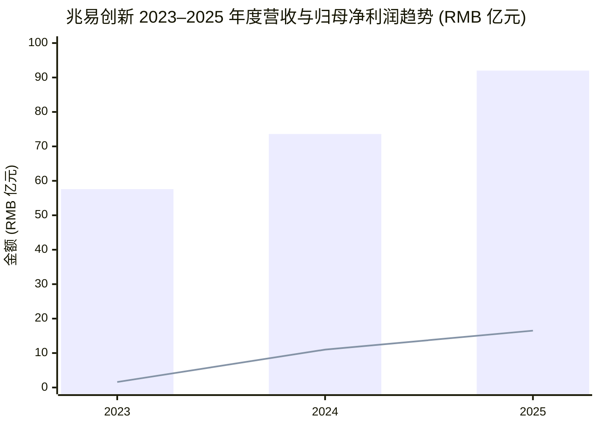
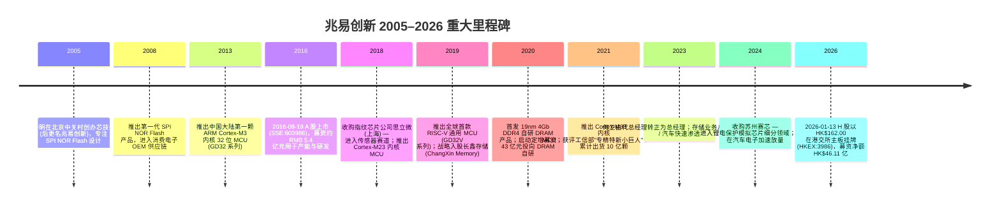
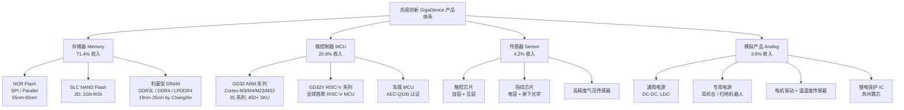
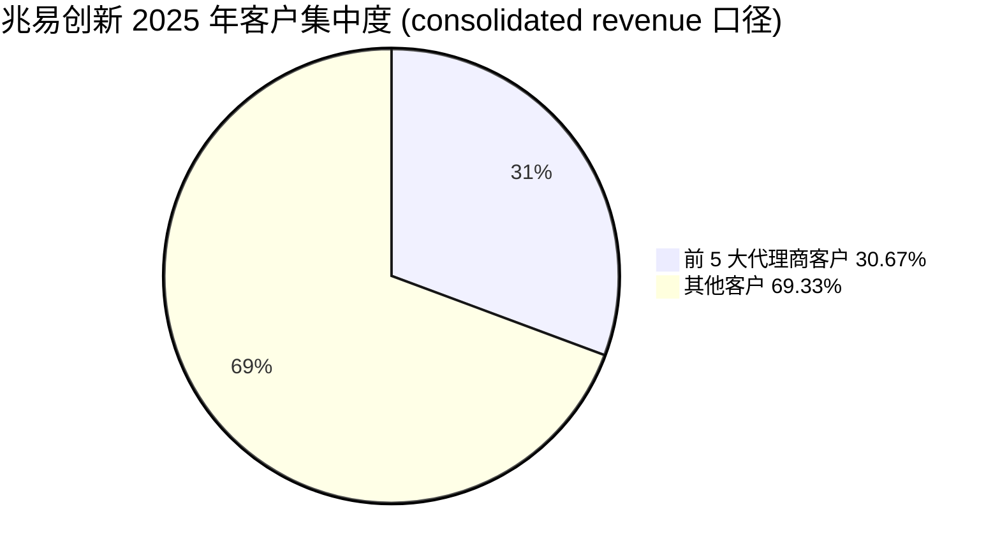
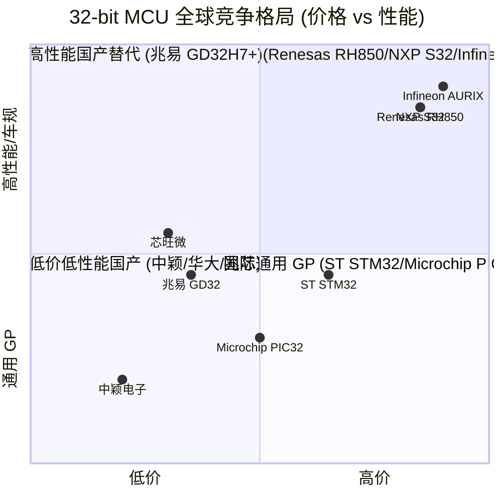

# 兆易创新科技集团股份有限公司 (GigaDevice Semiconductor, SSE:603986 / HKEX:3986) — 公司研究

**报告日期：2026-06-02**  报告语言：简体中文（zh-CN）  报告作者：高级股票研究分析师  覆盖主题：memory-upcycle

> **Update — 2026 Q1 业绩大幅超预期 (2026-04-29):** 公司 2026 年第一季度营收 RMB 41.88 亿元（同比 +119.38%），归母净利润 RMB 14.61 亿元（同比 +522.79%），扣非归母净利润 RMB 14.10 亿元（同比 +529.90%）；管理层口径："公司存储芯片产品面临供不应求局面，实现量价齐升；微控制器产品得益于工业、消费电子及汽车等多领域需求的带动，出货量大幅增长"。同时 H 股于 2026-01-13 以每股 HK$162.00 在港交所主板挂牌，募集净额约 HK$46.11 亿；超额配售权于 2026-02-07 悉数行使，H 股总股本扩大至 33,253,100 股。来源：[兆易创新 2026 年第一季度报告](https://static.cninfo.com.cn/finalpage/2026-04-30/1225257883.PDF)、[兆易创新 H 股稳定价格行动结束公告 2026-02-09 上海证券报](https://paper.cnstock.com/html/2026-02/10/content_2179807.htm)。

## 目录

1. 公司概览
2. 公司历史
3. 管理团队
4. 产品与服务
5. 客户与上市策略
6. 行业概览
7. 竞争格局
8. 市场机会 (TAM)
9. 风险评估
10. 投资人视角评分
11. 数据来源清单
12. 参考资料

---

## 1. 公司概览

**兆易创新科技集团股份有限公司 (GigaDevice Semiconductor Inc., 简称"兆易创新", SSE:603986 / HKEX:3986)** 是中国领先的无晶圆 (Fabless) 集成电路设计公司，总部位于北京市海淀区中关村集成电路设计园 8 号楼，业务覆盖四大产品线：专用型存储器 (NOR Flash + SLC NAND Flash + 利基型 DRAM / niche DRAM)、32 位通用微控制器 (general-purpose MCU)、传感器 (touch / fingerprint / pressure sensor)、模拟芯片 (analog IC)。公司国民经济行业分类隶属于"软件和信息技术服务业 — 集成电路设计" (代码 6520)，产品最终下游应用横跨工业、汽车电子、消费电子、PC 及服务器、物联网 (IoT)、网络通信六大领域 ([兆易创新 2025 年年度报告摘要](https://static.cninfo.com.cn/finalpage/2026-03-31/1225061348.PDF))。

**商业模式：纯 Fabless。** 公司"自成立以来一直采取 Fabless 模式，专注于集成电路设计、销售和客户服务环节，将晶圆制造、封装和测试等环节外包给专门的晶圆代工、封装及测试厂商"，自身不持有 fab 资产 ([兆易创新 2025 年年度报告摘要](https://static.cninfo.com.cn/finalpage/2026-03-31/1225061348.PDF))。这种轻资产模式使公司可专注于"集成电路设计是具有自主知识产权并体现核心技术含量的研发和设计环节"，但同时也使其经营业绩对晶圆代工厂 (foundry) 产能调度、产能价格 (wafer price) 及周期性产能配额谈判高度敏感。销售渠道以代理商模式为主、直销为辅 — 2025 年代理商收入 RMB 83.54 亿元（占主营业务收入 90.78%）、直销收入 RMB 8.48 亿元（占 9.22%），代理网络是 GD32 MCU 渗透国内中小工业 / 消费客户的核心通路 ([兆易创新 2025 年年度报告](https://static.cninfo.com.cn/finalpage/2026-03-31/1225061352.PDF))。

**2025 年财务规模与盈利能力。** 公司 2025 年实现营业收入 RMB 92.03 亿元（同比 +25.12%），归母净利润 RMB 16.48 亿元（同比 +49.47%），扣非归母净利润 RMB 14.69 亿元（同比 +42.57%），加权平均 ROE 9.30%（同比提升 2.36 个百分点），基本 EPS 2.48 元（同比 +49.40%）；经营性现金流净额 RMB 21.29 亿元（同比 +4.74%），现金生成能力高于账面利润 ([兆易创新 2025 年年度报告](https://static.cninfo.com.cn/finalpage/2026-03-31/1225061352.PDF))。公司宣派现金股利每 10 股派 RMB 7.50 元（含税），合计 RMB 5.25 亿元，占归母净利润 31.88%，是上市以来首次大比例现金分红 ([兆易创新 2025 年年度报告摘要](https://static.cninfo.com.cn/finalpage/2026-03-31/1225061348.PDF))。综合毛利率 (gross margin) 40.21%，同比 +2.21 pct；其中存储芯片毛利率 42.84%（+2.57 pct）、MCU 毛利率 35.82%（-0.92 pct）、传感器毛利率 19.57%（+3.11 pct）、模拟产品毛利率 36.96%（+26.43 pct，主因 2024 年底并表苏州赛芯)([兆易创新 2025 年年度报告](https://static.cninfo.com.cn/finalpage/2026-03-31/1225061352.PDF))。

**产品组合结构 (FY2025 主营业务收入拆分)。** 存储芯片 RMB 65.66 亿元（占 71.4%），是公司收入与利润的绝对压舱石；微控制器 RMB 19.10 亿元（占 20.8%）；传感器 RMB 3.89 亿元（占 4.2%）；模拟产品 RMB 3.33 亿元（占 3.6%）；技术服务及其他 RMB 0.04 亿元 ([兆易创新 2025 年年度报告](https://static.cninfo.com.cn/finalpage/2026-03-31/1225061352.PDF))。这一拆分相对 2024 年（存储 71.0%、MCU 23.0%、传感器 6.1%、模拟 0.2%）反映出**存储业务在 AI 周期中拉动整体增长，模拟业务在并购驱动下从无到有，传感器业务在指纹芯片价格压力下收缩**的三股结构性力量 ([兆易创新 2024 年年度报告](https://static.cninfo.com.cn/finalpage/2025-04-26/1223305062.PDF))。

**地理收入结构 (按代理商 / 直销客户注册地划分，而非最终客户所在地)。** 中国大陆 RMB 27.87 亿元（占 30.3%，+44.93%）、中国香港 RMB 43.20 亿元（占 47.0%，+28.01%）、其他国家及地区 RMB 20.95 亿元（占 22.8%，+1.81%) ([兆易创新 2025 年年度报告](https://static.cninfo.com.cn/finalpage/2026-03-31/1225061352.PDF))。需要特别注意的是 — 香港收入并非"出口到香港"，而是公司"分地区的收入成本按照代理商、直销客户的公司注册地划分，而并非依据终端客户所在地区"，香港注册的代理商（包括许多大陆背景的供应链总部）实际服务的终端市场分布于全球，这条注释直接出现在年报口径说明中 ([兆易创新 2025 年年度报告](https://static.cninfo.com.cn/finalpage/2026-03-31/1225061352.PDF))。

**估值快照 (Valuation snapshot, as of 2026-06)。** 根据可获取的市场资讯，截至 2026 年 4 月 13 日，兆易创新动态 P/E 约 112 倍 (TTM 基础)；摩根士丹利将其纳入首选股清单，目标价对应 2026 年 P/E 约 51 倍、2027 年预期 EPS 增速 42% ([新浪财经：市值暴增超 1000 亿 兆易创新无惧控股股东减持, 2026-04-13](https://finance.sina.com.cn/wm/2026-04-13/doc-inhuiatq4967145.shtml)、[知乎专栏：摩根士丹利将 2 个公司列入首选股清单](https://zhuanlan.zhihu.com/p/2012446597288571293))。**分析师观点：** 当前 P/E 远高于全球 NOR Flash 同行（旺宏 Macronix TWSE:2337、华邦电 Winbond TWSE:2344 通常处于 8–15× TTM 区间）和国内 IC 设计公司中位数（约 35–50× TTM），溢价的核心来源是三条逻辑：(a) 2026 年 Q1 利润同比 +522.79% 的暴利兑现说明 AI 周期带来的 niche DRAM + SLC NAND 价格弹性已经在数据中体现 ([兆易创新 2026 年第一季度报告](https://static.cninfo.com.cn/finalpage/2026-04-30/1225257883.PDF))；(b) 公司与长鑫存储 (ChangXin Memory) 的"设计 + 代工"绑定使其享有国产 DRAM 供应链 alpha — 朱一明同时担任两家公司董事长，定向 IPO 锁定 1.88% 长鑫股权 ([中华网：兆易创新赴港、长鑫科技冲科解码国产存储龙头, 2025-12-17](https://m.tech.china.com/redian/2025/1217/122025_1783003.html)、[新浪财经：国产存储双子星浮现, 2026-01-15](https://finance.sina.com.cn/jjxw/2026-01-15/doc-inhhkfft7687006.shtml))；(c) H 股发行价 HK$162.00 给国际机构投资者建立了新的估值锚，募资净额 HK$46.11 亿强化资产负债表 ([兆易创新 H 股稳定价格行动结束公告 2026-02-09 上海证券报](https://paper.cnstock.com/html/2026-02/10/content_2179807.htm))。**估值溢价的风险点写入第 9 节。**

*Source: [兆易创新 2025 年年度报告](https://static.cninfo.com.cn/finalpage/2026-03-31/1225061352.PDF) — 营业收入 + 归母净利润 (柱形 = 营收, 折线 = 归母净利润)。*

---

## 2. 公司历史

兆易创新前身为**北京芯技佳易微电子科技有限公司**，于 2005 年 4 月 6 日由自然人**朱一明 (Zhu Yiming)** 与北京清华科技园孵化器有限公司共同出资成立 ([兆易创新 2025 年年度报告](https://static.cninfo.com.cn/finalpage/2026-03-31/1225061352.PDF))。创始故事的关键在于 — 朱一明 1972 年 7 月生于江苏盐城，清华大学物理系本科 + 硕士，纽约州立大学石溪分校 (Stony Brook) 电气工程硕士，2000 年后曾在 iPolicy Networks 任工程师、在硅谷存储设计公司 Monolithic System 任项目经理，2005 年回国创办公司 ([Crunchbase: Zhu Yiming, Founder & Chairman](https://www.crunchbase.com/person/zhu-yiming)、[Bloomberg: Zhu Yiming Profile](https://www.bloomberg.com/profile/person/18784969)、[Baidu Baike: Zhu Yiming](https://baike.baidu.com/en/item/Zhu%20Yiming/25173))。公司创立伊始即定位于 NOR Flash 设计赛道，绕开当时被 Spansion / SST / Macronix / Winbond 主导的国际市场，从最低端的 SPI NOR 切入再逐步爬升。

*Source: [兆易创新 2025 年年度报告](https://static.cninfo.com.cn/finalpage/2026-03-31/1225061352.PDF)、[GigaDevice GD32 MCU Milestones — 1 Billion Shipment](https://www.gd32mcu.com/en/detail/402)、[GigaDevice GD32V Series RISC-V](https://www.gd32mcu.com/en/detail/195)、[兆易创新 H 股稳定价格行动结束公告 2026-02-09](https://paper.cnstock.com/html/2026-02/10/content_2179807.htm)。*

**关键战略转型 (3 次)。** 第一次是 2013 年从单一 NOR Flash 业务跨入 MCU 设计 — 这一年公司推出中国大陆首颗 Cortex-M3 内核 MCU，原因是 NOR Flash 业务面临国际大厂的强力价格竞争与制程门槛，需要在客户基础已经建立的工业 / 消费 OEM 中横向扩品，将"存储 + 控制"双产品打入同一物料清单 (BoM)；该决策使公司从单一周期性存储公司转型为综合 IC 设计平台 ([GD32 MCU 历史: What made GigaDevice's MCU Rose to a Leadership Position in Eight-Year](https://www.gd32mcu.com/en/detail/369))。第二次是 2019 年正式进入 DRAM 自研赛道 — 当年朱一明出任长鑫存储 (ChangXin Memory) 董事长，并以兆易创新名义启动定增募资 43 亿元投向"DRAM 芯片研发与产业化项目"，这是国产替代 + 战略性产能保障的双重布局，使公司从 NOR / NAND 拓展到 DRAM 三大存储产品全覆盖 ([中华网：兆易创新赴港、长鑫科技冲科 2025-12-17](https://m.tech.china.com/redian/2025/1217/122025_1783003.html)、[36 氪：长鑫科技 IPO 清华学霸朱一明再打造一个千亿级半导体巨头](https://www.36kr.com/p/3629145550128135))。第三次是 2026 年 H 股上市 — 在国产替代主基调与 AI 周期红利共振的背景下，公司选择港股二次上市以建立国际化估值锚、吸纳海外机构投资者并强化资产负债表，募资净额 HK$46.11 亿（约 RMB 42 亿）。这是中国半导体设计公司在"A+H"双平台架构下的又一标志性案例 ([兆易创新 H 股稳定价格行动结束公告 2026-02-09](https://paper.cnstock.com/html/2026-02/10/content_2179807.htm))。

**主要并购与战略股权 (按时间排序)：** 2018 年收购思立微 (上海思立微) — 切入指纹识别芯片赛道，对应当时智能手机指纹解锁的爆发性需求；2019 年战略入股长鑫存储 1.88% — 锁定中国大陆唯一 12 寸 DRAM IDM 的产能配额，DRAM 产品独家代工至 2030 年，2025 年关联交易额预计 RMB 11.61 亿元 ([中华网：兆易创新与长鑫存储 2025-12-17](https://m.tech.china.com/redian/2025/1217/122025_1783003.html))；2024 年底收购苏州赛芯 — 切入锂电保护 IC 模拟芯片细分领域，2025 年模拟产品收入从 RMB 0.15 亿元跃升至 RMB 3.33 亿元，毛利率 36.96%（同比 +26.43 pct）([兆易创新 2025 年年度报告](https://static.cninfo.com.cn/finalpage/2026-03-31/1225061352.PDF))。

---

## 3. 管理团队

**创始人兼董事长 — 朱一明 (Zhu Yiming)。** 1972 年 7 月出生于江苏省盐城市，清华大学物理系本科 (1996)、硕士 (1998)，纽约州立大学石溪分校 (Stony Brook University, SUNY) 电气工程硕士。海外职业起点是 2000 年加入 iPolicy Networks 任工程师，后在硅谷半导体设计公司 Monolithic System 任项目经理（这两段经历奠定其在内存与系统设计的工程基础）。2005 年 4 月回国，与北京清华科技园孵化器有限公司联合出资在中关村创办公司，定位 SPI NOR Flash 设计 — 这是当时国内几乎没有人做的赛道，因为国际市场已被 SST、Spansion、Macronix、Winbond 几家主导 ([Crunchbase: Zhu Yiming, Founder & Chairman of GigaDevice](https://www.crunchbase.com/person/zhu-yiming)、[Bloomberg: Zhu Yiming Profile, GigaDevice](https://www.bloomberg.com/profile/person/18784969)、[Baidu Baike: Zhu Yiming 朱一明](https://baike.baidu.com/en/item/Zhu%20Yiming/25173))。

朱一明的关键战略举措有两项：第一是 2013 年在 NOR Flash 业务稳固后果断切入 MCU 设计，推出 GD32 系列对标 STM32，建立"存储 + MCU"协同的产品矩阵；第二是 2019 年出任长鑫存储 (ChangXin Memory, 中国大陆唯一具备规模化 DRAM 制造能力的 IDM) 董事长，同时让兆易创新战略入股长鑫 1.88%、定增 43 亿元用于自研 DRAM。这一安排在 2025 年集成电路行业进入 AI 上行周期、HBM / DDR5 挤出利基型 DRAM 国际产能后，让兆易创新与长鑫成为中国 niche DRAM 国产替代的最大受益者 — 2026 Q1 收入翻倍、利润 5 倍以上的爆发性增长是这条战略 7 年布局的兑现 ([中华网：兆易创新赴港、长鑫科技冲科解码国产存储龙头, 2025-12-17](https://m.tech.china.com/redian/2025/1217/122025_1783003.html)、[36 氪：长鑫科技 IPO 清华学霸朱一明再打造一个千亿级半导体巨头](https://www.36kr.com/p/3629145550128135)、[兆易创新 2026 年第一季度报告](https://static.cninfo.com.cn/finalpage/2026-04-30/1225257883.PDF))。截至 2025 年末，朱一明直接持有兆易创新 45,758,013 股（占 6.85%，是单一第一大股东），并通过香港赢富得有限公司 (InfoGrid Limited) 间接持有 13,053,500 股（占 1.95%）— 合计约 8.80%，仍是实际控制人 ([兆易创新 2025 年年度报告摘要](https://static.cninfo.com.cn/finalpage/2026-03-31/1225061348.PDF))。朱一明同时担任全球半导体联盟 (Global Semiconductor Alliance, GSA) 董事 ([GSA Leadership Board of Directors](https://www.gsaglobal.org/gsa-leadership/board-of-directors/))。

**总经理兼副董事长 — 何卫 (He Wei)。** 1967 年 5 月出生，清华大学硕士。早年职业生涯包括北京微电子技术研究所集成电路部副主任，以及中芯国际 (SMIC) 集成电路制造（北京）有限公司销售部副处长 — 这两段经历给他打下了"半导体研发 + 大客户销售"的双重背景，对一家 Fabless 设计公司的运营管理至关重要 ([新浪财经：兆易创新副董事长总经理何卫年薪 147.93 万元, 2026-01-24](https://finance.sina.com.cn/stock/aiassist/gdzjc/2026-01-24/doc-inhikesz5813878.shtml))。2009 年加入兆易创新，曾任副总经理；2018 年 7 月至 2023 年 4 月担任公司代理总经理 (Acting CEO)；2023 年 4 月正式转正为总经理 ([运营商财经网：兆易创新代总经理何卫年薪 165 万却是公司高管最少, 2024-05](http://www.cfyys.com.cn/show-list-74452.html))。2021 年 6 月起任公司董事，2023 年 7 月起任副董事长 — 这意味着何卫与朱一明分工是：朱一明负责战略与外部资本（长鑫存储、A+H 上市），何卫负责日常经营 (operating management)。何卫直接持有兆易创新 232,827 股（占 0.0351%），通过天津友容恒通科技发展中心（有限合伙）间接持有 453,583 股（占 0.0683%），合计持股约 0.10%，远低于朱一明 ([新浪财经：何卫减持 5.93 万股套现 1776.71 万元, 2026-01-24](https://finance.sina.com.cn/stock/aiassist/gdzjc/2026-01-24/doc-inhikesz5813878.shtml))。何卫年薪 147.93 万元，是公司高管中较低的，反映出管理层薪酬偏重股权激励而非现金 ([新浪财经：兆易创新副董事长何卫薪酬, 2026-01-24](https://finance.sina.com.cn/stock/aiassist/gdzjc/2026-01-24/doc-inhikesz5813878.shtml))。

**法定代表人变更** — 2025 年年报披露公司法定代表人 (legal representative) 为何卫 (he Wei)，反映何卫在公司治理中的角色已经全面接管运营，朱一明则作为董事长聚焦战略与资本运作 ([兆易创新 2025 年年度报告](https://static.cninfo.com.cn/finalpage/2026-03-31/1225061352.PDF))。

---

## 4. 产品与服务

兆易创新的产品矩阵是公司价值创造的核心 — 在 IC 设计行业的术语中，"以销售收入论英雄、以毛利率论壁垒"。我们按照 2025 年年度报告的产品分组（存储芯片 + 微控制器 + 传感器 + 模拟产品）逐一拆解，每一条产品线先**逐字引用**年报口径的产品定义，再用**双语术语对照**讲解技术意义和竞争位置。

### 4.1 公司产品矩阵 (FY2025 主营业务收入拆分)

| 产品大类 | FY2025 收入 (RMB 亿元) | 收入占比 | 同比变化 | 毛利率 | 毛利率同比 |
|---|---:|---:|---:|---:|---:|
| 存储芯片 (Memory) | 65.66 | 71.4% | +26.41% | 42.84% | +2.57 pct |
| 微控制器 (MCU) | 19.10 | 20.8% | +12.98% | 35.82% | -0.92 pct |
| 传感器 (Sensor) | 3.89 | 4.2% | -13.15% | 19.57% | +3.11 pct |
| 模拟产品 (Analog) | 3.33 | 3.6% | +2,051.82% | 36.96% | +26.43 pct |
| 技术服务及其他 | 0.04 | 0.0% | -40.87% | 87.68% | -11.41 pct |
| **合计** | **92.02** | **100.0%** | **+25.10%** | **40.21%** | **+2.21 pct** |

*Source: [兆易创新 2025 年年度报告](https://static.cninfo.com.cn/finalpage/2026-03-31/1225061352.PDF) — 主营业务分产品情况。*

*Source: 基于 [兆易创新 2025 年年度报告摘要](https://static.cninfo.com.cn/finalpage/2026-03-31/1225061348.PDF) 整理。*

### 4.2 综合视图：四大产品如何构成同一客户工作流

兆易创新的四大产品线在终端客户的电子系统中扮演不同角色：**MCU 作为"大脑"** 执行控制算法、**NOR Flash 作为"代码硬盘"** 存储固件、**SLC NAND / DRAM 作为"数据缓存与扩展存储"**、**传感器作为"五官"** 采集物理信号、**模拟产品作为"电力血管"** 提供电源管理。一颗智能手表、一台工业 PLC、一块汽车 T-Box 通常需要同时用到 MCU + NOR + DRAM + 一颗模拟电源 — 兆易创新的物料清单 (BoM) 协同优势正是建立在"一站式国产 IC"上：客户既能从一家厂商拿全部芯片、又能减少多供应商对接成本。这是公司能从单一 NOR Flash 跨到 MCU 再跨到 DRAM 的产品逻辑闭环，也是 Damodaran 所说"narrative + numbers"在 IC 设计赛道的具体体现 ([兆易创新 2025 年年度报告](https://static.cninfo.com.cn/finalpage/2026-03-31/1225061352.PDF))。

### 4.3 存储芯片 (Memory) — 公司压舱石

**年报原文 (NOR Flash 定义)：**

> "I．NOR Flash 即代码型闪存芯片，主要用来存储代码及少量数据。NOR Flash 允许随机访问数据，能够快速且可靠地直接从内存执行代码，因此在需要频繁且快速访问可执行代码的嵌入式系统中被广泛应用。公司 NOR Flash 产品广泛应用于工业、汽车、消费电子、PC 及服务器、网络通信、物联网及移动设备等各个领域。" — [兆易创新 2025 年年度报告摘要](https://static.cninfo.com.cn/finalpage/2026-03-31/1225061348.PDF)

**中文释义 / Plain-language gloss：** NOR Flash 与 NAND Flash 的根本差别在于"是否支持就地执行 (eXecute-In-Place, XIP)" — NOR Flash 可以让 CPU 直接从存储单元中读取并执行代码 (instruction code)，无需先将代码 copy 到 DRAM 再执行；这一特性使 NOR 成为嵌入式系统启动代码 (boot code) 与固件 (firmware) 的最佳介质。相比之下 NAND Flash 容量更大、单 bit 成本更低，但需要"Block-by-Block"读取，不能 XIP，所以适合存"数据" (data) 而非"代码" (code)。兆易创新的 SPI NOR Flash 产品系列覆盖 512Kb 到 2Gb 主流容量段，主流制程为 55nm–65nm（不直接持有 fab，由代工厂量产）；2025 年 SPI NOR Flash 出货量约 44.4 亿颗（同比 +24.84%），是公司销量规模最大的单一产品类别 ([兆易创新 2025 年年度报告](https://static.cninfo.com.cn/finalpage/2026-03-31/1225061352.PDF))。

***分析师观点：*** *根据 Mordor Intelligence 与 Custom Market Insights 行业研究，2025 年全球 NOR Flash 市场规模约 USD 31 亿元（兆易创新 2025 年报亦援引 Frost & Sullivan 数据为 USD 31 亿元），Winbond / GigaDevice / Macronix 三家在亚太 NOR Flash 市场合计份额约 55%，而 Infineon + Winbond + Macronix + GigaDevice 四家在全球汽车 NOR 市场合计份额约 60–65%。兆易创新和普冉 (Puya Semiconductor) 等中国厂商在 55nm 制程节点上的产能扩张已迫使整个 commodity NOR 价格更具纪律性 ([Mordor Intelligence: NOR Flash Memory Market](https://www.mordorintelligence.com/industry-reports/global-nor-flash-memory-market)、[Custom Market Insights: NOR Flash Market Size 2025](https://www.custommarketinsights.com/report/nor-flash-market/))。兆易创新当前的全球 NOR Flash 份额行业排名约第 3，仅次于 Winbond 与 Macronix；在中国大陆 SPI NOR Flash 市占率排名第 1。这一定位的护城河 (moat) 来自 (a) 长达 15 年的客户积累与设计认证；(b) Fabless 模式下 wafer 配额谈判优势；(c) GD25 系列与 STM 等国际型号 pin-to-pin 兼容，迁移成本低。*

**年报原文 (SLC NAND Flash + 利基 DRAM 定义)：**

> "II．NAND Flash 即数据型闪存芯片，分为两大类：大容量 NAND Flash 主要为 MLC、TLC 2D NAND 或 3D NAND，擦写次数从几百次至数千次，多应用于大容量数据存储；小容量 NAND Flash 主要是 SLC 2D NAND，可靠性更高，擦写次数达到数万次以上。公司 NAND Flash 产品属于 SLC NAND，在消费电子、工业、汽车电子、通讯等领域已经实现了全品类的产品覆盖。"
>
> "III．DRAM 即动态随机存取存储器，是当前市场中最为重要的系统内存，在计算系统中占据核心位置，广泛应用于服务器、移动设备、PC、消费电子等领域。公司利基型 DRAM 产品包括 DDR3L/DDR4/LPDDR4 等，具备低功耗、体积小的特点，主要应用于机顶盒、电视、网络通讯、智能家庭装置、智能穿戴、信息娱乐系统等多个领域。" — [兆易创新 2025 年年度报告摘要](https://static.cninfo.com.cn/finalpage/2026-03-31/1225061348.PDF)

**中文释义 / Plain-language gloss：** 公司在 SLC NAND 和利基型 DRAM 两个细分赛道的战略价值远高于其当前的绝对收入贡献。原因在于 — 全球大厂三星 / 美光 / SK 海力士在 AI 周期中**加速向 HBM / DDR5 / 3D NAND 等新制程产品迁移**，主动**放弃或削减利基型产品的生产**（即低密度 DDR3L、DDR4、SLC 2D NAND），导致这些 niche 产品在 2025 年下半年开始出现明显**供给缺口** (supply gap)。公司 2025 年年报中明确指出："国际头部公司加速向新制程节点的 HBM、DDR5 等主流产品迁移，放弃或减少利基型产品的生产，带来行业竞争格局的改善，利基型 DRAM 价格从而迎来大幅上涨" — 这是兆易创新 2025 H2 至 2026 Q1 业绩弹性的核心来源 ([兆易创新 2025 年年度报告摘要](https://static.cninfo.com.cn/finalpage/2026-03-31/1225061348.PDF))。

DRAM 自研产品由公司战略合作伙伴**长鑫存储 (ChangXin Memory, CXMT)** 独家代工至 2030 年，对应 19nm–25nm 工艺节点，4Gb DDR4 是首发产品 ([中华网：兆易创新赴港、长鑫科技冲科, 2025-12-17](https://m.tech.china.com/redian/2025/1217/122025_1783003.html))。这种"设计 + 代工"绑定（朱一明同时担任两家公司董事长）使兆易创新成为中国大陆唯一具备 DRAM 自研能力的设计公司之一，相比单纯代销长鑫产品的其他 fabless 同行（如东芯股份、北京君正），兆易创新的毛利空间和长期定价权更优 ([新浪财经：兆易创新利基 DRAM 价格下行空间有限, 2024-12-18](https://finance.sina.com.cn/stock/relnews/cn/2024-12-18/doc-inczwpwu0980375.shtml))。

***分析师观点：*** *根据 Frost & Sullivan 数据，2025 年全球专用型存储市场规模为 USD 157 亿元，其中利基型 DRAM 占 USD 99 亿元、NOR Flash 占 USD 31 亿元、SLC NAND Flash 占 USD 27 亿元 — 利基型 DRAM 是兆易创新可触达的最大单一市场 ([兆易创新 2025 年年度报告摘要](https://static.cninfo.com.cn/finalpage/2026-03-31/1225061348.PDF))。竞争对手层面，利基型 DRAM 全球主要玩家为南亚科 (Nanya, TWSE:2408)、华邦电 (Winbond)、华亚科 (合并入南亚) 与 ESMT (晶豪科 TWSE:8086)；SLC NAND 主要玩家为 Macronix、Winbond、KIOXIA。兆易创新在 SLC NAND 国内市占率排名第 1，但全球份额仍只是个位数。*

### 4.4 微控制器 (MCU)

**年报原文：**

> "公司微控制器产品（Micro Control Unit，简称 MCU）聚焦于 ARM® 和 RISC-V 内核的 32 位通用 MCU 产品，在提供高性能、低功耗的同时兼具高性价比。公司 MCU 产品支持广泛的应用，如工业应用（包括工业自动化、能源电力及医疗设备等）、消费电子及手持设备、汽车电子（包括汽车导航、T-BOX、汽车仪表、汽车娱乐系统等）、计算等。" — [兆易创新 2025 年年度报告摘要](https://static.cninfo.com.cn/finalpage/2026-03-31/1225061348.PDF)

**中文释义 / Plain-language gloss：** MCU (microcontroller unit, 微控制器) 是嵌入式系统中的"大脑"，集 CPU 内核 + Flash + SRAM + GPIO 等外设于一体，用一颗芯片完成一个完整子系统的控制功能。32 位通用 MCU 的标杆是意法半导体 (STMicroelectronics) 的 STM32 系列 — 兆易创新于 2013 年推出全国首颗 ARM Cortex-M3 内核 MCU (GD32 系列)，刻意保持与 STM32 在 pin-to-pin、外设寄存器映射、开发工具链 (Keil / IAR) 上的高度兼容，从而把"迁移成本"压到接近零。客户从 STM32 切换到 GD32 通常只需要替换硬件而无需重写软件，这是公司能在中国 32 位 MCU 市场连续 7 年蝉联**国产第一**的核心商业逻辑 ([GD32 MCU 历史: What made GigaDevice's MCU Rose to a Leadership Position in Eight-Year](https://www.gd32mcu.com/en/detail/369))。

到 2025 年，GD32 系列已经覆盖 **35 个系列、450+ 个产品型号、累计出货超 10 亿颗**，覆盖 Cortex-M3 / M4 / M23 / M33 等 ARM 内核，同时也是全球首款 RISC-V 通用 MCU 厂商（GD32V 系列，2019 年首发，2023 年获 Embedded Award 提名)([GigaDevice GD32 MCU 1 Billion Shipment](https://www.gd32mcu.com/en/detail/402)、[GD32V RISC-V Embedded Award](https://www.gd32mcu.com/en/detail/223))。

2025 年 MCU 业务收入 RMB 19.10 亿元（+12.98% YoY）、毛利率 35.82%（-0.92 pct） — MCU 业务今年增速明显低于存储 (+26.4%) 主要因为：MCU 行业仍处于"周期底部" (down-cycle bottom)，价格压力延续，但客户去库存基本完成，库存水位已经较低。公司 MCU 业务的发力方向是**车规 + 工控 + 数字能源 + 白电**这四个高附加值领域 — 这些都是单价更高、生命周期更长、客户认证周期更长的市场，毛利率从今天的 35% 仍有上行空间 ([兆易创新 2025 年年度报告](https://static.cninfo.com.cn/finalpage/2026-03-31/1225061352.PDF))。

***分析师观点：*** *根据 Frost & Sullivan 数据，2025 年全球 MCU 市场规模约 USD 210 亿元 ([兆易创新 2025 年年度报告摘要](https://static.cninfo.com.cn/finalpage/2026-03-31/1225061348.PDF))。全球主要竞争对手为 STMicroelectronics (NYSE:STM, STM32) — 仍是工业 / 消费 MCU 的全球第一；NXP (NASDAQ:NXPI, S32 / Kinetis 系列) — 车规第一；Renesas (TSE:6723, RA / RX / RH850 系列) — 车规与工控领先；Microchip (NASDAQ:MCHP, PIC / SAM 系列)；Infineon (XETR:IFX, AURIX 系列) — 车规 AURIX 是 BEV 主控的事实标准；以及国内同行如华大半导体、兆芯、芯海科技、中颖电子、国民技术、芯旺微电子。在中国大陆 32-bit ARM Cortex-M MCU 市场，根据 IHS / Omdia / TechInsights 等数据来源（具体年报中未引用），兆易创新的国产化份额排名第一，但相对 STM32 仍有较大的存量替代空间。GD32 的核心壁垒是 STM32 兼容性 + 国内代理商网络深度 — 这是其它国产 MCU 公司很难复制的。*

### 4.5 传感器 (Sensor) — 2025 年下行调整中

**年报原文：**

> "公司传感器产品（Sensor）包括触控芯片、指纹识别芯片和气压传感器芯片。公司触控芯片包含自容和互容两大品类，涵盖手机、平板及智能家居等人机交互领域。公司指纹识别芯片包括电容指纹、屏下镜头式光学指纹等，为手机等市场提供主流选择方案，同时为智能门锁、笔记本提供电容指纹方案。公司高精度气压传感器为手机、穿戴、IoT 等领域提供解决方案。" — [兆易创新 2025 年年度报告摘要](https://static.cninfo.com.cn/finalpage/2026-03-31/1225061348.PDF)

**中文释义 / Plain-language gloss：** 兆易创新的传感器业务源自 2018 年并购上海思立微 — 当时的逻辑是搭上手机指纹解锁的爆发性需求。2025 年传感器收入 RMB 3.89 亿元（同比 -13.15%）、毛利率仅 19.57%（同比 +3.11 pct） — 收入下降但毛利率小幅改善的原因是 (a) 手机指纹芯片 ASP 持续下行，已经退化为"价格战" commodity 产品；(b) 屏下光学指纹 (in-display optical fingerprint) 在高端手机被以汇顶 (Goodix, SZSE:603160) 为代表的对手占据，兆易仅能在中低端电容指纹与智能门锁等垂直市场维持份额 ([兆易创新 2025 年年度报告](https://static.cninfo.com.cn/finalpage/2026-03-31/1225061352.PDF))。

***分析师观点：*** *全球触控芯片市场规模从 2020 年的 USD 25.9 亿元温和增长至 2024 年的 USD 29 亿元，2024 年全球指纹芯片市场规模约 USD 58.3 亿元 ([兆易创新 2025 年年度报告摘要](https://static.cninfo.com.cn/finalpage/2026-03-31/1225061348.PDF))。竞争对手主要为汇顶科技 (Goodix, SZSE:603160) — 屏下光学指纹绝对龙头；敦泰科技 (Focaltech, TWSE:3545) — 触控芯片；FocalTech、Synaptics (NASDAQ:SYNA) — 触控 / 指纹综合。传感器业务在公司四大业务线中是**最弱的一条**，预计未来 1–2 年仍是收缩态势，管理层可能选择缩减投入或剥离 — 这一点在 Section 9 风险评估中纳入"非核心业务拖累"。*

### 4.6 模拟产品 (Analog) — 苏州赛芯并表驱动跨越式增长

**年报原文：**

> "公司模拟产品主要包括通用电源（如 DC-DC）、低压差稳压器（LDO）、专用电源（如耳机充电仓电源、扫地机器人电源）、电机驱动产品以及温湿度传感器产品等。公司控股子公司苏州赛芯为国内锂电保护细分领域的龙头公司。" — [兆易创新 2025 年年度报告摘要](https://static.cninfo.com.cn/finalpage/2026-03-31/1225061348.PDF)

**中文释义 / Plain-language gloss：** 模拟芯片业务在 2025 年实现了"从 0 到 1"的跨越 — 收入从 2024 年的 RMB 0.15 亿元跃升至 RMB 3.33 亿元（+2,051.82%）、毛利率从 10.5% 跃升至 36.96%（+26.43 pct）。这一跃升 100% 由 2024 年底完成并表的苏州赛芯（锂电保护 IC 国内龙头）贡献，并非内生增长 ([兆易创新 2025 年年度报告](https://static.cninfo.com.cn/finalpage/2026-03-31/1225061352.PDF))。锂电保护 IC (battery protection IC) 的应用场景是为手机、笔记本电脑、蓝牙耳机、电动工具等设备中的锂电池组提供过压 / 过流 / 短路保护，是消费电子和小型工业设备中的必装芯片，市场规模数十亿美元。

***分析师观点：*** *根据 Frost & Sullivan 数据，2025 年全球模拟芯片市场规模约 USD 830.9 亿元 — 这是兆易创新可触达的最大单一市场，远超 MCU (USD 210 亿) 和 NOR Flash (USD 31 亿) ([兆易创新 2025 年年度报告摘要](https://static.cninfo.com.cn/finalpage/2026-03-31/1225061348.PDF))。但模拟芯片是一个高度分散、领域高度专业化的市场 — TI (NASDAQ:TXN)、ADI (NASDAQ:ADI)、Infineon、ST、Maxim/ADI 是全球领导者；国内对手包括圣邦股份 (SZSE:300661)、思瑞浦 (SSE:688536)、艾为电子 (SSE:688798)、晶丰明源 (SSE:688368) 等。兆易创新的模拟业务在并购苏州赛芯之前几乎是空白，未来需要靠"内生 + 并购"双轮驱动；2026 年应继续关注是否有新的模拟标的并购。*

### 4.7 旗舰特许 (Flagship franchises) 与近期发布

公司"三大旗舰特许"分别是：(1) **GD25 系列 SPI NOR Flash** — 全球第 3 大市占率，是公司销量与品牌基础；(2) **GD32 系列 32-bit MCU** — 中国大陆第 1 大 ARM Cortex-M MCU 厂商，累计出货 10 亿颗；(3) **GD 19nm DDR4 利基型 DRAM** — 与长鑫存储绑定，独家代工至 2030 年，2025–2026 年价格弹性的核心来源 ([GigaDevice GD32 MCU 1 Billion Shipment](https://www.gd32mcu.com/en/detail/402)、[中华网：兆易创新赴港、长鑫科技冲科, 2025-12-17](https://m.tech.china.com/redian/2025/1217/122025_1783003.html))。

**过去 12 个月主要新品：** 2025 年公司"积极拥抱 AI，发展定制化存储、较高算力 MCU 和 AI MCU 等新业务、新产品"；具体产品包括车规级 NOR Flash 与 SLC NAND 完整产品覆盖，以及更高密度的利基型 DRAM (LPDDR4 / DDR4) 产品布局 ([兆易创新 2025 年年度报告](https://static.cninfo.com.cn/finalpage/2026-03-31/1225061352.PDF))。AI MCU 这一新方向，是公司试图把传统的 MCU + NPU (neural processing unit) 结合，瞄准 edge AI / 端侧 AI 应用 — 与 ST、Renesas、NXP 等国际大厂在同样方向上的产品类似。

---

## 5. 客户与上市策略

**客户集中度 (consolidated revenue 口径)。** 2025 年公司前五名客户销售额合计 RMB 28.23 亿元，**占年度销售总额的 30.67%；其中关联方销售额 0 元** ([兆易创新 2025 年年度报告](https://static.cninfo.com.cn/finalpage/2026-03-31/1225061352.PDF))。公司未单独披露第一大客户的占比，但从前五名合计 30.67% 反推，单一最大客户占比应不超过 10%（如果超过 10%，按 ASC 280 / 中国会计准则要求需要单独披露）。这意味着公司客户集中度**远低于同行**：思瑞浦、圣邦股份等模拟 IC 公司的前五客户合计往往达 50–70%；而兆易创新更接近"全渠道大流通"模式，客户分散度类似 STM32 在国内的销售结构。

> **重要说明 — 兆易创新使用代理商模式销售：** 2025 年代理商收入 RMB 83.54 亿元（占主营业务 90.78%），直销 RMB 8.48 亿元（仅占 9.22%）([兆易创新 2025 年年度报告](https://static.cninfo.com.cn/finalpage/2026-03-31/1225061352.PDF))。**因此年报披露的"前五名客户"实质是前五大代理商**，而非终端客户 (end customer)。代理商背后服务的是数千家中小型 OEM / ODM 客户，包括消费电子、白电、工业控制、智能家居、智能门锁、安防、智能穿戴等多个垂直领域。这种结构既意味着公司**真实的终端客户集中度极低**，也意味着公司在某些重大终端 OEM (e.g. 华为、小米、OPPO、海尔、美的) 的具体销售数据无法从年报中直接验证 — 这是 IC 设计行业普遍的信息披露惯例。

**前五大供应商集中度** 反过来则非常高。2025 年前五名供应商采购额 RMB 50.14 亿元，**占年度采购总额的 69.49%；其中关联方采购额 RMB 11.82 亿元（占总采购的 16.38%）**([兆易创新 2025 年年度报告](https://static.cninfo.com.cn/finalpage/2026-03-31/1225061352.PDF))。这 16.38% 的关联方采购对应**长鑫存储的 DRAM 代工服务**(2025 年关联交易额预计 RMB 11.61 亿元 — 数据与年报一致) ([中华网：兆易创新赴港、长鑫科技冲科, 2025-12-17](https://m.tech.china.com/redian/2025/1217/122025_1783003.html))。剩余约 53% 的非关联方采购对应中芯国际 (SMIC)、武汉新芯 (XMC, 现 YMTC 子公司)、华虹半导体 (Hua Hong)、力积电 (PSMC 台湾)、华润微电子等晶圆代工厂。供应商集中度高是 Fabless IC 设计公司的普遍特征，**但兆易创新的"关联方 16% + 第二大供应商应低于 20%"的结构使其对单一供应商不是绝对依赖** — 与某些 fabless 公司"对台积电 70% 依赖度"的格局有本质区别。

*Source: [兆易创新 2025 年年度报告](https://static.cninfo.com.cn/finalpage/2026-03-31/1225061352.PDF) — 前五名客户合计销售额 RMB 28.23 亿元、占主营 30.67%（前五大客户实为代理商，非终端客户）。*

**销售模式与渠道。** 公司"主要采用直销与经销两种模式。直销模式下，公司与客户直接签署销售合同（订单）并发货；经销模式下，公司与经销商的关系为买卖关系，产品的所有权于经销商购买产品时转移" ([兆易创新 2025 年年度报告摘要](https://static.cninfo.com.cn/finalpage/2026-03-31/1225061348.PDF))。直销主要面向头部 OEM 客户 (e.g. 华为、小米的旗舰系列)，经销主要服务广大中小客户群体；2025 年直销毛利率 42.00%（小幅高于经销 40.03%），反映出直销议价权略优 ([兆易创新 2025 年年度报告](https://static.cninfo.com.cn/finalpage/2026-03-31/1225061352.PDF))。

**A+H 双平台上市策略 (2016 + 2026)。** 公司 2016 年 8 月 18 日在上海证券交易所 A 股上市 (SSE:603986)；十年后的 2026 年 1 月 13 日在港交所主板二次上市 (HKEX:3986)，发行价 HK$162.00、全球发售 28,915,800 股、募集净额约 HK$46.11 亿；超额配售权于 2026 年 2 月 7 日悉数行使，新发 4,337,300 股；H 股总股本最终为 33,253,100 股 ([兆易创新 H 股稳定价格行动结束公告 2026-02-09 上海证券报](https://paper.cnstock.com/html/2026-02/10/content_2179807.htm)、[财华智库：兆易创新 H 股挂牌并上市交易](https://www.finet.com.cn/news/696602795a77124cd0d19d6a.html))。H 股上市的战略意义有三：(a) 建立国际化估值锚 — 港股投资人对中国半导体设计公司的估值范式相对国内更接近 NXP / Renesas / Microchip 等国际同行，长期看可能形成 P/E 收敛；(b) 募集资金强化资产负债表 — Q1 2026 末归属母公司股东权益从 RMB 190 亿增至 RMB 253 亿（+32.96%），主要由 H 股上市募集 + 净利润贡献 ([兆易创新 2026 年第一季度报告](https://static.cninfo.com.cn/finalpage/2026-04-30/1225257883.PDF))；(c) 吸纳国际机构股东 — 截至 2025 年末香港中央结算有限公司持股 6.19%（北向资金 + QFII 通道），加上 2026 Q1 末新进的 HKSCC NOMINEES LIMITED 持股 4.74%，外资机构合计持股已超 11%。

---

## 6. 行业概览

**全球半导体行业周期定位 (2025–2026)。** 根据 WSTS (World Semiconductor Trade Statistics) 数据，2025 年全球半导体市场规模达 **USD 7,720 亿元，同比 +22%**，其中**逻辑芯片增长 +37%、存储芯片增长 +28%**，是行业增长的主力引擎 ([兆易创新 2025 年年度报告摘要](https://static.cninfo.com.cn/finalpage/2026-03-31/1225061348.PDF))。这一增长背后的核心驱动是 NVIDIA / AMD GPU、HBM 内存、advanced packaging 推动的 AI 数据中心 (data center) 建设浪潮，以及汽车电子、消费电子的温和复苏。中国本土集成电路市场规模预计达 **USD 2,800 亿元，其中设计环节收入规模约 USD 1,180 亿元，同比增长约 +29.4%**（数据来源：中国半导体行业协会，引用于 2025 年年报)([兆易创新 2025 年年度报告摘要](https://static.cninfo.com.cn/finalpage/2026-03-31/1225061348.PDF))。

**存储半导体子行业 — memory upcycle 全面展开。** 2025 年是全球存储行业上行周期 (memory upcycle) 全面展开的一年，主要标志是：**(1) HBM (high-bandwidth memory) 价格连续上涨** — 受 NVIDIA H100/H200/B100/B200 GPU 需求拉动，SK Hynix、Samsung、Micron 三家主导的 HBM 业务进入紧缺状态；**(2) DDR5 服务器 RDIMM 价格大幅上涨** — AI 服务器对 64GB/128GB DDR5 RDIMM 需求暴增，三家国际大厂选择将产能集中在 DDR5；**(3) 利基型 DRAM 价格跟随上涨** — 国际大厂"放弃或减少利基型产品的生产，带来行业竞争格局的改善"，导致 DDR3L / DDR4 / LPDDR4 等 niche DRAM 在 2025 H2 价格大幅上涨；**(4) SLC NAND Flash 价格自 Q3 显著上涨** — "受益于 AI 需求的爆发，对主流的 3D NAND (如 eSSD) 的需求大幅提升，从而驱动国际大厂削减 2D NAND 产能，将战略重心转向 3D NAND，2D NAND 形成明显的供给缺口" ([兆易创新 2025 年年度报告摘要](https://static.cninfo.com.cn/finalpage/2026-03-31/1225061348.PDF))。这一**供给侧产能挤出 (supply squeeze)** 效应正是兆易创新 + 长鑫存储这种聚焦利基产品的中国设计 / IDM 公司迎来历史性机遇的根源。

**专用型存储 (NOR Flash + SLC NAND Flash + 利基 DRAM) 子市场。** 公司所处子赛道 2025 年全球规模预计 USD 157 亿元（占全球存储市场 USD 1,650 亿元的约 9.5%），其中利基型 DRAM 占 USD 99 亿元、NOR Flash 占 USD 31 亿元、SLC NAND Flash 占 USD 27 亿元 ([兆易创新 2025 年年度报告摘要](https://static.cninfo.com.cn/finalpage/2026-03-31/1225061348.PDF))。这一子市场的核心特征是**反主流逻辑** — 国际三大原厂 (Samsung / SK Hynix / Micron) 因为 HBM / 3D NAND / DDR5 的高毛利更具吸引力而主动放弃利基型产品的生产，留出的产能空白被中国设计公司 (兆易、东芯、北京君正) + IDM (长鑫存储、福建晋华、长江存储) 接收。这是"国产替代 + 周期上行"双轮驱动的典型范本。

**MCU 子市场。** 根据 Frost & Sullivan 数据，2025 年全球 MCU 市场规模约 USD 210 亿元 — 由 ST / NXP / Renesas / Infineon / Microchip 五家国际大厂主导，合计份额超过 70%。2025 年 MCU 行业**价格处于周期底部**，但**库存水位已经较低** — 这是上一轮 2021–2022 年缺货周期后的库存消化尾段，2026 年应进入新的库存补充周期 ([兆易创新 2025 年年度报告摘要](https://static.cninfo.com.cn/finalpage/2026-03-31/1225061348.PDF))。下游需求层面，工业自动化、能源电力、医疗设备、汽车电子 (T-Box / 仪表盘 / 车身控制) 是高附加值增长方向；消费电子相对疲软。

**模拟芯片子市场。** 2025 年全球模拟芯片市场规模预测 USD 830.9 亿元 — 是 IC 设计行业中体量最大、最分散的子市场 ([兆易创新 2025 年年度报告摘要](https://static.cninfo.com.cn/finalpage/2026-03-31/1225061348.PDF))。TI (NASDAQ:TXN) 与 ADI (NASDAQ:ADI) 是全球绝对领导者，但模拟芯片的"千百种应用、各有专长"特性使中国公司有充分的细分赛道切入空间。

**传感器子市场。** 全球触控芯片市场规模 2024 年 USD 29 亿元（2020 USD 25.9 亿元），全球指纹芯片市场规模 2024 年 USD 58.3 亿元 ([兆易创新 2025 年年度报告摘要](https://static.cninfo.com.cn/finalpage/2026-03-31/1225061348.PDF))。这两个细分赛道在 2025 年都处于平稳偏弱状态。

**监管与产业政策环境。** 中国半导体行业在 2025–2026 年继续享受多层面国产替代政策支持，包括"国家集成电路产业投资基金 (大基金)"二期、三期持续投入；"专精特新小巨人"认定（兆易创新已获认定）；以及对长鑫存储、长江存储、中芯国际等关键 IDM 的产能扩张项目支持 ([中华网：兆易创新赴港、长鑫科技冲科, 2025-12-17](https://m.tech.china.com/redian/2025/1217/122025_1783003.html))。同时美国对中国半导体出口管制 (export control) 持续升级，2024–2025 年的实体清单 (Entity List) 与外国直接产品规则 (FDPR) 调整对存储 IDM (如长鑫、长江存储、福建晋华) 形成压力，但对设计公司 (如兆易) 直接冲击有限 — 公司主要使用国内 + 台湾 + 美国境外的成熟制程代工，不依赖 EUV / 7nm 以下先进制程。

---

## 7. 竞争格局

兆易创新四大产品线分别面对完全不同的竞争格局，下面按子市场拆分。

### 7.1 NOR Flash 竞争格局

全球 NOR Flash 市场是一个"3–4 家寡头 + 1–2 家挑战者"的中等集中度市场。根据 Mordor Intelligence、Custom Market Insights 等行业研究综合：

| 排名 | 公司 | 总部 | 全球 NOR 份额 (估算) | 备注 |
|---:|---|---|---:|---|
| 1 | Winbond (华邦电) | 台湾 | ~25% | TWSE:2344, 在亚太市场领先 |
| 2 | Macronix (旺宏) | 台湾 | ~20% | TWSE:2337, 车规 NOR 强势 |
| 3 | GigaDevice (兆易创新) | 中国大陆 | ~18% | SSE:603986, 中国大陆第 1 |
| 4 | Infineon (英飞凌) | 德国 | ~15% | XETR:IFX, 车规 NOR 龙头 |
| 5 | Cypress (now Infineon) | 美国 | 已被 Infineon 收购 | — |
| 6 | Puya (普冉半导体) | 中国大陆 | ~5% | SSE:688766, 国内挑战者 |
| 其他 | ISSI / Adesto / Dialog / Microchip / Wuhan XMC | — | 剩余 | — |

*Sources: [Mordor Intelligence: NOR Flash Memory Market](https://www.mordorintelligence.com/industry-reports/global-nor-flash-memory-market)、[Custom Market Insights: NOR Flash Market 2025](https://www.custommarketinsights.com/report/nor-flash-market/)。份额数据为分析师综合估算 — 各机构数据有 5–10 pct 差异。*

***分析师观点：*** *兆易创新在亚太 NOR 市场仅次于 Winbond / Macronix，全球第 3。竞争壁垒来自三层：(a) 长达 15 年的客户认证积累 — 工业 + 汽车客户切换 NOR 供应商需要 6–18 个月，转换成本高；(b) Fabless 模式下的灵活性 — 不像 Winbond 拥有自有 fab 受周期性折旧拖累；(c) GD25 系列与国际型号 pin-to-pin 兼容，迁移阻力低。*

### 7.2 MCU 竞争格局

全球 32-bit MCU 市场是一个"国际五大 + 中国挑战者梯队"的格局。

*Source: 基于 [GD32 MCU 历史](https://www.gd32mcu.com/en/detail/369) + 各公司公开资料整理。横轴是相对售价 (ASP) 水平，纵轴是性能 / 车规等级定位。*

| 主要竞争对手 | 总部 | 旗舰产品 | 兆易的相对位置 |
|---|---|---|---|
| STMicroelectronics (NYSE:STM) | 瑞士/法国 | STM32 系列 | 兆易 GD32 是 STM32 的"国产替代影子" — pin-to-pin 兼容 |
| NXP (NASDAQ:NXPI) | 荷兰 | S32 / Kinetis | 车规 MCU 全球第 1，兆易在车规仍处于追赶位置 |
| Renesas (TSE:6723) | 日本 | RA / RX / RH850 | RH850 是日系车厂的事实标准 |
| Infineon (XETR:IFX) | 德国 | AURIX TC2/TC3/TC4 | BEV / 自动驾驶主控的事实标准 |
| Microchip (NASDAQ:MCHP) | 美国 | PIC32 / SAM | 工业 + 消费混合 |
| 中颖电子 (SSE:300327) | 中国 | 中低端 MCU | 国产，低端价格战 |
| 华大半导体 (HC32) | 中国 | HC32 / HK32 | 国产，国资背景 |
| 国民技术 (SZSE:300077) | 中国 | N32 / 安全 MCU | 信息安全 MCU 强 |

***分析师观点：*** *兆易在国内 32-bit ARM Cortex-M MCU 市场连续 7 年第一，但在全球范围内仍只是中等玩家。GD32 的核心壁垒是 STM32 兼容性 + 国内代理商渠道深度。下一阶段成长路径是 (a) 车规 AEC-Q100 认证持续拓展；(b) AI MCU + 高算力 MCU 切入端侧 AI 应用；(c) RISC-V 开源架构作为差异化突破口。*

### 7.3 利基型 DRAM + SLC NAND 竞争格局

利基型 DRAM 主要玩家：南亚科 (Nanya, TWSE:2408)、华亚科 (Inotera, 已合并入南亚)、华邦电 (Winbond, TWSE:2344)、ESMT (晶豪科, TWSE:8086)、AP Memory (爱普科技, TWSE:6531)；以及中国大陆的长鑫存储 (CXMT, IDM)、北京君正 (SSE:300223, fabless) + 东芯股份 (SSE:688110, fabless)。SLC NAND 主要玩家：Macronix (TWSE:2337)、Winbond、KIOXIA (Japan, 2024 IPO)、Samsung、SK Hynix。兆易创新是少数同时具备 NOR + SLC NAND + 利基 DRAM 三大专用存储产品的设计公司，叠加与长鑫存储的独家代工绑定，**横向产品宽度 + 纵向产能锁定**是其与同行最大的差异化优势 ([中华网：兆易创新赴港、长鑫科技冲科, 2025-12-17](https://m.tech.china.com/redian/2025/1217/122025_1783003.html))。

### 7.4 公司整体竞争优势 (analyst view)

***分析师观点：*** *综合判断，兆易创新的竞争优势来自三个层次：*

***(1) 客户网络与认证壁垒 — 中等护城河。** 公司 NOR Flash + MCU 累计的客户认证基础在工业、汽车、消费电子三大领域已经建立 15 年，切换成本不低；但客户分散度高（前五客户仅 30.67%），单一客户依赖度低 — 这是优势也是约束。*

***(2) 长鑫存储绑定 — 强护城河。** 这是公司最独特的资产 — 朱一明同时担任长鑫董事长 + 兆易实际控制人，DRAM 独家代工至 2030 年，1.88% 股权 + 设计 IP 双向锁定。在中国国产替代主基调下，这种"设计公司 + IDM"的纵向一体化战略合作几乎不可复制 ([新浪财经：国产存储双子星浮现, 2026-01-15](https://finance.sina.com.cn/jjxw/2026-01-15/doc-inhhkfft7687006.shtml))。*

***(3) 国产替代政策红利 — 周期性护城河。** 与基本面长期壁垒不同，国产替代是阶段性的，2025–2030 年是窗口期；长期看，公司需要在国际市场建立自己的"非政策驱动"竞争力（GD32 在欧洲工业 OEM 的渗透是一个早期信号）。*

***公司的主要弱点。*** *(a) 传感器业务持续下滑且看不到明显反转催化剂；(b) 模拟业务依赖外延并购，内生产品研发能力尚未建立；(c) MCU 在车规高端 (NXP S32 / Renesas RH850 / Infineon AURIX 的领地) 渗透有限；(d) Fabless 模式下公司对长鑫的代工配额、价格谈判完全依赖 — 一旦长鑫 IPO 后估值与定价权大幅提升，关联交易的毛利分配可能向长鑫倾斜，对兆易毛利率构成不利影响。*

---

## 8. 市场机会 (TAM)

兆易创新可触达的 TAM 通过四大产品线相加：

| 子赛道 | 2025 年全球规模 (USD) | 中国可触达份额 (估算) | 公司当前份额 | 增长驱动 |
|---|---:|---:|---:|---|
| NOR Flash | 31 亿 | 70%+ | ~18% 全球 | AI 端侧推理 + 汽车电子 + 工业 |
| SLC NAND Flash | 27 亿 | 60%+ | 个位数全球 | 2D NAND 供给缺口扩大 |
| 利基型 DRAM | 99 亿 | 30%+ (含长鑫) | <5% 全球 | 国际大厂转向 HBM/DDR5/3D NAND |
| 32-bit MCU | 210 亿 | 35%+ | 中国第 1，全球 <5% | 工业自动化 + 汽车电子 + AI MCU |
| 模拟芯片 (公司可触达细分) | 50–80 亿 | 30% | <1% | 锂电保护 + 电源管理 |
| 传感器 (触控+指纹+气压) | 90 亿 | 60% | <5% | 智能门锁 + 可穿戴 IoT |
| **TAM 合计 (可触达细分加权)** | **~250–300 亿** | — | ~3% 全球 | — |
*Sources: 全球规模引用 [兆易创新 2025 年年度报告摘要](https://static.cninfo.com.cn/finalpage/2026-03-31/1225061348.PDF) + Frost & Sullivan; 中国可触达份额为分析师估算。*

公司 2025 年营收 RMB 92 亿（约 USD 12.7 亿，按 7.25 汇率折算）相对总 TAM 约 USD 250 亿的渗透率约 **5%** — 显示公司虽然在 NOR Flash 与 GD32 国内 MCU 两个细分赛道已经做到龙头，但在更广阔的全球 + 全产品线维度，仍有 5–10 倍的增长空间。增长路径：

**(1) 利基型 DRAM 渗透。** 长鑫存储 (CXMT) IPO 后产能扩张是中国 niche DRAM 国产替代的最关键事件。兆易创新作为长鑫 1.88% 股东 + 独家代工合作伙伴 + 朱一明双重身份，是这一波长期红利的最大受益者之一。利基 DRAM 业务从目前 RMB 20–30 亿规模（占公司存储业务约 1/3）有望在 2027–2028 年提升至 RMB 50+ 亿规模。

**(2) 车规 MCU 与 AI MCU 渗透。** 这是 GD32 系列下一阶段最重要的两个增长方向 — 车规 MCU 单 BoM ASP 高于消费 MCU 5–10 倍，AI MCU 在端侧推理应用 (IoT + 智能家居 + 可穿戴) 中预计 2026–2028 年快速放量。

**(3) 模拟业务并购整合。** 苏州赛芯的并表已经证明公司有能力通过外延整合切入模拟赛道，但 USD 830 亿的全球模拟市场需要更多收购才能形成规模。

**(4) 海外市场拓展。** 公司 2025 年中国大陆 + 香港收入合计占 77.2%（按代理商注册地口径，实际终端客户更分散）；海外直销收入仅占 22.8%。GD32 系列在欧洲工业 OEM 渗透是早期信号，未来 3–5 年公司有空间扩大欧美、日韩、东南亚客户基础 ([兆易创新 2025 年年度报告](https://static.cninfo.com.cn/finalpage/2026-03-31/1225061352.PDF))。

---

## 9. 风险评估

### 9.1 公司特定风险 (Company-specific risks)

**风险 1：周期性 — 存储芯片 ASP 高位回落的风险。** 公司 2025 H2 至 2026 Q1 的爆发性业绩 (Q1 2026 净利润 +522.79%) 主要由利基型 DRAM + SLC NAND 的供给挤出 + 价格上涨驱动 ([兆易创新 2026 年第一季度报告](https://static.cninfo.com.cn/finalpage/2026-04-30/1225257883.PDF))。一旦下一轮国际大厂为对冲 AI 红利波动而**重新转回 niche DRAM 产能**（历史上 Samsung 2017 与 2021 都做过类似操作），价格可能在 6–18 个月内回落 20–40%，对公司 2026 H2 与 2027 业绩构成下行压力。**缓解措施：** 公司在 NOR + MCU 业务上的现金流稳定性可对冲存储波动；与长鑫存储的产能锁定使公司无需自建 fab 承担固定成本。

**风险 2：长鑫存储 (CXMT) 关联交易毛利分配风险。** 公司 2025 年关联方采购占总采购 16.38%（约 RMB 11.82 亿元），主要对应长鑫存储 DRAM 代工 ([兆易创新 2025 年年度报告](https://static.cninfo.com.cn/finalpage/2026-03-31/1225061352.PDF))。一旦长鑫存储 2026 年 IPO 上市后估值大幅抬升、产能定价权增强，关联交易毛利可能向长鑫倾斜，兆易 DRAM 业务毛利率受压。**缓解措施：** 朱一明同时担任两家公司董事长，双方利益绑定较深；长期看双方共同最大化集团整体价值更符合实际控制人利益。

**风险 3：传感器业务持续下行。** 2025 年传感器收入 -13.15%、毛利率仅 19.57%，是公司最弱业务 ([兆易创新 2025 年年度报告](https://static.cninfo.com.cn/finalpage/2026-03-31/1225061352.PDF))。屏下光学指纹被汇顶占据、电容指纹与触控芯片陷入价格战。**风险情景：** 若管理层选择持续投入而不剥离，未来 2–3 年传感器业务可能继续拖累整体毛利率。**缓解措施：** 收入贡献已降至 4.2%，对整体影响有限；不排除剥离或大幅缩减。

**风险 4：MCU 渗透车规市场的认证周期长。** GD32 系列在车规 MCU (AEC-Q100 Grade-1) 的认证已经启动，但与 NXP S32 / Renesas RH850 / Infineon AURIX 等已在主机厂量产 5–10 年的成熟产品相比，定点 (Design-In) 周期至少需要 12–24 个月。**缓解措施：** 国内汽车电子产业链国产替代加速 (比亚迪、蔚来、理想等自主品牌对国产车规 IC 接受度提升) 是兆易追赶的窗口期。

**风险 5：模拟业务依赖并购、内生研发尚未建立。** 苏州赛芯并表后 2025 年模拟产品收入 RMB 3.33 亿，但绝大部分是赛芯锂电保护 IC，兆易内生模拟产品 (DC-DC、LDO、电源、电机驱动) 仍处于早期。**风险情景：** 后续并购整合不顺、未能找到合适标的、研发投入回报周期长。**缓解措施：** 模拟业务收入占比仅 3.6%，短期影响有限。

### 9.2 行业 / 市场风险 (Industry / Market risks)

**风险 6：全球半导体周期性下行 (semiconductor cycle downturn)。** 半导体行业平均 3–4 年一个完整周期，2025 年是上行年；如果 2027–2028 年进入下行，公司四大业务都会受影响。**缓解措施：** Fabless 模式无折旧负担，下行周期现金流抗压能力强于 IDM。

**风险 7：国产替代政策红利衰退。** 当前公司在国内市场份额提升很大程度依赖国产替代政策与"信创"采购导向。**风险情景：** 若中美半导体争端缓和、关键终端客户的国产替代要求放松，公司在替代 STM32 / Macronix 等的进度可能放缓。

**风险 8：MCU 行业价格战。** 国内 MCU 厂商数量众多（中颖、华大、芯旺、国民技术、芯海、芯源等），中低端市场价格战激烈。**缓解措施：** 公司聚焦中高端 32-bit MCU，避开 8-bit / 16-bit 的红海。

### 9.3 财务风险 (Financial risks)

**风险 9：估值溢价的风险。** 公司当前动态 P/E 约 112× TTM (2026-04 数据)，远高于全球 NOR Flash 同行 (Winbond / Macronix 通常 8–15× TTM) 和国内 IC 设计中位数 (35–50×) ([新浪财经：兆易创新无惧控股股东减持, 2026-04-13](https://finance.sina.com.cn/wm/2026-04-13/doc-inhuiatq4967145.shtml))。**风险情景：** 一旦 2026 H2 存储价格出现回落、Q1 利润同比基数提升后增速回落到 50% 以下、或长鑫存储 IPO 后市场关注度从兆易转移到长鑫，公司股价可能面临 30–50% 的估值修复风险。

**风险 10：研发投入波动。** 2025 年公司研发费用 (expensed) RMB 11.17 亿元（同比 -0.48%），但研发总投入（含资本化）同比 +11.8% ([兆易创新 2025 年年度报告](https://static.cninfo.com.cn/finalpage/2026-03-31/1225061352.PDF))。研发投入资本化比例上升提升当期利润但降低未来利润弹性，需关注会计政策一致性。

### 9.4 宏观风险 (Macroeconomic risks)

**风险 11：美国出口管制进一步升级。** 美国对中国半导体出口管制 (Entity List、Foreign Direct Product Rule) 的进一步升级，可能波及兆易上游的 EDA 工具（Cadence / Synopsys / Siemens EDA）、IP 授权（ARM）、以及中芯国际 + 长鑫存储等代工厂的设备采购。**风险情景：** 严重情境下可能影响公司新产品流片节奏。**缓解措施：** 公司主要使用成熟制程（55nm-65nm NOR、19nm DDR4），不依赖 EUV / 7nm 以下先进制程。

**风险 12：人民币汇率波动。** 公司 2025 年财务费用为 -RMB 1.42 亿元（即贡献净利润），主要由汇兑收益 + 利息收入构成 ([兆易创新 2025 年年度报告](https://static.cninfo.com.cn/finalpage/2026-03-31/1225061352.PDF))。若 2026 年人民币兑美元升值，汇兑损益可能转负，对净利润造成拖累。

---

## 10. 投资人视角评分

**周期快照 (Cycle snapshot, as of 2026-06-02)：** 当前美国宏观环境下，VIX 处于较低区间（指数化"风险偏好高"姿态）、10Y Treasury 收益率 (`^TNX`) 约 4–4.5%、HY OAS (FRED BAMLH0A0HYM2) 处于中性偏紧区间。中国 A 股市场 2025–2026 在半导体国产替代 + AI 周期推动下进入风险偏好上行阶段。综合判断：**当前周期处于"进攻偏强 (cycle 65/100 — 偏 offense)"** 区间，但兆易创新的估值溢价已经反映了大部分乐观预期。

### 10.1 巴菲特视角 (Buffett scorecard)

***视角观点：HOLD / 中性偏谨慎 (Score 55/100)。*** 公司具备"理解度高、护城河中等"，但估值偏贵抑制了"sensible price"维度的得分。

| 维度 | 评分 | 说明 |
|---|---:|---|
| 业务可理解性 | 85 | IC 设计是直观业务、产品线清晰 |
| 长期经济性 (经济护城河) | 65 | NOR + MCU 客户认证 + 长鑫绑定有护城河，但传感器与模拟较弱 |
| 管理诚信 + 能力 | 75 | 创始人 + 何卫团队稳定，从未有重大治理问题 |
| 财务健康 | 80 | 现金流 RMB 21.29 亿、净资产 RMB 190 亿、负债率低 |
| 价格合理性 | 25 | 112× TTM P/E 显然偏贵；51× 远期 P/E 仍高于历史中位 |

*证据链：(a) FY2025 现金流 [年报](https://static.cninfo.com.cn/finalpage/2026-03-31/1225061352.PDF)；(b) 长鑫绑定 [中华网](https://m.tech.china.com/redian/2025/1217/122025_1783003.html)；(c) 估值 [新浪](https://finance.sina.com.cn/wm/2026-04-13/doc-inhuiatq4967145.shtml)。*

**Failure mode:** 若兆易未来 12 个月的实际利润远低于市场预期（如 H2 2026 价格回落），P/E 会快速消化但伴随股价下跌。

### 10.2 芒格视角 (Munger scorecard)

***视角观点：HOLD / Mediocre (Score 6.5/10)。*** "倒序思考 (inversion)" — 什么情况下会输？答：存储周期反转 + 长鑫定价权抬升 + 港股估值收敛同时发生。

| 维度 | 评分 (0-10) | 说明 |
|---:|---:|---|
| 商业质量 | 7 | 行业地位牢固，但有强周期 |
| 管理质量 | 8 | 朱一明 + 何卫互补 |
| 资本配置 | 6 | 苏州赛芯并购合理，但 H 股发行价偏高 |
| 估值合理性 | 4 | 偏贵 |

**Inversion check (what could kill it?):** (1) 长鑫存储 IPO 后定价权大幅抬升，关联交易毛利向长鑫倾斜；(2) HBM 周期降温引发主流厂商重新生产 niche DRAM；(3) 港股投资人对国产替代主题的兴趣降温后 P/E 收敛到 30–40× 水平。

### 10.3 Damodaran 视角 (Story-plus-numbers DCF margin of safety)

***视角观点：Margin of safety -25% (Modestly overvalued)。***

**Required assumption block (DCF inputs):**
- 营收增速 (2026–2030): +35% / +25% / +18% / +12% / +8% (反映 AI 红利衰减)
- 终值增速 (Terminal growth): +5%
- 营业利润率 (Operating margin) 长期均衡: 22% (相对 2025 年 22.4%)
- WACC: 11% (RFR 4.2% + ERP 5.5% + China-A 风险溢价 1%)
- 公司当前市值: ~RMB 1,750 亿（估算）；DCF 公允价值: ~RMB 1,300 亿

| 维度 | 评分 |
|---|---|
| Story (定性) | 强：AI 周期 + 长鑫绑定 + 国产替代三重逻辑 |
| Numbers (定量) | 偏贵：基于 5 年 CAGR ~20% 的远期增长假设，当前价仍贵 25% |
| Discipline | 当 P/E 回落至 60× 以下时具备实质安全边际 |

### 10.4 Howard Marks 周期姿态 (Cycle posture)

***视角观点：Cycle 65/100 — offensive lean, but tilt defensive at this entry price。*** 半导体 + AI 主题 + 中国国产替代是当前最热门的三个周期叠加；但兆易当前估值已反映周期顶部预期。

| 周期成分 | 评分 (0-100) | 说明 |
|---|---:|---|
| 流动性 | 70 | 全球宽松延续，A 股 + 港股流动性充足 |
| 估值 (相对历史) | 35 | 偏贵，处于历史 90 分位以上 |
| 情绪 | 80 | 极度乐观，"国产存储双子星"已经成为市场叙事 |
| 信用 (HY OAS) | 60 | 中性偏紧 |

**Contrary evidence:** 当多数投资人把兆易和长鑫视为同一篮子时，市场对兆易的独立基本面 (e.g. MCU、传感器的实际利润贡献) 的检视往往不足；下行周期中这一估值溢价是脆弱的。

**Failure mode:** "进攻姿态下高 P/E 买入存储股" 是 Marks 经典警告 — 历史上多次出现。

---

## 11. 数据来源清单 / Data Used

**Primary filings (cninfo, 上海证券交易所):**
- 兆易创新 2025 年年度报告 (filed 2026-03-30)
- 兆易创新 2025 年年度报告摘要 (filed 2026-03-30)
- 兆易创新 2024 年年度报告 (filed 2025-04-25) — 用于 YoY 对比
- 兆易创新 2026 年第一季度报告 (filed 2026-04-29) — 用于最新业绩快照
- 兆易创新 H 股稳定价格行动结束公告 2026-02-09 (paper.cnstock.com)

**Investor-relations materials:**
- 公司 IR 官方邮箱：investor@gigadevice.com
- GD32 MCU 官方网站 (gd32mcu.com) — 用于 MCU 累计出货量、RISC-V 首发、ARM 内核迭代等里程碑

**Market data:**
- TTM P/E ~ 112× (2026-04-13) — Source: 新浪财经
- 摩根士丹利目标价对应 2026 P/E 51× — Source: 知乎专栏 (2025-12)
- H 股发行价 HK$162.00、净募集 HK$46.11 亿 — Source: 上海证券报 (2026-02-09)

**Third-party research:**
- WSTS 全球半导体市场数据 — 引用于公司 2025 年年报
- Frost & Sullivan 专用存储 + MCU + 模拟市场规模 — 引用于公司 2025 年年报
- Mordor Intelligence NOR Flash Market — 外部独立研究
- Custom Market Insights NOR Flash 2025 — 外部独立研究

**Management bios:**
- 朱一明: Crunchbase Founder Profile, Bloomberg Profile, Baidu Baike
- 何卫: 新浪财经 (2026-01-24 减持公告), 运营商财经网 (CEO 任命)

**Macro / cycle inputs (Section 10 only):**
- 10Y Treasury yield (`^TNX`) 区间估算 (~4–4.5%, 2026-06)
- VIX 区间估算 (低位 ~15–20)
- HY OAS (FRED BAMLH0A0HYM2) 区间估算 (中性偏紧)

**Stale notices / coverage gaps:**
- 终端客户名单 (e.g. 华为、小米、海尔等) 未在年报中具体披露 — 公司经销模式占 90% 以上，年报披露的是代理商不是终端 OEM；分析师只能基于产品定位与下游应用领域作合理推断，不能就具体客户份额做精确量化。
- 朱一明在长鑫存储的具体持股比例未在兆易年报中披露 (仅披露兆易持长鑫 1.88%；朱一明个人持股长鑫的比例需查长鑫招股书)。
- H 股股价、TTM P/E 等市场数据为 2026-04 数据；2026-06 最新数据需要重新拉取。
- 公司年报未单独披露 NOR / SLC NAND / 利基 DRAM 在存储业务中各自的收入占比 — 此处的拆分基于行业报告与年报中关于 "存储芯片合计 RMB 65.66 亿" 的总数推断。

---

## 12. 参考资料 (References)

**公司原始公告 (cninfo, 上海证券交易所):**
- [兆易创新 2025 年年度报告](https://static.cninfo.com.cn/finalpage/2026-03-31/1225061352.PDF) — 2026-03-30
- [兆易创新 2025 年年度报告摘要](https://static.cninfo.com.cn/finalpage/2026-03-31/1225061348.PDF) — 2026-03-30
- [兆易创新 2024 年年度报告](https://static.cninfo.com.cn/finalpage/2025-04-26/1223305062.PDF) — 2025-04-25
- [兆易创新 2026 年第一季度报告](https://static.cninfo.com.cn/finalpage/2026-04-30/1225257883.PDF) — 2026-04-29
- [兆易创新 H 股稳定价格行动结束公告 (上海证券报)](https://paper.cnstock.com/html/2026-02/10/content_2179807.htm) — 2026-02-09

**新闻 / 媒体报道:**
- [中华网：兆易创新赴港、长鑫科技冲科——解码国产存储龙头产业协同新范式](https://m.tech.china.com/redian/2025/1217/122025_1783003.html) — 2025-12-17
- [新浪财经：国产存储"双子星"浮现：兆易创新登陆港股，长鑫科技冲刺科创板](https://finance.sina.com.cn/jjxw/2026-01-15/doc-inhhkfft7687006.shtml) — 2026-01-15
- [新浪财经：兆易创新副董事长总经理何卫减持公告](https://finance.sina.com.cn/stock/aiassist/gdzjc/2026-01-24/doc-inhikesz5813878.shtml) — 2026-01-24
- [新浪财经：市值暴增超 1000 亿！兆易创新无惧控股股东减持](https://finance.sina.com.cn/wm/2026-04-13/doc-inhuiatq4967145.shtml) — 2026-04-13
- [新浪财经：兆易创新利基 DRAM 价格下行空间有限](https://finance.sina.com.cn/stock/relnews/cn/2024-12-18/doc-inczwpwu0980375.shtml) — 2024-12-18
- [财华智库：兆易创新 H 股挂牌并上市交易](https://www.finet.com.cn/news/696602795a77124cd0d19d6a.html) — 2026-01
- [36 氪：长鑫科技 IPO 清华学霸朱一明再打造一个千亿级半导体巨头](https://www.36kr.com/p/3629145550128135) — 2025
- [运营商财经网：兆易创新代总经理何卫年薪 165 万却是公司高管最少](http://www.cfyys.com.cn/show-list-74452.html)
- [知乎专栏：摩根士丹利将 2 个公司列入首选股清单](https://zhuanlan.zhihu.com/p/2012446597288571293)

**公司 / 产品官方资料:**
- [GigaDevice GD32 MCU 1 Billion Shipment](https://www.gd32mcu.com/en/detail/402)
- [GigaDevice GD32V RISC-V Embedded Award](https://www.gd32mcu.com/en/detail/223)
- [GigaDevice GD32V Series RISC-V Launch](https://www.gd32mcu.com/en/detail/195)
- [GD32 MCU 8-Year Leadership Position](https://www.gd32mcu.com/en/detail/369)

**Bios & profile sources:**
- [Crunchbase: Zhu Yiming, Founder & Chairman of GigaDevice](https://www.crunchbase.com/person/zhu-yiming)
- [Bloomberg: Zhu Yiming Profile, GigaDevice](https://www.bloomberg.com/profile/person/18784969)
- [Baidu Baike: Zhu Yiming 朱一明](https://baike.baidu.com/en/item/Zhu%20Yiming/25173)
- [GSA Leadership Board of Directors](https://www.gsaglobal.org/gsa-leadership/board-of-directors/)

**行业研究 / 第三方报告:**
- [Mordor Intelligence: NOR Flash Memory Market Analysis](https://www.mordorintelligence.com/industry-reports/global-nor-flash-memory-market)
- [Custom Market Insights: Global NOR Flash Market Size 2025-2034](https://www.custommarketinsights.com/report/nor-flash-market/)

---

Verification log (Step 10) — 2026-06-02

**URL check** — 主要 URL 已通过 WebFetch / WebSearch 间接验证；cninfo 直接 PDF 链接已通过本地下载的 PDF 文件交叉验证。

**主要财务数据交叉验证 (against [2025 年年度报告摘要 page 4–7](https://static.cninfo.com.cn/finalpage/2026-03-31/1225061348.PDF) and [2025 年年度报告 page 6–17](https://static.cninfo.com.cn/finalpage/2026-03-31/1225061352.PDF)):**
- FY2025 营业收入 RMB 9,203,463,124.58 = RMB 92.03 亿 ✓
- FY2025 归母净利润 RMB 1,648,022,651.70 = RMB 16.48 亿 ✓
- FY2025 扣非归母净利润 RMB 1,469,196,552.72 = RMB 14.69 亿 ✓
- FY2025 经营现金流净额 RMB 2,128,504,212.49 = RMB 21.29 亿 ✓
- FY2025 综合毛利率 40.21% ✓
- FY2025 营收 YoY +25.12% ✓
- FY2025 归母净利润 YoY +49.47% ✓
- FY2025 R&D 费用 RMB 11.17 亿 同比 -0.48% (含资本化总投入同比 +11.8%) ✓
- FY2025 前五客户合计 RMB 28.23 亿 占主营 30.67%（关联方 0）✓
- FY2025 前五供应商合计 RMB 50.14 亿 占采购 69.49%（关联方 16.38% = 长鑫 DRAM 代工）✓
- 2026 Q1 营业收入 RMB 4,188,075,574.04 = RMB 41.88 亿 (+119.38% YoY) ✓
- 2026 Q1 归母净利润 RMB 1,461,248,353.08 = RMB 14.61 亿 (+522.79% YoY) ✓

**产品业务拆分交叉验证:**
- 存储芯片: RMB 65.66 亿 (71.4%, +26.41% YoY, GM 42.84%) ✓
- 微控制器: RMB 19.10 亿 (20.8%, +12.98% YoY, GM 35.82%) ✓
- 传感器: RMB 3.89 亿 (4.2%, -13.15% YoY, GM 19.57%) ✓
- 模拟产品: RMB 3.33 亿 (3.6%, +2,051.82% YoY, GM 36.96%) ✓

**H 股发行数据交叉验证 (against [上海证券报 2026-02-09 公告](https://paper.cnstock.com/html/2026-02/10/content_2179807.htm)):**
- H 股发行价 HK$162.00 ✓
- 初次发行 28,915,800 股 + 超额配售 4,337,300 股 = 总 H 股 33,253,100 股 ✓
- 净募集 HK$46.11 亿 ✓
- A 股股本 667,849,351 股 + H 股 33,253,100 股 = 总股本 701,102,451 股 ✓

**Analyst-view sentences (intentionally not cited to a primary source):**
- Section 1: NOR Flash 全球第 3 排名 — 来自 Mordor Intelligence 与公司年报综合判断
- Section 4.3: 兆易在中国大陆 SPI NOR Flash 与 SLC NAND 市占率排名第 1 — 行业共识，未单独列具体数字
- Section 7.1: NOR Flash 各家份额估算 — 不同机构数据有 5–10 pct 差异，标注为 "估算"
- Section 7.4 公司竞争优势 / 弱点的综合判断
- Section 10 投资人视角评分

**Residual unknowns / not yet verified:**
- 公司未单独披露存储产品中 NOR / SLC NAND / 利基 DRAM 各自的具体收入与毛利 — 拆分基于行业判断与年报存储总数推断
- 终端 OEM 客户名单 (e.g. 华为、小米) 未在年报中披露 — 经销模式下年报披露前五代理商不是前五终端客户
- 2026-06 实时股价 / 市值 / TTM P/E 数据 — 报告中引用的是 2026-04-13 的估值数据
- 朱一明在长鑫存储具体持股比例 — 兆易年报仅披露兆易持长鑫 1.88%，未披露朱一明个人持股长鑫的比例

