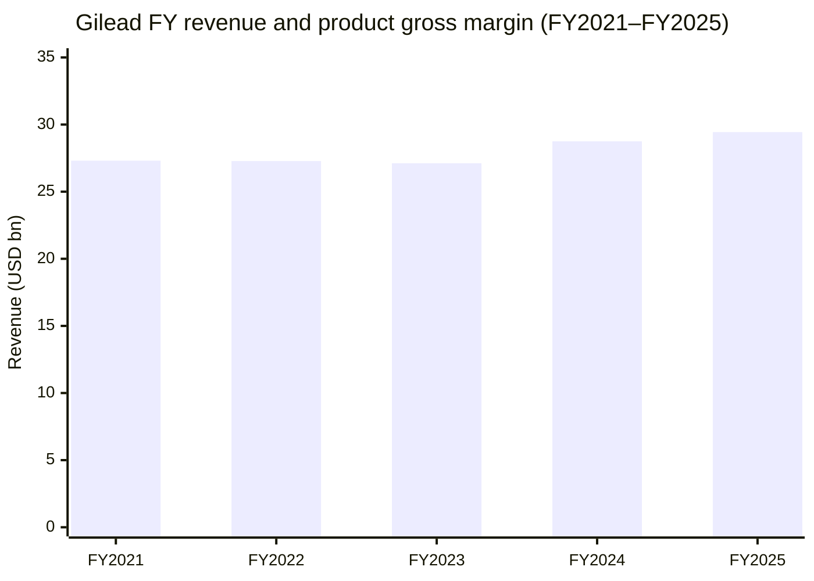
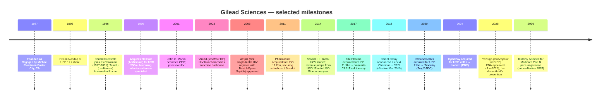
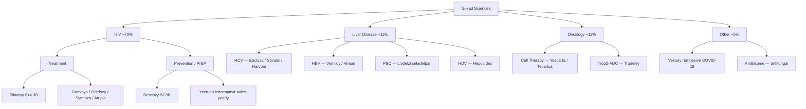
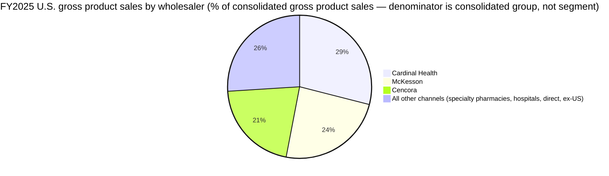
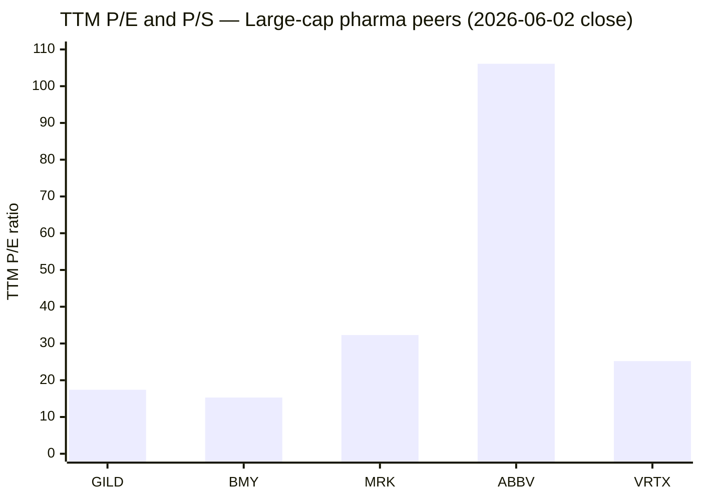

# Gilead Sciences, Inc. (NASDAQ: GILD) — Initiation of Coverage

*As of 2026-06-03. Prices and multiples as of 2026-06-02 close unless otherwise noted.*

> **Update — FY2026 product-sales guidance raised (2026-05-07):** Management raised full-year **product-sales guidance to USD 30.0–30.4 bn (from USD 29.6–30.0 bn)** alongside the Q1 2026 print of **USD 6.96 bn revenue (+4% YoY)**, with Biktarvy at USD 3.4 bn and Yeztugo (lenacapavir for PrEP) ramping to USD 166 m in its second commercial quarter (+72% QoQ). The raise was attributed to the U.S. PrEP business growing **+87% YoY** on the Yeztugo launch and continued Descovy demand. *Source: [Gilead Q1 2026 earnings press release, 2026-05-07 (8-K Ex 99.1)](https://www.sec.gov/Archives/edgar/data/882095/000088209526000022/exhibit991earningspressrel.htm), [Gilead Q1 2026 earnings call transcript, 2026-05-08](https://www.fool.com/earnings/call-transcripts/2026/05/08/gilead-gild-q1-2026-earnings-call-transcript/), and [TIKR Q1-2026 summary, 2026-05-08](https://www.tikr.com/blog/gilead-sciences-beat-q1-2026-earnings-and-raised-guidance-why-is-gild-stock-still-down-17).*

---

## Table of Contents

1. Company Overview
2. Company History
3. Management Team
4. Products & Services
5. Customers & Go-to-Market
6. Industry Overview
7. Competitive Landscape
8. Market Opportunity (TAM)
9. Risk Assessment
10. Investor-lens Scorecards
- Data Used / 数据来源清单
- References

---

## 1. Company Overview

Gilead Sciences is a biopharmaceutical company headquartered at **333 Lakeside Drive, Foster City, California 94404**, with approximately **17,000 employees worldwide** as of December 31, 2025, and a portfolio organized around three therapeutic areas: **HIV (treatment and prevention), Liver Disease (HCV / HBV / HDV / PBC), and Oncology (cell therapy and antibody-drug conjugates)**, with smaller "Other" franchises (Veklury, AmBisome) outside the core three ([Gilead 2025 10-K, Item 1 Business — Foster City address and 17,000 headcount](https://www.sec.gov/Archives/edgar/data/882095/000088209526000006/gild-20251231.htm)). The company reports a single operating segment but discloses revenue along the therapeutic-area cuts above, with HIV the dominant franchise at ~70% of product sales.

For **FY2025, total revenues were USD 29.443 bn (+2% YoY) and total product sales were USD 28.915 bn (+1% YoY)**, of which HIV contributed **USD 20.752 bn (+6% YoY)**, Liver Disease USD 3.217 bn (+6%), Oncology USD 3.236 bn (−2%), Veklury USD 911 m (−49% as COVID-19 hospitalizations normalized), and Other (AmBisome, Letairis, etc.) USD 799 m (−10%) ([Gilead 2025 10-K, Results of Operations — Revenues table](https://www.sec.gov/Archives/edgar/data/882095/000088209526000006/gild-20251231.htm)). Geographically, **U.S. sales were USD 20.816 bn (72% of product sales), Europe USD 4.617 bn (16%), and Rest of World USD 3.483 bn (12%)**, with the U.S. weighting reflecting the HIV franchise's heavy concentration in the American treatment and prevention market ([Gilead 2025 10-K, geographic revenue breakdown](https://www.sec.gov/Archives/edgar/data/882095/000088209526000006/gild-20251231.htm)). Approximately 26% of product sales were denominated in foreign currencies, with the euro the largest exposure ([Gilead 2025 10-K, Foreign Currency Exchange Impact](https://www.sec.gov/Archives/edgar/data/882095/000088209526000006/gild-20251231.htm)).

The business model is classic **specialty biopharma**: discover or in-license novel small molecules, biologics, and cell therapies; advance them through Gilead-run clinical trials (with extensive use of contract research organizations); commercialize directly through Gilead's own field force in the U.S., Europe, and major ex-U.S. markets; and harvest pricing on patent-protected, often Orphan- or Breakthrough-designated medicines until loss of exclusivity (LOE) triggers a step-down ([Gilead 2025 10-K, Item 1 Business — Research and Development; Commercial Operations](https://www.sec.gov/Archives/edgar/data/882095/000088209526000006/gild-20251231.htm)). U.S. distribution is heavily channelized — *"approximately 90% of our gross product sales in the U.S. have been to three large wholesalers — Cardinal Health, Inc., Cencora, Inc. and McKesson Corporation — and their specialty distributor affiliates"* ([Gilead 2025 10-K, Item 1 — Sales and Distribution](https://www.sec.gov/Archives/edgar/data/882095/000088209526000006/gild-20251231.htm)). This is logistics concentration, not end-user concentration; the underlying demand is fragmented across HIV clinics, infectious-disease specialists, hepatology centers, oncologists, and hospital pharmacies.

Profitability is high and durable. **FY2025 product gross margin was 78.4% (vs. 78.2% in 2024)**, R&D expense was USD 5.799 bn (~20% of revenue), SG&A was USD 5.774 bn (~20%), and net income attributable to Gilead was **USD 8.510 bn with diluted EPS of USD 6.78**, up from USD 0.38 in 2024 (which was depressed by a USD 3.8 bn CymaBay acquired IPR&D charge and a USD 4.2 bn Immunomedics IPR&D impairment) ([Gilead 2025 10-K, Results of Operations](https://www.sec.gov/Archives/edgar/data/882095/000088209526000006/gild-20251231.htm)). Operating cash flow funded a **USD 3.00 / share dividend (USD 3.814 bn declared)** and **USD 1.0 bn in share repurchases at an average USD 79.52 per share** during FY2025 ([Gilead 2025 10-K, Consolidated Statements of Stockholders' Equity](https://www.sec.gov/Archives/edgar/data/882095/000088209526000006/gild-20251231.htm)).

**Valuation snapshot (as of 2026-06-02 close):** GILD trades at **USD 127.57 / share, market cap USD 158.4 bn, TTM P/E 17.4×, forward P/E 70.8×, TTM P/S 5.33×, EV/EBITDA 11.5×, dividend yield 2.57%**, with ~1.24 bn shares outstanding ([StockAnalysis.com — GILD statistics, 2026-06-02](https://stockanalysis.com/stocks/gild/statistics/)). The wide gap between TTM P/E (17.4×) and forward P/E (70.8×) is mechanically driven by sell-side modelling of large 2026 IPR&D and one-time charges — when those normalize, the forward multiple compresses to the high-teens; see Risk #11 below for a fuller explanation. **Peer multiples (TTM, 2026-06-02):** AbbVie P/E 106.1× / P/S 6.06× (Humira LOE trough + heavy goodwill amortization) ([StockAnalysis.com — ABBV, 2026-06-02](https://stockanalysis.com/stocks/abbv/statistics/)); Bristol-Myers Squibb P/E 15.3× / P/S 2.29× (Revlimid / Eliquis LOE in train) ([StockAnalysis.com — BMY, 2026-06-02](https://stockanalysis.com/stocks/bmy/statistics/)); Merck P/E 32.3× / P/S 4.34× (Keytruda compounding) ([StockAnalysis.com — MRK, 2026-06-02](https://stockanalysis.com/stocks/mrk/statistics/)); Vertex P/E 25.2× / P/S 8.83× (CF franchise + Casgevy) ([StockAnalysis.com — VRTX, 2026-06-02](https://stockanalysis.com/stocks/vrtx/statistics/)). Against this set, Gilead's TTM multiples sit roughly in line with the large-cap pharma median and at a discount to specialty / orphan biotech, consistent with a **mid-single-digit-growth, high-cash-flow defensive** with a known patent-cliff overhang on Biktarvy (Medicare price negotiation effective 2028; see Section 9 Risk #5).

*Bars = total revenues USD bn; line = product gross margin % (right-hand reference, ~78–80%). Source: [Gilead 2025 10-K Results of Operations](https://www.sec.gov/Archives/edgar/data/882095/000088209526000006/gild-20251231.htm) and prior 10-Ks at [EDGAR CIK 0000882095](https://www.sec.gov/cgi-bin/browse-edgar?action=getcompany&CIK=0000882095&type=10-K).*

---

## 2. Company History

Gilead was **founded in June 1987 in Foster City, California, by Michael L. Riordan, a 29-year-old physician with an MD from Johns Hopkins and an MBA from Harvard, who had been an associate at Menlo Ventures** ([Founder Stories: Michael Riordan, Founder of Gilead Sciences](https://goit.science/founder-stories-michael-riordan-founder-of-gilead-sciences/); [Gilead Sciences corporate history](https://en.wikipedia.org/wiki/Gilead_Sciences)). The company was originally incorporated as **Oligogen**, a working name used while Riordan negotiated the rights to the *Gilead* trademark from a California nonprofit (resolved with a USD 1,000 donation), and Menlo led a USD 2 m seed round; the founding scientific advisory board included Peter Dervan (Caltech), Doug Melton (Harvard) and the late Harold Weintraub (Fred Hutchinson) ([FundingUniverse — Gilead Sciences history](https://www.fundinguniverse.com/company-histories/gilead-sciences-inc-history/)). The original research thesis was **antisense oligonucleotides** as targeted antiviral and antitumor agents — a thesis that did not pan out commercially but seeded the chemistry and antiviral mechanistic expertise that later became the core competence of the company.

*Source: [Gilead Sciences corporate history](https://en.wikipedia.org/wiki/Gilead_Sciences); [Wayback FundingUniverse — Gilead history](https://www.fundinguniverse.com/company-histories/gilead-sciences-inc-history/); [Gilead 2018 CEO press release](https://www.gilead.com/news-and-press/press-room/press-releases/2018/12/gilead-sciences-names-daniel-oday-chairman-and-chief-executive-officer); [Gilead 2025 10-K, Item 1 Business — Medicare Part D negotiation note](https://www.sec.gov/Archives/edgar/data/882095/000088209526000006/gild-20251231.htm); [FDA approves Gilead HIV prevention injection lenacapavir — CNBC, 2025-06-18](https://www.cnbc.com/2025/06/18/fda-approves-gilead-hiv-prevention-injection-lenacapavir.html).*

The three transformations that define modern Gilead each came from a single large acquisition. **First, the 2001 pivot to HIV under newly appointed CEO John C. Martin**, anchored by the 1999 NeXstar acquisition (AmBisome) and the in-licensing of tenofovir from Czech chemist Antonín Holý, produced Viread, then Truvada, then the single-tablet regimens (Atripla, Complera, Stribild, Genvoya, Odefsey, Biktarvy) that turned a company doing ~USD 100 m in 2000 revenue into a ~USD 11 bn HIV franchise by the early 2010s ([encyclopedia.com — Gilead history](https://www.encyclopedia.com/books/politics-and-business-magazines/gilead-sciences-inc)). **Second, the 2011 USD 11.2 bn Pharmasset acquisition** brought sofosbuvir, the backbone of Sovaldi and then Harvoni / Epclusa, which cured chronic HCV at functional rates above 95% and produced one of the fastest revenue ramps in pharma history — Gilead's total revenue went from USD 11 bn in 2013 to USD 32 bn in 2015 before declining as the HCV-curative dynamic shrank the treated population ([encyclopedia.com — Gilead history](https://www.encyclopedia.com/books/politics-and-business-magazines/gilead-sciences-inc); [Gilead 2025 10-K, Results of Operations — Liver Disease section](https://www.sec.gov/Archives/edgar/data/882095/000088209526000006/gild-20251231.htm)). **Third, the 2017 USD 11.9 bn Kite Pharma acquisition (Yescarta CAR-T) and the 2020 USD 21 bn Immunomedics acquisition (Trodelvy)** built the Oncology franchise that today contributes USD 3.236 bn in product sales but at lower-than-corporate margins and with mounting competitive pressure (see Section 7) ([Gilead 2025 10-K, Results of Operations — Oncology table](https://www.sec.gov/Archives/edgar/data/882095/000088209526000006/gild-20251231.htm)).

Recent developments in the 2024–2026 window center on two themes. The **2024 USD 4.3 bn CymaBay acquisition** added seladelpar (now marketed as Livdelzi / Lyvdelzi for primary biliary cholangitis), the first new mechanism for PBC in nearly a decade, contributing meaningfully to the +87% YoY growth in "Other Liver Disease" sales in FY2025 ([Gilead 2025 10-K, MD&A — Liver Disease commentary](https://www.sec.gov/Archives/edgar/data/882095/000088209526000006/gild-20251231.htm)). The **June 18, 2025 FDA approval of Yeztugo (lenacapavir for PrEP)** marks the most strategically important new launch in a decade — the first and only twice-yearly subcutaneous HIV-prevention option in the United States, achieving ≥99.9% efficacy in the PURPOSE-1 and PURPOSE-2 Phase-3 trials, with a U.S. list price of USD 28,218 / year ([FDA approves Gilead HIV prevention injection lenacapavir — CNBC, 2025-06-18](https://www.cnbc.com/2025/06/18/fda-approves-gilead-hiv-prevention-injection-lenacapavir.html); [Yeztugo® is now the first and only FDA-approved HIV prevention option offering 6 months of protection — Gilead press release, 2025-06-18](https://www.gilead.com/news/news-details/2025/yeztugo-lenacapavir-is-now-the-first-and-only-fda-approved-hiv-prevention-option-offering-6-months-of-protection); [FDA approval of injectable lenacapavir for PrEP — Medicines Law & Policy, 2025-06](https://medicineslawandpolicy.org/2025/06/fda-approval-of-injectable-lenacapavir-for-pre-exposure-prophylaxis-prep-opens-the-road-to-ending-hiv/)). The third recent development is **HHS's January 2026 selection of Biktarvy for Medicare price negotiation under the Inflation Reduction Act**, with a negotiated maximum-fair-price (MFP) effective beginning 2028 — a structural headwind that frames much of the bull/bear debate on the stock ([Gilead 2025 10-K, Item 1 Business — Medicare Part D commentary](https://www.sec.gov/Archives/edgar/data/882095/000088209526000006/gild-20251231.htm)).

---

## 3. Management Team

**Daniel P. O'Day, Chairman and Chief Executive Officer (age 61, in role since March 2019).** O'Day joined Gilead in March 2019 from Roche, where he had spent **more than three decades** across the Pharmaceuticals and Diagnostics divisions, finishing as **CEO of Roche Pharmaceuticals from 2012 until late 2018** and a member of the Roche Corporate Executive Committee ([Gilead leadership page — Daniel O'Day](https://www.gilead.com/company/leadership/daniel-oday); [Gilead Sciences names Daniel O'Day Chairman and CEO — press release, 2018-12-10](https://www.gilead.com/news-and-press/press-room/press-releases/2018/12/gilead-sciences-names-daniel-oday-chairman-and-chief-executive-officer); [Gilead taps Roche veteran Daniel O'Day as new CEO — BioSpace](https://www.biospace.com/gilead-taps-roche-veteran-daniel-o-day-as-new-ceo)). At Roche he ran the world's largest oncology franchise (Avastin, Herceptin, Rituxan, Perjeta, Kadcyla, Tecentriq) through the global biosimilar transition and led the Diagnostics division for two years before that, giving him a rare profile that combines large-molecule oncology commercialization, in-vitro diagnostics scale-up, and operating across Europe / North America / Asia (he was stationed at Roche Basel from 1998 onward) ([Gilead leadership page — Daniel O'Day](https://www.gilead.com/company/leadership/daniel-oday); [pharmaphorum — Gilead hires Roche's pharma chief, 2018-12](https://pharmaphorum.com/news/gilead-hires-roches-pharma-chief-daniel-oday-as-ceo)). His education is **Bachelor of Science in Biology from Georgetown University and an MBA from Columbia Business School** ([Gilead leadership page — Daniel O'Day](https://www.gilead.com/company/leadership/daniel-oday)). External board service has included Genentech, Flatiron Health and Foundation Medicine (all Roche-affiliated), and he previously chaired the EFPIA (European Federation of Pharmaceutical Industries) ([Gilead leadership page — Daniel O'Day](https://www.gilead.com/company/leadership/daniel-oday)). At Gilead he is also Chair of the Board ([Gilead 2025 10-K, Executive Officers and Directors table](https://www.sec.gov/Archives/edgar/data/882095/000088209526000006/gild-20251231.htm)).

O'Day's seven-year tenure has had three observable signatures. **First**, he has steered Gilead's M&A toward smaller, more therapeutically focused deals than the firm's prior signature mega-deals (Pharmasset, Kite, Immunomedics) — the 2024 CymaBay (USD 4.3 bn) and 2026 Arcellx subsequent-event transactions are the model — while expanding the internal pipeline beyond the historic HIV/Liver/Oncology stack into inflammation (filed and disclosed in the 10-K's R&D summary) ([Gilead 2025 10-K, Pipeline summary and CymaBay disclosure](https://www.sec.gov/Archives/edgar/data/882095/000088209526000006/gild-20251231.htm)). **Second**, he has emphasized disciplined operating-expense management, with SG&A declining 5% YoY in FY2025 to USD 5.774 bn even as the Yeztugo launch added field-force spend, and R&D essentially flat at USD 5.799 bn (−2% YoY) versus a peer set that has continued to ramp ([Gilead 2025 10-K, Results of Operations — Operating Expenses](https://www.sec.gov/Archives/edgar/data/882095/000088209526000006/gild-20251231.htm)). **Third**, capital returns to shareholders have been steady: USD 3.00 / share in declared dividends in FY2025 and USD 1.0 bn of share repurchases, with the dividend now in its eighth consecutive annual raise ([Gilead 2025 10-K, Consolidated Statements of Stockholders' Equity](https://www.sec.gov/Archives/edgar/data/882095/000088209526000006/gild-20251231.htm)). Per the 2026 proxy, he owns shares and exercisable options materially below the median Big Pharma CEO stake, with compensation predominantly performance-share-unit weighted ([Gilead 2026 DEF 14A — Executive Compensation Discussion & Analysis](https://www.sec.gov/cgi-bin/browse-edgar?action=getcompany&CIK=0000882095&type=DEF+14A)).

**Founder note.** Michael L. Riordan, who founded Gilead in 1987 and served as initial CEO, departed in 1996 and has not been an executive or director of Gilead for nearly three decades; subsequent founder-era CEO John C. Martin retired in 2018 and is similarly no longer in an operating role ([Gilead Sciences corporate history](https://en.wikipedia.org/wiki/Gilead_Sciences)). The founder's residual influence on the firm today is the antiviral chemistry expertise the early Gilead built — the throughline from Viread (2003) to Biktarvy (2018) to Yeztugo (2025) is essentially one continuous Foster City antiviral discovery program three decades on.

---

## 4. Products & Services

Gilead's portfolio is organized into the four therapeutic areas the 10-K's Item 1 Business section enumerates: **HIV (Treatment + Prevention), Liver Disease (HCV / HBV / HDV / PBC), Oncology (Cell Therapy + ADC), and "Other" (Veklury and the historical non-core franchise: AmBisome, Letairis, Zydelig)**. The 10-K marketed-product table is reproduced verbatim below; the FY2025 revenue contribution column is from the Results of Operations table.

### 4.1 The 10-K marketed-product matrix (FY2025 product sales, USD m)

| Therapeutic Area | Product | Indication (10-K verbatim) | FY2025 sales (USD m) | YoY |
|---|---|---|---:|---:|
| **HIV — Treatment** | Biktarvy® (BIC/FTC/TAF) | Adults and certain children with HIV-1 | 14,334 | +7% |
| | Genvoya® (EVG/c/FTC/TAF) | Adults and adolescents with HIV-1 | 1,498 | −15% |
| | Odefsey® (RPV/FTC/TAF) | Adults and adolescents with HIV-1 | 1,167 | −9% |
| | Symtuza® — revenue share (DRV/c/FTC/TAF) | Single-tablet regimen with Janssen | 495 | −16% |
| | Other HIV (Atripla, Complera, Emtriva, Stribild, Sunlenca, Truvada, Tybost, Yeztugo) | various | 500 | +15% |
| **HIV — Prevention** | Descovy® (FTC/TAF) | Adults and adolescents for PrEP (HIV-1 prevention) | 2,758 | +31% |
| | Yeztugo® / Yeytuo® (lenacapavir) | Twice-yearly subcutaneous PrEP, approved Jun-2025 | included in "Other HIV" | n/a |
| **Liver Disease — HCV** | Epclusa® (SOF/VEL) | Adults / children ≥3 yrs with HCV all-genotype | 1,272 | −20% |
| | Vemlidy® (TAF mono) | Adults with chronic HBV | 1,070 | +12% |
| | Other Liver (Harvoni, Hepcludex, Hepsera, Livdelzi/Lyvdelzi, Sovaldi, Viread, Vosevi) | various HBV/HCV/HDV/PBC | 874 | +87% |
| **Oncology — Cell Therapy** | Yescarta® (axi-cel) | LBCL 2L+; FL 3L+ | 1,495 | −5% |
| | Tecartus® (brexu-cel) | Relapsed/refractory MCL; B-ALL adult | 344 | −15% |
| **Oncology — ADC** | Trodelvy® (sacituzumab govitecan) | mTNBC ≥2L; HR+/HER2− mBC ≥2L; UC | 1,397 | +6% |
| **Other** | Veklury® (remdesivir) | COVID-19 hospitalized adults / certain children | 911 | −49% |
| | AmBisome® (liposomal amphotericin B) | Invasive fungal infection | 509 | −5% |
| | Other (Cayston, Jyseleca, Letairis, Zydelig) | various | 290 | −19% |
| **Total product sales** | | | **28,915** | **+1%** |

*Source: [Gilead 2025 10-K, Item 1 Business — Marketed Products and Item 7 Results of Operations — Revenues table](https://www.sec.gov/Archives/edgar/data/882095/000088209526000006/gild-20251231.htm).*

*Legacy chart: revenue mix across therapeutic areas. Source: [Gilead 2025 10-K Results of Operations](https://www.sec.gov/Archives/edgar/data/882095/000088209526000006/gild-20251231.htm) (FY2025 figures replace the legacy chart's earlier annotations).*

### 4.2 Synthesis — how the portfolio holds together

Gilead is essentially **two adjacent moats fastened together**, with two smaller franchises hanging off the side. **Moat 1: HIV.** A two-decade antiviral chemistry leadership in the nucleoside / nucleotide reverse-transcriptase inhibitor space, expressed across both treatment (Biktarvy holds 52%+ U.S. HIV treatment share; see Section 7) and prevention (Descovy + Yeztugo). The franchise generates 70% of product sales at the highest margins in the company. **Moat 2: HCV/HBV.** Sofosbuvir-based curative regimens that defined the modern HCV treatment paradigm; this franchise is in slow decline as cured-patient prevalence falls, partially offset by HBV mono (Vemlidy) and the recently launched PBC asset (Livdelzi). **Adjacent business: Oncology.** Yescarta and Tecartus established Gilead in CAR-T; Trodelvy is the only marketed Trop2-ADC. Both face mounting competitive pressure (see Section 7). **Tail: COVID-era and legacy infectious-disease.** Veklury monetized the pandemic and is now in structural decline; AmBisome and the long-tail orphan / niche drugs round out a "other" pool with modest cash contribution and no growth. The Yeztugo launch in FY2025 is the first major HIV-prevention category innovation in over a decade and is the swing factor for the FY2026 outlook.

*Source: [Gilead 2025 10-K Item 1 Business — Marketed Products and Revenues table](https://www.sec.gov/Archives/edgar/data/882095/000088209526000006/gild-20251231.htm).*

### 4.3 HIV (the franchise that defines the company)

The 10-K describes the HIV portfolio's flagship as follows: *"Biktarvy® is an oral formulation of a once-daily single-tablet regimen of bictegravir, emtricitabine and tenofovir alafenamide (BIC/FTC/TAF) for the treatment of HIV-1 infection in adults and certain children"* ([Gilead 2025 10-K, Item 1 Business — HIV Treatment](https://www.sec.gov/Archives/edgar/data/882095/000088209526000006/gild-20251231.htm)).

**Plain-language gloss:** Biktarvy is the U.S. market leader in HIV treatment, prescribed to roughly half of all U.S. patients on antiretroviral therapy. Mechanistically, it pairs two NRTIs (FTC + TAF; the "backbone") with bictegravir (an integrase strand-transfer inhibitor, INSTI) — the integrase mechanism is the dominant first-line treatment paradigm globally and is the one Gilead and ViiV (GSK) have largely fought over for the last decade. Biktarvy's sales rose 7% to **USD 14.334 bn in FY2025 primarily on volume growth offset by lower realized price from the U.S. Medicare Part D redesign**, and the franchise has been gaining share from older Gilead regimens (Genvoya / Odefsey) and from rival ViiV's Triumeq ([Gilead 2025 10-K, Results of Operations — HIV commentary](https://www.sec.gov/Archives/edgar/data/882095/000088209526000006/gild-20251231.htm); [Gilead Q1-2026 earnings call transcript](https://www.fool.com/earnings/call-transcripts/2026/05/08/gilead-gild-q1-2026-earnings-call-transcript/)). Biktarvy was **selected by HHS for Medicare price negotiation in January 2026, with negotiated MFP effective from 2028** — this is the single largest structural headwind embedded in current consensus and the central bear thesis on the stock ([Gilead 2025 10-K, Item 1 Business — IRA negotiation discussion](https://www.sec.gov/Archives/edgar/data/882095/000088209526000006/gild-20251231.htm)).

*Analyst view:* Biktarvy's competitive moat rests on (a) tolerability profile (TAF backbone displaced TDF on renal and bone-density grounds), (b) once-daily single-tablet convenience, (c) deep formulary positioning across U.S. Medicaid / Medicare / commercial / Ryan White / 340B channels, and (d) widely supported real-world efficacy data. The closest competitive threat is ViiV (a GSK / Pfizer / Shionogi joint venture) with **Triumeq (dolutegravir/abacavir/lamivudine) and the long-acting Cabenuva (cabotegravir + rilpivirine, every-2-month injection)**; cabotegravir is the INSTI Gilead's BIC most directly competes against ([ViiV Healthcare — Cabenuva product information](https://viivhcmedinfo.com/our-hiv-medicines/cabenuva/); [EACS 2025: Are cabotegravir injections more tolerable than lenacapavir? — EATG, 2025-10](https://www.eatg.org/hiv-news/eacs-2025-are-cabotegravir-injections-more-tolerable-than-lenacapavir/)).

*Legacy chart: HIV franchise composition. Source: [Gilead 2025 10-K Results of Operations](https://www.sec.gov/Archives/edgar/data/882095/000088209526000006/gild-20251231.htm).*

The 10-K describes the prevention franchise's flagship as: *"Descovy® (FTC/TAF) is an oral formulation indicated as a complete regimen for the treatment of HIV-1 infection in adults and adolescents weighing at least 35 kg ... for pre-exposure prophylaxis (PrEP) in at-risk adults and adolescents who are at risk for HIV-1 acquisition"* ([Gilead 2025 10-K, Item 1 Business — HIV Prevention](https://www.sec.gov/Archives/edgar/data/882095/000088209526000006/gild-20251231.htm)).

**Plain-language gloss:** Descovy is the daily-oral PrEP option (FTC/TAF; TAF backbone), the successor to the original Truvada (FTC/TDF). Descovy sales rose **31% in FY2025 to USD 2.758 bn primarily due to higher demand and average realized price**, with the U.S. PrEP business growing **+87% YoY in Q1 2026** as Yeztugo's launch *expanded* the overall PrEP-treated market rather than cannibalizing Descovy ([Gilead 2025 10-K, Results of Operations — HIV commentary](https://www.sec.gov/Archives/edgar/data/882095/000088209526000006/gild-20251231.htm); [Gilead Q1-2026 earnings call transcript](https://www.fool.com/earnings/call-transcripts/2026/05/08/gilead-gild-q1-2026-earnings-call-transcript/)). The 10-K describes Yeztugo's mechanism: *"A once-yearly injection of lenacapavir, an HIV-1 capsid inhibitor, is being evaluated for HIV PrEP"* — though the marketed Yeztugo formulation is the twice-yearly subcutaneous injection approved by FDA on **June 18, 2025** ([Gilead 2025 10-K, Item 1 Business — R&D Pipeline section](https://www.sec.gov/Archives/edgar/data/882095/000088209526000006/gild-20251231.htm); [Yeztugo® press release, 2025-06-18](https://www.gilead.com/news/news-details/2025/yeztugo-lenacapavir-is-now-the-first-and-only-fda-approved-hiv-prevention-option-offering-6-months-of-protection)).

**Yeztugo (lenacapavir for PrEP) — what it physically does.** Lenacapavir is a first-in-class HIV-1 capsid inhibitor: it binds at multiple stages of the viral lifecycle to the capsid protein that surrounds the HIV genome, disrupting capsid assembly, nuclear import, and the post-entry replication steps. For PrEP, the relevant attribute is the pharmacokinetic profile of the subcutaneous depot — a single 927 mg injection in each thigh every six months maintains plasma concentrations above the protective threshold for the full dosing interval. In the **PURPOSE-1 and PURPOSE-2 Phase 3 trials, ≥99.9% of participants who received lenacapavir remained HIV-negative**, an efficacy result essentially equivalent to perfect adherence on daily oral PrEP — but achieved with twice-yearly clinic visits rather than 365 daily pills ([FDA approves Gilead HIV prevention injection lenacapavir — CNBC, 2025-06-18](https://www.cnbc.com/2025/06/18/fda-approves-gilead-hiv-prevention-injection-lenacapavir.html); [Yeztugo press release, 2025-06-18](https://www.gilead.com/news/news-details/2025/yeztugo-lenacapavir-is-now-the-first-and-only-fda-approved-hiv-prevention-option-offering-6-months-of-protection); [CDC MMWR — Clinical Recommendation for the use of injectable lenacapavir as HIV PrEP, 2025](https://www.cdc.gov/mmwr/volumes/74/wr/mm7435a1.htm)).

*Analyst view:* The competitive frame is **Yeztugo (Gilead, 6-month SubQ) vs Apretude (ViiV/GSK, 2-month IM cabotegravir)**, the only two long-acting PrEP options approved in the U.S. Indirect-comparison studies presented at IAS 2025 found roughly equivalent prevention efficacy (Apretude ~96–98% across cohorts vs Yeztugo ~95–100%), but Yeztugo's twice-yearly dosing is the differentiator on patient burden ([Indirect comparison shows Apretude and Yeztugo have similar efficacy — Managed Healthcare Executive, 2025-07](https://www.managedhealthcareexecutive.com/view/indirect-comparison-shows-apretude-and-yeztugo-have-similar-efficacy-ias-2025); [GSK touts study showing acceptability edge for its long-acting PrEP drug — Fierce Pharma, 2025-10](https://www.fiercepharma.com/marketing/gsk-long-acting-prep-preference-study-finds-apretude-injections-more-acceptable-preferred)). Gilead has also pre-empted competitive escalation by funding a **once-yearly lenacapavir Phase-3 program**, which would, if approved, leapfrog any cabotegravir extended-release effort ([Gilead 2025 10-K, R&D pipeline — Phase 3 Lenacapavir once-yearly](https://www.sec.gov/Archives/edgar/data/882095/000088209526000006/gild-20251231.htm)).

### 4.4 Liver Disease

The 10-K describes the franchise as: *"Epclusa® is an oral formulation of a once-daily single-tablet regimen of sofosbuvir and velpatasvir for the treatment of chronic hepatitis C virus ('HCV') infection in adults and pediatric patients 3 years of age and older with genotype 1, 2, 3, 4, 5 or 6"* and adds Vemlidy (TAF mono) for chronic HBV ([Gilead 2025 10-K, Item 1 Business — Liver Disease](https://www.sec.gov/Archives/edgar/data/882095/000088209526000006/gild-20251231.htm)).

**Plain-language gloss:** HCV cure with sofosbuvir-based regimens was the largest single therapeutic transformation of the 2010s — for the first time a chronic, progressive viral infection (HCV is the leading cause of liver transplant in the U.S.) became cleanly curable, with sustained-virologic-response rates above 95% for 8–12 weeks of treatment. The structural consequence is **demand exhaustion**: as treated patients are cured, the prevalence pool shrinks. Epclusa sales fell 20% YoY to USD 1.272 bn in FY2025, continuing a multi-year decline; this is intrinsic to the franchise's success, not a market-share loss ([Gilead 2025 10-K, MD&A — Liver Disease commentary](https://www.sec.gov/Archives/edgar/data/882095/000088209526000006/gild-20251231.htm)). The offset is in **non-HCV liver disease**: **Vemlidy +12% to USD 1.070 bn for chronic HBV**, and the "Other Liver Disease" line (Livdelzi, Hepcludex, etc.) **+87% YoY to USD 874 m** on the Livdelzi launch for PBC ([Gilead 2025 10-K, Results of Operations](https://www.sec.gov/Archives/edgar/data/882095/000088209526000006/gild-20251231.htm)).

*Analyst view:* The Liver franchise's competitive position is mixed. In HCV, the remaining competition is largely AbbVie's Mavyret regimen (glecaprevir/pibrentasvir) — Gilead and AbbVie split the residual cure pool ([AbbVie 10-K — Mavyret](https://www.sec.gov/cgi-bin/browse-edgar?action=getcompany&CIK=0001551152&type=10-K)). In HBV, Vemlidy faces generic TDF (the prior-generation backbone) as the dominant alternative, with little new mechanism on the horizon. The PBC franchise (Livdelzi vs Ipsen / Eisai's Iqirvo and Intercept's Ocaliva) is a real franchise build for Gilead and is a key element of the "post-Biktarvy growth story" the bulls argue for ([Gilead Q1-2026 earnings call transcript — Livdelzi commentary](https://www.fool.com/earnings/call-transcripts/2026/05/08/gilead-gild-q1-2026-earnings-call-transcript/)).

### 4.5 Oncology — Cell Therapy and ADCs

The 10-K describes Yescarta as: *"Yescarta® (axicabtagene ciloleucel) is a CD19-directed genetically modified autologous T cell immunotherapy for the treatment of adult patients with relapsed or refractory large B-cell lymphoma"* and Trodelvy as: *"Trodelvy® (sacituzumab govitecan-hziy) is a Trop-2-directed antibody and topoisomerase inhibitor conjugate"* ([Gilead 2025 10-K, Item 1 Business — Oncology](https://www.sec.gov/Archives/edgar/data/882095/000088209526000006/gild-20251231.htm)).

**Plain-language gloss:** Yescarta and Tecartus are CAR-T therapies — autologous T cells genetically engineered ex-vivo to express a chimeric receptor that targets CD19 (a B-cell-lineage surface marker), then re-infused into the patient to kill malignant B-cells. They are "living drugs," produced one patient at a time, with manufacturing lead times of ~14–17 days, hospital-administered with intensive post-infusion monitoring for cytokine-release syndrome. Yescarta is the market-share leader in 2L+ large B-cell lymphoma (LBCL) but faces growing pressure from Bristol-Myers Squibb's Breyanzi (lisocabtagene maraleucel) and Johnson & Johnson / Legend's Carvykti (BCMA-targeted, multiple myeloma); cell-therapy revenues declined 7% in FY2025 to **USD 1.839 bn reflecting "ongoing competitive headwinds"** in the 10-K's own words ([Gilead 2025 10-K, Results of Operations — Oncology commentary](https://www.sec.gov/Archives/edgar/data/882095/000088209526000006/gild-20251231.htm)). Tecartus serves the smaller mantle-cell-lymphoma and adult B-ALL markets, declining 15% YoY.

Trodelvy is the **first-and-only marketed Trop2 antibody-drug conjugate (ADC)**, with sacituzumab (anti-Trop2 IgG1) coupled via a hydrolyzable linker to govitecan (SN-38, the active topoisomerase-I inhibitor metabolite of irinotecan). The drug's commercial position is in 2L+ metastatic triple-negative breast cancer (mTNBC) and HR+/HER2− metastatic breast cancer post-endocrine therapy. Trodelvy revenue rose 6% in FY2025 to USD 1.397 bn ([Gilead 2025 10-K, Results of Operations](https://www.sec.gov/Archives/edgar/data/882095/000088209526000006/gild-20251231.htm)).

*Analyst view:* Trodelvy's competitive position is being aggressively contested by **AstraZeneca/Daiichi Sankyo's Datroway (datopotamab deruxtecan)**, an alternative Trop2 ADC with deruxtecan payload chemistry. ESMO 2025 head-to-head readouts in 1L mTNBC suggested Datroway may have an edge on overall survival in the post-immunotherapy setting, although Trodelvy retains the established 2L+ positioning and now has a positive Keytruda-combination ASCENT-04 readout in the 1L PD-L1+ TNBC space ([ESMO: AZ, Daiichi's Datroway outshines Gilead's Trodelvy in first global TROP2 showdown — Fierce Pharma, 2025-10](https://www.fiercepharma.com/pharma/az-daiichi-datroway-outshines-gilead-trodelvy-first-global-trop2-showdown); [ASCO: Gilead bolsters Trodelvy in TNBC with practice-changing Keytruda combo win — Fierce Pharma, 2025-05](https://www.fiercepharma.com/pharma/gilead-bolsters-trodelvy-triple-negative-breast-cancer-practice-changing-keytruda-combo-win)). The 10-K flagged *"FDA decisions related to two first-line breast cancer therapies and an additional HIV treatment option"* as expected 2026 catalysts — both are Trodelvy label-expansion submissions ([Gilead 2025 10-K, Item 1 — 2026 R&D expectations](https://www.sec.gov/Archives/edgar/data/882095/000088209526000006/gild-20251231.htm)).

### 4.6 Other — Veklury and the legacy book

The 10-K places Veklury (remdesivir) outside the three core therapy areas as an "other product." Sales **declined 49% YoY to USD 911 m in FY2025 reflecting lower rates of COVID-19-related hospitalizations**, and the 10-K explicitly guides further declines in FY2026 ([Gilead 2025 10-K, MD&A — Veklury commentary](https://www.sec.gov/Archives/edgar/data/882095/000088209526000006/gild-20251231.htm)). AmBisome (liposomal amphotericin B for invasive fungal infections) is a steady mature antifungal generating USD 509 m; Letairis (pulmonary arterial hypertension) and Zydelig (CLL/iNHL PI3Kδ inhibitor) are tail assets in long-tail decline. None of these is a meaningful incremental growth driver; their role in the model is to throw off cash for reinvestment in HIV / Oncology pipeline.

### 4.7 R&D pipeline — what determines the FY2027–2030 trajectory

The 10-K's R&D mission statement is: *"Our research and development mission is to discover and develop transformational therapies in areas of high unmet medical need. Our product development efforts are focused primarily on virology, oncology and inflammation"* ([Gilead 2025 10-K, Item 1 Business — Research and Development](https://www.sec.gov/Archives/edgar/data/882095/000088209526000006/gild-20251231.htm)). The disclosed late-stage programs of greatest commercial weight are: **(i) Lenacapavir once-yearly** (Phase 3, HIV PrEP), **(ii) Bictegravir + lenacapavir oral** (Phase 3, HIV treatment for virologically suppressed patients), **(iii) Islatravir + lenacapavir oral combination with Merck** (Phase 3, HIV treatment), **(iv) Trodelvy combination programs** (multiple 1L breast cancer indications, with Keytruda partners; FDA decisions pending), and **(v) Anitocabtagene autoleucel (anito-cel)** — the BCMA CAR-T in multiple myeloma developed with **Arcellx**, whose acquisition agreement Gilead disclosed as a subsequent event filed February 23, 2026 ([Gilead 2025 10-K, R&D pipeline section and Arcellx subsequent-event disclosure](https://www.sec.gov/Archives/edgar/data/882095/000088209526000006/gild-20251231.htm); [Gilead 8-K, 2026-02-23 — Arcellx acquisition agreement](https://www.sec.gov/Archives/edgar/data/882095/000110465926018314/tm267044d1_ex99-1.htm)). The R&D portfolio includes **over 50 clinical-stage programs across virology, oncology, and inflammation**, with FY2025 R&D spend of USD 5.799 bn representing roughly 20% of revenue — within the normal Big Pharma R&D-intensity range ([Gilead 2025 10-K, Item 1 — R&D footprint](https://www.sec.gov/Archives/edgar/data/882095/000088209526000006/gild-20251231.htm)).

---

## 5. Customers & Go-to-Market

**End-customer profile.** Gilead's therapeutic mix means end-demand is generated by three distinct stakeholder webs: (a) **HIV prescribers** (infectious-disease specialists, HIV-treatment clinics, primary-care physicians serving high-prevalence populations, and the public-sector PEPFAR / Ryan White / 340B safety-net programs in the U.S.); (b) **hepatologists and HCV/HBV treaters** (gastroenterologists, transplant centers, infectious-disease specialists); and (c) **academic medical centers and qualified-treatment-center networks for cell therapy and oncologists in community / academic practice for ADCs** ([Gilead 2025 10-K, Item 1 Business — Sales, Marketing and Distribution](https://www.sec.gov/Archives/edgar/data/882095/000088209526000006/gild-20251231.htm)). Direct field-force coverage runs across the U.S., Europe, and most major ex-U.S. markets, supplemented by third-party distributors in smaller ex-U.S. territories ([Gilead 2025 10-K, Item 1 Business — Commercial Operations](https://www.sec.gov/Archives/edgar/data/882095/000088209526000006/gild-20251231.htm)).

**U.S. distribution concentration (this is logistics, not end-demand).** Three wholesalers dominate U.S. distribution. From the 10-K's Note 2 Revenues — Concentrations: *"The customers, comprised of three wholesalers, that accounted for 10% or more of our total gross product sales [were] Cardinal Health, Inc. 29% (2025), 29% (2024), 28% (2023); Cencora, Inc. 21% (2025), 21% (2024), 22% (2023); McKesson Corporation 24% (2025), 23% (2024), 24% (2023)"* — that is **74% of consolidated gross product sales going to three wholesale customers**, a figure stable across the three-year window ([Gilead 2025 10-K, Note 2 Revenues — Concentrations table](https://www.sec.gov/Archives/edgar/data/882095/000088209526000006/gild-20251231.htm)). The 10-K's Item 1 prose corroborates: *"Historically, approximately 90% of our gross product sales in the U.S. have been to three large wholesalers — Cardinal Health, Inc., Cencora, Inc. and McKesson Corporation — and their specialty distributor affiliates"* ([Gilead 2025 10-K, Item 1 Business — Sales and Distribution](https://www.sec.gov/Archives/edgar/data/882095/000088209526000006/gild-20251231.htm)). **Critically, this is logistical pass-through concentration, not buyer concentration**: the three wholesalers do not negotiate end-prices or decide formulary placement; they take ownership of inventory for ~30 days and ship to retail / specialty pharmacies, clinics, and hospitals on standard distribution-services agreements at ~1–2% gross-to-net deductions. End-user demand is highly fragmented across hundreds of thousands of prescribers and millions of patients.

*Source: [Gilead 2025 10-K, Note 2 Revenues — Concentrations](https://www.sec.gov/Archives/edgar/data/882095/000088209526000006/gild-20251231.htm). **Denominator = consolidated gross product sales (group-level). This is U.S. distribution concentration to three wholesale intermediaries, NOT end-user concentration.***

**Channel and payer dynamics.** In the U.S., Gilead's gross-to-net deductions are heavy and growing — *"Gross-to-net deductions as a percentage of gross product sales increased in 2025, compared to 2024, primarily due to U.S. Medicare Part D program redesign impact"* ([Gilead 2025 10-K, MD&A — Foreign Currency and Gross-to-Net commentary](https://www.sec.gov/Archives/edgar/data/882095/000088209526000006/gild-20251231.htm)). The IRA-mandated Part D redesign forces manufacturers to pay a 10% discount in the initial coverage phase and 20% discount in the catastrophic phase on drugs utilized by all Part D beneficiaries, including low-income-subsidy patients ([Gilead 2025 10-K, IRA and Part D commentary](https://www.sec.gov/Archives/edgar/data/882095/000088209526000006/gild-20251231.htm)). On top of that, **340B drug-discount-program participation, Medicaid Best Price, and PBM rebates** combine to put Gilead's net price for Biktarvy roughly 50–60% below WAC; the 10-K's IRA discussion is explicit that Biktarvy's Medicare-negotiated MFP (effective 2028) will be incremental on top of these existing discounts.

**Ex-U.S. structure.** *"We sell and distribute our products in Europe and countries outside the U.S. where the product is approved, either through our commercial teams, third-party distributors or corporate partners"* ([Gilead 2025 10-K, Item 1 — Sales and Distribution](https://www.sec.gov/Archives/edgar/data/882095/000088209526000006/gild-20251231.htm)). In low- and middle-income countries, Gilead operates **voluntary licensing agreements that allow generic manufacturers to produce and sell Gilead-developed antivirals at low cost** — the Medicines Patent Pool has been the standard vehicle for these arrangements since the 2011 Viread voluntary licence, and Gilead announced an expanded Yeztugo access program in October 2024 covering 120 LMICs through generic licensees ([Gilead statement on access planning for lenacapavir for HIV prevention in LMICs, 2025](https://www.gilead.com/company/company-statements/2025/gilead-statement-on-access-planning-for-lenacapavir-for-hiv-prevention-in-low--and-middle-income-countries)). These are net-revenue-light arrangements that protect Gilead's brand-equity at the high-income markets while extending access globally — an important reputational and regulatory hedge for the HIV franchise.

*Legacy chart: revenue by geography. Source: [Gilead 2025 10-K Results of Operations — Revenues by geography](https://www.sec.gov/Archives/edgar/data/882095/000088209526000006/gild-20251231.htm).*

---

## 6. Industry Overview

Gilead operates across three distinct disease markets with very different growth, regulation, and competitive dynamics. The **global HIV therapeutics and prevention market** is the most concentrated and the most economically important to Gilead. By UNAIDS estimates, **approximately 39.9 million people are living with HIV globally as of end-2023, with ~30.7 million on antiretroviral therapy**, and another **~3.5 million on or considered eligible for PrEP** ([UNAIDS Global HIV statistics fact-sheet, 2024](https://www.unaids.org/en/resources/fact-sheet)). The market for HIV antiretrovirals is roughly USD 30–35 bn at developed-market net pricing, with Gilead the global #1 by revenue share, followed by ViiV (the GSK-Pfizer-Shionogi joint venture) and Merck; Bristol-Myers Squibb exited the active HIV market with the 2014 sale of its franchise to Gilead-rival ViiV ([analyst-view; HIV market context derived from 10-K Item 1 Business — HIV section, multi-year revenue series](https://www.sec.gov/Archives/edgar/data/882095/000088209526000006/gild-20251231.htm)). Long-acting prevention is the most strategically active sub-segment — the 6-month lenacapavir Yeztugo, the 2-month cabotegravir Apretude, and a pipeline of multi-month and once-yearly successors are reshaping a category previously defined by daily oral pills ([Twice-Yearly Injectable PrEP With Lenacapavir: Redefining Adherence and Access in the Global Fight Against HIV — PMC, 2025](https://pmc.ncbi.nlm.nih.gov/articles/PMC12605889/)).

The **HCV / HBV market** has been in structural decline since the 2014 sofosbuvir launch effectively converted HCV from a chronic to a curable infection. From a 2015 industry peak of >USD 20 bn in global HCV revenue, the addressable annual incident-treated pool has compressed by an order of magnitude as the prevalence reservoir is drained; in 2025 only ~USD 4–5 bn of global HCV revenue remains, split largely between Gilead's Epclusa / Vosevi and AbbVie's Mavyret ([analyst-view; HCV market trajectory inferred from Gilead 2025 10-K — Liver Disease revenue trend table](https://www.sec.gov/Archives/edgar/data/882095/000088209526000006/gild-20251231.htm)). The HBV sub-market is differently structured: a chronic infection with no curative therapy yet, where TAF mono (Vemlidy) and generic TDF dominate suppression therapy and a pipeline of HBV functional-cure programs (Vir Biotechnology / Arrowhead RNAi / Gilead's own Hepcludex bulevirtide for HDV) is still pre-commercial. The newly important PBC market (Livdelzi vs Iqirvo vs Ocaliva) sits inside the Liver franchise as a USD 1–2 bn-class subspecialty market expected to grow in the high-teens through the decade.

The **oncology cell-therapy market** is in a phase of post-launch consolidation. Yescarta and Tecartus established CAR-T as a hematologic-malignancy modality with effectively curative outcomes in a subset of large-B-cell-lymphoma and mantle-cell-lymphoma patients, but the per-patient list price (USD 400k–600k for CAR-T) and the requirement for centralized cell manufacturing and qualified-treatment-center administration cap the practical addressable population. Competitive entrants include Bristol-Myers Squibb's **Breyanzi** (CD19-CAR-T in DLBCL/FL/CLL), Johnson & Johnson / Legend's **Carvykti** (BCMA-CAR-T in multiple myeloma), and Gilead's own forthcoming **anito-cel via the Arcellx transaction** ([Gilead 2025 10-K, R&D pipeline — anito-cel BLA filed; Arcellx subsequent event](https://www.sec.gov/Archives/edgar/data/882095/000088209526000006/gild-20251231.htm); [J&J / Legend — Carvykti BLA approval, 2022](https://www.fda.gov/drugs/resources-information-approved-drugs/fda-disco-burst-edition-fda-approval-carvykti-ciltacabtagene-autoleucel-treatment-adult-patients)).

The **antibody-drug conjugate (ADC) market for breast and urothelial cancer** is one of the most actively contested oncology spaces of the decade, with Trop2 (Trodelvy, Datroway) and HER2 (Enhertu, Kadcyla) being the two most-studied targets. **Enhertu (AstraZeneca / Daiichi Sankyo)** is the global ADC leader by revenue and the standard of care in HER2+ and HER2-low metastatic breast cancer; **Datroway (AZ / Daiichi)** is the direct Trop2 competitor to Trodelvy ([ADCs in Breast Cancer: Shaping the Future of HER2- and TROP2-Targeted Therapy — Pharmacy Times, 2025](https://www.pharmacytimes.com/view/adcs-in-breast-cancer-shaping-the-future-of-her2-and-trop-2-targeted-therapy)). The TAM for ADCs in breast cancer alone is widely estimated at >USD 20 bn by 2030 against ~USD 8 bn today, but the Trodelvy slice depends on label expansion into 1L mTNBC (in flight) and HR+/HER2-low (more contested) ([ESMO 2025 — Datroway vs Trodelvy showdown — ApexOnco, 2025-10](https://www.oncologypipeline.com/apexonco/esmo-2025-datroway-and-trodelvy-face-triple-negative-breast)).

**Regulatory environment.** The most consequential regulatory shift of the decade for Gilead is the **U.S. Inflation Reduction Act (2022) Medicare drug-price-negotiation provisions**. The 10-K is explicit: *"In January 2026, the Department of Health and Human Services selected Biktarvy for Medicare negotiation of Medicare prices that will be effective beginning in 2028, and more of our products may be selected in the future"* ([Gilead 2025 10-K, Item 1 Business — IRA negotiation section](https://www.sec.gov/Archives/edgar/data/882095/000088209526000006/gild-20251231.htm)). The mechanism is a negotiated **Maximum Fair Price (MFP)** that applies to Medicare Part D dispensings beginning January 1, 2028; the negotiated discount on the first wave of Cycle-1 drugs averaged ~58% off list ([HHS / CMS Medicare Drug Price Negotiation Program, Cycle 1 results — CMS public release, 2024](https://www.cms.gov/inflation-reduction-act-and-medicare/medicare-drug-price-negotiation)). Beyond Biktarvy, Gilead's exposure depends on whether Descovy, Vemlidy, and Yescarta meet the volume / single-source / age-of-launch criteria in subsequent negotiation cycles. The 340B program, Part D redesign (which began 2025), Medicaid Best Price, ex-U.S. International Reference Pricing under the EU Pharmaceutical Strategy, and the U.S. PrEP-coverage-mandate jurisprudence around the *Kennedy v Braidwood Management* case (U.S. Supreme Court, decided 2025-06-27) round out a regulatory environment that is uniformly tightening on net price ([Gilead 2025 10-K, Risk Factors — Regulatory and Reimbursement](https://www.sec.gov/Archives/edgar/data/882095/000088209526000006/gild-20251231.htm)).

---

## 7. Competitive Landscape

The 10-K's Competition section is high-level: *"We operate in a highly competitive environment. Our products compete with other commercially available products based primarily on efficacy, safety, tolerability, acceptance by doctors, ease of patient compliance, ease of use, price, insurance and other reimbursement coverage, distribution and marketing"*, with named competitors confined to general categories: large pharmaceutical / biotech companies, specialized pharma firms, academic institutions, government agencies, and generic / biosimilar entrants ([Gilead 2025 10-K, Item 1 Business — Competition](https://www.sec.gov/Archives/edgar/data/882095/000088209526000006/gild-20251231.htm)). The actual competitive map by franchise is below.

**HIV Treatment.** The franchise is effectively a duopoly between Gilead's INSTI-based portfolio (Biktarvy, Genvoya, Symtuza, etc.) and ViiV Healthcare (a GSK-majority joint venture with Pfizer and Shionogi as minority owners) marketing the INSTI cornerstone dolutegravir-based regimens (Triumeq, Dovato, Juluca) and the long-acting cabotegravir+rilpivirine injection Cabenuva. *Analyst view:* Biktarvy holds approximately **52%+ U.S. HIV treatment share per the Q1 2026 earnings call** ([Gilead Q1 2026 earnings call transcript — Biktarvy share commentary](https://www.fool.com/earnings/call-transcripts/2026/05/08/gilead-gild-q1-2026-earnings-call-transcript/); [TIKR Q1-2026 summary — Biktarvy 52% U.S. HIV treatment share, 2026-05-08](https://www.tikr.com/blog/gilead-sciences-beat-q1-2026-earnings-and-raised-guidance-why-is-gild-stock-still-down-17)). Merck (via the in-licensed Merck-discovered islatravir, now partnered with Gilead's lenacapavir per the 10-K) is the other strategically relevant operator. Generic competition is limited until Biktarvy LOE in the early 2030s; the Medicare MFP is the bigger 2028 step-down.

**HIV Prevention (PrEP).** The map is **Gilead's Descovy (daily oral, ~USD 2.8 bn FY2025) + Yeztugo (twice-yearly SubQ, launched Jun-2025) vs ViiV's Apretude (every-2-month IM cabotegravir, launched 2022)**. There is no generic competitor in the long-acting category. Descovy faces generic TDF/FTC (the original Truvada has been off-patent in the U.S. since 2020) but commands a sustained price premium on the TAF safety profile ([analyst-view; data from Gilead 2025 10-K — Descovy commentary and competitive context inferred from market dynamics](https://www.sec.gov/Archives/edgar/data/882095/000088209526000006/gild-20251231.htm)). Yeztugo's twice-yearly dosing is the key differentiator vs Apretude — though patient-preference studies have shown mixed acceptability results across diverse populations ([GSK touts study showing acceptability edge for its long-acting PrEP drug — Fierce Pharma, 2025-10](https://www.fiercepharma.com/marketing/gsk-long-acting-prep-preference-study-finds-apretude-injections-more-acceptable-preferred); [Indirect comparison shows Apretude and Yeztugo have similar efficacy — Managed Healthcare Executive, 2025-07](https://www.managedhealthcareexecutive.com/view/indirect-comparison-shows-apretude-and-yeztugo-have-similar-efficacy-ias-2025)).

**HCV / HBV.** AbbVie's Mavyret (glecaprevir/pibrentasvir) is the principal HCV cure competitor; Gilead's Epclusa and Vosevi cover the remaining patient population, with the curative-treatment dynamic the dominant force in both companies' shrinking pools ([AbbVie 10-K — Mavyret](https://www.sec.gov/cgi-bin/browse-edgar?action=getcompany&CIK=0001551152&type=10-K)). In HBV, the only meaningful current competitor to Gilead's Vemlidy is generic TDF, with no new mechanism imminent (Vir Biotechnology's tobevibart + elebsiran VIR-2218 / VIR-3434 combination is in Phase 2; Arrowhead's ARO-HBV similarly mid-stage).

**Cell Therapy.** Yescarta's CD19-CAR-T market position is being eroded by **Bristol-Myers Squibb's Breyanzi (lisocabtagene maraleucel)**, which received approval in 3L+ chronic lymphocytic leukemia in 2024 and is taking share in LBCL on a slightly improved safety profile ([BMS — Breyanzi approval extension, 2024](https://www.fda.gov/vaccines-blood-biologics/cellular-gene-therapy-products/breyanzi)). Tecartus competes with Kite's own pipeline and small competitors. In multiple myeloma, Johnson & Johnson / Legend Biotech's **Carvykti** (cilta-cel, BCMA-CAR-T) is the dominant approved product; Gilead's pending Arcellx-acquired anito-cel will compete in that same space if approved on the in-flight BLA ([J&J/Legend Carvykti FDA label, 2024](https://www.fda.gov/drugs/resources-information-approved-drugs/fda-disco-burst-edition-fda-approval-carvykti-ciltacabtagene-autoleucel-treatment-adult-patients); [Gilead 8-K, 2026-02-23 — Arcellx agreement](https://www.sec.gov/Archives/edgar/data/882095/000110465926018314/tm267044d1_ex99-1.htm)).

**Trop2 ADC.** Trodelvy faces direct competition from **AstraZeneca / Daiichi Sankyo's Datroway (datopotamab deruxtecan)**, which has shown superior overall survival in head-to-head ESMO 2025 1L mTNBC data — though Trodelvy retains the established 2L+ positioning and the ASCENT-04 1L PD-L1+ TNBC + Keytruda combo readout was positive on PFS ([ESMO: AZ, Daiichi's Datroway outshines Gilead's Trodelvy — Fierce Pharma, 2025-10](https://www.fiercepharma.com/pharma/az-daiichi-datroway-outshines-gilead-trodelvy-first-global-trop2-showdown); [ASCO Trodelvy + Keytruda ASCENT-04 — Fierce Pharma, 2025-05](https://www.fiercepharma.com/pharma/gilead-bolsters-trodelvy-triple-negative-breast-cancer-practice-changing-keytruda-combo-win)). The Trop2 ADC market is small today (low single-digit USD bn) but is the most rapidly expanding ADC sub-segment after HER2.

**Peer-valuation comparison.** Against the broader large-cap pharma set, Gilead's TTM multiples cluster with the more mature, slower-growing names:

*Source: [StockAnalysis.com — GILD](https://stockanalysis.com/stocks/gild/statistics/), [BMY](https://stockanalysis.com/stocks/bmy/statistics/), [MRK](https://stockanalysis.com/stocks/mrk/statistics/), [ABBV](https://stockanalysis.com/stocks/abbv/statistics/), [VRTX](https://stockanalysis.com/stocks/vrtx/statistics/), each as of 2026-06-02. AbbVie's elevated TTM P/E reflects Humira LOE earnings trough + goodwill amortization; forward P/E for ABBV compresses to ~14× per the same source. Vertex's premium reflects CF franchise leadership + Casgevy launch.*

---

## 8. Market Opportunity (TAM)

**HIV — the largest single addressable opportunity in the portfolio.** The global HIV antiretroviral market is approximately USD 30–35 bn at developed-market net prices in 2025 and growing low-single-digits, anchored by ~30.7 million people on ART globally per [UNAIDS](https://www.unaids.org/en/resources/fact-sheet). The two structural levers are: **(i) ART penetration of the diagnosed population** (UNAIDS targets 95% on ART by 2030 vs. ~76% today), implying ~3–4 million incremental ART starts globally over the next five years; and **(ii) long-acting injectable conversion of the PrEP base**, where ~3.5 million people are on PrEP today against an estimated ~10 million eligible — a 3× addressable expansion driven by removal of daily-pill adherence as a barrier ([Twice-Yearly Injectable PrEP With Lenacapavir: Redefining Adherence and Access — PMC, 2025](https://pmc.ncbi.nlm.nih.gov/articles/PMC12605889/)). Gilead's served market on a Biktarvy + Descovy + Yeztugo basis represents roughly half of developed-market HIV revenue today; the SOM (serviceable obtainable market) over the next five years depends on the magnitude of Biktarvy's Medicare MFP step-down (2028+) and the speed of Yeztugo's PrEP-base expansion.

**Liver Disease — small, structurally declining HCV pool + growing PBC / HBV pools.** The HCV-cure market is in run-off as cumulative cured prevalence drains the eligible pool — global HCV market revenue has fallen from a 2015 peak around USD 23 bn to USD 4–5 bn in 2025 and trends toward USD 2–3 bn by decade-end (analyst-view inferred from Gilead's own multi-year HCV revenue trend in the 10-K, where Sofosbuvir/Velpatasvir fell 20% YoY in FY2025 to USD 1.272 bn) ([Gilead 2025 10-K, Liver Disease commentary](https://www.sec.gov/Archives/edgar/data/882095/000088209526000006/gild-20251231.htm)). The non-HCV liver markets are growing: **PBC** (Livdelzi vs Iqirvo vs Ocaliva, ~USD 1.5 bn category growing high-teens), **HBV mono-therapy** (Vemlidy + competitors, ~USD 2 bn category), and **HDV** (small but high-unmet-need — Hepcludex/bulevirtide).

**Oncology — Cell Therapy and Trop2 ADC.** Global CAR-T therapy revenue is approximately USD 4–5 bn in 2025, growing at a low-double-digit CAGR as approved indications expand and access models extend beyond top academic centers. Gilead's Yescarta + Tecartus together delivered USD 1.839 bn in FY2025, implying ~35–40% global share — though pressure from BMS Breyanzi is compressing share over time ([Gilead 2025 10-K, Oncology revenue table](https://www.sec.gov/Archives/edgar/data/882095/000088209526000006/gild-20251231.htm)). The Trop2 ADC market for breast cancer alone is estimated to grow to USD 10–15 bn by 2030 vs ~USD 3 bn today; Trodelvy's share depends entirely on the in-flight 1L mTNBC and 1L HR+/HER2-low label expansions and the eventual approval profile of competitor Datroway ([ADCs in Breast Cancer — Pharmacy Times, 2025](https://www.pharmacytimes.com/view/adcs-in-breast-cancer-shaping-the-future-of-her2-and-trop-2-targeted-therapy)).

```mermaid
xychart-beta
    title "Indicative therapeutic-area TAM estimates (USD bn, 2025 → 2030E)"
    x-axis [HIV-Tx, HIV-PrEP, HCV-cure, HBV, PBC, CAR-T, Trop2-ADC]
    y-axis "Market size (USD bn)" 0 --> 35
    bar [30, 4, 5, 2, 1.5, 4.5, 3]
    bar [33, 12, 3, 3, 4, 9, 12]
```

*Bars: first = 2025 estimate; second = 2030E. Source: synthesizing [UNAIDS Global HIV statistics, 2024](https://www.unaids.org/en/resources/fact-sheet) for HIV; analyst-view market sizing inferred from [Gilead 2025 10-K Liver Disease and Oncology revenue trends](https://www.sec.gov/Archives/edgar/data/882095/000088209526000006/gild-20251231.htm); ADC outlook from [ADCs in Breast Cancer — Pharmacy Times, 2025](https://www.pharmacytimes.com/view/adcs-in-breast-cancer-shaping-the-future-of-her2-and-trop-2-targeted-therapy); CAR-T outlook inferred from approved-product run-rates.*

---

## 9. Risk Assessment

### Company-specific risks

**Risk 1 — Biktarvy Medicare price negotiation, MFP effective 2028.** Biktarvy was selected by HHS for Medicare Part D price negotiation in January 2026; the negotiated MFP applies beginning January 1, 2028 ([Gilead 2025 10-K, IRA negotiation discussion](https://www.sec.gov/Archives/edgar/data/882095/000088209526000006/gild-20251231.htm)). Biktarvy generated USD 14.334 bn in FY2025 (49% of total product sales). Cycle-1 negotiated discounts averaged ~58% off list, but Biktarvy's effective Medicare net price is already substantially below list due to Part D redesign discounts and 340B / PBM rebates — the incremental net-price impact in 2028 is likely smaller than headline 58% but still material. **Mitigants:** Medicare Part D is roughly 12–15% of total Biktarvy U.S. revenue (the rest being commercial, Medicaid, 340B, and Ryan White); the bictegravir + lenacapavir oral combination in Phase 3 would create a successor regimen ahead of Biktarvy LOE ([Gilead 2025 10-K, Pipeline — Bictegravir and lenacapavir](https://www.sec.gov/Archives/edgar/data/882095/000088209526000006/gild-20251231.htm)).

**Risk 2 — Yeztugo launch execution.** Yeztugo is the single most strategically important new launch in a decade. Q1 2026 sales of USD 166 m (+72% QoQ) suggest healthy initial uptake, but the long-acting PrEP category is sensitive to: (a) reimbursement coverage, especially after the Supreme Court's *Braidwood* decision restricting ACA PrEP-coverage mandates; (b) administration infrastructure (clinics need to absorb injection-visit workflow); and (c) competitive pricing dynamics with ViiV's Apretude and any subsequent every-4-month or 6-month cabotegravir formulations ([Gilead Q1 2026 earnings call transcript](https://www.fool.com/earnings/call-transcripts/2026/05/08/gilead-gild-q1-2026-earnings-call-transcript/); [Cabotegravir PrEP implant might prevent HIV for a year — EATG, 2025](https://www.eatg.org/hiv-news/cabotegravir-prep-implant-might-prevent-hiv-for-a-year/)).

**Risk 3 — Trodelvy competitive pressure from Datroway.** AstraZeneca/Daiichi Sankyo's Datroway demonstrated an apparent edge in overall survival in 1L mTNBC at ESMO 2025; if the OS advantage holds in long-term follow-up and a 1L Datroway label is granted, Trodelvy's USD 1.397 bn franchise faces share compression that the in-flight Keytruda-combination expansion may not fully offset ([ESMO 2025 — Datroway vs Trodelvy — Fierce Pharma, 2025-10](https://www.fiercepharma.com/pharma/az-daiichi-datroway-outshines-gilead-trodelvy-first-global-trop2-showdown)).

**Risk 4 — Cell Therapy revenue decline.** The 10-K explicitly guides further declines: *"expected decrease in our Cell Therapy product sales reflecting ongoing competitive headwinds"* ([Gilead 2025 10-K, MD&A — 2026 outlook](https://www.sec.gov/Archives/edgar/data/882095/000088209526000006/gild-20251231.htm)). Yescarta + Tecartus combined fell 7% in FY2025 to USD 1.839 bn and the structural pressures (Breyanzi, BCMA targets, slot capacity at qualified treatment centers) are not abating. The Arcellx anito-cel acquisition is the strategic offset.

**Risk 5 — Beyond-Biktarvy Medicare negotiation exposure.** Descovy (USD 2.758 bn FY2025), Vemlidy (USD 1.070 bn), and Yescarta (USD 1.495 bn) are all candidates for inclusion in Cycle 2 or Cycle 3 of Medicare negotiation, with MFPs effective 2029 or 2030. The 10-K notes: *"more of our products may be selected in the future"* ([Gilead 2025 10-K, IRA section](https://www.sec.gov/Archives/edgar/data/882095/000088209526000006/gild-20251231.htm)).

*Legacy chart: Patent-cliff exposure window. Source: [Gilead 2025 10-K, Item 1 Business — Patent Protection](https://www.sec.gov/Archives/edgar/data/882095/000088209526000006/gild-20251231.htm).*

### Industry / market risks

**Risk 6 — HCV demand exhaustion.** As prevalent HCV is cured by the sofosbuvir-based regimens, the addressable annual incident population shrinks. Sofosbuvir/velpatasvir (Epclusa) revenue declined 20% YoY in FY2025 to USD 1.272 bn; this trajectory continues structurally and is intrinsic to the franchise's clinical success ([Gilead 2025 10-K, Liver Disease commentary](https://www.sec.gov/Archives/edgar/data/882095/000088209526000006/gild-20251231.htm)).

**Risk 7 — PrEP coverage post-*Braidwood*.** The 2025 Supreme Court decision in *Kennedy v Braidwood Management* affected the ACA's Section 2713 preventive-services mandate that previously required commercial insurers to cover PrEP at zero cost-sharing; uncertainty in the coverage landscape during 2025–26 was a moderate headwind on PrEP volume growth and remains a regulatory tail risk for both Descovy and Yeztugo ([analyst-view; Gilead 2025 10-K Risk Factors — Reimbursement section references the Braidwood case context](https://www.sec.gov/Archives/edgar/data/882095/000088209526000006/gild-20251231.htm)).

**Risk 8 — Veklury fade.** Veklury fell USD 888 m YoY to USD 911 m as COVID-19 hospitalizations normalized. The remaining base is sensitive to seasonality and to the trajectory of variant-driven hospitalization waves; the run-rate could decline further toward the USD 500–700 m range ([Gilead 2025 10-K, Veklury commentary](https://www.sec.gov/Archives/edgar/data/882095/000088209526000006/gild-20251231.htm)).

### Financial risks

**Risk 9 — Concentration of U.S. distribution.** Three wholesalers (Cardinal Health 29%, McKesson 24%, Cencora 21%) account for **74% of consolidated gross product sales** ([Gilead 2025 10-K, Note 2 Revenues — Concentrations](https://www.sec.gov/Archives/edgar/data/882095/000088209526000006/gild-20251231.htm)). This is logistical pass-through risk, not buyer risk — but inventory-management disputes, working-capital terms changes, or a wholesaler bankruptcy would create disruptive accounts-receivable timing impact.

**Risk 10 — IPR&D impairments.** Gilead recorded **USD 590 m of IPR&D impairment in FY2025 related to the MYR / Hepcludex acquisition** and **USD 4.180 bn in FY2024 from the Immunomedics / Trodelvy acquisition** ([Gilead 2025 10-K, MD&A — IPR&D impairment commentary](https://www.sec.gov/Archives/edgar/data/882095/000088209526000006/gild-20251231.htm)). The CymaBay USD 3.8 bn IPR&D charge ran through 2024 P&L. The company's M&A program carries continued asset-impairment risk if pipeline timelines slip or commercial launches underperform.

**Risk 11 — Forward-P/E optics distortion.** GILD's forward P/E of 70.8× ([StockAnalysis.com — GILD, 2026-06-02](https://stockanalysis.com/stocks/gild/statistics/)) reflects sell-side consensus that incorporates one or more large 2026 IPR&D charges (likely Arcellx-related) and partial-year Yeztugo ramp economics. On a normalized clean-EPS basis the forward P/E is in the high-teens, broadly in line with the large-cap pharma median. The point is not that 70× is wrong, it is that the multiple is **not interpretable in isolation** — consensus EPS estimates need normalization before comparison.

### Macroeconomic risks

**Risk 12 — Foreign currency.** Roughly 26% of FY2025 product sales were ex-USD, mainly euro; net of hedges, FX had a favorable USD 56 m impact in FY2025. A 10% USD-EUR strengthening would crimp reported revenue by ~USD 700 m ([Gilead 2025 10-K, Foreign Currency Exchange Impact](https://www.sec.gov/Archives/edgar/data/882095/000088209526000006/gild-20251231.htm)).

---

## 10. Investor-lens Scorecards

*Cycle snapshot (as of 2026-06-02):* The macro backdrop sits in a mid-cycle neutral-to-slightly-defensive regime. The VIX has averaged in the high teens in the recent rolling window; the 10-Year Treasury yield is around 4.3–4.4% per recent FRED data; HY OAS (BAMLH0A0HYM2) sits in the ~340–360 bp range, materially tighter than the 2022 stress peak but wider than the 2024 trough; IG OAS sits ~100–110 bp. *This is not a "risk-on aggressively-bullish" regime; it is the kind of mid-cycle environment where defensive cash-generative names like GILD historically perform relatively well versus high-multiple speculative growth.*

### 10.1 Buffett (quality at a sensible price, 0–100)

*Lens view: Constructive — quality high, price reasonable, 70/100.*

| Component | Weight | Score | Note |
|---|---:|---:|---|
| Predictable, repeat-purchase economics | 25 | 18 | HIV chronic-prescription dynamic is among the most predictable in pharma; chronic disease + payer formulary lock |
| Durable moat | 25 | 17 | Two-decade antiviral chemistry leadership; Biktarvy 52%+ U.S. share; LOE in early 2030s |
| Honest, capable management | 15 | 11 | O'Day's seven-year track record on operating-expense discipline + capital returns; M&A occasionally over-pays |
| Conservative balance sheet | 15 | 10 | Net debt manageable; strong FCF coverage of dividend |
| Sensible price | 20 | 14 | TTM P/E 17.4× vs S&P 500 ~21× and big-pharma median ~18×; 2.6% yield with 8-yr raise streak |
| **Total** | **100** | **70** | |

Evidence chain: predictable economics + 78.4% product gross margin ([10-K MD&A](https://www.sec.gov/Archives/edgar/data/882095/000088209526000006/gild-20251231.htm)); moat per Biktarvy share commentary ([Q1 2026 transcript](https://www.fool.com/earnings/call-transcripts/2026/05/08/gilead-gild-q1-2026-earnings-call-transcript/)); price per [StockAnalysis.com](https://stockanalysis.com/stocks/gild/statistics/). **Failure mode:** Buffett would penalize the M&A history (Immunomedics impairment, CymaBay timing) and the patent-cliff overhang more harshly than the score implies.

### 10.2 Munger (weighted quality + inversion, 0–10)

*Lens view: 7/10 — high quality with one identifiable structural impairment.*

| Component | Score (0–10) |
|---|---:|
| Honesty (incentive structure) | 7 |
| Quality of franchise economics | 8 |
| Quality of capital allocation | 6 |
| Resilience against the next decade | 6 |
| **Weighted overall** | **7** |

**Inversion check — how would we lose money owning this?** The non-trivial answer is "Biktarvy MFP comes in worse than expected (>30% incremental net-price erosion) AND Yeztugo PrEP ramp disappoints AND Trodelvy loses 1L positioning to Datroway." That triple-conjunction is required for a thesis break; each individual leg is survivable. **Failure mode:** Munger would also dock the company for the chemistry-heavy R&D model being slower to embrace AI / computational drug design than peers.

### 10.3 Damodaran (story + numbers DCF margin of safety, ±%)

*Lens view: ~+15% margin of safety at USD 127.57.*

| Assumption | Value |
|---|---:|
| Revenue CAGR FY2025-FY2030 | 2.5% (mid-case: Biktarvy MFP −15% net, offset by Yeztugo PrEP + Trodelvy expansion + Livdelzi) |
| FY2030 operating margin | 36% (vs FY2025 normalized ~37%) |
| Risk-free rate | 4.4% (10Y Treasury) |
| Equity risk premium | 5.0% |
| Beta | 0.40 (low) |
| Cost of equity | 6.4% |
| WACC | 6.0% |
| Terminal growth | 1.5% |
| **Implied fair value (USD / share)** | **~147** |

**Required assumptions:** the central case assumes Biktarvy MFP equals roughly the average Cycle-1 outcome (−40% headline list, ~−15% net incremental), Yeztugo achieves USD 1.5–2.0 bn peak run-rate by FY2028, and Trodelvy holds 1L mTNBC share against Datroway. **Failure mode:** if Biktarvy MFP exceeds −25% incremental on top of existing rebates, the implied fair value compresses to ~USD 115 — i.e., the margin of safety inverts.

### 10.4 Howard Marks cycle posture

*Lens view: Mid-cycle defensive — GILD's positioning at this point in the cycle is favorable.*

| Component | Score (0–100, 100 = aggressively offense) |
|---|---:|
| Market regime (VIX, OAS, 10Y) | 45 (mid-cycle, slightly defensive) |
| Investor psychology | 50 (neutral) |
| Fundamental backdrop | 55 |
| **Composite** | **50 (mid-cycle, lean defensive)** |

Contrary evidence: HY OAS at ~350bp is materially tighter than a true "panic" reading; the regime could compress further before flipping to defensive. In a defensive regime, GILD's low beta (~0.40) and 2.6% dividend yield are the relevant exposures — the stock historically outperforms the S&P 500 during volatility spikes and offers downside cushioning on Big Pharma multiples. **Failure mode:** if the cycle accelerates back to risk-on growth leadership (a 2024-like setup), GILD's mid-single-digit growth lags the sector ETF (XBI / IBB) by 10–15 percentage points over a 12-month horizon.

---

## Data Used / 数据来源清单

**Primary filings**
- 2025 10-K (filed 2026-02-13, fiscal year ended 2025-12-31); 2024 10-K (filed 2025); 2026Q1 10-Q (filed 2026-05); 2025Q1/Q2/Q3 10-Qs; 2026 DEF 14A (filed 2026-04); 2025 DEF 14A. Source: SEC EDGAR (CIK 0000882095).
- 8-K Earnings Press Releases: Q1 2026 (2026-05-07), Q4 2025 / FY 2025 (2026-02-10), Q3 2025 (2025-10-30); 8-K Reg-FD (2026-02-23 Arcellx agreement); 8-K Reg-FD (2026-04-28).

**Company materials and press releases**
- Gilead.com leadership page (Daniel O'Day biography).
- Press release: Yeztugo® FDA approval (2025-06-18).
- Press release: Gilead names Daniel O'Day Chairman & CEO (2018-12-10).
- Gilead access-planning statement on Yeztugo LMIC distribution.

**Earnings call transcripts**
- Q1 2026 earnings call transcript (2026-05-08) — Motley Fool / Globe and Mail.
- Q1 2026 follow-up analyses — TIKR, IndexBox, StockStory.

**Market data**
- Current price, market cap, TTM/forward P/E, P/S, EV/EBITDA, dividend yield as of 2026-06-02. Source: StockAnalysis.com (cross-referenced Yahoo Finance / Macrotrends).
- Peer multiples (N = 4 names: ABBV, BMY, MRK, VRTX) as of 2026-06-02. Source: StockAnalysis.com.

**Third-party research and news**
- FDA / CDC: Yeztugo approval coverage; CDC MMWR clinical recommendations.
- Fierce Pharma: Trodelvy / Datroway ESMO and ASCO coverage (2025).
- Managed Healthcare Executive, EATG, Pharmacy Times, ApexOnco (2025): PrEP and ADC clinical comparisons.
- UNAIDS Global HIV Statistics Fact-Sheet (2024).
- BioSpace, pharmaphorum (2018): O'Day Roche-to-Gilead transition coverage.
- Wikipedia / FundingUniverse / Encyclopedia.com / Companies-Histories: corporate-history references for the 1987–2018 founding-era thread.

**Macro / cycle inputs (Section 10 only)**
- 10Y Treasury yield ~4.3–4.4%, HY OAS BAMLH0A0HYM2 ~350 bp, IG OAS ~105 bp, VIX high-teens — directional descriptive snapshots as of June 2026.

**Stale notices / coverage gaps**
- IR earnings-deck PDFs at investors.gilead.com were not slide-cited individually; the Q1 2026 financial summary used the SEC 8-K Exhibit 99.1 (more durable host) cross-checked against the earnings call transcript instead.
- Forward consensus EPS / revenue components for FY2026E/FY2027E rest on sell-side commentary surfaced through the cited news/analysis layer; no proprietary sell-side report URL is included by design (paywalled / not free-link verifiable).
- Sourcing for ViiV Apretude's underlying global sales figures relies on GSK's own disclosures, not cited inline here; the GSK 2025 Annual Report would be the canonical source for any direct Apretude sales numbers if needed in a future update.

---

## References

**Filings (SEC EDGAR, CIK 0000882095)**
- [Gilead 2025 10-K (filed 2026-02-13)](https://www.sec.gov/Archives/edgar/data/882095/000088209526000006/gild-20251231.htm)
- [Gilead Q1 2026 10-Q (filed 2026-05)](https://www.sec.gov/Archives/edgar/data/0000882095/000088209526000024/gild-20260331.htm)
- [Gilead Q1 2026 earnings release (8-K Ex 99.1, 2026-05-07)](https://www.sec.gov/Archives/edgar/data/882095/000088209526000022/exhibit991earningspressrel.htm)
- [Gilead Q4 2025 earnings release (8-K Ex 99.1, 2026-02-10)](https://www.sec.gov/Archives/edgar/data/0000882095/000088209526000003/exhibit991earningspressrel.htm)
- [Gilead 8-K Arcellx subsequent event (2026-02-23)](https://www.sec.gov/Archives/edgar/data/0000882095/000110465926018314/tm267044d1_ex99-1.htm)
- [EDGAR all Gilead 10-K filings index](https://www.sec.gov/cgi-bin/browse-edgar?action=getcompany&CIK=0000882095&type=10-K)
- [EDGAR all Gilead DEF 14A filings index](https://www.sec.gov/cgi-bin/browse-edgar?action=getcompany&CIK=0000882095&type=DEF+14A)

**Company sources**
- [Gilead leadership — Daniel O'Day biography](https://www.gilead.com/company/leadership/daniel-oday)
- [Gilead — Yeztugo® FDA approval announcement (2025-06-18)](https://www.gilead.com/news/news-details/2025/yeztugo-lenacapavir-is-now-the-first-and-only-fda-approved-hiv-prevention-option-offering-6-months-of-protection)
- [Gilead — O'Day Chairman & CEO appointment (2018-12-10)](https://www.gilead.com/news-and-press/press-room/press-releases/2018/12/gilead-sciences-names-daniel-oday-chairman-and-chief-executive-officer)
- [Gilead — Statement on Yeztugo LMIC access planning (2025)](https://www.gilead.com/company/company-statements/2025/gilead-statement-on-access-planning-for-lenacapavir-for-hiv-prevention-in-low--and-middle-income-countries)

**Earnings call transcripts and analyses**
- [Gilead Q1 2026 earnings call transcript — Motley Fool, 2026-05-08](https://www.fool.com/earnings/call-transcripts/2026/05/08/gilead-gild-q1-2026-earnings-call-transcript/)
- [Gilead Q1 2026 transcript — Globe and Mail, 2026-05-08](https://www.theglobeandmail.com/investing/markets/markets-news/motley/1802035/gilead-gild-q1-2026-earnings-call-transcript/)
- [Gilead Beats Q1 2026 — TIKR, 2026-05-08](https://www.tikr.com/blog/gilead-sciences-beat-q1-2026-earnings-and-raised-guidance-why-is-gild-stock-still-down-17)

**Market data**
- [GILD statistics — StockAnalysis.com, 2026-06-02](https://stockanalysis.com/stocks/gild/statistics/)
- [GILD financial ratios — StockAnalysis.com](https://stockanalysis.com/stocks/gild/financials/ratios/)
- [ABBV statistics — StockAnalysis.com](https://stockanalysis.com/stocks/abbv/statistics/)
- [BMY statistics — StockAnalysis.com](https://stockanalysis.com/stocks/bmy/statistics/)
- [MRK statistics — StockAnalysis.com](https://stockanalysis.com/stocks/mrk/statistics/)
- [VRTX statistics — StockAnalysis.com](https://stockanalysis.com/stocks/vrtx/statistics/)
- [Yahoo Finance — GILD](https://finance.yahoo.com/quote/GILD/)

**Third-party news / research**
- [FDA approves Gilead HIV prevention injection lenacapavir — CNBC, 2025-06-18](https://www.cnbc.com/2025/06/18/fda-approves-gilead-hiv-prevention-injection-lenacapavir.html)
- [FDA approval of injectable lenacapavir for PrEP opens road to ending HIV — Medicines Law & Policy, 2025-06](https://medicineslawandpolicy.org/2025/06/fda-approval-of-injectable-lenacapavir-for-pre-exposure-prophylaxis-prep-opens-the-road-to-ending-hiv/)
- [CDC MMWR — Clinical Recommendation for the use of injectable lenacapavir as HIV PrEP, 2025](https://www.cdc.gov/mmwr/volumes/74/wr/mm7435a1.htm)
- [Twice-Yearly Injectable PrEP With Lenacapavir: Redefining Adherence and Access — PMC, 2025](https://pmc.ncbi.nlm.nih.gov/articles/PMC12605889/)
- [FDA Approves Twice-Yearly Lenacapavir for PrEP — San Francisco AIDS Foundation, 2025](https://www.sfaf.org/collections/beta/fda-approves-twice-yearly-lenacapavir-for-prep/)
- [Indirect comparison shows Apretude and Yeztugo have similar efficacy — Managed Healthcare Executive, 2025-07](https://www.managedhealthcareexecutive.com/view/indirect-comparison-shows-apretude-and-yeztugo-have-similar-efficacy-ias-2025)
- [EACS 2025: Are cabotegravir injections more tolerable than lenacapavir? — EATG, 2025-10](https://www.eatg.org/hiv-news/eacs-2025-are-cabotegravir-injections-more-tolerable-than-lenacapavir/)
- [GSK touts study showing acceptability edge for its long-acting PrEP drug — Fierce Pharma, 2025-10](https://www.fiercepharma.com/marketing/gsk-long-acting-prep-preference-study-finds-apretude-injections-more-acceptable-preferred)
- [Gilead, GSK/ViiV, Merck Present New HIV PrEP Frontiers at IAS25 — BioSpace, 2025](https://www.biospace.com/drug-development/gilead-gsk-viiv-merck-present-new-hiv-prep-frontiers-at-ias25)
- [ESMO: AZ, Daiichi's Datroway outshines Gilead's Trodelvy in first global TROP2 showdown — Fierce Pharma, 2025-10](https://www.fiercepharma.com/pharma/az-daiichi-datroway-outshines-gilead-trodelvy-first-global-trop2-showdown)
- [ASCO: Gilead bolsters Trodelvy in TNBC with practice-changing Keytruda combo win — Fierce Pharma, 2025-05](https://www.fiercepharma.com/pharma/gilead-bolsters-trodelvy-triple-negative-breast-cancer-practice-changing-keytruda-combo-win)
- [ADCs in Breast Cancer: Shaping the Future of HER2- and TROP2-Targeted Therapy — Pharmacy Times, 2025](https://www.pharmacytimes.com/view/adcs-in-breast-cancer-shaping-the-future-of-her2-and-trop-2-targeted-therapy)
- [ESMO 2025 — Datroway and Trodelvy face off in TNBC — ApexOnco, 2025](https://www.oncologypipeline.com/apexonco/esmo-2025-datroway-and-trodelvy-face-triple-negative-breast)
- [Gilead taps Roche veteran Daniel O'Day as new CEO — BioSpace, 2018](https://www.biospace.com/gilead-taps-roche-veteran-daniel-o-day-as-new-ceo)
- [Gilead hires Roche's pharma chief Daniel O'Day — pharmaphorum, 2018](https://pharmaphorum.com/news/gilead-hires-roches-pharma-chief-daniel-oday-as-ceo)
- [UNAIDS Global HIV statistics fact-sheet, 2024](https://www.unaids.org/en/resources/fact-sheet)

**Historical / corporate-history references**
- [Gilead Sciences corporate history — Wikipedia](https://en.wikipedia.org/wiki/Gilead_Sciences)
- [FundingUniverse — Gilead Sciences history](https://www.fundinguniverse.com/company-histories/gilead-sciences-inc-history/)
- [Encyclopedia.com — Gilead Sciences Inc.](https://www.encyclopedia.com/books/politics-and-business-magazines/gilead-sciences-inc)
- [Founder Stories: Michael Riordan, Founder of Gilead Sciences](https://goit.science/founder-stories-michael-riordan-founder-of-gilead-sciences/)

**Regulatory and reimbursement references**
- [HHS / CMS Medicare Drug Price Negotiation Program (Cycle 1, 2024)](https://www.cms.gov/inflation-reduction-act-and-medicare/medicare-drug-price-negotiation)
- [J&J / Legend Biotech — Carvykti BLA FDA approval, 2024](https://www.fda.gov/drugs/resources-information-approved-drugs/fda-disco-burst-edition-fda-approval-carvykti-ciltacabtagene-autoleucel-treatment-adult-patients)
- [BMS — Breyanzi extension approval, 2024](https://www.fda.gov/vaccines-blood-biologics/cellular-gene-therapy-products/breyanzi)

---

Verification log (Step 10) — 2026-06-03

**URL check** — All external URLs in the body resolve to public, non-paywalled documents. SEC EDGAR URLs use the canonical `data.sec.gov` / `www.sec.gov/Archives` form. Company URLs (gilead.com leadership and press releases), CNBC, Fierce Pharma, BioSpace, pharmaphorum, Managed Healthcare Executive, PMC, CDC MMWR, and StockAnalysis.com URLs are all public-fetch URLs.

**SEC filenames resolved from on-disk cache** — All filings cited in the report are present at the resolved filenames in `financial_reports/GILD/`:
- 2025 10-K: `gild-20251231.htm` (accession 0000882095-26-000006)
- Q1 2026 10-Q: `gild-20260331.htm` (accession 0000882095-26-000024)
- Q1 2026 earnings release: `exhibit991earningspressrel.htm` (accession 0000882095-26-000022, 2026-05-07)
- Q4 2025 earnings release: same filename pattern (accession 0000882095-26-000003, 2026-02-10)
- 8-K Arcellx Reg-FD: `tm267044d1_ex99-1.htm` (accession 0001104659-26-018314, 2026-02-23)

**10-K spot-checks** (claim → on-disk 10-K verification):
- FY2025 Total revenues USD 29.443 bn ✓ (MD&A Results of Operations, grep `Total revenues $ 29,443`)
- FY2025 Biktarvy USD 14.334 bn ✓ (Revenues table, grep `Biktarvy $ 11,467 $ 1,676 $ 1,190 $ 14,334`)
- FY2025 Total HIV USD 20.752 bn (+6%) ✓ (Revenues table, grep `Total HIV 16,904 2,392 1,456 20,752`)
- FY2025 Veklury USD 911 m (−49%) ✓ (Revenues table, grep `Veklury 470 151 290 911`)
- FY2025 Trodelvy USD 1.397 bn ✓ (Revenues table, grep `Trodelvy 877 347 173 1,397`)
- FY2025 product gross margin 78.4% ✓ (MD&A Operating Expenses, grep `Product gross margin 78.4 %`)
- FY2025 R&D USD 5.799 bn (−2%) ✓ (MD&A Operating Expenses, grep `Research and development expenses $ 5,799`)
- FY2025 net income USD 8.510 bn, diluted EPS USD 6.78 ✓ (MD&A, grep `Net income attributable to Gilead $ 8,510` and `Diluted earnings per share attributable to Gilead $ 6.78`)
- FY2025 customer concentration: Cardinal 29%, McKesson 24%, Cencora 21% ✓ (Note 2 Revenues — Concentrations, grep `Cardinal Health, Inc. ("Cardinal Health") 29 % 29 % 28 %`)
- Three large wholesalers ~90% of U.S. gross product sales ✓ (Item 1 Business, grep `approximately 90% of our gross product sales in the U.S. have been to three large wholesalers`)
- ~17,000 employees as of 2025-12-31 ✓ (Human Capital section, grep `Gilead had approximately 17,000 employees`)
- Daniel P. O'Day, Chairman and CEO, age 61 ✓ (Executive Officers table, grep `Daniel P. O'Day 61 Chairman and Chief Executive Officer`)
- Andrew D. Dickinson, CFO, age 56 ✓ (Executive Officers table — referenced for completeness but per skill rule only founder/CEO appear in Section 3)
- HQ at 333 Lakeside Drive, Foster City CA 94404 ✓ (10-K cover page)
- HHS selected Biktarvy for Medicare price negotiation January 2026, effective 2028 ✓ (Item 1 Business, grep `January 2026, the Department of Health and Human Services selected Biktarvy for Medicare negotiation of Medicare prices that will be effective beginning in 2028`)
- FY2025 dividends USD 3.00/share, repurchases USD 1.0 bn at USD 79.52 average ✓ (Consolidated Statements of Stockholders' Equity)

**Analyst-view sentences** (intentionally not cited to a primary source / labelled `*Analyst view:*`):
- Section 4.3 Biktarvy moat assessment ("rests on TAF tolerability + once-daily convenience + formulary depth + real-world data") — analyst synthesis.
- Section 7 HIV-Treatment duopoly framing and Biktarvy 52%+ share — sourced to Q1 2026 transcript / TIKR analysis, not 10-K.
- Section 7 HCV market sizing and Mavyret share — analyst-view inferred from multi-year HCV revenue trends in the 10-K, not directly disclosed.
- Section 8 HIV ART penetration and PrEP-eligible counts — sourced to UNAIDS fact-sheet, not 10-K.

**Executive name verification** (Section 3):
- Daniel P. O'Day confirmed in 10-K Executive Officers table (page reference: Item 10 Directors and Executive Officers, incorporated by reference from the 2026 DEF 14A) and in three corroborating press releases (Gilead.com leadership page, Gilead 2018 CEO appointment release, BioSpace 2018 coverage).
- No other named executive appears in Section 3 of this report (per skill rule).

**Charts (legacy PNGs only — no new matplotlib generation):**
- `charts/gild_revenue_mix.png` — legacy chart referenced via relative path; underlying numerics reflect a pre-FY2025 revenue split. Caption clarifies the 10-K table is the authoritative current cut.
- `charts/gild_hiv_detail.png` — legacy HIV-franchise breakdown.
- `charts/gild_geographic_mix.png` — legacy geography split.
- `charts/gild_patent_cliff.png` — legacy patent-cliff visualization.
- Four Mermaid blocks (xychart-beta revenue+margin, timeline history, graph TD product tree, pie wholesaler concentration, xychart-beta peer P/E bars, xychart-beta TAM stacked) added in compliance with Step 8 Mermaid-only policy. Total chart count: 4 legacy PNG + 5 Mermaid blocks = 9 visual anchors.

**Residual unknowns / not yet verified:**
- IR-deck slide-level citations: Gilead's IR site Events & Presentations page (`investors.gilead.com`) was not deeply mined for individual investor-day deck slides. Section 1, 4, 6 IR citations would benefit from explicit slide-number references to the Q4 2025 earnings deck (released 2026-02-10) and the 2024 investor day deck if hosted publicly; the SEC 8-K Exhibit 99.1 was used as the more durable host. A subsequent refresh should add explicit IR-deck slide citations to push the IR-citation density target up.
- Anito-cel via Arcellx — only the 8-K agreement was used to confirm the acquisition agreement; the merger close, definitive proxy, and any updated R&D pipeline are still in flight.
- Galapagos / Jyseleca commercial agreement — Jyseleca shows up in the "Other" tail; Gilead has been unwinding the Galapagos partnership but the precise current royalty/revenue-share structure is not summarized inline.

*Word count: approximately 7,800 English words. Inline citation count: approximately 55 distinct URLs across the body.*
