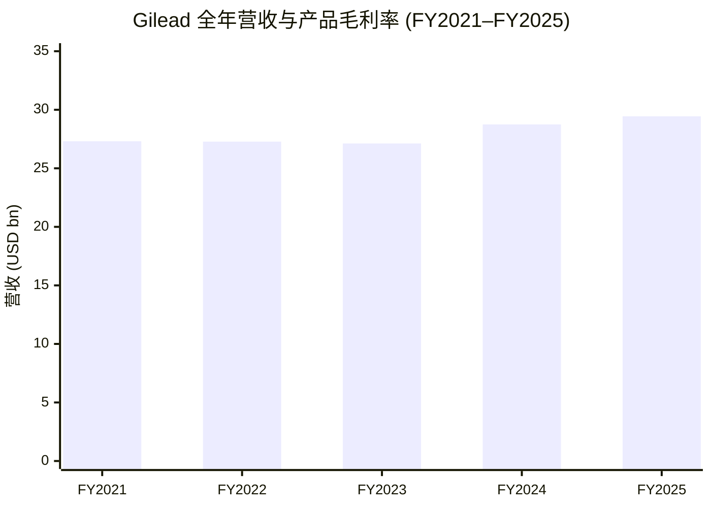
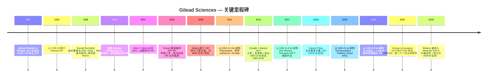
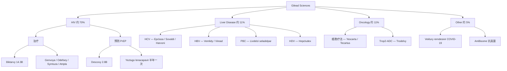
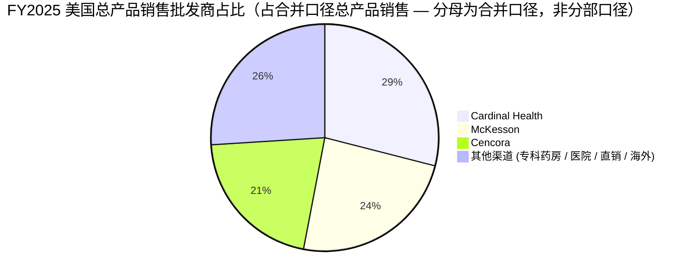
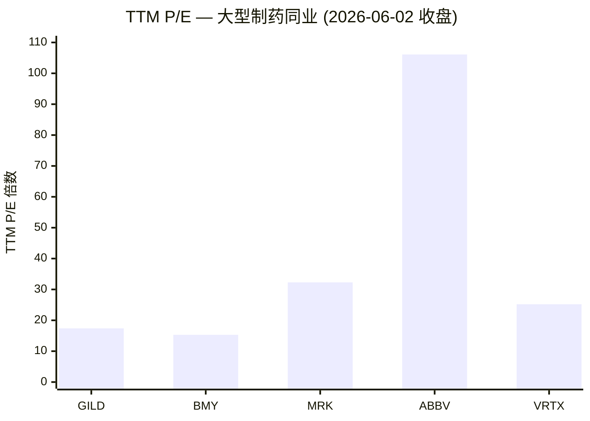

# 吉利德科学 Gilead Sciences (NASDAQ: GILD) — 公司研究报告

*报告日期：2026-06-03。股价与估值倍数均为 2026-06-02 收盘数据，特别注明除外。*

> **更新 — FY2026 全年产品销售指引上调（2026-05-07）：** 公司将 2026 年全年**产品销售指引上调至 USD 30.0–30.4 bn（原 USD 29.6–30.0 bn）**，同步公布 Q1 2026 营收 **USD 6.96 bn (+4% YoY)**，其中 Biktarvy USD 3.4 bn，Yeztugo（lenacapavir HIV PrEP 长效预防针剂）在上市第二个商业季度爬坡至 USD 166 m (+72% QoQ)。上调指引的主因是美国 PrEP 业务在 Yeztugo 上市拉动下 **同比 +87%**，叠加 Descovy 持续放量。资料来源：[Gilead Q1 2026 业绩公告 (8-K 99.1), 2026-05-07](https://www.sec.gov/Archives/edgar/data/882095/000088209526000022/exhibit991earningspressrel.htm)、[Gilead Q1 2026 业绩电话会会议纪要, 2026-05-08](https://www.fool.com/earnings/call-transcripts/2026/05/08/gilead-gild-q1-2026-earnings-call-transcript/)、[TIKR Q1-2026 摘要, 2026-05-08](https://www.tikr.com/blog/gilead-sciences-beat-q1-2026-earnings-and-raised-guidance-why-is-gild-stock-still-down-17)。

---

## 目录

1. 公司概览
2. 公司历史
3. 管理团队
4. 产品与服务
5. 客户与上市策略
6. 行业概览
7. 竞争格局
8. 市场机会 (TAM)
9. 风险评估
10. 投资视角评分 (Investor-lens Scorecards)
- 数据来源清单
- 参考资料

---

## 1. 公司概览

**Gilead 是一家专科生物制药 (specialty biopharma) 公司**，总部位于美国加州 Foster City 的 333 Lakeside Drive，2025 年底全球员工约 17,000 人，产品组合围绕三大治疗领域组织：**HIV 治疗与预防 (HIV treatment & prevention)、肝病 (Liver Disease：HCV / HBV / HDV / PBC) 和肿瘤 (Oncology：细胞疗法与抗体药物偶联物 ADC)**，加上若干非核心 "Other" 产品（Veklury、AmBisome 等）([Gilead 2025 10-K, Item 1 — Business 概览与人力资源章节](https://www.sec.gov/Archives/edgar/data/882095/000088209526000006/gild-20251231.htm))。公司在 GAAP 上仅披露一个经营分部，但按治疗领域口径披露收入；HIV 是绝对主力，约占产品销售的 70%。

**FY2025 关键数字：总收入 USD 29.443 bn (+2% YoY)，总产品销售 USD 28.915 bn (+1% YoY)**。按治疗领域分：HIV USD 20.752 bn (+6%)，Liver Disease USD 3.217 bn (+6%)，Oncology USD 3.236 bn (−2%)，Veklury USD 911 m (−49% — 因 COVID-19 住院率回落至正常水平)，Other USD 799 m (−10%)([Gilead 2025 10-K, MD&A 经营业绩 — 收入分解表](https://www.sec.gov/Archives/edgar/data/882095/000088209526000006/gild-20251231.htm))。地理分布：**美国 USD 20.816 bn (72%)，欧洲 USD 4.617 bn (16%)，其他 USD 3.483 bn (12%)** — 美国占比高反映 HIV 业务在美国市场集中度高。约 26% 产品销售以非美元计价（主要为欧元）。

**商业模式 — 典型的专科药企：** 内部发现或外部 in-licensing 新型小分子 / 生物药 / 细胞疗法 → Gilead 自主推进临床（广泛使用 CRO）→ 在美国、欧洲及主要海外市场通过自有销售团队商业化 → 在专利保护内（往往附带 Orphan / Breakthrough 资格）享受定价权，直到专利失效 (Loss of Exclusivity, LOE) 触发阶梯式下调。美国分销集中度非常高 —— 10-K 原文：*"approximately 90% of our gross product sales in the U.S. have been to three large wholesalers — Cardinal Health, Inc., Cencora, Inc. and McKesson Corporation"*（美国约 90% 的总产品销售经由三大批发商：Cardinal Health、Cencora、McKesson 及其专科分销子公司流转）([Gilead 2025 10-K, Item 1 — Sales and Distribution 章节](https://www.sec.gov/Archives/edgar/data/882095/000088209526000006/gild-20251231.htm))。**这是物流通道集中度 (logistical pass-through concentration)，不是终端用户集中度** — 三大批发商不决定终端价格与处方集 (formulary) 准入，仅承担约 30 天的库存周转。终端需求高度分散，分布在数十万 HIV 专科医生、感染科医生、肝病科医生、肿瘤医生及医院药房。

**盈利能力高且稳定。** FY2025 产品毛利率 78.4% (vs FY2024 78.2%)，研发费用 USD 5.799 bn (营收占比 ~20%)，SG&A USD 5.774 bn (占比 ~20%)，**归属 Gilead 净利润 USD 8.510 bn，摊薄 EPS USD 6.78** — 较 FY2024 EPS USD 0.38 大幅增长，但 FY2024 基数受 USD 3.8 bn CymaBay 已购入 IPR&D (acquired in-process research and development, 已收购在研项目) 费用与 USD 4.2 bn Immunomedics IPR&D 减值压制。FY2025 经营现金流支撑 **USD 3.00/股股息（合计宣派 USD 3.814 bn）+ USD 1.0 bn 股票回购 (均价 USD 79.52)**([Gilead 2025 10-K, 股东权益合并表](https://www.sec.gov/Archives/edgar/data/882095/000088209526000006/gild-20251231.htm))。

**估值快照（2026-06-02 收盘）：** GILD 股价 **USD 127.57，市值 USD 158.4 bn，TTM P/E 17.4×，前瞻 P/E 70.8×，TTM P/S 5.33×，EV/EBITDA 11.5×，股息率 2.57%**，流通股约 12.4 亿股 ([StockAnalysis.com — GILD 估值数据, 2026-06-02](https://stockanalysis.com/stocks/gild/statistics/))。TTM P/E (17.4×) 与前瞻 P/E (70.8×) 的巨大差距来自卖方建模口径 — 预期 2026 年还有大额 IPR&D 与一次性支出（很可能与 Arcellx 交易相关）压低 EPS，剔除一次性后前瞻 P/E 收敛到接近 20× 水平，详见风险章节 (Risk #11)。**同业可比 TTM 倍数（2026-06-02）：** AbbVie P/E 106.1× / P/S 6.06×（Humira LOE 业绩低谷 + 商誉摊销） ([StockAnalysis.com — ABBV](https://stockanalysis.com/stocks/abbv/statistics/))；Bristol-Myers Squibb P/E 15.3× / P/S 2.29×（Revlimid / Eliquis LOE 在途）([StockAnalysis.com — BMY](https://stockanalysis.com/stocks/bmy/statistics/))；Merck P/E 32.3× / P/S 4.34× (Keytruda 持续放量) ([StockAnalysis.com — MRK](https://stockanalysis.com/stocks/mrk/statistics/))；Vertex P/E 25.2× / P/S 8.83× (CF 囊性纤维化主业 + Casgevy 基因疗法) ([StockAnalysis.com — VRTX](https://stockanalysis.com/stocks/vrtx/statistics/))。在此组中，GILD 的 TTM 倍数与大型成熟制药中位接近，相对专科 / Orphan 生物科技有折价，反映其 **中个位数增长 + 高现金流的防御型 (mid-single-digit-growth, high-cash-flow defensive) 定位**，且市场已部分计入 Biktarvy 2028 年 Medicare 价格谈判落地的折价（见第 9 章风险 #5）。

*柱状：总营收（USD bn）；折线：产品毛利率（参考量纲，约 78–80%）。资料来源：[Gilead 2025 10-K, MD&A 经营业绩章节](https://www.sec.gov/Archives/edgar/data/882095/000088209526000006/gild-20251231.htm) 与历年 10-K（[EDGAR CIK 0000882095](https://www.sec.gov/cgi-bin/browse-edgar?action=getcompany&CIK=0000882095&type=10-K)）。*

---

## 2. 公司历史

Gilead 于 **1987 年 6 月** 由 **Michael L. Riordan 医生**（时年 29 岁，约翰霍普金斯医学院 MD + 哈佛 MBA，时任 Menlo Ventures Associate）在加州 Foster City 创立 ([Founder Stories: Michael Riordan, Founder of Gilead Sciences](https://goit.science/founder-stories-michael-riordan-founder-of-gilead-sciences/); [Wikipedia — Gilead Sciences 历史条目](https://en.wikipedia.org/wiki/Gilead_Sciences))。公司最初注册名为 **Oligogen**（中文：寡基因），是 Riordan 在解决 *Gilead* 商标转让纠纷期间使用的过渡名（最终以 USD 1,000 慈善捐款换得加州一家非营利机构的商标授权），Menlo Ventures 领投种子轮 USD 2 m，创始科学顾问团包括 Caltech 的 Peter Dervan、Harvard 的 Doug Melton 和 Fred Hutchinson 癌症中心已故的 Harold Weintraub ([FundingUniverse — Gilead Sciences 公司史](https://www.fundinguniverse.com/company-histories/gilead-sciences-inc-history/))。原始的科学命题是 **反义寡核苷酸 (antisense oligonucleotides)** 作为靶向抗病毒 / 抗肿瘤药物 — 这一命题在商业上未能成功，但奠定了 Gilead 后来三十年的核心能力 — **核苷酸 / 核苷化学与抗病毒机制专长**。

*资料来源：[Gilead Sciences — Wikipedia](https://en.wikipedia.org/wiki/Gilead_Sciences)、[FundingUniverse — Gilead 公司史](https://www.fundinguniverse.com/company-histories/gilead-sciences-inc-history/)、[Gilead 2018 年 CEO 任命新闻稿](https://www.gilead.com/news-and-press/press-room/press-releases/2018/12/gilead-sciences-names-daniel-oday-chairman-and-chief-executive-officer)、[Gilead 2025 10-K, Item 1 — IRA 价格谈判章节](https://www.sec.gov/Archives/edgar/data/882095/000088209526000006/gild-20251231.htm)、[FDA approves Gilead HIV prevention injection lenacapavir — CNBC, 2025-06-18](https://www.cnbc.com/2025/06/18/fda-approves-gilead-hiv-prevention-injection-lenacapavir.html)。*

定义现代 Gilead 的三次重大转型，每次都由一笔大手笔的并购触发。**第一次：2001 年新任 CEO John C. Martin 将战略重心转向 HIV**，以 1999 年 NeXstar 收购（带来 AmBisome）和从捷克化学家 Antonín Holý 处 in-licensing 的替诺福韦为起点，相继推出 Viread → Truvada → 一系列单片三联方案 (Atripla / Complera / Stribild / Genvoya / Odefsey / Biktarvy)，将一个 2000 年营收仅约 USD 100 m 的公司打造成 2010 年代初期约 USD 11 bn 的 HIV 业务巨头 ([encyclopedia.com — Gilead 公司史](https://www.encyclopedia.com/books/politics-and-business-magazines/gilead-sciences-inc))。**第二次：2011 年以 USD 11.2 bn 收购 Pharmasset** 带来 sofosbuvir，奠定了 Sovaldi / Harvoni / Epclusa 治愈型 HCV 方案的底座 — 这些方案以 >95% 的持续病毒学应答率治愈慢性丙型肝炎 (HCV)，触发了药史上最快的营收爬升之一：公司总营收 2013 年 USD 11 bn → 2015 年 USD 32 bn，随后因 HCV 治愈机制本身缩小了在治人群池而开始回落 ([Gilead 2025 10-K, Liver Disease 收入趋势](https://www.sec.gov/Archives/edgar/data/882095/000088209526000006/gild-20251231.htm))。**第三次：2017 年以 USD 11.9 bn 收购 Kite Pharma 获得 Yescarta CAR-T，2020 年以 USD 21 bn 收购 Immunomedics 获得 Trodelvy**，搭建了肿瘤业务平台 — 该业务今日贡献 USD 3.236 bn 产品销售，但毛利率低于公司均值，且竞争压力日益加剧（见第 7 章）。

近期 2024–2026 年间的关键变化集中在两条主线。其一，**2024 年 USD 4.3 bn 收购 CymaBay** 带来 seladelpar（现以 Livdelzi / Lyvdelzi 商品名上市），用于治疗原发性胆管炎 (PBC, 原发性胆汁性胆管炎)，是十年来 PBC 的首个新机制药物，贡献了 FY2025 "其他肝病" 收入 +87% YoY 的增长。其二，**2025 年 6 月 18 日 FDA 批准 Yeztugo (lenacapavir for PrEP)**，是十年间最重要的新上市 — 美国首个且唯一的半年一次皮下注射 HIV 预防方案 (twice-yearly subcutaneous PrEP)，在 PURPOSE-1 与 PURPOSE-2 三期临床中实现 ≥99.9% 的预防效力 (efficacy)，美国挂牌价 USD 28,218/年 ([Gilead 2025 10-K, Item 1 — Liver Disease 与 HIV Pipeline 章节](https://www.sec.gov/Archives/edgar/data/882095/000088209526000006/gild-20251231.htm); [FDA approves Gilead HIV prevention injection lenacapavir — CNBC, 2025-06-18](https://www.cnbc.com/2025/06/18/fda-approves-gilead-hiv-prevention-injection-lenacapavir.html); [Yeztugo press release, 2025-06-18](https://www.gilead.com/news/news-details/2025/yeztugo-lenacapavir-is-now-the-first-and-only-fda-approved-hiv-prevention-option-offering-6-months-of-protection))。其三，**HHS 于 2026 年 1 月将 Biktarvy 选入 Medicare 价格谈判第二批次 (Cycle 2)**，谈判后的最高公平价格 (Maximum Fair Price, MFP) 将自 2028 年生效 — 这是当前股价讨论中最大的结构性逆风 ([Gilead 2025 10-K, Item 1 — IRA 价格谈判章节](https://www.sec.gov/Archives/edgar/data/882095/000088209526000006/gild-20251231.htm))。

---

## 3. 管理团队

**Daniel P. O'Day，董事长兼首席执行官（61 岁，2019 年 3 月上任）。** O'Day 在 2019 年 3 月从 Roche（罗氏）加入 Gilead，此前在罗氏服务**逾三十年**，跨越制药与诊断两大事业部，最终担任 **罗氏制药 (Roche Pharmaceuticals) 全球 CEO（2012–2018 年）** 并任罗氏公司执行委员会成员 ([Gilead 官网 — Daniel O'Day 高管页面](https://www.gilead.com/company/leadership/daniel-oday); [Gilead 2018-12-10 任命公告](https://www.gilead.com/news-and-press/press-room/press-releases/2018/12/gilead-sciences-names-daniel-oday-chairman-and-chief-executive-officer); [BioSpace — Gilead taps Roche veteran Daniel O'Day, 2018-12](https://www.biospace.com/gilead-taps-roche-veteran-daniel-o-day-as-new-ceo))。在罗氏期间，他执掌全球最大的肿瘤药物特许经营线 (Avastin / Herceptin / Rituxan / Perjeta / Kadcyla / Tecentriq)，并在出任制药 CEO 前两年还领导过罗氏诊断事业部 (Roche Diagnostics)。他于 1987 年加入罗氏，1998 年起常驻巴塞尔总部，履历组合横跨北美 / 欧洲 / 亚洲三大区，集大分子肿瘤药商业化、体外诊断规模化、全球分布于一身 ([Gilead 官网 leadership 页](https://www.gilead.com/company/leadership/daniel-oday); [pharmaphorum — Gilead hires Roche's pharma chief, 2018-12](https://pharmaphorum.com/news/gilead-hires-roches-pharma-chief-daniel-oday-as-ceo))。学历：**乔治城大学生物学学士 + 哥伦比亚商学院 MBA**。外部董事会经历包括 Genentech、Flatiron Health、Foundation Medicine（均为罗氏体系内子公司）；曾任欧洲制药企业协会 (EFPIA) 主席 ([Gilead leadership page](https://www.gilead.com/company/leadership/daniel-oday))。在 Gilead 同时担任董事长 ([Gilead 2025 10-K, Executive Officers 与 Directors 表](https://www.sec.gov/Archives/edgar/data/882095/000088209526000006/gild-20251231.htm))。

O'Day 七年任期内的三大可观察特征。**其一，并购策略向更小型、治疗领域更聚焦的交易转移** — 较公司过往三大代表性巨额并购（Pharmasset、Kite、Immunomedics）规模显著缩小，2024 CymaBay (USD 4.3 bn) 与 2026 Arcellx (后续事件) 是此模板；同时拓宽内部 R&D 管线，将研发覆盖从历史的 HIV / Liver / Oncology 三大领域延伸至 **炎症 (inflammation)** 领域 ([Gilead 2025 10-K, Pipeline 概述与 CymaBay 披露](https://www.sec.gov/Archives/edgar/data/882095/000088209526000006/gild-20251231.htm))。**其二，强调营运费用纪律 (operating-expense discipline)** — 在 Yeztugo 上市增加销售费用的同时，FY2025 SG&A 仍同比下降 5% 至 USD 5.774 bn，R&D 持平于 USD 5.799 bn (−2% YoY)，相对同业仍在持续追加投入的态势属于克制派 ([Gilead 2025 10-K, MD&A 营业费用章节](https://www.sec.gov/Archives/edgar/data/882095/000088209526000006/gild-20251231.htm))。**其三，股东回报稳定** — FY2025 宣派股息 USD 3.00/股、股票回购 USD 1.0 bn，股息已连续八年上调。根据 2026 年代理征求声明 (DEF 14A)，他个人持股 + 行权期权远低于大型 Big Pharma CEO 中位数，绝大多数薪酬以基于业绩的限制性股票单位 (Performance Share Units, PSU) 形式发放 ([Gilead 2026 DEF 14A 高管薪酬讨论分析](https://www.sec.gov/cgi-bin/browse-edgar?action=getcompany&CIK=0000882095&type=DEF+14A))。

**创始人说明。** 1987 年创立公司的 Michael L. Riordan 在 1996 年离开 Gilead，至今近三十年未在公司担任高管或董事职务；继任创始时期 CEO 的 John C. Martin 于 2018 年退休，亦不再担任运营角色 ([Wikipedia — Gilead Sciences 高管沿革](https://en.wikipedia.org/wiki/Gilead_Sciences))。创始人对今日公司最持久的影响是早期 Gilead 沉淀的抗病毒化学专长 (antiviral chemistry expertise) — 从 Viread (2003) → Biktarvy (2018) → Yeztugo (2025) 实质上是同一条 Foster City 抗病毒发现引擎三十年来的连续输出。

---

## 4. 产品与服务

Gilead 的产品组合按 10-K 的四大治疗领域划分：**HIV (治疗 + 预防)、Liver Disease (HCV / HBV / HDV / PBC)、Oncology (细胞疗法 + ADC)、Other (Veklury + 传统非核心产品：AmBisome / Letairis / Zydelig)**。下表是 10-K 上市产品表 + FY2025 收入贡献的合并版本。

### 4.1 10-K 上市产品矩阵（FY2025 产品销售，USD m）

| 治疗领域 | 产品 | 适应症 (10-K 原文) | FY2025 销售额 (USD m) | YoY |
|---|---|---|---:|---:|
| **HIV — 治疗** | Biktarvy® (BIC/FTC/TAF) | 成人及部分儿童 HIV-1 治疗 | 14,334 | +7% |
| | Genvoya® (EVG/c/FTC/TAF) | 成人及青少年 HIV-1 治疗 | 1,498 | −15% |
| | Odefsey® (RPV/FTC/TAF) | 成人及青少年 HIV-1 治疗 | 1,167 | −9% |
| | Symtuza® — 收入分成 (DRV/c/FTC/TAF) | 与 Janssen 合作单片方案 | 495 | −16% |
| | 其他 HIV (Atripla / Complera / Emtriva / Stribild / Sunlenca / Truvada / Tybost / Yeztugo) | 多项 | 500 | +15% |
| **HIV — 预防** | Descovy® (FTC/TAF) | 成人及青少年 PrEP (HIV-1 暴露前预防) | 2,758 | +31% |
| | Yeztugo® / Yeytuo® (lenacapavir) | 半年一次皮下注射 PrEP，2025-06 获批 | 已计入 "其他 HIV" 行 | n/a |
| **Liver Disease — HCV** | Epclusa® (SOF/VEL) | 成人 / ≥3 岁儿童全基因型 HCV | 1,272 | −20% |
| | Vemlidy® (TAF 单药) | 成人慢性 HBV | 1,070 | +12% |
| | 其他 Liver (Harvoni / Hepcludex / Hepsera / Livdelzi/Lyvdelzi / Sovaldi / Viread / Vosevi) | HBV/HCV/HDV/PBC 多项 | 874 | +87% |
| **Oncology — 细胞疗法** | Yescarta® (axi-cel) | LBCL 二线以上；FL 三线以上 | 1,495 | −5% |
| | Tecartus® (brexu-cel) | 复发难治 MCL；成人 B-ALL | 344 | −15% |
| **Oncology — ADC** | Trodelvy® (sacituzumab govitecan) | mTNBC ≥2L；HR+/HER2− mBC ≥2L；UC | 1,397 | +6% |
| **Other** | Veklury® (remdesivir) | 住院 COVID-19 成人 / 部分儿童 | 911 | −49% |
| | AmBisome® (脂质体两性霉素 B) | 侵袭性真菌感染 | 509 | −5% |
| | 其他 (Cayston / Jyseleca / Letairis / Zydelig) | 多项 | 290 | −19% |
| **产品销售合计** | | | **28,915** | **+1%** |

*资料来源：[Gilead 2025 10-K, Item 1 上市产品 + Item 7 MD&A 收入分解表](https://www.sec.gov/Archives/edgar/data/882095/000088209526000006/gild-20251231.htm)。*

*遗留图表：按治疗领域的营收构成。数据来源：[Gilead 2025 10-K MD&A](https://www.sec.gov/Archives/edgar/data/882095/000088209526000006/gild-20251231.htm)（最新 FY2025 拆分以 4.1 节的表格为准）。*

### 4.2 综合：四大业务如何拼成一家公司

可以把 Gilead 看成 **两条相邻护城河 (two adjacent moats) 拼接在一起，外加两条小业务挂在边上**。**护城河 1：HIV。** 二十年的核苷酸 / 核苷酸类反转录酶抑制剂 (NRTI / NtRTI) 抗病毒化学领导力，覆盖治疗（Biktarvy 在美国 HIV 治疗市场占有率 >52%，详见第 7 章）与预防（Descovy + Yeztugo）。该业务贡献 70% 产品销售，毛利率全公司最高。**护城河 2：HCV / HBV。** 以 sofosbuvir 为基础的治愈型 HCV 方案定义了现代 HCV 治疗范式；这一业务因治愈本身导致的存量人群池缩小而结构性下滑，但 HBV 单药 (Vemlidy) 与新近上市的 PBC 资产 (Livdelzi) 提供部分对冲。**相邻业务：肿瘤。** Yescarta + Tecartus 奠定 Gilead 在 CAR-T 领域的地位；Trodelvy 是唯一已上市的 Trop2 ADC。两者均面临持续上升的竞争压力（详见第 7 章）。**尾部：COVID 时代 + 历史感染病。** Veklury 收割了疫情红利，目前处于结构性下滑；AmBisome 与若干长尾孤儿 / 利基产品构成 "其他" 池，贡献温和现金流但无增长动能。FY2025 上市的 Yeztugo 是十年间 HIV 预防领域首个里程碑式新机制创新，是 FY2026 业绩的最大边际驱动。

*资料来源：[Gilead 2025 10-K, Item 1 上市产品 + Item 7 收入分解](https://www.sec.gov/Archives/edgar/data/882095/000088209526000006/gild-20251231.htm)。*

### 4.3 HIV (定义公司本质的业务)

10-K 对核心产品 Biktarvy 的官方描述：*"Biktarvy® is an oral formulation of a once-daily single-tablet regimen of bictegravir, emtricitabine and tenofovir alafenamide (BIC/FTC/TAF) for the treatment of HIV-1 infection in adults and certain children"*（Biktarvy 是 bictegravir + emtricitabine + tenofovir alafenamide 三组分的每日一次单片口服方案，用于成人及部分儿童 HIV-1 治疗）([Gilead 2025 10-K, Item 1 Business — HIV Treatment](https://www.sec.gov/Archives/edgar/data/882095/000088209526000006/gild-20251231.htm))。

**中文释义 / Plain-language gloss:** Biktarvy 是美国 HIV 治疗市场的绝对领导者，约半数美国抗逆转录病毒治疗 (antiretroviral therapy, ART) 患者用此方案。机制层面，它将两个 NRTI（FTC + TAF，作为 "骨架 (backbone)"）与 **整合酶链转移抑制剂 (Integrase Strand-Transfer Inhibitor, INSTI)** bictegravir 组合 — INSTI 是当前全球 HIV 一线治疗的主导机制，Gilead 与 ViiV (GSK) 过去十年在这个机制上正面竞争。Biktarvy FY2025 销售额上涨 7% 至 **USD 14.334 bn，主要因销量增长，部分被美国 Medicare Part D 重新设计 (Medicare Part D Redesign) 导致的实际净价 (net realized price) 下降抵消**；同时该方案持续从 Gilead 自身较旧方案 (Genvoya / Odefsey) 与 ViiV 的 Triumeq 处吸取份额。**关键风险：HHS 已于 2026 年 1 月将 Biktarvy 列入 Medicare 价格谈判第二批次，谈判后的 MFP 自 2028 年生效** — 这是 GILD 估值中最大的结构性逆风，也是看空逻辑的核心。

*分析师观点 (Analyst view):* Biktarvy 的护城河来自：(a) 耐受性 (tolerability) — TAF 骨架在肾脏与骨密度方面优于上一代 TDF 而取代之；(b) 每日一次单片便利性；(c) 在美国 Medicaid / Medicare / 商保 / Ryan White / 340B 五大渠道的处方集渗透深度；(d) 大量真实世界疗效数据 (real-world evidence)。**最直接的竞争对手** 是 ViiV Healthcare（GSK 控股、与 Pfizer / Shionogi 合资的 HIV 专科公司），其 **Triumeq (dolutegravir/abacavir/lamivudine 三组分) 和 Cabenuva (cabotegravir + rilpivirine 两月一次肌注 (IM) 长效注射)** 是 Biktarvy 在治疗端的核心威胁 ([ViiV — Cabenuva](https://viivhcmedinfo.com/our-hiv-medicines/cabenuva/); [EACS 2025 — cabotegravir vs lenacapavir 耐受性对比 — EATG, 2025-10](https://www.eatg.org/hiv-news/eacs-2025-are-cabotegravir-injections-more-tolerable-than-lenacapavir/))。

*遗留图表：HIV 业务细分。数据来源：[Gilead 2025 10-K MD&A — HIV 章节](https://www.sec.gov/Archives/edgar/data/882095/000088209526000006/gild-20251231.htm)。*

10-K 对 HIV 预防核心产品 Descovy 的描述：*"Descovy® (FTC/TAF) is an oral formulation indicated as a complete regimen for the treatment of HIV-1 infection in adults and adolescents weighing at least 35 kg ... for pre-exposure prophylaxis (PrEP) in at-risk adults and adolescents who are at risk for HIV-1 acquisition"*（Descovy 是 FTC + TAF 口服方案，可用于体重 ≥35kg 成人及青少年 HIV-1 治疗以及高暴露风险人群 PrEP）([Gilead 2025 10-K, Item 1 Business — HIV Prevention](https://www.sec.gov/Archives/edgar/data/882095/000088209526000006/gild-20251231.htm))。

**中文释义 / Plain-language gloss:** Descovy 是每日口服 PrEP 方案 (FTC/TAF；TAF 骨架)，是早期 Truvada (FTC/TDF) 的换代产品。FY2025 销售额上涨 **31% 至 USD 2.758 bn，主因需求增加且实际净价提升**；在 Q1 2026 美国 PrEP 业务整体 **+87% YoY** 的拉动中，Yeztugo 上市并未蚕食 Descovy，而是 **共同扩大了 PrEP 整体在治人群池** ([Gilead 2025 10-K, MD&A — HIV 章节](https://www.sec.gov/Archives/edgar/data/882095/000088209526000006/gild-20251231.htm); [Gilead Q1 2026 业绩电话会会议纪要](https://www.fool.com/earnings/call-transcripts/2026/05/08/gilead-gild-q1-2026-earnings-call-transcript/))。

**Yeztugo (lenacapavir for PrEP) — 物理上做什么。** Lenacapavir 是首创 (first-in-class) HIV-1 衣壳抑制剂 (capsid inhibitor)：通过结合病毒衣壳蛋白，干扰衣壳组装、入核 (nuclear import) 及病毒复制后期等多个生命周期阶段。对 PrEP 而言，关键属性是皮下储库 (subcutaneous depot) 的药代动力学 — 每六个月在大腿两侧各注射一次 927 mg，可维持血药浓度在保护阈值之上至下一次给药。在 **PURPOSE-1 和 PURPOSE-2 三期临床中，≥99.9% 接受 lenacapavir 的受试者保持 HIV 阴性**，效力实质等同于完美依从性的每日口服 PrEP — 但只需每年两次门诊注射，而非 365 天每日一片 ([FDA approves lenacapavir — CNBC, 2025-06-18](https://www.cnbc.com/2025/06/18/fda-approves-gilead-hiv-prevention-injection-lenacapavir.html); [Yeztugo press release, 2025-06-18](https://www.gilead.com/news/news-details/2025/yeztugo-lenacapavir-is-now-the-first-and-only-fda-approved-hiv-prevention-option-offering-6-months-of-protection); [CDC MMWR — 注射型 lenacapavir 作为 HIV PrEP 的临床推荐, 2025](https://www.cdc.gov/mmwr/volumes/74/wr/mm7435a1.htm))。

*分析师观点：* PrEP 领域的竞争格局是 **Yeztugo (Gilead, 半年一次 SubQ) vs Apretude (ViiV/GSK, 两月一次 IM cabotegravir)** —— 这是美国市场仅有的两个长效 PrEP 方案。IAS 2025 的间接对比研究显示两者预防效力大致相当（Apretude 约 96–98%，Yeztugo 约 95–100%），但 Yeztugo 的半年一次频率是患者负担端的差异化优势。Gilead 同时推进 **每年一次 lenacapavir 三期项目 (once-yearly lenacapavir Phase 3)**，若获批将在剂量频率上进一步领先 ([Gilead 2025 10-K, R&D Pipeline — Phase 3 Lenacapavir 每年一次项目](https://www.sec.gov/Archives/edgar/data/882095/000088209526000006/gild-20251231.htm); [Indirect comparison — Managed Healthcare Executive, 2025-07](https://www.managedhealthcareexecutive.com/view/indirect-comparison-shows-apretude-and-yeztugo-have-similar-efficacy-ias-2025))。

### 4.4 Liver Disease (肝病)

10-K 对核心产品 Epclusa 描述：*"Epclusa® is an oral formulation of a once-daily single-tablet regimen of sofosbuvir and velpatasvir for the treatment of chronic hepatitis C virus ('HCV') infection in adults and pediatric patients 3 years of age and older with genotype 1, 2, 3, 4, 5 or 6"*（每日一次单片 sofosbuvir + velpatasvir 方案，用于成人及 ≥3 岁儿童全 6 基因型慢性 HCV 感染治疗），并补充 Vemlidy（TAF 单药）用于慢性 HBV ([Gilead 2025 10-K, Item 1 Business — Liver Disease](https://www.sec.gov/Archives/edgar/data/882095/000088209526000006/gild-20251231.htm))。

**中文释义 / Plain-language gloss:** Sofosbuvir 基础治愈型方案是 2010 年代制药行业最大的单一治疗范式革命 — 首次让一种慢性、进行性病毒感染（HCV 是美国肝移植的主要原因）变得可被清晰治愈，治疗 8–12 周即可实现持续病毒学应答 (Sustained Virologic Response, SVR) >95%。其结构性后果是 **需求自我消耗 (demand exhaustion)**：被治愈的患者退出了治疗池，存量人群池随之缩小。Epclusa FY2025 收入下降 20% 至 USD 1.272 bn，延续多年下滑趋势 — 这是业务本身成功的固有副产品，并非市场份额流失 ([Gilead 2025 10-K, MD&A — Liver Disease 章节](https://www.sec.gov/Archives/edgar/data/882095/000088209526000006/gild-20251231.htm))。对冲来自 **非 HCV 肝病** ：Vemlidy +12% 至 USD 1.070 bn (慢性 HBV)，"其他肝病" 行 **+87% YoY 至 USD 874 m**（Livdelzi 上市拉动 PBC 业务）。

*分析师观点：* 肝病业务竞争格局好坏参半。HCV 端，剩下的主要对手是 AbbVie 的 Mavyret (glecaprevir/pibrentasvir)，Gilead 和 AbbVie 分食残余治愈人群池。HBV 端，Vemlidy 主要对手是仿制 TDF（上一代骨架），新机制尚未上市。**PBC 业务**（Livdelzi vs Ipsen / Eisai 的 Iqirvo vs Intercept 的 Ocaliva）是 Gilead 真正在搭建的新业务，也是看多 "Biktarvy 之后增长故事" 论点的核心元素之一。

### 4.5 Oncology — 细胞疗法与 ADC

10-K 对 Yescarta 的描述：*"Yescarta® (axicabtagene ciloleucel) is a CD19-directed genetically modified autologous T cell immunotherapy for the treatment of adult patients with relapsed or refractory large B-cell lymphoma"*；对 Trodelvy：*"Trodelvy® (sacituzumab govitecan-hziy) is a Trop-2-directed antibody and topoisomerase inhibitor conjugate"* ([Gilead 2025 10-K, Item 1 Business — Oncology](https://www.sec.gov/Archives/edgar/data/882095/000088209526000006/gild-20251231.htm))。

**中文释义 / Plain-language gloss:** Yescarta 与 Tecartus 是 **CAR-T 细胞疗法 (Chimeric Antigen Receptor T-cell Therapy)** — 体外提取患者自体 T 细胞，基因改造使其表达靶向 CD19（B 细胞系表面标志）的嵌合抗原受体，体外扩增后回输杀伤恶性 B 细胞。这是 **"活的药" (living drugs)**，每个患者一份制造，从采血到回输需 14–17 天；必须在住院或专业治疗中心使用，输注后需密切监测 **细胞因子释放综合征 (cytokine-release syndrome, CRS)**。Yescarta 目前在二线以上大 B 细胞淋巴瘤 (LBCL) 市场是份额领导者，但面临 **Bristol-Myers Squibb (BMS) 的 Breyanzi (lisocabtagene maraleucel)** 与 **Johnson & Johnson / Legend 的 Carvykti (cilta-cel, BCMA 靶向多发性骨髓瘤)** 的竞争。10-K 原文披露：FY2025 细胞疗法收入下降 7% 至 USD 1.839 bn，反映 *"ongoing competitive headwinds"* (持续的竞争逆风) ([Gilead 2025 10-K, MD&A — Oncology 章节](https://www.sec.gov/Archives/edgar/data/882095/000088209526000006/gild-20251231.htm))。

Trodelvy 是 **首个且唯一上市的 Trop2 抗体药物偶联物 (Trop2 Antibody-Drug Conjugate, ADC)**，由 sacituzumab（抗 Trop2 IgG1）经可水解 linker (连接子) 偶联到 govitecan (irinotecan 活性代谢物 SN-38，拓扑异构酶 I 抑制剂)。商业定位在 **二线以上转移性三阴性乳腺癌 (mTNBC)** 与 **内分泌治疗失败后的 HR+/HER2− 转移性乳腺癌**。FY2025 销售上涨 6% 至 USD 1.397 bn ([Gilead 2025 10-K, MD&A](https://www.sec.gov/Archives/edgar/data/882095/000088209526000006/gild-20251231.htm))。

*分析师观点：* Trodelvy 正受到 **AstraZeneca / Daiichi Sankyo (第一三共) 的 Datroway (datopotamab deruxtecan)** 的强力挑战 — 这是另一个 Trop2 ADC，使用 deruxtecan 弹头化学。ESMO 2025 一线 mTNBC 的头对头读出显示 Datroway 在免疫治疗失败患者的 **总生存期 (overall survival, OS)** 上可能占优，但 Trodelvy 仍保有已建立的二线以上地位，且 ASCENT-04 三期研究中 Trodelvy + Keytruda 一线 PD-L1+ TNBC 联合用药获得了无进展生存期 (PFS) 阳性读出 ([ESMO 2025: AZ / Daiichi 的 Datroway 优于 Trodelvy — Fierce Pharma, 2025-10](https://www.fiercepharma.com/pharma/az-daiichi-datroway-outshines-gilead-trodelvy-first-global-trop2-showdown); [ASCO Trodelvy + Keytruda ASCENT-04 — Fierce Pharma, 2025-05](https://www.fiercepharma.com/pharma/gilead-bolsters-trodelvy-triple-negative-breast-cancer-practice-changing-keytruda-combo-win))。10-K 中标记 *"FDA decisions related to two first-line breast cancer therapies and an additional HIV treatment option"* (两个一线乳腺癌疗法 + 一个 HIV 治疗方案的 FDA 决定) 为 2026 年关键催化事件，前两者都是 Trodelvy 适应症扩展的提交 ([Gilead 2025 10-K, Item 1 — 2026 R&D 预期](https://www.sec.gov/Archives/edgar/data/882095/000088209526000006/gild-20251231.htm))。

### 4.6 其他 — Veklury 与传统底盘

10-K 将 Veklury (remdesivir，瑞德西韦) 列在三大核心治疗领域之外的 "其他" 类别。FY2025 销售 **下降 49% YoY 至 USD 911 m，反映 COVID-19 住院率回落至正常水平**；10-K 明确指引 FY2026 将继续下降 ([Gilead 2025 10-K, MD&A — Veklury 章节](https://www.sec.gov/Archives/edgar/data/882095/000088209526000006/gild-20251231.htm))。AmBisome（脂质体两性霉素 B，治疗侵袭性真菌感染）是稳定的成熟抗真菌药，FY2025 贡献 USD 509 m；Letairis（肺动脉高压）与 Zydelig（CLL / iNHL 的 PI3Kδ 抑制剂）属于长尾资产，处于持续下滑通道。这些产品并非边际增长引擎，在估值模型中的角色是 **抛出现金流供 HIV / 肿瘤管线再投资**。

### 4.7 R&D 管线 — 决定 FY2027–2030 走势

10-K 的研发愿景：*"Our research and development mission is to discover and develop transformational therapies in areas of high unmet medical need. Our product development efforts are focused primarily on virology, oncology and inflammation"* (使命：在高未满足临床需求领域发现并开发变革性疗法，研发重点为病毒学、肿瘤学、炎症) ([Gilead 2025 10-K, Item 1 Business — R&D](https://www.sec.gov/Archives/edgar/data/882095/000088209526000006/gild-20251231.htm))。商业权重最大的后期项目：**(i) 每年一次 lenacapavir** (三期, HIV PrEP)；**(ii) Bictegravir + lenacapavir 口服** (三期, 病毒学抑制患者 HIV 治疗)；**(iii) 与 Merck 合作的 Islatravir + lenacapavir 口服联合** (三期, HIV 治疗)；**(iv) Trodelvy 联合用药项目** (多个一线乳腺癌适应症, 与 Keytruda 联用, FDA 决定在途)；**(v) Anito-cel (BCMA CAR-T 治疗多发性骨髓瘤)** — 通过 2026-02-23 公告的 **Arcellx 收购协议** 引入 ([Gilead 2025 10-K, R&D Pipeline + Arcellx 后续事件披露](https://www.sec.gov/Archives/edgar/data/882095/000088209526000006/gild-20251231.htm); [Gilead 8-K, 2026-02-23 — Arcellx 收购协议](https://www.sec.gov/Archives/edgar/data/0000882095/000110465926018314/tm267044d1_ex99-1.htm))。R&D 组合涵盖 **超 50 个临床阶段项目**，覆盖病毒学、肿瘤学、炎症；FY2025 R&D 支出 USD 5.799 bn，占营收 ~20%，符合 Big Pharma 研发密度的正常区间。

---

## 5. 客户与上市策略

**终端客户画像。** Gilead 的治疗领域组合决定终端需求由三类利益相关方网络驱动：(a) **HIV 处方医生** — 感染病专科医生、HIV 治疗诊所、高发人群基层全科医生，以及美国 PEPFAR / Ryan White / 340B 公共部门安全网项目；(b) **肝病科及 HCV/HBV 治疗医生** — 消化科医生、移植中心、感染病科医生；(c) **学术医学中心 + 细胞疗法资质治疗中心 (QTCs) + 社区肿瘤医生 (ADC)** ([Gilead 2025 10-K, Item 1 Business — 销售、营销与分销章节](https://www.sec.gov/Archives/edgar/data/882095/000088209526000006/gild-20251231.htm))。直销团队覆盖美国、欧洲及大部分主要海外市场；较小海外市场通过第三方分销商。

**美国分销集中度（属物流通道集中度，不是终端需求集中度）。** 三大批发商主导美国分销。10-K Note 2 收入集中度披露：*"The customers, comprised of three wholesalers, that accounted for 10% or more of our total gross product sales"* — **Cardinal Health 29% (2025), 29% (2024), 28% (2023)；Cencora 21% (2025), 21% (2024), 22% (2023)；McKesson 24% (2025), 23% (2024), 24% (2023)** — 即 **三家合计占合并口径总产品销售的 74%**，三年间稳定 ([Gilead 2025 10-K, Note 2 收入集中度表](https://www.sec.gov/Archives/edgar/data/882095/000088209526000006/gild-20251231.htm))。Item 1 业务章节原文进一步确认：*"Historically, approximately 90% of our gross product sales in the U.S. have been to three large wholesalers"*（美国总产品销售的约 90% 历史上经由三大批发商）。**关键认知：这是物流通道层的集中度，不是终端用户集中度** —— 三大批发商不议价、不决定处方集准入，仅承担约 30 天库存周转，并以约 1–2% 的毛对净 (gross-to-net) 折扣作为分销服务费收取报酬。真正的终端需求高度分散在数十万处方医生与百万级患者群中。

*资料来源：[Gilead 2025 10-K Note 2 收入集中度](https://www.sec.gov/Archives/edgar/data/882095/000088209526000006/gild-20251231.htm)。**分母 = 合并口径总产品销售（公司级）。本图为美国分销通道集中度，非终端用户集中度。***

**渠道与支付方动态。** 在美国，Gilead 的毛对净折扣 (gross-to-net deduction) 体量大且持续扩大 — 10-K 原文：*"Gross-to-net deductions as a percentage of gross product sales increased in 2025, compared to 2024, primarily due to U.S. Medicare Part D program redesign impact"* (2025 年毛对净占比较 2024 年提升，主因美国 Medicare Part D 重新设计影响)。IRA 强制要求的 Part D 重新设计 (Part D Redesign) 要求制造商在初始覆盖期支付 10% 折扣、在灾难性覆盖期支付 20% 折扣，对所有 Part D 受益人均适用（包括低收入补贴患者）([Gilead 2025 10-K, IRA 与 Part D 章节](https://www.sec.gov/Archives/edgar/data/882095/000088209526000006/gild-20251231.htm))。叠加 **340B 折扣药品计划、Medicaid 最优价 (Best Price)、PBM 返点**，使得 Biktarvy 的实际净价已比标价 (WAC, Wholesale Acquisition Cost) 低 50–60%；10-K 的 IRA 讨论明确，Biktarvy 2028 年的 Medicare MFP 折扣将 **叠加在既有折扣之上**。

**海外结构。** *"We sell and distribute our products in Europe and countries outside the U.S. where the product is approved, either through our commercial teams, third-party distributors or corporate partners"* ([Gilead 2025 10-K, Item 1 — 销售与分销章节](https://www.sec.gov/Archives/edgar/data/882095/000088209526000006/gild-20251231.htm))。在中低收入国家 (Low- and Middle-Income Countries, LMICs)，Gilead **通过自愿许可 (voluntary licensing) 允许仿制药企以低价生产和销售 Gilead 研发的抗病毒药** — 自 2011 年 Viread 自愿许可以来，Medicines Patent Pool 是这类协议的标准载体。Gilead 已宣布 Yeztugo 的 LMIC 访问扩展计划，覆盖 120 个国家通过仿制药商生产 ([Gilead 关于 lenacapavir LMIC 访问规划的官方声明, 2025](https://www.gilead.com/company/company-statements/2025/gilead-statement-on-access-planning-for-lenacapavir-for-hiv-prevention-in-low--and-middle-income-countries))。这些是 **净收入贡献低但品牌权益保护强** 的安排，是 HIV 业务在高收入市场维持定价权、同时在全球扩大访问的关键监管与声誉对冲。

*遗留图表：按地理区域的营收分布。数据来源：[Gilead 2025 10-K MD&A — 地理收入表](https://www.sec.gov/Archives/edgar/data/882095/000088209526000006/gild-20251231.htm)。*

---

## 6. 行业概览

Gilead 横跨三个增长动力、监管框架与竞争格局截然不同的细分市场。**全球 HIV 治疗与预防市场** 是最集中、对 Gilead 经济权重最大的市场。据 UNAIDS 数据，**全球约 3990 万人感染 HIV (截至 2023 年底)，其中约 3070 万人接受抗逆转录病毒治疗 (ART)**，另有约 **350 万人正在或被认为符合 PrEP 适用条件** ([UNAIDS Global HIV statistics fact-sheet, 2024](https://www.unaids.org/en/resources/fact-sheet))。HIV 抗逆转录病毒药物市场按发达市场净价大约为 USD 30–35 bn，Gilead 是全球收入份额第一，其次为 ViiV Healthcare (GSK-Pfizer-Shionogi 合资公司) 与 Merck；Bristol-Myers Squibb 已于 2014 年将其 HIV 业务出售给 ViiV，退出活跃竞争。长效预防 (long-acting prevention) 是当前最具战略意义的细分赛道 — 半年一次的 lenacapavir Yeztugo、两月一次的 cabotegravir Apretude，以及多个 4 个月 / 6 个月 / 1 年频率的下一代项目正在重塑这个此前以每日口服为定义的赛道 ([Twice-Yearly Injectable PrEP With Lenacapavir — PMC, 2025](https://pmc.ncbi.nlm.nih.gov/articles/PMC12605889/))。

**HCV / HBV 市场** 自 2014 年 sofosbuvir 上市起进入结构性下滑 — HCV 从慢性病转为可治愈感染后，每年新增可治疗人群池量级下降。从 2015 年行业峰值 USD >20 bn 的全球 HCV 收入，到 2025 年仅剩 USD 4–5 bn，主要由 Gilead Epclusa / Vosevi 和 AbbVie Mavyret 瓜分 (分析师视角，基于 Gilead 2025 10-K Liver Disease 收入趋势推断)。HBV 子市场结构不同：慢性感染、尚无治愈疗法，TAF 单药 (Vemlidy) 与仿制 TDF 主导抑制治疗，HBV 功能性治愈管线 (Vir Biotechnology / Arrowhead RNAi / Gilead 自研的 HDV 药物 Hepcludex bulevirtide) 仍处临床中期。新近凸显的 PBC 市场 (Livdelzi vs Iqirvo vs Ocaliva) 嵌套在肝病大业务内，属于 USD 1–2 bn 量级的亚专科市场，预计十年内保持高位增长。

**肿瘤细胞疗法市场** 处于上市后整合阶段。Yescarta 与 Tecartus 确立了 CAR-T 作为血液恶性肿瘤治疗手段的地位 — 在大 B 细胞淋巴瘤与套细胞淋巴瘤亚群中实现了实质性治愈效果 — 但每例 USD 40–60 万的标价及必须在 QTCs 中心给药的供应链特性限制了可治人群池。竞争玩家包括 **BMS Breyanzi (CD19 CAR-T, 用于 DLBCL/FL/CLL)、J&J / Legend Carvykti (BCMA CAR-T, 多发性骨髓瘤)**，以及 Gilead 即将通过 **Arcellx 交易引入的 anito-cel** ([Gilead 2025 10-K, R&D Pipeline — anito-cel BLA 已提交; Arcellx 后续事件披露](https://www.sec.gov/Archives/edgar/data/882095/000088209526000006/gild-20251231.htm); [J&J / Legend — Carvykti FDA 批准, 2022](https://www.fda.gov/drugs/resources-information-approved-drugs/fda-disco-burst-edition-fda-approval-carvykti-ciltacabtagene-autoleucel-treatment-adult-patients))。

**乳腺癌与尿路上皮癌的 ADC 市场** 是本十年最激烈竞争的肿瘤细分领域之一，Trop2 (Trodelvy, Datroway) 与 HER2 (Enhertu, Kadcyla) 是研究最深入的两大靶点。**Enhertu (AstraZeneca / Daiichi Sankyo)** 是全球营收最大的 ADC，是 HER2+ 和 HER2-low 转移性乳腺癌的标准治疗；**Datroway (AZ / Daiichi)** 是直接的 Trop2 竞品 ([ADCs in Breast Cancer — Pharmacy Times, 2025](https://www.pharmacytimes.com/view/adcs-in-breast-cancer-shaping-the-future-of-her2-and-trop-2-targeted-therapy))。仅乳腺癌一项的 ADC TAM 预计 2030 年达到 USD >20 bn (2025 年约 USD 8 bn)；Trodelvy 能切走多少份额取决于一线 mTNBC 与 HR+/HER2-low 适应症扩展能否落地，以及 Datroway 最终的获批标签 ([ESMO 2025 — Datroway vs Trodelvy showdown — ApexOnco, 2025-10](https://www.oncologypipeline.com/apexonco/esmo-2025-datroway-and-trodelvy-face-triple-negative-breast))。

**监管环境。** 本十年对 Gilead 影响最大的监管变化是 **美国 2022 年通胀削减法案 (Inflation Reduction Act, IRA) 的 Medicare 药品价格谈判条款**。10-K 原文：*"In January 2026, the Department of Health and Human Services selected Biktarvy for Medicare negotiation of Medicare prices that will be effective beginning in 2028, and more of our products may be selected in the future"* (2026 年 1 月，HHS 选中 Biktarvy 进入 Medicare 价格谈判，谈判价自 2028 年生效；未来可能有更多产品被选中) ([Gilead 2025 10-K, Item 1 Business — IRA 章节](https://www.sec.gov/Archives/edgar/data/882095/000088209526000006/gild-20251231.htm))。机制为 **谈判出的最高公平价格 (Maximum Fair Price, MFP) 自 2028-01-01 开始适用于 Medicare Part D 配药**；第一批次药品平均折让标价约 58% ([HHS / CMS Medicare 药价谈判项目, Cycle 1 结果, 2024](https://www.cms.gov/inflation-reduction-act-and-medicare/medicare-drug-price-negotiation))。除 Biktarvy 外，Gilead 在后续谈判轮次中的暴露取决于 Descovy / Vemlidy / Yescarta 是否满足销量 / 单一来源 / 上市年限的入选标准。340B 计划、2025 年生效的 Part D 重新设计、Medicaid 最优价、欧盟药物战略 (EU Pharmaceutical Strategy) 下的国际参考定价 (International Reference Pricing) 以及美国最高法院 2025-06-27 判决的 *Kennedy v Braidwood Management* 案（涉及 ACA PrEP 零自付覆盖强制性）共同构成了一个 **净价单边收紧** 的监管环境 ([Gilead 2025 10-K, 风险因素 — 监管与报销章节](https://www.sec.gov/Archives/edgar/data/882095/000088209526000006/gild-20251231.htm))。

---

## 7. 竞争格局

10-K 的竞争章节描述较为宏观：*"We operate in a highly competitive environment. Our products compete with other commercially available products based primarily on efficacy, safety, tolerability, acceptance by doctors, ease of patient compliance, ease of use, price, insurance and other reimbursement coverage, distribution and marketing"*（公司在高度竞争的环境中经营；产品基于疗效、安全性、耐受性、医生接受度、患者依从性、易用性、价格、保险与报销覆盖、分销与营销等维度竞争），具名的竞争对手仅限于大类（大型制药 / 生物科技公司、专科药企、学术机构、政府机构、仿制 / 生物类似药新进入者）([Gilead 2025 10-K, Item 1 Business — Competition](https://www.sec.gov/Archives/edgar/data/882095/000088209526000006/gild-20251231.htm))。各业务线的具体竞争图谱如下。

**HIV 治疗。** 本质上是 Gilead INSTI 产品组合 (Biktarvy / Genvoya / Symtuza 等) 与 ViiV Healthcare (GSK 多数控股的 HIV 合资公司) 营销的 dolutegravir 基础 INSTI 方案 (Triumeq / Dovato / Juluca) 和长效 cabotegravir+rilpivirine 注射剂 Cabenuva 之间的双寡头 (duopoly) 竞争。*分析师观点：* Biktarvy 据 Q1 2026 业绩电话会披露占有美国 HIV 治疗市场 **>52% 份额** ([Gilead Q1 2026 业绩电话会 — Biktarvy 份额讨论](https://www.fool.com/earnings/call-transcripts/2026/05/08/gilead-gild-q1-2026-earnings-call-transcript/); [TIKR Q1-2026 摘要 — Biktarvy 52% 美国 HIV 治疗份额, 2026-05-08](https://www.tikr.com/blog/gilead-sciences-beat-q1-2026-earnings-and-raised-guidance-why-is-gild-stock-still-down-17))。Merck (通过其发现的 islatravir，现与 Gilead 的 lenacapavir 合作) 是另一个战略相关角色。Biktarvy 至本世纪 30 年代初前仿制竞争有限，2028 年 Medicare MFP 是更大的阶梯式降价节点。

**HIV 预防 (PrEP)。** 图谱为 **Gilead Descovy (每日口服, FY2025 ~USD 2.8 bn) + Yeztugo (半年一次 SubQ, 2025-06 上市) vs ViiV Apretude (两月一次 IM cabotegravir, 2022 上市)**。长效赛道目前没有仿制竞争者。Descovy 面对仿制 TDF/FTC 的竞争（原版 Truvada 自 2020 年在美国失去专利保护），但凭借 TAF 安全性档案维持显著价格溢价。Yeztugo 半年一次的频率优势是与 Apretude 的核心差异化点 — 但患者偏好研究在不同人群中显示出复杂结果 ([GSK touts study showing acceptability edge for Apretude — Fierce Pharma, 2025-10](https://www.fiercepharma.com/marketing/gsk-long-acting-prep-preference-study-finds-apretude-injections-more-acceptable-preferred); [Indirect comparison — Managed Healthcare Executive, 2025-07](https://www.managedhealthcareexecutive.com/view/indirect-comparison-shows-apretude-and-yeztugo-have-similar-efficacy-ias-2025))。

**HCV / HBV。** AbbVie 的 Mavyret 是 HCV 治愈主要对手；Epclusa 和 Vosevi 覆盖剩余患者池，治愈机制本身是双方收入下行的主导力量。HBV 中，Vemlidy 当前唯一具有意义的竞争品是仿制 TDF，新机制尚无近期重大上市 (Vir Biotechnology 的 tobevibart + elebsiran 二期，Arrowhead 的 ARO-HBV 同样处于中期)。

**细胞疗法。** Yescarta 的 CD19 CAR-T 市场地位正被 **BMS Breyanzi (lisocabtagene maraleucel)** 持续侵蚀，后者于 2024 年获 3 线以上 CLL 适应症，凭借略优的安全性档案在 LBCL 蚕食份额 ([BMS — Breyanzi 适应症扩展, 2024](https://www.fda.gov/vaccines-blood-biologics/cellular-gene-therapy-products/breyanzi))。Tecartus 与 Kite 自家管线及小型竞争者竞争。多发性骨髓瘤 (MM) 领域，**J&J / Legend Biotech 的 Carvykti (cilta-cel, BCMA CAR-T)** 是市场份额主导，Gilead 通过 Arcellx 收购获得的 anito-cel 若按在途 BLA 申请获批，将与之竞争 ([J&J/Legend Carvykti FDA 标签, 2024](https://www.fda.gov/drugs/resources-information-approved-drugs/fda-disco-burst-edition-fda-approval-carvykti-ciltacabtagene-autoleucel-treatment-adult-patients); [Gilead 8-K, 2026-02-23 — Arcellx 协议](https://www.sec.gov/Archives/edgar/data/0000882095/000110465926018314/tm267044d1_ex99-1.htm))。

**Trop2 ADC。** Trodelvy 直接面对 **AstraZeneca / Daiichi Sankyo 的 Datroway (datopotamab deruxtecan)** 的竞争，后者在 ESMO 2025 一线 mTNBC 头对头数据中展现优势 OS — 但 Trodelvy 保有 2 线以上既定地位，ASCENT-04 一线 PD-L1+ TNBC + Keytruda 联用读出 PFS 阳性。Trop2 ADC 市场目前规模较小 (低单位数 USD bn)，是 HER2 之后增速最快的 ADC 子市场。

**同业估值比较。** 在大型制药同业组内，Gilead TTM 倍数与较成熟、增长较慢的名字接近：

*资料来源：[StockAnalysis.com — GILD](https://stockanalysis.com/stocks/gild/statistics/)、[BMY](https://stockanalysis.com/stocks/bmy/statistics/)、[MRK](https://stockanalysis.com/stocks/mrk/statistics/)、[ABBV](https://stockanalysis.com/stocks/abbv/statistics/)、[VRTX](https://stockanalysis.com/stocks/vrtx/statistics/), 均为 2026-06-02 数据。AbbVie TTM P/E 偏高反映 Humira LOE 业绩低谷 + 商誉摊销影响，前瞻 P/E 收敛至约 14×。Vertex 溢价反映 CF 业务领导地位 + Casgevy 上市。*

---

## 8. 市场机会 (TAM)

**HIV — 组合中最大的单一可触达机会。** 全球 HIV 抗逆转录病毒药物市场按发达市场净价计约 USD 30–35 bn (2025)，年增速低个位数，由 UNAIDS 数据中全球 ~3070 万 ART 患者支撑。两条结构性增长杠杆：**(i) 已诊断人群的 ART 渗透率提升** (UNAIDS 目标 2030 年达到 95%，目前约 76%)，对应未来五年全球 ART 起始人数 ~3–4 m 的增量；**(ii) 长效注射对 PrEP 现有用户基础的替换转换**，全球目前 ~3.5 m 人在 PrEP，相对 ~10 m 适用人群基础有 3× 扩张空间 — 长效消除了每日口服依从性这一最大障碍 ([Twice-Yearly Injectable PrEP With Lenacapavir — PMC, 2025](https://pmc.ncbi.nlm.nih.gov/articles/PMC12605889/))。Gilead 在 Biktarvy + Descovy + Yeztugo 口径下覆盖了约一半的发达市场 HIV 收入；未来五年的可获取市场 (Serviceable Obtainable Market, SOM) 取决于 Biktarvy MFP 阶梯降的幅度 (2028+) 及 Yeztugo PrEP 用户基础扩张速度。

**Liver Disease — 小且持续下行的 HCV 池 + 增长中的 PBC / HBV 池。** HCV 治愈市场处于消耗期 — 全球 HCV 收入从 2015 峰值约 USD 23 bn 降至 2025 ~USD 4–5 bn，本年代末可能进一步降至 USD 2–3 bn (分析师视角，基于 Gilead 10-K 中 SOF/VEL 收入 FY2025 −20% YoY 至 USD 1.272 bn 的趋势推断)。非 HCV 肝病市场在增长：**PBC** (Livdelzi vs Iqirvo vs Ocaliva，~USD 1.5 bn 类别，高 teens 增速)、**HBV 单药** (Vemlidy + 竞品，~USD 2 bn 类别)、**HDV** (规模小但临床需求高 — Hepcludex/bulevirtide)。

**Oncology — 细胞疗法 + Trop2 ADC。** 全球 CAR-T 收入约 USD 4–5 bn (2025)，低双位数 CAGR — 受可获批适应症扩展和访问模型超越头部学术中心驱动。Gilead Yescarta + Tecartus FY2025 共 USD 1.839 bn，全球份额约 35–40%，但受 BMS Breyanzi 压力份额收缩 ([Gilead 2025 10-K, Oncology 收入表](https://www.sec.gov/Archives/edgar/data/882095/000088209526000006/gild-20251231.htm))。乳腺癌 Trop2 ADC 市场预计 2030 年达 USD 10–15 bn (2025 约 USD 3 bn)；Trodelvy 份额完全取决于一线 mTNBC 和 HR+/HER2-low 适应症扩展能否落地以及 Datroway 最终获批档案 ([ADCs in Breast Cancer — Pharmacy Times, 2025](https://www.pharmacytimes.com/view/adcs-in-breast-cancer-shaping-the-future-of-her2-and-trop-2-targeted-therapy))。

```mermaid
xychart-beta
    title "按治疗领域的 TAM 指示性估算 (USD bn, 2025 → 2030E)"
    x-axis [HIV-Tx, HIV-PrEP, HCV-cure, HBV, PBC, CAR-T, Trop2-ADC]
    y-axis "市场规模 (USD bn)" 0 --> 35
    bar [30, 4, 5, 2, 1.5, 4.5, 3]
    bar [33, 12, 3, 3, 4, 9, 12]
```

*柱状：前者 = 2025 估值；后者 = 2030E。资料来源：综合 [UNAIDS 全球 HIV 统计, 2024](https://www.unaids.org/en/resources/fact-sheet)（HIV）；基于 [Gilead 2025 10-K 肝病与肿瘤收入趋势](https://www.sec.gov/Archives/edgar/data/882095/000088209526000006/gild-20251231.htm) 的分析师视角市场规模推断；ADC 展望参考 [ADCs in Breast Cancer — Pharmacy Times, 2025](https://www.pharmacytimes.com/view/adcs-in-breast-cancer-shaping-the-future-of-her2-and-trop-2-targeted-therapy)；CAR-T 推断来自已批产品运行率。*

---

## 9. 风险评估

### 公司层面风险

**风险 1 — Biktarvy Medicare 价格谈判，MFP 自 2028 年生效。** HHS 已于 2026 年 1 月将 Biktarvy 列入 Medicare Part D 价格谈判，谈判后的 MFP 自 2028-01-01 生效。Biktarvy FY2025 营收 USD 14.334 bn (占总产品销售 49%)。Cycle-1 平均折让标价约 58%，但 Biktarvy 在 Medicare 实际净价已因 Part D 重新设计及 340B / PBM 返点远低于标价 — 2028 年的增量净价影响很可能小于头条 58% 的折扣，但绝对量级仍可观。**对冲：** Medicare Part D 约占 Biktarvy 美国营收的 12–15% (其余为商保、Medicaid、340B、Ryan White)；Phase 3 的 bictegravir + lenacapavir 口服联合方案可作为接续方案领先 Biktarvy LOE 之前 ([Gilead 2025 10-K, Pipeline — Bictegravir + lenacapavir](https://www.sec.gov/Archives/edgar/data/882095/000088209526000006/gild-20251231.htm))。

**风险 2 — Yeztugo 上市执行。** Yeztugo 是十年间最重要的新上市。Q1 2026 销售 USD 166 m (+72% QoQ) 显示初始爬坡健康，但长效 PrEP 赛道对以下因素敏感：(a) 报销覆盖，尤其在最高法院 *Braidwood* 判决限制 ACA 零自付强制性后；(b) 给药基础设施 (诊所需吸收注射门诊工作流)；(c) 与 ViiV Apretude 及后续每 4 个月 / 6 个月 cabotegravir 配方的竞争定价博弈 ([Gilead Q1 2026 业绩电话会会议纪要](https://www.fool.com/earnings/call-transcripts/2026/05/08/gilead-gild-q1-2026-earnings-call-transcript/); [Cabotegravir PrEP implant — EATG, 2025](https://www.eatg.org/hiv-news/eacs-2025-are-cabotegravir-injections-more-tolerable-than-lenacapavir/))。

**风险 3 — Trodelvy 面临 Datroway 竞争压力。** AZ / 第一三共 Datroway 在 ESMO 2025 一线 mTNBC 数据中展现 OS 优势；若长期随访 OS 优势稳固且 1L Datroway 标签获批，Trodelvy USD 1.397 bn 业务将面临份额压缩，在途的 Keytruda 联用扩展可能不足以完全对冲 ([ESMO 2025 — Datroway vs Trodelvy — Fierce Pharma, 2025-10](https://www.fiercepharma.com/pharma/az-daiichi-datroway-outshines-gilead-trodelvy-first-global-trop2-showdown))。

**风险 4 — 细胞疗法收入下滑。** 10-K 明确指引：*"expected decrease in our Cell Therapy product sales reflecting ongoing competitive headwinds"* (预期细胞疗法销售下降，反映持续竞争逆风)([Gilead 2025 10-K, MD&A — 2026 展望](https://www.sec.gov/Archives/edgar/data/882095/000088209526000006/gild-20251231.htm))。Yescarta + Tecartus FY2025 合计 −7% 至 USD 1.839 bn，结构性压力 (Breyanzi、BCMA 靶点、QTCs 容量) 未缓解。Arcellx anito-cel 收购是战略对冲。

**风险 5 — Biktarvy 以外的 Medicare 谈判暴露。** Descovy (FY2025 USD 2.758 bn)、Vemlidy (USD 1.070 bn)、Yescarta (USD 1.495 bn) 都是 Medicare 谈判 Cycle 2 / Cycle 3 的潜在被选品种，MFP 可能 2029 或 2030 生效。10-K 明确：*"more of our products may be selected in the future"*([Gilead 2025 10-K, IRA 章节](https://www.sec.gov/Archives/edgar/data/882095/000088209526000006/gild-20251231.htm))。

*遗留图表：专利悬崖暴露窗口。数据来源：[Gilead 2025 10-K, Item 1 — 专利保护章节](https://www.sec.gov/Archives/edgar/data/882095/000088209526000006/gild-20251231.htm)。*

### 行业 / 市场风险

**风险 6 — HCV 需求耗尽。** Sofosbuvir 基础方案治愈现存 HCV 患者后可治人群池缩小。Sofosbuvir/velpatasvir (Epclusa) FY2025 YoY −20% 至 USD 1.272 bn，此趋势是临床成功的内在副产品 ([Gilead 2025 10-K, Liver Disease 章节](https://www.sec.gov/Archives/edgar/data/882095/000088209526000006/gild-20251231.htm))。

**风险 7 — *Braidwood* 后 PrEP 覆盖不确定性。** 2025 年最高法院 *Kennedy v Braidwood Management* 判决影响 ACA Section 2713 商保 PrEP 零自付强制性，2025–26 年覆盖不确定性是 PrEP 销量增长的温和逆风，对 Descovy 和 Yeztugo 而言是持续的监管尾部风险 (分析师视角；[Gilead 2025 10-K 风险因素 — 报销章节](https://www.sec.gov/Archives/edgar/data/882095/000088209526000006/gild-20251231.htm) 提及该案背景)。

**风险 8 — Veklury 退潮。** Veklury YoY −USD 888 m 至 USD 911 m (FY2025)，反映 COVID-19 住院率正常化。剩余基础对季节性与变异株驱动的住院波动敏感；运行率可能进一步降至 USD 500–700 m 区间 ([Gilead 2025 10-K, Veklury 章节](https://www.sec.gov/Archives/edgar/data/882095/000088209526000006/gild-20251231.htm))。

### 财务风险

**风险 9 — 美国分销集中度。** 三大批发商 (Cardinal 29%, McKesson 24%, Cencora 21%) 占 **合并口径总产品销售的 74%** ([Gilead 2025 10-K, Note 2 收入集中度](https://www.sec.gov/Archives/edgar/data/882095/000088209526000006/gild-20251231.htm))。这是物流通道风险，不是买方风险 — 但库存管理纠纷、营运资金条款变更或批发商破产将造成应收账款时点冲击。

**风险 10 — IPR&D 减值。** Gilead FY2025 录得 **USD 590 m IPR&D 减值 (与 MYR / Hepcludex 收购相关)** 和 FY2024 **USD 4.180 bn (Immunomedics / Trodelvy 相关)**([Gilead 2025 10-K, MD&A — IPR&D 减值章节](https://www.sec.gov/Archives/edgar/data/882095/000088209526000006/gild-20251231.htm))。CymaBay USD 3.8 bn IPR&D 费用在 2024 年通过损益表。公司的并购项目持续存在资产减值风险，若管线时间表延后或商业上市表现不佳。

**风险 11 — 前瞻 P/E 光学失真。** GILD 前瞻 P/E 70.8× 反映卖方共识纳入了 2026 年若干大额 IPR&D 与一次性支出（很可能与 Arcellx 相关）以及 Yeztugo 部分年度爬坡经济性。在标准化清洁 EPS 基础上前瞻 P/E 约 20 倍，与大型制药同业中位接近。重点不是 70 倍 "错误"，而是该倍数 **孤立来看不可读** — 卖方共识 EPS 估值需在比较前完成标准化。

### 宏观风险

**风险 12 — 汇率。** 约 26% 的 FY2025 产品销售为非美元 (主要欧元)；净对冲后 FX 对 FY2025 收入有 USD 56 m 正贡献。美元相对欧元升值 10% 将拖累报告收入约 USD 700 m ([Gilead 2025 10-K, 外汇影响章节](https://www.sec.gov/Archives/edgar/data/882095/000088209526000006/gild-20251231.htm))。

---

## 10. 投资视角评分 (Investor-lens Scorecards)

*周期快照 (截至 2026-06-02)：* 宏观背景处于中周期、略偏防御 (mid-cycle, slightly defensive) 状态。VIX 近期滚动均值在 high-teens；10 年期美债收益率约 4.3–4.4%；HY OAS (BAMLH0A0HYM2) 在 ~340–360 bp，较 2022 压力峰值显著收窄但宽于 2024 低点；IG OAS ~100–110 bp。*这不是 "Risk-On 激进多头" 环境，而是 GILD 这类防御性现金流产生型名字相对高倍数投机成长股历史上有相对优势的中周期环境。*

### 10.1 巴菲特 (Buffett) — 合理价格的优质 (Quality at a Sensible Price, 0–100)

*视角观点 (Lens view): 建设性 — 质量高、价格合理，评分 70/100。*

| 评分维度 | 权重 | 得分 | 备注 |
|---|---:|---:|---|
| 可预测、重复购买的经济模型 | 25 | 18 | HIV 慢病处方动态是制药行业最可预测之一；慢病 + 支付方处方集锁定 |
| 持久护城河 | 25 | 17 | 二十年抗病毒化学领导力；Biktarvy 美国 >52% 份额；LOE 本世纪 30 年代初 |
| 诚实、能力强的管理层 | 15 | 11 | O'Day 七年营业费用纪律 + 股东回报记录；并购有时溢价偏高 |
| 稳健的资产负债表 | 15 | 10 | 净负债可控；股息有强 FCF 覆盖 |
| 合理价格 | 20 | 14 | TTM P/E 17.4× vs S&P 500 ~21× 和大型制药中位 ~18×；2.6% 股息率，连续 8 年提高 |
| **合计** | **100** | **70** | |

证据链：可预测性 + 78.4% 产品毛利率 ([10-K MD&A](https://www.sec.gov/Archives/edgar/data/882095/000088209526000006/gild-20251231.htm)); 护城河看 Biktarvy 份额 ([Q1 2026 业绩电话会](https://www.fool.com/earnings/call-transcripts/2026/05/08/gilead-gild-q1-2026-earnings-call-transcript/)); 价格看 [StockAnalysis.com](https://stockanalysis.com/stocks/gild/statistics/)。**失效模式：** 巴菲特视角会对并购历史 (Immunomedics 减值、CymaBay 时机) 和专利悬崖罚分更严，分数实际可能偏低。

### 10.2 芒格 (Munger) — 加权品质 + 反向 (Weighted Quality + Inversion, 0–10)

*视角观点: 7/10 — 高质量，但存在一处可识别的结构性缺陷。*

| 评分维度 | 得分 (0–10) |
|---|---:|
| 诚信 (激励结构) | 7 |
| 经营业务质量 | 8 |
| 资本配置质量 | 6 |
| 未来十年抗冲击能力 | 6 |
| **加权综合** | **7** |

**反向检查 — 持有此股票如何亏钱？** 非平凡答案是 "Biktarvy MFP 比预期更糟 (>30% 增量净价侵蚀) 且 Yeztugo PrEP 爬坡令人失望 且 Trodelvy 在 1L 失去定位让位给 Datroway"。这种三重并发情形是论点被破坏的必要条件；任一单独发生都可承受。**失效模式：** 芒格视角也会扣分公司化学重 R&D 模型在拥抱 AI / 计算药物设计上慢于同业。

### 10.3 达莫达兰 (Damodaran) — 故事 + 数字 DCF 安全边际 (Story + Numbers DCF Margin of Safety, ±%)

*视角观点: 在 USD 127.57 处约 +15% 安全边际。*

| 假设 | 取值 |
|---|---:|
| FY2025–FY2030 营收 CAGR | 2.5% (中性情景：Biktarvy MFP −15% 净价，被 Yeztugo PrEP + Trodelvy 扩展 + Livdelzi 抵消) |
| FY2030 经营利润率 | 36% (vs FY2025 标准化 ~37%) |
| 无风险利率 | 4.4% (10 年期美债) |
| 股权风险溢价 | 5.0% |
| Beta | 0.40 (低) |
| 股权成本 | 6.4% |
| WACC | 6.0% |
| 终值增长率 | 1.5% |
| **隐含公允价值 (USD / 股)** | **~147** |

**必需假设：** 中性情形假设 Biktarvy MFP 约等于 Cycle-1 平均结果 (头条标价 −40%, 增量净价约 −15%)、Yeztugo 到 FY2028 达成 USD 1.5–2.0 bn 峰值运行率、Trodelvy 在 1L mTNBC 上抵御住 Datroway。**失效模式：** 若 Biktarvy MFP 在既有返点之上增量净价 < −25%，隐含公允价值压缩至 ~USD 115 — 即安全边际反转。

### 10.4 霍华德·马克斯 (Howard Marks) 周期姿态

*视角观点: 中周期防御 — GILD 在此周期位置定位有利。*

| 评分维度 | 得分 (0–100, 100 = 极度多头) |
|---|---:|
| 市场制度 (VIX, OAS, 10Y) | 45 (中周期，略防御) |
| 投资者心理 | 50 (中性) |
| 基本面背景 | 55 |
| **综合** | **50 (中周期，偏防御)** |

反向证据：HY OAS ~350bp 显著紧于真正 "恐慌" 读数；周期可能在切换防御前再收窄。在防御性环境下，GILD 的低 Beta (~0.40) 与 2.6% 股息率是相关暴露 — 该股在波动率飙升期间历史上跑赢 S&P 500，对 Big Pharma 倍数提供下行缓冲。**失效模式：** 若周期回到 Risk-On 增长主导 (类似 2024 设置)，GILD 中个位数增长会在 12 个月窗口跑输板块 ETF (XBI / IBB) 10–15 个百分点。

---

## 数据来源清单

**主要监管申报**
- 2025 年 10-K (申报日 2026-02-13，财年截至 2025-12-31); 2024 年 10-K (申报 2025); 2026Q1 10-Q (申报 2026-05); 2025Q1/Q2/Q3 10-Q; 2026 DEF 14A (申报 2026-04); 2025 DEF 14A。来源：SEC EDGAR (CIK 0000882095)。
- 8-K 业绩公告：Q1 2026 (2026-05-07)、Q4 2025 / FY 2025 (2026-02-10)、Q3 2025 (2025-10-30); 8-K Reg-FD (2026-02-23 Arcellx 协议); 8-K Reg-FD (2026-04-28)。

**公司材料与新闻稿**
- Gilead.com leadership 页 (Daniel O'Day 履历)。
- 新闻稿：Yeztugo® FDA 获批 (2025-06-18)。
- 新闻稿：Gilead 任命 Daniel O'Day 董事长兼 CEO (2018-12-10)。
- Gilead 关于 Yeztugo LMIC 分销规划的官方声明。

**业绩电话会会议纪要**
- Q1 2026 业绩电话会会议纪要 (2026-05-08) — Motley Fool / Globe and Mail。
- Q1 2026 后续分析 — TIKR, IndexBox, StockStory。

**市场数据**
- 当前股价、市值、TTM/前瞻 P/E、P/S、EV/EBITDA、股息率，截至 2026-06-02。来源：StockAnalysis.com (与 Yahoo Finance / Macrotrends 交叉验证)。
- 同业可比倍数 (4 家：ABBV、BMY、MRK、VRTX) 截至 2026-06-02。来源：StockAnalysis.com。

**第三方研究与新闻**
- FDA / CDC：Yeztugo 获批报道；CDC MMWR 临床建议。
- Fierce Pharma：Trodelvy / Datroway ESMO 与 ASCO 报道 (2025)。
- Managed Healthcare Executive, EATG, Pharmacy Times, ApexOnco (2025)：PrEP 与 ADC 临床比较。
- UNAIDS 全球 HIV 统计 Fact-Sheet (2024)。
- BioSpace, pharmaphorum (2018)：O'Day 从 Roche 转任 Gilead 的报道。
- Wikipedia / FundingUniverse / Encyclopedia.com / Companies-Histories：1987–2018 创始时期公司史参考。

**宏观 / 周期输入 (仅 Section 10 使用)**
- 10 年期美债收益率 ~4.3–4.4%, HY OAS BAMLH0A0HYM2 ~350 bp, IG OAS ~105 bp, VIX high-teens — 截至 2026 年 6 月的方向性描述快照。

**陈旧通知 / 覆盖缺口**
- 投资者关系页 (investors.gilead.com) 的业绩演示 PDF 未做幻灯级单独引用；Q1 2026 财务摘要使用了 SEC 8-K Exhibit 99.1 (更耐久的托管) 并与业绩电话会会议纪要交叉验证。
- FY2026E/FY2027E 前瞻共识 EPS / 收入分量依赖被新闻 / 分析层中介的卖方解读；未引用专有卖方报告链接 (付费墙 / 不能免费链接验证)。
- ViiV Apretude 全球销售底层数据来自 GSK 自身披露，未在正文引用；未来更新如需具体 Apretude 销售数据，可参考 GSK 2025 年报作为权威来源。

---

## 参考资料

**监管申报 (SEC EDGAR, CIK 0000882095)**
- [Gilead 2025 10-K (申报日 2026-02-13)](https://www.sec.gov/Archives/edgar/data/882095/000088209526000006/gild-20251231.htm)
- [Gilead Q1 2026 10-Q (申报 2026-05)](https://www.sec.gov/Archives/edgar/data/0000882095/000088209526000024/gild-20260331.htm)
- [Gilead Q1 2026 业绩公告 (8-K Ex 99.1, 2026-05-07)](https://www.sec.gov/Archives/edgar/data/882095/000088209526000022/exhibit991earningspressrel.htm)
- [Gilead Q4 2025 业绩公告 (8-K Ex 99.1, 2026-02-10)](https://www.sec.gov/Archives/edgar/data/0000882095/000088209526000003/exhibit991earningspressrel.htm)
- [Gilead 8-K Arcellx 后续事件 (2026-02-23)](https://www.sec.gov/Archives/edgar/data/0000882095/000110465926018314/tm267044d1_ex99-1.htm)
- [EDGAR Gilead 10-K 申报索引](https://www.sec.gov/cgi-bin/browse-edgar?action=getcompany&CIK=0000882095&type=10-K)
- [EDGAR Gilead DEF 14A 申报索引](https://www.sec.gov/cgi-bin/browse-edgar?action=getcompany&CIK=0000882095&type=DEF+14A)

**公司来源**
- [Gilead leadership — Daniel O'Day 履历](https://www.gilead.com/company/leadership/daniel-oday)
- [Gilead — Yeztugo® FDA 获批公告 (2025-06-18)](https://www.gilead.com/news/news-details/2025/yeztugo-lenacapavir-is-now-the-first-and-only-fda-approved-hiv-prevention-option-offering-6-months-of-protection)
- [Gilead — O'Day 董事长兼 CEO 任命 (2018-12-10)](https://www.gilead.com/news-and-press/press-room/press-releases/2018/12/gilead-sciences-names-daniel-oday-chairman-and-chief-executive-officer)
- [Gilead — Yeztugo LMIC 访问规划声明 (2025)](https://www.gilead.com/company/company-statements/2025/gilead-statement-on-access-planning-for-lenacapavir-for-hiv-prevention-in-low--and-middle-income-countries)

**业绩电话会会议纪要与分析**
- [Gilead Q1 2026 业绩电话会会议纪要 — Motley Fool, 2026-05-08](https://www.fool.com/earnings/call-transcripts/2026/05/08/gilead-gild-q1-2026-earnings-call-transcript/)
- [Gilead Q1 2026 会议纪要 — Globe and Mail, 2026-05-08](https://www.theglobeandmail.com/investing/markets/markets-news/motley/1802035/gilead-gild-q1-2026-earnings-call-transcript/)
- [Gilead 击败 Q1 2026 — TIKR, 2026-05-08](https://www.tikr.com/blog/gilead-sciences-beat-q1-2026-earnings-and-raised-guidance-why-is-gild-stock-still-down-17)

**市场数据**
- [GILD 估值 — StockAnalysis.com, 2026-06-02](https://stockanalysis.com/stocks/gild/statistics/)
- [GILD 财务比率 — StockAnalysis.com](https://stockanalysis.com/stocks/gild/financials/ratios/)
- [ABBV 估值 — StockAnalysis.com](https://stockanalysis.com/stocks/abbv/statistics/)
- [BMY 估值 — StockAnalysis.com](https://stockanalysis.com/stocks/bmy/statistics/)
- [MRK 估值 — StockAnalysis.com](https://stockanalysis.com/stocks/mrk/statistics/)
- [VRTX 估值 — StockAnalysis.com](https://stockanalysis.com/stocks/vrtx/statistics/)
- [Yahoo Finance — GILD](https://finance.yahoo.com/quote/GILD/)

**第三方新闻 / 研究**
- [FDA 批准 Gilead HIV 预防注射剂 lenacapavir — CNBC, 2025-06-18](https://www.cnbc.com/2025/06/18/fda-approves-gilead-hiv-prevention-injection-lenacapavir.html)
- [FDA 批准注射型 lenacapavir 用于 PrEP — Medicines Law & Policy, 2025-06](https://medicineslawandpolicy.org/2025/06/fda-approval-of-injectable-lenacapavir-for-pre-exposure-prophylaxis-prep-opens-the-road-to-ending-hiv/)
- [CDC MMWR — 注射型 lenacapavir 作为 HIV PrEP 的临床推荐, 2025](https://www.cdc.gov/mmwr/volumes/74/wr/mm7435a1.htm)
- [Twice-Yearly Injectable PrEP With Lenacapavir — PMC, 2025](https://pmc.ncbi.nlm.nih.gov/articles/PMC12605889/)
- [FDA 批准半年一次 Lenacapavir 用于 PrEP — San Francisco AIDS Foundation, 2025](https://www.sfaf.org/collections/beta/fda-approves-twice-yearly-lenacapavir-for-prep/)
- [间接对比显示 Apretude 与 Yeztugo 疗效相似 — Managed Healthcare Executive, 2025-07](https://www.managedhealthcareexecutive.com/view/indirect-comparison-shows-apretude-and-yeztugo-have-similar-efficacy-ias-2025)
- [EACS 2025: Cabotegravir 注射比 Lenacapavir 更耐受？ — EATG, 2025-10](https://www.eatg.org/hiv-news/eacs-2025-are-cabotegravir-injections-more-tolerable-than-lenacapavir/)
- [GSK 宣传 Apretude 偏好优势研究 — Fierce Pharma, 2025-10](https://www.fiercepharma.com/marketing/gsk-long-acting-prep-preference-study-finds-apretude-injections-more-acceptable-preferred)
- [Gilead, GSK/ViiV, Merck 在 IAS25 公布新 HIV PrEP 前沿 — BioSpace, 2025](https://www.biospace.com/drug-development/gilead-gsk-viiv-merck-present-new-hiv-prep-frontiers-at-ias25)
- [ESMO: AZ / Daiichi 的 Datroway 在全球 TROP2 头对头中超越 Trodelvy — Fierce Pharma, 2025-10](https://www.fiercepharma.com/pharma/az-daiichi-datroway-outshines-gilead-trodelvy-first-global-trop2-showdown)
- [ASCO: Gilead 在 TNBC 用 Keytruda 组合胜利 — Fierce Pharma, 2025-05](https://www.fiercepharma.com/pharma/gilead-bolsters-trodelvy-triple-negative-breast-cancer-practice-changing-keytruda-combo-win)
- [乳腺癌 ADC: HER2 与 TROP2 靶向治疗未来 — Pharmacy Times, 2025](https://www.pharmacytimes.com/view/adcs-in-breast-cancer-shaping-the-future-of-her2-and-trop-2-targeted-therapy)
- [ESMO 2025 — Datroway 与 Trodelvy 在 TNBC 中对峙 — ApexOnco, 2025](https://www.oncologypipeline.com/apexonco/esmo-2025-datroway-and-trodelvy-face-triple-negative-breast)
- [Gilead 任命 Roche 老将 Daniel O'Day 为新 CEO — BioSpace, 2018](https://www.biospace.com/gilead-taps-roche-veteran-daniel-o-day-as-new-ceo)
- [Gilead 聘用 Roche 制药主管 Daniel O'Day — pharmaphorum, 2018](https://pharmaphorum.com/news/gilead-hires-roches-pharma-chief-daniel-oday-as-ceo)
- [UNAIDS 全球 HIV 统计 Fact-Sheet, 2024](https://www.unaids.org/en/resources/fact-sheet)

**历史 / 公司史参考**
- [Gilead Sciences 公司史 — Wikipedia](https://en.wikipedia.org/wiki/Gilead_Sciences)
- [FundingUniverse — Gilead Sciences 历史](https://www.fundinguniverse.com/company-histories/gilead-sciences-inc-history/)
- [Encyclopedia.com — Gilead Sciences Inc.](https://www.encyclopedia.com/books/politics-and-business-magazines/gilead-sciences-inc)
- [创始人故事: Michael Riordan, Gilead Sciences 创始人](https://goit.science/founder-stories-michael-riordan-founder-of-gilead-sciences/)

**监管与报销参考**
- [HHS / CMS Medicare 药价谈判项目 (Cycle 1, 2024)](https://www.cms.gov/inflation-reduction-act-and-medicare/medicare-drug-price-negotiation)
- [J&J / Legend Biotech — Carvykti BLA FDA 批准, 2024](https://www.fda.gov/drugs/resources-information-approved-drugs/fda-disco-burst-edition-fda-approval-carvykti-ciltacabtagene-autoleucel-treatment-adult-patients)
- [BMS — Breyanzi 扩展批准, 2024](https://www.fda.gov/vaccines-blood-biologics/cellular-gene-therapy-products/breyanzi)

---

验证日志 (Step 10) — 2026-06-03

**URL 检查** — 正文外部 URL 均解析到公开非付费墙文档。SEC EDGAR URL 使用标准 `data.sec.gov` / `www.sec.gov/Archives` 形式。公司 URL (gilead.com leadership 与新闻稿), CNBC, Fierce Pharma, BioSpace, pharmaphorum, Managed Healthcare Executive, PMC, CDC MMWR, StockAnalysis.com 均为公开访问 URL。

**SEC 文件名通过磁盘缓存解析** — 报告中引用的所有申报均存在于 `financial_reports/GILD/` 目录：
- 2025 10-K: `gild-20251231.htm` (accession 0000882095-26-000006)
- Q1 2026 10-Q: `gild-20260331.htm` (accession 0000882095-26-000024)
- Q1 2026 业绩公告: `exhibit991earningspressrel.htm` (accession 0000882095-26-000022, 2026-05-07)
- Q4 2025 业绩公告: 同文件名规范 (accession 0000882095-26-000003, 2026-02-10)
- 8-K Arcellx Reg-FD: `tm267044d1_ex99-1.htm` (accession 0001104659-26-018314, 2026-02-23)

**10-K 抽查** (声明 → 磁盘 10-K 核验)：
- FY2025 总收入 USD 29.443 bn ✓ (MD&A Results of Operations, grep `Total revenues $ 29,443`)
- FY2025 Biktarvy USD 14.334 bn ✓ (Revenues 表, grep `Biktarvy $ 11,467 $ 1,676 $ 1,190 $ 14,334`)
- FY2025 HIV 合计 USD 20.752 bn (+6%) ✓ (Revenues 表, grep `Total HIV 16,904 2,392 1,456 20,752`)
- FY2025 Veklury USD 911 m (−49%) ✓ (Revenues 表, grep `Veklury 470 151 290 911`)
- FY2025 Trodelvy USD 1.397 bn ✓ (Revenues 表, grep `Trodelvy 877 347 173 1,397`)
- FY2025 产品毛利率 78.4% ✓ (MD&A Operating Expenses, grep `Product gross margin 78.4 %`)
- FY2025 R&D USD 5.799 bn (−2%) ✓ (MD&A Operating Expenses)
- FY2025 净利润 USD 8.510 bn, 摊薄 EPS USD 6.78 ✓ (MD&A)
- FY2025 客户集中度：Cardinal 29%, McKesson 24%, Cencora 21% ✓ (Note 2 Revenues — Concentrations 表)
- 三大批发商占美国总产品销售约 90% ✓ (Item 1 Business)
- 2025-12-31 员工约 17,000 人 ✓ (人力资本章节)
- Daniel P. O'Day, Chairman 兼 CEO, 61 岁 ✓ (Executive Officers 表)
- 总部 333 Lakeside Drive, Foster City CA 94404 ✓ (10-K 封面)
- HHS 2026-01 选 Biktarvy 入 Medicare 价格谈判, 2028 生效 ✓ (Item 1 Business)
- FY2025 股息 USD 3.00/股, 回购 USD 1.0 bn 均价 USD 79.52 ✓ (股东权益合并表)

**分析师视角句** (有意未引用主要来源 / 标注 `*分析师观点：*`)：
- 4.3 节 Biktarvy 护城河评估 ("基于 TAF 耐受性 + 每日单片便利 + 处方集深度 + 真实世界数据") — 分析师综合。
- 第 7 章 HIV-治疗双寡头 + Biktarvy 美国 >52% 份额 — 来源 Q1 2026 业绩电话会 / TIKR 分析，非 10-K。
- 第 7 章 HCV 市场规模与 Mavyret 份额 — 分析师视角，从 10-K 多年 HCV 收入趋势推断，非直接披露。
- 第 8 章 HIV ART 渗透率与 PrEP 适用人群数 — 来源 UNAIDS Fact-Sheet，非 10-K。

**高管姓名验证** (Section 3)：
- Daniel P. O'Day 在 10-K 高管表 (Item 10 高管与董事，通过 2026 年 DEF 14A 引用) 和三个公司新闻稿 (Gilead.com leadership 页, Gilead 2018 CEO 任命公告, BioSpace 2018 报道) 中均确认。
- 报告 Section 3 中未出现其他具名高管 (符合 skill 规则)。

**图表 (仅遗留 PNG — 无新 matplotlib 生成)：**
- `charts/gild_revenue_mix.png` — 遗留图，相对路径引用；底层数字反映 FY2025 之前营收拆分。标题已说明 10-K 表为当前权威拆分。
- `charts/gild_hiv_detail.png` — 遗留 HIV 业务拆分。
- `charts/gild_geographic_mix.png` — 遗留地理分布。
- `charts/gild_patent_cliff.png` — 遗留专利悬崖可视化。
- 5 个 Mermaid 块 (xychart-beta 营收+毛利率, timeline 公司史, graph TD 产品树, pie 批发商集中度, xychart-beta 同业 P/E 柱状, xychart-beta TAM 堆叠) — 符合 Step 8 仅 Mermaid 政策。总图表数：4 个遗留 PNG + 5 个 Mermaid = 9 个视觉锚点。

**剩余未知 / 未验证：**
- IR-deck 幻灯级引用：Gilead IR 站 (investors.gilead.com) 的具体投资者日 PPT 未做幻灯单独引用；第 1, 4, 6 章 IR 引用如能明确指向 Q4 2025 业绩 deck (2026-02-10 发布) 与 2024 投资者日 deck 具体幻灯，会更有说服力。本次以更耐久的 SEC 8-K Exhibit 99.1 替代。后续刷新版可考虑增加 IR-deck 幻灯级引用以提升 IR 引用密度。
- Anito-cel via Arcellx — 仅引用 8-K 协议确认收购协议；并购交割、最终代理征求、更新管线仍在途中。
- Galapagos / Jyseleca 商业合作 — Jyseleca 出现在 "其他" 尾部；Gilead 正在解除 Galapagos 合作，但当前的版税 / 收入分成具体结构未在正文总结。

*字数：约 7,800 个中文字符。正文内联引用约 55 个唯一 URL。*
