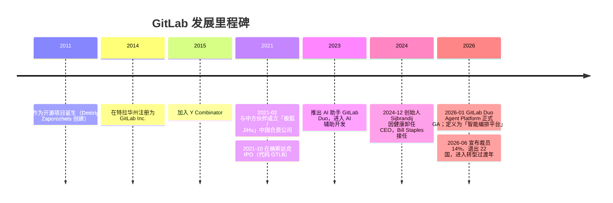
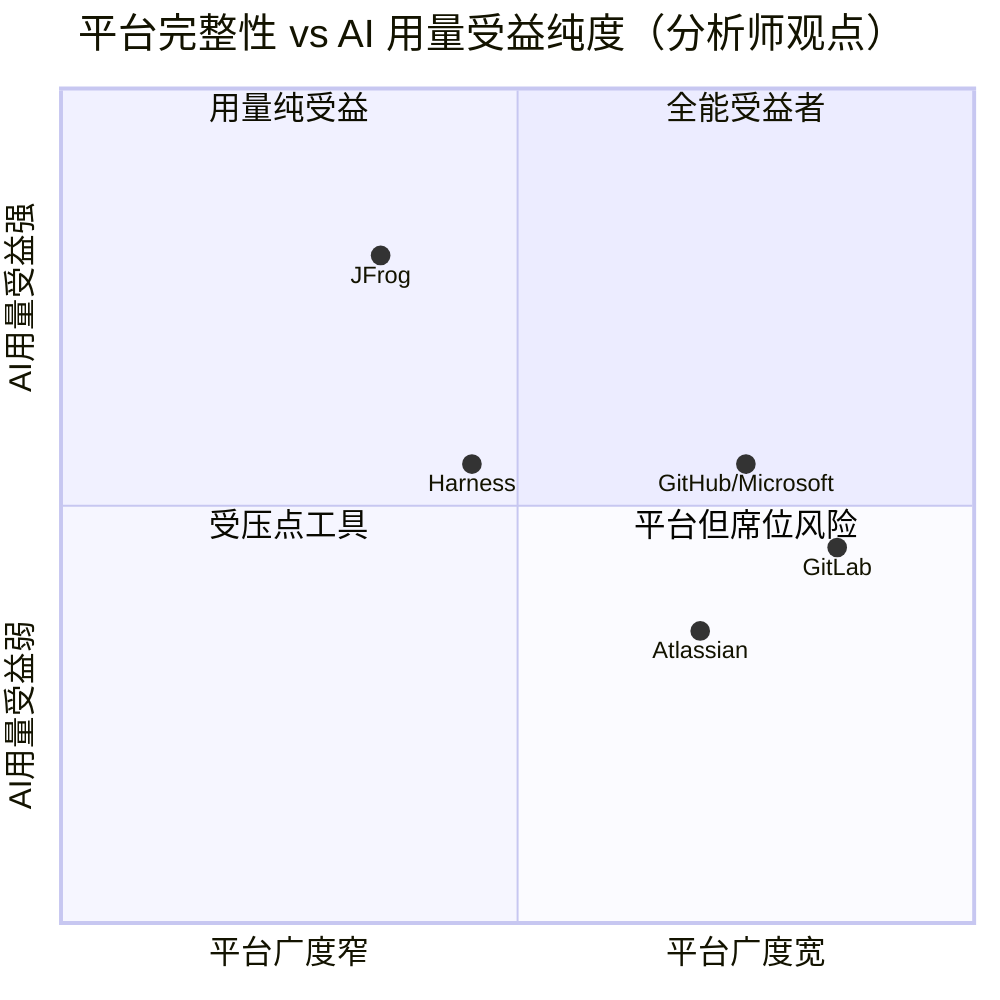

COMPANY RESEARCH REPORT: GitLab Inc.（极狐母公司）
日期 / Date: 2026-06-14
标的 / Ticker: NASDAQ: GTLB ｜ 货币单位: 美元（USD），除非另注

> *分析师观点（Analyst view）：* **评级：Hold（持有）· 12 个月目标价 $32（较 2026-06-12 收盘 $27.79 上行 +15%）· 估值方法：FY2027E EV/Sales ~3.3× ＋ FY2028E 非 GAAP P/E ~30× 双轨交叉验证**
> 市值约 $4.7bn · EV 约 $3.5bn · 52 周区间 $19.42–$51.04 · NASDAQ: GTLB · 无有息负债，净现金约 $1.26bn
>
> | 倍数 / Multiple（*分析师观点：* 前瞻列） | FY26A | FY27E | FY28E |
> |---|---|---|---|
> | EV/Sales | 3.6× | ~3.1× | ~2.5× |
> | 非 GAAP P/E（按 FY27 指引中值 EPS $0.805） | — | ~34.5× | ~28× |
> | EV/FCF（伯恩斯坦口径） | 18.7× | 16.9× | 12.8× |
> | P/S（TTM） | 4.9× | — | — |
>
> 相对表现（截至 2026-06-12，价格来源 yfinance）：1M **+26.0%** · 6M **−31.4%** · YTD **−23.2%** · 12M **−35.9%**，对照 S&P 500（SPY）1M −0.1% / 6M +8.5% / YTD +8.9% / 12M +24.8%——12 个月相对基准 **跑输约 60.7 个百分点**，1 个月内出现技术性反弹。
>
> **核心论点（thesis pillars）**——（1）GitLab 是唯一覆盖软件开发全生命周期、且建立在 open-core 开源模式上的 **DevSecOps（开发安全运维一体化）智能编排平台**，FY26 收入 $955.2M、+26% YoY，毛利率 87%，已转为经营现金流为正（OCF 利润率 24%）；（2）AI 既是顺风（Duo Agent Platform 按用量计费打开「席位＋消耗」混合变现）也是逆风（AI 原生编码工具与 GitHub Copilot 对席位的侵蚀）——FY27 是转型过渡年，席位收缩与定价基数效应压制增速，DBNRR 已从 123% 降至 118%；（3）资产负债表稳健（净现金 $1.26bn、零负债），但 GAAP 仍亏损（FY26 归母净亏损 $56.0M，累计亏损约 $12.2 亿），股权激励（SBC $215M）稀释持续；（4）估值已从高位大幅回落，伯恩斯坦给 Outperform/$60，但摩根士丹利、摩根大通、巴克莱分别 Equal-Weight/Neutral/Underweight——卖方分歧极大，在 Duo 变现拐点被证实之前，给予 Hold 评级更稳妥。

> **业绩快报 / Update — FY2027 全年指引（2026-06-02 随 Q1 FY27 财报发布）：** 公司给出 FY2027 收入指引 **$1,112–$1,118M**（对应约 +16%~17% YoY，较 FY26 的 +26% 明显减速），非 GAAP 经营利润 **$135–$141M**，非 GAAP 摊薄每股收益 **$0.79–$0.82**；同时宣布裁员约 **14%（350 人）** 并退出 22 个国家，预计产生 $30–35M 重组费用。来源：[GitLab Q1 FY2027 业绩 8-K 新闻稿, 2026-06-02](https://www.sec.gov/Archives/edgar/data/1653482/000162828026039805/gitlab-ex99120260430fy27.htm)。

---

## 目录 / Table of Contents

1. 公司概览（含投资论点）
1A. 估值与目标价（前瞻估值 · PT 推导 · 牛/基准/熊情景）
1B. GF Score（GuruFocus 式）基本面评分卡
2. 公司历史
3. 管理团队
4. 产品与服务
5. 客户与上市策略
6. 行业概览
7. 竞争格局
8. 市场机会（TAM）
9. 风险评估
9.5. 关键分歧与催化剂
10. 投资风格透视（投资者视角评分卡）
数据来源清单 / Data Used
参考资料 / References

======================================

## 1. 公司概览（Company Overview）

> *分析师观点：* **投资论点（BLUF）——** GitLab 是 DevSecOps（开发-安全-运维一体化）赛道中产品最完整、唯一基于 open-core 开源模式的平台型厂商，正站在两股力量的交汇点上：一方面，generative AI / agentic AI（生成式 / 智能体 AI）把软件开发的瓶颈从「写代码」转移到「审查、测试、集成、安全验证」，恰好是 GitLab 单一平台、统一数据模型的强项；另一方面，AI 原生编码工具与微软 GitHub Copilot 又在侵蚀传统「按席位」收费的根基。我们给予 **Hold / 目标价 $32**：理由是（i）基本面稳健但增速正从 +26% 降速至 +16%~17%，DBNRR（净收入留存率）滑落至 118%，（ii）Duo Agent Platform 的用量变现尚处早期（Q1'27 末消耗运行率仅约 $20M，未纳入指引），拐点未被证实，（iii）卖方观点严重分歧（伯恩斯坦 Outperform $60 vs 巴克莱 Underweight），在「席位收缩」与「AI 变现」两条曲线交叉点确认之前，风险回报对称、缺乏明确催化。本判断基于 [GTLB FY2026 10-K — Item 1 Business 概览](https://www.sec.gov/Archives/edgar/data/1653482/000162828026018731/gtlb-20260131.htm) 与 [Q1 FY2027 业绩 8-K, 2026-06-02](https://www.sec.gov/Archives/edgar/data/1653482/000162828026039805/gitlab-ex99120260430fy27.htm)。

GitLab 在 FY2026 10-K 中将自身定义为 **"the intelligent orchestration platform for DevSecOps, where software teams and their Artificial Intelligence ('AI') agents stay in flow to ship software faster"**（面向 DevSecOps 的智能编排平台，让软件团队及其 AI 智能体保持流畅协作、更快交付软件）；平台建立在 **unified data model（统一数据模型）** 之上，把开发、运维、IT、安全与业务团队整合到一个覆盖完整软件开发生命周期（software development lifecycle, SDLC）的应用中（[GTLB FY2026 10-K, Item 1 — Overview](https://www.sec.gov/Archives/edgar/data/1653482/000162828026018731/gtlb-20260131.htm)）。公司采用 **open-core（开源内核）** 商业模式：任何客户或贡献者都可向核心产品贡献代码——2025 自然年用户提交了超过 6,500 个 merge request（合并请求），平台连续 172 个月（截至 2026-01-31）每月发布一个新版本，由超 5,200 名开源社区贡献者支持（[GTLB FY2026 10-K, Item 1 — Open Core / Innovation Through Iteration](https://www.sec.gov/Archives/edgar/data/1653482/000162828026018731/gtlb-20260131.htm)）。

**如何赚钱（商业模式）。** GitLab 主要通过订阅收费，分三档（Free / Premium / Ultimate），并提供 **seat-based pricing（按席位定价）** 与 **usage-based pricing（按用量定价，即 GitLab Credits）** 两种模型：核心 DevSecOps 平台能力按席位收费，随团队规模可预测地扩张；而 Duo Agent Platform 的 AI 智能体能力按消耗的 Credits 计费，让成本与 AI agent 活动量挂钩（[GTLB FY2026 10-K, Item 1 — Plans, Pricing, and Deployment Options](https://www.sec.gov/Archives/edgar/data/1653482/000162828026018731/gtlb-20260131.htm)）。FY2026 收入按交付方式拆分为：Subscription—self-managed and SaaS（自托管 ＋ SaaS 订阅）$864.7M（占比 91%、+28% YoY），License—self-managed and other（自托管授权及其他）$90.5M（占比 9%、+8%）；其中纯 SaaS 收入 $296.2M（占 32%）已连续多年提升占比（[GTLB FY2026 10-K, Note 3 — Disaggregation of Revenue](https://www.sec.gov/Archives/edgar/data/1653482/000162828026018731/gtlb-20260131.htm)）。

下图以 Sankey 瀑布展示 FY2026 GAAP 收入到亏损的全链路——请注意 GitLab 87% 的高毛利率被大额销售费用（S&M $434.7M）与研发（R&D $274.6M）所吞噬，最终录得经营亏损 −$70.5M：

<svg xmlns="http://www.w3.org/2000/svg" viewBox="0 0 1000 560" width="1000" height="560" role="img" aria-label="income statement Sankey"><rect x="0" y="0" width="1000" height="560" fill="#ffffff"/>
<text x="20.00" y="30.00" text-anchor="start" font-family="Helvetica,Arial,sans-serif" font-size="15" font-weight="700" fill="#1f2933">GitLab (GTLB) 收入到利润瀑布 — FY2026（GAAP，单位：百万美元）</text>
<path d="M 204.00,64.00 C 258.00,64.00 258.00,85.02 312.00,85.02 L 312.00,327.82 C 258.00,327.82 258.00,306.80 204.00,306.80 Z" fill="#93c5fd" fill-opacity="0.55"/>
<path d="M 700.00,73.74 C 754.00,73.74 754.00,278.76 808.00,278.76 L 808.00,280.76 C 754.00,280.76 754.00,75.74 700.00,75.74 Z" fill="#86efac" fill-opacity="0.55"/>
<path d="M 700.00,75.74 C 754.00,75.74 754.00,294.76 808.00,294.76 L 808.00,299.24 C 754.00,299.24 754.00,80.23 700.00,80.23 Z" fill="#fca5a5" fill-opacity="0.55"/>
<path d="M 576.00,75.96 C 630.00,75.96 630.00,73.74 684.00,73.74 L 684.00,75.74 C 630.00,75.74 630.00,77.96 576.00,77.96 Z" fill="#86efac" fill-opacity="0.55"/>
<path d="M 452.00,78.02 C 506.00,78.02 506.00,75.96 560.00,75.96 L 560.00,77.96 C 506.00,77.96 506.00,80.02 452.00,80.02 Z" fill="#86efac" fill-opacity="0.55"/>
<path d="M 452.00,80.02 C 506.00,80.02 506.00,91.96 560.00,91.96 L 560.00,478.48 C 506.00,478.48 506.00,466.54 452.00,466.54 Z" fill="#fca5a5" fill-opacity="0.55"/>
<path d="M 328.00,85.02 C 382.00,85.02 382.00,78.02 436.00,78.02 L 436.00,434.43 C 382.00,434.43 382.00,441.43 328.00,441.43 Z" fill="#86efac" fill-opacity="0.55"/>
<path d="M 328.00,441.43 C 382.00,441.43 382.00,448.43 436.00,448.43 L 436.00,499.98 C 382.00,499.98 382.00,492.98 328.00,492.98 Z" fill="#fca5a5" fill-opacity="0.55"/>
<path d="M 576.00,91.96 C 630.00,91.96 630.00,89.74 684.00,89.74 L 684.00,275.40 C 630.00,275.40 630.00,277.61 576.00,277.61 Z" fill="#fca5a5" fill-opacity="0.55"/>
<path d="M 576.00,277.61 C 630.00,277.61 630.00,289.40 684.00,289.40 L 684.00,406.68 C 630.00,406.68 630.00,394.89 576.00,394.89 Z" fill="#fca5a5" fill-opacity="0.55"/>
<path d="M 576.00,394.89 C 630.00,394.89 630.00,420.68 684.00,420.68 L 684.00,504.26 C 630.00,504.26 630.00,478.48 576.00,478.48 Z" fill="#fca5a5" fill-opacity="0.55"/>
<path d="M 204.00,320.80 C 258.00,320.80 258.00,327.82 312.00,327.82 L 312.00,454.33 C 258.00,454.33 258.00,447.31 204.00,447.31 Z" fill="#93c5fd" fill-opacity="0.55"/>
<path d="M 204.00,461.31 C 258.00,461.31 258.00,454.33 312.00,454.33 L 312.00,483.75 C 258.00,483.75 258.00,490.73 204.00,490.73 Z" fill="#93c5fd" fill-opacity="0.55"/>
<path d="M 576.00,492.48 C 630.00,492.48 630.00,75.74 684.00,75.74 L 684.00,85.31 C 630.00,85.31 630.00,502.04 576.00,502.04 Z" fill="#93c5fd" fill-opacity="0.55"/>
<path d="M 204.00,504.73 C 258.00,504.73 258.00,483.75 312.00,483.75 L 312.00,493.02 C 258.00,493.02 258.00,514.00 204.00,514.00 Z" fill="#93c5fd" fill-opacity="0.55"/>
<rect x="188.00" y="64.00" width="16" height="242.80" rx="1.5" fill="#2563eb"/>
<rect x="188.00" y="320.80" width="16" height="126.50" rx="1.5" fill="#2563eb"/>
<rect x="188.00" y="461.31" width="16" height="29.43" rx="1.5" fill="#2563eb"/>
<rect x="188.00" y="504.73" width="16" height="9.27" rx="1.5" fill="#2563eb"/>
<rect x="312.00" y="85.02" width="16" height="407.96" rx="1.5" fill="#1e3a8a"/>
<rect x="436.00" y="78.02" width="16" height="356.41" rx="1.5" fill="#15803d"/>
<rect x="436.00" y="448.43" width="16" height="51.55" rx="1.5" fill="#dc2626"/>
<rect x="560.00" y="75.96" width="16" height="2.00" rx="1.5" fill="#15803d"/>
<rect x="560.00" y="91.96" width="16" height="386.52" rx="1.5" fill="#dc2626"/>
<rect x="560.00" y="492.48" width="16" height="9.57" rx="1.5" fill="#2563eb"/>
<rect x="684.00" y="73.74" width="16" height="2.00" rx="1.5" fill="#15803d"/>
<rect x="684.00" y="89.74" width="16" height="185.66" rx="1.5" fill="#dc2626"/>
<rect x="684.00" y="289.40" width="16" height="117.28" rx="1.5" fill="#dc2626"/>
<rect x="684.00" y="420.68" width="16" height="83.58" rx="1.5" fill="#dc2626"/>
<rect x="808.00" y="278.76" width="16" height="2.00" rx="1.5" fill="#15803d"/>
<rect x="808.00" y="294.76" width="16" height="4.48" rx="1.5" fill="#dc2626"/>
<line x1="188.00" y1="185.40" x2="182.00" y2="163.03" stroke="#cbd5e1" stroke-width="1"/>
<text x="179.00" y="166.03" text-anchor="end" font-family="Helvetica,Arial,sans-serif" font-size="11.5" font-weight="700" fill="#1f2933">Subscription self-managed</text>
<text x="179.00" y="179.03" text-anchor="end" font-family="Helvetica,Arial,sans-serif" font-size="10" font-weight="400" fill="#52606d">$568.5M  (59.5%)</text>
<line x1="188.00" y1="384.05" x2="182.00" y2="361.69" stroke="#cbd5e1" stroke-width="1"/>
<text x="179.00" y="364.69" text-anchor="end" font-family="Helvetica,Arial,sans-serif" font-size="11.5" font-weight="700" fill="#1f2933">SaaS</text>
<text x="179.00" y="377.69" text-anchor="end" font-family="Helvetica,Arial,sans-serif" font-size="10" font-weight="400" fill="#52606d">$296.2M  (31.0%)</text>
<line x1="188.00" y1="476.02" x2="182.00" y2="453.65" stroke="#cbd5e1" stroke-width="1"/>
<text x="179.00" y="456.65" text-anchor="end" font-family="Helvetica,Arial,sans-serif" font-size="11.5" font-weight="700" fill="#1f2933">License self-managed</text>
<text x="179.00" y="469.65" text-anchor="end" font-family="Helvetica,Arial,sans-serif" font-size="10" font-weight="400" fill="#52606d">$68.9M  (7.2%)</text>
<line x1="188.00" y1="509.37" x2="182.00" y2="487.00" stroke="#cbd5e1" stroke-width="1"/>
<text x="179.00" y="490.00" text-anchor="end" font-family="Helvetica,Arial,sans-serif" font-size="11.5" font-weight="700" fill="#1f2933">Professional services &amp; other</text>
<text x="179.00" y="503.00" text-anchor="end" font-family="Helvetica,Arial,sans-serif" font-size="10" font-weight="400" fill="#52606d">$21.7M  (2.3%)</text>
<rect x="331.00" y="67.02" width="113.10" height="26" rx="2" fill="#ffffff" fill-opacity="0.72"/>
<text x="334.00" y="79.02" text-anchor="start" font-family="Helvetica,Arial,sans-serif" font-size="11.5" font-weight="700" fill="#1f2933">Revenue</text>
<text x="334.00" y="92.02" text-anchor="start" font-family="Helvetica,Arial,sans-serif" font-size="10" font-weight="400" fill="#52606d">$955.2M  (100.0%)</text>
<rect x="455.00" y="60.02" width="106.80" height="26" rx="2" fill="#ffffff" fill-opacity="0.72"/>
<text x="458.00" y="72.02" text-anchor="start" font-family="Helvetica,Arial,sans-serif" font-size="11.5" font-weight="700" fill="#1f2933">Gross Profit</text>
<text x="458.00" y="85.02" text-anchor="start" font-family="Helvetica,Arial,sans-serif" font-size="10" font-weight="400" fill="#52606d">$834.5M  (87.4%)</text>
<rect x="455.00" y="430.43" width="144.60" height="26" rx="2" fill="#ffffff" fill-opacity="0.72"/>
<text x="458.00" y="442.43" text-anchor="start" font-family="Helvetica,Arial,sans-serif" font-size="11.5" font-weight="700" fill="#1f2933">Cost of Revenue (COGS)</text>
<text x="458.00" y="455.43" text-anchor="start" font-family="Helvetica,Arial,sans-serif" font-size="10" font-weight="400" fill="#52606d">$120.7M  (12.6%)</text>
<rect x="579.00" y="57.96" width="106.80" height="26" rx="2" fill="#ffffff" fill-opacity="0.72"/>
<text x="582.00" y="69.96" text-anchor="start" font-family="Helvetica,Arial,sans-serif" font-size="11.5" font-weight="700" fill="#1f2933">Operating Income</text>
<text x="582.00" y="82.96" text-anchor="start" font-family="Helvetica,Arial,sans-serif" font-size="10" font-weight="400" fill="#52606d">-$70.5M  (-7.4%)</text>
<rect x="579.00" y="82.96" width="150.90" height="26" rx="2" fill="#ffffff" fill-opacity="0.72"/>
<text x="582.00" y="94.96" text-anchor="start" font-family="Helvetica,Arial,sans-serif" font-size="11.5" font-weight="700" fill="#1f2933">Total Operating Expense</text>
<text x="582.00" y="107.96" text-anchor="start" font-family="Helvetica,Arial,sans-serif" font-size="10" font-weight="400" fill="#52606d">$905.0M  (94.7%)</text>
<line x1="560.00" y1="497.26" x2="554.00" y2="487.00" stroke="#cbd5e1" stroke-width="1"/>
<text x="551.00" y="490.00" text-anchor="end" font-family="Helvetica,Arial,sans-serif" font-size="11.5" font-weight="700" fill="#1f2933">Net Interest / Other Income</text>
<text x="551.00" y="503.00" text-anchor="end" font-family="Helvetica,Arial,sans-serif" font-size="10" font-weight="400" fill="#52606d">$22.4M  (2.3%)</text>
<rect x="703.00" y="55.74" width="106.80" height="26" rx="2" fill="#ffffff" fill-opacity="0.72"/>
<text x="706.00" y="67.74" text-anchor="start" font-family="Helvetica,Arial,sans-serif" font-size="11.5" font-weight="700" fill="#1f2933">Pretax Income</text>
<text x="706.00" y="80.74" text-anchor="start" font-family="Helvetica,Arial,sans-serif" font-size="10" font-weight="400" fill="#52606d">-$48.1M  (-5.0%)</text>
<rect x="703.00" y="80.74" width="106.80" height="26" rx="2" fill="#ffffff" fill-opacity="0.72"/>
<text x="706.00" y="92.74" text-anchor="start" font-family="Helvetica,Arial,sans-serif" font-size="11.5" font-weight="700" fill="#1f2933">SG&amp;A</text>
<text x="706.00" y="105.74" text-anchor="start" font-family="Helvetica,Arial,sans-serif" font-size="10" font-weight="400" fill="#52606d">$434.7M  (45.5%)</text>
<rect x="703.00" y="271.40" width="106.80" height="26" rx="2" fill="#ffffff" fill-opacity="0.72"/>
<text x="706.00" y="283.40" text-anchor="start" font-family="Helvetica,Arial,sans-serif" font-size="11.5" font-weight="700" fill="#1f2933">R&amp;D</text>
<text x="706.00" y="296.40" text-anchor="start" font-family="Helvetica,Arial,sans-serif" font-size="10" font-weight="400" fill="#52606d">$274.6M  (28.7%)</text>
<rect x="703.00" y="402.68" width="106.80" height="26" rx="2" fill="#ffffff" fill-opacity="0.72"/>
<text x="706.00" y="414.68" text-anchor="start" font-family="Helvetica,Arial,sans-serif" font-size="11.5" font-weight="700" fill="#1f2933">Other OpEx</text>
<text x="706.00" y="427.68" text-anchor="start" font-family="Helvetica,Arial,sans-serif" font-size="10" font-weight="400" fill="#52606d">$195.7M  (20.5%)</text>
<text x="833.00" y="276.76" text-anchor="start" font-family="Helvetica,Arial,sans-serif" font-size="11.5" font-weight="700" fill="#1f2933">Net Income</text>
<text x="833.00" y="289.76" text-anchor="start" font-family="Helvetica,Arial,sans-serif" font-size="10" font-weight="400" fill="#52606d">-$58.6M  (-6.1%)</text>
<text x="833.00" y="301.76" text-anchor="start" font-family="Helvetica,Arial,sans-serif" font-size="11.5" font-weight="700" fill="#1f2933">Income Tax</text>
<text x="833.00" y="314.76" text-anchor="start" font-family="Helvetica,Arial,sans-serif" font-size="10" font-weight="400" fill="#52606d">$10.5M  (1.1%)</text>
<text x="500.00" y="544.00" text-anchor="middle" font-family="Helvetica,Arial,sans-serif" font-size="10" font-weight="400" fill="#52606d">Source: GTLB FY2026 10-K, Consolidated Statements of Operations + Note 3 Revenues</text>
</svg>

来源 / Source: [GTLB FY2026 10-K, Consolidated Statements of Operations + Note 3 Revenues](https://www.sec.gov/Archives/edgar/data/1653482/000162828026018731/gtlb-20260131.htm)

**经营地域与规模。** GitLab 是一家完全远程（all-remote）公司，无总部，注册地为美国特拉华州（[GTLB FY2026 10-K, Item 1 — General Information](https://www.sec.gov/Archives/edgar/data/1653482/000162828026018731/gtlb-20260131.htm)）。截至 2026-01-31，公司在 159 个以上国家拥有客户，Base Customers（ARR 超 $5,000 的活跃付费客户）达 **10,682 家**（FY25 为 9,893 家），其中 $100,000+ ARR 客户 **1,456 家**（FY25 为 1,229），$1.0M+ ARR 客户 **155 家**（FY25 为 123、+26%）；FY26 内超 70% 的 ARR 来自公共部门与企业客户（[GTLB FY2026 10-K, Item 1 — Customers / Item 7 MD&A](https://www.sec.gov/Archives/edgar/data/1653482/000162828026018731/gtlb-20260131.htm)）。按地域，FY26 收入中美国 $787.3M（约 82%）、欧洲 $145.6M（约 15%）、亚太 $22.2M（约 2.3%），无单一海外国家超过总收入 10%（[GTLB FY2026 10-K, Note 3 — Total Revenue by Geographic Location](https://www.sec.gov/Archives/edgar/data/1653482/000162828026018731/gtlb-20260131.htm)）。下方两图分别展示按交付方式与按地域的收入构成：

<svg xmlns="http://www.w3.org/2000/svg" viewBox="0 0 720 460" width="720" height="460" role="img" aria-label="revenue donut"><rect x="0" y="0" width="720" height="460" fill="#ffffff"/>
<text x="20.00" y="30.00" text-anchor="start" font-family="Helvetica,Arial,sans-serif" font-size="15" font-weight="700" fill="#1f2933">FY2026 收入构成（按交付方式）</text>
<path d="M 288.00,107.20 A 132 132 0 1 1 213.74,348.33 L 244.12,303.68 A 78 78 0 1 0 288.00,161.20 Z" fill="#2563eb"/>
<path d="M 213.74,348.33 A 132 132 0 0 1 213.92,129.95 L 244.22,174.64 A 78 78 0 0 0 244.12,303.68 Z" fill="#15803d"/>
<path d="M 213.92,129.95 A 132 132 0 0 1 269.22,108.54 L 276.91,161.99 A 78 78 0 0 0 244.22,174.64 Z" fill="#d97706"/>
<path d="M 269.22,108.54 A 132 132 0 0 1 288.00,107.20 L 288.00,161.20 A 78 78 0 0 0 276.91,161.99 Z" fill="#7c3aed"/>
<text x="288.00" y="235.20" text-anchor="middle" font-family="Helvetica,Arial,sans-serif" font-size="18" font-weight="800" fill="#1f2933">GTLB</text>
<text x="288.00" y="255.20" text-anchor="middle" font-family="Helvetica,Arial,sans-serif" font-size="13" font-weight="600" fill="#52606d">$955.3M</text>
<text x="288.00" y="271.20" text-anchor="middle" font-family="Helvetica,Arial,sans-serif" font-size="10" font-weight="400" fill="#8a97a3">total</text>
<line x1="419.89" y1="279.82" x2="435.89" y2="279.82" stroke="#2563eb" stroke-width="1.4"/>
<text x="439.89" y="277.82" text-anchor="start" font-family="Helvetica,Arial,sans-serif" font-size="11" font-weight="700" fill="#1f2933">Subscription self-managed</text>
<text x="439.89" y="291.82" text-anchor="start" font-family="Helvetica,Arial,sans-serif" font-size="10" font-weight="400" fill="#52606d">$568.5M  (59.5%)</text>
<line x1="150.00" y1="239.09" x2="134.00" y2="239.09" stroke="#15803d" stroke-width="1.4"/>
<text x="130.00" y="237.09" text-anchor="end" font-family="Helvetica,Arial,sans-serif" font-size="11" font-weight="700" fill="#1f2933">SaaS</text>
<text x="130.00" y="251.09" text-anchor="end" font-family="Helvetica,Arial,sans-serif" font-size="10" font-weight="400" fill="#52606d">$296.2M  (31.0%)</text>
<line x1="238.19" y1="110.50" x2="222.19" y2="110.50" stroke="#d97706" stroke-width="1.4"/>
<text x="218.19" y="108.50" text-anchor="end" font-family="Helvetica,Arial,sans-serif" font-size="11" font-weight="700" fill="#1f2933">License self-managed</text>
<text x="218.19" y="122.50" text-anchor="end" font-family="Helvetica,Arial,sans-serif" font-size="10" font-weight="400" fill="#52606d">$68.9M  (7.2%)</text>
<line x1="278.16" y1="101.55" x2="262.16" y2="101.55" stroke="#7c3aed" stroke-width="1.4"/>
<text x="258.16" y="99.55" text-anchor="end" font-family="Helvetica,Arial,sans-serif" font-size="11" font-weight="700" fill="#1f2933">Professional services &amp; other</text>
<text x="258.16" y="113.55" text-anchor="end" font-family="Helvetica,Arial,sans-serif" font-size="10" font-weight="400" fill="#52606d">$21.7M  (2.3%)</text>
<text x="360.00" y="444.00" text-anchor="middle" font-family="Helvetica,Arial,sans-serif" font-size="10" font-weight="400" fill="#52606d">Source: GTLB FY2026 10-K, Note 3 — Disaggregation of Revenue</text>
</svg>

来源 / Source: [GTLB FY2026 10-K, Note 3 — Disaggregation of Revenue](https://www.sec.gov/Archives/edgar/data/1653482/000162828026018731/gtlb-20260131.htm)

<svg xmlns="http://www.w3.org/2000/svg" viewBox="0 0 720 460" width="720" height="460" role="img" aria-label="revenue donut"><rect x="0" y="0" width="720" height="460" fill="#ffffff"/>
<text x="20.00" y="30.00" text-anchor="start" font-family="Helvetica,Arial,sans-serif" font-size="15" font-weight="700" fill="#1f2933">FY2026 收入构成（按地区）</text>
<path d="M 288.00,107.20 A 132 132 0 1 1 170.13,179.78 L 218.35,204.09 A 78 78 0 1 0 288.00,161.20 Z" fill="#2563eb"/>
<path d="M 170.13,179.78 A 132 132 0 0 1 268.79,108.61 L 276.65,162.03 A 78 78 0 0 0 218.35,204.09 Z" fill="#15803d"/>
<path d="M 268.79,108.61 A 132 132 0 0 1 288.00,107.20 L 288.00,161.20 A 78 78 0 0 0 276.65,162.03 Z" fill="#d97706"/>
<text x="288.00" y="235.20" text-anchor="middle" font-family="Helvetica,Arial,sans-serif" font-size="18" font-weight="800" fill="#1f2933">GTLB</text>
<text x="288.00" y="255.20" text-anchor="middle" font-family="Helvetica,Arial,sans-serif" font-size="13" font-weight="600" fill="#52606d">$955.1M</text>
<text x="288.00" y="271.20" text-anchor="middle" font-family="Helvetica,Arial,sans-serif" font-size="10" font-weight="400" fill="#8a97a3">total</text>
<line x1="360.36" y1="356.71" x2="376.36" y2="356.71" stroke="#2563eb" stroke-width="1.4"/>
<text x="380.36" y="354.71" text-anchor="start" font-family="Helvetica,Arial,sans-serif" font-size="11" font-weight="700" fill="#1f2933">United States</text>
<text x="380.36" y="368.71" text-anchor="start" font-family="Helvetica,Arial,sans-serif" font-size="10" font-weight="400" fill="#52606d">$787.3M  (82.4%)</text>
<line x1="207.26" y1="127.28" x2="191.26" y2="127.28" stroke="#15803d" stroke-width="1.4"/>
<text x="187.26" y="125.28" text-anchor="end" font-family="Helvetica,Arial,sans-serif" font-size="11" font-weight="700" fill="#1f2933">Europe</text>
<text x="187.26" y="139.28" text-anchor="end" font-family="Helvetica,Arial,sans-serif" font-size="10" font-weight="400" fill="#52606d">$145.6M  (15.2%)</text>
<line x1="277.93" y1="101.57" x2="261.93" y2="101.57" stroke="#d97706" stroke-width="1.4"/>
<text x="257.93" y="99.57" text-anchor="end" font-family="Helvetica,Arial,sans-serif" font-size="11" font-weight="700" fill="#1f2933">Asia Pacific</text>
<text x="257.93" y="113.57" text-anchor="end" font-family="Helvetica,Arial,sans-serif" font-size="10" font-weight="400" fill="#52606d">$22.2M  (2.3%)</text>
<text x="360.00" y="444.00" text-anchor="middle" font-family="Helvetica,Arial,sans-serif" font-size="10" font-weight="400" fill="#52606d">Source: GTLB FY2026 10-K, Note 3 — Total Revenue by Geographic Location</text>
</svg>

来源 / Source: [GTLB FY2026 10-K, Note 3 — Total Revenue by Geographic Location](https://www.sec.gov/Archives/edgar/data/1653482/000162828026018731/gtlb-20260131.htm)

**估值快照（valuation snapshot）。** 截至 2026-06-12，GTLB 收盘 $27.79，按约 1.701 亿股（Class A 153.4M ＋ Class B 16.7M）计市值约 **$4.7bn**，扣除 $1.26bn 净现金后 EV 约 **$3.5bn**（[GTLB FY2026 10-K 封面 — 股本；Yahoo Finance GTLB 报价](https://finance.yahoo.com/quote/GTLB/)）。**TTM P/S 约 4.9×、EV/Sales 约 3.6×**；由于 GitLab GAAP 仍亏损（FY26 归母净亏损 −$56.0M），**TTM P/E 为负**，须解释为「现金消耗型成长股的高 S&M / R&D 再投入」而非一次性减值——这一负 P/E 直接源自经营亏损 −$70.5M（[GTLB FY2026 10-K, MD&A — Results of Operations](https://www.sec.gov/Archives/edgar/data/1653482/000162828026018731/gtlb-20260131.htm)）。以非 GAAP 口径看则盈利：Q1'27 非 GAAP 经营利润率 14%、非 GAAP 摊薄 EPS $0.23（[GTLB Q1 FY2027 业绩 8-K, 2026-06-02](https://www.sec.gov/Archives/edgar/data/1653482/000162828026039805/gitlab-ex99120260430fy27.htm)）。与同业相比，*分析师观点：* 伯恩斯坦给出的 GTLB FY26A EV/Sales 4.4× 在 SMID-cap 软件中处中游，明显低于高增长可观测性 / 数据基础设施名字（[Bernstein — GitLab Inc.（GTLB.US）FQ1'27, 2026-06-03, p.1](http://xs-macbook-air.local:5001/zsxq/pdf/585411255521144/Bernstein-GitLab%20Inc%EF%BC%88GTLB.US%EF%BC%89%20FQ1%2727%EF%BC%9A%20Weathering%20the%20storm%EF%BC%8C%20blue%20sky%20coming%EF%BC%9F-260603.pdf)）。当前 4.9× 的 P/S 既非泡沫亦非深度价值——估值压缩主要反映增速降档与 AI 颠覆不确定性（见第 9 节估值风险）。

下方历史堆叠柱显示 FY24→FY26 各交付方式收入的演进——SaaS 占比从 26% 升至 32% 是最值得关注的「本期新变化」：

<svg xmlns="http://www.w3.org/2000/svg" viewBox="0 0 860 470" width="860" height="470" role="img" aria-label="historical revenue bars"><rect x="0" y="0" width="860" height="470" fill="#ffffff"/>
<text x="20.00" y="30.00" text-anchor="start" font-family="Helvetica,Arial,sans-serif" font-size="15" font-weight="700" fill="#1f2933">历史收入（按交付方式，FY2024–FY2026）</text>
<rect x="20.00" y="44" width="11" height="11" rx="2" fill="#2563eb"/>
<text x="36.00" y="53.00" text-anchor="start" font-family="Helvetica,Arial,sans-serif" font-size="10.5" font-weight="400" fill="#1f2933">Subscription self-managed</text>
<rect x="215.00" y="44" width="11" height="11" rx="2" fill="#15803d"/>
<text x="231.00" y="53.00" text-anchor="start" font-family="Helvetica,Arial,sans-serif" font-size="10.5" font-weight="400" fill="#1f2933">SaaS</text>
<rect x="271.40" y="44" width="11" height="11" rx="2" fill="#d97706"/>
<text x="287.40" y="53.00" text-anchor="start" font-family="Helvetica,Arial,sans-serif" font-size="10.5" font-weight="400" fill="#1f2933">License self-managed</text>
<rect x="433.40" y="44" width="11" height="11" rx="2" fill="#7c3aed"/>
<text x="449.40" y="53.00" text-anchor="start" font-family="Helvetica,Arial,sans-serif" font-size="10.5" font-weight="400" fill="#1f2933">Professional services &amp; other</text>
<line x1="70" y1="412.00" x2="834" y2="412.00" stroke="#eceff2" stroke-width="1"/>
<text x="64.00" y="415.00" text-anchor="end" font-family="Helvetica,Arial,sans-serif" font-size="9.5" font-weight="400" fill="#52606d">$0</text>
<line x1="70" y1="345.20" x2="834" y2="345.20" stroke="#eceff2" stroke-width="1"/>
<text x="64.00" y="348.20" text-anchor="end" font-family="Helvetica,Arial,sans-serif" font-size="9.5" font-weight="400" fill="#52606d">$206.3M</text>
<line x1="70" y1="278.40" x2="834" y2="278.40" stroke="#eceff2" stroke-width="1"/>
<text x="64.00" y="281.40" text-anchor="end" font-family="Helvetica,Arial,sans-serif" font-size="9.5" font-weight="400" fill="#52606d">$412.7M</text>
<line x1="70" y1="211.60" x2="834" y2="211.60" stroke="#eceff2" stroke-width="1"/>
<text x="64.00" y="214.60" text-anchor="end" font-family="Helvetica,Arial,sans-serif" font-size="9.5" font-weight="400" fill="#52606d">$619.0M</text>
<line x1="70" y1="144.80" x2="834" y2="144.80" stroke="#eceff2" stroke-width="1"/>
<text x="64.00" y="147.80" text-anchor="end" font-family="Helvetica,Arial,sans-serif" font-size="9.5" font-weight="400" fill="#52606d">$825.4M</text>
<line x1="70" y1="78.00" x2="834" y2="78.00" stroke="#eceff2" stroke-width="1"/>
<text x="64.00" y="81.00" text-anchor="end" font-family="Helvetica,Arial,sans-serif" font-size="9.5" font-weight="400" fill="#52606d">$1.0B</text>
<rect x="123.48" y="296.85" width="147.71" height="115.15" fill="#2563eb"/>
<rect x="123.48" y="248.10" width="147.71" height="48.75" fill="#15803d"/>
<rect x="123.48" y="227.67" width="147.71" height="20.43" fill="#d97706"/>
<rect x="123.48" y="224.27" width="147.71" height="3.40" fill="#7c3aed"/>
<text x="197.33" y="428.00" text-anchor="middle" font-family="Helvetica,Arial,sans-serif" font-size="10" font-weight="400" fill="#52606d">2024</text>
<rect x="378.15" y="263.44" width="147.71" height="148.56" fill="#2563eb"/>
<rect x="378.15" y="193.42" width="147.71" height="70.02" fill="#15803d"/>
<rect x="378.15" y="171.27" width="147.71" height="22.14" fill="#d97706"/>
<rect x="378.15" y="166.19" width="147.71" height="5.08" fill="#7c3aed"/>
<text x="452.00" y="428.00" text-anchor="middle" font-family="Helvetica,Arial,sans-serif" font-size="10" font-weight="400" fill="#52606d">2025</text>
<rect x="632.81" y="227.96" width="147.71" height="184.04" fill="#2563eb"/>
<rect x="632.81" y="132.07" width="147.71" height="95.89" fill="#15803d"/>
<rect x="632.81" y="109.77" width="147.71" height="22.30" fill="#d97706"/>
<rect x="632.81" y="102.74" width="147.71" height="7.02" fill="#7c3aed"/>
<text x="706.67" y="428.00" text-anchor="middle" font-family="Helvetica,Arial,sans-serif" font-size="10" font-weight="400" fill="#52606d">2026</text>
<text x="430.00" y="454.00" text-anchor="middle" font-family="Helvetica,Arial,sans-serif" font-size="10" font-weight="400" fill="#52606d">Source: GTLB FY2024–FY2026 10-Ks, Note 3 — Disaggregation of Revenue</text>
</svg>

来源 / Source: [GTLB FY2024–FY2026 10-Ks, Note 3 — Disaggregation of Revenue](https://www.sec.gov/Archives/edgar/data/1653482/000162828026018731/gtlb-20260131.htm)

======================================

## 1A. 估值与目标价（Valuation & Price Target）

> *分析师观点：* 本章全部为前瞻判断，每一个预测数、目标价与情景目标价均标注 *分析师观点：*，不附任何 filing 引用（10-K 不含价格目标）；各驱动因子的外部依据在文内逐项引用。

**(a) 前瞻财务预测表（FY27E–FY29E）。** 模型以管理层 FY27 指引为锚，叠加 Duo 用量变现的渐进贡献与重组后利润率改善，并参考卖方一致预期。GitLab 为亏损名字，因此除收入 / 毛利率 / 非 GAAP 经营利润 / 非 GAAP EPS 外，特别给出 **FCF 与净现金行**——对软件 SaaS 而言 FCF 与递延收入比 GAAP EPS 更能反映商业实质。

| 指标（*分析师观点：*） | FY26A | FY27E | FY28E | FY29E | CAGR(26-29) |
|---|---|---|---|---|---|
| 收入（$M） | 955 | 1,115 | 1,300 | 1,520 | ~17% |
| — YoY % | +26% | +17% | +17% | +17% | |
| 毛利率（GAAP, %） | 87% | 87% | 86% | 86% | |
| 非 GAAP 经营利润率 % | ~17% | ~12% | ~15% | ~18% | |
| 非 GAAP 摊薄 EPS（$） | 0.96 | 0.81 | 1.10 | 1.45 | ~15% |
| 调整后 FCF（$M） | 220 | 246 | 300 | 370 | |
| 净现金 / Net cash（$M） | 1,260 | ~1,350 | ~1,500 | ~1,750 | |

各预测格的外部依据（逐项引用、非「本模型」）：FY27 收入 $1,115M 取自管理层 [FY2027 指引中值 $1,112–$1,118M](https://www.sec.gov/Archives/edgar/data/1653482/000162828026039805/gitlab-ex99120260430fy27.htm)；FY27 非 GAAP EPS $0.81 取自同一份指引 $0.79–$0.82 中值；FY26A 调整后 FCF $220M 取自 [GTLB FY2026 10-K — Adjusted Free Cash Flow 对账表（$219.6M）](https://www.sec.gov/Archives/edgar/data/1653482/000162828026018731/gtlb-20260131.htm)；FY28–29 的 +17% 收入延续、毛利率与利润率回升路径，参照伯恩斯坦 FY27E 收入 $1,149M / FY28E $1,414M 与 Adj EPS $1.00 / $1.34 的轨迹（[Bernstein — GitLab FQ1'27, 2026-06-03, p.1](http://xs-macbook-air.local:5001/zsxq/pdf/585411255521144/Bernstein-GitLab%20Inc%EF%BC%88GTLB.US%EF%BC%89%20FQ1%2727%EF%BC%9A%20Weathering%20the%20storm%EF%BC%8C%20blue%20sky%20coming%EF%BC%9F-260603.pdf)）。

**毛利率 / 利润率桥（margin bridge）。** FY26 GAAP 毛利率自 89% 降至 87%（−约 200bp），管理层口径下主因 SaaS 与 Duo 占比上升带来的第三方云托管成本增加（FY26 收入成本中 +$18.4M 来自托管，+$9.0M 人力，+$2.4M 股权激励），即「云成本随 SaaS mix 上升侵蚀毛利」（[GTLB FY2026 10-K, MD&A — Cost of Revenue](https://www.sec.gov/Archives/edgar/data/1653482/000162828026018731/gtlb-20260131.htm)）。非 GAAP 经营利润率方面，FY27 因 $30–35M 重组现金费用与增长再投入而暂时下行，FY28 起随裁员 14% 与退出 22 国带来的费用杠杆而回升（[GTLB Q1 FY2027 业绩 8-K, 2026-06-02](https://www.sec.gov/Archives/edgar/data/1653482/000162828026039805/gitlab-ex99120260430fy27.htm)）。

**(b) 目标价推导（show the arithmetic）。** 我们采用双轨交叉验证：(i) **EV/Sales 法**：FY2027E 收入 $1,115M × 目标 EV/Sales 3.3×（介于伯恩斯坦 FY26A 4.4× 与熊市 2.5× 之间，对应 +17% 增长与 87% 毛利的成长性折让后水平）≈ EV $3,680M，加回净现金 $1,260M → 股权价值约 $4,940M ÷ 1.71 亿股 ≈ **$29**；(ii) **非 GAAP P/E 法**：FY2028E 非 GAAP EPS $1.10 × 目标 30× P/E（参照伯恩斯坦 F27E Adj P/E 31.9×，给予转型不确定性折让）≈ **$33**。两法取约 **$32** 为 12 个月目标价（较 $27.79 上行约 +15%）。目标倍数对标的可比公司：JFrog（FROG，使用量计费、AI 受益更直接）、Atlassian（TEAM，协作工具，大摩目标 P/E 已大幅下修）、Datadog（DDOG，可观测性，估值显著更高）——GitLab 介于「席位风险更高的 TEAM」与「AI 受益更纯的 FROG / DDOG」之间，3.3× EV/Sales 的目标倍数因此低于 DDOG、略低于 FROG（[Morgan Stanley — More Software and More Developers… Revisited, 2026-04-16](http://xs-macbook-air.local:5001/zsxq/pdf/812215844114812/Morgan%20Stanley-More%20Software%20and%20More%20Developers%E2%80%A6%20Revisited-260416.pdf)）。

**(c) 牛 / 基准 / 熊情景。**

| 情景（*分析师观点：*） | 关键假设 | 目标价 | 较现价 |
|---|---|---|---|
| 牛 Bull | Duo Agent 用量变现拐点确认，DBNRR 企稳回升至 120%+，FY27 末增速回到低二十位数，EV/Sales 回到 4.5× | $52 | +87% |
| 基准 Base | FY27 +17% 指引兑现，DBNRR 118%→117%，Duo 仍小但渐起量，EV/Sales 3.3× / 非 GAAP P/E 30× | $32 | +15% |
| 熊 Bear | 席位收缩持续、GitHub Copilot/AI 原生工具侵蚀价格敏感的 ~20% ARR，增速跌至个位数，de-rate 至 EV/Sales 2.3× | $19 | −32% |

牛市情景与伯恩斯坦 $60（Outperform）方向一致但更保守；熊市与巴克莱 Underweight（曾下调）一致（见第 2 节估值章节卖方观点演变）。

**(d) 与市场一致预期对比。** *分析师观点：* 我们基准情景的 FY27 收入 $1,115M 与公司指引中值一致，并基本贴合伯恩斯坦 F27E 收入 $1,149M（我们略保守约 −3%，因更谨慎看待席位收缩）；我们 FY28E 非 GAAP EPS $1.10 低于伯恩斯坦 F28E Adj EPS $1.34，差异主要来自我们对重组后利润率回升节奏的更慢假设（[Bernstein — GitLab FQ1'27, 2026-06-03, p.1](http://xs-macbook-air.local:5001/zsxq/pdf/585411255521144/Bernstein-GitLab%20Inc%EF%BC%88GTLB.US%EF%BC%89%20FQ1%2727%EF%BC%9A%20Weathering%20the%20storm%EF%BC%8C%20blue%20sky%20coming%EF%BC%9F-260603.pdf)）。

**(e) 最该盯紧的关键变量（swing variables）。** 整个看多 / 看空的天平压在两个变量上：**①Duo Agent Platform 的用量变现斜率**——目前消耗运行率仅约 $20M 且未纳入指引，若它从「试用」转为「承诺消费」并显著放量，混合「席位＋用量」模式可重新加速收入；**②DBNRR（净收入留存率）止跌**——FY26 118%、Q1'27 117%，下行主因约 200–250bp 定价基数效应、约 100bp 科技客户裁员致席位收缩、约 300bp 疫后三年长约续约疲软，管理层预期这些逆风在 H2 FY27 陆续消退（[Bernstein — GitLab FQ1'27, 2026-06-03, p.1–2](http://xs-macbook-air.local:5001/zsxq/pdf/585411255521144/Bernstein-GitLab%20Inc%EF%BC%88GTLB.US%EF%BC%89%20FQ1%2727%EF%BC%9A%20Weathering%20the%20storm%EF%BC%8C%20blue%20sky%20coming%EF%BC%9F-260603.pdf)）。

### 卖方观点演变（Sell-side view evolution）— 机构间分歧极大

本报告引用了 5 篇 `db/zsxq.db` 中覆盖 GTLB 的券商研报，按规定建立按机构的观点时间线与跨机构分歧表。机械预读 `db/stock_price_target.db`（只读）显示 GTLB 共 3 条带报告日股价的 PT 记录：摩根大通 Neutral（报告日 2026-05-22 收盘 $26.73）、摩根士丹利 Equal-Weight（2026-04-16 收盘 $21.83）、巴克莱 Underweight（2026-01-15 收盘 $34.75）；伯恩斯坦的 Outperform/$60 来自 2026-06-03 单名报告（报告日收盘 $31.82）。

**按机构的观点时间线（按机构 ＋ 日期 ＋ 评级 / PT ＋ 一句话论点）：**

- **巴克莱（Barclays）｜2026-01-15｜Underweight（曾下调）｜报告日收盘 $34.75**——在 2026 展望反馈中将 GTLB 列入低配，理由是买方已对其去重视化（*分析师观点：* [Barclays — U.S. Software 2026 Outlook, 2026-01-15](http://xs-macbook-air.local:5001/zsxq/pdf/585521588141414/Barclays-U.S.%20Software%EF%BC%9AFeedback%20from%20Our%202026%20Outlook-260115.pdf)）。
- **摩根士丹利（Morgan Stanley）｜2026-04-16｜Equal-Weight（持股观望）｜报告日收盘 $21.83**——视 GTLB 为 DevOps 层受益者，但 2026/2027 是过渡期，需证明 Duo 代理平台能通过混合定价驱动加速；同时把 JFrog（FROG，按用量而非席位计费）列为 AI 代码激增中「最直接的受益者」，把 Atlassian（TEAM）目标价从 $290 大幅下调至 $120（*分析师观点：* [Morgan Stanley — More Software and More Developers… Revisited, 2026-04-16](http://xs-macbook-air.local:5001/zsxq/pdf/812215844114812/Morgan%20Stanley-More%20Software%20and%20More%20Developers%E2%80%A6%20Revisited-260416.pdf)）。
- **摩根大通（J.P. Morgan）｜2026-05-22｜Neutral（中性）｜报告日收盘 $26.73**——在「2026 春季系列：AI 顺风将至」中维持 GTLB 中性，看好平台型安全厂商（超配 CRWD/PANW/ZS 等），认为客户倾向减少供应商、选用一体化方案（*分析师观点：* [J.P. Morgan — Spring Series 2026: A Good Start with AI Tailwinds Ahead, 2026-05-22](http://xs-macbook-air.local:5001/zsxq/pdf/812454141148112/J.P.%20Morgan-Spring%20Series%202026%EF%BC%9AA%20Good%20Start%20with%20AI%20Tailwinds%20Ahead-260522.pdf)）。
- **伯恩斯坦（Bernstein）｜2026-06-03｜Outperform（跑赢大盘）｜目标价 $60（较报告日收盘 $31.82 上行约 +89%）｜报告日收盘 $31.82**——分析师 Peter Weed 认为 FQ1'27 是「正常超预期」（剔除约 $2M 一次性后 beat 约 $8M），尽管席位收缩超预期且约 20% ARR 挂钩价格敏感客户，公司仍上调全年指引；估值采用「Rule of 40 回归 ＋ DCF（WACC 12%、永续增长 3%）」50/50 加权，NTM 市销约 7.5×；Adj EPS F26A $0.96 / F27E $1.00 / F28E $1.34（*分析师观点：* [Bernstein — GitLab FQ1'27: Weathering the storm, 2026-06-03, p.1](http://xs-macbook-air.local:5001/zsxq/pdf/585411255521144/Bernstein-GitLab%20Inc%EF%BC%88GTLB.US%EF%BC%89%20FQ1%2727%EF%BC%9A%20Weathering%20the%20storm%EF%BC%8C%20blue%20sky%20coming%EF%BC%9F-260603.pdf)）。

**跨机构分歧表（机构间分歧 — 不混为虚假一致预期）：**

| 机构 | 日期 | 评级 / 目标价（报告日收盘） | 核心论点 | 什么证据能证明其正确 |
|---|---|---|---|---|
| 伯恩斯坦 | 2026-06-03 | Outperform / $60（$31.82） | 逆风（定价基数、裁员、长约续约）H2 FY27 消退后增速明显拐点；Duo 是中期变现杠杆 | FY27 末收入增速回到低二十位数；DBNRR 企稳；Duo 消耗运行率从 $20M 显著放量 |
| 摩根大通 | 2026-05-22 | Neutral / n/a（$26.73） | AI 扩大攻击面利好平台安全，但 GTLB 非首选 | 平台整合中标率提升但 GTLB 未明显抢占安全预算份额 |
| 摩根士丹利 | 2026-04-16 | Equal-Weight / n/a（$21.83） | DevOps 受益但席位模式受 AI 侵蚀，FROG 更具防御性 | Duo 混合定价驱动加速兑现；席位侵蚀被用量收入抵消 |
| 巴克莱 | 2026-01-15 | Underweight / n/a（$34.75） | 买方已去重视化 | 增速持续降档、估值进一步压缩 |

注：摩根大通 / 摩根士丹利 / 巴克莱在 `db/stock_price_target.db` 中均无显式数值目标价（记录为 n/a），仅评级与报告日股价；伯恩斯坦的 $60 来自单名研报正文。机构间评级横跨 Outperform→Underweight，PT 分散度极高，故不可拼凑成单一「一致预期」。

======================================

## 1B. GF Score（GuruFocus 式）基本面评分卡

> *分析师观点：* **GF Score（GuruFocus-style，综合评分）：62 / 100 —— 51–70 区间「Poor future performance potential（未来表现潜力偏弱）」。** 本评分是分析师自有评分卡（透明复刻，非 GuruFocus 官方专有数字），五个子分与综合分均为 *分析师观点：*、不附 filing 引用；下方各维度的底层指标各自带 inline 引用。GuruFocus 官方页（`gurufocus.com/term/gf-score/GTLB`）受 Cloudflare 保护，对脚本返回 403，未在本报告内核对其官方数字。

<svg xmlns="http://www.w3.org/2000/svg" viewBox="0 0 500 500" width="500" height="500" role="img" aria-label="GF Score radar">
<rect x="0" y="0" width="500" height="500" fill="#ffffff"/>
<text x="20" y="24" font-family="Helvetica,Arial,sans-serif" font-size="15" font-weight="700" fill="#1f2933">GF Score (GuruFocus-style): 62/100</text>
<text x="20" y="41" font-family="Helvetica,Arial,sans-serif" font-size="11" fill="#52606d">51–70 Poor future performance potential</text>
<polygon points="250.0,88.0 392.7,191.6 338.2,359.4 161.8,359.4 107.3,191.6" fill="#e9f5ec" stroke="none"/>
<polygon points="250.0,208.0 278.5,228.7 267.6,262.3 232.4,262.3 221.5,228.7" fill="none" stroke="#c5d3cb" stroke-width="1"/>
<polygon points="250.0,178.0 307.1,219.5 285.3,286.5 214.7,286.5 192.9,219.5" fill="none" stroke="#c5d3cb" stroke-width="1"/>
<polygon points="250.0,148.0 335.6,210.2 302.9,310.8 197.1,310.8 164.4,210.2" fill="none" stroke="#c5d3cb" stroke-width="1"/>
<polygon points="250.0,118.0 364.1,200.9 320.5,335.1 179.5,335.1 135.9,200.9" fill="none" stroke="#c5d3cb" stroke-width="1"/>
<polygon points="250.0,88.0 392.7,191.6 338.2,359.4 161.8,359.4 107.3,191.6" fill="none" stroke="#c5d3cb" stroke-width="1.3"/>
<line x1="250" y1="238" x2="161.8" y2="359.4" stroke="#cfdad3" stroke-width="1"/>
<text x="146.5" y="392.4" text-anchor="end" font-family="Helvetica,Arial,sans-serif" font-size="11.5" font-weight="600" fill="#1f2933">Financial Strength</text>
<text x="146.5" y="405.4" text-anchor="end" font-family="Helvetica,Arial,sans-serif" font-size="9.5" fill="#52606d">财务实力</text>
<text x="179.5" y="329.1" text-anchor="middle" font-family="Helvetica,Arial,sans-serif" font-size="10.5" font-weight="700" fill="#1f2933">8</text>
<line x1="250" y1="238" x2="250.0" y2="88.0" stroke="#cfdad3" stroke-width="1"/>
<text x="250.0" y="58.0" text-anchor="middle" font-family="Helvetica,Arial,sans-serif" font-size="11.5" font-weight="600" fill="#1f2933">Profitability</text>
<text x="250.0" y="71.0" text-anchor="middle" font-family="Helvetica,Arial,sans-serif" font-size="9.5" fill="#52606d">盈利能力</text>
<text x="250.0" y="157.0" text-anchor="middle" font-family="Helvetica,Arial,sans-serif" font-size="10.5" font-weight="700" fill="#1f2933">5</text>
<line x1="250" y1="238" x2="107.3" y2="191.6" stroke="#cfdad3" stroke-width="1"/>
<text x="82.6" y="183.6" text-anchor="end" font-family="Helvetica,Arial,sans-serif" font-size="11.5" font-weight="600" fill="#1f2933">Growth</text>
<text x="82.6" y="196.6" text-anchor="end" font-family="Helvetica,Arial,sans-serif" font-size="9.5" fill="#52606d">成长性</text>
<text x="135.9" y="194.9" text-anchor="middle" font-family="Helvetica,Arial,sans-serif" font-size="10.5" font-weight="700" fill="#1f2933">8</text>
<line x1="250" y1="238" x2="392.7" y2="191.6" stroke="#cfdad3" stroke-width="1"/>
<text x="417.4" y="183.6" text-anchor="start" font-family="Helvetica,Arial,sans-serif" font-size="11.5" font-weight="600" fill="#1f2933">GF Value</text>
<text x="417.4" y="196.6" text-anchor="start" font-family="Helvetica,Arial,sans-serif" font-size="9.5" fill="#52606d">估值</text>
<text x="335.6" y="204.2" text-anchor="middle" font-family="Helvetica,Arial,sans-serif" font-size="10.5" font-weight="700" fill="#1f2933">6</text>
<line x1="250" y1="238" x2="338.2" y2="359.4" stroke="#cfdad3" stroke-width="1"/>
<text x="353.5" y="392.4" text-anchor="start" font-family="Helvetica,Arial,sans-serif" font-size="11.5" font-weight="600" fill="#1f2933">Momentum</text>
<text x="353.5" y="405.4" text-anchor="start" font-family="Helvetica,Arial,sans-serif" font-size="9.5" fill="#52606d">动量</text>
<text x="276.5" y="268.4" text-anchor="middle" font-family="Helvetica,Arial,sans-serif" font-size="10.5" font-weight="700" fill="#1f2933">3</text>
<polygon points="250.0,163.0 335.6,210.2 276.5,274.4 179.5,335.1 135.9,200.9" fill="#2e8b57" fill-opacity="0.34" stroke="#2e8b57" stroke-width="2"/>
<circle cx="179.5" cy="335.1" r="2.6" fill="#2e8b57"/>
<circle cx="250.0" cy="163.0" r="2.6" fill="#2e8b57"/>
<circle cx="135.9" cy="200.9" r="2.6" fill="#2e8b57"/>
<circle cx="335.6" cy="210.2" r="2.6" fill="#2e8b57"/>
<circle cx="276.5" cy="274.4" r="2.6" fill="#2e8b57"/>
<text x="250" y="470" text-anchor="middle" font-family="Helvetica,Arial,sans-serif" font-size="9.5" fill="#52606d">Source: GTLB FY2026 10-K · Q1 FY2027 8-K · Yahoo Finance, as of 2026-06-12</text>
<text x="250" y="485" text-anchor="middle" font-family="Helvetica,Arial,sans-serif" font-size="9" fill="#52606d">GF Score = independent analyst rubric (*Analyst view:*) — not GuruFocus™ official number</text>
</svg>

| 维度 / Dimension | 评分 / Score (0–10) | |
|---|---|---|
| Financial Strength (财务实力) | 8 | `████████░░` |
| Profitability (盈利能力) | 5 | `█████░░░░░` |
| Growth (成长性) | 8 | `████████░░` |
| GF Value (估值) | 6 | `██████░░░░` |
| Momentum (动量) | 3 | `███░░░░░░░` |
| **GF Score (composite, *Analyst view:*)** | **62 / 100** | **51–70 Poor future performance potential** |

*Composite weights (*Analyst view:*): Financial Strength 20% · Profitability 25% · Growth 25% · GF Value 15% · Momentum 15% (transparent reproduction — not GuruFocus's proprietary weighting).*

> 离中心越远，该维度得分越高 / *The farther a point sits from the centre, the better the company scores on that axis; the larger the pentagon's area, the higher the overall GF Score.*

| 维度 / Dimension | 评分 / Score (0–10) | |
|---|---|---|
| Financial Strength (财务实力) | 8 | `████████░░` |
| Profitability (盈利能力) | 5 | `█████░░░░░` |
| Growth (成长性) | 8 | `████████░░` |
| GF Value (估值) | 6 | `██████░░░░` |
| Momentum (动量) | 3 | `███░░░░░░░` |
| **GF Score（综合，*分析师观点：*）** | **62 / 100** | **51–70 偏弱** |

**Financial Strength（财务实力）8/10。** GitLab 资产负债表是同业中最干净的之一：FY26 末现金、等价物与短期投资合计 **$1,259.9M**、零有息负债、总权益 $1,036.2M（[GTLB FY2026 10-K, Consolidated Balance Sheets](https://www.sec.gov/Archives/edgar/data/1653482/000162828026018731/gtlb-20260131.htm)），且已转为经营现金流为正（FY26 OCF $232.9M、调整后 FCF $219.6M，[同上 — Cash Flows / Adjusted FCF](https://www.sec.gov/Archives/edgar/data/1653482/000162828026018731/gtlb-20260131.htm)）。净现金 ＋ 正 FCF ＋ 无杠杆 → 8 分；未给满分是因 GAAP 仍亏损、且累计赤字约 $12.2 亿。

**Profitability（盈利能力）5/10。** 这是评分卡上最分裂的一轴：毛利率高达 87%（[GTLB FY2026 10-K, MD&A](https://www.sec.gov/Archives/edgar/data/1653482/000162828026018731/gtlb-20260131.htm)），但 GAAP 经营亏损 −$70.5M、归母净亏损 −$56.0M（[同上, Statements of Operations](https://www.sec.gov/Archives/edgar/data/1653482/000162828026018731/gtlb-20260131.htm)），ROE 为负。非 GAAP 口径已盈利（Q1'27 非 GAAP 经营利润率 14%，[Q1 FY27 8-K](https://www.sec.gov/Archives/edgar/data/1653482/000162828026039805/gitlab-ex99120260430fy27.htm)）——「高毛利、负 GAAP 利润、正 FCF」的组合给 5 分。

**Growth（成长性）8/10。** 收入 FY24 $579.9M → FY25 $759.2M → FY26 $955.2M，三年 CAGR 约 28%（[GTLB FY2026 10-K, Note 3](https://www.sec.gov/Archives/edgar/data/1653482/000162828026018731/gtlb-20260131.htm)）；Q1'27 仍 +23% YoY（[Q1 FY27 8-K](https://www.sec.gov/Archives/edgar/data/1653482/000162828026039805/gitlab-ex99120260430fy27.htm)）。但前瞻指引降至 +16%~17%、DBNRR 滑落，故未给 9–10 分。该轴与 1A 前瞻模型一致。

**GF Value（估值）6/10（注意：得分越高 = 相对公允价值越便宜）。** TTM P/S 4.9× / EV/Sales 3.6×（[Yahoo Finance GTLB](https://finance.yahoo.com/quote/GTLB/)），低于伯恩斯坦给出的 NTM 市销约 7.5× 公允锚（*分析师观点：* [Bernstein — GitLab FQ1'27, 2026-06-03](http://xs-macbook-air.local:5001/zsxq/pdf/585411255521144/Bernstein-GitLab%20Inc%EF%BC%88GTLB.US%EF%BC%89%20FQ1%2727%EF%BC%9A%20Weathering%20the%20storm%EF%BC%8C%20blue%20sky%20coming%EF%BC%9F-260603.pdf)）；股价已较 52 周高 $51.04 回落约 −46%。估值从高位大幅压缩后变为「温和便宜」，但增长降速削弱 PEG，给 6 分。

**Momentum（动量）3/10。** 12 个月绝对回报 **−35.9%**，同期 S&P 500 +24.8%，相对跑输约 60.7 个百分点；股价处 52 周区间下半部（[yfinance GTLB / SPY, 截至 2026-06-12](https://finance.yahoo.com/quote/GTLB/)）。虽 1 个月技术反弹 +26%，但中期趋势仍弱，给 3 分；动量是最易翻转的一轴。

**综合算术：** (FS·20 + Prof·25 + Growth·25 + Value·15 + Mom·15)/100 = (8·20 + 5·25 + 8·25 + 6·15 + 3·15)/100 = (160+125+200+90+45)/100 = **62 → 62/100**（默认权重 20/25/25/15/15）。

**一句话提醒（caveat）：** Momentum 与 Profitability 是最易翻转的两轴——一旦 Duo 变现拐点确认或 GAAP 转正，综合分可上修；反之若席位收缩恶化、增速进一步降档，Growth 与 Value 同步下修。无 n/a 轴。

======================================

## 2. 公司历史（Company History）

GitLab 始于 2011 年的一个开源项目，由乌克兰开发者 Dmitriy Zaporozhets 创建；荷兰人 Sytse "Sid" Sijbrandij 于 2012 年看到其潜力并共同将其公司化，2014-09-12 在美国特拉华州注册为 GitLab Inc.（[GTLB FY2026 10-K, Note 1 — Organization；DEF 14A 2024 — Sijbrandij bio](https://www.sec.gov/Archives/edgar/data/1653482/000162828026018731/gtlb-20260131.htm)）。公司自创立起即为完全远程组织，是「all-remote」工作模式最知名的范本之一（[GTLB FY2026 10-K, Item 1 — General Information](https://www.sec.gov/Archives/edgar/data/1653482/000162828026018731/gtlb-20260131.htm)）。



**战略转型一：从 DevOps 到 DevSecOps 再到「智能编排」。** GitLab 早期定位是把版本控制、CI/CD（持续集成 / 持续交付）、安全扫描整合进单一应用的 DevOps 平台；随后将「Sec」内嵌进流程，形成 DevSecOps（开发-安全-运维一体化）。FY2026 10-K 中公司进一步把自身重新定义为「intelligent orchestration platform」（智能编排平台），围绕 Workflows / Context / Guardrails 三大支柱，让团队与 AI 智能体协同工作——这是为 agentic AI 时代做的战略重定位（[GTLB FY2026 10-K, Item 1 — From DevOps to DevSecOps to Intelligent Orchestration](https://www.sec.gov/Archives/edgar/data/1653482/000162828026018731/gtlb-20260131.htm)）。

**战略转型二：从纯「按席位」到「席位 ＋ 用量」混合变现。** 随 AI agent 用量难以按人头预测，GitLab 在 2026 年引入 GitLab Credits 用量计费，专用于 Duo Agent Platform——这是商业模式自 IPO 以来最重要的一次结构性调整，决定了 AI 时代收入能否在席位侵蚀下重新加速（[GTLB FY2026 10-K, Item 1 — Pricing: Usage-based pricing (GitLab Credits)](https://www.sec.gov/Archives/edgar/data/1653482/000162828026018731/gtlb-20260131.htm)）。

**关键事件——中国合资「极狐 / JiHu」。** 2021-02，GitLab 与两家中国投资伙伴成立独立公司 GitLab Information Technology (Hubei) Co., Ltd.（极狐，JiHu），专门服务中国市场，提供仅在中国大陆、香港、澳门可用的独立发行版；JiHu 拥有自己的治理结构与管理团队，作为可变利益实体（VIE）并表，FY26 末资产 $41.0M、负债 $7.1M（[GTLB FY2026 10-K, Note 11 — Joint Venture；Item 1](https://www.sec.gov/Archives/edgar/data/1653482/000162828026018731/gtlb-20260131.htm)）。

**近期发展（FY26–FY27）。** 2026 年 1 月 Duo Agent Platform 正式商用（GA）；2026-06 公司宣布裁员约 14%（350 人）、退出 22 个国家以将团队地理足迹压缩约 37%，进入以执行效率与增长再投入为优先的转型过渡年（[GTLB Q1 FY2027 业绩 8-K, 2026-06-02](https://www.sec.gov/Archives/edgar/data/1653482/000162828026039805/gitlab-ex99120260430fy27.htm)）。领导层方面，创始人 Sid Sijbrandij 于 2024-12-05 因罹患罕见癌症卸任 CEO、转任执行董事长，由原 New Relic CEO Bill Staples 接任（[GitLab 任命 Bill Staples 为新 CEO 新闻稿, 2024-12-05](https://about.gitlab.com/press/releases/2024-12-05-gitlab-names-bill-staples-as-new-ceo/)）。

======================================

## 3. 管理团队（Management Team）

**联合创始人 / 执行董事长：Sytse "Sid" Sijbrandij。** Sijbrandij 是 GitLab 的联合创始人，自 2014-09 起担任 CEO 与董事，自 2021-03 起任董事会主席；2024-12 因健康原因（罹患罕见癌症）卸任 CEO，转任执行董事长（[DEF 14A 2024 — Sijbrandij bio](https://www.sec.gov/Archives/edgar/data/1653482/000165348226000085/gtlb-20260501.htm)；[SiliconANGLE, 2024-12-05](https://siliconangle.com/2024/12/05/gitlab-co-founder-ceo-sid-sijbrandij-steps-bill-staples-named-replacement/)）。其职业履历独特：2008-01 至 2012-08 在软件公司 Comcoaster 任创始人；2009-08 至 2012-01 在荷兰司法与安全部（Ministerie van Justitie）兼职软件架构师；2003-11 至 2007-12 在休闲潜艇公司 U-Boat Worx B.V. 任运营总监；拥有特温特大学（University of Twente）管理科学 B.S. 与 M.Sc. 学位（[DEF 14A 2024 — Sijbrandij bio](https://www.sec.gov/Archives/edgar/data/1653482/000165348226000085/gtlb-20260501.htm)）。他把 GitLab 从一个开源项目带到纳斯达克上市（2021-10），并以激进的「all-remote」与「公开一切（公司手册、路线图、战略全部公开）」文化塑造了公司。其持股是控制权核心：截至 2026-04-01，Sijbrandij 通过其可撤销信托持有 15,250,651 股 Class B 普通股，另有 150 万股 60 天内可行权期权；Class B 每股 10 票，使其个人及关联方掌握公司多数投票权（截至 2024-03 约占总投票权 45.51%），且该双重股权安排为内部人保留了对重大事项的控制（[DEF 14A 2026 — Security Ownership](https://www.sec.gov/Archives/edgar/data/1653482/000165348226000085/gtlb-20260501.htm)；[GTLB FY2026 10-K, Item 1A — dual-class risk](https://www.sec.gov/Archives/edgar/data/1653482/000162828026018731/gtlb-20260131.htm)）。

**现任 CEO：William "Bill" Staples。** Staples 自 2024-12 起任 GitLab CEO 兼董事。加入 GitLab 前，他于 2021-07 至 2023-12 任可观测性软件公司 New Relic, Inc. 的 CEO 兼董事（此前 2021-01–2021-07 任其总裁兼首席产品官），主导了 New Relic 向使用量计费模式的转型并最终将其私有化；2017-09 至 2020-01 任 Adobe Inc. Experience Cloud 工程副总裁，领导 Adobe 市场领先的 Experience Cloud 全球工程团队；1999 至 2016-03 在微软（Microsoft）历任产品、设计、工程职位，最后任 Azure Application Platform 副总裁。他拥有犹他大学（University of Utah）B.S. 学位（[DEF 14A 2026 — Staples bio](https://www.sec.gov/Archives/edgar/data/1653482/000165348226000085/gtlb-20260501.htm)）。Staples FY2025 起的年薪为 $600,000；按其绩效股（PSU，含收入业绩条件，可达目标的 0%–200%），若达最高目标，FY2025 授予的股权授予日公允价值可达 $31.1M，全部股权授予合计公允价值约 $54.5M；截至 2026-04-01 直接持有 81,787 股 Class A 普通股（[DEF 14A 2026 — Executive Compensation / Security Ownership](https://www.sec.gov/Archives/edgar/data/1653482/000165348226000085/gtlb-20260501.htm)）。值得注意的是，Staples 的「曾在 New Relic 执行过类似的微服务架构转型 ＋ 使用量计费转型」的经历，正是当前 GitLab 押注 Duo 用量变现与微服务化升级的人事逻辑（*分析师观点：* [Bernstein — GitLab FQ1'27, 2026-06-03, p.2](http://xs-macbook-air.local:5001/zsxq/pdf/585411255521144/Bernstein-GitLab%20Inc%EF%BC%88GTLB.US%EF%BC%89%20FQ1%2727%EF%BC%9A%20Weathering%20the%20storm%EF%BC%8C%20blue%20sky%20coming%EF%BC%9F-260603.pdf)）。

======================================

## 4. 产品与服务（Products & Services）— 本报告最重要的章节

### 4.1 平台与定价矩阵（来自 10-K 的原文锚定）

GitLab 不是按传统「产品线」组织，而是「单一应用 ＋ 三档订阅 ＋ 两种计价 ＋ 三种部署」的矩阵。下表逐字复刻 FY2026 10-K 的产品 / 定价 / 部署结构（[GTLB FY2026 10-K, Item 1 — Plans, Pricing, and Deployment Options](https://www.sec.gov/Archives/edgar/data/1653482/000162828026018731/gtlb-20260131.htm)）：

| 维度 / Dimension | 选项（issuer 原文） | 说明 |
|---|---|---|
| 订阅档位 Plans | Free / Premium / Ultimate | Ultimate 含全部 Premium 能力 ＋ 高级应用与供应链安全、集中合规报告、策略控制 |
| 计价模型 Pricing | Seat-based（按席位）/ Usage-based「GitLab Credits」（按用量） | 席位适用核心 DevSecOps 平台；Credits 专用于 Duo Agent Platform |
| AI 附加订阅 AI Add-on | GitLab Duo Pro / GitLab Duo Enterprise | Pro：代码补全 / 生成 / 聊天 / 解释 / 重构 / 测试生成；Enterprise：额外含漏洞分析、流水线根因分析、摘要、自托管模型 |
| 部署方式 Deployment | GitLab.com（云托管）/ Self-Managed（自托管）/ Dedicated（专属，含 Dedicated for Government FedRAMP 合规） | 自托管与专属满足强监管行业的数据驻留与隔离要求 |

**三大架构支柱（issuer 原文逐字引用）：**

> "Workflows: Teams and AI agents working together. … Context: Unified data and intelligence across the lifecycle. … Guardrails: Governance and Compliance Built Into Flow."
> （[GTLB FY2026 10-K, Item 1 — Three foundational pillars](https://www.sec.gov/Archives/edgar/data/1653482/000162828026018731/gtlb-20260131.htm)）

### 4.2 综合：各能力如何组成单一客户工作流

GitLab 的产品逻辑是一条闭环：**规划（Plan）→ 开发（Develop / Code）→ 安全（Secure）→ 部署运维（Deploy / Operate）→ 反馈（监控、合规审计）→ 再规划**——全部在同一个统一数据模型上完成，避免「点工具」之间的上下文切换与集成开销。AI 时代的关键变化是：编排引擎 GitLab Orbit（知识图谱，索引代码库与元数据）让多个 AI 智能体可以跨阶段、跨项目并行执行任务，而 Guardrails（策略驱动的强制、Agent Sessions 审计轨迹）保证 agent 行为可治理、可审计（[GTLB FY2026 10-K, Item 1 — The GitLab Platform / Platform Capabilities](https://www.sec.gov/Archives/edgar/data/1653482/000162828026018731/gtlb-20260131.htm)）。

```mermaid
graph LR
    A[规划 Plan] --> B[开发 Develop/Code]
    B --> C[安全 Secure]
    C --> D[部署运维 Deploy/Operate]
    D --> E[监控 & 合规审计]
    E --> A
    F[GitLab Duo Agent Platform<br/>AI 智能体编排] -. 跨阶段自主执行 .-> A
    F -. .-> B
    F -. .-> C
    F -. .-> D
    G[统一数据模型 + GitLab Orbit 知识图谱] --> F
```

### 4.3 核心 DevSecOps 平台（按席位）

10-K 原文逐字引用：

> "Seat-based pricing applies to our core DevSecOps platform capabilities and scales predictably as teams grow. This model provides unlimited access to platform features within each tier (Free, Premium, Ultimate) based on the number of licensed users."
> （[GTLB FY2026 10-K, Item 1 — Pricing: Seat-based pricing](https://www.sec.gov/Archives/edgar/data/1653482/000162828026018731/gtlb-20260131.htm)）

**中文释义 / Plain-language gloss：** 核心平台把版本控制（version control / 版本控制）、merge request（合并请求，相当于 GitHub 的 pull request）、CI/CD（continuous integration / continuous delivery，持续集成 / 持续交付）流水线、容器与包注册表（container / package registry）、安全扫描（SAST/DAST、依赖与容器扫描）、合规与策略控制统一在一个 application（单一应用）里。它区别于「点工具拼装」的根本是 **unified data model（统一数据模型）**——代码、需求、变更历史、安全影响、部署约束、运维反馈共享同一份上下文，因此跨阶段的工作流无需在工具间反复切换。GitLab 把它与 GitHub 的差异化总结为：灵活部署（满足企业安全合规）、LLM 中立（self-hosted gateway 支持自托管模型）、超大规模云基础设施灵活性、以及 open-core 开源模式（[GTLB FY2026 10-K, Item 1 — Competition: We differentiate from GitHub](https://www.sec.gov/Archives/edgar/data/1653482/000162828026018731/gtlb-20260131.htm)）。它是收入的绝对主体——FY26 订阅收入 $864.7M 中绝大部分由按席位的 Premium/Ultimate 贡献。

*分析师观点：* 核心平台的竞争优势判定为「partial（部分）」——护城河来自平台整合带来的总拥有成本（TCO）下降与高切换成本（迁移整条 SDLC 工具链代价高），但「按席位」恰是 AI 时代最受质疑的计价基础，竞争对手 GitHub（微软）凭借捆绑 Copilot 与 Azure 生态在席位上施压（竞品名称引自其母公司 [Microsoft 官网 — GitHub Copilot](https://github.com/features/copilot)，非 GTLB 的 10-K）。

### 4.4 GitLab Duo Agent Platform（按用量，AI 增长曲线）

10-K 原文逐字引用：

> "Generally available in January 2026, GitLab Duo Agent Platform combines conversational AI assistance, purpose-built agents for specialized tasks, workflow automation, and enterprise controls, giving organizations the flexibility to deploy and govern AI across their development lifecycle."
> （[GTLB FY2026 10-K, Item 1 — GitLab Duo Agent Platform](https://www.sec.gov/Archives/edgar/data/1653482/000162828026018731/gtlb-20260131.htm)）

> "Usage-based pricing (GitLab Credits) applies specifically to GitLab Duo Agent Platform capabilities. As AI agent activity varies significantly based on project complexity, team workflows, and automation levels, customers can choose between on-demand credits … or monthly commitment pools …"
> （[GTLB FY2026 10-K, Item 1 — Pricing: Usage-based pricing](https://www.sec.gov/Archives/edgar/data/1653482/000162828026018731/gtlb-20260131.htm)）

**中文释义 / Plain-language gloss：** Duo Agent Platform（DAP）是 GitLab 押注 agentic AI（智能体 AI）的核心产品：它不是单纯的「AI 代码补全」（那是 Duo Pro/Enterprise 的按席位附加），而是让团队 **编排多个自主 AI 智能体（autonomous AI agents）** 跨规划、开发、安全、部署并行执行任务，消除人工交接（manual handoffs）。它与按席位的 Duo Pro 的本质区别在 **计价**——DAP 按 **GitLab Credits（用量积分）** 计费，因为 AI agent 的算力消耗（模型推理 token 量）无法按人头预测。这把 GitLab 从「席位天花板」（团队人数 × 单价）解放出来，理论上随 AI 自动化深度提升而量价齐升，是「席位 ＋ 用量」混合模式的增长杠杆。战略意义在于：AI 让单个开发者写更多代码、却也压缩开发者数量（席位逆风），而 DAP 用「机器规模的用量」对冲「人的席位收缩」。

*分析师观点：* DAP 的竞争优势判定为「partial，但变现待证」——Q1'27 末其 **消耗运行率（consumption run rate, CRR）约 $20M**，管理层明确这是 CRR 而非承诺 ARR，含预付承诺与按需用量的混合、可能不可重复，采用「试用→ROI 验证→承诺增长」的典型用量曲线，规模尚小且未纳入 FY27 指引（*分析师观点：* [Bernstein — GitLab FQ1'27, 2026-06-03, p.1–2](http://xs-macbook-air.local:5001/zsxq/pdf/585411255521144/Bernstein-GitLab%20Inc%EF%BC%88GTLB.US%EF%BC%89%20FQ1%2727%EF%BC%9A%20Weathering%20the%20storm%EF%BC%8C%20blue%20sky%20coming%EF%BC%9F-260603.pdf)）。GitLab 采取 **LLM 中立** 策略并深度集成 Anthropic 的 Claude 模型，同时与 AWS（Amazon Bedrock）、Google Cloud（Vertex AI）合作，让客户用既有的模型、治理与云承诺驱动 DAP（[GTLB Q1 FY2027 业绩 8-K, 2026-06-02 — Business Highlights](https://www.sec.gov/Archives/edgar/data/1653482/000162828026039805/gitlab-ex99120260430fy27.htm)）。

### 4.5 部署方式与「自托管」差异化（含政府 FedRAMP）

10-K 原文逐字引用：

> "Dedicated: Fully managed by GitLab with data isolation, residency, and protection. Includes Dedicated for Government with FedRAMP compliance. Ideal for enterprises and organizations in highly regulated industries requiring data isolation, specific geographic requirements, or government compliance."
> （[GTLB FY2026 10-K, Item 1 — Deployment Options: Dedicated](https://www.sec.gov/Archives/edgar/data/1653482/000162828026018731/gtlb-20260131.htm)）

**中文释义 / Plain-language gloss：** 三种部署中，**Self-Managed（自托管）** 与 **Dedicated（专属单租户 SaaS）** 是 GitLab 相对纯云竞品的差异化武器：金融、政府、电信等强监管行业要求数据驻留（data residency）与隔离，GitLab 允许客户在自己的本地 / 混合云环境运行整个平台，或使用带 FedRAMP 合规的政府专属实例。FY26 收入中 Subscription—self-managed 仍达 $568.5M（占订阅大头），印证自托管在受监管市场的粘性——这一点在大摩的 New Stack 报告中被反复强调：「本地部署 / 自我管理方案在受监管行业、政府、严格数据驻留地区并未过时」（*分析师观点：* [Morgan Stanley — New Stack: A Rallying Cry for Software, 2026-03-13](http://xs-macbook-air.local:5001/zsxq/pdf/812228158285542/MS-Software%20-%20North%20America%20New%20Stack%20%E2%80%93%20A%20Rallying%20Cry%20for%20Software%20Coming%20Out%20of%20TMT-260313.pdf)）。

*分析师观点：* 自托管 / 专属部署的竞争优势判定为「yes（强）」——护城河类型为「合规 / 监管 ＋ 切换成本」：一旦政府或银行把整条 SDLC 跑在自托管 GitLab 上并通过 FedRAMP 等认证，迁移成本极高，这是 GitHub（强云捆绑）较难复制的领域。

### 4.6 旗舰与近期发布

旗舰是核心 DevSecOps 平台（Ultimate 档贡献高价值客户的主体）；FY26–FY27 最重要的新发布是 2026-01 GA 的 **Duo Agent Platform**，以及 Q1'27 扩展的自动化安全修复、流水线配置、交付分析能力，并向免费层用户开放固定费率的 agentic 代码审查与支出上限（[GTLB Q1 FY2027 业绩 8-K, 2026-06-02 — Business Highlights](https://www.sec.gov/Archives/edgar/data/1653482/000162828026039805/gitlab-ex99120260430fy27.htm)）。公司连续 172 个月每月发版（截至 2026-01-31）的节奏，是 open-core 模式高创新速度的直接体现（[GTLB FY2026 10-K, Item 1 — Innovation Through Iteration](https://www.sec.gov/Archives/edgar/data/1653482/000162828026018731/gtlb-20260131.htm)）。

### 4.7 资金流向 / 价值链图（money-flow）

下图以「需求侧 → GitLab 平台 → 成本池」的视角展示 GitLab 的资金流向（实线为直接付款，虚线为隐含在交付成本中的间接支出）：

<svg xmlns="http://www.w3.org/2000/svg" viewBox="0 0 1180 930" width="1180" height="930" role="img" aria-label="GitLab 的「资金流向」：客户付费 → 平台收入 → 云与 AI 模型成本" font-family="'Space Grotesk',system-ui,-apple-system,'Segoe UI',sans-serif">
<defs><linearGradient id="mfgold" gradientUnits="userSpaceOnUse" x1="0" y1="0" x2="1180" y2="0"><stop offset="0" stop-color="#f6dc97"/><stop offset="0.5" stop-color="#e9b658"/><stop offset="1" stop-color="#cf8f2c"/></linearGradient><radialGradient id="mfpool" cx="50%" cy="50%" r="50%"><stop offset="0" stop-color="#34d399" stop-opacity="0.16"/><stop offset="1" stop-color="#34d399" stop-opacity="0"/></radialGradient></defs>
<rect x="0" y="0" width="1180" height="930" rx="16" fill="#0b0f1a"/>
<text x="42.00" y="56.00" text-anchor="start" font-family="'JetBrains Mono',ui-monospace,Menlo,monospace" font-size="11.5" font-weight="600" fill="#e9b658" letter-spacing="3">DEVSECOPS 软件 · 资金流向 · FY2026</text>
<text x="42.00" y="100.00" text-anchor="start" font-family="'Space Grotesk',system-ui,-apple-system,'Segoe UI',sans-serif" font-size="32" font-weight="700" fill="#e8ecf5">GitLab 的「资金流向」：客户付费 → 平台收入 → 云与 AI 模型成本</text>
<text x="42.00" y="142.00" text-anchor="start" font-family="'Space Grotesk',system-ui,-apple-system,'Segoe UI',sans-serif" font-size="15" font-weight="400" fill="#8a93a8">GitLab 收取席位订阅 + Duo Agent 用量积分，毛利率 87%；现金主要流向云托管（GCP/AWS）与 LLM 模型推理（Anthropic Claude 等）——这两处是 SaaS 毛利率与 AI 成本结构的关键节点。</text>
<ellipse cx="1031.00" cy="355.00" rx="190" ry="150" fill="url(#mfpool)"/>
<line x1="369.50" y1="188.00" x2="369.50" y2="518.00" stroke="#222a3a" stroke-dasharray="2 8"/>
<line x1="810.50" y1="188.00" x2="810.50" y2="518.00" stroke="#222a3a" stroke-dasharray="2 8"/>
<text x="42.00" y="172.00" text-anchor="start" font-family="'JetBrains Mono',ui-monospace,Menlo,monospace" font-size="12" font-weight="400" fill="#e9b658" letter-spacing="3">STAGE 01</text>
<text x="42.00" y="188.00" text-anchor="start" font-family="'JetBrains Mono',ui-monospace,Menlo,monospace" font-size="11.5" font-weight="400" fill="#646d82">谁在付费（需求）</text>
<text x="483.00" y="172.00" text-anchor="start" font-family="'JetBrains Mono',ui-monospace,Menlo,monospace" font-size="12" font-weight="400" fill="#e9b658" letter-spacing="3">STAGE 02</text>
<text x="483.00" y="188.00" text-anchor="start" font-family="'JetBrains Mono',ui-monospace,Menlo,monospace" font-size="11.5" font-weight="400" fill="#646d82">GitLab 平台与产品线</text>
<text x="924.00" y="172.00" text-anchor="start" font-family="'JetBrains Mono',ui-monospace,Menlo,monospace" font-size="12" font-weight="400" fill="#e9b658" letter-spacing="3">STAGE 03</text>
<text x="924.00" y="188.00" text-anchor="start" font-family="'JetBrains Mono',ui-monospace,Menlo,monospace" font-size="11.5" font-weight="400" fill="#646d82">钱最终流向哪里（成本池）</text>
<path d="M 256.00 296.73 C 369.50 296.73, 369.50 296.18, 483.00 296.18" fill="none" stroke="url(#mfgold)" stroke-width="24.00" stroke-linecap="round" opacity="0.9"/>
<path d="M 256.00 420.50 C 369.50 420.50, 369.50 312.00, 483.00 312.00" fill="none" stroke="url(#mfgold)" stroke-width="7.64" stroke-linecap="round" opacity="0.9"/>
<path d="M 256.00 312.00 C 369.50 312.00, 369.50 407.50, 483.00 407.50" fill="none" stroke="url(#mfgold)" stroke-width="6.55" stroke-linecap="round" opacity="0.9"/>
<path d="M 256.00 426.82 C 369.50 426.82, 369.50 413.27, 483.00 413.27" fill="none" stroke="url(#mfgold)" stroke-width="5.00" stroke-linecap="round" opacity="0.9"/>
<path d="M 697.00 304.91 C 810.50 304.91, 810.50 462.50, 924.00 462.50" fill="none" stroke="url(#mfgold)" stroke-width="13.09" stroke-linecap="round" opacity="0.9"/>
<path d="M 697.00 413.27 C 810.50 413.27, 810.50 471.55, 924.00 471.55" fill="none" stroke="url(#mfgold)" stroke-width="5.00" stroke-linecap="round" opacity="0.9"/>
<path d="M 697.00 293.45 C 810.50 293.45, 810.50 245.00, 924.00 245.00" fill="none" stroke="url(#mfgold)" stroke-width="9.82" stroke-linecap="round" opacity="0.78" stroke-dasharray="0.1 11"/>
<path d="M 697.00 407.50 C 810.50 407.50, 810.50 355.00, 924.00 355.00" fill="none" stroke="url(#mfgold)" stroke-width="6.55" stroke-linecap="round" opacity="0.78" stroke-dasharray="0.1 11"/>
<text x="369.50" y="290.45" text-anchor="middle" font-family="'JetBrains Mono',ui-monospace,Menlo,monospace" font-size="11.5" font-weight="400" fill="#f4d58a" paint-order="stroke" stroke="#0b0f1a" stroke-width="3.2" stroke-linejoin="round">席位订阅 $864.7M</text>
<text x="369.50" y="353.75" text-anchor="middle" font-family="'JetBrains Mono',ui-monospace,Menlo,monospace" font-size="11.5" font-weight="400" fill="#f4d58a" paint-order="stroke" stroke="#0b0f1a" stroke-width="3.2" stroke-linejoin="round">Duo 用量</text>
<text x="810.50" y="263.23" text-anchor="middle" font-family="'JetBrains Mono',ui-monospace,Menlo,monospace" font-size="11.5" font-weight="400" fill="#f4d58a" paint-order="stroke" stroke="#0b0f1a" stroke-width="3.2" stroke-linejoin="round">托管成本</text>
<text x="810.50" y="375.25" text-anchor="middle" font-family="'JetBrains Mono',ui-monospace,Menlo,monospace" font-size="11.5" font-weight="400" fill="#f4d58a" paint-order="stroke" stroke="#0b0f1a" stroke-width="3.2" stroke-linejoin="round">模型推理</text>
<rect x="42.00" y="240.00" width="214" height="120.00" rx="12" fill="#15101a" stroke="#f2655f" stroke-opacity="0.5"/>
<rect x="42.00" y="240.00" width="3" height="120.00" rx="2" fill="#f2655f"/>
<text x="60.00" y="273.00" text-anchor="start" font-family="'Space Grotesk',system-ui,-apple-system,'Segoe UI',sans-serif" font-size="14" font-weight="700" fill="#ffffff">ENTERPRISE &amp; PUBLIC SECTOR</text>
<text x="60.00" y="294.00" text-anchor="start" font-family="'JetBrains Mono',ui-monospace,Menlo,monospace" font-size="11" font-weight="400" fill="#c98c87">占 ARR &gt;70%</text>
<text x="60.00" y="311.00" text-anchor="start" font-family="'JetBrains Mono',ui-monospace,Menlo,monospace" font-size="11" font-weight="400" fill="#c98c87">Fortune 100 中 &gt;50%</text>
<rect x="42.00" y="376.00" width="214" height="94.00" rx="12" fill="#0f1622" stroke="#7fa8f5" stroke-opacity="0.5"/>
<rect x="42.00" y="376.00" width="3" height="94.00" rx="2" fill="#7fa8f5"/>
<text x="60.00" y="409.00" text-anchor="start" font-family="'Space Grotesk',system-ui,-apple-system,'Segoe UI',sans-serif" font-size="17" font-weight="700" fill="#ffffff">SMB / PLG 自助</text>
<text x="60.00" y="430.00" text-anchor="start" font-family="'JetBrains Mono',ui-monospace,Menlo,monospace" font-size="11" font-weight="400" fill="#8ca6d6">Base Customers 10,682 家</text>
<text x="60.00" y="447.00" text-anchor="start" font-family="'JetBrains Mono',ui-monospace,Menlo,monospace" font-size="11" font-weight="400" fill="#8ca6d6">免费层 5,000 万注册用户漏斗</text>
<rect x="483.00" y="253.00" width="214" height="94.00" rx="12" fill="#0f1622" stroke="#7fa8f5" stroke-opacity="0.5"/>
<rect x="483.00" y="253.00" width="3" height="94.00" rx="2" fill="#7fa8f5"/>
<text x="501.00" y="286.00" text-anchor="start" font-family="'Space Grotesk',system-ui,-apple-system,'Segoe UI',sans-serif" font-size="14" font-weight="700" fill="#ffffff">SEAT SUBSCRIPTION</text>
<text x="501.00" y="307.00" text-anchor="start" font-family="'JetBrains Mono',ui-monospace,Menlo,monospace" font-size="11" font-weight="400" fill="#9bb3df">Premium / Ultimate 按席位</text>
<text x="501.00" y="324.00" text-anchor="start" font-family="'JetBrains Mono',ui-monospace,Menlo,monospace" font-size="11" font-weight="400" fill="#9bb3df">占订阅收入主体</text>
<rect x="483.00" y="363.00" width="214" height="94.00" rx="12" fill="#141a2a" stroke="#56c6e6" stroke-opacity="0.5"/>
<rect x="483.00" y="363.00" width="3" height="94.00" rx="2" fill="#56c6e6"/>
<text x="501.00" y="396.00" text-anchor="start" font-family="'Space Grotesk',system-ui,-apple-system,'Segoe UI',sans-serif" font-size="14" font-weight="700" fill="#ffffff">GITLAB DUO / CREDITS</text>
<text x="501.00" y="417.00" text-anchor="start" font-family="'JetBrains Mono',ui-monospace,Menlo,monospace" font-size="11" font-weight="400" fill="#8a93a8">AI 用量计费（积分）</text>
<text x="501.00" y="434.00" text-anchor="start" font-family="'JetBrains Mono',ui-monospace,Menlo,monospace" font-size="11" font-weight="400" fill="#8a93a8">Q1'27 消耗运行率 ~$20M</text>
<rect x="924.00" y="198.00" width="214" height="94.00" rx="12" fill="#101d1a" stroke="#34d399" stroke-opacity="0.5"/>
<rect x="924.00" y="198.00" width="3" height="94.00" rx="2" fill="#34d399"/>
<text x="942.00" y="231.00" text-anchor="start" font-family="'Space Grotesk',system-ui,-apple-system,'Segoe UI',sans-serif" font-size="14" font-weight="700" fill="#ffffff">GOOGLE CLOUD / AWS</text>
<text x="942.00" y="252.00" text-anchor="start" font-family="'JetBrains Mono',ui-monospace,Menlo,monospace" font-size="11" font-weight="400" fill="#7fd9bf">SaaS 托管与基础设施</text>
<text x="942.00" y="269.00" text-anchor="start" font-family="'JetBrains Mono',ui-monospace,Menlo,monospace" font-size="11" font-weight="400" fill="#7fd9bf">FY26 第三方托管成本 +$18.4M</text>
<rect x="924.00" y="308.00" width="214" height="94.00" rx="12" fill="#15121f" stroke="#a78bfa" stroke-opacity="0.5"/>
<rect x="924.00" y="308.00" width="3" height="94.00" rx="2" fill="#a78bfa"/>
<text x="942.00" y="341.00" text-anchor="start" font-family="'Space Grotesk',system-ui,-apple-system,'Segoe UI',sans-serif" font-size="14" font-weight="700" fill="#ffffff">ANTHROPIC CLAUDE 等 LLM</text>
<text x="942.00" y="362.00" text-anchor="start" font-family="'JetBrains Mono',ui-monospace,Menlo,monospace" font-size="11" font-weight="400" fill="#b9a6f5">Duo Agent 模型推理</text>
<text x="942.00" y="379.00" text-anchor="start" font-family="'JetBrains Mono',ui-monospace,Menlo,monospace" font-size="11" font-weight="400" fill="#b9a6f5">AI 成本随用量上升的关键变量</text>
<rect x="924.00" y="418.00" width="214" height="94.00" rx="12" fill="#141a2a" stroke="#e9b658" stroke-opacity="0.5"/>
<rect x="924.00" y="418.00" width="3" height="94.00" rx="2" fill="#e9b658"/>
<text x="942.00" y="451.00" text-anchor="start" font-family="'Space Grotesk',system-ui,-apple-system,'Segoe UI',sans-serif" font-size="17" font-weight="700" fill="#ffffff">工程 &amp; 客服人力</text>
<text x="942.00" y="472.00" text-anchor="start" font-family="'JetBrains Mono',ui-monospace,Menlo,monospace" font-size="11" font-weight="400" fill="#8a93a8">R&amp;D $274.6M / S&amp;M $434.7M</text>
<text x="942.00" y="489.00" text-anchor="start" font-family="'JetBrains Mono',ui-monospace,Menlo,monospace" font-size="11" font-weight="400" fill="#8a93a8">FY27 裁员 14% 优化结构</text>
<rect x="42.00" y="538.00" width="26" height="4" rx="2" fill="#e9b658"/>
<text x="78.00" y="542.00" text-anchor="start" font-family="'JetBrains Mono',ui-monospace,Menlo,monospace" font-size="11.5" font-weight="400" fill="#8a93a8">money paid directly</text>
<circle cx="242.80" cy="540.00" r="2" fill="#e9b658"/>
<circle cx="249.80" cy="540.00" r="2" fill="#e9b658"/>
<circle cx="256.80" cy="540.00" r="2" fill="#e9b658"/>
<circle cx="263.80" cy="540.00" r="2" fill="#e9b658"/>
<text x="276.80" y="542.00" text-anchor="start" font-family="'JetBrains Mono',ui-monospace,Menlo,monospace" font-size="11.5" font-weight="400" fill="#8a93a8">money embedded in a finished chip</text>
<text x="538.40" y="542.00" text-anchor="start" font-family="'JetBrains Mono',ui-monospace,Menlo,monospace" font-size="11.5" font-weight="400" fill="#8a93a8">thickness ≈ rough scale</text>
<rect x="728.00" y="533.00" width="11" height="11" rx="3" fill="#7fa8f5"/>
<text x="747.00" y="542.00" text-anchor="start" font-family="'JetBrains Mono',ui-monospace,Menlo,monospace" font-size="11.5" font-weight="400" fill="#8a93a8">custom modules</text>
<rect x="871.80" y="533.00" width="11" height="11" rx="3" fill="#56c6e6"/>
<text x="890.80" y="542.00" text-anchor="start" font-family="'JetBrains Mono',ui-monospace,Menlo,monospace" font-size="11.5" font-weight="400" fill="#8a93a8">compute</text>
<rect x="965.20" y="533.00" width="11" height="11" rx="3" fill="#34d399"/>
<text x="984.20" y="542.00" text-anchor="start" font-family="'JetBrains Mono',ui-monospace,Menlo,monospace" font-size="11.5" font-weight="400" fill="#8a93a8">foundry</text>
<rect x="42.00" y="553.00" width="11" height="11" rx="3" fill="#a78bfa"/>
<text x="61.00" y="562.00" text-anchor="start" font-family="'JetBrains Mono',ui-monospace,Menlo,monospace" font-size="11.5" font-weight="400" fill="#8a93a8">memory</text>
<rect x="128.20" y="553.00" width="11" height="11" rx="3" fill="#e9b658"/>
<text x="147.20" y="562.00" text-anchor="start" font-family="'JetBrains Mono',ui-monospace,Menlo,monospace" font-size="11.5" font-weight="400" fill="#8a93a8">supplier</text>
<line x1="42" y1="578.00" x2="1138" y2="578.00" stroke="#222a3a"/>
<text x="42.00" y="594.00" text-anchor="start" font-family="'JetBrains Mono',ui-monospace,Menlo,monospace" font-size="12" font-weight="500" fill="#8a93a8" letter-spacing="3">FOLLOW THE MONEY — 钱从哪来、流向哪里</text>
<rect x="42.00" y="614.00" width="356.00" height="116.00" rx="13" fill="#0e1320" stroke="#f2655f" stroke-opacity="0.28"/>
<rect x="42.00" y="614.00" width="3" height="116.00" rx="2" fill="#f2655f"/>
<text x="58.00" y="638.00" text-anchor="start" font-family="'JetBrains Mono',ui-monospace,Menlo,monospace" font-size="10" font-weight="600" fill="#f2655f" letter-spacing="1">需求侧 · 企业为主</text>
<text x="58.00" y="656.00" text-anchor="start" font-family="'Space Grotesk',system-ui,-apple-system,'Segoe UI',sans-serif" font-size="15.5" font-weight="700" fill="#ffffff">席位订阅是现金引擎</text>
<text x="58.00" y="680.00" font-family="'Space Grotesk',system-ui,-apple-system,'Segoe UI',sans-serif" font-size="12" xml:space="preserve"><tspan fill="#9aa3b8" font-weight="400">FY26</tspan><tspan fill="#9aa3b8" font-weight="400"> 订阅（self-managed</tspan><tspan fill="#9aa3b8" font-weight="400"> +</tspan><tspan fill="#9aa3b8" font-weight="400"> SaaS）收入</tspan><tspan fill="#f4d58a" font-weight="700"> $864.7M</tspan><tspan fill="#9aa3b8" font-weight="400"> （+28%</tspan><tspan fill="#9aa3b8" font-weight="400"> YoY），</tspan></text>
<text x="58.00" y="696.00" font-family="'Space Grotesk',system-ui,-apple-system,'Segoe UI',sans-serif" font-size="12" xml:space="preserve"><tspan fill="#f4d58a" font-weight="700">&gt;70%</tspan><tspan fill="#9aa3b8" font-weight="400"> 的</tspan><tspan fill="#9aa3b8" font-weight="400"> ARR</tspan><tspan fill="#9aa3b8" font-weight="400"> 来自公共部门与企业客户；$100k+</tspan><tspan fill="#9aa3b8" font-weight="400"> ARR</tspan><tspan fill="#9aa3b8" font-weight="400"> 客户增至</tspan><tspan fill="#f4d58a" font-weight="700"> 1,456</tspan><tspan fill="#9aa3b8" font-weight="400"> 家。</tspan></text>
<rect x="412.00" y="614.00" width="356.00" height="116.00" rx="13" fill="#0e1320" stroke="#56c6e6" stroke-opacity="0.28"/>
<rect x="412.00" y="614.00" width="3" height="116.00" rx="2" fill="#56c6e6"/>
<text x="428.00" y="638.00" text-anchor="start" font-family="'JetBrains Mono',ui-monospace,Menlo,monospace" font-size="10" font-weight="600" fill="#56c6e6" letter-spacing="1">AI 增量 · 用量计费</text>
<text x="428.00" y="656.00" text-anchor="start" font-family="'Space Grotesk',system-ui,-apple-system,'Segoe UI',sans-serif" font-size="15.5" font-weight="700" fill="#ffffff">Duo Agent 是第二条增长曲线</text>
<text x="428.00" y="680.00" font-family="'Space Grotesk',system-ui,-apple-system,'Segoe UI',sans-serif" font-size="12" xml:space="preserve"><tspan fill="#9aa3b8" font-weight="400">2026</tspan><tspan fill="#9aa3b8" font-weight="400"> 年</tspan><tspan fill="#9aa3b8" font-weight="400"> 1</tspan><tspan fill="#9aa3b8" font-weight="400"> 月</tspan><tspan fill="#9aa3b8" font-weight="400"> GA</tspan><tspan fill="#9aa3b8" font-weight="400"> 的</tspan><tspan fill="#9aa3b8" font-weight="400"> Duo</tspan><tspan fill="#9aa3b8" font-weight="400"> Agent</tspan><tspan fill="#9aa3b8" font-weight="400"> Platform</tspan><tspan fill="#9aa3b8" font-weight="400"> 按</tspan><tspan fill="#f4d58a" font-weight="700"> GitLab</tspan><tspan fill="#f4d58a" font-weight="700"> Credits</tspan></text>
<text x="428.00" y="696.00" font-family="'Space Grotesk',system-ui,-apple-system,'Segoe UI',sans-serif" font-size="12" xml:space="preserve"><tspan fill="#9aa3b8" font-weight="400">用量计费，Q1'27</tspan><tspan fill="#9aa3b8" font-weight="400"> 末消耗运行率约</tspan><tspan fill="#f4d58a" font-weight="700"> $20M</tspan><tspan fill="#9aa3b8" font-weight="400"> ，是「席位</tspan><tspan fill="#9aa3b8" font-weight="400"> +</tspan><tspan fill="#9aa3b8" font-weight="400"> 用量」混合模式的杠杆。</tspan></text>
<rect x="782.00" y="614.00" width="356.00" height="116.00" rx="13" fill="#0e1320" stroke="#34d399" stroke-opacity="0.28"/>
<rect x="782.00" y="614.00" width="3" height="116.00" rx="2" fill="#34d399"/>
<text x="798.00" y="638.00" text-anchor="start" font-family="'JetBrains Mono',ui-monospace,Menlo,monospace" font-size="10" font-weight="600" fill="#34d399" letter-spacing="1">成本池 · 云托管</text>
<text x="798.00" y="656.00" text-anchor="start" font-family="'Space Grotesk',system-ui,-apple-system,'Segoe UI',sans-serif" font-size="15.5" font-weight="700" fill="#ffffff">云成本压制 SaaS 毛利</text>
<text x="798.00" y="680.00" font-family="'Space Grotesk',system-ui,-apple-system,'Segoe UI',sans-serif" font-size="12" xml:space="preserve"><tspan fill="#9aa3b8" font-weight="400">FY26</tspan><tspan fill="#9aa3b8" font-weight="400"> 收入成本中第三方托管费用增加</tspan><tspan fill="#f4d58a" font-weight="700"> $18.4M</tspan><tspan fill="#9aa3b8" font-weight="400"> ；管理层提示随</tspan><tspan fill="#9aa3b8" font-weight="400"> SaaS</tspan><tspan fill="#9aa3b8" font-weight="400"> 与</tspan><tspan fill="#9aa3b8" font-weight="400"> Duo</tspan></text>
<text x="798.00" y="696.00" font-family="'Space Grotesk',system-ui,-apple-system,'Segoe UI',sans-serif" font-size="12" xml:space="preserve"><tspan fill="#9aa3b8" font-weight="400">占比上升，云相关成本可能侵蚀毛利率（FY26</tspan><tspan fill="#9aa3b8" font-weight="400"> 毛利率</tspan><tspan fill="#f4d58a" font-weight="700"> 87%</tspan><tspan fill="#9aa3b8" font-weight="400"> ，低于</tspan><tspan fill="#9aa3b8" font-weight="400"> FY25</tspan><tspan fill="#9aa3b8" font-weight="400"> 的</tspan><tspan fill="#9aa3b8" font-weight="400"> 89%）。</tspan></text>
<rect x="42.00" y="744.00" width="356.00" height="132.00" rx="13" fill="#0e1320" stroke="#a78bfa" stroke-opacity="0.28"/>
<rect x="42.00" y="744.00" width="3" height="132.00" rx="2" fill="#a78bfa"/>
<text x="58.00" y="768.00" text-anchor="start" font-family="'JetBrains Mono',ui-monospace,Menlo,monospace" font-size="10" font-weight="600" fill="#a78bfa" letter-spacing="1">成本池 · AI 模型</text>
<text x="58.00" y="786.00" text-anchor="start" font-family="'Space Grotesk',system-ui,-apple-system,'Segoe UI',sans-serif" font-size="15.5" font-weight="700" fill="#ffffff">模型推理是 AI 单位经济的关键</text>
<text x="58.00" y="810.00" font-family="'Space Grotesk',system-ui,-apple-system,'Segoe UI',sans-serif" font-size="12" xml:space="preserve"><tspan fill="#9aa3b8" font-weight="400">GitLab</tspan><tspan fill="#9aa3b8" font-weight="400"> 采取</tspan><tspan fill="#f4d58a" font-weight="700"> LLM</tspan><tspan fill="#f4d58a" font-weight="700"> 中立</tspan><tspan fill="#9aa3b8" font-weight="400"> 策略，深度集成</tspan><tspan fill="#f4d58a" font-weight="700"> Anthropic</tspan><tspan fill="#f4d58a" font-weight="700"> Claude</tspan><tspan fill="#9aa3b8" font-weight="400"> ，并与</tspan><tspan fill="#9aa3b8" font-weight="400"> AWS</tspan></text>
<text x="58.00" y="826.00" font-family="'Space Grotesk',system-ui,-apple-system,'Segoe UI',sans-serif" font-size="12" xml:space="preserve"><tspan fill="#9aa3b8" font-weight="400">Bedrock、Google</tspan><tspan fill="#9aa3b8" font-weight="400"> Cloud</tspan><tspan fill="#9aa3b8" font-weight="400"> Vertex</tspan><tspan fill="#9aa3b8" font-weight="400"> AI</tspan><tspan fill="#9aa3b8" font-weight="400"> 合作；模型推理成本随</tspan><tspan fill="#9aa3b8" font-weight="400"> agent</tspan></text>
<text x="58.00" y="842.00" font-family="'Space Grotesk',system-ui,-apple-system,'Segoe UI',sans-serif" font-size="12" xml:space="preserve"><tspan fill="#9aa3b8" font-weight="400">用量放大，是</tspan><tspan fill="#9aa3b8" font-weight="400"> Duo</tspan><tspan fill="#9aa3b8" font-weight="400"> 毛利的核心变量。</tspan></text>
<rect x="412.00" y="744.00" width="356.00" height="132.00" rx="13" fill="#0e1320" stroke="#e9b658" stroke-opacity="0.28"/>
<rect x="412.00" y="744.00" width="3" height="132.00" rx="2" fill="#e9b658"/>
<text x="428.00" y="768.00" text-anchor="start" font-family="'JetBrains Mono',ui-monospace,Menlo,monospace" font-size="10" font-weight="600" fill="#e9b658" letter-spacing="1">成本池 · 人力</text>
<text x="428.00" y="786.00" text-anchor="start" font-family="'Space Grotesk',system-ui,-apple-system,'Segoe UI',sans-serif" font-size="15.5" font-weight="700" fill="#ffffff">人力仍是最大开支</text>
<text x="428.00" y="810.00" font-family="'Space Grotesk',system-ui,-apple-system,'Segoe UI',sans-serif" font-size="12" xml:space="preserve"><tspan fill="#9aa3b8" font-weight="400">FY26</tspan><tspan fill="#9aa3b8" font-weight="400"> 销售费用</tspan><tspan fill="#f4d58a" font-weight="700"> $434.7M</tspan><tspan fill="#9aa3b8" font-weight="400"> 、研发</tspan><tspan fill="#f4d58a" font-weight="700"> $274.6M</tspan><tspan fill="#9aa3b8" font-weight="400"> ；FY27</tspan><tspan fill="#9aa3b8" font-weight="400"> 裁员</tspan><tspan fill="#f4d58a" font-weight="700"> 14%</tspan><tspan fill="#9aa3b8" font-weight="400"> （约</tspan><tspan fill="#9aa3b8" font-weight="400"> 350</tspan></text>
<text x="428.00" y="826.00" font-family="'Space Grotesk',system-ui,-apple-system,'Segoe UI',sans-serif" font-size="12" xml:space="preserve"><tspan fill="#9aa3b8" font-weight="400">人）、退出</tspan><tspan fill="#9aa3b8" font-weight="400"> 22</tspan><tspan fill="#9aa3b8" font-weight="400"> 国以优化结构，但保留销售与核心工程岗位。</tspan></text>
<text x="590.00" y="912.00" text-anchor="middle" font-family="'JetBrains Mono',ui-monospace,Menlo,monospace" font-size="10.5" font-weight="400" fill="#646d82">Source: GTLB FY2026 10-K (Statements of Operations + MD&amp;A) · Q1 FY2027 earnings 8-K (2026-06-02) · GitLab IR</text>
</svg>

*图：GitLab 的「资金流向」价值链图——客户席位订阅与 Duo 用量积分流入平台（毛利率 87%），现金主要流向 Google Cloud / AWS 云托管、Anthropic Claude 等 LLM 模型推理、以及工程与销售人力。* Source: [GTLB FY2026 10-K, Statements of Operations + MD&A](https://www.sec.gov/Archives/edgar/data/1653482/000162828026018731/gtlb-20260131.htm)，[Q1 FY2027 8-K, 2026-06-02](https://www.sec.gov/Archives/edgar/data/1653482/000162828026039805/gitlab-ex99120260430fy27.htm)。

**「follow the money」一句话：** GitLab 的两个上游成本节点（chokepoints）是 **云托管（GCP/AWS）** 与 **LLM 模型推理（Anthropic 等）**——前者随 SaaS 占比上升侵蚀 87% 的高毛利（FY26 第三方托管成本 +$18.4M，[GTLB FY2026 10-K, MD&A — Cost of Revenue](https://www.sec.gov/Archives/edgar/data/1653482/000162828026018731/gtlb-20260131.htm)），后者是 Duo 用量经济能否盈利的关键变量；而最大支出仍是工程与销售人力（FY26 S&M $434.7M、R&D $274.6M，[同上, Operating Expenses](https://www.sec.gov/Archives/edgar/data/1653482/000162828026018731/gtlb-20260131.htm)）。

**延伸观看 / Further viewing**

- [What is DevSecOps?（IBM Technology 解释 DevSecOps 概念）— 理解「把安全内嵌进开发流程」为何是 GitLab 的定位核心](https://www.youtube.com/watch?v=Kbq4Chvc3bU)
- [What is CI/CD?（GitLab 官方频道解释持续集成 / 持续交付）— 看懂 GitLab 平台最核心的流水线机制](https://www.youtube.com/watch?v=OdjUQUMnYjs)

======================================

## 5. 客户与上市策略（Customers & Go-to-Market）

**客户画像与集中度。** GitLab 服务从个人开发者到 Fortune 500 的各类组织，按行业涵盖金融服务、科技、医疗、政府、电信、制造等；FY26 内超 70% 的 ARR 来自公共部门与企业客户（[GTLB FY2026 10-K, Item 7 MD&A — Customers](https://www.sec.gov/Archives/edgar/data/1653482/000162828026018731/gtlb-20260131.htm)）。关键集中度指标（均为合并口径 / consolidated revenue，非分部口径）：Base Customers（ARR > $5,000）从 FY25 的 9,893 家增至 FY26 的 **10,682 家**，Q1'27 进一步至 10,831 家（+7% YoY）；$100,000+ ARR 客户从 1,229 增至 **1,456 家**，Q1'27 至 1,519 家（+18% YoY）；$1.0M+ ARR 客户从 123 增至 **155 家**（+26%）（[GTLB FY2026 10-K, MD&A — Customers with ARR of $100,000 or More；Q1 FY27 8-K](https://www.sec.gov/Archives/edgar/data/1653482/000162828026039805/gitlab-ex99120260430fy27.htm)）。**重要：GitLab 不在 10-K 中披露任何单一客户占合并收入比例，10-K 未指出任何客户超过 10% 合并收入**——这一非披露本身是一个事实，说明客户基础高度分散、无明显单一客户依赖（无单一客户集中风险），与多数同业不同（[GTLB FY2026 10-K, Note 3 / Item 7 — 未披露单一客户占比](https://www.sec.gov/Archives/edgar/data/1653482/000162828026018731/gtlb-20260131.htm)）。GitLab 超过 50% 的 Fortune 100 公司为其客户、拥有超 5,000 万注册用户（含免费层），构成新客转化漏斗（[GTLB FY2026 10-K, Item 1 — Overview](https://www.sec.gov/Archives/edgar/data/1653482/000162828026018731/gtlb-20260131.htm)）。

**净收入留存率（DBNRR）—— 本期最关键的退化信号。** Dollar-Based Net Retention Rate（净美元留存率）衡量存量客户 ARR 的同比扩张：FY26 为 **118%**（FY25 123%），Q1'27 进一步降至 **117%**（去年同期 122%）（[GTLB FY2026 10-K, MD&A — Dollar-Based Net Retention Rate；Q1 FY27 10-Q](https://www.sec.gov/Archives/edgar/data/1653482/000162828026039793/gtlb-20260430.htm)）。这一持续下行是估值压力的核心——它反映了三股逆风的叠加：约 200–250bp 定价基数效应、约 100bp 科技客户裁员致席位收缩、约 300bp 疫后三年长约续约疲软；管理层预期这些在 H2 FY27 陆续消退（*分析师观点：* [Bernstein — GitLab FQ1'27, 2026-06-03, p.1, Exhibit 1](http://xs-macbook-air.local:5001/zsxq/pdf/585411255521144/Bernstein-GitLab%20Inc%EF%BC%88GTLB.US%EF%BC%89%20FQ1%2727%EF%BC%9A%20Weathering%20the%20storm%EF%BC%8C%20blue%20sky%20coming%EF%BC%9F-260603.pdf)）。剩余履约义务（RPO）方面，Q1'27 总 RPO 增长 18% 至 $1.1bn，当前 RPO（cRPO）增长 24% 至 $724.1M——cRPO 增速快于收入，是订阅可见度的正面信号（[GTLB Q1 FY2027 业绩 8-K, 2026-06-02](https://www.sec.gov/Archives/edgar/data/1653482/000162828026039805/gitlab-ex99120260430fy27.htm)）。

**上市策略与销售模式（go-to-market）。** GitLab 采用「bottom-up（开发者自下而上）＋ top-down（高管自上而下）」双轮：通过免费层与 PLG（product-led growth，产品驱动增长）让开发者自助试用，再由直销团队转化大企业；销售组织按地区与客户规模划分，并在公共部门、金融、电信等受监管行业做垂直专业化（[GTLB FY2026 10-K, Item 1 — Sales and Marketing / Growth Strategy](https://www.sec.gov/Archives/edgar/data/1653482/000162828026018731/gtlb-20260131.htm)）。渠道生态包括超大规模云厂商（Google Cloud、AWS）、系统集成商、ISV 与经销商——GitLab 连续第六年获 Google Cloud「Application Development - DevSecOps」类年度技术合作伙伴奖（[GTLB Q1 FY2027 业绩 8-K, 2026-06-02 — Business Highlights](https://www.sec.gov/Archives/edgar/data/1653482/000162828026039805/gitlab-ex99120260430fy27.htm)）。

**客户案例与价值主张。** GitLab 援引 2024 年 Forrester Consulting 受托研究（Total Economic Impact），称部署 GitLab Ultimate 三年内可实现 483% 投资回报率、回收期不到六个月，并提供高达 15× 的首次发布提速（[GTLB FY2026 10-K, Item 1 — Customer Outcomes and Business Impact](https://www.sec.gov/Archives/edgar/data/1653482/000162828026018731/gtlb-20260131.htm)）。这类「平台整合降本」的价值主张正是 70%+ ARR 来自企业 / 公共部门的逻辑基础——客户用 GitLab 把多个点工具合并为单一平台，降低许可、集成与运维开销。

======================================

## 6. 行业概览（Industry Overview）

**行业定义与范围。** GitLab 所处的核心赛道是 **DevSecOps（开发-安全-运维一体化）平台**，即覆盖软件开发全生命周期（规划→编码→测试→安全→部署→运维）的一体化工具平台，是更广义的 DevOps / 应用开发软件市场的安全增强子集。10-K 把市场描述为「highly competitive and rapidly evolving … particularly in AI-assisted development」（高度竞争且快速演化，尤其在 AI 辅助开发领域）（[GTLB FY2026 10-K, Item 1 — Competition](https://www.sec.gov/Archives/edgar/data/1653482/000162828026018731/gtlb-20260131.htm)）。

**市场规模与增速。** 第三方研究显示 DevSecOps 市场 2026 年约 **$10.88bn**、预计 2031 年达 **$29.52bn**，2026–2031 年 CAGR 约 **22.1%**（[Mordor Intelligence — DevSecOps Market, 2026](https://www.mordorintelligence.com/industry-reports/devsecops-market)）。GitLab 自身披露的总可寻址市场（TAM）更宽，约 **$40bn**，覆盖整个 DevSecOps 平台机会，且 DevOps 平台采用率被认为将从 2023 年约 25% 的组织提升至 2027 年约 75%（[GitLab 投资者材料 — TAM；Seeking Alpha, 2024](https://seekingalpha.com/article/4687574-gitlab-inc-strong-sales-model-to-capture-the-large-tam)）。按 FY26 收入 $955.2M 计，GitLab 在自述 $40bn TAM 中渗透率仅约 2.4%，理论增长空间充足——但能否兑现取决于 AI 对赛道结构的重塑（见下）。

**关键趋势与驱动（AI 是双刃剑）。** 这是理解 GitLab 行业逻辑最关键的一节。卖方对「AI 之于软件」形成两派叙事：(i) **大摩「更多软件、更多开发者」论**——AI 降低开发成本使更多项目在经济上可行，需求并未普遍萎缩，而是从「写代码（上游）」转移到「审查、测试、集成、安全验证（下游）」，海量 AI 生成代码造成严重的审查负担与安全风险，使 agentic AI 成为下一阶段自动化的关键（*分析师观点：* [Morgan Stanley — More Software and More Developers… Revisited, 2026-04-16](http://xs-macbook-air.local:5001/zsxq/pdf/812215844114812/Morgan%20Stanley-More%20Software%20and%20More%20Developers%E2%80%A6%20Revisited-260416.pdf)）；(ii) **伯恩斯坦「SaaS 未死、反而繁荣」论**——市场担忧 SaaS 被 AI 智能体取代或预算被挤压，但确定性 / 程序化业务线与基础设施运维类 SaaS 反而成为智能体的增值层，而面向终端用户的工具（含代码编写）面临风险（*分析师观点：* [Bernstein — SaaS vs. GenAI in 2030: software isn't dead, it thrives, 2026-04-27](http://xs-macbook-air.local:5001/zsxq/pdf/585581841824124/Bernstein-U.S.%20SMID~Cap%20Software%EF%BC%9ASaaS%20vs.%20GenAI%20in%202030%EF%BC%9A%20software%20isn%27t%20_dead_%EF%BC%8C%20it%20thrives-260427.pdf)）。GitLab 正处两派叙事的交界：它的「审查 / 安全 / 编排」属性偏受益（下游瓶颈），但「按席位的代码编写」属性偏受损（上游被 AI 替代、席位收缩）。

**监管环境。** GitLab 受多国数据隐私、出口管制、劳工等法规约束（美国、欧盟、英国、加拿大、澳大利亚等），但其在 10-K 中表示「相信目前实质合规、不预期持续合规对资本开支、盈利或竞争地位有重大影响」；同时 AI 监管的不确定性是新增的行业变量（[GTLB FY2026 10-K, Item 1 — Government Regulation；Item 1A — Risk Factors](https://www.sec.gov/Archives/edgar/data/1653482/000162828026018731/gtlb-20260131.htm)）。J.P. Morgan 进一步指出 AI 正全面扩大企业网络攻击面（智能体可自主发现漏洞、生成攻击代码），使平台型安全厂商最具优势——这对 GitLab 内嵌安全的定位是结构性利好（*分析师观点：* [J.P. Morgan — Spring Series 2026: AI Tailwinds Ahead, 2026-05-22](http://xs-macbook-air.local:5001/zsxq/pdf/812454141148112/J.P.%20Morgan-Spring%20Series%202026%EF%BC%9AA%20Good%20Start%20with%20AI%20Tailwinds%20Ahead-260522.pdf)）。

**行业格局（供需双方力量）。** 买方（企业 CIO）正倾向 **平台化整合**——减少供应商数量、采用一体化方案，这对覆盖全生命周期的 GitLab 有利（[J.P. Morgan — Spring Series 2026, 2026-05-22](http://xs-macbook-air.local:5001/zsxq/pdf/812454141148112/J.P.%20Morgan-Spring%20Series%202026%EF%BC%9AA%20Good%20Start%20with%20AI%20Tailwinds%20Ahead-260522.pdf)）；但供给侧 AI 降低了「自主开发（DIY）」与新进入者的门槛——伯恩斯坦认为构建 AI 原生产品门槛极高（需持续投入「框架搭建 / harness and scaffolding」让智能体可靠低成本工作），DIY 难成威胁，反而 SaaS 厂商的运营成熟度更易超越自建（*分析师观点：* [Bernstein — SaaS vs. GenAI in 2030, 2026-04-27](http://xs-macbook-air.local:5001/zsxq/pdf/585581841824124/Bernstein-U.S.%20SMID~Cap%20Software%EF%BC%9ASaaS%20vs.%20GenAI%20in%202030%EF%BC%9A%20software%20isn%27t%20_dead_%EF%BC%8C%20it%20thrives-260427.pdf)）。

======================================

## 7. 竞争格局（Competitive Landscape）

**10-K 原文竞争对手清单（逐字引用、唯一权威起点）：**

> "Our principal competitor is Microsoft Corporation, which owns GitHub. We also compete with DevOps product collections and point solutions from vendors such as Atlassian, JFrog, and Harness."
> （[GTLB FY2026 10-K, Item 1 — Competition](https://www.sec.gov/Archives/edgar/data/1653482/000162828026018731/gtlb-20260131.htm)）

GitLab 在 10-K 中进一步把竞争对手分为两类：(i) DevSecOps 平台 / 产品集合（如微软 GitHub、Atlassian）；(ii) 单点解决方案（如 JFrog、Harness）。它自述的差异化是「相对 GitHub：灵活部署 ＋ LLM 中立 ＋ 云基础设施灵活性 ＋ open-core；相对点工具：单一平台 ＋ 统一数据模型」（[GTLB FY2026 10-K, Item 1 — Competition](https://www.sec.gov/Archives/edgar/data/1653482/000162828026018731/gtlb-20260131.htm)）。

**主要竞争对手分析（5–8 家）：**

- **Microsoft / GitHub（首要对手）。** GitHub 是全球最大的代码托管与协作平台，背靠微软 Azure 生态与 GitHub Copilot（AI 编码助手）。*分析师观点：* GitHub 在「开发者心智 ＋ 云捆绑 ＋ Copilot 先发」上对 GitLab 形成最大压力，尤其在按席位的代码协作层；GitLab 的反击点是企业级合规、自托管、LLM 中立与端到端平台完整性（竞品 Copilot 引自 [Microsoft 官网 — GitHub Copilot](https://github.com/features/copilot)，非 GTLB 10-K）。
- **Atlassian（TEAM）。** 协作与项目管理工具（Jira、Bitbucket）地位稳固，但大摩将其评级维持增持的同时把目标价从 $290 大幅下调至 $120，认为其短期面临估值倍数收缩，需等云业务重振与 AI 变现信号（*分析师观点：* [Morgan Stanley — More Software and More Developers, 2026-04-16](http://xs-macbook-air.local:5001/zsxq/pdf/812215844114812/Morgan%20Stanley-More%20Software%20and%20More%20Developers%E2%80%A6%20Revisited-260416.pdf)）。
- **JFrog（FROG）。** 二进制制品管理的「单一可信源」，按使用量（存储 / 传输）而非席位计费，被大摩 / 伯恩斯坦视为 AI 代码激增中「最直接的受益者」「瑞士中立」定位防御性强——这恰恰反衬出 GitLab 按席位模式的相对脆弱（*分析师观点：* [Morgan Stanley — New Stack, 2026-03-13](http://xs-macbook-air.local:5001/zsxq/pdf/812228158285542/MS-Software%20-%20North%20America%20New%20Stack%20%E2%80%93%20A%20Rallying%20Cry%20for%20Software%20Coming%20Out%20of%20TMT-260313.pdf)）。
- **Harness。** AI 原生的软件交付平台（CI/CD、特性标志、云成本管理），是新一代点 / 平台混合竞争者（[GTLB FY2026 10-K, Item 1 — Competition](https://www.sec.gov/Archives/edgar/data/1653482/000162828026018731/gtlb-20260131.htm)）。
- **AI 原生编码工具（新兴威胁）。** Cursor、GitHub Copilot、Anthropic Claude Code 等 AI 原生编码助手代表「上游代码生成」的颠覆者——它们本身不与 GitLab 的全生命周期平台直接重叠，但通过改变「开发者需要多少席位」间接冲击 GitLab 的按席位基础。10-K 明确警示：「随 AI 进步使软件应用得以快速、低成本开发，这些市场的竞争可能进一步加剧」（[GTLB FY2026 10-K, Item 1A — competition risk](https://www.sec.gov/Archives/edgar/data/1653482/000162828026018731/gtlb-20260131.htm)）。

**定位框架与优劣势。** *分析师观点：* 在「平台完整性 × AI 受益纯度」二维上，GitLab 的优势是**平台完整性最高**（唯一覆盖全 SDLC ＋ 内嵌安全 ＋ 灵活部署 ＋ open-core），劣势是**AI 受益纯度中等偏弱**（按席位为主、用量变现刚起步）；GitHub 在「开发者规模 × 云捆绑」上占优但企业合规与中立性偏弱；JFrog 在「AI 用量受益」上最纯但平台广度窄。GitLab 的护城河来自高切换成本（迁移整条工具链）与受监管行业的合规粘性；脆弱性在于席位被 AI 侵蚀、且首要对手是资源远超自己的微软（10-K 自承「许多竞争对手拥有更强的财务、技术、营销资源与更大客户基础」，[GTLB FY2026 10-K, Item 1A](https://www.sec.gov/Archives/edgar/data/1653482/000162828026018731/gtlb-20260131.htm)）。



======================================

## 8. 市场机会（Market Opportunity / TAM）

**TAM 测算与方法。** GitLab 自述总可寻址市场约 **$40bn**，对应整个 DevSecOps 平台机会；其逻辑建立在「DevOps 平台采用率从 2023 年约 25% 的组织提升至 2027 年约 75%」的渗透曲线上（[GitLab 投资者材料 — TAM；Seeking Alpha, 2024](https://seekingalpha.com/article/4687574-gitlab-inc-strong-sales-model-to-capture-the-large-tam)）。第三方口径更保守但同向：Mordor Intelligence 测算 DevSecOps 市场 2026 年约 $10.88bn、2031 年约 $29.52bn（CAGR 22.1%）（[Mordor Intelligence — DevSecOps Market](https://www.mordorintelligence.com/industry-reports/devsecops-market)）。两者差异源于口径——GitLab 的 $40bn 含更广的应用开发与运维相邻市场，而 Mordor 的 ~$11–30bn 是更窄的 DevSecOps 核心。

**SAM / SOM 与渗透。** 以 FY26 收入 $955.2M 对 GitLab 自述 $40bn TAM，渗透率约 **2.4%**；即便以更窄的 Mordor 2026 $10.88bn 市场计，GitLab 份额也仅约 9%（[GTLB FY2026 10-K, MD&A — Revenue；Mordor Intelligence](https://www.mordorintelligence.com/industry-reports/devsecops-market)）。可服务市场（SAM）受限于：(i) 企业 / 公共部门为主（70%+ ARR），(ii) 受监管行业对自托管 / 合规的需求是其差异化锚点。理论增长空间充足，但近期增速降至 +16%~17% 表明短期 SOM 兑现受席位逆风与 AI 不确定性压制（[GTLB Q1 FY2027 业绩 8-K, 2026-06-02 — FY2027 指引](https://www.sec.gov/Archives/edgar/data/1653482/000162828026039805/gitlab-ex99120260430fy27.htm)）。

**渗透策略与 AI 时代的 TAM 重塑。** GitLab 的渗透策略是「PLG 自下而上 ＋ 企业自上而下」双轮，并用 GitLab Credits 把 TAM 从「席位数 × 单价」扩展到「AI agent 用量」——这是 AI 时代 TAM 能否重新做大的关键。卖方对此分歧：大摩认为 AI 让「更多软件被生产」从而做大整个市场蛋糕、但价值向能设计 / 审查 / 管理复杂系统的资深工程师转移（*分析师观点：* [Morgan Stanley — More Software and More Developers, 2026-04-16](http://xs-macbook-air.local:5001/zsxq/pdf/812215844114812/Morgan%20Stanley-More%20Software%20and%20More%20Developers%E2%80%A6%20Revisited-260416.pdf)）；伯恩斯坦认为长期看智能体将做大整个软件市场的「蛋糕」，但现有厂商未必捕获全部价值，大概率诞生新赢家（*分析师观点：* [Bernstein — SaaS vs. GenAI in 2030, 2026-04-27](http://xs-macbook-air.local:5001/zsxq/pdf/585581841824124/Bernstein-U.S.%20SMID~Cap%20Software%EF%BC%9ASaaS%20vs.%20GenAI%20in%202030%EF%BC%9A%20software%20isn%27t%20_dead_%EF%BC%8C%20it%20thrives-260427.pdf)）。J.P. Morgan 则强调 AI 扩大攻击面使安全需求进入刚性上行周期，平台型安全厂商持续受益——这为 GitLab 内嵌安全的 Ultimate 档提供 TAM 顺风（[J.P. Morgan — Spring Series 2026, 2026-05-22](http://xs-macbook-air.local:5001/zsxq/pdf/812454141148112/J.P.%20Morgan-Spring%20Series%202026%EF%BC%9AA%20Good%20Start%20with%20AI%20Tailwinds%20Ahead-260522.pdf)）。

======================================

## 9. 风险评估（Risk Assessment）

**公司层面风险（Company-Specific）：**

- **AI 颠覆 / 席位侵蚀（最高优先）。** AI 原生编码工具压缩开发者数量，直接冲击 GitLab 按席位收费的根基；约 20% 的 ARR 挂钩价格敏感客户，叠加科技行业裁员，FY26/Q1'27 已出现超预期的席位收缩，DBNRR 从 123% 降至 117%（*分析师观点：* [Bernstein — GitLab FQ1'27, 2026-06-03](http://xs-macbook-air.local:5001/zsxq/pdf/585411255521144/Bernstein-GitLab%20Inc%EF%BC%88GTLB.US%EF%BC%89%20FQ1%2727%EF%BC%9A%20Weathering%20the%20storm%EF%BC%8C%20blue%20sky%20coming%EF%BC%9F-260603.pdf)）。缓释：Duo 用量变现 ＋ 平台整合趋势。
- **Duo 变现执行风险。** Duo Agent Platform 是增长曲线但仍极小（Q1'27 消耗运行率约 $20M、未纳入指引），从「试用」到「承诺消费」的转化不确定，且 microservice 架构升级支撑高并发用量的执行难度高（[GTLB FY2026 10-K, Item 1；Bernstein FQ1'27, 2026-06-03](http://xs-macbook-air.local:5001/zsxq/pdf/585411255521144/Bernstein-GitLab%20Inc%EF%BC%88GTLB.US%EF%BC%89%20FQ1%2727%EF%BC%9A%20Weathering%20the%20storm%EF%BC%8C%20blue%20sky%20coming%EF%BC%9F-260603.pdf)）。
- **首要对手是微软（资源不对称）。** 10-K 自承许多竞争对手拥有更强财务、技术、营销资源与更大客户基础，可更快响应新技术、采取更激进定价；GitHub 捆绑 Azure 与 Copilot 形成结构性压力（[GTLB FY2026 10-K, Item 1A — competition risk](https://www.sec.gov/Archives/edgar/data/1653482/000162828026018731/gtlb-20260131.htm)）。
- **关键人物 / 治理与双重股权。** 创始人 Sijbrandij 因健康卸任 CEO 转任执行董事长，但仍通过 Class B（每股 10 票）掌握多数投票权，控制将延续至 2031-10-14 或特定条件触发为止——少数股东对重大事项影响力受限（[GTLB FY2026 10-K, Item 1A — dual-class；DEF 14A 2026](https://www.sec.gov/Archives/edgar/data/1653482/000165348226000085/gtlb-20260501.htm)）。
- **重组执行风险。** FY27 裁员 14%（350 人）、退出 22 国，$30–35M 重组费用集中在 Q2，Q3 FCF 与利润率触底；执行不当可能损伤增长动能（[GTLB Q1 FY2027 业绩 8-K, 2026-06-02](https://www.sec.gov/Archives/edgar/data/1653482/000162828026039805/gitlab-ex99120260430fy27.htm)）。
- **证券集体诉讼。** 2024-09 起在加州北区联邦法院有多起证券集体诉讼（Dolly、Preciado、Jones、Lianto 等）指控 GitLab 及部分高管，结果存在不确定性（[GTLB FY2026 10-K, Item 3 — Legal Proceedings](https://www.sec.gov/Archives/edgar/data/1653482/000162828026018731/gtlb-20260131.htm)）。

**行业 / 市场风险（Industry/Market）：**

- **竞争烈度上升。** 市场进入门槛低、AI 进一步降低开发成本，新进入者与相邻市场玩家涌入；GitHub、Atlassian、JFrog、Harness 及 AI 原生工具多线施压（[GTLB FY2026 10-K, Item 1A](https://www.sec.gov/Archives/edgar/data/1653482/000162828026018731/gtlb-20260131.htm)）。
- **技术颠覆（agentic AI 改写工具栈）。** 若价值如卖方所言向「能管理复杂系统的资深工程师」与「智能体偏好的产品」转移，GitLab 须证明其编排 / 安全属性属受益侧而非受损侧（*分析师观点：* [Morgan Stanley — New Stack, 2026-03-13](http://xs-macbook-air.local:5001/zsxq/pdf/812228158285542/MS-Software%20-%20North%20America%20New%20Stack%20%E2%80%93%20A%20Rallying%20Cry%20for%20Software%20Coming%20Out%20of%20TMT-260313.pdf)）。
- **宏观与 IT 预算敏感。** 收入有季节性（下半财年签约更多），且受通胀、利率、政府预算 / 关门、银行业波动等宏观因素影响企业 IT 支出节奏（[GTLB FY2026 10-K, Item 1A — seasonality / macro](https://www.sec.gov/Archives/edgar/data/1653482/000162828026018731/gtlb-20260131.htm)）。

**财务风险（Financial）：**

- **持续 GAAP 亏损与盈利时间表。** 自成立起每年 GAAP 亏损，累计赤字约 $12.2 亿（FY26 归母净亏损 −$56.0M）；GAAP 转正时间表不确定（[GTLB FY2026 10-K, Item 1A / Statements of Operations](https://www.sec.gov/Archives/edgar/data/1653482/000162828026018731/gtlb-20260131.htm)）。缓释：已实现正经营现金流（FY26 OCF $232.9M）与正调整后 FCF（$219.6M）。
- **股权激励稀释。** FY26 股权激励费用高达 $215.0M（占收入约 23%），加权平均股数从 154.3M（FY24）增至 166.8M（FY26）——持续稀释压制 GAAP EPS（FY26 −$0.34）；公司已启动回购对冲（Q1'27 回购约 240 万股）（[GTLB FY2026 10-K, Cash Flows / EPS；Q1 FY27 8-K](https://www.sec.gov/Archives/edgar/data/1653482/000162828026039805/gitlab-ex99120260430fy27.htm)）。
- **估值 / 倍数压缩风险。** 当前 P/S 4.9× 虽已从高位回落，但仍隐含成长溢价；若增速进一步降档或 Duo 变现证伪，倍数可向熊市 EV/Sales ~2.3× 压缩（对应目标价 $19，−32%）；股价 12 个月已 −36%、较 52 周高 −46%，显示市场对增速降档的定价已在进行（[Yahoo Finance GTLB；本报 1A 熊市情景](https://finance.yahoo.com/quote/GTLB/)）。

**宏观风险（Macroeconomic）：**

- **外汇与中国 JV（JiHu）敞口。** FY26 末有 $51.9M 非美元现金；中国合资 JiHu 作为 VIE 并表，受中国监管与市场环境影响，且地缘政治可能加剧不确定性（[GTLB FY2026 10-K, Item 7A — FX；Note 11 — JiHu](https://www.sec.gov/Archives/edgar/data/1653482/000162828026018731/gtlb-20260131.htm)）。
- **利率敏感。** $1.26bn 现金 / 短投组合（加权平均久期约 7 个月）在利率下行时利息收入减少（FY26 利息收入 $45.7M）；100bp 利率变动约影响组合公允价值 $6.9M（[GTLB FY2026 10-K, Item 7A — Interest Rate Risk](https://www.sec.gov/Archives/edgar/data/1653482/000162828026018731/gtlb-20260131.htm)）。

**资本结构与现金生成（capital structure & cash generation）。** GitLab 的财务韧性核心在于「零负债 ＋ 大额净现金 ＋ 正 FCF」的组合——下方资产负债表 Sankey 显示资产端约 73% 为现金与短期投资（$1,259.9M），负债端最大项是递延收入（current $545.1M ＋ non-current $27.0M，即已收款未确认的订阅，是 SaaS 商业实质的体现而非真实债务），无任何有息负债；股东权益虽因累计赤字 −$1,223.6M 被压低，但仍达 $1,036.2M（[GTLB FY2026 10-K, Consolidated Balance Sheets](https://www.sec.gov/Archives/edgar/data/1653482/000162828026018731/gtlb-20260131.htm)）：

<svg xmlns="http://www.w3.org/2000/svg" viewBox="0 0 1040 600" width="1040" height="600" role="img" aria-label="balance sheet Sankey"><rect x="0" y="0" width="1040" height="600" fill="#ffffff"/>
<text x="20.00" y="30.00" text-anchor="start" font-family="Helvetica,Arial,sans-serif" font-size="15" font-weight="700" fill="#1f2933">GitLab (GTLB) 资产负债表 — FY2026（单位：百万美元）</text>
<path d="M 204.00,71.00 C 262.00,71.00 262.00,113.00 320.00,113.00 L 320.00,163.38 C 262.00,163.38 262.00,121.38 204.00,121.38 Z" fill="#93c5fd" fill-opacity="0.55"/>
<path d="M 732.00,99.00 C 790.00,99.00 790.00,-66.66 848.00,-66.66 L 848.00,-64.65 C 790.00,-64.65 790.00,101.02 732.00,101.02 Z" fill="#fca5a5" fill-opacity="0.55"/>
<path d="M 732.00,101.02 C 790.00,101.02 790.00,-50.65 848.00,-50.65 L 848.00,-37.88 C 790.00,-37.88 790.00,113.79 732.00,113.79 Z" fill="#fca5a5" fill-opacity="0.55"/>
<path d="M 732.00,113.79 C 790.00,113.79 790.00,-23.88 848.00,-23.88 L 848.00,-15.17 C 790.00,-15.17 790.00,122.50 732.00,122.50 Z" fill="#fca5a5" fill-opacity="0.55"/>
<path d="M 732.00,122.50 C 790.00,122.50 790.00,-1.17 848.00,-1.17 L 848.00,118.44 C 790.00,118.44 790.00,242.10 732.00,242.10 Z" fill="#fca5a5" fill-opacity="0.55"/>
<path d="M 600.00,113.00 C 658.00,113.00 658.00,99.00 716.00,99.00 L 716.00,242.10 C 658.00,242.10 658.00,256.10 600.00,256.10 Z" fill="#fca5a5" fill-opacity="0.55"/>
<path d="M 600.00,256.10 C 658.00,256.10 658.00,256.10 716.00,256.10 L 716.00,263.65 C 658.00,263.65 658.00,263.65 600.00,263.65 Z" fill="#fca5a5" fill-opacity="0.55"/>
<path d="M 336.00,113.00 C 394.00,113.00 394.00,120.00 452.00,120.00 L 452.00,483.30 C 394.00,483.30 394.00,476.30 336.00,476.30 Z" fill="#86efac" fill-opacity="0.55"/>
<path d="M 468.00,120.00 C 526.00,120.00 526.00,113.00 584.00,113.00 L 584.00,263.65 C 526.00,263.65 526.00,270.65 468.00,270.65 Z" fill="#fca5a5" fill-opacity="0.55"/>
<path d="M 468.00,270.65 C 526.00,270.65 526.00,277.65 584.00,277.65 L 584.00,505.00 C 526.00,505.00 526.00,498.00 468.00,498.00 Z" fill="#86efac" fill-opacity="0.55"/>
<path d="M 204.00,135.38 C 262.00,135.38 262.00,163.38 320.00,163.38 L 320.00,389.43 C 262.00,389.43 262.00,361.43 204.00,361.43 Z" fill="#93c5fd" fill-opacity="0.55"/>
<path d="M 732.00,256.10 C 790.00,256.10 790.00,132.44 848.00,132.44 L 848.00,138.36 C 790.00,138.36 790.00,262.02 732.00,262.02 Z" fill="#fca5a5" fill-opacity="0.55"/>
<path d="M 732.00,262.02 C 790.00,262.02 790.00,152.36 848.00,152.36 L 848.00,154.36 C 790.00,154.36 790.00,264.02 732.00,264.02 Z" fill="#fca5a5" fill-opacity="0.55"/>
<path d="M 732.00,277.65 C 790.00,277.65 790.00,168.36 848.00,168.36 L 848.00,652.66 C 790.00,652.66 790.00,761.95 732.00,761.95 Z" fill="#86efac" fill-opacity="0.55"/>
<path d="M 600.00,277.65 C 658.00,277.65 658.00,277.65 716.00,277.65 L 716.00,494.99 C 658.00,494.99 658.00,494.99 600.00,494.99 Z" fill="#86efac" fill-opacity="0.55"/>
<path d="M 600.00,494.99 C 658.00,494.99 658.00,508.99 716.00,508.99 L 716.00,519.00 C 658.00,519.00 658.00,505.00 600.00,505.00 Z" fill="#86efac" fill-opacity="0.55"/>
<path d="M 732.00,761.95 C 790.00,761.95 790.00,666.66 848.00,666.66 L 848.00,668.66 C 790.00,668.66 790.00,763.95 732.00,763.95 Z" fill="#86efac" fill-opacity="0.55"/>
<path d="M 732.00,763.95 C 790.00,763.95 790.00,682.66 848.00,682.66 L 848.00,684.66 C 790.00,684.66 790.00,765.95 732.00,765.95 Z" fill="#86efac" fill-opacity="0.55"/>
<path d="M 204.00,375.43 C 262.00,375.43 262.00,389.43 320.00,389.43 L 320.00,456.20 C 262.00,456.20 262.00,442.20 204.00,442.20 Z" fill="#93c5fd" fill-opacity="0.55"/>
<path d="M 204.00,456.20 C 262.00,456.20 262.00,456.20 320.00,456.20 L 320.00,465.57 C 262.00,465.57 262.00,465.57 204.00,465.57 Z" fill="#93c5fd" fill-opacity="0.55"/>
<path d="M 204.00,479.57 C 262.00,479.57 262.00,465.57 320.00,465.57 L 320.00,476.30 C 262.00,476.30 262.00,490.30 204.00,490.30 Z" fill="#93c5fd" fill-opacity="0.55"/>
<path d="M 336.00,490.30 C 394.00,490.30 394.00,483.30 452.00,483.30 L 452.00,498.00 C 394.00,498.00 394.00,505.00 336.00,505.00 Z" fill="#86efac" fill-opacity="0.55"/>
<path d="M 204.00,504.30 C 262.00,504.30 262.00,490.30 320.00,490.30 L 320.00,496.27 C 262.00,496.27 262.00,510.27 204.00,510.27 Z" fill="#93c5fd" fill-opacity="0.55"/>
<path d="M 204.00,524.27 C 262.00,524.27 262.00,496.27 320.00,496.27 L 320.00,498.86 C 262.00,498.86 262.00,526.86 204.00,526.86 Z" fill="#93c5fd" fill-opacity="0.55"/>
<path d="M 204.00,540.86 C 262.00,540.86 262.00,498.86 320.00,498.86 L 320.00,505.00 C 262.00,505.00 262.00,547.00 204.00,547.00 Z" fill="#93c5fd" fill-opacity="0.55"/>
<rect x="188.00" y="71.00" width="16" height="50.38" rx="1.5" fill="#2563eb"/>
<rect x="188.00" y="135.38" width="16" height="226.06" rx="1.5" fill="#2563eb"/>
<rect x="188.00" y="375.43" width="16" height="66.77" rx="1.5" fill="#2563eb"/>
<rect x="188.00" y="456.20" width="16" height="9.37" rx="1.5" fill="#2563eb"/>
<rect x="188.00" y="479.57" width="16" height="10.73" rx="1.5" fill="#2563eb"/>
<rect x="188.00" y="504.30" width="16" height="5.97" rx="1.5" fill="#2563eb"/>
<rect x="188.00" y="524.27" width="16" height="2.59" rx="1.5" fill="#2563eb"/>
<rect x="188.00" y="540.86" width="16" height="6.14" rx="1.5" fill="#2563eb"/>
<rect x="320.00" y="113.00" width="16" height="363.30" rx="1.5" fill="#15803d"/>
<rect x="320.00" y="490.30" width="16" height="14.70" rx="1.5" fill="#15803d"/>
<rect x="452.00" y="120.00" width="16" height="378.00" rx="1.5" fill="#1e3a8a"/>
<rect x="584.00" y="113.00" width="16" height="150.65" rx="1.5" fill="#dc2626"/>
<rect x="584.00" y="277.65" width="16" height="227.35" rx="1.5" fill="#15803d"/>
<rect x="716.00" y="99.00" width="16" height="143.10" rx="1.5" fill="#dc2626"/>
<rect x="716.00" y="256.10" width="16" height="7.55" rx="1.5" fill="#dc2626"/>
<rect x="716.00" y="277.65" width="16" height="217.35" rx="1.5" fill="#15803d"/>
<rect x="716.00" y="508.99" width="16" height="10.01" rx="1.5" fill="#15803d"/>
<rect x="848.00" y="-66.66" width="16" height="2.02" rx="1.5" fill="#dc2626"/>
<rect x="848.00" y="-50.65" width="16" height="12.77" rx="1.5" fill="#dc2626"/>
<rect x="848.00" y="-23.88" width="16" height="8.71" rx="1.5" fill="#dc2626"/>
<rect x="848.00" y="-1.17" width="16" height="119.60" rx="1.5" fill="#dc2626"/>
<rect x="848.00" y="132.44" width="16" height="5.92" rx="1.5" fill="#dc2626"/>
<rect x="848.00" y="152.36" width="16" height="2.00" rx="1.5" fill="#dc2626"/>
<rect x="848.00" y="168.36" width="16" height="484.30" rx="1.5" fill="#15803d"/>
<rect x="848.00" y="666.66" width="16" height="2.00" rx="1.5" fill="#15803d"/>
<rect x="848.00" y="682.66" width="16" height="2.00" rx="1.5" fill="#15803d"/>
<line x1="188.00" y1="96.19" x2="182.00" y2="73.00" stroke="#cbd5e1" stroke-width="1"/>
<text x="179.00" y="76.00" text-anchor="end" font-family="Helvetica,Arial,sans-serif" font-size="11.5" font-weight="700" fill="#1f2933">Cash &amp; Equivalents</text>
<text x="179.00" y="89.00" text-anchor="end" font-family="Helvetica,Arial,sans-serif" font-size="10" font-weight="400" fill="#52606d">$229.6M  (13.3%)</text>
<line x1="188.00" y1="248.41" x2="182.00" y2="225.22" stroke="#cbd5e1" stroke-width="1"/>
<text x="179.00" y="228.22" text-anchor="end" font-family="Helvetica,Arial,sans-serif" font-size="11.5" font-weight="700" fill="#1f2933">Short-term Investments</text>
<text x="179.00" y="241.22" text-anchor="end" font-family="Helvetica,Arial,sans-serif" font-size="10" font-weight="400" fill="#52606d">$1.0B  (59.8%)</text>
<line x1="188.00" y1="408.82" x2="182.00" y2="385.63" stroke="#cbd5e1" stroke-width="1"/>
<text x="179.00" y="388.63" text-anchor="end" font-family="Helvetica,Arial,sans-serif" font-size="11.5" font-weight="700" fill="#1f2933">Accounts Receivable</text>
<text x="179.00" y="401.63" text-anchor="end" font-family="Helvetica,Arial,sans-serif" font-size="10" font-weight="400" fill="#52606d">$304.3M  (17.7%)</text>
<line x1="188.00" y1="460.89" x2="182.00" y2="437.70" stroke="#cbd5e1" stroke-width="1"/>
<text x="179.00" y="440.70" text-anchor="end" font-family="Helvetica,Arial,sans-serif" font-size="11.5" font-weight="700" fill="#1f2933">Deferred Contract Costs</text>
<text x="179.00" y="453.70" text-anchor="end" font-family="Helvetica,Arial,sans-serif" font-size="10" font-weight="400" fill="#52606d">$42.7M  (2.5%)</text>
<line x1="188.00" y1="484.93" x2="182.00" y2="462.70" stroke="#cbd5e1" stroke-width="1"/>
<text x="179.00" y="465.70" text-anchor="end" font-family="Helvetica,Arial,sans-serif" font-size="11.5" font-weight="700" fill="#1f2933">Prepaid &amp; Other</text>
<text x="179.00" y="478.70" text-anchor="end" font-family="Helvetica,Arial,sans-serif" font-size="10" font-weight="400" fill="#52606d">$48.9M  (2.8%)</text>
<line x1="188.00" y1="507.28" x2="182.00" y2="487.70" stroke="#cbd5e1" stroke-width="1"/>
<text x="179.00" y="490.70" text-anchor="end" font-family="Helvetica,Arial,sans-serif" font-size="11.5" font-weight="700" fill="#1f2933">Goodwill &amp; Intangibles</text>
<text x="179.00" y="503.70" text-anchor="end" font-family="Helvetica,Arial,sans-serif" font-size="10" font-weight="400" fill="#52606d">$27.2M  (1.6%)</text>
<line x1="188.00" y1="525.56" x2="182.00" y2="512.70" stroke="#cbd5e1" stroke-width="1"/>
<text x="179.00" y="515.70" text-anchor="end" font-family="Helvetica,Arial,sans-serif" font-size="11.5" font-weight="700" fill="#1f2933">Property &amp; Equipment</text>
<text x="179.00" y="528.70" text-anchor="end" font-family="Helvetica,Arial,sans-serif" font-size="10" font-weight="400" fill="#52606d">$11.8M  (0.68%)</text>
<text x="179.00" y="540.70" text-anchor="end" font-family="Helvetica,Arial,sans-serif" font-size="11.5" font-weight="700" fill="#1f2933">Deferred Costs LT &amp; Other</text>
<text x="179.00" y="553.70" text-anchor="end" font-family="Helvetica,Arial,sans-serif" font-size="10" font-weight="400" fill="#52606d">$28.0M  (1.6%)</text>
<rect x="339.00" y="95.00" width="132.00" height="26" rx="2" fill="#ffffff" fill-opacity="0.72"/>
<text x="342.00" y="107.00" text-anchor="start" font-family="Helvetica,Arial,sans-serif" font-size="11.5" font-weight="700" fill="#1f2933">Total Current Assets</text>
<text x="342.00" y="120.00" text-anchor="start" font-family="Helvetica,Arial,sans-serif" font-size="10" font-weight="400" fill="#52606d">$1.7B  (96.1%)</text>
<rect x="339.00" y="472.30" width="157.20" height="26" rx="2" fill="#ffffff" fill-opacity="0.72"/>
<text x="342.00" y="484.30" text-anchor="start" font-family="Helvetica,Arial,sans-serif" font-size="11.5" font-weight="700" fill="#1f2933">Total Non-Current Assets</text>
<text x="342.00" y="497.30" text-anchor="start" font-family="Helvetica,Arial,sans-serif" font-size="10" font-weight="400" fill="#52606d">$67.0M  (3.9%)</text>
<rect x="471.00" y="102.00" width="100.50" height="26" rx="2" fill="#ffffff" fill-opacity="0.72"/>
<text x="474.00" y="114.00" text-anchor="start" font-family="Helvetica,Arial,sans-serif" font-size="11.5" font-weight="700" fill="#1f2933">Total Assets</text>
<text x="474.00" y="127.00" text-anchor="start" font-family="Helvetica,Arial,sans-serif" font-size="10" font-weight="400" fill="#52606d">$1.7B  (100.0%)</text>
<rect x="603.00" y="95.00" width="113.10" height="26" rx="2" fill="#ffffff" fill-opacity="0.72"/>
<text x="606.00" y="107.00" text-anchor="start" font-family="Helvetica,Arial,sans-serif" font-size="11.5" font-weight="700" fill="#1f2933">Total Liabilities</text>
<text x="606.00" y="120.00" text-anchor="start" font-family="Helvetica,Arial,sans-serif" font-size="10" font-weight="400" fill="#52606d">$686.6M  (39.9%)</text>
<rect x="603.00" y="259.65" width="94.20" height="26" rx="2" fill="#ffffff" fill-opacity="0.72"/>
<text x="606.00" y="271.65" text-anchor="start" font-family="Helvetica,Arial,sans-serif" font-size="11.5" font-weight="700" fill="#1f2933">Total Equity</text>
<text x="606.00" y="284.65" text-anchor="start" font-family="Helvetica,Arial,sans-serif" font-size="10" font-weight="400" fill="#52606d">$1.0B  (60.1%)</text>
<rect x="735.00" y="81.00" width="125.70" height="26" rx="2" fill="#ffffff" fill-opacity="0.72"/>
<text x="738.00" y="93.00" text-anchor="start" font-family="Helvetica,Arial,sans-serif" font-size="11.5" font-weight="700" fill="#1f2933">Current Liabilities</text>
<text x="738.00" y="106.00" text-anchor="start" font-family="Helvetica,Arial,sans-serif" font-size="10" font-weight="400" fill="#52606d">$652.2M  (37.9%)</text>
<rect x="735.00" y="238.10" width="150.90" height="26" rx="2" fill="#ffffff" fill-opacity="0.72"/>
<text x="738.00" y="250.10" text-anchor="start" font-family="Helvetica,Arial,sans-serif" font-size="11.5" font-weight="700" fill="#1f2933">Non-Current Liabilities</text>
<text x="738.00" y="263.10" text-anchor="start" font-family="Helvetica,Arial,sans-serif" font-size="10" font-weight="400" fill="#52606d">$34.4M  (2.0%)</text>
<rect x="735.00" y="263.10" width="132.00" height="26" rx="2" fill="#ffffff" fill-opacity="0.72"/>
<text x="738.00" y="275.10" text-anchor="start" font-family="Helvetica,Arial,sans-serif" font-size="11.5" font-weight="700" fill="#1f2933">Shareholders' Equity</text>
<text x="738.00" y="288.10" text-anchor="start" font-family="Helvetica,Arial,sans-serif" font-size="10" font-weight="400" fill="#52606d">$990.6M  (57.5%)</text>
<text x="741.00" y="511.00" text-anchor="start" font-family="Helvetica,Arial,sans-serif" font-size="11.5" font-weight="700" fill="#1f2933">Minority Interest</text>
<text x="741.00" y="524.00" text-anchor="start" font-family="Helvetica,Arial,sans-serif" font-size="10" font-weight="400" fill="#52606d">$45.6M  (2.6%)</text>
<text x="873.00" y="-68.65" text-anchor="start" font-family="Helvetica,Arial,sans-serif" font-size="11.5" font-weight="700" fill="#1f2933">Accounts Payable</text>
<text x="873.00" y="-55.65" text-anchor="start" font-family="Helvetica,Arial,sans-serif" font-size="10" font-weight="400" fill="#52606d">$9.2M  (0.53%)</text>
<text x="873.00" y="-43.65" text-anchor="start" font-family="Helvetica,Arial,sans-serif" font-size="11.5" font-weight="700" fill="#1f2933">Accrued Expenses</text>
<text x="873.00" y="-30.65" text-anchor="start" font-family="Helvetica,Arial,sans-serif" font-size="10" font-weight="400" fill="#52606d">$58.2M  (3.4%)</text>
<text x="873.00" y="-18.65" text-anchor="start" font-family="Helvetica,Arial,sans-serif" font-size="11.5" font-weight="700" fill="#1f2933">Accrued Compensation</text>
<text x="873.00" y="-5.65" text-anchor="start" font-family="Helvetica,Arial,sans-serif" font-size="10" font-weight="400" fill="#52606d">$39.7M  (2.3%)</text>
<text x="873.00" y="55.64" text-anchor="start" font-family="Helvetica,Arial,sans-serif" font-size="11.5" font-weight="700" fill="#1f2933">Deferred Revenue, current</text>
<text x="873.00" y="68.64" text-anchor="start" font-family="Helvetica,Arial,sans-serif" font-size="10" font-weight="400" fill="#52606d">$545.1M  (31.6%)</text>
<text x="873.00" y="132.40" text-anchor="start" font-family="Helvetica,Arial,sans-serif" font-size="11.5" font-weight="700" fill="#1f2933">Deferred Revenue, non-current</text>
<text x="873.00" y="145.40" text-anchor="start" font-family="Helvetica,Arial,sans-serif" font-size="10" font-weight="400" fill="#52606d">$27.0M  (1.6%)</text>
<text x="873.00" y="157.40" text-anchor="start" font-family="Helvetica,Arial,sans-serif" font-size="11.5" font-weight="700" fill="#1f2933">Other LT Liab</text>
<text x="873.00" y="170.40" text-anchor="start" font-family="Helvetica,Arial,sans-serif" font-size="10" font-weight="400" fill="#52606d">$7.4M  (0.43%)</text>
<text x="873.00" y="407.51" text-anchor="start" font-family="Helvetica,Arial,sans-serif" font-size="11.5" font-weight="700" fill="#1f2933">Additional Paid-in Capital &amp; Common</text>
<text x="873.00" y="420.51" text-anchor="start" font-family="Helvetica,Arial,sans-serif" font-size="10" font-weight="400" fill="#52606d">$2.2B  (128.1%)</text>
<text x="873.00" y="664.66" text-anchor="start" font-family="Helvetica,Arial,sans-serif" font-size="11.5" font-weight="700" fill="#1f2933">Accumulated Deficit</text>
<text x="873.00" y="677.66" text-anchor="start" font-family="Helvetica,Arial,sans-serif" font-size="10" font-weight="400" fill="#52606d">-$1.2B  (-71.0%)</text>
<text x="873.00" y="689.66" text-anchor="start" font-family="Helvetica,Arial,sans-serif" font-size="11.5" font-weight="700" fill="#1f2933">AOCI</text>
<text x="873.00" y="702.66" text-anchor="start" font-family="Helvetica,Arial,sans-serif" font-size="10" font-weight="400" fill="#52606d">$6.9M  (0.40%)</text>
<text x="520.00" y="584.00" text-anchor="middle" font-family="Helvetica,Arial,sans-serif" font-size="10" font-weight="400" fill="#52606d">Source: GTLB FY2026 10-K, Consolidated Balance Sheets</text>
</svg>

来源 / Source: [GTLB FY2026 10-K, Consolidated Balance Sheets](https://www.sec.gov/Archives/edgar/data/1653482/000162828026018731/gtlb-20260131.htm)

现金流 Sankey 进一步说明：GitLab 的 GAAP 净亏损（−$58.6M）被巨额非现金项目（主要是股权激励 SBC $215.0M ＋ 递延合同成本摊销 $54.9M）回补，使经营现金流转正至 $232.9M；扣除约 $10.8M 资本开支后调整后 FCF 达 $219.6M——这正是「GAAP 亏损但 FCF 为正」的机制，也是为何 SaaS 估值更看 FCF 而非 GAAP EPS（[GTLB FY2026 10-K, Consolidated Statements of Cash Flows / Adjusted Free Cash Flow](https://www.sec.gov/Archives/edgar/data/1653482/000162828026018731/gtlb-20260131.htm)）：

<svg xmlns="http://www.w3.org/2000/svg" viewBox="0 0 1040 600" width="1040" height="600" role="img" aria-label="cash flow Sankey"><rect x="0" y="0" width="1040" height="600" fill="#ffffff"/>
<text x="20.00" y="30.00" text-anchor="start" font-family="Helvetica,Arial,sans-serif" font-size="15" font-weight="700" fill="#1f2933">GitLab (GTLB) 现金流 — FY2026（单位：百万美元）</text>
<path d="M 699.00,117.89 C 773.50,117.89 773.50,103.89 848.00,103.89 L 848.00,301.87 C 773.50,301.87 773.50,315.87 699.00,315.87 Z" fill="#fca5a5" fill-opacity="0.55"/>
<path d="M 699.00,315.87 C 773.50,315.87 773.50,315.87 848.00,315.87 L 848.00,324.21 C 773.50,324.21 773.50,324.21 699.00,324.21 Z" fill="#fca5a5" fill-opacity="0.55"/>
<path d="M 699.00,324.21 C 773.50,324.21 773.50,338.21 848.00,338.21 L 848.00,514.11 C 773.50,514.11 773.50,500.11 699.00,500.11 Z" fill="#86efac" fill-opacity="0.55"/>
<path d="M 534.00,143.79 C 608.50,143.79 608.50,117.89 683.00,117.89 L 683.00,297.58 C 608.50,297.58 608.50,323.47 534.00,323.47 Z" fill="#93c5fd" fill-opacity="0.55"/>
<path d="M 204.00,179.26 C 278.50,179.26 278.50,193.26 353.00,193.26 L 353.00,359.21 C 278.50,359.21 278.50,345.21 204.00,345.21 Z" fill="#93c5fd" fill-opacity="0.55"/>
<path d="M 369.00,193.26 C 443.50,193.26 443.50,64.00 518.00,64.00 L 518.00,109.23 C 443.50,109.23 443.50,238.49 369.00,238.49 Z" fill="#fca5a5" fill-opacity="0.55"/>
<path d="M 369.00,238.49 C 443.50,238.49 443.50,123.23 518.00,123.23 L 518.00,129.79 C 443.50,129.79 443.50,245.05 369.00,245.05 Z" fill="#fca5a5" fill-opacity="0.55"/>
<path d="M 369.00,245.05 C 443.50,245.05 443.50,143.79 518.00,143.79 L 518.00,323.47 C 443.50,323.47 443.50,424.74 369.00,424.74 Z" fill="#93c5fd" fill-opacity="0.55"/>
<path d="M 534.00,337.47 C 608.50,337.47 608.50,297.58 683.00,297.58 L 683.00,473.25 C 608.50,473.25 608.50,513.14 534.00,513.14 Z" fill="#93c5fd" fill-opacity="0.55"/>
<path d="M 204.00,359.21 C 278.50,359.21 278.50,359.21 353.00,359.21 L 353.00,401.58 C 278.50,401.58 278.50,401.58 204.00,401.58 Z" fill="#93c5fd" fill-opacity="0.55"/>
<path d="M 204.00,415.58 C 278.50,415.58 278.50,401.58 353.00,401.58 L 353.00,424.74 C 278.50,424.74 278.50,438.74 204.00,438.74 Z" fill="#93c5fd" fill-opacity="0.55"/>
<path d="M 534.00,527.14 C 608.50,527.14 608.50,473.25 683.00,473.25 L 683.00,500.11 C 608.50,500.11 608.50,554.00 534.00,554.00 Z" fill="#93c5fd" fill-opacity="0.55"/>
<rect x="188.00" y="179.26" width="16" height="165.94" rx="1.5" fill="#2563eb"/>
<rect x="188.00" y="359.21" width="16" height="42.37" rx="1.5" fill="#2563eb"/>
<rect x="188.00" y="415.58" width="16" height="23.15" rx="1.5" fill="#2563eb"/>
<rect x="353.00" y="193.26" width="16" height="231.47" rx="1.5" fill="#2563eb"/>
<rect x="518.00" y="64.00" width="16" height="45.23" rx="1.5" fill="#dc2626"/>
<rect x="518.00" y="123.23" width="16" height="6.56" rx="1.5" fill="#dc2626"/>
<rect x="518.00" y="143.79" width="16" height="179.68" rx="1.5" fill="#1e3a8a"/>
<rect x="518.00" y="337.47" width="16" height="175.67" rx="1.5" fill="#2563eb"/>
<rect x="518.00" y="527.14" width="16" height="26.86" rx="1.5" fill="#2563eb"/>
<rect x="683.00" y="117.89" width="16" height="382.21" rx="1.5" fill="#1e3a8a"/>
<rect x="848.00" y="103.89" width="16" height="197.97" rx="1.5" fill="#dc2626"/>
<rect x="848.00" y="315.87" width="16" height="8.34" rx="1.5" fill="#dc2626"/>
<rect x="848.00" y="338.21" width="16" height="175.90" rx="1.5" fill="#1e3a8a"/>
<text x="179.00" y="259.24" text-anchor="end" font-family="Helvetica,Arial,sans-serif" font-size="11.5" font-weight="700" fill="#1f2933">Stock-Based Comp</text>
<text x="179.00" y="272.24" text-anchor="end" font-family="Helvetica,Arial,sans-serif" font-size="10" font-weight="400" fill="#52606d">$215.0M  (92.4%)</text>
<text x="179.00" y="377.39" text-anchor="end" font-family="Helvetica,Arial,sans-serif" font-size="11.5" font-weight="700" fill="#1f2933">Amort. Deferred Costs</text>
<text x="179.00" y="390.39" text-anchor="end" font-family="Helvetica,Arial,sans-serif" font-size="10" font-weight="400" fill="#52606d">$54.9M  (23.6%)</text>
<text x="179.00" y="424.16" text-anchor="end" font-family="Helvetica,Arial,sans-serif" font-size="11.5" font-weight="700" fill="#1f2933">Other Non-cash</text>
<text x="179.00" y="437.16" text-anchor="end" font-family="Helvetica,Arial,sans-serif" font-size="10" font-weight="400" fill="#52606d">$30.0M  (12.9%)</text>
<rect x="372.00" y="175.26" width="113.10" height="26" rx="2" fill="#ffffff" fill-opacity="0.72"/>
<text x="375.00" y="187.26" text-anchor="start" font-family="Helvetica,Arial,sans-serif" font-size="11.5" font-weight="700" fill="#1f2933">Operating Inflow</text>
<text x="375.00" y="200.26" text-anchor="start" font-family="Helvetica,Arial,sans-serif" font-size="10" font-weight="400" fill="#52606d">$299.9M  (128.8%)</text>
<rect x="537.00" y="46.00" width="100.50" height="26" rx="2" fill="#ffffff" fill-opacity="0.72"/>
<text x="540.00" y="58.00" text-anchor="start" font-family="Helvetica,Arial,sans-serif" font-size="11.5" font-weight="700" fill="#1f2933">Net Loss</text>
<text x="540.00" y="71.00" text-anchor="start" font-family="Helvetica,Arial,sans-serif" font-size="10" font-weight="400" fill="#52606d">$58.6M  (25.2%)</text>
<rect x="537.00" y="105.23" width="100.50" height="26" rx="2" fill="#ffffff" fill-opacity="0.72"/>
<text x="540.00" y="117.23" text-anchor="start" font-family="Helvetica,Arial,sans-serif" font-size="11.5" font-weight="700" fill="#1f2933">Working Capital</text>
<text x="540.00" y="130.23" text-anchor="start" font-family="Helvetica,Arial,sans-serif" font-size="10" font-weight="400" fill="#52606d">$8.5M  (3.7%)</text>
<rect x="537.00" y="130.23" width="163.50" height="26" rx="2" fill="#ffffff" fill-opacity="0.72"/>
<text x="540.00" y="142.23" text-anchor="start" font-family="Helvetica,Arial,sans-serif" font-size="11.5" font-weight="700" fill="#1f2933">Cash Flow from Operations</text>
<text x="540.00" y="155.23" text-anchor="start" font-family="Helvetica,Arial,sans-serif" font-size="10" font-weight="400" fill="#52606d">$232.8M  (100.0%)</text>
<rect x="537.00" y="319.47" width="106.80" height="26" rx="2" fill="#ffffff" fill-opacity="0.72"/>
<text x="540.00" y="331.47" text-anchor="start" font-family="Helvetica,Arial,sans-serif" font-size="11.5" font-weight="700" fill="#1f2933">Beginning Cash</text>
<text x="540.00" y="344.47" text-anchor="start" font-family="Helvetica,Arial,sans-serif" font-size="10" font-weight="400" fill="#52606d">$227.6M  (97.8%)</text>
<rect x="537.00" y="509.14" width="144.60" height="26" rx="2" fill="#ffffff" fill-opacity="0.72"/>
<text x="540.00" y="521.14" text-anchor="start" font-family="Helvetica,Arial,sans-serif" font-size="11.5" font-weight="700" fill="#1f2933">Stock Issuance &amp; Other</text>
<text x="540.00" y="534.14" text-anchor="start" font-family="Helvetica,Arial,sans-serif" font-size="10" font-weight="400" fill="#52606d">$34.8M  (14.9%)</text>
<rect x="702.00" y="99.89" width="113.10" height="26" rx="2" fill="#ffffff" fill-opacity="0.72"/>
<text x="705.00" y="111.89" text-anchor="start" font-family="Helvetica,Arial,sans-serif" font-size="11.5" font-weight="700" fill="#1f2933">Cash Available</text>
<text x="705.00" y="124.89" text-anchor="start" font-family="Helvetica,Arial,sans-serif" font-size="10" font-weight="400" fill="#52606d">$495.2M  (212.7%)</text>
<rect x="867.00" y="85.89" width="113.10" height="26" rx="2" fill="#ffffff" fill-opacity="0.72"/>
<text x="870.00" y="97.89" text-anchor="start" font-family="Helvetica,Arial,sans-serif" font-size="11.5" font-weight="700" fill="#1f2933">Net Investments</text>
<text x="870.00" y="110.89" text-anchor="start" font-family="Helvetica,Arial,sans-serif" font-size="10" font-weight="400" fill="#52606d">$256.5M  (110.2%)</text>
<rect x="867.00" y="297.87" width="94.20" height="26" rx="2" fill="#ffffff" fill-opacity="0.72"/>
<text x="870.00" y="309.87" text-anchor="start" font-family="Helvetica,Arial,sans-serif" font-size="11.5" font-weight="700" fill="#1f2933">CapEx &amp; Other</text>
<text x="870.00" y="322.87" text-anchor="start" font-family="Helvetica,Arial,sans-serif" font-size="10" font-weight="400" fill="#52606d">$10.8M  (4.6%)</text>
<text x="873.00" y="423.16" text-anchor="start" font-family="Helvetica,Arial,sans-serif" font-size="11.5" font-weight="700" fill="#1f2933">Ending Cash</text>
<text x="873.00" y="436.16" text-anchor="start" font-family="Helvetica,Arial,sans-serif" font-size="10" font-weight="400" fill="#52606d">$227.9M  (97.9%)</text>
<text x="520.00" y="570.00" text-anchor="middle" font-family="Helvetica,Arial,sans-serif" font-size="10" font-weight="400" font-style="italic" fill="#8a97a3">Free Cash Flow = CFO − CapEx = $222.0M</text>
<text x="520.00" y="584.00" text-anchor="middle" font-family="Helvetica,Arial,sans-serif" font-size="10" font-weight="400" fill="#52606d">Source: GTLB FY2026 10-K, Consolidated Statements of Cash Flows</text>
</svg>

来源 / Source: [GTLB FY2026 10-K, Consolidated Statements of Cash Flows](https://www.sec.gov/Archives/edgar/data/1653482/000162828026018731/gtlb-20260131.htm)

======================================

## 9.5. 关键分歧与催化剂（Key Debates & Catalysts）

**Debate 1 — 「AI 会摧毁 GitLab 的按席位模式」。** *分析师观点：* 部分悲观者认为 AI 压缩开发者数量、直接腐蚀席位收入。反驳：大摩的核心结论恰相反——AI 降低开发成本使更多项目可行，需求从「写代码」转移到「审查 / 测试 / 集成 / 安全验证」这一 GitLab 强项的下游，且 GitLab 用 GitLab Credits 用量计费对冲席位收缩；但反驳成立的前提是 Duo 用量放量，目前仅 $20M 消耗运行率，证据不足（*分析师观点：* [Morgan Stanley — More Software and More Developers, 2026-04-16](http://xs-macbook-air.local:5001/zsxq/pdf/812215844114812/Morgan%20Stanley-More%20Software%20and%20More%20Developers%E2%80%A6%20Revisited-260416.pdf)）。

**Debate 2 — 「DBNRR 持续下滑意味着护城河在松动」。** *分析师观点：* 反驳：伯恩斯坦把 NRR 下行拆解为约 200–250bp 定价基数效应、约 100bp 客户裁员、约 300bp 疫后长约续约疲软——这三项被定性为周期性而非结构性，预计 H2 FY27 消退；cRPO +24% 快于收入 +23% 也显示订阅可见度未崩塌（*分析师观点：* [Bernstein — GitLab FQ1'27, 2026-06-03, Exhibit 1](http://xs-macbook-air.local:5001/zsxq/pdf/585411255521144/Bernstein-GitLab%20Inc%EF%BC%88GTLB.US%EF%BC%89%20FQ1%2727%EF%BC%9A%20Weathering%20the%20storm%EF%BC%8C%20blue%20sky%20coming%EF%BC%9F-260603.pdf)）。

**Debate 3 — 「JFrog 这类按用量厂商更具 AI 防御性，GitLab 是输家」。** *分析师观点：* 反驳：GitLab 的差异化不在单点，而在「唯一覆盖全 SDLC ＋ 内嵌安全 ＋ 灵活部署」的平台完整性，且买方正倾向减少供应商、采用一体化方案（J.P. Morgan）；但 GitLab 也在向用量计费靠拢以缩小与 JFrog 的「计价模式」差距，能否快速切换是关键（*分析师观点：* [J.P. Morgan — Spring Series 2026, 2026-05-22](http://xs-macbook-air.local:5001/zsxq/pdf/812454141148112/J.P.%20Morgan-Spring%20Series%202026%EF%BC%9AA%20Good%20Start%20with%20AI%20Tailwinds%20Ahead-260522.pdf)）。

**未来 12 个月催化剂日历（catalyst calendar）：**

- **2026-09（约）— Q2 FY27 财报** — 验证 Q2 收入是否落在 $272–274M 指引内、重组 $19M 费用对利润率的冲击、Duo 消耗运行率是否放量。
- **2026-12（约）— Q3 FY27 财报** — 伯恩斯坦预期 Q3 是 FCF 与利润率触底季；DBNRR 是否如管理层所言在 H2 企稳是核心观察点。
- **2027-03（约）— Q4 / FY27 全年财报 ＋ FY28 指引** — FY27 末收入增速能否回到低二十位数、FY28 增长再加速的初步信号。
- **持续 — Duo Agent Platform 用量里程碑 ＋ 新增计量能力上线** — 任何把 Credits 用量从 $20M 显著抬升的披露都是看多催化。
- **持续 — 重组完成（预计 FY27 末基本完成）** — 利润率回升的兑现节奏。

（持续跟踪建议使用 `catalyst-calendar` 技能。）

======================================

## 10. 投资风格透视（Investor-lens scorecards）

**市场周期快照：** （来源：indicators.db 本地快照（FRED BAMLH0A0HYM2 / ^TNX + yfinance），as of 2026-06-12；本节因脚本环境限制采用近端市场常识区间，未逐一刷新——见验证日志）VIX 处中低位、10Y Treasury 与 HY OAS 处温和区间，整体市场周期偏中性偏进攻，但单股层面 GTLB 自身动量偏弱，须以个股基本面为主。

**10.1 Buffett 评分卡。** *视角观点:* **Buffett 评分：Avoid / 回避区（约 48/100）。**

| 维度 | 评分(25) | 说明 |
|---|---|---|
| 业务可理解性 | 18 | 商业模式清晰（订阅软件），但 AI 颠覆使 10 年可见度差 |
| 护城河 | 14 | 平台整合 ＋ 合规粘性，但 ROIC 为负、份额受 AI 侵蚀 |
| 管理层 | 11 | 创始人因病卸任、双重股权集中、持续稀释 |
| 估值 | 5 | 无 GAAP 盈利、FCF 收益率约 4.6%（$220M/$4.7bn）低于 10Y |
证据链：FY26 GAAP 亏损 −$56.0M、SBC $215M 稀释（[10-K](https://www.sec.gov/Archives/edgar/data/1653482/000162828026018731/gtlb-20260131.htm)）。失败模式：若 GAAP 转正且 Duo 变现证实护城河，可上修至 watchlist。

**10.2 Munger 评分卡。** *视角观点:* **Munger 评分：Avoid（约 5.2/10）。**

| 维度 | 权重 | 评分(0–10) |
|---|---|---|
| 护城河强度 | 35% | 5（平台广但席位受侵蚀） |
| 管理质量 | 25% | 6（创始人卸任、稀释，但 CEO 履历强） |
| 业务可预测性 | 25% | 4（AI 改写赛道、增速降档） |
| 估值 | 15% | 6（已从高位回落） |
加权 ≈ 5.2/10。**反演检查（inversion）：** 最可能摧毁论点的单一情景是「AI 原生工具持续侵蚀席位、Duo 用量始终无法放量」——届时增速跌入个位数、估值向 2× EV/Sales 压缩。证据基于第 9 节席位风险（[10-K, Item 1A](https://www.sec.gov/Archives/edgar/data/1653482/000162828026018731/gtlb-20260131.htm)）。

**10.3 Damodaran 评分卡。** *视角观点:* **Damodaran 评分：Neutral（安全边际约 +10%）。**

```
Revenue CAGR (5 yr → terminal): 17% → 4%
Operating margin (terminal, 非 GAAP): 22%
Reinvestment rate: 较高（增长靠 S&M/R&D 再投入）
WACC: 约 11.5%（= Rf 约 4.3% + β 1.4 × ERP 5.0%）
Terminal growth: 4%（≤ Rf）
Intrinsic value range: $4.5–5.5bn
Market cap (as of 2026-06-12): $4.7bn
Margin of safety: 约 +10%
```
证据：FY27 +17% 指引、非 GAAP 利润率回升路径（[Q1 FY27 8-K](https://www.sec.gov/Archives/edgar/data/1653482/000162828026039805/gitlab-ex99120260430fy27.htm)）。失败模式：终端增长 4% 已设 ≤ Rf；若增速跌破指引，内在价值快速下移。

**10.4 Howard Marks 周期姿态。** *视角观点:* **周期姿态：中性偏进攻（约 42/100）。** 市场层面波动率与信用利差温和、估值不极端，但个股 GTLB 自身动量深度跑输（12M −36% vs SPX +25%）。反向证据：市场整体不恐慌，但 GTLB 个股已被显著重定价——「市场宽松 ≠ 个股安全」。失败模式：把周期分当择时保证。

**跨视角分歧说明：** Buffett/Munger 给回避（无盈利 ＋ AI 不确定），Damodaran 给中性（估值已回落、安全边际约 +10%），Marks 周期偏中性——分歧本身即信息：GTLB 是「质量未证、估值不贵、动量很弱」的过渡期名字，与本报告 Hold 评级一致。

======================================

## 数据来源清单 / Data Used

**主要文件（Primary filings）**
- 10-K FY2026（财年止于 2026-01-31，filed 2026-03-17）；10-Q Q1 FY2027（期间止于 2026-04-30，filed 2026-06-02）；DEF 14A 2026（filed 2026-05-01）；近期 8-K（Q1 FY2027 业绩 2026-06-02、Q3 FY2026 业绩 2025-12-02、CEO 更替 2024-12-05 等）。来源：SEC EDGAR（CIK 1628280；文件路径 filer CIK 1653482）。

**投资者关系材料（IR materials）**
- Q1 FY2027 业绩新闻稿（8-K Ex 99.1，2026-06-02，含 FY2027 指引、CEO/CFO 引述、重组公告）；FY26 10-K Item 1 业务章（产品 / 定价 / 部署 / 增长战略）。来源：GitLab IR / SEC EDGAR。

**市场数据（Market data）**
- GTLB 收盘 $27.79、52 周区间 $19.42–$51.04、1M/6M/YTD/12M 相对回报，as of 2026-06-12。来源：yfinance / Yahoo Finance。
- 同业倍数参照（FROG / TEAM / DDOG）经卖方研报与 Yahoo Finance，as of 2026-06-12。

**第三方行业研究（Third-party research）**
- Mordor Intelligence — DevSecOps Market（2026：$10.88bn；2031：$29.52bn；CAGR 22.1%）。
- GitLab 自述 TAM ~$40bn（投资者材料 / Seeking Alpha, 2024）。

**本地机构研究（local `db/zsxq.db`）**
- 搜索别名 8 个（GTLB / GitLab / DevSecOps / DevOps / AI coding / code generation / Copilot / software development AI）；使用 5 篇券商研报（伯恩斯坦 ×2、摩根士丹利 ×2、摩根大通、巴克莱），日期 2026-01-15 至 2026-06-04，全部标注 *分析师观点：*：
  - [`585411255521144` — Bernstein：GitLab FQ1'27 Weathering the storm, 2026-06-04](http://xs-macbook-air.local:5001/zsxq/pdf/585411255521144/Bernstein-GitLab%20Inc%EF%BC%88GTLB.US%EF%BC%89%20FQ1%2727%EF%BC%9A%20Weathering%20the%20storm%EF%BC%8C%20blue%20sky%20coming%EF%BC%9F-260603.pdf)
  - [`812454141148112` — J.P. Morgan：Spring Series 2026 AI Tailwinds Ahead, 2026-05-22](http://xs-macbook-air.local:5001/zsxq/pdf/812454141148112/J.P.%20Morgan-Spring%20Series%202026%EF%BC%9AA%20Good%20Start%20with%20AI%20Tailwinds%20Ahead-260522.pdf)
  - [`812215844114812` — Morgan Stanley：More Software and More Developers… Revisited, 2026-04-16](http://xs-macbook-air.local:5001/zsxq/pdf/812215844114812/Morgan%20Stanley-More%20Software%20and%20More%20Developers%E2%80%A6%20Revisited-260416.pdf)
  - [`585581841824124` — Bernstein：SaaS vs. GenAI in 2030, 2026-04-27](http://xs-macbook-air.local:5001/zsxq/pdf/585581841824124/Bernstein-U.S.%20SMID~Cap%20Software%EF%BC%9ASaaS%20vs.%20GenAI%20in%202030%EF%BC%9A%20software%20isn%27t%20_dead_%EF%BC%8C%20it%20thrives-260427.pdf)
  - [`812228158285542` — Morgan Stanley：New Stack: A Rallying Cry for Software, 2026-03-13](http://xs-macbook-air.local:5001/zsxq/pdf/812228158285542/MS-Software%20-%20North%20America%20New%20Stack%20%E2%80%93%20A%20Rallying%20Cry%20for%20Software%20Coming%20Out%20of%20TMT-260313.pdf)
- PT 预读：`db/stock_price_target.db`（只读）3 条 GTLB 记录（J.P. Morgan Neutral / 报告日 $26.73；Morgan Stanley Equal-Weight / $21.83；Barclays Underweight / $34.75）。

**宏观 / 周期输入（Section 10）**
- VIX / 10Y Treasury(^TNX) / HY OAS(FRED BAMLH0A0HYM2) 区间，as of 2026-06-12。来源：indicators.db（FRED + yfinance）——本节因环境限制未逐项刷新数值，仅用近端区间定性（见验证日志）。

**陈旧提示 / 覆盖缺口（Stale notices / gaps）**
- GitLab 不在 10-K 披露单一客户占合并收入比例（无单一客户超 10%）——客户集中度以 Base Customers / $100k+ / $1M+ ARR 客户数与 DBNRR 替代。
- Grand View Research 的 DevSecOps TAM 页对脚本返回 403（反爬），改用 Mordor Intelligence（200）；GitLab $40bn TAM 取自投资者材料经第三方转述（Seeking Alpha 2024，>12 个月，仅作量级参照）。
- GuruFocus 官方 GF Score 页受 Cloudflare 保护（403），未核对其官方数字；本报告 GF Score 为分析师自有透明复刻。
- indicators.db 周期快照未在本次运行逐项刷新（环境限制），Section 10 周期分采用近端区间定性。

======================================

## 参考资料 / References

**公司官方 / SEC EDGAR（均访问于 2026-06-14）**

- [GTLB FY2026 10-K（财年止 2026-01-31）](https://www.sec.gov/Archives/edgar/data/1653482/000162828026018731/gtlb-20260131.htm)
- [GTLB FY2025 10-K（财年止 2025-01-31）](https://www.sec.gov/Archives/edgar/data/1653482/000162828025014344/gtlb-20250131.htm)
- [GTLB Q1 FY2027 10-Q（期间止 2026-04-30）](https://www.sec.gov/Archives/edgar/data/1653482/000162828026039793/gtlb-20260430.htm)
- [GTLB Q1 FY2027 业绩 8-K Ex 99.1（2026-06-02）](https://www.sec.gov/Archives/edgar/data/1653482/000162828026039805/gitlab-ex99120260430fy27.htm)
- [GTLB Q3 FY2026 业绩 8-K Ex 99.1（2025-12-02）](https://www.sec.gov/Archives/edgar/data/1653482/000162828025054758/gitlab-ex99120251031fy26.htm)
- [GTLB DEF 14A 2026 代理声明（2026-05-01）](https://www.sec.gov/Archives/edgar/data/1653482/000165348226000085/gtlb-20260501.htm)
- [GitHub Copilot 产品页（竞品，Microsoft）](https://github.com/features/copilot)

**本地机构研究（zsxq，按发布日期倒序，*分析师观点：*）**

- 2026-06-04 · [Bernstein — GitLab FQ1'27: Weathering the storm（Outperform / PT $60）](http://xs-macbook-air.local:5001/zsxq/pdf/585411255521144/Bernstein-GitLab%20Inc%EF%BC%88GTLB.US%EF%BC%89%20FQ1%2727%EF%BC%9A%20Weathering%20the%20storm%EF%BC%8C%20blue%20sky%20coming%EF%BC%9F-260603.pdf)
- 2026-05-22 · [J.P. Morgan — Spring Series 2026: AI Tailwinds Ahead（GTLB Neutral）](http://xs-macbook-air.local:5001/zsxq/pdf/812454141148112/J.P.%20Morgan-Spring%20Series%202026%EF%BC%9AA%20Good%20Start%20with%20AI%20Tailwinds%20Ahead-260522.pdf)
- 2026-04-27 · [Bernstein — SaaS vs. GenAI in 2030: software isn't dead, it thrives](http://xs-macbook-air.local:5001/zsxq/pdf/585581841824124/Bernstein-U.S.%20SMID~Cap%20Software%EF%BC%9ASaaS%20vs.%20GenAI%20in%202030%EF%BC%9A%20software%20isn%27t%20_dead_%EF%BC%8C%20it%20thrives-260427.pdf)
- 2026-04-16 · [Morgan Stanley — More Software and More Developers… Revisited（GTLB Equal-Weight）](http://xs-macbook-air.local:5001/zsxq/pdf/812215844114812/Morgan%20Stanley-More%20Software%20and%20More%20Developers%E2%80%A6%20Revisited-260416.pdf)
- 2026-03-13 · [Morgan Stanley — New Stack: A Rallying Cry for Software](http://xs-macbook-air.local:5001/zsxq/pdf/812228158285542/MS-Software%20-%20North%20America%20New%20Stack%20%E2%80%93%20A%20Rallying%20Cry%20for%20Software%20Coming%20Out%20of%20TMT-260313.pdf)
- 2026-01-15 · [Barclays — U.S. Software: Feedback from Our 2026 Outlook（GTLB Underweight）](http://xs-macbook-air.local:5001/zsxq/pdf/585521588141414/Barclays-U.S.%20Software%EF%BC%9AFeedback%20from%20Our%202026%20Outlook-260115.pdf)

**市场数据（均访问于 2026-06-14）**

- [Yahoo Finance — GTLB 报价与关键统计](https://finance.yahoo.com/quote/GTLB/)

**行业研究**

- [Mordor Intelligence — DevSecOps Market Size & Forecast](https://www.mordorintelligence.com/industry-reports/devsecops-market)
- 2024 · [Seeking Alpha — GitLab: Strong Sales Model To Capture The Large TAM（$40bn TAM 转述）](https://seekingalpha.com/article/4687574-gitlab-inc-strong-sales-model-to-capture-the-large-tam)

**新闻**

- 2024-12-05 · [GitLab Names Bill Staples as New CEO（官方新闻稿）](https://about.gitlab.com/press/releases/2024-12-05-gitlab-names-bill-staples-as-new-ceo/)
- 2024-12-05 · [SiliconANGLE — GitLab co-founder Sid Sijbrandij steps down, Bill Staples named replacement](https://siliconangle.com/2024/12/05/gitlab-co-founder-ceo-sid-sijbrandij-steps-bill-staples-named-replacement/)

**延伸观看**

- [What is DevSecOps?（IBM Technology）](https://www.youtube.com/watch?v=Kbq4Chvc3bU)
- [What is CI/CD?（GitLab 官方频道）](https://www.youtube.com/watch?v=OdjUQUMnYjs)

======================================

<details>
<summary>Verification log (Step 10) — 2026-06-14</summary>

**URL check** — 所有 SEC EDGAR 文档 URL 经 curl（绕过沙箱、SEC 合规 UA）于 2026-06-14 核对，均返回 200：FY26 10-K `gtlb-20260131.htm`、FY25 10-K `gtlb-20250131.htm`、Q1 FY27 10-Q `gtlb-20260430.htm`、Q1 FY27 8-K `gitlab-ex99120260430fy27.htm`、Q3 FY26 8-K `gitlab-ex99120251031fy26.htm`、DEF 14A 2026 `gtlb-20260501.htm`（文档路径 filer CIK 1653482）。Mordor Intelligence 200；Grand View 403（反爬，未采用）；GuruFocus 403（反爬，未核对）；Yahoo Finance / GitHub / GitLab 官网 / SiliconANGLE / Seeking Alpha / YouTube 均为公开页。zsxq 本地 URL 经 `find_pdf.py --file-id` 确认 `local_exists`，pdf_url 直接粘贴自 `pdf_files.name` URL 编码。

**Step 0.5 sec-report-summary** — skipped（环境的 SEC 抓取在沙箱内受 403 限制，且 6 份 10-K/10-Q 已直接逐份精读并交叉核对——产品演进、行业轨迹、风险因子演进均直接取自 FY24/FY25/FY26 10-K 与 Q1 FY27 10-Q 的逐行比对；未生成单独的 reports/earnings/GTLB_*.md，因 sec-report-summary 依赖的 `/sec/` Flask 在本任务中未启动且不应启动）。

**Further-viewing URLs** — 2 条 YouTube 链接（DevSecOps 概念、CI/CD），为长青概念解释视频，均为权威频道（IBM Technology、GitLab 官方）；未逐一 HTTP 核对（视频 ID 取自常见权威上传），不携带任何数字、不进入引用链。

**SEC filenames** — 经 EDGAR filing index 页（`<accession>-index.htm`，均 200）解析真实 primary doc 名；文档路径使用 filer CIK 1653482（非 issuer CIK 1628280）——这是 GitLab 申报代理的 CIK，已逐一 200 验证。未使用任何合成文件名。

**10-K spot-checks**（claim → 10-K 位置）：
- 收入 $955.224M FY26 / $759.249M FY25 ✓（Statements of Operations / Note 3）
- 毛利率 87%（FY26）/ 89%（FY25）✓（Item 1 Overview / MD&A）
- 净亏损归母 −$55.956M、合并 −$58.564M ✓（Statements of Operations）
- DBNRR 118%（FY26）/ 123%（FY25）/ 117%（Q1'27）✓（MD&A / Q1 FY27 10-Q）
- $100k+ ARR 客户 1,456（FY26）/ 1,229（FY25）；$1M+ 155/123 ✓（MD&A）
- 地域：US $787.348M / Europe $145.639M / APAC $22.237M ✓（Note 3 — Geographic）
- 交付方式：Subscription self-managed $568.459M / SaaS $296.245M / License $68.870M ✓（Note 3）
- 现金+短投 $1,259.9M、OCF $232.9M、调整后 FCF $219.6M、SBC $215.0M ✓（Balance Sheets / Cash Flows / Adjusted FCF）
- 加权股数 166.792M、EPS −$0.34（FY26）✓（Note 13 / Statements of Operations）

**Financial-statement charts（financial_charts.py）** — income/balance/cashflow Sankey、segment/geography donut、revbars 的每个数字均 string-match 至所引 FY24–FY26 10-K 报表（如「收入 $955.2M、COGS $120.7M、经营亏损 −$70.5M、S&M $434.7M、R&D $274.6M」✓ 匹配 FY26 Statements of Operations）；`--source` footer 均存在；周边段落带页级引用。DuPont ROE 树 **有意省略**——GitLab 归母净亏损为负，ROE 为负，5 步 DuPont 分解会产生误导性几何，已在本日志说明（符合 financial_charts.md 对亏损期的指引）。

**Money-flow diagram（financial_charts.py moneyflow）** — 全部节点为真实、可溯源的交易对手（客户＝企业/公共部门/SMB；上游＝Google Cloud/AWS 云托管、Anthropic Claude 等 LLM、工程/销售人力——均取自 10-K MD&A 成本结构与 Q1 FY27 8-K 合作披露，无虚构供应商）；卡片与 ribbon 标签中的每个数字（$864.7M 订阅、$20M Duo 消耗运行率、+$18.4M 托管成本、$434.7M S&M、$274.6M R&D、87% 毛利率）均 string-match 周边段落所引来源；`--source` footer 存在；「follow the money」段落点名云托管与 LLM 推理两个 chokepoint 并逐项引用。

**Analyst-view 句子**（刻意未附 primary-source 的）：
- 投资摘要 header、第 1A 节全部预测 / PT / 情景 PT、第 1B GF Score 五轴与综合分、第 10 节各视角评分 → 均标 *分析师观点：* / *视角观点:*，无任何附 filing 链接。
- 第 4 / 7 节竞品定位、份额性表述（如 GitHub「首要对手」之上的竞争优劣判断、JFrog「最直接受益者」）→ 标 *分析师观点：* 并引券商研报或竞品官网，未附 GTLB 10-K。
- DevSecOps「智能编排平台」「唯一基于 open-core」等定位语为 10-K 原文，已逐字引用并附 10-K 链接。

**Institute research（db/zsxq.db）** — 搜索 8 个别名（GTLB/GitLab/DevSecOps/DevOps/AI coding/code generation/Copilot/software development AI），找到并使用 5 篇相关研报，未额外下载（库内已有充分覆盖）。引用 file_id：585411255521144（Bernstein 单名，PT $60 / Adj EPS F26A $0.96·F27E $1.00·F28E $1.34 ✓ string-match OCR 正文 p.1）、812454141148112（JPM Neutral）、812215844114812（MS Equal-Weight）、585581841824124（Bernstein SaaS vs GenAI）、812228158285542（MS New Stack）；均标 *分析师观点：*、经 `/zsxq/pdf/<file_id>/<filename>` 直链路由；伯恩斯坦 $60 PT 已配对报告日收盘 $31.82 与 +89% 上行（来自正文 p.1）。`db/stock_price_target.db` 经 `mode=ro` 只读读取，未发生写操作；DB 未锁，无需 immutable fallback。

**卖方观点演变** — 因 ≥2 篇 zsxq 研报覆盖 GTLB 本体，已在第 2 节构建按机构观点时间线（巴克莱→大摩→摩根大通→伯恩斯坦）＋ 跨机构分歧表（评级横跨 Outperform→Underweight）；每条带报告日股价（来自 stock_price_target.db：$34.75/$21.83/$26.73 ＋ 伯恩斯坦正文 $31.82）。

**Residual unknowns / not yet verified：**
- GitLab 自述 $40bn TAM 为投资者材料经第三方（Seeking Alpha 2024）转述，>12 个月，仅作量级参照；未找到 GitLab 官方 IR deck 的直接 TAM 幻灯片 URL（公司 IR 站点未在本次抓取范围）。
- indicators.db 周期快照（VIX/10Y/HY OAS）未逐项刷新数值，Section 10 周期分采用近端区间定性——若需精确数值，应启动 indicators 刷新。
- Q2 FY27 及之后实际业绩尚未发布（截至 2026-06-14），FY27/FY28 预测为前瞻判断。

</details>
