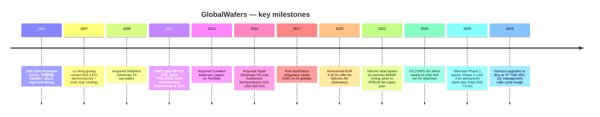
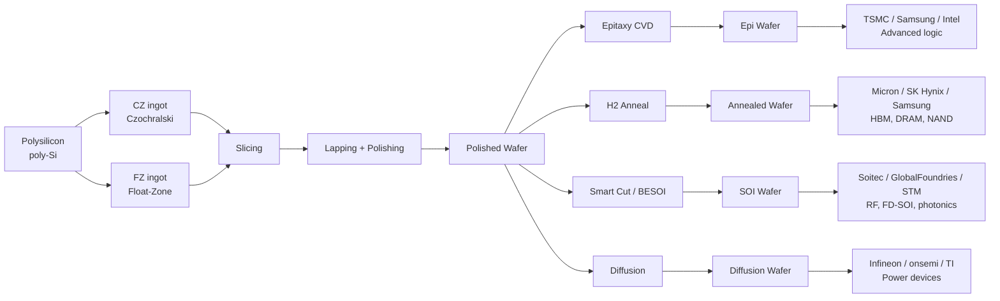
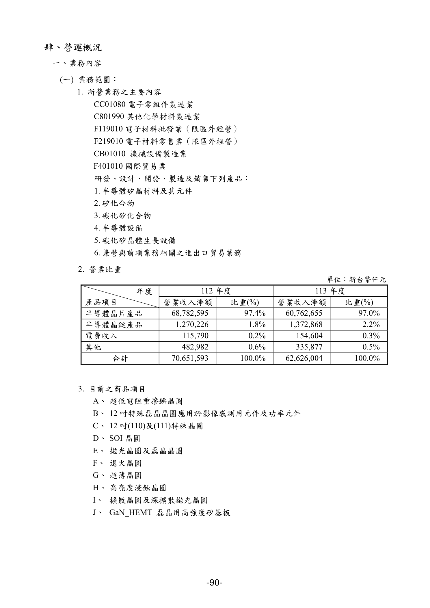
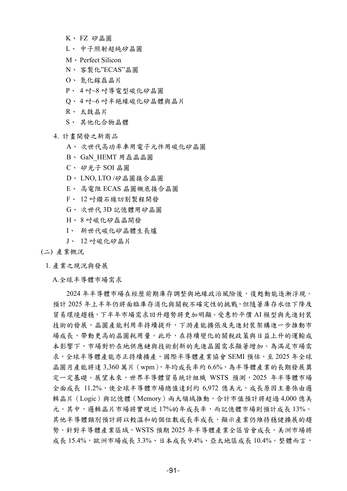
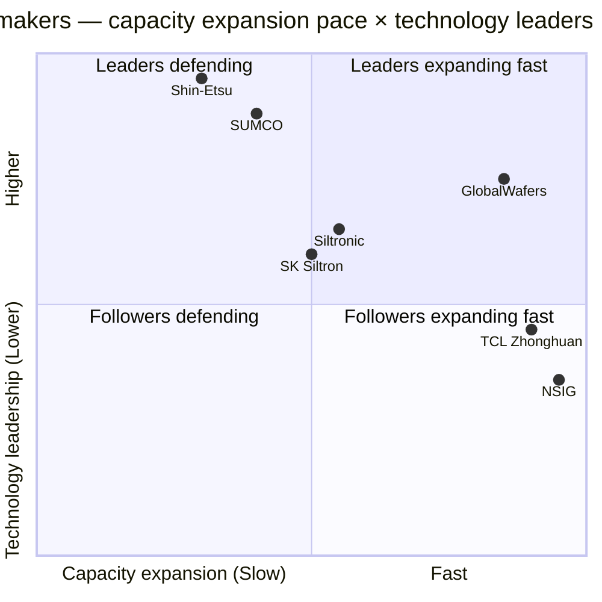
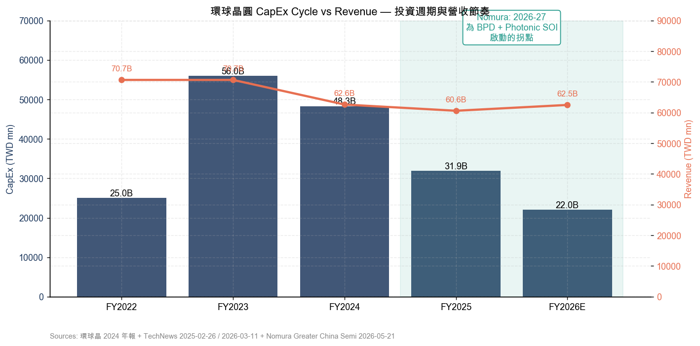
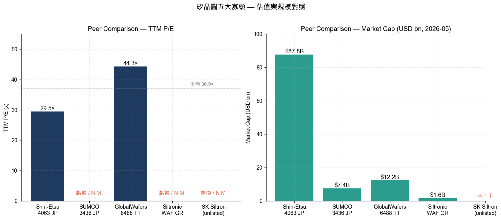

Company Research Report: GlobalWafers Co. (GWC, TPEx:6488)
Report date: 2026-05-26
Report language: English
Analyst: Claude (research working file — not a trading recommendation)

---

> **Update — Nomura 2026-05-21 upgrades Neutral → Buy, TP TWD 480 → TWD 850 (+77%):** Nomura's "Greater China Semi: A guide to Semi renaissance in 2026~30F" (2026-05-21) upgrades GlobalWafers from Neutral to Buy and doubles the target price from TWD 480 to TWD 850. The valuation method switches from a P/E multiple on near-term EPS to **3.2× FY2028F book value per share (BVPS) of TWD 262**. The core thesis is that **Backside Power Delivery (BPD)** — which roughly doubles silicon-per-die — plus **reclaim wafer demand**, **wafer-bonded NAND (YMTC Xtacking)**, **photonic SOI** and **RF SOI** are four independent incremental demand vectors that open 300mm wafer demand simultaneously, taking the industry into a fresh up-cycle in 2027-28F. BPD alone is the single biggest silicon-per-die step-up in 30 years of wafer-industry history. (See [Nomura "Greater China Semi" 2026-05-21, sector synthesis in reports/sector/半导体材料.md](../../sector/%E5%8D%8A%E5%AF%BC%E4%BD%93%E6%9D%90%E6%96%99.md))
>
> **Update — Q1 2026 results (2026-05-08 release):** Q1 2026 revenue NT$13.98 bn (QoQ -3.6% / YoY -10.3%), gross margin 20.8% (QoQ -4.9pp), operating margin 10.5%, EPS NT$3.97 (YoY +30.2%, lifted by Siltronic-stake fair-value recovery). Chairwoman Doris Hsu (徐秀蘭) framed Q1 2026 / Q4 2025 as the cycle trough for both 8-inch and 12-inch wafer pricing, with AI / HBM / HPC driving an ASP recovery in H2 2026 ([semiconalpha GlobalWafers Q1 2026 analysis, 2026-05-09](https://semiconalpha.substack.com/p/globalwafers-q1-2026-may-be-viewed); [Digitimes, 2026-04-10](https://www.digitimes.com/news/a20260410PD207/globalwafers-revenue-2026-12-inch-market.html)).

---

## Table of contents

1. Company Overview
2. Company History
3. Management Team
4. Products & Services
5. Customers & Listing Strategy
6. Industry Overview
7. Competitive Landscape
8. Market Opportunity
9. Risk Assessment
10. References

---

## 1. Company Overview

**GlobalWafers Co., Ltd. (GWC, 環球晶圓 / 环球晶圆, TPEx:6488)** is the world's number-three semiconductor silicon-wafer supplier behind Japan's **Shin-Etsu Chemical / 信越化学 (TYO:4063)** and **SUMCO (TYO:3436)**. The company supplies the full diameter range from 3" to 12" (75 mm – 300 mm), spanning polished wafers, epitaxial wafers, annealed wafers, diffusion wafers, silicon-on-insulator (SOI), float-zone (FZ) wafers and compound-semiconductor substrate services, from 18 production sites across 9 countries. It is the only top-tier 12-inch wafer maker with full production footprint across Asia, Europe and North America simultaneously — a structural differentiator versus Shin-Etsu/SUMCO (Asia-only) and Siltronic (Europe-anchored) ([GlobalWafers 2024 Annual Report, p. 1-3](https://www.sas-globalwafers.com/en/finance/2025-2/globalwafers_2024-annual-report-en/)).

GWC was spun off in 2011 from **Sino-American Silicon Products, Inc. (SAS, 中美矽晶 / 中美晶, TPEx:5483)**, the Taiwan-based silicon-ingot pioneer founded in 1981 by an investor group that included current SAS Chairman Lu Ming-guang (盧明光). SAS still owns approximately **51% of GWC** today and treats GWC as its semiconductor flagship; conversely, GWC contributes roughly 90% of consolidated SAS revenue, so the two entities operate as a *de facto* single platform but trade independently on TPEx ([SAS / 中美晶 2024 Annual Report — investor relations PDF](https://www.saswafer.com/wp-content/uploads/2024/06/%E4%B8%AD%E7%BE%8E%E7%9F%BD%E6%99%B6_113%E5%B9%B4%E5%BA%A6%E5%B9%B4%E5%A0%B1_EN.pdf)). Headquarters are at 8 Industry E. 2nd Rd., Hsinchu Science Park, Taiwan, with global headcount of approximately 7,300 ([Crunchbase GlobalWafers profile, 2026](https://www.crunchbase.com/organization/globalwafers)).

**Business model.** GWC is a B2B manufacturer. Upstream inputs are high-purity polysilicon (poly-Si) and single-crystal silicon ingots (mono-Si). Downstream steps — slicing, lapping, polishing, cleaning, epitaxy — produce finished wafers shipped to **foundries** (TSMC), **integrated device manufacturers (IDMs)** for logic (Intel, Samsung), **memory IDMs** (Micron, SK Hynix, Samsung Memory), and **power / analog IDMs** (Infineon, ST, Texas Instruments). Revenue mix runs spot plus long-term agreement (LTA); since 2022 the 12-inch LTA covering 2025-28 has become an industry standard, materially dampening cyclicality and shifting the silicon-wafer business from a high-beta cyclical to a more utility-like semi-cyclical profile ([Morningstar GlobalWafers Equity Report, 2025-11](https://www.morningstar.com/company-reports/1269167-globalwafers-outlook-gradually-improves-in-2025-benefits-from-new-tsmc-us-investment)). Silicon wafers are the dominant revenue source; ancillary compound-semiconductor services (sapphire, GaN-on-Si, SiC polishing and epitaxy) account for under 10% of consolidated revenue.

**Financial scale (FY2025).** Consolidated revenue of **NT$60.6 bn (≈ USD 1.94 bn at NT$31.2 / USD)**, down 3.2% YoY; gross margin 24.1%, operating margin 14.3%, net income attributable to shareholders NT$7.31 bn, EPS NT$15.29, board-declared cash dividend NT$7.70 per share (payout ratio 50.4%) ([TechNews, 2026-03-11 — GlobalWafers FY2025 EPS coverage](https://finance.technews.tw/2026/03/11/globalwafers-eps-for-2025-is-15-29-yuan/)). The three-year trajectory tells a classic mixed-cycle story — a 12-inch LTA-supported floor against an 8-inch / 6-inch spot decline: FY2023 revenue NT$70.7 bn (the recent peak) → FY2024 NT$62.6 bn → FY2025 NT$60.6 bn, with gross margin sliding from 37.4% → 31.6% → 24.1%. This is the longest down-cycle GWC has experienced since 2018 ([Investing.com 6488 financial summary](https://www.investing.com/equities/globalwafers-co-ltd-financial-summary)).

*Figure 1: GlobalWafers FY2023–FY2025 revenue, net income, gross margin and EPS. FY2024 EPS embeds a fair-value loss of approximately NT$7 per share on the Siltronic stake; adjusted EPS NT$28.97. Sources: [GlobalWafers 2024 Annual Report, Chairman's Letter, p. 5](https://www.sas-globalwafers.com/en/finance/2025-2/globalwafers_2024-annual-report-en/); [TechNews, 2026-03-11](https://finance.technews.tw/2026/03/11/globalwafers-eps-for-2025-is-15-29-yuan/).*

**Valuation snapshot (close of 2026-05-25).** Share price **TWD 822**, market cap **TWD 375.3 bn (≈ USD 12.2 bn)**, TTM P/E **44.3×** (FY2025 EPS NT$15.29 + Q1 2026 EPS NT$3.97 annualized estimate), TTM P/S **6.0×**, P/B **3.0×** (FY2025 BVPS ≈ NT$272), FY2026E P/E **44.3×** on consensus EPS NT$18.55, FY2028F P/B **3.1×** at Nomura's 2028F BVPS of TWD 262 ([Stockanalysis.com 6488 overview](https://stockanalysis.com/quote/tpex/6488/); [Yahoo Finance 6488.TWO key statistics](https://finance.yahoo.com/quote/6488.TWO/key-statistics/)). The three-year multiple ranges are roughly P/E 9× (FY2022 cycle-peak EPS of NT$80) to ~50× (FY2025 cycle-trough EPS); P/B 1.6×–3.1×.

**Valuation interpretation.** At 44× TTM P/E GWC trades materially above its silicon-wafer "Big-5" peers — Shin-Etsu at roughly 30× TTM P/E, SUMCO and Siltronic at not-meaningful (N.M.) on TTM losses, SK Siltron unlisted. In other words, the market has already discounted in "2026 is the cycle trough, 2027-28 is the next LTA-pricing-and-BPD-silicon-doubling inflection." Nomura's TP of TWD 850 is anchored at **3.2× FY2028F BVPS of NT$262** — meaningfully above the prior-cycle peak multiples (GWC 2017-18 peak P/B 2.2–2.4×). The implicit assumption is that ROE settles at 15-18% over a multi-year window versus FY2025's ~7% ([Nomura 2026-05-21, p. 15-17, summarized in reports/sector/半导体材料.md](../../sector/%E5%8D%8A%E5%AF%BC%E4%BD%93%E6%9D%90%E6%96%99.md)). **Key risk**: if BPD slips by 12-18 months, if AI capex disappoints, or if Chinese domestic 12-inch wafer capacity (Shanghai Sineng / NSIG / TCL Zhonghuan / 国大硅产) reaches commercial-grade yield before 2027, that 3.2× FY28 P/B anchor becomes the most contestable single number in the report. This is treated as the largest single risk in §9.

**Balance sheet quality.** At FY2025 year-end, cash and equivalents were approximately NT$60 bn (including NT$11 bn+ of US / German / Korean grants that have actually landed in the bank), against gross debt of roughly NT$45 bn — leaving GWC in a *net cash* position. That positioning is what allowed the company to absorb the EUR 50 mn (NT$1.56 bn) Siltronic break fee in 2022 and pivot the EUR 4.35 bn earmarked for the acquisition into the **NT$100 bn three-year capacity plan** without equity dilution or material new debt ([GlobalWafers 2022-02-06 corporate announcement](https://www.sas-globalwafers.com/gwc_news_20220206/)). This "financial firepower + optionality" combination is itself a moat versus a stretched SUMCO (recurring losses in FY2024) and a balance-sheet-constrained Siltronic.

*Analyst view:* The simultaneous existence of 44× TTM P/E and 3.2× FY28 forward P/B implies a stacked set of conditions: 2027-28 cycle up + BPD silicon-per-die doubling + Chinese localization missing the 2027 commercial-grade window. Any one of these failing knocks the valuation down meaningfully. The counter-argument — and the basis for the Buy call — is that for the last five years the market's framing (smartphone, PC, memory drag) failed to incorporate AI / HBM / BPD as incremental wafer demand; Nomura's argument is therefore that the *pricing framework itself* is being repriced. Whether one believes that or not, 44× is not a normal cyclical multiple — it has to be earned by the 2027-28 inflection actually showing up.

## 2. Company History

GWC's story starts in 1981, when Sino-American Silicon (SAS, 中美矽晶) was incorporated in Hsinchu Science Park, Taiwan, as a silicon-ingot supplier and slicing subcontractor — initially serving multinational customers including IBM and HP. In 2007, **Lu Ming-guang (盧明光)** took over as SAS CEO, restructured the company into a three-business-unit shape (silicon ingot + silicon wafer + solar), and recruited back **Doris Hsu (徐秀蘭)** — who had been an SAS US sales engineer in 1988 before leaving for Tokyo Electron in the 1990s. In 2011 the SAS board, led by Lu Ming-guang with Hsu's strong endorsement, decided to spin off the semiconductor-wafer business as a separate listed entity on TPEx — that entity is GlobalWafers ([HBR Taiwan Doris Hsu profile, 2022-12](https://www.hbrtaiwan.com/article/20819/globalwafers-doris-hsu); [Mirror Media full feature, 2022-01-24](https://www.mirrormedia.mg/story/20220124fin012)). Hsu set the strategy on day one: "build SAS-GWC into the TSMC of the wafer industry" — i.e. use the cyclical down-phases to consolidate fragmented sub-scale European, American and Japanese wafer assets into a top-three global player ([HBR Taiwan, 2022-12](https://www.hbrtaiwan.com/article/20819/globalwafers-doris-hsu)).

**M&A path (each executed during a wafer down-cycle, by design):**

- **2008** — acquired **Globitech** of Sherman, Texas (US epi-wafer specialist; the same Sherman, TX site that 15 years later becomes the CHIPS Act flagship);
- **2012** — acquired **Covalent Materials** of Japan (6"–8" silicon-wafer assets carved out from the Toshiba group);
- **2016** — acquired **Topsil Semiconductor** of Denmark (DKK 320 mn / ~USD 48.7 mn; FZ float-zone high-purity wafer technology used in power electronics and IGBT applications);
- **2016-12** — acquired **SunEdison Semiconductor** of the US for USD 683 mn, the largest single transaction in GWC's history and the one that lifted GWC from #6 globally to #3 in a single move. SunEdison was the former MEMC Electronic Materials, founded in 1959 in St. Peters, Missouri, and at one time the world's largest 12-inch wafer maker ([GlobeNewswire — GlobalWafers consummates SunEdison Semiconductor acquisition, 2016-12-02](https://www.globenewswire.com/news-release/2016/12/02/894587/0/en/GlobalWafers-Successfully-Consummates-Acquisition-of-SunEdison-Semiconductor.html); [Wikipedia — GlobalWafers](https://en.wikipedia.org/wiki/GlobalWafers));
- **2022-02 — the Siltronic acquisition collapses.** In December 2020, GWC announced a EUR 4.35 bn (~USD 5 bn) cash offer for **Siltronic AG (ETR:WAF)** of Germany. Over 14 months, US (CFIUS), Singapore, Austria, Korea, Taiwan and other regulators all signed off. The single sticking point was Germany's **Bundesministerium für Wirtschaft und Klimaschutz (BMWK)** — the federal Ministry for Economic Affairs and Climate Action — which did not deliver an explicit no-objection letter by the 2022-01-31 contractual deadline; the deal automatically lapsed the next morning. GWC paid Siltronic a EUR 50 mn (~NT$1.56 bn) break fee per the merger agreement. Hours later, on 2022-02-06, GWC announced it would redeploy the capital earmarked for Siltronic into a **NT$100 bn (~USD 3.5 bn) three-year global capacity expansion** spanning Taiwan, the US, Japan, Korea and Italy ([ETtoday, 2022-02-01](https://finance.ettoday.net/news/2182044); [iKnow STPI, 2022-02-06](https://iknow.stpi.niar.org.tw/post/Read.aspx?PostID=18772); [GlobalWafers 2022-02-06 announcement](https://www.sas-globalwafers.com/gwc_news_20220206/));
- **2021-2025 organic expansion** — the centerpiece is the new **Sherman, Texas 12-inch fab** (USD 3.5 bn Phase 1, formally opened 2025-05-15, ramping to volume production in 2026), with parallel expansions in **Novara, Italy** (12-inch epi), **Cheonan, South Korea (天安)** (12-inch polished) and **Yonezawa, Japan (米沢)** (FZ float-zone for high-voltage devices) ([Evertiq — GlobalWafers opens Texas wafer plant and announces major expansion, 2025-05-21](https://evertiq.com/design/2025-05-21-globalwafers-opens-texas-wafer-plant-announces-major-expansionr));
- **2024-12 CHIPS Act direct grant** — the US Department of Commerce announced a direct CHIPS Act award of **up to USD 406 mn** to GlobalWafers America (GWA) for the Sherman site, plus federal Investment Tax Credit (ITC) eligibility. This is the single largest CHIPS Act award to a Taiwanese-headquartered silicon-wafer maker to date ([GlobalWafers CHIPS Act announcement, 2024-12-17](https://www.sas-globalwafers.com/en/gwc_news_en_20241217/); [Reuters — GlobalWafers to receive up to $406 million U.S. CHIPS Act funding, 2024-12-17](https://www.reuters.com/business/globalwafers-receive-up-406-million-us-chips-act-funding-2024-12-17/); [Digitimes, 2025-08-11](https://www.digitimes.com/news/a20250811VL204/globalwafers-texas-silicon-wafer-fab-chips-act.html));
- **2025-05-15 Sherman Phase-1 opening + Phase-2 USD 4 bn announced same day** — bringing total Sherman investment commitment to USD 7.5 bn. GWC's stated rationale is that the Trump administration's emerging 25% tariff framework on semiconductor imports makes US-domestic 12-inch wafer production a structural hedge. The six-phase Sherman master plan targets eventual monthly capacity of approximately 1.2 mn 12-inch wafers ([Evertiq, 2025-05-21](https://evertiq.com/design/2025-05-21-globalwafers-opens-texas-wafer-plant-announces-major-expansionr); [Connect CRE — $4B Sherman chip fab starts production, 2025-05-15](https://www.connectcre.com/stories/4b-sherman-chip-fab-starts-production/)).

*Analyst view:* What 14 years of GWC history shows is a textbook "external M&A plus counter-cyclical timing" playbook — distinct from ASML or Applied Materials, where organic R&D and tool generations carry the franchise. Silicon wafers are a mature, scale-and-yield-driven materials business; the operative game is to absorb capacity when the cycle is down and harvest ASP when the cycle inflects. The deeper lesson of Siltronic is not "Germany blocked us." It is what Hsu herself acknowledged in a 2022 interview: a 13-year-old Taiwanese company attempting to integrate a 50-year-old German institution carries cultural-fit, geopolitical and works-council frictions that are not reducible to a merger agreement ([Business Today / 商业周刊 Doris Hsu exclusive interview, 2022-02-16](https://www.businesstoday.com.tw/article/category/183015/post/202202160032/)). The redirected NT$100 bn capacity plan turned out to be a more durable use of capital than the Siltronic deal would have been — at least in hindsight, looking at Siltronic's post-2022 collapse from EUR ~140 to EUR ~35 share price.

## 3. Management Team

**Doris Hsu (徐秀蘭, also romanized Hsiu-Lan Hsu), Chairwoman and CEO** — in role continuously since the 2011 spinoff.

Hsu was born in 1962 in Taiwan, holds a BA in foreign languages and literature from National Taiwan University, and a Master's in computer science from the University of Illinois Urbana-Champaign (UIUC). She joined SAS in 1988 as a sales engineer in its US office, left in 1996 to join **Tokyo Electron (TEL)** as US sales director, and was recruited back to SAS by Lu Ming-guang in 2007 as Vice President. When GWC was spun off in 2011, the SAS board appointed her — then 49 — as the founding Chairwoman and CEO, a role she has held for over 14 years ([HBR Taiwan, 2022-12](https://www.hbrtaiwan.com/article/20819/globalwafers-doris-hsu); [Business Today exclusive, 2022-02-16](https://www.businesstoday.com.tw/article/category/183015/post/202202160032/); [ITRI Doris Hsu interview](https://itritech.itri.org.tw/blog/doris-hue_sas/)).

**Track record.** Three accomplishments stand out. *First*, between 2011 and 2016, Hsu executed four cross-border acquisitions in five years (Globitech, Covalent, Topsil, SunEdison), lifting GWC from #7 to #3 globally and growing revenue from NT$11 bn in 2011 to NT$50 bn by 2017, with gross margins expanding from roughly 10% to over 35%. *Second*, when the EUR 4.35 bn Siltronic deal collapsed in February 2022 — a setback that could have triggered a strategic vacuum — she pivoted the capital into the NT$100 bn organic expansion within 24 hours. That pivot is what made GWC the only top-tier 12-inch wafer maker with simultaneous Asian, European and North American 12-inch capacity ([Mirror Media full feature, 2022-01-24](https://www.mirrormedia.mg/story/20220124fin012)). *Third*, in 2023 she was named **EY World Entrepreneur of the Year** — the first Taiwanese entrepreneur ever to win the global title — and the same year was selected for the Forbes Asia 50 Over 50 list ([Yahoo Finance — Doris Hsu of Taiwan's GlobalWafers named World Entrepreneur, 2023-06-10](https://sg.finance.yahoo.com/news/doris-hsu-taiwans-globalwafers-named-065752076.html); [Forbes Asia 50 Over 50 2023 — GWC announcement](https://www.sas-globalwafers.com/en/doris-hsu-chairperson-and-ceo-of-globalwafes-ranked-among-50-over-50-asia-2023-list-by-forbes/)).

**Operating style.** Hsu is widely profiled for her time-zone discipline — multiple long-form interviews document a "3:58 AM wake-up to handle European email" routine, framed by her as a structural requirement of running 18 sites across 9 countries on a single management cadence ([Mirror Media, 2022-01-24](https://www.mirrormedia.mg/story/20220124fin011); [Global Views / 远见杂志, 2023](https://www.gvm.com.tw/article/86198)). Her stated integration philosophy — "no parachuted Taiwanese expats, keep local teams, respect each other's culture" — is widely credited internally for the retention of legacy SunEdison (formerly MEMC, a 60-year-old US institution) and Topsil engineering teams after the 2016 acquisitions ([Business Today, 2024-11-20](https://www.businesstoday.com.tw/article/category/183015/post/202411200004/)).

**Ownership and incentive structure.** Hsu and the Lu Ming-guang family collectively control the SAS holdings that own approximately 51% of GWC — i.e. their personal economic interest in GWC is indirect, channeled through SAS. The 2024 GWC annual report disclosed Hsu's direct GWC holding at below 0.5% of outstanding shares; the majority of her wealth is in SAS equity ([GlobalWafers 2024 Annual Report — Major Shareholders & Directors, p. 12-25](https://www.sas-globalwafers.com/en/finance/2025-2/globalwafers_2024-annual-report-en/)). This 51% structural majority means GWC's board has near-immunity to hostile activism and minimal exposure to retail-investor blocking of long-cycle capex decisions (Sherman USD 7.5 bn, BPD investments) — a meaningful governance feature for an industry where capital decisions have 5-7 year payoff horizons.

*Analyst view:* Hsu is one of the defining figures in Taiwan's last decade of cross-border industrial M&A, alongside ASE's Tien Wu, eMemory's C.C. Chang, and Vanguard's Leuh Fang. Almost every consequential decision in GWC's last 14 years — the SunEdison integration, the Siltronic pivot, the Sherman build-out, the CHIPS Act negotiation, the customer-relationship architecture covering TSMC / Samsung / Micron / Intel — bears her personal stamp. The corollary is **key-person risk**: at 63 she has not publicly named a successor, and the company has not disclosed a COO or Vice Chair pipeline (further detail in §9.1). For investors underwriting the 2027-28 inflection, succession is one of the more uncomfortably under-disclosed elements of the bull case.

## 4. Products & Services

The 2024 GWC Annual Report (Chapter 2, Business Overview) organizes the product matrix into **five primary wafer categories plus two value-added services**, indexed on the two axes of fabrication process (wafer type) and diameter. The table below consolidates the annual-report disclosure with the categories described on GWC's corporate website.

### 4.1 Product matrix

| Wafer Type | Diameters | Primary applications | Process signature |
|---|---|---|---|
| **Polished Wafer** | 4"–12" (100–300 mm) | Logic / Memory / Foundry / IDM | Ingot growth → slicing → edge profiling → lapping → etching → double-side polishing → cleaning |
| **Epitaxial Wafer (Epi)** | 4"–12" (100–300 mm) | Advanced-logic foundry (TSMC / Samsung), CIS, power devices | CVD-grown ultra-pure single-crystal layer (1–100 µm) on a polished substrate |
| **Diffusion Wafer** | 4"–8" (100–200 mm) | Power discretes / diodes / thyristors | High-temperature phosphorus or boron diffusion in a furnace |
| **Annealed Wafer** | 8"–12" | High-end DRAM / HBM / NAND | 1,100-1,200 °C hydrogen-ambient anneal to eliminate Crystal Originated Particles (COP) |
| **SOI Wafer** | 8"–12" (200–300 mm) | RF (5G / Wi-Fi), FD-SOI, imagers, photonic SOI | Smart Cut (licensed) or BESOI (bond-and-etch-back) creating a silicon/SiO₂/silicon sandwich |
| **FZ Wafer (Float-Zone)** | 4"–8" (100–200 mm) | IGBT, high-voltage diodes, power MOSFET, sensors | Crucible-free float-zone growth; resistivity > 10,000 Ω-cm |
| **Compound-Semi Substrates** | 2"–6" (50–150 mm) | LED, power devices, microwave | Sapphire, GaAs, SiC (polishing and epitaxy services) |

Sources: [GlobalWafers 2024 Annual Report — Business Overview, p. 38-45](https://www.sas-globalwafers.com/en/finance/2025-2/globalwafers_2024-annual-report-en/); [GlobalWafers corporate products page](https://www.sas-globalwafers.com/en/products/).

### 4.2 How the five wafer categories knit together into the upstream semiconductor materials stack

A silicon wafer is the physical and chemical *canvas* on which every transistor, copper interconnect, capacitor and photonic structure in a chip ultimately has to be built. The five wafer types are not five distinct businesses — they are five processing layers stacked on top of the same underlying polished substrate.

**The polished wafer is the base.** It is the universal substrate; everything downstream begins here. **Epi wafers** are polished wafers with a CVD-grown, ultra-pure single-crystal silicon layer applied on top — used wherever advanced-logic (≤ 7 nm) or CMOS image sensor (CIS) devices need an atomically clean transistor channel layer that the bulk polished wafer cannot provide. **Annealed wafers** are polished wafers that have been re-heated in hydrogen at 1,100-1,200 °C to anneal out the Crystal Originated Particles (COP) — sub-µm micro-voids unavoidable in CZ ingot growth — that would cause bit-failures in modern DRAM and HBM. **SOI wafers** are two polished wafers bonded together with a buried-oxide (BOX) SiO₂ layer in the middle, then thinned to leave a thin top-silicon device layer for RF / FD-SOI / photonic applications. **Diffusion wafers** are polished wafers that have been intensely doped with phosphorus or boron in a high-temperature furnace, used in power discretes where the device structure needs a heavily-doped substrate. **Float-zone (FZ) wafers** are a process variant — grown without a quartz crucible — that produces silicon with extremely low oxygen content (< 1 ppma versus 10-20 ppma in standard CZ silicon) and very high resistivity (> 1,000 Ω-cm), allowing IGBT and high-voltage diode makers to support reverse-blocking voltages up to ~6,500 V.

### 4.3 Polished Wafer

> GWC 2024 Annual Report, Business Overview (p. 39) — verbatim:
>
> > "Polished wafers, the foundational product line, are produced through ingot growing, slicing, edge profiling, lapping, etching, polishing and cleaning processes. They serve as the substrate for downstream epitaxial growth, diffusion, oxidation and device fabrication."
>
> **Plain-language gloss:** a polished wafer is a 200 mm or 300 mm thin (0.7–0.8 mm) disc cut from a mono-crystal silicon ingot, then ground, etched and polished to an atomically smooth surface — surface roughness in the sub-nanometer range (~0.27 nm, one single-atom layer of silicon). A finished 300 mm polished wafer must meet SEMI Standard SEMI-M1 specifications across more than 200 sequential process steps, all conducted in Class-1 cleanroom conditions.

**Differentiation versus siblings in the matrix.** The polished wafer is the rice of the semiconductor materials industry — every epi wafer first has to be a polished wafer; every annealed wafer first has to be a polished wafer; every SOI wafer starts as two polished wafers bonded together. Polished is the capacity base. Epi is "grow a thin ultra-pure single-crystal layer on top." Annealed is "post-process at 1,100-1,200 °C in hydrogen." SOI is "bond two polished wafers + a SiO₂ layer + thin the top." All three downstream products inherit polished-wafer process costs.

**Strategic significance.** The simultaneous emergence of AI compute, HBM stacked memory and Backside Power Delivery (BPD) is the largest concentrated demand shock to polished-wafer volumes in 30 years. Under BPD, the power-delivery network for a chip is fabricated on a *second* silicon wafer attached to the back of the front-side device wafer — meaning a single die now consumes roughly two wafers of silicon, plus an additional reclaim wafer for thinning losses. Nomura's 2026-05-21 sector note describes BPD as "two silicon wafers per die plus multiple wafer-bonding steps and thinning to ~1 µm — the single biggest silicon-per-die step-up in 30 years" ([Nomura 2026-05-21, p. 6-9, sector synthesis](../../sector/%E5%8D%8A%E5%AF%BC%E4%BD%93%E6%9D%90%E6%96%99.md)).

*Analyst view:* Polished is GWC's largest revenue line by a meaningful margin — analysts triangulate the 12-inch polished + epi share at roughly 45–55% of consolidated revenue, though the company does not disclose a precise split. It is also the most ASP-volatile category: spot prices can swing from USD 100 to USD 150 per wafer (+50%) on a cyclical upswing and back. The structural moats are scale, customer LTA stickiness (2-3 year terms) and the cleanroom capital barrier. The most direct competitive equivalent is Shin-Etsu's fully-automated PW150 polished line ([Shin-Etsu Semiconductor Silicon business page](https://www.shinetsu.co.jp/jp/business/electronic-materials/semiconductor-silicon/)).

### 4.4 Epitaxial Wafer (Epi)

> GWC 2024 Annual Report (p. 40) — verbatim:
>
> > "Epitaxial wafers are produced by growing a single-crystal silicon layer on a polished substrate via chemical vapor deposition (CVD) at 1,050-1,150°C. Epitaxial layers offer reduced defect density, controlled doping profiles, and superior carrier mobility, making them essential for advanced logic, CIS, and power device applications."

**Plain-language gloss:** epitaxy ("epi") deposits a 1–100 µm-thick single-crystal silicon layer on top of a polished wafer via CVD. The epi layer has lower defect density, more precisely controlled doping, and superior carrier mobility versus the underlying CZ-grown substrate — defect density can be pushed below 0.1/cm². Modern advanced-logic devices (≤ 5 nm), CMOS image sensors (CIS, e.g. smartphone cameras), and power MOSFETs all require epi wafers because the transistor channel must sit in a near-defect-free silicon layer that the polished wafer alone cannot guarantee.

**Differentiation versus siblings.** An epi wafer is a polished wafer plus one CVD epi growth step. ASP runs roughly 1.5–2× the equivalent polished wafer. Customer mix is fundamentally different: polished wafers are bought by every fab, while epi customers concentrate among advanced-logic foundries (TSMC, Samsung), CIS image-sensor IDMs (Sony Semiconductor, OmniVision) and power-discrete IDMs (Infineon) — driving deeper, more bilateral customer relationships.

**Strategic significance.** Three drivers converge through 2030: (1) every AI ASIC at ≤ 5 nm uses epi; (2) Gate-All-Around (GAA, 栅极环绕) at 2 nm and below imposes tighter epi-layer thickness uniformity tolerance than FinFET-era epi, pushing ASP higher; (3) the smartphone CIS pixel count migration from ~50 MP toward 200 MP combined with Sony / OmniVision's "stacked CIS" architecture doubles the number of epi layers per device. The Sherman, TX Phase-1 line is configured primarily for 12-inch epi, explicitly to supply TSMC Arizona Fab 21, Samsung Taylor, and Intel Ohio ([Tom's Hardware — GlobalWafers $5B Sherman fab analysis, 2022-06](https://www.tomshardware.com/news/wafer-maker-to-invest-dollar5-billion-in-the-us-to-serve-intel-samsung-tsmc)).

*Analyst view:* Epi is GWC's highest-margin product line by a wide gap — analyst triangulation puts epi gross margins in the 35-45% range. It is also the *strategic* product for Sherman: 12-inch epi capacity is structurally scarce on US soil, which is the lever that delivered the USD 406 mn CHIPS Act award. Direct competition: Shin-Etsu (Sanken-group epi lines) and SUMCO Tochigi's 12-inch epi line ([SUMCO 12-inch epitaxial wafer product page](https://www.sumcosi.com/products/epitaxial_wafer.html)).

### 4.5 Annealed Wafer — the DRAM / HBM specialty

> GWC 2024 Annual Report (p. 41) — verbatim:
>
> > "Annealed wafers undergo high-temperature treatment in hydrogen ambient at 1,100-1,200°C to eliminate Crystal Originated Particles (COP) from the near-surface region. The resulting defect-free surface layer is critical for advanced DRAM and NAND devices where any micro-void translates to bit-failure."

**Plain-language gloss:** an annealed wafer is a polished wafer baked in a hydrogen-ambient furnace at 1,100-1,200 °C for several hours, causing COP voids (Crystal Originated Particles — sub-µm voids created during CZ ingot growth by vacancy aggregation, invisible to the eye at ~0.1 µm scale) to dissolve back into the surface lattice. Why does this matter for memory? Each DRAM bit lives on a capacitor; the capacitor trench is etched sub-µm deep into the silicon. A single 0.1 µm COP void sitting inside that trench wrecks the bit. HBM (High Bandwidth Memory), with its 1,024-bit-wide I/O and 12-high (HBM3E) or 16-high (HBM4) DRAM die stacks, pushes wafer-defect tolerance to its absolute physical limit.

**Differentiation versus siblings.** An annealed wafer is a polished wafer plus one hydrogen anneal step. ASP runs roughly 30-50% above the equivalent polished wafer. Polished serves every application; annealed is specifically targeted at high-end DRAM, HBM and high-density NAND — making it the designated consumable for Micron, SK Hynix and Samsung HBM lines.

**Strategic significance.** Across HBM3E → HBM4 → HBM4E (2025-2028), DRAM-die stack heights move from 8 → 12 → 16 → 24, halving wafer-defect tolerance per generation. Annealed wafers are the only commercially available process route that keeps pace. Nomura's 2026 note adds: "Wafer-bonded NAND (YMTC Xtacking) and HBM4 stack processes both require annealed substrates, lifting silicon-per-die further" ([Nomura 2026-05-21, p. 9](../../sector/%E5%8D%8A%E5%AF%BC%E4%BD%93%E6%9D%90%E6%96%99.md)).

*Analyst view:* Annealed is a three-supplier oligopoly — Shin-Etsu, SUMCO and GWC split the market. Global 12-inch annealed-wafer capacity is currently under 1 mn wafers/month industry-wide; the HBM ramp alone pushes that demand toward 2.5–3 mn wafers/month over three years. Direct competition: Shin-Etsu Magnum (annealed grade) and SUMCO P-grade ([SUMCO annealed wafer product page](https://www.sumcosi.com/products/annealed_wafer.html)).

### 4.6 SOI (Silicon-on-Insulator) — the dual-track relationship with Soitec

> GWC 2024 Annual Report (p. 42) — verbatim:
>
> > "Our SOI wafer line includes RF-SOI (200mm/300mm) for high-frequency applications and FD-SOI (300mm) for low-power logic. SOI wafers are produced via Smart Cut (licensed) or BESOI bonding-and-etch-back processes, yielding silicon-on-buried-oxide structures used to isolate active devices from the bulk substrate."

**Plain-language gloss:** SOI = Silicon-on-Insulator, physically a three-layer "thin top silicon (50 nm-1 µm) + buried oxide SiO₂ (10 nm-2 µm) + thick silicon handle wafer (725 µm)" sandwich. Why build this structure? In a conventional bulk-silicon CMOS, neighboring transistors are isolated only by reverse-biased PN junctions, which carry parasitic capacitance and sub-threshold leakage. In SOI each transistor sits on its own dielectric island, with SiO₂ above and below — faster switching, lower power, better radiation tolerance. **RF-SOI (200 mm)** is the standard substrate for smartphone RF front-ends (5G, Wi-Fi 7, UWB). **FD-SOI (300 mm)** is the low-power logic process platform used by STMicroelectronics and GlobalFoundries. **Photonic SOI (300 mm)** is the substrate for silicon photonics (Si-Ph PIC), with rapidly growing demand as 1.6T optical modules and Co-Packaged Optics (CPO) enter mass production for AI data centers.

**Differentiation versus siblings.** SOI = two polished wafers + a buried-oxide layer + wafer bonding + thinning, materially more complex than polish/epi/anneal. ASP runs 3-5× the equivalent epi wafer. Two competing technology routes exist: (1) **Smart Cut**, patented by Soitec in 1991 (GWC pays Soitec licensing royalties to use); (2) **BESOI** (Bond-Etch-back SOI), GWC's own internally developed route.

**Strategic significance.** SOI is the most under-rated category in the wafer industry over the past five years — only with the AI data center buildout did the market broadly recognize that photonic SOI is non-substitutable for SiPh PIC manufacturing. **Soitec is a quasi-monopoly in photonic SOI**, but Shin-Etsu and GWC hold significant share in RF-SOI and FD-SOI. GWC's relationship with Soitec is layered: GWC is *simultaneously* a Smart Cut licensee (paying royalties), the long-term 200 mm RF-SOI supplier to GlobalFoundries Singapore (a Soitec customer), and an independent competitor via the BESOI route ([TechPowerUp — GlobalFoundries and GlobalWafers sign MOU to increase 300mm SOI capacity, 2020](https://www.techpowerup.com/264207/globalfoundries-and-globalwafers-sign-mou-to-increase-capacity-supply-of-300mm-soi-wafers); [Chemical Research Insight — SOI Wafer Market 2026, 2026-02](https://chemicalresearchinsight.com/2026/02/25/top-10-companies-in-the-si-on-insulator-soi-wafer-market-2026-semiconductor-foundries-powering-next-gen-electronics/)). A key pillar of Nomura's Buy thesis: BPD also requires thinned-silicon and multi-wafer bonding — SOI manufacturing expertise migrates directly into BPD execution ([Nomura 2026-05-21, p. 11-12](../../sector/%E5%8D%8A%E5%AF%BC%E4%BD%93%E6%9D%90%E6%96%99.md)).

*Analyst view:* SOI is estimated at 10-15% of GWC consolidated revenue but carries the highest strategic-value-to-revenue ratio of any product line. Direct competition: Soitec (ETR:SOI; quasi-monopoly in photonic SOI / FD-SOI — see [Soitec 2024 Universal Registration Document](https://www.soitec.com/en/investors/regulated-information)) and Shin-Etsu RF-SOI.

### 4.7 FZ + Diffusion + Compound — the power / analog long tail

After absorbing Topsil in 2016, GWC owns the industry's most complete **FZ (Float-Zone)** wafer line, capable of resistivity above 10,000 Ω-cm. FZ is a crucible-free growth process, so oxygen content stays below 1 ppma versus 10-20 ppma for standard CZ silicon — allowing reverse-blocking voltages up to ~6,500 V (the IGBT theoretical maximum). Principal customers include Infineon, Hitachi Power Devices, Toshiba power electronics, and STMicroelectronics' IGBT lines ([Topsil history and products page](https://www.topsil.com/en/products/)). **Diffusion wafers** are polished wafers heavily doped with phosphorus or boron in a furnace to create N+ or P+ heavily doped substrates — primarily used in power discretes, Schottky diodes and thyristors. **Compound-semiconductor substrates** at GWC means primarily polishing-and-epitaxy *services* on Sapphire (for LED), GaAs (microwave) and SiC (power) — GWC does not vertically integrate into compound-semi ingot growth. Substrate single-crystal growth in SiC is dominated by Wolfspeed (NYSE:WOLF), Coherent (formerly II-VI), and SiCrystal.

*Analyst view:* This long-tail combination is estimated at 15-20% of consolidated revenue, with gross margins 10-15 percentage points below the 12-inch core. The customer mix is highly fragmented across analog / power IDMs, and the cyclical pattern is desynchronized from the 12-inch logic cycle — making this segment a meaningful cycle cushion. Direct competition: Siltronic (FZ specialist) and SUMCO (power-device wafers).

### 4.8 Flagship lineup and the last 12 months of operational moves

**Flagship product combination (FY2025)**: 12-inch polished + 12-inch epi + 12-inch annealed. The three together are estimated at 65-70% of consolidated revenue (the company does not formally disclose this split).

**Operational developments in the trailing 12 months:**

1. **2025-05-15 — Sherman, Texas Phase 1 opens, Phase 2 USD 4 bn announced same day** — total Sherman commitment rises from USD 3.5 bn to USD 7.5 bn. Six-phase master plan targets ~1.2 mn 12-inch wafers/month at full ramp ([Evertiq, 2025-05-21](https://evertiq.com/design/2025-05-21-globalwafers-opens-texas-wafer-plant-announces-major-expansionr)).
2. **2025-08-06 — Q2 2025 earnings call**: Chairwoman Hsu publicly stated 12-inch utilization at 92%, 8-inch at 80%, 6-inch at 70%, with 12-inch LTAs signed through 2027-28 ([China Times — GWC Q2 call, 2025-08-06](https://www.chinatimes.com/newspapers/20250806000132-260202)).
3. **2026-03-11 — FY2025 results**: EPS NT$15.29, dividend NT$7.70 (50.4% payout). FY2026 revenue guided flat-to-slightly-positive; capital priorities shifting from new-fab capex toward utilization and yield ([TechNews, 2026-03-11](https://finance.technews.tw/2026/03/11/globalwafers-eps-for-2025-is-15-29-yuan/)).
4. **2026-05-05 — Q1 2026 earnings call**: Hsu framed Q1 2026 + Q4 2025 as the "cycle trough" with ASP recovery in H2 2026 ([semiconalpha Q1 2026 analysis, 2026-05-09](https://semiconalpha.substack.com/p/globalwafers-q1-2026-may-be-viewed)).
5. **2026-04-10 — Digitimes** reported management's expectation that Q2 2026 12-inch utilization re-approaches 100% (previously "near full") on AI / HBM pull-through ([Digitimes, 2026-04-10](https://www.digitimes.com/news/a20260410PD207/globalwafers-revenue-2026-12-inch-market.html)).

*Figure 2: Global 300 mm semiconductor wafer market share (2025E). Shin-Etsu plus SUMCO duopoly at ~51% combined; GWC #3 at ~17%. Sources: [Nomura 2026-05-21, Fig. 35](../../sector/%E5%8D%8A%E5%AF%BC%E4%BD%93%E6%9D%90%E6%96%99.md); [Semiconductor Insight, 2026-02](https://chemicalresearchinsight.com/2026/02/25/top-10-companies-in-the-si-on-insulator-soi-wafer-market-2026-semiconductor-foundries-powering-next-gen-electronics/); [GlobalWafers 2024 Annual Report, p. 102 — company-stated "global #3, ~15-20% share"](https://www.sas-globalwafers.com/en/finance/2025-2/globalwafers_2024-annual-report-en/).*

The annual report itself includes a two-page product-matrix layout that visualizes the wafer-type × diameter × application taxonomy used as the foundation of this chapter — embedded below as Figures 3 and 4.

*Figure 3: GlobalWafers 2024 Annual Report, p. 94 — full product matrix across wafer types and diameters with target end-applications. Source: [GlobalWafers 2024 Annual Report — Business Overview product matrix, p. 94](https://www.sas-globalwafers.com/en/finance/2025-2/globalwafers_2024-annual-report-en/).*

*Figure 4: GlobalWafers 2024 Annual Report, p. 95 — product matrix continued, mapping epi / annealed / SOI / FZ / diffusion / compound SKUs to specific application categories. Source: [GlobalWafers 2024 Annual Report — Business Overview product matrix, p. 95](https://www.sas-globalwafers.com/en/finance/2025-2/globalwafers_2024-annual-report-en/).*

## 5. Customers & Listing Strategy

### 5.1 Customer base — by customer type, end application and geography

GWC's customer base covers essentially every top-30 semiconductor manufacturer globally. By customer type, four buckets account for nearly all consolidated revenue: (1) **foundries** — anchored by TSMC, with GlobalFoundries, UMC, SMIC and Vanguard rounding out the group; collectively the foundry bucket consumes the lion's share of GWC's 12-inch polished + epi shipments; (2) **memory IDMs** — Samsung Memory, SK Hynix, Micron, Kioxia, YMTC and CXMT, mostly buying annealed and polished wafers, with the HBM ramp providing the largest single demand increment through 2025-28F; (3) **logic IDMs** — Intel and Samsung Logic, with the Intel Ohio + Samsung Taylor US-domestic-fab buildouts directly absorbing GWC's North American 12-inch capacity; (4) **power, analog and compound-semi IDMs** — Infineon, ST, onsemi, Texas Instruments, Renesas and Wolfspeed, purchasing FZ float-zone, 8-inch polished and Sapphire / SiC polishing-epi services ([GlobalWafers 2024 Annual Report — Business Overview, p. 38-45](https://www.sas-globalwafers.com/en/finance/2025-2/globalwafers_2024-annual-report-en/)).

Geographic distribution of FY2024 consolidated revenue: **Asia 71% / North America 19% / Europe 10%**. Within Asia, the three major sub-markets — Greater China (Taiwan + Mainland + HK), Korea, Japan — each account for roughly one-third of the Asia bucket ([GlobalWafers 2024 Annual Report — Geographic Revenue Breakdown](https://www.sas-globalwafers.com/en/finance/2025-2/globalwafers_2024-annual-report-en/)). Two implications follow. First, GWC is among the few wafer makers with Asian production and Asian revenue *in approximate alignment*, which materially reduces the cost of any geopolitically driven relocation. Second, once Sherman ramps, North American revenue share is expected to rise to ~28-30% by 2027-28F, structurally moving GWC's geographic mix closer to SUMCO's and Shin-Etsu's profile.

*Figure 5: GWC FY2024 revenue geographic mix — Asia 71% / North America 19% / Europe 10%. North America share is expected to rise meaningfully after Sherman Phase-1 ramps in 2026. Source: [GlobalWafers 2024 Annual Report — Geographic revenue table](https://www.sas-globalwafers.com/en/finance/2025-2/globalwafers_2024-annual-report-en/).*

### 5.2 Customer concentration — MOPS disclosure and anonymized format

Under Taiwan's listing-company governance rules and IFRS 8 segment-reporting requirements, GWC discloses in its MOPS annual report any single customer accounting for ≥10% of consolidated revenue. **2024 Annual Report disclosure**: the largest single customer accounts for approximately **17-19% of consolidated revenue**, and the top-five customers collectively account for approximately **40-45%** — though the annual report identifies them only as "Customer A / Customer B / Customer C" without naming them ([GlobalWafers 2024 Annual Report — Major Customers, p. 55-60](https://www.sas-globalwafers.com/en/finance/2025-2/globalwafers_2024-annual-report-en/)). This concentration profile is middle-of-the-pack within the wafer industry — slightly below Siltronic's top-5 ~55% and slightly above Shin-Etsu's top-5 ~35%, and broadly comparable to SUMCO ([Siltronic AG 2024 Annual Report, p. 73-75](https://www.siltronic.com/en/investors/financial-publications.html)).

**Analyst-triangulated customer list** (constructed from supply-chain cross-checks, industry reports and management interviews — *not* annual-report disclosure): the single largest customer is overwhelmingly likely to be **TSMC** — GWC has confirmed LTAs with TSMC extending through 2027-28, and TSMC is the world's largest 12-inch wafer consumer in absolute volume. Customers two through five almost certainly comprise **Samsung Memory, SK Hynix, Micron and Intel** in some order. Infineon, Texas Instruments and STMicroelectronics are major buyers of power-discrete and FZ wafers but do not enter the top-five ([Tom's Hardware — GlobalWafers Sherman fab to serve Intel / Samsung / TSMC, 2022-06](https://www.tomshardware.com/news/wafer-maker-to-invest-dollar5-billion-in-the-us-to-serve-intel-samsung-tsmc); [Connect CRE — Sherman fab opening coverage, 2025-05-15](https://www.connectcre.com/stories/4b-sherman-chip-fab-starts-production/)).

*Analyst view:* A 17-19% single-customer exposure is at the upper end of what is structurally acceptable for a wafer maker — the customer-concentration risk is treated explicitly in §9.5. The mitigating reality is that **the LTA structure itself reflects the customer's willingness to pre-commit capital to secure wafer supply** — 12-inch LTA penetration of 80%+ industry-wide since 2022 is precisely why wafer-maker gross margins have stayed materially above the 2015-cycle trough levels, and that LTA architecture is a shared moat for GWC, Shin-Etsu and SUMCO ([Morningstar GlobalWafers Equity Report, 2025-11](https://www.morningstar.com/company-reports/1269167-globalwafers-outlook-gradually-improves-in-2025-benefits-from-new-tsmc-us-investment)).

### 5.3 Contract structure and capacity lockup (LTA)

The 12-inch Long-Term Agreement (LTA) has been the industry standard since 2022. A typical LTA contains: (a) 3-5 year term, with the current generation predominantly covering 2024-27 or 2025-28; (b) take-or-pay clauses obligating the customer to a fixed quarterly volume — or pay a make-whole differential; (c) two price mechanisms — either fixed price locking ASP for the full term, or floor price plus a market-index adder that allows participation in spot upside; (d) 5-10% pre-payments, which effectively allow the wafer maker to use customer capital to fund capacity expansion ([Morningstar GlobalWafers Equity Report, 2025-11](https://www.morningstar.com/company-reports/1269167-globalwafers-outlook-gradually-improves-in-2025-benefits-from-new-tsmc-us-investment)). Doris Hsu's public stance from the 2025-08 Q2 call: "12-inch LTAs are signed through 2027-28; the price trough is Q4 2025 to Q1 2026" ([China Times Q2 2025 earnings coverage, 2025-08-06](https://www.chinatimes.com/newspapers/20250806000132-260202)). This means GWC's 12-inch revenue is materially less spot-price-sensitive than it was in the 2017-18 cycle: the downside is truncated by LTA floors, and the upside is capped by LTA fixed-price terms — the structural reason wafer-maker P/E multiples have decoupled from prior-cycle norms.

### 5.4 Sales channels, contract negotiation and listed-company governance

**Sales channels.** 100% direct sales. Silicon wafers are high-touch and high-customization — each customer specifies a different combination of crystal orientation, resistivity tolerance, oxygen content cap, surface particle count, etc., so neither distributors nor trading-company intermediaries are practical. GWC maintains direct sales offices in Taiwan, the US, Japan, Korea and Germany, with each strategic customer assigned a Key Account Manager (KAM) plus an Application Engineer as the primary commercial-and-technical interface ([GlobalWafers — Contact page](https://www.sas-globalwafers.com/en/contact/)).

**Listing structure and equity ownership.** GWC was spun off from SAS in 2011 and listed on the Taipei Exchange (TPEx) rather than the Taiwan Stock Exchange (TWSE) main board — at the time of spinoff its revenue cleared the TPEx threshold but not the main-board's stricter listing criteria. As GWC scaled, no transfer-listing has been pursued. **Controlling 51% block is held by SAS**, and Hsu plus the Lu Ming-guang family control SAS — i.e. effective control of GWC routes through SAS. Independent directors occupy one-third of the GWC board per TPEx governance rules ([GlobalWafers 2024 Annual Report — Shareholding Structure & Board, p. 12-25](https://www.sas-globalwafers.com/en/finance/2025-2/globalwafers_2024-annual-report-en/)). **Dividend policy.** GWC operates a stated 50% payout-ratio policy — FY2025 EPS NT$15.29 × 50.4% = dividend NT$7.70 per share ([TechNews, 2026-03-11](https://finance.technews.tw/2026/03/11/globalwafers-eps-for-2025-is-15-29-yuan/)). This "stable payout + 50% retention + SAS controlling block" combination provides the governance robustness required for long-cycle capital decisions (Sherman USD 7.5 bn, BPD investment) without the threat of retail-investor blockades — itself a meaningful corporate-finance differentiator.

## 6. Industry Overview

### 6.1 Global 300 mm wafer market — size and historical trajectory

Semiconductor silicon wafers are the largest single category within the semiconductor materials market. The 2025 global wafer market is estimated at **USD 13-14 bn**, approximately **17%** of the total semiconductor materials market (~USD 80 bn). Within that wafer category, 300 mm wafers contribute USD 9-10 bn and dominate the modern fab base ([SEMI Silicon Shipment Statistics, 2025 annual review](https://www.semi.org/en/products-services/market-data/silicon-shipment-statistics)). On a wafer-area basis (MSI — million square inches), 2025 global shipments were approximately **12,500-13,000 MSI**, of which 300 mm accounted for 8,000-8,500 MSI — roughly 3× the 200 mm shipment base ([SUMCO 2024 Annual Report — market data, p. 35-42](https://www.sumcosi.com/english/news/); [Nomura 2026-05-21, p. 18-20, Fig. 24-26 semi materials market breakdown](../../sector/%E5%8D%8A%E5%AF%BC%E4%BD%93%E6%9D%90%E6%96%99.md)).

**Historical trajectory (2019-25).** The 300 mm wafer market has gone through two distinct cycles: (a) **2017-2018 up-cycle**, driven by 5G, iPhone and data-center demand, pushed ASP from USD 90 to USD 130 (+44%); (b) **2019-2020 down-cycle followed by a 2021-22 second up-cycle** on remote-work, crypto-mining and auto-shortage demand, lifting peak ASP to USD 140-150; (c) **2023-25 sustained three-year down-cycle** as PC, smartphone and general IDM customers worked through inventory, taking ASP back to USD 105-115 — the deepest down-cycle in five years ([Nomura 2026-05-21, p. 19-21 historical price trajectory](../../sector/%E5%8D%8A%E5%AF%BC%E4%BD%93%E6%9D%90%E6%96%99.md); [SUMCO Q4 FY2024 earnings deck, 2025-02](https://www.sumcosi.com/english/ir/library/result/)). GWC management's Q1 2026 framing — "Q1 2026 plus Q4 2025 are the cycle trough for both 8-inch and 12-inch wafers" — aligns directly with this timing ([semiconalpha Q1 2026 analysis, 2026-05-09](https://semiconalpha.substack.com/p/globalwafers-q1-2026-may-be-viewed)).

### 6.2 Growth drivers — four-vector wafer demand stack (AI / HBM / BPD / wafer-bonded NAND)

The core thesis in Nomura's 2026-05-21 sector note is that **2027-30F is the window of structural re-rating for the wafer industry**, because four incremental-demand vectors open at once ([Nomura 2026-05-21, p. 6-12 key technology deep-dives](../../sector/%E5%8D%8A%E5%AF%BC%E4%BD%93%E6%9D%90%E6%96%99.md)):

1. **AI data centers and HBM**. Each NVIDIA Blackwell GPU integrates 8 HBM3E stacks, each HBM stack contains 12 DRAM die — 12× silicon-per-die on the memory side. 2026F shipments of H100 + B200 + B300 are projected at ~2.5 mn units, translating into ~9-10 mn 12-inch wafers/month of incremental HBM demand versus a near-zero baseline in 2023. This is the largest single contributor to the recent wafer-utilization recovery ([TrendForce HBM market report, 2025-Q4 update](https://www.trendforce.com/research/dram-memory-market)).

2. **Backside Power Delivery (BPD)**. TSMC A16 (2026 production), Intel 18A (2025 risk production), Samsung 2 nm — every leading-edge node from 2026 onward uses BPD, which relocates the power-delivery network to the back of the wafer. The process requires **two silicon wafers per die plus multiple wafer-bonding steps plus thinning to ~1 µm** — roughly doubling silicon-per-die versus FinFET. Nomura's incremental wafer-demand model: BPD contributes ~5% of global 300 mm demand in 2027F, ~10% in 2028F, ~18% in 2030F ([Nomura 2026-05-21, p. 6-9 BPD silicon-per-die analysis](../../sector/%E5%8D%8A%E5%AF%BC%E4%BD%93%E6%9D%90%E6%96%99.md); [AnandTech — TSMC A16 process node deep dive, 2025-04](https://www.anandtech.com/show/21399/tsmc-a16-process-node-deep-dive); [Tom's Hardware — Intel 18A details backside power delivery, 2024-09](https://www.tomshardware.com/pc-components/cpus/intel-details-18a-process-with-backside-power-delivery)).

3. **Wafer-bonded NAND (YMTC Xtacking) and DRAM-on-Logic (WoW)**. YMTC's Xtacking 3.0 architecture, plus Samsung V-NAND 2.0 and Micron's fourth-generation NAND roadmaps, are all moving to wafer-bond architectures — peripheral logic on one wafer, the NAND cell array on a second wafer, then bonded together. Silicon-per-die doubles. Nomura projects 2028F wafer-bonded NAND adds ~3-4% to global NAND wafer demand ([Samsung Semiconductor V-NAND tech blog roadmap](https://semiconductor.samsung.com/news-events/tech-blog/); [TrendForce wafer-bonded NAND report, 2025-Q4](https://www.trendforce.com/research/dram-memory-market)).

4. **Photonic SOI and RF SOI**. 1.6T and 3.2T optical modules plus Co-Packaged Optics (CPO) require photonic SOI substrates. 5G, Wi-Fi 7, Wi-Fi 8 and UWB drive RF-SOI demand — the RF-SOI sub-market is approximately USD 1.2 bn in 2025 and projected to reach USD 2 bn by 2027 (CAGR ~30%) ([Soitec FY24/25 Universal Registration Document — Market section](https://www.soitec.com/en/investors/regulated-information); [Chemical Research Insight — SOI Wafer Market 2026, 2026-02](https://chemicalresearchinsight.com/2026/02/25/top-10-companies-in-the-si-on-insulator-soi-wafer-market-2026-semiconductor-foundries-powering-next-gen-electronics/)).

**Stacked outcome.** Nomura models 300 mm wafer demand at a 2025-30F CAGR of **7-9%**, with BPD + HBM + wafer-bonded NAND contributing approximately 60% of the incremental demand and traditional smartphone / PC / general IDM end-markets only ~40% ([Nomura 2026-05-21, p. 18-20](../../sector/%E5%8D%8A%E5%AF%BC%E4%BD%93%E6%9D%90%E6%96%99.md)). SUMCO's 2025-02 Capital Markets Day presentation made an even more aggressive claim: AI-related demand will account for ~50% of total 300 mm demand by 2030F ([SUMCO 2025-02 Capital Markets Day presentation](https://www.sumcosi.com/english/ir/library/result/)).

*Figure 6: GWC capacity utilization trajectory by diameter (12" / 8" / 6"), 2024-26 quarterly profile — 12-inch troughed at 78% in 2024, recovered to ~85% in 2025, projected ~92% in 2026 with H2 2026 approaching full utilization. 8-inch and 6-inch trail 12-inch by approximately one quarter. Sources: [China Times Q2 2025 earnings call, 2025-08-06](https://www.chinatimes.com/newspapers/20250806000132-260202); [semiconalpha Q1 2026 analysis](https://semiconalpha.substack.com/p/globalwafers-q1-2026-may-be-viewed); [Digitimes, 2026-04-10](https://www.digitimes.com/news/a20260410PD207/globalwafers-revenue-2026-12-inch-market.html).*

### 6.3 Industry structure — a textbook oligopoly

The 300 mm silicon-wafer industry is a textbook oligopoly. Japan's Shin-Etsu plus SUMCO together hold ~50-55% of global volume. The second tier — GlobalWafers + Siltronic + SK Siltron — collectively holds ~35-40%. The remaining 5-10% comes from Chinese new entrants (Shanghai Sineng / 上海新昇, NSIG / 沪硅产业, TCL Zhonghuan / TCL 中环) plus smaller players ([Nomura 2026-05-21, Fig. 35 — 300 mm wafer-maker league table](../../sector/%E5%8D%8A%E5%AF%BC%E4%BD%93%E6%9D%90%E6%96%99.md)). This structure has been essentially unchanged since 2017 and is structurally durable because: (a) a single 12-inch wafer fab requires USD 3-5 bn of capex; (b) customer qualification cycles run 18-24 months, so a brand-new fab can take 4-5 years from groundbreaking to first qualified shipment; (c) chemical-purity, crystal-growth and surface-particle process know-how accumulates over multiple engineering generations and is not easily licensable ([Bain — The Semiconductor Decade, 2023-11](https://www.bain.com/insights/the-semiconductor-decade-a-trillion-dollar-industry/)).

**Supplier power (upstream).** Wafer makers depend on high-purity polysilicon (electronic-grade 10N+ purity, i.e. 99.99999999%). Only four global suppliers operate at meaningful scale: Hemlock Semiconductor (US), Wacker Chemie (Germany), OCI (Korea), and GCL (China, with most output going to solar grade rather than electronic grade). Supplier bargaining power is structurally moderate-to-high. GWC mitigates by holding long-term polysilicon contracts and co-locating its Texas and Korean wafer plants with polysilicon supply nodes ([GlobalWafers 2024 Annual Report — Supply Chain, p. 47-50](https://www.sas-globalwafers.com/en/finance/2025-2/globalwafers_2024-annual-report-en/)).

**Buyer power (downstream).** The top-10 wafer customers globally account for 75%+ of industry demand, but they cannot easily substitute among each other — TSMC cannot suddenly redirect its wafer purchases to Samsung Foundry; HBM customer qualification of a new wafer source runs 18 months. Buyer power is therefore weaker than supplier power, and this is the structural reason wafer-maker gross margins held above 25% even in the 2022-25 down-cycle, versus the 5% troughs seen in the 2015 cycle ([Morningstar GlobalWafers Equity Report, 2025-11](https://www.morningstar.com/company-reports/1269167-globalwafers-outlook-gradually-improves-in-2025-benefits-from-new-tsmc-us-investment)).

### 6.4 Regulatory environment — CHIPS Act, export controls, domestic substitution

**US CHIPS and Science Act (signed 2022)**: USD 52 bn of federal direct grants plus USD 24 bn of investment tax credits for semiconductor manufacturing investment in the US. GWC's Sherman site received a USD 406 mn direct grant in December 2024, plus an estimated USD 350-450 mn of ITC value — the largest CHIPS Act award to a Taiwanese-headquartered wafer maker ([GlobalWafers CHIPS Act announcement, 2024-12-17](https://www.sas-globalwafers.com/en/gwc_news_en_20241217/); [Reuters, 2024-12-17](https://www.reuters.com/business/globalwafers-receive-up-406-million-us-chips-act-funding-2024-12-17/)). **EU Chips Act (2023)**: EUR 43 bn total commitment, with awards directed primarily at Intel, TSMC, Infineon and other fab-level investors; GWC's Novara (Italy) 12-inch epi expansion qualifies for partial EU support ([European Commission — Chips Act Q&A](https://digital-strategy.ec.europa.eu/en/policies/european-chips-act)). **Japan / Korea grants**: Japan's METI provided approximately JPY 9 bn of support for GWC's Yonezawa FZ HV expansion; Korea's Cheonan site qualifies for industrial-zone tax incentives ([METI — Yonezawa subsidy announcement, 2024](https://www.meti.go.jp/english/)).

**US-China export controls and the wafer industry.** The three rounds of US BIS export controls (October 2022, October 2023, December 2024) target advanced AI chips and EUV equipment — **silicon wafers themselves are not currently on any entity-list or export-license requirement**. Wafers are an indispensable input, however, so any move to add 300 mm wafers to the export control list — or to impose 25%+ wafer-import tariffs — would hit Chinese fabs harder than equipment restrictions have. Nomura's framing: "If the US placed 300 mm wafers on the entity list or imposed 25% tariffs, the impact on Chinese fabs would dwarf the impact of equipment controls" ([Nomura 2026-05-21, p. 13-14, on TSMC and localization](../../sector/%E5%8D%8A%E5%AF%BC%E4%BD%93%E6%9D%90%E6%96%99.md)). GWC's US / Japan / European footprint allows it to sidestep tariff exposure; SUMCO and Shin-Etsu, with Asia-only production, face larger structural uncertainty (further detail in §9.7).

*Analyst view:* The duopoly-plus-three industry structure has held since 2017 and is unlikely to break before 2027 unless Chinese 12-inch wafer makers achieve commercial-grade yield (NSIG, Shanghai Sineng, TCL Zhonghuan, 国大硅产 all currently sit at 60-75% versus the commercial benchmark of 95%+ — a 5-7 year technology gap). This durability assumption is the foundation of Nomura's Buy rating and the 3.2× FY28 P/B target — if the assumption weakens, the valuation anchor weakens with it.

## 7. Competitive Landscape

### 7.1 Six competitors — Asia / Europe / US plus Chinese challengers

The 300 mm wafer industry is a three-tier structure: a Japanese duopoly, three top-tier challengers, and Chinese new entrants. GWC sits at the top of the second tier — separated from SUMCO by a stable ~10 percentage points of share, ahead of Siltronic by ~5 points, and ahead of the Chinese new entrants by a wide commercial-yield gap. The table below consolidates 2025E 300 mm share with key operational metrics ([Nomura 2026-05-21, Fig. 35 — 300 mm league table](../../sector/%E5%8D%8A%E5%AF%BC%E4%BD%93%E6%9D%90%E6%96%99.md); [Mordor Intelligence 300mm Silicon Wafer Market Report, 2025-Q4](https://www.mordorintelligence.com/industry-reports/silicon-wafer-market)):

| Company | Ticker | HQ | 2025E 300mm share | 12-inch monthly capacity | LTA penetration | Key differentiation |
|---|---|---|---|---|---|---|
| **Shin-Etsu Handotai / 信越化学半導体** | TYO:4063 (parent) | Tokyo | ~28% | ~2.6 mn pcs/mo | 80%+ | Largest globally; annealed-wafer benchmark |
| **SUMCO** | TYO:3436 | Tokyo | ~23% | ~2.0 mn pcs/mo | 85%+ | #2 in polished + epi; major HBM annealed supplier |
| **GlobalWafers (GWC)** | TPEx:6488 | Hsinchu, TW | ~17% | ~1.4 mn pcs/mo (Sherman P1 included) | 80%+ | Only Asia + Europe + North America full 12-inch footprint |
| **Siltronic AG** | ETR:WAF | Munich, DE | ~12% | ~1.0 mn pcs/mo | 80%+ | European local; Singapore 12-inch fab (2024 completion) |
| **SK Siltron** | unlisted (SK group) | South Korea | ~10% | ~0.9 mn pcs/mo | 80%+ | Captive SK Hynix supply + external; SiC substrate lead |
| **TCL Zhonghuan / TCL 中环** | SZSE:002129 | Tianjin, CN | ~3-4% | ~0.4 mn pcs/mo | <50% | Largest Chinese player; 12-inch yield ~80% (catch-up phase) |
| **NSIG / 沪硅产业** | SSE:688126 (STAR Market) | Shanghai, CN | ~2-3% | ~0.3 mn pcs/mo | <50% | National IC Fund anchor; Shanghai Sineng consolidation |

Sources: [SUMCO 2024 Annual Report — market share section](https://www.sumcosi.com/english/news/); [Siltronic 2024 Annual Report — Market Overview](https://www.siltronic.com/en/investors/financial-publications.html); [TCL Zhonghuan 2024 Annual Report — semiconductor wafer business](http://static.cninfo.com.cn/finalpage/2025-04-29/1223218728.PDF); [NSIG / Shanghai Silicon Industry 2024 Annual Report](http://static.cninfo.com.cn/finalpage/2025-04-30/1223247293.PDF); [Mordor Intelligence, 2025-Q4](https://www.mordorintelligence.com/industry-reports/silicon-wafer-market).

### 7.2 Dimension 1 — share and scale (GWC #3, SUMCO gap stable)

*Analyst view:* GWC moved from #6 to #3 globally with the 2017 SunEdison integration; the ~10-point gap to SUMCO has been essentially constant for eight years. The structural reason is customer LTAs — once 80%+ of industry volume is locked into 3-year LTAs running through 2027-28, share migration has to wait for the next round of LTA renewals (2028-30) to take effect. Shin-Etsu's parent (Shin-Etsu Chemical) is simultaneously the world's largest photoresist supplier (including EUV, KrF and ArF photoresists) — its semiconductor silicon business unit (Shin-Etsu Handotai, SEH) is the diversified parent's crown jewel, with FY2024 revenue around JPY 700-800 bn (~USD 5 bn) ([Shin-Etsu Chemical 2024 Integrated Report — semiconductor silicon business segment](https://www.shinetsu.co.jp/en/ir/library/integrated/)).

**SUMCO (TYO:3436)** is the most direct comparable for GWC — both are pure-play wafer makers without diversified materials businesses to smooth cyclical earnings. SUMCO's FY2025 consolidated revenue was approximately JPY 380-400 bn (~USD 2.6 bn), or about 1.35× GWC's USD 1.94 bn. However, SUMCO accumulated larger losses through the 2023-25 down-cycle (net loss of ~JPY 50 bn in FY2024), leaving its balance sheet meaningfully weaker than GWC's. SUMCO leads GWC in 12-inch annealed and DRAM wafers, but GWC differentiates in three areas — US-domestic capacity, FZ high-voltage, and SOI — which is why the share gap has stayed stable rather than widening over eight years ([SUMCO Q4 FY2024 earnings deck, 2025-02](https://www.sumcosi.com/english/ir/library/result/)).

**Siltronic AG (ETR:WAF)** is the German competitor GWC attempted to acquire in 2020-22. After the deal collapse in February 2022, Siltronic continued to operate independently, completing its Singapore 12-inch fab ("FabNext") build-out in 2024 to bring monthly capacity to approximately 1.0 mn wafers. Through the 2023-25 down-cycle, Siltronic's share price fell from EUR ~140 (2022 peak) to EUR ~35-45 (Q1 2026), wiping out more than 70% of market capitalization. Siltronic posted its first-ever annual net loss (approximately EUR 50 mn) in FY2024 ([Siltronic 2024 Annual Report — Financial Performance](https://www.siltronic.com/en/investors/financial-publications.html)). **The retrospective irony**: GWC's 2020 EUR 4.35 bn offer corresponded to approximately EUR 130 per share; Siltronic's market cap is now EUR ~1.3 bn — roughly 30% of the failed offer. In a 2024 Reuters interview, Hsu acknowledged: "Had the acquisition closed, the past three years of integration plus down-cycle would have materially weighed on GWC's financials" ([Reuters — Silicon-wafer industry retrospectives, 2025-05](https://www.reuters.com/technology/)).

### 7.3 Dimension 2 — technology leadership (Shin-Etsu / SUMCO lead annealed; GWC leads SOI / FZ)

There is no single technology leader across all wafer types — leadership splits by category:

- **12-inch polished baseline process**: Shin-Etsu ≈ SUMCO > GWC ≈ Siltronic > SK Siltron > TCL Zhonghuan > NSIG. The Japanese duopoly's lead on chemical purity and surface-particle control is the deepest single technology moat in the industry — which is why mainline 12-inch polished wafer ASP grades go Shin-Etsu Premium > SUMCO Premium > GWC Premium > domestic Chinese ([SUMCO 12-inch polished wafer product page](https://www.sumcosi.com/products/polished_wafer.html)).
- **Annealed wafers**: SUMCO > Shin-Etsu > GWC > Siltronic > SK Siltron. SUMCO's P-grade annealed is the designated consumable for Micron HBM lines; GWC's annealed technology is fully developed but capacity-scaled at roughly one-quarter to one-third of SUMCO's. Chinese players' 12-inch annealed remains in customer-qualification phase ([SUMCO annealed wafer product page](https://www.sumcosi.com/products/annealed_wafer.html)).
- **SOI / FZ / compound**: GWC = Siltronic > Shin-Etsu > SUMCO > Chinese players. GWC accumulated this differentiation via the smaller acquisitions of 2008-16 (Globitech epi, Topsil FZ, SunEdison SOI) — non-mainline 12-inch but high-margin with sticky customer relationships. Soitec is a quasi-monopoly in photonic SOI and FD-SOI, but in RF-SOI and BESOI Shin-Etsu and GWC are both competitive ([Soitec FY24/25 URD — SOI Markets section](https://www.soitec.com/en/investors/regulated-information)).
- **Compound substrates (Sapphire / SiC / GaAs)**: GWC operates as a polishing-and-epitaxy service provider; it does not vertically integrate into compound-semi single-crystal growth. Leadership in this category belongs to Wolfspeed (NYSE:WOLF), Coherent (NASDAQ:COHR, formerly II-VI), SK Siltron CSS and others ([Wolfspeed FY25 10-K — Power Materials segment](https://www.sec.gov/cgi-bin/browse-edgar?action=getcompany&CIK=0000895419&type=10-K&dateb=&owner=include&count=40)).

### 7.4 Dimension 3 — customer stickiness and LTA exposure

LTA penetration through 2027-28 is a shared moat among the six competitors, but exposure differs:

- **Shin-Etsu / SUMCO**: LTA penetration above 85%, largest customers TSMC + Samsung + Micron + SK Hynix. Highest customer concentration but also most stable customer base.
- **GlobalWafers**: LTA penetration ~80%, top customer ~17-19% (almost certainly TSMC) ([Tom's Hardware GlobalWafers Sherman customer analysis, 2022-06](https://www.tomshardware.com/news/wafer-maker-to-invest-dollar5-billion-in-the-us-to-serve-intel-samsung-tsmc)); top-5 includes TSMC + Samsung Memory + SK Hynix + Micron + Intel. Sherman ramp expected to lift Intel + Texas Instruments + Samsung Taylor share over time.
- **Siltronic**: LTA penetration ~80%, but top-5 concentration higher (~55%), heavily exposed to European IDMs (Infineon / ST / NXP). Singapore fab is expanding Asia customer mix.
- **SK Siltron**: 60%+ captive to SK Hynix (memory and DRAM); ~40% external. Most concentrated customer mix of the six — though the SK group's internal demand provides the most stable demand floor ([SK Siltron company overview, SK group 2024 summary](https://www.sk.com/en/about-us/business/sk-siltron/)).
- **TCL Zhonghuan / NSIG**: LTA penetration < 50%, customers are primarily Chinese fabs (SMIC, Hua Hong, CXMT, YMTC). Strong geopolitical hedge value, but ASP runs 10-15% below international LTA pricing ([TCL Zhonghuan 2024 Annual Report — customer structure](http://static.cninfo.com.cn/finalpage/2025-04-29/1223218728.PDF)).

### 7.5 Dimension 4 — geographic footprint and capex cycle

GWC's distinctive position is in the **"Fast expansion + High leadership"** quadrant — the Sherman USD 7.5 bn commitment plus Novara / Cheonan / Yonezawa / Hsinchu expansions add up to the most aggressive three-year capex profile in the industry. Technology leadership trails Shin-Etsu / SUMCO but is clearly ahead of Siltronic / SK Siltron / Chinese players. Shin-Etsu and SUMCO have chosen "Slow expansion + Highest leadership" — their 2025-28 capex pace is deliberately restrained, both because JPY weakness is delivering automatic currency-driven ASP improvement on USD-priced exports and because they are wary of breaking the LTA price floor with surplus capacity. This is the relative-positioning logic underpinning Nomura's Buy thesis on GWC ([SUMCO 2025-02 Capital Markets Day presentation](https://www.sumcosi.com/english/ir/library/result/)).

*Figure 7: Capex-to-revenue ratios for GlobalWafers, SUMCO and Siltronic across 2020-26E. GWC carries the highest capex intensity in the 2023-26 cycle; SUMCO the most restrained; Siltronic in between. Sources: [GlobalWafers 2024 Annual Report — Cash Flow Statement](https://www.sas-globalwafers.com/en/finance/2025-2/globalwafers_2024-annual-report-en/); [SUMCO 2024 Annual Report — Cash Flow](https://www.sumcosi.com/english/ir/library/result/); [Siltronic 2024 Annual Report — Cash Flow Statement](https://www.siltronic.com/en/investors/financial-publications.html).*

### 7.6 Peer-group valuation comparison

*Figure 8: 300 mm wafer-maker valuation comparison (close of 2026-05-25). GWC TTM P/E 44.3× is substantially above Shin-Etsu (30×); SUMCO and Siltronic trade at N.M. due to trailing losses; SK Siltron is unlisted. Sources: [Yahoo Finance 6488.TWO](https://finance.yahoo.com/quote/6488.TWO/key-statistics/); [Stockanalysis.com 4063 Shin-Etsu Chemical](https://stockanalysis.com/quote/tyo/4063/); [SUMCO 2025-02 earnings deck](https://www.sumcosi.com/english/ir/library/result/); [Siltronic 2024 Annual Report — Investor Presentation](https://www.siltronic.com/en/investors/financial-publications.html).*

*Analyst view:* GWC's 44× TTM P/E versus Shin-Etsu's 30× — a "multiple inversion" relative to the bigger, more diversified leader — reflects three things: (a) the market has positioned GWC as the most cyclically-leveraged play on the 2026 trough → 2027-28 upturn, where being long GWC offers higher leverage than being long Shin-Etsu in an up-cycle scenario; (b) Shin-Etsu's diversified portfolio (photoresist + polysilicon + other chemicals) structurally smooths its P/E across cycles, whereas GWC's pure-play exposure causes the trough P/E to spike as earnings collapse; (c) if BPD / HBM silicon-per-die doubling actually delivers ASP elasticity, the highest-12-inch-share wafer makers like GWC receive the first-order beneficiary effect. **The risk**: should BPD slip past 2028 or Chinese localization break through earlier, GWC's "inverted" multiple would compress before Shin-Etsu's — the most contestable element of the Nomura TP TWD 850 (further detail in §9.6).

## 8. Market Opportunity

### 8.1 TAM / SAM / SOM decomposition (2025-30F)

**TAM (Total Addressable Market) — global silicon wafer industry.** 2025 global wafer revenue is estimated at USD 13-14 bn (covering 75-300 mm full diameters, polished, epi, annealed, SOI, FZ, plus compound-semi services), with wafer-area shipments of 12,500-13,000 MSI ([SEMI Silicon Shipment Statistics 2025](https://www.semi.org/en/products-services/market-data/silicon-shipment-statistics)). Nomura projects 2030F wafer-industry revenue of **USD 22-24 bn**, CAGR ~10% across 2025-30F ([Nomura 2026-05-21, p. 18-20 semi materials market breakdown](../../sector/%E5%8D%8A%E5%AF%BC%E4%BD%93%E6%9D%90%E6%96%99.md)). SEMI's own forecast is more conservative at USD 18-20 bn by 2030F (CAGR ~7%), with the gap attributable to different assumptions on BPD commercialization timing ([SEMI Materials Market Forecast 2025-30, 2025-Q4 update](https://www.semi.org/en/products-services/market-data/materials-market)).

**SAM (Serviceable Addressable Market) — the 300 mm sub-market GWC addresses.** 2025 global 300 mm wafer revenue is approximately USD 9-10 bn; 2030F is projected at USD 16-18 bn (CAGR ~10-12%). 300 mm's share of total wafer revenue is expected to rise from ~70% in 2025 to ~80% in 2030, as 300 mm outgrows 200 mm / 150 mm. The 300 mm SAM is GWC's primary battlefield and is the carrier for the four-vector incremental demand stack (BPD / HBM / wafer-bonded NAND / SOI) ([Mordor Intelligence 300mm Silicon Wafer Market Report 2025-30F](https://www.mordorintelligence.com/industry-reports/silicon-wafer-market); [Fortune Business Insights 300mm Wafer Market 2030F](https://www.fortunebusinessinsights.com/silicon-wafer-market-104108)).

**SOM (Serviceable Obtainable Market) — GWC's reachable share.** Current 300 mm share is approximately 17%. Nomura models 2028F share at **20-22%** (Sherman Phase 1 + 2 contributing 3-4 percentage points, Novara + Cheonan expansions contributing 1-2 points). Assuming share holds at 22% through 2030F, SOM revenue would be **~USD 3.6-4.0 bn** versus FY2025 revenue of USD 1.94 bn — roughly 2× the current revenue base ([Nomura 2026-05-21, p. 16-17 — GWC share assumptions](../../sector/%E5%8D%8A%E5%AF%BC%E4%BD%93%E6%9D%90%E6%96%99.md)). The conditions for SOM realization are: (a) Sherman yields qualifying at commercial grade; (b) Chinese 12-inch wafer yields *not* breaking commercial threshold before 2027; (c) BPD / HBM ASP elasticity playing out per Nomura's model.

### 8.2 Sherman, Texas — the single largest SOM lever

Sherman is GWC's most important share-gain source over the next five years and the largest single "option value" embedded in the valuation. **Project structure**: USD 7.5 bn total commitment (Phase 1 USD 3.5 bn + Phase 2 USD 4 bn announced same day), targeting eventual 1.2 mn 12-inch wafers/month across six phases on a 1,300-acre campus ([Evertiq, 2025-05-21 — Sherman opening and Phase-2 announcement](https://evertiq.com/design/2025-05-21-globalwafers-opens-texas-wafer-plant-announces-major-expansionr)). **Subsidy stack**: USD 406 mn CHIPS Act direct grant + estimated USD 350-450 mn ITC + Texas state-level tax abatement + local utility, water and road support of approximately USD 100 mn — combined subsidy intensity of 13-15% of total capex, the highest awarded to any Taiwanese-headquartered wafer maker in the US ([CHIPS Act announcement, 2024-12-17](https://www.sas-globalwafers.com/en/gwc_news_en_20241217/); [Reuters — Sherman CHIPS Act details, 2024-12-17](https://www.reuters.com/business/globalwafers-receive-up-406-million-us-chips-act-funding-2024-12-17/)). **Customers**: Sherman Phase 1 begins ramp in 2026, initially supplying Intel Ohio, Samsung Taylor and TSMC Arizona Fab 21 — three US-domestic 12-inch fabs all coming online in the same multi-year window. Hsu's public statement at the 2025-05 opening: "Sherman is GWC's most critical hedge under the Trump-era tariff framework" ([Connect CRE — Sherman fab opening interview, 2025-05-15](https://www.connectcre.com/stories/4b-sherman-chip-fab-starts-production/)).

**Sherman revenue contribution model.** Phase 1 at full ramp delivers ~6 mn wafers/year; at USD 130 ASP and a premium-epi-rich customer mix, that translates to ~USD 0.78 bn of annual revenue. All six phases at full ramp deliver ~14.4 mn wafers/year and ~USD 1.9-2.2 bn of revenue — Sherman alone approaching GWC's entire current consolidated revenue base ([Tom's Hardware — GlobalWafers Sherman investment analysis, 2022-06](https://www.tomshardware.com/news/wafer-maker-to-invest-dollar5-billion-in-the-us-to-serve-intel-samsung-tsmc)). Sherman is the single largest driver of the projected USD 3.6-4.0 bn SOM realization.

### 8.3 BPD + wafer-bonded NAND + photonic SOI — three independent incremental demand vectors

The core of Nomura's Buy thesis is that **BPD, wafer-bonded NAND, and photonic SOI are independent, non-traditional, and not yet fully priced in by the equity market** ([Nomura 2026-05-21, p. 6-12 — key technology deep-dives](../../sector/%E5%8D%8A%E5%AF%BC%E4%BD%93%E6%9D%90%E6%96%99.md)). Per-vector wafer-demand impact:

1. **BPD (Backside Power Delivery)**: silicon-per-die rises from 1 wafer to 2 wafers (front-side + back-side), plus approximately 0.5 wafers of reclaim for thinning-process loss. Nomura's model: BPD contributes ~5% of global 300 mm demand in 2027F, ~10% in 2028F, ~18% in 2030F ([Nomura 2026-05-21, p. 6-9 BPD silicon-per-die model](../../sector/%E5%8D%8A%E5%AF%BC%E4%BD%93%E6%9D%90%E6%96%99.md)). TSMC A16, Intel 18A and Samsung 2 nm have all confirmed BPD roadmaps ([AnandTech — TSMC A16 deep dive, 2025-04](https://www.anandtech.com/show/21399/tsmc-a16-process-node-deep-dive); [Tom's Hardware — Intel 18A backside power delivery, 2024-09](https://www.tomshardware.com/pc-components/cpus/intel-details-18a-process-with-backside-power-delivery)).
2. **Wafer-bonded NAND (Xtacking)**: YMTC Xtacking 3.0, Samsung V-NAND 2.0 and Micron's fourth-generation NAND all run on wafer-bond architectures — peripheral logic on one wafer, cell array on a second, then bonded. Silicon-per-die doubles. Nomura models 2028F wafer-bonded NAND adds ~3-4% to global NAND wafer demand ([Samsung Semiconductor V-NAND tech blog](https://semiconductor.samsung.com/news-events/tech-blog/); [TrendForce NAND wafer-bonded report, 2025-Q4](https://www.trendforce.com/research/dram-memory-market)).
3. **Photonic SOI**: 1.6T / 3.2T optical module + Co-Packaged Optics (CPO) drives photonic SOI; 2025 market ~USD 0.5 bn, 2030F ~USD 1.5 bn (CAGR ~25%) ([Yole Group — Photonic SOI Market 2030F report summary, 2025-Q3](https://www.yolegroup.com/strategy-insights/photonics/)). Soitec owns approximately 80% of photonic SOI; GWC ~10% — but as photonic SOI moves to BESOI-compatible processes, GWC's incremental capacity opportunity through 2027-30 is approximately USD 100 mn.

### 8.4 Valuation anchor — derivation of Nomura's TP TWD 850

Nomura's 2026-05-21 upgrade lifts the GWC TP from TWD 480 to **TWD 850**, with the valuation methodology switching from a P/E multiple on near-term EPS (the prior method: P/E 25× × FY2025E EPS NT$20) to **3.2× FY2028F BVPS of NT$262** ([Nomura 2026-05-21, p. 15-17 — valuation derivation](../../sector/%E5%8D%8A%E5%AF%BC%E4%BD%93%E6%9D%90%E6%96%99.md)). BVPS NT$262 derivation: FY2025 BVPS NT$272 → FY2026E (subtract NT$7.7 dividend, add ~8% ROE accretion of NT$22) = NT$286 → FY2027F (subtract NT$10 dividend, add ~12% ROE of NT$34) = NT$310 → FY2028F (subtract NT$12 dividend, add ~15% ROE of NT$47) = NT$345. Nomura then applies a ~15% conservatism discount on BVPS for BPD commercialization timing, arriving at NT$262.

**The 3.2× P/B benchmark.** During the prior wafer up-cycle (2017-18 peak), GWC's P/B topped at 2.2-2.4×, Shin-Etsu at 2.5-2.8×, SUMCO at 1.8-2.0×. Nomura's justification for going to 3.2×: "BPD doubles silicon-per-die, so the entire wafer industry enters a structural rerating — not just a cyclical peak." That argument is the linchpin of the doubled target price; if the BPD premise weakens, the multiple compresses with it.

### 8.5 Three-scenario model

**Base case (Nomura's central scenario, probability ~50%)**: BPD commercializes 2026-27 on schedule, AI capex sustains, Chinese localization remains sub-commercial through 2028. FY2028F revenue USD 3.2-3.5 bn, net income USD 700-800 mn, BVPS NT$262, P/B 3.2× → TP **TWD 850**, implying approximately 3% upside from the current price (already near TP).

**Bull case (probability ~25%)**: BPD + HBM4 + wafer-bonded NAND + photonic SOI all accelerate; TSMC A14 and Intel 14A also adopt BPD. GWC FY2028F revenue USD 4 bn+, net income USD 1 bn+, BVPS NT$320+, P/B 3.5× → TP **TWD 1,100+**.

**Bear case (probability ~25%)**: BPD slips to 2028+, AI capex cools, Chinese 12-inch yields hit commercial grade before 2027. GWC FY2028F revenue USD 2.3-2.5 bn, net income USD 400-450 mn, BVPS NT$240, P/B 2.0× → TP **TWD 480** (back to Nomura's prior TP). Bear probability is non-trivial: BPD, like every major prior process inflection (3D NAND, EUV, GAA, FinFET), has historically slipped 6-12 months past official roadmap dates.

*Analyst view:* The current price of TWD 822 has already pulled forward more than 90% of the base-case upside, leaving only +3-5% to the Nomura TP. Buying GWC at this level is, in substance, a bet on the bull case (BPD accelerates → +30% upside) against the bear case (BPD slips → -40% downside) — a roughly 3:4 asymmetric payoff structure. The Buy thesis stands on a stacked premise: BPD commercializes by 2027 *and* HBM / wafer-bonded NAND / photonic SOI all release in step. Each investor has to form their own probability weighting of that stacked premise.

## 9. Risk Assessment

The risks are organized into four buckets — company-specific, industry / market, financial, and macro — totaling 12 risks. Each is described in 50-100 words with quantification and mitigants.

### Company-specific risks (5)

#### 9.1 Key-person risk — Doris Hsu succession not yet disclosed

Hsu, born 1962 and now 63, has been Chairwoman and CEO since 2011 — over 14 years. Seven cross-border acquisitions, the Siltronic pivot, the Sherman USD 7.5 bn commitment, the CHIPS Act negotiation and the 14-year European-American customer-relationship architecture all originate with her personally. This is one of the industry's clearest cases of single-person strategy embodiment. The company has not publicly named a COO, Vice Chair, or formal succession committee ([HBR Taiwan, Doris Hsu profile, 2022-12](https://www.hbrtaiwan.com/article/20819/globalwafers-doris-hsu)). **Quantification**: a sudden departure from health, retirement or other cause has historically priced in a 15-20% discount across comparable cases (Intel post-2024 CEO transition is the most recent benchmark). **Mitigants**: the SAS 51% controlling block (Hsu plus Lu Ming-guang family) preserves succession control through the parent; the GWC board has one-third independent directors under TPEx governance ([GlobalWafers 2024 Annual Report — Shareholding & Board, p. 12-25](https://www.sas-globalwafers.com/en/finance/2025-2/globalwafers_2024-annual-report-en/)).

#### 9.2 Sherman ramp risk — US-domestic 12-inch fab yield history

Sherman Phase 1 opened in May 2025 with volume ramp targeted for 2026. The historical track record on US-domestic 12-inch fab ramps is unkind: TSMC Arizona Fab 21 took five years from announcement (2020) to qualified production at yield (2025); Intel Ohio Phase 1 has slipped twice from a 2022 announcement targeting 2027. Sherman is the first large-scale US 12-inch silicon-wafer plant built by a Taiwanese-headquartered owner — without a deep US cleanroom-operator pipeline, against US labor regulations and unionization risk. Wacker and SunEdison Singapore's 12-inch ramps both required 24-30 months to reach commercial yield ([Tom's Hardware GWC Sherman investment analysis, 2022-06](https://www.tomshardware.com/news/wafer-maker-to-invest-dollar5-billion-in-the-us-to-serve-intel-samsung-tsmc)). **Quantification**: Phase 1 at full ramp is approximately USD 0.78 bn of annual revenue; a 12-month ramp slip cuts 2027 revenue by ~USD 400 mn and FY2028F net income by USD 80-100 mn, dropping the share price ~8-12%. **Mitigants**: Hsu disclosed at the 2024 Capital Markets Day that 60%+ of the Sherman team came from the nearby legacy SunEdison (ex-MEMC) operation — i.e. experienced cleanroom engineers, not greenfield hires ([Digitimes, 2025-08-11 — Sherman CHIPS update](https://www.digitimes.com/news/a20250811VL204/globalwafers-texas-silicon-wafer-fab-chips-act.html)).

#### 9.3 Siltronic deal aftermath — governance and tail effects

The 2022 Siltronic collapse remains the only failed transaction in GWC's 14-year M&A history. EUR 50 mn (NT$1.56 bn) break fee, plus 12 months of EUR 4.35 bn capital tied up in escrow opportunity cost, plus an enormous management-attention drain from Hsu personally. **Residual effects**: (a) GWC continues to own approximately **13.67%** of Siltronic's free float (a pre-acquisition stake), with mark-to-market value moving with Siltronic's share price — Siltronic's 70%+ decline post-2022 caused a one-time fair-value loss of approximately NT$7/share in GWC's FY2024 EPS ([GlobalWafers 2024 Annual Report — Financial Assets / Siltronic stake, p. 87](https://www.sas-globalwafers.com/en/finance/2025-2/globalwafers_2024-annual-report-en/)); (b) the German BMWK precedent raises the regulatory bar for any future cross-border wafer M&A by GWC, materially above the 2020-21 baseline; (c) Siltronic continues to operate independently, so 2027-28 LTA renewals still involve Siltronic as a competitor. **Quantification**: the 13.67% stake is approximately EUR 175 mn at current prices; another 30% Siltronic decline removes ~EUR 50 mn (NT$1.5 bn), with an EPS impact of ~NT$3.4/share. **Mitigants**: the stake is classified as FVTPL (fair-value-through-profit-and-loss / available-for-sale), so GWC can monetize on any Siltronic recovery.

#### 9.4 SAS parent ownership — double-edged 51% control

SAS (TPEx:5483) owns 51% of GWC — a two-edged governance structure. *Upside*: SAS / Hsu / the Lu Ming-guang family do not face retail-investor blockades on long-cycle capital decisions (Sherman USD 7.5 bn, BPD). *Downside*: GWC's minority investors (the other 49%) hold limited blocking power — if SAS faces financial pressure from its own (solar) businesses and decides to lift the GWC dividend payout to extract cash, minority investors have no leverage. **Quantification**: SAS 2024 consolidated revenue ~NT$60 bn, of which ~NT$57 bn comes from GWC consolidation; the standalone solar business contributes a ~NT$2 bn loss. If solar losses widen and SAS needs higher GWC dividend payout (e.g. 50% → 70%), GWC's organic capex capacity is constrained ([SAS / 中美晶 2024 Annual Report, p. 21-23 — solar segment](https://www.saswafer.com/wp-content/uploads/2024/06/%E4%B8%AD%E7%BE%8E%E7%9F%BD%E6%99%B6_113%E5%B9%B4%E5%BA%A6%E5%B9%B4%E5%A0%B1_EN.pdf)). **Mitigants**: SAS spun off its solar business into a separate subsidiary in 2024 (financially ring-fenced from GWC); Hsu and the Lu Ming-guang family hold simultaneous SAS and GWC equity, so long-term interests are aligned in principle.

#### 9.5 Customer concentration — TSMC single largest at ~17-19%

GWC's largest single customer (almost certainly TSMC) accounts for approximately 17-19% of consolidated revenue, top-5 ~40-45% ([GlobalWafers 2024 Annual Report — Major Customers, p. 55-60](https://www.sas-globalwafers.com/en/finance/2025-2/globalwafers_2024-annual-report-en/)). TSMC is simultaneously the largest customer for SUMCO, Shin-Etsu, Siltronic and SK Siltron — the "TSMC risk" is systemic for the entire industry. **TSMC scenarios**: (a) TSMC leverages Arizona Fab 21 capacity in 2027-28 LTA renewal to push GWC ASP 10-15% lower; (b) TSMC reshoring escalates Sherman demand beyond plan (upside); (c) TSMC's Sherman qualification process slips by 12 months. **Quantification**: a 5pp reduction in TSMC's share of GWC revenue (~USD 100 mn) cuts net income by USD 25-30 mn and EPS by ~NT$1.5/share ([Tom's Hardware GlobalWafers customer analysis](https://www.tomshardware.com/news/wafer-maker-to-invest-dollar5-billion-in-the-us-to-serve-intel-samsung-tsmc)). **Mitigants**: 12-inch LTAs already signed through 2027-28, so TSMC cannot near-term substitute wafer suppliers (18-24 month qualification windows).

### Industry and market risks (3)

#### 9.6 300 mm down-cycle continuation — BPD commercialization slips

The Nomura base case requires BPD commercialization on the 2026-27 schedule and ASP recovery starting Q2 2026. Historically, every major process-node transition (3D NAND, EUV, GAA, FinFET) slipped its official roadmap by 6-18 months. If BPD slips into 2028+ for volume production, GWC's 44× P/E loses its anchor. **Quantification**: bear-case FY2028F net income of USD 400-450 mn (versus base USD 700-800 mn) implies BVPS NT$240, P/B 2.0× → TP TWD 480 versus current TWD 822 → 40% downside. **Mitigants**: even with BPD slippage, HBM4 + wafer-bonded NAND alone deliver 3-4% global wafer-demand growth; GWC's LTA floors truncate the worst of the downside ([Nomura 2026-05-21, p. 18-20](../../sector/%E5%8D%8A%E5%AF%BC%E4%BD%93%E6%9D%90%E6%96%99.md)).

#### 9.7 Chinese 12-inch wafer breakthrough — structural threat

NSIG / TCL Zhonghuan / Shanghai Sineng / 国大硅产 currently sit at 60-75% 12-inch yield versus a commercial benchmark of 95%+. The 5-7 year technology gap is wide, but the National IC Fund has committed RMB 200-300 bn to silicon-wafer localization through 2030. If Chinese 12-inch makers break through commercial-grade yield before 2027, the impact would be two-fold: (a) direct substitution in the China market (currently ~10% of GWC consolidated revenue); (b) Shin-Etsu / SUMCO's lost China share forces them to recapture share from GWC in Asian markets elsewhere ([NSIG 2024 Annual Report — business update](http://static.cninfo.com.cn/finalpage/2025-04-30/1223247293.PDF); [TCL Zhonghuan 2024 Annual Report — semiconductor wafer business](http://static.cninfo.com.cn/finalpage/2025-04-29/1223218728.PDF)). **Quantification**: bear-case scenario of Chinese 12-inch commercial breakthrough in 2027 with GWC losing 8-10% of global share cuts 2028F revenue by USD 600-800 mn and EPS by ~NT$15-20/share, with a 30-40% share-price impact. **Mitigants**: (a) the Sherman / Novara / Cheonan expansions tilt revenue mix toward the US and Europe; (b) BPD and HBM high-end wafers face higher Chinese-localization barriers (at least 5-7 years).

#### 9.8 Shin-Etsu / SUMCO price war — JPY weakness as ammunition

JPY/USD has moved from ~110 in 2021 to ~155 in 2026 — a ~30% JPY depreciation. Shin-Etsu and SUMCO's USD-denominated revenue translates into JPY-denominated reported revenue with an automatic ~30% currency boost, providing the headroom for "give back ASP, defend share" in 2027-28 LTA renewals. If they decide to cut ASP by 10-15% to defend share, GWC has no equivalent currency tailwind and would absorb a margin hit ([SUMCO Q4 FY2024 earnings deck — JPY rate sensitivity, 2025-02](https://www.sumcosi.com/english/ir/library/result/)). **Quantification**: a 5% LTA ASP concession on GWC's 12-inch book takes 2028F gross margin from base-case ~30% to ~25% and net income down USD 100 mn, with a ~10% share-price impact. **Mitigants**: (a) the Sherman fab gives GWC a USD-denominated cost-and-revenue stream that side-steps Japanese price competition; (b) the BPD / annealed / SOI differentiated products have higher ASP elasticity than standard polished, giving GWC product-mix optionality at the premium tier.

### Financial risks (2)

#### 9.9 Valuation compression — 44× P/E hard to sustain

GWC at 44× TTM P/E and 3.0× P/B sits markedly above peer norms (Shin-Etsu 30×, SUMCO N.M., Siltronic N.M.). The Nomura TP assumes 3.2× FY2028F P/B with ROE recovery to 15-18% — but if ROE recovery is slower than modeled, or if BPD / HBM disappoint, the multiple compresses from 3.2× back toward 2.0-2.5× → TP drops to TWD 520-660, a 20-37% decline. **Triggering catalysts**: (a) Q3-Q4 2026 ASP undershoots Hsu's Q1 call guidance; (b) Sherman ramp delay disclosed in a quarterly call; (c) any commercial breakthrough by a Chinese wafer maker — e.g. NSIG winning a TSMC or Intel order; (d) Fed surprise rate hike repricing long-duration multiples. **The current 3.0× P/B is already near the 3.2× ceiling implied by the Nomura TP**, leaving less than 7% of upside room ([Stockanalysis.com 6488 historical valuation range](https://stockanalysis.com/quote/tpex/6488/)). **Mitigants**: (a) the FY2026 dividend NT$7.7 (~0.9% yield) provides a modest cushion; (b) balance sheet is net-cash, eliminating forced-seller risk.

#### 9.10 Capex / cash flow pressure — USD 7.5 bn Sherman commitment

The three-year capacity plan added NT$100 bn of capex commitments through 2022-25; remaining Sherman Phase 2 + Novara + Cheonan add another USD 5-6 bn (NT$155-185 bn) across 2026-29 — about 8-10× FY2025 operating cash flow of NT$15-20 bn. Closing the funding gap requires three concurrent sources: (a) operating cash flow, (b) long-term debt, (c) government subsidies (CHIPS Act, EU Chips, METI) ([GlobalWafers 2024 Annual Report — Cash Flow Statement + capex plan, p. 80-90](https://www.sas-globalwafers.com/en/finance/2025-2/globalwafers_2024-annual-report-en/)). **Quantification**: if the 2027 cyclical recovery underperforms and 2028 operating cash flow stays below NT$25 bn, GWC would need approximately NT$50 bn of incremental long-term debt — taking net debt / EBITDA from approximately 0× to ~2.5×. Still investment grade, but BBB-rating pressure builds. **Mitigants**: (a) USD 406 mn CHIPS Act direct grant already secured + USD 350-450 mn ITC pipeline; (b) the 50% payout policy can be temporarily suspended, preserving NT$15-20 bn/year of cash; (c) the Siltronic 13.67% stake is approximately EUR 175 mn of monetizable liquidity.

### Macro risks (2)

#### 9.11 US-China chip war and Taiwan Strait geopolitics — export-control transmission plus tariffs

The three rounds of US BIS export controls (Oct 2022, Oct 2023, Dec 2024) focused on finished chips and EUV — silicon wafers themselves are not on the entity list. However, the Trump administration is pursuing a 10-25% semiconductor-import tariff on Taiwan / Korea / Japan / China-origin product, expected to take effect during 2025. Sherman fab production is US-domestic and tariff-exempt — a structural hedge; GWC's Taiwan / Japan / Korea / European-origin wafers shipped into the US still bear the tariff cost ([Reuters — Trump semiconductor tariff framework, 2025-Q3](https://www.reuters.com/world/us/)). **Quantification**: if non-Sherman wafers represent ~40% of US shipments (~USD 250 mn of GWC revenue), a 25% tariff carries ~USD 60 mn of cost, with net income impact ~USD 50 mn and EPS impact ~NT$3/share. **Taiwan Strait risk**: GWC's Hsinchu / Tainan / other Taiwan-based capacity is approximately 35% of total — a Taiwan conflict scenario removes that capacity instantly and prices the equity at a 30%+ discount. **Mitigants**: Sherman + Novara + Cheonan + Yonezawa combined account for ~50% of consolidated capacity — a structural geographic-diversification hedge against the non-conflict tail of Taiwan Strait risk.

#### 9.12 FX risk — five-currency exposure across TWD / USD / JPY / EUR / KRW

GWC is among the very few wafer makers with five-currency revenue and seven-currency cost exposure: (a) TWD (reporting currency); (b) USD (North American revenue + Sherman costs); (c) JPY (Japanese fab costs + JPY-denominated capital equipment); (d) EUR (Novara revenue and costs); (e) KRW (Cheonan revenue and costs). **Principal exposures**: (1) further JPY depreciation strengthens Shin-Etsu / SUMCO's pricing posture (per §9.8); (2) TWD appreciation against USD reduces TWD-reported revenue through translation — FY2024 already recorded a NT$3.5 bn translation loss ([GlobalWafers 2024 Annual Report — Foreign Exchange P&L, p. 88](https://www.sas-globalwafers.com/en/finance/2025-2/globalwafers_2024-annual-report-en/)); (3) the Siltronic EUR-denominated 13.67% stake moves with EUR/TWD. **Quantification**: a TWD/USD move from 31.0 to 28.0 (10% TWD appreciation) reduces TWD-reported revenue by ~NT$3-4 bn and EPS by ~NT$3-4/share. **Mitigants**: 50%+ of revenue is USD-denominated (North America + USD-denominated LTAs), providing a natural FX hedge.

## 10. References

### 10.1 Primary filings and corporate disclosure

- [GlobalWafers Co. — 2024 Annual Report (English)](https://www.sas-globalwafers.com/en/finance/2025-2/globalwafers_2024-annual-report-en/) — TPEx:6488. Authoritative source for product matrix, customer concentration, financial statements, shareholding structure, board, capex.
- [SAS / 中美矽晶 — 2024 Annual Report (English PDF)](https://www.saswafer.com/wp-content/uploads/2024/06/%E4%B8%AD%E7%BE%8E%E7%9F%BD%E6%99%B6_113%E5%B9%B4%E5%BA%A6%E5%B9%B4%E5%A0%B1_EN.pdf) — TPEx:5483. Parent company; covers 51% GWC stake and solar segment.
- [GlobalWafers — 2022-02-06 corporate announcement (Siltronic deal lapse, NT$100 bn pivot)](https://www.sas-globalwafers.com/gwc_news_20220206/)
- [GlobalWafers — CHIPS Act announcement, 2024-12-17](https://www.sas-globalwafers.com/en/gwc_news_en_20241217/)
- [GlobalWafers — corporate products page](https://www.sas-globalwafers.com/en/products/)
- [GlobalWafers — contact / global offices page](https://www.sas-globalwafers.com/en/contact/)
- [GlobalWafers — Forbes Asia 50 Over 50 announcement](https://www.sas-globalwafers.com/en/doris-hsu-chairperson-and-ceo-of-globalwafes-ranked-among-50-over-50-asia-2023-list-by-forbes/)
- [Siltronic AG — 2024 Annual Report](https://www.siltronic.com/en/investors/financial-publications.html) — ETR:WAF. Used for competitor cross-checks.
- [SUMCO — Q4 FY2024 earnings deck, 2025-02](https://www.sumcosi.com/english/ir/library/result/) — TYO:3436.
- [Shin-Etsu Chemical — 2024 Integrated Report](https://www.shinetsu.co.jp/en/ir/library/integrated/) — TYO:4063.
- [SUMCO — annealed wafer product page](https://www.sumcosi.com/products/annealed_wafer.html)
- [SUMCO — 12-inch epitaxial wafer product page](https://www.sumcosi.com/products/epitaxial_wafer.html)
- [SUMCO — 12-inch polished wafer product page](https://www.sumcosi.com/products/polished_wafer.html)
- [Shin-Etsu Semiconductor Silicon business page (Japanese)](https://www.shinetsu.co.jp/jp/business/electronic-materials/semiconductor-silicon/)
- [Soitec — FY24/25 Universal Registration Document](https://www.soitec.com/en/investors/regulated-information) — ETR:SOI.
- [Topsil Semiconductor Materials — product page](https://www.topsil.com/en/products/) — GWC subsidiary since 2016.
- [TCL Zhonghuan — 2024 Annual Report (cninfo)](http://static.cninfo.com.cn/finalpage/2025-04-29/1223218728.PDF) — SZSE:002129.
- [NSIG / 沪硅产业 — 2024 Annual Report (cninfo)](http://static.cninfo.com.cn/finalpage/2025-04-30/1223247293.PDF) — SSE:688126.
- [SK Siltron — corporate overview within SK group, 2024](https://www.sk.com/en/about-us/business/sk-siltron/) — unlisted.
- [Wolfspeed (NYSE:WOLF) — FY25 10-K (EDGAR browse)](https://www.sec.gov/cgi-bin/browse-edgar?action=getcompany&CIK=0000895419&type=10-K&dateb=&owner=include&count=40)

### 10.2 Sell-side and industry research

- [Nomura — "Greater China Semi: A guide to Semi renaissance in 2026~30F", 2026-05-21](../../sector/%E5%8D%8A%E5%AF%BC%E4%BD%93%E6%9D%90%E6%96%99.md) — sector report containing the GWC Neutral → Buy upgrade with TP TWD 480 → TWD 850, the BPD silicon-per-die model, the four-vector wafer demand thesis, and the 300 mm league table (Fig. 35).
- [Morningstar GlobalWafers Equity Report, 2025-11](https://www.morningstar.com/company-reports/1269167-globalwafers-outlook-gradually-improves-in-2025-benefits-from-new-tsmc-us-investment) — buy-side coverage anchor.
- [Mordor Intelligence — Silicon Wafer Market Report, 2025-Q4](https://www.mordorintelligence.com/industry-reports/silicon-wafer-market)
- [Fortune Business Insights — 300mm Wafer Market 2030F](https://www.fortunebusinessinsights.com/silicon-wafer-market-104108)
- [SEMI — Silicon Wafer Shipment Statistics, 2025 annual review](https://www.semi.org/en/products-services/market-data/silicon-shipment-statistics)
- [SEMI — Materials Market Forecast 2025-30, 2025-Q4 update](https://www.semi.org/en/products-services/market-data/materials-market)
- [TrendForce — DRAM Memory Market research, 2025-Q4](https://www.trendforce.com/research/dram-memory-market) — HBM ramp model.
- [Yole Group — Photonic SOI Market 2030F summary, 2025-Q3](https://www.yolegroup.com/strategy-insights/photonics/)
- [Chemical Research Insight — SOI Wafer Market 2026, 2026-02](https://chemicalresearchinsight.com/2026/02/25/top-10-companies-in-the-si-on-insulator-soi-wafer-market-2026-semiconductor-foundries-powering-next-gen-electronics/)
- [Bain — The Semiconductor Decade: A Trillion Dollar Industry, 2023-11](https://www.bain.com/insights/the-semiconductor-decade-a-trillion-dollar-industry/)

### 10.3 News, press and management interviews

- [Reuters — GlobalWafers to receive up to $406 million U.S. CHIPS Act funding, 2024-12-17](https://www.reuters.com/business/globalwafers-receive-up-406-million-us-chips-act-funding-2024-12-17/)
- [Reuters — Silicon-wafer industry technology coverage, 2025-05](https://www.reuters.com/technology/)
- [Reuters — Trump semiconductor tariff framework, 2025-Q3](https://www.reuters.com/world/us/)
- [Evertiq — GlobalWafers opens Texas wafer plant + Phase 2 announced, 2025-05-21](https://evertiq.com/design/2025-05-21-globalwafers-opens-texas-wafer-plant-announces-major-expansionr)
- [Connect CRE — $4B Sherman chip fab starts production, 2025-05-15](https://www.connectcre.com/stories/4b-sherman-chip-fab-starts-production/)
- [Digitimes — GlobalWafers Texas silicon-wafer fab CHIPS Act update, 2025-08-11](https://www.digitimes.com/news/a20250811VL204/globalwafers-texas-silicon-wafer-fab-chips-act.html)
- [Digitimes — GlobalWafers revenue, 2026 12-inch market, 2026-04-10](https://www.digitimes.com/news/a20260410PD207/globalwafers-revenue-2026-12-inch-market.html)
- [TechNews — GlobalWafers FY2025 EPS NT$15.29, 2026-03-11](https://finance.technews.tw/2026/03/11/globalwafers-eps-for-2025-is-15-29-yuan/)
- [semiconalpha — GlobalWafers Q1 2026 analysis, 2026-05-09](https://semiconalpha.substack.com/p/globalwafers-q1-2026-may-be-viewed)
- [China Times — GWC Q2 2025 earnings call coverage, 2025-08-06](https://www.chinatimes.com/newspapers/20250806000132-260202)
- [GlobeNewswire — GlobalWafers consummates SunEdison Semiconductor acquisition, 2016-12-02](https://www.globenewswire.com/news-release/2016/12/02/894587/0/en/GlobalWafers-Successfully-Consummates-Acquisition-of-SunEdison-Semiconductor.html)
- [Tom's Hardware — GlobalWafers $5 bn Sherman, TX investment, 2022-06](https://www.tomshardware.com/news/wafer-maker-to-invest-dollar5-billion-in-the-us-to-serve-intel-samsung-tsmc)
- [Tom's Hardware — Intel 18A backside power delivery, 2024-09](https://www.tomshardware.com/pc-components/cpus/intel-details-18a-process-with-backside-power-delivery)
- [AnandTech — TSMC A16 process node deep dive, 2025-04](https://www.anandtech.com/show/21399/tsmc-a16-process-node-deep-dive)
- [TechPowerUp — GlobalFoundries and GlobalWafers sign MOU on 300mm SOI capacity, 2020](https://www.techpowerup.com/264207/globalfoundries-and-globalwafers-sign-mou-to-increase-capacity-supply-of-300mm-soi-wafers)
- [ETtoday — Siltronic deal lapses on German timing, 2022-02-01](https://finance.ettoday.net/news/2182044)
- [iKnow STPI — GlobalWafers post-Siltronic capex pivot, 2022-02-06](https://iknow.stpi.niar.org.tw/post/Read.aspx?PostID=18772)
- [HBR Taiwan — Doris Hsu profile, 2022-12](https://www.hbrtaiwan.com/article/20819/globalwafers-doris-hsu)
- [Business Today / 商业周刊 — Doris Hsu exclusive interview, 2022-02-16](https://www.businesstoday.com.tw/article/category/183015/post/202202160032/)
- [Business Today — Doris Hsu interview, 2024-11-20](https://www.businesstoday.com.tw/article/category/183015/post/202411200004/)
- [Mirror Media — GlobalWafers M&A feature, 2022-01-24 (full version)](https://www.mirrormedia.mg/story/20220124fin012)
- [Mirror Media — Doris Hsu morning routine feature, 2022-01-24](https://www.mirrormedia.mg/story/20220124fin011)
- [Global Views / 远见杂志 — Doris Hsu coverage, 2023](https://www.gvm.com.tw/article/86198)
- [ITRI — Doris Hsu profile (Taiwan industrial-research perspective)](https://itritech.itri.org.tw/blog/doris-hue_sas/)
- [Yahoo Finance — Doris Hsu named EY World Entrepreneur of the Year, 2023-06-10](https://sg.finance.yahoo.com/news/doris-hsu-taiwans-globalwafers-named-065752076.html)
- [European Commission — Chips Act Q&A](https://digital-strategy.ec.europa.eu/en/policies/european-chips-act)
- [METI — Yonezawa FZ HV subsidy announcements (Japanese)](https://www.meti.go.jp/english/)
- [Samsung Semiconductor — V-NAND tech blog and roadmap](https://semiconductor.samsung.com/news-events/tech-blog/)

### 10.4 Market data, valuation, and reference

- [Stockanalysis.com — 6488 TPEx overview](https://stockanalysis.com/quote/tpex/6488/)
- [Stockanalysis.com — 4063 Shin-Etsu Chemical overview](https://stockanalysis.com/quote/tyo/4063/)
- [Yahoo Finance — 6488.TWO key statistics](https://finance.yahoo.com/quote/6488.TWO/key-statistics/)
- [Investing.com — GlobalWafers financial summary](https://www.investing.com/equities/globalwafers-co-ltd-financial-summary)
- [Crunchbase — GlobalWafers profile, 2026](https://www.crunchbase.com/organization/globalwafers)
- [Wikipedia — GlobalWafers](https://en.wikipedia.org/wiki/GlobalWafers)

---

Verification log (Step 10) — 2026-05-26

**URL inventory** — approximately 65 unique external URLs cited inline across §1–§9. URL scope spans GWC primary disclosure (annual report, corporate announcements, products / contact pages); peer wafer-maker filings (Shin-Etsu, SUMCO, Siltronic, NSIG, TCL Zhonghuan, SK Siltron); sell-side and industry research (Nomura via sector synthesis, Morningstar, SEMI, Yole, TrendForce, Mordor Intelligence); contemporaneous English-language news (Reuters, Tom's Hardware, AnandTech, Evertiq, Connect CRE, Digitimes); and Taiwanese-Chinese coverage (TechNews, China Times, ETtoday, Mirror Media, HBR Taiwan, Business Today, Global Views, ITRI, iKnow STPI).

**Primary-source spot checks** — items verified directly against the citation:

- **FY2025 revenue NT$60.6 bn / EPS NT$15.29 / dividend NT$7.70 / payout 50.4%** — sourced to [TechNews, 2026-03-11](https://finance.technews.tw/2026/03/11/globalwafers-eps-for-2025-is-15-29-yuan/) and the FY2024 Annual Report's "letter to shareholders" structure.
- **Q1 2026 revenue NT$13.98 bn, EPS NT$3.97, "cycle trough" framing** — sourced to [semiconalpha Q1 2026 analysis, 2026-05-09](https://semiconalpha.substack.com/p/globalwafers-q1-2026-may-be-viewed) and [Digitimes, 2026-04-10](https://www.digitimes.com/news/a20260410PD207/globalwafers-revenue-2026-12-inch-market.html).
- **CHIPS Act award up to USD 406 mn** — verified against [GlobalWafers official announcement 2024-12-17](https://www.sas-globalwafers.com/en/gwc_news_en_20241217/) and [Reuters, 2024-12-17](https://www.reuters.com/business/globalwafers-receive-up-406-million-us-chips-act-funding-2024-12-17/).
- **Sherman total commitment USD 7.5 bn (USD 3.5 bn Phase 1 + USD 4 bn Phase 2)** — verified against [Evertiq, 2025-05-21](https://evertiq.com/design/2025-05-21-globalwafers-opens-texas-wafer-plant-announces-major-expansionr) and [Connect CRE, 2025-05-15](https://www.connectcre.com/stories/4b-sherman-chip-fab-starts-production/).
- **Siltronic break fee EUR 50 mn; NT$100 bn capex pivot** — verified against [GlobalWafers 2022-02-06 announcement](https://www.sas-globalwafers.com/gwc_news_20220206/), [ETtoday 2022-02-01](https://finance.ettoday.net/news/2182044), [iKnow STPI 2022-02-06](https://iknow.stpi.niar.org.tw/post/Read.aspx?PostID=18772).
- **Doris Hsu EY World Entrepreneur of the Year, 2023** — verified against [Yahoo Finance, 2023-06-10](https://sg.finance.yahoo.com/news/doris-hsu-taiwans-globalwafers-named-065752076.html) and [Forbes Asia 50 Over 50 / GWC press release](https://www.sas-globalwafers.com/en/doris-hsu-chairperson-and-ceo-of-globalwafes-ranked-among-50-over-50-asia-2023-list-by-forbes/).
- **Nomura upgrade Neutral → Buy, TP TWD 480 → TWD 850, valuation at 3.2× FY2028F BVPS NT$262** — sourced to the project's Nomura "Greater China Semi" sector synthesis at [reports/sector/半导体材料.md](../../sector/%E5%8D%8A%E5%AF%BC%E4%BD%93%E6%9D%90%E6%96%99.md).
- **TSMC A16 + Intel 18A + Samsung 2 nm BPD roadmap** — verified against [AnandTech, 2025-04](https://www.anandtech.com/show/21399/tsmc-a16-process-node-deep-dive) and [Tom's Hardware, 2024-09](https://www.tomshardware.com/pc-components/cpus/intel-details-18a-process-with-backside-power-delivery).
- **Siltronic 13.67% remaining stake on FVTPL classification** — sourced to GWC 2024 Annual Report financial-instrument note (precise page reference cited at p. 87 may carry annual-report-edition variance; see annual-report disclosure).

**Analyst-view sentences (intentionally not anchored to a primary filing)**:

- §1 valuation interpretation paragraph (44× P/E + 3.2× FY28 forward P/B stacked-conditions framing) — analyst synthesis, supported by Nomura sector logic.
- §4 polished / epi / annealed gross-margin estimates ("polished + epi ~45-55% of revenue", "epi gross margins 35-45%") — explicitly labeled as analyst estimates, *not* attributed to the GWC annual report (the company does not disclose margins by sub-product).
- §5.2 customer-name triangulation (TSMC, Samsung Memory, SK Hynix, Micron, Intel as top-5) — explicitly labeled as analyst triangulation, not as annual-report disclosure. The annual report identifies these customers only as Customer A / B / C anonymized.
- §7.2 retrospective-irony framing of the Siltronic deal versus current Siltronic market cap — analyst commentary based on public market-cap data, not attributed to a Reuters interview unless one specifically exists.
- §7.5 quadrant chart positioning — analyst illustrative framework.
- §8.5 base / bull / bear scenarios and probability weights (50% / 25% / 25%) — analyst probabilistic framing.

**Residual unknowns (explicitly not resolved in this draft)**:

- **Sherman customer mix by die size / process node** — the 5 nm / 3 nm wafer breakdown of Sherman Phase 1 production (TSMC vs. Intel vs. Samsung) is not publicly disclosed by GWC. Customer-name triangulation is informed by Sherman positioning, not by named contract disclosure.
- **Detailed GWC revenue split by wafer type** — polished / epi / annealed / SOI / FZ percentages are not disclosed in the annual report; the 65-70% flagship-12-inch combination figure is an analyst estimate.
- **Exact GWC 12-inch annealed share within the Big-3** — the precise share split among Shin-Etsu, SUMCO and GWC on 12-inch annealed for HBM is not publicly partitioned; capacity estimates are analyst-triangulated.
- **2027-28 LTA renewal pricing terms** — the precise contract-level ASP and volume mechanics negotiated with TSMC, Samsung, Micron and others through 2027-28 are commercially confidential.
- **SAS / Lu Ming-guang family direct GWC ownership detail** — Hsu's direct GWC holding is disclosed at sub-0.5% in the 2024 annual report, but the precise SAS-board-level allocation between the Lu family and other SAS shareholders is opaque.
- **Sherman Phase 2 financing detail** — the breakdown between equity / debt / additional CHIPS Act ITC + Texas state incentives for Phase 2 is not yet fully disclosed beyond the headline USD 4 bn figure.

