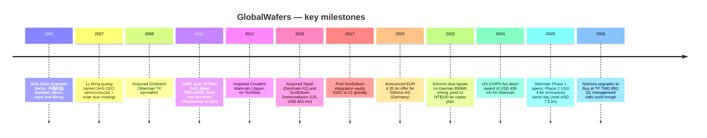

Company Research Report: GlobalWafers Co. (GWC, TPEx:6488)
Report date: 2026-05-26
Report language: English
Analyst: Claude (research working file — not a trading recommendation)

---

> **Update — Nomura 2026-05-21 upgrades Neutral → Buy, TP TWD 480 → TWD 850 (+77%):** Nomura's "Greater China Semi: A guide to Semi renaissance in 2026~30F" (2026-05-21) upgrades GlobalWafers from Neutral to Buy and doubles the target price from TWD 480 to TWD 850. The valuation method switches from a P/E multiple on near-term EPS to **3.2× FY2028F book value per share (BVPS) of TWD 262**. The core thesis is that **Backside Power Delivery (BPD)** — which roughly doubles silicon-per-die — plus **reclaim wafer demand**, **wafer-bonded NAND (YMTC Xtacking)**, **photonic SOI** and **RF SOI** are four independent incremental demand vectors that open 300mm wafer demand simultaneously, taking the industry into a fresh up-cycle in 2027-28F. BPD alone is the single biggest silicon-per-die step-up in 30 years of wafer-industry history. (See [Nomura "Greater China Semi" 2026-05-21, sector synthesis in reports/sector/半导体材料.md](../../sector/%E5%8D%8A%E5%AF%BC%E4%BD%93%E6%9D%90%E6%96%99.md))
>
> **Update — Q1 2026 results (2026-05-08 release):** Q1 2026 revenue NT$13.98 bn (QoQ -3.6% / YoY -10.3%), gross margin 20.8% (QoQ -4.9pp), operating margin 10.5%, EPS NT$3.97 (YoY +30.2%, lifted by Siltronic-stake fair-value recovery). Chairwoman Doris Hsu (徐秀蘭) framed Q1 2026 / Q4 2025 as the cycle trough for both 8-inch and 12-inch wafer pricing, with AI / HBM / HPC driving an ASP recovery in H2 2026 ([semiconalpha GlobalWafers Q1 2026 analysis, 2026-05-09](https://semiconalpha.substack.com/p/globalwafers-q1-2026-may-be-viewed); [Digitimes, 2026-04-10](https://www.digitimes.com/news/a20260410PD207/globalwafers-revenue-2026-12-inch-market.html)).

---

## Table of contents

1. Company Overview
2. Company History
3. Management Team
4. Products & Services
5. Customers & Listing Strategy
6. Industry Overview
7. Competitive Landscape
8. Market Opportunity
9. Risk Assessment
10. References

---

## 1. Company Overview

**GlobalWafers Co., Ltd. (GWC, 環球晶圓 / 环球晶圆, TPEx:6488)** is the world's number-three semiconductor silicon-wafer supplier behind Japan's **Shin-Etsu Chemical / 信越化学 (TYO:4063)** and **SUMCO (TYO:3436)**. The company supplies the full diameter range from 3" to 12" (75 mm – 300 mm), spanning polished wafers, epitaxial wafers, annealed wafers, diffusion wafers, silicon-on-insulator (SOI), float-zone (FZ) wafers and compound-semiconductor substrate services, from 18 production sites across 9 countries. It is the only top-tier 12-inch wafer maker with full production footprint across Asia, Europe and North America simultaneously — a structural differentiator versus Shin-Etsu/SUMCO (Asia-only) and Siltronic (Europe-anchored) ([GlobalWafers 2024 Annual Report, p. 1-3](https://www.sas-globalwafers.com/en/finance/2025-2/globalwafers_2024-annual-report-en/)).

GWC was spun off in 2011 from **Sino-American Silicon Products, Inc. (SAS, 中美矽晶 / 中美晶, TPEx:5483)**, the Taiwan-based silicon-ingot pioneer founded in 1981 by an investor group that included current SAS Chairman Lu Ming-guang (盧明光). SAS still owns approximately **51% of GWC** today and treats GWC as its semiconductor flagship; conversely, GWC contributes roughly 90% of consolidated SAS revenue, so the two entities operate as a *de facto* single platform but trade independently on TPEx ([SAS / 中美晶 2024 Annual Report — investor relations PDF](https://www.saswafer.com/wp-content/uploads/2024/06/%E4%B8%AD%E7%BE%8E%E7%9F%BD%E6%99%B6_113%E5%B9%B4%E5%BA%A6%E5%B9%B4%E5%A0%B1_EN.pdf)). Headquarters are at 8 Industry E. 2nd Rd., Hsinchu Science Park, Taiwan, with global headcount of approximately 7,300 ([Crunchbase GlobalWafers profile, 2026](https://www.crunchbase.com/organization/globalwafers)).

**Business model.** GWC is a B2B manufacturer. Upstream inputs are high-purity polysilicon (poly-Si) and single-crystal silicon ingots (mono-Si). Downstream steps — slicing, lapping, polishing, cleaning, epitaxy — produce finished wafers shipped to **foundries** (TSMC), **integrated device manufacturers (IDMs)** for logic (Intel, Samsung), **memory IDMs** (Micron, SK Hynix, Samsung Memory), and **power / analog IDMs** (Infineon, ST, Texas Instruments). Revenue mix runs spot plus long-term agreement (LTA); since 2022 the 12-inch LTA covering 2025-28 has become an industry standard, materially dampening cyclicality and shifting the silicon-wafer business from a high-beta cyclical to a more utility-like semi-cyclical profile ([Morningstar GlobalWafers Equity Report, 2025-11](https://www.morningstar.com/company-reports/1269167-globalwafers-outlook-gradually-improves-in-2025-benefits-from-new-tsmc-us-investment)). Silicon wafers are the dominant revenue source; ancillary compound-semiconductor services (sapphire, GaN-on-Si, SiC polishing and epitaxy) account for under 10% of consolidated revenue.

**Financial scale (FY2025).** Consolidated revenue of **NT$60.6 bn (≈ USD 1.94 bn at NT$31.2 / USD)**, down 3.2% YoY; gross margin 24.1%, operating margin 14.3%, net income attributable to shareholders NT$7.31 bn, EPS NT$15.29, board-declared cash dividend NT$7.70 per share (payout ratio 50.4%) ([TechNews, 2026-03-11 — GlobalWafers FY2025 EPS coverage](https://finance.technews.tw/2026/03/11/globalwafers-eps-for-2025-is-15-29-yuan/)). The three-year trajectory tells a classic mixed-cycle story — a 12-inch LTA-supported floor against an 8-inch / 6-inch spot decline: FY2023 revenue NT$70.7 bn (the recent peak) → FY2024 NT$62.6 bn → FY2025 NT$60.6 bn, with gross margin sliding from 37.4% → 31.6% → 24.1%. This is the longest down-cycle GWC has experienced since 2018 ([Investing.com 6488 financial summary](https://www.investing.com/equities/globalwafers-co-ltd-financial-summary)).

*Figure 1: GlobalWafers FY2023–FY2025 revenue, net income, gross margin and EPS. FY2024 EPS embeds a fair-value loss of approximately NT$7 per share on the Siltronic stake; adjusted EPS NT$28.97. Sources: [GlobalWafers 2024 Annual Report, Chairman's Letter, p. 5](https://www.sas-globalwafers.com/en/finance/2025-2/globalwafers_2024-annual-report-en/); [TechNews, 2026-03-11](https://finance.technews.tw/2026/03/11/globalwafers-eps-for-2025-is-15-29-yuan/).*

**Valuation snapshot (close of 2026-05-25).** Share price **TWD 822**, market cap **TWD 375.3 bn (≈ USD 12.2 bn)**, TTM P/E **44.3×** (FY2025 EPS NT$15.29 + Q1 2026 EPS NT$3.97 annualized estimate), TTM P/S **6.0×**, P/B **3.0×** (FY2025 BVPS ≈ NT$272), FY2026E P/E **44.3×** on consensus EPS NT$18.55, FY2028F P/B **3.1×** at Nomura's 2028F BVPS of TWD 262 ([Stockanalysis.com 6488 overview](https://stockanalysis.com/quote/tpex/6488/); [Yahoo Finance 6488.TWO key statistics](https://finance.yahoo.com/quote/6488.TWO/key-statistics/)). The three-year multiple ranges are roughly P/E 9× (FY2022 cycle-peak EPS of NT$80) to ~50× (FY2025 cycle-trough EPS); P/B 1.6×–3.1×.

**Valuation interpretation.** At 44× TTM P/E GWC trades materially above its silicon-wafer "Big-5" peers — Shin-Etsu at roughly 30× TTM P/E, SUMCO and Siltronic at not-meaningful (N.M.) on TTM losses, SK Siltron unlisted. In other words, the market has already discounted in "2026 is the cycle trough, 2027-28 is the next LTA-pricing-and-BPD-silicon-doubling inflection." Nomura's TP of TWD 850 is anchored at **3.2× FY2028F BVPS of NT$262** — meaningfully above the prior-cycle peak multiples (GWC 2017-18 peak P/B 2.2–2.4×). The implicit assumption is that ROE settles at 15-18% over a multi-year window versus FY2025's ~7% ([Nomura 2026-05-21, p. 15-17, summarized in reports/sector/半导体材料.md](../../sector/%E5%8D%8A%E5%AF%BC%E4%BD%93%E6%9D%90%E6%96%99.md)). **Key risk**: if BPD slips by 12-18 months, if AI capex disappoints, or if Chinese domestic 12-inch wafer capacity (Shanghai Sineng / NSIG / TCL Zhonghuan / 国大硅产) reaches commercial-grade yield before 2027, that 3.2× FY28 P/B anchor becomes the most contestable single number in the report. This is treated as the largest single risk in §9.

**Balance sheet quality.** At FY2025 year-end, cash and equivalents were approximately NT$60 bn (including NT$11 bn+ of US / German / Korean grants that have actually landed in the bank), against gross debt of roughly NT$45 bn — leaving GWC in a *net cash* position. That positioning is what allowed the company to absorb the EUR 50 mn (NT$1.56 bn) Siltronic break fee in 2022 and pivot the EUR 4.35 bn earmarked for the acquisition into the **NT$100 bn three-year capacity plan** without equity dilution or material new debt ([GlobalWafers 2022-02-06 corporate announcement](https://www.sas-globalwafers.com/gwc_news_20220206/)). This "financial firepower + optionality" combination is itself a moat versus a stretched SUMCO (recurring losses in FY2024) and a balance-sheet-constrained Siltronic.

*Analyst view:* The simultaneous existence of 44× TTM P/E and 3.2× FY28 forward P/B implies a stacked set of conditions: 2027-28 cycle up + BPD silicon-per-die doubling + Chinese localization missing the 2027 commercial-grade window. Any one of these failing knocks the valuation down meaningfully. The counter-argument — and the basis for the Buy call — is that for the last five years the market's framing (smartphone, PC, memory drag) failed to incorporate AI / HBM / BPD as incremental wafer demand; Nomura's argument is therefore that the *pricing framework itself* is being repriced. Whether one believes that or not, 44× is not a normal cyclical multiple — it has to be earned by the 2027-28 inflection actually showing up.

## 2. Company History

GWC's story starts in 1981, when Sino-American Silicon (SAS, 中美矽晶) was incorporated in Hsinchu Science Park, Taiwan, as a silicon-ingot supplier and slicing subcontractor — initially serving multinational customers including IBM and HP. In 2007, **Lu Ming-guang (盧明光)** took over as SAS CEO, restructured the company into a three-business-unit shape (silicon ingot + silicon wafer + solar), and recruited back **Doris Hsu (徐秀蘭)** — who had been an SAS US sales engineer in 1988 before leaving for Tokyo Electron in the 1990s. In 2011 the SAS board, led by Lu Ming-guang with Hsu's strong endorsement, decided to spin off the semiconductor-wafer business as a separate listed entity on TPEx — that entity is GlobalWafers ([HBR Taiwan Doris Hsu profile, 2022-12](https://www.hbrtaiwan.com/article/20819/globalwafers-doris-hsu); [Mirror Media full feature, 2022-01-24](https://www.mirrormedia.mg/story/20220124fin012)). Hsu set the strategy on day one: "build SAS-GWC into the TSMC of the wafer industry" — i.e. use the cyclical down-phases to consolidate fragmented sub-scale European, American and Japanese wafer assets into a top-three global player ([HBR Taiwan, 2022-12](https://www.hbrtaiwan.com/article/20819/globalwafers-doris-hsu)).

**M&A path (each executed during a wafer down-cycle, by design):**

- **2008** — acquired **Globitech** of Sherman, Texas (US epi-wafer specialist; the same Sherman, TX site that 15 years later becomes the CHIPS Act flagship);
- **2012** — acquired **Covalent Materials** of Japan (6"–8" silicon-wafer assets carved out from the Toshiba group);
- **2016** — acquired **Topsil Semiconductor** of Denmark (DKK 320 mn / ~USD 48.7 mn; FZ float-zone high-purity wafer technology used in power electronics and IGBT applications);
- **2016-12** — acquired **SunEdison Semiconductor** of the US for USD 683 mn, the largest single transaction in GWC's history and the one that lifted GWC from #6 globally to #3 in a single move. SunEdison was the former MEMC Electronic Materials, founded in 1959 in St. Peters, Missouri, and at one time the world's largest 12-inch wafer maker ([GlobeNewswire — GlobalWafers consummates SunEdison Semiconductor acquisition, 2016-12-02](https://www.globenewswire.com/news-release/2016/12/02/894587/0/en/GlobalWafers-Successfully-Consummates-Acquisition-of-SunEdison-Semiconductor.html); [Wikipedia — GlobalWafers](https://en.wikipedia.org/wiki/GlobalWafers));
- **2022-02 — the Siltronic acquisition collapses.** In December 2020, GWC announced a EUR 4.35 bn (~USD 5 bn) cash offer for **Siltronic AG (ETR:WAF)** of Germany. Over 14 months, US (CFIUS), Singapore, Austria, Korea, Taiwan and other regulators all signed off. The single sticking point was Germany's **Bundesministerium für Wirtschaft und Klimaschutz (BMWK)** — the federal Ministry for Economic Affairs and Climate Action — which did not deliver an explicit no-objection letter by the 2022-01-31 contractual deadline; the deal automatically lapsed the next morning. GWC paid Siltronic a EUR 50 mn (~NT$1.56 bn) break fee per the merger agreement. Hours later, on 2022-02-06, GWC announced it would redeploy the capital earmarked for Siltronic into a **NT$100 bn (~USD 3.5 bn) three-year global capacity expansion** spanning Taiwan, the US, Japan, Korea and Italy ([ETtoday, 2022-02-01](https://finance.ettoday.net/news/2182044); [iKnow STPI, 2022-02-06](https://iknow.stpi.niar.org.tw/post/Read.aspx?PostID=18772); [GlobalWafers 2022-02-06 announcement](https://www.sas-globalwafers.com/gwc_news_20220206/));
- **2021-2025 organic expansion** — the centerpiece is the new **Sherman, Texas 12-inch fab** (USD 3.5 bn Phase 1, formally opened 2025-05-15, ramping to volume production in 2026), with parallel expansions in **Novara, Italy** (12-inch epi), **Cheonan, South Korea (天安)** (12-inch polished) and **Yonezawa, Japan (米沢)** (FZ float-zone for high-voltage devices) ([Evertiq — GlobalWafers opens Texas wafer plant and announces major expansion, 2025-05-21](https://evertiq.com/design/2025-05-21-globalwafers-opens-texas-wafer-plant-announces-major-expansionr));
- **2024-12 CHIPS Act direct grant** — the US Department of Commerce announced a direct CHIPS Act award of **up to USD 406 mn** to GlobalWafers America (GWA) for the Sherman site, plus federal Investment Tax Credit (ITC) eligibility. This is the single largest CHIPS Act award to a Taiwanese-headquartered silicon-wafer maker to date ([GlobalWafers CHIPS Act announcement, 2024-12-17](https://www.sas-globalwafers.com/en/gwc_news_en_20241217/); [Reuters — GlobalWafers to receive up to $406 million U.S. CHIPS Act funding, 2024-12-17](https://www.reuters.com/business/globalwafers-receive-up-406-million-us-chips-act-funding-2024-12-17/); [Digitimes, 2025-08-11](https://www.digitimes.com/news/a20250811VL204/globalwafers-texas-silicon-wafer-fab-chips-act.html));
- **2025-05-15 Sherman Phase-1 opening + Phase-2 USD 4 bn announced same day** — bringing total Sherman investment commitment to USD 7.5 bn. GWC's stated rationale is that the Trump administration's emerging 25% tariff framework on semiconductor imports makes US-domestic 12-inch wafer production a structural hedge. The six-phase Sherman master plan targets eventual monthly capacity of approximately 1.2 mn 12-inch wafers ([Evertiq, 2025-05-21](https://evertiq.com/design/2025-05-21-globalwafers-opens-texas-wafer-plant-announces-major-expansionr); [Connect CRE — $4B Sherman chip fab starts production, 2025-05-15](https://www.connectcre.com/stories/4b-sherman-chip-fab-starts-production/)).

*Analyst view:* What 14 years of GWC history shows is a textbook "external M&A plus counter-cyclical timing" playbook — distinct from ASML or Applied Materials, where organic R&D and tool generations carry the franchise. Silicon wafers are a mature, scale-and-yield-driven materials business; the operative game is to absorb capacity when the cycle is down and harvest ASP when the cycle inflects. The deeper lesson of Siltronic is not "Germany blocked us." It is what Hsu herself acknowledged in a 2022 interview: a 13-year-old Taiwanese company attempting to integrate a 50-year-old German institution carries cultural-fit, geopolitical and works-council frictions that are not reducible to a merger agreement ([Business Today / 商业周刊 Doris Hsu exclusive interview, 2022-02-16](https://www.businesstoday.com.tw/article/category/183015/post/202202160032/)). The redirected NT$100 bn capacity plan turned out to be a more durable use of capital than the Siltronic deal would have been — at least in hindsight, looking at Siltronic's post-2022 collapse from EUR ~140 to EUR ~35 share price.

## 3. Management Team

**Doris Hsu (徐秀蘭, also romanized Hsiu-Lan Hsu), Chairwoman and CEO** — in role continuously since the 2011 spinoff.

Hsu was born in 1962 in Taiwan, holds a BA in foreign languages and literature from National Taiwan University, and a Master's in computer science from the University of Illinois Urbana-Champaign (UIUC). She joined SAS in 1988 as a sales engineer in its US office, left in 1996 to join **Tokyo Electron (TEL)** as US sales director, and was recruited back to SAS by Lu Ming-guang in 2007 as Vice President. When GWC was spun off in 2011, the SAS board appointed her — then 49 — as the founding Chairwoman and CEO, a role she has held for over 14 years ([HBR Taiwan, 2022-12](https://www.hbrtaiwan.com/article/20819/globalwafers-doris-hsu); [Business Today exclusive, 2022-02-16](https://www.businesstoday.com.tw/article/category/183015/post/202202160032/); [ITRI Doris Hsu interview](https://itritech.itri.org.tw/blog/doris-hue_sas/)).

**Track record.** Three accomplishments stand out. *First*, between 2011 and 2016, Hsu executed four cross-border acquisitions in five years (Globitech, Covalent, Topsil, SunEdison), lifting GWC from #7 to #3 globally and growing revenue from NT$11 bn in 2011 to NT$50 bn by 2017, with gross margins expanding from roughly 10% to over 35%. *Second*, when the EUR 4.35 bn Siltronic deal collapsed in February 2022 — a setback that could have triggered a strategic vacuum — she pivoted the capital into the NT$100 bn organic expansion within 24 hours. That pivot is what made GWC the only top-tier 12-inch wafer maker with simultaneous Asian, European and North American 12-inch capacity ([Mirror Media full feature, 2022-01-24](https://www.mirrormedia.mg/story/20220124fin012)). *Third*, in 2023 she was named **EY World Entrepreneur of the Year** — the first Taiwanese entrepreneur ever to win the global title — and the same year was selected for the Forbes Asia 50 Over 50 list ([Yahoo Finance — Doris Hsu of Taiwan's GlobalWafers named World Entrepreneur, 2023-06-10](https://sg.finance.yahoo.com/news/doris-hsu-taiwans-globalwafers-named-065752076.html); [Forbes Asia 50 Over 50 2023 — GWC announcement](https://www.sas-globalwafers.com/en/doris-hsu-chairperson-and-ceo-of-globalwafes-ranked-among-50-over-50-asia-2023-list-by-forbes/)).

**Operating style.** Hsu is widely profiled for her time-zone discipline — multiple long-form interviews document a "3:58 AM wake-up to handle European email" routine, framed by her as a structural requirement of running 18 sites across 9 countries on a single management cadence ([Mirror Media, 2022-01-24](https://www.mirrormedia.mg/story/20220124fin011); [Global Views / 远见杂志, 2023](https://www.gvm.com.tw/article/86198)). Her stated integration philosophy — "no parachuted Taiwanese expats, keep local teams, respect each other's culture" — is widely credited internally for the retention of legacy SunEdison (formerly MEMC, a 60-year-old US institution) and Topsil engineering teams after the 2016 acquisitions ([Business Today, 2024-11-20](https://www.businesstoday.com.tw/article/category/183015/post/202411200004/)).

**Ownership and incentive structure.** Hsu and the Lu Ming-guang family collectively control the SAS holdings that own approximately 51% of GWC — i.e. their personal economic interest in GWC is indirect, channeled through SAS. The 2024 GWC annual report disclosed Hsu's direct GWC holding at below 0.5% of outstanding shares; the majority of her wealth is in SAS equity ([GlobalWafers 2024 Annual Report — Major Shareholders & Directors, p. 12-25](https://www.sas-globalwafers.com/en/finance/2025-2/globalwafers_2024-annual-report-en/)). This 51% structural majority means GWC's board has near-immunity to hostile activism and minimal exposure to retail-investor blocking of long-cycle capex decisions (Sherman USD 7.5 bn, BPD investments) — a meaningful governance feature for an industry where capital decisions have 5-7 year payoff horizons.

*Analyst view:* Hsu is one of the defining figures in Taiwan's last decade of cross-border industrial M&A, alongside ASE's Tien Wu, eMemory's C.C. Chang, and Vanguard's Leuh Fang. Almost every consequential decision in GWC's last 14 years — the SunEdison integration, the Siltronic pivot, the Sherman build-out, the CHIPS Act negotiation, the customer-relationship architecture covering TSMC / Samsung / Micron / Intel — bears her personal stamp. The corollary is **key-person risk**: at 63 she has not publicly named a successor, and the company has not disclosed a COO or Vice Chair pipeline (further detail in §9.1). For investors underwriting the 2027-28 inflection, succession is one of the more uncomfortably under-disclosed elements of the bull case.

