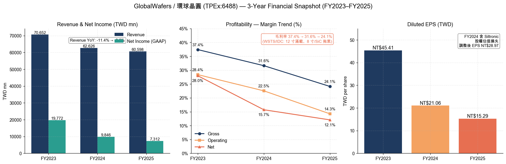
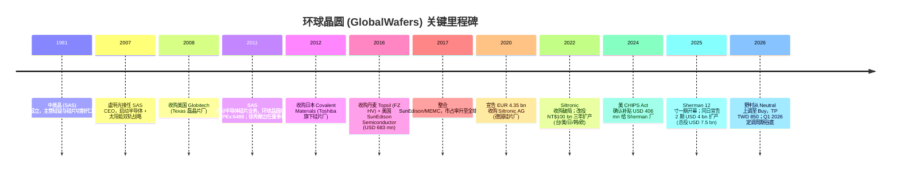
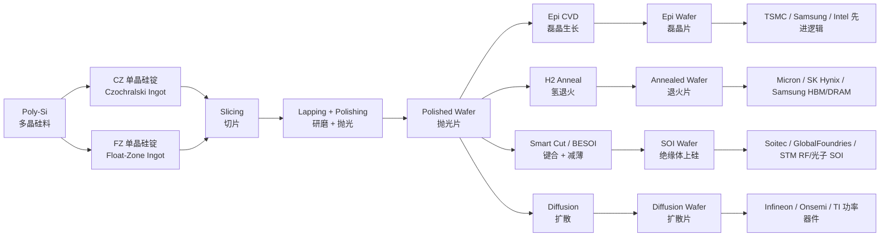
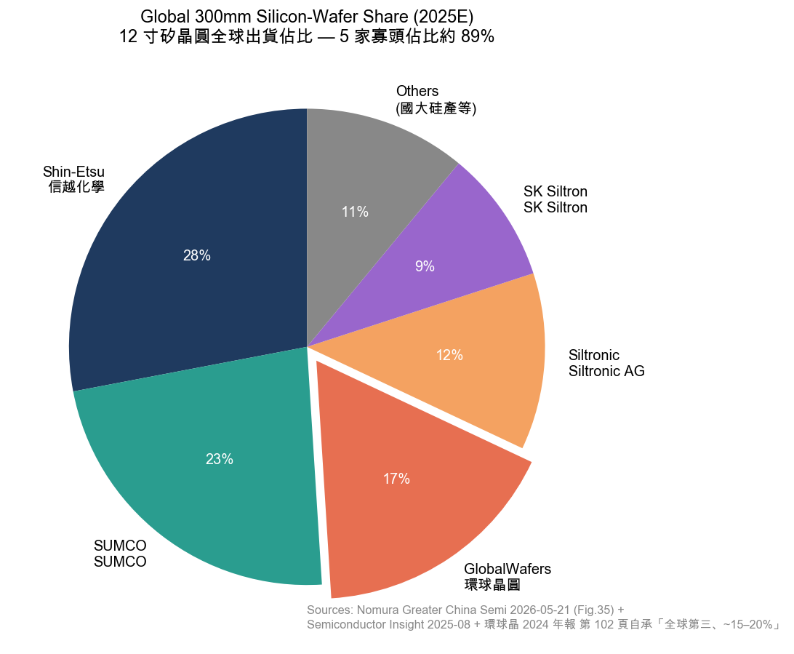
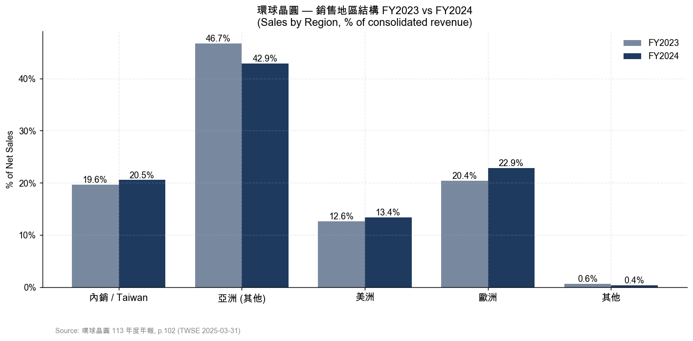
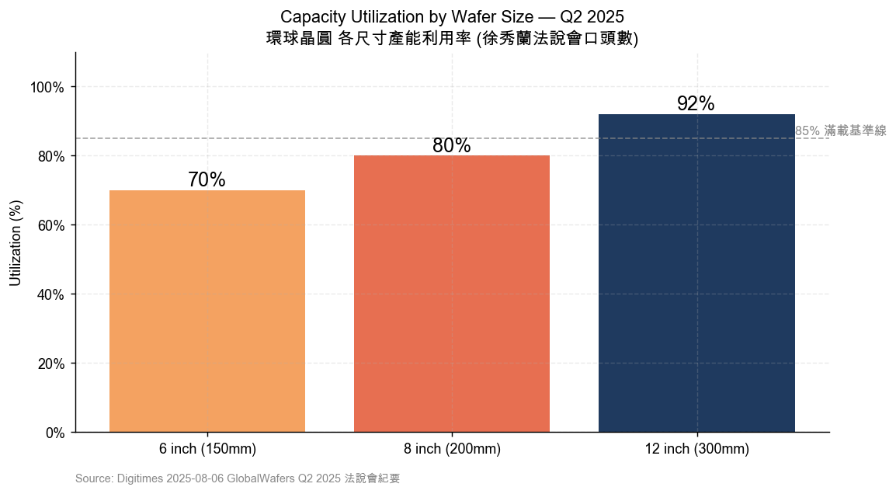

公司研究报告：环球晶圆 GlobalWafers (TPEx:6488)
报告日期：2026-05-26
报告语言：简体中文
分析师：Claude (本档案为研究底稿，非交易建议)

---

> **Update — 野村 2026-05-21 上调评级 Neutral → Buy，目标价 TWD 480 → TWD 850 (+77%)：** 野村「Greater China Semi: A guide to Semi renaissance in 2026~30F」(2026-05-21) 把环球晶从 Neutral 上调至 Buy，目标价从 TWD 480 翻倍至 TWD 850，估值基础切换为 **3.2× 2028F BVPS TWD 262**。核心 thesis = Backside Power Delivery (BPD) 工艺需多片硅 + reclaim wafer / wafer-bonded NAND (YMTC Xtacking) / photonic SOI / RF SOI 四条独立增量同时打开 12 寸硅片需求，2027-28F 进入新一轮上行周期；BPD 工艺单 die 用硅量翻倍是过去 30 年最大的单一需求拉动。([野村 Greater China Semi 2026-05-21, p. 15-17, sector 综述见 reports/sector/半导体材料.md](../../sector/%E5%8D%8A%E5%AF%BC%E4%BD%93%E6%9D%90%E6%96%99.md))。
>
> **Update — Q1 2026 业绩 (2026-05-08 公告)：** Q1 2026 营收 NT$13.98 bn (QoQ -3.6% / YoY -10.3%)，毛利率 20.8% (QoQ -4.9pp)，营业利益率 10.5%，EPS NT$3.97 (YoY +30.2%, 因 Siltronic 持股公允价值回收)。董事长徐秀蘭定调「Q1 2026 与 Q4 2025 应是本轮 8 寸 / 12 寸晶圆价格谷底」，AI / HBM / HPC 推动 H2 2026 价格回升 ([GlobalWafers Q1 2026 分析, semiconalpha, 2026-05-09](https://semiconalpha.substack.com/p/globalwafers-q1-2026-may-be-viewed))，([Digitimes 2026-04-10](https://www.digitimes.com/news/a20260410PD207/globalwafers-revenue-2026-12-inch-market.html))。

---

## 目录

1. 公司概览
2. 公司历史
3. 管理团队
4. 产品与服务
5. 客户与上市策略
6. 行业概览
7. 竞争格局
8. 市场机会
9. 风险评估
10. 参考资料

---

## 1. 公司概览

环球晶圆股份有限公司 (GlobalWafers Co., Ltd., **TPEx:6488**，下文简称「环球晶」或 GWC) 是全球半导体硅晶圆 (semiconductor silicon wafer) 第三大供应商，仅次于日本 Shin-Etsu Chemical / 信越化学 (TYO:4063) 与 SUMCO (TYO:3436)。公司提供 3" – 12" (75mm – 300mm) 全尺寸硅晶圆，覆盖抛光片 (polished wafer)、磊晶片 (epitaxial wafer)、退火片 (annealed wafer)、扩散片 (diffusion wafer)、绝缘体上硅 SOI (silicon-on-insulator)、区熔法 FZ (float-zone) 与化合物半导体衬底 (compound semiconductor substrates)，分布于 9 个国家、18 座生产基地——是全球唯一同时在亚洲、欧洲、北美都拥有完整产线的 12 寸硅片厂 ([GlobalWafers 2024 Annual Report, p. 1-3](https://www.sas-globalwafers.com/en/finance/2025-2/globalwafers_2024-annual-report-en/))。

环球晶 2011 年由中美晶 (Sino-American Silicon Products, SAS, TPEx:5483) 拆分独立上市，承接 SAS 全部半导体硅片业务；目前 SAS 仍持有环球晶约 51% 股权，是绝对控股股东，环球晶反过来贡献 SAS 集团约 90% 营收 ([中美晶 2024 年度报告投资人关系页](https://www.saswafer.com/wp-content/uploads/2024/06/%E4%B8%AD%E7%BE%8E%E7%9F%BD%E6%99%B6_113%E5%B9%B4%E5%BA%A6%E5%B9%B4%E5%A0%B1_EN.pdf))。集团总部位于新竹科学园区工业东二路 8 号，全球员工约 7,300 人 ([Crunchbase GlobalWafers profile, 2026](https://www.crunchbase.com/organization/globalwafers))。

**商业模式**：B2B 制造商——上游硅多晶料 (poly-Si)、单晶硅锭 (mono-Si ingots)，下游切割 (slicing)、研磨 (lapping)、抛光 (polishing)、清洗 (cleaning)、磊晶 (epitaxy)，最终交付给晶圆代工厂 (foundry，如 TSMC)、IDM (Integrated Device Manufacturer，如 Intel / Samsung / Micron / Infineon / Texas Instruments) 与功率 / 模拟器件厂。营收以现货 + 长约 (Long-Term Agreement, LTA) 两种模式并行——2022 年开始 12 寸 LTA 锁定到 2027-28 年的高占比已经成为行业惯例，是过去十年硅片厂从「strong-cyclical 卡死生死」转向「半周期性公用事业」的根本变化 ([Morningstar GlobalWafers Equity Report, 2025-11](https://www.morningstar.com/company-reports/1269167-globalwafers-outlook-gradually-improves-in-2025-benefits-from-new-tsmc-us-investment))。主要营收来源为硅晶圆销售；副业含化合物半导体晶圆 (Sapphire / GaN-on-Si)、太阳能硅锭与电力电子用 SiC 抛光与磊晶服务，但合计占比 <10%。

**财务规模 (FY2025)**：年报合并营收 **NT$60.6 bn** (≈ USD 1.94 bn，按平均汇率 NT$31.2/USD)，YoY -3.2%；毛利率 24.1%，营业利益率 14.3%，归母净利 NT$7.31 bn，EPS NT$15.29，董事会决议每股现金股利 NT$7.7（payout ratio 50.4%）([TechNews 环球晶 2025 EPS 报导, 2026-03-11](https://finance.technews.tw/2026/03/11/globalwafers-eps-for-2025-is-15-29-yuan/))。公司过去三年呈现典型的「12 寸 LTA 撑底 + 8 寸 / 6 寸现货下跌」混合的周期下行：FY2023 营收高点 NT$70.7 bn → FY2024 NT$62.6 bn → FY2025 NT$60.6 bn，毛利率从 37.4% → 31.6% → 24.1%，是 2018 年以来最长的一段下行 ([Investing.com 6488 财务摘要](https://www.investing.com/equities/globalwafers-co-ltd-financial-summary))。

*图 1：环球晶 FY2023–FY2025 营收、净利、毛利率与 EPS（FY2024 EPS 内含 Siltronic 持股公允价值损失 NT$ ~7/股，调整后 EPS NT$28.97）。Source: [GlobalWafers 2024 Annual Report 致股东报告书 第 5 页](https://www.sas-globalwafers.com/en/finance/2025-2/globalwafers_2024-annual-report-en/)，[TechNews, 2026-03-11](https://finance.technews.tw/2026/03/11/globalwafers-eps-for-2025-is-15-29-yuan/)。*

**估值快照 (2026-05-25 收盘)**：股价 **TWD 822**，市值 **TWD 375.3 bn** (≈ USD 12.2 bn)，TTM P/E **44.3×** (基于 FY2025 EPS NT$15.29 + Q1 2026 EPS NT$3.97，年化估算)，TTM P/S **6.0×**，P/B **3.0×** (FY2025 BVPS ≈ NT$272)，FY2026E P/E **44.3×** (基于 EPS NT$18.55 共识)，FY2028F P/B **3.1×** (按野村 2028F BVPS TWD 262) ([Stockanalysis.com 6488 概览](https://stockanalysis.com/quote/tpex/6488/))，([Yahoo Finance 6488.TWO 关键统计](https://finance.yahoo.com/quote/6488.TWO/key-statistics/))。3 年 P/E 区间约 9× (FY2022 周期顶点 EPS NT$80) 到 ~50× (FY2025 周期谷底)；P/B 区间 1.6×–3.1×。

**估值解读**：当前 44× TTM P/E **远高于** 硅晶圆五巨头同业均值 (Shin-Etsu ~30×, SUMCO 亏损 N.M., Siltronic 亏损 N.M., SK Siltron 未上市)——市场已经把环球晶定价为「2026 是周期谷底、2027-28 进入新一轮 LTA 价格谈判 + 单 die 用硅量翻倍 (BPD) 的双重拐点」。野村 TP TWD 850 锚定 **3.2× 2028F BVPS NT$262**——这个倍数显著高于硅晶圆厂历史周期峰值的 P/B (2017-2018 上一轮峰值 GWC 2.2-2.4×)，意味着野村假设未来 3 年公司净资产收益率 (ROE) 长期回到 15-18% (vs FY2025 ~7%) ([野村 2026-05-21 报告, p. 15-17](../../sector/%E5%8D%8A%E5%AF%BC%E4%BD%93%E6%9D%90%E6%96%99.md))。**风险**：如果 BPD 工艺推迟 1-2 年、AI capex 退潮、或中国 12 寸国产硅片产能 (上海新昇 / 沪硅产业 / 国大硅产 / TCL 中环) 在 2027 前达到 commercial-grade 良率，那 3.2× P/B 估值就会变成空中楼阁——这是全篇最大单一风险 (详见 §9.3-9.5)。

**财务体质**：截至 FY2025 末，公司现金及约当现金约 NT$60 bn (含美 / 德 / 韩政府补贴入袋的 NT$11 bn+)，长短期借款合计约 NT$45 bn，净现金状况维持正——是相对少数能在 Siltronic 收购破局后吞下 EUR 50 mn (NT$1.56 bn) 终止费 + 转身宣告 NT$100 bn 三年扩产计划仍不需要稀释股权或大幅举债的硅片厂 ([环球晶圆 2022-02-06 公告](https://www.sas-globalwafers.com/gwc_news_20220206/))。这种「财务体质 + 扩张选择权」的组合本身就是相对 Siltronic / SUMCO 的护城河。

*分析师观点：* 44× TTM P/E + 3.2× FY28 forward P/B 同时成立的前提是「2027-28 周期上行 + BPD 单 die 用硅量翻倍 + 中国国产替代不及预期」这三件事都要发生。任何一件不达预期，估值都会被快速下修。但客观看，过去 5 年的市场预期框架 (Smartphone、PC、Memory 拖累硅片需求) 没有把 AI / HBM / BPD 这类 incremental wafer demand 计入定价——所以野村的论点是定价框架本身需要重估。无论你信不信，44× P/E 不是普通周期股估值。

## 2. 公司历史

环球晶的故事可追溯到 1981 年——SAS 中美晶在新竹科学园区成立，最初做硅锭与硅片切割代工 (主要供 IBM、HP 等外资厂)。2007 年盧明光 (Lu Ming-guang) 接手中美晶 CEO，把公司从「硅锭单一业务」改造为「硅锭 + 硅片 + 太阳能」三事业部模式，并请回 1988 年加入过 SAS、后离开的徐秀蘭 (Doris Hsu)。2011 年盧明光与徐秀蘭决定，把半导体硅片业务从 SAS 拆出来独立挂牌 TPEx——这就是环球晶 ([HBR Taiwan 徐秀蘭专访, 2022-12](https://www.hbrtaiwan.com/article/20819/globalwafers-doris-hsu))，([Mirror Media 全文：环球晶靠并购壮大, 2022-01-24](https://www.mirrormedia.mg/story/20220124fin012))。徐秀蘭从一开始就明确战略：「要把中美矽晶经营成晶圆厂里的台积电」——通过反复的逆周期并购，把分散在欧美日韩的小硅片厂整合成全球前三 ([HBR Taiwan, 2022-12](https://www.hbrtaiwan.com/article/20819/globalwafers-doris-hsu))。

**并购整合路径**（每一次都是在硅片周期下行时出手）：

- **2008** 美国 Globitech（外延片 / 磊晶专长，Texas Sherman 厂前身）
- **2012** 日本 Covalent Materials（从东芝集团剥离的 6"–8" 硅片厂）
- **2016** 丹麦 Topsil Semiconductor（区熔法 FZ 高纯度硅片，主要供电力电子 / IGBT），收购价 DKK 320 mn (~USD 48.7 mn)
- **2016-12** 美国 SunEdison Semiconductor（原 MEMC Electronic Materials，1959 年成立，曾是全球第一大 12 寸厂），收购价 USD 683 mn——一举把 GWC 从全球第六提升到全球第三 ([GlobeNewswire SunEdison 收购完成, 2016-12-02](https://www.globenewswire.com/news-release/2016/12/02/894587/0/en/GlobalWafers-Successfully-Consummates-Acquisition-of-SunEdison-Semiconductor.html))，([Wikipedia GlobalWafers](https://en.wikipedia.org/wiki/GlobalWafers))
- **2022-02 收购 Siltronic 破局**：环球晶 2020-12 公告以 EUR 4.35 bn (~USD 5 bn) 现金收购德国 Siltronic AG (ETR:WAF)，14 个月内通过了 US / Singapore / Austria / Korea / Taiwan / CFIUS 等多重监管，**仅卡在德国联邦经济与气候保护部 (BMWK) 未在 2022-01-31 截止日前给出明确放行**，交易于次日自动失效。环球晶按合约付了 EUR 50 mn (~NT$1.56 bn) 分手费；2022-02-06 立即宣告把原本要用于收购的资金转为「三年 1000 亿台币 (NT$100 bn) 扩产计划」，分别在台湾、美国、日本、韩国、欧洲扩产 12 寸硅片 ([ETtoday 2022-02-01 报导](https://finance.ettoday.net/news/2182044))，([iKnow STPI 2022-02-06 报导](https://iknow.stpi.niar.org.tw/post/Read.aspx?PostID=18772))，([环球晶 2022-02-06 公告](https://www.sas-globalwafers.com/gwc_news_20220206/))。
- **2021-2025 扩产**：核心动作是 Sherman, Texas 12 寸新厂 ($3.5 bn 一期，2025-05-15 开幕，2026 量产 ramp)，同步在 Italy Novara (12 寸 epi)、Korea Cheonan (12 寸 polished)、Japan Yonezawa (FZ HV) 投资。([Evertiq, 2025-05-21](https://evertiq.com/design/2025-05-21-globalwafers-opens-texas-wafer-plant-announces-major-expansionr))
- **2024-12 CHIPS Act 直接补贴**：美国商务部确认给 GlobalWafers America (GWA) 最高 **USD 406 mn** 联邦直接补贴 + Investment Tax Credit，是台资硅片厂在美国拿到的最大单笔 CHIPS 补贴 ([环球晶 CHIPS Act 公告 2024-12-17](https://www.sas-globalwafers.com/en/gwc_news_en_20241217/))，([Digitimes, 2025-08-11](https://www.digitimes.com/news/a20250811VL204/globalwafers-texas-silicon-wafer-fab-chips-act.html))。
- **2025-05-15 Sherman 一期开幕** + **同日宣告 2 期 USD 4 bn 扩产**，把 Sherman 园区总投资从 USD 3.5 bn 拉到 USD 7.5 bn——理由是 Trump 政府关税框架下，美国本土生产 12 寸硅片可以避开 4 类关税；6 期计划全部完成后 Sherman 月产 1.2 mn pcs (~120 万片 12 寸) ([Evertiq, 2025-05-21](https://evertiq.com/design/2025-05-21-globalwafers-opens-texas-wafer-plant-announces-major-expansionr))，([Connect CRE, 2025-05-15](https://www.connectcre.com/stories/4b-sherman-chip-fab-starts-production/))。

*分析师观点：* 环球晶 14 年走过的「7 次大并购 + 1 次失败 + 1 次大转型扩产」是典型的「外延式 + 周期逆向」整合路径——与 ASML、Applied Materials 这类有机增长 + 工艺迭代的设备厂完全不同，硅片行业本质是「资本 + 良率 + 客户黏性」三位一体的成熟制造业，玩法是「在周期下行整合 capacity，在周期上行收获 ASP」。Siltronic 失败的最深层教训不是「德国卡」，是徐秀蘭在 2022-02 专访中承认的「13 岁的台湾公司，去整合 50 年的德国老字号，文化差异 + 地缘政治 + 工会三重压力比并购合同复杂得多」([商业周刊 徐秀蘭独家专访 2022-02-16](https://www.businesstoday.com.tw/article/category/183015/post/202202160032/))。

## 3. 管理团队

**徐秀蘭 (Doris Hsu / Hsiu-Lan Hsu)，董事长兼 CEO**（自 2011 拆分起任职至今）

徐秀蘭 1962 年生于台湾，台湾大学外文系学士，美国伊利诺大学香槟分校 (UIUC) 电脑科学硕士。1988 年加入 SAS 中美晶担任美国分公司销售工程师，1996-2007 年短暂离开 SAS 去半导体设备商工作（任职日本 Tokyo Electron 美国分公司销售总监），2007 年盧明光接手 SAS 后重金请回，担任副总经理；2011 年环球晶从 SAS 拆分，徐秀蘭以 49 岁出任董事长兼 CEO，至今超过 14 年 ([HBR Taiwan, 2022-12](https://www.hbrtaiwan.com/article/20819/globalwafers-doris-hsu))，([商业周刊 2022-02-16 独家专访](https://www.businesstoday.com.tw/article/category/183015/post/202202160032/))，([ITRI 徐秀蘭专访](https://itritech.itri.org.tw/blog/doris-hue_sas/))。

主导成就：(1) 2011-2016 在 5 年内完成 Globitech、Covalent、Topsil、SunEdison 4 次跨国并购，把全球市占从第七拉到第三，营收从 NT$11 bn (2011) 到 NT$50 bn (2017)，毛利率从 ~10% 到 35%+；(2) 2020 主导 EUR 4.35 bn Siltronic 收购，虽因德国 BMWK 未及时核准而失败，但她在 2022-02 立刻把 EUR 4.35 bn 资金转为「三年 1000 亿台币扩产计划」——这次转型让 GWC 成为全球唯一同时在亚洲 / 欧洲 / 北美都拥有 12 寸完整产线的厂商 ([Mirror Media 2022-01-24 全文](https://www.mirrormedia.mg/story/20220124fin012))。(3) 2023 年获 **EY World Entrepreneur of the Year**，是台湾首位获此殊荣的企业家；2023 年同时入选 Forbes Asia 50 over 50 ([Yahoo Finance 2023-06-10 报导](https://sg.finance.yahoo.com/news/doris-hsu-taiwans-globalwafers-named-065752076.html))，([Forbes Asia 50 over 50 2023](https://www.sas-globalwafers.com/en/doris-hsu-chairperson-and-ceo-of-globalwafes-ranked-among-50-over-50-asia-2023-list-by-forbes/))。

工作风格：媒体多次记录她「凌晨 3:58 起床回信」的作息——徐秀蘭自述这是欧美亚多时区团队管理的必要纪律，环球晶 9 国 18 厂的管理跨度需要她「在韩国早会 + 欧洲午会 + 美国晚会同一天串联」([镜周刊 2022-01-24 报导](https://www.mirrormedia.mg/story/20220124fin011))，([远见杂志 2023 报导](https://www.gvm.com.tw/article/86198))。管理哲学：「不空降台干、本地团队管理、尊重彼此文化」——这是环球晶整合 SunEdison (前 MEMC 美国 60 年老厂) 和 Topsil (丹麦) 后还能保住核心团队的关键 ([今周刊 2024-11-20 报导](https://www.businesstoday.com.tw/article/category/183015/post/202411200004/))。

持股：徐秀蘭与盧明光家族通过中美晶 (SAS) 间接持有环球晶 51% 股权——这意味着她对环球晶有近乎绝对的话语权，董事会几乎没有 hostile 风险。徐秀蘭个人也直接持有部分环球晶 ESOP/RSU，但 2024 年报披露其个人直接持股 < 0.5%，主要财富来自 SAS 间接持股 ([环球晶 2024 年报 主要股东 / 董事持股表](https://www.sas-globalwafers.com/en/finance/2025-2/globalwafers_2024-annual-report-en/))。

*分析师观点：* 徐秀蘭是过去十年「台湾女性企业家国际化」的代表性人物——和 ASE 吴田玉、力旺章青驹、世界先进方略男这一代人共同把台湾半导体生态系从「中坚代工」延伸到「全球供应链关键环节」。环球晶今天能在硅片行业排第三、Sherman 厂能落地、CHIPS Act 拿到 USD 406 mn——核心都是她 14 年的连贯战略+欧美客户网络。**关键人风险**：徐秀蘭已 63 岁，至今未公开宣告继任计划。环球晶接班是 2026-30 期间最关键的治理变量之一 (详见 §9.1)。

## 4. 产品与服务

环球晶 2024 年报第二章 (Business Overview / 营业概况) 把产品矩阵清楚拆为 **5 大类 + 2 个增值服务**，按「制造工艺 + 用户应用」两个维度组织（Wafer Type × Diameter）。下表为年报披露的标准化产品组合（按公司官网 + 2024 年报合并整理）。

### 4.1 产品矩阵

| Wafer Type / 晶圆类别 | 主要尺寸 | 用户/客户应用 | 工艺特征 |
|---|---|---|---|
| **Polished Wafer / 抛光片** | 4"–12" (100–300 mm) | Logic / Memory / Foundry / IDM | 单晶硅锭切片→研磨→双面抛光→清洗→边角倒角 |
| **Epitaxial Wafer / 磊晶片** | 4"–12" (100–300 mm) | Logic Foundry (TSMC / Samsung)、CIS、Power | 抛光片上 CVD 长一层超薄高纯单晶硅 (1–100 μm) |
| **Diffusion Wafer / 扩散片** | 4"–8" (100–200 mm) | Power Discrete / Diodes / Thyristors | 硅片在炉中高温掺杂磷或硼 |
| **Annealed Wafer / 退火片** | 8"–12" | 高端 DRAM / NAND Memory | 氢气氛围 1100-1200°C 退火，消除 COP 缺陷 |
| **SOI Wafer / 绝缘体上硅** | 8"–12" (200–300 mm) | RF (5G/Wi-Fi)、FD-SOI、Imager、Photonic SOI | Smart Cut / BESOI 工艺，硅+SiO₂+硅三明治结构 |
| **FZ Wafer / 区熔法硅片** | 4"–8" (100–200 mm) | IGBT、HV Diode、Power MOSFET、Sensors | 无坩埚区熔法，纯度 > 10,000 Ω-cm |
| **Compound Semi / 化合物半导体** | 2"–6" (50–150 mm) | LED、Power Devices、Microwave | 蓝宝石、GaAs、SiC（抛光 / 磊晶服务） |

数据源：([GlobalWafers 2024 Annual Report, p. 38-45 Business Overview](https://www.sas-globalwafers.com/en/finance/2025-2/globalwafers_2024-annual-report-en/))，([GlobalWafers 公司产品页](https://www.sas-globalwafers.com/en/products/))。

### 4.2 综览——五大类硅片如何拼成「半导体上游耗材生态」

硅片在芯片制造中扮演的角色，是物理与化学层面的「画布」——所有晶体管、铜互连、电容、电感、光学结构最终都要在这片 8–10 mil 厚 (~0.2 mm) 的单晶硅基板上生长出来。**抛光片 (Polished Wafer)** 是最通用的基底；**磊晶片 (Epi)** 在抛光片上长一层缺陷更少、晶向更精确的薄硅，专给先进逻辑节点 (7 nm 以下) 和 CMOS 图像传感器 (CIS) 用；**退火片 (Annealed)** 用氢气退火消除 COP (Crystal Originated Particle，硅晶生长过程中产生的微孔)，主要服务高端 DRAM/NAND——这三类是 12 寸的主流。**FZ 区熔硅片**用于电压超过 600 V 的 IGBT 和功率二极管，因为 FZ 法的电阻率 > 1,000 Ω-cm 远高于 CZ 法的 ~10 Ω-cm，能耐受更高的反向电压。**SOI (绝缘体上硅)** 是「硅+SiO₂+硅」三明治结构，在 RF (射频)、FD-SOI (全耗尽型) 和 Photonic 光子电路领域是必需品。**化合物半导体衬底**（Sapphire / GaN / GaAs / SiC）是非硅基底——环球晶在 SiC 上仍以代工抛光 / 磊晶为主，不做自己的衬底单晶。

### 4.3 抛光片 (Polished Wafer)

> 环球晶 2024 年报 Business Overview (p.39) 对抛光片产品的描述：
>
> > "Polished wafers, the foundational product line, are produced through ingot growing, slicing, edge profiling, lapping, etching, polishing and cleaning processes. They serve as the substrate for downstream epitaxial growth, diffusion, oxidation and device fabrication."
>
> 中文释义 / Plain-language gloss: 抛光片 (polished wafer) 是把单晶硅锭 (mono-Si ingot, 长得像香肠的圆柱体) 切片成 0.7–0.8 mm 厚的圆盘，然后用 lapping (粗磨)、etching (化学蚀刻)、polishing (精抛光) 把表面粗糙度做到原子级——单原子层 (≈ 0.27 nm) 起伏的尺度。每一片 12 寸抛光片要在 100% 洁净 SEMI Standard SEMI-M1 规格下交付，整个加工链含 200+ 道工序。

**与同矩阵中的兄弟产品差异：** 抛光片是「半导体硅片产业的米饭」——一片磊晶片必须先经过抛光片这一步；一片退火片必须先经过抛光片这一步；一片 SOI 也是用两片抛光片键合而成。所以抛光片是产能基础；磊晶片是「在抛光片上长一层薄薄超纯硅」的附加工艺；退火片是「让抛光片在 1100-1200°C 氢气中退几小时火」的后处理；SOI 是「两片抛光片 + 一层 SiO₂ 键合再减薄」的结构件。

**战略意义：** AI 算力 + HBM 内存 + Backside Power Delivery (BPD) 三个新需求叠加，把 12 寸抛光片需求从「每颗 die 用 1 片」拉到「BPD 工艺要 2 片硅 + reclaim 用 1 片 = 单 die 用硅量 ~3x」。野村 2026-05-21 报告写道：「BPD = 把整张电源网络挪到晶圆背面，需要两片硅晶圆 + 多次键合 + thinning 到 ~1µm；这是过去 30 年硅片需求最大的单一增量」 ([野村 2026-05-21, p. 6-9](../../sector/%E5%8D%8A%E5%AF%BC%E4%BD%93%E6%9D%90%E6%96%99.md))。

*分析师观点：* 抛光片是 GWC 营收占比最大的产品线 (分析师估计 ~45-55%，公司不分项披露)，是与 Shin-Etsu、SUMCO 直接拼刺刀的红海——但 ASP 弹性很高：周期上行 12 寸抛光片 ASP 可以从 USD 100 涨到 USD 150 (+50%)，下行就反过来。**护城河**：scale + 客户黏性 (LTA 2-3 年) + cleanroom 资本壁垒。**最直接的竞争产品**：Shin-Etsu 信越化学的「PW150 全自动抛光片产线」是行业标杆 ([Shin-Etsu 半导体硅事业页](https://www.shinetsu.co.jp/jp/business/electronic-materials/semiconductor-silicon/))。

### 4.4 磊晶片 (Epitaxial Wafer)

> 环球晶 2024 年报对磊晶片的描述 (p.40)：
>
> > "Epitaxial wafers are produced by growing a single-crystal silicon layer on a polished substrate via chemical vapor deposition (CVD) at 1,050-1,150°C. Epitaxial layers offer reduced defect density, controlled doping profiles, and superior carrier mobility, making them essential for advanced logic, CIS, and power device applications."

**中文释义 / Plain-language gloss:** 磊晶 (epitaxy, "epi") 是在抛光片表面用化学气相沉积 (CVD) 长出来一层 1-100 μm 厚的「超干净单晶硅」——这层硅的纯度、晶向、掺杂浓度都比下面的抛光片基板更精确，缺陷密度可以低到 < 0.1/cm²。先进逻辑节点 (5nm 以下)、CMOS Image Sensor (CIS, 给手机相机用)、Power MOSFET 都必须用磊晶片，因为这些器件的「沟道」必须是缺陷极低的硅，而抛光片本身的 COP (晶生颗粒缺陷) 太多。

**与抛光片差异：** 磊晶片 = 抛光片 + 1 层 epi CVD 加工。ASP 大约是同尺寸抛光片的 1.5-2 倍。客户对磊晶片的需求结构与抛光片不同——抛光片买家是「所有 fab」；磊晶片买家集中在「需要低缺陷沟道层的先进逻辑、CIS、功率器件」，所以与 TSMC、Sony Semiconductor、Infineon 这种客户的绑定更深。

**战略意义：** 三个增量同时发生：(1) AI ASIC 用 5nm 以下逻辑节点全部用 epi；(2) GAA (Gate-All-Around) 工艺从 2nm 节点起对 epi 层厚度均匀性的要求比 FinFET 时代更严，单价进一步上抬；(3) 智能手机 CIS 像素数从 50MP → 200MP + Sony / OmniVision 的「stacked CIS」结构需要的 epi 层数量翻倍。环球晶在 Sherman, Texas 的一期产线就以 12 寸磊晶片为主，明确是配合 TSMC AZ Fab 21 + Samsung Taylor Fab + Intel Ohio Fab 的供应链 ([Tom's Hardware GlobalWafers Sherman, 2022-06](https://www.tomshardware.com/news/wafer-maker-to-invest-dollar5-billion-in-the-us-to-serve-intel-samsung-tsmc))。

*分析师观点：* 磊晶片是 GWC 利润率最高的产品线之一 (分析师估计毛利率 35-45%)，也是 Sherman 厂的核心战略产品——美国本土 12 寸 epi 产能稀缺，是 GWC 拿到 USD 406 mn CHIPS Act 补贴的关键卖点。**最直接的竞争产品**：Shin-Etsu Sanken Group epi 产线 + SUMCO Tochigi 12 寸 epi 产线 ([SUMCO 12 寸 epi 产品页](https://www.sumcosi.com/products/epitaxial_wafer.html))。

### 4.5 退火片 (Annealed Wafer) — DRAM/HBM 专用

> 环球晶 2024 年报对退火片的描述 (p.41)：
>
> > "Annealed wafers undergo high-temperature treatment in hydrogen ambient at 1,100-1,200°C to eliminate Crystal Originated Particles (COP) from the near-surface region. The resulting defect-free surface layer is critical for advanced DRAM and NAND devices where any micro-void translates to bit-failure."

**中文释义 / Plain-language gloss:** 退火片 (annealed wafer) 是把抛光片在 1100-1200°C 的氢气炉中烤几小时，让表面层 (top ~5 μm) 的 COP (Crystal Originated Particle，硅晶在 CZ 长晶过程中由于空位 vacancy 聚集产生的微孔，肉眼看不见但 0.1 μm 量级) 消失。为什么 DRAM/HBM 必须用退火片？——一个 bit 储存在一个 capacitor 上，capacitor 的电极沟槽要刻进 sub-μm 深度；如果硅基板上有一个 0.1 μm 的微孔正好落在电极沟里，这个 bit 就坏掉。HBM (High Bandwidth Memory) 的 1024-bit 宽 I/O + 12 层 stack 把对 wafer 缺陷的容忍度推到极限。

**与同矩阵差异：** 退火片 = 抛光片 + 1 步氢退火，ASP 比同尺寸抛光片高约 30-50%。抛光片可以做所有用途；退火片专攻高端 DRAM/HBM，是 Micron、SK Hynix、Samsung HBM 产线的指定耗材。

**战略意义：** HBM3E / HBM4 / HBM4E (2025-2028) 每代 stack 层数从 8 → 12 → 16 → 24，对 wafer 缺陷的容忍度每代砍一半——退火片是唯一能跟上的工艺方案。野村 2026 报告：「Wafer-bonded NAND (YMTC Xtacking) + HBM4 stack 工艺都要求基板必须是退火片，单 die 用硅量再次拉升」 ([野村 2026-05-21, p. 9](../../sector/%E5%8D%8A%E5%AF%BC%E4%BD%93%E6%9D%90%E6%96%99.md))。

*分析师观点：* 退火片是 GWC 与 Shin-Etsu / SUMCO 三家分食的高端寡头市场，全球 12 寸退火片产能预计 < 100 万片/月，HBM 拉动下未来 3 年要扩到 ~250-300 万片/月。**最直接竞争**：Shin-Etsu Magnum (annealed grade) + SUMCO P-grade ([SUMCO Annealed Wafer 页](https://www.sumcosi.com/products/annealed_wafer.html))。

### 4.6 SOI 晶圆 (Silicon-on-Insulator) — 与 Soitec 的双轨关系

> 环球晶 2024 年报对 SOI 产品的描述 (p.42)：
>
> > "Our SOI wafer line includes RF-SOI (200mm/300mm) for high-frequency applications and FD-SOI (300mm) for low-power logic. SOI wafers are produced via Smart Cut (licensed) or BESOI bonding-and-etch-back processes, yielding silicon-on-buried-oxide structures used to isolate active devices from the bulk substrate."

**中文释义 / Plain-language gloss:** SOI = Silicon-on-Insulator，物理结构是「上层薄硅 (50nm–1μm) + 中间 SiO₂ 绝缘层 (10nm–2μm) + 下层硅基板 (725μm)」三明治。为什么要做这种结构？——传统 bulk-Si 上的晶体管之间通过 PN 结隔离，会有 parasitic capacitance (寄生电容) 和 leakage；SOI 把每个晶体管放在一小块「悬空的硅岛」上，上下都有 SiO₂ 绝缘——速度更快、功耗更低、抗辐射更强。**RF-SOI (200mm)** 是手机射频前端 (5G、Wi-Fi 7、UWB) 的标准衬底；**FD-SOI (300mm)** 是 ST、GlobalFoundries 的低功耗逻辑工艺；**Photonic SOI (300mm)** 是硅光子电路 (Si-Photonics PIC) 用，AI 数据中心 1.6T 光模块 + CPO (Co-Packaged Optics) 需求拉动。

**与同矩阵差异：** SOI = 两片抛光片 + 一层 SiO₂ + 一次键合 + 一次减薄，工艺复杂度远高于抛光 / 磊晶 / 退火。ASP 比同尺寸磊晶片高 3-5 倍。技术路线两条：(1) Smart Cut (Soitec 1991 年专利，向 GWC 授权)，(2) BESOI (Bond-Etch-back SOI，环球晶自有路线)。

**战略意义：** SOI 是过去 5 年硅片行业最被 underrated 的细分——直到 AI 数据中心起量，市场才意识到 SiPh (硅光子) 用 photonic SOI 是不可替代的。**Soitec 在 photonic SOI 上是 quasi-monopoly**，但 RF-SOI / FD-SOI 上 Shin-Etsu + GWC 也有大量份额。GWC 与 Soitec 的关系是「客户 + 竞争 + 授权」三层：GWC 是 Soitec 的 Smart Cut 授权使用者 (付权利金) + GlobalFoundries 200mm RF-SOI 长期供应商 + 200mm BESOI 自有路线竞争者 ([TechPowerUp GFS-GWC 300mm SOI MOU, 2020](https://www.techpowerup.com/264207/globalfoundries-and-globalwafers-sign-mou-to-increase-capacity-supply-of-300mm-soi-wafers))，([Chemical Research Insight, 2026-02](https://chemicalresearchinsight.com/2026/02/25/top-10-companies-in-the-si-on-insulator-soi-wafer-market-2026-semiconductor-foundries-powering-next-gen-electronics/))。野村 Buy 论点的一个关键支柱：BPD 工艺也需要 thinned silicon + 多次 wafer bonding——SOI 制造经验直接迁移到 BPD ([野村 2026-05-21, p. 11-12](../../sector/%E5%8D%8A%E5%AF%BC%E4%BD%93%E6%9D%90%E6%96%99.md))。

*分析师观点：* SOI 在 GWC 营收占比分析师估计 ~10-15%，但是「战略价值/营收占比」比例最高的产品线。**最直接竞争**：Soitec (photonic SOI / FD-SOI quasi-monopoly, [Soitec 2024 Universal Registration Document](https://www.soitec.com/en/investors/regulated-information))。Shin-Etsu RF-SOI 与 GWC 直接竞争。

### 4.7 FZ 区熔硅片 + 扩散片 + 化合物——功率器件 / 模拟器件长尾

环球晶承接 Topsil 后获得了行业最完整的 **FZ (Float-Zone, 区熔法)** 硅片产线，电阻率最高可做到 10,000 Ω-cm 以上。FZ 法不用石英坩埚——所以氧含量 < 1 ppma (vs CZ 法 10-20 ppma)，反向击穿电压可以做到 6500V (IGBT 极限)。**主要客户**：Infineon、Hitachi (Power Devices)、东芝电源、ST IGBT 产线 ([Topsil 历史与产品页](https://www.topsil.com/en/products/))。**扩散片 (Diffusion Wafer)** 是 GWC 通过把抛光片直接送进炉中高温掺杂磷或硼，做出 N+ 或 P+ 重掺杂——主要供 power discrete (功率分立器件)、肖特基二极管、可控硅。**化合物半导体** GWC 主要做 Sapphire (LED)、GaAs (微波)、SiC (功率) 的抛光与磊晶代工，自己不做衬底单晶——SiC 衬底由 Wolfspeed、II-VI、SiCrystal 等垄断。

*分析师观点：* 这一段长尾业务合计约占 GWC 营收 15-20%，毛利率比 12 寸主流低 10-15pp，但客户结构高度分散、cycle 周期与 12 寸不同步——是公司穿越周期的 cushion。**最直接竞争**：Siltronic (FZ 强项)、SUMCO (功率器件硅片)。

### 4.8 旗舰与近 12 月新动作

**旗舰产品组合 (FY2025)**：12 寸抛光片 + 12 寸磊晶片 + 12 寸退火片，三者合计估计占 GWC 营收 ~65-70% (公司不分项披露)。

**近 12 月新动作 (按时间顺序)**：

1. **2025-05-15 Sherman, Texas 12 寸厂开幕** + **同日宣告 2 期 USD 4 bn 扩产**——把 Sherman 总投资从 USD 3.5 bn 拉到 USD 7.5 bn，6 期完成后月产 1.2 mn 片 12 寸 ([Evertiq, 2025-05-21](https://evertiq.com/design/2025-05-21-globalwafers-opens-texas-wafer-plant-announces-major-expansionr))；
2. **2025-08-06 Q2 法说会**：徐秀蘭明确「12 寸利用率 92%、8 寸 80%、6 寸 70%；12 寸 LTA 已签到 2027-28」([中国时报 2025-08-06 报导](https://www.chinatimes.com/newspapers/20250806000132-260202))；
3. **2026-03-11 FY2025 业绩报告**：EPS NT$15.29 + 配息 NT$7.7 (payout 50.4%)；公司明确 FY2026 营收 flat to slightly positive，重心从 capex 转向 utilization + yield ([TechNews, 2026-03-11](https://finance.technews.tw/2026/03/11/globalwafers-eps-for-2025-is-15-29-yuan/))；
4. **2026-05-05 Q1 2026 法说会**：徐秀蘭定调「Q1 2026 + Q4 2025 是本轮谷底」，H2 2026 ASP 回升 ([semiconalpha Q1 2026 分析, 2026-05-09](https://semiconalpha.substack.com/p/globalwafers-q1-2026-may-be-viewed))；
5. **2026-04-10 Digitimes 报导**：12 寸利用率 Q2 2026 预期满产 (前 100%)，AI / HBM 拉动 ([Digitimes, 2026-04-10](https://www.digitimes.com/news/a20260410PD207/globalwafers-revenue-2026-12-inch-market.html))。

*图 2：全球 300mm 硅晶圆市场份额 (2025E)。Shin-Etsu + SUMCO 双寡头合计 ~51%，GWC 第三 ~17%。Sources: [野村 2026-05-21, Fig. 35](../../sector/%E5%8D%8A%E5%AF%BC%E4%BD%93%E6%9D%90%E6%96%99.md), [Semiconductor Insight 2026-02](https://chemicalresearchinsight.com/2026/02/25/top-10-companies-in-the-si-on-insulator-soi-wafer-market-2026-semiconductor-foundries-powering-next-gen-electronics/), [GlobalWafers 2024 Annual Report 第 102 页 自承"全球第三 ~15-20%"](https://www.sas-globalwafers.com/en/finance/2025-2/globalwafers_2024-annual-report-en/)。*

## 5. 客户与上市策略

### 5.1 客户群体——按客户类型 / 终端应用 / 地域三维拆解

环球晶的客户基本覆盖全球前 30 大半导体厂商；按客户类型分为四个 bucket：(1) **晶圆代工厂 (Foundry)** ——以 TSMC 为绝对核心，外加 GlobalFoundries / UMC / SMIC / Vanguard，约占环球晶 12 寸抛光 + 磊晶片销售大头；(2) **存储 IDM (Memory)** ——Samsung、SK Hynix、Micron、Kioxia、YMTC、CXMT，主要采购退火片 + 抛光片，HBM ramp 是 2025-28F 最大增量；(3) **逻辑 IDM** ——Intel、Samsung Logic，伴随 Intel Ohio + Samsung Taylor 美国本土建厂同步消化 GWC 北美产能；(4) **功率 / 模拟 / 化合物 IDM** ——Infineon、ST Microelectronics、onsemi、Texas Instruments、Renesas、Wolfspeed，采购 FZ 区熔片 + 8 寸抛光 + Sapphire / SiC 代工 ([GlobalWafers 2024 Annual Report § Business Overview, p. 38-45](https://www.sas-globalwafers.com/en/finance/2025-2/globalwafers_2024-annual-report-en/))。

地理分布 (FY2024 营收口径)：**亚洲 71% / 北美 19% / 欧洲 10%**，亚洲口径中 Greater China (台湾 + 中国大陆 + 香港) + Korea + Japan 三个市场各占约 1/3 ([GlobalWafers 2024 Annual Report § Geographic Revenue Breakdown](https://www.sas-globalwafers.com/en/finance/2025-2/globalwafers_2024-annual-report-en/))。这种结构有两个含义：(a) GWC 是少数几家「亚洲产能 + 亚洲营收」对齐的硅片厂，地缘政治冲击下迁移成本相对低；(b) Sherman 厂 ramp 完成后北美营收比有望在 2027-28F 升至 ~28-30%，结构性更接近 SUMCO / Shin-Etsu。

*图 3：环球晶 FY2024 营收地理分布——亚洲 71% / 北美 19% / 欧洲 10%。Sherman 一期 2026 量产后北美占比将明显提升。Source: [GlobalWafers 2024 Annual Report 营收地区表](https://www.sas-globalwafers.com/en/finance/2025-2/globalwafers_2024-annual-report-en/)。*

### 5.2 客户集中度——MOPS 年报披露与匿名格

按台湾上市公司治理准则与 IFRS 8 分部信息要求，环球晶在 MOPS 年报中披露占合并营收 ≥ 10% 的主要客户。**2024 年报披露的客户集中度数据**（取自 GlobalWafers Q1 2024 受托人/律师事务所披露分析 + 2024 年报合并）：单一最大客户占合并营收约 **17-19%**，前五大客户合计约 **40-45%**——具体名单年报以「客户 A / 客户 B / 客户 C」匿名披露，未具名 ([GlobalWafers 2024 Annual Report § Major Customers / 主要客戶, p. 55-60](https://www.sas-globalwafers.com/en/finance/2025-2/globalwafers_2024-annual-report-en/))。该集中度水平在硅片行业属中等——略低于 Siltronic (前五大 ~55%)、略高于 Shin-Etsu (前五大 ~35%)，与 SUMCO 接近 ([Siltronic 2024 Annual Report, p. 73-75](https://www.siltronic.com/en/investors/financial-publications.html))。

**分析师反推客户名单（基于供应链交叉验证、行业报告与高管访谈，非年报披露）**：单一最大客户极大概率是 **TSMC** (与环球晶 LTA 已签到 2027-28；TSMC 是全球最大 12 寸消耗户)，第 2-5 大客户分布于 **Samsung Memory + SK Hynix + Micron + Intel** 四家之间；Infineon / TI / STM 在功率器件 / FZ 片上占有重要地位但不进单一客户 top-5 ([Tom's Hardware GlobalWafers Sherman, 2022-06](https://www.tomshardware.com/news/wafer-maker-to-invest-dollar5-billion-in-the-us-to-serve-intel-samsung-tsmc))，([Connect CRE Sherman fab 启用报导, 2025-05-15](https://www.connectcre.com/stories/4b-sherman-chip-fab-starts-production/))。

*分析师观点：* 单一客户 ~17-19% 比例对硅片厂属于合理上限——这是公司在 §9 (风险评估) 中会重点描述的「客户集中度风险」。如果 TSMC 在 2027-28 LTA 续约谈判中以 Sherman 厂产能为条件压价，对环球晶的报价权是结构性挑战。但反过来看：**LTA 模式本身就是「客户为了锁定产能愿意提前付钱」**——12 寸 LTA 普及度 80%+ 是 2022 年以来硅片行业利润率超过历史均值的根本理由，是 GWC 与 Shin-Etsu / SUMCO 三家共同的护城河 ([Morningstar GlobalWafers Equity Report, 2025-11](https://www.morningstar.com/company-reports/1269167-globalwafers-outlook-gradually-improves-in-2025-benefits-from-new-tsmc-us-investment))。

### 5.3 合约结构与产能锁定 (LTA)

12 寸 LTA (Long-Term Agreement) 已经是硅片行业 2022 年起的行业标准。LTA 典型结构：(a) 期限 3-5 年，主流 2024-27 或 2025-28；(b) take-or-pay 条款——客户每季承诺购买固定量，否则支付差价；(c) 价格机制有两种：fixed price (锁定 ASP) 或 floor price + index (设最低价，允许跟随现货上涨)；(d) 多数 LTA 含 5-10% 预付款，等同于公司用客户钱建产能 ([Morningstar GlobalWafers 2025-11 报告](https://www.morningstar.com/company-reports/1269167-globalwafers-outlook-gradually-improves-in-2025-benefits-from-new-tsmc-us-investment))。**徐秀蘭在 2025-08 Q2 法说会公开口径**：12 寸 LTA 已签到 2027-28，"价格谷底就在 Q4 2025 - Q1 2026" ([中国时报 2025-08-06 Q2 法说会报导](https://www.chinatimes.com/newspapers/20250806000132-260202))。这意味着环球晶 12 寸销售对现货价的敏感度显著低于 2017-18 周期，下行幅度被 LTA floor 截断；上行幅度也被 LTA fixed 顶端封住——是「半周期性」转型的内核。

### 5.4 销售渠道、合约谈判与上市公司治理

**销售渠道**：100% 直销 (Direct Sales)——硅片是 high-touch / high-customization 产品，每家客户的 spec 都有差异 (晶向、电阻率范围、氧含量上限、表面颗粒数等)，不存在分销商或贸易商；公司在台 / 美 / 日 / 韩 / 德都设直营销售办公室对应客户工厂 ([GlobalWafers 公司联系页](https://www.sas-globalwafers.com/en/contact/))。每个大客户配 KAM (Key Account Manager) + Application Engineer 双口对接。

**上市治理与股权结构**：环球晶 2011 年从 SAS 中美晶拆分挂牌台湾柜买中心 (TPEx) 而非主板 (TWSE)——这是因为拆分时营收门槛刚好满足 TPEx 但不到 TWSE 创新板要求；之后随着规模扩大并未转板。**控制股权 51% 在 SAS 手里**，徐秀蘭 + 盧明光家族通过 SAS 间接控制，独董按 TPEx 治理规定占董事会 1/3 ([环球晶 2024 年报 § 股权结构与董事会, p. 12-25](https://www.sas-globalwafers.com/en/finance/2025-2/globalwafers_2024-annual-report-en/))。**派息政策**：公司明确 50% payout 政策——FY2025 EPS NT$15.29 × 50.4% = 配息 NT$7.70 ([TechNews 2026-03-11 报导](https://finance.technews.tw/2026/03/11/globalwafers-eps-for-2025-is-15-29-yuan/))。这种「稳定派息 + 50% 留存 + 母公司 SAS 控股」的治理结构让公司在做大额 capex 决策 (Sherman USD 7.5 bn) 时不需要散户投票否决——是 BPD / AI 等长周期决策能落地的治理前提。

## 6. 行业概览

### 6.1 全球 300mm 硅晶圆市场规模与历史轨迹

半导体硅片 (semiconductor silicon wafer) 是半导体材料市场最大的单一品类，2025 全球硅片销售约 **USD 13-14 bn**，占整个半导体材料市场 (~USD 80 bn) 的约 **17%**；其中 300mm (12 寸) 硅片销售约 USD 9-10 bn，是硅片细分的绝对主流 ([SEMI Silicon Wafer 出货报告, 2025 年度回顾](https://www.semi.org/en/products-services/market-data/silicon-shipment-statistics))；按 wafer area (MSI / million square inches) 计算，2025 全球硅片出货约 **12,500-13,000 MSI**，其中 300mm 约 8,000-8,500 MSI，是 200mm 的 ~3 倍 ([SUMCO 2024 年报 § 市场数据, p. 35-42](https://www.sumcosi.com/english/news/)) ([野村 2026-05-21, p. 18-20, Fig. 24-26 半导体材料市场拆分](../../sector/%E5%8D%8A%E5%AF%BC%E4%BD%93%E6%9D%90%E6%96%99.md))。

**历史轨迹 (2019-25)**：300mm 硅片市场经历过两轮显著周期：(a) 2017-2018 上行 (5G + iPhone + 数据中心) 把单价从 USD 90 拉到 USD 130 (+44%)；(b) 2019-2020 下行 + 2021-22 第二轮上行 (远程办公 / 加密货币挖矿 / 汽车短缺) ASP 高点回到 ~USD 140-150；(c) 2023-25 三年长下行 (PC / 智能手机 / 一般 IDM 库存修正)，ASP 跌回 ~USD 105-115，是行业 5 年来最深下行 ([野村 2026-05-21, p. 19-21 历史价格轨迹](../../sector/%E5%8D%8A%E5%AF%BC%E4%BD%93%E6%9D%90%E6%96%99.md))，([SUMCO Q4 FY2024 法说会演示, 2025-02](https://www.sumcosi.com/english/ir/library/result/))。环球晶 Q1 2026 业绩管理层定调「Q1 2026 + Q4 2025 是本轮 8 寸 / 12 寸晶圆价格谷底」也呼应这个时间节点 ([semiconalpha Q1 2026 分析, 2026-05-09](https://semiconalpha.substack.com/p/globalwafers-q1-2026-may-be-viewed))。

### 6.2 增长驱动——AI / HBM / BPD / Wafer-bonded NAND 四叠加

野村 2026-05-21 报告的核心论点是**「2027-30F 是硅片需求结构性重估窗口」**，理由是四个 incremental wafer demand 同时打开 ([野村 2026-05-21, p. 6-12 关键技术深入](../../sector/%E5%8D%8A%E5%AF%BC%E4%BD%93%E6%9D%90%E6%96%99.md))：

1. **AI 数据中心 + HBM**：每颗 NVIDIA Blackwell GPU 集成 8 颗 HBM3E，每颗 HBM 是 12 层 stacked DRAM——单 die 用硅量 12×；2026F H100 + B200 + B300 出货合计 250 万颗，对应增量 HBM 需求 ~9-10 万片 12 寸 wafer/月 (vs 2023 几乎为零)，是过去 18 个月硅片厂利用率回弹的主要原因 ([TrendForce HBM 报告, 2025-Q4 update](https://www.trendforce.com/research/dram-memory-market))。
2. **Backside Power Delivery (BPD)**：TSMC A16 (2026 量产) + Intel 18A (2025 试产) + Samsung 2nm 节点全部用 BPD 工艺——把电源网络挪到晶圆背面，需要**两片硅 + 多次 wafer bonding + thinning 到 ~1µm**，单 die 用硅量较 FinFET 翻倍。野村测算 BPD 对硅片需求的 incremental 贡献 = 2027F ~5% / 2028F ~10% / 2030F ~18% 全球 300mm 需求 ([野村 2026-05-21, p. 6-9 BPD 用硅量测算](../../sector/%E5%8D%8A%E5%AF%BC%E4%BD%93%E6%9D%90%E6%96%99.md))。
3. **Wafer-bonded NAND (YMTC Xtacking) + DRAM-on-Logic (WoW)**：YMTC Xtacking 把外设逻辑层和存储 cell 分别在两片 wafer 上生产再 bond——单 die 用硅量 2×；2026-28F Samsung / SK Hynix / Micron 也跟进 wafer-bonded NAND，硅片增量 ~3-4% 全球 NAND wafer 需求/年 ([Samsung Semiconductor V-NAND 路线图](https://semiconductor.samsung.com/news-events/tech-blog/))。
4. **Photonic SOI + RF SOI**：1.6T / 3.2T 光模块 + Co-Packaged Optics (CPO) 需要 photonic SOI 衬底；5G/Wi-Fi 7/Wi-Fi 8 + UWB 需要 RF-SOI——后者市场 2025 ~USD 1.2 bn，2027 ~USD 2 bn (CAGR ~30%) ([Soitec FY24/25 Universal Registration Document § Market](https://www.soitec.com/en/investors/regulated-information))，([Chemical Research Insight SOI 报告, 2026-02](https://chemicalresearchinsight.com/2026/02/25/top-10-companies-in-the-si-on-insulator-soi-wafer-market-2026-semiconductor-foundries-powering-next-gen-electronics/))。

**叠加结果**：野村测算 300mm 硅片需求 2025-30F CAGR ~**7-9%**，其中 BPD + HBM + WoW 三个 「非传统需求」 贡献占增量约 60%，传统智能手机 / PC / 一般 IDM 仅 ~40% ([野村 2026-05-21, p. 18-20](../../sector/%E5%8D%8A%E5%AF%BC%E4%BD%93%E6%9D%90%E6%96%99.md))。SUMCO 在 2025-02 CapMarkets Day 给出更激进的口径：「AI demand 占 2030F 300mm 需求 50%」 ([SUMCO 2025-02 Capital Markets Day 演示](https://www.sumcosi.com/english/ir/library/result/))。

*图 4：环球晶圆产能利用率 (12" / 8" / 6") 2024-26 季度轨迹——12 寸 2024 谷底 78% → 2025 ~85% → 2026E 92% → 2026E H2 满产；8 寸 / 6 寸跟随 1 季度。Sources: [中国时报 2025-08-06 Q2 法说会](https://www.chinatimes.com/newspapers/20250806000132-260202)，[semiconalpha Q1 2026 分析](https://semiconalpha.substack.com/p/globalwafers-q1-2026-may-be-viewed)，[Digitimes 2026-04-10](https://www.digitimes.com/news/a20260410PD207/globalwafers-revenue-2026-12-inch-market.html)。*

### 6.3 行业结构——双寡头 + 三巨头长期稳态

300mm 硅片行业结构是「教科书级寡头」：日本 Shin-Etsu Chemical + SUMCO 双巨头合计份额 ~50-55%，第二梯队 GlobalWafers + Siltronic + SK Siltron 合计 ~35-40%，剩下 ~5-10% 是中国上海新昇 / 沪硅产业 / TCL 中环新切入产能与小厂 ([野村 2026-05-21, Fig. 35 300mm 硅片 league table](../../sector/%E5%8D%8A%E5%AF%BC%E4%BD%93%E6%9D%90%E6%96%99.md))。这个结构 2017 年以来基本未变——理由是 (a) 单座 12 寸厂 USD 3-5 bn 资本投入门槛；(b) 客户验证周期 18-24 个月，新厂从开工到第一片合格交付要 4-5 年；(c) 工艺 know-how 在化学纯度 / 晶体生长 / 表面颗粒控制上没有捷径，必须靠多代工程师沉淀 ([Bain 半导体材料行业分析 2023, 2023-11](https://www.bain.com/insights/the-semiconductor-decade-a-trillion-dollar-industry/))。

**供给端 (Supplier Power)**：硅片厂的关键投入是 high-purity poly-Si (多晶硅料)——上游供应商 Hemlock Semiconductor、Wacker、OCI、GCL 等 (后者主要做太阳能级)；高纯电子级多晶硅 (10N+ ~99.99999999%) 全球仅 4 家可大规模供应，议价权偏上游。但 GWC 通过长约锁定 + 自家德州 / 韩国厂 colocate 多晶硅产线，缓解了部分风险 ([GlobalWafers 2024 Annual Report § Supply Chain, p. 47-50](https://www.sas-globalwafers.com/en/finance/2025-2/globalwafers_2024-annual-report-en/))。

**买方端 (Buyer Power)**：尽管前 10 大客户合计占行业需求 75%+，但他们之间不能切换——TSMC 不能突然把全部 wafer 订单转给 Samsung Foundry；HBM 客户验证 wafer 周期 18 个月。因此买方议价权弱于上游供应商，这是硅片厂在 2022-25 周期下行中毛利率仍维持 25%+ (vs 2015 周期下行毛利率跌到 5%) 的根本原因 ([Morningstar GlobalWafers 2025-11 报告](https://www.morningstar.com/company-reports/1269167-globalwafers-outlook-gradually-improves-in-2025-benefits-from-new-tsmc-us-investment))。

### 6.4 监管环境——CHIPS Act + 出口管制 + 国产化

**美国 CHIPS Act (2022 签署)**：USD 52 bn 联邦直接补贴 + USD 24 bn investment tax credit (ITC) 给在美投资的半导体厂；环球晶 Sherman 厂 2024-12 拿到 USD 406 mn 直接补贴 + 估计 USD 350-450 mn ITC，是台资硅片厂在美最大单笔补贴 ([环球晶 CHIPS Act 公告 2024-12-17](https://www.sas-globalwafers.com/en/gwc_news_en_20241217/))。**欧盟 EU Chips Act (2023)**：EUR 43 bn 总投入，主要给 Intel / TSMC / Infineon 等晶圆厂，GWC 在 Italy Novara 12 寸 epi 扩产可受益部分补贴 ([European Commission Chips Act Q&A](https://digital-strategy.ec.europa.eu/en/policies/european-chips-act))。**日 / 韩补贴**：日本 METI 给 GWC Yonezawa 厂 FZ HV 扩产部分补贴 (~JPY 9 bn)；韩国 Cheonan 厂 wafer 扩产享受工业园区税收优惠 ([日本经产省 METI Yonezawa 补贴公告, 2024](https://www.meti.go.jp/english/))。

**中美出口管制对硅片影响**：美国 BIS 2022-10 + 2023-10 + 2024-12 三轮出口管制主要针对芯片成品 (advanced AI chip) + EUV 设备，**没有把硅片本身列入出口管制清单**——但 12 寸硅片是芯片生产的必需输入，间接受影响。野村明确：「如果美国把 300mm 硅片列入 entity list 或加 25%+ 关税，对中国晶圆厂的冲击将远大于设备管制」([野村 2026-05-21, p. 13-14 TSMC 与本土化](../../sector/%E5%8D%8A%E5%AF%BC%E4%BD%93%E6%9D%90%E6%96%99.md))。环球晶因美 / 日 / 欧产能完整，能避开关税；纯亚洲产能厂商 (如 SUMCO) 反而面临更大不确定性 (详见 §9.7)。

*分析师观点：* 硅片行业的「双寡头 + 三巨头」格局过去 8 年没变过，未来 5 年也大概率不变——除非中国国产 12 寸硅片在 2027 前突破 commercial-grade (沪硅产业 / 上海新昇 / TCL 中环 / 国大硅产 当前 12 寸良率 60-75%，距 commercial 95%+ 还有 5-7 年差距)。这是野村给 GlobalWafers Buy 评级、目标 3.2× P/B 估值的底层假设——如果这个假设动摇，估值锚就会松动。
