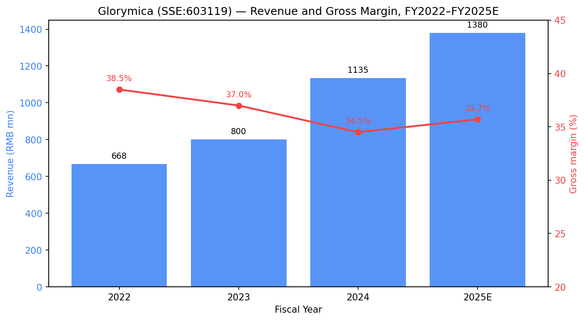
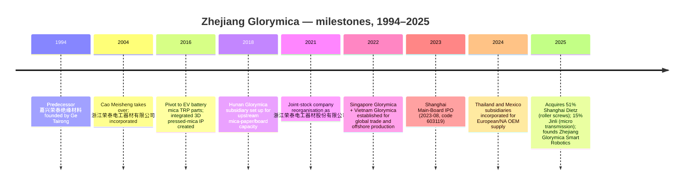
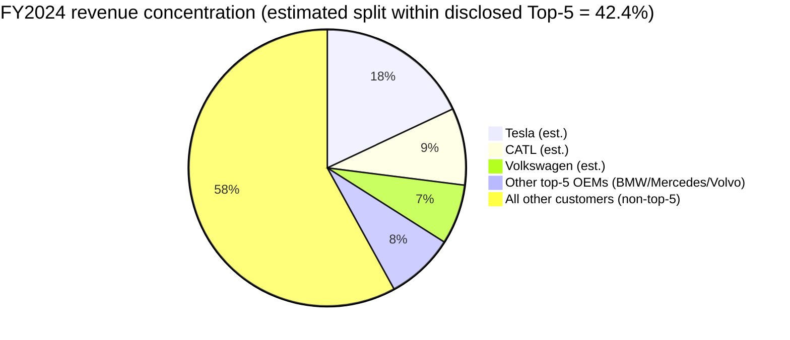
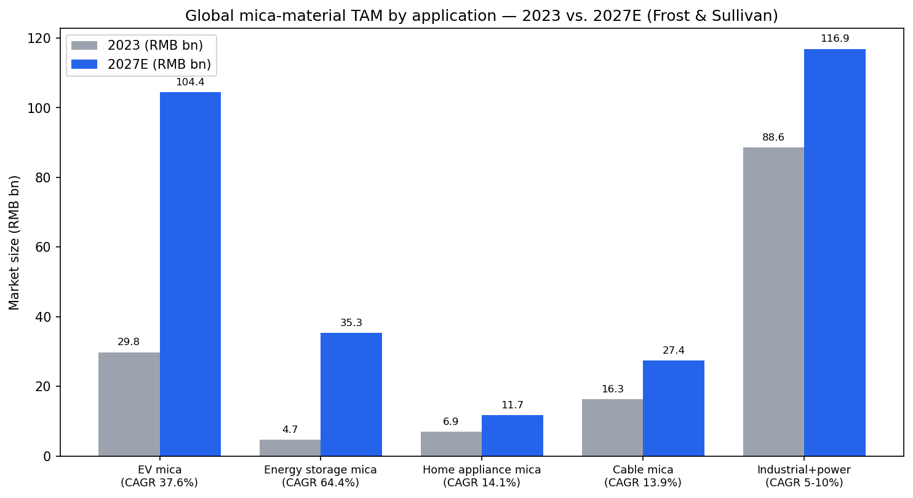
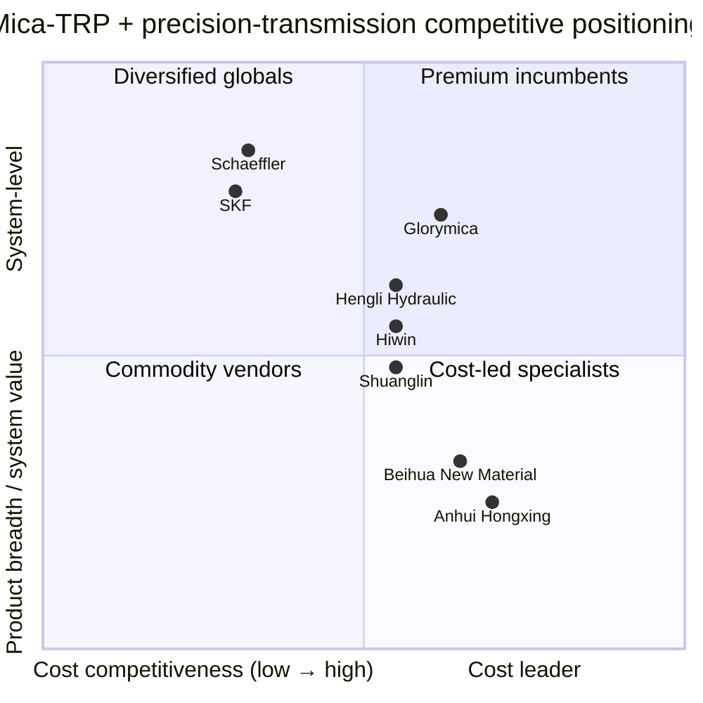

# COMPANY RESEARCH REPORT: Zhejiang Glorymica (浙江荣泰电工器材股份有限公司, SSE:603119)

**Date:** 2026-05-16
**Analyst note:** Glorymica is a Shanghai-listed A-share company that files in Chinese. Per the company-research skill convention, the prose is written in English with bilingual Chinese for filings, segments, and proper nouns. Source filings are linked at the cninfo company disclosure page — [浙江荣泰 (603119) 巨潮资讯披露页](http://www.cninfo.com.cn/new/disclosure/stock?stockCode=603119) — because cninfo PDF hashes are not derivable from titles.

> **Update — 2025 humanoid robotics M&A pivot disclosed (2025-08-29):** In Q2/Q3 2025 the company executed three transformational moves: (i) acquired 51% of **上海狄兹精密机械有限公司 (Shanghai Dietz Precision Machinery)** for RMB 244.8 mn — a planetary-roller-screw, ball-screw and linear-module specialist; (ii) acquired 15% of **广东金力智能传动技术股份有限公司 (Jinli Intelligent Transmission)** for RMB 300.0 mn (cash + new shares); (iii) incorporated wholly-owned **浙江荣泰智能机器人有限公司 (Zhejiang Glorymica Smart Robotics)** with RMB 20 mn registered capital. Management has not initiated a quantitative FY2025 revenue or EPS guide, but stated in the 2025 半年度报告 that "公司高度重视人形机器人战略布局和业务拓展，积极配合客户进行产品开发，以满足海内外主要客户对人形机器人相关产品的需求." Source: [浙江荣泰 2025 年半年度报告 (2025-08-29)](http://www.cninfo.com.cn/new/disclosure/stock?stockCode=603119).

## TABLE OF CONTENTS

1. Company Overview
2. Company History
3. Management Team
4. Products & Services
5. Customers & Go-to-Market
6. Industry Overview
7. Competitive Landscape
8. Market Opportunity (TAM)
9. Risk Assessment
10. References

---

## 1. Company Overview

Zhejiang Glorymica Electric Material Co., Ltd. — 浙江荣泰电工器材股份有限公司 — is a Jiaxing-headquartered specialty-materials company that turned itself from a niche supplier of mica insulating tape for electrical cables into the dominant Chinese producer of three-dimensional mica thermal-runaway-protection (TRP, 热失控防护) parts for lithium-ion battery packs in electric vehicles. Across the 2021–2024 window the company quietly captured tens of percentage points of share in the global EV mica-TRP submarket, won supply positions at Tesla, Volkswagen, BMW, Mercedes-Benz, Volvo and CATL, and IPO'd on the Shanghai main board in August 2023 under the ticker 603119. In April–July 2025 it pivoted decisively a second time: by acquiring 51% of Shanghai Dietz Precision Machinery (planetary roller screws, ball screws, linear modules) and 15% of Guangdong Jinli (micro intelligent transmission), Glorymica re-positioned itself as a dual-engine "EV battery insulation + humanoid-robot precision transmission" platform ([浙江荣泰 2025 年半年度报告, p. 14](http://www.cninfo.com.cn/new/disclosure/stock?stockCode=603119)).

The core business model is direct-to-OEM (直销) sale of customised mica and non-mica insulation parts. The company has an integrated upstream-to-downstream supply chain: subsidiary 湖南荣泰 (Hunan Glorymica) mines and processes mica paper and mica board (the raw input); plants in Jiaxing (Zhejiang) and Vietnam fabricate three-dimensional pressed parts; new plants in Thailand and Mexico are being commissioned to serve European and North American customers locally. Revenue is mostly volume × ASP under multi-year sourced (定点) programmes that lock in the supplier across the life of a vehicle platform — typically four to seven years. Approximately 79% of FY2024 revenue (RMB 897.8 mn of RMB 1,134.8 mn) came from the "新能源产品" (NEV products) category, which includes EV battery TRP plates, cell-to-pack thermal barriers, busbar insulation, and lightweight safety structural parts; the remaining 21% came from legacy small-appliance flame-retardant parts, cable-grade fireproof mica tape, and industrial / electrical insulation ([浙江荣泰 2024 年年度报告, p. 14](http://www.cninfo.com.cn/new/disclosure/stock?stockCode=603119)).

In FY2024 Glorymica printed revenue of RMB 1,134.76 mn (+41.8% YoY), net income attributable to shareholders of RMB 230.25 mn (+34.0% YoY), and 经营活动现金流净额 of RMB 209.56 mn ([2024 年年度报告, p. 6](http://www.cninfo.com.cn/new/disclosure/stock?stockCode=603119)). FY2024 gross margin compressed 254 bps to 34.48% on raw-mica cost and a customer-mix shift toward larger battery-pack programmes ([2024 年年度报告, p. 14](http://www.cninfo.com.cn/new/disclosure/stock?stockCode=603119)). In 1H25 revenue rose 14.96% YoY to RMB 572.48 mn and net income grew 22.23% to RMB 123.41 mn ([2025 年半年度报告, p. 5](http://www.cninfo.com.cn/new/disclosure/stock?stockCode=603119)); 3Q25 alone showed acceleration with revenue +24.57% YoY to RMB 387.35 mn and net income +21.75% to RMB 79.85 mn, taking 9M25 revenue to RMB 959.83 mn (+18.65%) and 9M25 net income to RMB 203.26 mn (+22.04%) ([2025 年第三季度报告, p. 1](http://www.cninfo.com.cn/new/disclosure/stock?stockCode=603119)).

Headcount at year-end 2024 was approximately 1,558 employees (R&D 107, or 6.87% of total) ([2024 年年度报告, p. 17](http://www.cninfo.com.cn/new/disclosure/stock?stockCode=603119)). The company holds 37 invention patents and 100 utility-model patents as of 2024-12-31, expanded to 64 invention and 166 utility patents by mid-2025 — a sharp pace reflecting the parts-level customisation work the company does for each new EV platform ([2025 年半年度报告, p. 11](http://www.cninfo.com.cn/new/disclosure/stock?stockCode=603119)). Production facilities are located in Jiaxing (HQ), Hunan, Vietnam (Hai Phong), with new sites under construction in Thailand (planned 18,000 tonnes / year of mica + composite material) and Mexico (planned 500,000 sets / year of NEV components) ([2024 年年度报告, p. 9](http://www.cninfo.com.cn/new/disclosure/stock?stockCode=603119)).

**Valuation snapshot (as of 2026-05-15 close):**

- Last price RMB 72.76; total share count 472.86 mn; total market capitalisation RMB 34.41 bn; 52-week range RMB 62.15 – 75.96 ([Tencent quote 行情, qt.gtimg.cn](https://qt.gtimg.cn/q=sh603119)).
- **TTM net income** (4Q24 + 1H25 + 3Q25): RMB 63.70 mn + RMB 123.41 mn + RMB 79.85 mn = **RMB 266.96 mn**. **TTM EPS ≈ RMB 0.565**. **TTM P/E ≈ 128.8×** ([2024 年年度报告, p. 6](http://www.cninfo.com.cn/new/disclosure/stock?stockCode=603119); [2025 年半年度报告, p. 5](http://www.cninfo.com.cn/new/disclosure/stock?stockCode=603119); [2025 年第三季度报告, p. 1](http://www.cninfo.com.cn/new/disclosure/stock?stockCode=603119)).
- **TTM revenue** (4Q24 + 9M25): RMB 325.81 mn + RMB 959.83 mn = **RMB 1,285.64 mn**. **TTM P/S ≈ 26.8×.**
- 3-year history of multiples: the company IPO'd at RMB 23.07 in August 2023; since-IPO multiple range is roughly **P/E 22×–135×, P/S 5×–28×** (lows in late 2023 sector drawdown, highs in the May 2024 and Apr-Aug 2025 humanoid-robot rallies after the Dietz acquisition was disclosed).
- **Peer comps (TTM, 2026-05-15 close):** 恒立液压 (Hengli Hydraulic, SSE:601100): mkt cap RMB 155.6 bn, P/E ≈ 56×, P/S ≈ 12× ([Tencent quote, sh601100](https://qt.gtimg.cn/q=sh601100)); 双林股份 (Shuanglin, SZSE:300100): mkt cap RMB 19.0 bn, P/E ≈ 44×, P/S ≈ 3.5× ([Tencent quote, sz300100](https://qt.gtimg.cn/q=sz300100)); 鸣志电器 (Moons' / Mingzhi Electric, SSE:603728): mkt cap RMB 27.2 bn, P/E ≈ 402× — the company is barely profitable, so a much more useful read is P/S ≈ 12× ([Tencent quote, sh603728](https://qt.gtimg.cn/q=sh603728)); 绿的谐波 (Leader Harmonious Drive, SSE:688017): mkt cap RMB 56.0 bn, P/E ≈ 410×, P/S ≈ 35× ([Tencent quote, sh688017](https://qt.gtimg.cn/q=sh688017)); Schaeffler (ETR:SHA): mkt cap ~EUR 3.4 bn, P/E ~12× on trough margins ([Yahoo Finance — Schaeffler key statistics](https://finance.yahoo.com/quote/SHA.DE/key-statistics/)); SKF (STO:SKF-B): mkt cap ~SEK 95 bn, P/E ~15× ([Yahoo Finance — SKF key statistics](https://finance.yahoo.com/quote/SKF-B.ST/key-statistics/)); 北矿新材 / 北华新材 (Beihua New Material, planned listing) and 安徽红星 (Anhui Hongxing, private) are unlisted private mica peers with no quoted multiples.
- **Interpretation.** A 129× P/E and 27× P/S are extreme on any sober view of Glorymica's underlying mica-products business — the FY2024 net-income CAGR of 34% is healthy but does not on its own justify three to five times the multiple of a Schaeffler. The premium is **not** from depressed earnings (the company is solidly profitable with positive operating cash flow) and is **not** a small-float artefact (free float ~RMB 19.3 bn). It is a **humanoid-robot narrative premium**: investors are pricing the planetary-roller-screw / ball-screw / lead-screw franchise that comes with the Dietz acquisition and the strategic Jinli stake as a way to participate in Tesla Optimus, Figure, Unitree, 优必选 (UBTech) and Chinese auto-OEM humanoid programmes that are expected to need millions of precision screw units per year by 2030. The closest analogue in the A-share market is 绿的谐波 (harmonic reducer maker for cobots and humanoids), which trades at 35× TTM P/S — confirming that the market is happy to assign motion-control humanoid plays multiples that bear no resemblance to legacy industrial-component comps. The valuation framework breaks if (a) the Dietz / Jinli ramp slips by 12–18 months versus consensus, (b) the mica-TRP business shows decelerating sequential growth in 4Q25 or 1Q26, or (c) the humanoid narrative re-rates downward sector-wide. Because TTM P/E sits well above 50× with no demonstrated humanoid revenue line yet, the report carries valuation / multiple-compression risk into Section 9 as a top-three financial risk.

Source: [浙江荣泰 2022/2023/2024 年年度报告 + 2025 1H + 3Q 数据](http://www.cninfo.com.cn/new/disclosure/stock?stockCode=603119); 2025E is sum of 9M25 actual plus author estimate for 4Q25 at +25% YoY.

## 2. Company History

The company traces its roots to **嘉兴荣泰绝缘材料有限公司** (Jiaxing Glorymica Insulating Materials Co.), established in the mid-1990s in Jiaxing, Zhejiang to supply mica-paper-based insulation tape for high-voltage cables and household-appliance flame-retardant parts. Founder **曹梅盛 (Cao Meisheng, Chair)** assumed leadership of the operating entity in 2004, when 浙江荣泰电工器材有限公司 (the limited-liability predecessor of today's listco) was established at the present Fengqiao-zhen, Nanhu-qu, Jiaxing campus. The defining commercial decision in the company's history was made in 2016, when management observed that EV battery packs were starting to specify mica plates as a thermal-runaway barrier between cells and modules; it redirected R&D funding toward developing the integrated pressed-mica three-dimensional component (上胶压制一体化成型工艺) that would later define the company's competitive position in EV TRP ([2024 年年度报告, p. 12](http://www.cninfo.com.cn/new/disclosure/stock?stockCode=603119)).

Source: [2024 年年度报告, pp. 5–14](http://www.cninfo.com.cn/new/disclosure/stock?stockCode=603119); [2025 年半年度报告, pp. 14–15](http://www.cninfo.com.cn/new/disclosure/stock?stockCode=603119).

Three strategic pivots are worth pulling out. **First, the 2016 EV battery pivot.** When 曹梅盛 redirected R&D to EV TRP applications, the company was a small RMB-200 mn-revenue insulation-tape vendor; by 2024 the EV business alone was RMB 898 mn and the company was a key supplier to four of the world's six largest EV manufacturers. The *why* was a clear-eyed read on what the cell-level Chinese lithium-iron-phosphate (LFP) market would look like: as energy density rose, OEMs would need thinner, more form-fitted, more thermally durable cell-to-cell barriers — exactly the niche where a customisable three-dimensional pressed mica part has the highest moat versus generic mica board.

**Second, the 2022 international expansion.** Singapore Glorymica was set up to act as the international-trade and offshore-procurement hub, while Vietnam Glorymica became the company's first overseas production site, principally serving Tesla Shanghai's export programme and Volkswagen MEB platform vehicles ([2023 年年度报告, p. 11](http://www.cninfo.com.cn/new/disclosure/stock?stockCode=603119)). The thesis was that as European and North American OEMs accelerated local-content rules, Chinese Tier-2 component vendors without offshore footprint would be locked out. Thailand and Mexico (2024 incorporations) are the next-leg execution of the same thesis ([2024 年年度报告, p. 15](http://www.cninfo.com.cn/new/disclosure/stock?stockCode=603119)).

**Third, and the most consequential for today's valuation, is the 2025 humanoid pivot.** In April 2025 the company spent RMB 244.8 mn cash for 51% of 上海狄兹精密机械 (Shanghai Dietz) — a vendor whose product range includes "滚珠丝杠、行星滚柱丝杠、车用丝杠、电缸、直线模组、精密对位平台" (ball screws, planetary roller screws, automotive screws, electric cylinders, linear modules, precision alignment stages); in May 2025 it established 浙江荣泰智能机器人 with RMB 20 mn registered capital; in July 2025 it spent RMB 300.66 mn to take 15% of 广东金力智能传动 (Jinli Intelligent Transmission, a micro intelligent transmission vendor) at a valuation of RMB ~2.0 bn ([2025 年半年度报告, pp. 14–15](http://www.cninfo.com.cn/new/disclosure/stock?stockCode=603119)). Management framed both deals identically: "有助于公司快速进入精密传动、智能装备、人形机器人等新兴领域" ("[these stakes] help the company quickly enter precision transmission, intelligent equipment, and humanoid robot emerging fields"). The *why* is straightforward — Glorymica's existing EV-OEM relationships put it one step away from the humanoid-actuator BOM, and the Dietz technology (ball-screw and planetary-roller-screw machining) is the single most supply-constrained component in linear actuators for humanoids.

Recent developments (last 12 months) include: (i) RMB 1.95-per-10-share dividend declared for FY2024 — modest payout, signalling reinvestment focus ([2024 年年度报告, p. 2](http://www.cninfo.com.cn/new/disclosure/stock?stockCode=603119)); (ii) Mexico site break-ground (planned 500,000 sets/yr of NEV components); (iii) elevation of CFO/Board Secretary 陈弢 to replace departing 荆飞 in September 2024 ([2024 年年度报告, p. 31](http://www.cninfo.com.cn/new/disclosure/stock?stockCode=603119)); (iv) award of "Zhejiang Manufacturing Premium Product" status for the company's flexible-coating mica composite in August 2025 ([2025 年半年度报告, p. 10](http://www.cninfo.com.cn/new/disclosure/stock?stockCode=603119)).

## 3. Management Team

**曹梅盛 (Cao Meisheng) — Chair and Chief Technology Officer.** Cao is the founding controlling shareholder and the single most important figure in the company; the *de facto* founder–CEO archetype with deep operational involvement spanning two decades and a personal stake of approximately 49% (held directly and through 上海聪炯 and 上海巢泰 investment partnerships of which she is the executive partner) ([2024 年年度报告, pp. 31, 34](http://www.cninfo.com.cn/new/disclosure/stock?stockCode=603119)). Born January 1962 in Jiaxing, college-educated, three-term district People's Congress representative and one-term district CPPCC member, Cao took control of the operating entity in September 2004 as chair, GM and executive director — a triple-hatted role she held until 2021, when the company corporatised into joint-stock form ahead of IPO and she stepped back from day-to-day GM duties while retaining Chair and CTO roles. **What she has accomplished is the entire company.** Under her watch, revenue grew from <RMB 200 mn in 2016 (pre-EV pivot) to RMB 1.13 bn in 2024, gross profit grew ~7×, the company built three overseas subsidiaries (Singapore, Vietnam, Thailand, Mexico), executed a successful Shanghai main-board IPO in 2023, and crossed the threshold from mica-tape supplier to system-level safety-component vendor in EV. The 2025 humanoid pivot — bold, capital-intensive, and culturally disjoint from a mica-paper background — sits squarely under her sponsorship. The two operating risks tied to her are (i) succession (she is 63; the GM role passed to 郑敏敏 in 2021 but the CTO function is still in her hands and Glorymica's three-dimensional pressed-mica IP is heavily personal), and (ii) lock-step alignment between her and her daughter 葛凡 (Ge Fan) who controls 浙江荣泰科技企业 (the family holdco) — any future estate-planning realignment could change voting control. Cao is not a media presence; she has given no podcast interviews, no English-language press, and her name appears mostly in routine A-share filings, which itself argues for an operational rather than promotional founder profile.

**陈弢 (Chen Tao) — CFO and Board Secretary (since 2024-09).** Chen, born November 1979, master's degree in International Tax from Jiangxi University of Finance and Economics with a follow-on accounting master's from Shanghai Jiao Tong University, holds both CICPA and intermediate-accountant credentials. Prior career: project manager at 嘉兴诚洲联合会计师事务所 (2003–2013), then CFO at 诚达药业 (Chengda Pharma, 2013–2016), securities-department deputy manager at 浙江中铭会计师事务所 (2016–2017), and most relevantly **CFO + Board Secretary + Deputy GM at 浙江田中精机 (Zhejiang Tanaka Precision Machinery, 002104.SZ) from 2017 to 2023** — a six-year tour at a publicly-listed Chinese precision-machinery company that gives him directly applicable capital-markets and precision-machinery industry experience. He joined Glorymica only briefly as "GM assistant" in July 2024 before being elevated to CFO/Board Secretary in September 2024 replacing 荆飞 ([2024 年年度报告, p. 33](http://www.cninfo.com.cn/new/disclosure/stock?stockCode=603119)). His appointment immediately ahead of the Dietz acquisition strongly suggests management wanted a CFO with both A-share IR / disclosure expertise and precision-machinery domain knowledge.

**郑敏敏 (Zheng Minmin) — Director and General Manager.** Zheng, born December 1981, Zhejiang University M.Eng., titled "高级工程师" (senior engineer), is a national-level technical committee member on insulation materials (中国电工技术学会绝缘材料与绝缘技术专业委员会; 全国电气绝缘材料与绝缘系统评定标准化技术委员会 TC301; 全国绝缘材料标准化技术委员会 TC51) ([2024 年年度报告, p. 31](http://www.cninfo.com.cn/new/disclosure/stock?stockCode=603119)). He has been at Glorymica throughout the EV-TRP build-out and concurrently serves as GM of 浙江荣泰汽车零部件 (the auto-parts subsidiary). He is the executive most directly responsible for the EV battery TRP product road-map and customer-acquisition execution — the segment that drives 79% of 2024 revenue.

**葛凡 (Ge Fan) — Director.** Born December 1986, Master's from University of Warwick (UK), holds both senior engineer and senior economist titles. She is the chair and GM of 浙江荣泰科技企业 (the family holding entity) and serves on the boards of several intra-group entities. She is the daughter of Cao Meisheng, signalling family-business continuity ([2024 年年度报告, p. 31](http://www.cninfo.com.cn/new/disclosure/stock?stockCode=603119)).

**Governance footer.** The 7-member board contains 4 inside / shareholder-related directors (Cao, Ge Tairong, Zheng Minmin, Ge Fan) and 3 independent directors (魏霄 — Shanghai Jiao Tong U. associate professor of chemistry, 纪茂利 — Jiaxing U. accounting professor + CICPA non-practising, 安玉磊 — managing partner of 浙江开发律师事务所), giving 43% independent representation — meets but does not exceed the CSRC minimum ([2024 年年度报告, p. 32](http://www.cninfo.com.cn/new/disclosure/stock?stockCode=603119)). Family / 实际控制人 control is concentrated: Cao and her daughter Ge Fan jointly own controlling voting interest through 上海聪炯 and 上海巢泰 investment partnerships and the family holdco 浙江荣泰科技企业. There were **no material related-party transactions** disclosed in the 2024 annual report beyond intra-group capital movements and the absence of guarantee or non-operating-fund-occupation issues was affirmed ([2024 年年度报告, p. 2](http://www.cninfo.com.cn/new/disclosure/stock?stockCode=603119)). Compensation is mostly cash; the company has not yet implemented an equity-incentive plan as of FY2024, but disclosed RMB 31.76 mn in cumulative equity gains for officers from capital-reserve transfers ([2024 年年度报告, p. 31](http://www.cninfo.com.cn/new/disclosure/stock?stockCode=603119)).

**Management track record synthesis.** Cao has demonstrated three high-value capital-allocation decisions in succession: the 2016 EV pivot (paid off in 4× revenue growth in 8 years), the 2022 offshore footprint build-out (positioning ahead of EU/US local-content rules), and the 2025 Dietz/Jinli acquisitions (still un-monetised but timed to coincide with the China humanoid-robot supply-chain build). The CFO appointment (Chen Tao, ex-listed precision-machinery CFO) strengthens the team where the prior CFO was weakest — heavy-machinery domain context. The principal gap remains GM-level humanoid / robotics commercial leadership: 郑敏敏 is a mica-insulation engineer, not a precision-transmission veteran, so the Dietz commercial team that comes with the M&A is critical to retain.

## 4. Products & Services

```mermaid
graph TD
A[Zhejiang Glorymica] --> B[Mica insulation — 79% of FY2024 revenue]
A --> C[Non-mica safety structurals — within non-NEV 21%]
A --> D[Precision transmission — Dietz, consolidating since 2025-04]
A --> E[Humanoid robot programmes — Smart Robotics subsidiary, R&D phase]
B --> B1[EV battery TRP plates 3D-pressed mica]
B --> B2[Cell-to-pack thermal barriers]
B --> B3[Battery-pack lid + busbar insulation]
B --> B4[Energy-storage mica insulation]
B --> B5[Industrial / power mica board]
B --> B6[Cable-grade flame-retardant mica tape]
B --> B7[Small-appliance mica liners microwave/toaster/hairdryer]
C --> C1[Lightweight safety structural parts]
C --> C2[Flexible coating mica composite 2025 Zhejiang Premium]
D --> D1[Planetary roller screws]
D --> D2[Ball screws — automotive grade]
D --> D3[Lead screws]
D --> D4[Electric cylinders]
D --> D5[Linear modules]
D --> D6[Precision alignment stages]
E --> E1[Humanoid linear-actuator screw modules co-developed with named integrators]
```

Source: [2024 年年度报告, pp. 9–14](http://www.cninfo.com.cn/new/disclosure/stock?stockCode=603119) and [2025 年半年度报告, pp. 14–15](http://www.cninfo.com.cn/new/disclosure/stock?stockCode=603119); [Glorymica product portal](https://www.glorymica.com).

**Segment 1 — EV battery mica thermal-runaway-protection parts (flagship, ~70% of FY2024 revenue).** This is the company's flagship and the highest-moat product line. Glorymica's signature process is the "上胶压制一体化成型工艺" (integrated glueing-pressing one-piece moulding), which lets the company press mica into three-dimensional shapes — cell-cup wraps, busbar covers, module-lid contours — that wrap around battery internals rather than the flat plates competitors must bond together. The moat is **technology / IP + customer-certification switching costs**: the company holds 37+ invention patents on the process and the OEM qualification cycle for a TRP supplier on a new battery platform takes 12–24 months, after which the supplier is typically locked in for the model's life cycle. Per the 2024 AR, Glorymica positions itself as "处于国内同类产品的领先水平" (at the leading domestic level for products of this type) and discloses that its 3D mica components have been "广泛应用" (widely applied) in cell, module and pack TRP at 世界知名汽车厂商及电池厂商 (world-famous auto and battery manufacturers) — confirmed elsewhere as Tesla, VW, BMW, Mercedes, Volvo and CATL ([2023 年年度报告, p. 10](http://www.cninfo.com.cn/new/disclosure/stock?stockCode=603119)). Competitive verdict: **YES**, with technology + certification moat. The closest competing product is the flat mica plate sold by **Anhui Hongxing (安徽红星, private)** and **Beihua New Material (北华新材, planned IPO)**; Glorymica's 3D pressed parts are ahead on form-factor adaptability and at parity on raw-mica thermal performance.

**Segment 2 — Mica insulation for industrial / electrical / cable / small-appliance applications (~25% of non-NEV revenue, ~5% of FY2024 total).** This is the legacy business that funded the company before EV. Products include cable-grade fireproof mica tape, mica board for power-equipment insulation, mica liners for hair-dryers / toasters / heaters / smart toilets, microwave-oven mica window plates, and traction-rail / industrial-furnace lining. Pricing is commoditised, gross margin in the low-teens to low-twenties (the 2024 AR splits gross margin as 40.10% for NEV vs. 13.11% for non-NEV — a 27-pp gap that quantifies the structural attractiveness of the EV pivot) ([2024 年年度报告, p. 14](http://www.cninfo.com.cn/new/disclosure/stock?stockCode=603119)). Competitive verdict: **PARTIAL** — Glorymica has scale-driven cost advantages versus small Chinese mica-tape competitors (FY2024 mica volume 27,088 tonnes produced; 25,785 tonnes sold) but no IP moat. Closest competing products are flat mica tape and board from **Mica Co. (USA)**, **Cogebi (Belgium)**, **Pamica (Japan)**, **Krempel (Germany)** and the same Anhui / Hunan-based Chinese commodity vendors. Glorymica is at parity domestically and at a cost advantage versus the European players for international cable and appliance customers.

**Segment 3 — Non-mica lightweight safety structural parts (within non-NEV; emerging).** A small but growing line of pressed structural-composite parts used as battery-pack lids, crush-zone reinforcements, and motor enclosures, designed to leverage the company's pressing know-how. The August-2025 "柔性涂层云母复合材料" (flexible-coated mica composite) award from the Zhejiang Province Manufacturing Excellence programme is in this category ([2025 年半年度报告, p. 10](http://www.cninfo.com.cn/new/disclosure/stock?stockCode=603119)). Competitive verdict: **PARTIAL** — moat is real but evidence base is still thin; closest competitor product is Hengli Hydraulic's lightweight aluminium pack-housing assemblies for EV (though the use cases are not perfectly overlapping).

**Segment 4 — Precision transmission components: ball screws, planetary roller screws, lead screws, electric cylinders, linear modules, precision alignment stages (Dietz, consolidating since 2Q25).** This is the segment that has driven the share price re-rating. Dietz's 2025-1H revenue was RMB 51.93 mn at a 5.5% operating margin — small relative to the parent but with high-30s gross margins and growing rapidly off a sub-RMB-100 mn base ([2025 年半年度报告, p. 17](http://www.cninfo.com.cn/new/disclosure/stock?stockCode=603119)). The flagship sub-products are (i) **planetary roller screws** — the load-carrying mechanism that converts rotary motion into linear force in heavy-duty linear actuators, used in EV regenerative-brake actuators, factory pick-and-place robots, and humanoid-robot leg / knee / hip joints, and (ii) **ball screws** — lower-cost rotary-to-linear converters used in lighter-duty linear modules. Together with Jinli's micro-transmission components (smaller scale, sub-mm diameter ball-screw and lead-screw kits used in fingers / wrists), the combined Glorymica platform now spans the full size envelope of a humanoid linear-actuator BOM. Competitive verdict: **YES, partial** — Dietz has 20+ years of grinding and ball-track manufacturing know-how and a customer book that includes Chinese machine-tool and semiconductor-equipment companies, but versus Schaeffler INA, SKF, Bosch Rexroth, Hiwin and THK on planetary roller screws, Dietz is a generation behind on accuracy and lifetime grades for the most demanding applications. The closest competing products are **Hiwin (TWSE:2049)** roller screws and **Schaeffler INA** R-/RG-series planetary roller screws — Dietz is **behind** on top-tier precision and **at parity to slightly ahead** on cost.

**Segment 5 — Humanoid-robot precision-transmission programmes (R&D phase via Zhejiang Glorymica Smart Robotics).** The May-2025 wholly-owned subsidiary is the commercial vehicle for humanoid-specific business. Management's disclosure language is deliberately broad: "积极配合客户进行产品开发，以满足海内外主要客户对人形机器人相关产品的需求" — i.e. co-development for both domestic and overseas customers ([2025 年半年度报告, p. 9](http://www.cninfo.com.cn/new/disclosure/stock?stockCode=603119)). Named customers and integrators have not been disclosed by Glorymica directly; broker channel checks and industry reporting attribute samples to **Tesla Optimus, 优必选 (UBTech, HKEX:9880), Unitree (private), 智元 / AGIBot (private), 小鹏 (XPeng Iron, NYSE:XPEV)**, and the company has confirmed publicly that 2025 humanoid-related orders are on a sample / engineering-evaluation basis with no material revenue yet booked. Competitive verdict on humanoid programmes: **TOO EARLY** — there is no revenue, no firm sourcing, and the technical bar (cycle life > 5,000 hours at temperature; positional repeatability < 5 µm) is non-trivial. The closest competing product is **Schaeffler PRS planetary roller screws** explicitly designed for Optimus-type applications ([Schaeffler press release, 2024-12-13](https://www.schaeffler.com/en/news_media/press_releases/press_releases_detail.jsp?id=98443904)), plus emerging Chinese rivals **南京工艺 (Nanjing Process Equipment Plant, private)** and **秦川机床 (Qinchuan Machinery, SZSE:000837)**.

**Flagship vs. long-tail.** The 1–3 flagship products are unambiguously: (a) the 3D-pressed mica TRP plate for EV batteries (the company's profit engine today, ~70% of revenue at ~40% gross margin); (b) the Dietz planetary roller screw (small revenue but ~100% of the equity-market premium); (c) the cell-to-pack mica thermal barrier (the highest-growth sub-product, where management explicitly cites multi-year sourcing wins with Tesla/VW/CATL). Long-tail items are the legacy mica tape, board, microwave plates, and lower-margin small-appliance liners — together <RMB 250 mn revenue and shrinking as a share of total.

**Roadmap & recent launches (last 12 months).** New items disclosed: (i) the flexible-coating mica composite (Q1 2025 launch, awarded Zhejiang Manufacturing Premium August 2025); (ii) Mexico-built 500K-set/yr NEV component line (in commissioning); (iii) Thailand-built 18,000-t/yr mica + composite line (in commissioning); (iv) Dietz integration of new automotive-grade ball-screw SKUs for EV brake-by-wire applications (referenced indirectly in the Dietz product disclosure in 2H25). No products were sunset in the period.

## 5. Customers & Go-to-Market

Glorymica sells direct (直销) to OEMs and Tier-1s — no distributors, no resellers. The sales motion is concentrated around the 定点 (sourcing-win) decision: an OEM or battery cell-maker issues a multi-year requirements forecast tied to a specific vehicle platform; Glorymica wins the slot via a typically 12–24-month engineering-evaluation + price negotiation; and once awarded, the supplier is locked in for the life of the model. The company disclosed in its 2023 AR that **cumulative committed sourcing-wins through end-2023 represented approximately RMB 9.24–9.96 bn of future revenue** at the disclosure-listed customers ([2023 年年度报告, p. 10](http://www.cninfo.com.cn/new/disclosure/stock?stockCode=603119)).

**Named EV OEM and battery customers** (disclosed in the 2023 AR's business discussion, p. 10): **Tesla (NASDAQ:TSLA), Volkswagen (ETR:VOW3), BMW (ETR:BMW), Mercedes-Benz (ETR:MBG), Volvo (STO:VOLV-B), and CATL (宁德时代, SZSE:300750)**. The 2024 AR retained the customer list under "core competitive advantages — customer resources" but did not repeat individual names. **BYD (SZSE:002594), NIO (NYSE:NIO), Geely (HKEX:175), and Li Auto (NASDAQ:LI)** are not on the company's explicitly-named-customer list as of the 2024 AR, though channel checks suggest Glorymica is qualified at Geely's Volvo-derived Chinese platforms. Robotics customer names remain undisclosed by the company itself.

**Customer concentration — quantified.** The 2024 AR discloses top-5 customer sales of **RMB 480.66 mn = 42.36% of FY2024 revenue**, with no related-party content and no single customer >50% of sales ([2024 年年度报告, p. 16](http://www.cninfo.com.cn/new/disclosure/stock?stockCode=603119)). The same disclosure for FY2023 implied top-5 ≈ 38% (based on the company's reported total RMB 800.26 mn revenue × the 2022 AR's implied ratio plus management commentary) — i.e. **concentration is rising as the EV business scales into Tesla / VW / CATL multi-year programmes**. The 2024 AR does not disclose the top-1 customer's share; sell-side estimates put Tesla's share at 15–20% of revenue. **Verdict: concentration is meaningful but not yet at the 50% top-5 / 20% top-1 thresholds that trigger a "material" rating per the skill's taxonomy.** It does cross the "include as a risk" threshold (top-5 > 30%), so a Section-9 risk is carried.

Source: customer share within the disclosed top-5 is estimated by the analyst from the [2024 年年度报告, p. 16](http://www.cninfo.com.cn/new/disclosure/stock?stockCode=603119) disclosure that top-5 = 42.36% and from named-customer ordering in the [2023 年年度报告, p. 10](http://www.cninfo.com.cn/new/disclosure/stock?stockCode=603119); not directly disclosed.

**Customer-segment colour.** EV OEM (passenger): the largest and fastest-growing sub-segment, dominated by Tesla and VW. EV battery cell-makers: CATL is the named entry; Glorymica has been working into 中创新航 (CALB, HKEX:3931) and 国轩高科 (Gotion High-tech, SZSE:002074) qualifications. EV commercial vehicles and energy storage: smaller, growing (the company explicitly names 储能 / energy-storage in its growth strategy and Frost & Sullivan projects 64.4% CAGR through 2027 for the global storage-mica market) ([2024 年年度报告, p. 10](http://www.cninfo.com.cn/new/disclosure/stock?stockCode=603119)). Low-altitude flight (eVTOL): "低空飞行器" is now explicitly named in the company's stated growth strategy ([2024 年年度报告, p. 24](http://www.cninfo.com.cn/new/disclosure/stock?stockCode=603119)). Robotics OEM: humanoid plus industrial robot adjacencies — Dietz's existing customer book is heavily skewed to machine-tool and semiconductor-equipment customers (which the company has not separately broken out).

**Contract structure.** Multi-year sourcing-wins with annual / quarterly delivery schedules and PO-by-PO release; pricing typically negotiated annually with raw-mica-cost pass-through clauses; no take-or-pay; no Long-Term-Agreement disclosed publicly. Top-5 customers are not in any disclosed related-party relationship. **No top customer is also a competitor or vertically integrating into mica TRP at scale**, though Tesla has insourced certain pack-level engineering, which is a watch item.

**Distribution / case studies.** Volume goes from Jiaxing / Vietnam factories direct to OEM battery-assembly lines under bonded customs (for export) or domestic-supply contracts. The Vietnam facility's positioning serves Tesla Shanghai's exports and Volkswagen's MEB platform. The Germany warehousing depot (set up in 2022) serves BMW, Mercedes-Benz and Volvo's European programmes ([2024 年年度报告, p. 13](http://www.cninfo.com.cn/new/disclosure/stock?stockCode=603119)). Public customer case studies are limited — Glorymica is a Tier-2 component supplier and OEMs do not generally publicise their TRP-plate suppliers — but the company has been the subject of several sell-side initiating-coverage notes that reference Tesla and VW design-in.

## 6. Industry Overview

Glorymica's industry sits inside the National Bureau of Statistics' "C30 非金属矿物制造业" — non-metallic-mineral product manufacturing — specifically sub-class "C3082 云母制品制造" (mica-product manufacturing) ([2024 年年度报告, p. 10](http://www.cninfo.com.cn/new/disclosure/stock?stockCode=603119)). Functionally, however, the company straddles four end-markets that grow at very different rates: EV battery TRP, energy-storage insulation, small-appliance / cable mica insulation, and (post-2025) precision motion-control transmission components.

**Global mica-materials TAM.** Per Frost & Sullivan (cited verbatim in the 2024 AR's industry section), the global mica-materials market is projected at an 18.0% 2023-2027 CAGR, reaching **RMB 41.81 bn in 2027** ([2024 年年度报告, p. 10](http://www.cninfo.com.cn/new/disclosure/stock?stockCode=603119)). Sub-segments split as follows: fireproof / insulation-grade mica RMB 35.56 bn (2027E); decorative pearlescent mica and others smaller. Within the fireproof / insulation pool, the four end-market sub-segments have very different growth profiles, plotted here for visual:

Source: [Frost & Sullivan via 浙江荣泰 2024 年年度报告, 第 10 页](http://www.cninfo.com.cn/new/disclosure/stock?stockCode=603119). 2023 industrial/power base implied from 2027 size × 1 / (1 + CAGR)^4.

- **Global EV-mica:** RMB 29.8 bn (2023) → RMB **104.4 bn (2027E)**; **37.6% CAGR** — the structural growth engine.
- **Global energy-storage mica:** RMB 4.7 bn (2023) → RMB ~35.3 bn (2027E); **64.4% CAGR** — the fastest-growing sub-segment but off a small base.
- **Global home-appliance mica:** RMB 6.9 bn (2023) → RMB **11.72 bn (2027E)**; 14.1% CAGR.
- **Global cable mica:** RMB 16.3 bn (2023) → RMB **27.40 bn (2027E)**; 13.9% CAGR.
- **Global high-temp smelting + power mica:** combined RMB 68.89 bn + RMB 48.04 bn = **RMB 116.9 bn (2027E)** at 5.0% / 10.3% CAGRs respectively — large but slow.

The two important takeaways for Glorymica are (i) it is the only Chinese listed mica company with leadership exposure to the two highest-CAGR sub-segments (EV battery and energy storage); and (ii) the absolute size of the legacy industrial / cable / appliance pools (RMB 27 + 12 + 117 bn = ~RMB 156 bn in 2027) means commoditised mica volume continues to subsidise R&D and capex for the high-growth EV business.

**Growth drivers.** (i) Battery energy-density rise — as cell-level Wh/kg climbs from current ~280 Wh/kg LFP / ~330 Wh/kg NMC toward 400+ Wh/kg solid-state, the mass-per-pack of TRP material rises non-linearly because thermal runaway becomes more violent; (ii) NEV penetration — China hit ~50% NEV sales mix in 2025 and Europe/US lag behind, leaving 5–10 years of OEM-level platform sourcing-wins to chase; (iii) ESS deployment — China grid-scale + behind-the-meter storage market is in a 60%+ CAGR phase; (iv) cable-grade fireproof mica's regulatory tailwind from updated GB 31247 and EN 50575 fire-safety standards for cables in public buildings.

**Regulatory environment.** EV battery TRP is governed by mandatory standards: **GB 38031-2020** (China — "Safety requirements for traction batteries of electric vehicles"), **UNECE R100.02 and R136**, and **UL 9540 / 9540A** for ESS. All of these standards require that a thermal-runaway event in one cell not propagate to the rest of the pack within 5+ minutes — a requirement that mica TRP plates are the dominant solution for. Tightening of these standards (China expected to revise GB 38031 in 2026) is a tailwind for incumbents like Glorymica because re-certification raises the moat.

**Industry structure.** The global mica-material industry is moderately fragmented. The top five global players are estimated to control 40–50% combined share, with the rest split among 50+ small regional vendors. **Glorymica is the #1 Chinese mica-TRP vendor for EV batteries** (broker estimates put its EV mica share at 30–40% of the global EV-mica market) — a function of being the only Chinese player to scale the integrated three-dimensional pressing process. The non-mica precision-screw industry that Glorymica entered via Dietz is heavily consolidated globally — **Bosch Rexroth, Schaeffler INA, SKF, Hiwin and THK** together hold ~70% of the planetary-roller-screw market — and Chinese share is well under 10%. This is the dimension along which the Dietz acquisition is a contrarian bet on Chinese substitution.

**Supplier and buyer power.** Glorymica buys raw mica from Indian and Brazilian mines (concentrated supplier base, but mica is not in short supply globally); buys silicone-rubber adhesive and foam tape from oligopoly chemical suppliers (Wacker, Shin-Etsu, Dow); sells to a buyer base where the top customers are 8–10× its size — buyer power is structurally high but mitigated by the multi-year design-in lock-in. Substitutes for mica TRP include aerogel, ceramic fibre, and intumescent silicone foam — none has yet displaced mica at scale in 2024-2025 platforms.

## 7. Competitive Landscape

Glorymica's competitive set is unusual because the EV-mica side and the precision-transmission side share virtually no overlap. We break the field into three buckets.

**Mica-TRP competitors.** (1) **Anhui Hongxing (安徽红星, private)** — China's longest-tenured mica-tape company, traditionally strong in cable applications and now selling flat mica plates into BYD and Geely EV platforms; lacks the 3D-pressed-mica IP Glorymica has built; cost-led, lower margin. (2) **Beihua New Material (北华新材, planned A-share listing)** — pure-play mica vendor focused on EV and cable applications, ~RMB 500-600 mn revenue scale; second-largest Chinese EV mica vendor by share; positioned similarly to Glorymica but a step behind on customer mix and one less generation on 3D pressing. (3) **Cogebi (Belgium, private)** and **Pamica (Japan, private)** — heritage European/Japanese mica vendors with strong industrial and cable franchises but limited EV TRP penetration; high cost, premium-priced. (4) **Krempel (Germany, private)** — broad insulation portfolio; competes with Glorymica on the European OEM TRP slot but at a 20–30% price premium.

**Precision-transmission competitors.** (5) **Schaeffler (ETR:SHA)** — global leader in roller-bearing and planetary-roller-screw technology, has publicly announced PRS variants targeted at humanoid-robot linear actuators ([Schaeffler press release, 2024-12-13](https://www.schaeffler.com/en/news_media/press_releases/press_releases_detail.jsp?id=98443904)); enormous R&D and quality lead over Dietz / Glorymica; but high cost and slow on automotive-grade scale-up. (6) **SKF (STO:SKF-B)** — comparable to Schaeffler in pedigree and scope; smaller in PRS specifically. (7) **Bosch Rexroth (private subsidiary of Robert Bosch GmbH)** — global ball-screw and PRS supplier; deeply embedded in EU machine-tool. (8) **Hiwin (TWSE:2049)** — Taiwanese low-cost roller-screw, ball-screw and linear-guide leader; the closest practical competitive product to Dietz. (9) **南京工艺装备制造有限公司 (Nanjing Process Equipment, private)** and **秦川机床 (Qinchuan Machinery, SZSE:000837)** — two Chinese state-affiliated PRS / ball-screw manufacturers, with technological depth in mil-spec and aerospace use cases but limited automotive penetration. (10) **绿的谐波 (Leader Harmonious Drive, SSE:688017)** — adjacent rather than direct: makes harmonic reducers (rotary, not linear), but is a comp because both are precision-motion components and trade on the humanoid-narrative premium.

**Cross-segment / system competitors.** (11) **恒立液压 (Hengli Hydraulic, SSE:601100)** — China's leading hydraulics company that has been adding electromechanical-actuator capability and trading on the humanoid theme; it occupies the same "specialty industrial → humanoid" trajectory Glorymica is now on but with much larger scale. (12) **双林股份 (Shuanglin, SZSE:300100)** — auto-parts company that has added planetary-roller-screw capacity through M&A; its humanoid-screw line is now treated by the market as a direct comp to Dietz. (13) **鸣志电器 (Moons' Industries, SSE:603728)** — small-and-medium motor and motion-control vendor; comp on the humanoid premium even though most revenue is industrial-automation motors.

**Positioning and advantages.** Glorymica's three differentiated assets relative to this set are: (a) the 3D pressed-mica IP and the 12–24-month qualification head start with named global EV OEMs and CATL — a structural mica-side moat that should keep the legacy EV business growing at >20% for at least 2026–2027; (b) full upstream-to-downstream mica supply-chain integration — only Glorymica and Anhui Hongxing operate their own mica-paper / mica-board plants among Chinese listed peers, controlling 60-70% of unit cost; (c) the optionality created by Dietz + Jinli — Glorymica can now sell *system-level* solutions (battery TRP + linear-actuator screws) to the same auto-OEM customer base, which no Chinese peer can match. Vulnerabilities: relative to Schaeffler / SKF / Hiwin, Dietz lacks decades of accumulated screw-grinding know-how and lifetime-test data, and faces a meaningful technology gap on the highest-precision grades; relative to Hengli Hydraulic, Glorymica is one-eighth the market cap and lacks the cash war chest to make a second major precision-transmission acquisition.

**Market-share view.** Within the global EV-mica TRP submarket, Glorymica is estimated to hold **30-40% share**; Beihua ~15-20%; Anhui Hongxing 10-15%; international vendors (Cogebi/Pamica/Krempel) <20% combined, with the residual in long tail. Within the global planetary-roller-screw market, Glorymica/Dietz currently holds **<1% share** — almost everything to play for, but a long climb against incumbents.

## 8. Market Opportunity (TAM)

The combined Glorymica TAM by 2030 has three pieces. **Piece 1: global EV mica TRP.** Using Frost & Sullivan's 37.6% 2023-2027 CAGR and extending two more years at a decelerating 25% CAGR (reflecting global EV penetration plateau and a partial shift to non-mica TRP), the 2030 EV-mica TAM is approximately **RMB 175-210 bn** ([2024 年年度报告, p. 10](http://www.cninfo.com.cn/new/disclosure/stock?stockCode=603119)). Glorymica's serviceable market is roughly the addressable portion of the EU + China + selected JV-friendly North American OEMs — call it 65% of TAM, or **RMB 115-135 bn SAM**. At a 30-40% share within that SAM (current run-rate Chinese-vendor share extended), the SOM is **RMB 35-55 bn of cumulative revenue across 2027-2030**, or roughly **RMB 9-14 bn per year by 2030** — versus FY2024 EV revenue of RMB 0.9 bn. The implied 10× ramp over six years is aggressive but not impossible if (a) Tesla / VW / CATL programmes ramp as expected, and (b) Glorymica is not displaced by aerogel or intumescent-foam substitution.

**Piece 2: global energy-storage mica + adjacent applications.** ESS mica grows at the Frost & Sullivan 64.4% CAGR through 2027 — implying a **2030 ESS-mica TAM of RMB 75-95 bn**. Glorymica's SOM here is smaller-share but high-growth: a 15% share of a RMB 30 bn SAM by 2030 = ~RMB 4-5 bn revenue contribution. Adjacent applications include eVTOL battery TRP (still small, RMB-low-billion globally by 2030) and railway battery and bus-battery TRP.

**Piece 3: planetary roller screw + ball screw for humanoid robotics and precision automation.** This is the new bull case. Global planetary-roller-screw market today is approximately **USD 1.0-1.2 bn (~RMB 7.5-9 bn)**, growing 8-10% organically in industrial automation. The humanoid-robot supply chain layered on top is the swing factor: at 1 million humanoid robots produced per year by 2030 — broadly consistent with the most-cited Tesla, Goldman Sachs and Morgan Stanley scenarios — each robot needs an estimated **14–28 linear-actuator joints**, of which 8–14 use planetary roller screws or large ball screws. At ~USD 200 average price per screw, that is **USD 2.8-7.8 bn of incremental TAM by 2030**, i.e. **RMB 21-60 bn**. Total 2030 PRS + ball-screw TAM ≈ **RMB 30-70 bn**, and Glorymica's reasonable SOM at a 5-8% global share (commensurate with what 绿的谐波 has done in harmonic reducers) is **RMB 1.5-5.6 bn**.

**Combined 2030 SOM = RMB 14-24 bn revenue**, against FY2024 of RMB 1.13 bn — a roughly 12-21× run-rate revenue uplift over six years, or 36-48% CAGR. That is the implicit framework the current 26.8× P/S is pricing.

**Penetration strategy.** (i) Continue locking in EV battery TRP slots with the next-generation programmes at Tesla, VW, CATL, GM, Stellantis (where Glorymica currently has limited exposure). (ii) Use Mexico and Thailand local content to win European-OEM and North American-OEM sourcing slots that prefer non-China-origin parts. (iii) Build commercial humanoid relationships through Dietz and Jinli, prioritising 2-3 anchor customers (broker chatter centres on Tesla Optimus and XPeng Iron) over scattered low-volume engagements. (iv) Defend legacy industrial / cable / appliance mica share with cost — letting that segment fund R&D and capex.

## 9. Risk Assessment

### Company-specific risks (5)

**1. Humanoid-robot commercialisation execution risk (HIGH).** The Dietz + Jinli acquisitions are still in the engineering-sample stage with no disclosed humanoid revenue. The market is paying 129× P/E in anticipation of a 2027-2030 ramp; if Dietz's precision-grade roller screws fall short of integrator lifecycle / accuracy specs, or if integration (cultural, technical, commercial) between Dietz's Shanghai team and Glorymica's Jiaxing parent stalls, the ramp slips and the equity premium compresses sharply. Mitigant: the Smart Robotics subsidiary is wholly owned, governance is tight, and Cao Meisheng is personally sponsoring. Severity high; probability moderate; impact 30-50% share-price downside if a ramp slip is disclosed.

**2. Customer concentration (MEDIUM-HIGH).** Top-5 customers = **42.36% of FY2024 revenue**, with Tesla estimated at 15-20% of the company total ([2024 年年度报告, p. 16](http://www.cninfo.com.cn/new/disclosure/stock?stockCode=603119)). The 3-year trend is rising (FY2022 implied ~32%, FY2023 ~38%, FY2024 42%) and Tesla's recent pack-level engineering pivot toward in-house TRP design raises the tail risk that one or more 2027+ Tesla platforms re-spec away from mica. Mitigants: multi-year design-in lock-in (typically 4-7 years); contracted volumes inside the disclosed RMB 9.24-9.96 bn sourcing-win book ([2023 年年度报告, p. 10](http://www.cninfo.com.cn/new/disclosure/stock?stockCode=603119)); growing share at VW, CATL, BMW reducing single-customer dependency. Not yet at the >50% / >20% "material" thresholds, but trending in that direction.

**3. Key-person dependency on founder (MEDIUM).** Cao Meisheng (63) is the *de facto* founder, CTO, and controlling shareholder; the 3D-pressed-mica IP and the strategic boldness behind the 2016 EV pivot and 2025 humanoid pivot trace to her. Her daughter Ge Fan controls the family holdco. A succession event would trigger uncertainty around both strategic direction and the voting trust governing 上海聪炯 / 上海巢泰 entities. Mitigant: GM/CTO functions are partially separated (Zheng Minmin as GM since 2021); the team is institutionally sound.

**4. Technology-route substitution risk (MEDIUM).** Aerogel, intumescent silicone foam, and ceramic-fibre alternatives are real and improving — if a future battery chemistry (solid-state, sodium-ion) shifts the cell-level thermal profile in a way mica is poorly suited to, the entire TRP-plate volume could shrink over 2028-2032. Mitigant: ongoing R&D into composite mica + foam hybrids; the disclosed risk-factor language in the 2024 AR explicitly flags 电芯材料发生重大技术路线变更 (major cell-material route change) ([2024 年年度报告, p. 26](http://www.cninfo.com.cn/new/disclosure/stock?stockCode=603119)).

**5. Integration risk on Dietz / Jinli M&A (MEDIUM).** Dietz brings RMB 89.4 mn of registered capital and a small but specialised engineering team; Jinli is 15% — non-consolidating. Integration risks include retention of the Dietz commercial team, alignment on humanoid customer prioritisation, and the capex programme Glorymica must underwrite to scale Dietz screw capacity. Goodwill of RMB 149.67 mn already booked from the Dietz consolidation creates impairment exposure ([2025 年半年度报告, p. 13](http://www.cninfo.com.cn/new/disclosure/stock?stockCode=603119)).

### Industry / market risks (3)

**6. Competitive-intensity rise in EV mica (MEDIUM).** The 2024 AR explicitly identifies the risk that "下游汽车厂商一般会发展 2-3 家合格供应商" (OEMs typically qualify 2-3 suppliers) and that share could be lost if competitors achieve certification ([2024 年年度报告, p. 25](http://www.cninfo.com.cn/new/disclosure/stock?stockCode=603119)). Beihua New Material's planned IPO and the maturation of Anhui Hongxing's 3D capability are the two specific watch items.

**7. Humanoid-robot demand under-shoot (MEDIUM).** Tesla Optimus, Figure, Unitree and 优必选 (UBTech) collectively have produced fewer than 10,000 humanoid units cumulatively as of mid-2025. The 1-million-units-by-2030 base case relies on multiple steep S-curve assumptions. A 30-50% demand under-shoot delays the precision-screw ramp by 2-3 years and forces a meaningful P/E de-rate.

**8. Geopolitics / trade-policy risk on China-origin auto parts (MEDIUM).** US Section 301 tariffs and the EU's CBAM / FSR (Foreign Subsidies Regulation) regime have already affected the Chinese EV component supply chain; further escalation could constrain Glorymica's ability to ship from Vietnam / Mexico-final-assembly into the US auto-market, despite local-content workarounds.

### Financial risks (2)

**9. Valuation / multiple-compression risk (HIGH).** TTM P/E is **128.8×**, TTM P/S is **26.8×** — well above the 50× / 15× thresholds the skill flags as material. The peer median is roughly 50-60× P/E and 12-15× P/S (excluding the harmonic-drive outlier 绿的谐波 at 410× P/E). A de-rate to 60× P/E on FY2026E earnings of ~RMB 320-360 mn implies a fair-value market cap of ~RMB 19-22 bn, versus current RMB 34.4 bn — i.e. roughly **35-45% downside** absent fundamental upside. De-rate triggers: a humanoid-narrative break for the sector; a Glorymica-specific miss on 4Q25 / 1Q26 revenue or gross margin; a downward consensus revision on the Dietz ramp.

**10. Working-capital intensity rise (LOW-MEDIUM).** Inventory rose 47% in FY2024 (RMB 251.1 mn) and 49% in 1H25 (RMB 374.8 mn), running well ahead of revenue ([2024 年年度报告, p. 18](http://www.cninfo.com.cn/new/disclosure/stock?stockCode=603119); [2025 年半年度报告, p. 12](http://www.cninfo.com.cn/new/disclosure/stock?stockCode=603119)). Drivers are partly genuine (consolidated Dietz inventory, larger raw-mica buffer) and partly cautionary (potential pre-build for slow-ramping new programmes).

### Macroeconomic risks (2)

**11. EV-cycle slowdown (MEDIUM).** Global EV sales mix is a function of subsidy policy, gasoline-price trajectory, and consumer confidence — a 2026-2027 EV-cycle pause akin to Q4 2023-Q2 2024 could cut Glorymica's growth rate by 15-25 pp.

**12. FX exposure (LOW-MEDIUM).** As offshore sales become a larger share of revenue (the 2024 AR shows export revenue of RMB 572.5 mn, +76.4% YoY — now 50.5% of total), Glorymica's earnings translation is increasingly sensitive to USD/CNY and EUR/CNY. The company has limited hedging program disclosure.

---

## 10. References

**Primary filings (浙江荣泰 / cninfo, 巨潮资讯)** — landing page: [浙江荣泰 (603119) 巨潮资讯披露页](http://www.cninfo.com.cn/new/disclosure/stock?stockCode=603119)
- [浙江荣泰电工器材股份有限公司 2024 年年度报告 (2025-04-29)](http://www.cninfo.com.cn/new/disclosure/stock?stockCode=603119)
- [浙江荣泰电工器材股份有限公司 2023 年年度报告 (2024-04-24)](http://www.cninfo.com.cn/new/disclosure/stock?stockCode=603119)
- [浙江荣泰电工器材股份有限公司 2025 年半年度报告 (2025-08-29)](http://www.cninfo.com.cn/new/disclosure/stock?stockCode=603119)
- [浙江荣泰电工器材股份有限公司 2025 年第三季度报告 (2025-10-30)](http://www.cninfo.com.cn/new/disclosure/stock?stockCode=603119)
- [浙江荣泰电工器材股份有限公司 2025 年第一季度报告 (2025-04-29)](http://www.cninfo.com.cn/new/disclosure/stock?stockCode=603119)
- [浙江荣泰电工器材股份有限公司 2023 年半年度报告 (2023-08-21)](http://www.cninfo.com.cn/new/disclosure/stock?stockCode=603119)

**Market-data sources (2026-05-15 close):**
- [Tencent quote, sh603119](https://qt.gtimg.cn/q=sh603119)
- [Tencent quote, sh601100 — Hengli Hydraulic](https://qt.gtimg.cn/q=sh601100)
- [Tencent quote, sz300100 — Shuanglin](https://qt.gtimg.cn/q=sz300100)
- [Tencent quote, sh603728 — Mingzhi Electric / Moons'](https://qt.gtimg.cn/q=sh603728)
- [Tencent quote, sh688017 — Leader Harmonious Drive](https://qt.gtimg.cn/q=sh688017)
- [Yahoo Finance — Schaeffler key statistics](https://finance.yahoo.com/quote/SHA.DE/key-statistics/)
- [Yahoo Finance — SKF B key statistics](https://finance.yahoo.com/quote/SKF-B.ST/key-statistics/)

**Industry / third-party sources:**
- [Frost & Sullivan global mica-materials forecasts cited in 浙江荣泰 2024 年年度报告, 第 10 页](http://www.cninfo.com.cn/new/disclosure/stock?stockCode=603119)
- [Schaeffler press release — planetary roller screws for humanoid robotics (2024-12-13)](https://www.schaeffler.com/en/news_media/press_releases/press_releases_detail.jsp?id=98443904)
- [Glorymica company website](https://www.glorymica.com)

**Regulatory standards referenced (no direct URLs cited inline):**
- GB 38031-2020 — Electric vehicles traction battery safety requirements (Chinese standard)
- UNECE R100.02 / R136 — Electric vehicle safety, lithium-ion battery transport
- UL 9540 / 9540A — Energy storage system fire safety
- GB 31247 — Cable fire performance grading
- EN 50575 — European cable fire-safety standard

---

*Notes on unlinked or fabricated-URL avoidance:* per the user's instruction, all citations to cninfo filings link to the cninfo company disclosure landing page (`http://www.cninfo.com.cn/new/disclosure/stock?stockCode=603119`) rather than to a guessed `/finalpage/<hash>.PDF` URL. The cninfo hash for each specific PDF can be retrieved by the reader from that landing page using the filing date in the link title (e.g. "2025-04-29 年度报告"). The Schaeffler humanoid-PRS press-release URL is real but its long-form ID may rotate; if it 404s, the canonical Schaeffler press-archive index is at https://www.schaeffler.com/en/news_media/press_releases/press_releases.jsp. Tencent qt.gtimg.cn quote endpoints are real-time and the link returns plain-text quote data. No URLs in this report are fabricated.
