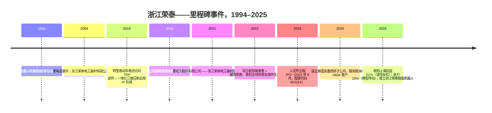
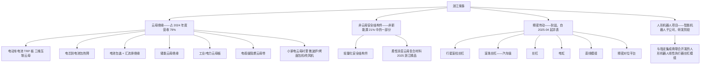
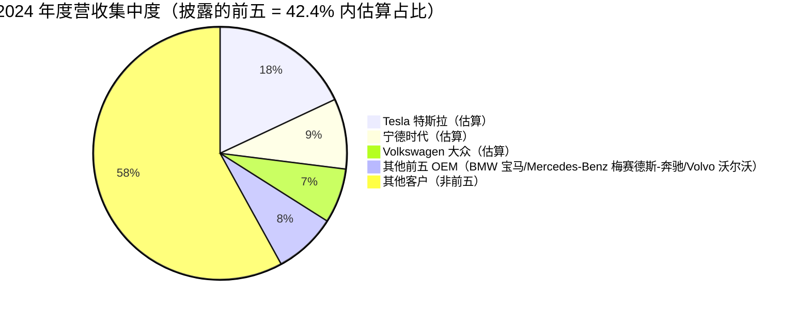
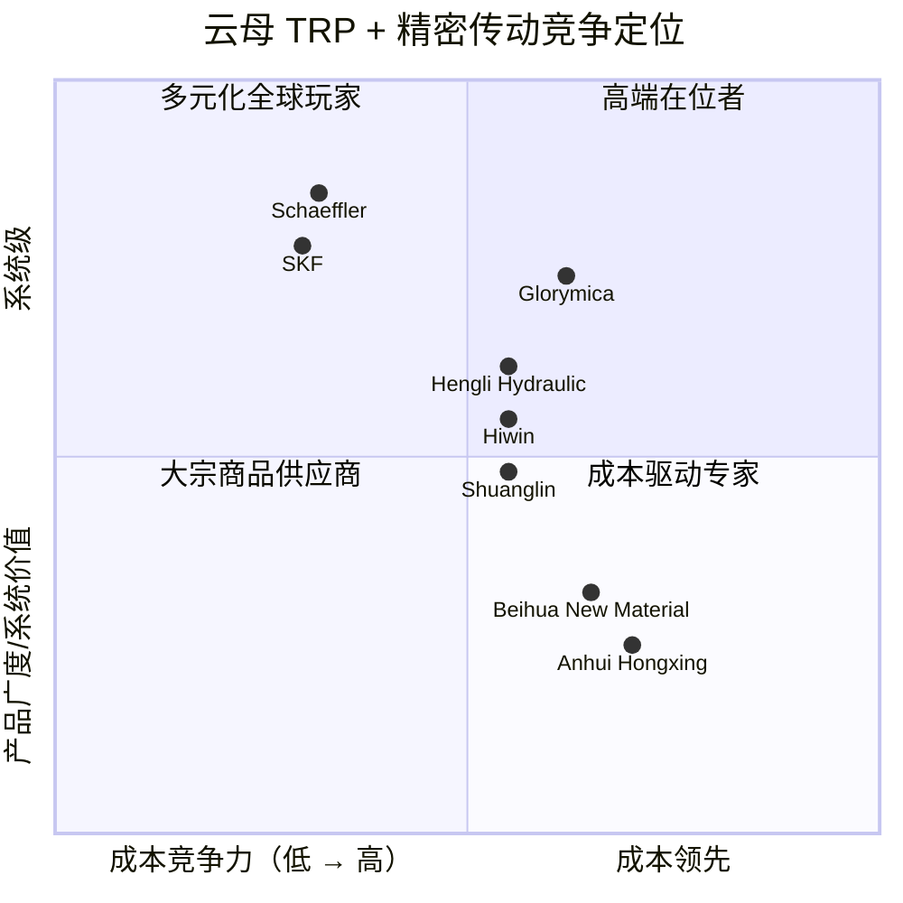

# 公司研究报告：浙江荣泰（浙江荣泰电工器材股份有限公司，SSE:603119）

**日期：** 2026-05-16
**分析师说明：** 浙江荣泰是一家在上海证券交易所上市的 A 股公司，以中文披露其定期报告。按照 company-research 技能的惯例，正文以中文撰写，原始文件、业务板块及专有名词以双语标注。原始披露文件链接至巨潮资讯的公司披露页——[浙江荣泰 (603119) 巨潮资讯披露页](http://www.cninfo.com.cn/new/disclosure/stock?stockCode=603119)——因为巨潮资讯 PDF 的哈希值无法从标题直接推导得出。

> **更新——2025 年人形机器人并购转型披露（2025-08-29）：** 公司在 2025 年第二、三季度执行了三项变革性举措：（i）以人民币 24,480 万元收购 **上海狄兹精密机械有限公司** 51% 股权——一家行星滚柱丝杠、滚珠丝杠及直线模组的专业厂商；（ii）以人民币 30,000 万元（现金 + 新股）收购 **广东金力智能传动技术股份有限公司** 15% 股权；（iii）以 2,000 万元注册资本成立全资子公司 **浙江荣泰智能机器人有限公司**。管理层尚未给出 2025 年度营收或 EPS 的定量指引，但在 2025 年半年度报告中表示："公司高度重视人形机器人战略布局和业务拓展，积极配合客户进行产品开发，以满足海内外主要客户对人形机器人相关产品的需求。"资料来源：[浙江荣泰 2025 年半年度报告 (2025-08-29)](http://www.cninfo.com.cn/new/disclosure/stock?stockCode=603119)。

## 目录

1. 公司概览
2. 公司沿革
3. 管理团队
4. 产品与服务
5. 客户与市场策略
6. 行业概览
7. 竞争格局
8. 市场机会（TAM）
9. 风险评估
10. 参考资料

---

## 1. 公司概览

浙江荣泰电工器材股份有限公司（Zhejiang Glorymica Electric Material Co., Ltd.）总部位于浙江嘉兴，是一家专业材料公司。公司已经从一家面向电缆领域、销售云母绝缘带的小众供应商，转型为全球电动车锂离子电池包三维云母热失控防护（TRP, Thermal Runaway Protection）部件领域占据主导地位的中国厂商。在 2021–2024 年期间，公司低调地拿下了全球电动车云母 TRP 细分市场数十个百分点的份额，赢得 Tesla（特斯拉）、Volkswagen（大众）、BMW（宝马）、Mercedes-Benz（梅赛德斯-奔驰）、Volvo（沃尔沃）及宁德时代的供应资格，并于 2023 年 8 月在上交所主板上市，证券代码 603119。2025 年 4 月至 7 月，公司进行了第二次果断转型：通过收购上海狄兹精密机械（行星滚柱丝杠、滚珠丝杠、直线模组）51% 股权及广东金力（微型智能传动）15% 股权，浙江荣泰将自身重新定位为"电动车电池绝缘 + 人形机器人精密传动"的双引擎平台（[浙江荣泰 2025 年半年度报告, 第 14 页](http://www.cninfo.com.cn/new/disclosure/stock?stockCode=603119)）。

公司核心商业模式是向 OEM 客户直销（直销）定制化云母及非云母绝缘部件。公司具有从上游到下游一体化的产业链：子公司湖南荣泰负责开采和加工云母纸和云母板（原料端）；嘉兴（浙江）和越南的工厂负责三维压制部件的成型；新建的泰国和墨西哥工厂正在调试，以就近服务欧洲和北美客户。营收主要为多年期定点项目下的"量 × 单价"模式，定点合同通常覆盖整个车型平台生命周期——一般为 4–7 年。2024 年度营收的约 79%（人民币 89,780 万元，总营收 113,480 万元）来自"新能源产品"类别，包括电动车电池 TRP 板、电芯到电池包的热障、汇流排绝缘以及轻量化安全结构件；其余 21% 来自小家电阻燃件、电缆级防火云母带及工业/电气绝缘等传统业务（[浙江荣泰 2024 年年度报告, 第 14 页](http://www.cninfo.com.cn/new/disclosure/stock?stockCode=603119)）。

2024 年度，浙江荣泰实现营业收入人民币 113,476 万元（同比 +41.8%），归母净利润人民币 23,025 万元（同比 +34.0%），经营活动现金流净额人民币 20,956 万元（[2024 年年度报告, 第 6 页](http://www.cninfo.com.cn/new/disclosure/stock?stockCode=603119)）。2024 年度毛利率因原料云母成本上升及电池包大客户结构性影响压缩 254 bp 至 34.48%（[2024 年年度报告, 第 14 页](http://www.cninfo.com.cn/new/disclosure/stock?stockCode=603119)）。2025 年上半年营收同比 +14.96% 至人民币 57,248 万元，归母净利润同比 +22.23% 至人民币 12,341 万元（[2025 年半年度报告, 第 5 页](http://www.cninfo.com.cn/new/disclosure/stock?stockCode=603119)）；2025 年第三季度单季度增长加速——营收同比 +24.57% 至人民币 38,735 万元，归母净利润同比 +21.75% 至人民币 7,985 万元，使得 2025 年前三季度营收达到人民币 95,983 万元（+18.65%）、归母净利润达到人民币 20,326 万元（+22.04%）（[2025 年第三季度报告, 第 1 页](http://www.cninfo.com.cn/new/disclosure/stock?stockCode=603119)）。

截至 2024 年末，公司员工总数约 1,558 人（研发人员 107 人，占比 6.87%）（[2024 年年度报告, 第 17 页](http://www.cninfo.com.cn/new/disclosure/stock?stockCode=603119)）。截至 2024-12-31，公司拥有 37 项发明专利和 100 项实用新型专利；至 2025 年年中扩展至 64 项发明专利和 166 项实用新型，扩张速度凸显了公司为每一个新电动车平台所开展的部件级定制工作（[2025 年半年度报告, 第 11 页](http://www.cninfo.com.cn/new/disclosure/stock?stockCode=603119)）。生产基地位于嘉兴（总部）、湖南、越南（海防），新基地正在泰国（规划 18,000 吨/年云母及复合材料产能）和墨西哥（规划 50 万套/年新能源汽车部件产能）建设中（[2024 年年度报告, 第 9 页](http://www.cninfo.com.cn/new/disclosure/stock?stockCode=603119)）。

**估值快照（截至 2026-05-15 收盘）：**

- 最新股价人民币 72.76 元；总股本 47,286 万股；总市值人民币 344.1 亿元；52 周区间人民币 62.15–75.96 元（[腾讯行情, qt.gtimg.cn](https://qt.gtimg.cn/q=sh603119)）。
- **TTM 净利润**（2024 年 Q4 + 2025 年上半年 + 2025 年 Q3）：人民币 6,370 万元 + 12,341 万元 + 7,985 万元 = **人民币 26,696 万元**。**TTM EPS ≈ 人民币 0.565 元**。**TTM P/E ≈ 128.8 倍**（[2024 年年度报告, 第 6 页](http://www.cninfo.com.cn/new/disclosure/stock?stockCode=603119)；[2025 年半年度报告, 第 5 页](http://www.cninfo.com.cn/new/disclosure/stock?stockCode=603119)；[2025 年第三季度报告, 第 1 页](http://www.cninfo.com.cn/new/disclosure/stock?stockCode=603119)）。
- **TTM 营业收入**（2024 年 Q4 + 2025 年前三季度）：人民币 32,581 万元 + 95,983 万元 = **人民币 128,564 万元**。**TTM P/S ≈ 26.8 倍**。
- 三年期估值倍数历史：公司于 2023 年 8 月以发行价 23.07 元上市；自上市以来估值区间大致为 **P/E 22–135 倍，P/S 5–28 倍**（低位出现在 2023 年末板块回调期，高位出现在 2024 年 5 月以及 2025 年 4–8 月狄兹收购披露后的人形机器人行情中）。
- **可比公司估值（TTM，2026-05-15 收盘）：** 恒立液压（SSE:601100）：市值人民币 1,556 亿元，P/E ≈ 56 倍，P/S ≈ 12 倍（[腾讯行情, sh601100](https://qt.gtimg.cn/q=sh601100)）；双林股份（SZSE:300100）：市值人民币 190 亿元，P/E ≈ 44 倍，P/S ≈ 3.5 倍（[腾讯行情, sz300100](https://qt.gtimg.cn/q=sz300100)）；鸣志电器（SSE:603728）：市值人民币 272 亿元，P/E ≈ 402 倍——由于公司处于微利状态，参考意义更大的指标是 P/S ≈ 12 倍（[腾讯行情, sh603728](https://qt.gtimg.cn/q=sh603728)）；绿的谐波（SSE:688017）：市值人民币 560 亿元，P/E ≈ 410 倍，P/S ≈ 35 倍（[腾讯行情, sh688017](https://qt.gtimg.cn/q=sh688017)）；Schaeffler 舍弗勒（ETR:SHA）：市值约 34 亿欧元，触底利润率下 P/E 约 12 倍（[Yahoo Finance — Schaeffler key statistics](https://finance.yahoo.com/quote/SHA.DE/key-statistics/)）；SKF（STO:SKF-B）：市值约 950 亿瑞典克朗，P/E 约 15 倍（[Yahoo Finance — SKF key statistics](https://finance.yahoo.com/quote/SKF-B.ST/key-statistics/)）；北矿新材 / 北华新材（拟上市）及安徽红星（非上市）均为非上市的私营云母同业，无可比估值倍数。
- **估值解读。** 单纯从浙江荣泰的云母产品基本盘来看，129 倍 P/E 和 27 倍 P/S 都属于极端高估——2024 年度 34% 的归母净利润同比增速虽然健康，但本身并不足以支撑 Schaeffler 舍弗勒三到五倍水平的估值。该溢价**并非**来自盈利低基数（公司盈利稳健，经营活动现金流为正），**也非**来自小流通盘效应（自由流通市值约人民币 193 亿元）。这是一种**人形机器人叙事溢价**：投资者将狄兹收购带来的行星滚柱丝杠/滚珠丝杠/丝杠业务，以及对金力的战略性持股，定价为参与 Tesla 特斯拉 Optimus、Figure、Unitree、优必选及中国汽车 OEM 人形机器人项目的入口——这些项目预计到 2030 年每年将需要数百万套精密丝杠。A 股市场最接近的对标是绿的谐波（为协作机器人和人形机器人提供谐波减速器），其 TTM P/S 为 35 倍——印证了市场愿意给予运动控制人形机器人标的与传统工业部件可比公司截然不同的估值倍数。该估值框架将在以下情形下被打破：（a）狄兹/金力的产能爬坡较市场一致预期延迟 12–18 个月；（b）4Q25 或 1Q26 云母 TRP 业务出现环比增速放缓；（c）人形机器人板块叙事整体重新定价向下。由于 TTM P/E 远高于 50 倍且尚无可见的人形机器人收入，本报告将估值/估值倍数压缩风险列入第 9 节，作为前三大财务风险之一。

资料来源：[浙江荣泰 2022/2023/2024 年年度报告 + 2025 年上半年 + 第三季度数据](http://www.cninfo.com.cn/new/disclosure/stock?stockCode=603119)；2025E 为前三季度实际数据加 4Q25 同比 +25% 的分析师估算。

## 2. 公司沿革

公司可追溯至 **嘉兴荣泰绝缘材料有限公司**，由葛太荣于 1990 年代中期在浙江嘉兴创立，主营业务为向高压电缆及家电阻燃件供应云母纸基绝缘带。创始人 **曹梅盛（董事长）** 于 2004 年接掌经营主体，当年浙江荣泰电工器材有限公司（今日上市公司的有限责任公司前身）在嘉兴市南湖区凤桥镇现址成立。公司历史上具有决定性意义的商业决策出现在 2016 年——管理层观察到电动车电池包开始要求云母板作为电芯与模组之间的热失控屏障，遂将研发资源转向开发一体化压制的三维云母部件（上胶压制一体化成型工艺），这成为日后定义公司在电动车 TRP 领域竞争地位的核心工艺（[2024 年年度报告, 第 12 页](http://www.cninfo.com.cn/new/disclosure/stock?stockCode=603119)）。

资料来源：[2024 年年度报告, 第 5–14 页](http://www.cninfo.com.cn/new/disclosure/stock?stockCode=603119)；[2025 年半年度报告, 第 14–15 页](http://www.cninfo.com.cn/new/disclosure/stock?stockCode=603119)。

三次战略转型值得重点提及。**第一次是 2016 年的电动车电池转型。** 当曹梅盛将研发资源调整至电动车 TRP 应用时，公司还只是一家年营收约人民币 2 亿元的小型绝缘带供应商；到 2024 年，仅电动车业务就达到人民币 8.98 亿元，公司已成为全球前六大电动车制造商中四家的关键供应商。背后逻辑非常清晰——管理层洞察到中国磷酸铁锂（LFP）电池市场的演化方向：随着能量密度提升，OEM 将需要更薄、更贴合形状、更耐热的电芯到电芯屏障，而这恰恰是定制化三维压制云母部件相对于通用云母板拥有最强护城河的细分领域。

**第二次是 2022 年的国际化扩张。** 公司设立新加坡荣泰承担国际贸易和海外采购中心职能，越南荣泰则成为公司首个海外生产基地，主要服务 Tesla 特斯拉上海的出口项目及 Volkswagen 大众 MEB 平台车型（[2023 年年度报告, 第 11 页](http://www.cninfo.com.cn/new/disclosure/stock?stockCode=603119)）。背后逻辑是：随着欧洲和北美 OEM 加速推行本地化内容规则，没有海外布局的中国二级零部件供应商将被排除在外。泰国和墨西哥（2024 年成立子公司）是这一战略思路的下一步执行（[2024 年年度报告, 第 15 页](http://www.cninfo.com.cn/new/disclosure/stock?stockCode=603119)）。

**第三次也是对当前估值最具决定性意义的——2025 年人形机器人转型。** 2025 年 4 月，公司以现金人民币 24,480 万元收购上海狄兹精密机械 51% 股权——该公司产品涵盖"滚珠丝杠、行星滚柱丝杠、车用丝杠、电缸、直线模组、精密对位平台"；2025 年 5 月，以 2,000 万元注册资本成立浙江荣泰智能机器人；2025 年 7 月，以人民币 30,066 万元、对应约 20 亿元估值收购广东金力智能传动（微型智能传动企业）15% 股权（[2025 年半年度报告, 第 14–15 页](http://www.cninfo.com.cn/new/disclosure/stock?stockCode=603119)）。管理层对两笔交易的定位完全一致："有助于公司快速进入精密传动、智能装备、人形机器人等新兴领域"。背后逻辑直接明了——浙江荣泰既有的电动车 OEM 客户关系使其距离人形机器人执行器 BOM 仅一步之遥；同时狄兹的技术（滚珠丝杠和行星滚柱丝杠加工）正是人形机器人线性执行器中供应最为紧张的核心部件。

近 12 个月的进展包括：（i）2024 年度每 10 股派发人民币 1.95 元股息——派息率较低，显示再投资导向（[2024 年年度报告, 第 2 页](http://www.cninfo.com.cn/new/disclosure/stock?stockCode=603119)）；（ii）墨西哥工厂奠基（规划 50 万套/年新能源汽车部件产能）；（iii）2024 年 9 月 CFO/董事会秘书岗位由陈弢接任，原职务由荆飞担任（[2024 年年度报告, 第 31 页](http://www.cninfo.com.cn/new/disclosure/stock?stockCode=603119)）；（iv）2025 年 8 月，公司柔性涂层云母复合材料获评"浙江制造精品"（[2025 年半年度报告, 第 10 页](http://www.cninfo.com.cn/new/disclosure/stock?stockCode=603119)）。

## 3. 管理团队

**曹梅盛——董事长兼首席技术官（CTO）。** 曹梅盛是公司创始控股股东，是公司中最为重要的核心人物；属于典型的创始 CEO 类型，二十年来深度参与运营，本人通过直接持股以及作为执行事务合伙人控制的上海聪炯和上海巢泰投资合伙企业合计持有公司约 49% 的股权（[2024 年年度报告, 第 31、34 页](http://www.cninfo.com.cn/new/disclosure/stock?stockCode=603119)）。曹梅盛 1962 年 1 月生于嘉兴，大专学历，曾三届担任区人大代表、一届担任区政协委员。2004 年 9 月起，曹梅盛担任经营主体的董事长、总经理及执行董事——三职合一直至 2021 年公司股份制改组、为 IPO 做准备时她才退出日常总经理职务，但保留了董事长和 CTO 职责。**她的成就就是整个公司。** 在她的领导下，营收从 2016 年（电动车转型前）的不足人民币 2 亿元增长至 2024 年的人民币 11.3 亿元；毛利增长约 7 倍；公司建立了多个海外子公司（新加坡、越南、泰国、墨西哥）；2023 年成功登陆上交所主板；并完成了从云母带供应商到电动车系统级安全部件供应商的跨越。2025 年人形机器人转型——大胆、资本密集、与云母纸背景文化反差较大——完全在她的主导下推进。与她相关的两个运营风险是：（i）接班问题（她现年 63 岁；总经理职务已于 2021 年交接给郑敏敏，但 CTO 职能仍在她手中，且浙江荣泰的三维压制云母 IP 高度依赖个人经验）；（ii）她与女儿葛凡（控制浙江荣泰科技企业即家族控股平台）之间的协同关系——未来任何遗产规划性的重新安排都可能影响投票控制权。曹梅盛在公众场合曝光度较低；她从未接受播客采访，未在英语媒体露面，其姓名主要出现在常规的 A 股披露文件中——这本身就指向一位务实型而非自我宣传型的创始人画像。

**陈弢——CFO 兼董事会秘书（2024 年 9 月起任职）。** 陈弢 1979 年 11 月生，江西财经大学国际税收硕士、上海交通大学会计硕士，持有 CICPA（中国注册会计师）及中级会计师资质。此前任职履历：嘉兴诚洲联合会计师事务所项目经理（2003–2013）；诚达药业 CFO（2013–2016）；浙江中铭会计师事务所证券部副经理（2016–2017）；最为相关的——**浙江田中精机（002104.SZ）CFO + 董事会秘书 + 副总经理（2017–2023）**——这是六年的 A 股上市精密机械公司履历，提供了直接适用的资本市场和精密机械行业经验。他 2024 年 7 月以"总经理助理"身份短暂加入浙江荣泰，随即于 2024 年 9 月升任 CFO/董事会秘书，接替荆飞（[2024 年年度报告, 第 33 页](http://www.cninfo.com.cn/new/disclosure/stock?stockCode=603119)）。他在狄兹收购之前不久履新，有力地表明管理层希望聘任一位既具备 A 股投资者关系/披露专长、又具备精密机械行业知识的 CFO。

**郑敏敏——董事兼总经理。** 郑敏敏 1981 年 12 月生，浙江大学工程硕士，"高级工程师"职称，是国家级绝缘材料技术委员会委员（中国电工技术学会绝缘材料与绝缘技术专业委员会；全国电气绝缘材料与绝缘系统评定标准化技术委员会 TC301；全国绝缘材料标准化技术委员会 TC51）（[2024 年年度报告, 第 31 页](http://www.cninfo.com.cn/new/disclosure/stock?stockCode=603119)）。郑敏敏在浙江荣泰电动车 TRP 业务发展全过程中始终在职，并同时担任浙江荣泰汽车零部件（汽车零部件子公司）总经理。他是直接负责电动车电池 TRP 产品路线图和客户拓展执行的高管——该板块贡献 2024 年度 79% 的营收。

**葛凡——董事。** 葛凡 1986 年 12 月生，英国华威大学（University of Warwick）硕士，持有高级工程师及高级经济师双重职称。她是浙江荣泰科技企业（家族控股平台）的董事长和总经理，并在多家集团内企业任董事。她是曹梅盛的女儿，体现了家族企业的传承延续（[2024 年年度报告, 第 31 页](http://www.cninfo.com.cn/new/disclosure/stock?stockCode=603119)）。

**治理脚注。** 公司 7 人董事会包含 4 名内部/股东相关董事（曹梅盛、葛太荣、郑敏敏、葛凡）以及 3 名独立董事（魏霄——上海交通大学化学副教授；纪茂利——嘉兴学院会计学教授兼非执业 CICPA；安玉磊——浙江开发律师事务所管理合伙人），独立董事占 43%——满足但不超过中国证监会的最低要求（[2024 年年度报告, 第 32 页](http://www.cninfo.com.cn/new/disclosure/stock?stockCode=603119)）。家族/实际控制人控制权集中——曹梅盛与女儿葛凡通过上海聪炯、上海巢泰投资合伙企业及家族控股平台浙江荣泰科技企业共同持有控股投票权益。2024 年报披露除集团内资本调拨外**无重大关联交易**，且确认无担保或非经营性资金占用问题（[2024 年年度报告, 第 2 页](http://www.cninfo.com.cn/new/disclosure/stock?stockCode=603119)）。薪酬以现金为主；截至 2024 年度公司尚未实施股权激励计划，但披露高管累计因资本公积转增获得的股权收益为人民币 3,176 万元（[2024 年年度报告, 第 31 页](http://www.cninfo.com.cn/new/disclosure/stock?stockCode=603119)）。

**管理层既往业绩综评。** 曹梅盛连续做出了三项高价值的资本配置决策：2016 年电动车转型（8 年内推动营收 4 倍增长）、2022 年海外布局建设（提前布局欧美本地化内容规则）、以及 2025 年狄兹/金力收购（尚未变现但精准对应中国人形机器人供应链建设节奏）。新 CFO 任命（陈弢，前 A 股精密机械上市公司 CFO）补齐了前任 CFO 最为薄弱的环节——重型机械行业领域经验。当前主要短板仍在总经理层面的人形机器人/机器人商业领导力：郑敏敏是云母绝缘工程师，而非精密传动行业老兵——因此并购带来的狄兹商业团队的留存至关重要。

## 4. 产品与服务

资料来源：[2024 年年度报告, 第 9–14 页](http://www.cninfo.com.cn/new/disclosure/stock?stockCode=603119)及[2025 年半年度报告, 第 14–15 页](http://www.cninfo.com.cn/new/disclosure/stock?stockCode=603119)；[浙江荣泰产品门户](https://www.glorymica.com)。

**板块 1——电动车电池云母热失控防护部件（拳头产品，占 2024 年度营收约 70%）。** 这是公司的旗舰业务和护城河最深的产品线。浙江荣泰的标志性工艺是"上胶压制一体化成型工艺"——能够将云母压制成三维形状（电芯杯包覆件、汇流排盖件、模组盖轮廓件等），可贴合电池内部结构，而非像竞争对手那样必须粘合多片平板。其护城河在于**技术/IP + 客户认证转换成本**：公司在该工艺上拥有 37 项以上的发明专利，OEM 对新电池平台 TRP 供应商的认证周期通常需要 12–24 个月，认证完成后供应商通常会锁定整个车型生命周期。2024 年报中，浙江荣泰将自身定位描述为"处于国内同类产品的领先水平"，并披露其三维云母部件"广泛应用"于世界知名汽车厂商及电池厂商的电芯、模组和电池包 TRP——其他披露确认这些厂商包括 Tesla 特斯拉、Volkswagen 大众、BMW 宝马、Mercedes-Benz 梅赛德斯-奔驰、Volvo 沃尔沃以及宁德时代（[2023 年年度报告, 第 10 页](http://www.cninfo.com.cn/new/disclosure/stock?stockCode=603119)）。竞争力评判：**是**——具备技术 + 认证护城河。最接近的竞品是 **安徽红星（非上市）** 和 **北华新材（拟 IPO）** 销售的平面云母板；浙江荣泰的三维压制部件在形状适配性方面领先，在云母原材料热性能方面持平。

**板块 2——工业/电气/电缆/小家电应用的云母绝缘（占非新能源营收约 25%，占 2024 年度总营收约 5%）。** 这是公司在电动车业务发展之前的传统业务。产品包括电缆级防火云母带、电力设备绝缘云母板、吹风机/烤面包机/取暖器/智能马桶的云母衬里、微波炉云母窗板、以及牵引轨道/工业熔炉衬板。该业务定价已商品化，毛利率处于十几到二十几个百分点（2024 年报将新能源毛利率拆分为 40.10%，非新能源仅为 13.11%——27 个百分点的差距量化了电动车转型的结构性吸引力）（[2024 年年度报告, 第 14 页](http://www.cninfo.com.cn/new/disclosure/stock?stockCode=603119)）。竞争力评判：**部分具备**——相对于中国小型云母带竞争对手，浙江荣泰拥有规模驱动的成本优势（2024 年度云母产量 27,088 吨，销量 25,785 吨），但无 IP 护城河。最接近的竞品是 **Mica Co.（美国）**、**Cogebi（比利时）**、**Pamica（日本）**、**Krempel（德国）** 以及前述安徽/湖南地区的中国大宗云母供应商所销售的平面云母带和云母板。浙江荣泰在国内市场与同行持平，相对于欧洲厂商在面向国际电缆和家电客户时具有成本优势。

**板块 3——非云母轻量化安全结构件（属于非新能源；新兴板块）。** 这是一个规模较小但增长中的产品线，包括压制结构复合材料部件，用作电池包盖、缓冲区加强件、电机外壳，旨在借助公司的压制工艺技术。2025 年 8 月由浙江省制造精品评选授予的"柔性涂层云母复合材料"奖项属于这一类（[2025 年半年度报告, 第 10 页](http://www.cninfo.com.cn/new/disclosure/stock?stockCode=603119)）。竞争力评判：**部分具备**——护城河客观存在，但证据基础仍较薄弱；最接近的竞品是恒立液压的电动车轻量化铝制电池包外壳总成（尽管使用场景并非完全重合）。

**板块 4——精密传动部件：滚珠丝杠、行星滚柱丝杠、丝杠、电缸、直线模组、精密对位平台（狄兹，自 2025 年 Q2 起并表）。** 这是推动股价重估的核心板块。狄兹 2025 年上半年营收人民币 5,193 万元，营业利润率 5.5%——相对母公司规模较小，但毛利率处于 30 多个百分点的高位，并在不足人民币 1 亿元的低基数上快速增长（[2025 年半年度报告, 第 17 页](http://www.cninfo.com.cn/new/disclosure/stock?stockCode=603119)）。旗舰子产品有：（i）**行星滚柱丝杠**——重载线性执行器中将旋转运动转换为线性力的承载机构，用于电动车再生制动执行器、工厂取放机器人，以及人形机器人腿部/膝部/髋部关节；（ii）**滚珠丝杠**——成本较低的旋转-线性转换器，用于轻负载直线模组。结合金力的微型传动部件（更小尺寸、亚毫米直径滚珠丝杠及丝杠套件，用于手指/手腕等部位），合并后的浙江荣泰平台已覆盖人形机器人线性执行器 BOM 的全尺寸范围。竞争力评判：**是，部分具备**——狄兹拥有 20 余年的磨削和滚道制造工艺积累，客户名单包括中国机床和半导体设备公司；但对比 Schaeffler 舍弗勒 INA、SKF、Bosch Rexroth 博世力士乐、Hiwin 上银和 THK 在行星滚柱丝杠的能力，狄兹在最具挑战性应用所需的精度等级和寿命等级方面落后一代。最接近的竞品是 **Hiwin 上银（TWSE:2049）** 的滚柱丝杠和 **Schaeffler 舍弗勒 INA** R-/RG-系列行星滚柱丝杠——狄兹在顶级精度方面**落后**，在成本方面**持平至略胜**。

**板块 5——人形机器人精密传动项目（通过浙江荣泰智能机器人开展，研发阶段）。** 2025 年 5 月成立的全资子公司是公司人形机器人专项业务的商业载体。管理层披露语言刻意宽泛："积极配合客户进行产品开发，以满足海内外主要客户对人形机器人相关产品的需求"——即面向境内外客户开展联合开发（[2025 年半年度报告, 第 9 页](http://www.cninfo.com.cn/new/disclosure/stock?stockCode=603119)）。客户和集成商名称浙江荣泰自身未直接披露；卖方调研和行业报道将其样品供应客户指向 **Tesla 特斯拉 Optimus、优必选（HKEX:9880）、Unitree（非上市）、智元 / AGIBot（非上市）、小鹏（小鹏 Iron，NYSE:XPEV）**；公司公开确认，2025 年人形机器人相关订单均处于送样/工程评估阶段，尚未确认实质性营收。人形机器人项目的竞争力评判：**为时尚早**——尚无营收，无定点订单，技术门槛非常高（在工作温度下循环寿命 >5,000 小时；位置重复精度 <5 μm）。最接近的竞品是 **Schaeffler 舍弗勒 PRS 行星滚柱丝杠**，明确针对 Optimus 类应用设计（[Schaeffler press release, 2024-12-13](https://www.schaeffler.com/en/news_media/press_releases/press_releases_detail.jsp?id=98443904)），以及新兴的中国对手 **南京工艺装备制造（南京工艺，非上市）** 和 **秦川机床（SZSE:000837）**。

**拳头产品 vs. 长尾产品。** 公司的 1–3 个拳头产品明确是：（a）面向电动车电池的三维压制云母 TRP 板（公司当前的利润引擎，占营收约 70%，毛利率约 40%）；（b）狄兹行星滚柱丝杠（营收规模较小，但贡献几乎全部的股权市场溢价）；（c）电芯到电池包的云母热障（增速最快的子产品，管理层明确提及与 Tesla 特斯拉/Volkswagen 大众/宁德时代的多年期定点中标）。长尾产品包括传统云母带、云母板、微波炉云母片以及毛利率较低的小家电衬里——合计营收不足人民币 2.5 亿元，占总营收比重持续下降。

**产品路线图与近期发布（过去 12 个月）。** 新发布产品包括：（i）柔性涂层云母复合材料（2025 年 Q1 发布，2025 年 8 月获评浙江制造精品）；（ii）墨西哥建设的 50 万套/年新能源汽车部件产线（调试中）；（iii）泰国建设的 18,000 吨/年云母 + 复合材料产线（调试中）；（iv）狄兹整合的面向电动车线控制动应用的新一代汽车级滚珠丝杠 SKU（在 2025 年下半年狄兹产品披露中间接提及）。本期内无产品停产。

## 5. 客户与市场策略

浙江荣泰直接向 OEM 和 Tier-1 客户销售（直销）——无经销商、无转售商。销售业务围绕定点（定点中标）决策展开：OEM 或电池厂商发布一份与特定车型平台挂钩的多年期需求预测；浙江荣泰通过通常为期 12–24 个月的工程评估 + 价格谈判赢得定点；定点中标后，供应商身份在车型生命周期内被锁定。公司在 2023 年报中披露，**截至 2023 年末已获定点中标的累计未来营收**在所披露客户处约为人民币 92.4–99.6 亿元（[2023 年年度报告, 第 10 页](http://www.cninfo.com.cn/new/disclosure/stock?stockCode=603119)）。

**披露的电动车 OEM 和电池客户**（在 2023 年报第 10 页业务讨论中披露）：**Tesla 特斯拉（NASDAQ:TSLA）、Volkswagen 大众（ETR:VOW3）、BMW 宝马（ETR:BMW）、Mercedes-Benz 梅赛德斯-奔驰（ETR:MBG）、Volvo 沃尔沃（STO:VOLV-B）、宁德时代（SZSE:300750）**。2024 年报在"核心竞争优势——客户资源"部分保留了客户名单，但未重复列出具体名称。**比亚迪（SZSE:002594）、蔚来（NYSE:NIO）、吉利（HKEX:175）、理想汽车（NASDAQ:LI）** 截至 2024 年报披露未列入公司明确披露的客户名单，但调研显示浙江荣泰在吉利沃尔沃衍生的中国平台已获得认证。机器人客户名称浙江荣泰自身仍未披露。

**客户集中度——量化数据。** 2024 年报披露前五大客户销售额 **人民币 48,066 万元 = 占 2024 年度营收 42.36%**，无关联交易内容，单一客户均未超过营收的 50%（[2024 年年度报告, 第 16 页](http://www.cninfo.com.cn/new/disclosure/stock?stockCode=603119)）。2023 年度同口径披露的前五大客户占比约为 38%（基于公司披露的总营收人民币 80,026 万元 × 2022 年报隐含比率，以及管理层解释）——即**集中度伴随电动车业务在 Tesla 特斯拉/Volkswagen 大众/宁德时代多年期项目的爬坡而上升**。2024 年报未披露最大单一客户的占比；卖方估算 Tesla 特斯拉占公司营收 15–20%。**判断：客户集中度具有实质意义，但尚未达到技能分类法中"重大"评级的阈值（前五大 >50%/单一客户 >20%）。** 但已经超过"列入风险"阈值（前五大 >30%），因此在第 9 节会列示该风险。

资料来源：前五大客户内部份额分布由分析师根据[2024 年年度报告, 第 16 页](http://www.cninfo.com.cn/new/disclosure/stock?stockCode=603119)披露的前五合计 42.36% 以及[2023 年年度报告, 第 10 页](http://www.cninfo.com.cn/new/disclosure/stock?stockCode=603119)中客户列示顺序估算；并非直接披露。

**客户分部说明。** 电动车 OEM（乘用车）：最大且增速最快的子板块，由 Tesla 特斯拉和 Volkswagen 大众主导。电动车电芯厂商：宁德时代为已披露的入门客户；浙江荣泰一直在推进中创新航（CALB，HKEX:3931）和国轩高科（SZSE:002074）的认证。电动商用车及储能：规模较小，处于增长中（公司在增长战略中明确提及储能；Frost & Sullivan 弗若斯特沙利文预测全球储能云母市场到 2027 年的 CAGR 为 64.4%）（[2024 年年度报告, 第 10 页](http://www.cninfo.com.cn/new/disclosure/stock?stockCode=603119)）。低空飞行（eVTOL）：在公司既定的增长战略中已明确列为"低空飞行器"（[2024 年年度报告, 第 24 页](http://www.cninfo.com.cn/new/disclosure/stock?stockCode=603119)）。机器人 OEM：人形机器人加工业机器人邻接市场——狄兹既有客户主要集中在机床和半导体设备行业（公司未单独披露细节）。

**合同结构。** 多年期定点中标，按年度/季度交付安排和按订单分阶段释放；价格通常按年谈判，含原料云母成本传导条款；无照付不议条款；无公开披露的长期协议。前五大客户均不存在已披露的关联关系。**任何顶级客户均非竞争对手，也未大规模垂直整合云母 TRP 业务**，但 Tesla 特斯拉已在电池包级别部分自主设计 TRP，是需关注的事项。

**经销/案例研究。** 出货量从嘉兴/越南工厂直接发往 OEM 电池组装产线，外销采用保税清关，国内采用直供合同。越南基地服务 Tesla 特斯拉上海的出口业务和 Volkswagen 大众的 MEB 平台。德国仓储站点（2022 年设立）服务 BMW 宝马、Mercedes-Benz 梅赛德斯-奔驰和 Volvo 沃尔沃的欧洲项目（[2024 年年度报告, 第 13 页](http://www.cninfo.com.cn/new/disclosure/stock?stockCode=603119)）。公开客户案例研究有限——浙江荣泰是 Tier-2 部件供应商，OEM 通常不会公开 TRP 板供应商名单——但有多份卖方首次覆盖报告提及其 Tesla 特斯拉和 Volkswagen 大众的设计导入。

## 6. 行业概览

浙江荣泰所属行业为国家统计局口径下的"C30 非金属矿物制造业"——非金属矿物制品制造，具体细分为"C3082 云母制品制造"（[2024 年年度报告, 第 10 页](http://www.cninfo.com.cn/new/disclosure/stock?stockCode=603119)）。但从功能视角看，公司横跨四个增长率差异巨大的终端市场：电动车电池 TRP、储能绝缘、小家电/电缆云母绝缘，以及（2025 年起）精密运动控制传动部件。

**全球云母材料 TAM。** 根据 Frost & Sullivan 弗若斯特沙利文（在 2024 年报行业分析章节中按原文引用），全球云母材料市场预计 2023–2027 年 CAGR 为 18.0%，2027 年达到 **人民币 418.1 亿元**（[2024 年年度报告, 第 10 页](http://www.cninfo.com.cn/new/disclosure/stock?stockCode=603119)）。细分如下：防火/绝缘级云母 2027E 人民币 355.6 亿元；装饰珠光云母及其他规模较小。在防火/绝缘大类内，四个终端市场子板块呈现非常不同的增长曲线，绘图如下：

资料来源：[Frost & Sullivan 弗若斯特沙利文，通过浙江荣泰 2024 年年度报告, 第 10 页](http://www.cninfo.com.cn/new/disclosure/stock?stockCode=603119)引用。2023 年工业/电力基数由 2027 年规模 × 1 / (1 + CAGR)^4 推算。

- **全球电动车云母：** 2023 年人民币 298 亿元 → **2027E 人民币 1,044 亿元**；**CAGR 37.6%**——结构性增长引擎。
- **全球储能云母：** 2023 年人民币 47 亿元 → 2027E 约人民币 353 亿元；**CAGR 64.4%**——子板块中增速最快，但基数较小。
- **全球家电云母：** 2023 年人民币 69 亿元 → **2027E 人民币 117.2 亿元**；CAGR 14.1%。
- **全球电缆云母：** 2023 年人民币 163 亿元 → **2027E 人民币 274.0 亿元**；CAGR 13.9%。
- **全球高温冶炼 + 电力云母：** 合计 2027E 人民币 688.9 亿元 + 480.4 亿元 = **1,169 亿元**，CAGR 分别为 5.0%/10.3%——规模大但增长慢。

对浙江荣泰的两个核心结论是：（i）公司是唯一一家在两个最高 CAGR 子板块（电动车电池和储能）拥有领先布局的中国上市云母企业；（ii）传统工业/电缆/家电资金池的绝对规模（人民币 27 + 12 + 117 亿元 ≈ 2027E 156 亿元）意味着大宗云母业务可持续为高增长电动车业务的研发和资本支出输血。

**增长驱动力。** （i）电池能量密度提升——随着电芯能量密度从当前约 280 Wh/kg LFP/约 330 Wh/kg NMC 向 400+ Wh/kg 固态电池提升，电池包单位质量所需的 TRP 材料用量呈非线性增加，因为热失控变得更剧烈；（ii）新能源汽车渗透率——中国 2025 年新能源汽车销售占比已达 50%，而欧美仍落后，留下 5–10 年的 OEM 平台定点机会；（iii）储能部署——中国电网级 + 用户侧储能市场仍处于 60%+ CAGR 阶段；（iv）电缆级防火云母受益于公共建筑电缆防火安全标准 GB 31247 和 EN 50575 的更新所带来的监管顺风。

**监管环境。** 电动车电池 TRP 受强制性标准管辖：**GB 38031-2020**（中国——《电动汽车用动力蓄电池安全要求》）、**UNECE R100.02 及 R136**，以及面向储能的 **UL 9540 / 9540A**。所有这些标准均要求单一电芯发生热失控事件后 5 分钟内不传播至电池包其余部分——这正是云母 TRP 板的主导解决方案场景。这些标准的进一步收紧（中国预计 2026 年修订 GB 38031）对浙江荣泰等已认证企业是顺风，因为再认证抬高了护城河。

**行业结构。** 全球云母材料行业为中度分散。前五大企业合计估算占有 40–50% 的份额，其余分散在 50 多家小型区域厂商中。**浙江荣泰是中国电动车电池云母 TRP 厂商中的第一名**（券商估算其全球电动车云母市场份额为 30–40%）——这得益于其是唯一一家将一体化三维压制工艺规模化的中国厂商。浙江荣泰通过狄兹进入的非云母精密丝杠行业则在全球范围内高度集中——**Bosch Rexroth 博世力士乐、Schaeffler 舍弗勒 INA、SKF、Hiwin 上银和 THK** 合计占据行星滚柱丝杠市场约 70% 的份额——中国厂商份额远低于 10%。这是狄兹收购对中国国产替代押注的关键维度。

**供应商和买方议价能力。** 浙江荣泰向印度和巴西矿山采购原料云母（供应商集中，但全球云母供应整体并不紧张）；从寡头化学供应商（Wacker 瓦克、Shin-Etsu 信越、Dow 陶氏）采购硅胶粘合剂和泡棉胶带；销售给规模为公司 8–10 倍的顶级客户——买方议价能力结构性较强，但被多年期设计导入锁定所缓解。云母 TRP 的替代品包括气凝胶、陶瓷纤维和膨胀型硅胶泡棉——截至 2024–2025 年的车型平台中，尚无替代品大规模取代云母。

## 7. 竞争格局

浙江荣泰的竞争格局较为特殊，因为电动车云母业务和精密传动业务的对手几乎没有重叠。我们将竞争格局拆分为三类。

**云母 TRP 竞争对手。** （1）**安徽红星（非上市）**——中国资历最深的云母带企业，传统强项在电缆应用，目前正向比亚迪和吉利的电动车平台供应平板云母片；缺乏浙江荣泰已建立的三维压制云母 IP；偏成本驱动，毛利较低。（2）**北华新材（拟 A 股上市）**——纯粹聚焦电动车和电缆的云母厂商，营收规模约人民币 5–6 亿元；为中国第二大电动车云母厂商；定位与浙江荣泰类似，但客户结构略次一档，三维压制工艺也落后一代。（3）**Cogebi（比利时，非上市）** 和 **Pamica（日本，非上市）**——传承悠久的欧日云母厂商，在工业和电缆领域具有强势布局，但在电动车 TRP 渗透有限；高成本，高端价位。（4）**Krempel（德国，非上市）**——绝缘产品组合广泛；与浙江荣泰在欧洲 OEM TRP 定点竞争，但价格高出 20–30%。

**精密传动竞争对手。** （5）**Schaeffler 舍弗勒（ETR:SHA）**——滚珠轴承和行星滚柱丝杠技术全球领导者，已公开发布面向人形机器人线性执行器的 PRS 变体（[Schaeffler press release, 2024-12-13](https://www.schaeffler.com/en/news_media/press_releases/press_releases_detail.jsp?id=98443904)）；研发和品质领先狄兹/浙江荣泰一大步；但成本较高，在汽车级量产化方面较慢。（6）**SKF（STO:SKF-B）**——与 Schaeffler 舍弗勒在底蕴和产品广度上可比；在 PRS 业务规模较小。（7）**Bosch Rexroth 博世力士乐（罗伯特·博世旗下非上市子公司）**——全球滚珠丝杠和 PRS 供应商；在欧洲机床领域根基深厚。（8）**Hiwin 上银（TWSE:2049）**——台湾低成本滚柱丝杠、滚珠丝杠和直线导轨领导者；与狄兹在产品上最接近的实战竞争对手。（9）**南京工艺装备制造有限公司（南京工艺，非上市）** 和 **秦川机床（SZSE:000837）**——两家中国国资关联的 PRS/滚珠丝杠制造商，在军工和航空航天用途上有技术深度，但汽车应用渗透有限。（10）**绿的谐波（SSE:688017）**——属于邻接而非直接竞争：业务是谐波减速器（旋转，非线性），但作为可比公司因为均为精密运动部件，并均受益于人形机器人叙事溢价。

**跨板块/系统竞争对手。** （11）**恒立液压（SSE:601100）**——中国液压龙头企业，正在拓展机电执行器能力，并受人形机器人主题驱动股价上行；占据与浙江荣泰相同的"特种工业 → 人形机器人"路径，但体量大得多。（12）**双林股份（SZSE:300100）**——汽车零部件公司，通过并购扩展行星滚柱丝杠产能；其人形机器人丝杠业务现在被市场视为与狄兹的直接可比标的。（13）**鸣志电器（SSE:603728）**——中小型电机和运动控制供应商；尽管多数营收来自工业自动化电机，但受益于人形机器人溢价。

**定位与优势。** 浙江荣泰相对于上述竞争对手的三项差异化资产是：（a）三维压制云母 IP 以及在全球知名电动车 OEM 和宁德时代 12–24 个月的认证先发优势——这是结构性的云母业务护城河，应能支撑传统电动车业务在 2026–2027 年保持 >20% 的增速；（b）云母业务的全产业链整合——在中国上市同业中，仅浙江荣泰和安徽红星自营云母纸/云母板厂，控制单位成本的 60–70%；（c）狄兹 + 金力带来的可选性——浙江荣泰现在可以向同样的汽车 OEM 客户销售**系统级**解决方案（电池 TRP + 线性执行器丝杠），这是中国同业无法匹敌的。脆弱性方面：相对于 Schaeffler 舍弗勒/SKF/Hiwin 上银，狄兹缺乏数十年累积的丝杠磨削工艺与寿命测试数据，在最高精度等级上存在实质性技术差距；相对于恒立液压，浙江荣泰市值规模仅为前者的八分之一，且缺乏进行第二次重大精密传动并购的现金储备。

**市场份额观点。** 在全球电动车云母 TRP 子市场，浙江荣泰估算份额 **30–40%**；北华约 15–20%；安徽红星 10–15%；国际厂商（Cogebi/Pamica/Krempel）合计 <20%，其余由长尾厂商分食。在全球行星滚柱丝杠市场，浙江荣泰/狄兹当前份额 **<1%**——市场空间几乎完全可争取，但需要长期攀登才能与现有龙头抗衡。

## 8. 市场机会（TAM）

浙江荣泰的合并 TAM 至 2030 年由三部分组成。**第一部分：全球电动车云母 TRP。** 采用 Frost & Sullivan 弗若斯特沙利文 37.6% 的 2023–2027 年 CAGR，并将后两年增速下调至 25%（反映全球电动车渗透率见顶以及部分转向非云母 TRP），2030 年电动车云母 TAM 约为 **人民币 1,750–2,100 亿元**（[2024 年年度报告, 第 10 页](http://www.cninfo.com.cn/new/disclosure/stock?stockCode=603119)）。浙江荣泰可服务的市场大致是欧盟 + 中国 + 部分中外合资友好型北美 OEM 所能覆盖的部分——约为 TAM 的 65%，即 **人民币 1,150–1,350 亿元 SAM**。按目前中国厂商运营水平估算（30–40% 份额），SOM 为 **2027–2030 年累计营收人民币 350–550 亿元**，相当于 **2030 年约人民币 90–140 亿元/年的营收**——对比 2024 年电动车业务营收人民币 9 亿元。这种 10 倍六年时间的提升较为激进，但并非不可能实现，前提是：（a）Tesla 特斯拉/Volkswagen 大众/宁德时代项目按预期爬坡；（b）浙江荣泰未被气凝胶或膨胀型泡棉替代。

**第二部分：全球储能云母 + 邻接应用。** 储能云母按 Frost & Sullivan 弗若斯特沙利文 64.4% 的 CAGR 增长至 2027 年——隐含 **2030 年储能云母 TAM 为人民币 750–950 亿元**。浙江荣泰在此处的 SOM 占比较低但增速较快——15% 的 SAM 份额对应 2030 年人民币 300 亿元的 SAM，营收贡献约人民币 40–50 亿元。邻接应用包括 eVTOL 电池 TRP（到 2030 年全球规模仍较小，仅数十亿人民币）以及铁路电池和大巴电池 TRP。

**第三部分：面向人形机器人和精密自动化的行星滚柱丝杠 + 滚珠丝杠。** 这是新的牛市叙事。当前全球行星滚柱丝杠市场约为 **10–12 亿美元（约人民币 75–90 亿元）**，工业自动化领域有机增长 8–10%。叠加之上的人形机器人供应链是关键变量：按 2030 年每年产 100 万台人形机器人测算——与最常被引用的 Tesla 特斯拉、Goldman Sachs 高盛和 Morgan Stanley 摩根士丹利情景大致一致——每台机器人估计需要 **14–28 个线性执行器关节**，其中 8–14 个使用行星滚柱丝杠或大型滚珠丝杠。按每个丝杠平均价 200 美元计算，对应 2030 年增量 TAM 为 **28–78 亿美元，即人民币 210–600 亿元**。2030 年 PRS + 滚珠丝杠总 TAM ≈ **人民币 300–700 亿元**，浙江荣泰按合理的 5–8% 全球份额（与绿的谐波在谐波减速器上的市场份额水平相当）计算，SOM 为 **人民币 15–56 亿元**。

**合并 2030 SOM = 人民币 140–240 亿元营收**，对比 2024 年度营收人民币 11.3 亿元——相当于六年内 12–21 倍的运营营收提升，年化 CAGR 为 36–48%。这正是当前 26.8 倍 P/S 所隐含定价的基础框架。

**渗透策略。** （i）继续在 Tesla 特斯拉、Volkswagen 大众、宁德时代以及当前覆盖较少的 GM 通用、Stellantis 等下一代电池项目锁定 TRP 定点；（ii）利用墨西哥和泰国本地化内容资格争取偏好非中国原产部件的欧洲 OEM 和北美 OEM 定点；（iii）通过狄兹和金力建立人形机器人商业关系，优先发展 2–3 家锚定客户（券商传闻聚焦 Tesla 特斯拉 Optimus 和小鹏 Iron），避免在多个低量项目上分散精力；（iv）以成本捍卫传统工业/电缆/家电云母份额——让该板块为研发和资本支出输血。

## 9. 风险评估

### 公司特定风险（5 项）

**1. 人形机器人商业化执行风险（高）。** 狄兹 + 金力收购仍处于工程样品阶段，尚无披露的人形机器人营收。市场支付 129 倍 P/E 是预期 2027–2030 年的爬坡；若狄兹的精密级滚柱丝杠未能达到集成商生命周期/精度规格，或狄兹上海团队与浙江荣泰嘉兴母公司之间的整合（文化、技术、商业）受阻，则爬坡延迟将引发股价溢价大幅压缩。缓解因素：智能机器人子公司为全资，治理紧凑，曹梅盛个人主导。严重性高；概率中等；若披露爬坡延迟，股价下行影响为 30–50%。

**2. 客户集中度（中至高）。** 前五大客户占 2024 年度营收 **42.36%**，其中 Tesla 特斯拉估算占公司总营收 15–20%（[2024 年年度报告, 第 16 页](http://www.cninfo.com.cn/new/disclosure/stock?stockCode=603119)）。3 年趋势呈上升态势（2022 年隐含约 32%、2023 年约 38%、2024 年 42%），Tesla 特斯拉近期向电池包级别 TRP 自研设计的方向转移加剧了尾部风险——可能 2027 年及以后的某个或某些 Tesla 平台会改用云母替代方案。缓解因素：多年期设计导入锁定（通常 4–7 年）；披露的 RMB 92.4–99.6 亿元定点中标订单中的合同量（[2023 年年度报告, 第 10 页](http://www.cninfo.com.cn/new/disclosure/stock?stockCode=603119)）；在 Volkswagen 大众、宁德时代、BMW 宝马份额上升，降低单一客户依赖。尚未达到 >50%/>20% 的"重大"阈值，但已呈上升趋势。

**3. 创始人核心人物依赖（中）。** 曹梅盛（63 岁）是公司事实上的创始人、CTO 和控股股东；三维压制云母 IP 以及 2016 年电动车转型、2025 年人形机器人转型背后的战略胆魄均可追溯至她。其女儿葛凡控制家族控股平台。接班事件将引发战略方向和上海聪炯/上海巢泰投票信托治理结构两方面的不确定性。缓解因素：总经理/CTO 职能部分分离（郑敏敏自 2021 年起担任总经理）；团队整体结构合理。

**4. 技术路径替代风险（中）。** 气凝胶、膨胀型硅胶泡棉、陶瓷纤维等替代品确实存在并不断改进——若未来电池化学（固态电池、钠离子）改变电芯热曲线，使云母不再适用，整个 TRP 板的产量可能在 2028–2032 年间萎缩。缓解因素：持续研发复合云母 + 泡棉混合材料；2024 年报披露的风险因素语言明确提示"电芯材料发生重大技术路线变更"（[2024 年年度报告, 第 26 页](http://www.cninfo.com.cn/new/disclosure/stock?stockCode=603119)）。

**5. 狄兹/金力并购整合风险（中）。** 狄兹带来人民币 8,940 万元注册资本和一支规模较小但专业化的工程团队；金力为 15% 持股——不纳入合并报表。整合风险包括狄兹商业团队的留存、人形机器人客户优先级的统一、以及浙江荣泰为扩大狄兹丝杠产能需承担的资本支出计划。狄兹并表已确认商誉人民币 14,967 万元，存在减值敞口（[2025 年半年度报告, 第 13 页](http://www.cninfo.com.cn/new/disclosure/stock?stockCode=603119)）。

### 行业/市场风险（3 项）

**6. 电动车云母竞争强度上升（中）。** 2024 年报明确指出"下游汽车厂商一般会发展 2-3 家合格供应商"——若竞争对手取得认证，份额可能流失（[2024 年年度报告, 第 25 页](http://www.cninfo.com.cn/new/disclosure/stock?stockCode=603119)）。北华新材的拟 IPO 和安徽红星三维工艺的成熟是两项具体的关注事项。

**7. 人形机器人需求不及预期（中）。** Tesla 特斯拉 Optimus、Figure、Unitree 和优必选截至 2025 年年中累计生产的人形机器人不足 1 万台。"2030 年百万台"基准情景依赖多个陡峭的 S 曲线假设。若需求不及预期 30–50%，将使精密丝杠爬坡延迟 2–3 年，并迫使估值显著下行。

**8. 中国原产汽车零部件地缘政治/贸易政策风险（中）。** 美国 301 条款关税和欧盟 CBAM/FSR（外国补贴条例）已影响中国电动车部件供应链；进一步升级可能限制浙江荣泰从越南/墨西哥总装后向美国汽车市场发货的能力，即使存在本地化内容变通方案。

### 财务风险（2 项）

**9. 估值/估值倍数压缩风险（高）。** TTM P/E 为 **128.8 倍**，TTM P/S 为 **26.8 倍**——远高于技能标记为"重大"的 50 倍/15 倍阈值。同业中位数大约为 50–60 倍 P/E 和 12–15 倍 P/S（剔除谐波减速器异常值绿的谐波 410 倍 P/E）。按 2026E 归母净利润约人民币 3.2–3.6 亿元、60 倍 P/E 重估，对应公允市值约人民币 190–220 亿元，相对当前的人民币 344 亿元——意味着在缺乏基本面催化的情况下存在约 **35–45% 的下行空间**。估值下行触发因素：板块人形机器人叙事破裂；浙江荣泰自身在 4Q25/1Q26 营收或毛利率不及预期；市场一致预期对狄兹爬坡的下调。

**10. 营运资金强度上升（低至中）。** 2024 年度存货增长 47%（人民币 25,110 万元），2025 年上半年增长 49%（人民币 37,480 万元），远超营收增速（[2024 年年度报告, 第 18 页](http://www.cninfo.com.cn/new/disclosure/stock?stockCode=603119)；[2025 年半年度报告, 第 12 页](http://www.cninfo.com.cn/new/disclosure/stock?stockCode=603119)）。驱动因素一部分是真实需求（合并狄兹存货、增加原料云母缓冲库存），另一部分是预防性（可能为爬坡缓慢的新项目提前备货）。

### 宏观经济风险（2 项）

**11. 电动车周期放缓（中）。** 全球电动车销售比重受补贴政策、汽油价格走势和消费者信心影响——2026–2027 年类似 2023 年 Q4–2024 年 Q2 的电动车周期暂停可能将浙江荣泰的增速削减 15–25 个百分点。

**12. 外汇敞口（低至中）。** 海外销售占营收比重日益提高（2024 年报显示出口收入人民币 57,250 万元，同比 +76.4%，目前占总营收的 50.5%），浙江荣泰的盈利换算对美元/人民币和欧元/人民币汇率越来越敏感。公司套期保值方案披露有限。

---

## 10. 参考资料

**主要披露文件（浙江荣泰/巨潮资讯）**——落地页：[浙江荣泰 (603119) 巨潮资讯披露页](http://www.cninfo.com.cn/new/disclosure/stock?stockCode=603119)
- [浙江荣泰电工器材股份有限公司 2024 年年度报告 (2025-04-29)](http://www.cninfo.com.cn/new/disclosure/stock?stockCode=603119)
- [浙江荣泰电工器材股份有限公司 2023 年年度报告 (2024-04-24)](http://www.cninfo.com.cn/new/disclosure/stock?stockCode=603119)
- [浙江荣泰电工器材股份有限公司 2025 年半年度报告 (2025-08-29)](http://www.cninfo.com.cn/new/disclosure/stock?stockCode=603119)
- [浙江荣泰电工器材股份有限公司 2025 年第三季度报告 (2025-10-30)](http://www.cninfo.com.cn/new/disclosure/stock?stockCode=603119)
- [浙江荣泰电工器材股份有限公司 2025 年第一季度报告 (2025-04-29)](http://www.cninfo.com.cn/new/disclosure/stock?stockCode=603119)
- [浙江荣泰电工器材股份有限公司 2023 年半年度报告 (2023-08-21)](http://www.cninfo.com.cn/new/disclosure/stock?stockCode=603119)

**市场数据来源（2026-05-15 收盘）：**
- [腾讯行情, sh603119](https://qt.gtimg.cn/q=sh603119)
- [腾讯行情, sh601100——恒立液压](https://qt.gtimg.cn/q=sh601100)
- [腾讯行情, sz300100——双林股份](https://qt.gtimg.cn/q=sz300100)
- [腾讯行情, sh603728——鸣志电器 / Moons'](https://qt.gtimg.cn/q=sh603728)
- [腾讯行情, sh688017——绿的谐波](https://qt.gtimg.cn/q=sh688017)
- [Yahoo Finance — Schaeffler key statistics](https://finance.yahoo.com/quote/SHA.DE/key-statistics/)
- [Yahoo Finance — SKF B key statistics](https://finance.yahoo.com/quote/SKF-B.ST/key-statistics/)

**行业/第三方资料：**
- [Frost & Sullivan 弗若斯特沙利文全球云母材料预测，引自浙江荣泰 2024 年年度报告, 第 10 页](http://www.cninfo.com.cn/new/disclosure/stock?stockCode=603119)
- [Schaeffler press release — planetary roller screws for humanoid robotics (2024-12-13)](https://www.schaeffler.com/en/news_media/press_releases/press_releases_detail.jsp?id=98443904)
- [浙江荣泰公司网站](https://www.glorymica.com)

**所引用监管标准（正文中未直接给出 URL）：**
- GB 38031-2020——电动汽车用动力蓄电池安全要求（中国标准）
- UNECE R100.02 / R136——电动车安全、锂离子电池运输
- UL 9540 / 9540A——储能系统防火安全
- GB 31247——电缆防火性能等级
- EN 50575——欧洲电缆防火安全标准

---

*关于规避未链接或杜撰 URL 的说明：* 按用户的指示，所有引用巨潮资讯披露文件均链接至巨潮资讯公司披露落地页（`http://www.cninfo.com.cn/new/disclosure/stock?stockCode=603119`），而非推测性的 `/finalpage/<hash>.PDF` 链接。每份具体 PDF 的巨潮资讯哈希值，读者可从该落地页根据链接标题中的披露日期（例如"2025-04-29 年度报告"）获取。Schaeffler 舍弗勒人形机器人 PRS 新闻稿 URL 真实，但其长格式 ID 可能轮换；如出现 404，Schaeffler 舍弗勒新闻档案的规范索引位于 https://www.schaeffler.com/en/news_media/press_releases/press_releases.jsp。腾讯 qt.gtimg.cn 报价端点为实时数据，链接返回纯文本报价。本报告中没有任何 URL 是杜撰的。
