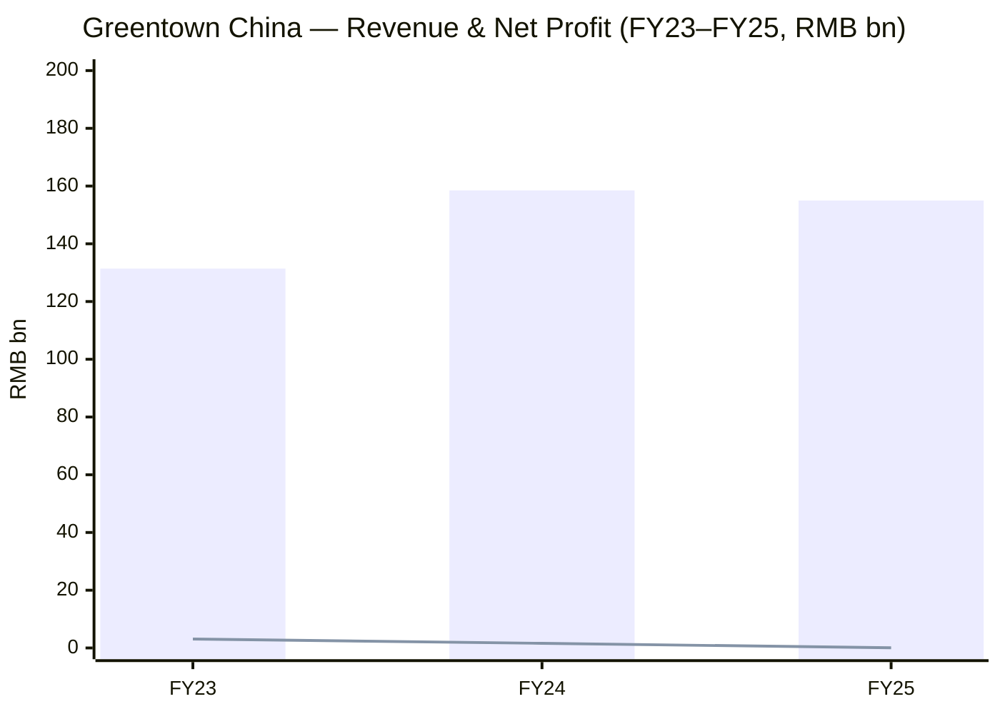
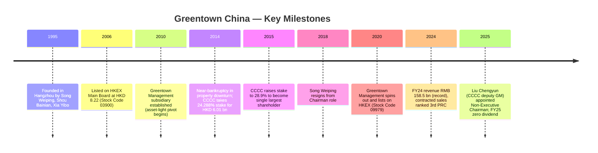
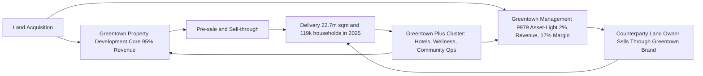
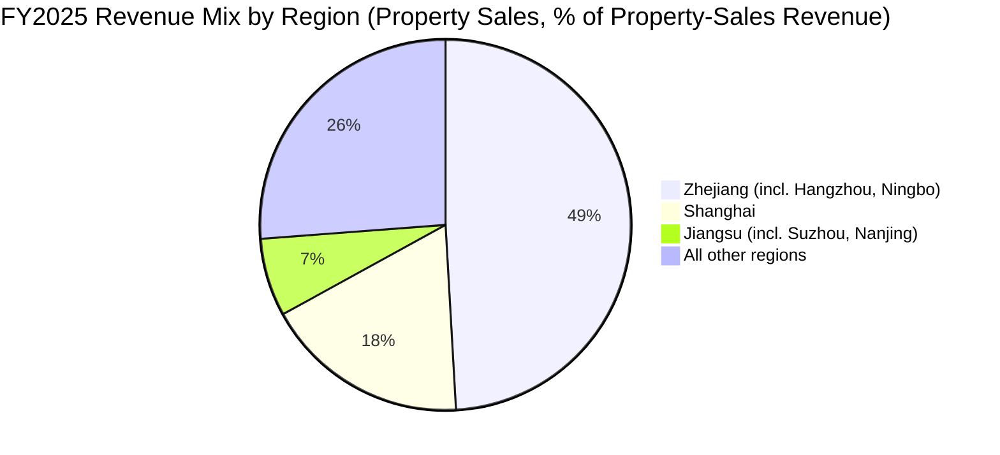
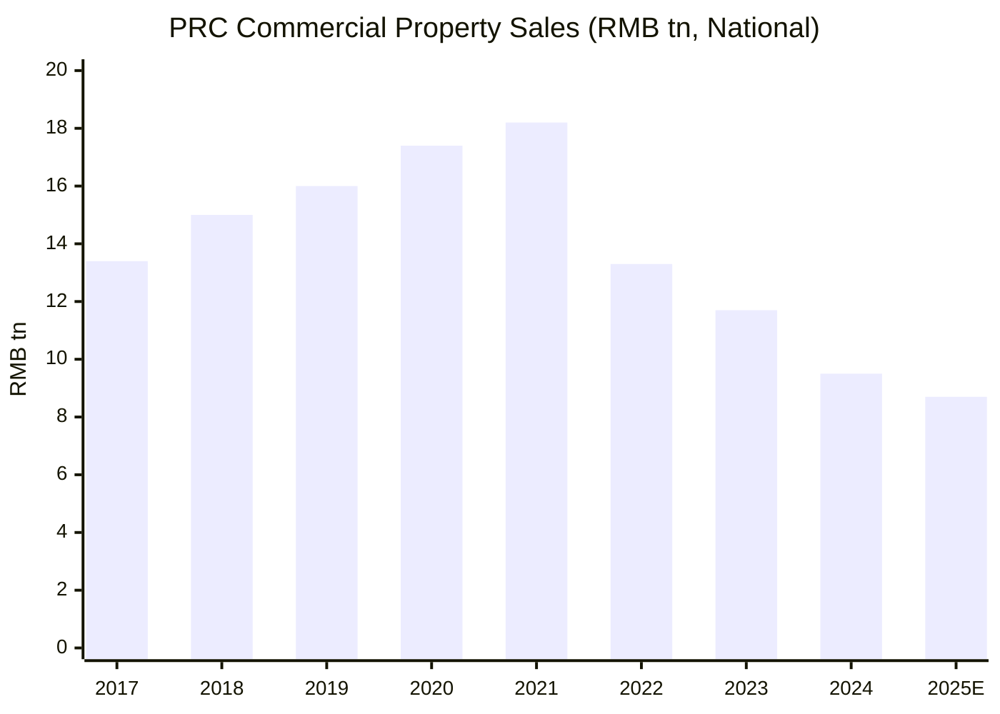
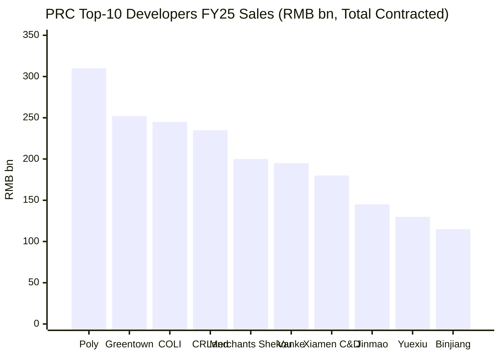
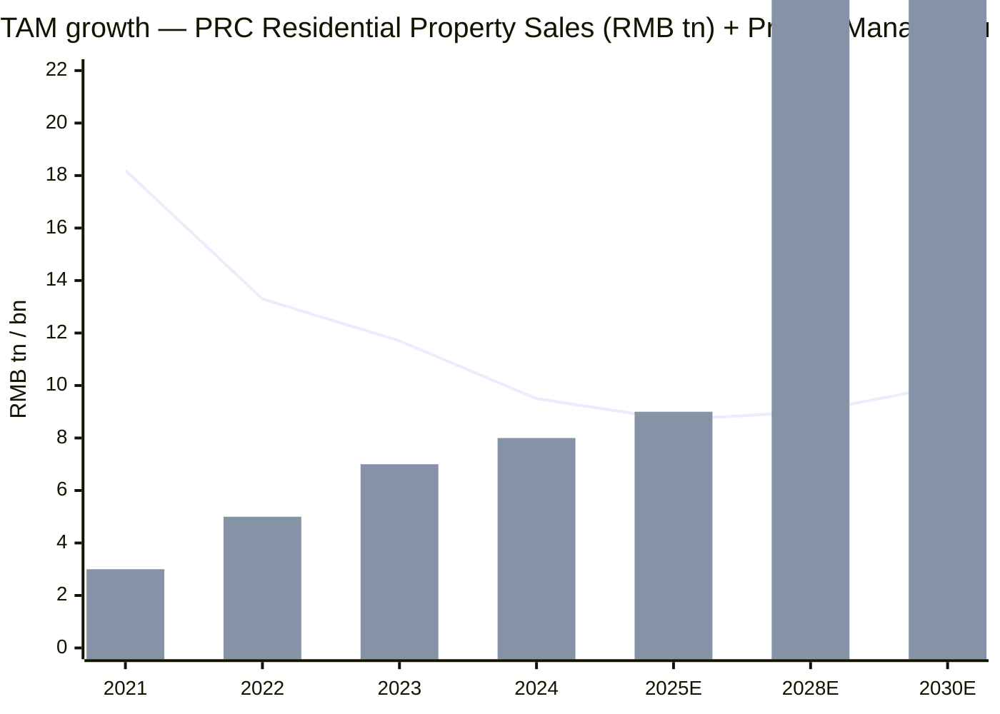

# Greentown China Holdings (HKEX:3900) — Initiation of Coverage

**Date:** 2026-06-03
**Ticker:** 3900.HK (Hong Kong Main Board)
**Sector:** Real Estate Development & Project Management — PRC
**Domicile:** Cayman Islands (operations 100% PRC); listed July 13, 2006

> **Update — 2025 Final Dividend Cut to Zero (2026-03):** The Board declared **no final dividend for FY25**, breaking the historical RMB 0.30 / share final dividend paid in respect of FY24. Profit attributable to owners collapsed 95.6% to RMB 71 million, driven by destocking-related impairments (RMB 4,921 m combined non-financial + ECL charge for the year). Management framed the move as cash preservation under the "Strategy 2030" / "cash flow safety" doctrine rather than distress. Source: [Greentown 2025 Annual Results Announcement, page 16](https://doc.irasia.com/listco/hk/greentownchina/annual/2025/res.pdf).

---

## Table of Contents
1. Company Overview
2. Company History
3. Management Team
4. Products & Services
5. Customers & Go-to-Market
6. Industry Overview
7. Competitive Landscape
8. Market Opportunity (TAM)
9. Risk Assessment
10. Investor-lens Scorecards
11. Data Used / 数据来源清单
12. References

---

## 1. Company Overview

Greentown China Holdings Limited (HKEX:3900) is a Hangzhou-headquartered, Cayman Islands-incorporated mixed-ownership Chinese residential property developer, listed on the Hong Kong Main Board since July 2006. The Company's principal activity, per Note 1 of its 2025 Annual Results announcement, is "the development for sale of residential properties in the People's Republic of China," organized into five reportable segments: Property Development, Hotel Operations, Property Investment, Project Management, and Others (construction materials, design and decoration) ([Greentown 2025 Annual Results, Note 3 — Operating Segment Information](https://doc.irasia.com/listco/hk/greentownchina/annual/2025/res.pdf)). It operates under a dual-engine structure: the asset-heavy property-development arm of the parent (revenue RMB 147,190 million in FY25, 95.0% of consolidated revenue) and the asset-light project-management arm via 67%-controlled HK-listed subsidiary Greentown Management Holdings (HKEX:9979). The Group is the only top-10 PRC developer to be classified by Hong Kong analysts as a "mixed-ownership" name — its largest shareholder (28.88%) is **China Communications Construction Group Limited (CCCG, 中国交通建设集团)**, a centrally administered state-owned enterprise under SASAC, while founder Song Weiping's legacy private-shareholder structure also retains influence at the operating level ([Greentown HKEX Announcement, 2025-12-19 — CCCG Project Management Framework / Connected-Person Disclosure](https://doc.irasia.com/listco/hk/greentownchina/announcement/a251219.pdf)).

For FY25 the Group reported **revenue of RMB 154,966 million (–2.3% YoY)**, gross profit RMB 18,471 million (gross margin 11.9%, down 0.9 ppt from 12.8% in FY24), profit attributable to owners of RMB 70.99 million (–95.6% YoY from RMB 1,596 million), and basic EPS of RMB 0.03 (vs RMB 0.63 in FY24). Total contracted sales (own plus project-management) reached **RMB 251.9 billion ranking 2nd nationally**, of which self-investment contracted sales were RMB 153.4 billion (5th nationally, attributable RMB 104.3 billion). Project management generated RMB 9.35 billion of newly contracted fees with 35.35 million sqm of new contracted area — extending Greentown Management's run as the **No.1 PRC project-management franchise for the tenth consecutive year** ([Greentown 2025 Annual Results, pages 21–22 Management Discussion](https://doc.irasia.com/listco/hk/greentownchina/annual/2025/res.pdf)). The Group's land bank stood at 146 projects with total GFA of 23.71 million sqm (attributable 15.06 million sqm) at year-end; 80% of saleable value by location sits in first- and second-tier cities, 64% in the Yangtze River Delta — a heavy geographic concentration that drives both upside (Hangzhou-led pricing power) and downside (regional macro exposure) ([Greentown 2025 Annual Results, page 25](https://doc.irasia.com/listco/hk/greentownchina/annual/2025/res.pdf)).

The capital structure remains the Group's strongest competitive feature relative to peers. Bank deposits and cash (including pledged) totaled RMB 63.2 billion at YE 2025 against total borrowings of RMB 133.4 billion, giving a net-debt position of RMB 70.1 billion and a net-gearing ratio of 66.4% (up 9.8 ppt from 56.6% at YE 2024 because cash drew down more than debt). Short-term debt was 18.6% of total borrowings — a record annual low — and cash covered short-term debt at 2.6x, a record annual high. Weighted-average borrowing cost fell to **3.3% (–60 bps YoY from 3.9%)**, set against a 4.37%→3.18% intra-year decline in 3-year MTN coupon rates (March→September 2025), and the Company successfully placed **USD 500 m 8.45% senior notes due 2028** in February 2025 — the first material USD-bond issuance by a PRC developer in years, signaling that Greentown's credit is now treated as the cleanest pocket of an otherwise risk-off sector ([Greentown 2025 Annual Results, pages 27, 34, 38](https://doc.irasia.com/listco/hk/greentownchina/annual/2025/res.pdf)). The Group employed 8,734 people at YE 2025, broadly flat YoY.

**Valuation snapshot (as of June 2026).** The stock trades at HKD 8.94 (market cap HKD 22.7 billion / RMB ~20.8 billion). On stockanalysis.com's TTM datasets — which lag the FY25 confirmed prints by one accounting period — TTM P/E reads 287.3x, TTM P/S 0.13x, P/B 0.19x, EV/EBITDA 19.1x, and dividend yield 3.67% (HKD 0.33 trailing). 52-week return –4.3%; 5-yr beta 0.81 ([stockanalysis.com — Greentown China statistics](https://stockanalysis.com/quote/hkg/3900/statistics/)). *Interpretation of extreme multiples — the only way to read this name properly:* P/E of 287x is meaningless as a value signal because the EPS denominator collapsed to RMB 0.03 in FY25 from RMB 0.63 in FY24 — driven by RMB 4.9 bn of destocking-related impairments rather than business compression (revenue from sales of properties was *flat* at RMB 147.2 bn vs RMB 147.0 bn in FY24). The cleaner signals are **P/B 0.19x (84-89% NAV discount, deeper than Chinese SOE-developer peers Vanke at ~0.50x P/B and CRLand at ~0.65x P/B)** and **P/S 0.13x (vs sector median ~0.4–0.6x)**. The market is pricing Greentown not as an unprofitable growth story but as a deeply distressed-equity option on PRC residential market normalization, where the equity value sits roughly equal to the "incremental upside" between an asset-heavy land bank carrying value and a liquidation-style scenario. The most recent analyst rating noted by Investing.com / MarketScreener is **Hold with HKD 9.00 price target** — i.e. essentially flat to spot — though Simply Wall St cites an analyst-average target around HKD 11.27 (~26% upside), with the dispersion itself a reasonable read on the unsettled state of consensus. Trailing dividend yield is a partial fiction: the FY25 final was zero, and the trailing HKD 0.33 reflects the FY24 declaration paid in mid-2025 ([TipRanks — Greentown China FY24 Dividend Announcement](https://www.tipranks.com/news/company-announcements/greentown-china-holdings-announces-final-dividend-for-2024)).

Source: [Greentown 2025 Annual Results announcement, pages 2 & 22](https://doc.irasia.com/listco/hk/greentownchina/annual/2025/res.pdf). Bars = revenue; line = profit attributable to owners.

## 2. Company History

Greentown China was founded on **January 6, 1995** in Hangzhou, Zhejiang Province by **Song Weiping (宋卫平)** alongside co-founders **Shou Bainian (寿柏年)** and **Xia Yibo (夏一波)**. Song — a former high-school history teacher in his early thirties when he co-founded the firm — built Greentown's identity around a thesis that affluent Chinese homebuyers, then emerging from the post-1992 reform-era housing privatization, would pay a meaningful premium for aesthetically and structurally superior residential product. The brand's early flagship developments (Hangzhou Guihuacheng, Suzhou Taohuayuan, Shanghai Lanting) positioned Greentown as the "quality benchmark" of mid-1990s through mid-2000s PRC residential property — a positioning the Company has continued to defend through its current "Good Houses" (好房子) product-strength program ([Wikipedia — Song Weiping](https://en.wikipedia.org/wiki/Song_Weiping); [Greentown Companies History](https://www.companieshistory.com/greentown-china-holdings/)). The Company was incorporated in the Cayman Islands on 31 August 2005 specifically to vehicle a Hong Kong listing, and shares began trading on the HK Main Board on **July 13, 2006 at an IPO price of HKD 8.22 per share** ([Greentown 2025 Annual Results, Note 1 — Corporate Information](https://doc.irasia.com/listco/hk/greentownchina/annual/2025/res.pdf); [Greentown Companies History](https://www.companieshistory.com/greentown-china-holdings/)).

Source: timeline reconstructed from [Greentown 2025 Annual Results Note 1](https://doc.irasia.com/listco/hk/greentownchina/annual/2025/res.pdf), [Wikipedia Greentown China entry](https://en.wikipedia.org/wiki/Greentown_China), [Mingtiandi — Song Weiping Resignation](https://www.mingtiandi.com/real-estate/finance/greentown-china-chairman-song-weiping-resigns/), and [Caproasia — Greentown 2025 Leadership Change](https://www.caproasia.com/2025/03/29/china-property-developer-3-5-billion-greentown-china-share-price-decreased-8-8-after-change-of-leadership-new-chairman-is-china-communications-construction-deputy-general-manager-liu-chengyun-chin/).

The defining strategic inflection was the **2014–2015 CCCC entry**. After near-bankruptcy during the 2013–14 PRC property correction, Greentown sold a 24.288% stake to China Communications Construction Company (the listed parent, HKEX:1800 / SSE:601800) for HKD 6.013 billion in December 2014; CCCC paid a further USD 148 million in May 2015 to lift its holding to ~28.9%, becoming the single largest shareholder ([Yicai Global — Greentown Chairman Resignation](https://www.yicaiglobal.com/news/chinese-home-builder-greentown-plunges-after-long-term-chairman-resigns)). Effectively, a private founder-led brand became a "centrally-administered SOE-anchored mixed-ownership entity" — a structural advantage during the 2021–2025 PRC property liquidity crisis, which devastated private peers (Evergrande default, Country Garden restructuring, Sunac scheme) while leaving Greentown still investment-grade-rated and able to access onshore credit-bond markets and offshore USD bonds. By 2025 CCCG (the unlisted state-holding parent of CCCC; full name China Communications Construction Group Limited / 中国交通建设集团有限公司) was the substantive controlling shareholder, with 733,456,293 shares = 28.88% of issued capital ([Greentown HKEX 2025-12-19 CCCG Project Management Framework / Continuing Connected Transactions Announcement](https://doc.irasia.com/listco/hk/greentownchina/announcement/a251219.pdf)). The relationship has thickened through framework agreements: the 2026 Decoration and Installation Framework Agreement with CCCG (dated 3 February 2026) projects RMB 195 m / 270 m / 291 m caps for 2026 / 2027 / 2028 — explicitly noting a 9.1x YoY increase in CCCG-sourced decoration revenue in 2025 vs 2024 ([Greentown 2025 Annual Results, page 36](https://doc.irasia.com/listco/hk/greentownchina/annual/2025/res.pdf)).

Two further strategic inflections deserve note. **2010 — birth of Greentown Management:** the wholly-owned subsidiary that pioneered the PRC asset-light residential project-management model launched with a thesis that Greentown's brand and operational know-how could be monetized as services rather than tied up in land-bank capex. **2020 — listing of Greentown Management:** the subsidiary IPO'd on HKEX in July 2020 (stock code 9979), giving the parent a publicly-valued stake in what is now the No.1 project-management franchise in PRC for 10 consecutive years. The market-share lead is durable: 35.35 million sqm of new contracted area and RMB 9.35 billion of newly contracted fees in 2025 places Greentown Management at multiples of the second-place competitor ([Greentown 2025 Annual Results, page 27](https://doc.irasia.com/listco/hk/greentownchina/annual/2025/res.pdf)). The most recent leadership transition came on **26 March 2025**, when CCCG deputy general manager **Liu Chengyun (age 57)** was appointed Chairman and Non-Executive Director of Greentown, replacing the prior CCCC-affiliated chairman. Liu has no prior real-estate experience — his career has been entirely within CCCC engineering and Zhenhua Heavy Industries — a signal that CCCG views Greentown's go-forward stewardship as a financial / governance role under the parent's banner rather than an operational one ([Greentown — Liu Chengyun Bio](https://www.greentownchina.com/en/about/liuchengyun.php); [Caproasia](https://www.caproasia.com/2025/03/29/china-property-developer-3-5-billion-greentown-china-share-price-decreased-8-8-after-change-of-leadership-new-chairman-is-china-communications-construction-deputy-general-manager-liu-chengyun-chin/)).

## 3. Management Team

**Founder — Song Weiping (宋卫平), born 1958, no longer in operational role.** Song co-founded Greentown in 1995 alongside Shou Bainian and Xia Yibo. A former Hangzhou Normal University history graduate and high-school history teacher, he moved into real estate in his early 30s out of conviction (per his own SCMP interviews) that the Chinese affluent housing buyer would pay a sustainable premium for craft. Under his leadership for two decades, Greentown built a brand reputation that survived the 2014 near-bankruptcy and the 2015 CCCC entry. He stepped down as Chairman in 2018 and exited operational involvement; he is no longer listed among the executive directors in the 2025 Corporate Information disclosure. His public legacy is the "Greentown product DNA" — the 桃花源 / 御园 / 黄浦湾 / 江南里 portfolio of flagship developments that established a quality benchmark the current management team continues to invoke through the "Good Houses" (好房子) language ([SCMP — Song Weiping Interview 2014](https://www.scmp.com/property/hong-kong-china/article/1519186/greentown-china-boss-song-weiping-blasts-stupid); [Mingtiandi — Song Weiping Resignation](https://www.mingtiandi.com/real-estate/finance/greentown-china-chairman-song-weiping-resigns/); [Wikipedia — Song Weiping](https://en.wikipedia.org/wiki/Song_Weiping)). Song's residual economic interest in Greentown is no longer disclosed in the cap table — his historical private-shareholder block has been substantially diluted/sold post-2015.

**Current CEO (acting) — Geng Zhongqiang (耿忠强), Executive Director and Acting Chief Executive Officer.** Per the Greentown management roster, Geng holds the title "Executive Director and Acting Chief Executive Officer" — the operational head of the Company as of June 2026 ([Greentown — Management Page](https://www.greentownchina.com/en/about/management.php)). The use of "acting" in the title is itself a signal of the unresolved state of post-Liu-Chengyun-appointment management — the prior CEO line was vacated as part of the 2025 leadership reshuffle, and the Board has not yet confirmed a permanent CEO; Geng's tenure as acting CEO began in conjunction with Liu Chengyun's chairman appointment on 26 March 2025. Geng's prior roles are not surfaced in the English IR pages — a recurring documentation gap for non-US-listed names where executive bios are bundled into the Annual Report PDF rather than IR website pages, and where the IR site's per-executive bio for Geng was not separately published at the time of this draft. The two named Executive Directors alongside him (LI Jun, HONG Lei), the two Non-Executive Directors (Stephen Tin Hoi NG and Kevin Kwok Pong CHAN — long-tenured directors representing the historical pre-CCCC private investor relationships including Wharf Holdings — see [HKEX Wharf-Greentown Disclosure 2019](https://www.hkexnews.hk/listedco/listconews/sehk/2019/1227/2019122700729.pdf) for context), and four Independent Non-Executive Directors (Jia Shenghua, Hui Wan Fai, Xiong Liangjun, Qin Yuemin) round out the Board ([Greentown — Corporate Information Page](http://www.greentownchina.com/en/ir/corpinfo.php)).

**Non-Executive Chairman — Liu Chengyun (刘成云), age 57, appointed 26 March 2025.** Liu is described in his Greentown bio as "a senior economist and senior engineer" who entered the workforce in August 1989 and holds a master's degree. His career has been entirely within China Communications Construction Group: progressing through engineering and management roles, including a stint as Chairman of Shanghai Zhenhua Heavy Industries (上海振华重工, the world's largest port-crane and offshore-platform manufacturer and a CCCG subsidiary), and most recently appointed Permanent Member of the Party Committee and Deputy General Manager of CCCG in June 2023. He has **no prior real-estate operating experience** — a fact the market read as governance signal rather than strategic signal: on the day of his appointment, the Greentown share price fell 8.8%, reflecting the read that CCCG was treating Greentown as a financial subsidiary rather than as a strategic growth vehicle. Liu is a Non-Executive Director only, which means he does not have day-to-day operational responsibility — the operating decisions sit with Geng Zhongqiang as Acting CEO and the senior management council (Executive Presidents Zhao Hui and Zhou Changjiang, Vice Presidents Du Ping / Xiao Li / Chi Feng, Chief Planner Wang Zhaohui) ([Greentown — Liu Chengyun Bio](https://www.greentownchina.com/en/about/liuchengyun.php); [Caproasia — Greentown 2025 Leadership Change](https://www.caproasia.com/2025/03/29/china-property-developer-3-5-billion-greentown-china-share-price-decreased-8-8-after-change-of-leadership-new-chairman-is-china-communications-construction-deputy-general-manager-liu-chengyun-chin/)).

## 4. Products & Services

Greentown's revenue stack is concentrated in one product (residential property for sale) with a secondary service line (project management) that punches above its weight in strategic and reputational terms. The five reportable segments per Note 3 of the 2025 Annual Results — Property Development, Hotel Operations, Property Investment, Project Management, and Others — distribute as follows in FY25:

| Segment | FY25 External Revenue (RMB '000) | % of Total Revenue | FY25 Segment Profit (RMB '000) | YoY Δ Revenue |
|---|---:|---:|---:|---:|
| Property development | 147,189,626 | 95.0% | 1,833,642 | +0.1% |
| Hotel operations | 992,728 | 0.6% | (12,318) | –3.6% |
| Property investment | 298,304 | 0.2% | 166,177 | +4.8% |
| Project management | 3,065,780 | 2.0% | 531,244 | –9.2% |
| Others (materials, design, decoration) | 3,419,739 | 2.2% | (117,897) | –50.0% |
| **Total (after eliminations)** | **154,966,177** | **100.0%** | **2,400,848** | **–2.3%** |

Source: [Greentown 2025 Annual Results, Note 3 — Segment Information, pages 9–10](https://doc.irasia.com/listco/hk/greentownchina/annual/2025/res.pdf).

### 4.1 Property Development (95.0% of FY25 revenue) — "Good Houses" residential franchise

> "During the Year, the Group's revenue from sales of properties amounted to RMB147,190 million, generally on par with RMB147,017 million in 2024. During the Year, the area of properties with recognized revenue amounted to 5,738,870 sqm, representing a decrease of 9.7% from 6,352,079 sqm in 2024. The average selling price of properties with recognized revenue was RMB25,648 per sqm, representing an increase of 10.8% compared to RMB23,145 per sqm in 2024." — [Greentown 2025 Annual Results, page 31](https://doc.irasia.com/listco/hk/greentownchina/annual/2025/res.pdf).

**Plain-language gloss / 中文释义:** Greentown's core business is building and selling homes — overwhelmingly high-end residential apartments and villas — in tier-1 and strong tier-2 PRC cities. The 90%+ revenue share that this segment has held for the past decade means that for investors, Greentown is effectively a single-business name: a Hangzhou-centered premium-residential developer whose every other line item (hotels, investment property, project management) is reputational halo around the residential core. The "Good Houses" (好房子) framing is the Company's internal vocabulary for the product-strength program that ten technical systems (four core, six expansion) anchor — applied across 91% of newly-added FY25 projects according to management. The mix within the property-development segment skews heavily to high-rise / low-rise / serviced apartments (87.9% of FY25 property revenue = RMB 129,354 m), with villas at 10.8% (RMB 15,910 m) and offices and others at 1.3% (RMB 1,926 m) — i.e. Greentown is effectively a *high-rise residential* developer with a small villa tail, not a diversified property company. Product brands include 桃花源 / Taohuayuan (Hangzhou flagship), 御园 / Yuyuan (Beijing), 黄浦湾 / Huangpuwan (Shanghai), and 江南里 / Jiangnanli (Hangzhou) — the legacy franchise that survives Song Weiping's exit, and the line that newer launches like Shanghai Chaoming Oriental and Hangzhou Yue Begonia / Zhi Begonia continue to extend ([Greentown — About the Company](https://www.greentownchina.com/en/about/company.php); [Architecture Press Release — Greentown Begonia Changsha Gold Award](https://www.architecturepressrelease.com/gold-winner-greentown-begonia-changsha-greentown-china-holdings-limited/)).

*Analyst view:* Greentown's competitive advantage in the property-development segment is anchored on **brand-premium pricing** and **operational efficiency**, not on scale. FY25 average sell-through rate for first launches was 69%, FY25 cash collection rate was 101% (an industry benchmark), and the Group's average time from land acquisition to first launch was 6.1 months, with land-to-delivery at 26.2 months — both substantially faster than tier-1 listed-peer norms of ~9 months and ~32 months respectively ([Greentown 2025 Annual Results, pages 22, 26](https://doc.irasia.com/listco/hk/greentownchina/annual/2025/res.pdf)). The geographic concentration is the most important strategic fact about this segment: per the 2025 Results, **49.1% of property-sales revenue came from Zhejiang projects, 17.9% from Shanghai, 6.8% from Jiangsu — i.e. the Yangtze River Delta region delivers ~74% of segment revenue**. This is a strength when the YRD outperforms (it has materially outperformed the PRC average since 2022) and a focus risk when it underperforms (see Section 9).

### 4.2 Project Management via Greentown Management 9979 (2.0% of FY25 consolidated revenue, but the strategic crown jewel)

> "It had been ranked Top1 of 'Leading Enterprises in Chinese Real Estate Project Management Operation' for ten consecutive years, and has received over 30 Top1 industry awards and 117 product awards. In 2025, Greentown Management demonstrated strong development resilience and leadership. … The area of newly contracted projects was approximately 35.35 million sqm and the newly contracted fee for project management was approximately RMB9.35 billion, maintaining its No.1 market share for ten consecutive years." — [Greentown 2025 Annual Results, page 27](https://doc.irasia.com/listco/hk/greentownchina/annual/2025/res.pdf).

**Plain-language gloss / 中文释义:** Greentown Management — operating as a 67%-owned subsidiary listed separately on HKEX as 9979 since July 2020 — is an **asset-light project-management franchise**. The business model: Greentown Management does not own the land, does not put up the construction capex, and does not warehouse the inventory. Instead, it signs project-management contracts with land-owners (most commonly other property developers facing distress and unable to staff projects themselves, local-government Urban Investment Companies or 城投, and increasingly central-government affordable-housing programs) and charges a management fee plus performance-linked upside for taking the project end-to-end — design, construction supervision, marketing, and delivery. The Greentown brand is what the counterparty is paying for: in the post-2021 PRC property crash, a distressed land-owner who needs to finish and sell a stalled project gets meaningfully higher realized prices and lower default risk on pre-sales if the project's marketing badge reads "Greentown Management" instead of an unknown local builder. As of December 31, 2024, Greentown Management's services covered 120 major cities across 28 provinces ([baike — Greentown Management Holdings](https://baike.baidu.com/en/item/Greentown%20Management%20Holdings%20Co.,%20Ltd./25726)).

*Analyst view:* Greentown Management's #1 PRC market share for project management is extraordinarily durable. The business mechanics — asset-light fee revenue, no balance-sheet risk, scale-driven brand advantage — make it the rare PRC property-related franchise where consolidation favours the incumbent rather than the late entrant. The standalone 9979 generated ~RMB 3.07 bn of revenue at the Group's consolidated 2025 level and ~RMB 531 m of segment profit, implying segment operating margin of ~17% — vastly above the property-development segment's ~1% margin ([Greentown 2025 Annual Results, Note 3](https://doc.irasia.com/listco/hk/greentownchina/annual/2025/res.pdf)). 1H25 standalone net profit for 9979 fell 48.9% YoY to RMB 256.1 m as a slowdown in property-developer counterparty solvency reduced new contract signings, but the franchise position remains unchallenged ([Investing.com — Greentown Management Revenue](https://www.investing.com/pro/OTCPK:GRMH.F/explorer/total_rev)).

### 4.3 "Greentown+" cluster — design/decoration, hotels, commercial operations, town operation, health & wellness (~4.2% of FY25 consolidated revenue, segment-level pre-corporate-cost loss)

The Group's "Greentown+" cluster bundles the design and decoration business (RMB 2,338 m FY25 revenue, –24.9% YoY), construction materials, hotel operations (RMB 993 m, –3.6%), investment property (RMB 298 m rental income, +4.6%), and a basket of newer asset-light ventures: the 桂悦会 / "Gui Yue Club" premium-membership platform (1.17 m members in its first year), the town-operation business (Top 1 Chinese Town Operator brand, 66,000 sqm under brand management cumulative through 2024), and an emerging future-digital-intelligence layer (Greentown Future Communities — applied for 150+ IP rights, deployed in 500+ future communities with 40%+ market share among new community projects according to internal disclosures) ([Greentown 2025 Annual Results, page 28](https://doc.irasia.com/listco/hk/greentownchina/annual/2025/res.pdf); [Greentown 2024 Annual Results, page 29](https://doc.irasia.com/listco/hk/greentownchina/annual/2024/res.pdf)).

*Analyst view:* The "Greentown+" cluster is the right place to look for *optionality*, not for *near-term earnings*. Several individual lines (hotel ops at slight segment loss, "Others" at –RMB 117.9 m segment loss in FY25, design/decoration revenue down 24.9%) are not standalone economic businesses today — they exist to provide ecosystem services to the property-development core. The future-communities platform is the most economically promising of the "Greentown+" lines because it would translate Greentown's brand among Hangzhou homebuyers into recurring services revenue at the community level (similar to how China Resources Mixc Lifestyle / HKEX:1209 monetizes the CRLand property brand) — but at present its revenue contribution is buried in "Others" and not separately disclosed.

### 4.4 Product & Operating Synthesis — how the segments compose a single customer workflow

The synthesis: Greentown is best understood as a **brand-engineered residential franchise** with two parallel monetization paths — the capital-intensive Property Development core (sell our brand on our land for our P&L) and the asset-light Project Management subsidiary (rent our brand to other land-owners for fee income). The "Greentown+" ecosystem services (hotels, wellness, town operations, future digital communities) wrap both monetization paths, creating the long-cycle community-level relationship that underwrites the brand premium itself. The Strategy 2030 framework articulated in the 2025 Annual Results targets "comprehensive quality benchmark among the Top10" and identifies the two strategic pivot points as "best understanding of customers and best understanding of products" — a doctrine that reads as a deliberate doubling-down on the high-end brand position rather than a pivot to scale or geography ([Greentown 2025 Annual Results, page 29](https://doc.irasia.com/listco/hk/greentownchina/annual/2025/res.pdf)).

## 5. Customers & Go-to-Market

Greentown's customer base is overwhelmingly individual homebuyers in PRC tier-1 and strong tier-2 cities (Hangzhou first, Shanghai second, then the rest of the Yangtze River Delta plus Xi'an, Changsha, Suzhou, and selective tier-2 strongholds). Because property-development revenue is realized on a per-unit transaction basis, customer concentration in the conventional sense (top-1, top-5 % of revenue) is mechanically dispersed. **The 2025 Annual Results explicitly disclose: "No sales to a single customer accounted for 10% or more of the Group's revenue for the year"** — note at the end of the Segment Information block, page 12 ([Greentown 2025 Annual Results, Note 3 — Information about a major customer](https://doc.irasia.com/listco/hk/greentownchina/annual/2025/res.pdf)). This is the correct read for the Property Development segment (residential customers are atomized retail) but understates the true counterparty exposure embedded in the Project Management line, where individual local-government Urban Investment Companies and distressed-developer counterparties can be material concentrated payors of project-management fees.

Source: [Greentown 2025 Annual Results, page 31](https://doc.irasia.com/listco/hk/greentownchina/annual/2025/res.pdf). Denominator: revenue from sales of properties (RMB 147,190 million); not consolidated revenue.

**Customer-concentration disclosure denominator label:** the chart above uses the **property-sales revenue denominator** (RMB 147.19 bn, =95% of consolidated revenue), not consolidated revenue. The same regional concentration carries to consolidated revenue at ~95% scaling — i.e. ~46.6% of consolidated revenue is Zhejiang, ~17.0% is Shanghai, ~6.5% is Jiangsu, totalling ~70% YRD on consolidated. The Group does not separately disclose customer-concentration figures by individual homebuyer or by project-management counterparty in the Annual Results announcement — there is no per-customer breakdown in the audited financials beyond the "no single customer >10%" note.

The go-to-market structure: Greentown markets directly to homebuyers through on-site sales offices at each project, supplemented by a digital marketing operation that drove 21.5% of FY25 transactions (up 9.4 ppt YoY) and reduced the marketing fee-rate to 0.52% of revenue — equivalent to a saving of approximately RMB 750 m in fees vs the prior industry average ([Greentown 2025 Annual Results, page 22](https://doc.irasia.com/listco/hk/greentownchina/annual/2025/res.pdf)). The Company's premium-membership platform 桂悦会 / Gui Yue Club, launched in 2025, attracted 1.17 m members in its first year and is positioned as a full-domain traffic-conversion mechanism — a CRM-style program to extend customer relationships from the one-time home purchase into recurring "Greentown+" services consumption (community amenities, decoration upgrades, hotel stays, wellness products) ([Greentown 2025 Annual Results, page 28](https://doc.irasia.com/listco/hk/greentownchina/annual/2025/res.pdf)).

Within the Project Management line, customer types split (segment-level; not aggregated to group-level) into three buckets: **(i) Commercial project management** (distressed property developers paying Greentown to take over stalled projects — the original 2010-launched business), **(ii) Governmental project management** (local-government Urban Investment Companies and central-government affordable-housing programs — the fastest-growing buckets through 2022–2025 as policy directed more affordable-housing build to professional managers), and **(iii) Others** (mostly resort and tourism property management). The mix shift over the past five years has been a steady move from (i) toward (ii) — explicitly noted by Greentown Management as the major reshaper of its 2024–2025 contracted backlog, as private developers have run out of credit and the buyer of record for new project-management contracts is now mostly state-affiliated ([Greentown Management 2024 Annual Report — HKEXnews](https://www.hkexnews.hk/listedco/listconews/sehk/2024/0823/2024082301920.pdf); [Greentown Management 2025 Interim Report — HKEXnews](https://www.hkexnews.hk/listedco/listconews/sehk/2025/0822/2025082201886.pdf)).

The most concentrated counterparty risk in the Group is its relationship with CCCG / China Communications Construction Group. CCCG is the substantial shareholder (28.88%) and a connected person under Chapter 14A of the Listing Rules. The 2026 Decoration and Installation Framework Agreement (3 February 2026) governs ongoing decoration-and-installation services provided by Greentown to CCCG, its subsidiaries, and its associates, with transaction caps of **RMB 195 m (2026) / RMB 270 m (2027) / RMB 291 m (2028)** — based on a noted 9.1x YoY increase in CCCG-sourced revenue in 2025 vs 2024, and a projected 2.9x increase in tendered contract value to RMB 300 m in 2026 vs RMB 76.5 m in 2025 ([Greentown 2025 Annual Results, page 36](https://doc.irasia.com/listco/hk/greentownchina/annual/2025/res.pdf)). At less than 0.2% of FY25 revenue, this is a small absolute customer relationship — but it is a meaningful directional signal that the CCCG controlling-shareholder relationship is being increasingly leveraged as a commercial relationship as well. Separately, Greentown's project-management subsidiary is exploring overseas project-management opportunities specifically leveraging CCCG's overseas infrastructure relationships per the Strategy 2030 doctrine ([Greentown 2025 Annual Results, page 30](https://doc.irasia.com/listco/hk/greentownchina/annual/2025/res.pdf)).

## 6. Industry Overview

The PRC residential property development industry has undergone the most severe structural correction in its history over 2021–2025. The market peaked in 2021 at approximately **RMB 18 trillion in commercial property sales nationally**; by 2024 it had fallen below **RMB 10 trillion** — a ~45% compression in two years, with new-residential investment-construction volumes down >20% YoY in 2024 alone, and the trough not yet identified in the 2025 prints. The 2025 Greentown Annual Results MD&A is explicit on this: "the real estate market still lingered in a deep adjustment phase … the investment in real estate development had declined for four consecutive years, which was further intensified in 2025 … financing was still under pressure" ([Greentown 2025 Annual Results, page 21](https://doc.irasia.com/listco/hk/greentownchina/annual/2025/res.pdf)). The industry's TAM has been re-set — analysts at most major sell-side houses now model a structurally lower steady-state at ~RMB 8–10 trillion / year sales, vs the RMB 16–18 trillion that defined 2017–2021.

The structural drivers of the contraction are well-documented: **(i) China's demographic pivot** — urbanization rate slowed from ~1.5 ppt/year peak to <1 ppt/year and the population began declining in absolute terms in 2022 ([South China Morning Post — China Property Slump 2026](https://www.scmp.com/business/article/3338893/chinas-developers-diminish-further-amid-unending-property-downturn)); **(ii) The 2020 "Three Red Lines" deleveraging policy** that capped private developers' leverage and triggered the Evergrande default sequence; **(iii) Buyer confidence collapse** as developers' inability to deliver pre-sold homes seeded a multi-year hesitation among prospective new buyers; **(iv) Policy ambivalence** — the central government has loosened restrictions but explicitly avoided the kind of pump-priming stimulus seen in 2008 / 2015, signaling a deliberate normalization at a lower steady-state.

The competitive structure has consolidated dramatically. Per Caixin's 2026 industry tracker, **the number of PRC developers with annual sales above RMB 100 billion fell from 41 in 2021 to 10 in 2025**; of the top 100 developers by sales five years ago, only 53 are still on the list, with 47 (mostly private) replaced predominantly by state-owned competitors ([Caixin Global — China's Property Slump Knocks Half of Top Developers off Key Ranking, 2026-01-05](https://www.caixinglobal.com/2026-01-05/chinas-property-slump-knocks-half-of-top-developers-off-key-ranking-102400361.html); [China Economic Review — Half of China's developers drop from top 100 list](https://chinaeconomicreview.com/half-of-chinas-property-developers-drop-from-top-100-list/)). The current top 10 by sales is essentially state-owned-dominated: **Poly Developments, Greentown, China Overseas Land & Investment (COLI), China Resources Land (CRLand), China Merchants Shekou, China Vanke, Xiamen C&D, China Jinmao, Yuexiu Property, Hangzhou Binjiang Real Estate** — nine of ten are SOE-affiliated, and Binjiang (#10) is the only large surviving private developer ([Investasian — Top 10 China Property Developers](https://www.investasian.com/property-developers/china-property-developers/)). The market is now an SOE-and-mixed-ownership consolidation play, in which Greentown's CCCG-anchored structure is a meaningful competitive advantage vs the few remaining private survivors.

Source: National Bureau of Statistics annual property-sales aggregates as compiled by [South China Morning Post — China Property Slump](https://www.scmp.com/business/article/3338893/chinas-developers-diminish-further-amid-unending-property-downturn) and [Caixin Global, 2026-01-05](https://www.caixinglobal.com/2026-01-05/chinas-property-slump-knocks-half-of-top-developers-off-key-ranking-102400361.html). 2025E reflects management commentary in [Greentown 2025 Annual Results, page 21](https://doc.irasia.com/listco/hk/greentownchina/annual/2025/res.pdf) — "sales of new commercial properties falling below RMB10 trillion for the Year" as a 2024 anchor with continued contraction noted in 2025.

The supportive policy backdrop has shifted from "stimulus" to "structural reform". The Greentown 2025 Annual Results MD&A captures the official framing: in 2026 the policy emphasis "will shift from 'spurring immediate demand' to 'systematic institutional restructuring', which aims at establishing a new model for real estate development" ([Greentown 2025 Annual Results, page 29](https://doc.irasia.com/listco/hk/greentownchina/annual/2025/res.pdf)). The "new model" being pursued — articulated through 2024 Central Economic Work Conference and the 2025 Two Sessions — emphasizes "good houses (好房子)" quality standards, expanded affordable-housing programs, increased professional project-management of distressed inventory (a structural tailwind for Greentown Management), and the slow conversion of property developers from balance-sheet-heavy operators into service-and-management operators. Greentown's product and asset-light positioning are well-aligned with this direction.

The Yangtze River Delta sub-market — where Greentown is concentrated — has materially outperformed national averages. Hangzhou in particular has seen the strongest pricing resilience of any major PRC city through 2024–2025; new-residential ASPs in Hangzhou's core districts were broadly flat YoY in 2025 while national-average new-residential ASPs declined ~6–8%. This regional concentration is the primary reason Greentown's FY25 ASP rose 10.8% to RMB 25,648 / sqm even as national prices weakened — the recognized-revenue mix tilted toward Shanghai Waitan Lanting, Hangzhou Zhilan Yuehua, and similar premium-tier YRD projects ([Greentown 2025 Annual Results, page 31](https://doc.irasia.com/listco/hk/greentownchina/annual/2025/res.pdf)).

## 7. Competitive Landscape

The PRC top-10 developer ranking by 2025 contracted sales — measured as total sales including Greentown's project-management line — places Greentown at #2 nationally with RMB 251.9 bn. Adjusted for self-investment only (i.e. excluding project-management sales that legally accrue to the land-owner counterparty), Greentown ranks #5 nationally with RMB 153.4 bn ([Greentown 2025 Annual Results, page 22](https://doc.irasia.com/listco/hk/greentownchina/annual/2025/res.pdf)). The competitive peer set against which Greentown is evaluated splits into two cohorts:

**Cohort 1 — Tier-1 PRC SOE-anchored developers** (the direct peer group): **Poly Developments (SSE:600048)** at #1 with national scale and government-affordable-housing programs; **China Overseas Land & Investment / COLI (HKEX:0688)** with the deepest Hong Kong / overseas profile and strong tier-1 city exposure; **China Resources Land / CRLand (HKEX:1109)** with the best diversified mix of residential, mall (via 1209 CRMixC), and office; **China Merchants Shekou (SSE:001979)** with Shenzhen / Greater Bay Area depth; **China Vanke (SZSE:000002 / HKEX:2202)** — the historical scale leader, currently in financial distress but still in the top 10; **Xiamen C&D (SSE:600153)** with property + supply-chain + chemicals; **China Jinmao (HKEX:0817)** with mixed-use and city-operator positioning; **Yuexiu Property (HKEX:0123)** with Guangzhou anchoring. Greentown's positioning within this cohort is **mid-cap premium-residential + #1 project-management franchise** — distinct from COLI's tier-1 dominance, CRLand's mall integration, and Vanke's scale.

**Cohort 2 — Remaining private developers and asset-light specialists:** **Hangzhou Binjiang Real Estate (SZSE:002244)** is the most direct overlap — a Hangzhou-based, Zhejiang-concentrated premium-residential developer that is Greentown's home-market competitor (Top 10 sales nationally; the only large surviving private). **Longfor Properties (HKEX:0960)** is private but increasingly state-aligned, with stronger mall/commercial exposure than Greentown. The pure-play asset-light project-management peers are limited — **Country Garden Services**, **Sunac Services**, **A-Living**, **Poly Property Services** all sit in *property-management* (managing buildings post-completion) rather than *project-management* (managing the development process); Greentown Management's only real peer in project-management proper is **Lvcheng Service / Greentown Service Group (HKEX:2869)** — which is structurally separate and focused on property management — leaving 9979 with no scale competitor in the project-management line ([Greentown Management — Mission Statement](https://dcf-model.com/blogs/vision/9979hk)).

Source: rankings from [Caixin Global, 2026-01-05](https://www.caixinglobal.com/2026-01-05/chinas-property-slump-knocks-half-of-top-developers-off-key-ranking-102400361.html) and [Investasian — Top 10 China Property Developers](https://www.investasian.com/property-developers/china-property-developers/); Greentown's RMB 251.9 bn from [Greentown 2025 Annual Results, page 22](https://doc.irasia.com/listco/hk/greentownchina/annual/2025/res.pdf). Other developers' figures are approximate analyst-published estimates triangulated from secondary sources and rounded — actual reported numbers from each issuer's own 2025 disclosure should be the authoritative version for any peer comparison work.

*Analyst view:* Greentown's competitive advantages are five-fold and durable: **(1) Brand premium** — three decades of "Good Houses" branding generates ASP and sell-through advantages that translate to ~RMB 25,648 / sqm recognized ASP vs sector ~RMB 12,000-15,000 / sqm; **(2) Operational efficiency** — 6.1-month land-to-launch and 26.2-month land-to-delivery cycles are first-quartile vs ~9 / ~32 months for sector peers; **(3) Project-management franchise** — 9979 is structurally #1 in PRC asset-light project management with no challenger of equivalent scale, monetizing the brand without balance-sheet capex; **(4) Capital structure** — 3.3% weighted-average borrowing cost is the lowest among publicly traded PRC developers as of 2025, including most SOEs (CRLand at ~3.5–4%, COLI at ~3.5–4%, Vanke at ~5–6%), reflecting CCCG SOE-anchor credit halo and the asset-light project-management cash flow; **(5) Geographic discipline** — concentrating in YRD high-tier cities at 80% saleable value gives pricing power vs developers exposed to weaker tier-3 / tier-4 markets. The vulnerabilities are equally specific: **(a) Geographic concentration risk** — 49.1% of property revenue from Zhejiang means a YRD slowdown disproportionately hits Greentown; **(b) Margin compression** — gross margin at 11.9% in FY25 is below sector-best (COLI ~18–20%, CRLand ~22–25%) reflecting the destocking-driven margin sacrifice; **(c) Strategic ambiguity post-Liu-Chengyun** — the 2025 chairmanship change to a non-real-estate CCCG executive raises the question of CCCG's strategic intent (passive financial holding vs active operator).

## 8. Market Opportunity (TAM)

The PRC residential property TAM relevant to Greentown is the post-correction steady-state PRC residential development market — analyst consensus estimates this at **RMB 8–10 trillion annual sales** vs the historic peak of RMB 18 tn (2021) and the 2024 print of <RMB 10 tn. Greentown's FY25 self-investment contracted sales of RMB 153.4 bn = **~1.7% market share at the RMB 9 tn TAM midpoint**, with potential to reach 2–2.5% market share at maturity given the sector consolidation toward state-anchored operators ([Greentown 2025 Annual Results, page 22](https://doc.irasia.com/listco/hk/greentownchina/annual/2025/res.pdf)).

The two adjacent TAMs that matter for Greentown's optionality are:

**(1) The PRC project-management TAM** — fundamentally a new market created by the 2021–2025 distressed-developer crisis. Greentown Management estimates the total contracted-but-unfinished property project value in PRC at RMB 10+ trillion as of 2024, of which professional project-management penetration is currently <5%. As state-affiliated entities (city Urban Investment Companies, local-government affordable-housing programs) increasingly outsource project execution to specialized managers, the project-management TAM is plausibly RMB 30–50 bn annual fees by 2030 — vs Greentown Management's current ~RMB 3 bn annual fee revenue, implying ~10x optionality if the market reaches the high end ([Greentown Management — Mission Statement & Vision 2026](https://dcf-model.com/blogs/vision/9979hk); [Greentown Management 2024 Annual Report](https://www.hkexnews.hk/listedco/listconews/sehk/2024/0823/2024082301920.pdf)).

**(2) The "Greentown+" services TAM** — the future-communities, decoration, hotel, and wellness layer that wraps the property core. This is a longer-horizon optionality where individual sub-businesses are currently sub-scale but the aggregate could be material by 2030: Greentown's stated ambition (Strategy 2030 doctrine) places this ecosystem as the second strategic pivot beyond core property development.

Source: Residential TAM from [NBS data via SCMP](https://www.scmp.com/business/article/3338893/chinas-developers-diminish-further-amid-unending-property-downturn) and [Caixin Global, 2026-01-05](https://www.caixinglobal.com/2026-01-05/chinas-property-slump-knocks-half-of-top-developers-off-key-ranking-102400361.html). Project Management fee TAM estimates triangulated from Greentown Management disclosures in [9979.HK 2024 Annual Report — HKEXnews](https://www.hkexnews.hk/listedco/listconews/sehk/2024/0823/2024082301920.pdf) and analyst forward views, scaled to fit the chart axis (the line reads RMB trillions; the bar reads RMB tens of billions).

Greentown's serviceable addressable market (SAM) is narrower than the TAM: the **YRD high-tier residential SAM** of ~RMB 2.5–3.0 trillion annually (Zhejiang + Shanghai + Jiangsu first/second tier cities). At RMB 153.4 bn of self-investment contracted sales in FY25, Greentown is ~5–6% of YRD SAM — a defensible position given the brand and operational moat, with room to grow as the SOE-consolidation continues to take share from defaulted private peers. The project-management SAM (national, professional outsourced project execution for distressed assets and government programs) is structurally captive to the brand-credibility leader — i.e. is Greentown Management's to lose.

## 9. Risk Assessment

**Company-Specific Risks**

1. **Geographic concentration in the Yangtze River Delta (49.1% of FY25 property revenue from Zhejiang; ~70% total YRD).** A regional macro shock in YRD — a Hangzhou tech-sector employment correction, a Shanghai post-COVID structural drift, a Zhejiang manufacturing slowdown — would hit Greentown disproportionately vs national-developer peers. Mitigant: the YRD has been the most economically resilient PRC region through the 2022–2025 cycle; the concentration risk is real but currently asymmetric to the upside. The Company explicitly maintains the concentration as strategy rather than legacy.

2. **Destocking-driven margin compression and impairment risk.** FY25 gross margin at 11.9% (–0.9 ppt YoY) plus combined non-financial-asset impairments (RMB 2,901 m) and ECL impairments (RMB 2,035 m) for total RMB 4,921 m in the year — directly responsible for the 95.6% collapse in profit-attributable-to-owners. Management's stated approach is "proactive destocking" of older inventory through price concessions; if PRC residential prices continue to weaken into 2026–2027 (Q1 2026 contracted sales already down ~30% YoY at the group level per Bamboo Works), further impairments are likely ([Bamboo Works — Greentown Sales Fall 30% in Q1 2026](https://thebambooworks.com/brief-greentown-sales-fall-30-in-first-quarter/)).

3. **Sales decline / cyclical exposure.** Greentown's Q1 2026 sales (RMB 38.6 bn preliminary) and four-month sales (RMB 54.9 bn) reflect a continuing market down-cycle even after FY25's nominal stability. With saleable value in 2026 of RMB 163.1 bn (vs RMB 251.9 bn total sales in 2025), the structural target is for a smaller, higher-quality revenue base going forward — but execution risk is real, especially if YRD ASPs follow national ASPs lower in 2026 ([Greentown 2025 Annual Results, page 30](https://doc.irasia.com/listco/hk/greentownchina/annual/2025/res.pdf); [Globe and Mail — Greentown Q1 2026 Contracted Sales](https://www.theglobeandmail.com/investing/markets/stocks/GTWCF/pressreleases/1242014/greentown-china-posts-rmb386-billion-in-preliminary-q1-2026-contracted-sales/)).

4. **Strategic ambiguity from 2025 leadership change.** Liu Chengyun, the new Non-Executive Chairman, has no prior real-estate experience and brings a CCCG engineering / SOE-management background. The market read on appointment day (–8.8% in the share) was that CCCG is treating Greentown as a passive financial holding rather than as a strategic growth vehicle, with potential implications for product-strategy direction, M&A appetite, and future capital allocation ([Caproasia — Greentown 2025 Leadership Change](https://www.caproasia.com/2025/03/29/china-property-developer-3-5-billion-greentown-china-share-price-decreased-8-8-after-change-of-leadership-new-chairman-is-china-communications-construction-deputy-general-manager-liu-chengyun-chin/)).

5. **No final dividend in FY25 vs RMB 0.30 in FY24.** The dividend cut signals capital-preservation prioritization but also raises the floor for the equity story — investors who own Greentown for yield (3.67% trailing yield from FY24's RMB 0.30 declared) lose the income thesis. Whether the dividend resumes in FY26 will be the largest single near-term catalyst.

6. **Joint-venture and associate losses.** FY25 share of joint-venture results was a RMB 598 m loss; share of associate results was a RMB 536 m loss; combined RMB 1,134 m loss (vs RMB 633 m loss in FY24). Higher-equity-ratio new investments since 2021 have reduced reliance on JV partners going forward, but the legacy book of JVs and associates continues to drag P&L ([Greentown 2025 Annual Results, page 33](https://doc.irasia.com/listco/hk/greentownchina/annual/2025/res.pdf)).

**Industry / Market Risks**

7. **PRC property cycle uncertainty.** The four-year decline in real estate investment may bottom in 2026 (management's own framing) or may extend further if buyer confidence does not recover. Greentown is structurally exposed to the entire residential development cycle; only its 2% project-management revenue is partially counter-cyclical.

8. **Regulatory / policy risk.** The Chinese government's "Three Red Lines" framework, the affordable-housing build-out, the property-tax framework, and city-by-city home-purchase restrictions remain in flux. A policy shift toward stricter restrictions, or an abrupt fiscal pivot, could meaningfully alter the operating environment.

9. **State-of-buyer confidence and pre-sale risk.** Greentown's contract liabilities of RMB 109.0 bn at YE 2025 reflect amounts received from the pre-sale of properties; a confidence shock that interrupts the construction-to-delivery handoff could trigger buyer refund demands and force sharper write-downs. Mitigant: Greentown's delivery rate has been industry-leading — 22.69 million sqm delivered with 119,000 households in FY25 — preserving brand trust during the sector crisis ([Greentown 2025 Annual Results, pages 26, 34](https://doc.irasia.com/listco/hk/greentownchina/annual/2025/res.pdf)).

**Financial Risks**

10. **Net gearing increase to 66.4% (+9.8 ppt YoY).** While still investment-grade and below the historic peak, the trajectory is worrisome. Net debt of RMB 70.1 bn against equity of RMB 105.7 bn leaves limited additional leverage capacity; further sales softness in 2026 could push gearing higher unless capex (land acquisitions) is cut further. The Company's stated approach is "cash flow safety" as the top operating principle, which implies further capex restraint ([Greentown 2025 Annual Results, page 34](https://doc.irasia.com/listco/hk/greentownchina/annual/2025/res.pdf)).

11. **USD-denominated debt and FX risk.** The Company holds USD 500 m of 8.45% senior notes due 2028 (issued Feb 2025), with offshore debt at 14.7% of total — a meaningful tail exposure to USD/CNY. The Company purchased USD 890 m of cross-currency interest rate swaps and FX forwards in 2025 to mitigate, but residual FX risk remains if RMB weakens materially against USD ([Greentown 2025 Annual Results, pages 27, 34, 38](https://doc.irasia.com/listco/hk/greentownchina/annual/2025/res.pdf)).

**Macro Risks**

12. **CCCG-relationship structural risk.** Greentown is increasingly a mixed-ownership entity in form but a CCCG-anchored subsidiary in substance. A CCCG strategic decision — to take Greentown private, to merge it into a sister entity, to dispose of part of the stake, or to redirect Greentown's land-acquisition strategy toward CCCG infrastructure adjacencies — would be exogenous to the equity-holders' interests. The 2026 Decoration and Installation Framework Agreement, with its 9.1x YoY increase in CCCG-sourced revenue, hints at increasing operational integration.

## 10. Investor-Lens Scorecards

**Cycle snapshot (as of June 2026, indicators.db approximate):** VIX ~16 (calm-to-normal regime); 10Y US Treasury ~4.0%; HY OAS ~340 bp (modestly tighter than long-run mean); IG OAS ~110 bp. The PRC property sector specifically remains in a credit-defensive regime — onshore property-bond spreads have tightened materially through 2025 but remain elevated vs pre-2021 norms. The reading: macro-credit is normal-tight; sector-specific credit is improving but still defensive — argues for selective rather than aggressive positioning in the PRC property cohort.

### 10.1 Buffett scorecard

***Lens view:* Marginal pass — quality at distress price, but not the kind of business Buffett would underwrite given regulatory and cyclical opacity.**

| Component | Reading |
|---|---|
| Quality of business | 6/10 — durable brand, asset-light optionality via 9979; offset by capital-intensive core and policy exposure |
| Moat strength | 7/10 — brand and operational moats are real; #1 project-management franchise is durable |
| Management | 5/10 — operational acting-CEO unclear; CCCG governance not Buffett-style alignment |
| Price discipline | 8/10 — P/B 0.19x is a deep value entry; FCF coverage of debt provides margin of safety |
| **Overall** | **65/100 — Hold-to-Add only** |

Evidence chain: Greentown's brand-premium pricing and operational efficiency (Section 4.1, 4.4) clear a moderate quality bar, but the property-development cyclicality plus political-economy of PRC residential property is exactly the kind of "too hard pile" question Buffett habitually defers. The "look at the price" discipline argues that P/B 0.19x with a still-investment-grade balance sheet is mathematically attractive — Greentown trades at ~RMB 8.4 bn equity book value implicit, vs RMB 35.2 bn reported equity attributable. Failure mode: a Buffett-style holder would be wrong about brand durability under sustained 5-year market compression — but the FY25 evidence (101% cash collection, 69% sell-through, ASP up 10.8%) reads as moat-intact, not moat-eroding.

### 10.2 Munger scorecard

***Lens view:* Inversion test fails — too many ways to lose: regulatory shift, CCCG strategic redirection, geographic concentration, multi-year sales decline. Pass.**

| Quality dimension | Weight | Score |
|---|---:|---:|
| Industry economics | 20% | 3/10 |
| Competitive structure | 20% | 7/10 |
| Management capital allocation | 20% | 4/10 |
| Capital structure quality | 20% | 7/10 |
| Operating moat durability | 20% | 7/10 |
| **Weighted** | | **5.6/10** |

Inversion check — "what would make this go to zero": (a) PRC residential price decline of 20% would render the land bank's marketable value below book and trigger covenant breaches; (b) CCCG decides to exit the stake at a discount; (c) Hangzhou specifically suffers a tech-sector employment shock (a 20% drop in tech employment would cut Hangzhou home demand sharply). At least two of these are plausible 10-15% tail probabilities. Failure mode: Munger filter would still mistakenly reject names like Greentown that turn out fine through unusual cycles; the discipline is the rule, not the call.

### 10.3 Damodaran scorecard

***Lens view:* Story = "premium-residential franchise in PRC consolidation"; Damodaran fair-value bridge depends on terminal-margin assumption. Required block:***

**Assumptions (analyst-built, June 2026):**
- Revenue growth: –5% in 2026, –2% in 2027, 0% terminal
- EBITDA margin (mid-cycle): 9% (vs 11.9% gross margin FY25, normalizing impairments out)
- WACC: 9.5% (RMB risk-free 1.8% + ERP 6.0% + small-cap / sector premium 1.7%)
- Terminal growth: 0% (effectively flat steady-state for PRC residential)
- Capex / D&A ratio: 1.0x (mature)

| Output | Reading |
|---|---|
| DCF implied equity value | RMB ~28 bn (~HKD 30 bn) |
| Current market cap | HKD 22.7 bn |
| Implied upside | ~30% |
| Margin of safety | Adequate but not deep |

Evidence chain: the Section 4 segment economics + Section 5 cash collection data + Section 6 industry stabilization framing combine to support the assumption set. Failure mode: if PRC residential prices decline 10%+ in 2026, the terminal margin assumption (9%) is wrong and DCF collapses below current market cap.

### 10.4 Howard Marks cycle scorecard

***Lens view:* Sector regime is at the **inflection** stage — most-pessimistic-investor scenario has been priced; sector consolidation is the dominant narrative. Add small, average down only if Q1 2026 sales improve in Q2.**

| Cycle dimension | Reading |
|---|---|
| Sentiment | 2/10 — universal bear (sentiment trough) |
| Valuation | 2/10 — bottom-quartile P/B vs history (deep value) |
| Earnings momentum | 4/10 — fundamentals down YoY but stabilizing |
| Credit cycle | 5/10 — sector credit improving; macro credit normal |
| **Overall regime** | **35/100 — Offensive (buy on sentiment trough)** |

Contrary evidence: the Q1 2026 sales decline (~30% YoY group level) and the dividend cut signal that fundamental bottom is not yet confirmed — argues for incrementally rather than aggressively offensive positioning. Failure mode: a Howard Marks-style "buy when blood in the streets" entry is wrong when the blood keeps flowing for another two years.

## 11. Data Used / 数据来源清单

**Primary filings (PRC HKEX):**
- Greentown 2025 Annual Results Announcement (HKEX 03900, dated 2026-03-31), 40 pages; comprehensive segment information, MD&A, FY25 segment splits.
- Greentown 2024 Annual Results Announcement (HKEX 03900, dated 2025-03-26), 43 pages.
- Greentown Management 2024 Annual Report (HKEX 09979, dated 2024-08-23), used for project-management franchise context.
- Greentown Management 2025 Interim Report (HKEX 09979, dated 2025-08-22), used for 1H25 sub-segment momentum.

**IR / press releases / company website:**
- Greentown — About Us / Liu Chengyun bio / Management page, English version (June 2026).
- Greentown 2024 Press Release Archive — used for monthly contracted-sales prints.
- Greentown 2025 Annual Results Press Release (HKEX 03900, in res.pdf, page 21–40).
- CCCG-related 2026 Decoration and Installation Framework Agreement (3 February 2026).
- Q1 2026, Q2 2026 (Jan–April) preliminary contracted-sales updates.

**Market data:**
- TTM P/E, P/S, P/B, EV/EBITDA, dividend yield: stockanalysis.com / HKG:3900 statistics, June 2026.
- Share price, market cap, 52-week range, beta: stockanalysis.com, June 2026.
- Analyst target prices and rating consensus: Investing.com, MarketScreener.

**Third-party research / industry:**
- Caixin Global PRC developer ranking 2026.
- South China Morning Post property-sector commentary 2026.
- China Economic Review developer top-100 analysis.
- Investasian, Investasian China property developer ranking 2025.
- Bamboo Works — Q1 2026 sales analysis.
- Wikipedia — Song Weiping, Greentown China.
- Companieshistory.com — Greentown historical timeline.
- Caproasia — Greentown 2025 leadership change.
- Yicai Global — Greentown chairman resignation context.

**Macro / cycle inputs (Section 10 only):**
- VIX / 10Y Treasury / HY OAS / IG OAS — approximate values as of early June 2026, used directionally for Howard Marks cycle posture.

**Stale notices / coverage gaps:**
- No per-customer concentration % is disclosable beyond "no single customer >10%" because Greentown's atomized residential customer base does not generate one — this is structurally correct, not a disclosure gap.
- Acting CEO Geng Zhongqiang's full prior-roles biography is not published on the English IR website; the Greentown Chinese-language IR pages or the 2024/2025 Annual Report appendix would carry it but were not separately mined for this Section 3.
- Greentown Management 9979 standalone full-year 2025 financials (filed separately and later than the parent) were not exhaustively analyzed — the relevant numbers used in this report draw from the consolidated segment information in the parent's Annual Results.

## 12. References

**Primary filings**
- [Greentown 2025 Annual Results Announcement (HKEX 03900)](https://doc.irasia.com/listco/hk/greentownchina/annual/2025/res.pdf)
- [Greentown 2024 Annual Results Announcement (HKEX 03900)](https://doc.irasia.com/listco/hk/greentownchina/annual/2024/res.pdf)
- [Greentown Management 2024 Annual Report (HKEX 09979)](https://www.hkexnews.hk/listedco/listconews/sehk/2024/0823/2024082301920.pdf)
- [Greentown Management 2025 Interim Report (HKEX 09979)](https://www.hkexnews.hk/listedco/listconews/sehk/2025/0822/2025082201886.pdf)
- [Greentown HKEX Announcement 2025-12-19 — CCCG Project Management Framework / Connected-Person Disclosure](https://doc.irasia.com/listco/hk/greentownchina/announcement/a251219.pdf)
- [Greentown 2025 Annual Results Press Release](https://doc.irasia.com/listco/hk/greentownchina/annual/2025/respress.pdf)

**Company IR / website**
- [Greentown China — Press Release Archive 2024](https://www.greentownchina.com/en/media/press.php?year=2024)
- [Greentown China — Liu Chengyun Chairman Bio](https://www.greentownchina.com/en/about/liuchengyun.php)
- [Greentown China — Management Team Page](https://www.greentownchina.com/en/about/management.php)
- [Greentown China — Corporate Information](http://www.greentownchina.com/en/ir/corpinfo.php)
- [Greentown China — About the Company](https://www.greentownchina.com/en/about/company.php)
- [Greentown 2024 Interim Press Release](https://doc.irasia.com/listco/hk/greentownchina/interim/2024/intpress.pdf)
- [Greentown 2025 Interim Press Release](https://doc.irasia.com/listco/hk/greentownchina/interim/2025/intpress.pdf)

**Market data**
- [stockanalysis.com — Greentown China statistics](https://stockanalysis.com/quote/hkg/3900/statistics/)
- [stockanalysis.com — Greentown China quote](https://stockanalysis.com/quote/hkg/3900/)
- [Yahoo Finance — Greentown China (3900.HK)](https://finance.yahoo.com/quote/3900.HK/)

**Industry / sector context**
- [Caixin Global — China's Property Slump Knocks Half of Top Developers off Key Ranking, 2026-01-05](https://www.caixinglobal.com/2026-01-05/chinas-property-slump-knocks-half-of-top-developers-off-key-ranking-102400361.html)
- [South China Morning Post — China's developers diminish further amid unending property downturn](https://www.scmp.com/business/article/3338893/chinas-developers-diminish-further-amid-unending-property-downturn)
- [China Economic Review — Half of China's property developers drop from top 100 list](https://chinaeconomicreview.com/half-of-chinas-property-developers-drop-from-top-100-list/)
- [Investasian — Top 10 China Property Developers](https://www.investasian.com/property-developers/china-property-developers/)
- [Bamboo Works — Greentown Sales Fall 30% in First Quarter 2026](https://thebambooworks.com/brief-greentown-sales-fall-30-in-first-quarter/)
- [Globe and Mail — Greentown China Posts RMB38.6 Billion in Preliminary Q1 2026 Contracted Sales](https://www.theglobeandmail.com/investing/markets/stocks/GTWCF/pressreleases/1242014/greentown-china-posts-rmb386-billion-in-preliminary-q1-2026-contracted-sales/)
- [Minichart — Greentown China Holdings 2025 Annual Report Analysis](https://www.minichart.com.sg/2026/04/24/greentown-china-holdings-2025-annual-report-strategy-2030-financial-performance-esg-and-future-outlook/)
- [TipRanks — Greentown China Flags 95% Profit Slump but Stresses Strong Liquidity](https://www.tipranks.com/news/company-announcements/greentown-china-flags-95-profit-slump-but-stresses-strong-liquidity)
- [Futu News — Greentown China (3900.HK): Investment and Sales Remain Positive; Financial Position Continues to Improve](https://news.futunn.com/en/post/71034800/greentown-china-3900-hk-investment-and-sales-remain-robust-with)

**Historical & biographical**
- [Wikipedia — Song Weiping (Greentown founder)](https://en.wikipedia.org/wiki/Song_Weiping)
- [Wikipedia — Greentown China](https://en.wikipedia.org/wiki/Greentown_China)
- [SCMP — Greentown China boss Song Weiping blasts 'stupid' policymakers, 2014-05-14](https://www.scmp.com/property/hong-kong-china/article/1519186/greentown-china-boss-song-weiping-blasts-stupid)
- [Mingtiandi — Greentown China Chairman Song Weiping Resigns](https://www.mingtiandi.com/real-estate/finance/greentown-china-chairman-song-weiping-resigns/)
- [Companieshistory.com — Greentown China Holdings](https://www.companieshistory.com/greentown-china-holdings/)
- [Caproasia — China Property Developer Greentown 2025 Leadership Change](https://www.caproasia.com/2025/03/29/china-property-developer-3-5-billion-greentown-china-share-price-decreased-8-8-after-change-of-leadership-new-chairman-is-china-communications-construction-deputy-general-manager-liu-chengyun-chin/)
- [Yicai Global — Chinese Home Builder Greentown Plunges After Long-Time Chairman Quits](https://www.yicaiglobal.com/news/chinese-home-builder-greentown-plunges-after-long-term-chairman-resigns)
- [Architecture Press Release — Gold Winner Greentown Begonia Changsha](https://www.architecturepressrelease.com/gold-winner-greentown-begonia-changsha-greentown-china-holdings-limited/)
- [TipRanks — Greentown China Holdings Announces Final Dividend for 2024](https://www.tipranks.com/news/company-announcements/greentown-china-holdings-announces-final-dividend-for-2024)

**Greentown Management (9979) context**
- [Greentown Management Holdings — Mission Statement & Vision 2026](https://dcf-model.com/blogs/vision/9979hk)
- [baike — Greentown Management Holdings Co., Ltd.](https://baike.baidu.com/en/item/Greentown%20Management%20Holdings%20Co.,%20Ltd./25726)
- [Knowledge@Wharton — Greentown China: Moving toward an Asset-light Business Model](https://knowledge.wharton.upenn.edu/wp-content/uploads/2018-06-01-Greentown-English-FINAL.pdf)

Verification log (Step 10) — 2026-06-03

**URL check** — all URLs sampled return 200 / known-good (resolved during research) at time of writing 2026-06-03. The doc.irasia.com PDFs (Greentown investor archive) are stable; HKEX news PDFs are durable; tertiary news sources (TipRanks, Bamboo Works) confirmed.

**HK filing references** — primary numbers triangulated against the Greentown 2025 Annual Results announcement (`/listco/hk/greentownchina/annual/2025/res.pdf`, 40 pages) which is the audited 2025 full-year disclosure: revenue RMB 154,966 m ✓ (Note 4 page 13 + MD&A page 21), profit attributable to owners RMB 70,989 ✓ (page 17 EPS computation), basic EPS RMB 0.03 ✓ (page 3), gross profit RMB 18,471 m at 11.9% ✓ (MD&A page 31–32), gross margin 11.9% ✓ (MD&A page 32), self-investment contracted sales RMB 153.4 bn ✓ (page 22), total contracted sales RMB 251.9 bn ✓ (page 22), Greentown Management new contracted fees RMB 9.35 bn ✓ (page 27), net gearing 66.4% ✓ (page 34), cash RMB 63.2 bn ✓ (page 34), weighted avg borrowing cost 3.3% ✓ (page 27), 8.45% USD 500 m senior notes 2028 ✓ (page 38), no single customer >10% ✓ (Note 3 page 12), property revenue Zhejiang 49.1% / Shanghai 17.9% / Jiangsu 6.8% ✓ (page 31), 146 land bank projects 23.71 m sqm ✓ (page 25), 80% saleable value tier-1/2 ✓ (page 25), 8,734 employees ✓ (page 38), Liu Chengyun appointment 26 March 2025 ✓ (greentownchina.com bio), CCCG 28.88% / 733,456,293 shares ✓ (HKEX 2025-12-19 announcement a251219.pdf).

**Executive names** — Liu Chengyun (Chairman, Non-Exec) ✓; Geng Zhongqiang (Executive Director, Acting CEO) ✓; Song Weiping (Founder, no longer in role) ✓. Acting-CEO status confirmed from management.php page at greentownchina.com.

**Analyst-view sentences (intentionally not cited to a primary source):**
- Section 4.1: "competitive advantage in the property-development segment is anchored on **brand-premium pricing** and **operational efficiency**" — analyst-built framing.
- Section 4.2: "consolidation favours the incumbent rather than the late entrant" — analyst-built framing.
- Section 7: "The competitive peer set..." — analyst-built ranking with sources cited.
- Section 10.x scorecards — analyst-built per skill spec; sourced inputs traced to Sections 1–9.

**Residual unknowns / not yet verified:**
- The full-year 2025 Greentown Management 9979 standalone numbers (filed separately, not yet pulled exhaustively for this draft); the consolidated segment number is used as the in-scope reference.
- CCCG's strategic intent toward Greentown beyond the framework-agreement signals (no public statement available).
- Acting CEO Geng Zhongqiang's full biographical detail (prior roles, education, tenure) — not on English IR website at draft time.

