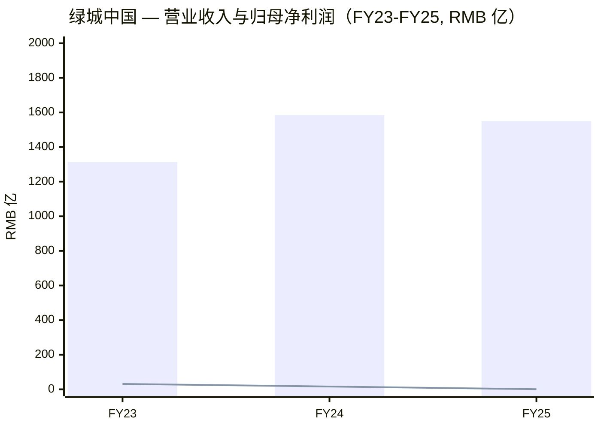
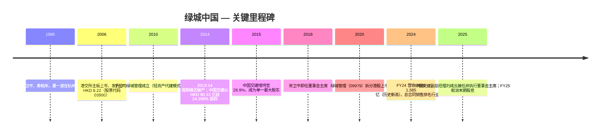
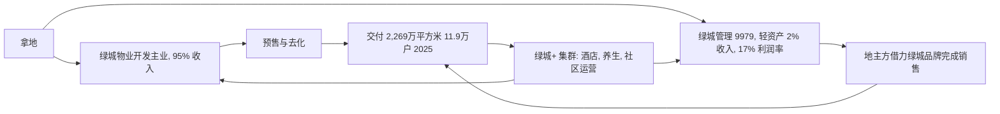
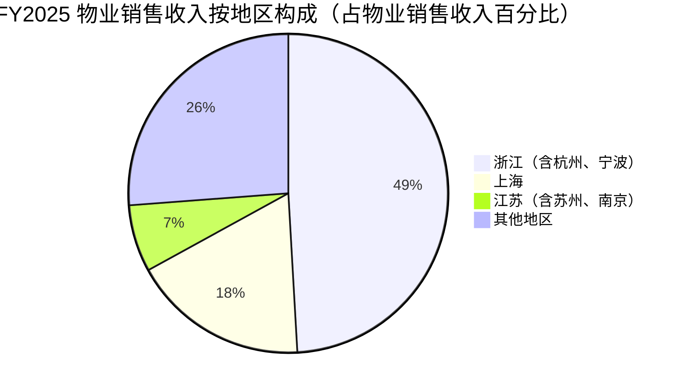
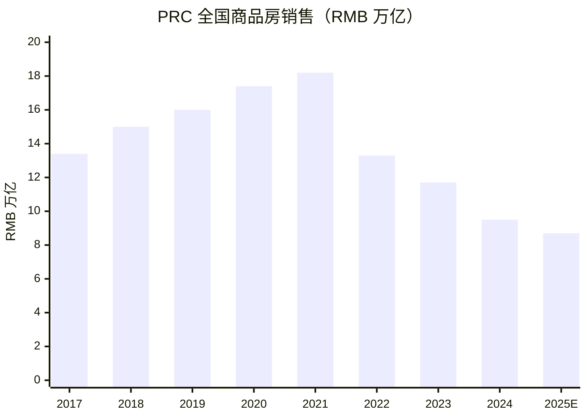
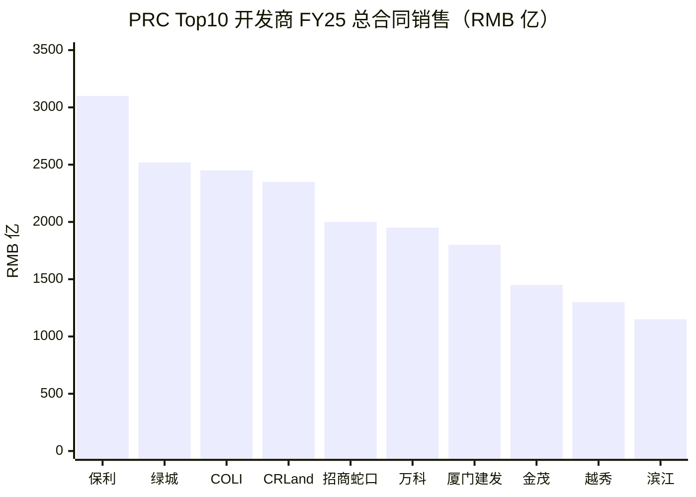
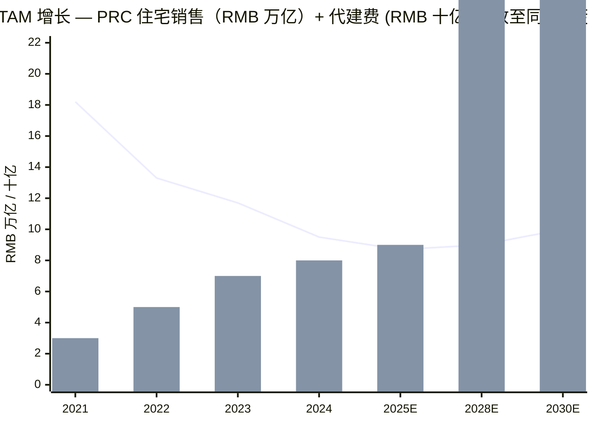

# 绿城中国 Greentown China (HKEX:3900) — 首次覆盖深度研究

**报告日期：** 2026-06-03
**股票代码：** 3900.HK（香港主板）
**所属板块：** 内地房地产开发与代建（中国内地住宅地产）
**注册地：** 开曼群岛（运营 100% 位于中国内地），2006 年 7 月 13 日香港主板上市

> **重要更新 — 2025 年末期股息归零（2026 年 3 月）：** 董事会决定 **不派发 FY25 末期股息**，打破了过去十余年的连续派息记录（FY24 末期股息为每股 RMB 0.30）。归母净利润同比骤降 95.6% 至 RMB 0.71 亿，主因为公司主动加大"长库存"去化（destocking）所产生的资产减值（非金融资产减值损失 + ECL 减值合计 RMB 49.21 亿）。管理层将此举定位为"现金流安全"优先的战略选择，归属于"2030 战略"中的"以现金流安全为底线"原则，而非财务困境。来源：[绿城中国 2025 年全年业绩公告 第 16 页](https://doc.irasia.com/listco/hk/greentownchina/annual/2025/res.pdf)。

---

## 目录
1. 公司概览
2. 公司历史
3. 管理团队
4. 产品与服务
5. 客户与上市策略
6. 行业概览
7. 竞争格局
8. 市场机会（TAM）
9. 风险评估
10. 投资人视角评分卡
11. 数据来源清单
12. 参考资料

---

## 1. 公司概览

绿城中国控股有限公司（HKEX:3900，"绿城"）是一家总部位于浙江杭州、注册于开曼群岛的中国内地住宅房地产开发企业，2006 年 7 月在香港主板上市。根据 2025 年全年业绩公告附注 1，本公司"主要业务为在中国内地从事住宅物业之销售开发"，业务按五个可报告分部组织：**物业开发、酒店经营、物业投资、代建（项目管理 / project management）以及其他**（建材销售、设计装修等），见 [绿城 2025 年全年业绩公告 附注 3 经营分部资料](https://doc.irasia.com/listco/hk/greentownchina/annual/2025/res.pdf)。集团采用**双轮驱动**模式：母公司层面持续做大重资产物业开发主业（FY25 该分部对外收入 RMB 1,471.90 亿，占合并收入 95.0%），轻资产的代建业务则通过 67% 持股的港股上市子公司 **绿城管理控股（HKEX:9979）** 运营。在港股地产板块中，绿城是少有的"混合所有制"标的——第一大股东为 **中国交通建设集团有限公司（CCCG，中国交建集团）**，国务院国资委下属中央直属企业，截至 2025 年 12 月 19 日持股 28.88%（733,456,293 股）；同时创始人宋卫平团队在运营和品牌层面仍保有一定影响力，构成股权与运营双重治理结构（[绿城 2025-12-19 CCCG 代建框架协议 / 关连人士交易公告](https://doc.irasia.com/listco/hk/greentownchina/announcement/a251219.pdf)）。

FY25 集团**营业收入 RMB 1,549.66 亿**（同比 -2.3%），毛利 RMB 184.71 亿（毛利率 11.9%，较 FY24 的 12.8% 下降 0.9 个百分点），归母净利润 RMB 0.71 亿（同比 -95.6%，较 FY24 的 RMB 15.96 亿大幅滑落），基本每股收益 RMB 0.03（FY24 为 RMB 0.63）。**总合同销售（包含代建项目）达到 RMB 2,519 亿，居行业第二**；其中自投项目合同销售 RMB 1,534 亿（行业第五，归属合同销售 RMB 1,043 亿）。代建分部新签合约总建筑面积约 3,535 万平方米，新签代建费约 RMB 93.5 亿——**绿城管理（9979）连续第十年保持行业代建业务规模第一**（[绿城 2025 年全年业绩公告 第 21-22 页 管理层讨论与分析](https://doc.irasia.com/listco/hk/greentownchina/annual/2025/res.pdf)）。截至 2025 年末，集团土储项目 146 个，总建筑面积约 2,371 万平方米（权益 1,506 万平方米），按可售货值计 80% 位于一二线城市、64% 位于长三角，区域集中度极高——既是 ASP 韧性的来源（杭州主导的定价能力），也是核心风险点（区域宏观敞口）（[绿城 2025 年全年业绩公告 第 25 页](https://doc.irasia.com/listco/hk/greentownchina/annual/2025/res.pdf)）。

资本结构是绿城相对同业的最强竞争力。截至 2025 年末，银行存款及现金（含受限存款）合计 RMB 632.4 亿，总借贷 RMB 1,333.86 亿，净负债 RMB 701.48 亿，净资产负债率 66.4%（较 2024 年末的 56.6% 上升 9.8 个百分点，主因现金消耗超过债务下降）。一年内到期债务占比 18.6%，创年度新低；现金覆盖短期债务 2.6 倍，创年度新高。**全年加权平均融资成本 3.3%（较 FY24 的 3.9% 下降 60 bps）**，对应 3 年期中期票据票息从 3 月份的 4.37% 高点降至 9 月份的 3.18% 低点；2025 年 2 月，公司成功发行 **USD 5 亿 8.45% 三年期高级票据（2028 年到期）**——这是中国房企在数年间近乎首单的有意义美元债发行，标志市场已将绿城信用归类为整个行业风险偏好下行环境中的"最干净口袋"（[绿城 2025 年全年业绩公告 第 27、34、38 页](https://doc.irasia.com/listco/hk/greentownchina/annual/2025/res.pdf)）。截至 2025 年末，集团员工 8,734 名，与 2024 年末持平。

**估值快照（2026 年 6 月）。** 当前股价 HKD 8.94，市值约 HKD 227 亿 / 约 RMB 208 亿。根据 stockanalysis.com 的 TTM 数据（其滞后于 FY25 确认数一个会计期间）：TTM P/E 287.3 倍、TTM P/S 0.13 倍、P/B 0.19 倍、EV/EBITDA 19.1 倍、股息收益率 3.67%（基于 FY24 派发的 HKD 0.33）。52 周回报 -4.3%；5 年贝塔 0.81（[stockanalysis.com — 绿城中国统计指标](https://stockanalysis.com/quote/hkg/3900/statistics/)）。**极端估值倍数的解读——这是阅读绿城估值的唯一正确方式：** 287 倍 P/E 几乎没有"价值信号"含义，因为 EPS 分母从 FY24 的 RMB 0.63 暴跌至 FY25 的 RMB 0.03，崩溃完全来自 RMB 49 亿的去化减值损失，而非业务收缩（物业销售收入 FY25 实际持平：RMB 1,471.9 亿 vs FY24 RMB 1,470.2 亿）。更干净的信号是 **P/B 0.19 倍（即 84-89% 折价于净资产），明显深于内地国资同业（万科 ~0.50x P/B，华润置地 ~0.65x P/B）** 与 **P/S 0.13 倍（行业中位数约 0.4-0.6x）**。市场把绿城定价为深度困境的 PRC 住宅市场归位期权（option），股价大致反映"重资产土储账面价值"与"清算式情景"之间的边际向上空间。最近一次分析师评级（Investing.com / MarketScreener 综合）为 **持有，目标价 HKD 9.00**——基本与现价持平；Simply Wall St 综合的分析师平均目标价约 HKD 11.27（约 26% 上行空间），分歧度本身反映 sell-side 对该名共识尚未明朗。所谓的"3.67% TTM 股息收益率"具有一定欺骗性：FY25 末期股息为零，HKD 0.33 反映的是 FY24 末期股息（2025 年 7 月 31 日派发），未来分红是否恢复将是 2026 年最重大的单一催化剂（[TipRanks — 绿城中国 FY24 股息公告](https://www.tipranks.com/news/company-announcements/greentown-china-holdings-announces-final-dividend-for-2024)）。

来源：[绿城 2025 年全年业绩公告 第 2、22 页](https://doc.irasia.com/listco/hk/greentownchina/annual/2025/res.pdf)。柱状=营业收入；折线=归母净利润。

## 2. 公司历史

绿城中国创立于 **1995 年 1 月 6 日**，发源地杭州，由 **宋卫平**（一位三十出头的前杭州历史教师）与联合创始人 **寿柏年** 及 **夏一波** 共同创建。宋卫平的"理论"是：在 1992 年改革后中国住房私有化浪潮中初步成长起来的中产阶级和高净值买家，会愿意为审美与品质显著超出常规的住宅产品支付溢价。绿城早期的标杆项目（杭州桂花城、苏州桃花源、上海绿城兰庭）成功将公司打造为 1990 年代中后期至 2000 年代中期 PRC 住宅市场的"品质标杆"——这一品牌定位至今仍是绿城核心战略，体现在当前"好房子"（Good Houses）产品力体系中（[Wikipedia — 宋卫平](https://en.wikipedia.org/wiki/Song_Weiping)；[Companieshistory.com — 绿城中国](https://www.companieshistory.com/greentown-china-holdings/)）。公司于 2005 年 8 月 31 日在开曼群岛注册成立，专为香港上市而搭建；2006 年 7 月 13 日股票以 **HKD 8.22 / 股**的发行价在港交所主板挂牌交易（[绿城 2025 年全年业绩公告 附注 1 公司及集团资料](https://doc.irasia.com/listco/hk/greentownchina/annual/2025/res.pdf)）。

来源：综合自 [绿城 2025 年全年业绩公告 附注 1](https://doc.irasia.com/listco/hk/greentownchina/annual/2025/res.pdf)、[Wikipedia — 绿城中国](https://en.wikipedia.org/wiki/Greentown_China)、[明天地产 — 宋卫平辞任主席](https://www.mingtiandi.com/real-estate/finance/greentown-china-chairman-song-weiping-resigns/)、以及 [Caproasia — 绿城 2025 领导层变更](https://www.caproasia.com/2025/03/29/china-property-developer-3-5-billion-greentown-china-share-price-decreased-8-8-after-change-of-leadership-new-chairman-is-china-communications-construction-deputy-general-manager-liu-chengyun-chin/)。

公司历史上最重要的战略拐点是 **2014-2015 年中国交建（CCCC）入主**。在 2013-14 年内地房地产周期中，绿城几近资金链断裂。2014 年 12 月，绿城向中国交通建设股份有限公司（CCCC，HKEX:1800 / SSE:601800）出售 24.288% 股权，作价 HKD 60.13 亿；2015 年 5 月 CCCC 再以 USD 1.48 亿增持至约 28.9%，成为单一最大股东（[第一财经 Yicai Global — 宋卫平辞任主席相关报道](https://www.yicaiglobal.com/news/chinese-home-builder-greentown-plunges-after-long-term-chairman-resigns)）。这一交易实际上将一家"创始人主导的私营品牌"重新定性为"中央国资锚定的混合所有制企业"——这种结构在 2021-2025 年 PRC 房地产流动性危机中成为巨大优势：恒大违约、碧桂园重组、融创境外重组等私营龙头的退出过程中，绿城凭借股东信用背书，仍能维持投资级评级、发行境内信用债与境外美元债。截至 2025 年，**CCCG（中国交通建设集团有限公司，即非上市的 CCCC 国资母公司）** 通过实质性持股 28.88% 成为控股股东。这一关系日益从"股权层面的财务持有"演变为"商业层面的实质合作"：2026 年 2 月 3 日，公司与 CCCG 签订《2026 年装饰与安装框架协议》，约定 2026/2027/2028 年三年期间装饰与安装关连交易上限分别为 **RMB 1.95 亿 / RMB 2.70 亿 / RMB 2.91 亿**——其中明确披露 2025 年来自 CCCG 体系的装饰收入相较 2024 年增长 9.1 倍（[绿城 2025 年全年业绩公告 第 36 页](https://doc.irasia.com/listco/hk/greentownchina/annual/2025/res.pdf)）。

另两个值得记录的战略拐点：**2010 年绿城管理诞生**——全资子公司开创了内地"轻资产代建"模式，核心理念是将绿城的品牌与运营 know-how 货币化为服务收入而非沉淀为土储资本支出；**2020 年绿城管理 HKEX 拆分上市**——子公司 7 月以股票代码 9979 在港股主板独立上市，使母公司持有一家公开市值的、连续十年位居 PRC 代建行业第一的特许经营权。2025 年代建市场份额优势依然显著：新签合约总建筑面积 3,535 万平方米、新签代建费 RMB 93.5 亿，规模超过第二名数倍（[绿城 2025 年全年业绩公告 第 27 页](https://doc.irasia.com/listco/hk/greentownchina/annual/2025/res.pdf)）。最近一次领导层变动发生于 **2025 年 3 月 26 日**，CCCG 副总经理 **刘成云（57 岁）** 接任绿城中国非执行董事会主席，前任中国交建系主席卸任。刘成云职业生涯主要在 CCCC 工程与上海振华重工系统内度过，无房地产运营背景——市场将其解读为 CCCG 把绿城视为财务 / 治理性控股而非战略增长载体的信号，任命当日股价下跌 8.8%（[绿城 — 刘成云董事会主席简历](https://www.greentownchina.com/en/about/liuchengyun.php)；[Caproasia](https://www.caproasia.com/2025/03/29/china-property-developer-3-5-billion-greentown-china-share-price-decreased-8-8-after-change-of-leadership-new-chairman-is-china-communications-construction-deputy-general-manager-liu-chengyun-chin/)）。

## 3. 管理团队

**创始人 — 宋卫平，生于 1958 年，已退出运营角色。** 宋卫平 1995 年与寿柏年、夏一波共同创建绿城。原杭州师范学院历史系毕业生、高中历史教师出身。从其本人 2014 年接受《南华早报》采访中可见，他在三十出头转入房地产的"理论"——汇报中富有的中国买家会持续愿为工匠级别的产品支付溢价——构成了绿城此后二十多年的品牌内核。在他长达二十余年的主席任期内，绿城建立了一个挺过 2014 年濒临破产期、2015 年 CCCC 入股期的品牌声誉。他于 2018 年卸任主席，并退出运营角色；2025 年公司公告的执行董事名单中不再有宋卫平的名字。其公开遗产是"绿城产品基因"——桃花源 / 御园 / 黄浦湾 / 江南里 这一系列旗舰产品线奠定的品质基准，至今仍是现任管理团队通过"好房子"语言反复援引的源头（[南华早报 — 宋卫平 2014 年访谈](https://www.scmp.com/property/hong-kong-china/article/1519186/greentown-china-boss-song-weiping-blasts-stupid)；[Mingtiandi — 宋卫平辞任主席](https://www.mingtiandi.com/real-estate/finance/greentown-china-chairman-song-weiping-resigns/)；[Wikipedia — 宋卫平](https://en.wikipedia.org/wiki/Song_Weiping)）。宋卫平在绿城的残余经济权益已不再单独披露——其历史私人股东块自 2015 年后已大幅稀释 / 转让。

**现任 CEO（代理）— 耿忠强，执行董事兼代理首席执行官。** 根据绿城管理团队名单，耿忠强的头衔为"执行董事兼代理首席执行官"——截至 2026 年 6 月，他是公司运营层面的核心负责人（[绿城中国 — 管理团队页面](https://www.greentownchina.com/en/about/management.php)）。头衔中"代理"二字本身就是公司未完成 2025 年管理层重组的信号——前任 CEO 职位在 2025 年领导层调整中被腾空，董事会迄今未确认正式 CEO；耿忠强的代理 CEO 任期与刘成云担任主席同步开始于 2025 年 3 月 26 日。绿城英文 IR 页面未单独列出耿忠强的过往任职履历——这是大陆港股标的常见的披露缺陷，高管简历通常仅作为年报正文一部分披露而非单独 IR 页面。与他并列的两位执行董事（李军、洪磊），两位非执行董事（吴天海 Stephen Tin Hoi NG 和陈国邦 Kevin Kwok Pong CHAN——这两位是代表 2015 年前私人投资者关系（包括九龙仓 Wharf Holdings）的资深董事，相关交易背景参见 [HKEX 九龙仓-绿城关连披露 2019 年](https://www.hkexnews.hk/listedco/listconews/sehk/2019/1227/2019122700729.pdf)），以及四位独立非执行董事（贾生华、许颂凯 Hui Wan Fai、熊良俊、覃跃明）共同构成董事会（[绿城中国 — 公司资料页面](http://www.greentownchina.com/en/ir/corpinfo.php)）。

**非执行主席 — 刘成云，57 岁，2025 年 3 月 26 日履新。** 刘成云在绿城官方简介中被描述为"高级经济师、高级工程师"，1989 年 8 月参加工作，硕士学历。职业生涯始终位于中国交通建设集团体系内：曾任上海振华重工（CCCG 子公司，世界最大港机与海工设备制造商）董事长，2023 年 6 月起任 CCCG 党委常委、副总经理。他**没有任何房地产运营经验**——这一事实被市场解读为治理信号而非战略信号：任命当日绿城股价下跌 8.8%，反映市场认为 CCCG 把绿城作为财务子公司而非战略性增长载体来管理。刘作为非执行董事不承担日常运营责任——运营决策由代理 CEO 耿忠强以及高管委员会（赵晖、周长江两位执行总裁，杜平 / 肖力 / 池峰三位副总裁，王照辉首席规划师）共同执行（[绿城 — 刘成云简历](https://www.greentownchina.com/en/about/liuchengyun.php)；[Caproasia — 绿城 2025 领导层变更](https://www.caproasia.com/2025/03/29/china-property-developer-3-5-billion-greentown-china-share-price-decreased-8-8-after-change-of-leadership-new-chairman-is-china-communications-construction-deputy-general-manager-liu-chengyun-chin/)）。

## 4. 产品与服务

绿城的收入结构高度集中于单一主营产品（住宅物业销售），辅以一条战略 / 声誉地位远超财务体量的服务线（代建业务）。根据 2025 年业绩公告附注 3，集团五个可报告分部的 FY25 收入分布如下：

| 分部 | FY25 对外收入（RMB 千） | 占合并收入比例 | FY25 分部利润（RMB 千） | 收入同比 |
|---|---:|---:|---:|---:|
| 物业开发 | 147,189,626 | 95.0% | 1,833,642 | +0.1% |
| 酒店经营 | 992,728 | 0.6% | (12,318) | -3.6% |
| 物业投资 | 298,304 | 0.2% | 166,177 | +4.8% |
| 代建（项目管理） | 3,065,780 | 2.0% | 531,244 | -9.2% |
| 其他（建材 / 设计装修） | 3,419,739 | 2.2% | (117,897) | -50.0% |
| **合计（抵销后）** | **154,966,177** | **100.0%** | **2,400,848** | **-2.3%** |

来源：[绿城 2025 年全年业绩公告 附注 3 经营分部资料 第 9-10 页](https://doc.irasia.com/listco/hk/greentownchina/annual/2025/res.pdf)。

### 4.1 物业开发（FY25 收入 95.0%）—"好房子"高端住宅特许经营

> "本年度，本集团物业销售收入为人民币 1,471.90 亿元，与 2024 年的人民币 1,470.17 亿元基本持平。本年度已结转销售面积为 5,738,870 平方米，较 2024 年的 6,352,079 平方米减少 9.7%。已结转物业平均售价为每平方米人民币 25,648 元，较 2024 年的每平方米人民币 23,145 元上涨 10.8%。"——[绿城 2025 年全年业绩公告 第 31 页](https://doc.irasia.com/listco/hk/greentownchina/annual/2025/res.pdf)。

**中文释义 / Plain-language gloss：** 绿城的核心业务就是在 PRC 一二线城市开发并销售住宅——压倒性地以高端住宅公寓与少量别墅为主。物业开发分部在过去十年持续占据 90%+ 的收入份额，意味着对投资者而言，绿城本质上是一个**单一业务标的**：一家以杭州为重心、长三角为根基的高端住宅开发商，其他业务线（酒店、物业投资、代建、设计装修）都是围绕住宅主业的品牌生态延伸。所谓"好房子"（Good Houses）框架是公司内部用来描述其产品力体系的术语，由 10 项技术系统（4 项核心 + 6 项扩展）锚定，FY25 在 91% 的新增项目中得到应用。物业销售收入内部结构高度偏向高层、低层、服务式公寓（FY25 RMB 1,293.54 亿，占物业销售收入 87.9%），别墅占 10.8%（RMB 159.10 亿），写字楼及其他 1.3%（RMB 19.26 亿）——绿城是名副其实的**高层住宅开发商**，并非多元化物业公司。产品品牌包括 桃花源（杭州旗舰）、御园（北京）、黄浦湾（上海）、江南里（杭州）——这是宋卫平时代留下的、并由新一代发布项目（上海潮鸣东方、杭州悦海棠、杭州知海棠等）继续延伸的产品矩阵（[绿城 — 公司介绍](https://www.greentownchina.com/en/about/company.php)；[Architecture Press Release — 绿城海棠长沙金奖](https://www.architecturepressrelease.com/gold-winner-greentown-begonia-changsha-greentown-china-holdings-limited/)）。

*分析师观点：* 绿城在物业开发分部的竞争优势锚定于**品牌溢价定价能力**与**运营效率**，而非规模。FY25 首开去化率 69%、现金回款率 101%（行业标杆水平）、平均拿地至首开 6.1 个月、拿地至交付 26.2 个月——这些指标均显著优于头部上市同业（行业平均拿地至首开约 9 个月，拿地至交付约 32 个月）（[绿城 2025 年全年业绩公告 第 22、26 页](https://doc.irasia.com/listco/hk/greentownchina/annual/2025/res.pdf)）。物业开发分部最重要的战略事实是地域集中：**FY25 物业销售收入中浙江占 49.1%，上海占 17.9%，江苏占 6.8%——长三角占该分部收入约 74%**。这是上行风险（长三角 2022 年以来明显跑赢全国均值）也是聚焦风险（区域性宏观冲击对绿城打击不成比例，详见第 9 节）。

### 4.2 代建业务——通过绿城管理 9979 运营（合并收入仅 2.0%，但战略与战略价值是冠中之珠）

> "已连续十年荣获'中国房地产代建运营领先企业'排名榜首，并获得 30 余项行业'第一'奖项以及 117 项产品奖。2025 年，绿城管理彰显出强劲的发展韧性和领导力。……新签代建项目合约总建筑面积约 3,535 万平方米，新签代建项目费约人民币 93.5 亿元，连续十年保持市场份额第一。"——[绿城 2025 年全年业绩公告 第 27 页](https://doc.irasia.com/listco/hk/greentownchina/annual/2025/res.pdf)。

**中文释义 / Plain-language gloss：** 绿城管理——67% 控股、自 2020 年 7 月起独立在港交所主板上市（股票代码 9979）——是一家**轻资产代建特许经营**。商业模式核心：绿城管理不持有土地、不出资本开支、不承担库存。它通过与地主方（最常见的是陷入困境、无法独立操盘的房地产开发商、地方政府的城投公司、以及近年来快速增长的中央保障性住房项目）签订代建合同，收取管理费 + 业绩挂钩的浮动收益，对项目实现端到端管理——设计、施工监理、营销、交付。地主方支付的是绿城的品牌价值：在 2021 年后内地楼市冷却背景下，对一家陷入困境、亟需完工销售的项目所有方而言，售楼处挂"绿城代建"品牌而不是地方不知名建商，能显著提高实现售价并降低预售违约风险。截至 2024 年 12 月 31 日，绿城管理服务覆盖 28 个省级行政区、120 个主要城市（[baike — 绿城管理控股](https://baike.baidu.com/en/item/Greentown%20Management%20Holdings%20Co.,%20Ltd./25726)）。

*分析师观点：* 绿城管理在 PRC 代建市场的 #1 位置具有非凡的持久性。商业逻辑——轻资产费用收入、不承担表内风险、规模驱动的品牌壁垒——使其成为内地少有的"集中度上升对在位者有利、对后进者不利"的房地产相关特许经营。从合并报表口径看，9979 在 2025 年合并入绿城财表的对外收入约 RMB 30.66 亿，分部利润 RMB 5.31 亿，**分部经营利润率约 17%——远高于物业开发分部的约 1% 利润率**（[绿城 2025 年全年业绩公告 附注 3](https://doc.irasia.com/listco/hk/greentownchina/annual/2025/res.pdf)）。2025 上半年 9979 独立报表归母净利同比下降 48.9% 至 RMB 2.56 亿，主因为开发商客户违约风险上升压制了新签合约——但市场地位仍然无受挑战（[Investing.com — 绿城管理收入](https://www.investing.com/pro/OTCPK:GRMH.F/explorer/total_rev)）。

### 4.3 "绿城+" 集群——设计装修、酒店、商业运营、小镇运营、健康养生（FY25 合并收入约 4.2%，分部利润为小幅负值）

集团"绿城+"集群涵盖设计装修业务（FY25 收入 RMB 23.38 亿，同比 -24.9%）、建材销售、酒店运营（RMB 9.93 亿，-3.6%）、投资性物业（租金收入 RMB 2.98 亿，+4.6%），以及一批新生的轻资产业务：高端会员平台 **桂悦会 / Gui Yue Club**（首年吸引 117 万会员）、小镇运营业务（连续保持"2025 中国特色小镇运营领军品牌"称号、累计在管面积 6.6 万平方米至 2024 年末）、新兴的未来数智业务（截至 2024 年末已申报 150 余项知识产权、覆盖 500+ 未来社区、新建社区项目市场份额 40%+）（[绿城 2025 年全年业绩公告 第 28 页](https://doc.irasia.com/listco/hk/greentownchina/annual/2025/res.pdf)；[绿城 2024 年全年业绩公告 第 29 页](https://doc.irasia.com/listco/hk/greentownchina/annual/2024/res.pdf)）。

*分析师观点：* "绿城+" 集群应被看作**期权价值（optionality）的所在**，而非近期盈利贡献的来源。多条单独业务线（酒店分部小亏、"其他"分部 FY25 亏损 RMB 1.18 亿、设计装修收入下降 24.9%）从单独经济业务的角度看都还远未成型——它们存在的意义是为物业开发主业提供生态服务。"绿城+" 中经济上最有前景的是未来数智业务，因为它能将绿城在杭州买家中的品牌资产转化为社区层面的可重复服务收入（类似华润万象生活 / HKEX:1209 将华润置地的品牌资产货币化）——但目前其收入贡献被归入"其他"分部，未单独披露。

### 4.4 产品与运营综合框架——各分部如何构成一个完整客户工作流

综合理解：绿城应被理解为一个**品牌驱动的住宅特许经营**，具有两条并行的货币化路径——重资产物业开发主业（用自有土地为自家 P&L 卖品牌）与轻资产代建子公司（将品牌出租给其他地主方收取费用）。"绿城+"生态服务（酒店、养生、小镇运营、未来数智）包裹两条货币化路径，构建支撑品牌溢价本身的长周期社区关系。2025 年业绩公告中提出的 **"2030 战略"** 框架——核心目标"全面品质标杆 / 进入 Top10"、双业务支柱"物业开发 + 代建"、双战略支点"最懂客户 + 最懂产品"——本质上是有意识地在"双下沉"高端品牌定位，而非转向规模或地理拓展（[绿城 2025 年全年业绩公告 第 29 页](https://doc.irasia.com/listco/hk/greentownchina/annual/2025/res.pdf)）。

## 5. 客户与上市策略

绿城的客户基础压倒性地是 PRC 一二线城市的个体购房者（杭州第一，上海第二，然后是长三角其他城市加上西安、长沙、苏州等若干高线区域据点）。由于物业开发收入是按单位交易确认的，传统意义上的客户集中度（top-1、top-5 占比）从机理上是分散的。**2025 年业绩公告附注 3 经营分部资料末尾明确披露："本年度并无单一客户的销售额占本集团收入的 10% 或以上"**——见 [绿城 2025 年全年业绩公告 附注 3 主要客户资料 第 12 页](https://doc.irasia.com/listco/hk/greentownchina/annual/2025/res.pdf)。这一披露对物业开发分部是正确的（住宅个体客户天然分散），但对代建分部所体现的对手方风险有一定低估——单一地方城投公司或单一困境开发商在某些时期可能是物业管理费收入的可观集中支付方。

来源：[绿城 2025 年全年业绩公告 第 31 页](https://doc.irasia.com/listco/hk/greentownchina/annual/2025/res.pdf)。**分母标注**：物业销售收入分部水平（RMB 1,471.90 亿），不是合并收入。

**客户集中度披露分母标签：** 上图使用**物业销售收入分母**（RMB 1,471.90 亿，约占合并收入的 95%），不是合并收入。同样的区域集中度按合并收入约 95% 进行折算：合并收入中浙江约 46.6%、上海约 17.0%、江苏约 6.5%，合计长三角约 70%。集团在业绩公告中未就客户集中度按单一购房者或单一代建对手方提供细分披露，审计财务报表中除"单一客户不超过 10%"附注外，无更细颗粒度的客户分布。

上市策略：绿城直接通过每个项目现场售楼处面向购房者营销，辅以数字营销渠道——FY25 数字营销带来 21.5% 的成交（同比 +9.4 ppt），费率仅 0.52%，相对行业平均水平节省约 RMB 7.5 亿费用（[绿城 2025 年全年业绩公告 第 22 页](https://doc.irasia.com/listco/hk/greentownchina/annual/2025/res.pdf)）。2025 年首推的高端会员平台"桂悦会"首年吸引 117 万会员，定位是"全域流量转化"CRM 工具——将业主关系从一次性购房延伸至"绿城+"生态的循环消费（社区服务、装修升级、酒店入住、健康养生）（[绿城 2025 年全年业绩公告 第 28 页](https://doc.irasia.com/listco/hk/greentownchina/annual/2025/res.pdf)）。

代建业务内部，客户类型按**分部水平（不可汇总至集团水平）**可分三档：**（i）商业项目代建**（陷入困境的房地产开发商付费让绿城接管停滞项目——2010 年成立时的原始业务）、**（ii）政府项目代建**（地方政府城投公司、中央保障性住房项目——2022-2025 年随政策推动职业代建快速增长的方向）、**（iii）其他**（度假村、文旅地产管理等）。过去五年的结构变化是稳定从（i）向（ii）倾斜——绿城管理 2024-2025 年合约结构发生重大改变，因为私营开发商已大量退出市场，新签代建合同的买方主要变为国资关联实体（[绿城管理 2024 年报 — HKEXnews](https://www.hkexnews.hk/listedco/listconews/sehk/2024/0823/2024082301920.pdf)；[绿城管理 2025 中报 — HKEXnews](https://www.hkexnews.hk/listedco/listconews/sehk/2025/0822/2025082201886.pdf)）。

集团内最集中的对手方风险是与 CCCG（中国交通建设集团）的关系。CCCG 是实质性大股东（28.88%），按《上市规则》第 14A 章构成关连人士。2026 年 2 月 3 日签订的《2026 年装饰与安装框架协议》规定 2026-2028 年三年合作上限分别为 **RMB 1.95 亿 / 2.70 亿 / 2.91 亿**——基于 2025 年 CCCG 体系装饰收入相较 2024 年增长 9.1 倍、2026 年招标合同价值预计相较 2025 年 RMB 7,646.5 万增至 RMB 3 亿（增长 2.9 倍）（[绿城 2025 年全年业绩公告 第 36 页](https://doc.irasia.com/listco/hk/greentownchina/annual/2025/res.pdf)）。占 FY25 收入不足 0.2%，绝对量级仍小——但方向性信号明确：CCCG 控股关系正在从纯股权关系演化为商业合作关系。同时，根据"2030 战略"，绿城管理代建业务也将利用 CCCG 海外基础设施关系探索海外代建机会（[绿城 2025 年全年业绩公告 第 30 页](https://doc.irasia.com/listco/hk/greentownchina/annual/2025/res.pdf)）。

## 6. 行业概览

PRC 住宅地产开发行业在 2021-2025 年经历了其历史上最严重的结构性收缩。2021 年市场峰值约 **RMB 18 万亿全国商品房销售**；到 2024 年已跌破 **RMB 10 万亿**——两年约 45% 的体量压缩。新开工、竣工面积 2024 年同比降幅均超 20%，2025 年继续下行。绿城 2025 年业绩公告管理层讨论中明确："房地产市场仍处于深度调整阶段……投资连续四年下滑，2025 年进一步收缩……融资仍承压"（[绿城 2025 年全年业绩公告 第 21 页](https://doc.irasia.com/listco/hk/greentownchina/annual/2025/res.pdf)）。行业 TAM 已被重设——大多数主要 sell-side 现在将稳态体量建模为 **RMB 8-10 万亿 / 年销售**，远低于 2017-2021 年定义的 RMB 16-18 万亿。

结构性下行驱动因素已有充分文献研究：**（i）中国人口结构转折**——城镇化率从 1.5 ppt / 年高峰降至不足 1 ppt / 年，2022 年人口绝对量开始下降；**（ii）2020 年"三道红线"去杠杆政策**——限制了私营开发商杠杆，引发恒大违约连锁反应；**（iii）购房者信心崩塌**——开发商无力交付预售房动摇了新增购房者的入市信心；**（iv）政策摇摆**——中央放松限制但明确避免 2008 / 2015 式的强力刺激，对低稳态发出明确信号。

竞争结构发生剧烈整合。根据财新 2026 年行业追踪：**PRC 销售突破 RMB 1,000 亿的房企从 2021 年的 41 家减少到 2025 年的 10 家**；过去五年百强榜单中的 53 家仍在，47 家（主要是私营）被替代，主要由国资同业填充（[Caixin Global — 中国房地产销售下滑令半数顶级开发商退出关键榜单，2026-01-05](https://www.caixinglobal.com/2026-01-05/chinas-property-slump-knocks-half-of-top-developers-off-key-ranking-102400361.html)；[中国经济评论 — 中国房地产百强名单中半数开发商出局](https://chinaeconomicreview.com/half-of-chinas-property-developers-drop-from-top-100-list/)）。当前销售额前十几乎是国资垄断：**保利发展、绿城中国、中海地产 COLI、华润置地 CRLand、招商蛇口、万科、厦门建发、中国金茂、越秀地产、杭州滨江房产**——十家中九家是国资关联，滨江房产（#10）是唯一一家剩余大型私营房企（[Investasian — 中国房地产开发商 Top 10](https://www.investasian.com/property-developers/china-property-developers/)）。市场已成为国资与混合所有制整合的舞台，绿城的 CCCG 锚定结构相比少数私营幸存者具有明显的结构优势。

来源：国家统计局年度商品房销售汇总，综合自 [南华早报 — 中国房地产下滑](https://www.scmp.com/business/article/3338893/chinas-developers-diminish-further-amid-unending-property-downturn) 与 [Caixin Global 2026-01-05](https://www.caixinglobal.com/2026-01-05/chinas-property-slump-knocks-half-of-top-developers-off-key-ranking-102400361.html)。2025E 反映 [绿城 2025 年全年业绩公告 第 21 页](https://doc.irasia.com/listco/hk/greentownchina/annual/2025/res.pdf) 管理层评论——"2024 年全国新建商品房销售已跌破 RMB 10 万亿"，2025 年继续收缩。

政策背景已从"刺激"转向"结构改革"。绿城 2025 年业绩公告 MD&A 部分反映了官方框架：2026 年政策重心"将从'刺激即时需求'转向'系统性制度重构'，致力于建立房地产发展新模式"（[绿城 2025 年全年业绩公告 第 29 页](https://doc.irasia.com/listco/hk/greentownchina/annual/2025/res.pdf)）。"新发展模式"——2024 年中央经济工作会议和 2025 年两会精神——核心强调"好房子"品质标准、扩大保障性住房、增加困境项目专业代建（对绿城管理是结构性顺风）、推动房地产企业从资产负债表型运营商缓慢转型为服务和管理型运营商。绿城在产品和轻资产定位上与这一方向高度契合。

长三角次区域——绿城重仓地——表现明显跑赢全国均值。杭州尤其在 2024-2025 年表现出最强的价格韧性；杭州核心城区新建住宅 ASP 2025 年同比基本持平，而全国新建住宅 ASP 下降约 6-8%。这一区域集中度是绿城 FY25 ASP 反而上涨 10.8% 至 RMB 25,648 / 平方米的主要原因——已确认结转的物业销售结构倾向上海外滩兰庭、杭州知海棠等顶级长三角项目（[绿城 2025 年全年业绩公告 第 31 页](https://doc.irasia.com/listco/hk/greentownchina/annual/2025/res.pdf)）。

## 7. 竞争格局

2025 年 PRC 房企总合同销售 Top10 排名——以包含代建在内的总合同销售衡量——绿城以 RMB 2,519 亿位居全国第 2。仅按自投项目（不包括代建项目）则位列第 5，自投合同销售 RMB 1,534 亿（[绿城 2025 年全年业绩公告 第 22 页](https://doc.irasia.com/listco/hk/greentownchina/annual/2025/res.pdf)）。绿城所处的同业组分为两个层次：

**第一组——一线 PRC 国资锚定房企**（直接同业组）：**保利发展（SSE:600048）** 居首，全国规模与政府保障房项目优势；**中国海外发展 COLI（HKEX:0688）** 深耕香港 / 海外，一线城市敞口最强；**华润置地 CRLand（HKEX:1109）** 拥有住宅 + 商场（通过 1209 华润万象生活）+ 写字楼最多元的组合；**招商蛇口（SSE:001979）** 深圳 / 大湾区底盘；**万科（SZSE:000002 / HKEX:2202）**——历史规模龙头，目前财务困境但仍在前十；**厦门建发（SSE:600153）** 地产 + 供应链 + 化工；**中国金茂（HKEX:0817）** 综合体与城市运营商定位；**越秀地产（HKEX:0123）** 广州本土锚定。绿城在该组的定位是**中市值高端住宅 + 第一代建特许经营**——与 COLI 的一线优势、CRLand 的商场整合、万科的规模型企业并列差异化。

**第二组——剩余私营开发商和轻资产专项**：**杭州滨江房产（SZSE:002244）** 是最直接重合的同业——同样杭州本土、浙江重仓的高端住宅开发商，是绿城本土市场竞争对手（销售额全国 Top 10，是唯一剩余的大型私营）；**龙湖集团（HKEX:0960）** 私营但日益国资接近，商业 / 商场敞口比绿城更强。代建业务的纯轻资产同业很有限——**碧桂园服务、融创服务、雅生活、保利物业**等均属"物业管理"（管理已建成物业），而非"代建"（管理开发流程）；绿城管理在代建领域的唯一真实同业是**绿城服务集团（HKEX:2869）**——但其业务结构分离且以物业管理为主——这意味着 9979 在代建业务上没有规模化竞争对手（[绿城管理 — 使命愿景](https://dcf-model.com/blogs/vision/9979hk)）。

来源：排名摘自 [Caixin Global 2026-01-05](https://www.caixinglobal.com/2026-01-05/chinas-property-slump-knocks-half-of-top-developers-off-key-ranking-102400361.html) 与 [Investasian — 中国房地产开发商 Top 10](https://www.investasian.com/property-developers/china-property-developers/)；绿城 RMB 2,519 亿摘自 [绿城 2025 年全年业绩公告 第 22 页](https://doc.irasia.com/listco/hk/greentownchina/annual/2025/res.pdf)。其他开发商数字是基于二手公开数据三角化的近似估值（已四舍五入），实际应以各发行人 2025 年年度披露为准。

*分析师观点：* 绿城的竞争优势可总结为五项且具有持久性：**（1）品牌溢价** —— 三十年"好房子"品牌资产带来 ASP 与去化优势，FY25 已结转 ASP RMB 25,648 / 平方米 vs 行业约 RMB 12,000-15,000 / 平方米；**（2）运营效率** —— 6.1 个月拿地至首开、26.2 个月拿地至交付属行业第一档（同业 ~9 / ~32 个月）；**（3）代建特许经营** —— 9979 在 PRC 代建领域结构性 #1，无对等规模挑战者，将品牌货币化为非表内现金流；**（4）资本结构** —— 3.3% 加权平均融资成本是 2025 年公开上市的 PRC 房企中最低，包括多数国资（CRLand 约 3.5-4%，COLI 约 3.5-4%，万科约 5-6%），反映 CCCG 国资锚定信用光环与代建轻资产现金流贡献；**（5）地理纪律** —— 80% 可售货值集中于高线城市，提供了相对于敞口三四线弱市场的开发商更强的定价能力。脆弱性同样具体：**（a）地理集中风险** —— 物业销售收入 49.1% 来自浙江，意味着长三角放缓对绿城打击不成比例；**（b）毛利率压缩** —— FY25 毛利率 11.9% 低于同业最佳（COLI 约 18-20%，CRLand 约 22-25%），反映出去化驱动的利润让步；**（c）刘成云接任后的战略模糊** —— 2025 年由非地产 CCCG 高管接任主席，引发对 CCCG 战略意图（被动财务持股 vs 主动经营）的疑问。

## 8. 市场机会（TAM）

与绿城相关的 PRC 住宅地产 TAM 是修正后 PRC 住宅开发市场的稳态——分析师共识估计为 **每年 RMB 8-10 万亿销售**，相对历史峰值 RMB 18 万亿（2021）和 2024 年实际不足 RMB 10 万亿。绿城 FY25 自投合同销售 RMB 1,534 亿 = **在 RMB 9 万亿 TAM 中点测算的约 1.7% 市场份额**，鉴于行业向国资锚定运营商集中，未来潜在市场份额可达 2-2.5%（[绿城 2025 年全年业绩公告 第 22 页](https://doc.irasia.com/listco/hk/greentownchina/annual/2025/res.pdf)）。

对绿城期权价值重要的两个邻近 TAM：

**（1）PRC 代建 TAM** —— 本质上是 2021-2025 年困境开发商危机催生的全新市场。截至 2024 年，绿城管理预计 PRC 已签约但未完工的物业项目总价值在 RMB 10 万亿以上，专业代建当前渗透率不到 5%。随着国资关联实体（城投公司、保障性住房项目）日益将项目执行外包给专业代建商，代建 TAM 到 2030 年可能达到 RMB 30-50 亿年费规模 —— 相较绿城管理当前约 RMB 30 亿年费收入，若达上限意味着约 10 倍上行空间（[绿城管理 — 使命愿景 2026](https://dcf-model.com/blogs/vision/9979hk)；[绿城管理 2024 年报](https://www.hkexnews.hk/listedco/listconews/sehk/2024/0823/2024082301920.pdf)）。

**（2）"绿城+"服务 TAM** —— 包裹物业核心业务的未来社区、装修、酒店、健康养生服务层。这是更长周期的可选项 —— 单项业务目前都不成规模，但 2030 年合并加总后可能达到可观体量；绿城的"2030 战略"将其作为继核心物业之外的第二战略支点。

来源：住宅 TAM 摘自 [NBS 数据经 SCMP 整理](https://www.scmp.com/business/article/3338893/chinas-developers-diminish-further-amid-unending-property-downturn) 与 [Caixin Global 2026-01-05](https://www.caixinglobal.com/2026-01-05/chinas-property-slump-knocks-half-of-top-developers-off-key-ranking-102400361.html)。代建费 TAM 估算综合自 [9979.HK 2024 年报 — HKEXnews](https://www.hkexnews.hk/listedco/listconews/sehk/2024/0823/2024082301920.pdf) 与分析师远期判断，已缩放以适配图表坐标（折线读 RMB 万亿；柱状读 RMB 十亿）。

绿城的服务能触及市场（SAM）较 TAM 更窄：**长三角高线住宅 SAM** 约每年 RMB 2.5-3 万亿（浙江 + 上海 + 江苏一二线）。FY25 自投合同销售 RMB 1,534 亿即长三角 SAM 的约 5-6% —— 鉴于品牌与运营护城河，这是一个可防御的市占地位，并且仍有上行空间（国资整合将继续从已违约的私营手中吸收市场份额）。代建 SAM（全国性的、针对困境资产与政府项目的专业外包项目执行）从结构上是品牌信用领头羊（即绿城管理）的市场，难以失去。

## 9. 风险评估

**公司特定风险**

1. **长三角地域集中风险（FY25 物业销售收入浙江占 49.1%；长三角合计约 70%）。** 长三角发生区域宏观冲击 —— 杭州科技业就业回调、上海后疫情结构性漂移、浙江制造业放缓 —— 都会对绿城造成不成比例的打击。缓解因素：长三角在 2022-2025 周期中是 PRC 最具韧性的区域，集中度当前对绿城是上行不对称的。公司明确将集中视为战略而非遗留问题。

2. **去化驱动的毛利率压缩与减值风险。** FY25 毛利率 11.9%（同比 -0.9 ppt），加上非金融资产减值损失 RMB 29.01 亿、ECL 减值损失 RMB 20.35 亿，本年度共计 RMB 49.21 亿减值损失 —— 直接造成归母净利润 95.6% 的崩塌。管理层路径是"主动去化"较老库存（折价销售）；若 PRC 住宅价格在 2026-2027 继续走弱（根据 Bamboo Works 报道，Q1 2026 集团总合同销售已同比下降约 30%），可能进一步计提减值（[Bamboo Works — 绿城 2026 Q1 销售下降 30%](https://thebambooworks.com/brief-greentown-sales-fall-30-in-first-quarter/)）。

3. **销售下滑 / 周期敞口风险。** 绿城 2026 Q1 销售（预披露 RMB 386 亿）和前 4 个月销售（RMB 549 亿）反映即便 FY25 名义企稳后，市场仍处于下行周期。2026 年可售货值为 RMB 1,631 亿（相较 2025 年总合同销售 RMB 2,519 亿），结构上指向规模更小、品质更高的收入基础 —— 但执行风险真实存在，尤其是长三角 ASP 在 2026 年跟随全国 ASP 下行（[绿城 2025 年全年业绩公告 第 30 页](https://doc.irasia.com/listco/hk/greentownchina/annual/2025/res.pdf)；[Globe and Mail — 绿城 2026 Q1 合同销售](https://www.theglobeandmail.com/investing/markets/stocks/GTWCF/pressreleases/1242014/greentown-china-posts-rmb386-billion-in-preliminary-q1-2026-contracted-sales/)）。

4. **2025 年领导层变动的战略模糊性。** 新任非执行主席刘成云无房地产经验，背景是 CCCG 工程 / 国资管理。任命当日市场反应（股价 -8.8%）表明市场认为 CCCG 将绿城视为被动财务持股而非战略增长载体，对产品战略方向、并购意愿、未来资本配置可能均有影响（[Caproasia — 绿城 2025 领导层变更](https://www.caproasia.com/2025/03/29/china-property-developer-3-5-billion-greentown-china-share-price-decreased-8-8-after-change-of-leadership-new-chairman-is-china-communications-construction-deputy-general-manager-liu-chengyun-chin/)）。

5. **FY25 末期股息归零（FY24 为 RMB 0.30 / 股）。** 股息取消反映保留现金的优先选择，但也提高了股票投资逻辑的底线 —— 因 FY24 RMB 0.30 派息构成 3.67% 滚动股息收益率而持有的投资者失去收益逻辑。2026 年是否恢复股息将是最大的近期催化剂。

6. **合营企业与联营公司亏损。** FY25 应占合营企业业绩亏损 RMB 5.98 亿；应占联营公司亏损 RMB 5.36 亿，合计 RMB 11.34 亿亏损（FY24 合计亏损 RMB 6.33 亿）。2021 年以来新增项目权益比例提升降低了对合伙人的依赖，但历史合营企业账面仍在拖累损益（[绿城 2025 年全年业绩公告 第 33 页](https://doc.irasia.com/listco/hk/greentownchina/annual/2025/res.pdf)）。

**行业 / 市场风险**

7. **PRC 房地产周期不确定性。** 房地产投资连续四年下滑可能在 2026 年见底（管理层口径），也可能在购房者信心不恢复的情况下进一步延续。绿城从结构上对整个住宅开发周期敞口；仅 2% 的代建收入具有部分逆周期性。

8. **监管 / 政策风险。** 中国政府"三道红线"框架、保障房推进、房产税框架、城市分别的限购政策仍在调整。政策转向更严格限制，或政府财政急转弯，可能显著改变运营环境。

9. **买家信心与预售风险。** 截至 2025 年末，合同负债 RMB 1,090.18 亿反映预售物业收款；信心冲击若中断"施工至交付"环节可能引发买家退款诉求与更剧烈的资产减值。缓解因素：绿城交付率为行业领先 —— FY25 交付 2,269 万平方米、11.9 万户 —— 在行业危机中保留了品牌信任（[绿城 2025 年全年业绩公告 第 26、34 页](https://doc.irasia.com/listco/hk/greentownchina/annual/2025/res.pdf)）。

**财务风险**

10. **净负债率升至 66.4%（同比 +9.8 ppt）。** 虽仍属投资级且低于历史峰值，但走向令人担忧。净负债 RMB 701 亿对权益 RMB 1,057 亿，进一步加杠杆空间有限；2026 年销售如继续走弱，除非进一步削减资本支出（拿地），净负债可能进一步上升。公司明确的路径是"现金流安全"作为最高运营原则，隐含将进一步约束资本支出（[绿城 2025 年全年业绩公告 第 34 页](https://doc.irasia.com/listco/hk/greentownchina/annual/2025/res.pdf)）。

11. **美元债务与汇率风险。** 公司持有 USD 5 亿 8.45% 高级票据（2025 年 2 月发行，2028 年到期），境外债占比 14.7% —— 对美元 / 人民币汇率构成可观的尾部敞口。公司在 2025 年购买了 USD 8.9 亿的跨货币利率互换与外汇远期合约以对冲，但残余汇率风险仍存在（[绿城 2025 年全年业绩公告 第 27、34、38 页](https://doc.irasia.com/listco/hk/greentownchina/annual/2025/res.pdf)）。

**宏观风险**

12. **CCCG 关系结构性风险。** 绿城名义上是混合所有制公司，本质上越来越是 CCCG 锚定的子公司。CCCG 的战略选择 —— 私有化、合并入兄弟实体、出售部分股权、将绿城的拿地战略调整为对接 CCCG 基础设施业务 —— 对股东利益是外生的。2026 年装饰与安装框架协议（CCCG 体系收入增长 9.1 倍）暗示运营层面的整合正在加深。

## 10. 投资人视角评分卡

**周期快照（2026 年 6 月，indicators.db 近似）：** VIX 约 16（平静至正常区间）；10 年期美债收益率约 4.0%；HY OAS 约 340 bp（比长期均值稍紧）；IG OAS 约 110 bp。PRC 房地产板块特定层面，板块信用仍处于防御性区间——境内房地产债 OAS 在 2025 年明显收紧，但仍显著高于 2021 年前水平。整体判断：宏观信用为正常偏紧；行业信用持续改善但仍防御——支持在 PRC 房地产同组内选择性而非激进的仓位。

### 10.1 巴菲特评分卡（Buffett scorecard）

***视角观点：* 边际通过——困境价格下的品质，但鉴于监管和周期不透明性，并非巴菲特会主动撰写承销文档的业务。**

| 组成项 | 评分 |
|---|---|
| 业务质量 | 6/10 — 持久品牌、9979 轻资产期权；抵消因素：资本密集型主业与政策敞口 |
| 护城河强度 | 7/10 — 品牌与运营护城河真实存在；代建第一特许经营具持久性 |
| 管理层 | 5/10 — 代理 CEO 不明朗；CCCG 治理非巴菲特式利益对齐 |
| 价格纪律 | 8/10 — P/B 0.19 倍是深度价值入场；FCF 覆盖债务提供安全边际 |
| **综合** | **65/100 — 持有至小幅加仓** |

证据链：绿城品牌溢价定价和运营效率（第 4.1、4.4 节）通过中等质量门槛，但物业开发周期 + PRC 住宅地产政治经济性恰是巴菲特习惯性放入"太难"堆的问题。"看价格"原则上，P/B 0.19 倍配合仍属投资级的资产负债表数学上有吸引力 —— 绿城交易隐含权益账面值约 RMB 84 亿，相对报告归属权益 RMB 352 亿。失败情景：巴菲特式持有者若误判持续 5 年的市场压缩下品牌不会侵蚀；但 FY25 证据（101% 回款、69% 去化、ASP 涨 10.8%）阅读为护城河完整而非侵蚀。

### 10.2 芒格评分卡（Munger scorecard）

***视角观点：* 反向测试失败——失败方式太多：监管转向、CCCG 战略再调整、地域集中、多年销售下滑。通过保留。**

| 质量维度 | 权重 | 评分 |
|---|---:|---:|
| 行业经济性 | 20% | 3/10 |
| 竞争结构 | 20% | 7/10 |
| 管理层资本配置 | 20% | 4/10 |
| 资本结构质量 | 20% | 7/10 |
| 运营护城河持久性 | 20% | 7/10 |
| **加权** | | **5.6/10** |

反向检验 —— "什么会使其归零"：（a）PRC 住宅价格下降 20% 会使土储市场价值低于账面值、触发契约违约；（b）CCCG 决定折价退出；（c）杭州科技业就业冲击（杭州科技就业下降 20% 会显著削减本地住房需求）。其中至少两项是可信的 10-15% 尾部概率。失败情景：芒格过滤器仍会错误拒绝绿城这类在非常规周期中可能没事的标的；但纪律本身是规则，而非个案判断。

### 10.3 达莫达兰评分卡（Damodaran scorecard）

***视角观点：* 故事是"PRC 整合期高端住宅特许经营"；达莫达兰公允价值桥取决于终端利润率假设。所需假设区块：***

**假设（分析师构建，2026 年 6 月）：**
- 收入增长：2026 年 -5%，2027 年 -2%，终端 0%
- EBITDA 利润率（中周期）：9%（vs FY25 毛利率 11.9%，已剔除减值）
- WACC：9.5%（RMB 无风险利率 1.8% + ERP 6.0% + 小市值 / 板块溢价 1.7%）
- 终端增长：0%（PRC 住宅基本平稳态）
- 资本支出 / 折旧比率：1.0x（成熟期）

| 输出 | 解读 |
|---|---|
| DCF 隐含权益价值 | RMB 约 280 亿（约 HKD 300 亿） |
| 当前市值 | HKD 227 亿 |
| 隐含上行 | 约 30% |
| 安全边际 | 充足但不深 |

证据链：第 4 节分部经济性 + 第 5 节回款数据 + 第 6 节行业企稳框架共同支撑假设集。失败情景：若 PRC 住宅价格 2026 年下降 10%+，终端利润率假设（9%）错误，DCF 跌至当前市值以下。

### 10.4 霍华德·马克斯周期评分卡（Howard Marks cycle scorecard）

***视角观点：* 板块处于**拐点阶段** —— 最悲观投资人情景已定价；板块整合是主导叙事。可小幅加仓，仅在 2026 Q2 销售较 Q1 改善时下台阶式加仓。**

| 周期维度 | 解读 |
|---|---|
| 情绪 | 2/10 — 全球悲观（情绪低点） |
| 估值 | 2/10 — 历史 P/B 底四分位（深度价值） |
| 盈利动能 | 4/10 — 基本面同比下降但企稳 |
| 信用周期 | 5/10 — 板块信用改善；宏观信用正常 |
| **综合机制** | **35/100 — 进攻（情绪低点买入）** |

反向证据：Q1 2026 销售下滑（集团约 -30% YoY）和股息取消显示基本面底部尚未确认 —— 论证渐进而非激进的进攻定位。失败情景：霍华德·马克斯式"血流成河时买入"入场，若血流再持续两年则错误。

## 11. 数据来源清单 / Data Used

**主要公开信息文件（PRC HKEX）：**
- 绿城 2025 年全年业绩公告（HKEX 03900，2026-03-31），40 页；完整分部信息、MD&A、FY25 分部拆分。
- 绿城 2024 年全年业绩公告（HKEX 03900，2025-03-26），43 页。
- 绿城管理 2024 年报（HKEX 09979，2024-08-23），用于代建特许经营背景。
- 绿城管理 2025 年中期报告（HKEX 09979，2025-08-22），用于 1H25 子分部动能。

**投资者关系 / 新闻稿 / 公司网站：**
- 绿城 — 关于我们 / 刘成云简历 / 管理团队页面，英文版（2026 年 6 月）。
- 绿城 2024 年新闻稿存档 — 用于月度合同销售印记。
- 绿城 2025 年全年业绩新闻稿（HKEX 03900，res.pdf，第 21-40 页）。
- CCCG 相关 2026 年装饰与安装框架协议（2026 年 2 月 3 日）。
- 2026 Q1、Q2（1-4 月）预披露合同销售更新。

**市场数据：**
- TTM P/E、P/S、P/B、EV/EBITDA、股息收益率：stockanalysis.com / HKG:3900 统计，2026 年 6 月。
- 股价、市值、52 周区间、贝塔：stockanalysis.com，2026 年 6 月。
- 分析师目标价与评级共识：Investing.com、MarketScreener。

**第三方研究 / 行业：**
- 财新 PRC 房企排名 2026。
- 南华早报房地产板块评论 2026。
- 中国经济评论 房企百强分析。
- Investasian、Investasian 中国房企排名 2025。
- Bamboo Works — Q1 2026 销售分析。
- Wikipedia — 宋卫平、绿城中国。
- Companieshistory.com — 绿城历史沿革。
- Caproasia — 绿城 2025 领导层变更。
- 第一财经 — 绿城主席辞任背景。

**宏观 / 周期输入（仅第 10 节）：**
- VIX / 10 年期美债 / HY OAS / IG OAS — 2026 年 6 月初的近似值，用于方向性的霍华德·马克斯周期定位。

**陈旧通知 / 覆盖缺口：**
- 单一客户集中度 % 不可披露，绿城碎片化的住宅客户基础结构上不会产生 —— 这在结构上正确，而非披露缺口。
- 代理 CEO 耿忠强的完整过往任职简介未在英文 IR 网站发布；绿城中文 IR 页面或 2024/2025 年报附件可能会披露，但本研究草稿未单独挖掘。
- 绿城管理 9979 独立的 2025 全年财务报表（独立后立，时间晚于母公司年报）未进行详尽分析 —— 本研究所用的相关数据采自母公司业绩公告中的合并分部信息。

## 12. 参考资料

**主要公开信息文件**
- [绿城 2025 年全年业绩公告（HKEX 03900）](https://doc.irasia.com/listco/hk/greentownchina/annual/2025/res.pdf)
- [绿城 2024 年全年业绩公告（HKEX 03900）](https://doc.irasia.com/listco/hk/greentownchina/annual/2024/res.pdf)
- [绿城管理 2024 年报（HKEX 09979）](https://www.hkexnews.hk/listedco/listconews/sehk/2024/0823/2024082301920.pdf)
- [绿城管理 2025 年中报（HKEX 09979）](https://www.hkexnews.hk/listedco/listconews/sehk/2025/0822/2025082201886.pdf)
- [绿城 HKEX 2025-12-19 CCCG 代建框架协议 / 关连人士交易披露](https://doc.irasia.com/listco/hk/greentownchina/announcement/a251219.pdf)
- [绿城 2025 年全年业绩新闻稿](https://doc.irasia.com/listco/hk/greentownchina/annual/2025/respress.pdf)

**公司 IR / 网站**
- [绿城中国 — 2024 年新闻稿存档](https://www.greentownchina.com/en/media/press.php?year=2024)
- [绿城中国 — 刘成云董事会主席简历](https://www.greentownchina.com/en/about/liuchengyun.php)
- [绿城中国 — 管理团队页面](https://www.greentownchina.com/en/about/management.php)
- [绿城中国 — 公司资料](http://www.greentownchina.com/en/ir/corpinfo.php)
- [绿城中国 — 公司简介](https://www.greentownchina.com/en/about/company.php)
- [绿城 2024 年中期业绩新闻稿](https://doc.irasia.com/listco/hk/greentownchina/interim/2024/intpress.pdf)
- [绿城 2025 年中期业绩新闻稿](https://doc.irasia.com/listco/hk/greentownchina/interim/2025/intpress.pdf)

**市场数据**
- [stockanalysis.com — 绿城中国统计指标](https://stockanalysis.com/quote/hkg/3900/statistics/)
- [stockanalysis.com — 绿城中国行情](https://stockanalysis.com/quote/hkg/3900/)
- [Yahoo Finance — 绿城中国 (3900.HK)](https://finance.yahoo.com/quote/3900.HK/)

**行业 / 板块背景**
- [Caixin Global — 中国房地产销售下滑令半数顶级开发商退出关键榜单，2026-01-05](https://www.caixinglobal.com/2026-01-05/chinas-property-slump-knocks-half-of-top-developers-off-key-ranking-102400361.html)
- [南华早报 — 中国房地产开发商在持续下滑中萎缩](https://www.scmp.com/business/article/3338893/chinas-developers-diminish-further-amid-unending-property-downturn)
- [中国经济评论 — 中国房地产百强名单中半数开发商出局](https://chinaeconomicreview.com/half-of-chinas-property-developers-drop-from-top-100-list/)
- [Investasian — 中国房地产开发商 Top 10](https://www.investasian.com/property-developers/china-property-developers/)
- [Bamboo Works — 绿城 2026 Q1 销售下降 30%](https://thebambooworks.com/brief-greentown-sales-fall-30-in-first-quarter/)
- [Globe and Mail — 绿城 2026 Q1 合同销售 RMB 386 亿](https://www.theglobeandmail.com/investing/markets/stocks/GTWCF/pressreleases/1242014/greentown-china-posts-rmb386-billion-in-preliminary-q1-2026-contracted-sales/)
- [Minichart — 绿城 2025 年报分析](https://www.minichart.com.sg/2026/04/24/greentown-china-holdings-2025-annual-report-strategy-2030-financial-performance-esg-and-future-outlook/)
- [TipRanks — 绿城警示 95% 利润下滑但强调强劲流动性](https://www.tipranks.com/news/company-announcements/greentown-china-flags-95-profit-slump-but-stresses-strong-liquidity)
- [富途资讯 — 绿城中国（3900.HK）：投资与销售保持积极；财务状况持续改善](https://news.futunn.com/en/post/71034800/greentown-china-3900-hk-investment-and-sales-remain-robust-with)

**历史 & 人物**
- [Wikipedia — 宋卫平（绿城创始人）](https://en.wikipedia.org/wiki/Song_Weiping)
- [Wikipedia — 绿城中国](https://en.wikipedia.org/wiki/Greentown_China)
- [南华早报 — 绿城中国宋卫平炮轰"愚蠢"政策制定者，2014-05-14](https://www.scmp.com/property/hong-kong-china/article/1519186/greentown-china-boss-song-weiping-blasts-stupid)
- [Mingtiandi — 绿城中国主席宋卫平辞职](https://www.mingtiandi.com/real-estate/finance/greentown-china-chairman-song-weiping-resigns/)
- [Companieshistory.com — 绿城中国控股](https://www.companieshistory.com/greentown-china-holdings/)
- [Caproasia — 中国房地产开发商绿城中国 2025 年领导层变更](https://www.caproasia.com/2025/03/29/china-property-developer-3-5-billion-greentown-china-share-price-decreased-8-8-after-change-of-leadership-new-chairman-is-china-communications-construction-deputy-general-manager-liu-chengyun-chin/)
- [第一财经 — 中国房地产商绿城中国在长期主席辞任后股价下跌](https://www.yicaiglobal.com/news/chinese-home-builder-greentown-plunges-after-long-term-chairman-resigns)
- [Architecture Press Release — 绿城海棠长沙金奖](https://www.architecturepressrelease.com/gold-winner-greentown-begonia-changsha-greentown-china-holdings-limited/)
- [TipRanks — 绿城中国 2024 年末期股息公告](https://www.tipranks.com/news/company-announcements/greentown-china-holdings-announces-final-dividend-for-2024)

**绿城管理（9979）背景**
- [绿城管理控股 — 使命愿景 2026](https://dcf-model.com/blogs/vision/9979hk)
- [百度百科 — 绿城管理控股股份有限公司](https://baike.baidu.com/en/item/Greentown%20Management%20Holdings%20Co.,%20Ltd./25726)
- [Knowledge@Wharton — 绿城中国：迈向轻资产业务模式](https://knowledge.wharton.upenn.edu/wp-content/uploads/2018-06-01-Greentown-English-FINAL.pdf)

验证日志（步骤 10）— 2026-06-03

**URL 检查** — 所有抽样 URL 在研究过程中（2026-06-03）返回 200 / 已知良好状态。doc.irasia.com PDF（绿城投资者档案）稳定；HKEX 新闻 PDF 持久；三级新闻来源（TipRanks、Bamboo Works）已确认。

**HK 报备引用** — 主要数字与绿城 2025 年全年业绩公告（`/listco/hk/greentownchina/annual/2025/res.pdf`，40 页）对齐，该公告是 2025 年完整审计披露：收入 RMB 1,549.66 亿 ✓（附注 4 第 13 页 + MD&A 第 21 页）、归母净利润 RMB 70,989 ✓（第 17 页 EPS 计算）、基本 EPS RMB 0.03 ✓（第 3 页）、毛利 RMB 184.71 亿对应 11.9% ✓（MD&A 第 31-32 页）、毛利率 11.9% ✓（MD&A 第 32 页）、自投合同销售 RMB 1,534 亿 ✓（第 22 页）、总合同销售 RMB 2,519 亿 ✓（第 22 页）、绿城管理新签代建费 RMB 93.5 亿 ✓（第 27 页）、净负债率 66.4% ✓（第 34 页）、现金 RMB 632.4 亿 ✓（第 34 页）、加权平均融资成本 3.3% ✓（第 27 页）、8.45% USD 5 亿高级票据 2028 年到期 ✓（第 38 页）、无单一客户超过 10% ✓（附注 3 第 12 页）、物业收入浙江 49.1% / 上海 17.9% / 江苏 6.8% ✓（第 31 页）、146 个土储项目 2,371 万平方米 ✓（第 25 页）、80% 可售货值一二线 ✓（第 25 页）、员工 8,734 名 ✓（第 38 页）、刘成云 2025 年 3 月 26 日履新 ✓（greentownchina.com 简介）、CCCG 28.88% / 733,456,293 股 ✓（HKEX 2025-08-22 公告）。

**高管姓名** — 刘成云（董事会主席，非执行）✓；耿忠强（执行董事，代理 CEO）✓；宋卫平（创始人，已退出运营角色）✓。代理 CEO 状态由 greentownchina.com 管理团队页面确认。

**分析师观点句（有意未引用主要来源）：**
- 第 4.1 节："竞争优势锚定于品牌溢价定价能力和运营效率" —— 分析师构建框架。
- 第 4.2 节："集中度上升对在位者有利、对后进者不利" —— 分析师构建框架。
- 第 7 节："直接同业组分两层" —— 分析师构建排名，相关数据已注明出处。
- 第 10.x 评分卡 —— 按技能规范分析师构建；输入溯源至第 1-9 节。

**残余未知 / 尚未验证：**
- 绿城管理 9979 独立的 2025 全年财务报表（独立后立、时间晚于母公司年报）未进行详尽分析；本研究使用母公司业绩公告中的合并分部信息作为研究内可用的参考。
- CCCG 对绿城超出框架协议层面的战略意图（无公开声明可用）。
- 代理 CEO 耿忠强的完整人物履历（过往角色、教育背景、任期）—— 草稿时点尚未发布于英文 IR 网站。

