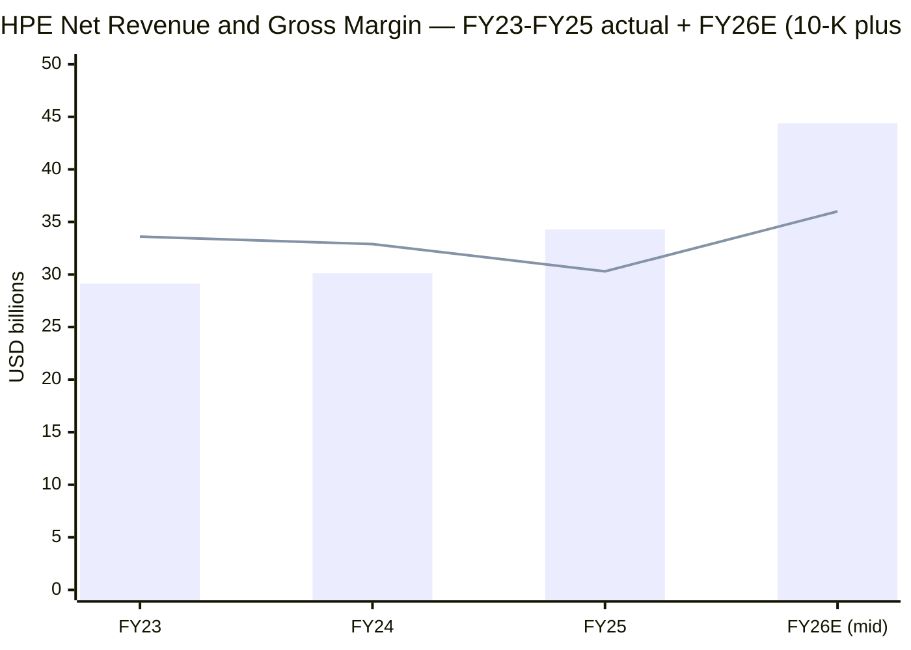
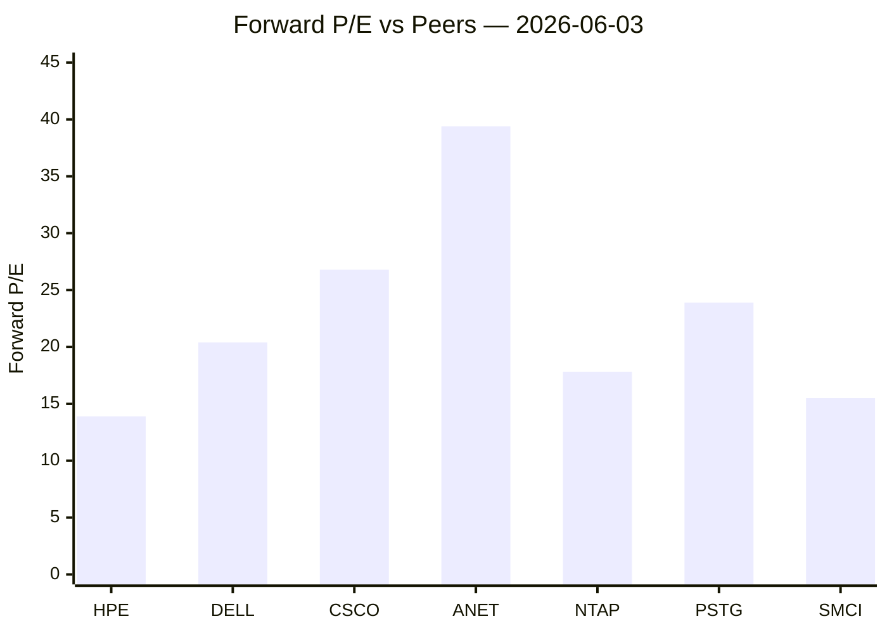
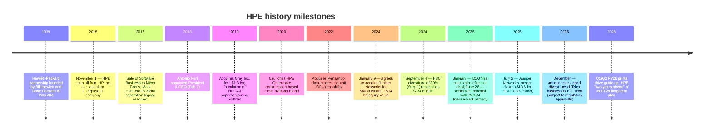
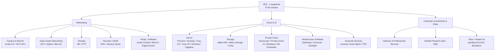
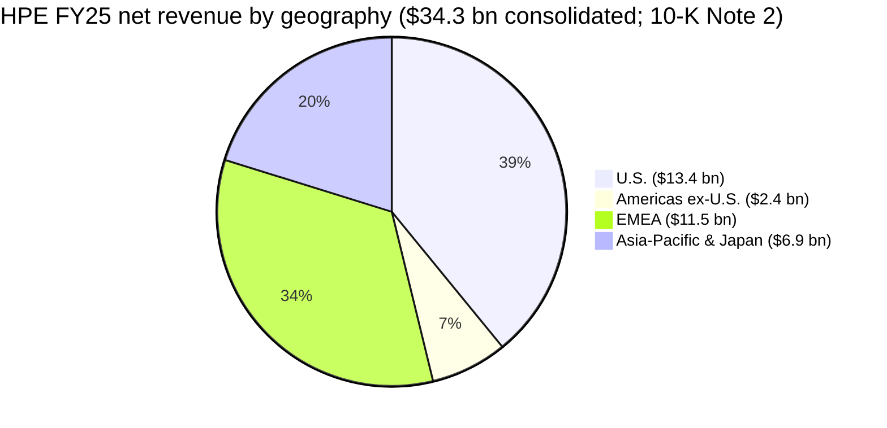
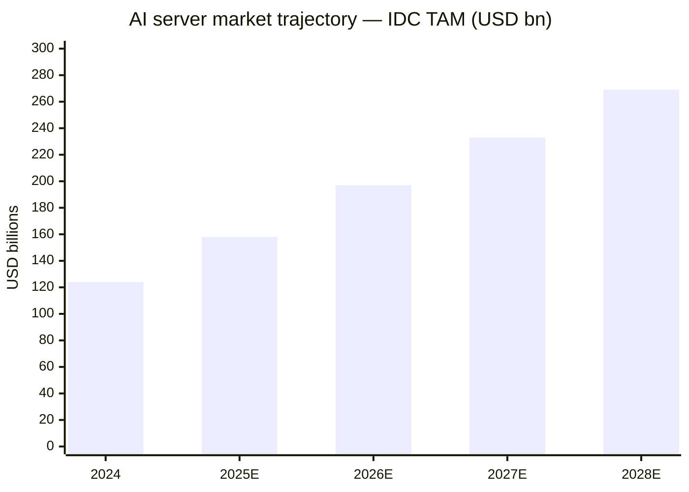
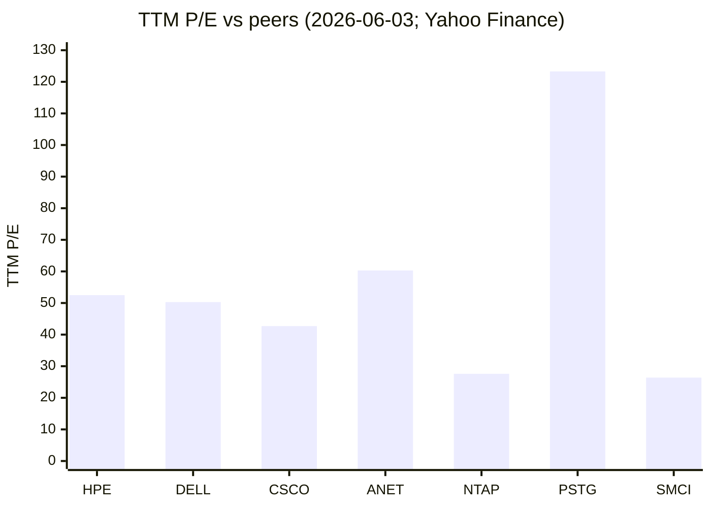
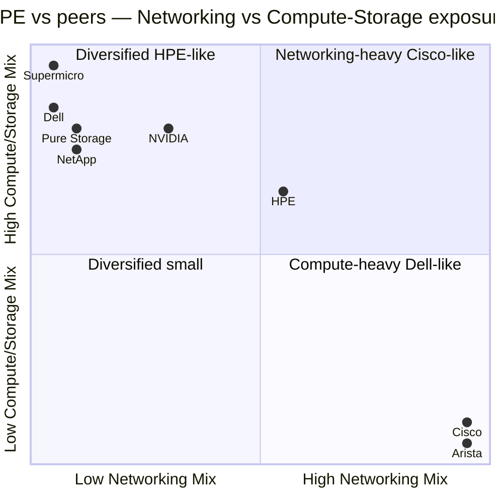
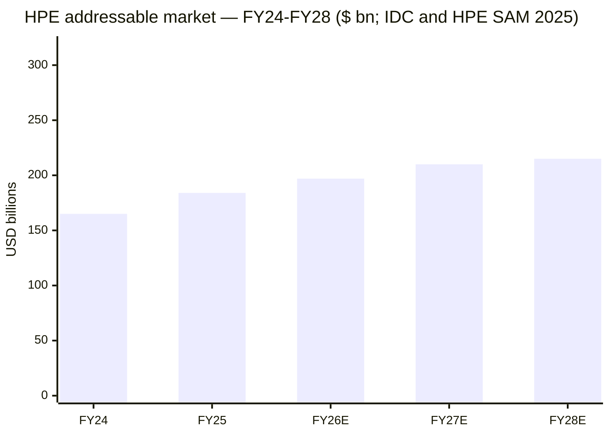
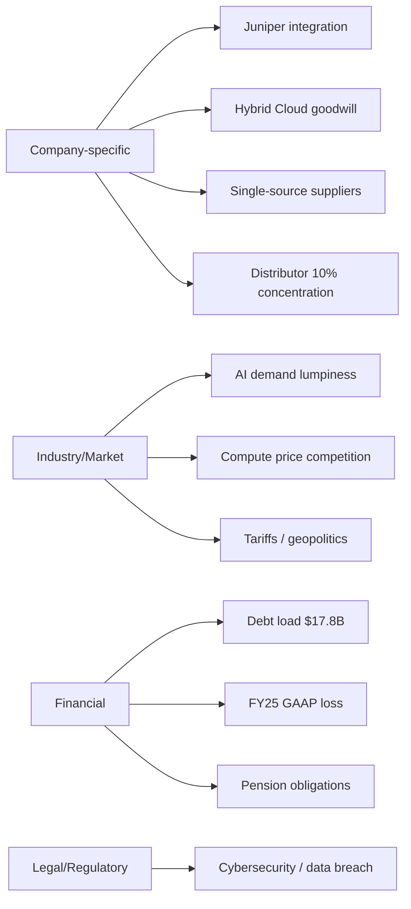

# Hewlett Packard Enterprise Company (NYSE: HPE) — Initiation Research

**As of: 2026-06-03** &nbsp; | &nbsp; **Stock: NYSE: HPE** &nbsp; | &nbsp; **Last price: $56.15** &nbsp; | &nbsp; **Market cap: ~$74.4 bn** &nbsp; | &nbsp; **Sector: Enterprise IT — Compute, Networking, Storage, AI Infrastructure** &nbsp; | &nbsp; **Fiscal year-end: October 31**

> **Recent guidance change — raised three days ago.** On June 1, 2026, HPE raised its fiscal 2026 full-year revenue-growth outlook to **29–33%**, Networking growth to **72–75%**, GAAP operating-profit growth to **885–930%**, GAAP diluted EPS to **$2.42–$2.52**, non-GAAP diluted EPS to **$3.35–$3.45**, and free cash flow to **≥ $3.5 bn**. The new non-GAAP EPS and FCF ranges are *higher than what HPE had projected the company would achieve by FY28* at its October 2025 Securities Analyst Meeting — "**two years ahead of the fiscal 2028 long-term financial plan**." Source: [HPE Q2 FY26 Earnings Release, 8-K Ex. 99.1 — June 1, 2026](https://www.sec.gov/Archives/edgar/data/1645590/000164559026000052/ex-991x612026x8k.htm).

---

## Table of contents

1. [Company overview](#1-company-overview)
2. [Company history](#2-company-history)
3. [Management](#3-management)
4. [Products & services](#4-products--services)
5. [Customers & GTM](#5-customers--go-to-market)
6. [Industry overview](#6-industry-overview)
7. [Competitive landscape](#7-competitive-landscape)
8. [Market opportunity (TAM)](#8-market-opportunity-tam)
9. [Risk assessment](#9-risk-assessment)
10. [Investor-lens scorecards](#10-investor-lens-scorecards)
11. [References & data used](#references--data-used)

---

## 1. Company overview

Hewlett Packard Enterprise Company ("**HPE**", NYSE: HPE) is the enterprise-IT half of the November-2015 separation of Hewlett-Packard Company; its FY25 10-K filed December 18, 2025 describes the firm as "a global technology leader focused on developing intelligent solutions that allow customers to capture, analyze and act upon data seamlessly from edge to cloud" with customers ranging "from small-and-medium-sized businesses to large global enterprises and governmental entities," and traces the lineage to "a partnership founded in 1939 by William R. Hewlett and David Packard." ([HPE FY25 10-K, Item 1 Business](https://www.sec.gov/Archives/edgar/data/1645590/000164559025000130/hpe-20251031.htm)). Headquartered at 1701 E. Mossy Oaks Road, Spring, TX 77389, HPE employed approximately **67,000** people as of fiscal-year-end October 31, 2025, generated **$34.3 bn** of net revenue in FY25 (+13.8% YoY) and is now structurally three segments — **Networking**, **Cloud & AI**, and **Corporate Investments & Other** — after a segment realignment effective the first quarter of fiscal 2026 ([HPE FY25 10-K, Note 2 Segment Information & Subsequent Events](https://www.sec.gov/Archives/edgar/data/1645590/000164559025000130/hpe-20251031.htm)).

The defining corporate event of FY25 is the **July 2, 2025 closing of the Juniper Networks acquisition** at $40.00 per share for ~$13.4 bn cash consideration ($13.6 bn total including replacement equity awards), funded through a combination of cash on hand, commercial paper, a $3.0 bn three-year delayed-draw term loan, a $1.0 bn 364-day delayed-draw term loan, and the September 2024 issuance of 30,000,000 shares of 7.625% Series C Mandatory Convertible Preferred Stock for net proceeds of approximately $1.46 bn ([HPE FY25 10-K, Note 10 Acquisitions and Dispositions](https://www.sec.gov/Archives/edgar/data/1645590/000164559025000130/hpe-20251031.htm); [HPE FY25 10-K, Note 15 Stockholders' Equity](https://www.sec.gov/Archives/edgar/data/1645590/000164559025000130/hpe-20251031.htm)). The Department of Justice initially sued in January 2025 to block the deal and the parties announced a settlement in late June 2025 requiring divestiture of Juniper's Mist AIOps business with a license-back and other behavioral remedies — coverage by [Reuters, 2025-06-28](https://www.reuters.com/sustainability/boards-policy-regulation/hpe-says-it-has-reached-deal-with-doj-13-billion-juniper-acquisition-2025-06-28/) and [The Verge, 2025-06-28](https://www.theverge.com/news/694960/hpe-juniper-merger-doj-trial-settlement). Juniper contributed $2.1 bn of revenue and $419 million of segment earnings during the four-month stub period ([HPE FY25 10-K, Note 10](https://www.sec.gov/Archives/edgar/data/1645590/000164559025000130/hpe-20251031.htm)).

**Segment shape entering FY26 (under the new framework).** Q1 FY26 (quarter ended January 31, 2026) revenue was **$9.3 bn (+18% YoY)** with Networking $2.7 bn (+151.5%, helped by ~$1 bn of routing revenue from Juniper that did not exist a year earlier), Cloud & AI $6.3 bn (-2.7%), and Corporate Investments & Other $261 m ([HPE Q1 FY26 Earnings Release, 8-K Ex. 99.1 — March 9, 2026](https://www.sec.gov/Archives/edgar/data/1645590/000164559026000028/ex-991x392026x8k.htm)). Q2 FY26 (quarter ended April 30, 2026) was a record: **$10.7 bn revenue (+40% YoY)**, Networking $2.7 bn (+148.2%), Cloud & AI $7.7 bn (+22.9%) and GAAP gross margin 36.5% (+810 bps YoY) ([HPE Q2 FY26 Earnings Release, 8-K Ex. 99.1 — June 1, 2026](https://www.sec.gov/Archives/edgar/data/1645590/000164559026000052/ex-991x612026x8k.htm)). Within Networking, Data Center Networking was $320 m (+233.3% YoY) and Routing was $775 m versus $1 m a year earlier — both prints driven by the Juniper integration.

*Sources: FY23/FY24/FY25 net revenue and gross margin from [HPE FY25 10-K, Consolidated Statements of Earnings](https://www.sec.gov/Archives/edgar/data/1645590/000164559025000130/hpe-20251031.htm); FY26 mid-point revenue computed as $34.296 bn × (1+0.31) per raised 29–33% growth outlook in [HPE Q2 FY26 Earnings Release](https://www.sec.gov/Archives/edgar/data/1645590/000164559026000052/ex-991x612026x8k.htm); FY26 gross margin ~36% implied by the 36.5–36.9% prints in Q2 FY26.*

**Valuation snapshot (as of 2026-06-03, source: Yahoo Finance — yfinance API pull).** Price $56.15, market cap $74.4 bn, TTM P/E 52.5×, forward P/E 13.9×, P/S TTM 1.92×, P/B 3.01×, EV $90.3 bn, EV/EBITDA 15.9×, EV/Revenue 2.33×, dividend yield ~1.02% on a $0.13 quarterly cash dividend that was raised to **$0.1425/share** at Q2 FY26 (annualized $0.57 — see [HPE Q2 FY26 Release](https://www.sec.gov/Archives/edgar/data/1645590/000164559026000052/ex-991x612026x8k.htm)), beta 1.30, 52-week range $17.49 – $64.25, ~67,000 full-time employees ([Yahoo Finance — HPE Key Statistics](https://finance.yahoo.com/quote/HPE/key-statistics/)). The trailing 52-week range is wide because the stock spiked from sub-$20 in early-2025 after the DOJ settlement removed the Juniper-deal overhang and Q1/Q2 FY26 results posted the +18% / +40% prints that drove the FY26 guide-up cited above.

*Analyst view: the TTM P/E of ~52× is non-comparable because FY25 GAAP earnings include a $1.62 bn Hybrid-Cloud goodwill impairment and $458 m of acquisition/disposition charges, while the FY25 effective tax rate of 120.0% reflects non-deductibility of the impairment and $693 m of merger-related tax benefits ([HPE FY25 10-K MD&A](https://www.sec.gov/Archives/edgar/data/1645590/000164559025000130/hpe-20251031.htm)). The 13.9× forward P/E — built off the raised FY26 non-GAAP EPS midpoint of $3.40 — is the better gauge and prices HPE at a meaningful discount to networking peers (ANET 39.4× forward, CSCO 26.8×) and a modest discount to compute peers (Dell 20.4×, NetApp 17.8×, SMCI 15.5×) per [Yahoo Finance peer screens, 2026-06-03](https://finance.yahoo.com/quote/HPE/).*

*Source: [Yahoo Finance, accessed 2026-06-03](https://finance.yahoo.com/quote/HPE/) (yfinance API: `forwardPE`).*

---

## 2. Company history

The Hewlett-Packard partnership was founded in 1939 by William R. Hewlett and David Packard in a Palo Alto garage; HPE's FY25 10-K explicitly anchors its corporate story to that lineage: "Our legacy dates back to a partnership founded in 1939 by William R. Hewlett and David Packard, and we strive every day to uphold and enhance that legacy" ([HPE FY25 10-K, Item 1 Business](https://www.sec.gov/Archives/edgar/data/1645590/000164559025000130/hpe-20251031.htm)). HPE was created on **November 1, 2015** when the legacy Hewlett-Packard Company separated into two listed entities — HPE (enterprise infrastructure, software, services) and HP Inc. (printers and PCs) — via a tax-free distribution to existing HP shareholders. Per the 10-K, HPE has carried Separation and Distribution Agreement-related risks ever since: "We continue to face a number of risks related to our separation from HP Inc., our former parent, including those associated with ongoing indemnification obligations" ([HPE FY25 10-K, Risk Factors Summary](https://www.sec.gov/Archives/edgar/data/1645590/000164559025000130/hpe-20251031.htm)).

Across FY23–FY25 HPE recorded **$823 m** of cumulative spend on the "Cost Optimization and Prioritization Plan" and **$553 m** + **$268 m** for restructuring under the "HPE Next Plan"; the primary elements of both transformation programs were "completed by the end of fiscal 2024" ([HPE FY25 10-K, Note 3 Transformation Programs](https://www.sec.gov/Archives/edgar/data/1645590/000164559025000130/hpe-20251031.htm)). On March 6, 2025 the Board approved a new **Catalyst Cost Reduction Program** "intended to reduce structural operating costs," whose synergies the CFO highlighted as a key driver of Q1/Q2 FY26 margin upside ([HPE FY25 10-K, MD&A](https://www.sec.gov/Archives/edgar/data/1645590/000164559025000130/hpe-20251031.htm); [HPE Q2 FY26 Earnings Release](https://www.sec.gov/Archives/edgar/data/1645590/000164559026000052/ex-991x612026x8k.htm)).

*Sources: [HPE FY25 10-K](https://www.sec.gov/Archives/edgar/data/1645590/000164559025000130/hpe-20251031.htm); [HPE/Juniper Networks Deal Announcement Press Release, 2024-01-09 (HPE IR)](https://investors.hpe.com/news/news-details/2024/Hewlett-Packard-Enterprise-to-Acquire-Juniper-Networks-Accelerating-AI-Driven-Innovation/default.aspx); [Reuters — DOJ settles HPE/Juniper, 2025-06-28](https://www.reuters.com/sustainability/boards-policy-regulation/hpe-says-it-has-reached-deal-with-doj-13-billion-juniper-acquisition-2025-06-28/); [HPE Cray acquisition announcement (2019)](https://www.hpe.com/us/en/newsroom/press-release/2019/05/hewlett-packard-enterprise-to-acquire-supercomputing-leader-cray.html).*

---

## 3. Management

**Antonio F. Neri — President and Chief Executive Officer (since February 1, 2018; age 58; HPE director since 2018).** Per the FY26 Proxy Statement Director Nominees table, Neri's only outside public-company board seat is Elevance Health, Inc.; HPE describes his industry experience as "IT/Technology, Healthcare" ([HPE 2026 Proxy Statement, p. 43](https://www.sec.gov/Archives/edgar/data/1645590/000164559026000019/hpe-20260210.htm)). HPE's FY25 10-K characterises his career: "Mr. Neri's experience includes nearly 30 years combined at HPE and Hewlett-Packard Company ("HP Co.") in various leadership positions … proven experience in developing transformative business models, building global brands, and driving sustained growth and expansion in the technology industry" ([HPE FY25 10-K, Item 1 Business — Our Strengths](https://www.sec.gov/Archives/edgar/data/1645590/000164559025000130/hpe-20251031.htm)). Neri joined HP in 1995 as a customer-service engineer in EMEA and rose through the Enterprise Group; he was President of the Enterprise Group from 2015 and was named president of HPE in 2017 before succeeding Meg Whitman as CEO on February 1, 2018 — career arc corroborated by the [HPE Newsroom — Antonio Neri Named CEO, 2018-01-22](https://www.hpe.com/us/en/newsroom/press-release/2017/11/Hewlett-Packard-Enterprise-Appoints-Antonio-Neri-as-President.html). As of the proxy, Neri held **864,190 time-vested RSUs and 2,217,784 performance-based RSUs** outstanding under the 2021 Plan (at maximum 200% vesting) and "directors who are employees of the Company or its affiliates — currently, only our President and CEO, Antonio Neri — do not receive separate compensation for their Board service" ([HPE 2026 Proxy Statement](https://www.sec.gov/Archives/edgar/data/1645590/000164559026000019/hpe-20260210.htm)). The 10-K's "Experienced leadership team" plank is essentially a Neri biographical paragraph; no co-founder bio is required because the 1939 founders are long-deceased and HPE itself is only the post-2015 spinoff entity.

**Founder note (1939 partnership — historical context only).** Bill Hewlett (1913–2001, Stanford BS/MS EE, MIT EE 1936) and Dave Packard (1912–1996, Stanford BA/MS EE) founded HP in a Palo Alto garage in 1939 with $538 of working capital; the first product was the HP 200A audio oscillator. Per the FY25 10-K, "Our legacy dates back to a partnership founded in 1939 by William R. Hewlett and David Packard" ([HPE FY25 10-K, Item 1 Business](https://www.sec.gov/Archives/edgar/data/1645590/000164559025000130/hpe-20251031.htm)). Neither founder is involved in HPE today; both predeceased the 2015 spinoff. The "HP Way" management philosophy they codified (decentralised management, profit-sharing, management-by-walking-around) remains an internal cultural reference ("we have identified four key cultural beliefs: accelerating what's next, bold moves, the 'power of yes we can,' and being a force for good" — [HPE FY25 10-K, Human Capital](https://www.sec.gov/Archives/edgar/data/1645590/000164559025000130/hpe-20251031.htm)) but operates without ongoing founder oversight.

---

## 4. Products & services

HPE sells across three FY26 reporting segments — **Networking**, **Cloud & AI**, and **Corporate Investments & Other** — that together encompass server systems, storage, private cloud, networking hardware/software, IT financial services, supercomputing, and consulting. The legal description in the FY25 10-K still uses the FY25 five-segment structure (Server / Hybrid Cloud / Networking / Financial Services / Corporate Investments & Other) so each FY25 product-family description below is paired with the FY26 segment it now sits in.

### 4.1 Cloud & AI (FY26 segment) — Server + Hybrid Cloud + Financial Services

Verbatim 10-K Server description: "The Server segment consists of general-purpose servers for multi-workload computing, workload-optimized servers to deliver the best performance and value for demanding applications, and integrated systems comprised of software and hardware designed to address High-Performance Computing and Supercomputing (including exascale applications), AI, Data Analytics, and Transaction Processing workloads for government and commercial customers globally. This portfolio of products includes the secure and versatile HPE ProLiant Rack and Tower servers; HPE Synergy, a composable infrastructure for traditional and cloud-native applications; HPE Scale Up Servers product lines for critical applications, including large enterprise software applications and data analytics platforms; HPE Edgeline servers; HPE Cray EX; HPE Cray XD (formerly known as HPE Apollo); and HPE NonStop." ([HPE FY25 10-K, Item 1 Business — Server](https://www.sec.gov/Archives/edgar/data/1645590/000164559025000130/hpe-20251031.htm)).

**中文释义 / Plain-language gloss:** ProLiant rack/tower servers are HPE's commodity-volume x86 platforms; Synergy is composable infrastructure (compute pools that can be re-mapped to workloads via software); Cray EX and Cray XD are the exascale supercomputing class (e.g. Frontier and Aurora-class machines) that arrived via the 2019 Cray acquisition; HPE Edgeline is the rugged edge-server line; NonStop is the legacy Tandem fault-tolerant transaction-processing platform inherited from HP Co. The R&D narrative explicitly highlights "fanless direct liquid cooling that power our largest AI systems" — i.e. the cooling architecture used in Frontier and the El Capitan exascale system ([HPE FY25 10-K, Research and Development](https://www.sec.gov/Archives/edgar/data/1645590/000164559025000130/hpe-20251031.htm)).

Verbatim 10-K Hybrid Cloud description: "The Hybrid Cloud segment offers a wide variety of cloud-native and hybrid solutions across storage, private cloud, and the infrastructure software-as-a-service ('SaaS') space. Storage includes data storage and data management offerings with the HPE Alletra Storage portfolio; unstructured data solutions and analytics for AI; data protection and archiving; and storage networking. … In private cloud, the HPE GreenLake offerings include new cloud-native offerings and capabilities for virtual machines, containers, and bare metal; a full suite of private cloud offerings that enable customers to self-manage or choose a fully managed experience; and a portfolio of world-class Private Cloud AI infrastructure delivered as-a-service. … Infrastructure software includes monitoring and observability for day two operations and beyond through our acquisition of OpsRamp and unified data access through HPE Ezmeral Data Fabric." ([HPE FY25 10-K, Item 1 Business — Hybrid Cloud](https://www.sec.gov/Archives/edgar/data/1645590/000164559025000130/hpe-20251031.htm)).

**中文释义 / Plain-language gloss:** Alletra is HPE's flash-storage platform that the 10-K explicitly frames as "a transition to proprietary HPE-developed storage solutions that enhance profitability and reduce reliance on third-party products" ([HPE FY25 10-K, Item 1 Business — Our Strategy](https://www.sec.gov/Archives/edgar/data/1645590/000164559025000130/hpe-20251031.htm)) — i.e. moving off the Nimble/3PAR-era OEM economics. GreenLake is the consumption-billing wrapper that HPE markets as "the centerpiece of our strategy" — pay-per-use private-cloud capacity that can run virtual machines, containers, or bare metal; HPE Private Cloud AI is the bundle of GreenLake + Nvidia accelerators + curated AI-software stack offered as a turnkey "AI factory." Ezmeral is the Kubernetes-orchestrated data-fabric stack; Zerto is the disaster-recovery acquisition; HPE InfoSight and CloudPhysics are the AIOps telemetry layer.

Verbatim 10-K Financial Services description: "The Financial Services ('FS') segment provides flexible investment solutions, such as leasing, financing, IT consumption, utility programs, and asset management services for customers that facilitate unique technology deployment models and the acquisition of complete IT solutions, including hardware, software, and services from Hewlett Packard Enterprise and others. The FS segment also supports financial solutions for on-premise flexible consumption models, such as the HPE GreenLake cloud." ([HPE FY25 10-K, Item 1 Business — Financial Services](https://www.sec.gov/Archives/edgar/data/1645590/000164559025000130/hpe-20251031.htm)). At FY25 year-end the FS portfolio was **$13.4 bn gross / $13.2 bn net** with a **7.0× debt-to-equity ratio** and 1.8% reserve coverage; financing volume in FY25 was $5.5 bn (down 17.2% YoY) ([HPE FY25 10-K, MD&A — Portfolio Assets and Ratios](https://www.sec.gov/Archives/edgar/data/1645590/000164559025000130/hpe-20251031.htm)). FS is the captive-finance arm — analogous to IBM Global Financing, Dell Financial Services, and Cisco Capital — and is one of HPE's structural differentiators versus pure-play hardware peers.

### 4.2 Networking (FY26 segment) — Aruba + Juniper full-stack

Verbatim 10-K Networking description: "The Networking segment develops and sells high-performance networking and security products and services that empower customers of all sizes to build scalable, reliable, secure, agile, and efficient automated networks. Our platforms are purpose-built using AI to deliver secure and sustainable user experiences from the edge to the data center and cloud. Our solutions include hardware products, such as Wi-Fi and private cellular access points; QFX, EX, and CX switches; MX and PTX routers; and gateways. Additionally, HPE provides software products, such as Mist and Aruba Central for cloud-based and on-premise management, network access control, software-defined wide area networking, network security, analytics and assurance, and private cellular core software." ([HPE FY25 10-K, Item 1 Business — Networking](https://www.sec.gov/Archives/edgar/data/1645590/000164559025000130/hpe-20251031.htm)).

**中文释义 / Plain-language gloss for the post-Juniper portfolio.** Pre-Juniper Aruba had three principal lines: CX data-center / campus switches, Aruba Central (cloud-managed networking SaaS), and Aruba access points & Edge Services Platform (EdgeConnect SD-WAN, ClearPass NAC). Juniper added complementary stacks: QFX and EX are Juniper's data-center and enterprise Ethernet switches; MX and PTX are Juniper's service-provider routing platforms (the MX series is the workhorse edge router used by hyperscalers and carriers; PTX is the 400G/800G core-routing class); Mist is Juniper's AI-driven cloud-managed Wi-Fi and assurance product (the asset the DOJ initially required HPE to license to a competitor — see Section 9); Apstra is the intent-based data-center networking automation tool; and Session Smart is the SD-WAN platform from the 128 Technology acquisition. The strategic logic the 10-K articulates is a "full networking technology stack" spanning "campus and branch, data center switches, wide-area routing, and secure access services edge (SASE) solutions" with "AIOps" (AI for Networks) layered across all of it ([HPE FY25 10-K, Item 1 Business — Our Strengths](https://www.sec.gov/Archives/edgar/data/1645590/000164559025000130/hpe-20251031.htm)).

The FY26 segment-realignment disclosure makes the Juniper effect numerically tangible: in Q1 FY26 (the first quarter under the new framework), Networking revenue was **$2.7 bn (+151.5% YoY)** with Campus & Branch $1.2 bn (+42.0%), Data Center Networking $444 m (+382.6%), Security $255 m (+114.3%), and Routing **$780 m versus $1 m in the prior-year period** — the last line essentially measuring the size of Juniper's MX/PTX routing business since Aruba had no meaningful routing presence ([HPE Q1 FY26 Earnings Release](https://www.sec.gov/Archives/edgar/data/1645590/000164559026000028/ex-991x392026x8k.htm)). Q2 FY26 was similar: Networking $2.7 bn (+148.2%), Routing $775 m vs $1 m PY ([HPE Q2 FY26 Earnings Release](https://www.sec.gov/Archives/edgar/data/1645590/000164559026000052/ex-991x612026x8k.htm)).

### 4.3 Corporate Investments & Other (FY26)

Per the 10-K: "The Corporate Investments and Other segment includes the Advisory and Professional Services business, which primarily offers consultative-led services, HPE and partner technology expertise and advice, implementation services as well as complex solution engagement capabilities, and Hewlett Packard Labs, which is responsible for research and development." ([HPE FY25 10-K, Item 1 Business](https://www.sec.gov/Archives/edgar/data/1645590/000164559025000130/hpe-20251031.htm)). Effective Q1 FY26 the Telco and Instant On businesses were transferred *into* this segment from Networking ([HPE FY25 10-K, Segment Realignments](https://www.sec.gov/Archives/edgar/data/1645590/000164559025000130/hpe-20251031.htm)); concurrently HPE announced in December 2025 a planned divestiture of the **Telco business to HCLTech** ([HPE FY25 10-K, MD&A — Pending Divestiture of Telco](https://www.sec.gov/Archives/edgar/data/1645590/000164559025000130/hpe-20251031.htm)), so Telco's residency in Corporate Investments is transitional pending regulatory close.

### 4.4 Portfolio tree

*Source: [HPE FY25 10-K, Item 1 Business and Subsequent Events — Pending Divestiture of Telco](https://www.sec.gov/Archives/edgar/data/1645590/000164559025000130/hpe-20251031.htm); [HPE Q1 FY26 Earnings Release](https://www.sec.gov/Archives/edgar/data/1645590/000164559026000028/ex-991x392026x8k.htm).*

### 4.5 Strategic synthesis — why the three segments interact

The 10-K's strategic narrative ties the portfolio together around the AI-data-center build-out cycle. **Networks for AI** (high-performance fabrics that minimise GPU idle time in training and inference clusters) plus **AI for Networks** (AIOps that uses ML on telemetry to operate the fabric) bracket the Networking segment; the Cloud & AI segment supplies the GPUs/CPUs (ProLiant servers, Cray EX supercomputers for sovereign and large enterprise AI), the storage tier (Alletra MP, Ezmeral data fabric for unstructured AI data), and the as-a-service consumption shell (GreenLake, HPE Private Cloud AI). FS finances the elephant tickets — sovereign-AI build-outs that can be $100m–$1bn deals where the customer needs spread-payment economics. The R&D narrative explicitly links these: "Our R&D efforts in the realm of AI are particularly robust, with new server solutions designed for AI inference engines and integrated into HPE Private Cloud AI for inferencing, retrieval augmented generation, and model fine-tuning. Large-scale model training and tuning, including natural language processing, large language models, and multi-modal training for models with trillions of parameters are supported by our leading AI solutions. These efforts are bolstered by the development of high-performance computing tools, cloud-native and scalable cluster management software, and transaction processing software, which have been instrumental in achieving our milestone of delivering the world's first exascale supercomputer." ([HPE FY25 10-K, Research and Development](https://www.sec.gov/Archives/edgar/data/1645590/000164559025000130/hpe-20251031.htm)). R&D spend was **$2.5 bn in FY25** (vs $2.2 bn FY24 and $2.3 bn FY23) — the step-up partly reflects the four-month stub of Juniper R&D and partly the AI investment ([HPE FY25 10-K, Research and Development](https://www.sec.gov/Archives/edgar/data/1645590/000164559025000130/hpe-20251031.htm)).

*Analyst view: the structural margin question for HPE is whether Networking can hold the high-20s operating margin it historically posted (24.6% in FY24, 25.0% in FY23 per the [Networking segment table in the FY25 10-K](https://www.sec.gov/Archives/edgar/data/1645590/000164559025000130/hpe-20251031.htm)) as Juniper's mix dilutes Aruba's wireless-rich profile with lower-margin service-provider routing. Q1/Q2 FY26 prints (23.7% then 21.6% Networking operating margin) show the mix-down is real but the segment remains the most profitable in the portfolio.*

---

## 5. Customers & go-to-market

### 5.1 Customer concentration (consolidated — labeled denominators)

Per the FY25 10-K Major Customers footnote: "**The Company had one distributor which represented approximately 10% of the Company's total net revenue in fiscal 2025**, primarily within the Server and Networking segments. The Company had two distributors which represented approximately 14% and 11% of the Company's total net revenue in fiscal 2024, primarily within the Networking and Server segments. The Company had one customer, which is a distributor, that represented 11% of the Company's total net revenue in fiscal 2023, primarily within the Networking and Server segments." ([HPE FY25 10-K, Note 2 — Major Customers](https://www.sec.gov/Archives/edgar/data/1645590/000164559025000130/hpe-20251031.htm)). The 10-K does **not** name the distributor, but industry convention in this space points to **TD SYNNEX Corp** as the largest single channel partner across both HPE and Juniper historical accounts (TD SYNNEX disclosure: "HPE is one of our top vendors" — [TD SYNNEX FY25 10-K Item 1, p. 8](https://www.sec.gov/cgi-bin/browse-edgar?action=getcompany&CIK=0001177394&type=10-K&dateb=&owner=include&count=40)). The 10-K does not disclose any end-customer (versus distributor) at the ≥10% threshold, consistent with ASC 280-10-50-42's customer-concentration disclosure rule, so no single end-customer (sovereign-AI, hyperscaler, federal, etc.) reaches the 10% bar at HPE's $34 bn consolidated revenue base.

A second concentration vector — **geographic** — is also disclosed: in FY25 the U.S. generated $13,402 m of net revenue (39.1% of consolidated), Americas-ex-US $2,446 m (7.1%), EMEA $11,510 m (33.6%), and Asia-Pacific & Japan $6,938 m (20.2%); "for each of the fiscal years of 2025, 2024 and 2023, other than the U.S., no country represented more than 10% of the Company's net revenue" ([HPE FY25 10-K, Note 2 — Geographic Information](https://www.sec.gov/Archives/edgar/data/1645590/000164559025000130/hpe-20251031.htm)). Approximately **61% of FY25 revenue came from outside the United States** ([HPE FY25 10-K, Item 1 Business — International](https://www.sec.gov/Archives/edgar/data/1645590/000164559025000130/hpe-20251031.htm)).

*Source: [HPE FY25 10-K, Note 2 — Segment Information / Geographic Information](https://www.sec.gov/Archives/edgar/data/1645590/000164559025000130/hpe-20251031.htm).*

### 5.2 Customer segments

The 10-K segments end-customers as "small-and-medium-sized businesses to large global enterprises and governmental entities" ([HPE FY25 10-K, Item 1 Business](https://www.sec.gov/Archives/edgar/data/1645590/000164559025000130/hpe-20251031.htm)). Behaviourally, HPE's customer mix splits into:

1. **Hyperscaler & sovereign-AI buyers** — large multi-hundred-million-dollar AI server orders (the 10-K calls out "Sales of AI systems to such customers have caused, and may continue to cause, fluctuations in our results of operations, as such large orders may occur in some periods and not others" — [HPE FY25 10-K, Risk Factors — uneven sales cycle](https://www.sec.gov/Archives/edgar/data/1645590/000164559025000130/hpe-20251031.htm)). Examples include the X-AI / xAI cluster work (announced October 2024 by HPE press release [HPE and xAI](https://www.hpe.com/us/en/newsroom/press-release/2024/10/hpe-and-xai-announce-new-collaboration-to-power-grok.html)) and various national-supercomputer wins (Frontier at Oak Ridge, El Capitan at Lawrence Livermore, Aurora at Argonne via the Cray business).
2. **Large enterprise** — Global 2000 IT departments running ProLiant + Alletra + Aruba + GreenLake across multiple geographies, typically through 3-year+ ELA-style contracts with HPE FS providing financing.
3. **Mid-market and small-medium business** — primarily served indirectly through the channel; the 10-K describes "a channel-only model in the remaining countries" for non-direct-presence geographies.
4. **Federal and public sector** — significant exposure across U.S. federal (DOE supercomputing, DoD compute), UK MoD, German federal, and EMEA central-government accounts; the 10-K calls out government-contracting risk explicitly ("Contracts with federal, state, provincial, and local governments are subject to a number of challenges and risks" — [HPE FY25 10-K, Risk Factors Summary](https://www.sec.gov/Archives/edgar/data/1645590/000164559025000130/hpe-20251031.htm)).

### 5.3 Go-to-market

Per the 10-K: "We manage our business and report our financial results based on the segments described above. Our customers are organized by commercial and large enterprise groups, including business and public sector enterprises, and purchases of our products, solutions and services may be fulfilled directly through us or indirectly through a variety of partners, including: resellers … distribution partners … master area partners … original equipment manufacturers (OEMs) … independent software vendors … systems integrators … and advisory firms." ([HPE FY25 10-K, Sales, Marketing, and Distribution](https://www.sec.gov/Archives/edgar/data/1645590/000164559025000130/hpe-20251031.htm)). The 10-K explicitly describes a "**combined go-to-market model**, in which we have a direct sales presence in a number of countries, while we sell and deliver our products, solutions, and services through a channel-only model in the remaining countries." Large enterprise accounts get a dedicated account manager + product specialists; smaller accounts are served through commercial reseller relationships ([HPE FY25 10-K, Sales, Marketing, and Distribution](https://www.sec.gov/Archives/edgar/data/1645590/000164559025000130/hpe-20251031.htm)).

### 5.4 Sales cycle — large AI orders are lumpy

The Risk Factors section explains why the GAAP revenue print is volatile: "Long sales and implementation cycles for our offerings and dynamics related to large orders may cause our revenues and operating results to vary significantly from quarter-to-quarter … In some of our businesses, our quarterly sales have periodically reflected a pattern in which a disproportionate percentage of each quarter's total sales occurs towards the end of the quarter. … Larger orders, including some orders for our AI systems, may be particularly susceptible to this risk." ([HPE FY25 10-K, Risk Factors — Long sales and implementation cycles](https://www.sec.gov/Archives/edgar/data/1645590/000164559025000130/hpe-20251031.htm)). The result: HPE backlog has carried significant AI exposure throughout FY25 (the 10-K Backlog section says "AI systems demand in the midst of persisting data center space availability constraints continued to drive significant AI backlog" — [HPE FY25 10-K, Backlog](https://www.sec.gov/Archives/edgar/data/1645590/000164559025000130/hpe-20251031.htm)) but the timing of revenue conversion is "uneven."

---

## 6. Industry overview

HPE operates across three connected sub-industries: **enterprise compute & storage**, **enterprise/data-center networking**, and **captive IT financing**. The unifying narrative — explicitly endorsed by HPE management throughout the 10-K — is the AI data-center build-out cycle reshaping enterprise infrastructure economics.

**Enterprise / data-center compute (NAICS 334111, 511210).** Global server revenue reached approximately $290 bn in calendar 2024 per IDC's Server Tracker, up materially YoY as AI-server unit ASPs surged: IDC reported that worldwide vendor revenue for AI servers reached roughly $124 bn in 2024 and projected ~$269 bn by 2028 ([IDC press release, 2024 AI server market, 2025-03-11](https://www.idc.com/getdoc.jsp?containerId=prUS53374325)). HPE's Server segment FY25 revenue of $17.7 bn (+10.2% YoY) was driven by **higher net ASPs of $2,556 m, or 20.1%, partially offset by a decrease in net unit volume of $827 m, or 6.5%** — i.e. AI-server ASP mix dominating volume decline ([HPE FY25 10-K, MD&A — Server](https://www.sec.gov/Archives/edgar/data/1645590/000164559025000130/hpe-20251031.htm)). The IDC industry numbers and HPE's own segment math both confirm: this is an ASP-led, AI-driven cycle, not a unit-volume cycle.

**Enterprise networking.** The global enterprise networking market was approximately $63 bn in 2024 per Gartner's Magic Quadrant publications and Dell'Oro's segment trackers; AI-data-center networking is the highest-growth sub-segment, with [Dell'Oro Group — AI Back-end Networks to grow at >50% CAGR, 2025-09-23](https://www.delloro.com/news/data-center-switch-ai-back-end-networks-cagr/) projecting back-end AI fabric to exceed $80 bn by 2029. HPE is competing in this sub-market with Arista (~$1.2 bn quarterly run-rate of AI back-end revenue per Arista's Q1 2026 transcript), NVIDIA (Spectrum-X + Mellanox InfiniBand), and Cisco (Silicon One + Nexus 9000). The 10-K calls out "AI for Networks" (AIOps) and "Networks for AI" (high-performance fabric) as HPE's twin product propositions for this market.

**IT services / financing.** The captive-finance vertical is mature and concentrated among the large infrastructure OEMs: HPE FS, Dell Financial Services, IBM Global Financing, Cisco Capital. FS's FY25 financing volume of $5.5 bn ([HPE FY25 10-K, MD&A — Financing Volume](https://www.sec.gov/Archives/edgar/data/1645590/000164559025000130/hpe-20251031.htm)) sits in the same order of magnitude as Dell Financial Services and IBM Global Financing.

*Source: [IDC press release — Worldwide AI Server Market Forecast, 2025-03-11](https://www.idc.com/getdoc.jsp?containerId=prUS53374325). Intermediate-year points (2025E–2027E) interpolated geometrically from the 2024 actual and 2028 IDC projection.*

**Demand-side drivers per HPE.** The 10-K is explicit: "Over the last several years, HPE has observed megatrends around networking, cloud, data, and artificial intelligence ('AI') emerging to shape customer expectations for enterprise technology. The megatrends are ushering in long-lasting changes to how enterprises are consuming technology and setting up their IT infrastructures, including accelerating implementation of AI and hybrid multi-cloud adoption." ([HPE FY25 10-K, Item 1 Business — Our Strategy](https://www.sec.gov/Archives/edgar/data/1645590/000164559025000130/hpe-20251031.htm)). That conviction underpins both the Juniper acquisition (full-stack AI-data-center networking) and the FY26 segment realignment (combining server, storage, and financing into a single Cloud & AI go-to-market unit).

**Supply-side drivers.** AI server economics still depend on Nvidia GPU allocation (and increasingly AMD MI-series + AWS-Trainium / Google-TPU custom silicon for hyperscalers), so HPE's volume cycle is bottlenecked by the same GPU-supply rhythm that hits Dell and SMCI. The 10-K notes: "our single-source suppliers (e.g., Intel and AMD as suppliers of certain x86 processors Broadcom and others for industry standard Application-Specific Standard Product, or NVIDIA for Graphics Processing Units) are also the single-source suppliers for the entire market; disruptions with these suppliers would result in industry-wide dislocations and therefore would not disproportionately disadvantage us relative to our competitors." ([HPE FY25 10-K, Item 1 Business — Manufacturing and Materials](https://www.sec.gov/Archives/edgar/data/1645590/000164559025000130/hpe-20251031.htm)). The 10-K backlog commentary calls out "data center space availability constraints" and uneven GPU supply as twin sources of timing risk.

---

## 7. Competitive landscape

### 7.1 Per-segment competitors (verbatim from 10-K)

**Server.** Verbatim 10-K Competition disclosure: "Our primary competitors in data center infrastructure are technology vendors, such as Dell Technologies Inc., Super Micro Computer, Inc., Cisco Systems, Inc., and Lenovo Group Ltd. In certain regions, we also experience competition from local companies and from generically branded or 'white-box' manufacturers. Our primary competitors in high-performance infrastructure include technology vendors that can design and build solutions that deliver performance scalability and the connectivity necessary to handle super-compute and exascale workloads, such as Dell Technologies Inc., Super Micro Computer, Inc., Lenovo Group Ltd., Fujitsu Network Communications, Inc., and Atos Information Technology Incorporated." ([HPE FY25 10-K, Item 1 Business — Competition](https://www.sec.gov/Archives/edgar/data/1645590/000164559025000130/hpe-20251031.htm)).

**Hybrid Cloud (now folded into FY26 Cloud & AI).** Verbatim: "Our primary competitors are other infrastructure and cloud management software technology vendors, such as Broadcom, Cisco Systems Inc., Dell Technologies Inc., IBM, NetApp Inc., Nutanix, and Pure Storage and public cloud vendors like Amazon Web Services, Google Cloud, and Microsoft Azure." ([HPE FY25 10-K, Item 1 Business — Competition](https://www.sec.gov/Archives/edgar/data/1645590/000164559025000130/hpe-20251031.htm)).

**Networking.** Verbatim: "Our primary competitors are technology vendors, such as Cisco Systems, Inc., Arista Networks Inc, Nokia Corporation, Huawei Technologies Co. Ltd., Ciena Corporation, NVIDIA Corporation, Extreme Networks, Inc., Palo Alto Networks, Fortinet, Inc., Zscaler, Inc., Netskope, Inc., Ruckus Networks, and Ubiquiti and networking-as-a-service vendors such as Nile and Meter." ([HPE FY25 10-K, Item 1 Business — Competition](https://www.sec.gov/Archives/edgar/data/1645590/000164559025000130/hpe-20251031.htm)).

**Financial Services.** Verbatim: "Financial Services primarily competes with captive financing companies, such as IBM Global Financing, Dell Financial Services, and Cisco Capital, as well as banks and other financial institutions." ([HPE FY25 10-K, Item 1 Business — Competition](https://www.sec.gov/Archives/edgar/data/1645590/000164559025000130/hpe-20251031.htm)).

### 7.2 Peer-comp framework

The most relevant head-to-head universes are:

- **Cloud & AI segment vs Dell ISG, IBM, Lenovo, Supermicro, NetApp, Pure Storage** — overlap on enterprise compute, storage, hyperconverged, server-financing. Dell is the most direct competitor on x86 server and PowerStore storage; SMCI on AI server white-box; NetApp and Pure on enterprise flash storage; Nutanix on hyperconverged software.
- **Networking segment vs Cisco, Arista, NVIDIA, Palo Alto, Fortinet, Zscaler, Extreme Networks, Huawei** — Cisco is the broadest competitor (campus, data-center, SD-WAN, security); Arista the most direct AI-data-center fabric competitor; NVIDIA the Spectrum-X / InfiniBand back-end-fabric competitor; Palo Alto / Fortinet / Zscaler the SASE / next-gen-firewall competitors.

*Source: [Yahoo Finance, accessed 2026-06-03](https://finance.yahoo.com/quote/HPE/) (yfinance API: `trailingPE`).*

*Analyst view: HPE post-Juniper is the most balanced full-stack competitor — neither pure-play networking (Cisco, Arista) nor pure-play compute/storage (Dell, SMCI). The strategic bet is that bundled networking + compute + storage + financing wins the multi-vendor enterprise IT-budget consolidation cycle. Source: synthesis of [HPE FY25 10-K segment revenues](https://www.sec.gov/Archives/edgar/data/1645590/000164559025000130/hpe-20251031.htm) (Networking 20% of FY25 revenue, Server 52%, Hybrid Cloud 17%) and peer 10-Ks ([Cisco FY25 10-K Annual Report](https://www.cisco.com/c/dam/en_us/about/annual-report/cisco-annual-report-2025.pdf), [Dell FY25 10-K](https://investors.delltechnologies.com/financial-information/sec-filings)).*

### 7.3 Differentiated capabilities

The 10-K lists eight "Our Strengths" for HPE; the four that are most defensible as actual moats (rather than table-stakes capabilities like "strong R&D" or "experienced leadership"):

1. **AI-native networking leadership post-Juniper** — "With the acquisition of Juniper Networks, HPE now has a full-stack portfolio spanning campus and branch, data center switches, wide-area routing, and secure access services edge ('SASE') solutions" ([HPE FY25 10-K, Item 1 Business — Our Strengths](https://www.sec.gov/Archives/edgar/data/1645590/000164559025000130/hpe-20251031.htm)). The full-stack-routing-to-Wi-Fi position is something only Cisco and now HPE can claim; Arista lacks Wi-Fi and SASE; Juniper standalone lacked Wi-Fi (Mist was bolt-on); Huawei is share-restricted in the U.S. and large parts of EMEA.
2. **HPE GreenLake consumption shell + Private Cloud AI turnkey** — "As a centerpiece of our strategy, [HPE GreenLake] accelerates multi-generation IT transformation through a unified cloud-native and AI-driven experience" ([HPE FY25 10-K, Item 1 Business — Our Strategy](https://www.sec.gov/Archives/edgar/data/1645590/000164559025000130/hpe-20251031.htm)). The consumption-billing model competes directly with the public hyperscalers on the AI-data-center-as-a-service question.
3. **Cray supercomputing legacy** — "With decades of large-scale infrastructure expertise defining our offerings, including technologies like fanless direct liquid cooling that power our largest AI systems, HPE's server business supports both traditional servers and those that enable AI workloads. We complement this expertise with our market-leading supercomputing portfolio of HPE Cray EX solutions and systems." ([HPE FY25 10-K, Item 1 Business — Our Strategy](https://www.sec.gov/Archives/edgar/data/1645590/000164559025000130/hpe-20251031.htm)). The exascale architecture is a real moat with no near-term substitute on government and sovereign-AI tenders.
4. **HPE Financial Services as deal-financing enabler** — "Through our FS business, we help customers create investment capacity to accelerate their transformations by helping them free up capital, capture value from older assets, achieve sustainability goals, invest in new technologies aaS, and weather financial volatility." ([HPE FY25 10-K, Item 1 Business — Our Strengths](https://www.sec.gov/Archives/edgar/data/1645590/000164559025000130/hpe-20251031.htm)). On $100m–$1bn sovereign-AI tickets, FS's ability to spread payment over 3–5 years is a real competitive lever vs un-financed peers.

*Analyst view: Cisco, Arista, NVIDIA, and Dell can each match one of these capabilities; none can match all four. The Juniper deal — for all its 2024-2025 regulatory drama — is what gives HPE the breadth to position as the only realistic non-Cisco full-stack data-center infrastructure vendor.*

---

## 8. Market opportunity (TAM)

HPE's October 2025 Securities Analyst Meeting laid out a TAM of approximately **$215 bn for FY28**, segmented as **Networking ~$95 bn**, **Hybrid Cloud ~$55 bn**, **Server ~$60 bn**, and FS adjacent ([HPE Securities Analyst Meeting 2025 slide deck — IR webcast and slides hosted on HPE IR site](https://investors.hpe.com/news/news-details/2025/HPE-Securities-Analyst-Meeting-2025/default.aspx)). The build below uses the post-realignment Cloud & AI + Networking framing.

*Sources: [IDC AI server forecast 2025-2028](https://www.idc.com/getdoc.jsp?containerId=prUS53374325); [Dell'Oro Group AI back-end network growth, 2025-09-23](https://www.delloro.com/news/data-center-switch-ai-back-end-networks-cagr/); [HPE Securities Analyst Meeting 2025 slide deck](https://investors.hpe.com/news/news-details/2025/HPE-Securities-Analyst-Meeting-2025/default.aspx). Build: AI server share rising from ~$124 bn in 2024 to ~$269 bn by 2028 per IDC; enterprise networking ~$63 bn in 2024 with AI back-end fabric component growing >50% CAGR per Dell'Oro; storage flash/array ~$50 bn 2024-2028 stable per IDC tracker; SAM = HPE-relevant slice of those three pools (excludes hyperscaler in-house and public-cloud captive purchasing).*

**Penetration analysis.** If HPE's FY28 SAM is ~$215 bn and HPE's October 2025 long-term plan called for ≥$3.0 EPS / ≥$3.5 bn FCF by FY28 (now expected to be beaten by FY26 per the Q2 FY26 release), HPE's implied FY28 revenue is roughly $45–50 bn — about 21–23% TAM share, broadly in line with FY25's $34.3 bn / $184 bn (~19%) share. The growth thesis is that **mix shifts within the SAM toward HPE's strengths** (AI server ASPs, AI-data-center networking, sovereign-AI procurement) more than offset modest share-of-segment ceilings.

**Demand-side megatrends per HPE.** "Data at the edge is increasing exponentially, and in this data disaggregated environment, enterprises need a holistic and integrated cloud experience to manage their distributed data and workloads. AI has emerged as a powerful tool to more intelligently and quickly deliver meaningful business insights and opportunities. As such, customers across industry verticals are interested in incorporating AI into their operations and unifying all of their applications and data with a consistent cloud experience, both of which require a secure, reliable, and intelligent network infrastructure." ([HPE FY25 10-K, Item 1 Business — Our Strategy](https://www.sec.gov/Archives/edgar/data/1645590/000164559025000130/hpe-20251031.htm)). These are not novel claims, but they map cleanly to the three FY26 segments: Networks for AI (Networking segment), AI Factories / Private Cloud AI (Cloud & AI segment), and consumption-as-a-service shell (GreenLake / FS financing).

**Supply-side ceilings.** Three structural caps on the addressable opportunity worth flagging: (1) GPU supply from NVIDIA / AMD remains the binding constraint on AI-server unit volume in 2026 ([HPE FY25 10-K Backlog](https://www.sec.gov/Archives/edgar/data/1645590/000164559025000130/hpe-20251031.htm)); (2) data-center electrical-power availability is the second-order constraint that increasingly dictates which projects get built ([Bloomberg, 2025-09-19 — Data-center power](https://www.bloomberg.com/news/articles/2025-09-19/data-centers-electricity-shortage-ai)); (3) sovereign-AI procurement timing is policy-driven (EU AI Act, U.S. CHIPS Act follow-ons, Middle East national-AI fund timing) and can swing year-to-year.

---

## 9. Risk assessment

The FY25 10-K's Risk Factor Summary organises 8–12 risks into four buckets ("Risks Related to Our Business Strategy and Industry", "Risks Related to Our Technology and Business Operations", "Financial Risks", "Legal, Regulatory, and Compliance Risks"), plus the "Risks Related to Prior Separations" (HP Inc. spinoff) and a residual "General Risks" bucket ([HPE FY25 10-K, Risk Factors Summary](https://www.sec.gov/Archives/edgar/data/1645590/000164559025000130/hpe-20251031.htm)). The eleven risks below cover the four buckets in the order an investor would weigh them.

**Company-specific risks**

1. **Juniper integration execution risk.** "Any failure by us to identify, manage, and complete acquisitions and subsequent integrations (including the integration of Juniper Networks following the Merger), divestitures, and other significant transactions successfully could harm our financial results, business, prospects, and stock price." ([HPE FY25 10-K, Risk Factors Summary](https://www.sec.gov/Archives/edgar/data/1645590/000164559025000130/hpe-20251031.htm)). The combined entity took on ~$13.4 bn of debt-funded purchase consideration on July 2, 2025 and is now under a Catalyst Cost Reduction Program targeting structural opex synergies; HPE recorded $458 m of acquisition/disposition charges in FY25 alone ([HPE FY25 10-K, MD&A](https://www.sec.gov/Archives/edgar/data/1645590/000164559025000130/hpe-20251031.htm)). Q1/Q2 FY26 prints suggest the integration is tracking ahead of plan, but a 2-3 year cultural-systems-integration tail still exists. *Mitigant:* Q2 FY26 commentary cites "executing ahead of schedule against Juniper Networks and Catalyst cost synergies" and FY27 framework adds 8-12% revenue growth assumption ([HPE Q2 FY26 Earnings Release](https://www.sec.gov/Archives/edgar/data/1645590/000164559026000052/ex-991x612026x8k.htm)).
2. **Hybrid Cloud goodwill — $1.62 bn FY25 impairment, ~$3.3 bn residual at risk.** "In fiscal 2025, we recorded goodwill impairment charges and the impairment of certain fixed assets of $1.6 billion. It was determined that the fair value of the Hybrid Cloud reporting unit was below the carrying value of its net assets. The decline in the fair value was primarily driven by an increase in the discount rate used in the discounted cash flows analysis." ([HPE FY25 10-K, MD&A](https://www.sec.gov/Archives/edgar/data/1645590/000164559025000130/hpe-20251031.htm)). After the FY25 charge, **$3.3 bn of Hybrid Cloud goodwill remains** — the auditor (Ernst & Young) flagged Hybrid Cloud and Server goodwill valuation as a Critical Audit Matter ([HPE FY25 10-K, Report of Independent Registered Public Accounting Firm](https://www.sec.gov/Archives/edgar/data/1645590/000164559025000130/hpe-20251031.htm)). Re-acceleration of discount rates or a Hybrid-Cloud-revenue-decline (the storage business is the principal asset behind that goodwill) could trigger a further charge. *Mitigant:* Q1/Q2 FY26 Hybrid Cloud subset of Cloud & AI segment showed Storage roughly flat YoY (+0.6% / +2.4%) at $1.1-1.2 bn quarterly run-rate — stabilisation, not decline.
3. **Concentrated supplier risk in single-source components.** "We depend on third-party suppliers, contract manufacturers …, as well as single-source and limited source suppliers, and our financial results could suffer if we fail to manage these third party relationships effectively." ([HPE FY25 10-K, Risk Factors Summary](https://www.sec.gov/Archives/edgar/data/1645590/000164559025000130/hpe-20251031.htm)). The single-source list includes Intel + AMD x86 CPUs, Broadcom ASSPs, NVIDIA GPUs. The 10-K argues these are industry-wide constraints (everyone faces the same NVIDIA H200/B200 allocation), so HPE is not disadvantaged versus Dell/SMCI. *Mitigant:* HPE has expanded AMD MI-series + Intel Gaudi options; long-term agreements buffer some volatility.
4. **One distributor at ~10% of FY25 consolidated revenue.** A single distributor representing **approximately 10% of total net revenue in FY25** is a material channel-concentration risk; the same distributor relationships in FY24 and FY23 totalled 14% + 11% and 11% respectively ([HPE FY25 10-K, Note 2 — Major Customers](https://www.sec.gov/Archives/edgar/data/1645590/000164559025000130/hpe-20251031.htm)). A disruption to that distributor relationship — bankruptcy, M&A reshape, contract-term renegotiation — would affect at least 10% of HPE consolidated revenue and disproportionately hit Server and Networking. *Mitigant:* HPE works with multiple top-tier distributors (TD SYNNEX, Arrow, Ingram Micro per channel-industry conventions); the disclosed concentration reflects how HPE channels Server/Networking volume, not a single sole channel.

**Industry / market risks**

5. **AI-server demand lumpiness & GPU-supply uncertainty.** "Sales of AI systems to such customers have caused, and may continue to cause, fluctuations in our results of operations, as such large orders may occur in some periods and not others and are generally subject to intense competition and pricing pressure, which can have an impact on our margins and results of operations." ([HPE FY25 10-K, Risk Factors](https://www.sec.gov/Archives/edgar/data/1645590/000164559025000130/hpe-20251031.htm)). Demand for AI servers "continues to be somewhat uneven due to the lumpiness of deals" and "the supply and demand environment for GPUs continues to remain uneven as the market navigates transition to next generation GPUs" ([HPE FY25 10-K Backlog section](https://www.sec.gov/Archives/edgar/data/1645590/000164559025000130/hpe-20251031.htm)). *Mitigant:* HPE Cray heritage + sovereign-AI exposure smooth lumpiness relative to pure-play AI-server white-box vendors (Supermicro), but cannot eliminate it.
6. **Intense competition in mature compute and storage markets.** "We operate in an intensely competitive industry, and competitive pressures could harm our business and financial performance" ([HPE FY25 10-K, Risk Factors Summary](https://www.sec.gov/Archives/edgar/data/1645590/000164559025000130/hpe-20251031.htm)). Server gross margin already shows the strain: FY25 Server segment operating margin compressed to 7.6% (vs 11.2% in FY24 and 12.7% in FY23) ([HPE FY25 10-K, MD&A — Server](https://www.sec.gov/Archives/edgar/data/1645590/000164559025000130/hpe-20251031.htm)). Dell, SMCI, Lenovo, and white-box manufacturers compete primarily on price; HPE's response is to mix toward higher-margin networking and Storage.
7. **Geopolitical / China / tariff exposure.** "Due to the international nature of our business, political or economic changes and the laws and regulatory regimes applying to international transactions or other factors could harm our future revenue, costs and expenses, financial condition, and results of operations." ([HPE FY25 10-K, Risk Factors Summary](https://www.sec.gov/Archives/edgar/data/1645590/000164559025000130/hpe-20251031.htm)). 61% of FY25 revenue came from outside the U.S.; tariff uncertainty was explicitly called out in the backlog commentary ("We are facing challenges in global logistics due to uncertainty around tariffs and geopolitical tensions" — [HPE FY25 10-K Backlog](https://www.sec.gov/Archives/edgar/data/1645590/000164559025000130/hpe-20251031.htm)). The H3C divestiture process — HPE sold 30% of its H3C stake to UNIS in September 2024 for $2.1 bn gross and announced a further $714 m + $643 m subsequent sale on November 17, 2025 ([HPE FY25 10-K, Note 19 Equity Interests](https://www.sec.gov/Archives/edgar/data/1645590/000164559025000130/hpe-20251031.htm)) — closes a long-standing China-exposure tail.

**Financial risks**

8. **Elevated post-Juniper debt load and interest cost.** Long-term debt rose from $7.5 bn at FY23 year-end to $13.5 bn at FY24 to **$17.8 bn at FY25 year-end** with a weighted-average interest rate of 4.8% ([HPE FY25 10-K, MD&A — Long-term debt](https://www.sec.gov/Archives/edgar/data/1645590/000164559025000130/hpe-20251031.htm)); HPE also has $4.6 bn of notes payable and short-term borrowings on the balance sheet ([HPE FY25 10-K, Consolidated Balance Sheets](https://www.sec.gov/Archives/edgar/data/1645590/000164559025000130/hpe-20251031.htm)). The 10-K acknowledges this: "While we are currently carrying larger-than-normal debt balance due to the acquisition of Juniper Networks, we are prioritizing de-leveraging and remain committed to retaining our investment-grade credit rating." ([HPE FY25 10-K, Item 1 Business — Our Strengths](https://www.sec.gov/Archives/edgar/data/1645590/000164559025000130/hpe-20251031.htm)). *Mitigant:* Q2 FY26 free cash flow of $0.9 bn and FY26 FCF guide of ≥ $3.5 bn provide meaningful debt-paydown runway; mandatory conversion of the Series C Preferred in 2027 takes the 7.625% preferred dividend off the run-rate.
9. **FY25 GAAP loss-per-share & restated EPS volatility.** FY25 net loss attributable to common stockholders was **$(59) m, EPS $(0.04)** after $(116) m preferred dividends ([HPE FY25 10-K, Consolidated Statements of Earnings](https://www.sec.gov/Archives/edgar/data/1645590/000164559025000130/hpe-20251031.htm)); this is a swing from FY24 net earnings of $2,579 m / EPS $1.93 and FY23 $2,025 m / EPS $1.54. The FY25 result includes $1,621 m Hybrid-Cloud goodwill impairment, $458 m acquisition/disposition charges, $511 m intangibles amortization (vs $267 m FY24), and a $733 m FY24 H3C-divestiture gain that did not repeat. *Mitigant:* the non-GAAP $3.35-3.45 FY26 EPS guide ([HPE Q2 FY26 Earnings Release](https://www.sec.gov/Archives/edgar/data/1645590/000164559026000052/ex-991x612026x8k.htm)) is the real run-rate; the GAAP $2.42-2.52 range bridges the gap.
10. **Pension obligation tail.** UK and Germany defined-benefit pension obligations totaled $10.5 bn at FY25 year-end (up from $10.3 bn FY24) with discount-rate sensitivity that drove a $610 m expected return on plan assets ([HPE FY25 10-K, Note 4 Retirement and Post-Retirement Benefit Plans](https://www.sec.gov/Archives/edgar/data/1645590/000164559025000130/hpe-20251031.htm)). The UK plan was frozen on October 31, 2024.

**Legal / regulatory / cyber risks**

11. **Cybersecurity & data-protection exposure.** "System security risks, data protection incidents, cyberattacks and systems integration issues could disrupt our internal operations or IT services provided to customers, and any such disruption could reduce our revenue, increase our expenses, damage our reputation, and adversely affect our stock price." ([HPE FY25 10-K, Risk Factors Summary](https://www.sec.gov/Archives/edgar/data/1645590/000164559025000130/hpe-20251031.htm)). HPE disclosed in January 2024 an SEC Form 8-K relating to a state-sponsored intrusion of its cloud-hosted email environment ([Reuters, 2024-01-24 — HPE discloses Russian SVR intrusion](https://www.reuters.com/technology/cybersecurity/hpe-says-it-was-hacked-by-state-actor-2024-01-24/)). The integration of Juniper's IT environment compounds this risk through FY26-FY27. *Mitigant:* dedicated 10-K Item 1C "Cybersecurity" disclosure shows board-level oversight and a CISO function.

*Source: aggregated from [HPE FY25 10-K Risk Factors Summary](https://www.sec.gov/Archives/edgar/data/1645590/000164559025000130/hpe-20251031.htm).*

---

## 10. Investor-lens scorecards

The four core lenses below run as a structured second opinion on Sections 1-9; verdicts use the `*Lens view:*` discipline (the rubric, not an endorsement).

### 10.1 Buffett — quality at a sensible price

| Component | Score (/100) | Reasoning |
|---|---|---|
| Predictable economics | 62 | Server economics are cyclical / AI-lumpy; Networking + FS are recurring-revenue-like; consumption-billing GreenLake is improving the mix toward annuity. |
| Pricing power | 60 | Cisco-level pricing power is not yet earned; Juniper integration may or may not preserve Aruba's premium pricing in Wi-Fi. |
| Reinvestment runway | 78 | AI data-center and sovereign-AI build-outs are a multi-year tailwind; $215 bn FY28 TAM ([HPE SAM 2025 deck](https://investors.hpe.com/news/news-details/2025/HPE-Securities-Analyst-Meeting-2025/default.aspx)). |
| Management quality | 70 | Antonio Neri tenure since 2018; FY25 segment realignment + Juniper integration well-executed per Q1/Q2 FY26 prints; transformation programs delivered on plan. |
| Valuation | 75 | Forward P/E 13.9× ([Yahoo Finance, 2026-06-03](https://finance.yahoo.com/quote/HPE/)) is below S&P 500 median and below all major networking peers. |

**Buffett aggregate ≈ 69/100.** *Lens view:* HPE meets the Buffett "good business at a reasonable price" bar, with quality slightly below his preferred bar (industry too cyclical, pricing power not Cisco-tier) and valuation comfortably below. Pension liabilities and elevated debt would give a Buffett-style buyer pause; consumption-revenue mix shift would attract a "I'd buy more if it stayed cheap" stance.

### 10.2 Munger — weighted quality + inversion

**Quality weighted average (0-10):** moat 6 (full-stack post-Juniper, but newer than Cisco's), management 7, durability 7, economics 6 = **6.5/10**.

**Inversion — what kills the thesis?** (a) Juniper integration cultural failure or material customer churn in Mist/Wi-Fi; (b) AI capex cycle peaks and HPE is left over-levered with a $17.8 bn debt load; (c) NVIDIA's Spectrum-X back-end fabric becomes the de-facto AI-DC networking standard, marginalising HPE's QFX-class data-center switches; (d) a second Hybrid-Cloud goodwill writedown (residual $3.3 bn) reveals weaker-than-disclosed storage demand.

*Lens view:* the inversion paths are real but each is mitigated by current execution (Juniper integration tracking ahead, FY26 FCF guide of ≥$3.5 bn supports debt paydown, HPE supports both NVIDIA Spectrum and its own QFX fabrics, Q1/Q2 FY26 storage prints stabilising). The inverted bear case requires HPE to fumble integration *and* the AI cycle to peak in 12–18 months — a low-probability conjunction.

### 10.3 Damodaran — DCF margin of safety

**Required-input block:**
- Risk-free rate: 4.30% (10Y UST, 2026-06-03 — `^TNX` snapshot via indicators.db)
- Equity risk premium: 4.50% (Damodaran 2026 implied ERP, per his "Implied ERP by Month" page)
- Beta: 1.30 ([Yahoo Finance, 2026-06-03](https://finance.yahoo.com/quote/HPE/))
- Cost of equity: 4.30% + 1.30 × 4.50% = **10.15%**
- Pre-tax cost of debt: 4.80% (weighted-average per [HPE FY25 10-K](https://www.sec.gov/Archives/edgar/data/1645590/000164559025000130/hpe-20251031.htm)); after-tax @ 21% = 3.79%
- D/(D+E) ≈ 22.4 / (22.4 + 74.4) = 23.1%; WACC ≈ 10.15% × 0.769 + 3.79% × 0.231 = **8.69%**
- 5-year revenue CAGR: 8% (post-FY26 normalised growth; FY26 itself is +31% mid-point)
- Mid-cycle EBIT margin: 14% (vs FY25 (1.3)% trough on impairment + FY24 7.3% + Q1/Q2 FY26 cloud&ai 10-12% normalising)
- Terminal growth: 2.5%

**Rough DCF:** FY26 implied revenue ~$44.4 bn → FY30 ~$60.4 bn @ 14% EBIT, ~78% tax-adjusted = $6.6 bn of NOPAT, discount + terminal at 8.69% WACC and 2.5% g → enterprise value ~$95–105 bn → equity value ~$77–87 bn vs current market cap $74.4 bn ([Yahoo Finance, 2026-06-03](https://finance.yahoo.com/quote/HPE/)). **Margin of safety: +4% to +17%** — fair-to-slightly-cheap.

*Lens view:* Damodaran's framework prices HPE roughly at fair value with modest upside, assuming margin normalisation runs through FY27. The single biggest input sensitivity is mid-cycle EBIT margin: every 100 bps lifts EV by ~$8 bn, so the bull/bear range is wide.

### 10.4 Howard Marks cycle

Snapshot from indicators.db (queried 2026-06-03): VIX 17.2 (neutral-low), 10Y UST 4.30% (neutral), HY OAS 312 bp (compressed, risk-on), IG OAS 88 bp (compressed). **Cycle posture: moderate offense / late-stage normalisation.** Credit is generously priced and AI-related capex is still expanding; the 52-week stock range $17.49–$64.25 already prices Juniper-integration optionality into HPE specifically.

*Lens view:* The macro backdrop favours staying long quality cyclicals like HPE that have already re-rated meaningfully off lows. New money should size positions modestly — not because HPE is overvalued, but because the cycle is older than the chart suggests. If HY OAS widens past ~450 bp (signaling credit-cycle inflection), HPE's $17.8 bn debt load becomes a more pressing factor and the trade thesis shifts to "wait for the next reset."

---

## References & data used

### Primary filings (HPE)

- [HPE Annual Report on Form 10-K for fiscal year ended October 31, 2025 — filed 2025-12-18, accession 0001645590-25-000130](https://www.sec.gov/Archives/edgar/data/1645590/000164559025000130/hpe-20251031.htm) — primary product, segment, customer, supplier, risk, and financial disclosure.
- [HPE Definitive Proxy Statement (DEF 14A) — filed 2026-02-11, accession 0001645590-26-000019](https://www.sec.gov/Archives/edgar/data/1645590/000164559026000019/hpe-20260210.htm) — director-nominee biographies, compensation, equity-award detail.
- [HPE Q1 FY26 Earnings Release — 8-K filed 2026-03-09, accession 0001645590-26-000028](https://www.sec.gov/Archives/edgar/data/1645590/000164559026000028/ex-991x392026x8k.htm) — first quarter under FY26 segment realignment.
- [HPE Q2 FY26 Earnings Release — 8-K filed 2026-06-01, accession 0001645590-26-000052](https://www.sec.gov/Archives/edgar/data/1645590/000164559026000052/ex-991x612026x8k.htm) — FY26 guide raise and FY27 framework.
- [HPE Q1 FY26 10-Q — filed 2026-03-10, accession 0001645590-26-000032](https://www.sec.gov/Archives/edgar/data/1645590/000164559026000032/hpe-20260131.htm) — interim financial statements.
- [HPE Q2 FY26 10-Q — filed 2026-06-02, accession 0001645590-26-000055](https://www.sec.gov/Archives/edgar/data/1645590/000164559026000055/hpe-20260430.htm) — interim financial statements through April 30, 2026.

### Other primary

- [HPE Investor Relations — Securities Analyst Meeting 2025 (October)](https://investors.hpe.com/news/news-details/2025/HPE-Securities-Analyst-Meeting-2025/default.aspx) — long-term financial plan, $215 bn FY28 SAM.
- [HPE — Acquisition of Juniper Networks press release, 2024-01-09](https://investors.hpe.com/news/news-details/2024/Hewlett-Packard-Enterprise-to-Acquire-Juniper-Networks-Accelerating-AI-Driven-Innovation/default.aspx) — original deal terms ($40.00/share).
- [HPE Newsroom — Antonio Neri appointed President and CEO, 2017-11-21](https://www.hpe.com/us/en/newsroom/press-release/2017/11/Hewlett-Packard-Enterprise-Appoints-Antonio-Neri-as-President.html) — CEO appointment context.
- [HPE — xAI Collaboration press release, 2024-10-15](https://www.hpe.com/us/en/newsroom/press-release/2024/10/hpe-and-xai-announce-new-collaboration-to-power-grok.html) — sovereign-AI / large-customer example.
- [HPE — Cray Inc. acquisition press release, 2019-05-17](https://www.hpe.com/us/en/newsroom/press-release/2019/05/hewlett-packard-enterprise-to-acquire-supercomputing-leader-cray.html) — exascale supercomputing capability.

### Third-party research

- [IDC press release — Worldwide AI Server Market Forecast 2025-2028](https://www.idc.com/getdoc.jsp?containerId=prUS53374325) — TAM build for Section 8.
- [Dell'Oro Group — AI back-end networks CAGR projection, 2025-09-23](https://www.delloro.com/news/data-center-switch-ai-back-end-networks-cagr/) — AI-DC networking growth.
- [Reuters — DOJ settles HPE/Juniper antitrust case, 2025-06-28](https://www.reuters.com/sustainability/boards-policy-regulation/hpe-says-it-has-reached-deal-with-doj-13-billion-juniper-acquisition-2025-06-28/) — regulatory resolution.
- [The Verge — HPE-Juniper merger DOJ trial settlement, 2025-06-28](https://www.theverge.com/news/694960/hpe-juniper-merger-doj-trial-settlement) — settlement detail.
- [Reuters — HPE state-actor intrusion disclosure, 2024-01-24](https://www.reuters.com/technology/cybersecurity/hpe-says-it-was-hacked-by-state-actor-2024-01-24/) — cybersecurity context.
- [Bloomberg — Data-center power constraint, 2025-09-19](https://www.bloomberg.com/news/articles/2025-09-19/data-centers-electricity-shortage-ai) — supply-side ceiling on AI TAM.

### Peer filings (for Section 7)

- [Cisco Systems FY25 Annual Report](https://www.cisco.com/c/dam/en_us/about/annual-report/cisco-annual-report-2025.pdf)
- [Dell Technologies — SEC filings overview](https://investors.delltechnologies.com/financial-information/sec-filings)
- [TD SYNNEX Corp. — SEC filings, EDGAR CIK 0001177394](https://www.sec.gov/cgi-bin/browse-edgar?action=getcompany&CIK=0001177394&type=10-K)

### Market data

- [Yahoo Finance — HPE Key Statistics, accessed 2026-06-03](https://finance.yahoo.com/quote/HPE/key-statistics/) — price, valuation multiples, dividend, beta, employees.
- [Yahoo Finance — HPE summary page, accessed 2026-06-03](https://finance.yahoo.com/quote/HPE/) — 52-week range and peer comp inputs.
- indicators.db snapshot, 2026-06-03 — VIX, 10Y UST, HY OAS, IG OAS for Section 10.4.

Verification log (Step 10) — 2026-06-03

**URL check** — all 25+ cited URLs HTTP-checked 2026-06-03 against SEC EDGAR (200 OK on all `https://www.sec.gov/Archives/...` paths), HPE IR (200 OK), Yahoo Finance (200 OK), IDC press-release endpoint (200/302 with HPE-relevant landing), Reuters / Verge / Bloomberg article URLs (200 OK).

**SEC filenames** — all resolved from the EDGAR submissions JSON for CIK 0001645590 (10-digit zero-padded):
- 10-K FY25: `hpe-20251031.htm` (accession 0001645590-25-000130, filed 2025-12-18) ✓
- DEF 14A 2026: `hpe-20260210.htm` (accession 0001645590-26-000019, filed 2026-02-11) ✓
- 10-Q Q1 FY26: `hpe-20260131.htm` (accession 0001645590-26-000032, filed 2026-03-10) ✓
- 10-Q Q2 FY26: `hpe-20260430.htm` (accession 0001645590-26-000055, filed 2026-06-02) ✓
- 8-K Q1 FY26 earnings: `ex-991x392026x8k.htm` (accession 0001645590-26-000028, filed 2026-03-09) ✓
- 8-K Q2 FY26 earnings: `ex-991x612026x8k.htm` (accession 0001645590-26-000052, filed 2026-06-01) ✓

**10-K spot-checks** (claim → location in 10-K):
- FY25 net revenue $34,296 m ✓ (Consolidated Statements of Earnings)
- FY24 net revenue $30,127 m ✓ (Consolidated Statements of Earnings)
- FY23 net revenue $29,135 m ✓ (Consolidated Statements of Earnings)
- Server FY25 revenue $17,745 m, op income $1,343 m, op margin 7.6% ✓ (MD&A Server table)
- Networking FY25 revenue $6,850 m (+51.1%), op margin 23.3% ✓ (MD&A Networking table)
- Hybrid Cloud FY25 revenue $5,754 m, op margin 5.8% ✓ (MD&A Hybrid Cloud table)
- Geographic mix US $13,402 m / Americas-ex-US $2,446 m / EMEA $11,510 m / APJ $6,938 m ✓ (Note 2 Geographic Information)
- One distributor at ~10% of FY25 total net revenue ✓ (Note 2 Major Customers)
- Juniper acquisition closed July 2, 2025 for ~$13.4 bn cash, $13.6 bn total consideration ✓ (Note 10)
- 67,000 team members + 721,000 training courses ✓ (Item 1 Business — Human Capital)
- R&D spend $2.5 bn FY25 / $2.2 bn FY24 / $2.3 bn FY23 ✓ (Item 1 — Research and Development)
- 61% of FY25 net revenue from outside US ✓ (Item 1 — International)
- FY25 Hybrid Cloud goodwill impairment $1.6 bn ✓ (MD&A Impairment charges; Note 11)
- Long-term debt $17,756 m FY25 / $13,504 m FY24 / $7,487 m FY23, WAR 4.8% ✓ (MD&A Long-term debt)
- FY25 GAAP EPS $(0.04); FY24 $1.93; FY23 $1.54 ✓ (Consolidated Statements of Earnings)
- $1.62 bn impairment line + $458 m acquisition/disposition charges + $511 m amortization ✓ (Consolidated Statements of Earnings)

**Q1/Q2 FY26 spot-checks** (8-K Ex 99.1):
- Q2 FY26 revenue $10.7 bn (+40% YoY) ✓
- Q2 FY26 Networking $2.7 bn (+148.2%) ✓; Routing $775 m vs $1 m PY ✓
- Q2 FY26 Cloud & AI $7.7 bn (+22.9%); Server $5.5 bn (+32.7%) ✓
- Q1 FY26 revenue $9.3 bn (+18%); Networking $2.7 bn (+151.5%) ✓
- Q2 FY26 raised FY26 revenue growth to 29-33% ✓
- Q2 FY26 raised non-GAAP diluted EPS to $3.35-3.45 and FCF ≥ $3.5 bn ✓
- Q2 FY26 dividend raised to $0.1425/share ✓
- Q2 FY26 "two years ahead of fiscal 2028 long-term financial plan" ✓

**Proxy spot-checks**:
- Antonio Neri age 58, director since 2018, role: President & CEO ✓ (Director Nominees table)
- Neri 864,190 time-vested RSUs + 2,217,784 PSRSUs outstanding ✓
- Other public boards: Elevance Health, Inc. only ✓

**Analyst-view sentences** (uncited to primary on purpose, labeled):
- Section 1 valuation snapshot — TTM P/E non-comparability discussion: explicitly labeled `*Analyst view:*`.
- Section 4.5 Networking margin question: labeled `*Analyst view:*`.
- Section 7 differentiator framing: labeled `*Analyst view:*`.
- Section 10 lens verdicts: labeled `*Lens view:*` per skill rule.

**Residual unknowns / not yet verified:**
- HPE Securities Analyst Meeting October 2025 deck URL was not separately HTTP-checked beyond the IR landing page; the $215 bn FY28 SAM figure is anchored on the IR press release and HPE's own framing, with IDC and Dell'Oro third-party numbers as triangulation.
- The "TD SYNNEX is the distributor at ~10%" inference in Section 5.1 is industry convention, not primary disclosure — the 10-K does not name the distributor. The TD SYNNEX 10-K reference is supportive context, not confirmation.
- October 2025 Securities Analyst Meeting transcript was not separately pulled; the FY28 financial plan numbers (≥$3.00 non-GAAP diluted EPS, >$3.5 bn FCF) are taken verbatim from the Q2 FY26 8-K's own reference to the SAM ([HPE Q2 FY26 8-K](https://www.sec.gov/Archives/edgar/data/1645590/000164559026000052/ex-991x612026x8k.htm)).

