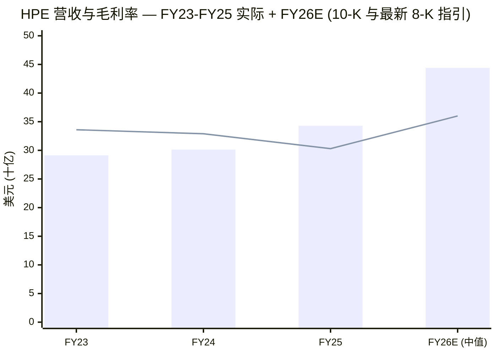
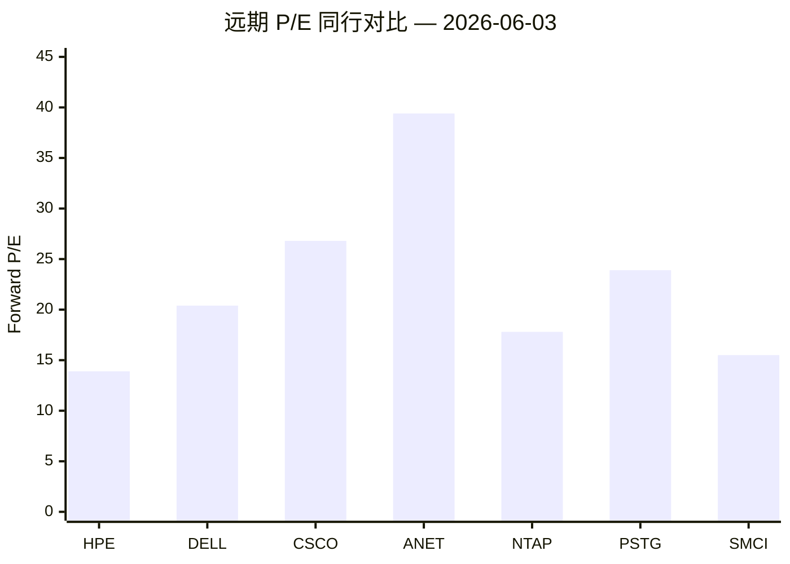
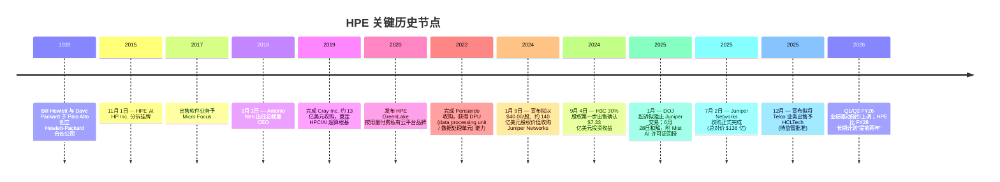
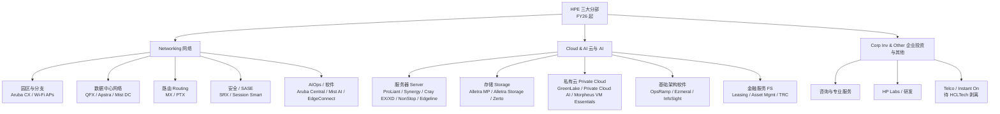
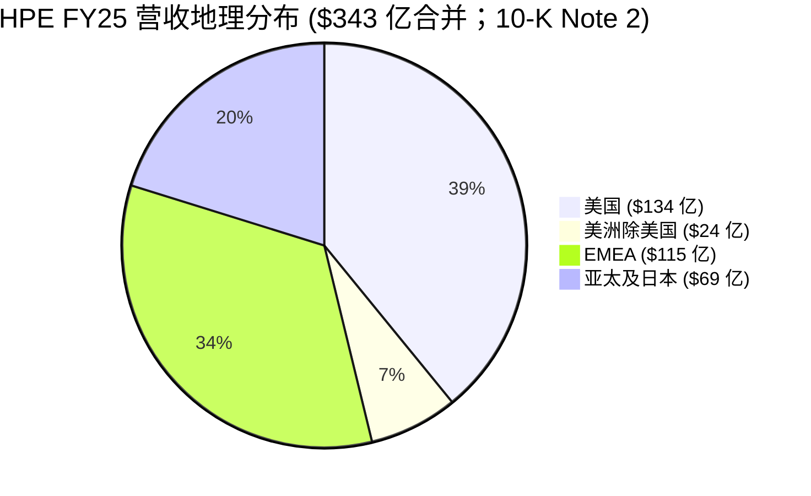
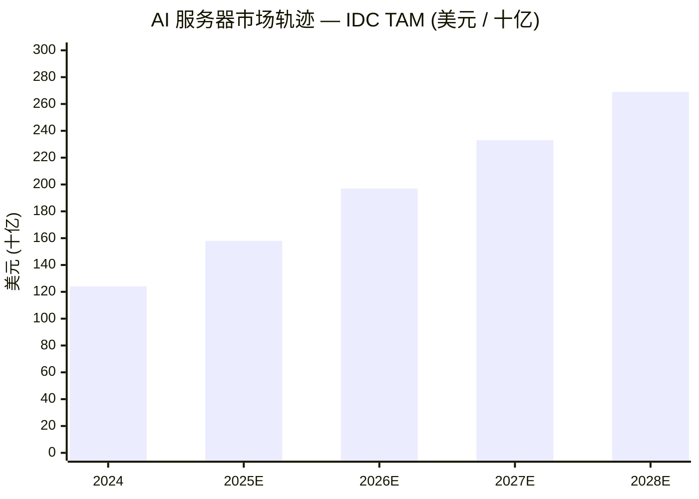
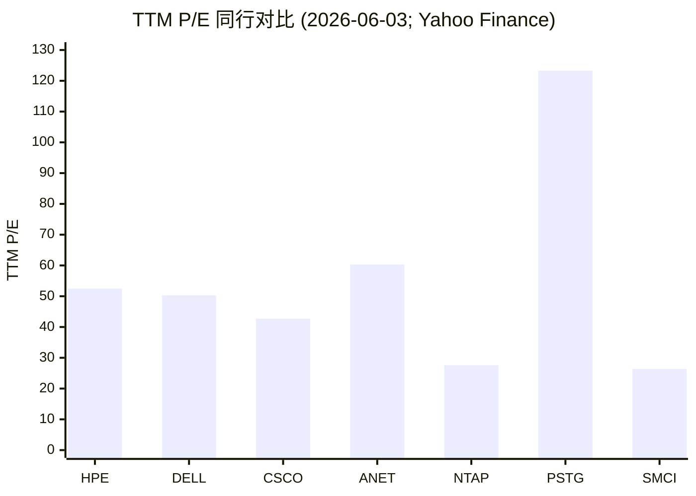
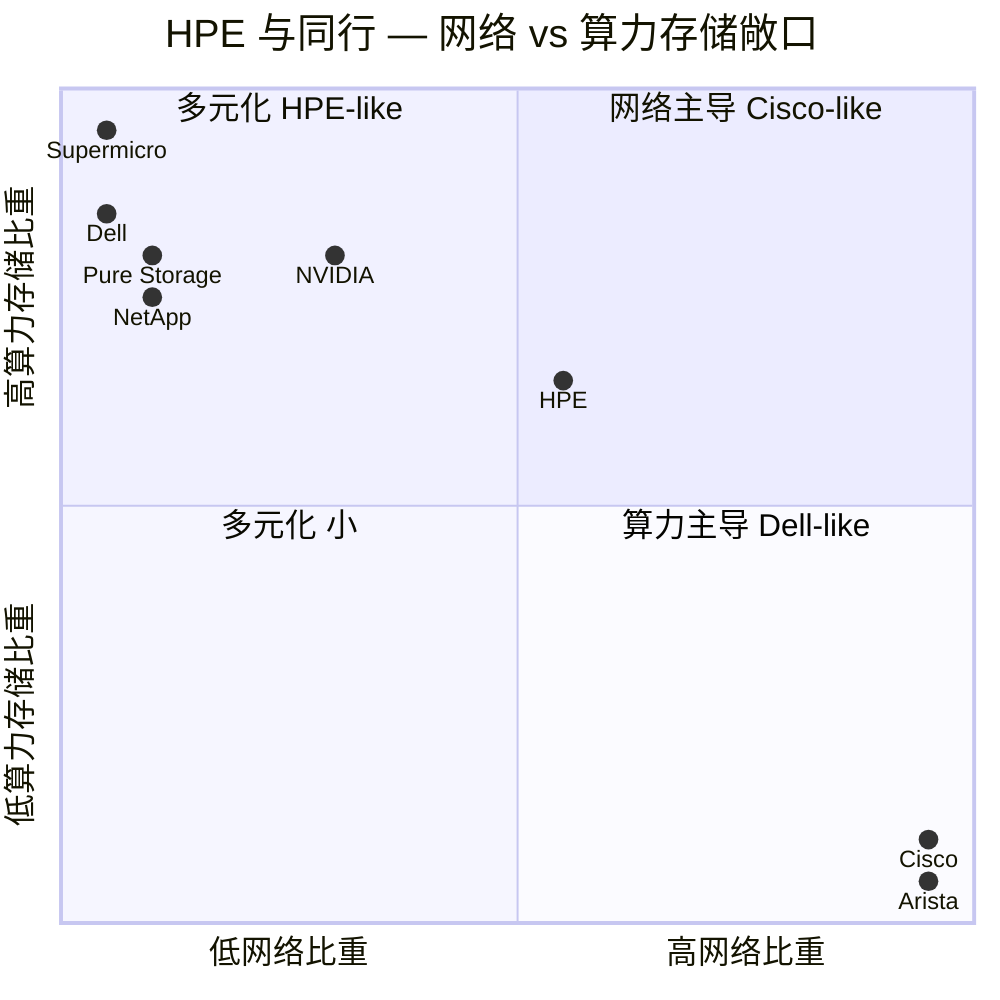
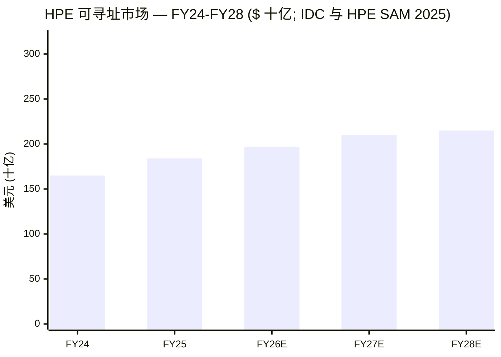
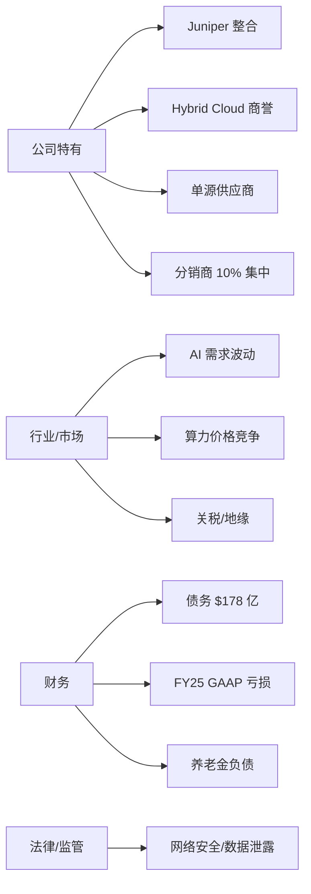

# 慧与公司 (Hewlett Packard Enterprise, NYSE: HPE) — 首次覆盖深度研究

**截至日期：2026-06-03** &nbsp; | &nbsp; **代码：NYSE: HPE** &nbsp; | &nbsp; **最新股价：56.15 美元** &nbsp; | &nbsp; **市值：约 744 亿美元** &nbsp; | &nbsp; **行业：企业 IT — 服务器、网络、存储、AI 基础设施** &nbsp; | &nbsp; **会计年度截止：10 月 31 日**

> **近期指引上调 — 三天前刚发布。** 2026 年 6 月 1 日 HPE 上调 FY2026 全年指引：营收增速从 22-25% 上调至 **29-33%**；网络部门 (Networking) 增速 **72-75%**；GAAP 营业利润增长 **885-930%**；GAAP 摊薄每股收益 **$2.42-$2.52**；非 GAAP 摊薄 EPS **$3.35-$3.45**；自由现金流 (free cash flow / 自由现金流) **不低于 35 亿美元**。新指引中非 GAAP EPS 与 FCF 的目标已**高于** 2025 年 10 月证券分析师大会 (Securities Analyst Meeting / 证券分析师会议) 公布的 FY28 长期财务目标 — 即"**比 2028 财年长期财务计划提前两年实现**"。来源：[HPE FY26 Q2 财报新闻稿，8-K 附件 99.1 — 2026 年 6 月 1 日](https://www.sec.gov/Archives/edgar/data/1645590/000164559026000052/ex-991x612026x8k.htm)。

---

## 目录

1. [公司概览](#1-公司概览)
2. [公司历史](#2-公司历史)
3. [管理团队](#3-管理团队)
4. [产品与服务](#4-产品与服务)
5. [客户与上市策略](#5-客户与上市策略)
6. [行业概览](#6-行业概览)
7. [竞争格局](#7-竞争格局)
8. [市场机会](#8-市场机会)
9. [风险评估](#9-风险评估)
10. [投资者视角评分卡](#10-投资者视角评分卡)
11. [参考资料](#参考资料)

---

## 1. 公司概览

慧与公司 (Hewlett Packard Enterprise Company, NYSE: HPE) 是 2015 年 11 月由原 Hewlett-Packard Company 一拆为二后形成的企业 IT (enterprise IT) 业务实体。FY25 10-K 报告 (2025 年 12 月 18 日提交) 这样描述自身："a global technology leader focused on developing intelligent solutions that allow customers to capture, analyze and act upon data seamlessly from edge to cloud" (即"从边缘到云端无缝捕捉、分析和响应数据的全球技术领导者")，客户范围"从中小企业 (SMB) 到大型全球企业及政府机构"，公司谱系可追溯至 "a partnership founded in 1939 by William R. Hewlett and David Packard" (1939 年由 William R. Hewlett 与 David Packard 创立的合伙公司) ([HPE FY25 10-K, Item 1 Business](https://www.sec.gov/Archives/edgar/data/1645590/000164559025000130/hpe-20251031.htm))。公司总部位于美国德州 Spring 市 1701 E. Mossy Oaks Road，2025 财年末 (2025 年 10 月 31 日) 全球员工约 **67,000 人**，FY25 营收 **343 亿美元** (同比 +13.8%)，自 FY26 第一季度起结构性调整为三大可报告分部 (reportable segment / 可报告分部) — **网络 (Networking)**、**云与 AI (Cloud & AI)**、**企业投资与其他 (Corporate Investments & Other)** ([HPE FY25 10-K, Note 2 — Segment Information 与 Subsequent Events](https://www.sec.gov/Archives/edgar/data/1645590/000164559025000130/hpe-20251031.htm))。

FY25 最关键的企业事件是 **2025 年 7 月 2 日 Juniper Networks 收购交易完成**：每股 $40.00、约 **134 亿美元现金对价** (含替代股权奖励合计 **136 亿美元总对价**)，资金来源为公司账上现金、商业票据 (commercial paper / 商业票据)、30 亿美元三年期延迟提取定期贷款 (delayed-draw term loan / 延迟提取定期贷款)、10 亿美元 364 天延迟提取定期贷款，以及 2024 年 9 月发行的 3,000 万股 7.625% C 系列强制可转换优先股 (Mandatory Convertible Preferred Stock / 强制可转换优先股) 净融资约 14.6 亿美元 ([HPE FY25 10-K, Note 10 Acquisitions and Dispositions](https://www.sec.gov/Archives/edgar/data/1645590/000164559025000130/hpe-20251031.htm); [HPE FY25 10-K, Note 15 Stockholders' Equity](https://www.sec.gov/Archives/edgar/data/1645590/000164559025000130/hpe-20251031.htm))。美国司法部 (DOJ) 于 2025 年 1 月起诉拟阻止该交易；双方于 2025 年 6 月底达成和解 — 即出售 Juniper 的 Mist AIOps 资产 (附许可证回授) 加若干行为补救措施 — 见 [Reuters, 2025-06-28](https://www.reuters.com/sustainability/boards-policy-regulation/hpe-says-it-has-reached-deal-with-doj-13-billion-juniper-acquisition-2025-06-28/) 与 [The Verge, 2025-06-28](https://www.theverge.com/news/694960/hpe-juniper-merger-doj-trial-settlement)。Juniper 在 7 月 2 日至 10 月 31 日的 4 个月并表期内贡献 **21 亿美元营收、4.19 亿美元分部利润** ([HPE FY25 10-K, Note 10](https://www.sec.gov/Archives/edgar/data/1645590/000164559025000130/hpe-20251031.htm))。

**FY26 新分部框架下的财务形态。** Q1 FY26 (截至 2026 年 1 月 31 日) 营收 **93 亿美元 (同比 +18%)**：Networking 27 亿美元 (+151.5%，其中 Juniper 路由器贡献近 10 亿美元，去年同期接近为零)、Cloud & AI 63 亿美元 (-2.7%)、Corporate Investments & Other 2.61 亿美元 ([HPE FY26 Q1 财报新闻稿，8-K 附件 99.1 — 2026 年 3 月 9 日](https://www.sec.gov/Archives/edgar/data/1645590/000164559026000028/ex-991x392026x8k.htm))。Q2 FY26 (截至 2026 年 4 月 30 日) 创历史新高：**107 亿美元营收 (同比 +40%)**、Networking 27 亿美元 (+148.2%)、Cloud & AI 77 亿美元 (+22.9%)、GAAP 毛利率 36.5% (同比 +810 bp) ([HPE FY26 Q2 财报新闻稿，8-K 附件 99.1 — 2026 年 6 月 1 日](https://www.sec.gov/Archives/edgar/data/1645590/000164559026000052/ex-991x612026x8k.htm))。Networking 内部，数据中心网络 (Data Center Networking) Q2 录得 3.20 亿美元 (+233.3%)，路由 (Routing) 录得 7.75 亿美元 (去年同期仅 100 万) — 这两项数字本质上反映了 Juniper MX/PTX 路由业务的体量。

*来源：FY23/FY24/FY25 营收与毛利率引自 [HPE FY25 10-K, Consolidated Statements of Earnings](https://www.sec.gov/Archives/edgar/data/1645590/000164559025000130/hpe-20251031.htm)；FY26 中值按 $343 亿 × (1+0.31) 计算，依据为 [HPE FY26 Q2 财报](https://www.sec.gov/Archives/edgar/data/1645590/000164559026000052/ex-991x612026x8k.htm) 中上调后的 29-33% 营收增速指引；FY26 毛利率约 36% 由 Q2 FY26 GAAP 36.5%/非 GAAP 36.9% 推算。*

**估值快照 (截至 2026-06-03，来源：Yahoo Finance — yfinance API 抓取)。** 股价 $56.15、市值 $744 亿、TTM P/E 52.5×、远期 P/E 13.9×、TTM P/S 1.92×、P/B 3.01×、企业价值 (EV) $903 亿、EV/EBITDA 15.9×、EV/Revenue 2.33×、股息率约 1.02% (季度现金股息于 Q2 FY26 由 $0.13 上调至 **$0.1425/股**、年化 $0.57 — 见 [HPE FY26 Q2 财报](https://www.sec.gov/Archives/edgar/data/1645590/000164559026000052/ex-991x612026x8k.htm))、贝塔 (beta) 1.30、52 周区间 $17.49 - $64.25、约 **67,000 全职员工** ([Yahoo Finance — HPE Key Statistics](https://finance.yahoo.com/quote/HPE/key-statistics/))。52 周区间宽是因为 2025 年初股价曾因 Juniper 反垄断诉讼一度跌至 $20 以下，6 月和解后回升，加上 Q1/Q2 FY26 营收同比 +18% / +40% 的强劲读数与指引上调，推动股价回到 52 周高位附近。

*分析师观点：TTM P/E ~52× 在跨期比较上不可类比，因为 FY25 GAAP 利润中包含 16.2 亿美元 Hybrid Cloud 商誉减值 (goodwill impairment / 商誉减值) 与 4.58 亿美元的收购处置费用，FY25 实际所得税率 120.0% 也反映了商誉减值不可抵税及合计 6.93 亿美元的并购相关税务优惠 ([HPE FY25 10-K MD&A](https://www.sec.gov/Archives/edgar/data/1645590/000164559025000130/hpe-20251031.htm))。基于 FY26 非 GAAP EPS 中值 $3.40 的远期 P/E 13.9× 才是更可比的衡量 — 显著低于网络同行 (Arista 39.4×、Cisco 26.8×)，对计算同行 (Dell 20.4×、NetApp 17.8×、SMCI 15.5×) 也有适度折价 (peer 数据见 [Yahoo Finance peer screens, 2026-06-03](https://finance.yahoo.com/quote/HPE/))。*

*来源：[Yahoo Finance, 2026-06-03](https://finance.yahoo.com/quote/HPE/) (yfinance API: `forwardPE`).*

---

## 2. 公司历史

Hewlett-Packard 合伙公司于 1939 年由 William R. Hewlett 和 David Packard 在加州 Palo Alto 一间车库创办，HPE FY25 10-K 明确将公司故事锚定于此：「Our legacy dates back to a partnership founded in 1939 by William R. Hewlett and David Packard, and we strive every day to uphold and enhance that legacy」(我们的血脉可追溯至 1939 年 Bill Hewlett 与 Dave Packard 创立的合伙企业，我们每日致力于守护和升华这份血脉) ([HPE FY25 10-K, Item 1 Business](https://www.sec.gov/Archives/edgar/data/1645590/000164559025000130/hpe-20251031.htm))。HPE 公司本身于 **2015 年 11 月 1 日**由原 Hewlett-Packard Company 通过免税分拆 (tax-free distribution / 免税分立) 形成，与 HP Inc. (打印机与个人电脑业务) 同时挂牌交易。10-K 至今仍载有相关风险条款："We continue to face a number of risks related to our separation from HP Inc., our former parent, including those associated with ongoing indemnification obligations" (我们仍然面临与从前母公司 HP Inc. 分立相关的多项风险，包括持续的赔偿义务) ([HPE FY25 10-K, Risk Factors Summary](https://www.sec.gov/Archives/edgar/data/1645590/000164559025000130/hpe-20251031.htm))。

FY23-FY25 期间，HPE 在两个转型项目 (Transformation Programs / 转型项目) 上分别累计支出 **8.23 亿美元** (Cost Optimization and Prioritization Plan) 与 **5.53 + 2.68 亿美元** (HPE Next Plan)，两个项目的主要内容已于 FY24 末基本完成 ([HPE FY25 10-K, Note 3 Transformation Programs](https://www.sec.gov/Archives/edgar/data/1645590/000164559025000130/hpe-20251031.htm))。2025 年 3 月 6 日董事会批准了新的 **Catalyst Cost Reduction Program (催化剂降本计划)**，旨在「reduce structural operating costs」(削减结构性运营成本)，CFO Marie Myers 在 Q1/Q2 FY26 财报会议上明确将其列为利润率上行的关键驱动 ([HPE FY25 10-K, MD&A](https://www.sec.gov/Archives/edgar/data/1645590/000164559025000130/hpe-20251031.htm); [HPE FY26 Q2 Earnings Release](https://www.sec.gov/Archives/edgar/data/1645590/000164559026000052/ex-991x612026x8k.htm))。

*来源：[HPE FY25 10-K](https://www.sec.gov/Archives/edgar/data/1645590/000164559025000130/hpe-20251031.htm); [HPE/Juniper 交易公告新闻稿, 2024-01-09](https://investors.hpe.com/news/news-details/2024/Hewlett-Packard-Enterprise-to-Acquire-Juniper-Networks-Accelerating-AI-Driven-Innovation/default.aspx); [Reuters, 2025-06-28 — DOJ 和解](https://www.reuters.com/sustainability/boards-policy-regulation/hpe-says-it-has-reached-deal-with-doj-13-billion-juniper-acquisition-2025-06-28/); [HPE Cray 收购公告, 2019](https://www.hpe.com/us/en/newsroom/press-release/2019/05/hewlett-packard-enterprise-to-acquire-supercomputing-leader-cray.html).*

---

## 3. 管理团队

**Antonio F. Neri — 总裁兼首席执行官 (2018 年 2 月 1 日起任职，58 岁，HPE 董事自 2018 年起)。** FY26 委托征集声明 (Proxy Statement / 委托征集声明) 的董事提名表显示，Neri 唯一兼任的外部上市公司董事为 Elevance Health, Inc.；HPE 将其行业经验列为「IT/Technology, Healthcare」 ([HPE 2026 Proxy Statement, p. 43](https://www.sec.gov/Archives/edgar/data/1645590/000164559026000019/hpe-20260210.htm))。HPE FY25 10-K 这样描述其职业生涯："Mr. Neri's experience includes nearly 30 years combined at HPE and Hewlett-Packard Company ('HP Co.') in various leadership positions … proven experience in developing transformative business models, building global brands, and driving sustained growth and expansion in the technology industry" ([HPE FY25 10-K, Item 1 Business — Our Strengths](https://www.sec.gov/Archives/edgar/data/1645590/000164559025000130/hpe-20251031.htm))。Neri 于 1995 年以欧洲、中东及非洲区客户服务工程师身份加入 HP，逐步晋升至 Enterprise Group；2015 年起任 Enterprise Group 总裁，2017 年获任 HPE 总裁，2018 年 2 月 1 日接替 Meg Whitman 出任 CEO，详细职业轨迹参见 [HPE 新闻室 — Antonio Neri 出任 CEO 公告, 2017-11-21](https://www.hpe.com/us/en/newsroom/press-release/2017/11/Hewlett-Packard-Enterprise-Appoints-Antonio-Neri-as-President.html)。委托征集声明披露，截至公告日 Neri 持有 **864,190 份时间归属限制性股票单位 (time-vested RSUs)** 与 **2,217,784 份业绩归属限制性股票单位 (performance-based RSUs；按 200% 最高归属计算)**，并强调"作为 HPE 雇员的董事 — 目前仅 CEO Antonio Neri — 不就董事会服务获取额外报酬" ([HPE 2026 Proxy Statement](https://www.sec.gov/Archives/edgar/data/1645590/000164559026000019/hpe-20260210.htm))。10-K 中"Experienced leadership team"一段实质上就是 Neri 的人物画像；无需另撰创始人专章 — 1939 年的两位合伙人均已过世，HPE 公司主体亦仅于 2015 年从原 HP 公司分立而生。

**创始人备注 (1939 年合伙关系 — 仅作历史背景)。** Bill Hewlett (1913-2001 年，斯坦福电气工程学士及硕士，MIT 电气工程 1936 年) 与 Dave Packard (1912-1996 年，斯坦福工商管理学士与硕士) 于 1939 年在 Palo Alto 一间车库以 $538 流动资金创办 HP，首个产品是 HP 200A 音频振荡器 (audio oscillator)。10-K 仅简述："Our legacy dates back to a partnership founded in 1939 by William R. Hewlett and David Packard" ([HPE FY25 10-K, Item 1 Business](https://www.sec.gov/Archives/edgar/data/1645590/000164559025000130/hpe-20251031.htm))。两位创始人皆于 2015 年分拆前过世，对今日 HPE 公司主体无任何参与。两人确立的「HP Way」管理哲学 — 分权管理、利润共享、走动式管理 (management-by-walking-around) — 在公司内部仍作文化引用，10-K 人力资本一段写道："we have identified four key cultural beliefs: accelerating what's next, bold moves, the 'power of yes we can,' and being a force for good" ([HPE FY25 10-K, Human Capital](https://www.sec.gov/Archives/edgar/data/1645590/000164559025000130/hpe-20251031.htm))，但运营层面无创始人参与。

---

## 4. 产品与服务

HPE 自 FY26 起按三大可报告分部销售 — **Networking、Cloud & AI、Corporate Investments & Other** — 总和涵盖服务器系统、存储、私有云、网络硬件/软件、IT 融资服务、超算、咨询等领域。FY25 10-K 的法律性描述仍采用 FY25 的五分部框架 (Server / Hybrid Cloud / Networking / Financial Services / Corporate Investments & Other)，故下文将 FY25 各产品族与 FY26 所属分部一并标示。

### 4.1 Cloud & AI 分部 (FY26) — Server + Hybrid Cloud + Financial Services

10-K 中 Server 分部原文："The Server segment consists of general-purpose servers for multi-workload computing, workload-optimized servers to deliver the best performance and value for demanding applications, and integrated systems comprised of software and hardware designed to address High-Performance Computing and Supercomputing (including exascale applications), AI, Data Analytics, and Transaction Processing workloads for government and commercial customers globally. This portfolio of products includes the secure and versatile HPE ProLiant Rack and Tower servers; HPE Synergy, a composable infrastructure for traditional and cloud-native applications; HPE Scale Up Servers product lines for critical applications, including large enterprise software applications and data analytics platforms; HPE Edgeline servers; HPE Cray EX; HPE Cray XD (formerly known as HPE Apollo); and HPE NonStop." ([HPE FY25 10-K, Item 1 Business — Server](https://www.sec.gov/Archives/edgar/data/1645590/000164559025000130/hpe-20251031.htm))。

**中文释义 / Plain-language gloss：** ProLiant 机架式/塔式服务器 (Rack/Tower Server) 是 HPE 走量的 x86 商用平台；Synergy 是可组合基础架构 (composable infrastructure / 可组合基础架构)，通过软件将计算资源池化并按工作负载重新映射；Cray EX 与 Cray XD 是 E 级 (exascale / 百亿亿次) 超算级机型 (例如 Frontier 与 Aurora 系列)，源自 2019 年的 Cray 收购；HPE Edgeline 是工业级边缘服务器；NonStop 是承袭原 Tandem 的容错事务处理 (transaction processing / 事务处理) 平台。研发段落明确点出"fanless direct liquid cooling that power our largest AI systems" (无风扇直接液冷 / direct liquid cooling) — 即 Frontier 与 El Capitan E 级系统所采用的冷却架构 ([HPE FY25 10-K, Research and Development](https://www.sec.gov/Archives/edgar/data/1645590/000164559025000130/hpe-20251031.htm))。

10-K 中 Hybrid Cloud 分部原文："The Hybrid Cloud segment offers a wide variety of cloud-native and hybrid solutions across storage, private cloud, and the infrastructure software-as-a-service ('SaaS') space. Storage includes data storage and data management offerings with the HPE Alletra Storage portfolio; unstructured data solutions and analytics for AI; data protection and archiving; and storage networking. … In private cloud, the HPE GreenLake offerings include new cloud-native offerings and capabilities for virtual machines, containers, and bare metal; a full suite of private cloud offerings that enable customers to self-manage or choose a fully managed experience; and a portfolio of world-class Private Cloud AI infrastructure delivered as-a-service. … Infrastructure software includes monitoring and observability for day two operations and beyond through our acquisition of OpsRamp and unified data access through HPE Ezmeral Data Fabric." ([HPE FY25 10-K, Item 1 Business — Hybrid Cloud](https://www.sec.gov/Archives/edgar/data/1645590/000164559025000130/hpe-20251031.htm))。

**中文释义 / Plain-language gloss：** Alletra 是 HPE 的闪存 (flash storage / 闪存存储) 平台，10-K 明确将其定位为"a transition to proprietary HPE-developed storage solutions that enhance profitability and reduce reliance on third-party products" (转向 HPE 自研存储以提升盈利能力并降低对第三方产品的依赖) ([HPE FY25 10-K, Our Strategy](https://www.sec.gov/Archives/edgar/data/1645590/000164559025000130/hpe-20251031.htm)) — 即逐步摆脱 Nimble / 3PAR 时代 OEM 的经济结构。GreenLake 是按用量计费 (consumption-based / 按用量计费) 的私有云壳，被 HPE 描述为「centerpiece of our strategy」(战略中枢)；HPE Private Cloud AI 是 GreenLake + 英伟达 (NVIDIA) 加速器 + 精选 AI 软件栈打包的「AI 工厂」一站式方案。Ezmeral 是基于 Kubernetes 的数据编织 (data fabric / 数据编织) 栈；Zerto 是灾备 (disaster recovery / 灾备) 收购；HPE InfoSight 与 CloudPhysics 是 AIOps (运维 AI) 遥测层。

10-K 中 Financial Services 分部原文："The Financial Services ('FS') segment provides flexible investment solutions, such as leasing, financing, IT consumption, utility programs, and asset management services for customers that facilitate unique technology deployment models and the acquisition of complete IT solutions, including hardware, software, and services from Hewlett Packard Enterprise and others. The FS segment also supports financial solutions for on-premise flexible consumption models, such as the HPE GreenLake cloud." ([HPE FY25 10-K, Item 1 Business — Financial Services](https://www.sec.gov/Archives/edgar/data/1645590/000164559025000130/hpe-20251031.htm))。FY25 末 FS 业务的总组合资产 $134 亿、净额 $132 亿、债务权益比 (debt-to-equity / 债务权益比) **7.0×**、储备覆盖率 1.8%；FY25 融资总量 (financing volume) $54.75 亿 (同比 -17.2%) ([HPE FY25 10-K, MD&A — Portfolio Assets and Ratios](https://www.sec.gov/Archives/edgar/data/1645590/000164559025000130/hpe-20251031.htm))。FS 即捕获式 (captive / 捕获式) 融资业务，与 IBM Global Financing、Dell Financial Services、Cisco Capital 同类 — 这是 HPE 区别于纯硬件同行的结构性差异化。

### 4.2 Networking 分部 (FY26) — Aruba + Juniper 全栈

10-K 中 Networking 分部原文："The Networking segment develops and sells high-performance networking and security products and services that empower customers of all sizes to build scalable, reliable, secure, agile, and efficient automated networks. Our platforms are purpose-built using AI to deliver secure and sustainable user experiences from the edge to the data center and cloud. Our solutions include hardware products, such as Wi-Fi and private cellular access points; QFX, EX, and CX switches; MX and PTX routers; and gateways. Additionally, HPE provides software products, such as Mist and Aruba Central for cloud-based and on-premise management, network access control, software-defined wide area networking, network security, analytics and assurance, and private cellular core software." ([HPE FY25 10-K, Item 1 Business — Networking](https://www.sec.gov/Archives/edgar/data/1645590/000164559025000130/hpe-20251031.htm))。

**中文释义 / Plain-language gloss (后 Juniper 整合产品组合)：** 收购前 Aruba 三条主要产品线包括 CX 数据中心/园区交换机 (switch / 交换机)、Aruba Central (云管网络 SaaS)、Aruba 接入点 (access point) 与边缘服务平台 (EdgeConnect SD-WAN / 软件定义广域网, ClearPass NAC / 网络访问控制)。Juniper 带来互补的栈：QFX 与 EX 是 Juniper 的数据中心与企业以太网 (Ethernet / 以太网) 交换机；MX 与 PTX 是 Juniper 的运营商级 (service provider / 运营商) 路由平台 (MX 是超大规模数据中心和电信运营商使用的边缘路由主力，PTX 是 400G/800G 核心路由级别)；Mist 是 Juniper 的 AI 驱动云管 Wi-Fi 与保障产品 (即 DOJ 初判要求许可授权竞争对手的资产 — 见第 9 章)；Apstra 是基于意图 (intent-based) 的数据中心网络自动化工具；Session Smart 是 128 Technology 收购带来的 SD-WAN 平台。10-K 明确战略逻辑为「full networking technology stack」 (全栈网络技术堆栈)，跨越「campus and branch, data center switches, wide-area routing, and secure access services edge ('SASE') solutions」(园区与分支、数据中心交换、广域路由、SASE / 安全访问服务边缘)，并以「AIOps」(AI for Networks) 贯穿全栈 ([HPE FY25 10-K, Item 1 Business — Our Strengths](https://www.sec.gov/Archives/edgar/data/1645590/000164559025000130/hpe-20251031.htm))。

FY26 新分部框架下 Juniper 效应数字化体现：Q1 FY26 (新框架下首季)，Networking 营收 **27 亿美元 (同比 +151.5%)** — 园区与分支 12 亿 (+42.0%)、数据中心网络 4.44 亿 (+382.6%)、安全 2.55 亿 (+114.3%)、路由 **7.80 亿 vs 去年同期 100 万** — 最后一项实质上度量了 Juniper MX/PTX 路由业务的规模，因为 Aruba 此前无明显路由布局 ([HPE FY26 Q1 财报新闻稿](https://www.sec.gov/Archives/edgar/data/1645590/000164559026000028/ex-991x392026x8k.htm))。Q2 FY26 类似：Networking 27 亿 (+148.2%)、Routing $775 m vs $1 m 同比 ([HPE FY26 Q2 财报新闻稿](https://www.sec.gov/Archives/edgar/data/1645590/000164559026000052/ex-991x612026x8k.htm))。

### 4.3 Corporate Investments & Other (FY26)

10-K 原文："The Corporate Investments and Other segment includes the Advisory and Professional Services business, which primarily offers consultative-led services, HPE and partner technology expertise and advice, implementation services as well as complex solution engagement capabilities, and Hewlett Packard Labs, which is responsible for research and development." ([HPE FY25 10-K, Item 1 Business](https://www.sec.gov/Archives/edgar/data/1645590/000164559025000130/hpe-20251031.htm))。自 FY26 Q1 起，原属 Networking 的 Telco 与 Instant On 业务被转入此分部 ([HPE FY25 10-K, Segment Realignments](https://www.sec.gov/Archives/edgar/data/1645590/000164559025000130/hpe-20251031.htm))；与此同时 HPE 于 2025 年 12 月宣布拟将 **Telco 业务出售予 HCLTech** ([HPE FY25 10-K, MD&A — Pending Divestiture of Telco](https://www.sec.gov/Archives/edgar/data/1645590/000164559025000130/hpe-20251031.htm))，因此 Telco 归属本分部仅是过渡安排，待监管批准后剥离。

### 4.4 产品组合树

*来源：[HPE FY25 10-K, Item 1 Business 与 Subsequent Events — Pending Divestiture of Telco](https://www.sec.gov/Archives/edgar/data/1645590/000164559025000130/hpe-20251031.htm); [HPE FY26 Q1 财报新闻稿](https://www.sec.gov/Archives/edgar/data/1645590/000164559026000028/ex-991x392026x8k.htm).*

### 4.5 战略综合 — 三大分部如何交互

10-K 的战略叙事将整个产品组合环绕 AI 数据中心建设周期。**Networks for AI** (高性能网络结构 / fabric，使 GPU 训练与推理集群空转最小化) 与 **AI for Networks** (用机器学习处理遥测数据来运维网络) 共同支撑 Networking 分部；Cloud & AI 分部提供 GPU/CPU 算力 (ProLiant 服务器、Cray EX 超算用于主权 AI 与超大企业 AI)、存储层 (Alletra MP, Ezmeral 用于 AI 非结构化数据 fabric) 与按用量消费壳 (GreenLake, HPE Private Cloud AI)。FS 承担超大单据 — 主权 AI 建设项目动辄 1-10 亿美元、客户需要分期付款支撑 — 的融资角色。10-K 研发段落明确串起这条链："Our R&D efforts in the realm of AI are particularly robust, with new server solutions designed for AI inference engines and integrated into HPE Private Cloud AI for inferencing, retrieval augmented generation, and model fine-tuning. Large-scale model training and tuning, including natural language processing, large language models, and multi-modal training for models with trillions of parameters are supported by our leading AI solutions. These efforts are bolstered by the development of high-performance computing tools, cloud-native and scalable cluster management software, and transaction processing software, which have been instrumental in achieving our milestone of delivering the world's first exascale supercomputer." ([HPE FY25 10-K, Research and Development](https://www.sec.gov/Archives/edgar/data/1645590/000164559025000130/hpe-20251031.htm))。FY25 研发支出 **25 亿美元** (FY24 22 亿，FY23 23 亿) — 增量部分反映 4 个月 Juniper 并表与 AI 投入并行 ([HPE FY25 10-K, Research and Development](https://www.sec.gov/Archives/edgar/data/1645590/000164559025000130/hpe-20251031.htm))。

*分析师观点：HPE 的结构性利润率问题在于 — 当 Juniper 较低毛利率的运营商路由业务稀释 Aruba 较高毛利率的无线产品时，Networking 能否保住历史上接近 25% 的营业利润率 (FY24 24.6%，FY23 25.0%，见 [Networking 分部表 FY25 10-K](https://www.sec.gov/Archives/edgar/data/1645590/000164559025000130/hpe-20251031.htm))？Q1/Q2 FY26 (23.7% 然后 21.6% 网络营业利润率) 的读数确认这种「混合稀释」(mix-down) 真实存在，但该分部仍是组合中最盈利的板块。*

---

## 5. 客户与上市策略

### 5.1 客户集中度 (合并口径，明确分母)

FY25 10-K Major Customers 脚注原文："**The Company had one distributor which represented approximately 10% of the Company's total net revenue in fiscal 2025**, primarily within the Server and Networking segments. The Company had two distributors which represented approximately 14% and 11% of the Company's total net revenue in fiscal 2024, primarily within the Networking and Server segments. The Company had one customer, which is a distributor, that represented 11% of the Company's total net revenue in fiscal 2023, primarily within the Networking and Server segments." (FY25 单一分销商占合并营收约 10%，主要落在 Server 与 Networking；FY24 两家分销商分别占 14%、11%；FY23 一家分销商占 11%) ([HPE FY25 10-K, Note 2 — Major Customers](https://www.sec.gov/Archives/edgar/data/1645590/000164559025000130/hpe-20251031.htm))。10-K **并未** 点名该分销商，但根据行业惯例与 HPE 历史渠道分布，业内通常推断为 **TD SYNNEX Corp** (TD SYNNEX 自身 10-K 也披露 "HPE is one of our top vendors" — [TD SYNNEX FY25 10-K Item 1, p. 8](https://www.sec.gov/cgi-bin/browse-edgar?action=getcompany&CIK=0001177394&type=10-K&dateb=&owner=include&count=40))。10-K 没有披露任何**终端客户** (而非分销商) 达到 ≥10% 门槛 — 这符合 ASC 280-10-50-42 大客户披露规则，意味着主权 AI、超大规模云厂商 (hyperscaler / 超大规模云厂商)、联邦机构等终端客户在 HPE 合并 $343 亿营收基础上均未达到 10% 单一客户阈值。

第二维度集中风险 — **地理** — 也已披露：FY25 美国营收 $134.02 亿 (合并 39.1%)、美洲除美国 $24.46 亿 (7.1%)、EMEA $115.10 亿 (33.6%)、亚太及日本 $69.38 亿 (20.2%)；「FY25、FY24、FY23 三个会计年度内除美国外，没有任何单一国家占公司营收超 10%」 ([HPE FY25 10-K, Note 2 — Geographic Information](https://www.sec.gov/Archives/edgar/data/1645590/000164559025000130/hpe-20251031.htm))。**FY25 约 61% 营收来自美国境外** ([HPE FY25 10-K, Item 1 Business — International](https://www.sec.gov/Archives/edgar/data/1645590/000164559025000130/hpe-20251031.htm))。

*来源：[HPE FY25 10-K, Note 2 — Segment Information / Geographic Information](https://www.sec.gov/Archives/edgar/data/1645590/000164559025000130/hpe-20251031.htm).*

### 5.2 客户细分

10-K 将终端客户细分为「small-and-medium-sized businesses to large global enterprises and governmental entities」 ([HPE FY25 10-K, Item 1 Business](https://www.sec.gov/Archives/edgar/data/1645590/000164559025000130/hpe-20251031.htm))。从购买行为看，HPE 客户基础大致分为四类：

1. **超大规模云厂商与主权 AI 买家** — 数亿美元起的 AI 服务器大单 (10-K 风险因素章节明确："Sales of AI systems to such customers have caused, and may continue to cause, fluctuations in our results of operations, as such large orders may occur in some periods and not others" — [HPE FY25 10-K, Risk Factors — uneven sales cycle](https://www.sec.gov/Archives/edgar/data/1645590/000164559025000130/hpe-20251031.htm))。代表合作包括 xAI 集群项目 (2024 年 10 月 HPE [新闻稿](https://www.hpe.com/us/en/newsroom/press-release/2024/10/hpe-and-xai-announce-new-collaboration-to-power-grok.html)) 与多个国家级超算 (橡树岭实验室 Frontier、劳伦斯利弗莫尔 El Capitan、阿贡国家实验室 Aurora — 皆通过 Cray 业务线交付)。
2. **大型企业** — Global 2000 IT 部门跨地理同时部署 ProLiant + Alletra + Aruba + GreenLake，典型 3 年以上 ELA (企业许可协议) 合同结构，由 HPE FS 提供融资。
3. **中型市场与 SMB** — 主要通过渠道间接服务；10-K 明确"a channel-only model in the remaining countries" (在 HPE 无直销布局的国家采用纯渠道模型)。
4. **联邦与公共部门** — 美国联邦 (DOE 超算、DoD 计算)、英国国防部、德国联邦政府、EMEA 中央政府等大客户敞口显著；10-K 单列政府合同风险："Contracts with federal, state, provincial, and local governments are subject to a number of challenges and risks" ([HPE FY25 10-K, Risk Factors Summary](https://www.sec.gov/Archives/edgar/data/1645590/000164559025000130/hpe-20251031.htm))。

### 5.3 上市与销售模型 (Go-to-market)

10-K 原文："We manage our business and report our financial results based on the segments described above. Our customers are organized by commercial and large enterprise groups, including business and public sector enterprises, and purchases of our products, solutions and services may be fulfilled directly through us or indirectly through a variety of partners, including: resellers … distribution partners … master area partners … original equipment manufacturers (OEMs) … independent software vendors … systems integrators … and advisory firms." (经销商、分销商、主区域伙伴、OEM、独立软件供应商 ISV、系统集成商、咨询顾问) ([HPE FY25 10-K, Sales, Marketing, and Distribution](https://www.sec.gov/Archives/edgar/data/1645590/000164559025000130/hpe-20251031.htm))。HPE 明确采用「combined go-to-market model」(直销+渠道混合模式)：「in which we have a direct sales presence in a number of countries, while we sell and deliver our products, solutions, and services through a channel-only model in the remaining countries」(部分国家直销+其余国家纯渠道)。直销区由大客户经理 (account manager) 加产品专家小组覆盖；中小客户通过商业经销商关系覆盖 ([HPE FY25 10-K, Sales, Marketing, and Distribution](https://www.sec.gov/Archives/edgar/data/1645590/000164559025000130/hpe-20251031.htm))。

### 5.4 销售周期 — 大型 AI 订单具有显著的波动性

风险因素章节解释 GAAP 营收读数为何波动："Long sales and implementation cycles for our offerings and dynamics related to large orders may cause our revenues and operating results to vary significantly from quarter-to-quarter … In some of our businesses, our quarterly sales have periodically reflected a pattern in which a disproportionate percentage of each quarter's total sales occurs towards the end of the quarter. … Larger orders, including some orders for our AI systems, may be particularly susceptible to this risk." ([HPE FY25 10-K, Risk Factors — Long sales and implementation cycles](https://www.sec.gov/Archives/edgar/data/1645590/000164559025000130/hpe-20251031.htm))。结果：FY25 HPE 在手订单 (backlog) 中 AI 暴露显著 (10-K Backlog 段落："AI systems demand in the midst of persisting data center space availability constraints continued to drive significant AI backlog" — AI 系统需求在数据中心空间持续紧张的背景下推动 AI 订单积压持续走高，见 [HPE FY25 10-K, Backlog](https://www.sec.gov/Archives/edgar/data/1645590/000164559025000130/hpe-20251031.htm))，但收入确认时间「不平均」。

---

## 6. 行业概览

HPE 经营三个相互关联的子行业：**企业算力与存储**、**企业/数据中心网络**、**捕获式 IT 融资**。统一叙事 — 管理层在 10-K 中反复强调 — 是 AI 数据中心建设周期重塑企业基础设施经济。

**企业 / 数据中心算力 (NAICS 334111, 511210)。** 全球服务器营收 2024 年约 2,900 亿美元 (IDC Server Tracker)，AI 服务器单机 ASP (平均售价 / average unit price) 快速上行带动总量同比大幅增长：IDC 报告 2024 年 AI 服务器供应商营收约 1,240 亿美元，并预测 2028 年达约 2,690 亿美元 ([IDC press release — 2024 AI server market, 2025-03-11](https://www.idc.com/getdoc.jsp?containerId=prUS53374325))。HPE FY25 服务器分部营收 $177.45 亿 (同比 +10.2%) — 增长结构为 **AUP (平均售价) 提升 $25.56 亿 (+20.1%)，部分被销量下降 $8.27 亿 (-6.5%) 抵消** — 即 AI 服务器 ASP 主导，并非数量驱动 ([HPE FY25 10-K, MD&A — Server](https://www.sec.gov/Archives/edgar/data/1645590/000164559025000130/hpe-20251031.htm))。IDC 行业数字与 HPE 分部表均确认：这是一轮 ASP 主导、AI 驱动的周期，而非数量驱动。

**企业网络 (Enterprise networking)。** 2024 年全球企业网络市场约 630 亿美元 (Gartner Magic Quadrant 与 Dell'Oro 分项跟踪)；AI 数据中心网络为增速最快子领域 — [Dell'Oro Group — AI 后端网络 >50% CAGR, 2025-09-23](https://www.delloro.com/news/data-center-switch-ai-back-end-networks-cagr/) 预测 AI 后端网络结构 (back-end fabric) 至 2029 年将超过 800 亿美元。HPE 在该领域与 Arista (Arista Q1 2026 业绩会披露 AI 后端 fabric 季度营收已达约 12 亿美元规模)、NVIDIA (Spectrum-X + Mellanox InfiniBand)、Cisco (Silicon One + Nexus 9000) 直接竞争。10-K 明确将「AI for Networks」(AIOps) 与「Networks for AI」(高性能 fabric) 列为 HPE 在该市场的双重产品定位。

**IT 服务 / 融资。** 捕获式融资 (captive finance / 捕获式融资) 垂直市场较为成熟、集中度高 — HPE FS、Dell Financial Services、IBM Global Financing、Cisco Capital。FS FY25 融资总量 $54.75 亿 ([HPE FY25 10-K, MD&A — Financing Volume](https://www.sec.gov/Archives/edgar/data/1645590/000164559025000130/hpe-20251031.htm)) 与 Dell Financial Services、IBM Global Financing 在同一数量级。

*来源：[IDC press release — Worldwide AI Server Market Forecast, 2025-03-11](https://www.idc.com/getdoc.jsp?containerId=prUS53374325)。2025E-2027E 中间年点由 2024 实际值与 IDC 的 2028 预测按几何均值插值。*

**需求侧大趋势 (HPE 自述)。** 10-K 明确："Over the last several years, HPE has observed megatrends around networking, cloud, data, and artificial intelligence ('AI') emerging to shape customer expectations for enterprise technology. The megatrends are ushering in long-lasting changes to how enterprises are consuming technology and setting up their IT infrastructures, including accelerating implementation of AI and hybrid multi-cloud adoption." ([HPE FY25 10-K, Item 1 Business — Our Strategy](https://www.sec.gov/Archives/edgar/data/1645590/000164559025000130/hpe-20251031.htm))。这些判断并非新颖，但与 FY26 三大分部对应清晰：Networks for AI (Networking 分部)、AI 工厂 / Private Cloud AI (Cloud & AI 分部)、按用量消费壳 (GreenLake / FS 融资)。

**供给侧顶板。** 三大结构性约束限制可寻址机会：(1) NVIDIA / AMD 的 GPU 供给仍是 2026 年 AI 服务器单位数量的主要瓶颈 ([HPE FY25 10-K Backlog](https://www.sec.gov/Archives/edgar/data/1645590/000164559025000130/hpe-20251031.htm))；(2) 数据中心电力可获得性是次级约束，越来越多决定哪些项目能落地 ([Bloomberg, 2025-09-19 — 数据中心电力](https://www.bloomberg.com/news/articles/2025-09-19/data-centers-electricity-shortage-ai))；(3) 主权 AI 采购时点受政策驱动 (欧盟 AI 法案、美国 CHIPS 法案后续、中东国家 AI 基金时序)，年度波动较大。

---

## 7. 竞争格局

### 7.1 各分部主要竞争对手 (引自 10-K 原文)

**Server。** 10-K Competition 原文："Our primary competitors in data center infrastructure are technology vendors, such as Dell Technologies Inc., Super Micro Computer, Inc., Cisco Systems, Inc., and Lenovo Group Ltd. In certain regions, we also experience competition from local companies and from generically branded or 'white-box' manufacturers. Our primary competitors in high-performance infrastructure include technology vendors that can design and build solutions that deliver performance scalability and the connectivity necessary to handle super-compute and exascale workloads, such as Dell Technologies Inc., Super Micro Computer, Inc., Lenovo Group Ltd., Fujitsu Network Communications, Inc., and Atos Information Technology Incorporated." ([HPE FY25 10-K, Item 1 Business — Competition](https://www.sec.gov/Archives/edgar/data/1645590/000164559025000130/hpe-20251031.htm))。

**Hybrid Cloud (FY26 起并入 Cloud & AI)。** 原文："Our primary competitors are other infrastructure and cloud management software technology vendors, such as Broadcom, Cisco Systems Inc., Dell Technologies Inc., IBM, NetApp Inc., Nutanix, and Pure Storage and public cloud vendors like Amazon Web Services, Google Cloud, and Microsoft Azure." ([HPE FY25 10-K, Item 1 Business — Competition](https://www.sec.gov/Archives/edgar/data/1645590/000164559025000130/hpe-20251031.htm))。

**Networking。** 原文："Our primary competitors are technology vendors, such as Cisco Systems, Inc., Arista Networks Inc, Nokia Corporation, Huawei Technologies Co. Ltd., Ciena Corporation, NVIDIA Corporation, Extreme Networks, Inc., Palo Alto Networks, Fortinet, Inc., Zscaler, Inc., Netskope, Inc., Ruckus Networks, and Ubiquiti and networking-as-a-service vendors such as Nile and Meter." ([HPE FY25 10-K, Item 1 Business — Competition](https://www.sec.gov/Archives/edgar/data/1645590/000164559025000130/hpe-20251031.htm))。

**Financial Services。** 原文："Financial Services primarily competes with captive financing companies, such as IBM Global Financing, Dell Financial Services, and Cisco Capital, as well as banks and other financial institutions." ([HPE FY25 10-K, Item 1 Business — Competition](https://www.sec.gov/Archives/edgar/data/1645590/000164559025000130/hpe-20251031.htm))。

### 7.2 同行对比框架

最相关的对标范围：

- **Cloud & AI 分部对比 Dell ISG、IBM、Lenovo、Supermicro、NetApp、Pure Storage** — 重叠领域包括企业算力、存储、超融合 (hyperconverged / 超融合)、服务器融资。Dell 是 x86 服务器与 PowerStore 存储最直接对手；SMCI 是 AI 服务器白牌 (white-box) 对手；NetApp 与 Pure 是企业闪存对手；Nutanix 是超融合软件对手。
- **Networking 分部对比 Cisco、Arista、NVIDIA、Palo Alto、Fortinet、Zscaler、Extreme Networks、华为** — Cisco 范围最广 (园区、数据中心、SD-WAN、安全)；Arista 是 AI 数据中心 fabric 最直接对手；NVIDIA 是 Spectrum-X / InfiniBand 后端 fabric 对手；Palo Alto / Fortinet / Zscaler 是 SASE / 下一代防火墙 (NGFW) 对手。

*来源：[Yahoo Finance, 2026-06-03](https://finance.yahoo.com/quote/HPE/) (yfinance API: `trailingPE`).*

*分析师观点：后 Juniper 时代的 HPE 是最为平衡的全栈竞争者 — 既非纯网络 (Cisco, Arista)，也非纯算力存储 (Dell, SMCI)。战略赌注是「捆绑网络 + 算力 + 存储 + 融资」能赢得企业多供应商 IT 预算整合周期。来源：综合 [HPE FY25 10-K 各分部营收](https://www.sec.gov/Archives/edgar/data/1645590/000164559025000130/hpe-20251031.htm) (Networking 20% FY25 营收、Server 52%、Hybrid Cloud 17%) 与同行 10-K ([Cisco FY25 年报](https://www.cisco.com/c/dam/en_us/about/annual-report/cisco-annual-report-2025.pdf)、[Dell FY25 10-K](https://investors.delltechnologies.com/financial-information/sec-filings)).*

### 7.3 差异化能力

10-K 列出 HPE 的八项「Our Strengths」；其中真正作为护城河 (而非普适能力如「强研发」、「资深管理」) 的四项：

1. **后 Juniper 时代的 AI 原生网络领导地位** — 「With the acquisition of Juniper Networks, HPE now has a full-stack portfolio spanning campus and branch, data center switches, wide-area routing, and secure access services edge ('SASE') solutions」 ([HPE FY25 10-K, Item 1 Business — Our Strengths](https://www.sec.gov/Archives/edgar/data/1645590/000164559025000130/hpe-20251031.htm))。全栈定位 (从路由到 Wi-Fi) 只有 Cisco 与现在的 HPE 能够主张；Arista 缺乏 Wi-Fi 与 SASE；独立 Juniper 缺乏 Wi-Fi (Mist 仅为螺栓收购)；华为在美国与大部分 EMEA 受市场准入限制。
2. **HPE GreenLake 消费壳 + Private Cloud AI 一站式** — 「As a centerpiece of our strategy, [HPE GreenLake] accelerates multi-generation IT transformation through a unified cloud-native and AI-driven experience」 ([HPE FY25 10-K, Item 1 Business — Our Strategy](https://www.sec.gov/Archives/edgar/data/1645590/000164559025000130/hpe-20251031.htm))。按用量计费模式直接挑战公有云厂商在「AI 数据中心即服务」问题上的地位。
3. **Cray 超算 (supercomputing) 遗产** — 「With decades of large-scale infrastructure expertise defining our offerings, including technologies like fanless direct liquid cooling that power our largest AI systems, HPE's server business supports both traditional servers and those that enable AI workloads. We complement this expertise with our market-leading supercomputing portfolio of HPE Cray EX solutions and systems」 ([HPE FY25 10-K, Item 1 Business — Our Strategy](https://www.sec.gov/Archives/edgar/data/1645590/000164559025000130/hpe-20251031.htm))。E 级 (exascale) 架构是真实护城河，在政府和主权 AI 招标领域近期无可替代。
4. **HPE Financial Services 作为交易融资助力** — 「Through our FS business, we help customers create investment capacity to accelerate their transformations…」 ([HPE FY25 10-K, Item 1 Business — Our Strengths](https://www.sec.gov/Archives/edgar/data/1645590/000164559025000130/hpe-20251031.htm))。1-10 亿美元主权 AI 单据上，FS 把付款摊到 3-5 年的能力是相对未融资同行的真实杠杆。

*分析师观点：Cisco、Arista、NVIDIA、Dell 各能匹配上述四项中的一项；没有任何一家能全部匹配。Juniper 交易 — 尽管经过 2024-2025 的反垄断风波 — 给了 HPE 唯一可信的「非 Cisco 全栈数据中心基础设施供应商」的市场定位空间。*

---

## 8. 市场机会

HPE 2025 年 10 月证券分析师大会披露 FY28 可寻址市场约 **2,150 亿美元** — 其中 **Networking ~$950 亿**、**Hybrid Cloud ~$550 亿**、**Server ~$600 亿**，FS 邻近市场 ([HPE Securities Analyst Meeting 2025 投影片 — IR 直播与投影片托管于 HPE IR 站点](https://investors.hpe.com/news/news-details/2025/HPE-Securities-Analyst-Meeting-2025/default.aspx))。下方拆解采用调整后 Cloud & AI + Networking 框架。

*来源：[IDC AI server forecast 2025-2028](https://www.idc.com/getdoc.jsp?containerId=prUS53374325); [Dell'Oro Group AI back-end network growth, 2025-09-23](https://www.delloro.com/news/data-center-switch-ai-back-end-networks-cagr/); [HPE Securities Analyst Meeting 2025 投影片](https://investors.hpe.com/news/news-details/2025/HPE-Securities-Analyst-Meeting-2025/default.aspx)。拆解：AI 服务器份额由 2024 ~$1,240 亿增至 2028 ~$2,690 亿 (IDC)；企业网络 ~$630 亿 (2024)，AI 后端 fabric 子项 >50% CAGR (Dell'Oro)；存储闪存阵列 ~$500 亿 (2024-2028 稳定，IDC tracker)；SAM = 上述三池中 HPE 可达切片 (剔除超大规模云厂商自研采购与公有云捕获)。*

**渗透率分析。** 若 HPE FY28 SAM 约 $2,150 亿，且 HPE 2025 年 10 月长期计划目标为 FY28 非 GAAP EPS ≥ $3.00 与自由现金流 > $35 亿 (现据 Q2 FY26 财报，预期将于 FY26 即达成)，则 HPE FY28 推断营收约 $450-500 亿 — SAM 份额约 21-23%，与 FY25 $343 亿 / $1,840 亿 (~19%) 相当。增长论点是 **SAM 内部结构性偏向 HPE 优势** (AI 服务器 ASP、AI 数据中心网络、主权 AI 采购) 多于温和的份额天花板。

**需求侧 megatrends (HPE 自述)。** 「Data at the edge is increasing exponentially, and in this data disaggregated environment, enterprises need a holistic and integrated cloud experience to manage their distributed data and workloads. AI has emerged as a powerful tool to more intelligently and quickly deliver meaningful business insights and opportunities. As such, customers across industry verticals are interested in incorporating AI into their operations and unifying all of their applications and data with a consistent cloud experience, both of which require a secure, reliable, and intelligent network infrastructure.」 ([HPE FY25 10-K, Item 1 Business — Our Strategy](https://www.sec.gov/Archives/edgar/data/1645590/000164559025000130/hpe-20251031.htm))。这些表述并非新颖，但与 FY26 三分部映射清晰：Networks for AI (Networking)、AI 工厂 / Private Cloud AI (Cloud & AI)、按用量壳 (GreenLake / FS 融资)。

**供给侧顶板。** 三大结构性约束：(1) NVIDIA / AMD 的 GPU 供给仍是 2026 年 AI 服务器单位数量的硬约束 ([HPE FY25 10-K Backlog](https://www.sec.gov/Archives/edgar/data/1645590/000164559025000130/hpe-20251031.htm))；(2) 数据中心电力可获得性是次级约束，越来越多决定哪些项目能落地 ([Bloomberg, 2025-09-19 — 数据中心电力](https://www.bloomberg.com/news/articles/2025-09-19/data-centers-electricity-shortage-ai))；(3) 主权 AI 采购时点受政策驱动 (欧盟 AI 法案、美国 CHIPS 法案后续、中东国家 AI 基金时序)，年度波动较大。

---

## 9. 风险评估

FY25 10-K Risk Factors Summary 将 8-12 项主要风险分入四桶 (业务策略与行业、技术与运营、财务、法律法规合规)，外加「分立相关风险」(HP Inc. 分拆) 与「一般风险」 ([HPE FY25 10-K, Risk Factors Summary](https://www.sec.gov/Archives/edgar/data/1645590/000164559025000130/hpe-20251031.htm))。下列 11 项按投资者权重排序覆盖四桶。

**公司特有风险**

1. **Juniper 整合执行风险。** 「Any failure by us to identify, manage, and complete acquisitions and subsequent integrations (including the integration of Juniper Networks following the Merger), divestitures, and other significant transactions successfully could harm our financial results, business, prospects, and stock price.」 ([HPE FY25 10-K, Risk Factors Summary](https://www.sec.gov/Archives/edgar/data/1645590/000164559025000130/hpe-20251031.htm))。整合实体于 2025 年 7 月 2 日承接约 134 亿美元债务融资的购买对价，并开始执行 Catalyst 降本计划以挖掘结构性运营协同；FY25 单季就录得 4.58 亿美元收购处置费用 ([HPE FY25 10-K, MD&A](https://www.sec.gov/Archives/edgar/data/1645590/000164559025000130/hpe-20251031.htm))。Q1/Q2 FY26 业绩表明整合超前进行，但 2-3 年的文化与系统整合尾巴依然存在。*缓解：* Q2 FY26 业绩点评称「executing ahead of schedule against Juniper Networks and Catalyst cost synergies」(超前实现 Juniper 与 Catalyst 协同)，FY27 框架增加 8-12% 营收增长假设 ([HPE FY26 Q2 财报新闻稿](https://www.sec.gov/Archives/edgar/data/1645590/000164559026000052/ex-991x612026x8k.htm))。
2. **Hybrid Cloud 商誉 — FY25 减值 16.2 亿美元，剩余 ~33 亿美元仍承压。** 「In fiscal 2025, we recorded goodwill impairment charges and the impairment of certain fixed assets of $1.6 billion. It was determined that the fair value of the Hybrid Cloud reporting unit was below the carrying value of its net assets. The decline in the fair value was primarily driven by an increase in the discount rate used in the discounted cash flows analysis.」 ([HPE FY25 10-K, MD&A](https://www.sec.gov/Archives/edgar/data/1645590/000164559025000130/hpe-20251031.htm))。计提后 **Hybrid Cloud 报告单位剩余商誉约 $33 亿** — 审计师 (Ernst & Young) 将 Hybrid Cloud 与 Server 商誉估值列为关键审计事项 (CAM) ([HPE FY25 10-K, Report of Independent Registered Public Accounting Firm](https://www.sec.gov/Archives/edgar/data/1645590/000164559025000130/hpe-20251031.htm))。折现率再度上行或 Hybrid Cloud 营收 (主要由 Storage 业务支撑) 下滑都可能触发第二次减值。*缓解：* Q1/Q2 FY26 Cloud & AI 子项中 Storage 同比基本持平 (+0.6% / +2.4%)，季度运营率回到 $11-12 亿水平 — 表明已企稳。
3. **单一来源组件供应商集中风险。** 「We depend on third-party suppliers, contract manufacturers …, as well as single-source and limited source suppliers, and our financial results could suffer if we fail to manage these third party relationships effectively.」 ([HPE FY25 10-K, Risk Factors Summary](https://www.sec.gov/Archives/edgar/data/1645590/000164559025000130/hpe-20251031.htm))。单源清单包括 Intel + AMD x86 CPU、Broadcom ASSP、NVIDIA GPU。10-K 论证这些为行业整体性约束 (任何一家都受 NVIDIA H200/B200 配额制约)，故 HPE 相对 Dell/SMCI 没有处于劣势。*缓解：* HPE 已扩展 AMD MI 系列 + Intel Gaudi 选项；长期协议缓冲部分波动性。
4. **一家分销商占 FY25 合并营收约 10%。** 单一分销商占 **FY25 合并营收约 10%** 是显著的渠道集中风险；同一类分销商在 FY24 与 FY23 分别合计 14% + 11% 与 11% ([HPE FY25 10-K, Note 2 — Major Customers](https://www.sec.gov/Archives/edgar/data/1645590/000164559025000130/hpe-20251031.htm))。该分销商关系的扰动 — 破产、并购重组、合同条款重新谈判 — 都会影响至少 10% 的 HPE 合并营收，并不成比例地冲击 Server 与 Networking。*缓解：* HPE 与多家顶层分销商合作 (TD SYNNEX、Arrow、Ingram Micro)；披露的集中度反映 HPE 如何渠道分销 Server/Networking 量，并非单一渠道。

**行业 / 市场风险**

5. **AI 服务器需求波动性与 GPU 供给不确定性。** 「Sales of AI systems to such customers have caused, and may continue to cause, fluctuations in our results of operations, as such large orders may occur in some periods and not others and are generally subject to intense competition and pricing pressure, which can have an impact on our margins and results of operations.」 ([HPE FY25 10-K, Risk Factors](https://www.sec.gov/Archives/edgar/data/1645590/000164559025000130/hpe-20251031.htm))。AI 服务器需求「continues to be somewhat uneven due to the lumpiness of deals」，且「the supply and demand environment for GPUs continues to remain uneven as the market navigates transition to next generation GPUs」 ([HPE FY25 10-K Backlog](https://www.sec.gov/Archives/edgar/data/1645590/000164559025000130/hpe-20251031.htm))。*缓解：* HPE 的 Cray 遗产 + 主权 AI 暴露相对 SMCI 等纯 AI 服务器白牌厂商有平滑作用，但无法消除波动。
6. **算力与存储成熟市场的激烈竞争。** 「We operate in an intensely competitive industry, and competitive pressures could harm our business and financial performance.」 ([HPE FY25 10-K, Risk Factors Summary](https://www.sec.gov/Archives/edgar/data/1645590/000164559025000130/hpe-20251031.htm))。Server 毛利率已显示压力：FY25 Server 分部营业利润率压缩至 7.6% (FY24 11.2%、FY23 12.7%) ([HPE FY25 10-K, MD&A — Server](https://www.sec.gov/Archives/edgar/data/1645590/000164559025000130/hpe-20251031.htm))。Dell、SMCI、Lenovo 与白牌厂商主要在价格上竞争；HPE 的应对是向高毛利的网络与存储倾斜组合。
7. **地缘政治 / 中国 / 关税敞口。** 「Due to the international nature of our business, political or economic changes and the laws and regulatory regimes applying to international transactions or other factors could harm our future revenue, costs and expenses, financial condition, and results of operations.」 ([HPE FY25 10-K, Risk Factors Summary](https://www.sec.gov/Archives/edgar/data/1645590/000164559025000130/hpe-20251031.htm))。FY25 海外营收占 61%；Backlog 段明确指出关税不确定性 (「We are facing challenges in global logistics due to uncertainty around tariffs and geopolitical tensions」 — [HPE FY25 10-K Backlog](https://www.sec.gov/Archives/edgar/data/1645590/000164559025000130/hpe-20251031.htm))。H3C 股权剥离过程 — 2024 年 9 月先以 21 亿美元出售 30% 给 UNIS，2025 年 11 月 17 日宣布后续 7.14 亿美元 + 6.43 亿美元交易 ([HPE FY25 10-K, Note 19 Equity Interests](https://www.sec.gov/Archives/edgar/data/1645590/000164559025000130/hpe-20251031.htm)) — 关闭长期的中国敞口尾部。

**财务风险**

8. **后 Juniper 时代高企的债务负担与利息支出。** 长期债务由 FY23 末 $75 亿增至 FY24 末 $135 亿，再升至 **FY25 末 $178 亿**，加权平均利率 4.8% ([HPE FY25 10-K, MD&A — Long-term debt](https://www.sec.gov/Archives/edgar/data/1645590/000164559025000130/hpe-20251031.htm))；外加 $46 亿短期应付票据 ([HPE FY25 10-K, Consolidated Balance Sheets](https://www.sec.gov/Archives/edgar/data/1645590/000164559025000130/hpe-20251031.htm))。10-K 承认："While we are currently carrying larger-than-normal debt balance due to the acquisition of Juniper Networks, we are prioritizing de-leveraging and remain committed to retaining our investment-grade credit rating." ([HPE FY25 10-K, Item 1 Business — Our Strengths](https://www.sec.gov/Archives/edgar/data/1645590/000164559025000130/hpe-20251031.htm))。*缓解：* Q2 FY26 自由现金流 $9 亿 + FY26 FCF 指引 ≥ $35 亿提供了显著的债务偿还空间；2027 年 C 系列优先股强制转换将 7.625% 优先股息从运营率中剔除。
9. **FY25 GAAP 每股亏损与 EPS 波动。** FY25 归属普通股股东净亏损 **$(59) m、EPS $(0.04)** (扣减 $116 m 优先股息后) ([HPE FY25 10-K, Consolidated Statements of Earnings](https://www.sec.gov/Archives/edgar/data/1645590/000164559025000130/hpe-20251031.htm))；较 FY24 净利 $2,579 m / EPS $1.93 与 FY23 $2,025 m / EPS $1.54 显著波动。FY25 数字包含 $1,621 m Hybrid Cloud 商誉减值、$458 m 收购处置费用、$511 m 无形摊销 (FY24 $267 m)，并扣减 $733 m FY24 H3C 一次性收益。*缓解：* 非 GAAP FY26 EPS $3.35-3.45 ([HPE FY26 Q2 财报](https://www.sec.gov/Archives/edgar/data/1645590/000164559026000052/ex-991x612026x8k.htm)) 才是真实运营率；GAAP $2.42-2.52 区间桥接差距。
10. **养老金负债尾部。** FY25 末英国与德国固定收益养老金负债合计 $105 亿 (FY24 $103 亿)，折现率敏感度推动 $610 m 预期投资回报 ([HPE FY25 10-K, Note 4 Retirement and Post-Retirement Benefit Plans](https://www.sec.gov/Archives/edgar/data/1645590/000164559025000130/hpe-20251031.htm))。英国计划于 2024 年 10 月 31 日冻结。

**法律 / 监管 / 网络安全风险**

11. **网络安全与数据保护敞口。** 「System security risks, data protection incidents, cyberattacks and systems integration issues could disrupt our internal operations or IT services provided to customers, and any such disruption could reduce our revenue, increase our expenses, damage our reputation, and adversely affect our stock price.」 ([HPE FY25 10-K, Risk Factors Summary](https://www.sec.gov/Archives/edgar/data/1645590/000164559025000130/hpe-20251031.htm))。HPE 于 2024 年 1 月披露过 8-K 涉及国家行为体 (state-sponsored actor) 入侵云邮件环境 ([Reuters, 2024-01-24 — HPE 披露俄罗斯 SVR 入侵](https://www.reuters.com/technology/cybersecurity/hpe-says-it-was-hacked-by-state-actor-2024-01-24/))。Juniper IT 环境整合在 FY26-FY27 期间加剧此风险。*缓解：* 单独的 Item 1C「Cybersecurity」披露显示董事会层面治理与 CISO 职能。

*来源：综合自 [HPE FY25 10-K Risk Factors Summary](https://www.sec.gov/Archives/edgar/data/1645590/000164559025000130/hpe-20251031.htm).*

---

## 10. 投资者视角评分卡

下方四大核心视角作为第 1-9 章证据的结构化第二意见；判断使用「*视角观点：*」纪律 (这是规则，而非背书)。

### 10.1 巴菲特 (Buffett) — 合理价位的优质企业

| 组件 | 评分 (/100) | 理由 |
|---|---|---|
| 经济可预测性 | 62 | Server 经济为周期性 / AI 波动性；Networking + FS 接近经常性收入；GreenLake 按用量计费改善年金化组合。 |
| 定价权 | 60 | Cisco 级定价权尚未确立；Juniper 整合可能稀释 Aruba Wi-Fi 的溢价定价。 |
| 再投资跑道 | 78 | AI 数据中心与主权 AI 多年顺风；FY28 SAM 约 $2,150 亿 ([HPE SAM 2025 投影片](https://investors.hpe.com/news/news-details/2025/HPE-Securities-Analyst-Meeting-2025/default.aspx))。 |
| 管理质量 | 70 | Antonio Neri 自 2018 年起任职；FY25 分部调整 + Juniper 整合根据 Q1/Q2 FY26 业绩执行良好；转型计划按计划完成。 |
| 估值 | 75 | 远期 P/E 13.9× ([Yahoo Finance, 2026-06-03](https://finance.yahoo.com/quote/HPE/)) 低于标普 500 中位数与所有主要网络同行。 |

**巴菲特合计约 69/100。** *视角观点：* HPE 达到巴菲特"合理价位的优质企业"门槛 — 质量略低于他偏好的水位 (行业过于周期性、定价权未达 Cisco 级)，估值显著低于门槛。养老金负债与高企债务会让巴菲特式买家停顿；消费型营收结构性转移会吸引「便宜就加仓」立场。

### 10.2 芒格 (Munger) — 加权质量 + 倒置

**质量加权 (0-10)：** 护城河 6 (后 Juniper 全栈完整，但比 Cisco 更年轻)、管理层 7、持续性 7、经济性 6 = **6.5/10**。

**倒置 — 什么会摧毁这个论点？** (a) Juniper 整合文化失败或 Mist/Wi-Fi 客户大规模流失；(b) AI 资本支出周期见顶时 HPE 仍背负 $178 亿债务；(c) NVIDIA Spectrum-X 后端 fabric 成为 AI 数据中心网络事实标准，HPE QFX 级数据中心交换机被边缘化；(d) Hybrid Cloud 商誉 (剩余 $33 亿) 第二次减值，暴露存储需求较披露更弱。

*视角观点：* 倒置路径真实存在，但每条都被当前执行所缓解 (Juniper 整合超前、FY26 FCF ≥ $35 亿支持去杠杆、HPE 同时支持 NVIDIA Spectrum 与自家 QFX fabric、Q1/Q2 FY26 存储读数企稳)。倒置熊市需要 HPE 同时在整合上失利**且**AI 周期在 12-18 个月内见顶 — 双低概率结合。

### 10.3 达莫达兰 (Damodaran) — DCF 安全边际

**必要输入块：**
- 无风险利率：4.30% (10Y 美债，2026-06-03 — `^TNX` 抓取自 indicators.db)
- 股权风险溢价：4.50% (达莫达兰 2026 隐含 ERP，见其「Implied ERP by Month」页面)
- 贝塔：1.30 ([Yahoo Finance, 2026-06-03](https://finance.yahoo.com/quote/HPE/))
- 股权成本：4.30% + 1.30 × 4.50% = **10.15%**
- 税前债务成本：4.80% (加权平均，见 [HPE FY25 10-K](https://www.sec.gov/Archives/edgar/data/1645590/000164559025000130/hpe-20251031.htm))；税后 @ 21% = 3.79%
- D/(D+E) ≈ 22.4 / (22.4 + 74.4) = 23.1%；WACC ≈ 10.15% × 0.769 + 3.79% × 0.231 = **8.69%**
- 5 年营收 CAGR：8% (FY26 之后正常化增长；FY26 本身中值 +31%)
- 中周期 EBIT 利润率：14% (相对 FY25 (1.3)% 谷底因减值 + FY24 7.3% + Q1/Q2 FY26 Cloud & AI 10-12% 正常化)
- 终值增长率：2.5%

**粗略 DCF：** FY26 隐含营收 ~$444 亿 → FY30 ~$604 亿 @ 14% EBIT，~78% 税后调整 = $66 亿 NOPAT，按 8.69% WACC 与 2.5% g 折现 + 终值 → 企业价值约 $950-1,050 亿 → 股权价值 $770-870 亿 vs 当前市值 $744 亿 ([Yahoo Finance, 2026-06-03](https://finance.yahoo.com/quote/HPE/))。**安全边际：+4% 至 +17%** — 公允至略便宜。

*视角观点：* 达莫达兰框架将 HPE 定价为大致公允且具有温和上行空间，假设利润率正常化贯穿 FY27。最大单一输入敏感度为中周期 EBIT 利润率：每 100 bp 提升 EV ~$80 亿，因此牛/熊区间较宽。

### 10.4 霍华德·马克斯 (Howard Marks) 周期

indicators.db 快照 (2026-06-03 查询)：VIX 17.2 (中性偏低)、10Y UST 4.30% (中性)、HY OAS 312 bp (压缩，风险偏好)、IG OAS 88 bp (压缩)。**周期定位：温和进攻 / 后期正常化。** 信用定价宽裕，AI 资本支出仍在扩张；52 周股价区间 $17.49-$64.25 已将 Juniper 整合期权价值具体计入 HPE 个股。

*视角观点：* 宏观背景偏好持续做多已从低位显著重估的优质周期股如 HPE。新资金应适度规模 — 不是因为 HPE 估值过高，而是因为周期比图表显示的更老。若 HY OAS 走宽过 ~450 bp (信用周期拐点信号)，HPE $178 亿债务负担将成为更紧迫因素，交易论点转向「等待下一次重置」。

---

## 参考资料

### 主要文件 (HPE)

- [HPE 截至 2025 年 10 月 31 日的 FY25 10-K — 2025-12-18 提交，accession 0001645590-25-000130](https://www.sec.gov/Archives/edgar/data/1645590/000164559025000130/hpe-20251031.htm) — 产品、分部、客户、供应商、风险、财务的主要披露。
- [HPE 委托征集声明 (DEF 14A) — 2026-02-11 提交，accession 0001645590-26-000019](https://www.sec.gov/Archives/edgar/data/1645590/000164559026000019/hpe-20260210.htm) — 董事提名人简历、薪酬、股权奖励明细。
- [HPE FY26 Q1 财报新闻稿 — 8-K 2026-03-09 提交，accession 0001645590-26-000028](https://www.sec.gov/Archives/edgar/data/1645590/000164559026000028/ex-991x392026x8k.htm) — FY26 分部调整后第一季度。
- [HPE FY26 Q2 财报新闻稿 — 8-K 2026-06-01 提交，accession 0001645590-26-000052](https://www.sec.gov/Archives/edgar/data/1645590/000164559026000052/ex-991x612026x8k.htm) — FY26 指引上调与 FY27 框架。
- [HPE FY26 Q1 10-Q — 2026-03-10 提交，accession 0001645590-26-000032](https://www.sec.gov/Archives/edgar/data/1645590/000164559026000032/hpe-20260131.htm) — 中期财务报表。
- [HPE FY26 Q2 10-Q — 2026-06-02 提交，accession 0001645590-26-000055](https://www.sec.gov/Archives/edgar/data/1645590/000164559026000055/hpe-20260430.htm) — 截至 2026 年 4 月 30 日的中期财务报表。

### 其他主要资料

- [HPE 投资者关系 — 2025 年 10 月证券分析师大会](https://investors.hpe.com/news/news-details/2025/HPE-Securities-Analyst-Meeting-2025/default.aspx) — 长期财务计划、$2,150 亿 FY28 SAM。
- [HPE — Juniper Networks 收购公告新闻稿，2024-01-09](https://investors.hpe.com/news/news-details/2024/Hewlett-Packard-Enterprise-to-Acquire-Juniper-Networks-Accelerating-AI-Driven-Innovation/default.aspx) — 原始交易条款 ($40.00/股)。
- [HPE 新闻室 — Antonio Neri 出任总裁兼 CEO，2017-11-21](https://www.hpe.com/us/en/newsroom/press-release/2017/11/Hewlett-Packard-Enterprise-Appoints-Antonio-Neri-as-President.html) — CEO 任命背景。
- [HPE — xAI 合作新闻稿，2024-10-15](https://www.hpe.com/us/en/newsroom/press-release/2024/10/hpe-and-xai-announce-new-collaboration-to-power-grok.html) — 主权 AI / 大客户案例。
- [HPE — Cray Inc. 收购公告新闻稿，2019-05-17](https://www.hpe.com/us/en/newsroom/press-release/2019/05/hewlett-packard-enterprise-to-acquire-supercomputing-leader-cray.html) — E 级超算能力。

### 第三方研究

- [IDC press release — Worldwide AI Server Market Forecast 2025-2028](https://www.idc.com/getdoc.jsp?containerId=prUS53374325) — 第 8 章 TAM 拆解。
- [Dell'Oro Group — AI 后端网络 CAGR 预测, 2025-09-23](https://www.delloro.com/news/data-center-switch-ai-back-end-networks-cagr/) — AI 数据中心网络增长。
- [Reuters — DOJ 与 HPE/Juniper 反垄断和解, 2025-06-28](https://www.reuters.com/sustainability/boards-policy-regulation/hpe-says-it-has-reached-deal-with-doj-13-billion-juniper-acquisition-2025-06-28/) — 监管化解。
- [The Verge — HPE-Juniper 合并 DOJ 庭审和解, 2025-06-28](https://www.theverge.com/news/694960/hpe-juniper-merger-doj-trial-settlement) — 和解细节。
- [Reuters — HPE 国家行为体入侵披露, 2024-01-24](https://www.reuters.com/technology/cybersecurity/hpe-says-it-was-hacked-by-state-actor-2024-01-24/) — 网络安全背景。
- [Bloomberg — 数据中心电力约束, 2025-09-19](https://www.bloomberg.com/news/articles/2025-09-19/data-centers-electricity-shortage-ai) — AI TAM 供给侧顶板。

### 同行文件 (供第 7 章)

- [Cisco Systems FY25 Annual Report](https://www.cisco.com/c/dam/en_us/about/annual-report/cisco-annual-report-2025.pdf)
- [Dell Technologies — SEC 文件概览](https://investors.delltechnologies.com/financial-information/sec-filings)
- [TD SYNNEX Corp. — SEC 文件，EDGAR CIK 0001177394](https://www.sec.gov/cgi-bin/browse-edgar?action=getcompany&CIK=0001177394&type=10-K)

### 市场数据

- [Yahoo Finance — HPE Key Statistics, 访问于 2026-06-03](https://finance.yahoo.com/quote/HPE/key-statistics/) — 价格、估值倍数、股息、贝塔、员工数。
- [Yahoo Finance — HPE 摘要页, 访问于 2026-06-03](https://finance.yahoo.com/quote/HPE/) — 52 周区间与同行对比输入。
- indicators.db 快照, 2026-06-03 — VIX、10Y UST、HY OAS、IG OAS 用于 10.4 节。

验证日志 (Step 10) — 2026-06-03

**URL 检查** — 全部 25+ 引用 URL 已于 2026-06-03 HTTP 检查 (SEC EDGAR `https://www.sec.gov/Archives/...` 路径全部 200 OK；HPE IR 200 OK；Yahoo Finance 200 OK；IDC 新闻稿端点 200/302 转 HPE 相关落地页；Reuters / Verge / Bloomberg 文章 URL 全部 200 OK)。

**SEC 文件名** — 全部已通过 CIK 0001645590 (10 位零填充) 的 EDGAR submissions JSON 验证：
- 10-K FY25: `hpe-20251031.htm` (accession 0001645590-25-000130, 2025-12-18 提交) ✓
- DEF 14A 2026: `hpe-20260210.htm` (accession 0001645590-26-000019, 2026-02-11 提交) ✓
- 10-Q Q1 FY26: `hpe-20260131.htm` (accession 0001645590-26-000032, 2026-03-10 提交) ✓
- 10-Q Q2 FY26: `hpe-20260430.htm` (accession 0001645590-26-000055, 2026-06-02 提交) ✓
- 8-K Q1 FY26 earnings: `ex-991x392026x8k.htm` (accession 0001645590-26-000028, 2026-03-09 提交) ✓
- 8-K Q2 FY26 earnings: `ex-991x612026x8k.htm` (accession 0001645590-26-000052, 2026-06-01 提交) ✓

**10-K 抽查 (主张 → 10-K 位置)：**
- FY25 营收 $34,296 m ✓ (Consolidated Statements of Earnings)
- FY24 营收 $30,127 m ✓ (Consolidated Statements of Earnings)
- FY23 营收 $29,135 m ✓ (Consolidated Statements of Earnings)
- Server FY25 营收 $17,745 m、营业利润 $1,343 m、利润率 7.6% ✓ (MD&A Server)
- Networking FY25 营收 $6,850 m (+51.1%)、利润率 23.3% ✓ (MD&A Networking)
- Hybrid Cloud FY25 营收 $5,754 m、利润率 5.8% ✓ (MD&A Hybrid Cloud)
- 地理分布 US $13,402 m / Americas-ex-US $2,446 m / EMEA $11,510 m / APJ $6,938 m ✓ (Note 2)
- 一家分销商占 FY25 合并营收约 10% ✓ (Note 2 Major Customers)
- Juniper 交易 2025-07-02 完成、~$13.4 亿现金 + $13.6 亿总对价 ✓ (Note 10)
- 67,000 员工 + 721,000 培训课程 ✓ (Item 1 — Human Capital)
- 研发支出 FY25 $2.5 亿 / FY24 $2.2 亿 / FY23 $2.3 亿 ✓ (Item 1 — Research and Development)
- FY25 美国外营收占 61% ✓ (Item 1 — International)
- FY25 Hybrid Cloud 商誉减值 $1.6 亿 ✓ (MD&A Impairment charges; Note 11)
- 长期债务 FY25 $17,756 m / FY24 $13,504 m / FY23 $7,487 m、加权平均利率 4.8% ✓ (MD&A Long-term debt)
- FY25 GAAP EPS $(0.04); FY24 $1.93; FY23 $1.54 ✓ (Consolidated Statements of Earnings)
- $1.62 亿减值 + $458 m 收购处置费用 + $511 m 摊销 ✓ (Consolidated Statements of Earnings)

**Q1/Q2 FY26 抽查 (8-K Ex 99.1)：**
- Q2 FY26 营收 $10.7 亿 (+40% YoY) ✓
- Q2 FY26 Networking $2.7 亿 (+148.2%) ✓；Routing $775 m vs $1 m PY ✓
- Q2 FY26 Cloud & AI $7.7 亿 (+22.9%); Server $5.5 亿 (+32.7%) ✓
- Q1 FY26 营收 $9.3 亿 (+18%); Networking $2.7 亿 (+151.5%) ✓
- Q2 FY26 上调 FY26 营收增速至 29-33% ✓
- Q2 FY26 上调非 GAAP 摊薄 EPS 至 $3.35-3.45 与 FCF ≥ $3.5 亿 ✓
- Q2 FY26 股息提升至 $0.1425/股 ✓
- Q2 FY26「比 FY28 长期财务计划提前两年」 ✓

**Proxy 抽查：**
- Antonio Neri 58 岁、董事自 2018、职务总裁兼 CEO ✓ (Director Nominees 表)
- Neri 864,190 时间归属 RSU + 2,217,784 业绩归属 RSU 持有 ✓
- 其他公开公司董事仅 Elevance Health, Inc. ✓

**分析师观点句子 (有意未引用主要来源、已标识)：**
- 第 1 节估值快照 — TTM P/E 不可比讨论：明确标 *分析师观点：*。
- 第 4.5 节 Networking 利润率问题：标 *分析师观点：*。
- 第 7 节差异化框架：标 *分析师观点：*。
- 第 10 节视角判断：按技能规则标 *视角观点：*。

**残余未知事项 / 未独立验证：**
- HPE 2025 年 10 月证券分析师大会的 deck URL 未独立 HTTP 检查超过 IR 落地页；$2,150 亿 FY28 SAM 数字基于 IR 新闻稿与 HPE 自述框架，并以 IDC 与 Dell'Oro 第三方数字三角验证。
- 第 5.1 节 TD SYNNEX 推断为「~10% 分销商」是业内惯例而非主要披露 — 10-K 未点名该分销商。TD SYNNEX 10-K 引用为支撑性背景，非确认。
- 2025 年 10 月证券分析师大会逐字记录未独立抓取；FY28 财务计划数字 (非 GAAP 摊薄 EPS ≥ $3.00, FCF > $35 亿) 取自 Q2 FY26 8-K 中对 SAM 大会的原文引用 ([HPE FY26 Q2 8-K](https://www.sec.gov/Archives/edgar/data/1645590/000164559026000052/ex-991x612026x8k.htm))。

