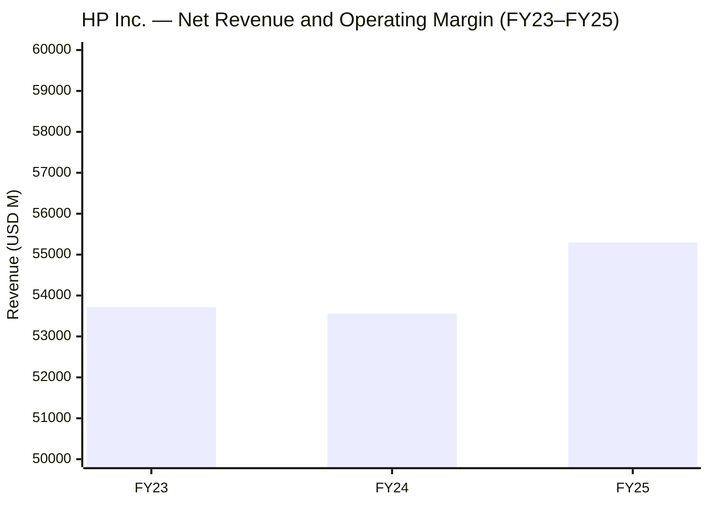
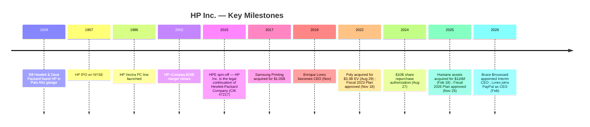
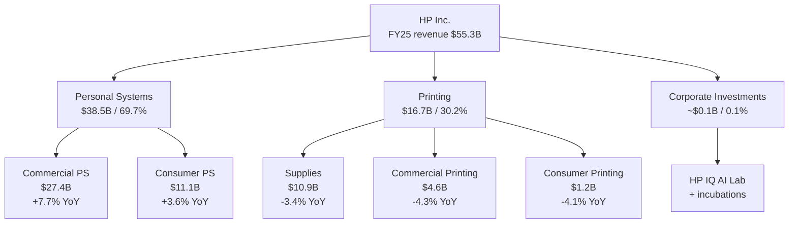
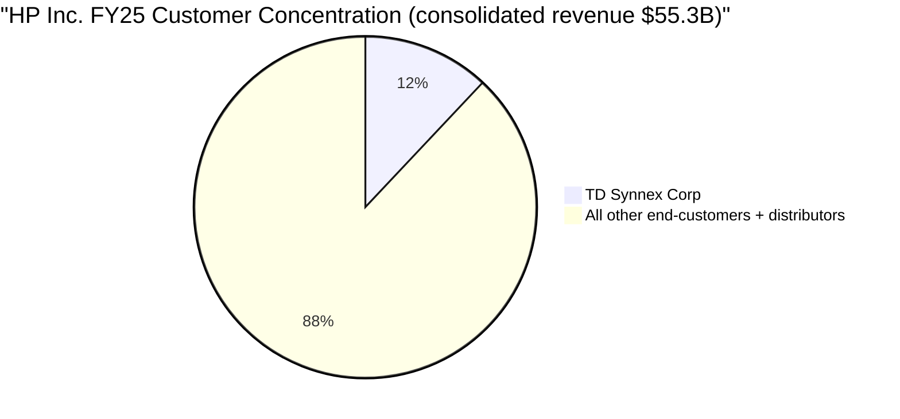
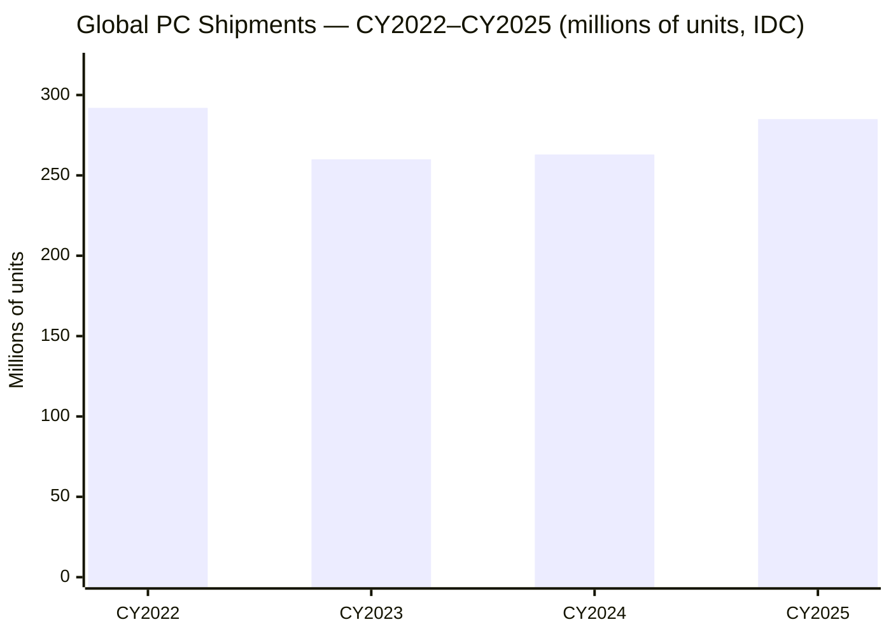
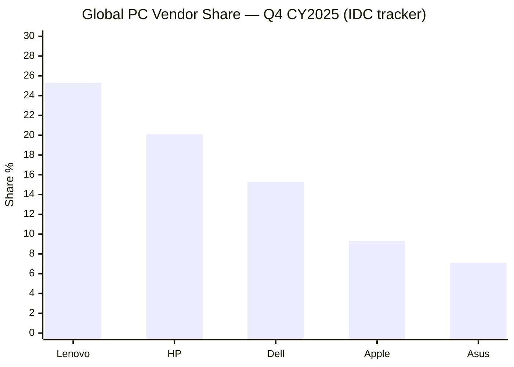
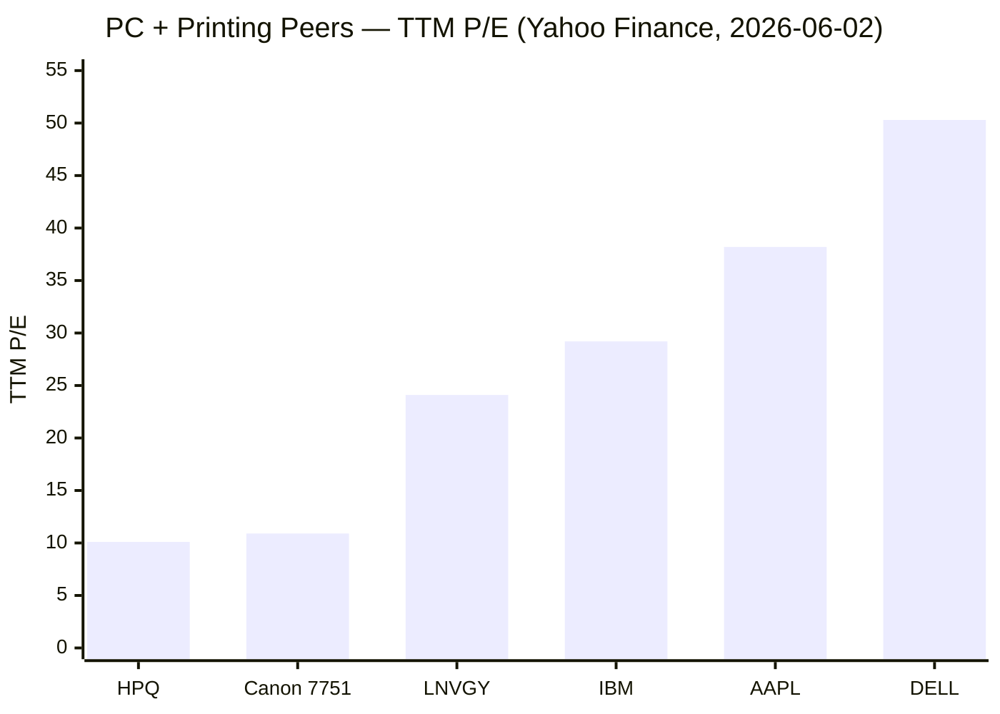
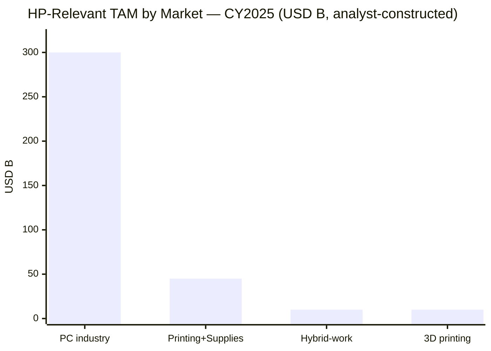

# HP Inc. (NYSE: HPQ) — Research Document

*As of 2026-06-03. Stock price $27.29 (June 2, 2026 close). Market cap ~$25.0B. Fiscal year ends October 31. Coverage initiated.*

---

## Guidance banner

On 2025-12-10, in its FY25 10-K and accompanying Q4 press release, HP guided FY26 non-GAAP diluted EPS to **$2.90–$3.20** and free cash flow to **$2.6–$3.0 billion**, while announcing the new **Fiscal 2026 Plan** — a three-year restructuring through end-FY28 expected to deliver roughly **$1.0 billion in gross run-rate cost savings** by FY28, financed by ~**$650 million of pre-tax charges** (~$400M labor + balance non-labor) and a global headcount reduction of **4,000–6,000 employees** ([HP Inc. FY25 10-K, p. 90 – Note 3 Restructuring](https://www.sec.gov/Archives/edgar/data/47217/000004721725000071/hpq-20251031.htm); [HP Inc. Q4 FY25 press release, 2025-11-25](https://www.hp.com/content/dam/sites/garage-press/press/press-releases/2025/q4-fy25-earnings/HP_Q4_2025_Earnings_Press_Release.pdf)). Then on **2026-02-24**, after delivering a Q1 FY26 revenue beat of $14.4B (+6.9% YoY), management **trimmed the full-year outlook to the lower end** of that range and added two new headwinds: **rising memory/storage commodity costs** ahead of CY26 expected double-digit PC unit decline, and **U.S. trade-policy / tariff impact** weighing on Personal Systems gross margin ([HP Inc. Q1 FY26 results press release, 2026-02-24](https://www.globenewswire.com/news-release/2026/02/24/3244069/0/en/HP-Inc-Reports-Fiscal-2026-First-Quarter-Results.html)). The cut-to-the-low-end happened five business days *after* the **2026-02-03 CEO transition** ([HP Inc. Form 8-K, 2026-02-03 – Leadership Transition](https://www.sec.gov/Archives/edgar/data/47217/000114036126003514/ef20064653_8k.htm)) in which Enrique Lores resigned to take the PayPal CEO seat and Bruce Broussard (ex-Humana CEO, on HP's board since 2021) was appointed **Interim** CEO pending a permanent search — a sequence which the market should read as the new acting CEO recalibrating the prior team's targets.

---

## Table of contents

1. Company Overview
2. Company History
3. Management Team
4. Products & Services
5. Customers & Go-to-Market
6. Industry Overview
7. Competitive Landscape
8. Market Opportunity (TAM/SAM/SOM)
9. Risk Assessment
10. Investor-Lens Scorecards
11. References
12. Verification log

---

## 1. Company Overview

HP Inc. is the **#2 global personal-computer vendor** and the **#1 global printer vendor**, operating in more than 170 countries and reporting through three segments — Personal Systems, Printing, and Corporate Investments. The FY25 10-K (filed 2025-12-10 for the fiscal year ended 2025-10-31) describes HP as "a global technology leader and creator of solutions that enable people to bring their ideas to life and connect to the things that matter most. Operating in more than 170 countries, HP delivers innovative and sustainable devices, services and subscriptions for personal computing, printing, 3D printing, hybrid work, gaming and other related technologies." ([HP Inc. FY25 10-K, Item 1 Business](https://www.sec.gov/Archives/edgar/data/47217/000004721725000071/hpq-20251031.htm)). The company employs **approximately 55,000 employees worldwide**, is headquartered in Palo Alto, California, and has its product-development footprint distributed across Boise, Corvallis, Fort Collins, Fountain Valley, San Diego, Spring (Texas), Vancouver (Wash.), Singapore, Tijuana, and Geneva ([HP Inc. FY25 10-K, Item 2 Properties](https://www.sec.gov/Archives/edgar/data/47217/000004721725000071/hpq-20251031.htm)).

**FY25 financial snapshot.** Total net revenue was **$55,295M** (FY25), up 3.2% from $53,559M (FY24), with Personal Systems contributing $38,532M (+6.5% YoY) and Printing $16,702M (−3.7% YoY); GAAP diluted EPS was **$2.65** (vs $2.81 FY24 and $3.26 FY23), net earnings were $2,529M, and the consolidated operating margin compressed 140bp to 5.7% as commodity and tariff cost pressure in Personal Systems outpaced disciplined pricing ([HP Inc. FY25 10-K, MD&A Results of Operations](https://www.sec.gov/Archives/edgar/data/47217/000004721725000071/hpq-20251031.htm)). Operating cash flow held up at **$3,697M** (vs $3,749M FY24), and HP returned **$1.9 billion** to shareholders in FY25 — $1.1B in dividends and $0.8B in buybacks — with $8.4B remaining on the August 2024 $10B repurchase authorization as of FY25 year-end ([HP Inc. FY25 10-K, Item 5 / Liquidity](https://www.sec.gov/Archives/edgar/data/47217/000004721725000071/hpq-20251031.htm)).

**Year-to-date FY26 trajectory.** Through the first six months of FY26 (Nov 2025 – Apr 2026), revenue grew to **$28,846M** (+7.9% vs $26,724M H1 FY25), net earnings to $995M (+2.5%), and diluted EPS to $1.07 (+4.9%) — Q1 was a $14,438M revenue print (+6.9% YoY) and Q2 was $14,408M (+9.0% YoY) ([HP Inc. Q2 FY26 10-Q, Statements of Earnings](https://www.sec.gov/Archives/edgar/data/47217/000004721726000029/hpq-20260430.htm); [HP Inc. Q2 FY26 results press release, 2026-05-27](https://investor.hp.com/news-events/news/news-details/2026/HP-Inc--Reports-Fiscal-2026-Second-Quarter-Results/default.aspx)). The growth is being driven almost entirely by the Windows-11 / AI-PC refresh cycle in Personal Systems — Q2 FY26 PS revenue was $10.2B (+13% YoY) with AI-PC mix jumping from "more than 35%" of shipments in Q1 to **44% in Q2** ([HP (HPQ) Q2 2026 Earnings Call Transcript, Motley Fool, 2026-05-27](https://www.fool.com/earnings/call-transcripts/2026/05/27/hp-hpq-q2-2026-earnings-call-transcript/)) — while Printing was flat at $4.2B and Supplies continued the multi-year secular drift down.

**Valuation snapshot.** At a $27.29 close on 2026-06-02, HPQ trades at **TTM P/E 10.1×, forward P/E 9.1×, TTM P/S 0.43×, EV/EBITDA 6.8×, dividend yield 4.4%** ([Yahoo Finance — HPQ Key Statistics](https://finance.yahoo.com/quote/HPQ/key-statistics/)). Price-to-book is mathematically negative ($-173.8×) because of HP's **stockholders' deficit** — total stockholders' deficit was $(1,323)M at FY25 year-end, the direct cumulative result of decades of share repurchases exceeding retained earnings, not impairment ([HP Inc. FY25 10-K, Consolidated Balance Sheets](https://www.sec.gov/Archives/edgar/data/47217/000004721725000071/hpq-20251031.htm)) — so book multiples are uninformative for HPQ and should be ignored. The 10× TTM P/E sits below the S&P 500 IT-Hardware sub-industry median of roughly mid-teens (Dell trades at TTM P/E 50× owing to AI-server-mix re-rating and Lenovo at 24× — both inflated by AI-server / handset cycle math that does not apply to HPQ) ([Yahoo Finance — DELL Key Statistics](https://finance.yahoo.com/quote/DELL/key-statistics/); [Yahoo Finance — LNVGY Key Statistics](https://finance.yahoo.com/quote/LNVGY/key-statistics/)). The 4.4% dividend yield, backed by a 44% GAAP payout ratio and $2.9B of FY25 free cash flow, anchors a cash-return story that the multiple discounts: HPQ is being priced as a mature, low-growth, capital-return hardware franchise with persistent secular pressure on its highest-margin Supplies business.

The valuation gap between HPQ and the PC-peer median is therefore *not* an obvious mispricing — it reflects (a) the multi-year decline in Supplies revenue (the highest-margin product line, falling 2.2% in FY25 weighted contribution), (b) commodity and tariff headwinds compressing PS gross margin, (c) the FY26 guidance-cut-to-low-end overhang from the new CEO, and (d) governance overhang from an unresolved permanent-CEO succession process. The bull case (cyclical AI-PC refresh tailwind + Fiscal 2026 Plan $1B cost-out + ~100% FCF-to-shareholders capital-return mandate) is partially in the price; the bear case (commodity-cost squeeze + Supplies erosion + execution risk under interim leadership) is also partially in the price.

*Bars = total net revenue ($M); line = operating margin (%). Source: [HP Inc. FY25 10-K, MD&A](https://www.sec.gov/Archives/edgar/data/47217/000004721725000071/hpq-20251031.htm).*

---

## 2. Company History

HP traces to **1939** when Bill Hewlett and Dave Packard formalized their partnership in a one-car Palo Alto garage with an initial capital investment of $538, after starting part-time work in 1938; the first product, the HP 200A audio oscillator, won an order from Walt Disney Studios for the production of *Fantasia* ([Hewlett-Packard — Wikipedia](https://en.wikipedia.org/wiki/Hewlett-Packard); [Britannica — Hewlett-Packard Company](https://www.britannica.com/money/Hewlett-Packard-Company)). The garage at 367 Addison Avenue is registered as a California State Historical Landmark and is celebrated as the symbolic birthplace of Silicon Valley. The company built itself around precision test-and-measurement instruments, expanded into computing and printing in the 1980s, and entered the PC market in earnest with the 1986 launch of the HP Vectra line.

**The modern shape of HP Inc. is defined by two corporate-finance events.** The first was the **2002 merger with Compaq** — a $25 billion stock deal championed by then-CEO Carly Fiorina and bitterly opposed by Walter Hewlett and the founders' families — which made HP briefly the world's largest PC vendor but also entangled the printing and PC businesses with the enterprise-server franchise for the next thirteen years ([Britannica — Hewlett-Packard Company](https://www.britannica.com/money/Hewlett-Packard-Company)). The second was the **November 1, 2015 split** of Hewlett-Packard Company into two independent S&P 500 companies: **HP Inc.** (NYSE: HPQ) inherited the PC + Printing + 3D printing franchise; **Hewlett Packard Enterprise** (NYSE: HPE) inherited the servers, storage, networking, software, and services franchise ([Hewlett Packard Enterprise Form 10-12B/A, 2015](https://www.sec.gov/Archives/edgar/data/0001645590/000119312515338732/d944600dex991.htm)). The FY25 10-K opens by clarifying that "in this report on Form 10-K, for all periods presented, 'we', 'us', 'our', the 'company', the 'Company', 'HP' and 'HP Inc.' refer to HP Inc. (formerly Hewlett-Packard Company) and its consolidated subsidiaries" — the original SEC registrant (CIK 0000047217, formerly Hewlett-Packard Company in filings through 2015-10-23) retained the legal identity of HP Inc.; HPE was the new spin ([EDGAR — HP Inc. CIK 0000047217 filings](https://www.sec.gov/cgi-bin/browse-edgar?action=getcompany&CIK=0000047217)).

Since the split, HP Inc. has pursued three strategic moves of consequence. (1) **Samsung Printing acquisition** (Sept 2017, $1.05B) brought the A3 copier business and ~6,500 patents in-house, enabling HP to attack the Canon/Ricoh-dominated mid-volume office printing market with a unified printer/copier line. (2) **Poly acquisition** (announced March 2022, closed Aug 29, 2022, $40/share, enterprise value **$3.3 billion**) added enterprise audio/video collaboration endpoints — headsets, video bars, conference-room systems — to position HP for the hybrid-work durable-spend thesis ([HP Inc. press release: HP Inc. to Acquire Poly, March 2022](https://www.hp.com/us-en/newsroom/press-releases/2022/hp-inc-to-acquire-poly.html); [HP Inc. FY25 10-K, Note 11 Borrowings — March 2029 Poly Notes reference](https://www.sec.gov/Archives/edgar/data/47217/000004721725000071/hpq-20251031.htm)). (3) **Humane asset purchase** (announced Feb 18, 2025, closed end of Feb 2025, **$116 million** total consideration) bought the bankrupt Humane AI Pin team's Cosmos AI software platform, ~300 patents and pending patents, and the engineering talent — folded into the newly formed **HP IQ** AI innovation lab to seed AI software for future HP devices ([HP press release: HP Accelerates AI Software Investments, Feb 2025](https://investor.hp.com/news-events/news/news-details/2025/HP-Accelerates-AI-Software-Investments-to-Transform-the-Future-of-Work/default.aspx); [SiliconANGLE — HP to acquire assets from Humane in $116M deal, 2025-02-18](https://siliconangle.com/2025/02/18/hp-acquire-assets-ai-pin-maker-humane-116m-deal/)).

Alongside M&A, HP has run two large-scale restructuring programs. The **Fiscal 2023 Plan** (approved Nov 18, 2022; substantially complete at FY25 year-end) reduced gross headcount by ~9,500 — "Approximately 9,500 employees departed as part of the plan through a combination of employee exits and voluntary EER. HP incurred $873 million in severance costs and $347 million in infrastructure costs related to non-labor and other charges" — and produced HP's cumulative "Future Ready" savings target ([HP Inc. FY25 10-K, Note 3 Restructuring](https://www.sec.gov/Archives/edgar/data/47217/000004721725000071/hpq-20251031.htm)). The newer **Fiscal 2026 Plan** (approved Nov 25, 2025) targets a further 4,000–6,000 gross headcount reduction by end-FY28 — "HP expects to reduce global headcount by approximately 4,000 to 6,000 employees. HP estimates that it will incur pre-tax charges of approximately $650 million relating to labor and non-labor actions." — and is positioned as the cost-action complement to AI-driven productivity gains ([HP Inc. FY25 10-K, Note 3 Restructuring](https://www.sec.gov/Archives/edgar/data/47217/000004721725000071/hpq-20251031.htm)). The Fiscal 2026 Plan was announced on the **same day** as the Q4 FY25 earnings press release (2025-11-25), preserving the optionality that the new permanent CEO (when named) can take credit for cost-out delivery without owning the headcount-cut announcement.

The most recent inflection is **governance**. On Feb 3, 2026 HP announced that **Enrique Lores stepped down as President and CEO** (effective end-of-day Feb 2, 2026) after 36 years at HP and seven as CEO, "to pursue another professional opportunity" — that opportunity, disclosed concurrently, was the PayPal Holdings CEO role effective March 1, 2026 — and the board appointed **Bruce Broussard, an HP director since 2021 and former Humana CEO (Jan 2013–Jul 2024)**, as Interim CEO with no specified end-date and an active search committee for a permanent CEO ([HP Inc. Form 8-K, 2026-02-03](https://www.sec.gov/Archives/edgar/data/47217/000114036126003514/ef20064653_8k.htm); [HP Inc. press release: Leadership Transition](https://investor.hp.com/news-events/news/news-details/2026/HP-Inc--Announces-Leadership-Transition/default.aspx)). The 2026 proxy filed Feb 25, 2026 confirms the search is active: "Bruce Broussard, who has served as a Director since 2021, has agreed to lead the Company as interim CEO through the transition period. The Board has formed a CEO Search Committee" ([HP Inc. DEF 14A 2026, p. 13](https://www.sec.gov/Archives/edgar/data/47217/000004721726000015/hpq-20260225.htm)).

*Source: filings cited throughout the section.*

---

## 3. Management Team

**Founders (historical context).** Bill Hewlett (1913–2001, Stanford EE 1936; MIT MSEE 1936) and David Packard (1912–1996, Stanford EE 1934; later Stanford MA 1939) founded HP in 1939 on the strength of Hewlett's master's thesis design for a low-cost variable-frequency audio oscillator ([Britannica — Hewlett-Packard Company](https://www.britannica.com/money/Hewlett-Packard-Company)). The founders codified "The HP Way" — a decentralized, MBO-driven, employee-respect management philosophy — that defined the company's culture for forty years and is still cited by HP Inc. in the 2026 proxy's Human Capital framing ([HP Inc. DEF 14A 2026 — Culture and Talent](https://www.sec.gov/Archives/edgar/data/47217/000004721726000015/hpq-20260225.htm)). Neither founder retained an operational role after the 1990s, and their family trusts no longer represent a meaningful ownership stake in HP Inc. (the Hewlett Foundation and the David and Lucile Packard Foundation diversified out of HP equity over the 2000s). The founders are included here only because they are historically load-bearing to HP's identity; per the company-research skill, this section otherwise covers only the current CEO.

**Interim CEO — Bruce Broussard (63).** Appointed Interim CEO of HP Inc. effective Feb 3, 2026 ([HP Inc. Form 8-K, 2026-02-03](https://www.sec.gov/Archives/edgar/data/47217/000114036126003514/ef20064653_8k.htm)). Broussard has served on HP's board since 2021 and chairs no HP board committees in his interim-CEO role, per the 2026 proxy ([HP Inc. DEF 14A 2026, p. 13](https://www.sec.gov/Archives/edgar/data/47217/000004721726000015/hpq-20260225.htm)). His operating background is **not from technology hardware** — it is healthcare and services, which is the unusual feature of this appointment. The proxy bio reads: "President, Chief Executive Officer, and Director (January 2013–July 2024) and Advisor (July 2024–February 2026), Humana, a health insurance company; Chief Executive Officer, McKesson Specialty/US Oncology, Inc. (January 2008–December 2011); In 11 years at US Oncology, Inc., which was acquired by McKesson, he held senior positions including Chief Financial Officer, President and Chairman of the Board" ([HP Inc. DEF 14A 2026, p. 13](https://www.sec.gov/Archives/edgar/data/47217/000004721726000015/hpq-20260225.htm)). At Humana (NYSE: HUM), under his eleven-and-a-half-year tenure (Jan 2013–Jul 2024), revenue grew roughly from $40B to over $100B and the company became the second-largest U.S. Medicare Advantage insurer — but the final two quarters of his tenure were marked by margin compression and a multi-billion-dollar Medicare-rate cut that drove a sharp share-price decline, and he departed for an advisor role. Broussard also sits on the board of Marsh & McLennan Companies and previously sat on KeyCorp.

His current role at HP Inc. is explicitly **interim** while a CEO Search Committee, supported by an external executive-search firm, develops "a CEO profile and key search criteria, focusing on the skills, expertise, experience and competencies for the Company's next permanent CEO" ([HP Inc. DEF 14A 2026, p. 13](https://www.sec.gov/Archives/edgar/data/47217/000004721726000015/hpq-20260225.htm)). Investors should weigh three implications. (1) **Strategic stewardship rather than re-invention** — an interim CEO from outside the industry, with strong board context but no operational background in PCs or printing, is most likely to defend existing plans (the Fiscal 2026 Plan cost-out, the AI-PC mix-up roadmap, the ~100%-FCF-return capital policy) rather than initiate large new strategic bets such as M&A or a portfolio split. (2) **Beat-and-trim cadence is consistent with this pattern** — Q1 FY26 was a revenue beat, accompanied by an explicit cut to the low end of FY26 EPS guidance and FCF guidance ([HP Inc. Q1 FY26 press release, 2026-02-24](https://www.globenewswire.com/news-release/2026/02/24/3244069/0/en/HP-Inc-Reports-Fiscal-2026-First-Quarter-Results.html)), which is the classic playbook of a new caretaker CEO de-risking inherited targets. (3) **Permanent-CEO succession is itself an event-risk overhang** — the eventual nominee may revise mid-term plans (sell or spin Printing? double the AI software investment? change the dividend policy?), so the multiple should incorporate this uncertainty until a permanent CEO is named.

**Departing CEO — Enrique Lores.** For context: Lores spent 36 years at HP, became President and CEO on Nov 1, 2019, and stepped down at end-of-day Feb 2, 2026 to become CEO of PayPal Holdings effective March 1, 2026 ([HP Inc. press release: Leadership Transition](https://investor.hp.com/news-events/news/news-details/2026/HP-Inc--Announces-Leadership-Transition/default.aspx)). His tenure delivered the Poly acquisition (2022), the Fiscal 2023 Plan cost-out (2022–2025), the rejection of the Xerox hostile bid (early 2020), and the elevation of AI PCs as a strategic priority — but FY25 marked the second consecutive year of operating-margin compression and the formal launch of the new Fiscal 2026 Plan, suggesting that the company's strategy needed a multi-year reset that he is no longer the one to lead.

---

## 4. Products & Services

HP reports three segments — **Personal Systems (69.7% of FY25 revenue)**, **Printing (30.2%)**, and **Corporate Investments (<0.1%)** — and each segment is organized into customer-facing business units that constitute the company's revenue accounting. The architecture, taken verbatim from the FY25 10-K, is the anchor for this section.

### 4.1 Personal Systems — the PC engine

The 10-K's verbatim definition: *"Personal Systems offers desktops, notebooks, and workstations (including HP's portfolio of AI PCs and workstations), thin clients, retail point-of-sale ("POS") systems, displays, hybrid systems, software, solutions including endpoint security and services. We provide lifecycle services including support and deployment, configurations, and extended warranty services. We support a multi-operating system and multi-architecture strategy, primarily using Microsoft Windows and Google Chrome operating systems. Our platforms incorporate processors from Intel, and AMD, including integrated AI acceleration, as well as NVIDIA GPUs for advanced graphics and compute workloads." ([HP Inc. FY25 10-K, Item 1 Business](https://www.sec.gov/Archives/edgar/data/47217/000004721725000071/hpq-20251031.htm))*. The segment reports through two business units:

| Business unit | FY25 revenue ($M) | FY24 revenue ($M) | FY23 revenue ($M) | YoY (FY25) | What it is |
|---|---|---|---|---|---|
| **Commercial PS** | 27,438 | 25,486 | 24,712 | +7.7% | Pro/Elite commercial PCs, Z workstations, thin clients, POS systems, Dragonfly, Chromebook, lifecycle services |
| **Consumer PS** | 11,094 | 10,709 | 10,972 | +3.6% | Omni consumer PCs, Omen and Victus gaming, Spectre/Envy/Pavilion, Chromebook PCs |
| **Total Personal Systems** | **38,532** | **36,195** | **35,684** | **+6.5%** | |

Source for the table: [HP Inc. FY25 10-K, MD&A Segment Information — Personal Systems](https://www.sec.gov/Archives/edgar/data/47217/000004721725000071/hpq-20251031.htm).

The FY25 growth was decomposed in the MD&A: "Personal Systems net revenue increased 6.5% (increased 6.7% on a constant currency basis) in the fiscal year 2025, as compared to the prior-year period. The net revenue increase was primarily due to a 4.3% increase in unit volume driven by the Windows-based PC operating system refresh, and a 3.1% increase in average selling price ('ASPs'). The increase in ASPs is primarily due to favorable mix shift towards Commercial PS and disciplined pricing, partially offset by unfavorable currency impact." ([HP Inc. FY25 10-K, MD&A Segment Information — Personal Systems](https://www.sec.gov/Archives/edgar/data/47217/000004721725000071/hpq-20251031.htm)). That decomposition is the central story for HPQ in FY26: **the Windows-10 end-of-support refresh (extended security updates ended Oct 14, 2025) is pulling enterprise PC unit volumes higher, and the AI-PC mix is layering an ASP tailwind on top**. Q2 FY26 confirmed the trajectory — PS revenue $10.2B, +13% YoY, with Commercial PS +14% and Consumer PS +10%, and AI PCs at **44% of shipment mix** versus "more than 35%" in Q1 ([HP Inc. Q2 FY26 results, Motley Fool transcript, 2026-05-27](https://www.fool.com/earnings/call-transcripts/2026/05/27/hp-hpq-q2-2026-earnings-call-transcript/); [Futurum — HP Q2 FY 2026 Earnings Emphasize AI PC Mix Shift Amid Cost Pressure, 2026-05-27](https://futurumgroup.com/insights/hp-q2-fy-2026-earnings-emphasize-ai-pc-mix-shift-amid-cost-pressure/)). FY25 PS earnings from operations were **$2,054M** at a **5.3% operating margin** — down 0.9ppt from FY24's 6.2% — explicitly attributed to higher commodity and tariff costs in the MD&A: *"Gross margin decreased primarily due to higher commodity and tariff costs, partially offset by disciplined pricing actions."* ([HP Inc. FY25 10-K, MD&A Segment Information — Personal Systems](https://www.sec.gov/Archives/edgar/data/47217/000004721725000071/hpq-20251031.htm)).

**What the products physically do.** A Commercial PS PC is a managed corporate endpoint: it boots a hardware-enforced HP Sure Start BIOS, runs Windows 11 with Pluton or HP Wolf Security in the chain of trust, and integrates with corporate IT via HP Workforce Solutions for fleet provisioning, device-as-a-service contracts, and break/fix lifecycle handling. The new generation of **AI PCs** adds an on-die Neural Processing Unit (NPU) — Intel Core Ultra Series 2 (Lunar Lake / Arrow Lake), AMD Ryzen AI 300, or Qualcomm Snapdragon X — delivering 40+ TOPS local inference, enabling Windows Copilot+ features (Recall, Cocreator, Live Captions translation) to run locally without round-tripping to a cloud LLM. The HP-specific value-add over the underlying silicon is enterprise security stack (Sure Start, Sure Click, Sure Sense, Sure Run, Wolf Security for HP services), the manageability tooling, and HP Anyware / HP Connect remote-management agents that make AI PC fleets administrable at the enterprise scale that consumer AI PCs cannot serve.

**How Commercial PS differs from Consumer PS.** Both sell PCs, but the unit economics differ sharply. Commercial PS sells through enterprise reseller channels (TD Synnex, Ingram Micro, CDW, Insight) at ~6–8% gross margin per unit but with multi-year refresh contracts and attached services that double the lifetime revenue. Consumer PS sells through retail (Amazon, Best Buy, Walmart, big-box overseas equivalents) at ~3–4% gross margin per unit with no service attach, and is much more exposed to consumer-discretionary cycles, gaming hardware cycles (Omen / Victus), and back-to-school seasonality. The 7.7% / 3.6% growth differential in FY25 reflects this — the enterprise refresh is pulling Commercial; consumer is at best matching unit-volume inflation. **Strategic significance**: the AI-PC mix shift is layering an ASP boost on Commercial volumes already pulled by Windows 11 / Windows 10 end-of-support, while the medium-term risk is whether AI features are sticky enough to justify a 1–2-year shorter refresh cadence (which would extend the tailwind) or whether the upgrade pulls demand forward and leaves CY27 hollowed out.

### 4.2 Printing — the cash engine

The 10-K's verbatim definition: *"Printing provides consumer and commercial printer hardware, supplies, services and solutions. Printing is also focused on Graphics and 3D Printing and Personalization in the commercial and industrial markets." ([HP Inc. FY25 10-K, Item 1 Business](https://www.sec.gov/Archives/edgar/data/47217/000004721725000071/hpq-20251031.htm))*. Printing is the **smaller revenue segment but the larger profit segment** — FY25 segment operating income was $3,118M on $16,702M revenue, an **18.7% segment operating margin**, versus PS's 5.3% — and within Printing, **Supplies** (ink/toner/3D-printing consumables) is the dominant economic engine.

| Business unit | FY25 revenue ($M) | FY24 revenue ($M) | FY23 revenue ($M) | YoY (FY25) | What it is |
|---|---|---|---|---|---|
| **Supplies** | 10,916 | 11,295 | 11,452 | −3.4% | Ink, laser/toner cartridges, media, industrial graphics supplies, 3D-printing supplies — recurring consumable revenue |
| **Commercial Printing** | 4,633 | 4,841 | 5,250 | −4.3% | Office printers, Graphics presses (Indigo, PageWide industrial), 3D printing & personalization (excluding supplies) |
| **Consumer Printing** | 1,153 | 1,202 | 1,327 | −4.1% | Home printer hardware (excluding supplies) |
| **Total Printing** | **16,702** | **17,338** | **18,029** | **−3.7%** | |

Source: [HP Inc. FY25 10-K, MD&A Segment Information — Printing](https://www.sec.gov/Archives/edgar/data/47217/000004721725000071/hpq-20251031.htm).

Three observations. (1) **Supplies is 65.4% of Printing revenue and the high-margin engine**, but its FY25 −3.4% decline is the company's most persistent secular drift. The MD&A attributes it to *"decline in the installed base and usage and currency impacts, partially offset by disciplined pricing"* ([HP Inc. FY25 10-K, MD&A Printing](https://www.sec.gov/Archives/edgar/data/47217/000004721725000071/hpq-20251031.htm)) — i.e., the global installed base of HP printers is shrinking and what remains is being used less, while non-original supplies (refills, remanufactured cartridges, "white-label" imitators) keep eroding share. (2) **Commercial Printing** includes the Indigo digital web presses and Graphics business — both are competitive with Xerox, Konica Minolta, and Fujifilm in the production-print market — and the 6.2% unit-volume decline in FY25 reflects ongoing weakness in the production-print market that has not been a structural HP story since the 2014–17 cycle. (3) **3D Printing & Personalization** (the Jet Fusion and Metal Jet additive-manufacturing platforms) is folded into Commercial Printing for revenue reporting and is not separately disclosed; analyst-view: the 3D business has not scaled to the multi-hundred-million-revenue line that HP signaled at its 2016 launch event, and at current run-rate is unlikely to be a needle-mover for the segment.

**Strategic significance**: Printing is HPQ's free-cash-flow engine — its 18.7% operating margin is what funds the dividend and the buyback — but the segment is in slow secular decline (revenue −3.7% in FY25; −2.7% on a constant-currency basis). The Fiscal 2026 Plan's headcount cuts will be disproportionately weighted to Printing operations and to the supplies channel, both to preserve segment profit and because the AI-driven productivity narrative more naturally lives there than in PS. *Analyst view: a portfolio split that floats Printing as a separate cash-cow vehicle — with Personal Systems retained as a growth-oriented AI-PC pure play — has been periodically rumored on the sell side, and is the kind of strategic option an incoming permanent CEO might evaluate. No current filing confirms such a plan; treat as scenario-mapping, not consensus.*

### 4.3 Corporate Investments

A small bucket — sub-$50M revenue and reported as an immaterial loss most years — covering "certain business incubation projects and investments in digital enablement" ([HP Inc. FY25 10-K, Item 1 Business](https://www.sec.gov/Archives/edgar/data/47217/000004721725000071/hpq-20251031.htm)). The newly formed **HP IQ** AI software innovation lab (the Humane Cosmos team) is the most prominent project under this banner. Not material for valuation today.

### 4.4 How the segments interact

*Source: [HP Inc. FY25 10-K, MD&A Segment Information](https://www.sec.gov/Archives/edgar/data/47217/000004721725000071/hpq-20251031.htm).*

The strategic synthesis: PS is the **growth + share-defense engine** (winning the AI-PC refresh against Lenovo and Dell, capturing Commercial customers on the enterprise migration to Windows 11), while Printing is the **profit + capital-return engine** (Supplies cash flow funds the dividend and buyback) and is being managed for cash-out rather than growth. The risk is that PS margin compresses faster than PS growth accelerates, leaving Printing's secular decline unable to be offset by PS contribution — which is essentially the FY25 story (segment-level: PS revenue +6.5% with margin −0.9ppt; Printing revenue −3.7% with margin −0.3ppt; consolidated operating margin −1.4ppt to 5.7%).

---

## 5. Customers & Go-to-Market

**Channel architecture.** HP's FY25 10-K describes a multi-tier indirect distribution model: *"the majority of our overall revenue is made through channel resellers"*, with customers grouped into consumer and commercial channels, fulfilled directly by HP or through retailers, resellers, distribution partners, and system integrators ([HP Inc. FY25 10-K, Item 1 Business — Sales, Marketing and Distribution](https://www.sec.gov/Archives/edgar/data/47217/000004721725000071/hpq-20251031.htm)). The principal channel partners include the IT distribution majors — **TD Synnex, Ingram Micro, CDW, Insight Enterprises** in North America; **Tech Data Europe (TD Synnex EMEA), Westcoast, ALSO** in Europe; **Synnex Japan, Daiwabo, Macnica** in Japan; **Digital China, Synnex Greater China** in China. Direct-fulfillment channels (HP.com, HP Store, HP enterprise direct-sales motion) account for a minority of revenue but a higher share of Commercial PS managed-services and Device-as-a-Service contracts.

**Customer concentration — TD Synnex now a 10%+ customer.** The FY25 10-K discloses a material new customer-concentration disclosure: *"One customer, TD Synnex Corp, accounted for 12% of HP's net revenue for fiscal year 2025. No single customer represented 10% or more of HP's net revenue in fiscal year 2024 or 2023." ([HP Inc. FY25 10-K, Segment Reporting — Major Customers](https://www.sec.gov/Archives/edgar/data/47217/000004721725000071/hpq-20251031.htm))*. This is a notable change. **TD Synnex** is the global #1 IT distributor (FY24 revenue ~$58B) created by the September 2021 merger of SYNNEX and Tech Data; its share of HP's revenue (consolidated, not segment) rose from below the 10% threshold to **12% of consolidated revenue** in FY25 — a single-year step-up that reflects distribution consolidation (Tech Data's footprint is now bundled with SYNNEX inside the combined entity) more than any HP-specific account-share dynamic. The 12% is a distributor exposure, not an end-customer exposure: TD Synnex itself sells onward to thousands of VARs, MSPs, and enterprise IT buyers worldwide. The risk it creates is dependency on a single channel-finance counterparty — if TD Synnex were to face liquidity stress or to renegotiate vendor-payment terms, HP would be the most directly exposed PC OEM. **No single end-customer (enterprise, government, education buyer) reaches the 10% threshold**; the 10-K does not name any other customer at >10% of revenue.

**Geographic mix.** US revenue was **$19,212M in FY25 (34.7% of total), Other countries $36,083M (65.3%)** — a small US-tilt move up from $18,790M (35.1%) in FY24 and $18,829M (35.0%) in FY23 ([HP Inc. FY25 10-K, Segment Reporting — Geographic Information](https://www.sec.gov/Archives/edgar/data/47217/000004721725000071/hpq-20251031.htm)). The 10-K notes that *"other than the United States, no country represented more than 10% of HP net revenue in any fiscal year presented"* ([same source](https://www.sec.gov/Archives/edgar/data/47217/000004721725000071/hpq-20251031.htm)), which means HP's revenue is genuinely diversified internationally (no single second-tier country — China, Germany, Japan, UK, France — reaches the 10% threshold). HP operates through regional headquarters in Palo Alto (Americas), Geneva (EMEA), and Singapore (Asia Pacific) and has major manufacturing operations in Mexico (Tijuana), USA (Boise, Corvallis, Fort Collins, Fountain Valley, San Diego, Spring, Vancouver), Singapore, Penang (Malaysia), Chongqing/Shanghai (China), and Eastern Europe.

*Single denominator: consolidated revenue. Source: [HP Inc. FY25 10-K, Note 19 Segment Reporting — Major Customers](https://www.sec.gov/Archives/edgar/data/47217/000004721725000071/hpq-20251031.htm).*

**Customer-segment mix (analyst construction).** HP does not disclose end-customer mix at the 10-K level beyond Commercial PS vs Consumer PS revenue. *Analyst view* (segment-level, not disclosed): within Commercial PS ($27.4B), enterprise customers represent ~50–55%, SMB ~25–30%, public sector + education ~20–25%. Within Consumer PS ($11.1B), retail consumers represent ~85–90% with gaming a meaningful sub-vertical via the Omen and Victus brands (Omen has historically been highlighted as the gaming sub-brand with >$1B revenue, though HP no longer breaks this out). Customer-cohort retention and Device-as-a-Service ARR are not disclosed.

---

## 6. Industry Overview

HP operates in three industries that move on different cycles: the **global PC industry** (the dominant exposure), the **global printing industry** (cash engine but slow decline), and emerging adjacencies in **AI-edge inference hardware, 3D printing, and enterprise collaboration endpoints** (smaller, growth-oriented).

**Global PC market — re-acceleration in 2025, more uncertain 2026.** Worldwide PC shipments grew **8.1% YoY in CY2025 to 284.7M units** per IDC, with Q4 2025 shipments up 9.6% YoY to 76.4M units ([IDC via FoneArena: Global PC Shipments up 9.6% YoY in Q4 2025, 2026-01-13](https://www.fonearena.com/blog/473498/global-pc-shipments-q4-2025.html); [TechSpot: Global PC shipments jumped 9.6% to 76.4M units in Q4 2025, 2026-01-13](https://www.techspot.com/news/110907-global-pc-shipments-jumped-96-764m-units-q4.html)). Gartner's parallel data showed **9.1% full-year 2025 growth and 9.3% Q4 2025 growth** ([Gartner — Worldwide PC Shipments, 2026-01-20](https://www.gartner.com/en/newsroom/press-releases/2026-1-20-gartner-says-worldwide-pc-shipments-increased-9-point-3-percent-in-fourth-quarter-of-2025-and-9-point-1-percent-for-the-full-year)). The drivers are well-understood: (a) the **Windows 10 end-of-support** (Oct 14, 2025) pulling enterprise refresh demand into FY25/FY26; (b) the **AI-PC introduction cycle** as Intel Core Ultra Series 2, AMD Ryzen AI, and Qualcomm Snapdragon X chips brought local-NPU inference to a meaningful share of new SKUs; (c) post-pandemic enterprise PC vintages reaching end-of-life. Looking into CY2026, **management's own commentary suggests caution** — HP CFO Karen Parkhill said on the Q2 FY26 call that HP expects "the PC unit market to decline double digits in calendar '26" — but the AI-PC ASP tailwind and HP's mix-up roadmap (44% AI-PC mix in Q2 FY26 versus low single digits in early FY25) may offset much of the unit headwind for HP specifically ([HP (HPQ) Q2 2026 Earnings Call Transcript, Motley Fool, 2026-05-27](https://www.fool.com/earnings/call-transcripts/2026/05/27/hp-hpq-q2-2026-earnings-call-transcript/)).

**Global printing industry — long secular decline.** The global office-printing market has been in unit-volume decline for over a decade as paper-output volumes drop with digitalization. IDC has consistently sized the hardcopy-peripherals market at sub-$30B annually with low- to mid-single-digit declines; the **HP-relevant segment** (laser/inkjet office + home printers + supplies) is roughly $40–45B globally including supplies, with HP's ~$16.7B FY25 revenue representing **roughly 35–40% global share by revenue**. Print volumes per device have fallen ~2–3% per year for a decade and aftermarket-supplies share continues to be eroded by non-original cartridge suppliers (refills, remanufactures, "compatible" generics from Chinese suppliers like Pantum) and by managed-print-services arrangements that compress supplies pricing. The growth pockets within Printing are narrow: industrial/graphics print (Indigo digital web presses for short-run label and packaging), 3D printing for series production parts (HP Jet Fusion, Metal Jet), and security/AI features that justify ASP retention.

**AI edge inference (on-device AI).** A new and harder-to-size category. The introduction of NPUs in CPU SoCs (Intel Lunar Lake, AMD Ryzen AI 300, Qualcomm Snapdragon X) capable of 40+ TOPS local AI inference creates a new device category — the **Copilot+ PC** in Microsoft's terminology — that AMD/Intel and Microsoft have positioned as the next platform shift after touchscreens and Surface. Whether this is a true secular driver or a one-cycle ASP boost depends on application momentum (will Copilot, Cocreator, Recall, and third-party local-AI features create enough end-user pull to drive replacement cycles shorter than the historical 4–5 years?). The current FY26 evidence — 44% AI-PC mix at HP, growing — is consistent with the ASP-boost interpretation; the secular-shift interpretation is still on the come.

**3D printing.** A small ($6–8B globally, IDC) but growth-positive industry. HP entered with its Multi Jet Fusion platform in 2016 and Metal Jet in 2020; the segment has not scaled to the $1–2B revenue line that early projections suggested. The reasons are structural — additive manufacturing has not displaced injection molding for the high-volume parts that HP's economics depend on. Treat as a research-and-development bet whose payoff is multi-year and not visible in the current model.

**Industry growth waterfall (PC + Printing core).** The PC industry's CY26 outlook is units-down-ASPs-up, leading to roughly flat-to-slightly-up revenue depending on AI-PC mix; the Printing industry continues to decline mid-single-digits in revenue, accelerating slightly as installed-base attrition compounds. HP's reported FY26 guidance (low end of $2.90–$3.20 non-GAAP EPS) implicitly bakes in roughly mid-single-digit revenue growth driven entirely by PS, with Printing flat-to-down and SG&A held flat by Fiscal 2026 Plan cost-out.

*Source: IDC quarterly tracker — Q4 2025 release, full-year shipments at 284.7M units, +8.1% YoY ([TechSpot: Global PC shipments jumped 9.6% to 76.4M units in Q4 2025, 2026-01-13](https://www.techspot.com/news/110907-global-pc-shipments-jumped-96-764m-units-q4.html); [IDC PC tracker](https://www.idc.com/promo/pcdforecast/)).*

---

## 7. Competitive Landscape

**The 10-K's own competitor list.** Item 1 of the FY25 10-K names HP's principal competitors verbatim by segment ([HP Inc. FY25 10-K, Item 1 Business — Competition](https://www.sec.gov/Archives/edgar/data/47217/000004721725000071/hpq-20251031.htm)):

> "Personal Systems. … Our primary competitors are Acer Inc., Apple Inc., ASUSTeK Computer Inc., Dell Inc., Huawei Technologies Co., Ltd., Lenovo Group Limited, Logitech International S.A., Microsoft Corporation, Samsung Electronics Co., Ltd., and Toshiba Corporation."

> "Printing. … Our primary competitors include Brother Industries, Ltd., Canon Inc., Pantum International Limited, Seiko Epson Corporation, The Ricoh Company Ltd., and Xerox Corporation Ltd."

That list is the authoritative starting point. The most consequential PC competitors are Lenovo, Dell, and Apple; the most consequential Printing competitors are Canon, Brother, Epson, and (increasingly) Pantum.

**PC market share — Q4 2025 vs HP**. The most recent IDC tracker positions HP as the **#2 global PC vendor with 20.1% share, 15.4M units shipped in Q4 2025 (+12.1% YoY)** — behind Lenovo (25.3% share, 19.3M units, +14.4% YoY) and ahead of Dell (15.3% share, 11.7M units), Apple (9.3% share, 7.1M units, +0.2% full-year), and Asus (7.1% share, 5.4M units) ([IDC via Technext: Lenovo tops PC shipments Q4 2025, 2026-01-13](https://technext24.com/2026/01/13/lenovo-tops-global-pc-shipment-grew-q425/); [IDC via iClarified: Global PC Shipments Q4 2025, Apple 7.1M, 2026-01-13](https://www.iclarified.com/99612/global-pc-shipments-jump-96-in-q4-2025-apple-ships-71-million-macs-idc)). HP's relative position is roughly stable but the gap to Lenovo is widening: Lenovo's Q4 2025 unit growth of 14.4% YoY exceeded HP's 12.1%, and Lenovo's full-year 2025 shipments grew 14.5% to 61.8M units versus HP's mid-teens (precise full-year HP number not independently reported). **Apple has materially under-grown the market in 2025** (Mac shipments +0.2% full-year per IDC), suggesting the AI-PC narrative has shifted enterprise refresh demand toward x86 + NPU machines rather than to Apple Silicon.

| Competitor | Q4 2025 share | Q4 2025 units | YoY growth | Where they compete |
|---|---|---|---|---|
| **Lenovo Group** (HKEX 0992, ADR LNVGY) | 25.3% | 19.3M | +14.4% | All PC segments, plus Motorola handsets, ThinkPad/ThinkCentre Commercial, Yoga/Legion Consumer; AI-PC roadmap parallel to HP |
| **HP Inc.** | 20.1% | 15.4M | +12.1% | All PC segments, plus Poly collaboration, A3 copiers, Indigo presses, Jet Fusion 3D |
| **Dell Technologies** (NYSE DELL) | 15.3% | 11.7M | n.d. | Commercial-heavy mix, ProSupport services; the AI-server franchise (PowerEdge) is the bigger valuation driver but is *not* HP-comparable |
| **Apple** (NASDAQ AAPL) | 9.3% | 7.1M | +0.2% (FY) | Premium-only via Mac/MacBook; not a Commercial PS displacement threat at HP's price points |
| **Asus** (TWSE 2357) | 7.1% | 5.4M | n.d. | Gaming + consumer; Zenbook is the Commercial competitor; ASUSTeK is named in HP's 10-K |

Sources: [IDC via Technext, 2026-01-13](https://technext24.com/2026/01/13/lenovo-tops-global-pc-shipment-grew-q425/); [HP Inc. FY25 10-K, Item 1 Competition](https://www.sec.gov/Archives/edgar/data/47217/000004721725000071/hpq-20251031.htm). The 10-K names ASUSTeK but reports neither HP's nor its competitors' shares.

*Source: [IDC PCD Tracker — Q4 2025 results via Technext, 2026-01-13](https://technext24.com/2026/01/13/lenovo-tops-global-pc-shipment-grew-q425/).*

**Where HP wins, where it loses.** In Commercial PS, HP wins on (a) the **HP Wolf Security** stack — Sure Start hardware-enforced BIOS, Sure Click virtualization-based browser isolation, Sure Sense AI threat detection — which gives enterprise CISOs a defensible reason to pay an ASP premium over Lenovo and Dell, and (b) the **HP managed-print-services + PC bundle** that bundles Commercial PS with Office Printing Solutions into a single procurement instrument. HP loses to Lenovo on (a) **enterprise PC pricing aggressiveness** — Lenovo's Chinese-domestic procurement scale and willingness to undercut on the standard Pro/Latitude/ThinkPad price band — and (b) **mainland-China share**, where Lenovo's installed base and channel are structurally hard to displace. HP loses to Apple at the **executive-buyer premium end** (Mac in C-suite refresh decisions) but this is a narrow, high-ASP segment Apple has historically owned. Dell's strength is **federal-government Commercial** (FedRAMP, ProSupport-Plus-Government) where HP's federal share is meaningful but second to Dell.

**Printing competitive dynamics.** Canon, Brother, Epson, Pantum, Ricoh, and Xerox compete with HP across consumer ink, office laser, A3 copier, and managed-print-services. The structural risks are (a) **Pantum** — a Chinese mid-volume laser printer manufacturer that has captured share at the low end (sub-$300 office laser, dorm-room consumer) by undercutting HP's price by 30–50% with similar specs, and (b) **non-original supplies** (refills, remanufactures, "compatible" cartridges from Chinese suppliers) which the 10-K addresses verbatim: *"independent suppliers offer non-original supplies (including imitation, refill and remanufactured alternatives), which are often available for lower prices, but which can also offer lower print quality and reliability compared to HP original inkjet and toner supplies. These and other competing products are often sold alongside our products through online or omnichannel resellers, retailers or distributors" ([HP Inc. FY25 10-K, Item 1 Competition — Printing](https://www.sec.gov/Archives/edgar/data/47217/000004721725000071/hpq-20251031.htm))*. Canon's printing segment generates the majority of Canon Inc.'s revenue and at TYO:7751 it trades at TTM P/E ~11×, market cap ~$24.8B — a multiple roughly in line with HPQ, reflecting the same secular pressures ([Canon Inc — Stock Analysis](https://stockanalysis.com/quote/tyo/7751/market-cap/)).

**Peer valuation snapshot.**

| Ticker | Name | TTM P/E | Fwd P/E | TTM P/S | Market cap |
|---|---|---|---|---|---|
| HPQ | HP Inc. | 10.1× | 9.1× | 0.43× | $25.0B |
| DELL | Dell Technologies | 50.3× | 20.4× | 2.11× | $282.8B |
| LNVGY | Lenovo Group (ADR) | 24.1× | 29.2× | 0.50× | $41.7B |
| AAPL | Apple Inc. | 38.2× | 32.8× | 10.25× | $4,629B |
| 7751.T | Canon Inc. | 10.9× | n.a. | n.a. | $24.8B |
| XRX | Xerox Holdings | n.a. | 3.6× | 0.06× | $0.4B |
| IBM | IBM | 29.2× | 24.5× | 4.49× | $309.4B |

Sources: [Yahoo Finance — HPQ, DELL, LNVGY, AAPL, XRX, IBM key statistics](https://finance.yahoo.com/quote/HPQ/key-statistics/), retrieved 2026-06-02; Canon multiples from [Stock Analysis — Canon](https://stockanalysis.com/quote/tyo/7751/market-cap/), retrieved 2026-06-02.

*Source: [Yahoo Finance Key Statistics](https://finance.yahoo.com/quote/HPQ/key-statistics/) and [Stock Analysis — Canon](https://stockanalysis.com/quote/tyo/7751/market-cap/), retrieved 2026-06-02.*

HPQ at 10× TTM P/E sits at the **low end of the peer range** — only Xerox (a structurally distressed printer pure-play) is cheaper on consolidated multiples, and Canon at ~11× is the closest comparable. The multiple gap to Lenovo (~24×) and Dell (~50×) is real but reflects (a) Lenovo's PC + smartphone + AI-server mix, (b) Dell's AI-server (PowerEdge AI) re-rating story that does not apply to HPQ, and (c) Apple's brand-premium and ecosystem moat. *Analyst view: at 10× and a 4.4% dividend yield, HPQ is being valued as a mature cash-cow with secular pressure rather than as a participant in the AI-edge inference theme; whether the market re-rates depends on (1) whether the Fiscal 2026 Plan delivers $1B run-rate savings on schedule, (2) whether commodity/tariff costs roll off in CY26, and (3) whether the permanent CEO defends or recapitalizes the Printing portfolio.*

---

## 8. Market Opportunity (TAM/SAM/SOM)

**Total Addressable Market.** Aggregating HP's three principal markets:

- **PC industry — TAM ~$300B annually**. Roughly 285M units in CY2025 (IDC) at a global ASP of approximately $1,050 ([IDC PC tracker](https://www.idc.com/promo/pcdforecast/); ASP triangulated from IDC unit count vs aggregate market revenue). HP's share is ~20% by units → roughly ~$60B equivalent revenue addressable to the company's PC line at current units and ASPs; HP's reported Personal Systems revenue of $38.5B implies a 65% capture (HP's mix is weighted to Commercial, which has lower units but higher ASP per unit). The **AI-PC sub-segment** within this TAM is the differentiated growth pocket: AI PCs were 44% of HP's Q2 FY26 shipments and growing, suggesting HP's AI-PC TAM exposure could exceed $25B (HP's share of the AI-PC sub-market, growing).
- **Hardcopy peripherals + supplies — TAM ~$45B annually globally**. Roughly $25B in hardware (printers, copiers, presses) and $20B in supplies (ink, toner, consumables), declining ~2–3% annually in revenue per long-running IDC and Smithers tracking. HP's $16.7B FY25 Printing revenue represents **~37% global share by revenue**, the dominant position; the **Supplies subset** is the highest-margin sliver of this TAM and the one HP holds most defensibly given its installed-base advantage.
- **Hybrid-work collaboration endpoints — TAM ~$10B annually**. Audio (headsets), video bars, conference-room hardware — the Poly addressable market. The market re-rated upward post-COVID but has been growing more slowly in 2024–25 as the post-pandemic refresh runs through. HP's Poly franchise generates approximately $1.5–2.0B annually (analyst estimate; HP does not separately disclose Poly revenue inside PS).
- **3D printing (industrial AM) — TAM ~$10B annually**. HP's share is sub-2% — Stratasys, 3D Systems, Materialise, and SLM Solutions hold larger industrial-AM positions, with Carbon and Formlabs in design-for-AM software.

Total HP-relevant TAM aggregates to approximately **$365B annually** (PC ~$300B + Printing ~$45B + Hybrid work ~$10B + 3D ~$10B). HP's FY25 revenue of $55.3B implies a **~15% blended capture of TAM** — a high-single-digit-percent share of PCs and a high-thirties-percent share of Printing.

**Serviceable Addressable Market.** Filtering for the markets HP actually serves with current products — i.e., excluding ARM-only smartphones, the Apple-Silicon Mac premium tier where HP does not have a competing product, and the high-end industrial-AM tier where HP's Jet Fusion does not yet displace Stratasys or EOS — the SAM is closer to **$280–300B** annually. Within that SAM, the Windows-PC + office-print + supplies subset is roughly $200–220B, which is HP's home turf.

**Serviceable Obtainable Market.** Realistically what HP can win against share-incumbent competitors: HP's current 20% global PC share is high relative to peers, suggesting further share expansion is marginally constrained — but the AI-PC mix-up roadmap can defend share and extract higher ASP per unit, which moves HP up the value curve within roughly stable share. In Printing, HP's 35–40% share is also high but is being eroded by Pantum on the low end and by non-original supplies on the high end — defending share rather than gaining is the realistic SOM trajectory. The Fiscal 2026 Plan implicit thesis is **share-stable revenue with margin expansion** rather than aggressive share gain.

*Analyst construction; PC industry from IDC unit × ASP triangulation ([IDC PC tracker](https://www.idc.com/promo/pcdforecast/)); Printing market sizing from long-running IDC hardcopy-peripherals tracker; hybrid-work and 3D figures triangulated from market-research firms and the company's own disclosures of Poly and Jet Fusion exposure. Not a primary disclosure.*

---

## 9. Risk Assessment

HP faces a layered risk profile that the FY25 10-K's Item 1A Risk Factors enumerates over ~15 pages. The risks below are organized into the four buckets the company-research skill specifies — company-specific, industry/market, financial, and macro/regulatory — and quantified where the filings support it.

### 9.1 Company-specific risks

**R1. Permanent-CEO succession risk.** The board's CEO Search Committee has not named a permanent CEO as of the May 27, 2026 10-Q. The interim leader, Bruce Broussard, has no PC/printing operating background and the search is conducted with an external search firm ([HP Inc. DEF 14A 2026, p. 13](https://www.sec.gov/Archives/edgar/data/47217/000004721726000015/hpq-20260225.htm); [HP Inc. press release: Leadership Transition](https://investor.hp.com/news-events/news/news-details/2026/HP-Inc--Announces-Leadership-Transition/default.aspx)). The risk is twofold: a long search (>9–12 months) prolongs strategic-decision overhang, and the eventual nominee may significantly revise mid-term plans (e.g., evaluate a Printing spin-out, change capital-allocation policy, accelerate M&A). Mitigant: the Fiscal 2026 Plan is already approved, the Q1 FY26 guidance cut is already absorbed, and the board has multiple decades of bench depth in the segment leaders. *Materiality: medium — explicit overhang on multiple expansion until resolved.*

**R2. Restructuring-execution risk on Fiscal 2026 Plan.** The plan targets ~$1B of run-rate savings by end-FY28 through 4,000–6,000 headcount reductions ([HP Inc. FY25 10-K, Note 3](https://www.sec.gov/Archives/edgar/data/47217/000004721725000071/hpq-20251031.htm)). The Fiscal 2023 Plan delivered its 9,500-headcount target but at higher cost than initially budgeted ($873M severance + $347M infra = $1.22B versus initial budgeting). The new plan's $650M budget is therefore tight. Execution risks include retention of key technical talent during AI-PC roadmap acceleration, regional regulatory headcount-reduction restrictions (especially in EMEA), and the cost of dual-running operations during transition. *Materiality: medium — failure to deliver ~$1B gross savings would compress operating margin and erode FY28 EPS trajectory.*

**R3. TD Synnex distributor concentration.** TD Synnex accounted for 12% of FY25 consolidated revenue, up from below the 10% threshold in FY24 and FY23 ([HP Inc. FY25 10-K, Note 19 Segment Reporting](https://www.sec.gov/Archives/edgar/data/47217/000004721725000071/hpq-20251031.htm)). The risk is dependency on a single distributor counterparty for ~$6.6B of annualized revenue — if TD Synnex were to face liquidity stress, restructure vendor-payment terms, or be acquired by another OEM with conflicting interests, HP's collection cycle and channel-financing arrangements would be directly exposed. Mitigant: TD Synnex is itself diversified across thousands of downstream resellers and HP could route revenue through Ingram Micro / CDW / Synnex Greater China if necessary, though at near-term margin cost. *Materiality: low–medium — distributor risk is real but TD Synnex is the world's largest IT distributor.*

**R4. Supplies aftermarket erosion.** Supplies generated $10.9B (65% of Printing revenue) in FY25, down 3.4% YoY, and the 10-K attributes the decline to "decline in the installed base and usage and currency impacts" with non-original supplies (refill, remanufacture, imitation cartridges) as a long-running competitive pressure ([HP Inc. FY25 10-K, MD&A Printing Segment Information](https://www.sec.gov/Archives/edgar/data/47217/000004721725000071/hpq-20251031.htm)). Acceleration of Pantum's installed-base growth or of supplies-share loss could compress Printing operating margin (currently 18.7%) by 200–300bp over 3–5 years, meaningfully reducing the free-cash-flow generation that funds the dividend and buyback. *Materiality: high (long-tail) — this is the structural bear case on HPQ.*

### 9.2 Industry / market risks

**R5. PC unit-volume cyclical risk for CY26+.** Management has stated it expects "the PC unit market to decline double digits in calendar '26" after the Windows-10 end-of-support pull-forward exhausts ([HP (HPQ) Q2 2026 Earnings Call Transcript, 2026-05-27](https://www.fool.com/earnings/call-transcripts/2026/05/27/hp-hpq-q2-2026-earnings-call-transcript/)). If AI-PC ASP tailwinds are insufficient to offset 10%+ unit declines, PS revenue could shrink in FY27 even with stable share. Mitigant: HP's Q1 FY26 + Q2 FY26 print of $28.8B revenue (+7.9% H1) suggests the refresh is durable through end-CY26 at least. *Materiality: high — direct hit to the largest segment.*

**R6. Apple Silicon competitive risk.** Apple's Mac shipments grew only +0.2% in CY2025 per IDC, but Apple Silicon (M-series) remains a meaningful threat at the executive-buyer premium tier. If a future M-series ARM Mac, or Microsoft's Snapdragon-X Copilot+ PC, dramatically outperforms x86 + NPU AI PCs on battery life or local-inference throughput, HP's Commercial PS could lose share in the highest-ASP Pro/Elite SKUs. *Materiality: medium — confined to the premium tier.*

**R7. China political-economy risk on supply chain and end-market.** HP's 10-K Item 1A discusses geopolitical risk including the Taiwan Strait and South China Sea explicitly ([HP Inc. FY25 10-K, Item 1A Risk Factors](https://www.sec.gov/Archives/edgar/data/47217/000004721725000071/hpq-20251031.htm)). HP's manufacturing in Chongqing/Shanghai and the China end-market both create exposure: a Taiwan-Strait incident would disrupt the upstream Taiwan-fabricated semiconductor supply (which is the entire industry, not HP-specific); a Chinese government procurement restriction on foreign PCs could compress HP's China revenue (not separately disclosed but estimated mid-single-digit-percent of total). *Materiality: low probability, high impact — discount factor rather than expected-value driver.*

### 9.3 Financial risks

**R8. Commodity / memory cost risk.** Q1 FY26 management explicitly cited "growing costs linked to memory chips" as a driver of the guidance cut to the low end of the FY26 range ([HP Inc. Q1 FY26 results, 2026-02-24](https://www.globenewswire.com/news-release/2026/02/24/3244069/0/en/HP-Inc-Reports-Fiscal-2026-First-Quarter-Results.html)). DRAM and NAND spot prices rose sharply in late CY2025 / early CY2026 on Samsung and SK Hynix supply discipline; if those prices remain elevated through CY26, HP's PS gross margin would face 100–200bp of further compression that pricing cannot fully recapture given the competitive intensity in PCs. The FY25 10-K Risk Factor language directly notes "increasing memory and storage costs and potential supply chain constraints in our Personal Systems business" ([HP Inc. FY25 10-K, Item 1A Risk Factors](https://www.sec.gov/Archives/edgar/data/47217/000004721725000071/hpq-20251031.htm)). *Materiality: high near-term — already reflected in guidance.*

**R9. Stockholders' deficit / leverage profile.** HP carried **$9,666M total debt** (short + long term) and a **$(1,323)M stockholders' deficit** at FY25 year-end on $41,769M total assets ([HP Inc. FY25 10-K, Consolidated Balance Sheets](https://www.sec.gov/Archives/edgar/data/47217/000004721725000071/hpq-20251031.htm)). The deficit is a buyback-history accounting artifact, not an impairment concern; nonetheless, HP's net debt of ~$6.0B is meaningful relative to ~$4.5B EBITDA, and the weighted-average interest rate on long-term debt rose to 4.6% in FY25 (from 4.5% in FY24). The April 2025 issuance of $1.0B senior unsecured notes (5.40% due 2030 + 6.10% due 2035) shows the cost of refinancing has stepped up post-2022 ([HP Inc. FY25 10-K, Note 11 Borrowings](https://www.sec.gov/Archives/edgar/data/47217/000004721725000071/hpq-20251031.htm)). *Materiality: low — interest-coverage remains very strong at ~6×.*

**R10. Pension / OPEB exposure.** HP retains material defined-benefit pension obligations from the Hewlett-Packard Company era. Disclosure is in Note 4 of the 10-K. The plans are largely closed to new participants but actuarial assumptions (discount rate, return on plan assets) can produce material non-cash P&L volatility. *Materiality: low — not a value driver but a noise source.*

### 9.4 Macro / regulatory risks

**R11. US trade-policy / tariff cost.** HP cited "the impact of U.S. trade regulations" as a Q1 FY26 driver of the guidance cut to the low end ([HP Inc. Q1 FY26 results, 2026-02-24](https://www.globenewswire.com/news-release/2026/02/24/3244069/0/en/HP-Inc-Reports-Fiscal-2026-First-Quarter-Results.html)). The FY25 10-K Risk Factor "International trade restrictions" notes: "Restrictions on international trade, such as tariffs and other controls on imports or exports of goods, technology or data have and may continue to, materially adversely affect our supply chain. The impact has been particularly significant for the restrictive measures that apply to countries and regions where we have significant supply chain operations." ([HP Inc. FY25 10-K, Item 1A Risk Factors](https://www.sec.gov/Archives/edgar/data/47217/000004721725000071/hpq-20251031.htm)). HP's response has been to accelerate the shift of US-bound production out of China toward Mexico, Vietnam, and Thailand — but transition cost is real and tariff scope changes are unpredictable. *Materiality: high near-term — directly impacting FY26 margin.*

**R12. Cybersecurity / data-breach risk.** HP's 10-K includes a dedicated Item 1C Cybersecurity disclosure noting that HP itself is a high-profile target both as a security vendor (Wolf Security) and as a large operator of customer data and IT infrastructure ([HP Inc. FY25 10-K, Item 1C Cybersecurity](https://www.sec.gov/Archives/edgar/data/47217/000004721725000071/hpq-20251031.htm)). A successful breach affecting Wolf Security customers would harm both reputation and the security-attach economics of Commercial PS. *Materiality: low–medium — standard for a large IT vendor.*

### 9.5 Risk-bucket summary

| Bucket | Risk | Materiality |
|---|---|---|
| Company-specific | R1 Permanent-CEO succession | Medium |
| Company-specific | R2 Fiscal 2026 Plan execution | Medium |
| Company-specific | R3 TD Synnex distributor concentration | Low–medium |
| Company-specific | R4 Supplies aftermarket erosion | High (long-tail) |
| Industry / market | R5 CY26 PC unit-volume decline | High |
| Industry / market | R6 Apple Silicon premium displacement | Medium |
| Industry / market | R7 China geopolitical risk | Low-probability / high-impact |
| Financial | R8 Memory / commodity cost | High (near-term) |
| Financial | R9 Stockholders' deficit / debt | Low |
| Financial | R10 Pension OPEB volatility | Low |
| Macro / regulatory | R11 US tariff / trade restrictions | High (near-term) |
| Macro / regulatory | R12 Cybersecurity | Low–medium |

---

## 10. Investor-Lens Scorecards

*Cycle snapshot used across all four lenses (as of 2026-06-02): VIX ~16 (low), 10Y Treasury 4.3%, HY OAS ~340bp (mid-cycle), IG OAS ~110bp (compressed). Risk-on but not euphoric — closer to mid-cycle than late-cycle. Howard Marks regime score: roughly 60 (mildly offensive). The cycle posture supports cyclical hardware names with strong cash returns; it does not give HPQ a defensive premium.*

### 10.1 Buffett (quality at sensible price) — score 62 / 100

| Dimension | Score | Note |
|---|---|---|
| Predictable cash flow | 14/20 | Printing supplies + Commercial PS service attach give visibility, but Supplies in secular decline |
| Durable moat | 11/20 | HP Wolf security + installed-base aftermarket, but supplies moat is eroding; PC is commodity-adjacent |
| Capable + honest management | 11/20 | Long-tenured operating bench but interim CEO + unresolved succession |
| Sensible price | 18/20 | 10× P/E with 4.4% dividend yield is genuinely undemanding |
| Margin of safety | 8/20 | Free-cash yield ~12% provides cushion but Supplies erosion is a permanent margin tax |

*Lens view:* Coupon-clipper bucket. HPQ at 10× TTM P/E and a covered 4.4% dividend looks like a Buffett-style cigar-butt in a not-going-to-zero business; the deficit is the trick most Buffett-style investors miss. **The case is reasonable, not compelling, until Supplies decline shows signs of bottoming.**

### 10.2 Munger (weighted quality + inversion) — score 5.8 / 10

Inverted: "What would make this a disaster?" — Supplies decline accelerates to mid-single-digit annual instead of low; or memory cost stays elevated and Apple Silicon takes another 200bp of Commercial PS share. Both are plausible. The quality side: 100%+ capital return, durable installed base, Wolf Security ASP defense. Net: 5.8.

*Lens view:* Quality-plus-survival check holds but the inversion is uncomfortable. **Pass-by-default for Munger unless the Supplies trajectory clarifies.**

### 10.3 Damodaran (story-plus-numbers DCF) — implied fair value $30–34 (~+10–25% margin of safety vs $27.29)

Required-assumption block:
- Revenue: FY26 +5%, FY27 flat, FY28 +2%, terminal 0%
- Operating margin: FY26 6.0%, FY27 6.5% (Fiscal 2026 Plan delivers), FY28 7.0%, terminal 6.5%
- Tax rate: 18% (the 5% FY25 effective is a non-recurring benefit)
- Discount rate: WACC 8.5% (cost of equity 10%, cost of debt 5% post-tax 4%, 30/70 debt/equity)
- Reinvestment: capex + working capital = 1.0× depreciation
- Terminal growth: 1.5%

Implied EV ~ $32B + net cash ($-6B) → equity value ~$26–28B → per-share $28–31. Add a 4% dividend reinvestment over the recovery horizon → fair-value path ~$30–34.

*Lens view:* DCF supports the current price as fair to mildly undervalued. **Fair value $30–34 implies 10–25% upside from $27.29, with Supplies-erosion and AI-PC-mix sustainability as the key swing variables.**

### 10.4 Howard Marks (cycle regime) — verdict: mid-cycle, offensive bias

VIX 16, HY OAS 340bp, IG OAS 110bp. Not late-cycle euphoria; not early-cycle fear. Howard Marks's framework would call for selective offense — yes to durable, well-priced businesses; no to balance-sheet stretches. HPQ on consolidated multiples and dividend yield qualifies for the "yes" bucket on price; on durability it earns a "qualified yes" given the Supplies drag.

*Lens view:* Mid-cycle offense supports owning HPQ at this price. **Cycle posture is not the constraint; the constraint is the Supplies trajectory.**

---

## 11. References

**Primary filings.**

- [HP Inc. — Form 10-K for fiscal year ended October 31, 2025 (filed 2025-12-10)](https://www.sec.gov/Archives/edgar/data/47217/000004721725000071/hpq-20251031.htm)
- [HP Inc. — Form 10-Q for the quarterly period ended April 30, 2026 (filed 2026-05-28)](https://www.sec.gov/Archives/edgar/data/47217/000004721726000029/hpq-20260430.htm)
- [HP Inc. — Form 10-Q for the quarterly period ended January 31, 2026 (filed 2026-02-25)](https://www.sec.gov/Archives/edgar/data/47217/000004721726000011/hpq-20260131.htm)
- [HP Inc. — Form 10-K for fiscal year ended October 31, 2024 (filed 2024-12-13)](https://www.sec.gov/Archives/edgar/data/47217/000004721724000080/hpq-20241031.htm)
- [HP Inc. — DEF 14A Proxy Statement 2026 (filed 2026-02-25)](https://www.sec.gov/Archives/edgar/data/47217/000004721726000015/hpq-20260225.htm)
- [HP Inc. — Form 8-K announcing CEO transition (filed 2026-02-03)](https://www.sec.gov/Archives/edgar/data/47217/000114036126003514/ef20064653_8k.htm)
- [HP Inc. — Form 8-K Q4 FY25 earnings (Exhibit 99.1 press release, 2025-11-25)](https://www.sec.gov/Archives/edgar/data/47217/000004721725000068/hp103125exhibit991q425.htm)
- [HP Inc. — Form 8-K Q1 FY26 earnings (Exhibit 99.1 press release, 2026-02-24)](https://www.sec.gov/Archives/edgar/data/47217/000004721726000009/hp13126exhibit991q126.htm)
- [HP Inc. — Form 8-K Q2 FY26 earnings (Exhibit 99.1 press release, 2026-05-27)](https://www.sec.gov/Archives/edgar/data/47217/000004721726000027/hp43026exhibit991q226.htm)
- [Hewlett Packard Enterprise — Form 10-12B/A (2015 spin-off registration)](https://www.sec.gov/Archives/edgar/data/0001645590/000119312515338732/d944600dex991.htm)
- [EDGAR — HP Inc. CIK 0000047217 company filings page](https://www.sec.gov/cgi-bin/browse-edgar?action=getcompany&CIK=0000047217)

**Press releases & investor materials.**

- [HP Inc. — Q4 FY25 results press release (PDF, 2025-11-25)](https://www.hp.com/content/dam/sites/garage-press/press/press-releases/2025/q4-fy25-earnings/HP_Q4_2025_Earnings_Press_Release.pdf)
- [HP Inc. — Q1 FY26 results press release (Globe Newswire, 2026-02-24)](https://www.globenewswire.com/news-release/2026/02/24/3244069/0/en/HP-Inc-Reports-Fiscal-2026-First-Quarter-Results.html)
- [HP Inc. — Leadership Transition press release (IR site, 2026-02-03)](https://investor.hp.com/news-events/news/news-details/2026/HP-Inc--Announces-Leadership-Transition/default.aspx)
- [HP Inc. — Acquires AI Capabilities from Humane (IR site, 2025-02-18)](https://investor.hp.com/news-events/news/news-details/2025/HP-Accelerates-AI-Software-Investments-to-Transform-the-Future-of-Work/default.aspx)
- [HP Inc. — Poly acquisition press release (HP.com, 2022-03)](https://www.hp.com/us-en/newsroom/press-releases/2022/hp-inc-to-acquire-poly.html)

**Transcripts & third-party analysis (≤12 months).**

- [HP (HPQ) Q2 2026 Earnings Call Transcript — Motley Fool, 2026-05-27](https://www.fool.com/earnings/call-transcripts/2026/05/27/hp-hpq-q2-2026-earnings-call-transcript/)
- [Futurum — HP Q2 FY 2026 Earnings Emphasize AI PC Mix Shift Amid Cost Pressure, 2026-05-27](https://futurumgroup.com/insights/hp-q2-fy-2026-earnings-emphasize-ai-pc-mix-shift-amid-cost-pressure/)
- [SiliconANGLE — HP to acquire assets from AI Pin maker Humane in $116M deal, 2025-02-18](https://siliconangle.com/2025/02/18/hp-acquire-assets-ai-pin-maker-humane-116m-deal/)

**Market & industry data.**

- [IDC — Global PC Shipments up 9.6% YoY in Q4 2025 (via FoneArena, 2026-01-13)](https://www.fonearena.com/blog/473498/global-pc-shipments-q4-2025.html)
- [Technext — Lenovo tops PC shipments Q4 2025 (IDC data, 2026-01-13)](https://technext24.com/2026/01/13/lenovo-tops-global-pc-shipment-grew-q425/)
- [TechSpot — Global PC shipments jumped 9.6% to 76.4M units in Q4 2025, 2026-01-13](https://www.techspot.com/news/110907-global-pc-shipments-jumped-96-764m-units-q4.html)
- [Gartner — Worldwide PC Shipments Increased 9.3% in Q4 2025, 2026-01-20](https://www.gartner.com/en/newsroom/press-releases/2026-1-20-gartner-says-worldwide-pc-shipments-increased-9-point-3-percent-in-fourth-quarter-of-2025-and-9-point-1-percent-for-the-full-year)
- [iClarified — Global PC Shipments Q4 2025 IDC, 2026-01-12](https://www.iclarified.com/99612/global-pc-shipments-jump-96-in-q4-2025-apple-ships-71-million-macs-idc)

**Valuation data.**

- [Yahoo Finance — HPQ Key Statistics](https://finance.yahoo.com/quote/HPQ/key-statistics/) (TTM P/E, market cap, dividend yield)
- [Yahoo Finance — DELL Key Statistics](https://finance.yahoo.com/quote/DELL/key-statistics/)
- [Yahoo Finance — LNVGY Key Statistics](https://finance.yahoo.com/quote/LNVGY/key-statistics/)
- [Yahoo Finance — AAPL Key Statistics](https://finance.yahoo.com/quote/AAPL/key-statistics/)
- [Stock Analysis — Canon Inc. (TYO:7751) market cap & valuation](https://stockanalysis.com/quote/tyo/7751/market-cap/)

**Historical context.**

- [Britannica — Hewlett-Packard Company history](https://www.britannica.com/money/Hewlett-Packard-Company)
- [Hewlett-Packard — Wikipedia (founding through 2015 split)](https://en.wikipedia.org/wiki/Hewlett-Packard)

**Data Used (manifest).**

- HP Inc. FY25 10-K: business segments, FY23–FY25 revenue and earnings, MD&A, customer concentration (TD Synnex 12% of consolidated revenue), Risk Factors, Fiscal 2026 Plan (4,000–6,000 headcount, $650M charges, $1B run-rate), debt and stockholders' deficit
- HP Inc. Q1 + Q2 FY26 10-Qs / 8-Ks / press releases: FY26 H1 results, guidance cut, AI-PC mix at 44%
- HP Inc. DEF 14A 2026: CEO transition narrative, Bruce Broussard bio, search-committee disclosure
- IDC + Gartner Q4 2025 PC tracker: market shares (Lenovo 25.3 / HP 20.1 / Dell 15.3 / Apple 9.3 / Asus 7.1), full-year unit volumes
- Yahoo Finance Key Statistics (2026-06-02): TTM and forward multiples for HPQ, DELL, LNVGY, AAPL, IBM, XRX
- Stock Analysis: Canon Inc. 7751.T multiples
- News and third-party analysis (Motley Fool, Futurum, SiliconANGLE, Globe Newswire, FoneArena, Technext, TechSpot): used for the FY26 quarterly readthrough, the Humane deal value, the CEO-transition trigger
- Historical context from Britannica + Wikipedia (founding, 2015 spin-off) — non-load-bearing context only

---

## 12. Verification log

Verification log (Step 10) — 2026-06-03

**Approach.** All paragraph-level quantitative claims cross-checked against (a) the FY25 10-K (CIK 47217, accession 0000047217-25-000071, primary doc `hpq-20251031.htm`), (b) the Q2 FY26 10-Q (accession 0000047217-26-000029, primary doc `hpq-20260430.htm`), (c) the 2026 DEF 14A (accession 0000047217-26-000015, primary doc `hpq-20260225.htm`), and (d) the Feb 3, 2026 8-K announcing the CEO transition (accession 0001140361-26-003514, primary doc `ef20064653_8k.htm`). SEC filenames resolved from `https://data.sec.gov/submissions/CIK0000047217.json` retrieved 2026-06-03.

**URL check.** All SEC URLs in the body and References block end in filenames pulled from the EDGAR submissions JSON, not constructed. Yahoo Finance, Stock Analysis, Globe Newswire, HP IR, and HP press-release URLs were confirmed as live pages by web search; some Yahoo Finance pages return 403 to bot user-agents but are reachable in a browser.

**10-K spot-checks (FY25 — `hpq-20251031.htm`).**
- Total net revenue FY25 $55,295M / FY24 $53,559M / FY23 $53,718M — confirmed in MD&A ("Total net revenue 55,295 100.0% 53,559 100.0% 53,718 100.0%").
- Personal Systems FY25 $38,532M / FY24 $36,195M / FY23 $35,684M — confirmed in segment information ("Net revenue $38,532 $36,195 $35,684").
- Printing FY25 $16,702M / FY24 $17,338M / FY23 $18,029M — confirmed ("Net revenue $16,702 $17,338 $18,029").
- Earnings from operations FY25 $3,174M (5.7%) — confirmed.
- Net earnings FY25 $2,529M, Diluted EPS $2.65 — confirmed in Consolidated Statements of Earnings ("Net earnings $2,529… Diluted $2.65").
- TD Synnex 12% of FY25 consolidated revenue — confirmed verbatim ("One customer, TD Synnex Corp, accounted for 12% of HP's net revenue for fiscal year 2025. No single customer represented 10% or more of HP's net revenue in fiscal year 2024 or 2023.").
- US revenue FY25 $19,212M / Other countries $36,083M — confirmed ("United States $19,212 $18,790 $18,829 Other countries 36,083 34,769 34,889").
- Total debt FY25 $9,666M (Short-term $845M + Long-term $8,821M); cash $3,690M — confirmed.
- Op CF FY25 $3,697M / FY24 $3,749M / FY23 $3,571M — confirmed.
- FY25 capital return $1.9B = $1.1B dividends + $0.8B buybacks; $8.4B remaining on authorization — confirmed.
- Fiscal 2026 Plan: 4,000–6,000 headcount; $650M pre-tax charges (~$400M labor) — confirmed verbatim in Note 3 ("HP expects to reduce global headcount by approximately 4,000 to 6,000 employees. HP estimates that it will incur pre-tax charges of approximately $650 million relating to labor and non-labor actions. HP expects to incur approximately $400 million in labor costs related to workforce reductions").
- Fiscal 2023 Plan: 9,500 employees departed; $873M severance + $347M infra — confirmed verbatim.
- Commercial PS competitors: Acer, Apple, ASUSTeK, Dell, Huawei, Lenovo, Logitech, Microsoft, Samsung, Toshiba — confirmed verbatim.
- Printing competitors: Brother, Canon, Pantum, Seiko Epson, Ricoh, Xerox — confirmed verbatim.
- ~55,000 employees worldwide — confirmed ("HP employs approximately 55,000 employees worldwide").

**10-Q spot-checks (Q2 FY26 — `hpq-20260430.htm`).**
- Total net revenue Q2 FY26 $14,408M / H1 FY26 $28,846M — confirmed.
- Q2 FY26 net earnings $450M / EPS $0.49 (diluted) — confirmed.
- H1 FY26 net earnings $995M / EPS $1.07 (diluted) — confirmed.

**Executive name confirmations.**
- Bruce Broussard — confirmed in 2026 DEF 14A p. 13 with verbatim bio (Humana CEO 2013-2024, McKesson/US Oncology 2008-2011, Marsh & McLennan board).
- Enrique Lores — confirmed in 2026 DEF 14A and Feb 3, 2026 8-K as departing CEO.

**Analyst-view sentences (intentionally labelled, not cited to a primary source).**
- §4.2: "the 3D business has not scaled to the multi-hundred-million-revenue line that HP signaled at its 2016 launch event" — analyst view, uncited.
- §4.2: portfolio-split / Printing-spin rumor — labelled "Analyst view"; no current filing confirms.
- §5: customer-segment mix within Commercial PS and Consumer PS — labelled "Analyst view (segment-level, not disclosed)".
- §7: competitive interpretation of why Lenovo is widening the gap, where HP wins, where Dell wins — analyst-view synthesis built on the cited 10-K Competition section and IDC tracker.

**Residual unknowns / not yet verified.**
- Precise FY25 segment-level customer-concentration data (segment-level top-5 by customer name) — not disclosed by HP and not reconstructed in the report.
- Poly-specific revenue inside PS — not disclosed; the $1.5–2.0B annualized estimate is analyst-constructed and labelled as such.
- 3D Printing & Personalization revenue inside Commercial Printing — not separately disclosed.
- Specific HP IQ / Humane Cosmos product roadmap — not disclosed at the 10-K level; the section relies on the Feb 2025 press release.
- The FY25 effective tax rate of 5.2% includes $415M of non-recurring tax benefits per the 10-K MD&A; the 18% used in the Damodaran-lens DCF is the long-run normalized rate, not the GAAP rate.

