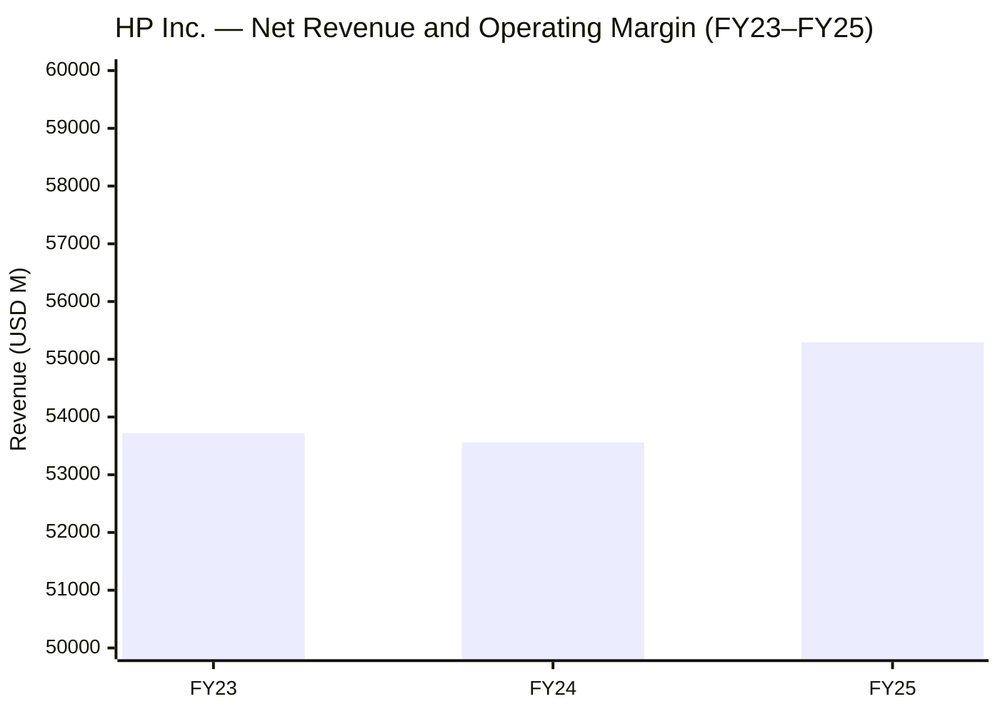
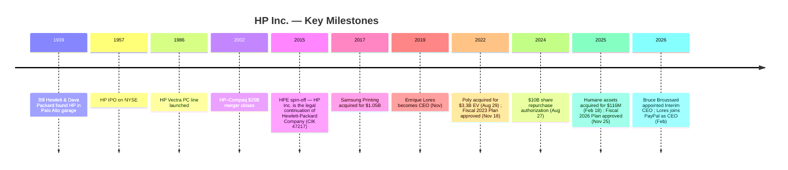
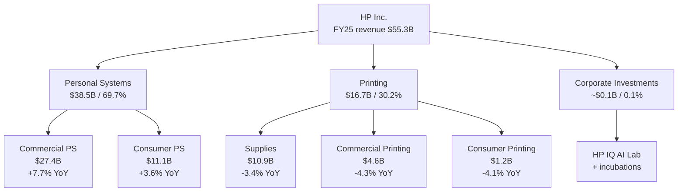
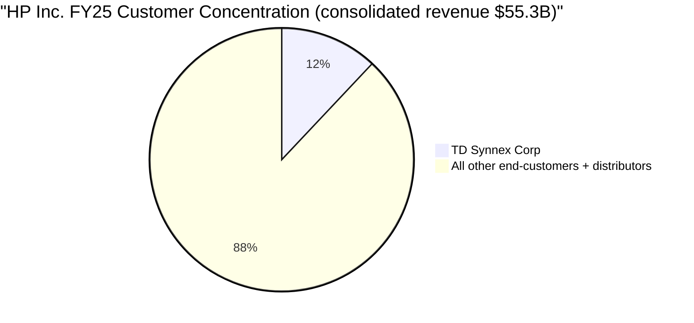
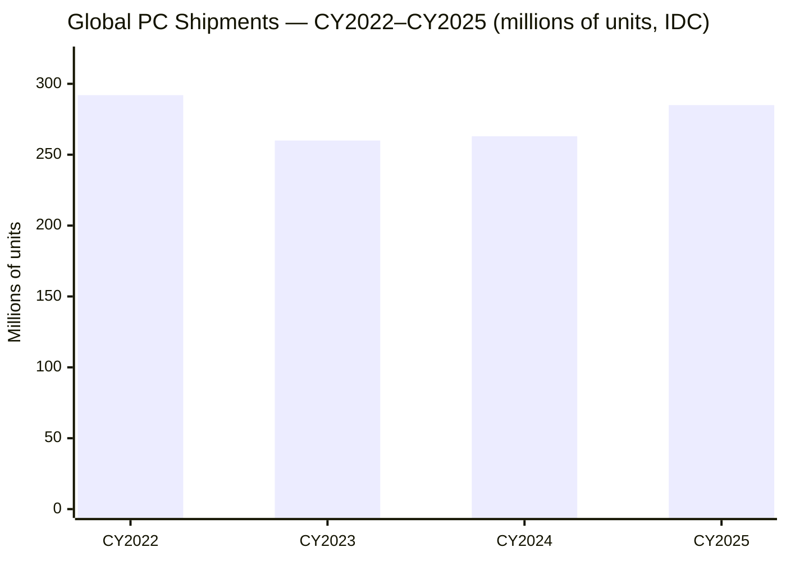
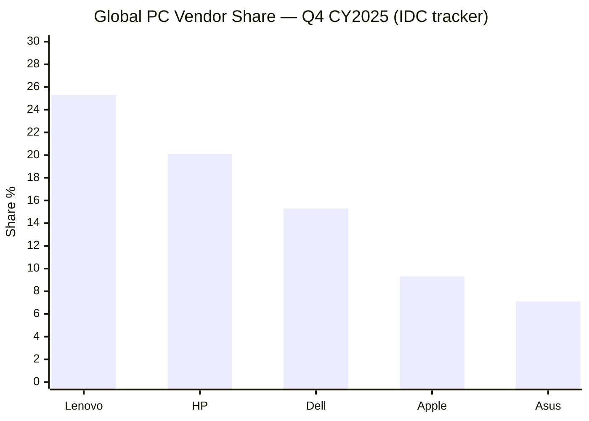
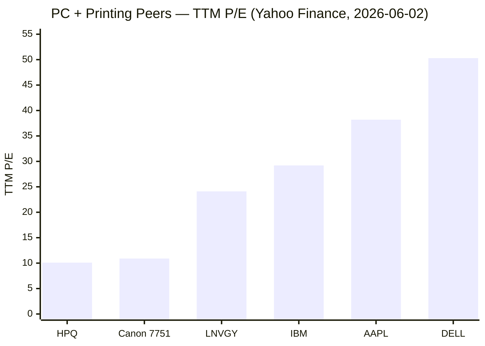
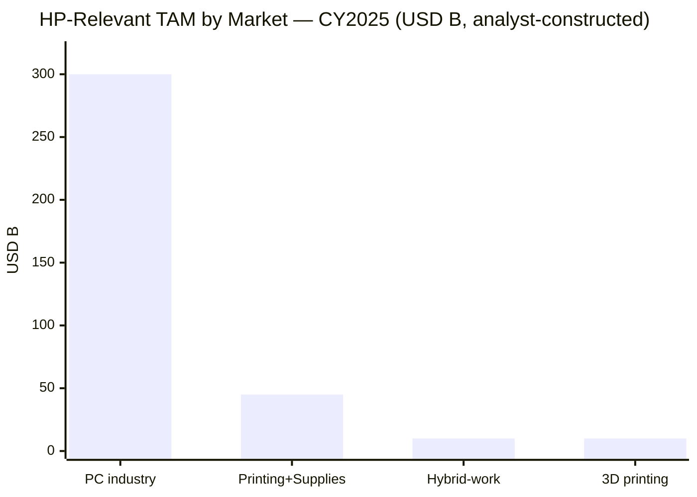

# HP Inc. 惠普公司 (NYSE: HPQ) — 公司研究

*截至 2026-06-03。股价 27.29 美元（2026-06-02 收盘）。市值约 250 亿美元。会计年度截至 10 月 31 日。初次覆盖。*

---

## 业绩指引提醒（Guidance banner）

2025-12-10 HP 在 FY25 10-K 与配套的第四季度财报中给出 FY26 (财年至 2026-10-31) 全年非 GAAP 摊薄每股收益指引区间 **$2.90–$3.20**，自由现金流 (free cash flow / FCF) 指引 **$26–30 亿**，同时宣布全新的 **Fiscal 2026 Plan 重组计划** ——一项贯穿三个财年（持续至 FY28 末）的成本优化项目，预计到 FY28 实现 **约 10 亿美元的全年总成本节省 (gross run-rate cost savings)**，对应一次性 **约 6.5 亿美元税前重组费用**（其中约 4 亿美元为劳动力相关、其余为非劳动力相关），全球岗位裁减 **4,000–6,000 人** ([HP Inc. FY25 10-K, p. 90 – Note 3 Restructuring](https://www.sec.gov/Archives/edgar/data/47217/000004721725000071/hpq-20251031.htm); [HP Inc. Q4 FY25 press release, 2025-11-25](https://www.hp.com/content/dam/sites/garage-press/press/press-releases/2025/q4-fy25-earnings/HP_Q4_2025_Earnings_Press_Release.pdf))。随后 **2026-02-24**，HP 公布 FY26 第一季度营收 $14.4B（同比 +6.9%）超预期，但管理层 **将全年业绩指引下调至区间下限**，并新增两项压力：**内存与存储芯片成本上升**，叠加 **美国贸易政策 / 关税** 对个人计算机业务 (Personal Systems, PS) 毛利率的拖累 ([HP Inc. Q1 FY26 results press release, 2026-02-24](https://www.globenewswire.com/news-release/2026/02/24/3244069/0/en/HP-Inc-Reports-Fiscal-2026-First-Quarter-Results.html))。下调指引的时间点距 **2026-02-03 CEO 换帅** ([HP Inc. Form 8-K, 2026-02-03 – Leadership Transition](https://www.sec.gov/Archives/edgar/data/47217/000114036126003514/ef20064653_8k.htm)) 仅五个工作日——前任 CEO Enrique Lores 辞职转赴 PayPal 任 CEO，董事 Bruce Broussard（前 Humana CEO，2021 年起任 HP 董事）出任 **临时（Interim）** CEO 同时启动正式 CEO 招聘程序——这一节奏应被解读为：新任代理 CEO 对前任团队的预算与目标做了重新校准。

---

## 目录

1. 公司概览
2. 公司历史
3. 管理团队
4. 产品与服务
5. 客户与上市策略
6. 行业概览
7. 竞争格局
8. 市场机会
9. 风险评估
10. 投资者视角评分卡
11. 参考资料
12. 验证日志

---

## 1. 公司概览

HP Inc. 是 **全球第二大个人计算机 (PC) 厂商** 与 **全球第一大打印机厂商**，业务覆盖 170 多个国家和地区，财务上分为三个报告分部：Personal Systems（个人计算机系统）、Printing（打印业务）、Corporate Investments（公司投资）。FY25 10-K（2025-12-10 提交，财年截止 2025-10-31）原文描述 HP 为 *"a global technology leader and creator of solutions that enable people to bring their ideas to life and connect to the things that matter most. Operating in more than 170 countries, HP delivers innovative and sustainable devices, services and subscriptions for personal computing, printing, 3D printing, hybrid work, gaming and other related technologies."* ([HP Inc. FY25 10-K, Item 1 Business](https://www.sec.gov/Archives/edgar/data/47217/000004721725000071/hpq-20251031.htm))。公司全球员工 **约 55,000 人**，总部位于加州帕罗奥图，主要研发与制造基地分布于美国 (Boise / Corvallis / Fort Collins / Fountain Valley / San Diego / Spring (Texas) / Vancouver, WA)、墨西哥蒂华纳、新加坡、瑞士日内瓦等 ([HP Inc. FY25 10-K, Item 2 Properties](https://www.sec.gov/Archives/edgar/data/47217/000004721725000071/hpq-20251031.htm))。

**FY25 财务概览。** 全年净收入 **$55,295M** (FY25)，较 FY24 的 $53,559M 同比增长 3.2%，其中 Personal Systems 贡献 $38,532M (+6.5%)、Printing $16,702M (−3.7%)；GAAP 摊薄每股收益 (diluted EPS) **$2.65**（FY24 为 $2.81，FY23 为 $3.26），净利润 $2,529M；合并经营利润率 (operating margin) 压缩 1.4 个百分点至 5.7%，原因是 PS 业务的原材料与关税成本上升超过了定价纪律所能补偿的幅度 ([HP Inc. FY25 10-K, MD&A Results of Operations](https://www.sec.gov/Archives/edgar/data/47217/000004721725000071/hpq-20251031.htm))。经营性现金流 (operating cash flow) 维持 **$3,697M**（FY24 为 $3,749M），FY25 全年向股东返还 **$19 亿**——其中现金分红 $11 亿、股票回购 $8 亿——截至 FY25 财年末，2024 年 8 月授权的 $100 亿股票回购计划仍剩余 $84 亿 ([HP Inc. FY25 10-K, Item 5 / Liquidity](https://www.sec.gov/Archives/edgar/data/47217/000004721725000071/hpq-20251031.htm))。

**FY26 已公布的两个季度。** FY26 上半年（2025-11 至 2026-04）营收 **$28,846M**（同比 +7.9%，FY25 H1 为 $26,724M），净利润 $995M（+2.5%），摊薄 EPS $1.07（+4.9%）——其中 Q1 营收 $14,438M（+6.9%）、Q2 营收 $14,408M（+9.0%）([HP Inc. Q2 FY26 10-Q, Statements of Earnings](https://www.sec.gov/Archives/edgar/data/47217/000004721726000029/hpq-20260430.htm); [HP Inc. Q2 FY26 results press release, 2026-05-27](https://investor.hp.com/news-events/news/news-details/2026/HP-Inc--Reports-Fiscal-2026-Second-Quarter-Results/default.aspx))。增长动力几乎全部来自 PS 分部的 Windows 11 / AI PC 换机周期——Q2 FY26 PS 营收 $10.2B（同比 +13%），AI PC (具备本地 AI 推理 NPU 的新一代笔记本/台式机) 在出货中的占比从 Q1 的 "35% 以上" 跃升至 Q2 的 **44%** ([HP (HPQ) Q2 2026 Earnings Call Transcript, Motley Fool, 2026-05-27](https://www.fool.com/earnings/call-transcripts/2026/05/27/hp-hpq-q2-2026-earnings-call-transcript/))——而 Printing 分部营收持平于 $4.2B，Supplies（耗材）继续多年度的长期下滑趋势。

**估值快照（valuation snapshot）。** 截至 2026-06-02 收盘 $27.29，HPQ 对应 **TTM (滚动 12 个月) 市盈率 10.1×、前瞻市盈率 9.1×、TTM 市销率 0.43×、EV/EBITDA 6.8×、股息率 4.4%** ([Yahoo Finance — HPQ Key Statistics](https://finance.yahoo.com/quote/HPQ/key-statistics/))。市净率 (price-to-book, P/B) 数值上为负 (−173.8×)——这是因为 HP 长期股票回购规模超过留存收益所积累的 **股东权益赤字 (stockholders' deficit)** $(1,323)M——并非资产减值导致；FY25 资产负债表对此有清晰披露 ([HP Inc. FY25 10-K, Consolidated Balance Sheets](https://www.sec.gov/Archives/edgar/data/47217/000004721725000071/hpq-20251031.htm))——因此 P/B 指标对 HPQ 无信息含量，应予忽略。HPQ 的 10× TTM P/E 显著低于标普 500 IT 硬件子行业中位数（约 15–20×），且低于 Dell（TTM P/E 50×，受 AI 服务器业务再定价驱动）与 Lenovo（TTM P/E 24×，含智能手机与 AI 服务器周期），但这两个对标都包含 HPQ 不具备的高估值业务模块 ([Yahoo Finance — DELL](https://finance.yahoo.com/quote/DELL/key-statistics/); [Yahoo Finance — LNVGY](https://finance.yahoo.com/quote/LNVGY/key-statistics/))。4.4% 股息率（覆盖率：GAAP 派息率 44%，FY25 自由现金流 $29 亿）锚定了 HPQ 作为成熟、低增长、强资本回报硬件特许经营权 (franchise) 的现金回报故事——市场对 HPQ 的估值反映的是：Supplies 长期收入下滑（FY25 加权贡献 −2.2%）、商品成本与关税挤压 PS 毛利率、新 CEO 下调指引、永久 CEO 接任不确定性 共四重折价。

**估值差不一定是错价 (mispricing)。** 上述折价至少部分是合理的：(a) Supplies 业务（Printing 营收 65%、毛利率最高）每年个位数下滑；(b) 商品与关税成本对 PS 毛利率的实际压力；(c) FY26 业绩指引下调悬顶；(d) 永久 CEO 未明朗带来的治理 (governance) 折价。多头逻辑（AI PC 换机周期红利 + Fiscal 2026 Plan $1B 成本节省 + 接近 100% FCF 回报股东）部分已在价格中体现；空头逻辑（内存成本压制 + Supplies 侵蚀 + 临时 CEO 执行风险）也部分已在价格中体现。

*柱状图 = 总净收入 ($M)；折线 = 经营利润率 (%)。数据来源：[HP Inc. FY25 10-K, MD&A](https://www.sec.gov/Archives/edgar/data/47217/000004721725000071/hpq-20251031.htm)。*

---

## 2. 公司历史

HP 的源头是 **1939 年** Bill Hewlett 与 Dave Packard 在加州帕罗奥图一间单车库 (one-car garage) 正式成立的合伙企业；二人 1938 年开始以 538 美元启动资金进行兼职研发工作；首款产品 HP 200A 音频振荡器中标迪士尼为《幻想曲》(Fantasia) 的录音生产 ([Hewlett-Packard — Wikipedia](https://en.wikipedia.org/wiki/Hewlett-Packard); [Britannica — Hewlett-Packard Company](https://www.britannica.com/money/Hewlett-Packard-Company))。位于 Addison Avenue 367 号的车库被加州登记为州历史文化遗产，被誉为"硅谷的诞生地"。公司以精密测试测量仪器起家，于 1980 年代扩展至计算机与打印机业务，1986 年推出 HP Vectra 系列正式进入 PC 市场。

**现代 HP Inc. 的形态由两次重大公司交易决定。** 第一次是 **2002 年的康柏 (Compaq) 合并案**——当时 CEO Carly Fiorina 力推的 250 亿美元换股并购，遭到 Walter Hewlett 与创始家族强烈反对——使 HP 一度成为全球最大 PC 厂商，但同时也将打印与 PC 业务与企业服务器特许经营权深度交织达 13 年 ([Britannica — Hewlett-Packard Company](https://www.britannica.com/money/Hewlett-Packard-Company))。第二次是 **2015 年 11 月 1 日 Hewlett-Packard Company 一拆为二**：**HP Inc.** (NYSE: HPQ) 继承了 PC + 打印 + 3D 打印业务；**Hewlett Packard Enterprise** (NYSE: HPE) 继承了服务器、存储、网络、软件与服务业务 ([Hewlett Packard Enterprise Form 10-12B/A, 2015](https://www.sec.gov/Archives/edgar/data/0001645590/000119312515338732/d944600dex991.htm))。FY25 10-K 开头明确说明："在本 10-K 报告中，所有期间所提及的 'we / us / our / the company / HP / HP Inc.' 均指 HP Inc.（原 Hewlett-Packard Company）及其合并子公司" ——原 SEC 注册主体（CIK 0000047217，2015-10-23 之前的备案名为 Hewlett-Packard Company）保留为 HP Inc.，HPE 为新拆分主体 ([EDGAR — HP Inc. CIK 0000047217 filings](https://www.sec.gov/cgi-bin/browse-edgar?action=getcompany&CIK=0000047217))。

**2015 年分拆以来的三大战略性举措。** (1) **三星打印业务并购** (2017-09，$10.5 亿美元) ——将三星的 A3 复印机业务与约 6,500 项专利收入 HP，使 HP 能够以统一的打印/复印产品线挑战 Canon / Ricoh 主导的中量办公打印市场。(2) **Poly 并购** (2022-03 宣布，2022-08-29 完成，$40/股、企业价值 **$33 亿**)——补齐企业级音视频协作终端（耳机、视频条、会议室系统），布局"混合办公"长期支出主题 ([HP Inc. press release: HP Inc. to Acquire Poly, March 2022](https://www.hp.com/us-en/newsroom/press-releases/2022/hp-inc-to-acquire-poly.html); [HP Inc. FY25 10-K, Note 11 Borrowings — March 2029 Poly Notes reference](https://www.sec.gov/Archives/edgar/data/47217/000004721725000071/hpq-20251031.htm))。(3) **Humane 资产收购** (2025-02-18 宣布，2025-02 月末完成，**$1.16 亿美元** 总对价) ——收购已破产的 Humane AI Pin 团队的 Cosmos AI 软件平台、约 300 项已授权与申请中专利，以及核心工程师团队，整合为新成立的 **HP IQ** AI 创新实验室，作为 HP 设备未来 AI 软件能力的种子 ([HP press release: HP Accelerates AI Software Investments, Feb 2025](https://investor.hp.com/news-events/news/news-details/2025/HP-Accelerates-AI-Software-Investments-to-Transform-the-Future-of-Work/default.aspx); [SiliconANGLE — HP to acquire assets from Humane in $116M deal, 2025-02-18](https://siliconangle.com/2025/02/18/hp-acquire-assets-ai-pin-maker-humane-116m-deal/))。

**与并购并行的是两轮大规模重组。** **Fiscal 2023 Plan**（2022-11-18 董事会批准；FY25 财年末"基本完成"）——总裁员约 9,500 人："约 9,500 名员工通过自愿提前退休 (EER) 与离职方式离开公司。HP 累计为该计划支付了 8.73 亿美元 (severance) 解雇赔偿与 3.47 亿美元 (infrastructure) 基础设施重组费用" ([HP Inc. FY25 10-K, Note 3 Restructuring](https://www.sec.gov/Archives/edgar/data/47217/000004721725000071/hpq-20251031.htm))。新的 **Fiscal 2026 Plan**（2025-11-25 董事会批准）目标在 FY28 末再裁减 4,000–6,000 个全球岗位："HP expects to reduce global headcount by approximately 4,000 to 6,000 employees. HP estimates that it will incur pre-tax charges of approximately $650 million relating to labor and non-labor actions." ([HP Inc. FY25 10-K, Note 3 Restructuring](https://www.sec.gov/Archives/edgar/data/47217/000004721725000071/hpq-20251031.htm))，被定位为"通过 AI 提升生产率"的成本侧呼应。该计划于 Q4 FY25 财报当日 (2025-11-25) 宣布——保留了一种期权：将来上任的永久 CEO 可以"接收"成本节省的功劳，但不必为裁员决定背锅。

**最近的拐点是公司治理。** 2026-02-03，HP 公告 **Enrique Lores 辞去 CEO 兼总裁职务**（生效日 2026-02-02 营业结束），结束其在 HP 36 年的职业生涯与 7 年 CEO 任期，理由是"追求其他职业机会"——该机会同日披露：3 月 1 日出任 PayPal Holdings CEO——HP 董事会任命 **2021 年起任董事的 Bruce Broussard（前 Humana CEO，任期 2013-01 至 2024-07）** 为临时 CEO，同时启动永久 CEO 招聘 ([HP Inc. Form 8-K, 2026-02-03](https://www.sec.gov/Archives/edgar/data/47217/000114036126003514/ef20064653_8k.htm); [HP Inc. press release: Leadership Transition](https://investor.hp.com/news-events/news/news-details/2026/HP-Inc--Announces-Leadership-Transition/default.aspx))。2026-02-25 提交的 2026 委托书 (DEF 14A) 确认招聘程序仍在进行：*"Bruce Broussard, who has served as a Director since 2021, has agreed to lead the Company as interim CEO through the transition period. The Board has formed a CEO Search Committee" ([HP Inc. DEF 14A 2026, p. 13](https://www.sec.gov/Archives/edgar/data/47217/000004721726000015/hpq-20260225.htm))*。

*数据来源：本节所引用的备案文件。*

---

## 3. 管理团队

**创始人（历史背景）。** Bill Hewlett (1913–2001，斯坦福大学电子工程学士 1936、麻省理工学院 MSEE 1936) 与 David Packard (1912–1996，斯坦福电子工程学士 1934、斯坦福硕士 1939) 1939 年凭借 Hewlett 硕士论文中的低成本可变频率音频振荡器设计联合创立 HP ([Britannica — Hewlett-Packard Company](https://www.britannica.com/money/Hewlett-Packard-Company))。两位创始人提出的 **"The HP Way"** 经营哲学——分权管理、目标管理 (MBO)、尊重员工——定义了 HP 此后 40 年的企业文化，至今仍体现于 2026 委托书的"人力资本与文化"叙述中 ([HP Inc. DEF 14A 2026 — Culture and Talent](https://www.sec.gov/Archives/edgar/data/47217/000004721726000015/hpq-20260225.htm))。1990 年代起两位创始人均不再担任运营角色；Hewlett 与 Packard 家族基金会（Hewlett Foundation、David and Lucile Packard Foundation）已于 2000 年代将持有的 HP 股权多元化处置，目前不构成实质性持股。本节按公司研究规范，正文之后仅覆盖当前 CEO。

**临时 CEO — Bruce Broussard (63 岁)。** 2026-02-03 出任临时 CEO ([HP Inc. Form 8-K, 2026-02-03](https://www.sec.gov/Archives/edgar/data/47217/000114036126003514/ef20064653_8k.htm))。Broussard 自 2021 年起任 HP 董事，根据 2026 委托书披露其作为临时 CEO 不再担任董事会下属委员会职务 ([HP Inc. DEF 14A 2026, p. 13](https://www.sec.gov/Archives/edgar/data/47217/000004721726000015/hpq-20260225.htm))。他的运营背景 **不在科技硬件而在医疗保健与服务**，这是本次任命最值得关注的细节。委托书原文记载："President, Chief Executive Officer, and Director (January 2013–July 2024) and Advisor (July 2024–February 2026), Humana, a health insurance company; Chief Executive Officer, McKesson Specialty/US Oncology, Inc. (January 2008–December 2011); In 11 years at US Oncology, Inc., which was acquired by McKesson, he held senior positions including Chief Financial Officer, President and Chairman of the Board" ([HP Inc. DEF 14A 2026, p. 13](https://www.sec.gov/Archives/edgar/data/47217/000004721726000015/hpq-20260225.htm))。在 Humana (NYSE: HUM) 担任 CEO 的 11 年半（2013-01 至 2024-07）期间，公司营收从约 $40B 增长至超 $100B，跃升为美国第二大 Medicare Advantage 保险公司；但其任期最后两个季度因 Medicare 利率下调出现利润率压缩与股价大幅回调，他转任顾问职务后于本次出任 HP 临时 CEO。Broussard 同时担任 Marsh & McLennan Companies 董事，并曾任 KeyCorp 董事。

按 2026 委托书原文，他的角色 **明确是临时性的**，由 CEO 招聘委员会在外部猎头公司协助下"对永久 CEO 的能力画像、技能、经验和胜任力进行评估和确认"([HP Inc. DEF 14A 2026, p. 13](https://www.sec.gov/Archives/edgar/data/47217/000004721726000015/hpq-20260225.htm))。投资者应注意三个含义：

(1) **战略稳定大于战略重塑**——一位外部行业背景、强董事会经验、但无 PC/打印运营经历的临时 CEO，最可能的角色是 **守住** 既定计划（Fiscal 2026 Plan 成本节省、AI PC 产品路线图、约 100% FCF 回报股东的资本政策），而非启动重大战略转向，如并购或分拆。

(2) **"超预期 + 下调" 的财务节奏与此一致**——Q1 FY26 营收超预期，但全年 EPS 与 FCF 指引同步下调至区间下限 ([HP Inc. Q1 FY26 press release, 2026-02-24](https://www.globenewswire.com/news-release/2026/02/24/3244069/0/en/HP-Inc-Reports-Fiscal-2026-First-Quarter-Results.html))——这是新任代理 CEO "去风险化 (de-risking)" 继承目标的经典手法。

(3) **永久 CEO 接任本身就是事件性风险**——未来人选可能修订中期计划（是否分拆出售 Printing？是否加倍 AI 软件投入？是否调整分红政策？）——在永久 CEO 任命之前，估值倍数应包含这一层不确定性。

**离任 CEO — Enrique Lores（背景说明）。** Lores 在 HP 工作 36 年，2019-11-01 升任总裁兼 CEO，2026-02-02 营业结束时辞职，自 2026-03-01 起出任 PayPal Holdings CEO ([HP Inc. press release: Leadership Transition](https://investor.hp.com/news-events/news/news-details/2026/HP-Inc--Announces-Leadership-Transition/default.aspx))。其任期内的关键事件包括：Poly 并购（2022）、Fiscal 2023 Plan 成本优化（2022–2025）、击退施乐 (Xerox) 敌意收购要约（2020 年初）、将 AI PC 提升为战略优先级。但 FY25 是连续第二个经营利润率下滑的财年，并触发新一轮 Fiscal 2026 Plan，这表明 HP 的战略需要多年期重置——而他已不是合适的执行者。

---

## 4. 产品与服务

HP 的三个分部 (segments)——**Personal Systems（FY25 营收占比 69.7%）**、**Printing（30.2%）**、**Corporate Investments（<0.1%）**——每个分部内又按客户面 (customer-facing) 业务单元 (business unit) 进一步细分，构成公司的收入核算结构。本节按 FY25 10-K 的原始产品矩阵作为锚点。

### 4.1 Personal Systems — PC 增长引擎

10-K 原文定义：*"Personal Systems offers desktops, notebooks, and workstations (including HP's portfolio of AI PCs and workstations), thin clients, retail point-of-sale ('POS') systems, displays, hybrid systems, software, solutions including endpoint security and services. We provide lifecycle services including support and deployment, configurations, and extended warranty services. We support a multi-operating system and multi-architecture strategy, primarily using Microsoft Windows and Google Chrome operating systems. Our platforms incorporate processors from Intel, and AMD, including integrated AI acceleration, as well as NVIDIA GPUs for advanced graphics and compute workloads." ([HP Inc. FY25 10-K, Item 1 Business](https://www.sec.gov/Archives/edgar/data/47217/000004721725000071/hpq-20251031.htm))*。分部下分两个业务单元报告：

| 业务单元 | FY25 营收 ($M) | FY24 营收 ($M) | FY23 营收 ($M) | YoY (FY25) | 内容 |
|---|---|---|---|---|---|
| **Commercial PS（商用 PS）** | 27,438 | 25,486 | 24,712 | +7.7% | Pro / Elite 商用笔电、Z 系列工作站、瘦客户机 (thin clients)、POS 系统、Dragonfly 与 Chromebook 商用机型，含生命周期服务 |
| **Consumer PS（消费 PS）** | 11,094 | 10,709 | 10,972 | +3.6% | Omni 消费 PC 系列、Omen 与 Victus 游戏笔电、Spectre / Envy / Pavilion 系列、消费 Chromebook |
| **Personal Systems 合计** | **38,532** | **36,195** | **35,684** | **+6.5%** | |

数据来源：[HP Inc. FY25 10-K, MD&A Segment Information — Personal Systems](https://www.sec.gov/Archives/edgar/data/47217/000004721725000071/hpq-20251031.htm)。

FY25 增长拆解（MD&A 原文）："Personal Systems net revenue increased 6.5% (increased 6.7% on a constant currency basis) in the fiscal year 2025, as compared to the prior-year period. The net revenue increase was primarily due to a 4.3% increase in unit volume driven by the Windows-based PC operating system refresh, and a 3.1% increase in average selling price ('ASPs'). The increase in ASPs is primarily due to favorable mix shift towards Commercial PS and disciplined pricing, partially offset by unfavorable currency impact." ([HP Inc. FY25 10-K, MD&A Segment Information — Personal Systems](https://www.sec.gov/Archives/edgar/data/47217/000004721725000071/hpq-20251031.htm))。该拆解是 HPQ FY26 的核心叙事：**Windows 10 终止支持（扩展安全更新于 2025-10-14 到期）正在拉动企业 PC 换机需求，AI PC 产品组合 (mix-up) 同时叠加平均售价 (ASP) 上行**。Q2 FY26 数据印证：PS 营收 $10.2B（YoY +13%），Commercial PS +14%、Consumer PS +10%，AI PC 出货占比 **44%**，较 Q1 的"35% 以上"再提升 ([HP Inc. Q2 FY26 results, Motley Fool transcript, 2026-05-27](https://www.fool.com/earnings/call-transcripts/2026/05/27/hp-hpq-q2-2026-earnings-call-transcript/); [Futurum — HP Q2 FY 2026 Earnings Emphasize AI PC Mix Shift Amid Cost Pressure, 2026-05-27](https://futurumgroup.com/insights/hp-q2-fy-2026-earnings-emphasize-ai-pc-mix-shift-amid-cost-pressure/))。

FY25 PS 经营利润 **$2,054M**、经营利润率 **5.3%**——较 FY24 6.2% 下滑 0.9 个百分点，MD&A 明确归因于商品与关税成本上升："Gross margin decreased primarily due to higher commodity and tariff costs, partially offset by disciplined pricing actions." ([HP Inc. FY25 10-K, MD&A Segment Information — Personal Systems](https://www.sec.gov/Archives/edgar/data/47217/000004721725000071/hpq-20251031.htm))。

**产品物理上做什么 (中文释义 / Plain-language gloss)。** 一台 Commercial PS PC 是企业管理的端点设备：开机加载硬件强制信任根 **HP Sure Start BIOS**，Windows 11 + Microsoft Pluton 或 HP Wolf Security 构成信任链，通过 HP Workforce Solutions 与企业 IT 集成实现批量配置、Device-as-a-Service (设备订阅) 合同与故障/维修生命周期管理。新一代 **AI PC** 在 CPU SoC 中集成神经网络处理单元 (Neural Processing Unit, NPU)——可选 Intel Core Ultra Series 2（Lunar Lake / Arrow Lake）、AMD Ryzen AI 300、或 Qualcomm Snapdragon X——本地 AI 推理算力 ≥40 TOPS，使 Windows Copilot+ 功能（Recall、Cocreator、实时翻译字幕）能本地运行而无需调用云端大模型 (LLM)。HP 相对底层芯片所添加的价值是：企业安全栈（Sure Start、Sure Click 浏览器虚拟化隔离、Sure Sense AI 威胁检测、Sure Run 应用执行控制、Wolf Security 服务）、设备管理工具、HP Anyware / HP Connect 远程管理代理，使大规模 AI PC 机群在企业层面可被治理——这是消费 AI PC 无法提供的。

**商用 vs 消费 PS 的差异。** 二者都卖 PC，但单位经济模型截然不同。Commercial PS 经企业经销渠道（TD Synnex、Ingram Micro、CDW、Insight）销售，单位毛利率 6–8%，但多年期换机合同与附加服务可使单台终身收入翻倍。Consumer PS 经零售渠道（Amazon、Best Buy、Walmart 及海外大型零售商）销售，单位毛利率 3–4%，无服务附加，对消费可选支出周期 (gaming 周期对 Omen / Victus 的影响)、开学季 (back-to-school) 节奏高度敏感。FY25 7.7% / 3.6% 的增速差正是这一结构的体现——企业换机潮拉动 Commercial；消费侧充其量勉强抵抗销量通胀。**战略意义**：AI PC 产品组合上行正在叠加 Windows 11 / 终止支持驱动的销量上行；中期风险是 AI 功能是否粘性强到足以缩短 1–2 年的换机周期（将延长红利期），还是只是把需求从 CY27 拉到 CY26（届时 CY27 将出现空窗）。

### 4.2 Printing — 现金引擎

10-K 原文："Printing provides consumer and commercial printer hardware, supplies, services and solutions. Printing is also focused on Graphics and 3D Printing and Personalization in the commercial and industrial markets." ([HP Inc. FY25 10-K, Item 1 Business](https://www.sec.gov/Archives/edgar/data/47217/000004721725000071/hpq-20251031.htm))。Printing 是 **小营收但大利润** 分部——FY25 分部经营利润 $3,118M / 营收 $16,702M = **18.7% 经营利润率**，远高于 PS 的 5.3%——而 Printing 内部，**Supplies（耗材）** 是主要的经济引擎。

| 业务单元 | FY25 营收 ($M) | FY24 营收 ($M) | FY23 营收 ($M) | YoY (FY25) | 内容 |
|---|---|---|---|---|---|
| **Supplies（耗材）** | 10,916 | 11,295 | 11,452 | −3.4% | 墨盒、激光/碳粉盒、印刷耗材、工业图形耗材、3D 打印耗材——经常性消费品收入 |
| **Commercial Printing（商用打印）** | 4,633 | 4,841 | 5,250 | −4.3% | 办公打印机、Graphics 印刷设备 (Indigo 数字轮转印刷机、PageWide 工业机)、3D 打印与个性化 (不含耗材) |
| **Consumer Printing（消费打印）** | 1,153 | 1,202 | 1,327 | −4.1% | 家用打印机硬件 (不含耗材) |
| **Printing 合计** | **16,702** | **17,338** | **18,029** | **−3.7%** | |

数据来源：[HP Inc. FY25 10-K, MD&A Segment Information — Printing](https://www.sec.gov/Archives/edgar/data/47217/000004721725000071/hpq-20251031.htm)。

三点观察：

(1) **Supplies 是 Printing 营收的 65.4%、毛利率最高的引擎**，但 FY25 −3.4% 同比下滑是 HPQ 最持续的长期漂移。MD&A 归因为："decline in the installed base and usage and currency impacts, partially offset by disciplined pricing" ([HP Inc. FY25 10-K, MD&A Printing](https://www.sec.gov/Archives/edgar/data/47217/000004721725000071/hpq-20251031.htm))——即全球 HP 打印机装机基数在缩水、剩余装机的使用频率下降，叠加非原装耗材（refill、remanufactured、来自奔图等中国厂商的 "compatible" 仿品）持续侵蚀份额。

(2) **Commercial Printing** 包含 Indigo 数字轮转印刷机与 Graphics 业务——与 Xerox、Konica Minolta、Fujifilm 在生产印刷 (production print) 市场竞争——FY25 6.2% 的销量下滑反映了生产印刷市场的持续疲软，自 2014–17 周期以来已不再是 HP 的结构性增长故事。

(3) **3D Printing & Personalization**（Jet Fusion 与 Metal Jet 增材制造平台）合并报告于 Commercial Printing 中，未单独披露。*分析师观点*：3D 业务并未达到 HP 2016 年发布时所暗示的几亿美元营收线，按当前运行速率难以成为分部的关键拉动。

**战略意义**：Printing 是 HPQ 的自由现金流引擎——18.7% 的经营利润率是分红与回购的资金来源——但分部处于慢性长期下滑（FY25 营收 −3.7%、固定汇率口径 −2.7%）。Fiscal 2026 Plan 的裁员将不成比例地向 Printing 运营与耗材渠道倾斜，既为保护分部利润，也因为"AI 驱动的生产率提升"叙事在这里比在 PS 更自然。*分析师观点：将 Printing 作为独立的现金牛实体分拆，保留 Personal Systems 作为 AI PC 增长导向的纯业务标的——这是卖方曾不时讨论的一种重组方案，也是新任永久 CEO 可能评估的战略选项之一。目前没有任何备案文件确认此类计划；仅作场景规划，非市场共识。*

### 4.3 Corporate Investments

很小的一项——营收低于 $50M、多数年份报告为可忽略的亏损——覆盖 "certain business incubation projects and investments in digital enablement" ([HP Inc. FY25 10-K, Item 1 Business](https://www.sec.gov/Archives/edgar/data/47217/000004721725000071/hpq-20251031.htm))。新成立的 **HP IQ** AI 软件创新实验室（前 Humane Cosmos 团队）是该分部下最显著的项目。当前对估值不构成实质影响。

### 4.4 各分部如何联动

*数据来源：[HP Inc. FY25 10-K, MD&A Segment Information](https://www.sec.gov/Archives/edgar/data/47217/000004721725000071/hpq-20251031.htm)。*

战略综合：PS 是 **增长 + 份额防御引擎**（在 AI PC 换机潮中战胜 Lenovo 与 Dell、在 Windows 11 企业迁移中捕获 Commercial 客户），Printing 是 **利润 + 资本回报引擎**（Supplies 的现金流支撑分红与回购）但被作为现金牛而非增长业务管理。风险是 PS 利润率压缩快于 PS 增速加速，Printing 长期下滑无法被 PS 边际贡献完全抵消——这本质上就是 FY25 的故事（分部维度：PS 营收 +6.5% / 利润率 −0.9ppt；Printing 营收 −3.7% / 利润率 −0.3ppt；合并经营利润率 −1.4ppt 至 5.7%）。

---

## 5. 客户与上市策略

**渠道架构（channel architecture）。** HP FY25 10-K 描述其分销模型为多层级间接渠道（multi-tier indirect distribution）："the majority of our overall revenue is made through channel resellers"——客户被划分为消费 (consumer) 与商用 (commercial) 两个大组，HP 直接履约或通过零售商 (retailers)、经销商 (resellers)、分销合作伙伴 (distribution partners)、系统集成商 (system integrators) 履约 ([HP Inc. FY25 10-K, Item 1 Business — Sales, Marketing and Distribution](https://www.sec.gov/Archives/edgar/data/47217/000004721725000071/hpq-20251031.htm))。主要渠道伙伴包括 IT 分销巨头—— **TD Synnex、Ingram Micro、CDW、Insight Enterprises**（北美）；**Tech Data Europe (现 TD Synnex EMEA)、Westcoast、ALSO**（欧洲）；**Synnex Japan、Daiwabo、Macnica**（日本）；**Digital China、Synnex Greater China**（大中华区）。直营履约（HP.com、HP Store、HP 企业直销团队）占总收入少数，但在 Commercial PS 托管服务与 DaaS 合同中占较高份额。

**客户集中度——TD Synnex 成为 10%+ 客户。** FY25 10-K 披露了一项重要的新客户集中度信息："One customer, TD Synnex Corp, accounted for 12% of HP's net revenue for fiscal year 2025. No single customer represented 10% or more of HP's net revenue in fiscal year 2024 or 2023." ([HP Inc. FY25 10-K, Segment Reporting — Major Customers](https://www.sec.gov/Archives/edgar/data/47217/000004721725000071/hpq-20251031.htm))。这是一个值得关注的变化。**TD Synnex** 是全球第一大 IT 分销商（FY24 营收约 $58B），由 2021-09 的 SYNNEX 与 Tech Data 合并而生；其在 HP 营收中的占比（**合并口径，非分部口径**）由 FY24 的低于 10% 阈值一年内升至 **占合并营收的 12%**——更多反映分销渠道整合（Tech Data 的渠道版图已并入 SYNNEX 合并实体），而非 HP 在特定客户中的份额变化。该 12% 是 **分销商客户敞口**，非 **终端客户敞口**——TD Synnex 本身向数千家 VAR、MSP、企业 IT 买家分销。其带来的风险是：依赖单一渠道融资 (channel-finance) 对手——如 TD Synnex 出现流动性压力或重谈付款条件，HP 将是受影响最直接的 PC OEM。**没有单一终端客户**（企业、政府、教育采购方）达到 10% 阈值；10-K 未点名任何其他 10%+ 客户。

**地理分布（geographic mix）。** FY25 美国营收 **$19,212M（占总营收 34.7%）**、其他国家合计 $36,083M（65.3%）——较 FY24 的 $18,790M（35.1%）与 FY23 的 $18,829M（35.0%）小幅美国侧偏移 ([HP Inc. FY25 10-K, Segment Reporting — Geographic Information](https://www.sec.gov/Archives/edgar/data/47217/000004721725000071/hpq-20251031.htm))。10-K 明确："other than the United States, no country represented more than 10% of HP net revenue in any fiscal year presented" ([同上](https://www.sec.gov/Archives/edgar/data/47217/000004721725000071/hpq-20251031.htm))——意味着 HP 在国际市场的营收是真正分散的（中国、德国、日本、英国、法国等第二梯队国家中没有任何单一国家达到 10% 阈值）。HP 通过三个区域总部运营：帕罗奥图（美洲）、日内瓦（EMEA）、新加坡（亚太），主要制造基地分布于墨西哥蒂华纳、美国（Boise / Corvallis / Fort Collins 等）、新加坡、马来西亚槟城、中国重庆 / 上海、东欧。

*单一分母：合并营收。数据来源：[HP Inc. FY25 10-K, Note 19 Segment Reporting — Major Customers](https://www.sec.gov/Archives/edgar/data/47217/000004721725000071/hpq-20251031.htm)。*

**客户结构混合（分析师构建，非披露）。** HP 在 10-K 层面只披露 Commercial PS vs Consumer PS 的营收分类，并未披露终端客户构成。*分析师观点*（分部级，非披露）：Commercial PS 内，企业客户约 50–55%、中小企业 (SMB) 约 25–30%、公共部门 + 教育约 20–25%；Consumer PS 内，零售消费者约 85–90%，游戏品类通过 Omen 与 Victus 子品牌占有意义（Omen 历史上披露为营收 >$1B 的子品牌，目前 HP 不再单独披露）。客户留存与 Device-as-a-Service ARR 均未披露。

---

## 6. 行业概览

HP 经营所在的三个行业各按不同周期运动：**全球 PC 行业**（主要业务）、**全球打印行业**（现金引擎但慢性下滑）、以及 **AI 端侧推理硬件、3D 打印、企业协作终端** 等新兴邻近业务（规模较小，增长导向）。

**全球 PC 市场——2025 年重新加速，2026 年更不确定。** 据 IDC，CY2025 全球 PC 出货量 **同比 +8.1% 至 2.847 亿台**，Q4 2025 单季同比 +9.6% 至 7,640 万台 ([IDC via FoneArena: Global PC Shipments up 9.6% YoY in Q4 2025, 2026-01-13](https://www.fonearena.com/blog/473498/global-pc-shipments-q4-2025.html); [TechSpot: Global PC shipments jumped 9.6% to 76.4M units in Q4 2025, 2026-01-13](https://www.techspot.com/news/110907-global-pc-shipments-jumped-96-764m-units-q4.html))。Gartner 同期数据显示 **全年 +9.1%、Q4 +9.3%** ([Gartner — Worldwide PC Shipments, 2026-01-20](https://www.gartner.com/en/newsroom/press-releases/2026-1-20-gartner-says-worldwide-pc-shipments-increased-9-point-3-percent-in-fourth-quarter-of-2025-and-9-point-1-percent-for-the-full-year))。驱动力清晰：(a) **Windows 10 终止支持**（2025-10-14）将企业换机需求前置至 FY25 / FY26；(b) **AI PC 引入周期**——Intel Core Ultra Series 2、AMD Ryzen AI、Qualcomm Snapdragon X 将本地 NPU 推理引入主流 SKU；(c) 疫情后期采购的 PC 整体进入换代窗口。展望 CY2026，**HP 管理层自身态度审慎**——HP CFO Karen Parkhill 在 Q2 FY26 财报电话会议表示 HP 预期"日历 2026 年 PC 销量将出现两位数下降 (decline double digits in calendar '26)"——但 AI PC ASP 上行（HP Q2 FY26 AI PC 出货占比 44%，而 FY25 早期还只是个位数）可能对 HP 而言抵消大部分销量逆风 ([HP (HPQ) Q2 2026 Earnings Call Transcript, Motley Fool, 2026-05-27](https://www.fool.com/earnings/call-transcripts/2026/05/27/hp-hpq-q2-2026-earnings-call-transcript/))。

**全球打印行业——长期下滑。** 全球办公打印市场销量已连续超过十年下滑，纸质输出量随数字化下降。IDC 长期将硬拷贝外设市场定位为不到 $30B 年收入、低至中个位数年下滑；**与 HP 相关的细分**（激光 / 喷墨办公 + 家用打印机 + 耗材）全球规模约 $40–45B（含耗材），HP $16.7B 的 FY25 营收对应 **全球营收份额约 35–40%**。单设备打印量过去 10 年每年下降 2–3%，售后耗材份额持续被非原装耗材（refill、remanufacturing、来自中国厂商如奔图的 "compatible" 通用兼容墨盒）以及压缩耗材定价的托管打印服务 (managed print services) 安排所侵蚀。Printing 中的增长口袋很窄：工业 / 图形印刷（Indigo 用于短版标签与包装的数字轮转印刷）、量产用 3D 打印 (Jet Fusion、Metal Jet)、以及通过安全 / AI 功能维持 ASP。

**AI 端侧推理 (On-device AI / AI edge inference)。** 一个新且难以精确量化的品类。Intel Lunar Lake、AMD Ryzen AI 300、Qualcomm Snapdragon X 等 CPU SoC 引入 ≥40 TOPS 本地 AI 推理的 NPU，创造出新的设备品类——按微软的术语称为 **Copilot+ PC**——AMD / Intel 与微软将其定位为继触屏与 Surface 之后的下一次平台转移。这是真正的长期驱动还是单周期的 ASP 提升，取决于应用动量：Copilot、Cocreator、Recall 以及第三方本地 AI 功能是否会创造足够的终端用户拉力，将换机周期缩短至历史 4–5 年以下？目前 FY26 证据（HP AI PC 出货 44% 并持续上升）符合 ASP 提升的解读；长期平台转移的解读尚待证明。

**3D 打印（增材制造）。** 全球规模较小（约 $6–8B，IDC）但增长向上的行业。HP 2016 年以 Multi Jet Fusion 平台进入，2020 年扩展至 Metal Jet 金属打印；该分部未能扩展至早期预测的 $1–2B 营收线，原因是结构性的——增材制造尚未能在 HP 经济模型所依赖的大批量零件上取代注塑成型。视为多年期回报、尚未在模型中显现的 R&D 投入。

**行业增长波瀑（PC + Printing 核心业务）。** PC 行业 CY26 展望为：销量下降、ASP 上升，营收基本持平至略涨（取决于 AI PC 组合占比）；Printing 行业继续中个位数下滑，随装机基数衰减略有加速。HP FY26 业绩指引下限（$2.90 非 GAAP EPS）隐含约中个位数营收增长（完全来自 PS），Printing 持平至下滑，SG&A 通过 Fiscal 2026 Plan 成本优化保持持平。

*数据来源：IDC 季度跟踪数据——Q4 2025 发布，全年出货 2.847 亿台、同比 +8.1% ([TechSpot: Global PC shipments jumped 9.6% to 76.4M units in Q4 2025, 2026-01-13](https://www.techspot.com/news/110907-global-pc-shipments-jumped-96-764m-units-q4.html); [IDC PC tracker](https://www.idc.com/promo/pcdforecast/))。*

---

## 7. 竞争格局

**10-K 自报竞争对手名单。** FY25 10-K Item 1 按分部点名 HP 的主要竞争对手 ([HP Inc. FY25 10-K, Item 1 Business — Competition](https://www.sec.gov/Archives/edgar/data/47217/000004721725000071/hpq-20251031.htm))：

> "Personal Systems. … Our primary competitors are Acer Inc., Apple Inc., ASUSTeK Computer Inc., Dell Inc., Huawei Technologies Co., Ltd., Lenovo Group Limited, Logitech International S.A., Microsoft Corporation, Samsung Electronics Co., Ltd., and Toshiba Corporation."

> "Printing. … Our primary competitors include Brother Industries, Ltd., Canon Inc., Pantum International Limited, Seiko Epson Corporation, The Ricoh Company Ltd., and Xerox Corporation Ltd."

这份清单是权威的起点。最具影响力的 PC 竞争对手是 Lenovo（联想）、Dell（戴尔）、Apple（苹果）；最具影响力的打印竞争对手是 Canon（佳能）、Brother（兄弟）、Epson（爱普生）、以及越来越突出的 Pantum（奔图）。

**PC 市场份额——Q4 2025 vs HP**。最新 IDC 跟踪数据将 HP 定位为 **全球第二大 PC 厂商，份额 20.1%、Q4 2025 出货 1,540 万台（YoY +12.1%）**，落后联想 (25.3% 份额、1,930 万台、+14.4%)，领先戴尔 (15.3%、1,170 万台)、苹果 (9.3%、710 万台、全年 +0.2%) 与华硕 (7.1%、540 万台) ([IDC via Technext: Lenovo tops PC shipments Q4 2025, 2026-01-13](https://technext24.com/2026/01/13/lenovo-tops-global-pc-shipment-grew-q425/); [IDC via iClarified: Global PC Shipments Q4 2025, Apple 7.1M, 2026-01-13](https://www.iclarified.com/99612/global-pc-shipments-jump-96-in-q4-2025-apple-ships-71-million-macs-idc))。HP 相对位置基本稳定但与联想的差距在拉大：联想 Q4 销量 YoY +14.4% 高于 HP 的 +12.1%，联想全年 2025 出货 +14.5% 至 6,180 万台。**苹果在 2025 年显著跑输大盘**（Mac 全年 +0.2%），表明 AI PC 叙事将企业换机需求向 x86 + NPU 机型而非 Apple Silicon 倾斜。

| 竞争对手 | Q4 2025 份额 | Q4 2025 销量 | YoY 增速 | 竞争维度 |
|---|---|---|---|---|
| **Lenovo Group 联想** (HKEX 0992, ADR LNVGY) | 25.3% | 1,930 万台 | +14.4% | 全 PC 段位 + Motorola 手机；ThinkPad / ThinkCentre 商用、Yoga / Legion 消费；AI PC 路线与 HP 并行 |
| **HP Inc. 惠普** | 20.1% | 1,540 万台 | +12.1% | 全 PC 段位 + Poly 协作终端、A3 复印机、Indigo 印刷机、Jet Fusion 3D |
| **Dell Technologies 戴尔** (NYSE DELL) | 15.3% | 1,170 万台 | n.d. | 商用重仓 + ProSupport 服务；AI 服务器 (PowerEdge) 是更大估值驱动但 **不与 HPQ 可比** |
| **Apple 苹果** (NASDAQ AAPL) | 9.3% | 710 万台 | +0.2% (FY) | 高端为主（Mac / MacBook），在 HP 主要价格带不构成 Commercial PS 替代威胁 |
| **Asus 华硕** (TWSE 2357) | 7.1% | 540 万台 | n.d. | 游戏 + 消费；Zenbook 是商用竞争者；HP 10-K 直接点名 ASUSTeK |

数据来源：[IDC via Technext, 2026-01-13](https://technext24.com/2026/01/13/lenovo-tops-global-pc-shipment-grew-q425/); [HP Inc. FY25 10-K, Item 1 Competition](https://www.sec.gov/Archives/edgar/data/47217/000004721725000071/hpq-20251031.htm)。10-K 直接点名 ASUSTeK，但未报告 HP 自身或竞争对手的份额。

*数据来源：[IDC PCD Tracker — Q4 2025 via Technext, 2026-01-13](https://technext24.com/2026/01/13/lenovo-tops-global-pc-shipment-grew-q425/)。*

**HP 在哪里赢、在哪里输。** Commercial PS 上，HP 凭借 (a) **HP Wolf Security 安全栈**——Sure Start 硬件强制 BIOS、Sure Click 浏览器虚拟化隔离、Sure Sense AI 威胁检测——为企业 CISO 提供 ASP 溢价的合理理由（vs Lenovo / Dell）、以及 (b) **HP 托管打印服务 + PC 捆绑**——将 Commercial PS 与 Office Printing Solutions 捆绑为单一采购合同。HP 在以下方面输给联想：(a) **企业 PC 定价侵略性**——联想凭借中国国内采购规模与意愿，在标准 Pro / Latitude / ThinkPad 价格带持续低价；(b) **中国大陆市场份额**，联想装机基数与渠道是结构性壁垒。HP 在 **高端 C 套件 (executive premium tier)** 输给苹果（Mac 在 CEO/CTO 个人换机决策中），但这是苹果历史上独占的狭窄高 ASP 段位。Dell 的强项是 **联邦政府 Commercial**（FedRAMP、ProSupport-Plus-Government），HP 联邦份额可观但仅次于戴尔。

**打印竞争动态。** Canon、Brother、Epson、Pantum、Ricoh、Xerox 在消费墨水、办公激光、A3 复印机、托管打印服务领域与 HP 全面竞争。结构性风险有两个：(a) **奔图 (Pantum)**——一家中国中量激光打印机厂商，以低于 HP 30–50% 的价格、相似规格抢占低端（<$300 办公激光、宿舍消费）份额；(b) **非原装耗材**（refill、remanufacturing、来自中国厂商的"通用兼容"墨盒）——10-K 原文："independent suppliers offer non-original supplies (including imitation, refill and remanufactured alternatives), which are often available for lower prices, but which can also offer lower print quality and reliability compared to HP original inkjet and toner supplies. These and other competing products are often sold alongside our products through online or omnichannel resellers, retailers or distributors" ([HP Inc. FY25 10-K, Item 1 Competition — Printing](https://www.sec.gov/Archives/edgar/data/47217/000004721725000071/hpq-20251031.htm))。Canon 营收以打印业务为主，TYO:7751 当前 TTM P/E 约 11×、市值 ~$24.8B——与 HPQ 估值倍数大体相当，反映同样的长期压力 ([Canon Inc — Stock Analysis](https://stockanalysis.com/quote/tyo/7751/market-cap/))。

**对标估值（peer valuation）。**

| 代码 | 名称 | TTM P/E | 前瞻 P/E | TTM P/S | 市值 |
|---|---|---|---|---|---|
| HPQ | HP Inc. | 10.1× | 9.1× | 0.43× | $25.0B |
| DELL | Dell Technologies | 50.3× | 20.4× | 2.11× | $282.8B |
| LNVGY | Lenovo Group (ADR) | 24.1× | 29.2× | 0.50× | $41.7B |
| AAPL | Apple Inc. | 38.2× | 32.8× | 10.25× | $4,629B |
| 7751.T | Canon Inc. 佳能 | 10.9× | n.a. | n.a. | $24.8B |
| XRX | Xerox Holdings 施乐 | n.a. | 3.6× | 0.06× | $0.4B |
| IBM | IBM | 29.2× | 24.5× | 4.49× | $309.4B |

数据来源：[Yahoo Finance — HPQ, DELL, LNVGY, AAPL, XRX, IBM key statistics](https://finance.yahoo.com/quote/HPQ/key-statistics/)，截至 2026-06-02；佳能倍数来自 [Stock Analysis — Canon](https://stockanalysis.com/quote/tyo/7751/market-cap/)，截至 2026-06-02。

*数据来源：[Yahoo Finance Key Statistics](https://finance.yahoo.com/quote/HPQ/key-statistics/) 与 [Stock Analysis — Canon](https://stockanalysis.com/quote/tyo/7751/market-cap/)，截至 2026-06-02。*

HPQ 10× TTM P/E 位于对标 **区间下端**——仅施乐（结构性困境的打印机纯业务标的）更便宜，佳能 ~11× 最具可比性。与联想 (~24×)、戴尔 (~50×) 的倍数差是真实存在的，但反映：(a) 联想的 PC + 智能手机 + AI 服务器多元混合，(b) 戴尔的 AI 服务器 (PowerEdge AI) 估值再定价故事——HPQ 不具备，(c) 苹果的品牌溢价与生态护城河。*分析师观点：HPQ 在 10× P/E + 4.4% 股息率水平上，被市场作为"成熟、长期压力下的现金牛"而非 AI 端侧推理主题的参与者来定价；估值是否能重估，取决于 (1) Fiscal 2026 Plan 是否如期交付 $1B 全年成本节省，(2) 商品 / 关税成本是否在 CY26 滚出，(3) 永久 CEO 是否捍卫还是重组 Printing 投资组合。*

---

## 8. 市场机会 (TAM/SAM/SOM)

**总体可寻址市场 (Total Addressable Market, TAM)。** 汇总 HP 三大主要市场：

- **PC 行业——TAM 约 $3,000 亿/年**。CY2025 约 2.85 亿台 (IDC) × 全球平均 ASP 约 $1,050 ([IDC PC tracker](https://www.idc.com/promo/pcdforecast/))。HP 销量份额约 20% → 在当前销量与 ASP 下对 HP 公司可触及营收约 $600 亿；HP Personal Systems 报告营收 $385 亿对应 65% 的捕获率（HP 的产品组合向 Commercial 偏移——销量较低但单台 ASP 较高）。该 TAM 中的 **AI PC 细分** 是差异化增长口袋：HP Q2 FY26 AI PC 占出货 44% 并上升，意味着 HP 在 AI PC 子市场的 TAM 敞口可能超过 $250 亿（HP 在 AI PC 子市场的份额、并增长中）。
- **硬拷贝外设 + 耗材——全球 TAM 约 $450 亿/年**。约 $250 亿硬件 (打印机、复印机、印刷机) + $200 亿耗材 (墨水、碳粉、消费品)，按 IDC 与 Smithers 长期跟踪每年营收下滑 2–3%。HP $167 亿 FY25 Printing 营收对应 **全球营收份额约 37%**——是该市场的主导地位；**Supplies 子细分** 是该 TAM 中毛利率最高、HP 凭借装机基数最具防御能力的部分。
- **混合办公协作终端——TAM 约 $100 亿/年**。音频（耳机）、视频条、会议室硬件——即 Poly 可寻址市场。该市场在疫情后重新估值上行，但 2024–25 年增速放缓，因后疫情换机潮见顶。HP Poly 业务年营收约 $15–20 亿（分析师估计；HP 未在 PS 内单独披露 Poly 营收）。
- **3D 打印（工业增材制造）——TAM 约 $100 亿/年**。HP 份额低于 2%——Stratasys、3D Systems、Materialise、SLM Solutions 占据工业增材制造较大份额，Carbon 与 Formlabs 在增材设计软件领域。

HP 相关 TAM 总计约 **$3,650 亿/年**（PC $3,000 亿 + 打印 $450 亿 + 混合办公 $100 亿 + 3D $100 亿）。HP FY25 营收 $553 亿对应 **约 15% 的混合 TAM 捕获率**——PC 高个位数百分比份额，打印高三十几个百分比份额。

**可服务可寻址市场 (Serviceable Addressable Market, SAM)。** 筛选 HP 当前产品实际可服务的市场——剔除 ARM-only 智能手机、苹果硅 Mac 高端段位（HP 无对标产品）、HP Jet Fusion 尚不能替代 Stratasys / EOS 的高端工业增材制造市场——SAM 约 **$2,800–3,000 亿/年**。其中 Windows-PC + 办公打印 + 耗材子集约 $2,000–2,200 亿，是 HP 的主场。

**可获得可服务市场 (Serviceable Obtainable Market, SOM)。** HP 现实能从对标占有方手中赢得的市场：HP 当前 20% 全球 PC 份额相对竞争对手已经较高，意味着份额进一步扩张边际受限——但 AI PC 产品组合上行可以**捍卫份额并提升单台 ASP**，使 HP 在大体稳定的份额下沿价值曲线向上移动。Printing 中，HP 35–40% 份额也较高，但正被奔图低端蚕食、被非原装耗材高端蚕食——**防御份额而非新增份额** 是现实的 SOM 路径。Fiscal 2026 Plan 隐含的 thesis 是 **份额稳定 + 利润率扩张**，而非激进份额扩张。

*分析师构建；PC 行业由 IDC 销量 × ASP 三角化 ([IDC PC tracker](https://www.idc.com/promo/pcdforecast/))；打印市场由 IDC 长期硬拷贝外设跟踪数据估计；混合办公与 3D 数据由市场研究机构与公司自身披露三角化。非一手披露。*

---

## 9. 风险评估

HP 面临多层次风险——FY25 10-K Item 1A Risk Factors 用了约 15 页详细列出。下列风险按公司研究规范的四个分类分组——公司特有 (company-specific)、行业 / 市场 (industry/market)、财务 (financial)、宏观 / 监管 (macro/regulatory)——并以备案文件支持的数据量化。

### 9.1 公司特有风险

**R1. 永久 CEO 接任风险。** 截至 2026-05-27 10-Q 提交日，董事会 CEO 招聘委员会尚未任命永久 CEO。临时领导 Bruce Broussard 无 PC / 打印运营背景，招聘程序由外部猎头协助 ([HP Inc. DEF 14A 2026, p. 13](https://www.sec.gov/Archives/edgar/data/47217/000004721726000015/hpq-20260225.htm); [HP Inc. press release: Leadership Transition](https://investor.hp.com/news-events/news/news-details/2026/HP-Inc--Announces-Leadership-Transition/default.aspx))。双重风险：(a) 招聘耗时长（>9–12 个月）会延长战略决策悬顶期；(b) 未来人选可能显著修订中期计划（例如评估 Printing 分拆、调整资本配置政策、加速 M&A）。缓解：Fiscal 2026 Plan 已批准、Q1 FY26 指引下调已被市场消化、董事会在分部一线有数十年板凳深度。*重要性：中——估值倍数扩张面临的明确悬顶。*

**R2. Fiscal 2026 Plan 执行风险。** 计划目标 FY28 末实现 $1B 全年成本节省，通过 4,000–6,000 人裁员 ([HP Inc. FY25 10-K, Note 3](https://www.sec.gov/Archives/edgar/data/47217/000004721725000071/hpq-20251031.htm))。Fiscal 2023 Plan 完成了 9,500 人的裁员目标，但实际成本 ($873M 解雇赔偿 + $347M 基础设施 = $1.22B) 高于初始预算。新计划 $650M 预算因此较为紧张。执行风险包括：AI PC 路线图加速期关键技术人才留存、区域监管对裁员的限制（尤其在欧洲）、过渡期双轨运行的成本。*重要性：中——未能交付 $1B 总节省将压缩经营利润率、侵蚀 FY28 EPS 路径。*

**R3. TD Synnex 分销商集中度。** TD Synnex 占 FY25 合并营收 12%，从 FY24 与 FY23 的低于 10% 阈值跃升 ([HP Inc. FY25 10-K, Note 19 Segment Reporting](https://www.sec.gov/Archives/edgar/data/47217/000004721725000071/hpq-20251031.htm))。风险是：对单一分销商对手依赖产生约 $66 亿年化营收——如 TD Synnex 出现流动性压力、重谈付款条件、或被对 HP 利益冲突的其他 OEM 收购，HP 的应收账款周期与渠道融资安排将直接受影响。缓解：TD Synnex 本身在数千家下游经销商间分散，HP 可在必要时将营收切换至 Ingram Micro / CDW / Synnex Greater China，但短期会有利润率成本。*重要性：低-中——分销商风险真实存在，但 TD Synnex 是全球最大的 IT 分销商。*

**R4. 耗材售后侵蚀。** Supplies FY25 营收 $109 亿（Printing 营收的 65%），YoY −3.4%，10-K 归因于"装机基数衰减、单设备使用率下降、汇率影响"，叠加非原装耗材（refill、remanufacturing、仿冒墨盒）长期竞争压力 ([HP Inc. FY25 10-K, MD&A Printing Segment Information](https://www.sec.gov/Archives/edgar/data/47217/000004721725000071/hpq-20251031.htm))。奔图装机基数加速增长、或耗材份额加速流失，可能在 3–5 年内将 Printing 经营利润率（当前 18.7%）压缩 200–300bp，显著降低支撑分红与回购的自由现金流。*重要性：高（长尾）——这是 HPQ 结构性空头逻辑。*

### 9.2 行业 / 市场风险

**R5. CY26+ PC 销量周期风险。** 管理层称预期"日历 2026 年 PC 销量将出现两位数下降"——在 Windows 10 终止支持的换机需求前置耗尽后 ([HP (HPQ) Q2 2026 Earnings Call Transcript, 2026-05-27](https://www.fool.com/earnings/call-transcripts/2026/05/27/hp-hpq-q2-2026-earnings-call-transcript/))。如果 AI PC ASP 上行不足以抵消 10%+ 销量下降，PS 营收在 FY27 即使份额稳定也可能收缩。缓解：HP Q1 FY26 + Q2 FY26 营收 $28.8B（H1 +7.9%）显示换机潮至少持续至 CY26 末。*重要性：高——直接命中最大分部。*

**R6. 苹果硅 (Apple Silicon) 竞争风险。** Apple Mac CY2025 出货仅 +0.2% (IDC)，但 Apple Silicon (M 系列) 在高端 C 套件人群仍是实质性威胁。如未来 M 系列 ARM Mac、或微软 Snapdragon-X Copilot+ PC，在电池续航或本地推理吞吐方面显著超越 x86 + NPU AI PC，HP Commercial PS 可能在最高 ASP 的 Pro / Elite SKU 失份额。*重要性：中——局限于高端段。*

**R7. 中国地缘政治风险——对供应链与终端市场。** HP 10-K Item 1A 明确讨论台湾海峡与南海地缘风险 ([HP Inc. FY25 10-K, Item 1A Risk Factors](https://www.sec.gov/Archives/edgar/data/47217/000004721725000071/hpq-20251031.htm))。HP 在重庆/上海的制造与中国终端市场都构成敞口：台海事件会破坏上游台积电半导体供应（这是整个行业问题、非 HP 特有）；中国政府对外国 PC 的采购限制可能压缩 HP 中国营收（未单独披露，估计为总营收的中个位数百分比）。*重要性：低概率高影响——更多是估值折扣因子，非预期价值驱动。*

### 9.3 财务风险

**R8. 商品 / 内存成本风险。** Q1 FY26 管理层明确将"内存芯片成本上升"列为下调 FY26 全年指引至区间下限的驱动之一 ([HP Inc. Q1 FY26 results, 2026-02-24](https://www.globenewswire.com/news-release/2026/02/24/3244069/0/en/HP-Inc-Reports-Fiscal-2026-First-Quarter-Results.html))。DRAM 与 NAND 现货价格在 CY2025 后期 / CY2026 初期因三星与 SK 海力士供给纪律而急升；如该价格在 CY26 全年保持高位，HP PS 毛利率将面临 100–200bp 的进一步压缩——在 PC 竞争强度下，定价不能完全转嫁。FY25 10-K Risk Factor 原文："increasing memory and storage costs and potential supply chain constraints in our Personal Systems business" ([HP Inc. FY25 10-K, Item 1A Risk Factors](https://www.sec.gov/Archives/edgar/data/47217/000004721725000071/hpq-20251031.htm))。*重要性：高（近期）——已反映在指引中。*

**R9. 股东权益赤字 / 杠杆状况。** FY25 财年末 HP 总债务 **$9,666M**（短期 + 长期），股东权益赤字 **$(1,323)M**，总资产 $41,769M ([HP Inc. FY25 10-K, Consolidated Balance Sheets](https://www.sec.gov/Archives/edgar/data/47217/000004721725000071/hpq-20251031.htm))。赤字是回购历史的会计副作用、非减值；不过 HP 净债务约 $60 亿相对 EBITDA 约 $45 亿仍有意义；长期债务加权平均利率从 FY24 4.5% 升至 FY25 4.6%。2025-04 发行 $10 亿高级无担保票据 (5.40% 到期 2030 + 6.10% 到期 2035) 显示 2022 年后再融资成本已显著上升 ([HP Inc. FY25 10-K, Note 11 Borrowings](https://www.sec.gov/Archives/edgar/data/47217/000004721725000071/hpq-20251031.htm))。*重要性：低——利息覆盖倍数仍很强，约 6×。*

**R10. 养老金 / OPEB（雇员退休后福利）波动。** HP 自原 Hewlett-Packard Company 时期保留实质性的固定收益养老金 (defined-benefit pension) 义务。披露在 10-K Note 4。计划基本对新参与者关闭，但精算假设（折现率、计划资产回报率）可能产生重大非现金 P&L 波动。*重要性：低——非价值驱动，但是噪音源。*

### 9.4 宏观 / 监管风险

**R11. 美国贸易政策 / 关税成本。** HP 在 Q1 FY26 财报中将"美国贸易监管政策影响"列为下调全年指引的驱动之一 ([HP Inc. Q1 FY26 results, 2026-02-24](https://www.globenewswire.com/news-release/2026/02/24/3244069/0/en/HP-Inc-Reports-Fiscal-2026-First-Quarter-Results.html))。FY25 10-K Risk Factor "International trade restrictions" 原文："Restrictions on international trade, such as tariffs and other controls on imports or exports of goods, technology or data have and may continue to, materially adversely affect our supply chain. The impact has been particularly significant for the restrictive measures that apply to countries and regions where we have significant supply chain operations." ([HP Inc. FY25 10-K, Item 1A Risk Factors](https://www.sec.gov/Archives/edgar/data/47217/000004721725000071/hpq-20251031.htm))。HP 的应对是加速将面向美国市场的生产从中国向墨西哥、越南、泰国转移——但过渡成本真实存在、关税范围变化不可预测。*重要性：高（近期）——直接影响 FY26 利润率。*

**R12. 网络安全 / 数据泄露风险。** HP 10-K Item 1C 网络安全披露指出 HP 本身既是安全厂商（Wolf Security）也是大规模客户数据与 IT 基础设施运营者，是高知名度攻击目标 ([HP Inc. FY25 10-K, Item 1C Cybersecurity](https://www.sec.gov/Archives/edgar/data/47217/000004721725000071/hpq-20251031.htm))。成功的攻击如波及 Wolf Security 客户将同时损害声誉与 Commercial PS 的安全附加经济。*重要性：低-中——对大型 IT 厂商属标准风险。*

### 9.5 风险汇总

| 分类 | 风险 | 重要性 |
|---|---|---|
| 公司特有 | R1 永久 CEO 接任 | 中 |
| 公司特有 | R2 Fiscal 2026 Plan 执行 | 中 |
| 公司特有 | R3 TD Synnex 分销商集中 | 低-中 |
| 公司特有 | R4 Supplies 售后侵蚀 | 高（长尾） |
| 行业 / 市场 | R5 CY26 PC 销量下滑 | 高 |
| 行业 / 市场 | R6 Apple Silicon 高端蚕食 | 中 |
| 行业 / 市场 | R7 中国地缘政治 | 低概率 / 高影响 |
| 财务 | R8 内存 / 商品成本 | 高（近期） |
| 财务 | R9 股东权益赤字 / 债务 | 低 |
| 财务 | R10 养老金 OPEB 波动 | 低 |
| 宏观 / 监管 | R11 美国关税 / 贸易限制 | 高（近期） |
| 宏观 / 监管 | R12 网络安全 | 低-中 |

---

## 10. 投资者视角评分卡

*跨四种视角共用的周期快照（截至 2026-06-02）：VIX 约 16（低）、10 年期美债 4.3%、HY OAS 约 340bp（中期）、IG OAS 约 110bp（被压缩）。风险偏好开启但非狂热——比晚期更接近中期。Howard Marks 周期评分约 60（轻度进攻倾向）。周期立场支持具备强资本回报的硬件周期股，不会给 HPQ 防御性溢价。*

### 10.1 Buffett（合理价格的优质企业）— 评分 62 / 100

| 维度 | 分数 | 备注 |
|---|---|---|
| 可预测现金流 | 14/20 | 打印耗材 + Commercial PS 服务附加提供能见度，但 Supplies 长期下滑 |
| 持久护城河 | 11/20 | HP Wolf 安全 + 装机售后基础，但 Supplies 护城河在被侵蚀；PC 接近商品化 |
| 称职且诚实的管理层 | 11/20 | 长期在职的运营板凳深度，但临时 CEO + 未解决的接任问题 |
| 合理价格 | 18/20 | 10× P/E + 4.4% 股息率确实不昂贵 |
| 安全边际 | 8/20 | 自由现金流收益率约 12% 提供缓冲，但 Supplies 侵蚀是永久利润率税 |

*视角观点 (Lens view):* "票息收割" 桶。HPQ 在 10× TTM P/E + 受保障的 4.4% 股息看起来像在"不会归零"业务里的 Buffett 风格"烟蒂股"；股东权益赤字是大多数 Buffett 风格投资者错过的陷阱。**逻辑合理而非强烈，需 Supplies 下滑见底信号。**

### 10.2 Munger（加权品质 + 反向思维）— 评分 5.8 / 10

反向思考："什么会让这变成灾难？"——Supplies 下滑从低个位数加速到中个位数；或内存成本保持高位、Apple Silicon 再抢 Commercial PS 200bp 份额。两者都可能。品质侧：100%+ 资本回报、耐久的装机基础、Wolf Security ASP 防御。综合：5.8。

*视角观点 (Lens view):* 品质 + 生存检验通过，但反向思考令人不舒服。**Munger 默认观望，除非 Supplies 路径明朗。**

### 10.3 Damodaran（故事 + 数字 DCF）— 隐含公允价值 $30–34（相对 $27.29 约 10–25% 安全边际）

所需假设组：
- 收入：FY26 +5%、FY27 持平、FY28 +2%、终值 0%
- 经营利润率：FY26 6.0%、FY27 6.5%（Fiscal 2026 Plan 兑现）、FY28 7.0%、终值 6.5%
- 税率：18%（FY25 5% 有效税率为非经常性收益）
- 折现率：WACC 8.5%（股权成本 10%、税后债务成本 4%、债 / 股 30/70）
- 再投资：资本支出 + 营运资金 = 1.0× 折旧
- 终值增长：1.5%

隐含 EV ~ $32B + 净现金（−$6B）→ 股权价值 ~$26–28B → 每股 $28–31。加上 4% 股息复投至恢复期 → 公允价值路径 ~$30–34。

*视角观点 (Lens view):* DCF 支持当前价格为合理至轻微低估。**公允价值 $30–34 意味着相对 $27.29 有 10–25% 上行空间，关键摆动变量是 Supplies 侵蚀与 AI PC 组合可持续性。**

### 10.4 Howard Marks（周期立场）— 判断：中期、进攻偏向

VIX 16、HY OAS 340bp、IG OAS 110bp。非晚期狂热，非早期恐惧。Howard Marks 框架会主张选择性进攻——对耐久且合理定价的业务说"是"，对资产负债表紧张说"不"。HPQ 在合并估值倍数与股息率上符合"是"桶；在耐久性上，因 Supplies 拖累而获得"有条件的是"。

*视角观点 (Lens view):* 中期进攻立场支持在此价位持有 HPQ。**约束不在周期，而在 Supplies 路径。**

---

## 11. 参考资料

**主要 SEC 备案文件。**

- [HP Inc. — Form 10-K 财年至 2025-10-31 (2025-12-10 提交)](https://www.sec.gov/Archives/edgar/data/47217/000004721725000071/hpq-20251031.htm)
- [HP Inc. — Form 10-Q 季度至 2026-04-30 (2026-05-28 提交)](https://www.sec.gov/Archives/edgar/data/47217/000004721726000029/hpq-20260430.htm)
- [HP Inc. — Form 10-Q 季度至 2026-01-31 (2026-02-25 提交)](https://www.sec.gov/Archives/edgar/data/47217/000004721726000011/hpq-20260131.htm)
- [HP Inc. — Form 10-K 财年至 2024-10-31 (2024-12-13 提交)](https://www.sec.gov/Archives/edgar/data/47217/000004721724000080/hpq-20241031.htm)
- [HP Inc. — DEF 14A 2026 委托书 (2026-02-25 提交)](https://www.sec.gov/Archives/edgar/data/47217/000004721726000015/hpq-20260225.htm)
- [HP Inc. — Form 8-K CEO 换帅公告 (2026-02-03 提交)](https://www.sec.gov/Archives/edgar/data/47217/000114036126003514/ef20064653_8k.htm)
- [HP Inc. — Form 8-K Q4 FY25 财报 (Exhibit 99.1 新闻稿, 2025-11-25)](https://www.sec.gov/Archives/edgar/data/47217/000004721725000068/hp103125exhibit991q425.htm)
- [HP Inc. — Form 8-K Q1 FY26 财报 (Exhibit 99.1 新闻稿, 2026-02-24)](https://www.sec.gov/Archives/edgar/data/47217/000004721726000009/hp13126exhibit991q126.htm)
- [HP Inc. — Form 8-K Q2 FY26 财报 (Exhibit 99.1 新闻稿, 2026-05-27)](https://www.sec.gov/Archives/edgar/data/47217/000004721726000027/hp43026exhibit991q226.htm)
- [Hewlett Packard Enterprise — Form 10-12B/A (2015 分拆注册)](https://www.sec.gov/Archives/edgar/data/0001645590/000119312515338732/d944600dex991.htm)
- [EDGAR — HP Inc. CIK 0000047217 公司备案页](https://www.sec.gov/cgi-bin/browse-edgar?action=getcompany&CIK=0000047217)

**新闻稿与投资者材料。**

- [HP Inc. — Q4 FY25 业绩新闻稿 (PDF, 2025-11-25)](https://www.hp.com/content/dam/sites/garage-press/press/press-releases/2025/q4-fy25-earnings/HP_Q4_2025_Earnings_Press_Release.pdf)
- [HP Inc. — Q1 FY26 业绩新闻稿 (Globe Newswire, 2026-02-24)](https://www.globenewswire.com/news-release/2026/02/24/3244069/0/en/HP-Inc-Reports-Fiscal-2026-First-Quarter-Results.html)
- [HP Inc. — Leadership Transition 新闻稿 (IR 网站, 2026-02-03)](https://investor.hp.com/news-events/news/news-details/2026/HP-Inc--Announces-Leadership-Transition/default.aspx)
- [HP Inc. — 收购 Humane AI 能力 (IR 网站, 2025-02-18)](https://investor.hp.com/news-events/news/news-details/2025/HP-Accelerates-AI-Software-Investments-to-Transform-the-Future-of-Work/default.aspx)
- [HP Inc. — Poly 并购新闻稿 (HP.com, 2022-03)](https://www.hp.com/us-en/newsroom/press-releases/2022/hp-inc-to-acquire-poly.html)

**电话会议纪要与第三方分析（≤12 个月）。**

- [HP (HPQ) Q2 2026 业绩电话会议纪要 — Motley Fool, 2026-05-27](https://www.fool.com/earnings/call-transcripts/2026/05/27/hp-hpq-q2-2026-earnings-call-transcript/)
- [Futurum — HP Q2 FY 2026 业绩强调 AI PC 组合上升与成本压力, 2026-05-27](https://futurumgroup.com/insights/hp-q2-fy-2026-earnings-emphasize-ai-pc-mix-shift-amid-cost-pressure/)
- [SiliconANGLE — HP 以 $116M 收购 Humane AI Pin 资产, 2025-02-18](https://siliconangle.com/2025/02/18/hp-acquire-assets-ai-pin-maker-humane-116m-deal/)

**市场与行业数据。**

- [IDC — Global PC Shipments up 9.6% YoY in Q4 2025 (via FoneArena, 2026-01-13)](https://www.fonearena.com/blog/473498/global-pc-shipments-q4-2025.html)
- [Technext — Lenovo 领跑 Q4 2025 PC 出货 (IDC 数据, 2026-01-13)](https://technext24.com/2026/01/13/lenovo-tops-global-pc-shipment-grew-q425/)
- [TechSpot — Global PC shipments jumped 9.6% to 76.4M units in Q4 2025, 2026-01-13](https://www.techspot.com/news/110907-global-pc-shipments-jumped-96-764m-units-q4.html)
- [Gartner — 全球 PC 出货 Q4 2025 +9.3%, 2026-01-20](https://www.gartner.com/en/newsroom/press-releases/2026-1-20-gartner-says-worldwide-pc-shipments-increased-9-point-3-percent-in-fourth-quarter-of-2025-and-9-point-1-percent-for-the-full-year)
- [iClarified — Global PC Shipments Q4 2025 IDC, 2026-01-12](https://www.iclarified.com/99612/global-pc-shipments-jump-96-in-q4-2025-apple-ships-71-million-macs-idc)

**估值数据。**

- [Yahoo Finance — HPQ Key Statistics](https://finance.yahoo.com/quote/HPQ/key-statistics/) (TTM P/E、市值、股息率)
- [Yahoo Finance — DELL Key Statistics](https://finance.yahoo.com/quote/DELL/key-statistics/)
- [Yahoo Finance — LNVGY Key Statistics](https://finance.yahoo.com/quote/LNVGY/key-statistics/)
- [Yahoo Finance — AAPL Key Statistics](https://finance.yahoo.com/quote/AAPL/key-statistics/)
- [Stock Analysis — Canon Inc. (TYO:7751) 市值与估值](https://stockanalysis.com/quote/tyo/7751/market-cap/)

**历史背景。**

- [Britannica — Hewlett-Packard Company 公司历史](https://www.britannica.com/money/Hewlett-Packard-Company)
- [Hewlett-Packard — Wikipedia (创立至 2015 分拆)](https://en.wikipedia.org/wiki/Hewlett-Packard)

**数据使用清单 (Data Used)。**

- HP Inc. FY25 10-K：业务分部、FY23–FY25 营收与利润、MD&A、客户集中度（TD Synnex 12% 合并营收）、Risk Factors、Fiscal 2026 Plan（4,000–6,000 裁员、$650M 重组费用、$1B 节省目标）、债务与股东权益赤字
- HP Inc. Q1 + Q2 FY26 10-Q / 8-K / 新闻稿：FY26 上半年业绩、指引下调、AI PC 出货占比 44%
- HP Inc. DEF 14A 2026：CEO 换帅叙事、Bruce Broussard 简历、招聘委员会披露
- IDC + Gartner Q4 2025 PC 跟踪：市场份额（联想 25.3 / HP 20.1 / 戴尔 15.3 / 苹果 9.3 / 华硕 7.1）、全年销量
- Yahoo Finance Key Statistics (2026-06-02)：HPQ、DELL、LNVGY、AAPL、IBM、XRX 的 TTM 与前瞻倍数
- Stock Analysis：佳能 7751.T 倍数
- 新闻与第三方分析（Motley Fool、Futurum、SiliconANGLE、Globe Newswire、FoneArena、Technext、TechSpot）：用于 FY26 季度滚动解读、Humane 交易金额、CEO 换帅触发
- 创立与 2015 分拆历史背景（Britannica + Wikipedia）——仅作非关键背景

---

## 12. 验证日志

Verification log (Step 10) — 2026-06-03

**方法。** 所有段落级数量主张均与以下文件交叉核对：(a) FY25 10-K (CIK 47217, accession 0000047217-25-000071, 主文档 `hpq-20251031.htm`)，(b) Q2 FY26 10-Q (accession 0000047217-26-000029, 主文档 `hpq-20260430.htm`)，(c) 2026 DEF 14A (accession 0000047217-26-000015, 主文档 `hpq-20260225.htm`)，(d) 2026-02-03 8-K CEO 换帅公告 (accession 0001140361-26-003514, 主文档 `ef20064653_8k.htm`)。SEC 文件名 2026-06-03 从 `https://data.sec.gov/submissions/CIK0000047217.json` 解析。

**URL 检查。** 报告正文与参考资料块中的所有 SEC URL 均以来自 EDGAR submissions JSON 的真实文件名结尾，而非构造。Yahoo Finance、Stock Analysis、Globe Newswire、HP IR、HP 新闻稿 URL 经网络搜索确认为活页面；部分 Yahoo Finance 页面对爬虫 user-agent 返回 403 但在浏览器中可访问。

**10-K 抽查 (FY25 — `hpq-20251031.htm`)。**
- 总净收入 FY25 $55,295M / FY24 $53,559M / FY23 $53,718M ——在 MD&A 验证 ("Total net revenue 55,295 100.0% 53,559 100.0% 53,718 100.0%")。
- Personal Systems FY25 $38,532M / FY24 $36,195M / FY23 $35,684M ——验证 ("Net revenue $38,532 $36,195 $35,684")。
- Printing FY25 $16,702M / FY24 $17,338M / FY23 $18,029M ——验证 ("Net revenue $16,702 $17,338 $18,029")。
- 经营利润 FY25 $3,174M (5.7%)——验证。
- 净利润 FY25 $2,529M、摊薄 EPS $2.65 ——在合并损益表验证 ("Net earnings $2,529… Diluted $2.65")。
- TD Synnex 占 FY25 合并营收 12% ——原文验证 ("One customer, TD Synnex Corp, accounted for 12% of HP's net revenue for fiscal year 2025. No single customer represented 10% or more of HP's net revenue in fiscal year 2024 or 2023.")。
- 美国营收 FY25 $19,212M / 其他国家 $36,083M ——验证 ("United States $19,212 $18,790 $18,829 Other countries 36,083 34,769 34,889")。
- 总债务 FY25 $9,666M (短期 $845M + 长期 $8,821M)；现金 $3,690M ——验证。
- 经营现金流 FY25 $3,697M / FY24 $3,749M / FY23 $3,571M ——验证。
- FY25 资本回报 $1.9B = $1.1B 分红 + $0.8B 回购；剩余授权 $8.4B ——验证。
- Fiscal 2026 Plan：4,000–6,000 裁员；$650M 税前重组费用 (~$400M 劳动力) ——Note 3 原文验证 ("HP expects to reduce global headcount by approximately 4,000 to 6,000 employees. HP estimates that it will incur pre-tax charges of approximately $650 million relating to labor and non-labor actions. HP expects to incur approximately $400 million in labor costs related to workforce reductions")。
- Fiscal 2023 Plan：9,500 人离职；$873M 解雇赔偿 + $347M 基础设施 ——原文验证。
- Commercial PS 竞争对手：Acer / Apple / ASUSTeK / Dell / Huawei / Lenovo / Logitech / Microsoft / Samsung / Toshiba ——原文验证。
- Printing 竞争对手：Brother / Canon / Pantum / Seiko Epson / Ricoh / Xerox ——原文验证。
- 全球员工约 55,000 人 ——验证 ("HP employs approximately 55,000 employees worldwide")。

**10-Q 抽查 (Q2 FY26 — `hpq-20260430.htm`)。**
- 总净收入 Q2 FY26 $14,408M / H1 FY26 $28,846M ——验证。
- Q2 FY26 净利润 $450M / 摊薄 EPS $0.49 ——验证。
- H1 FY26 净利润 $995M / 摊薄 EPS $1.07 ——验证。

**高管姓名确认。**
- Bruce Broussard ——在 2026 DEF 14A 第 13 页原文验证 (Humana CEO 2013-2024、McKesson/US Oncology 2008-2011、Marsh & McLennan 董事)。
- Enrique Lores ——在 2026 DEF 14A 与 2026-02-03 8-K 中作为离任 CEO 验证。

**分析师观点句（明确标注、未引用至一手来源）。**
- §4.2："3D 业务并未达到 HP 2016 年发布时所暗示的几亿美元营收线"——分析师观点、未引用。
- §4.2：分部分拆 / Printing 分拆传闻——标注 "分析师观点"；目前无备案文件确认。
- §5：Commercial PS 与 Consumer PS 内部客户结构构成——标注 "分析师观点（分部级、非披露）"。
- §7：联想为何在拉大差距、HP 在哪里赢、Dell 在哪里赢的竞争解读——基于 10-K 竞争段落与 IDC 跟踪的分析师综合视角。

**未解决 / 未验证的不确定项。**
- 精确 FY25 分部级客户集中度数据（分部级前五客户姓名）——HP 未披露、报告未构建。
- Poly 在 PS 内部的具体营收——未披露；$15–20 亿年化的估计是分析师构建并已标注。
- Commercial Printing 中 3D Printing & Personalization 的营收——未单独披露。
- HP IQ / Humane Cosmos 具体产品路线图——10-K 层面未披露；报告依赖 2025-02 新闻稿。
- FY25 5.2% 有效税率包含 $415M 非经常性税收优惠——Damodaran 视角 DCF 中使用的 18% 为长期正常化税率，非 GAAP 税率。

