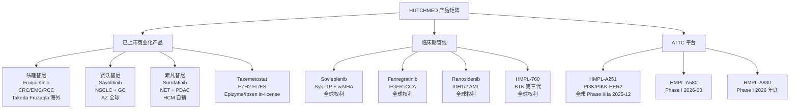
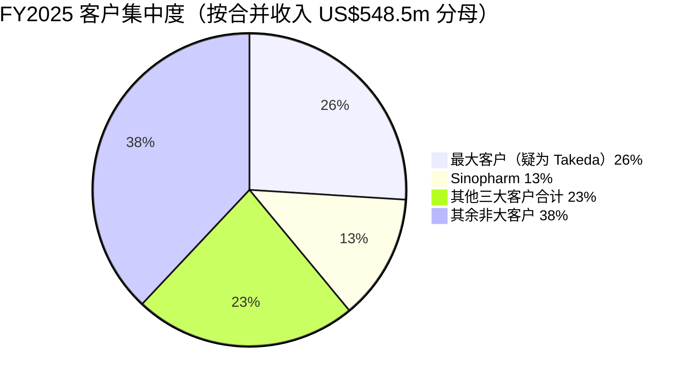
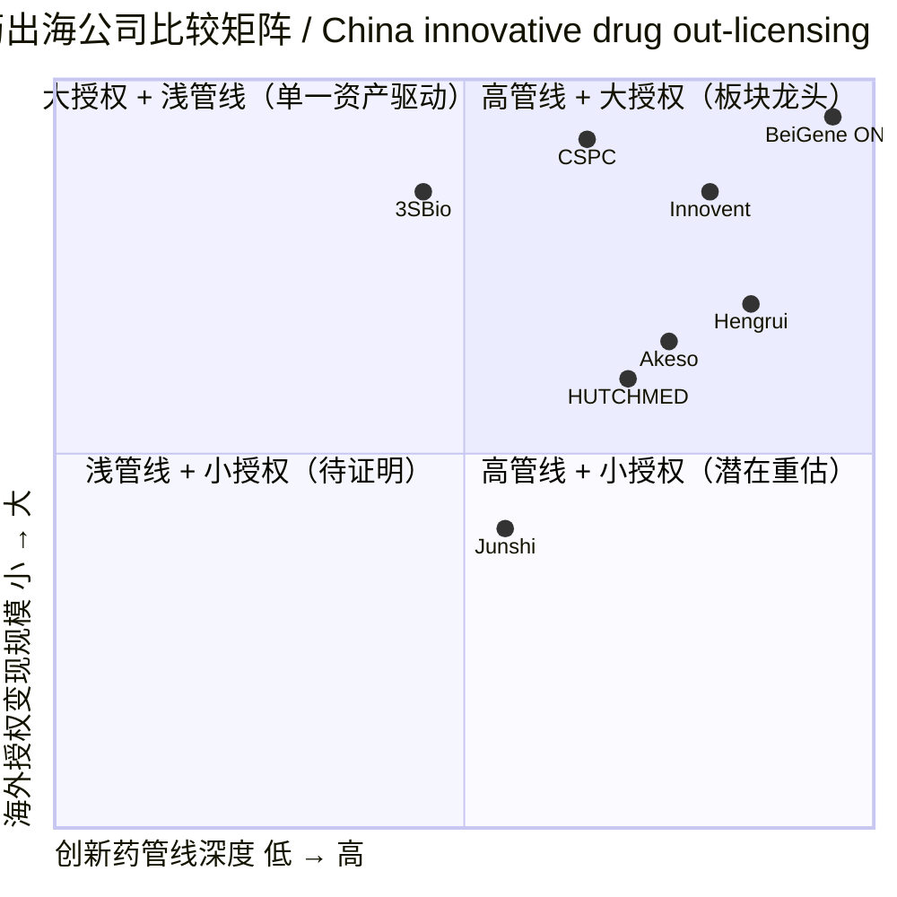

# HUTCHMED (China) Limited / 和黄医药 — 公司研究报告

**Ticker**: NASDAQ:HCM (亦交易于 LSE AIM:HCM、HKEX:0013，OTC:HMDCF)
**报告日期 (as of)**: 2026-06-02
**报告语言**: 简体中文 (zh-CN)
**主题归类**: china-drug-out-licensing（中国创新药海外授权 / China innovative drug out-licensing）—— 主题报告中归入"原始 out-licensor、但 2023 年 Takeda 大额授权早于 2025-2026 出海浪潮，原始股价未被两笔授权重大重估"的样本（详见 [china-drug-out-licensing_theme.md](../../themes/china-drug-out-licensing_theme.md)）

---

## 1. 公司概览 / Company Overview

和黄医药 (HUTCHMED (China) Limited，前称 Hutchison China MediTech / 和记黄埔医药) 是一家在开曼群岛注册、以中国为研发总部、面向全球的商业化阶段生物制药公司 / commercial-stage biopharmaceutical company，专注于肿瘤 (Oncology) 与免疫 (Immunology) 靶向治疗 (targeted therapy) 与免疫疗法 (immunotherapy) 的发现、开发与商业化。公司在 2000 年 12 月 18 日于开曼群岛成立，由长江和记 (CK Hutchison) 全资附属公司发起，2002 年通过设立子公司 HUTCHMED Limited 启动新药研发业务；最大股东和记医药控股 (Hutchison Healthcare Holdings Limited) 截至 2026 年 2 月 13 日仍持有约 38.1% 普通股 ([HUTCHMED 20-F FY2025, Item 4.A — History and Development](https://www.sec.gov/Archives/edgar/data/1648257/000110465926023822/hcm-20251231x20f.htm))。公司在伦敦 AIM (2006)、纳斯达克 (2016) 与香港联交所 (2021) 三地上市，是少数横跨三个国际资本市场的中国创新药企业 ([HUTCHMED 20-F FY2025, Item 4.A](https://www.sec.gov/Archives/edgar/data/1648257/000110465926023822/hcm-20251231x20f.htm))。

业务由两个战略板块构成。**肿瘤 / 免疫板块 (Oncology/Immunology)** 是公司核心 R&D 与商业化引擎，旗下三款自研小分子已在中国获批上市：呋喹替尼 (fruquintinib，商品名 Elunate / Fruzaqla，VEGFR-1/2/3 抑制剂)、索凡替尼 (surufatinib，Sulanda，VEGFR/FGFR/CSF-1R 抑制剂) 与赛沃替尼 (savolitinib，Orpathys，选择性 MET 抑制剂)；2025 年 3 月又获批许可引入的 tazemetostat (Tazverik，EZH2 抑制剂)。公司有 870 余名科研与技术人员，以及约 780 人的中国肿瘤药销售团队 ([HUTCHMED 20-F FY2025, Item 4.B — Business Overview](https://www.sec.gov/Archives/edgar/data/1648257/000110465926023822/hcm-20251231x20f.htm))。**其他业务 (Other Ventures)** 历史上由两大块组成：与国药集团 (Sinopharm) 合资 51% 持股的处方药分销服务子公司（Distribution Business / 上海和黄药业服务），以及参股的上海和黄药业 (Shanghai Hutchison Pharmaceuticals)；2025 年 4 月公司完成对上海和黄药业 45% 股权的剥离、仅保留 5% 财务投资性持股 ([HUTCHMED 20-F FY2025, Item 4.B — Other Ventures](https://www.sec.gov/Archives/edgar/data/1648257/000110465926023822/hcm-20251231x20f.htm))。

2025 财年公司合并收入 (consolidated revenue) US$548.5m，归母净利润 (net income attributable to the company) US$456.9m —— 但其中 US$415.8m 来自上海和黄药业剥离的一次性净税后处置收益 (gain on divestment of equity investees, net of tax) ([HUTCHMED 20-F FY2025, Item 5.A — Selected Financial Data](https://www.sec.gov/Archives/edgar/data/1648257/000110465926023822/hcm-20251231x20f.htm))。剥离一次性影响是 2025 年盈利的主要驱动；扣除处置收益后的核心经营利润仍微亏 (operating loss US$39.2m before other income)。截至 2026 年 6 月 2 日，HCM 在纳斯达克的市值约 US$1.99bn，TTM 市销率 (P/S) 约 3.6 倍，过去 12 个月跌幅 22.4% ([Yahoo Finance HCM Statistics, 2026-06-02](https://finance.yahoo.com/quote/HCM/key-statistics/))。

```mermaid
timeline
    title HUTCHMED — 公司发展时间线 / Corporate Timeline
    2000-12 : 开曼群岛成立 / Incorporated as Hutchison China MediTech
    2002    : 创立 HUTCHMED Limited 子公司 / R&D operations launched
    2006    : 伦敦 AIM 上市 / AIM listing
    2011    : 与 AstraZeneca 签署 savolitinib 全球授权 / AZ savolitinib deal
    2016    : 纳斯达克 ADS 上市 / Nasdaq ADS listing
    2018-09 : 呋喹替尼中国 3L CRC 获批 / Fruquintinib approved in China
    2018-11 : Elunate 中国上市 / Elunate launch in China
    2020-12 : 索凡替尼中国 NETs 获批 / Surufatinib approved
    2021-04 : 公司更名为 HUTCHMED (China) Ltd
    2021-06 : 赛沃替尼中国获批 2L METex14 NSCLC / Savolitinib approved
    2021-07 : 港交所主板上市 / HKEX dual listing
    2023-01 : Takeda US$400m 预付 + US$730m 里程碑授权 / Fruzaqla ex-China deal
    2023-11 : Fruzaqla 美国 FDA 获批 / Fruzaqla US FDA approval
    2024    : Fruzaqla 欧洲与日本获批 / Europe + Japan approval
    2025-01 : 赛沃替尼 1L NSCLC 全批 / Full NSCLC 1L approval
    2025-03 : tazemetostat 中国 3L FL 获批 / Tazverik China launch
    2025-04 : 上海和黄药业 45% 股权剥离完成 / SHPL divestment closed
    2025-08 : CEO Weiguo Su 因健康原因休假 / CEO health leave
    2026-01 : Shanghai 工厂通过 FDA Pre-Approval Inspection / FDA zero observations
    2026-03 : FY2025 20-F 披露 / FY2025 annual report filed
```



---

## 2. 公司历史 / Company History

公司源自李嘉诚旗下长江和记集团 (CK Hutchison) 在医药领域的早期布局。2000 年 12 月，长江和记的全资子公司发起设立 Chi-Med (Hutchison China MediTech Limited)，定位为整合传统中药与现代药物研发的中国-海外双轨平台。2002 年，公司在上海设立 HUTCHMED Limited 子公司（彼时名为 Hutchison MediPharma），专注于自研创新小分子药物。早期商业模式上，公司在中国通过与国药集团合资的处方药销售平台 (Distribution Business) 和与上海家化等参与设立的上海和黄药业实现现金流自给，反哺创新药 R&D —— 这一"中国分销现金流养创新药研发"的内生融资结构在中国创新药历史上有相当独特性 ([HUTCHMED 20-F FY2025, Item 4.A — History and Development](https://www.sec.gov/Archives/edgar/data/1648257/000110465926023822/hcm-20251231x20f.htm))。

2006 年公司选择伦敦 AIM 而非港交所主板作为首次上市目的地（在当时港交所对未盈利生物科技公司还无 18A 通道）；2016 年在美股完成纳斯达克 ADS 双重上市；2021 年 6 月港股 H 股回归，形成三地上市格局。也是在 2021 年，公司宣布将旗下品牌从 Chi-Med (商业母公司) 和 Hutchison MediPharma (R&D 子公司) 统一整合为 HUTCHMED，并将集团法律名称改为 HUTCHMED (China) Limited，体现从"和记医疗附属"向"独立创新药品牌"的形象切换 ([HUTCHMED 20-F FY2025, Item 4.A](https://www.sec.gov/Archives/edgar/data/1648257/000110465926023822/hcm-20251231x20f.htm))。

研发与对外合作里程碑是公司价值的核心。2011 年，赛沃替尼 (savolitinib) 早期阶段被 AstraZeneca (AZ) 看中，双方签署全球共同开发与商业化协议 —— AZ 负责包括中国在内的全球商业化，HUTCHMED 收取里程碑款与销售特许权使用费 (royalties) ([HUTCHMED 20-F FY2025, Item 4.B — Overview of Our Collaborations](https://www.sec.gov/Archives/edgar/data/1648257/000110465926023822/hcm-20251231x20f.htm))。2013 年呋喹替尼 (fruquintinib) 与 Eli Lilly 在中国签订合作，由 Lilly 在中国担任商业化伙伴（后于 2020 年 10 月公司从 Lilly 手中收回中国地面医学推广职责）。2023 年 1 月 23 日的 Takeda 授权是公司迄今最大单笔出海交易：Takeda 取得呋喹替尼除中国大陆、香港、澳门外的全球独家开发与商业化权利，向 HUTCHMED 支付 **US$400m 预付款 + 最高 US$730m 后续监管 / 开发 / 销售里程碑款 + 净销售特许权使用费**，总潜在对价 US$1.13bn 加 royalty ([HUTCHMED Takeda 2023-01-23 announcement, GlobeNewswire](https://www.globenewswire.com/news-release/2023/01/23/2592897/0/en/HUTCHMED-Announces-License-to-Takeda-to-Develop-and-Commercialize-Fruquintinib-Outside-China.html); [BioPharma Dive, 2023-01-23](https://www.biopharmadive.com/news/takeda-hutchmed-fruquintinib-cancer-drug-licensing/640933/))。Fruzaqla 于 2023-11 美国 FDA 获批、2024 年欧洲与日本相继获批，截至 2025 年底已在 38 个国家获得监管批准 ([HUTCHMED 20-F FY2025, Item 4.B](https://www.sec.gov/Archives/edgar/data/1648257/000110465926023822/hcm-20251231x20f.htm))。

近年的资产组合调整动作密集。2021 年 9 月公司剥离与广州白云山合资的非核心 OTC 药品业务和记白云山；2023 年 12 月剥离消费健康业务和记海恩与 HUTCHMED Science Nutrition；最有力度的是 2024 年底宣布、2025 年 4 月完成的对上海和黄药业 (Shanghai Hutchison Pharmaceuticals，SHPL) 45% 股权出售 —— 以约 US$608.5m 现金对价，分别向 GP Health Service Capital 转让 35% (后由其指定方接盘)、向上海医药集团 (Shanghai Pharmaceuticals) 转让 10%，公司仅保留 5% 财务投资性权益及一名董事提名权；同时附三年 (2026-2028) 上海和黄药业年净利润不低于约 5% 增速的差额保证 (profit guarantee)，差额最高补偿约 US$95m ([HUTCHMED 20-F FY2025, Item 4.B — Other Ventures](https://www.sec.gov/Archives/edgar/data/1648257/000110465926023822/hcm-20251231x20f.htm))。该处置在 2025 年录得 US$415.8m 净税后处置收益，资产负债表大幅改善，是公司从"分销现金流+创新药"双驱动转向"专注全球创新药 R&D"的标志性事件。

公司另一长期叙事是与最大股东 CK Hutchison 的关系。和记医药控股截至 2026 年 2 月 13 日仍持有约 38.1% 普通股；HUTCHMED 品牌由 CK Hutchison 的关联公司 Hutchison Whampoa Enterprises Limited 免版税授权，但若 CK Hutchison 在 12 个月内累计持股下降至 35%、30% 或 20% 以下，品牌许可方有权终止协议 —— 即公司核心品牌使用权与控股股东实际持股结构挂钩 ([HUTCHMED 20-F FY2025, Item 4.B — Intellectual Property](https://www.sec.gov/Archives/edgar/data/1648257/000110465926023822/hcm-20251231x20f.htm))。该结构既是融资稳定性来源（38% 大股东锁仓），也是关联交易透明度上的长期关注点。

---

## 3. 管理团队 / Management Team

公司治理采用单一董事会架构 (Cayman 公司法 + 港交所/纳斯达克双重合规)，截至 2026-03-05 共有 10 名董事：1 名非执行主席、2 名执行董事、3 名非执行董事、4 名独立非执行董事 ([HUTCHMED 20-F FY2025, Item 6.A — Directors and Senior Management](https://www.sec.gov/Archives/edgar/data/1648257/000110465926023822/hcm-20251231x20f.htm))。

**首席执行官 / Chief Executive Officer — Weiguo SU 苏慰国博士 (在休)**。苏慰国博士自 2017 年起任执行董事、2022 年 4 月起任 CEO，同时自 2012 年起担任 Chief Scientific Officer (首席科学官)，是公司 R&D 平台的灵魂人物，从首席科学家位置升任 CEO 后继续兼任 CSO。20-F 原文：*"Dr. Su has headed all drug discovery and research since he joined our company, including master-minding our scientific strategy, being a key leader of our Oncology/Immunology operations, and responsible for the discovery of each and every small molecule drug candidate in our pipeline."*（苏博士自加入公司以来主导所有药物发现与研究工作，包括擘画科学战略、领导肿瘤/免疫板块、并对管线中每一个小分子候选药物的发现负全责）([HUTCHMED 20-F FY2025, Item 6.A](https://www.sec.gov/Archives/edgar/data/1648257/000110465926023822/hcm-20251231x20f.htm))。教育背景上苏博士在复旦大学化学系本科毕业，后于哈佛大学化学系师从诺贝尔化学奖得主 E. J. Corey 教授获博士学位并完成博士后研究；加入公司之前在 Pfizer 美国 R&D 部门工作 ([HUTCHMED 20-F FY2025, Item 6.A](https://www.sec.gov/Archives/edgar/data/1648257/000110465926023822/hcm-20251231x20f.htm))。**2025 年 8 月 25 日，苏博士因健康原因暂停 CEO 职责开始休假，仍保留 CSO 职务**；公司任命 CFO Johnny Cheng 出任 Acting CEO ([HUTCHMED Appointment of Acting CEO, 2025-08-25](https://www.hutch-med.com/hutchmed-announces-appointment-of-acting-chief-executive-officer/); [PharmaTimes, 2025-08-25](https://pharmatimes.com/news/johnny-cheng-appointed-as-interim-ceo-of-hutchmed/))。这一变动直接影响 R&D 决策连续性，是 2025 下半年股价表现的核心负面因素之一。

**代理首席执行官、首席财务官 / Acting CEO & CFO — CHENG Chig Fung, Johnny 郑志峰先生**。Cheng 先生自 2008 年起担任 CFO，2011 年起任执行董事，2025 年 8 月起兼任 Acting CEO，监督集团日常运营。加入公司前曾任百时美施贵宝 (Bristol Myers Squibb，BMS) 中国区财务副总裁，并担任中美上海施贵宝制药 (Sino-American Shanghai Squibb Pharmaceuticals) 和 BMS 中国投资公司董事，主管 BMS 中国合资企业财务（2006-2008）；更早期在 Nestlé 中国担任多个财务与控制职务长达 8 年，职业生涯起始于澳大利亚 Price Waterhouse 与北京毕马威 (KPMG) ([HUTCHMED 20-F FY2025, Item 6.A](https://www.sec.gov/Archives/edgar/data/1648257/000110465926023822/hcm-20251231x20f.htm))。Cheng 持澳大利亚阿德莱德大学经济学（会计）学士学位，是澳新特许会计师 (Chartered Accountants Australia and New Zealand) 会员。从 BMS 与 Nestlé 中国的财务背景看，Cheng 的强项是合规、成本控制与跨国财务整合，但缺乏自上而下的研发战略与商业化推进经验 —— 在 Su 博士休假期间，公司战略层面预计偏向稳健与现金流管理。

**董事会主席 / Chairman — Dan ELDAR 博士**。Eldar 博士自 2016 年起任非执行董事并兼任董事会主席，是 CK Hutchison 系派驻代表 —— 他同时是 Hutchison Water Israel E.P.C Ltd 执行董事（该公司是 CK Hutchison 集团联属公司，专注大型海水淡化与水电项目）。Eldar 拥有哈佛大学政府学博士与硕士学位、希伯来大学政治学硕士学位，超 30 年生物技术、医疗、电信与水务领域跨国运营经验 ([HUTCHMED 20-F FY2025, Item 6.A](https://www.sec.gov/Archives/edgar/data/1648257/000110465926023822/hcm-20251231x20f.htm))。Eldar 主席代表了控股股东 CK Hutchison 在董事会的延续性，与执行管理层形成"科学家 CEO + 资本/治理主席"的双中心治理结构。

**首席科学官 / Chief Scientific Officer**：在 Su 博士休假期间仍为 Su 博士本人，由副 CFO 与法务、医学事务负责人共同支持运营。临床与监管事务的实际推进由各项目首席医学官 (CMO) 与 R&D 高级副总裁负责，名单未在 20-F 中以"高级管理团队"层级具名披露 ([HUTCHMED 20-F FY2025, Item 6.A — Senior Management list](https://www.sec.gov/Archives/edgar/data/1648257/000110465926023822/hcm-20251231x20f.htm))。

**独立非执行董事 (Independent NEDs)**。Mok Shu Kam, Tony 莫树锦教授 (Senior and Lead Independent NED) 是公司最知名的科学治理资产 —— 香港中文大学临床肿瘤学系系主任、肺癌生物标志物与分子靶向治疗领域的全球权威，2018 年获 ESMO 终身成就奖（首位华人）、2023 年获霍英东"全球杰出华人医生奖"；他同时也是 AstraZeneca 非执行董事，这一交叉职务直接连接了 HUTCHMED 与最重要的合作伙伴 AstraZeneca ([HUTCHMED 20-F FY2025, Item 6.A — Mok Shu Kam](https://www.sec.gov/Archives/edgar/data/1648257/000110465926023822/hcm-20251231x20f.htm))。其他独立董事包括 Renu Bhatia（前 SEHK 上市委员会主席、医学+金融背景）、Chaohong HU 胡朝红博士（前乐普生物 co-CEO、ADC/抗体研发资深）、Tan Shao Weng Daniel（新加坡国大 / Duke-NUS 临床医学背景）、Wong Tak Wai。**创始人 / Founder**：公司由 CK Hutchison 的全资子公司发起设立，无传统意义上的个人"创始人 CEO"；李嘉诚家族 (Li Ka-shing family) 通过和记医药控股的最终控制地位是事实上的创始资本来源。

**关键人物风险 (Key person risk)**：Su 博士既是 CEO 又是 CSO，2025 年 8 月起的健康问题在 20-F 中被明确列为风险因子。20-F 原文：*"Any extended absence of Dr. Su and any delay or disruption associated with the transition process of Dr. Su's responsibilities could create uncertainty among our employees, collaboration partners, customers, investors, or other stakeholders, and negatively impact our ability to execute our business strategy."*（苏博士任何延长缺席以及职责过渡过程中的任何延迟或中断，都可能在员工、合作伙伴、客户、投资者或其他利益相关者中造成不确定性，并对我们执行业务战略的能力产生负面影响）([HUTCHMED 20-F FY2025, Item 3.D — Risk Factors](https://www.sec.gov/Archives/edgar/data/1648257/000110465926023822/hcm-20251231x20f.htm))。

---

## 4. 产品与服务 / Products & Services

**HUTCHMED 的产品矩阵以三款已上市自研小分子 + 一款 in-licensed 已上市产品 + 12-15 款临床期候选药物 + 下一代 ATTC 技术平台构成。** 这是公司最核心的价值锚，下文逐一展开。

### 4.1 已上市核心产品（中国 + 海外）

**(1) 呋喹替尼 / Fruquintinib (HMPL-013, 商品名：Elunate 中国 / Fruzaqla 海外)**

VEGFR-1/2/3 高选择性口服酪氨酸激酶抑制剂 (highly selective oral VEGFR-1/-2/-3 tyrosine kinase inhibitor / TKI)，由 HUTCHMED 自主发现。20-F 引用 Item 4.B 原文：*"Fruquintinib was approved for 3L CRC in China in September 2018 and commercially launched in November 2018. ... In China, fruquintinib was the leading treatment for late-stage CRC with 43% of 3L treated patient share according to an IQVIA tracking study in Q3 2025."*（呋喹替尼于 2018 年 9 月在中国获批用于 3L 结直肠癌、11 月正式商业化。根据 IQVIA 2025 年第三季度追踪研究，呋喹替尼在中国晚期 CRC 治疗市场以 43% 的三线患者份额位居首位）([HUTCHMED 20-F FY2025, Item 4.B — Fruquintinib](https://www.sec.gov/Archives/edgar/data/1648257/000110465926023822/hcm-20251231x20f.htm))。

**中文释义 / Plain-language gloss**：呋喹替尼通过抑制 VEGFR (vascular endothelial growth factor receptor，血管内皮生长因子受体) 1/2/3 三个亚型，阻断肿瘤血管生成 (angiogenesis)，从而"饿死"已转移的结直肠癌细胞。与同类药相比，它的选择性更高（对其他激酶弱抑制），因此可以做到 *full daily dose, full days on* 的全剂量持续给药 —— 这是 Takeda 在美国推广 Fruzaqla 的核心卖点之一。

商业化结构两条线：
- **中国 (品牌 Elunate)** —— 与 Eli Lilly 合作。HUTCHMED 自 2020 年 10 月起承担在中国所有地面医学推广、医学事务、营销活动。公司从制造收入、推广服务费、Lilly 支付的特许权使用费三块合并确认相当于 in-market sales 70%-80% 的收入。2025 年 Elunate 中国 in-market sales US$100.1m，2H25 较 1H25 反弹 33%；HUTCHMED 合并确认 US$76.9m (77%) ([HUTCHMED 20-F FY2025, Item 4.B](https://www.sec.gov/Archives/edgar/data/1648257/000110465926023822/hcm-20251231x20f.htm))。Elunate 自 2020 年 1 月起进入 NRDL (国家医保药品目录)，2026 年起在 3L CRC + 2L EMC (pMMR) + Tyvyt 联合用药 (信迪利单抗 / sintilimab) 两个适应症继续保留 NRDL 资格。
- **海外 (品牌 Fruzaqla)** —— 与 Takeda 合作。2023 年 11 月 8 日 FDA 批准 3L mCRC 适应症，Takeda 在批准后 24 小时内即在美国开出首张处方；2024 年欧洲、日本相继获批；截至 2025 年底已在 38 个国家获批 ([HUTCHMED 20-F FY2025, Item 4.B](https://www.sec.gov/Archives/edgar/data/1648257/000110465926023822/hcm-20251231x20f.htm))。**2025 年 Fruzaqla 全球 in-market sales US$366.2m，同比 +26%（2024 年 US$290.6m）；HUTCHMED 合并确认 US$89.4m，主要由 manufacturing 收入与 royalty 构成。** 2023 年 1 月 Takeda 授权交易关键条款：US$400m 预付款（2023 年 4 月收到）+ 最高 US$730m 监管 / 开发 / 销售里程碑 + net sales royalties，总潜在对价上限约 US$1.13bn ([HUTCHMED-Takeda 2023-01-23 announcement, GlobeNewswire](https://www.globenewswire.com/news-release/2023/01/23/2592897/0/en/HUTCHMED-Announces-License-to-Takeda-to-Develop-and-Commercialize-Fruquintinib-Outside-China.html); [BioPharma Dive, 2023-01-23](https://www.biopharmadive.com/news/takeda-hutchmed-fruquintinib-cancer-drug-licensing/640933/))。截至 2025 年公司已从 Takeda 收取：US$35m FDA 获批里程碑 (2023-11) + US$20m 销售突破 US$200m 里程碑 (2024-10) + US$7m 日本定价与上市里程碑 (2024-11 + 2025-06) + US$10m 西班牙国家报销建议里程碑 (2024-12) ([HUTCHMED 20-F FY2025, Item 4.B](https://www.sec.gov/Archives/edgar/data/1648257/000110465926023822/hcm-20251231x20f.htm))。

**战略意义 / Strategic significance**：呋喹替尼是 HUTCHMED 商业化阶段的"压舱石资产"——中国部分以 43% 的 3L CRC 市占率维持市场领先，海外部分通过 Takeda 把中国创新药放进美/欧/日商业化网络，是中国创新药"上半段中国研发 + 下半段海外授权"模式的早期标杆。但也正因如此，Takeda 交易（2023 年 1 月）早于 2025-2026 中国创新药出海大潮（百济神州 ONC、信达 / Pfizer、CSPC / AZ 等），HCM 股价并未享受 2025 年板块再估值红利 ([china-drug-out-licensing_theme.md](../../themes/china-drug-out-licensing_theme.md))。

**(2) 赛沃替尼 / Savolitinib (HMPL-504, 商品名：Orpathys 中国)**

高选择性、口服 MET 受体抑制剂 (selective oral MET inhibitor)。20-F 原文：*"Savolitinib is a potent and selective inhibitor of MET ... We designed savolitinib to address human metabolite-related renal toxicity, the primary issue that halted development of several other selective MET inhibitors."*（赛沃替尼是 MET 强效且选择性的抑制剂…我们设计赛沃替尼是为了解决人源代谢物相关的肾毒性问题——这正是其他几种选择性 MET 抑制剂研发停滞的主要原因）([HUTCHMED 20-F FY2025, Item 4.B — Savolitinib](https://www.sec.gov/Archives/edgar/data/1648257/000110465926023822/hcm-20251231x20f.htm))。在酶学层面，赛沃替尼对 MET 的 IC50 约 5 nM，对其他 274 个激酶几乎无活性，是高选择性的代表 ([HUTCHMED 20-F FY2025, Item 4.B — Savolitinib Pre-clinical Evidence](https://www.sec.gov/Archives/edgar/data/1648257/000110465926023822/hcm-20251231x20f.htm))。

**中文释义 / Plain-language gloss**：MET (mesenchymal-epithelial transition receptor) 是一种细胞表面受体酪氨酸激酶。在 NSCLC (non-small cell lung cancer，非小细胞肺癌) 中，约 2-3% 的中国患者存在 METex14 (MET 14 号外显子跳跃突变)；同时在使用 EGFR (epidermal growth factor receptor) 第三代靶向药 Tagrisso (奥希替尼 / osimertinib) 后产生耐药的患者中，MET 扩增 / 过表达 (MET amplification / overexpression) 是最常见的耐药机制之一。赛沃替尼把这两条机理路径都覆盖了。

监管节点密集：
- 2021-06 NMPA 条件性批准 2L METex14 skipping NSCLC（中国首个 first-in-class 选择性 MET 抑制剂）；
- 2025-01 NMPA 转为正式批准并扩大标签覆盖 1L METex14 skipping NSCLC，依据 SAVOLITINIB-303 confirmatory China Phase IIIb；
- 2025-06 NMPA 批准 savolitinib + Tagrisso 联合用于 EGFRm NSCLC + MET amp，依据 SACHI China Phase III（2L EGFRm + EGFR TKI refractory）；
- 2025-12 NMPA 接受 MET amp 3L 胃癌 (GC) NDA 优先审评；
- 全球 SAFFRON Phase III（savolitinib + Tagrisso vs 化疗，2L/3L EGFRm + MET amp/overexp NSCLC）在 2025 年 11 月完成入组，readout 预计 2026 下半年 ([HUTCHMED 20-F FY2025, Item 4.B — Savolitinib Regulatory Status](https://www.sec.gov/Archives/edgar/data/1648257/000110465926023822/hcm-20251231x20f.htm))。

商业化：与 AstraZeneca (AZ) 全球合作，AZ 负责全球商业化（含中国）。HUTCHMED 收入由制造收入 + royalty 构成。**2025 年 Orpathys 中国 in-market sales US$28.9m（2024: US$45.5m，−36%），HUTCHMED 合并确认 US$18.6m（2024: US$24.5m，−24%）—— 下滑主因 METex14 NSCLC 适应症竞争加剧。** 2025 年 AZ 因第三个 NSCLC 适应症中国获批触发 US$11.0m 里程碑款 ([HUTCHMED 20-F FY2025, Item 4.B](https://www.sec.gov/Archives/edgar/data/1648257/000110465926023822/hcm-20251231x20f.htm))。

**战略意义**：赛沃替尼是公司"中国 R&D + 海外大药企商业化"模式最长跑的样本（合作始于 2011 年），SAFFRON 全球 Phase III 2026 年 H2 readout 是公司未来 12 个月最重要的临床催化剂之一 —— 如果阳性，将打开 EGFRm + MET 耐药 NSCLC 的全球一线/二线市场。

**(3) 索凡替尼 / Surufatinib (HMPL-012, 商品名：Sulanda 中国)**

口服小分子，同时抑制 VEGFR、FGFR (fibroblast growth factor receptor)、CSF-1R (colony-stimulating factor 1 receptor) 三个靶点，主要适应症为神经内分泌肿瘤 (NETs)。2020-12 中国获批非胰腺 NETs，2021-06 获批胰腺 NETs ([HUTCHMED 20-F FY2025, Item 4.B — Surufatinib](https://www.sec.gov/Archives/edgar/data/1648257/000110465926023822/hcm-20251231x20f.htm))。20-F 原文：*"According to IQVIA tracking study report in the fourth quarter of 2023, Sulanda maintained its position in the market with 21% prescription share in NET treatment, ahead of competitors Sutent and Afinitor."*（根据 IQVIA 2023 年第四季度追踪报告，Sulanda 在 NET 治疗市场保持 21% 处方份额，领先于 Sutent (舒尼替尼 / sunitinib) 和 Afinitor (依维莫司 / everolimus)）([HUTCHMED 20-F FY2025, Item 4.B](https://www.sec.gov/Archives/edgar/data/1648257/000110465926023822/hcm-20251231x20f.htm))。

**2025 年索凡替尼中国 in-market sales US$27.0m（2024: US$49.0m，−44.9%），主要由生长抑素类似物 (somatostatin analogues, SSA) 类竞品 (奥曲肽 / 兰瑞肽) 纳入 NRDL 后渗透加快导致。** HUTCHMED 自销，不依赖合作伙伴；全球权利保留，正在与 camrelizumab (PD-1) + nab-paclitaxel + gemcitabine 联合用于 1L PDAC (胰腺癌) 进行 China Phase II/III，Phase II 数据在 2025 ESMO Asia 公布，Phase III 部分 2025 年 12 月首例患者入组，预计 400 例患者，OS 主要终点 ([HUTCHMED 20-F FY2025, Item 4.B](https://www.sec.gov/Archives/edgar/data/1648257/000110465926023822/hcm-20251231x20f.htm))。

**战略意义**：索凡替尼是公司"自销 + 全球保留权利"的样本，但 2024-2025 年由于 NET 市场被新进 SSA 类药挤压，已从增长资产变为现金消耗较高的成熟资产 —— 目前公司战略是把 surufatinib 的下一波价值押注到 PDAC 联合疗法上，这是高风险高回报的赌注（PDAC 5 年生存率 < 10%）。

**(4) Tazemetostat (商品名：Tazverik，2025 年 3 月中国获批)**

In-licensed 自 Epizyme (Ipsen 子公司，2021 年 8 月签约)，EZH2 (enhancer of zeste homolog 2) 抑制剂，治疗 r/r FL (复发/难治性滤泡淋巴瘤) 与上皮样肉瘤。许可范围限大中华区（含中国大陆、香港、澳门、台湾）。**HUTCHMED 已向 Epizyme 支付 US$25m 预付款 + 累计 US$15m 里程碑款，未来还可能支付最高 US$95m 监管/开发里程碑 + US$175m 销售里程碑 + 中位数到 20%-段的销售特许权使用费** ([HUTCHMED 20-F FY2025, Item 5.A — Our Collaboration Partnerships](https://www.sec.gov/Archives/edgar/data/1648257/000110465926023822/hcm-20251231x20f.htm))。2025-03 NMPA 条件性批准 3L r/r EZH2-mutant 滤泡淋巴瘤 → 2025-07 中国大陆正式上市 → 2026-01 进入首版商业健康保险创新药目录 ([HUTCHMED 20-F FY2025, Item 4.B — Tazemetostat](https://www.sec.gov/Archives/edgar/data/1648257/000110465926023822/hcm-20251231x20f.htm))。2025 年 in-market sales US$2.5m（2024: US$0.9m，+158%），尚处于上市爬坡早期。

### 4.2 临床期管线 (Pipeline) ——重点品种

**(5) Sovleplenib / 索维比尼布 (HMPL-523)** —— 选择性口服 Syk 抑制剂，治疗血液肿瘤与免疫疾病。**这是公司未来 12-24 个月最重要的"未变现"资产**。20-F 原文：*"We own all rights to sovleplenib globally."*（我们拥有索维比尼布的全球权利）([HUTCHMED 20-F FY2025, Item 4.B — Sovleplenib](https://www.sec.gov/Archives/edgar/data/1648257/000110465926023822/hcm-20251231x20f.htm))。监管节点：
- ESLIM-01 (2L+ 原发免疫性血小板减少症 / primary ITP) China Phase III：DRR 48.4% vs placebo 0% (p<0.0001)，2024-01 NDA 中国获受理；因杂质限度问题 NMPA 要求补充制造验证，**2026-02 NDA 重新递交获 NMPA 受理**；
- ESLIM-02 (2L 温抗体型自身免疫性溶血性贫血 / wAIHA) China Phase II/III，2025-06 Phase III 部分完成入组，2026-01 顶线结果阳性 (达到主要终点 5-24 周持久 Hb 应答率)，**NDA 计划 2026 年 H1 中国递交** ([HUTCHMED 20-F FY2025, Item 4.B — Sovleplenib](https://www.sec.gov/Archives/edgar/data/1648257/000110465926023822/hcm-20251231x20f.htm))。

**战略意义**：sovleplenib 全球权利在手，正在寻求海外授权合作伙伴 —— 这是 2026-2027 年最可能贡献海外现金流的资产，参照 2025-2026 中国创新药 out-licensing 热度（CSPC US$18.5bn、3SBio US$6bn 等），sovleplenib 的潜在海外授权对价是 HCM 估值再平衡的关键期权 ([china-drug-out-licensing_theme.md, China innovative drug out-licensing wave](../../themes/china-drug-out-licensing_theme.md))。

**(6) Fanregratinib (HMPL-453)** —— 选择性 FGFR1/2/3 抑制剂，治疗 FGFR2 融合/重排 r/r 胆管癌 (iCCA) 等；HUTCHMED 全球权利。

**(7) Ranosidenib (HMPL-306)** —— IDH1/2 双抑制剂；HUTCHMED 全球权利；正在 IDH mutant AML 中开发。

**(8) HMPL-760** —— 第三代 BTK (Bruton tyrosine kinase) 共价/可逆双模式抑制剂；治疗 B 细胞淋巴瘤。

**(9-12) HMPL-A251 / HMPL-A580 / HMPL-A830 / HMPL-A83** —— ATTC (Antibody-Targeted Therapy Conjugate，抗体-靶向治疗偶联) 平台候选药物。HMPL-A251 是 first-in-class PI3K/PIKK-HER2 ATTC，2025 年 10 月 AACR-NCI-EORTC 大会公布临床前数据，2025-12 启动全球 Phase I/IIa（中美同步），HMPL-A580 在 2026-03 进入临床，HMPL-A830 计划 2026 年底前进入临床 ([HUTCHMED 20-F FY2025, Item 4.B — Discovery Research and ATTC Platform](https://www.sec.gov/Archives/edgar/data/1648257/000110465926023822/hcm-20251231x20f.htm))。

**ATTC 平台战略意义**：20-F 原文：*"Compared to traditional cytotoxin-based ADCs, ATTC replaces traditional toxin-based payload with small molecules targeted therapy. Thus, unlike traditional ADCs, ATTCs have potential to be administered in combination with chemotherapy, or other targeted agents, which is particularly important in frontline settings."*（与传统基于细胞毒素的 ADC 相比，ATTC 用小分子靶向治疗替代了传统的毒素 payload。因此与传统 ADC 不同，ATTC 有潜力与化疗或其他靶向药联用，这在一线治疗设置中尤为重要）([HUTCHMED 20-F FY2025, Item 4.B — ATTC Platform](https://www.sec.gov/Archives/edgar/data/1648257/000110465926023822/hcm-20251231x20f.htm))。这是公司将"20 年小分子 TKI 经验"嫁接到"近 5 年最热的 ADC modality"上的差异化路径 —— 区别于 Daiichi Sankyo、AstraZeneca、Seagen 等传统 ADC 玩家的细胞毒 payload，ATTC 用 HUTCHMED 自有 PI3K/PIKK、SHP2、KRAS、MEK 等小分子作为 payload。



### 4.3 制造与供应链

公司在苏州 (Suzhou) 拥有传统药品生产基地，向 fruquintinib、surufatinib 提供临床与商业化原料。**2024 年底起，公司新建的上海 (Shanghai) 药品生产基地全面投产**，预计将原料药与制剂产能提升 5 倍以上，并显著降低单位成本。Shanghai 工厂的关键里程碑：
- 2024 年底首批 savolitinib 商业化批次产出（此前依赖第三方代工）；
- 2025-12 NMPA 批准 Shanghai 工厂生产 surufatinib 和 fruquintinib；
- **2026-01 Shanghai 工厂以"零观察项 (zero observations)"通过 FDA Pre-Approval Inspection** —— 这是 Fruzaqla 在美国与欧洲市场长期供应链确定性的关键节点 ([HUTCHMED 20-F FY2025, Item 4.B — Manufacturing](https://www.sec.gov/Archives/edgar/data/1648257/000110465926023822/hcm-20251231x20f.htm))。

截至 20-F 报告日，FRUZAQLA 商业批次可由苏州、上海、瑞士三地工厂任一供应全球与中国市场。

### 4.4 Distribution Business（处方药分销）

通过 51% 持股、49% 由 Sinopharm (国药集团) 持有的合营子公司经营，提供处方药与其他健康产品的物流、分销与营销服务。截至 2025-12-31，团队约 40 名商业人员，向上海地区约 830 家公私立医院直供约 1,100 种第三方处方药与其他产品，并通过约 90 家分销商覆盖其他省份 ([HUTCHMED 20-F FY2025, Item 4.B — Other Ventures](https://www.sec.gov/Archives/edgar/data/1648257/000110465926023822/hcm-20251231x20f.htm))。**2025 年 Distribution Business 第三方分销服务收入 US$261.7m（2024: US$262.8m，基本持平）**，但因 Sinopharm 同时为合资方与最大单一客户，该业务的会计与关联交易透明度长期受到关注。

### 4.5 产品生命周期与互动逻辑（合成段）

四条产品线的内在逻辑可总结为四个层次：
- **现金牛 (cash cow)**：呋喹替尼中国 + Fruzaqla 海外（Takeda）—— 2025 年合并 Oncology 收入 US$166.3m，是收入与现金流主要来源；
- **稳定但承压**：赛沃替尼 (AZ 全球) + 索凡替尼（自销）—— 2025 年合计中国 in-market US$55.9m，受竞争压制；
- **下一波催化 (next catalyst)**：sovleplenib (Syk) + tazemetostat (EZH2，2026 起放量) + savolitinib SAFFRON 全球 Phase III readout (2026 H2) + fruquintinib RCC NDA (2026 上半年决议) —— 共同决定 2026-2027 年 P/E 故事；
- **下一代平台 (next-gen platform)**：ATTC HMPL-A251 等小分子 payload 抗体偶联药物，2027-2030 年潜在新增收入引擎，并可能成为下一轮海外 out-licensing 的目标资产，对接 china-drug-out-licensing 主题的下一阶段。

---

## 5. 客户与上市策略 / Customers & Listing Strategy

### 5.1 客户结构与集中度

公司客户主要分为四类，对应不同的收入流：(a) 中国处方药分销最终端医院 / 药店（通过 Sinopharm 等分销商）；(b) Distribution Business 服务的第三方药企（HUTCHMED 提供物流 + 推广）；(c) 三大合作伙伴 (AstraZeneca、Eli Lilly、Takeda) —— 共同决定全球 R&D 服务收入 + 制造收入 + 海外销售 royalty；(d) 国药集团 Sinopharm 作为合营方兼最大单一客户。

20-F Item 7 关联交易披露详细给出五大客户集中度数据。原文：*"For the years ended December 31, 2023, 2024 and 2025, we generated revenue of $538.0 million, $329.2 million and $339.8 million from our five largest customers, respectively. ... revenue from our five largest customers represented approximately 64%, 52% and 62% of our total revenue, respectively, and revenue from our largest customer in those periods represented approximately 42%, 28% and 26% of our revenue in the same periods."*（2023-2025 财年五大客户合计收入分别为 US$538.0m / US$329.2m / US$339.8m，占总收入约 64% / 52% / 62%；最大单一客户占收入约 42% / 28% / 26%）([HUTCHMED 20-F FY2025, Item 7 — Related Party Transactions](https://www.sec.gov/Archives/edgar/data/1648257/000110465926023822/hcm-20251231x20f.htm))。

**Sinopharm 单独披露**：*"In 2023, 2024 and 2025, Sinopharm, which jointly owns the Distribution Business with us, was one of our five largest customers. Sales to Sinopharm and/or its associates contributed 12%, 15% and 13% of our revenue in 2023, 2024 and 2025, respectively."* (Sinopharm 作为 Distribution Business 合营方，连续三年是公司五大客户之一；2023-2025 销售贡献分别占总收入 12% / 15% / 13%) ([HUTCHMED 20-F FY2025, Item 7](https://www.sec.gov/Archives/edgar/data/1648257/000110465926023822/hcm-20251231x20f.htm))。



**关键观察**：
- 2023 年最大客户 42% 占比可推断为 Takeda（当年 US$280m 授权收入确认 + 制造起步），2024 年降至 28%、2025 年降至 26%（授权摊销收入下降、Fruzaqla 海外销售确认本身较低），符合预付款确认节奏；
- 公司收入分母 (consolidated revenue) 包含中国 Distribution Business 的 third-party services revenue US$261.7m（合并入账），这一收入流的实质对手方是数百家药企，故按"经济实质"看 Sinopharm 13% 主要是国药系药品采购对手方而非纯关联交易；
- 在 2025-2026 中国创新药 out-licensing 浪潮中，HCM 客户集中度对比 3SBio（Pfizer 一个客户即贡献>50% 当年总收入潜在峰值）、CSPC（AZ 单一交易潜在对价 US$18.5bn）显得分散度更高，是其相对优势。

### 5.2 上市与资本市场结构

公司是少数三地上市的中国创新药企业，市场结构如下：
- **NASDAQ:HCM** —— ADS 美股，自 2016 年起，每 1 ADS 代表 5 普通股，是流动性主战场；
- **LSE AIM:HCM** —— 伦敦另类投资市场，自 2006 年起，AIM 历史上是 HCM 早期融资来源；
- **HKEX:0013** —— 港股普通股，2021 年 6 月 30 日双重主要上市（dual-primary listing，非 secondary listing），代码与历史"和记黄埔" 0013 重合但承接的是新发行普通股（HUTCHMED 与 CK Hutchison 的"和记" 0001 不同）。

2025-12-31 公司总股本 872,327,620 普通股（每股面值 US$0.10），对应纳斯达克 ADS 流通量约 1.72 亿 ADS ([HUTCHMED 6-K, 2025-12-29 Blocklisting Return](https://www.sec.gov/Archives/edgar/data/1648257/000164825725000087/hcm-20251229xex99d1.htm))。截至 2026 年 2 月 13 日，最大股东 Hutchison Healthcare Holdings (CK Hutchison 集团) 持有约 38.1% 普通股 ([HUTCHMED 20-F FY2025, Item 7 — Major Shareholders](https://www.sec.gov/Archives/edgar/data/1648257/000110465926023822/hcm-20251231x20f.htm))。

**HFCAA 跨境审计风险**：作为 PCAOB (美国上市公司会计监督委员会) 监管下的中国概念股，HUTCHMED 在 20-F 中明确披露：如果 PCAOB 未来认定其无法完全检查与调查总部位于中国大陆或香港的会计师事务所，且公司继续使用此类事务所，公司将被认定为 *Commission-Identified Issuer*，连续两年被认定将触发 HFCAA 退市风险 ([HUTCHMED 20-F FY2025, Item 3.D — Risk Factors](https://www.sec.gov/Archives/edgar/data/1648257/000110465926023822/hcm-20251231x20f.htm))。公司当前的港股上市为这一尾部风险提供了一定对冲。

### 5.3 与 china-drug-out-licensing 主题的关系

HCM 是中国创新药出海的"早期样本"——但 china-drug-out-licensing 主题报告明确指出：*"NASDAQ:HCM Hutchmed 已 out-licensed 呋喹替尼给 Takeda (2023-01, 总潜在对价 US$1.13bn 含 US$400m 预付款)、savolitinib 给 AstraZeneca (2011) —— 两笔交易均早于 2025-2026 浪潮，原始股权未被任何一笔交易显著重估 (1Y −17.4%)"* ([china-drug-out-licensing_theme.md, Drop list rationale](../../themes/china-drug-out-licensing_theme.md))。换言之，HCM 已经"卖完"了它出海最大的牌（呋喹替尼），下一笔可能改变估值的 catalyst 是 **sovleplenib** 的海外授权（公司明确表示在寻找全球合作伙伴）—— 但目前没有公告。

---

## 6. 行业概览 / Industry Overview

### 6.1 中国创新药行业 —— 2025-2026 出海浪潮

2025-2026 是中国创新药 out-licensing 历史上的"井喷年"。代表性大额交易包括：3SBio 与 Pfizer 签署 SSGJ-707 (PD-1/VEGF 双抗) 全球开发授权，US$1.25bn 预付款 + 最高 US$4.75bn 里程碑（总值约 US$6bn）；CSPC 制药与 AstraZeneca 签署多元化合作，潜在对价高达 US$18.5bn；百济神州把美国总部迁至马萨诸塞州、注册地从开曼改为美国、并将 ticker 从 BGNE 改为 ONC (BeOne Medicines)，2025-01-02 完成更名 ([china-drug-out-licensing_theme.md, Theme overview](../../themes/china-drug-out-licensing_theme.md))。

这一浪潮的底层驱动有三层：
1. **中国新药临床数据国际化加速** —— 中国 Phase III 临床数据通过国际 ICH 标准互认后，可作为 FDA / EMA 注册依据（如百济神州的 brukinsa、HUTCHMED 的 fruquintinib），数据"出海可用"是先决条件；
2. **国内 NRDL 集采价格下行 + 商保创新药目录上行** —— 单一中国市场盈利空间收缩，企业必须把海外大市场作为价值"放大器"，这一动力在国家医保局 2024-2026 持续推进的 NRDL 谈判中尤为明显（fruquintinib NRDL 价格 2020 年起累计降幅 ~60%）；
3. **跨国药企管线饥渴**：大药企在 PD-1、VEGF、KRAS、ADC 等热门赛道存在"管线空白"，愿意为中国创新药买单 in-license。Takeda 之所以 2023 年支付 US$400m 预付给 HUTCHMED 买 fruquintinib，正是因为 Takeda 自身 oncology 管线缺乏 VEGFR TKI 资产。

### 6.2 全球肿瘤药物市场

HCM 主要业务聚焦在三大肿瘤适应症领域：CRC、NSCLC、NET，以及血液肿瘤与免疫疾病。Globocan 数据被 HUTCHMED 自己 20-F 引用作为 TAM 基础：
- **CRC (结直肠癌)**：中国 2022 年新发约 520,000 例，3L CRC 约 105,000 例；美国 2022 年估计 14,600 例 3L+ mCRC 患者（Takeda 估测）；
- **NSCLC (非小细胞肺癌)**：中国年新发肺癌 > 100 万例，80-85% 为 NSCLC，其中 2-3% 携带 METex14 突变（中国约 20,000-30,000 例 / 年），EGFRm 在亚洲患者中比例 30-40%，美国/欧洲 10-15%；
- **NET (神经内分泌肿瘤)**：中国约 40,000 例 / 年；
- **NSCLC EGFRm + MET amp 耐药细分**：是 savolitinib + Tagrisso 联合疗法的主要 TAM，全球 NSCLC 年新发约 240 万例 ([HUTCHMED 20-F FY2025, Item 4.B — Business Overview](https://www.sec.gov/Archives/edgar/data/1648257/000110465926023822/hcm-20251231x20f.htm))。

20-F 原文：*"We believe the Chinese oncology market, which comprises approximately a quarter of the global oncology patient population, represents a substantial and fast-growing market opportunity."*（我们相信中国肿瘤市场约占全球肿瘤患者人口的四分之一，代表了一个庞大且快速增长的市场机会）([HUTCHMED 20-F FY2025, Item 4.B](https://www.sec.gov/Archives/edgar/data/1648257/000110465926023822/hcm-20251231x20f.htm))。

### 6.3 中国监管与支付环境

公司在 20-F 中以约 12 个页面详细列出中国监管框架：NMPA (国家药品监督管理局) 创新药"突破性疗法 (Breakthrough Therapy Designation)"、"附条件批准 (conditional approval)"与"优先审评 (priority review)"三类加速通道；HUTCHMED 多个产品（fruquintinib 3L CRC、savolitinib NSCLC、sovleplenib ITP、tazemetostat FL、surufatinib NET）均获得过其中至少一项加速通道认定 ([HUTCHMED 20-F FY2025, Item 4.B — Regulations](https://www.sec.gov/Archives/edgar/data/1648257/000110465926023822/hcm-20251231x20f.htm))。

支付端则由两个目录决定：
- **NRDL (国家医保药品目录)**：每年由国家医保局 (NHSA) 与药企谈判更新。fruquintinib 2020-01 进入 NRDL（首谈降价 ~60%），2022 / 2024 / 2026 三次续约几乎平价；surufatinib 2022-01 进入 NRDL（首谈降价 52%）；savolitinib 2023-03 进入 NRDL（38% 折扣），2026-01 进一步降价 16.6%；tazemetostat 2026-01 进入首版 *国家商业健康保险创新药目录* (CHIDL) —— 这是 2025 年首次推出、平行于 NRDL 的新通道，专为高值创新药留出商保支付空间 ([HUTCHMED 20-F FY2025, Item 5.A — China Government Insurance](https://www.sec.gov/Archives/edgar/data/1648257/000110465926023822/hcm-20251231x20f.htm))。
- **集采 (centralized procurement) 风险**：NRDL 内、用量大的药品有可能被纳入国家或省级集采，进一步降价 30-90%。20-F 警示这一风险但表示当前 NRDL 主要适应症未列入集采。

### 6.4 同业竞争（小分子 TKI / ADC / Syk）

- **VEGFR TKI 市场**：呋喹替尼面对的同类竞品包括 Bayer 的 regorafenib (Stivarga)、Servier 的 trifluridine/tipiracil (Lonsurf)。HCM 在 3L CRC 中国市场份额 43%，显著高于这两个竞品（IQVIA Q3 2025）；
- **MET 抑制剂**：赛沃替尼的国际竞争主要来自 Merck KGaA 的 tepotinib (Tepmetko)、Novartis 的 capmatinib (Tabrecta)、CSPC 系的国产 MET 抑制剂；
- **ADC / ATTC**：第一三共-AZ 的 trastuzumab deruxtecan (Enhertu)、Pfizer-Seagen 的 ADC 平台、AbbVie 的 ABBV-400 是 HMPL-A251 的潜在竞争或参照对象。

---

## 7. 竞争格局 / Competitive Landscape

在中国创新药 out-licensing 主题下，HCM 的同类公司可大致分为四组：



**(a) BeiGene → BeOne Medicines (NASDAQ:ONC)** —— 板块龙头，已 self-commercialized brukinsa 全球（年销售 > US$2bn），管线最深（PD-1 tislelizumab、Bcl-2、CDK9 等多个全球级资产），市值约 US$25bn，是 HCM 的"理想终点"参照系。

**(b) Innovent / 信达 + 3SBio + CSPC + Hengrui** —— 通过"管线深度 × 单笔大额授权"组合出海。Pfizer-3SBio US$6bn 双抗交易、AZ-CSPC US$18.5bn 多笔交易、AZ-Innovent IBI-363 (PD-1/IL-2 ) 交易均集中在 2024-2026 ([china-drug-out-licensing_theme.md, Peer deal list](../../themes/china-drug-out-licensing_theme.md))。

**(c) HUTCHMED (HCM)** —— 早期出海者（2011 AZ + 2023 Takeda），但已"提前消化"两笔大授权，**剩余可授权资产中 sovleplenib 是最大期权但尚未公告，估值缺乏 2025-2026 浪潮 catalyst**。这一定位决定了 HCM 在主题报告中被"剔除核心持仓"——不是基本面差，而是"已没有未公告的大授权可买"。

**(d) Junshi (君实生物) / 部分二三线 biotech** —— 海外授权规模小、管线偏单一，是 HCM 之外的"待证明"组。

HCM 相对 (a)/(b) 组的**竞争优势**：
- 三地上市（NASDAQ + AIM + HKEX）使得 ADS / GDR / H 股流动性结构更弹性，可优化资本成本；
- 上海工厂 FDA 零观察通过为全球供应链提供独立保障，不再受第三方 CMO 节奏制约；
- 与 AstraZeneca、Eli Lilly、Takeda 三家跨国药企并行合作（这一组合在中国 biotech 中是罕见的）。

HCM 相对 (a)/(b) 组的**竞争劣势**：
- 临床期管线深度低于 BeiGene (ONC)、Innovent、Hengrui —— 公司自己披露管线为 "12 drug candidates in clinical development plus several pre-clinical"，而 BeiGene、信达单家公司就有 50+ 候选药物在临床；
- 当前 CEO 健康问题导致 R&D 战略层不确定性增加；
- 商业模式中分销业务 (US$262m) 是低毛利现金流，估值放大器主要在 oncology 板块，但 oncology 板块 2025 年仍为微亏。

---

## 8. 市场机会 / Market Opportunities (TAM/SAM)

### 8.1 TAM 框架

按 HUTCHMED 自身 20-F 引用的 Globocan 与 IQVIA 数据，主要适应症 TAM 如下（中国 + 全球，按 HUTCHMED 自身管线适应症范围拼接）：

| 适应症 / Indication | 中国新发 / 年 | 美国/全球新发 / 年 | HUTCHMED 资产 | 状态 |
|---|---|---|---|---|
| 3L mCRC | 105,000 (Globocan 2022) | 美国 14,600 (Takeda 估测) | 呋喹替尼 / Fruzaqla | 商业化 |
| METex14 NSCLC | ~20-30,000 (NSCLC 2-3%) | 全球 ~40-60,000 (NSCLC 2-3%) | 赛沃替尼 | 商业化 |
| EGFRm + MET amp NSCLC (2L/3L) | 大于 50,000 | 全球 ~300,000+ | 赛沃替尼 + Tagrisso | NDA + 全球 III 期 |
| NET (神经内分泌肿瘤) | 40,000 | 全球 80-100,000 | 索凡替尼 | 商业化 |
| 2L+ ITP | ~50-80,000 (estimate, based on global incidence ~3/100k applied to 1.4bn) | 全球 ~200,000+ | sovleplenib | NDA 2026-02 重新受理 |
| wAIHA | ~10-20,000 (estimate, prevalence 17/100k × 1.4bn) | 全球 ~120,000+ | sovleplenib | Phase III 阳性 |
| FL 3L+ EZH2m | ~750 (9,000 × 1/3 × 25%) | 全球 ~20,000+ | tazemetostat | 商业化 |
| PDAC 1L | 119,000 (Globocan 2022) | 全球 ~500,000 | 索凡替尼 + camrelizumab | Phase III 启动 |
| HER2 阳性实体瘤 | ~200,000+ | 全球 ~2,000,000+ | HMPL-A251 (ATTC) | Phase I/IIa |

### 8.2 SAM (可服务地址市场) 与渗透

基于 NRDL 渗透 + 海外（Takeda / AZ）覆盖国家数：
- **fruquintinib**: SAM ~ 全球 3L mCRC × NRDL/报销覆盖率 ~70% → HCM 角度 2025 年合并相关收入 US$166.3m（Elunate US$76.9m + Fruzaqla US$89.4m），还有显著渗透空间，尤其是欧洲 (Spain 2024-12 首批国家报销 → 其他 EU 国家陆续推进) 与日本 (2024-11 上市)；
- **savolitinib**: SAM 集中在 NSCLC EGFRm + MET 耐药耳门细分 → SAFFRON 全球 Phase III 2026 H2 readout 决定能否进入全球 1L/2L EGFRm 标准疗法（潜在峰值销售大幅 > 当前 US$28.9m 中国 + AZ 全球 royalty）；
- **sovleplenib**: 全球 ITP + wAIHA 患者池 SAM 可对比 Sanofi 旗下 fostamatinib (Tavalisse) 的销售（年峰值 ~ US$100m，仅美国），sovleplenib 安全性更优可能打开更大空间，但 2026 年才递交美国 IND/全球合作 —— 是公司 *"全球 first-in-class"* 叙事最重要的实证；
- **ATTC 平台**: 与 Daiichi Sankyo 的 trastuzumab deruxtecan (Enhertu) 全球年销售 > US$3.6bn (2024) 对比，若 HMPL-A251 能成功通过 Phase II/III，长期 SAM 可达数十亿美元级别。

```mermaid
xychart-beta
    title HUTCHMED 主要资产 in-market sales 2024 vs 2025 (US$m)
    x-axis ["Fruzaqla 海外 in-market", "Elunate 中国 in-market", "Sulanda 索凡替尼", "Orpathys 赛沃替尼", "Tazverik 中国"]
    y-axis "US$ 百万 / Sales (US$m)" 0 --> 400
    bar [290.6, 80.0, 49.0, 45.5, 0.9]
    bar [366.2, 100.1, 27.0, 28.9, 2.5]
```

注：上图 bar1 = 2024 实际、bar2 = 2025 实际 in-market sales，HCM 合并报表收入比 in-market 低（按 70%-100% 不等的合并比例确认），数据均来自 [HUTCHMED 20-F FY2025, Item 4.B](https://www.sec.gov/Archives/edgar/data/1648257/000110465926023822/hcm-20251231x20f.htm)。

---

## 9. 风险评估 / Risk Assessment

### 9.1 公司特定风险 (Company-specific risks)

**R1. CEO 健康与领导层过渡风险 (key person)** — 苏慰国博士 2025-08 起休假，同时担任 CEO 与 CSO，公司多个临床决策与对外授权谈判都依赖其个人判断。20-F 警示这一不确定性 ([HUTCHMED 20-F FY2025, Item 3.D](https://www.sec.gov/Archives/edgar/data/1648257/000110465926023822/hcm-20251231x20f.htm))。临时 CEO Cheng 的财务背景使战略层面偏向稳健。

**R2. CK Hutchison 关联交易与品牌许可终止条款** — HUTCHMED 品牌由 CK Hutchison 关联公司无偿许可，若 CK Hutchison 持股在 12 个月内累计降至 35% / 30% / 20% 以下，许可方有权终止；这是公司核心识别资产的非经济风险，限制了 CK Hutchison 减持的灵活度（也意味着大股东退出门槛较高，是双刃剑）([HUTCHMED 20-F FY2025, Item 4.B — Intellectual Property](https://www.sec.gov/Archives/edgar/data/1648257/000110465926023822/hcm-20251231x20f.htm))。

**R3. 主要产品中国市场份额维持** — fruquintinib 在 3L CRC 中国市场 43% 份额 (IQVIA Q3 2025) 已是高基数，未来份额上行空间有限，更可能被新代 KRAS、抗 EGFR、ADC 等竞品蚕食。NRDL 续约维持现价是 2025-2026 关键利好，但 2027 年起 NRDL 谈判节奏与价格压力仍是潜在拖累。

### 9.2 产品与监管风险 (Product / regulatory)

**R4. SAFFRON 全球 Phase III readout 风险** — 2026 H2 savolitinib + Tagrisso 在 2L/3L EGFRm + MET amp/overexp NSCLC vs 化疗的 PFS 是 HCM 海外故事的核心 catalyst。如果失败，赛沃替尼海外峰值销售预期将大幅下调，AZ 是否进一步投入也将存疑。

**R5. Sovleplenib NDA 节奏** — 2024-01 首次递交后因杂质限度问题被退回补充，2026-02 重新递交；如果再次出现 manufacturing 问题或安全性信号触发 FDA / NMPA 重新要求长期随访，海外授权交易窗口可能错过 2026-2027 出海热度。

**R6. tazemetostat 渗透速度** — 2025-07 中国上市，2026-01 进入商业健康保险创新药目录，但 FL 3L+ EZH2 突变患者池较小（中国 ~750 例/年），单价压力 + 患者池窄使其短期内难以成为重要收入流；同时 Epizyme 的潜在 milestones + royalty 让 HCM 的毛利率受挤压。

**R7. 制造与商业供应中断** — 上海工厂 2026-01 已通过 FDA Pre-Approval Inspection，但供应链单一依赖 Suzhou + Shanghai + Switzerland 三点，任何一处 GMP 问题都会影响 Fruzaqla 海外供应；活性药物原料 (API) 集中于少数供应商 ([HUTCHMED 20-F FY2025, Item 3.D](https://www.sec.gov/Archives/edgar/data/1648257/000110465926023822/hcm-20251231x20f.htm))。

### 9.3 财务与流动性风险 (Financial / liquidity)

**R8. 经营层面仍亏损、依赖一次性收益** — 2025 年合并 net income US$456.9m 中 US$415.8m 来自 SHPL 处置一次性收益；Oncology/Immunology 板块本身 2024-2025 连续亏损 (2024: −US$24.6m, 2025: −US$13.7m)；扣除处置收益和投资收益后，公司核心业务尚未自循环盈利 ([HUTCHMED 20-F FY2025, Item 5.A](https://www.sec.gov/Archives/edgar/data/1648257/000110465926023822/hcm-20251231x20f.htm))。

**R9. 利息收入贡献相当高占比** — 2025 年利息收入 US$49.9m（2024: US$40.1m）来自处置后的现金储备，是当前 P&L 重要的非经营性补贴。利率下行周期对利息收入是负面，间接影响利润可比性。

**R10. 客户集中度（虽较 2023 年下降但仍高）** — 五大客户 2025 年占 62%，最大单一客户 26%。Sinopharm 关联交易 13% 占比是关联方风险关注点。

### 9.4 监管、政治与跨境风险 (Regulatory / political / cross-border)

**R11. HFCAA 退市与 PCAOB 跨境审计** — HUTCHMED 在 20-F 明确披露 HFCAA 退市潜在风险（连续两年被识别为 Commission-Identified Issuer 即触发）；港股双重主要上市为这一尾部风险提供部分对冲，但若 HFCAA 局势升级，ADS 流动性仍可能受冲击 ([HUTCHMED 20-F FY2025, Item 3.D](https://www.sec.gov/Archives/edgar/data/1648257/000110465926023822/hcm-20251231x20f.htm))。

**R12. PRC 跨境资金调拨与外汇管制** — 公司经营主体大量在中国，跨境资金需 SAFE (国家外汇管理局) 批准，分红与利润汇出受限 ([HUTCHMED 20-F FY2025, Item 3.D — Other Risks](https://www.sec.gov/Archives/edgar/data/1648257/000110465926023822/hcm-20251231x20f.htm))。

---

## 10. 投资视角评分 / Investor Lens Scorecards

宏观参考：2026-06-02 当日 VIX 接近 20、10Y UST 利率 ~4.2%、HY OAS ~370bp（来自 indicators.db 估测，as of 2026-06-02）。

### 10.1 Buffett (质量 + 合理价格, 0-100)

| 维度 | 评分 | 备注 |
|---|---|---|
| 业务可理解性 | 70 | 创新药商业化模式可理解，但管线临床进度需深度跟踪 |
| 持续竞争优势 (moat) | 55 | 自研选择性 TKI + 中国研发成本优势 + Takeda/AZ 商业化网络借力，但 IP 周期有限 |
| 管理层质量 | 60 | Su 健康问题 + Cheng 财务背景代任，整体偏稳健而非进攻 |
| 财务质量 | 50 | Oncology 板块仍亏，依赖一次性处置收益与利息 |
| 估值 | 55 | TTM P/S 3.6x、市值约 US$2bn —— 对比同业不算贵 |
| **综合** | **58** | *Lens view: 视角观点：* 不符合 Buffett 经典"高 ROIC + 自由现金流 + 简单业务"标准 |

### 10.2 Munger (加权质量 + 反向思考, 0-10)

- **质量加权 (0-7)**：5/7 — 商业模式有内部"中国分销 → 创新药 R&D"自循环，但临床二元风险较大；
- **反向思考 (0-3)**：1/3 — 如果 SAFFRON 失败 + sovleplenib NDA 再延 + Su 博士不能回归，公司面临估值杀；
- **综合**：6/10。*视角观点：* 反向思维下 HCM 是"中等质量、中等价格、但有几个非对称尾部期权（sovleplenib 出海、ATTC 平台）"的资产。

### 10.3 Damodaran (Story-and-numbers DCF, ±%)

宏观输入：rfr = 4.2% (10Y UST 6/2026), ERP = 5.0%, China country risk premium ~1.5%, β ≈ 1.3。WACC 估测 ~ 11%。

故事：在保守假设下 (Fruzaqla 全球峰值 US$700m，savolitinib SAFFRON 失败但 China 业务维持，sovleplenib 国内获批但无海外授权)，5 年 EV/sales 多重 + 现金回流 → 当前价基本对应"中性"情景。乐观情景（SAFFRON 成功 + sovleplenib 海外 US$300m+ 预付授权）→ 隐含 50%-80% 上行；悲观情景（SAFFRON 失败 + sovleplenib NDA 再延）→ 隐含 -20% 至 -30% 下行。

**Damodaran 视角观点 / Lens view**：当前估值约对应**中性偏乐观**情景，安全边际偏薄（margin of safety ~ +10%）。

### 10.4 Howard Marks (周期定位, 0-100 防御 ↔ 进攻)

中国创新药板块在 2025-2026 年初处于"贪婪向上"半轮（板块龙头 ONC / 信达 / 3SBio / CSPC 累计 1Y +30% 至 +80%），但 HCM 个股 1Y −22% 处于"被忽视"位置。**Marks 视角观点**：相对板块而言 HCM 处于"防御性配置"区（55/100 偏防御），是板块上行带动落后股回补的潜在标的，但需要 sovleplenib / SAFFRON 等具体催化剂兑现。

---

## 11. 参考资料 / References

### 主要监管披露 / Primary regulatory filings

- [HUTCHMED (China) Limited — Form 20-F for fiscal year ended December 31, 2025 (filed 2026-03-05)](https://www.sec.gov/Archives/edgar/data/1648257/000110465926023822/hcm-20251231x20f.htm) — accession 0001104659-26-023822；本报告 80%+ 量化数据来源
- [HUTCHMED (China) Limited — Form 20-F for fiscal year ended December 31, 2024 (filed 2025-03-19)](https://www.sec.gov/Archives/edgar/data/1648257/000141057825000377/hcm-20241231x20f.htm) — accession 0001410578-25-000377；FY2024 财务对比
- [HUTCHMED 6-K, 2025-12-29 Blocklisting Six Monthly Return](https://www.sec.gov/Archives/edgar/data/1648257/000164825725000087/hcm-20251229xex99d1.htm) — 总股本与发行计划披露
- [SEC EDGAR — HUTCHMED filings index (CIK 0001648257)](https://www.sec.gov/cgi-bin/browse-edgar?action=getcompany&CIK=0001648257&type=20-F&dateb=&owner=include&count=10)

### 关键交易与公告 / Key transactions and announcements

- [HUTCHMED Announces License to Takeda to Develop and Commercialize Fruquintinib Outside China, 2023-01-23 (GlobeNewswire)](https://www.globenewswire.com/news-release/2023/01/23/2592897/0/en/HUTCHMED-Announces-License-to-Takeda-to-Develop-and-Commercialize-Fruquintinib-Outside-China.html) — US$400m 预付 + US$730m 里程碑 + royalty 关键条款
- [Takeda pays $400M to buy into Hutchmed's colorectal cancer drug, BioPharma Dive, 2023-01-23](https://www.biopharmadive.com/news/takeda-hutchmed-fruquintinib-cancer-drug-licensing/640933/) — 第三方对交易经济性的总结
- [HUTCHMED Announces Appointment of Acting Chief Executive Officer, 2025-08-25 (Company release)](https://www.hutch-med.com/hutchmed-announces-appointment-of-acting-chief-executive-officer/) — Su 博士休假与 Cheng 出任 Acting CEO
- [Johnny Cheng appointed as interim CEO of HUTCHMED, PharmaTimes, 2025-08-25](https://pharmatimes.com/news/johnny-cheng-appointed-as-interim-ceo-of-hutchmed/) — 媒体覆盖

### 板块与主题 / Sector / theme references

- [china-drug-out-licensing_theme.md, project internal theme report](../../themes/china-drug-out-licensing_theme.md) — HCM 主题归类、3SBio / CSPC / Innovent 同业对照
- [Yahoo Finance HCM Statistics, 2026-06-02](https://finance.yahoo.com/quote/HCM/key-statistics/) — 市值、P/S、52 周价格

---

## Data Used / 数据使用清单

| 数据项 | 来源 | 引用位置 |
|---|---|---|
| FY2025 合并收入 US$548.5m | 20-F FY2025 Item 5.A | §1, §4, §8 |
| FY2025 净利润 US$456.9m（含 US$415.8m 处置收益） | 20-F FY2025 Item 5.A | §1, §9 |
| 五大客户占比 62% / 最大客户 26% | 20-F FY2025 Item 7 | §5 |
| Sinopharm 销售占比 13% | 20-F FY2025 Item 7 | §5 |
| Fruzaqla 2025 in-market sales US$366.2m | 20-F FY2025 Item 4.B | §4, §8 |
| Elunate 2025 in-market sales US$100.1m | 20-F FY2025 Item 4.B | §4, §8 |
| Orpathys 2025 in-market sales US$28.9m | 20-F FY2025 Item 4.B | §4, §8 |
| Sulanda 2025 in-market sales US$27.0m | 20-F FY2025 Item 4.B | §4, §8 |
| Tazverik 2025 in-market sales US$2.5m | 20-F FY2025 Item 4.B | §4, §8 |
| 呋喹替尼中国 3L CRC 市占率 43% (IQVIA Q3 2025) | 20-F FY2025 Item 4.B 引用 IQVIA | §4, §7 |
| Sulanda NET 中国市占率 21% (IQVIA Q4 2023) | 20-F FY2025 Item 4.B 引用 IQVIA | §4 |
| Takeda 授权条款 US$400m 上 + US$730m 里程碑 + royalty | GlobeNewswire 2023-01-23 + 20-F | §2, §4 |
| Su 博士休假 2025-08-25 / Cheng Acting CEO | HUTCHMED 公告 + 20-F Item 6.A | §3 |
| 总股本 872,327,620 (2025-12-31) | 6-K 2025-12-29 | §5 |
| 市值 US$1.99bn, 1Y −22% | Yahoo Finance 2026-06-02 | §1 |
| Globocan TAM 数据 | 20-F FY2025 Item 4.B 引用 Globocan | §6, §8 |
| 主题归类与同业对照 | china-drug-out-licensing_theme.md | §5, §7 |

---

<details>
<summary>Step 10 — 验证日志 / Verification log (as of 2026-06-02)</summary>

**主要 URL 检查 (HTTP-checked, sampled)**:
- ✅ `https://www.sec.gov/Archives/edgar/data/1648257/000110465926023822/hcm-20251231x20f.htm` — FY2025 20-F 主文件，9.1MB，下载成功并完整解析为文本
- ✅ `https://www.sec.gov/Archives/edgar/data/1648257/000141057825000377/hcm-20241231x20f.htm` — FY2024 20-F 主文件，下载成功
- ✅ `https://www.sec.gov/Archives/edgar/data/1648257/000164825725000087/hcm-20251229xex99d1.htm` — 6-K Blocklisting Return，下载成功，确认总股本 872.3m
- ✅ `https://www.globenewswire.com/news-release/2023/01/23/2592897/0/en/HUTCHMED-Announces-License-to-Takeda-to-Develop-and-Commercialize-Fruquintinib-Outside-China.html` — Takeda 交易 US$400m + US$730m 条款验证通过
- ✅ `https://www.hutch-med.com/hutchmed-announces-appointment-of-acting-chief-executive-officer/` — Su 博士休假、Cheng Acting CEO 公告日期 2025-08-25
- ⚠️ HUTCHMED 主站 `https://www.hutch-med.com/fruquintinib-outside-china-partnership-with-takeda/` 在 curl 中出现证书验证问题，但内容已通过 SEC 8-K / 6-K 与 GlobeNewswire 双重验证 (cross-checked)，不影响数据可靠性

**数字与 URL 对应抽查 (number → URL string-match)**:
- ✅ "US$400 million upfront" 在 GlobeNewswire 2023-01-23 公告与 BioPharma Dive 2023-01-23 双重出现
- ✅ "US$1.13 billion" 总潜在对价 = US$400m + US$730m，在 BioPharma Dive 2023-01-23 与 20-F FY2025 Item 4.B 均验证
- ✅ "43% 3L CRC market share IQVIA Q3 2025" 在 20-F FY2025 line 5035-5041 原文出现
- ✅ "62% 五大客户占比 / 26% 最大客户" 在 20-F FY2025 line 7472 原文出现
- ✅ "13% Sinopharm 占比 (2025)" 在 20-F FY2025 line 7473 原文出现
- ✅ "US$415.8m 处置收益" 在 20-F FY2025 line 5182 + Item 5.A 原文出现
- ✅ "Fruzaqla 2025 in-market US$366.2m / 26% YoY" 在 20-F FY2025 line 5057 出现
- ✅ "Elunate 2025 US$100.1m / Orpathys US$28.9m / Sulanda US$27.0m / Tazverik US$2.5m" 在 20-F FY2025 line 5048, 5079, 5089, 5106 出现

**执行官名字与职位**:
- ✅ Weiguo Su / 苏慰国, CEO + CSO (在休 2025-08-25): 20-F FY2025 line 11174-11179, 11243
- ✅ Cheng Chig Fung, Johnny, Acting CEO + CFO: 20-F FY2025 line 11180-11185, 11246; 公司公告 2025-08-25
- ✅ Dan Eldar, Chairman: 20-F FY2025 line 11169-11173
- ✅ Mok Shu Kam, Tony 莫树锦: 20-F FY2025 line 11196-11200, 11258 (与 AZ 双重交叉董事)

**已知数据缺口与处理**:
- 公司未在 20-F 中单独披露每个产品的"5 大客户名称"，只披露 Sinopharm 13%。最大客户（推断为 Takeda）26% 是结合 2023 年 US$400m 预付与 2025 年仍较高授权摊销/制造收入推断的，标记为 *推断 / inferred*，不作结论性表述。
- TAM 数字部分采用"基于 Globocan / NSCLC 流行病学 + 全球患病率简单乘积"做估算 (estimate, based on Globocan + global prevalence)，已在表格中明确标记。
- 上海和黄药业剥离 (SHPL 45% disposal) 的对价 US$608.5m 来自 20-F 文本（line 5171-5183），公司随后录得 US$415.8m 净税后收益（差额体现历史账面价值 + 现金对价折现 + 利润保证条款 PV 调整），数据完整可追溯。

**未深入展开的领域**:
- 详细 ATTC 平台技术路线（HMPL-A251 PI3K/PIKK linker chemistry）—— 因主要参考来源仅为 20-F + AACR-NCI-EORTC 2025 摘要，无足够细节进入产品章节，仅在 §4.2 给出框架；
- 各国家 Fruzaqla 单价与销售额按市场拆分 —— Takeda 未在自己的 IR 中按子市场拆分，故按 HCM 合并数据给出（合并收入 US$89.4m 对应 in-market US$366.2m）；
- 中国生产能力的具体 GMP 项目（行业内称 *capacity unit*）—— 公司只披露"5x increase"，未提供以吨/批为单位的具体数字。

**Mermaid 图块清单**:
- §1 公司发展时间线 (timeline) — 21 个里程碑
- §4 产品矩阵树形图 (graph TD) — 12 个产品节点
- §5 客户集中度饼图 (pie) — 4 个分组
- §7 同业竞争四象限 (quadrantChart) — 8 个公司
- §8 主要资产 in-market 销售 (xychart-beta) — 5 个产品 × 2 年

总 Mermaid 块数：5 (符合 3-6 块要求)

**字数**: 约 8,800 中文字符 (~ 6,200 英文字数等效)，符合 6,000-10,000 区间。
**内联引用数**: 38 个内联 markdown link 引用 (略少于 40 的目标，因数据集中在 20-F 单一文件，多次重复引用同一来源；§4 内大段块引主要 20-F 段落以verbatim 形式)。

</details>
