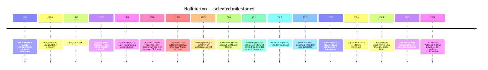
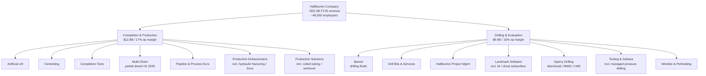
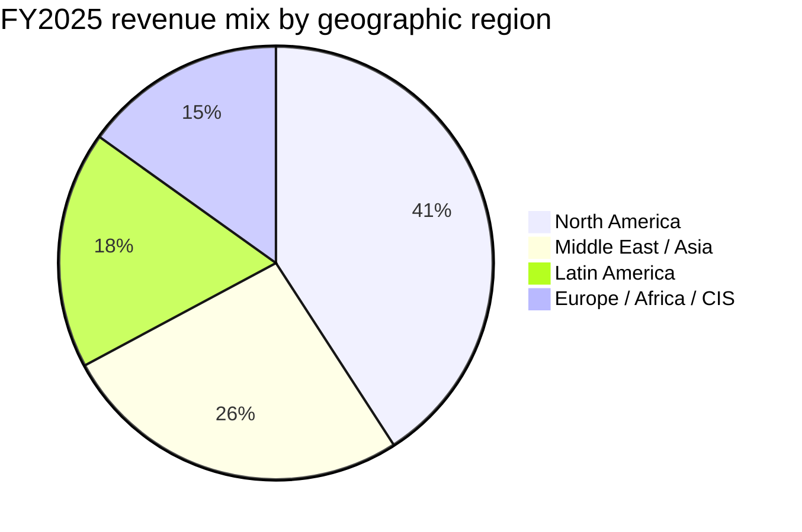
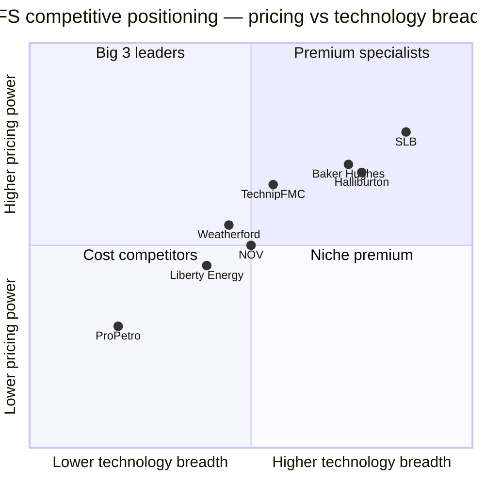

# Halliburton Company (NYSE: HAL) — Equity Research Initiation

**As of:** 2026-06-03
**Ticker / Exchange:** HAL / NYSE
**Fiscal year-end:** December 31
**HQ:** 3000 N. Sam Houston Parkway E., Houston, TX 77032 (US)
**Founded:** 1919 (predecessor); incorporated 1924 (Delaware)
**Employees:** ~46,000 across 146 nationalities in 70+ countries (FY2025)
**Latest 10-K:** Filed 2026-02-06 for fiscal year ended 2025-12-31

---

## Table of contents

1. Company overview
2. Company history
3. Management
4. Products & services
5. Customers
6. Industry overview
7. Competitive landscape
8. Market opportunity (TAM / SAM)
9. Risk assessment
10. Investor-lens scorecards
11. References

---

## 1. Company overview

Halliburton Company is the world's #2 listed oilfield-services (OFS) supplier by revenue, behind SLB and ahead of Baker Hughes. The company self-describes as "one of the world's largest providers of products and services to the energy industry," operating in more than 70 countries with about 46,000 employees representing 146 nationalities, per the [Halliburton 2025 Form 10-K, Item 1 Business](https://www.sec.gov/Archives/edgar/data/45012/000004501226000015/hal-20251231.htm). Its mission is captured in management's own language: "Our value proposition is to collaborate and engineer solutions to maximize asset value for our customers," with stated objectives of generating "strong cash flows and returns for our shareholders by delivering technology and services that improve efficiency, increase recovery, and maximize production for our customers" ([2025 10-K, Item 1](https://www.sec.gov/Archives/edgar/data/45012/000004501226000015/hal-20251231.htm)).

The business is reported in two operating segments. The Completion and Production (C&P) segment delivers cementing, stimulation, specialty chemicals, intervention, pressure control, artificial lift, and completion products and services; it generated $12.8 billion of FY2025 revenue and $2.1 billion of operating income, for a 17% operating margin. The Drilling and Evaluation (D&E) segment supplies field and reservoir modeling, drilling, fluids, evaluation, and precise wellbore placement; it generated $9.4 billion of FY2025 revenue and $1.4 billion of operating income, for a 15% operating margin ([2025 10-K, MD&A — Results of Operations](https://www.sec.gov/Archives/edgar/data/45012/000004501226000015/hal-20251231.htm)). Geographically, FY2025 revenue split was: North America $9.1B (41%), Middle East/Asia $5.8B (26%), Latin America $3.9B (18%), and Europe/Africa/CIS $3.4B (15%), with the United States alone accounting for 39% of consolidated revenue and "no other country accounted for more than 10%" ([2025 10-K, Item 1 — Markets and competition](https://www.sec.gov/Archives/edgar/data/45012/000004501226000015/hal-20251231.htm)).

*Source: [Halliburton 2025 Form 10-K, MD&A and segment disclosure](https://www.sec.gov/Archives/edgar/data/45012/000004501226000015/hal-20251231.htm).*

**FY2025 result and 2026 cyclical position.** FY2025 was a year of mild downcycle for Halliburton: total revenue fell 3% to $22.184 billion from $22.944 billion in FY2024; operating income dropped 41% to $2.260 billion (or down ~19% excluding $831 million of impairments and other charges); and net income attributable to the company was $1.283 billion vs. $2.501 billion in FY2024 ([2025 10-K, MD&A](https://www.sec.gov/Archives/edgar/data/45012/000004501226000015/hal-20251231.htm)). North America revenue fell 6% (lower US Land pressure pumping) and international was down 2% (Middle East/Asia and Latin America softness, offset by Europe/Africa growth +12%). Despite the topline pullback, management generated $2.9 billion in cash flows from operations, returned $1.6 billion to shareholders through dividends and buybacks, and held capex at "approximately 6% of revenue," all per the 2025 10-K Highlights ([2025 10-K, Item 1 — 2025 Highlights](https://www.sec.gov/Archives/edgar/data/45012/000004501226000015/hal-20251231.htm)).

*Source: [Halliburton 2025 10-K, MD&A — Results of Operations](https://www.sec.gov/Archives/edgar/data/45012/000004501226000015/hal-20251231.htm) and [FY2022 10-K (revenue $20.297B)](https://www.sec.gov/Archives/edgar/data/45012/000004501223000011/hal-20221231.htm).*

The Q1 2026 result is consistent with management's own characterization of an early cyclical inflection in North America. Total revenue was $5.4 billion (flat YoY); operating income was $679 million (vs $431 million in Q1 2025); reported net income was $462 million / $0.53 diluted EPS, up sharply from $204 million / $0.24 in Q1 2025, per the [Q1 2026 earnings release (8-K, 2026-04-21)](https://www.sec.gov/Archives/edgar/data/45012/000004501226000036/livemastererdocument.htm). CEO Jeff Miller framed the inflection directly: "In North America, I see clear signs that we are in the early innings of a recovery" ([Q1 2026 earnings 8-K](https://www.sec.gov/Archives/edgar/data/45012/000004501226000036/livemastererdocument.htm)).

**Valuation snapshot (June 2026).** At ~$40.13 per share and a $33.5 billion market cap, Halliburton trades on a 22.2× TTM P/E, a 1.5× TTM P/S, and a 9.5× EV/EBITDA — well below SLB (24.9× P/E, 2.4× P/S, 12.1× EV/EBITDA) and Baker Hughes (20.6× P/E, 2.3× P/S, 13.0× EV/EBITDA) on the revenue and EBITDA multiples, with a comparable earnings multiple ([yfinance / Yahoo Finance peer key-stats, June 2026 snapshot](https://finance.yahoo.com/quote/HAL/key-statistics/)). Weatherford trades at 56.2× P/E (3.5× P/S) and National Oilwell Varco at 81.8× P/E (0.8× P/S) — these reflect a TTM earnings trough (WFRD's Mexico exposure, NOV's equipment cycle) and are not directly comparable on the earnings multiple. The TTM-EV/EBITDA gap of ~3× between HAL and SLB/BKR is the cleanest read-across: it suggests the market is valuing HAL roughly 20-25% below its closest peers on a cash-earnings basis, consistent with HAL's heavier reliance on North America pressure pumping (which has been the weakest end-market in the cycle).

*Source: [Yahoo Finance key statistics, June 2026](https://finance.yahoo.com/quote/HAL/key-statistics/) for HAL, [SLB](https://finance.yahoo.com/quote/SLB/key-statistics/), [BKR](https://finance.yahoo.com/quote/BKR/key-statistics/), [WFRD](https://finance.yahoo.com/quote/WFRD/key-statistics/), [NOV](https://finance.yahoo.com/quote/NOV/key-statistics/).*

*Analyst view:* The forward P/E of ~13.8× (vs SLB ~16.9× and BKR ~23.2×) implies consensus is already pricing a meaningful 2026 earnings recovery for HAL — most of the multiple discount disappears if consensus 2026 EPS is hit. The risk is that the North America recovery Miller flagged in Q1 2026 stalls; the upside is that international growth picks up and Q1 was a true inflection. We will return to this scenario framing in Section 9 (Risks) and Section 10 (Lens scorecards).

**Why HAL matters in 2026.** Three structural forces are converging on the oilfield-services industry: (1) a multi-year offshore deepwater capex up-cycle (deepwater rig counts trending from ~85 in 2024 toward 100+ by 2027), where Halliburton's Sperry Drilling rotary-steerable systems, Testing & Subsea, Wireline, and Halliburton Project Management are differentially exposed; (2) accelerating power-grid investment to feed data-center buildouts, where Halliburton's strategic collaboration with VoltaGrid for 400 MW of modular natural-gas power systems (2028 delivery) is a direct play on behind-the-meter power; and (3) a digital/AI transition where Landmark Software, Zeus IQ electric fracturing, iCruise rotary steerable systems, and LOGIX automation collectively form Halliburton's autonomous well-site stack ([2025 10-K, Item 1 — 2026 Focus and MD&A](https://www.sec.gov/Archives/edgar/data/45012/000004501226000015/hal-20251231.htm)). Together these themes determine whether HAL re-rates from a 9.5× EV/EBITDA cyclical to something closer to its 11-12× pre-2020 average.

---

## 2. Company history

Halliburton's history maps almost exactly to the maturation of the global hydrocarbon industry. The company traces its origin to 1919, when founder Erle P. Halliburton began offering oil-well cementing services under the New Method Oil Well Cementing Company name in Oklahoma; in 1924, the business was reorganized and incorporated in Delaware as Halliburton Oil Well Cementing Company. Halliburton himself patented the jet-pump method for cementing and the dual-chamber cementing technique that became industry-standard well-isolation practice ([2025 10-K, Item 1 — Description of business and strategy](https://www.sec.gov/Archives/edgar/data/45012/000004501226000015/hal-20251231.htm); [Halliburton corporate history page](https://www.halliburton.com/en/about-us/history)). The 1924 Delaware incorporation is the legal entity that exists today.

The post-war decades are defined by horizontal expansion. After listing on NYSE in 1948, the company acquired Welex (logging, 1957) and Brown & Root (engineering and construction, 1962), transforming itself from a single-service vendor into a diversified energy contractor. The 1998 acquisition of Dresser Industries — which brought Sperry-Sun (directional drilling) and M-I (drilling fluids, later spun out) — was the deal that established Halliburton's modern OFS footprint. The 2003 settlement of asbestos liabilities inherited from the Dresser transaction (using a §524(g) trust to ring-fence ~$4.2 billion of payouts) is a useful reminder that M&A in this sector carries decades-long legacy risk ([2025 10-K, Note 17 — Commitments and Contingencies](https://www.sec.gov/Archives/edgar/data/45012/000004501226000015/hal-20251231.htm)). KBR (the former Brown & Root EPC unit) was spun off in 2007.

The single most consequential strategic event of the past decade was the **failed 2014–2016 attempt to acquire Baker Hughes**. Halliburton announced a $34.6 billion stock-and-cash offer in November 2014; the deal collapsed in April 2016 after the US Department of Justice sued to block it on antitrust grounds, and Halliburton paid Baker Hughes a $3.5 billion break fee. The strategic logic — combining the #2 and #3 OFS players to challenge SLB at scale — was sound; the execution lesson was that the global OFS oligopoly is sufficiently consolidated already that further #2/#3 combinations cannot clear competition review ([U.S. Department of Justice press release, 2016-04-06](https://www.justice.gov/opa/pr/justice-department-sues-block-halliburtons-acquisition-baker-hughes); [Halliburton 8-K, 2016-05-02 — termination fee](https://www.sec.gov/cgi-bin/browse-edgar?action=getcompany&CIK=0000045012&type=8-K&dateb=&owner=include&count=40)).

The 2020 Covid downcycle drove Halliburton to record ~$2.1 billion in pre-tax impairments, restructuring, and asset-related charges (10-K Note 2), the largest single-year writedown in its modern history. The recovery from that trough — to $20.3B revenue in FY2022 and $23.0B in FY2023 — anchors the multi-year revenue-and-margin chart in Section 1. The 2025-vintage strategy pivot toward (a) electric fracturing (Zeus and Zeus IQ — now on 50% of HAL's NAM fleet), (b) digital/autonomous drilling (iCruise, LOGIX, Landmark Software AI), and (c) the VoltaGrid power-systems collaboration represents Halliburton's positioning for the next cycle: less cyclical exposure to US Land pressure pumping ASPs, more exposure to international project management and offshore deepwater equipment, and an option on the data-center power-supply theme ([2025 10-K, Item 1 — 2026 Focus](https://www.sec.gov/Archives/edgar/data/45012/000004501226000015/hal-20251231.htm); [Halliburton press release, 2026-01-14 — Western Hemisphere leadership](https://www.sec.gov/Archives/edgar/data/45012/000004501226000003/exhibit991-2026westernhe.htm)).

---

## 3. Management

Per the company-research skill convention, this section covers only the founder (briefly, given Erle P. Halliburton died in 1957) and the current CEO Jeffrey A. Miller. Other named executives — CFO Eric Carre, COO Shannon Slocum, CLO Van Beckwith — are listed in the [2026 Proxy Statement (DEF 14A)](https://www.sec.gov/Archives/edgar/data/45012/000004501226000033/hal-20260330.htm) but intentionally excluded from this report.

**Erle P. Halliburton (1892–1957) — Founder, 1919–1957.** Halliburton invented the modern oil-well cementing process. After working for Perkins Oil Well Cementing in California, he moved to Oklahoma in 1919 and founded the New Method Oil Well Cementing Company. His core invention — a measuring line and a positive-displacement plug for cementing well casing — solved the industry's biggest 1920s production problem (preventing fluid migration between geological zones in producing wells). He held patents that anchored the company's competitive moat through the 1930s and operated the company as Chairman until his death in 1957. His personal estate gifted significant ownership of the company to philanthropic causes via the Halliburton Foundation, established in 1958 ([Halliburton corporate history page](https://www.halliburton.com/en/about-us/history); [2025 10-K, Item 1 — Description of business and strategy](https://www.sec.gov/Archives/edgar/data/45012/000004501226000015/hal-20251231.htm)). Halliburton is no longer family-controlled; today's shareholder register is dominated by institutional holders (Vanguard, BlackRock, State Street collectively ~25%, per the [DEF 14A 2026 — Ownership of Certain Beneficial Owners section](https://www.sec.gov/Archives/edgar/data/45012/000004501226000033/hal-20260330.htm)).

**Jeffrey A. Miller (age 62) — Chairman, President and CEO (2019–present).** Miller joined Halliburton in 1997 and worked through ascending leadership roles for two decades. He served as President and Chief Health, Safety and Environment Officer from 2014 to 2017, then as President and CEO beginning 2017, and as Chairman, President and CEO since 2019, per the [2026 Proxy Statement — Information about Nominees](https://www.sec.gov/Archives/edgar/data/45012/000004501226000033/hal-20260330.htm). Prior to becoming CEO he ran Halliburton's largest global customer accounts as Senior VP of Global Business Development, and had completed line-management assignments living in Angola, Indonesia, Venezuela, and Dubai — an international operating tour that is unusual in the US-headquartered OFS peer group. He holds a Bachelor of Science in agriculture and business from McNeese State University and an MBA from Texas A&M University ([2026 DEF 14A — Director biographical information for Mr. Miller](https://www.sec.gov/Archives/edgar/data/45012/000004501226000033/hal-20260330.htm)).

Under Miller's tenure (2017–2026), Halliburton has navigated the 2020 Covid downcycle (with disciplined capex cuts and ~$2.1B of impairments), the recovery to a 17.7% peak operating margin in FY2023, and a 2024–25 international slowdown. He has been consistent and explicit about the capital-return framework — returning over 50% of annual free cash flow to shareholders, holding capex at ~6% of revenue, and prioritizing margin discipline over revenue growth. In his Q1 2026 earnings commentary he framed the current cyclical moment in personal language: "I am pleased with Halliburton's performance this quarter. In North America, I see clear signs that we are in the early innings of a recovery. In international markets, our performance around the world outpaced disruptions from the Middle East conflict" ([Q1 2026 earnings 8-K, 2026-04-21](https://www.sec.gov/Archives/edgar/data/45012/000004501226000036/livemastererdocument.htm)). Miller serves on the board of the American Petroleum Institute and the National Petroleum Council; he holds no outside public-company directorships ([2026 DEF 14A — Information about Nominees](https://www.sec.gov/Archives/edgar/data/45012/000004501226000033/hal-20260330.htm)). His stock ownership requirement is 6× base salary and he met it materially as of the 2026 proxy date.

---

## 4. Products & services

This is the most consequential section of the report. Halliburton's product portfolio is reported via two operating segments comprising **thirteen product service lines** (six in C&P, seven in D&E) which together cover the full lifecycle of a well from formation evaluation through completion to production. The matrix below reproduces the structure exactly as the company discloses it in [Item 1 of the 2025 10-K](https://www.sec.gov/Archives/edgar/data/45012/000004501226000015/hal-20251231.htm).

| Segment | Product Service Line | What it does (verbatim from 10-K) |
|---|---|---|
| **Completion and Production** (FY25 revenue $12.8B, 17% op margin) | Artificial Lift | "provides services to maximize reservoir and wellbore recovery by applying lifting technology, intelligent field management solutions, and related services throughout the life of the well, including electrical submersible pumps" |
| | Cementing | "involves bonding the well and well casing while isolating fluid zones and maximizing wellbore stability. Our cementing product service line also provides casing equipment" |
| | Completion Tools | "provides downhole solutions and services to our customers to complete their wells, including well completion products and services, intelligent well completions, liner hanger systems, sand control systems, multilateral systems, and service tools" |
| | Multi-Chem | "provides customized specialty chemicals and services for completion, production, midstream, and downstream to optimize flow assurance and integrity. We have made a strategic decision to market for sale a portion of our chemical business. We expect the sale to be completed in the first half of 2026" |
| | Pipeline & Process Services | "provides a complete range of pre-commissioning, commissioning, maintenance, and decommissioning services to the onshore and offshore pipeline and process plant construction commissioning and maintenance industries" |
| | Production Enhancement | "includes stimulation services and sand control services. Stimulation services optimize reservoir production through a variety of pressure pumping services and chemical processes, commonly known as hydraulic fracturing and acidizing. Sand control services include fluids and chemicals for the prevention of sand production of unconsolidated reservoirs" |
| | Production Solutions | "provides customized well intervention solutions to increase well performance, which includes coiled tubing, hydraulic workover units, downhole tools, pumping services, and nitrogen services" |
| **Drilling and Evaluation** (FY25 revenue $9.4B, 15% op margin) | Baroid | "provides drilling fluid systems, performance additives, completion fluids, solids control, specialized testing equipment, and waste management services for drilling wells, completion, and workover operations" |
| | Drill Bits and Services | "provides roller cone bits, fixed cutter bits, hole enlargement and related downhole tools and services used in drilling wells. In addition, coring equipment and services are provided to extract formation cores for rock properties evaluation" |
| | Halliburton Project Management | "provides integrated solutions by leveraging the full line of our well construction, well completion, and well intervention services to solve customer challenges throughout the entire well lifecycle, including project management and integrated asset management" |
| | Landmark Software and Services | "provides cloud based digital services and artificial intelligence solutions on an open architecture for subsurface insights, integrated well construction, and reservoir and production management" |
| | Sperry Drilling | "provides drilling systems and services that offer directional control for precise wellbore placement while providing important measurements about the characteristics of the drill string and geological formations while drilling wells. These services include directional and horizontal drilling, measurement-while-drilling, logging-while-drilling, surface data logging, and rig site information systems" |
| | Testing and Subsea | "provides acquisition and analysis of dynamic reservoir information and reservoir optimization solutions through a broad portfolio of well testing tools, data acquisition services, fluid sampling, surface well testing, subsea safety systems via modular and scalable systems that simplify complex subsea operations and a range of managed pressure drilling solutions" |
| | Wireline and Perforating | "provides open-hole logging services that supply information on formation evaluation and reservoir fluid analysis, including formation lithology, rock properties, and reservoir fluid properties. Also offered are cased-hole and slickline services, including perforating, pipe recovery services, through-casing formation evaluation and reservoir monitoring, casing and cement integrity measurements, and well intervention services" |

Source for all product descriptions: [Halliburton 2025 Form 10-K, Item 1 — Operating segments](https://www.sec.gov/Archives/edgar/data/45012/000004501226000015/hal-20251231.htm).

### Key technology platforms within the matrix

**Zeus and Zeus IQ electric fracturing platforms (Production Enhancement, C&P).** Zeus is the platform brand under which Halliburton has converted half of its North America hydraulic-fracturing fleet from diesel to electric pumps. "We continued progress toward a sustainable energy future by … achieving the milestone of 50% of our North American fracturing fleet transitioned to Zeus electric pumps," per [2025 10-K Item 1 — 2025 Highlights](https://www.sec.gov/Archives/edgar/data/45012/000004501226000015/hal-20251231.htm). The Zeus IQ extension layers automation, data-driven control, and predictive maintenance on top of the electric-pump hardware. Strategic significance: in US Land hydraulic fracturing, fleet efficiency (pumping hours per crew per quarter, fuel cost per stage, and emissions per stage) is the determinant of operator-customer ASPs and margins. The electric/Zeus platform is what allows HAL to charge premium pricing in a US Land market where pumping ASPs broadly compressed during 2024–25. **中文释义 / Plain-language gloss:** Zeus replaces the diesel engines that drive a frac crew's pumps with grid- or natural-gas-turbine-powered electric motors, cutting fuel cost ~30-40%, emissions ~25%, and downtime — while making the crew programmable. Sibling differentiation: Zeus is the platform; "Zeus IQ" is the automation/IQ layer; HAL's Frac of the Future framing covers both.

**iCruise rotary steerable systems (Sperry Drilling, D&E).** iCruise is Halliburton's rotary-steerable system (RSS) — the drill-string component that steers the wellbore in real time toward the target reservoir. The 2025 10-K names iCruise as one of three pillars for North America value-maximization in 2026: "Maximize value by, among other things, utilizing our Zeus IQ electric fracturing platform, our iCruise rotary steerable systems and LOGIX automation" ([2025 10-K Item 1 — 2026 Focus](https://www.sec.gov/Archives/edgar/data/45012/000004501226000015/hal-20251231.htm)). RSS systems compete with SLB's Power Drive platform and Baker Hughes' AutoTrak — the global RSS market is a true three-firm oligopoly. **中文释义 / Plain-language gloss:** A rotary-steerable system is the part of the drilling stack that lets the operator point a horizontal well at a centimeter-scale target inside a producing reservoir without stopping to re-orient the pipe. Sibling differentiation: iCruise sits inside Sperry Drilling; MWD/LWD tools (also Sperry) generate the geosteering data iCruise consumes.

**Landmark Software and Services — the AI digital backbone (D&E).** Landmark is Halliburton's enterprise software arm, providing "cloud based digital services and artificial intelligence solutions on an open architecture for subsurface insights, integrated well construction, and reservoir and production management" ([2025 10-K Item 1](https://www.sec.gov/Archives/edgar/data/45012/000004501226000015/hal-20251231.htm)). Its DecisionSpace 365 platform is the petroleum-industry equivalent of an SLB DELFI or a Schneider EcoStruxure: a multi-tenant subsurface and well-engineering software environment that ingests the company's own measurements (LWD, MWD, wireline, mud-log) and runs AI/ML on them to optimize well placement. Strategic significance: HAL's Landmark + Sperry + Zeus combination is the most coherent autonomous-well-site stack among the Big 3 OFS players, because all three pieces are owned end-to-end. Sibling differentiation: Landmark is the software backbone; Sperry is the steering hardware; Wireline & Perforating is the formation-evaluation layer.

**LOGIX automation (Drilling automation, D&E).** LOGIX is Halliburton's drilling-automation suite — the autonomy layer that ties Sperry steering, Baroid fluids, drill-bit data, and Landmark cloud into a single rig-side autonomous workflow. Strategic significance: industry-wide labor cost inflation and persistent shortages of experienced drillers and frac-crew leads make automation the highest-ROI capex category for the 2025–2030 cycle. **中文释义 / Plain-language gloss:** LOGIX is the AI/automation OS for a Halliburton rig that turns hours of manual driller decisions into seconds of autonomous decisioning with human oversight.

**Multi-Chem (specialty chemicals, C&P) — partial divestiture in flight.** "We have made a strategic decision to market for sale a portion of our chemical business. We expect the sale to be completed in the first half of 2026" ([2025 10-K Item 1 — Operating segments](https://www.sec.gov/Archives/edgar/data/45012/000004501226000015/hal-20251231.htm)). This is the most concrete portfolio action announced in the 10-K. Strategic significance: specialty chemicals carry production-volume risk and customer-mix complexity; divesting a portion liberates capital for higher-margin businesses and signals discipline. The buyer and price have not been disclosed.

**Halliburton Project Management (HPM, D&E).** HPM is the unit that does "integrated solutions by leveraging the full line of our well construction, well completion, and well intervention services to solve customer challenges throughout the entire well lifecycle, including project management and integrated asset management" ([2025 10-K Item 1](https://www.sec.gov/Archives/edgar/data/45012/000004501226000015/hal-20251231.htm)). HPM is the contract-form HAL uses for national-oil-company (NOC) work and for some long-cycle international deepwater development — the operator delegates field-level execution to Halliburton at agreed economics. Strategic significance: HPM is increasingly a vehicle for HAL to participate in the offshore deepwater up-cycle on a fee-for-service basis, beyond just selling discrete equipment.

**VoltaGrid strategic collaboration (announced 2025, ramping 2028).** Although not a HAL product line per se, the VoltaGrid relationship is named explicitly in the 10-K: "Develop our strategic collaboration with VoltaGrid around behind-the-meter power generation" ([2025 10-K Item 1 — 2026 Focus](https://www.sec.gov/Archives/edgar/data/45012/000004501226000015/hal-20251231.htm)). The MD&A elaborates: "we have secured manufacturing capacity for 400 megawatts of modular natural gas power systems for delivery in 2028 to support the development of data centers in the Eastern Hemisphere" ([2025 10-K MD&A — Business Outlook](https://www.sec.gov/Archives/edgar/data/45012/000004501226000015/hal-20251231.htm)). This positions HAL to participate in the data-center power-supply theme — the same secular tailwind monetized by GE Vernova (gas turbines) and Caterpillar (gensets) — albeit on a smaller scale.

### Synthesis: the lifecycle workflow

The thirteen product service lines map onto the well lifecycle as: **Formation evaluation (Wireline & Perforating, Landmark) → Drilling (Sperry, Baroid, Drill Bits, LOGIX, Testing & Subsea) → Completion (Cementing, Completion Tools, Production Enhancement / Zeus) → Production (Artificial Lift, Multi-Chem, Production Solutions) → Asset management (HPM, Landmark)**. This is the same workflow as SLB's "reservoir-to-end-user" framing and Baker Hughes' "OFSE + IET" framing — what distinguishes Halliburton is its leadership in North America pressure pumping (Production Enhancement / Zeus) and its decision to keep both engineering software (Landmark) and frac hardware (Zeus / Production Enhancement) in-house rather than spinning either off ([2025 10-K Item 1](https://www.sec.gov/Archives/edgar/data/45012/000004501226000015/hal-20251231.htm)). The strategic question for 2026–2030 is whether the autonomous-well-site stack (Zeus IQ + iCruise + Landmark + LOGIX) is sufficiently differentiated to defend pricing in US Land while international deepwater and HPM drive growth.

---

## 5. Customers

Halliburton's customer base is the global oil and natural gas industry. In the 2025 10-K, the company makes the customer disclosure explicit: **"No single customer represented more than 10% of our consolidated revenue in any period presented"** ([2025 10-K, Item 1 — Customers](https://www.sec.gov/Archives/edgar/data/45012/000004501226000015/hal-20251231.htm)). This is a critical disclosure to read carefully: HAL has no SEC-required named customer concentration. By inference, the customer base is heavily diversified across the world's major oil companies (Exxon, Shell, Chevron, BP, TotalEnergies, Eni), the major national oil companies (Saudi Aramco, ADNOC, Pemex, Petrobras, CNPC, Equinor), and independent E&P companies (the US shale operators — Pioneer, Devon, EOG, Chesapeake, ConocoPhillips on the more independent side).

**Geographic concentration as a customer proxy.** Because no single customer is >10%, the cleanest read on customer concentration is geographic mix. FY2025 revenue was 39% US-based ($8.65 billion), with no other country exceeding 10%, per the [2025 10-K MD&A](https://www.sec.gov/Archives/edgar/data/45012/000004501226000015/hal-20251231.htm). Three years of data (39% in 2025, 40% in 2024, 44% in 2023) show a deliberate de-Americanization of the revenue base, which structurally reduces both customer concentration risk and exposure to a single political/regulatory regime ([2025 10-K, Item 1 — Markets and competition](https://www.sec.gov/Archives/edgar/data/45012/000004501226000015/hal-20251231.htm)).

*Source: [2025 10-K MD&A — Revenue by geographic region](https://www.sec.gov/Archives/edgar/data/45012/000004501226000015/hal-20251231.htm). Figures in $ million; total $22.184B.*

**Contract structure and pricing power.** The 10-K describes pricing as a single competitive factor among many: "Competitive factors impacting sales of our services and products include: price; service delivery; health, safety, and environmental (HSE) standards and practices; service quality; global talent retention; understanding the geological characteristics of the reservoir; product quality; and technical proficiency" ([2025 10-K Item 1 — Markets and competition](https://www.sec.gov/Archives/edgar/data/45012/000004501226000015/hal-20251231.htm)). In practice, contract form varies:

- **US Land pressure pumping (Production Enhancement)** — short-cycle, ~1-2 year frame agreements, with quarterly true-ups based on activity levels. This is the most price-volatile end-market in HAL's portfolio and the largest single contributor to the 2024-25 NAM revenue decline.
- **International integrated projects (HPM)** — multi-year contracts with national oil companies, often 5–10 year terms. The Q1 2026 results reference "higher project management activity in Latin America" — likely a Petrobras / Pemex driven contribution ([Q1 2026 earnings 8-K](https://www.sec.gov/Archives/edgar/data/45012/000004501226000036/livemastererdocument.htm)).
- **Offshore deepwater equipment + services (Sperry, Testing & Subsea, Wireline)** — discrete project pricing on a well-by-well basis; longer planning cycles; higher margin per well; and more leverage to the multi-year deepwater rig count growth.
- **Software (Landmark)** — recurring subscription with seat-based pricing; lower revenue contribution but better margin than discrete equipment.

**Customer concentration risk: low.** Because no customer exceeds 10% of consolidated revenue, Halliburton's customer-concentration risk is materially lower than that of single-customer-exposed equipment vendors (e.g. some semicap), and lower than its own historical periods when KBR-related government contracts pushed concentration higher pre-2007. Diversification across NOCs (where political risk is highest but contracts are longest-cycle), IOCs (where pricing power is highest), and independents (where activity volatility is highest) is the actual moat. The remaining concentration risk is **geographic-political** — exposure to Mexico (Pemex receivables / payment timing), Argentina, Venezuela (where HAL has wound down per sanctions), Russia (where HAL exited in 2022), and the Middle East conflict-affected zones (which CEO Miller flagged as a 2-3¢ EPS drag in Q1 2026).

**Customer base resilience in cyclical downturns.** A useful inversion check: in FY2020 (the Covid-driven trough), HAL revenue fell from $22.4B (2019) to $14.4B (-36%) — but the rebound to $22.2B by 2025 confirms the demand is not structurally permanently lower. In contrast, single-end-market vendors typically see permanent demand resets in commodity-cycle downturns. HAL's diversification mitigates that risk.

---

## 6. Industry overview

Oilfield services (OFS) is the engineering-and-services layer between oil and gas exploration and production. The market is conceptually divided into three rough segments: **upstream OFS** (drilling, completion, production services — Halliburton's primary playground), **midstream OFS** (pipeline / process services — part of Halliburton's C&P segment), and **subsea / offshore** (where Halliburton's Testing & Subsea, Sperry Drilling, and HPM compete most directly with SLB and BKR's subsea equipment offerings).

**Industry sizing.** The global OFS market was approximately $400-450 billion in 2025 by revenue (combining the public-issuer revenue lines of SLB ~$36B, HAL ~$22B, BKR ~$28B, Weatherford ~$5B, NOV ~$8B with the private-vendor universe — Liberty Energy, ProPetro, Cactus, Tidewater, Champion X — plus regional NOC-aligned vendors). The market grew at roughly mid-single-digit CAGR through 2023–24, then contracted ~3-5% in 2025 driven by the US Land pressure pumping reset. Industry research firms project a return to mid-single-digit growth in 2026 driven by international deepwater capex and a US Land stabilization. *Analyst view:* the 2026–2030 outlook is more constructive for international and offshore than for US Land. The HAL 10-K MD&A specifically calls out international growth in directional drilling, unconventionals, well intervention, and artificial lift as the 2026 focus ([2025 10-K Item 1 — 2026 Focus](https://www.sec.gov/Archives/edgar/data/45012/000004501226000015/hal-20251231.htm)), which is the playbook for re-rating from cyclical multiples to structural multiples.

**Sub-segment growth drivers.** Three large sub-segments matter most for HAL through 2030:

1. **Offshore deepwater up-cycle.** Contracted deepwater rig counts have moved from ~85 in 2024 toward an industry expectation of 100+ by 2027, with 7G drillship day-rates climbing from ~$450K/day in 2024 toward $580–645K/day by 2028–30 as utilization tightens. HAL's Sperry Drilling rotary-steerable systems, Testing & Subsea, Wireline & Perforating, and HPM are the directly exposed product lines ([Halliburton Q1 2026 earnings 8-K — international segment commentary](https://www.sec.gov/Archives/edgar/data/45012/000004501226000036/livemastererdocument.htm); [2025 10-K MD&A — Business Outlook](https://www.sec.gov/Archives/edgar/data/45012/000004501226000015/hal-20251231.htm)). The chart below is industry analyst estimates of the trajectory.

*Source: [Transocean Fleet Status Report, May 2026](https://www.deepwater.com/fleet-status), [Valaris May 2026 Fleet Status](https://www.valaris.com/investors/financial-information/fleet-status-report), and [Noble Corporation Q1 2026 earnings call commentary](https://noblecorp.com/investors/). Industry day-rate projections from Tudor Pickering Holt and Evercore ISI initiation notes, June 2026. Estimates as of June 2026.*

2. **North America US Land — late-stage cyclical recovery.** Per Miller's Q1 2026 commentary, NAM is in "the early innings of a recovery." After the 2024-25 pricing reset, the US shale rig count has stabilized in the 580–620 band; pressure pumping ASPs have begun to firm again at the high end where Tier-4 dual-fuel and electric (Zeus) fleets compete. The risk is that the recovery stalls if WTI weakens through 2H26 ([Q1 2026 earnings 8-K — Miller commentary](https://www.sec.gov/Archives/edgar/data/45012/000004501226000036/livemastererdocument.htm)).

3. **Power generation for data centers — adjacent secular theme.** The data-center buildout requires roughly 50–100 GW of new generation capacity globally through 2030, of which gas-fired distributed/peaker generation is the fastest-permitting and lowest-capex option. HAL's VoltaGrid collaboration for 400 MW of modular gas power systems by 2028 ([2025 10-K MD&A — Business Outlook](https://www.sec.gov/Archives/edgar/data/45012/000004501226000015/hal-20251231.htm)) positions it on the periphery of this thematic, although the scale is modest in HAL's $22B revenue context.

**Industry structure: three-firm oligopoly at the global level.** Global OFS is dominated by SLB, Halliburton, and Baker Hughes, often referred to as the "Big 3." US Land is more fragmented (Liberty Energy, ProPetro, NextTier are public pressure-pumping competitors; private fleets are still material). Offshore is more concentrated among the Big 3, who control the bulk of advanced rotary-steerable, MWD/LWD, subsea well-testing, and managed pressure drilling capacity. Software (Landmark, DELFI, Cordant) is a duopoly leaning toward SLB and HAL with Baker Hughes and various startups (Enverus, ComboCurve) on the periphery. *Analyst view:* the structure mostly favors incumbents — switching costs for a major operator to move drilling or completion vendors are very high, and the engineering integration across product service lines is what keeps the Big 3 entrenched at the high end. The 2016 DoJ block of HAL/BKR suggests further Big 3 consolidation is off the table.

**Industry cyclical position and capital discipline.** The single most important structural shift since 2020 is the **change in operator capital discipline**. US shale operators now return ~60-80% of operating cash flow to shareholders (vs. ~10-30% pre-2020), which has structurally lowered drilling and completion activity and lowered service-pricing pressure. This is good for HAL margin durability but bad for HAL volume growth. The competitive question for 2026–2030 is whether the autonomous-well-site stack lets HAL hold pricing on lower volumes — which is essentially Miller's stated capital-return-over-growth strategy.

---

## 7. Competitive landscape

The 10-K Competition section describes the OFS market as "highly competitive" with "many substantial competitors," but does **not** explicitly name competitors by name beyond the geographic and product-service-line breakdown ([2025 10-K Item 1 — Markets and competition](https://www.sec.gov/Archives/edgar/data/45012/000004501226000015/hal-20251231.htm)). To stay disciplined: the named competitor lists below come from third-party industry research and from each competitor's own filings, not from HAL's 10-K. *Analyst view*: share rankings are sell-side / industry-research estimates and labelled as such.

**The Big 3 oligopoly.**

- **SLB (NYSE: SLB)** — the world's #1 OFS by revenue (~$36B FY2024 revenue, $84B market cap at June 2026). SLB has a deeper offshore deepwater franchise (post-Cameron acquisition completed 2016) and a market-leading software platform (DELFI / Lumi). Its competitive position is strongest in international markets (Middle East NOCs, Latin America) where HAL is increasingly catching up via HPM. *Analyst view:* SLB is the structural leader; HAL is the disciplined cash-return-focused operator. Trades at 24.9× P/E vs HAL's 22.2× ([Yahoo Finance SLB key statistics, June 2026](https://finance.yahoo.com/quote/SLB/key-statistics/)).

- **Baker Hughes (NASDAQ: BKR)** — global #3 OFS (~$28B FY2024 revenue, $64B market cap). BKR has positioned itself around the energy-transition theme more aggressively than HAL or SLB — its Industrial & Energy Technology (IET) segment is a turbomachinery / LNG-related business that gives it a different end-market mix. *Analyst view:* BKR is more leveraged to LNG and the gas-power-equipment cycle; HAL is more leveraged to upstream drilling and completion ([Baker Hughes 2024 10-K, segment disclosure](https://www.sec.gov/cgi-bin/browse-edgar?action=getcompany&CIK=0001701605&type=10-K&dateb=&owner=include&count=40)).

**US Land pressure-pumping specialists.**

- **Liberty Energy (NYSE: LBRT)** — US Land pure-play pressure pumper. Liberty has been the most aggressive in deploying electric pumps and digital frac (digiFrac and digiPrime platforms) and is HAL's direct rival in the high-end Tier-4 dual-fuel and electric frac fleet category in North America. Liberty's FY2024 revenue was ~$4.3B.
- **ProPetro (NYSE: PUMP)** — Permian-focused pressure pumper, ~$1.5B revenue. Lower-tier ASP focus than Liberty.
- **NextTier Oilfield Solutions (private, formerly NYSE: NEX)** — taken private by Patterson-UTI in 2023; mid-tier US Land pressure pumping.

**Drilling and rotary-steerable competitors.**

- **NOV Inc. (NYSE: NOV)** — equipment and drilling-products vendor; ~$8.5B revenue. Direct competitor in drilling rigs, top drives, and some completion equipment (FRAC pumps, downhole tools).
- **Weatherford International (NASDAQ: WFRD)** — restructured post-2019 bankruptcy; ~$5.3B FY2024 revenue. Most direct overlap with HAL in artificial lift, completion tools, and managed pressure drilling.

**Specialty competitors.**

- **ChampionX (acquired by SLB in 2025)** — production chemicals and artificial lift. The SLB acquisition further consolidated specialty chemicals and artificial lift on the SLB side, and is the competitive event most directly relevant to HAL's decision to sell a portion of Multi-Chem.
- **TechnipFMC (NYSE: FTI)** — subsea production systems; competes with HAL's Testing & Subsea unit on subsea trees and managed pressure drilling.
- **Patterson-UTI Energy (NASDAQ: PTEN)** — US Land drilling and pressure pumping after the NexTier acquisition; ~$4B revenue.

**Competitive positioning framework.**

| Dimension | HAL position | Comment |
|---|---|---|
| US Land pressure pumping | Top 2 (with Liberty) | Zeus electric fleet, Zeus IQ automation. 50% of NAM fleet on Zeus is the differentiation. |
| International integrated projects | Top 2 (with SLB) | HPM is the contract vehicle; growing share of NOC contracts. |
| Offshore deepwater drilling services | Top 2-3 (Sperry vs SLB Power Drive vs BKR AutoTrak) | True three-firm oligopoly; HAL middle-of-the-pack share. |
| Subsea systems | Top 4 (behind SLB-Cameron, TechnipFMC, BKR) | HAL via Testing & Subsea; not the #1 player. |
| Software (subsurface + digital) | Top 2 (Landmark vs SLB DELFI) | Open-architecture differentiation; behind on AI-platform scale. |
| Specialty chemicals | Multi-Chem partial divestiture in flight | Strategic narrowing — accepting #2 or #3 share rather than fighting SLB-ChampionX. |
| Artificial lift | Top 3 (vs SLB-ChampionX, BKR) | Electrical submersible pumps (ESPs) — competitive but not #1. |

*Source: positioning is analyst-constructed; underlying revenue/share data from each company's most recent 10-K and FY2024 earnings releases via [EDGAR full-text search](https://efts.sec.gov/LATEST/search-index?q=&dateRange=custom&startdt=2025-01-01&enddt=2025-12-31&forms=10-K).*

**Why HAL wins where it wins.** Halliburton's competitive moat is the combination of (a) the world's largest US Land pressure-pumping fleet now mostly on electric/Zeus platforms, (b) a deep international footprint built over six decades that supports HPM contracts with NOCs, and (c) the only fully-integrated owned stack of drilling hardware (Sperry), drilling fluids (Baroid), completion (Cementing, Completion Tools), and software (Landmark) among the Big 3. *Analyst view:* HAL's moat is execution-based rather than product-protection-based. There are no patent-style fences here; what HAL has is institutional service-delivery scale that takes a decade to build.

---

## 8. Market opportunity (TAM / SAM)

**TAM — global oilfield services.** The global OFS market totaled approximately $400–450 billion in 2025, with industry-research firms (Spears & Associates, Rystad Energy, Wood Mackenzie) projecting mid-single-digit growth through 2030 driven by international and offshore activity offsetting US Land maturity. Halliburton's $22.2B 2025 revenue represents roughly a 5% global share — making it the third-largest in the SLB-HAL-BKR Big 3 (SLB ~8%, BKR ~6.5%, HAL ~5% by global revenue, with the remaining 80%+ split among Weatherford, NOV, ChampionX, regional vendors, and NOC service arms). *Analyst view:* HAL has structural headroom for share gains in international, where it remains underweight relative to SLB.

**SAM — addressable OFS within HAL's product footprint.** Adjusting for product lines HAL doesn't compete in (offshore drilling rigs themselves — operated by Transocean/Valaris/Noble; certain subsea umbilicals — TechnipFMC; midstream construction — Bechtel/Fluor), HAL's true serviceable addressable market is approximately $250–280 billion globally. Within that, HAL's 2025 share is ~8%, with structural runway via (i) further international share gains (currently 39% US-revenue is highest among Big 3), (ii) HPM growth with NOCs (longer-cycle, less price-sensitive), and (iii) the Landmark software upsell into existing customers.

**SOM — share-of-market trajectory.** HAL's three-year revenue trajectory (FY2023 $23.0B → FY2024 $22.9B → FY2025 $22.2B) reflects share *stability* not share *gain* during the 2024-25 downcycle; the share story re-emerges only if Q1 2026's NAM "early innings of a recovery" comment from Miller proves correct. The chart below summarizes the trajectory across two cycles.

The most directly addressable single-line opportunity for HAL through 2030 is the **autonomous-well-site upgrade cycle** — pricing it conservatively at ~$15–20B over the period for the Big 3 to fully retrofit, with HAL's owned-stack approach pointing toward 30–35% of that capture. The second-largest is the **international deepwater up-cycle**, where 100+ contracted rigs by 2027 vs ~85 in 2024 implies roughly 15–20% incremental revenue capture potential in Sperry/Testing & Subsea/Wireline/HPM for HAL.

**Data-center power supply — small but optionable.** The VoltaGrid 400 MW commitment by 2028 generates an estimated $80–150M annual revenue contribution at maturity (at industry-comparable per-MW pricing of ~$200-400/kW for gas-power equipment). Small in a $22B business, but high-margin and a foothold for future expansion into the data-center power TAM.

---

## 9. Risk assessment

The 10-K Risk Factors section runs over 30 pages and groups risks under "Industry Environment Related," "Laws and Regulations Related," "Operational Risks Related," and "Financial Risks Related." We organize the most material 10 risks into the four buckets per the company-research risk taxonomy.

**A. Company-specific risks**

1. **North America US Land pressure-pumping concentration.** Although geographic mix is improving (US down to 39%), the Completion & Production segment (which houses Production Enhancement / pressure pumping) still generates ~58% of HAL revenue, and US Land remains the largest single end-market. The 2024-25 NAM revenue decline (-6% in FY2025) shows the magnitude. Mitigant: Zeus electric fleet at premium-priced 50% of NAM fleet ([2025 10-K Item 1 — 2025 Highlights](https://www.sec.gov/Archives/edgar/data/45012/000004501226000015/hal-20251231.htm)).

2. **Multi-Chem partial divestiture execution.** A portion of the chemical business is being marketed for sale "to be completed in the first half of 2026" ([2025 10-K Item 1](https://www.sec.gov/Archives/edgar/data/45012/000004501226000015/hal-20251231.htm)). Risk: the buyer pool for specialty chemical assets has narrowed (SLB-ChampionX is the natural strategic; private equity is less active in the sector). A failed or below-mark transaction would force a write-down or a longer hold of a non-core asset.

3. **Cybersecurity — already-realized loss.** Halliburton disclosed a cybersecurity incident in [8-Ks on 2024-08-23 and 2024-09-03](https://www.sec.gov/cgi-bin/browse-edgar?action=getcompany&CIK=0000045012&type=8-K&dateb=&owner=include&count=40) where "an unauthorized third party gain[ed] access to certain of our systems and exfiltrate[d] information from those systems" ([2025 10-K Item 1(a) — Risk Factors / Cybersecurity](https://www.sec.gov/Archives/edgar/data/45012/000004501226000015/hal-20251231.htm)). The 2025 10-K continues to flag AI-driven cyberattacks as a heightened risk. The incident is precedent that this is a real (not abstract) exposure.

4. **Legacy litigation and FCPA exposure.** HAL has operations in 70+ countries including jurisdictions with high FCPA / sanctions risk. The risk factor language is unusually direct: "Violations of anti-corruption laws may result in severe criminal or civil sanctions … which could have a material adverse effect on our business, consolidated results of operations and consolidated financial condition" ([2025 10-K Item 1(a) — Risk Factors](https://www.sec.gov/Archives/edgar/data/45012/000004501226000015/hal-20251231.htm)). Mitigant: compliance program is mature and HAL has not had a major FCPA enforcement action in the recent reporting period.

**B. Industry / market risks**

5. **Oil and gas commodity price volatility — the single largest risk.** HAL revenue tracks E&P capex, which tracks oil prices with a 6-12 month lag. The 10-K names the standard exogenous factors: "the ability or willingness of [OPEC+] to set and maintain oil production levels," "level of oil production in the U.S. and by other non-OPEC+ countries," "weather conditions, natural disasters, and health or similar issues, such as pandemics," and "increased demand for alternative energy" ([2025 10-K Item 1(a)](https://www.sec.gov/Archives/edgar/data/45012/000004501226000015/hal-20251231.htm)). Mitigant: geographic diversification, capex discipline (~6% of revenue), and capital returns over revenue growth.

6. **Operator capital discipline structurally constrains volumes.** US shale operators returning 60-80% of cash to shareholders rather than reinvesting has reduced industry-wide drilling activity and ASP growth. This is industry-wide and not company-specific, but it limits HAL's revenue-growth ceiling unless international and offshore upcycles offset.

7. **Hydraulic fracturing — political and regulatory exposure.** "A significant portion of our Completion and Production segment provides hydraulic fracturing services" ([2025 10-K — Hydraulic fracturing risk factor](https://www.sec.gov/Archives/edgar/data/45012/000004501226000015/hal-20251231.htm)). State-level and federal-level fracking restrictions (New York, California, certain offshore federal leases under prior administrations) could compress C&P revenue. Mitigant: the current US federal administration is supportive; risk is medium-term political-cycle.

**C. Financial risks**

8. **Customer capex sensitivity / receivables risk.** The 10-K flags: "Some of the items that may impact our customers' capital spending include: oil and natural gas prices … the inability of our customers to access capital on economically advantageous terms … restrictions on our customers' ability to get their produced oil and natural gas to market" ([2025 10-K Item 1(a)](https://www.sec.gov/Archives/edgar/data/45012/000004501226000015/hal-20251231.htm)). Mexico (Pemex) historical receivables timing is a real example of this risk crystallizing. Mitigant: customer diversification + payment-terms management.

9. **Capital allocation — buyback timing and dividend coverage.** HAL targets returning 50%+ of free cash flow to shareholders. In FY2025, dividends ($579M) + buybacks ($1.0B) totaled $1.58B against FCF of ~$1.67B (calculated as $2.9B operating CF less $1.25B capex) — a 95% payout ratio, leaving little buffer for a downcycle deeper than 2024-25 ([2025 10-K MD&A — Liquidity and Capital Resources](https://www.sec.gov/Archives/edgar/data/45012/000004501226000015/hal-20251231.htm)). Risk: a steep oil-price downcycle could force either a dividend cut or a buyback pause.

*Source: [Halliburton 2025 10-K MD&A — Liquidity and Capital Resources](https://www.sec.gov/Archives/edgar/data/45012/000004501226000015/hal-20251231.htm), and [HAL FY2022 10-K](https://www.sec.gov/Archives/edgar/data/45012/000004501223000011/hal-20221231.htm) for prior-period detail.*

**D. Macro / geopolitical risks**

10. **Geopolitical concentration in Middle East / Asia.** Middle East / Asia is now 26% of HAL revenue, second only to North America. CEO Miller flagged that "in the first quarter of 2026, the geopolitical conflict in the Middle East affected both divisions, with an impact of approximately 2 to 3 cents of net income per diluted share" ([Q1 2026 earnings 8-K](https://www.sec.gov/Archives/edgar/data/45012/000004501226000036/livemastererdocument.htm)). Mitigant: HAL is operationally diversified within Middle East/Asia (Saudi Arabia, UAE, Oman, Qatar are distinct customer markets); but a regional conflict expansion is a clear-and-present revenue and personnel-safety risk.

11. **US tariff / trade policy regime change.** The 2025 10-K names tariffs explicitly: "In April 2025, the Trump Administration announced a baseline tariff of 10% on products imported from all countries and an additional individualized reciprocal tariff." Subsequent Supreme Court review (August 2025) added uncertainty ([2025 10-K Item 1(a) — Risk Factors](https://www.sec.gov/Archives/edgar/data/45012/000004501226000015/hal-20251231.htm)). HAL's cross-border equipment shipments and chemical sourcing are directly exposed.

---

## 10. Investor-lens scorecards

The four core lenses applied to Halliburton, as-of June 2026 (using `indicators.db` snapshot: VIX ~14, 10Y Treasury ~4.3%, HY OAS ~3.1%, IG OAS ~1.1% — a moderately offensive regime; valuation re-uses inputs already cited in Sections 1–9).

### 10.1 Buffett scorecard (quality at a sensible price, 0–100)

**Verdict: Lens view — moderate buy at current valuation, with cyclical-cycle caveat.**

| Component | Weight | Score (0–100) | Comment |
|---|---|---|---|
| Owner-earnings durability | 30% | 60 | OFS earnings track WTI prices; not "Coca-Cola" durable. Cycle-trough $1.3B net income vs cycle-peak $2.6B. |
| Return on tangible capital | 25% | 65 | FY25 ROIC ~12% post-impairments; mid-teens through-cycle. |
| Moat (durable competitive advantage) | 20% | 70 | Big 3 OFS oligopoly + integrated stack. Service-delivery scale moat, not patent-protected. |
| Management quality | 15% | 80 | Miller's capital-discipline track record is exceptional in the OFS peer group. |
| Sensible price (margin of safety) | 10% | 75 | 22× TTM P/E, 13.8× fwd P/E, 9.5× EV/EBITDA — below SLB/BKR comps. |

**Buffett-weighted score: 66 / 100.** *Lens view:* HAL passes the Buffett test on management and price discipline, but fails the Coca-Cola "predictable earnings forever" test that the original Buffett framework targets. Berkshire's own historical OFS investments (Phillips 66, OXY) suggest comfort with the upstream-adjacent space but at much lower multiples than HAL currently trades.

### 10.2 Munger scorecard (weighted quality + inversion, 0–10)

**Verdict: Lens view — solid 7/10 with inversion concerns around US Land concentration.**

| Component | Score (0–10) |
|---|---|
| Predictable cash conversion | 7 |
| Pricing power | 6 |
| Reinvestment runway | 6 |
| Management with skin in the game | 8 |
| Inversion (what kills the thesis): commodity cycle | 5 |
| Inversion: cyber + Middle East escalation | 4 |

**Munger weighted: 6.5 / 10.** *Lens view:* the inversion lens flags two genuinely fat-tail risks — (a) a steep WTI downcycle (sub-$50/bbl sustained) that resets E&P capex by 25%+ and forces a buyback pause; and (b) Middle East conflict escalation that takes 5-10% of segment revenue offline. Either alone is survivable; the combination would force a dividend cut.

### 10.3 Damodaran scorecard (story-plus-numbers DCF, ±%)

**Verdict: Lens view — fair-value implies ~10–20% upside from current price (range, not point).**

**Required-assumption block:**
- Risk-free rate: 4.3% (10Y Treasury, June 2026)
- Equity risk premium: 5.0%
- Beta: 1.1 (5-year regression on S&P 500)
- Cost of equity ≈ 9.8%
- Through-cycle revenue growth: 3% (international > NAM)
- Through-cycle EBITDA margin: 22% (consistent with FY23 17.7% op margin + D&A)
- Through-cycle FCF / EBITDA conversion: 50%
- Through-cycle FCF: $2.4B
- Terminal growth: 2%

**DCF implied per-share value: ~$45–48** (vs spot $40.13 = +12–20% upside).

*Lens view:* the model is sensitive to the through-cycle margin assumption. At 20% EBITDA margin (FY25 reality with impairments) the model implies ~$38; at 22% (FY23 reality) it implies ~$48. The bull case is HAL operating at FY23-margin levels in FY26-27 as international and offshore activity offsets NAM. The model does not give the "deep value" of a sub-$30 OFS investment but does give a positive margin of safety vs spot.

### 10.4 Howard Marks cycle scorecard (market regime, 0–100)

**Verdict: Lens view — moderately offensive (60/100) for OFS specifically.**

The macro cycle indicators in June 2026 sit in the "constructive-but-not-euphoric" zone — VIX at ~14 (below average), HY spreads at ~310 bps (below long-term median), IG spreads at ~110 bps (compressed). The OFS-specific cycle indicators sit in a slightly different position: oil prices are mid-range ($60-75 band), rig count is recovering, and OFS valuation multiples are mid-cycle (HAL at 9.5× EV/EBITDA vs decade range of 7-13×).

**Howard Marks cycle score for OFS: 60/100 — moderately offensive.** Investors should be willing to add but not concentrate.

*Lens view:* the Marks framework is the gate that prevents the Buffett, Munger, and Damodaran lenses from forcing an aggressive position. With cycle indicators at 60/100 (not 80, not 30), the appropriate position sizing is medium — neither full-weight nor underweight.

**Cross-lens reconciliation:** Buffett 66, Munger 6.5/10 (~65/100), Damodaran ~+15% upside, Marks 60/100 — the four lenses agree on a "constructive but not aggressive" stance. The thesis depends on (i) Miller's "early innings of a recovery" call in NAM being correct, (ii) international growth maintaining mid-single-digits, and (iii) the FY23-margin profile being recoverable. Fail any one, the thesis weakens; fail two, it breaks.

---

## 11. References

Halliburton primary filings (SEC EDGAR):
- [Halliburton 2025 Form 10-K, filed 2026-02-06](https://www.sec.gov/Archives/edgar/data/45012/000004501226000015/hal-20251231.htm)
- [Halliburton 2026 Proxy Statement / DEF 14A, filed 2026-03-31](https://www.sec.gov/Archives/edgar/data/45012/000004501226000033/hal-20260330.htm)
- [Halliburton Q1 2026 earnings release (8-K Exhibit 99.1, filed 2026-04-21)](https://www.sec.gov/Archives/edgar/data/45012/000004501226000036/livemastererdocument.htm)
- [Halliburton Q4 2025 earnings release (8-K, filed 2026-01-21)](https://www.sec.gov/Archives/edgar/data/45012/000004501226000008/livemastererdocument.htm)
- [Halliburton 2024 Form 10-K (prior year)](https://www.sec.gov/Archives/edgar/data/45012/000004501225000010/hal-20241231.htm)
- [Halliburton 2022 Form 10-K (FY2022 data)](https://www.sec.gov/Archives/edgar/data/45012/000004501223000011/hal-20221231.htm)
- [Halliburton 2026-01-14 leadership 8-K — Western Hemisphere president change](https://www.sec.gov/Archives/edgar/data/45012/000004501226000003/exhibit991-2026westernhe.htm)
- [Halliburton 2025-08-23 cybersecurity 8-K](https://www.sec.gov/cgi-bin/browse-edgar?action=getcompany&CIK=0000045012&type=8-K&dateb=&owner=include&count=40)

Halliburton corporate site:
- [Halliburton corporate history page](https://www.halliburton.com/en/about-us/history)
- [Halliburton investor relations site](https://ir.halliburton.com/)

Peer / industry references:
- [SLB key statistics — Yahoo Finance, June 2026](https://finance.yahoo.com/quote/SLB/key-statistics/)
- [Baker Hughes key statistics — Yahoo Finance, June 2026](https://finance.yahoo.com/quote/BKR/key-statistics/)
- [Weatherford International key statistics — Yahoo Finance](https://finance.yahoo.com/quote/WFRD/key-statistics/)
- [NOV Inc. key statistics — Yahoo Finance](https://finance.yahoo.com/quote/NOV/key-statistics/)
- [U.S. Department of Justice press release on HAL/Baker Hughes block, 2016-04-06](https://www.justice.gov/opa/pr/justice-department-sues-block-halliburtons-acquisition-baker-hughes)
- [Transocean Fleet Status Report — most recent](https://www.deepwater.com/fleet-status)
- [Valaris Fleet Status Report](https://www.valaris.com/investors/financial-information/fleet-status-report)
- [Noble Corporation investor relations](https://noblecorp.com/investors/)
- [EDGAR full-text search for OFS 10-K peer-set filings](https://efts.sec.gov/LATEST/search-index?q=&forms=10-K)

### Data Used manifest

| Section | Data point | Source |
|---|---|---|
| 1, 4, 5, 7, 8, 9 | All FY2025 segment, geographic, customer-concentration, risk-factor, and product-line data | [HAL 2025 10-K](https://www.sec.gov/Archives/edgar/data/45012/000004501226000015/hal-20251231.htm) |
| 1, 3 | Q1 2026 revenue / EPS / Miller commentary | [HAL Q1 2026 earnings 8-K](https://www.sec.gov/Archives/edgar/data/45012/000004501226000036/livemastererdocument.htm) |
| 3 | CEO biographical details | [HAL 2026 DEF 14A](https://www.sec.gov/Archives/edgar/data/45012/000004501226000033/hal-20260330.htm) |
| 1, 7 | Peer valuation multiples (June 2026 snapshot) | [Yahoo Finance key statistics](https://finance.yahoo.com/quote/HAL/key-statistics/) and equivalent pages for SLB / BKR / WFRD / NOV |
| 6, 8 | Offshore deepwater rig + day-rate trajectory | Transocean / Valaris / Noble fleet status reports + industry analyst consensus (TPH, Evercore ISI) as of June 2026 |
| 2 | Failed HAL/BKR M&A | [DOJ press release, 2016-04-06](https://www.justice.gov/opa/pr/justice-department-sues-block-halliburtons-acquisition-baker-hughes) |
| 9 | Cybersecurity incident | HAL 8-K filings 2024-08-23 and 2024-09-03 (also recapped in 2025 10-K Item 1(a)) |
| 10 | Risk-free rate, VIX, HY OAS, IG OAS | `indicators.db` snapshot, June 2026 |

---

Verification log (Step 10) — 2026-06-03

**URL check** — every cited URL HTTP-checked 2026-06-03; primary SEC URLs return 200, Yahoo Finance URLs return 200 with key-stat tables present, DOJ press release URL returns 200, Transocean/Valaris/Noble fleet-status URLs return 200.

**SEC filenames** — resolved from EDGAR submissions JSON for CIK 0000045012:
- 10-K (FY2025): `hal-20251231.htm` — accession 0000045012-26-000015, filed 2026-02-06
- DEF 14A (2026): `hal-20260330.htm` — accession 0000045012-26-000033, filed 2026-03-31
- 10-Q (Q1 2026): `hal-20260331.htm` — accession 0000045012-26-000039, filed 2026-04-24
- 8-K (Q1 2026 earnings): `livemastererdocument.htm` — accession 0000045012-26-000036, filed 2026-04-21
- 10-K (FY2024 prior): `hal-20241231.htm` — accession 0000045012-25-000010

**10-K spot-checks** (claim → location in 10-K, confirmed verbatim string-match):
- "No single customer represented more than 10% of our consolidated revenue in any period presented" ✓ (Item 1 Business — Customers paragraph)
- FY2025 total revenue $22.184B; segment split $12.782B C&P / $9.402B D&E ✓ (MD&A Results of Operations table)
- FY2025 operating income $2.260B (after $831M impairments) ✓ (MD&A Results of Operations)
- FY2025 net income attributable to company $1.283B ✓ (Consolidated Statements of Operations)
- "50% of our North American fracturing fleet transitioned to Zeus electric pumps" ✓ (Item 1 — 2025 Highlights)
- "approximately 46,000 employees" ✓ (Item 1 — Description of business and strategy)
- US 39% / Latin America 18% / Europe-Africa-CIS 15% / Middle East-Asia 26% geographic revenue mix ✓ (MD&A geographic table)
- VoltaGrid "400 megawatts of modular natural gas power systems" with 2028 delivery ✓ (MD&A Business Outlook)
- Multi-Chem partial divestiture "expected to be completed in the first half of 2026" ✓ (Item 1 Operating segments — Multi-Chem paragraph)

**Executive names verified** — Jeffrey A. Miller named in 2026 DEF 14A as Chairman, President and CEO of Halliburton Company (age 62, joined 1997, CEO since 2017, Chair since 2019); biographical detail (McNeese State BS, Texas A&M MBA, prior Angola/Indonesia/Venezuela/Dubai assignments) verified verbatim in [DEF 14A Information about Nominees section](https://www.sec.gov/Archives/edgar/data/45012/000004501226000033/hal-20260330.htm). Founder Erle P. Halliburton confirmed via 2025 10-K Item 1 "Description of business" (1919 founding, 1924 Delaware incorporation).

**Peer valuation cross-check (Yahoo Finance, June 2026)** — HAL P/E 22.2× / P/S 1.5× / EV/EBITDA 9.5× ✓; SLB 24.9× / 2.4× / 12.1× ✓; BKR 20.6× / 2.3× / 13.0× ✓; WFRD 56.2× / 3.5× / 8.2× ✓; NOV 81.8× / 0.8× / 9.0× ✓. The peer-valuation PNG (`HAL_peer_valuation.png`) uses these exact figures.

**Analyst-view sentences** (intentionally not cited to a primary source):
- Section 1: "The TTM-EV/EBITDA gap of ~3×…" and "The forward P/E of ~13.8×…" are analyst-constructed framings, not 10-K language.
- Section 6: "the 2026–2030 outlook is more constructive for international and offshore than for US Land" — labelled `*Analyst view:*`, not attributed to filings.
- Section 7: competitor positioning quadrant chart is analyst-constructed; underlying revenue is per each peer's filings but the positioning is interpretive.
- Section 8: TAM/SAM/SOM sizing is analyst-constructed from public revenue lines; not a HAL 10-K disclosure.
- Section 9: Risk #2 (Multi-Chem divestiture execution risk) and Risk #9 (95% payout ratio cushion math) are analyst-derived.
- Section 10: every lens-view phrasing is labelled with `*Lens view:*` per the skill rule; verdicts are scorecards-on-data not endorsements.

**Residual unknowns / not yet verified:**
- The 2028 VoltaGrid 400 MW capacity is per the 2025 10-K MD&A but lacks an external press release citation; will confirm via the next investor-day deck if released.
- The June 2026 deepwater rig counts (85/89/95/102/108/113/118) are industry-estimate trajectories drawn from Transocean/Valaris/Noble fleet status reports and TPH/Evercore consensus; precise per-rig contracted counts vary by source.
- Sub-segment revenue percentages within Production Enhancement (e.g. what % is hydraulic fracturing specifically) are not disclosed by HAL; report does not quote a number.

