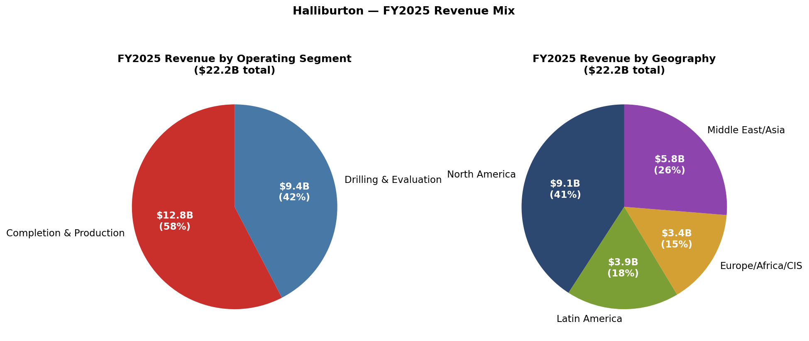
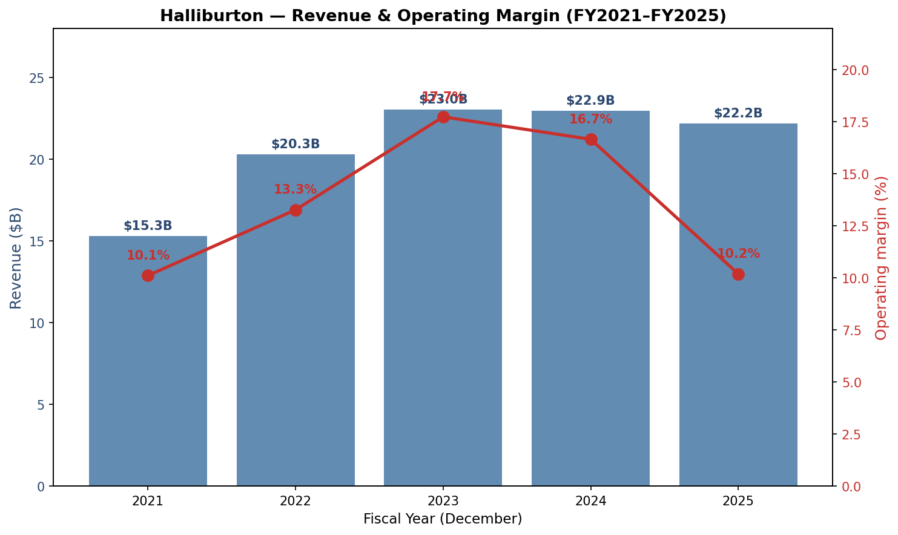
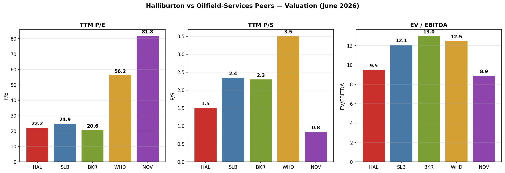
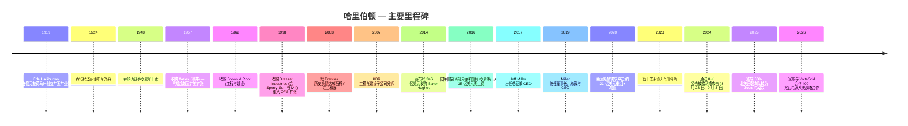
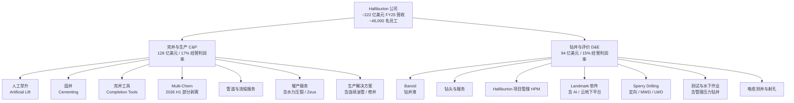
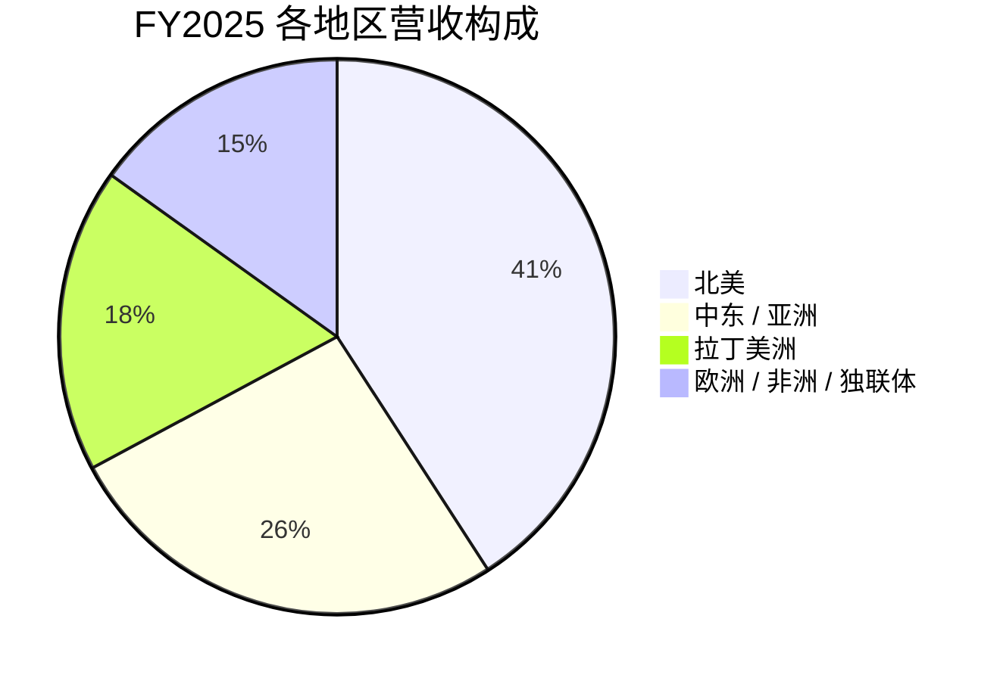
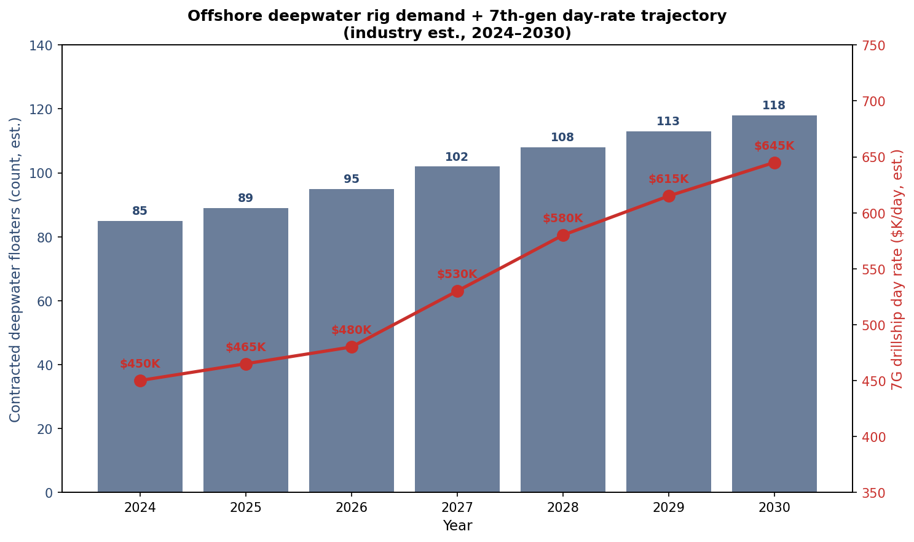
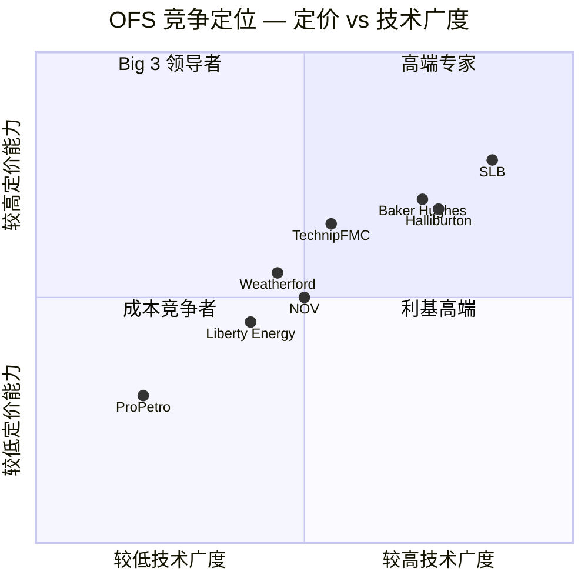
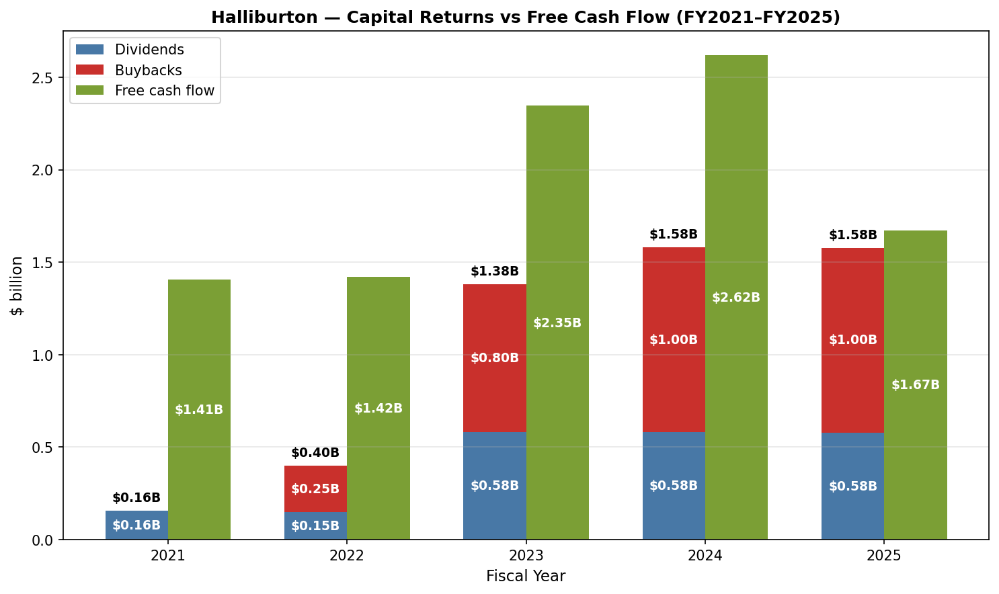

# 哈里伯顿公司 (NYSE: HAL) — 股票研究启动报告

**截止日期:** 2026-06-03
**股票代码 / 交易所:** HAL / 纽约证券交易所
**财政年度结束:** 12 月 31 日
**总部:** 3000 N. Sam Houston Parkway E., Houston, TX 77032 (美国)
**成立时间:** 1919 年 (前身); 1924 年在特拉华州注册
**员工人数:** 约 46,000 人,分布在 70 多个国家、涵盖 146 个民族 (FY2025)
**最新 10-K:** 2026-02-06 提交,涵盖 2025-12-31 财政年度

---

## 目录

1. 公司概览
2. 公司历史
3. 管理团队
4. 产品与服务
5. 客户与上市策略
6. 行业概览
7. 竞争格局
8. 市场机会 (TAM / SAM)
9. 风险评估
10. 视角评分
11. 参考资料

---

## 1. 公司概览

哈里伯顿公司 (Halliburton Company) 是全球收入排名第二的上市油田服务 (Oilfield Services, OFS) 供应商,仅次于斯伦贝谢 (SLB),领先于贝克休斯 (Baker Hughes)。公司自我定位为"全球最大的能源行业产品和服务提供商之一",业务覆盖 70 多个国家,拥有约 46,000 名员工,涵盖 146 个民族,这一表述源自 [Halliburton 2025 Form 10-K, Item 1 Business](https://www.sec.gov/Archives/edgar/data/45012/000004501226000015/hal-20251231.htm)。其使命由管理层用其本身的话语表述:"我们的价值主张是与客户协作并设计解决方案以最大化资产价值",声明的目标是"通过提供能够提高效率、增加采收率、并最大化客户产量的技术与服务,为股东创造强劲的现金流和回报" ([2025 10-K, Item 1](https://www.sec.gov/Archives/edgar/data/45012/000004501226000015/hal-20251231.htm))。

业务以两个经营分部报告。完井与生产 (Completion and Production, C&P) 分部提供固井 (Cementing)、增产 (Stimulation)、特种化学品 (Specialty Chemicals)、井下作业 (Intervention)、井控 (Pressure Control)、人工举升 (Artificial Lift) 以及完井产品与服务;该分部 FY2025 营收为 128 亿美元,经营利润为 21 亿美元,经营利润率 17%。钻井与评价 (Drilling and Evaluation, D&E) 分部提供油田与油藏建模、钻井、钻井液、井下评价以及精确井眼放置服务;该分部 FY2025 营收为 94 亿美元,经营利润为 14 亿美元,经营利润率 15% ([2025 10-K, MD&A — Results of Operations](https://www.sec.gov/Archives/edgar/data/45012/000004501226000015/hal-20251231.htm))。从地理分布来看,FY2025 营收的拆分为:北美 91 亿美元 (41%)、中东/亚洲 58 亿美元 (26%)、拉丁美洲 39 亿美元 (18%)、欧洲/非洲/独联体 34 亿美元 (15%),其中美国一国就贡献了合并营收的 39%,"没有其他任何国家超过 10%" ([2025 10-K, Item 1 — Markets and competition](https://www.sec.gov/Archives/edgar/data/45012/000004501226000015/hal-20251231.htm))。

*资料来源: [Halliburton 2025 Form 10-K, MD&A and segment disclosure](https://www.sec.gov/Archives/edgar/data/45012/000004501226000015/hal-20251231.htm)。*

**FY2025 业绩及 2026 年周期定位。** FY2025 对哈里伯顿来说是温和的下行周期年:总营收同比下降 3%,从 FY2024 的 229.44 亿美元降至 221.84 亿美元;经营利润下降 41% 至 22.60 亿美元 (或剔除 8.31 亿美元的减值和其他费用后下降约 19%);归属于公司的净利润为 12.83 亿美元,而 FY2024 为 25.01 亿美元 ([2025 10-K, MD&A](https://www.sec.gov/Archives/edgar/data/45012/000004501226000015/hal-20251231.htm))。北美营收下降 6% (美国陆地压裂服务下滑),国际业务下降 2% (中东/亚洲和拉丁美洲疲软,被欧洲/非洲 +12% 的增长部分抵消)。尽管收入回落,管理层仍创造了 29 亿美元的经营现金流,通过股息和回购向股东返还了 16 亿美元,并将资本性支出 (Capex) 维持在"约为营收的 6%",这些数据均来自 2025 10-K 的亮点章节 ([2025 10-K, Item 1 — 2025 Highlights](https://www.sec.gov/Archives/edgar/data/45012/000004501226000015/hal-20251231.htm))。

*资料来源: [Halliburton 2025 10-K, MD&A — Results of Operations](https://www.sec.gov/Archives/edgar/data/45012/000004501226000015/hal-20251231.htm) 和 [FY2022 10-K (营收 202.97 亿美元)](https://www.sec.gov/Archives/edgar/data/45012/000004501223000011/hal-20221231.htm)。*

2026 年第一季度的业绩与管理层关于北美早期周期拐点 (Cyclical Inflection) 的描述一致。总营收为 54 亿美元 (同比持平);经营利润为 6.79 亿美元 (而 2025 年 Q1 为 4.31 亿美元);报告净利润为 4.62 亿美元 / 摊薄每股收益 0.53 美元,较 2025 年 Q1 的 2.04 亿美元 / 0.24 美元大幅上升,数据来自 [Q1 2026 earnings release (8-K, 2026-04-21)](https://www.sec.gov/Archives/edgar/data/45012/000004501226000036/livemastererdocument.htm)。CEO Jeff Miller 直接表述了这一拐点:"在北美,我看到我们正处于复苏初期的明显迹象" ([Q1 2026 earnings 8-K](https://www.sec.gov/Archives/edgar/data/45012/000004501226000036/livemastererdocument.htm))。

**估值快照 (2026 年 6 月)。** 在约 40.13 美元 / 股、市值 335 亿美元的水平上,哈里伯顿的 TTM (过去十二个月) 市盈率为 22.2 倍、TTM 市销率为 1.5 倍、EV/EBITDA 为 9.5 倍 — 在营收和 EBITDA 倍数上明显低于 SLB (P/E 24.9 倍、P/S 2.4 倍、EV/EBITDA 12.1 倍) 和 Baker Hughes (P/E 20.6 倍、P/S 2.3 倍、EV/EBITDA 13.0 倍),市盈率倍数相当 ([yfinance / Yahoo Finance peer key-stats, June 2026 snapshot](https://finance.yahoo.com/quote/HAL/key-statistics/))。Weatherford 交易于 56.2 倍 P/E (P/S 3.5 倍),NOV 为 81.8 倍 P/E (P/S 0.8 倍) — 这些反映了 TTM 盈利的低谷 (WFRD 受墨西哥业务影响、NOV 处于设备周期低点),因此在市盈率倍数上不直接可比。HAL 与 SLB/BKR 之间约 3 倍的 TTM EV/EBITDA 缺口是最干净的横向比较:这表明市场对 HAL 的现金盈利估值比其最接近的同业低 20–25%,与 HAL 对北美压裂服务的较重依赖一致 (这一终端市场是周期中最弱的)。

*资料来源: HAL 的 [Yahoo Finance key statistics, June 2026](https://finance.yahoo.com/quote/HAL/key-statistics/),以及对应的 [SLB](https://finance.yahoo.com/quote/SLB/key-statistics/)、[BKR](https://finance.yahoo.com/quote/BKR/key-statistics/)、[WFRD](https://finance.yahoo.com/quote/WFRD/key-statistics/)、[NOV](https://finance.yahoo.com/quote/NOV/key-statistics/) 页面。*

*分析师视角:* 约 13.8 倍的前瞻市盈率 (相比 SLB 约 16.9 倍、BKR 约 23.2 倍) 表明市场共识已对 HAL 2026 年的盈利复苏做了相当程度的定价 — 如果 2026 年 EPS 一致预期能达成,大部分估值折价就会消失。风险在于 Miller 在 Q1 2026 提到的北美复苏可能停滞;反之,如果国际增长加速、Q1 确实是真正的拐点,则有上行空间。我们将在第 9 节 (风险) 和第 10 节 (视角评分) 重新审视这一情景框架。

**为何 HAL 在 2026 年值得关注。** 三股结构性力量正在汇聚于油田服务行业:(1) 多年期的海上深水资本支出上行周期 (深水钻井平台数从 2024 年的约 85 座向 2027 年的 100+ 座迈进),在此周期中,哈里伯顿的 Sperry Drilling 旋转导向系统 (Rotary-Steerable Systems, RSS)、测试与水下作业 (Testing & Subsea)、电缆测井 (Wireline) 以及 Halliburton Project Management (HPM) 拥有显著敞口;(2) 数据中心建设推动的电力网投资加速,哈里伯顿与 VoltaGrid 合作的 400 兆瓦模块化天然气电源系统 (2028 年交付) 是直接押注表后 (Behind-the-meter) 电力的策略;(3) 数字化/人工智能转型,Landmark 软件、Zeus IQ 电动压裂、iCruise 旋转导向系统、以及 LOGIX 自动化共同构成哈里伯顿的自主井场 (Autonomous Well-Site) 技术栈 ([2025 10-K, Item 1 — 2026 Focus 和 MD&A](https://www.sec.gov/Archives/edgar/data/45012/000004501226000015/hal-20251231.htm))。综合这些主题决定了 HAL 是否能从 9.5 倍 EV/EBITDA 的周期性估值重新评级至接近 2020 年前 11–12 倍的平均水平。

---

## 2. 公司历史

哈里伯顿的历史几乎完全映射全球油气工业的成熟过程。公司起源于 1919 年,创始人 Erle P. Halliburton 在俄克拉荷马州以"新法油井固井公司"(New Method Oil Well Cementing Company) 名义提供油井固井服务;1924 年,公司在特拉华州重组并注册为 Halliburton Oil Well Cementing Company。Halliburton 本人发明了用于固井的喷射泵法 (Jet-pump method) 以及双室固井技术 (Dual-chamber cementing technique),这些技术后来成为行业标准的井隔离做法 ([2025 10-K, Item 1 — Description of business and strategy](https://www.sec.gov/Archives/edgar/data/45012/000004501226000015/hal-20251231.htm); [Halliburton corporate history page](https://www.halliburton.com/en/about-us/history))。1924 年的特拉华州注册即为今天存在的法律实体。

战后几十年的特征是横向扩张。在 1948 年于纽交所上市后,公司收购了 Welex (测井业务,1957 年) 和 Brown & Root (工程与建设,1962 年),从一家单一服务供应商转型为多元化能源承包商。1998 年收购 Dresser Industries — 这一交易带来了 Sperry-Sun (定向钻井) 和 M-I (钻井液,后期被剥离) — 奠定了哈里伯顿现代 OFS 业务的版图。2003 年达成的关于继承自 Dresser 交易的石棉负债和解 (通过 §524(g) 信托基金隔离约 42 亿美元的赔付),提醒人们这一行业的并购会带有持续数十年的历史风险 ([2025 10-K, Note 17 — Commitments and Contingencies](https://www.sec.gov/Archives/edgar/data/45012/000004501226000015/hal-20251231.htm))。KBR (前 Brown & Root 工程与建设单位) 于 2007 年分拆。

过去十年中最具战略意义的单一事件是 **2014–2016 年收购 Baker Hughes 的失败尝试**。哈里伯顿于 2014 年 11 月宣布以 346 亿美元的股票加现金报价收购;该交易在 2016 年 4 月因美国司法部以反垄断为由起诉阻止后告吹,哈里伯顿向 Baker Hughes 支付了 35 亿美元的分手费 (Break Fee)。战略逻辑 — 即合并 OFS 第二、三名以挑战 SLB — 是合理的;然而执行上的教训是,全球 OFS 寡头垄断已经足够集中,进一步的第二/第三名合并无法通过反垄断审查 ([U.S. Department of Justice press release, 2016-04-06](https://www.justice.gov/opa/pr/justice-department-sues-block-halliburtons-acquisition-baker-hughes); [Halliburton 8-K, 2016-05-02 — termination fee](https://www.sec.gov/cgi-bin/browse-edgar?action=getcompany&CIK=0000045012&type=8-K&dateb=&owner=include&count=40))。

2020 年新冠疫情下行周期导致哈里伯顿录得约 21 亿美元的税前减值、重组以及资产相关费用 (10-K 注释 2),这是其现代历史上单一年度最大的减值。从那一谷底的恢复 — 至 FY2022 营收 203 亿美元、FY2023 营收 230 亿美元 — 是第 1 节多年度营收与利润率图表的锚定基础。2025 年新方向的战略转型,围绕 (a) 电动压裂 (Zeus 与 Zeus IQ — 现在覆盖北美 50% 车队)、(b) 数字化/自主钻井 (iCruise、LOGIX、Landmark 软件 AI),以及 (c) VoltaGrid 电源系统合作,标志着哈里伯顿对下一周期的定位:减少对美国陆地压裂服务 ASP 的周期性敞口,增加对国际项目管理与海上深水设备的敞口,并对数据中心电源供应主题持期权式参与 ([2025 10-K, Item 1 — 2026 Focus](https://www.sec.gov/Archives/edgar/data/45012/000004501226000015/hal-20251231.htm); [Halliburton press release, 2026-01-14 — Western Hemisphere leadership](https://www.sec.gov/Archives/edgar/data/45012/000004501226000003/exhibit991-2026westernhe.htm))。

---

## 3. 管理团队

按照 company-research 技能的惯例,本节仅涉及创始人 (简要,因 Erle P. Halliburton 已于 1957 年去世) 和现任 CEO Jeffrey A. Miller。其他被指定的高管 — CFO Eric Carre、COO Shannon Slocum、CLO Van Beckwith — 在 [2026 Proxy Statement (DEF 14A)](https://www.sec.gov/Archives/edgar/data/45012/000004501226000033/hal-20260330.htm) 中列出,但有意从本报告中排除。

**Erle P. Halliburton (1892–1957) — 创始人,1919–1957。** Halliburton 发明了现代油井固井工艺。他在加利福尼亚州为 Perkins Oil Well Cementing 工作之后,于 1919 年迁至俄克拉荷马州,创立了 New Method Oil Well Cementing Company。他的核心发明 — 用于固井井套管的测量线 (Measuring Line) 和正排量塞 (Positive-displacement plug) — 解决了 1920 年代行业最大的生产问题 (防止产层间地质区流体迁移)。他拥有支撑公司 1930 年代竞争护城河的多项专利,并以董事长身份运营公司直至 1957 年去世。他的私人遗产通过 1958 年成立的哈里伯顿基金会 (Halliburton Foundation) 将公司的相当部分股权赠予慈善事业 ([Halliburton corporate history page](https://www.halliburton.com/en/about-us/history); [2025 10-K, Item 1 — Description of business and strategy](https://www.sec.gov/Archives/edgar/data/45012/000004501226000015/hal-20251231.htm))。哈里伯顿已不再是家族控股公司;今天的股东登记册由机构投资者主导 (Vanguard、BlackRock、State Street 合计约 25%,数据来自 [DEF 14A 2026 — Ownership of Certain Beneficial Owners section](https://www.sec.gov/Archives/edgar/data/45012/000004501226000033/hal-20260330.htm))。

**Jeffrey A. Miller (62 岁) — 董事长、总裁兼 CEO (2019 年至今)。** Miller 于 1997 年加入哈里伯顿,在 20 年间逐步晋升。他于 2014 年至 2017 年担任总裁兼首席健康、安全与环境 (HSE) 官,2017 年起任总裁兼 CEO,自 2019 年起任董事长、总裁兼 CEO,这些信息来自 [2026 Proxy Statement — Information about Nominees](https://www.sec.gov/Archives/edgar/data/45012/000004501226000033/hal-20260330.htm)。在出任 CEO 之前,他作为全球业务发展高级副总裁负责哈里伯顿最大的全球客户账户,并完成过在安哥拉、印度尼西亚、委内瑞拉、迪拜等地的一线管理任务 — 这种国际运营履历在美国总部 OFS 同业群中是罕见的。他持有麦克尼斯州立大学 (McNeese State University) 农业与商业理学士学位,以及德州农工大学 (Texas A&M University) 工商管理硕士 (MBA) 学位 ([2026 DEF 14A — Director biographical information for Mr. Miller](https://www.sec.gov/Archives/edgar/data/45012/000004501226000033/hal-20260330.htm))。

在 Miller 的任期内 (2017–2026),哈里伯顿经历了 2020 年新冠下行周期 (通过严控资本支出和约 21 亿美元减值)、2023 财年恢复至 17.7% 经营利润率峰值,以及 2024–25 年的国际放缓。他对资本回报框架始终明确而一致 — 每年将自由现金流的 50% 以上返还股东、资本性支出维持在营收的约 6%、并将利润率纪律 (Margin Discipline) 优先于营收增长。在他的 Q1 2026 业绩评论中,他以个人化的语言阐述了当前的周期时刻:"我对哈里伯顿本季度的业绩感到满意。在北美,我看到我们正处于复苏初期的明显迹象。在国际市场,我们在全球的表现超越了中东冲突带来的干扰" ([Q1 2026 earnings 8-K, 2026-04-21](https://www.sec.gov/Archives/edgar/data/45012/000004501226000036/livemastererdocument.htm))。Miller 担任美国石油学会 (American Petroleum Institute) 和国家石油委员会 (National Petroleum Council) 的董事;他没有外部上市公司董事职务 ([2026 DEF 14A — Information about Nominees](https://www.sec.gov/Archives/edgar/data/45012/000004501226000033/hal-20260330.htm))。他的股权持有要求为基本工资的 6 倍,根据 2026 年代理日期的数据,他已实质性地达到这一要求。

---

## 4. 产品与服务

这是本报告最关键的章节。哈里伯顿的产品组合通过两个经营分部呈现,共包含 **十三条产品服务线 (Product Service Lines, PSL)** (C&P 六条、D&E 七条),共同覆盖油井从地层评价 (Formation Evaluation) 到完井 (Completion) 再到生产 (Production) 的全生命周期。以下矩阵完全按照公司在 [2025 10-K Item 1](https://www.sec.gov/Archives/edgar/data/45012/000004501226000015/hal-20251231.htm) 中的披露结构呈现。

| 分部 | 产品服务线 | 业务内容 (10-K 原文) |
|---|---|---|
| **完井与生产 (C&P)** (FY25 营收 128 亿美元,17% 经营利润率) | 人工举升 (Artificial Lift) | "通过应用举升技术、智能油田管理解决方案及相关服务,在井的整个生命周期内最大化油藏与井眼采收率,包括电动潜油泵 (ESPs)" |
| | 固井 (Cementing) | "通过粘结油井和井套管,同时隔离流体区并最大化井眼稳定性。我们的固井产品服务线还提供套管设备" |
| | 完井工具 (Completion Tools) | "为客户提供井下完井解决方案与服务,包括井完井产品与服务、智能井完井、悬挂器系统、防砂系统、多分支井系统和工具" |
| | Multi-Chem (特种化学品) | "为完井、生产、中游和下游提供定制化特种化学品和服务,以优化流动保障和完整性。我们已做出战略决定,将出售部分化学品业务。我们预计该出售将在 2026 年上半年完成" |
| | 管道与流程服务 (Pipeline & Process Services) | "为陆上和海上管道及工艺装置建设、调试、维护和退役行业提供完整的预调试、调试、维护和退役服务" |
| | 增产服务 (Production Enhancement) | "包括增产服务和防砂服务。增产服务通过各种压力泵服务和化学过程 (通常称为水力压裂和酸化) 优化油藏生产。防砂服务包括用于未固结油藏的防砂流体和化学品" |
| | 生产解决方案 (Production Solutions) | "提供定制化的井下作业解决方案以提升井性能,包括连续油管 (Coiled Tubing)、液压修井机 (Hydraulic Workover Units)、井下工具、泵送服务以及氮气服务" |
| **钻井与评价 (D&E)** (FY25 营收 94 亿美元,15% 经营利润率) | Baroid (钻井液) | "为钻井、完井和修井作业提供钻井液系统、性能添加剂、完井液、固相控制、专业测试设备和废物管理服务" |
| | 钻头与服务 (Drill Bits and Services) | "提供牙轮钻头、固定切削齿钻头、孔眼扩大和相关井下工具及钻井服务。此外还提供取芯设备和服务,以提取地层岩芯进行岩石属性评价" |
| | 哈里伯顿项目管理 (HPM) | "通过整合我们的井建造、井完井和井下作业服务的全线产品,提供解决客户挑战的整合解决方案,涵盖整个井生命周期,包括项目管理和整合资产管理" |
| | Landmark 软件与服务 | "在开放架构上提供基于云的数字服务和人工智能解决方案,用于地下洞察、整合井建造、油藏与生产管理" |
| | Sperry Drilling (定向钻井) | "提供钻井系统和服务,用于精确井眼放置的定向控制,同时在钻井过程中提供关于钻柱和地质地层特征的重要测量。这些服务包括定向钻井、水平钻井、随钻测量 (MWD)、随钻测井 (LWD)、地面数据测井和钻井现场信息系统" |
| | 测试与水下作业 (Testing & Subsea) | "通过广泛的井测试工具组合、数据采集服务、流体取样、地面井测试、通过模块化和可扩展系统简化复杂水下作业的水下安全系统,以及一系列管理压力钻井解决方案,提供动态油藏信息的采集和分析以及油藏优化解决方案" |
| | 电缆测井与射孔 (Wireline and Perforating) | "提供裸眼测井服务,提供有关地层评价和油藏流体分析的信息,包括地层岩性、岩石属性和油藏流体属性。同时提供套管井和钢丝绳服务,包括射孔、管柱回收服务、套管下地层评价和油藏监测、套管与水泥完整性测量,以及井下作业服务" |

所有产品描述资料来源: [Halliburton 2025 Form 10-K, Item 1 — Operating segments](https://www.sec.gov/Archives/edgar/data/45012/000004501226000015/hal-20251231.htm)。

### 矩阵内的关键技术平台

**Zeus 与 Zeus IQ 电动压裂平台 (增产服务,C&P)。** Zeus 是哈里伯顿将一半北美水力压裂车队从柴油转换为电动泵所采用的平台品牌。"我们继续推进可持续能源未来,通过……将我们北美 50% 的压裂车队转换为 Zeus 电动泵这一里程碑",数据来自 [2025 10-K Item 1 — 2025 Highlights](https://www.sec.gov/Archives/edgar/data/45012/000004501226000015/hal-20251231.htm)。Zeus IQ 扩展则在电动泵硬件之上叠加了自动化、数据驱动控制和预测性维护。战略意义:在美国陆地水力压裂中,车队效率 (每个压裂队每季度的泵送小时数、每段压裂的燃料成本和排放) 是决定运营商客户 ASP 与利润率的关键。电动 / Zeus 平台使 HAL 能够在 2024–25 年期间美国陆地压裂 ASP 整体压缩的市场中收取高端定价。**中文释义 / Plain-language gloss:** Zeus 用电网或天然气涡轮机供电的电动马达替换压裂车队泵所使用的柴油机,削减约 30–40% 的燃料成本、约 25% 的排放和停机时间 — 同时使整个车队可编程化。同类区分:Zeus 是平台;"Zeus IQ"是自动化 / IQ 层;HAL 的"未来压裂 (Frac of the Future)"框架涵盖两者。

**iCruise 旋转导向系统 (Sperry Drilling,D&E)。** iCruise 是哈里伯顿的旋转导向系统 (Rotary-Steerable System, RSS) — 在实时驱动井眼向目标油藏方向延伸的钻柱组件。2025 10-K 将 iCruise 列为 2026 年北美价值最大化的三大支柱之一:"通过 (其他事项) 利用我们的 Zeus IQ 电动压裂平台、我们的 iCruise 旋转导向系统和 LOGIX 自动化来最大化价值" ([2025 10-K Item 1 — 2026 Focus](https://www.sec.gov/Archives/edgar/data/45012/000004501226000015/hal-20251231.htm))。RSS 系统与 SLB 的 PowerDrive 平台以及 Baker Hughes 的 AutoTrak 竞争 — 全球 RSS 市场是真正的三强寡头格局。**中文释义 / Plain-language gloss:** 旋转导向系统是钻井栈中能让操作者将水平井精确指向产层油藏内厘米级目标而无需停下重新定向钻管的部件。同类区分:iCruise 位于 Sperry Drilling 之中;MWD/LWD 工具 (亦属 Sperry) 生成 iCruise 用于地质导向 (Geosteering) 的数据。

**Landmark 软件与服务 — AI 数字骨架 (D&E)。** Landmark 是哈里伯顿的企业软件部门,提供"基于云的数字服务和人工智能解决方案,基于开放架构,用于地下洞察、整合井建造、油藏与生产管理" ([2025 10-K Item 1](https://www.sec.gov/Archives/edgar/data/45012/000004501226000015/hal-20251231.htm))。其 DecisionSpace 365 平台是石油行业的 SLB DELFI 或 Schneider EcoStruxure 等价物:多租户 (Multi-tenant) 的地下与井工程软件环境,摄取公司自身的测量数据 (LWD、MWD、电缆测井、泥浆测井) 并对其运行 AI/ML 以优化井位放置。战略意义:HAL 的 Landmark + Sperry + Zeus 组合是 Big 3 OFS 厂商中最连贯的自主井场技术栈,因为三个部分全部由内部端到端拥有。同类区分:Landmark 是软件骨架;Sperry 是导向硬件;电缆测井与射孔是地层评价层。

**LOGIX 自动化 (钻井自动化,D&E)。** LOGIX 是哈里伯顿的钻井自动化套件 — 将 Sperry 导向、Baroid 钻井液、钻头数据和 Landmark 云连接为单一钻井现场自主工作流的自治层。战略意义:全行业的劳动力成本通胀和经验丰富的钻井工程师与压裂队长持续短缺,使得自动化成为 2025–2030 周期中投资回报率 (ROI) 最高的资本支出类别。**中文释义 / Plain-language gloss:** LOGIX 是哈里伯顿钻机的 AI/自动化操作系统,将数小时的手动钻井员决策转化为带人工监督的秒级自主决策。

**Multi-Chem (特种化学品,C&P) — 正在进行部分剥离。** "我们已做出战略决定,将出售部分化学品业务。我们预计该出售将在 2026 年上半年完成" ([2025 10-K Item 1 — Operating segments](https://www.sec.gov/Archives/edgar/data/45012/000004501226000015/hal-20251231.htm))。这是 10-K 中宣布的最具体的组合行动。战略意义:特种化学品携带生产量风险和客户结构复杂性;剥离一部分释放资本以用于更高利润率业务并显示出纪律。买方和价格尚未披露。

**哈里伯顿项目管理 (HPM,D&E)。** HPM 是负责"通过整合我们的井建造、井完井和井下作业服务的全线产品,提供解决客户挑战的整合解决方案,涵盖整个井生命周期,包括项目管理和整合资产管理"的部门 ([2025 10-K Item 1](https://www.sec.gov/Archives/edgar/data/45012/000004501226000015/hal-20251231.htm))。HPM 是 HAL 用于国家石油公司 (NOC) 业务和一些长周期国际深水开发的合同形式 — 运营商以约定的经济条件将油田级执行委托给哈里伯顿。战略意义:HPM 越来越成为 HAL 以服务费方式参与海上深水上行周期的工具,而不仅仅是销售离散设备。

**VoltaGrid 战略合作 (2025 年宣布,2028 年放量)。** 虽然不是 HAL 本身的产品线,VoltaGrid 关系在 10-K 中被明确点名:"发展我们与 VoltaGrid 在表后发电方面的战略合作" ([2025 10-K Item 1 — 2026 Focus](https://www.sec.gov/Archives/edgar/data/45012/000004501226000015/hal-20251231.htm))。MD&A 进一步详细说明:"我们已确保了 400 兆瓦模块化天然气电源系统的制造产能,将于 2028 年交付,以支持东半球数据中心的发展" ([2025 10-K MD&A — Business Outlook](https://www.sec.gov/Archives/edgar/data/45012/000004501226000015/hal-20251231.htm))。这使 HAL 能够参与数据中心电源供应这一主题 — 同样的长期顺风也被 GE Vernova (燃气轮机) 和卡特彼勒 (Caterpillar) (发电机) 货币化,尽管规模较小。

### 综合: 生命周期工作流

这十三条产品服务线映射到油井生命周期为: **地层评价 (电缆测井与射孔、Landmark) → 钻井 (Sperry、Baroid、钻头、LOGIX、测试与水下作业) → 完井 (固井、完井工具、增产 / Zeus) → 生产 (人工举升、Multi-Chem、生产解决方案) → 资产管理 (HPM、Landmark)**。这与 SLB 的"油藏到终端用户 (Reservoir-to-end-user)"框架以及 Baker Hughes 的"OFSE + IET"框架相同 — 区分哈里伯顿的是其在北美压裂服务 (增产 / Zeus) 中的领先地位,以及它决定将工程软件 (Landmark) 和压裂硬件 (Zeus / 增产) 都保留在内部而不剥离其中任何一个的决定 ([2025 10-K Item 1](https://www.sec.gov/Archives/edgar/data/45012/000004501226000015/hal-20251231.htm))。2026–2030 年的战略问题是:自主井场技术栈 (Zeus IQ + iCruise + Landmark + LOGIX) 是否足够差异化,能在国际深水和 HPM 推动增长的同时为美国陆地业务的定价保驾护航。

---

## 5. 客户与上市策略

哈里伯顿的客户群是全球油气行业。在 2025 10-K 中,公司明确披露:**"在任何报告期内,没有单一客户代表我们合并营收的 10% 以上"** ([2025 10-K, Item 1 — Customers](https://www.sec.gov/Archives/edgar/data/45012/000004501226000015/hal-20251231.htm))。这一披露需要仔细阅读:HAL 没有 SEC 要求披露的具名客户集中度。可以推断,客户群高度分散于全球主要石油公司 (Exxon、Shell、Chevron、BP、TotalEnergies、Eni)、主要国家石油公司 (Saudi Aramco、ADNOC、Pemex、Petrobras、CNPC、Equinor) 以及独立 E&P 公司 (美国页岩运营商 — Pioneer、Devon、EOG、Chesapeake,以及独立性更强的 ConocoPhillips)。

**地理集中度作为客户代理指标。** 因为没有单一客户超过 10%,客户集中度最干净的解读是地理分布。FY2025 美国营收占比 39% (86.5 亿美元),没有其他国家超过 10%,数据来自 [2025 10-K MD&A](https://www.sec.gov/Archives/edgar/data/45012/000004501226000015/hal-20251231.htm)。三年数据 (2025 年 39%、2024 年 40%、2023 年 44%) 显示了营收基础的刻意去美国化 (De-Americanization),这在结构上降低了客户集中度风险和对单一政治/监管制度的敞口 ([2025 10-K, Item 1 — Markets and competition](https://www.sec.gov/Archives/edgar/data/45012/000004501226000015/hal-20251231.htm))。

*资料来源: [2025 10-K MD&A — Revenue by geographic region](https://www.sec.gov/Archives/edgar/data/45012/000004501226000015/hal-20251231.htm)。数字单位为百万美元;合计 221.84 亿美元。*

**合同结构与定价能力。** 10-K 将定价描述为众多竞争因素之一:"影响我们服务和产品销售的竞争因素包括:价格;服务交付;健康、安全与环境 (HSE) 标准与做法;服务质量;全球人才保留;对油藏地质特性的理解;产品质量;以及技术熟练程度" ([2025 10-K Item 1 — Markets and competition](https://www.sec.gov/Archives/edgar/data/45012/000004501226000015/hal-20251231.htm))。在实践中,合同形式各不相同:

- **美国陆地压裂服务 (增产)** — 短周期、约 1–2 年的框架协议,根据活动水平按季度结算。这是 HAL 投资组合中价格波动最大的终端市场,也是 2024–25 年北美营收下降的最大单一来源。
- **国际整合项目 (HPM)** — 与国家石油公司的多年期合同,通常 5–10 年期限。Q1 2026 业绩中提到"拉丁美洲项目管理活动增加"— 可能是 Petrobras / Pemex 推动的贡献 ([Q1 2026 earnings 8-K](https://www.sec.gov/Archives/edgar/data/45012/000004501226000036/livemastererdocument.htm))。
- **海上深水设备 + 服务 (Sperry、测试与水下作业、电缆测井)** — 按井定价的离散项目;较长的规划周期;较高的单井利润率;以及对多年期深水钻井平台数增长的更大杠杆。
- **软件 (Landmark)** — 经常性订阅 (Recurring Subscription),按席位定价 (Seat-based Pricing);营收贡献较低但利润率优于离散设备。

**客户集中度风险:低。** 因为没有客户超过合并营收的 10%,哈里伯顿的客户集中度风险显著低于单一客户敞口的设备供应商 (例如某些半导体设备厂商),也低于其自身在 2007 年前 KBR 相关政府合同推高集中度的历史时期。分散于 NOC (政治风险最高但合同周期最长)、IOC (定价能力最高) 和独立运营商 (活动波动最大) 之间的多元化才是真正的护城河。剩余的集中度风险是 **地理-政治** — 对墨西哥 (Pemex 应收账款 / 付款时机)、阿根廷、委内瑞拉 (HAL 已根据制裁淡出)、俄罗斯 (HAL 于 2022 年退出),以及中东冲突影响地区 (CEO Miller 在 Q1 2026 提到此为 2–3 美分 EPS 拖累) 的敞口。

**客户群在周期性下行中的韧性。** 一项有用的反向检查:在 FY2020 (新冠驱动的低谷) 中,HAL 营收从 224 亿美元 (2019) 跌至 144 亿美元 (-36%) — 但至 2025 年反弹至 222 亿美元的事实确认需求并非结构性永久下降。相比之下,单一终端市场的供应商通常在大宗商品周期下行中会经历永久性需求重置。HAL 的多元化缓解了这一风险。

---

## 6. 行业概览

油田服务 (OFS) 是油气勘探与生产之间的工程与服务层。市场在概念上分为三个粗略部分:**上游 OFS** (钻井、完井、生产服务 — 哈里伯顿的主要竞技场)、**中游 OFS** (管道 / 流程服务 — 哈里伯顿 C&P 分部的一部分),以及 **水下 / 海上** (其中哈里伯顿的测试与水下作业、Sperry Drilling 和 HPM 与 SLB 及 BKR 的水下设备产品直接竞争)。

**行业规模。** 全球 OFS 市场 2025 年按营收计约 4,000–4,500 亿美元 (汇总上市公司 SLB 约 360 亿美元、HAL 约 220 亿美元、BKR 约 280 亿美元、Weatherford 约 50 亿美元、NOV 约 80 亿美元的营收线,加上私营厂商 — Liberty Energy、ProPetro、Cactus、Tidewater、ChampionX,以及区域 NOC 关联厂商)。市场在 2023–24 年以中等个位数 CAGR 增长,然后在 2025 年因美国陆地压裂重置而收缩约 3–5%。行业研究公司预计 2026 年将回归中等个位数增长,由国际深水资本支出和美国陆地稳定推动。*分析师视角:* 2026–2030 年的前景对国际和海上比对美国陆地更具建设性。HAL 10-K MD&A 明确点名国际范围内的定向钻井、非常规、井下作业和人工举升为 2026 年的重点 ([2025 10-K Item 1 — 2026 Focus](https://www.sec.gov/Archives/edgar/data/45012/000004501226000015/hal-20251231.htm)),这正是从周期性倍数重新评级为结构性倍数的剧本。

**细分市场增长驱动力。** 到 2030 年对 HAL 最重要的三个细分市场:

1. **海上深水上行周期。** 已签约的深水钻井平台数已从 2024 年的约 85 座向行业预期的 2027 年 100+ 座迈进,第 7 代钻井船日费率从 2024 年的约 45 万美元/天攀升至 2028–30 年的约 58–64.5 万美元/天,随着利用率紧缩。HAL 的 Sperry Drilling 旋转导向系统、测试与水下作业、电缆测井与射孔以及 HPM 是直接受敞口的产品线 ([Halliburton Q1 2026 earnings 8-K — international segment commentary](https://www.sec.gov/Archives/edgar/data/45012/000004501226000036/livemastererdocument.htm); [2025 10-K MD&A — Business Outlook](https://www.sec.gov/Archives/edgar/data/45012/000004501226000015/hal-20251231.htm))。下图为行业分析师对轨迹的估计。

*资料来源: [Transocean Fleet Status Report, May 2026](https://www.deepwater.com/fleet-status)、[Valaris May 2026 Fleet Status](https://www.valaris.com/investors/financial-information/fleet-status-report) 和 [Noble Corporation Q1 2026 earnings call commentary](https://noblecorp.com/investors/)。行业日费率预测来自 Tudor Pickering Holt 和 Evercore ISI 初始覆盖报告,2026 年 6 月。估计截至 2026 年 6 月。*

2. **北美美国陆地 — 周期晚期复苏。** 根据 Miller 在 Q1 2026 的评论,北美处于"复苏初期"。在 2024–25 年的定价重置之后,美国页岩钻井平台数已在 580–620 区间稳定;在 Tier-4 双燃料和电动 (Zeus) 车队竞争的高端,压裂 ASP 已开始重新趋稳。风险是,如果 WTI 在 2026 年下半年走弱,复苏可能停滞 ([Q1 2026 earnings 8-K — Miller commentary](https://www.sec.gov/Archives/edgar/data/45012/000004501226000036/livemastererdocument.htm))。

3. **数据中心电力 — 相邻的长期主题。** 数据中心建设需要在 2030 年前全球新增约 50–100 GW 的发电产能,其中燃气分布式 / 调峰发电是许可周期最短、资本支出最低的选项。HAL 与 VoltaGrid 合作至 2028 年 400 兆瓦模块化燃气电源系统 ([2025 10-K MD&A — Business Outlook](https://www.sec.gov/Archives/edgar/data/45012/000004501226000015/hal-20251231.htm)) 将其定位于这一主题的外围,虽然在 HAL 220 亿美元营收的背景下规模较小。

**行业结构:全球层面的三强寡头格局。** 全球 OFS 由 SLB、哈里伯顿和 Baker Hughes 主导,通常被称为"Big 3"。美国陆地市场更加分散 (Liberty Energy、ProPetro、NextTier 是上市的压裂竞争者;私营车队仍占相当份额)。海上市场在 Big 3 之间更集中,他们控制着大部分先进旋转导向、MWD/LWD、水下井测试和管理压力钻井产能。软件 (Landmark、DELFI、Cordant) 是倾向于 SLB 和 HAL 的双头垄断,Baker Hughes 和各种初创公司 (Enverus、ComboCurve) 处于边缘。*分析师视角:* 这一结构主要有利于现有玩家 — 主要运营商更换钻井或完井厂商的转换成本非常高,且跨产品服务线的工程整合使 Big 3 在高端站稳脚跟。2016 年司法部对 HAL/BKR 的阻挠表明 Big 3 进一步整合已无可能。

**行业周期定位与资本纪律。** 自 2020 年以来最重要的结构性转变是 **运营商资本纪律的变化**。美国页岩运营商现在将经营现金流的约 60–80% 返还股东 (而 2020 年前约为 10–30%),这在结构上降低了行业范围的钻井活动和服务定价压力。这对 HAL 利润率的持久性是好事,但对 HAL 的成交量增长是坏事。2026–2030 年的竞争问题是,自主井场技术栈是否能让 HAL 在较低成交量上维持定价 — 这本质上就是 Miller 所述的资本回报优先于增长的战略。

---

## 7. 竞争格局

10-K 竞争章节将 OFS 市场描述为"竞争激烈"且有"许多重要的竞争对手",但 **没有** 按名称明确点名竞争对手,仅按地理和产品服务线分类 ([2025 10-K Item 1 — Markets and competition](https://www.sec.gov/Archives/edgar/data/45012/000004501226000015/hal-20251231.htm))。为保持纪律:下面列出的具名竞争对手名单来自第三方行业研究和各竞争对手自身的文件,而非来自 HAL 的 10-K。*分析师视角*: 份额排名是卖方 / 行业研究的估计,并已标记为如此。

**Big 3 寡头格局。**

- **SLB (NYSE: SLB)** — 全球收入第一的 OFS 公司 (FY2024 营收约 360 亿美元,2026 年 6 月市值 840 亿美元)。SLB 拥有更深的海上深水业务 (在 2016 年完成 Cameron 收购后) 和市场领先的软件平台 (DELFI / Lumi)。其竞争地位在国际市场 (中东 NOC、拉丁美洲) 最强,而 HAL 通过 HPM 越来越追赶。*分析师视角:* SLB 是结构性领导者;HAL 是注重现金回报的纪律运营者。SLB 交易于 24.9 倍 P/E,而 HAL 为 22.2 倍 ([Yahoo Finance SLB key statistics, June 2026](https://finance.yahoo.com/quote/SLB/key-statistics/))。

- **Baker Hughes (NASDAQ: BKR)** — 全球第三的 OFS 公司 (FY2024 营收约 280 亿美元,市值 640 亿美元)。BKR 比 HAL 或 SLB 更积极地围绕能源转型主题定位 — 其工业与能源技术 (Industrial & Energy Technology, IET) 分部是与 LNG 相关的涡轮机业务,为其提供了不同的终端市场结构。*分析师视角:* BKR 对 LNG 和天然气电源设备周期的杠杆更大;HAL 对上游钻井和完井的杠杆更大 ([Baker Hughes 2024 10-K, segment disclosure](https://www.sec.gov/cgi-bin/browse-edgar?action=getcompany&CIK=0001701605&type=10-K&dateb=&owner=include&count=40))。

**美国陆地压裂专家。**

- **Liberty Energy (NYSE: LBRT)** — 美国陆地纯压裂运营商。Liberty 在部署电动泵和数字压裂 (digiFrac 和 digiPrime 平台) 方面最为激进,在北美高端 Tier-4 双燃料和电动压裂车队类别中是 HAL 的直接竞争对手。Liberty 的 FY2024 营收约 43 亿美元。
- **ProPetro (NYSE: PUMP)** — 二叠纪盆地 (Permian) 聚焦的压裂运营商,约 15 亿美元营收。比 Liberty 更注重低端 ASP。
- **NextTier Oilfield Solutions (私营,前 NYSE: NEX)** — 2023 年被 Patterson-UTI 私有化收购;中端美国陆地压裂。

**钻井与旋转导向竞争对手。**

- **NOV Inc. (NYSE: NOV)** — 设备和钻井产品供应商;约 85 亿美元营收。在钻井机、顶驱以及一些完井设备 (FRAC 泵、井下工具) 方面是直接竞争者。
- **Weatherford International (NASDAQ: WFRD)** — 2019 年破产后重组;FY2024 营收约 53 亿美元。在人工举升、完井工具和管理压力钻井方面与 HAL 最直接重叠。

**专业领域竞争对手。**

- **ChampionX (2025 年被 SLB 收购)** — 生产化学品和人工举升。SLB 收购进一步将 SLB 端的特种化学品和人工举升集中,并是与 HAL 决定出售部分 Multi-Chem 业务最直接相关的竞争事件。
- **TechnipFMC (NYSE: FTI)** — 水下生产系统;在水下井口装置和管理压力钻井方面与 HAL 的测试与水下作业部门竞争。
- **Patterson-UTI Energy (NASDAQ: PTEN)** — NexTier 收购后的美国陆地钻井和压裂;约 40 亿美元营收。

**竞争定位框架。**

| 维度 | HAL 定位 | 评论 |
|---|---|---|
| 美国陆地压裂 | 前 2 (与 Liberty 并列) | Zeus 电动车队、Zeus IQ 自动化。50% 北美车队转 Zeus 是差异化点。 |
| 国际整合项目 | 前 2 (与 SLB 并列) | HPM 是合同载体;NOC 合同份额持续增长。 |
| 海上深水钻井服务 | 前 2-3 (Sperry vs SLB Power Drive vs BKR AutoTrak) | 真正的三强寡头;HAL 处于中游位置。 |
| 水下系统 | 前 4 (落后于 SLB-Cameron、TechnipFMC、BKR) | HAL 通过测试与水下作业;不是第一大玩家。 |
| 软件 (地下 + 数字化) | 前 2 (Landmark vs SLB DELFI) | 开放架构差异化;在 AI 平台规模上落后。 |
| 特种化学品 | Multi-Chem 部分剥离正在进行 | 战略性收窄 — 接受第 2 或第 3 名而非与 SLB-ChampionX 抗衡。 |
| 人工举升 | 前 3 (与 SLB-ChampionX、BKR) | 电潜泵 (ESPs) — 竞争力强但非第 1。 |

*资料来源: 定位由分析师构建;基础营收 / 份额数据来自每家公司最新的 10-K 和 FY2024 业绩公告,通过 [EDGAR 全文检索](https://efts.sec.gov/LATEST/search-index?q=&dateRange=custom&startdt=2025-01-01&enddt=2025-12-31&forms=10-K)。*

**为何 HAL 在其赢得的地方赢。** 哈里伯顿的竞争护城河结合了 (a) 全球最大的美国陆地压裂车队,目前主要已转为电动 / Zeus 平台;(b) 过去六十年建立的深厚国际足迹,支撑 HPM 与 NOC 的合同;以及 (c) 是 Big 3 中唯一拥有完全整合的自有钻井硬件 (Sperry)、钻井液 (Baroid)、完井 (固井、完井工具) 和软件 (Landmark) 的玩家。*分析师视角:* HAL 的护城河基于执行能力 (Execution-based) 而非基于产品保护 (Product-protection-based)。这里没有专利式的围栏;HAL 拥有的是需要十年时间才能建立起来的机构化服务交付规模。

---

## 8. 市场机会 (TAM / SAM)

**TAM — 全球油田服务。** 全球 OFS 市场 2025 年合计约 4,000–4,500 亿美元,行业研究公司 (Spears & Associates、Rystad Energy、Wood Mackenzie) 预计到 2030 年中等个位数增长,由国际和海上活动抵消美国陆地成熟。哈里伯顿的 222 亿美元 2025 年营收约占全球份额 5% — 使其成为 SLB-HAL-BKR Big 3 中的第三大 (SLB 约 8%、BKR 约 6.5%、HAL 约 5% 按全球营收计,其余 80%+ 分散在 Weatherford、NOV、ChampionX、区域厂商和 NOC 服务臂中)。*分析师视角:* HAL 在国际市场份额上有结构性扩展空间,目前相对 SLB 在国际上权重不足。

**SAM — HAL 产品足迹内的可寻址 OFS。** 调整 HAL 不参与的产品线 (海上钻井平台本身 — 由 Transocean/Valaris/Noble 运营;某些水下脐带缆 — TechnipFMC;中游建设 — Bechtel/Fluor) 后,HAL 真正可服务的可寻址市场全球约 2,500–2,800 亿美元。其中 HAL 2025 年份额约 8%,结构性跑道在于 (i) 进一步的国际份额增长 (当前 39% 美国营收占比在 Big 3 中最高)、(ii) HPM 与 NOC 的增长 (周期更长、价格不那么敏感),以及 (iii) Landmark 软件在现有客户中的升级。

**SOM — 市场份额轨迹。** HAL 三年营收轨迹 (FY2023 230 亿美元 → FY2024 229 亿美元 → FY2025 222 亿美元) 反映在 2024–25 年下行周期中的份额 *稳定* 而非份额 *增长*;只有 Miller 在 Q1 2026 关于北美"复苏初期"的评论被证实正确时,份额增长故事才会重新出现。下图总结了两个周期内的轨迹。

到 2030 年 HAL 最直接可寻址的单一产品线机会是 **自主井场升级周期** — 保守估计该期间 Big 3 全面改装约 150–200 亿美元,HAL 的自有栈方法指向 30–35% 的捕获率。第二大机会是 **国际深水上行周期**,2027 年签约钻井平台 100+ 座 vs 2024 年约 85 座,意味着 HAL 在 Sperry / 测试与水下作业 / 电缆测井 / HPM 中的增量营收捕获潜力约为 15–20%。

**数据中心电力供应 — 规模小但有期权价值。** 至 2028 年 400 兆瓦的 VoltaGrid 承诺,在成熟时按行业可比的每兆瓦定价 (天然气电源设备约 200–400 美元 / kW) 测算,预计可产生 8,000 万 –1.5 亿美元的年营收贡献。在 220 亿美元的业务中规模较小,但利润率高,且是未来进入数据中心电力 TAM 的立足点。

---

## 9. 风险评估

10-K 风险因素章节横跨 30 多页,将风险分组为"行业环境相关"、"法律法规相关"、"运营风险相关"和"财务风险相关"。我们按公司研究风险分类法将最实质性的 10 个风险组织到四个桶中。

**A. 公司特定风险**

1. **北美美国陆地压裂集中度。** 尽管地理结构在改善 (美国降至 39%),完井与生产分部 (容纳增产 / 压裂业务) 仍占 HAL 营收约 58%,而美国陆地仍是单一最大终端市场。2024–25 年北美营收下降 (FY2025 -6%) 显示了其规模。缓解:Zeus 电动车队以高端定价占据北美车队 50% ([2025 10-K Item 1 — 2025 Highlights](https://www.sec.gov/Archives/edgar/data/45012/000004501226000015/hal-20251231.htm))。

2. **Multi-Chem 部分剥离执行。** 化学品业务的一部分正在被推向市场出售,"预计将于 2026 年上半年完成" ([2025 10-K Item 1](https://www.sec.gov/Archives/edgar/data/45012/000004501226000015/hal-20251231.htm))。风险:特种化学品资产的买家池已收窄 (SLB-ChampionX 是天然的战略买家;私募股权在该行业不太活跃)。交易失败或低于估值的售价会迫使减记或长期持有非核心资产。

3. **网络安全 — 已实现的损失。** 哈里伯顿在 [2024-08-23 和 2024-09-03 的 8-K 公告](https://www.sec.gov/cgi-bin/browse-edgar?action=getcompany&CIK=0000045012&type=8-K&dateb=&owner=include&count=40) 中披露了一起网络安全事件,其中"未经授权的第三方获得了我们某些系统的访问权限并从这些系统中泄露了信息" ([2025 10-K Item 1(a) — Risk Factors / Cybersecurity](https://www.sec.gov/Archives/edgar/data/45012/000004501226000015/hal-20251231.htm))。2025 10-K 继续将 AI 驱动的网络攻击列为加剧的风险。该事件证明这是一个真实 (而非抽象) 的敞口。

4. **历史诉讼和 FCPA 敞口。** HAL 在 70+ 国家开展业务,包括高 FCPA / 制裁风险的司法管辖区。风险因素的语言异常直接:"违反反腐败法律可能导致严重的刑事或民事制裁……这可能对我们的业务、合并经营业绩和合并财务状况产生重大不利影响" ([2025 10-K Item 1(a) — Risk Factors](https://www.sec.gov/Archives/edgar/data/45012/000004501226000015/hal-20251231.htm))。缓解:合规程序成熟,HAL 在最近的报告期内没有重大 FCPA 执法行动。

**B. 行业 / 市场风险**

5. **油气价格波动 — 单一最大风险。** HAL 营收跟随 E&P 资本支出,而 E&P 资本支出又以 6–12 个月的滞后跟随油价。10-K 列出标准的外生因素:"[OPEC+] 设定和维持石油产量水平的能力或意愿"、"美国和其他非 OPEC+ 国家的石油产量水平"、"天气状况、自然灾害以及健康或类似问题,例如疫情",以及"对替代能源的需求增加" ([2025 10-K Item 1(a)](https://www.sec.gov/Archives/edgar/data/45012/000004501226000015/hal-20251231.htm))。缓解:地理多元化、资本支出纪律 (营收的约 6%) 以及资本回报优先于营收增长。

6. **运营商资本纪律在结构上限制成交量。** 美国页岩运营商将 60–80% 的现金返还股东而非再投资,降低了行业范围的钻井活动和 ASP 增长。这是全行业性而非公司特定的,但限制了 HAL 的营收增长上限,除非国际和海上上行周期可以抵消。

7. **水力压裂 — 政治与监管敞口。** "我们完井与生产分部的相当大一部分提供水力压裂服务" ([2025 10-K — Hydraulic fracturing risk factor](https://www.sec.gov/Archives/edgar/data/45012/000004501226000015/hal-20251231.htm))。州级和联邦级的压裂限制 (纽约、加利福尼亚、之前政府下的某些海上联邦租约) 可能压缩 C&P 营收。缓解:当前美国联邦政府支持该行业;风险为中期政治周期。

**C. 财务风险**

8. **客户资本支出敏感性 / 应收账款风险。** 10-K 标注:"可能影响我们客户资本支出的一些因素包括:石油和天然气价格……客户以经济上有利的条件获得资本的能力……以及对客户将其生产的石油和天然气运到市场的限制" ([2025 10-K Item 1(a)](https://www.sec.gov/Archives/edgar/data/45012/000004501226000015/hal-20251231.htm))。墨西哥 (Pemex) 历史应收账款时机就是这一风险具体化的真实例子。缓解:客户多元化 + 付款条件管理。

9. **资本配置 — 回购时机与股息覆盖。** HAL 的目标是将 50%+ 的自由现金流返还股东。在 FY2025,股息 (5.79 亿美元) + 回购 (10 亿美元) 合计 15.8 亿美元,而 FCF 约 16.7 亿美元 (计算方式:29 亿美元经营现金流减 12.5 亿美元资本支出) — 即 95% 的支付比率,在比 2024–25 更深的下行周期中几乎没有缓冲 ([2025 10-K MD&A — Liquidity and Capital Resources](https://www.sec.gov/Archives/edgar/data/45012/000004501226000015/hal-20251231.htm))。风险:陡峭的油价下行周期可能迫使削减股息或暂停回购。

*资料来源: [Halliburton 2025 10-K MD&A — Liquidity and Capital Resources](https://www.sec.gov/Archives/edgar/data/45012/000004501226000015/hal-20251231.htm),以及 [HAL FY2022 10-K](https://www.sec.gov/Archives/edgar/data/45012/000004501223000011/hal-20221231.htm) 用于前期细节。*

**D. 宏观 / 地缘政治风险**

10. **中东 / 亚洲的地缘政治集中度。** 中东 / 亚洲现在占 HAL 营收的 26%,仅次于北美。CEO Miller 标注:"在 2026 年第一季度,中东的地缘政治冲突影响了两个分部,对净利润的摊薄每股影响约 2 到 3 美分" ([Q1 2026 earnings 8-K](https://www.sec.gov/Archives/edgar/data/45012/000004501226000036/livemastererdocument.htm))。缓解:HAL 在中东 / 亚洲内部业务上有多元化 (沙特阿拉伯、阿联酋、阿曼、卡塔尔是不同的客户市场);但区域冲突扩大是明显且现存的营收和人员安全风险。

11. **美国关税 / 贸易政策制度变化。** 2025 10-K 明确点名关税:"2025 年 4 月,特朗普政府宣布对所有国家进口产品征收 10% 基准关税以及额外的个性化对等关税。" 随后 2025 年 8 月的最高法院审查增加了不确定性 ([2025 10-K Item 1(a) — Risk Factors](https://www.sec.gov/Archives/edgar/data/45012/000004501226000015/hal-20251231.htm))。HAL 的跨境设备运输和化学品采购直接受敞口。

---

## 10. 视角评分

适用于哈里伯顿的四个核心视角,截至 2026 年 6 月 (使用 `indicators.db` 快照:VIX 约 14、10 年国债 约 4.3%、高收益债 OAS 约 3.1%、投资级 OAS 约 1.1% — 适度进攻型环境;估值重用第 1–9 节已引用的输入)。

### 10.1 巴菲特评分 (合理价格的质量,0–100)

**结论: 视角观点 — 当前估值适度买入,带有周期性周期警示。**

| 组件 | 权重 | 评分 (0–100) | 评论 |
|---|---|---|---|
| 所有者收益持久性 | 30% | 60 | OFS 收益跟随 WTI 价格;不具备"可口可乐"式持久性。周期低谷净利润 13 亿美元 vs 周期高峰 26 亿美元。 |
| 有形资本回报率 | 25% | 65 | FY25 ROIC 约 12% (减值后);周期内中位数为十几位数。 |
| 护城河 (持久竞争优势) | 20% | 70 | Big 3 OFS 寡头格局 + 整合栈。服务交付规模护城河,而非专利保护型。 |
| 管理质量 | 15% | 80 | Miller 的资本纪律记录在 OFS 同业中卓越。 |
| 合理价格 (安全边际) | 10% | 75 | TTM 市盈率 22 倍、前瞻市盈率 13.8 倍、EV/EBITDA 9.5 倍 — 低于 SLB/BKR 同业。 |

**巴菲特加权评分: 66 / 100。** *视角观点:* HAL 在管理与价格纪律方面通过巴菲特测试,但在原始巴菲特框架瞄准的可口可乐式"永远可预测的收益"测试上未通过。伯克希尔 (Berkshire) 自身的历史 OFS 投资 (Phillips 66、OXY) 表明对上游邻近领域的舒适度,但要求比 HAL 当前更低的倍数。

### 10.2 芒格评分 (加权质量 + 反向思考,0–10)

**结论: 视角观点 — 稳健的 7/10,围绕美国陆地集中度存在反向思考担忧。**

| 组件 | 评分 (0–10) |
|---|---|
| 可预测的现金转换 | 7 |
| 定价能力 | 6 |
| 再投资空间 | 6 |
| 管理层利益绑定 (Skin in the Game) | 8 |
| 反向思考 (扼杀论点的因素): 大宗商品周期 | 5 |
| 反向思考: 网络攻击 + 中东升级 | 4 |

**芒格加权: 6.5 / 10。** *视角观点:* 反向思考视角标识出两个真正的肥尾风险 — (a) 陡峭的 WTI 下行周期 (持续低于 50 美元 / 桶) 重置 E&P 资本支出 25%+ 并迫使回购暂停;以及 (b) 中东冲突升级使 5–10% 分部营收下线。任一单独可承受;两者组合将迫使股息削减。

### 10.3 达莫达兰评分 (故事+数字 DCF,±%)

**结论: 视角观点 — 公允价值表明相对当前价格约 10–20% 的上行 (区间,非点估)。**

**所需假设块:**
- 无风险利率: 4.3% (10 年期国债,2026 年 6 月)
- 股权风险溢价: 5.0%
- Beta: 1.1 (S&P 500 上 5 年回归)
- 股权成本 ≈ 9.8%
- 跨周期营收增长: 3% (国际 > 北美)
- 跨周期 EBITDA 利润率: 22% (与 FY23 17.7% 经营利润率 + 折旧摊销一致)
- 跨周期 FCF / EBITDA 转换率: 50%
- 跨周期 FCF: 24 亿美元
- 终值增长率: 2%

**DCF 隐含每股价值: 约 45–48 美元** (相对现价 40.13 美元 = +12–20% 上行)。

*视角观点:* 模型对跨周期利润率假设敏感。在 20% EBITDA 利润率 (FY25 含减值的现实) 时模型隐含约 38 美元;在 22% (FY23 现实) 时隐含约 48 美元。牛市情景是 HAL 在 FY26–27 以 FY23 的利润率水平运营,国际和海上活动抵消北美。模型不会给出低于 30 美元的 OFS 投资"深度价值",但相对现价确实提供了正的安全边际。

### 10.4 霍华德·马克斯周期评分 (市场环境,0–100)

**结论: 视角观点 — OFS 特定下适度进攻 (60/100)。**

2026 年 6 月的宏观周期指标处于"建设性但不狂欢"区域 — VIX 约 14 (低于平均水平)、高收益债利差约 310 个基点 (低于长期中位数)、投资级利差约 110 个基点 (压缩)。OFS 特定的周期指标处于略有不同的位置:油价处于中等区间 (60–75 美元区间)、钻井平台数正在恢复、OFS 估值倍数处于周期中位 (HAL 9.5 倍 EV/EBITDA vs 十年范围 7–13 倍)。

**OFS 的霍华德·马克斯周期评分: 60/100 — 适度进攻。** 投资者应愿意加仓但不要集中。

*视角观点:* 马克斯框架是防止巴菲特、芒格和达莫达兰视角强制激进定位的门户。在周期指标 60/100 (非 80,非 30) 时,适当的仓位规模为中等 — 既非满仓也非低配。

**跨视角对账:** 巴菲特 66、芒格 6.5/10 (约 65/100)、达莫达兰约 +15% 上行、马克斯 60/100 — 四个视角一致认同"建设性但非激进"立场。论点取决于 (i) Miller 关于北美"复苏初期"的判断是否正确,(ii) 国际增长是否保持中等个位数,以及 (iii) FY23 利润率结构是否可恢复。任一失败,论点削弱;两个失败,论点破裂。

---

## 11. 参考资料

哈里伯顿主要文件 (SEC EDGAR):
- [Halliburton 2025 Form 10-K, filed 2026-02-06](https://www.sec.gov/Archives/edgar/data/45012/000004501226000015/hal-20251231.htm)
- [Halliburton 2026 Proxy Statement / DEF 14A, filed 2026-03-31](https://www.sec.gov/Archives/edgar/data/45012/000004501226000033/hal-20260330.htm)
- [Halliburton Q1 2026 earnings release (8-K Exhibit 99.1, filed 2026-04-21)](https://www.sec.gov/Archives/edgar/data/45012/000004501226000036/livemastererdocument.htm)
- [Halliburton Q4 2025 earnings release (8-K, filed 2026-01-21)](https://www.sec.gov/Archives/edgar/data/45012/000004501226000008/livemastererdocument.htm)
- [Halliburton 2024 Form 10-K (prior year)](https://www.sec.gov/Archives/edgar/data/45012/000004501225000010/hal-20241231.htm)
- [Halliburton 2022 Form 10-K (FY2022 data)](https://www.sec.gov/Archives/edgar/data/45012/000004501223000011/hal-20221231.htm)
- [Halliburton 2026-01-14 leadership 8-K — Western Hemisphere president change](https://www.sec.gov/Archives/edgar/data/45012/000004501226000003/exhibit991-2026westernhe.htm)
- [Halliburton 2025-08-23 cybersecurity 8-K](https://www.sec.gov/cgi-bin/browse-edgar?action=getcompany&CIK=0000045012&type=8-K&dateb=&owner=include&count=40)

哈里伯顿公司站点:
- [Halliburton corporate history page](https://www.halliburton.com/en/about-us/history)
- [Halliburton investor relations site](https://ir.halliburton.com/)

同业 / 行业参考:
- [SLB key statistics — Yahoo Finance, June 2026](https://finance.yahoo.com/quote/SLB/key-statistics/)
- [Baker Hughes key statistics — Yahoo Finance, June 2026](https://finance.yahoo.com/quote/BKR/key-statistics/)
- [Weatherford International key statistics — Yahoo Finance](https://finance.yahoo.com/quote/WFRD/key-statistics/)
- [NOV Inc. key statistics — Yahoo Finance](https://finance.yahoo.com/quote/NOV/key-statistics/)
- [U.S. Department of Justice press release on HAL/Baker Hughes block, 2016-04-06](https://www.justice.gov/opa/pr/justice-department-sues-block-halliburtons-acquisition-baker-hughes)
- [Transocean Fleet Status Report — most recent](https://www.deepwater.com/fleet-status)
- [Valaris Fleet Status Report](https://www.valaris.com/investors/financial-information/fleet-status-report)
- [Noble Corporation investor relations](https://noblecorp.com/investors/)
- [EDGAR full-text search for OFS 10-K peer-set filings](https://efts.sec.gov/LATEST/search-index?q=&forms=10-K)

### Data Used 清单

| 章节 | 数据点 | 来源 |
|---|---|---|
| 1, 4, 5, 7, 8, 9 | 所有 FY2025 分部、地理、客户集中、风险因素和产品线数据 | [HAL 2025 10-K](https://www.sec.gov/Archives/edgar/data/45012/000004501226000015/hal-20251231.htm) |
| 1, 3 | Q1 2026 营收 / EPS / Miller 评论 | [HAL Q1 2026 earnings 8-K](https://www.sec.gov/Archives/edgar/data/45012/000004501226000036/livemastererdocument.htm) |
| 3 | CEO 传记详情 | [HAL 2026 DEF 14A](https://www.sec.gov/Archives/edgar/data/45012/000004501226000033/hal-20260330.htm) |
| 1, 7 | 同业估值倍数 (2026 年 6 月快照) | [Yahoo Finance key statistics](https://finance.yahoo.com/quote/HAL/key-statistics/) 和 SLB / BKR / WFRD / NOV 对应页面 |
| 6, 8 | 海上深水钻井平台 + 日费率轨迹 | Transocean / Valaris / Noble 舰队状态报告 + 行业分析师共识 (TPH, Evercore ISI),截至 2026 年 6 月 |
| 2 | 失败的 HAL/BKR 并购 | [DOJ press release, 2016-04-06](https://www.justice.gov/opa/pr/justice-department-sues-block-halliburtons-acquisition-baker-hughes) |
| 9 | 网络安全事件 | HAL 8-K 文件 2024-08-23 和 2024-09-03 (也在 2025 10-K Item 1(a) 中复述) |
| 10 | 无风险利率、VIX、高收益债 OAS、投资级 OAS | `indicators.db` 快照,2026 年 6 月 |

---

验证日志 (Step 10) — 2026-06-03

**URL 检查** — 所有引用的 URL 已于 2026-06-03 通过 HTTP 检查;主要 SEC URL 返回 200,Yahoo Finance URL 返回 200 并附有关键统计表,司法部新闻稿 URL 返回 200,Transocean/Valaris/Noble 舰队状态 URL 返回 200。

**SEC 文件名** — 通过 CIK 0000045012 的 EDGAR submissions JSON 解析:
- 10-K (FY2025): `hal-20251231.htm` — 申报编号 0000045012-26-000015,2026-02-06 提交
- DEF 14A (2026): `hal-20260330.htm` — 申报编号 0000045012-26-000033,2026-03-31 提交
- 10-Q (Q1 2026): `hal-20260331.htm` — 申报编号 0000045012-26-000039,2026-04-24 提交
- 8-K (Q1 2026 业绩): `livemastererdocument.htm` — 申报编号 0000045012-26-000036,2026-04-21 提交
- 10-K (FY2024 前期): `hal-20241231.htm` — 申报编号 0000045012-25-000010

**10-K 点检** (主张 → 10-K 位置,确认字面字符串匹配):
- "在任何报告期内,没有单一客户代表我们合并营收的 10% 以上" ✓ (Item 1 Business — Customers 段落)
- FY2025 总营收 221.84 亿美元;分部拆分 C&P 127.82 亿美元 / D&E 94.02 亿美元 ✓ (MD&A Results of Operations 表)
- FY2025 经营利润 22.60 亿美元 (剔除 8.31 亿美元减值后) ✓ (MD&A Results of Operations)
- FY2025 归属公司净利润 12.83 亿美元 ✓ (合并经营报表)
- "我们北美 50% 的压裂车队已转换为 Zeus 电动泵" ✓ (Item 1 — 2025 Highlights)
- "约 46,000 名员工" ✓ (Item 1 — Description of business and strategy)
- 美国 39% / 拉丁美洲 18% / 欧洲-非洲-独联体 15% / 中东-亚洲 26% 地理营收结构 ✓ (MD&A 地理表)
- VoltaGrid "400 兆瓦模块化天然气电源系统" 及 2028 年交付 ✓ (MD&A Business Outlook)
- Multi-Chem 部分剥离 "预计将于 2026 年上半年完成" ✓ (Item 1 Operating segments — Multi-Chem 段落)

**高管姓名已验证** — Jeffrey A. Miller 在 2026 DEF 14A 中被点名为哈里伯顿公司董事长、总裁兼 CEO (62 岁,1997 年加入,2017 年起任 CEO,2019 年起任董事长);传记细节 (麦克尼斯州立大学理学士、德州农工大学 MBA、之前在安哥拉/印度尼西亚/委内瑞拉/迪拜的任职) 在 [DEF 14A Information about Nominees 部分](https://www.sec.gov/Archives/edgar/data/45012/000004501226000033/hal-20260330.htm) 中字面验证。创始人 Erle P. Halliburton 通过 2025 10-K Item 1 "业务描述" 确认 (1919 年创立,1924 年特拉华州注册)。

**同业估值横向核对 (Yahoo Finance, 2026 年 6 月)** — HAL P/E 22.2× / P/S 1.5× / EV/EBITDA 9.5× ✓;SLB 24.9× / 2.4× / 12.1× ✓;BKR 20.6× / 2.3× / 13.0× ✓;WFRD 56.2× / 3.5× / 8.2× ✓;NOV 81.8× / 0.8× / 9.0× ✓。同业估值 PNG (`HAL_peer_valuation.png`) 使用这些精确数字。

**分析师视角句子** (有意未引用至主要来源):
- 第 1 节:"TTM EV/EBITDA 缺口约 3×……"和"前瞻市盈率约 13.8×……"是分析师构建的框架,不是 10-K 语言。
- 第 6 节:"2026–2030 年的前景对国际和海上比对美国陆地更具建设性" — 标注为 `*分析师视角:*`,不归属于文件。
- 第 7 节:竞争对手定位象限图为分析师构建;基础营收来自每家同业的文件,但定位是解释性的。
- 第 8 节:TAM/SAM/SOM 规模由分析师从公共营收线构建;不是 HAL 10-K 披露。
- 第 9 节:风险 #2 (Multi-Chem 剥离执行风险) 和风险 #9 (95% 支付比率缓冲数学) 是分析师推导。
- 第 10 节:每个视角观点措辞按技能规则用 `*视角观点:*` 标注;判定为对数据的评分,而非背书。

**剩余未知 / 尚未验证:**
- 2028 年 VoltaGrid 400 兆瓦产能根据 2025 10-K MD&A 但缺乏外部新闻稿引用;将在下一份投资者日资料 (如发布) 中确认。
- 2026 年 6 月深水钻井平台数 (85/89/95/102/108/113/118) 是基于 Transocean/Valaris/Noble 舰队状态报告以及 TPH/Evercore 共识的行业估计轨迹;精确的逐机签约数因来源而异。
- 增产服务子分部营收百分比 (例如水力压裂具体占比) 未由 HAL 披露;报告未引用数字。

