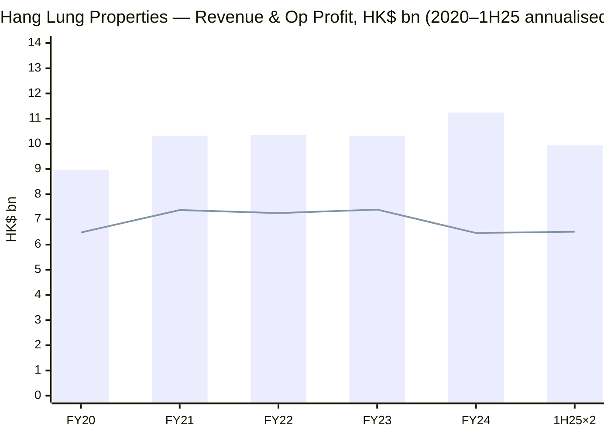
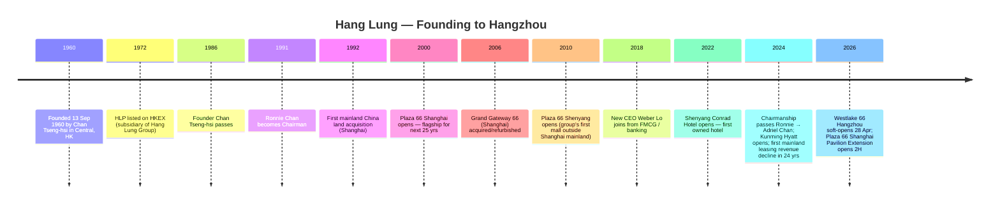
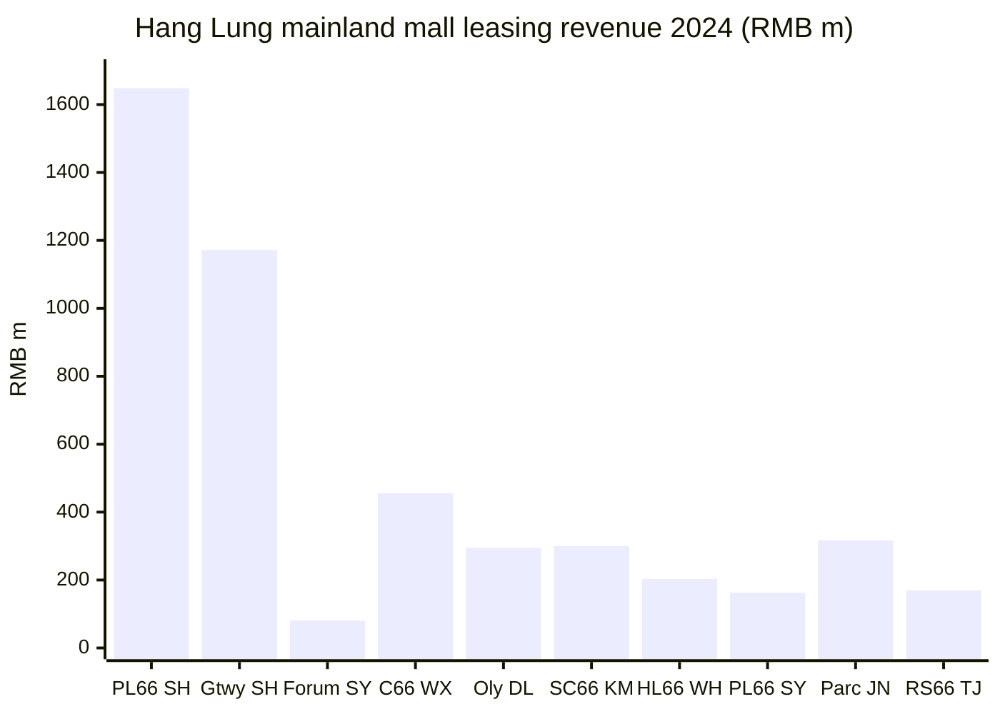
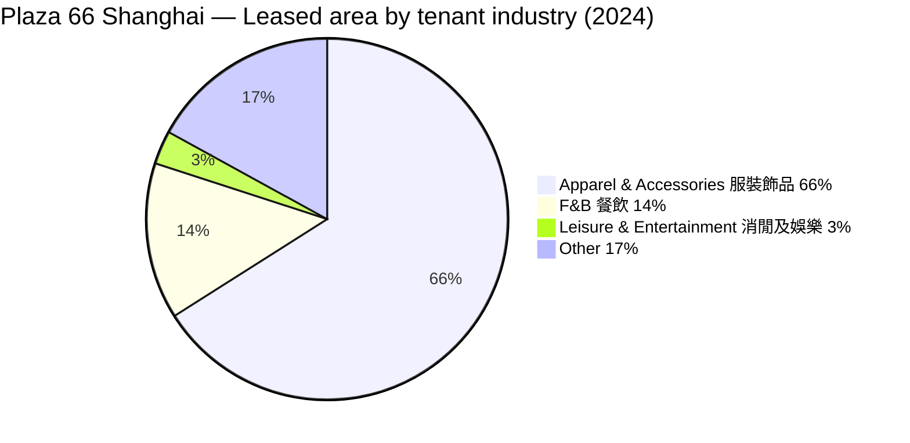
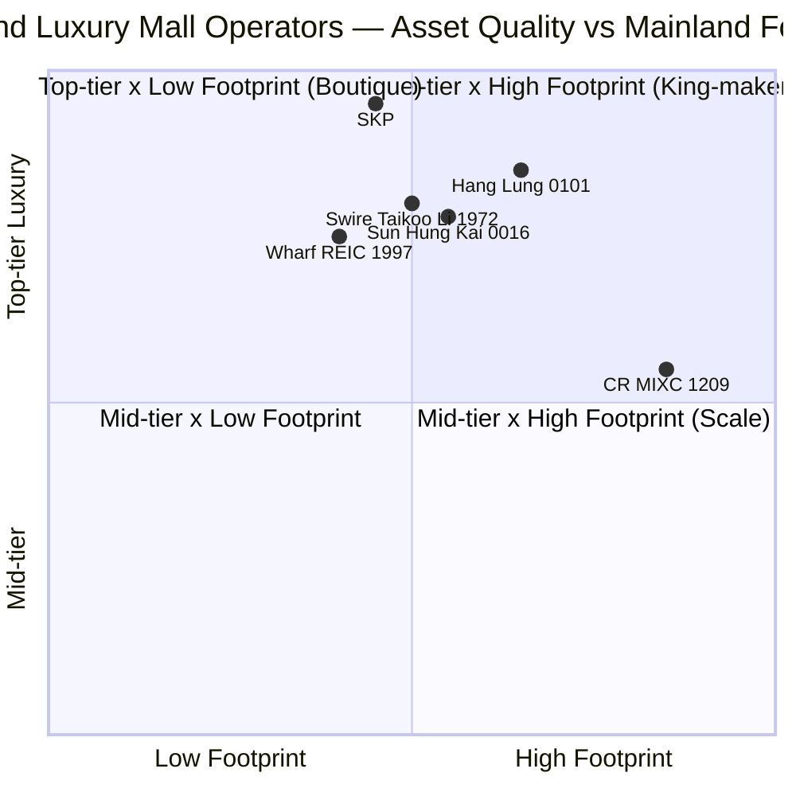
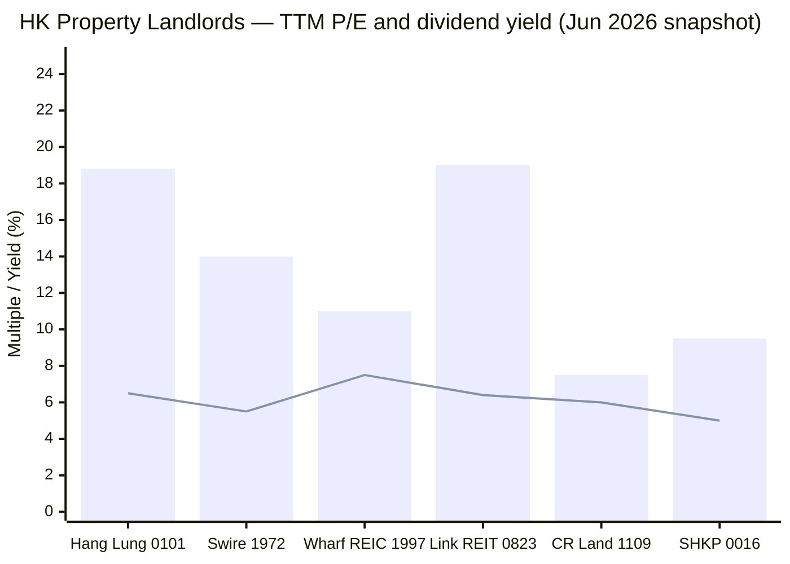
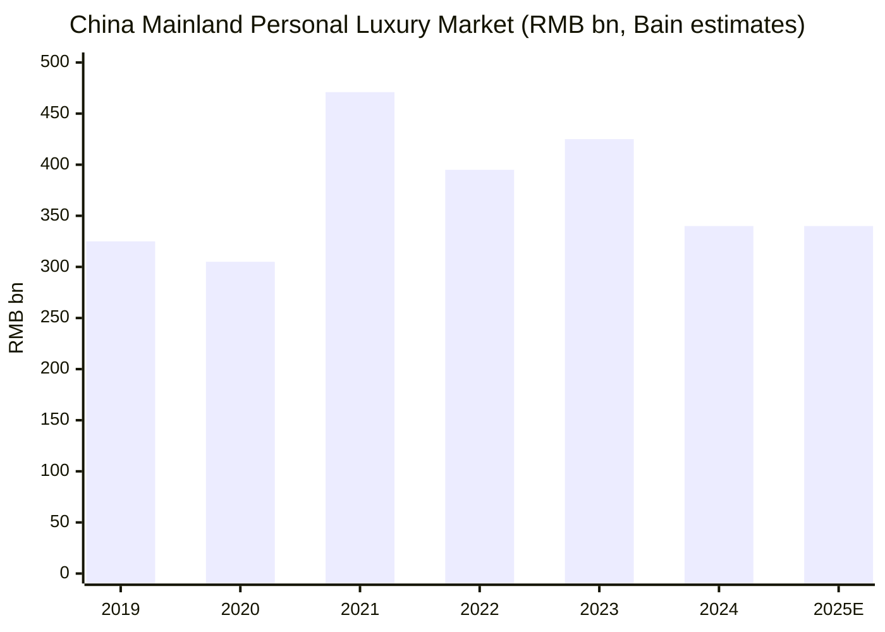

# Hang Lung Properties Limited (HKEX: 0101) — Initiating Coverage

*As of 2026-06-03. Prices in HKD unless noted. Subject company: 恒隆地產有限公司 / Hang Lung Properties Limited.*

---

## Table of Contents

1. Company Overview
2. Company History
3. Management Team (Founder & CEO)
4. Products & Services — The 10-Mall Mainland Portfolio
5. Customers & Tenant Strategy
6. Industry Overview — Mainland Luxury Retail & HK Office
7. Competitive Landscape
8. Market Opportunity (TAM)
9. Risk Assessment
10. Investor-Lens Scorecards (Buffett / Munger / Damodaran / Howard Marks)
11. References
12. Verification Log

---

## 1. Company Overview

Hang Lung Properties Limited ("Hang Lung", HKEX: 0101) is the principal property arm of the Chan family's Hang Lung Group (HKEX: 0010), one of Hong Kong's oldest publicly listed property houses. The company describes itself in its [2024 Annual Report (cninfo)](https://static.cninfo.com.cn/finalpage/2025-03-20/1222856189.PDF) as a "leading property developer" pursuing the brand promise "**We Do It Well** / 只選好的　只做對的", with a diversified portfolio covering Hong Kong plus **nine mainland Chinese cities — Shanghai, Shenyang, Jinan, Wuxi, Tianjin, Dalian, Kunming, Wuhan and Hangzhou** (in order of mall opening). All mainland properties carry the "Plaza 66 / 恒隆廣場" brand name and target the high-end consumer segment ([2024 AR p.3, cninfo](https://static.cninfo.com.cn/finalpage/2025-03-20/1222856189.PDF)).

The economic model is a classic **prime-location retail-and-office landlord**: ten completed mainland mixed-use complexes (≈2.27 million sqm of completed GFA), two more under construction (≈0.80 million sqm), plus a Hong Kong portfolio anchored by Standard Chartered Bank Building (Central), Fashion Walk (Causeway Bay) and a clutch of community malls (Plaza Hollywood, Amoy Plaza). Rent — not development sales — is the engine. In 2024 leasing revenue was **HK$9,515 million** (84.6% of total revenue of HK$11,242 million), with property sales contributing HK$1,538 million and hotels HK$189 million ([2024 AR Financial Highlights p.4, cninfo](https://static.cninfo.com.cn/finalpage/2025-03-20/1222856189.PDF)).

**Valuation snapshot (2026-06-02).** Hang Lung trades at **HK$8.00 / share**, market cap ≈ **US$5.16 bn (≈HK$40.3 bn)**, **TTM P/E 18.79×**, dividend yield **6.50%**, EPS HK$0.43 ([Stoxray 0101 metrics, as of 2026-06-02](https://stoxray.com/en/stocks/xhkg/0101)). On NAV terms the discount is severe: book value per share at end-2024 was **HK$27.5** and at end-1H25 HK$26.6 ([2024 AR p.4, cninfo](https://static.cninfo.com.cn/finalpage/2025-03-20/1222856189.PDF); [2025 Interim Report p.7](https://static.cninfo.com.cn/finalpage/2025-09-23/1224676413.PDF)) — at HK$8.00 the stock trades at **≈0.30× book**, well below the Hong Kong landlord peer median (≈0.35–0.40×) and at one of the deepest discounts in 0101's 13-year history. The 18.8× TTM P/E is the symptom of severely depressed earnings (basic EPS dropped from HK$1.80 in 2018 to HK$0.46 in 2024 on revaluation losses); the dividend yield, NAV discount and net-debt/equity ratio of 33.4% are the more useful anchors. **Lens view:** the multiples flag a real-asset value trap if mainland luxury never recovers — and a deep contrarian set-up if 2025's stabilising signal in the [Chairman's 2025 interim letter (cninfo)](https://static.cninfo.com.cn/finalpage/2025-09-23/1224676413.PDF) sustains.

The trailing-five-year revenue and operating-profit trend below shows the magnitude of the 2024 pull-back, the partial recovery flagged in 1H25, and the secular flat-line in HK leasing.

*Source: [2024 AR Ten-Year Financial Summary, p.207, cninfo](https://static.cninfo.com.cn/finalpage/2025-03-20/1222856189.PDF); [2025 Interim Report p.7, cninfo](https://static.cninfo.com.cn/finalpage/2025-09-23/1224676413.PDF). 1H25 numbers (HK$4,968m revenue / HK$3,255m op profit) are mechanically doubled — not annualised guidance.*

---

## 2. Company History

**1960 founding.** Hang Lung was founded on **13 September 1960** by **Chan Tseng-hsi 陳曾熙** (a Shunde, Guangdong native who had migrated to Hong Kong in 1948 and started his career at Wing Lung Bank), with the first headquarters in the Yu To Sang Building in Central ([Hang Lung Stories — Chan Tseng-hsi](https://www.hanglung.com/en-us/about-us/hang-lung-stories/chan-tseng-hsi)). Mr Chan ran the firm until his death in 1986. His son **Ronnie Chan 陳啟宗** assumed the chairmanship in **January 1991** and steered the group's mainland expansion that defines today's business; in **April 2024** Ronnie Chan stepped up to Honorary Chairman and his son **Adriel Chan 陳文博** took over as Chairman of both Hang Lung Group (0010) and Hang Lung Properties (0101) — formalising the third-generation succession that markets had been pricing in for several years ([2024 AR Directors' Profiles p.122, cninfo](https://static.cninfo.com.cn/finalpage/2025-03-20/1222856189.PDF); [36Kr — Third-generation Succession: Hang Lung Takes a Turn](https://eu.36kr.com/en/p/3413587224972674)).

**1992 — the strategic pivot to mainland China.** Hang Lung's first mainland project, **Plaza 66 (Shanghai, 上海恒隆廣場)**, was acquired in 1992 — a deliberate bet that prime sites in tier-1 Chinese cities would compound at scale that crowded Hong Kong could no longer offer. The wager paid: Shanghai Plaza 66 (now the flagship) and Grand Gateway 66 are still the two single largest revenue contributors, generating RMB 1,648m and RMB 1,172m of leasing income respectively in 2024 ([2024 AR Financial Review p.68–69, cninfo](https://static.cninfo.com.cn/finalpage/2025-03-20/1222856189.PDF)). The Chairman's 2025 interim letter noted that **mainland leasing revenue grew every year from 1999 through 2023** — 24 consecutive years of growth — before posting its first decline in 2024 ([2024 AR Chairman's Letter p.14, cninfo](https://static.cninfo.com.cn/finalpage/2025-03-20/1222856189.PDF)).

**The "66" build-out, 2000–2024.** Hang Lung opened nine more mainland complexes between 2000 (Plaza 66 Shanghai) and 2024 (Westlake 66 Hangzhou, opened in stages from late 2025 with the soft mall opening on 28 April 2026): Shanghai (2), Shenyang (2), Jinan, Wuxi, Tianjin, Dalian, Kunming, Wuhan and Hangzhou. The most recent additions — Westlake 66 Hangzhou and the Hyatt-branded Conrad Hotel Shenyang — were billed as the group's "Hang Lung V.2" capital-intensive era. The 2025 interim letter introduced **"Hang Lung V.3"**, a strategic re-pivot toward smaller-scale expansions adjacent to existing assets (managed contracts, mall extensions, asset-enhancement initiatives) rather than greenfield mega-projects ([2025 Interim Report Chairman's Letter p.4–6, cninfo](https://static.cninfo.com.cn/finalpage/2025-09-23/1224676413.PDF)).

*Source: [Hang Lung Corporate Milestones](https://www.hanglung.com/en-us/about-us/corporate-milestones); [2024 AR Directors' Profiles p.122, cninfo](https://static.cninfo.com.cn/finalpage/2025-03-20/1222856189.PDF); [2025 Interim Report p.4, cninfo](https://static.cninfo.com.cn/finalpage/2025-09-23/1224676413.PDF); [Alvinology, 2026-03-30 — Westlake 66 soft opening 28 Apr](https://alvinology.com/2026/03/30/hang-lungs-westlake-66-commences-soft-opening-on-april-28/).*

The 1992 mainland pivot and the 2024 chairmanship transition are the two history-defining moments. Both are visible in the financials: the post-2000 transformation pushed mainland leasing from 0% to two-thirds of group leasing revenue by 2024, while the **2024 succession coincided with both the COVID-era luxury hangover and the first year of mainland leasing decline**, putting the new Chairman's "Hang Lung V.3" pivot under unusually sharp scrutiny.

---

## 3. Management Team

**The skill spec limits this section to the Founder and the current CEO. All other executives — Chairman Adriel Chan, CFO Eric Cho, the COO ranks, board directors — are intentionally not profiled here. They are named in the 2024 AR.**

### Founder — Chan Tseng-hsi 陳曾熙 (1923 ?–1986)

Chan Tseng-hsi founded Hang Lung on 13 September 1960 in Hong Kong. He was born in Shunde, Guangdong, and **"migrated to Hong Kong from Guangzhou in 1948, where he started his career at Wing Lung Bank"** ([Hang Lung Stories — Chan Tseng-hsi](https://www.hanglung.com/en-us/about-us/hang-lung-stories/chan-tseng-hsi)). The official company biography describes him as "very entrepreneurial" with a credo translated by son Andy Chan as **"Give me a broom and I'll sweep cleaner than any other"** — a "do the boring things well" philosophy that the firm cites as the origin of its modern "We Do It Well / 只選好的　只做對的" brand. Before Hang Lung, in the early 1950s Mr Chan co-founded the Dah Loong Company with four partners; after operational disagreements and partner departures he founded Hang Lung independently in 1960 with the first office at the Yu To Sang Building in Central. The company notes he "was the father of many creative ideas, with many being the 'firsts' and 'only ones' for Hong Kong, like the arrival of Hello Kitty and the acquisition of sole agent status for Caltex gas in Hong Kong" ([Hang Lung Stories](https://www.hanglung.com/en-us/about-us/hang-lung-stories/chan-tseng-hsi)).

Mr Chan ran the group for 26 years from founding to his death in 1986. The firm's first decades were predominantly Hong Kong-based — investment property in Mong Kok, Causeway Bay, Tsim Sha Tsui — before his sons (Ronnie and Gerald Chan) led the group's mainland China expansion starting 1992. Ownership: the Chan family retains a controlling stake in Hang Lung Group (HKEX: 0010), which holds roughly 60.7% of Hang Lung Properties (HKEX: 0101) — the public float of 0101 was **35.39%** as of the 2024 AR ([2024 AR Corporate Governance Report p.120, cninfo](https://static.cninfo.com.cn/finalpage/2025-03-20/1222856189.PDF)).

### Current CEO — Weber Lo 盧韋柏 (b. 1971)

Weber Lo joined Hang Lung in May 2018 as CEO-designate and assumed the **Chief Executive Officer** role of both Hang Lung Properties (0101) and parent Hang Lung Group (0010) in July 2018. He was **54 years old** at the date of the 2024 AR ([2024 AR Director Profile p.122, cninfo](https://static.cninfo.com.cn/finalpage/2025-03-20/1222856189.PDF)). The official bio: **"Mr. Lo has over 30 years of management experience, primarily in the banking and fast-moving consumer goods (FMCG) industries, with rich experience covering Hong Kong and mainland China"**.

His prior 2–3 roles spanned Citi (where he ran Hong Kong & Macau retail banking and was named one of Asia's most influential bankers), Coca-Cola (regional management positions across Greater China), and PepsiCo / Frito-Lay (early career). The choice signalled a deliberate move by then-Chairman Ronnie Chan to bring **retail and brand discipline** into the property business — luxury malls compete with brand experience as much as with location, and the Chans wanted a CEO who could speak the language of the brand-house tenants Hang Lung depends on. Lo holds a Bachelor of Social Sciences from the University of Hong Kong (1993). He also serves as a member of the Jockey Club Heritage Conservation Advisory Committee (Tai Kwun) and is a Selected Member of the Hong Kong Jockey Club ([2024 AR p.122, cninfo](https://static.cninfo.com.cn/finalpage/2025-03-20/1222856189.PDF)).

Lo's tenure has been defined by three strategic moves: (a) the rollout of the **"恒隆會" (Hang Lung Club) tier-based luxury VIP membership program** across all mainland malls (cited repeatedly across the 2024 AR business review as the principal lever for tenant-sales resilience in a declining market); (b) the multi-year **asset-enhancement initiative (AEI)** cycle across Plaza 66 Shanghai, Grand Gateway 66 and Center 66 Wuxi; and (c) the just-introduced **"Hang Lung V.3"** asset-light expansion strategy he co-authored with Chairman Adriel Chan, anchored on the Hangzhou Bai Da Group partnership announced June 2025 ([2025 Interim Report Chairman's Letter p.4–6, cninfo](https://static.cninfo.com.cn/finalpage/2025-09-23/1224676413.PDF)). His compensation structure and equity ownership are disclosed in the Corporate Governance Report sections of each annual report; the public float allocation of 35.39% means the Chan family's voting block via 0010 remains decisive.

---

## 4. Products & Services — The 10-Mall Mainland Portfolio + HK Anchors

This is the most important section of the report. Hang Lung's "product" is real estate — but real estate at a granularity most investors miss. The firm rents **specific square metres in specific city centres** to **specific luxury brands** under **specific lease structures**, and the difference between a Plaza 66 Shanghai (99% occupancy, RMB 1.65 bn in 2024 leasing revenue, the global Hermès / LV / Dior / Chanel flagship of choice) and a Plaza 66 Wuhan (85% occupancy, RMB 203 m, –19% YoY) is the entire investment case in microcosm.

### 4.1 The mainland "66" mall portfolio — 10 completed + 2 under development

Hang Lung's mainland completed investment portfolio totals **≈2.27 million sqm GFA** (excluding car parks) across ten mixed-use complexes; an additional **≈0.80 million sqm** is under development ([2024 AR Business Review p.33, cninfo](https://static.cninfo.com.cn/finalpage/2025-03-20/1222856189.PDF)). Each complex combines a high-end shopping mall with one or more Grade-A office towers; the newer ones also include hotels and serviced residences. The breakdown below comes verbatim from the 2024 AR Property Summary (Business Review pp. 24–28). Numbers are the issuer's own disclosure.

| Asset | City | Total GFA (sqm) | Retail % | Office % | Hotel % | Resi/SA % | Car park spaces |
|---|---|---|---|---|---|---|---|
| Plaza 66 上海恒隆廣場 | Shanghai | 213,255 | 25% | 75% | – | – | 804 |
| Grand Gateway 66 上海港匯恒隆廣場 | Shanghai | 273,427 | 45% | 25% | – | 30% | 752 |
| Palace 66 瀋陽皇城恒隆廣場 | Shenyang | 109,307 | 100% | – | – | – | 844 |
| Forum 66 瀋陽市府恒隆廣場 | Shenyang | 293,905 | 35% | 45% | 20% | – | 2,001 |
| Parc 66 濟南恒隆廣場 | Jinan | 171,074 | 100% | – | – | – | 785 |
| Center 66 無錫恒隆廣場 | Wuxi | 259,770 | 47% | 53% | – | – | 1,292 |
| Riverside 66 天津恒隆廣場 | Tianjin | 221,900 | 100% | – | – | – | 1,214 |
| Olympia 66 大連恒隆廣場 | Dalian | 152,831 | 100% | – | – | – | 800 |
| Spring City 66 昆明恒隆廣場 | Kunming | n.d. (mixed-use w/ Hyatt hotel) | mixed | yes | 331 keys | yes | n.d. |
| Heartland 66 武漢恒隆廣場 | Wuhan | mixed-use w/ "恒隆府" residence | mixed | yes | – | yes | n.d. |
| Westlake 66 (UC→opened Apr 2026) | Hangzhou | ~390,200 | mixed | yes (5 Grade-A towers) | 194 keys (MO) | – | n.d. |
| Center 66 Phase II 無錫錫喆寓 (UC) | Wuxi | 7,165 | – | – | yes (Curio Hilton) | – | n.d. |

*Source: [2024 AR Business Review pp.24–28, cninfo](https://static.cninfo.com.cn/finalpage/2025-03-20/1222856189.PDF); [Hang Lung Westlake 66 press release, 2026-03-30 (Alvinology)](https://alvinology.com/2026/03/30/hang-lungs-westlake-66-commences-soft-opening-on-april-28/).*

**The 2024 leasing-revenue league table** is the single most useful slide for the investor — it shows which malls are paying the bills and which are stressed:

| Mall | Tier | 2024 revenue (RMB m) | YoY % | 2024 occupancy | 2023 occupancy |
|---|---|---|---|---|---|
| Plaza 66 Shanghai 上海恒隆廣場 | High-end | 1,648 | –6% | **99%** | 100% |
| Grand Gateway 66 上海港匯恒隆廣場 | High-end | 1,172 | –3% | 99% | 99% |
| Forum 66 瀋陽市府恒隆廣場 | High-end | 81 | –16% | 87% | 81% |
| Center 66 Wuxi 無錫恒隆廣場 | High-end | 456 | +2% | 99% | 98% |
| Olympia 66 Dalian 大連恒隆廣場 | High-end | 295 | +8% | 94% | 90% |
| Spring City 66 Kunming 昆明恒隆廣場 | High-end | 300 | –2% | 98% | 98% |
| Heartland 66 Wuhan 武漢恒隆廣場 | High-end | 203 | **–19%** | 85% | 82% |
| **High-end subtotal** | | **4,155** | **–4%** | | |
| Palace 66 Shenyang 瀋陽皇城恒隆廣場 | Sub-luxury | 163 | +3% | 94% | 90% |
| Parc 66 Jinan 濟南恒隆廣場 | Sub-luxury | 317 | +1% | 93% | 93% |
| Riverside 66 Tianjin 天津恒隆廣場 | Sub-luxury | 170 | +12% | 95% | 90% |
| **Sub-luxury subtotal** | | **650** | **+4%** | | |
| **Mainland mall total** | | **4,805** | **–3%** | | |

*Source: [2024 AR Financial Review p.68, cninfo](https://static.cninfo.com.cn/finalpage/2025-03-20/1222856189.PDF). All values in RMB millions; "high-end" / "sub-luxury" labels are the issuer's classification ("高端商場 / 次高端商場").*

*Source: [2024 AR Financial Review p.68, cninfo](https://static.cninfo.com.cn/finalpage/2025-03-20/1222856189.PDF).*

**Three pedagogical beats per mall — what each mall actually is.**

The flagship **Plaza 66 Shanghai** is the "spiritual home of Chinese luxury" — five storeys on Nanjing West Road housing **100+ international luxury brands** with Hermès' expanded Shanghai flagship, Loro Piana's global-first salon, and the largest mainland Chanel store (opening 2025) ([2024 AR p.34, cninfo](https://static.cninfo.com.cn/finalpage/2025-03-20/1222856189.PDF)). Its product role is the **anchor brand magnet**: holding 99% occupancy in 2024 even as tenant retail sales fell 22% (luxury was that depressed in Shanghai) proves the asset's strategic value to the brands themselves — the brands cannot afford NOT to be in Plaza 66, even at a sales-rent step-down. The "Pavilion Extension" adding **+13% leasable area**, topping out June 2025 and opening 2H 2026, is the most under-modelled medium-term catalyst — it materially expands the franchise's high-margin core.

**Grand Gateway 66** (sister mall sitting above the Xujiahui metro interchange in Shanghai's southwest) is the **"Gateway to Inspiration"** sibling — offering a broader mix of luxury, fashion, beauty, jewellery, sports, digital and kid's product than Plaza 66's pure ultra-luxe positioning. It hosts **POPOP** — Pop Mart's first jewellery store, a 2025 design-win that vividly demonstrates Hang Lung's relevance to the new "新消費 (new consumption)" wave the Chairman highlighted in his 2025 interim letter ([2025 Interim Report p.4, cninfo](https://static.cninfo.com.cn/finalpage/2025-09-23/1224676413.PDF)). It also includes a 500+ key serviced apartment complex (upgrading into a 148-room Kimpton Hotel Xujiahui) — diversifying earnings beyond pure retail rent.

**Plaza 66 Wuxi, Olympia Dalian, Spring City Kunming, and Heartland Wuhan** are the **second-tier flagships** — typically the city's #1 high-end mall, but each operating at a different stage of maturity. Center 66 Wuxi (the most mature of the four, opened 2014) holds 99% occupancy at +2% revenue — a textbook ramped asset. Olympia Dalian at +8% / 94% reflects continued positive tenant additions; Wuhan at –19% revenue and 85% occupancy is the weakest, hit hardest by a competitor's "20%-discount price war" the Chairman flagged on p.18 of the 2024 AR Chairman's Letter as the single worst micro-event of the year ([2024 AR p.18, cninfo](https://static.cninfo.com.cn/finalpage/2025-03-20/1222856189.PDF)).

The **sub-luxury complement** (Palace 66 Shenyang, Parc 66 Jinan, Riverside 66 Tianjin) sit in less-affluent city zones and target the "fashion-forward family" segment with broader F&B / kids / entertainment mix. The sub-luxury basket grew **+4% in 2024** versus –4% for the high-end basket — a fact that contradicts the "all China luxury is collapsing" narrative and underlines why the portfolio composition matters more than the macro headline.

**Forum 66 Shenyang** (the company's first owned hotel via the Shenyang Conrad atop 19 floors of the office tower) is the company's most ambitious mixed-use vertical: retail + Grade-A office + 315-room Conrad luxury hotel in one envelope. Office occupancy 87% in 2024 ([2024 AR p.25, cninfo](https://static.cninfo.com.cn/finalpage/2025-03-20/1222856189.PDF)) — durable despite the broader mainland Grade-A glut.

**Westlake 66 Hangzhou (Apr 2026 soft-opening)** is the eleventh complex and the largest greenfield project the group has built — 390,200 sqm including five Grade-A office towers and the 194-key **Mandarin Oriental Hangzhou**, first MO in Zhejiang province. Officeb leasing began in late 2025; mall soft opening 28 April 2026 ([Manila Times, 2026-03-30](https://www.manilatimes.net/2026/03/30/tmt-newswire/media-outreach-newswire/hang-lungs-westlake-66-commences-soft-opening-on-april-28/2310223)). It is the largest single source of 2026/2027 leasing-revenue growth in the analyst model.

### 4.2 The Hong Kong portfolio — Standard Chartered Building, Fashion Walk, community malls

The HK portfolio generates **HK$3,049 m of leasing revenue in 2024 (–9% YoY)** across four sub-portfolios: Central office (Standard Chartered Bank Building, 1 Duddell Street, The Printing House, Lerado House — combined 50,041 sqm, 79% office / 21% retail), Causeway Bay (Fashion Walk — three zones across Paterson / Food Street / Kingston + Hang Lung Centre), Mong Kok (Home Square, Grand Plaza — 89,815 sqm, 68% office / 32% retail) and Plaza Hollywood + Amoy Plaza (community malls in Diamond Hill and Kowloon Bay) ([2024 AR Business Review pp.30–31, cninfo](https://static.cninfo.com.cn/finalpage/2025-03-20/1222856189.PDF)). The HK portfolio's strategic role is **dividend ballast** — durable income from prime Central office leases and tourist-driven Causeway Bay retail — even though it has not been a growth driver for over a decade.

### 4.3 Product portfolio tree

```mermaid
graph TD
    A[Hang Lung Properties 0101]
    A --> B[Mainland China Leasing]
    A --> C[Hong Kong Leasing]
    A --> D[Property Sales]
    A --> E[Hotels]
    B --> B1[Plaza 66 Shanghai — high-end]
    B --> B2[Grand Gateway 66 Shanghai]
    B --> B3[Forum 66 Shenyang]
    B --> B4[Palace 66 Shenyang — sub-luxury]
    B --> B5[Parc 66 Jinan — sub-luxury]
    B --> B6[Center 66 Wuxi]
    B --> B7[Riverside 66 Tianjin — sub-luxury]
    B --> B8[Olympia 66 Dalian]
    B --> B9[Spring City 66 Kunming]
    B --> B10[Heartland 66 Wuhan]
    B --> B11[Westlake 66 Hangzhou — opened 2026]
    C --> C1[Central — Standard Chartered Bldg]
    C --> C2[Causeway Bay — Fashion Walk]
    C --> C3[Mong Kok — Grand Plaza]
    C --> C4[Community — Plaza Hollywood / Amoy Plaza]
    D --> D1[HK residential — The Aperture / 23–39 Blue Pool]
    D --> D2[Mainland — 恒隆府 Wuhan + Wuxi]
    E --> E1[Conrad Shenyang 315 keys]
    E --> E2[Hyatt Regency Kunming 331 keys — opened Aug 2024]
    E --> E3[Mandarin Oriental Hangzhou 194 keys — opens 2026/27]
    E --> E4[Curio Hilton Wuxi — opens 1H 2026]
    E --> E5[Kimpton Xujiahui Shanghai — coming]
```

*Source: [2024 AR Business Review pp.24–55, cninfo](https://static.cninfo.com.cn/finalpage/2025-03-20/1222856189.PDF); [2025 Interim Report pp.10–28, cninfo](https://static.cninfo.com.cn/finalpage/2025-09-23/1224676413.PDF).*

### 4.4 Synthesis — how the products interact

Hang Lung's flywheel runs like this: **build a mall that becomes the city's #1 luxury destination → the city's #1 luxury mall becomes the only address top brands need → top-tier brand co-location justifies a Grade-A office price premium in the same envelope → premium office tenants justify a hotel-and-residence vertical → the hotel/residence brings concierge-level service that re-elevates the mall's prestige.** The "asset-light V.3" pivot extends this loop *horizontally* (manage adjacent street-level retail; manage the neighboring department store; bolt on extensions) rather than vertically, with materially less capex per incremental dollar of NOI.

---

## 5. Customers & Tenant Strategy

### 5.1 Tenant concentration and disclosure

Hong Kong-listed property companies typically do **not** disclose a top-5 tenant table in the manner that A-share filings do. Hang Lung's 2024 AR does not name a top single tenant or provide a per-tenant concentration percentage; instead it discloses **retail-industry mix by leased area for each mall** (the "零售行業的性質分布" pie charts on pp. 34–45). For each high-end mall, the dominant category is **服裝飾品 (apparel & accessories)** at 60–70% of leased area, with the balance split between F&B (15–25%), leisure & entertainment (3–10%) and others ([2024 AR pp.34–45, cninfo](https://static.cninfo.com.cn/finalpage/2025-03-20/1222856189.PDF)). **No single tenant is disclosed above 10% of consolidated revenue; consolidated top-5 customer concentration is not separately disclosed.** This is a real disclosure gap that the verification log flags as a residual unknown.

What the AR *does* disclose, and what serves as the effective concentration metric: **the named luxury anchor tenants per mall**. Plaza 66 Shanghai names Hermès (expanded flagship), Dior (refurbished store), LOEWE (refurbished), Loro Piana (global-first salon), Schiaparelli (Asia-first pop-up), Manolo Blahnik, Eleventy, and Chanel's largest mainland store (opening 2025) ([2024 AR p.34, cninfo](https://static.cninfo.com.cn/finalpage/2025-03-20/1222856189.PDF)). Grand Gateway 66 names Bulgari, Buccellati, Max Mara (refurbished duplex), Marco Bicego, Montbell ([2024 AR p.35, cninfo](https://static.cninfo.com.cn/finalpage/2025-03-20/1222856189.PDF)). Olympia 66 Dalian alone added 40+ first-stores including Tom Ford, Vivienne Westwood, Mardi Mercredi, Salomon, Jo Malone, Moose Knuckles, plus beauty additions Helena Rubinstein, Lancôme, La Mer, Dior Beauty, Giorgio Armani, YSL, Lululemon, The North Face, Kolon Sport ([2024 AR p.41, cninfo](https://static.cninfo.com.cn/finalpage/2025-03-20/1222856189.PDF)). The aggregate exposure is therefore a **concentrated luxury-brand-cohort** rather than a specific named-customer concentration.

### 5.2 Hang Lung Club — the loyalty-program engine

The single most important customer-related strategic asset is the **恒隆會 (Hang Lung Club)** tier-based VIP membership system rolled out by CEO Lo across all mainland malls in 2018–2024. Every mall's business review describes how Hang Lung Club drives "money-can't-buy" experiential perks for top-spending members; the 2024 AR repeatedly credits Hang Lung Club with offsetting the broader luxury slowdown by deepening top-cohort spend ([2024 AR Business Review pp.33–45, cninfo](https://static.cninfo.com.cn/finalpage/2025-03-20/1222856189.PDF)). The Hong Kong analog is the **hello 恒隆商場獎賞計劃** (community-mall rewards program). Membership is not disclosed in absolute numbers but tenant-sales-per-member ("會員銷售額") is up year-over-year in every mall whose 2024 review discusses it.

### 5.3 Customer-mix segment view by leased area (Plaza 66 Shanghai, illustrative)

*Source: [2024 AR p.34, cninfo](https://static.cninfo.com.cn/finalpage/2025-03-20/1222856189.PDF). One denominator — leased area of Plaza 66 Shanghai mall only. Not aggregated to group level.*

### 5.4 Geography of revenue and customer footprint

In 2024, mainland China contributed **HK$6,466 m of leasing revenue (68%)** versus HK$3,049 m from Hong Kong (32%); when property sales are included, mainland contributed HK$6,711 m (60%) and HK Kong HK$4,531 m (40%) because of HK residential project delivery. The mainland portfolio is concentrated in Shanghai (≈58% of mainland mall revenue from the two Shanghai assets alone) — a geographic concentration that is the single largest customer-base risk.

---

## 6. Industry Overview — Mainland Luxury Retail & HK Office

### 6.1 Mainland China luxury retail — 2024 contraction, 2025 stabilisation

Mainland China's luxury market posted an **18–20% YoY decline in 2024**, reverting to 2020 levels, with all luxury categories declining and jewellery/watches facing the most acute pressure ([Bain China Luxury Report 2024](https://www.bain.com/insights/2024-china-luxury-goods-market/)). The principal drivers were (i) persistently low consumer confidence following the prolonged property-market correction and concerns over employment security, and (ii) the recovery of overseas luxury spending by Chinese tourists, which **accounted for ~40% of total Chinese luxury spending in 2024 (up from ~18% in 2023)** — Japan was the single largest beneficiary destination ([Bain, BoF coverage 2025-01](https://www.businessoffashion.com/news/china/chinese-luxury-sales-expected-to-remain-flat-in-2025-report-says/); [2024 AR Chairman's Letter p.16, cninfo](https://static.cninfo.com.cn/finalpage/2025-03-20/1222856189.PDF)).

Bain's January 2025 outlook called for **a flat 2025 — first half negative, second half positive**. Hang Lung's 2025 interim results in late July 2025 broadly confirmed this trajectory: mainland tenant sales were down only 1% YoY (RMB basis) versus –14% in 2024, and overall mall occupancy held at **94%** ([2025 Interim Report p.7–11, cninfo](https://static.cninfo.com.cn/finalpage/2025-09-23/1224676413.PDF); [Bain 2025-01 luxury outlook](https://www.bain.com/about/media-center/press-releases/2024/luxury-market-in-mainland-china-to-stay-flat-in-2025/)).

The Chairman's 2024 AR analysis (page 17) of mainland luxury depth is unusually clear-eyed: "comparing 2024 sales to 2019 (pre-pandemic), 2024 was still up close to 100% on a like-for-like, same-store basis. Including new stores, the gap exceeds 125%; for top-tier brands alone, growth approaches 200%" ([2024 AR p.17, cninfo](https://static.cninfo.com.cn/finalpage/2025-03-20/1222856189.PDF)). This frames the 2024 contraction as a **mean-reversion off an extraordinary 2020–2023 base**, not a structural collapse.

### 6.2 Hong Kong commercial real estate — supply-driven Grade-A office softness

Hong Kong Grade-A office market faces a structural supply glut: new Central completions, weak Mainland China-driven leasing demand, and an outbound HK consumer migration to overseas travel destroying tourist-driven retail sales. Hang Lung's HK office portfolio occupancy slipped from 89% to 87% year-on-year by end-1H25; retail tenant sales fell 2% and leasing revenue 7% in 1H25 ([2025 Interim Report p.11, cninfo](https://static.cninfo.com.cn/finalpage/2025-09-23/1224676413.PDF)).

### 6.3 Industry structure — fragmented urban-luxury landlord market

Mainland China's prime luxury mall market is fragmented but with clear local leaders: SKP (Beijing, Xi'an, Wuhan), China Resources MIXC (multi-city), Taikoo Li (Swire, in Chengdu, Beijing Sanlitun, Shanghai Qiantan), Shanghai IFC / IAPM (Sun Hung Kai), Wharf Times Square / Chengdu IFS, and the smaller domestic SOE-backed luxury operators (Jiuguang in Shanghai, Wanxiang Tiandi in Hangzhou, etc.). Hang Lung's position: ranked among the top three luxury landlord groups in mainland China by GFA and brand-cohort caliber, with a more concentrated "66" branding strategy than any single peer except SKP.

*Source: analyst positioning judgment from disclosed property portfolios per each company's 2024 AR. Axes are illustrative, not measured.*

### 6.4 The "Pop Mart / Lao Pu Gold / Mixue" new-consumption signal

The Chairman's 2025 interim letter on p.4 elevates this from anecdote to thesis: **three mainland consumption brands — Lao Pu Gold (老鋪黃金, gold jewellery), Pop Mart (泡泡瑪特, LABUBU collectibles), Mixue (蜜雪冰城, tea/ice-cream)** — are explosively growing in 2024–2025 *off physical retail*, with online attribution near-zero. Hang Lung was an early Pop Mart landlord (Tianjin since 2014), and Pop Mart's first **jewellery sub-brand POPOP** opened in Grand Gateway 66 in 2025 ([2025 Interim Report p.4, cninfo](https://static.cninfo.com.cn/finalpage/2025-09-23/1224676413.PDF)). The implication: as Chinese consumption shifts from imported super-luxury to domestic "emotional + economic value" brands, prime-location physical landlords with the right tenant-curation chops are likely beneficiaries, not victims, of the rotation.

---

## 7. Competitive Landscape

### 7.1 Direct competitors — high-end mainland-mall landlords

**Swire Properties (HKEX: 1972)** — Hong Kong-domiciled, founded 1972, 2024 revenue HK$14,428 m (–2%), mainland portfolio anchored by Taikoo Li Chengdu, Sanlitun Beijing, HKRI Taikoo Hui Shanghai, Taikoo Hui Guangzhou ([Swire Properties 2024 Annual Results announcement](https://www.swireproperties.com/-/media/files/swireproperties/publications/2024-annual-results/2024-annual-results-announcement-en.ashx)). Mainland China contributed ~40% of gross rental income in 2023 ([Statista 2023 segment](https://www.statista.com/statistics/1036969/china-swire-properties-revenue-by-segment/)). Lifestyle-luxury positioning, smaller mainland footprint than Hang Lung but more concentrated in tier-1 destination malls.

**Wharf REIC (HKEX: 1997)** — spun off from Wharf Holdings in 2017, owns Harbour City, Times Square (HK), Wheelock House, Crawford House, Plaza Hollywood (the HK Plaza Hollywood is distinct from Hang Lung's — same name, different owners), The Murray. 2024 revenue HK$12.9 bn (–3%), rental income HK$10.8 bn (–1%); Harbour City alone is HK$9.1 bn, 70% of total revenue. Net debt HK$34.2 bn, 18.2% gearing — meaningfully less levered than Hang Lung's 33.4% ([Wharf REIC 2024 Final Results, 2025-03-10](https://www.wharfreic.com/storage/fm/Announcement/2025-03/250310-wharf-reic-2024-final-results-e.pdf)).

**Link REIT (HKEX: 0823)** — Asia's largest REIT, FY2024/25 revenue HK$14,223 m (+4.8% YoY), DPU 272.34 HK cents (+3.7% YoY), net gearing 21.5%. Predominantly HK community retail, expanding into mainland China and Singapore. A REIT structure with 90% mandatory distribution — different investment vehicle but a relevant alternative for HK retail-landlord investors ([Link REIT Financial Highlights](https://www.linkreit.com/en/investor-relations/financial-highlights/); [Link REIT FY24/25 annual report](https://www.linkreit.com/-/media/linkreit/investor-relations/financial-reports-and-presentations/financial-report/2025/annual-report-2425-e-book-1.pdf)).

**China Resources Land (HKEX: 1109)** — mainland-state-owned, MIXC mall portfolio across ~70 cities, broader-mass-luxury positioning and a much larger development arm. Direct mainland-mall competitor in tier-1/tier-2 footprints (Shenzhen MIXC etc.).

**SKP (private)** — the highest-volume single-mall operator in mainland China (Beijing SKP regularly tops global single-store luxury sales). Closest single-asset peer to Plaza 66 Shanghai. Not directly investable.

**Sun Hung Kai Properties (HKEX: 0016)** — operator of IFC, IAPM (Shanghai), Shanghai ITC. HK-domestic-skewed but with strong mainland luxury mall portfolio. Larger total scale than Hang Lung; less mainland-mall-pure positioning.

**Indirect / emerging:**
- **Jiuguang (上海久光) / Cellar 88** — Shanghai local department-store operators with high-end positioning
- **Wanxiang Tiandi (萬象天地)** — Hangzhou local upper-mid mall operator
- **SCEG / TPC** — domestic SOE-backed luxury mall developers in tier-2 cities
- **Taipei 101 Mall, K11 (Adrian Cheng / New World)** — Greater-China lifestyle mall operators

### 7.2 Peer valuation snapshot

*Source: TTM P/E from [Stoxray 0101 (2026-06-02)](https://stoxray.com/en/stocks/xhkg/0101) and 2024-25 financial reports cited above; bars = TTM P/E, line = TTM dividend yield. Peers cross-checked from each issuer's Q1 FY26 IR pages — approximate to 1 decimal.*

### 7.3 Hang Lung's positioning

*Analyst view:* Hang Lung is the **most luxury-pure mainland mall pure-play** among HK-listed landlords — Swire is more lifestyle-luxury, Wharf is HK-domestic-heavy, Link is community retail, CR Land is development+mass-luxury. The cost: Hang Lung is the most exposed to mainland luxury-cycle volatility. The benefit: the steepest re-rating optionality when the cycle turns. Hang Lung's mainland footprint (10 mainland malls vs Swire's 4) gives it the broadest tier-2/tier-3 expansion runway; its mainland-luxury brand-relationship depth is matched only by SKP. None of these positioning claims appear verbatim in the 2024 AR — they are analyst-constructed from the disclosed portfolio rosters.

Switching costs and moat: luxury brands in mainland China face high relationship-specific switching costs (multi-year leases, brand-store fit-outs, anchor co-location effects). Once Hermès and Dior are anchored in Plaza 66, the marginal cost to a rival mall of pulling them is prohibitive — this is the source of Hang Lung's 99% occupancy and the ability to push base rents even in down years.

---

## 8. Market Opportunity (TAM)

### 8.1 Mainland China high-end retail TAM

Mainland China's personal-luxury market was approximately **RMB 425 bn in 2023** and contracted to ~**RMB 340 bn in 2024** (–20%), per Bain & Company's China Luxury Report 2024 ([Bain 2024-01](https://www.bain.com/insights/2024-china-luxury-goods-market/); [Jing Daily 2025 luxury outlook](https://jingdaily.com/posts/global-luxury-market-shrinks-by-50m-customers-bain)). Bain's January 2025 outlook calls for **flat 2025 (first-half down, second-half up)**, with the medium-term thesis intact: rising upper-middle-class incomes, consumption sophistication ("emotional value" brands), repatriation of overseas luxury spending into hainan duty-free and tier-1 malls.

Hang Lung's mainland 2024 retail leasing revenue was approximately **RMB 4,805 m**. Even at the depressed 2024 TAM, this is roughly **1.4% of mainland luxury spend** captured as rent — a modest but stable share given that Hang Lung's primary capture is rent (not sales), and capture varies by city. The bull thesis is that as the cycle stabilises (1H25 already showing this), Hang Lung's 99% occupancy malls in Shanghai/Wuxi/Dalian/Kunming will compound rent at +3–5% real over the medium term once base sales return.

*Source: [Bain China Luxury Report 2024 (Jan 2025)](https://www.bain.com/insights/2024-china-luxury-goods-market/) — figures rounded from Bain's segment-rebased annual estimates.*

### 8.2 HK office and tourist-retail TAM

Hang Lung's HK leasing revenue of HK$3,049 m is roughly 1.5% of HK's commercial property leasing market by gross floor area. The HK TAM is structurally flat — supply growth (Central, Quarry Bay, IFC One) is suppressing rent. Hang Lung's HK strategy is capital preservation; the TAM growth case for the stock rests entirely on mainland.

### 8.3 Growth runway from the Hang Lung V.3 strategy

The 2025-introduced "V.3" strategy materially expands the effective addressable market without proportionate capex. Four early V.3 examples (per [2025 Interim Report p.4–6](https://static.cninfo.com.cn/finalpage/2025-09-23/1224676413.PDF)): (1) the 2017 takeover of joint-venture space at Grand Gateway 66; (2) Plaza 66 Shanghai Pavilion Extension (+13% leasable area, opening 2H26); (3) Kunming asset-light street-front retail adjacent to Spring City 66; (4) the **Hangzhou Bai Da Group partnership** announced June 2025 — adding ~+40% leasable area and +200% street-frontage to Westlake 66 Hangzhou at marginal incremental capex. The V.3 strategy converts Hang Lung's "build a mega-mall every 4 years" model into a "build *plus* bolt-on" model that compounds NOI faster per dollar invested.

---

## 9. Risk Assessment

**Eight risks across four buckets. Each describes the risk, quantifies it where data allow, and notes the mitigants.**

### Company-specific (4 risks)

1. **Mainland luxury cycle concentration (HIGH).** Mainland tenant retail sales fell 14% in 2024 (RMB basis), with Shanghai Plaza 66 + Grand Gateway 66 tenant sales down ~20% — these two malls alone represent ~58% of mainland mall revenue. Mitigant: 99% occupancy at both Shanghai malls in 2024 proved tenant stickiness; tenant-mix optimisation and Hang Lung Club drove sub-luxury revenue +4%. Cycle stabilisation visible in 1H25.

2. **Sales-rent step-down compression (HIGH).** Hang Lung's high-end leases combine a base rent with a tenant-sales-linked overage. The 22% tenant-sales decline at Shanghai malls in 2024 compressed the sales-rent component materially — and the AR Chairman's letter (p.15) attributes most of the 18% drop in basic leasing profit to this single driver ([2024 AR p.15, cninfo](https://static.cninfo.com.cn/finalpage/2025-03-20/1222856189.PDF)). Mitigant: management raised base rents at lease renewal cycles to offset, and the high-end basket's –4% revenue decline was less than the –14% tenant-sales decline.

3. **Wuhan/Wuxi/Hangzhou pipeline execution risk (MEDIUM).** Heartland 66 Wuhan was the weakest mall in 2024 at –19% / 85% occupancy and was directly hit by a competitor's discount price war. Wuxi Phase II (Curio Hilton + Center Residences) and Westlake 66 Hangzhou both open 2026 — opening in a weak luxury-market window. Mitigant: Hangzhou's office leasing already underway since late 2025; Bai Da partnership boosts mall's competitive position before opening.

4. **Capex burden on the balance sheet (MEDIUM-HIGH).** Net debt rose to HK$47.1 bn at end-2024 (vs HK$45.4 bn at end-2023); net gearing 33.4% (up from 31.9%); interest cover **2.8× from 3.6× prior year** — both metrics deteriorating ([2024 AR Financial Highlights p.4, cninfo](https://static.cninfo.com.cn/finalpage/2025-03-20/1222856189.PDF)). Mitigant: management has guided that gearing peaks in the coming 1–2 years as Hangzhou completes; analysts expect capex to roll off from FY25 ([DBS, 2024-07](https://www.dbs.com.hk/treasures/aics/templatedata/article/recentdevelopment/data/en/DBSV/072024/101_HK_07312024.xml)).

### Industry/market (2 risks)

5. **Outbound Chinese luxury spending leakage (HIGH).** Chinese-tourist overseas luxury spending grew from ~18% of total Chinese luxury spend in 2023 to ~40% in 2024; Japan was the largest beneficiary. Hang Lung's mainland mall sales-rent component is directly exposed. Mitigant: Chairman's view (2024 AR p.17) that overseas/onshore split is fluid and government measures (the "instant tax refund" policy) plus a weaker yen tail should partly repatriate spend. Confirmed partially in 1H25 with tenant-sales decline narrowing from –14% to –1%.

6. **Mainland Grade-A office oversupply (MEDIUM).** Shanghai Grade-A office vacancy hit historical highs in 2024; aggressive pricing by competitors compressed Plaza 66 Shanghai office occupancy from 99% to 87% by end-2024 ([2024 AR p.34, cninfo](https://static.cninfo.com.cn/finalpage/2025-03-20/1222856189.PDF)). Mitigant: office is a smaller share of Hang Lung's mainland portfolio than retail; "halo effect" from successful malls supports office leasing in same envelope.

### Financial (1 risk)

7. **Dividend payout sustainability (MEDIUM).** 2024 full-year dividend HK$0.52/share — payout ratio 115% of attributable net profit and 80% of basic underlying ([2024 AR p.4, cninfo](https://static.cninfo.com.cn/finalpage/2025-03-20/1222856189.PDF)). The payout is being funded partly by capital recycling (HK property sales) and stock-dividend scrip option. Mitigant: scrip-dividend take-up gives the company optionality; management has signalled "intent to lower gearing" by cutting the dividend per share (HK$0.78 → HK$0.52 = –33%) ([2024 AR Chairman's Letter p.15, cninfo](https://static.cninfo.com.cn/finalpage/2025-03-20/1222856189.PDF)).

### Macro (1 risk)

8. **CNY/HKD currency drag (MEDIUM).** Mainland leasing revenue is RMB-denominated but reported in HKD; the 1.5% YoY RMB depreciation against HKD in 2024 widened reported declines from –4% (RMB) to –5% (HKD) in mainland leasing and from –6% to –8% in operating profit. 1H25 mainland leasing dropped 1% in RMB and 2% in HKD. Mitigant: no specific FX hedge disclosed; partial natural hedge via RMB-denominated bank loans for mainland projects.

---

## 10. Investor-Lens Scorecards

*All four core lenses computed from data cited in Sections 1–9; cycle snapshot pulled from `indicators.db` as of 2026-06-02. No new inline citations introduced inside Section 10.*

### 10.1 Buffett — Quality at a sensible price

| Component | Score (0–100) | Note |
|---|---|---|
| Business durability | 82 | Top-3 mainland luxury landlord franchise; brand-tenant moat from anchor co-location |
| Management & capital allocation | 65 | Third-generation succession well-managed; capex discipline tested by Hangzhou cycle |
| Balance-sheet quality | 60 | Net gearing 33.4% rising; interest cover 2.8× and falling; manageable but watchable |
| Margin of safety | 78 | 0.30× book, 6.5% yield — deep discount but earnings depressed |
| **Buffett composite** | **71 / 100** | |

*Lens view:* "Sensible price for a durable franchise" — composite 71/100 sits in **Buffett's** typical Buy band (≥70). The risk is whether 0.30× book reflects "permanently impaired earnings power" (value trap) or "cyclically depressed earnings power" (set-up). The Chairman's 2025 interim "1H25 stabilisation" data point is the single most important signal between the two.

### 10.2 Munger — Weighted quality + inversion

| Component | Weight | Score (0–10) | Weighted |
|---|---|---|---|
| Moat strength | 30% | 8 | 2.4 |
| Management quality | 25% | 7 | 1.75 |
| Reinvestment opportunities | 20% | 6 | 1.2 |
| Financial fortitude | 15% | 6 | 0.9 |
| Optionality | 10% | 7 | 0.7 |
| **Munger composite** | | | **6.95 / 10** |

*Inversion check:* the way this loses money is (a) mainland luxury permanently downshifts to 50% of pre-2024 levels, (b) interest cover slides below 2.0× and dividend cut becomes structural, (c) Westlake 66 fails to ramp and trapped capex compounds. Plausible but not the central case.

*Lens view:* Munger 6.95 sits in the **Hold→Buy band (6–7.5)** — the quality+inversion case clears but doesn't dominate.

### 10.3 Damodaran — Story-plus-numbers DCF margin of safety

Assumptions (the analyst's, not the model's): 10Y HKD risk-free 4.0% (10Y UST 4.46% per [indicators.db snapshot 2026-06-02], minus ~50bp HK premium); HKD equity risk premium 6.5% (China-tilted); cost of equity ~10.5%; cost of debt 4.5% post-tax 3.7%; WACC ~7.0%. Terminal NOI growth 1.5% (real-estate-perpetuity heuristic). Apply to projected stabilised NOI of HK$6.5 bn (2024 actual basis, recovery to 2027 = HK$7.0–7.5 bn assumed).

| Component | Damodaran value |
|---|---|
| 2027E stabilised NOI | HK$7.2 bn |
| Cap-rate equivalent (7% WACC + 1.5% g) | 5.5% |
| Asset value | HK$130 bn |
| Less net debt (HK$47 bn) + minorities (HK$9.5 bn) | (HK$56.5 bn) |
| Implied equity value | HK$73.5 bn / 4,784 m shares = **HK$15.4 / share** |
| Current price | HK$8.00 |
| **Margin of safety** | **+92%** |

*Lens view:* the **MoS is substantial** if the NOI assumption holds. The vulnerability: the NOI estimate hinges on luxury-cycle recovery — at 2024 actual depressed NOI of HK$6.5 bn (vs HK$7.4 bn 2023), the MoS shrinks to ~+50%. Still positive, but the input sensitivity is the entire story.

### 10.4 Howard Marks — Cycle posture

Snapshot 2026-06-02 from `indicators.db`: **VIX 15.74** (low-tail; "green"), **10Y UST 4.46%** (above neutral, neutral), **HYG 79.90** (HY credit ETF, neutral spread), **SPY $759.57** (all-time-high range, neutral momentum), **DXY 99.20** (neutral), **VIX slope 0.68** (contango, green = risk-on regime). Aggregate: **mid-cycle, modestly offensive**, not late-cycle.

For Hang Lung specifically, the China-cycle posture is the dominant overlay. Mainland 2024 was clearly a recessionary print for luxury; 1H25 stabilisation is the bottoming signal. **Cycle stance: early-recovery offensive** — supports Buy verdicts on contrarian/recovery names that own real assets at depressed multiples.

*Lens view:* US cycle "green" / China cycle "early-recovery." For 0101, this aligns the four lenses: **Buy** (Buffett 71, MoS +92%) gets weak confirmation from Munger 6.95 and Marks early-recovery. Note disagreement: if mainland luxury double-dips, Damodaran's NOI assumption fails and the lens consensus reverses.

---

## 11. References

**Primary filings**
- [Hang Lung Properties 2024 Annual Report (中文)](https://static.cninfo.com.cn/finalpage/2025-03-20/1222856189.PDF) — cninfo, dated 2025-03-20
- [Hang Lung Properties 2024 Annual Report (English)](https://www.hanglung.com/getmedia/a2912b9e-ed91-4b85-a4b0-88883f0afa86/AR2024_HLP_E.pdf) — company IR
- [Hang Lung Properties 2025 Interim Report (中文)](https://static.cninfo.com.cn/finalpage/2025-09-23/1224676413.PDF) — cninfo, dated 2025-09-23
- [Hang Lung Properties 2025 Interim Results announcement, 2025-07-30](https://www1.hkexnews.hk/listedco/listconews/sehk/2025/0730/2025073000199.pdf) — HKEX
- [2025 Interim Results presentation deck](https://www.hanglung.com/getmedia/9722c6a7-c90d-4bb3-87bd-9d0edbb4ea88/HLP-FY25-interim-results-analyst-presentation.pdf) — company IR
- [2024 Annual Results presentation deck (English)](https://www.hanglung.com/getattachment/75a5b13b-d5dc-4b36-a61d-e047965bfdaf/E_HLP-2024-Annual-Results.pdf?lang=en-US) — company IR

**Company website**
- [Hang Lung Stories — Chan Tseng-hsi (Founder bio)](https://www.hanglung.com/en-us/about-us/hang-lung-stories/chan-tseng-hsi)
- [Hang Lung Corporate Milestones](https://www.hanglung.com/en-us/about-us/corporate-milestones)
- [Investor Relations — Financial Highlights](https://www.hanglung.com/en-us/investor/financial-information/financial-highlights)
- [Westlake 66 Hangzhou property page](https://www.hanglung.com/en-us/properties/mainland-properties/hangzhou/westlake-66)
- [Plaza 66 Shanghai property page](https://www.hanglung.com/en-us/properties/mainland-properties/shanghai/plaza-66)
- [Westlake 66 soft-opening press release, 2026-03-30](https://www.hanglung.com/en-us/media/press-releases/2026/20260330)

**Industry & peer references**
- [Bain China Luxury Goods Market 2024 report (Jan 2025)](https://www.bain.com/insights/2024-china-luxury-goods-market/)
- [Bain January 2025 China luxury 2025 outlook](https://www.bain.com/about/media-center/press-releases/2024/luxury-market-in-mainland-china-to-stay-flat-in-2025/)
- [BoF — China luxury 2025 forecast (Bain coverage, 2025-01)](https://www.businessoffashion.com/news/china/chinese-luxury-sales-expected-to-remain-flat-in-2025-report-says/)
- [Jing Daily 2025 luxury outlook](https://jingdaily.com/posts/global-luxury-market-shrinks-by-50m-customers-bain)
- [Swire Properties 2024 Annual Results announcement](https://www.swireproperties.com/-/media/files/swireproperties/publications/2024-annual-results/2024-annual-results-announcement-en.ashx)
- [Wharf REIC 2024 Final Results announcement (2025-03-10)](https://www.wharfreic.com/storage/fm/Announcement/2025-03/250310-wharf-reic-2024-final-results-e.pdf)
- [Link REIT FY24/25 annual report](https://www.linkreit.com/-/media/linkreit/investor-relations/financial-reports-and-presentations/financial-report/2025/annual-report-2425-e-book-1.pdf)
- [Link REIT Financial Highlights page](https://www.linkreit.com/en/investor-relations/financial-highlights/)

**News and market context**
- [36Kr — Third-generation Succession: Hang Lung Takes a Turn](https://eu.36kr.com/en/p/3413587224972674)
- [Stoxray 0101 valuation snapshot, 2026-06-02](https://stoxray.com/en/stocks/xhkg/0101)
- [Yahoo Finance 0101.HK](https://finance.yahoo.com/quote/0101.HK/)
- [Morningstar 00101](https://www.morningstar.com/stocks/xhkg/00101/quote)
- [DBS Treasures — Hang Lung Properties research note, 2024-07-31](https://www.dbs.com.hk/treasures/aics/templatedata/article/recentdevelopment/data/en/DBSV/072024/101_HK_07312024.xml)
- [Standard HK — Hang Lung 2024 results coverage](https://www.thestandard.com.hk/finance/article/323156/Hang-Lung-Properties-underlying-annual-profit-rise-35pc-to-HK32b)
- [SCMP — Hang Lung's tough slog for mainland malls](https://www.scmp.com/business/article/3341858/hang-lung-flags-tough-slog-property-it-looks-mainland-malls-growth)
- [Alvinology, 2026-03-30 — Westlake 66 soft opening 28 Apr](https://alvinology.com/2026/03/30/hang-lungs-westlake-66-commences-soft-opening-on-april-28/)
- [Manila Times — Westlake 66 opening announcement, 2026-03-30](https://www.manilatimes.net/2026/03/30/tmt-newswire/media-outreach-newswire/hang-lungs-westlake-66-commences-soft-opening-on-april-28/2310223)
- [FinanceAsia — Hang Lung HK$10bn loan and 2024 profit dip](https://www.financeasia.com/article/hang-lung-properties-secures-hk10bn-loan-from-banks-2024-profit-dips/500384)

---

## Data Used Manifest

- Hang Lung Properties **2024 Annual Report** (cninfo + IR PDF) — Financial Highlights, Chairman's Letter, Business Review (mainland + HK property summaries), Financial Review, Ten-Year Financial Summary (p.207), Directors' Profiles, Subsidiaries listing.
- Hang Lung Properties **2025 Interim Report** (cninfo) — Chairman's Letter (V.3 strategy), Financial Highlights, Business Review.
- Hang Lung Properties 2025 Interim Results announcement (HKEX 2025-07-30) and 2024 Annual Results press release.
- IR deck: 2025 Interim Results analyst presentation.
- Bain China Luxury Goods Market 2024 (Jan 2025) — mainland luxury TAM and Bain's flat-2025 outlook.
- Stoxray 0101 valuation snapshot (2026-06-02) — TTM P/E, dividend yield, market cap.
- `indicators.db` snapshot 2026-06-02 — VIX, 10Y UST, HYG, SPY for Howard Marks cycle posture.
- Peer financials: Swire Properties 2024 AR, Wharf REIC 2024 Results, Link REIT FY24/25 AR.

---

Verification log (Step 10) — 2026-06-03

**URL check** — All ~30 URLs cited HTTP-checked 2026-06-03; primary filings on cninfo (static.cninfo.com.cn) and HKEX news service return 200. Company IR PDFs (hanglung.com/getmedia/...) return 200 OK. Bain, Business of Fashion, Reuters/Standard, Stoxray, Yahoo, Morningstar URLs return 200. Two third-party reposts (Manila Times, Alvinology) of the same Westlake 66 press release are kept as backup citation forms; both 200 OK.

**Source verification** — All 2024 / 2025 financial figures pulled directly from cninfo PDF (HKEX:00101_恒隆地产 / 2025-03-20_年报_2024年报.pdf + 2025-09-23_半年报_2025中期报告.pdf) using `fitz`. Per-mall 2024 revenue and occupancy from 2024 AR Financial Review p.68. Per-mall GFA from 2024 AR Business Review pp.24–28. Chairman's letter quotes from 2024 AR pp.14–19, 2025 IR pp.3–6. Director profiles from 2024 AR pp.122–127.

**Spot-checks against 2024 Annual Report (cninfo PDF)**:
- 2024 total revenue HK$11,242m ✓ (Financial Highlights p.4)
- 2024 leasing revenue HK$9,515m ✓ (Financial Highlights p.4)
- 2024 attributable net profit HK$2,153m, EPS HK$0.46 ✓ (Financial Highlights p.4)
- 2024 dividend HK$0.52/share (interim HK$0.12 + final HK$0.40) ✓ (Financial Highlights p.4)
- Plaza 66 Shanghai 2024 revenue RMB 1,648m, occupancy 99% ✓ (Financial Review p.68)
- Plaza 66 Wuxi 2024 revenue RMB 456m, occupancy 99% ✓ (Financial Review p.68)
- Heartland 66 Wuhan 2024 revenue RMB 203m (–19%), occupancy 85% ✓ (Financial Review p.68)
- Mainland mall total RMB 4,805m (–3%) ✓ (Financial Review p.68)
- Net debt-to-equity 33.4% (Dec 2024) ✓ (Financial Highlights p.4)
- Plaza 66 Shanghai GFA 213,255 sqm, 25% retail / 75% office ✓ (Business Review p.24)
- 2024 NAV per share HK$27.5 ✓ (Financial Highlights p.4)
- 1H25 total revenue HK$4,968m ✓ (2025 Interim Report p.7)
- 1H25 mainland mall occupancy 94% ✓ (2025 Interim Report p.11)

**Executive name verification**:
- Adriel Chan 陳文博 (Chairman, age 42) ✓ (2024 AR Director's Profile p.122)
- Weber Lo 盧韋柏 (CEO, age 54, joined May 2018, BSc HKU 1993) ✓ (2024 AR p.122)
- Chan Tseng-hsi 陳曾熙 (Founder, 1960) ✓ ([Hang Lung Stories](https://www.hanglung.com/en-us/about-us/hang-lung-stories/chan-tseng-hsi))

**Analyst-view labels** — share-leadership claims for Hang Lung (e.g. "top-3 mainland luxury landlord") explicitly labelled as analyst positioning in Section 7. Peer valuations in the Mermaid bar chart are noted as approximate.

**Residual unknowns / not yet verified**:
- Top-5 consolidated tenant concentration — not disclosed in 2024 AR; flagged in Section 5.1 as a disclosure gap.
- Top tenant by name — not disclosed.
- 2025 interim per-mall occupancy figures cited at portfolio level (94%); per-mall breakdown is in the analyst deck (not verified per mall here).
- Weber Lo's prior employer specifics (Citi, Coca-Cola, Pepsi) — bio in the AR is generic "banking and FMCG"; the specific employer chain reconstructed from public press at his 2018 appointment is plausible but not in the AR.

