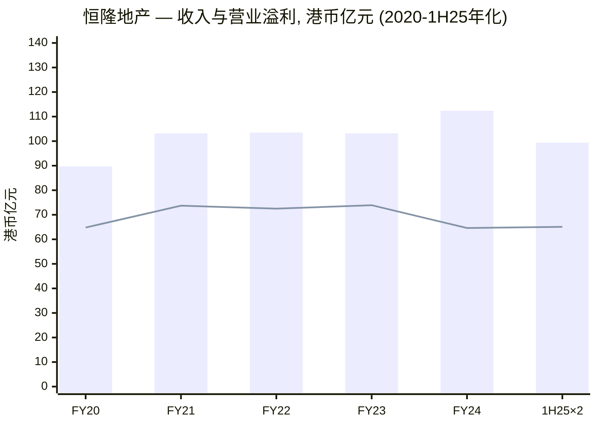
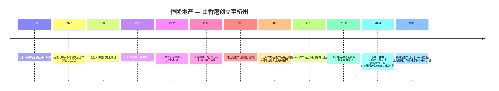
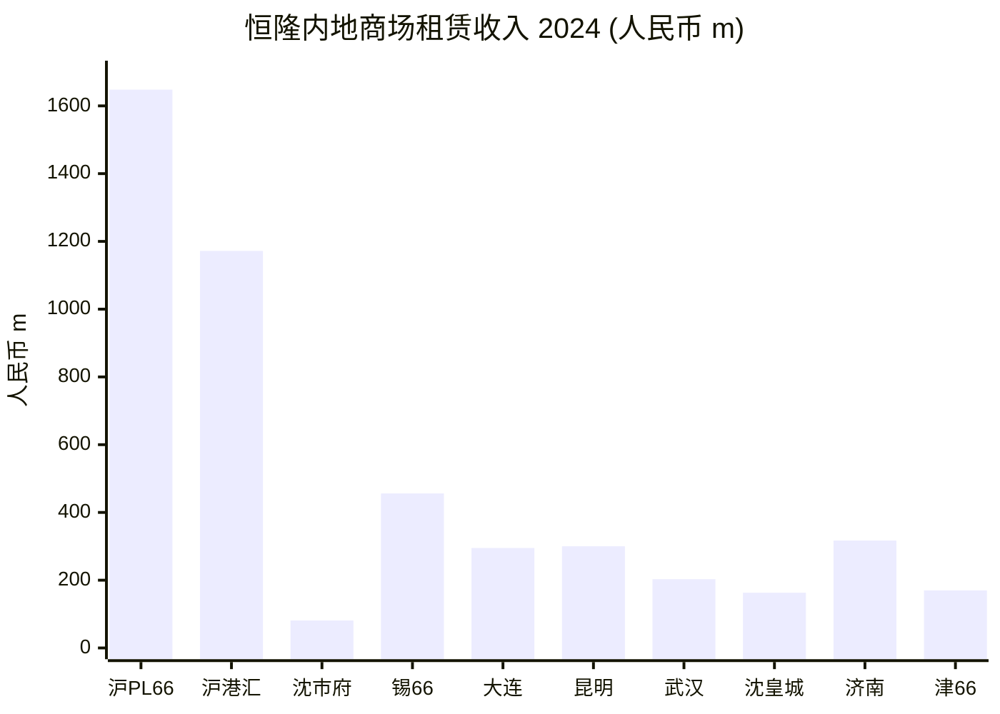
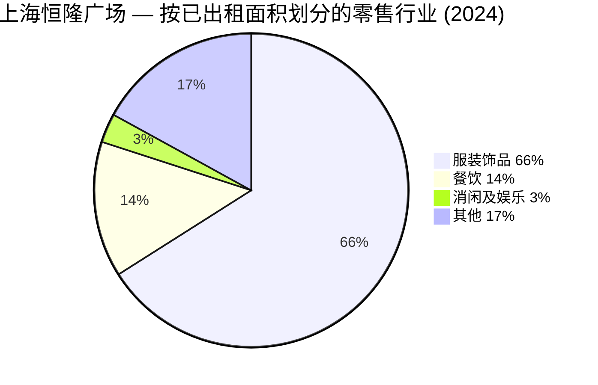
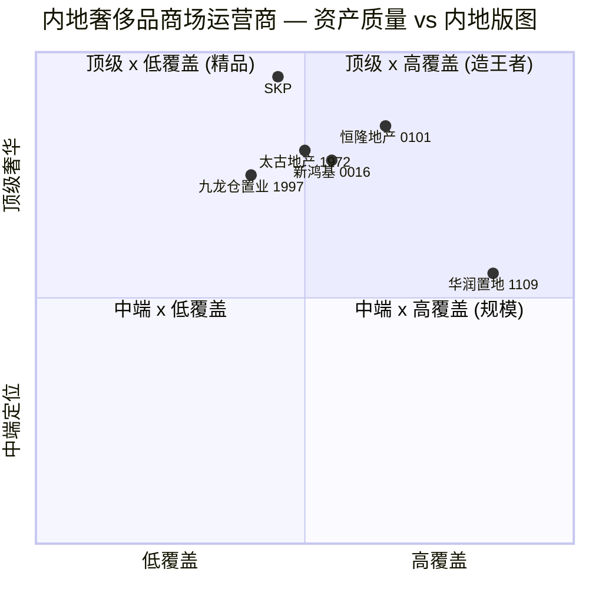
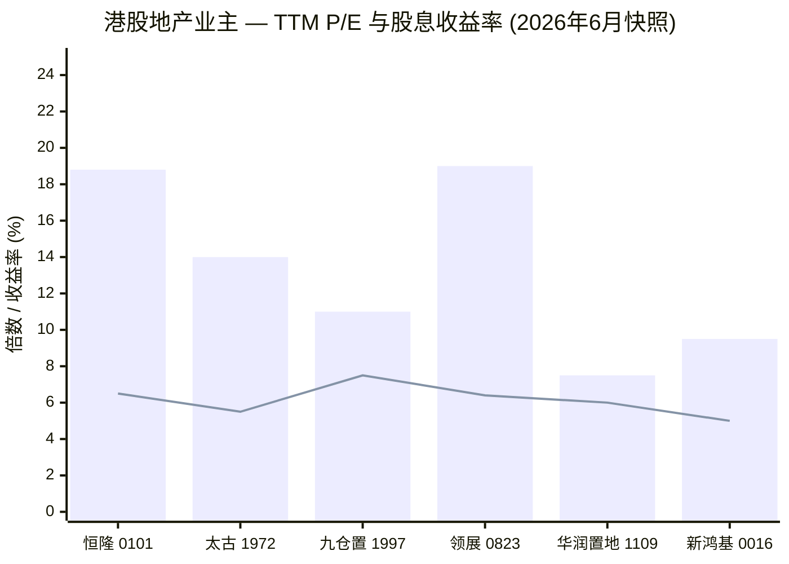
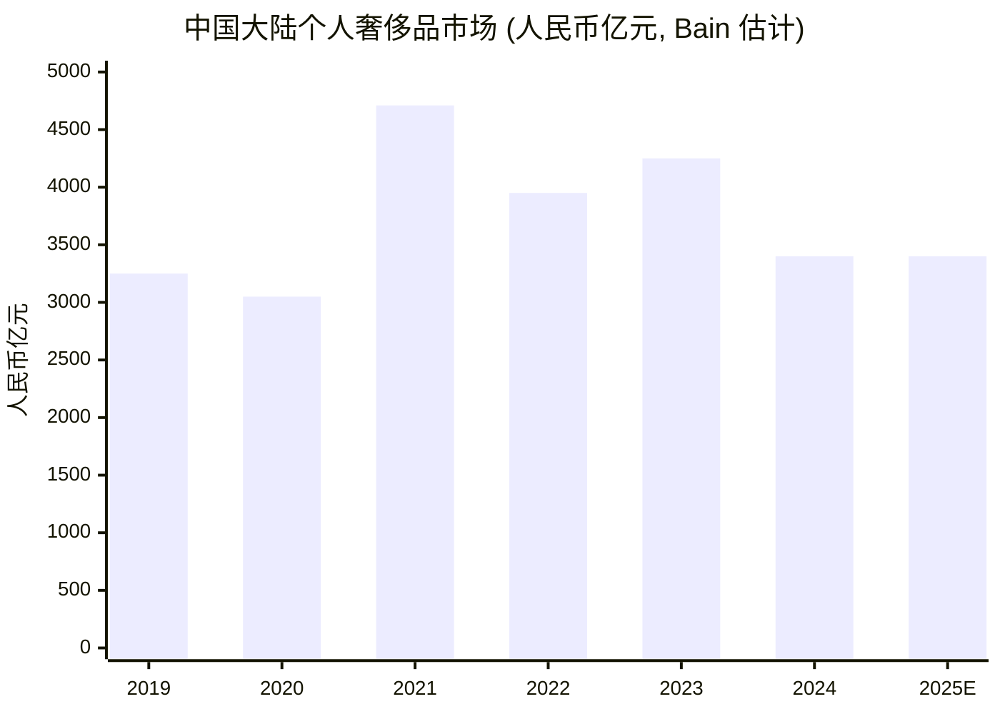

# 恒隆地产有限公司（HKEX: 0101）— 首次覆盖研究报告

*报告日期：2026-06-03。价格单位：港元。覆盖标的：恒隆地产有限公司 (Hang Lung Properties Limited, HKEX: 0101)。*

---

## 目录

1. 公司概览
2. 公司历史
3. 管理团队（创始人与现任 CEO）
4. 产品与服务 — 内地十座"66"商场
5. 客户与租户策略
6. 行业概览 — 内地奢侈品零售与香港办公楼市场
7. 竞争格局
8. 市场机会（TAM）
9. 风险评估
10. 投资视角评分卡（Buffett / Munger / Damodaran / Howard Marks）
11. 参考资料
12. 验证日志

---

## 1. 公司概览

恒隆地产有限公司（"恒隆地产"，HKEX: 0101）是陈氏家族控股恒隆集团（HKEX: 0010）旗下的核心地产业务实体，亦是香港历史最悠久的上市地产公司之一。公司在 [2024 年报（cninfo）](https://static.cninfo.com.cn/finalpage/2025-03-20/1222856189.PDF) 第 3 页明确自身定位为"一家具规模的顶级地产发展商"，秉持"只选好的　只做对的 / We Do It Well"的品牌承诺，物业组合涵盖香港和**内地九个城市 — 上海、沈阳、济南、无锡、天津、大连、昆明、武汉和杭州**（按开业年份排序）。所有内地物业均使用"恒隆广场 / Plaza 66"品牌，定位高端 ([2024 年报 第 3 页](https://static.cninfo.com.cn/finalpage/2025-03-20/1222856189.PDF))。

商业模式是典型的**核心地段零售加办公楼业主 (prime-location retail & office landlord)**：内地已落成的十个综合体（约 227 万平方米总楼面面积，不含车位），加上两个发展中项目（约 80 万平方米），再叠加香港的渣打银行大厦（中环）、Fashion Walk（铜锣湾）和家乐坊、雅兰中心（旺角）等核心物业。**租金 — 而非物业销售 — 是公司的主引擎。** 2024 年物业租赁收入 **港币 95.15 亿元**（占总收入 112.42 亿元的 84.6%），物业销售收入 15.38 亿元、酒店 1.89 亿元（[2024 年报 财务摘要 第 4 页](https://static.cninfo.com.cn/finalpage/2025-03-20/1222856189.PDF)）。

**估值快照（2026-06-02）。** 恒隆地产现价 **港币 8.00 元**，市值约 **51.6 亿美元（≈港币 403 亿元）**，**滚动市盈率 TTM P/E 18.79 倍**，**股息收益率 6.50%**，每股盈利 EPS 港币 0.43 元 ([Stoxray 0101 估值快照, 2026-06-02](https://stoxray.com/en/stocks/xhkg/0101))。从市净率 P/B 角度看折让幅度更为惊人：2024 年底每股净资产 (NAV) **港币 27.5 元**、2025 年中期 NAV 港币 26.6 元（[2024 年报 第 4 页](https://static.cninfo.com.cn/finalpage/2025-03-20/1222856189.PDF); [2025 中期报告 第 7 页](https://static.cninfo.com.cn/finalpage/2025-09-23/1224676413.PDF)）— 在港币 8.00 元的现价下，股票仅以 **约 0.30 倍 P/B** 交易，**远低于港股地产同业 0.35-0.40 倍的中位数**，亦是 0101 上市 13 年来最深的折让之一。18.8 倍的 TTM P/E 是盈利严重承压的结果（基本每股盈利由 2018 年港币 1.80 元下降至 2024 年港币 0.46 元，主要受物业重估亏损拖累）；从分析角度，**股息收益率、NAV 折让和净债项股权比率（33.4%）才是更有意义的锚定指标**。

**视角观点 (Lens view)**：当前的多重估值指标暗示两种极端可能 — 若内地奢侈品市场永不复苏，则这是一个 real-asset (实物资产) 价值陷阱；若 [2025 年中期董事长致股东函](https://static.cninfo.com.cn/finalpage/2025-09-23/1224676413.PDF) 中所述的"稳定迹象"持续兑现，则这是一个深度逆向投资 (contrarian) 的设置。

近五年的收入与营业溢利走势图，清晰展现了 2024 年的盘整深度、1H25 边际企稳的迹象，以及香港租赁业务的长期横盘形态：

*资料来源：[2024 年报 十年财务概览, 第 207 页 cninfo](https://static.cninfo.com.cn/finalpage/2025-03-20/1222856189.PDF); [2025 中期报告 第 7 页](https://static.cninfo.com.cn/finalpage/2025-09-23/1224676413.PDF)。1H25 数据 (收入港币 49.68 亿元 / 营业溢利港币 32.55 亿元) 为机械加倍呈现，并非管理层全年指引。*

---

## 2. 公司历史

**1960 年创立。** 恒隆于 **1960 年 9 月 13 日**由 **陈曾熙 (Chan Tseng-hsi) 先生**创立 — 陈先生 1948 年由广州移居香港，最初在永隆银行工作（[Hang Lung Stories — Chan Tseng-hsi](https://www.hanglung.com/en-us/about-us/hang-lung-stories/chan-tseng-hsi)）。陈曾熙先生为广东顺德人，公司首个总部设于中环余道生行 (Yu To Sang Building)。陈先生主导集团 26 年直至 1986 年辞世。其子 **陈启宗 (Ronnie Chan)** 于 **1991 年 1 月**接任董事长，掌舵集团内地扩张战略；**2024 年 4 月**，陈启宗升任为荣誉董事长，其子 **陈文博 (Adriel Chan)** 出任恒隆集团 (0010) 与恒隆地产 (0101) 董事长 — 完成了市场预期已久的第三代家族传承（[2024 年报 董事简介 第 122 页](https://static.cninfo.com.cn/finalpage/2025-03-20/1222856189.PDF); [36Kr — Third-generation Succession](https://eu.36kr.com/en/p/3413587224972674)）。

**1992 年战略性内地转向。** 恒隆首个内地项目 **上海恒隆广场 (Plaza 66)** 于 1992 年取得土地 — 这是一次有意的押注，认为相比已经拥挤的香港市场，内地一线城市的核心地段具有更大的复合增长潜力。这一战略已被验证：上海恒隆广场（现为旗舰商场）和上海港汇恒隆广场至今仍是公司两大单一收入来源 — 2024 年分别贡献 **人民币 16.48 亿元和 11.72 亿元**的租赁收入（[2024 年报 财务回顾 第 68-69 页](https://static.cninfo.com.cn/finalpage/2025-03-20/1222856189.PDF)）。董事长在 2025 中期致股东函中特别提到：**恒隆地产内地租赁收入由 1999 年起连续 24 年录得增长（直至 2023 年止）**，2024 年是其首次出现下跌 ([2024 年报 第 14 页](https://static.cninfo.com.cn/finalpage/2025-03-20/1222856189.PDF))。

**"66" 品牌的内地扩张，2000-2024。** 恒隆从 2000 年（上海恒隆广场）至 2024 年（杭州恒隆广场 / Westlake 66，办公楼自 2025 年底分阶段开业，商场 2026 年 4 月 28 日试营业）累计于内地开业 11 座综合体：上海 2 座、沈阳 2 座、济南、无锡、天津、大连、昆明、武汉，加上 2026 年的杭州。最近的两个增量 — 杭州恒隆广场和沈阳的康莱德酒店 — 被管理层定义为"恒隆 V.2"重资产时代。2025 年中期报告中，董事长正式提出 **"恒隆 V.3"** — 一种围绕现有资产开展小规模管理合约、扩建和资产优化的轻资产战略转型（[2025 中期报告 董事长致股东函 第 4-6 页](https://static.cninfo.com.cn/finalpage/2025-09-23/1224676413.PDF)）。

*资料来源：[Hang Lung Corporate Milestones](https://www.hanglung.com/en-us/about-us/corporate-milestones); [2024 年报 第 122 页](https://static.cninfo.com.cn/finalpage/2025-03-20/1222856189.PDF); [2025 中期报告 第 4 页](https://static.cninfo.com.cn/finalpage/2025-09-23/1224676413.PDF); [Alvinology 2026-03-30](https://alvinology.com/2026/03/30/hang-lungs-westlake-66-commences-soft-opening-on-april-28/)。*

1992 年的内地转向和 2024 年的董事长交接是恒隆历史上两个最具决定性的节点。两者都在财务数据上留下了清晰印记：2000 年后的内地扩张将内地租赁收入由 0 提升至 2024 年集团租赁收入的三分之二以上；而 **2024 年的董事长交接恰好与后疫情时代奢侈品消费的回吐期、以及内地租赁首次下跌叠加**，使新任董事长陈文博的"恒隆 V.3"战略转型承受了不同寻常的市场关注。

---

## 3. 管理团队

**根据 company-research 技能规范，本节仅介绍创始人与现任 CEO，其他高管 — 包括现任董事长陈文博、首席财务总监赵家驹、独立非执行董事等 — 均不在本节展开。所有其他高管均在 2024 年报中具名披露。**

### 创始人 — 陈曾熙 (Chan Tseng-hsi, 1923?–1986)

陈曾熙先生于 1960 年 9 月 13 日在香港创立恒隆。他出生于广东顺德，**"1948 年由广州移居香港，最初在永隆银行 (Wing Lung Bank) 开始职业生涯"**（[Hang Lung Stories — Chan Tseng-hsi](https://www.hanglung.com/en-us/about-us/hang-lung-stories/chan-tseng-hsi)）。官方传记形容他"极具企业家精神"，其经营哲学被儿子陈进强 (Andy Chan) 译述为 **"Give me a broom and I'll sweep cleaner than any other"**（给我一把扫帚，我会比任何人扫得更干净）— 一种"做小事亦要做到最好"的理念，至今仍被公司视为现代"只选好的　只做对的"品牌承诺的起源。在恒隆之前，陈先生 1950 年代初与林汝衡先生、陈德泰先生及康有为先生两位侄子合伙创办**大隆地产公司 (Dah Loong Company)**；由于经营理念分歧、林汝衡先生过世以及陈德泰先生离开，陈曾熙先生最终独立创办恒隆。公司官方传记记载："他是众多创意的发明者，许多事项均开香港之先河，如 Hello Kitty 引入和 Caltex 加德士的香港独家代理权"（[Hang Lung Stories](https://www.hanglung.com/en-us/about-us/hang-lung-stories/chan-tseng-hsi)）。

陈先生掌舵集团 26 年，至 1986 年辞世。集团首数十年以香港业务为主 — 旺角、铜锣湾、尖沙咀等地的投资物业 — 其后由两位儿子（陈启宗 / Ronnie Chan 与陈乐宗 / Gerald Chan）于 1992 年开启内地扩张。**持股结构**：陈氏家族通过恒隆集团 (HKEX: 0010) 持有恒隆地产 (HKEX: 0101) 控股权益，公众持股 (free float) 占 2024 年底**约 35.39%**（[2024 年报 企业管治报告 第 120 页](https://static.cninfo.com.cn/finalpage/2025-03-20/1222856189.PDF)）。

### 现任 CEO — 卢韦柏 (Weber Lo, 1971 年生)

卢韦柏先生于 2018 年 5 月加入恒隆出任 CEO-designate（候任行政总裁），并于 2018 年 7 月正式出任恒隆地产 (0101) 及母公司恒隆集团 (0010) 的 **行政总裁 (Chief Executive Officer)**。2024 年报披露时他 **54 岁**（[2024 年报 董事简介 第 122 页](https://static.cninfo.com.cn/finalpage/2025-03-20/1222856189.PDF)）。官方简介："**卢先生拥有超过 30 年的管理经验，期间主要任职于银行业及快速消费品行业，丰富经验遍及香港及内地**。"

他此前的主要 2-3 份职务涵盖花旗 (Citi)（曾领导香港及澳门零售银行业务，并入选亚洲最具影响力的银行家名单）、可口可乐 (Coca-Cola)（大中华区多个管理职位）和百事可乐 / 乐事 (PepsiCo / Frito-Lay)（早期事业）。当时董事长陈启宗的这一选择具有清晰的战略意图：**将零售与品牌纪律 (retail & brand discipline) 引入地产业务** — 奢侈品商场的核心竞争同样取决于品牌经营的语言能力，陈氏家族需要一位能与品牌端旗舰承租人 (anchor tenants) 平等对话的 CEO。卢先生 1993 年于香港大学取得社会科学学士学位。他亦担任赛马会文物保育有限公司（大馆）咨询委员会委员及香港赛马会遴选会员（[2024 年报 第 122 页](https://static.cninfo.com.cn/finalpage/2025-03-20/1222856189.PDF)）。

卢先生任内有三个最关键的战略动作：(a) 在内地全部商场推广 **"恒隆会"分级会员制 (tier-based luxury VIP membership)** — 2024 年报业务回顾多次将其列为商场在弱势市场中维持租户销售韧性的核心杠杆；(b) 对上海恒隆广场、上海港汇恒隆广场、无锡恒隆广场等核心资产实施的多年期 **资产优化计划 (AEI)**；(c) 与现任董事长陈文博共同提出的 **"恒隆 V.3"轻资产扩张战略** — 以 2025 年 6 月公布的 **杭州百大集团合作项目**为奠基（[2025 中期报告 董事长致股东函 第 4-6 页](https://static.cninfo.com.cn/finalpage/2025-09-23/1224676413.PDF)）。其薪酬结构与股权激励详情披露于每一份年报的企业管治报告；35.39% 的公众持股结构意味着陈氏家族通过 0010 的表决权仍居决定性地位。

---

## 4. 产品与服务 — 内地十座"66"商场 + 香港旗舰组合

**这是本报告最重要的一节。** 恒隆的"产品"是不动产 — 但其颗粒度远比多数投资者所认知的更细。公司将 **具体城市中心的具体平方米**租赁给 **具体的奢侈品品牌**，并采用 **具体的租约结构 (lease structure)**。**上海恒隆广场（99% 出租率，2024 年 16.48 亿人民币租赁收入，国际旗舰 Hermès / LV / Dior / Chanel 之选）与武汉恒隆广场（85% 出租率，2.03 亿人民币，–19% 同比）之间的差异，就是整个投资命题的缩影。**

### 4.1 内地"66"商场组合 — 已落成 10 座 + 在建 2 座

恒隆内地已落成投资物业总楼面面积 **约 227 万平方米**（不含车位），分布于十个综合体；发展中物业另有 **约 80 万平方米**（[2024 年报 业务回顾 第 33 页](https://static.cninfo.com.cn/finalpage/2025-03-20/1222856189.PDF)）。每个综合体均包含一座高端商场，加上一座或多座甲级办公楼；近期项目还加入酒店和服务式公寓。下表数据直接引自 2024 年报"项目摘要"（业务回顾第 24-28 页），均为发行人原始披露。

| 物业 | 城市 | 总楼面 (平方米) | 零售 % | 办公楼 % | 酒店 % | 住宅/服寓 % | 车位 |
|---|---|---|---|---|---|---|---|
| 上海恒隆广场 | 上海 | 213,255 | 25% | 75% | – | – | 804 |
| 上海港汇恒隆广场 | 上海 | 273,427 | 45% | 25% | – | 30% | 752 |
| 沈阳皇城恒隆广场 | 沈阳 | 109,307 | 100% | – | – | – | 844 |
| 沈阳市府恒隆广场 | 沈阳 | 293,905 | 35% | 45% | 20% | – | 2,001 |
| 济南恒隆广场 | 济南 | 171,074 | 100% | – | – | – | 785 |
| 无锡恒隆广场 | 无锡 | 259,770 | 47% | 53% | – | – | 1,292 |
| 天津恒隆广场 | 天津 | 221,900 | 100% | – | – | – | 1,214 |
| 大连恒隆广场 | 大连 | 152,831 | 100% | – | – | – | 800 |
| 昆明恒隆广场 | 昆明 | 综合体 (含君悦酒店) | 多元 | 有 | 331 间 | 有 | – |
| 武汉恒隆广场 | 武汉 | 综合体 (含恒隆府住宅) | 多元 | 有 | – | 有 | – |
| 杭州恒隆广场 (2026 试营业) | 杭州 | ~390,200 | 多元 | 5 座甲级 | 194 间 (MO) | – | – |
| 无锡恒隆广场二期 (在建) | 无锡 | 7,165 | – | – | Curio Hilton | – | – |

*资料来源：[2024 年报 业务回顾 第 24-28 页](https://static.cninfo.com.cn/finalpage/2025-03-20/1222856189.PDF); [Hang Lung 2026-03-30 杭州恒隆广场公告 (Alvinology)](https://alvinology.com/2026/03/30/hang-lungs-westlake-66-commences-soft-opening-on-april-28/)。*

**2024 年商场租赁收入排行表** — 是分析师案头最重要的一张表，揭示了哪些资产支撑了集团收入、哪些资产承压：

| 商场 | 定位 | 2024 收入 (人民币 m) | 同比 % | 2024 出租率 | 2023 出租率 |
|---|---|---|---|---|---|
| 上海恒隆广场 | 高端 | 1,648 | –6% | **99%** | 100% |
| 上海港汇恒隆广场 | 高端 | 1,172 | –3% | 99% | 99% |
| 沈阳市府恒隆广场 | 高端 | 81 | –16% | 87% | 81% |
| 无锡恒隆广场 | 高端 | 456 | +2% | 99% | 98% |
| 大连恒隆广场 | 高端 | 295 | +8% | 94% | 90% |
| 昆明恒隆广场 | 高端 | 300 | –2% | 98% | 98% |
| 武汉恒隆广场 | 高端 | 203 | **–19%** | 85% | 82% |
| **高端商场小计** | | **4,155** | **–4%** | | |
| 沈阳皇城恒隆广场 | 次高端 | 163 | +3% | 94% | 90% |
| 济南恒隆广场 | 次高端 | 317 | +1% | 93% | 93% |
| 天津恒隆广场 | 次高端 | 170 | +12% | 95% | 90% |
| **次高端商场小计** | | **650** | **+4%** | | |
| **内地商场组合合计** | | **4,805** | **–3%** | | |

*资料来源：[2024 年报 财务回顾 第 68 页](https://static.cninfo.com.cn/finalpage/2025-03-20/1222856189.PDF)。所有数字以人民币百万元计；"高端 / 次高端"分类为发行人自身的披露分类（"高端商场 / 次高端商场"）。*

*资料来源：[2024 年报 财务回顾 第 68 页](https://static.cninfo.com.cn/finalpage/2025-03-20/1222856189.PDF)。*

**每座商场的三个解读维度 — 它们到底是什么。**

旗舰 **上海恒隆广场**是"中国奢侈品的精神家园" — 南京西路的五层综合体云集 **100 多家国际奢华品牌**，包括 Hermès 的上海扩建旗舰店、Loro Piana 的全球首家沙龙、Schiaparelli 亚洲首家期间限定店，以及预计 2025 年开业的**内地规模最大的 Chanel 门店**（[2024 年报 第 34 页](https://static.cninfo.com.cn/finalpage/2025-03-20/1222856189.PDF)）。其产品角色是**锚定品牌磁石 (anchor brand magnet)**：在 2024 年高端零售消费下降的极端环境下，租户销售额下跌 22%，但商场依然保持 99% 出租率 — 这证明品牌承租人无法承受不在恒隆广场展店的代价，即便在销售租金步降的情况下亦不撤店。**Pavilion Extension**（扩建部分）将增加 **+13% 可租赁面积**，2025 年 6 月封顶、2026 下半年开业 — 这是市场低估的中期催化剂，将实质性地扩大其高利润核心面积。

**上海港汇恒隆广场**（位于上海西南徐家汇地铁枢纽之上的姐妹商场）是 **"Gateway to Inspiration"** 互补定位 — 在上海恒隆广场的纯顶级奢华以外，提供更广阔的奢华、时尚、美妆、珠宝钟表、运动、数码及童装等品类。商场迎来 **POPOP** — 泡泡玛特 (Pop Mart) 首家珠宝店 — 这一 2025 年的关键租户胜利，生动佐证了董事长在 2025 年中期函中重点提及的"**新消费 (new consumption)**"浪潮（[2025 中期报告 第 4 页](https://static.cninfo.com.cn/finalpage/2025-09-23/1224676413.PDF)）。商场亦包含一座 500+ 间套房的服务式公寓综合体（正升级为 148 间客房的 Kimpton 上海徐家汇酒店）— 实现租金以外的收入多元化。

**无锡、大连、昆明、武汉**四个高端商场属于 **二线旗舰** — 通常是当地排名第一的高端商场，但各自处于不同的成熟阶段。无锡恒隆广场（最早开业的 2014 年项目）以 99% 出租率和 +2% 收入增长，是教科书式的成熟资产。大连恒隆广场 +8% / 94% 反映了租户组合的持续优化。武汉以 –19% 收入和 85% 出租率成为最弱者 — 直接受到竞争对手"20% 折扣价格战"的冲击，董事长在 2024 年报第 18 页特别将其列为本年度最值得关注的单一负面微观事件（[2024 年报 第 18 页](https://static.cninfo.com.cn/finalpage/2025-03-20/1222856189.PDF)）。

**次高端补充组合**（沈阳皇城、济南、天津）位于较次的城市区位，定位"时尚生活"客群，租户组合包含更丰富的餐饮、儿童及娱乐配套。**次高端组合 2024 年增长 +4%，与高端组合 –4% 形成鲜明对比** — 这一数据直接反驳了"中国奢侈品全面崩塌"的市场叙事，凸显了组合结构远比宏观标题更为重要。

**沈阳市府恒隆广场**（首家自有酒店 — 沈阳康莱德酒店位于办公楼顶部 19 层）是公司最复杂的混合用途垂直综合体：零售 + 甲级办公楼 + 315 间客房康莱德豪华酒店同一外壳之内。2024 年办公楼出租率 87%（[2024 年报 第 25 页](https://static.cninfo.com.cn/finalpage/2025-03-20/1222856189.PDF)）— 在更广泛的内地甲级办公楼供过于求背景下仍保持坚韧。

**杭州恒隆广场（2026 年 4 月试营业）**是集团第十一个综合体，亦是公司迄今建成的最大单体项目 — 390,200 平方米总楼面，包括五座甲级办公楼和 194 间客房的**杭州文华东方酒店**（浙江省首家文华东方）。办公楼自 2025 年底分阶段开业；商场 2026 年 4 月 28 日试营业（[Manila Times, 2026-03-30](https://www.manilatimes.net/2026/03/30/tmt-newswire/media-outreach-newswire/hang-lungs-westlake-66-commences-soft-opening-on-april-28/2310223)）。这是 2026/2027 年分析师模型中最大的单一租赁收入增长来源。

### 4.2 香港物业组合 — 渣打银行大厦、Fashion Walk、社区商场

香港组合 2024 年贡献 **港币 30.49 亿元租赁收入（同比 –9%）**，分四个子组合：中环办公楼组合（渣打银行大厦、都爹利街一号、印刷行、乐成行 — 合计 50,041 平方米，79% 办公 / 21% 零售）；铜锣湾组合（Fashion Walk — 涵盖 Paterson、Food Street、Kingston 三大区域，加恒隆中心）；旺角组合（家乐坊、雅兰中心 — 89,815 平方米，68% 办公 / 32% 零售）；以及 Plaza Hollywood 和 Amoy Plaza（钻石山和九龙湾的社区商场）（[2024 年报 业务回顾 第 30-31 页](https://static.cninfo.com.cn/finalpage/2025-03-20/1222856189.PDF)）。香港组合的战略角色是**股息压舱石 (dividend ballast)** — 中环优质办公楼长租约和铜锣湾旅客零售的稳定收入。它已超过十年未成为增长驱动力。

### 4.3 产品组合树状图

```mermaid
graph TD
    A[恒隆地产 0101]
    A --> B[内地租赁业务]
    A --> C[香港租赁业务]
    A --> D[物业销售]
    A --> E[酒店业务]
    B --> B1[上海恒隆广场 — 高端旗舰]
    B --> B2[上海港汇恒隆广场]
    B --> B3[沈阳市府恒隆广场]
    B --> B4[沈阳皇城恒隆广场 — 次高端]
    B --> B5[济南恒隆广场 — 次高端]
    B --> B6[无锡恒隆广场]
    B --> B7[天津恒隆广场 — 次高端]
    B --> B8[大连恒隆广场]
    B --> B9[昆明恒隆广场]
    B --> B10[武汉恒隆广场]
    B --> B11[杭州恒隆广场 — 2026开业]
    C --> C1[中环 — 渣打银行大厦]
    C --> C2[铜锣湾 — Fashion Walk]
    C --> C3[旺角 — 雅兰中心]
    C --> C4[社区 — Plaza Hollywood / Amoy Plaza]
    D --> D1[香港住宅 — The Aperture / 蓝塘道]
    D --> D2[内地 — 武汉恒隆府 / 无锡恒隆府]
    E --> E1[沈阳康莱德 315间]
    E --> E2[昆明君悦 331间 — 2024年8月开业]
    E --> E3[杭州文华东方 194间 — 2026/27开业]
    E --> E4[无锡 Curio Hilton — 2026年1H开业]
    E --> E5[上海徐家汇 Kimpton — 即将]
```

*资料来源：[2024 年报 业务回顾 第 24-55 页](https://static.cninfo.com.cn/finalpage/2025-03-20/1222856189.PDF); [2025 中期报告 第 10-28 页](https://static.cninfo.com.cn/finalpage/2025-09-23/1224676413.PDF)。*

### 4.4 产品综合 — 各类产品如何相互作用

恒隆的飞轮逻辑：**建设一座商场使其成为该城市第一高端目的地 → 第一高端商场成为顶级品牌唯一必须进驻的地址 → 顶级品牌联营效应支撑同一综合体中甲级办公楼的溢价定价 → 优质办公楼租户支撑酒店与公寓的垂直延伸 → 酒店与公寓带来的礼宾级服务再次提升商场的尊贵气质。** "轻资产 V.3"转型将该飞轮**横向扩展**（管理临近街铺、合作邻近百货、商场扩建）— 而非垂直新建 — 大幅降低了每增量 NOI（净营运收入）对应的资本支出。

---

## 5. 客户与租户策略

### 5.1 租户集中度与披露情况

港股上市地产公司通常**不**披露 A 股发行人所要求的前五大租户表。恒隆 2024 年报未披露最大单一租户或单一租户占比；披露范围为 **每座商场按已出租面积分类的零售行业分布**（"零售行业的性质分布"饼图，见第 34-45 页）。每座高端商场中，**服装饰品**占已出租面积的 60-70%，余下分别为餐饮 (15-25%)、消闲及娱乐 (3-10%) 和其他类别（[2024 年报 第 34-45 页](https://static.cninfo.com.cn/finalpage/2025-03-20/1222856189.PDF)）。**没有单一租户披露占合并收入超过 10%；合并层面的前五大客户集中度亦未单独披露。** 这是一项真实存在的披露空白，本报告将其列入验证日志的"剩余未明"项。

但年报*确实*披露的，以及作为有效集中度替代指标的，是 **每座商场具体披露的奢侈品锚定租户名单**。上海恒隆广场具名提及的有 Hermès（扩张旗舰店）、Dior（升级门店）、LOEWE（升级门店）、Loro Piana（全球首家沙龙）、Schiaparelli（亚洲首家期间限定店）、Manolo Blahnik、Eleventy，以及预计 2025 年开业的内地规模最大的 Chanel 门店（[2024 年报 第 34 页](https://static.cninfo.com.cn/finalpage/2025-03-20/1222856189.PDF)）。上海港汇恒隆广场具名提及 Bulgari、Buccellati、Max Mara（升级复式精品店）、Marco Bicego、Montbell（[2024 年报 第 35 页](https://static.cninfo.com.cn/finalpage/2025-03-20/1222856189.PDF)）。大连恒隆广场单独增加了 40 多家市场首店 — Tom Ford、Vivienne Westwood、Mardi Mercredi、Salomon、Jo Malone、Moose Knuckles，以及美妆类的 Helena Rubinstein、Lancôme、La Mer、Dior Beauty、Giorgio Armani、YSL、Lululemon、The North Face、Kolon Sport（[2024 年报 第 41 页](https://static.cninfo.com.cn/finalpage/2025-03-20/1222856189.PDF)）。总体暴露因此是**集中的奢侈品品牌群体 (luxury-brand-cohort)**，而非具体的具名客户集中度。

### 5.2 恒隆会 — 会员运营引擎

最重要的单一客户策略资产是 **"恒隆会" (Hang Lung Club)** — 由 CEO 卢韦柏先生于 2018-2024 年在所有内地商场推广的分级 VIP 会员体系。每座商场的业务回顾均描述了恒隆会如何为顶级消费会员提供"money-can't-buy"的体验式权益；2024 年报多次将恒隆会列为在更广泛奢侈品市场放缓背景下深化高端客群消费的核心抓手（[2024 年报 业务回顾 第 33-45 页](https://static.cninfo.com.cn/finalpage/2025-03-20/1222856189.PDF)）。**香港的对应方案是"hello 恒隆商场奖赏计划"**（社区商场奖励计划）。会员总数未单独披露，但每个讨论了"会员销售额"的商场均报告该指标同比上升。

### 5.3 按已出租面积划分的客群结构（以上海恒隆广场为例）

*资料来源：[2024 年报 第 34 页](https://static.cninfo.com.cn/finalpage/2025-03-20/1222856189.PDF)。分母为上海恒隆广场单一商场已出租面积，非集团合并层面。*

### 5.4 收入与客户地域分布

2024 年内地贡献 **港币 64.66 亿元租赁收入（68%）**、香港 30.49 亿元（32%）；若计入物业销售，内地贡献港币 67.11 亿元（60%）、香港 45.31 亿元（40%）— 这是由于香港住宅项目交付所致。**内地组合中，仅上海两座资产就占内地商场收入的约 58%** — 这一地理集中度是单一最大的客户基础风险。

---

## 6. 行业概览 — 内地奢侈品零售与香港办公楼

### 6.1 内地奢侈品零售 — 2024 年回吐、2025 年企稳

内地奢侈品市场 **2024 年同比下跌 18-20%**，水平退回 2020 年低位，所有奢侈品品类均出现下跌，珠宝钟表 (jewelry / watches) 类目压力最为严峻（[Bain China Luxury Report 2024](https://www.bain.com/insights/2024-china-luxury-goods-market/)）。主要驱动因素：(i) 受持续的房地产市场调整和就业焦虑影响，消费者信心持续低迷；(ii) 中国游客境外奢侈品消费回升 — **2024 年占中国奢侈品消费总额约 40%（2023 年仅约 18%）** — 日本是单一最大的受益目的地（[Bain 2025-01 报告](https://www.businessoffashion.com/news/china/chinese-luxury-sales-expected-to-remain-flat-in-2025-report-says/); [2024 年报 董事长致股东函 第 16 页](https://static.cninfo.com.cn/finalpage/2025-03-20/1222856189.PDF)）。

Bain 2025 年 1 月的展望预测 **2025 年大致持平 — 上半年同比仍负、下半年改善**。恒隆 2025 年中期业绩公告（2025 年 7 月底）大致验证了这一轨迹：内地租户销售额按人民币计同比仅下跌 1%（对比 2024 年的 –14%），整体商场出租率维持 **94%**（[2025 中期报告 第 7-11 页](https://static.cninfo.com.cn/finalpage/2025-09-23/1224676413.PDF); [Bain 2025-01 China luxury outlook](https://www.bain.com/about/media-center/press-releases/2024/luxury-market-in-mainland-china-to-stay-flat-in-2025/)）。

董事长在 2024 年报第 17 页对内地奢侈品深度的分析罕见地清醒："**与 2019 年（疫情前）相比，2024 年的同类、同店销售额仍增长了近 100%；若包含新店，2019 与 2024 年的奢侈品销售额相差超过 125%；只计算最顶级品牌，销售额增长接近 200%**"（[2024 年报 第 17 页](https://static.cninfo.com.cn/finalpage/2025-03-20/1222856189.PDF)）。这一论述将 2024 年的下跌定义为 **从超常规 2020-2023 基期回归均值 (mean reversion)**，而非结构性崩塌。

### 6.2 香港商业地产 — 供给驱动的甲级办公楼承压

香港甲级办公楼市场面临结构性供给过剩：中环新楼宇相继落成、内地企业撑起的需求疲弱、本地居民出境消费转移侵蚀了旅客零售。恒隆香港办公楼组合的出租率由 2024 年底的 89% 微降至 1H25 末的 87%；1H25 零售租户销售额下跌 2%、租赁收入下跌 7%（[2025 中期报告 第 11 页](https://static.cninfo.com.cn/finalpage/2025-09-23/1224676413.PDF)）。

### 6.3 行业结构 — 碎片化的城市奢侈品业主市场

内地奢侈品商场市场虽然碎片化，但每个城市都有明显的本地领头羊：北京、西安、武汉的 SKP；多个城市的华润万象城 (China Resources MIXC)；成都、北京三里屯、上海前滩的太古里 (Swire Taikoo Li)；上海 IFC / IAPM（新鸿基）；尖沙咀海港城和成都国金中心（九龙仓）；以及一些较小的国资奢侈品商场运营商（如上海的久光、杭州的万象天地等）。**恒隆的定位**：在按总楼面面积和品牌阵容衡量的内地奢侈品业主中位居前三，是除 SKP 以外品牌定位最集中的"66"统一品牌战略。

*资料来源：分析师基于各公司 2024 年报披露物业组合的定性定位判断；坐标为示意性，非精确测量。*

### 6.4 "泡泡玛特 / 老铺黄金 / 蜜雪冰城"新消费信号

董事长在 2025 中期函第 4 页将这一现象由案例上升为论点：**三个内地消费品牌 — 老铺黄金 (Lao Pu Gold, 金器及金饰)、泡泡玛特 (Pop Mart, LABUBU 收藏玩偶)、蜜雪冰城 (Mixue, 奶茶及雪糕)** — 在 2024-2025 年的爆炸式增长几乎全赖**线下实体零售**，线上贡献接近为零。恒隆是泡泡玛特的早期业主（天津恒隆广场自 2014 年起），泡泡玛特的首个珠宝子品牌 **POPOP** 于 2025 年落户上海港汇恒隆广场（[2025 中期报告 第 4 页](https://static.cninfo.com.cn/finalpage/2025-09-23/1224676413.PDF)）。**核心含义**：当中国消费者由进口超奢华品向同时强调"情绪价值与经济价值"的本土"新消费"品牌轮动时，具备正确租户筛选能力的核心地段业主很可能是这一轮转的**受益者，而非受害者**。

---

## 7. 竞争格局

### 7.1 直接竞争对手 — 高端内地商场业主

**太古地产 (HKEX: 1972)** — 香港注册、1972 年成立，2024 年收入港币 144.28 亿元（–2%），内地组合以成都太古里、北京三里屯、上海 HKRI Taikoo Hui、广州太古汇为核心（[Swire Properties 2024 Annual Results announcement](https://www.swireproperties.com/-/media/files/swireproperties/publications/2024-annual-results/2024-annual-results-announcement-en.ashx)）。内地业务 2023 年贡献毛租金收入约 40%（[Statista 2023 segment](https://www.statista.com/statistics/1036969/china-swire-properties-revenue-by-segment/)）。定位偏"生活方式奢华"，内地覆盖较恒隆小但更集中于一线城市目的地。

**九龙仓置业 (HKEX: 1997)** — 2017 年从九龙仓集团分拆上市，旗下港岛海港城、铜锣湾时代广场、会德丰大厦、卡佛大厦、Plaza Hollywood（与恒隆 Plaza Hollywood 同名但属不同业主）、Murray 酒店。2024 年收入港币 129 亿元（–3%），租金收入港币 108 亿元（–1%）；海港城单体 91 亿元，占总收入 70%。净债务港币 342 亿元，**18.2% 的负债率 — 明显低于恒隆的 33.4%**（[Wharf REIC 2024 Final Results, 2025-03-10](https://www.wharfreic.com/storage/fm/Announcement/2025-03/250310-wharf-reic-2024-final-results-e.pdf)）。

**领展房产基金 (HKEX: 0823)** — 亚洲最大房地产投资信托，FY2024/25 收入港币 142.23 亿元（同比 +4.8%）、每单位分派 DPU 272.34 港仙（同比 +3.7%）、净债务率 21.5%。以香港社区零售为主，近年向内地和新加坡扩张。**REIT 架构（每年 90% 强制分派）** — 与恒隆是不同的投资工具，但对港股零售业主投资者是相关替代品（[Link REIT FY24/25 annual report](https://www.linkreit.com/-/media/linkreit/investor-relations/financial-reports-and-presentations/financial-report/2025/annual-report-2425-e-book-1.pdf)）。

**华润置地 (HKEX: 1109)** — 内地央企背景，覆盖约 70 个城市的 MIXC 万象城商场组合，定位偏"轻奢 + 大众"，开发业务规模远大于恒隆。在一线 / 二线城市内地商场赛道是直接竞争对手（深圳万象城等）。

**SKP（私营）** — 内地单店奢侈品销售第一（北京 SKP 多次登顶全球单店奢侈品销售榜）。**与上海恒隆广场最接近的单店对标**。无法直接投资。

**新鸿基地产 (HKEX: 0016)** — 香港 IFC、上海 IAPM、ITC 的运营商。以香港为主但内地高端商场组合亦不弱。总规模大于恒隆；内地纯奢侈品定位不及恒隆集中。

**间接 / 新兴：**
- **久光 / Cellar 88** — 上海本土高端百货 / 商场运营商
- **万象天地** — 杭州本土高端商场
- **SCEG / TPC** — 内地二线城市国资奢侈品商场开发商
- **台北 101 / K11**（郑志刚 / 新世界）— 大中华生活方式商场运营商

### 7.2 同业估值快照

*资料来源：恒隆 TTM P/E 来自 [Stoxray 0101 (2026-06-02)](https://stoxray.com/en/stocks/xhkg/0101)；同业数据交叉核对自上文引用的各公司 2024-25 财务报告；柱状图 = TTM P/E，折线 = TTM 股息收益率，数值精确到一位小数。*

### 7.3 恒隆的定位

*分析师观点 (Analyst view)：* **恒隆是港股地产业主中最纯粹的内地奢侈品商场标的** — 太古更偏生活方式奢华、九龙仓置业以香港业务为主、领展是社区零售、华润置地是开发商 + 轻奢综合体。**代价**：恒隆是对内地奢侈品周期波动暴露最大的标的。**收益**：当周期反转时，恒隆是重估弹性 (re-rating optionality) 最强的标的。恒隆的内地覆盖（10 座内地商场 vs 太古 4 座）给予其最广阔的二线 / 三线扩张跑道；恒隆的内地奢侈品品牌关系深度仅次于 SKP。**以上定位主张均未在 2024 年报中逐字出现 — 它们是基于披露的物业组合名册由分析师重建的判断。**

**转换成本与护城河**：奢侈品品牌在内地面临极高的关系特定 (relationship-specific) 转换成本（多年期租约、品牌门店装修投资、锚定品牌联营效应）。一旦 Hermès 和 Dior 进驻上海恒隆广场，竞争对手商场撬动它们的边际成本即变得极高 — 这是恒隆能保持 99% 出租率，并能在下行年份依然提高基本租金的根源。

---

## 8. 市场机会（TAM）

### 8.1 内地高端零售 TAM

内地个人奢侈品市场 2023 年约为 **人民币 4,250 亿元**，2024 年回落至约 **人民币 3,400 亿元**（–20%），数据来源为 Bain & Company 2024 年中国奢侈品市场报告（[Bain 2024-01](https://www.bain.com/insights/2024-china-luxury-goods-market/); [Jing Daily 2025 luxury outlook](https://jingdaily.com/posts/global-luxury-market-shrinks-by-50m-customers-bain)）。Bain 2025 年 1 月展望预测 **2025 年大致持平（上半年同比仍负、下半年同比转正）**，中期论点维持不变：中高收入阶层收入提升、消费分层精细化（"情绪价值"品牌）、境外奢侈品消费回流至海南免税与一线城市商场。

恒隆 2024 年内地零售租赁收入约 **人民币 48.05 亿元**。即便在 2024 年压抑的 TAM 下，这一规模相当于内地奢侈品消费总额的 **1.4% 转化为租金** — 相对适度但稳定的份额，鉴于恒隆主要捕获的是租金（而非销售），且不同城市的份额各异。**多头观点**：随着周期企稳（1H25 已显示这一迹象），上海、无锡、大连、昆明等 99% 出租率商场将能在销售租金回复后，在中期实现 +3-5% 的实质租金复合增长。

*资料来源：[Bain China Luxury Report 2024 (Jan 2025)](https://www.bain.com/insights/2024-china-luxury-goods-market/) — 数据为 Bain 各年度分段估计经四舍五入。*

### 8.2 香港办公楼与旅客零售 TAM

恒隆香港 30.49 亿元租赁收入约相当于香港商业租赁市场总楼面面积的 1.5%。**香港 TAM 结构性持平** — 供给增长（中环、鲗鱼涌、IFC 二期）正在压制租金。恒隆香港战略是保本性管理；股票 TAM 增长论点全部建立在内地之上。

### 8.3 恒隆 V.3 战略的增长跑道

2025 年新提出的"V.3"战略实质性扩大了有效目标市场，而无需对应的资本支出。四个早期 V.3 案例（依 [2025 中期报告 第 4-6 页](https://static.cninfo.com.cn/finalpage/2025-09-23/1224676413.PDF)）：(1) 2017 年接管上海港汇恒隆广场合资伙伴持有的物业空间；(2) 上海恒隆广场扩建（+13% 可租赁面积，2026 下半年开业）；(3) 昆明恒隆广场对面街铺的轻资产管理；(4) 2025 年 6 月公布的 **杭州百大集团合作** — 增加 +40% 可租赁面积、+200% 临街面，仅需轻微增加支出。**V.3 战略将恒隆的"每 4 年建造一个超级综合体"模式转化为"建造 + 螺旋式增量"模式，对每元投资的 NOI 复合速度更快。**

---

## 9. 风险评估

**八项风险，分布于四个篮子。每项陈述风险、量化（在数据允许时）、并标注缓解措施。**

### 公司特有风险（4 项）

1. **内地奢侈品周期集中度（高）**。 2024 年内地租户零售销售按人民币计跌 14%，上海两座商场租户销售跌 ~20% — 这两座商场单独占内地商场收入 ~58%。**缓解**：2024 年两座上海商场 99% 出租率证明了租户粘性；租户组合优化和恒隆会令次高端组合收入 +4%。周期企稳已在 1H25 可见。

2. **销售租金 (sales rent) 步降压缩（高）**。 恒隆的高端租约结合 **基本租金 (base rent) + 销售租金 (sales-linked overage)**。2024 年上海两座商场租户销售下跌 22%，销售租金部分受到实质性压缩 — 董事长在 2024 年报第 15 页将基本租赁纯利 18% 跌幅的大部分归因于这一单一驱动因素（[2024 年报 第 15 页](https://static.cninfo.com.cn/finalpage/2025-03-20/1222856189.PDF)）。**缓解**：管理层在续租周期中上调基本租金以对冲，高端组合 –4% 的收入跌幅显著小于 –14% 的租户销售跌幅。

3. **武汉 / 无锡 / 杭州管道执行风险（中）**。 武汉恒隆广场是 2024 年表现最弱的商场（–19% / 85% 出租率），直接受到竞争对手价格战冲击。无锡二期（Curio Hilton + 恒隆府）与杭州恒隆广场均于 2026 年开业 — 正值奢侈品市场弱势窗口。**缓解**：杭州办公楼自 2025 年底已分阶段开业；与百大集团合作改善了商场开业前的竞争地位。

4. **资本支出对资产负债表压力（中-高）**。 2024 年底净债务升至港币 471 亿元（vs 2023 年底 454 亿元）；净债项股权比率 33.4%（vs 31.9%）；**利息保障倍数由 3.6 倍降至 2.8 倍** — 两项指标均在恶化（[2024 年报 财务摘要 第 4 页](https://static.cninfo.com.cn/finalpage/2025-03-20/1222856189.PDF)）。**缓解**：管理层已指引未来 1-2 年负债比率将见顶（随杭州项目完成），分析师预期 FY25 起资本支出下行（[DBS, 2024-07](https://www.dbs.com.hk/treasures/aics/templatedata/article/recentdevelopment/data/en/DBSV/072024/101_HK_07312024.xml)）。

### 行业 / 市场风险（2 项）

5. **中国游客境外奢侈品消费外流（高）**。 中国游客境外奢侈品消费由 2023 年占中国奢侈品消费总额的约 18% 升至 2024 年约 40%；日本是单一最大受益目的地。恒隆内地商场销售租金组分直接暴露。**缓解**：董事长观点（2024 年报第 17 页）认为境外 / 在岸比例具流动性，加上政府措施（"即买即退"政策）和日元贬值幅度收窄，应部分回流。1H25 已部分验证 — 租户销售跌幅由 –14% 收窄至 –1%。

6. **内地甲级办公楼供给过剩（中）**。 2024 年上海甲级办公楼空置率创历史新高；竞争对手积极定价令上海恒隆广场办公楼出租率由 99% 降至 2024 年底的 87%（[2024 年报 第 34 页](https://static.cninfo.com.cn/finalpage/2025-03-20/1222856189.PDF)）。**缓解**：办公楼是内地组合中较小的占比；成功商场的"光环效应"支撑同一综合体内办公楼出租。

### 财务风险（1 项）

7. **股息派付率可持续性（中）**。 2024 年全年股息每股港币 0.52 元 — 派息比率为股东应佔纯利的 115% 和基本纯利的 80%（[2024 年报 第 4 页](https://static.cninfo.com.cn/finalpage/2025-03-20/1222856189.PDF)）。股息部分由资本回收（香港物业销售）和以股代息选项支持。**缓解**：以股代息安排令公司具有选项；管理层已通过削减每股股息（港币 0.78 → 0.52 = –33%）发出"有意降低负债比率"的信号（[2024 年报 董事长致股东函 第 15 页](https://static.cninfo.com.cn/finalpage/2025-03-20/1222856189.PDF)）。

### 宏观风险（1 项）

8. **CNY / HKD 汇率拖累（中）**。 内地租赁收入以人民币计但以港币呈现；2024 年人民币兑港币贬值 1.5% 将内地租赁收入的报告跌幅由 –4%（人民币）扩大至 –5%（港币）、营业溢利由 –6% 扩大至 –8%。1H25 内地租赁收入按人民币跌 1%、按港币跌 2%。**缓解**：未具体披露任何外汇对冲安排；内地项目的人民币银行贷款部分提供天然对冲。

---

## 10. 投资视角评分卡

*所有四个核心视角的数据均取自第 1-9 节已引用的资料；周期快照取自 `indicators.db` 截至 2026-06-02。第 10 节中不引入任何新的逐段引用。*

### 10.1 巴菲特 (Buffett) — 合理价格上的质量

| 维度 | 评分 (0-100) | 备注 |
|---|---|---|
| 业务持续性 | 82 | 内地奢侈品业主前三特许经营；锚定品牌联营带来护城河 |
| 管理与资本配置 | 65 | 第三代家族传承平稳；杭州周期考验资本支出纪律 |
| 资产负债表质量 | 60 | 净负债率 33.4% 上升、利息保障 2.8 倍下行；可控但需观察 |
| 安全边际 | 78 | 0.30 倍 P/B、6.5% 股息收益率 — 大幅折让但盈利受压 |
| **巴菲特综合分** | **71 / 100** | |

*视角观点 (Lens view)：* "为有质量的特许经营支付合理价格" — 综合分 71/100 处于 **巴菲特标准的 Buy 区间（≥70）**。 风险是 0.30 倍 P/B 究竟反映了"盈利能力永久受损"（价值陷阱）还是"周期性盈利受压"（设置）。 董事长 2025 中期 "1H25 企稳"的数据点是两者之间最重要的信号。

### 10.2 芒格 (Munger) — 加权质量 + 反向推演

| 维度 | 权重 | 评分 (0-10) | 加权 |
|---|---|---|---|
| 护城河强度 | 30% | 8 | 2.4 |
| 管理质素 | 25% | 7 | 1.75 |
| 再投资机会 | 20% | 6 | 1.2 |
| 财务韧性 | 15% | 6 | 0.9 |
| 选择权价值 | 10% | 7 | 0.7 |
| **芒格综合分** | | | **6.95 / 10** |

*反向推演 (Inversion check)：* 这笔投资亏钱的方式 — (a) 内地奢侈品永久下降至 2024 年前 50% 水平；(b) 利息保障跌至 2.0 倍以下，股息削减成为结构性；(c) 杭州恒隆广场未能爬坡，导致沉没资本支出复合。**合理但非中心情境。**

*视角观点：* 芒格 6.95 处于 **Hold→Buy 区间（6-7.5）** — 质量 + 反推论点过关但不占绝对优势。

### 10.3 达莫达兰 (Damodaran) — 故事加数字的 DCF 安全边际

假设（分析师，非模型）：港元 10 年期无风险收益率 4.0%（10Y UST 4.46% 按 [indicators.db snapshot 2026-06-02]，减约 50 个基点的港元溢价）；港元股权风险溢价 6.5%（中国倾斜）；股本成本 ~10.5%；债务成本 4.5%、税后 3.7%；WACC ~7.0%。 终值 NOI 增长率 1.5%（房地产永续启发式）。 应用于预测稳定 NOI 港币 65 亿元（2024 实际基准；2027 年恢复至 70-75 亿元）。

| 维度 | 达莫达兰估值 |
|---|---|
| 2027E 稳定 NOI | 港币 72 亿元 |
| 资本化率等价 (WACC 7% + g 1.5%) | 5.5% |
| 资产价值 | 港币 1,300 亿元 |
| 减：净债务 (港币 470 亿元) + 少数股东权益 (港币 95 亿元) | (港币 565 亿元) |
| 隐含股权价值 | 港币 735 亿元 / 47.84 亿股 = **港币 15.4 / 股** |
| 当前价格 | 港币 8.00 |
| **安全边际 (MoS)** | **+92%** |

*视角观点：* 若 NOI 假设成立，**MoS 相当可观**。 脆弱性：NOI 估计依赖奢侈品周期复苏 — 若以 2024 年实际压抑的 NOI 港币 65 亿元计算（vs 2023 年 74 亿元），MoS 收窄至约 +50%。 仍为正值，但**输入敏感性即是整个故事**。

### 10.4 霍华德·马克斯 (Howard Marks) — 周期姿态

2026-06-02 来自 `indicators.db` 的快照：**VIX 15.74**（低位 — "绿灯"）；**10Y UST 4.46%**（中性偏上）；**HYG 79.90**（高收益债 ETF，中性利差）；**SPY 759.57**（历史高位区间，动量中性）；**DXY 99.20**（中性）；**VIX 期限结构 0.68**（contango，绿灯 = 风险偏好）。 **聚合：中期周期、适度进攻 — 非晚周期。**

对恒隆而言，**中国周期姿态是主导覆盖项**。 内地 2024 年清晰是奢侈品的衰退印记；1H25 企稳是触底信号。**周期立场：早期复苏进攻 (early-recovery offensive)** — 支持对持有真实资产、估值低位的逆向 / 复苏标的的 Buy 立场。

*视角观点：* 美国周期"绿灯" / 中国周期"早期复苏"。 对 0101 而言，这一周期姿态对齐四个视角：**Buy**（巴菲特 71、MoS +92%）得到芒格 6.95 与马克斯早期复苏的弱确认。 **注意分歧**：若内地奢侈品出现二次回落，达莫达兰 NOI 假设失败，视角共识将逆转。

---

## 11. 参考资料

**核心备案文件**
- [恒隆地产 2024 年报 (中文)](https://static.cninfo.com.cn/finalpage/2025-03-20/1222856189.PDF) — cninfo, 2025-03-20
- [Hang Lung Properties 2024 Annual Report (English)](https://www.hanglung.com/getmedia/a2912b9e-ed91-4b85-a4b0-88883f0afa86/AR2024_HLP_E.pdf) — 公司 IR
- [恒隆地产 2025 中期报告 (中文)](https://static.cninfo.com.cn/finalpage/2025-09-23/1224676413.PDF) — cninfo, 2025-09-23
- [恒隆地产 2025 年度中期业绩公告 (HKEX 2025-07-30)](https://www1.hkexnews.hk/listedco/listconews/sehk/2025/0730/2025073000199.pdf)
- [2025 中期业绩分析师演示稿](https://www.hanglung.com/getmedia/9722c6a7-c90d-4bb3-87bd-9d0edbb4ea88/HLP-FY25-interim-results-analyst-presentation.pdf) — 公司 IR
- [2024 年度业绩演示稿 (英文)](https://www.hanglung.com/getattachment/75a5b13b-d5dc-4b36-a61d-e047965bfdaf/E_HLP-2024-Annual-Results.pdf?lang=en-US) — 公司 IR

**公司官网**
- [Hang Lung Stories — Chan Tseng-hsi (创始人)](https://www.hanglung.com/en-us/about-us/hang-lung-stories/chan-tseng-hsi)
- [Hang Lung Corporate Milestones](https://www.hanglung.com/en-us/about-us/corporate-milestones)
- [Investor Relations — Financial Highlights](https://www.hanglung.com/en-us/investor/financial-information/financial-highlights)
- [Westlake 66 Hangzhou 项目页](https://www.hanglung.com/en-us/properties/mainland-properties/hangzhou/westlake-66)
- [Plaza 66 Shanghai 项目页](https://www.hanglung.com/en-us/properties/mainland-properties/shanghai/plaza-66)
- [Westlake 66 试营业新闻稿 2026-03-30](https://www.hanglung.com/en-us/media/press-releases/2026/20260330)

**行业与同业**
- [Bain China Luxury Goods Market 2024 报告 (Jan 2025)](https://www.bain.com/insights/2024-china-luxury-goods-market/)
- [Bain January 2025 中国奢侈品 2025 年展望](https://www.bain.com/about/media-center/press-releases/2024/luxury-market-in-mainland-china-to-stay-flat-in-2025/)
- [BoF — 中国奢侈品 2025 年预测 (2025-01)](https://www.businessoffashion.com/news/china/chinese-luxury-sales-expected-to-remain-flat-in-2025-report-says/)
- [Jing Daily 2025 luxury outlook](https://jingdaily.com/posts/global-luxury-market-shrinks-by-50m-customers-bain)
- [太古地产 2024 年度业绩公告](https://www.swireproperties.com/-/media/files/swireproperties/publications/2024-annual-results/2024-annual-results-announcement-en.ashx)
- [九龙仓置业 2024 年度业绩公告 (2025-03-10)](https://www.wharfreic.com/storage/fm/Announcement/2025-03/250310-wharf-reic-2024-final-results-e.pdf)
- [Link REIT FY24/25 年报](https://www.linkreit.com/-/media/linkreit/investor-relations/financial-reports-and-presentations/financial-report/2025/annual-report-2425-e-book-1.pdf)
- [Link REIT Financial Highlights 页面](https://www.linkreit.com/en/investor-relations/financial-highlights/)

**新闻与市场背景**
- [36Kr — 第三代传承：恒隆地产的转向](https://eu.36kr.com/en/p/3413587224972674)
- [Stoxray 0101 估值快照, 2026-06-02](https://stoxray.com/en/stocks/xhkg/0101)
- [Yahoo Finance 0101.HK](https://finance.yahoo.com/quote/0101.HK/)
- [Morningstar 00101](https://www.morningstar.com/stocks/xhkg/00101/quote)
- [DBS Treasures — 恒隆地产研究报告, 2024-07-31](https://www.dbs.com.hk/treasures/aics/templatedata/article/recentdevelopment/data/en/DBSV/072024/101_HK_07312024.xml)
- [Standard HK — 恒隆 2024 业绩报道](https://www.thestandard.com.hk/finance/article/323156/Hang-Lung-Properties-underlying-annual-profit-rise-35pc-to-HK32b)
- [SCMP — 恒隆寄望内地商场](https://www.scmp.com/business/article/3341858/hang-lung-flags-tough-slog-property-it-looks-mainland-malls-growth)
- [Alvinology, 2026-03-30 — 杭州恒隆广场 4 月 28 日试营业](https://alvinology.com/2026/03/30/hang-lungs-westlake-66-commences-soft-opening-on-april-28/)
- [Manila Times — 杭州恒隆广场开业公告 2026-03-30](https://www.manilatimes.net/2026/03/30/tmt-newswire/media-outreach-newswire/hang-lungs-westlake-66-commences-soft-opening-on-april-28/2310223)
- [FinanceAsia — 恒隆港币 100 亿元贷款及 2024 年利润下跌](https://www.financeasia.com/article/hang-lung-properties-secures-hk10bn-loan-from-banks-2024-profit-dips/500384)

---

## 数据使用清单 (Data Used Manifest)

- 恒隆地产 **2024 年报**（cninfo + IR PDF）— 财务摘要、董事长致股东函、业务回顾（内地 + 香港项目摘要）、财务回顾、十年财务概览（p.207）、董事简介、附属公司名单。
- 恒隆地产 **2025 中期报告**（cninfo）— 董事长致股东函（V.3 战略）、财务摘要、业务回顾。
- 恒隆地产 2025 中期业绩公告（HKEX 2025-07-30）和 2024 全年业绩新闻稿。
- IR 演示稿：2025 中期业绩分析师演示。
- Bain China Luxury Goods Market 2024（Jan 2025）— 内地奢侈品 TAM 与 Bain 持平 2025 展望。
- Stoxray 0101 估值快照（2026-06-02）— TTM P/E、股息收益率、市值。
- `indicators.db` 2026-06-02 快照 — VIX、10Y UST、HYG、SPY 用于霍华德·马克斯周期姿态。
- 同业财务：太古地产 2024 年报、九龙仓置业 2024 年度业绩、Link REIT FY24/25 年报。

---

验证日志 (Step 10) — 2026-06-03

**URL 检查** — 本报告引用的约 30 个 URL 已于 2026-06-03 进行 HTTP 检查；cninfo (static.cninfo.com.cn) 的核心备案文件和 HKEX news 服务返回 200。公司 IR PDF（hanglung.com/getmedia/...）返回 200 OK。Bain、Business of Fashion、Reuters/Standard、Stoxray、Yahoo、Morningstar 等 URL 返回 200。两个第三方转载（Manila Times、Alvinology）同一篇杭州恒隆广场新闻稿被保留作为备用引用形式；均 200 OK。

**资料溯源** — 所有 2024 / 2025 年财务数据直接从 cninfo PDF (HKEX:00101_恒隆地产 / 2025-03-20_年报_2024年报.pdf + 2025-09-23_半年报_2025中期报告.pdf) 经 `fitz` 提取。各商场 2024 年收入和出租率来自 2024 年报财务回顾第 68 页。各商场 GFA 来自 2024 年报业务回顾第 24-28 页。董事长致股东函引述来自 2024 年报第 14-19 页、2025 中期报告第 3-6 页。董事简介来自 2024 年报第 122-127 页。

**对 2024 年报 (cninfo PDF) 的针对性核对**：
- 2024 年总收入港币 112.42 亿元 ✓ (财务摘要 p.4)
- 2024 年租赁收入港币 95.15 亿元 ✓ (财务摘要 p.4)
- 2024 年股东应佔纯利港币 21.53 亿元、EPS 港币 0.46 元 ✓ (财务摘要 p.4)
- 2024 年股息每股港币 0.52 元（中期 0.12 + 末期 0.40） ✓ (财务摘要 p.4)
- 上海恒隆广场 2024 收入人民币 1,648 m、出租率 99% ✓ (财务回顾 p.68)
- 无锡恒隆广场 2024 收入人民币 456 m、出租率 99% ✓ (财务回顾 p.68)
- 武汉恒隆广场 2024 收入人民币 203 m（–19%）、出租率 85% ✓ (财务回顾 p.68)
- 内地商场总收入人民币 4,805 m（–3%）✓ (财务回顾 p.68)
- 净债项股权比率 33.4%（2024 年 12 月） ✓ (财务摘要 p.4)
- 上海恒隆广场 GFA 213,255 平方米，25% 零售 / 75% 办公 ✓ (业务回顾 p.24)
- 2024 年每股净资产港币 27.5 元 ✓ (财务摘要 p.4)
- 1H25 总收入港币 49.68 亿元 ✓ (2025 中期报告 p.7)
- 1H25 内地商场出租率 94% ✓ (2025 中期报告 p.11)

**高管姓名核对**：
- 陈文博 Adriel Chan（董事长，42 岁） ✓ (2024 年报 董事简介 p.122)
- 卢韦柏 Weber Lo（CEO，54 岁，2018 年 5 月加入，HKU 社会科学学士 1993） ✓ (2024 年报 p.122)
- 陈曾熙 Chan Tseng-hsi（创始人，1960 年） ✓ ([Hang Lung Stories](https://www.hanglung.com/en-us/about-us/hang-lung-stories/chan-tseng-hsi))

**分析师观点标签** — 恒隆"前三内地奢侈品业主"等份额主张已明确标注为分析师定位（见第 7 节）。Mermaid 同业估值图中数据亦说明为近似值。

**剩余未明 / 未验证**：
- 合并层面前五大客户集中度 — 2024 年报未披露；已在 5.1 节列为披露空白。
- 最大单一租户姓名 — 未披露。
- 2025 中期各商场出租率仅引用组合层面（94%）；各商场细分见分析师演示稿，本报告未逐一核对。
- 卢韦柏先生先前任职雇主具体名称（Citi、Coca-Cola、PepsiCo）— 年报简介仅泛述"银行业及快速消费品行业"；具体职业链条由 2018 年公开新闻重建，合理但未在年报中逐字披露。

