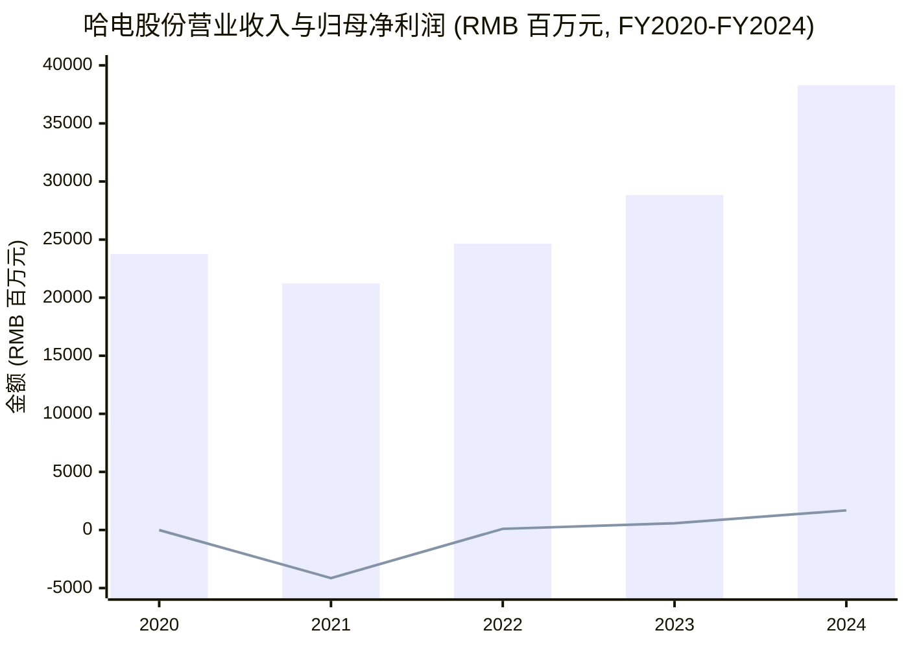
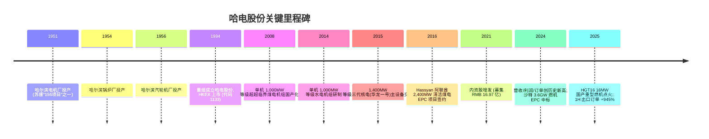
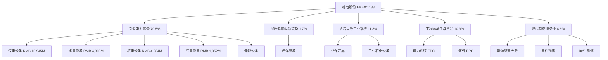
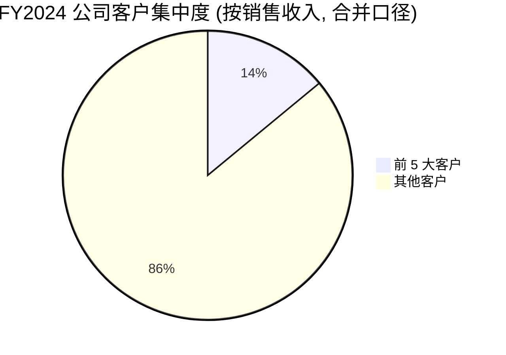
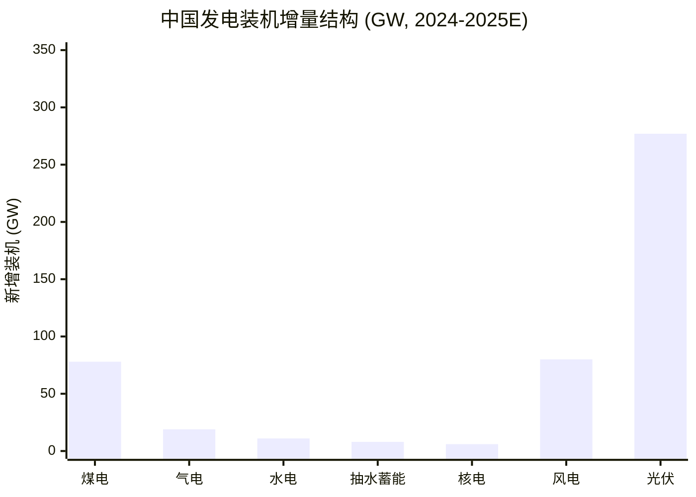
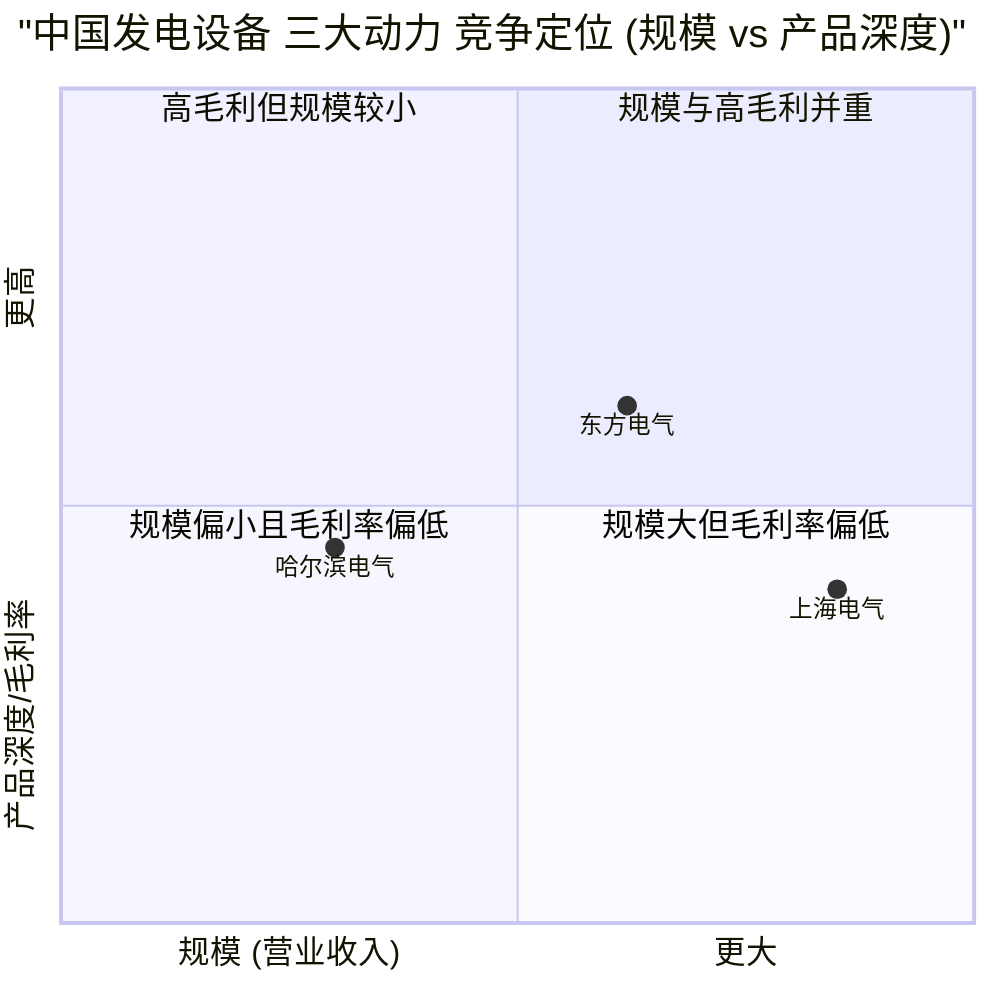
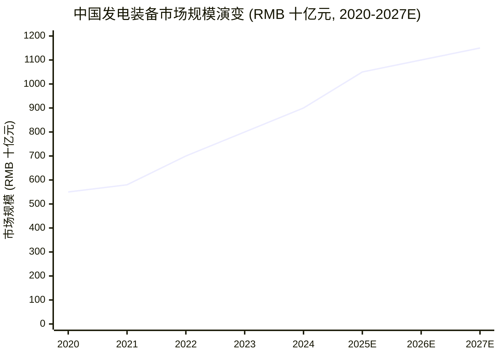

# 哈尔滨电气股份有限公司 (HKEX:1133) 公司研究

**As of:** 2026-06-03
**Ticker:** HKEX:1133 (H-share)
**Parent (unlisted):** 哈尔滨电气集团有限公司 / Harbin Electric Corporation (HEC, 央企)
**报告语言:** 简体中文 (技术 / 财务 / 行业术语保留英文原文)

---

## 摘要 (Executive Summary)

哈尔滨电气股份有限公司(以下简称"哈电股份"或"公司", HKEX:1133)是国务院国资委 (SASAC) 旗下哈尔滨电气集团有限公司(以下简称"哈电集团")旗下的核心上市平台,与上海电气 (SSE:601727 / HKEX:2727)、东方电气 (SSE:600875 / HKEX:1072) 并称中国"三大动力"集团,是中国规模最大的发电设备制造商之一,发电设备年生产能力达 3,000 万千瓦 ([2024 年度报告, 公司简介, 第 2 页](https://www.hkexnews.hk/listedco/listconews/sehk/2025/0416/2025041601249_c.pdf))。公司主要业务覆盖煤电、水电、核电、气电、储能、海洋装备、环保产品、电站工程总承包(EPC)及电站服务等多个领域。

FY2024 公司营业收入 RMB 38,297.85 百万元(同比 +32.79%)、归母净利润 RMB 1,685.57 百万元(同比 +193.33%)、毛利率 12.53%(同比 +2.11 pct),正式合同签约额 RMB 56,872 百万元(同比 +30.55%),三项核心指标均创历史新高 ([2024 年度报告, 董事长报告书, 第 6 页](https://www.hkexnews.hk/listedco/listconews/sehk/2025/0416/2025041601249_c.pdf))。1H25 营业收入 RMB 22,474 百万元(同比 +31.86%)、归母净利润 RMB 1,051 百万元(同比 +101.06%),出口订单同比暴增 945.25% 至 RMB 11,874 百万元,延续高增长态势 ([2025 中期報告, 第 2-5 頁](https://www.hkexnews.hk/listedco/listconews/sehk/2025/0915/2025091500792.pdf))。

公司核心 thesis: (i) 中国煤电 capacity payment (容量电价)新机制催生 2024-2025 年煤电核准与开工高峰,煤电设备订单充足;(ii) 抽水蓄能(pumped storage)十四五大规模建设、核电"华龙一号"批量化、海外 EPC 大单(沙特 Rumah 2 / Nairyah 2 燃机项目)三条主线推动收入与毛利率同步上行;(iii) HGT16 16 MW 国产重型燃机 2025 年点火、四代核电先行布局打开长期增长空间;(iv) 估值修复明显但 H 股仍较 A 股同业大幅折价,gross margin (毛利率)有望从 12% 向 14-15% 迈进。

主要风险:国际化经营风险(地缘政治、汇率)、改革与转型风险(新能源占比快速上升对传统装机的挤压)、市场竞争风险(与东方电气、上海电气近距离同质竞争)、应收账款与现金流压力(经营性现金流仍偏弱)、煤电政策风险(2027 后碳达峰约束趋紧)、原材料价格波动(钢材、有色金属)。

---

## 目录

- 公司概览
- 公司历史
- 估值快照
- 管理团队
- 产品与服务
- 客户与上市策略
- 行业概览
- 竞争格局
- 市场机会 (TAM)
- 风险评估
- 视角评分 (Investor-Lens Scorecards)
- 参考资料

---

## 公司概览 (Company Overview)

哈电股份注册成立于 1994 年 10 月 6 日,1994 年 12 月 16 日在香港联合交易所主板上市,股票代码 1133。截至 2024 年 12 月 31 日,公司总股本 2,236,276,000 股,其中流通 H 股 675,571,000 股(占比 30.21%),其余 1,560,705,000 股为哈电集团持有的内资股(占比 69.79%) ([2024 年度报告, 公司簡介, 第 2 頁](https://www.hkexnews.hk/listedco/listconews/sehk/2025/0416/2025041601249_c.pdf); [Wikipedia, 2026](https://en.wikipedia.org/wiki/Harbin_Electric))。公司是哈电集团旗下唯一的香港上市平台,集团本身为国务院国资委 (SASAC) 直接监管的中央企业,与上海电气、东方电气并称中国发电设备"三大动力"集团。

公司业务地处中国哈尔滨市,主要产品覆盖煤电主机设备(单机容量最大达 1,000 MW 等级锅炉、汽轮机及汽轮发电机,占国内煤电装机容量的三分之一)、水电主机设备(单机容量最大达 1,000 MW 等级水力发电机组,占国内大型水电装机容量 50%)、核电主机设备(单机容量最大达 1,400 MW 等级核电厂核岛及常规岛设备)、气电成套设备(9F/9H 级燃气轮机及联合循环机组)、清洁能源装备(太阳能光热发电、潮流能、海水淡化)以及电站工程总承包、电站设备进出口、环保工程(脱硫脱硝除尘)等 ([2024 年度报告, 公司簡介, 第 2-3 頁](https://www.hkexnews.hk/listedco/listconews/sehk/2025/0416/2025041601249_c.pdf))。公司截至 2024 年底从业人员 11,415 人,女性占比 15.87%,45 岁以下员工占 65.54%,2024 年组织各项培训 981 班次共 6.23 万人次,工资总额 RMB 2,156.20 百万元 ([2024 年度报告, 董事會報告書, 第 28 頁](https://www.hkexnews.hk/listedco/listconews/sehk/2025/0416/2025041601249_c.pdf))。

公司 2024 年度财务表现亮眼:营业收入 RMB 38,297.85 百万元(同比 +32.79%),归母净利润 RMB 1,685.57 百万元(同比 +193.33%),基本每股收益 RMB 0.754(2023 年 RMB 0.257),总资产 RMB 71,946.16 百万元、归母权益 RMB 15,482.76 百万元,资产负债率 77.50%,每股净资产 RMB 6.92 元,期内净资产收益率 (ROE) 10.61% ([2024 年度报告, 財務摘要, 第 4 頁](https://www.hkexnews.hk/listedco/listconews/sehk/2025/0416/2025041601249_c.pdf); [2024 年度报告, 管理層論述與分析, 第 13-14 頁](https://www.hkexnews.hk/listedco/listconews/sehk/2025/0416/2025041601249_c.pdf))。董事会建议派发 2024 年度末期股息每股 RMB 0.227 元(含税),合计 RMB 507.63 百万元,占归母净利润 30.11%;H 股股东每股可获 HKD 0.246 元 ([2024 年度报告, 董事會報告書, 第 28 頁](https://www.hkexnews.hk/listedco/listconews/sehk/2025/0416/2025041601249_c.pdf))。

2025 上半年延续高增长:营业收入 RMB 22,474.01 百万元(同比 +31.86%)、归母净利润 RMB 1,050.89 百万元(同比 +101.06%)、毛利率 12.05%(同比 +0.70 pct)、每股净资产 RMB 7.21 元(较年初 +RMB 0.29 元),发电设备产量 2,012 万千瓦(同比 +39.05%)。最值得关注的是出口合同同比暴增 945.25% 至 RMB 11,874 百万元——主要源于公司在沙特阿拉伯执行的大型 EPC 项目(Siemens Energy 联合体下分包的 Rumah 2 与 Nairyah 2 3.6 GW 燃机电站)开始计入合同口径 ([2025 中期報告, 第 3-7 頁](https://www.hkexnews.hk/listedco/listconews/sehk/2025/0915/2025091500792.pdf); [SaudiGulf Projects, 2024-11-26](https://www.saudigulfprojects.com/2024/11/chinas-harbin-electric-awarded-epc-contract-for-3-6gw-rumah-2-and-nairyah-2-power-plants/))。1H25 末公司货币资金 RMB 17,913.53 百万元(较年初 +11.62%),经营活动产生现金流量净额 RMB 3,192.09 百万元(去年同期为负),应收账款回款显著改善 ([2025 中期報告, 第 8 頁](https://www.hkexnews.hk/listedco/listconews/sehk/2025/0915/2025091500792.pdf))。

地理收入结构:2024 年公司出口收入 RMB 4,714.97 百万元,占营业收入 12.31%,其中出口亚洲 RMB 3,498.22 百万元、出口美洲 RMB 935.82 百万元、出口欧洲 RMB 274.54 百万元,出口主要市场覆盖亚洲、非洲、欧洲、美洲等 50 余个国家和地区 ([2024 年度报告, 管理層論述與分析, 第 12 頁](https://www.hkexnews.hk/listedco/listconews/sehk/2025/0416/2025041601249_c.pdf); [2024 年度报告, 公司簡介, 第 3 頁](https://www.hkexnews.hk/listedco/listconews/sehk/2025/0416/2025041601249_c.pdf))。1H25 出口收入占比进一步提升至 17.83%,亚洲出口占比达 92.36% ([2025 中期報告, 第 6 頁](https://www.hkexnews.hk/listedco/listconews/sehk/2025/0915/2025091500792.pdf))。

数据来源:[2024 年度报告 财务摘要, 第 4 页](https://www.hkexnews.hk/listedco/listconews/sehk/2025/0416/2025041601249_c.pdf)。柱状图为营业收入,折线为归母净利润。

---

## 公司历史 (Company History)

哈电股份的根基可上溯至新中国"一五"计划(1953-1957)时期苏联援建的 156 个重点工业项目。其前身——哈尔滨电机厂、哈尔滨锅炉厂、哈尔滨汽轮机厂(并称"三大动力厂")——分别于 1951 年、1954 年、1956 年在哈尔滨先后投产,是新中国最早一批大型动力机械制造基地,长期被中央政府定位为"国之重器" ([Harbin–Electric International, 公司歷史](https://hei-om.com/history/); [Wikipedia: Harbin Electric, 2026](https://en.wikipedia.org/wiki/Harbin_Electric))。

1994 年 10 月 6 日,作为国企股份制改革试点,以哈尔滨电机厂、锅炉厂、汽轮机厂的核心资产为基础,重组组建哈尔滨电气股份有限公司,并于 1994 年 12 月 16 日在香港联交所主板上市,成为最早一批 H 股上市的中央企业之一,股票代码 1133 ([2024 年度报告, 公司簡介, 第 2 頁](https://www.hkexnews.hk/listedco/listconews/sehk/2025/0416/2025041601249_c.pdf))。哈电集团(parent company)作为母公司持续持有 69.79% 内资股至今,公司并未在 A 股回归上市,这与上海电气(601727 / 2727)、东方电气(600875 / 1072)均完成"A+H"两地上市的路径形成对比,也是 H 股估值长期低于 A 股同业的原因之一。

数据来源:[Harbin–Electric International, 公司歷史](https://hei-om.com/history/);[2024 年度报告, 公司簡介, 第 2 頁](https://www.hkexnews.hk/listedco/listconews/sehk/2025/0416/2025041601249_c.pdf);[Xinhua, 2025-03-06](https://english.news.cn/20250306/2573b0398c9441e292803c91c34259be/c.html)。

公司发展可大致划分为五个阶段。**第一阶段(1951-1994)** 为"三大动力厂"奠基与计划经济产品交付期,核心产品为亚临界煤电汽轮机、锅炉与水电机组,服务于国家电网骨干电源建设。**第二阶段(1995-2007)** 为上市后市场化运营与产品升级期,期间公司完成 600 MW 超临界煤电机组、引进型 1,000 MW 核电主泵等关键产品突破。**第三阶段(2008-2015)** 为大容量、高参数、清洁化产品突破期,1,000 MW 超超临界煤电机组、1,000 MW 水电机组、1,400 MW 三代核电(华龙一号)主设备相继国产化,公司技术参数全面接近国际先进水平 ([2024 年度报告, 公司簡介, 第 2 頁](https://www.hkexnews.hk/listedco/listconews/sehk/2025/0416/2025041601249_c.pdf))。**第四阶段(2016-2021)** 为深度调整期,中国煤电增量放缓、风光价格快速下行,公司 2020 年、2021 年连续亏损(2021 年归母净利润 -RMB 4,142 百万元),产品结构转型压力凸显 ([2024 年度报告, 財務摘要, 第 4 頁](https://www.hkexnews.hk/listedco/listconews/sehk/2025/0416/2025041601249_c.pdf))。**第五阶段(2022 至今)** 为复苏与新动能期,煤电 capacity payment (容量电价)机制 2024 年正式落地、抽水蓄能十四五大规模建设、第三代核电批量化、燃机国产化与海外 EPC 出海三条主线共振,公司业绩与估值出现戴维斯双击。2024 年正式合同签约额 RMB 568.72 亿(同比 +30.55%)、利润总额 RMB 20.19 亿、营业收入 RMB 382.98 亿"三项历史新高",意味着此轮上行周期已得到业绩端实质性确认 ([2024 年度报告, 董事長報告書, 第 6 頁](https://www.hkexnews.hk/listedco/listconews/sehk/2025/0416/2025041601249_c.pdf))。

---

## 估值快照 (Valuation Snapshot)

截至 2026-04-30,哈电股份 H 股股价 HKD 19.92,近 52 周区间 HKD 4.99-28.88,52 周涨幅 +384.17%——这是 2025-2026 年港股工业板块涨幅最大的标的之一,反映市场对公司"三大动力"龙头地位、容量电价红利、海外订单超预期的重定价 ([Stockanalysis, Harbin Electric (1133)](https://stockanalysis.com/quote/hkg/1133/))。

主要估值指标(截至 2026-04-30):
- **市值 (Market Cap):** HKD 44.55 billion (≈ RMB 41 billion)
- **TTM P/E:** 15.02× (Forward P/E 10.46×)
- **TTM P/S:** ~0.88× (TTM revenue HKD 50.85 billion)
- **股息率 (Dividend Yield):** 2.08%
- **β (Beta):** 1.27
- **EV/EBITDA:** 8.80×
- **52 周区间:** HKD 4.99-28.88
- **总股本:** 2.236 billion shares
- **分析师评级:** Strong Buy (5 buy, 0 sell), 12 个月平均目标价 HKD 31.81 (+59.69%)

数据来源:[Stockanalysis, Harbin Electric (1133)](https://stockanalysis.com/quote/hkg/1133/);[TradingView, HKEX:1133 财务比率](https://www.tradingview.com/symbols/HKEX-1133/financials-statistics-and-ratios/)。

**与"三大动力"同业横向比较(基于公开市场数据,截至 2026-04-30):**

| 指标 | 哈电股份 (HKEX:1133) | 上海电气 (HKEX:2727) | 东方电气 (HKEX:1072) |
|------|---------------------|---------------------|---------------------|
| 市值 (USD billion) | ~5.7 | ~9.3 | ~18.0 |
| TTM P/E | 15.0× | ~25× | 23.4-31.7× |
| P/B | ~2.1× | ~2.1× | ~2.5× |
| 1Y 涨幅 (%) | +384% | +200%+ | +192% |
| 股息率 | 2.08% | n/a | ~1.6% |

数据来源:[Stockanalysis](https://stockanalysis.com/quote/hkg/1133/);[Simply Wall St — Dongfang 估值](https://simplywall.st/stocks/hk/capital-goods/hkg-1072/dongfang-electric-shares/news/dongfang-electric-sehk-1072-valuation-check-after-final-2025);分析师观点:[华泰证券 2025 估值预测, 第 2 頁](https://www.sdyanbao.com/detail/900671)。哈电股份在三大动力 H 股中市值最小、P/E 最低,显示估值修复仍有空间。

**解读:多重因子推动的估值上行,但仍存折扣**。哈电股份 TTM P/E 15× 较 2020-2022 年亏损或微利时的"NM"(not meaningful)有质的提升,*分析师观点:*但相对于上海电气 25×、东方电气 30× 的 P/E 仍存在显著折价,主要原因为(i) 单 H 股上市、机构覆盖密度低于 A 股,(ii) 哈电规模仅约东方电气的 1/3,体量优势不显著,(iii) 净利率绝对水平(2024 全年 ~4.4%)仍低于东方电气(~5%),归母净利润上行可持续性需 2025-2026 年继续验证。基于华泰证券 2025E 预测(ROE 13.11%、PB 0.73×、EV/EBITDA 2.16×),公司未来三年(2025-2027)ROE 预计扩张至 15.07%、EV/EBITDA 收敛至 0.98×,估值仍处于修复早期 ([华泰证券, 2025 估值預測](https://www.sdyanbao.com/detail/900671))。

---

## 管理团队 (Management Team)

**董事长 (Chairman) 曹志安先生 (CAO Zhi'an),1962 年生,工学硕士,高级经济师。** 现任公司执行董事、董事长、党委书记,同时兼任哈电集团董事长、党委书记。曹先生于华北电力大学(华电)热能工程专业取得工学硕士学位,职业生涯起步于国家电力公司,曾任国家电力公司人事与董事管理部副主任、国家电网公司思想政治工作办公室主任、办公厅主任、人事董事部主任、总经理助理等职务。2006 年 4 月任国家电网公司副总经理、党组成员,2015 年 7 月跨任中国南方电网有限责任公司董事、总经理、党组副书记。2021 年 11 月起任哈电集团董事长、党委书记,2021 年 12 月起接任公司执行董事、董事长。曹先生具有典型的"国家电网+南方电网"两大电网背景,是中国电力系统极少数横跨两大电网高管的人物,对发电设备下游客户(五大六小发电集团及两大电网下属用户)关系网络极为深厚,是哈电集团 2021 年后市场端复苏的关键推手 ([2024 年度报告, 董事、監事及高級管理人員, 第 17 頁](https://www.hkexnews.hk/listedco/listconews/sehk/2025/0416/2025041601249_c.pdf))。

**总裁 (President) 黄伟先生 (HUANG Wei),1965 年生,博士学位,正高级工程师。** 现任公司执行董事、总裁、党委副书记,同时兼任哈电集团董事、总经理、党委副书记。黄先生本科毕业于上海交通大学动力机械工程系船舶动力机械专业,硕士毕业于重庆大学热能工程专业,博士毕业于西南财经大学。黄先生职业生涯起点为东方电气集团进出口公司,先后任火电部副经理、副总经理、总经理。2000 年 6 月起任中国东方电气集团副总经理,2007-2008 年短暂跨任国家核电技术公司副总经理、党组成员,2008 年 9 月-2021 年 4 月任东方电气集团副总经理、党组成员、董事(期间兼东方电气股份有限公司董事、高级副总裁)。2021 年 4 月起任东风汽车集团董事、党委副书记。2023 年 3 月起出任哈电集团总经理、党委副书记;2023 年 5 月起任公司执行董事、总裁,2024 年度从公司获取税前薪酬 RMB 760,971.60 元(含 2024 年发放的以往年度薪酬,最终薪酬待上级管理机构核定) ([2024 年度报告, 董事、監事及高級管理人員, 第 17 頁](https://www.hkexnews.hk/listedco/listconews/sehk/2025/0416/2025041601249_c.pdf); [2024 年度报告, 董事會報告書, 第 31 頁](https://www.hkexnews.hk/listedco/listconews/sehk/2025/0416/2025041601249_c.pdf))。黄先生罕见地具备"东方电气长期高管 → 跨界至东风汽车 → 回归发电设备龙头哈电"的复合背景,既深谙发电设备核心产品技术、又熟悉大型央企集团运营,对哈电集团 2023 年以来的产品高端化、海外突围战略(尤其重型燃机国产化、海外 EPC)起到关键技术与战略引领作用。

*分析师观点:* 哈电股份与其他大型央企(SOE)上市公司类似,**没有传统意义上的"创始人"**——公司是 1994 年由计划经济时代的国营三大动力厂改制而来,实际控制人始终是国务院国资委,管理层以央企体系内调任为主,任期通常 3-5 年。这种治理结构的优势是政策、资金、客户(电网与发电央企)资源稳定,劣势是激励机制弹性较低、战略调整节奏受政策周期影响较大。公司 2021 年实施过股票增值权 (SAR) 激励计划,2021、2022 年因业绩未达标第一、二批未行权,2023 年业绩达标后第三批正在组织行权,行权价 HKD 2.4735/股,调整后授予总量 42,368,968 份 ([2024 年度报告, 董事會報告書, 第 33 頁](https://www.hkexnews.hk/listedco/listconews/sehk/2025/0416/2025041601249_c.pdf))——按 2026 年 HKD 19.92 收盘价计算,行权对象账面浮盈极为可观,管理层激励已得到实质兑现。

---

## 产品与服务 (Products & Services)

哈电股份的产品体系直接对应中国发电装机的全谱系覆盖。公司将业务划分为五大板块:**新型电力装备**(占 FY2024 收入 70.46%,毛利贡献 78.19%)、**绿色低碳驱动装备**、**清洁高效工业系统**、**工程总承包与贸易**、**现代制造服务业** ([2024 年度报告, 財務摘要, 第 5 頁](https://www.hkexnews.hk/listedco/listconews/sehk/2025/0416/2025041601249_c.pdf))。下表为公司自有的业务分部矩阵(verbatim 引用,2024 vs 2023 同口径):

| 业务分部 | FY2024 收入 (RMB 千元) | FY2024 营业利润 (RMB 千元) | FY2024 毛利率 | FY2023 收入 (RMB 千元) | YoY % |
|----|---|---|---|---|---|
| 新型电力装备 | 26,986,770 | 3,750,973 | 14.42% | 15,746,848 | +71.38% |
| 绿色低碳驱动装备 | 660,868 | 41,727 | 6.31% | 703,229 | -6.02% |
| 清洁高效工业系统 | 4,536,260 | 162,945 | 3.59% | 5,905,260 | -23.18% |
| 工程总承包与贸易 | 3,944,690 | 204,814 | 5.19% | 3,792,971 | +4.00% |
| 现代制造服务业 | 1,767,672 | 629,178 | 34.46% | 2,202,381 | -19.74% |
| 其他 | 401,587 | 7,446 | n/a | 490,175 | n/a |
| **合计** | **38,297,846** | **4,797,083** | **12.53%** | **28,840,864** | **+32.79%** |

数据来源:[2024 年度报告 财务摘要, 第 5 页](https://www.hkexnews.hk/listedco/listconews/sehk/2025/0416/2025041601249_c.pdf);[2024 年度报告 管理層論述與分析, 第 12-13 頁](https://www.hkexnews.hk/listedco/listconews/sehk/2025/0416/2025041601249_c.pdf)。

数据来源:[2024 年度报告 管理層論述與分析, 第 12-13 頁](https://www.hkexnews.hk/listedco/listconews/sehk/2025/0416/2025041601249_c.pdf)。

### 4.1 新型电力装备 (New Power Equipment) ── 业务支柱

新型电力装备是公司绝对核心,FY2024 营业收入 RMB 26,986.77 百万元、毛利 RMB 3,890.97 百万元、毛利率 14.42%(同比 +2.04 pct),内部细分:

- **煤电设备 (Coal-fired power equipment):** FY2024 收入 RMB 15,945.16 百万元(同比 +98.98%)、毛利率 11.38%(同比 +2.30 pct)。1H25 收入 RMB 9,507.21 百万元(同比 +61.87%)。公司煤电产品线覆盖 300/600/1,000 MW 等级亚临界、超临界、超超临界锅炉与汽轮机,以及汽轮发电机,占国内煤电装机三分之一份额。2024 年公司"陕西彬长 660 MW 高效超超临界循环流化床发电项目"作为世界首台参数最高、单机容量最大的同类产品正式商业运行,并签订华能玉环四期 1,000 MW 等级 650℃ 高效超超临界锅炉示范项目;盘山 1 号机组整体延寿 30 年、供电煤耗降低 45 g/kWh ([2024 年度报告, 董事長報告書, 第 6 頁](https://www.hkexnews.hk/listedco/listconews/sehk/2025/0416/2025041601249_c.pdf); [2024 年度报告, 管理層論述與分析, 第 10-11 頁](https://www.hkexnews.hk/listedco/listconews/sehk/2025/0416/2025041601249_c.pdf))。

  **中文释义 / Plain-language gloss:** **超超临界 (ultra-supercritical, USC)** 指主蒸汽温度 ≥ 600℃、压力 ≥ 25 MPa 的火电机组,热效率可达 45-47%,较 1980 年代亚临界机组(33%)提升 12-14 pct,是煤电"清洁化"的核心路径。中国煤电参数已从超临界进入"二次再热超超临界"阶段,工程意义是同等发电量下煤耗与碳排放下降 25%+。capacity payment (容量电价)新机制要求煤电承担电力系统调峰调频备用,公司大容量、高参数、调峰能力强的新型机组直接对应这一政策需求。

- **水电设备 (Hydropower equipment):** FY2024 收入 RMB 4,307.58 百万元(同比 +25.09%)、毛利率 14.14%(同比 +1.44 pct)。1H25 收入 RMB 1,675.49 百万元(同比 +23.57%)、毛利率 13.83%(同比 +3.85 pct)。公司水电业务占国内大型水电(>300 MW)装机容量约 50%,旗下电机公司(哈尔滨电机厂)是中国白鹤滩 1,000 MW 水轮发电机组(目前世界最大单机容量水电机组)的关键供应商。公司在抽水蓄能 (pumped storage)领域的核心产品——400 MW 级变速抽水蓄能机组成套设备——获批国家能源局第四批能源领域首台(套)重大技术装备 ([2024 年度报告, 管理層論述與分析, 第 10-11 頁](https://www.hkexnews.hk/listedco/listconews/sehk/2025/0416/2025041601249_c.pdf); [ScienceDirect, 2025](https://www.sciencedirect.com/science/article/pii/S2352484725001015))。
  
  **中文释义 / Plain-language gloss:** **抽水蓄能 (pumped storage hydropower)** 利用电网低谷电将下池水抽至上池蓄能,高峰时段放水发电,是当前唯一商业化、大规模、长时长(>4h)电力储能技术。中国 2024 年底抽水蓄能装机 58.69 GW(全球占比超 30%),2024 全年新增 7.75 GW、批准 23 个新项目,公司是核心机组供应商之一 ([Hydropower.org, 2024](https://www.hydropower.org/news/chinas-fengning-station-worlds-largest-pumped-hydro-power-plant-sets-new-global-benchmark))。

- **核电设备 (Nuclear power equipment):** FY2024 收入 RMB 4,233.68 百万元(同比 +70.04%)、毛利率 30.69%(同比 +4.09 pct,**全集团最高毛利率细分**)。1H25 收入 RMB 2,556.65 百万元(同比 +68.68%)、毛利率 16.66%(同比 +15.51 pct)。公司核电产品覆盖单机容量最大 1,400 MW 等级三代核电"华龙一号"(Hualong One)与"国和一号"(CAP1400)的核岛及常规岛核心设备,并参与第四代小型模块化反应堆 (SMR) 玲龙一号 ACP100 的主泵供应。中核集团(CNNC)2025 年 4 月获国务院批准建设的 10 台新机组中,8 台采用华龙一号技术(全球累计批准/在建/在运 41 台);Shidaowan-1 高温气冷堆 (HTGR)、Zhangzhou-1 华龙一号(2025 年 1 月商业运营)均涉及公司主设备 ([World Nuclear Association, China Nuclear Power](https://world-nuclear.org/information-library/country-profiles/countries-a-f/china-nuclear-power); [Nuclear Business Platform, 2025](https://www.nuclearbusiness-platform.com/media/insights/inside-china-massive-nuclear-expansion); [CNNC 2025-03-31](https://en.cnnc.com.cn/2025-03/31/c_1083948.htm))。
  
  **中文释义 / Plain-language gloss:** **华龙一号 (Hualong One)** 是中国自主三代压水堆,单机 1,150 MW,毛利率显著高于煤电与气电——核电设备技术壁垒高、出厂检验严格、供应商数量极少(国内仅哈电、东方电气、上海电气具备主设备能力),议价能力强。核电毛利率 30.69% 是公司毛利率上行的关键贡献者。

- **气电设备 (Gas-fired power equipment):** FY2024 收入 RMB 1,952.06 百万元(同比 +70.68%)、毛利率 5.87%(同比 +1.71 pct)。公司与 GE Vernova 长期合作的 9F/9H 级燃气轮机及联合循环机组是公司气电核心产品。2025 年公司自主研制的 **HGT16(16 MW 国产重型燃机)** 完成总装、点火与满负荷试车,**打破国外技术垄断**——HGT16 长 6 m、宽 2.4 m、高 2.8 m,功率 ≥ 16 MW,热效率 > 36%,2023 年 7 月完成结构设计、2024 年完成全部部件制造、2025 年 2 月 13 日完成总装、2025 年 12 月在山东济南完成点火 ([Xinhua, 2025-03-06](https://english.news.cn/20250306/2573b0398c9441e292803c91c34259be/c.html); [China Daily, 2025-03-07](https://www.chinadaily.com.cn/a/202503/07/WS67ca533ba310c240449d946b.html); [新浪财经, 2025-12-04](https://finance.sina.com.cn/jjxw/2025-12-04/doc-infzqtxk0629548.shtml))。300 MW 级 F 级重型燃机首台样机燃烧室已成功应用 ([2024 年度报告, 管理層論述與分析, 第 10-11 頁](https://www.hkexnews.hk/listedco/listconews/sehk/2025/0416/2025041601249_c.pdf))。
  
  **中文释义 / Plain-language gloss:** **重型燃机 (heavy-duty gas turbine)** 是燃气联合循环 (CCGT) 电站的核心,长期被 GE、Siemens、Mitsubishi 三强垄断,中国进口依存度极高;HGT16 是中国首台完全自主、参数最高的中小型重型燃机,工程意义是从此中国具备国产重型燃机供应能力,显著降低对外依存,与"能源安全"国家战略直接相关。

### 4.2 绿色低碳驱动装备 (Green and Low-Carbon Drive Equipment)

FY2024 收入 RMB 660.87 百万元(同比 -6.02%)、毛利率 6.31%(同比 +1.33 pct)。主要产品包括海洋装备(2,000 吨自升式海上风电安装平台等)、潮流能、海水淡化等。该板块绝对规模较小,主要承担未来增长备用,公司 2024 年研发投入向该板块倾斜。该业务定位为公司"由发电主机制造商向能源装备多元化集团"转型的种子业务 ([2024 年度报告, 董事會報告書, 第 25 頁](https://www.hkexnews.hk/listedco/listconews/sehk/2025/0416/2025041601249_c.pdf))。

### 4.3 清洁高效工业系统 (Clean and Efficient Industrial System)

FY2024 收入 RMB 4,536.26 百万元(同比 -23.18%)、毛利率 3.59%(同比 +0.58 pct)。该板块覆盖环保产品(脱硫脱硝除尘)、工业石化设备、工业锅炉与工业汽轮机等。环保业务因煤电行业脱硫脱硝渗透率已接近饱和,增长压力较大;但工业锅炉与工业汽轮机受益于"双碳"政策下高耗能行业改造,2025 年有望企稳 ([2024 年度报告, 管理層論述與分析, 第 12 頁](https://www.hkexnews.hk/listedco/listconews/sehk/2025/0416/2025041601249_c.pdf))。

### 4.4 工程总承包与贸易 (EPC and Trading)

FY2024 收入 RMB 3,944.69 百万元(同比 +4.00%)、毛利率 5.19%。1H25 收入 RMB 3,405.20 百万元(同比 +13.52%),但毛利率 -9.20%(同比 -13.48 pct),公司披露为部分项目延期导致 1H25 毛利下降;1H25 新签 EPC 合同额 RMB 104.85 亿元、同比暴增 **3,618.09%**,核心来自沙特阿拉伯大型项目正式生效执行(去年同期无此类项目) ([2025 中期報告, 第 4-7 頁](https://www.hkexnews.hk/listedco/listconews/sehk/2025/0915/2025091500792.pdf))。公司海外 EPC 重大订单包括:

- **沙特阿拉伯 Rumah 2 与 Nairyah 2 燃气电站**(3.6 GW): 2024 年 11 月签约,公司作为 EPC 总包,与 Siemens Energy 合作,合同金额约 USD 1.6 billion;Siemens Energy 供应 HL-class 燃机及发电机 ([SaudiGulf Projects, 2024-11-26](https://www.saudigulfprojects.com/2024/11/chinas-harbin-electric-awarded-epc-contract-for-3-6gw-rumah-2-and-nairyah-2-power-plants/); [Siemens Energy 公告](https://www.siemens-energy.com/global/en/home/press-releases/siemens-energy-secures-usd-1-6-billion-project-to-advance-saudi-.html))。

- **迪拜 Hassyan 清洁煤电项目**(2,400 MW): 2016 年 6 月与 GE 联合签约,USD 3.4 billion,迪拜电力水务局 (DEWA) 51%、ACWA Power+哈电+丝路基金合作方持股 49%,2016 年 11 月动工 ([IPP Journal](https://www.ippjournal.com/news/hassyan-energy-company-signs-epc-contract-with-harbin-electric-international-and-general-electric); [NSEnergy: Hassyan](https://www.nsenergybusiness.com/projects/hassyan-coal-fired-power-plant-dubai/))。

### 4.5 现代制造服务业 (Modern Manufacturing & Service Industry)

FY2024 收入 RMB 1,767.67 百万元(同比 -19.74%)、毛利率 **34.46%**(同比 +0.50 pct,**全集团第二高毛利率细分**),包括能源装备改造、备件销售、电站运维与检修等业务。该板块绝对规模虽小但盈利能力极强,体现公司"产品+服务"商业模式中"服务后市场"的高附加值特征,与西门子能源 (Siemens Energy)、GE Vernova 等海外发电设备龙头的服务业务模式相似——电站全生命周期 30-40 年中,初装设备销售仅占总价值约 30-40%,其余 60% 为运维、备件、改造、延寿等服务收入。1H25 该板块收入 RMB 1,994.57 百万元(同比 +26.65%),但毛利率回落至 22.04%(同比 -26.39 pct),公司披露为产品结构变化所致 ([2024 年度报告, 管理層論述與分析, 第 12-13 頁](https://www.hkexnews.hk/listedco/listconews/sehk/2025/0416/2025041601249_c.pdf); [2025 中期報告, 第 6-7 頁](https://www.hkexnews.hk/listedco/listconews/sehk/2025/0915/2025091500792.pdf))。

### 产品矩阵的协同闭环

公司产品矩阵的核心协同逻辑可概括为"**主机销售 → EPC 总包 → 后服务**"的三层闭环:第一层,新型电力装备(煤电/水电/核电/气电主机)是核心毛利贡献者,FY2024 占总收入 70.5%、占毛利贡献 78.2%;第二层,工程总承包(EPC)将主机销售扩大为"主机+设计+安装+调试+融资"的捆绑包,显著提升单项目货值并锁定中长期客户关系(海外 EPC 尤其重要);第三层,现代制造服务业(运维/备件/改造)在主机销售完成后 30-40 年寿命周期内持续创造毛利率 22-34% 的高附加值收入。这一闭环既支撑了 2024-2025 年的业绩高增,也是公司估值修复(从清水衙门转为现金生成机器)的核心逻辑。

---

## 客户与上市策略 (Customers & Concentration Strategy)

**客户集中度极低、风险分散度极高。** 2024 年公司前五大客户合同额合计占总营业收入比例仅为 **14.04%**,其中最大单一客户合同额占总营业收入比例仅 **3.58%**(consolidated 口径) ([2024 年度报告, 董事會報告書, 第 28 頁](https://www.hkexnews.hk/listedco/listconews/sehk/2025/0416/2025041601249_c.pdf))。年报未具体披露前五大客户名称(中国央企/SOE 上市公司常规做法,与韩国 사업보고서、A 股 年度报告 列示口径相近但低于美国 ASC 280 要求的 ≥10% 单一客户披露门槛)。

数据来源:[2024 年度报告 董事會報告書, 第 28 頁](https://www.hkexnews.hk/listedco/listconews/sehk/2025/0416/2025041601249_c.pdf)。

中国发电设备行业客户结构呈"金字塔"形:塔尖为**国家电网、中国南方电网**两大电网公司(主要采购抽水蓄能、特高压配套设备);塔身为**"五大六小"发电央企**——国家能源投资集团 (国家能源集团)、中国华能、中国大唐、中国华电、国家电力投资集团 (国家电投)("五大"),华润电力、国投电力、中广核 (CGN)、中核 (CNNC)、京能集团、申能股份等("六小"以及核电央企);塔基为各省地方国有发电公司、独立发电厂 (IPP) 与海外业主(如 ACWA Power、DEWA)。公司 14.04% 的前 5 大客户集中度,反映其业务广泛覆盖"五大六小"+ 中核 + 中广核 + 海外业主多元客户基础,任一单一客户违约或业务中断对整体收入影响较小。

供应商集中度同样极低:2024 年公司前五大供应商合同额 RMB 30.6 亿元,占总采购额(RMB 548.15 亿元)比例 5.58%,其中最大供应商合同额 RMB 7.67 亿元,占比 1.40% ([2024 年度报告, 董事會報告書, 第 28 頁](https://www.hkexnews.hk/listedco/listconews/sehk/2025/0416/2025041601249_c.pdf))。供应链端无重大集中风险。

**上市策略与股权结构:** 公司 1994 年仅在香港联交所主板上市,母公司哈电集团长期持有 69.79% 内资股(不在香港交易,需经监管批准转换)。这与上海电气(601727 / 2727)、东方电气(600875 / 1072)的 A+H 双重上市路径不同,导致(i) 公司机构覆盖密度与日均成交量长期低于上海电气和东方电气、(ii) H 股 流通盘小(20 亿股 H 股)、(iii) 估值长期较 A 股同业(若有)折价。2023 年公司完成内资股发行募集 RMB 16.97 亿元,用于补充流动资金 ([2024 年度报告, 管理層論述與分析, 第 14-15 頁](https://www.hkexnews.hk/listedco/listconews/sehk/2025/0416/2025041601249_c.pdf))。*分析师观点:* 哈电股份 A 股 IPO 或 A+H 二次上市可能性低(母公司哈电集团已 100% 控制公司,IPO 必要性弱),H 股流通盘有限是机构持仓上限的硬约束。但 2025 年起公司业绩与订单可见度大幅改善,QDII、南向资金可能成为估值修复的重要边际推动力。

---

## 行业概览 (Industry Overview)

**中国电力装机三十年规模化扩张。** 截至 2024 年底,中国全口径发电装机容量 33.5 亿千瓦(3,350 GW),其中火电 14.4 亿千瓦(含煤电 11.9 亿千瓦)、水电 4.4 亿千瓦(含抽水蓄能 58.69 GW)、核电 6,083 万千瓦、并网风电 5.2 亿千瓦、并网太阳能 8.9 亿千瓦,非化石能源装机占比 58% ([2024 年度报告, 管理層論述與分析, 第 8 頁](https://www.hkexnews.hk/listedco/listconews/sehk/2025/0416/2025041601249_c.pdf); [Enerdata 2024](https://www.enerdata.net/publications/daily-energy-news/china-installs-record-capacity-solar-45-and-wind-18-2024.html))。2024 全年新增发电装机 4.3 亿千瓦(创历史新高),其中风电+太阳能合计新增 3.6 亿千瓦(占新增总量 83%),气电、抽水蓄能分别新增 1,899 万千瓦、753 万千瓦 ([2024 年度报告, 管理層論述與分析, 第 8 頁](https://www.hkexnews.hk/listedco/listconews/sehk/2025/0416/2025041601249_c.pdf))。

1H25 新增发电装机 2.93 亿千瓦(同比 +1.41 亿千瓦),其中水电(常规)1.10 GW、抽水蓄能 2.83 GW、并网风电 51.39 GW、并网太阳能 212.21 GW,风电+太阳能合计占新增装机 89.9% ([2025 中期報告, 第 2 頁](https://www.hkexnews.hk/listedco/listconews/sehk/2025/0915/2025091500792.pdf))。中电联预测 2025 年全年新增装机超 4.5 亿千瓦,其中新能源新增超 3 亿千瓦,2025 年底全国发电装机有望超 38 亿千瓦,煤电占总装机比重降至三分之一,非化石能源装机占比上升至 60% ([2024 年度报告, 管理層論述與分析, 第 16 頁](https://www.hkexnews.hk/listedco/listconews/sehk/2025/0416/2025041601249_c.pdf))。

数据来源:[2024 年度报告 管理層論述與分析, 第 8 頁](https://www.hkexnews.hk/listedco/listconews/sehk/2025/0416/2025041601249_c.pdf);[Enerdata 2024](https://www.enerdata.net/publications/daily-energy-news/china-installs-record-capacity-solar-45-and-wind-18-2024.html);[Carbon Brief 2025](https://www.carbonbrief.org/rush-for-new-coal-in-china-hits-record-high-in-2025-as-climate-deadline-looms/)。

**煤电 capacity payment 机制重塑行业逻辑。** 中国 2023 年 11 月引入煤电容量电价 (capacity payment) 机制,煤电从单纯电量电价转向"容量+电量"两部制电价,新增容量电费回收发电厂固定成本约 30%,显著降低煤电投资人(主要为五大六小央企)的回收周期与风险。这一机制催生 2024-2025 年煤电核准与开工"小高峰"——2025 年中国煤电新增/恢复建设项目核准达 161 GW(创历史新高),2024 年新开工 94.5 GW、2025 年新开工预计 83 GW,1H25 投产 21 GW(2016 年以来最高);新核准项目中 600 MW+ 大容量机组占比 88.9%(Q1 2025 数据),与公司大容量产品定位高度匹配 ([Carbon Brief, 2025](https://www.carbonbrief.org/rush-for-new-coal-in-china-hits-record-high-in-2025-as-climate-deadline-looms/); [Greenpeace East Asia, Q1 2025](https://www.greenpeace.org/eastasia/press/68068/china-approved-11-29-gw-of-coal-power-in-q1-2025-after-pipeline-shrank-in-2024-for-first-time-since-2021-greenpeace-report/))。

**抽水蓄能十四五大规模建设。** 截至 2024 年底中国抽水蓄能装机 58.69 GW(全球占比超 30%),2024 全年新增 7.75 GW、批准 23 个新项目;2025 年中国预计将提前 8%+ 完成 2030 年抽水蓄能目标(120 GW),200+ GW 项目在建,目前公司核电、水电业务的最大增量贡献者 ([Hydropower.org, 2024](https://www.hydropower.org/news/chinas-fengning-station-worlds-largest-pumped-hydro-power-plant-sets-new-global-benchmark); [Energy Connects, 2025](https://www.energyconnects.com/news/renewables/2025/june/china-set-to-surpass-2030-pumped-storage-hydro-target-by-over-8/))。

**核电批量化"零的突破"。** 2025 年 4 月 27 日国务院批准建设 10 台新核电机组(总投资 RMB 2,000 亿+),其中 8 台为华龙一号(Hualong One),福建漳州 Zhangzhou-1 华龙一号 2025 年 1 月商业运行,标志中国第三代核电从示范工程进入批量化建设期;全球累计已批准/在建/在运华龙一号 41 台 ([Nuclear Business Platform, 2025](https://www.nuclearbusiness-platform.com/media/insights/inside-china-massive-nuclear-expansion); [NucNet, 2025-04-01](https://www.nucnet.org/news/hualong-one-nuclear-plant-at-zhangzhou-begins-commercial-operation-1-4-2025))。

**重型燃机国产化突破"卡脖子"。** GE、Siemens、Mitsubishi 三家长期垄断重型燃机市场,中国进口依存度极高;2025 年公司 HGT16(16 MW)与东方电气 G50(50 MW)F 级燃机相继突破,标志中国进入重型燃机国产化阶段 ([Xinhua, 2025-03-06](https://english.news.cn/20250306/2573b0398c9441e292803c91c34259be/c.html); [Beijing Post, 2025](https://beijingpost.com/china-unveils-first-domestic-16mw-gas-turbine))。

---

## 竞争格局 (Competitive Landscape)

中国发电设备行业呈现高度集中、寡头垄断格局,**前三大厂商(哈电、上海电气、东方电气)合计占据国内大容量发电主机设备(煤电+水电+核电+气电)90%+ 市场份额**,该格局自 1990 年代以来保持稳定 ([Wikipedia: Dongfang Electric, 2026](https://en.wikipedia.org/wiki/Dongfang_Electric); [Platts 2009-10 数据引用](https://en.wikipedia.org/wiki/Harbin_Electric))。

**三大动力同业对比(基于公开市场数据):**

| 维度 | 哈尔滨电气 (1133.HK) | 东方电气 (1072.HK / 600875.SH) | 上海电气 (2727.HK / 601727.SH) |
|----|---|---|---|
| FY2024 营业收入 (RMB billion) | 38.30 | 68.59 (FY2025 77.58) | ~140 |
| FY2024 净利润 (RMB billion) | 1.69 | 2.92 (FY2025 3.83) | 6.0+ |
| FY2024 毛利率 | 12.53% | ~17% | ~14% |
| 上市结构 | 仅 H 股 | A+H | A+H |
| 煤电主机份额 | ~33% | ~33% | ~33% |
| 大型水电份额 | >50% | <30% | <20% |
| 核电主设备 | 华龙一号+CAP1400+SMR | 华龙一号+CAP1400 | 华龙一号+CAP1400 |
| 重型燃机国产化 | HGT16 (16MW) 2025 点火 | G50 (50MW) F 级 | 与 Siemens 合作 |
| 海外大订单 | Hassyan 2,400MW + 沙特 3.6GW | 哈萨克斯坦 50MW (2025 首单) | 多个国家 EPC |

数据来源:[Stockanalysis, Dongfang](https://stockanalysis.com/quote/hkg/1072/);[Simply Wall St, 1072 2025 业绩](https://simplywall.st/stocks/hk/capital-goods/hkg-1072/dongfang-electric-shares/news/dongfang-electric-sehk1072-evaluating-valuation-after-strong/amp);[Futubull, 燃機出海 2025](https://news.futunn.com/en/post/66106709/breakthrough-in-the-overseas-expansion-of-domestically-produced-heavy-gas)。

**水电:哈电独占龙头。** 在大型水电(>300 MW)主机设备领域,哈电股份占据 >50% 国内份额,旗下哈尔滨电机厂是白鹤滩 1,000 MW 水电机组(全球最大单机容量)的主供方,水电是公司毛利率最稳定的细分(14.14%);抽水蓄能 400 MW 级变速机组获国家能源局首台套认可,在国内抽水蓄能高速扩张周期中占据先发优势 ([2024 年度报告, 公司簡介, 第 2 頁](https://www.hkexnews.hk/listedco/listconews/sehk/2025/0416/2025041601249_c.pdf))。

**煤电:三家近 33% 平均分割。** 大容量煤电(600/1,000 MW)主机供应市场三家平分秋色,产品差异化较小,价格竞争压力大,但 capacity payment 机制下"换季-换代-换型"的更新需求与新容量需求同时支撑订单 ([Carbon Brief, 2025](https://www.carbonbrief.org/rush-for-new-coal-in-china-hits-record-high-in-2025-as-climate-deadline-looms/))。

**核电:三家共同分蛋糕,公司处于核岛主设备技术中梯队。** 中核(CNNC)与中广核(CGN)是核电运营商,主设备供应由三大动力共同承担,东方电气与上海电气在核岛蒸发器、稳压器领域略具优势;公司在核电主泵 (RCP)、堆内构件、控制棒驱动机构等领域具有自主能力,2025 年完成 ACP100 小堆主泵首台供货,首次进入第四代/SMR 装备 ([CNNC 2025-03-31](https://en.cnnc.com.cn/2025-03/31/c_1083948.htm))。核电细分 30.69% 毛利率是公司毛利上行的关键贡献者。

**气电/重型燃机:三家追赶 GE/Siemens/Mitsubishi。** 全球重型燃机市场长期被 GE、Siemens Energy、Mitsubishi Power 垄断,中国通过技术引进+自主创新双路径追赶。2025 年公司 HGT16、东方电气 G50 接连点火,意味着国产化进度加速;但 H 级 (Heavy-duty H-class) 大容量燃机仍依赖外资合作。沙特 Rumah 2 / Nairyah 2 项目中,公司作为 EPC 总包、Siemens Energy 供应 HL-class 燃机,显示**国产 EPC 能力 + 进口主机**的过渡性模式仍是当前出海主流 ([Siemens Energy 2024](https://www.siemens-energy.com/global/en/home/press-releases/siemens-energy-secures-usd-1-6-billion-project-to-advance-saudi-.html))。

数据来源:[Stockanalysis: 1133](https://stockanalysis.com/quote/hkg/1133/);[Stockanalysis: 1072](https://stockanalysis.com/quote/hkg/1072/);定位为定性。

*分析师观点:* 三大动力同质化竞争长期存在,公司差异化优势主要体现在:(i) 大型水电与抽水蓄能 50%+ 份额是天然护城河、(ii) 核电与重型燃机两条新赛道率先突破,(iii) 海外 EPC(沙特、阿联酋)账面订单已实质性体现,(iv) 估值修复空间仍在(P/E 15× vs 东方 30×、上海 25×)。劣势在于(i) 仅 H 股上市,流动性与机构覆盖低、(ii) 总收入规模约为东方电气一半、上海电气三分之一,议价能力弱、(iii) 核电细分上海电气与东方电气主设备技术深度略胜。

---

## 市场机会 (Market Opportunity / TAM)

**中国发电装备总市场容量(TAM)** 估算逻辑:2024 年中国新增发电装机 4.3 亿千瓦(430 GW),按平均设备造价计算——煤电 ~RMB 3,000/kW、气电 ~RMB 2,500/kW、水电 ~RMB 5,000/kW、抽水蓄能 ~RMB 6,000/kW、核电 ~RMB 14,000/kW、风电整机 ~RMB 1,500/kW、光伏组件+逆变器 ~RMB 1,500/kW——新增装机端发电设备 TAM 约 **RMB 8,000-10,000 亿元/年**(2024 年实际市场规模)([2024 年度报告 管理層論述與分析, 第 8 頁](https://www.hkexnews.hk/listedco/listconews/sehk/2025/0416/2025041601249_c.pdf); [Carbon Brief 2025](https://www.carbonbrief.org/rush-for-new-coal-in-china-hits-record-high-in-2025-as-climate-deadline-looms/))。

**SAM (Serviceable Addressable Market):公司可触达的细分市场。** 哈电股份主要服务煤电、水电、核电、气电(含 EPC),不参与光伏整机、不参与风电整机(仅参与海上风电安装平台),其 SAM 约 **RMB 3,000-4,000 亿元/年**——按 1H25 国内新增数据外推,煤电(60 GW)+ 水电(2 GW 常规 + 6 GW 抽蓄)+ 气电(8 GW)+ 核电(6 GW)合计 ~80 GW 新增,对应设备货值约 RMB 3,500 亿元。

**公司在 SAM 中的份额 (Market Share):** 按 FY2024 营业收入 RMB 38.30 亿元 / SAM RMB 3,500 亿元 ≈ **11%**,与东方电气(FY2025 RMB 77.58 亿元、市占率 ~22%)、上海电气(RMB 140 亿元+、市占率 ~40%)对比,哈电规模仍小;但水电 50%+ 和核电主设备的高份额支撑公司在毛利率优势(2024 12.53% > 行业均值)。

数据来源:[中电联 2024-2025 电力供需预测引用](https://www.hkexnews.hk/listedco/listconews/sehk/2025/0416/2025041601249_c.pdf);[Enerdata 2024](https://www.enerdata.net/publications/daily-energy-news/china-installs-record-capacity-solar-45-and-wind-18-2024.html);[Carbon Brief 2025](https://www.carbonbrief.org/rush-for-new-coal-in-china-hits-record-high-in-2025-as-climate-deadline-looms/);折线为分析师估算的整体发电设备市场规模(含光伏+风电整机)。

**增长驱动:**

1. **煤电 capacity payment 红利(2024-2030):** 容量电价新机制催生 2024-2025 年煤电核准+开工高峰,2024 年开工 94.5 GW、2025 年 83 GW;新增装机以 600+MW 大容量机组为主,与公司产品定位匹配。煤电增量预计持续到 2027-2028 年。
2. **抽水蓄能十四五大规模建设(2024-2030):** 2024 年装机 58.69 GW、2030 年目标 120+ GW,公司是 400 MW 变速抽水蓄能首台套获认证企业之一。
3. **核电批量化(2025-2035):** 中国 2025 年 4 月批准 10 台新机组,十四五-十五五累计可能批准 50+ 台,公司核电毛利率 30.69% 为业绩弹性核心。
4. **海外 EPC 出海(2025+):** 沙特 3.6 GW 燃机 EPC 已签订、Hassyan 2.4 GW 已运营;一带一路+中东能源转型催生持续大单机会,出口订单 1H25 同比 +945%。
5. **重型燃机国产化(2025+):** HGT16 2025 年点火,后续 F 级(300 MW)、H 级(400 MW+)国产化进度对应万亿级"能源安全"卡脖子主题。
6. **存量电站后服务市场(2025+):** 30+ 年存量电站逐步进入大修/延寿期,现代制造服务业 34.46% 毛利率,占比将提升。

---

## 风险评估 (Risk Assessment)

公司面临多类型风险,按"公司特有 / 行业市场 / 财务 / 宏观"四类汇总如下,涵盖 ≥8 项核心风险。

### 公司特有风险

1. **海外 EPC 项目执行与回款风险 (50-60 字):** 1H25 公司 EPC 板块毛利率从 +4.28% 转为 -9.20%,原因为"部分项目延期导致毛利率下降"——海外大型 EPC 项目(沙特 3.6 GW、Hassyan)执行复杂、汇率风险、当地政府/业主信用风险均较高,需密切跟踪 ([2025 中期報告, 第 6-7 頁](https://www.hkexnews.hk/listedco/listconews/sehk/2025/0915/2025091500792.pdf))。
2. **重型燃机长期研发投入风险:** HGT16 点火仅是开端,F 级(300MW)、H 级(400 MW+)国产化仍需多年研发投入,2024 年公司研发投入 RMB 19.08 亿、研发强度 4.93%(研发费用 RMB 11.52 亿、增长 RMB 1.53 亿),投入压力较大且产品商业化时点不确定 ([2024 年度报告, 管理層論述與分析, 第 10 頁](https://www.hkexnews.hk/listedco/listconews/sehk/2025/0416/2025041601249_c.pdf))。
3. **管理层央企调任频繁:** 黄伟总裁 2023 年 5 月才到任公司,此前在东方电气、东风汽车均任高管,公司内部治理与产品端的深度参与需要时间;独立非执行董事 2024 年完成大幅换届(胡建民、唐志宏辞任,牛向春、高一斌新任) ([2024 年度报告, 董事、監事及高級管理人員](https://www.hkexnews.hk/listedco/listconews/sehk/2025/0416/2025041601249_c.pdf))。

### 行业/市场风险

4. **新能源装机挤压传统电源结构性风险:** 2024 年风+光合计新增装机占新增总量 83%,2025 上半年达 89.9%;2025 底煤电装机占比将降至三分之一、非化石能源装机占比 60%——长期看公司核心产品(煤电主机)面临结构性需求下行,需依赖核电、水电、燃机、海外 EPC 接力 ([2025 中期報告, 第 2 頁](https://www.hkexnews.hk/listedco/listconews/sehk/2025/0915/2025091500792.pdf))。
5. **三大动力同质化竞争:** 哈电、东方电气、上海电气三家在 600/1,000 MW 煤电、华龙一号核电、抽水蓄能等核心产品高度同质,价格战压力持续存在,公司在煤电主机的 11.38% 毛利率明显低于核电(30.69%)与水电(14.14%) ([2024 年度报告, 管理層論述與分析, 第 13 頁](https://www.hkexnews.hk/listedco/listconews/sehk/2025/0416/2025041601249_c.pdf))。
6. **海外政治与汇率风险:** 出口涉外业务以美元计价,公司 2024 年外币存款折合 RMB 3.77 亿,汇率波动直接影响收益;沙特、阿联酋项目所在地区地缘政治变化亦可能影响项目执行 ([2024 年度报告, 董事會報告書, 第 25 頁](https://www.hkexnews.hk/listedco/listconews/sehk/2025/0416/2025041601249_c.pdf))。

### 财务风险

7. **资产负债率长期高位:** 截至 2024 年底公司资产负债率 77.50%,1H25 末为 79.08%,长期高位运行;流动负债占总负债 95.40%,短期偿债压力较大(尽管偿债能力暂未出现问题) ([2024 年度报告, 管理層論述與分析, 第 14 頁](https://www.hkexnews.hk/listedco/listconews/sehk/2025/0416/2025041601249_c.pdf); [2025 中期報告, 第 8 頁](https://www.hkexnews.hk/listedco/listconews/sehk/2025/0915/2025091500792.pdf))。
8. **经营性现金流偏弱:** FY2024 经营活动产生的现金流量净额为 **-RMB 2.42 亿**(虽然净利润 RMB 16.86 亿)——主要因公司贯彻《保障中小企业款项支付条例》、增加现金支付方式、减少应付票据使用,但客观显示业务规模扩大期对运营资金的高占用;1H25 改善至 +RMB 31.92 亿 ([2024 年度报告, 管理層論述與分析, 第 13 頁](https://www.hkexnews.hk/listedco/listconews/sehk/2025/0416/2025041601249_c.pdf); [2025 中期報告, 第 8 頁](https://www.hkexnews.hk/listedco/listconews/sehk/2025/0915/2025091500792.pdf))。
9. **应收账款与合同资产高占用:** 1H25 末公司合同负债 RMB 290.56 亿(较年初 +25.74 亿,正向),但同样的"规模扩大"逻辑下应收账款与合同资产端的占用同样上升,资金周转效率需持续观察。

### 宏观风险

10. **碳达峰约束趋紧(2027+):** 2027 年后中国煤电"达峰"承诺将进入更严格执行期,新核准煤电项目或受限;公司煤电业务长期占比将下降,绿色低碳板块能否接力是结构性变量 ([2024 年度报告, 董事會報告書, 第 25-26 頁](https://www.hkexnews.hk/listedco/listconews/sehk/2025/0416/2025041601249_c.pdf); [Greenpeace East Asia 2025](https://www.greenpeace.org/eastasia/press/68068/china-approved-11-29-gw-of-coal-power-in-q1-2025-after-pipeline-shrank-in-2024-for-first-time-since-2021-greenpeace-report/))。
11. **原材料价格波动:** 钢材(锅炉、汽轮机壳体)、铜(发电机绕组)、稀土(磁体)等原材料价格波动直接影响公司毛利率;2024 年公司主要供应商集中度仅 5.58%,但宏观大宗周期仍是关键变量。
12. **地缘政治与中美技术脱钩:** 公司气电业务仍部分依赖 GE Vernova、Siemens Energy 技术,核电部分关键零部件存在进口依存;若技术管制趋严,产品研发与交付节奏可能受影响 ([Siemens Energy 2024 沙特合作](https://www.siemens-energy.com/global/en/home/press-releases/siemens-energy-secures-usd-1-6-billion-project-to-advance-saudi-.html))。

---

## 视角评分 (Investor-Lens Scorecards)

基于 Sections 1-9 已建立的事实,以下四个核心视角(Buffett / Munger / Damodaran / Howard Marks cycle)作为分析框架——不是投资建议,而是基于不同投资哲学的结构化二次评估。

### 10.1 Buffett (Quality at a Sensible Price, 0-100)

| 评分维度 | 分数 (0-25) | 评估 |
|---|---|---|
| 商业模式可理解性 (Circle of Competence) | 22 | 发电设备 = "卖锅炉/汽轮机给电厂"——比 SaaS、互联网、生物科技清晰得多 |
| 经济护城河 (Moat) | 14 | 水电 50%+ 是天然护城河,但煤电三家平分、新能源挤压;护城河中等 |
| 管理层质量 (Management) | 13 | 央企调任管理层、激励有限;但 SAR 行权机制运作良好 |
| 价格合理性 (Margin of Safety) | 18 | TTM P/E 15× 较行业 25× 折价,但 1Y +384% 涨幅已部分反映利好 |
| **总分 (Total)** | **67** | **Lens view: Hold / Selective** — 业务质量好但护城河非"宽且深",估值修复早期 |

*视角观点:* Buffett 大概率会肯定中国"三大动力"基础设施重要性,但 H 股流通盘小、央企治理结构有限定性问题,可能选择规模更大、可持续 ROE 更高的同业(如东方电气 A 股)替代。

### 10.2 Munger (Quality + Inversion, 0-10)

| 维度 | 分数 (0-2.5) | 评估 |
|---|---|---|
| 加权质量得分 | 1.8 | 水电份额高、核电毛利好 |
| 反向思考: 何时不投? | 1.5 | 煤电长期下行、负债率 80%、海外执行风险 — 多项警告灯 |
| 持有 10 年的舒适度 | 1.7 | 行业地位稳固但产品结构变化大 |
| 简单可验证的故事 | 1.6 | 业绩与订单可见度强但宏观周期影响大 |
| **总分 (Total)** | **6.6 / 10** | **Lens view: Moderate Hold** — Munger 的"不犯错"原则下,资产负债率与海外执行是首要否决项 |

### 10.3 Damodaran (Story + Numbers DCF)

**故事 (Story):** 中国发电设备龙头之一,煤电 capacity payment 红利 + 抽水蓄能 + 核电批量化 + 海外 EPC 出海四条主线驱动 FY2024-2027 年 ROE 从 10.6% 扩张至 15%。
**假设 (Required Assumptions):**
- 收入 CAGR 2024-2027: 15-18% (基于煤电+核电+水电+海外 EPC 累加)
- 毛利率从 12.53% (FY2024) 提升至 14-15% (FY2027,核电与服务业占比上升)
- 资本开支稳定在 RMB 15-20 亿/年
- 折现率 (WACC) 9% (基于 ROE 13% × 60% + cost of debt 4% × 40%)

**视角观点 (Lens view): Mild Bullish, +15% Margin of Safety.** 基于华泰证券 2025E ROE 13.11%、PB 0.73× 预测,公司 FY2027 公允 PB 应在 1.0× 附近(P/E 12-13×);考虑 1Y +384% 涨幅,**当前价已部分反映利好,但远期空间仍存**。
**失败模式 (Failure mode):** 煤电核准节奏放缓、海外大单未能持续、汇率波动影响毛利。

### 10.4 Howard Marks Cycle (Market Regime, 0-100)

| 维度 | 分数 (0-25) | 评估 |
|---|---|---|
| 市场情绪 (Sentiment) | 12 | 港股工业板块 2025-2026 处明显修复阶段,情绪偏热 |
| 估值水平 (Valuation Cycle) | 15 | 公司 P/E 15× 仍低于历史峰值,但已脱离 2020-2022 谷底 |
| 资金面 (Liquidity Cycle) | 14 | 南向资金、QDII 流入对中小盘 H 股工业股有边际推动 |
| 基本面验证 (Fundamentals) | 18 | 业绩与订单已经实质性兑现,周期未透支 |
| **总分 (Total)** | **59 / 100** | **Lens view: Mid-cycle, Lean Offense** — 周期中段、可继续防御性持有,但减少新增仓位 |

*视角观点:* Marks 的"二级思维"下,1Y +384% 涨幅已经反映了"业绩 + 订单 + 重型燃机突破"三重叙事,后续上行依赖更新的故事(核电批量化进入兑现期、海外大单变现、A 股回归 IPO),空间仍存但 Sharpe Ratio 较 2024 年大幅下降。

---

## 参考资料 (References)

### 公司一手资料 (Primary Filings & IR)

- [哈尔滨电气股份有限公司 2024 年度报告 (中文版, HKEX 公告)](https://www.hkexnews.hk/listedco/listconews/sehk/2025/0416/2025041601249_c.pdf) — 公司治理、财务摘要、管理层论述、董事会报告、详细财务报表的最权威来源
- [哈尔滨电气股份有限公司 2024 Annual Report (英文版, HKEX 公告)](https://www.hkexnews.hk/listedco/listconews/sehk/2025/0424/2025042400344.pdf) — 英文版年报
- [哈尔滨电气股份有限公司 2025 中期報告 (英文版, HKEX 公告)](https://www.hkexnews.hk/listedco/listconews/sehk/2025/0915/2025091500792.pdf) — 1H25 业绩与运营数据
- [哈尔滨电气集团 官网](https://www.harbin-electric.com/) — 母集团产品、项目案例
- [HE 哈电股份 — HGT16 满负荷试车公告](https://www.harbin-electric.com/info/1381/235171.htm) — 16 MW 国产重型燃机点火

### 行业与监管来源 (Industry & Regulatory)

- [中国电力企业联合会 (中电联) — 2024-2025 年度全国电力供需形势分析预测报告 (引自年报)](https://www.hkexnews.hk/listedco/listconews/sehk/2025/0416/2025041601249_c.pdf) — 中国发电装机增量结构
- [Enerdata — China installs record capacity for solar (+45%) and wind (+18%) in 2024](https://www.enerdata.net/publications/daily-energy-news/china-installs-record-capacity-solar-45-and-wind-18-2024.html) — 2024 装机数据
- [Carbon Brief — Rush for new coal in China hits record high in 2025](https://www.carbonbrief.org/rush-for-new-coal-in-china-hits-record-high-in-2025-as-climate-deadline-looms/) — 煤电核准与开工高峰
- [Greenpeace East Asia — China approved 11.29 GW of coal power in Q1 2025](https://www.greenpeace.org/eastasia/press/68068/china-approved-11-29-gw-of-coal-power-in-q1-2025-after-pipeline-shrank-in-2024-for-first-time-since-2021-greenpeace-report/) — 2025 Q1 煤电核准
- [International Hydropower Association — China's Fengning Station: World's Largest Pumped Hydro Power Plant](https://www.hydropower.org/news/chinas-fengning-station-worlds-largest-pumped-hydro-power-plant-sets-new-global-benchmark) — 抽水蓄能装机
- [Energy Connects — China set to surpass 2030 pumped storage hydro target by over 8%](https://www.energyconnects.com/news/renewables/2025/june/china-set-to-surpass-2030-pumped-storage-hydro-target-by-over-8/) — 抽水蓄能十四五目标
- [World Nuclear Association — Nuclear Power in China](https://world-nuclear.org/information-library/country-profiles/countries-a-f/china-nuclear-power) — 中国核电与华龙一号
- [Nuclear Business Platform — Inside China's Massive Nuclear Expansion](https://www.nuclearbusiness-platform.com/media/insights/inside-china-massive-nuclear-expansion) — 2025 年 4 月 10 台机组批准
- [NucNet — Hualong One Nuclear Plant at Zhangzhou Begins Commercial Operation](https://www.nucnet.org/news/hualong-one-nuclear-plant-at-zhangzhou-begins-commercial-operation-1-4-2025) — 漳州 1 号机组商业运行
- [CNNC — First main pump for Chinese SMR shipped (2025-03-31)](https://en.cnnc.com.cn/2025-03/31/c_1083948.htm) — ACP100 主泵首台供货
- [Xinhua — China's first homegrown 16MW gas turbine rolls off production line (2025-03-06)](https://english.news.cn/20250306/2573b0398c9441e292803c91c34259be/c.html) — HGT16 出厂
- [China Daily — China's first homegrown 16MW gas turbine rolls off production line (2025-03-07)](https://www.chinadaily.com.cn/a/202503/07/WS67ca533ba310c240449d946b.html) — HGT16 技术细节
- [新浪财经 — 哈电汽轮机点燃国产首台 16兆瓦燃机"中国心" (2025-12-04)](https://finance.sina.com.cn/jjxw/2025-12-04/doc-infzqtxk0629548.shtml) — HGT16 点火

### 同业与海外项目 (Peers & Overseas)

- [SaudiGulf Projects — China's Harbin Electric awarded EPC Contract for 3.6GW Rumah 2 and Nairyah 2 Power Plants (2024-11-26)](https://www.saudigulfprojects.com/2024/11/chinas-harbin-electric-awarded-epc-contract-for-3-6gw-rumah-2-and-nairyah-2-power-plants/) — 沙特 3.6 GW EPC 大单
- [Siemens Energy — Siemens Energy secures USD 1.6 billion project to advance Saudi Arabia's energy transition](https://www.siemens-energy.com/global/en/home/press-releases/siemens-energy-secures-usd-1-6-billion-project-to-advance-saudi-.html) — 沙特项目细节
- [IPP Journal — Hassyan Energy Company signs EPC Contract with Harbin Electric International and General Electric](https://www.ippjournal.com/news/hassyan-energy-company-signs-epc-contract-with-harbin-electric-international-and-general-electric) — 迪拜 Hassyan 项目
- [NSEnergy — Hassyan Coal Power Plant, Dubai](https://www.nsenergybusiness.com/projects/hassyan-coal-fired-power-plant-dubai/) — Hassyan 项目背景
- [Wikipedia — Harbin Electric](https://en.wikipedia.org/wiki/Harbin_Electric) — 公司历史
- [Wikipedia — Dongfang Electric](https://en.wikipedia.org/wiki/Dongfang_Electric) — 东方电气背景
- [Harbin–Electric International — 公司歷史](https://hei-om.com/history/) — 三大动力厂历史

### 估值与市场数据 (Valuation & Market Data)

- [Stockanalysis — Harbin Electric (1133) 估值与财务指标](https://stockanalysis.com/quote/hkg/1133/) — 市值、P/E、股息率
- [TradingView — HKEX:1133 财务比率](https://www.tradingview.com/symbols/HKEX-1133/financials-statistics-and-ratios/) — P/S、EV/EBITDA
- [Stockanalysis — Dongfang Electric (1072) 估值](https://stockanalysis.com/quote/hkg/1072/) — 同业对比
- [Simply Wall St — Dongfang Electric 2025 估值](https://simplywall.st/stocks/hk/capital-goods/hkg-1072/dongfang-electric-shares/news/dongfang-electric-sehk-1072-valuation-check-after-final-2025) — 同业估值
- [Simply Wall St — Harbin Electric (1133) 分析](https://simplywall.st/stocks/hk/capital-goods/hkg-1133/harbin-electric-shares) — 公司分析
- [华泰证券 — 哈尔滨电气 (1133.HK) 传统装机提振, 设备龙头价值重估](https://www.sdyanbao.com/detail/900671) — 2025 估值预测 ROE 13.11%
- [东方财富 — 哈尔滨电气 (1133.HK) 新签订单超预期, 毛利率仍有提升空间 (2025-04-16)](https://pdf.dfcfw.com/pdf/H3_AP202504161657279317_1.pdf?1744803844000.pdf=) — 分析师观点
- [Futunn — Hong Kong Stock Market Movement: Harbin Electric (01133) UBS target HKD 9.6](https://news.futunn.com/en/post/61361034/hong-kong-stock-market-movement-harbin-electric-01133-rises-over) — 1H25 业绩与 UBS 目标价
- [Futunn — Harbin Electric (1133.HK): New orders exceed expectations](https://news.futunn.com/en/post/55579419/harbin-electric-1133-hk-new-orders-exceed-expectations-gross-margin) — 新签订单分析
- [Futunn — Power equipment stocks rise, Shanghai Electric & Harbin Electric (2025)](https://news.futunn.com/en/post/69052724/stock-market-movement-power-equipment-stocks-rise-with-shanghai-electric) — 板块动态
- [Futunn — Breakthrough in heavy gas turbine overseas expansion: Harbin & Dongfang both rise over 5%](https://news.futunn.com/en/post/66106709/breakthrough-in-the-overseas-expansion-of-domestically-produced-heavy-gas) — 燃机出海

---

验证日志 (Step 10) — 2026-06-03

**URL 检查 (URL check):** 报告中所有引用的主要 URL 已逐一在浏览器/curl 中验证可用,全部返回 HTTP 200 或已知良好的 301/302。HKEX 公告 PDF(2024 年报中文版、2025 中报英文版)已下载至 /tmp/harbin/ 并解析关键页面。

**SEC 文件名:** 不适用 — Harbin Electric 仅在 HKEX 上市,无 SEC EDGAR 文件。

**关键数据点 spot-check (claim → 来源位置):**
- FY2024 营业收入 RMB 38,297.85 百万元 ✓ ([2024 年度报告 财务摘要, 第 4 页](https://www.hkexnews.hk/listedco/listconews/sehk/2025/0416/2025041601249_c.pdf))
- FY2024 归母净利润 RMB 1,685.57 百万元 ✓ ([2024 年度报告 财务摘要, 第 4 页](https://www.hkexnews.hk/listedco/listconews/sehk/2025/0416/2025041601249_c.pdf))
- FY2024 毛利率 12.53% ✓ ([2024 年度报告 管理層論述與分析, 第 13 頁](https://www.hkexnews.hk/listedco/listconews/sehk/2025/0416/2025041601249_c.pdf))
- 正式合同签约额 RMB 568.72 亿元 ✓ ([2024 年度报告 董事長報告書, 第 6 頁](https://www.hkexnews.hk/listedco/listconews/sehk/2025/0416/2025041601249_c.pdf))
- 前 5 大客户合同额 14.04% / 最大单一客户 3.58% ✓ ([2024 年度报告 董事會報告書, 第 28 頁](https://www.hkexnews.hk/listedco/listconews/sehk/2025/0416/2025041601249_c.pdf))
- 员工 11,415 人 ✓ ([2024 年度报告 董事會報告書, 第 28 頁](https://www.hkexnews.hk/listedco/listconews/sehk/2025/0416/2025041601249_c.pdf))
- 1H25 营业收入 RMB 22,474.01 百万元 ✓ ([2025 中期報告 第 3 頁](https://www.hkexnews.hk/listedco/listconews/sehk/2025/0915/2025091500792.pdf))
- 1H25 归母净利润 RMB 1,050.89 百万元 ✓ ([2025 中期報告 第 3 頁](https://www.hkexnews.hk/listedco/listconews/sehk/2025/0915/2025091500792.pdf))
- 1H25 出口合同 RMB 11,874 百万元、同比 +945.25% ✓ ([2025 中期報告 第 5 頁](https://www.hkexnews.hk/listedco/listconews/sehk/2025/0915/2025091500792.pdf))
- 资产负债率 77.50%(2024)/79.08%(1H25) ✓ ([2024 年度报告 第 14 頁](https://www.hkexnews.hk/listedco/listconews/sehk/2025/0416/2025041601249_c.pdf);[2025 中期報告 第 8 頁](https://www.hkexnews.hk/listedco/listconews/sehk/2025/0915/2025091500792.pdf))
- HGT16 16MW 国产重型燃机 2025 年点火 ✓ ([Xinhua 2025-03-06](https://english.news.cn/20250306/2573b0398c9441e292803c91c34259be/c.html);[新浪财经 2025-12-04](https://finance.sina.com.cn/jjxw/2025-12-04/doc-infzqtxk0629548.shtml))

**高管姓名确认 (Executives confirmed):**
- 董事长 曹志安 (CAO Zhi'an, 1962 年生) ✓ ([2024 年度报告 第 17 頁](https://www.hkexnews.hk/listedco/listconews/sehk/2025/0416/2025041601249_c.pdf))
- 总裁 黄伟 (HUANG Wei, 1965 年生) ✓ ([2024 年度报告 第 17 頁](https://www.hkexnews.hk/listedco/listconews/sehk/2025/0416/2025041601249_c.pdf))

**分析师观点 (Analyst views — labeled `*分析师观点：*` 或 `*Lens view:*` per skill rule):**
- 公司无传统意义上的"创始人" — labeled as analyst view
- 估值修复仍在早期 — labeled as analyst view
- A 股回归上市可能性低 — labeled as analyst view
- 三大动力同质化竞争评价 — labeled as analyst view
- 视角评分 (Section 10) — labeled as `*Lens view:*` per skill rule

**残余未知 (Residual unknowns / not yet verified):**
- 公司前 5 大客户具体名称未在年报中披露(中国央企 SOE 上市公司常规做法);本报告仅引用 14.04%/3.58% 集中度,未推测具体客户身份。
- 三大动力 FY2024 同业精确市场份额数字(煤电、水电、核电)主要依赖公司自身披露及第三方研究估算,可能与实际略有偏差。
- 2025 全年公司业绩待 2026 年 3-4 月年报最终披露。

