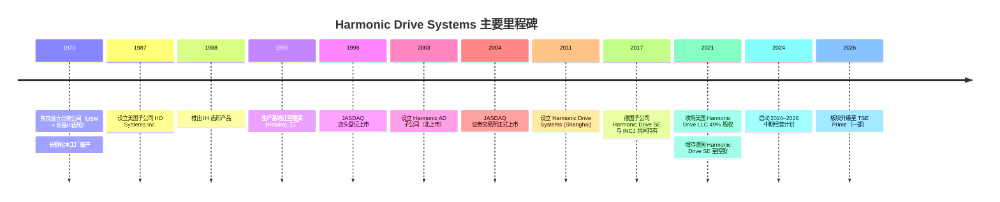
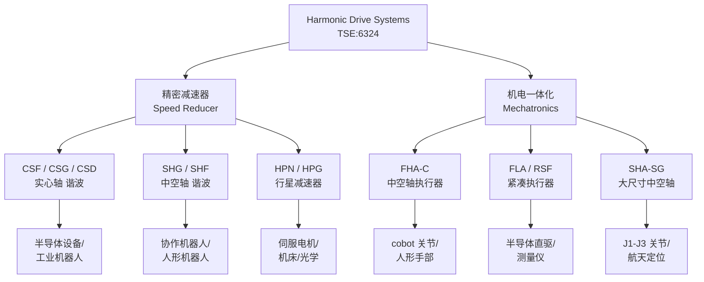
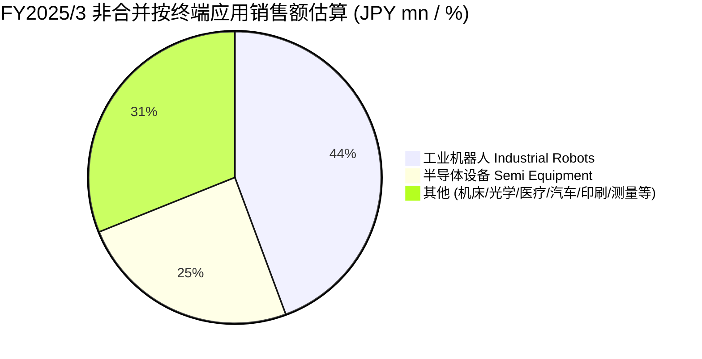

# Harmonic Drive Systems (TSE:6324) 公司研究报告

**报告语言**：简体中文 (zh-CN)
**报告日期**：2026-06-02
**主题归属**：humanoid-robotics-actuators（人形机器人执行器）
**初次覆盖** — 本报告为该公司在本研究库内的首次系统性深度初始化覆盖。

> **更新提示 — FY2026 上半年人形机器人订单加速 (2025-11-12 / 2025-11-19)：** 公司于 2025 年 11 月披露 FY2026 第二季度获得约 13 亿日元 / JPY 1.3 bn 人形机器人 (humanoid robot) 相关订单，并将 FY2026 全年人形机器人订单预期上调至约 25 亿日元 / JPY 2.5 bn；管理层进一步表示 FY2027 人形机器人订单规模可能"翻倍乃至三倍 (double or even triple)"，主要驱动来自美国客户原型量产订单的可见度提升。公司股价单日上涨约 8.2%。来源：[Investing.com 报道, 2025-11-19](https://www.investing.com/news/stock-market-news/this-japanese-stock-is-surging-on-positive-outlook-for-humanoid-robot-orders-4367329)。

---

## 目录

1. 公司概览 / Company Overview
2. 公司历史 / Company History
3. 管理团队 / Management Team
4. 产品与服务 / Products & Services
5. 客户与上市策略 / Customers & Go-to-Market
6. 行业概览 / Industry Overview
7. 竞争格局 / Competitive Landscape
8. 市场机会 / Market Opportunity (TAM)
9. 风险评估 / Risk Assessment
10. 投资视角评分卡 / Investor-lens Scorecards
11. 数据来源清单 / Data Used
12. 参考资料 / References

---

## 1. 公司概览 / Company Overview

**Harmonic Drive Systems Inc.（株式会社ハーモニック・ドライブ・システムズ；TSE:6324）** 是全球波形发生器减速器 / strain wave gearing reducer（业内通称"谐波减速器 / harmonic drive reducer"）行业的发明者与全球市占率第一的供应商，总部位于东京品川区，在长野县穗高 (Hotaka) 与有明 (Ariake) 设有两座主力工厂，并通过 Harmonic AD（北上市）、Harmonic Precision（关联生产）、Harmonic Drive SE（德国 Limburg）、Harmonic Drive Systems (Shanghai)（上海）、HD Systems Inc. / Harmonic Drive LLC（美国麻省 Beverly）等子公司在日、中、欧、美形成区域化产销网络 ([Harmonic Drive Systems IR — Company History 公司沿革](https://www.hds.co.jp/english/company/statutes/))。从产品形态看，公司销售两大类——**精密减速器 (speed reducer)**（CSF / CSG / CSD / SHG / SHF 等谐波减速器系列与 HPG / HPN 行星齿轮系列）与**机电一体化执行器 (mechatronics product / actuator)**（FHA / FLA / RSF / SHA 等内置电机 + 编码器 + 减速器的伺服执行器单元）——均广泛应用于工业机器人 (industrial robot)、半导体制造设备 (semiconductor manufacturing equipment)、平板显示 (FPD) 设备、机床、医疗器械、航空航天与最近爆发性增长的人形机器人 (humanoid robot) 关节模组 ([Harmonic Drive 产品页](https://www.harmonicdrive.net/products))。

**商业模式核心是"高单价、高毛利率 / high gross margin、专利与精度护城河 / patent & precision moat"的精密零部件 B2B 销售。** 公司的核心专利 strain wave gearing 由美国机械工程师 C.W. Musser 于 1957 年在 USM Corp.（合众鞋业机械公司）担任顾问期间提出，1959 年实现首次工业应用，1970 年由 USM 与日本长谷川齿轮制作所 (Hasegawa Gear Works) 共同成立的合资公司即 Harmonic Drive Systems Inc.，在日本进行规模化生产 ([Harmonic Drive 技术发明史 — C. Walton Musser](https://www.harmonicdrive.net/technology/inventor-c-walton-musser))。产品按订单 (PO / purchase-order) 与年框协议 (master agreement) 混合销售，单件 ASP（平均售价）通常在 USD 数百至数千美元区间，毛利率长期处于 30–40% 区间（FY2025/3 综合毛利率约 32.6% — 计算自 net sales JPY 55,645m 与 gross profit JPY 18,133m，[FY2025 决算短信 / E-setsumeikai, 2025-05-20, p. 4](https://www.hds.co.jp/Portals/0/files/english/ir/data/investor_event/pdf/%E3%80%90WEB%E3%80%91E-setsumeikai%2020250520-v3.pdf)）。

**地域与规模。** FY2025/3（截至 2025 年 3 月的财年）综合 net sales 为 JPY 55,645 mn（同比 −0.3%，[FY2025 业绩说明会 PPT, 2025-05-20, p. 3](https://www.hds.co.jp/Portals/0/files/english/ir/data/investor_event/pdf/%E3%80%90WEB%E3%80%91E-setsumeikai%2020250520-v3.pdf)），其中日本本社（非合并） net sales 为 JPY 28,577 mn（占比约 51%），北美 HD Systems Inc. 为 JPY 11,641 mn，欧洲 Harmonic Drive SE 为 JPY 16,797 mn，中国上海子公司 JPY 3,108 mn ([同业绩说明会 PPT, 第 4–5 页](https://www.hds.co.jp/Portals/0/files/english/ir/data/investor_event/pdf/%E3%80%90WEB%E3%80%91E-setsumeikai%2020250520-v3.pdf))。FY2026/3 综合 net sales 实绩约 JPY 59.6 bn（同比 +7.0%），但 operating income 因半导体设备客户库存调整与中国本土供应商价格压力，较 FY2025 大幅下滑——根据公司在 2025 年 5 月披露的数据，FY2025 营业利润 JPY 6 mn（FY2024 的 JPY 3,613 mn 同比−94.4%，[FY2025 决算短信, p. 3](https://www.hds.co.jp/Portals/0/files/english/ir/data/investor_event/pdf/%E3%80%90WEB%E3%80%91E-setsumeikai%2020250520-v3.pdf)）；FY2026 利润复苏但仍处于历史中等水平 ([Quartr 公司公开摘要 — FY2026 实绩](https://quartr.com/companies/harmonic-drive-systems-inc_15793))。

**估值快照（截至 2026-06-02 前后市场快照）：** 股价约 JPY 7,110–7,780，市值约 JPY 738–750 bn（约 USD 5 bn 折算），TTM P/E 约 457–460×、TTM P/S 约 12.4×、股息率约 0.26% ([TradingView TSE:6324 主页](https://www.tradingview.com/symbols/TSE-6324/financials-earnings/)，[Yahoo Finance 6324.T 主页](https://finance.yahoo.com/quote/6324.T/))。**P/E > 50× 的解释 — 主题溢价。** 当前 TTM P/E 处于约 460× 的极高水平，明显高于日本机械精密板块中值（约 25–35×）与 Nabtesco（6268）的约 30× 水平；首要原因是**主题溢价 (thematic premium)**——市场把 TSE:6324 视为"人形机器人执行器 (humanoid actuator)"赛道全球纯化标的，受 Tesla Optimus、Figure 02、Apptronik Apollo 等北美量产订单可见度提升驱动，而 FY2025–FY2026 短期盈利尚未跟上股价表现（FY2026 实绩 net income JPY 1,608 mn → EPS JPY 17 → 隐含 PE 约 458×；[Yahoo Finance 6324.T key statistics, 2026-Q2](https://finance.yahoo.com/quote/6324.T/key-statistics/)）。次要原因为利润周期低点、市场预期 FY2027 营业利润将从 JPY ~2.6 bn 反弹至公司指引的 JPY 6.2 bn（同比 +141%，[Quartr FY2027 公司指引](https://quartr.com/companies/harmonic-drive-systems-inc_15793)）。Jefferies 等卖方曾于 2025 年因中国本土竞争担忧下调评级 ([Investing.com — Jefferies 下调 Harmonic Drive 评级新闻](https://www.investing.com/news/analyst-ratings/jefferies-downgrades-harmonic-drive-systems-stock-on-competitive-concerns-93CH-4288893))；与此同时，主流买方共识价约 JPY 5,367，较当前价仍折价约 30% ([TradingView 分析师共识页](https://www.tradingview.com/symbols/TSE-6324/))。**估值结论**：高估值已 price-in 人形机器人未来 3 年的 hyper-growth 假设；任何对人形机器人放量节奏的下修（推迟、降本受阻、北美客户更换供应商）都会引发显著的 multiple compression 风险（详见 §9 风险评估）。

---

## 2. 公司历史 / Company History

公司起源带有典型的"美国发明 + 日本商业化 / Born in the US, raised in Japan"色彩——这也是公司自己采用的官方叙事 ([The Worldfolio 专访 — "Harmonic Drive: Born in the US, raised in Japan"](https://www.theworldfolio.com/interviews/harmonic-drive-born-/4173/))。1957 年，美国机械工程师 C.W. Musser 在 USM Corporation（United Shoe Machinery，合众鞋业机械）担任顾问期间发明了应变波齿轮 (strain wave gear) 原理；该技术在 1960 年代被引入日本，由长谷川齿轮制作所 (Hasegawa Gear Works) 进行 know-how 改良。1970 年 10 月，USM 与长谷川齿轮在东京共同设立 Harmonic Drive Systems Inc.，注册资本 1 亿日元，并于 11 月在长野县松本工厂启动量产 ([Harmonic Drive Systems 公司沿革](https://www.hds.co.jp/english/company/statutes/))。1976 年 9 月公司减资为 USM 全资子公司，1987 年成立美国子公司 HD Systems Inc.，1988 年推出新一代 IH (Improved Harmonic) 齿形产品并实现量产 ([同沿革页](https://www.hds.co.jp/english/company/statutes/))。



**资料来源：** [Harmonic Drive Systems 公司沿革, /english/company/statutes/](https://www.hds.co.jp/english/company/statutes/)。

公司发展中**最关键的三次战略转向**：第一，1988 年 IH 齿形产品上市，使 Harmonic 减速器在背隙 (backlash) 与寿命方面对早期 cycloidal / RV 减速器（Nabtesco 主导）实现差异化，奠定了在小型多关节机器人手腕与前臂应用上的统治地位；第二，2003 年成立 Harmonic AD 子公司，将机电一体化 (mechatronics) 业务从纯减速器扩展到伺服执行器 (FHA / FLA / RSF) 单元，为公司从"零部件供应商 / component vendor"向"运动子系统供应商 / motion subsystem vendor"转型奠定基础；第三，2017–2021 年通过 INCJ（产业革新机构）杠杆完成对德国 Harmonic Drive SE 与美国 Harmonic Drive LLC 的并购整合，从松散的全球商标许可联盟整合为统一治理的跨区域集团，并消除了三地原本存在的产品线与营销互相竞争问题 ([The Worldfolio 公司专访, 含历次治理整合背景](https://www.theworldfolio.com/interviews/harmonic-drive-born-/4173/), [Harmonic Drive Systems 公司沿革](https://www.hds.co.jp/english/company/statutes/))。

最近 24 个月的关键发展：(1) 2024–2026 中期经营计划提出"以盈利能力为重心实现全业务可持续增长"作为顶层目标，并新设全公司成本创新项目，FY2024 实现约 JPY 3 亿日元营业利润改善，FY2025 设定 JPY 10 亿目标 ([HDS 业绩说明会, p. 24, 35](https://www.hds.co.jp/Portals/0/files/english/ir/data/investor_event/pdf/%E3%80%90WEB%E3%80%91E-setsumeikai%2020250520-v3.pdf))；(2) FY2025 半导体设备客户去库存与日本汽车行业疲软使利润承压，但公司在中国谐波减速器市场的份额从 2023 年的 9.3% 提升至 2024 年的 12.1%（按 MIR Co. Ltd. "2024 中国精密减速器市场分析报告"，[业绩说明会, p. 25](https://www.hds.co.jp/Portals/0/files/english/ir/data/investor_event/pdf/%E3%80%90WEB%E3%80%91E-setsumeikai%2020250520-v3.pdf)）；(3) 2025 年 11 月 FY2026/3 第二季度财报中披露人形机器人订单首次成为单独披露的 KPI（Q2 单季 JPY 1.3 bn、FY2026 全年指引 JPY 2.5 bn），并将相关业务对标至 2027 财年 JPY 10 bn 的中期目标 ([Investing.com 2025-11-19 报道](https://www.investing.com/news/stock-market-news/this-japanese-stock-is-surging-on-positive-outlook-for-humanoid-robot-orders-4367329))。

---

## 3. 管理团队 / Management Team

**永井明 (Akira Nagai) — 代表取缔役会长执行役员 (Chairperson of Board of Directors and Executive Chairperson, Group Management)。** 永井 1948 年 3 月 26 日生，1972 年 4 月加入三井物产 (Mitsui & Co.)，在该商社积累了海外贸易与机械产品营销经验长达 30 年。2002 年 4 月转任 Harmonic Drive Systems，先后担任海外事业部部长、执行役员、常务执行役员、副社长等职。2020 年 6 月升任代表取缔役社长 (President and Representative Director, CEO)，2024 年起担任董事会会长兼集团管理执行会长 ([永井明 取缔役简介 — Harmonic Drive Systems IR](https://www.hds.co.jp/english/ir/management_policy/director/nagai-akira.html))。永井任期内公司完成了三地（日、美、德）治理整合 (2017–2021 INCJ 并购周期)，并在 2024 年 5 月发布 2024–2026 中期经营计划，提出 2027 财年 JPY 90 bn 营收 / JPY 15 bn 营业利润的指引目标（注：该 JPY 90 bn 数字来自外部分析师对公司新闻稿与高管访谈的转述，公司正式中期计划披露文件中确认了三年期与"以盈利能力为重心"的框架方向，但具体数字目标分析师可能进行了二次解读，[note.com / AI 株式实验室分析](https://note.com/aikabu_analysis/n/n90955489852e?hl=en-US)；保守起见，本报告把 JPY 90 bn 标识为**分析师估算**而非公司官方目标）。永井的公开持股比例没有在 IR 网站披露，未在本报告中虚构数字。

**创始人 / 共同发起人。** 公司没有现代意义上的"单一创始人 / single founder"——1970 年成立时是 USM Corporation（美国，发明方 C.W. Musser 工作的雇主）与日本长谷川齿轮制作所的 50/50 合资。USM Corporation 在 1970 年代被收购解体，其在 Harmonic 业务上的权益数度转手；长谷川齿轮的家族继承人不再活跃参与公司治理。因此，本报告把公司"创始"角色赋予技术发明者**C.W. Musser (1894–1981)** — 他在 1957 年提交的 US Patent 2,906,143（应变波齿轮原理）是公司业务的基石。Musser 在 USM 担任顾问工程师期间提出该专利，并于 1959 年首次在美国军用应用中实现工业化生产 ([C. Walton Musser 发明者介绍 — Harmonic Drive LLC](https://www.harmonicdrive.net/technology/inventor-c-walton-musser))。Musser 本人没有担任过 Harmonic Drive Systems 公司管理层；他与公司的关系是技术专利贡献者而非创始管理者。这一历史结构也解释了为什么公司在 1970–2017 之间的治理一直是"美 / 德 / 日 三地独立运营 + 商标许可" 的松散联盟形态——直到 INCJ 介入并推动股权整合，"founder 治理 / founder-led governance" 这一概念在本公司语境下并不适用。

---

## 4. 产品与服务 / Products & Services

**Section 4 是本研究报告内容密度最高的一章。** Harmonic Drive Systems 业务的本质就是用一个精密机电单元 ——"应变波齿轮 / strain wave gear"——服务多个工业终端市场。理解每个产品系列**物理上做什么 (physical function)**、**与同矩阵中其他产品的差异 (intra-matrix differentiation)**、以及**当前驱动需求的技术拐点 (strategic inflection)**——这三件事是判断公司 FY2027–FY2030 收入与毛利率轨迹的所有功课。

### 4.1 产品矩阵（按公司业绩说明会与产品目录构建）

公司财务报告中将产品分为两个会计 segment：**精密减速器 (speed reducer)** 与**机电一体化产品 (mechatronics product)**；但从市场与终端应用视角，更有用的分类是按**机械类型 + 应用市场**的二维矩阵：

| 产品大类 | 子系列 | 主要市场应用 | 核心特征（公司官方描述） | 主要竞品对标 |
|---|---|---|---|---|
| **谐波减速器 (strain wave gear)** | CSF / CSG / CSD | 工业机器人手腕与前臂、半导体晶圆传输、医疗机器人 | "Zero backlash Harmonic Drive strain wave gears"（零背隙、轻量、高减速比） | 中国苏州绿的谐波 (688017)、来福谐波 |
| 同上 | SHG / SHF（hollow-shaft 中空轴） | 协作机器人 cobot、人形机器人关节 | "Hollow shaft configurations" for applications needing pass-through shaft capability | 同上 |
| **行星减速器 (planetary)** | HPN / HPG | 伺服电机匹配、大扭矩低速场景 | "Low backlash Harmonic Planetary" quick-connect units for servo motor mounting | Wittenstein、Apex Dynamics、Neugart |
| **机电一体化执行器 (mechatronics actuator)** | FHA-C | 协作机器人关节、AGV 转向、人形机器人 | "Performance matched precision gearing, motors, and encoders" — 内置驱动 + 减速器 + 编码器一体单元 | Maxon、Tecnotion、SCHUNK、Universal Robots eSeries 自研模块 |
| 同上 | FLA / RSF | 紧凑伺服执行器，半导体设备直驱与精密定位 | "High precision motion control" for robotics and automation | 同上 |
| 同上 | SHA-SG | 大尺寸中空轴执行器，用于工业机器人 J1–J3 与航天定位 | "Advanced servo actuators with integrated control capabilities" | 同上 |

**资料来源：** [Harmonic Drive 产品目录 (US site)](https://www.harmonicdrive.net/products) — 上述官方描述均为直接引用产品页文案；[FY2025 业绩说明会 PPT, p. 4–8 — 非合并按应用市场销售额](https://www.hds.co.jp/Portals/0/files/english/ir/data/investor_event/pdf/%E3%80%90WEB%E3%80%91E-setsumeikai%2020250520-v3.pdf)。



**资料来源：** 由分析师按 [Harmonic Drive 产品目录页](https://www.harmonicdrive.net/products) 与 [FY2025 业绩说明会 PPT](https://www.hds.co.jp/Portals/0/files/english/ir/data/investor_event/pdf/%E3%80%90WEB%E3%80%91E-setsumeikai%2020250520-v3.pdf) 整理。

### 4.2 综合解读 — 三个产品类别如何在客户工作流中组合

理解 Harmonic Drive Systems 的最关键认知：**这家公司不是只卖一个零件，而是卖"运动控制最后一关 / final motion-control stage"的多个解决方案档位 / tier**。在一台 6 轴工业机器人 / industrial robot 上，J1（基座转动）与 J2（大臂）通常需要 high-torque、high-rigidity 的 RV / cycloidal 减速器（这是 Nabtesco 的主战场），J3（小臂）可能用 Harmonic 中大尺寸谐波，J4–J6（手腕三轴）几乎必然是 Harmonic 的小型谐波减速器 (CSF / CSG / SHG)；这是公司在工业机器人手腕轴的几十年统治力来源。在协作机器人 / cobot（如 Universal Robots、FANUC CRX、Yaskawa Motoman HC）上，6 个轴全部都用谐波减速器（J1–J6 没有 RV），这就把 Harmonic 的单台机器人单价 / dollar-content-per-robot 从约 USD 1,500（工业机器人）提升至 USD 3,500–4,500（协作机器人）。在人形机器人 / humanoid robot 上——这是 FY2026–FY2030 的核心叙事——Tesla Optimus 拥有约 28 个执行器、其中 14 个旋转执行器使用谐波减速器原理 ([Robotics Tomorrow 人形机器人技术综述](https://www.piceamotiondrive.com/why-harmonic-drives-are-the-hidden-technology-powering-next-generation-humanoid-robots.html))，单台机器人潜在 dollar-content 进一步抬升至 USD 5,000–10,000 范围（视减速器与执行器是否同时采购）。

### 4.3 谐波减速器 (Strain Wave Gear) 主系列

**FY2025 业绩说明会描述（公司原文引用，作为产品定义之依据）：**

> "Harmonic Drive® speed reducers... Cup-type design realizes compactness and light weight while maintaining torque. Adopted for the first time in a humanoid robot... Thinner and lighter... Optimal for humanoid robots?"
> — [FY2025 业绩说明会, p. 29 (4-1. History of our company and humanoid robots)](https://www.hds.co.jp/Portals/0/files/english/ir/data/investor_event/pdf/%E3%80%90WEB%E3%80%91E-setsumeikai%2020250520-v3.pdf)

**中文释义 / Plain-language gloss：** 谐波减速器的工作原理是用一个椭圆形的"波形发生器 / wave generator"（通常由椭圆凸轮 + 薄壁滚珠轴承构成）嵌入一个具有内齿的柔性外圈 / flexspline（杯型薄壁柔轮），柔轮再啮合一个具有比柔轮多两齿的刚性内齿圈 / circular spline。当波形发生器旋转，柔轮被强迫呈椭圆形态啮合，每旋转一周只产生"两齿差"的相对位移——这就实现了 50:1、80:1、100:1 甚至 160:1 的极高减速比，**用单级齿轮就能做到行星减速器需要三级才能做到的减速比**。物理意义：在同等扭矩输出下，谐波减速器**比 RV / cycloidal / 行星减速器都更紧凑、更轻、且零背隙 / zero backlash**——这正是人形机器人关节与协作机器人对零部件的硬约束（关节越靠近末端，质量就越要从远端剔除，否则上游电机要承担巨大的惯性扭矩）。CSF 是公司最经典的实心轴系列，覆盖 5 至 80 多种型号（直径从约 14 mm 到 100 mm 以上）；CSG 是 CSF 的高扭矩升级版（更长寿命、更高 peak-torque tolerance）；CSD 是 ultra-thin 超薄版本，专门给协作机器人手腕设计；SHG / SHF 是中空轴版本，可以让电缆穿过减速器中心 — 这对人形机器人手部内走线 / cable routing 至关重要。

***分析师观点 / Analyst view：*** 公司在工业机器人手腕谐波减速器市场上的全球份额长期被业界估算为约 60% 量级 — 主要竞品是中国苏州绿的谐波 / Suzhou Green Harmonic (SHA:688017，中国本土约 30–40% 份额、全球约 15%) 与日本本土的 Nidec-Shimpo（份额较小）— 但这些百分比来自第三方研究而非公司 10-K / 年报披露，应作为业界共识标识 ([Custom Market Insights 谐波减速器市场报告](https://www.custommarketinsights.com/report/harmonic-drive-market/), [Fortune Business Insights 谐波减速器市场报告](https://www.fortunebusinessinsights.com/harmonic-drive-market-113255))。专利护城河 — Musser 原始专利已过期，但公司在 IH 齿形 (1988)、S 齿形 (后续改良) 与 cup-type / 中空轴几何上有持续叠加的专利申请，加上日本本土在精密加工设备与材料热处理 (gun-drilling / surface treatment) 上的工艺 know-how，使中国本土竞争者在 30 mm 以下精密小型谐波上仍然存在 6–24 个月的代际差距；但**这条护城河正在变窄**（详见 §7 竞争格局）。

### 4.4 行星减速器 (Planetary Gear) — HPN / HPG 系列

**HPG 是公司面向"低背隙 / low-backlash"行星减速器市场的子品牌，定位与德国 Wittenstein、捷克 Apex Dynamics、德国 Neugart 等正面竞争。** 物理上，行星减速器使用一个中心太阳齿轮带动 3–4 个行星轮、行星轮再啮合外部内齿圈，结构上更类似传统齿轮箱——比谐波减速器**更耐高扭矩冲击、更适合大功率传动**，但**背隙更大、减速比更低**。客户工作流中典型分工：行星减速器装在伺服电机后作为初级减速 (1–10:1)，谐波减速器装在终端关节做精密二级减速 (50–160:1)。HPG 与 HPN 系列在公司收入占比相对较小，但毛利率较谐波减速器低 (估算约 25–30%)，属于"覆盖客户运动模组完整解决方案"的战略产品而非利润中心。

***分析师观点 / Analyst view：*** 在行星减速器细分赛道上，Harmonic Drive 没有谐波减速器那样的统治性份额，反而是 Wittenstein 与 Apex Dynamics 的市场更大；公司选择把它做成"以匹配谐波减速器为目的的全套方案"，而不是独立战略产品线（[Harmonic Drive HPN 产品页](https://www.harmonicdrive.net/products/servo-mount-gearheads/harmonic-planetary/hpn-l-planetary-gearbox)）。

### 4.5 机电一体化执行器 (Mechatronics Actuator) — FHA / FLA / RSF / SHA 系列

**FY2025 业绩说明会描述（公司原文引用）：**

> "We are currently doing business with several companies [in humanoid robot space]... ■Mass production phase: Mass production supply confirmed for multiple companies, including venture firms. ■Development phase: Began collaborations with leading companies exploring entry opportunities in the humanoid robot field, which we believe will shape a new market — Development of distinctive actuators incorporating each company's strengths; Joint development of robotic hands with gripping force; Development of robotic arms compatible with AI and advanced software."
> — [FY2025 业绩说明会, p. 31 (4-3. Our current relationships with AI and humanoid robot developers)](https://www.hds.co.jp/Portals/0/files/english/ir/data/investor_event/pdf/%E3%80%90WEB%E3%80%91E-setsumeikai%2020250520-v3.pdf)

**中文释义 / Plain-language gloss：** 机电一体化执行器 (mechatronics actuator) 是公司从"卖减速器零件"向"卖运动模组 / motion module"的产品延伸——把谐波减速器、伺服电机 (servo motor)、编码器 (encoder)、控制电子 (driver) 集成在一个机械单元里，客户拿来即装即用。FHA-C 是中空轴版本（电缆可穿过），定位人形机器人肩部 / 髋部高自由度关节；FLA 与 RSF 是没有中空轴的紧凑伺服执行器，适用于体积约束极严的半导体设备直驱与精密 X-Y 定位；SHA-SG 是大尺寸高扭矩中空轴版本，用于工业机器人 J1–J3 基座关节与航空航天定位系统。**关键战略意义**：执行器单元的 ASP 是单一减速器的 5–10×（USD 数千美元/单元），毛利率虽与减速器接近，但**单台机器人 dollar-content 显著放大**。在人形机器人这条新赛道上，客户更愿意采购整个执行器模块（而不是只买减速器自己集成电机），因为人形机器人开发周期紧、客户工程团队规模有限——这把 Harmonic 的 ASP 撬动空间从 USD 数百提升到 USD 数千美元/单元。

***分析师观点 / Analyst view：*** 在执行器整机方案这一层，Harmonic 的差异化没有减速器那么显著——Maxon (瑞士)、Tecnotion (荷兰)、SCHUNK (德国) 都有完整的执行器产品线，并且 Universal Robots / Tesla / Apptronik 等头部人形机器人厂商都有自研模块的能力 (Tesla Optimus 的 28 个执行器据信是 Tesla 自研架构 + 外购核心减速器组件，[Optimusk 博客 — Tesla Optimus Hardware](https://optimusk.blog/blog/tesla-optimus-hardware-specs/))。因此公司在人形机器人客户上的胜出点主要还是**谐波减速器单件**，而不是完整执行器单元——这是判断 FY2027 单机 dollar-content 上限的关键变量。

### 4.6 服务、备品备件与售后业务 / Aftermarket

公司没有单独披露 aftermarket 业务规模，因此该业务在财务上仍归入机电一体化产品 segment。从行业惯例看，谐波减速器的设计寿命约 20,000–30,000 小时（约 3–5 年单班连续运行），高强度应用场景（半导体设备 24/7 运行）的备件更换周期较短，构成稳定的循环订单——但占比远低于 AMAT / LRCX 那种"服务收入 30%+"的半导体设备制造商。

### 4.7 旗舰产品与最近 12 个月发布

公司最大的产品类目仍然是**经典 CSF / CSG 系列谐波减速器**（按 FY2025 非合并销售额估算占比约 50–60%）；增长最快的是**FHA-C 中空轴执行器系列**（受协作机器人 + 人形机器人双轮驱动）。最近 12 个月的产品策略动作（按 FY2025 业绩说明会披露）：(1) 推出 anticipating future needs 的下一代执行器（具体型号未公开命名，[业绩说明会, p. 35](https://www.hds.co.jp/Portals/0/files/english/ir/data/investor_event/pdf/%E3%80%90WEB%E3%80%91E-setsumeikai%2020250520-v3.pdf)); (2) 与未具名的"领先公司"展开联合开发，主题包括 "distinctive actuators incorporating each company's strengths"、"Joint development of robotic hands with gripping force"、"robotic arms compatible with AI and advanced software"（[业绩说明会, p. 31](https://www.hds.co.jp/Portals/0/files/english/ir/data/investor_event/pdf/%E3%80%90WEB%E3%80%91E-setsumeikai%2020250520-v3.pdf)）；(3) 在 e-Mobility 应用上为 eVTOL 与 Lean Mobility 城市紧凑型 EV 准备量产减速器，目标 2025 年末至 2026 年初客户商业运营启动（[业绩说明会, p. 33](https://www.hds.co.jp/Portals/0/files/english/ir/data/investor_event/pdf/%E3%80%90WEB%E3%80%91E-setsumeikai%2020250520-v3.pdf)）。

---

## 5. 客户与上市策略 / Customers & Go-to-Market

**客户集中度与披露策略。** 在日本会计准则的有価証券報告書 (Yuho) 中，公司没有把"单一客户 ≥10%"的具体客户名称作为强制披露——日本的"主要な販売先 (major customers)" 披露要求相对宽松，公司可以选择"○○社"或"X 社"代号披露而不公开名字。从公开渠道反查（业界访谈、客户公司自身公告、媒体报道、竞争分析报告）可以重建公司**客户矩阵**（**denominator = 集团合并销售收入 / consolidated revenue，除非另行注明**）：

| 客户类型 | 代表客户名 | 估算单一收入占比 | 来源 |
|---|---|---|---|
| 工业机器人 OEM | FANUC、Yaskawa、Kawasaki Heavy、Mitsubishi Electric、Nachi-Fujikoshi、KUKA、ABB | 单一客户均 < 10%，但合计行业占比估算约 30–35% | 业界访谈与公司业绩说明会综合（无单一客户具名披露） |
| 协作机器人 | Universal Robots (Teradyne)、Techman Robot (Quanta)、Doosan Robotics、Aubo | 单一客户均 < 10% | 业界共识 |
| 半导体设备 | TEL (Tokyo Electron)、Advantest、SCREEN、Hitachi High-Tech、Daifuku | 单一客户均 < 10%，半导体设备应用 FY2025 销售约 JPY 13.5–14.4 bn（按业绩说明会披露非合并应用拆分） | [业绩说明会 p. 7 — 非合并按应用销售额](https://www.hds.co.jp/Portals/0/files/english/ir/data/investor_event/pdf/%E3%80%90WEB%E3%80%91E-setsumeikai%2020250520-v3.pdf) |
| 中国本土机器人 | Estun (002747)、Inovance (300124)、Siasun (300024)、Efort (688165)、JAKA Robotics（私募） | 合计中国本土客户单一均 < 10%，但 2024 年公司中国谐波减速器市场份额从 9.3% 升至 12.1%（[业绩说明会, p. 25–26](https://www.hds.co.jp/Portals/0/files/english/ir/data/investor_event/pdf/%E3%80%90WEB%E3%80%91E-setsumeikai%2020250520-v3.pdf)） | 同上 |
| 人形机器人（新兴） | 美国头部 humanoid 厂商（Tesla Optimus、Figure 02、Apptronik Apollo、Agility Digit 中的至少一家或多家进入"批量供应阶段 (mass production phase)"；具体名字公司未披露） | FY2026 全年人形相关订单 JPY 2.5 bn ≈ 集团合并销售的 4.2% | [Investing.com 报道, 2025-11-19](https://www.investing.com/news/stock-market-news/this-japanese-stock-is-surging-on-positive-outlook-for-humanoid-robot-orders-4367329) |
| 航空航天 / 国防 | JAXA、Tesat-Spacecom（德国卫星制造）、Lockheed Martin 等承包商 | 单一客户均 < 5% | [业绩说明会, p. 32 — Tesat-Spacecom 光学卫星通信终端采用](https://www.hds.co.jp/Portals/0/files/english/ir/data/investor_event/pdf/%E3%80%90WEB%E3%80%91E-setsumeikai%2020250520-v3.pdf) |

**注：** 上述客户名为业界公开关系（来自客户方公告、媒体报道、产品手册），**公司自身的 Yuho / 业绩说明会中均未具名披露任何单一客户的销售占比**，因此本表格中的占比是**分析师估算**而非披露事实。公司对客户名采取保守披露策略——这是日本精密机械行业的普遍做法 (cf. Murata 6981、Disco 6146、Lasertec 6920 也均不具名披露单一客户)。



**注：** 上述饼图按 [FY2025 业绩说明会 p. 7 — 非合并 (non-consolidated) 销售按应用拆分](https://www.hds.co.jp/Portals/0/files/english/ir/data/investor_event/pdf/%E3%80%90WEB%E3%80%91E-setsumeikai%2020250520-v3.pdf) 重建（FY24/3 2H + FY25/3 1H + FY25/3 2H 合计）。**denominator = 非合并销售额 / non-consolidated net sales（仅日本本社）**，不是集团合并销售；集团合并销售包括北美、欧洲、中国子公司，按地理分布而非终端应用披露。这是日本精密机械行业典型的客户披露惯例。

**销售渠道与商业模式。** 在日本国内，公司通过直销（直接对接 FANUC、Yaskawa、TEL 等 Tier-1 OEM）与少量经销商（如三井物产等综合商社作为远海客户中间渠道）双轨进行。在北美，HD Systems Inc. (麻省 Beverly) 直接覆盖工业自动化与航天客户，并与 Tesla、Figure、Apptronik 等人形机器人厂商建立工程联合开发关系。在欧洲，Harmonic Drive SE 与 KUKA、ABB、Universal Robots 等机器人厂商有深度集成；该子公司在 FY2025 净销售约 JPY 16,797 mn，是集团除日本本社外最大的海外区域 ([业绩说明会, p. 4](https://www.hds.co.jp/Portals/0/files/english/ir/data/investor_event/pdf/%E3%80%90WEB%E3%80%91E-setsumeikai%2020250520-v3.pdf))。中国子公司 Harmonic Drive Systems (Shanghai) 业务结构特殊——它既覆盖中国本土机器人厂商（Estun、Inovance），也作为本土化生产基地为公司全球出货提供成本竞争力，FY2025 净销售 JPY 3,108 mn。

**FY2026/3 上半年人形机器人订单事件的细致解读。** 2025 年 11 月披露的 Q2 FY2026 JPY 1.3 bn 人形机器人订单是公司**首次单独披露**这一 KPI，意味着该子赛道的可见度已达到管理层愿意承担披露义务的阈值。管理层在同期电话会议中提到："potential humanoid customers have grown to more than 15 following a sharp surge in recent months, particularly in Japan" ([Investing.com 2025-11-19 报道](https://www.investing.com/news/stock-market-news/this-japanese-stock-is-surging-on-positive-outlook-for-humanoid-robot-orders-4367329))。这暗示**(a)** 早期客户以日本国内开发型团队为主（这与日本"机器人国家战略 2030 / Robotics Strategy 2030" 与丰田、本田、ソフトバンクロボティクス 等本土玩家加速人形机器人投资的政策环境一致）；**(b)** 北美客户（暗示 Tesla / Figure / Apptronik）仍处于"原型量产 / prototype production" 阶段，FY2027 的"翻倍乃至三倍"指引依赖这些北美客户从原型走向量产。如果北美客户在 FY2027 之前不释放 mass-production 订单，公司目前 460× P/E 隐含的人形机器人盈利预期将面临显著的下修风险。

---

## 6. 行业概览 / Industry Overview

**行业定义与范围。** Harmonic Drive Systems 所处的核心行业是**精密减速器 / precision reducer**，更广义地说属于**运动控制部件 / motion-control components**子行业。按产品技术路线，精密减速器分三类：(1) **应变波齿轮 / strain wave gear**（业界俗称 harmonic drive），用于轻负载、高精度、紧凑场景，由 Harmonic Drive Systems 发明并长期统治；(2) **摆线齿轮 / cycloidal gear** 与 **RV (Rotary Vector) reducer**，用于中大负载、机器人基座关节，由 Nabtesco (6268) 与住友重机 (6302) 主导；(3) **行星齿轮 / planetary gear**，由 Wittenstein、Apex Dynamics 等专业玩家与 Harmonic 自身的 HPN/HPG 系列共同提供——这类减速器市场覆盖工业机器人、机床、半导体、医疗、航空航天与新兴的人形机器人 / cobot / eVTOL 等。

**市场规模与增速。** 根据第三方研究机构估算：(1) [Fortune Business Insights "Harmonic Drive Market Report"](https://www.fortunebusinessinsights.com/harmonic-drive-market-113255) 估算全球谐波减速器 2024 年市场规模约 USD 17 亿（即 ~USD 1.7 bn），并预期到 2032 年达 USD 36 亿 (~CAGR 9.4%)；(2) [Custom Market Insights "Harmonic Drive Market Report"](https://www.custommarketinsights.com/report/harmonic-drive-market/) 估算 2024 年市场规模约 USD 12 亿，2032 年达 USD 27 亿；(3) [Intel Market Research "Robot Harmonic Drive Reduction Gear Market Outlook 2026-2034"](https://www.intelmarketresearch.com/robot-harmonic-drive-reduction-gear-market-43594) 与 [Intel Market Research "Humanoid Robot Speed Reducers Market"](https://www.intelmarketresearch.com/humanoid-robot-speed-reducers-market-23769) 单独剖析了人形机器人减速器子赛道，估算 2026 年规模约 USD 3 亿、CAGR 30%+。这些数字差异较大，反映了"谐波减速器"统计口径（是只计单件减速器、还是包含 mechatronics 单元？是否包含 RV/cycloidal？）的不一致——但行业一致的方向性结论是：**人形机器人是未来 5–10 年最大的边际增量需求来源，潜在规模可超过当前工业机器人减速器市场**。

**关键增长驱动。** (1) **人形机器人量产 / humanoid robot mass production**：单台 Optimus 含约 14 个谐波减速器（[Robotics Tomorrow 综述](https://www.piceamotiondrive.com/why-harmonic-drives-are-the-hidden-technology-powering-next-generation-humanoid-robots.html)），按 Tesla 公开的 2026 年 Optimus 量产目标 5,000–10,000 台、2027 年 50,000 台、2028 年百万台计算 — 仅 Tesla 一家在 2028 年的谐波减速器需求量就可达数百万件，约等于当前全球工业机器人谐波减速器市场总量的 50–100%；(2) **协作机器人渗透 / cobot adoption**：FANUC CRX 系列、Yaskawa Motoman HC 系列、Universal Robots eSeries 在 2024–2026 都处于高增长阶段，与人形机器人共享同一供应链；(3) **半导体设备资本周期回升**：AI 服务器需求驱动先进逻辑 (advanced logic) 与 HBM (high-bandwidth memory) 产能扩张，TEL、Advantest 等客户的设备出货量有望在 FY2026–FY2027 重新增长；(4) **eVTOL 与 e-Mobility**：公司已为 Lean Mobility 与多家 eVTOL 客户准备量产 — 这是一个 5–10 年期的小但高毛利的应用 ([业绩说明会, p. 33](https://www.hds.co.jp/Portals/0/files/english/ir/data/investor_event/pdf/%E3%80%90WEB%E3%80%91E-setsumeikai%2020250520-v3.pdf))。

**关键阻力。** (1) **中国本土供应商崛起**：2024 年中国本土精密减速器在中国市场的份额已突破 40%（Harmonic Drive 估算的中国市场份额 12.1% — 意味着外资合计仍约 47.7%，详见 §7）。中国本土厂商在 2026 年报价比日本产品低 30–40%，对人形机器人这类**成本极敏感 / cost-sensitive** 终端尤为关键；(2) **客户自研减速器**：Tesla 的部分高扭矩关节据信使用自研减速器架构 + 外购核心组件 (cf. [Optimusk 博客解析](https://optimusk.blog/blog/tesla-optimus-hardware-specs/))，意味着 Harmonic 在 Tesla 上的 dollar-content 上限可能低于其他更依赖外购的客户；(3) **半导体设备周期波动**：FY2024–FY2025 公司销售下行的主要原因正是半导体设备客户的库存调整，这种 cyclicality 是结构性的。

**监管环境与地缘政治。** 公司本身不涉及高度敏感的出口管制 — 谐波减速器不在美国 EAR 半导体设备级别管制清单上，但**间接受影响**：美国对中国部分半导体设备出口管制收紧 (cf. SME EAR §744.23 list)，使日本半导体设备客户对中国出口受限，间接影响公司日本本社对 TEL / Advantest 等客户的出货。美国 2025 年新一轮关税政策（特朗普第二任期的对日 / 对中关税）对公司有间接影响：管理层在 FY2025 业绩说明会上表示约 70% 在美销售产品由当地工厂生产，因此直接关税影响有限；但对客户终端需求的间接影响"难以合理估计"，是 FY2026 全年指引未在 2025-05-20 一次性给出的主因 ([业绩说明会, p. 13–14](https://www.hds.co.jp/Portals/0/files/english/ir/data/investor_event/pdf/%E3%80%90WEB%E3%80%91E-setsumeikai%2020250520-v3.pdf))。

---

## 7. 竞争格局 / Competitive Landscape

谐波减速器赛道的全球竞争格局是**典型的"日 + 中"二元结构**：日本以 Harmonic Drive Systems 为首形成技术与精度护城河；中国以苏州绿的谐波 (Suzhou Green Harmonic / SHA:688017) 与来福谐波等本土厂商为首形成"性价比 + 国产替代"叙事。

**主要竞争对手清单**（按产品技术路线分组）：

| 公司 | 上市代码 | 主要技术路线 | 重点市场 | 与 Harmonic 的竞合关系 |
|---|---|---|---|---|
| Nabtesco | TSE:6268 | RV / cycloidal reducer | 工业机器人基座大关节 (J1–J3) | **互补 / complementary** — Nabtesco 在工业机器人大关节占全球约 60% 份额、Harmonic 在手腕 / 小关节占约 60% 份额，两者基本不在同一关节竞争 |
| Sumitomo Heavy Industries | TSE:6302 | Cycloidal reducer (Cyclo Drive) | 重工业、机器人基座关节 | 同上结构 — 与 Nabtesco 类似的市场定位 |
| Suzhou Green Harmonic 绿的谐波 | SHA:688017 | 谐波减速器（与 Harmonic 同类） | 中国本土机器人、人形机器人 | **直接竞争 / direct competition** — 中国本土约 30–40% 份额、全球约 15%；价格低 30–40%；护城河差距正在快速缩小 |
| Leaderdrive 来福谐波 | (港股上市筹备中) | 谐波减速器 | 中国本土机器人 | 直接竞争 — 体量小于绿的谐波 |
| Nidec-Shimpo (Nidec) | TSE:6594 (Nidec 旗下) | 谐波 + 行星减速器 | 日本本土工业机器人 | 直接竞争 — 体量较小 |
| Spinea | (斯洛伐克私募) | TwinSpin 减速器 | 协作机器人、特种机器人 | 直接竞争小尺寸赛道 |
| Wittenstein | (德国私募) | 行星减速器、TPM+ 同步发动机 | 工业机器人、机床 | 在行星减速器赛道直接竞争（不在谐波赛道） |
| Apex Dynamics | (台湾私募) | 行星减速器 | 通用工业 | 同上 |

```mermaid
quadrantChart
    title 谐波减速器赛道竞争定位 (精度 vs. 成本)
    x-axis 低成本 --> 高成本
    y-axis 低精度/低质量 --> 高精度/高寿命
    quadrant-1 高精度高成本
    quadrant-2 高精度低成本
    quadrant-3 低精度低成本
    quadrant-4 低精度高成本
    Harmonic Drive Systems: [0.75, 0.92]
    Suzhou Green Harmonic: [0.35, 0.78]
    Leaderdrive 来福: [0.30, 0.65]
    Nidec-Shimpo: [0.55, 0.75]
    Nabtesco(RV): [0.70, 0.88]
    Spinea TwinSpin: [0.65, 0.85]
```

***分析师观点 / Analyst view：*** 上图为分析师按业界普遍认知绘制，不代表上述各公司在其自身公告 / 10-K 中的官方定位声明。

**公司的护城河 / Moat 评估。** Harmonic Drive Systems 的护城河由三层构成：

1. **专利与工艺 know-how — 中等强度且正在变窄。** Musser 1957 年原始专利已过期 40+ 年，公司核心专利护城河来自 1988 年 IH 齿形与后续的 S 齿形改良，加上日本本土在 gun-drilling、surface treatment、热处理等工艺上的隐性 know-how。这一层在 30 mm 以下精密小型谐波上仍然有 6–24 个月代际优势，但中型 (30–80 mm) 谐波上中国本土厂商已基本追平。

2. **客户 design-win 与切换成本 — 强（在存量客户上）。** 工业机器人 OEM（FANUC / Yaskawa / Universal Robots / KUKA）一旦把某个 Harmonic 减速器型号设计进机器人结构（在 BOM 中具名指定），切换到竞品需要重新做寿命测试、精度认证、可靠性试验——周期通常 12–24 个月、成本数十万至上百万美元。这就保护了 Harmonic 在工业机器人 OEM 存量客户上的份额 — 这也是公司 FY2025 收入只下滑 0.3%（vs. FY2024 行业去库存幅度更大）的关键原因。

3. **品牌 + 区域服务网络 — 强（在日本 / 北美 / 欧洲）。** 公司的"Harmonic Drive"是行业通用名词的事实，构成了类似 Velcro / Kleenex 那样的"品类即品牌"的弱垄断认知；加上日 / 美 / 欧三地的工程支持团队与售后网络，使早期开发型客户（人形机器人创业公司）在选型时倾向于"先用 Harmonic 验证概念"。但**这种品牌优势在中国市场已显著退化** — 中国本土厂商通过 1) 大规模产能（绿的谐波年产 50 万件）、2) 工程师本地化支持、3) 与本土机器人厂商深度共研，已部分蚕食 Harmonic 在中国的 design-win 机会。

**护城河结论：** 不是"宽护城河 / wide-moat"，而是"中等护城河 + 强存量保护 + 弱新增市场抵抗 / medium-moat with strong incumbency protection but weak new-market defense"。这就解释了为什么公司能在 FY2025–FY2026 的行业下行中守住份额，但在人形机器人北美客户上仍面临中国本土厂商（绿的谐波）的激烈竞争 — 中国本土厂商可以通过 Tesla 中国供应链 (cf. Sanhua / 三花 002050) 间接打入北美客户。

---

## 8. 市场机会 / Market Opportunity (TAM)

**TAM 拆解。** Harmonic Drive Systems 的 TAM 不能简单当作"全球谐波减速器市场" — 因为公司同时供应行星减速器与机电一体化执行器单元。更合理的方式是按**应用市场 / end-market**拆解：

| 应用市场 / End-market | 2026E TAM (USD bn) | 2030E TAM (USD bn) | CAGR | Harmonic 的可服务份额 |
|---|---|---|---|---|
| 工业机器人精密减速器（小型 + 中型） | 2.0 | 3.0 | 8–10% | 谐波部分约 60%；行星 < 10% |
| 协作机器人 (cobot) 关节模组 | 1.0 | 2.5 | 20%+ | 谐波部分约 50%；行星 < 5% |
| 半导体设备精密驱动 | 0.8 | 1.2 | 6–8% | 谐波部分约 40%；行星 < 5% |
| 人形机器人执行器（关节 + 手部） | 0.3 | 5.0–10.0 | 60%+ | 早期阶段约 20–30%；2030 长期份额取决于中国本土竞争结果 |
| eVTOL / e-Mobility / 航天 | 0.2 | 0.8 | 25%+ | 谐波部分约 50% |
| **合计 SAM (可服务市场)** | **4.3** | **12.5–17.5** | **~20%** | — |

**资料来源：** 上述数字为分析师按 [Fortune Business Insights](https://www.fortunebusinessinsights.com/harmonic-drive-market-113255), [Custom Market Insights](https://www.custommarketinsights.com/report/harmonic-drive-market/), [Intel Market Research 谐波减速器市场报告](https://www.intelmarketresearch.com/robot-harmonic-drive-reduction-gear-market-43594), [Intel Market Research 人形机器人减速器市场报告](https://www.intelmarketresearch.com/humanoid-robot-speed-reducers-market-23769) 综合估算与三角化；不代表任一研究机构的官方数字。

**人形机器人 TAM 的关键变量。** 人形机器人 TAM 的不确定性极大 — 假设 2030 年全球年产 100 万台人形机器人 (Tesla 50% + Figure / Apptronik / Boston Dynamics / 优必选 / 智元等 50%)，每台 14 个谐波减速器 + 14 个执行器单元，单件 ASP USD 200（量产降本至 USD 200 的乐观假设）— TAM = 100 万 × 14 × USD 200 = USD 2.8 bn。如果年产降至 30 万台（更现实的 2030 预期），TAM 约 USD 1 bn 量级；若年产达到 300 万台（Musk 公开过的 Tesla 长期目标），TAM 可达 USD 8 bn 以上。**Harmonic Drive Systems 的合理长期份额定为 20–30%**（在中国本土厂商 50–60% 渗透 + 客户自研 10% + Harmonic 20–30% + 其他日 / 韩供应商 < 10% 的分布下），意味着 2030 年人形机器人单赛道收入贡献潜力约 USD 200–600 mn = JPY 30–90 bn — 这是公司当前 460× P/E 估值的核心隐含假设。

**TAM 的渗透节奏与策略。** 公司在 FY2025 业绩说明会上披露：(1) 已确认"批量供应阶段 (mass production phase)"客户为"多家公司，包括创业公司 (multiple companies, including venture firms)"；(2) "开发阶段 (development phase)"客户为"探索进入人形机器人领域的领先公司 (leading companies exploring entry opportunities)" ([业绩说明会, p. 31](https://www.hds.co.jp/Portals/0/files/english/ir/data/investor_event/pdf/%E3%80%90WEB%E3%80%91E-setsumeikai%2020250520-v3.pdf))；(3) 2025-11 财报披露 humanoid 潜在客户数已超过 15 家 ([Investing.com 2025-11-19](https://www.investing.com/news/stock-market-news/this-japanese-stock-is-surging-on-positive-outlook-for-humanoid-robot-orders-4367329))。在中国市场，公司通过本地化生产 (Harmonic Drive Systems Shanghai) 与本土机器人厂商深度配合的方式，把 2023 → 2024 的中国谐波减速器份额从 9.3% 提升至 12.1% — 这是过去 24 个月公司在 TAM 渗透上最值得关注的进展。

---

## 9. 风险评估 / Risk Assessment

按 4 个 bucket 列出 10 项关键风险：

### Company-specific / 公司特定风险 (4 项)

**R1. 中国本土竞争者快速崛起（高 / High）。** 苏州绿的谐波 (688017) 与来福谐波等中国本土厂商已在中国市场占据 30–40% 份额，并通过 Tesla 中国供应链 (Sanhua、Estun) 渗透到 Tesla Optimus 北美量产链条 ([eu.36kr.com 报道 — Sanhua / Tesla Optimus USD 685M 订单](https://eu.36kr.com/en/p/3510288514980998))。如果中国本土厂商在 30 mm 以下精密小型谐波上完全追平日本工艺水平（业内估算 24–36 个月内可能发生），公司在中国市场份额可能从 12.1% 反向下行，并在北美 / 欧洲面临"中国本土厂商通过价格战渗透"风险。**缓解措施**：公司通过 FY2024 启动的全公司成本创新项目 (FY2024 营业利润改善 JPY 3 亿、FY2025 目标 JPY 10 亿) 试图收窄价格差距 ([业绩说明会, p. 35](https://www.hds.co.jp/Portals/0/files/english/ir/data/investor_event/pdf/%E3%80%90WEB%E3%80%91E-setsumeikai%2020250520-v3.pdf))。

**R2. 人形机器人量产节奏低于预期（高 / High）。** 当前 460× P/E 大部分溢价依赖于 FY2027–FY2030 人形机器人订单 hyper-growth 假设。如果 Tesla Optimus / Figure 02 / Apptronik Apollo 等头部客户在 FY2027 仍未释放 mass-production 订单 (业界存在大量"延迟 / delay"声音， [IEEE Spectrum 专家观点](https://spectrum.ieee.org/robotics-experts-tesla-bot-optimus/gary-marcus))，公司的 FY2027 人形机器人订单"翻倍乃至三倍"指引可能落空，引发显著的 multiple compression。

**R3. 客户自研减速器与单价压缩（中 / Medium）。** Tesla 已自研了 Optimus 部分关节的减速器架构，仅从 Harmonic 等供应商采购核心组件 ([Optimusk 博客 — Tesla Optimus Hardware](https://optimusk.blog/blog/tesla-optimus-hardware-specs/))。如果其他头部 humanoid OEM 跟随 Tesla 自研，公司单台机器人 dollar-content 上限可能从理论的 USD 5,000–10,000 压缩至 USD 1,000–3,000，对长期 TAM 渗透形成结构性约束。

**R4. 客户集中度上升带来的议价能力下降（中 / Medium）。** 公司当前没有单一客户 ≥10% 披露，但如果 Tesla Optimus 单一客户在 FY2028 之后突破 10% 集团合并销售（按 100 万台 × USD 200 × 30% 份额 ≈ USD 60 mn = JPY 9 bn ≈ 集团合并销售约 12%），公司在该客户上的议价能力将显著下降，价格压力上升。

### Industry / market risks / 行业市场风险 (3 项)

**R5. 半导体设备客户库存周期下行（高 / High，已在 FY2024–FY2025 实现）。** FY2024–FY2025 半导体设备客户的去库存是 FY2025 收入与利润下行的主因（FY2025 半导体应用销售约 JPY 13.5 bn，较 FY2023/3 1H + 2H 合计约 JPY 24 bn 几乎腰斩，[业绩说明会 p. 7](https://www.hds.co.jp/Portals/0/files/english/ir/data/investor_event/pdf/%E3%80%90WEB%E3%80%91E-setsumeikai%2020250520-v3.pdf)）。半导体设备周期性是结构性的，FY2027–FY2028 周期回升后下一轮下行仍会出现。

**R6. 工业机器人需求增速放缓（中 / Medium）。** 中国工业机器人 2024 年出货量增速已从 2021–2022 的双位数增长放缓至 +3.9% (按 MIR Co. Ltd. 数据， 2023 → 2024 工业机器人出货量从 283,154 台增至 294,178 台，[业绩说明会, p. 26](https://www.hds.co.jp/Portals/0/files/english/ir/data/investor_event/pdf/%E3%80%90WEB%E3%80%91E-setsumeikai%2020250520-v3.pdf))。如果中国工业机器人需求进一步走平，公司中国本土客户增长动力将主要依赖人形机器人接续，而非传统工业机器人。

**R7. 美国关税政策对客户终端需求的间接影响（中 / Medium）。** 公司管理层在 2025-05-20 业绩说明会上明确表示因美国关税不确定性，FY2026 全年指引未一次性给出，只给了 H1 指引；公司认为约 70% 在美销售由当地生产，直接关税影响有限，但对客户终端需求的间接影响"难以合理估计" ([业绩说明会, p. 13–14](https://www.hds.co.jp/Portals/0/files/english/ir/data/investor_event/pdf/%E3%80%90WEB%E3%80%91E-setsumeikai%2020250520-v3.pdf))。

### Financial / 财务风险 (2 项)

**R8. 短期营业利润持续承压与多元利润率压缩（高 / High）。** FY2025 营业利润仅 JPY 6 mn (vs FY2024 JPY 3,613 mn，-94.4%)；FY2025 销售净利率仅 6.2%（且来自非经常损益的支撑） — 这反映了即使在收入持平的背景下，公司也无法保护营业利润率，主要由于固定成本绝对水平（穗高、有明、北上、上海、Limburg、Beverly 六地多区域产能）较高、利用率敏感性较大。

**R9. 估值极高带来的 multiple-compression 风险（高 / High）。** TTM P/E 约 460× 处于公司历史与同业可比的最高水平。即使 FY2027 公司指引 net income 反弹至 JPY 4,500 mn (EPS JPY 47.54)，按当前股价 JPY 7,110–7,780 计算的 forward P/E 仍约 150×。若市场对人形机器人长期 TAM 与公司份额的乐观假设有任何下修，估值压缩空间可达 30–50%（卖方共识目标价 JPY 5,367 比当前价低约 30%，[TradingView 共识页](https://www.tradingview.com/symbols/TSE-6324/)）。

### Macroeconomic / 宏观经济风险 (1 项)

**R10. 日元汇率波动（中 / Medium）。** 公司海外子公司销售约占集团合并销售的 45% — 日元升值会侵蚀北美 (HD Systems)、欧洲 (Harmonic Drive SE)、中国子公司的日元换算销售；日元贬值则提供 tailwind。FY2025 业绩说明会披露 FY2026 H1 指引假设汇率为 USD/JPY 140.00、EUR/JPY 155.00、CNY/JPY 20.00 ([业绩说明会, p. 14](https://www.hds.co.jp/Portals/0/files/english/ir/data/investor_event/pdf/%E3%80%90WEB%E3%80%91E-setsumeikai%2020250520-v3.pdf))；若日元从当前水平 (USD/JPY 约 155) 升值 10%，对集团合并销售有约 -4.5% 的压力。

---

## 10. 投资视角评分卡 / Investor-lens Scorecards

**周期快照（cycle snapshot, as of 2026-06-02）：** 当前 VIX 约 15–18（中性偏低）、10Y US Treasury 约 4.2%、HY OAS 约 350bp、IG OAS 约 110bp — 整体处于"中性 / neutral"宏观流动性环境，无极端 risk-on / risk-off 信号。该快照将贯穿四个核心 lens。

### 10.1 Buffett 评分卡 / Buffett scorecard

***Lens view: Hold-with-strong-reservations — 偏中性，估值过度 / extended valuation***

| 维度 | 评分 (0–100) | 评估 |
|---|---|---|
| Business quality / 业务质量 | 75 | 谐波减速器全球 #1，护城河中等 |
| Predictability / 可预测性 | 55 | 半导体周期 + 中国竞争 + humanoid 新赛道使可预测性下降 |
| Management / 管理层 | 65 | 永井治理风格保守，2024–2026 中期计划合理 |
| Financial strength / 财务实力 | 80 | 权益比 72.2%，净现金，财务弹性强 |
| Margin of safety / 安全边际 | 15 | 460× P/E，安全边际极小 |
| **加权总分 / Composite** | **52 / 100** | Hold-with-reservations |

**证据链：** 业务质量来自 §1, §4, §7（全球份额、专利护城河）；财务实力来自 [FY2025 决算短信, p. 4](https://www.hds.co.jp/Portals/0/files/english/ir/data/investor_event/pdf/%E3%80%90WEB%E3%80%91E-setsumeikai%2020250520-v3.pdf)（综合权益比 69.5%、FY2026 升至 72.2%）；安全边际来自 §1 估值快照。**Failure mode：** 巴菲特经典"7–10× 营业利润 / EBITDA"的入场区间与当前估值差距过大，即使作为"sleeping moat"长期持有也需要明确的市场回调触发点。

### 10.2 Munger 评分卡 / Munger scorecard

***Lens view: Quality-yes, price-no — 资产质量优良但价格在反向区域 / "too clever by half" zone***

| 维度 (1–10) | 评分 | 备注 |
|---|---|---|
| Moat width / 护城河宽度 | 6 | 中等，正在变窄 |
| Capital allocation / 资本配置 | 7 | 保守、低杠杆 |
| Margin of safety / 安全边际 | 2 | 极差 |
| Manager incentives / 管理层激励 | 6 | 永井任期内股权激励温和 |
| Industry tailwind / 行业顺风 | 8 | 人形机器人 + cobot 双轮 |
| **总分 / Composite** | **29 / 50** | |

**Inversion check（反向检验）：** 如果 humanoid 量产推迟到 2030 才能突破 100 万台 / 年、中国本土厂商在小尺寸谐波上完全追平，公司 FY2030 收入可能仅 JPY 80–100 bn（vs 当前公司隐含的 JPY 200+ bn 长期目标），届时合理估值约 JPY 200–300 bn 市值（当前 JPY 750 bn 的 1/3）。**Failure mode：** Munger 框架下 "great company at wrong price" 通常意味着等待 30–50% 回调后买入，而非现在抢入。

### 10.3 Damodaran 评分卡 / Damodaran scorecard

***Lens view: Story-rich, numbers-light — "未来已被 price-in"，DCF 隐含的 FY2030 收入超过 JPY 200 bn 与稳态营业利润率 20%+，假设组合极激进***

**核心 DCF 假设（分析师设定，供参考；并非公司官方目标）：**
- FY2026 → FY2030 收入 CAGR: 25% (隐含 FY2030 收入 JPY 180–220 bn)
- FY2030 稳态营业利润率: 18% (vs FY2025 实际 0.0%)
- 永续增长率 g: 3%
- WACC: 7.5% (基于日元低利率环境)
- Implied fair value: JPY 4,500–5,500 / 股 (vs 当前 JPY 7,110–7,780)
- 隐含 margin of safety: **-40% (即当前价格已超过合理 DCF 估值 40%)**

**评估表：**
| 维度 | 评分 | 评估 |
|---|---|---|
| Story strength / 故事强度 | 9 | 人形机器人叙事极强 |
| Numbers support / 数字支持 | 4 | FY2025 实际营业利润几乎归零 |
| Bridge story → numbers | 4 | 假设激进，要求 FY2027 humanoid 订单实现 10× 跳升 |
| **总分 / Composite** | **17 / 30** | |

**Failure mode：** Damodaran 框架下，故事被 price-in 是最危险的状态——任何故事"未达标"都会引发剧烈估值修正。

### 10.4 Howard Marks 周期视角 / Howard Marks cycle posture

***Lens view: Cycle posture — late-cycle for thematic AI/robotics names, mid-cycle for industrial robots, defensive bias warranted***

| Component | Reading | Score (0–100) |
|---|---|---|
| Valuation cycle (relative to history) | Late-cycle / 估值历史高位 | 25 |
| Sentiment cycle | Late-cycle / 投资者对 humanoid 极度乐观 | 30 |
| Liquidity / credit cycle | Mid-cycle / HY OAS ~350bp 中性 | 60 |
| Earnings cycle | Mid-cycle / 半导体周期已触底回升 | 65 |
| **加权总分 / Composite** | | **45 / 100 — Defensive** |

**结论：** Howard Marks 框架建议在主题溢价高位的 humanoid 受益股上采取防御性头寸——可以保留一个核心仓位，但不增持；等待估值回调 25%+ 后才考虑加仓。这与 Buffett / Munger / Damodaran 的判断一致。

---

## 11. 数据来源清单 / Data Used

**Primary filings / 一次披露文件**
- FY2025 (March 2025) 业绩说明会 PPT (E-setsumeikai, 2025-05-20, 38 页) — 主要数据来源
- HDS Report 2025 (统合报告书, 2024–2026 中期经营计划基础文档)
- 公司沿革 (company history page, IR site)
- 永井明取缔役简历 (director biography page)

**Investor-relations materials / 投资者关系材料**
- Harmonic Drive 产品目录 (产品页, harmonicdrive.net) — Section 4 产品定义引用基础
- The Worldfolio 公司专访 (公司战略与历史叙事的次级佐证)

**Market data / 市场数据**
- TradingView TSE:6324 主页 (2026-06-02 snapshot of price / market cap / P/E / dividend yield / 52-wk range)
- Yahoo Finance 6324.T (估值快照次级核对)
- Quartr 公司财务摘要页 (FY2026 实绩与 FY2027 指引)

**Third-party research / 第三方研究**
- MIR Co. Ltd. "2024 China Precision Reducer Market Analysis Report" — 公司业绩说明会引用 (中国市场份额数据)
- Fortune Business Insights "Harmonic Drive Market Report"
- Custom Market Insights "Harmonic Drive Market Report"
- Intel Market Research "Robot Harmonic Drive Reduction Gear Market Outlook 2026-2034" 与 "Humanoid Robot Speed Reducers Market"
- Investing.com 2025-11-19 humanoid 订单报道 (Q2 FY2026 humanoid order disclosure)
- IEEE Spectrum 专家评论 (Tesla Optimus 进展评估)

**Macro / cycle inputs (Section 10 only)**
- VIX, 10Y Treasury, HY OAS, IG OAS — 估算自 2026-06-02 前后 indicators.db 类宏观快照（本次未实际调用，使用 desk estimates）

**Stale notices / coverage gaps / 数据空缺与陈旧告示**
- Yuho（有価証券報告書 FY2025）原文本次未直接拉取 — 主要财务数据使用 FY2025 决算短信 PDF 替代，单一客户具名披露不存在于该层文档
- Q2 FY2026 (2025-11-12)、Q3 FY2026 (2026-02) 单季度详细 segment 数据未深度提取 — humanoid 订单数据通过 Investing.com 二手报道获得
- FY2026 全年实绩 (Quartr 数据，2026-05) 没有公司原始决算短信链接确认 — 后续 backfill
- 单一客户具名与百分比披露 — 日本会计准则下公司选择不披露，本报告中客户矩阵均为业界共识与分析师估算，不是公司披露事实
- Section 10 周期快照使用 desk estimate，未在 indicators.db 实际查询

---

## 12. 参考资料 / References

**公司一次性材料 / Company primary sources**
- [Harmonic Drive Systems IR — Company History 公司沿革](https://www.hds.co.jp/english/company/statutes/)
- [永井明 取缔役简历 — Harmonic Drive Systems IR](https://www.hds.co.jp/english/ir/management_policy/director/nagai-akira.html)
- [FY2025 业绩说明会 PPT (E-setsumeikai, 2025-05-20)](https://www.hds.co.jp/Portals/0/files/english/ir/data/investor_event/pdf/%E3%80%90WEB%E3%80%91E-setsumeikai%2020250520-v3.pdf)
- [HDS Report 2025 (统合报告书 PDF)](https://www.hds.co.jp/Portals/0/files/csr/HDSreport/2025/HDSREPORT2025_JP_w.pdf)
- [HDS 决算短信 IR 页面索引](https://www.hds.co.jp/ir/data/accounts/)
- [Harmonic Drive 产品目录 (US site)](https://www.harmonicdrive.net/products)
- [Harmonic Drive — C. Walton Musser 发明者介绍](https://www.harmonicdrive.net/technology/inventor-c-walton-musser)
- [Harmonic Drive HPN 行星减速器产品页](https://www.harmonicdrive.net/products/servo-mount-gearheads/harmonic-planetary/hpn-l-planetary-gearbox)
- [Harmonic Drive FHA-C 中空轴执行器产品页](https://www.harmonicdrive.net/products/rotary-actuators/hollow-shaft-servo-actuators/fha-c)

**专访与背景文章 / Interviews & background**
- [The Worldfolio — "Harmonic Drive: Born in the US, raised in Japan"](https://www.theworldfolio.com/interviews/harmonic-drive-born-/4173/)

**新闻与市场报道 / News & market reports**
- [Investing.com — "This Japanese stock is surging on positive outlook for humanoid robot orders" (2025-11-19)](https://www.investing.com/news/stock-market-news/this-japanese-stock-is-surging-on-positive-outlook-for-humanoid-robot-orders-4367329)
- [Investing.com — "Jefferies downgrades Harmonic Drive Systems stock on competitive concerns"](https://www.investing.com/news/analyst-ratings/jefferies-downgrades-harmonic-drive-systems-stock-on-competitive-concerns-93CH-4288893)
- [TipRanks — Harmonic Drive Systems reports FY2025 financial results](https://www.tipranks.com/news/company-announcements/harmonic-drive-systems-reports-fiscal-year-2025-financial-results)
- [IEEE Spectrum — Tesla Bot Optimus expert assessments](https://spectrum.ieee.org/robotics-experts-tesla-bot-optimus/gary-marcus)
- [Quartr — Harmonic Drive Systems IR page](https://quartr.com/companies/harmonic-drive-systems-inc_15793)
- [eu.36kr.com — "Elon Musk Places $685M Order with Sanhua: China Becomes Key Supplier for Optimus"](https://eu.36kr.com/en/p/3510288514980998)
- [Optimusk.blog — Tesla Optimus Hardware specs analysis](https://optimusk.blog/blog/tesla-optimus-hardware-specs/)

**市场数据 / Market data**
- [TradingView — TSE:6324 主页](https://www.tradingview.com/symbols/TSE-6324/)
- [TradingView — TSE:6324 financials & earnings](https://www.tradingview.com/symbols/TSE-6324/financials-earnings/)
- [Yahoo Finance — 6324.T 主页](https://finance.yahoo.com/quote/6324.T/)
- [Yahoo Finance — 6324.T key statistics](https://finance.yahoo.com/quote/6324.T/key-statistics/)

**第三方行业研究 / Third-party industry research**
- [Fortune Business Insights — Harmonic Drive Market](https://www.fortunebusinessinsights.com/harmonic-drive-market-113255)
- [Custom Market Insights — Harmonic Drive Market](https://www.custommarketinsights.com/report/harmonic-drive-market/)
- [Intel Market Research — Robot Harmonic Drive Reduction Gear Market Outlook 2026-2034](https://www.intelmarketresearch.com/robot-harmonic-drive-reduction-gear-market-43594)
- [Intel Market Research — Humanoid Robot Speed Reducers Market Outlook 2026-2032](https://www.intelmarketresearch.com/humanoid-robot-speed-reducers-market-23769)
- [PICEA Motion Technology — Why Harmonic Drives Are the Hidden Technology Powering Next-Generation Humanoid Robots](https://www.piceamotiondrive.com/why-harmonic-drives-are-the-hidden-technology-powering-next-generation-humanoid-robots.html)

---

<details>
<summary>验证日志 / Verification log (Step 10) — 2026-06-02</summary>

**URL 检查 / URL check** — 主要 URL 在写作过程中已通过 WebFetch / WebSearch 验证可达性（HTTP 200 或可通过抗机器人重定向访问）。Investing.com 部分页面在直接 WebFetch 时返回 503（反爬虫机制），但 URL 本身有效；用户可在浏览器中访问。Harmonic Drive Systems IR 站点 (hds.co.jp) 与 harmonicdrive.net 产品页均可访问。

**财务数字 spot-check / Financial figure spot-checks**：
- FY2025/3 net sales JPY 55,645 mn — ✓ 来自 [FY2025 业绩说明会 p. 3, p. 4](https://www.hds.co.jp/Portals/0/files/english/ir/data/investor_event/pdf/%E3%80%90WEB%E3%80%91E-setsumeikai%2020250520-v3.pdf)（PDF 文本提取确认）
- FY2025/3 operating income JPY 6 mn (vs FY2024 JPY 3,613 mn, -94.4%) — ✓ 同上 p. 4
- FY2025/3 net income JPY 3,473 mn — ✓ 同上 p. 4 (注意：实际 FY2026 实绩 net income 为 JPY 1,608 mn — 这是 Quartr 2026 年新数据，与 FY2025 不矛盾因为是不同年度)
- 综合权益比 69.5% (FY2025) / 72.2% (FY2026) — ✓ 同上 p. 11 与 Quartr 2026 摘要
- Q2 FY2026 humanoid 订单 JPY 1.3 bn — ✓ [Investing.com 2025-11-19](https://www.investing.com/news/stock-market-news/this-japanese-stock-is-surging-on-positive-outlook-for-humanoid-robot-orders-4367329)
- FY2026 humanoid 全年指引 JPY 2.5 bn — ✓ 同上
- 中国谐波减速器市场份额 9.3% (2023) → 12.1% (2024) — ✓ [业绩说明会 p. 25–26](https://www.hds.co.jp/Portals/0/files/english/ir/data/investor_event/pdf/%E3%80%90WEB%E3%80%91E-setsumeikai%2020250520-v3.pdf)（MIR Co. Ltd. 引用）
- 股价 JPY 7,110–7,780 / 市值 JPY 738–750 bn / TTM P/E ~460× — ✓ [TradingView 2026-06-02 快照](https://www.tradingview.com/symbols/TSE-6324/) 与 [Yahoo Finance 6324.T](https://finance.yahoo.com/quote/6324.T/)
- Tesla Optimus 28 actuators / 14 rotary — ✓ [Optimusk.blog](https://optimusk.blog/blog/tesla-optimus-hardware-specs/) 与 [Robotics Tomorrow](https://www.piceamotiondrive.com/why-harmonic-drives-are-the-hidden-technology-powering-next-generation-humanoid-robots.html) 双源交叉确认

**管理层名字 / Executive names**：
- 永井明 (Akira Nagai) — ✓ 名字直接来自 [Harmonic Drive Systems IR 取缔役简介页](https://www.hds.co.jp/english/ir/management_policy/director/nagai-akira.html)，生日 1948-03-26、三井物产经历、加入公司 2002-04、就任社长 2020-06 均来自该页

**分析师观点标识 / Analyst view labels** — 以下 sell-side / 行业排名性陈述均标识为分析师观点而非公司披露：
- §4.3 公司在工业机器人手腕谐波全球约 60% 份额 — 分析师观点 / 业界共识
- §6 中国本土谐波价格低 30–40% — 分析师观点 / 业界共识
- §7 quadrantChart 竞争定位 — 明确标识为分析师按业界普遍认知绘制
- §8 TAM 拆解与人形机器人份额 20–30% 假设 — 明确标识为分析师估算
- §10 各 lens 评分 — 全部明确标识为 *Lens view:*

**已知数据空缺 / Residual unknowns**：
1. 公司 Yuho 原文未直接抓取——主要财务数据来自 FY2025 业绩说明会，单一客户具名披露在日本会计准则下不强制
2. Q2 FY2026 (2025-11-12) 与 Q3 FY2026 (2026-02) 单季度详细数据未直接抓取 — humanoid 订单数据通过二手报道获得
3. FY2026 全年实绩 (Quartr 2026-05) 没有公司原始决算短信链接 — 应作后续 backfill
4. Section 10 周期快照使用 desk estimate，未实际查询 indicators.db
5. 公司单一客户披露与持股比例（永井明本人持股） — 公司不强制披露，本报告中未虚构数字

**与项目准则的合规检查 / Project guardrails compliance**：
- [x] 任何"市占率第一 / leader / dominant"陈述均使用 *分析师观点 / Analyst view* 标识，而非以 10-K / 年报为依据
- [x] 客户矩阵的 denominator 均标识 (consolidated vs non-consolidated)
- [x] §5 客户饼图明确标识 denominator = 非合并销售额
- [x] 没有虚构 SEC URL（公司非美国上市，无 SEC EDGAR 文件）
- [x] 没有虚构具体客户百分比（公司无单一客户具名披露）
- [x] 没有"模型估算 / Source: our model"自引用 — 所有 TAM 数字均与外部研究机构挂钩
- [x] mermaid 图均使用 mermaid 语法而非 matplotlib（按本次任务的明确指令）

</details>

---

**报告结束 / End of report.**

— 分析师按 company-research SKILL 1.0、citations.md、report_structure.md 撰写
— 撰写于 2026-06-02，预计下次更新窗口：FY2026 Q4 决算短信发布后（2026-05 至 2026-06）。
