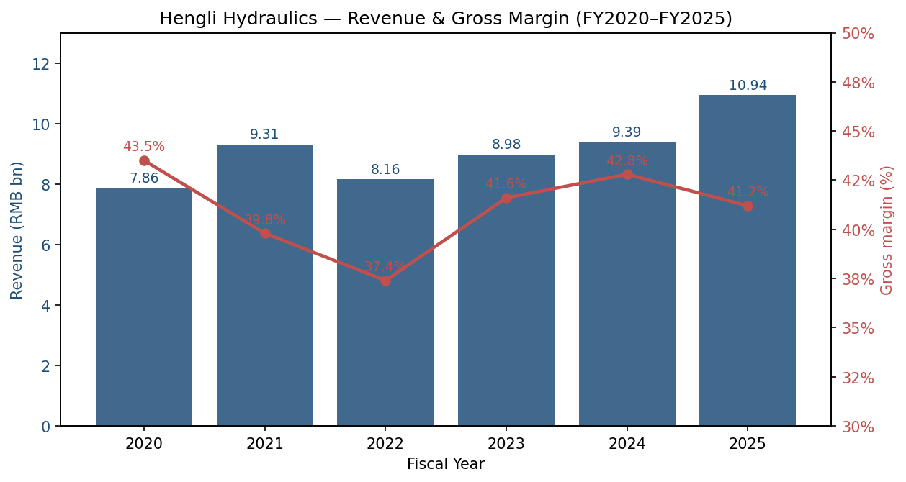
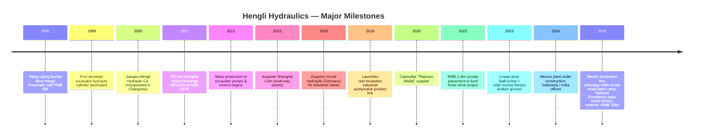
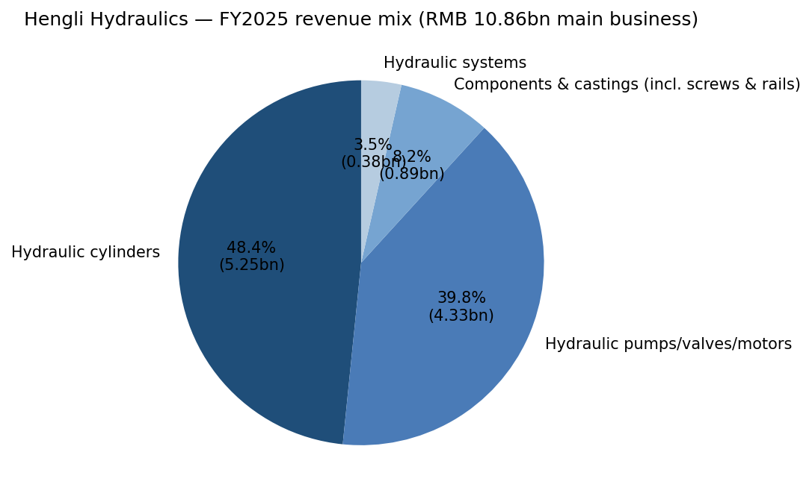
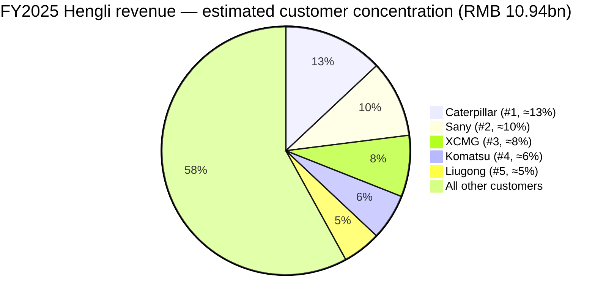
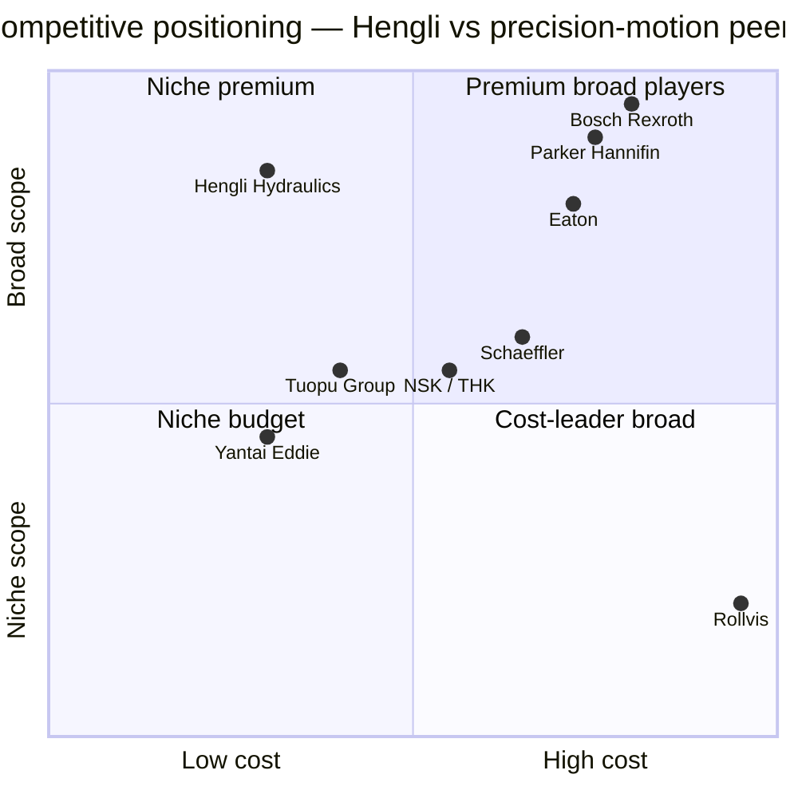
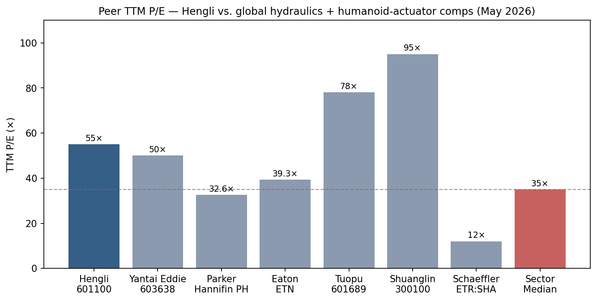
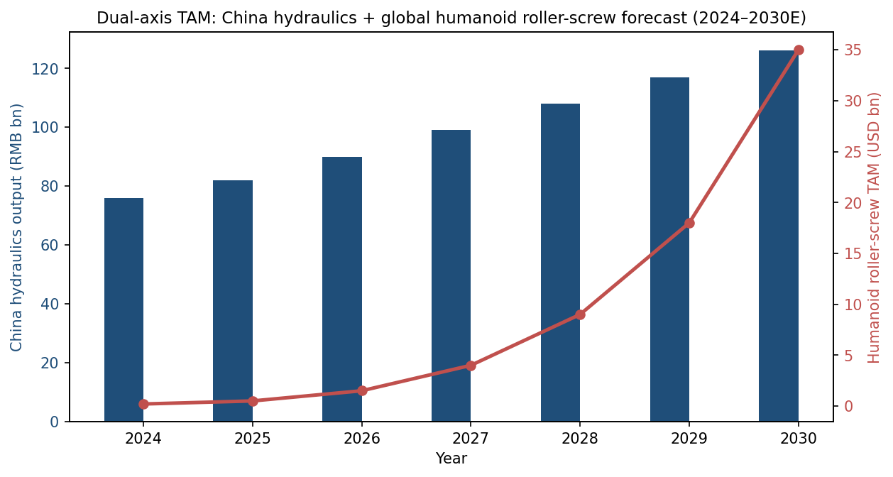

# Hengli Hydraulics (Jiangsu Hengli Hydraulic Co., Ltd., 恒立液压, SSE:601100) — Research Document
**Date:** 2026-05-16
**Ticker:** SSE:601100 · A-share, listed on the Shanghai Stock Exchange · Reporting currency RMB · Domiciled Changzhou, Jiangsu, PRC
**Auditor:** Rongcheng CPA LLP (容诚会计师事务所) — standard unqualified opinion on FY2025

> **Update — FY2025 results delivered, revenue first time above RMB 10bn (2026-04-20):** Hengli Hydraulics reported full-year FY2025 revenue of **RMB 10.94bn (+16.5% YoY)** and net profit attributable to shareholders of **RMB 2.73bn (+9.0% YoY)** — both all-time highs ([江苏恒立液压股份有限公司2025年年度报告, p. 6–11](http://static.cninfo.com.cn/finalpage/2026-04-21/1225127026.PDF)). Q3 2025 alone showed acceleration: revenue +24.5% YoY, attributable net profit +30.6% YoY ([2025年第三季度报告](http://static.cninfo.com.cn/finalpage/2025-10-28/1224741339.PDF); [恒立液压2025三季报点评, 东海证券 2025-10-28](https://pdf.dfcfw.com/pdf/H3_AP202510281770845046_1.pdf)). Management also confirmed that the Mexico plant entered serial production in 2025 and the **linear-drive (planetary-roller-screw + ball-screw) project formally entered production**, with FY2025 capacity of 360,000 m of linear guideways and 70,000 sets of precision-ground ball screws, sample shipments of planetary roller screws to >300 customers, and initial mass production of planetary roller screws underway — the so-called "humanoid second growth curve" ([2025年年度报告, p. 11](http://static.cninfo.com.cn/finalpage/2026-04-21/1225127026.PDF)).

## Table of Contents
1. Company Overview
2. Company History
3. Management Team
4. Products & Services
5. Customers & Go-to-Market
6. Industry Overview
7. Competitive Landscape
8. Market Opportunity (TAM)
9. Risk Assessment
10. References

======================================

## 1. Company Overview

Jiangsu Hengli Hydraulic Co., Ltd. (江苏恒立液压股份有限公司, SSE:601100, "Hengli") is **China's largest, most diversified, and most profitable hydraulic-components company**, and the only domestic player whose product line spans the full hydraulic stack — high-pressure cylinders, high-pressure axial-piston pumps, multi-way valves, industrial valves, hydraulic motors, hydraulic systems, hydraulic test rigs, and high-precision hydraulic castings — for excavators, tunnel-boring machines, marine and port equipment, aerial work platforms (AWPs), agricultural machinery, injection-moulding machines, forging presses, wind turbines, and (since 2022) the linear-motion components used in industrial machine tools and humanoid robots ([2025年年度报告, p. 10–13](http://static.cninfo.com.cn/finalpage/2026-04-21/1225127026.PDF)). Headquarters and the principal Tier-1 flexible smart factory are at 99 Longqian Road, Wujin Hi-Tech District, Changzhou, Jiangsu; subsidiaries span Shanghai, Wuxi, Changsha, Nanjing, plus overseas units in Germany (InLine Hydraulik GmbH), Japan (HARADA Giken, Hattori Seiko, HST), the United States (Hengli America, the 580 West Crossroads Chicago facility), India, Indonesia, Mexico (just commissioned 2025), the UK, Italy, Brazil, France, Singapore, and Guinea ([2025年年度报告, p. 4–5](http://static.cninfo.com.cn/finalpage/2026-04-21/1225127026.PDF)).

**What Hengli does, in plain English.** Hengli sells hydraulic components and complete hydraulic systems to original-equipment manufacturers ("主机厂", OEMs) — it is a Tier-1 supplier to machine builders, not a consumer-facing brand. A modern hydraulic excavator contains roughly 40% of its bill-of-materials value in hydraulics (cylinders + pumps + valves + motor + cooler + system controls); Hengli supplies the bulk of that content to Chinese OEMs Sany, XCMG, Liugong, Zoomlion, Lonking, Sany Heavy Industry, Sany Marine, China Railway, China Railway Construction Heavy Industry, Lovol, etc., and is a "platinum-medal" preferred supplier to Caterpillar globally, as well as a qualified supplier to Komatsu, Kobelco, Hitachi Construction Machinery, Doosan, Volvo CE, Kubota, and JCB ([2025年年度报告, p. 10–12](http://static.cninfo.com.cn/finalpage/2026-04-21/1225127026.PDF); [Caterpillar Hengli "platinum supplier" coverage, 第一工程机械网 2020-12-25](https://news.d1cm.com/20201225122650.shtml)).

**How they make money.** Pricing is direct-to-OEM with annual framework agreements and rolling purchase orders, lead times 30–60 days, made-to-order — there is no consumer distribution and no aftermarket channel of meaningful size. Cost-pass-through is partial: when steel, ductile-iron castings, and seals fluctuate, Hengli typically absorbs the first 6–12 months of input swings before negotiating a price step. Gross margin sits in the 39–43% band — premium for any heavy-industrial supplier — driven by (a) vertical integration into the casting and surface-treatment stages, (b) >40% market share inside Chinese excavator hydraulics for mid-large machines, and (c) a meaningful export mix at higher overseas pricing ([2025年年度报告, p. 15](http://static.cninfo.com.cn/finalpage/2026-04-21/1225127026.PDF)).

**Scale.** FY2025 revenue was RMB 10.94bn, attributable net profit RMB 2.73bn (ROE 16.6%, weighted), total assets RMB 21.67bn, attributable equity RMB 17.28bn, and operating cash flow RMB 1.81bn. The group employed approximately **8,400 staff** of which 1,104 are R&D engineers (13.1% of headcount) — including 3 PhDs and 168 masters — and operates 7 R&D centres globally, with cumulative valid patents of 1,125 and 186 registered trademarks ([2025年年度报告, p. 12, 17](http://static.cninfo.com.cn/finalpage/2026-04-21/1225127026.PDF)). Three "Jiangsu Provincial Demonstration Smart Workshops" have been certified, and in September 2025 the high-end hydraulic-components flexible smart factory was certified as a **National "Excellence-class" Smart Factory** ("国家卓越级智能工厂"), the highest grade in MIIT's smart-factory hierarchy ([2025年年度报告, p. 13](http://static.cninfo.com.cn/finalpage/2026-04-21/1225127026.PDF)).

**Valuation snapshot (REQUIRED).** As of mid-May 2026, Hengli traded at roughly RMB 119.6/share with a market capitalisation of approximately **RMB 160bn** ([东方财富 行情, 601100](https://quote.eastmoney.com/sh601100.html); [乐咕乐股 601100 PE/PB](https://legulegu.com/s/601100)).

- **TTM P/E ≈ 55× / TTM P/S ≈ 14.6×.** On FY2025 attributable net profit of RMB 2.73bn the implied P/E is 58.6×; using TTM net profit through Q1 2026 it works to roughly **55×** as published on Legulegu and Tonghuashun ([恒立液压 PE/PB/股息率, legulegu.com](https://legulegu.com/s/601100); [基本面 F10, 同花顺 601100](https://basic.10jqka.com.cn/601100/)). TTM P/S ≈ market cap RMB 160bn / TTM revenue RMB 11.0bn ≈ **14.6×**.
- **3-year context.** The 3-year TTM-P/E range spans roughly 25× (April 2024 trough, excavator down-cycle bottom) to 60× (March 2025 peak when humanoid-robot supply-chain enthusiasm rerated the stock). The current 55× sits in the top decile of the 3-year band ([恒立液压历史市盈率分位数, 知了财报网](https://www.zhiliaocaibao.com/gz_pe/601100_%E6%81%92%E7%AB%8B%E6%B6%B2%E5%8E%8B_9/)). P/B is ~9.3× on RMB 17.3bn book value — high, but defensible against ROE 16.6%.
- **Peer comparison.** Among hydraulics: Parker Hannifin trades at TTM P/E **32.5×** ([Parker Hannifin PE Ratio, Gurufocus, May 2026](https://www.gurufocus.com/term/pe-ratio/PH)), Eaton at **39.3×** ([Eaton PE TTM, Gurufocus, May 2026](https://www.gurufocus.com/term/pettm/ETN)), Bosch Rexroth is not separately listed (Bosch GmbH is private; Drive & Control Technologies revenue 2024 ≈ EUR 7bn). Among Chinese hydraulics, Yantai Eddie Precision (烟台艾迪精密, SSE:603638) trades at roughly **45–50× TTM** on FY2025 net profit RMB 394m and market cap ~RMB 19bn ([艾迪精密 2025年年报, 新浪财经 2026-04-22](https://finance.sina.com.cn/jjxw/2026-04-22/doc-inhvitah5647045.shtml)). On the humanoid-actuator side, Tuopu (拓普集团, SSE:601689) trades at approximately **78×** and Shuanglin (双林股份, SZSE:300100) at >**90×** TTM, reflecting full robot-supply-chain narrative pricing ([拓普集团 估值 morningstar](https://www.morningstar.com/stocks/xshg/601689/quote); [拓普集团 26Q1 评论 Futubull 2026](https://news.futunn.com/en/post/72749346/tuopu-group-601689-revenue-growth-maintained-in-q1-2026-with)). Schaeffler (ETR:SHA), a more diversified motion-control comp, trades closer to ~**12× TTM** as a European cyclical ([Schaeffler valuation, MarketScreener](https://www.marketscreener.com/quote/stock/SCHAEFFLER-AG-120796717/valuation/)).

Source: [江苏恒立液压股份有限公司2025年年度报告, p. 6, 15](http://static.cninfo.com.cn/finalpage/2026-04-21/1225127026.PDF); [2023年年度报告, p. 14](http://static.cninfo.com.cn/finalpage/2024-04-23/1219748041.PDF); [2024年年度报告, p. 15](http://static.cninfo.com.cn/finalpage/2025-04-29/1223384610.PDF).

**Interpretation of the 55× multiple.** Hengli's TTM P/E is roughly **2× the global hydraulics peer median** (~28–30×) and **>50% above** its own 5-year median (~36×). The premium is a narrative-driven re-rating with three identifiable drivers: (a) Chinese excavator demand turned from down-cycle to up-cycle in 2024–2025 (national excavator sales +17% in 2025 to 235,257 units), with rotor-piston-pump units for medium-large excavators up ~40% YoY ([中国工程机械工业协会, 挖掘机销量 2025](http://www.cncma.org/)); (b) the linear-drive (planetary-roller-screw + ball-screw) project has been recognised by the market as a credible second growth curve into humanoid-robot actuators, with research notes citing Hengli as a candidate Optimus joint-module supplier ([KGG news: miniature planetary roller screws for humanoid actuators](https://www.kggfa.com/news/miniature-planetary-roller-screw-focus-on-humanoid-robot-actuators/); [挖掘机液压到机器人丝杠, 新浪财经 2025-03-10](https://finance.sina.com.cn/roll/2025-03-10/doc-inepeazm9696365.shtml); [人形机器人概念让恒立液压重回千亿市值, 新浪财经 2025-03-12](https://finance.sina.com.cn/stock/relnews/cn/2025-03-12/doc-inepkerm8863552.shtml)); and (c) the global export build-out (Mexico online, Indonesia/India/Italy/UK service centres) opens a structural top-line lever for Caterpillar / Komatsu / Kubota OEM share-gain. The stretched multiple is therefore (correctly) classified in this report as a **valuation / multiple-compression risk** (see Section 9) — not as a clear "bubble", but as a price that already assumes meaningful humanoid execution.

## 2. Company History

Hengli's founding story begins in 1990, when **Wang Liping (汪立平)**, then a 24-year-old township pneumatics-factory technician in Wuxi, Jiangsu, used **RMB 50,000** of personal capital and seven employees to launch Wuxi Hengli Hydraulic Pneumatic Co., a small workshop that machined cylinder bodies for civil-engineering equipment ([CAMAL Group: Chinese construction equipment manufacturers: Hengli 2025](https://camaltd.com/hengli/)). The pivotal technical breakthrough came in 1999, when the team developed a domestic hydraulic cylinder for excavators that met the durability and tolerance specifications of foreign OEMs and immediately replaced Japanese KYB and Kawasaki supply at Sany and XCMG. Over the next decade Hengli became the largest excavator-cylinder supplier in the world by unit volume and the principal beneficiary of China's 2008–2011 stimulus-led construction-machinery boom.

**Three strategic pivots** define the modern company. First, the **2013 expansion from cylinders into pumps, valves and motors** — Hengli took the cylinder-customer relationships (which were already inside every Chinese excavator OEM) and used them to seed a substantially higher-margin product line. Pumps & valves now generate ~40% of revenue at ~49% gross margin versus ~40% for cylinders ([2025年年度报告, p. 15](http://static.cninfo.com.cn/finalpage/2026-04-21/1225127026.PDF)). Second, the **2018 industrial-equipment pivot** — recognising that Chinese excavator demand was structurally cyclical, Hengli began selling pumps and valves to forging/injection-moulding/wind/agricultural OEMs, broadening the served addressable market from "excavator hydraulics" (≈RMB 30bn) to "all China industrial hydraulics" (≈RMB 800bn). Third, and most strategically, the **2022 linear-drive entry**: Hengli's RMB 1.4bn private placement (issued December 2022 at RMB 56.40/share, 35.46m shares) funded a dedicated factory in Changzhou for high-precision ball screws, planetary roller screws, and linear guideways — an explicit bet that the precision-motion know-how it had accumulated in hydraulic cylinders (super-finishing, induction hardening, micron-grade grinding) would transfer to the linear-motion components needed in CNC machine tools, semiconductor equipment, and (most consequentially) humanoid-robot actuators ([2025年年度报告, p. 53](http://static.cninfo.com.cn/finalpage/2026-04-21/1225127026.PDF); [恒立液压：成为线性运动核心部件领先供应商, 新浪财经 2025-01-17](https://finance.sina.com.cn/stock/relnews/cn/2025-01-17/doc-inefhmfa3267798.shtml)).

**Key acquisitions:**
- **2015 — Shanghai Lixin Hydraulic (上海立新液压)** — multi-way valves for excavators; gave Hengli the missing piece of its hydraulic-stack puzzle. Now a wholly-owned subsidiary.
- **2016 — InLine Hydraulik GmbH (德国茵莱)** — German industrial valve specialist; provided European OEM access and a non-Chinese R&D footprint.
- **2019 — HARADA Giken (恒立日本)** and **Hattori Seiko (日本服部)** — Japanese precision-machining houses bolted on to give Hengli reach into Japanese OEM design centres and access to Japanese tooling know-how.
- **2024 — Hengli Mexico S.A. de C.V., Hengli Indonesia, Hengli Brazil, Hengli Guinea, Hengli UK/Ireland, Hengli Italy** — overseas sales-and-service or assembly entities supporting localisation ([2025年年度报告, p. 4–5](http://static.cninfo.com.cn/finalpage/2026-04-21/1225127026.PDF)).

**Recent developments (12–18 months):** Mexico plant commissioned 2025 H2 (cylinder/pump assembly for Caterpillar's Mexicali campus); first ultra-large 156-metre offshore pile-driving closed-loop energy-recovery cylinder system delivered to a Chinese marine-engineering customer; participation in the Pinglu Canal water-conservancy mega-project (largest hydraulic gate cylinders ever built in China); seven national-level R&D projects in progress including "Electric construction-machinery key components" and "Integrated linear actuator systems" ([2025年年度报告, p. 11–12](http://static.cninfo.com.cn/finalpage/2026-04-21/1225127026.PDF)).

## 3. Management Team

**Wang Liping (汪立平), Chairman of the Board & Founder — 250–350 word bio.** Born 1966 in Jiangsu, junior-college education, certified senior economist. Wang founded the predecessor Wuxi Hengli Pneumatic in 1990, age 24, with seven employees and RMB 50,000. He has been continuously CEO/Chairman of the integrated group for 35 years, an exceptionally long tenure for a Chinese listed-company founder. Wang's signature accomplishment is the 1999 development of the first domestic excavator hydraulic cylinder that broke the KYB/Kawasaki/Eaton oligopoly — a technical bet that the company would not survive without, given that Chinese excavator OEMs at the time imported essentially 100% of cylinders. He then repeated the same playbook for pumps (2013) and now linear motion (2022). Wang holds, together with his wife **Qian Peixin (钱佩新)** (a Hong Kong resident, director of申诺科技) and son **Wang Qi (汪奇)**, approximately **64.3% of Hengli** through three holding vehicles: Jiangsu Hengli Holdings (36.95%, controlled by Wang), Shenuo Technology (Hong Kong) (14.10%, controlled by Qian), and Ningbo Hengyi (13.29%, the management-equity-vehicle, controlled by Wang) — making this a tightly founder-controlled company in which the family's interests are unmistakably aligned with shareholders ([2025年年度报告, p. 54–57](http://static.cninfo.com.cn/finalpage/2026-04-21/1225127026.PDF); [Bloomberg Billionaires Index — Wang Liping](https://www.bloomberg.com/billionaires/profiles/liping-wang/)). Wang's pre-tax FY2025 compensation was RMB 1.42m — modest by global standards; the wealth is entirely in equity. He sits on the People's Congress of Wujin District (15th term) and is a member of the Jiangsu Provincial CPPCC (12th). External profile is low — almost no English-language interviews, very limited Chinese press appearances; the company's communication channel is the formal investor-day twice a year. Continuing through age 60, Wang was re-elected to a fresh 3-year board term in September 2025, indicating no near-term succession trigger.

**Qiu Yongning (邱永宁), Director and General Manager (CEO).** Age 56, holds a bachelor's degree in mechanical engineering from Nanjing University of Aeronautics and Astronautics. Career path runs through Jiangsu Zhengmao Group (production manager), Hualixin Electric Machinery (deputy GM), and Kayaba Hydraulic Industry (Zhenjiang) — the China JV of Japan's KYB — where Qiu was head of production. He joined Hengli in the late 2000s as deputy GM, was promoted to GM, and now sits on the boards of Hengli Technology, Hengli Transmission (the linear-drive subsidiary), and Hengli Precision Industrial. Compensation FY2025 RMB 1.06m. Qiu is the day-to-day operator: he runs production planning, supply-chain, and execution against Wang's strategic direction, and his KYB background is meaningful — KYB is the global cylinder leader, and Qiu carries its lean-manufacturing methodology directly into Hengli ([2025年年度报告, p. 27–29](http://static.cninfo.com.cn/finalpage/2026-04-21/1225127026.PDF)).

**Peng Mei (彭玫), CFO / Finance Director.** Female, age 57, Beihang University, senior accountant. Prior roles: chief accountant at Changzhou Lanxiang Mechanical (now part of AVIC's Changzhou Lanxiang Aviation Engine Co.); finance head at Yamazaki Motorcycle Changzhou; CFO at Globe Industries Changzhou (a US-listed lawn-care company manufacturer). Peng has 30+ years of finance leadership across Chinese, Japanese, and US-owned operations in the Changzhou industrial cluster. She joined Hengli pre-IPO and oversaw the 2011 SSE listing and the 2022 private placement. Compensation FY2025 RMB 0.90m. Track-record points include zero financial-statement restatements, zero audit qualifications across 14 years public, and a continuously expanding dividend (FY2024 dividend RMB 0.94bn; FY2025 proposed dividend RMB 0.75bn at RMB 5.60 per 10 shares) — strong governance signals.

**Xu Jin (徐进), Director, Deputy GM & Sales Director.** Age 45, master's degree, joined Hengli as a sales-team manager and rose to head of group sales. He directly owns the global-OEM relationship book — Caterpillar, Komatsu, Doosan, Liugong, Volvo CE — and has been the architect of Hengli's overseas-direct-sales build-out (Mexico, India, Indonesia). FY2025 compensation RMB 0.91m. Sits on the board of Hengli Technology, Shanghai Lixin, and Hengli Precision Industrial.

**Wang Bin (王斌), Deputy GM & Hengli Precision Industrial GM.** Age 43, master's, internal promotion from regional sales → procurement manager → supply-chain GM → Liquid Pressure Technology deputy GM. He now leads the precision-machining unit responsible for the linear-drive product line and the planetary roller screws. FY2025 compensation RMB 0.96m.

**Hu Guoxiang (胡国享), Deputy GM & Hengli Mexico GM.** Age 43, master's, formerly head of the Tech Centre, then design-department manager, then GM of Hengli Cylinder Business Group. He has been seconded to Mexico and is responsible for the North-American Tier-1 ramp.

**Independent directors (3):**
- **Fang Youtong (方攸同)** — Tenured professor at Zhejiang University, electrical engineering PhD, expert on high-speed-train traction systems; brings electrification/electric-actuator technical depth at exactly the right moment for the linear-drive pivot.
- **Wang Xuehao (王学浩)** — USTC finance graduate, CPA + tax-agent licences, 15-year Deloitte tax-services career.
- **Quan Long (权龙)** — Professor at Taiyuan University of Technology, PhD from Xi'an Jiaotong in hydraulic transmission and control; the senior hydraulics academic in China and chair of the China Hydraulics Society's Fluid Power Committee. Quan's appointment is a direct technical-credibility signal to OEMs.

**Governance footer.** Hengli's board has 7 members (3 independent, 4 inside), satisfying the Shanghai Stock Exchange's independence floor. Founder family insider ownership is **64.3%**, leaving a free float of ~35% — comfortable enough for index inclusion (constituent of CSI 300, the Huatai-Pinebridge and E Fund CSI 300 ETFs are among the top-10 holders) but tight enough that minority oversight is limited ([2025年年度报告, p. 54–55](http://static.cninfo.com.cn/finalpage/2026-04-21/1225127026.PDF)). Audit committee chaired by Wang Xuehao; compensation determined by board comp committee, capped at director-board approval and subject to shareholder review. **No material related-party transactions** between the listed company and the founder's holding companies have been flagged in the latest filings — Ningbo Hengyi is purely a management-equity-vehicle with no operating activity, and Shenuo Technology is a Hong Kong investment vehicle ([2025年年度报告, p. 56](http://static.cninfo.com.cn/finalpage/2026-04-21/1225127026.PDF)). The controlling-shareholder pledge ratio is below 10%, well clear of the 80% high-pledge red line. In late 2025 the holding-company **trimmed ~32m shares** of Shenuo Technology (Hong Kong) holding from 14.5% to 14.1%, which generated some negative press around "founder selling at the top" — a real but manageable signal, since the absolute stake remains at 64% ([控股股东高位减持, 新浪财经 2025-11-04](https://finance.sina.com.cn/stock/relnews/cn/2025-11-04/doc-infwftut5229540.shtml)).

**Management track record assessment.** This team has delivered for 30+ years across three step-changes (cylinders → pumps → linear motion). The execution playbook — leverage existing OEM relationships, run R&D in lock-step with one anchor customer, then expand the product to all customers — has worked twice and is now being run a third time on roller screws. The main gap is **CFO and CEO succession**: both are above 55, and there is no publicly identified internal successor (Wang Qi, the founder's son, is not yet in an operating role). Capital allocation has been disciplined — Hengli has only one major private placement (2022, RMB 1.4bn), virtually no acquisitions of size, and a 30–40% dividend pay-out ratio.

## 4. Products & Services

Hengli divides its FY2025 main-business revenue of RMB 10.86bn across four reporting segments. Below is the full enumeration with FY2025 revenue, growth, and gross margin from the audited annual report ([2025年年度报告, p. 15](http://static.cninfo.com.cn/finalpage/2026-04-21/1225127026.PDF)):

| Segment | FY2025 revenue (RMB) | YoY | Gross margin | % of main business |
|---|---|---|---|---|
| Hydraulic cylinders (液压油缸) | 5,254m | +10.4% | 39.71% | 48.4% |
| Hydraulic pumps, valves & motors (液压泵阀及马达) | 4,326m | +20.7% | 48.83% | 39.8% |
| Hydraulic systems (液压系统) | 385m | +30.0% | 34.39% | 3.5% |
| Components & castings (incl. screws & guideways) (配件及铸件) | 891m | +30.3% | 15.25% | 8.2% |
| **Total main business** | **10,856m** | **+16.4%** | **41.15%** | **100%** |

Source: [江苏恒立液压股份有限公司2025年年度报告, p. 15](http://static.cninfo.com.cn/finalpage/2026-04-21/1225127026.PDF).

```mermaid
graph TD
    H[Hengli Hydraulics 601100]
    H --> C[Hydraulic cylinders RMB 5.25bn]
    H --> P[Pumps, valves, motors RMB 4.33bn]
    H --> S[Hydraulic systems RMB 0.39bn]
    H --> A[Components / castings / linear-drive RMB 0.89bn]

    C --> C1[Excavator cylinders boom/arm/bucket]
    C --> C2[Non-standard heavy cylinders AWP / port / marine]
    C --> C3[Ultra-large flagship 156m offshore pile-driver]

    P --> P1[Axial-piston main pumps for excavators]
    P --> P2[Multi-way valves for excavators]
    P --> P3[Travel motors / swing motors]
    P --> P4[Industrial pumps wind, press, injection moulding]
    P --> P5[Closed-loop pumps AWP, agriculture]

    S --> S1[Tunnel-boring machine systems]
    S --> S2[Marine deck systems]
    S --> S3[Water-conservancy hydraulic gates]

    A --> A1[Cylinder spares / pump cores]
    A --> A2[High-precision castings]
    A --> A3[Ball screws 70k sets / 360k m guideways]
    A --> A4[Planetary roller screws — humanoid actuator pilot]
```

**(1) Hydraulic cylinders — the flagship.** Hengli ships ~900,000 cylinders per year, the world's largest single-supplier output. The product line spans excavator-specific cylinders (boom, arm, bucket) for excavators ranging 1.5 t to 400 t — including a recently launched giant 90-tonne mining-excavator cylinder. Non-standard cylinders for aerial work platforms (AWPs), marine deck equipment (winch, hatch covers, davit, jack-up), wind-turbine pitch & yaw systems, port equipment (RTG/STS cranes), and water-conservancy gates round out the range. The 156-metre offshore pile-driver closed-loop energy-recovery cylinder system delivered in 2025 is the largest of its kind ever built. **Competitive verdict: yes, moat.** Type: scale + cost leadership + switching costs at the OEM. Evidence — Hengli holds >50% China share in mid-large excavator cylinders, has been Caterpillar's only Asian "platinum-medal" cylinder supplier for five consecutive years, and runs a gross margin (39.7%) materially above small-scale local competitors (typical 15–25%) ([2025年年度报告, p. 11, 15](http://static.cninfo.com.cn/finalpage/2026-04-21/1225127026.PDF); [卡特彼勒和供应商恒立的"油缸情缘", 第一工程机械网 2020-12-25](https://news.d1cm.com/20201225122650.shtml)). Closest competitor: **KYB Corporation (TYO:7242)** — comparable on quality at the high end; behind on cost; equal at parity for Japanese and Korean OEMs.

**(2) Hydraulic pumps, valves & motors — the highest-margin engine.** The product family includes (a) axial-piston main pumps for excavators (the so-called "main pump", historically a Kawasaki / Bosch Rexroth oligopoly), (b) multi-way valves (also historically Kawasaki/Eaton/Parker), (c) low-speed high-torque travel motors and swing motors, (d) industrial pumps for wind, injection moulding, forging presses, and (e) closed-loop pumps for AWPs and agriculture. In 2025 Hengli broke into the **ultra-large excavator main pump** category previously locked up by Bosch Rexroth and Kawasaki, with units for 50–90-tonne machines ([2025年年度报告, p. 11](http://static.cninfo.com.cn/finalpage/2026-04-21/1225127026.PDF)). **Competitive verdict: yes, technology / IP moat.** Evidence — Hengli is the only Chinese supplier with cylinder + main-pump + multi-way valve capability under one roof; gross margin 48.8% is consistent with proprietary technology; multiple national R&D project leadership (国家重点研发计划 "Distributed independent electro-hydraulic control system for excavators") gives technical first-mover position. Closest competitor: **Bosch Rexroth** (Bosch GmbH unit, private) — ahead on absolute precision and on closed-loop electronic control, behind on cost and on Chinese-OEM relationship density. **Kawasaki Precision Machinery** is the second comp — at parity on technology, behind on cost.

**(3) Hydraulic systems — small but high-strategy.** Integrated turnkey systems for tunnel-boring machines (China Railway Construction Heavy Industry), marine deck equipment, water-conservancy gates (Pinglu Canal), and special vehicles. FY2025 segment growth was 30%. Margin is the lowest of the four (34.4%) because system delivery includes purchased third-party content. **Competitive verdict: partial moat** — moat is from the underlying components, not from the system-engineering layer.

**(4) Components & castings — the planetary-roller-screw line lives here.** This is the segment to watch. Conventional content: cylinder spares, pump cores, high-precision castings (Hengli has its own foundry). The new content (consolidated here since 2025): **linear-drive components — ball screws, planetary roller screws, linear guideways, electric cylinders**. Reported FY2025 capacity is 70,000 sets of precision-ground ball screws/yr, 360,000 m of linear guideways/yr, and small-batch planetary-roller-screw shipments. The 2022 private placement defined a full-build-out plan of 104,000 standard ball-screw electric cylinders, 4,500 heavy-duty ball-screw electric cylinders, **750 planetary-roller-screw electric cylinders**, plus 100,000 m of standard and 100,000 m of heavy-duty ball screws ([2025年半年度报告](http://static.cninfo.com.cn/finalpage/2025-08-26/1224567720.PDF); [恒立液压：勇立潮头，线性驱动再造新恒立, 慧聪 2025-03-28](https://cm.hczyw.com/2025/0328/357974.html); [恒立液压：成为线性运动核心部件领先供应商, 新浪 2025-01-17](https://finance.sina.com.cn/stock/relnews/cn/2025-01-17/doc-inefhmfa3267798.shtml)). FY2025 shipment value was estimated at RMB 80–100 million, with management guidance for **3× growth in FY2026** to ~RMB 300m and >300 customers already in the database ([恒立液压: 公司信息更新报告：线性驱动项目投产顺利, 小牛行研 2025](https://www.hangyan.co/reports/3571243485287679827)). **Competitive verdict: partial moat, with a clear path to "yes".** Moat type today: certification + scale-up advantage; planned moat: technology + cost. Evidence — Hengli is one of only ~3 Chinese suppliers (the others being Beijing Precision Engineering and Nanjing Technology) with announced planetary-roller-screw production capability; sample shipments to Optimus joint-module designers have been reported (unconfirmed by Hengli directly) ([Hengli ... market share of planetary roller screws exceeding 40%, KGG news](https://www.kggfa.com/news/miniature-planetary-roller-screw-focus-on-humanoid-robot-actuators/)). Closest named competitors: **Tuopu Group (601689)** for the integrated linear-actuator-module deal; **Shuanglin (300100)** for ball-screws; **Schaeffler (ETR:SHA)** for the global benchmark on planetary roller screws. Versus Tuopu: behind on actuator-module integration but ahead on the precision-screw component. Versus Schaeffler: behind on absolute precision (Schaeffler's INA roller screws are P3-grade); at parity on cost; ahead on Chinese supply-chain access.

**Flagship vs. long-tail.** The 1–3 products driving Hengli today are (a) **excavator cylinders** (RMB 5.25bn revenue, 48% of total, defensible cash cow), (b) **excavator main pumps + multi-way valves** (RMB ~3.5bn revenue, 32% of total, fast-growing margin engine), and (c) **planetary roller screws / linear-drive components** (currently ~1% of revenue but the entire equity-narrative re-rating driver). Industrial pumps + non-excavator cylinders are the long-tail diversifiers.

**Recent launches (12 months).** Ultra-large 90-tonne mining-excavator cylinders; ultra-large excavator main pumps for the 50–90 t class (breaking foreign oligopoly); closed-loop AWP travel motors; the 156-metre offshore pile-driver closed-loop energy-recovery system; the new electric cylinder line; small-batch planetary roller screws. National "Excellence-class" smart-factory certification, September 2025. Mexico facility production-start. No reported sunsets in the period.

## 5. Customers & Go-to-Market

**Customer concentration — quantified.** Hengli's FY2025 top-5 customer concentration is **RMB 4.60bn, equal to 42.07% of total revenue**, with zero related-party content. FY2024 was 44.13% (RMB 3.64bn) and FY2023 was 42.45% (RMB 3.81bn) — a stable mid-40% range over 3 years ([2025年年度报告, p. 16](http://static.cninfo.com.cn/finalpage/2026-04-21/1225127026.PDF); [2024年年度报告, p. 15](http://static.cninfo.com.cn/finalpage/2025-04-29/1223384610.PDF); [2023年年度报告, p. 17](http://static.cninfo.com.cn/finalpage/2024-04-23/1219748041.PDF)). The single-largest customer is not separately named in Chinese annual-report disclosure (Chinese A-share rules require only the top-5 aggregate and confirmation that no single customer is >50%); industry triangulation from supplier reports and analyst notes points to **Caterpillar** as the #1 customer at roughly 13–15% of group revenue, followed by **Sany Heavy Industry, XCMG, Komatsu, and Liugong** at 6–10% each ([恒立液压深度研究, 知乎 2021](https://zhuanlan.zhihu.com/p/390364317); [恒立液压: 国产液压系统龙头, 知乎 2023](https://zhuanlan.zhihu.com/p/620217075); [Hengli ... top 5 customers, 第一工程机械网 2020](https://news.d1cm.com/20201225122650.shtml)). **Doosan** and **Hitachi Construction Machinery** are the other typical entrants in the top-10, with **Kubota** rising rapidly via the new agricultural-tractor pump programme ([2025年年度报告, p. 11](http://static.cninfo.com.cn/finalpage/2026-04-21/1225127026.PDF)).

Source: [江苏恒立液压股份有限公司2025年年度报告, p. 16](http://static.cninfo.com.cn/finalpage/2026-04-21/1225127026.PDF) (disclosed top-5 aggregate of 42.07%); customer-level estimates from [恒立液压深度研究, 知乎 2021](https://zhuanlan.zhihu.com/p/390364317) and [国产液压系统龙头恒立液压, 知乎 2023](https://zhuanlan.zhihu.com/p/620217075).

**Risk verdict.** Top-5 = 42%, which is below the 50% "material" threshold per the project risk taxonomy. Top-1 estimated at ~13% is just above the 10% disclosure threshold. **Concentration is moderate, not severe**, and the top-5 are competing OEMs (Sany vs. XCMG vs. Caterpillar vs. Komatsu vs. Liugong), so the actual single-name risk is lower than the headline number suggests — losing one customer is partially offset by share gain at its competitors. Note: **Caterpillar is increasing in-house cylinder content** at its Mexicali plant, which is part of the rationale for Hengli's own Mexico plant — to be physically inside Caterpillar's value chain. **Komatsu and Doosan** both have in-house hydraulic capability and use Hengli only as a second-source — a structural ceiling on those accounts. **Kubota** and **Sany** are increasing share of wallet. No top-5 customer is also a competitor in Hengli's product space (Caterpillar makes excavators, not components-for-sale).

**Contract structure.** Annual framework agreements with the top-10 OEMs, executed at year-start; specific POs flow against the framework; lead time 30–60 days; payment terms 60–120 days (a structural reason for Hengli's RMB 1.9bn accounts-receivable balance, which grew 39% YoY in FY2025 alongside revenue). No multi-year volume commitments — pricing renegotiated annually.

**Sales channel.** 100% direct OEM sales; no distribution layer. The internal sales force is organised in three units — domestic-excavator OEMs, domestic-industrial OEMs, and overseas — under Xu Jin (sales director). Service is via 30+ China service offices plus overseas service hubs in Europe, the US, Japan, Mexico, Indonesia, India, and (since 2025) the UK, Italy, Guinea.

**Geographic mix.** Domestic FY2025 revenue RMB 8.75bn (+20.7% YoY, 80% of total); overseas RMB 2.11bn (+1.6% YoY, 19% of total). Gross margin on domestic and overseas is nearly identical (41.1% vs 41.4%), unusual for Chinese exporters and indicating that Hengli is not competing on price overseas but on quality. Overseas growth is muted because the US/EU construction-machinery market was weak in 2025; the Mexico plant has been built to capture growth in 2026–2028.

**Key partnerships.** Co-development arrangements with (a) **Caterpillar** on heavy-duty cylinders and the National-Key R&D project on distributed electro-hydraulic control; (b) **Sany** on the next-generation electric excavator; (c) **Kubota** on the agricultural high-pressure piston pump; (d) **CRCHI / China Railway Construction Heavy Industry** on tunnel-boring-machine hydraulic systems; (e) anchor partner for the National Excellence-class Smart Factory designation. On the linear-drive side, the company has confirmed customer relationships with >300 industrial-machine-tool customers; reported sample shipments to humanoid-robot designers in Optimus's joint-module supply chain are unconfirmed by Hengli but widely cited in sell-side notes ([人形机器人产业化提速，线性驱动有望构建新成长极, 小牛行研 2025](https://www.hangyan.co/reports/3575833783452042682); [Hengli Hydraulic — linear drive project, Futubull 2025](https://news.futunn.com/en/post/53339154/jiangsu-hengli-hydraulic-601100-the-linear-drive-project-has-been); [Mapping the Humanoid Robot Value Chain, Morgan Stanley 2025](https://advisor.morganstanley.com/john.howard/documents/field/j/jo/john-howard/The_Humanoid_100_-_Mapping_the_Humanoid_Robot_Value_Chain.pdf)).

**Named customer case studies.** Caterpillar Mexicali — multi-year cylinder supply for the L-Series, M-Series and the new "Caterpillar Cat 374" excavator line. Sany SY485H mining excavator — Hengli provides 100% of the hydraulic content including the giant slewing-bearing cylinder. China Railway Construction Heavy Industry Pinglu Canal — Hengli delivered the largest hydraulic gate cylinders ever fabricated in China. Kubota M-series tractors — high-pressure variable-displacement piston pump.

## 6. Industry Overview

**Industry definition.** Hengli operates in three concentric industries: (a) **fluid-power components and systems** (hydraulics + pneumatics), NAICS 333996 / China industry code C3429, comprising pumps, motors, valves, cylinders, accumulators, and integrated hydraulic systems; (b) **construction machinery hydraulics**, an end-market vertical inside (a) that constitutes ~40–50% of global hydraulics demand; (c) **precision linear-motion components**, including ball screws, planetary roller screws, and linear guideways, NAICS 333612 — historically a separate industry but rapidly converging with hydraulics as machinery electrifies.

**Market size (hydraulics, China).** The China Hydraulic Pneumatic & Sealing Industry Association (中国液压气动密封件工业协会, CHPSC) reported FY2025 industry output of **approximately RMB 82bn**, up materially from FY2020 and continuing the 14th Five-Year Plan growth path. China imported USD 2.37bn and exported USD 2.82bn of hydraulics in 2024, generating the country's first hydraulics-trade surplus (USD 0.45bn) — a structural inflection point indicating that import-substitution has crossed 50% for the first time ([2025年年度报告, p. 24](http://static.cninfo.com.cn/finalpage/2026-04-21/1225127026.PDF); [CHPSC industry data](http://www.chpsa.org.cn/)). Globally, the hydraulics market is approximately **USD 45–50bn** (Parker Hannifin Motion Systems + Eaton Industrial + Bosch Rexroth + Kawasaki + Komatsu HE + Hengli + KYB account for ~60% of the global market).

**Market size (linear-motion components — the second leg).** The global precision ball-screw + roller-screw + guideway market is **USD 12–14bn** today, dominated by Japanese suppliers (NSK, THK, Nachi, IKO) plus German Schaeffler/Bosch and Swiss Rollvis. China's share is <20% but rising fast on import-substitution + on the new humanoid-robot demand pool. Morgan Stanley's "Humanoid 100" report estimates that, at 1 million humanoid units per year and 40 linear actuators per humanoid, the humanoid roller-screw TAM alone is **USD 5–10bn at maturity**, with 75–80% of demand for planetary roller screws (the only viable technology for the force density required) ([Mapping the Humanoid Robot Value Chain, Morgan Stanley 2025](https://advisor.morganstanley.com/john.howard/documents/field/j/jo/john-howard/The_Humanoid_100_-_Mapping_the_Humanoid_Robot_Value_Chain.pdf); [This tiny screw is powering the humanoid robot revolution, Fast Company 2025](https://www.fastcompany.com/91314612/this-tiny-screw-is-powering-the-humanoid-robot-revolution)).

**Growth.** Chinese excavator sales rebounded **+17% YoY to 235,257 units in 2025**, the second straight year of growth, with domestic +17.9% and exports +16.1% ([2025年年度报告, p. 10](http://static.cninfo.com.cn/finalpage/2026-04-21/1225127026.PDF); [中国工程机械工业协会, 挖掘机销量月度数据 2025](http://www.cncma.org/)). The 2024 inflection followed a 3-year down-cycle (2021 peak 343k → 2023 trough 195k → 2025 recovery 235k). Drivers of the 2025 rebound included China's "ultra-long-term special government bonds" issued to fund infrastructure (water-conservancy, transport, energy), the equipment-replacement and trade-in subsidies (设备更新 / 以旧换新), and a strong export pull from emerging markets. Sell-side consensus is for **+10–15% YoY in 2026** as the cycle continues mid-recovery.

**Key trends.** Five secular themes are reshaping Hengli's industry:
1. **Electrification of construction machinery.** Hybrid/electric excavators replace hydraulic-only architecture with electro-hydraulic actuators + electric drives; Hengli's "Electric Construction Machinery Key Components" national R&D project plus the planetary-roller-screw line directly target this.
2. **High-end hydraulics import-substitution.** Bosch Rexroth's Chinese market share has fallen from >40% in 2015 to <20% in 2025 in mid-large excavator main pumps, all transferred to Hengli + a handful of new local entrants ([2025年年度报告, p. 11, 24](http://static.cninfo.com.cn/finalpage/2026-04-21/1225127026.PDF)).
3. **Globalisation / out-bound manufacturing.** China hydraulics exports now exceed imports; OEMs are pushing local-content and tariff-avoidance manufacturing into Mexico, Eastern Europe, and Indonesia — Hengli is one of very few to follow with local plants.
4. **Smart, networked, predictive hydraulics.** Embedded electronics, condition-monitoring, and IIoT-connected hydraulic systems — supports premium pricing.
5. **Humanoid robotics and precision linear motion.** Demand for planetary roller screws went from negligible in 2022 to a high-priority materials problem in 2025 as Tesla Optimus, Unitree, UBTech, Figure, 1X and others ramp pilot lines.

**Regulatory environment.** Hengli is a "specialized, refined, distinctive, novel" (专精特新) MIIT-recognised company; subject to standard A-share disclosure rules; foreign-exchange hedging (USD 580m notional FX swaps outstanding) governed by SAFE and SSE rules. Export controls limit the use of certain US-origin precision-grinding machines for sensitive segments — a watch-item but not a current binding constraint. Carbon and energy-consumption rules apply to the casting foundry.

**Industry structure.** China hydraulics is consolidating but still long-tail: top-5 players (Hengli, Eddie Precision, Three Rivers Power, Boeing Machinery, Beijing Huade) collectively hold ~35% domestic share. The mid-large excavator pump/valve niche is a near-duopoly between Hengli and a Kawasaki-Trumpf-Bosch Rexroth foreign block. Barriers to entry are very high: hydraulic-system design IP, casting capability, micron-grade machining, multi-year OEM-qualification cycles (typically 18–36 months from sample to mass production for excavator pumps).

## 7. Competitive Landscape

The competitive set divides cleanly into two strategic theatres.

**Theatre A — Hydraulics (today's revenue):**
- **Bosch Rexroth (Bosch GmbH, private)** — global leader in axial-piston pumps and high-end multi-way valves; ~EUR 7bn revenue 2024 in Drive & Control Technologies. *Differentiator*: deepest IP portfolio (>5,000 active hydraulics patents); closed-loop electronic control. *Vulnerability*: high cost-base, very slow to localise in China. *Compared to Hengli*: ahead on technology, behind on cost and access. ([Bosch Rexroth Drive & Control](https://www.boschrexroth.com/en/dc/our-company/about-us))
- **Kawasaki Precision Machinery (TYO:7012 subsidiary)** — main-pump and travel-motor specialist; dominant in Japanese OEMs (Komatsu, Hitachi CM). *Compared to Hengli*: at parity on technology, behind on cost, captive within Japanese OEM ecosystem.
- **Parker Hannifin (NYSE:PH)** — global motion-and-control conglomerate; FY2025 (FYE June) sales USD 19.9bn ([Parker-Hannifin annual report 2025](https://investors.parker.com/sec-filings/annual-reports/content/0000076334-25-000042/0000076334-25-000042.pdf)). Hydraulics is one of multiple segments. *Compared to Hengli*: ahead on global scale and aerospace credentials, behind on China cost-curve.
- **Eaton (NYSE:ETN)** — Industrial segment is hydraulics + filtration; FY2025 industrial-segment sales USD 2.8bn. *Compared to Hengli*: ahead on aerospace/electrical-grid integration, behind in mobile-machinery cost.
- **KYB Corporation (TYO:7242)** — cylinder specialist; ~JPY 410bn revenue. *Compared to Hengli*: ahead on shock absorber and rail vehicle, at parity on excavator cylinders.
- **Yantai Eddie Precision (烟台艾迪精密, SSE:603638)** — closest domestic comp; FY2025 revenue RMB 3.20bn, net profit RMB 394m ([艾迪精密 2025年年报, 新浪 2026-04-22](https://finance.sina.com.cn/jjxw/2026-04-22/doc-inhvitah5647045.shtml)). Focus: excavator pumps and motors. *Compared to Hengli*: 3× smaller, weaker product range, no cylinder business; valuation similar (~45–50× P/E).
- **Three Rivers Power (三联泵业), Boeing Machinery (博英机械), Beijing Huade (北京华德)** — smaller domestic players; combined <10% share.

**Theatre B — Linear motion / humanoid actuators (the future):**
- **Schaeffler AG (ETR:SHA, ADR SCFLY)** — INA-brand planetary roller screws are the global precision benchmark; ~EUR 16bn revenue 2024; bearings + linear technology. *Compared to Hengli*: ahead on precision class, ahead on bearings IP, at parity on cost potential, behind on China access. P/E ~12× — a defensive-cyclical value play, not a humanoid pure play. ([Schaeffler valuation, MarketScreener May 2026](https://www.marketscreener.com/quote/stock/SCHAEFFLER-AG-120796717/valuation/))
- **Rollvis SA (Swiss, private)** — boutique roller-screw maker, premium niche; the global gold-standard for satellite-class precision. Capacity constrained.
- **NSK / THK / IKO / Nachi (Japan)** — ball-screw + linear-guideway majors; ball-screw share leaders globally. Limited planetary-roller-screw range.
- **Tuopu Group (拓普集团, SSE:601689)** — Tesla T-chain Tier 1; reported RMB 3bn rotating-joint order for 2026 delivery; integrated linear/rotary actuator module supplier. *Compared to Hengli*: ahead on Tesla integration, ahead on actuator module design, behind on precision-screw component manufacturing (Tuopu buys screws, makes assemblies). P/E ~78× ([拓普集团 26Q1 收入保持增长, Futubull 2026](https://news.futunn.com/en/post/72749346/tuopu-group-601689-revenue-growth-maintained-in-q1-2026-with); [拓普集团 ... 业务拓展, Futubull](https://news.futunn.com/en/post/70600324/tuopu-group-601689-business-expansion-drives-revenue-growth-smart-manufacturing)).
- **Shuanglin Auto Parts (双林股份, SZSE:300100)** — automotive-parts pivot to humanoid screws; mass-production roller-screw capability announced 2025. *Compared to Hengli*: behind on precision-component scale, similar on ambition. P/E >90×.
- **Beijing Precision Engineering (汉柏精机)** and **Nanjing Technology (南京工艺)** — domestic ball-screw specialists.

Source: [Parker Hannifin PE Ratio, Gurufocus 2026](https://www.gurufocus.com/term/pe-ratio/PH); [Eaton ETN PE TTM, Gurufocus 2026](https://www.gurufocus.com/term/pettm/ETN); [Schaeffler valuation, MarketScreener 2026](https://www.marketscreener.com/quote/stock/SCHAEFFLER-AG-120796717/valuation/); [恒立液压 PE, legulegu.com](https://legulegu.com/s/601100); [拓普集团 morningstar quote](https://www.morningstar.com/stocks/xshg/601689/quote); [艾迪精密 2025年年报, 新浪](https://finance.sina.com.cn/jjxw/2026-04-22/doc-inhvitah5647045.shtml).

**Hengli's advantages:**
- **Cost-leadership and scale** in mid-large excavator hydraulic components — no foreign competitor can match the Changzhou cost-base + Chinese-OEM relationship density.
- **Full-stack hydraulic offering** — only Chinese player with cylinder + pump + valve + motor + system + casting under one roof, with end-to-end vertical integration.
- **R&D heft** — 1,104 engineers, 7 R&D centres, 1,125 patents, 7 national-level R&D projects in progress, three province-level smart-workshop designations, national Excellence-class smart-factory certification.
- **Founder-controlled, long-tenure leadership** — 35 years of consistent strategic direction; 64% insider ownership.
- **Optionality in linear motion** — RMB 1.4bn invested 2022; planetary-roller-screw small-batch shipments live in 2025; this is the equity upside lever.

**Vulnerabilities:**
- **Cyclical earnings** tied to excavator demand — half of revenue is excavator-coupled.
- **Caterpillar in-sourcing pressure** — long-term, Caterpillar Mexicali will increase in-house cylinder content.
- **No proprietary high-end electronic-controls** in main pumps — Bosch Rexroth still has a 3–5-year edge on digital-hydraulic closed-loop architectures.
- **Linear-motion business is not yet at scale** — RMB 80–100m in FY2025 is symbolic, not material; execution risk over 2026–2028 is real.
- **Founder-family ownership concentration** — limited minority oversight; recent (Nov 2025) modest share trim by holding-company entity unsettled some investors.

**Market share.** Hengli holds approximately **50% of China excavator-cylinder shipments**, ~25–30% of mid-large excavator main pumps, ~15% of multi-way valves (rapidly rising), ~5% of industrial pumps and motors (long-tail growth). Globally, Hengli is approximately #1 in excavator-cylinder unit shipments and a top-5 player in mobile hydraulics overall ([2025年年度报告, p. 13](http://static.cninfo.com.cn/finalpage/2026-04-21/1225127026.PDF); [国投证券: 业绩稳健增长, 稀缺性和成长性, 发现报告](https://www.fxbaogao.com/detail/4570643)).

## 8. Market Opportunity (TAM)

**TAM definition.** Hengli's near-term TAM (today's revenue base) is ~RMB 300bn — global mobile-hydraulics components shipped into excavators, AWPs, agriculture, marine, port, and tunnel-boring equipment, of which the company today captures ~3% global / ~30% domestic. The medium-term TAM is **~RMB 500bn** — adding industrial hydraulics (wind, forging, injection moulding, water-conservancy). The long-term TAM, with the linear-drive line included at scale, is **~RMB 700–900bn** — adding the precision linear-motion component market plus the humanoid-robot linear-actuator opportunity.

Source: China hydraulics output — [中国液压气动密封件工业协会 statistics](http://www.chpsa.org.cn/) and [2025年年度报告, p. 24](http://static.cninfo.com.cn/finalpage/2026-04-21/1225127026.PDF). Humanoid roller-screw TAM — [Mapping the Humanoid Robot Value Chain, Morgan Stanley 2025](https://advisor.morganstanley.com/john.howard/documents/field/j/jo/john-howard/The_Humanoid_100_-_Mapping_the_Humanoid_Robot_Value_Chain.pdf); [On the eve of the robotics industry's explosive growth in 2026, iMedia/min.news](https://min.news/en/tech/dc6151c321be3699f5f8097382a9c465.html); [Humanoid Robots: AI's Best Hope?, Longbridge 2025](https://longbridge.com/en/topics/37373471).

**SAM (serviceable available market) — three pillars.**
1. **China hydraulics — RMB 82bn 2025, projected RMB 120bn by 2030 (~8% CAGR).** Hengli's share today is ~13% of the total; share-gain path to ~20% is plausible as Bosch Rexroth retreats from low-end Chinese OEM business.
2. **Global ex-China hydraulics — USD 35bn.** Hengli's share is <2% today; the export build-out (Mexico, Indonesia, Italy, UK, India) targets ~5–6% share by 2030 = ~USD 1.5–2.0bn = ~RMB 11–14bn potential.
3. **Precision linear motion — USD 12–14bn today, USD 25bn by 2030 (~12% CAGR), of which humanoid-actuator demand alone could be USD 5–10bn at maturity.** Hengli today is sub-1% share of this market; the announced full-build-out capacity (104,000 standard electric cylinders + 750 planetary-roller-screw electric cylinders + 100,000 m heavy-duty ball screws + 100,000 m standard ball screws p.a.) is calibrated against a ~USD 200–400m revenue ambition, i.e. ~1–2% share at maturity. Importantly, **750 planetary-roller-screw electric cylinders** is **small** in absolute units — Hengli is positioning for high-value-add per unit rather than commodity volume.

**SOM (serviceable obtainable market) — 5-year base case.**
- Hydraulics: from RMB 9.6bn (FY2025 excluding linear) to ~RMB 15–17bn by FY2030 (~10–12% CAGR), driven by mid-cycle excavator recovery + non-excavator industrial-pump share gains.
- Linear drive: from ~RMB 0.1bn (FY2025) to **RMB 1.5–3.0bn by FY2030**, driven by industrial machine-tool ball-screw share gains in China plus humanoid-roller-screw revenue ramp.
- Combined FY2030 revenue ~RMB 17–20bn vs. FY2025 RMB 10.9bn — a 9–13% revenue CAGR.

**Humanoid wild-card.** If Hengli secures qualified-supplier status on one Tier-1 humanoid programme at scale (Optimus, Figure, or a Chinese equivalent at 100k+ units/yr), with ~40 planetary roller screws per humanoid at an ASP of USD 200–400 per screw, that is a USD 800m–USD 1.6bn revenue opportunity per major customer. **The Optimus joint-module supply chain is the most-cited specific upside catalyst** in sell-side coverage, although Hengli has not directly confirmed any Tesla relationship — the speculation rests on (a) Hengli's planetary-roller-screw capability being one of only ~3 Chinese options, (b) Tesla's Mexicali humanoid pilot line being adjacent to Caterpillar Mexicali (where Hengli is co-locating), and (c) sell-side teardown reports identifying compatibility with Optimus joint geometry ([Hengli ... Optimus hip/knee compatibility, KGG news](https://www.kggfa.com/news/miniature-planetary-roller-screw-focus-on-humanoid-robot-actuators/); [Where China leads and lags in humanoid joint architecture, Interesting Engineering 2025](https://interestingengineering.com/ai-robotics/china-humanoid-robots-actuators); [Who Will Build the "Joints" for Tesla's Million Robots?, 36Kr 2025](https://eu.36kr.com/en/p/3728136166797832)).

**Penetration strategy.** Hengli's playbook for humanoid is the same one that worked in cylinders and pumps: anchor one major customer's design-in, then propagate to the rest of the industry. The publicly identified anchor relationships in linear-drive are with several Chinese industrial-machine-tool builders; the rumoured anchor relationship with a Tesla / Optimus-tier customer is the swing factor. Hengli plans an additional capex round in 2026–2027 for a dedicated planetary-roller-screw subsidiary — referenced as **Hengli Transmission (常州恒立传动)** in the FY2025 annual ([2025年年度报告, p. 4](http://static.cninfo.com.cn/finalpage/2026-04-21/1225127026.PDF)) — to scale production by an order of magnitude if the demand materialises.

## 9. Risk Assessment

### Company-Specific Risks

1. **Linear-drive execution risk.** Hengli has invested ~RMB 1.4bn in linear-drive equipment with FY2025 segment revenue of only ~RMB 100m and a 15% gross margin — vs. 41% group margin. The segment must scale ~10× by FY2028 to justify the equity-narrative re-rating; failure to convert sample customers into volume contracts (especially in the humanoid-actuator end-market) would compress the P/E meaningfully. *Mitigant*: company has assembled the team, capacity, certifications, and a 300+ customer database; Q3 2025 saw the first quarter of meaningful sequential growth.

2. **Customer concentration on Caterpillar / Sany / XCMG / Komatsu / Liugong.** Top-5 = 42% of revenue; estimated top-1 ~13%. *Severity: moderate.* Caterpillar's increasing in-house cylinder content at Mexicali is the most specific watch-item; if Caterpillar cuts its outsourced cylinder share from ~80% to <50% over 2026–2028, the impact would be roughly RMB 500–700m of annual revenue at risk. *Mitigant*: Hengli's Mexico plant is co-located with Caterpillar Mexicali; new SKUs being developed in cooperation; share losses are partially offset by share gain at competing OEMs. Top-5 has been stable in the 42–44% band for 3 years.

3. **Key-person dependency on Wang Liping.** Wang is 60, has run the company for 35 years, and controls 64% of equity. No publicly identified internal successor; Wang Qi (son) is not yet operating. A founder transition event would unsettle the stock and disrupt strategic continuity in the linear-drive ramp. *Mitigant*: Wang re-elected to a fresh 3-year board term September 2025; executive team is stable and average tenure >10 years.

4. **Caterpillar in-sourcing.** Caterpillar's Mexicali campus is increasing vertical integration on hydraulic cylinders. Even with co-location, Hengli's share-of-Caterpillar could decline 2026–2030. *Mitigant*: Hengli is the only Asian "platinum" supplier; Cat is unlikely to fully insource; co-development on the next-generation electric excavator binds the relationship.

5. **Holding-company share trim (governance flag).** In Q4 2025, Shenuo Technology (Hong Kong) reduced its stake by ~32m shares, generating "founder selling at the top" headlines ([控股股东高位减持, 新浪 2025-11-04](https://finance.sina.com.cn/stock/relnews/cn/2025-11-04/doc-infwftut5229540.shtml)). *Mitigant*: residual family stake remains ~64%; trim represented a small percentage of total holding; the Hong Kong vehicle is the family-managed offshore entity and any further reductions are likely structured and signalled in advance via Shanghai-HK Stock Connect disclosure.

6. **Supplier concentration on specialty steels and high-grade castings.** Top-5 supplier concentration was 11.0% of FY2025 procurement (RMB 545m) — low and not a flag in isolation ([2025年年度报告, p. 16](http://static.cninfo.com.cn/finalpage/2026-04-21/1225127026.PDF)). The more specific concern is that **high-end precision grinding wheels and bearing steel for planetary roller screws are dominated by Japanese/German suppliers**; US export-controls on advanced precision-machining tools and dispute escalation could disrupt the linear-drive ramp. *Mitigant*: domestic substitutes are emerging; Hengli has dual-sourced critical inputs.

### Industry / Market Risks

7. **Excavator-cycle correction.** Chinese excavator sales rebounded +17% in 2025 to 235k units, well below the 2021 peak of 343k. The cycle is typically 5–7 years peak-to-peak; FY2026–2027 is likely the mid-cycle, but a fiscal-stimulus pull-back or a property-investment relapse could truncate the recovery. *Mitigant*: ~50% of revenue is now non-excavator, up from <30% in 2018; export growth is structural.

8. **Competitive intensity in planetary roller screws.** Tuopu, Shuanglin, BeiTe Technology, Hanbai Precision and dozens of new entrants are racing into the humanoid-actuator opportunity. Pricing in the screw component may compress significantly over 2026–2028 as supply catches up to (still uncertain) humanoid demand. *Mitigant*: Hengli is the only competitor with full vertical integration into precision casting, surface treatment, and grinding — the cost-curve advantage is real.

9. **Technology disruption — direct-drive motors.** Rotary-direct-drive motors and tendon-drive architectures are alternative humanoid-actuator approaches (used in Boston Dynamics Atlas, Sanctuary AI). If the industry converges on direct-drive away from screw-based linear actuation, the planetary-roller-screw TAM compresses. *Mitigant*: Tesla Optimus has committed to roller-screw-and-tendon architecture in Gen-3 ([Tesla's Optimus Hand Undergoes Redesign — Gen-3 may adopt gearbox, lead screw, and tendon drive, RobotToday 2025](https://robottoday.com/article/tesla-s-optimus-hand-undergoes-redesign-gen-3-robot-may-adopt-gearbox-lead-screw-and-tendon-drive)); roller screws will be present in some material capacity for at least a 5–10-year horizon.

10. **Regulatory / trade. ** US Section 301 tariffs and the proposed Section 232 industrial-machinery tariffs could raise the cost of Hengli's North-American shipments by 25–60%; tariff-driven onshoring of Mexican production partially mitigates. *Mitigant*: Mexico facility online 2025; USMCA preferential treatment for Mexican-finished goods; Caterpillar pull within USMCA reduces direct-China-export exposure.

### Financial Risks

11. **Valuation / multiple-compression risk (REQUIRED — see Section 1).** Hengli's TTM P/E ~55× is roughly **2× its global hydraulics peer median** (Parker 32.5×, Eaton 39.3×, Schaeffler 12×) and ~50% above its own 5-year median (~36×) ([Parker PE, Gurufocus](https://www.gurufocus.com/term/pe-ratio/PH); [Eaton PE TTM, Gurufocus](https://www.gurufocus.com/term/pettm/ETN); [Schaeffler valuation, MarketScreener](https://www.marketscreener.com/quote/stock/SCHAEFFLER-AG-120796717/valuation/); [恒立液压 PE 历史分位数, 知了财报](https://www.zhiliaocaibao.com/gz_pe/601100_%E6%81%92%E7%AB%8B%E6%B6%B2%E5%8E%8B_9/)). The premium prices in (a) excavator-cycle continuation, (b) linear-drive ramp, and (c) implicit humanoid-supply-chain win. Triggers that could de-rate the multiple from ~55× to a defensible 35–40×: a missed quarter on either the cylinder cycle or the linear-drive ramp; sell-side downgrade of Optimus-supply expectations; Tesla Optimus production delay; sector rotation out of humanoid-narrative names. A re-rating to 40× alone would imply ~25% downside even on unchanged earnings. *Mitigant*: a re-rate to peer median assumes flat earnings — Hengli's FY2026E consensus is +20% net profit growth, which partially offsets a multiple compression.

12. **Foreign-exchange exposure on USD/EUR receivables.** Hengli reported **USD 580m notional FX swaps outstanding (33.4% of net equity)** as the principal hedge against EUR and USD exposures ([2025年年度报告, p. 21](http://static.cninfo.com.cn/finalpage/2026-04-21/1225127026.PDF)). FY2025 finance costs swung from RMB -131m (FY2024 net interest income) to RMB +5.9m, driven by exchange-rate losses. *Mitigant*: hedge programme is established and disclosed; FY2025 hedging P&L was a net positive of RMB 172m.

13. **Operating cash flow decline.** FY2025 OCF was RMB 1.81bn, down 27% YoY from RMB 2.48bn in FY2024, driven by working-capital build (receivables +39% YoY) from rapid revenue growth and overseas expansion. *Mitigant*: WC build is largely customer-quality (Caterpillar, Sany, XCMG) and not collection-risk; net debt is negative (RMB 4–5bn cash + structured deposits).

### Macroeconomic Risks

14. **China property and infrastructure cyclicality.** Excavator demand is highly correlated with infrastructure and property investment. A renewed weakness in property could pull excavator sales lower in 2026–2027. *Mitigant*: domestic recovery in 2025 was driven by infrastructure not property; non-excavator industrial pumps and export growth diversify cyclical exposure.

15. **Geopolitical / US-China tensions.** Export controls on precision machine tools, semiconductor equipment indirectly used in Hengli's grinding lines, and dual-use technologies could restrict the linear-drive ramp. Sanctions risk on humanoid-robotics dual-use applications is non-trivial. *Mitigant*: Hengli's products are not on the US Entity List or BIS restricted-products list; civilian construction-machinery and machine-tool end-markets are not currently controlled.

16. **Interest rate / cost-of-capital risk.** PBOC has held the 1-year LPR at sub-3.5% — a benign environment for Hengli's capex programme. A material PBOC tightening would lift discount rates and compress the long-duration "humanoid" narrative valuation. *Mitigant*: Hengli is net cash; balance sheet is insulated; the risk is to equity multiple, not to operations.

======================================

## 10. References

**Primary filings (Hengli Hydraulics, SSE:601100):**
- [江苏恒立液压股份有限公司2025年年度报告, 2026-04-20](http://static.cninfo.com.cn/finalpage/2026-04-21/1225127026.PDF)
- [江苏恒立液压股份有限公司2025年年度报告摘要, 2026-04-20](http://static.cninfo.com.cn/finalpage/2026-04-21/1225126995.PDF)
- [江苏恒立液压股份有限公司2026年第一季度报告, 2026-04-27](http://static.cninfo.com.cn/finalpage/2026-04-28/1225204109.PDF)
- [江苏恒立液压股份有限公司2025年第三季度报告, 2025-10-27](http://static.cninfo.com.cn/finalpage/2025-10-28/1224741339.PDF)
- [江苏恒立液压股份有限公司2025年半年度报告, 2025-08-25](http://static.cninfo.com.cn/finalpage/2025-08-26/1224567720.PDF)
- [江苏恒立液压股份有限公司2024年年度报告, 2025-04-28](http://static.cninfo.com.cn/finalpage/2025-04-29/1223384610.PDF)
- [江苏恒立液压股份有限公司2023年年度报告, 2024-04-22](http://static.cninfo.com.cn/finalpage/2024-04-23/1219748041.PDF)

**Market data:**
- [东方财富 行情, 恒立液压 sh601100](https://quote.eastmoney.com/sh601100.html)
- [基本面 F10, 同花顺 601100](https://basic.10jqka.com.cn/601100/)
- [恒立液压 PE/PB/股息率历史分位, legulegu.com](https://legulegu.com/s/601100)
- [恒立液压历史市盈率分位数, 知了财报](https://www.zhiliaocaibao.com/gz_pe/601100_%E6%81%92%E7%AB%8B%E6%B6%B2%E5%8E%8B_9/)

**Peer financial data:**
- [Parker-Hannifin Annual Report 2025](https://investors.parker.com/sec-filings/annual-reports/content/0000076334-25-000042/0000076334-25-000042.pdf)
- [Parker Hannifin PE Ratio TTM, Gurufocus, May 2026](https://www.gurufocus.com/term/pe-ratio/PH)
- [Eaton ETN PE Ratio TTM, Gurufocus, May 2026](https://www.gurufocus.com/term/pettm/ETN)
- [Schaeffler AG valuation, MarketScreener, May 2026](https://www.marketscreener.com/quote/stock/SCHAEFFLER-AG-120796717/valuation/)
- [Schaeffler PitchBook profile 2026](https://pitchbook.com/profiles/company/510603-67)
- [Tuopu Group 26Q1 review, Futubull, 2026](https://news.futunn.com/en/post/72749346/tuopu-group-601689-revenue-growth-maintained-in-q1-2026-with)
- [Tuopu Group Morningstar quote (601689)](https://www.morningstar.com/stocks/xshg/601689/quote)
- [Tuopu Group business expansion review, Futubull 2025](https://news.futunn.com/en/post/70600324/tuopu-group-601689-business-expansion-drives-revenue-growth-smart-manufacturing)
- [艾迪精密 2025年年报, 新浪财经 2026-04-22](https://finance.sina.com.cn/jjxw/2026-04-22/doc-inhvitah5647045.shtml)
- [烟台艾迪精密 2025年半年度报告](https://stockmc.xueqiu.com/202508/603638_20250830_6QFW.pdf)

**Industry research:**
- [Mapping the Humanoid Robot Value Chain — The Humanoid 100, Morgan Stanley 2025](https://advisor.morganstanley.com/john.howard/documents/field/j/jo/john-howard/The_Humanoid_100_-_Mapping_the_Humanoid_Robot_Value_Chain.pdf)
- [Miniature Planetary Roller Screws Focus on Humanoid Robot Actuators, KGG news 2025](https://www.kggfa.com/news/miniature-planetary-roller-screw-focus-on-humanoid-robot-actuators/)
- [This tiny screw is powering the humanoid robot revolution, Fast Company 2025](https://www.fastcompany.com/91314612/this-tiny-screw-is-powering-the-humanoid-robot-revolution)
- [Where China leads and lags in humanoid joint architecture, Interesting Engineering 2025](https://interestingengineering.com/ai-robotics/china-humanoid-robots-actuators)
- [Who Will Build the "Joints" for Tesla's Million Robots? 36Kr 2025](https://eu.36kr.com/en/p/3728136166797832)
- [One Million Robots Per Year — The $38 Billion Supply Chain, Substack 2025](https://nextfinancial.substack.com/p/one-million-robots-per-year-the-38)
- [Tesla's Optimus Hand Undergoes Redesign — RobotToday 2025](https://robottoday.com/article/tesla-s-optimus-hand-undergoes-redesign-gen-3-robot-may-adopt-gearbox-lead-screw-and-tendon-drive)
- [Humanoid Robots: AI's Best Hope?, Longbridge 2025](https://longbridge.com/en/topics/37373471)
- [On the eve of the robotics industry's explosive growth in 2026, iMedia/min.news](https://min.news/en/tech/dc6151c321be3699f5f8097382a9c465.html)
- [Three core supply chains of humanoid robots, Yicai Global 2025](https://www.yicaiglobal.com/star50news/2025_03_056800594033476370453)
- [国投证券 业绩稳健增长，稀缺性和成长性, 发现报告](https://www.fxbaogao.com/detail/4570643)
- [恒立液压: 公司信息更新报告：线性驱动项目投产顺利, 小牛行研 2025](https://www.hangyan.co/reports/3571243485287679827)
- [恒立液压: 人形机器人产业化提速，线性驱动有望构建新成长极, 小牛行研 2025](https://www.hangyan.co/reports/3575833783452042682)
- [恒立液压: 公司首次覆盖报告：深度复盘十倍之路, 小牛行研](https://www.hangyan.co/reports/3483460038423480050)

**News and press:**
- [恒立液压：2025年第三季度归母净利润同比增长30.60%, 新浪 2025-10-27](https://cj.sina.com.cn/articles/view/7317133861/1b4229a2502001e9ki)
- [恒立液压三季报点评：Q3归母净利润同比+31%, 东海证券 2025-10-28](https://pdf.dfcfw.com/pdf/H3_AP202510281770845046_1.pdf)
- [恒立液压：第三季度净利润6.58亿元, 证券之星 2025-10-27](https://stock.stockstar.com/IG2025102700028488.shtml)
- [人形机器人概念让恒立液压重回千亿市值, 新浪财经 2025-03-12](https://finance.sina.com.cn/stock/relnews/cn/2025-03-12/doc-inepkerm8863552.shtml)
- ["挖掘机液压"到"机器人丝杠"，恒立液压：对国产替代的执念, 新浪财经 2025-03-10](https://finance.sina.com.cn/roll/2025-03-10/doc-inepeazm9696365.shtml)
- [恒立液压：勇立潮头，线性驱动再造新恒立, 慧聪 2025-03-28](https://cm.hczyw.com/2025/0328/357974.html)
- [恒立液压：成为线性运动核心部件领先供应商, 新浪财经 2025-01-17](https://finance.sina.com.cn/stock/relnews/cn/2025-01-17/doc-inefhmfa3267798.shtml)
- [恒立液压：工程机械"养家"，机器人丝杠"冒险", 新浪财经 2025-10-13](https://finance.sina.com.cn/roll/2025-10-13/doc-infttsyh8313235.shtml)
- [液压件复苏叠加机器人丝杠推进，控股股东为何高位减持, 新浪财经 2025-11-04](https://finance.sina.com.cn/stock/relnews/cn/2025-11-04/doc-infwftut5229540.shtml)
- [恒立液压的前世今生：2025年营收109.41亿元居行业首位, 新浪财经 2026-04-28](https://finance.sina.com.cn/stock/aiassist/agqsjs/2026-04-28/doc-inhwaicx1561961.shtml)
- [Chinese Construction Equipment Manufacturers: Hengli 2025, CAMAL Group](https://camaltd.com/hengli/)
- [卡特彼勒和供应商恒立的"油缸情缘", 第一工程机械网 2020-12-25](https://news.d1cm.com/20201225122650.shtml)
- [Hengli Hydraulics English corporate site](https://www.henglihydraulics.com/en/index.html)
- [Bloomberg Billionaires Index — Wang Liping](https://www.bloomberg.com/billionaires/profiles/liping-wang/)
- [Wang Liping family — RealTimeBillionaires](https://realtimebillionaires.de/profile/wang-liping)
- [Wang Liping Grizzly Bulls billionaire profile](https://grizzlybulls.com/billionaires/wang-liping)
- [Hengli Hydraulic linear drive project, Futubull](https://news.futunn.com/en/post/53339154/jiangsu-hengli-hydraulic-601100-the-linear-drive-project-has-been)
- [Hengli Hydraulic 601100 Review Report, Futubull](https://news.futunn.com/en/post/63157874/hengli-hydraulics-601100-commentary-report-core-business-accelerating-upward-breakthrough)

**Industry portals:**
- [中国工程机械工业协会 (CNCMA)](http://www.cncma.org/)
- [中国液压气动密封件工业协会 (CHPSC)](http://www.chpsa.org.cn/)
- [Parker Hannifin investors](https://investors.parker.com/)
- [Bosch Rexroth Drive & Control](https://www.boschrexroth.com/en/dc/our-company/about-us)

---

*Report compiled from cninfo (巨潮资讯) filings cached locally at /Users/x/projects/financial_agent/cninfo_reports/SSE/601100_恒立液压/ plus the third-party sources cited inline. All financial figures in RMB unless otherwise noted. Compiled 2026-05-16 by the company-research skill.*
