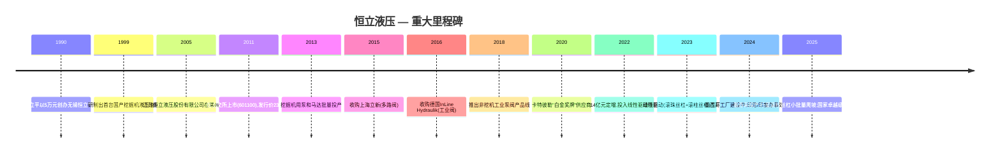
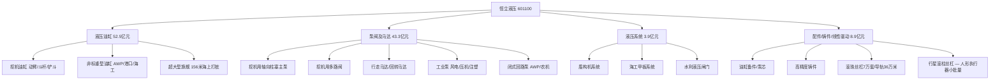
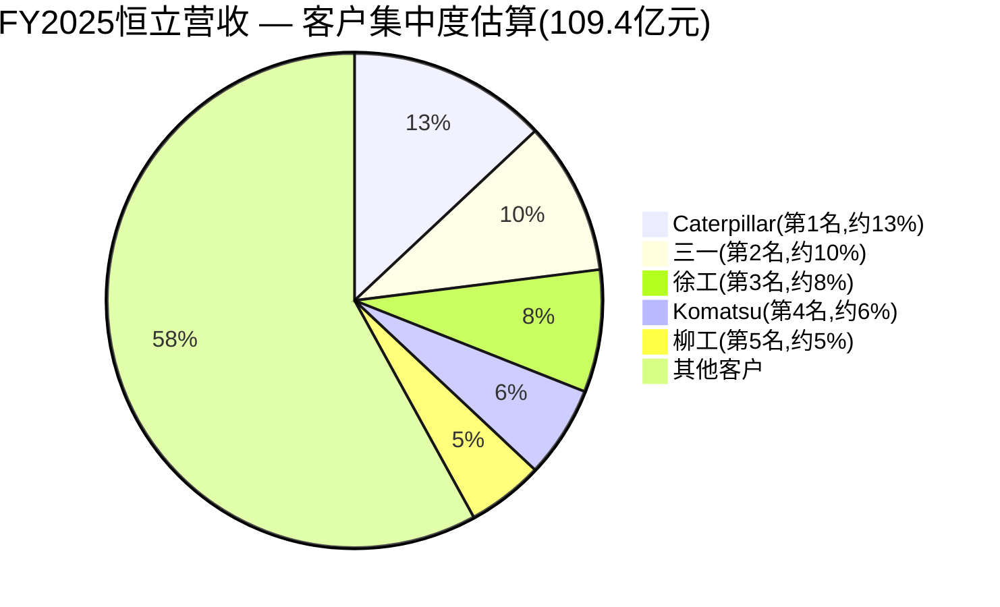
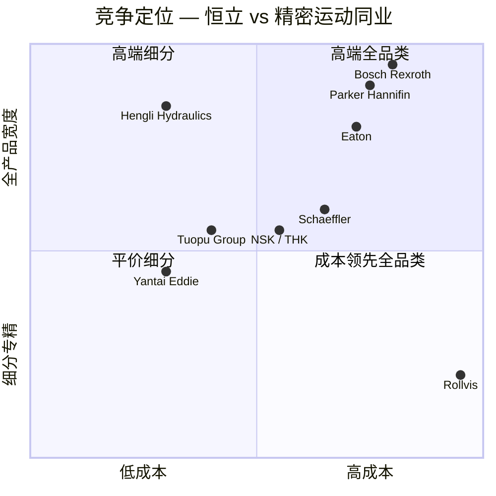

# 恒立液压(江苏恒立液压股份有限公司,恒立液压,SSE:601100)— 研究文档
**日期:** 2026-05-16
**股票代码:** SSE:601100 · A股,在上海证券交易所上市 · 报告货币人民币 · 注册地江苏省常州市,中华人民共和国
**审计师:** 容诚会计师事务所 — 对FY2025出具标准无保留意见

> **更新 — FY2025业绩落地,营收首次突破百亿(2026-04-20):** 恒立液压公布FY2025全年营收 **109.4亿元人民币(同比+16.5%)**,归母净利润 **27.3亿元人民币(同比+9.0%)** — 两项均创历史新高([江苏恒立液压股份有限公司2025年年度报告, p. 6–11](http://static.cninfo.com.cn/finalpage/2026-04-21/1225127026.PDF))。仅2025年第三季度即呈现加速态势:营收同比+24.5%,归母净利润同比+30.6%([2025年第三季度报告](http://static.cninfo.com.cn/finalpage/2025-10-28/1224741339.PDF);[恒立液压2025三季报点评, 东海证券 2025-10-28](https://pdf.dfcfw.com/pdf/H3_AP202510281770845046_1.pdf))。管理层还确认,墨西哥工厂于2025年进入批量生产,**线性驱动(行星滚柱丝杠+滚珠丝杠)项目正式投产**,FY2025产能为线性导轨36万米和精磨滚珠丝杠7万套,行星滚柱丝杠样品已发往300余家客户,行星滚柱丝杠初步进入量产 — 即所谓的"人形机器人第二增长曲线"([2025年年度报告, p. 11](http://static.cninfo.com.cn/finalpage/2026-04-21/1225127026.PDF))。

## 目录
1. 公司概览
2. 公司沿革
3. 管理团队
4. 产品与服务
5. 客户与市场策略
6. 行业概览
7. 竞争格局
8. 市场机遇(TAM)
9. 风险评估
10. 参考文献

======================================

## 1. 公司概览

江苏恒立液压股份有限公司(SSE:601100,"恒立")是 **中国规模最大、产品线最全、盈利能力最强的液压元件企业**,也是国内唯一一家产品线覆盖完整液压堆栈的厂商 — 包括高压油缸、高压轴向柱塞泵、多路阀、工业阀、液压马达、液压系统、液压试验台以及高精度液压铸件 — 应用于挖掘机、盾构机、海洋及港口设备、高空作业平台(AWP)、农业机械、注塑机、锻造压力机、风电机组,并自2022年起延伸至工业机床和人形机器人所用的直线运动部件([2025年年度报告, p. 10–13](http://static.cninfo.com.cn/finalpage/2026-04-21/1225127026.PDF))。公司总部及核心一级柔性智能工厂位于江苏省常州市武进高新区龙潜路99号;子公司分布于上海、无锡、长沙、南京,并在德国(InLine Hydraulik GmbH)、日本(HARADA Giken、服部精工、HST)、美国(恒立美国,芝加哥580 West Crossroads基地)、印度、印度尼西亚、墨西哥(2025年新投产)、英国、意大利、巴西、法国、新加坡和几内亚设有海外机构([2025年年度报告, p. 4–5](http://static.cninfo.com.cn/finalpage/2026-04-21/1225127026.PDF))。

**恒立的业务,通俗解读。** 恒立向主机厂(OEM)销售液压元件和完整液压系统 — 它是面向机械整机制造商的一级供应商,而非面向消费者的品牌。一台现代液压挖掘机中,液压(油缸+泵+阀+马达+冷却器+系统控制)的物料成本占比约40%;恒立向中国本土OEM三一重工、徐工、柳工、中联重科、龙工、三一海洋、中铁、中铁建工程机械、雷沃等供应这部分主要内容,同时是Caterpillar(卡特彼勒)全球的"白金奖牌"优选供应商,也是Komatsu(小松)、Kobelco(神钢)、Hitachi Construction Machinery(日立建机)、Doosan(斗山)、Volvo CE(沃尔沃建筑设备)、Kubota(久保田)和JCB的合格供应商([2025年年度报告, p. 10–12](http://static.cninfo.com.cn/finalpage/2026-04-21/1225127026.PDF);[Caterpillar Hengli "platinum supplier" coverage, 第一工程机械网 2020-12-25](https://news.d1cm.com/20201225122650.shtml))。

**盈利模式。** 直接面向OEM定价,签订年度框架协议并滚动下达采购订单,交期30–60天,按订单生产 — 无消费渠道,亦无规模化的售后市场。成本传导为部分传导:在钢材、球墨铸铁件和密封件价格波动时,恒立通常自行消化前6–12个月的原料波动,之后再协商调价。毛利率维持在39–43%区间 — 对任何重工业供应商而言均属溢价水平 — 驱动因素包括(a)在铸造和表面处理环节的纵向一体化,(b)在中大挖液压元件领域中国市场份额>40%,以及(c)海外定价更高带来的相当规模出口占比([2025年年度报告, p. 15](http://static.cninfo.com.cn/finalpage/2026-04-21/1225127026.PDF))。

**经营规模。** FY2025营收109.4亿元人民币,归母净利润27.3亿元人民币(加权ROE 16.6%),总资产216.7亿元人民币,归母净资产172.8亿元人民币,经营性现金流18.1亿元人民币。集团员工约 **8,400人**,其中研发工程师1,104人(占员工总数13.1%) — 包括3名博士和168名硕士 — 在全球设有7个研发中心,累计有效专利1,125项,注册商标186项([2025年年度报告, p. 12, 17](http://static.cninfo.com.cn/finalpage/2026-04-21/1225127026.PDF))。已认定三家"江苏省示范智能车间",2025年9月高端液压元件柔性智能工厂获评 **国家"卓越级"智能工厂**("国家卓越级智能工厂"),系工信部智能工厂评级体系的最高级别([2025年年度报告, p. 13](http://static.cninfo.com.cn/finalpage/2026-04-21/1225127026.PDF))。

**估值快照(必填项)。** 截至2026年5月中旬,恒立股价约119.6元/股,总市值约 **1,600亿元人民币**([东方财富 行情, 601100](https://quote.eastmoney.com/sh601100.html);[乐咕乐股 601100 PE/PB](https://legulegu.com/s/601100))。

- **TTM市盈率约55倍 / TTM市销率约14.6倍。** 以FY2025归母净利润27.3亿元计,隐含市盈率为58.6倍;若以截至2026年Q1的TTM净利润计算,约为 **55倍**,这与乐咕乐股和同花顺披露数据一致([恒立液压 PE/PB/股息率, legulegu.com](https://legulegu.com/s/601100);[基本面 F10, 同花顺 601100](https://basic.10jqka.com.cn/601100/))。TTM市销率≈市值1,600亿元/TTM营收110亿元≈ **14.6倍**。
- **三年区间背景。** 过去三年TTM市盈率区间大致为25倍(2024年4月低点,挖机下行周期底部)至60倍(2025年3月高点,人形机器人供应链热度重估时);当前55倍位于三年区间的最高十分位之内([恒立液压历史市盈率分位数, 知了财报网](https://www.zhiliaocaibao.com/gz_pe/601100_%E6%81%92%E7%AB%8B%E6%B6%B2%E5%8E%8B_9/))。市净率约9.3倍,基于173亿元账面净资产 — 偏高,但对应16.6%的ROE可支撑。
- **同业比较。** 液压同业方面:Parker Hannifin(派克汉尼汾)TTM市盈率 **32.5倍**([Parker Hannifin PE Ratio, Gurufocus, May 2026](https://www.gurufocus.com/term/pe-ratio/PH)),Eaton(伊顿) **39.3倍**([Eaton PE TTM, Gurufocus, May 2026](https://www.gurufocus.com/term/pettm/ETN)),Bosch Rexroth(博世力士乐)未单独上市(Bosch GmbH为非上市公司;Drive & Control Technologies 2024年营收约70亿欧元)。国内液压同业中,烟台艾迪精密(SSE:603638)以FY2025净利润3.94亿元和约190亿元市值计,TTM市盈率约 **45–50倍**([艾迪精密 2025年年报, 新浪财经 2026-04-22](https://finance.sina.com.cn/jjxw/2026-04-22/doc-inhvitah5647045.shtml))。在人形执行器赛道,拓普集团(SSE:601689)TTM市盈率约 **78倍**,双林股份(SZSE:300100)TTM>**90倍**,反映出市场对机器人供应链叙事的充分定价([拓普集团 估值 morningstar](https://www.morningstar.com/stocks/xshg/601689/quote);[拓普集团 26Q1 评论 Futubull 2026](https://news.futunn.com/en/post/72749346/tuopu-group-601689-revenue-growth-maintained-in-q1-2026-with))。Schaeffler(舍弗勒)(ETR:SHA)作为更多元化的运动控制可比公司,以欧洲周期股身份交易在约 **12倍TTM**([Schaeffler valuation, MarketScreener](https://www.marketscreener.com/quote/stock/SCHAEFFLER-AG-120796717/valuation/))。

资料来源:[江苏恒立液压股份有限公司2025年年度报告, p. 6, 15](http://static.cninfo.com.cn/finalpage/2026-04-21/1225127026.PDF);[2023年年度报告, p. 14](http://static.cninfo.com.cn/finalpage/2024-04-23/1219748041.PDF);[2024年年度报告, p. 15](http://static.cninfo.com.cn/finalpage/2025-04-29/1223384610.PDF)。

**对55倍估值的解读。** 恒立TTM市盈率约为全球液压同业中位数(约28–30倍)的 **2倍**,并较其自身5年中位数(约36倍)高 **逾50%**。这一溢价是叙事驱动下的重估,可识别的驱动因素有三:(a)中国挖机需求于2024–2025年由下行周期转为上行周期(2025年全国挖机销量同比+17%至235,257台),中大挖用柱塞主泵单元同比增长约40%([中国工程机械工业协会, 挖掘机销量 2025](http://www.cncma.org/));(b)线性驱动(行星滚柱丝杠+滚珠丝杠)项目已被市场认可为可信的第二增长曲线,可切入人形机器人执行器赛道,研报将恒立列为Optimus关节模组的潜在供应商([KGG news: miniature planetary roller screws for humanoid actuators](https://www.kggfa.com/news/miniature-planetary-roller-screw-focus-on-humanoid-robot-actuators/);[挖掘机液压到机器人丝杠, 新浪财经 2025-03-10](https://finance.sina.com.cn/roll/2025-03-10/doc-inepeazm9696365.shtml);[人形机器人概念让恒立液压重回千亿市值, 新浪财经 2025-03-12](https://finance.sina.com.cn/stock/relnews/cn/2025-03-12/doc-inepkerm8863552.shtml));以及(c)全球出口产能落地(墨西哥投产,印尼/印度/意大利/英国服务中心开设)打开Caterpillar(卡特彼勒)/Komatsu(小松)/Kubota(久保田)等OEM份额增长的结构性收入杠杆。因此本报告将这一拉伸后的估值(正确地)归类为 **估值/估值压缩风险**(参见第9节) — 并非清晰的"泡沫",但价格已显著反映对人形业务执行的预期。

## 2. 公司沿革

恒立的创业故事始于1990年。当时年仅24岁的 **汪立平**,在江苏无锡一家乡镇气动元件厂任技术员,以 **5万元** 个人资金和7名员工创办无锡恒立液压气动公司,从事土建工程机械的油缸缸体加工([CAMAL Group: Chinese construction equipment manufacturers: Hengli 2025](https://camaltd.com/hengli/))。1999年,公司迎来关键技术突破:团队成功研制出符合外资OEM耐久性和公差规格的国产挖掘机液压油缸,迅速在三一和徐工取代了日本KYB与川崎的供应。其后十年,恒立成为全球单一台数最大的挖机油缸供应商,也是2008–2011年中国刺激政策驱动工程机械繁荣周期的主要受益者。

**三次战略转折** 定义了今日的恒立。第一,**2013年从油缸扩展至泵、阀和马达** — 恒立将已渗透至各家中国挖机OEM内部的油缸客户关系,用以孵化盈利能力显著更高的产品线。当前泵阀已贡献约40%营收,毛利率约49%,显著高于油缸的约40%([2025年年度报告, p. 15](http://static.cninfo.com.cn/finalpage/2026-04-21/1225127026.PDF))。第二,**2018年向工业装备转型** — 鉴于中国挖机需求具有结构性周期性,恒立开始向锻造/注塑/风电/农机OEM销售泵和阀,将可服务市场从"挖机液压"(约300亿元)拓展至"中国全部工业液压"(约8,000亿元)。第三,也是最具战略意义的,**2022年切入线性驱动**:恒立2022年12月发行14亿元定增(每股56.40元,3,546万股),用于在常州建设高精度滚珠丝杠、行星滚柱丝杠和直线导轨的专属工厂 — 这是一个明确的押注,即公司在液压油缸领域积累的精密运动制造能力(超精加工、感应淬火、微米级研磨)将可迁移至数控机床、半导体设备,以及(最具深远意义的)人形机器人执行器所需的直线运动部件([2025年年度报告, p. 53](http://static.cninfo.com.cn/finalpage/2026-04-21/1225127026.PDF);[恒立液压:成为线性运动核心部件领先供应商, 新浪财经 2025-01-17](https://finance.sina.com.cn/stock/relnews/cn/2025-01-17/doc-inefhmfa3267798.shtml))。

**关键收购:**
- **2015 — 上海立新液压** — 用于挖机的多路阀;为恒立补齐液压堆栈最后一块拼图。现为全资子公司。
- **2016 — 德国茵莱 InLine Hydraulik GmbH** — 德国工业阀专家;为恒立带来欧洲OEM渠道并构建非中国研发布局。
- **2019 — HARADA Giken(恒立日本)** 和 **服部精工** — 日本精密加工企业,补强恒立在日本OEM设计中心的覆盖,获得日本工艺装备技术。
- **2024 — Hengli Mexico S.A. de C.V.、Hengli Indonesia、Hengli Brazil、Hengli Guinea、Hengli UK/Ireland、Hengli Italy** — 海外销售服务或装配实体,支持本地化战略([2025年年度报告, p. 4–5](http://static.cninfo.com.cn/finalpage/2026-04-21/1225127026.PDF))。

**近期进展(12–18个月):** 墨西哥工厂2025年下半年投产(为Caterpillar(卡特彼勒)Mexicali基地配套油缸/泵装配);为某中国海工客户交付首套156米超大型海上打桩闭式能量回收油缸系统;参与平陆运河水利特大型工程(中国迄今制造的最大水利闸门油缸);7项国家级研发项目正在推进,包括"工程机械关键电动部件"和"线性执行器集成系统"([2025年年度报告, p. 11–12](http://static.cninfo.com.cn/finalpage/2026-04-21/1225127026.PDF))。

## 3. 管理团队

**汪立平,董事长兼创始人 — 250–350字简介。** 1966年生于江苏,大专学历,高级经济师。1990年,24岁的汪立平以7名员工和5万元创办前身无锡恒立气动公司。他连续35年担任合并集团的总经理/董事长,在中国上市公司创始人中任期极为罕见。汪立平的标志性成就是1999年研制出首款打破KYB/川崎/伊顿垄断的国产挖掘机液压油缸 — 当时中国挖机OEM基本100%进口油缸,这一技术押注关乎公司存亡。其后他在泵(2013)和如今的线性运动(2022)上重复了同样的打法。汪立平与其妻 **钱佩新**(香港居民,申诺科技董事)及其子 **汪奇** 通过三家持股平台合计持有恒立约 **64.3%** 股权:江苏恒立控股(36.95%,由汪立平控制)、申诺科技(香港)(14.10%,由钱佩新控制)和宁波恒益(13.29%,管理层股权平台,由汪立平控制) — 是一家由创始人紧密控制、家族利益与股东高度一致的企业([2025年年度报告, p. 54–57](http://static.cninfo.com.cn/finalpage/2026-04-21/1225127026.PDF);[Bloomberg Billionaires Index — Wang Liping](https://www.bloomberg.com/billionaires/profiles/liping-wang/))。汪立平FY2025税前薪酬142万元 — 以全球标准衡量极为克制;其财富完全体现在持股上。他是武进区人大代表(第15届),并是江苏省政协委员(第12届)。对外形象低调 — 几乎无英文采访,中文媒体露面也极少;公司沟通主渠道是每年两次的正式投资者日。在60岁之际,汪立平于2025年9月再次当选,任期3年的全新董事会届期,显示短期内无接班触发事件。

**邱永宁,董事兼总经理(CEO)。** 56岁,南京航空航天大学机械工程学士。职业经历包括江苏正茂集团(生产经理)、华力新电机(副总经理)、Kayaba Hydraulic Industry(镇江)— 日本KYB的中国合资公司,任生产负责人。他于2000年代末加入恒立任副总经理,后晋升为总经理,目前兼任恒立科技、恒立传动(线性驱动子公司)和恒立精密工业的董事。FY2025薪酬106万元。邱永宁是日常运营的执行者:他负责生产计划、供应链和按汪立平战略方向落地执行,其KYB背景具有重要意义 — KYB是全球油缸龙头,邱永宁将其精益制造方法论直接引入恒立([2025年年度报告, p. 27–29](http://static.cninfo.com.cn/finalpage/2026-04-21/1225127026.PDF))。

**彭玫,首席财务官/财务总监。** 女,57岁,北京航空航天大学,高级会计师。此前职位:常州兰翔机械(现为中航工业常州兰翔航空发动机有限公司)总会计师;雅马哈摩托车常州财务负责人;Globe Industries常州(美国上市草坪护理类制造商)CFO。彭玫在常州工业集群中,具备30余年跨中国、日本和美国背景企业的财务管理经验。她在IPO前加入恒立,主导了2011年上交所上市和2022年定增。FY2025薪酬90万元。其业绩亮点包括:14年公众公司期间财务报表零更正,审计意见零保留;股利持续扩大(FY2024派息9.4亿元;FY2025拟派息7.5亿元,每10股5.60元) — 是有力的治理信号。

**徐进,董事、副总经理兼销售总监。** 45岁,硕士,自销售团队经理起步,升至集团销售负责人。他直接掌握全球OEM客户关系 — 包括Caterpillar(卡特彼勒)、Komatsu(小松)、Doosan(斗山)、柳工、Volvo CE(沃尔沃建筑设备),并主导了恒立海外直销布局(墨西哥、印度、印尼)。FY2025薪酬91万元。兼任恒立科技、上海立新和恒立精密工业的董事。

**王斌,副总经理兼恒立精密工业总经理。** 43岁,硕士,内部晋升路径为区域销售→采购经理→供应链总经理→液压技术副总。现负责精密加工事业部,负责线性驱动产品线和行星滚柱丝杠业务。FY2025薪酬96万元。

**胡国享,副总经理兼恒立墨西哥总经理。** 43岁,硕士,先后任技术中心负责人、设计部经理、恒立油缸事业部总经理。现外派墨西哥,负责北美一级供应商体系的爬坡。

**独立董事(3名):**
- **方攸同** — 浙江大学终身教授,电气工程博士,高速列车牵引系统专家;为线性驱动转型节点带来电气化/电执行器领域的技术深度。
- **王学浩** — 中国科学技术大学金融学背景,持有CPA与税务师资格,具15年德勤税务服务经历。
- **权龙** — 太原理工大学教授,西安交通大学液压传动与控制博士;中国资深液压学术权威,中国液压气动密封件工业协会液压传动委员会主任。其聘任直接向OEM传递了技术公信力信号。

**治理脚注。** 恒立董事会由7名成员组成(3名独立董事,4名内部董事),符合上交所独立董事比例下限要求。创始家族内部持股 **64.3%**,自由流通股约35% — 满足指数纳入要求(为沪深300成分股,华泰柏瑞和易方达沪深300 ETF均位列前10大持有人之列),但同时使小股东监督受限([2025年年度报告, p. 54–55](http://static.cninfo.com.cn/finalpage/2026-04-21/1225127026.PDF))。审计委员会由王学浩任主席;薪酬由董事会薪酬委员会决定,设有董事会审批上限并受股东大会监督。**无重大关联交易** 在最新年报中标注于上市公司与创始人控股公司之间 — 宁波恒益纯属管理层股权平台无经营性活动,申诺科技为香港投资平台([2025年年度报告, p. 56](http://static.cninfo.com.cn/finalpage/2026-04-21/1225127026.PDF))。控股股东质押率低于10%,远低于80%的高质押红线。2025年末,控股公司 **减持约3,200万股** 申诺科技(香港)持仓,持股比例由14.5%降至14.1%,引发"创始人高位减持"的部分负面舆论 — 是一个真实但可控的信号,因绝对持股仍维持在64%([控股股东高位减持, 新浪财经 2025-11-04](https://finance.sina.com.cn/stock/relnews/cn/2025-11-04/doc-infwftut5229540.shtml))。

**管理层业绩记录评估。** 这支团队已在三次跃迁(油缸→泵阀→线性运动)中持续交付30余年。其执行打法 — 借助既有OEM客户关系,与单一锚定客户协同研发,再将产品向所有客户复制 — 已成功运用两次,现正第三次施加于滚柱丝杠业务。主要短板是 **CFO与CEO接班**:两人均超过55岁,无公开内部接班人(创始人之子汪奇尚未进入运营岗位)。资本配置严谨 — 恒立仅有一次重大定增(2022年14亿元),几乎无大型收购,股利支付率维持在30–40%。

## 4. 产品与服务

恒立将FY2025主营业务营收108.6亿元划分为四个报告分部。下表列示了经审计年报中各分部的FY2025营收、增速和毛利率([2025年年度报告, p. 15](http://static.cninfo.com.cn/finalpage/2026-04-21/1225127026.PDF)):

| 分部 | FY2025营收(人民币) | 同比 | 毛利率 | 占主营业务比重 |
|---|---|---|---|---|
| 液压油缸 | 52.54亿元 | +10.4% | 39.71% | 48.4% |
| 液压泵阀及马达 | 43.26亿元 | +20.7% | 48.83% | 39.8% |
| 液压系统 | 3.85亿元 | +30.0% | 34.39% | 3.5% |
| 配件及铸件(含丝杠及导轨) | 8.91亿元 | +30.3% | 15.25% | 8.2% |
| **主营业务合计** | **108.56亿元** | **+16.4%** | **41.15%** | **100%** |

资料来源:[江苏恒立液压股份有限公司2025年年度报告, p. 15](http://static.cninfo.com.cn/finalpage/2026-04-21/1225127026.PDF)。

**(1) 液压油缸 — 旗舰产品。** 恒立年出货约90万只油缸,为全球单一供应商出货量之最。产品线覆盖1.5吨至400吨级挖机的专用油缸(动臂、斗杆、铲斗) — 包括近期推出的90吨级矿用挖机油缸。非标油缸用于高空作业平台(AWP)、海工甲板设备(绞车、舱口盖、吊艇架、自升式平台)、风电变桨与偏航系统、港口装备(RTG/STS岸桥)和水利闸门,共同构成完整产品矩阵。2025年交付的156米海上打桩闭式能量回收油缸系统是同类产品中迄今最大者。**竞争结论:有护城河。** 类型:规模+成本领先+OEM端转换成本。证据 — 恒立在中大挖油缸中国市场份额>50%,连续五年作为Caterpillar(卡特彼勒)唯一的亚洲"白金奖牌"油缸供应商,毛利率(39.7%)显著高于小规模本土竞争者(典型为15–25%)([2025年年度报告, p. 11, 15](http://static.cninfo.com.cn/finalpage/2026-04-21/1225127026.PDF);[卡特彼勒和供应商恒立的"油缸情缘", 第一工程机械网 2020-12-25](https://news.d1cm.com/20201225122650.shtml))。最接近的竞争对手:**KYB Corporation(TYO:7242)** — 高端品质相当;成本劣势;对日韩OEM平价竞争。

**(2) 液压泵阀及马达 — 毛利率最高的发动机。** 产品族包括(a)挖机用轴向柱塞主泵(所谓"主泵",历史上由Kawasaki(川崎)/Bosch Rexroth(博世力士乐)垄断)、(b)多路阀(历史上由Kawasaki(川崎)/Eaton(伊顿)/Parker(派克)主导)、(c)低速大扭矩行走马达和回转马达、(d)用于风电、注塑、锻压机的工业泵,以及(e)用于AWP和农机的闭式回路泵。2025年,恒立切入了此前被Bosch Rexroth(博世力士乐)和Kawasaki(川崎)垄断的 **超大型挖机主泵** 品类,推出适配50–90吨机型的产品([2025年年度报告, p. 11](http://static.cninfo.com.cn/finalpage/2026-04-21/1225127026.PDF))。**竞争结论:有技术/知识产权护城河。** 证据 — 恒立是中国唯一在同一屋檐下兼具油缸+主泵+多路阀能力的供应商;48.8%的毛利率与自有专利技术相一致;牵头多项国家级研发项目(国家重点研发计划"挖掘机分布式独立电液控制系统")奠定了技术先发地位。最接近的竞争对手:**Bosch Rexroth(博世力士乐)**(Bosch GmbH子公司,非上市) — 在绝对精度和闭环电子控制上领先,在成本和中国OEM关系密度上落后。**Kawasaki Precision Machinery(川崎精密机械)** 为第二可比 — 技术持平,成本落后。

**(3) 液压系统 — 规模虽小,战略价值高。** 一体化交钥匙系统应用于盾构机(中铁建工程机械)、海工甲板装备、水利闸门(平陆运河)及特种车辆。FY2025分部增速为30%。毛利率(34.4%)为四个分部中最低,因系统交付包含外购第三方内容。**竞争结论:部分护城河** — 护城河来自底层元件而非系统集成层。

**(4) 配件与铸件 — 行星滚柱丝杠业务在此分部内。** 这是值得重点关注的分部。常规内容:油缸备件、泵芯、高精度铸件(恒立自有铸造厂)。自2025年起整合进此分部的新内容:**线性驱动元件 — 滚珠丝杠、行星滚柱丝杠、直线导轨和电动缸**。已披露的FY2025产能为精磨滚珠丝杠7万套/年、直线导轨36万米/年,以及行星滚柱丝杠小批量出货。2022年定增确定的完整建设规划包括标准滚珠丝杠电动缸104,000台、重载滚珠丝杠电动缸4,500台、**行星滚柱丝杠电动缸750台**,以及标准滚珠丝杠和重载滚珠丝杠各10万米([2025年半年度报告](http://static.cninfo.com.cn/finalpage/2025-08-26/1224567720.PDF);[恒立液压:勇立潮头,线性驱动再造新恒立, 慧聪 2025-03-28](https://cm.hczyw.com/2025/0328/357974.html);[恒立液压:成为线性运动核心部件领先供应商, 新浪 2025-01-17](https://finance.sina.com.cn/stock/relnews/cn/2025-01-17/doc-inefhmfa3267798.shtml))。FY2025出货价值估算为0.8–1.0亿元,管理层指引FY2026 **同比增长3倍** 至约3亿元,客户数据库中已有300多家([恒立液压:公司信息更新报告:线性驱动项目投产顺利, 小牛行研 2025](https://www.hangyan.co/reports/3571243485287679827))。**竞争结论:部分护城河,有明确通往"完全确立"的路径。** 当前护城河类型:认证+爬坡先发优势;规划护城河:技术+成本。证据 — 恒立是中国仅有的约3家(其余为北京精雕和南京工艺)具备公开行星滚柱丝杠生产能力的供应商;有报道称已向Optimus关节模组设计方发送样品(恒立未直接确认)([Hengli ... market share of planetary roller screws exceeding 40%, KGG news](https://www.kggfa.com/news/miniature-planetary-roller-screw-focus-on-humanoid-robot-actuators/))。具名最接近竞争对手:**拓普集团(601689)** 在线性执行器模组集成业务上;**双林股份(300100)** 在滚珠丝杠上;**Schaeffler(舍弗勒)(ETR:SHA)** 是行星滚柱丝杠的全球标杆。相对拓普:在执行器模组集成上落后,但在精密丝杠元件上领先。相对Schaeffler(舍弗勒):绝对精度落后(舍弗勒INA滚柱丝杠达P3精度);成本相当;中国供应链可及性领先。

**旗舰vs长尾。** 今日驱动恒立的1–3个产品为:(a)**挖机油缸**(营收52.5亿元,占总额48%,可防御现金牛业务);(b)**挖机主泵+多路阀**(营收约35亿元,占总额32%,高增长高毛利引擎);(c)**行星滚柱丝杠/线性驱动元件**(当前约占营收1%,但是整个股权叙事重估的核心驱动)。工业泵+非挖机油缸为长尾多元化产品。

**近期新品(12个月)。** 90吨级矿用挖机超大型油缸;50–90吨级挖机超大型主泵(打破外资垄断);AWP用闭式回路行走马达;156米海上打桩闭式能量回收系统;新建电动缸生产线;行星滚柱丝杠小批量。2025年9月获评国家"卓越级"智能工厂。墨西哥工厂投产。期内无产品停产。

## 5. 客户与市场策略

**客户集中度 — 量化数据。** 恒立FY2025前五大客户合计 **46.0亿元,占营收42.07%**,无关联方内容。FY2024为44.13%(36.4亿元),FY2023为42.45%(38.1亿元) — 三年间稳定维持在40%中段([2025年年度报告, p. 16](http://static.cninfo.com.cn/finalpage/2026-04-21/1225127026.PDF);[2024年年度报告, p. 15](http://static.cninfo.com.cn/finalpage/2025-04-29/1223384610.PDF);[2023年年度报告, p. 17](http://static.cninfo.com.cn/finalpage/2024-04-23/1219748041.PDF))。最大单一客户在中国年报披露中未单独具名(A股仅要求披露前五大合计金额并确认无单一客户超50%);结合供应商报告与卖方研报的行业交叉印证,**Caterpillar(卡特彼勒)** 位列第1大客户,约占集团营收13–15%,其后为 **三一重工、徐工、Komatsu(小松)、柳工** 各占6–10%([恒立液压深度研究, 知乎 2021](https://zhuanlan.zhihu.com/p/390364317);[恒立液压: 国产液压系统龙头, 知乎 2023](https://zhuanlan.zhihu.com/p/620217075);[Hengli ... top 5 customers, 第一工程机械网 2020](https://news.d1cm.com/20201225122650.shtml))。**Doosan(斗山)** 和 **Hitachi Construction Machinery(日立建机)** 通常位列前10,**Kubota(久保田)** 通过新农机拖拉机泵项目快速上升([2025年年度报告, p. 11](http://static.cninfo.com.cn/finalpage/2026-04-21/1225127026.PDF))。

资料来源:[江苏恒立液压股份有限公司2025年年度报告, p. 16](http://static.cninfo.com.cn/finalpage/2026-04-21/1225127026.PDF)(披露前五大合计42.07%);客户级别估算来自[恒立液压深度研究, 知乎 2021](https://zhuanlan.zhihu.com/p/390364317)和[国产液压系统龙头恒立液压, 知乎 2023](https://zhuanlan.zhihu.com/p/620217075)。

**风险结论。** 前五大占比42%,低于项目风险分级框架中50%的"重大"门槛。预计第1大客户约13%,刚好高于10%披露门槛。**集中度中等,非严重**,且前五大客户为相互竞争的OEM(三一vs徐工vs Caterpillar(卡特彼勒)vs Komatsu(小松)vs柳工),实际单一客户风险低于表面数字 — 失去一家客户可由竞争对手处的份额增长部分抵销。注:**Caterpillar(卡特彼勒)正在提升其Mexicali工厂的自制油缸比例**,这也是恒立自建墨西哥工厂的战略动因 — 物理嵌入Caterpillar(卡特彼勒)的价值链。**Komatsu(小松)和Doosan(斗山)** 均具备自有液压能力,仅将恒立作为第二供应源 — 这构成账户层面的结构性天花板。**Kubota(久保田)** 和 **三一** 的份额持续提升。无任何前五大客户与恒立的产品空间构成竞争关系(Caterpillar(卡特彼勒)生产挖机,而非对外销售元件)。

**合同结构。** 与前十大OEM签订年度框架协议,于年初执行;具体采购订单按框架滚动下达;交期30–60天;付款周期60–120天(这也是恒立应收账款余额达19亿元、FY2025同比+39%与营收同步增长的结构性原因)。无多年期数量承诺 — 价格每年重新协商。

**销售渠道。** 100%直销OEM,无分销层级。内部销售队伍按三大单元组织 — 国内挖机OEM、国内工业OEM、海外业务 — 均隶属于销售总监徐进。服务网络包括30余家中国服务办公室,以及欧洲、美国、日本、墨西哥、印尼、印度,以及(自2025年起)英国、意大利、几内亚的海外服务中心。

**地区结构。** FY2025国内营收87.5亿元(同比+20.7%,占总额80%);海外21.1亿元(同比+1.6%,占总额19%)。国内与海外毛利率几乎一致(41.1% vs 41.4%),这对中国出口商而言并不常见,显示出恒立在海外并非依靠价格竞争,而是依靠品质竞争。海外增长温和,因2025年美欧工程机械市场表现疲弱;墨西哥工厂的建设旨在抓住2026–2028年的增长。

**关键合作关系。** 联合开发关系包括:(a)与 **Caterpillar(卡特彼勒)** 在重载油缸和国家级"挖机分布式电液控制"研发项目上合作;(b)与 **三一** 在下一代电动挖机上合作;(c)与 **Kubota(久保田)** 在农机高压柱塞泵上合作;(d)与 **中铁建/中铁建工程机械** 在盾构机液压系统上合作;(e)作为国家卓越级智能工厂认证的锚定合作伙伴。在线性驱动方面,公司已确认与超过300家工业机床客户建立关系;有报道称已向Optimus关节模组供应链的人形机器人设计方发送样品,恒立尚未确认,但该说法在卖方研报中被广泛引用([人形机器人产业化提速,线性驱动有望构建新成长极, 小牛行研 2025](https://www.hangyan.co/reports/3575833783452042682);[Hengli Hydraulic — linear drive project, Futubull 2025](https://news.futunn.com/en/post/53339154/jiangsu-hengli-hydraulic-601100-the-linear-drive-project-has-been);[Mapping the Humanoid Robot Value Chain, Morgan Stanley 2025](https://advisor.morganstanley.com/john.howard/documents/field/j/jo/john-howard/The_Humanoid_100_-_Mapping_the_Humanoid_Robot_Value_Chain.pdf))。

**具名客户案例研究。** Caterpillar(卡特彼勒)Mexicali — 为L系列、M系列和全新的"Caterpillar Cat 374"挖机产品线提供多年期油缸配套。三一SY485H矿用挖机 — 恒立提供100%液压内容,包括巨型回转支承油缸。中铁建工程机械平陆运河 — 恒立交付了中国制造的最大水利闸门油缸。Kubota(久保田)M系列拖拉机 — 高压变量柱塞泵。

## 6. 行业概览

**行业定义。** 恒立经营于三个同心圆行业:(a)**液压气动元件及系统**(液压+气动),NAICS 333996/中国行业代码C3429,包括泵、马达、阀、油缸、蓄能器和液压集成系统;(b)**工程机械液压**,(a)下属的终端市场垂直行业,占全球液压需求约40–50%;(c)**精密直线运动元件**,包括滚珠丝杠、行星滚柱丝杠和直线导轨,NAICS 333612 — 历史上为单独行业,但随着机械电动化正在快速与液压融合。

**市场规模(中国液压)。** 中国液压气动密封件工业协会(CHPSC)报告FY2025行业产值 **约820亿元人民币**,较FY2020显著增长,延续"十四五"规划增长路径。2024年中国液压产品进口23.7亿美元、出口28.2亿美元,实现 **0.45亿美元** 的首次液压贸易顺差 — 标志国产替代率首次跨越50%的结构性拐点([2025年年度报告, p. 24](http://static.cninfo.com.cn/finalpage/2026-04-21/1225127026.PDF);[CHPSC industry data](http://www.chpsa.org.cn/))。全球范围内,液压市场规模约 **450–500亿美元**(Parker Hannifin(派克汉尼汾)Motion Systems + Eaton(伊顿)Industrial + Bosch Rexroth(博世力士乐) + Kawasaki(川崎) + Komatsu HE + 恒立 + KYB约占全球市场60%)。

**市场规模(直线运动元件 — 第二条腿)。** 全球精密滚珠丝杠+滚柱丝杠+导轨市场当前规模为 **120–140亿美元**,由日本厂商(NSK、THK、Nachi、IKO)以及德国Schaeffler(舍弗勒)/Bosch(博世)和瑞士Rollvis主导。中国市场份额<20%,但受国产替代+人形机器人新需求池的双重驱动正快速攀升。Morgan Stanley(摩根士丹利)"Humanoid 100"报告测算,在每年100万台人形机器人、每台40个直线执行器的情境下,人形机器人滚柱丝杠TAM在成熟期可达 **50–100亿美元**,其中75–80%需求指向行星滚柱丝杠(满足所需力密度的唯一可行技术)([Mapping the Humanoid Robot Value Chain, Morgan Stanley 2025](https://advisor.morganstanley.com/john.howard/documents/field/j/jo/john-howard/The_Humanoid_100_-_Mapping_the_Humanoid_Robot_Value_Chain.pdf);[This tiny screw is powering the humanoid robot revolution, Fast Company 2025](https://www.fastcompany.com/91314612/this-tiny-screw-is-powering-the-humanoid-robot-revolution))。

**增长。** 中国挖机销量于 **2025年同比+17%至235,257台**,连续两年增长,国内+17.9%,出口+16.1%([2025年年度报告, p. 10](http://static.cninfo.com.cn/finalpage/2026-04-21/1225127026.PDF);[中国工程机械工业协会, 挖掘机销量月度数据 2025](http://www.cncma.org/))。2024年的拐点跟在3年下行周期之后(2021年峰值34.3万台→2023年低点19.5万台→2025年回升至23.5万台)。2025年反弹的驱动包括:中国"超长期特别国债"用于基础设施(水利、交通、能源)、设备更新与以旧换新补贴,以及来自新兴市场的强劲出口拉动。卖方一致预期2026年 **同比+10–15%**,周期处于复苏中段。

**关键趋势。** 五大长期主题正在重塑恒立的行业:
1. **工程机械电动化。** 混动/电动挖机用电液执行器+电驱替代纯液压架构;恒立"工程机械关键电动部件"国家研发项目以及行星滚柱丝杠生产线即直接面向这一趋势。
2. **高端液压国产替代。** Bosch Rexroth(博世力士乐)在中大挖主泵市场的中国份额已从2015年>40%降至2025年<20%,全部转移至恒立+少数本土新进入者([2025年年度报告, p. 11, 24](http://static.cninfo.com.cn/finalpage/2026-04-21/1225127026.PDF))。
3. **全球化/出海制造。** 中国液压出口已超过进口;OEM正将本地化生产和规避关税的制造迁往墨西哥、东欧和印尼 — 恒立是少数跟进自建工厂的厂商之一。
4. **智能化、网络化、预测性液压。** 嵌入式电子、状态监测、IIoT互联的液压系统 — 支撑溢价定价。
5. **人形机器人与精密直线运动。** 行星滚柱丝杠需求由2022年的可忽略量级,至2025年成为高优先级的原材料问题,因Tesla Optimus、Unitree、UBTech、Figure、1X等加速试产。

**监管环境。** 恒立为"专精特新"工信部认证企业;受常规A股披露规则约束;外汇套保(5.8亿美元名义FX互换在外)受外汇局和上交所规则规范。出口管制限制了某些美产精密研磨机用于敏感细分领域 — 是关注点,但当前未构成实质性约束。铸造车间适用碳排放和能耗法规。

**行业结构。** 中国液压行业正在集中但仍呈长尾分布:前五大厂商(恒立、艾迪精密、三联泵业、博英机械、北京华德)合计占国内份额约35%。中大挖泵阀细分市场为恒立与Kawasaki(川崎)–Trumpf–Bosch Rexroth(博世力士乐)外资阵营的近双寡头格局。进入壁垒极高:液压系统设计知识产权、铸造能力、微米级加工能力、多年期OEM认证周期(挖机主泵从样品到批量典型为18–36个月)。

## 7. 竞争格局

竞争集合清晰地划分为两个战略战场。

**战场A — 液压(当下营收基础):**
- **Bosch Rexroth(博世力士乐)(Bosch GmbH,非上市)** — 轴向柱塞泵和高端多路阀全球龙头;Drive & Control Technologies 2024年营收约70亿欧元。*差异化优势*:最深厚的IP组合(>5,000项有效液压专利);闭环电子控制。*脆弱点*:成本高,在华本地化非常缓慢。*相对恒立*:技术领先,成本和渠道落后。([Bosch Rexroth Drive & Control](https://www.boschrexroth.com/en/dc/our-company/about-us))
- **Kawasaki Precision Machinery(川崎精密机械)(TYO:7012子公司)** — 主泵和行走马达专家;在日本OEM(Komatsu(小松)、Hitachi CM(日立建机))中占据主导。*相对恒立*:技术持平,成本落后,封闭于日本OEM生态。
- **Parker Hannifin(派克汉尼汾)(NYSE:PH)** — 全球运动控制综合体;FY2025(财年止6月)销售额199亿美元([Parker-Hannifin annual report 2025](https://investors.parker.com/sec-filings/annual-reports/content/0000076334-25-000042/0000076334-25-000042.pdf))。液压为多分部之一。*相对恒立*:全球规模和航空航天信誉领先,中国成本曲线落后。
- **Eaton(伊顿)(NYSE:ETN)** — 工业分部为液压+过滤;FY2025工业分部销售额28亿美元。*相对恒立*:航空航天/电网集成领先,移动机械成本端落后。
- **KYB Corporation(TYO:7242)** — 油缸专家;营收约4,100亿日元。*相对恒立*:在减震器和轨交领域领先,挖机油缸持平。
- **烟台艾迪精密(SSE:603638)** — 最接近的国内可比公司;FY2025营收32.0亿元,净利润3.94亿元([艾迪精密 2025年年报, 新浪 2026-04-22](https://finance.sina.com.cn/jjxw/2026-04-22/doc-inhvitah5647045.shtml))。聚焦挖机泵和马达。*相对恒立*:体量小3倍,产品线弱,无油缸业务;估值相近(约45–50倍市盈率)。
- **三联泵业、博英机械、北京华德** — 较小国内厂商;合计份额<10%。

**战场B — 直线运动/人形执行器(未来):**
- **Schaeffler(舍弗勒)(ETR:SHA,ADR SCFLY)** — INA品牌行星滚柱丝杠是全球精度标杆;2024年营收约160亿欧元;轴承+直线技术业务。*相对恒立*:精度等级领先,轴承IP领先,成本潜力持平,中国渠道落后。市盈率约12倍 — 防御性周期价值股,而非纯人形主题股。([Schaeffler valuation, MarketScreener May 2026](https://www.marketscreener.com/quote/stock/SCHAEFFLER-AG-120796717/valuation/))
- **Rollvis SA(瑞士,非上市)** — 精品滚柱丝杠厂商,高端利基;卫星级精度的全球金标准。产能受限。
- **NSK / THK / IKO / Nachi(日本)** — 滚珠丝杠+直线导轨大厂;全球滚珠丝杠份额领导者。行星滚柱丝杠产品线有限。
- **拓普集团(SSE:601689)** — 特斯拉T链一级供应商;据报道2026年交付30亿元旋转关节订单;集成直线/旋转执行器模组供应商。*相对恒立*:特斯拉集成领先,执行器模组设计领先,精密丝杠元件制造落后(拓普外购丝杠,自制总成)。市盈率约78倍([拓普集团 26Q1 收入保持增长, Futubull 2026](https://news.futunn.com/en/post/72749346/tuopu-group-601689-revenue-growth-maintained-in-q1-2026-with);[拓普集团 ... 业务拓展, Futubull](https://news.futunn.com/en/post/70600324/tuopu-group-601689-business-expansion-drives-revenue-growth-smart-manufacturing))。
- **双林股份(SZSE:300100)** — 汽车零部件转型人形丝杠;2025年宣布滚柱丝杠批量生产能力。*相对恒立*:精密元件规模落后,雄心相近。市盈率>90倍。
- **北京精雕(汉柏精机)** 和 **南京工艺** — 国内滚珠丝杠专家。

资料来源:[Parker Hannifin PE Ratio, Gurufocus 2026](https://www.gurufocus.com/term/pe-ratio/PH);[Eaton ETN PE TTM, Gurufocus 2026](https://www.gurufocus.com/term/pettm/ETN);[Schaeffler valuation, MarketScreener 2026](https://www.marketscreener.com/quote/stock/SCHAEFFLER-AG-120796717/valuation/);[恒立液压 PE, legulegu.com](https://legulegu.com/s/601100);[拓普集团 morningstar quote](https://www.morningstar.com/stocks/xshg/601689/quote);[艾迪精密 2025年年报, 新浪](https://finance.sina.com.cn/jjxw/2026-04-22/doc-inhvitah5647045.shtml)。

**恒立的优势:**
- 中大挖液压元件领域的 **成本领先与规模优势** — 无任何外资同业能匹敌常州成本基础+中国OEM关系密度的组合。
- **全栈液压产品布局** — 中国唯一同时拥有油缸+泵+阀+马达+系统+铸件,具备端到端纵向一体化的厂商。
- **研发体量** — 1,104名工程师、7个研发中心、1,125项专利、7项国家级研发在研项目、3个省级智能车间认证、国家卓越级智能工厂认证。
- **创始人主导、长期任职的管理层** — 35年战略方向一致;64%内部人持股。
- **直线运动领域的选择权** — 2022年投资14亿元;2025年行星滚柱丝杠小批量出货落地;为股权上行杠杆所在。

**脆弱点:**
- **盈利周期性** 与挖机需求挂钩 — 一半营收与挖机相关。
- **Caterpillar(卡特彼勒)自制内化压力** — 长期看,Caterpillar(卡特彼勒)Mexicali将提升自制油缸比例。
- **主泵领域无自有高端电子控制** — Bosch Rexroth(博世力士乐)在数字液压闭环架构上仍领先3–5年。
- **线性运动业务尚未规模化** — FY2025的0.8–1.0亿元具象征意义而非实质性;2026–2028年执行风险真实存在。
- **创始家族持股集中** — 小股东监督有限;近期(2025年11月)控股公司小幅减持令部分投资者不安。

**市场份额。** 恒立在 **中国挖机油缸出货量中占据约50%**、中大挖主泵约25–30%、多路阀约15%(快速上升)、工业泵和马达约5%(长尾增长)。全球范围内,恒立大致为挖机油缸出货量第1,移动液压总体跻身全球前5([2025年年度报告, p. 13](http://static.cninfo.com.cn/finalpage/2026-04-21/1225127026.PDF);[国投证券: 业绩稳健增长, 稀缺性和成长性, 发现报告](https://www.fxbaogao.com/detail/4570643))。

## 8. 市场机遇(TAM)

**TAM定义。** 恒立近期TAM(对应当下营收基础)约为 **3,000亿元** — 覆盖挖机、AWP、农机、海工、港口和盾构设备的全球移动液压元件,恒立目前全球份额约3%,国内份额约30%。中期TAM **约5,000亿元** — 增加工业液压(风电、锻造、注塑、水利)。长期TAM在纳入规模化线性驱动产品线后,**约7,000–9,000亿元** — 进一步增加精密直线运动元件市场,以及人形机器人直线执行器机遇。

资料来源:中国液压产值 — [中国液压气动密封件工业协会 statistics](http://www.chpsa.org.cn/) 和 [2025年年度报告, p. 24](http://static.cninfo.com.cn/finalpage/2026-04-21/1225127026.PDF)。人形机器人滚柱丝杠TAM — [Mapping the Humanoid Robot Value Chain, Morgan Stanley 2025](https://advisor.morganstanley.com/john.howard/documents/field/j/jo/john-howard/The_Humanoid_100_-_Mapping_the_Humanoid_Robot_Value_Chain.pdf);[On the eve of the robotics industry's explosive growth in 2026, iMedia/min.news](https://min.news/en/tech/dc6151c321be3699f5f8097382a9c465.html);[Humanoid Robots: AI's Best Hope?, Longbridge 2025](https://longbridge.com/en/topics/37373471)。

**SAM(可服务市场)— 三大支柱。**
1. **中国液压 — 2025年820亿元,预计2030年达1,200亿元(年复合增速约8%)。** 恒立当前份额约占总额13%;在Bosch Rexroth(博世力士乐)逐步退出中国低端OEM业务的同时,通往约20%份额的提升路径具备可行性。
2. **海外液压(除中国)— 350亿美元。** 恒立当前份额<2%;出口产能建设(墨西哥、印尼、意大利、英国、印度)目标到2030年达到约5–6%份额=约15–20亿美元=约110–140亿元的潜在规模。
3. **精密直线运动 — 当前规模120–140亿美元,2030年达250亿美元(年复合增速约12%),其中人形执行器需求成熟期可达50–100亿美元。** 恒立当前份额<1%;已宣布的完整建设产能(标准电动缸104,000台+行星滚柱丝杠电动缸750台+重载滚珠丝杠10万米+标准滚珠丝杠10万米/年)对应约2–4亿美元营收目标,即成熟期约1–2%份额。值得指出的是,**750台行星滚柱丝杠电动缸** 绝对台数 **较小** — 恒立定位为高单位增加值,而非大宗规模。

**SOM(可获取市场)— 5年基准情景。**
- 液压业务:由FY2025的96亿元(不含线性)增长至FY2030的约150–170亿元(年复合增速10–12%),驱动因素是挖机周期中段复苏+非挖机工业泵份额增长。
- 线性驱动:由FY2025的约0.1亿元增长至 **FY2030的15–30亿元**,驱动因素是中国工业机床滚珠丝杠份额增长和人形滚柱丝杠营收爬坡。
- 合并FY2030营收约170–200亿元,对应FY2025的109亿元 — 年复合营收增速9–13%。

**人形机器人变数。** 若恒立成功获得某规模化Tier-1人形项目(Optimus、Figure或中国对标厂商,产量达10万+台/年)的合格供应商资格,按每台40个行星滚柱丝杠、单价200–400美元计算,单一大客户即对应8亿至16亿美元的营收机会。**Optimus关节模组供应链是卖方研报中最常被引用的具体上行催化剂**,虽然恒立未直接确认任何特斯拉合作关系 — 推测依据为(a)恒立的行星滚柱丝杠制造能力是中国仅有的约3个选项之一;(b)特斯拉Mexicali人形试产线毗邻Caterpillar(卡特彼勒)Mexicali(恒立同址布局);(c)卖方拆解报告显示与Optimus关节几何兼容([Hengli ... Optimus hip/knee compatibility, KGG news](https://www.kggfa.com/news/miniature-planetary-roller-screw-focus-on-humanoid-robot-actuators/);[Where China leads and lags in humanoid joint architecture, Interesting Engineering 2025](https://interestingengineering.com/ai-robotics/china-humanoid-robots-actuators);[Who Will Build the "Joints" for Tesla's Million Robots?, 36Kr 2025](https://eu.36kr.com/en/p/3728136166797832))。

**渗透策略。** 恒立的人形打法与油缸和泵阀的成功路径如出一辙:绑定单一大客户的设计端,然后向行业其余厂商复制扩散。直线驱动业务公开披露的锚定客户关系是几家中国工业机床厂商;与特斯拉/Optimus级别客户的传闻锚定关系是关键变量。恒立计划在2026–2027年进行新一轮资本支出,设立行星滚柱丝杠专属子公司 — 在FY2025年报中以 **恒立传动(常州恒立传动)** 名义提及([2025年年度报告, p. 4](http://static.cninfo.com.cn/finalpage/2026-04-21/1225127026.PDF)) — 若需求兑现,产能将实现一个数量级的扩张。

## 9. 风险评估

### 公司特定风险

1. **线性驱动执行风险。** 恒立已在线性驱动设备上投入约14亿元,但FY2025分部营收仅约1亿元,毛利率15% — 而集团整体毛利率为41%。若该分部到FY2028未能扩大约10倍,股权叙事重估将难以兑现;未能将样品客户转化为批量合同(尤其在人形执行器终端市场)将显著压缩市盈率。*缓释*:公司已组建团队、产能、认证体系,客户库超过300家;2025年三季度首次出现有意义的环比增长。

2. **客户集中度集中在Caterpillar(卡特彼勒)/三一/徐工/Komatsu(小松)/柳工。** 前五大占营收42%;预计第1大占比约13%。*严重程度:中等。* Caterpillar(卡特彼勒)Mexicali提升自制油缸比例是最具体的关注点;若Caterpillar(卡特彼勒)在2026–2028年将外购油缸比例由约80%下调至<50%,影响约5–7亿元年度营收。*缓释*:恒立墨西哥工厂与Caterpillar(卡特彼勒)Mexicali同址布局;正合作开发新SKU;份额损失可由竞争OEM处的份额获取部分抵销。前五大客户占比3年间稳定在42–44%区间。

3. **对汪立平的关键人物依赖。** 汪立平60岁,执掌公司35年,控股64%股权。无公开内部接班人;创始人之子汪奇尚未运营。一旦发生创始人交接事件,将动摇股价并干扰线性驱动业务爬坡的战略连贯性。*缓释*:汪立平于2025年9月再次当选3年期董事会任期;高管团队稳定,平均任期>10年。

4. **Caterpillar(卡特彼勒)自制内化。** Caterpillar(卡特彼勒)Mexicali基地正在提升液压油缸的纵向一体化。即便采取同址布局,恒立在Caterpillar(卡特彼勒)的份额仍可能在2026–2030年下降。*缓释*:恒立是唯一的亚洲"白金"供应商;Caterpillar(卡特彼勒)不太可能完全自制;下一代电动挖机的联合开发深化关系绑定。

5. **控股公司减持(治理标识)。** 2025年四季度,申诺科技(香港)减持约3,200万股,引发"创始人高位减持"舆论([控股股东高位减持, 新浪 2025-11-04](https://finance.sina.com.cn/stock/relnews/cn/2025-11-04/doc-infwftut5229540.shtml))。*缓释*:家族持股残值仍维持约64%;减持仅占总持仓的小比例;香港平台为家族管理的离岸实体,任何进一步减持可能均经结构化安排并通过沪港通披露提前发出信号。

6. **特殊钢和高端铸件的供应商集中度。** FY2025前五大供应商占采购额11.0%(5.45亿元) — 数值偏低,孤立看并不构成风险标识([2025年年度报告, p. 16](http://static.cninfo.com.cn/finalpage/2026-04-21/1225127026.PDF))。更具体的关注在于,**行星滚柱丝杠用高端精密砂轮和轴承钢由日德供应商主导**;美国对先进精密加工工具的出口管制和贸易摩擦升级可能扰乱线性驱动业务爬坡。*缓释*:国产替代品陆续涌现;恒立已对关键原料实施双源采购。

### 行业/市场风险

7. **挖机周期回调。** 中国挖机销量2025年同比+17%至23.5万台,仍远低于2021年34.3万台的峰值。周期一般5–7年峰至峰;FY2026–2027或为周期中段,但财政刺激退坡或房地产投资再度走弱可能截断本轮复苏。*缓释*:目前约50%营收来自非挖机业务,自2018年的<30%大幅提升;出口增长具备结构性。

8. **行星滚柱丝杠的竞争烈度。** 拓普、双林、贝特科技、汉柏精密以及数十家新进入者正涌入人形执行器赛道。2026–2028年间,随着供给追赶上(仍存在不确定的)人形需求,丝杠元件价格可能大幅压缩。*缓释*:恒立是唯一具备精密铸造、表面处理和研磨完整纵向一体化的竞争对手 — 成本曲线优势真实存在。

9. **技术替代 — 直驱电机。** 旋转直驱电机和肌腱传动架构是另类的人形执行器路径(用于Boston Dynamics Atlas、Sanctuary AI)。若行业从基于丝杠的直线执行向直驱方向收敛,行星滚柱丝杠TAM将受压缩。*缓释*:Tesla Optimus已承诺Gen-3采用滚柱丝杠+肌腱架构([Tesla's Optimus Hand Undergoes Redesign — Gen-3 may adopt gearbox, lead screw, and tendon drive, RobotToday 2025](https://robottoday.com/article/tesla-s-optimus-hand-undergoes-redesign-gen-3-robot-may-adopt-gearbox-lead-screw-and-tendon-drive));滚柱丝杠至少在5–10年视角内将以一定规模存在。

10. **监管/贸易。** 美国301条款关税和拟议的232条款工业机械关税可能使恒立北美出货成本上升25–60%;关税驱动的墨西哥本地化生产部分缓释影响。*缓释*:墨西哥工厂2025年投产;USMCA对墨西哥成品给予优惠待遇;Caterpillar(卡特彼勒)在USMCA区内的牵引降低了直接中国出口敞口。

### 财务风险

11. **估值/估值压缩风险(必填项 — 参见第1节)。** 恒立TTM市盈率约55倍,约为全球液压同业中位数(Parker(派克)32.5倍、Eaton(伊顿)39.3倍、Schaeffler(舍弗勒)12倍)的 **2倍**,且较自身5年中位数(约36倍)高出约50%([Parker PE, Gurufocus](https://www.gurufocus.com/term/pe-ratio/PH);[Eaton PE TTM, Gurufocus](https://www.gurufocus.com/term/pettm/ETN);[Schaeffler valuation, MarketScreener](https://www.marketscreener.com/quote/stock/SCHAEFFLER-AG-120796717/valuation/);[恒立液压 PE 历史分位数, 知了财报](https://www.zhiliaocaibao.com/gz_pe/601100_%E6%81%92%E7%AB%8B%E6%B6%B2%E5%8E%8B_9/))。溢价已反映(a)挖机周期延续、(b)线性驱动业务爬坡、(c)隐含的人形供应链中标。可能令估值由约55倍向防御性35–40倍回落的触发因素包括:油缸周期或线性驱动业务任一季度低于预期;卖方下调Optimus供应预期;Tesla Optimus量产延期;板块轮动出人形主题股。即使盈利不变,估值回落至40倍即对应约25%下行空间。*缓释*:回到同业中位估值的假设前提是盈利持平 — 恒立FY2026E一致预期为净利润+20%增长,部分对冲估值压缩。

12. **美元/欧元应收账款的汇兑敞口。** 恒立报告 **5.80亿美元名义FX互换在外(占净资产33.4%)**,作为针对欧元和美元敞口的主要套保工具([2025年年度报告, p. 21](http://static.cninfo.com.cn/finalpage/2026-04-21/1225127026.PDF))。FY2025财务费用由FY2024的-1.31亿元(净利息收入)转为+5.9万元,主要因汇兑损失。*缓释*:套保机制已建立并公开披露;FY2025套保净损益为+1.72亿元正贡献。

13. **经营现金流下滑。** FY2025经营性现金流18.1亿元,较FY2024的24.8亿元同比-27%,源于营收快速增长和海外扩张推升营运资金占用(应收账款同比+39%)。*缓释*:营运资本增长主要源自高质量客户(Caterpillar(卡特彼勒)、三一、徐工),非回款风险;净债务为负(现金及结构性存款40–50亿元)。

### 宏观经济风险

14. **中国房地产与基建周期性。** 挖机需求与基建和房地产投资高度相关。地产再度走弱或拖累2026–2027年挖机销量。*缓释*:2025年国内复苏由基建而非房地产驱动;非挖机工业泵和出口增长可分散周期性敞口。

15. **地缘政治/中美关系。** 对精密机床的出口管制、间接用于恒立研磨产线的半导体设备,以及军民两用技术,可能限制线性驱动业务爬坡。人形机器人军民两用应用的制裁风险不可忽视。*缓释*:恒立产品不在美国实体清单或BIS受限产品清单内;民用工程机械和机床终端市场目前未受管制。

16. **利率/资金成本风险。** 央行将1年期LPR维持在低于3.5%水平 — 对恒立资本支出计划的利率环境温和。央行实质性收紧将抬高贴现率并压缩"人形"长久期叙事估值。*缓释*:恒立净现金;资产负债表绝缘;风险仅作用于股权倍数,不作用于经营。

======================================

## 10. 参考文献

**主要披露文件(恒立液压, SSE:601100):**
- [江苏恒立液压股份有限公司2025年年度报告, 2026-04-20](http://static.cninfo.com.cn/finalpage/2026-04-21/1225127026.PDF)
- [江苏恒立液压股份有限公司2025年年度报告摘要, 2026-04-20](http://static.cninfo.com.cn/finalpage/2026-04-21/1225126995.PDF)
- [江苏恒立液压股份有限公司2026年第一季度报告, 2026-04-27](http://static.cninfo.com.cn/finalpage/2026-04-28/1225204109.PDF)
- [江苏恒立液压股份有限公司2025年第三季度报告, 2025-10-27](http://static.cninfo.com.cn/finalpage/2025-10-28/1224741339.PDF)
- [江苏恒立液压股份有限公司2025年半年度报告, 2025-08-25](http://static.cninfo.com.cn/finalpage/2025-08-26/1224567720.PDF)
- [江苏恒立液压股份有限公司2024年年度报告, 2025-04-28](http://static.cninfo.com.cn/finalpage/2025-04-29/1223384610.PDF)
- [江苏恒立液压股份有限公司2023年年度报告, 2024-04-22](http://static.cninfo.com.cn/finalpage/2024-04-23/1219748041.PDF)

**市场数据:**
- [东方财富 行情, 恒立液压 sh601100](https://quote.eastmoney.com/sh601100.html)
- [基本面 F10, 同花顺 601100](https://basic.10jqka.com.cn/601100/)
- [恒立液压 PE/PB/股息率历史分位, legulegu.com](https://legulegu.com/s/601100)
- [恒立液压历史市盈率分位数, 知了财报](https://www.zhiliaocaibao.com/gz_pe/601100_%E6%81%92%E7%AB%8B%E6%B6%B2%E5%8E%8B_9/)

**同业财务数据:**
- [Parker-Hannifin Annual Report 2025](https://investors.parker.com/sec-filings/annual-reports/content/0000076334-25-000042/0000076334-25-000042.pdf)
- [Parker Hannifin PE Ratio TTM, Gurufocus, May 2026](https://www.gurufocus.com/term/pe-ratio/PH)
- [Eaton ETN PE Ratio TTM, Gurufocus, May 2026](https://www.gurufocus.com/term/pettm/ETN)
- [Schaeffler AG valuation, MarketScreener, May 2026](https://www.marketscreener.com/quote/stock/SCHAEFFLER-AG-120796717/valuation/)
- [Schaeffler PitchBook profile 2026](https://pitchbook.com/profiles/company/510603-67)
- [Tuopu Group 26Q1 review, Futubull, 2026](https://news.futunn.com/en/post/72749346/tuopu-group-601689-revenue-growth-maintained-in-q1-2026-with)
- [Tuopu Group Morningstar quote (601689)](https://www.morningstar.com/stocks/xshg/601689/quote)
- [Tuopu Group business expansion review, Futubull 2025](https://news.futunn.com/en/post/70600324/tuopu-group-601689-business-expansion-drives-revenue-growth-smart-manufacturing)
- [艾迪精密 2025年年报, 新浪财经 2026-04-22](https://finance.sina.com.cn/jjxw/2026-04-22/doc-inhvitah5647045.shtml)
- [烟台艾迪精密 2025年半年度报告](https://stockmc.xueqiu.com/202508/603638_20250830_6QFW.pdf)

**行业研究:**
- [Mapping the Humanoid Robot Value Chain — The Humanoid 100, Morgan Stanley 2025](https://advisor.morganstanley.com/john.howard/documents/field/j/jo/john-howard/The_Humanoid_100_-_Mapping_the_Humanoid_Robot_Value_Chain.pdf)
- [Miniature Planetary Roller Screws Focus on Humanoid Robot Actuators, KGG news 2025](https://www.kggfa.com/news/miniature-planetary-roller-screw-focus-on-humanoid-robot-actuators/)
- [This tiny screw is powering the humanoid robot revolution, Fast Company 2025](https://www.fastcompany.com/91314612/this-tiny-screw-is-powering-the-humanoid-robot-revolution)
- [Where China leads and lags in humanoid joint architecture, Interesting Engineering 2025](https://interestingengineering.com/ai-robotics/china-humanoid-robots-actuators)
- [Who Will Build the "Joints" for Tesla's Million Robots? 36Kr 2025](https://eu.36kr.com/en/p/3728136166797832)
- [One Million Robots Per Year — The $38 Billion Supply Chain, Substack 2025](https://nextfinancial.substack.com/p/one-million-robots-per-year-the-38)
- [Tesla's Optimus Hand Undergoes Redesign — RobotToday 2025](https://robottoday.com/article/tesla-s-optimus-hand-undergoes-redesign-gen-3-robot-may-adopt-gearbox-lead-screw-and-tendon-drive)
- [Humanoid Robots: AI's Best Hope?, Longbridge 2025](https://longbridge.com/en/topics/37373471)
- [On the eve of the robotics industry's explosive growth in 2026, iMedia/min.news](https://min.news/en/tech/dc6151c321be3699f5f8097382a9c465.html)
- [Three core supply chains of humanoid robots, Yicai Global 2025](https://www.yicaiglobal.com/star50news/2025_03_056800594033476370453)
- [国投证券 业绩稳健增长,稀缺性和成长性, 发现报告](https://www.fxbaogao.com/detail/4570643)
- [恒立液压: 公司信息更新报告:线性驱动项目投产顺利, 小牛行研 2025](https://www.hangyan.co/reports/3571243485287679827)
- [恒立液压: 人形机器人产业化提速,线性驱动有望构建新成长极, 小牛行研 2025](https://www.hangyan.co/reports/3575833783452042682)
- [恒立液压: 公司首次覆盖报告:深度复盘十倍之路, 小牛行研](https://www.hangyan.co/reports/3483460038423480050)

**新闻与媒体:**
- [恒立液压:2025年第三季度归母净利润同比增长30.60%, 新浪 2025-10-27](https://cj.sina.com.cn/articles/view/7317133861/1b4229a2502001e9ki)
- [恒立液压三季报点评:Q3归母净利润同比+31%, 东海证券 2025-10-28](https://pdf.dfcfw.com/pdf/H3_AP202510281770845046_1.pdf)
- [恒立液压:第三季度净利润6.58亿元, 证券之星 2025-10-27](https://stock.stockstar.com/IG2025102700028488.shtml)
- [人形机器人概念让恒立液压重回千亿市值, 新浪财经 2025-03-12](https://finance.sina.com.cn/stock/relnews/cn/2025-03-12/doc-inepkerm8863552.shtml)
- ["挖掘机液压"到"机器人丝杠",恒立液压:对国产替代的执念, 新浪财经 2025-03-10](https://finance.sina.com.cn/roll/2025-03-10/doc-inepeazm9696365.shtml)
- [恒立液压:勇立潮头,线性驱动再造新恒立, 慧聪 2025-03-28](https://cm.hczyw.com/2025/0328/357974.html)
- [恒立液压:成为线性运动核心部件领先供应商, 新浪财经 2025-01-17](https://finance.sina.com.cn/stock/relnews/cn/2025-01-17/doc-inefhmfa3267798.shtml)
- [恒立液压:工程机械"养家",机器人丝杠"冒险", 新浪财经 2025-10-13](https://finance.sina.com.cn/roll/2025-10-13/doc-infttsyh8313235.shtml)
- [液压件复苏叠加机器人丝杠推进,控股股东为何高位减持, 新浪财经 2025-11-04](https://finance.sina.com.cn/stock/relnews/cn/2025-11-04/doc-infwftut5229540.shtml)
- [恒立液压的前世今生:2025年营收109.41亿元居行业首位, 新浪财经 2026-04-28](https://finance.sina.com.cn/stock/aiassist/agqsjs/2026-04-28/doc-inhwaicx1561961.shtml)
- [Chinese Construction Equipment Manufacturers: Hengli 2025, CAMAL Group](https://camaltd.com/hengli/)
- [卡特彼勒和供应商恒立的"油缸情缘", 第一工程机械网 2020-12-25](https://news.d1cm.com/20201225122650.shtml)
- [Hengli Hydraulics English corporate site](https://www.henglihydraulics.com/en/index.html)
- [Bloomberg Billionaires Index — Wang Liping](https://www.bloomberg.com/billionaires/profiles/liping-wang/)
- [Wang Liping family — RealTimeBillionaires](https://realtimebillionaires.de/profile/wang-liping)
- [Wang Liping Grizzly Bulls billionaire profile](https://grizzlybulls.com/billionaires/wang-liping)
- [Hengli Hydraulic linear drive project, Futubull](https://news.futunn.com/en/post/53339154/jiangsu-hengli-hydraulic-601100-the-linear-drive-project-has-been)
- [Hengli Hydraulic 601100 Review Report, Futubull](https://news.futunn.com/en/post/63157874/hengli-hydraulics-601100-commentary-report-core-business-accelerating-upward-breakthrough)

**行业门户:**
- [中国工程机械工业协会 (CNCMA)](http://www.cncma.org/)
- [中国液压气动密封件工业协会 (CHPSC)](http://www.chpsa.org.cn/)
- [Parker Hannifin investors](https://investors.parker.com/)
- [Bosch Rexroth Drive & Control](https://www.boschrexroth.com/en/dc/our-company/about-us)

---

*报告综合巨潮资讯(cninfo)披露文件(本地缓存于/Users/x/projects/financial_agent/cninfo_reports/SSE/601100_恒立液压/)以及文中引用的第三方资料编制。除另行说明外,所有财务数据均以人民币计。2026-05-16由company-research技能编制。*
