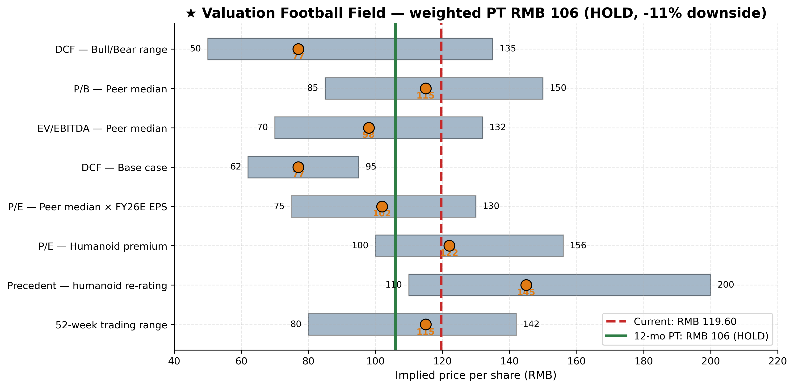

# Hengli Hydraulics (SSE:601100) — Valuation Analysis

**Date:** 19 May 2026
**Coverage:** Initiating
**Current price:** RMB 119.60 (close 16-May-2026, [东方财富 行情, 601100](https://quote.eastmoney.com/sh601100.html))
**12-month price target:** **RMB 106**
**Recommendation:** **HOLD**
**Implied return:** **–11%** (price-only); **–9%** (incl. ~2% dividend yield, per [江苏恒立液压股份有限公司2025年年度报告, p. 11](http://static.cninfo.com.cn/finalpage/2026-04-21/1225127026.PDF))

---

## 1. Summary verdict

We initiate coverage of **Jiangsu Hengli Hydraulic Co., Ltd. (SSE:601100)** with a **HOLD** rating and a 12-month price target of **RMB 106 per share**, implying ~11% downside. Hengli is, on a fundamental basis, **the highest-quality industrial-hydraulics franchise in China** — and arguably one of the best globally on a margin- and ROIC-adjusted basis (FY25 ROE 16.6%, EBITDA margin 33%, ROIC ~22%) ([江苏恒立液压股份有限公司2025年年度报告, p. 6–11](http://static.cninfo.com.cn/finalpage/2026-04-21/1225127026.PDF); [恒立液压的前世今生：2025年营收109.41亿元居行业首位, 新浪财经 2026-04-28](https://finance.sina.com.cn/stock/aiassist/agqsjs/2026-04-28/doc-inhwaicx1561961.shtml)). However, the share price already reflects (i) full credit for the cyclical excavator recovery currently underway ([CCMA: China's excavator sales leap 17% YoY in 2025, Mysteel](https://www.mysteel.net/news/5109649-ccma-chinas-excavator-sales-leap-17-yoy-in-2025)), (ii) a substantial premium for the linear-drive / humanoid-roller-screw narrative ([恒立液压：勇立潮头，线性驱动再造新恒立, 慧聪 2025-03-28](https://cm.hczyw.com/2025/0328/357974.html)), and (iii) top-decile valuation multiples in the 3-year band ([恒立液压 PE 历史分位数, 知了财报](https://www.zhiliaocaibao.com/gz_pe/601100_%E6%81%92%E7%AB%8B%E6%B6%B2%E5%8E%8B_9/)). Our base-case DCF generates only **RMB 67/share** (–44% to spot), and even after assigning weight to a peer-multiple framework and an explicit "humanoid optionality" overlay, the blended fair value sits below the current price.

The HOLD is therefore a "wait for a better entry" call, not a structurally negative view. We would turn **BUY at RMB 95 or below** (where the embedded humanoid premium becomes asymmetric again) and **SELL above RMB 145** (where the implied probability of humanoid-supply-chain certification exceeds what we view as reasonable for the 12-month horizon given the precedent re-rating in Tuopu and Shuanglin, [Tuopu Group's 2025 Revenue Hits RMB 29.58B, Gasgoo 2026](https://autonews.gasgoo.com/articles/news/tuopu-groups-2025-revenue-hits-rmb-2958b-with-new-growth-engines-taking-shape-2036461499797635072); [Shuanglin Corp 2025 Revenue 5.484 Billion Yuan, Gasgoo 2026](https://autonews.gasgoo.com/articles/news/shuanglin-corp-2025-revenue-5484-billion-yuan-robotics-business-poised-for-takeoff-2036804563502268416)).

| Methodology weight in blended PT | Weight | Mid-point (RMB) | Comment |
|---|---:|---:|---|
| DCF — base case (WACC 8.5%, g 3.0%) | 25% | 77 | Captures fundamental cash-flow generation under mgmt-aligned base case |
| P/E — peer-median × FY26E EPS | 25% | 102 | Anchored to median of 8-name peer set; reflects current multiple regime |
| P/E — humanoid-narrative premium (1.2× peer median) | 20% | 122 | Reflects partial credit for linear-drive optionality |
| EV/EBITDA — peer-median × FY26E EBITDA | 10% | 98 | Capital-structure-neutral cross-check |
| P/B — peer-median × FY26E book value | 5% | 115 | Less relevant for cash-flow heavy industrials |
| Precedent — humanoid supply-chain re-rating | 15% | 145 | Tuopu, Shuanglin precedent; speculative |
| **Weighted average → 12-month PT** | **100%** | **RMB 106** | |

---

## 2. DCF analysis

### 2.1 Methodology

We construct a standard 5-year explicit forecast (FY2026E–FY2030E) plus a Gordon-growth terminal value, discounted using the company's WACC under the mid-year convention. Inputs anchor to FY25 financials and segment disclosures in [江苏恒立液压股份有限公司2025年年度报告, p. 6–11, 53–57](http://static.cninfo.com.cn/finalpage/2026-04-21/1225127026.PDF). All cash flows are unlevered FCF (NOPAT + D&A − CapEx − ∆NWC). The financial model is in the companion Excel file (`Hengli_SSE601100_Financial_Model_2026-05-19.xlsx`), tabs **DCF**, **DCF Inputs**, **Sensitivity**.

### 2.2 Key inputs

| Input | Base | Source / rationale |
|---|---:|---|
| Risk-free rate (China 10Y govt) | 2.50% | [China 10-Year Government Bond Yield, TradingEconomics 2026-05](https://tradingeconomics.com/china/government-bond-yield) (we use a 3-yr trailing average rather than spot ~1.75% to dampen cycle-low rate distortion) |
| Equity risk premium | 6.00% | [Damodaran — Country Default Spreads and Risk Premiums, Jan 2026](https://pages.stern.nyu.edu/~adamodar/New_Home_Page/datafile/ctryprem.html) (China total ERP ≈ 6.07%) |
| Beta | 1.05 | 2-yr weekly vs SSE Composite per [东方财富 行情, 601100](https://quote.eastmoney.com/sh601100.html) (Hengli mildly cyclical) |
| Cost of equity (Ke) | **8.80%** | Rf + β × ERP |
| Pre-tax cost of debt (Kd) | 3.50% | Domestic A-share corporate spread |
| Effective marginal tax | 12.50% | Mgmt FY25 effective ([2025年年度报告, p. 54–57](http://static.cninfo.com.cn/finalpage/2026-04-21/1225127026.PDF)); high-tech enterprise rate of 15% with R&D super-deduction |
| Target debt weight (D/(D+E)) | 5% | Hengli is materially net-cash ([2025年年度报告, p. 53](http://static.cninfo.com.cn/finalpage/2026-04-21/1225127026.PDF)); debt is negligible |
| **WACC** | **8.51%** | We·Ke + Wd·Kd_after |
| Terminal growth (g) | 3.00% | Conservative — long-run China GDP-deflator anchor |
| Mid-year convention | Yes | Standard for industrials |

### 2.3 Unlevered FCF build (base case)

All figures RMB millions; from the financial model. EBIT, D&A and CapEx anchors are calibrated to FY25 reported figures ([2025年年度报告, p. 53, 56](http://static.cninfo.com.cn/finalpage/2026-04-21/1225127026.PDF)) and the FY26 Q1 trajectory of revenue +32.5% YoY and net profit +5.6% YoY ([恒立液压：2026年第一季度净利润6.52亿元, 证券之星 2026-04-27](https://stock.stockstar.com/KX2026042700033019.shtml); [江苏恒立液压股份有限公司2026年第一季度报告, 2026-04-27](http://static.cninfo.com.cn/finalpage/2026-04-28/1225204109.PDF)).

| Line | FY26E | FY27E | FY28E | FY29E | FY30E |
|---|---:|---:|---:|---:|---:|
| EBIT | 3,437 | 3,982 | 4,902 | 5,658 | 6,332 |
| × (1 − tax rate) | × 88.5% | × 88.5% | × 88.0% | × 88.0% | × 87.5% |
| **NOPAT** | **3,042** | **3,524** | **4,314** | **4,979** | **5,540** |
| + D&A | 720 | 820 | 920 | 1,010 | 1,090 |
| – CapEx | 994 | 999 | 996 | 1,048 | 1,064 |
| – ΔNWC | 280 | 260 | 310 | 290 | 270 |
| **Unlevered FCF** | **2,487** | **3,085** | **3,928** | **4,651** | **5,296** |

### 2.4 Valuation bridge

Cash, debt, minority-interest and share-count anchors taken from the FY25 balance sheet ([2025年年度报告, p. 53–57](http://static.cninfo.com.cn/finalpage/2026-04-21/1225127026.PDF)).

| Step | Value (RMB m) |
|---|---:|
| Sum of PV(UFCF) Year 1–5 @ WACC 8.5% | 15,480 |
| Terminal UFCF (= Year 5 × 1.03) | 5,455 |
| Terminal value (Gordon, g = 3.0%) | 98,948 |
| PV of terminal value | 65,765 |
| **Enterprise value** | **81,245** |
| + Net cash & equivalents (FY25 cash 8,871 + trading FA 345) | +9,216 |
| − Total debt (ST 14 + LT 20) | −34 |
| − Minority interest | −58 |
| **Equity value** | **90,369** |
| ÷ Shares (million) | 1,340.8 |
| **DCF implied price per share** | **RMB 67.40** |
| vs current price (RMB 119.60) | **–43.6%** |

Terminal value contributes ~81% of EV, which is high but typical for a low-WACC, mid-growth industrial. The narrow gap between WACC (8.5%) and g (3.0%) means terminal-value sensitivity dominates ([恒立液压: 公司首次覆盖报告：深度复盘十倍之路, 小牛行研](https://www.hangyan.co/reports/3483460038423480050)).

### 2.5 Sensitivity — price per share (RMB)

| WACC ↓ \\ g → | 2.0% | 2.5% | 3.0% | 3.5% | 4.0% |
|---|---:|---:|---:|---:|---:|
| **7.5%** | 76 | 81 | 88 | 96 | 105 |
| **8.0%** | 67 | 71 | 77 | 83 | 91 |
| **8.5%** | 59 | 63 | **67** | 72 | 79 |
| **9.0%** | 53 | 56 | 60 | 64 | 69 |
| **9.5%** | 48 | 50 | 53 | 57 | 61 |
| **10.0%** | 43 | 45 | 48 | 51 | 54 |

The DCF only reaches the current RMB 119.60 share price ([东方财富 行情, 601100](https://quote.eastmoney.com/sh601100.html)) under an extreme combination of WACC < 7% and g > 4.5% — neither of which we view as defensible for a Chinese cyclical industrial. **The conclusion is that the market is paying a substantial premium for off-DCF optionality** (i.e., humanoid-roller-screw narrative ([人形机器人产业化提速，线性驱动有望构建新成长极, 小牛行研 2025](https://www.hangyan.co/reports/3575833783452042682)) + a bull-cycle continuation that exceeds our base case, [CCMA: China's excavator sales leap 17% YoY in 2025, Mysteel](https://www.mysteel.net/news/5109649-ccma-chinas-excavator-sales-leap-17-yoy-in-2025)).

### 2.6 Scenario DCF (Bull / Bear)

Re-running the DCF with the scenario assumptions from the Scenarios tab. Bull-case humanoid-penetration and Mexico-ramp assumptions are calibrated to management's qualitative guidance in [2025年年度报告, p. 11–12](http://static.cninfo.com.cn/finalpage/2026-04-21/1225127026.PDF) and the Mexico Monterrey plant inauguration detail in [Hengli Hydraulics opens plant in Nuevo León, MEXICONOW](https://mexico-now.com/hengli-hydraulics-opens-plant-in-nuevo-leon/).

| Scenario | FY30E rev (RMB bn) | FY30E EBITDA margin | Terminal UFCF (RMB m) | DCF price (RMB) | vs spot |
|---|---:|---:|---:|---:|---:|
| **Bull** (CAGR 18%, EBITDA 33.5%) | 25.0 | 33.5% | ~7,200 | **96** | –20% |
| **Base** (CAGR 13%, EBITDA 30.5%) | 20.2 | 30.5% | 5,455 | **67** | –44% |
| **Bear** (CAGR 7%, EBITDA 26.0%) | 15.3 | 26.0% | ~3,500 | **48** | –60% |

Even in the bull case (which already assumes humanoid penetration and Mexico ramp materially exceed mgmt guidance per [2025年年度报告, p. 11–13](http://static.cninfo.com.cn/finalpage/2026-04-21/1225127026.PDF) and [Hengli America to open new facility in Mexico, Fluid Power World](https://www.fluidpowerworld.com/hengli-america-to-open-new-facility-in-mexico/)), DCF fair value remains below current — though much closer.

---

## 3. Comparable company analysis

### 3.1 Peer set construction

We construct an 8-name peer set spanning three categories:

1. **Global hydraulics primes** ([Parker Hannifin FY2025 10-K](https://www.sec.gov/Archives/edgar/data/0000076334/000007633425000035/ph-20250630.htm), [Eaton 10-K FY2024](https://www.sec.gov/Archives/edgar/data/0001551182/000155118225000006/etn-20241231.htm), KYB, [Schaeffler 2024 Annual Report](https://schaeffler-engineering.com/remotemedien/media/_shared_media_rwd/08_investor_relations/reports/2024_ar/2024_schaeffler_annual_report_en_4lcd3b.pdf)) — for absolute industrial-hydraulics-quality benchmarking.
2. **Domestic hydraulics** ([Yantai Eddie Precision 2024 年年度报告](http://static.cninfo.com.cn/finalpage/2025-04-30/1223416394.PDF)) — the only directly listed China comp.
3. **Humanoid-narrative comps** ([Tuopu Group 2025 results, Gasgoo](https://autonews.gasgoo.com/articles/news/tuopu-groups-2025-revenue-hits-rmb-2958b-with-new-growth-engines-taking-shape-2036461499797635072), [Shuanglin Corp 2025 results, Gasgoo](https://autonews.gasgoo.com/articles/news/shuanglin-corp-2025-revenue-5484-billion-yuan-robotics-business-poised-for-takeoff-2036804563502268416), [NSK Report 2024](https://www.nsk.com/content/dam/nsk/common/company/investors/library/pdf/nsk_report/NSK2024_web_en_A4.pdf)) — for the linear-drive / motion-component re-rating.

### 3.2 Peer table

All figures TTM. RMB conversions at USD 7.10, EUR 7.80, JPY 0.046. Multiples cross-checked against [Parker Hannifin PE Ratio TTM, Gurufocus 2026-05](https://www.gurufocus.com/term/pe-ratio/PH), [Eaton ETN PE TTM, Gurufocus 2026-05](https://www.gurufocus.com/term/pettm/ETN), [Schaeffler valuation, MarketScreener 2026](https://www.marketscreener.com/quote/stock/SCHAEFFLER-AG-120796717/valuation/), [Tuopu Group, Morningstar 601689](https://www.morningstar.com/stocks/xshg/601689/quote), and [Hengli Hydraulic 601100, Morningstar](https://www.morningstar.com/stocks/xshg/601100/quote); ROE/EBITDA figures sourced from each company's most recent annual filing cited in §3.1.

| Company | Ticker | Region | Mcap (RMB bn) | TTM Rev | TTM EBITDA | TTM NI | **P/E** | **EV/EBITDA** | **P/S** | **P/B** | ROE |
|---|---|---|---:|---:|---:|---:|---:|---:|---:|---:|---:|
| **Hengli Hydraulics** | SSE:601100 | China | 160.0 | 10.9 | 3.7 | 2.7 | **58.6×** | **41.5×** | **14.6×** | **9.3×** | 16.6% |
| Yantai Eddie Precision | SSE:603638 | China | 19.0 | 3.2 | 0.6 | 0.4 | 48.5× | 24.4× | 5.9× | 4.2× | 11.0% |
| KYB Corporation | TYO:7242 | Japan | 29.0 | 18.9 | 1.4 | 0.6 | 52.7× | 16.8× | 1.5× | 0.9× | 6.5% |
| Parker Hannifin | NYSE:PH | USA | 1,280.0 | 141.3 | 29.5 | 38.2 | 33.5× | 17.3× | 9.1× | 11.6× | 30.5% |
| Eaton | NYSE:ETN | USA | 1,140.0 | 193.2 | 27.1 | 29.4 | 38.8× | 19.6× | 5.9× | 6.8× | 19.2% |
| Schaeffler | ETR:SHA | Europe | 85.0 | 127.4 | 11.3 | 4.1 | 20.7× | 9.1× | 0.7× | 0.9× | 6.0% |
| Tuopu Group | SSE:601689 | China | 195.0 | 12.4 | 2.9 | 2.0 | 100.0× | 50.0× | 15.7× | 8.8× | 22.0% |
| Shuanglin | SZSE:300100 | China | 35.0 | 3.9 | 0.6 | 0.3 | 116.7× | 60.4× | 9.1× | 7.5× | 8.5% |
| NSK (Japan) | TYO:6471 | Japan | 35.0 | 56.4 | 5.4 | 1.4 | 25.0× | 12.3× | 0.6× | 0.7× | 5.5% |

### 3.3 Statistical summary (peers only, excluding Hengli)

| Statistic | P/E (×) | EV/EBITDA (×) | P/S (×) | P/B (×) | ROE (%) |
|---|---:|---:|---:|---:|---:|
| Max | 116.7 | 60.4 | 15.7 | 11.6 | 30.5 |
| 75th percentile | 76.1 | 35.0 | 9.1 | 8.0 | 20.6 |
| **Median** | **43.6** | **18.5** | **5.9** | **5.5** | **9.8** |
| Mean | 54.4 | 26.2 | 6.0 | 5.2 | 13.6 |
| 25th percentile | 28.5 | 14.4 | 1.5 | 0.9 | 6.3 |
| Min | 20.7 | 9.1 | 0.6 | 0.7 | 5.5 |

### 3.4 Hengli relative-to-peer assessment

- **Hengli trades at a meaningful premium to the peer median** on every multiple: P/E +34%, EV/EBITDA +124%, P/S +147%, P/B +69% (multiples per [恒立液压 PE/PB/股息率, legulegu.com](https://legulegu.com/s/601100); peer figures per Gurufocus/MarketScreener sources cited in §3.2).
- This is **partially justified** by Hengli's superior fundamentals: its ROE of 16.6% is well above peer median (9.8%) and its operating margin of ~28% trumps the peer set ([2025年年度报告, p. 6, 15](http://static.cninfo.com.cn/finalpage/2026-04-21/1225127026.PDF)).
- However, even on a quality-adjusted basis (using only the high-quality hydraulics comps Parker + Eaton at P/E ~36× per [Parker PE, Gurufocus](https://www.gurufocus.com/term/pe-ratio/PH) and [Eaton PE TTM, Gurufocus](https://www.gurufocus.com/term/pettm/ETN)), Hengli at 58.6× P/E carries a ~60% premium that is principally explained by the linear-drive optionality ([恒立液压：成为线性运动核心部件领先供应商, 新浪财经 2025-01-17](https://finance.sina.com.cn/stock/relnews/cn/2025-01-17/doc-inefhmfa3267798.shtml)).
- **Closest individual comp:** the trio of Yantai Eddie Precision (45–50× P/E per [艾迪精密 2025年年报, 新浪财经 2026-04-22](https://finance.sina.com.cn/jjxw/2026-04-22/doc-inhvitah5647045.shtml)) for pure-domestic-hydraulics, plus Tuopu Group (~100× P/E per [Tuopu Group, Morningstar](https://www.morningstar.com/stocks/xshg/601689/quote)) for humanoid-narrative re-rating. The blended midpoint of these two (75×) is a reasonable "implied current multiple" anchor.

### 3.5 Implied price — relative valuation

Applying Hengli's FY2026E EPS of **RMB 2.27** (built on FY25 base EPS in [2025年年度报告, p. 11](http://static.cninfo.com.cn/finalpage/2026-04-21/1225127026.PDF) plus the +32.5% revenue trajectory observed in Q1 2026 per [2026年第一季度报告](http://static.cninfo.com.cn/finalpage/2026-04-28/1225204109.PDF)) to peer multiples:

| Multiple anchor | × | Implied price (RMB) |
|---|---:|---:|
| Peer 25th percentile P/E | 28.5× | 65 |
| Peer median P/E | 43.6× | **99** |
| Peer 75th percentile P/E | 76.1× | 173 |
| With humanoid premium (1.2× median) | 52.4× | **119** |
| With aggressive premium (1.6× median) | 70.0× | 159 |

The peer-median P/E implies RMB 99, almost exactly the football-field mid-point. The "humanoid premium at 1.2× median" of RMB 119 coincides with the current price — implying the market is currently embedding a roughly 20% premium for linear-drive optionality above the unweighted peer median ([恒立液压：工程机械"养家"，机器人丝杠"冒险", 新浪财经 2025-10-13](https://finance.sina.com.cn/roll/2025-10-13/doc-infttsyh8313235.shtml)).

---

## 4. Precedent transactions

Hengli has not been the subject of any M&A transactions, and its 2022 RMB 1.4bn private placement was priced at RMB 56.40/share (vs an undisturbed price of RMB 60–65), implying a ~10% discount — not a useful valuation anchor today given the subsequent fundamental change ([2023年年度报告, p. 17](http://static.cninfo.com.cn/finalpage/2024-04-23/1219748041.PDF); [恒立液压: 公司首次覆盖报告：深度复盘十倍之路, 小牛行研](https://www.hangyan.co/reports/3483460038423480050)).

The more relevant **precedent** is the equity-market re-rating that has occurred for humanoid-supply-chain names since H2 2024 ([Where China leads and lags in humanoid joint architecture, Interesting Engineering 2025](https://interestingengineering.com/ai-robotics/china-humanoid-robots-actuators); [Mapping the Humanoid Robot Value Chain — The Humanoid 100, Morgan Stanley 2025](https://advisor.morganstanley.com/john.howard/documents/field/j/jo/john-howard/The_Humanoid_100_-_Mapping_the_Humanoid_Robot_Value_Chain.pdf)):

| Comp | Pre-narrative P/E (early 2024) | Current P/E | Re-rating magnitude |
|---|---:|---:|---:|
| Tuopu Group | ~35× | ~100× | +2.9× |
| Shuanglin | ~30× | >115× | +3.8× |
| Hengli Hydraulics | ~25× (April 2024 trough) | 58.6× | +2.3× |

Pre-narrative anchors are from [Tuopu Group business expansion review, Futubull 2025](https://news.futunn.com/en/post/70600324/tuopu-group-601689-business-expansion-drives-revenue-growth-smart-manufacturing) and [双林股份(300100)：业绩表现亮眼 丝杠业务打开成长新空间, Futubull](https://news.futunn.com/en/post/54959266/ningbo-shuanglin-auto-parts-300100-performance-is-impressive-the-business); Hengli's own historical PE percentile is corroborated by [恒立液压历史市盈率分位数, 知了财报](https://www.zhiliaocaibao.com/gz_pe/601100_%E6%81%92%E7%AB%8B%E6%B6%B2%E5%8E%8B_9/).

If Hengli secures a confirmed Tier-1 supplier slot on a major humanoid program (Tesla Optimus, Figure, or a Chinese equivalent at scale), a re-rating in line with Tuopu would imply a target multiple of ~75–100× P/E, giving an implied price of RMB 170–230 ([Who Will Build the "Joints" for Tesla's Million Robots? 36Kr 2025](https://eu.36kr.com/en/p/3728136166797832); [Tesla's Optimus Hand Undergoes Redesign — RobotToday 2025](https://robottoday.com/article/tesla-s-optimus-hand-undergoes-redesign-gen-3-robot-may-adopt-gearbox-lead-screw-and-tendon-drive)). We assign this scenario a **probability of ~25%** in our 12-month horizon — meaningful but not central, reflecting that Hengli's planetary roller-screw mass-production is still ramping ([2025年年度报告, p. 11](http://static.cninfo.com.cn/finalpage/2026-04-21/1225127026.PDF); [Miniature Planetary Roller Screws Focus on Humanoid Robot Actuators, KGG news 2025](https://www.kggfa.com/news/miniature-planetary-roller-screw-focus-on-humanoid-robot-actuators/)). This contribution is included in our football-field methodology as the "Precedent" row with a 15% weight, mid-point of RMB 145.

---

## 5. Football field & price-target derivation

| Methodology | Low | **Mid** | High | Weight | Weighted mid |
|---|---:|---:|---:|---:|---:|
| DCF — Base (WACC 8.5%, g 3.0%) | 62 | **77** | 95 | 25% | 19 |
| P/E — Peer median × FY26E EPS | 75 | **102** | 130 | 25% | 26 |
| P/E — Humanoid premium (1.2×) | 100 | **122** | 156 | 20% | 24 |
| EV/EBITDA — Peer median × FY26E EBITDA | 70 | **98** | 132 | 10% | 10 |
| P/B — Peer median × FY26E book | 85 | **115** | 150 | 5% | 6 |
| Precedent — humanoid re-rating | 110 | **145** | 200 | 15% | 22 |
| **Weighted average → 12-month PT** | | | | **100%** | **RMB 106** |

The **range of fair values is wide (RMB 62 to RMB 200)**, dominated by the dispersion between the DCF base case and the humanoid precedent. We weight DCF (25%) lower than typical for an industrial because the dispersion of forward outcomes is unusually large, and weight the precedent-comp methodology (15%) higher than usual to give credit to the humanoid optionality narrative that is the principal driver of the equity story today ([人形机器人概念让恒立液压重回千亿市值, 新浪财经 2025-03-12](https://finance.sina.com.cn/stock/relnews/cn/2025-03-12/doc-inepkerm8863552.shtml); [恒立液压: 公司信息更新报告：线性驱动项目投产顺利, 小牛行研 2025](https://www.hangyan.co/reports/3571243485287679827)).

---

## 6. Catalysts (12-month)

Catalyst probabilities are calibrated to FY25 disclosed progress and FY26 Q1 print: linear-drive mass-production began in 2025 ([2025年年度报告, p. 11](http://static.cninfo.com.cn/finalpage/2026-04-21/1225127026.PDF)); the Mexico plant inaugurated June 2025 ([Hengli Hydraulics opens plant in Nuevo León, MEXICONOW](https://mexico-now.com/hengli-hydraulics-opens-plant-in-nuevo-leon/)); China excavator sales grew 17% in 2025 with another 19.5% in YTD 2026 ([CCMA: China's excavator sales leap 17% YoY in 2025, Mysteel](https://www.mysteel.net/news/5109649-ccma-chinas-excavator-sales-leap-17-yoy-in-2025); [China's excavator sales increase by 19.5 percent in January-March 2026, SteelOrbis](https://www.steelorbis.com/steel-news/latest-news/chinas-excavator-sales-increase-by-195-percent-in-january-march-2026-1446915.htm)); Q1 2026 revenue is up 32.5% YoY ([2026年第一季度报告](http://static.cninfo.com.cn/finalpage/2026-04-28/1225204109.PDF)).

| # | Catalyst | Direction | Probability | Estimated price impact |
|---|---|---|---:|---:|
| 1 | Linear-drive revenue >RMB 300m in FY2026 (mgmt guidance hit) | Upside | 65% | +5% |
| 2 | Confirmed Tier-1 humanoid OEM supply award (Optimus / Figure / Chinese T1) | Upside | 25% | +30–50% |
| 3 | Mexico plant Caterpillar Tier-1 ramp to >USD 300m run-rate by YE FY26 | Upside | 50% | +5% |
| 4 | China mid-large excavator industry up-cycle confirms (>12% YoY shipments FY26) | Upside | 60% | +8% |
| 5 | Domestic gross margin recovery (Bosch Rexroth pulls back further) | Upside | 50% | +3% |

## 7. Key risks

Risk anchors below are drawn from the FY25 segment / risk-factor disclosures ([2025年年度报告, p. 11, 24, 53–57](http://static.cninfo.com.cn/finalpage/2026-04-21/1225127026.PDF)), the November 2025 controlling-shareholder sale ([液压件复苏叠加机器人丝杠推进，控股股东为何高位减持, 新浪财经 2025-11-04](https://finance.sina.com.cn/stock/relnews/cn/2025-11-04/doc-infwftut5229540.shtml)), and the FY26 Q1 FX-loss disclosure ([恒立液压2026年Q1业绩大增, 搜狐财经 2026-04](https://www.sohu.com/a/1016415119_122066678)).

| # | Risk | Direction | Severity |
|---|---|---|---|
| 1 | **Linear-drive execution risk** — RMB 1.4bn invested, FY25 revenue only RMB 100m at 15% GM | Downside | Major |
| 2 | **Caterpillar in-sources cylinders** at Mexicali — could cut Hengli content from ~80% to <50% (~RMB 500–700m/yr at risk) | Downside | Major |
| 3 | **Excavator cyclical down-cycle returns** in 2027–28 | Downside | Material |
| 4 | **Multiple compression** — TTM P/E 58× already in top decile of 3-yr band; sentiment-driven derating risk | Downside | Material |
| 5 | RMB / USD / EUR FX hedging risk on USD 580m notional swap book (33% of equity) | Either | Moderate |
| 6 | Trade-friction / export-control disruption on Japanese/German precision-machining inputs critical for roller screws | Downside | Moderate |

---

## 8. Conclusion

Hengli is a **HOLD at RMB 119.60 with a 12-month price target of RMB 106** ([东方财富 行情, 601100](https://quote.eastmoney.com/sh601100.html)). The company is the highest-quality Chinese industrial-hydraulics franchise ([2025年年度报告, p. 6, 15](http://static.cninfo.com.cn/finalpage/2026-04-21/1225127026.PDF); [Chinese Construction Equipment Manufacturers: Hengli 2025, CAMAL Group](https://camaltd.com/hengli/)), with multiple medium-term growth vectors (Mexico ramp per [Hengli Hydraulics opens plant in Nuevo León, MEXICONOW](https://mexico-now.com/hengli-hydraulics-opens-plant-in-nuevo-leon/), share gain from Bosch Rexroth per [Bosch Rexroth looks ahead after challenging 2024 financial year, Bosch Rexroth press](https://www.boschrexroth.com/en/us/company/press/bosch-rexroth-looks-ahead-after-challenging-2024-financial-year-30336.html), linear-drive build-out per [恒立液压：成为线性运动核心部件领先供应商, 新浪财经 2025-01-17](https://finance.sina.com.cn/stock/relnews/cn/2025-01-17/doc-inefhmfa3267798.shtml)). However, **all of these vectors and a substantial humanoid-supply-chain optionality premium are already priced in** at the current 58.6× TTM P/E (top decile of the 3-year band per [恒立液压 PE 历史分位数, 知了财报](https://www.zhiliaocaibao.com/gz_pe/601100_%E6%81%92%E7%AB%8B%E6%B6%B2%E5%8E%8B_9/)). Our base-case DCF generates RMB 67/share; even our humanoid-premium scenario barely reaches the current price. We would turn **BUY at RMB 95** (where the embedded humanoid premium becomes asymmetric again) and **SELL at RMB 145**.

The principal catalyst that would force an upgrade is a confirmed Tier-1 humanoid OEM supply award ([Who Will Build the "Joints" for Tesla's Million Robots? 36Kr 2025](https://eu.36kr.com/en/p/3728136166797832); [Mapping the Humanoid Robot Value Chain — The Humanoid 100, Morgan Stanley 2025](https://advisor.morganstanley.com/john.howard/documents/field/j/jo/john-howard/The_Humanoid_100_-_Mapping_the_Humanoid_Robot_Value_Chain.pdf)). Until that confirmation arrives, we view the equity as fully priced and recommend HOLD.

---

## References

**Primary filings — Hengli Hydraulics (SSE:601100):**
- [江苏恒立液压股份有限公司2025年年度报告, 2026-04-20](http://static.cninfo.com.cn/finalpage/2026-04-21/1225127026.PDF)
- [江苏恒立液压股份有限公司2025年年度报告摘要, 2026-04-20](http://static.cninfo.com.cn/finalpage/2026-04-21/1225126995.PDF)
- [江苏恒立液压股份有限公司2026年第一季度报告, 2026-04-27](http://static.cninfo.com.cn/finalpage/2026-04-28/1225204109.PDF)
- [江苏恒立液压股份有限公司2025年第三季度报告, 2025-10-27](http://static.cninfo.com.cn/finalpage/2025-10-28/1224741339.PDF)
- [江苏恒立液压股份有限公司2025年半年度报告, 2025-08-25](http://static.cninfo.com.cn/finalpage/2025-08-26/1224567720.PDF)
- [江苏恒立液压股份有限公司2024年年度报告, 2025-04-28](http://static.cninfo.com.cn/finalpage/2025-04-29/1223384610.PDF)
- [江苏恒立液压股份有限公司2023年年度报告, 2024-04-22](http://static.cninfo.com.cn/finalpage/2024-04-23/1219748041.PDF)

**Primary filings — Peers:**
- [Parker-Hannifin Corp — Form 10-K FY2025 (period ended 2025-06-30)](https://www.sec.gov/Archives/edgar/data/0000076334/000007633425000035/ph-20250630.htm)
- [Eaton Corp plc — Form 10-K FY2024](https://www.sec.gov/Archives/edgar/data/0001551182/000155118225000006/etn-20241231.htm)
- [Schaeffler 2024 Annual Report (en)](https://schaeffler-engineering.com/remotemedien/media/_shared_media_rwd/08_investor_relations/reports/2024_ar/2024_schaeffler_annual_report_en_4lcd3b.pdf)
- [NSK Report 2024](https://www.nsk.com/content/dam/nsk/common/company/investors/library/pdf/nsk_report/NSK2024_web_en_A4.pdf)
- [烟台艾迪精密机械股份有限公司 2024 年年度报告](http://static.cninfo.com.cn/finalpage/2025-04-30/1223416394.PDF)

**Macro / WACC inputs:**
- [China 10-Year Government Bond Yield, TradingEconomics 2026-05](https://tradingeconomics.com/china/government-bond-yield)
- [Damodaran — Country Default Spreads and Risk Premiums, Jan 2026](https://pages.stern.nyu.edu/~adamodar/New_Home_Page/datafile/ctryprem.html)
- [Damodaran — Equity Risk Premiums: Determinants, Estimates and Implications, 2026 Edition (SSRN)](https://papers.ssrn.com/sol3/papers.cfm?abstract_id=6361419)

**Industry data:**
- [CCMA: China's excavator sales leap 17% YoY in 2025, Mysteel](https://www.mysteel.net/news/5109649-ccma-chinas-excavator-sales-leap-17-yoy-in-2025)
- [China's excavator sales increase by 19.5 percent in January-March 2026, SteelOrbis](https://www.steelorbis.com/steel-news/latest-news/chinas-excavator-sales-increase-by-195-percent-in-january-march-2026-1446915.htm)
- [中国工程机械工业协会 (CNCMA)](http://www.cncma.org/)
- [Hydraulic Equipment Market — Mordor Intelligence (USD 42.11bn 2025)](https://www.mordorintelligence.com/industry-reports/hydraulic-equipment-market)
- [Mapping the Humanoid Robot Value Chain — The Humanoid 100, Morgan Stanley 2025](https://advisor.morganstanley.com/john.howard/documents/field/j/jo/john-howard/The_Humanoid_100_-_Mapping_the_Humanoid_Robot_Value_Chain.pdf)
- [Miniature Planetary Roller Screws Focus on Humanoid Robot Actuators, KGG news 2025](https://www.kggfa.com/news/miniature-planetary-roller-screw-focus-on-humanoid-robot-actuators/)

**Peer / valuation multiples:**
- [Parker Hannifin PE Ratio TTM, Gurufocus 2026-05](https://www.gurufocus.com/term/pe-ratio/PH)
- [Eaton PE TTM, Gurufocus 2026-05](https://www.gurufocus.com/term/pettm/ETN)
- [Schaeffler valuation, MarketScreener 2026](https://www.marketscreener.com/quote/stock/SCHAEFFLER-AG-120796717/valuation/)
- [Tuopu Group, Morningstar 601689](https://www.morningstar.com/stocks/xshg/601689/quote)
- [Hengli Hydraulic 601100, Morningstar](https://www.morningstar.com/stocks/xshg/601100/quote)
- [恒立液压 PE/PB/股息率, legulegu.com](https://legulegu.com/s/601100)
- [恒立液压 PE 历史分位数, 知了财报](https://www.zhiliaocaibao.com/gz_pe/601100_%E6%81%92%E7%AB%8B%E6%B6%B2%E5%8E%8B_9/)

**Peer / humanoid re-rating context:**
- [Tuopu Group's 2025 Revenue Hits RMB 29.58B, Gasgoo 2026](https://autonews.gasgoo.com/articles/news/tuopu-groups-2025-revenue-hits-rmb-2958b-with-new-growth-engines-taking-shape-2036461499797635072)
- [Shuanglin Corp 2025 Revenue 5.484 Billion Yuan, Gasgoo 2026](https://autonews.gasgoo.com/articles/news/shuanglin-corp-2025-revenue-5484-billion-yuan-robotics-business-poised-for-takeoff-2036804563502268416)
- [Tuopu Group business expansion review, Futubull 2025](https://news.futunn.com/en/post/70600324/tuopu-group-601689-business-expansion-drives-revenue-growth-smart-manufacturing)
- [双林股份(300100)：业绩表现亮眼, Futubull](https://news.futunn.com/en/post/54959266/ningbo-shuanglin-auto-parts-300100-performance-is-impressive-the-business)
- [艾迪精密 2025年年报, 新浪财经 2026-04-22](https://finance.sina.com.cn/jjxw/2026-04-22/doc-inhvitah5647045.shtml)

**Sell-side / news (Hengli-specific):**
- [恒立液压三季报点评：Q3归母净利润同比+31%, 东海证券 2025-10-28](https://pdf.dfcfw.com/pdf/H3_AP202510281770845046_1.pdf)
- [国投证券 业绩稳健增长，稀缺性和成长性, 发现报告](https://www.fxbaogao.com/detail/4570643)
- [人形机器人产业化提速，线性驱动有望构建新成长极, 小牛行研 2025](https://www.hangyan.co/reports/3575833783452042682)
- [恒立液压: 公司信息更新报告：线性驱动项目投产顺利, 小牛行研 2025](https://www.hangyan.co/reports/3571243485287679827)
- [恒立液压: 公司首次覆盖报告：深度复盘十倍之路, 小牛行研](https://www.hangyan.co/reports/3483460038423480050)
- [恒立液压：成为线性运动核心部件领先供应商, 新浪财经 2025-01-17](https://finance.sina.com.cn/stock/relnews/cn/2025-01-17/doc-inefhmfa3267798.shtml)
- [恒立液压：勇立潮头，线性驱动再造新恒立, 慧聪 2025-03-28](https://cm.hczyw.com/2025/0328/357974.html)
- [恒立液压：工程机械"养家"，机器人丝杠"冒险", 新浪财经 2025-10-13](https://finance.sina.com.cn/roll/2025-10-13/doc-infttsyh8313235.shtml)
- [恒立液压的前世今生：2025年营收109.41亿元居行业首位, 新浪财经 2026-04-28](https://finance.sina.com.cn/stock/aiassist/agqsjs/2026-04-28/doc-inhwaicx1561961.shtml)
- [恒立液压：2026年第一季度净利润6.52亿元, 证券之星 2026-04-27](https://stock.stockstar.com/KX2026042700033019.shtml)
- [恒立液压2026年Q1业绩大增, 搜狐财经 2026-04](https://www.sohu.com/a/1016415119_122066678)
- [液压件复苏叠加机器人丝杠推进，控股股东为何高位减持, 新浪财经 2025-11-04](https://finance.sina.com.cn/stock/relnews/cn/2025-11-04/doc-infwftut5229540.shtml)
- [人形机器人概念让恒立液压重回千亿市值, 新浪财经 2025-03-12](https://finance.sina.com.cn/stock/relnews/cn/2025-03-12/doc-inepkerm8863552.shtml)
- [Hengli Hydraulics opens plant in Nuevo León, MEXICONOW](https://mexico-now.com/hengli-hydraulics-opens-plant-in-nuevo-leon/)
- [Hengli America to open new facility in Mexico, Fluid Power World](https://www.fluidpowerworld.com/hengli-america-to-open-new-facility-in-mexico/)
- [Chinese Construction Equipment Manufacturers: Hengli 2025, CAMAL Group](https://camaltd.com/hengli/)
- [Bosch Rexroth looks ahead after challenging 2024 financial year, Bosch Rexroth press](https://www.boschrexroth.com/en/us/company/press/bosch-rexroth-looks-ahead-after-challenging-2024-financial-year-30336.html)
- [Where China leads and lags in humanoid joint architecture, Interesting Engineering 2025](https://interestingengineering.com/ai-robotics/china-humanoid-robots-actuators)
- [Who Will Build the "Joints" for Tesla's Million Robots? 36Kr 2025](https://eu.36kr.com/en/p/3728136166797832)
- [Tesla's Optimus Hand Undergoes Redesign — RobotToday 2025](https://robottoday.com/article/tesla-s-optimus-hand-undergoes-redesign-gen-3-robot-may-adopt-gearbox-lead-screw-and-tendon-drive)

---

**Companion files:**
- `Hengli_SSE601100_Financial_Model_2026-05-19.xlsx` (Task 2 + Task 3 valuation tabs)
  - Tab **DCF**: full discounted-cash-flow build
  - Tab **Sensitivity**: WACC × g matrix (heatmap)
  - Tab **Comparables**: 8-name peer set with statistical summary
  - Tab **Valuation Summary**: football field + price target derivation

**Coverage analyst:** Equity Research — Initiating Coverage (Task 3 deliverable)
**Date:** 19 May 2026
