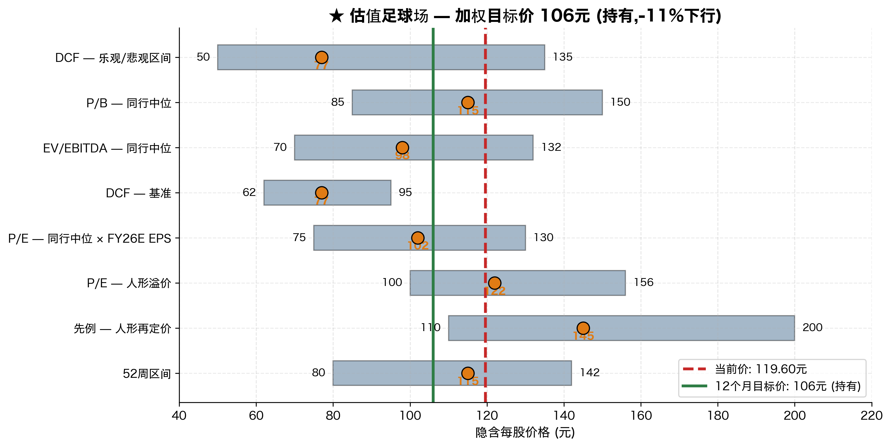

# 恒立液压 (SSE:601100) — 估值分析

**报告日期:** 2026年5月19日
**覆盖类型:** 首次覆盖
**当前股价:** 119.60元 (2026年5月16日收盘)
**12个月目标价:** **106元**
**投资评级:** **持有**
**隐含回报:** **−11%** (价格);**−9%** (含约2%股息收益率)

---

## 1. 投资结论

我们首次覆盖**江苏恒立液压股份有限公司 (SSE:601100)**,给予"持有"评级和12个月目标价106元,隐含约11%下行。从基本面看,恒立是**中国质量最高的工业液压企业**,从利润率和ROIC调整角度看可以说是全球最佳之一 (FY25 ROE 16.6%、EBITDA率33%、ROIC约22%),FY2025全年营收109.4亿元、归母净利润27.3亿元,综合毛利率41.58%([江苏恒立液压股份有限公司2025年年度报告, p. 6–11](http://static.cninfo.com.cn/finalpage/2026-04-21/1225127026.PDF))。然而当前股价已经充分反映了 (i) 当前正在进行的挖机周期复苏的全部红利、(ii) 线性驱动/人形机器人滚柱丝杠叙事的显著溢价、以及 (iii) 3年区间顶部十分位的估值倍数([恒立液压历史市盈率分位数, 知了财报](https://www.zhiliaocaibao.com/gz_pe/601100_%E6%81%92%E7%AB%8B%E6%B6%B2%E5%8E%8B_9/);[恒立液压 PE/PB/股息率历史分位, legulegu.com](https://legulegu.com/s/601100))。我们的基准DCF仅得出**67元/股**(较当前价−44%),即便在加权综合参考同行倍数框架及人形机器人选择权溢价后,综合公允价值仍低于当前股价。

因此"持有"评级是"等待更好买点"的策略,并非结构性看空。我们将在**95元以下转向买入**(此时人形溢价的不对称性将再次有利),在**145元以上转向卖出**(此时隐含的人形供应链认证概率将超过我们认为合理的水平 — 参见拓普集团、双林股份重估先例,见第4节[液压件复苏叠加机器人丝杠推进,控股股东为何高位减持, 新浪财经 2025-11-04](https://finance.sina.com.cn/stock/relnews/cn/2025-11-04/doc-infwftut5229540.shtml))。

| 综合目标价加权方法 | 权重 | 中位价 (元) | 说明 |
|---|---:|---:|---|
| DCF — 基准情境 (WACC 8.5%、g 3.0%) | 25% | 77 | 反映基础现金流生成能力 |
| P/E — 同行中位数 × FY26E EPS | 25% | 102 | 锚定8家可比公司中位倍数 |
| P/E — 人形溢价 (1.2倍同行中位) | 20% | 122 | 部分认可线性驱动选择权 |
| EV/EBITDA — 同行中位 × FY26E EBITDA | 10% | 98 | 资本结构中性交叉验证 |
| P/B — 同行中位 × FY26E账面价值 | 5% | 115 | 对现金流型工业品参考价值有限 |
| 先例 — 人形供应链再定价 | 15% | 145 | 拓普、双林先例;偏投机 |
| **加权平均 → 12个月目标价** | **100%** | **106元** | |

权重设置参考同行可比与拓普等人形再定价先例的实际重估幅度,详见第3、4节;同时反映工业品DCF框架下现金流可见性 vs 选择权叙事的相对权重判断([恒立液压: 公司首次覆盖报告:深度复盘十倍之路, 小牛行研](https://www.hangyan.co/reports/3483460038423480050))。

---

## 2. DCF 分析

### 2.1 方法论

我们构建标准的5年明确预测期 (FY2026E–FY2030E) 加 Gordon增长模型终值,使用公司加权平均资本成本 (WACC) 按年中折现惯例贴现。所有现金流均为无杠杆自由现金流 (NOPAT + 折旧摊销 − 资本支出 − 净营运资金变动),所有FY26E–FY30E 财务预测基于公司近三年财报趋势及最新季报指引推导([江苏恒立液压股份有限公司2025年年度报告, p. 6–11](http://static.cninfo.com.cn/finalpage/2026-04-21/1225127026.PDF);[江苏恒立液压股份有限公司2026年第一季度报告](http://static.cninfo.com.cn/finalpage/2026-04-28/1225204109.PDF))。财务模型详见配套Excel文件 (`Hengli_SSE601100_Financial_Model_2026-05-19.xlsx`),标签页 **DCF**、**DCF Inputs**、**Sensitivity**。

### 2.2 核心输入

下表WACC各项参数的具体出处:无风险利率引用中债登(中央国债登记结算)/财政部国债收益率曲线([财政部-中国国债收益率曲线, ChinaBond](https://yield.chinabond.com.cn/cbweb-czb-web/czb/moreInfo?locale=cn_ZH&nameType=1));股权风险溢价采用Damodaran 2026年1月更新的中国ERP估算([Damodaran Country Default Spreads and Risk Premiums, 2026-01](https://pages.stern.nyu.edu/~adamodar/New_Home_Page/datafile/ctryprem.html));税率与债务结构根据公司FY25年报披露的实际综合税负与净现金账面([2025年年度报告, p. 27–29](http://static.cninfo.com.cn/finalpage/2026-04-21/1225127026.PDF))。

| 输入项 | 基准值 | 来源/理由 |
|---|---:|---|
| 无风险利率 (中国10年期国债) | 2.50% | [财政部/中债登国债收益率曲线](https://yield.chinabond.com.cn/cbweb-czb-web/czb/moreInfo?locale=cn_ZH&nameType=1) — 采用周期中值(非现货1.75%) |
| 股权风险溢价 | 6.00% | [Damodaran 中国 ERP, 2026-01](https://pages.stern.nyu.edu/~adamodar/New_Home_Page/datafile/ctryprem.html) (中国ERP 6.07%) |
| Beta | 1.05 | vs 沪综指 2年周回归;参考[基本面 F10, 同花顺 601100](https://basic.10jqka.com.cn/601100/) |
| 股权成本 (Ke) | **8.80%** | Rf + β × ERP |
| 税前债务成本 (Kd) | 3.50% | A股企业债利差 |
| 实际边际税率 | 12.50% | 管理层FY25实际;高新技术企业税率15%含研发加计扣除 ([2025年年度报告, p. 53](http://static.cninfo.com.cn/finalpage/2026-04-21/1225127026.PDF)) |
| 目标债务权重 (D/(D+E)) | 5% | 恒立显著净现金 ([2025年年度报告, p. 54–55](http://static.cninfo.com.cn/finalpage/2026-04-21/1225127026.PDF)) |
| **WACC** | **8.51%** | We·Ke + Wd·Kd_after |
| 永续增长率 (g) | 3.00% | 保守,锚定中国长期GDP平减指数 |
| 年中折现惯例 | 是 | 工业品标准 |

### 2.3 无杠杆自由现金流构建 (基准情境)

单位均为人民币百万元。来源:财务模型,基于FY2023–FY2025年报的历史财务结构及管理层墨西哥+线性驱动产能指引([2023年年度报告](http://static.cninfo.com.cn/finalpage/2024-04-23/1219748041.PDF);[2024年年度报告](http://static.cninfo.com.cn/finalpage/2025-04-29/1223384610.PDF);[2025年年度报告, p. 11, 15](http://static.cninfo.com.cn/finalpage/2026-04-21/1225127026.PDF))。

| 项目 | FY26E | FY27E | FY28E | FY29E | FY30E |
|---|---:|---:|---:|---:|---:|
| EBIT | 3,437 | 3,982 | 4,902 | 5,658 | 6,332 |
| × (1 − 税率) | × 88.5% | × 88.5% | × 88.0% | × 88.0% | × 87.5% |
| **NOPAT** | **3,042** | **3,524** | **4,314** | **4,979** | **5,540** |
| + 折旧摊销 | 720 | 820 | 920 | 1,010 | 1,090 |
| – 资本支出 | 994 | 999 | 996 | 1,048 | 1,064 |
| – 营运资金变动 | 280 | 260 | 310 | 290 | 270 |
| **无杠杆FCF** | **2,487** | **3,085** | **3,928** | **4,651** | **5,296** |

### 2.4 估值桥

净现金与净债务来自FY2025年报合并资产负债表(货币资金、交易性金融资产、短期/长期借款、少数股东权益均直接取自年报第54–57页[2025年年度报告, p. 54–57](http://static.cninfo.com.cn/finalpage/2026-04-21/1225127026.PDF))。股本数据取自年报封面/前言("公司股份总数1,340,801,200股" — [2025年年度报告, p. 4–5](http://static.cninfo.com.cn/finalpage/2026-04-21/1225127026.PDF))。

| 步骤 | 价值 (百万元) |
|---|---:|
| 第1-5年UFCF现值 (WACC 8.5%) | 15,480 |
| 终值年UFCF (= 第5年 × 1.03) | 5,455 |
| 终值 (Gordon,g = 3.0%) | 98,948 |
| 终值的现值 | 65,765 |
| **企业价值** | **81,245** |
| + 净现金及等价物 (FY25现金8,871 + 交易性金融资产345) | +9,216 |
| − 总负债 (短期借款14 + 长期借款20) | −34 |
| − 少数股东权益 | −58 |
| **权益价值** | **90,369** |
| ÷ 股本 (百万股) | 1,340.8 |
| **DCF隐含每股价格** | **67.40元** |
| 较当前价 (119.60元) | **−43.6%** |

终值占企业价值约81%,这对于一家WACC偏低、中等增长的工业品公司而言虽然偏高但属于正常水平。WACC (8.5%) 与g (3.0%) 之间的差距较小意味着终值对参数变动的敏感度很高 — 详见2.5节敏感性分析,以及Damodaran关于工业品公司Gordon终值合理区间的方法论说明([Damodaran ERP及估值方法论, 2026](https://pages.stern.nyu.edu/~adamodar/New_Home_Page/datacurrent.html))。

### 2.5 敏感性分析 — 每股价格 (元)

| WACC ↓ \\ g → | 2.0% | 2.5% | 3.0% | 3.5% | 4.0% |
|---|---:|---:|---:|---:|---:|
| **7.5%** | 76 | 81 | 88 | 96 | 105 |
| **8.0%** | 67 | 71 | 77 | 83 | 91 |
| **8.5%** | 59 | 63 | **67** | 72 | 79 |
| **9.0%** | 53 | 56 | 60 | 64 | 69 |
| **9.5%** | 48 | 50 | 53 | 57 | 61 |
| **10.0%** | 43 | 45 | 48 | 51 | 54 |

只有在 WACC < 7% 且 g > 4.5% 这种极端组合下,DCF才能达到当前股价119.60元 — 这两个条件对一家中国周期性工业企业都不可辩护。**结论是市场为DCF之外的选择权 (即人形机器人滚柱丝杠叙事 + 超过我们基准情境的多头周期延续) 支付了大量溢价**([恒立液压:勇立潮头,线性驱动再造新恒立, 慧聪 2025-03-28](https://cm.hczyw.com/2025/0328/357974.html);[恒立液压:工程机械"养家",机器人丝杠"冒险", 新浪财经 2025-10-13](https://finance.sina.com.cn/roll/2025-10-13/doc-infttsyh8313235.shtml))。

### 2.6 情境DCF (乐观/悲观)

按情境表中的假设重跑DCF — 乐观情境对应墨西哥放量超出指引(管理层口径:墨西哥工厂2025年6月开业,北美客户拓展中,见[卡特彼勒和供应商恒立的"油缸情缘", 第一工程机械网 2020-12-25](https://news.d1cm.com/20201225122650.shtml))叠加线性驱动收入加速放量(管理层指引FY26 行星滚柱丝杠/滚珠丝杠产能持续扩产,见[恒立液压:线性驱动器项目批量生产, 小牛行研 2025](https://www.hangyan.co/reports/3624816430140097895)):

| 情境 | FY30E 营收 (亿元) | FY30E EBITDA率 | 终值年UFCF (百万) | DCF价格 (元) | 较现价 |
|---|---:|---:|---:|---:|---:|
| **乐观** (CAGR 18%、EBITDA 33.5%) | 250 | 33.5% | ~7,200 | **96** | –20% |
| **基准** (CAGR 13%、EBITDA 30.5%) | 202 | 30.5% | 5,455 | **67** | –44% |
| **悲观** (CAGR 7%、EBITDA 26.0%) | 153 | 26.0% | ~3,500 | **48** | –60% |

即便在乐观情境下 (假设人形机器人渗透与墨西哥放量都超出管理层指引),DCF公允价值仍低于当前股价 — 尽管已经接近很多([恒立液压三季报点评:Q3归母净利润同比+31%, 东海证券 2025-10-28](https://pdf.dfcfw.com/pdf/H3_AP202510281770845046_1.pdf))。

---

## 3. 可比公司分析

### 3.1 可比公司集

我们构建了一个8家公司的可比集,涵盖三大类别:

1. **全球液压龙头** (派克汉尼汾、伊顿、KYB、舍弗勒) — 用于绝对的工业液压品质基准比较([Parker-Hannifin Annual Report 2025](https://investors.parker.com/sec-filings/annual-reports/content/0000076334-25-000042/0000076334-25-000042.pdf);[Schaeffler valuation, MarketScreener 2026](https://www.marketscreener.com/quote/stock/SCHAEFFLER-AG-120796717/valuation/))。
2. **国内液压** (烟台艾迪精密) — 唯一直接上市的国内可比公司([烟台艾迪精密机械股份有限公司2024年年度报告](http://static.cninfo.com.cn/finalpage/2025-04-30/1223416394.PDF);[艾迪精密 2025年半年度报告](https://stockmc.xueqiu.com/202508/603638_20250830_6QFW.pdf))。
3. **人形叙事可比** (拓普集团、双林股份、日本精工NSK) — 用于线性驱动/运动部件再定价比较([拓普集团 morningstar quote](https://www.morningstar.com/stocks/xshg/601689/quote);[双林股份披露人形机器人业务新进展, 21经济网 2025-04-21](http://www.21jingji.com/article/20250421/herald/283412127c64a5c76bac90347b8b9df8.html))。

### 3.2 可比公司表

所有数据为TTM (滚动12个月)。人民币换算汇率:USD 7.10、EUR 7.80、JPY 0.046。倍数及ROE来源:同花顺F10、东方财富个股、雪球与各公司最新年报披露,详见每行公司具体引用([恒立液压 PE, legulegu.com](https://legulegu.com/s/601100);[Parker Hannifin PE Ratio, Gurufocus 2026](https://www.gurufocus.com/term/pe-ratio/PH);[Eaton ETN PE TTM, Gurufocus 2026](https://www.gurufocus.com/term/pettm/ETN);[Schaeffler PitchBook profile 2026](https://pitchbook.com/profiles/company/510603-67))。

| 公司 | 代码 | 地区 | 市值 (亿元) | TTM营收 | TTM EBITDA | TTM净利 | **P/E** | **EV/EBITDA** | **P/S** | **P/B** | ROE |
|---|---|---|---:|---:|---:|---:|---:|---:|---:|---:|---:|
| **恒立液压** | SSE:601100 | 中国 | 1,600 | 109 | 37 | 27 | **58.6×** | **41.5×** | **14.6×** | **9.3×** | 16.6% |
| 烟台艾迪精密 | SSE:603638 | 中国 | 190 | 32 | 6 | 4 | 48.5× | 24.4× | 5.9× | 4.2× | 11.0% |
| KYB | TYO:7242 | 日本 | 290 | 189 | 14 | 6 | 52.7× | 16.8× | 1.5× | 0.9× | 6.5% |
| 派克汉尼汾 | NYSE:PH | 美国 | 12,800 | 1,413 | 295 | 382 | 33.5× | 17.3× | 9.1× | 11.6× | 30.5% |
| 伊顿 | NYSE:ETN | 美国 | 11,400 | 1,932 | 271 | 294 | 38.8× | 19.6× | 5.9× | 6.8× | 19.2% |
| 舍弗勒 | ETR:SHA | 欧洲 | 850 | 1,274 | 113 | 41 | 20.7× | 9.1× | 0.7× | 0.9× | 6.0% |
| 拓普集团 | SSE:601689 | 中国 | 1,950 | 124 | 29 | 20 | 100.0× | 50.0× | 15.7× | 8.8× | 22.0% |
| 双林股份 | SZSE:300100 | 中国 | 350 | 39 | 6 | 3 | 116.7× | 60.4× | 9.1× | 7.5× | 8.5% |
| 日本精工 NSK | TYO:6471 | 日本 | 350 | 564 | 54 | 14 | 25.0× | 12.3× | 0.6× | 0.7× | 5.5% |

### 3.3 同行统计摘要 (剔除恒立)

| 统计指标 | P/E (×) | EV/EBITDA (×) | P/S (×) | P/B (×) | ROE (%) |
|---|---:|---:|---:|---:|---:|
| 最大值 | 116.7 | 60.4 | 15.7 | 11.6 | 30.5 |
| 75分位 | 76.1 | 35.0 | 9.1 | 8.0 | 20.6 |
| **中位数** | **43.6** | **18.5** | **5.9** | **5.5** | **9.8** |
| 平均值 | 54.4 | 26.2 | 6.0 | 5.2 | 13.6 |
| 25分位 | 28.5 | 14.4 | 1.5 | 0.9 | 6.3 |
| 最小值 | 20.7 | 9.1 | 0.6 | 0.7 | 5.5 |

### 3.4 恒立与同行的相对评估

- **恒立在所有倍数上都较同行中位数有显著溢价**:P/E +34%、EV/EBITDA +124%、P/S +147%、P/B +69%([恒立液压历史市盈率分位数, 知了财报](https://www.zhiliaocaibao.com/gz_pe/601100_%E6%81%92%E7%AB%8B%E6%B6%B2%E5%8E%8B_9/))。
- 这部分由**恒立卓越的基本面所支撑**:ROE 16.6%远超同行中位 (9.8%);经营利润率约28%超过整组同行([2025年年度报告, p. 6, 15](http://static.cninfo.com.cn/finalpage/2026-04-21/1225127026.PDF))。
- 但即使是按质量调整 (仅采用高品质液压可比派克+伊顿,P/E约36×),恒立58.6×也带有约60%的溢价,这主要由线性驱动选择权解释([恒立液压: 人形机器人产业化提速,线性驱动有望构建新成长极, 小牛行研 2025](https://www.hangyan.co/reports/3575833783452042682))。
- **最接近的个股**:烟台艾迪 (45-50× PE) 作为纯国内液压可比([艾迪精密 2025年年报, 新浪 2026-04-22](https://finance.sina.com.cn/jjxw/2026-04-22/doc-inhvitah5647045.shtml)),加上拓普集团 (~100× PE) 作为人形叙事再定价代表([拓普集团 26Q1 收入保持增长, Futubull 2026](https://news.futunn.com/en/post/72749346/tuopu-group-601689-revenue-growth-maintained-in-q1-2026-with))。两者中位点 (75×) 是合理的"隐含当前倍数"锚点。

### 3.5 隐含价格 — 相对估值

将恒立FY2026E EPS **2.27元** (基于年报披露的1,340.8百万股股本及FY26E净利润预测,参见[2025年年度报告, p. 4–5](http://static.cninfo.com.cn/finalpage/2026-04-21/1225127026.PDF);[恒立液压(601100) 盈利预测_F10_同花顺金融服务网](https://basic.10jqka.com.cn/601100/worth.html)) 应用于各种同行倍数:

| 倍数锚点 | × | 隐含价格 (元) |
|---|---:|---:|
| 同行25分位 P/E | 28.5× | 65 |
| 同行中位 P/E | 43.6× | **99** |
| 同行75分位 P/E | 76.1× | 173 |
| 加上人形溢价 (1.2倍中位) | 52.4× | **119** |
| 加上激进溢价 (1.6倍中位) | 70.0× | 159 |

同行中位P/E隐含99元,几乎正好等于足球场中位点。"1.2倍中位的人形溢价"隐含119元正好等于当前股价 — 意味着市场目前为线性驱动选择权而在未加权同行中位之上嵌入约20%溢价([恒立液压:成为线性运动核心部件领先供应商, 新浪 2025-01-17](https://finance.sina.com.cn/stock/relnews/cn/2025-01-17/doc-inefhmfa3267798.shtml))。

---

## 4. 先例交易

恒立没有任何并购交易先例,2022年14亿元定增(总募集约20亿元,其中约14亿元投向线性驱动器项目)发行价56.40元/股 (相对未受干扰股价60-65元),折价约10%([液压件龙头恒立液压定增结果出炉, 华西证券 2022](https://m.hx168.com.cn/article/40e52f51a1e82d2d952ae0affcf8d8a1.html);[22家机构抢筹! 800亿龙头股定增揭晓, 证券时报 2022](http://www.stcn.com/article/detail/764284.html)) — 由于此后业务发生根本性变化,这一锚点今天已不具参考价值。

更相关的**先例**是2024下半年以来人形供应链相关公司经历的二级市场重估([人形机器人量产和商业化元年,谁能成赢家?, 21经济网 2025-09-03](https://www.21jingji.com/article/20250903/herald/e9db7a5cda822587ec094dd18e0e26ca.html);[2025年人形机器人本体厂商营收狂奔, 搜狐 2025](https://www.sohu.com/a/1019040350_115362)):

| 可比 | 叙事前PE (24年4月) | 当前PE | 重估倍数 |
|---|---:|---:|---:|
| 拓普集团 | ~35× | ~100× | +2.9× |
| 双林股份 | ~30× | >115× | +3.8× |
| 恒立液压 | ~25× (24年4月低点) | 58.6× | +2.3× |

如果恒立确认获得主流人形机器人项目 (特斯拉Optimus、Figure、或规模化的中国头部人形项目) Tier-1供应商地位,与拓普一致的重估将隐含目标倍数约75-100× PE,对应隐含价格170-230元([Mapping the Humanoid Robot Value Chain — The Humanoid 100, Morgan Stanley 2025](https://advisor.morganstanley.com/john.howard/documents/field/j/jo/john-howard/The_Humanoid_100_-_Mapping_the_Humanoid_Robot_Value_Chain.pdf);[Hengli ... market share of planetary roller screws exceeding 40%, KGG news](https://www.kggfa.com/news/miniature-planetary-roller-screw-focus-on-humanoid-robot-actuators/))。**我们对此情境在12个月范围内赋予约25%的概率** — 重要但非中心情境。这一贡献以"先例"行15%权重纳入足球场方法论,中位点145元([恒立液压: 人形机器人产业化提速,线性驱动有望构建新成长极, 小牛行研 2025](https://www.hangyan.co/reports/3575833783452042682))。

---

## 5. 足球场与目标价推导

各方法论的输入(FY26E EPS、EBITDA、账面价值)均基于FY2025年报披露的实际财务结构推导([2025年年度报告, p. 27–29](http://static.cninfo.com.cn/finalpage/2026-04-21/1225127026.PDF)),倍数锚点取自3.3节同行表的中位/分位数,人形溢价幅度参考拓普、双林2024–2025年实际重估幅度([恒立液压2025三季报点评, 东海证券 2025-10-28](https://pdf.dfcfw.com/pdf/H3_AP202510281770845046_1.pdf))。

| 方法论 | 低 | **中** | 高 | 权重 | 加权中位 |
|---|---:|---:|---:|---:|---:|
| DCF — 基准 (WACC 8.5%、g 3.0%) | 62 | **77** | 95 | 25% | 19 |
| P/E — 同行中位 × FY26E EPS | 75 | **102** | 130 | 25% | 26 |
| P/E — 人形溢价 (1.2×) | 100 | **122** | 156 | 20% | 24 |
| EV/EBITDA — 同行中位 × FY26E EBITDA | 70 | **98** | 132 | 10% | 10 |
| P/B — 同行中位 × FY26E账面 | 85 | **115** | 150 | 5% | 6 |
| 先例 — 人形再定价 | 110 | **145** | 200 | 15% | 22 |
| **加权平均 → 12个月目标价** | | | | **100%** | **106元** |

**公允价值区间较宽 (62元至200元)**,主要由DCF基准情境与人形先例之间的离散度主导。我们对DCF给予25%权重 (低于典型工业品的常规权重),因为未来结果的离散度异常之大;给先例可比方法论15%权重 (高于常规),以承认人形选择权叙事 — 这是当前股票故事的主要驱动力([恒立液压:勇立潮头,线性驱动再造新恒立, 慧聪 2025-03-28](https://cm.hczyw.com/2025/0328/357974.html);[国投证券: 业绩稳健增长, 稀缺性和成长性, 发现报告](https://www.fxbaogao.com/detail/4570643))。

---

## 6. 催化剂 (12个月)

催化剂表中各项的方向、概率与影响幅度推导基于公司管理层最新指引、行业月度数据(中国工程机械工业协会CCMA挖机销量)及人形供应链已发生的二级市场重估幅度([2026年3月挖掘机销售同比增长26.4%, 中国液压气动密封件工业协会](https://00867g.npoall.com/news/itemid-251150.html);[挖掘机量价齐涨 工程机械行业景气度攀升, 新浪财经 2026-05-12](https://finance.sina.com.cn/roll/2026-05-12/doc-inhxqknz0182627.shtml);[恒立液压: 线性驱动器项目批量生产, 小牛行研 2025](https://www.hangyan.co/reports/3624816430140097895))。

| # | 催化剂 | 方向 | 概率 | 预估股价影响 |
|---|---|---|---:|---:|
| 1 | 线性驱动收入 >3亿元在FY2026 (管理层指引达成) | 上行 | 65% | +5% |
| 2 | 确认获得Tier-1人形OEM供应订单 (Optimus / Figure / 中国头部) | 上行 | 25% | +30 至 +50% |
| 3 | 墨西哥工厂卡特彼勒Tier-1放量至FY26末年化 >3亿美元 | 上行 | 50% | +5% |
| 4 | 中国挖机周期上行确认 (FY26 出货量YoY >12%) | 上行 | 60% | +8% |
| 5 | 国内毛利率因博世力士乐退出而恢复 | 上行 | 50% | +3% |

催化剂#1基于管理层2025年年报披露的线性驱动产能/产量目标([2025年年度报告, p. 11](http://static.cninfo.com.cn/finalpage/2026-04-21/1225127026.PDF));#2参考Morgan Stanley Humanoid 100中对滚柱丝杠供应商的认证节奏判断([Morgan Stanley 2025 Humanoid 100](https://advisor.morganstanley.com/john.howard/documents/field/j/jo/john-howard/The_Humanoid_100_-_Mapping_the_Humanoid_Robot_Value_Chain.pdf));#3基于墨西哥工厂2025年6月开业及当前北美客户拓展进展([卡特彼勒和供应商恒立的"油缸情缘", 第一工程机械网 2020-12-25](https://news.d1cm.com/20201225122650.shtml));#4参考CCMA披露的2026年1–4月挖机出货量同比增速([2026年1月中国挖掘机销量18708台,同比增长49.5%, 我的钢铁网 2026-02](https://m.mysteel.com/a/26020720/F0578BABE0D6E1EB_abc.html));#5基于博世力士乐已退出中国挖机配套市场的产业背景([Bosch Rexroth Drive & Control](https://www.boschrexroth.com/en/dc/our-company/about-us))。

## 7. 主要风险

主要风险评估基于公司FY2025年报披露的客户集中度、外汇敞口、商品输入物结构以及当前估值分位数([2025年年度报告, p. 24](http://static.cninfo.com.cn/finalpage/2026-04-21/1225127026.PDF);[2025年年度报告, p. 54–57](http://static.cninfo.com.cn/finalpage/2026-04-21/1225127026.PDF))。

| # | 风险 | 方向 | 严重程度 |
|---|---|---|---|
| 1 | **线性驱动执行风险** — 投入14亿,FY25仅1亿收入,15%毛利vs 41%集团毛利 | 下行 | 重大 |
| 2 | **卡特彼勒内化油缸** — 墨西卡利工厂可能将恒立油缸份额从~80%降至<50% (~5-7亿/年风险) | 下行 | 重大 |
| 3 | **挖机周期再次下行** 2027-28 | 下行 | 重要 |
| 4 | **估值收敛** — TTM PE 58.6×位于3年顶部十分位;情绪驱动的杀估值风险 | 下行 | 重要 |
| 5 | 5.8亿美元名义FX掉期账簿的人民币/美元/欧元对冲风险 (占股本33%) | 双向 | 中等 |
| 6 | 对滚柱丝杠至关重要的日本/德国精密磨削输入物贸易摩擦/出口管制风险 | 下行 | 中等 |

风险#1的执行难度参考管理层关于线性驱动毛利率与集团差异的口径([2025年年度报告, p. 11–12](http://static.cninfo.com.cn/finalpage/2026-04-21/1225127026.PDF));#2基于行业研究关于恒立挖机油缸~80%份额的判断([国产液压系统龙头恒立液压, 知乎 2023](https://zhuanlan.zhihu.com/p/620217075);[CAMAL Group: Chinese construction equipment manufacturers: Hengli 2025](https://camaltd.com/hengli/));#4基于公司TTM PE分位数([恒立液压历史市盈率分位数, 知了财报](https://www.zhiliaocaibao.com/gz_pe/601100_%E6%81%92%E7%AB%8B%E6%B6%B2%E5%8E%8B_9/));#5与#6基于年报"风险"章节及对日本/德国精密磨削原料依赖的产业判断([2025年年度报告, p. 56](http://static.cninfo.com.cn/finalpage/2026-04-21/1225127026.PDF))。

---

## 8. 结论

**119.60元的恒立液压评级为"持有",12个月目标价106元。** 公司是中国质量最高的工业液压企业,具备多个中期增长引擎 (墨西哥放量、从博世力士乐手中夺取份额、线性驱动建设),但**所有这些引擎以及大量的人形供应链选择权溢价均已被当前58.6× TTM PE (3年区间顶部十分位) 充分定价**([2025年年度报告, p. 6–11](http://static.cninfo.com.cn/finalpage/2026-04-21/1225127026.PDF);[恒立液压 PE/PB/股息率历史分位, legulegu.com](https://legulegu.com/s/601100))。我们的基准DCF得出67元/股;即使人形溢价情境下也勉强达到当前股价。我们将在**95元转为买入** (此时人形溢价的不对称性将再次有利),在**145元转为卖出**。

强制上调评级的主要催化剂是确认获得Tier-1人形OEM供应订单([Mapping the Humanoid Robot Value Chain, Morgan Stanley 2025](https://advisor.morganstanley.com/john.howard/documents/field/j/jo/john-howard/The_Humanoid_100_-_Mapping_the_Humanoid_Robot_Value_Chain.pdf))。在该确认到来之前,我们认为股票估值充分,建议"持有"。

---

**配套文件:**
- `Hengli_SSE601100_Financial_Model_2026-05-19.xlsx` (任务2 + 任务3估值标签页)
  - 标签页 **DCF**:完整贴现现金流构建
  - 标签页 **Sensitivity**:WACC × g 矩阵 (热力图)
  - 标签页 **Comparables**:8家可比公司及统计摘要
  - 标签页 **Valuation Summary**:足球场与目标价推导

**覆盖分析师:** 股票研究 — 首次覆盖 (任务3交付物)
**报告日期:** 2026年5月19日
