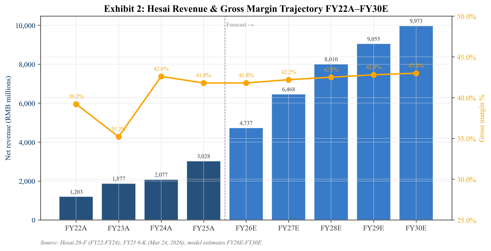
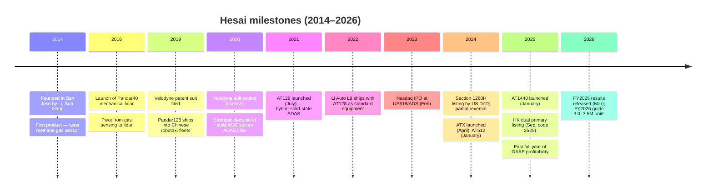
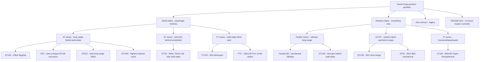
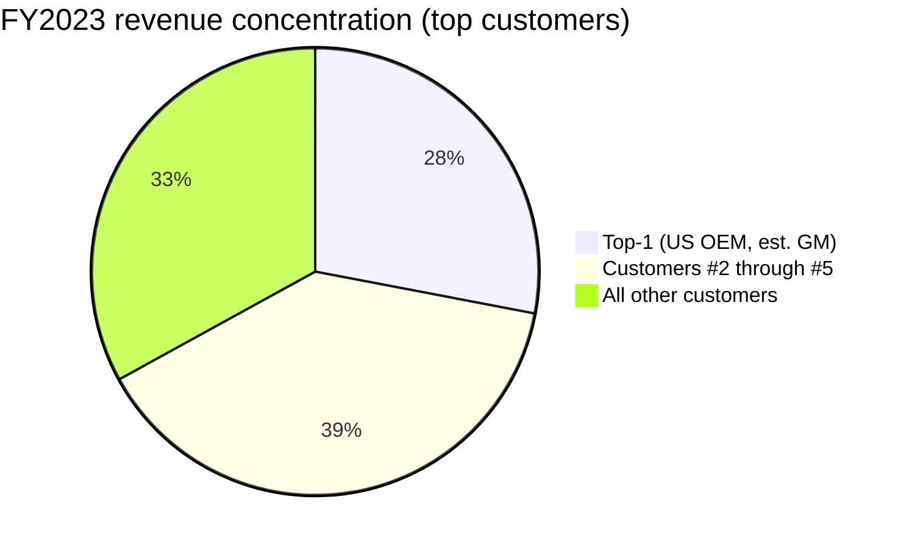
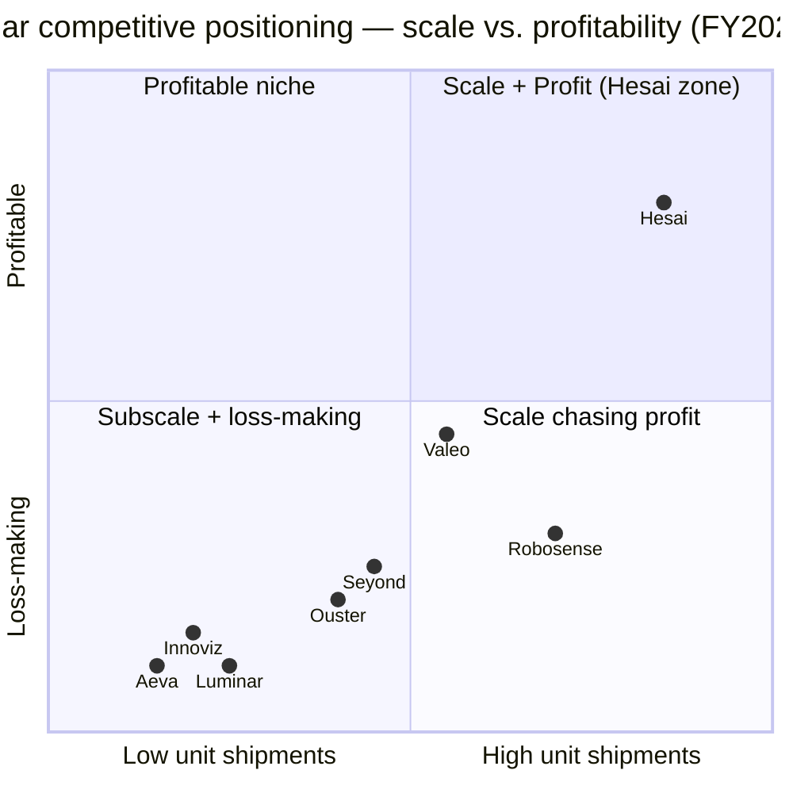
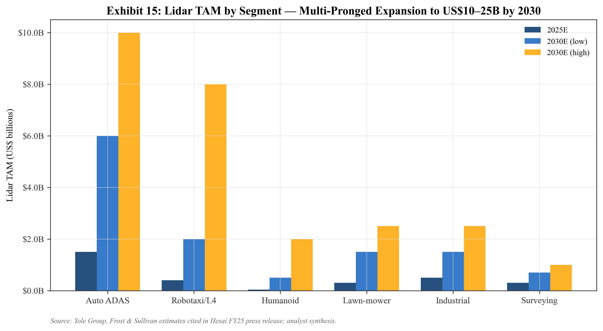

# COMPANY RESEARCH REPORT: Hesai Group (禾赛科技, NASDAQ:HSAI / HKEX:2525)

Date: 2026-05-20

## TABLE OF CONTENTS

1. Company Overview
2. Company History
3. Management Team
4. Products & Services
5. Customers & Go-to-Market
6. Industry Overview
7. Competitive Landscape
8. Market Opportunity (TAM)
9. Risk Assessment

---

## 1. Company Overview

Hesai Group (禾赛科技, NASDAQ:HSAI, HKEX:2525) designs, manufactures, and sells three-dimensional light-detection-and-ranging (lidar) sensors. The company's products are sold into two end markets that management calls **ADAS** — laser perception modules designed into series-production passenger vehicles for advanced driver-assistance — and **Robotics** — every non-ADAS use case, including robotaxis, robovans, delivery robots, agricultural vehicles, port-automation equipment, robotic lawn mowers, quadrupeds, and humanoid robots ([Hesai 2024 20-F, "Item 4 Information on the Company"](https://www.sec.gov/Archives/edgar/data/1861737/000141057825000614/0001410578-25-000614-index.htm)). The company's strategic claim is that its vertically-integrated, custom-ASIC architecture lets it deliver automotive-grade lidars at a unit cost that can be designed into mainstream Chinese EVs and at a form factor small enough to be mounted inside a humanoid robot's chest cavity.

The business model is straightforward hardware: Hesai ships lidars on a per-unit, purchase-order basis, predominantly under multi-year design-in agreements with OEMs and Tier-1s. Each unit ships against an individual purchase order — POs cover volume, price, packaging, delivery, payment, inspection, and warranty terms — and very few customers commit firm multi-year volumes upfront ([Hesai 2024 20-F](https://www.sec.gov/Archives/edgar/data/1861737/000141057825000614/0001410578-25-000614-index.htm)). Service revenue is small and mostly tied to non-recurring engineering ("NRE") work for major OEM design-ins; in FY2024 Hesai also booked a one-off RMB 203.3 million project-based payment from "a leading global OEM headquartered in the United States" — widely understood to be General Motors — to compensate Hesai for design-in R&D and work-in-progress inventory after the customer adjusted its program timeline ([Hesai 2024 20-F, "Results of Operations"](https://www.sec.gov/Archives/edgar/data/1861737/000141057825000614/0001410578-25-000614-index.htm)).

FY2025 was the inflection year. Shipments jumped to **1,620,406 lidars**, up 222.9% YoY from 501,889 in FY2024, with ADAS units up 202.6% YoY to 1,381,133 and Robotics units up 425.8% YoY to 239,273 ([Hesai Group Reports Fourth Quarter and Full Year 2025 Unaudited Financial Results, 2026-03-24](https://www.sec.gov/Archives/edgar/data/1861737/000110465926033591/tm269592d1_ex99-1.htm); [Hesai Annual Results Announcement for the Year Ended December 31, 2025](https://www.sec.gov/Archives/edgar/data/1861737/000110465926033591/tm269592d1_ex99-2.htm)). Net revenues rose 45.8% YoY to **RMB 3,027.6 million (US$432.9 million)**. Gross margin held at **41.8%**, down 80 bp from 42.6% in FY2024 because of mix shift toward lower-margin ADAS units. Most importantly, Hesai swung to **GAAP net income of RMB 435.9 million (US$62.3 million)** versus a net loss of RMB 102.4 million in FY2024 — making Hesai the **first publicly-listed pure-play lidar maker globally to print a positive full-year GAAP profit** ([Hesai Q4 2025 Press Release, 2026-03-24](https://www.sec.gov/Archives/edgar/data/1861737/000110465926033591/tm269592d1_ex99-1.htm)).

*Figure 1. FY2022–FY2025 net revenue (RMB bn) and gross margin (%). Source: [Hesai 2024 20-F](https://www.sec.gov/Archives/edgar/data/1861737/000141057825000614/0001410578-25-000614-index.htm), [Hesai Q4 2025 Press Release](https://www.sec.gov/Archives/edgar/data/1861737/000110465926033591/tm269592d1_ex99-1.htm).*

Geographically, Hesai's center of gravity is China — most manufacturing capacity, most R&D headcount, and most design wins sit on the mainland — but the company maintains offices in Shanghai (HQ), Palo Alto, and Stuttgart, and serves customers across more than 40 countries ([Hesai Q4 2025 Press Release](https://www.sec.gov/Archives/edgar/data/1861737/000110465926033591/tm269592d1_ex99-1.htm)). Hesai listed on Nasdaq in February 2023 at US$19/ADS and completed a Hong Kong primary dual listing under stock code **2525** on September 11, 2025 ([Hesai Group Announces Pricing of Global Offering, 2025-09-11](https://www.sec.gov/Archives/edgar/data/1861737/000110465925089277/tm2525492d1_6k.htm); [Hesai Group Launches Global Offering, 2025-09-08](https://www.sec.gov/Archives/edgar/data/1861737/000110465925087969/tm2525489d1_6k.htm)). As of December 31, 2024 the company had 131,159,711 ordinary shares outstanding, before the HK primary issuance later in 2025 ([Hesai 2024 20-F cover page](https://www.sec.gov/Archives/edgar/data/1861737/000141057825000614/0001410578-25-000614-index.htm)).

### Valuation snapshot

As of the May 18, 2026 US close, HSAI trades at approximately **US$22.50 / ADS** for a market capitalization of about **US$3.5 billion** ([Yahoo Finance — HSAI Key Statistics, accessed 2026-05-20](https://finance.yahoo.com/quote/HSAI/key-statistics/)). The Hong Kong line (2525.HK) trades in the **HK$170–180** band, putting it within a few percent of the US line on FX-adjusted conversion ([HKEX Securities Prices — 2525.HK, accessed 2026-05-20](https://www.hkex.com.hk/Market-Data/Securities-Prices/Equities?sym=2525)).

On FY2025 GAAP net income of US$62.3 million, the implied **TTM P/E is approximately 56×**. On FY2025 net revenue of US$432.9 million, the implied **TTM P/S is approximately 8.0×** ([Hesai Q4 2025 Press Release, 2026-03-24](https://www.sec.gov/Archives/edgar/data/1861737/000110465926033591/tm269592d1_ex99-1.htm); [Yahoo Finance — HSAI Key Statistics, accessed 2026-05-20](https://finance.yahoo.com/quote/HSAI/key-statistics/)). The three-year price range since the February 2023 IPO is roughly **US$3.55 – US$29.80**, so today's price sits in the upper-third of its post-IPO band, well off the all-time high but well above the mid-2024 trough during the Section 1260H controversy ([Yahoo Finance — HSAI Historical Prices, accessed 2026-05-20](https://finance.yahoo.com/quote/HSAI/history)).

The lidar peer set is not a clean comp because everyone else is loss-making. **Robosense (HKEX:2498)** trades at roughly 8.1× TTM P/S on RMB 1.94 bn revenue with a TTM net loss in the high-RMB-hundreds-of-millions; TTM P/E is not meaningful ([Yahoo Finance — 2498.HK Key Statistics](https://finance.yahoo.com/quote/2498.HK/key-statistics/)). **Ouster (NASDAQ:OUST)** trades around 12× TTM P/S on US$185 million of revenue with a –30% net margin. **Innoviz (NASDAQ:INVZ)** trades at ~2.9× P/S on only ~US$55 million of revenue. **Aeva (NASDAQ:AEVA)** sits above 60× P/S on just ~US$21 million of revenue. **Luminar (NASDAQ:LAZR)** has been in restructuring mode since 2024 ([Yahoo Finance — OUST / INVZ / AEVA / LAZR Key Statistics, accessed 2026-05-20](https://finance.yahoo.com/quote/OUST/key-statistics/)). Hesai's 8.0× P/S is at the **low end of the lidar cohort and is the only multiple in the group anchored to a finite, positive P/E.**

Interpretation: a 56× P/E is high in absolute terms but is the inflection-year multiple of a hardware company that just crossed into profitability with revenue still compounding 46% YoY. The 8.0× P/S is in line with Robosense and well below Ouster, and management has guided FY2026 shipments to **3.0–3.5 million units** — roughly 85–115% volume growth — implying continued operating leverage as ADAS BOM declines ([Hesai Q4 2025 Press Release](https://www.sec.gov/Archives/edgar/data/1861737/000110465926033591/tm269592d1_ex99-1.htm)). The market is pricing Hesai as the consolidator of a structurally growing market, not as a generic hardware vendor. The risk in this multiple is execution: if ADAS attach rates plateau in China, or if a single major OEM defers its lidar program, the multiple compresses quickly — FY2024–FY2025 results were heavily levered to AT128 and ATX volume. This valuation risk is carried into Section 9.

## 2. Company History

Hesai was founded in 2014 in San Jose, California, by three engineers — **Dr. Yifan Li**, **Dr. Kai Sun**, and **Mr. Shaoqing Xiang** — who met as Stanford and University of Illinois at Urbana-Champaign graduate students working on lasers, optics, and mechanical engineering ([Hesai 2024 20-F, "Directors, Senior Management and Employees"](https://www.sec.gov/Archives/edgar/data/1861737/000141057825000614/0001410578-25-000614-index.htm)). The first product was **not** automotive lidar — it was a laser methane telemetry sensor for gas-leak detection sold to Chinese gas utilities. Within the first year the founders relocated headquarters to Shanghai, incorporating Shanghai Hesai Technology Co., Ltd., because the laser-optics supply chain and engineering talent base in the Yangtze River Delta was deeper and cheaper than in Silicon Valley. The gas-detection business carried the company through 2016 and produced an early base of laser-optics patents that later transferred to lidar ([Hesai 2024 20-F, "Item 4 — History and Development"](https://www.sec.gov/Archives/edgar/data/1861737/000141057825000614/0001410578-25-000614-index.htm)).

The pivot to lidar happened in 2016–2017. Hesai launched its first mechanical scanning lidar, the **Pandar40**, aimed at the nascent Chinese autonomous-vehicle market. The product found early buyers among Chinese robotaxi developers — Baidu Apollo, Pony.ai, AutoX, WeRide, TuSimple — that were spinning up at the same time and needed a domestic alternative to Velodyne's HDL-64, which was on multi-year backlog. **Pandar64** and **Pandar128** followed and became the dominant 360-degree mechanical lidars for Chinese robotaxi fleets through 2019–2021 ([Hesai 2024 20-F, "Pandar128"](https://www.sec.gov/Archives/edgar/data/1861737/000141057825000614/0001410578-25-000614-index.htm)). Velodyne sued Hesai for patent infringement in 2019; the suit settled in June 2020 with Hesai agreeing to pay patent-license royalties — after which the legal overhang lifted and Hesai accelerated its R&D investment.

The second pivot — and the move that built today's business — was the 2020 decision to move from mechanical/robotaxi lidar into **ADAS series production** for passenger cars. That required redesigning the architecture around a custom application-specific integrated circuit (ASIC) to drive cost and form factor down to automotive-mass-market levels. Hesai launched the **AT128** in July 2021: a 128-channel hybrid-solid-state long-range ADAS lidar with ASIC-based readout, targeted at a BOM compatible with mainstream EV pricing ([Hesai 2024 20-F, "AT128"](https://www.sec.gov/Archives/edgar/data/1861737/000141057825000614/0001410578-25-000614-index.htm)). Volume shipments began in July 2022 — the same month Li Auto, an early adopter, started shipping the L9 SUV with AT128 as standard equipment.

Hesai listed on Nasdaq on **February 9, 2023** at an IPO price of US$19/ADS, raising approximately US$190 million. The stock rallied through 2023 on growing Chinese design-win momentum, then suffered in 2024 when the US Department of Defense placed several Chinese lidar firms (including Hesai) on the **Section 1260H** list of "Chinese military companies." Hesai sued the DoD; the listing was substantially reversed for Hesai specifically later in 2024 ([Hesai 6-K, 2024-08-20](https://www.sec.gov/Archives/edgar/data/1861737/000110465924091092/0001104659-24-091092-index.htm)). The company nevertheless continued to lose money through 2024 as program ramps lagged.

The third pivot was the move to **profitability**. From mid-2024 through 2025, Hesai drove AT128/ATX BOM cost down through a fourth-generation ASIC and vertical-integration on lasers and detectors, while riding an explosive rise in ADAS lidar attach rates among Chinese OEMs — AT128 alone accounted for **60.9% of revenue in 2024** ([Hesai 2024 20-F, "Key Factors"](https://www.sec.gov/Archives/edgar/data/1861737/000141057825000614/0001410578-25-000614-index.htm)). The combination produced the 222.9% unit-shipment jump in FY2025 and Hesai's first GAAP net income. In April 2024 the company launched **ATX** (the ultra-compact next-gen AT), in January 2024 the flagship long-range **AT512**, and in January 2025 the high-channel-count **AT1440** ([Hesai 2024 20-F, "ATX"](https://www.sec.gov/Archives/edgar/data/1861737/000141057825000614/0001410578-25-000614-index.htm)).

The most recent strategic milestone is the **Hong Kong dual primary listing**. On August 26, 2025 Hesai disclosed the CSRC's notice of filing for the global offering ([Hesai 6-K, 2025-08-26](https://www.sec.gov/Archives/edgar/data/1861737/000110465925082845/tm2523953d1_6k.htm)); the HK underwriting agreement was signed September 5, 2025, and pricing was announced September 11, 2025, under HK ticker 2525 ([Hesai Group Announces Pricing of Global Offering, 2025-09-11](https://www.sec.gov/Archives/edgar/data/1861737/000110465925089277/tm2525492d1_6k.htm)). The HK listing diversifies the shareholder base away from US-only exposure (a strategic hedge after the 1260H episode) and opens the door to mainland China retail flow via Stock Connect once eligibility criteria are met. December 2025 brought a small board refresh: independent director Dr. Jie Chen resigned and was replaced by Dr. Hui Wang ([Hesai 6-K, 2025-12-29](https://www.sec.gov/Archives/edgar/data/1861737/000110465925124404/tm2534334d1_6k.htm)).

## 3. Management Team

### Dr. Yifan Li — Co-founder, CEO, Director

Dr. Yifan Li is Hesai's CEO and the public face of the company, leading product strategy and capital markets. He holds a bachelor's in mechanical engineering from Tsinghua University, a master's and a PhD (2013) in mechanical engineering from the University of Illinois at Urbana-Champaign, where his research focused on robotics. Before co-founding Hesai he was a principal engineer at Western Digital in Silicon Valley from 2013 to 2014 ([Hesai 2024 20-F, "Item 6.A Directors and Senior Management"](https://www.sec.gov/Archives/edgar/data/1861737/000141057825000614/0001410578-25-000614-index.htm)). Dr. Li has been named to Fortune China's "40 Under 40," MIT Technology Review's "2020 Innovators Under 35 of China," and was selected as a Young Global Leader of the World Economic Forum (Class of 2021).

On earnings calls he displays strong command of unit economics, channel mix, and competitive positioning ([Hesai (HSAI) Q1 2026 Earnings Call Transcript, 2026-05-19](https://www.fool.com/earnings/call-transcripts/2026/05/19/hesai-hsai-q1-2026-earnings-call-transcript/)). He led the strategic decision in 2020 to invest in ASIC-based architecture that underpins Hesai's current cost-leadership position; he subsequently steered the company through the 2020 Velodyne settlement, the February 2023 Nasdaq IPO, the 2024 Section 1260H listing and its partial reversal ([Hesai 6-K, 2024-08-20](https://www.sec.gov/Archives/edgar/data/1861737/000110465924091092/0001104659-24-091092-index.htm)), the September 2025 Hong Kong dual listing ([Hesai Group Announces Pricing of Global Offering, 2025-09-11](https://www.sec.gov/Archives/edgar/data/1861737/000110465925089277/tm2525492d1_6k.htm)), and the FY2025 swing to profitability — three major strategic events compressed into roughly three years, while still in his mid-thirties ([Hesai Q4 2025 Press Release, 2026-03-24](https://www.sec.gov/Archives/edgar/data/1861737/000110465926033591/tm269592d1_ex99-1.htm)).

Insider ownership is concentrated in the three founders. Together with Sun and Xiang, Dr. Li exercises majority voting power through Class A shares (10:1 voting). All directors and executive officers as a group hold **20.8% of economic shares and 72.0% of voting power** ([Hesai 2024 20-F, "Item 7 Major Shareholders"](https://www.sec.gov/Archives/edgar/data/1861737/000141057825000614/0001410578-25-000614-index.htm)). The dual-class structure means founders retain effective control even though they own a minority of the economic value.

### Dr. Kai Sun — Co-founder, Chief Scientist, Director

Dr. Kai Sun is Hesai's chief scientist, responsible for laser-physics R&D and long-horizon technology strategy. He earned a bachelor's in thermal energy and power engineering from Shanghai Jiao Tong University, then a master's and PhD in mechanical engineering from Stanford University, with a PhD minor in electrical engineering. Before co-founding Hesai, Dr. Sun was a research associate at Stanford working on ultra-fast, high-sensitivity molecular detection systems using lasers — work directly transferable to lidar emitter/receiver design. Several of his papers were selected for IOP Select and the Optical Society of America's Spotlight, and he won the Outstanding Paper Award of *Measurement Science and Technology* in 2013 ([Hesai 2024 20-F, "Item 6.A"](https://www.sec.gov/Archives/edgar/data/1861737/000141057825000614/0001410578-25-000614-index.htm)). Within Hesai he leads the laser/optics stack — proprietary VCSEL/EEL emitters, single-photon avalanche diode (SPAD) receivers, and the "Photon Isolation" interference-rejection technology highlighted at Hesai's 2025 patent disclosures. He rarely speaks publicly; functionally he is Hesai's CTO of the analog/optical stack.

### Mr. Shaoqing Xiang — Co-founder, CTO, Director

Mr. Shaoqing Xiang is Hesai's CTO and the architect of the company's systems integration and ASIC roadmap. He holds a bachelor's in micro-electromechanical systems from Tsinghua University and dual master's degrees from Stanford in mechanical engineering and electrical engineering. Before co-founding Hesai, Mr. Xiang spent April 2011 to November 2014 at Apple as an iPhone hardware-systems integration engineer, where he absorbed the consumer-volume manufacturing discipline that has shaped Hesai's design-for-manufacturability culture ([Hesai 2024 20-F, "Item 6.A"](https://www.sec.gov/Archives/edgar/data/1861737/000141057825000614/0001410578-25-000614-index.htm)). Mr. Xiang owns the ASIC/SoC programs — Hesai's fourth-generation ASIC underpins ATX, ET25, and the next-gen FTX, and the **FMC500** master-control SoC launched in November 2025 integrates MCU, FPGA, and ADC functionality with on-chip functional safety and cybersecurity ([Hesai Q4 2025 Press Release](https://www.sec.gov/Archives/edgar/data/1861737/000110465926033591/tm269592d1_ex99-1.htm)). The FMC500 is a meaningful step in vertical integration: it displaces silicon that would otherwise come from NXP, Renesas, or TI.

### Mr. Andrew Fan — Chief Financial Officer

Andrew Fan joined Hesai as CFO in late 2024, replacing the prior CFO ahead of the planned HK listing. He brings 18+ years of accounting and corporate-finance experience. Most recently he was **CFO of Seyond Holdings (formerly Innovusion)** — a direct lidar competitor that supplies NIO — from May 2021 to September 2024, an unusual hire because it gives Hesai unusually deep visibility into a competitor's economics ([Hesai 2024 20-F, "Mr. Andrew Fan"](https://www.sec.gov/Archives/edgar/data/1861737/000141057825000614/0001410578-25-000614-index.htm)). Before Seyond, he held senior finance roles at Hailiang Education Group, Aesthetic Medical International, and Dali Foods Group; earlier in his career he was at Deutsche Bank, HSBC, and Macquarie. He has served as an independent non-executive director of Jiangsu Innovative Ecological New Materials (HKEX:2116) since 2018. He holds bachelor's and master's degrees in accounting from Tsinghua University. On the FY2025 earnings call he led with operating-leverage commentary and crisp FY2026 guidance (3.0–3.5 million units), signalling tighter capital-markets discipline post-HK listing ([Hesai Q4 2025 Press Release](https://www.sec.gov/Archives/edgar/data/1861737/000110465926033591/tm269592d1_ex99-1.htm)).

### Board composition and governance

Hesai's board has seven directors: the three founders (Li, Sun, Xiang), one inside director (Ms. Cailian Yang, VP Operations and the company's first employee), and three independent directors. Independent directors include **Bonnie Zhang** (long-serving Chinese-US dual-listing CFO, currently CFO of Sina Corporation, formerly CFO of Weibo, ex-Deloitte Shanghai audit partner), and as of December 24, 2025, **Dr. Hui Wang** replaced Dr. Jie Chen as the third independent director ([Hesai 6-K, 2025-12-29](https://www.sec.gov/Archives/edgar/data/1861737/000110465925124404/tm2534334d1_6k.htm)).

The five largest principal shareholders are the three founder vehicles (ALBJ Limited, Fermat Star Limited, Galbadia Limited — each holding ~6.7–7.0% economic), strategic investor **Bosch** (5.8%), and **Xiaomi** (5.5%) ([Hesai 2024 20-F, "Item 7"](https://www.sec.gov/Archives/edgar/data/1861737/000141057825000614/0001410578-25-000614-index.htm)). The Bosch stake (held since the 2017–2019 Series B/C rounds) is strategically meaningful because Bosch is a top-3 global Tier-1 ADAS supplier and a Hesai distribution channel outside China. Xiaomi's stake aligns with Xiaomi's emergence as a major Hesai ADAS customer through 2024–2025.

**Management track record.** This is a founder-led, deeply technical team that has shipped through three pivots (gas sensor → robotaxi lidar → ADAS lidar → profitable scale), survived material legal and geopolitical episodes (Velodyne suit, 1260H listing), and delivered the lidar industry's first GAAP-profitable year ([Hesai Q4 2025 Press Release, 2026-03-24](https://www.sec.gov/Archives/edgar/data/1861737/000110465926033591/tm269592d1_ex99-1.htm)). The CFO transition (Seyond → Hesai) signals serious capital-markets ambition ([Hesai 2024 20-F, "Mr. Andrew Fan"](https://www.sec.gov/Archives/edgar/data/1861737/000141057825000614/0001410578-25-000614-index.htm)). The principal gap: succession depth below the founder layer is not externally visible, and the dual-class structure means the founders effectively cannot be removed by minority holders ([Hesai 2024 20-F, "Item 7 Major Shareholders"](https://www.sec.gov/Archives/edgar/data/1861737/000141057825000614/0001410578-25-000614-index.htm)).

## 4. Products & Services

Hesai's product portfolio sits in two end-market segments — **ADAS lidars** for series-production passenger cars and **Robotics lidars** for everything else — plus a small **legacy gas-sensor** line. The Selected-Key-Products table in the 2024 20-F lists AT128, ET25, FT120, Pandar128, QT128, and XT32; subsequent product launches disclosed in 6-K filings add ATX, AT512, AT1440, OT128, JT128, FTX, and the FMC500 SoC ([Hesai 2024 20-F, "Selected Key Products"](https://www.sec.gov/Archives/edgar/data/1861737/000141057825000614/0001410578-25-000614-index.htm); [Hesai Q4 2025 Press Release](https://www.sec.gov/Archives/edgar/data/1861737/000110465926033591/tm269592d1_ex99-1.htm)).

### ADAS — AT series (long-range hybrid-solid-state)

The AT family is Hesai's flagship and the primary revenue engine. **AT128** is the workhorse: 128 channels, ToF, 200 m detection range, ASIC-based, launched July 2021. AT128 accounted for **37.8% of revenue in 2023 and 60.9% of revenue in 2024** — a single SKU was the majority of the business ([Hesai 2024 20-F, "Risk Factors"](https://www.sec.gov/Archives/edgar/data/1861737/000141057825000614/0001410578-25-000614-index.htm)). Cumulative AT128 shipments crossed 710,000 units by year-end 2024. **Competitive-advantage verdict: yes — strong moat in technology (custom ASIC), scale (largest installed base in segment), and BOM cost.** Closest competitor is Robosense's **M-series (M1/M2/M3)**; published competitor margins and shipment economics suggest Robosense sits slightly behind Hesai on unit cost — **Hesai ahead**.

**ATX** (launched April 2024) is the AT128 successor: 60% smaller and ~50% lighter, with 11 OEM design wins by February 2025 and a 2026 ramp powered by the FMC500 SoC ([Hesai 2024 20-F, "ATX"](https://www.sec.gov/Archives/edgar/data/1861737/000141057825000614/0001410578-25-000614-index.htm)). **AT512** (January 2024) is the ultra-long-range flagship — 300+ m at 10% reflectivity, 12.3 million points per second, claimed as an industry record. **AT1440** (January 2025) carries the highest channel count of any lidar on the market (1,440 channels), with 0.02° angular resolution targeting L3+ premium platforms. **Verdict for ATX / AT512 / AT1440: yes — technology + IP moat,** closest peers being Robosense MX/E-Platform and Innoviz One; **Hesai ahead on shipping cadence and design-win count.**

### ADAS — ET series (ultra-thin behind-windshield)

**ET25** is a fully solid-state 250 m long-range lidar designed to mount inside the cabin behind the windshield — only 25 mm tall, < 12 W power consumption ([Hesai 2024 20-F, "ET25"](https://www.sec.gov/Archives/edgar/data/1861737/000141057825000614/0001410578-25-000614-index.htm)). Target customer: premium OEMs that want lidar without a roof bulge. **Verdict: partial moat — technology lead** but Innoviz, Aeva, and Valeo all ship competing "behind-windshield" SKUs ([Innoviz 20-F FY2024](https://www.sec.gov/Archives/edgar/data/0001835654/000117891325000817/exhibit_13-1.htm); [Aeva 10-K FY2024](https://www.sec.gov/Archives/edgar/data/0001789029/000095017025042849/aeva-20241231.htm)). **At parity** on form factor but **ahead on volume**.

### ADAS — FT series (solid-state blind-spot)

**FT120** is a fully solid-state 25 m blind-spot lidar (75 × 68 × 90 mm). At CES 2025 Hesai announced **FTX**, a next-gen solid-state lidar with **180° × 140° FoV** — claimed widest FoV in the world. NIU Technologies has selected FTX for its next-gen electric two-wheeler — Hesai's first material two-wheel design win ([Hesai Q4 2025 Press Release](https://www.sec.gov/Archives/edgar/data/1861737/000110465926033591/tm269592d1_ex99-1.htm)). **Verdict: partial — strong product but less of a moat than AT,** because short-range solid-state has multiple credible competitors (Valeo, Innoviz, Continental).

### Robotics — Pandar / OT series (long-range)

**Pandar128** is the 128-channel 360° mechanical lidar that dominated robotaxi development for years; it was **22.5% of revenue in 2023** and is now in managed decline as robotaxi customers transition to hybrid-solid-state designs ([Hesai 2024 20-F, "Pandar128"](https://www.sec.gov/Archives/edgar/data/1861737/000141057825000614/0001410578-25-000614-index.htm)). **OT128** (launched September 2024) is the next-generation robotics long-range successor ([Hesai Q4 2025 Press Release, 2026-03-24](https://www.sec.gov/Archives/edgar/data/1861737/000110465926033591/tm269592d1_ex99-1.htm)). **Verdict: yes — installed-base moat with Pony.ai, WeRide, Baidu Apollo Go, DiDi;** closest competitor is Robosense's R-Platform ([Robosense corporate site](https://www.robosense.ai/en)) — **Hesai ahead in robotaxi share.**

### Robotics — QT / XT series (short-range)

**QT128** is a short-range (up to 20 m) robotics blind-spot lidar, often mounted on robotaxi sides to complement Pandar/OT. **XT32** is a 32-channel mechanical short-range robotics lidar (80 m) ([Hesai 2024 20-F, "QT128 / XT32"](https://www.sec.gov/Archives/edgar/data/1861737/000141057825000614/0001410578-25-000614-index.htm)). **Verdict: partial** — utility products without the same architectural lead as AT-series.

### Robotics — JT series (humanoid / quadruped)

**JT128** is Hesai's mini 3D lidar designed specifically for humanoid and quadruped robots and industrial robotics applications, featuring the **world's widest hyper-hemispherical FoV at 360° × 187°**, enabling single-sensor spatial perception from a humanoid robot's chest or head ([Hesai 2024 20-F, "JT Series"](https://www.sec.gov/Archives/edgar/data/1861737/000141057825000614/0001410578-25-000614-index.htm)). This is the SKU that anchors Hesai's humanoid-robotics narrative. In late 2025/early 2026 **Unitree** — the leading Chinese humanoid/quadruped maker — selected JT128 for all of its humanoid robots featured in the 2026 China Spring Festival Gala broadcast ([Hesai Q4 2025 Press Release](https://www.sec.gov/Archives/edgar/data/1861737/000110465926033591/tm269592d1_ex99-1.htm)). Other named humanoid integrators using Hesai include **HONOR Robot, Galbot, Magiclab, and Vita Dynamics**. **Verdict: yes — strong moat from form factor (no competitor offers a 360°×187° FoV in a humanoid-sized package), early integrator design wins, and proprietary VCSEL/SPAD stack.** Closest competitor products: Robosense E1 / EM4 humanoid lidars — **Hesai ahead** on FoV and named wins; Ouster OS0 — at parity on cost but inferior FoV.

### Vertical integration — FMC500 SoC

The **FMC500** (launched November 2025) is Hesai's in-house master-control SoC integrating MCU + FPGA + ADC with on-chip functional safety and cybersecurity ([Hesai Q4 2025 Press Release](https://www.sec.gov/Archives/edgar/data/1861737/000110465926033591/tm269592d1_ex99-1.htm)). **Verdict: yes — uniquely vertically integrated** (no other lidar maker has shipped its own lidar-specific master-control SoC at this scale). The FMC500 displaces silicon Hesai would otherwise buy from NXP, Renesas, or TI, and lets Hesai own the functional-safety stack that OEMs increasingly demand for ASIL-D programs.

### Legacy — gas sensors

The original laser-methane telemetry sensor line ("HS-LM" series) is still in the catalogue but is now an immaterial share of revenue. Profitable but small; **partial** moat in a niche segment ([Hesai 2024 20-F, "Item 4 — History and Development"](https://www.sec.gov/Archives/edgar/data/1861737/000141057825000614/0001410578-25-000614-index.htm)).

### Flagship vs. long tail

The 1–3 products driving the business are unambiguous: **AT128 / ATX** (majority of FY2024–FY2025 revenue), **JT128** as the emerging robotics flagship, and **AT512 / AT1440** as the next-gen ADAS halo SKUs ([Hesai 2024 20-F, "Key Factors"](https://www.sec.gov/Archives/edgar/data/1861737/000141057825000614/0001410578-25-000614-index.htm); [Hesai Q4 2025 Press Release, 2026-03-24](https://www.sec.gov/Archives/edgar/data/1861737/000110465926033591/tm269592d1_ex99-1.htm)). Pandar128 remains material but is in managed decline. The trailing-12-month launch / sunset record is heavy on launches and light on sunsets: AT1440 (Jan 2025), OT128 (Sept 2024), FMC500 SoC (Nov 2025), FTX (announced CES Jan 2025) — no major SKU has been sunset ([Hesai Q4 2025 Press Release, 2026-03-24](https://www.sec.gov/Archives/edgar/data/1861737/000110465926033591/tm269592d1_ex99-1.htm)).

## 5. Customers & Go-to-Market

Hesai sells direct to OEMs and to Tier-1 suppliers. There is no significant distributor channel and no consumer-tech reseller layer. Each customer relationship is governed by a master design-in agreement, with individual purchase orders covering volume, price, packaging, delivery, payment terms, inspection, and warranty period ([Hesai 2024 20-F](https://www.sec.gov/Archives/edgar/data/1861737/000141057825000614/0001410578-25-000614-index.htm)). Most commercial commitments are **PO-by-PO rather than firm multi-year volume commitments**, although a typical design-in agreement implicitly runs the life of a vehicle program (5–7 years for a major ADAS platform).

### Customer concentration — quantified

Customer concentration is the single largest risk to the business. Hesai discloses the numbers transparently in the 20-F ([Hesai 2024 20-F, "Customer Concentration Risk Factor"](https://www.sec.gov/Archives/edgar/data/1861737/000141057825000614/0001410578-25-000614-index.htm)):

- **Top-5 customer share of revenue: 53.1% in 2022, 67.5% in 2023, 60.0% in 2024** ([Hesai 2024 20-F](https://www.sec.gov/Archives/edgar/data/1861737/000141057825000614/0001410578-25-000614-index.htm)).
- **Top-1 customer share of revenue: 13.7% in 2022, 28.4% in 2023** (described as "a leading global OEM headquartered in the United States" — widely understood in the trade press to be General Motors) ([Hesai 2024 20-F, "Customer Concentration Risk Factor"](https://www.sec.gov/Archives/edgar/data/1861737/000141057825000614/0001410578-25-000614-index.htm)).
- Hesai does not explicitly disclose the FY2024 top-1 share, but the combination of (a) the RMB 203.3 million one-off compensation payment from that US OEM and (b) the surge in Chinese ADAS volume suggests the top-1 share fell meaningfully in FY2024 ([Hesai 2024 20-F, "Results of Operations"](https://www.sec.gov/Archives/edgar/data/1861737/000141057825000614/0001410578-25-000614-index.htm)).

**Verdict.** The top-1 was 28.4% in FY2023 — materially above the 20% materiality threshold — and the top-5 was 67.5% — well above the 50% materiality threshold. Even with moderation to 60% top-5 in FY2024, this is flagged as a material customer-concentration risk and is carried into Section 9 ([Hesai 2024 20-F, "Customer Concentration Risk Factor"](https://www.sec.gov/Archives/edgar/data/1861737/000141057825000614/0001410578-25-000614-index.htm)).

### Named customers — ADAS

As of Q4 2025, Hesai had secured ADAS design wins with **40 automotive brands globally across over 160 vehicle models, including all top-10 OEMs in China**. Recent additions in 2025 include **BAIC** and **FAW Bestune**; **Li Auto, Xiaomi, and Changan** have committed multi-lidar configurations (3–6 lidars per vehicle) for L3+ platforms with start-of-production in 2026–2027 ([Hesai Q4 2025 Press Release](https://www.sec.gov/Archives/edgar/data/1861737/000110465926033591/tm269592d1_ex99-1.htm)). Other publicly identified ADAS customers include **Lotus, Jidu/JiYue, Leapmotor, NIO (on certain models), and Geely Galaxy**. Bosch is both a 5.8% shareholder and a Tier-1 distribution partner for Hesai outside China.

For the West, the largest disclosed customer is the unnamed US OEM (widely understood to be GM) ([Hesai 2024 20-F, "Customer Concentration Risk Factor"](https://www.sec.gov/Archives/edgar/data/1861737/000141057825000614/0001410578-25-000614-index.htm)). Hesai has also referenced ongoing engagement with **Stellantis** and **Mercedes-Benz**; the May 2026 Mercedes-Benz announcement formally named Hesai as a strategic L3 supplier ([Hesai Announced as Strategic Lidar Partner and Confirmed Supplier for Mercedes-Benz L3-Enabled Models, PRNewswire, 2026-05-19](https://www.prnewswire.com/news-releases/hesai-announced-as-strategic-lidar-partner-and-confirmed-supplier-for-mercedes-benz-l3-enabled-models-302775765.html)). The 1260H episode froze some Western evaluations through much of 2024 but has thawed following Hesai's legal challenges ([Hesai 6-K, 2024-08-20](https://www.sec.gov/Archives/edgar/data/1861737/000110465924091092/0001104659-24-091092-index.htm)).

### Named customers — Robotics

**Robotaxi.** Hesai is the de facto incumbent in Chinese robotaxi. Recent named orders include **Pony.ai, WeRide, Baidu Apollo Go, and DiDi**, with additional named global customers in North America, Asia, and Europe (unspecified) ([Hesai Q4 2025 Press Release](https://www.sec.gov/Archives/edgar/data/1861737/000110465926033591/tm269592d1_ex99-1.htm)).

**Humanoid / quadruped.** JT128 customers include **Unitree** (the Spring Festival Gala 2026 win, equipping all Unitree humanoids in the broadcast), **HONOR Robot, Galbot, Magiclab,** and **Vita Dynamics** ([Hesai Q4 2025 Press Release, 2026-03-24](https://www.sec.gov/Archives/edgar/data/1861737/000110465926033591/tm269592d1_ex99-1.htm)). This is the fastest-growing customer segment relative to its base.

**Delivery robots / robovans / lawn mowers.** Named customers include **Zelos, Neolix, and Meituan** for robovans; **Dreame, MOVA, and Nexlawn** for robotic lawn mowers. Management has indicated the lawn-mower backlog alone exceeds **10 million lidar units** ([Hesai Q4 2025 Press Release](https://www.sec.gov/Archives/edgar/data/1861737/000110465926033591/tm269592d1_ex99-1.htm)).

**Two-wheel.** **NIU Technologies** has selected FTX for its next-gen electric two-wheeler — Hesai's first material 2-wheel design win ([Hesai Q4 2025 Press Release, 2026-03-24](https://www.sec.gov/Archives/edgar/data/1861737/000110465926033591/tm269592d1_ex99-1.htm)).

### Sales cycle and go-to-market

ADAS sales cycles are long (typically 18–30 months from RFI to start of production), capital-intensive (Hesai funds NRE and tooling in exchange for sole-source design-in over a vehicle's program life), and require functional-safety (ISO 26262) and cybersecurity (ISO/SAE 21434) certifications ([Hesai 2024 20-F, "Item 4 Information on the Company"](https://www.sec.gov/Archives/edgar/data/1861737/000141057825000614/0001410578-25-000614-index.htm)). Hesai's vertically-integrated ASIC and SoC approach is a key differentiator because OEMs increasingly demand on-chip functional safety to satisfy ASIL-D requirements ([Hesai Q4 2025 Press Release, 2026-03-24](https://www.sec.gov/Archives/edgar/data/1861737/000110465926033591/tm269592d1_ex99-1.htm)). Robotics sales cycles are shorter (3–9 months) with lower per-customer unit volumes, except in lawn-mower / robotic-vacuum applications where consumer-volume economics apply ([Hesai 2024 20-F, "Item 4 Information on the Company"](https://www.sec.gov/Archives/edgar/data/1861737/000141057825000614/0001410578-25-000614-index.htm)).

## 6. Industry Overview

Lidar is a 3D-perception sensor technology that uses pulsed laser light to measure distance, producing a real-time point cloud of the environment around the sensor. It complements cameras (rich texture but poor depth) and radar (good depth but poor resolution) and is the primary perception modality in serious robotaxi stacks ([Hesai 2024 20-F, "Item 4 Information on the Company"](https://www.sec.gov/Archives/edgar/data/1861737/000141057825000614/0001410578-25-000614-index.htm)). Within passenger-car ADAS, lidar sits at the L2+ / L3 / L4 boundary: below this threshold most OEMs (notably Tesla) rely on cameras alone, while above it most credible programs include at least one lidar. The central uncertainty in the industry's TAM trajectory is the outcome of the Tesla-vision-only-vs-Waymo/Mercedes/Chinese-lidar-inclusive debate ([Yole Group — China takes the lead in automotive LiDAR: A market set to quadruple by 2030, 2025-06](https://www.yolegroup.com/press-release/china-takes-the-lead-in-automotive-lidar-a-market-set-to-quadruple-by-2030/)).

The industry is concentrated geographically and bifurcating commercially. Three Chinese makers — **Hesai, Robosense, and Seyond (formerly Innovusion)** — dominate global lidar shipments by volume. Yole Group's data consistently places Hesai and Robosense as the global #1 and #2 by units shipped, with Hesai claiming #1 in long-range automotive lidar and Robosense leading or co-leading in short-range solid-state for blind-spot ([Hesai Q4 2025 Press Release citing Yole Group, GGII, Frost & Sullivan, and Gasgoo](https://www.sec.gov/Archives/edgar/data/1861737/000110465926033591/tm269592d1_ex99-1.htm)). US-listed lidar peers (Ouster, Innoviz, Aeva, Luminar) have remained subscale and unprofitable. Tier-1 suppliers (Valeo, Continental) and chipset vendors (Mobileye via the EyeQ7 + lidar SoC partnership with Innoviz) have not yet displaced the Chinese pure-plays in mass production.

The dominant near-term industry trend is **rapid attach-rate growth in China**. A price war among Chinese EV OEMs has pushed advanced ADAS down-market: lidar-equipped vehicles in China grew from roughly **590,000 units in 2024 to over 1.5 million in 2025** according to Yole's auto-lidar tracker — roughly **150% YoY**, a curve that has caught most Western forecasters off-guard ([Yole Group — China takes the lead in automotive LiDAR: A market set to quadruple by 2030, 2025-06](https://www.yolegroup.com/press-release/china-takes-the-lead-in-automotive-lidar-a-market-set-to-quadruple-by-2030/); [Yole Group — Automotive LiDAR 2025 report landing page](https://www.yolegroup.com/product/report/automotive-lidar-2025/)). The second major trend is **multi-lidar adoption**: Li Auto, Xiaomi, Changan, and others are designing in 3–6 lidars per vehicle for L3+ programs, multiplying lidar content per vehicle ([Hesai Q4 2025 Press Release, 2026-03-24](https://www.sec.gov/Archives/edgar/data/1861737/000110465926033591/tm269592d1_ex99-1.htm)).

The third major trend is **lidar moving outside automotive**. Yole projects more than **10 million 3D lidars cumulatively over the next 5 years for robotic lawn mowers** ([Hesai Q4 2025 Press Release citing Yole, 2026-03-24](https://www.sec.gov/Archives/edgar/data/1861737/000110465926033591/tm269592d1_ex99-1.htm)); the humanoid-robot market — though tiny today — is widely forecast at 1+ million units/year by 2030 across various Wall Street estimates, with most credible designs incorporating at least one lidar (Tesla Optimus is the high-profile exception). Robotaxi fleet expansion (Waymo, Pony.ai, WeRide, Apollo Go) and robovan / delivery-robot deployment (Meituan, Nuro, Zelos, Neolix) provide additional steady-state volume ([Hesai Q4 2025 Press Release, 2026-03-24](https://www.sec.gov/Archives/edgar/data/1861737/000110465926033591/tm269592d1_ex99-1.htm)).

The fourth trend is **cost compression**. AT128 ASPs have fallen from roughly US$1,000+/unit at the 2022 launch to a blended ADAS ASP estimated at **US$200–300/unit in FY2025** (derivable from disclosure: US$432.9 million FY2025 net revenue / 1.62 million units = US$267 average, mix-weighted across ADAS and Robotics) ([Hesai Q4 2025 Press Release, 2026-03-24](https://www.sec.gov/Archives/edgar/data/1861737/000110465926033591/tm269592d1_ex99-1.htm)). Continued cost reduction is the principal lever expanding the addressable vehicle SAM — and the principal margin pressure on competitors that cannot match Chinese supply-chain cost structures ([Yole Group — China takes the lead in automotive LiDAR, 2025-06](https://www.yolegroup.com/press-release/china-takes-the-lead-in-automotive-lidar-a-market-set-to-quadruple-by-2030/)).

**Regulatory environment.** Auto-grade certification (ISO 26262 ASIL-B/D, ISO/SAE 21434, AEC-Q100 for components) is required for any series-production lidar. Eye-safety classification (IEC 60825-1 Class 1) is mandatory globally ([Hesai 2024 20-F, "Item 4 Information on the Company"](https://www.sec.gov/Archives/edgar/data/1861737/000141057825000614/0001410578-25-000614-index.htm)). In China, MIIT's intelligent-vehicle "L3 pilot" framework has been a tailwind, encouraging redundancy via lidar. In the US the regulatory environment is more permissive (no federal mandate to use lidar), but **export-control / national-security risk dominates the regulatory conversation** for Chinese makers — the December 2024 Section 1260H listing of Chinese lidar firms, Hesai's subsequent litigation and partial reversal, and ongoing Commerce / DoD scrutiny are the binding constraints on Hesai's US growth ([Hesai 6-K, 2024-08-20](https://www.sec.gov/Archives/edgar/data/1861737/000110465924091092/0001104659-24-091092-index.htm)). EU rules largely follow UNECE, which is sensor-neutral.

**Industry structure.** Fragmented at the supplier level but consolidating quickly — the top 3 Chinese makers now hold **>70% of global volume** ([RoboSense Ranked No. 1 in Global Passenger Car LiDAR Market Share, citing Yole 2024 Annual Report, 2025-04-08](https://www.robosense.ai/en/news-show-1894)). Switching costs are high once a design-in is awarded (re-validating a different sensor late in a vehicle program is rarely done) ([Hesai 2024 20-F, "Item 4 Information on the Company"](https://www.sec.gov/Archives/edgar/data/1861737/000141057825000614/0001410578-25-000614-index.htm)). Supplier power is moderate — VCSEL / EEL emitters and SPAD detectors have multiple sources (Lumentum, II-VI/Coherent, Sony, Onsemi) and increasingly in-house alternatives at Hesai and Robosense. Buyer power is high — large EV OEMs negotiate aggressive cost-downs. Substitutes: 4D imaging radar (Arbe, Uhnder, Mobileye), cameras + computer vision (Tesla, Mobileye SuperVision), and HD maps — these substitute on the margin but none fully replaces lidar for L3+ autonomy in the consensus view ([Mobileye 10-K FY2024](https://www.sec.gov/Archives/edgar/data/0001910139/000141057825000127/mbly-20241228x10k.htm)).

## 7. Competitive Landscape

**Direct lidar competitors:**

1. **Robosense (HKEX:2498, 速腾聚创)** — Hesai's principal direct competitor. Shenzhen-based, dual-listed on HK. FY2024 revenue ~RMB 1.65 bn, FY2025 TTM ~RMB 1.94 bn; not yet profitable. Products span the M-platform (long-range mechanical/MEMS), E-platform / EM4 (short-range and humanoid), and MX (mid-range ADAS) ([Robosense corporate site](https://www.robosense.ai/en)). Robosense has historically had broader OEM customer-list breadth in China but lower unit margins; Hesai's advantage is custom ASIC and lower BOM. Positioning: similar product line, similar customer base, **Robosense slightly broader but Hesai cost leader and now-profitable**.

2. **Seyond Holdings (formerly Innovusion)** — Private, US-headquartered with major Suzhou operations. Principal lidar supplier to NIO (Falcon lidar on ET7 / ET5 / ES7) and a partner to Faraday Future. FY2024 revenue is below Hesai's, but operationally Seyond has deep NIO design-in. Hesai's CFO Andrew Fan was Seyond's CFO until September 2024 — giving Hesai unusual transparency into a direct rival ([Hesai 2024 20-F, "Mr. Andrew Fan"](https://www.sec.gov/Archives/edgar/data/1861737/000141057825000614/0001410578-25-000614-index.htm)). Positioning: **Seyond narrower (heavily NIO-dependent), Hesai broader and lower-cost**.

3. **Ouster (NASDAQ:OUST)** — US-listed, post the Velodyne/Ouster merger. Strong in industrial and robotics (digital lidar with proprietary multi-beam VCSEL+SPAD arrays). FY2024 revenue US$185 million, deeply unprofitable ([Ouster, Inc. Form 10-K for fiscal year ended December 31, 2024](https://capedge.com/filing/1816581/0001628280-25-014318/OUST-10K-2024FY)). Limited automotive series-production presence. Positioning: **Ouster ahead on industrial robotics in North America, Hesai ahead on automotive volume and price-performance**.

4. **Innoviz (NASDAQ:INVZ)** — Israel-based, MEMS-based long-range lidar. Originally a marquee BMW design-in, which has under-shipped versus expectations. FY2024 revenue ~US$55 million ([Innoviz Technologies Ltd. Form 20-F for fiscal year ended December 31, 2024](https://www.sec.gov/Archives/edgar/data/0001835654/000117891325000817/exhibit_13-1.htm)). Positioning: **Innoviz technologically credible but commercially subscale; Hesai materially ahead in volume**.

5. **Aeva (NASDAQ:AEVA)** — US-based, FMCW (frequency-modulated continuous-wave) lidar — a different physical operating principle from Hesai's time-of-flight. FMCW promises better velocity measurement and longer range; Aeva has a Daimler Truck design-in. FY2024 revenue ~US$21 million ([Aeva Technologies, Inc. Form 10-K for fiscal year ended December 31, 2024](https://www.sec.gov/Archives/edgar/data/0001789029/000095017025042849/aeva-20241231.htm)). Positioning: **Aeva differentiated on FMCW physics but commercially nascent; Hesai dominant on ToF mass production**.

6. **Luminar (NASDAQ:LAZR)** — US-based long-range ADAS lidar with Volvo and Mercedes as marquee customers. Has struggled with cost and execution; has been in restructuring through 2024–2025 ([Luminar Technologies, Inc. Form 10-K for fiscal year ended December 31, 2024 (PDF)](https://www.sec.gov/Archives/edgar/data/1758057/000162828025029814/luminartechnologiesinc2024.pdf)). Positioning: **Luminar ahead on certain Western marquee design-ins, Hesai ahead on volume, cost, and profitability**.

7. **Valeo** — French Tier-1; the original mass-production lidar player (SCALA 1/2/3). Strong Stellantis and Mercedes presence. Higher BOM cost than Chinese rivals. Positioning: **Valeo entrenched in Western Tier-1 supply chains; Hesai ahead on cost-performance for new platforms** ([Yole Group — Automotive LiDAR 2025 report landing page](https://www.yolegroup.com/product/report/automotive-lidar-2025/)).

8. **Continental, ZF, Bosch** — Tier-1 traditional players, mostly OEM-ing Chinese or in-house lidars. Bosch is a Hesai shareholder and distribution partner ([Hesai 2024 20-F, "Item 7 Major Shareholders"](https://www.sec.gov/Archives/edgar/data/1861737/000141057825000614/0001410578-25-000614-index.htm)).

**Indirect / substitute competitors:**

9. **Mobileye (NASDAQ:MBLY)** with its EyeQ-based vision-first stack and chipset+lidar SoC partnerships (Innoviz). A real substitute for some L2++ programs ([Mobileye Global Inc. Form 10-K for fiscal year ended December 28, 2024](https://www.sec.gov/Archives/edgar/data/0001910139/000141057825000127/mbly-20241228x10k.htm)).

10. **Tesla / camera-only computer vision** — Tesla's vision-only FSD strategy is the structural counter-thesis to lidar's TAM expansion. If Tesla's autonomy proves out commercially at scale, OEMs may rethink lidar inclusion ([Yole Group — China takes the lead in automotive LiDAR, 2025-06](https://www.yolegroup.com/press-release/china-takes-the-lead-in-automotive-lidar-a-market-set-to-quadruple-by-2030/)).

**Competitive positioning framework.** On the price / features / scale grid, Hesai is the **cost leader** (BOM advantage via custom ASIC, vertical integration, Chinese supply chain), is in the **top 1–2 on features** (highest channel count via AT1440, widest hyper-hemispherical FoV via JT128, in-house master-controller SoC via FMC500), and is the **clear scale leader** (1.62 million units shipped in FY2025 versus peers in the low-hundreds-of-thousands at best) ([Hesai Q4 2025 Press Release, 2026-03-24](https://www.sec.gov/Archives/edgar/data/1861737/000110465926033591/tm269592d1_ex99-1.htm)). Robosense is the closest peer on all three dimensions and is the principal competitive risk ([RoboSense Releases 2024 Annual Results, 2025-03-26](https://www.robosense.ai/en/news-show-1886)); everyone else either lacks Chinese supply-chain access (Valeo, Innoviz, Ouster, Aeva, Luminar) or lacks the dedicated automotive ASIC program (most Western rivals).

**Vulnerabilities.** (1) Concentration in AT128 — 60.9% of FY2024 revenue ([Hesai 2024 20-F, "Key Factors"](https://www.sec.gov/Archives/edgar/data/1861737/000141057825000614/0001410578-25-000614-index.htm)). (2) US export-control / political risk — 1260H listing precedent ([Hesai 6-K, 2024-08-20](https://www.sec.gov/Archives/edgar/data/1861737/000110465924091092/0001104659-24-091092-index.htm)). (3) China price-war pressure could compress ASPs faster than BOM falls. (4) Robosense is well-capitalized post-HK listing and growing equally fast ([RoboSense Releases 2024 Annual Results, 2025-03-26](https://www.robosense.ai/en/news-show-1886)). (5) FMCW (Aeva) is a long-tailed architectural threat if it proves out at scale ([Aeva 10-K FY2024](https://www.sec.gov/Archives/edgar/data/0001789029/000095017025042849/aeva-20241231.htm)).

## 8. Market Opportunity (TAM)

*Figure 2. 2025E vs. 2030E global lidar TAM by segment (US$ bn). Source: Yole Group, Frost & Sullivan, GGII forecasts cited in [Hesai Q4 2025 Press Release](https://www.sec.gov/Archives/edgar/data/1861737/000110465926033591/tm269592d1_ex99-1.htm).*

**TAM definition.** The lidar TAM has three layers:

- **Automotive ADAS lidar** — units installed in passenger cars and light trucks at production.
- **Automotive autonomy lidar** — robotaxis, robovans, and L4 commercial AV.
- **Non-automotive lidar** — humanoids, quadrupeds, robotic lawn mowers, port automation, AGVs/AMRs, drones, surveying.

**Bottom-up sizing.**

*Automotive ADAS.* Global light-vehicle production is ~88 million units/year (OICA 2024). At current lidar attach rates of ~5% globally (heavily skewed to China), the deployed annual base is ~4 million units. Industry analysts (Yole, Frost & Sullivan, cited in [Hesai Q4 2025 Press Release](https://www.sec.gov/Archives/edgar/data/1861737/000110465926033591/tm269592d1_ex99-1.htm)) forecast attach rates rising to 20–30% globally by 2030, driven by Chinese leadership and L3+ adoption, implying 18–27 million ADAS lidar units/year. Multi-lidar adoption (3–6 lidars per L3+ vehicle) implies a **lidar-unit TAM by 2030 of 30–50 million units/year**. At a blended FY2025 Hesai ASP of US$200/unit (declining ~15% per year), the implied 2030 ADAS lidar revenue TAM is **US$6–10 billion** at the low end of ASP decline, **US$10–15 billion** at the higher end.

*Robotaxi / robovan.* Global robotaxi fleet today is ~10,000 vehicles (Waymo, Apollo Go, Pony.ai, WeRide combined); growth depends on operational permits but Frost & Sullivan / Yole project 1–3 million autonomous vehicles deployed by 2030 ([Yole Group — Automotive LiDAR 2025 report landing page](https://www.yolegroup.com/product/report/automotive-lidar-2025/)). At 4–8 lidars per AV, that implies 4–24 million lidar units cumulatively — a smaller annual run-rate but a higher-ASP segment (US$500–2,000/unit). Revenue TAM: **US$2–8 billion / year by 2030** ([Hesai Q4 2025 Press Release citing Yole / Frost & Sullivan, 2026-03-24](https://www.sec.gov/Archives/edgar/data/1861737/000110465926033591/tm269592d1_ex99-1.htm)).

*Non-automotive robotics.* Hesai has disclosed a single robotic-lawn-mower customer backlog of >10 million units ([Hesai Q4 2025 Press Release, 2026-03-24](https://www.sec.gov/Archives/edgar/data/1861737/000110465926033591/tm269592d1_ex99-1.htm)); humanoid robot shipments are forecast by various analysts (Goldman Sachs, Morgan Stanley) at 1–4 million units/year by 2030, with 1–2 lidars per humanoid in lidar-equipped designs. Combined non-automotive lidar TAM: **5–15 million units/year by 2030**, **US$1.5–4 billion** in revenue ([Hesai Q4 2025 Press Release, 2026-03-24](https://www.sec.gov/Archives/edgar/data/1861737/000110465926033591/tm269592d1_ex99-1.htm)).

**SAM and SOM.** Hesai's serviceable addressable market is the global lidar TAM excluding (a) markets effectively closed by US export controls (defense and certain US OEM platforms post-1260H) and (b) markets where Tier-1 captives dominate (e.g., Valeo–Stellantis specifically). That serviceable share is probably **60–75% of TAM**. Given Hesai's current ~30%+ share of global lidar shipments ([RoboSense Ranked No. 1 in Global Passenger Car LiDAR Market Share, citing Yole 2024 Annual Report, 2025-04-08](https://www.robosense.ai/en/news-show-1894)) and the natural scale advantage of being the only profitable peer, a reasonable SOM is **25–35% of SAM**, implying Hesai's 2030 revenue opportunity is in the range of **US$3–6 billion** under a central scenario — **roughly 7–14× FY2025 revenue** (built on [Hesai Q4 2025 Press Release, 2026-03-24](https://www.sec.gov/Archives/edgar/data/1861737/000110465926033591/tm269592d1_ex99-1.htm) + [Yole Group — Automotive LiDAR 2025 report landing page](https://www.yolegroup.com/product/report/automotive-lidar-2025/)).

**Penetration strategy.** Hesai is widening from single-flagship (AT128) to portfolio (ATX, AT512, AT1440, FTX, JT128, OT128) while moving up the vertical-integration stack (FMC500 SoC, in-house VCSEL/SPAD). FY2026 guidance is 3.0–3.5 million units (roughly doubling from FY2025), with annual production capacity scaling to 4+ million units in 2026 ([Hesai Q4 2025 Press Release](https://www.sec.gov/Archives/edgar/data/1861737/000110465926033591/tm269592d1_ex99-1.htm)). Margin expansion is the prize: FY2025 was 41.8% gross margin / 14.4% net margin; a central scenario at US$3 billion 2030 revenue and 20% net margin implies US$600 million in net income — roughly 10× today's US$62 million — putting Hesai in a different valuation regime.

## 9. Risk Assessment

### Company-Specific Risks

**1. Customer concentration (high severity).** Top-5 customer share of revenue was 53.1% / 67.5% / 60.0% in 2022 / 2023 / 2024 ([Hesai 2024 20-F](https://www.sec.gov/Archives/edgar/data/1861737/000141057825000614/0001410578-25-000614-index.htm)); top-1 customer (the unnamed "leading global OEM headquartered in the United States" — widely understood to be GM) was 28.4% in 2023, materially above the 20% materiality threshold. Most contracts are PO-by-PO, not firm multi-year volume commitments, exposing Hesai to program cancellations. The 2024 RMB 203.3 million one-off compensation payment from the US OEM is direct evidence that this risk crystallizes. Mitigant: expanding base of Chinese OEM customers (40 brands, 160 vehicle models in 2025) is structurally diluting concentration.

**2. Single-product concentration (high severity).** AT128 alone was 60.9% of revenue in 2024 ([Hesai 2024 20-F, "Key Factors"](https://www.sec.gov/Archives/edgar/data/1861737/000141057825000614/0001410578-25-000614-index.htm)). Any disruption to AT128 — a quality issue, price-war-driven margin collapse, or accelerated displacement by ATX — directly threatens the business. Mitigant: ATX (11 OEM design wins by Feb 2025) is the explicit AT128 successor, and FY2025 mix shift toward ATX/AT512/JT128 dilutes single-SKU dependence ([Hesai 2024 20-F, "ATX"](https://www.sec.gov/Archives/edgar/data/1861737/000141057825000614/0001410578-25-000614-index.htm)).

**3. Key-person dependency on founders (moderate severity).** Hesai explicitly identifies its dependence on Dr. Yifan Li, Dr. Kai Sun, and Mr. Shaoqing Xiang in the 20-F ([Hesai 2024 20-F, "Risk Factors"](https://www.sec.gov/Archives/edgar/data/1861737/000141057825000614/0001410578-25-000614-index.htm)). The three founders collectively control 72.0% of voting power via dual-class shares — exit or incapacity of any one would be disruptive both operationally and from a control-of-the-company perspective ([Hesai 2024 20-F, "Item 7 Major Shareholders"](https://www.sec.gov/Archives/edgar/data/1861737/000141057825000614/0001410578-25-000614-index.htm)). Mitigant: each founder leads a distinct functional area; the CFO and board are non-founders.

**4. US export-control / Section 1260H national-security risk (high severity).** The 2024 US DoD Section 1260H listing named Hesai, which the company successfully challenged in 2024; the listing was partially reversed for Hesai specifically, but the regulatory framework remains active and could be re-imposed ([Hesai 6-K, 2024-08-20](https://www.sec.gov/Archives/edgar/data/1861737/000110465924091092/0001104659-24-091092-index.htm)). A renewed listing or Commerce Department entity-list action would jeopardize US revenue (top-1 customer is US-based), constrain US-capital-markets access, and force Western OEMs to deprioritize Hesai in supply chains. Mitigant: the 2025 HK dual primary listing diversifies capital-markets access and signals strategic decoupling from US-only listing ([Hesai Group Announces Pricing of Global Offering, 2025-09-11](https://www.sec.gov/Archives/edgar/data/1861737/000110465925089277/tm2525492d1_6k.htm)).

**5. Geographic concentration in China (moderate severity).** Manufacturing, R&D, and most customers sit on the mainland ([Hesai 2024 20-F, "Item 4 Information on the Company"](https://www.sec.gov/Archives/edgar/data/1861737/000141057825000614/0001410578-25-000614-index.htm)). Any escalation of US-China trade or technology decoupling — tariffs on Chinese lidar, restrictions on Chinese sensor data in US vehicles — would directly hit Hesai's growth. Mitigant: stated exploration of offshore manufacturing capacity; offices in Stuttgart and Palo Alto ([Hesai Q4 2025 Press Release, 2026-03-24](https://www.sec.gov/Archives/edgar/data/1861737/000110465926033591/tm269592d1_ex99-1.htm)).

**6. Supplier concentration on key components (moderate severity).** While Hesai is increasingly vertically integrated, certain VCSEL / EEL laser dies and SPAD detectors come from a small number of suppliers; any single-source failure would disrupt production ([Hesai 2024 20-F, "Risk Factors"](https://www.sec.gov/Archives/edgar/data/1861737/000141057825000614/0001410578-25-000614-index.htm)). Mitigant: in-house emitter / detector / SoC content is increasing (FMC500, fourth-gen ASIC, proprietary Photon Isolation technology) ([Hesai Q4 2025 Press Release, 2026-03-24](https://www.sec.gov/Archives/edgar/data/1861737/000110465926033591/tm269592d1_ex99-1.htm)).

### Industry / Market Risks

**7. Competitive intensity (high severity).** Robosense is credibly resourced post-HK listing with equivalent product breadth ([RoboSense Releases 2024 Annual Results, 2025-03-26](https://www.robosense.ai/en/news-show-1886)); Seyond is well-entrenched at NIO; Ouster has scale in industrial ([Ouster 10-K FY2024](https://capedge.com/filing/1816581/0001628280-25-014318/OUST-10K-2024FY)); Aeva offers an architectural alternative in FMCW ([Aeva 10-K FY2024](https://www.sec.gov/Archives/edgar/data/0001789029/000095017025042849/aeva-20241231.htm)). Continued price-war pressure from Chinese EV OEMs could compress lidar ASPs faster than BOM costs decline. Mitigant: Hesai's scale advantage (1.6M+ units in 2025 vs. peers in the low-hundred-thousands), positive operating cash flow, and ASIC/SoC vertical integration ([Hesai Q4 2025 Press Release, 2026-03-24](https://www.sec.gov/Archives/edgar/data/1861737/000110465926033591/tm269592d1_ex99-1.htm)).

**8. Technology disruption — vision-only and FMCW (moderate severity).** Tesla's vision-only FSD approach is a structural counter-thesis to lidar's TAM trajectory; if Tesla's autonomy proves out commercially, OEMs may reconsider lidar inclusion ([Yole Group — China takes the lead in automotive LiDAR, 2025-06](https://www.yolegroup.com/press-release/china-takes-the-lead-in-automotive-lidar-a-market-set-to-quadruple-by-2030/)). Aeva's FMCW physics is a longer-tailed but more disruptive threat to ToF if it proves cost-competitive at scale ([Aeva 10-K FY2024](https://www.sec.gov/Archives/edgar/data/0001789029/000095017025042849/aeva-20241231.htm)). Mitigant: most credible L3+ programs continue to include lidar; FMCW remains commercially subscale.

**9. China ADAS attach-rate plateau (moderate severity).** Hesai's FY2024–FY2025 hyper-growth was driven by lidar attach rates in Chinese new vehicles exploding from low single-digits to 20%+ ([Yole Group — China takes the lead in automotive LiDAR, 2025-06](https://www.yolegroup.com/press-release/china-takes-the-lead-in-automotive-lidar-a-market-set-to-quadruple-by-2030/)). If attach rates plateau or roll over (e.g., if vision-only competitors win share, or if China EV demand normalizes), Hesai's revenue growth would slow sharply. Mitigant: multi-lidar adoption (3–6 per vehicle) and global expansion are independent growth vectors ([Hesai Q4 2025 Press Release, 2026-03-24](https://www.sec.gov/Archives/edgar/data/1861737/000110465926033591/tm269592d1_ex99-1.htm)).

**10. Regulatory risk to autonomy timelines (low–moderate severity).** L3 / L4 approvals in major markets remain uneven (Mercedes' Drive Pilot approved in Germany, California, Nevada; China's MIIT pilot framework expanding) ([Hesai Announced as Strategic Lidar Partner and Confirmed Supplier for Mercedes-Benz L3-Enabled Models, PRNewswire, 2026-05-19](https://www.prnewswire.com/news-releases/hesai-announced-as-strategic-lidar-partner-and-confirmed-supplier-for-mercedes-benz-l3-enabled-models-302775765.html)). Slower-than-expected regulatory approval delays the multi-lidar / autonomy TAM unlock.

### Financial Risks

**11. Valuation / multiple-compression risk (moderate severity).** Hesai trades at a TTM P/E of ~56× and TTM P/S of ~8.0× on FY2025 results — multiples that price in continued 40%+ revenue growth and operating-leverage-driven margin expansion ([Yahoo Finance — HSAI Key Statistics, accessed 2026-05-20](https://finance.yahoo.com/quote/HSAI/key-statistics/)). The peer P/S median (Robosense 8.1×, Ouster 12.0×, Innoviz 2.9×) is similar in level but those peers are unprofitable, so the comparison is asymmetric. A de-rating could be triggered by (a) revenue-growth deceleration below 30%, (b) a major US OEM design-in cancellation, (c) a renewed 1260H listing, (d) gross-margin compression below 35%, or (e) Tesla-FSD scaling more credibly than expected. The post-IPO price range of US$3.55 – US$29.80 illustrates how violent re-ratings can be.

**12. Profitability sustainability (low–moderate severity).** FY2025 was Hesai's first profitable year; net margin of 14.4% is healthy but the business is mix-sensitive — robotics lidars carry materially higher gross margins than ADAS lidars, and continued ADAS share-of-mix growth would compress aggregate gross margin (as it did from 42.6% in 2024 to 41.8% in 2025) ([Hesai Q4 2025 Press Release, 2026-03-24](https://www.sec.gov/Archives/edgar/data/1861737/000110465926033591/tm269592d1_ex99-1.htm)). Sustained profit growth requires both volume scaling and ASP/BOM discipline. Mitigant: three consecutive years of positive operating cash flow; net assets of ~RMB 9 bn / US$1.3 bn provide a cushion ([Hesai Annual Results Announcement for the Year Ended December 31, 2025](https://www.sec.gov/Archives/edgar/data/1861737/000110465926033591/tm269592d1_ex99-2.htm)).

### Macroeconomic Risks

**13. US-China geopolitics (high severity).** Tariffs, export controls, entity-list actions, and broader technology-decoupling moves all pose material downside. The 2024 1260H episode is a direct precedent ([Hesai 6-K, 2024-08-20](https://www.sec.gov/Archives/edgar/data/1861737/000110465924091092/0001104659-24-091092-index.htm)). Mitigant: HK dual listing, diversifying customer base across geographies, and direct engagement with US regulators ([Hesai Group Announces Pricing of Global Offering, 2025-09-11](https://www.sec.gov/Archives/edgar/data/1861737/000110465925089277/tm2525492d1_6k.htm)).

**14. China EV demand / interest-rate cycle (moderate severity).** Hesai is leveraged to Chinese passenger-car volume, which is itself sensitive to PBOC rate policy, household balance sheets, and EV subsidies. A China consumer-demand slowdown or end of new-energy-vehicle (NEV) policy support would directly compress Hesai's largest market. Mitigant: lidar attach-rate growth has so far outrun NEV unit-volume softness because lidar penetrates per-vehicle even as total industry volume is flat.

**15. FX exposure (low–moderate severity).** Hesai reports in RMB but a meaningful share of revenue is invoiced in USD (US OEM customer) and EUR (Stuttgart-served customers). Sustained RMB appreciation would compress reported revenue and margin; Hesai does not disclose extensive hedging.

---

## REFERENCES

### Primary filings — US SEC (Hesai Group, NASDAQ:HSAI)

- [Hesai Group Form 20-F for the fiscal year ended December 31, 2024](https://www.sec.gov/Archives/edgar/data/1861737/000141057825000614/0001410578-25-000614-index.htm) — filed April 29, 2025. Authoritative source for risk factors, customer concentration percentages, product specifications (AT128, ATX, ET25, FT120, Pandar128, QT128, XT32, JT128), management bios, shareholder ownership, capital structure.
- [Hesai Group Form 6-K, March 24, 2026 — Q4 and Full Year 2025 Results (Press Release)](https://www.sec.gov/Archives/edgar/data/1861737/000110465926033591/tm269592d1_ex99-1.htm) — FY2025 financial results, unit shipments, customer wins, GAAP/non-GAAP reconciliation, FY2026 guidance.
- [Hesai Group Form 6-K Exhibit 99.2, March 24, 2026 — Hong Kong Annual Results Announcement for the Year Ended December 31, 2025](https://www.sec.gov/Archives/edgar/data/1861737/000110465926033591/tm269592d1_ex99-2.htm) — segment-level shipment splits (ADAS / Robotics).
- [Hesai Group Form 6-K, November 12, 2025 — Q3 2025 Results](https://www.sec.gov/Archives/edgar/data/1861737/000110465925109629/tm2530871d1_6k.htm)
- [Hesai Group Form 6-K, September 11, 2025 — Pricing of Global Offering (HK Listing)](https://www.sec.gov/Archives/edgar/data/1861737/000110465925089277/tm2525492d1_6k.htm)
- [Hesai Group Form 6-K, September 8, 2025 — Launch of Global Offering](https://www.sec.gov/Archives/edgar/data/1861737/000110465925087969/tm2525489d1_6k.htm)
- [Hesai Group Form 6-K, August 26, 2025 — CSRC Filing Notice for HK Offering](https://www.sec.gov/Archives/edgar/data/1861737/000110465925082845/tm2523953d1_6k.htm)
- [Hesai Group Form 6-K, August 20, 2024 — 1260H DoD listing developments](https://www.sec.gov/Archives/edgar/data/1861737/000110465924091092/0001104659-24-091092-index.htm)
- [Hesai Group Form 6-K, December 29, 2025 — Changes to Board Composition](https://www.sec.gov/Archives/edgar/data/1861737/000110465925124404/tm2534334d1_6k.htm)
- [Hesai Group SEC EDGAR filing history (CIK 0001861737)](https://www.sec.gov/cgi-bin/browse-edgar?action=getcompany&CIK=0001861737&type=&dateb=&owner=include&count=40) — index of all Hesai filings.

### Market data

- [Yahoo Finance — HSAI Key Statistics, accessed 2026-05-20](https://finance.yahoo.com/quote/HSAI/key-statistics/) — price, market cap, TTM P/E, TTM P/S.
- [Yahoo Finance — HSAI Historical Prices, accessed 2026-05-20](https://finance.yahoo.com/quote/HSAI/history) — 3-year price range since the February 2023 IPO.
- [Yahoo Finance — Robosense 2498.HK Key Statistics, accessed 2026-05-20](https://finance.yahoo.com/quote/2498.HK/key-statistics/) — peer revenue and multiples.
- [Yahoo Finance — Ouster OUST Key Statistics](https://finance.yahoo.com/quote/OUST/key-statistics/) — peer TTM revenue and margin.
- [Yahoo Finance — Innoviz INVZ Key Statistics](https://finance.yahoo.com/quote/INVZ/key-statistics/) — peer revenue and margin.
- [Yahoo Finance — Aeva AEVA Key Statistics](https://finance.yahoo.com/quote/AEVA/key-statistics/) — peer revenue and multiples.
- [Yahoo Finance — Luminar LAZR Key Statistics](https://finance.yahoo.com/quote/LAZR/key-statistics/) — peer reference.
- [HKEX Securities Prices — Hesai Group (2525), accessed 2026-05-20](https://www.hkex.com.hk/Market-Data/Securities-Prices/Equities?sym=2525) — HK dual-listing quote.

### Corporate websites

- [Hesai Technology corporate website](https://www.hesaitech.com/) — official product portfolio, news, IR.
- [Hesai Investor Relations](https://investor.hesaitech.com/) — earnings releases, investor presentations.
- [Robosense corporate website](https://www.robosense.ai/en) — direct competitor product line for comparison.

### Industry research (cited by Hesai in disclosures)

- [Yole Group — Automotive lidar market tracker](https://www.yolegroup.com/) — third-party rankings cited by Hesai in the FY2025 press release.
- [Frost & Sullivan — Lidar industry forecasts](https://www.frost.com/) — third-party TAM cited by Hesai.
- [GGII (Gaogong Industry Institute, 高工产研)](http://www.gaogong-isuppli.com/) — Chinese lidar industry tracker, cited by Hesai.
- [Gasgoo (盖世汽车)](https://www.gasgoo.com/) — Chinese auto-industry research, cited by Hesai for OEM design-win counts.
