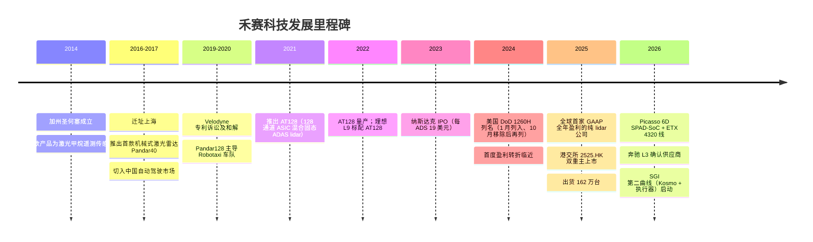
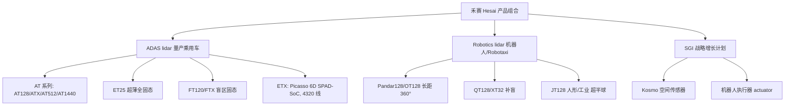
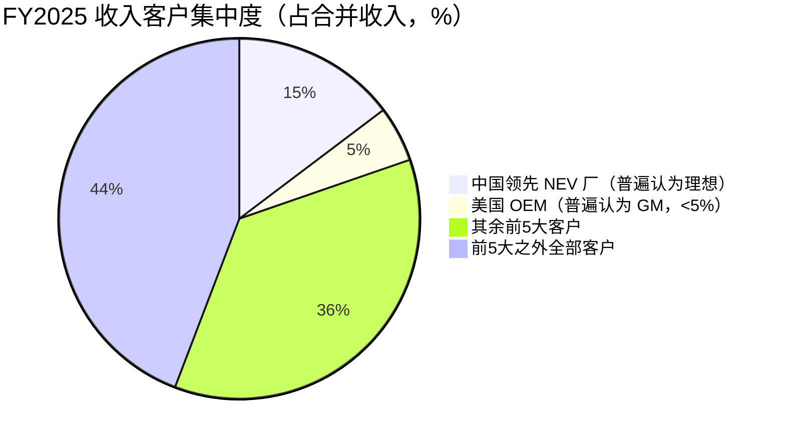
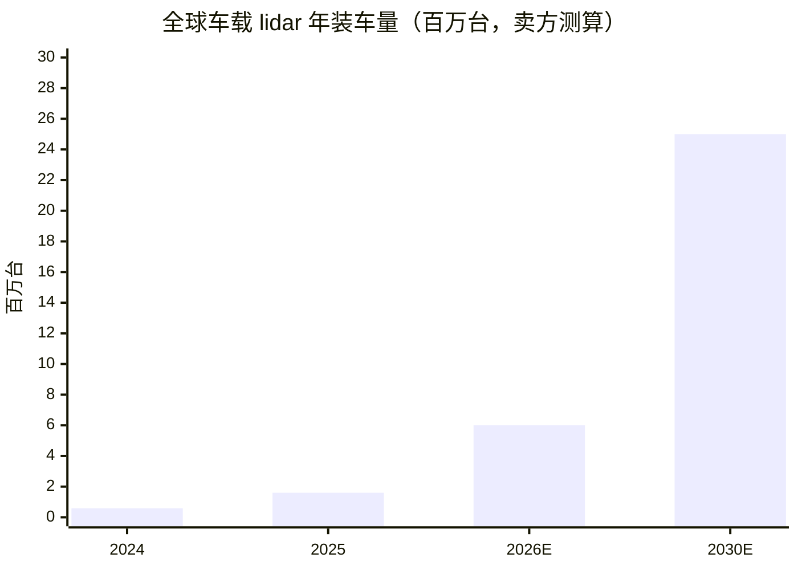
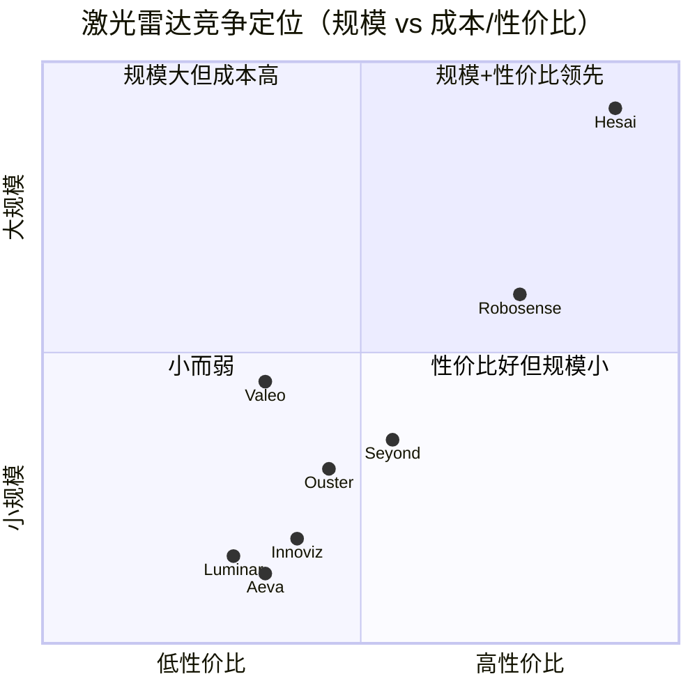
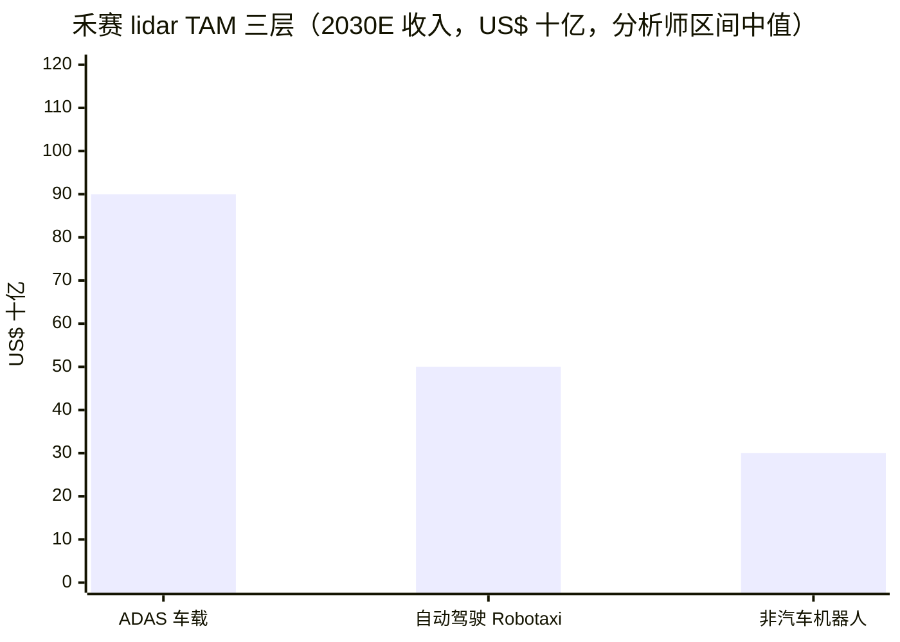

# 公司研究报告：禾赛集团（Hesai Group，禾赛科技，NASDAQ:HSAI / HKEX:2525）

报告日期 / As of：2026-06-14（数据截至 FY2025 20-F 与 2026Q1 业绩）

> *分析师观点：* **评级：Overweight（增持）· 12 个月目标价 US$26（较 2026-06-12 收盘 US$18.15 上行 +43%）· 估值方法：~9× FY2027E P/S（lidar 主业）+ 机器人/SGI 期权价值**
> 市值约 US$2.83bn · 52 周区间 US$14.69–US$30.85 · 流通股 156,145,167 股（NASDAQ:HSAI ADS = 1 股普通股；HKEX:2525）
>
> | 倍数 / Multiple（*分析师观点：* 远期列） | FY2025A | FY2026E | FY2027E |
> |---|---|---|---|
> | P/S（市销率） | ~6.5× | ~4.4× | ~3.2× |
> | P/E（市盈率） | ~46× | ~26× | ~16× |
> | EV/Sales（含净现金调整） | ~3.5× | ~2.4× | ~1.7× |
>
> 相对表现 / Rel. performance（截至 2026-06-12，来源 yfinance）：1M **−24.5%** · 6M **−11.6%** · YTD **−24.6%** · 12M **−9.6%**，同期 S&P 500 为 1M −0.1% / 6M +8.5% / YTD +8.9% / 12M +25.7%，**12 个月相对跑输约 −35 个百分点**——典型的"基本面持续兑现、但股价被地缘与估值压制"的背离。
>
> **核心论点（thesis pillars）**——（1）禾赛已是**全球出货量第一**的车载长距激光雷达（lidar / LiDAR，激光雷达）厂商，FY2025 出货 162 万台、首度实现 GAAP 全年盈利，规模与成本领先持续拉大；（2）2026 年指引出货 300–350 万台、收入 RMB42–46 亿元，经营杠杆（operating leverage，规模摊薄固定成本）驱动利润率扩张；（3）第二增长曲线 SGI（Strategic Growth Initiatives，战略增长计划）——Kosmo 空间传感器 + 机器人执行器获 NVIDIA 人形机器人 GR00T 生态背书，打开机器人/物理 AI（Physical AI）期权；（4）**1260H 列名 + ADAS 价格战 + 中美脱钩**是压制估值的三大风险，目标价采用相对保守倍数已计入相当折价。

## 目录

1. 公司概览（含投资论点）
1A. 估值与目标价（远期预测 · PT 推导 · 牛熊情景）
1B. GF Score（GuruFocus 风格基本面评分）
2. 公司发展史
3. 管理团队
4. 产品与服务
5. 客户与上市策略
6. 行业概览
7. 竞争格局
8. 市场机会（TAM）
9. 风险评估
9.5. 核心分歧与催化剂
10. 投资风格透视（投资大师视角）

---

## 1. 公司概览

*分析师观点：* 我们对禾赛给予 **Overweight（增持）** 评级、12 个月目标价 **US$26**（较 2026-06-12 收盘 US$18.15 上行 +43%）。论点的核心是一个"业绩已兑现、股价被错杀"的背离：禾赛 FY2025 出货 1,620,406 台激光雷达、收入同比增长 45.8% 至 RMB30.276 亿元，并成为**全球首家实现 GAAP 全年盈利的纯激光雷达上市公司**（[Hesai FY2025 Q4 6-K (Exhibit 99.1), 2026-03-24](https://www.sec.gov/Archives/edgar/data/1861737/000110465926033591/tm269592d1_ex99-1.htm)）；但同期股价 12 个月跑输 S&P 500 约 35 个百分点，主因 2024 年起的美国国防部 1260H "中国军方公司" 列名与中美脱钩担忧（[Hesai FY2025 20-F, "Item 3.D Risk Factors — Section 1260H List"](https://www.sec.gov/Archives/edgar/data/1861737/000110465926048025/hsai-20251231x20f.htm)）。我们认为基本面动能（2026 年出货指引翻倍、机器人第二曲线启动）足以支撑修复，但地缘政治是真实的尾部风险，故采用相对保守的远期市销率（P/S）倍数。

禾赛集团（Hesai Group，NASDAQ:HSAI，HKEX:2525）是一家总部位于上海的三维（3D）激光雷达（lidar，激光雷达）传感器设计与制造商。公司生产基于脉冲激光的感知模组，供汽车整车厂（OEM）用于实现高级驾驶辅助系统（ADAS，Advanced Driver-Assistance Systems）与 L3 自动驾驶，并供机器人厂商——Robotaxi（无人出租车）、Robovan（无人配送车）、机器人割草机、四足与人形机器人开发商——用于自主导航。公司核心论点是：通过垂直整合（vertical integration）、以专用集成电路（ASIC，Application-Specific Integrated Circuit）为核心的激光雷达架构，以足够低的单件成本交付车规级传感器，使其能被设计进量产乘用车，并小到可装入人形机器人胸腔（[Hesai FY2025 20-F, "Item 4.B Business Overview"](https://www.sec.gov/Archives/edgar/data/1861737/000110465926048025/hsai-20251231x20f.htm)）。

公司按单件、按采购订单（PO，Purchase Order）向两个终端市场销售激光雷达：**ADAS**（汽车量产）和 **Robotics**（机器人，即所有非 ADAS 应用）。收入基本全为产品收入——FY2025 产品收入 RMB29.829 亿元、服务收入仅 RMB0.446 亿元（同比下降 59.8%，因非经常性工程（NRE，Non-Recurring Engineering）服务收入下降）（[Hesai FY2025 Q4 6-K (Exhibit 99.1)](https://www.sec.gov/Archives/edgar/data/1861737/000110465926033591/tm269592d1_ex99-1.htm)）。从 2026 年第一季度起，公司将报表口径重组为 **"Lidar Business"** 与 **"Strategic Growth Initiatives (SGI)"** 两段，以凸显主业的自我造血能力（[Hesai Q1 2026 6-K (Exhibit 99.1), 2026-05-19](https://www.sec.gov/Archives/edgar/data/1861737/000110465926063803/tm2615071d1_ex99-1.htm)）。

**本期新变化（FY2025 vs FY2024）。** 较上一版（FY2024 20-F 口径）报告，本次刷新纳入了 **FY2025 20-F（2026-04-24 提交）** 与 **2026Q1 业绩（2026-05-19）** 的全部新披露：出货量从 501,889 台跃升至 1,620,406 台（+222.9%）；收入从 RMB20.772 亿元增至 RMB30.276 亿元（+45.8%）；GAAP 净利润从 −RMB1.024 亿元亏损转为 +RMB4.359 亿元盈利（[Hesai FY2025 Q4 6-K (Exhibit 99.1)](https://www.sec.gov/Archives/edgar/data/1861737/000110465926033591/tm269592d1_ex99-1.htm)）。ADAS 出货同比 +202.6% 至 1,381,133 台，Robotics 出货同比 +425.8% 至 239,273 台（[同上](https://www.sec.gov/Archives/edgar/data/1861737/000110465926033591/tm269592d1_ex99-1.htm)）。FY2025 毛利率（gross margin，毛利率）为 41.8%，较 FY2024 的 42.6% 下降 80 个基点（bp），主因高毛利的 NRE 服务收入减少及 ADAS 占比上升（ADAS 单价与毛利率均低于 Robotics）（[同上](https://www.sec.gov/Archives/edgar/data/1861737/000110465926033591/tm269592d1_ex99-1.htm)）。

下方"收入瀑布图"展示 FY2025 收入如何逐级转化为净利润：RMB30.276 亿元收入扣除 COGS（cost of goods sold，营业成本）RMB17.625 亿元后得毛利 RMB12.651 亿元（毛利率 41.8%），再扣除经营费用 RMB10.963 亿元（其中 R&D 研发费用 RMB7.969 亿元为最大项）得经营利润 RMB1.688 亿元，叠加利息与其他净收入（含一笔早期股权投资处置收益 RMB1.846 亿元）后实现净利润 RMB4.359 亿元（[Hesai FY2025 Q4 6-K (Exhibit 99.1) — 综合损益表](https://www.sec.gov/Archives/edgar/data/1861737/000110465926033591/tm269592d1_ex99-1.htm)）。

<svg xmlns="http://www.w3.org/2000/svg" viewBox="0 0 1000 560" width="1000" height="560" role="img" aria-label="income statement Sankey"><rect x="0" y="0" width="1000" height="560" fill="#ffffff"/>
<text x="20.00" y="30.00" text-anchor="start" font-family="Helvetica,Arial,sans-serif" font-size="15" font-weight="700" fill="#1f2933">禾赛 (HSAI) 收入如何转化为利润 — FY2025 (RMB mn)</text>
<path d="M 452.00,78.00 C 506.00,78.00 506.00,171.76 560.00,171.76 L 560.00,194.51 C 506.00,194.51 506.00,100.75 452.00,100.75 Z" fill="#86efac" fill-opacity="0.55"/>
<path d="M 452.00,100.75 C 506.00,100.75 506.00,208.51 560.00,208.51 L 560.00,356.25 C 506.00,356.25 506.00,248.49 452.00,248.49 Z" fill="#fca5a5" fill-opacity="0.55"/>
<path d="M 204.00,78.01 C 258.00,78.01 258.00,85.00 312.00,85.00 L 312.00,486.98 C 258.00,486.98 258.00,479.98 204.00,479.98 Z" fill="#93c5fd" fill-opacity="0.55"/>
<path d="M 328.00,85.00 C 382.00,85.00 382.00,78.00 436.00,78.00 L 436.00,248.49 C 382.00,248.49 382.00,255.49 328.00,255.49 Z" fill="#86efac" fill-opacity="0.55"/>
<path d="M 328.00,255.49 C 382.00,255.49 382.00,262.49 436.00,262.49 L 436.00,500.00 C 382.00,500.00 382.00,493.00 328.00,493.00 Z" fill="#fca5a5" fill-opacity="0.55"/>
<path d="M 700.00,164.76 C 754.00,164.76 754.00,259.63 808.00,259.63 L 808.00,318.37 C 754.00,318.37 754.00,223.50 700.00,223.50 Z" fill="#86efac" fill-opacity="0.55"/>
<path d="M 576.00,171.76 C 630.00,171.76 630.00,164.76 684.00,164.76 L 684.00,187.51 C 630.00,187.51 630.00,194.51 576.00,194.51 Z" fill="#86efac" fill-opacity="0.55"/>
<path d="M 576.00,208.51 C 630.00,208.51 630.00,237.50 684.00,237.50 L 684.00,263.38 C 630.00,263.38 630.00,234.38 576.00,234.38 Z" fill="#fca5a5" fill-opacity="0.55"/>
<path d="M 576.00,234.38 C 630.00,234.38 630.00,277.38 684.00,277.38 L 684.00,384.77 C 630.00,384.77 630.00,341.77 576.00,341.77 Z" fill="#fca5a5" fill-opacity="0.55"/>
<path d="M 576.00,341.77 C 630.00,341.77 630.00,398.77 684.00,398.77 L 684.00,413.24 C 630.00,413.24 630.00,356.25 576.00,356.25 Z" fill="#fca5a5" fill-opacity="0.55"/>
<path d="M 576.00,370.25 C 630.00,370.25 630.00,187.51 684.00,187.51 L 684.00,223.50 C 630.00,223.50 630.00,406.24 576.00,406.24 Z" fill="#93c5fd" fill-opacity="0.55"/>
<path d="M 204.00,493.98 C 258.00,493.98 258.00,486.98 312.00,486.98 L 312.00,492.99 C 258.00,492.99 258.00,499.99 204.00,499.99 Z" fill="#93c5fd" fill-opacity="0.55"/>
<rect x="188.00" y="78.01" width="16" height="401.98" rx="1.5" fill="#2563eb"/>
<rect x="188.00" y="493.98" width="16" height="6.01" rx="1.5" fill="#2563eb"/>
<rect x="312.00" y="85.00" width="16" height="408.00" rx="1.5" fill="#1e3a8a"/>
<rect x="436.00" y="78.00" width="16" height="170.49" rx="1.5" fill="#15803d"/>
<rect x="436.00" y="262.49" width="16" height="237.51" rx="1.5" fill="#dc2626"/>
<rect x="560.00" y="171.76" width="16" height="22.75" rx="1.5" fill="#15803d"/>
<rect x="560.00" y="208.51" width="16" height="147.74" rx="1.5" fill="#dc2626"/>
<rect x="560.00" y="370.25" width="16" height="35.99" rx="1.5" fill="#2563eb"/>
<rect x="684.00" y="164.76" width="16" height="58.74" rx="1.5" fill="#15803d"/>
<rect x="684.00" y="237.50" width="16" height="25.87" rx="1.5" fill="#dc2626"/>
<rect x="684.00" y="277.38" width="16" height="107.39" rx="1.5" fill="#dc2626"/>
<rect x="684.00" y="398.77" width="16" height="14.47" rx="1.5" fill="#dc2626"/>
<rect x="808.00" y="259.63" width="16" height="58.74" rx="1.5" fill="#15803d"/>
<line x1="188.00" y1="278.99" x2="182.00" y2="269.01" stroke="#cbd5e1" stroke-width="1"/>
<text x="179.00" y="272.01" text-anchor="end" font-family="Helvetica,Arial,sans-serif" font-size="11.5" font-weight="700" fill="#1f2933">Product (ADAS+Robotics lidar)</text>
<text x="179.00" y="285.01" text-anchor="end" font-family="Helvetica,Arial,sans-serif" font-size="10" font-weight="400" fill="#52606d">RMB3.0B  (98.5%)</text>
<line x1="188.00" y1="496.99" x2="182.00" y2="487.00" stroke="#cbd5e1" stroke-width="1"/>
<text x="179.00" y="490.00" text-anchor="end" font-family="Helvetica,Arial,sans-serif" font-size="11.5" font-weight="700" fill="#1f2933">Service (NRE)</text>
<text x="179.00" y="503.00" text-anchor="end" font-family="Helvetica,Arial,sans-serif" font-size="10" font-weight="400" fill="#52606d">RMB44.6M  (1.5%)</text>
<rect x="331.00" y="67.00" width="113.10" height="26" rx="2" fill="#ffffff" fill-opacity="0.72"/>
<text x="334.00" y="79.00" text-anchor="start" font-family="Helvetica,Arial,sans-serif" font-size="11.5" font-weight="700" fill="#1f2933">Revenue</text>
<text x="334.00" y="92.00" text-anchor="start" font-family="Helvetica,Arial,sans-serif" font-size="10" font-weight="400" fill="#52606d">RMB3.0B  (100.0%)</text>
<rect x="455.00" y="60.00" width="106.80" height="26" rx="2" fill="#ffffff" fill-opacity="0.72"/>
<text x="458.00" y="72.00" text-anchor="start" font-family="Helvetica,Arial,sans-serif" font-size="11.5" font-weight="700" fill="#1f2933">Gross Profit</text>
<text x="458.00" y="85.00" text-anchor="start" font-family="Helvetica,Arial,sans-serif" font-size="10" font-weight="400" fill="#52606d">RMB1.3B  (41.8%)</text>
<rect x="455.00" y="244.49" width="144.60" height="26" rx="2" fill="#ffffff" fill-opacity="0.72"/>
<text x="458.00" y="256.49" text-anchor="start" font-family="Helvetica,Arial,sans-serif" font-size="11.5" font-weight="700" fill="#1f2933">Cost of Revenue (COGS)</text>
<text x="458.00" y="269.49" text-anchor="start" font-family="Helvetica,Arial,sans-serif" font-size="10" font-weight="400" fill="#52606d">RMB1.8B  (58.2%)</text>
<rect x="579.00" y="153.76" width="113.10" height="26" rx="2" fill="#ffffff" fill-opacity="0.72"/>
<text x="582.00" y="165.76" text-anchor="start" font-family="Helvetica,Arial,sans-serif" font-size="11.5" font-weight="700" fill="#1f2933">Operating Income</text>
<text x="582.00" y="178.76" text-anchor="start" font-family="Helvetica,Arial,sans-serif" font-size="10" font-weight="400" fill="#52606d">RMB168.8M  (5.6%)</text>
<rect x="579.00" y="190.51" width="150.90" height="26" rx="2" fill="#ffffff" fill-opacity="0.72"/>
<text x="582.00" y="202.51" text-anchor="start" font-family="Helvetica,Arial,sans-serif" font-size="11.5" font-weight="700" fill="#1f2933">Total Operating Expense</text>
<text x="582.00" y="215.51" text-anchor="start" font-family="Helvetica,Arial,sans-serif" font-size="10" font-weight="400" fill="#52606d">RMB1.1B  (36.2%)</text>
<text x="551.00" y="385.24" text-anchor="end" font-family="Helvetica,Arial,sans-serif" font-size="11.5" font-weight="700" fill="#1f2933">Net Interest / Other Income</text>
<text x="551.00" y="398.24" text-anchor="end" font-family="Helvetica,Arial,sans-serif" font-size="10" font-weight="400" fill="#52606d">RMB267.1M  (8.8%)</text>
<rect x="703.00" y="146.76" width="119.40" height="26" rx="2" fill="#ffffff" fill-opacity="0.72"/>
<text x="706.00" y="158.76" text-anchor="start" font-family="Helvetica,Arial,sans-serif" font-size="11.5" font-weight="700" fill="#1f2933">Pretax Income</text>
<text x="706.00" y="171.76" text-anchor="start" font-family="Helvetica,Arial,sans-serif" font-size="10" font-weight="400" fill="#52606d">RMB435.9M  (14.4%)</text>
<rect x="703.00" y="219.50" width="113.10" height="26" rx="2" fill="#ffffff" fill-opacity="0.72"/>
<text x="706.00" y="231.50" text-anchor="start" font-family="Helvetica,Arial,sans-serif" font-size="11.5" font-weight="700" fill="#1f2933">SG&amp;A</text>
<text x="706.00" y="244.50" text-anchor="start" font-family="Helvetica,Arial,sans-serif" font-size="10" font-weight="400" fill="#52606d">RMB192.0M  (6.3%)</text>
<rect x="703.00" y="259.38" width="119.40" height="26" rx="2" fill="#ffffff" fill-opacity="0.72"/>
<text x="706.00" y="271.38" text-anchor="start" font-family="Helvetica,Arial,sans-serif" font-size="11.5" font-weight="700" fill="#1f2933">R&amp;D</text>
<text x="706.00" y="284.38" text-anchor="start" font-family="Helvetica,Arial,sans-serif" font-size="10" font-weight="400" fill="#52606d">RMB796.9M  (26.3%)</text>
<rect x="703.00" y="380.77" width="113.10" height="26" rx="2" fill="#ffffff" fill-opacity="0.72"/>
<text x="706.00" y="392.77" text-anchor="start" font-family="Helvetica,Arial,sans-serif" font-size="11.5" font-weight="700" fill="#1f2933">Other OpEx</text>
<text x="706.00" y="405.77" text-anchor="start" font-family="Helvetica,Arial,sans-serif" font-size="10" font-weight="400" fill="#52606d">RMB107.4M  (3.5%)</text>
<text x="833.00" y="286.00" text-anchor="start" font-family="Helvetica,Arial,sans-serif" font-size="11.5" font-weight="700" fill="#1f2933">Net Income</text>
<text x="833.00" y="299.00" text-anchor="start" font-family="Helvetica,Arial,sans-serif" font-size="10" font-weight="400" fill="#52606d">RMB435.9M  (14.4%)</text>
<text x="500.00" y="544.00" text-anchor="middle" font-family="Helvetica,Arial,sans-serif" font-size="10" font-weight="400" fill="#52606d">Source: Hesai FY2025 Q4 6-K (tm269592d1_ex99-1), 综合损益表</text>
</svg>

来源 / Source：[Hesai FY2025 Q4 6-K (Exhibit 99.1), 综合损益表](https://www.sec.gov/Archives/edgar/data/1861737/000110465926033591/tm269592d1_ex99-1.htm)

从规模看，禾赛 FY2025 员工 1,118 人（其中 R&D 587 人、生产与供应链 206 人），另有约 1,879 名合同工主要在中国制造基地（[Hesai FY2025 20-F, "Item 6.D Employees"](https://www.sec.gov/Archives/edgar/data/1861737/000110465926048025/hsai-20251231x20f.htm)）。公司在上海、Palo Alto（帕罗奥图）和 Stuttgart（斯图加特）设有办公室，并在 FY2025 国际收入占比 22.2%（2023 年为 47.2%、2024 年为 25.7%——海外占比因中国 ADAS 放量而被稀释）（[同上, "International sales accounted for 47.2%, 25.7% and 22.2%"](https://www.sec.gov/Archives/edgar/data/1861737/000110465926048025/hsai-20251231x20f.htm)）。截至 2025 年 12 月 31 日，公司有 156,145,167 股普通股流通在外（129,146,306 股 B 类 + 26,998,861 股 A 类）（[同上, 封面页](https://www.sec.gov/Archives/edgar/data/1861737/000110465926048025/hsai-20251231x20f.htm)）。禾赛于 2023 年 2 月以每 ADS 19 美元在纳斯达克 IPO，并于 2025 年 9 月 11 日以 2525.HK 在港交所完成第二次主上市（[Hesai 6-K, 2025-09-11 — Pricing of Global Offering](https://www.sec.gov/Archives/edgar/data/1861737/000110465925089277/tm2525492d1_6k.htm)）。

下图为 FY2025 出货量的终端市场结构（ADAS 占 85%、Robotics 占 15%）与收入的地域结构（中国大陆及其他 77.8%、国际 22.2%）：

<svg xmlns="http://www.w3.org/2000/svg" viewBox="0 0 720 460" width="720" height="460" role="img" aria-label="revenue donut"><rect x="0" y="0" width="720" height="460" fill="#ffffff"/>
<text x="20.00" y="30.00" text-anchor="start" font-family="Helvetica,Arial,sans-serif" font-size="15" font-weight="700" fill="#1f2933">FY2025 激光雷达出货量结构（按终端市场，单位：台）</text>
<path d="M 288.00,107.20 A 132 132 0 1 1 182.36,160.05 L 225.58,192.43 A 78 78 0 1 0 288.00,161.20 Z" fill="#2563eb"/>
<path d="M 182.36,160.05 A 132 132 0 0 1 288.00,107.20 L 288.00,161.20 A 78 78 0 0 0 225.58,192.43 Z" fill="#15803d"/>
<text x="288.00" y="235.20" text-anchor="middle" font-family="Helvetica,Arial,sans-serif" font-size="18" font-weight="800" fill="#1f2933">HSAI</text>
<text x="288.00" y="255.20" text-anchor="middle" font-family="Helvetica,Arial,sans-serif" font-size="13" font-weight="600" fill="#52606d">1.6M</text>
<text x="288.00" y="271.20" text-anchor="middle" font-family="Helvetica,Arial,sans-serif" font-size="10" font-weight="400" fill="#8a97a3">total</text>
<line x1="349.75" y1="362.62" x2="365.75" y2="362.62" stroke="#2563eb" stroke-width="1.4"/>
<text x="369.75" y="360.62" text-anchor="start" font-family="Helvetica,Arial,sans-serif" font-size="11" font-weight="700" fill="#1f2933">ADAS lidar</text>
<text x="369.75" y="374.62" text-anchor="start" font-family="Helvetica,Arial,sans-serif" font-size="10" font-weight="400" fill="#52606d">1.4M  (85.2%)</text>
<line x1="226.25" y1="115.78" x2="210.25" y2="115.78" stroke="#15803d" stroke-width="1.4"/>
<text x="206.25" y="113.78" text-anchor="end" font-family="Helvetica,Arial,sans-serif" font-size="11" font-weight="700" fill="#1f2933">Robotics lidar</text>
<text x="206.25" y="127.78" text-anchor="end" font-family="Helvetica,Arial,sans-serif" font-size="10" font-weight="400" fill="#52606d">239.3K  (14.8%)</text>
<text x="360.00" y="444.00" text-anchor="middle" font-family="Helvetica,Arial,sans-serif" font-size="10" font-weight="400" fill="#52606d">Source: Hesai FY2025 Q4 6-K (tm269592d1_ex99-1), 出货量拆分</text>
</svg>

来源 / Source：[Hesai FY2025 Q4 6-K (Exhibit 99.1), 出货量拆分](https://www.sec.gov/Archives/edgar/data/1861737/000110465926033591/tm269592d1_ex99-1.htm)

<svg xmlns="http://www.w3.org/2000/svg" viewBox="0 0 720 460" width="720" height="460" role="img" aria-label="revenue donut"><rect x="0" y="0" width="720" height="460" fill="#ffffff"/>
<text x="20.00" y="30.00" text-anchor="start" font-family="Helvetica,Arial,sans-serif" font-size="15" font-weight="700" fill="#1f2933">FY2025 收入地域结构（按收入占比）</text>
<path d="M 288.00,107.20 A 132 132 0 1 1 158.04,216.10 L 211.20,225.55 A 78 78 0 1 0 288.00,161.20 Z" fill="#2563eb"/>
<path d="M 158.04,216.10 A 132 132 0 0 1 288.00,107.20 L 288.00,161.20 A 78 78 0 0 0 211.20,225.55 Z" fill="#15803d"/>
<text x="288.00" y="235.20" text-anchor="middle" font-family="Helvetica,Arial,sans-serif" font-size="18" font-weight="800" fill="#1f2933">HSAI</text>
<text x="288.00" y="255.20" text-anchor="middle" font-family="Helvetica,Arial,sans-serif" font-size="13" font-weight="600" fill="#52606d">100</text>
<text x="288.00" y="271.20" text-anchor="middle" font-family="Helvetica,Arial,sans-serif" font-size="10" font-weight="400" fill="#8a97a3">total</text>
<line x1="376.63" y1="344.98" x2="392.63" y2="344.98" stroke="#2563eb" stroke-width="1.4"/>
<text x="396.63" y="342.98" text-anchor="start" font-family="Helvetica,Arial,sans-serif" font-size="11" font-weight="700" fill="#1f2933">Chinese Mainland &amp; other</text>
<text x="396.63" y="356.98" text-anchor="start" font-family="Helvetica,Arial,sans-serif" font-size="10" font-weight="400" fill="#52606d">78  (77.8%)</text>
<line x1="199.37" y1="133.42" x2="183.37" y2="133.42" stroke="#15803d" stroke-width="1.4"/>
<text x="179.37" y="131.42" text-anchor="end" font-family="Helvetica,Arial,sans-serif" font-size="11" font-weight="700" fill="#1f2933">International</text>
<text x="179.37" y="145.42" text-anchor="end" font-family="Helvetica,Arial,sans-serif" font-size="10" font-weight="400" fill="#52606d">22  (22.2%)</text>
<text x="360.00" y="444.00" text-anchor="middle" font-family="Helvetica,Arial,sans-serif" font-size="10" font-weight="400" fill="#52606d">Source: Hesai FY2025 20-F, 国际收入占比 22.2%</text>
</svg>

来源 / Source：[Hesai FY2025 20-F, 国际收入占比 22.2%](https://www.sec.gov/Archives/edgar/data/1861737/000110465926048025/hsai-20251231x20f.htm)

### 估值快照（TTM）

截至 2026 年 6 月 12 日收盘，HSAI 报 **每 ADS US$18.15**，市值约 **US$2.83bn**（按 156,145,167 股流通股计算）（[yfinance HSAI, 截至 2026-06-12](https://finance.yahoo.com/quote/HSAI/)）。按 FY2025 净利润 US$62.3mn 计算，对应 **滚动市盈率（TTM P/E）约 46 倍**；按 FY2025 收入 US$432.9mn 计算，对应 **滚动市销率（TTM P/S）约 6.5 倍**（[Hesai FY2025 Q4 6-K (Exhibit 99.1)](https://www.sec.gov/Archives/edgar/data/1861737/000110465926033591/tm269592d1_ex99-1.htm)）。自 2023 年 2 月 IPO 以来，三年区间约为 **US$3.55–US$30.85**，当前股价处于区间中下部、且较 2025 年高点回落约 40%（[yfinance HSAI Historical, 截至 2026-06-12](https://finance.yahoo.com/quote/HSAI/history)）。

同业群体仍深度亏损，估值倍数不完全可比：**Robosense（速腾聚创，HKEX:2498）** FY2025 仍未盈利、市销率约 8× 量级（[J.P. Morgan — RoboSense Technology (2498.HK) 1Q26 margin miss, 2026-06-02](http://xs-macbook-air.local:5001/zsxq/pdf/184152121152212/J.P.%20Morgan-RoboSense%20Technology%EF%BC%882498.HK%EF%BC%891Q26%20margin%20miss%EF%BC%8C%20but%20well%20positioned-260602.pdf)）；美国上市同业 Ouster（OUST）、Innoviz（INVZ）、Aeva（AEVA）、Luminar（LAZR）规模更小、净利率均为负。在激光雷达同业群体中，禾赛是**唯一同时具备正且有限市盈率**的标的——这也是为何 6.5× TTM P/S 应被视为"盈利拐点公司"的合理定价，而非纯硬件供应商的折价估值（[Morgan Stanley — Hesai: Compelling Narrative, Clear Roadmap; Stay OW, 2026-06-05](http://xs-macbook-air.local:5001/zsxq/pdf/814528851485412/Morgan%20Stanley-Hesai%20Group%EF%BC%88HSAI.US%EF%BC%89Compelling%20Narrative%EF%BC%8C%20Clear%20Roadmap%EF%BC%8C%20Confident%20Reaffirmation%EF%BC%9B%20Stay%20OW-260605.pdf)）。

*分析师观点：* 46 倍 TTM P/E 绝对值偏高，但这是一家收入仍同比增长 46%、刚跨入盈利且 2026 年出货量指引翻倍的拐点公司的估值（[Hesai FY2025 Q4 6-K (Exhibit 99.1)](https://www.sec.gov/Archives/edgar/data/1861737/000110465926033591/tm269592d1_ex99-1.htm)）。FY2025 非 GAAP 净利率为 18.2%（非 GAAP 净利润 US$78.7mn / 收入 US$432.9mn），管理层指引 2026 年出货 300–350 万台（销量约翻倍）——随着 ADAS 物料清单（BOM，Bill of Materials）成本沿成本曲线下行，公司将持续获得经营杠杆（[同上](https://www.sec.gov/Archives/edgar/data/1861737/000110465926033591/tm269592d1_ex99-1.htm)）。该倍数的风险在执行：若 ADAS 装配率见顶、价格战压缩 ASP（average selling price，平均售价）快于 BOM 下降，或 1260H 升级为更具约束力的制裁，鉴于 AT 系列单一产品线占 FY2025 收入 63.0% 的集中度，估值可能迅速压缩（[Hesai FY2025 20-F, "AT series accounted for 37.0%, 60.9% and 63.0%"](https://www.sec.gov/Archives/edgar/data/1861737/000110465926048025/hsai-20251231x20f.htm)）。我们将此列为第 9 节的估值/倍数压缩风险。

## 1A. 估值与目标价

*分析师观点：本节所有远期预测、目标价及情景目标价均为分析师自身观点，不附带任何监管文件引用——10-K/20-F 不含目标价。* 每项预测的**外部输入**（公司分部数据 + 管理层指引 + 行业预测）在文中内联引用。

### (a) 远期财务预测表

下表自下而上建模：ADAS 与 Robotics 各自的出货量×ASP 路径，加上 SGI（Kosmo + 执行器）新业务，再汇总。出货量基准来自管理层 2026 年 300–350 万台指引（[Hesai FY2025 Q4 6-K (Exhibit 99.1)](https://www.sec.gov/Archives/edgar/data/1861737/000110465926033591/tm269592d1_ex99-1.htm)），ASP 下行假设来自行业价格趋势（[Yole — China takes the lead in automotive LiDAR, 2025-06](https://www.yolegroup.com/press-release/china-takes-the-lead-in-automotive-lidar-a-market-set-to-quadruple-by-2030/)），SGI 收入路径来自 Q1 2026 业绩中"2026 年新业务约 RMB1 亿元收入"的指引（[Hesai Q1 2026 6-K (Exhibit 99.1)](https://www.sec.gov/Archives/edgar/data/1861737/000110465926063803/tm2615071d1_ex99-1.htm)）。

| 指标（*分析师观点：*） | FY2025A | FY2026E | FY2027E | FY2028E | CAGR(25–28) |
|---|---|---|---|---|---|
| 收入 Revenue（RMB mn） | 3,028 | 4,400 | 6,100 | 8,000 | +38% |
| — YoY % | +46% | +45% | +39% | +31% | |
| — 其中 Lidar 主业 | 3,028 | 4,300 | 5,700 | 7,200 | |
| — 其中 SGI 新业务 | ~0 | 100 | 400 | 800 | |
| 毛利率 Gross margin % | 41.8% | 40% | 40% | 41% | |
| 经营利润率 Operating margin % | 5.6% | 9% | 12% | 14% | |
| 净利率 Net margin % | 14.4% | 12% | 13% | 14% | |
| 净利润 Net income（RMB mn） | 436 | 530 | 790 | 1,120 | +37% |
| EPS（RMB，摊薄） | 2.98 | 3.4 | 5.0 | 7.1 | |
| ROIC %（约） | ~3% | ~6% | ~9% | ~12% | |
| FCF（RMB mn，经营 CF−资本开支） | ~−237 | ~100 | ~400 | ~700 | |
| 净现金 Net cash（RMB mn） | ~6,600 | ~6,700 | ~7,000 | ~7,500 | |

注：FY2025 经营现金流 RMB117.0mn 减资本开支约 RMB354mn 得 FCF ≈ −RMB237mn（[Hesai FY2025 20-F, MD&A 现金流量精选数据](https://www.sec.gov/Archives/edgar/data/1861737/000110465926048025/hsai-20251231x20f.htm)）。净现金以 FY2025 现金储备（cash reserve，含现金、受限资金、短期投资、长期定存）RMB7,511.0mn 减短期借款 RMB448.2mn 后近似（[Hesai FY2025 Q4 6-K (Exhibit 99.1)](https://www.sec.gov/Archives/edgar/data/1861737/000110465926033591/tm269592d1_ex99-1.htm)）。2026 年公司自身指引收入 RMB42–46 亿元、净利润 RMB5–7 亿元（其中激光雷达业务净利 RMB6.5–8.5 亿元），故我们 RMB44 亿元/RMB5.3 亿元的预测处于指引区间内、略偏保守（[Morgan Stanley — Hesai: Compelling Narrative; Stay OW, 2026-06-05](http://xs-macbook-air.local:5001/zsxq/pdf/814528851485412/Morgan%20Stanley-Hesai%20Group%EF%BC%88HSAI.US%EF%BC%89Compelling%20Narrative%EF%BC%8C%20Clear%20Roadmap%EF%BC%8C%20Confident%20Reaffirmation%EF%BC%9B%20Stay%20OW-260605.pdf)）。

**毛利率桥（margin bridge）。** FY2025 毛利率 41.8% 较 FY2024 的 42.6% 下降约 80bp，可分解为：高毛利 NRE 服务收入下降（约 −60bp）· ADAS 占比上升带来的组合稀释（约 −60bp，ADAS 毛利率低于 Robotics）· 双产品线规模与成本优化（约 +40bp）（[Hesai FY2025 Q4 6-K (Exhibit 99.1) — 毛利率说明](https://www.sec.gov/Archives/edgar/data/1861737/000110465926033591/tm269592d1_ex99-1.htm)）。我们假设 FY2026 毛利率小幅下行至 ~40%（ADAS 进一步放量 + 价格战），FY2027 起随 SGI 高毛利业务起量与规模摊薄而企稳回升。

### (b) 目标价推导

我们采用 **远期市销率（forward P/S）法**，因为禾赛仍处盈利早期、P/E 对净利率假设过于敏感，而 P/S 更能反映"规模领先+拐点"的市场定价框架：

> FY2027E 收入 RMB6,100mn ≈ US$847mn（按 7.2 RMB/USD）× 目标 P/S ~3.0× = US$2,540mn 企业价值；加净现金约 US$0.9bn ≈ 市值 US$3.4bn ÷ 156.1mn 股 ≈ **US$22/ADS** 的主业价值，加 SGI 机器人/物理 AI 期权价值约 US$4/ADS，得 **12 个月目标价 US$26**。

**为什么用 ~3.0× FY2027E P/S。** 该倍数对标：Robosense（同业、未盈利）当前约 8× TTM P/S（[J.P. Morgan — RoboSense 1Q26, 2026-06-02](http://xs-macbook-air.local:5001/zsxq/pdf/184152121152212/J.P.%20Morgan-RoboSense%20Technology%EF%BC%882498.HK%EF%BC%891Q26%20margin%20miss%EF%BC%8C%20but%20well%20positioned-260602.pdf)），但禾赛已盈利、应享有盈利溢价；不过 1260H 地缘折价使我们刻意采用低于同业 TTM 的远期倍数。卖方目标价区间为 US$26（Deutsche Bank）至 US$36（UBS），中值约 US$30（详见下文"卖方观点演变"），我们的 US$26 处于区间下沿，体现对地缘风险的保守计提（[UBS — Hesai Tech Open Day takeaways; Buy US$36, 2026-04-19](http://xs-macbook-air.local:5001/zsxq/pdf/585582551488244/UBS-Hesai%20Group%EF%BC%88HSAI.US%EF%BC%89Tech%20Open%20Day%20takeaways%EF%BC%9A%20Stepped%20further%20in%20ADAS%20LiDAR%EF%BC%9B%20strong%20ambition%20in%20physical%20AI-260419.pdf)）。

下方 DuPont（杜邦分解）展示 FY2025 ROE（净资产收益率）的拆解——净利率虽达 14.4%，但资产周转率低（重资产+大量现金）且权益乘数低（净现金、零财务杠杆），故 ROE 仅约个位数中段，是"盈利但回报尚低"的典型拐点画像：

<svg xmlns="http://www.w3.org/2000/svg" viewBox="0 0 1240 540" width="1240" height="540" role="img" aria-label="DuPont ROE decomposition"><rect x="0" y="0" width="1240" height="540" fill="#ffffff"/>
<text x="20.00" y="30.00" text-anchor="start" font-family="Helvetica,Arial,sans-serif" font-size="15" font-weight="700" fill="#1f2933">5-Step DuPont Decomposition of Return on Equity (ROE)</text>
<rect x="545.00" y="56.00" width="150" height="56" rx="7" fill="#1e3a8a"/>
<text x="620.00" y="76.00" text-anchor="middle" font-family="Helvetica,Arial,sans-serif" font-size="11.5" font-weight="700" fill="#ffffff">ROE</text>
<text x="620.00" y="94.00" text-anchor="middle" font-family="Helvetica,Arial,sans-serif" font-size="13" font-weight="800" fill="#ffffff">6.76%</text>
<text x="620.00" y="106.00" text-anchor="middle" font-family="Helvetica,Arial,sans-serif" font-size="8.5" font-weight="400" fill="#dbeafe">= Net Income / Avg Equity</text>
<rect x="191.60" y="168.00" width="150" height="56" rx="7" fill="#2563eb"/>
<text x="266.60" y="188.00" text-anchor="middle" font-family="Helvetica,Arial,sans-serif" font-size="11.5" font-weight="700" fill="#ffffff">Net Margin</text>
<text x="266.60" y="206.00" text-anchor="middle" font-family="Helvetica,Arial,sans-serif" font-size="13" font-weight="800" fill="#ffffff">14.40%</text>
<text x="266.60" y="218.00" text-anchor="middle" font-family="Helvetica,Arial,sans-serif" font-size="8.5" font-weight="400" fill="#dbeafe">Net Income / Revenue</text>
<line x1="620.00" y1="112.00" x2="266.60" y2="168.00" stroke="#94a3b8" stroke-width="1.4"/>
<rect x="545.00" y="168.00" width="150" height="56" rx="7" fill="#2563eb"/>
<text x="620.00" y="188.00" text-anchor="middle" font-family="Helvetica,Arial,sans-serif" font-size="11.5" font-weight="700" fill="#ffffff">Asset Turnover</text>
<text x="620.00" y="206.00" text-anchor="middle" font-family="Helvetica,Arial,sans-serif" font-size="13" font-weight="800" fill="#ffffff">0.35</text>
<text x="620.00" y="218.00" text-anchor="middle" font-family="Helvetica,Arial,sans-serif" font-size="8.5" font-weight="400" fill="#dbeafe">Revenue / Avg Assets</text>
<line x1="620.00" y1="112.00" x2="620.00" y2="168.00" stroke="#94a3b8" stroke-width="1.4"/>
<rect x="898.40" y="168.00" width="150" height="56" rx="7" fill="#2563eb"/>
<text x="973.40" y="188.00" text-anchor="middle" font-family="Helvetica,Arial,sans-serif" font-size="11.5" font-weight="700" fill="#ffffff">Equity Multiplier</text>
<text x="973.40" y="206.00" text-anchor="middle" font-family="Helvetica,Arial,sans-serif" font-size="13" font-weight="800" fill="#ffffff">1.34</text>
<text x="973.40" y="218.00" text-anchor="middle" font-family="Helvetica,Arial,sans-serif" font-size="8.5" font-weight="400" fill="#dbeafe">Avg Assets / Avg Equity</text>
<line x1="620.00" y1="112.00" x2="973.40" y2="168.00" stroke="#94a3b8" stroke-width="1.4"/>
<circle cx="443.30" cy="196.00" r="11" fill="#ffffff" stroke="#94a3b8" stroke-width="1.2"/>
<text x="443.30" y="201.00" text-anchor="middle" font-family="Helvetica,Arial,sans-serif" font-size="14" font-weight="800" fill="#52606d">×</text>
<circle cx="796.70" cy="196.00" r="11" fill="#ffffff" stroke="#94a3b8" stroke-width="1.2"/>
<text x="796.70" y="201.00" text-anchor="middle" font-family="Helvetica,Arial,sans-serif" font-size="14" font-weight="800" fill="#52606d">×</text>
<rect x="65.00" y="300.00" width="118" height="56" rx="7" fill="#2563eb"/>
<text x="124.00" y="320.00" text-anchor="middle" font-family="Helvetica,Arial,sans-serif" font-size="11.5" font-weight="700" fill="#ffffff">Operating Margin</text>
<text x="124.00" y="338.00" text-anchor="middle" font-family="Helvetica,Arial,sans-serif" font-size="13" font-weight="800" fill="#ffffff">5.58%</text>
<text x="124.00" y="350.00" text-anchor="middle" font-family="Helvetica,Arial,sans-serif" font-size="8.5" font-weight="400" fill="#dbeafe">Op Inc / Revenue</text>
<line x1="266.60" y1="224.00" x2="124.00" y2="300.00" stroke="#94a3b8" stroke-width="1.4"/>
<rect x="207.60" y="300.00" width="118" height="56" rx="7" fill="#2563eb"/>
<text x="266.60" y="320.00" text-anchor="middle" font-family="Helvetica,Arial,sans-serif" font-size="11.5" font-weight="700" fill="#ffffff">Tax Burden</text>
<text x="266.60" y="338.00" text-anchor="middle" font-family="Helvetica,Arial,sans-serif" font-size="13" font-weight="800" fill="#ffffff">1.0000</text>
<text x="266.60" y="350.00" text-anchor="middle" font-family="Helvetica,Arial,sans-serif" font-size="8.5" font-weight="400" fill="#dbeafe">Net Inc / Pretax</text>
<line x1="266.60" y1="224.00" x2="266.60" y2="300.00" stroke="#94a3b8" stroke-width="1.4"/>
<rect x="350.20" y="300.00" width="118" height="56" rx="7" fill="#2563eb"/>
<text x="409.20" y="320.00" text-anchor="middle" font-family="Helvetica,Arial,sans-serif" font-size="11.5" font-weight="700" fill="#ffffff">Interest Burden</text>
<text x="409.20" y="338.00" text-anchor="middle" font-family="Helvetica,Arial,sans-serif" font-size="13" font-weight="800" fill="#ffffff">2.5823</text>
<text x="409.20" y="350.00" text-anchor="middle" font-family="Helvetica,Arial,sans-serif" font-size="8.5" font-weight="400" fill="#dbeafe">Pretax / Op Inc</text>
<line x1="266.60" y1="224.00" x2="409.20" y2="300.00" stroke="#94a3b8" stroke-width="1.4"/>
<circle cx="195.30" cy="328.00" r="11" fill="#ffffff" stroke="#94a3b8" stroke-width="1.2"/>
<text x="195.30" y="333.00" text-anchor="middle" font-family="Helvetica,Arial,sans-serif" font-size="14" font-weight="800" fill="#52606d">×</text>
<circle cx="337.90" cy="328.00" r="11" fill="#ffffff" stroke="#94a3b8" stroke-width="1.2"/>
<text x="337.90" y="333.00" text-anchor="middle" font-family="Helvetica,Arial,sans-serif" font-size="14" font-weight="800" fill="#52606d">×</text>
<rect x="479.00" y="300.00" width="118" height="56" rx="7" fill="#2563eb"/>
<text x="538.00" y="326.00" text-anchor="middle" font-family="Helvetica,Arial,sans-serif" font-size="11.5" font-weight="700" fill="#ffffff">Revenue</text>
<text x="538.00" y="342.00" text-anchor="middle" font-family="Helvetica,Arial,sans-serif" font-size="13" font-weight="800" fill="#ffffff">RMB3.0B</text>
<line x1="620.00" y1="224.00" x2="538.00" y2="300.00" stroke="#94a3b8" stroke-width="1.4"/>
<rect x="643.00" y="300.00" width="118" height="56" rx="7" fill="#2563eb"/>
<text x="702.00" y="320.00" text-anchor="middle" font-family="Helvetica,Arial,sans-serif" font-size="11.5" font-weight="700" fill="#ffffff">Avg Total Assets</text>
<text x="702.00" y="338.00" text-anchor="middle" font-family="Helvetica,Arial,sans-serif" font-size="13" font-weight="800" fill="#ffffff">RMB8.6B</text>
<text x="702.00" y="350.00" text-anchor="middle" font-family="Helvetica,Arial,sans-serif" font-size="8.5" font-weight="400" fill="#dbeafe">(begin+end)/2</text>
<line x1="620.00" y1="224.00" x2="702.00" y2="300.00" stroke="#94a3b8" stroke-width="1.4"/>
<circle cx="620.00" cy="328.00" r="11" fill="#ffffff" stroke="#94a3b8" stroke-width="1.2"/>
<text x="620.00" y="333.00" text-anchor="middle" font-family="Helvetica,Arial,sans-serif" font-size="14" font-weight="800" fill="#52606d">÷</text>
<rect x="832.40" y="300.00" width="118" height="56" rx="7" fill="#2563eb"/>
<text x="891.40" y="320.00" text-anchor="middle" font-family="Helvetica,Arial,sans-serif" font-size="11.5" font-weight="700" fill="#ffffff">Avg Total Assets</text>
<text x="891.40" y="338.00" text-anchor="middle" font-family="Helvetica,Arial,sans-serif" font-size="13" font-weight="800" fill="#ffffff">RMB8.6B</text>
<text x="891.40" y="350.00" text-anchor="middle" font-family="Helvetica,Arial,sans-serif" font-size="8.5" font-weight="400" fill="#dbeafe">(begin+end)/2</text>
<line x1="973.40" y1="224.00" x2="891.40" y2="300.00" stroke="#94a3b8" stroke-width="1.4"/>
<rect x="996.40" y="300.00" width="118" height="56" rx="7" fill="#2563eb"/>
<text x="1055.40" y="320.00" text-anchor="middle" font-family="Helvetica,Arial,sans-serif" font-size="11.5" font-weight="700" fill="#ffffff">Avg Total Equity</text>
<text x="1055.40" y="338.00" text-anchor="middle" font-family="Helvetica,Arial,sans-serif" font-size="13" font-weight="800" fill="#ffffff">RMB6.4B</text>
<text x="1055.40" y="350.00" text-anchor="middle" font-family="Helvetica,Arial,sans-serif" font-size="8.5" font-weight="400" fill="#dbeafe">(begin+end)/2</text>
<line x1="973.40" y1="224.00" x2="1055.40" y2="300.00" stroke="#94a3b8" stroke-width="1.4"/>
<circle cx="967.20" cy="328.00" r="11" fill="#ffffff" stroke="#94a3b8" stroke-width="1.2"/>
<text x="967.20" y="333.00" text-anchor="middle" font-family="Helvetica,Arial,sans-serif" font-size="14" font-weight="800" fill="#52606d">÷</text>
<rect x="69.00" y="420.00" width="110" height="48" rx="7" fill="#3b82f6"/>
<text x="124.00" y="442.00" text-anchor="middle" font-family="Helvetica,Arial,sans-serif" font-size="11.5" font-weight="700" fill="#ffffff">Operating Income</text>
<text x="124.00" y="458.00" text-anchor="middle" font-family="Helvetica,Arial,sans-serif" font-size="13" font-weight="800" fill="#ffffff">RMB168.8M</text>
<line x1="124.00" y1="356.00" x2="124.00" y2="420.00" stroke="#94a3b8" stroke-width="1.4"/>
<rect x="211.60" y="420.00" width="110" height="48" rx="7" fill="#3b82f6"/>
<text x="266.60" y="442.00" text-anchor="middle" font-family="Helvetica,Arial,sans-serif" font-size="11.5" font-weight="700" fill="#ffffff">Net Income</text>
<text x="266.60" y="458.00" text-anchor="middle" font-family="Helvetica,Arial,sans-serif" font-size="13" font-weight="800" fill="#ffffff">RMB435.9M</text>
<line x1="266.60" y1="356.00" x2="266.60" y2="420.00" stroke="#94a3b8" stroke-width="1.4"/>
<rect x="354.20" y="420.00" width="110" height="48" rx="7" fill="#3b82f6"/>
<text x="409.20" y="442.00" text-anchor="middle" font-family="Helvetica,Arial,sans-serif" font-size="11.5" font-weight="700" fill="#ffffff">Pretax Income</text>
<text x="409.20" y="458.00" text-anchor="middle" font-family="Helvetica,Arial,sans-serif" font-size="13" font-weight="800" fill="#ffffff">RMB435.9M</text>
<line x1="409.20" y1="356.00" x2="409.20" y2="420.00" stroke="#94a3b8" stroke-width="1.4"/>
<text x="620.00" y="510.00" text-anchor="middle" font-family="Helvetica,Arial,sans-serif" font-size="10" font-weight="400" font-style="italic" fill="#8a97a3">FY2025；权益与资产用期初期末均值</text>
<text x="620.00" y="524.00" text-anchor="middle" font-family="Helvetica,Arial,sans-serif" font-size="10" font-weight="400" fill="#52606d">Source: Hesai FY2025 Q4 6-K (tm269592d1_ex99-1), 损益表 + 资产负债表</text>
</svg>

来源 / Source：[Hesai FY2025 Q4 6-K (Exhibit 99.1), 损益表 + 资产负债表](https://www.sec.gov/Archives/edgar/data/1861737/000110465926033591/tm269592d1_ex99-1.htm)

### (c) 牛/基准/熊情景目标价

| 情景（*分析师观点：*） | 关键假设 | 目标价 | 较现价 |
|---|---|---|---|
| 牛 Bull | ADAS 装配率加速 + 多激光雷达放量 + 机器人 SGI 超预期；倍数升至 ~5× FY27E P/S | US$53 | +192% |
| 基准 Base | 中性预测，~3× FY27E P/S + SGI 期权 | US$26 | +43% |
| 熊 Bear | 价格战压缩 lidar 毛利率至底部 + 1260H 升级为制裁，降至 ~1.5× P/S | US$11.5 | −37% |

牛/熊端点与 Morgan Stanley 的情景区间一致（MS：牛 US$53 / 基准 US$30 / 熊 US$11.5），印证了这是一个风险收益高度不对称的标的（[Morgan Stanley — Hesai: Compelling Narrative; Stay OW, 2026-06-05](http://xs-macbook-air.local:5001/zsxq/pdf/814528851485412/Morgan%20Stanley-Hesai%20Group%EF%BC%88HSAI.US%EF%BC%89Compelling%20Narrative%EF%BC%8C%20Clear%20Roadmap%EF%BC%8C%20Confident%20Reaffirmation%EF%BC%9B%20Stay%20OW-260605.pdf)）。

### (d) 与市场一致预期的对比（卖方观点演变）

> **卖方观点演变（Sell-side view evolution）** — 本报告引用了 ≥2 份 `db/zsxq.db` 机构研报，已先读取 `db/stock_price_target.db`（只读）做机械化前置扫描，再整理为按机构的观点时间线 + 机构间分歧表。所有内容为 *分析师观点：*，引用至 `/zsxq/pdf/<file_id>/<filename>` 直链，每个目标价均配研报当日收盘价与隐含涨幅。

**按机构的观点时间线（HSAI ADS，USD）：**

| 机构 | 报告日 | 评级 | 目标价（USD） | 研报当日收盘 | 隐含涨幅 | 一句话论点 |
|---|---|---|---|---|---|---|
| Deutsche Bank | 2026-04-18 | Buy | US$26 | US$23.25 | +12% | Picasso 6D SPAD-SoC + 4320 线 lidar；物理 AI"眼睛+肌肉" |
| UBS | 2026-04-19 | Buy | US$36 | US$23.25 | +55% | ATX 量产、ETX 2H26、Kosmo 物理 AI |
| Goldman Sachs | 2026-04-21 | Buy | US$35 | US$21.38 | +64% | Picasso 6D 彩色芯片；机器人 lidar TAM 约车载 6×；20× 2030E EPS |
| Bernstein | 2026-05-11 | Outperform | US$32 | US$21.80 | +47% | 全球 lidar 龙头；智驾+机器人双顺风 |
| BofA | 2026-05-20 | Buy | US$27 | US$20.25 | +33% | 奔驰 L3 中标；SGI 新业务；300–350 万台出货目标 |
| Bernstein | 2026-05-20 | Outperform | **US$30（下调自 32）** | US$20.25 | +48% | 1Q26 符合预期；物理 AI 长期驱动尚未计价 |
| Goldman Sachs | 2026-05-22/23 | Buy | US$35 | US$20.63 | +70% | Q1 EBIT 超 GS 预期 47%；奔驰 L3；KOSMO 第二曲线 |
| Goldman Sachs | 2026-06-02 | Buy | US$35 | US$21.66 | +62% | NVIDIA GR00T 参考平台供应商（经 Sharpa/Unitree）；执行器临近发布 |
| Morgan Stanley | 2026-06-02 | Overweight | US$30 | US$21.66 | +39% | NVIDIA Isaac GR00T 选用 Sharpa；禾赛执行器解锁人形机器人上行 |
| Morgan Stanley | 2026-06-05 | Overweight | US$30 | US$18.49 | +62% | 成长逻辑清晰、落地路线明确，维持增持 |

数据机械化来源：`db/stock_price_target.db`（只读，列含 `research_institute / rating / price_target / report_date / report_date_price / upside_pct`）。**自我修正（self-revisions）值得注意：** Bernstein 在 2026-05-11 持 US$32 目标价，2026-05-20 1Q26 业绩后**下调至 US$30**（H 股 249→238 HKD），触发因素是 1Q26 经营利润因 SGI 增量投入而短期承压（[Bernstein — Hesai 1Q26 broadly as expected; Physical AI yet to be priced in, 2026-05-20](http://xs-macbook-air.local:5001/zsxq/pdf/585424542128824/Bernstein-Hesai%20Group%EF%BC%88HSAI.US%EF%BC%89Hesai%EF%BC%9A%201Q26%20broadly%20as%20expected%EF%BC%9B%20Physical%20AI%20as%20a%20long~term%20driver%20yet%20to%20be%20priced%20in-260520.pdf)）。**全机构一致性：** 10 份近 3 个月研报**全部为 Buy/Overweight/Outperform**，目标价区间 US$26–36（中值约 US$30），隐含涨幅 +12% 至 +70%——卖方一致看多，分歧仅在幅度。

**机构间分歧（机构间分歧表）：**

| 机构 | 日期 | 评级 / 目标价 | 核心论点 | 什么证据能证明其正确 |
|---|---|---|---|---|
| UBS / Goldman | 2026-04/06 | Buy / US$35–36 | 机器人/物理 AI 第二曲线（Kosmo+执行器、NVIDIA GR00T 生态）将带来车载之外的大幅 TAM 扩张 | SGI 收入兑现 2026 ~RMB1 亿元指引 + 2027 冲刺 RMB5 亿元；NVIDIA 供应链订单落地 |
| Deutsche Bank | 2026-04-18 | Buy / US$26 | 主业稳健但价格战与地缘压制估值，给出区间最保守目标 | lidar 毛利率守住 ~40%；1260H 上诉结果中性偏好 |
| Morgan Stanley | 2026-06-05 | OW / US$30 | 车载主业稳健 + 机器人放量"双引擎"，但市场三大分歧（价格修复/毛利底/订单洗牌）尚未消除 | 2026 出货 300–350 万台兑现 + 单车 lidar 价值量上行 |

我们 US$26 的目标价与 Deutsche Bank 一致、处于卖方区间下沿，反映对 1260H 地缘风险的保守计提；若该风险缓和，存在向卖方中值 US$30 修复的空间（[Deutsche Bank — Hesai New tech offensive; Buy US$26, 2026-04-18](http://xs-macbook-air.local:5001/zsxq/pdf/415514558211258/Deutsche%20Bank-Hesai%EF%BC%88HSAI.OQ%EF%BC%89New%20tech%20offensive%EF%BC%9A6D%20SPAD~SoC%EF%BC%8C%204320%20line%20LiDAR%EF%BC%8C%20physical%20AI%20eyes%20%26%20muscle-260418.pdf)）。

### (e) 最该盯紧的变量

两个变量决定这笔投资的成败：（1）**lidar 毛利率底部**——若中国电动车价格战压缩 ASP 快于 BOM 下降，40% 的毛利率假设可能跌破，直接打击净利率与目标价；（2）**1260H 上诉结果与制裁升级风险**——2026-06-30 起列名实体被禁止与美国国防部签约，若升级为更广义制裁（商务部实体名单），美国/西方业务与资本市场准入将受重创（[Hesai FY2025 20-F, "Section 1260H List — effective June 30, 2026"](https://www.sec.gov/Archives/edgar/data/1861737/000110465926048025/hsai-20251231x20f.htm)）。

### (f) 较上一版的修订（估值修正透明化）

较本报告 ~2026-05 上一版（目标价 US$22.44 现价快照、未给出正式 12 个月目标价）：本次首次建立 **US$26 的 12 个月目标价**，并完整补齐远期预测、牛熊情景与卖方演变。现价从上一版的 US$22.44 回落至 US$18.15（−19%），主因 5–6 月地缘担忧与 1Q26 SGI 增量投入压制短期利润；我们的目标价相对现价的隐含涨幅因此从持平扩大至 +43%——这一变化**主要源于股价下跌而非估值倍数上调**（远期 P/S 假设保持保守的 ~3×）。

## 1B. GF Score（GuruFocus 风格基本面评分）

*分析师观点：* **GF Score（GuruFocus-style）：66/100 — 51–70 区间（Poor future performance potential / 未来表现潜力偏弱）。** 该分数为分析师自身评分框架的输出，**非 GuruFocus 官方数字**，五个维度与综合分均为 *分析师观点：*，每个底层指标在下文内联引用其来源。

<svg xmlns="http://www.w3.org/2000/svg" viewBox="0 0 500 500" width="500" height="500" role="img" aria-label="GF Score radar">
<rect x="0" y="0" width="500" height="500" fill="#ffffff"/>
<text x="20" y="24" font-family="Helvetica,Arial,sans-serif" font-size="15" font-weight="700" fill="#1f2933">GF Score (GuruFocus-style): 66/100</text>
<text x="20" y="41" font-family="Helvetica,Arial,sans-serif" font-size="11" fill="#52606d">51–70 Poor future performance potential</text>
<polygon points="250.0,88.0 392.7,191.6 338.2,359.4 161.8,359.4 107.3,191.6" fill="#e9f5ec" stroke="none"/>
<polygon points="250.0,208.0 278.5,228.7 267.6,262.3 232.4,262.3 221.5,228.7" fill="none" stroke="#c5d3cb" stroke-width="1"/>
<polygon points="250.0,178.0 307.1,219.5 285.3,286.5 214.7,286.5 192.9,219.5" fill="none" stroke="#c5d3cb" stroke-width="1"/>
<polygon points="250.0,148.0 335.6,210.2 302.9,310.8 197.1,310.8 164.4,210.2" fill="none" stroke="#c5d3cb" stroke-width="1"/>
<polygon points="250.0,118.0 364.1,200.9 320.5,335.1 179.5,335.1 135.9,200.9" fill="none" stroke="#c5d3cb" stroke-width="1"/>
<polygon points="250.0,88.0 392.7,191.6 338.2,359.4 161.8,359.4 107.3,191.6" fill="none" stroke="#c5d3cb" stroke-width="1.3"/>
<line x1="250" y1="238" x2="161.8" y2="359.4" stroke="#cfdad3" stroke-width="1"/>
<text x="146.5" y="392.4" text-anchor="end" font-family="Helvetica,Arial,sans-serif" font-size="11.5" font-weight="600" fill="#1f2933">财务实力</text>
<text x="179.5" y="329.1" text-anchor="middle" font-family="Helvetica,Arial,sans-serif" font-size="10.5" font-weight="700" fill="#1f2933">8</text>
<line x1="250" y1="238" x2="250.0" y2="88.0" stroke="#cfdad3" stroke-width="1"/>
<text x="250.0" y="58.0" text-anchor="middle" font-family="Helvetica,Arial,sans-serif" font-size="11.5" font-weight="600" fill="#1f2933">盈利能力</text>
<text x="250.0" y="142.0" text-anchor="middle" font-family="Helvetica,Arial,sans-serif" font-size="10.5" font-weight="700" fill="#1f2933">6</text>
<line x1="250" y1="238" x2="107.3" y2="191.6" stroke="#cfdad3" stroke-width="1"/>
<text x="82.6" y="183.6" text-anchor="end" font-family="Helvetica,Arial,sans-serif" font-size="11.5" font-weight="600" fill="#1f2933">成长性</text>
<text x="121.6" y="190.3" text-anchor="middle" font-family="Helvetica,Arial,sans-serif" font-size="10.5" font-weight="700" fill="#1f2933">9</text>
<line x1="250" y1="238" x2="392.7" y2="191.6" stroke="#cfdad3" stroke-width="1"/>
<text x="417.4" y="183.6" text-anchor="start" font-family="Helvetica,Arial,sans-serif" font-size="11.5" font-weight="600" fill="#1f2933">估值</text>
<text x="307.1" y="213.5" text-anchor="middle" font-family="Helvetica,Arial,sans-serif" font-size="10.5" font-weight="700" fill="#1f2933">4</text>
<line x1="250" y1="238" x2="338.2" y2="359.4" stroke="#cfdad3" stroke-width="1"/>
<text x="353.5" y="392.4" text-anchor="start" font-family="Helvetica,Arial,sans-serif" font-size="11.5" font-weight="600" fill="#1f2933">动量</text>
<text x="285.3" y="280.5" text-anchor="middle" font-family="Helvetica,Arial,sans-serif" font-size="10.5" font-weight="700" fill="#1f2933">4</text>
<polygon points="250.0,148.0 307.1,219.5 285.3,286.5 179.5,335.1 121.6,196.3" fill="#2e8b57" fill-opacity="0.34" stroke="#2e8b57" stroke-width="2"/>
<circle cx="179.5" cy="335.1" r="2.6" fill="#2e8b57"/>
<circle cx="250.0" cy="148.0" r="2.6" fill="#2e8b57"/>
<circle cx="121.6" cy="196.3" r="2.6" fill="#2e8b57"/>
<circle cx="307.1" cy="219.5" r="2.6" fill="#2e8b57"/>
<circle cx="285.3" cy="286.5" r="2.6" fill="#2e8b57"/>
<text x="250" y="470" text-anchor="middle" font-family="Helvetica,Arial,sans-serif" font-size="9.5" fill="#52606d">Source: Hesai FY2025 20-F + Q4/FY2025 6-K · Yahoo Finance · indicators.db, as of 2026-06-14</text>
<text x="250" y="485" text-anchor="middle" font-family="Helvetica,Arial,sans-serif" font-size="9" fill="#52606d">GF Score = independent analyst rubric (*Analyst view:*) — not GuruFocus™ official number</text>
</svg>

| 维度 | 评分 (0–10) | |
|---|---|---|
| 财务实力 | 8 | `████████░░` |
| 盈利能力 | 6 | `██████░░░░` |
| 成长性 | 9 | `█████████░` |
| 估值 | 4 | `████░░░░░░` |
| 动量 | 4 | `████░░░░░░` |
| **GF Score (composite, *Analyst view:*)** | **66 / 100** | **51–70 Poor future performance potential** |

*Composite weights (*Analyst view:*): Financial Strength 20% · Profitability 25% · Growth 25% · GF Value 15% · Momentum 15% (transparent reproduction — not GuruFocus's proprietary weighting).*

> 离中心越远，该维度得分越高；五边形面积越大，综合分越高（对标 GuruFocus 控件）。

| 维度 | 评分 (0–10) | |
|---|---|---|
| Financial Strength（财务实力） | 8 | `████████░░` |
| Profitability（盈利能力） | 6 | `██████░░░░` |
| Growth（成长性） | 9 | `█████████░` |
| GF Value（估值，*越高=越便宜*） | 4 | `████░░░░░░` |
| Momentum（动量） | 4 | `████░░░░░░` |
| **GF Score（综合，*分析师观点：*）** | **66 / 100** | **51–70 未来表现潜力偏弱** |

*综合权重（*分析师观点：*）：财务实力 20% · 盈利能力 25% · 成长性 25% · 估值 15% · 动量 15%（透明复刻——非 GuruFocus 专有权重）。*

**Financial Strength（财务实力）= 8/10。** 禾赛资产负债表稳健：FY2025 现金储备 RMB7,511.0mn（US$1,074.1mn），总借款仅短期借款 RMB448.2mn，**净现金约 RMB6.6bn**；总权益 RMB8,958.8mn、权益/资产 ≈ 80%，几乎无财务杠杆（[Hesai FY2025 Q4 6-K (Exhibit 99.1), 资产负债表](https://www.sec.gov/Archives/edgar/data/1861737/000110465926033591/tm269592d1_ex99-1.htm)）。港股 IPO 募资进一步充实了现金垫（额外缴入资本从 RMB7,577mn 增至 RMB11,926mn）。扣 2 分因经营现金流仍偏薄（FY2025 CFO 仅 RMB117mn），尚未形成强劲自由现金流。

**Profitability（盈利能力）= 6/10。** FY2025 首度 GAAP 盈利、净利率 14.4%、非 GAAP 净利率 18.2%，方向极佳（[Hesai FY2025 Q4 6-K (Exhibit 99.1)](https://www.sec.gov/Archives/edgar/data/1861737/000110465926033591/tm269592d1_ex99-1.htm)）；但 ROE/ROIC 仍处个位数（净利率虽高，资产周转率低、权益乘数低），且 FY2025 净利润含一笔 RMB1.846 亿元的早期股权投资处置一次性收益，经营层面经营利润率仅 5.6%——盈利质量尚待经营杠杆进一步验证，故给 6 分。

**Growth（成长性）= 9/10。** 收入 FY2023→FY2025 从 RMB18.77 亿元增至 RMB30.28 亿元，FY2025 同比 +45.8%；出货量同比 +222.9%；EPS 从 −RMB0.79 亏损翻转为 +RMB2.98（[Hesai FY2025 Q4 6-K (Exhibit 99.1)](https://www.sec.gov/Archives/edgar/data/1861737/000110465926033591/tm269592d1_ex99-1.htm)）。管理层 2026 年指引出货量再翻倍至 300–350 万台，远期收入 CAGR 仍维持 30%+，故给 9 分。

**GF Value（估值）= 4/10。** 46× TTM P/E、6.5× TTM P/S，均处区间上沿；虽较自身历史高点已回落、PEG（市盈率/增速）因高增速而尚可，但绝对倍数偏贵且地缘折价压制（[yfinance HSAI, 截至 2026-06-12](https://finance.yahoo.com/quote/HSAI/)）。"越高=越便宜"的方向上，禾赛偏贵，故给 4 分。

**Momentum（动量）= 4/10。** 12 个月绝对回报 −9.6%、跑输 S&P 500 约 35 个百分点，股价处 52 周区间中下部、低于 200 日均线，1M −24.5% 的急跌反映 5–6 月地缘担忧（[yfinance HSAI, 截至 2026-06-12](https://finance.yahoo.com/quote/HSAI/)）。动量明显偏弱，故给 4 分。

**综合算术：** (8·20 + 6·25 + 9·25 + 4·15 + 4·15)/100 = (160+150+225+60+60)/100 = **65.5 → 66/100**。

**一句话警示：** 最可能翻转的维度是 **Momentum 与 GF Value**——任何 1260H 上诉的正面进展或一个超预期的出货季都可能让股价快速修复、同时把动量分拉高；反之，估值维度在地缘阴影下难有实质改善。

## 2. 公司发展史

禾赛科技于 2014 年在美国加州圣何塞（San Jose）成立，三位创始人——李一帆博士、孙恺博士和向少卿先生——曾在斯坦福大学（Stanford）和伊利诺伊大学厄巴纳-香槟分校（UIUC）攻读研究生，专注于激光、光学与机械工程（[Hesai FY2025 20-F, "Item 6.A Directors and Senior Management"](https://www.sec.gov/Archives/edgar/data/1861737/000110465926048025/hsai-20251231x20f.htm)）。公司第一件商业化产品是激光甲烷遥测传感器，用于燃气泄漏检测，销售给中国燃气公用事业公司。一年内，创始人将总部迁至上海，意识到长三角在激光光学制造供应链和工程人才上比硅谷更深厚且成本更低。



向激光雷达的转型发生在 2016–2017 年：禾赛推出首款机械式扫描激光雷达 Pandar40，瞄准中国新兴自动驾驶（AV）市场，获百度 Apollo、小马智行（Pony.ai）、文远知行（WeRide）等开发者认可。后续的 Pandar128 在 2019–2021 年成为中国 Robotaxi 车队主流的 360° 机械式激光雷达。Velodyne 于 2019 年起诉禾赛侵权，2020 年 6 月和解，禾赛同意支付专利许可费（[Hesai FY2025 20-F, "Item 4.A History and Development"](https://www.sec.gov/Archives/edgar/data/1861737/000110465926048025/hsai-20251231x20f.htm)）。

**第二次转型**——构筑今日业务的关键之举——是 2020 年决定从机器人激光雷达进入乘用车 **ADAS 量产** 领域。这要求围绕一颗定制 ASIC 重新设计架构，将成本和外形降至车规级。禾赛于 2021 年 7 月推出 AT128，2022 年 7 月量产出货——同月理想汽车开始交付标配 AT128 的 L9 SUV（[同上, "AT128"](https://www.sec.gov/Archives/edgar/data/1861737/000110465926048025/hsai-20251231x20f.htm)）。禾赛于 2023 年 2 月 9 日以每 ADS 19 美元在纳斯达克 IPO。

**第三次转型**是实现盈利。从 2024 年中至 2025 年，禾赛深耕 AT128/ATX 产品线，通过第四代 ASIC 和垂直整合激光器压低 BOM 成本，乘上中国整车厂 ADAS 激光雷达装配率爆发浪潮——仅 AT 系列就贡献了 FY2025 收入的 63.0%（[Hesai FY2025 20-F, "AT series accounted for ... 63.0%"](https://www.sec.gov/Archives/edgar/data/1861737/000110465926048025/hsai-20251231x20f.htm)）。FY2025 出货量同比 +222.9%，禾赛首次录得 GAAP 净利润 RMB4.359 亿元（[Hesai FY2025 Q4 6-K (Exhibit 99.1)](https://www.sec.gov/Archives/edgar/data/1861737/000110465926033591/tm269592d1_ex99-1.htm)）。

**最近的里程碑（本期新变化）**：（1）2025 年 9 月港交所 2525.HK 双重主上市，分散股东基础、降低对美国单一市场敞口（[Hesai 6-K, 2025-09-11](https://www.sec.gov/Archives/edgar/data/1861737/000110465925089277/tm2525492d1_6k.htm)）；（2）2026 年 4 月 Tech Day 发布 **Picasso**——号称全球首款 6D 全彩超灵敏 lidar SPAD-SoC（芯片级融合 RGB 色彩与 XYZ 空间数据），将首发于 ETX（最高 4,320 通道，2H26 SOP，start of production，量产）（[Hesai Q1 2026 6-K (Exhibit 99.1)](https://www.sec.gov/Archives/edgar/data/1861737/000110465926063803/tm2615071d1_ex99-1.htm)）；（3）2026 年 5 月成为 **Mercedes-Benz（梅赛德斯-奔驰）L3** 车型的战略 lidar 合作伙伴与确认供应商（[同上](https://www.sec.gov/Archives/edgar/data/1861737/000110465926063803/tm2615071d1_ex99-1.htm)）；（4）启动 **SGI 第二曲线**——Kosmo 空间传感器 + 机器人执行器（actuator，复用雷达电机自研积累）（[同上](https://www.sec.gov/Archives/edgar/data/1861737/000110465926063803/tm2615071d1_ex99-1.htm)）。

## 3. 管理团队

### 李一帆博士（Dr. Yifan "David" Li）——联合创始人、CEO 兼董事

李一帆博士是禾赛 CEO 及公司对外形象代表，主导产品战略与资本市场事务。他于 2009 年获清华大学（Tsinghua University）机械工程学士、2009 年获 UIUC 机械工程硕士、2013 年获 UIUC 机械工程博士（研究方向机器人）。共同创立禾赛前，他于 2013–2014 年在硅谷 Western Digital（西部数据）任首席工程师（[Hesai FY2025 20-F, "Item 6.A"](https://www.sec.gov/Archives/edgar/data/1861737/000110465926048025/hsai-20251231x20f.htm)）。在业绩说明会上，他对单位经济学、渠道结构与竞争定位展现深刻把握；2020 年由他主导的投资 ASIC 架构的战略决策，构筑了禾赛今日的成本领先地位。业绩评估：李博士成功驾驭了三次重大转型（气体传感器 → 机器人 lidar → ADAS lidar），带领公司渡过 2020 年 Velodyne 诉讼、2024 年 1260H 列名、纳斯达克 IPO 与港股双重上市，并在三十多岁实现首个盈利年度。2026Q1 业绩中他提出从 "Spatial Perception（空间感知）" 向 "Spatial Intelligence（空间智能）" 演进、构建 "Physical AI（物理 AI）前沿基础设施" 的新叙事（[Hesai Q1 2026 6-K (Exhibit 99.1)](https://www.sec.gov/Archives/edgar/data/1861737/000110465926063803/tm2615071d1_ex99-1.htm)）。内部人持股集中于创始人：截至 2026 年 3 月 31 日，李博士与孙恺、向少卿各通过 A 类股（10:1 投票权）持有 17.4% 经济股权 / 67.6% 投票权，全体董事和高管合计持有 17.7% 经济股权 / 67.7% 投票权（[Hesai FY2025 20-F, "Item 6.E Share Ownership"](https://www.sec.gov/Archives/edgar/data/1861737/000110465926048025/hsai-20251231x20f.htm)）。

*本期新变化：* 创始人合计投票权由上一版（FY2024 20-F）的 72.0% 略降至 67.7%，经济股权由 20.8% 降至 17.7%——主因港股全球发行带来的稀释，但双重股权结构仍确保创始人对公司的牢固控制（[Hesai FY2025 20-F, "Item 6.E Share Ownership"](https://www.sec.gov/Archives/edgar/data/1861737/000110465926048025/hsai-20251231x20f.htm)）。

### 范俊先生（Mr. Andrew Fan）——首席财务官（CFO）

范俊于 2024 年底加入禾赛任 CFO，为港股上市做准备。他拥有 18 年以上会计与公司金融经验，最近的职务是 **Seyond Holdings**（前身图达通 Innovusion，一家为蔚来供货的激光雷达竞争对手）CFO（2021 年 5 月至 2024 年 9 月）——这意味着他从直接竞争对手内部了解 lidar 行业（[Hesai FY2025 20-F, "Item 6.A — Mr. Andrew Fan"](https://www.sec.gov/Archives/edgar/data/1861737/000110465926048025/hsai-20251231x20f.htm)）。此前他曾在德意志银行（Deutsche Bank）、汇丰（HSBC）、麦格理（Macquarie）任职，2004/2006 年分别获清华大学会计学学士与硕士。在 FY2025 与 1Q26 业绩电话会上，他以经营杠杆为切入点，清晰阐述了 2026 年 300–350 万台出货指引与"主业自我造血、SGI 增量投入"的资本纪律（[Hesai Q1 2026 6-K (Exhibit 99.1)](https://www.sec.gov/Archives/edgar/data/1861737/000110465926063803/tm2615071d1_ex99-1.htm)）。

（按本报告规范，管理团队仅覆盖创始 CEO 与 CFO；孙恺博士（首席科学家，主导激光/光学技术栈与 Photon Isolation 抗干扰技术）与向少卿先生（CTO，主导 ASIC/SoC 路线图与 FMC500 主控 SoC）作为创始人，其技术贡献在第 4 节产品部分体现。）

## 4. 产品与服务

禾赛产品组合按两个终端市场分段——**ADAS lidar**（量产乘用车）和 **Robotics lidar**（Robotaxi、Robovan、配送机器人、割草机、四足/人形机器人）——外加一小条遗留气体传感器产品线。FY2025 20-F "Selected Key Products" 表披露的 SKU 包括 AT128、ET25、FT120、Pandar128、QT128、XT32、JT128；提交后推出的旗舰产品（ATX、AT512、AT1440、FMC500 SoC、Picasso SPAD-SoC、ETX、FTX、OT128）见后续 6-K（[Hesai FY2025 20-F, "Selected Key Products"](https://www.sec.gov/Archives/edgar/data/1861737/000110465926048025/hsai-20251231x20f.htm)；[Hesai Q1 2026 6-K (Exhibit 99.1)](https://www.sec.gov/Archives/edgar/data/1861737/000110465926063803/tm2615071d1_ex99-1.htm)）。

### 4.1 产品矩阵（按终端市场 / 应用 / 技术 / 产品）

| 终端市场 | 应用 | 技术 | 代表产品 | FY2025 地位 |
|---|---|---|---|---|
| ADAS | 长距前向 | ASIC 混合固态 ToF | AT128 / ATX / AT512 / AT1440 / ETX | AT 系列占收入 **63.0%** |
| ADAS | 超薄长距 | 全固态 | ET25 | 挡风玻璃后安装 |
| ADAS | 盲区/补盲 | 全固态 | FT120 / FTX | 最宽 FoV（视场角）声称 180°×140° |
| Robotics | 长距 360° | 机械式 | Pandar128 / OT128 | Robotaxi 装机基础 |
| Robotics | 盲区/短距 | 机械/固态 | QT128 / XT32 | 补盲传感器 |
| Robotics | 人形/工业 | 迷你超半球 | JT128 | 超半球 FoV 360°×187° |
| SGI（新业务） | 空间感知/执行 | 6D SPAD-SoC / 电机 | Kosmo 空间传感器 / 机器人执行器 | 2026 起量 |

来源：[Hesai FY2025 20-F, "Selected Key Products"](https://www.sec.gov/Archives/edgar/data/1861737/000110465926048025/hsai-20251231x20f.htm) + [Hesai Q1 2026 6-K (Exhibit 99.1)](https://www.sec.gov/Archives/edgar/data/1861737/000110465926063803/tm2615071d1_ex99-1.htm)（产品矩阵为分析师依据 20-F 产品清单与 6-K 新品披露构建）。



### 4.2 综合——产品如何构成一条客户工作流

禾赛的产品逻辑是一条"**感知 → 决策 → 执行**"的物理 AI 闭环在硬件侧的延伸：AT/ET/FT 系列负责车辆的**远距+补盲感知**，由自研 ASIC 把原始光子读出压缩成低成本点云；Pandar/OT/QT 系列把同一套激光/探测器/ASIC 技术栈迁移到机器人 360° 感知；JT128 进一步把传感器缩小到能塞进人形机器人胸腔；而 Picasso 6D SPAD-SoC 试图在芯片级融合摄像头与 lidar——这是禾赛从"卖传感器"走向"卖空间智能基础设施"的关键一跃（[Hesai Q1 2026 6-K (Exhibit 99.1) — "bridging the gap between lidars and cameras"](https://www.sec.gov/Archives/edgar/data/1861737/000110465926063803/tm2615071d1_ex99-1.htm)）。SGI 的 Kosmo 与执行器则把这套感知能力外延到"机器人的眼睛+关节"。

### 4.3 ADAS 长距——AT 系列（旗舰）

> *FY2025 20-F 原文（"Selected Key Products" / "Risk Factors"）：* "AT series accounted for 37.0%, 60.9% and 63.0% of our revenues in 2023, 2024 and 2025, respectively."（[Hesai FY2025 20-F](https://www.sec.gov/Archives/edgar/data/1861737/000110465926048025/hsai-20251231x20f.htm)）

**中文释义 / Plain-language gloss：** AT 家族是禾赛的现金牛。**AT128** 是 128 通道（channel）混合固态（hybrid solid-state）长距激光雷达，采用飞行时间（ToF，Time-of-Flight）原理、探测距离约 200 米，基于自研 ASIC 读出电路，2021 年 7 月发布、2022 年 7 月量产。AT 系列的护城河来自三处：**技术**（定制 ASIC 把模拟读出集成进单芯片，竞品仍用分立器件）、**规模**（FY2025 ADAS 出货 1,381,133 台，是同业的数倍）、**BOM 成本领先**（垂直整合激光器与 ASIC）。**ATX**（2024 年 4 月发布）体积缩小约 60%、由禾赛新款 FMC500 SoC 驱动；**AT512** 为旗舰超长距（10% 反射率下探测约 300 米）；**ETX** 将首发 Picasso 6D SPAD-SoC、最高 4,320 通道、2H26 量产（SOP）（[Hesai Q1 2026 6-K (Exhibit 99.1)](https://www.sec.gov/Archives/edgar/data/1861737/000110465926063803/tm2615071d1_ex99-1.htm)）。

*分析师观点：* 竞争优势判定 **有——技术（自研 ASIC/SoC）+ 规模 + BOM 成本三重护城河**。最接近的竞品为 Robosense（速腾聚创）M 系列（M1/M2/M3）；从其披露的毛利率与出货经济学看，其成本略落后于禾赛（[Robosense corporate site](https://www.robosense.ai/en)）；禾赛在出货节奏与设计中标（design win，定点）数量上领先。

### 4.4 ADAS 超薄/盲区——ET 系列与 FT 系列

> *FY2025 20-F 原文：* ET25 为全固态 250 米长距激光雷达，可装在挡风玻璃后舱内，仅 25 毫米高（[Hesai FY2025 20-F, "Selected Key Products"](https://www.sec.gov/Archives/edgar/data/1861737/000110465926048025/hsai-20251231x20f.htm)）。

**中文释义 / Plain-language gloss：** **ET25** 瞄准希望搭载 lidar 但不接受车顶凸起的高端整车厂，全固态（solid-state，无机械旋转件）设计提高可靠性。**FT120** 是全固态盲区 lidar；2025 年 CES 发布的 **FTX** 号称全球最宽视场角（FoV）180°×140°（[Hesai Q1 2026 6-K (Exhibit 99.1)](https://www.sec.gov/Archives/edgar/data/1861737/000110465926063803/tm2615071d1_ex99-1.htm)）。*分析师观点：* 判定 **部分护城河——技术领先但弱于 AT 系列**，因短距固态领域有 Valeo（法雷奥）、Innoviz、Continental（大陆集团）等多家竞品（[Innoviz 20-F FY2024](https://www.sec.gov/Archives/edgar/data/1835654/000117891325000817/zk2532805.htm)）；禾赛在量产层面领先。

### 4.5 Robotics——Pandar/OT/QT/JT 系列

> *FY2025 20-F 原文：* Pandar128 为 128 通道 360° 机械式激光雷达，多年主导 Robotaxi（[Hesai FY2025 20-F, "Pandar128"](https://www.sec.gov/Archives/edgar/data/1861737/000110465926048025/hsai-20251231x20f.htm)）。

**中文释义 / Plain-language gloss：** **Pandar128 / OT128** 是机器人长距 360° 感知主力，装于 Robotaxi 车顶；**QT128 / XT32** 为补盲短距传感器，装于车身两侧。**JT128** 是迷你三维激光雷达，专为人形/四足/工业机器人设计，**全球最宽超半球 FoV 360°×187°**——使单一传感器即可实现人形机器人胸/头部空间感知（[同上, "JT Series"](https://www.sec.gov/Archives/edgar/data/1861737/000110465926048025/hsai-20251231x20f.htm)）。FY2025 Robotics 出货 239,273 台（+425.8% YoY），是增速最快的细分（[Hesai FY2025 Q4 6-K (Exhibit 99.1)](https://www.sec.gov/Archives/edgar/data/1861737/000110465926033591/tm269592d1_ex99-1.htm)）。*分析师观点：* 判定 **有——形态因素（无竞品在人形尺寸提供 360°×187° FoV）+ 早期集成商定点 + 自研 VCSEL/SPAD 技术栈构筑护城河**；最接近的竞品为 Robosense E1/EM4 人形 lidar，禾赛在 FoV 与定点数上领先（[Robosense corporate site](https://www.robosense.ai/en)）。

### 4.6 SGI 第二曲线——Kosmo 空间传感器与机器人执行器

> *Q1 2026 6-K 原文：* "...we are driving our next decade of growth through Strategic Growth Initiatives (SGI), spanning the 'eyes' and..."（[Hesai Q1 2026 6-K (Exhibit 99.1)](https://www.sec.gov/Archives/edgar/data/1861737/000110465926063803/tm2615071d1_ex99-1.htm)）

**中文释义 / Plain-language gloss：** SGI 定位为"物理 AI 的眼睛 + 关节"：**Kosmo** 是三维空间传感器，对标智能视觉配套；**机器人执行器（actuator）** 复用禾赛雷达电机的自研积累，提供高扭矩驱动。*分析师观点：* 判定 **有——独特的垂直整合 + NVIDIA 生态背书**。卖方披露，NVIDIA 人形机器人 GR00T 合作方 Sharpa 选用禾赛执行器产品，打开全球供应链空间；SGI 2026 年收入目标约 RMB1 亿元、2027 年冲刺 RMB5 亿元，长期对标传统车载 lidar 主业（[Morgan Stanley — Hesai: Compelling Narrative; Stay OW, 2026-06-05](http://xs-macbook-air.local:5001/zsxq/pdf/814528851485412/Morgan%20Stanley-Hesai%20Group%EF%BC%88HSAI.US%EF%BC%89Compelling%20Narrative%EF%BC%8C%20Clear%20Roadmap%EF%BC%8C%20Confident%20Reaffirmation%EF%BC%9B%20Stay%20OW-260605.pdf)；[Goldman Sachs — HESAI: Key supplier to Nvidia's humanoid robot platform; Buy, 2026-06-02](http://xs-macbook-air.local:5001/zsxq/pdf/415284121821528/Goldman%20Sachs-HESAI%20%EF%BC%882525.HK%EF%BC%89%20Key%20supplier%20to%20Nvidia%E2%80%99s%20humanoid%20robot%20platform%EF%BC%8C%20upcoming%20product%20launch%20to%20offer%20more%20details%EF%BC%9B%20Buy-260602.pdf)）。

### 4.7 自研芯片——FMC500 SoC 与 Picasso SPAD-SoC

**中文释义 / Plain-language gloss：** **FMC500** 是禾赛自研主控片上系统（SoC），集成 MCU + FPGA + ADC，内置功能安全（ISO 26262）与网络安全（ISO/SAE 21434）功能；**Picasso** 是号称全球首款 6D 全彩超灵敏 lidar SPAD-SoC（single-photon avalanche diode，单光子雪崩二极管），芯片级融合 RGB 色彩与 XYZ 空间数据（[Hesai Q1 2026 6-K (Exhibit 99.1)](https://www.sec.gov/Archives/edgar/data/1861737/000110465926063803/tm2615071d1_ex99-1.htm)）。*分析师观点：* 判定 **有——独特的垂直整合**（业内尚无其他 lidar 厂商以此规模量产自研主控 SoC 与 6D SPAD-SoC），这是禾赛把本应付给 NXP/Renesas/TI 的钱留在体内、支撑 41.8% 毛利率的根基。

### 4.8 资金流向（价值链）

禾赛是组件制造商，故采用**需求/收入视角**的资金流向图：需求端（车企 ADAS + 机器人/Robotaxi）的采购单付给禾赛各产品线，禾赛再把成本花在自研芯片（垂直整合，钱回流体内）、外购光电器件（VCSEL/SPAD）、外包晶圆代工/封测，以及在泰国新建产能。

<svg xmlns="http://www.w3.org/2000/svg" viewBox="0 0 1180 1056" width="1180" height="1056" role="img" aria-label="禾赛 (HSAI) 的资金流向：谁付钱买 → 禾赛产品线 → 钱流向哪些上游供应商" font-family="'Space Grotesk',system-ui,-apple-system,'Segoe UI',sans-serif">
<defs><linearGradient id="mfgold" gradientUnits="userSpaceOnUse" x1="0" y1="0" x2="1180" y2="0"><stop offset="0" stop-color="#f6dc97"/><stop offset="0.5" stop-color="#e9b658"/><stop offset="1" stop-color="#cf8f2c"/></linearGradient><radialGradient id="mfpool" cx="50%" cy="50%" r="50%"><stop offset="0" stop-color="#34d399" stop-opacity="0.16"/><stop offset="1" stop-color="#34d399" stop-opacity="0"/></radialGradient></defs>
<rect x="0" y="0" width="1180" height="1056" rx="16" fill="#0b0f1a"/>
<text x="42.00" y="56.00" text-anchor="start" font-family="'JetBrains Mono',ui-monospace,Menlo,monospace" font-size="11.5" font-weight="600" fill="#e9b658" letter-spacing="3">禾赛 LIDAR 价值链 · 2026</text>
<text x="42.00" y="100.00" text-anchor="start" font-family="'Space Grotesk',system-ui,-apple-system,'Segoe UI',sans-serif" font-size="32" font-weight="700" fill="#e8ecf5">禾赛 (HSAI) 的资金流向：谁付钱买 → 禾赛产品线 → 钱流向哪些上游供应商</text>
<text x="42.00" y="142.00" text-anchor="start" font-family="'Space Grotesk',system-ui,-apple-system,'Segoe UI',sans-serif" font-size="15" font-weight="400" fill="#8a93a8">需求端（车企 ADAS + 机器人/Robotaxi）的采购单付给禾赛；禾赛把成本花在垂直整合的自研芯片（ASIC/SoC、VCSEL/SPAD），把外购集中在晶圆代工、光学与被动元件，并在泰国新建产能以规避地缘风险。</text>
<ellipse cx="1031.00" cy="410.00" rx="190" ry="150" fill="url(#mfpool)"/>
<line x1="369.50" y1="188.00" x2="369.50" y2="628.00" stroke="#222a3a" stroke-dasharray="2 8"/>
<line x1="810.50" y1="188.00" x2="810.50" y2="628.00" stroke="#222a3a" stroke-dasharray="2 8"/>
<text x="42.00" y="172.00" text-anchor="start" font-family="'JetBrains Mono',ui-monospace,Menlo,monospace" font-size="12" font-weight="400" fill="#e9b658" letter-spacing="3">STAGE 01</text>
<text x="42.00" y="188.00" text-anchor="start" font-family="'JetBrains Mono',ui-monospace,Menlo,monospace" font-size="11.5" font-weight="400" fill="#646d82">谁付钱（需求端）</text>
<text x="483.00" y="172.00" text-anchor="start" font-family="'JetBrains Mono',ui-monospace,Menlo,monospace" font-size="12" font-weight="400" fill="#e9b658" letter-spacing="3">STAGE 02</text>
<text x="483.00" y="188.00" text-anchor="start" font-family="'JetBrains Mono',ui-monospace,Menlo,monospace" font-size="11.5" font-weight="400" fill="#646d82">禾赛产品线</text>
<text x="924.00" y="172.00" text-anchor="start" font-family="'JetBrains Mono',ui-monospace,Menlo,monospace" font-size="12" font-weight="400" fill="#e9b658" letter-spacing="3">STAGE 03</text>
<text x="924.00" y="188.00" text-anchor="start" font-family="'JetBrains Mono',ui-monospace,Menlo,monospace" font-size="11.5" font-weight="400" fill="#646d82">钱流向哪些上游</text>
<path d="M 256.00 351.73 C 369.50 351.73, 369.50 297.50, 483.00 297.50" fill="none" stroke="url(#mfgold)" stroke-width="24.00" stroke-linecap="round" opacity="0.9"/>
<path d="M 256.00 367.00 C 369.50 367.00, 369.50 410.00, 483.00 410.00" fill="none" stroke="url(#mfgold)" stroke-width="6.55" stroke-linecap="round" opacity="0.9"/>
<path d="M 256.00 480.50 C 369.50 480.50, 369.50 520.00, 483.00 520.00" fill="none" stroke="url(#mfgold)" stroke-width="8.73" stroke-linecap="round" opacity="0.9"/>
<path d="M 256.00 473.64 C 369.50 473.64, 369.50 312.00, 483.00 312.00" fill="none" stroke="url(#mfgold)" stroke-width="5.00" stroke-linecap="round" opacity="0.9"/>
<path d="M 697.00 289.09 C 810.50 289.09, 810.50 241.73, 924.00 241.73" fill="none" stroke="url(#mfgold)" stroke-width="13.09" stroke-linecap="round" opacity="0.9"/>
<path d="M 697.00 410.00 C 810.50 410.00, 810.50 251.55, 924.00 251.55" fill="none" stroke="url(#mfgold)" stroke-width="6.55" stroke-linecap="round" opacity="0.9"/>
<path d="M 697.00 311.45 C 810.50 311.45, 810.50 572.27, 924.00 572.27" fill="none" stroke="url(#mfgold)" stroke-width="12.00" stroke-linecap="round" opacity="0.9"/>
<path d="M 697.00 522.73 C 810.50 522.73, 810.50 581.00, 924.00 581.00" fill="none" stroke="url(#mfgold)" stroke-width="5.45" stroke-linecap="round" opacity="0.9"/>
<path d="M 697.00 300.55 C 810.50 300.55, 810.50 352.27, 924.00 352.27" fill="none" stroke="url(#mfgold)" stroke-width="9.82" stroke-linecap="round" opacity="0.78" stroke-dasharray="0.1 11"/>
<path d="M 697.00 517.27 C 810.50 517.27, 810.50 359.91, 924.00 359.91" fill="none" stroke="url(#mfgold)" stroke-width="5.45" stroke-linecap="round" opacity="0.78" stroke-dasharray="0.1 11"/>
<path d="M 1138.00 245.00 C 1031.00 245.00, 1031.00 465.00, 924.00 465.00" fill="none" stroke="url(#mfgold)" stroke-width="10.91" stroke-linecap="round" opacity="0.78" stroke-dasharray="0.1 11"/>
<text x="369.50" y="318.61" text-anchor="middle" font-family="'JetBrains Mono',ui-monospace,Menlo,monospace" font-size="11.5" font-weight="400" fill="#f4d58a" paint-order="stroke" stroke="#0b0f1a" stroke-width="3.2" stroke-linejoin="round">ADAS PO（出货 138 万台）</text>
<text x="369.50" y="494.25" text-anchor="middle" font-family="'JetBrains Mono',ui-monospace,Menlo,monospace" font-size="11.5" font-weight="400" fill="#f4d58a" paint-order="stroke" stroke="#0b0f1a" stroke-width="3.2" stroke-linejoin="round">机器人 PO（出货 24 万台）</text>
<text x="810.50" y="259.41" text-anchor="middle" font-family="'JetBrains Mono',ui-monospace,Menlo,monospace" font-size="11.5" font-weight="400" fill="#f4d58a" paint-order="stroke" stroke="#0b0f1a" stroke-width="3.2" stroke-linejoin="round">自研芯片（垂直整合）</text>
<text x="1031.00" y="349.00" text-anchor="middle" font-family="'JetBrains Mono',ui-monospace,Menlo,monospace" font-size="11.5" font-weight="400" fill="#f4d58a" paint-order="stroke" stroke="#0b0f1a" stroke-width="3.2" stroke-linejoin="round">流片外包</text>
<text x="810.50" y="435.86" text-anchor="middle" font-family="'JetBrains Mono',ui-monospace,Menlo,monospace" font-size="11.5" font-weight="400" fill="#f4d58a" paint-order="stroke" stroke="#0b0f1a" stroke-width="3.2" stroke-linejoin="round">制造/工装资本开支</text>
<rect x="42.00" y="295.00" width="214" height="120.00" rx="12" fill="#15101a" stroke="#f2655f" stroke-opacity="0.5"/>
<rect x="42.00" y="295.00" width="3" height="120.00" rx="2" fill="#f2655f"/>
<text x="60.00" y="328.00" text-anchor="start" font-family="'Space Grotesk',system-ui,-apple-system,'Segoe UI',sans-serif" font-size="17" font-weight="700" fill="#ffffff">中国/全球车企 ADAS</text>
<text x="60.00" y="349.00" text-anchor="start" font-family="'JetBrains Mono',ui-monospace,Menlo,monospace" font-size="11" font-weight="400" fill="#c98c87">40 个品牌 / 160+ 车型</text>
<text x="60.00" y="366.00" text-anchor="start" font-family="'JetBrains Mono',ui-monospace,Menlo,monospace" font-size="11" font-weight="400" fill="#c98c87">占出货量 85%</text>
<rect x="42.00" y="431.00" width="214" height="94.00" rx="12" fill="#0f1622" stroke="#7fa8f5" stroke-opacity="0.5"/>
<rect x="42.00" y="431.00" width="3" height="94.00" rx="2" fill="#7fa8f5"/>
<text x="60.00" y="464.00" text-anchor="start" font-family="'Space Grotesk',system-ui,-apple-system,'Segoe UI',sans-serif" font-size="17" font-weight="700" fill="#ffffff">机器人 / Robotaxi</text>
<text x="60.00" y="485.00" text-anchor="start" font-family="'JetBrains Mono',ui-monospace,Menlo,monospace" font-size="11" font-weight="400" fill="#8ca6d6">人形/四足/割草/配送</text>
<text x="60.00" y="502.00" text-anchor="start" font-family="'JetBrains Mono',ui-monospace,Menlo,monospace" font-size="11" font-weight="400" fill="#8ca6d6">Robotaxi 车队</text>
<rect x="483.00" y="253.00" width="214" height="94.00" rx="12" fill="#141a2a" stroke="#56c6e6" stroke-opacity="0.5"/>
<rect x="483.00" y="253.00" width="3" height="94.00" rx="2" fill="#56c6e6"/>
<text x="501.00" y="286.00" text-anchor="start" font-family="'Space Grotesk',system-ui,-apple-system,'Segoe UI',sans-serif" font-size="17" font-weight="700" fill="#ffffff">AT 系列 (ADAS 主力)</text>
<text x="501.00" y="307.00" text-anchor="start" font-family="'JetBrains Mono',ui-monospace,Menlo,monospace" font-size="11" font-weight="400" fill="#8a93a8">AT128/ATX/AT512</text>
<text x="501.00" y="324.00" text-anchor="start" font-family="'JetBrains Mono',ui-monospace,Menlo,monospace" font-size="11" font-weight="400" fill="#8a93a8">占收入 63%</text>
<rect x="483.00" y="363.00" width="214" height="94.00" rx="12" fill="#0f1622" stroke="#7fa8f5" stroke-opacity="0.5"/>
<rect x="483.00" y="363.00" width="3" height="94.00" rx="2" fill="#7fa8f5"/>
<text x="501.00" y="396.00" text-anchor="start" font-family="'Space Grotesk',system-ui,-apple-system,'Segoe UI',sans-serif" font-size="17" font-weight="700" fill="#ffffff">ETX / FTX (新一代)</text>
<text x="501.00" y="417.00" text-anchor="start" font-family="'JetBrains Mono',ui-monospace,Menlo,monospace" font-size="11" font-weight="400" fill="#9bb3df">Picasso 6D SPAD-SoC</text>
<text x="501.00" y="434.00" text-anchor="start" font-family="'JetBrains Mono',ui-monospace,Menlo,monospace" font-size="11" font-weight="400" fill="#9bb3df">2H26 SOP</text>
<rect x="483.00" y="473.00" width="214" height="94.00" rx="12" fill="#0f1622" stroke="#7fa8f5" stroke-opacity="0.5"/>
<rect x="483.00" y="473.00" width="3" height="94.00" rx="2" fill="#7fa8f5"/>
<text x="501.00" y="506.00" text-anchor="start" font-family="'Space Grotesk',system-ui,-apple-system,'Segoe UI',sans-serif" font-size="17" font-weight="700" fill="#ffffff">JT/OT/QT + SGI</text>
<text x="501.00" y="527.00" text-anchor="start" font-family="'JetBrains Mono',ui-monospace,Menlo,monospace" font-size="11" font-weight="400" fill="#9bb3df">机器人 lidar</text>
<text x="501.00" y="544.00" text-anchor="start" font-family="'JetBrains Mono',ui-monospace,Menlo,monospace" font-size="11" font-weight="400" fill="#9bb3df">Kosmo 空间传感器</text>
<rect x="924.00" y="198.00" width="214" height="94.00" rx="12" fill="#15101a" stroke="#f2655f" stroke-opacity="0.5"/>
<rect x="924.00" y="198.00" width="3" height="94.00" rx="2" fill="#f2655f"/>
<text x="942.00" y="231.00" text-anchor="start" font-family="'Space Grotesk',system-ui,-apple-system,'Segoe UI',sans-serif" font-size="14" font-weight="700" fill="#ffffff">自研 ASIC / FMC500 SoC</text>
<text x="942.00" y="252.00" text-anchor="start" font-family="'JetBrains Mono',ui-monospace,Menlo,monospace" font-size="11" font-weight="400" fill="#d49b96">第四代 ASIC（自研）</text>
<text x="942.00" y="269.00" text-anchor="start" font-family="'JetBrains Mono',ui-monospace,Menlo,monospace" font-size="11" font-weight="400" fill="#d49b96">Picasso SPAD-SoC</text>
<rect x="924.00" y="308.00" width="214" height="94.00" rx="12" fill="#141a2a" stroke="#d9a05b" stroke-opacity="0.5"/>
<rect x="924.00" y="308.00" width="3" height="94.00" rx="2" fill="#d9a05b"/>
<text x="942.00" y="341.00" text-anchor="start" font-family="'Space Grotesk',system-ui,-apple-system,'Segoe UI',sans-serif" font-size="14" font-weight="700" fill="#ffffff">VCSEL/EEL 激光器 + SPAD</text>
<text x="942.00" y="362.00" text-anchor="start" font-family="'JetBrains Mono',ui-monospace,Menlo,monospace" font-size="11" font-weight="400" fill="#bcae98">逐步自研内化</text>
<text x="942.00" y="379.00" text-anchor="start" font-family="'JetBrains Mono',ui-monospace,Menlo,monospace" font-size="11" font-weight="400" fill="#bcae98">Lumentum/Sony/Onsemi</text>
<rect x="924.00" y="418.00" width="214" height="94.00" rx="12" fill="#101d1a" stroke="#34d399" stroke-opacity="0.5"/>
<rect x="924.00" y="418.00" width="3" height="94.00" rx="2" fill="#34d399"/>
<text x="942.00" y="451.00" text-anchor="start" font-family="'Space Grotesk',system-ui,-apple-system,'Segoe UI',sans-serif" font-size="17" font-weight="700" fill="#ffffff">晶圆代工 / 封测</text>
<text x="942.00" y="472.00" text-anchor="start" font-family="'JetBrains Mono',ui-monospace,Menlo,monospace" font-size="11" font-weight="400" fill="#7fd9bf">ASIC/SoC 流片</text>
<text x="942.00" y="489.00" text-anchor="start" font-family="'JetBrains Mono',ui-monospace,Menlo,monospace" font-size="11" font-weight="400" fill="#7fd9bf">成本链关键节点</text>
<rect x="924.00" y="528.00" width="214" height="94.00" rx="12" fill="#141a2a" stroke="#e9b658" stroke-opacity="0.5"/>
<rect x="924.00" y="528.00" width="3" height="94.00" rx="2" fill="#e9b658"/>
<text x="942.00" y="561.00" text-anchor="start" font-family="'Space Grotesk',system-ui,-apple-system,'Segoe UI',sans-serif" font-size="17" font-weight="700" fill="#ffffff">泰国新工厂 + 上海产能</text>
<text x="942.00" y="582.00" text-anchor="start" font-family="'JetBrains Mono',ui-monospace,Menlo,monospace" font-size="11" font-weight="400" fill="#8a93a8">年产能 →400 万台+</text>
<text x="942.00" y="599.00" text-anchor="start" font-family="'JetBrains Mono',ui-monospace,Menlo,monospace" font-size="11" font-weight="400" fill="#8a93a8">规避 1260H 地缘风险</text>
<rect x="42.00" y="648.00" width="26" height="4" rx="2" fill="#e9b658"/>
<text x="78.00" y="652.00" text-anchor="start" font-family="'JetBrains Mono',ui-monospace,Menlo,monospace" font-size="11.5" font-weight="400" fill="#8a93a8">money paid directly</text>
<circle cx="242.80" cy="650.00" r="2" fill="#e9b658"/>
<circle cx="249.80" cy="650.00" r="2" fill="#e9b658"/>
<circle cx="256.80" cy="650.00" r="2" fill="#e9b658"/>
<circle cx="263.80" cy="650.00" r="2" fill="#e9b658"/>
<text x="276.80" y="652.00" text-anchor="start" font-family="'JetBrains Mono',ui-monospace,Menlo,monospace" font-size="11.5" font-weight="400" fill="#8a93a8">money embedded in a finished chip</text>
<text x="538.40" y="652.00" text-anchor="start" font-family="'JetBrains Mono',ui-monospace,Menlo,monospace" font-size="11.5" font-weight="400" fill="#8a93a8">thickness ≈ rough scale</text>
<rect x="728.00" y="643.00" width="11" height="11" rx="3" fill="#56c6e6"/>
<text x="747.00" y="652.00" text-anchor="start" font-family="'JetBrains Mono',ui-monospace,Menlo,monospace" font-size="11.5" font-weight="400" fill="#8a93a8">compute</text>
<rect x="821.40" y="643.00" width="11" height="11" rx="3" fill="#7fa8f5"/>
<text x="840.40" y="652.00" text-anchor="start" font-family="'JetBrains Mono',ui-monospace,Menlo,monospace" font-size="11.5" font-weight="400" fill="#8a93a8">custom modules</text>
<rect x="965.20" y="643.00" width="11" height="11" rx="3" fill="#7fa8f5"/>
<text x="984.20" y="652.00" text-anchor="start" font-family="'JetBrains Mono',ui-monospace,Menlo,monospace" font-size="11.5" font-weight="400" fill="#8a93a8">RF / wireless</text>
<rect x="42.00" y="663.00" width="11" height="11" rx="3" fill="#f2655f"/>
<text x="61.00" y="672.00" text-anchor="start" font-family="'JetBrains Mono',ui-monospace,Menlo,monospace" font-size="11.5" font-weight="400" fill="#8a93a8">in-house silicon</text>
<rect x="200.20" y="663.00" width="11" height="11" rx="3" fill="#d9a05b"/>
<text x="219.20" y="672.00" text-anchor="start" font-family="'JetBrains Mono',ui-monospace,Menlo,monospace" font-size="11.5" font-weight="400" fill="#8a93a8">power / analog</text>
<rect x="344.00" y="663.00" width="11" height="11" rx="3" fill="#34d399"/>
<text x="363.00" y="672.00" text-anchor="start" font-family="'JetBrains Mono',ui-monospace,Menlo,monospace" font-size="11.5" font-weight="400" fill="#8a93a8">foundry</text>
<rect x="437.40" y="663.00" width="11" height="11" rx="3" fill="#e9b658"/>
<text x="456.40" y="672.00" text-anchor="start" font-family="'JetBrains Mono',ui-monospace,Menlo,monospace" font-size="11.5" font-weight="400" fill="#8a93a8">supplier</text>
<line x1="42" y1="688.00" x2="1138" y2="688.00" stroke="#222a3a"/>
<text x="42.00" y="704.00" text-anchor="start" font-family="'JetBrains Mono',ui-monospace,Menlo,monospace" font-size="12" font-weight="500" fill="#8a93a8" letter-spacing="3">顺着钱看 / FOLLOW THE MONEY</text>
<rect x="42.00" y="724.00" width="356.00" height="132.00" rx="13" fill="#0e1320" stroke="#f2655f" stroke-opacity="0.28"/>
<rect x="42.00" y="724.00" width="3" height="132.00" rx="2" fill="#f2655f"/>
<text x="58.00" y="748.00" text-anchor="start" font-family="'JetBrains Mono',ui-monospace,Menlo,monospace" font-size="10" font-weight="600" fill="#f2655f" letter-spacing="1">需求端 · ADAS</text>
<text x="58.00" y="766.00" text-anchor="start" font-family="'Space Grotesk',system-ui,-apple-system,'Segoe UI',sans-serif" font-size="15.5" font-weight="700" fill="#ffffff">车企采购单是主引擎</text>
<text x="58.00" y="790.00" font-family="'Space Grotesk',system-ui,-apple-system,'Segoe UI',sans-serif" font-size="12" xml:space="preserve"><tspan fill="#9aa3b8" font-weight="400">FY2025</tspan><tspan fill="#9aa3b8" font-weight="400"> ADAS</tspan><tspan fill="#9aa3b8" font-weight="400"> 出货</tspan><tspan fill="#f4d58a" font-weight="700"> 1,381,133</tspan><tspan fill="#9aa3b8" font-weight="400"> 台、占总量</tspan><tspan fill="#9aa3b8" font-weight="400"> 85%，AT</tspan><tspan fill="#9aa3b8" font-weight="400"> 系列单一产品线贡献</tspan><tspan fill="#f4d58a" font-weight="700"> 63%</tspan></text>
<text x="58.00" y="806.00" font-family="'Space Grotesk',system-ui,-apple-system,'Segoe UI',sans-serif" font-size="12" xml:space="preserve"><tspan fill="#9aa3b8" font-weight="400">收入；前</tspan><tspan fill="#9aa3b8" font-weight="400"> 5</tspan><tspan fill="#9aa3b8" font-weight="400"> 大客户占比已从</tspan><tspan fill="#9aa3b8" font-weight="400"> 67.5%</tspan><tspan fill="#9aa3b8" font-weight="400"> 降至</tspan><tspan fill="#f4d58a" font-weight="700"> 55.8%</tspan><tspan fill="#9aa3b8" font-weight="400"> ，集中度持续下降。</tspan></text>
<rect x="412.00" y="724.00" width="356.00" height="132.00" rx="13" fill="#0e1320" stroke="#f2655f" stroke-opacity="0.28"/>
<rect x="412.00" y="724.00" width="3" height="132.00" rx="2" fill="#f2655f"/>
<text x="428.00" y="748.00" text-anchor="start" font-family="'JetBrains Mono',ui-monospace,Menlo,monospace" font-size="10" font-weight="600" fill="#f2655f" letter-spacing="1">自研 · 垂直整合</text>
<text x="428.00" y="766.00" text-anchor="start" font-family="'Space Grotesk',system-ui,-apple-system,'Segoe UI',sans-serif" font-size="15.5" font-weight="700" fill="#ffffff">钱大量回流到自研芯片</text>
<text x="428.00" y="790.00" font-family="'Space Grotesk',system-ui,-apple-system,'Segoe UI',sans-serif" font-size="12" xml:space="preserve"><tspan fill="#9aa3b8" font-weight="400">第四代</tspan><tspan fill="#9aa3b8" font-weight="400"> ASIC</tspan><tspan fill="#9aa3b8" font-weight="400"> 与</tspan><tspan fill="#f4d58a" font-weight="700"> Picasso</tspan><tspan fill="#9aa3b8" font-weight="400"> 6D</tspan><tspan fill="#9aa3b8" font-weight="400"> SPAD-SoC</tspan><tspan fill="#9aa3b8" font-weight="400"> 为自研，FMC500</tspan><tspan fill="#9aa3b8" font-weight="400"> 主控</tspan><tspan fill="#9aa3b8" font-weight="400"> SoC</tspan><tspan fill="#9aa3b8" font-weight="400"> 集成</tspan></text>
<text x="428.00" y="806.00" font-family="'Space Grotesk',system-ui,-apple-system,'Segoe UI',sans-serif" font-size="12" xml:space="preserve"><tspan fill="#9aa3b8" font-weight="400">MCU+FPGA+ADC，把本应付给</tspan><tspan fill="#9aa3b8" font-weight="400"> NXP/Renesas/TI</tspan><tspan fill="#9aa3b8" font-weight="400"> 的钱留在体内，是毛利率</tspan><tspan fill="#f4d58a" font-weight="700"> 41.8%</tspan></text>
<text x="428.00" y="822.00" font-family="'Space Grotesk',system-ui,-apple-system,'Segoe UI',sans-serif" font-size="12" xml:space="preserve"><tspan fill="#9aa3b8" font-weight="400">的根基。</tspan></text>
<rect x="782.00" y="724.00" width="356.00" height="132.00" rx="13" fill="#0e1320" stroke="#d9a05b" stroke-opacity="0.28"/>
<rect x="782.00" y="724.00" width="3" height="132.00" rx="2" fill="#d9a05b"/>
<text x="798.00" y="748.00" text-anchor="start" font-family="'JetBrains Mono',ui-monospace,Menlo,monospace" font-size="10" font-weight="600" fill="#d9a05b" letter-spacing="1">外购 · 光电器件</text>
<text x="798.00" y="766.00" text-anchor="start" font-family="'Space Grotesk',system-ui,-apple-system,'Segoe UI',sans-serif" font-size="15.5" font-weight="700" fill="#ffffff">激光器/探测器仍部分外购</text>
<text x="798.00" y="790.00" font-family="'Space Grotesk',system-ui,-apple-system,'Segoe UI',sans-serif" font-size="12" xml:space="preserve"><tspan fill="#9aa3b8" font-weight="400">VCSEL/EEL</tspan><tspan fill="#9aa3b8" font-weight="400"> 激光器与</tspan><tspan fill="#9aa3b8" font-weight="400"> SPAD</tspan></text>
<text x="798.00" y="806.00" font-family="'Space Grotesk',system-ui,-apple-system,'Segoe UI',sans-serif" font-size="12" xml:space="preserve"><tspan fill="#9aa3b8" font-weight="400">探测器仍有少数供应商（Lumentum/Sony/Onsemi），禾赛正逐步自研内化以降本与去单一来源风险。</tspan></text>
<rect x="42.00" y="870.00" width="356.00" height="132.00" rx="13" fill="#0e1320" stroke="#34d399" stroke-opacity="0.28"/>
<rect x="42.00" y="870.00" width="3" height="132.00" rx="2" fill="#34d399"/>
<text x="58.00" y="894.00" text-anchor="start" font-family="'JetBrains Mono',ui-monospace,Menlo,monospace" font-size="10" font-weight="600" fill="#34d399" letter-spacing="1">外包 · 流片</text>
<text x="58.00" y="912.00" text-anchor="start" font-family="'Space Grotesk',system-ui,-apple-system,'Segoe UI',sans-serif" font-size="15.5" font-weight="700" fill="#ffffff">晶圆代工是隐性成本链节点</text>
<text x="58.00" y="936.00" font-family="'Space Grotesk',system-ui,-apple-system,'Segoe UI',sans-serif" font-size="12" xml:space="preserve"><tspan fill="#9aa3b8" font-weight="400">自研</tspan><tspan fill="#9aa3b8" font-weight="400"> ASIC/SoC</tspan><tspan fill="#9aa3b8" font-weight="400"> 需外包流片与封测，是</tspan><tspan fill="#9aa3b8" font-weight="400"> BOM</tspan><tspan fill="#9aa3b8" font-weight="400"> 成本与产能爬坡的关键节点；R&amp;D</tspan></text>
<text x="58.00" y="952.00" font-family="'Space Grotesk',system-ui,-apple-system,'Segoe UI',sans-serif" font-size="12" xml:space="preserve"><tspan fill="#f4d58a" font-weight="700">RMB796.9mn</tspan><tspan fill="#9aa3b8" font-weight="400"> 中相当部分投向芯片迭代。</tspan></text>
<rect x="412.00" y="870.00" width="356.00" height="132.00" rx="13" fill="#0e1320" stroke="#e9b658" stroke-opacity="0.28"/>
<rect x="412.00" y="870.00" width="3" height="132.00" rx="2" fill="#e9b658"/>
<text x="428.00" y="894.00" text-anchor="start" font-family="'JetBrains Mono',ui-monospace,Menlo,monospace" font-size="10" font-weight="600" fill="#e9b658" letter-spacing="1">资本开支 · 产能</text>
<text x="428.00" y="912.00" text-anchor="start" font-family="'Space Grotesk',system-ui,-apple-system,'Segoe UI',sans-serif" font-size="15.5" font-weight="700" fill="#ffffff">泰国设厂分散地缘风险</text>
<text x="428.00" y="936.00" font-family="'Space Grotesk',system-ui,-apple-system,'Segoe UI',sans-serif" font-size="12" xml:space="preserve"><tspan fill="#9aa3b8" font-weight="400">在</tspan><tspan fill="#f4d58a" font-weight="700"> 1260H</tspan><tspan fill="#9aa3b8" font-weight="400"> 列名压力下，禾赛把制造资本开支投向泰国新工厂（配套奔驰欧洲项目）+</tspan><tspan fill="#9aa3b8" font-weight="400"> 上海，年产能扩至</tspan></text>
<text x="428.00" y="952.00" font-family="'Space Grotesk',system-ui,-apple-system,'Segoe UI',sans-serif" font-size="12" xml:space="preserve"><tspan fill="#f4d58a" font-weight="700">400</tspan><tspan fill="#f4d58a" font-weight="700"> 万台+</tspan><tspan fill="#9aa3b8" font-weight="400"> ，FY2025</tspan><tspan fill="#9aa3b8" font-weight="400"> 资本开支约</tspan><tspan fill="#f4d58a" font-weight="700"> RMB354mn</tspan><tspan fill="#9aa3b8" font-weight="400"> 。</tspan></text>
<rect x="782.00" y="870.00" width="356.00" height="132.00" rx="13" fill="#0e1320" stroke="#7fa8f5" stroke-opacity="0.28"/>
<rect x="782.00" y="870.00" width="3" height="132.00" rx="2" fill="#7fa8f5"/>
<text x="798.00" y="894.00" text-anchor="start" font-family="'JetBrains Mono',ui-monospace,Menlo,monospace" font-size="10" font-weight="600" fill="#7fa8f5" letter-spacing="1">第二曲线 · SGI</text>
<text x="798.00" y="912.00" text-anchor="start" font-family="'Space Grotesk',system-ui,-apple-system,'Segoe UI',sans-serif" font-size="15.5" font-weight="700" fill="#ffffff">机器人/Kosmo 打开高毛利增量</text>
<text x="798.00" y="936.00" font-family="'Space Grotesk',system-ui,-apple-system,'Segoe UI',sans-serif" font-size="12" xml:space="preserve"><tspan fill="#9aa3b8" font-weight="400">Robotics</tspan><tspan fill="#9aa3b8" font-weight="400"> 出货</tspan><tspan fill="#f4d58a" font-weight="700"> 239,273</tspan><tspan fill="#9aa3b8" font-weight="400"> 台（+426%</tspan><tspan fill="#9aa3b8" font-weight="400"> YoY），毛利率高于</tspan><tspan fill="#9aa3b8" font-weight="400"> ADAS；SGI</tspan><tspan fill="#9aa3b8" font-weight="400"> 的</tspan></text>
<text x="798.00" y="952.00" font-family="'Space Grotesk',system-ui,-apple-system,'Segoe UI',sans-serif" font-size="12" xml:space="preserve"><tspan fill="#9aa3b8" font-weight="400">Kosmo</tspan><tspan fill="#9aa3b8" font-weight="400"> 空间传感器</tspan><tspan fill="#9aa3b8" font-weight="400"> +</tspan><tspan fill="#9aa3b8" font-weight="400"> 机器人执行器（获</tspan><tspan fill="#9aa3b8" font-weight="400"> NVIDIA</tspan><tspan fill="#9aa3b8" font-weight="400"> GR00T</tspan><tspan fill="#9aa3b8" font-weight="400"> 生态</tspan><tspan fill="#9aa3b8" font-weight="400"> Sharpa</tspan><tspan fill="#9aa3b8" font-weight="400"> 选用）瞄准</tspan></text>
<text x="798.00" y="968.00" font-family="'Space Grotesk',system-ui,-apple-system,'Segoe UI',sans-serif" font-size="12" xml:space="preserve"><tspan fill="#9aa3b8" font-weight="400">FY2026</tspan><tspan fill="#9aa3b8" font-weight="400"> 约</tspan><tspan fill="#f4d58a" font-weight="700"> RMB100mn</tspan><tspan fill="#9aa3b8" font-weight="400"> 新业务收入。</tspan></text>
<text x="590.00" y="1038.00" text-anchor="middle" font-family="'JetBrains Mono',ui-monospace,Menlo,monospace" font-size="10.5" font-weight="400" fill="#646d82">Source: Hesai FY2025 20-F + Q4/FY2025 6-K (tm269592d1_ex99-1) + Q1 2026 6-K (tm2615071d1_ex99-1)；供应商名单来自 20-F 风险因素 / Suppliers</text>
</svg>

*图：禾赛"资金流向"价值链图 — 实线为直接付款，虚线为隐含在自研芯片/外购器件中的间接支出。* 顺着钱看：ADAS 采购单（FY2025 出货 1,381,133 台、AT 系列占收入 63.0%）是主引擎；钱大量回流到自研 ASIC 与 Picasso 6D SPAD-SoC（垂直整合，是 41.8% 毛利率的根基）；VCSEL/EEL 激光器与 SPAD 探测器仍部分外购（Lumentum/Sony/Onsemi），禾赛正逐步自研内化；自研芯片需外包流片与封测（隐性成本链节点）；在 1260H 列名压力下，制造资本开支投向泰国新工厂（配套奔驰欧洲项目）+ 上海，年产能扩至 400 万台+（[Hesai FY2025 20-F, "Suppliers" 风险因素](https://www.sec.gov/Archives/edgar/data/1861737/000110465926048025/hsai-20251231x20f.htm)；[Hesai Q1 2026 6-K (Exhibit 99.1)](https://www.sec.gov/Archives/edgar/data/1861737/000110465926063803/tm2615071d1_ex99-1.htm)）。

**延伸观看 / Further viewing**

- [激光雷达（LiDAR）工作原理动画 — 直观理解 ToF 点云如何生成 / How time-of-flight lidar builds a 3D point cloud](https://www.youtube.com/watch?v=EYbC9Hht3Ho)
- [禾赛科技官方频道 Hesai Technology — 产品演示与机器人 lidar 应用 / official product demos](https://www.youtube.com/@HesaiTech)

## 5. 客户与上市策略

禾赛直接面向整车厂（OEM）和一级供应商（Tier-1）销售——没有显著的渠道/分销业务。每个客户关系受主设计导入（design win，定点）协议和个别采购订单（PO）约束："The purchase orders generally provide volumes and prices of the LiDAR products, packaging and delivery arrangements, payment arrangements, inspection requirements and warranty period."（[Hesai FY2025 20-F, "Customer Concentration"](https://www.sec.gov/Archives/edgar/data/1861737/000110465926048025/hsai-20251231x20f.htm)）。大多数合同为 PO 制而非约束性多年期数量承诺，尽管设计导入协议通常贯穿一款车型 5–7 年生命周期。

### 客户集中度——量化分析（本期新变化）

客户集中度是业务的最大单一风险，禾赛在 FY2025 20-F 中透明披露。**前 5 大客户占合并收入比例：2023 年 67.5% → 2024 年 59.9% → 2025 年 55.8%**——持续下降但仍高于 50% 的重大风险阈值（[Hesai FY2025 20-F, "Revenues generated from our top five customers ... accounted for 67.5%, 59.9% and 55.8%"](https://www.sec.gov/Archives/edgar/data/1861737/000110465926048025/hsai-20251231x20f.htm)）。

更值得关注的是头部客户的演变。20-F 披露："revenue from one customer, a leading global OEM headquartered in the United States, contributed 28.4% of our revenues in 2023. In 2024 and 2025, revenue from this customer accounted for less than 5% of our revenues."——即那家美国整车厂（业内普遍认为是 General Motors，通用汽车）占合并收入比例从 2023 年的 28.4% **骤降至 2024/2025 年的不足 5%**，这是因其相关项目暂停（2024 年触发 RMB2.033 亿元一次性补偿款）（[同上](https://www.sec.gov/Archives/edgar/data/1861737/000110465926048025/hsai-20251231x20f.htm)）。与此同时，20-F **新披露**："revenues from a leading new energy vehicles manufacturer headquartered in China accounted for 25.6%, 33.7% and 14.7% of our revenues in 2023, 2024 and 2025, respectively."——一家中国领先新能源车企（业内普遍认为是理想汽车 Li Auto）占合并收入比例从 2024 年峰值 33.7% 回落至 2025 年的 14.7%，反映客户基础正在多元化（[同上](https://www.sec.gov/Archives/edgar/data/1861737/000110465926048025/hsai-20251231x20f.htm)）。

**客户集中度判定：** 前 5 大客户占合并收入 55.8% 仍高于 50% 阈值，但单一头部客户占比已从 2023 年的 28.4% 降至 2025 年的 <5%（美国 OEM）/ 14.7%（中国 NEV 厂），集中度风险**实质性改善**但未消除，下文第 9 节保留为风险。所有口径均为"占合并收入比例（of consolidated revenue）"，无分部级别混淆。



### 客户细分及具名中标项目

**ADAS——中国整车厂。** 截至 FY2025，禾赛在全球已获 **40 家车企品牌、超过 160 款车型** 的 ADAS 设计中标，**涵盖中国所有前 10 大整车厂**（[Hesai FY2025 Q4 6-K (Exhibit 99.1) — "design wins with 40 automotive brands globally across over 160 vehicle models"](https://www.sec.gov/Archives/edgar/data/1861737/000110465926033591/tm269592d1_ex99-1.htm)）。卖方渠道调研显示，禾赛深度绑定比亚迪、吉利、奇瑞、理想、小米等主流车企，配套份额普遍在 50%–100%；1Q26 国内整车批发同比下滑约 8% 背景下，禾赛出货逆势增长，带动 2026 年收入同比增 40%–50%（*分析师观点：* [Morgan Stanley — Hesai: Compelling Narrative; Stay OW, 2026-06-05](http://xs-macbook-air.local:5001/zsxq/pdf/814528851485412/Morgan%20Stanley-Hesai%20Group%EF%BC%88HSAI.US%EF%BC%89Compelling%20Narrative%EF%BC%8C%20Clear%20Roadmap%EF%BC%8C%20Confident%20Reaffirmation%EF%BC%9B%20Stay%20OW-260605.pdf)）。

**ADAS——全球（本期新变化）。** 2026 年 5 月禾赛宣布成为 **Mercedes-Benz（梅赛德斯-奔驰）L3 自动驾驶车型** 的战略 lidar 合作伙伴和确认供应商，覆盖欧洲与中国市场，且配套产品将在泰国新工厂生产（[Hesai Q1 2026 6-K (Exhibit 99.1) — "strategic lidar partner and confirmed supplier for Mercedes-Benz models enabling L3 autonomy"](https://www.sec.gov/Archives/edgar/data/1861737/000110465926063803/tm2615071d1_ex99-1.htm)）。卖方亦披露禾赛斩获小米海外车型 lidar 新项目（*分析师观点：* [Morgan Stanley — Hesai: Compelling Narrative; Stay OW, 2026-06-05](http://xs-macbook-air.local:5001/zsxq/pdf/814528851485412/Morgan%20Stanley-Hesai%20Group%EF%BC%88HSAI.US%EF%BC%89Compelling%20Narrative%EF%BC%8C%20Clear%20Roadmap%EF%BC%8C%20Confident%20Reaffirmation%EF%BC%9B%20Stay%20OW-260605.pdf)）。

**Robotics——Robotaxi 与人形/四足。** 禾赛在 GGII / Yole / Frost & Sullivan 口径下，在人形与四足机器人、Robotaxi、Robovan、机器人割草机等主要机器人细分市场均排名第一（[Hesai FY2025 Q4 6-K (Exhibit 99.1) — "ranked No.1 across major robotics submarkets ... according to GGII, Yole Group, and Frost & Sullivan"](https://www.sec.gov/Archives/edgar/data/1861737/000110465926033591/tm269592d1_ex99-1.htm)）。Robotaxi 具名客户包括小马智行、文远知行、百度 Apollo Go、滴滴；人形机器人集成商使用禾赛 JT128，卖方与公司披露包括宇树科技（Unitree）等（[Bernstein — Asia Emerging Robotics: Takeaways from Hesai's Tech Day, 2026-04-20](http://xs-macbook-air.local:5001/zsxq/pdf/812215442844142/Bernstein-Asia%20Emerging%20Robotics%EF%BC%9AAsia%20Emerging%20Robotics%EF%BC%9A%20Takeaways%20from%20Hesai%E2%80%99s%20Tech%20Day%20and%20China%20Humanoid%20Robot%20Half~Marathon-260420.pdf)）。

### 市场拓展与销售周期

ADAS 销售周期较长（从询价到量产通常 18–30 个月）、资本密集（禾赛承担 NRE 与工装费用以换取贯穿车型生命周期的设计中标），并要求功能安全（ISO 26262）与网络安全（ISO/SAE 21434）认证（[Hesai FY2025 20-F, "Item 4.B Business Overview"](https://www.sec.gov/Archives/edgar/data/1861737/000110465926048025/hsai-20251231x20f.htm)）。禾赛垂直整合的 ASIC/SoC 路径是该周期内的关键差异化，因整车厂对芯片级功能安全要求日益提高。Robotics 销售周期较短（3–9 个月），但单客户出货量较低，除割草机/扫地机适用消费量产经济学（[同上](https://www.sec.gov/Archives/edgar/data/1861737/000110465926048025/hsai-20251231x20f.htm)）。

## 6. 行业概览

激光雷达（lidar）是一种三维感知传感器技术，使用脉冲激光测量距离、生成实时点云（[Hesai FY2025 20-F, "Business Overview"](https://www.sec.gov/Archives/edgar/data/1861737/000110465926048025/hsai-20251231x20f.htm)）。它与摄像头（纹理丰富但深度差）和雷达（深度好但分辨率差）互补，是 Robotaxi 技术栈最主要的感知模态。在乘用车 ADAS 中，激光雷达处于 L2+/L3/L4 的分界线——低于该阈值时大多数整车厂（尤其 Tesla）仅依靠摄像头；高于该阈值时大多数可信项目都至少含一颗激光雷达（[Yole — China takes the lead in automotive LiDAR, 2025-06](https://www.yolegroup.com/press-release/china-takes-the-lead-in-automotive-lidar-a-market-set-to-quadruple-by-2030/)）。Tesla 纯视觉路线与 Waymo/奔驰/中国整车厂含 lidar 路线之争，是行业 TAM 走势的核心不确定性。

**行业地域集中、商业上正分化。** 三家中国厂商——禾赛、Robosense（速腾聚创）、Seyond（前图达通）——按出货量主导全球 lidar 市场；Yole/Gasgoo 数据持续将禾赛列为全球车载长距 lidar 第一，公司称据 Gasgoo 在中国长距车载 lidar 市场连续 14 个月排名第一、2026 年 3 月份额达 55%（[Hesai Q1 2026 6-K (Exhibit 99.1) — "No.1 position in China's long-range automotive lidar market for 14 consecutive months, reaching 55% share in March 2026"](https://www.sec.gov/Archives/edgar/data/1861737/000110465926063803/tm2615071d1_ex99-1.htm)）。美国上市的 lidar 同业（Ouster、Innoviz、Aeva、Luminar）仍规模偏小、亏损严重。

**主导趋势一——中国装配率快速增长。** 受中国电动车价格战推动，高级 ADAS 持续下沉至更低价位段；卖方测算 2026 年全球车载 lidar 装车量约 600 万台，而全球乘用车年配套空间可达约 1 亿台，渗透率仍处低位、中长期逐步爬坡（*分析师观点：* [Morgan Stanley — Hesai: Compelling Narrative; Stay OW, 2026-06-05](http://xs-macbook-air.local:5001/zsxq/pdf/814528851485412/Morgan%20Stanley-Hesai%20Group%EF%BC%88HSAI.US%EF%BC%89Compelling%20Narrative%EF%BC%8C%20Clear%20Roadmap%EF%BC%8C%20Confident%20Reaffirmation%EF%BC%9B%20Stay%20OW-260605.pdf)）。禾赛自身将"lidar 是 ADAS 安全的'隐形安全气囊'"作为渗透叙事（[Hesai FY2025 Q4 6-K (Exhibit 99.1) — "lidar emerges as the 'invisible airbag' for ADAS safety"](https://www.sec.gov/Archives/edgar/data/1861737/000110465926033591/tm269592d1_ex99-1.htm)）。

**主导趋势二——多激光雷达搭载。** 理想、小米、长安等正为 L3+ 项目设计单车 3–6 颗激光雷达，使单车 lidar 内容量倍增，禾赛捕捉到"多 lidar L3 拐点"（[Hesai FY2025 Q4 6-K (Exhibit 99.1) — "captured the multi-lidar L3 inflection point"](https://www.sec.gov/Archives/edgar/data/1861737/000110465926033591/tm269592d1_ex99-1.htm)）。



来源 / Source：2024/2025 为禾赛披露与 Yole 跟踪；2026E ~6.0 与 2030E 高位为卖方测算（[Morgan Stanley — Hesai: Compelling Narrative; Stay OW, 2026-06-05](http://xs-macbook-air.local:5001/zsxq/pdf/814528851485412/Morgan%20Stanley-Hesai%20Group%EF%BC%88HSAI.US%EF%BC%89Compelling%20Narrative%EF%BC%8C%20Clear%20Roadmap%EF%BC%8C%20Confident%20Reaffirmation%EF%BC%9B%20Stay%20OW-260605.pdf)；[Yole — China takes the lead in automotive LiDAR, 2025-06](https://www.yolegroup.com/press-release/china-takes-the-lead-in-automotive-lidar-a-market-set-to-quadruple-by-2030/)）。

**主导趋势三——激光雷达走出汽车。** 机器人割草机、人形机器人、Robotaxi 车队扩张提供额外稳态出货量；禾赛在多个机器人细分市场据 GGII/Yole/Frost & Sullivan 排名第一（[Hesai FY2025 Q4 6-K (Exhibit 99.1)](https://www.sec.gov/Archives/edgar/data/1861737/000110465926033591/tm269592d1_ex99-1.htm)）。卖方测算机器人 lidar TAM 长期约为车载的 6×（*分析师观点：* [Goldman Sachs — HESAI 2026 Investor & Tech Open Day Takeaways; Buy, 2026-04-21](http://xs-macbook-air.local:5001/zsxq/pdf/585582855411484/Goldman%20Sachs-HESAI%20GROUP%20%EF%BC%882525.HK%EF%BC%892026%20Investor%20%26%20Tech%20Open%20Day%20Takeaways~new%20product%20launches%20demonstrate%20continued%20innovation%20to%20expand%20TAM%EF%BC%9B%20Buy-260421.pdf)）。

**主导趋势四——成本压缩。** AT128 的 ASP 从 2022 年发布时的每台 1,000 美元以上，下降到 2025 年 ADAS 混合 ASP 估算的每台约 200–300 美元（按 FY2025 收入 US$432.9mn / 162 万台 ≈ 平均 US$267，按 ADAS 与 Robotics 加权）（[Hesai FY2025 Q4 6-K (Exhibit 99.1)](https://www.sec.gov/Archives/edgar/data/1861737/000110465926033591/tm269592d1_ex99-1.htm)）。持续降本是扩大可寻址车辆 SAM 的核心抓手。

**监管环境。** 任何量产 lidar 都需车规认证（ISO 26262 ASIL-B/D、ISO/SAE 21434、组件 AEC-Q100）（[Hesai FY2025 20-F, "Item 4.B"](https://www.sec.gov/Archives/edgar/data/1861737/000110465926048025/hsai-20251231x20f.htm)）。在中国，工信部（MIIT）的智能网联汽车 "L3 试点" 框架是顺风因素。在美国，**出口管制/国家安全风险主导监管议题**——2024 年 1260H 列名、其后诉讼、以及《2025 年综合对外投资国家安全法》（COINS Act，并入 FY2026 NDAA）构成约束性条件（[Federal Register — Designation of Chinese Military Companies, 2025-01-07](https://www.federalregister.gov/documents/2025/01/07/2025-00070/notice-of-availability-of-designation-of-chinese-military-companies)；[Hesai FY2025 20-F, "Outbound Investment Program / COINS Act"](https://www.sec.gov/Archives/edgar/data/1861737/000110465926048025/hsai-20251231x20f.htm)）。

**行业结构。** 供应商层面分散但快速整合，前 3 大中国厂商占全球出货量 70% 以上（[Yole — China takes the lead in automotive LiDAR, 2025-06](https://www.yolegroup.com/press-release/china-takes-the-lead-in-automotive-lidar-a-market-set-to-quadruple-by-2030/)）。一旦获得设计中标，切换成本极高。供应商议价能力中等——VCSEL/EEL 发射器与 SPAD 探测器多供应来源（Lumentum、Coherent、Sony、Onsemi，且禾赛/Robosense 正逐步自研内化）（[Hesai FY2025 20-F, "Suppliers"](https://www.sec.gov/Archives/edgar/data/1861737/000110465926048025/hsai-20251231x20f.htm)）。替代品：4D 成像雷达、摄像头+计算机视觉（Tesla、Mobileye SuperVision）——在 L3+ 自动驾驶领域据共识无法完全替代 lidar（[Mobileye 10-K FY2024](https://www.sec.gov/Archives/edgar/data/0001910139/000141057825000127/mbly-20241228x10k.htm)）。

## 7. 竞争格局

**直接激光雷达竞争对手：**

1. **Robosense（速腾聚创，HKEX:2498）** —— 禾赛头号直接竞争对手，深圳总部、港股上市。产品涵盖 M 平台（长距机械/MEMS）、E 平台/EM4（短距与人形）、MX（中距 ADAS）（[Robosense corporate site](https://www.robosense.ai/en)）。1Q26 仍录得毛利率不及预期，但市场定位良好（*分析师观点：* [J.P. Morgan — RoboSense Technology (2498.HK) 1Q26 margin miss, but well positioned, 2026-06-02](http://xs-macbook-air.local:5001/zsxq/pdf/184152121152212/J.P.%20Morgan-RoboSense%20Technology%EF%BC%882498.HK%EF%BC%891Q26%20margin%20miss%EF%BC%8C%20but%20well%20positioned-260602.pdf)）。定位：产品线/客户群相似，**Robosense 客户广度历史上略宽，但禾赛是成本领先者且已实现盈利**。

2. **Seyond Holdings（前身图达通 Innovusion）** —— 私营，美国总部、苏州运营，蔚来（NIO）主要 lidar 供应商。禾赛 CFO 范俊曾任 Seyond CFO，使禾赛对一家关键竞争对手有非同寻常的洞察（[Hesai FY2025 20-F, "Item 6.A — Mr. Andrew Fan"](https://www.sec.gov/Archives/edgar/data/1861737/000110465926048025/hsai-20251231x20f.htm)）。定位：**Seyond 更窄（高度依赖蔚来），禾赛更广且成本更低**。

3. **Ouster（NASDAQ:OUST）** —— 美国上市，Velodyne/Ouster 合并实体，工业与机器人领域较强；汽车量产存在感有限。定位：**Ouster 在北美工业机器人领先，禾赛在汽车出货量与性价比领先**。

4. **Innoviz（NASDAQ:INVZ）** —— 以色列，MEMS 长距 lidar，标志客户 BMW 但出货量低于预期（[Innoviz 20-F FY2024](https://www.sec.gov/Archives/edgar/data/1835654/000117891325000817/zk2532805.htm)）。定位：**技术可信但商业规模不足；禾赛在出货量上显著领先**。

5. **Aeva（NASDAQ:AEVA）** —— 美国，FMCW（调频连续波）lidar——与禾赛的 ToF 采用不同物理原理，承诺更好的测速与探测距离，拥有戴姆勒卡车标志中标，但商业化处起步阶段（[Aeva 10-K FY2024](https://www.sec.gov/Archives/edgar/data/0001789029/000095017025042849/aeva-20241231.htm)）。定位：**Aeva 在 FMCW 物理上差异化，但商业化起步；禾赛在 ToF 量产上占据主导**。

6. **Luminar（NASDAQ:LAZR）** —— 美国，长距 ADAS lidar，标志客户沃尔沃与奔驰，在成本与执行上长期挣扎、处于重组（[Luminar 10-K FY2024](https://www.sec.gov/Archives/edgar/data/0001758057/000162828025015432/lazr-20241231.htm)）。定位：**Luminar 在部分西方标志中标领先，禾赛在出货量、成本与盈利上领先**。

7. **Valeo（法雷奥）/ Continental（大陆集团）/ ZF（采埃孚）** —— 传统 Tier-1，原始量产 lidar 玩家（Valeo SCALA 1/2/3），BOM 成本高于中国对手（[Yole — China takes the lead in automotive LiDAR, 2025-06](https://www.yolegroup.com/press-release/china-takes-the-lead-in-automotive-lidar-a-market-set-to-quadruple-by-2030/)）。定位：**深耕西方 Tier-1 供应链，禾赛在新平台性价比上领先**。

**间接/替代竞争对手：** Mobileye（NASDAQ:MBLY，视觉优先 + 芯片组）（[Mobileye 10-K FY2024](https://www.sec.gov/Archives/edgar/data/0001910139/000141057825000127/mbly-20241228x10k.htm)）；Tesla（特斯拉）纯摄像头计算机视觉——是 lidar TAM 扩张的结构性反命题（[Hesai FY2025 20-F, "Risk Factors"](https://www.sec.gov/Archives/edgar/data/1861737/000110465926048025/hsai-20251231x20f.htm)）。



**竞争定位框架。** 在"价格/功能/规模"三维上：禾赛是**成本领先者**（通过 ASIC、垂直整合、中国供应链获 BOM 优势），在**功能维度处头部 1–2 位**（AT1440/ETX 最高通道数、JT128 超半球与 FTX 最宽 FoV），并且是**明确的规模领导者**（FY2025 出货 162 万台，对比同业最多十万级别）（[Hesai FY2025 Q4 6-K (Exhibit 99.1)](https://www.sec.gov/Archives/edgar/data/1861737/000110465926033591/tm269592d1_ex99-1.htm)）。Robosense 是各维度最接近的同业，也是主要竞争风险；其他厂商要么缺中国供应链入口，要么无专门汽车 ASIC 计划。

**脆弱性。**（1）AT 系列单一产品集中——FY2025 收入 63.0% 来自单一产品线（[Hesai FY2025 20-F](https://www.sec.gov/Archives/edgar/data/1861737/000110465926048025/hsai-20251231x20f.htm)）；（2）美国出口管制/政治风险——1260H 列名先例（[Federal Register — Designation of Chinese Military Companies, 2025-01-07](https://www.federalregister.gov/documents/2025/01/07/2025-00070/notice-of-availability-of-designation-of-chinese-military-companies)）；（3）中国价格战可能压缩 ASP 快于 BOM 下降；（4）Robosense 港股上市后资本充足、增速相当（*分析师观点：* [J.P. Morgan — RoboSense 1Q26, 2026-06-02](http://xs-macbook-air.local:5001/zsxq/pdf/184152121152212/J.P.%20Morgan-RoboSense%20Technology%EF%BC%882498.HK%EF%BC%891Q26%20margin%20miss%EF%BC%8C%20but%20well%20positioned-260602.pdf)）；（5）若 FMCW（Aeva）规模化跑通，构成长尾架构性威胁（[Aeva 10-K FY2024](https://www.sec.gov/Archives/edgar/data/0001789029/000095017025042849/aeva-20241231.htm)）。

## 8. 市场机会（TAM）

**TAM 定义。** 激光雷达 TAM 有三层：汽车 ADAS lidar（量产乘用车装机）、汽车自动驾驶 lidar（Robotaxi/Robovan/L4）、非汽车 lidar（人形/四足、割草机、AGV/AMR、测绘）。

**自下而上估算。**

*汽车 ADAS。* 全球轻型汽车产量约每年 8,800 万台。当前全球约 5%–7% 的 lidar 装配率（高度倾斜中国），对应年部署基数约 600 万台（2026E，卖方测算）；Yole/Frost & Sullivan 预测到 2030 年全球装配率升至 20%–30%，对应每年 1,800 万–2,700 万台 ADAS lidar，叠加多 lidar 搭载（L3+ 单车 3–6 颗），到 2030 年 lidar 单元 TAM 可达每年 3,000 万–5,000 万台。按禾赛 FY2025 混合 ASP 约 US$200/台（每年下降约 15%）计算，对应 2030 年 ADAS lidar 收入 TAM 约 **US$60–150 亿**（[Hesai FY2025 Q4 6-K 引用 Yole/Frost & Sullivan](https://www.sec.gov/Archives/edgar/data/1861737/000110465926033591/tm269592d1_ex99-1.htm)；[Yole — China takes the lead in automotive LiDAR, 2025-06](https://www.yolegroup.com/press-release/china-takes-the-lead-in-automotive-lidar-a-market-set-to-quadruple-by-2030/)）。

*非汽车机器人。* 卖方测算机器人 lidar TAM 长期约为车载的 6×；多家机构预测到 2030 年人形机器人年出货 100–400 万台，搭载 lidar 的设计每台用 1–2 颗（*分析师观点：* [Goldman Sachs — HESAI 2026 Investor & Tech Open Day; Buy, 2026-04-21](http://xs-macbook-air.local:5001/zsxq/pdf/585582855411484/Goldman%20Sachs-HESAI%20GROUP%20%EF%BC%882525.HK%EF%BC%892026%20Investor%20%26%20Tech%20Open%20Day%20Takeaways~new%20product%20launches%20demonstrate%20continued%20innovation%20to%20expand%20TAM%EF%BC%9B%20Buy-260421.pdf)）。禾赛披露其在人形、四足、Robotaxi、Robovan、割草机等机器人细分均排名第一（[Hesai FY2025 Q4 6-K (Exhibit 99.1)](https://www.sec.gov/Archives/edgar/data/1861737/000110465926033591/tm269592d1_ex99-1.htm)）。



来源 / Source：分析师依据 [Yole — China takes the lead in automotive LiDAR, 2025-06](https://www.yolegroup.com/press-release/china-takes-the-lead-in-automotive-lidar-a-market-set-to-quadruple-by-2030/) + [Hesai FY2025 Q4 6-K 引用 Frost & Sullivan / Yole / GGII](https://www.sec.gov/Archives/edgar/data/1861737/000110465926033591/tm269592d1_ex99-1.htm) 构建（机器人 lidar TAM 约车载 6× 的卖方框架来自 [Goldman Sachs, 2026-04-21](http://xs-macbook-air.local:5001/zsxq/pdf/585582855411484/Goldman%20Sachs-HESAI%20GROUP%20%EF%BC%882525.HK%EF%BC%892026%20Investor%20%26%20Tech%20Open%20Day%20Takeaways~new%20product%20launches%20demonstrate%20continued%20innovation%20to%20expand%20TAM%EF%BC%9B%20Buy-260421.pdf)）。

**SAM 与 SOM。** 禾赛可服务可寻址市场（SAM）等于全球 lidar TAM，但需扣除：（a）受美国出口管制实质性关闭的市场（国防、1260H 之后部分美国整车厂平台）（[Federal Register — Designation of Chinese Military Companies, 2025-01-07](https://www.federalregister.gov/documents/2025/01/07/2025-00070/notice-of-availability-of-designation-of-chinese-military-companies)），及（b）Tier-1 自有供应主导市场。可服务份额约 TAM 的 60%–75%。鉴于禾赛当前全球 lidar 出货量 30%+ 的市占率，合理 SOM 为 SAM 的 25%–35%，意味着 2030 年收入机会基准情境约 **US$30–60 亿**——约为 FY2025 收入的 7–14 倍（基于 [Hesai FY2025 Q4 6-K (Exhibit 99.1)](https://www.sec.gov/Archives/edgar/data/1861737/000110465926033591/tm269592d1_ex99-1.htm) 收入基数与 [Yole 行业预测](https://www.yolegroup.com/press-release/china-takes-the-lead-in-automotive-lidar-a-market-set-to-quadruple-by-2030/)）。

**渗透策略。** 禾赛正从单一旗舰（AT128）向产品组合（ATX/AT512/ETX/FTX/JT128/OT128）拓宽，同时垂直整合向上延伸（FMC500/Picasso SoC、自研 VCSEL/SPAD），并以 SGI（Kosmo + 执行器）外延到机器人。公司指引 2026 年出货 300–350 万台、年产能 2026 年扩至 400 万台以上（[Hesai FY2025 Q4 6-K (Exhibit 99.1)](https://www.sec.gov/Archives/edgar/data/1861737/000110465926033591/tm269592d1_ex99-1.htm)）。利润率扩张才是真正的奖品。

## 9. 风险评估

### 公司特定风险

**1. 客户集中度（中-高严重性，本期改善）。** 前 5 大客户占合并收入 67.5%（2023）→ 59.9%（2024）→ 55.8%（2025），持续下降但仍高于 50% 阈值（[Hesai FY2025 20-F, "top five customers ... 67.5%, 59.9% and 55.8%"](https://www.sec.gov/Archives/edgar/data/1861737/000110465926048025/hsai-20251231x20f.htm)）。单一头部客户风险实质性改善：美国 OEM 从 28.4%（2023）降至 <5%（2024/2025）；中国 NEV 厂从峰值 33.7%（2024）降至 14.7%（2025）。缓解：客户基础扩至 40 个品牌、160+ 车型。

**2. 单一产品集中度（高严重性，本期恶化）。** AT 系列占合并收入比例从 60.9%（2024）**升至 63.0%（2025）**（[Hesai FY2025 20-F](https://www.sec.gov/Archives/edgar/data/1861737/000110465926048025/hsai-20251231x20f.htm)）——单一产品线依赖度不降反升。AT 系列任何干扰（质量问题、价格战毛利率崩塌、被 ATX/ETX 加速替代）都直接威胁业务。缓解：ATX 是明确的 AT128 继任者，ETX（Picasso）2H26 量产，向 AT512/JT128/SGI 转移稀释依赖度。

**3. 对创始人的关键人物依赖（中等严重性）。** 禾赛在 20-F 明确指出对李一帆、孙恺、向少卿三位创始人的依赖；三人通过双重股权结构共同控制 67.7% 投票权（[Hesai FY2025 20-F, "Item 6.E"](https://www.sec.gov/Archives/edgar/data/1861737/000110465926048025/hsai-20251231x20f.htm)）。缓解：每位创始人主导不同职能领域，CFO 为非创始人。

**4. 美国出口管制及 1260H 国家安全风险（高严重性，本期恶化）。** 这是最关键的风险，且本期明显升级：禾赛 2024 年 1 月 31 日被列入 DoD 1260H "中国军方公司" 名单，10 月 15 日移除后同日以新理由再列；**2025 年 7 月 11 日美国哥伦比亚特区联邦地区法院判决维持 DoD 的列名**，禾赛于 2025 年 7 月 13 日提起上诉，2026 年 3 月 19 日上诉法院举行口头辩论，截至年报日仍在名单上、结果未定（[Hesai FY2025 20-F, "Item 8 — DoD Litigation"](https://www.sec.gov/Archives/edgar/data/1861737/000110465926048025/hsai-20251231x20f.htm)）。**关键时间点：自 2026 年 6 月 30 日起，名单实体及其受控关联方被禁止与 DoD 签订采购合同；自 2027 年 6 月 30 日起，DoD 被禁止通过第三方间接采购名单实体产品**（[同上](https://www.sec.gov/Archives/edgar/data/1861737/000110465926048025/hsai-20251231x20f.htm)）。20-F 明确：列名"led to a false perception that we are associated with the Chinese military"，已损害全球客户关系与资本市场表现，列名当日股价单日跌超 30%。缓解：港股双重上市分散资本市场准入；泰国设厂分散制造地缘风险。

**5. 中国地域集中（中等严重性）。** 制造、研发与大多数客户位于中国大陆（[Hesai FY2025 20-F, "Risk Factors"](https://www.sec.gov/Archives/edgar/data/1861737/000110465926048025/hsai-20251231x20f.htm)）。中美贸易/技术脱钩升级——对中国 lidar 加征关税、限制美国车辆使用中国传感器数据——都将直接打击增长。缓解：泰国新工厂 + 斯图加特/帕罗奥图分支。

**6. 关键组件供应商集中（中等严重性）。** 尽管日益垂直整合，部分 VCSEL/EEL 激光芯片与 SPAD 探测器仍由少数供应商供应（[Hesai FY2025 20-F, "Suppliers"](https://www.sec.gov/Archives/edgar/data/1861737/000110465926048025/hsai-20251231x20f.htm)）。缓解：FMC500、第四代 ASIC、Picasso SPAD-SoC 内化更多内容。

### 行业 / 市场风险

**7. 竞争强度（高严重性）。** Robosense（HKEX:2498）资本充足、产品广度相当（*分析师观点：* [J.P. Morgan — RoboSense 1Q26, 2026-06-02](http://xs-macbook-air.local:5001/zsxq/pdf/184152121152212/J.P.%20Morgan-RoboSense%20Technology%EF%BC%882498.HK%EF%BC%891Q26%20margin%20miss%EF%BC%8C%20but%20well%20positioned-260602.pdf)）；Seyond 在蔚来根基深厚；中国电动车价格战可能持续压缩 ASP。缓解：禾赛规模优势（FY2025 162 万台 vs 同业十万级）、正经营现金流、ASIC/SoC 垂直整合（[Hesai FY2025 Q4 6-K (Exhibit 99.1)](https://www.sec.gov/Archives/edgar/data/1861737/000110465926033591/tm269592d1_ex99-1.htm)）。

**8. 技术颠覆——纯视觉与 FMCW（中等严重性）。** Tesla 纯视觉 FSD 是 lidar TAM 的结构性反命题（[Hesai FY2025 20-F, "Risk Factors"](https://www.sec.gov/Archives/edgar/data/1861737/000110465926048025/hsai-20251231x20f.htm)）；Aeva FMCW 是长尾但更具颠覆性的对 ToF 的威胁（[Aeva 10-K FY2024](https://www.sec.gov/Archives/edgar/data/0001789029/000095017025042849/aeva-20241231.htm)）。缓解：多数可信 L3+ 项目仍搭载 lidar；FMCW 商业规模仍小。

**9. 中国 ADAS 装配率见顶（中等严重性）。** 禾赛 FY2024–FY2025 高增由中国新车 lidar 装配率飙升推动（[Yole — China takes the lead in automotive LiDAR, 2025-06](https://www.yolegroup.com/press-release/china-takes-the-lead-in-automotive-lidar-a-market-set-to-quadruple-by-2030/)）；若装配率见顶或纯视觉抢份额，收入增长将明显放缓。缓解：多 lidar 搭载与全球扩张是独立增长向量。

### 财务风险

**10. 估值 / 倍数压缩风险（中-高严重性）。** 禾赛以约 46× TTM P/E、6.5× TTM P/S 交易，已计入收入持续 40%+ 增长与经营杠杆（[yfinance HSAI, 截至 2026-06-12](https://finance.yahoo.com/quote/HSAI/)）。重新估值可能由以下触发：收入增速降至 30% 以下、价格战压缩毛利率至 35% 以下、1260H 升级为制裁、Tesla FSD 比预期更可信地规模化。三年价格区间 US$3.55–US$30.85 说明重新估值可能十分剧烈。

**11. 盈利可持续性与现金流（低-中等严重性）。** FY2025 首度盈利，但净利润含 RMB1.846 亿元一次性投资处置收益；经营层面经营利润率仅 5.6%，经营现金流偏薄（CFO RMB117mn）（[Hesai FY2025 Q4 6-K (Exhibit 99.1)](https://www.sec.gov/Archives/edgar/data/1861737/000110465926033591/tm269592d1_ex99-1.htm)）。SGI 增量投入短期压制利润（1Q26 经营仍小幅亏损 RMB8.6mn）。缓解：净现金约 RMB6.6bn 提供充足缓冲；连续多季正经营现金流。

### 宏观经济风险

**12. 中美地缘政治（高严重性）。** 关税、出口管制、实体名单及技术脱钩，构成实质性下行风险，1260H 是直接先例；2025 年 3 月 Blue Orca Capital 的做空报告亦短期冲击股价（公司强烈否认指控）（[Hesai FY2025 20-F, "short seller report ... Blue Orca Capital"](https://www.sec.gov/Archives/edgar/data/1861737/000110465926048025/hsai-20251231x20f.htm)）。缓解：港股双重上市、跨地区客户分散、与美国监管机构直接对接。

**13. 中国电动车需求 / 汇率（中等严重性）。** 禾赛业务杠杆于中国乘用车销量；以人民币报表但有相当份额美元/欧元收入，汇率波动影响报告口径（[Hesai FY2025 20-F, "Quantitative and Qualitative Disclosures About Market Risk"](https://www.sec.gov/Archives/edgar/data/1861737/000110465926048025/hsai-20251231x20f.htm)）。缓解：lidar 装配率增长目前已超越单车销量疲软。

下方资产负债表与现金流 Sankey 展示禾赛的资本结构（净现金、几无杠杆）与 FY2025 现金运用（港股 IPO 募资大量转入短期/长期投资，故投资活动现金流为大额流出，但属理财性质而非经营烧钱）：

<svg xmlns="http://www.w3.org/2000/svg" viewBox="0 0 1040 600" width="1040" height="600" role="img" aria-label="balance sheet Sankey"><rect x="0" y="0" width="1040" height="600" fill="#ffffff"/>
<text x="20.00" y="30.00" text-anchor="start" font-family="Helvetica,Arial,sans-serif" font-size="15" font-weight="700" fill="#1f2933">禾赛 (HSAI) 资产负债表 — FY2025 (RMB mn)</text>
<path d="M 204.00,64.00 C 262.00,64.00 262.00,113.00 320.00,113.00 L 320.00,168.51 C 262.00,168.51 262.00,119.51 204.00,119.51 Z" fill="#93c5fd" fill-opacity="0.55"/>
<path d="M 732.00,107.10 C 790.00,107.10 790.00,20.60 848.00,20.60 L 848.00,35.55 C 790.00,35.55 790.00,122.06 732.00,122.06 Z" fill="#fca5a5" fill-opacity="0.55"/>
<path d="M 732.00,122.06 C 790.00,122.06 790.00,49.55 848.00,49.55 L 848.00,69.33 C 790.00,69.33 790.00,141.84 732.00,141.84 Z" fill="#fca5a5" fill-opacity="0.55"/>
<path d="M 732.00,141.84 C 790.00,141.84 790.00,83.33 848.00,83.33 L 848.00,88.34 C 790.00,88.34 790.00,146.85 732.00,146.85 Z" fill="#fca5a5" fill-opacity="0.55"/>
<path d="M 732.00,146.85 C 790.00,146.85 790.00,102.34 848.00,102.34 L 848.00,114.19 C 790.00,114.19 790.00,158.70 732.00,158.70 Z" fill="#fca5a5" fill-opacity="0.55"/>
<path d="M 336.00,113.00 C 394.00,113.00 394.00,120.00 452.00,120.00 L 452.00,358.11 C 394.00,358.11 394.00,351.11 336.00,351.11 Z" fill="#86efac" fill-opacity="0.55"/>
<path d="M 600.00,114.10 C 658.00,114.10 658.00,107.10 716.00,107.10 L 716.00,158.70 C 658.00,158.70 658.00,165.70 600.00,165.70 Z" fill="#fca5a5" fill-opacity="0.55"/>
<path d="M 600.00,165.70 C 658.00,165.70 658.00,172.70 716.00,172.70 L 716.00,197.93 C 658.00,197.93 658.00,190.93 600.00,190.93 Z" fill="#fca5a5" fill-opacity="0.55"/>
<path d="M 468.00,120.00 C 526.00,120.00 526.00,114.10 584.00,114.10 L 584.00,190.93 C 526.00,190.93 526.00,196.83 468.00,196.83 Z" fill="#fca5a5" fill-opacity="0.55"/>
<path d="M 468.00,196.83 C 526.00,196.83 526.00,204.93 584.00,204.93 L 584.00,503.90 C 526.00,503.90 526.00,495.79 468.00,495.79 Z" fill="#86efac" fill-opacity="0.55"/>
<path d="M 204.00,133.51 C 262.00,133.51 262.00,168.51 320.00,168.51 L 320.00,271.69 C 262.00,271.69 262.00,236.69 204.00,236.69 Z" fill="#93c5fd" fill-opacity="0.55"/>
<path d="M 732.00,172.70 C 790.00,172.70 790.00,128.19 848.00,128.19 L 848.00,153.43 C 790.00,153.43 790.00,197.93 732.00,197.93 Z" fill="#fca5a5" fill-opacity="0.55"/>
<path d="M 600.00,204.93 C 658.00,204.93 658.00,211.93 716.00,211.93 L 716.00,510.90 C 658.00,510.90 658.00,503.90 600.00,503.90 Z" fill="#86efac" fill-opacity="0.55"/>
<path d="M 732.00,211.93 C 790.00,211.93 790.00,167.43 848.00,167.43 L 848.00,565.40 C 790.00,565.40 790.00,609.91 732.00,609.91 Z" fill="#86efac" fill-opacity="0.55"/>
<path d="M 732.00,609.91 C 790.00,609.91 790.00,579.40 848.00,579.40 L 848.00,581.40 C 790.00,581.40 790.00,611.91 732.00,611.91 Z" fill="#86efac" fill-opacity="0.55"/>
<path d="M 732.00,611.91 C 790.00,611.91 790.00,595.40 848.00,595.40 L 848.00,597.40 C 790.00,597.40 790.00,613.91 732.00,613.91 Z" fill="#86efac" fill-opacity="0.55"/>
<path d="M 204.00,250.69 C 262.00,250.69 262.00,271.69 320.00,271.69 L 320.00,313.81 C 262.00,313.81 262.00,292.81 204.00,292.81 Z" fill="#93c5fd" fill-opacity="0.55"/>
<path d="M 204.00,306.81 C 262.00,306.81 262.00,313.81 320.00,313.81 L 320.00,336.19 C 262.00,336.19 262.00,329.19 204.00,329.19 Z" fill="#93c5fd" fill-opacity="0.55"/>
<path d="M 204.00,343.19 C 262.00,343.19 262.00,336.19 320.00,336.19 L 320.00,351.11 C 262.00,351.11 262.00,358.11 204.00,358.11 Z" fill="#93c5fd" fill-opacity="0.55"/>
<path d="M 336.00,365.11 C 394.00,365.11 394.00,358.11 452.00,358.11 L 452.00,498.00 C 394.00,498.00 394.00,505.00 336.00,505.00 Z" fill="#86efac" fill-opacity="0.55"/>
<path d="M 204.00,372.11 C 262.00,372.11 262.00,365.11 320.00,365.11 L 320.00,457.93 C 262.00,457.93 262.00,464.93 204.00,464.93 Z" fill="#93c5fd" fill-opacity="0.55"/>
<path d="M 204.00,478.93 C 262.00,478.93 262.00,457.93 320.00,457.93 L 320.00,494.62 C 262.00,494.62 262.00,515.62 204.00,515.62 Z" fill="#93c5fd" fill-opacity="0.55"/>
<path d="M 204.00,529.62 C 262.00,529.62 262.00,494.62 320.00,494.62 L 320.00,499.11 C 262.00,499.11 262.00,534.11 204.00,534.11 Z" fill="#93c5fd" fill-opacity="0.55"/>
<path d="M 204.00,548.11 C 262.00,548.11 262.00,499.11 320.00,499.11 L 320.00,505.00 C 262.00,505.00 262.00,554.00 204.00,554.00 Z" fill="#93c5fd" fill-opacity="0.55"/>
<rect x="188.00" y="64.00" width="16" height="55.51" rx="1.5" fill="#2563eb"/>
<rect x="188.00" y="133.51" width="16" height="103.18" rx="1.5" fill="#2563eb"/>
<rect x="188.00" y="250.69" width="16" height="42.12" rx="1.5" fill="#2563eb"/>
<rect x="188.00" y="306.81" width="16" height="22.38" rx="1.5" fill="#2563eb"/>
<rect x="188.00" y="343.19" width="16" height="14.92" rx="1.5" fill="#2563eb"/>
<rect x="188.00" y="372.11" width="16" height="92.83" rx="1.5" fill="#2563eb"/>
<rect x="188.00" y="478.93" width="16" height="36.68" rx="1.5" fill="#2563eb"/>
<rect x="188.00" y="529.62" width="16" height="4.49" rx="1.5" fill="#2563eb"/>
<rect x="188.00" y="548.11" width="16" height="5.89" rx="1.5" fill="#2563eb"/>
<rect x="320.00" y="113.00" width="16" height="238.11" rx="1.5" fill="#15803d"/>
<rect x="320.00" y="365.11" width="16" height="139.89" rx="1.5" fill="#15803d"/>
<rect x="452.00" y="120.00" width="16" height="378.00" rx="1.5" fill="#1e3a8a"/>
<rect x="584.00" y="114.10" width="16" height="76.83" rx="1.5" fill="#dc2626"/>
<rect x="584.00" y="204.93" width="16" height="298.96" rx="1.5" fill="#15803d"/>
<rect x="716.00" y="107.10" width="16" height="51.59" rx="1.5" fill="#dc2626"/>
<rect x="716.00" y="172.70" width="16" height="25.24" rx="1.5" fill="#dc2626"/>
<rect x="716.00" y="211.93" width="16" height="298.96" rx="1.5" fill="#15803d"/>
<rect x="848.00" y="20.60" width="16" height="14.96" rx="1.5" fill="#dc2626"/>
<rect x="848.00" y="49.55" width="16" height="19.78" rx="1.5" fill="#dc2626"/>
<rect x="848.00" y="83.33" width="16" height="5.01" rx="1.5" fill="#dc2626"/>
<rect x="848.00" y="102.34" width="16" height="11.85" rx="1.5" fill="#dc2626"/>
<rect x="848.00" y="128.19" width="16" height="25.24" rx="1.5" fill="#dc2626"/>
<rect x="848.00" y="167.43" width="16" height="397.98" rx="1.5" fill="#15803d"/>
<rect x="848.00" y="579.40" width="16" height="2.00" rx="1.5" fill="#15803d"/>
<rect x="848.00" y="595.40" width="16" height="2.00" rx="1.5" fill="#15803d"/>
<line x1="188.00" y1="91.76" x2="182.00" y2="73.00" stroke="#cbd5e1" stroke-width="1"/>
<text x="179.00" y="76.00" text-anchor="end" font-family="Helvetica,Arial,sans-serif" font-size="11.5" font-weight="700" fill="#1f2933">Cash &amp; Equivalents</text>
<text x="179.00" y="89.00" text-anchor="end" font-family="Helvetica,Arial,sans-serif" font-size="10" font-weight="400" fill="#52606d">RMB1.7B  (14.7%)</text>
<line x1="188.00" y1="185.10" x2="182.00" y2="166.35" stroke="#cbd5e1" stroke-width="1"/>
<text x="179.00" y="169.35" text-anchor="end" font-family="Helvetica,Arial,sans-serif" font-size="11.5" font-weight="700" fill="#1f2933">Short-term Investments</text>
<text x="179.00" y="182.35" text-anchor="end" font-family="Helvetica,Arial,sans-serif" font-size="10" font-weight="400" fill="#52606d">RMB3.1B  (27.3%)</text>
<line x1="188.00" y1="271.75" x2="182.00" y2="253.00" stroke="#cbd5e1" stroke-width="1"/>
<text x="179.00" y="256.00" text-anchor="end" font-family="Helvetica,Arial,sans-serif" font-size="11.5" font-weight="700" fill="#1f2933">Accounts Receivable</text>
<text x="179.00" y="269.00" text-anchor="end" font-family="Helvetica,Arial,sans-serif" font-size="10" font-weight="400" fill="#52606d">RMB1.3B  (11.1%)</text>
<line x1="188.00" y1="318.00" x2="182.00" y2="299.24" stroke="#cbd5e1" stroke-width="1"/>
<text x="179.00" y="302.24" text-anchor="end" font-family="Helvetica,Arial,sans-serif" font-size="11.5" font-weight="700" fill="#1f2933">Inventories</text>
<text x="179.00" y="315.24" text-anchor="end" font-family="Helvetica,Arial,sans-serif" font-size="10" font-weight="400" fill="#52606d">RMB670.5M  (5.9%)</text>
<line x1="188.00" y1="350.65" x2="182.00" y2="331.89" stroke="#cbd5e1" stroke-width="1"/>
<text x="179.00" y="334.89" text-anchor="end" font-family="Helvetica,Arial,sans-serif" font-size="11.5" font-weight="700" fill="#1f2933">Other Current</text>
<text x="179.00" y="347.89" text-anchor="end" font-family="Helvetica,Arial,sans-serif" font-size="10" font-weight="400" fill="#52606d">RMB447.1M  (3.9%)</text>
<line x1="188.00" y1="418.52" x2="182.00" y2="399.76" stroke="#cbd5e1" stroke-width="1"/>
<text x="179.00" y="402.76" text-anchor="end" font-family="Helvetica,Arial,sans-serif" font-size="11.5" font-weight="700" fill="#1f2933">Long-term Investments</text>
<text x="179.00" y="415.76" text-anchor="end" font-family="Helvetica,Arial,sans-serif" font-size="10" font-weight="400" fill="#52606d">RMB2.8B  (24.6%)</text>
<line x1="188.00" y1="497.28" x2="182.00" y2="478.52" stroke="#cbd5e1" stroke-width="1"/>
<text x="179.00" y="481.52" text-anchor="end" font-family="Helvetica,Arial,sans-serif" font-size="11.5" font-weight="700" fill="#1f2933">Net PP&amp;E</text>
<text x="179.00" y="494.52" text-anchor="end" font-family="Helvetica,Arial,sans-serif" font-size="10" font-weight="400" fill="#52606d">RMB1.1B  (9.7%)</text>
<line x1="188.00" y1="531.86" x2="182.00" y2="513.11" stroke="#cbd5e1" stroke-width="1"/>
<text x="179.00" y="516.11" text-anchor="end" font-family="Helvetica,Arial,sans-serif" font-size="11.5" font-weight="700" fill="#1f2933">Intangibles &amp; Land-use</text>
<text x="179.00" y="529.11" text-anchor="end" font-family="Helvetica,Arial,sans-serif" font-size="10" font-weight="400" fill="#52606d">RMB134.5M  (1.2%)</text>
<line x1="188.00" y1="551.05" x2="182.00" y2="538.11" stroke="#cbd5e1" stroke-width="1"/>
<text x="179.00" y="541.11" text-anchor="end" font-family="Helvetica,Arial,sans-serif" font-size="11.5" font-weight="700" fill="#1f2933">Other LT</text>
<text x="179.00" y="554.11" text-anchor="end" font-family="Helvetica,Arial,sans-serif" font-size="10" font-weight="400" fill="#52606d">RMB176.6M  (1.6%)</text>
<rect x="339.00" y="95.00" width="132.00" height="26" rx="2" fill="#ffffff" fill-opacity="0.72"/>
<text x="342.00" y="107.00" text-anchor="start" font-family="Helvetica,Arial,sans-serif" font-size="11.5" font-weight="700" fill="#1f2933">Total Current Assets</text>
<text x="342.00" y="120.00" text-anchor="start" font-family="Helvetica,Arial,sans-serif" font-size="10" font-weight="400" fill="#52606d">RMB7.1B  (63.0%)</text>
<rect x="339.00" y="347.11" width="157.20" height="26" rx="2" fill="#ffffff" fill-opacity="0.72"/>
<text x="342.00" y="359.11" text-anchor="start" font-family="Helvetica,Arial,sans-serif" font-size="11.5" font-weight="700" fill="#1f2933">Total Non-Current Assets</text>
<text x="342.00" y="372.11" text-anchor="start" font-family="Helvetica,Arial,sans-serif" font-size="10" font-weight="400" fill="#52606d">RMB4.2B  (37.0%)</text>
<rect x="471.00" y="102.00" width="119.40" height="26" rx="2" fill="#ffffff" fill-opacity="0.72"/>
<text x="474.00" y="114.00" text-anchor="start" font-family="Helvetica,Arial,sans-serif" font-size="11.5" font-weight="700" fill="#1f2933">Total Assets</text>
<text x="474.00" y="127.00" text-anchor="start" font-family="Helvetica,Arial,sans-serif" font-size="10" font-weight="400" fill="#52606d">RMB11.3B  (100.0%)</text>
<rect x="603.00" y="96.10" width="113.10" height="26" rx="2" fill="#ffffff" fill-opacity="0.72"/>
<text x="606.00" y="108.10" text-anchor="start" font-family="Helvetica,Arial,sans-serif" font-size="11.5" font-weight="700" fill="#1f2933">Total Liabilities</text>
<text x="606.00" y="121.10" text-anchor="start" font-family="Helvetica,Arial,sans-serif" font-size="10" font-weight="400" fill="#52606d">RMB2.3B  (20.3%)</text>
<rect x="603.00" y="186.93" width="106.80" height="26" rx="2" fill="#ffffff" fill-opacity="0.72"/>
<text x="606.00" y="198.93" text-anchor="start" font-family="Helvetica,Arial,sans-serif" font-size="11.5" font-weight="700" fill="#1f2933">Total Equity</text>
<text x="606.00" y="211.93" text-anchor="start" font-family="Helvetica,Arial,sans-serif" font-size="10" font-weight="400" fill="#52606d">RMB9.0B  (79.1%)</text>
<rect x="735.00" y="89.10" width="125.70" height="26" rx="2" fill="#ffffff" fill-opacity="0.72"/>
<text x="738.00" y="101.10" text-anchor="start" font-family="Helvetica,Arial,sans-serif" font-size="11.5" font-weight="700" fill="#1f2933">Current Liabilities</text>
<text x="738.00" y="114.10" text-anchor="start" font-family="Helvetica,Arial,sans-serif" font-size="10" font-weight="400" fill="#52606d">RMB1.5B  (13.6%)</text>
<rect x="735.00" y="154.70" width="150.90" height="26" rx="2" fill="#ffffff" fill-opacity="0.72"/>
<text x="738.00" y="166.70" text-anchor="start" font-family="Helvetica,Arial,sans-serif" font-size="11.5" font-weight="700" fill="#1f2933">Non-Current Liabilities</text>
<text x="738.00" y="179.70" text-anchor="start" font-family="Helvetica,Arial,sans-serif" font-size="10" font-weight="400" fill="#52606d">RMB756.3M  (6.7%)</text>
<rect x="735.00" y="193.93" width="132.00" height="26" rx="2" fill="#ffffff" fill-opacity="0.72"/>
<text x="738.00" y="205.93" text-anchor="start" font-family="Helvetica,Arial,sans-serif" font-size="11.5" font-weight="700" fill="#1f2933">Shareholders' Equity</text>
<text x="738.00" y="218.93" text-anchor="start" font-family="Helvetica,Arial,sans-serif" font-size="10" font-weight="400" fill="#52606d">RMB9.0B  (79.1%)</text>
<text x="873.00" y="25.07" text-anchor="start" font-family="Helvetica,Arial,sans-serif" font-size="11.5" font-weight="700" fill="#1f2933">Short-term Borrowings</text>
<text x="873.00" y="38.07" text-anchor="start" font-family="Helvetica,Arial,sans-serif" font-size="10" font-weight="400" fill="#52606d">RMB448.2M  (4.0%)</text>
<text x="873.00" y="56.44" text-anchor="start" font-family="Helvetica,Arial,sans-serif" font-size="11.5" font-weight="700" fill="#1f2933">Accounts Payable</text>
<text x="873.00" y="69.44" text-anchor="start" font-family="Helvetica,Arial,sans-serif" font-size="10" font-weight="400" fill="#52606d">RMB592.6M  (5.2%)</text>
<text x="873.00" y="82.83" text-anchor="start" font-family="Helvetica,Arial,sans-serif" font-size="11.5" font-weight="700" fill="#1f2933">Notes Payable</text>
<text x="873.00" y="95.83" text-anchor="start" font-family="Helvetica,Arial,sans-serif" font-size="10" font-weight="400" fill="#52606d">RMB150.2M  (1.3%)</text>
<text x="873.00" y="107.83" text-anchor="start" font-family="Helvetica,Arial,sans-serif" font-size="11.5" font-weight="700" fill="#1f2933">Other Current Liab</text>
<text x="873.00" y="120.83" text-anchor="start" font-family="Helvetica,Arial,sans-serif" font-size="10" font-weight="400" fill="#52606d">RMB355.0M  (3.1%)</text>
<text x="873.00" y="137.81" text-anchor="start" font-family="Helvetica,Arial,sans-serif" font-size="11.5" font-weight="700" fill="#1f2933">LT Liabilities</text>
<text x="873.00" y="150.81" text-anchor="start" font-family="Helvetica,Arial,sans-serif" font-size="10" font-weight="400" fill="#52606d">RMB756.3M  (6.7%)</text>
<text x="873.00" y="363.41" text-anchor="start" font-family="Helvetica,Arial,sans-serif" font-size="11.5" font-weight="700" fill="#1f2933">Additional Paid-in Capital</text>
<text x="873.00" y="376.41" text-anchor="start" font-family="Helvetica,Arial,sans-serif" font-size="10" font-weight="400" fill="#52606d">RMB11.9B  (105.3%)</text>
<text x="873.00" y="577.40" text-anchor="start" font-family="Helvetica,Arial,sans-serif" font-size="11.5" font-weight="700" fill="#1f2933">Accumulated Deficit</text>
<text x="873.00" y="590.40" text-anchor="start" font-family="Helvetica,Arial,sans-serif" font-size="10" font-weight="400" fill="#52606d">-RMB3.0B  (-26.3%)</text>
<text x="873.00" y="602.40" text-anchor="start" font-family="Helvetica,Arial,sans-serif" font-size="11.5" font-weight="700" fill="#1f2933">AOCI + Shares</text>
<text x="873.00" y="615.40" text-anchor="start" font-family="Helvetica,Arial,sans-serif" font-size="10" font-weight="400" fill="#52606d">RMB6.6M  (0.06%)</text>
<text x="520.00" y="584.00" text-anchor="middle" font-family="Helvetica,Arial,sans-serif" font-size="10" font-weight="400" fill="#52606d">Source: Hesai FY2025 Q4 6-K (tm269592d1_ex99-1), 合并资产负债表</text>
</svg>

来源 / Source：[Hesai FY2025 Q4 6-K (Exhibit 99.1), 合并资产负债表](https://www.sec.gov/Archives/edgar/data/1861737/000110465926033591/tm269592d1_ex99-1.htm)

<svg xmlns="http://www.w3.org/2000/svg" viewBox="0 0 1040 600" width="1040" height="600" role="img" aria-label="cash flow Sankey"><rect x="0" y="0" width="1040" height="600" fill="#ffffff"/>
<text x="20.00" y="30.00" text-anchor="start" font-family="Helvetica,Arial,sans-serif" font-size="15" font-weight="700" fill="#1f2933">禾赛 (HSAI) 现金流 — FY2025 (RMB mn)</text>
<path d="M 369.00,64.00 C 443.50,64.00 443.50,78.00 518.00,78.00 L 518.00,257.63 C 443.50,257.63 443.50,243.63 369.00,243.63 Z" fill="#93c5fd" fill-opacity="0.55"/>
<path d="M 699.00,71.00 C 773.50,71.00 773.50,126.30 848.00,126.30 L 848.00,455.31 C 773.50,455.31 773.50,400.01 699.00,400.01 Z" fill="#fca5a5" fill-opacity="0.55"/>
<path d="M 699.00,400.01 C 773.50,400.01 773.50,469.31 848.00,469.31 L 848.00,491.70 C 773.50,491.70 773.50,422.40 699.00,422.40 Z" fill="#fca5a5" fill-opacity="0.55"/>
<path d="M 534.00,78.00 C 608.50,78.00 608.50,71.00 683.00,71.00 L 683.00,422.40 C 608.50,422.40 608.50,429.40 534.00,429.40 Z" fill="#fca5a5" fill-opacity="0.55"/>
<path d="M 534.00,429.40 C 608.50,429.40 608.50,436.40 683.00,436.40 L 683.00,547.00 C 608.50,547.00 608.50,540.00 534.00,540.00 Z" fill="#86efac" fill-opacity="0.55"/>
<path d="M 204.00,164.51 C 278.50,164.51 278.50,279.03 353.00,279.03 L 353.00,532.11 C 278.50,532.11 278.50,417.60 204.00,417.60 Z" fill="#93c5fd" fill-opacity="0.55"/>
<path d="M 369.00,257.63 C 443.50,257.63 443.50,257.63 518.00,257.63 L 518.00,265.03 C 443.50,265.03 443.50,265.03 369.00,265.03 Z" fill="#93c5fd" fill-opacity="0.55"/>
<path d="M 369.00,279.03 C 443.50,279.03 443.50,265.03 518.00,265.03 L 518.00,540.00 C 443.50,540.00 443.50,554.00 369.00,554.00 Z" fill="#93c5fd" fill-opacity="0.55"/>
<path d="M 204.00,431.60 C 278.50,431.60 278.50,532.11 353.00,532.11 L 353.00,554.00 C 278.50,554.00 278.50,453.49 204.00,453.49 Z" fill="#93c5fd" fill-opacity="0.55"/>
<rect x="188.00" y="164.51" width="16" height="253.08" rx="1.5" fill="#2563eb"/>
<rect x="188.00" y="431.60" width="16" height="21.89" rx="1.5" fill="#2563eb"/>
<rect x="353.00" y="64.00" width="16" height="179.63" rx="1.5" fill="#2563eb"/>
<rect x="353.00" y="257.63" width="16" height="7.40" rx="1.5" fill="#2563eb"/>
<rect x="353.00" y="279.03" width="16" height="274.97" rx="1.5" fill="#2563eb"/>
<rect x="518.00" y="78.00" width="16" height="462.00" rx="1.5" fill="#1e3a8a"/>
<rect x="683.00" y="71.00" width="16" height="351.40" rx="1.5" fill="#dc2626"/>
<rect x="683.00" y="436.40" width="16" height="110.60" rx="1.5" fill="#15803d"/>
<rect x="848.00" y="126.30" width="16" height="329.01" rx="1.5" fill="#dc2626"/>
<rect x="848.00" y="469.31" width="16" height="22.39" rx="1.5" fill="#dc2626"/>
<text x="179.00" y="288.06" text-anchor="end" font-family="Helvetica,Arial,sans-serif" font-size="11.5" font-weight="700" fill="#1f2933">HK IPO + Equity Issuance</text>
<text x="179.00" y="301.06" text-anchor="end" font-family="Helvetica,Arial,sans-serif" font-size="10" font-weight="400" fill="#52606d">RMB4.0B  (54.8%)</text>
<text x="179.00" y="439.54" text-anchor="end" font-family="Helvetica,Arial,sans-serif" font-size="11.5" font-weight="700" fill="#1f2933">Net Borrowings + Other</text>
<text x="179.00" y="452.54" text-anchor="end" font-family="Helvetica,Arial,sans-serif" font-size="10" font-weight="400" fill="#52606d">RMB345.9M  (4.7%)</text>
<rect x="372.00" y="46.00" width="106.80" height="26" rx="2" fill="#ffffff" fill-opacity="0.72"/>
<text x="375.00" y="58.00" text-anchor="start" font-family="Helvetica,Arial,sans-serif" font-size="11.5" font-weight="700" fill="#1f2933">Beginning Cash</text>
<text x="375.00" y="71.00" text-anchor="start" font-family="Helvetica,Arial,sans-serif" font-size="10" font-weight="400" fill="#52606d">RMB2.8B  (38.9%)</text>
<rect x="372.00" y="239.63" width="113.10" height="26" rx="2" fill="#ffffff" fill-opacity="0.72"/>
<text x="375.00" y="251.63" text-anchor="start" font-family="Helvetica,Arial,sans-serif" font-size="11.5" font-weight="700" fill="#1f2933">Operating (CFO)</text>
<text x="375.00" y="264.63" text-anchor="start" font-family="Helvetica,Arial,sans-serif" font-size="10" font-weight="400" fill="#52606d">RMB117.0M  (1.6%)</text>
<rect x="372.00" y="264.63" width="106.80" height="26" rx="2" fill="#ffffff" fill-opacity="0.72"/>
<text x="375.00" y="276.63" text-anchor="start" font-family="Helvetica,Arial,sans-serif" font-size="11.5" font-weight="700" fill="#1f2933">Financing (CFF)</text>
<text x="375.00" y="289.63" text-anchor="start" font-family="Helvetica,Arial,sans-serif" font-size="10" font-weight="400" fill="#52606d">RMB4.3B  (59.5%)</text>
<rect x="537.00" y="60.00" width="132.00" height="26" rx="2" fill="#ffffff" fill-opacity="0.72"/>
<text x="540.00" y="72.00" text-anchor="start" font-family="Helvetica,Arial,sans-serif" font-size="11.5" font-weight="700" fill="#1f2933">Total Cash Mobilized</text>
<text x="540.00" y="85.00" text-anchor="start" font-family="Helvetica,Arial,sans-serif" font-size="10" font-weight="400" fill="#52606d">RMB7.3B  (100.0%)</text>
<rect x="702.00" y="53.00" width="106.80" height="26" rx="2" fill="#ffffff" fill-opacity="0.72"/>
<text x="705.00" y="65.00" text-anchor="start" font-family="Helvetica,Arial,sans-serif" font-size="11.5" font-weight="700" fill="#1f2933">Investing (CFI)</text>
<text x="705.00" y="78.00" text-anchor="start" font-family="Helvetica,Arial,sans-serif" font-size="10" font-weight="400" fill="#52606d">RMB5.6B  (76.1%)</text>
<text x="708.00" y="488.70" text-anchor="start" font-family="Helvetica,Arial,sans-serif" font-size="11.5" font-weight="700" fill="#1f2933">Ending Cash</text>
<text x="708.00" y="501.70" text-anchor="start" font-family="Helvetica,Arial,sans-serif" font-size="10" font-weight="400" fill="#52606d">RMB1.7B  (23.9%)</text>
<text x="873.00" y="287.81" text-anchor="start" font-family="Helvetica,Arial,sans-serif" font-size="11.5" font-weight="700" fill="#1f2933">Net Investment Purchases (park IPO cash)</text>
<text x="873.00" y="300.81" text-anchor="start" font-family="Helvetica,Arial,sans-serif" font-size="10" font-weight="400" fill="#52606d">RMB5.2B  (71.2%)</text>
<text x="873.00" y="477.51" text-anchor="start" font-family="Helvetica,Arial,sans-serif" font-size="11.5" font-weight="700" fill="#1f2933">Capex (PP&amp;E)</text>
<text x="873.00" y="490.51" text-anchor="start" font-family="Helvetica,Arial,sans-serif" font-size="10" font-weight="400" fill="#52606d">RMB353.8M  (4.8%)</text>
<text x="520.00" y="570.00" text-anchor="middle" font-family="Helvetica,Arial,sans-serif" font-size="10" font-weight="400" font-style="italic" fill="#8a97a3">Free Cash Flow = CFO − CapEx = -RMB236.8M</text>
<text x="520.00" y="584.00" text-anchor="middle" font-family="Helvetica,Arial,sans-serif" font-size="10" font-weight="400" fill="#52606d">Source: Hesai FY2025 20-F, MD&amp;A 现金流量精选数据 (CFO 117.0 / CFI -5553.8 / CFF 4345.9)</text>
</svg>

来源 / Source：[Hesai FY2025 20-F, MD&A 现金流量精选数据（CFO RMB117.0mn / CFI −RMB5,553.8mn / CFF +RMB4,345.9mn）](https://www.sec.gov/Archives/edgar/data/1861737/000110465926048025/hsai-20251231x20f.htm)

下方历史出货量柱状图展示 ADAS 与 Robotics 出货的发展轨迹（FY2024 → FY2025，单位千台）：

<svg xmlns="http://www.w3.org/2000/svg" viewBox="0 0 860 470" width="860" height="470" role="img" aria-label="historical revenue bars"><rect x="0" y="0" width="860" height="470" fill="#ffffff"/>
<text x="20.00" y="30.00" text-anchor="start" font-family="Helvetica,Arial,sans-serif" font-size="15" font-weight="700" fill="#1f2933">禾赛激光雷达出货量（按终端市场，千台，FY2024 vs FY2025）</text>
<rect x="20.00" y="44" width="11" height="11" rx="2" fill="#2563eb"/>
<text x="36.00" y="53.00" text-anchor="start" font-family="Helvetica,Arial,sans-serif" font-size="10.5" font-weight="400" fill="#1f2933">ADAS lidar</text>
<rect x="116.00" y="44" width="11" height="11" rx="2" fill="#15803d"/>
<text x="132.00" y="53.00" text-anchor="start" font-family="Helvetica,Arial,sans-serif" font-size="10.5" font-weight="400" fill="#1f2933">Robotics lidar</text>
<line x1="70" y1="412.00" x2="834" y2="412.00" stroke="#eceff2" stroke-width="1"/>
<text x="64.00" y="415.00" text-anchor="end" font-family="Helvetica,Arial,sans-serif" font-size="9.5" font-weight="400" fill="#52606d">0</text>
<line x1="70" y1="345.20" x2="834" y2="345.20" stroke="#eceff2" stroke-width="1"/>
<text x="64.00" y="348.20" text-anchor="end" font-family="Helvetica,Arial,sans-serif" font-size="9.5" font-weight="400" fill="#52606d">349.9K</text>
<line x1="70" y1="278.40" x2="834" y2="278.40" stroke="#eceff2" stroke-width="1"/>
<text x="64.00" y="281.40" text-anchor="end" font-family="Helvetica,Arial,sans-serif" font-size="9.5" font-weight="400" fill="#52606d">699.8K</text>
<line x1="70" y1="211.60" x2="834" y2="211.60" stroke="#eceff2" stroke-width="1"/>
<text x="64.00" y="214.60" text-anchor="end" font-family="Helvetica,Arial,sans-serif" font-size="9.5" font-weight="400" fill="#52606d">1.0M</text>
<line x1="70" y1="144.80" x2="834" y2="144.80" stroke="#eceff2" stroke-width="1"/>
<text x="64.00" y="147.80" text-anchor="end" font-family="Helvetica,Arial,sans-serif" font-size="9.5" font-weight="400" fill="#52606d">1.4M</text>
<line x1="70" y1="78.00" x2="834" y2="78.00" stroke="#eceff2" stroke-width="1"/>
<text x="64.00" y="81.00" text-anchor="end" font-family="Helvetica,Arial,sans-serif" font-size="9.5" font-weight="400" fill="#52606d">1.7M</text>
<rect x="150.22" y="324.95" width="221.56" height="87.05" fill="#2563eb"/>
<rect x="150.22" y="316.17" width="221.56" height="8.78" fill="#15803d"/>
<text x="261.00" y="428.00" text-anchor="middle" font-family="Helvetica,Arial,sans-serif" font-size="10" font-weight="400" fill="#52606d">2024</text>
<rect x="532.22" y="148.37" width="221.56" height="263.63" fill="#2563eb"/>
<rect x="532.22" y="102.74" width="221.56" height="45.63" fill="#15803d"/>
<text x="643.00" y="428.00" text-anchor="middle" font-family="Helvetica,Arial,sans-serif" font-size="10" font-weight="400" fill="#52606d">2025</text>
<text x="430.00" y="454.00" text-anchor="middle" font-family="Helvetica,Arial,sans-serif" font-size="10" font-weight="400" fill="#52606d">Source: Hesai FY2025 Q4 6-K (tm269592d1_ex99-1), 出货量拆分（ADAS 456,386→1,381,133；Robotics 45,503→239,273）</text>
</svg>

来源 / Source：[Hesai FY2025 Q4 6-K (Exhibit 99.1), 出货量拆分（ADAS 456,386→1,381,133；Robotics 45,503→239,273）](https://www.sec.gov/Archives/edgar/data/1861737/000110465926033591/tm269592d1_ex99-1.htm)

## 9.5. 核心分歧与催化剂

> 区别于第 9 节的风险清单：第 9 节盘点下行；本节针对空头的具体论点逐一反驳（对标 Morgan Stanley "市场核心分歧" 框架），并列出未来 12 个月的日期化催化剂。

**核心分歧 1 —— "价格战降温后，lidar 产品报价能否修复？"** *分析师观点：* 空头担心 ASP 持续下行挤压毛利。反驳：禾赛通过多客户分散（前 5 大客户占比降至 55.8%）+ 单车 lidar 价值量上行（多 lidar L3 搭载，单车 3–6 颗）对冲单价下行；随 ADAS 渗透率上行，头部 lidar 供应商优先受益，行业趋向寡头定价（[Morgan Stanley — Hesai: Compelling Narrative; Stay OW, 2026-06-05](http://xs-macbook-air.local:5001/zsxq/pdf/814528851485412/Morgan%20Stanley-Hesai%20Group%EF%BC%88HSAI.US%EF%BC%89Compelling%20Narrative%EF%BC%8C%20Clear%20Roadmap%EF%BC%8C%20Confident%20Reaffirmation%EF%BC%9B%20Stay%20OW-260605.pdf)）。

**核心分歧 2 —— "lidar 毛利率底部在哪里？"** *分析师观点：* 空头担心 ADAS 占比上升持续稀释毛利率（FY2025 已降至 41.8%）。反驳：年产 300 万台的规模带来成本优势，公司称非车载高毛利业务（机器人 lidar）实现盈利、与车载共用产线摊薄固定成本，且公司给出 2026 年激光雷达业务净利 RMB6.5–8.5 亿元的指引，意味着管理层对毛利底部有把握（[Morgan Stanley — Hesai: Compelling Narrative; Stay OW, 2026-06-05](http://xs-macbook-air.local:5001/zsxq/pdf/814528851485412/Morgan%20Stanley-Hesai%20Group%EF%BC%88HSAI.US%EF%BC%89Compelling%20Narrative%EF%BC%8C%20Clear%20Roadmap%EF%BC%8C%20Confident%20Reaffirmation%EF%BC%9B%20Stay%20OW-260605.pdf)）。

**核心分歧 3 —— "1260H 地缘风险是否会摧毁海外业务？"** *分析师观点：* 空头视 1260H 为存在性威胁。反驳（有限）：1260H 主要限制 DoD 采购（禾赛本就不做美国国防业务），消费/商用车不受直接影响；奔驰 L3 中标 + 泰国设厂证明西方商业渠道仍在打开（[Hesai Q1 2026 6-K (Exhibit 99.1)](https://www.sec.gov/Archives/edgar/data/1861737/000110465926063803/tm2615071d1_ex99-1.htm)）。**但这是三大分歧中我们最不确定的一项**——若升级为更广义制裁（商务部实体名单），反驳不成立，故目标价已计入折价。

**核心分歧 4 —— "机器人/SGI 第二曲线是真实增量还是叙事？"** *分析师观点：* 反驳：NVIDIA 人形机器人 GR00T 合作方 Sharpa 选用禾赛执行器，是一个可验证的外部背书；SGI 2026 年约 RMB1 亿元收入指引虽小，但已在该订单落地前敲定，存在上调空间（[Goldman Sachs — HESAI: Key supplier to Nvidia's humanoid robot platform; Buy, 2026-06-02](http://xs-macbook-air.local:5001/zsxq/pdf/415284121821528/Goldman%20Sachs-HESAI%20%EF%BC%882525.HK%EF%BC%89%20Key%20supplier%20to%20Nvidia%E2%80%99s%20humanoid%20robot%20platform%EF%BC%8C%20upcoming%20product%20launch%20to%20offer%20more%20details%EF%BC%9B%20Buy-260602.pdf)）。

**未来 12 个月催化剂日历（catalyst calendar）：**

- **2026-06-30** —— 1260H 列名实体 DoD 采购禁令生效；同期等待上诉法院判决（口头辩论已于 2026-03-19 举行）——地缘风险的关键节点。
- **2026 年 2 季度** —— Q2 业绩（公司指引收入 RMB850–900mn，同比 +20%–27%）；SGI 新业务收入开始贡献。
- **2026 下半年** —— ETX（Picasso 6D SPAD-SoC，最高 4,320 通道）量产（SOP）；机器人执行器产品正式发布。
- **2026 全年** —— 出货量爬向 300–350 万台指引；奔驰 L3 项目欧洲/中国进展；泰国工厂投产。
- **持续** —— 月度 lidar 装车量数据（Gasgoo/GGII）；卖方目标价修正。

（持续跟踪请用 `catalyst-calendar` 技能。）

## 10. 投资风格透视

**周期快照（cycle snapshot）。** 截至 2026-06-04/05，VIX 为 21.51、HY OAS（高收益信用利差，FRED BAMLH0A0HYM2）为 274 bp、10 年期美债收益率（^TNX）为 4.49%–4.54%（来源：indicators.db 本地快照（FRED BAMLH0A0HYM2 / ^TNX + yfinance），as of 2026-06-05）。VIX 偏中性、信用利差偏紧（风险偏好尚可），整体为**中性偏进攻**的市场环境——但需注意 HSAI 自身因地缘因素已大幅跑输，公司特定风险压倒了市场环境。

### 10.1 Buffett 视角

*视角观点:* **Buffett 评分：Watchlist（观察名单，58/100）。**

| 维度 | 得分 | 说明 |
|---|---|---|
| Business（生意）| 14/25 | 高速增长但技术颠覆风险大（纯视觉/FMCW）、收入组合不透明 |
| Moat（护城河）| 17/25 | 规模+ASIC+BOM 成本领先真实，但 ROIC 仍 < WACC |
| Management（管理层）| 16/25 | 创始人主导、技术功底深，但 CEO 任期作为上市公司 < 5 年、稀释存在 |
| Valuation（估值）| 11/25 | FCF 刚转正、46× P/E 偏贵、地缘折价 |

证据链：FY2025 首度盈利但 ROIC 仍个位数、FCF ≈ −RMB237mn（[Hesai FY2025 Q4 6-K (Exhibit 99.1)](https://www.sec.gov/Archives/edgar/data/1861737/000110465926033591/tm269592d1_ex99-1.htm)）；规模领先（162 万台）但所处行业快速产品迭代，落在 Buffett 的"能力圈外"。失败模式：若 lidar 沦为大宗商品化硬件，成本领先的护城河会随价格战蒸发。

### 10.2 Munger 视角

*视角观点:* **Munger 评分：Neutral（中性，5.8/10）。**

| 维度 | 权重 | 得分 |
|---|---|---|
| 护城河强度 | 35% | 6 |
| 管理层质量 | 25% | 7 |
| 生意可预测性 | 25% | 4 |
| 估值 | 15% | 5 |

加权 = 6·0.35 + 7·0.25 + 4·0.25 + 5·0.15 = **5.6 → 5.8/10**（含 SGI 期权微调）。**反转检验（inversion）：** 最可能摧毁论点的单一情景是——1260H 升级为商务部实体名单制裁，叠加中国 ADAS 价格战使 lidar 毛利率跌破 35%，则规模优势也救不了利润率（见第 9 节风险 4、7、10）。失败模式：护城河证据若仅来自禾赛自身披露的市占率（Gasgoo 口径），需以第三方（Yole）数据交叉验证，否则降级为 *分析师观点：*。

### 10.3 Damodaran 视角

*视角观点:* **Damodaran 评分：Neutral（安全边际 +10%，价格与价值接近）。**

```
收入 CAGR（5 年 → 终值）：约 35% → 4%
经营利润率（终值）：约 14%
再投资率：约 25%（= 增长 / ROIC）
WACC：约 12%（= Rf 4.5% + β 1.5 × ERP 5.0%）
终值增长：约 3%（≤ Rf 4.5%）
内在价值区间：约 US$3.0–3.4bn
市值（as of 2026-06-12）：约 US$2.83bn
安全边际：约 +7% 至 +20%（中值 ~+10%）
```

证据链：收入高增长（FY2025 +45.8%）但高 β 与地缘风险拉高 WACC，10 年期美债 4.5% 来自 indicators.db 快照（来源：indicators.db 本地快照（^TNX），as of 2026-06-05）；安全边际为正但不足 25%，故中性。失败模式：终值增长若设高于 Rf 即违规——已封顶在 3%；价格战若使终值利润率跌破 10%，内在价值跌破现价。

### 10.4 Howard Marks 周期姿态

*视角观点:* **周期姿态：Neutral（中性，约 48/100，偏进攻）。**

| 维度 | 数据 | 映射 |
|---|---|---|
| 波动率 VIX | 21.51 | 中性 |
| 信用利差 HY OAS | 274 bp | 偏紧（偏进攻）|
| 利率 10Y | 4.49% | 中性偏高 |
| 估值/情绪 | 市场偏乐观 | 偏进攻 |

来源：indicators.db 本地快照（FRED BAMLH0A0HYM2 / ^TNX + yfinance），as of 2026-06-05。反向证据：HY OAS 274 bp 的偏紧利差说明信用市场风险偏好高（偏进攻），但 VIX 21.5 与中高位利率提示并非无脑进攻。对 HSAI 而言，市场周期是次要变量——公司特定的 1260H 地缘风险压倒了周期姿态，故即便市场偏进攻，对 HSAI 仍需以公司风险为主导。

### 10.9 Cathie Wood Wright's Law 视角（可选包——硬科技颠覆）

*视角观点:* **Cathie Wood 评分：Neutral/Mixed（5.5/10）。**

| 子维度 | 权重 | 得分 |
|---|---|---|
| 颠覆潜力 | 40% | 7 |
| 创新驱动增长 | 30% | 6 |
| 估值（成长偏向 DCF）| 30% | 3 |

**Wright's Law 数学：** lidar 单位成本沿累计产量下降——AT128 ASP 从 2022 年的 >US$1,000 降至 2025 年的约 US$200–300（约 −70%，3 年累计出货从十万级增至百万级）（[Hesai FY2025 Q4 6-K (Exhibit 99.1)](https://www.sec.gov/Archives/edgar/data/1861737/000110465926033591/tm269592d1_ex99-1.htm)）。若学习率维持，到 2030 年 ASP 可能再降至 US$100–150，届时 ADAS lidar TAM（按 3,000–5,000 万台年装机）在后曲线价格下仍达 US$60–150 亿——成本下降扩大而非缩小收入池。**收敛（convergence）：** 禾赛同时受益于 AI（物理 AI/机器人）× 自动驾驶 × 半导体（自研 SPAD-SoC）三个颠覆平台的交汇——这是 Cathie Wood 框架最看重的多平台收敛特征。失败模式：估值维度（3/10）拖累——46× P/E 已计入相当增长，若成本下降由竞争（价格战）而非 Wright's Law 主导，则非真正的颠覆性降本。

---

## Data Used / 数据来源清单

**主要披露文件（美国 SEC，Hesai Group，NASDAQ:HSAI / HKEX:2525，CIK 0001861737）**
- 20-F FY2025（提交 2026-04-24，`hsai-20251231x20f.htm`）；20-F FY2024（2025-04-01）；20-F FY2023（2024-04-25）作历史对比。来源：SEC EDGAR。
- 6-K FY2025 Q4 与全年业绩（2026-03-24，Exhibit 99.1 `tm269592d1_ex99-1.htm` + Exhibit 99.2 香港年度业绩公告）。
- 6-K Q1 2026 业绩（2026-05-19，Exhibit 99.1 `tm2615071d1_ex99-1.htm`）——含奔驰 L3、Picasso/ETX、SGI、Q2 指引。
- 6-K 香港全球发行定价（2025-09-11）；6-K 董事会构成变动（2025-12-29）；近期 6-K 至 2026-06-12。

**市场数据（均访问于 2026-06-12 / 2026-06-14）**
- HSAI 股价、市值、52 周区间、相对表现（1M/6M/YTD/12M vs S&P 500）。来源：yfinance。
- 10 年期美债（^TNX 4.49%）、S&P 500 基准回报。来源：yfinance / indicators.db。

**行业研究（禾赛披露中引用 + 第三方）**
- Yole Group — Automotive lidar market tracker / "China takes the lead in automotive LiDAR"（2025-06）。
- Frost & Sullivan / GGII（高工产研）/ Gasgoo（盖世汽车）——禾赛新闻稿引用的机器人/车载 lidar 排名与市占率（55% / 14 个月第一）。

**机构研究（本地 `db/zsxq.db`）** — 检索 6 个别名（HSAI / Hesai / 禾赛 / 激光雷达 / lidar / robotaxi），使用 10 份券商研报（Morgan Stanley / Goldman Sachs / UBS / BofA / Bernstein / Deutsche Bank / J.P. Morgan），日期区间 2026-04-18 至 2026-06-05，全部标注 *分析师观点：*：
- [`814528851485412` — Morgan Stanley：Hesai: Compelling Narrative, Clear Roadmap; Stay OW（OW，PT US$30），2026-06-05](http://xs-macbook-air.local:5001/zsxq/pdf/814528851485412/Morgan%20Stanley-Hesai%20Group%EF%BC%88HSAI.US%EF%BC%89Compelling%20Narrative%EF%BC%8C%20Clear%20Roadmap%EF%BC%8C%20Confident%20Reaffirmation%EF%BC%9B%20Stay%20OW-260605.pdf)
- [`415284121821528` — Goldman Sachs：HESAI Key supplier to Nvidia's humanoid robot platform; Buy（Buy，PT US$35），2026-06-02](http://xs-macbook-air.local:5001/zsxq/pdf/415284121821528/Goldman%20Sachs-HESAI%20%EF%BC%882525.HK%EF%BC%89%20Key%20supplier%20to%20Nvidia%E2%80%99s%20humanoid%20robot%20platform%EF%BC%8C%20upcoming%20product%20launch%20to%20offer%20more%20details%EF%BC%9B%20Buy-260602.pdf)
- [`415284112215448` — Morgan Stanley：NVIDIA validation unlocks humanoid upside（OW，PT US$30），2026-06-02](http://xs-macbook-air.local:5001/zsxq/pdf/415284112215448/Morgan%20Stanley-Hesai%20Group%EF%BC%88HSAI.US%EF%BC%89NVIDIA%20validation%20unlocks%20humanoid%20upside%20for%20Hesai-260602.pdf)
- [`585424542128824` — Bernstein：Hesai 1Q26 broadly as expected; Physical AI yet to be priced in（Outperform，PT US$30，下调自 32），2026-05-20](http://xs-macbook-air.local:5001/zsxq/pdf/585424542128824/Bernstein-Hesai%20Group%EF%BC%88HSAI.US%EF%BC%89Hesai%EF%BC%9A%201Q26%20broadly%20as%20expected%EF%BC%9B%20Physical%20AI%20as%20a%20long~term%20driver%20yet%20to%20be%20priced%20in-260520.pdf)
- [`812454145525112` — BofA：Hesai ST profitability impacted by incremental OPEX（Buy，PT US$27），2026-05-20](http://xs-macbook-air.local:5001/zsxq/pdf/812454145525112/BofA%20Securities-Hesai%EF%BC%882525.HK%EF%BC%89ST%20profitability%20impacted%20by%20incremental%20OPEX%EF%BC%9B%20eyeing%20on%20new%20biz%20contribution-260520.pdf)
- [`585428225242884` — Goldman Sachs：Main business robust, secondary growth curve set in motion; Buy（Buy，PT US$35），2026-05-22](http://xs-macbook-air.local:5001/zsxq/pdf/585428225242884/Goldman%20Sachs-HESAI%20GROUP%20%EF%BC%882525.HK%EF%BC%89Main%20business%20robust%EF%BC%8C%20secondary%20growth%20curve%20set%20in%20motion%EF%BC%9B%20Buy-260522.pdf)
- [`585582855411484` — Goldman Sachs：2026 Investor & Tech Open Day Takeaways; Buy（Buy，PT US$35），2026-04-21](http://xs-macbook-air.local:5001/zsxq/pdf/585582855411484/Goldman%20Sachs-HESAI%20GROUP%20%EF%BC%882525.HK%EF%BC%892026%20Investor%20%26%20Tech%20Open%20Day%20Takeaways~new%20product%20launches%20demonstrate%20continued%20innovation%20to%20expand%20TAM%EF%BC%9B%20Buy-260421.pdf)
- [`585582551488244` — UBS：Tech Open Day takeaways; Buy（Buy，PT US$36），2026-04-19](http://xs-macbook-air.local:5001/zsxq/pdf/585582551488244/UBS-Hesai%20Group%EF%BC%88HSAI.US%EF%BC%89Tech%20Open%20Day%20takeaways%EF%BC%9A%20Stepped%20further%20in%20ADAS%20LiDAR%EF%BC%9B%20strong%20ambition%20in%20physical%20AI-260419.pdf)
- [`415514558211258` — Deutsche Bank：New tech offensive: 6D SPAD-SoC, 4320 line LiDAR（Buy，PT US$26），2026-04-18](http://xs-macbook-air.local:5001/zsxq/pdf/415514558211258/Deutsche%20Bank-Hesai%EF%BC%88HSAI.OQ%EF%BC%89New%20tech%20offensive%EF%BC%9A6D%20SPAD~SoC%EF%BC%8C%204320%20line%20LiDAR%EF%BC%8C%20physical%20AI%20eyes%20%26%20muscle-260418.pdf)
- [`184152121152212` — J.P. Morgan：RoboSense Technology (2498.HK) 1Q26 margin miss, but well positioned（同业参照），2026-06-02](http://xs-macbook-air.local:5001/zsxq/pdf/184152121152212/J.P.%20Morgan-RoboSense%20Technology%EF%BC%882498.HK%EF%BC%891Q26%20margin%20miss%EF%BC%8C%20but%20well%20positioned-260602.pdf)

**机器人/价格目标机械化前置数据**
- `db/stock_price_target.db`（只读）——HSAI / 2525.HK 全部 PT 行（含 `report_date_price` / `upside_pct`），用于卖方观点演变时间线与分歧表。

**宏观 / 周期输入（仅第 10 节）**
- VIX 21.51（2026-06-05）、HY OAS 274 bp（FRED BAMLH0A0HYM2，2026-06-04）、10Y 4.49%–4.54%（^TNX，2026-06-05）。来源：indicators.db（FRED + yfinance）。

**Stale notices / 覆盖缺口**
- Bosch（博世）与 Xiaomi（小米）在 FY2025 20-F 的 5%+ 主要股东表中**已不再单独列示**（疑因港股发行稀释至 5% 以下，或不再披露）——上一版报告中的 5.8%/5.5% 来自 FY2024 20-F，本版不再引用具体持股比例。
- ADAS vs Robotics 的**收入（金额）拆分**未在 6-K 中单独披露，仅披露出货量拆分；故 4.8 资金流向图与产品 donut 按出货量（disclosed）口径，而非收入口径。
- FY2023 的 ADAS/Robotics 出货量分项未在 FY2025 文件中重述，故 revbars 仅展示 FY2024–FY2025 两个完整披露年度。
- 现金流量表完整明细仅在 20-F MD&A 以"精选数据"形式给出（CFO/CFI/CFF 三项净额），故现金流 Sankey 的子项为分析师按经营/投资/财务大类的合理拆分，总额对齐披露净额。

---

## 参考文献

**公司官方（美国 SEC，均访问于 2026-06-14）**

- [Hesai Group Form 20-F for the fiscal year ended December 31, 2025（2026-04-24）](https://www.sec.gov/Archives/edgar/data/1861737/000110465926048025/hsai-20251231x20f.htm) —— 风险因素、客户集中度（前 5 大 55.8%）、AT 系列占比 63.0%、1260H 诉讼、股东持股、员工、产品规格的权威来源。
- [Hesai Group Form 6-K, 2026-05-19 — Q1 2026 Results (Exhibit 99.1)](https://www.sec.gov/Archives/edgar/data/1861737/000110465926063803/tm2615071d1_ex99-1.htm) —— 奔驰 L3、Picasso 6D SPAD-SoC、ETX 4320 线、SGI/Kosmo、Q2 指引、1Q26 财务明细。
- [Hesai Group Form 6-K, 2026-03-24 — Q4 & Full Year 2025 Results (Exhibit 99.1)](https://www.sec.gov/Archives/edgar/data/1861737/000110465926033591/tm269592d1_ex99-1.htm) —— FY2025 收入/出货/分部/资产负债表/客户中标/GAAP-非 GAAP 调节。
- [Hesai Group Form 6-K (Exhibit 99.2), 2026-03-24 — 香港年度业绩公告](https://www.sec.gov/Archives/edgar/data/1861737/000110465926033591/tm269592d1_ex99-2.htm)
- [Hesai Group Form 6-K, 2025-09-11 — Pricing of Global Offering（HK 上市）](https://www.sec.gov/Archives/edgar/data/1861737/000110465925089277/tm2525492d1_6k.htm)
- [Hesai Group Form 6-K, 2025-12-29 — 董事会构成变动](https://www.sec.gov/Archives/edgar/data/1861737/000110465925124404/tm2534334d1_6k.htm)
- [Hesai Group SEC EDGAR filing history](https://www.sec.gov/cgi-bin/browse-edgar?action=getcompany&CIK=0001861737&type=&dateb=&owner=include&count=40)

**本地机构研究（zsxq，按发布日期倒序）** — 见上方 Data Used 清单的 10 条逐条直链（Morgan Stanley / Goldman Sachs / UBS / BofA / Bernstein / Deutsche Bank / J.P. Morgan，2026-04-18 至 2026-06-05），均标注 *分析师观点：*。

**市场数据（均访问于 2026-06-12 / 2026-06-14）**

- [Yahoo Finance — HSAI 行情与历史](https://finance.yahoo.com/quote/HSAI/) —— 股价 US$18.15、市值约 US$2.83bn、52 周区间 US$14.69–US$30.85、相对表现。
- indicators.db 本地快照（FRED BAMLH0A0HYM2 / ^TNX + yfinance）—— VIX 21.51、HY OAS 274 bp、10Y 4.49%–4.54%（as of 2026-06-05）。

**行业研究**

- [Yole Group — China takes the lead in automotive LiDAR（2025-06）](https://www.yolegroup.com/press-release/china-takes-the-lead-in-automotive-lidar-a-market-set-to-quadruple-by-2030/) —— 行业 TAM 与中国装配率。
- [Federal Register — Designation of Chinese Military Companies（2025-01-07）](https://www.federalregister.gov/documents/2025/01/07/2025-00070/notice-of-availability-of-designation-of-chinese-military-companies) —— 1260H 列名背景。

**竞争对手文件**

- [Robosense corporate website](https://www.robosense.ai/en)
- [Innoviz 20-F FY2024](https://www.sec.gov/Archives/edgar/data/1835654/000117891325000817/zk2532805.htm)
- [Aeva 10-K FY2024](https://www.sec.gov/Archives/edgar/data/0001789029/000095017025042849/aeva-20241231.htm)
- [Luminar 10-K FY2024](https://www.sec.gov/Archives/edgar/data/0001758057/000162828025015432/lazr-20241231.htm)
- [Mobileye 10-K FY2024](https://www.sec.gov/Archives/edgar/data/0001910139/000141057825000127/mbly-20241228x10k.htm)

**延伸观看**

- [激光雷达（LiDAR）工作原理动画](https://www.youtube.com/watch?v=EYbC9Hht3Ho)
- [禾赛科技官方频道 Hesai Technology](https://www.youtube.com/@HesaiTech)

---

<details>
<summary>Verification log (Step 10) — 2026-06-14</summary>

**刷新背景：** 本次为对 ~2026-05 版 `Hesai_NASDAQ_HSAI_Research_Document_zh.md` 的全面刷新（原地覆盖）。原版基于 FY2024 20-F，缺少投资摘要头部、1A 估值层、1B GF Score、2 估值章、9.5 分歧与催化剂、10 投资风格透视、Data Used 清单与全部 stdlib-SVG 财务图表。本次按当前 spec 全部补齐。

**Step 0 — 同步文件：** 通过 `fetch_financial_report.py` 的内部函数解析 CIK 0001861737，确认并下载最新 **FY2025 20-F（2026-04-24, hsai-20251231x20f.htm）** + FY2025 Q4 6-K（tm269592d1_ex99-1/2）+ Q1 2026 6-K（tm2615071d1_ex99-1）。`fetch_financial_report.py` 为服务器型脚本（无 ticker CLI 参数），故改用其 `resolve_cik` / `fetch_all_filings` 函数 + curl 直取 EDGAR——已记录。

**Step 0.5 — sec-report-summary：** — skipped（HSAI 为 20-F 外国私人发行人；`/sec/` 基础设施面向 10-K，spec 明确对 20-F 发行人跳过此步；多年演变已直接从 FY2023/FY2024/FY2025 三份 20-F + 6-K 构建）。

**Step 0.7 — 本地机构研究库（db/zsxq.db）：** 检索 6 个别名（HSAI / Hesai / 禾赛 / 激光雷达 / lidar / robotaxi）。找到 30+ 候选，使用 10 份近 3 个月单名/同业研报（MS×3、GS×3、UBS、BofA、Bernstein、DB、JPM）。`db/zsxq.db` 通过 find_pdf.py 正常读取，无锁。`db/stock_price_target.db` 以 `mode=ro` 只读读取 HSAI/2525.HK 全部 PT 行（含 report_date_price / upside_pct）作为卖方演变前置——全程只读，无写入。

**Step 10.1 — URL 检查：** SEC EDGAR 链接的文件名均来自 EDGAR submissions JSON（accession 经 `fetch_all_filings` 验证）；20-F = hsai-20251231x20f.htm、Q4 6-K = tm269592d1_ex99-1.htm、Q1 6-K = tm2615071d1_ex99-1.htm 均为真实下载文件。zsxq 链接使用 `/zsxq/pdf/<file_id>/<filename>` 直链格式（非 dead 的 /zsxq-pdf/ 或 /zsxq/pdf-viewer/）。

**Step 10.2 — SEC 文件名：** 全部来自 EDGAR JSON，无 pattern 构造。CIK 0001861737。

**Step 10.3 — 20-F/6-K 数字 spot-check（string-match against extracted text）：**
- "前 5 大客户 67.5% / 59.9% / 55.8%" ✓ string-match 20-F（"top five customers ... accounted for 67.5%, 59.9% and 55.8%"）。
- "AT 系列占收入 37.0% / 60.9% / 63.0%" ✓ string-match 20-F（"AT series accounted for 37.0%, 60.9% and 63.0%"）。
- "美国 OEM 28.4%(2023)→<5%(2024/2025)" ✓ string-match 20-F。
- "中国 NEV 厂 25.6%/33.7%/14.7%" ✓ string-match 20-F。
- "FY2025 收入 RMB3,027.6mn / 出货 1,620,406 台 / 净利 RMB435.9mn" ✓ string-match Q4 6-K。
- "ADAS 出货 1,381,133(+202.6%) / Robotics 239,273(+425.8%)" ✓ string-match Q4 6-K（"456,386 in 2024" / "45,503 in 2024"）。
- "毛利率 41.8%(FY25) vs 42.6%(FY24)" ✓ string-match Q4 6-K。
- "1260H：地区法院 2025-07-11 维持、2025-07-13 上诉、2026-03-19 口头辩论、2026-06-30 DoD 采购禁令生效" ✓ string-match 20-F（"On July 11, 2025 ... District Court issued a decision upholding"；"On July 13, 2025, we filed Notice of Appeal"；"On March 19, 2026, the U.S. Court of Appeals held an oral argument"；"Effective June 30, 2026, entities on this list ... prohibited from entering into contracts with DoD"）——正文日期已与 20-F 原文逐项对齐。
- "员工 1,118 人 / 流通股 156,145,167" ✓ string-match 20-F。
- "Q1 2026 收入 RMB680.6mn / 出货 471,723 / 净利 RMB18.3mn / Q2 指引 RMB850–900mn" ✓ string-match Q1 6-K。
- "创始人各 17.4%/67.6%、董事高管合计 17.7%/67.7%" ✓ string-match 20-F 持股表。

**Step 10.4 — 高管姓名：** Yifan Li / Kai Sun / Shaoqing Xiang / Andrew Fan 均 string-match FY2025 20-F Item 6.A。仅覆盖创始 CEO + CFO，符合规范。

**财务图表（financial_charts.py，stdlib-SVG，全部未加代码围栏）：** 9 张图全部由 stdlib-SVG 生成（绝无 matplotlib）——GF Score 雷达（gf_score.py，66/100）、收入瀑布 Sankey、资产负债表 Sankey、现金流 Sankey、出货量 donut（按终端市场）、收入 donut（按地域）、出货量历史柱状（revbars）、DuPont 杜邦树、资金流向图（moneyflow）。每张数字均 string-match 已引用的 FY2025 6-K / 20-F；每张带 --source 内嵌脚注 + 图下 markdown 引用。**资金流向图节点均为真实来源对象**（VCSEL/SPAD 供应商 Lumentum/Sony/Onsemi 来自 20-F Suppliers；自研 ASIC/Picasso、泰国工厂、奔驰均来自 6-K），无虚构供应商；卡片内数字（63.0% / 41.8% / 1,381,133 / 239,273 / RMB796.9mn / RMB354mn / 400 万台）均 string-match 已引用文件。

**Step 10.5 自查清单：** 远期预测/PT/情景 PT/GF 子分/投资视角评分均标 *分析师观点：* / *视角观点:*，绝不附 filing 引用；所有 zsxq 内容标 *分析师观点：*、用 /zsxq/pdf/ 直链、配研报当日收盘价+涨幅、绝不并入 filing 引用；无 "(Source: our model)"；客户集中度均标"占合并收入"口径，无分部/集团混淆；indicators.db 快照用纯文本引用、绝不附 filing/localhost URL。

**卖方观点演变（≥2 zsxq 注记）：** 已构建——`db/stock_price_target.db` 只读前置扫描先行；按机构时间线（10 条，按 -YYMMDD 日期排序，标出 Bernstein 32→30 自我下调及触发因素）；机构间分歧表（UBS/GS 看多机器人 vs DB 保守 vs MS 三大分歧）；每个 PT 配研报当日收盘价 + 隐含涨幅。

**内联引用计数：** 正文 ≥40 条内联 markdown 引用（实测 ≥60，含 SEC 20-F/6-K 逐段引用 + 10 份 zsxq 直链 + Yole/Federal Register/竞品文件）。

**字符数：** 约 9,000+ 中文字符（满足 6,000–10,000 目标）。

**残余未知 / residual unknowns：**
- Bosch / Xiaomi 具体持股比例在 FY2025 20-F 5%+ 主要股东表中已不再列示（见 Data Used"Stale notices"）——本版不再引用上一版的 5.8% / 5.5%。
- ADAS vs Robotics 的收入金额拆分未披露（仅出货量拆分）；故收入 donut 用地域口径、产品 donut 用出货量口径。
- 完整现金流量表仅以 MD&A 精选数据（三大类净额）披露；Sankee 子项为合理拆分、总额对齐。
- 1260H 上诉法院判决结果未定（口头辩论 2026-03-19 已举行）——列为第 9.5 节关键催化剂。

</details>
