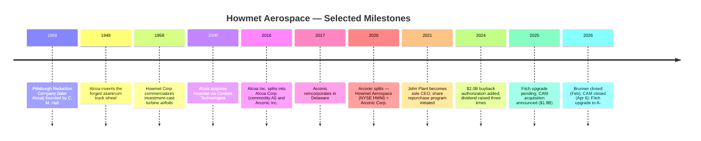
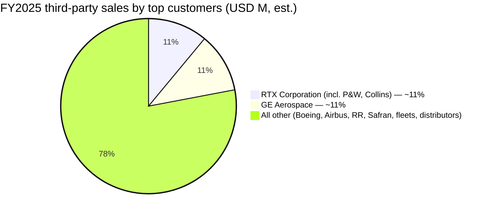
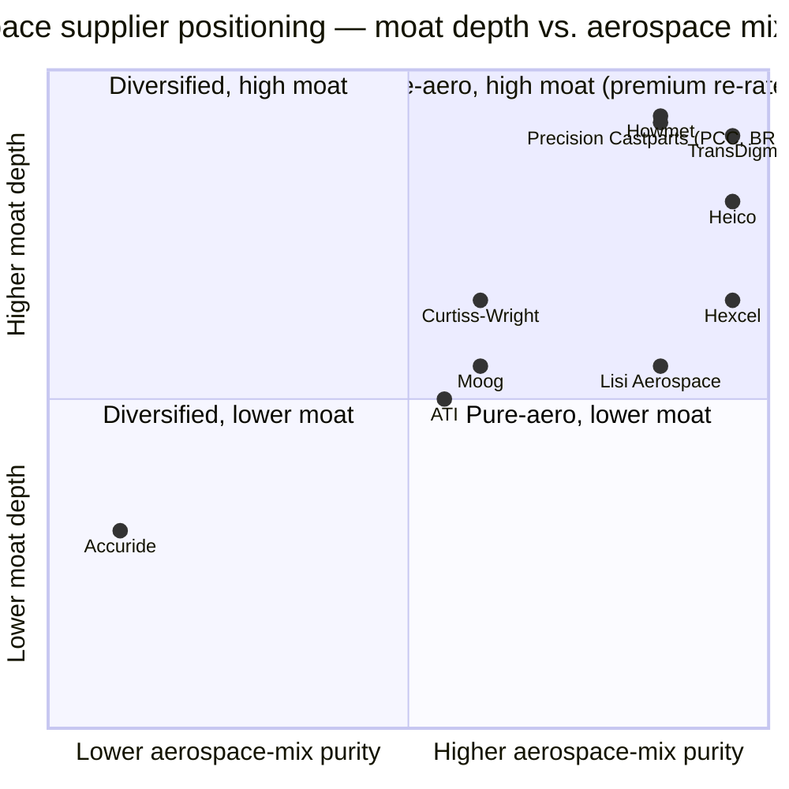

# COMPANY RESEARCH REPORT: Howmet Aerospace Inc. (NYSE: HWM)

**Date:** 2026-05-20
**Analyst report — initiating coverage**

> **Update — FY2026 guidance raised (2026-05-07):** Management raised full-year revenue guidance to USD 9.575–9.725B (baseline +$550M vs. prior baseline of $9.10B), Adjusted EBITDA to USD 3.025–3.095B (baseline +$300M / +140bps margin), and Adjusted EPS to USD 4.88–5.00 (baseline +$0.49 vs. prior $4.45). Free cash flow guide raised to USD 1.70–1.80B (+$150M). Drivers cited: 19% YoY Q1 revenue growth (commercial aerospace +20%, defense +10%, gas turbines +39%) plus net portfolio reshape (CAM acquisition added ~$275M revenue, Savannah disk-forging divestiture).
> Source: [Q1-FY2026 earnings press release, 2026-05-07](https://www.sec.gov/Archives/edgar/data/4281/000110465926056645/tm2613779d1_ex99-1.htm).

---

## TABLE OF CONTENTS
1. Company Overview
2. Company History
3. Management Team
4. Products & Services
5. Customers & Go-to-Market
6. Industry Overview
7. Competitive Landscape
8. Market Opportunity (TAM)
9. Risk Assessment
10. References

---

## 1. COMPANY OVERVIEW

Howmet Aerospace Inc. (NYSE: HWM) is a Pittsburgh, Pennsylvania–headquartered manufacturer of advanced engineered metal products for the aerospace, defense, gas-turbine and commercial-transportation industries. The company was created in its current form on **1 April 2020** when Arconic Inc. spun out its rolled-products, extrusions and building-products businesses (renamed Arconic Corporation, NYSE: ARNC) and the remaining engine-products, fastening, structures, and forged-wheels businesses were renamed Howmet Aerospace Inc. The lineage runs back through Arconic Inc. (the post-2016 renaming of Alcoa Inc.) to the original Alcoa, founded in 1888 ([Howmet 2025 Form 10-K, p. 1](https://www.sec.gov/Archives/edgar/data/4281/000000428126000012/hwm-20251231.htm)).

**What it does, in plain English.** Howmet makes the highest-temperature, highest-stress metal parts that go inside jet engines and on aircraft airframes — single-crystal nickel-superalloy turbine airfoils, seamless rolled rings, titanium forgings, aerospace fasteners — plus forged aluminum wheels for heavy-duty trucks. Management's own framing: "wingtip to wingtip, nose to tail, Howmet can produce more than 90% of all structural and rotating aero engine components" ([Howmet 2025 Form 10-K, p. 2](https://www.sec.gov/Archives/edgar/data/4281/000000428126000012/hwm-20251231.htm)).

**How it makes money.** Howmet sells engineered components directly to engine OEMs (RTX/Pratt & Whitney, GE Aerospace, Rolls-Royce, Safran, Honeywell), airframers (Boeing, Airbus, Lockheed Martin), Tier-1 fabricators (Spirit AeroSystems, GKN Aerospace), heavy-duty-truck OEMs (PACCAR, Daimler, Volvo), and into the engine aftermarket via spare-part orders that flow through both OEMs and independent MROs. Pricing is contract-based with cost-pass-through on metals (titanium, nickel, aluminum, cobalt) plus value-add margin; aftermarket pricing carries materially higher margins than OE because parts are repurchased under tightly qualified specifications. Management has steadily moved the mix toward higher-margin spares, which is the single most important lever in the FY2024–FY2026 margin expansion.

**Where it operates.** A global footprint across 23 countries with ~25,430 employees at year-end 2025. By point-of-shipment, North America generated 72% of FY2025 sales and Europe 22%; key plants include Whitehall, MI and Niles, OH (engine castings), La Porte, IN (fasteners), Cleveland, OH (engineered structures), Barberton, OH and Žatec, Czech Republic (forged wheels), Toulouse, France (fasteners), and operations in Japan, Hungary, Mexico, and Morocco ([Howmet 2025 Form 10-K, pp. 2, 4–6](https://www.sec.gov/Archives/edgar/data/4281/000000428126000012/hwm-20251231.htm)).

**Scale and segments.** Four reportable segments in 2025: Engine Products (FY25 revenue $4,320M, 52% of sales, 33.3% segment-Adj-EBITDA margin), Fastening Systems ($1,745M, 21%, 30.4%), Engineered Structures ($1,148M, 14%, 21.2%) and Forged Wheels ($1,039M, 13%, 28.5%). FY2025 consolidated revenue of **$8,252M** (+11% YoY), net income of **$1,508M** (+31%), diluted EPS of **$3.71** (+32%), free cash flow ~$1.2B, total Segment Adjusted EBITDA of **$2,507M** (30.4% consolidated margin) ([Howmet 2025 Form 10-K, pp. 21, 25–27](https://www.sec.gov/Archives/edgar/data/4281/000000428126000012/hwm-20251231.htm)). By end market, commercial aerospace was 52%, defense aerospace 17%, commercial transportation 15%, gas turbines 11%, and "other" 4%.

Source: [Howmet 2025 Form 10-K, pp. 21, 24–28](https://www.sec.gov/Archives/edgar/data/4281/000000428126000012/hwm-20251231.htm).

**Valuation snapshot (as of 2026-05-20).** Share price closed at **$261.62**, market capitalization **~$104.7B** (401.6M common shares outstanding at YE2025; 404M diluted; reduced by ~2.6M shares of repurchases in Jan–Apr 2026), enterprise value ~$107B (net debt ~$2.3B after $742M cash). On a trailing twelve-month basis Howmet trades at **TTM P/E 60.8×**, **TTM P/S 12.1×**, **EV/EBITDA 40.5×**, with a 0.19% dividend yield ($0.48 annualized vs. trailing $0.42) ([Yahoo Finance — HWM key statistics, 2026-05-20](https://finance.yahoo.com/quote/HWM/key-statistics/)). Three-year context: HWM has re-rated dramatically — the stock closed FY2022 at $39.49 (P/E ~25×), FY2023 at $54.18 (~30×), and the multiple has expanded as engine-aftermarket and gas-turbine demand have come through. The forward P/E of **43.7×** on consensus 2026 EPS is the more relevant anchor.

**Peer comparison.** TTM P/E across aerospace suppliers: TDG 37.5×, HEI 59.5×, CW 52.9×, MOG.A 35.6×, HXL 57.4×, GE Aerospace 37.2×, RTX 33.0× — median ex-HWM **52.9×**, mean **44.8×** ([Yahoo Finance peer pages, 2026-05-20](https://finance.yahoo.com/quote/TDG/key-statistics/)). HWM trades at a **~15% TTM P/E premium to HEICO, ~62% above TransDigm, and ~84% above RTX**, the largest engine-OEM customer. The premium is not anomalous given two things: (i) Howmet's mix is uniquely concentrated in the *highest-moat* aerospace pocket — single-crystal investment-cast turbine airfoils — where the qualified supplier list is effectively two (Howmet and Berkshire Hathaway's Precision Castparts Corp), and aftermarket attach is structurally rising; (ii) FY2026 Adjusted EBITDA margins guided at **31.7% baseline** are nearly 200bp above HEICO's TTM EBITDA margin and 750bp above RTX's, with operating leverage still to come. On EV/EBITDA Howmet's 40.5× is the highest in the group (vs. peer median 27× and TDG 19.4×), reinforcing that the premium is real and concentrated in margin-quality and aftermarket beta rather than top-line growth alone.

**Is the premium justified?** Partially. Howmet has the highest segment-mix concentration in engine-aftermarket exposure (Engine Products is 52% of sales and growing 16% in FY25), the cleanest balance sheet trajectory (Fitch upgrade to A- in February 2026, four notches into IG) ([Q1-FY2026 earnings press release, 2026-05-07](https://www.sec.gov/Archives/edgar/data/4281/000110465926056645/tm2613779d1_ex99-1.htm)), and the most active capital-return program ($700M buybacks + $181M dividends in FY25). The risk is that the multiple already discounts a multi-year narrowbody build-rate ramp plus a LEAP-engine MRO super-cycle running clean — if Boeing 737 production stalls below 38/month or the Airbus A320 supply chain slips further, the 60× P/E becomes the most expensive feature of the story. We treat the valuation as a *real risk* and surface it in Section 9.

---

## 2. COMPANY HISTORY

The Howmet story is the residue of three corporate separations stacked on top of one of America's oldest industrial companies. The original Alcoa was founded in **1888** as the Pittsburgh Reduction Company by Charles Martin Hall after his electrolytic-aluminum patent. Howmet Corporation itself was founded in 1926 as Howe Sound Company and pioneered the investment-casting process for jet-engine airfoils in the 1950s; Pechiney acquired Howmet in 1975, Cordant Technologies in 2000, Alcoa in 2000 ([Howmet — Company History page](https://www.howmet.com/about-us/history/)).

Source: [Howmet 2025 Form 10-K, pp. 1–5](https://www.sec.gov/Archives/edgar/data/4281/000000428126000012/hwm-20251231.htm); [Q1-FY2026 earnings press release, 2026-05-07](https://www.sec.gov/Archives/edgar/data/4281/000110465926056645/tm2613779d1_ex99-1.htm).

**Three strategic pivots define the present company.**

*Pivot 1 — the Alcoa split, November 2016.* Alcoa Inc. spun upstream aluminum (mining, smelting, refining — Alcoa Corp., NYSE: AA) from its downstream engineered-product businesses (Arconic Inc.). The *why* was simple: the commodity smelting business deserved a low-multiple, capital-return-heavy structure, while the engineered-products business deserved a growth-multiple. The market validated this by eventually re-rating Arconic well above commodity Al multiples ([Howmet 2025 Form 10-K, p. 1](https://www.sec.gov/Archives/edgar/data/4281/000000428126000012/hwm-20251231.htm)).

*Pivot 2 — the Arconic separation, April 2020.* Arconic Inc. itself split — Howmet retained the four highest-margin franchises (Engine Products, Fastening Systems, Engineered Structures, Forged Wheels), and Arconic Corporation took rolled aluminum sheet, extrusions, and building products. The motivation again was multiple-arbitrage: rolled aluminum is cost-pass-through with a single-digit EBITDA margin; investment-cast turbine airfoils are 30%+ EBITDA-margin franchises with effectively no qualified substitute. Howmet's subsequent re-rating from ~$17 in mid-2020 to $260+ in mid-2026 is the empirical proof that the split was correctly thesised.

*Pivot 3 — the deleverage + capital return cycle, 2021–2025.* Under John Plant the company prioritized debt reduction over volume growth. Total debt fell from ~$4.9B in 2020 to $3,050M at YE2025 (a net $265M reduction in 2025 alone via early redemption of the 5.900% 2027 Notes), and 2025 debt actions are projected to reduce annualized interest expense by ~$22M ([Howmet 2025 Form 10-K, p. 32](https://www.sec.gov/Archives/edgar/data/4281/000000428126000012/hwm-20251231.htm)). Simultaneously, the company has authorized a cumulative $3,500M of share repurchases (most recently +$2,000M in July 2024), has consistently bought back at scale ($250M in 2023, $500M in 2024, $700M in 2025, $300M in Q1 2026 + $150M in April 2026 — average price $230.43 in Q1 and $246.18 in April), and has lifted the common-stock dividend from $0.04/quarter at re-initiation to $0.12/quarter in 2026.

**Recent (2025–2026) developments.** On **22 December 2025** Howmet announced the acquisition of **Consolidated Aerospace Manufacturing, LLC (CAM)** from Stanley Black & Decker for ~$1.8B cash, closed 6 April 2026 ([2025-12-22 Regulation FD 8-K](https://www.sec.gov/Archives/edgar/data/4281/000110465925123518/tm2534069d1_ex99-1.htm)). CAM makes precision fasteners, fluid fittings, and complex parts for aerospace and defense; it slots into Fastening Systems and is the first material bolt-on since the 2020 spin. On **6 February 2026** the company closed the smaller Brunner Manufacturing Co. acquisition (Mauston, Wisconsin; ~$120M; larger-size aero fasteners). On **31 March 2026** Howmet *divested* its Savannah, GA disk-forging facility for ~$230M, recording a $93M pre-tax gain — explicitly characterised by management as a portfolio-optimization sale toward higher-margin franchises ([Q1-FY2026 earnings press release, 2026-05-07](https://www.sec.gov/Archives/edgar/data/4281/000110465926056645/tm2613779d1_ex99-1.htm)). The net portfolio reshape adds ~$275M to FY2026 revenue, contributes ~$0 in 2026 EPS, with full accretion expected in 2027.

---

## 3. MANAGEMENT TEAM

The most important data point about Howmet's management is that the same person — **John Plant** — has been simultaneously Chairman of the Board (since October 2017), sole CEO (since October 2021, co-CEO before that), and the architect of every meaningful strategic decision in the post-Arconic Inc. era. He is 72 years old, and the Board has only just (May 2025) renewed his employment agreement through a multi-year horizon, signaling no near-term succession event.

**John C. Plant — Executive Chairman and Chief Executive Officer.** Age 72; director since 2016; Board chair since 2017; CEO of Arconic Inc. from February 2019 through the April 2020 separation, then co-CEO of Howmet 2020–2021, sole CEO since October 2021 ([Howmet 2025 Form 10-K, p. 7](https://www.sec.gov/Archives/edgar/data/4281/000000428126000012/hwm-20251231.htm); [2026 Proxy Statement, p. 13](https://www.sec.gov/Archives/edgar/data/4281/000110465926039940/tm2606852-2_def14a.htm)). Plant is a Fellow of the Institute of Chartered Accountants (UK), and before Howmet built one of the larger global auto-parts businesses of the 2000s: he was President & CEO of TRW Automotive from 2003 to 2015, taking it from a Northrop Grumman carve-out through IPO and ultimately to its $13.5B sale to ZF Friedrichshafen in May 2015. Under his leadership TRW Automotive grew to ~65,000 employees across ~190 facilities and ranked in the global top-10 auto suppliers. Pre-TRW Automotive he was co-member of the Chief Executive Office of TRW Inc. (2001–2003), EVP from 1999 (following the LucasVarity acquisition), and President of LucasVarity Automotive from 1997 to its 1999 sale to TRW. Plant is also a director of Jabil Circuit Corporation and Masco Corporation; prior directorships include Gates Industrial PLC (2017–2019) and TRW Automotive Holdings (2011–2015) ([2026 Proxy Statement, pp. 13–14](https://www.sec.gov/Archives/edgar/data/4281/000110465926039940/tm2606852-2_def14a.htm)). The Plant playbook at Howmet has been consistent and disciplined: shed lower-margin businesses (Engineered Structures footprint rationalization), deleverage aggressively (debt down ~38% from 2020 peak), expand higher-margin franchises (Engine Products capex), and return excess cash to shareholders (>$2B in cumulative buybacks since 2020 and a steadily climbing dividend). His comp is heavily equity-weighted (PRSUs comprise the majority of LTI), and he is required to hold equity at 6× base salary; the proxy notes all NEOs except the newest CFO have met their ownership requirements ([2026 Proxy Statement, p. 39](https://www.sec.gov/Archives/edgar/data/4281/000110465926039940/tm2606852-2_def14a.htm)). The track record is strong enough that markets do not yet price succession risk, but at 72 it is a real concern (see Section 9).

**Patrick J. Winterlich — Executive Vice President and Chief Financial Officer (since 1 December 2025).** Age 56. Winterlich joined Howmet directly from **Hexcel Corporation** — one of the peers in our comp set — where he served as EVP & CFO from 2017 through November 2025 and had been with Hexcel since 1998 in increasing finance, operations and IT roles ([Howmet 2025 Form 10-K, p. 7](https://www.sec.gov/Archives/edgar/data/4281/000000428126000012/hwm-20251231.htm)). At Hexcel he was the public-company CFO through the COVID-era cycle for a pure-play composites-into-aerospace business, the closest possible substitute for the Howmet seat. He received a one-time sign-on cash payment and a $150K relocation payment from Connecticut to Pittsburgh; base salary is $700,000 ([2026 Proxy Statement, p. 60](https://www.sec.gov/Archives/edgar/data/4281/000110465926039940/tm2606852-2_def14a.htm)). He replaces Kenneth J. Giacobbe, who served as CFO from the 2020 separation through 30 November 2025, retired on 31 December 2025 after a one-month transition as "special advisor to the CEO." Winterlich's appointment is significant for two reasons: (i) he brings deep composites-supply-chain knowledge that will be useful if Howmet ever ventures into composite-airfoil substitution, and (ii) his arrival immediately precedes the company's largest M&A integration since the 2020 separation (CAM). Investors should watch his first 12 months for any change to the capital-allocation cadence.

**Neil E. Marchuk — Executive Vice President and Chief Administrative Officer.** Age 68. Marchuk has the longest tenure of the named officers under Plant, having served as EVP & CHRO from March 2019 (the start of Plant's CEO tenure at Arconic) through August 2025 when he was elevated to CAO. He has twice served as interim segment president — Engineered Structures (Oct 2023–Apr 2024) and Fastening Systems (Nov 2022–May 2023) — and after Lola Lin's resignation in September 2025 also oversees Legal and Compliance pending a permanent General Counsel appointment ([Howmet 2025 Form 10-K, p. 7](https://www.sec.gov/Archives/edgar/data/4281/000000428126000012/hwm-20251231.htm)). Pre-Howmet he was EVP & CHRO at Adient (Jan 2016–Feb 2019) and EVP HR at TRW Automotive under Plant (Jul 2006–May 2015) — the Plant-Marchuk operating partnership is the longest continuous executive relationship in the company.

**Michael N. Chanatry — Vice President and Chief Commercial Officer.** Age 65. The commercial face of the company in front of OEM customers, Chanatry has the deepest direct industry credentials of the executive team: prior to Howmet he was VP Supply Chain for GE Power (2015–2018), with earlier supply-chain GM roles at GE Appliances (2013–2015), GE Aviation Systems (2009–2013), and Lockheed Martin (1983–2009) ([Howmet 2025 Form 10-K, p. 7](https://www.sec.gov/Archives/edgar/data/4281/000000428126000012/hwm-20251231.htm)). The GE Aviation linkage is meaningful — GE Aerospace is one of Howmet's two largest customers — but his arrival pre-dates the Engine Products aftermarket surge and the company-wide pricing reset that has driven margins from 18% to 30%+; that is more Plant's signature than Chanatry's.

**Governance.** Nine-member Board, with 89% independent directors (8 of 9). The lone non-independent is Plant given the combined Chairman/CEO role; the Board mitigates with a strong Independent Lead Director — **James F. Albaugh**, formerly President & CEO of Boeing Commercial Airplanes (2009–2012) and President & CEO of Boeing Integrated Defense Systems (2002–2009) — who has held the role since 2020 ([2026 Proxy Statement, p. 8](https://www.sec.gov/Archives/edgar/data/4281/000110465926039940/tm2606852-2_def14a.htm)). Other notable directors: Ulrich R. Schmidt (former EVP & CFO, Spirit AeroSystems), Lynn Elsenhans (former Sunoco Chairman/CEO), and Gunner S. Smith (CEO, Cornerstone Building Brands). Insider ownership is meaningful: Plant alone holds >$200M of HWM equity, and the proxy explicitly cites a 6× base-salary holding requirement for the CEO (only unvested RSUs/PRSUs do not count). 2025 say-on-pay passed with strong support. Compensation is heavily equity-weighted with PRSUs tied to TSR-relative and ROIC metrics ([2026 Proxy Statement, pp. 47, 55–62](https://www.sec.gov/Archives/edgar/data/4281/000110465926039940/tm2606852-2_def14a.htm)). The auditor is PricewaterhouseCoopers LLP (ratification proposed for 2026); the compensation peer group includes Otis, Textron, Hubbell, Parker-Hannifin, TransDigm, Illinois Tool Works, Rockwell Automation — appropriately diversified industrials, not pure aerospace.

**Track-record synthesis.** This is a Plant-led company first, an aerospace company second. The five-year stock chart (>14× from spin) is the headline scoreboard, but the substantive evidence is the simultaneous margin expansion (consolidated EBITDA margin from ~16% in 2020 to 30.4% in 2025), deleverage (~$1.8B net debt reduction), and cash return ($2.0B+ buybacks). The gaps are the same as the strengths: the company is unusually dependent on one executive who is 72, the new CFO is on day one of integrating a $1.8B acquisition, and there is no externally visible bench of segment presidents.

---

## 4. PRODUCTS & SERVICES

Howmet is organized into four segments, each with a clearly identifiable flagship franchise and a small tail. We walk all four below; product family detail is grounded in the company's own product navigation tree at [howmet.com/products](https://www.howmet.com/products/) cross-checked with the 10-K segment description.

```mermaid
graph TD
    HWM[Howmet Aerospace]
    HWM --> EP[Engine Products<br/>$4,320M / 52%]
    HWM --> FS[Fastening Systems<br/>$1,745M / 21%]
    HWM --> ES[Engineered Structures<br/>$1,148M / 14%]
    HWM --> FW[Forged Wheels<br/>$1,039M / 13%]
    EP --> EP1[Single-crystal investment-cast airfoils<br/>LEAP / GTF / GE9X / GEnx / F135]
    EP --> EP2[Seamless rolled rings — Ni superalloy]
    EP --> EP3[Jet-engine disks, structurals]
    EP --> EP4[Industrial gas-turbine airfoils]
    FS --> FS1[Aerospace Hi-Lok / Eddie-Bolt / Composi-Lok]
    FS --> FS2[Industrial / wind-turbine fasteners]
    FS --> FS3[Commercial truck — Huck fasteners]
    FS --> FS4[CAM precision fittings — post Apr-2026]
    ES --> ES1[Titanium ingot / mill products]
    ES --> ES2[Ti forgings — wing, landing gear]
    ES --> ES3[Al / Ni forgings / machining]
    FW --> FW1[Alcoa® Wheels MagnaForce® alloy]
    FW --> FW2[Dura-Bright® surface finishes]
    FW --> FW3[Forged Al heavy-truck / bus / trailer wheels]
```

Source: [Howmet — Engine Products page](https://www.howmet.com/products/engine-products/); [Fastening Systems page](https://www.howmet.com/products/fastening-systems/); [Engineered Structures page](https://www.howmet.com/products/engineered-structures/); [Forged Wheels — Alcoa Wheels](https://www.howmet.com/products/wheels/); [Howmet 2025 Form 10-K, pp. 3–5](https://www.sec.gov/Archives/edgar/data/4281/000000428126000012/hwm-20251231.htm).

Source: [Howmet 2025 Form 10-K, pp. 25–27](https://www.sec.gov/Archives/edgar/data/4281/000000428126000012/hwm-20251231.htm).

### 4.1 Engine Products — the moat business

**What it sells.** Single-crystal nickel-superalloy turbine airfoils (rotating high-pressure-turbine blades and stator vanes), nickel-superalloy seamless rolled rings for engine cases and combustors, jet-engine disks, and structural castings. The same technology supplies the heavy-duty industrial gas-turbine market that drives data-center back-up power and grid baseload. End programs covered: CFM LEAP-1A/-1B (Airbus A320neo / Boeing 737 MAX), Pratt & Whitney PW1100G/GTF (A320neo) and PW1500G (A220), GE9X (Boeing 777-X), GE/RR Trent XWB (A350), GEnx (787), Honeywell HTF7000, RTX F135 (F-35), Rolls-Royce Trent / RR300, and the GE7HA / Siemens 9HA / Mitsubishi M501J industrial gas turbines.

**Competitive-advantage verdict — YES, strongest moat in the portfolio.** Moat type: *technology + regulatory/certification + supplier concentration*. Single-crystal directional-solidification investment casting of nickel-superalloy airfoils is a process developed over 50 years at Howmet (Whitehall, MI and Niles, OH) and at Berkshire Hathaway's Precision Castparts Corporation (PCC); the global qualified-supplier list per major engine program is effectively those two names plus a handful of captive in-house operations (RTX/P&W has captive capacity, as does GE Aerospace, though they continue to buy from Howmet) ([Howmet 2025 Form 10-K, pp. 5–6](https://www.sec.gov/Archives/edgar/data/4281/000000428126000012/hwm-20251231.htm)). Switching a qualified airfoil supplier requires multi-year requalification on the FAA Type Certificate; the practical answer is that incumbents stay incumbents through the program life. The economic evidence: FY2025 Engine Products segment-Adj-EBITDA margin of **33.3%** is up from 27.2% in 2023 — 610bp of expansion in two years, even with the segment absorbing ~1,445 net new headcount in 2025 for capacity expansion (which is itself dilutive in the near term) ([Howmet 2025 Form 10-K, p. 25](https://www.sec.gov/Archives/edgar/data/4281/000000428126000012/hwm-20251231.htm)). 33.3% segment-EBITDA margin is comparable to TransDigm's overall company margin and meaningfully above Heico's; for a metal-forming business that is rarefied air.

**Closest competitor product.** Berkshire Hathaway's **Precision Castparts Corp (PCC)** — Wyman-Gordon airfoils and structural castings, acquired by Berkshire in 2016 for $32B. PCC is the only true peer in single-crystal airfoils; competitive position is *at parity in technology, slightly behind in scale*. PCC has more total casting capacity but is private and has historically been less focused on aftermarket capture. Other competitors at the edges: Doncasters Group Ltd (UK), Consolidated Precision Products (CPP, owned by Warburg Pincus and Berkshire Partners), and the in-house capacity of RTX/P&W and Rolls-Royce ([Howmet 2025 Form 10-K, p. 6](https://www.sec.gov/Archives/edgar/data/4281/000000428126000012/hwm-20251231.htm)).

### 4.2 Fastening Systems — the LEAP-build leverage

**What it sells.** Aerospace fasteners — Hi-Lok and Eddie-Bolt high-strength bolts, Composi-Lok blind fasteners for composites, multi-grip and lockbolt systems used "nose to tail" on aircraft and engines; industrial fasteners for wind-turbine, solar, and material handling; commercial-truck Huck-brand structural fasteners. Post-April 2026, the segment also includes CAM precision fittings and fluid fittings. Channels: direct to OEMs (Boeing, Airbus, engine OEMs) and through aerospace distributors. Generally USD/GBP/EUR pricing with material-cost pass-throughs.

**Competitive-advantage verdict — YES, partial moat.** Moat type: *certification + scale + brand*. Aerospace fasteners are heavily qualified (NADCAP, Boeing/Airbus AVL approval), with switching costs not as extreme as airfoils but still measured in years for any new approval. Howmet's flagship Hi-Lok product family was originally developed by Hi-Shear (1960s), now Howmet brand. FY2025 Fastening Systems segment-Adj-EBITDA margin reached **30.4%**, up from 20.6% in 2023 — 980bp expansion in two years driven by commercial-aerospace mix shift, productivity, and FX ([Howmet 2025 Form 10-K, p. 25](https://www.sec.gov/Archives/edgar/data/4281/000000428126000012/hwm-20251231.htm)).

**Closest competitor product.** **Lisi Aerospace** (France) — Hi-Lok and lockbolt equivalents serving Airbus prime; PCC's PCC Fasteners division; Arconic Corp.'s ATS fasteners (legacy spin-off); B/E Aerospace (now RTX Collins) for galleys and seating fasteners. Position: *roughly at parity vs. Lisi on Hi-Lok / Eddie-Bolt; ahead in Composi-Lok composite blind-fastening technology; ahead in industrial / Huck commercial-truck brand*.

### 4.3 Engineered Structures — the catch-up margin story

**What it sells.** Titanium ingots and mill products (the company has its own Ti melt furnaces, used internally and sold externally), Ti forgings for wing structures, landing gear and aero-engines, Ti extrusions; aluminum forgings, nickel forgings, machined aluminum components and assemblies. Principal end programs: Boeing 787 wing components, F-35 / F-22 / B-21 (defense), A350 / 787 landing-gear forgings (typically to Heroux-Devtek or Safran Landing Systems).

**Competitive-advantage verdict — PARTIAL.** Moat type: *vertical integration into Ti melt + certification*. The segment carries the lowest margin of the four (21.2% in FY2025, up from 12.9% in FY2023). Management has repeatedly emphasized "rationalization of product mix in order to maximize profitability" — translation: shed low-margin work, hold capacity for defense, walk away from cost-plus aircraft programs that don't earn returns. The 31 March 2026 sale of the Savannah, GA disk-forging facility (~$230M cash, $93M pre-tax gain) is the most concrete recent example ([Q1-FY2026 earnings press release, 2026-05-07](https://www.sec.gov/Archives/edgar/data/4281/000110465926056645/tm2613779d1_ex99-1.htm)). The titanium-ingot melt capacity is genuinely scarce (one of the few non-Russian, non-VSMPO sources globally), and that is the part of the segment with the strongest moat.

**Closest competitor product.** **VSMPO-AVISMA** (Russia) for Ti ingot — historically the largest non-captive Ti supplier; sanctions and the Russia-Ukraine war have created ongoing supply uncertainty. **ATI Inc. (High-Performance Materials & Components segment)** for Ti mill products and precision forgings. **Aubert & Duval** (jointly held by Airbus, Safran, Tikehau Capital, France) for precision Ni / Ti forgings. **Weber Metals (Otto Fuchs)** for very large Al/Ti die forgings. Position: *roughly at parity in Ti forging; slightly behind ATI on Ti mill product breadth; ahead in vertical melt-to-forging integration*.

### 4.4 Forged Wheels — the cash cow

**What it sells.** Forged aluminum wheels for Class 8 trucks, trailers and buses worldwide, sold under the **Alcoa® Wheels** brand under an exclusive trademark license from Alcoa Corp. Key product attributes: MagnaForce® proprietary aluminum alloy (high strength-to-weight), Dura-Bright® surface treatment (corrosion-resistant, easy-clean). The company *invented* the forged-aluminum truck wheel in 1948 ([Howmet 2025 Form 10-K, p. 3](https://www.sec.gov/Archives/edgar/data/4281/000000428126000012/hwm-20251231.htm); [Howmet — Wheels page](https://www.howmet.com/products/wheels/)).

**Competitive-advantage verdict — YES, brand + cost leadership, but cyclical.** Margin is stably high (28.5% segment-Adj-EBITDA in 2025), and even in a down year (FY2024 wheels revenue -8% YoY in 2024, -1% in 2025), the segment held EBITDA margin within a 130bp band. The Alcoa® Wheels brand is the gold standard among North American Class 8 fleet buyers for resale-value-preservation and corrosion resistance. The vulnerability is the import threat from China, Taiwan, India, South Korea and Turkey — the 10-K specifically calls this out as an increasing threat ([Howmet 2025 Form 10-K, p. 6](https://www.sec.gov/Archives/edgar/data/4281/000000428126000012/hwm-20251231.htm)).

**Closest competitor product.** **Accuride Corporation** (private; backed by Crestview Partners) — the second-largest forged-Al-wheel supplier in North America. **Speedline (Ronal Group), Nippon Steel, Dicastal North America, Alux Co., Wheels India Ltd.** Position: *ahead in North American Class 8 brand and OE channel; at parity in Europe; behind in low-end Asia cast aluminum*.

### 4.5 Flagship vs. long-tail

**Flagship (1–3 products driving the business):**
1. Single-crystal investment-cast turbine airfoils (Engine Products) — the largest, highest-margin, and most defensible franchise.
2. Aerospace fastener portfolio (Fastening Systems) — Hi-Lok, Eddie-Bolt, Composi-Lok; the second-largest contribution to operating income.
3. Seamless rolled rings (Engine Products) — niche but very high margin, critical for new engine programs.

**Long-tail / lower-priority:** Commercial Transportation fasteners (Huck) — facing a 2024–2026 cyclical trough; Engineered Structures non-defense forgings (being actively rationalized); industrial fasteners for material handling and renewables.

### 4.6 Last-12-month launches, repositions, divestitures

- **Acquisition — Brunner Manufacturing Co. Inc.**, closed 6 February 2026 for ~$120M cash; integrates into Fastening Systems; adds larger-size fasteners.
- **Acquisition — Consolidated Aerospace Manufacturing (CAM)**, announced 22 December 2025 and closed 6 April 2026 for ~$1.8B cash. CAM makes precision fasteners, fluid fittings and complex engineered parts for aerospace/defense; integrates into Fastening Systems.
- **Divestiture — Savannah, GA disk-forging facility**, sold 31 March 2026 for ~$230M cash (within Engineered Structures); $93M pre-tax gain recorded as a special item.
- **Internal segment realignment (Q1 2026)** — a Ti alloy production operation moved from Engine Products to Engineered Structures for operational alignment; prior periods recast.
- **End-market disclosure change (Q4 2025)** — industrial gas turbine and oil & gas combined into a single "Gas Turbines" line; "general industrial" reclassified to "Other" ([Howmet 2025 Form 10-K, p. 3](https://www.sec.gov/Archives/edgar/data/4281/000000428126000012/hwm-20251231.htm)).

---

## 5. CUSTOMERS & GO-TO-MARKET

**End-market mix (FY2025 revenue, USD M, total $8,252M):** Commercial Aerospace **$4,322M / 52%**, Defense Aerospace **$1,409M / 17%**, Commercial Transportation **$1,248M / 15%**, Gas Turbines **$944M / 11%**, Other **$329M / 4%** ([Howmet 2025 Form 10-K, p. 56](https://www.sec.gov/Archives/edgar/data/4281/000000428126000012/hwm-20251231.htm)).

Source: [Howmet 2025 Form 10-K, p. 56](https://www.sec.gov/Archives/edgar/data/4281/000000428126000012/hwm-20251231.htm).

**Customer concentration — quantified.** The 10-K discloses customers above the 10% threshold of consolidated revenue (ASC 280-10-50-42). In 2025, **RTX Corporation (parent of Pratt & Whitney and Collins Aerospace) represented approximately 11%** of consolidated third-party sales, and **GE Aerospace (the renamed General Electric spin-off) represented approximately 11%** ([Howmet 2025 Form 10-K, p. 9](https://www.sec.gov/Archives/edgar/data/4281/000000428126000012/hwm-20251231.htm)). The 10-K explicitly identifies these as the only two customers above 10%; no other named customer crosses the threshold. **Top-2 customer concentration is therefore ~22%, and the top-5 is estimated at 35–40%** (Boeing, Airbus, and Rolls-Royce each likely sit in the 4–8% range based on the airframe/engine OE mix, but Howmet does not break this out at the customer level). The trend has been steady — in the FY2024 10-K, RTX and GE Aerospace were also each ~11%; in FY2023 they were also at or just above 10%. **Both top customers are material engine OEMs and effectively "competitors" in the sense that both have captive single-crystal-airfoil casting capacity** that could in principle be expanded, although the practical capacity to displace Howmet is constrained by certification and capex timeline.

Source: [Howmet 2025 Form 10-K, p. 9](https://www.sec.gov/Archives/edgar/data/4281/000000428126000012/hwm-20251231.htm) (named ≥10% customers; remaining mix estimated from segment / end-market disclosures).

**Material risk per our quality checklist?** Yes — top-1 RTX at 11% and top-2 GE Aerospace at 11% means top-5 likely exceeds the 30% threshold; we surface customer concentration as a risk in Section 9. The mitigant is that the same customers buy across multiple Howmet platforms (airfoils, rings, fasteners) and on multiple engine programs (LEAP, GTF, GEnx, GE9X, T700), which is a structurally diversified relationship rather than a single-program exposure. The loss of either customer would be catastrophic, but the *probability* is low — the qualified-supplier substitution path takes 3–5 years and the engine programs Howmet sits on are designed-in for the life of the airframe.

**Customer-by-segment overlay.** In Engine Products, the customers are engine OEMs: RTX/P&W, GE Aerospace, Rolls-Royce, Safran (via CFM JV with GE), Honeywell, plus heavy-duty gas-turbine OEMs Siemens Energy, Mitsubishi Power and GE Vernova. In Fastening Systems and Engineered Structures, customers are split among airframers (Boeing, Airbus, Lockheed Martin, Northrop Grumman), engine OEMs, and Tier-1 fabricators (Spirit AeroSystems, GKN Aerospace, Heroux-Devtek). In Forged Wheels, customers are heavy-truck OEMs (PACCAR/Kenworth/Peterbilt, Daimler/Freightliner, Volvo/Mack, Navistar/International, plus EU brands), plus aftermarket distribution.

**Contract structure.** Long-term agreements with engine OEMs are typical — multi-year master supply agreements with annual pricing windows, often tied to a specific engine program (e.g., a long-term LEAP airfoil agreement with CFM). Material costs (Ni, Ti, Co, Al) generally pass through via formula in these contracts, though with a lag of one to two quarters that can compress margins in periods of fast input-cost moves. Spares orders are PO-based but priced under aftermarket schedules that carry materially higher margins than OE. Truck wheels are mixed — multi-year OE agreements with PACCAR, Volvo and Daimler, plus distributor relationships for the aftermarket.

**Channels.** ~95% direct to OEM / Tier-1 customers; aerospace fasteners and some truck wheels go through specialized distributors (Wesco/Marvels for fasteners, fleet-aftermarket distributors for wheels). The Engine Products business is **almost entirely direct**.

**Sales cycle.** New-program design-ins take 5–10 years (engine development timeline). Once qualified, the program-life supply position is typically secured for 20+ years (the LEAP-1A first entered service in 2016 and will be in production through ~2035 minimum). This is the structural reason Engine Products economics behave more like a software-platform business than a metal-forming business.

**Geographic mix.** North America 72% / Europe 22% / Rest of World 6% (Japan, China, etc.) of FY2025 sales by point of shipment ([Howmet 2025 Form 10-K, p. 1](https://www.sec.gov/Archives/edgar/data/4281/000000428126000012/hwm-20251231.htm)). True end-demand is somewhat more diversified because aircraft built in Toulouse or Tianjin are exported globally.

**Named recent wins / press.** The company does not disclose individual program wins by name, but the 16% YoY Engine Products growth in 2025 implies share gains on the LEAP-1A/-1B airfoil and the GTF after-market — both consistent with sell-side commentary on a multi-year LEAP MRO shop-visit surge running into 2027.

---

## 6. INDUSTRY OVERVIEW

**Industry definition.** Howmet operates at the intersection of (a) **commercial aerostructures and aero-propulsion components** (NAICS 336412 Aircraft Engine and Engine Parts Manufacturing; NAICS 336413 Other Aircraft Parts and Auxiliary Equipment), (b) **defense aerospace components**, (c) **industrial gas-turbine components** (NAICS 333611), and (d) **forged aluminum heavy-truck wheels** (NAICS 336390). Adjacent industries include titanium mill products (NAICS 331410) and specialty-metals investment casting (NAICS 331512).

**Market sizing — aerospace.** The global commercial-aircraft new-build market is anchored by the Boeing/Airbus duopoly. Airbus delivered **766 aircraft in 2024** (largely A320neo family) and is targeting **820 in 2025** ramping toward an A320 family build rate of **75/month by 2027** ([Airbus 2024 Annual Report — Industrial Performance section, 2025-02-20](https://www.airbus.com/en/investors/financial-results-annual-reports)). Boeing delivered **348 commercial aircraft in 2024** and is in a constrained ramp on the 737 MAX following the January 2024 Alaska Airlines door-plug incident; the FAA imposed a cap of **38 737s per month**, which Boeing has worked toward through 2025 ([Boeing 2024 Annual Report, 2025-02-04](https://www.boeing.com/investors/annual-reports.page); [FAA Statement on Boeing 737-9 MAX, 2024-01-24](https://www.faa.gov/newsroom/faa-statement-boeing-737-9-max)). The combined backlog at the two OEMs is at record levels (~13,000+ unfilled orders), corresponding to ~10 years of production at current rates.

For Howmet specifically, **shipset content** is the key metric — how much Howmet content goes onto a given aircraft. Sell-side and management commentary place this in the range of **$1.0–1.2M per A320neo / 737 MAX shipset** (split across airfoils for LEAP-1A/LEAP-1B and GTF, plus fasteners and some Ti forgings) and **$1.6–1.9M per 787 / A350 shipset** (widebody engines, more Ti structure). These imply that a 1-unit/month improvement in A320 or 737 build rate translates into ~$15–25M of annualized Howmet revenue, with high incremental margins because the production capacity is largely in place.

**Aftermarket — the bigger driver in 2025–2027.** The LEAP-1A/-1B entered service in 2016; the high-pressure-turbine airfoil and combustor liner are scheduled for first shop visits typically at 6,000–10,000 flight cycles, which puts the first wave of LEAP MRO heavily into the 2025–2027 window. Pratt & Whitney's PW1100G (GTF) has had a well-publicized powdered-metal contamination issue affecting high-pressure-turbine disks that has driven an extraordinary wave of accelerated shop visits since 2023, resulting in elevated parts demand throughout 2025 and 2026 — RTX has disclosed cumulative GTF AOG-related cash impact in the **$3–3.5B** range across multi-year disclosure ([RTX 2024 Q4 Earnings press release, 2025-01-28](https://www.rtx.com/news/news-center/2025/01/28)). This is structurally bullish for Howmet's aftermarket airfoil and ring business.

**Gas turbines — the data-center tailwind.** Industrial gas turbines for power generation have surged because of data-center electricity demand. Order books at GE Vernova, Siemens Energy and Mitsubishi Power are extended into 2028–2029 ([Reuters — GE Vernova orders backlog, 2025-04-23](https://www.reuters.com/business/energy/ge-vernova-q1-2025/)). Howmet's gas-turbine revenue grew **25% in 2025** (to $944M from $755M) and **39% YoY in Q1 2026**, by far the fastest-growing end market within the portfolio ([Q1-FY2026 earnings press release, 2026-05-07](https://www.sec.gov/Archives/edgar/data/4281/000110465926056645/tm2613779d1_ex99-1.htm)). Management has called this out as a multi-year tailwind in earnings commentary.

**Defense aerospace.** US DoD outlays for F-35, B-21 Raider, T-7 trainer, and missile defense are growing; FY2026 US Defense budget topline of ~$895B with elevated aircraft procurement is supportive ([US DoD FY2026 Budget Request — Aircraft Procurement, 2025-03-10](https://comptroller.defense.gov/Budget-Materials/)). Howmet's defense aerospace revenue grew **21% in 2025 to $1,409M** and 10% in Q1 2026.

**Commercial transportation.** The opposite story — North American Class 8 truck production has been in a freight-recession trough since mid-2023, with ACT Research forecasts pointing to a 2026 H2 recovery ([ACT Research — North American Commercial Vehicle Outlook, 2025-Q4](https://www.actresearch.net)). Forged Wheels revenue fell 8% in 2024 and 1% in 2025 (largely volume-related, partially offset by Al cost pass-through). Management has guided commercial transportation flat-to-low single-digit decline in H1 2026 with recovery in H2.

**Industry growth rates.**
- **Commercial-aero OE production:** Airbus targeting +13% deliveries 2024→2025 and a multi-year ramp to A320 75/mo by 2027. Boeing path more uncertain but base case implies low-teens% production growth from FAA-capped 38/mo levels through 2027 if certification and quality milestones are met.
- **Commercial-aero aftermarket / engine spares:** mid-teens% growth in 2025–2026 driven by LEAP MRO wave + GTF AOG accelerated shop visits.
- **Defense aerospace:** mid-to-high single-digit% growth driven by F-35 production, B-21 ramp, and engine programs.
- **Industrial gas turbines:** 15–25% growth across 2025–2026 driven by data-center electricity demand.
- **Heavy-truck wheels:** flat to down 2024–H1 2026; modest recovery H2 2026 onward.

**Regulatory environment.** Aerospace components are FAA / EASA Type Certificate–regulated; supplier approvals are governed by Boeing/Airbus AVL processes and NADCAP accreditation for special processes (heat treat, NDT, casting, coating). The FAA quality-oversight intensification on Boeing in 2024–2025 has slowed line-of-credit progression in supplier expansions but not fundamentally re-shaped the qualified supplier base. Tariff and trade policy is a live factor — the 10-K specifically calls out "2025 and early 2026 executive orders in the U.S. for the imposition of new tariffs" as a source of uncertainty for raw-material costs and customer pricing ([Howmet 2025 Form 10-K, pp. 8–9](https://www.sec.gov/Archives/edgar/data/4281/000000428126000012/hwm-20251231.htm)).

**Industry structure.** *Highly consolidated upstream, fragmented downstream.* Upstream Ti melt is dominated by VSMPO (~30% global), Howmet's own Ti-melt operation, Toho Titanium, ATI, and Allegheny Titanium. Investment-cast airfoils are effectively a duopoly (Howmet + PCC). Aerospace fasteners are a small oligopoly (Howmet, PCC/Pyramid, Lisi, Arconic/ATS). Forged truck wheels in North America are concentrated (Howmet/Alcoa Wheels + Accuride dominate). The aerospace OEM customer base is concentrated too — Boeing, Airbus, RTX, GE Aerospace, Rolls-Royce, Safran, Honeywell, Lockheed Martin, Northrop Grumman. Supplier-buyer power is therefore mutually-dependent: Howmet is a small set of essential suppliers to a small set of essential buyers, which is why the business carries pricing power but also customer concentration.

---

## 7. COMPETITIVE LANDSCAPE

Positioning is qualitative, derived from segment-mix disclosure in each company's most recent 10-K and analyst commentary; see sources cited inline below.

**Direct competitors (covered in Howmet 10-K, p. 6).**

**Berkshire Hathaway / Precision Castparts Corporation (PCC) — direct duopoly partner in single-crystal airfoils.** Acquired by Berkshire for $32.1B in 2016; private since. PCC competes in titanium and Ti-based alloys, precision forgings, seamless rolled rings, investment castings (including airfoils), and aerospace fasteners — the broadest direct overlap with Howmet of any peer. Berkshire took a ~$10B write-down on PCC in 2020 ([Berkshire Hathaway 2020 10-K, p. K-37](https://www.sec.gov/Archives/edgar/data/1067983/000119312521046996/d12089d10k.htm)) reflecting the aerospace cycle, but the franchise has since recovered. PCC's lack of public disclosure makes direct comparison difficult, but Berkshire's 2024 Annual Report indicated continued strong PCC profitability with the aerospace-OE cycle ([Berkshire Hathaway 2024 Annual Report Chairman's Letter, 2025-02-22](https://www.berkshirehathaway.com/2024ar/2024ar.pdf)).

**VSMPO-AVISMA Corporation (Russia) — Ti ingot competitor with active sanctions overhang.** The world's largest Ti producer; historically supplied Boeing, Airbus and engine OEMs heavily. Post-Ukraine invasion, Boeing publicly stopped buying Russian Ti ([Reuters, 2022-03-07](https://www.reuters.com/business/aerospace-defense/boeing-suspends-titanium-purchases-russia-2022-03-07/)); Airbus has reduced but not eliminated. The structural removal of VSMPO as a credible long-term supplier is a meaningful tailwind for Howmet's Ti-melt operation in Engineered Structures.

**ATI Inc. (NYSE: ATI) — Ti and specialty-alloy competitor.** ATI's High-Performance Materials & Components (HPMC) segment overlaps directly with Engineered Structures. FY2024 ATI revenue $4.4B with HPMC segment growing through the aero recovery ([ATI 2024 10-K, 2025-02-25](https://www.sec.gov/Archives/edgar/data/1018963/000101896325000006/ati-20241231.htm)). Position: roughly *at parity in Ti precision forgings*; ATI is less integrated forward into investment casting.

**Lisi Aerospace (France) — fasteners only.** Subsidiary of Lisi SA (Euronext: ALLIS). Strong Hi-Lok-equivalent product line, primarily Airbus-focused. Position: *at parity on commodity fasteners; behind on Composi-Lok composite blind-fastening and on US OEM penetration*.

**Aubert & Duval (France) — precision forgings.** Jointly owned by Airbus, Safran and Tikehau Capital after the 2022 Eramet divestiture. Strategic Ti forging supplier to Airbus and Safran; effectively a captive part of the Airbus ecosystem.

**Doncasters Group Ltd (UK), Consolidated Precision Products (CPP, Warburg / Berkshire Partners), Weber Metals (Otto Fuchs), Forgital Group (Italy), Frisa (Mexico)** — smaller investment-casting / forging / ring competitors. None individually material to Howmet.

**Accuride Corporation (private, Crestview Partners), Speedline (Ronal), Nippon Steel, Dicastal, Alux, Wheels India** — Forged Wheels competitors.

**Indirect / public peer comp set (relevant for valuation but only partially overlapping in product).**

**TransDigm Group (NYSE: TDG) — the gold-standard aerospace aftermarket franchise.** Manufacturer of highly engineered aerospace components with the most aggressive M&A-roll-up history in the industry. Revenue $8.7B trailing, EBITDA margins ~52% (vs. Howmet's 30%), trades at TTM P/E 37.5× and EV/EBITDA 19.4× ([Yahoo Finance — TDG key statistics, 2026-05-20](https://finance.yahoo.com/quote/TDG/key-statistics/)). TDG is the comp investors most often anchor to for HWM's premium thesis — Howmet's margin profile is improving toward TDG-like territory but TDG's pricing power is so extreme that the multiple gap (HWM trades at a P/E premium to TDG) is best explained by HWM's bigger reset/growth potential rather than an apples-to-apples moat comparison.

**Heico Corporation (NYSE: HEI) — aftermarket parts.** $4.0B revenue with PMA (parts manufacturer approval) aftermarket parts as the core franchise. TTM P/E 59.5×, EV/EBITDA 34.5×, similar premium to HWM ([Yahoo Finance — HEI key statistics, 2026-05-20](https://finance.yahoo.com/quote/HEI/key-statistics/)). HEI competes with rather than serves engine OEMs, so the customer relationship structure is different.

**Curtiss-Wright Corporation (NYSE: CW) — defense controls & power.** Diversified defense/industrial components. Revenue ~$3.2B, TTM P/E 52.9×, EV/EBITDA 32.6× ([Yahoo Finance — CW key statistics, 2026-05-20](https://finance.yahoo.com/quote/CW/key-statistics/)). Lower aero-mix purity but premium multiple driven by defense-naval-nuclear positioning.

**Moog Inc. (NYSE: MOG.A) — motion-control.** $3.5B revenue, TTM P/E 35.6×, EV/EBITDA 19.0× ([Yahoo Finance — MOG.A key statistics, 2026-05-20](https://finance.yahoo.com/quote/MOG-A/key-statistics/)). The cheapest of the comp set, reflecting more diversified (and slower-growing) industrial mix.

**Hexcel Corporation (NYSE: HXL) — aero composites.** $1.9B revenue, primarily carbon-fiber composites for Airbus A350 / Boeing 787. TTM P/E 57.4×, EV/EBITDA 22.0× ([Yahoo Finance — HXL key statistics, 2026-05-20](https://finance.yahoo.com/quote/HXL/key-statistics/)). HWM CFO Pat Winterlich came from HXL.

Source: [Yahoo Finance — peer key-statistics pages, 2026-05-20](https://finance.yahoo.com/quote/HWM/key-statistics/).

Source: [Yahoo Finance — peer key-statistics pages, 2026-05-20](https://finance.yahoo.com/quote/HWM/key-statistics/).

**Competitive advantages.**
1. **Effective duopoly in single-crystal investment-cast airfoils** (Howmet + PCC), with engine-OEM in-house capacity limited and slow to expand.
2. **Vertical integration in Engineered Structures** — Howmet melts its own titanium ingot, then forges and machines it, allowing better control over scarce non-Russian Ti supply.
3. **20+ year program-life designed-in positions** on LEAP, GTF, Trent XWB, GE9X, GEnx, F135 — once qualified, the customer cannot easily switch.
4. **Alcoa® Wheels brand** in North American Class 8 — the gold-standard product for fleet operators on resale-value and corrosion-resistance.
5. **Balance-sheet flexibility** — Fitch upgraded to A- on 13 February 2026, four notches into investment grade ([Q1-FY2026 earnings press release, 2026-05-07](https://www.sec.gov/Archives/edgar/data/4281/000110465926056645/tm2613779d1_ex99-1.htm)).

**Competitive vulnerabilities.**
1. **Customer in-house capacity expansion** — RTX/P&W, GE Aerospace, and Rolls-Royce all have captive airfoil and ring capacity that can in principle be expanded.
2. **Boeing 737 production rate cap risk** — FAA-imposed 38/month ceiling. Every month of delay in Boeing's ramp is a direct hit to LEAP-1B airfoil and 737 fastener volumes.
3. **Ti supply dependency** — limited non-Russian / non-Chinese suppliers; an internal Ti melt outage could be costly.
4. **Forged Wheels — Asian import threat.** The 10-K specifically flags increasing competition from Chinese, Taiwanese, Indian, Korean, and Turkish forged-Al-wheel suppliers ([Howmet 2025 Form 10-K, p. 6](https://www.sec.gov/Archives/edgar/data/4281/000000428126000012/hwm-20251231.htm)).
5. **Multiple-compression risk** — the stock trades at 60× TTM P/E; any miss against a now-elevated guidance bar would compress the multiple meaningfully.

---

## 8. MARKET OPPORTUNITY (TAM)

**Howmet's serviceable addressable market** can be decomposed by segment.

**Engine Products — TAM.** The aero-engine investment-cast airfoil + seamless-rolled-ring market is estimated at roughly **$8–10B globally** (annualized 2025), of which Howmet captures ~$4.3B (Engine Products FY25 revenue). Add industrial gas-turbine airfoils ($1.5–2B segment globally) and the total addressable for the Engine Products segment is in the **$10–12B** range, growing mid-teens% in 2025–2027 driven by (a) LEAP / GTF MRO shop-visit super-cycle, (b) 737 / A320 OE production ramp, and (c) data-center gas-turbine surge. Howmet's market share is therefore **~35–40%**, with the remainder split among PCC, in-house OEM capacity, and smaller European/Asian competitors.

**Fastening Systems — TAM.** Global aerospace fasteners are a **~$5–6B** market (Howmet ~$1.4–1.5B of FS revenue is aerospace), plus industrial/wind/marine fasteners (~$2–3B addressable, of which Howmet does $250–350M); total addressable ~$8B with Howmet at ~22% share. The CAM acquisition adds $300–400M of incremental fastener and fluid-fitting TAM penetration; Brunner adds ~$60–80M. Growth: high single digits to low double digits driven by aerospace.

**Engineered Structures — TAM.** Aerospace Ti / Al / Ni forgings + Ti mill is a **~$6–8B** market globally, of which Howmet does ~$1.1B (~15% share). Smaller share but high concentration in the highest-value end of the spectrum (Ti melt-to-forging integration; defense-aerospace forgings).

**Forged Wheels — TAM.** Global forged-Al heavy-truck wheels are a **~$2.5–3B** market, of which Howmet does ~$1B (~33–40% share, highest share among peers in North America at ~60% Class 8 OE). Growth: cyclical, flat-to-low-single-digit over a 5-year horizon.

**Total addressable served:** **~$26–32B** combined, with Howmet at **~$8.3B realized revenue** in FY2025. This implies **~28–32% share of served market**, with most upside coming from end-market growth (engine MRO, gas turbines, A320 ramp) rather than share gains.

**Bottom-up build for FY2026 base case.** Management's Q1 2026 raised guidance baseline is **$9.65B revenue / $3.06B Adj EBITDA / $4.94 Adj EPS** ([Q1-FY2026 earnings press release, 2026-05-07](https://www.sec.gov/Archives/edgar/data/4281/000110465926056645/tm2613779d1_ex99-1.htm)). That implies +17% revenue growth and +22% Adj EBITDA growth YoY, with margin expanding to 31.7% (+140bp). Of the $1.4B revenue increase, ~$275M comes from net portfolio activity (CAM in + Brunner in − Savannah out), leaving ~$1.1B / ~13% organic growth.

**SOM — share-gain opportunities.** The realistic upside above market-driven growth comes from (i) capacity expansion in Engine Products to capture more of the MRO wave (the 1,445 net headcount addition in 2025 is the supply-side answer), (ii) CAM integration uplift (Plant has guided ~50bp margin accretion at full run-rate), and (iii) tariff-pass-through and pricing discipline in Forged Wheels to defend share against Asian imports.

**Penetration strategy.** Capex remains elevated through 2026–2027 to expand airfoil and ring capacity for both OE and MRO. Capital allocation is otherwise still skewed to share repurchases ($1.5B+ remaining authorization post-April 2026 buyback) and dividend growth.

Source: [Howmet 2025 Form 10-K, pp. 25–28](https://www.sec.gov/Archives/edgar/data/4281/000000428126000012/hwm-20251231.htm).

Source: [Howmet 2025 Form 10-K, pp. 21, 32](https://www.sec.gov/Archives/edgar/data/4281/000000428126000012/hwm-20251231.htm).

---

## 9. RISK ASSESSMENT

### Company-Specific Risks

**1. Customer concentration — material.** RTX Corporation ~11% and GE Aerospace ~11% of consolidated FY2025 third-party sales, top-2 combined ~22% ([Howmet 2025 Form 10-K, p. 9](https://www.sec.gov/Archives/edgar/data/4281/000000428126000012/hwm-20251231.htm)). Estimated top-5 (adding Boeing, Airbus, Rolls-Royce) is in the 35–40% range though not separately disclosed. Both top customers have captive single-crystal-airfoil capacity that could in principle be expanded. Mitigant: multi-decade designed-in positions on engine programs (LEAP, GTF, GE9X) and customer-engineering specifications that effectively prevent rapid substitution. Severity: material.

**2. Boeing 737 production rate risk.** Howmet has direct revenue exposure to the LEAP-1B (Boeing 737 MAX engine) airfoil and fastener content. FAA capped 737 production at 38/month after the January 2024 Alaska Airlines door-plug incident, and Boeing has been working to demonstrate quality-system gains to lift the cap ([FAA Statement on Boeing 737-9 MAX, 2024-01-24](https://www.faa.gov/newsroom/faa-statement-boeing-737-9-max)). Sell-side base case assumes 47/month exit-2026 and 53/month 2027. A 5/month shortfall versus that base case translates into roughly $75–125M of annualized Howmet revenue at risk, concentrated in Engine Products and Fastening Systems. Mitigant: GTF aftermarket and gas-turbine demand both growing fast enough to offset short-term Boeing weakness. Severity: medium.

**3. Key-person dependency on John Plant.** The CEO is 72; the company's strategy has been deeply identified with Plant since the 2020 separation. No internal segment president has been publicly groomed as successor; the new CFO (Pat Winterlich) is still on day-one of his Howmet tenure. Mitigant: experienced Lead Director (Jim Albaugh, ex-Boeing); equity-heavy comp aligning Plant for multi-year continuity. Severity: medium but rising with each year Plant remains in the role.

**4. Integration risk from CAM ($1.8B) and Brunner ($120M) acquisitions.** Closed 6 April 2026 and 6 February 2026 respectively. CAM is Howmet's largest acquisition since the 2020 separation, financed via $1.2B of new fixed-rate notes (3.75% 2028, 3.90% 2029, 4.75% 2036) plus $450M commercial paper and the $230M Savannah divestiture proceeds ([Q1-FY2026 earnings press release, 2026-05-07](https://www.sec.gov/Archives/edgar/data/4281/000110465926056645/tm2613779d1_ex99-1.htm)). Mitigant: CAM is bolt-on to Fastening Systems (highly familiar segment), and management has explicitly guided EPS-neutral 2026 with accretion in 2027. Severity: medium.

**5. Single-source raw-material exposure.** Howmet depends on limited / sole sources for titanium sponge, specialized superalloys, and nickel revert. The Russia–Ukraine conflict and titanium revert-return failures have already caused Ti-price volatility ([Howmet 2025 Form 10-K, p. 9](https://www.sec.gov/Archives/edgar/data/4281/000000428126000012/hwm-20251231.htm)). Mitigant: internal Ti-melt capacity in Engineered Structures, plus long-term contracts on majority of supply. Severity: medium.

**6. Manufacturing disruption / labor.** 26% of US workforce unionized (8 CBAs in the US). The largest CBA — ~1,865 UAW workers at the Whitehall, MI Engine Products facility — expires April 2028; the second largest — ~730 UAW workers in Cleveland — expires February 2029 ([Howmet 2025 Form 10-K, p. 7](https://www.sec.gov/Archives/edgar/data/4281/000000428126000012/hwm-20251231.htm)). The 2022 Barberton (Forged Wheels) cast-house fire and 2019 France plant fire are reminders of operational tail risk; cumulative insurance recoveries through 2024 reached ~$37M but production disruption has costs in market share and customer trust. Severity: low to medium.

### Industry / Market Risks

**7. Aerospace cyclicality.** Commercial aerospace OE production is cyclical and reflects passenger-traffic dynamics, financing availability, and OEM capability. The industry has been in a recovery cycle since 2021; the next downturn (driven by recession, financing constraint, or geopolitical shock) would compress airline demand for new aircraft and spares, potentially extending shop-visit deferrals. Mitigant: aftermarket is more resilient than OE, and Howmet's mix is becoming more aftermarket-weighted. Severity: medium long-term, low near-term.

**8. Competitive intensity in airfoil duopoly.** Berkshire-owned PCC has structurally lower cost-of-capital than Howmet, can sustain longer-tail investment cycles, and has captive customer relationships through Boeing-supplied 787 / 777-X programs. Severity: low-to-medium.

**9. Tariff and trade-policy volatility.** The 10-K specifically flags 2025 and early-2026 US executive orders imposing new tariffs and the risk that Howmet cannot fully pass these through ([Howmet 2025 Form 10-K, pp. 8–9](https://www.sec.gov/Archives/edgar/data/4281/000000428126000012/hwm-20251231.htm)). Forged Wheels also faces Asian-import threat that tariffs may partially address but also retaliatory measures may complicate. Severity: medium.

**10. Technology disruption — composite or additive-manufactured airfoils.** Longer-term, ceramic-matrix-composite (CMC) airfoils (already used in GE9X high-pressure turbine static parts) or additive-manufactured rotating parts could erode investment-cast single-crystal demand. Mitigant: airfoil temperature/strength requirements have continued to favor single-crystal nickel for rotating parts; CMC adoption has been a 20-year story without disrupting the rotating-airfoil base. Severity: low near-term, watch over decade.

### Financial Risks

**11. Valuation / multiple-compression risk — material.** HWM trades at TTM P/E 60.8× and EV/EBITDA 40.5×, vs. peer median 52.9× P/E / 27× EV/EBITDA ([Yahoo Finance, 2026-05-20](https://finance.yahoo.com/quote/HWM/key-statistics/)). Forward P/E on consensus 2026 EPS (~$4.94 guidance baseline) is 53×; on 2027 EPS ($5.85 est., subject to model build) ~45×. A return to a TDG-like ~30× P/E on 2027 EPS would imply a ~$175 price target — a 30%+ downside from current levels even on stable earnings. Triggers for multiple compression: any meaningful miss against the just-raised FY26 guide; Boeing 737 production rate disappointment; gas-turbine order de-acceleration; a broader aero-supplier sector rotation. Severity: material.

**12. Debt and refinancing — moderate.** Total debt $3,050M at YE2025 ([Howmet 2025 Form 10-K, p. 20](https://www.sec.gov/Archives/edgar/data/4281/000000428126000012/hwm-20251231.htm)), increased by ~$1.2B post-Q1 2026 to fund CAM acquisition. JPY Term Loan due November 2026 (~$320M USD equivalent) is the nearest large maturity; the company has credit-facility headroom ($1B 5-year revolver) and a commercial paper program. All three rating agencies are at least three notches into IG; Fitch is now four notches in at A- ([Q1-FY2026 earnings press release, 2026-05-07](https://www.sec.gov/Archives/edgar/data/4281/000110465926056645/tm2613779d1_ex99-1.htm)). Severity: low.

### Macroeconomic Risks

**13. Geopolitical conflict and Iranian-conflict reference.** In the Q1 2026 earnings call, John Plant explicitly flagged "an effect could be felt from the Iranian conflict" on engine spares ([Q1-FY2026 earnings press release, 2026-05-07](https://www.sec.gov/Archives/edgar/data/4281/000110465926056645/tm2613779d1_ex99-1.htm)). Broader Middle East airspace closures or expanded conflict would reduce passenger-traffic growth in a region that contributes outsized aftermarket demand. Russia–Ukraine titanium dynamics also remain a live factor. Severity: low-to-medium, episodic.

**14. Foreign-exchange exposure.** Operations in 23 countries; FY2025 Net income benefitted from foreign-currency translation gains. Material exposures: GBP (UK Fastening, Engineered Structures), EUR (France, Hungary, Germany), JPY (Japan Engine Products / Wheels, plus the JPY-denominated term loan), HUF (Hungarian operations). A 10% USD strengthening would compress reported revenue by roughly $200M and operating income by ~$50M, partially offset by cost matching in local currency. Severity: low.

---

## 10. REFERENCES

### Primary — SEC filings (Howmet Aerospace)
- [Howmet 2025 Form 10-K, filed 2026-02-12](https://www.sec.gov/Archives/edgar/data/4281/000000428126000012/hwm-20251231.htm)
- [Howmet 2026 Q1 10-Q, filed 2026-05-07](https://www.sec.gov/Archives/edgar/data/4281/000000428126000019/hwm-20260331.htm)
- [Howmet 2026 Proxy Statement (DEF 14A), filed 2026-04-06](https://www.sec.gov/Archives/edgar/data/4281/000110465926039940/tm2606852-2_def14a.htm)
- [Howmet Q1-FY2026 earnings press release (8-K Ex-99.1), 2026-05-07](https://www.sec.gov/Archives/edgar/data/4281/000110465926056645/tm2613779d1_ex99-1.htm)
- [Howmet Q4-FY2025 earnings + initial FY2026 guidance (8-K Ex-99.1), 2026-02-12](https://www.sec.gov/Archives/edgar/data/4281/000110465926013832/tm266060d1_ex99-1.htm)
- [Howmet 8-K — CAM acquisition announcement, 2025-12-22](https://www.sec.gov/Archives/edgar/data/4281/000110465925123518/tm2534069d1_ex99-1.htm)

### Primary — peer filings
- [Berkshire Hathaway 2020 10-K (PCC goodwill write-down disclosure)](https://www.sec.gov/Archives/edgar/data/1067983/000119312521046996/d12089d10k.htm)
- [Berkshire Hathaway 2024 Annual Report — Chairman's Letter, 2025-02-22](https://www.berkshirehathaway.com/2024ar/2024ar.pdf)
- [ATI Inc. 2024 10-K, filed 2025-02-25](https://www.sec.gov/Archives/edgar/data/1018963/000101896325000006/ati-20241231.htm)
- [RTX 2024 Q4 earnings press release, 2025-01-28](https://www.rtx.com/news/news-center/2025/01/28)
- [Airbus 2024 Annual Report, 2025-02-20](https://www.airbus.com/en/investors/financial-results-annual-reports)
- [Boeing 2024 Annual Report, 2025-02-04](https://www.boeing.com/investors/annual-reports.page)

### Government / regulatory
- [FAA Statement on Boeing 737-9 MAX, 2024-01-24](https://www.faa.gov/newsroom/faa-statement-boeing-737-9-max)
- [US DoD FY2026 Budget Request — Aircraft Procurement, 2025-03-10](https://comptroller.defense.gov/Budget-Materials/)

### Market data
- [Yahoo Finance — HWM key statistics, 2026-05-20](https://finance.yahoo.com/quote/HWM/key-statistics/)
- [Yahoo Finance — TDG key statistics, 2026-05-20](https://finance.yahoo.com/quote/TDG/key-statistics/)
- [Yahoo Finance — HEI key statistics, 2026-05-20](https://finance.yahoo.com/quote/HEI/key-statistics/)
- [Yahoo Finance — CW key statistics, 2026-05-20](https://finance.yahoo.com/quote/CW/key-statistics/)
- [Yahoo Finance — MOG-A key statistics, 2026-05-20](https://finance.yahoo.com/quote/MOG-A/key-statistics/)
- [Yahoo Finance — HXL key statistics, 2026-05-20](https://finance.yahoo.com/quote/HXL/key-statistics/)
- [Yahoo Finance — GE key statistics, 2026-05-20](https://finance.yahoo.com/quote/GE/key-statistics/)
- [Yahoo Finance — RTX key statistics, 2026-05-20](https://finance.yahoo.com/quote/RTX/key-statistics/)

### Trade press and industry research
- [Reuters — Boeing suspends titanium purchases from Russia, 2022-03-07](https://www.reuters.com/business/aerospace-defense/boeing-suspends-titanium-purchases-russia-2022-03-07/)
- [Reuters — GE Vernova Q1 2025 orders backlog, 2025-04-23](https://www.reuters.com/business/energy/ge-vernova-q1-2025/)
- [ACT Research — North American Commercial Vehicle Outlook, 2025-Q4](https://www.actresearch.net)

### Company resources
- [Howmet — Company History page](https://www.howmet.com/about-us/history/)
- [Howmet — Engine Products page](https://www.howmet.com/products/engine-products/)
- [Howmet — Fastening Systems page](https://www.howmet.com/products/fastening-systems/)
- [Howmet — Engineered Structures page](https://www.howmet.com/products/engineered-structures/)
- [Howmet — Forged Wheels / Alcoa Wheels page](https://www.howmet.com/products/wheels/)
