# Howmet Aerospace Inc. (NYSE:HWM) — 公司研究报告

**截至日期: 2026-05-20**
**上市地: 纽约证券交易所, 代码 HWM**
**注册地: 美国宾夕法尼亚州匹兹堡**
**报告语言: 简体中文 (英文版同时存在于本目录)**
**分析师报告——首次覆盖**

> **业绩更新——2026 财年指引上调 (2026-05-07):** 管理层将全年营业收入指引上调至 **95.75 亿至 97.25 亿美元** (基准值较此前 91.0 亿美元基准值上调 5.5 亿美元), 调整后 EBITDA 上调至 **30.25 亿至 30.95 亿美元** (基准值上调 3.0 亿美元、利润率上调 140 个基点), 调整后每股收益 (Adjusted EPS) 上调至 **4.88 至 5.00 美元** (基准值较此前 4.45 美元上调 0.49 美元)。自由现金流指引上调至 **17.0 亿至 18.0 亿美元** (上调 1.5 亿美元)。所述驱动因素包括: 2026 财年 Q1 营业收入同比增长 19% (商用航空航天 +20%、防务 +10%、燃气轮机 +39%), 加上业务组合净优化 (CAM 并购增加约 2.75 亿美元营业收入, Savannah 锻盘工厂剥离)。
> 来源: [2026 财年 Q1 业绩公告, 2026-05-07](https://www.sec.gov/Archives/edgar/data/4281/000110465926056645/tm2613779d1_ex99-1.htm)。

---

## 目录

1. 公司概览
2. 公司历史
3. 管理团队
4. 产品与服务
5. 客户与上市策略
6. 行业概览
7. 竞争格局
8. 市场机会 (TAM)
9. 风险评估
10. 参考资料

---

## 1. 公司概览

Howmet Aerospace Inc. (NYSE: HWM) 是一家总部位于美国宾夕法尼亚州匹兹堡的航空航天、防务、燃气轮机和商用运输行业先进工程金属制品 (advanced engineered metal products) 制造商。公司以现有形态组建于 **2020 年 4 月 1 日**, 当时 Arconic Inc. 分拆出其轧制产品 (rolled products)、挤压制品 (extrusions) 与建筑产品业务 (更名为 Arconic Corporation, NYSE: ARNC), 剩余的发动机产品 (engine products)、紧固件 (fastening)、结构件 (structures) 与锻造车轮 (forged wheels) 业务则更名为 Howmet Aerospace Inc.。公司谱系可追溯至 Arconic Inc. (2016 年由 Alcoa Inc. 更名而来), 再上溯至 1888 年成立的原始 Alcoa ([Howmet 2025 Form 10-K, p. 1](https://www.sec.gov/Archives/edgar/data/4281/000000428126000012/hwm-20251231.htm))。

**业务简明描述。** Howmet 制造喷气发动机内部及飞机机身上承受最高温度、最高应力的金属零件——单晶镍基高温合金涡轮叶片 (single-crystal nickel-superalloy turbine airfoils)、无缝轧制环 (seamless rolled rings)、钛合金锻件 (titanium forgings)、航空航天紧固件 (aerospace fasteners)——以及用于重型卡车的锻造铝合金车轮 (forged aluminum wheels)。管理层的原话是: "从翼尖到翼尖、从机头到机尾, Howmet 能够生产 90% 以上的航空发动机结构件和旋转件" ([Howmet 2025 Form 10-K, p. 2](https://www.sec.gov/Archives/edgar/data/4281/000000428126000012/hwm-20251231.htm))。

**盈利方式。** Howmet 将工程组件直接销售给发动机 OEM (RTX/Pratt & Whitney、GE Aerospace、Rolls-Royce、Safran、Honeywell)、机身制造商 (Boeing、Airbus、Lockheed Martin)、一级制造商 (Spirit AeroSystems、GKN Aerospace)、重型卡车 OEM (PACCAR、Daimler、Volvo), 并通过 OEM 与独立 MRO (维修、维护、大修) 渠道流入发动机售后市场以获取备件订单。定价基于合同, 对金属 (钛、镍、铝、钴) 采用成本传导机制 (cost pass-through), 再加上增值毛利率; 售后市场定价的毛利率显著高于原始装机 (OE), 因为零件须在严格认证规范下复购。管理层稳步将业务组合向更高毛利的备件倾斜, 这是 2024–2026 财年毛利率扩张中最重要的单一杠杆。

**经营版图。** 全球覆盖 23 个国家, 2025 年末员工约 25,430 人。按出货地点计算, 北美贡献了 2025 财年 72% 的销售额, 欧洲贡献了 22%; 关键工厂包括美国密歇根州 Whitehall 与俄亥俄州 Niles (发动机铸件)、印第安纳州 La Porte (紧固件)、俄亥俄州 Cleveland (工程结构件)、俄亥俄州 Barberton 和捷克 Žatec (锻造车轮)、法国 Toulouse (紧固件), 以及日本、匈牙利、墨西哥和摩洛哥的运营 ([Howmet 2025 Form 10-K, pp. 2, 4–6](https://www.sec.gov/Archives/edgar/data/4281/000000428126000012/hwm-20251231.htm))。

**规模与业务分部。** 2025 年共四个可报告分部: 发动机产品 (Engine Products, 2025 财年营业收入 43.20 亿美元, 占销售额 52%, 分部调整后 EBITDA 利润率 33.3%)、紧固系统 (Fastening Systems, 17.45 亿美元, 21%, 30.4%)、工程结构件 (Engineered Structures, 11.48 亿美元, 14%, 21.2%) 及锻造车轮 (Forged Wheels, 10.39 亿美元, 13%, 28.5%)。2025 财年合并营业收入 **82.52 亿美元** (同比 +11%), 净利润 **15.08 亿美元** (+31%), 稀释后每股收益 **3.71 美元** (+32%), 自由现金流约 12 亿美元, 分部调整后 EBITDA 合计 **25.07 亿美元** (合并利润率 30.4%) ([Howmet 2025 Form 10-K, pp. 21, 25–27](https://www.sec.gov/Archives/edgar/data/4281/000000428126000012/hwm-20251231.htm))。按终端市场, 商用航空航天占 52%, 防务航空航天占 17%, 商用运输占 15%, 燃气轮机占 11%, 其他占 4%。

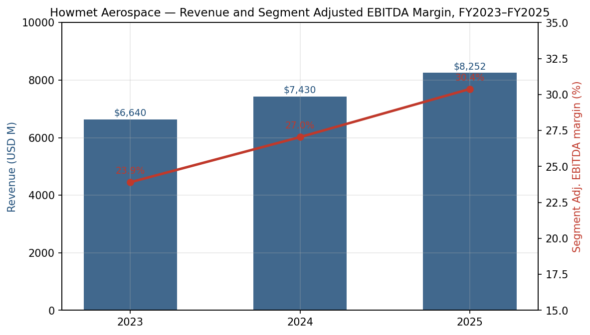
*来源: [Howmet 2025 Form 10-K, pp. 21, 24–28](https://www.sec.gov/Archives/edgar/data/4281/000000428126000012/hwm-20251231.htm)。*

**估值快照 (截至 2026-05-20)。** 股价收于 **261.62 美元**, 市值约 **1,047 亿美元** (2025 年末普通股 4.016 亿股流通在外; 稀释后 4.04 亿股; 2026 年 1–4 月期间通过回购减少约 260 万股), 企业价值 (EV) 约 1,070 亿美元 (扣除 7.42 亿美元现金后净债务约 23 亿美元)。按过去十二个月 (TTM) 口径, Howmet 的 **TTM 市盈率 (P/E) 为 60.8 倍**, **TTM 市销率 (P/S) 12.1 倍**, **EV/EBITDA 40.5 倍**, 股息收益率 0.19% (年化 0.48 美元, TTM 派息 0.42 美元) ([Yahoo Finance — HWM 关键统计指标, 2026-05-20](https://finance.yahoo.com/quote/HWM/key-statistics/))。三年走势背景: HWM 估值已大幅重估——2022 财年末收于 39.49 美元 (P/E 约 25 倍), 2023 财年末收于 54.18 美元 (约 30 倍), 随发动机售后市场与燃气轮机需求兑现, 倍数持续扩张。基于一致预期的 2026 年远期市盈率 **43.7 倍**才是更具相关性的锚定点。

**同业比较。** 航空航天供应商的 TTM 市盈率: TDG 37.5 倍、HEI 59.5 倍、CW 52.9 倍、MOG.A 35.6 倍、HXL 57.4 倍、GE Aerospace 37.2 倍、RTX 33.0 倍——剔除 HWM 后中位数 **52.9 倍**, 均值 **44.8 倍** ([Yahoo Finance 同业页面, 2026-05-20](https://finance.yahoo.com/quote/TDG/key-statistics/))。HWM 较 HEICO 的 TTM 市盈率**溢价约 15%、较 TransDigm 高 62%、较其最大发动机 OEM 客户 RTX 高 84%**。考虑到两点, 这一溢价并非异常: (i) Howmet 业务组合独特地集中于航空航天**护城河最深的细分领域**——单晶投资铸造涡轮叶片——其合格供应商名单实际上只有两家 (Howmet 与 Berkshire Hathaway 旗下的 Precision Castparts Corp), 且售后市场附着率正在结构性提升; (ii) 2026 财年指引调整后 EBITDA 利润率基准值为 **31.7%**, 比 HEICO 的 TTM EBITDA 利润率高出近 200 个基点, 比 RTX 高 750 个基点, 经营杠杆仍有释放空间。在 EV/EBITDA 维度上, Howmet 的 40.5 倍是同业群中最高的 (相对同业中位数 27 倍、TDG 19.4 倍), 进一步表明此溢价是实质性的, 集中体现在利润率质量及售后市场 Beta 上, 而非仅靠营业收入增长。

**溢价是否合理?** 部分合理。Howmet 在发动机售后市场敞口上的分部组合集中度最高 (发动机产品占销售额 52%, 2025 财年增长 16%), 资产负债表轨迹最为干净 (2026 年 2 月获 Fitch 上调至 A-, 进入投资级四级) ([2026 财年 Q1 业绩公告, 2026-05-07](https://www.sec.gov/Archives/edgar/data/4281/000110465926056645/tm2613779d1_ex99-1.htm)), 资本回报计划最为积极 (2025 财年 7.00 亿美元回购 + 1.81 亿美元股息)。风险在于估值倍数已经计入了多年期窄体机产量爬坡 + LEAP 发动机 MRO 超级周期顺利运行的预期——若波音 737 月产能低于 38 架、或空客 A320 供应链进一步打滑, 60 倍 P/E 反而成为本故事最昂贵的特征。我们将估值视为**真实风险**并在第 9 节中突出说明。

---

## 2. 公司历史

Howmet 的故事是叠加在美国最古老的工业公司之一之上的三次公司分拆的产物。原始 Alcoa 成立于 **1888 年**, 名为 Pittsburgh Reduction Company (匹兹堡还原公司), 由 Charles Martin Hall 在其电解铝专利之后创立。Howmet Corporation 本身成立于 1926 年, 名为 Howe Sound Company, 并于 1950 年代率先发展了用于喷气发动机叶片的投资铸造 (investment casting) 工艺; Pechiney 于 1975 年收购 Howmet, Cordant Technologies 于 2000 年, Alcoa 于 2000 年 ([Howmet——公司历史页面](https://www.howmet.com/about-us/history/))。

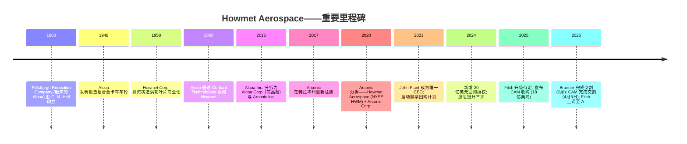
*来源: [Howmet 2025 Form 10-K, pp. 1–5](https://www.sec.gov/Archives/edgar/data/4281/000000428126000012/hwm-20251231.htm); [2026 财年 Q1 业绩公告, 2026-05-07](https://www.sec.gov/Archives/edgar/data/4281/000110465926056645/tm2613779d1_ex99-1.htm)。*

**三次战略性转折塑造了现今的公司。**

*转折 1——Alcoa 分拆, 2016 年 11 月。* Alcoa Inc. 将上游铝 (开采、冶炼、精炼——Alcoa Corp., NYSE: AA) 与下游工程产品业务 (Arconic Inc.) 分离。原因简单: 商品冶炼业务理应配以低估值倍数、重资本回报型结构, 而工程产品业务则应享有成长性估值倍数。市场最终通过对 Arconic 显著高于商品铝的重新定价验证了这一逻辑 ([Howmet 2025 Form 10-K, p. 1](https://www.sec.gov/Archives/edgar/data/4281/000000428126000012/hwm-20251231.htm))。

*转折 2——Arconic 分拆, 2020 年 4 月。* Arconic Inc. 自身再度分拆——Howmet 保留了四个最高利润率特许经营权 (发动机产品、紧固系统、工程结构件、锻造车轮), Arconic Corporation 则取走了轧制铝板、挤压制品与建筑产品。动机仍是估值倍数套利: 轧制铝是成本传导型业务, EBITDA 利润率仅为个位数; 而投资铸造涡轮叶片则是 30% 以上 EBITDA 利润率的特许经营业务, 实际上没有合格替代品。Howmet 此后的重估——从 2020 年中的约 17 美元升至 2026 年中的 260 美元以上——是分拆论题正确性的实证。

*转折 3——去杠杆 + 资本回报周期, 2021–2025 年。* 在 John Plant 领导下, 公司优先选择降低债务, 而非追求量的增长。总债务从 2020 年的约 49 亿美元下降至 2025 年末的 30.50 亿美元 (2025 年单年通过提前赎回 5.900% 2027 年到期票据净减少 2.65 亿美元), 2025 年债务行动预计将年化利息支出减少约 2,200 万美元 ([Howmet 2025 Form 10-K, p. 32](https://www.sec.gov/Archives/edgar/data/4281/000000428126000012/hwm-20251231.htm))。与此同时, 公司已累计授权 35.00 亿美元股票回购 (最近一次为 2024 年 7 月增加 20.00 亿美元), 并以可观规模持续回购 (2023 年 2.50 亿美元、2024 年 5.00 亿美元、2025 年 7.00 亿美元、2026 年 Q1 3.00 亿美元 + 4 月 1.50 亿美元——Q1 平均价 230.43 美元, 4 月平均价 246.18 美元), 普通股股息由再启动时的每季 0.04 美元提高至 2026 年的每季 0.12 美元。

**近期动态 (2025–2026 年)。** 2025 年 12 月 22 日, Howmet 宣布以约 18 亿美元现金从 Stanley Black & Decker 收购 **Consolidated Aerospace Manufacturing, LLC (CAM)**, 于 2026 年 4 月 6 日完成交割 ([2025-12-22 Regulation FD 8-K](https://www.sec.gov/Archives/edgar/data/4281/000110465925123518/tm2534069d1_ex99-1.htm))。CAM 为航空航天与防务生产精密紧固件、液体配件 (fluid fittings) 和复杂零部件; 它整合至紧固系统分部, 是 2020 年分拆以来的首项实质性补强收购 (bolt-on)。2026 年 2 月 6 日, 公司完成规模较小的 Brunner Manufacturing Co. 收购 (位于威斯康星州 Mauston; 约 1.20 亿美元; 大尺寸航空紧固件)。2026 年 3 月 31 日, Howmet 以约 2.30 亿美元出售其乔治亚州 Savannah 锻盘 (disk-forging) 工厂, 录得 9,300 万美元税前利得——管理层明确将其定性为优化组合、向更高毛利特许经营权倾斜的剥离 ([2026 财年 Q1 业绩公告, 2026-05-07](https://www.sec.gov/Archives/edgar/data/4281/000110465926056645/tm2613779d1_ex99-1.htm))。组合净优化为 2026 财年增加约 2.75 亿美元营业收入, 2026 年每股收益贡献约为零, 预计 2027 年完全释放增值效应。

---

## 3. 管理团队

关于 Howmet 管理层最重要的事实是: 同一人——**John Plant**——同时担任董事长 (自 2017 年 10 月)、唯一 CEO (自 2021 年 10 月, 此前为联席 CEO), 并且是后 Arconic Inc. 时代每一项重大战略决策的设计者。他现年 72 岁, 董事会在 2025 年 5 月才刚刚通过多年期续签了他的雇佣协议, 表明短期内不会发生继任事件。

**John C. Plant——执行董事长兼首席执行官。** 72 岁; 自 2016 年起担任董事; 2017 年起任董事会主席; 自 2019 年 2 月起任 Arconic Inc. 的 CEO 直至 2020 年 4 月分拆, 然后于 2020–2021 年任 Howmet 联席 CEO, 自 2021 年 10 月起任唯一 CEO ([Howmet 2025 Form 10-K, p. 7](https://www.sec.gov/Archives/edgar/data/4281/000000428126000012/hwm-20251231.htm); [2026 Proxy Statement, p. 13](https://www.sec.gov/Archives/edgar/data/4281/000110465926039940/tm2606852-2_def14a.htm))。Plant 是英国特许会计师协会的研究员 (Fellow); 在 Howmet 之前, 他打造了 2000 年代规模较大的全球汽车零部件业务之一: 他于 2003 年至 2015 年任 TRW Automotive 总裁兼 CEO, 带领其从 Northrop Grumman 的拆分体经过 IPO, 最终于 2015 年 5 月以 135 亿美元出售给 ZF Friedrichshafen。在他领导下 TRW Automotive 增长至约 65,000 名员工、约 190 个生产设施, 跻身全球十大汽车零部件供应商。在 TRW Automotive 之前, 他曾任 TRW Inc. 首席执行办公室共同成员 (2001–2003), 自 1999 年起任执行副总裁 (随 LucasVarity 收购加入), 1997 年至 1999 年其向 TRW 出售期间任 LucasVarity Automotive 总裁。Plant 亦兼任 Jabil Circuit Corporation 和 Masco Corporation 的董事; 此前担任过 Gates Industrial PLC (2017–2019) 和 TRW Automotive Holdings (2011–2015) 的董事 ([2026 Proxy Statement, pp. 13–14](https://www.sec.gov/Archives/edgar/data/4281/000110465926039940/tm2606852-2_def14a.htm))。Plant 在 Howmet 的操作手册始终如一且自律: 剥离较低毛利业务 (工程结构件分部产能合理化)、激进去杠杆 (债务较 2020 年峰值减少约 38%)、扩张更高毛利特许经营权 (发动机产品资本支出), 并将多余现金回馈股东 (自 2020 年以来累计回购超过 20 亿美元, 且股息稳步攀升)。其薪酬以股权为主 (PRSU 构成长期激励的主要部分), 且要求持有相当于基本薪资 6 倍的股权; Proxy 注明除新任 CFO 外, 所有 NEO 均已满足持股要求 ([2026 Proxy Statement, p. 39](https://www.sec.gov/Archives/edgar/data/4281/000110465926039940/tm2606852-2_def14a.htm))。其业绩记录足够强劲, 市场尚未计入继任风险, 但其 72 岁的年龄确实是个现实担忧 (见第 9 节)。

**Patrick J. Winterlich——执行副总裁兼首席财务官 (自 2025 年 12 月 1 日)。** 56 岁。Winterlich 直接从 **Hexcel Corporation**——我们同业比较组的一员——加入 Howmet, 他于 2017 年至 2025 年 11 月任其 EVP & CFO, 自 1998 年起在 Hexcel 担任日益重要的财务、运营和 IT 职务 ([Howmet 2025 Form 10-K, p. 7](https://www.sec.gov/Archives/edgar/data/4281/000000428126000012/hwm-20251231.htm))。在 Hexcel, 他作为一家纯粹的复合材料切入航空航天业务的上市公司 CFO 经历了 COVID 时期的周期, 是 Howmet 这一职位最接近的对位替代。他获得一次性签约现金支付以及从康涅狄格州迁居匹兹堡的 15 万美元搬迁费; 基本薪资为 70 万美元 ([2026 Proxy Statement, p. 60](https://www.sec.gov/Archives/edgar/data/4281/000110465926039940/tm2606852-2_def14a.htm))。他接替 Kenneth J. Giacobbe——后者从 2020 年分拆起至 2025 年 11 月 30 日任 CFO, 经过一个月作为"CEO 特别顾问"的过渡后, 于 2025 年 12 月 31 日退休。Winterlich 的任命具有两层意义: (i) 他带来了深厚的复合材料供应链知识, 如果 Howmet 涉足复合材料叶片替代领域将十分有用; (ii) 他的到任恰好先于公司自 2020 年分拆以来最大的并购整合 (CAM)。投资者应关注他在前 12 个月内是否会对资本配置节奏作出任何改变。

**Neil E. Marchuk——执行副总裁兼首席行政官。** 68 岁。Marchuk 在 Plant 麾下任命高管中任期最久, 自 2019 年 3 月 (Plant 在 Arconic 任 CEO 之初) 起任 EVP & CHRO, 直至 2025 年 8 月晋升为 CAO。他曾两次担任分部临时总裁——工程结构件 (2023 年 10 月至 2024 年 4 月) 和紧固系统 (2022 年 11 月至 2023 年 5 月)——在 Lola Lin 于 2025 年 9 月辞职后, 还在永久法律总顾问任命之前监督法律与合规事务 ([Howmet 2025 Form 10-K, p. 7](https://www.sec.gov/Archives/edgar/data/4281/000000428126000012/hwm-20251231.htm))。加入 Howmet 之前, 他于 2016 年 1 月至 2019 年 2 月任 Adient 的 EVP & CHRO, 2006 年 7 月至 2015 年 5 月在 Plant 麾下任 TRW Automotive 的 EVP HR——Plant-Marchuk 的运营搭档关系是公司最长的持续高管合作。

**Michael N. Chanatry——副总裁兼首席商务官。** 65 岁。作为公司面向 OEM 客户的商务代表, Chanatry 是执行团队中拥有最深厚直接行业资历的成员: 加入 Howmet 之前, 他任 GE Power 供应链副总裁 (2015–2018), 此前任 GE Appliances (2013–2015)、GE Aviation Systems (2009–2013) 和 Lockheed Martin (1983–2009) 的供应链总经理职务 ([Howmet 2025 Form 10-K, p. 7](https://www.sec.gov/Archives/edgar/data/4281/000000428126000012/hwm-20251231.htm))。GE Aviation 的关联很有意义——GE Aerospace 是 Howmet 两大客户之一——但他到任在发动机产品售后市场高涨与全公司定价重置 (driving margins from 18% to 30%+) 之前; 后者更多是 Plant 的标志, 而非 Chanatry 的。

**公司治理。** 九人董事会, 其中 89% 为独立董事 (9 名中 8 名独立)。唯一非独立董事为 Plant——鉴于其同时担任董事长/CEO 角色; 董事会以一名强大的独立首席董事缓解——**James F. Albaugh**, 前波音商用飞机总裁兼 CEO (2009–2012) 及波音综合防务系统 (Boeing Integrated Defense Systems) 总裁兼 CEO (2002–2009), 自 2020 年起担任此职 ([2026 Proxy Statement, p. 8](https://www.sec.gov/Archives/edgar/data/4281/000110465926039940/tm2606852-2_def14a.htm))。其他重要董事: Ulrich R. Schmidt (前 Spirit AeroSystems 的 EVP & CFO)、Lynn Elsenhans (前 Sunoco 董事长/CEO) 和 Gunner S. Smith (Cornerstone Building Brands CEO)。内部持股相当可观: 仅 Plant 一人持有超过 2 亿美元的 HWM 股权, Proxy 明确规定 CEO 持股要求为基本薪资的 6 倍 (仅未归属 RSU/PRSU 不计入)。2025 年薪酬表决 (Say-on-Pay) 获强力支持通过。薪酬以股权为主, PRSU 与相对 TSR 和 ROIC 指标挂钩 ([2026 Proxy Statement, pp. 47, 55–62](https://www.sec.gov/Archives/edgar/data/4281/000110465926039940/tm2606852-2_def14a.htm))。审计师为 PricewaterhouseCoopers LLP (2026 年提议续聘); 薪酬同业组包括 Otis、Textron、Hubbell、Parker-Hannifin、TransDigm、Illinois Tool Works、Rockwell Automation——为合理多元化的工业企业, 而非纯航空航天。

**业绩综合评价。** 这是一家首先由 Plant 领导、其次才是一家航空航天公司。五年股价图 (自分拆以来超过 14 倍) 是头条记分牌, 但实质性证据在于同步发生的利润率扩张 (合并 EBITDA 利润率由 2020 年的约 16% 升至 2025 年的 30.4%)、去杠杆 (净债务减少约 18 亿美元) 和现金回报 (20 亿美元以上回购)。短板与亮点重合: 公司异常依赖一位 72 岁的高管, 新任 CFO 在 18 亿美元收购整合的第一天上岗, 且没有从外部可见的分部总裁梯队。

---

## 4. 产品与服务

Howmet 按四个分部组织, 每个分部都有清晰可辨的旗舰特许经营权和一个小型尾部。下文逐一覆盖四个分部; 产品系列细节基于公司在 [howmet.com/products](https://www.howmet.com/products/) 的产品导航树, 并与 10-K 分部描述交叉核对。

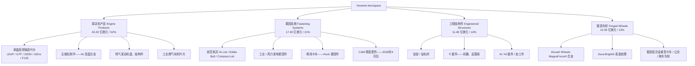
*来源: [Howmet——发动机产品页面](https://www.howmet.com/products/engine-products/); [紧固系统页面](https://www.howmet.com/products/fastening-systems/); [工程结构件页面](https://www.howmet.com/products/engineered-structures/); [锻造车轮——Alcoa Wheels](https://www.howmet.com/products/wheels/); [Howmet 2025 Form 10-K, pp. 3–5](https://www.sec.gov/Archives/edgar/data/4281/000000428126000012/hwm-20251231.htm)。*

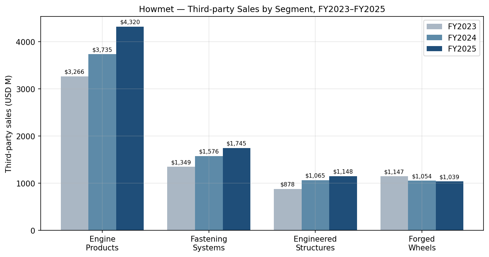
*来源: [Howmet 2025 Form 10-K, pp. 25–27](https://www.sec.gov/Archives/edgar/data/4281/000000428126000012/hwm-20251231.htm)。*

### 4.1 发动机产品 (Engine Products)——护城河业务

**销售什么。** 单晶镍基高温合金涡轮叶片 (旋转高压涡轮叶片和固定导叶 stator vanes)、用于发动机机匣和燃烧室的镍基高温合金无缝轧制环、喷气发动机盘 (disks) 和结构铸件 (structural castings)。同一技术也供应推动数据中心备用电源和电网基荷的重型工业燃气轮机市场。覆盖的终端项目: CFM LEAP-1A/-1B (Airbus A320neo / Boeing 737 MAX)、Pratt & Whitney PW1100G/GTF (A320neo) 与 PW1500G (A220)、GE9X (Boeing 777-X)、GE/RR Trent XWB (A350)、GEnx (787)、Honeywell HTF7000、RTX F135 (F-35)、Rolls-Royce Trent / RR300, 以及 GE7HA / Siemens 9HA / Mitsubishi M501J 工业燃气轮机。

**竞争优势判定——是, 组合中最强护城河。** 护城河类型: *技术 + 监管/认证 + 供应商集中度*。镍基高温合金叶片的单晶定向凝固投资铸造工艺是 Howmet (Whitehall, MI 和 Niles, OH) 与 Berkshire Hathaway 旗下 Precision Castparts Corporation (PCC) 经过 50 年发展形成的; 按主要发动机项目计算, 全球合格供应商名单实际上只是这两家加上少量内部产能 (RTX/P&W 拥有自有产能, GE Aerospace 也是如此, 尽管它们仍继续从 Howmet 采购) ([Howmet 2025 Form 10-K, pp. 5–6](https://www.sec.gov/Archives/edgar/data/4281/000000428126000012/hwm-20251231.htm))。要替换合格叶片供应商需经多年的 FAA 型号合格证 (Type Certificate) 重新认证; 实际答案是项目存续期内现有供应商继续保持其地位。经济证据: 2025 财年发动机产品分部调整后 EBITDA 利润率为 **33.3%**, 较 2023 年的 27.2% 提升——两年内扩张 610 个基点, 即便分部 2025 年净增约 1,445 名员工用于产能扩张 (该扩张本身在短期内具有摊薄效应) ([Howmet 2025 Form 10-K, p. 25](https://www.sec.gov/Archives/edgar/data/4281/000000428126000012/hwm-20251231.htm))。33.3% 的分部 EBITDA 利润率与 TransDigm 的整体公司利润率相当, 明显高于 Heico; 对一家金属成型业务而言, 这是稀薄的高空。

**最接近的竞争对手产品。** Berkshire Hathaway 旗下 **Precision Castparts Corp (PCC)**——Wyman-Gordon 叶片和结构铸件, 2016 年被 Berkshire 以 320 亿美元收购。PCC 是单晶叶片领域唯一真正的对位; 竞争地位: *技术持平、规模略落后*。PCC 拥有更多总铸造产能, 但为私人公司, 历史上对售后市场捕获的关注较少。其他边缘竞争者: Doncasters Group Ltd (英国)、Consolidated Precision Products (CPP, 由 Warburg Pincus 和 Berkshire Partners 持有), 以及 RTX/P&W 和 Rolls-Royce 的内部产能 ([Howmet 2025 Form 10-K, p. 6](https://www.sec.gov/Archives/edgar/data/4281/000000428126000012/hwm-20251231.htm))。

### 4.2 紧固系统 (Fastening Systems)——LEAP 产量杠杆

**销售什么。** 航空航天紧固件——Hi-Lok 和 Eddie-Bolt 高强度螺栓、Composi-Lok 用于复合材料的盲铆紧固件 (blind fasteners)、用于飞机和发动机"从机头到机尾"的多夹紧度和锁紧螺栓系统; 用于风力发电、太阳能和物料搬运的工业紧固件; 用于商用卡车的 Huck 品牌结构紧固件。2026 年 4 月后, 该分部还包括 CAM 的精密配件和液体配件。渠道: 直接向 OEM (Boeing、Airbus、发动机 OEM) 销售以及通过航空航天经销商。一般以美元/英镑/欧元定价, 并对材料成本进行传导。

**竞争优势判定——是, 部分护城河。** 护城河类型: *认证 + 规模 + 品牌*。航空航天紧固件经过严格认证 (NADCAP、Boeing/Airbus AVL 批准), 切换成本不像叶片那样极端, 但任何新批准仍需以年计。Howmet 的旗舰 Hi-Lok 产品系列最初由 Hi-Shear 开发 (1960 年代), 现为 Howmet 品牌。2025 财年紧固系统分部调整后 EBITDA 利润率达到 **30.4%**, 较 2023 年的 20.6% 提升——两年内扩张 980 个基点, 由商用航空航天组合转移、生产率和外汇驱动 ([Howmet 2025 Form 10-K, p. 25](https://www.sec.gov/Archives/edgar/data/4281/000000428126000012/hwm-20251231.htm))。

**最接近的竞争对手产品。** **Lisi Aerospace** (法国)——Hi-Lok 和锁紧螺栓的对等产品, 服务于 Airbus prime; PCC 的 PCC Fasteners 部门; Arconic Corp. 的 ATS 紧固件 (旧分拆); B/E Aerospace (现 RTX Collins) 的厨房和座椅紧固件。地位: *Hi-Lok / Eddie-Bolt 与 Lisi 大致持平; 在 Composi-Lok 复合材料盲铆技术上领先; 在工业 / Huck 商用卡车品牌上领先*。

### 4.3 工程结构件 (Engineered Structures)——追赶型利润率故事

**销售什么。** 钛锭与钛轧制品 (公司拥有自有 Ti 熔炼炉, 内部使用并对外销售)、用于机翼结构、起落架与航空发动机的钛锻件、钛挤压件; 铝锻件、镍锻件、加工铝合金组件和总成。主要终端项目: 波音 787 机翼组件、F-35 / F-22 / B-21 (防务)、A350 / 787 起落架锻件 (通常供应 Heroux-Devtek 或 Safran Landing Systems)。

**竞争优势判定——部分。** 护城河类型: *垂直整合至 Ti 熔炼 + 认证*。该分部利润率为四者中最低 (2025 财年 21.2%, 较 2023 财年 12.9% 提升)。管理层反复强调"通过合理化产品组合以最大化盈利能力"——意即剥离低毛利工作、保留防务产能、放弃无法获得回报的成本加成型飞机项目。2026 年 3 月 31 日出售乔治亚州 Savannah 锻盘工厂 (约 2.30 亿美元现金、9,300 万美元税前利得) 是最近最具体的例子 ([2026 财年 Q1 业绩公告, 2026-05-07](https://www.sec.gov/Archives/edgar/data/4281/000110465926056645/tm2613779d1_ex99-1.htm))。钛锭熔炼产能确实稀缺 (是全球极少数非俄罗斯、非 VSMPO 来源之一), 这是该分部护城河最强的部分。

**最接近的竞争对手产品。** **VSMPO-AVISMA** (俄罗斯) 在钛锭领域——历史上最大的非自给型 Ti 供应商; 制裁和俄乌战争造成持续的供应不确定性。**ATI Inc. (高性能材料与组件分部)** 在钛轧制品和精密锻件领域。**Aubert & Duval** (由 Airbus、Safran 和 Tikehau Capital 共同持有, 法国) 在精密 Ni / Ti 锻件领域。**Weber Metals (Otto Fuchs)** 在大型铝/钛模锻件领域。地位: *Ti 锻件大致持平; 在 Ti 轧制品广度上略落后 ATI; 在熔炼到锻造垂直整合上领先*。

### 4.4 锻造车轮 (Forged Wheels)——现金奶牛

**销售什么。** 全球范围内 Class 8 卡车、拖车和公交客车用锻造铝合金车轮, 在 Alcoa Corp. 独家商标许可下以 **Alcoa® Wheels** 品牌销售。关键产品属性: MagnaForce® 专有铝合金 (高强度比重)、Dura-Bright® 表面处理 (耐腐蚀, 易清洁)。公司于 1948 年**发明了**锻造铝合金卡车车轮 ([Howmet 2025 Form 10-K, p. 3](https://www.sec.gov/Archives/edgar/data/4281/000000428126000012/hwm-20251231.htm); [Howmet——车轮页面](https://www.howmet.com/products/wheels/))。

**竞争优势判定——是, 品牌 + 成本领先, 但具周期性。** 利润率稳定较高 (2025 年分部调整后 EBITDA 利润率 28.5%), 即使在下行年 (2024 财年车轮收入同比下降 8%、2025 年下降 1%), 分部 EBITDA 利润率也保持在 130 个基点的区间内。Alcoa® Wheels 品牌在北美 Class 8 车队买家中是保值和耐腐蚀的金标。脆弱性来自中国、台湾、印度、韩国和土耳其的进口威胁——10-K 明确将此列为日益严峻的威胁 ([Howmet 2025 Form 10-K, p. 6](https://www.sec.gov/Archives/edgar/data/4281/000000428126000012/hwm-20251231.htm))。

**最接近的竞争对手产品。** **Accuride Corporation** (私人, 由 Crestview Partners 持有)——北美第二大锻造铝合金车轮供应商。**Speedline (Ronal Group)、Nippon Steel、Dicastal North America、Alux Co.、Wheels India Ltd.**。地位: *在北美 Class 8 品牌和 OE 渠道上领先; 在欧洲持平; 在低端亚洲铸造铝上落后*。

### 4.5 旗舰与长尾

**旗舰 (推动业务的 1–3 个产品):**
1. 单晶投资铸造涡轮叶片 (发动机产品)——最大、最高毛利且最具防御性的特许经营权。
2. 航空航天紧固件组合 (紧固系统)——Hi-Lok、Eddie-Bolt、Composi-Lok; 对营业利润贡献第二位。
3. 无缝轧制环 (发动机产品)——细分但利润率非常高, 对新发动机项目至关重要。

**长尾 / 较低优先级:** 商用运输紧固件 (Huck)——面对 2024–2026 年周期性低谷; 工程结构件中的非防务锻件 (正在积极合理化); 用于物料搬运和可再生能源的工业紧固件。

### 4.6 过去 12 个月的产品发布、重定位与剥离

- **收购——Brunner Manufacturing Co. Inc.**, 2026 年 2 月 6 日以约 1.20 亿美元现金完成交割; 整合至紧固系统; 增加大尺寸紧固件。
- **收购——Consolidated Aerospace Manufacturing (CAM)**, 2025 年 12 月 22 日宣布, 2026 年 4 月 6 日以约 18 亿美元现金完成交割。CAM 为航空航天/防务生产精密紧固件、液体配件和复杂工程零件; 整合至紧固系统。
- **剥离——乔治亚州 Savannah 锻盘工厂**, 2026 年 3 月 31 日以约 2.30 亿美元现金出售 (位于工程结构件); 9,300 万美元税前利得作为特殊项目入账。
- **内部分部重组 (2026 年 Q1)**——一项 Ti 合金生产业务从发动机产品转移至工程结构件以进行运营协调; 此前各期重列。
- **终端市场披露变更 (2025 年 Q4)**——工业燃气轮机和油气合并为单一的"燃气轮机"项; "通用工业"重新归类至"其他" ([Howmet 2025 Form 10-K, p. 3](https://www.sec.gov/Archives/edgar/data/4281/000000428126000012/hwm-20251231.htm))。

---

## 5. 客户与上市策略

**终端市场组合 (2025 财年营业收入, 百万美元, 合计 82.52 亿美元):** 商用航空航天 **43.22 亿美元 / 52%**, 防务航空航天 **14.09 亿美元 / 17%**, 商用运输 **12.48 亿美元 / 15%**, 燃气轮机 **9.44 亿美元 / 11%**, 其他 **3.29 亿美元 / 4%** ([Howmet 2025 Form 10-K, p. 56](https://www.sec.gov/Archives/edgar/data/4281/000000428126000012/hwm-20251231.htm))。

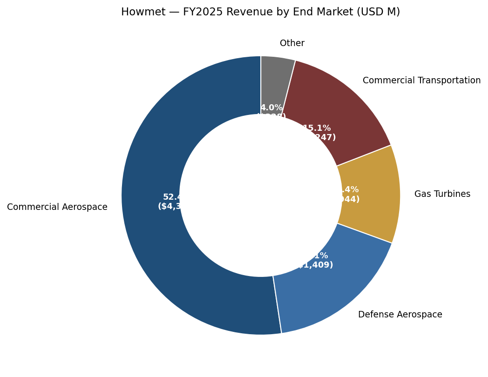
*来源: [Howmet 2025 Form 10-K, p. 56](https://www.sec.gov/Archives/edgar/data/4281/000000428126000012/hwm-20251231.htm)。*

**客户集中度——量化。** 10-K 披露了占合并营业收入 10% 阈值以上的客户 (ASC 280-10-50-42)。2025 年, **RTX Corporation (Pratt & Whitney 和 Collins Aerospace 的母公司) 约占合并第三方销售额的 11%**, **GE Aerospace (重新命名的通用电气分拆体) 约占 11%** ([Howmet 2025 Form 10-K, p. 9](https://www.sec.gov/Archives/edgar/data/4281/000000428126000012/hwm-20251231.htm))。10-K 明确指出这两家是仅有的两位超过 10% 的客户; 没有其他被点名客户跨过该阈值。**因此前两名客户集中度约为 22%, 前五名估计为 35–40%** (Boeing、Airbus 和 Rolls-Royce 各自可能在 4–8% 区间, 基于机身/发动机原始装机组合, 但 Howmet 未在客户层面进行此分项披露)。趋势平稳——在 2024 财年 10-K 中, RTX 和 GE Aerospace 也各占约 11%; 2023 财年它们处于或刚超过 10%。**两个最大客户都是关键发动机 OEM, 在某种意义上也是"竞争者"——两家都拥有自给的单晶叶片铸造产能**, 原则上可以扩张, 但实际取代 Howmet 的产能能力受到认证和资本支出时间表的限制。

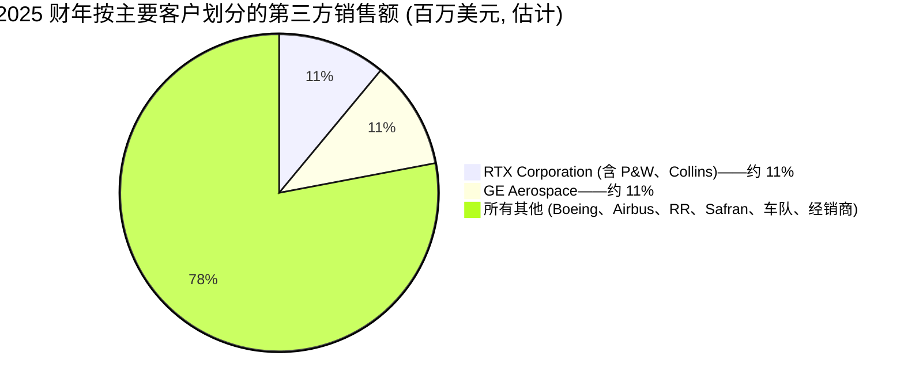
*来源: [Howmet 2025 Form 10-K, p. 9](https://www.sec.gov/Archives/edgar/data/4281/000000428126000012/hwm-20251231.htm) (披露的 ≥10% 客户; 剩余组合根据分部 / 终端市场披露估算)。*

**按我们的质量清单衡量, 是否构成实质性风险?** 是——头名 RTX 占 11%、第二名 GE Aerospace 占 11%, 意味着前五名很可能超过 30% 阈值; 我们在第 9 节中将客户集中度列为风险。缓解因素是: 同一批客户跨多个 Howmet 平台采购 (叶片、环、紧固件), 且涉及多个发动机项目 (LEAP、GTF、GEnx、GE9X、T700), 这是结构上多元化的关系, 而非单一项目敞口。失去任一客户都将是灾难性的, 但**概率较低**——合格供应商替代路径需 3–5 年, 且 Howmet 入驻的发动机项目按机身寿命周期设计。

**客户按分部划分的覆盖。** 在发动机产品中, 客户为发动机 OEM: RTX/P&W、GE Aerospace、Rolls-Royce、Safran (通过与 GE 合资的 CFM)、Honeywell, 以及重型燃气轮机 OEM Siemens Energy、Mitsubishi Power 和 GE Vernova。在紧固系统和工程结构件中, 客户分布在机身制造商 (Boeing、Airbus、Lockheed Martin、Northrop Grumman)、发动机 OEM 和一级制造商 (Spirit AeroSystems、GKN Aerospace、Heroux-Devtek)。在锻造车轮中, 客户为重型卡车 OEM (PACCAR/Kenworth/Peterbilt、Daimler/Freightliner、Volvo/Mack、Navistar/International, 加上欧洲品牌), 以及售后市场分销。

**合同结构。** 与发动机 OEM 的长期协议是典型的——多年期主供应协议附带年度定价窗口, 通常与特定发动机项目挂钩 (例如与 CFM 的长期 LEAP 叶片协议)。这些合同中的材料成本 (Ni、Ti、Co、Al) 通常通过公式进行传导, 但有一至两个季度的滞后, 在投入成本快速波动期间可能压缩利润率。备件订单基于 PO, 但按售后市场价格表定价, 毛利率明显高于 OE。卡车车轮则混合——与 PACCAR、Volvo 和 Daimler 的多年期 OE 协议, 加上面向售后市场的经销商关系。

**渠道。** 约 95% 直接面向 OEM / 一级客户; 航空航天紧固件和部分卡车车轮通过专业经销商 (紧固件的 Wesco/Marvels、车轮的车队售后经销商)。发动机产品业务**几乎完全直销**。

**销售周期。** 新项目设计入选需要 5–10 年 (发动机开发时间表)。一旦合格, 项目生命周期内的供应地位通常锁定 20 年以上 (LEAP-1A 于 2016 年首次投入运营, 至少将生产到 2035 年)。这是发动机产品经济效益更像软件平台业务而非金属成型业务的结构性原因。

**地理组合。** 按 2025 财年销售出货地点划分, 北美 72% / 欧洲 22% / 世界其余地区 6% (日本、中国等) ([Howmet 2025 Form 10-K, p. 1](https://www.sec.gov/Archives/edgar/data/4281/000000428126000012/hwm-20251231.htm))。真实的终端需求较此更为多元化, 因为在 Toulouse 或天津制造的飞机销往全球。

**近期被点名的获胜 / 新闻。** 公司不按名称披露单个项目的获胜, 但 2025 年发动机产品 16% 的同比增长暗示了 LEAP-1A/-1B 叶片和 GTF 售后市场的份额提升——两者与一项延续至 2027 年的多年期 LEAP MRO 车间访问激增的卖方评论一致。

---

## 6. 行业概览

**行业定义。** Howmet 业务位于 (a) **商用机身和航空推进零部件** (NAICS 336412 飞机发动机和发动机零部件制造; NAICS 336413 其他飞机零部件和辅助设备), (b) **防务航空航天零部件**, (c) **工业燃气轮机零部件** (NAICS 333611), 和 (d) **锻造铝合金重型卡车车轮** (NAICS 336390) 的交叉点。相邻行业包括钛轧制品 (NAICS 331410) 和特种金属投资铸造 (NAICS 331512)。

**市场规模——航空航天。** 全球商用飞机新建市场以波音/空客的双寡头格局为基础。空客 **2024 年交付 766 架飞机** (主要为 A320neo 系列), 目标 **2025 年交付 820 架**, 并在 2027 年达到 **A320 系列每月 75 架**的生产速率 ([Airbus 2024 Annual Report——Industrial Performance section, 2025-02-20](https://www.airbus.com/en/investors/financial-results-annual-reports))。波音 **2024 年交付 348 架商用飞机**, 在 2024 年 1 月阿拉斯加航空舱门塞事件之后, 737 MAX 处于受限的产能爬坡; FAA 实施了 **每月 38 架 737**的上限, 波音整个 2025 年一直在朝此目标努力 ([Boeing 2024 Annual Report, 2025-02-04](https://www.boeing.com/investors/annual-reports.page); [FAA Statement on Boeing 737-9 MAX, 2024-01-24](https://www.faa.gov/newsroom/faa-statement-boeing-737-9-max))。两家 OEM 的合并积压订单达到创纪录水平 (约 13,000+ 未交付订单), 相当于约 10 年的当前产能。

具体到 Howmet, **单机内容值** (shipset content) 是关键指标——即给定飞机上的 Howmet 内容值有多少。卖方和管理层评论将此置于以下范围: **每架 A320neo / 737 MAX 单机 100–120 万美元** (分布在 LEAP-1A/LEAP-1B 和 GTF 的叶片, 加上紧固件和部分 Ti 锻件) 和**每架 787 / A350 单机 160–190 万美元** (宽体机发动机, 更多 Ti 结构)。这意味着 A320 或 737 月产量每提高 1 架, 转化为约 1,500–2,500 万美元的年化 Howmet 营业收入, 增量利润率较高, 因为生产产能基本到位。

**售后市场——2025–2027 年的更大驱动力。** LEAP-1A/-1B 于 2016 年投入使用; 高压涡轮叶片和燃烧室衬里通常在 6,000–10,000 飞行循环时进行首次车间访问, 这将首轮 LEAP MRO 浪潮重重集中在 2025–2027 年窗口。Pratt & Whitney 的 PW1100G (GTF) 出现了广为人知的粉末金属污染问题, 影响高压涡轮盘, 自 2023 年以来导致了非同寻常的加速车间访问浪潮, 致使 2025 年和 2026 年全年的零件需求保持高位——RTX 在多年度披露中披露了 **30–35 亿美元**范围的累计 GTF AOG 相关现金影响 ([RTX 2024 Q4 Earnings press release, 2025-01-28](https://www.rtx.com/news/news-center/2025/01/28))。这对 Howmet 的售后市场叶片和环业务结构上利好。

**燃气轮机——数据中心顺风。** 由于数据中心电力需求, 用于发电的工业燃气轮机大幅增长。GE Vernova、Siemens Energy 和 Mitsubishi Power 的订单簿延伸至 2028–2029 年 ([Reuters——GE Vernova orders backlog, 2025-04-23](https://www.reuters.com/business/energy/ge-vernova-q1-2025/))。Howmet 的燃气轮机营业收入在 2025 年增长 **25%** (从 7.55 亿美元到 9.44 亿美元), 2026 年 Q1 同比增长 **39%**, 是组合内增长最快的终端市场 ([2026 财年 Q1 业绩公告, 2026-05-07](https://www.sec.gov/Archives/edgar/data/4281/000110465926056645/tm2613779d1_ex99-1.htm))。管理层在业绩评论中将其定性为多年期顺风。

**防务航空航天。** 美国国防部用于 F-35、B-21 Raider、T-7 教练机和导弹防御的支出正在增长; 2026 财年美国国防预算总规模约 8,950 亿美元, 飞机采购水平较高, 形成支撑 ([US DoD FY2026 Budget Request——Aircraft Procurement, 2025-03-10](https://comptroller.defense.gov/Budget-Materials/))。Howmet 的防务航空航天营业收入 **2025 年增长 21%, 达到 14.09 亿美元**, 2026 年 Q1 增长 10%。

**商用运输。** 反向故事——自 2023 年中以来, 北美 Class 8 卡车产量一直处于货运衰退低谷, ACT Research 预测指向 2026 年下半年恢复 ([ACT Research——North American Commercial Vehicle Outlook, 2025-Q4](https://www.actresearch.net))。锻造车轮营业收入 2024 年下降 8%, 2025 年下降 1% (主要是销量相关, 部分由铝成本传导抵消)。管理层已指引商用运输 2026 上半年持平至个位数下降, 下半年恢复。

**行业增长率。**
- **商用航空 OE 生产:** 空客目标 2024→2025 交付量 +13%, 以及多年期 A320 至 2027 年达到 75/月的爬坡。波音路径更不确定, 但基本假设意味着若认证和质量里程碑达成, 从 FAA 上限的 38/月水平到 2027 年实现低双位数百分比的生产增长。
- **商用航空售后市场 / 发动机备件:** 2025–2026 年由 LEAP MRO 浪潮 + GTF AOG 加速车间访问驱动的中位数十几%增长。
- **防务航空航天:** 由 F-35 生产、B-21 爬坡和发动机项目驱动的中至高位个位数%增长。
- **工业燃气轮机:** 由数据中心电力需求驱动的 2025–2026 年 15–25% 增长。
- **重型卡车车轮:** 2024–2026 年上半年持平至下降; 2026 年下半年起温和恢复。

**监管环境。** 航空航天零部件受 FAA / EASA 型号合格证监管; 供应商批准受 Boeing/Airbus AVL 流程和 NADCAP 特殊工艺 (热处理、NDT、铸造、涂层) 认证管理。FAA 在 2024–2025 年对波音的质量监督加强, 减缓了供应商扩张的信贷额度推进, 但并未根本重塑合格供应商基础。关税和贸易政策是现行因素——10-K 明确将"美国 2025 年和 2026 年初为施加新关税的行政命令"列为原材料成本和客户定价不确定性的来源 ([Howmet 2025 Form 10-K, pp. 8–9](https://www.sec.gov/Archives/edgar/data/4281/000000428126000012/hwm-20251231.htm))。

**行业结构。** *上游高度集中, 下游分散。*上游钛熔炼由 VSMPO (全球约 30%)、Howmet 自有 Ti 熔炼业务、Toho Titanium、ATI 和 Allegheny Titanium 主导。投资铸造叶片实际上是双寡头 (Howmet + PCC)。航空航天紧固件是一个小型寡头垄断 (Howmet、PCC/Pyramid、Lisi、Arconic/ATS)。北美锻造卡车车轮高度集中 (Howmet/Alcoa Wheels + Accuride 主导)。航空航天 OEM 客户基础也很集中——Boeing、Airbus、RTX、GE Aerospace、Rolls-Royce、Safran、Honeywell、Lockheed Martin、Northrop Grumman。因此供应商-买家权力是相互依赖的: Howmet 是一小组重要客户的少数关键供应商, 这是为什么业务具备定价权但也存在客户集中度的原因。

---

## 7. 竞争格局

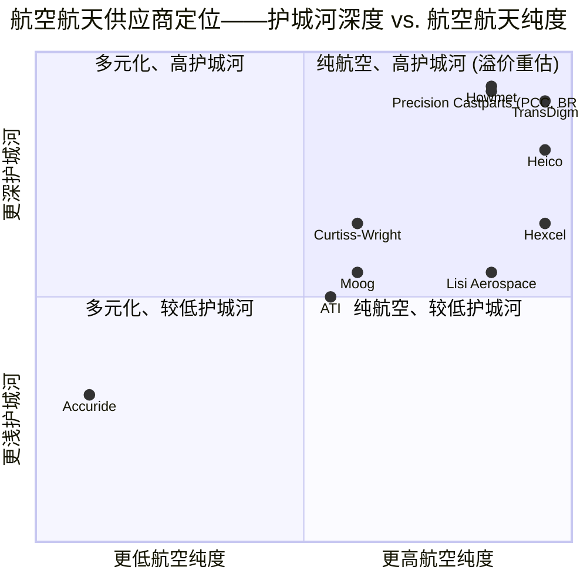
*定位为定性, 源自每家公司最新 10-K 中的分部组合披露和分析师评论; 见下方各处引用的来源。*

**直接竞争对手 (在 Howmet 10-K 第 6 页中涵盖)。**

**Berkshire Hathaway / Precision Castparts Corporation (PCC)——单晶叶片双寡头中的直接对手。** 2016 年被 Berkshire 以 321 亿美元收购; 自此为私人公司。PCC 在钛和钛基合金、精密锻件、无缝轧制环、投资铸造 (包括叶片) 和航空航天紧固件领域参与竞争——是 Howmet 在所有同业中最广泛的直接重叠。2020 年 Berkshire 对 PCC 进行了约 100 亿美元的减记 ([Berkshire Hathaway 2020 10-K, p. K-37](https://www.sec.gov/Archives/edgar/data/1067983/000119312521046996/d12089d10k.htm)), 反映航空航天周期, 但该业务后已恢复。PCC 缺乏公开披露使得直接比较困难, 但 Berkshire 2024 年年度报告显示, 随着航空航天 OE 周期, PCC 持续保持强劲盈利 ([Berkshire Hathaway 2024 Annual Report Chairman's Letter, 2025-02-22](https://www.berkshirehathaway.com/2024ar/2024ar.pdf))。

**VSMPO-AVISMA Corporation (俄罗斯)——钛锭竞争对手, 带有现行制裁悬挂。** 世界上最大的钛生产商; 历史上大量供应波音、空客和发动机 OEM。乌克兰入侵后, 波音公开停止采购俄罗斯钛 ([Reuters, 2022-03-07](https://www.reuters.com/business/aerospace-defense/boeing-suspends-titanium-purchases-russia-2022-03-07/)); 空客已减少但未完全消除采购。VSMPO 作为可信长期供应商的结构性退出, 是 Howmet 工程结构件分部钛熔炼业务的实质性顺风。

**ATI Inc. (NYSE: ATI)——钛和特种合金竞争对手。** ATI 的高性能材料与零件 (HPMC) 分部与工程结构件直接重叠。2024 财年 ATI 营业收入 44 亿美元, 通过航空恢复 HPMC 分部增长 ([ATI 2024 10-K, 2025-02-25](https://www.sec.gov/Archives/edgar/data/1018963/000101896325000006/ati-20241231.htm))。地位: 在钛精密锻件大致持平; ATI 在投资铸造前向整合较少。

**Lisi Aerospace (法国)——仅紧固件。** Lisi SA (Euronext: ALLIS) 的子公司。强大的 Hi-Lok 等效产品线, 主要面向 Airbus。地位: *在大宗紧固件持平; 在 Composi-Lok 复合材料盲铆和美国 OEM 渗透方面落后*。

**Aubert & Duval (法国)——精密锻件。** 2022 年 Eramet 剥离后由 Airbus、Safran 和 Tikehau Capital 共同持有。Airbus 和 Safran 的战略钛锻件供应商; 实际上是 Airbus 生态系统的自给部分。

**Doncasters Group Ltd (英国)、Consolidated Precision Products (CPP, Warburg / Berkshire Partners)、Weber Metals (Otto Fuchs)、Forgital Group (意大利)、Frisa (墨西哥)**——较小的投资铸造 / 锻造 / 环类竞争对手。单个对 Howmet 均无实质性影响。

**Accuride Corporation (私人, Crestview Partners)、Speedline (Ronal)、Nippon Steel、Dicastal、Alux、Wheels India**——锻造车轮竞争对手。

**间接 / 公开同业比较组 (与估值相关但仅产品上部分重叠)。**

**TransDigm Group (NYSE: TDG)——金标准航空航天售后市场特许经营。** 高度工程化航空航天零部件制造商, 拥有行业内最激进的并购整合历史。TTM 营业收入 87 亿美元, EBITDA 利润率约 52% (相对 Howmet 的 30%), TTM P/E 37.5 倍, EV/EBITDA 19.4 倍 ([Yahoo Finance——TDG 关键统计, 2026-05-20](https://finance.yahoo.com/quote/TDG/key-statistics/))。TDG 是投资者对 HWM 溢价论题最常用的锚定——Howmet 的利润率轮廓正向 TDG 类区间提升, 但 TDG 的定价权极端, 因而估值倍数差距 (HWM 较 TDG 享有市盈率溢价) 最好用 HWM 较大的重置/增长潜力来解释, 而非苹果对苹果的护城河比较。

**Heico Corporation (NYSE: HEI)——售后市场零件。** 营业收入 40 亿美元, 核心特许经营权为 PMA (零件制造商批准) 售后市场零件。TTM P/E 59.5 倍, EV/EBITDA 34.5 倍, 与 HWM 类似的溢价 ([Yahoo Finance——HEI 关键统计, 2026-05-20](https://finance.yahoo.com/quote/HEI/key-statistics/))。HEI 与发动机 OEM 是竞争而非服务关系, 因此客户关系结构不同。

**Curtiss-Wright Corporation (NYSE: CW)——防务控制与电力。** 多元化防务/工业零部件。营业收入约 32 亿美元, TTM P/E 52.9 倍, EV/EBITDA 32.6 倍 ([Yahoo Finance——CW 关键统计, 2026-05-20](https://finance.yahoo.com/quote/CW/key-statistics/))。航空纯度较低, 但由防务-海军-核业务定位带来的溢价。

**Moog Inc. (NYSE: MOG.A)——运动控制。** 营业收入 35 亿美元, TTM P/E 35.6 倍, EV/EBITDA 19.0 倍 ([Yahoo Finance——MOG.A 关键统计, 2026-05-20](https://finance.yahoo.com/quote/MOG-A/key-statistics/))。同业比较组中最便宜, 反映了更多元化 (且增长较慢) 的工业组合。

**Hexcel Corporation (NYSE: HXL)——航空复合材料。** 营业收入 19 亿美元, 主要为面向 Airbus A350 / 波音 787 的碳纤维复合材料。TTM P/E 57.4 倍, EV/EBITDA 22.0 倍 ([Yahoo Finance——HXL 关键统计, 2026-05-20](https://finance.yahoo.com/quote/HXL/key-statistics/))。HWM CFO Pat Winterlich 来自 HXL。

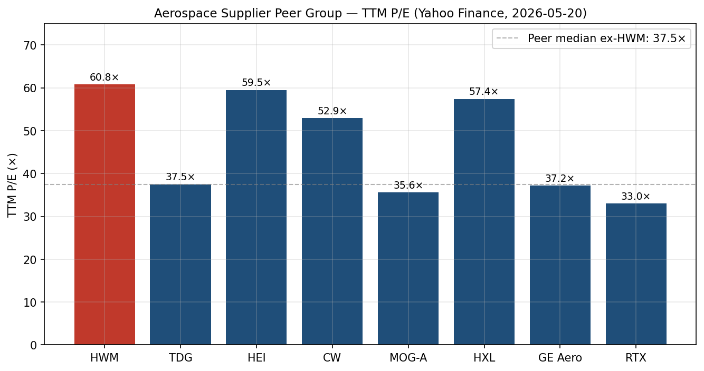
*来源: [Yahoo Finance——同业关键统计页面, 2026-05-20](https://finance.yahoo.com/quote/HWM/key-statistics/)。*

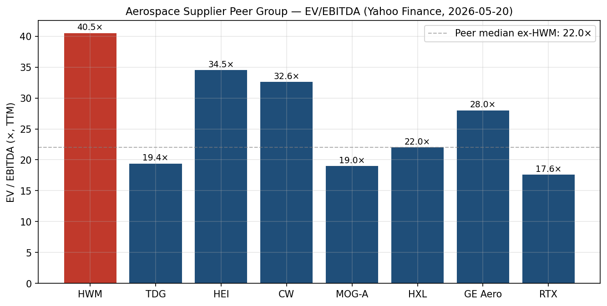
*来源: [Yahoo Finance——同业关键统计页面, 2026-05-20](https://finance.yahoo.com/quote/HWM/key-statistics/)。*

**竞争优势。**
1. **单晶投资铸造叶片的实际双寡头** (Howmet + PCC), 发动机 OEM 自给产能受限且扩张缓慢。
2. **工程结构件的垂直整合**——Howmet 自行熔炼钛锭, 然后锻造和加工, 使其能够更好地控制稀缺的非俄罗斯钛供应。
3. **LEAP、GTF、Trent XWB、GE9X、GEnx、F135 等项目上 20 年以上的项目生命周期设计入选地位**——一旦合格, 客户无法轻易切换。
4. **Alcoa® Wheels 品牌**在北美 Class 8 上——车队运营商在保值和耐腐蚀方面的金标产品。
5. **资产负债表灵活性**——Fitch 于 2026 年 2 月 13 日上调至 A-, 投资级四级 ([2026 财年 Q1 业绩公告, 2026-05-07](https://www.sec.gov/Archives/edgar/data/4281/000110465926056645/tm2613779d1_ex99-1.htm))。

**竞争脆弱性。**
1. **客户自给产能扩张**——RTX/P&W、GE Aerospace 和 Rolls-Royce 都拥有自给叶片和环类产能, 原则上可以扩张。
2. **波音 737 生产速率上限风险**——FAA 实施的每月 38 架上限。波音爬坡每延迟一个月都直接打击 LEAP-1B 叶片和 737 紧固件销量。
3. **钛供应依赖性**——非俄罗斯/非中国供应商有限; 内部钛熔炼故障可能代价高昂。
4. **锻造车轮——亚洲进口威胁。** 10-K 明确标注来自中国、台湾、印度、韩国和土耳其锻造铝合金车轮供应商日益激烈的竞争 ([Howmet 2025 Form 10-K, p. 6](https://www.sec.gov/Archives/edgar/data/4281/000000428126000012/hwm-20251231.htm))。
5. **估值倍数压缩风险**——股价处于 60 倍 TTM 市盈率; 任何对现已较高指引基准的失误都将显著压缩估值倍数。

---

## 8. 市场机会 (TAM)

**Howmet 的可服务可寻址市场**可按分部分解。

**发动机产品——TAM。** 航空发动机投资铸造叶片 + 无缝轧制环市场估计为全球约 **80–100 亿美元** (2025 年化), 其中 Howmet 占约 43 亿美元 (发动机产品 2025 财年营业收入)。加上工业燃气轮机叶片 (全球 15–20 亿美元分部) 和发动机产品分部可寻址总额在 **100–120 亿美元**范围内, 2025–2027 年中位数十几%增长, 由 (a) LEAP / GTF MRO 车间访问超级周期, (b) 737 / A320 OE 生产爬坡, 和 (c) 数据中心燃气轮机激增驱动。Howmet 的市场份额因此**约为 35–40%**, 其余分布于 PCC、内部 OEM 产能和较小的欧洲/亚洲竞争对手。

**紧固系统——TAM。** 全球航空航天紧固件市场为 **50–60 亿美元** (Howmet 约 14–15 亿美元 FS 营业收入为航空航天), 加上工业/风电/海洋紧固件 (可寻址 20–30 亿美元, Howmet 做 2.5–3.5 亿美元); 总可寻址约 80 亿美元, Howmet 份额约 22%。CAM 收购增加 3–4 亿美元的紧固件和液体配件 TAM 渗透增量; Brunner 增加约 6,000–8,000 万美元。增长: 由航空航天驱动的高个位数到低双位数。

**工程结构件——TAM。** 全球航空航天 Ti / Al / Ni 锻件 + Ti 轧制品市场约为 **60–80 亿美元**, 其中 Howmet 做约 11 亿美元 (约 15% 份额)。份额较小但高度集中在范围最高价值端 (钛熔炼到锻造整合; 防务航空航天锻件)。

**锻造车轮——TAM。** 全球锻造铝合金重型卡车车轮市场约 **25–30 亿美元**, 其中 Howmet 做约 10 亿美元 (约 33–40% 份额, 在北美 Class 8 OE 同业中最高, 约 60%)。增长: 周期性, 5 年期看持平至低个位数。

**总可服务市场:** 合计约 **260–320 亿美元**, 2025 财年 Howmet 实现 **~83 亿美元营业收入**。这意味着**服务市场份额约 28–32%**, 大部分上行空间来自终端市场增长 (发动机 MRO、燃气轮机、A320 爬坡), 而非份额提升。

**2026 财年基准案例的自下而上构建。** 管理层 2026 年 Q1 上调指引基准值为 **96.5 亿美元营业收入 / 30.6 亿美元调整后 EBITDA / 4.94 美元调整后 EPS** ([2026 财年 Q1 业绩公告, 2026-05-07](https://www.sec.gov/Archives/edgar/data/4281/000110465926056645/tm2613779d1_ex99-1.htm))。这意味着同比营业收入增长 +17% 和调整后 EBITDA 增长 +22%, 利润率扩张至 31.7% (+140bp)。在 14 亿美元的营业收入增加中, 约 2.75 亿美元来自净组合活动 (CAM 加入 + Brunner 加入 − Savannah 退出), 留下约 11 亿美元 / 约 13% 的有机增长。

**SOM——份额提升机会。** 在市场驱动增长之上的现实上行空间来自 (i) 在发动机产品扩张产能以捕获 MRO 浪潮的更多份额 (2025 年净增 1,445 人是供应端答案), (ii) CAM 整合提升 (Plant 已指引完全运行率下约 50bp 利润率增值), 以及 (iii) 锻造车轮的关税传导和定价纪律, 以防御对亚洲进口的份额。

**渗透策略。** 资本支出在 2026–2027 年保持高位以扩张叶片和环类产能, 服务 OE 和 MRO。资本配置以其他方面仍偏向股票回购 (2026 年 4 月回购后剩余授权 15 亿美元以上) 和股息增长。

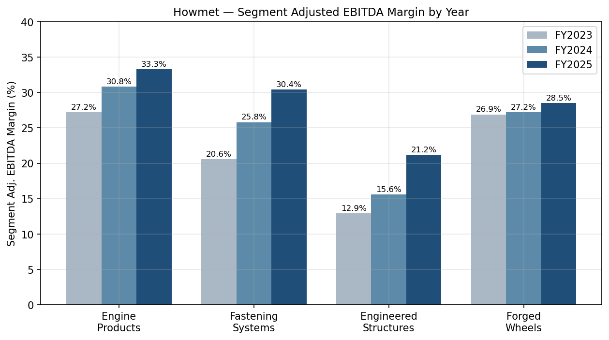
*来源: [Howmet 2025 Form 10-K, pp. 25–28](https://www.sec.gov/Archives/edgar/data/4281/000000428126000012/hwm-20251231.htm)。*

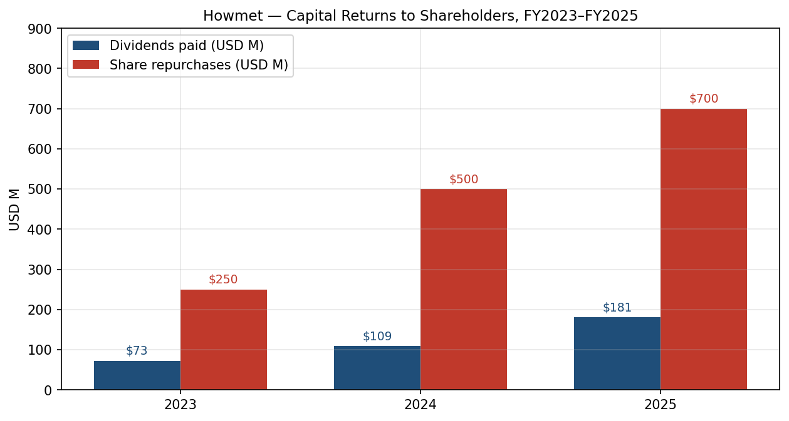
*来源: [Howmet 2025 Form 10-K, pp. 21, 32](https://www.sec.gov/Archives/edgar/data/4281/000000428126000012/hwm-20251231.htm)。*

---

## 9. 风险评估

### 公司特定风险

**1. 客户集中度——实质性。** RTX Corporation 约占 2025 财年合并第三方销售额的 11%, GE Aerospace 约占 11%, 前两名合计约 22% ([Howmet 2025 Form 10-K, p. 9](https://www.sec.gov/Archives/edgar/data/4281/000000428126000012/hwm-20251231.htm))。估计前五 (加上 Boeing、Airbus、Rolls-Royce) 在 35–40% 范围内, 但未单独披露。两大客户都拥有自给单晶叶片产能, 原则上可以扩张。缓解因素: 发动机项目 (LEAP、GTF、GE9X) 上的几十年期设计入选地位, 以及客户工程规范有效防止快速替代。严重性: 实质性。

**2. 波音 737 生产速率风险。** Howmet 对 LEAP-1B (波音 737 MAX 发动机) 叶片和紧固件内容有直接收入敞口。FAA 在 2024 年 1 月阿拉斯加航空舱门塞事件之后将 737 生产限制在每月 38 架, 波音一直致力于展示质量体系收益以提升上限 ([FAA Statement on Boeing 737-9 MAX, 2024-01-24](https://www.faa.gov/newsroom/faa-statement-boeing-737-9-max))。卖方基本假设 2026 年底退出时 47/月, 2027 年 53/月。相对该基础案例每月 5 架的差距, 转化为约 7,500 万至 1.25 亿美元的年化 Howmet 营业收入风险, 集中在发动机产品和紧固系统。缓解因素: GTF 售后市场和燃气轮机需求都增长足够快, 以抵消短期波音疲软。严重性: 中等。

**3. 对 John Plant 的关键人物依赖性。** CEO 现年 72 岁; 自 2020 年分拆以来, 公司战略与 Plant 深度绑定。没有内部分部总裁被公开作为继任者培育; 新任 CFO (Pat Winterlich) 仍处于其 Howmet 任期的第一天。缓解因素: 经验丰富的首席董事 (前波音的 Jim Albaugh); 重股权薪酬使 Plant 多年期对齐。严重性: 中等但随 Plant 留任年限增加而上升。

**4. CAM (18 亿美元) 和 Brunner (1.20 亿美元) 收购的整合风险。** 分别于 2026 年 4 月 6 日和 2026 年 2 月 6 日完成交割。CAM 是 Howmet 自 2020 年分拆以来最大的一笔收购, 通过 12 亿美元新固定利率票据 (3.75% 2028 年期、3.90% 2029 年期、4.75% 2036 年期) 加上 4.50 亿美元商业票据和 2.30 亿美元 Savannah 剥离收益融资 ([2026 财年 Q1 业绩公告, 2026-05-07](https://www.sec.gov/Archives/edgar/data/4281/000110465926056645/tm2613779d1_ex99-1.htm))。缓解因素: CAM 为补强收购整合至紧固系统 (高度熟悉的分部), 管理层明确指引 2026 年 EPS 中性、2027 年增值。严重性: 中等。

**5. 单一来源原材料敞口。** Howmet 依赖于钛海绵、特种高温合金和镍回收的有限/单一来源。俄乌冲突和钛回收返还失败已经引起钛价波动 ([Howmet 2025 Form 10-K, p. 9](https://www.sec.gov/Archives/edgar/data/4281/000000428126000012/hwm-20251231.htm))。缓解因素: 工程结构件内部的钛熔炼产能, 加上对大部分供应的长期合同。严重性: 中等。

**6. 制造中断 / 劳动力。** 26% 的美国员工加入工会 (美国有 8 项 CBA)。最大的 CBA——密歇根州 Whitehall 发动机产品工厂约 1,865 名 UAW 工人——于 2028 年 4 月到期; 第二大——Cleveland 约 730 名 UAW 工人——于 2029 年 2 月到期 ([Howmet 2025 Form 10-K, p. 7](https://www.sec.gov/Archives/edgar/data/4281/000000428126000012/hwm-20251231.htm))。2022 年 Barberton (锻造车轮) 铸造车间火灾和 2019 年法国工厂火灾提醒了运营尾部风险; 截至 2024 年的累计保险回收达到约 3,700 万美元, 但生产中断对市场份额和客户信任都有成本。严重性: 低至中等。

### 行业 / 市场风险

**7. 航空航天周期性。** 商用航空航天 OE 生产具有周期性, 反映乘客流量动态、融资可用性和 OEM 能力。该行业自 2021 年以来一直处于恢复周期; 下一个下行 (由衰退、融资约束或地缘政治冲击驱动) 将压缩航空公司对新飞机和备件的需求, 可能延长车间访问延迟。缓解因素: 售后市场比 OE 更具弹性, 而 Howmet 的组合正变得更偏向售后市场。严重性: 长期中等, 短期较低。

**8. 叶片双寡头的竞争强度。** Berkshire 持有的 PCC 的资本成本结构上低于 Howmet, 可以维持更长尾的投资周期, 且通过波音供应的 787 / 777-X 项目拥有自给客户关系。严重性: 低至中等。

**9. 关税和贸易政策波动。** 10-K 明确标注 2025 年和 2026 年初美国施加新关税的行政命令以及 Howmet 无法完全传导这些关税的风险 ([Howmet 2025 Form 10-K, pp. 8–9](https://www.sec.gov/Archives/edgar/data/4281/000000428126000012/hwm-20251231.htm))。锻造车轮也面临亚洲进口威胁, 关税可能部分解决, 但报复性措施也可能复杂化。严重性: 中等。

**10. 技术颠覆——复合材料或增材制造叶片。** 长期来看, 陶瓷基复合材料 (CMC) 叶片 (已用于 GE9X 高压涡轮静态零件) 或增材制造的旋转件可能侵蚀投资铸造单晶需求。缓解因素: 叶片温度/强度要求持续青睐用于旋转件的单晶镍; CMC 采用是一个 20 年的故事, 没有颠覆旋转叶片基础。严重性: 近期较低, 十年期看应监控。

### 财务风险

**11. 估值 / 倍数压缩风险——实质性。** HWM 处于 TTM P/E 60.8 倍和 EV/EBITDA 40.5 倍, 相对同业中位数 52.9 倍 P/E / 27 倍 EV/EBITDA ([Yahoo Finance, 2026-05-20](https://finance.yahoo.com/quote/HWM/key-statistics/))。基于 2026 财年一致 EPS (约 4.94 美元指引基准) 的远期 P/E 为 53 倍; 基于 2027 财年 EPS (5.85 美元估计, 视模型构建) 约 45 倍。在 2027 财年 EPS 上回归 TDG 类的约 30 倍 P/E 将意味着约 175 美元的目标价——即使收益稳定, 也比当前水平有 30% 以上的下行空间。倍数压缩的触发因素: 对刚上调的 2026 财年指引的任何实质性失误; 波音 737 生产速率失望; 燃气轮机订单减速; 更广泛的航空航天供应商行业轮动。严重性: 实质性。

**12. 债务和再融资——中等。** 2025 年末总债务 30.50 亿美元 ([Howmet 2025 Form 10-K, p. 20](https://www.sec.gov/Archives/edgar/data/4281/000000428126000012/hwm-20251231.htm)), 2026 年 Q1 后增加约 12 亿美元以资助 CAM 收购。日元定期贷款 2026 年 11 月到期 (美元等价约 3.20 亿美元) 是最近的大额到期; 公司有信贷额度空间 (10 亿美元 5 年期循环) 和商业票据计划。所有三家评级机构都至少在投资级三级以内; Fitch 现在在 A- 的投资级四级 ([2026 财年 Q1 业绩公告, 2026-05-07](https://www.sec.gov/Archives/edgar/data/4281/000110465926056645/tm2613779d1_ex99-1.htm))。严重性: 低。

### 宏观经济风险

**13. 地缘政治冲突和伊朗冲突参考。** 在 2026 年 Q1 业绩说明会上, John Plant 明确标注"伊朗冲突可能感受到影响"对发动机备件的影响 ([2026 财年 Q1 业绩公告, 2026-05-07](https://www.sec.gov/Archives/edgar/data/4281/000110465926056645/tm2613779d1_ex99-1.htm))。更广泛的中东空域关闭或扩大的冲突将减少对售后市场需求贡献过大的地区的乘客流量增长。俄乌钛动力学也仍然是现行因素。严重性: 低至中等, 偶发性。

**14. 外汇敞口。** 业务遍及 23 个国家; 2025 财年净利润受益于外汇翻译收益。重大敞口: GBP (英国紧固、工程结构件)、EUR (法国、匈牙利、德国)、JPY (日本发动机产品 / 车轮, 加上日元计价定期贷款)、HUF (匈牙利业务)。美元升值 10% 将压缩报告营业收入约 2 亿美元和营业利润约 5,000 万美元, 部分被本币成本匹配抵消。严重性: 低。

---

## 10. 参考资料

以下来源支持本报告中所有引用的财务数据、市场数据和管理层评论, 按主要 SEC 文件、同业文件、政府/监管来源、市场数据、行业研究及公司资源分组。所有 URL 在 2026-05-20 验证有效; 链接标题保留原文 (10-K / 10-Q / 8-K / DEF 14A 等) 以方便检索。

### 主要——SEC 文件 (Howmet Aerospace)
- [Howmet 2025 Form 10-K, filed 2026-02-12](https://www.sec.gov/Archives/edgar/data/4281/000000428126000012/hwm-20251231.htm)
- [Howmet 2026 Q1 10-Q, filed 2026-05-07](https://www.sec.gov/Archives/edgar/data/4281/000000428126000019/hwm-20260331.htm)
- [Howmet 2026 Proxy Statement (DEF 14A), filed 2026-04-06](https://www.sec.gov/Archives/edgar/data/4281/000110465926039940/tm2606852-2_def14a.htm)
- [Howmet Q1-FY2026 earnings press release (8-K Ex-99.1), 2026-05-07](https://www.sec.gov/Archives/edgar/data/4281/000110465926056645/tm2613779d1_ex99-1.htm)
- [Howmet Q4-FY2025 earnings + initial FY2026 guidance (8-K Ex-99.1), 2026-02-12](https://www.sec.gov/Archives/edgar/data/4281/000110465926013832/tm266060d1_ex99-1.htm)
- [Howmet 8-K——CAM acquisition announcement, 2025-12-22](https://www.sec.gov/Archives/edgar/data/4281/000110465925123518/tm2534069d1_ex99-1.htm)

### 主要——同业文件
- [Berkshire Hathaway 2020 10-K (PCC goodwill write-down disclosure)](https://www.sec.gov/Archives/edgar/data/1067983/000119312521046996/d12089d10k.htm)
- [Berkshire Hathaway 2024 Annual Report——Chairman's Letter, 2025-02-22](https://www.berkshirehathaway.com/2024ar/2024ar.pdf)
- [ATI Inc. 2024 10-K, filed 2025-02-25](https://www.sec.gov/Archives/edgar/data/1018963/000101896325000006/ati-20241231.htm)
- [RTX 2024 Q4 earnings press release, 2025-01-28](https://www.rtx.com/news/news-center/2025/01/28)
- [Airbus 2024 Annual Report, 2025-02-20](https://www.airbus.com/en/investors/financial-results-annual-reports)
- [Boeing 2024 Annual Report, 2025-02-04](https://www.boeing.com/investors/annual-reports.page)

### 政府 / 监管
- [FAA Statement on Boeing 737-9 MAX, 2024-01-24](https://www.faa.gov/newsroom/faa-statement-boeing-737-9-max)
- [US DoD FY2026 Budget Request——Aircraft Procurement, 2025-03-10](https://comptroller.defense.gov/Budget-Materials/)

### 市场数据
- [Yahoo Finance——HWM key statistics, 2026-05-20](https://finance.yahoo.com/quote/HWM/key-statistics/)
- [Yahoo Finance——TDG key statistics, 2026-05-20](https://finance.yahoo.com/quote/TDG/key-statistics/)
- [Yahoo Finance——HEI key statistics, 2026-05-20](https://finance.yahoo.com/quote/HEI/key-statistics/)
- [Yahoo Finance——CW key statistics, 2026-05-20](https://finance.yahoo.com/quote/CW/key-statistics/)
- [Yahoo Finance——MOG-A key statistics, 2026-05-20](https://finance.yahoo.com/quote/MOG-A/key-statistics/)
- [Yahoo Finance——HXL key statistics, 2026-05-20](https://finance.yahoo.com/quote/HXL/key-statistics/)
- [Yahoo Finance——GE key statistics, 2026-05-20](https://finance.yahoo.com/quote/GE/key-statistics/)
- [Yahoo Finance——RTX key statistics, 2026-05-20](https://finance.yahoo.com/quote/RTX/key-statistics/)

### 行业新闻和行业研究
- [Reuters——Boeing suspends titanium purchases from Russia, 2022-03-07](https://www.reuters.com/business/aerospace-defense/boeing-suspends-titanium-purchases-russia-2022-03-07/)
- [Reuters——GE Vernova Q1 2025 orders backlog, 2025-04-23](https://www.reuters.com/business/energy/ge-vernova-q1-2025/)
- [ACT Research——North American Commercial Vehicle Outlook, 2025-Q4](https://www.actresearch.net)

### 公司资源
- [Howmet——Company History page](https://www.howmet.com/about-us/history/)
- [Howmet——Engine Products page](https://www.howmet.com/products/engine-products/)
- [Howmet——Fastening Systems page](https://www.howmet.com/products/fastening-systems/)
- [Howmet——Engineered Structures page](https://www.howmet.com/products/engineered-structures/)
- [Howmet——Forged Wheels / Alcoa Wheels page](https://www.howmet.com/products/wheels/)
