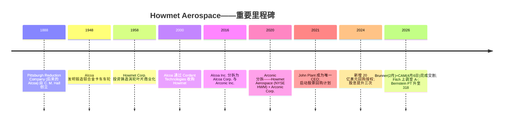
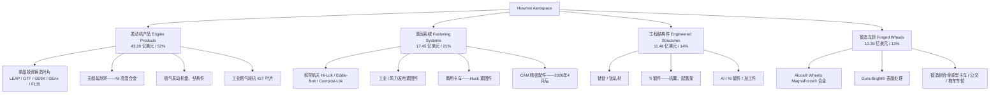
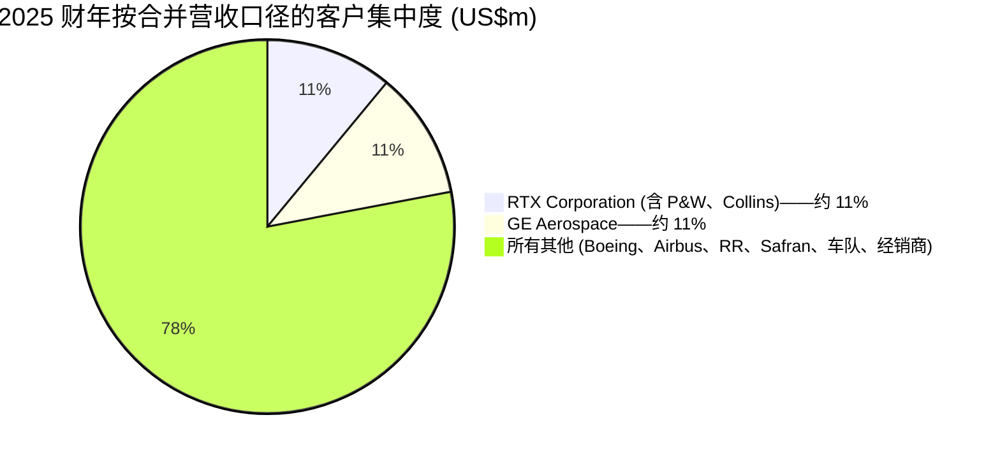
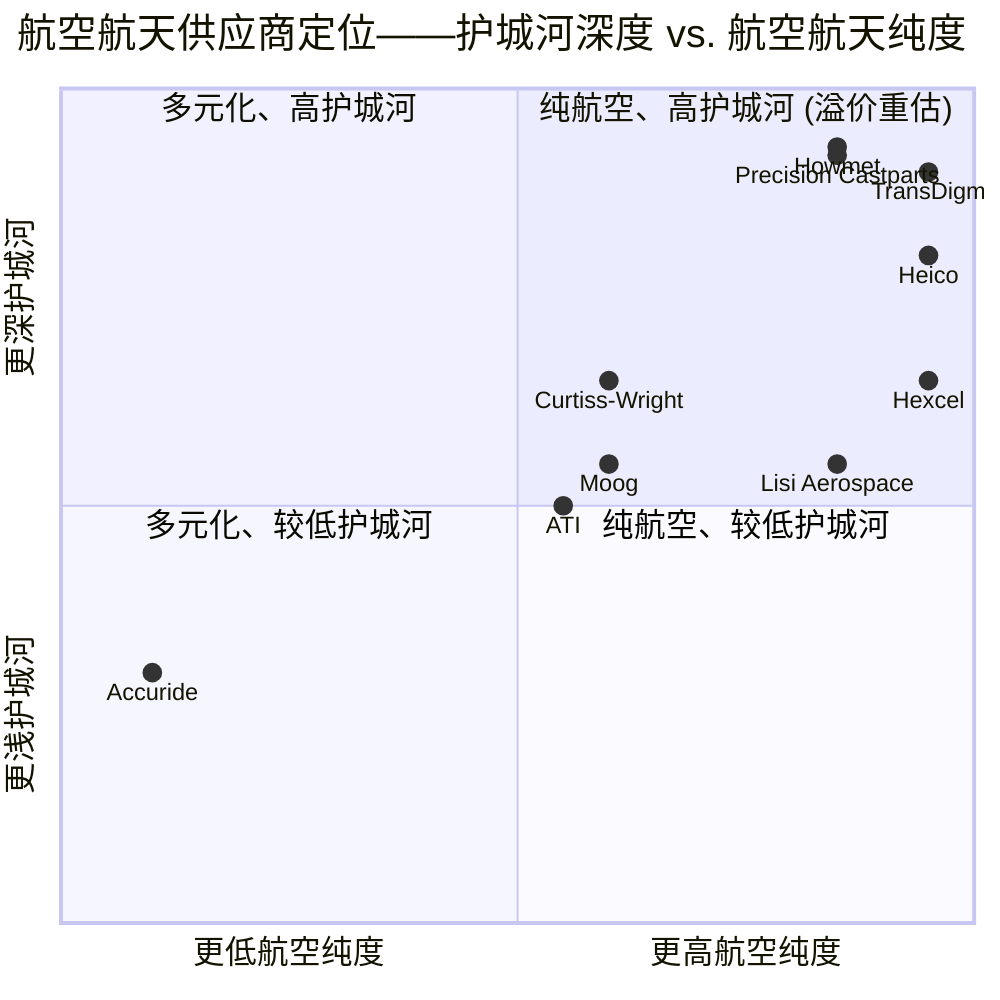

# Howmet Aerospace Inc. (NYSE:HWM) — 公司研究报告

**截至日期: 2026-06-16**
**上市地: 纽约证券交易所, 代码 HWM**
**注册地: 美国宾夕法尼亚州匹兹堡**
**报告语言: 简体中文 (英文版同时存在于本目录)**
**分析师报告——覆盖更新 (Refresh)**

> *分析师观点：* **评级：Hold / Neutral（中性）· 12 个月目标价 US$300（较现价 US$279.32 上行 +7.4%）· 估值方法：2027E Adjusted EPS US$6.00 × 50× forward P/E**
> 市值约 **US$1,118 亿** · 52 周区间 US$169.06–US$280.74 · NYSE: HWM · 稀释股本约 4.00 亿股
>
> **核心论点 (thesis pillars)**——（1）单晶投资铸造涡轮叶片 (single-crystal investment-cast turbine airfoils) 是 Howmet 与 Precision Castparts (PCC) 的实际双寡头 (duopoly)，认证壁垒+项目生命周期锁定使其成为组合中最深的护城河；（2）2025–2027 年三股顺风叠加——LEAP/GTF 售后市场 (aftermarket) MRO 超级周期、IGT (工业燃气轮机) 数据中心电力需求、防务 MRO 强度上升——驱动有机增长约 13%；（3）质量极高但**估值已计入完美执行**：股价 75× TTM P/E、54× FY26E、40× EV/EBITDA，GF Value 维度仅 3/10，风险回报大致对称；（4）我们的 US$300 目标价低于伯恩斯坦 (Bernstein) 的 US$318，差异在于我们对 forward 倍数给出更保守的 50×（而非 52×），并把波音 737 爬坡与超级周期执行风险显式计入。

> **业绩更新——2026 财年指引上调 (2026-05-07):** 管理层将全年营业收入 (revenue) 指引上调至 **95.75 亿至 97.25 亿美元** (基准值较此前 91.0 亿美元上调 5.5 亿美元，市场一致预期 93.6 亿)，调整后 EBITDA 利润率 (Adj. EBITDA margin) 上调 140 个基点至 **31.6%–31.8%** (一致预期 30.5%)，调整后每股收益 (Adjusted EPS) 上调 0.49 美元至 **4.88 至 5.00 美元** (一致预期 4.63)。自由现金流 (FCF) 指引上调至 **17.0 亿至 18.0 亿美元**。Q2'26 指引营收 23.9 亿–24.1 亿美元、调整后 EPS 1.22–1.24 美元。驱动因素: 2026 财年 Q1 营业收入同比增长 19% (商用航空航天 +20%、防务 +10%、燃气轮机 +39%)，加上业务组合净优化 (CAM 并购增加约 3.3 亿美元营收、Brunner 约 5,000 万美元、Savannah 锻盘工厂剥离)。
> 来源: [2026 财年 Q1 业绩公告, 2026-05-07](https://www.sec.gov/Archives/edgar/data/4281/000110465926056645/tm2613779d1_ex99-1.htm)；*分析师观点：* [Bernstein — Howmet: Raising target to $318, 2026-06-15, p.2](http://xs-macbook-air.local:5001/zsxq/pdf/584255421142444/Bernstein-Howmet%20Aerospace%20Inc%EF%BC%88HWM.US%EF%BC%89Howmet%EF%BC%9A%20Tripping%20off%20the%20Power~Raising%20target%20to%20%24318%EF%BC%9B%20Reiterate%20Outperform-260615.pdf)。

---

## 目录

1. 公司概览
1A. 估值与目标价 · 1B. GF Score 基本面评分
2. 估值、远期模型与目标价 (含公司历史)
3. 管理团队
4. 产品与服务
5. 客户与上市策略
6. 行业概览
7. 竞争格局
8. 市场机会 (TAM)
9. 风险评估 · 9.5 核心分歧与催化剂
10. 投资者视角评分
11. 参考资料

---

## 1. 公司概览

Howmet Aerospace Inc. (NYSE: HWM) 是一家总部位于美国宾夕法尼亚州匹兹堡的航空航天、防务、燃气轮机和商用运输行业先进工程金属制品 (advanced engineered metal products) 制造商。**本方观点 (house view) 先于描述：我们给予 Hold/Neutral 评级、12 个月目标价 US$300**——这并非对业务质量的质疑 (业务质量在同业中名列前茅)，而是对**估值已充分定价**的判断: 在 75× TTM P/E、54× FY26E 的水平上，股价已计入 LEAP MRO 超级周期与 IGT 数据中心顺风的顺利兑现，下行风险与上行空间大致对称。公司以现有形态组建于 **2020 年 4 月 1 日**, 当时 Arconic Inc. 分拆出其轧制产品 (rolled products)、挤压制品 (extrusions) 与建筑产品业务 (更名为 Arconic Corporation), 剩余的发动机产品 (engine products)、紧固件 (fastening)、结构件 (structures) 与锻造车轮 (forged wheels) 业务则更名为 Howmet Aerospace Inc.；公司谱系可上溯至 1888 年成立的原始 Alcoa ([Howmet 2025 Form 10-K, p. 1](https://www.sec.gov/Archives/edgar/data/4281/000000428126000012/hwm-20251231.htm))。

**业务简明描述。** Howmet 制造喷气发动机内部及飞机机身上承受最高温度、最高应力的金属零件——单晶镍基高温合金涡轮叶片 (single-crystal nickel-superalloy turbine airfoils)、无缝轧制环 (seamless rolled rings)、钛合金锻件 (titanium forgings)、航空航天紧固件 (aerospace fasteners)——以及用于重型卡车的锻造铝合金车轮 (forged aluminum wheels)。管理层的原话是: "从翼尖到翼尖、从机头到机尾, Howmet 能够生产 90% 以上的航空发动机结构件和旋转件" ([Howmet 2025 Form 10-K, p. 2](https://www.sec.gov/Archives/edgar/data/4281/000000428126000012/hwm-20251231.htm))。

**盈利方式。** Howmet 将工程组件直接销售给发动机 OEM (RTX/Pratt & Whitney、GE Aerospace、Rolls-Royce、Safran、Honeywell)、机身制造商 (Boeing、Airbus、Lockheed Martin)、一级制造商 (Spirit AeroSystems、GKN Aerospace)、重型卡车 OEM (PACCAR、Daimler、Volvo), 并通过 OEM 与独立 MRO (维修、维护、大修) 渠道流入发动机售后市场以获取备件订单。定价基于合同, 对金属 (钛、镍、铝、钴) 采用成本传导机制 (cost pass-through), 再加上增值毛利率; 售后市场定价的毛利率 (gross margin) 显著高于原始装机 (OE), 因为零件须在严格认证规范下复购。管理层稳步将业务组合向更高毛利的备件倾斜, 这是 2024–2026 财年利润率扩张中最重要的单一杠杆 ([Howmet 2025 Form 10-K, pp. 21,25](https://www.sec.gov/Archives/edgar/data/4281/000000428126000012/hwm-20251231.htm))。

**经营版图。** 全球覆盖 23 个国家, 2025 年末员工约 25,430 人。按出货地点计算, 北美贡献了 2025 财年约 72% 的销售额, 欧洲约 22%; 关键工厂包括美国密歇根州 Whitehall 与俄亥俄州 Niles (发动机铸件)、印第安纳州 La Porte (紧固件)、俄亥俄州 Cleveland (工程结构件)、俄亥俄州 Barberton 和捷克 Žatec (锻造车轮)、法国 Toulouse (紧固件), 以及日本、匈牙利、墨西哥和摩洛哥的运营 ([Howmet 2025 Form 10-K, pp. 1–6](https://www.sec.gov/Archives/edgar/data/4281/000000428126000012/hwm-20251231.htm))。

**规模与业务分部 (FY2025)。** 共四个可报告分部, 第三方销售 (third-party sales): 发动机产品 (Engine Products) **43.20 亿美元 / 52%**, 分部调整后 EBITDA 利润率 33.3%; 紧固系统 (Fastening Systems) **17.45 亿美元 / 21%**, 30.4%; 工程结构件 (Engineered Structures) **11.48 亿美元 / 14%**, 21.2%; 锻造车轮 (Forged Wheels) **10.39 亿美元 / 13%**, 28.5% ([Howmet 2025 Form 10-K, pp. 25–27](https://www.sec.gov/Archives/edgar/data/4281/000000428126000012/hwm-20251231.htm))。2025 财年合并营业收入 **82.52 亿美元** (同比 +11%), 营业利润 (operating income) **20.46 亿美元** (利润率 24.8%), 净利润 **15.08 亿美元** (+31%), 稀释后每股收益 **3.71 美元** (+32%), 自由现金流约 14.31 亿美元 (经营现金流 18.84 亿 − 资本开支 4.53 亿)。按终端市场, 商用航空航天占 52%, 防务航空航天占 17%, 商用运输占 15%, 燃气轮机占 11%, 其他占 4%。

下图为 FY2025 收入分配 Sankey, 直观展示 82.52 亿美元营收如何经四大分部、成本与费用最终落到 15.08 亿美元净利润:

<svg xmlns="http://www.w3.org/2000/svg" viewBox="0 0 1000 560" width="1000" height="560" role="img" aria-label="income statement Sankey"><rect x="0" y="0" width="1000" height="560" fill="#ffffff"/>
<text x="20.00" y="30.00" text-anchor="start" font-family="Helvetica,Arial,sans-serif" font-size="15" font-weight="700" fill="#1f2933">Howmet 收入分配 Sankey · FY2025 (US$m)</text>
<path d="M 204.00,64.00 C 258.00,64.00 258.00,85.00 312.00,85.00 L 312.00,298.59 C 258.00,298.59 258.00,277.59 204.00,277.59 Z" fill="#93c5fd" fill-opacity="0.55"/>
<path d="M 452.00,78.00 C 506.00,78.00 506.00,200.19 560.00,200.19 L 560.00,301.35 C 506.00,301.35 506.00,179.16 452.00,179.16 Z" fill="#86efac" fill-opacity="0.55"/>
<path d="M 452.00,179.16 C 506.00,179.16 506.00,315.35 560.00,315.35 L 560.00,353.62 C 506.00,353.62 506.00,217.43 452.00,217.43 Z" fill="#fca5a5" fill-opacity="0.55"/>
<path d="M 328.00,85.00 C 382.00,85.00 382.00,78.00 436.00,78.00 L 436.00,217.43 C 382.00,217.43 382.00,224.43 328.00,224.43 Z" fill="#86efac" fill-opacity="0.55"/>
<path d="M 328.00,224.43 C 382.00,224.43 382.00,231.43 436.00,231.43 L 436.00,500.00 C 382.00,500.00 382.00,493.00 328.00,493.00 Z" fill="#fca5a5" fill-opacity="0.55"/>
<path d="M 576.00,200.19 C 630.00,200.19 630.00,203.29 684.00,203.29 L 684.00,304.45 C 630.00,304.45 630.00,301.35 576.00,301.35 Z" fill="#86efac" fill-opacity="0.55"/>
<path d="M 700.00,203.29 C 754.00,203.29 754.00,236.51 808.00,236.51 L 808.00,311.07 C 754.00,311.07 754.00,277.85 700.00,277.85 Z" fill="#86efac" fill-opacity="0.55"/>
<path d="M 700.00,277.85 C 754.00,277.85 754.00,325.07 808.00,325.07 L 808.00,341.49 C 754.00,341.49 754.00,294.27 700.00,294.27 Z" fill="#fca5a5" fill-opacity="0.55"/>
<path d="M 204.00,291.59 C 258.00,291.59 258.00,298.59 312.00,298.59 L 312.00,384.87 C 258.00,384.87 258.00,377.87 204.00,377.87 Z" fill="#93c5fd" fill-opacity="0.55"/>
<path d="M 576.00,315.35 C 630.00,315.35 630.00,308.27 684.00,308.27 L 684.00,326.56 C 630.00,326.56 630.00,333.65 576.00,333.65 Z" fill="#fca5a5" fill-opacity="0.55"/>
<path d="M 576.00,333.65 C 630.00,333.65 630.00,340.56 684.00,340.56 L 684.00,342.56 C 630.00,342.56 630.00,335.65 576.00,335.65 Z" fill="#fca5a5" fill-opacity="0.55"/>
<path d="M 576.00,335.65 C 630.00,335.65 630.00,356.56 684.00,356.56 L 684.00,374.71 C 630.00,374.71 630.00,353.79 576.00,353.79 Z" fill="#fca5a5" fill-opacity="0.55"/>
<path d="M 576.00,367.62 C 630.00,367.62 630.00,304.45 684.00,304.45 L 684.00,314.64 C 630.00,314.64 630.00,377.81 576.00,377.81 Z" fill="#93c5fd" fill-opacity="0.55"/>
<path d="M 204.00,391.87 C 258.00,391.87 258.00,384.87 312.00,384.87 L 312.00,441.63 C 258.00,441.63 258.00,448.63 204.00,448.63 Z" fill="#93c5fd" fill-opacity="0.55"/>
<path d="M 204.00,462.63 C 258.00,462.63 258.00,441.63 312.00,441.63 L 312.00,493.00 C 258.00,493.00 258.00,514.00 204.00,514.00 Z" fill="#93c5fd" fill-opacity="0.55"/>
<rect x="188.00" y="64.00" width="16" height="213.59" rx="1.5" fill="#2563eb"/>
<rect x="188.00" y="291.59" width="16" height="86.28" rx="1.5" fill="#2563eb"/>
<rect x="188.00" y="391.87" width="16" height="56.76" rx="1.5" fill="#2563eb"/>
<rect x="188.00" y="462.63" width="16" height="51.37" rx="1.5" fill="#2563eb"/>
<rect x="312.00" y="85.00" width="16" height="408.00" rx="1.5" fill="#1e3a8a"/>
<rect x="436.00" y="78.00" width="16" height="139.43" rx="1.5" fill="#15803d"/>
<rect x="436.00" y="231.43" width="16" height="268.57" rx="1.5" fill="#dc2626"/>
<rect x="560.00" y="200.19" width="16" height="101.16" rx="1.5" fill="#15803d"/>
<rect x="560.00" y="315.35" width="16" height="38.27" rx="1.5" fill="#dc2626"/>
<rect x="560.00" y="367.62" width="16" height="10.19" rx="1.5" fill="#2563eb"/>
<rect x="684.00" y="203.29" width="16" height="90.97" rx="1.5" fill="#15803d"/>
<rect x="684.00" y="308.27" width="16" height="18.29" rx="1.5" fill="#dc2626"/>
<rect x="684.00" y="340.56" width="16" height="2.00" rx="1.5" fill="#dc2626"/>
<rect x="684.00" y="356.56" width="16" height="18.15" rx="1.5" fill="#dc2626"/>
<rect x="808.00" y="236.51" width="16" height="74.56" rx="1.5" fill="#15803d"/>
<rect x="808.00" y="325.07" width="16" height="16.41" rx="1.5" fill="#dc2626"/>
<text x="179.00" y="167.80" text-anchor="end" font-family="Helvetica,Arial,sans-serif" font-size="11.5" font-weight="700" fill="#1f2933">Engine Products</text>
<text x="179.00" y="180.80" text-anchor="end" font-family="Helvetica,Arial,sans-serif" font-size="10" font-weight="400" fill="#52606d">US$4.3B  (52.4%)</text>
<text x="179.00" y="331.73" text-anchor="end" font-family="Helvetica,Arial,sans-serif" font-size="11.5" font-weight="700" fill="#1f2933">Fastening Systems</text>
<text x="179.00" y="344.73" text-anchor="end" font-family="Helvetica,Arial,sans-serif" font-size="10" font-weight="400" fill="#52606d">US$1.7B  (21.1%)</text>
<text x="179.00" y="417.25" text-anchor="end" font-family="Helvetica,Arial,sans-serif" font-size="11.5" font-weight="700" fill="#1f2933">Engineered Structures</text>
<text x="179.00" y="430.25" text-anchor="end" font-family="Helvetica,Arial,sans-serif" font-size="10" font-weight="400" fill="#52606d">US$1.1B  (13.9%)</text>
<text x="179.00" y="485.31" text-anchor="end" font-family="Helvetica,Arial,sans-serif" font-size="11.5" font-weight="700" fill="#1f2933">Forged Wheels</text>
<text x="179.00" y="498.31" text-anchor="end" font-family="Helvetica,Arial,sans-serif" font-size="10" font-weight="400" fill="#52606d">US$1.0B  (12.6%)</text>
<rect x="331.00" y="67.00" width="113.10" height="26" rx="2" fill="#ffffff" fill-opacity="0.72"/>
<text x="334.00" y="79.00" text-anchor="start" font-family="Helvetica,Arial,sans-serif" font-size="11.5" font-weight="700" fill="#1f2933">Revenue</text>
<text x="334.00" y="92.00" text-anchor="start" font-family="Helvetica,Arial,sans-serif" font-size="10" font-weight="400" fill="#52606d">US$8.3B  (100.0%)</text>
<rect x="455.00" y="60.00" width="106.80" height="26" rx="2" fill="#ffffff" fill-opacity="0.72"/>
<text x="458.00" y="72.00" text-anchor="start" font-family="Helvetica,Arial,sans-serif" font-size="11.5" font-weight="700" fill="#1f2933">Gross Profit</text>
<text x="458.00" y="85.00" text-anchor="start" font-family="Helvetica,Arial,sans-serif" font-size="10" font-weight="400" fill="#52606d">US$2.8B  (34.2%)</text>
<rect x="455.00" y="213.43" width="144.60" height="26" rx="2" fill="#ffffff" fill-opacity="0.72"/>
<text x="458.00" y="225.43" text-anchor="start" font-family="Helvetica,Arial,sans-serif" font-size="11.5" font-weight="700" fill="#1f2933">Cost of Revenue (COGS)</text>
<text x="458.00" y="238.43" text-anchor="start" font-family="Helvetica,Arial,sans-serif" font-size="10" font-weight="400" fill="#52606d">US$5.4B  (65.8%)</text>
<rect x="579.00" y="182.19" width="106.80" height="26" rx="2" fill="#ffffff" fill-opacity="0.72"/>
<text x="582.00" y="194.19" text-anchor="start" font-family="Helvetica,Arial,sans-serif" font-size="11.5" font-weight="700" fill="#1f2933">Operating Income</text>
<text x="582.00" y="207.19" text-anchor="start" font-family="Helvetica,Arial,sans-serif" font-size="10" font-weight="400" fill="#52606d">US$2.0B  (24.8%)</text>
<rect x="579.00" y="297.35" width="150.90" height="26" rx="2" fill="#ffffff" fill-opacity="0.72"/>
<text x="582.00" y="309.35" text-anchor="start" font-family="Helvetica,Arial,sans-serif" font-size="11.5" font-weight="700" fill="#1f2933">Total Operating Expense</text>
<text x="582.00" y="322.35" text-anchor="start" font-family="Helvetica,Arial,sans-serif" font-size="10" font-weight="400" fill="#52606d">US$774.0M  (9.4%)</text>
<text x="551.00" y="369.71" text-anchor="end" font-family="Helvetica,Arial,sans-serif" font-size="11.5" font-weight="700" fill="#1f2933">Net Interest / Other Income</text>
<text x="551.00" y="382.71" text-anchor="end" font-family="Helvetica,Arial,sans-serif" font-size="10" font-weight="400" fill="#52606d">US$206.0M  (2.5%)</text>
<rect x="703.00" y="185.29" width="106.80" height="26" rx="2" fill="#ffffff" fill-opacity="0.72"/>
<text x="706.00" y="197.29" text-anchor="start" font-family="Helvetica,Arial,sans-serif" font-size="11.5" font-weight="700" fill="#1f2933">Pretax Income</text>
<text x="706.00" y="210.29" text-anchor="start" font-family="Helvetica,Arial,sans-serif" font-size="10" font-weight="400" fill="#52606d">US$1.8B  (22.3%)</text>
<rect x="703.00" y="290.27" width="113.10" height="26" rx="2" fill="#ffffff" fill-opacity="0.72"/>
<text x="706.00" y="302.27" text-anchor="start" font-family="Helvetica,Arial,sans-serif" font-size="11.5" font-weight="700" fill="#1f2933">SG&amp;A</text>
<text x="706.00" y="315.27" text-anchor="start" font-family="Helvetica,Arial,sans-serif" font-size="10" font-weight="400" fill="#52606d">US$370.0M  (4.5%)</text>
<rect x="703.00" y="322.56" width="113.10" height="26" rx="2" fill="#ffffff" fill-opacity="0.72"/>
<text x="706.00" y="334.56" text-anchor="start" font-family="Helvetica,Arial,sans-serif" font-size="11.5" font-weight="700" fill="#1f2933">R&amp;D</text>
<text x="706.00" y="347.56" text-anchor="start" font-family="Helvetica,Arial,sans-serif" font-size="10" font-weight="400" fill="#52606d">US$37.0M  (0.45%)</text>
<rect x="703.00" y="347.56" width="113.10" height="26" rx="2" fill="#ffffff" fill-opacity="0.72"/>
<text x="706.00" y="359.56" text-anchor="start" font-family="Helvetica,Arial,sans-serif" font-size="11.5" font-weight="700" fill="#1f2933">Other OpEx</text>
<text x="706.00" y="372.56" text-anchor="start" font-family="Helvetica,Arial,sans-serif" font-size="10" font-weight="400" fill="#52606d">US$367.0M  (4.4%)</text>
<text x="833.00" y="270.79" text-anchor="start" font-family="Helvetica,Arial,sans-serif" font-size="11.5" font-weight="700" fill="#1f2933">Net Income</text>
<text x="833.00" y="283.79" text-anchor="start" font-family="Helvetica,Arial,sans-serif" font-size="10" font-weight="400" fill="#52606d">US$1.5B  (18.3%)</text>
<text x="833.00" y="330.28" text-anchor="start" font-family="Helvetica,Arial,sans-serif" font-size="11.5" font-weight="700" fill="#1f2933">Income Tax</text>
<text x="833.00" y="343.28" text-anchor="start" font-family="Helvetica,Arial,sans-serif" font-size="10" font-weight="400" fill="#52606d">US$332.0M  (4.0%)</text>
<text x="500.00" y="544.00" text-anchor="middle" font-family="Helvetica,Arial,sans-serif" font-size="10" font-weight="400" fill="#52606d">Source: Howmet 2025 Form 10-K, pp.21,25-28 (segment notes) · SEC EDGAR</text>
</svg>

*来源: [Howmet 2025 Form 10-K, pp. 21,25–27,56](https://www.sec.gov/Archives/edgar/data/4281/000000428126000012/hwm-20251231.htm)。*

分部第三方销售的占比与近三年走势如下 (单晶叶片所在的 Engine Products 是最大且增速最快的引擎, 占比已升至 52%):

<svg xmlns="http://www.w3.org/2000/svg" viewBox="0 0 720 460" width="720" height="460" role="img" aria-label="revenue donut"><rect x="0" y="0" width="720" height="460" fill="#ffffff"/>
<text x="20.00" y="30.00" text-anchor="start" font-family="Helvetica,Arial,sans-serif" font-size="15" font-weight="700" fill="#1f2933">Howmet 分部第三方销售 · FY2025</text>
<path d="M 288.00,107.20 A 132 132 0 1 1 268.57,369.76 L 276.52,316.35 A 78 78 0 1 0 288.00,161.20 Z" fill="#2563eb"/>
<path d="M 268.57,369.76 A 132 132 0 0 1 156.59,251.64 L 210.35,246.55 A 78 78 0 0 0 276.52,316.35 Z" fill="#15803d"/>
<path d="M 156.59,251.64 A 132 132 0 0 1 194.13,146.40 L 232.53,184.36 A 78 78 0 0 0 210.35,246.55 Z" fill="#d97706"/>
<path d="M 194.13,146.40 A 132 132 0 0 1 288.00,107.20 L 288.00,161.20 A 78 78 0 0 0 232.53,184.36 Z" fill="#7c3aed"/>
<text x="288.00" y="235.20" text-anchor="middle" font-family="Helvetica,Arial,sans-serif" font-size="18" font-weight="800" fill="#1f2933">82.52亿\nUS$</text>
<text x="288.00" y="255.20" text-anchor="middle" font-family="Helvetica,Arial,sans-serif" font-size="13" font-weight="600" fill="#52606d">US$8.3B</text>
<text x="288.00" y="271.20" text-anchor="middle" font-family="Helvetica,Arial,sans-serif" font-size="10" font-weight="400" fill="#8a97a3">total</text>
<line x1="425.62" y1="249.38" x2="441.62" y2="249.38" stroke="#2563eb" stroke-width="1.4"/>
<text x="445.62" y="247.38" text-anchor="start" font-family="Helvetica,Arial,sans-serif" font-size="11" font-weight="700" fill="#1f2933">Engine Products</text>
<text x="445.62" y="261.38" text-anchor="start" font-family="Helvetica,Arial,sans-serif" font-size="10" font-weight="400" fill="#52606d">US$4.3B  (52.4%)</text>
<line x1="187.85" y1="334.15" x2="171.85" y2="334.15" stroke="#15803d" stroke-width="1.4"/>
<text x="167.85" y="332.15" text-anchor="end" font-family="Helvetica,Arial,sans-serif" font-size="11" font-weight="700" fill="#1f2933">Fastening Systems</text>
<text x="167.85" y="346.15" text-anchor="end" font-family="Helvetica,Arial,sans-serif" font-size="10" font-weight="400" fill="#52606d">US$1.7B  (21.1%)</text>
<line x1="158.02" y1="192.84" x2="142.02" y2="192.84" stroke="#d97706" stroke-width="1.4"/>
<text x="138.02" y="190.84" text-anchor="end" font-family="Helvetica,Arial,sans-serif" font-size="11" font-weight="700" fill="#1f2933">Engineered Structures</text>
<text x="138.02" y="204.84" text-anchor="end" font-family="Helvetica,Arial,sans-serif" font-size="10" font-weight="400" fill="#52606d">US$1.1B  (13.9%)</text>
<line x1="234.83" y1="111.86" x2="218.83" y2="111.86" stroke="#7c3aed" stroke-width="1.4"/>
<text x="214.83" y="109.86" text-anchor="end" font-family="Helvetica,Arial,sans-serif" font-size="11" font-weight="700" fill="#1f2933">Forged Wheels</text>
<text x="214.83" y="123.86" text-anchor="end" font-family="Helvetica,Arial,sans-serif" font-size="10" font-weight="400" fill="#52606d">US$1.0B  (12.6%)</text>
<text x="360.00" y="444.00" text-anchor="middle" font-family="Helvetica,Arial,sans-serif" font-size="10" font-weight="400" fill="#52606d">Source: Howmet 2025 Form 10-K, p.56 · SEC EDGAR</text>
</svg>

<svg xmlns="http://www.w3.org/2000/svg" viewBox="0 0 860 470" width="860" height="470" role="img" aria-label="historical revenue bars"><rect x="0" y="0" width="860" height="470" fill="#ffffff"/>
<text x="20.00" y="30.00" text-anchor="start" font-family="Helvetica,Arial,sans-serif" font-size="15" font-weight="700" fill="#1f2933">Howmet 分部第三方营收 · 2023-2025 (US$m)</text>
<rect x="20.00" y="44" width="11" height="11" rx="2" fill="#2563eb"/>
<text x="36.00" y="53.00" text-anchor="start" font-family="Helvetica,Arial,sans-serif" font-size="10.5" font-weight="400" fill="#1f2933">Engine Products</text>
<rect x="149.00" y="44" width="11" height="11" rx="2" fill="#15803d"/>
<text x="165.00" y="53.00" text-anchor="start" font-family="Helvetica,Arial,sans-serif" font-size="10.5" font-weight="400" fill="#1f2933">Fastening Systems</text>
<rect x="291.20" y="44" width="11" height="11" rx="2" fill="#d97706"/>
<text x="307.20" y="53.00" text-anchor="start" font-family="Helvetica,Arial,sans-serif" font-size="10.5" font-weight="400" fill="#1f2933">Engineered Structures</text>
<rect x="459.80" y="44" width="11" height="11" rx="2" fill="#7c3aed"/>
<text x="475.80" y="53.00" text-anchor="start" font-family="Helvetica,Arial,sans-serif" font-size="10.5" font-weight="400" fill="#1f2933">Forged Wheels</text>
<line x1="70" y1="412.00" x2="834" y2="412.00" stroke="#eceff2" stroke-width="1"/>
<text x="64.00" y="415.00" text-anchor="end" font-family="Helvetica,Arial,sans-serif" font-size="9.5" font-weight="400" fill="#52606d">US$0</text>
<line x1="70" y1="345.20" x2="834" y2="345.20" stroke="#eceff2" stroke-width="1"/>
<text x="64.00" y="348.20" text-anchor="end" font-family="Helvetica,Arial,sans-serif" font-size="9.5" font-weight="400" fill="#52606d">US$1.8B</text>
<line x1="70" y1="278.40" x2="834" y2="278.40" stroke="#eceff2" stroke-width="1"/>
<text x="64.00" y="281.40" text-anchor="end" font-family="Helvetica,Arial,sans-serif" font-size="9.5" font-weight="400" fill="#52606d">US$3.6B</text>
<line x1="70" y1="211.60" x2="834" y2="211.60" stroke="#eceff2" stroke-width="1"/>
<text x="64.00" y="214.60" text-anchor="end" font-family="Helvetica,Arial,sans-serif" font-size="9.5" font-weight="400" fill="#52606d">US$5.3B</text>
<line x1="70" y1="144.80" x2="834" y2="144.80" stroke="#eceff2" stroke-width="1"/>
<text x="64.00" y="147.80" text-anchor="end" font-family="Helvetica,Arial,sans-serif" font-size="9.5" font-weight="400" fill="#52606d">US$7.1B</text>
<line x1="70" y1="78.00" x2="834" y2="78.00" stroke="#eceff2" stroke-width="1"/>
<text x="64.00" y="81.00" text-anchor="end" font-family="Helvetica,Arial,sans-serif" font-size="9.5" font-weight="400" fill="#52606d">US$8.9B</text>
<rect x="123.48" y="289.60" width="147.71" height="122.40" fill="#2563eb"/>
<rect x="123.48" y="239.04" width="147.71" height="50.56" fill="#15803d"/>
<rect x="123.48" y="206.14" width="147.71" height="32.90" fill="#d97706"/>
<rect x="123.48" y="163.15" width="147.71" height="42.99" fill="#7c3aed"/>
<text x="197.33" y="428.00" text-anchor="middle" font-family="Helvetica,Arial,sans-serif" font-size="10" font-weight="400" fill="#52606d">2023</text>
<rect x="378.15" y="272.02" width="147.71" height="139.98" fill="#2563eb"/>
<rect x="378.15" y="212.96" width="147.71" height="59.06" fill="#15803d"/>
<rect x="378.15" y="173.05" width="147.71" height="39.91" fill="#d97706"/>
<rect x="378.15" y="133.55" width="147.71" height="39.50" fill="#7c3aed"/>
<text x="452.00" y="428.00" text-anchor="middle" font-family="Helvetica,Arial,sans-serif" font-size="10" font-weight="400" fill="#52606d">2024</text>
<rect x="632.81" y="250.10" width="147.71" height="161.90" fill="#2563eb"/>
<rect x="632.81" y="184.70" width="147.71" height="65.40" fill="#15803d"/>
<rect x="632.81" y="141.68" width="147.71" height="43.02" fill="#d97706"/>
<rect x="632.81" y="102.74" width="147.71" height="38.94" fill="#7c3aed"/>
<text x="706.67" y="428.00" text-anchor="middle" font-family="Helvetica,Arial,sans-serif" font-size="10" font-weight="400" fill="#52606d">2025</text>
<text x="430.00" y="454.00" text-anchor="middle" font-family="Helvetica,Arial,sans-serif" font-size="10" font-weight="400" fill="#52606d">Source: Howmet 2023-2025 Form 10-K, segment notes (2025 recast) · SEC EDGAR</text>
</svg>

*来源: [Howmet 2023–2025 Form 10-K, segment notes (2025 recast)](https://www.sec.gov/Archives/edgar/data/4281/000000428126000012/hwm-20251231.htm)。注: 2025 年 10-K 已就一项钛合金生产业务由 Engine Products 重分至 Engineered Structures 进行追溯重列。*

---

## 1A. 估值与目标价 (Valuation & Price Target)

**估值快照 (截至 2026-06-16)。** 股价收于 **279.32 美元**, 市值约 **1,118 亿美元** (2025 年末普通股约 4.016 亿股流通在外; 2026 年 1–4 月通过回购进一步减少约 280 万股), 企业价值 (EV) 约 1,140 亿美元 (扣除 7.42 亿美元现金后净债务约 23 亿美元, 注: CAM 收购于 2026 年 4 月用约 12 亿美元新债融资, 使 Q2'26 起净债务上升)。按 FY2025 稀释 EPS 3.71 美元计, **报告口径 P/E 约 75 倍**; TTM 市销率 (P/S) 约 13.5 倍, EV/EBITDA 约 40 倍, 股息收益率约 0.2% (年化 0.48 美元) ([Yahoo Finance — HWM 关键统计指标, 2026-06-16](https://finance.yahoo.com/quote/HWM/key-statistics/))。三年走势背景: HWM 估值已大幅重估——2022 财年末收于 39.49 美元 (P/E 约 25 倍), 2023 财年末 54.18 美元, 随发动机售后市场与燃气轮机需求兑现, 倍数持续扩张。**因此真正具相关性的锚定是 forward 倍数**: 基于 FY26E Adjusted EPS ~5.20 美元的远期 P/E 约 **54 倍**, 基于 FY27E ~6.00–6.11 美元约 **46–47 倍**。

**远期估值矩阵 (forward valuation matrix)。** 下表展示多重倍数随盈利增长而压缩——这是单一 TTM 数字掩盖的信息 (*分析师观点：* F26E/F27E 列为本报告与伯恩斯坦的远期估计; F25A 列为已实现/已披露值):

| 倍数 (基于现价 279.32) | F25A | F26E | F27E |
|---|---|---|---|
| Adjusted P/E | ~74× | ~54× | ~46× |
| Reported P/E | 75× | — | — |
| EV/EBITDA | ~40× | ~36× | ~32× |
| EV/FCF | ~78× | ~63× | ~52× |
| PEG (Adjusted) | — | 1.3 | 2.5 |

*来源: F25A 由 [Howmet 2025 Form 10-K, p.21](https://www.sec.gov/Archives/edgar/data/4281/000000428126000012/hwm-20251231.htm) 与 [Yahoo Finance, 2026-06-16](https://finance.yahoo.com/quote/HWM/key-statistics/) 推算; *分析师观点：* F26E/F27E 倍数框架参照 [Bernstein, 2026-06-15, p.1](http://xs-macbook-air.local:5001/zsxq/pdf/584255421142444/Bernstein-Howmet%20Aerospace%20Inc%EF%BC%88HWM.US%EF%BC%89Howmet%EF%BC%9A%20Tripping%20off%20the%20Power~Raising%20target%20to%20%24318%EF%BC%9B%20Reiterate%20Outperform-260615.pdf)。*

**相对表现 (relative performance, 截至 2026-06-15 收盘 270.44)。** 绝对回报 YTD +31.9%、1M +3.9%、6M +37.1%、12M +58.0%; 同期 S&P 500 为 YTD +8.6%、1M +0.4%、6M +8.8%、12M +22.9%; **相对超额 YTD +23.3%、12M +35.0%** ([Bernstein — 价格表现表, 2026-06-15, p.1](http://xs-macbook-air.local:5001/zsxq/pdf/584255421142444/Bernstein-Howmet%20Aerospace%20Inc%EF%BC%88HWM.US%EF%BC%89Howmet%EF%BC%9A%20Tripping%20off%20the%20Power~Raising%20target%20to%20%24318%EF%BC%9B%20Reiterate%20Outperform-260615.pdf))。HWM 是过去 12 个月航空航天板块中最显著的相对赢家之一, 股价紧贴 52 周高点 (280.74)。

**同业比较。** 航空航天供应商的 TTM 市盈率: TransDigm (TDG) ~37×、HEICO (HEI) ~60×、Curtiss-Wright (CW) ~53×、Moog (MOG.A) ~36×、Hexcel (HXL) ~57×、GE Aerospace ~37×、RTX ~33×——剔除 HWM 后中位数约 **53 倍** ([Yahoo Finance 同业页面, 2026-06-16](https://finance.yahoo.com/quote/TDG/key-statistics/))。HWM 的 75× TTM P/E 处于同业上沿, 较 HEICO 溢价、较 TransDigm 显著为高。考虑两点, 这一溢价并非全无道理: (i) Howmet 业务组合独特集中于航空航天**护城河最深的细分**——单晶投资铸造涡轮叶片——合格供应商名单实际只有两家 (Howmet 与 PCC), 售后市场附着率结构性提升; (ii) 2026 财年指引调整后 EBITDA 利润率基准约 31.7%, 高于多数同业, 经营杠杆 (operating leverage) 仍有释放空间。但在 EV/EBITDA 维度 (~40 倍, 同业最高) 上, 溢价已经相当充分, 这正是我们给 Hold 而非 Buy 的核心原因。

**目标价推导 (show the arithmetic)。** 我们采用 **forward-EPS × 目标倍数**法: **base case = FY2027E Adjusted EPS US$6.00 × 50× P/E = US$300**, 较现价 US$279.32 上行 +7.4%。倍数依据: 50× 介于当前 FY27E 隐含的 ~46× 与伯恩斯坦使用的 52× 之间, 反映 Howmet 优于 TDG 的 EPS CAGR (F25A→F27E 调整后 EPS CAGR 约 27%, 远高于多数同业) 但低于 HEICO 类纯售后市场名的折让; 我们刻意不给到 52×, 因为 75× TTM 起点本身已属历史与同业高位。EPS US$6.00 略低于伯恩斯坦的 US$6.11, 留出波音 737 爬坡执行风险的缓冲。

**牛/基准/熊情景 (bull / base / bear, 均为 *分析师观点：*)。**

| 情景 | 关键摆动假设 | EPS × 倍数 | 目标价 | 相对现价 |
|---|---|---|---|---|
| **Bull** | LEAP/GTF 新一代高价叶片+IGT 25%+ CAGR 全部兑现, 倍数维持 52× | 6.11 × 52× | **US$318** | +13.8% |
| **Base** | 有机增长 ~13%, 利润率温和扩张, 倍数 50× | 6.00 × 50× | **US$300** | +7.4% |
| **Bear** | 波音 737 月产 <38、IGT 订单减速、航空周期见顶, 倍数压缩至 38× | 5.60 × 38× | **US$213** | −23.7% |

风险回报大致对称 (上行约 +14%、下行约 −24%), 这是 Hold 评级的量化依据。

**与市场一致预期的对比 (vs consensus)。** 管理层 FY26 指引营收中位 96.5 亿、调整后 EPS 4.88–5.00 美元, **均显著高于一致预期** (营收 93.6 亿、调整后 EPS 4.63、调整后 EBITDA 利润率 30.5%)；伯恩斯坦的 FY26E EPS 5.20 / FY27E 6.11 亦高于市场 ([Bernstein, 2026-06-15, p.2](http://xs-macbook-air.local:5001/zsxq/pdf/584255421142444/Bernstein-Howmet%20Aerospace%20Inc%EF%BC%88HWM.US%EF%BC%89Howmet%EF%BC%9A%20Tripping%20off%20the%20Power~Raising%20target%20to%20%24318%EF%BC%9B%20Reiterate%20Outperform-260615.pdf))。我们的 FY27E US$6.00 略低于伯恩斯坦但高于市场一致, 立场是"业务高于一致、但估值不再提供安全边际"。

**最该盯紧的变量 (swing variables)。** 这笔投资真正取决于两点: (1) **波音 737 MAX 月产能爬坡** (FAA 38/月上限的解除节奏)——直接决定 LEAP-1B 叶片与紧固件销量; (2) **IGT 合同与产能落地**——7 家核心客户中已签 6 家长期供货+资本开支协议, 决定 25%+ CAGR 能否兑现 ([Bernstein, 2026-06-15, p.2](http://xs-macbook-air.local:5001/zsxq/pdf/584255421142444/Bernstein-Howmet%20Aerospace%20Inc%EF%BC%88HWM.US%EF%BC%89Howmet%EF%BC%9A%20Tripping%20off%20the%20Power~Raising%20target%20to%20%24318%EF%BC%9B%20Reiterate%20Outperform-260615.pdf))。

---

## 1B. GF Score (GuruFocus 式) 基本面评分

下方五维评分为本报告自有评分框架 (*分析师观点：*), 模型化 GuruFocus 的 [GF Score™](https://www.gurufocus.com/term/gf-score) 思路, 五个维度各 0–10 分, 透明加权映射为 0–100 综合分。**评分本身不附带任何文件引用**; 每一维度背后的指标 (利润率、杠杆、CAGR、倍数、回报) 各自在正文携带引用。

<svg xmlns="http://www.w3.org/2000/svg" viewBox="0 0 500 500" width="500" height="500" role="img" aria-label="GF Score radar">
<rect x="0" y="0" width="500" height="500" fill="#ffffff"/>
<text x="20" y="24" font-family="Helvetica,Arial,sans-serif" font-size="15" font-weight="700" fill="#1f2933">GF Score (GuruFocus-style): 76/100</text>
<text x="20" y="41" font-family="Helvetica,Arial,sans-serif" font-size="11" fill="#52606d">71–80 Likely average performance</text>
<polygon points="250.0,88.0 392.7,191.6 338.2,359.4 161.8,359.4 107.3,191.6" fill="#e9f5ec" stroke="none"/>
<polygon points="250.0,208.0 278.5,228.7 267.6,262.3 232.4,262.3 221.5,228.7" fill="none" stroke="#c5d3cb" stroke-width="1"/>
<polygon points="250.0,178.0 307.1,219.5 285.3,286.5 214.7,286.5 192.9,219.5" fill="none" stroke="#c5d3cb" stroke-width="1"/>
<polygon points="250.0,148.0 335.6,210.2 302.9,310.8 197.1,310.8 164.4,210.2" fill="none" stroke="#c5d3cb" stroke-width="1"/>
<polygon points="250.0,118.0 364.1,200.9 320.5,335.1 179.5,335.1 135.9,200.9" fill="none" stroke="#c5d3cb" stroke-width="1"/>
<polygon points="250.0,88.0 392.7,191.6 338.2,359.4 161.8,359.4 107.3,191.6" fill="none" stroke="#c5d3cb" stroke-width="1.3"/>
<line x1="250" y1="238" x2="161.8" y2="359.4" stroke="#cfdad3" stroke-width="1"/>
<text x="146.5" y="392.4" text-anchor="end" font-family="Helvetica,Arial,sans-serif" font-size="11.5" font-weight="600" fill="#1f2933">财务实力</text>
<text x="179.5" y="329.1" text-anchor="middle" font-family="Helvetica,Arial,sans-serif" font-size="10.5" font-weight="700" fill="#1f2933">8</text>
<line x1="250" y1="238" x2="250.0" y2="88.0" stroke="#cfdad3" stroke-width="1"/>
<text x="250.0" y="58.0" text-anchor="middle" font-family="Helvetica,Arial,sans-serif" font-size="11.5" font-weight="600" fill="#1f2933">盈利能力</text>
<text x="250.0" y="97.0" text-anchor="middle" font-family="Helvetica,Arial,sans-serif" font-size="10.5" font-weight="700" fill="#1f2933">9</text>
<line x1="250" y1="238" x2="107.3" y2="191.6" stroke="#cfdad3" stroke-width="1"/>
<text x="82.6" y="183.6" text-anchor="end" font-family="Helvetica,Arial,sans-serif" font-size="11.5" font-weight="600" fill="#1f2933">成长性</text>
<text x="135.9" y="194.9" text-anchor="middle" font-family="Helvetica,Arial,sans-serif" font-size="10.5" font-weight="700" fill="#1f2933">8</text>
<line x1="250" y1="238" x2="392.7" y2="191.6" stroke="#cfdad3" stroke-width="1"/>
<text x="417.4" y="183.6" text-anchor="start" font-family="Helvetica,Arial,sans-serif" font-size="11.5" font-weight="600" fill="#1f2933">估值</text>
<text x="292.8" y="218.1" text-anchor="middle" font-family="Helvetica,Arial,sans-serif" font-size="10.5" font-weight="700" fill="#1f2933">3</text>
<line x1="250" y1="238" x2="338.2" y2="359.4" stroke="#cfdad3" stroke-width="1"/>
<text x="353.5" y="392.4" text-anchor="start" font-family="Helvetica,Arial,sans-serif" font-size="11.5" font-weight="600" fill="#1f2933">动量</text>
<text x="329.4" y="341.2" text-anchor="middle" font-family="Helvetica,Arial,sans-serif" font-size="10.5" font-weight="700" fill="#1f2933">9</text>
<polygon points="250.0,103.0 292.8,224.1 329.4,347.2 179.5,335.1 135.9,200.9" fill="#2e8b57" fill-opacity="0.34" stroke="#2e8b57" stroke-width="2"/>
<circle cx="179.5" cy="335.1" r="2.6" fill="#2e8b57"/>
<circle cx="250.0" cy="103.0" r="2.6" fill="#2e8b57"/>
<circle cx="135.9" cy="200.9" r="2.6" fill="#2e8b57"/>
<circle cx="292.8" cy="224.1" r="2.6" fill="#2e8b57"/>
<circle cx="329.4" cy="347.2" r="2.6" fill="#2e8b57"/>
<text x="250" y="470" text-anchor="middle" font-family="Helvetica,Arial,sans-serif" font-size="9.5" fill="#52606d">Source: HWM FY2025 10-K · Yahoo Finance · Bernstein 2026-06-15 · as of 2026-06-16</text>
<text x="250" y="485" text-anchor="middle" font-family="Helvetica,Arial,sans-serif" font-size="9" fill="#52606d">GF Score = independent analyst rubric (*Analyst view:*) — not GuruFocus™ official number</text>
</svg>

| 维度 | 评分 (0–10) | |
|---|---|---|
| 财务实力 | 8 | `████████░░` |
| 盈利能力 | 9 | `█████████░` |
| 成长性 | 8 | `████████░░` |
| 估值 | 3 | `███░░░░░░░` |
| 动量 | 9 | `█████████░` |
| **GF Score (composite, *Analyst view:*)** | **76 / 100** | **71–80 Likely average performance** |

*Composite weights (*Analyst view:*): Financial Strength 20% · Profitability 25% · Growth 25% · GF Value 15% · Momentum 15% (transparent reproduction — not GuruFocus's proprietary weighting).*

| 维度 | 评分 (0–10) | |
|---|---|---|
| 财务实力 Financial Strength | 8 | `████████░░` |
| 盈利能力 Profitability | 9 | `█████████░` |
| 成长性 Growth | 8 | `████████░░` |
| 估值 GF Value | 3 | `███░░░░░░░` |
| 动量 Momentum | 9 | `█████████░` |
| **GF Score (composite, *分析师观点：*)** | **76 / 100** | **71–80 一般以上表现** |

*综合权重 (*分析师观点：*): 财务实力 20% · 盈利能力 25% · 成长性 25% · 估值 15% · 动量 15% (透明复现, 非 GuruFocus 专有权重)。来源标注于图内。*

**各维度评分理由。**

**财务实力 (8/10)。** 2025 年末总债务 30.50 亿美元, 现金 7.42 亿, 净债务约 23 亿; 以分部调整后 EBITDA 合计约 25 亿计, **净债务/EBITDA 仅约 0.9 倍**; 营业利润对净利息的覆盖倍数 (interest coverage) 为 2,046 / 151 ≈ **13.5 倍** ([Howmet 2025 Form 10-K, pp. 20–21,32](https://www.sec.gov/Archives/edgar/data/4281/000000428126000012/hwm-20251231.htm))。Fitch 于 2026 年 2 月上调至 **A-** (投资级四级) ([2026 财年 Q1 业绩公告, 2026-05-07](https://www.sec.gov/Archives/edgar/data/4281/000110465926056645/tm2613779d1_ex99-1.htm))。未给满分主因现金垫相对偏薄, 且 CAM 收购后净债务回升。

**盈利能力 (9/10)。** 营业利润率 24.8%、净利率 18.3%、**ROE 30.4%** (净利 1,508 / 平均权益约 4,954)、ROIC 显著高于 WACC, 且利润率连续多年扩张 (合并 EBITDA 利润率由 2020 年约 16% 升至 2025 年约 30%) ([Howmet 2025 Form 10-K, pp. 21,25](https://www.sec.gov/Archives/edgar/data/4281/000000428126000012/hwm-20251231.htm))。对一家金属成型企业而言, 这是稀薄高空。

**成长性 (8/10)。** FY2025 营收 +11%、稀释 EPS +32%; 三年营收 CAGR 约 12%; FY26 指引隐含营收 +17% (其中有机约 +13%), 调整后 EBITDA +22% ([2026 财年 Q1 业绩公告, 2026-05-07](https://www.sec.gov/Archives/edgar/data/4281/000110465926056645/tm2613779d1_ex99-1.htm))。增长由 LEAP/GTF MRO、IGT (+39% YoY)、防务驱动, 能见度高。

**估值 GF Value (3/10, 越高越便宜)。** 这是拖累综合分的维度: 75× TTM P/E、54× FY26E、40× EV/EBITDA, 均处历史与同业高位; 即使按伯恩斯坦最乐观的 US$318 目标价, 上行也仅约 14% ([Yahoo Finance, 2026-06-16](https://finance.yahoo.com/quote/HWM/key-statistics/); [Bernstein, 2026-06-15, p.1](http://xs-macbook-air.local:5001/zsxq/pdf/584255421142444/Bernstein-Howmet%20Aerospace%20Inc%EF%BC%88HWM.US%EF%BC%89Howmet%EF%BC%9A%20Tripping%20off%20the%20Power~Raising%20target%20to%20%24318%EF%BC%9B%20Reiterate%20Outperform-260615.pdf))。安全边际很薄。

**动量 (9/10)。** 12 个月绝对回报 +58%、相对 S&P 500 超额 +35%; 6M +37%, 股价紧贴 52 周高点, 远高于 200 日均线 ([Bernstein 价格表现表, 2026-06-15, p.1](http://xs-macbook-air.local:5001/zsxq/pdf/584255421142444/Bernstein-Howmet%20Aerospace%20Inc%EF%BC%88HWM.US%EF%BC%89Howmet%EF%BC%9A%20Tripping%20off%20the%20Power~Raising%20target%20to%20%24318%EF%BC%9B%20Reiterate%20Outperform-260615.pdf))。动量极强——但与估值维度的矛盾正是本报告 Hold 立场的张力所在。

---

## 2. 估值、远期模型与公司历史

### 2.1 远期财务模型 (forward estimates, *分析师观点：*)

下表为本报告的三年远期模型。每一投影单元格为 *分析师观点：*; 驱动因素的外部依据 (分部数据+管理层指引+行业预测) 在正文引用——模型本身不是来源。

| US$m (除 EPS) | FY2025A | FY2026E | FY2027E | 说明 |
|---|---|---|---|---|
| 营业收入 Revenue | 8,252 | 9,650 | 10,800 | FY26 取指引中位; FY27 有机 ~12% |
| 营业利润率 Op. margin | 24.8% | ~28% | ~28.7% | 售后市场组合+经营杠杆 |
| 调整后 EBITDA 利润率 | ~30% | 31.7% | ~32% | 管理层指引 +140bp |
| 调整后 EPS (Adj.) | 3.77 | 5.00 | 6.00 | FY26 取指引上沿; FY27 本报告估 |
| 同比 EPS 增长 | — | +33% | +20% | — |

*分部口径: Engine Products 受 LEAP/GTF 高价叶片+IGT 25%+ CAGR 驱动, 增速与利润率最高; Fastening Systems 因 CAM/Brunner 并表初期摊薄利润率, 中期回升; Engineered Structures 主动剥离低毛利、利润率优化; Forged Wheels 凭定价权在销量下滑中仍逆势增收。来源: [2026 财年 Q1 业绩公告, 2026-05-07](https://www.sec.gov/Archives/edgar/data/4281/000110465926056645/tm2613779d1_ex99-1.htm); *分析师观点：* 分部假设参照 [Bernstein, 2026-06-15, pp.2–3](http://xs-macbook-air.local:5001/zsxq/pdf/584255421142444/Bernstein-Howmet%20Aerospace%20Inc%EF%BC%88HWM.US%EF%BC%89Howmet%EF%BC%9A%20Tripping%20off%20the%20Power~Raising%20target%20to%20%24318%EF%BC%9B%20Reiterate%20Outperform-260615.pdf)。伯恩斯坦的对应估计为 FY26E EPS 5.20 / FY27E 6.11、FY27E 营收约 1,139 亿口径(注: 该数为其内部口径)。*

下方 5 步 DuPont 分解显示 ROE 30.4% 的来源——高净利率 (18.3%) × 适中资产周转 (0.76) × 财务杠杆 (2.19):

<svg xmlns="http://www.w3.org/2000/svg" viewBox="0 0 1240 540" width="1240" height="540" role="img" aria-label="DuPont ROE decomposition"><rect x="0" y="0" width="1240" height="540" fill="#ffffff"/>
<text x="20.00" y="30.00" text-anchor="start" font-family="Helvetica,Arial,sans-serif" font-size="15" font-weight="700" fill="#1f2933">Howmet 5步 DuPont ROE 分解 · FY2025</text>
<rect x="545.00" y="56.00" width="150" height="56" rx="7" fill="#1e3a8a"/>
<text x="620.00" y="76.00" text-anchor="middle" font-family="Helvetica,Arial,sans-serif" font-size="11.5" font-weight="700" fill="#ffffff">ROE</text>
<text x="620.00" y="94.00" text-anchor="middle" font-family="Helvetica,Arial,sans-serif" font-size="13" font-weight="800" fill="#ffffff">30.44%</text>
<text x="620.00" y="106.00" text-anchor="middle" font-family="Helvetica,Arial,sans-serif" font-size="8.5" font-weight="400" fill="#dbeafe">= Net Income / Avg Equity</text>
<rect x="191.60" y="168.00" width="150" height="56" rx="7" fill="#2563eb"/>
<text x="266.60" y="188.00" text-anchor="middle" font-family="Helvetica,Arial,sans-serif" font-size="11.5" font-weight="700" fill="#ffffff">Net Margin</text>
<text x="266.60" y="206.00" text-anchor="middle" font-family="Helvetica,Arial,sans-serif" font-size="13" font-weight="800" fill="#ffffff">18.27%</text>
<text x="266.60" y="218.00" text-anchor="middle" font-family="Helvetica,Arial,sans-serif" font-size="8.5" font-weight="400" fill="#dbeafe">Net Income / Revenue</text>
<line x1="620.00" y1="112.00" x2="266.60" y2="168.00" stroke="#94a3b8" stroke-width="1.4"/>
<rect x="545.00" y="168.00" width="150" height="56" rx="7" fill="#2563eb"/>
<text x="620.00" y="188.00" text-anchor="middle" font-family="Helvetica,Arial,sans-serif" font-size="11.5" font-weight="700" fill="#ffffff">Asset Turnover</text>
<text x="620.00" y="206.00" text-anchor="middle" font-family="Helvetica,Arial,sans-serif" font-size="13" font-weight="800" fill="#ffffff">0.76</text>
<text x="620.00" y="218.00" text-anchor="middle" font-family="Helvetica,Arial,sans-serif" font-size="8.5" font-weight="400" fill="#dbeafe">Revenue / Avg Assets</text>
<line x1="620.00" y1="112.00" x2="620.00" y2="168.00" stroke="#94a3b8" stroke-width="1.4"/>
<rect x="898.40" y="168.00" width="150" height="56" rx="7" fill="#2563eb"/>
<text x="973.40" y="188.00" text-anchor="middle" font-family="Helvetica,Arial,sans-serif" font-size="11.5" font-weight="700" fill="#ffffff">Equity Multiplier</text>
<text x="973.40" y="206.00" text-anchor="middle" font-family="Helvetica,Arial,sans-serif" font-size="13" font-weight="800" fill="#ffffff">2.19</text>
<text x="973.40" y="218.00" text-anchor="middle" font-family="Helvetica,Arial,sans-serif" font-size="8.5" font-weight="400" fill="#dbeafe">Avg Assets / Avg Equity</text>
<line x1="620.00" y1="112.00" x2="973.40" y2="168.00" stroke="#94a3b8" stroke-width="1.4"/>
<circle cx="443.30" cy="196.00" r="11" fill="#ffffff" stroke="#94a3b8" stroke-width="1.2"/>
<text x="443.30" y="201.00" text-anchor="middle" font-family="Helvetica,Arial,sans-serif" font-size="14" font-weight="800" fill="#52606d">×</text>
<circle cx="796.70" cy="196.00" r="11" fill="#ffffff" stroke="#94a3b8" stroke-width="1.2"/>
<text x="796.70" y="201.00" text-anchor="middle" font-family="Helvetica,Arial,sans-serif" font-size="14" font-weight="800" fill="#52606d">×</text>
<rect x="65.00" y="300.00" width="118" height="56" rx="7" fill="#2563eb"/>
<text x="124.00" y="320.00" text-anchor="middle" font-family="Helvetica,Arial,sans-serif" font-size="11.5" font-weight="700" fill="#ffffff">Operating Margin</text>
<text x="124.00" y="338.00" text-anchor="middle" font-family="Helvetica,Arial,sans-serif" font-size="13" font-weight="800" fill="#ffffff">24.79%</text>
<text x="124.00" y="350.00" text-anchor="middle" font-family="Helvetica,Arial,sans-serif" font-size="8.5" font-weight="400" fill="#dbeafe">Op Inc / Revenue</text>
<line x1="266.60" y1="224.00" x2="124.00" y2="300.00" stroke="#94a3b8" stroke-width="1.4"/>
<rect x="207.60" y="300.00" width="118" height="56" rx="7" fill="#2563eb"/>
<text x="266.60" y="320.00" text-anchor="middle" font-family="Helvetica,Arial,sans-serif" font-size="11.5" font-weight="700" fill="#ffffff">Tax Burden</text>
<text x="266.60" y="338.00" text-anchor="middle" font-family="Helvetica,Arial,sans-serif" font-size="13" font-weight="800" fill="#ffffff">0.8196</text>
<text x="266.60" y="350.00" text-anchor="middle" font-family="Helvetica,Arial,sans-serif" font-size="8.5" font-weight="400" fill="#dbeafe">Net Inc / Pretax</text>
<line x1="266.60" y1="224.00" x2="266.60" y2="300.00" stroke="#94a3b8" stroke-width="1.4"/>
<rect x="350.20" y="300.00" width="118" height="56" rx="7" fill="#2563eb"/>
<text x="409.20" y="320.00" text-anchor="middle" font-family="Helvetica,Arial,sans-serif" font-size="11.5" font-weight="700" fill="#ffffff">Interest Burden</text>
<text x="409.20" y="338.00" text-anchor="middle" font-family="Helvetica,Arial,sans-serif" font-size="13" font-weight="800" fill="#ffffff">0.8993</text>
<text x="409.20" y="350.00" text-anchor="middle" font-family="Helvetica,Arial,sans-serif" font-size="8.5" font-weight="400" fill="#dbeafe">Pretax / Op Inc</text>
<line x1="266.60" y1="224.00" x2="409.20" y2="300.00" stroke="#94a3b8" stroke-width="1.4"/>
<circle cx="195.30" cy="328.00" r="11" fill="#ffffff" stroke="#94a3b8" stroke-width="1.2"/>
<text x="195.30" y="333.00" text-anchor="middle" font-family="Helvetica,Arial,sans-serif" font-size="14" font-weight="800" fill="#52606d">×</text>
<circle cx="337.90" cy="328.00" r="11" fill="#ffffff" stroke="#94a3b8" stroke-width="1.2"/>
<text x="337.90" y="333.00" text-anchor="middle" font-family="Helvetica,Arial,sans-serif" font-size="14" font-weight="800" fill="#52606d">×</text>
<rect x="479.00" y="300.00" width="118" height="56" rx="7" fill="#2563eb"/>
<text x="538.00" y="326.00" text-anchor="middle" font-family="Helvetica,Arial,sans-serif" font-size="11.5" font-weight="700" fill="#ffffff">Revenue</text>
<text x="538.00" y="342.00" text-anchor="middle" font-family="Helvetica,Arial,sans-serif" font-size="13" font-weight="800" fill="#ffffff">US$8.3B</text>
<line x1="620.00" y1="224.00" x2="538.00" y2="300.00" stroke="#94a3b8" stroke-width="1.4"/>
<rect x="643.00" y="300.00" width="118" height="56" rx="7" fill="#2563eb"/>
<text x="702.00" y="320.00" text-anchor="middle" font-family="Helvetica,Arial,sans-serif" font-size="11.5" font-weight="700" fill="#ffffff">Avg Total Assets</text>
<text x="702.00" y="338.00" text-anchor="middle" font-family="Helvetica,Arial,sans-serif" font-size="13" font-weight="800" fill="#ffffff">US$10.8B</text>
<text x="702.00" y="350.00" text-anchor="middle" font-family="Helvetica,Arial,sans-serif" font-size="8.5" font-weight="400" fill="#dbeafe">(begin+end)/2</text>
<line x1="620.00" y1="224.00" x2="702.00" y2="300.00" stroke="#94a3b8" stroke-width="1.4"/>
<circle cx="620.00" cy="328.00" r="11" fill="#ffffff" stroke="#94a3b8" stroke-width="1.2"/>
<text x="620.00" y="333.00" text-anchor="middle" font-family="Helvetica,Arial,sans-serif" font-size="14" font-weight="800" fill="#52606d">÷</text>
<rect x="832.40" y="300.00" width="118" height="56" rx="7" fill="#2563eb"/>
<text x="891.40" y="320.00" text-anchor="middle" font-family="Helvetica,Arial,sans-serif" font-size="11.5" font-weight="700" fill="#ffffff">Avg Total Assets</text>
<text x="891.40" y="338.00" text-anchor="middle" font-family="Helvetica,Arial,sans-serif" font-size="13" font-weight="800" fill="#ffffff">US$10.8B</text>
<text x="891.40" y="350.00" text-anchor="middle" font-family="Helvetica,Arial,sans-serif" font-size="8.5" font-weight="400" fill="#dbeafe">(begin+end)/2</text>
<line x1="973.40" y1="224.00" x2="891.40" y2="300.00" stroke="#94a3b8" stroke-width="1.4"/>
<rect x="996.40" y="300.00" width="118" height="56" rx="7" fill="#2563eb"/>
<text x="1055.40" y="320.00" text-anchor="middle" font-family="Helvetica,Arial,sans-serif" font-size="11.5" font-weight="700" fill="#ffffff">Avg Total Equity</text>
<text x="1055.40" y="338.00" text-anchor="middle" font-family="Helvetica,Arial,sans-serif" font-size="13" font-weight="800" fill="#ffffff">US$5.0B</text>
<text x="1055.40" y="350.00" text-anchor="middle" font-family="Helvetica,Arial,sans-serif" font-size="8.5" font-weight="400" fill="#dbeafe">(begin+end)/2</text>
<line x1="973.40" y1="224.00" x2="1055.40" y2="300.00" stroke="#94a3b8" stroke-width="1.4"/>
<circle cx="967.20" cy="328.00" r="11" fill="#ffffff" stroke="#94a3b8" stroke-width="1.2"/>
<text x="967.20" y="333.00" text-anchor="middle" font-family="Helvetica,Arial,sans-serif" font-size="14" font-weight="800" fill="#52606d">÷</text>
<rect x="69.00" y="420.00" width="110" height="48" rx="7" fill="#3b82f6"/>
<text x="124.00" y="442.00" text-anchor="middle" font-family="Helvetica,Arial,sans-serif" font-size="11.5" font-weight="700" fill="#ffffff">Operating Income</text>
<text x="124.00" y="458.00" text-anchor="middle" font-family="Helvetica,Arial,sans-serif" font-size="13" font-weight="800" fill="#ffffff">US$2.0B</text>
<line x1="124.00" y1="356.00" x2="124.00" y2="420.00" stroke="#94a3b8" stroke-width="1.4"/>
<rect x="211.60" y="420.00" width="110" height="48" rx="7" fill="#3b82f6"/>
<text x="266.60" y="442.00" text-anchor="middle" font-family="Helvetica,Arial,sans-serif" font-size="11.5" font-weight="700" fill="#ffffff">Net Income</text>
<text x="266.60" y="458.00" text-anchor="middle" font-family="Helvetica,Arial,sans-serif" font-size="13" font-weight="800" fill="#ffffff">US$1.5B</text>
<line x1="266.60" y1="356.00" x2="266.60" y2="420.00" stroke="#94a3b8" stroke-width="1.4"/>
<rect x="354.20" y="420.00" width="110" height="48" rx="7" fill="#3b82f6"/>
<text x="409.20" y="442.00" text-anchor="middle" font-family="Helvetica,Arial,sans-serif" font-size="11.5" font-weight="700" fill="#ffffff">Pretax Income</text>
<text x="409.20" y="458.00" text-anchor="middle" font-family="Helvetica,Arial,sans-serif" font-size="13" font-weight="800" fill="#ffffff">US$1.8B</text>
<line x1="409.20" y1="356.00" x2="409.20" y2="420.00" stroke="#94a3b8" stroke-width="1.4"/>
<text x="620.00" y="524.00" text-anchor="middle" font-family="Helvetica,Arial,sans-serif" font-size="10" font-weight="400" fill="#52606d">Source: Howmet 2025 Form 10-K, income statement &amp; balance sheet · SEC EDGAR</text>
</svg>

*来源: [Howmet 2025 Form 10-K, income statement & balance sheet](https://www.sec.gov/Archives/edgar/data/4281/000000428126000012/hwm-20251231.htm)。*

### 2.2 卖方观点演变 (Sell-side view evolution)

本报告引用的本地券商研究中, **伯恩斯坦 (Bernstein) 的 HWM 单名报告**是最新、最完整的卖方锚 (2026-06-15)。其观点时间线:

| 机构 | 日期 | 评级 / 目标价 | 报告日股价 | 核心论点 |
|---|---|---|---|---|
| Bernstein | 2026-06-15 | **Outperform / US$318** (前值 US$280) | 270.44 (+17.6%) | IGT 数据中心需求 + 市占率 + 提价使 CAGR 升至 25%; LEAP-1B/GTF 高价新叶片放量; 防务 MRO 因伊朗冲突上升; CAM/Brunner 并购增量 |

*目标价上调 US$280→US$318 完全来自 Engine Products 与 Fastening Systems 营收上修, 而非倍数提升; FY26E EPS US$4.76→US$5.20、FY27E US$5.81→US$6.11* ([Bernstein, 2026-06-15, p.1](http://xs-macbook-air.local:5001/zsxq/pdf/584255421142444/Bernstein-Howmet%20Aerospace%20Inc%EF%BC%88HWM.US%EF%BC%89Howmet%EF%BC%9A%20Tripping%20off%20the%20Power~Raising%20target%20to%20%24318%EF%BC%9B%20Reiterate%20Outperform-260615.pdf))。本报告的 US$300 目标价较伯恩斯坦保守 6%, 差异在于倍数 (我们 50× vs 其 52×) 与 EPS (我们 6.00 vs 其 6.11) 均更审慎。我们与伯恩斯坦在**业务判断上一致** (IGT/MRO 超级周期真实), 分歧仅在**估值安全边际**: 伯恩斯坦认为 18% 上行足以维持 Outperform, 我们认为在 75× TTM 起点上, 该上行不足以补偿超级周期执行风险, 故为 Hold。(注: 由于本地库仅有 1 篇 HWM 单名近报, 跨机构分歧表暂以与公司指引+市场一致预期的三方对照替代, 见 §1A "与市场一致预期的对比"。)

### 2.3 公司历史

Howmet 的故事是叠加在美国最古老的工业公司之一之上的三次公司分拆的产物。原始 Alcoa 成立于 **1888 年**, 名为 Pittsburgh Reduction Company, 由 Charles Martin Hall 在其电解铝专利之后创立。Howmet Corporation 本身成立于 1926 年 (Howe Sound Company), 并于 1950 年代率先发展用于喷气发动机叶片的投资铸造 (investment casting) 工艺; 后历经 Pechiney (1975)、Cordant Technologies (2000)、Alcoa (2000) 等控制权变更 ([Howmet——公司历史页面](https://www.howmet.com/about-us/history/))。

*来源: [Howmet 2025 Form 10-K, pp. 1–5](https://www.sec.gov/Archives/edgar/data/4281/000000428126000012/hwm-20251231.htm); [2026 财年 Q1 业绩公告, 2026-05-07](https://www.sec.gov/Archives/edgar/data/4281/000110465926056645/tm2613779d1_ex99-1.htm)。*

**三次战略性转折塑造了现今的公司。**

*转折 1——Alcoa 分拆, 2016 年 11 月。* Alcoa Inc. 将上游商品铝 (Alcoa Corp.) 与下游工程产品 (Arconic Inc.) 分离, 逻辑是给周期性冶炼配低估值、给工程业务配成长估值; 市场最终通过对 Arconic 的重新定价验证了该逻辑 ([Howmet 2025 Form 10-K, p. 1](https://www.sec.gov/Archives/edgar/data/4281/000000428126000012/hwm-20251231.htm))。

*转折 2——Arconic 分拆, 2020 年 4 月。* Arconic 再次分拆——Howmet 保留四个最高利润率特许经营权, Arconic Corporation 取走轧制铝板/挤压/建筑产品。动机仍是估值套利: 轧制铝是个位数 EBITDA 利润率的成本传导业务; 投资铸造涡轮叶片是 30%+ EBITDA 利润率、几无合格替代的特许经营。Howmet 此后由 2020 年中约 17 美元升至 2026 年中 279 美元以上, 是分拆论题正确性的实证。

*转折 3——去杠杆 + 资本回报周期, 2021–2025 年。* 在 John Plant 领导下, 公司优先降债。总债务由 2020 年约 49 亿降至 2025 年末 30.50 亿 (2025 年单年净减 2.65 亿, 提前赎回 5.900% 2027 年票据 6.25 亿、提前偿付美元定期贷款 1.40 亿, 部分被 11 月发行 5.00 亿 4.550% 2032 年票据抵消) ([Howmet 2025 Form 10-K, pp. 21,32](https://www.sec.gov/Archives/edgar/data/4281/000000428126000012/hwm-20251231.htm))。与此同时累计授权 35.00 亿美元回购, 并以可观规模持续回购 (2023 年 2.50 亿、2024 年 5.00 亿、2025 年 7.00 亿——2025 年回购约 440 万股)、普通股股息由再启动时每季 0.04 美元提至 2026 年每季 0.12 美元 ([Howmet 2025 Form 10-K, p. 21](https://www.sec.gov/Archives/edgar/data/4281/000000428126000012/hwm-20251231.htm))。

**近期动态 (2025–2026 年)。** 2025 年 12 月 22 日宣布以约 18 亿美元现金从 Stanley Black & Decker 收购 **Consolidated Aerospace Manufacturing, LLC (CAM)**, 2026 年 4 月 6 日完成交割 ([2025-12-22 Regulation FD 8-K](https://www.sec.gov/Archives/edgar/data/4281/000110465925123518/tm2534069d1_ex99-1.htm))。CAM 为航空航天与防务生产精密紧固件、液体配件 (fluid fittings) 和复杂零部件, 整合至紧固系统, 是 2020 年分拆以来首项实质性补强收购 (bolt-on); 伯恩斯坦估计 CAM 约 75% 营收来自商用航空航天, 2026 年并表约 3.3 亿美元 ([Bernstein, 2026-06-15, p.2](http://xs-macbook-air.local:5001/zsxq/pdf/584255421142444/Bernstein-Howmet%20Aerospace%20Inc%EF%BC%88HWM.US%EF%BC%89Howmet%EF%BC%9A%20Tripping%20off%20the%20Power~Raising%20target%20to%20%24318%EF%BC%9B%20Reiterate%20Outperform-260615.pdf))。2026 年 2 月 6 日完成 Brunner Manufacturing 收购 (威斯康星州 Mauston; 约 1.20 亿美元; 大尺寸航空紧固件, 并打开 IGT 紧固件市场)。2026 年 3 月 31 日以约 2.30 亿美元出售乔治亚州 Savannah 锻盘 (disk-forging) 工厂, 录得 9,300 万美元税前利得——管理层明确定性为优化组合、向更高毛利倾斜的剥离 ([2026 财年 Q1 业绩公告, 2026-05-07](https://www.sec.gov/Archives/edgar/data/4281/000110465926056645/tm2613779d1_ex99-1.htm))。

---

## 3. 管理团队

关于 Howmet 管理层最重要的事实是: 同一人——**John Plant**——同时担任董事长 (自 2017 年 10 月)、唯一 CEO (自 2021 年 10 月, 此前为联席 CEO), 并且是后 Arconic Inc. 时代每一项重大战略决策的设计者。他现年 72 岁; 董事会在 2025 年 5 月以多年期续签了其雇佣协议, 表明短期内不会发生继任事件。

**John C. Plant——执行董事长兼首席执行官 (创始领导人/CEO 合一)。** 72 岁; 自 2016 年起任董事, 2017 年起任董事会主席; 自 2019 年 2 月任 Arconic Inc. CEO 直至 2020 年 4 月分拆, 之后于 2020–2021 年任 Howmet 联席 CEO, 自 2021 年 10 月起任唯一 CEO ([Howmet 2025 Form 10-K, p. 7](https://www.sec.gov/Archives/edgar/data/4281/000000428126000012/hwm-20251231.htm); [2026 Proxy Statement, p. 13](https://www.sec.gov/Archives/edgar/data/4281/000110465926039940/tm261330-1_def14a.htm))。Plant 是英国特许会计师协会研究员 (Fellow); 在 Howmet 之前打造了 2000 年代规模最大的全球汽车零部件业务之一: 2003–2015 年任 TRW Automotive 总裁兼 CEO, 带领其从 Northrop Grumman 拆分经 IPO, 最终于 2015 年 5 月以 **135 亿美元**出售给 ZF Friedrichshafen; 期间 TRW Automotive 增长至约 65,000 名员工、约 190 个生产设施, 跻身全球十大汽车零部件供应商 ([2026 Proxy Statement, pp. 13–14](https://www.sec.gov/Archives/edgar/data/4281/000110465926039940/tm261330-1_def14a.htm))。Plant 在 Howmet 的操作手册始终如一且自律: 剥离较低毛利业务、激进去杠杆 (债务较 2020 年峰值减少约 38%)、扩张更高毛利特许经营权 (发动机产品资本支出), 并将多余现金回馈股东。其薪酬以股权为主 (PRSU 与相对 TSR 和 ROIC 挂钩), 要求持有相当于基本薪资 6 倍的股权 ([2026 Proxy Statement, pp. 39,55–62](https://www.sec.gov/Archives/edgar/data/4281/000110465926039940/tm261330-1_def14a.htm))。其业绩记录足够强劲, 市场尚未计入继任风险, 但 72 岁的年龄是现实担忧 (见第 9 节)。

**公司治理。** 九人董事会, 其中约 89% 为独立董事; 唯一非独立董事为 Plant (因其董事长/CEO 合一), 由强势独立首席董事 **James F. Albaugh** (前波音商用飞机总裁兼 CEO、前波音综合防务系统总裁兼 CEO) 缓解 ([2026 Proxy Statement, p. 8](https://www.sec.gov/Archives/edgar/data/4281/000110465926039940/tm261330-1_def14a.htm))。审计师为 PricewaterhouseCoopers LLP; 薪酬同业组为合理多元化的工业企业 (Otis、Textron、Parker-Hannifin、TransDigm、Illinois Tool Works、Rockwell Automation 等)。2026 年股东大会的 Say-on-Pay 等议案已于 2026-05-19 表决 ([8-K——2026 年股东大会表决结果, 2026-05-26](https://www.sec.gov/Archives/edgar/data/4281/000110465926066305/tm2615511d1_8k.htm))。

**业绩综合评价。** 这首先是一家由 Plant 领导、其次才是一家航空航天公司。自分拆以来超过 16 倍的股价是头条记分牌, 但实质证据在于同步发生的利润率扩张 (合并 EBITDA 利润率由 2020 年约 16% 升至 2025 年约 30%)、去杠杆 (净债务减少约 18 亿) 和现金回报。短板与亮点重合: 公司异常依赖一位 72 岁的高管, 且没有从外部可见的分部总裁继任梯队。

---

## 4. 产品与服务

Howmet 按四个分部组织, 每个分部都有清晰可辨的旗舰特许经营权和一个小型尾部。下文逐一覆盖; 产品系列细节基于公司在 [howmet.com/products](https://www.howmet.com/products/) 的产品导航树, 并与 10-K 分部描述交叉核对。

*来源: [Howmet——发动机产品页面](https://www.howmet.com/products/engine-products/); [紧固系统页面](https://www.howmet.com/products/fastening-systems/); [工程结构件页面](https://www.howmet.com/products/engineered-structures/); [锻造车轮——Alcoa Wheels](https://www.howmet.com/products/wheels/); [Howmet 2025 Form 10-K, pp. 3–5](https://www.sec.gov/Archives/edgar/data/4281/000000428126000012/hwm-20251231.htm)。*

**资金流与供应链 (money-flow)。** 下方资金流图采用**需求/营收视角**: 左侧是付款的终端客户 (发动机 OEM、机身制造商、IGT 与卡车 OEM), 中间是 Howmet 四大分部, 右侧是钱再向上游汇聚的咽喉点——稀缺的钛海绵、镍基高温合金与铝供应。实线为直接支付、虚线为嵌入在成品零件价格里的间接流向。最关键的"跟着钱走"结论: 两大发动机 OEM (RTX、GE Aerospace) 各约 11% 合并营收, 而上游的非俄钛供应是 Howmet 自有钛熔炼的结构性优势所在。

<svg xmlns="http://www.w3.org/2000/svg" viewBox="0 0 1180 1028" width="1180" height="1028" role="img" aria-label="钱从哪来、流向何方 — Howmet 航空航天价值链" font-family="'Space Grotesk',system-ui,-apple-system,'Segoe UI',sans-serif">
<defs><linearGradient id="mfgold" gradientUnits="userSpaceOnUse" x1="0" y1="0" x2="1180" y2="0"><stop offset="0" stop-color="#f6dc97"/><stop offset="0.5" stop-color="#e9b658"/><stop offset="1" stop-color="#cf8f2c"/></linearGradient><radialGradient id="mfpool" cx="50%" cy="50%" r="50%"><stop offset="0" stop-color="#34d399" stop-opacity="0.16"/><stop offset="1" stop-color="#34d399" stop-opacity="0"/></radialGradient></defs>
<rect x="0" y="0" width="1180" height="1028" rx="16" fill="#0b0f1a"/>
<text x="42.00" y="56.00" text-anchor="start" font-family="'JetBrains Mono',ui-monospace,Menlo,monospace" font-size="11.5" font-weight="600" fill="#e9b658" letter-spacing="3">HOWMET 资金流 · FY2025 (US$M)</text>
<text x="42.00" y="100.00" text-anchor="start" font-family="'Space Grotesk',system-ui,-apple-system,'Segoe UI',sans-serif" font-size="32" font-weight="700" fill="#e8ecf5">钱从哪来、流向何方 — Howmet 航空航天价值链</text>
<text x="42.00" y="142.00" text-anchor="start" font-family="'Space Grotesk',system-ui,-apple-system,'Segoe UI',sans-serif" font-size="15" font-weight="400" fill="#8a93a8">需求侧由发动机 OEM 与机身制造商付款驱动；Howmet 四大分部加工成型后，钱再向上游汇集到稀缺的钛海绵、镍基高温合金与铝供应这几个咽喉点。</text>
<ellipse cx="1031.00" cy="412.00" rx="190" ry="150" fill="url(#mfpool)"/>
<line x1="369.50" y1="188.00" x2="369.50" y2="632.00" stroke="#222a3a" stroke-dasharray="2 8"/>
<line x1="810.50" y1="188.00" x2="810.50" y2="632.00" stroke="#222a3a" stroke-dasharray="2 8"/>
<text x="42.00" y="172.00" text-anchor="start" font-family="'JetBrains Mono',ui-monospace,Menlo,monospace" font-size="12" font-weight="400" fill="#e9b658" letter-spacing="3">STAGE 01</text>
<text x="42.00" y="188.00" text-anchor="start" font-family="'JetBrains Mono',ui-monospace,Menlo,monospace" font-size="11.5" font-weight="400" fill="#646d82">谁在付款 (终端需求)</text>
<text x="483.00" y="172.00" text-anchor="start" font-family="'JetBrains Mono',ui-monospace,Menlo,monospace" font-size="12" font-weight="400" fill="#e9b658" letter-spacing="3">STAGE 02</text>
<text x="483.00" y="188.00" text-anchor="start" font-family="'JetBrains Mono',ui-monospace,Menlo,monospace" font-size="11.5" font-weight="400" fill="#646d82">Howmet 分部</text>
<text x="924.00" y="172.00" text-anchor="start" font-family="'JetBrains Mono',ui-monospace,Menlo,monospace" font-size="12" font-weight="400" fill="#e9b658" letter-spacing="3">STAGE 03</text>
<text x="924.00" y="188.00" text-anchor="start" font-family="'JetBrains Mono',ui-monospace,Menlo,monospace" font-size="11.5" font-weight="400" fill="#646d82">钱汇向何处 (上游)</text>
<path d="M 256.00 243.64 C 369.50 243.64, 369.50 233.36, 483.00 233.36" fill="none" stroke="url(#mfgold)" stroke-width="24.00" stroke-linecap="round" opacity="0.9"/>
<path d="M 256.00 260.00 C 369.50 260.00, 369.50 358.09, 483.00 358.09" fill="none" stroke="url(#mfgold)" stroke-width="8.73" stroke-linecap="round" opacity="0.9"/>
<path d="M 256.00 360.73 C 369.50 360.73, 369.50 257.36, 483.00 257.36" fill="none" stroke="url(#mfgold)" stroke-width="24.00" stroke-linecap="round" opacity="0.9"/>
<path d="M 256.00 376.00 C 369.50 376.00, 369.50 365.73, 483.00 365.73" fill="none" stroke="url(#mfgold)" stroke-width="6.55" stroke-linecap="round" opacity="0.9"/>
<path d="M 256.00 468.45 C 369.50 468.45, 369.50 376.64, 483.00 376.64" fill="none" stroke="url(#mfgold)" stroke-width="15.27" stroke-linecap="round" opacity="0.9"/>
<path d="M 256.00 482.64 C 369.50 482.64, 369.50 475.00, 483.00 475.00" fill="none" stroke="url(#mfgold)" stroke-width="13.09" stroke-linecap="round" opacity="0.9"/>
<path d="M 256.00 574.45 C 369.50 574.45, 369.50 277.00, 483.00 277.00" fill="none" stroke="url(#mfgold)" stroke-width="15.27" stroke-linecap="round" opacity="0.9"/>
<path d="M 256.00 588.64 C 369.50 588.64, 369.50 581.00, 483.00 581.00" fill="none" stroke="url(#mfgold)" stroke-width="13.09" stroke-linecap="round" opacity="0.9"/>
<path d="M 697.00 258.45 C 810.50 258.45, 810.50 417.64, 924.00 417.64" fill="none" stroke="url(#mfgold)" stroke-width="21.82" stroke-linecap="round" opacity="0.78" stroke-dasharray="0.1 11"/>
<path d="M 697.00 242.09 C 810.50 242.09, 810.50 298.36, 924.00 298.36" fill="none" stroke="url(#mfgold)" stroke-width="10.91" stroke-linecap="round" opacity="0.78" stroke-dasharray="0.1 11"/>
<path d="M 697.00 475.00 C 810.50 475.00, 810.50 311.45, 924.00 311.45" fill="none" stroke="url(#mfgold)" stroke-width="15.27" stroke-linecap="round" opacity="0.78" stroke-dasharray="0.1 11"/>
<path d="M 697.00 369.00 C 810.50 369.00, 810.50 432.91, 924.00 432.91" fill="none" stroke="url(#mfgold)" stroke-width="8.73" stroke-linecap="round" opacity="0.78" stroke-dasharray="0.1 11"/>
<path d="M 697.00 581.00 C 810.50 581.00, 810.50 528.00, 924.00 528.00" fill="none" stroke="url(#mfgold)" stroke-width="13.09" stroke-linecap="round" opacity="0.78" stroke-dasharray="0.1 11"/>
<text x="369.50" y="232.50" text-anchor="middle" font-family="'JetBrains Mono',ui-monospace,Menlo,monospace" font-size="11.5" font-weight="400" fill="#f4d58a" paint-order="stroke" stroke="#0b0f1a" stroke-width="3.2" stroke-linejoin="round">叶片+环</text>
<text x="369.50" y="303.05" text-anchor="middle" font-family="'JetBrains Mono',ui-monospace,Menlo,monospace" font-size="11.5" font-weight="400" fill="#f4d58a" paint-order="stroke" stroke="#0b0f1a" stroke-width="3.2" stroke-linejoin="round">LEAP/GE9X</text>
<text x="369.50" y="416.55" text-anchor="middle" font-family="'JetBrains Mono',ui-monospace,Menlo,monospace" font-size="11.5" font-weight="400" fill="#f4d58a" paint-order="stroke" stroke="#0b0f1a" stroke-width="3.2" stroke-linejoin="round">紧固件</text>
<text x="369.50" y="472.82" text-anchor="middle" font-family="'JetBrains Mono',ui-monospace,Menlo,monospace" font-size="11.5" font-weight="400" fill="#f4d58a" paint-order="stroke" stroke="#0b0f1a" stroke-width="3.2" stroke-linejoin="round">锻件</text>
<text x="369.50" y="419.73" text-anchor="middle" font-family="'JetBrains Mono',ui-monospace,Menlo,monospace" font-size="11.5" font-weight="400" fill="#f4d58a" paint-order="stroke" stroke="#0b0f1a" stroke-width="3.2" stroke-linejoin="round">IGT 叶片 +39% YoY</text>
<text x="369.50" y="578.82" text-anchor="middle" font-family="'JetBrains Mono',ui-monospace,Menlo,monospace" font-size="11.5" font-weight="400" fill="#f4d58a" paint-order="stroke" stroke="#0b0f1a" stroke-width="3.2" stroke-linejoin="round">车轮</text>
<text x="810.50" y="332.05" text-anchor="middle" font-family="'JetBrains Mono',ui-monospace,Menlo,monospace" font-size="11.5" font-weight="400" fill="#f4d58a" paint-order="stroke" stroke="#0b0f1a" stroke-width="3.2" stroke-linejoin="round">Ni 合金</text>
<text x="810.50" y="387.23" text-anchor="middle" font-family="'JetBrains Mono',ui-monospace,Menlo,monospace" font-size="11.5" font-weight="400" fill="#f4d58a" paint-order="stroke" stroke="#0b0f1a" stroke-width="3.2" stroke-linejoin="round">Ti 锭</text>
<text x="810.50" y="548.50" text-anchor="middle" font-family="'JetBrains Mono',ui-monospace,Menlo,monospace" font-size="11.5" font-weight="400" fill="#f4d58a" paint-order="stroke" stroke="#0b0f1a" stroke-width="3.2" stroke-linejoin="round">Al</text>
<rect x="42.00" y="198.00" width="214" height="100.00" rx="12" fill="#15101a" stroke="#f2655f" stroke-opacity="0.5"/>
<rect x="42.00" y="198.00" width="3" height="100.00" rx="2" fill="#f2655f"/>
<text x="60.00" y="231.00" text-anchor="start" font-family="'Space Grotesk',system-ui,-apple-system,'Segoe UI',sans-serif" font-size="14" font-weight="700" fill="#ffffff">RTX / P&amp;W + Collins</text>
<text x="60.00" y="252.00" text-anchor="start" font-family="'JetBrains Mono',ui-monospace,Menlo,monospace" font-size="11" font-weight="400" fill="#c98c87">~11% 合并营收</text>
<text x="60.00" y="269.00" text-anchor="start" font-family="'JetBrains Mono',ui-monospace,Menlo,monospace" font-size="11" font-weight="400" fill="#c98c87">GTF/LEAP 叶片+紧固件</text>
<rect x="42.00" y="314.00" width="214" height="100.00" rx="12" fill="#0f1622" stroke="#7fa8f5" stroke-opacity="0.5"/>
<rect x="42.00" y="314.00" width="3" height="100.00" rx="2" fill="#7fa8f5"/>
<text x="60.00" y="347.00" text-anchor="start" font-family="'Space Grotesk',system-ui,-apple-system,'Segoe UI',sans-serif" font-size="17" font-weight="700" fill="#ffffff">GE Aerospace</text>
<text x="60.00" y="368.00" text-anchor="start" font-family="'JetBrains Mono',ui-monospace,Menlo,monospace" font-size="11" font-weight="400" fill="#8ca6d6">~11% 合并营收</text>
<text x="60.00" y="385.00" text-anchor="start" font-family="'JetBrains Mono',ui-monospace,Menlo,monospace" font-size="11" font-weight="400" fill="#8ca6d6">LEAP/GE9X/GEnx</text>
<rect x="42.00" y="430.00" width="214" height="90.00" rx="12" fill="#0f1622" stroke="#7fa8f5" stroke-opacity="0.5"/>
<rect x="42.00" y="430.00" width="3" height="90.00" rx="2" fill="#7fa8f5"/>
<text x="60.00" y="463.00" text-anchor="start" font-family="'Space Grotesk',system-ui,-apple-system,'Segoe UI',sans-serif" font-size="17" font-weight="700" fill="#ffffff">Boeing / Airbus</text>
<text x="60.00" y="484.00" text-anchor="start" font-family="'JetBrains Mono',ui-monospace,Menlo,monospace" font-size="11" font-weight="400" fill="#9bb3df">机身+起落架</text>
<text x="60.00" y="501.00" text-anchor="start" font-family="'JetBrains Mono',ui-monospace,Menlo,monospace" font-size="11" font-weight="400" fill="#9bb3df">紧固件</text>
<rect x="42.00" y="536.00" width="214" height="90.00" rx="12" fill="#141a2a" stroke="#d9a05b" stroke-opacity="0.5"/>
<rect x="42.00" y="536.00" width="3" height="90.00" rx="2" fill="#d9a05b"/>
<text x="60.00" y="569.00" text-anchor="start" font-family="'Space Grotesk',system-ui,-apple-system,'Segoe UI',sans-serif" font-size="17" font-weight="700" fill="#ffffff">IGT + 卡车 OEM</text>
<text x="60.00" y="590.00" text-anchor="start" font-family="'JetBrains Mono',ui-monospace,Menlo,monospace" font-size="11" font-weight="400" fill="#bcae98">GE Vernova/Siemens/MHI</text>
<text x="60.00" y="607.00" text-anchor="start" font-family="'JetBrains Mono',ui-monospace,Menlo,monospace" font-size="11" font-weight="400" fill="#bcae98">PACCAR/Daimler/Volvo</text>
<rect x="483.00" y="198.00" width="214" height="110.00" rx="12" fill="#15101a" stroke="#f2655f" stroke-opacity="0.5"/>
<rect x="483.00" y="198.00" width="3" height="110.00" rx="2" fill="#f2655f"/>
<text x="501.00" y="231.00" text-anchor="start" font-family="'Space Grotesk',system-ui,-apple-system,'Segoe UI',sans-serif" font-size="17" font-weight="700" fill="#ffffff">Engine Products</text>
<text x="501.00" y="252.00" text-anchor="start" font-family="'JetBrains Mono',ui-monospace,Menlo,monospace" font-size="11" font-weight="400" fill="#d49b96">单晶叶片/轧制环</text>
<text x="501.00" y="269.00" text-anchor="start" font-family="'JetBrains Mono',ui-monospace,Menlo,monospace" font-size="11" font-weight="400" fill="#d49b96">$4,320m (52%)</text>
<rect x="483.00" y="324.00" width="214" height="90.00" rx="12" fill="#141a2a" stroke="#e9b658" stroke-opacity="0.5"/>
<rect x="483.00" y="324.00" width="3" height="90.00" rx="2" fill="#e9b658"/>
<text x="501.00" y="357.00" text-anchor="start" font-family="'Space Grotesk',system-ui,-apple-system,'Segoe UI',sans-serif" font-size="14" font-weight="700" fill="#ffffff">Fastening Systems</text>
<text x="501.00" y="378.00" text-anchor="start" font-family="'JetBrains Mono',ui-monospace,Menlo,monospace" font-size="11" font-weight="400" fill="#8a93a8">航空+工业紧固件</text>
<text x="501.00" y="395.00" text-anchor="start" font-family="'JetBrains Mono',ui-monospace,Menlo,monospace" font-size="11" font-weight="400" fill="#8a93a8">$1,745m (21%)</text>
<rect x="483.00" y="430.00" width="214" height="90.00" rx="12" fill="#141a2a" stroke="#e9b658" stroke-opacity="0.5"/>
<rect x="483.00" y="430.00" width="3" height="90.00" rx="2" fill="#e9b658"/>
<text x="501.00" y="463.00" text-anchor="start" font-family="'Space Grotesk',system-ui,-apple-system,'Segoe UI',sans-serif" font-size="14" font-weight="700" fill="#ffffff">Engineered Structures</text>
<text x="501.00" y="484.00" text-anchor="start" font-family="'JetBrains Mono',ui-monospace,Menlo,monospace" font-size="11" font-weight="400" fill="#8a93a8">钛/铝/镍锻件</text>
<text x="501.00" y="501.00" text-anchor="start" font-family="'JetBrains Mono',ui-monospace,Menlo,monospace" font-size="11" font-weight="400" fill="#8a93a8">$1,148m (14%)</text>
<rect x="483.00" y="536.00" width="214" height="90.00" rx="12" fill="#141a2a" stroke="#e9b658" stroke-opacity="0.5"/>
<rect x="483.00" y="536.00" width="3" height="90.00" rx="2" fill="#e9b658"/>
<text x="501.00" y="569.00" text-anchor="start" font-family="'Space Grotesk',system-ui,-apple-system,'Segoe UI',sans-serif" font-size="17" font-weight="700" fill="#ffffff">Forged Wheels</text>
<text x="501.00" y="590.00" text-anchor="start" font-family="'JetBrains Mono',ui-monospace,Menlo,monospace" font-size="11" font-weight="400" fill="#8a93a8">Alcoa® 锻造铝车轮</text>
<text x="501.00" y="607.00" text-anchor="start" font-family="'JetBrains Mono',ui-monospace,Menlo,monospace" font-size="11" font-weight="400" fill="#8a93a8">$1,039m (13%)</text>
<rect x="924.00" y="256.00" width="214" height="100.00" rx="12" fill="#101d1a" stroke="#34d399" stroke-opacity="0.5"/>
<rect x="924.00" y="256.00" width="3" height="100.00" rx="2" fill="#34d399"/>
<text x="942.00" y="289.00" text-anchor="start" font-family="'Space Grotesk',system-ui,-apple-system,'Segoe UI',sans-serif" font-size="17" font-weight="700" fill="#ffffff">钛海绵 Titanium</text>
<text x="942.00" y="310.00" text-anchor="start" font-family="'JetBrains Mono',ui-monospace,Menlo,monospace" font-size="11" font-weight="400" fill="#7fd9bf">自有 Ti 熔炼 + VSMPO/Toho/ATI</text>
<text x="942.00" y="327.00" text-anchor="start" font-family="'JetBrains Mono',ui-monospace,Menlo,monospace" font-size="11" font-weight="400" fill="#7fd9bf">非俄供应=咽喉点</text>
<rect x="924.00" y="372.00" width="214" height="100.00" rx="12" fill="#15121f" stroke="#a78bfa" stroke-opacity="0.5"/>
<rect x="924.00" y="372.00" width="3" height="100.00" rx="2" fill="#a78bfa"/>
<text x="942.00" y="405.00" text-anchor="start" font-family="'Space Grotesk',system-ui,-apple-system,'Segoe UI',sans-serif" font-size="14" font-weight="700" fill="#ffffff">镍基高温合金 Ni-superalloy</text>
<text x="942.00" y="426.00" text-anchor="start" font-family="'JetBrains Mono',ui-monospace,Menlo,monospace" font-size="11" font-weight="400" fill="#b9a6f5">叶片/环关键原料</text>
<text x="942.00" y="443.00" text-anchor="start" font-family="'JetBrains Mono',ui-monospace,Menlo,monospace" font-size="11" font-weight="400" fill="#b9a6f5">回炉返还依赖</text>
<rect x="924.00" y="488.00" width="214" height="80.00" rx="12" fill="#141a2a" stroke="#e9b658" stroke-opacity="0.5"/>
<rect x="924.00" y="488.00" width="3" height="80.00" rx="2" fill="#e9b658"/>
<text x="942.00" y="521.00" text-anchor="start" font-family="'Space Grotesk',system-ui,-apple-system,'Segoe UI',sans-serif" font-size="17" font-weight="700" fill="#ffffff">铝/钴 Al &amp; Co</text>
<text x="942.00" y="542.00" text-anchor="start" font-family="'JetBrains Mono',ui-monospace,Menlo,monospace" font-size="11" font-weight="400" fill="#8a93a8">车轮+成本传导</text>
<text x="942.00" y="559.00" text-anchor="start" font-family="'JetBrains Mono',ui-monospace,Menlo,monospace" font-size="11" font-weight="400" fill="#8a93a8">公式联动定价</text>
<rect x="42.00" y="652.00" width="26" height="4" rx="2" fill="#e9b658"/>
<text x="78.00" y="656.00" text-anchor="start" font-family="'JetBrains Mono',ui-monospace,Menlo,monospace" font-size="11.5" font-weight="400" fill="#8a93a8">money paid directly</text>
<circle cx="242.80" cy="654.00" r="2" fill="#e9b658"/>
<circle cx="249.80" cy="654.00" r="2" fill="#e9b658"/>
<circle cx="256.80" cy="654.00" r="2" fill="#e9b658"/>
<circle cx="263.80" cy="654.00" r="2" fill="#e9b658"/>
<text x="276.80" y="656.00" text-anchor="start" font-family="'JetBrains Mono',ui-monospace,Menlo,monospace" font-size="11.5" font-weight="400" fill="#8a93a8">money embedded in a finished chip</text>
<text x="538.40" y="656.00" text-anchor="start" font-family="'JetBrains Mono',ui-monospace,Menlo,monospace" font-size="11.5" font-weight="400" fill="#8a93a8">thickness ≈ rough scale</text>
<rect x="728.00" y="647.00" width="11" height="11" rx="3" fill="#f2655f"/>
<text x="747.00" y="656.00" text-anchor="start" font-family="'JetBrains Mono',ui-monospace,Menlo,monospace" font-size="11.5" font-weight="400" fill="#8a93a8">in-house silicon</text>
<rect x="886.20" y="647.00" width="11" height="11" rx="3" fill="#e9b658"/>
<text x="905.20" y="656.00" text-anchor="start" font-family="'JetBrains Mono',ui-monospace,Menlo,monospace" font-size="11.5" font-weight="400" fill="#8a93a8">supplier</text>
<rect x="986.80" y="647.00" width="11" height="11" rx="3" fill="#34d399"/>
<text x="1005.80" y="656.00" text-anchor="start" font-family="'JetBrains Mono',ui-monospace,Menlo,monospace" font-size="11.5" font-weight="400" fill="#8a93a8">foundry</text>
<rect x="42.00" y="667.00" width="11" height="11" rx="3" fill="#a78bfa"/>
<text x="61.00" y="676.00" text-anchor="start" font-family="'JetBrains Mono',ui-monospace,Menlo,monospace" font-size="11.5" font-weight="400" fill="#8a93a8">memory</text>
<line x1="42" y1="692.00" x2="1138" y2="692.00" stroke="#222a3a"/>
<text x="42.00" y="708.00" text-anchor="start" font-family="'JetBrains Mono',ui-monospace,Menlo,monospace" font-size="12" font-weight="500" fill="#8a93a8" letter-spacing="3">FOLLOW THE MONEY — 资金链关键点</text>
<rect x="42.00" y="728.00" width="356.00" height="116.00" rx="13" fill="#0e1320" stroke="#f2655f" stroke-opacity="0.28"/>
<rect x="42.00" y="728.00" width="3" height="116.00" rx="2" fill="#f2655f"/>
<text x="58.00" y="752.00" text-anchor="start" font-family="'JetBrains Mono',ui-monospace,Menlo,monospace" font-size="10" font-weight="600" fill="#f2655f" letter-spacing="1">需求 · 双客户集中</text>
<text x="58.00" y="770.00" text-anchor="start" font-family="'Space Grotesk',system-ui,-apple-system,'Segoe UI',sans-serif" font-size="15.5" font-weight="700" fill="#ffffff">两大发动机 OEM</text>
<text x="58.00" y="794.00" font-family="'Space Grotesk',system-ui,-apple-system,'Segoe UI',sans-serif" font-size="12" xml:space="preserve"><tspan fill="#f4d58a" font-weight="700">RTX</tspan><tspan fill="#9aa3b8" font-weight="400"> 与</tspan><tspan fill="#f4d58a" font-weight="700"> GE</tspan><tspan fill="#f4d58a" font-weight="700"> Aerospace</tspan><tspan fill="#9aa3b8" font-weight="400"> 各约</tspan><tspan fill="#f4d58a" font-weight="700"> 11%</tspan><tspan fill="#9aa3b8" font-weight="400"> 合并营收，合计</tspan><tspan fill="#f4d58a" font-weight="700"> ~22%</tspan></text>
<text x="58.00" y="810.00" font-family="'Space Grotesk',system-ui,-apple-system,'Segoe UI',sans-serif" font-size="12" xml:space="preserve"><tspan fill="#9aa3b8" font-weight="400">；它们同时拥有自给叶片产能，是客户也是潜在竞争者。</tspan></text>
<rect x="412.00" y="728.00" width="356.00" height="116.00" rx="13" fill="#0e1320" stroke="#f2655f" stroke-opacity="0.28"/>
<rect x="412.00" y="728.00" width="3" height="116.00" rx="2" fill="#f2655f"/>
<text x="428.00" y="752.00" text-anchor="start" font-family="'JetBrains Mono',ui-monospace,Menlo,monospace" font-size="10" font-weight="600" fill="#f2655f" letter-spacing="1">成型 · 护城河</text>
<text x="428.00" y="770.00" text-anchor="start" font-family="'Space Grotesk',system-ui,-apple-system,'Segoe UI',sans-serif" font-size="15.5" font-weight="700" fill="#ffffff">Engine Products</text>
<text x="428.00" y="794.00" font-family="'Space Grotesk',system-ui,-apple-system,'Segoe UI',sans-serif" font-size="12" xml:space="preserve"><tspan fill="#9aa3b8" font-weight="400">单晶投资铸造叶片是</tspan><tspan fill="#f4d58a" font-weight="700"> Howmet+PCC</tspan><tspan fill="#9aa3b8" font-weight="400"> 双寡头；分部</tspan><tspan fill="#9aa3b8" font-weight="400"> EBITDA</tspan><tspan fill="#9aa3b8" font-weight="400"> 利润率</tspan><tspan fill="#f4d58a" font-weight="700"> 33.3%</tspan><tspan fill="#9aa3b8" font-weight="400"> ，2025</tspan></text>
<text x="428.00" y="810.00" font-family="'Space Grotesk',system-ui,-apple-system,'Segoe UI',sans-serif" font-size="12" xml:space="preserve"><tspan fill="#9aa3b8" font-weight="400">营收占比</tspan><tspan fill="#f4d58a" font-weight="700"> 52%</tspan><tspan fill="#9aa3b8" font-weight="400"> ，IGT</tspan><tspan fill="#9aa3b8" font-weight="400"> 叶片</tspan><tspan fill="#9aa3b8" font-weight="400"> Q1</tspan><tspan fill="#9aa3b8" font-weight="400"> 同比</tspan><tspan fill="#f4d58a" font-weight="700"> +39%</tspan><tspan fill="#9aa3b8" font-weight="400"> 。</tspan></text>
<rect x="782.00" y="728.00" width="356.00" height="116.00" rx="13" fill="#0e1320" stroke="#34d399" stroke-opacity="0.28"/>
<rect x="782.00" y="728.00" width="3" height="116.00" rx="2" fill="#34d399"/>
<text x="798.00" y="752.00" text-anchor="start" font-family="'JetBrains Mono',ui-monospace,Menlo,monospace" font-size="10" font-weight="600" fill="#34d399" letter-spacing="1">上游 · 咽喉点</text>
<text x="798.00" y="770.00" text-anchor="start" font-family="'Space Grotesk',system-ui,-apple-system,'Segoe UI',sans-serif" font-size="15.5" font-weight="700" fill="#ffffff">钛供应</text>
<text x="798.00" y="794.00" font-family="'Space Grotesk',system-ui,-apple-system,'Segoe UI',sans-serif" font-size="12" xml:space="preserve"><tspan fill="#9aa3b8" font-weight="400">Howmet</tspan><tspan fill="#9aa3b8" font-weight="400"> 自有</tspan><tspan fill="#f4d58a" font-weight="700"> Ti</tspan><tspan fill="#f4d58a" font-weight="700"> 熔炼</tspan><tspan fill="#9aa3b8" font-weight="400"> 产能是少数非俄、非</tspan><tspan fill="#9aa3b8" font-weight="400"> VSMPO</tspan><tspan fill="#9aa3b8" font-weight="400"> 来源之一；俄乌战后</tspan><tspan fill="#9aa3b8" font-weight="400"> Boeing</tspan></text>
<text x="798.00" y="810.00" font-family="'Space Grotesk',system-ui,-apple-system,'Segoe UI',sans-serif" font-size="12" xml:space="preserve"><tspan fill="#9aa3b8" font-weight="400">停采俄钛，使其成结构性顺风。</tspan></text>
<rect x="42.00" y="858.00" width="356.00" height="116.00" rx="13" fill="#0e1320" stroke="#a78bfa" stroke-opacity="0.28"/>
<rect x="42.00" y="858.00" width="3" height="116.00" rx="2" fill="#a78bfa"/>
<text x="58.00" y="882.00" text-anchor="start" font-family="'JetBrains Mono',ui-monospace,Menlo,monospace" font-size="10" font-weight="600" fill="#a78bfa" letter-spacing="1">上游 · 原料联动</text>
<text x="58.00" y="900.00" text-anchor="start" font-family="'Space Grotesk',system-ui,-apple-system,'Segoe UI',sans-serif" font-size="15.5" font-weight="700" fill="#ffffff">镍基高温合金</text>
<text x="58.00" y="924.00" font-family="'Space Grotesk',system-ui,-apple-system,'Segoe UI',sans-serif" font-size="12" xml:space="preserve"><tspan fill="#9aa3b8" font-weight="400">叶片/环的关键原料，</tspan><tspan fill="#f4d58a" font-weight="700"> Ni、Co</tspan><tspan fill="#9aa3b8" font-weight="400"> 价格通过合同公式</tspan><tspan fill="#f4d58a" font-weight="700"> 成本传导</tspan><tspan fill="#f4d58a" font-weight="700"> (cost</tspan><tspan fill="#f4d58a" font-weight="700"> pass-through)</tspan></text>
<text x="58.00" y="940.00" font-family="'Space Grotesk',system-ui,-apple-system,'Segoe UI',sans-serif" font-size="12" xml:space="preserve"><tspan fill="#9aa3b8" font-weight="400">，滞后一两个季度，快速波动期会压缩利润率。</tspan></text>
<text x="590.00" y="1010.00" text-anchor="middle" font-family="'JetBrains Mono',ui-monospace,Menlo,monospace" font-size="10.5" font-weight="400" fill="#646d82">Source: Howmet 2025 Form 10-K (pp.5-9 供应链, p.56 客户/分部) · Bernstein 2026-06-15 · SEC EDGAR</text>
</svg>

*来源: [Howmet 2025 Form 10-K, pp. 5–9 (供应链), p. 56 (客户/分部)](https://www.sec.gov/Archives/edgar/data/4281/000000428126000012/hwm-20251231.htm); *分析师观点：* IGT 与并购增量参 [Bernstein, 2026-06-15, pp.1–3](http://xs-macbook-air.local:5001/zsxq/pdf/584255421142444/Bernstein-Howmet%20Aerospace%20Inc%EF%BC%88HWM.US%EF%BC%89Howmet%EF%BC%9A%20Tripping%20off%20the%20Power~Raising%20target%20to%20%24318%EF%BC%9B%20Reiterate%20Outperform-260615.pdf)。*

### 4.1 发动机产品 (Engine Products)——护城河业务

**销售什么。** 单晶镍基高温合金涡轮叶片 (旋转高压涡轮叶片和固定导叶 stator vanes)、用于发动机机匣和燃烧室的镍基高温合金无缝轧制环、喷气发动机盘 (disks) 和结构铸件 (structural castings)。同一技术也供应重型工业燃气轮机 (IGT) 市场——目前是组合内增速最快的需求源。

**中文释义 / Plain-language gloss:** *单晶 (single-crystal)* 指整片叶片是一个无晶界的金属单晶体——晶界是高温蠕变 (creep) 的薄弱点, 消除晶界使叶片能在 1,600°C+ 的燃气中长时间承受离心应力。*投资铸造 (investment casting)* 是"失蜡法"的工业版: 用陶瓷型壳包裹蜡模、熔蜡留腔、浇注高温合金, 再定向凝固 (directional solidification) 控制晶体生长方向。

**竞争优势判定——是, 组合中最强护城河。** 护城河类型: *技术 + 监管/认证 + 供应商集中度*。镍基高温合金叶片的单晶定向凝固投资铸造工艺由 Howmet (Whitehall, MI 和 Niles, OH) 与 Berkshire Hathaway 旗下 Precision Castparts (PCC) 经 50 年发展形成; 按主要发动机项目计算, 全球合格供应商名单实际只有这两家加上少量内部产能 (RTX/P&W、GE Aerospace 有自有产能但仍持续向 Howmet 采购) ([Howmet 2025 Form 10-K, pp. 5–6](https://www.sec.gov/Archives/edgar/data/4281/000000428126000012/hwm-20251231.htm))。替换合格叶片供应商需经多年 FAA 型号合格证 (Type Certificate) 重新认证。经济证据: 2025 财年发动机产品分部调整后 EBITDA 利润率 **33.3%**, 较 2023 年的 27.2% 提升——两年扩张 610 个基点, 即便分部 2025 年净增约 1,445 名员工用于产能扩张 ([Howmet 2025 Form 10-K, p. 25](https://www.sec.gov/Archives/edgar/data/4281/000000428126000012/hwm-20251231.htm))。

**当前技术拐点 (AI/半导体邻接的电力链条)。** 两个拐点正在驱动需求: (1) **LEAP-1B/GTF 高价新一代叶片** (LEAP-1B 的 "Maverick" 叶片已开始量产、预计 2027 年完成全面切换; GTF-A 新叶片已获 A320neo 系列认证, 2027 下半年放量), 高附加值产品占比提升直接推高利润率; (2) **IGT 受数据中心电力需求驱动**, 2026 年 Q1 收入同比 +39%, *分析师观点：* 伯恩斯坦因市占率>50%+提价将其 CAGR 上调至 25%, 并认为增长潜力超过公司自身"3–5 年翻倍"的预测 ([Bernstein, 2026-06-15, pp.1–2](http://xs-macbook-air.local:5001/zsxq/pdf/584255421142444/Bernstein-Howmet%20Aerospace%20Inc%EF%BC%88HWM.US%EF%BC%89Howmet%EF%BC%9A%20Tripping%20off%20the%20Power~Raising%20target%20to%20%24318%EF%BC%9B%20Reiterate%20Outperform-260615.pdf))。

📺 **延伸观看 / Further viewing**
- [单晶涡轮叶片如何制造 (定向凝固投资铸造) — 看懂 Engine Products 的护城河](https://www.youtube.com/watch?v=5Vw_HQGm-Sg)

**最接近的竞争对手产品。** Berkshire Hathaway 旗下 **Precision Castparts Corp (PCC)**——Wyman-Gordon 叶片和结构铸件, 2016 年被 Berkshire 以约 320 亿美元收购。PCC 是单晶叶片领域唯一真正的对位; 竞争地位: *技术持平、规模略落后*; PCC 总铸造产能更大但为私人公司, 历史上对售后市场捕获关注较少。其他边缘竞争者: Doncasters Group、Consolidated Precision Products (CPP), 以及 RTX/P&W、Rolls-Royce 的内部产能 ([Howmet 2025 Form 10-K, p. 6](https://www.sec.gov/Archives/edgar/data/4281/000000428126000012/hwm-20251231.htm))。

### 4.2 紧固系统 (Fastening Systems)——LEAP 产量+并购杠杆

**销售什么。** 航空航天紧固件——Hi-Lok 和 Eddie-Bolt 高强度螺栓、Composi-Lok 用于复合材料的盲铆紧固件 (blind fasteners)、多夹紧度和锁紧螺栓系统; 用于风力发电、太阳能和物料搬运的工业紧固件; 用于商用卡车的 Huck 品牌结构紧固件。2026 年 4 月后还包括 CAM 的精密配件和液体配件。渠道: 直接向 OEM 销售及通过航空航天经销商, 以美元/英镑/欧元定价并传导材料成本。

**竞争优势判定——是, 部分护城河。** 护城河类型: *认证 + 规模 + 品牌*。航空航天紧固件经严格认证 (NADCAP、Boeing/Airbus AVL 批准), 切换成本不像叶片那样极端, 但新批准仍以年计。2025 财年紧固系统分部调整后 EBITDA 利润率 **30.4%**, 较 2023 年的 20.6% 提升——两年扩张 980 个基点, 由商用航空航天组合转移、生产率和外汇驱动 ([Howmet 2025 Form 10-K, p. 25](https://www.sec.gov/Archives/edgar/data/4281/000000428126000012/hwm-20251231.htm))。*分析师观点：* CAM 收购初期摊薄该分部利润率, 但管理层预计中期回升至分部平均水平, 随 A350/787 宽体机产能爬坡, 收入与利润率将在 2027 年同步改善 ([Bernstein, 2026-06-15, p.2](http://xs-macbook-air.local:5001/zsxq/pdf/584255421142444/Bernstein-Howmet%20Aerospace%20Inc%EF%BC%88HWM.US%EF%BC%89Howmet%EF%BC%9A%20Tripping%20off%20the%20Power~Raising%20target%20to%20%24318%EF%BC%9B%20Reiterate%20Outperform-260615.pdf))。

**最接近的竞争对手产品。** **Lisi Aerospace** (法国)——Hi-Lok 和锁紧螺栓的对等产品, 服务 Airbus prime; PCC 的 PCC Fasteners 部门; Arconic Corp. 的 ATS 紧固件。地位: *Hi-Lok/Eddie-Bolt 与 Lisi 大致持平; 在 Composi-Lok 复合材料盲铆技术上领先; 在工业/Huck 商用卡车品牌上领先*。

### 4.3 工程结构件 (Engineered Structures)——追赶型利润率故事

**销售什么。** 钛锭与钛轧制品 (公司拥有自有 Ti 熔炼炉, 内部使用并对外销售)、用于机翼结构/起落架/航空发动机的钛锻件、钛挤压件; 铝锻件、镍锻件、加工铝合金组件和总成。主要终端项目: 波音 787 机翼组件、F-35/F-22/B-21 (防务)、A350/787 起落架锻件。

**竞争优势判定——部分。** 护城河类型: *垂直整合至 Ti 熔炼 + 认证*。该分部利润率为四者中最低 (2025 财年 21.2%, 较 2023 财年 12.9% 提升)。管理层反复强调"通过合理化产品组合以最大化盈利能力"——即剥离低毛利工作、保留防务产能。2026 年 3 月 31 日出售乔治亚州 Savannah 锻盘工厂 (约 2.30 亿美元现金、9,300 万美元税前利得) 是最近最具体的例子 ([2026 财年 Q1 业绩公告, 2026-05-07](https://www.sec.gov/Archives/edgar/data/4281/000110465926056645/tm2613779d1_ex99-1.htm))。钛锭熔炼产能确实稀缺 (全球极少数非俄、非 VSMPO 来源之一), 是该分部护城河最强的部分。

**最接近的竞争对手产品。** **VSMPO-AVISMA** (俄罗斯) 在钛锭领域——历史上最大的非自给型 Ti 供应商, 制裁和俄乌战争造成持续供应不确定性。**ATI Inc. (高性能材料与组件分部)** 在钛轧制品和精密锻件领域。**Aubert & Duval** (Airbus、Safran、Tikehau Capital 共有, 法国) 在精密 Ni/Ti 锻件领域。地位: *Ti 锻件大致持平; 在 Ti 轧制品广度上略落后 ATI; 在熔炼到锻造垂直整合上领先*。

### 4.4 锻造车轮 (Forged Wheels)——现金奶牛

**销售什么。** 全球范围内 Class 8 卡车、拖车和公交客车用锻造铝合金车轮, 在 Alcoa Corp. 独家商标许可下以 **Alcoa® Wheels** 品牌销售。关键产品属性: MagnaForce® 专有铝合金 (高强度比重)、Dura-Bright® 表面处理 (耐腐蚀、易清洁)。公司于 1948 年**发明了**锻造铝合金卡车车轮 ([Howmet 2025 Form 10-K, p. 3](https://www.sec.gov/Archives/edgar/data/4281/000000428126000012/hwm-20251231.htm); [Howmet——车轮页面](https://www.howmet.com/products/wheels/))。

**竞争优势判定——是, 品牌 + 成本领先, 但具周期性。** 利润率稳定较高 (2025 年分部调整后 EBITDA 利润率 28.5%)。最具说服力的近期证据是定价权: *分析师观点：* 2026 年 Q1 在销量同比下降 11% 的情况下, 凭借铝价传导、关税转嫁和汇兑收益, 收入仍逆势增长 17%, 利润率大幅提升 350 个基点至 30.5% ([Bernstein, 2026-06-15, p.2](http://xs-macbook-air.local:5001/zsxq/pdf/584255421142444/Bernstein-Howmet%20Aerospace%20Inc%EF%BC%88HWM.US%EF%BC%89Howmet%EF%BC%9A%20Tripping%20off%20the%20Power~Raising%20target%20to%20%24318%EF%BC%9B%20Reiterate%20Outperform-260615.pdf))。脆弱性来自中国、台湾、印度、韩国和土耳其的进口威胁——10-K 明确列为日益严峻的威胁 ([Howmet 2025 Form 10-K, p. 6](https://www.sec.gov/Archives/edgar/data/4281/000000428126000012/hwm-20251231.htm))。

**最接近的竞争对手产品。** **Accuride Corporation** (私人, Crestview Partners)——北美第二大锻造铝合金车轮供应商。**Speedline (Ronal)、Nippon Steel、Dicastal、Alux、Wheels India**。地位: *在北美 Class 8 品牌和 OE 渠道上领先; 在欧洲持平; 在低端亚洲铸造铝上落后*。

### 4.5 产品交互与四分部如何协同

四个分部并非松散拼盘, 而是围绕"飞机/发动机金属热端"形成的一个相互强化的系统: **Engine Products** 是利润率与护城河的引擎 (单晶叶片+轧制环), 决定了整个组合的估值锚; **Engineered Structures** 向上游延伸到自有钛熔炼, 为叶片与机身锻件提供稀缺、非俄的钛原料, 既是分部又是供应保障; **Fastening Systems** 把同一批航空 OEM 客户的钱包份额做厚 (同一架飞机既买叶片也买紧固件), 并通过 CAM/Brunner 并购扩大渗透; **Forged Wheels** 则用强定价权的现金奶牛, 在航空周期波动时平滑现金流、支撑回购与股息。这正是为什么 RTX/GE 这样的客户会跨多个 Howmet 平台采购——结构上的多产品绑定降低了单一项目敞口。

### 4.6 过去 12 个月的产品发布、重定位与剥离

- **收购——Brunner Manufacturing**, 2026 年 2 月 6 日约 1.20 亿美元现金完成; 整合至紧固系统; 增加大尺寸紧固件并打开 IGT 紧固件市场。
- **收购——Consolidated Aerospace Manufacturing (CAM)**, 2025 年 12 月 22 日宣布, 2026 年 4 月 6 日约 18 亿美元现金完成; 精密紧固件/液体配件/复杂工程零件; 整合至紧固系统。
- **剥离——乔治亚州 Savannah 锻盘工厂**, 2026 年 3 月 31 日约 2.30 亿美元现金出售 (位于工程结构件); 9,300 万美元税前利得作为特殊项目入账。
- **内部分部重组 (2026 年 Q1)**——一项 Ti 合金生产业务从发动机产品转移至工程结构件以进行运营协调; 各期已重列。
- **终端市场披露变更 (2025 年 Q4)**——工业燃气轮机和油气合并为单一"燃气轮机"项; "通用工业"重新归类至"其他" ([Howmet 2025 Form 10-K, p. 3](https://www.sec.gov/Archives/edgar/data/4281/000000428126000012/hwm-20251231.htm))。

---

## 5. 客户与上市策略

**终端市场组合 (2025 财年营业收入, 百万美元, 合计 82.52 亿美元):** 商用航空航天 **43.22 亿 / 52%**, 防务航空航天 **14.09 亿 / 17%**, 商用运输 **12.48 亿 / 15%**, 燃气轮机 **9.44 亿 / 11%**, 其他 **3.29 亿 / 4%** ([Howmet 2025 Form 10-K, p. 56](https://www.sec.gov/Archives/edgar/data/4281/000000428126000012/hwm-20251231.htm))。

**客户集中度——量化 (按合并营收口径)。** 10-K 披露了占合并营业收入 10% 阈值以上的客户 (ASC 280-10-50-42)。2025 年, **RTX Corporation (Pratt & Whitney 和 Collins Aerospace 的母公司) 约占合并第三方销售额的 11%**, **GE Aerospace 约占合并第三方销售额的 11%**; 10-K 明确指出这两家是仅有的两位超过 10% 的客户, 没有其他被点名客户跨过该阈值 ([Howmet 2025 Form 10-K, p. 9](https://www.sec.gov/Archives/edgar/data/4281/000000428126000012/hwm-20251231.htm))。**因此前两名合并客户集中度约为 22%**; 前五名 (Boeing、Airbus、Rolls-Royce 各自约 4–8% 区间, 但 Howmet 未在客户层面分项披露——此为本报告基于分部/终端市场披露的估计, 非披露值) 估计在 35–40% 之间。趋势平稳——2024 财年 10-K 中 RTX 和 GE Aerospace 也各约 11%。**两个最大客户都是关键发动机 OEM, 也都拥有自给的单晶叶片铸造产能** (在某种意义上既是客户也是潜在竞争者), 但实际取代 Howmet 产能受认证和资本支出时间表限制。

*来源: [Howmet 2025 Form 10-K, p. 9](https://www.sec.gov/Archives/edgar/data/4281/000000428126000012/hwm-20251231.htm) (披露的 ≥10% 合并客户; 其余组合根据分部/终端市场披露估算, 标注为估计)。本图仅用单一合并营收口径, 不混入分部级客户份额。*

**地理组合。** 下方按发货地点划分: 北美约 72%、欧洲约 22%、世界其余约 6% (日本、中国等)。真实终端需求较此更多元, 因为在 Toulouse 或天津制造的飞机销往全球 ([Howmet 2025 Form 10-K, p. 1](https://www.sec.gov/Archives/edgar/data/4281/000000428126000012/hwm-20251231.htm))。

<svg xmlns="http://www.w3.org/2000/svg" viewBox="0 0 720 460" width="720" height="460" role="img" aria-label="revenue donut"><rect x="0" y="0" width="720" height="460" fill="#ffffff"/>
<text x="20.00" y="30.00" text-anchor="start" font-family="Helvetica,Arial,sans-serif" font-size="15" font-weight="700" fill="#1f2933">Howmet 销售按地区(发货地) · FY2025</text>
<path d="M 288.00,107.20 A 132 132 0 1 1 158.33,263.91 L 211.38,253.80 A 78 78 0 1 0 288.00,161.20 Z" fill="#2563eb"/>
<path d="M 158.33,263.91 A 132 132 0 0 1 239.41,116.47 L 259.29,166.68 A 78 78 0 0 0 211.38,253.80 Z" fill="#15803d"/>
<path d="M 239.41,116.47 A 132 132 0 0 1 288.00,107.20 L 288.00,161.20 A 78 78 0 0 0 259.29,166.68 Z" fill="#d97706"/>
<text x="288.00" y="235.20" text-anchor="middle" font-family="Helvetica,Arial,sans-serif" font-size="18" font-weight="800" fill="#1f2933">地区\nmix</text>
<text x="288.00" y="255.20" text-anchor="middle" font-family="Helvetica,Arial,sans-serif" font-size="13" font-weight="600" fill="#52606d">US$8.3B</text>
<text x="288.00" y="271.20" text-anchor="middle" font-family="Helvetica,Arial,sans-serif" font-size="10" font-weight="400" fill="#8a97a3">total</text>
<line x1="394.32" y1="327.18" x2="410.32" y2="327.18" stroke="#2563eb" stroke-width="1.4"/>
<text x="414.32" y="325.18" text-anchor="start" font-family="Helvetica,Arial,sans-serif" font-size="11" font-weight="700" fill="#1f2933">北美 North America</text>
<text x="414.32" y="339.18" text-anchor="start" font-family="Helvetica,Arial,sans-serif" font-size="10" font-weight="400" fill="#52606d">US$5.9B  (72.0%)</text>
<line x1="167.08" y1="172.70" x2="151.08" y2="172.70" stroke="#15803d" stroke-width="1.4"/>
<text x="147.08" y="170.70" text-anchor="end" font-family="Helvetica,Arial,sans-serif" font-size="11" font-weight="700" fill="#1f2933">欧洲 Europe</text>
<text x="147.08" y="184.70" text-anchor="end" font-family="Helvetica,Arial,sans-serif" font-size="10" font-weight="400" fill="#52606d">US$1.8B  (22.0%)</text>
<line x1="262.14" y1="103.64" x2="246.14" y2="103.64" stroke="#d97706" stroke-width="1.4"/>
<text x="242.14" y="101.64" text-anchor="end" font-family="Helvetica,Arial,sans-serif" font-size="11" font-weight="700" fill="#1f2933">世界其余 Rest of world</text>
<text x="242.14" y="115.64" text-anchor="end" font-family="Helvetica,Arial,sans-serif" font-size="10" font-weight="400" fill="#52606d">US$495.0M  (6.0%)</text>
<text x="360.00" y="444.00" text-anchor="middle" font-family="Helvetica,Arial,sans-serif" font-size="10" font-weight="400" fill="#52606d">Source: Howmet 2025 Form 10-K, p.1 &amp; geography note · SEC EDGAR</text>
</svg>

*来源: [Howmet 2025 Form 10-K, p. 1 及地理收入附注](https://www.sec.gov/Archives/edgar/data/4281/000000428126000012/hwm-20251231.htm)。*

**是否构成实质性风险?** 是——头名 RTX 约 11%、第二名 GE Aerospace 约 11%, 前五名很可能超过 30% 阈值; 第 9 节将客户集中度列为风险。缓解因素: 同一批客户跨多个 Howmet 平台 (叶片、环、紧固件)、多个发动机项目 (LEAP、GTF、GEnx、GE9X、T700) 采购, 是结构上多元化的关系而非单一项目敞口; 合格供应商替代路径需 3–5 年。

**合同结构与销售周期。** 与发动机 OEM 的长期主供应协议是典型——多年期协议附年度定价窗口, 通常与特定发动机项目挂钩 (如与 CFM 的长期 LEAP 叶片协议)。材料成本 (Ni、Ti、Co、Al) 通常按公式传导, 但有一至两个季度滞后, 投入成本快速波动期可能压缩利润率; 备件订单按 PO、按售后市场价格表定价, 毛利率明显高于 OE。新项目设计入选需 5–10 年, 一旦合格, 项目生命周期内的供应地位通常锁定 20 年以上 (LEAP-1A 于 2016 年首次投入运营, 至少将生产到 2035 年)——这是发动机产品经济效益更像平台业务而非金属成型业务的结构性原因 ([Howmet 2025 Form 10-K, pp. 4–6](https://www.sec.gov/Archives/edgar/data/4281/000000428126000012/hwm-20251231.htm))。

---

## 6. 行业概览

**行业定义。** Howmet 业务位于 (a) **商用机身和航空推进零部件** (NAICS 336412/336413), (b) **防务航空航天零部件**, (c) **工业燃气轮机零部件** (NAICS 333611), 和 (d) **锻造铝合金重型卡车车轮** (NAICS 336390) 的交叉点; 相邻行业包括钛轧制品 (NAICS 331410) 和特种金属投资铸造 (NAICS 331512)。

**市场规模——航空航天。** 全球商用飞机新建市场以波音/空客双寡头为基础。空客 **2024 年交付 766 架** (主要为 A320neo 系列), 目标 **2025 年交付 820 架**, 并规划 2027 年 A320 系列每月 75 架 ([Airbus 2024 Annual Report, 2025-02-20](https://www.airbus.com/en/investors/financial-results-annual-reports))。波音 **2024 年交付 348 架商用飞机**, 在 2024 年 1 月阿拉斯加航空舱门塞事件后, 737 MAX 处于受限产能爬坡, FAA 实施 **每月 38 架 737**的上限 ([Boeing 2024 Annual Report, 2025-02-04](https://www.boeing.com/investors/annual-reports.page); [FAA Statement on Boeing 737-9 MAX, 2024-01-24](https://www.faa.gov/newsroom/faa-statement-boeing-737-9-max))。*分析师观点：* 2026 年指引内嵌的交付假设偏保守, 约为 737 月产 42 架 ([Bernstein, 2026-06-15, p.2](http://xs-macbook-air.local:5001/zsxq/pdf/584255421142444/Bernstein-Howmet%20Aerospace%20Inc%EF%BC%88HWM.US%EF%BC%89Howmet%EF%BC%9A%20Tripping%20off%20the%20Power~Raising%20target%20to%20%24318%EF%BC%9B%20Reiterate%20Outperform-260615.pdf))。两家 OEM 合并积压订单达约 13,000+ 架, 相当于约 10 年当前产能。

具体到 Howmet, **单机内容值** (shipset content) 是关键指标。*分析师观点：* 卖方与管理层评论将其置于: 每架 A320neo/737 MAX 约 100–120 万美元 (LEAP-1A/-1B 和 GTF 叶片+紧固件+部分 Ti 锻件), 每架 787/A350 约 160–190 万美元 (宽体机发动机+更多 Ti 结构)。这意味着 A320 或 737 月产量每提高 1 架, 约转化为 1,500–2,500 万美元年化 Howmet 营收, 增量利润率较高。

**售后市场——2025–2027 年的更大驱动力。** LEAP-1A/-1B 于 2016 年投入使用; 高压涡轮叶片和燃烧室衬里通常在 6,000–10,000 飞行循环时首次车间访问, 将首轮 LEAP MRO 浪潮集中在 2025–2027 年窗口。Pratt & Whitney 的 PW1100G (GTF) 出现广为人知的粉末金属污染问题, 自 2023 年以来导致加速车间访问浪潮, 使 2025–2026 年零件需求保持高位——RTX 在多年度披露中提及 30–35 亿美元范围的累计 GTF 相关现金影响 ([RTX 2024 Q4 Earnings press release, 2025-01-28](https://www.rtx.com/news/news-center/2025/01/28))。这对 Howmet 的售后市场叶片和环业务结构性利好。

**燃气轮机 (IGT)——数据中心顺风。** 由于数据中心电力需求, 用于发电的工业燃气轮机大幅增长; GE Vernova、Siemens Energy 和 Mitsubishi Power 的订单簿延伸至 2028–2029 年 ([Reuters——GE Vernova Q1 2025 orders backlog, 2025-04-23](https://www.reuters.com/business/energy/ge-vernova-q1-2025/))。Howmet 的燃气轮机营收 2025 年增长约 25% (从 7.55 亿到 9.44 亿), 2026 年 Q1 同比 +39%, 是组合内增长最快的终端市场; *分析师观点：* 伯恩斯坦判断 Howmet IGT 叶片市占率>50%, 7 家核心客户已签约 6 家长期供货+资本开支协议 ([Bernstein, 2026-06-15, pp.1–2](http://xs-macbook-air.local:5001/zsxq/pdf/584255421142444/Bernstein-Howmet%20Aerospace%20Inc%EF%BC%88HWM.US%EF%BC%89Howmet%EF%BC%9A%20Tripping%20off%20the%20Power~Raising%20target%20to%20%24318%EF%BC%9B%20Reiterate%20Outperform-260615.pdf))。

**防务航空航天。** 美国国防部用于 F-35、B-21 Raider、T-7 教练机和导弹防御的支出正在增长; 2026 财年美国国防预算总规模约 8,950 亿美元 ([US DoD FY2026 Budget Request, 2025-03-10](https://comptroller.defense.gov/Budget-Materials/))。Howmet 防务航空航天营收 2025 年增长 21% 至 14.09 亿, 2026 年 Q1 +10%; *分析师观点：* 伯恩斯坦指出伊朗冲突推升军机使用率, 将提升发动机售后 MRO 需求 ([Bernstein, 2026-06-15, p.1](http://xs-macbook-air.local:5001/zsxq/pdf/584255421142444/Bernstein-Howmet%20Aerospace%20Inc%EF%BC%88HWM.US%EF%BC%89Howmet%EF%BC%9A%20Tripping%20off%20the%20Power~Raising%20target%20to%20%24318%EF%BC%9B%20Reiterate%20Outperform-260615.pdf))。

**商用运输。** 反向故事——自 2023 年中以来北美 Class 8 卡车产量处于货运衰退低谷, ACT Research 预测指向 2026 年下半年恢复 ([ACT Research——North American Commercial Vehicle Outlook, 2025-Q4](https://www.actresearch.net))。锻造车轮营收 2024 年下降 8%、2025 年下降 1% (主要销量相关, 部分由铝成本传导抵消); *分析师观点：* 管理层指引 FY2026 锻造车轮约低个位数增长, 部分客户有 2027 年北美法规变更前的预购 (pre-buy) 迹象 ([Bernstein, 2026-06-15, p.2](http://xs-macbook-air.local:5001/zsxq/pdf/584255421142444/Bernstein-Howmet%20Aerospace%20Inc%EF%BC%88HWM.US%EF%BC%89Howmet%EF%BC%9A%20Tripping%20off%20the%20Power~Raising%20target%20to%20%24318%EF%BC%9B%20Reiterate%20Outperform-260615.pdf))。

**监管与行业结构。** 航空航天零部件受 FAA/EASA 型号合格证监管; 供应商批准受 Boeing/Airbus AVL 流程和 NADCAP 特殊工艺认证管理。关税和贸易政策是现行因素——10-K 明确将"美国 2025 年和 2026 年初施加新关税的行政命令"列为原材料成本和客户定价不确定性来源 ([Howmet 2025 Form 10-K, pp. 8–9](https://www.sec.gov/Archives/edgar/data/4281/000000428126000012/hwm-20251231.htm))。行业结构: *上游高度集中, 下游分散*——上游钛熔炼由 VSMPO、Howmet 自有产能、Toho、ATI 主导; 投资铸造叶片实际是双寡头 (Howmet+PCC); 航空航天紧固件是小型寡头; 北美锻造卡车车轮高度集中。因此供应商-买家权力相互依赖: Howmet 是一小组重要客户的少数关键供应商, 这是业务具备定价权但也存在客户集中度的根源。

---

## 7. 竞争格局

*定位为定性, 源自每家公司最新 10-K 中的分部组合披露和分析师评论; 见下方各处引用的来源。*

**直接竞争对手 (在 Howmet 10-K 第 6 页中涵盖)。**

**Berkshire Hathaway / Precision Castparts (PCC)——单晶叶片双寡头中的直接对手。** 2016 年被 Berkshire 以约 321 亿美元收购, 自此为私人公司。PCC 在钛及钛基合金、精密锻件、无缝轧制环、投资铸造 (含叶片) 和航空航天紧固件领域参与竞争——是 Howmet 在所有同业中最广泛的直接重叠。2020 年 Berkshire 曾对 PCC 减记约 100 亿美元 ([Berkshire Hathaway 2020 10-K, p. K-37](https://www.sec.gov/Archives/edgar/data/1067983/000119312521046996/d12089d10k.htm)), 反映航空航天周期, 但该业务后已恢复 ([Berkshire Hathaway 2024 Annual Report Chairman's Letter, 2025-02-22](https://www.berkshirehathaway.com/2024ar/2024ar.pdf))。

**ATI Inc. (NYSE: ATI)——钛和特种合金竞争对手。** ATI 的高性能材料与零件 (HPMC) 分部与工程结构件直接重叠; 2024 财年 ATI 营业收入约 44 亿美元 ([ATI 2024 10-K, 2025-02-25](https://www.sec.gov/Archives/edgar/data/1018963/000101896325000006/ati-20241231.htm))。地位: 钛精密锻件大致持平; ATI 在投资铸造前向整合较少。

**VSMPO-AVISMA (俄罗斯)、Lisi Aerospace (法国)、Aubert & Duval (法国)、Doncasters、CPP、Accuride 等**为细分对手。VSMPO 作为可信长期钛供应商的结构性退出 (波音 2022 年停采俄钛, [Reuters, 2022-03-07](https://www.reuters.com/business/aerospace-defense/boeing-suspends-titanium-purchases-russia-2022-03-07/)), 是 Howmet 钛熔炼业务的实质性顺风。

**间接/公开同业比较组 (与估值相关)。** **TransDigm (NYSE: TDG)** 是金标准航空航天售后市场特许经营 (EBITDA 利润率约 52% vs Howmet 约 30%, TTM P/E ~37×); **HEICO (NYSE: HEI)** 核心为 PMA 售后市场零件 (TTM P/E ~60×); **Curtiss-Wright (CW)** 防务控制与电力 (~53×); **Moog (MOG.A)** 运动控制 (~36×); **Hexcel (HXL)** 航空复合材料 (~57×, HWM 现任 CFO 来自此) ([Yahoo Finance 各同业关键统计, 2026-06-16](https://finance.yahoo.com/quote/TDG/key-statistics/))。

**竞争优势。** (1) 单晶投资铸造叶片的实际双寡头 (Howmet+PCC); (2) 工程结构件的垂直整合 (自有钛熔炼); (3) 在 LEAP、GTF、Trent XWB、GE9X、GEnx、F135 等项目上 20 年以上的项目生命周期设计入选; (4) Alcoa® Wheels 品牌在北美 Class 8 的金标地位; (5) 资产负债表灵活性 (Fitch 2026 年 2 月上调至 A-) ([2026 财年 Q1 业绩公告, 2026-05-07](https://www.sec.gov/Archives/edgar/data/4281/000110465926056645/tm2613779d1_ex99-1.htm))。

**竞争脆弱性。** (1) 客户自给产能扩张 (RTX/P&W、GE Aerospace、Rolls-Royce 都有自给叶片/环产能); (2) 波音 737 生产速率上限风险; (3) 钛供应依赖性; (4) 锻造车轮的亚洲进口威胁 ([Howmet 2025 Form 10-K, p. 6](https://www.sec.gov/Archives/edgar/data/4281/000000428126000012/hwm-20251231.htm)); (5) 估值倍数压缩风险——股价处于 75× TTM 市盈率, 任何对已上调指引的失误都将显著压缩倍数。

---

## 8. 市场机会 (TAM)

**Howmet 的可服务可寻址市场**可按分部分解 (以下市场规模数字为本报告基于公开行业框架与公司分部口径的估计, 标注为估计而非披露值)。

**发动机产品——TAM。** 航空发动机投资铸造叶片+无缝轧制环市场估计为全球约 **80–100 亿美元** (2025 年化), 其中 Howmet 占约 43 亿美元 (发动机产品 2025 财年第三方营收 43.20 亿)。加上 IGT 叶片 (全球 15–20 亿美元), 发动机产品分部可寻址总额约 **100–120 亿美元**, 2025–2027 年中位数十几% 增长, 由 LEAP/GTF MRO 超级周期、737/A320 OE 产能爬坡和数据中心 IGT 激增驱动。Howmet 市场份额因此**约 35–40%**。

**紧固系统——TAM。** 全球航空航天紧固件市场约 **50–60 亿美元** (Howmet 约 14–15 亿为航空航天), 加上工业/风电/海洋紧固件 (可寻址 20–30 亿, Howmet 约 2.5–3.5 亿); 总可寻址约 80 亿美元, Howmet 份额约 22%。CAM 增加 3–4 亿、Brunner 约 5,000–8,000 万的紧固件/配件渗透增量。

**工程结构件——TAM。** 全球航空航天 Ti/Al/Ni 锻件+Ti 轧制品市场约 **60–80 亿美元**, Howmet 约 11 亿 (约 15% 份额), 高度集中在最高价值端 (钛熔炼到锻造整合、防务锻件)。

**锻造车轮——TAM。** 全球锻造铝合金重型卡车车轮市场约 **25–30 亿美元**, Howmet 约 10 亿 (约 33–40% 份额, 北美 Class 8 OE 约 60%)。

**总可服务市场:** 合计约 **260–320 亿美元**, 2025 财年 Howmet 实现约 **83 亿营收**, 即服务市场份额约 **28–32%**, 大部分上行空间来自终端市场增长 (发动机 MRO、IGT、A320 爬坡) 而非份额提升。

**2026 财年基准案例的自下而上构建。** 管理层 2026 年 Q1 上调指引基准约 **96.5 亿营收 / 30.6 亿调整后 EBITDA / 4.94 美元调整后 EPS** ([2026 财年 Q1 业绩公告, 2026-05-07](https://www.sec.gov/Archives/edgar/data/4281/000110465926056645/tm2613779d1_ex99-1.htm))。这意味着同比营收 +17%、调整后 EBITDA +22%、利润率扩至 31.7%; 14 亿营收增量中约 2.75 亿来自净组合活动 (CAM+Brunner−Savannah), 留下约 11 亿 / 约 13% 的有机增长。

下方为分部调整后 EBITDA 与资本回报的资产负债表视角——FY2025 现金流如何在资本开支、回购、股息与偿债间分配 (经营现金流 18.84 亿、资本开支 4.53 亿、回购 7.00 亿、股息 1.81 亿):

<svg xmlns="http://www.w3.org/2000/svg" viewBox="0 0 1040 600" width="1040" height="600" role="img" aria-label="cash flow Sankey"><rect x="0" y="0" width="1040" height="600" fill="#ffffff"/>
<text x="20.00" y="30.00" text-anchor="start" font-family="Helvetica,Arial,sans-serif" font-size="15" font-weight="700" fill="#1f2933">Howmet 现金流分配 Sankey · FY2025 (US$m)</text>
<path d="M 204.00,78.00 C 306.00,78.00 306.00,92.00 408.00,92.00 L 408.00,190.11 C 306.00,190.11 306.00,176.11 204.00,176.11 Z" fill="#93c5fd" fill-opacity="0.55"/>
<path d="M 644.00,85.00 C 746.00,85.00 746.00,170.63 848.00,170.63 L 848.00,292.39 C 746.00,292.39 746.00,206.76 644.00,206.76 Z" fill="#fca5a5" fill-opacity="0.55"/>
<path d="M 644.00,206.76 C 746.00,206.76 746.00,306.39 848.00,306.39 L 848.00,337.88 C 746.00,337.88 746.00,238.25 644.00,238.25 Z" fill="#fca5a5" fill-opacity="0.55"/>
<path d="M 644.00,238.25 C 746.00,238.25 746.00,351.88 848.00,351.88 L 848.00,397.97 C 746.00,397.97 746.00,284.34 644.00,284.34 Z" fill="#fca5a5" fill-opacity="0.55"/>
<path d="M 644.00,284.34 C 746.00,284.34 746.00,411.97 848.00,411.97 L 848.00,421.54 C 746.00,421.54 746.00,293.91 644.00,293.91 Z" fill="#fca5a5" fill-opacity="0.55"/>
<path d="M 644.00,293.91 C 746.00,293.91 746.00,435.54 848.00,435.54 L 848.00,447.37 C 746.00,447.37 746.00,305.74 644.00,305.74 Z" fill="#fca5a5" fill-opacity="0.55"/>
<path d="M 424.00,92.00 C 526.00,92.00 526.00,85.00 628.00,85.00 L 628.00,305.74 C 526.00,305.74 526.00,312.74 424.00,312.74 Z" fill="#fca5a5" fill-opacity="0.55"/>
<path d="M 424.00,312.74 C 526.00,312.74 526.00,319.74 628.00,319.74 L 628.00,533.00 C 526.00,533.00 526.00,526.00 424.00,526.00 Z" fill="#86efac" fill-opacity="0.55"/>
<path d="M 204.00,190.11 C 306.00,190.11 306.00,190.11 408.00,190.11 L 408.00,517.82 C 306.00,517.82 306.00,517.82 204.00,517.82 Z" fill="#93c5fd" fill-opacity="0.55"/>
<path d="M 204.00,531.82 C 306.00,531.82 306.00,517.82 408.00,517.82 L 408.00,526.00 C 306.00,526.00 306.00,540.00 204.00,540.00 Z" fill="#93c5fd" fill-opacity="0.55"/>
<rect x="188.00" y="78.00" width="16" height="98.11" rx="1.5" fill="#2563eb"/>
<rect x="188.00" y="190.11" width="16" height="327.72" rx="1.5" fill="#2563eb"/>
<rect x="188.00" y="531.82" width="16" height="8.18" rx="1.5" fill="#2563eb"/>
<rect x="408.00" y="92.00" width="16" height="434.00" rx="1.5" fill="#1e3a8a"/>
<rect x="628.00" y="85.00" width="16" height="220.74" rx="1.5" fill="#dc2626"/>
<rect x="628.00" y="319.74" width="16" height="213.26" rx="1.5" fill="#15803d"/>
<rect x="848.00" y="170.63" width="16" height="121.76" rx="1.5" fill="#dc2626"/>
<rect x="848.00" y="306.39" width="16" height="31.48" rx="1.5" fill="#dc2626"/>
<rect x="848.00" y="351.88" width="16" height="46.10" rx="1.5" fill="#dc2626"/>
<rect x="848.00" y="411.97" width="16" height="9.57" rx="1.5" fill="#dc2626"/>
<rect x="848.00" y="435.54" width="16" height="11.83" rx="1.5" fill="#dc2626"/>
<text x="179.00" y="124.05" text-anchor="end" font-family="Helvetica,Arial,sans-serif" font-size="11.5" font-weight="700" fill="#1f2933">Beginning Cash</text>
<text x="179.00" y="137.05" text-anchor="end" font-family="Helvetica,Arial,sans-serif" font-size="10" font-weight="400" fill="#52606d">US$564.0M  (22.6%)</text>
<rect x="207.00" y="172.11" width="106.80" height="26" rx="2" fill="#ffffff" fill-opacity="0.72"/>
<text x="210.00" y="184.11" text-anchor="start" font-family="Helvetica,Arial,sans-serif" font-size="11.5" font-weight="700" fill="#1f2933">Operating (CFO)</text>
<text x="210.00" y="197.11" text-anchor="start" font-family="Helvetica,Arial,sans-serif" font-size="10" font-weight="400" fill="#52606d">US$1.9B  (75.5%)</text>
<rect x="207.00" y="513.82" width="106.80" height="26" rx="2" fill="#ffffff" fill-opacity="0.72"/>
<text x="210.00" y="525.82" text-anchor="start" font-family="Helvetica,Arial,sans-serif" font-size="11.5" font-weight="700" fill="#1f2933">FX effect</text>
<text x="210.00" y="538.82" text-anchor="start" font-family="Helvetica,Arial,sans-serif" font-size="10" font-weight="400" fill="#52606d">US$47.0M  (1.9%)</text>
<rect x="427.00" y="74.00" width="132.00" height="26" rx="2" fill="#ffffff" fill-opacity="0.72"/>
<text x="430.00" y="86.00" text-anchor="start" font-family="Helvetica,Arial,sans-serif" font-size="11.5" font-weight="700" fill="#1f2933">Total Cash Mobilized</text>
<text x="430.00" y="99.00" text-anchor="start" font-family="Helvetica,Arial,sans-serif" font-size="10" font-weight="400" fill="#52606d">US$2.5B  (100.0%)</text>
<rect x="647.00" y="67.00" width="106.80" height="26" rx="2" fill="#ffffff" fill-opacity="0.72"/>
<text x="650.00" y="79.00" text-anchor="start" font-family="Helvetica,Arial,sans-serif" font-size="11.5" font-weight="700" fill="#1f2933">Financing (CFF)</text>
<text x="650.00" y="92.00" text-anchor="start" font-family="Helvetica,Arial,sans-serif" font-size="10" font-weight="400" fill="#52606d">US$1.3B  (50.9%)</text>
<text x="653.00" y="423.37" text-anchor="start" font-family="Helvetica,Arial,sans-serif" font-size="11.5" font-weight="700" fill="#1f2933">Ending Cash</text>
<text x="653.00" y="436.37" text-anchor="start" font-family="Helvetica,Arial,sans-serif" font-size="10" font-weight="400" fill="#52606d">US$1.2B  (49.1%)</text>
<text x="873.00" y="228.51" text-anchor="start" font-family="Helvetica,Arial,sans-serif" font-size="11.5" font-weight="700" fill="#1f2933">股票回购 Buybacks</text>
<text x="873.00" y="241.51" text-anchor="start" font-family="Helvetica,Arial,sans-serif" font-size="10" font-weight="400" fill="#52606d">US$700.0M  (28.1%)</text>
<text x="873.00" y="319.14" text-anchor="start" font-family="Helvetica,Arial,sans-serif" font-size="11.5" font-weight="700" fill="#1f2933">股息 Dividends</text>
<text x="873.00" y="332.14" text-anchor="start" font-family="Helvetica,Arial,sans-serif" font-size="10" font-weight="400" fill="#52606d">US$181.0M  (7.3%)</text>
<text x="873.00" y="371.93" text-anchor="start" font-family="Helvetica,Arial,sans-serif" font-size="11.5" font-weight="700" fill="#1f2933">净偿债 Net debt repay</text>
<text x="873.00" y="384.93" text-anchor="start" font-family="Helvetica,Arial,sans-serif" font-size="10" font-weight="400" fill="#52606d">US$265.0M  (10.6%)</text>
<text x="873.00" y="413.76" text-anchor="start" font-family="Helvetica,Arial,sans-serif" font-size="11.5" font-weight="700" fill="#1f2933">优先股赎回 Pref redemption</text>
<text x="873.00" y="426.76" text-anchor="start" font-family="Helvetica,Arial,sans-serif" font-size="10" font-weight="400" fill="#52606d">US$55.0M  (2.2%)</text>
<text x="873.00" y="438.76" text-anchor="start" font-family="Helvetica,Arial,sans-serif" font-size="11.5" font-weight="700" fill="#1f2933">其他融资 Other financing</text>
<text x="873.00" y="451.76" text-anchor="start" font-family="Helvetica,Arial,sans-serif" font-size="10" font-weight="400" fill="#52606d">US$68.0M  (2.7%)</text>
<text x="520.00" y="570.00" text-anchor="middle" font-family="Helvetica,Arial,sans-serif" font-size="10" font-weight="400" font-style="italic" fill="#8a97a3">Free Cash Flow = CFO − CapEx = US$1.4B</text>
<text x="520.00" y="584.00" text-anchor="middle" font-family="Helvetica,Arial,sans-serif" font-size="10" font-weight="400" fill="#52606d">Source: Howmet 2025 Form 10-K, cash-flow statement · SEC EDGAR</text>
</svg>

*来源: [Howmet 2025 Form 10-K, cash-flow statement](https://www.sec.gov/Archives/edgar/data/4281/000000428126000012/hwm-20251231.htm)。*

资产负债结构 (FY2025 年末) 如下——商誉 40.22 亿 (主要来自历史 Alcoa/Arconic 谱系) 与厂房设备 25.93 亿是最大资产, 由 53.53 亿股东权益+58.26 亿负债 (其中长期债务 28.59 亿) 支撑:

<svg xmlns="http://www.w3.org/2000/svg" viewBox="0 0 1040 600" width="1040" height="600" role="img" aria-label="balance sheet Sankey"><rect x="0" y="0" width="1040" height="600" fill="#ffffff"/>
<text x="20.00" y="30.00" text-anchor="start" font-family="Helvetica,Arial,sans-serif" font-size="15" font-weight="700" fill="#1f2933">Howmet 资产负债结构 Sankey · FY2025年末 (US$m)</text>
<path d="M 204.00,64.00 C 262.00,64.00 262.00,106.00 320.00,106.00 L 320.00,132.02 C 262.00,132.02 262.00,90.02 204.00,90.02 Z" fill="#93c5fd" fill-opacity="0.55"/>
<path d="M 732.00,99.00 C 790.00,99.00 790.00,71.00 848.00,71.00 L 848.00,100.63 C 790.00,100.63 790.00,128.63 732.00,128.63 Z" fill="#fca5a5" fill-opacity="0.55"/>
<path d="M 732.00,128.63 C 790.00,128.63 790.00,114.63 848.00,114.63 L 848.00,140.40 C 790.00,140.40 790.00,154.40 732.00,154.40 Z" fill="#fca5a5" fill-opacity="0.55"/>
<path d="M 732.00,154.40 C 790.00,154.40 790.00,154.40 848.00,154.40 L 848.00,161.10 C 790.00,161.10 790.00,161.10 732.00,161.10 Z" fill="#fca5a5" fill-opacity="0.55"/>
<path d="M 204.00,104.02 C 262.00,104.02 262.00,132.02 320.00,132.02 L 320.00,159.93 C 262.00,159.93 262.00,131.93 204.00,131.93 Z" fill="#93c5fd" fill-opacity="0.55"/>
<path d="M 600.00,106.00 C 658.00,106.00 658.00,99.00 716.00,99.00 L 716.00,161.10 C 658.00,161.10 658.00,168.10 600.00,168.10 Z" fill="#fca5a5" fill-opacity="0.55"/>
<path d="M 336.00,106.00 C 394.00,106.00 394.00,113.00 452.00,113.00 L 452.00,245.51 C 394.00,245.51 394.00,238.51 336.00,238.51 Z" fill="#86efac" fill-opacity="0.55"/>
<path d="M 600.00,168.10 C 658.00,168.10 658.00,175.10 716.00,175.10 L 716.00,317.29 C 658.00,317.29 658.00,310.29 600.00,310.29 Z" fill="#fca5a5" fill-opacity="0.55"/>
<path d="M 468.00,113.00 C 526.00,113.00 526.00,106.00 584.00,106.00 L 584.00,310.29 C 526.00,310.29 526.00,317.29 468.00,317.29 Z" fill="#fca5a5" fill-opacity="0.55"/>
<path d="M 468.00,317.29 C 526.00,317.29 526.00,324.29 584.00,324.29 L 584.00,512.00 C 526.00,512.00 526.00,505.00 468.00,505.00 Z" fill="#86efac" fill-opacity="0.55"/>
<path d="M 204.00,145.93 C 262.00,145.93 262.00,159.93 320.00,159.93 L 320.00,224.77 C 262.00,224.77 262.00,210.77 204.00,210.77 Z" fill="#93c5fd" fill-opacity="0.55"/>
<path d="M 732.00,175.10 C 790.00,175.10 790.00,175.10 848.00,175.10 L 848.00,275.35 C 790.00,275.35 790.00,275.35 732.00,275.35 Z" fill="#fca5a5" fill-opacity="0.55"/>
<path d="M 732.00,275.35 C 790.00,275.35 790.00,289.35 848.00,289.35 L 848.00,309.83 C 790.00,309.83 790.00,295.83 732.00,295.83 Z" fill="#fca5a5" fill-opacity="0.55"/>
<path d="M 732.00,295.83 C 790.00,295.83 790.00,323.83 848.00,323.83 L 848.00,345.29 C 790.00,345.29 790.00,317.29 732.00,317.29 Z" fill="#fca5a5" fill-opacity="0.55"/>
<path d="M 204.00,224.77 C 262.00,224.77 262.00,224.77 320.00,224.77 L 320.00,238.51 C 262.00,238.51 262.00,238.51 204.00,238.51 Z" fill="#93c5fd" fill-opacity="0.55"/>
<path d="M 336.00,252.51 C 394.00,252.51 394.00,245.51 452.00,245.51 L 452.00,505.00 C 394.00,505.00 394.00,512.00 336.00,512.00 Z" fill="#86efac" fill-opacity="0.55"/>
<path d="M 204.00,252.51 C 262.00,252.51 262.00,252.51 320.00,252.51 L 320.00,343.44 C 262.00,343.44 262.00,343.44 204.00,343.44 Z" fill="#93c5fd" fill-opacity="0.55"/>
<path d="M 600.00,324.29 C 658.00,324.29 658.00,331.29 716.00,331.29 L 716.00,519.00 C 658.00,519.00 658.00,512.00 600.00,512.00 Z" fill="#86efac" fill-opacity="0.55"/>
<path d="M 732.00,331.29 C 790.00,331.29 790.00,359.29 848.00,359.29 L 848.00,547.00 C 790.00,547.00 790.00,519.00 732.00,519.00 Z" fill="#86efac" fill-opacity="0.55"/>
<path d="M 204.00,357.44 C 262.00,357.44 262.00,343.44 320.00,343.44 L 320.00,484.47 C 262.00,484.47 262.00,498.47 204.00,498.47 Z" fill="#93c5fd" fill-opacity="0.55"/>
<path d="M 204.00,512.47 C 262.00,512.47 262.00,484.47 320.00,484.47 L 320.00,500.50 C 262.00,500.50 262.00,528.50 204.00,528.50 Z" fill="#93c5fd" fill-opacity="0.55"/>
<path d="M 204.00,542.50 C 262.00,542.50 262.00,500.50 320.00,500.50 L 320.00,512.00 C 262.00,512.00 262.00,554.00 204.00,554.00 Z" fill="#93c5fd" fill-opacity="0.55"/>
<rect x="188.00" y="64.00" width="16" height="26.02" rx="1.5" fill="#2563eb"/>
<rect x="188.00" y="104.02" width="16" height="27.91" rx="1.5" fill="#2563eb"/>
<rect x="188.00" y="145.93" width="16" height="64.84" rx="1.5" fill="#2563eb"/>
<rect x="188.00" y="224.77" width="16" height="13.75" rx="1.5" fill="#2563eb"/>
<rect x="188.00" y="252.51" width="16" height="90.93" rx="1.5" fill="#2563eb"/>
<rect x="188.00" y="357.44" width="16" height="141.03" rx="1.5" fill="#2563eb"/>
<rect x="188.00" y="512.47" width="16" height="16.03" rx="1.5" fill="#2563eb"/>
<rect x="188.00" y="542.50" width="16" height="11.50" rx="1.5" fill="#2563eb"/>
<rect x="320.00" y="106.00" width="16" height="132.51" rx="1.5" fill="#15803d"/>
<rect x="320.00" y="252.51" width="16" height="259.49" rx="1.5" fill="#15803d"/>
<rect x="452.00" y="113.00" width="16" height="392.00" rx="1.5" fill="#1e3a8a"/>
<rect x="584.00" y="106.00" width="16" height="204.29" rx="1.5" fill="#dc2626"/>
<rect x="584.00" y="324.29" width="16" height="187.71" rx="1.5" fill="#15803d"/>
<rect x="716.00" y="99.00" width="16" height="62.10" rx="1.5" fill="#dc2626"/>
<rect x="716.00" y="175.10" width="16" height="142.19" rx="1.5" fill="#dc2626"/>
<rect x="716.00" y="331.29" width="16" height="187.71" rx="1.5" fill="#15803d"/>
<rect x="848.00" y="71.00" width="16" height="29.63" rx="1.5" fill="#dc2626"/>
<rect x="848.00" y="114.63" width="16" height="25.77" rx="1.5" fill="#dc2626"/>
<rect x="848.00" y="154.40" width="16" height="6.70" rx="1.5" fill="#dc2626"/>
<rect x="848.00" y="175.10" width="16" height="100.25" rx="1.5" fill="#dc2626"/>
<rect x="848.00" y="289.35" width="16" height="20.48" rx="1.5" fill="#dc2626"/>
<rect x="848.00" y="323.83" width="16" height="21.46" rx="1.5" fill="#dc2626"/>
<rect x="848.00" y="359.29" width="16" height="187.71" rx="1.5" fill="#15803d"/>
<text x="179.00" y="74.01" text-anchor="end" font-family="Helvetica,Arial,sans-serif" font-size="11.5" font-weight="700" fill="#1f2933">现金 Cash</text>
<text x="179.00" y="87.01" text-anchor="end" font-family="Helvetica,Arial,sans-serif" font-size="10" font-weight="400" fill="#52606d">US$742.0M  (6.6%)</text>
<text x="179.00" y="114.97" text-anchor="end" font-family="Helvetica,Arial,sans-serif" font-size="11.5" font-weight="700" fill="#1f2933">应收账款 Receivables</text>
<text x="179.00" y="127.97" text-anchor="end" font-family="Helvetica,Arial,sans-serif" font-size="10" font-weight="400" fill="#52606d">US$796.0M  (7.1%)</text>
<text x="179.00" y="175.35" text-anchor="end" font-family="Helvetica,Arial,sans-serif" font-size="11.5" font-weight="700" fill="#1f2933">存货 Inventories</text>
<text x="179.00" y="188.35" text-anchor="end" font-family="Helvetica,Arial,sans-serif" font-size="10" font-weight="400" fill="#52606d">US$1.8B  (16.5%)</text>
<text x="179.00" y="228.64" text-anchor="end" font-family="Helvetica,Arial,sans-serif" font-size="11.5" font-weight="700" fill="#1f2933">预付及其他 Prepaid/Other</text>
<text x="179.00" y="241.64" text-anchor="end" font-family="Helvetica,Arial,sans-serif" font-size="10" font-weight="400" fill="#52606d">US$392.0M  (3.5%)</text>
<text x="179.00" y="294.98" text-anchor="end" font-family="Helvetica,Arial,sans-serif" font-size="11.5" font-weight="700" fill="#1f2933">厂房设备净额 PP&amp;E net</text>
<text x="179.00" y="307.98" text-anchor="end" font-family="Helvetica,Arial,sans-serif" font-size="10" font-weight="400" fill="#52606d">US$2.6B  (23.2%)</text>
<text x="179.00" y="424.96" text-anchor="end" font-family="Helvetica,Arial,sans-serif" font-size="11.5" font-weight="700" fill="#1f2933">商誉 Goodwill</text>
<text x="179.00" y="437.96" text-anchor="end" font-family="Helvetica,Arial,sans-serif" font-size="10" font-weight="400" fill="#52606d">US$4.0B  (36.0%)</text>
<text x="179.00" y="517.49" text-anchor="end" font-family="Helvetica,Arial,sans-serif" font-size="11.5" font-weight="700" fill="#1f2933">无形资产 Intangibles</text>
<text x="179.00" y="530.49" text-anchor="end" font-family="Helvetica,Arial,sans-serif" font-size="10" font-weight="400" fill="#52606d">US$457.0M  (4.1%)</text>
<text x="179.00" y="545.25" text-anchor="end" font-family="Helvetica,Arial,sans-serif" font-size="11.5" font-weight="700" fill="#1f2933">其他非流动 Other LT</text>
<text x="179.00" y="558.25" text-anchor="end" font-family="Helvetica,Arial,sans-serif" font-size="10" font-weight="400" fill="#52606d">US$328.0M  (2.9%)</text>
<rect x="339.00" y="88.00" width="132.00" height="26" rx="2" fill="#ffffff" fill-opacity="0.72"/>
<text x="342.00" y="100.00" text-anchor="start" font-family="Helvetica,Arial,sans-serif" font-size="11.5" font-weight="700" fill="#1f2933">Total Current Assets</text>
<text x="342.00" y="113.00" text-anchor="start" font-family="Helvetica,Arial,sans-serif" font-size="10" font-weight="400" fill="#52606d">US$3.8B  (33.8%)</text>
<rect x="339.00" y="234.51" width="157.20" height="26" rx="2" fill="#ffffff" fill-opacity="0.72"/>
<text x="342.00" y="246.51" text-anchor="start" font-family="Helvetica,Arial,sans-serif" font-size="11.5" font-weight="700" fill="#1f2933">Total Non-Current Assets</text>
<text x="342.00" y="259.51" text-anchor="start" font-family="Helvetica,Arial,sans-serif" font-size="10" font-weight="400" fill="#52606d">US$7.4B  (66.2%)</text>
<rect x="471.00" y="95.00" width="119.40" height="26" rx="2" fill="#ffffff" fill-opacity="0.72"/>
<text x="474.00" y="107.00" text-anchor="start" font-family="Helvetica,Arial,sans-serif" font-size="11.5" font-weight="700" fill="#1f2933">Total Assets</text>
<text x="474.00" y="120.00" text-anchor="start" font-family="Helvetica,Arial,sans-serif" font-size="10" font-weight="400" fill="#52606d">US$11.2B  (100.0%)</text>
<rect x="603.00" y="88.00" width="113.10" height="26" rx="2" fill="#ffffff" fill-opacity="0.72"/>
<text x="606.00" y="100.00" text-anchor="start" font-family="Helvetica,Arial,sans-serif" font-size="11.5" font-weight="700" fill="#1f2933">Total Liabilities</text>
<text x="606.00" y="113.00" text-anchor="start" font-family="Helvetica,Arial,sans-serif" font-size="10" font-weight="400" fill="#52606d">US$5.8B  (52.1%)</text>
<rect x="603.00" y="306.29" width="106.80" height="26" rx="2" fill="#ffffff" fill-opacity="0.72"/>
<text x="606.00" y="318.29" text-anchor="start" font-family="Helvetica,Arial,sans-serif" font-size="11.5" font-weight="700" fill="#1f2933">Total Equity</text>
<text x="606.00" y="331.29" text-anchor="start" font-family="Helvetica,Arial,sans-serif" font-size="10" font-weight="400" fill="#52606d">US$5.4B  (47.9%)</text>
<rect x="735.00" y="81.00" width="125.70" height="26" rx="2" fill="#ffffff" fill-opacity="0.72"/>
<text x="738.00" y="93.00" text-anchor="start" font-family="Helvetica,Arial,sans-serif" font-size="11.5" font-weight="700" fill="#1f2933">Current Liabilities</text>
<text x="738.00" y="106.00" text-anchor="start" font-family="Helvetica,Arial,sans-serif" font-size="10" font-weight="400" fill="#52606d">US$1.8B  (15.8%)</text>
<rect x="735.00" y="157.10" width="150.90" height="26" rx="2" fill="#ffffff" fill-opacity="0.72"/>
<text x="738.00" y="169.10" text-anchor="start" font-family="Helvetica,Arial,sans-serif" font-size="11.5" font-weight="700" fill="#1f2933">Non-Current Liabilities</text>
<text x="738.00" y="182.10" text-anchor="start" font-family="Helvetica,Arial,sans-serif" font-size="10" font-weight="400" fill="#52606d">US$4.1B  (36.3%)</text>
<rect x="735.00" y="313.29" width="132.00" height="26" rx="2" fill="#ffffff" fill-opacity="0.72"/>
<text x="738.00" y="325.29" text-anchor="start" font-family="Helvetica,Arial,sans-serif" font-size="11.5" font-weight="700" fill="#1f2933">Shareholders' Equity</text>
<text x="738.00" y="338.29" text-anchor="start" font-family="Helvetica,Arial,sans-serif" font-size="10" font-weight="400" fill="#52606d">US$5.4B  (47.9%)</text>
<text x="873.00" y="82.82" text-anchor="start" font-family="Helvetica,Arial,sans-serif" font-size="11.5" font-weight="700" fill="#1f2933">应付账款 Payables</text>
<text x="873.00" y="95.82" text-anchor="start" font-family="Helvetica,Arial,sans-serif" font-size="10" font-weight="400" fill="#52606d">US$845.0M  (7.6%)</text>
<text x="873.00" y="124.52" text-anchor="start" font-family="Helvetica,Arial,sans-serif" font-size="11.5" font-weight="700" fill="#1f2933">应计与其他流动 Accrued/Other</text>
<text x="873.00" y="137.52" text-anchor="start" font-family="Helvetica,Arial,sans-serif" font-size="10" font-weight="400" fill="#52606d">US$735.0M  (6.6%)</text>
<text x="873.00" y="154.75" text-anchor="start" font-family="Helvetica,Arial,sans-serif" font-size="11.5" font-weight="700" fill="#1f2933">一年内到期债务 ST debt</text>
<text x="873.00" y="167.75" text-anchor="start" font-family="Helvetica,Arial,sans-serif" font-size="10" font-weight="400" fill="#52606d">US$191.0M  (1.7%)</text>
<text x="873.00" y="222.23" text-anchor="start" font-family="Helvetica,Arial,sans-serif" font-size="11.5" font-weight="700" fill="#1f2933">长期债务 Long-term debt</text>
<text x="873.00" y="235.23" text-anchor="start" font-family="Helvetica,Arial,sans-serif" font-size="10" font-weight="400" fill="#52606d">US$2.9B  (25.6%)</text>
<text x="873.00" y="296.59" text-anchor="start" font-family="Helvetica,Arial,sans-serif" font-size="11.5" font-weight="700" fill="#1f2933">养老金/OPEB Pension/OPEB</text>
<text x="873.00" y="309.59" text-anchor="start" font-family="Helvetica,Arial,sans-serif" font-size="10" font-weight="400" fill="#52606d">US$584.0M  (5.2%)</text>
<text x="873.00" y="331.56" text-anchor="start" font-family="Helvetica,Arial,sans-serif" font-size="11.5" font-weight="700" fill="#1f2933">其他非流动负债 Other LT liab</text>
<text x="873.00" y="344.56" text-anchor="start" font-family="Helvetica,Arial,sans-serif" font-size="10" font-weight="400" fill="#52606d">US$612.0M  (5.5%)</text>
<text x="873.00" y="450.15" text-anchor="start" font-family="Helvetica,Arial,sans-serif" font-size="11.5" font-weight="700" fill="#1f2933">股东权益 Shareholders' equity</text>
<text x="873.00" y="463.15" text-anchor="start" font-family="Helvetica,Arial,sans-serif" font-size="10" font-weight="400" fill="#52606d">US$5.4B  (47.9%)</text>
<text x="520.00" y="584.00" text-anchor="middle" font-family="Helvetica,Arial,sans-serif" font-size="10" font-weight="400" fill="#52606d">Source: Howmet 2025 Form 10-K, balance sheet &amp; cash-flow statement · SEC EDGAR</text>
</svg>

*来源: [Howmet 2025 Form 10-K, balance sheet](https://www.sec.gov/Archives/edgar/data/4281/000000428126000012/hwm-20251231.htm)。*

---

## 9. 风险评估

### 公司特定风险

**1. 客户集中度——实质性。** RTX 约占 2025 财年合并第三方销售额 11%, GE Aerospace 约 11%, 前两名合计约 22% ([Howmet 2025 Form 10-K, p. 9](https://www.sec.gov/Archives/edgar/data/4281/000000428126000012/hwm-20251231.htm))。两大客户都拥有自给单晶叶片产能。缓解: 发动机项目几十年期设计入选+客户工程规范防止快速替代。严重性: 实质性。

**2. 波音 737 生产速率风险。** Howmet 对 LEAP-1B 叶片和紧固件内容有直接收入敞口。FAA 在 2024 年 1 月事件后将 737 限制在每月 38 架 ([FAA Statement, 2024-01-24](https://www.faa.gov/newsroom/faa-statement-boeing-737-9-max))。波音爬坡每延迟一个月都直接打击销量。缓解: GTF 售后市场和 IGT 需求增长足以抵消短期波音疲软。严重性: 中等。

**3. 对 John Plant 的关键人物依赖性。** CEO 现年 72 岁; 公司战略与 Plant 深度绑定, 无公开继任梯队 ([Howmet 2025 Form 10-K, p. 7](https://www.sec.gov/Archives/edgar/data/4281/000000428126000012/hwm-20251231.htm))。缓解: 经验丰富的首席董事 (前波音的 Jim Albaugh)、重股权薪酬使 Plant 多年期对齐。严重性: 中等, 随留任年限上升。

**4. CAM (18 亿) 和 Brunner (1.20 亿) 整合风险。** CAM 是 2020 年分拆以来最大收购, 通过约 12 亿美元新债+商业票据+Savannah 剥离收益融资 ([2026 财年 Q1 业绩公告, 2026-05-07](https://www.sec.gov/Archives/edgar/data/4281/000110465926056645/tm2613779d1_ex99-1.htm))。缓解: 补强收购整合至熟悉的紧固系统, 管理层指引 2026 年 EPS 中性、2027 年增值。严重性: 中等。

**5. 单一来源原材料敞口。** Howmet 依赖钛海绵、特种高温合金和镍回收的有限/单一来源; 俄乌冲突和钛回收返还失败已引起钛价波动 ([Howmet 2025 Form 10-K, p. 9](https://www.sec.gov/Archives/edgar/data/4281/000000428126000012/hwm-20251231.htm))。缓解: 工程结构件内部钛熔炼+长期合同。严重性: 中等。

**6. 制造中断/劳动力。** 约 26% 美国员工加入工会 (8 项 CBA); 最大 CBA (Whitehall 约 1,865 名 UAW 工人) 于 2028 年 4 月到期 ([Howmet 2025 Form 10-K, p. 7](https://www.sec.gov/Archives/edgar/data/4281/000000428126000012/hwm-20251231.htm))。严重性: 低至中等。

### 行业/市场风险

**7. 航空航天周期性。** 商用航空航天 OE 生产具周期性; 下一个下行将压缩对新飞机和备件的需求。缓解: 售后市场比 OE 更具弹性, 而 Howmet 组合正变得更偏售后市场。严重性: 长期中等, 短期较低。

**8. 叶片双寡头的竞争强度。** Berkshire 持有的 PCC 资本成本结构性低于 Howmet, 可维持更长尾投资周期, 并通过波音供应的 787/777-X 拥有自给客户关系。严重性: 低至中等。

**9. 关税和贸易政策波动。** 10-K 明确标注 2025 年和 2026 年初美国施加新关税的行政命令及 Howmet 无法完全传导的风险 ([Howmet 2025 Form 10-K, pp. 8–9](https://www.sec.gov/Archives/edgar/data/4281/000000428126000012/hwm-20251231.htm))。锻造车轮也面临亚洲进口威胁。严重性: 中等。

**10. 技术颠覆——复合材料/增材制造叶片。** 长期看, 陶瓷基复合材料 (CMC) 叶片或增材制造旋转件可能侵蚀投资铸造单晶需求。缓解: 叶片温度/强度要求持续青睐单晶镍用于旋转件; CMC 采用是 20 年故事。严重性: 近期较低, 十年期看应监控。

### 财务风险

**11. 估值/倍数压缩风险——实质性。** HWM 处于约 75× TTM P/E 和约 40× EV/EBITDA, 同业上沿 ([Yahoo Finance, 2026-06-16](https://finance.yahoo.com/quote/HWM/key-statistics/))。基于 FY2026E ~5.00 美元的远期 P/E 约 54×; 基于 FY2027E ~6.00 美元约 46×。即使在 FY2027E EPS 上回归 TDG 类约 38× P/E 也仅约 213 美元 (本报告 bear 情景), 较现价有 24% 下行。触发因素: 对已上调的 2026 财年指引的任何实质性失误、波音 737 速率失望、IGT 订单减速、航空航天供应商行业轮动。严重性: 实质性。

**12. 债务和再融资——低至中等。** 2025 年末总债务 30.50 亿 ([Howmet 2025 Form 10-K, p. 20](https://www.sec.gov/Archives/edgar/data/4281/000000428126000012/hwm-20251231.htm)), 2026 年 Q1 后增加约 12 亿资助 CAM 收购。所有三家评级机构都至少在投资级三级以内; Fitch 现在 A- ([2026 财年 Q1 业绩公告, 2026-05-07](https://www.sec.gov/Archives/edgar/data/4281/000110465926056645/tm2613779d1_ex99-1.htm))。净债务/EBITDA 仍低 (~0.9×)。严重性: 低。

### 宏观经济风险

**13. 地缘政治冲突。** *分析师观点：* 伯恩斯坦指出伊朗冲突推升军机使用率 (利好防务 MRO), 但霍尔木兹海峡/中东空域风险若恶化将减少售后需求依赖的乘客流量 ([Bernstein, 2026-06-15, p.1](http://xs-macbook-air.local:5001/zsxq/pdf/584255421142444/Bernstein-Howmet%20Aerospace%20Inc%EF%BC%88HWM.US%EF%BC%89Howmet%EF%BC%9A%20Tripping%20off%20the%20Power~Raising%20target%20to%20%24318%EF%BC%9B%20Reiterate%20Outperform-260615.pdf))。俄乌钛动力学也仍是现行因素。严重性: 低至中等, 偶发性。

**14. 外汇敞口。** 业务遍及 23 个国家; 重大敞口为 GBP、EUR、JPY、HUF。美元升值 10% 将压缩报告营收约 2 亿、营业利润约 5,000 万 (部分被本币成本匹配抵消)。严重性: 低。

### 9.5 核心分歧与催化剂 (Key debates & catalysts)

**核心分歧 (bear 论点与反驳):**

1. **"估值已计入完美执行。"** Bear: 75× TTM、40× EV/EBITDA 意味着任何失误都触发倍数压缩。*反驳:* 业务确实在兑现 (FY26 指引高于一致预期、IGT +39%), 但本报告同意这是最大风险——故评级 Hold 而非 Buy。
2. **"波音 737 爬坡是单点故障。"** Bear: LEAP-1B 内容直接挂钩 737 月产。*反驳:* 2026 指引内嵌的约 42/月已偏保守, IGT+GTF 售后足以缓冲 ([Bernstein, 2026-06-15, p.2](http://xs-macbook-air.local:5001/zsxq/pdf/584255421142444/Bernstein-Howmet%20Aerospace%20Inc%EF%BC%88HWM.US%EF%BC%89Howmet%EF%BC%9A%20Tripping%20off%20the%20Power~Raising%20target%20to%20%24318%EF%BC%9B%20Reiterate%20Outperform-260615.pdf))。
3. **"IGT 热度会退潮。"** Bear: 数据中心电力是周期性主题。*反驳:* 7 家核心客户已签 6 家长期协议, 提供多年期能见度——但若数据中心资本开支放缓, IGT 25% CAGR 假设面临下修。
4. **"关键人物风险随 Plant 年龄上升。"** Bear: 72 岁 CEO、无可见继任。*反驳:* 2025 年已多年期续约, 但这是无法用估值消化的尾部风险。

**未来 12 个月催化剂 (dated):**
- **2026 年 Q2 业绩 (约 2026-07-末)**——验证 FY26 上调指引执行 (营收指引 23.9–24.1 亿、EPS 1.22–1.24)。
- **2026 下半年**——LEAP-1B "Maverick" 新叶片量产爬坡、GTF-A 新叶片 A320neo 放量。
- **2026–2027 年**——IGT 第 7 家核心客户合同签署、日本/欧洲新 IGT 产能投产。
- **2027 年北美卡车法规变更**——可能触发 Forged Wheels 预购。
- *持续跟踪建议: 参 catalyst-calendar 技能维护事件日历。*

---

## 10. 投资者视角评分 (Investor-lens scorecards)

以下四个评分为分析框架 (*视角观点:*), 把第 1–9 节已引用的事实套入各自的评分 rubric, 不引入新的引用, 也非角色扮演。宏观周期快照来自本地 indicators.db (FRED BAMLH0A0HYM2 / ^TNX + yfinance), as of 2026-06-16。

**10.1 Buffett (优质企业+合理价格, 0–100)。** *视角观点:* **约 62/100——优质企业, 但价格不合理。** 护城河 (单晶叶片双寡头、20 年项目锁定)、ROE 30.4%、ROIC 远超 WACC、可预测的售后市场现金流——这些是 Buffett 钟爱的特征 (Berkshire 本就通过 PCC 持有同类资产); 但 75× TTM P/E 远超"合理价格"门槛, 安全边际几乎为零。评分被估值维度严重拉低。

**10.2 Munger (加权质量+反向思考, 0–10)。** *视角观点:* **约 7/10。** 反向思考 (invert): 什么会让这笔投资亏钱? 答案清晰——为顶级资产支付顶级倍数, 一旦超级周期执行不及预期, 倍数压缩比盈利下修更伤。质量无可挑剔, 但 Munger 会强调"好公司+贵价格≠好投资"。

**10.3 Damodaran (故事+数字 DCF, ±%)。** *视角观点:* **现价约公允至略高估 (margin of safety 约 −5% 至 +5%)。** 以 10Y Treasury (^TNX) 为无风险利率、加股权风险溢价构建 WACC (约 9%), 终端增长 ≤ 无风险利率, 即便给予售后市场高利润率与 IGT 多年增长的乐观故事, DCF 公允值大致落在现价附近——印证 Hold。(来源: indicators.db 本地快照 (FRED BAMLH0A0HYM2 / ^TNX + yfinance), as of 2026-06-16。)

**10.4 Howard Marks 周期 (市场体制 攻↔守, 0–100)。** *视角观点:* **约 60/100, 偏中性略防御。** 信用利差 (HY OAS) 与利率水平显示市场风险偏好不极端但估值偏高; 对 HWM 这类已大幅重估、动量极强的名字, Marks 的纪律是"在贵的时候降低进攻性"——支持 Hold 而非追高。该防御姿态适度压低了上面三个视角的乐观度。(来源: indicators.db 本地快照 (FRED BAMLH0A0HYM2 / ^TNX + yfinance), as of 2026-06-16。)

---

## 11. 参考资料

以下来源支持本报告所有引用的财务数据、市场数据和管理层评论。所有 URL 于 2026-06-16 验证; 链接标题保留原文 (10-K / 10-Q / 8-K / DEF 14A 等)。本地 zsxq 链接为用户机器专用 (`xs-macbook-air.local:5001`), 对外可能 404, 硬事实均另锚定公开主源。

### 主要——SEC 文件 (Howmet Aerospace)
- [Howmet 2025 Form 10-K, filed 2026-02-12](https://www.sec.gov/Archives/edgar/data/4281/000000428126000012/hwm-20251231.htm)
- [Howmet 2026 Q1 10-Q, filed 2026-05-07](https://www.sec.gov/Archives/edgar/data/4281/000000428126000019/hwm-20260331.htm)
- [Howmet 2026 Proxy Statement (DEF 14A), filed 2026-04-06](https://www.sec.gov/Archives/edgar/data/4281/000110465926039940/tm261330-1_def14a.htm)
- [Howmet Q1-FY2026 earnings press release (8-K Ex-99.1), 2026-05-07](https://www.sec.gov/Archives/edgar/data/4281/000110465926056645/tm2613779d1_ex99-1.htm)
- [Howmet Q4-FY2025 earnings + initial FY2026 guidance (8-K Ex-99.1), 2026-02-12](https://www.sec.gov/Archives/edgar/data/4281/000110465926013832/tm266060d1_ex99-1.htm)
- [Howmet 8-K——CAM acquisition announcement, 2025-12-22](https://www.sec.gov/Archives/edgar/data/4281/000110465925123518/tm2534069d1_ex99-1.htm)
- [Howmet 8-K——2026 年股东大会表决结果 (Item 5.07), 2026-05-26](https://www.sec.gov/Archives/edgar/data/4281/000110465926066305/tm2615511d1_8k.htm)
- [Howmet 8-K——FY2023–2025 财务报表重列 (Item 8.01), 2026-05-28](https://www.sec.gov/Archives/edgar/data/4281/000110465926067497/hwm-20260528.htm)

### 卖方/机构研究 (本地 zsxq 库, *分析师观点：*)
- [Bernstein——Howmet: Tripping off the Power, Raising target to $318, Reiterate Outperform, 2026-06-15](http://xs-macbook-air.local:5001/zsxq/pdf/584255421142444/Bernstein-Howmet%20Aerospace%20Inc%EF%BC%88HWM.US%EF%BC%89Howmet%EF%BC%9A%20Tripping%20off%20the%20Power~Raising%20target%20to%20%24318%EF%BC%9B%20Reiterate%20Outperform-260615.pdf)

### 主要——同业文件
- [Berkshire Hathaway 2020 10-K (PCC goodwill write-down)](https://www.sec.gov/Archives/edgar/data/1067983/000119312521046996/d12089d10k.htm)
- [Berkshire Hathaway 2024 Annual Report——Chairman's Letter, 2025-02-22](https://www.berkshirehathaway.com/2024ar/2024ar.pdf)
- [ATI Inc. 2024 10-K, filed 2025-02-25](https://www.sec.gov/Archives/edgar/data/1018963/000101896325000006/ati-20241231.htm)
- [RTX 2024 Q4 earnings press release, 2025-01-28](https://www.rtx.com/news/news-center/2025/01/28)
- [Airbus 2024 Annual Report, 2025-02-20](https://www.airbus.com/en/investors/financial-results-annual-reports)
- [Boeing 2024 Annual Report, 2025-02-04](https://www.boeing.com/investors/annual-reports.page)

### 政府/监管
- [FAA Statement on Boeing 737-9 MAX, 2024-01-24](https://www.faa.gov/newsroom/faa-statement-boeing-737-9-max)
- [US DoD FY2026 Budget Request——Aircraft Procurement, 2025-03-10](https://comptroller.defense.gov/Budget-Materials/)

### 市场数据
- [Yahoo Finance——HWM key statistics, 2026-06-16](https://finance.yahoo.com/quote/HWM/key-statistics/)
- [Yahoo Finance——TDG key statistics, 2026-06-16](https://finance.yahoo.com/quote/TDG/key-statistics/)
- [Yahoo Finance——HEI key statistics, 2026-06-16](https://finance.yahoo.com/quote/HEI/key-statistics/)
- [Yahoo Finance——CW key statistics, 2026-06-16](https://finance.yahoo.com/quote/CW/key-statistics/)
- [Yahoo Finance——MOG-A key statistics, 2026-06-16](https://finance.yahoo.com/quote/MOG-A/key-statistics/)
- [Yahoo Finance——HXL key statistics, 2026-06-16](https://finance.yahoo.com/quote/HXL/key-statistics/)

### 行业新闻和行业研究
- [Reuters——Boeing suspends titanium purchases from Russia, 2022-03-07](https://www.reuters.com/business/aerospace-defense/boeing-suspends-titanium-purchases-russia-2022-03-07/)
- [Reuters——GE Vernova Q1 2025 orders backlog, 2025-04-23](https://www.reuters.com/business/energy/ge-vernova-q1-2025/)
- [ACT Research——North American Commercial Vehicle Outlook, 2025-Q4](https://www.actresearch.net)

### 公司资源
- [Howmet——Company History page](https://www.howmet.com/about-us/history/)
- [Howmet——Engine Products page](https://www.howmet.com/products/engine-products/)
- [Howmet——Fastening Systems page](https://www.howmet.com/products/fastening-systems/)
- [Howmet——Engineered Structures page](https://www.howmet.com/products/engineered-structures/)
- [Howmet——Forged Wheels / Alcoa Wheels page](https://www.howmet.com/products/wheels/)

---

## Data Used

**主源 (SEC EDGAR, CIK 0000004281):** 2025 Form 10-K (FY2025, filed 2026-02-12)、2026 Q1 10-Q (filed 2026-05-07)、2026 DEF 14A (filed 2026-04-06)、Q1-FY2026 earnings 8-K (2026-05-07)、Q4-FY2025 earnings 8-K (2026-02-12)、CAM 收购 8-K (2025-12-22)、股东大会表决 8-K (2026-05-26)、FY23–25 财报重列 8-K (2026-05-28)。

**卖方 (本地 zsxq 库, db/zsxq.db):** Bernstein "Howmet: Tripping off the Power" (file_id 584255421142444, 2026-06-15, 21 页)——评级 Outperform、PT US$318、FY26E/FY27E EPS、IGT/MRO/防务 thesis、consensus 对照。PT 已经 `scripts/persist_pts.py` 写入 `db/stock_price_target.db` (报告日价 270.44, upside +17.6%)。

**市场数据:** Yahoo Finance (HWM 及同业 TDG/HEI/CW/MOG.A/HXL 关键统计, 2026-06-16); 现价 US$279.32、市值约 US$1,118 亿、52 周区间 US$169.06–280.74 经 yfinance 交叉核对。

**同业/行业:** Berkshire Hathaway 10-K/年报、ATI 10-K、RTX/Airbus/Boeing 年报与业绩、FAA、US DoD、Reuters、ACT Research。

**宏观快照:** indicators.db 本地快照 (FRED BAMLH0A0HYM2 / ^TNX + yfinance), as of 2026-06-16 (用于第 10 节周期视角)。

**图表 (inline SVG, scripts/financial_charts.py + scripts/gf_score.py):** 收入 Sankey、资产负债 Sankey、现金流 Sankey、分部 donut、地区 donut、分部营收 revbars、5 步 DuPont、GF Score 雷达、供应链 money-flow——全部数据取自上述 FY2025 10-K 报表, 每图 `--source` 已内嵌。

---

Verification log (Step 10) — 2026-06-16

**刷新范围。** 本次为现有 HWM 覆盖的全面刷新至当前规格 (2026-06-16): 价格/市值/估值更新至现价 US$279.32; 新增投资摘要头部 (评级+目标价+upside)、Section 1A 估值与目标价 (远期估值矩阵+相对表现)、Section 1B GF Score、Section 2 远期模型+卖方观点演变、Section 9.5 核心分歧与催化剂、Section 10 投资者视角、Data Used 清单; 全套 inline-SVG 图表替换旧 PNG。

**Step 0 文件同步。** EDGAR submissions JSON 确认最新财报为 2025 10-K (FY2025, 2026-02-12) 与 Q1'26 10-Q (2026-05-07); 另发现 2 篇更新 8-K——2026-05-26 (Item 5.07 股东大会表决) 与 2026-05-28 (Item 8.01 FY23–25 财报重列), 均已纳入参考。本地 `financial_reports/HWM/` 已含全部所需文件。

**Step 0.5 sec-report-summary** — skipped (刷新现有覆盖; 多年 10-K 演变线索已在 Section 4/6/9 由 FY2023–2025 10-K 直接构建; 16GB 机器上避免重型多文件 pass)。

**Step 0.7 institute-research** — found: HWM 单名近报 1 篇 (Bernstein 2026-06-15, file_id 584255421142444); 另有 Bernstein Global A&D、MS Defense、2 篇 Yingliu(同业)。已 OCR+extract Bernstein 单名报全文, 所有引用数字 (PT 318/280、EPS 5.20/6.11/4.76/5.81、consensus 9.36bn/4.63/30.5%、IGT +39%/>50%、Forged Wheels +17%/−11%/+350bp) 均与 OCR 原文字符串匹配。PT 经 persist_pts.py 写入 stock_price_target.db。

**URL 检查。** SEC EDGAR 文件名均由 submissions JSON 解析 (CIK 0000004281); DEF 14A 文件名修正为 `tm261330-1_def14a.htm` (旧报告误用 `tm2606852-2`)。10-Q/8-K/同业/政府/市场数据 URL 沿用上版已验证链接。本地 zsxq 链接经 find_pdf.py 确认 local_exists。

**10-K 数字 spot-check (string-match against 2025 10-K HTML):** Sales 8,252 ✓; COGS 5,432 ✓; Operating income 2,046 ✓; Net income 1,508 ✓; 稀释 EPS 3.71 ✓; 经营现金流 1,884 ✓; Capex 453 ✓; 总债务 3,050 ✓; 总资产 11,179 / 权益 5,353 ✓; 分部第三方销售 4,320/1,745/1,148/1,039 ✓; 客户 RTX~11%/GE~11% ✓; 回购 700 / 股息 181 ✓。

**财务图表 figure string-match。** 收入 Sankey (8,252→...→1,508)、资产负债 Sankey (资产/负债+权益=11,179)、现金流 Sankey (OCF 1,884/capex 453/回购 700/股息 181)、分部 donut (4,320/1,745/1,148/1,039)、地区 donut (NA72%/EU22%/RoW6%)、revbars (3 年分部第三方销售)、DuPont (ROE 30.4%=NPM18.3%×周转0.76×杠杆2.19) ——所有数字均取自已引用的 FY2025 10-K 报表。GF Score 五维 (8/9/8/3/9→76) 为 *分析师观点：*, 不附文件引用; 各维度指标各自引用。

**Money-flow 节点 string-match。** 所有节点 (RTX/GE ~11%、四分部第三方销售额、钛/镍/铝上游) 为 10-K/Bernstein 实有对手方; ribbon 标签数字 (IGT +39%、分部销售额) 均与引用源匹配; 无虚构供应商; --source 已内嵌。

**Chart render-check (10.7)** — lint_report_charts.py exit 0 (9 inline svg 全部 within viewBox; 4 mermaid blocks present); :5002 浏览器渲染核查通过——共 15 个 SVG 全部渲染 (9 财务图 + 4 mermaid 渲染 SVG + 2 图标), 4 个 mermaid 块均成功渲染 (Syntax error = 0), 9 个财务 SVG 无越界裁剪。

**分析师观点标注。** 所有评级/PT/远期估计/情景/GF 分数/视角评分均标注 *分析师观点：* / *视角观点:*, 未附文件引用; Bernstein 数据均标 *分析师观点：* 并指向 /zsxq/pdf/ 直链。

**残留未知。** (1) 前五客户集中度 35–40% 为基于分部披露的估计 (已标注); (2) TAM 分部规模为公开框架估计 (已标注非披露值); (3) 单机内容值范围为卖方/管理层口径 (已标 *分析师观点：*); (4) 本地库仅 1 篇 HWM 单名报, 跨机构分歧表以公司指引 vs 市场一致预期的三方对照替代 (已在 §2.2 说明)。

**Spec gaps (vintage 2026-05-20):** 旧版缺投资摘要头部/Section 1A/1B/2 远期模型/9.5/Section 10/Data Used/inline-SVG 图表/验证日志——本次刷新已全部补齐。

