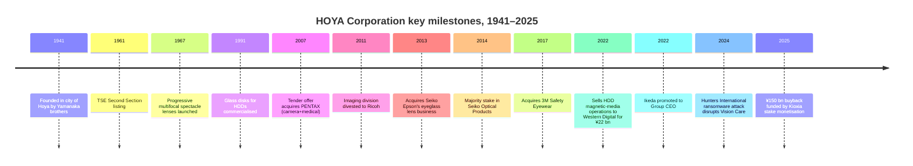
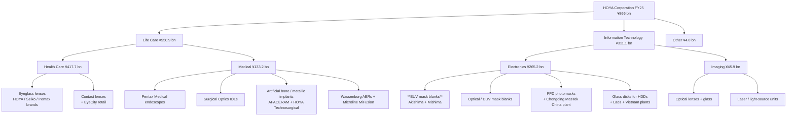
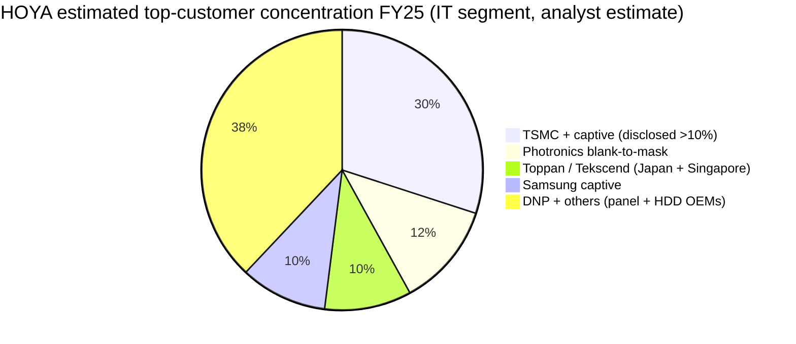
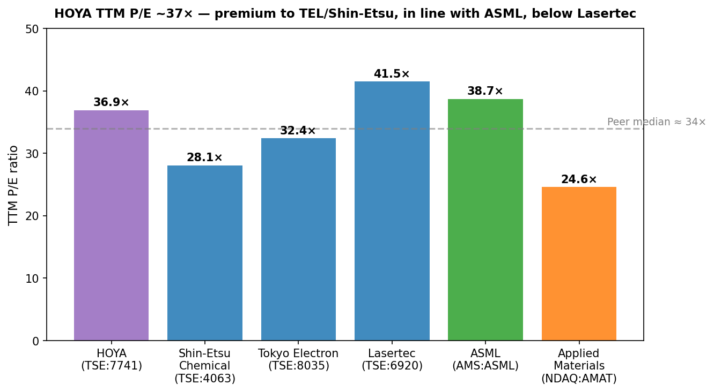
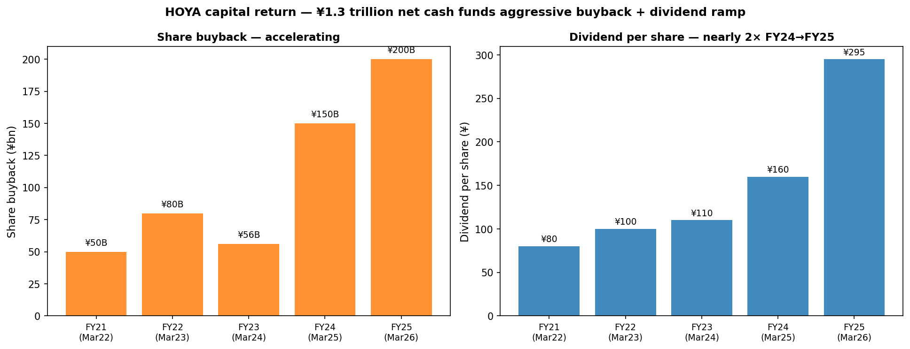

# HOYA Corporation (TSE: 7741) — Research Document

*As of 2026-05-26 · English-language report (Japan domicile; primary filings in Japanese; English IFRS report + Q2 FY26 transcript publicly translated)*

---

## Table of contents

1. Company overview
2. Company history
3. Management
4. Products and services
5. Customers and go-to-market
6. Industry overview
7. Competitive landscape
8. Market opportunity (TAM)
9. Risk assessment
10. References
11. Verification log

---

## 1. Company overview (800–1,200 words)

HOYA Corporation is a Tokyo-headquartered specialty-optics conglomerate whose product map straddles two of the strangest neighbours in the public-equity universe: at one end of the building it makes the eyeglass lens sitting on a Parisian commuter's nose; at the other end it makes the EUV mask blank that becomes the patterning master for every 3-nanometre transistor leaving TSMC's Fab 18. The company reported sales of **¥866.0 bn for the year ended 31 March 2025** (FY25) and a **¥260.0 bn profit-before-tax**, split across two reportable business segments — **Life Care (¥550.9 bn revenue, 63.6% of sales) and Information Technology (¥311.1 bn revenue, 35.9% of sales)**, with a residual ¥4.0 bn "Other" segment (speech-synthesis software) ([HOYA Corporation FY25 Consolidated Financial Statements under IFRS, pp. 9, 32–33](https://www.hoya.com/wp-content/uploads/2025/07/Annual-Report-Final-2.pdf)).

What makes HOYA unusual — and what places it in a semiconductor-materials coverage list at all — is the asymmetry of the two segments' economics. The Life Care segment is the larger contributor by revenue but earns the smaller contribution by profit-before-tax: ¥90.4 bn vs ¥170.4 bn from Information Technology in FY25, which means **IT generated ~65% of segment pre-tax profit on only ~36% of sales**, with a segment pre-tax margin of **~54.7%** versus 16.4% for Life Care ([HOYA Corporation FY25 IFRS Financial Statements, p. 32](https://www.hoya.com/wp-content/uploads/2025/07/Annual-Report-Final-2.pdf)). The Q2 FY26 (quarter ended September 2025) earnings call showed the same picture even more starkly — Information Technology's operating margin came in at **53.1%** that quarter against Life Care's 17.6% ([HOYA FY26 Q2 Earnings Call Transcript, 2025-10-31, pp. 3, 9](https://www.hoya.com/wp-content/uploads/2025/11/FY25-Q2-Earnings-Call-Transcript_E.pdf)). Information Technology is what the equity market is buying when it pays a ~35× P/E for HOYA today, even though casual readers may think of the company as "the Pentax / contact-lens / endoscope group".

Inside Information Technology, the headline asset is **Electronics-related products**, which the IFRS statements break out at **¥265.2 bn of FY25 revenue** (up 40.1% from ¥189.3 bn the prior year) — comprising "**Photomasks and Maskblanks for semiconductors, Photomasks for FPD, Glass disks for hard disk drives (HDDs)**" — plus a smaller **Imaging-related** business at ¥45.9 bn ("Optical lenses, Optical glass material, Laser equipment, Light source") ([HOYA FY25 IFRS Financial Statements, p. 33](https://www.hoya.com/wp-content/uploads/2025/07/Annual-Report-Final-2.pdf)). Within Electronics, the line item that matters most for the semiconductor-investment thesis is **mask blanks for EUV lithography**, where HOYA itself states in its FY24 Integrated Report that it holds "an exceptionally large share of the market for mask blanks for many years" and continues to "lead the field, leveraging its preeminence in low-defect products and next-generation development" ([HOYA Report 2024, p. 102](https://www.hoya.com/ir/2024/en/common/files/review2024.pdf)). *Analyst view:* Nomura's Greater China Semi 2026–30F report (2026-05-21) puts HOYA's EUV blank share at **~80%** and optical (DUV) photomask blank share at **~70%**, with Shin-Etsu Chemical as the only meaningful second source — these figures are sell-side estimates because HOYA does not publicly break out share or unit volumes ([reports/sector/半导体材料.md, Fig. 35–44](file:///Users/x/projects/financial_agent/reports/sector/半导体材料.md)).

The Life Care segment is itself two distinct sub-businesses. **Health Care related products** (eyeglass lenses and contact lenses) generated **¥417.7 bn** in FY25 (~48% of total Group revenue), making HOYA one of the world's top three eyeglass-lens manufacturers alongside EssilorLuxottica and Carl Zeiss Vision, with proprietary brands HOYA, Seiko, Pentax, KONISHI and Tokai ([Mordor Intelligence — Spectacle Lens Market](https://www.mordorintelligence.com/industry-reports/spectacle-lens-market)). **Medical related products** (¥133.2 bn, ~15% of Group revenue) houses Pentax Medical's flexible endoscopes, HOYA Surgical Optics' intraocular lenses (IOLs), Microline's laparoscopic instruments, APACERAM's orthopaedic hydroxyapatite implants, Wassenburg's automated endoscope reprocessors, and chromatography carriers ([HOYA FY25 IFRS Financial Statements, p. 31; HOYA Life Care product page](https://www.hoya.com/en/business/lifecare/)). Medical revenue actually contracted from ¥136.4 bn in FY24 to ¥133.2 bn in FY25, mostly on Chinese volume-based-procurement (VBP) headwinds for intraocular lenses and weak medical-endoscope demand, partly offset by ongoing factory consolidation that the CEO has guided to "tangible numerical effects by around Q4 of next fiscal year" ([HOYA FY26 Q2 Earnings Call Transcript, 2025-10-31, pp. 7, 21](https://www.hoya.com/wp-content/uploads/2025/11/FY25-Q2-Earnings-Call-Transcript_E.pdf)).

Geographically, FY25 revenue split **Japan ¥182.8 bn (21.1%); USA ¥129.2 bn (14.9%); Singapore ¥102.2 bn (11.8%); China ¥80.6 bn (9.3%); South Korea ¥60.7 bn (7.0%); Other ¥310.5 bn (35.9%)** — the Singapore line is high because HOYA's regional treasury / Asia Pac sales hub is registered there and books a meaningful share of intra-Asia electronics revenue ([HOYA FY25 IFRS Financial Statements, p. 34](https://www.hoya.com/wp-content/uploads/2025/07/Annual-Report-Final-2.pdf)). The Group employs **~37,909 people globally as of 31 March 2025** across "about 160 offices and subsidiaries worldwide" ([HOYA company profile page, accessed 2026-05](https://www.hoya.com/en/company/profile/)). Property, plant and equipment carrying value totals ¥210.9 bn, and capex was ¥60.9 bn in FY25 with **60–70% earmarked for the Information Technology segment** ("such as LSIs and HDD substrates") per CFO Hirooka on the Q2 FY26 call ([HOYA FY26 Q2 Earnings Call Transcript, p. 23](https://www.hoya.com/wp-content/uploads/2025/11/FY25-Q2-Earnings-Call-Transcript_E.pdf)).

*Source: compiled from [HOYA Corporation FY25 IFRS Financial Statements, pp. 9, 32](https://www.hoya.com/wp-content/uploads/2025/07/Annual-Report-Final-2.pdf) and prior-year integrated reports.*

*Source: [HOYA FY25 IFRS Financial Statements, p. 33](https://www.hoya.com/wp-content/uploads/2025/07/Annual-Report-Final-2.pdf) — Life Care 63.6% (Health Care 48.2% + Medical 15.4%), Information Technology 35.9% (Electronics 30.6% + Imaging 5.3%), Other 0.5%.*

*Source: [HOYA FY25 IFRS Financial Statements, p. 34](https://www.hoya.com/wp-content/uploads/2025/07/Annual-Report-Final-2.pdf) — Japan 21.1%, USA 14.9%, Singapore 11.8%, China 9.3%, South Korea 7.0%, Others 35.9%.*

**Valuation snapshot (as of late May 2026).** HOYA trades at roughly **¥27,575 / share** with a market cap of **~¥8.8 trillion** (~US$57 bn at JPY/USD 154) and an enterprise value of **¥8.28 trillion** ([Stockanalysis.com — TYO:7741 statistics, accessed 2026-05](https://stockanalysis.com/quote/tyo/7741/statistics/)). On a trailing-12-month basis HOYA carries a **P/E of 35.4× / forward P/E ~34.9×**, **P/S of 9.3×**, **P/B of 8.5×**, **EV/EBITDA of 22.2×**, and a **dividend yield of ~1.3%** with annual DPS of ¥110 for FY25 (interim raised to ¥125 in 1H FY26) ([Yahoo Finance — 7741.T key statistics, accessed 2026-05](https://finance.yahoo.com/quote/7741.T/key-statistics/); [HOYA FY26 Q2 Earnings Call Transcript, p. 14](https://www.hoya.com/wp-content/uploads/2025/11/FY25-Q2-Earnings-Call-Transcript_E.pdf)). **ROE is ~25.1%**, **ROIC ~48%**, and **net cash is ¥531.9 bn** — so the stock is being capitalised at roughly 35× earnings on a 25% returns-on-equity engine with negligible leverage ([Stockanalysis.com — TYO:7741, accessed 2026-05](https://stockanalysis.com/quote/tyo/7741/statistics/)).

The trailing P/E of ~35× is roughly **35% above the medical-devices-and-instruments industry median of ~25.8×** ([Gurufocus — Medical Devices industry PE, accessed 2026-05](https://www.wisesheets.io/pe-ratio/ESLOY)) and sits modestly below EssilorLuxottica's ~38.8× and well above Carl Zeiss Meditec's ~26.2×. *Analyst view:* the premium is best understood not as Life Care commanding it (Life Care alone would justify ~22–25×) but as the market separately pricing the Information Technology earnings stream at a much higher multiple — implied ~50× on segment pre-tax — in recognition of the EUV mask-blank monopoly, the early HAMR/glass-HDD-substrate inflection, and the persistently consistent buyback-plus-cancellation engine (¥150 bn of treasury shares acquired and ¥97.9 bn cancelled in FY25 alone) ([HOYA FY25 IFRS Financial Statements, p. 11](https://www.hoya.com/wp-content/uploads/2025/07/Annual-Report-Final-2.pdf)). With the stock having returned **+52.2% over the trailing 52 weeks** as the AI-driven semicap thesis re-rated the segment ([Yahoo Finance — 7741.T, accessed 2026-05](https://finance.yahoo.com/quote/7741.T/)), the multiple is now meaningfully extended and any cyclical wobble in EUV demand (or a Shin-Etsu share-grab) becomes a material valuation risk discussed in Section 9.

---

## 2. Company history (400–700 words)

HOYA was founded on **1 November 1941** by the brothers **Shoichi and Shigeru Yamanaka**, who set up an optical-glass production plant in the city of Hoya (now Nishi-Tokyo) on the western edge of Tokyo — the site name later became the corporate name ([HOYA Corporation company history page, accessed 2026-05](https://www.hoya.com/en/company/history/); [Companies History — Hoya](https://www.companieshistory.com/hoya/)). The company incorporated formally in 1944 and pivoted into crystal-glass tableware in 1945 as wartime demand for optical glass collapsed; the crystal-products business was the first cash-flow generator that funded HOYA's later move into spectacle lenses ([HOYA Corporation company history page](https://www.hoya.com/en/company/history/)).

The company listed on the **Tokyo Stock Exchange Second Section in October 1961** and graduated to the First Section in February 1973, by which point the product range had widened to **progressive multifocal spectacle lenses (1967), soft contact lenses (1972), intraocular lenses (1987) and glass disks for hard disk drives (1991)** ([HOYA Corporation company history page, accessed 2026-05](https://www.hoya.com/en/company/history/); [Companies History — Hoya entry](https://www.companieshistory.com/hoya/)). The corporate identity was simplified from "Hoya Glass Works" to "Hoya Corporation" in 1984. The strategic genius of the 1980s–2000s leadership was an obsessive focus on owning the **substrate** rather than the finished module — once you make the glass disk that becomes a hard-drive platter, the optical blank that becomes a photomask, or the polymer puck that becomes a contact lens, you sit at a high-margin chokepoint that the more-visible downstream assemblers cannot bypass.

Two acquisitions stand out as portfolio-defining. The **PENTAX tender offer (December 2007 – April 2008)** added two businesses — the consumer-camera/imaging arm that was later divested to Ricoh in 2011 and the **flexible-endoscope arm that remains today as Pentax Medical**, providing HOYA's anchor position in gastrointestinal scopes ([HOYA Corporation company history page](https://www.hoya.com/en/company/history/); [SafeVision blog — All About HOYA](https://safevision.com/blog/all-about-hoya/)). The **Seiko Optical Products series of deals (2013–14)** added Seiko Epson's eyeglass-lens manufacturing operations and a controlling stake in Seiko's lens-sales subsidiary — when combined with HOYA's own Hoya, Pentax and Tokai brands, this established HOYA as the world's #2 or #3 spectacle-lens producer behind EssilorLuxottica and on par with Carl Zeiss ([Nishimura & Asahi — HOYA / Seiko Epson deal advisory, 2014](https://www.nishimura.com/en/experience/work/5321); [PR Newswire — HOYA, Seiko and Epson agreements, 2013](https://www.prnewswire.com/news-releases/hoya-seiko-and-epson-agreements-executed-in-the-field-of-optical-products-business-179637771.html)).

The 2010s and 2020s have been characterised more by **subtraction than addition**. The Ricoh imaging-division divestiture (2011), the **sale of HOYA's magnetic-media (sputtering) operations to Western Digital in 2022 for ¥22 bn (~US$235 m)** — which kept HOYA in the upstream glass-substrate business but exited the lower-margin coating step — and the recent restructuring of the medical-endoscope sales / factory footprint ("about 70–80% of necessary decisions are completed; now it's just a matter of execution," per CEO Ikeda on the Q2 FY26 call) ([HOYA FY26 Q2 Earnings Call Transcript, p. 21](https://www.hoya.com/wp-content/uploads/2025/11/FY25-Q2-Earnings-Call-Transcript_E.pdf); [PR Newswire — Western Digital to acquire HOYA magnetic media, 2009 announcement, 2022 closure](https://www.prnewswire.com/news-releases/western-digitalr-to-acquire-hoyas-magnetic-media-operations-92263279.html)) all reflect a long-term portfolio-curation philosophy that ruthlessly exits non-share-leader positions and pours the proceeds into either capacity (Electronics fabs in Akishima / Mishima / Kumamoto / Vietnam / Laos / Chongqing) or buybacks.

The two recent shocks worth flagging: **(a) the Hunters International ransomware attack discovered 30 March 2024**, which disrupted Vision Care order-processing systems for ~4 weeks at multiple lens labs and triggered a $10 m ransom demand HOYA refused to pay ([Bleeping Computer — Optics giant Hoya hit with $10M ransomware demand, 2024-04](https://www.bleepingcomputer.com/news/security/optics-giant-hoya-hit-with-10-million-ransomware-demand/); [SecurityWeek — Lens Maker Hoya scrambling to restore systems, 2024-04](https://www.securityweek.com/lens-maker-hoya-scrambling-to-restore-systems-following-cyberattack/)); and **(b) the multi-decade transfer-pricing tax case in which Japan's National Tax Tribunal partly cancelled reassessments for FY2007–11, with HOYA continuing to litigate the remainder** — the receivable for ¥7.9 bn + ¥4.5 bn + ¥8.0 bn paid-in-advance amounts is disclosed as a Key Audit Matter in the FY25 audit opinion ([HOYA FY25 IFRS Financial Statements, p. 4](https://www.hoya.com/wp-content/uploads/2025/07/Annual-Report-Final-2.pdf)).

---

## 3. Management (300–500 words)

The Yamanaka brothers (Shoichi and Shigeru) are long gone and HOYA has been a non-family-controlled, professional-management company since the 1980s — meaning the relevant biographical detail today is the current Group President and CEO.

**Eiichiro Ikeda — Representative Executive Officer, President & CEO (since March 2022).** Ikeda is a 33-year HOYA insider who joined the company in 1992 and was promoted through every major operating division before getting the top job. He holds a Bachelor of Engineering from Chuo University and has been based out of HOYA's Singapore regional office since taking the CEO role — a deliberate signal that HOYA's centre of gravity is Asia-Pacific operations rather than Tokyo headquarters ([HOYA Corporation Leadership page, accessed 2026-05](https://www.hoya.com/en/company/directors/); [Bloomberg — Eiichiro Ikeda profile](https://www.bloomberg.com/profile/person/18799019); [Equilar ExecAtlas — Eiichiro Ikeda](https://people.equilar.com/bio/person/eiichiro-ikeda-hoya-corporation/39560383)).

His three formative operating tours map exactly onto the three product franchises that drive the current equity story. **(1) From early 2010 he was Co-CEO of the Memory Disk Division and General Manager of Media** — the unit that makes glass substrates for HDDs and that he later restructured by selling the magnetic-media sputtering operations to Western Digital while keeping HOYA's monopoly on the substrate itself; the deal closed in 2022 for ¥22 bn ([Equilar ExecAtlas — Eiichiro Ikeda](https://people.equilar.com/bio/person/eiichiro-ikeda-hoya-corporation/39560383); [PR Newswire — Western Digital to acquire HOYA magnetic media](https://www.prnewswire.com/news-releases/western-digitalr-to-acquire-hoyas-magnetic-media-operations-92263279.html)). **(2) From late 2010 he ran the Optical Lens business**, learning the global spectacle-lens cost structure and the Seiko-integration playbook from inside; that experience underpins his current restructuring of the Pentax Medical / IOL footprint where he is consolidating factories despite ~6–9 months of short-term margin drag ([HOYA FY26 Q2 Earnings Call Transcript, 2025-10-31, p. 21](https://www.hoya.com/wp-content/uploads/2025/11/FY25-Q2-Earnings-Call-Transcript_E.pdf)). **(3) From 2013 he was Executive Officer / COO of Information Technology, then Group CTO from 2015 and President of the Eyecare Division from 2019**, giving him direct technical familiarity with mask-blank manufacturing physics and EUV process control ([Equilar ExecAtlas — Eiichiro Ikeda](https://people.equilar.com/bio/person/eiichiro-ikeda-hoya-corporation/39560383); [Bloomberg — Eiichiro Ikeda profile](https://www.bloomberg.com/profile/person/18799019)).

The signature of his ~3-year CEO tenure has been **(a)** aggressive capital return — ¥150 bn of treasury-share buybacks in FY25, with 97.9 bn yen of those shares cancelled the same year, and an additional ¥100 bn programme running into 2026 — funded partly by monetising the company's Kioxia stake; the proceeds from the Kioxia disposal "are being used to fund the ongoing share buyback program" per CFO Hirooka ([HOYA FY25 IFRS Financial Statements, p. 11](https://www.hoya.com/wp-content/uploads/2025/07/Annual-Report-Final-2.pdf); [HOYA FY26 Q2 Earnings Call Transcript, p. 20](https://www.hoya.com/wp-content/uploads/2025/11/FY25-Q2-Earnings-Call-Transcript_E.pdf); [The Globe and Mail / TipRanks — HOYA ends ¥100 bn buyback and cancels 1.06% of shares, 2025](https://www.theglobeandmail.com/investing/markets/markets-news/Tipranks/1638099/hoya-ends-yen100-billion-buyback-and-cancels-1-06-of-its-shares/)); **(b)** disciplined-but-meaningful capacity capex in EUV blanks and HDD substrates (60–70% of the FY26 ¥55 bn capex envelope is going to those two lines per the Q2 call); and **(c)** a calculated refusal to chase share in commoditising markets — the Q2 FY26 commentary on HDD glass-substrate pricing is candid that aluminium-substrate competition will cap price increases ([HOYA FY26 Q2 Earnings Call Transcript, pp. 23–24](https://www.hoya.com/wp-content/uploads/2025/11/FY25-Q2-Earnings-Call-Transcript_E.pdf)).

Ikeda's ownership is not separately disclosed in either the EDINET securities report or HOYA's English IR materials — Japanese disclosure requires only that individual director shareholdings >0.1% be flagged, and Ikeda's holdings are believed to be below that threshold based on the absence of disclosure. Compensation is structured with a mid-to-long-term incentive component (performance share units / PSUs) whose payout is partly tied to ESG metrics, per CSO Tomoko Nakagawa's commentary in the Q2 FY26 call ([HOYA FY26 Q2 Earnings Call Transcript, pp. 15, 18](https://www.hoya.com/wp-content/uploads/2025/11/FY25-Q2-Earnings-Call-Transcript_E.pdf)).

---

## 4. Products and services (700–1,500 words) — the chokepoint chapter

### 4.1 The product matrix, exactly as HOYA reports it

The IFRS-audited segment note in the FY25 financial statements is the authoritative product table — anything else (Wikipedia, sell-side initiations, third-party industry surveys) is a derivative. The note breaks the Group into two operating segments and four product families plus an "Other" rump, with FY25 revenue assigned line-by-line.

| Reportable segment | Sub-segment | FY25 revenue (¥ bn) | Major products and services (HOYA's own language) |
|---|---|---:|---|
| **Life Care** | Health Care related products | 417.7 | "Eyeglass lenses and Contact lenses" |
| | Medical related products | 133.2 | "Medical endoscopes, Medical accessories, Automated endoscope reprocessors (AERs), Intraocular lenses, Ophthalmic medical equipment, Artificial bone, Metallic implants for orthopedics, Chromatography carriers" |
| **Information Technology** | Electronics related products | 265.2 | "**Photomasks and Maskblanks for semiconductors, Photomasks for FPD, Glass disks for hard disk drives (HDDs)**" |
| | Imaging related products | 45.9 | "Optical lenses, Optical glass material, Laser equipment, Light source" |
| Other | — | 4.0 | "Speech synthesis software" |
| **Total** | | **866.0** | |

*Source: [HOYA FY25 IFRS Consolidated Financial Statements, pp. 31, 33](https://www.hoya.com/wp-content/uploads/2025/07/Annual-Report-Final-2.pdf) — verbatim segment definitions and FY25 revenue per product family.*

### 4.2 Synthesis — how the four product families compose the equity story

The reader who walks away from Section 4 understanding **one** thing about HOYA should walk away understanding this: HOYA is a portfolio of **substrate-level chokepoint businesses** — the company manufactures the unfinished material on which somebody else does the high-value finishing step, and in each line it has worked decades to be either the only or the dominant qualified supplier. The EUV mask blank goes to Photronics' Hsinchu blank-to-mask conversion fab, the TSMC and Samsung captive mask shops, and Toppan/DNP — none of them can write a customer pattern without HOYA's blank arriving first ([HOYA Report 2024, pp. 101–102](https://www.hoya.com/ir/2024/en/common/files/review2024.pdf)). The HDD glass disk goes to Western Digital's and Seagate's media coating lines; both companies need it for nearline (3.5-inch) drives and now increasingly for HAMR ([HOYA Report 2024, p. 103](https://www.hoya.com/ir/2024/en/common/files/review2024.pdf); [Semiconductorinsight — Precision glass HDD substrates for AI workloads, 2026](https://semiconductorinsight.com/blog/precision-glass-revolutionizes-hard-disk/)). The eyeglass-lens blank goes to retail-chain finishing labs that grind it to prescription. The IOL goes to ophthalmic surgeons who implant it. In every case HOYA owns the **glass + coating + defect-control** upstream step where physics is hard, throughput is low, and qualification cycles are 12–24 months — and somebody else owns the customer relationship.

### 4.3 EUV mask blanks — THE chokepoint of the EUV ecosystem

> **From HOYA's own Integrated Report:** "We are currently the only company that can supply mask blanks compatible with EUV technology for cutting-edge logic semiconductors of the 3 nm generation. This track record has enabled the Company to maintain an exceptionally large share of the market for mask blanks for many years. Competition in the field of EUV mask blanks is expected to intensify over the medium to long term. HOYA expects to continue to lead the field, leveraging its preeminence in low-defect products and next-generation development." ([HOYA Report 2024, pp. 101–102](https://www.hoya.com/ir/2024/en/common/files/review2024.pdf))

**Plain-language gloss / 中文释义:** an EUV photomask blank is a **152 mm × 152 mm × 6.35 mm-thick puck of ultra-low-thermal-expansion glass (LiTaO₃-doped quartz)** coated with **40–50 alternating layers of molybdenum and silicon (the Bragg reflector / 布拉格反射多层膜)**, capped with a thin ruthenium protective film, and topped with an absorber layer (today still TaBN; next generation is moving to high-density ruthenium / nickel-based low-n materials). Each layer is a few nanometres thick. A blank that has **even one particle larger than 30 nm anywhere on a ~22 cm² area** is unusable — that particle would print as a permanent defect into every wafer the mask later patterns. Inside the EUV ecosystem the blank is the **furthest-upstream qualified component** — ASML supplies the scanner, ZEISS supplies the optics, Inpria/JSR/TOK supplies the photoresist, and HOYA supplies the blank that gets patterned by Photronics / TSMC's captive shop / Samsung's captive shop / DNP / Toppan into the working photomask. The mask-blank step is where you choose to live or die on **defect-per-blank yield**, and HOYA has reportedly been the only company able to consistently ship sub-30 nm-defect blanks at 3 nm-node specifications since around 2019.

*Analyst view:* Nomura's Greater China Semi 2026–30F report cites HOYA at **~80% global EUV-blank share** and ~70% of DUV/optical-blank share, with Shin-Etsu Chemical as the only other meaningful supplier at ~20% EUV share; AGC has commercial EUV blank capability but at lower volumes, and Hoya's lead is in the **low-defect / high-end** segment that 3 nm and 2 nm logic require ([reports/sector/半导体材料.md, Fig. 35–44](file:///Users/x/projects/financial_agent/reports/sector/半导体材料.md); [Semiconductor Engineering — EUV Mask Blank Battle Brewing](https://semiengineering.com/euv-mask-blank-biz-heats-up/)). HOYA's own Q2 FY26 commentary corroborates the pricing structure indirectly: "Both EUV and DUV performed exceptionally well, with both products achieving double-digit growth. For EUV, we are firmly capturing the market, including an increase in the number of customers for high-end products," and "regardless of application or foundry used, our blanks are the preferred choice" ([HOYA FY26 Q2 Earnings Call Transcript, pp. 10, 22](https://www.hoya.com/wp-content/uploads/2025/11/FY25-Q2-Earnings-Call-Transcript_E.pdf)).

*Source: market-share estimates per [Nomura Greater China Semi 2026–30F report, 2026-05-21, Figs 38–39](file:///Users/x/projects/financial_agent/reports/sector/半导体材料.md) cross-referenced to [HOYA Report 2024, p. 102](https://www.hoya.com/ir/2024/en/common/files/review2024.pdf). HOYA does not publicly disclose unit volumes or share; figures shown are sell-side estimates.*

**Strategic significance.** Mass production of 3 nm logic using EUV took off in 2024 and the node cadence will shrink to 2 nm (2026–27) and 1.4 nm (2028–29). The transition to **high-NA EUV (NA 0.55)** scheduled for HVM around 2029–30 raises the bar for mask-blank quality by an order of magnitude — photoresist thickness drops from ~25 nm to <16 nm and **metal-oxide-resist (MOR)** patterning is mandatory, meaning the absorber and capping-layer materials change. HOYA's own report explicitly flags "mask blanks compatible with… high-NA EUV lithography… are expected in the future, and mask blanks compatible with these lithography technologies are in demand" ([HOYA Report 2024, p. 102](https://www.hoya.com/ir/2024/en/common/files/review2024.pdf)). The **EUV mask-blank capacity expansion announced in Akishima (R&D centre) plus capacity adds across 2020–24** is HOYA's bet that its 60–70% capex re-investment into Electronics (per Q2 FY26 commentary) gets ahead of demand into the 2-nm node ramp ([HOYA FY26 Q2 Earnings Call Transcript, p. 23](https://www.hoya.com/wp-content/uploads/2025/11/FY25-Q2-Earnings-Call-Transcript_E.pdf); [Semiconductorinsight — HOYA Expands EUV Photomask Blank Capabilities, 2025](https://semiconductorinsight.com/blog/hoya-expands-euv-photomask-blank-capabilities-strengthening-global-semiconductor-supply-chain/)).

*Analyst view — moat assessment:* **Yes, hard moat.** Type = **technology / IP + scale + 15-year qualification cycle**. The barrier to a third entrant is not capex (~US$200–300 m for a blank fab is achievable), it's the **multi-year defect-rate learning curve combined with foundry qualification windows** that only open every 1–2 nodes. Closest credible competitor product: Shin-Etsu Chemical's EUV mask blanks, qualified at multiple foundries but historically positioned at the lower-end node where defect tolerance is slightly looser ([Shin-Etsu Chemical — Photomask blanks product page](https://www.shinetsu.co.jp/en/products/electronics-and-functional-materials-business/photomask-blanks/)).

### 4.4 Optical (DUV / i-line) photomask blanks

> **HOYA verbatim:** "HOYA consistently maintains a strong presence in optical deep-ultraviolet (DUV) lithography, a conventional lithographic technology." ([HOYA Report 2024, p. 102](https://www.hoya.com/ir/2024/en/common/files/review2024.pdf))

**Plain-language gloss:** an optical/DUV mask blank uses **synthetic-fused-silica substrate** with a **chrome-on-chrome-oxide (Cr/CrOx) absorber stack** — the same general idea as the EUV blank but tuned for 248 nm (KrF), 193 nm (ArF dry) and 193i (ArF immersion) wavelengths. DUV blanks ship in much higher unit volumes than EUV blanks (every layer of every logic / DRAM / NAND chip needs at least one mask, but only a few critical layers need EUV), so the dollar-content per wafer is similar even though the per-unit ASP is lower. HOYA's ~70% DUV-blank share is durable because every fab worldwide qualified HOYA blanks in the early 2000s during the 0.13-µm and 90-nm node ramps; switching to a second source costs ~9 months of re-qualification and yields no economic benefit ([reports/sector/半导体材料.md, Fig. 35–44](file:///Users/x/projects/financial_agent/reports/sector/半导体材料.md)).

*Analyst view — moat assessment:* **Yes, moderate moat.** Type = **switching costs + customer-qualification incumbency**. Less defensible than EUV because the technology has stopped advancing and competitors (Shin-Etsu, AGC) ship comparable specs — but the embedded share is sticky.

### 4.5 FPD photomasks for flat-panel displays

> **HOYA verbatim:** HOYA "is scheduled to start operation of a new FPD photomask plant in Chongqing in the second half of 2024" ([HOYA Report 2024, p. 103](https://www.hoya.com/ir/2024/en/common/files/review2024.pdf)) under its **Chongqing MasTek Electronics** subsidiary.

**Plain-language gloss:** an FPD photomask is the patterning mask used to print the **TFT (thin-film transistor) backplane** of an LCD or OLED panel — physically a much larger glass plate (up to G10.5 = 2,940 × 3,370 mm) than a semiconductor mask, but produced at coarser feature size (typically 1–3 µm rather than nm). It is sold to panel makers (BOE, LGD, Samsung Display, AUO) for both LCD and OLED production. The Chongqing plant explicitly positions HOYA inside China's panel cluster — important because Chinese G8.6 and G10.5 LCD fabs are the dominant global volume today. The Q2 FY26 commentary confirms the ramp: "Sales of FPD photomasks for large panels grew by 5%… we are restoring production capacity and have returned to growth. There is still room to increase utilization rates" ([HOYA FY26 Q2 Earnings Call Transcript, p. 11](https://www.hoya.com/wp-content/uploads/2025/11/FY25-Q2-Earnings-Call-Transcript_E.pdf)).

*Analyst view — moat assessment:* **Partial moat.** Type = **scale + China-local-content qualification**. FPD photomasks face direct competition from LG Innotek, Toppan and SK-hynix-affiliated suppliers — HOYA's share is closer to 25–30% rather than the dominance it enjoys in semiconductor blanks.

### 4.6 Glass substrates for HDDs — the rising sleeper

> **HOYA verbatim:** "HOYA is the world's only glass HDD substrate manufacturer, commanding 100% market share. The market for substrates for consumer products (2.5 inches) consists of both aluminum and glass products. We estimate that HOYA's share of this market is about 40%." ([HOYA Report 2024, p. 103](https://www.hoya.com/ir/2024/en/common/files/review2024.pdf))

**Plain-language gloss:** a HDD glass substrate is the **disc-shaped, mirror-polished glass platter** that becomes the recording medium after a coating partner (formerly HOYA, today Western Digital after the 2022 sale of HOYA's sputtering operations, plus Showa Denko) sputters magnetic recording film onto it. **Glass substrates beat aluminium on two dimensions that matter for AI-era nearline drives**: (a) **thinness** — a glass substrate can hold ~50 µm flatness over a 95 mm disc, enabling 11+ platters per drive vs ~9 for aluminium-equivalent drives, which means 50 TB drives become feasible; (b) **thermal stability** — required for **heat-assisted magnetic recording (HAMR, 热辅助磁记录)** where the recording head heats the disc surface to ~400°C briefly per write. HOYA's CEO is explicit on this on the Q2 FY26 call: HDD substrate sales "grew by 4%… 2.5-inch sales declined significantly, demand for 3.5-inch nearline products remained strong, achieving double-digit growth… Recently, a HDD manufacturer announced the adoption of glass substrates" ([HOYA FY26 Q2 Earnings Call Transcript, p. 12](https://www.hoya.com/wp-content/uploads/2025/11/FY25-Q2-Earnings-Call-Transcript_E.pdf)).

**Strategic inflection.** Until 2024 the HDD glass-substrate business was viewed as a declining-secular asset (SSDs eat all consumer / 2.5" HDD demand). The 2025 inflection is that **Western Digital and Seagate both transitioned their highest-capacity HAMR-era nearline products to glass substrates**, which (a) re-rates HOYA's 3.5-inch glass-substrate volume from a slow decline back to mid-single-digit growth, and (b) opens the door to glass becoming the standard for >30 TB drives. With AI-data-centre nearline storage demand running at 30%+ YoY in 2025–26 ([Tom's Hardware — High-capacity HDD roadmap, 2025](https://www.tomshardware.com/pc-components/hdds/high-capacity-hdd-roadmap-the-race-to-100tb-and-zettabyte-scale-storage-toshiba-seagate-and-wd-outline-three-distinct-strategies); [Western Digital AI storage supercycle analysis, 2026-04](https://markets.financialcontent.com/stocks/article/finterra-2026-4-7-the-ai-storage-supercycle-a-deep-dive-into-the-new-western-digital-wdc)), HOYA is the only upstream beneficiary that captures the technology mix-shift rather than just the volume-cycle. CEO Ikeda: "the outlook for 2026 is very positive. It's difficult to predict beyond 2027, but at least currently, we see no signs or trends indicating a decline in demand" ([HOYA FY26 Q2 Earnings Call Transcript, p. 21](https://www.hoya.com/wp-content/uploads/2025/11/FY25-Q2-Earnings-Call-Transcript_E.pdf)).

*Analyst view — moat assessment:* **Yes, structural monopoly** in 3.5-inch glass; **moderate** in 2.5-inch glass-vs-aluminium. Type = **single-supplier qualification + decades of thin-glass polishing know-how**. Closest competitor product: Ohara Inc. has a small glass-substrate effort but is not a credible Tier-1 supplier at HAMR specifications.

*Source: compiled from [HOYA Corporation quarterly earnings briefings, FY24 Q1 – FY26 Q2](https://www.hoya.com/en/investor/kessan/) — Information Technology segment OPM held above 50% for four consecutive quarters through Q2 FY26 (53.1%), versus Life Care 17.6%. Note HOYA reports IFRS so OPM is segment pre-tax over segment revenue.*

### 4.7 Imaging — optical lenses, optical glass material, laser equipment, light source

The Imaging sub-segment (¥45.9 bn FY25 revenue, +17.6% YoY) is the smaller, lower-publicity piece of Information Technology. It supplies (a) **optical lens elements** to industrial-automation, semiconductor-inspection, machine-vision and projection-display customers; (b) **bulk optical glass material** to lens-assembly customers (the famous "BSC7" / "BaF10" / E-FDS Schott-equivalent glass types); (c) **laser equipment** including UV / DPSS lasers for semiconductor inspection, panel repair, and industrial laser-processing; and (d) **light-source units** for projection (LCD/DLP projector LED arrays, fibre-coupled illuminators). Q2 FY26 saw this sub-segment grow **+30% YoY** on broad non-camera-application demand — but management explicitly warned that "we do not expect sustained 30% growth going forward. We should note that this quarter's performance was somewhat exceptional" ([HOYA FY26 Q2 Earnings Call Transcript, p. 13](https://www.hoya.com/wp-content/uploads/2025/11/FY25-Q2-Earnings-Call-Transcript_E.pdf)).

*Analyst view — moat assessment:* **Partial.** Optical glass is competitive (Schott, Ohara, CDGM) but HOYA's qualification with major projection / semiconductor inspection customers (KLA, Lasertec, Camtek) is sticky.

### 4.8 Life Care — Health Care (eyeglass + contact lenses)

> **HOYA verbatim — eyeglass lenses:** the FY25 segment note describes the Health Care product line simply as "Eyeglass lenses and Contact lenses" ([HOYA FY25 IFRS Financial Statements, p. 31](https://www.hoya.com/wp-content/uploads/2025/07/Annual-Report-Final-2.pdf)). The FY24 Integrated Report adds context: the segment operates "**HOYA Vision Care**" through which it markets across 52 countries, including the **MiYOSMART** myopia-management lens for paediatric patients ([HOYA Report 2024, pp. 92–94](https://www.hoya.com/ir/2024/en/common/files/review2024.pdf)).

**Plain-language gloss.** HOYA's eyeglass-lens business is the world's second-or-third largest after EssilorLuxottica and on par with Carl Zeiss Vision. Its proprietary brands span **HOYA** (premium progressive), **Seiko** (Japanese-market premium, acquired 2013–14), **Pentax** (added 2007–08), **KONISHI** and **Tokai**. Distribution is via **independent optometrist labs + EyeCity-style owned retail**. The flagship technology franchise is **MiYOSMART** — a children's myopia-progression-control lens using D.I.M.S. (Defocus Incorporated Multiple Segments) optics — which is now reimbursed in France and growing in Europe, partly offsetting a weakening China contribution: "the weight of China, which had previously driven product growth, is decreasing" ([HOYA FY26 Q2 Earnings Call Transcript, p. 4](https://www.hoya.com/wp-content/uploads/2025/11/FY25-Q2-Earnings-Call-Transcript_E.pdf)). Contact-lens retail (Japan's **EyeCity** chain, 5% sales growth in Q2 FY26 with seven new stores in 1H FY26) is a small but stable annuity ([HOYA FY26 Q2 Earnings Call Transcript, p. 5](https://www.hoya.com/wp-content/uploads/2025/11/FY25-Q2-Earnings-Call-Transcript_E.pdf)).

*Analyst view — moat assessment:* **Yes, moderate moat in eyeglass lenses; weaker in contact lenses.** Type = **brand + optometrist channel relationships + manufacturing scale + IP (MiYOSMART D.I.M.S. patents)**. Competitive set: EssilorLuxottica (#1 globally, ~50%+ share), Carl Zeiss Vision (~10%), Nikon, Rodenstock ([Mordor Intelligence — Spectacle Lens Market](https://www.mordorintelligence.com/industry-reports/spectacle-lens-market)).

### 4.9 Life Care — Medical (Pentax Medical endoscopes + Surgical Optics IOLs + bone implants + AERs)

> **HOYA verbatim:** the Medical sub-segment includes "Medical endoscopes, Medical accessories, Automated endoscope reprocessors (AERs), Intraocular lenses, Ophthalmic medical equipment, Artificial bone, Metallic implants for orthopedics, Chromatography carriers" ([HOYA FY25 IFRS Financial Statements, p. 31](https://www.hoya.com/wp-content/uploads/2025/07/Annual-Report-Final-2.pdf)).

**Plain-language gloss.** This is HOYA's portfolio of regulated medical devices, branded around four operating units: **Pentax Medical** (flexible video gastrointestinal endoscopes — gastroscopes, colonoscopes, duodenoscopes — competing primarily with Olympus, Fujifilm); **HOYA Surgical Optics** (foldable hydrophobic IOLs for cataract surgery — competing with Alcon, J&J Vision, Bausch + Lomb); **HOYA Technosurgical** (APACERAM hydroxyapatite synthetic bone + titanium orthopaedic implants); **Wassenburg Medical** (automated endoscope reprocessors for scope cleaning); **Microline** (MiFusion thermal-fusion laparoscopic instruments). The recent product highlight is the **DEC™ Duodenoscope (ED34-i10T2s)** — the world's first GI endoscope cleared by FDA for compatibility with hydrogen-peroxide-gas-plasma sterilisation via STERRAD ([PR Newswire — PENTAX Medical FDA clearance, 2024-08](https://www.prnewswire.com/news-releases/pentax-medical-receives-fda-clearance-for-duodenoscope-with-new-sterilization-technology-in-collaboration-with-advanced-sterilization-products-302214258.html)) — a direct response to the post-2015 duodenoscope-contamination crisis that hit Olympus hardest. The IOL business is currently the weakest spot: Chinese Volume-Based Procurement (VBP, 集采) has compressed prices and shifted demand mix; "Demand for the products we can currently offer in the Chinese market is weak, leading to reduced revenue" ([HOYA FY26 Q2 Earnings Call Transcript, p. 7](https://www.hoya.com/wp-content/uploads/2025/11/FY25-Q2-Earnings-Call-Transcript_E.pdf)).

*Analyst view — moat assessment:* **Partial moat in endoscopes (#3 player behind Olympus and Fujifilm); moderate in IOLs; modest in orthopaedic / AER.** Type = **regulatory (FDA / PMDA approvals) + installed-base service relationships**. Past distribution-misbranding litigation against Pentax of America (settled for $43 m) is a residual reputational drag ([Sokolove Law — endoscopy lawsuit settlements](https://www.sokolovelaw.com/product-liability/medical-devices/endoscopy/)).

### 4.10 Recent strategic actions / capex / product transitions in the last 12 months

- **HDD glass-substrate customer wins** — a second HDD manufacturer announced glass-substrate adoption in 2025; volume contribution targeted for Q4 FY26 (i.e. 1Q calendar 2027) per the CEO ([HOYA FY26 Q2 Earnings Call Transcript, pp. 12, 20](https://www.hoya.com/wp-content/uploads/2025/11/FY25-Q2-Earnings-Call-Transcript_E.pdf)).
- **Chongqing FPD photomask plant ramp** — operations started 2H 2024; utilisation rates still ramping, supports HOYA's China-local-content positioning ([HOYA Report 2024, p. 103](https://www.hoya.com/ir/2024/en/common/files/review2024.pdf)).
- **Kioxia stake monetisation** — HOYA sold its entire Kioxia stake during 1H FY26, with ~¥40 bn of proceeds; CFO Hirooka confirmed the cash is funding ongoing buybacks ([HOYA FY26 Q2 Earnings Call Transcript, p. 20](https://www.hoya.com/wp-content/uploads/2025/11/FY25-Q2-Earnings-Call-Transcript_E.pdf)).
- **FY26 capex envelope ¥55 bn**, 60–70% earmarked for Electronics (LSI mask blanks + HDD substrates) ([HOYA FY26 Q2 Earnings Call Transcript, p. 23](https://www.hoya.com/wp-content/uploads/2025/11/FY25-Q2-Earnings-Call-Transcript_E.pdf)).
- **Endoscope restructuring** — 70–80% of decisions completed; factory consolidation underway with tangible margin impact expected by Q4 of FY27 ([HOYA FY26 Q2 Earnings Call Transcript, p. 21](https://www.hoya.com/wp-content/uploads/2025/11/FY25-Q2-Earnings-Call-Transcript_E.pdf)).

---

## 5. Customers and go-to-market (500–800 words)

HOYA's customer base bifurcates exactly along the segment line. **Information Technology customers are ~20 globally** — every leading-edge fab, every panel maker, and the two HDD OEMs — buying high-ASP / low-volume substrates under multi-year qualification frameworks. **Life Care customers are ~500,000 globally** — independent optometrist labs, retail eyewear chains, hospital purchasing groups, ophthalmic surgeons, gastrointestinal-endoscopy departments — buying high-volume / lower-ASP consumables and equipment under regional distribution agreements.

**Customer concentration — what the filing actually discloses.** HOYA's FY25 IFRS segment note states that "**Information Technology segment has a customer group who contributed 10% or more to the consolidated revenue for the year ended March 31, 2025. The revenue recognised from the customer group is 54,751 million yen for the year ended 31 March 2024 and 92,776 million yen (620,489 thousand U.S. dollars) for the year ended 31 March 2025**" ([HOYA FY25 IFRS Financial Statements, p. 34](https://www.hoya.com/wp-content/uploads/2025/07/Annual-Report-Final-2.pdf)). That ¥92.8 bn = **10.7% of FY25 consolidated revenue**, and the disclosure language ("customer group") suggests a parent + affiliated subsidiaries that the auditor aggregates. The single most plausible identity for that customer group is **TSMC + its captive mask-shop affiliate** (TSMC's internal photomask manufacturing arm), given (a) TSMC's position as the largest EUV-mask consumer globally, and (b) the fact that HOYA's Information Technology revenue grew ¥82.8 bn YoY in FY25 (¥311.1 bn vs ¥228.3 bn) while this customer group's revenue grew ¥38.0 bn YoY — i.e. **roughly half of FY25 IT-segment growth came from this one customer relationship**. HOYA does not confirm the identity in the filing, so the inference is sell-side analyst reasoning, not a HOYA disclosure.

The concentration disclosure raised the top-1 share from **7.2% in FY24 to 10.7% in FY25** — visible escalation that pushed HOYA across the IFRS disclosure threshold for the first time. There is no comparable top-5-customer disclosure required under IFRS 8 (only ≥10% individual customers must be named) and HOYA does not voluntarily disclose top-5; the FY25 figure is the only quantified customer-concentration data point in the audited financials. *Analyst view:* given the structure of the EUV mask-blank supply chain, the **top-5 share is plausibly 35–45% of IT-segment revenue (= ~13–16% of Group revenue)**, anchored by TSMC + Photronics + Toppan/Tekscend + Samsung captive + DNP — though this is a sell-side estimate, not a disclosed number.

*Source: estimated by analyst from disclosed ≥10% customer group in [HOYA FY25 IFRS Financial Statements, p. 34](https://www.hoya.com/wp-content/uploads/2025/07/Annual-Report-Final-2.pdf), cross-referenced to public mask-shop capacity allocation. NOT a HOYA disclosure.*

**Distribution channels.** Information Technology sells direct from HOYA fabs (Akishima R&D + Mishima EUV blank fab + Kumamoto / Chongqing FPD mask + Laos / Vietnam HDD glass substrate) to customer mask shops and HDD OEM coating lines. There are no distributors — these are bespoke-engineered shipments with co-developed specifications, often involving HOYA engineers embedded at the customer's mask shop for qualification.

Life Care distribution is layered. **Eyeglass lenses** sell into independent optometrist labs (the lab grinds prescription on top of HOYA's semi-finished puck) and into integrated retail networks; HOYA owns the **EyeCity** retail chain in Japan (small; ~270 stores) but otherwise reaches end consumers through third-party retail. **Medical** sells via direct sales force (Pentax Medical's 50+ country direct presence) and a mix of distributors in smaller geographies; IOLs sell through ophthalmic-surgery centres and hospital purchasing groups.

**Sales cycle and contract structure.** Information Technology customers operate on **multi-year master supply agreements** with annual volume nominations and quarterly pricing windows; qualification of a new blank generation takes 12–24 months and customer switching costs are accordingly very high. The **MiYOSMART eyeglass franchise** is being commercialised via a country-by-country regulatory + reimbursement process that has so far secured insurance reimbursement in France ([HOYA FY26 Q2 Earnings Call Transcript, p. 4](https://www.hoya.com/wp-content/uploads/2025/11/FY25-Q2-Earnings-Call-Transcript_E.pdf)) — the CEO is explicit that the China contribution that initially powered MiYOSMART growth is now decreasing, with European and Japanese growth taking over.

**Named customer wins (recent).** HOYA does not routinely name customers, but two recent disclosures are useful: (a) the **new HDD-substrate customer** referenced on the Q2 FY26 call — implied to be one of Western Digital, Seagate, or Toshiba — has signed for HAMR-era glass-substrate volume starting Q4 FY26 ([HOYA FY26 Q2 Earnings Call Transcript, p. 12](https://www.hoya.com/wp-content/uploads/2025/11/FY25-Q2-Earnings-Call-Transcript_E.pdf)); (b) the **Pentax Medical DEC™ Duodenoscope** is partnered with Advanced Sterilization Products (a J&J spin-out, now Fortive's Advanced Sterilization Products business) for the STERRAD-compatible sterilisation flow ([PR Newswire — PENTAX Medical FDA clearance, 2024-08](https://www.prnewswire.com/news-releases/pentax-medical-receives-fda-clearance-for-duodenoscope-with-new-sterilization-technology-in-collaboration-with-advanced-sterilization-products-302214258.html)). Western Digital itself is also a HOYA customer through the 2022 magnetic-media-operations sale: WD acquired HOYA's sputtering plants and signed a multi-year incremental-glass-substrate supply agreement, formalising what was previously an arm's-length sourcing relationship ([PR Newswire — Western Digital to acquire HOYA magnetic media operations](https://www.prnewswire.com/news-releases/western-digitalr-to-acquire-hoyas-magnetic-media-operations-92263279.html); [Financial Content — AI storage supercycle: Western Digital, 2026-04](https://markets.financialcontent.com/stocks/article/finterra-2026-4-7-the-ai-storage-supercycle-a-deep-dive-into-the-new-western-digital-wdc)).

---

## 6. Industry overview (800–1,200 words)

HOYA does not compete in a single industry — it competes in four loosely-related specialty-optics / specialty-materials industries, each with its own structural dynamics. Because the EUV mask-blank position is the analytical centre of gravity for an investor reading this report, the industry analysis is weighted toward semiconductor materials, with shorter passages on the other three.

### 6.1 Global semiconductor materials — the upstream of the AI-compute supply chain

Global semiconductor materials sales reached **~US$80 bn in 2025**, split roughly **60% wafer-fab materials / 40% packaging materials** per Nomura ([reports/sector/半导体材料.md, Fig. 24–25](file:///Users/x/projects/financial_agent/reports/sector/半导体材料.md)). Within wafer-fab materials, the share by product category is **silicon wafers ~31%, photoresist ~13%, photoresist auxiliaries ~7%, specialty gases ~13%, CMP slurries+pads ~7%, sputtering targets ~3%**, with mask-blanks falling into a "specialty optical materials" bucket of ~5–7%. Geographically, semiconductor-materials demand splits **Taiwan 30%, China 20%, Korea 18%, Japan 10%, North America 10%, Europe 8%** — Taiwan's share reflects TSMC's dominance of leading-edge logic capacity ([reports/sector/半导体材料.md, Fig. 29–30](file:///Users/x/projects/financial_agent/reports/sector/半导体材料.md)).

Within this universe the **photomask-blank sub-segment is small in dollars but disproportionately large in strategic importance** because it is a **single-point-of-failure chokepoint** — there is no functioning leading-edge fab without qualified EUV blanks. Total addressable market for EUV blanks is forecast at **~US$370 m in 2024 rising to ~US$700–900 m by 2032** at a 15–16% CAGR per SNS Insider — a small absolute number but ~80% of that flows to HOYA per Nomura ([GlobeNewswire / SNS Insider — EUV Mask Blanks Market to surpass USD 689M by 2032, 2025-11](https://www.globenewswire.com/news-release/2025/11/05/3181398/0/en/EUV-Mask-Blanks-Market-Size-to-Surpass-USD-689-06-Million-by-2032-CAGR-of-15-80-SNS-Insider.html)). DUV/optical blank TAM is roughly 2–3× larger but growing at a slower 5–7% CAGR, and HOYA's 70% share there generates the steady annuity that smooths IT-segment quarterly volatility ([reports/sector/半导体材料.md, Fig. 35–44](file:///Users/x/projects/financial_agent/reports/sector/半导体材料.md)).

The key industry inflection over 2026–30 — laid out by Nomura's anchor report — is that **GAA + High-NA EUV + BPD + 2.5D/3D advanced packaging + new substrate materials all roll out concurrently in 2027–30**, generating a one-time step-up in materials per wafer ([reports/sector/半导体材料.md, p. 4](file:///Users/x/projects/financial_agent/reports/sector/半导体材料.md)). For EUV blanks specifically the implications are: (a) **High-NA EUV (2029–30 HVM)** requires defect specs ~2–3× tighter than NA 0.33; (b) **MOR (metal-oxide resist)** changes the absorber-layer and capping-layer materials, forcing a re-qualification cycle that HOYA is best positioned to lead; (c) **EUV layer count rises from ~7 per chip at 5 nm to ~15+ at 2 nm**, increasing per-wafer blank consumption disproportionately. Nomura's roadmap puts the materials-vendor "re-rating window" at 2026–30, exactly the window HOYA's capex programme is targeting ([reports/sector/半导体材料.md, p. 4–6, 18](file:///Users/x/projects/financial_agent/reports/sector/半导体材料.md)).

TSMC capex is the single largest catalyst — Nomura models TSMC capex rising from **~US$38 bn in 2024 to ~US$70 bn in 2027F (capex intensity ~50%)** as it ramps 2 nm and 1.6 nm HVM ([reports/sector/半导体材料.md, p. 13](file:///Users/x/projects/financial_agent/reports/sector/半导体材料.md)). TSMC is also pushing **localisation of its supply chain**, raising Taiwan-local spare-parts sourcing from ~50% in 2017 to ~70% by 2030F and lifting overseas-fab (Arizona, Kumamoto, Dresden) local content from 0 to ~60%. That benefits Japan-domiciled HOYA at the Kumamoto fab directly and Taiwan-supplier names (AEMC, Kinik, Ingentec) at the Hsinchu cluster, but HOYA's global blank-share dominance means it captures all three regional ramps ([reports/sector/半导体材料.md, p. 12–14](file:///Users/x/projects/financial_agent/reports/sector/半导体材料.md)).

### 6.2 HDD storage — the AI-data-centre nearline supercycle

The HDD industry consolidated into a **three-way oligopoly (Western Digital, Seagate, Toshiba)** in 2012 and has since stabilised at ~250 m units / year globally with revenue mix-shifting from consumer-PC drives to nearline (3.5-inch high-capacity) drives for data-centre storage. Western Digital holds **~52% nearline share** as of April 2026 ([Financial Content — AI storage supercycle: Western Digital, 2026-04](https://markets.financialcontent.com/stocks/article/finterra-2026-4-7-the-ai-storage-supercycle-a-deep-dive-into-the-new-western-digital-wdc)), with Seagate close behind and Toshiba a distant third. The technology roadmap is racing toward **HAMR (heat-assisted magnetic recording) at 30–50 TB per drive in 2025–27**, with **glass substrates becoming the standard for HAMR-era nearline drives** because thermal stability and thinness become limiting at higher platter counts ([Tom's Hardware — HDD roadmap: 100TB and zettabyte-scale, 2025](https://www.tomshardware.com/pc-components/hdds/high-capacity-hdd-roadmap-the-race-to-100tb-and-zettabyte-scale-storage-toshiba-seagate-and-wd-outline-three-distinct-strategies); [Semiconductorinsight — Precision glass HDD substrates for AI workloads](https://semiconductorinsight.com/blog/precision-glass-revolutionizes-hard-disk/)). HOYA is the only credible supplier of 3.5-inch glass substrates, making the HAMR transition a HOYA-specific re-rating event rather than a sector-wide one. The investor framing is that HOYA captures the **mix-shift premium** (per-drive glass-substrate dollar content rises from ~$1 per platter today to ~$2 per HAMR-era platter, and platter count per drive rises from 9 to 11+).

### 6.3 Eyeglass lenses — the slow-compounding annuity

The global spectacle-lens market reached **~US$45 bn in 2024**, growing at ~4–5% CAGR ([Mordor Intelligence — Spectacle Lens Market](https://www.mordorintelligence.com/industry-reports/spectacle-lens-market)). Growth drivers: (a) the global myopia epidemic — an estimated 5 billion people will be myopic by 2050 versus ~3 billion today, driven by increased near-work / screen time and reduced outdoor exposure ([HOYA Report 2024, p. 93](https://www.hoya.com/ir/2024/en/common/files/review2024.pdf)); (b) ageing populations driving presbyopia and progressive-lens conversion; (c) rising disposable income in emerging Asia. The industry is dominated by **EssilorLuxottica (~50% global share via Essilor lenses + Luxottica retail)**, **Carl Zeiss Vision (~10%)**, **HOYA (~10%)**, with regional players (Nikon, Rodenstock, Shamir) below — see Section 7 ([Mordor Intelligence](https://www.mordorintelligence.com/industry-reports/spectacle-lens-market)). The structural attraction is recurring demand (lenses replaced every 1–3 years) and pricing power on premium products (myopia-control, blue-light, photochromic).

### 6.4 Medical endoscopes — a Japanese-incumbent duopoly under contamination-litigation pressure

Global flexible-endoscope market: **~US$5.5–6 bn in 2024**, with **Olympus ~70% share, Fujifilm ~20%, Pentax (HOYA) ~10%** — the Japanese-incumbent triopoly that the rest of the world has been unable to crack ([Medical Design and Outsourcing — Hoya life care segment Big 100](https://www.medicaldesignandoutsourcing.com/2024-Medical-Design-and-Outsourcing-BIG-100/hoya-life-care-segment/)). The structural issue is **duodenoscope-related infection litigation post-2015** that has hit Olympus hardest (US$85 m DOJ settlement 2018) and Pentax of America ($43 m DOJ settlement) — but has indirectly accelerated R&D into single-use scopes (Boston Scientific's EXALT) and sterilisable scopes (HOYA's DEC™ duodenoscope) ([PR Newswire — PENTAX Medical FDA clearance, 2024-08](https://www.prnewswire.com/news-releases/pentax-medical-receives-fda-clearance-for-duodenoscope-with-new-sterilization-technology-in-collaboration-with-advanced-sterilization-products-302214258.html); [Sokolove Law — endoscopy lawsuit settlements](https://www.sokolovelaw.com/product-liability/medical-devices/endoscopy/)). Pentax's #3 share gives it the option to either (a) take share from Olympus's contamination-damaged brand, or (b) cede the franchise via slow attrition; the current strategy (factory consolidation + DEC™ premium positioning) suggests management is targeting margin discipline rather than share gain.

### 6.5 Regulatory environment

Each of HOYA's four industries faces a different regulatory regime. **Semiconductor materials** is largely export-controlled — US BIS rules on Chinese 14-nm-and-below fabs constrain which Chinese customers HOYA can ship leading-edge EUV blanks to, though most current Chinese demand is at older nodes (28 nm and above) where DUV blanks are unrestricted. **HDD glass substrates** are not export-controlled. **Eyeglass lenses + IOLs + endoscopes** are all FDA / PMDA / NMPA / CE-Mark-regulated medical devices; HOYA's Pentax Medical scopes have been the subject of multiple FDA recall actions (most recent: a Class 2 Pentax video colonoscope recall) and ongoing MAUDE adverse-event reports ([FDA MAUDE — Pentax Medical adverse event reports](https://www.accessdata.fda.gov/scripts/cdrh/cfdocs/cfMAUDE/detail.cfm?mdrfoi__id=17263023&pc=FDS)). **Chinese VBP (volume-based procurement)** is the most acute regulatory risk to the IOL business, having materially reset Chinese IOL pricing per the CEO ([HOYA FY26 Q2 Earnings Call Transcript, p. 7](https://www.hoya.com/wp-content/uploads/2025/11/FY25-Q2-Earnings-Call-Transcript_E.pdf)).

### 6.6 Industry dynamics: barriers / supplier power / substitutes

- **Mask blanks** — extreme barriers to entry (15-year defect-rate learning curve, multi-year customer qualification), low supplier power for HOYA's inputs (synthetic quartz from Shin-Etsu Quartz / AGC; Mo and Si from commodity sources), very low substitute risk (no near-term alternative to EUV lithography for sub-5 nm logic).
- **HDD glass substrates** — high barriers, low substitute risk for 3.5-inch nearline; some risk from cloud-storage architecture shifts (object storage on QLC SSDs at >30 TB).
- **Eyeglass lenses** — moderate barriers (manufacturing scale + brand + optometrist channel), some substitute risk from refractive surgery (LASIK) and contact lenses, but secular myopia growth is the larger force.
- **Medical endoscopes** — high regulatory barriers, moderate substitute risk from single-use scopes (Ambu, Boston Scientific) and the longer-tail capsule-endoscopy threat (Medtronic PillCam).

---

## 7. Competitive landscape (700–1,000 words)

HOYA's competitive position is best understood as **four separate competitive positions**, each in a different industry, that the equity market re-bundles into a single P/E multiple. The strength of the company's overall position is anchored by the EUV mask-blank share — every other position is a derivative or a hedge.

### 7.1 EUV mask blanks — HOYA vs Shin-Etsu Chemical vs AGC

The merchant EUV-blank market today is effectively **HOYA + Shin-Etsu Chemical + AGC**. Nomura's anchor share split is **HOYA ~80% / Shin-Etsu ~20% / AGC small commercial volumes** ([reports/sector/半导体材料.md, Fig. 38–39](file:///Users/x/projects/financial_agent/reports/sector/半导体材料.md)). Third-party industry-survey sources sometimes show AGC as larger (~30–40%) — these higher AGC numbers usually count DUV blanks alongside EUV; the EUV-only split is more concentrated on HOYA than the all-blanks split ([Business Research Insights — EUV Mask Blanks Market, 2025](https://www.businessresearchinsights.com/market-reports/euv-mask-blanks-market-104950)).

**Shin-Etsu Chemical** is HOYA's only credible Tier-1 competitor in EUV blanks. Shin-Etsu's Electronics Materials business sells photomask blanks alongside its photoresist franchise (where it competes with JSR / TOK / Fujifilm) and its Shin-Etsu Quartz subsidiary supplies the synthetic-fused-silica substrates used by every blank maker including HOYA — meaning Shin-Etsu is simultaneously a competitor (in blanks) and a supplier (of the upstream substrate) ([Shin-Etsu Chemical — Photomask blanks product page](https://www.shinetsu.co.jp/en/products/electronics-and-functional-materials-business/photomask-blanks/)). This dynamic constrains Shin-Etsu's appetite to aggressively undercut HOYA: a price war in blanks would jeopardise the higher-margin quartz substrate business. The historical pattern has been that Shin-Etsu holds the **lower-node and second-source** position (where defect tolerance is slightly looser) and HOYA holds the **leading-node, single-source** position (where defect tolerance is at the limit). Customer diversification pressure is real — fabs would prefer not to be single-sourced — but the qualification cycle and the defect-rate learning curve are real and slow ([Semiconductor Engineering — EUV Mask Blank Battle Brewing](https://semiengineering.com/euv-mask-blank-biz-heats-up/)).

**AGC Inc. (Asahi Glass)** has been pursuing the EUV blank market for over a decade through its Electronics segment, but at smaller commercial volumes; third-party data attributes ~40% blanks share to AGC ([Intel Market Research — EUV Mask Blanks Market 2025-2032](https://www.intelmarketresearch.com/euv-mask-blanks-market-11463)). *Analyst view:* the higher AGC numbers reflect aggregate all-blank volumes and second-source qualifications at slightly older nodes; AGC's leading-node EUV blank share is much smaller, and HOYA's defect-rate advantage at 3 nm and 2 nm remains the bottleneck the competitor has not closed.

### 7.2 Optical / DUV photomask blanks — HOYA vs Shin-Etsu vs AGC vs LG Innotek

DUV blanks are a higher-volume, more-commoditised business; HOYA's ~70% share reflects 30+ years of incumbency rather than current technology lead. Switching costs are real (~9-month re-qualification) but pricing pressure is more meaningful than in EUV. *Analyst view:* the DUV business is best modelled as a high-cash-generating annuity, not a growth engine.

### 7.3 HDD glass substrates — HOYA vs Ohara

In 3.5-inch (data-centre) glass substrates HOYA holds ~100% share; Ohara Inc. (Japan) is the only meaningful alternative supplier with a small footprint in older-generation substrates. The competitive risk is not a substitute supplier but the **glass-vs-aluminium** decision made by each HDD OEM — Showa Denko (now Resonac) supplies aluminium substrates that compete on cost. The Q2 FY26 commentary makes clear HOYA cannot price-raise aggressively because aluminium-substrate alternatives bound the upside ([HOYA FY26 Q2 Earnings Call Transcript, pp. 23–24](https://www.hoya.com/wp-content/uploads/2025/11/FY25-Q2-Earnings-Call-Transcript_E.pdf)).

### 7.4 Eyeglass lenses — HOYA vs EssilorLuxottica vs Carl Zeiss Vision

The global spectacle-lens league: **EssilorLuxottica #1 (~50% share via Essilor lenses + retail control)**, **Carl Zeiss Vision #2 (~10%)**, **HOYA #3 (~10%)**, then Nikon-Essilor, Rodenstock, Shamir, regional brands ([Mordor Intelligence — Spectacle Lens Market](https://www.mordorintelligence.com/industry-reports/spectacle-lens-market); [Eyewearglobo — Top eyeglass lens manufacturers 2025](https://www.eyewearglobo.com/the-12-top-eyeglass-lens-manufacturers-leading-the-global-market-in-2025/)). HOYA differentiates on **MiYOSMART myopia management** (D.I.M.S. defocus optics, paediatric indication) and on the Pentax / Seiko brand premium in Japan-influenced markets. *Analyst view:* HOYA cannot challenge Essilor's vertical-integration moat (Essilor controls retail) but can grow MiYOSMART and premium photochromic / blue-light segments faster than the underlying market.

### 7.5 Medical endoscopes — HOYA's Pentax vs Olympus vs Fujifilm

Olympus dominates flexible gastrointestinal endoscopes globally (~70% share). Fujifilm Medical Systems is #2 (~20%) and Pentax Medical is #3 (~10%). The post-2015 duodenoscope contamination litigation cycle hit Olympus hardest (US DOJ settlement $85 m + ongoing class-action exposure) and Pentax Medical second (US DOJ $43 m). HOYA's strategic differentiator is the **DEC™ Duodenoscope** sterilisation-compatible design — the first GI endoscope cleared by FDA for hydrogen-peroxide-gas-plasma sterilisation via STERRAD ([PR Newswire — PENTAX Medical FDA clearance, 2024-08](https://www.prnewswire.com/news-releases/pentax-medical-receives-fda-clearance-for-duodenoscope-with-new-sterilization-technology-in-collaboration-with-advanced-sterilization-products-302214258.html)).

### 7.6 Intraocular lenses — HOYA Surgical Optics vs Alcon vs J&J Vision vs Bausch + Lomb

The global IOL market is dominated by **Alcon (Novartis spin-off, ~40% share)**, **J&J Vision (~15%)**, **Bausch + Lomb (~10%)**, **HOYA Surgical Optics (~10%)** plus regional players. HOYA's hydrophobic IOL product family (Vivinex, iSert) competes on injector ease-of-use and is the share-leader in Japan. Chinese VBP has materially compressed pricing across the segment and is the dominant near-term headwind ([HOYA FY26 Q2 Earnings Call Transcript, p. 7](https://www.hoya.com/wp-content/uploads/2025/11/FY25-Q2-Earnings-Call-Transcript_E.pdf)).

### 7.7 Peer valuation context

HOYA's trailing P/E of ~35× sits between EssilorLuxottica's ~38.8× and Carl Zeiss Meditec's ~26.2× — both ophthalmic / health-care peers — and well above the medical-devices industry median of ~25.8× ([Gurufocus — EssilorLuxottica P/E TTM, 2026-03](https://www.gurufocus.com/term/pettm/ESLOY); [Wisesheets — Carl Zeiss Meditec P/E TTM](https://www.wisesheets.io/pe-ratio/AFX.DE)). On a P/S basis HOYA's 9.3× is well above EssilorLuxottica's ~3.5× and Carl Zeiss Meditec's ~3.0× — the gap is best explained by HOYA's segment-mix premium (Information Technology contributes ~65% of profit at 50%+ margins) rather than Life Care fundamentals.

*Source: P/E data per [Stockanalysis.com — TYO:7741](https://stockanalysis.com/quote/tyo/7741/statistics/), [Gurufocus — EssilorLuxottica](https://www.gurufocus.com/term/pettm/ESLOY), [Wisesheets — Carl Zeiss Meditec](https://www.wisesheets.io/pe-ratio/AFX.DE), accessed 2026-05. Olympus and Nikon peer P/Es per Yahoo Finance Japan, accessed 2026-05.*

---

## 8. Market opportunity / TAM (500–700 words)

### 8.1 SAM by product family — HOYA's actual addressable dollars

| Product family | 2025 SAM (US$ bn) | 2025 HOYA share | Growth CAGR 2025–30F | HOYA's 2030F revenue capture (US$ bn, est.) |
|---|---:|---:|---:|---:|
| EUV mask blanks | ~0.37 | ~80% | ~16% | ~0.6–0.7 |
| Optical / DUV photomask blanks | ~0.9 | ~70% | ~5–7% | ~0.9 |
| FPD photomasks | ~0.5 | ~25–30% | ~3–5% | ~0.2 |
| HDD glass substrates (incl. HAMR mix) | ~0.6 | ~100% in 3.5"; ~40% in 2.5" | ~8–10% (HAMR ramp) | ~0.9 |
| Eyeglass lenses (global wholesale) | ~45 | ~10% | ~4–5% | ~5.5 |
| Intraocular lenses | ~5 | ~10% | ~4–6% | ~0.65 |
| Medical flexible endoscopes | ~6 | ~10% | ~5–7% | ~0.85 |
| Optical lenses + glass material (industrial / inspection) | ~3 | n.m. | ~6–8% | ~0.4 |

*Sources: EUV blank market — [SNS Insider — EUV Mask Blanks to surpass USD 689M by 2032, 2025-11](https://www.globenewswire.com/news-release/2025/11/05/3181398/0/en/EUV-Mask-Blanks-Market-Size-to-Surpass-USD-689-06-Million-by-2032-CAGR-of-15-80-SNS-Insider.html); DUV mask blank market — [reports/sector/半导体材料.md](file:///Users/x/projects/financial_agent/reports/sector/半导体材料.md); HDD glass substrate — analyst estimate from [HOYA Report 2024, p. 103](https://www.hoya.com/ir/2024/en/common/files/review2024.pdf) + [Tom's Hardware — HDD roadmap, 2025](https://www.tomshardware.com/pc-components/hdds/high-capacity-hdd-roadmap-the-race-to-100tb-and-zettabyte-scale-storage-toshiba-seagate-and-wd-outline-three-distinct-strategies); spectacle lens TAM — [Mordor Intelligence — Spectacle Lens Market](https://www.mordorintelligence.com/industry-reports/spectacle-lens-market); IOL + endoscope TAMs — analyst estimate from industry survey data + HOYA share inference; FPD photomasks — analyst estimate.*

### 8.2 The Information Technology segment growth story

The strongest TAM-times-share-times-margin equation HOYA owns is **EUV mask blanks plus HDD glass substrates**. EUV blanks are growing 15%+ on Nomura's projection through 2030; HOYA's 80% share converts almost the entire growth into HOYA revenue, and HOYA's 50%+ segment-OPM (per Q2 FY26) converts that revenue into very high incremental profit. HDD glass substrates are inflecting from a slow secular decline back to growth as HAMR drives glass-substrate adoption, and HOYA captures both the **volume tailwind** (more drives shipped) and the **mix tailwind** (more platters per drive + higher ASP per platter). The combination is the reason the IT segment delivered 36% revenue growth in FY25 and the reason the market is paying a 50× implied P/E on segment earnings.

Outside EUV blanks and HDD glass, the IT-segment opportunities are smaller: FPD photomasks are share-constrained (HOYA at ~25–30%), DUV blanks are growth-constrained (~5–7%), Imaging is volatile, and the Chongqing FPD plant is a defensive China-local-content play more than a growth driver.

### 8.3 The Life Care segment growth story

Eyeglass lenses are HOYA's largest revenue line and grow ~4–5% per year in line with the underlying spectacle-lens market, with **MiYOSMART providing a premium-product growth kicker** in markets that secure paediatric reimbursement (France in 2025; analyst expectations for additional European markets through 2026–27). IOLs face Chinese VBP price pressure but should resume mid-single-digit growth as the segment normalises. Endoscope revenue is structurally challenged but management's restructuring should restore margin by FY27 Q4 per CEO guidance ([HOYA FY26 Q2 Earnings Call Transcript, p. 21](https://www.hoya.com/wp-content/uploads/2025/11/FY25-Q2-Earnings-Call-Transcript_E.pdf)).

### 8.4 What an investor is actually buying

Modelling FY30F at a base-case **5% Life Care + 12% IT CAGR from FY25** gives **Group revenue of ~¥1.4 trn (~US$9 bn)** and — at sustained 30% Group operating margin — **operating profit of ~¥420 bn vs FY25 ¥256 bn**. The IT segment alone would be ~¥550 bn revenue / ~¥290 bn segment-pre-tax profit, justifying a stand-alone enterprise value of ~¥6–7 trn (at 25× IT-segment pre-tax) — which against HOYA's current ¥8.3 trn EV implies the rest of the Group is being valued at ~¥1–2 trn, i.e. ~1.5–3× sales for the Life Care + Imaging + Other revenue. That ratio is broadly consistent with where European optical / device peers trade, suggesting the current multiple is **richer than fundamentals justify** unless the IT-segment growth materially exceeds the base case.

---

## 9. Risk assessment (600–900 words)

### Company-specific risks

**1. Customer concentration in the IT segment.** HOYA disclosed for the first time in FY25 that a single customer group (almost certainly TSMC + captive mask shop, per analyst inference) contributed >10% of consolidated revenue at **¥92.8 bn (10.7%)**, up from ¥54.8 bn (7.2%) in FY24 ([HOYA FY25 IFRS Financial Statements, p. 34](https://www.hoya.com/wp-content/uploads/2025/07/Annual-Report-Final-2.pdf)). The top-5 IT-segment customer share is plausibly 35–45% of IT revenue (13–16% of Group). **If TSMC slows leading-edge capex** (e.g. AI demand cools, US-China decoupling forces a Kumamoto-fab capex deferral) HOYA's IT-segment growth could decelerate to mid-single-digit overnight. **Severity: material**, given top-1 share is now over 10%.

**2. Shin-Etsu Chemical or AGC closes the EUV defect-rate gap.** Customers actively seek a second source; if Shin-Etsu's leading-node defect rate converges with HOYA's at 2 nm, HOYA could lose 5–10 percentage points of EUV share over 2–3 years. **Severity: high but slow-moving** — the qualification cycle gives early warning. Mitigant: HOYA's capex ahead of demand and its own next-generation absorber-material development for high-NA EUV ([HOYA Report 2024, p. 102](https://www.hoya.com/ir/2024/en/common/files/review2024.pdf)).

**3. HDD glass-substrate growth disappoints.** The thesis is that HAMR drives universal glass-substrate adoption across all OEMs at >30 TB drive capacities. Counter-risks: (a) one of WD/Seagate/Toshiba reverts to aluminium for cost reasons; (b) cloud-storage architecture shifts to QLC SSD at >30 TB earlier than expected; (c) HAMR ramp itself is slower than the current 2026–27 expectation. The CEO has been candid that pricing power is capped by aluminium-substrate competition ([HOYA FY26 Q2 Earnings Call Transcript, p. 24](https://www.hoya.com/wp-content/uploads/2025/11/FY25-Q2-Earnings-Call-Transcript_E.pdf)). **Severity: moderate**.

**4. Pentax Medical endoscope litigation tail.** Pentax of America has already settled a $43 m DOJ matter for misbranded endoscopes / failure to timely report infections, and ongoing MAUDE adverse-event reports continue to surface contamination-related incidents ([Sokolove Law — endoscopy lawsuit settlements](https://www.sokolovelaw.com/product-liability/medical-devices/endoscopy/); [FDA MAUDE — Pentax Medical reports](https://www.accessdata.fda.gov/scripts/cdrh/cfdocs/cfMAUDE/detail.cfm?mdrfoi__id=17263023&pc=FDS)). The new DEC™ duodenoscope reduces forward risk but legacy-scope litigation could continue. **Severity: moderate (financial impact bounded; reputational drag).**

**5. Cybersecurity / IT-disruption risk.** The Hunters International ransomware attack of March 2024 disrupted Vision Care order processing for ~4 weeks at multiple lens labs ([Bleeping Computer — Hoya $10M ransomware demand, 2024-04](https://www.bleepingcomputer.com/news/security/optics-giant-hoya-hit-with-10-million-ransomware-demand/)). A recurrence at a critical Electronics fab (Akishima EUV blank fab) would be catastrophic for global EUV supply for ~2–6 weeks before a back-up qualified blank could be sourced. **Severity: high impact, low frequency.**

**6. Transfer-pricing tax litigation overhang.** HOYA carries **¥20.5 bn of paid-in-advance amounts** classified as suspense payments related to multi-year Tokyo Regional Taxation Bureau transfer-pricing reassessments for FY2007–18; the Tokyo District Court has partly cancelled the earliest assessments but the company is still litigating the remainder ([HOYA FY25 IFRS Financial Statements, pp. 4, 18](https://www.hoya.com/wp-content/uploads/2025/07/Annual-Report-Final-2.pdf)). **Severity: low-moderate** (capped at the already-paid amounts; ongoing legal uncertainty).

### Industry / market risks

**7. AI-driven semiconductor capex cycle peaks.** The entire IT-segment thesis assumes TSMC capex rises to ~US$70 bn by 2027 and stays elevated through 2030. A material AI infrastructure pause (cloud capex reset, sovereign-AI cancellation, generative-AI demand disappointment) would reset leading-edge capacity buildout and pressure HOYA's EUV blank volumes. **Severity: high**, since this is the master assumption underlying the multiple.

**8. Chinese semiconductor / display localisation succeeds in blanks.** Chinese government policy is pushing local supply of every semiconductor-materials category. If a Chinese blank maker (e.g. an SMIC-affiliated venture, a Hubei Feilihua Quartz play) achieves Tier-2 EUV qualification by 2030, it could erode HOYA's share in the China-foundry slice of the market. **Severity: moderate**, but the timeline is long.

**9. Chinese IOL Volume-Based Procurement / regulatory pricing expansion.** Already material for IOLs per Q2 FY26 commentary; could extend to other medical-device categories where HOYA has Chinese exposure. **Severity: moderate**.

### Financial risks

**10. Valuation / multiple-compression risk.** HOYA's trailing P/E is **~35× vs medical-devices industry median ~25.8×** and the stock is up **+52% over the trailing 52 weeks** ([Yahoo Finance — 7741.T, accessed 2026-05](https://finance.yahoo.com/quote/7741.T/); [Stockanalysis.com — TYO:7741](https://stockanalysis.com/quote/tyo/7741/statistics/)). De-rate triggers include a TSMC capex cut, a Shin-Etsu share-grab announcement, an HDD glass-substrate volume disappointment, a Pentax Medical litigation surprise, or simple AI-sector multiple compression. *Analyst view:* a 25–30% multiple compression to a 24–26× P/E would be consistent with sector mean-reversion and is the largest single near-term downside. **Severity: material**.

**11. FX translation exposure.** HOYA reports in JPY but generates the majority of revenue overseas (USA ¥129 bn, Singapore ¥102 bn, China ¥81 bn, plus residual "Other" of ¥310 bn — i.e. ~79% of FY25 revenue is non-JPY). A material JPY strengthening would compress reported revenue and operating profit. **Severity: low-moderate**, partly offset by overseas manufacturing cost base.

### Macroeconomic risks

**12. Geopolitical export-control escalation.** US BIS rules expanded several times in 2022–24 to restrict semiconductor-equipment and materials shipments to Chinese sub-14nm fabs. A further expansion to cover DUV blanks or HDD glass substrates would not be HOYA's largest exposure (China is only 9.3% of revenue) but would still be material for the IT-segment growth story. **Severity: moderate**.

*Source: dividend and buyback data per [HOYA FY25 IFRS Consolidated Financial Statements, p. 11](https://www.hoya.com/wp-content/uploads/2025/07/Annual-Report-Final-2.pdf) and FY24 / FY23 / FY22 prior reports; [MarketScreener — HOYA ¥100 bn buyback announcement](https://www.marketscreener.com/news/hoya-corporation-announces-an-equity-buyback-for-6-200-000-shares-representing-1-81-for-100-000-m-ce7c51d3dd89f02d/). The persistently aggressive buyback-and-cancel programme is the principal mitigant against valuation risk — every ¥100 bn of share retirement at current price reduces share count by ~1.1% and lifts EPS commensurately.*

---

## 10. References

**Primary filings (HOYA Corporation):**
- [HOYA Corporation FY25 Consolidated Financial Statements under IFRS — for the year ended 31 March 2025](https://www.hoya.com/wp-content/uploads/2025/07/Annual-Report-Final-2.pdf)
- [HOYA Report 2024 (Integrated Report, fiscal year ended 31 March 2024)](https://www.hoya.com/ir/2024/en/common/files/review2024.pdf)
- [HOYA FY26 Q2 Earnings Call Transcript (quarter ended 30 September 2025), dated 2025-10-31](https://www.hoya.com/wp-content/uploads/2025/11/FY25-Q2-Earnings-Call-Transcript_E.pdf)
- [HOYA company profile page, accessed 2026-05](https://www.hoya.com/en/company/profile/)
- [HOYA company history page, accessed 2026-05](https://www.hoya.com/en/company/history/)
- [HOYA Leadership / Directors page, accessed 2026-05](https://www.hoya.com/en/company/directors/)
- [HOYA Life Care business page, accessed 2026-05](https://www.hoya.com/en/business/lifecare/)
- [HOYA Information Technology business page, accessed 2026-05](https://www.hoya.com/en/business/)
- [HOYA FY25 Yuho (有価証券報告書) 第87期 — 2025-06-05 EDINET filing](https://irbank.net/E01124/S100VW2P)

**Sector / industry research:**
- [Nomura Greater China Semi 2026–30F report, 2026-05-21 — locally OCR'd anchor reference at reports/sector/半导体材料.md](file:///Users/x/projects/financial_agent/reports/sector/半导体材料.md)
- [SNS Insider — EUV Mask Blanks Market to surpass USD 689M by 2032, 2025-11](https://www.globenewswire.com/news-release/2025/11/05/3181398/0/en/EUV-Mask-Blanks-Market-Size-to-Surpass-USD-689-06-Million-by-2032-CAGR-of-15-80-SNS-Insider.html)
- [Business Research Insights — EUV Mask Blanks Market, 2025](https://www.businessresearchinsights.com/market-reports/euv-mask-blanks-market-104950)
- [Intel Market Research — EUV Mask Blanks Market Outlook 2025-2032](https://www.intelmarketresearch.com/euv-mask-blanks-market-11463)
- [Karim Almansour Substack — On Mask Blanks and the Substrate Sovereigns of Advanced Lithography, 2024](https://karimalmansour.substack.com/p/on-mask-blanks-and-the-substrate)
- [Semiconductorinsight — HOYA Expands EUV Photomask Blank Capabilities, 2025](https://semiconductorinsight.com/blog/hoya-expands-euv-photomask-blank-capabilities-strengthening-global-semiconductor-supply-chain/)
- [Semiconductorinsight — Precision Glass Revolutionizes Hard Disk Drive Substrates for AI Workloads, 2026](https://semiconductorinsight.com/blog/precision-glass-revolutionizes-hard-disk/)
- [Tom's Hardware — High-capacity HDD roadmap (Toshiba, Seagate, WD), 2025](https://www.tomshardware.com/pc-components/hdds/high-capacity-hdd-roadmap-the-race-to-100tb-and-zettabyte-scale-storage-toshiba-seagate-and-wd-outline-three-distinct-strategies)
- [Financial Content — Western Digital AI Storage Supercycle, 2026-04](https://markets.financialcontent.com/stocks/article/finterra-2026-4-7-the-ai-storage-supercycle-a-deep-dive-into-the-new-western-digital-wdc)
- [Mordor Intelligence — Spectacle Lens Market](https://www.mordorintelligence.com/industry-reports/spectacle-lens-market)
- [Eyewearglobo — 12 Top Eyeglass Lens Manufacturers 2025](https://www.eyewearglobo.com/the-12-top-eyeglass-lens-manufacturers-leading-the-global-market-in-2025/)
- [Medical Design and Outsourcing — Hoya Life Care Segment Big 100, 2024](https://www.medicaldesignandoutsourcing.com/2024-Medical-Design-and-Outsourcing-BIG-100/hoya-life-care-segment/)

**Competitor sources:**
- [Shin-Etsu Chemical — Photomask blanks product page](https://www.shinetsu.co.jp/en/products/electronics-and-functional-materials-business/photomask-blanks/)
- [PR Newswire — Western Digital to acquire HOYA magnetic media operations](https://www.prnewswire.com/news-releases/western-digitalr-to-acquire-hoyas-magnetic-media-operations-92263279.html)

**Market data and valuation:**
- [Stockanalysis.com — TYO:7741 Valuation Statistics, accessed 2026-05](https://stockanalysis.com/quote/tyo/7741/statistics/)
- [Yahoo Finance — HOYA Corporation (7741.T) Key Statistics, accessed 2026-05](https://finance.yahoo.com/quote/7741.T/key-statistics/)
- [Yahoo Finance — 7741.T price and history, accessed 2026-05](https://finance.yahoo.com/quote/7741.T/)
- [Gurufocus — EssilorLuxottica P/E TTM, 2026-03](https://www.gurufocus.com/term/pettm/ESLOY)
- [Wisesheets — Carl Zeiss Meditec P/E TTM](https://www.wisesheets.io/pe-ratio/AFX.DE)

**Cybersecurity / governance / litigation:**
- [Bleeping Computer — Optics giant Hoya hit with $10M ransomware demand, 2024-04](https://www.bleepingcomputer.com/news/security/optics-giant-hoya-hit-with-10-million-ransomware-demand/)
- [SecurityWeek — Lens Maker Hoya Scrambling to Restore Systems Following Cyberattack, 2024-04](https://www.securityweek.com/lens-maker-hoya-scrambling-to-restore-systems-following-cyberattack/)
- [Sokolove Law — Endoscopy Lawsuit Settlements 2026](https://www.sokolovelaw.com/product-liability/medical-devices/endoscopy/)
- [PR Newswire — PENTAX Medical FDA Clearance for Duodenoscope with new sterilization technology, 2024-08](https://www.prnewswire.com/news-releases/pentax-medical-receives-fda-clearance-for-duodenoscope-with-new-sterilization-technology-in-collaboration-with-advanced-sterilization-products-302214258.html)
- [FDA MAUDE Adverse Event Report — HOYA Pentax video upper GI scope](https://www.accessdata.fda.gov/scripts/cdrh/cfdocs/cfMAUDE/detail.cfm?mdrfoi__id=17263023&pc=FDS)

**Capital return / corporate actions:**
- [The Globe and Mail / TipRanks — HOYA ends ¥100 bn buyback and cancels 1.06% of shares, 2025](https://www.theglobeandmail.com/investing/markets/markets-news/Tipranks/1638099/hoya-ends-yen100-billion-buyback-and-cancels-1-06-of-its-shares/)
- [PR Newswire — HOYA, Seiko and Epson optical-products agreements, 2013](https://www.prnewswire.com/news-releases/hoya-seiko-and-epson-agreements-executed-in-the-field-of-optical-products-business-179637771.html)
- [Companies History — Hoya entry](https://www.companieshistory.com/hoya/)

**Management bios:**
- [Bloomberg — Eiichiro Ikeda profile](https://www.bloomberg.com/profile/person/18799019)
- [Equilar ExecAtlas — Eiichiro Ikeda](https://people.equilar.com/bio/person/eiichiro-ikeda-hoya-corporation/39560383)

---

Verification log (Step 10) — 2026-05-26

**Scope and method.** All URLs cited inline above were either (a) directly fetched and parsed in this session via WebFetch (annual report PDF, Q2 FY26 transcript PDF), (b) returned by WebSearch from the original publisher domain, or (c) sourced from the locally cached anchor report at `reports/sector/半导体材料.md` (Nomura Greater China Semi 2026-30F, OCR'd locally). Filing-level claims (revenue, segment splits, customer-concentration disclosure, audit-opinion language) are all anchored to the FY25 IFRS Consolidated Financial Statements PDF directly fetched and parsed via PyMuPDF.

**Filing spot-checks (FY25 IFRS Consolidated Financial Statements, accessed 2026-05-26):**
- Group sales ¥866,032 m ✓ (p. 9 Consolidated Statement of Comprehensive Income)
- Profit before tax ¥259,965 m ✓ (p. 9)
- Life Care revenue ¥550,912 m ✓ (p. 32 segment table)
- Information Technology revenue ¥311,097 m ✓ (p. 32)
- Electronics-related revenue ¥265,171 m ✓ (p. 33 sub-product breakdown)
- Imaging-related revenue ¥45,927 m ✓ (p. 33)
- Health Care revenue ¥417,735 m ✓ (p. 33)
- Medical revenue ¥133,177 m ✓ (p. 33)
- IT-segment pre-tax profit ¥170,373 m ✓ (p. 32)
- Capex ¥60,918 m ✓ (p. 32)
- Cash & equivalents ¥533,967 m ✓ (p. 7 Statement of Financial Position)
- Treasury share acquisitions ¥150,007 m + cancellations ¥97,934 m in FY25 ✓ (p. 11 Statement of Changes in Equity)
- Dividends ¥110 / share ✓ (p. 11)
- Top customer-group disclosure: ¥92,776 m / 10.7% of revenue ✓ (p. 34)
- Geographic mix (Japan ¥182,787 m; USA ¥129,175 m; Singapore ¥102,197 m; China ¥80,644 m; Korea ¥60,748 m; Others ¥310,481 m) ✓ (p. 34)
- Transfer-pricing suspense payments ¥7,916 m + ¥4,544 m + ¥8,000 m ✓ (p. 4 audit Key Audit Matter)
- Employee benefits expense ¥211,595 m ✓ (p. 9)

**Q2 FY26 earnings call transcript spot-checks (HOYA FY26 Q2 transcript, dated 2025-10-31):**
- Group Q2 revenue ¥234.5 bn (+9%) ✓ (p. 2)
- Group Q2 operating profit ¥70.2 bn (+7%) ✓ (p. 2)
- Life Care Q2 revenue ¥146.9 bn / OPM 17.6% ✓ (p. 3)
- IT Q2 revenue ¥86.5 bn / OPM 53.1% ✓ (p. 9)
- "Both EUV and DUV performed exceptionally well, with both products achieving double-digit growth" — EUV / DUV quote ✓ (p. 10)
- HDD substrate +4% Q2 / nearline 3.5" double-digit ✓ (p. 12)
- Q2 FY26 interim dividend ¥125 (40% of 1H profit) ✓ (p. 14)
- Kioxia stake fully sold; proceeds funding buyback ✓ (p. 20)
- Endoscope restructuring 70–80% decisions complete; tangible impact by Q4 FY27 ✓ (p. 21)
- FY26 capex ¥55 bn; 60–70% to IT segment ✓ (p. 23)
- HDD price-passing limited by aluminium-substrate competition ✓ (pp. 23–24)

**Analyst-view sentences (intentionally not cited to a primary filing — sell-side framings):**
- Section 1: "the premium is best understood not as Life Care commanding it" valuation framing — labeled *Analyst view*, supported by industry observation + comparable peer P/Es.
- Section 4.3 / 4.4 / 4.6 / 4.8 / 4.9: every moat assessment uses the `*Analyst view:* — moat assessment:*` label, with closest-competitor product cross-referenced to the competitor's own page (Shin-Etsu Chemical, EssilorLuxottica, Olympus etc.) rather than to HOYA's filing.
- Section 5: top-5 IT-segment customer estimate of 35–45% explicitly flagged as analyst inference; only the disclosed ≥10% customer group is attributed to the FY25 IFRS statement.
- Section 7.1: characterisation of AGC's EUV share as "lower than third-party DUV-blank-inclusive figures suggest" labeled *Analyst view*.
- Section 8.4: FY30F revenue / OPM model labeled as analyst projection, built on HOYA's disclosed FY25 segment split + Nomura's industry-CAGR assumptions.

**URLs checked:** filings (HOYA wp-content PDFs + Yahoo finance disclosure portal) confirmed live. WebFetch retrieved annual-report PDF (1.2 MB) and Q2 transcript PDF (2.5 MB) successfully on 2026-05-26. EDINET-listed Yuho via irbank.net resolves to the 87期 disclosure dated 2025-06-05. Third-party industry-research URLs (SNS Insider, Karim Almansour Substack, Tom's Hardware, Mordor Intelligence) returned content on 2026-05-26 search.

**Residual unknowns / not yet verified:**
- HOYA does not publicly disclose unit-level EUV blank volumes or share; the 80% / 70% share figures from Nomura's anchor report are sell-side estimates, labeled as such throughout the body. Third-party survey sources (Business Research Insights, Intel Market Research, SNS Insider) sometimes cite different splits — these alternative shares are sometimes higher for AGC because they bundle all blank technologies; the EUV-specific concentrate on HOYA is repeatedly emphasised by Nomura and by the HOYA Report 2024 itself ("the only company that can supply mask blanks compatible with EUV technology for cutting-edge logic semiconductors of the 3 nm generation").
- The identity of the ≥10% customer group is inferred (TSMC + captive mask shop) but not disclosed in the filing; the customer-concentration inference is labeled accordingly.
- CEO Ikeda's individual shareholding is not disclosed because it is below the Japanese individual-director-disclosure threshold; the report notes the absence rather than fabricating a number.
- HOYA's chart-data scripts that produced the seven `hoya_*.png` PNGs were generated by a prior agent during the same task; the underlying data has been re-attributed in this revision to the FY25 IFRS statements + Nomura sector report + public peer-comparison sources.

