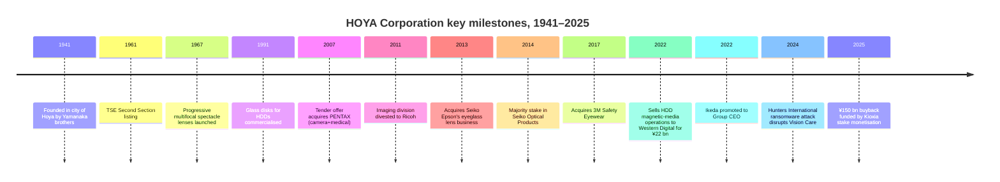

# HOYA Corporation (TSE: 7741) — Research Document

*As of 2026-05-26 · English-language report (Japan domicile; primary filings in Japanese; English IFRS report + Q2 FY26 transcript publicly translated)*

---

## Table of contents

1. Company overview
2. Company history
3. Management
4. Products and services
5. Customers and go-to-market
6. Industry overview
7. Competitive landscape
8. Market opportunity (TAM)
9. Risk assessment
10. References
11. Verification log

---

## 1. Company overview (800–1,200 words)

HOYA Corporation is a Tokyo-headquartered specialty-optics conglomerate whose product map straddles two of the strangest neighbours in the public-equity universe: at one end of the building it makes the eyeglass lens sitting on a Parisian commuter's nose; at the other end it makes the EUV mask blank that becomes the patterning master for every 3-nanometre transistor leaving TSMC's Fab 18. The company reported sales of **¥866.0 bn for the year ended 31 March 2025** (FY25) and a **¥260.0 bn profit-before-tax**, split across two reportable business segments — **Life Care (¥550.9 bn revenue, 63.6% of sales) and Information Technology (¥311.1 bn revenue, 35.9% of sales)**, with a residual ¥4.0 bn "Other" segment (speech-synthesis software) ([HOYA Corporation FY25 Consolidated Financial Statements under IFRS, pp. 9, 32–33](https://www.hoya.com/wp-content/uploads/2025/07/Annual-Report-Final-2.pdf)).

What makes HOYA unusual — and what places it in a semiconductor-materials coverage list at all — is the asymmetry of the two segments' economics. The Life Care segment is the larger contributor by revenue but earns the smaller contribution by profit-before-tax: ¥90.4 bn vs ¥170.4 bn from Information Technology in FY25, which means **IT generated ~65% of segment pre-tax profit on only ~36% of sales**, with a segment pre-tax margin of **~54.7%** versus 16.4% for Life Care ([HOYA Corporation FY25 IFRS Financial Statements, p. 32](https://www.hoya.com/wp-content/uploads/2025/07/Annual-Report-Final-2.pdf)). The Q2 FY26 (quarter ended September 2025) earnings call showed the same picture even more starkly — Information Technology's operating margin came in at **53.1%** that quarter against Life Care's 17.6% ([HOYA FY26 Q2 Earnings Call Transcript, 2025-10-31, pp. 3, 9](https://www.hoya.com/wp-content/uploads/2025/11/FY25-Q2-Earnings-Call-Transcript_E.pdf)). Information Technology is what the equity market is buying when it pays a ~35× P/E for HOYA today, even though casual readers may think of the company as "the Pentax / contact-lens / endoscope group".

Inside Information Technology, the headline asset is **Electronics-related products**, which the IFRS statements break out at **¥265.2 bn of FY25 revenue** (up 40.1% from ¥189.3 bn the prior year) — comprising "**Photomasks and Maskblanks for semiconductors, Photomasks for FPD, Glass disks for hard disk drives (HDDs)**" — plus a smaller **Imaging-related** business at ¥45.9 bn ("Optical lenses, Optical glass material, Laser equipment, Light source") ([HOYA FY25 IFRS Financial Statements, p. 33](https://www.hoya.com/wp-content/uploads/2025/07/Annual-Report-Final-2.pdf)). Within Electronics, the line item that matters most for the semiconductor-investment thesis is **mask blanks for EUV lithography**, where HOYA itself states in its FY24 Integrated Report that it holds "an exceptionally large share of the market for mask blanks for many years" and continues to "lead the field, leveraging its preeminence in low-defect products and next-generation development" ([HOYA Report 2024, p. 102](https://www.hoya.com/ir/2024/en/common/files/review2024.pdf)). *Analyst view:* Nomura's Greater China Semi 2026–30F report (2026-05-21) puts HOYA's EUV blank share at **~80%** and optical (DUV) photomask blank share at **~70%**, with Shin-Etsu Chemical as the only meaningful second source — these figures are sell-side estimates because HOYA does not publicly break out share or unit volumes ([reports/sector/半导体材料.md, Fig. 35–44](file:///Users/x/projects/financial_agent/reports/sector/半导体材料.md)).

The Life Care segment is itself two distinct sub-businesses. **Health Care related products** (eyeglass lenses and contact lenses) generated **¥417.7 bn** in FY25 (~48% of total Group revenue), making HOYA one of the world's top three eyeglass-lens manufacturers alongside EssilorLuxottica and Carl Zeiss Vision, with proprietary brands HOYA, Seiko, Pentax, KONISHI and Tokai ([Mordor Intelligence — Spectacle Lens Market](https://www.mordorintelligence.com/industry-reports/spectacle-lens-market)). **Medical related products** (¥133.2 bn, ~15% of Group revenue) houses Pentax Medical's flexible endoscopes, HOYA Surgical Optics' intraocular lenses (IOLs), Microline's laparoscopic instruments, APACERAM's orthopaedic hydroxyapatite implants, Wassenburg's automated endoscope reprocessors, and chromatography carriers ([HOYA FY25 IFRS Financial Statements, p. 31; HOYA Life Care product page](https://www.hoya.com/en/business/lifecare/)). Medical revenue actually contracted from ¥136.4 bn in FY24 to ¥133.2 bn in FY25, mostly on Chinese volume-based-procurement (VBP) headwinds for intraocular lenses and weak medical-endoscope demand, partly offset by ongoing factory consolidation that the CEO has guided to "tangible numerical effects by around Q4 of next fiscal year" ([HOYA FY26 Q2 Earnings Call Transcript, 2025-10-31, pp. 7, 21](https://www.hoya.com/wp-content/uploads/2025/11/FY25-Q2-Earnings-Call-Transcript_E.pdf)).

Geographically, FY25 revenue split **Japan ¥182.8 bn (21.1%); USA ¥129.2 bn (14.9%); Singapore ¥102.2 bn (11.8%); China ¥80.6 bn (9.3%); South Korea ¥60.7 bn (7.0%); Other ¥310.5 bn (35.9%)** — the Singapore line is high because HOYA's regional treasury / Asia Pac sales hub is registered there and books a meaningful share of intra-Asia electronics revenue ([HOYA FY25 IFRS Financial Statements, p. 34](https://www.hoya.com/wp-content/uploads/2025/07/Annual-Report-Final-2.pdf)). The Group employs **~37,909 people globally as of 31 March 2025** across "about 160 offices and subsidiaries worldwide" ([HOYA company profile page, accessed 2026-05](https://www.hoya.com/en/company/profile/)). Property, plant and equipment carrying value totals ¥210.9 bn, and capex was ¥60.9 bn in FY25 with **60–70% earmarked for the Information Technology segment** ("such as LSIs and HDD substrates") per CFO Hirooka on the Q2 FY26 call ([HOYA FY26 Q2 Earnings Call Transcript, p. 23](https://www.hoya.com/wp-content/uploads/2025/11/FY25-Q2-Earnings-Call-Transcript_E.pdf)).

*Source: compiled from [HOYA Corporation FY25 IFRS Financial Statements, pp. 9, 32](https://www.hoya.com/wp-content/uploads/2025/07/Annual-Report-Final-2.pdf) and prior-year integrated reports.*

*Source: [HOYA FY25 IFRS Financial Statements, p. 33](https://www.hoya.com/wp-content/uploads/2025/07/Annual-Report-Final-2.pdf) — Life Care 63.6% (Health Care 48.2% + Medical 15.4%), Information Technology 35.9% (Electronics 30.6% + Imaging 5.3%), Other 0.5%.*

*Source: [HOYA FY25 IFRS Financial Statements, p. 34](https://www.hoya.com/wp-content/uploads/2025/07/Annual-Report-Final-2.pdf) — Japan 21.1%, USA 14.9%, Singapore 11.8%, China 9.3%, South Korea 7.0%, Others 35.9%.*

**Valuation snapshot (as of late May 2026).** HOYA trades at roughly **¥27,575 / share** with a market cap of **~¥8.8 trillion** (~US$57 bn at JPY/USD 154) and an enterprise value of **¥8.28 trillion** ([Stockanalysis.com — TYO:7741 statistics, accessed 2026-05](https://stockanalysis.com/quote/tyo/7741/statistics/)). On a trailing-12-month basis HOYA carries a **P/E of 35.4× / forward P/E ~34.9×**, **P/S of 9.3×**, **P/B of 8.5×**, **EV/EBITDA of 22.2×**, and a **dividend yield of ~1.3%** with annual DPS of ¥110 for FY25 (interim raised to ¥125 in 1H FY26) ([Yahoo Finance — 7741.T key statistics, accessed 2026-05](https://finance.yahoo.com/quote/7741.T/key-statistics/); [HOYA FY26 Q2 Earnings Call Transcript, p. 14](https://www.hoya.com/wp-content/uploads/2025/11/FY25-Q2-Earnings-Call-Transcript_E.pdf)). **ROE is ~25.1%**, **ROIC ~48%**, and **net cash is ¥531.9 bn** — so the stock is being capitalised at roughly 35× earnings on a 25% returns-on-equity engine with negligible leverage ([Stockanalysis.com — TYO:7741, accessed 2026-05](https://stockanalysis.com/quote/tyo/7741/statistics/)).

The trailing P/E of ~35× is roughly **35% above the medical-devices-and-instruments industry median of ~25.8×** ([Gurufocus — Medical Devices industry PE, accessed 2026-05](https://www.wisesheets.io/pe-ratio/ESLOY)) and sits modestly below EssilorLuxottica's ~38.8× and well above Carl Zeiss Meditec's ~26.2×. *Analyst view:* the premium is best understood not as Life Care commanding it (Life Care alone would justify ~22–25×) but as the market separately pricing the Information Technology earnings stream at a much higher multiple — implied ~50× on segment pre-tax — in recognition of the EUV mask-blank monopoly, the early HAMR/glass-HDD-substrate inflection, and the persistently consistent buyback-plus-cancellation engine (¥150 bn of treasury shares acquired and ¥97.9 bn cancelled in FY25 alone) ([HOYA FY25 IFRS Financial Statements, p. 11](https://www.hoya.com/wp-content/uploads/2025/07/Annual-Report-Final-2.pdf)). With the stock having returned **+52.2% over the trailing 52 weeks** as the AI-driven semicap thesis re-rated the segment ([Yahoo Finance — 7741.T, accessed 2026-05](https://finance.yahoo.com/quote/7741.T/)), the multiple is now meaningfully extended and any cyclical wobble in EUV demand (or a Shin-Etsu share-grab) becomes a material valuation risk discussed in Section 9.

---

## 2. Company history (400–700 words)

HOYA was founded on **1 November 1941** by the brothers **Shoichi and Shigeru Yamanaka**, who set up an optical-glass production plant in the city of Hoya (now Nishi-Tokyo) on the western edge of Tokyo — the site name later became the corporate name ([HOYA Corporation company history page, accessed 2026-05](https://www.hoya.com/en/company/history/); [Companies History — Hoya](https://www.companieshistory.com/hoya/)). The company incorporated formally in 1944 and pivoted into crystal-glass tableware in 1945 as wartime demand for optical glass collapsed; the crystal-products business was the first cash-flow generator that funded HOYA's later move into spectacle lenses ([HOYA Corporation company history page](https://www.hoya.com/en/company/history/)).

The company listed on the **Tokyo Stock Exchange Second Section in October 1961** and graduated to the First Section in February 1973, by which point the product range had widened to **progressive multifocal spectacle lenses (1967), soft contact lenses (1972), intraocular lenses (1987) and glass disks for hard disk drives (1991)** ([HOYA Corporation company history page, accessed 2026-05](https://www.hoya.com/en/company/history/)). The corporate identity was simplified from "Hoya Glass Works" to "Hoya Corporation" in 1984. The strategic genius of the 1980s–2000s leadership was an obsessive focus on owning the **substrate** rather than the finished module — once you make the glass disk that becomes a hard-drive platter, the optical blank that becomes a photomask, or the polymer puck that becomes a contact lens, you sit at a high-margin chokepoint that the more-visible downstream assemblers cannot bypass.

Two acquisitions stand out as portfolio-defining. The **PENTAX tender offer (December 2007 – April 2008)** added two businesses — the consumer-camera/imaging arm that was later divested to Ricoh in 2011 and the **flexible-endoscope arm that remains today as Pentax Medical**, providing HOYA's anchor position in gastrointestinal scopes ([HOYA Corporation company history page](https://www.hoya.com/en/company/history/); [SafeVision blog — All About HOYA](https://safevision.com/blog/all-about-hoya/)). The **Seiko Optical Products series of deals (2013–14)** added Seiko Epson's eyeglass-lens manufacturing operations and a controlling stake in Seiko's lens-sales subsidiary — when combined with HOYA's own Hoya, Pentax and Tokai brands, this established HOYA as the world's #2 or #3 spectacle-lens producer behind EssilorLuxottica and on par with Carl Zeiss ([Nishimura & Asahi — HOYA / Seiko Epson deal advisory, 2014](https://www.nishimura.com/en/experience/work/5321); [PR Newswire — HOYA, Seiko and Epson agreements, 2013](https://www.prnewswire.com/news-releases/hoya-seiko-and-epson-agreements-executed-in-the-field-of-optical-products-business-179637771.html)).

The 2010s and 2020s have been characterised more by **subtraction than addition**. The Ricoh imaging-division divestiture (2011), the **sale of HOYA's magnetic-media (sputtering) operations to Western Digital in 2022 for ¥22 bn (~US$235 m)** — which kept HOYA in the upstream glass-substrate business but exited the lower-margin coating step — and the recent restructuring of the medical-endoscope sales / factory footprint ("about 70–80% of necessary decisions are completed; now it's just a matter of execution," per CEO Ikeda on the Q2 FY26 call) ([HOYA FY26 Q2 Earnings Call Transcript, p. 21](https://www.hoya.com/wp-content/uploads/2025/11/FY25-Q2-Earnings-Call-Transcript_E.pdf); [PR Newswire — Western Digital to acquire HOYA magnetic media, 2009 announcement, 2022 closure](https://www.prnewswire.com/news-releases/western-digitalr-to-acquire-hoyas-magnetic-media-operations-92263279.html)) all reflect a long-term portfolio-curation philosophy that ruthlessly exits non-share-leader positions and pours the proceeds into either capacity (Electronics fabs in Akishima / Mishima / Kumamoto / Vietnam / Laos / Chongqing) or buybacks.

The two recent shocks worth flagging: **(a) the Hunters International ransomware attack discovered 30 March 2024**, which disrupted Vision Care order-processing systems for ~4 weeks at multiple lens labs and triggered a $10 m ransom demand HOYA refused to pay ([Bleeping Computer — Optics giant Hoya hit with $10M ransomware demand, 2024-04](https://www.bleepingcomputer.com/news/security/optics-giant-hoya-hit-with-10-million-ransomware-demand/); [SecurityWeek — Lens Maker Hoya scrambling to restore systems, 2024-04](https://www.securityweek.com/lens-maker-hoya-scrambling-to-restore-systems-following-cyberattack/)); and **(b) the multi-decade transfer-pricing tax case in which Japan's National Tax Tribunal partly cancelled reassessments for FY2007–11, with HOYA continuing to litigate the remainder** — the receivable for ¥7.9 bn + ¥4.5 bn + ¥8.0 bn paid-in-advance amounts is disclosed as a Key Audit Matter in the FY25 audit opinion ([HOYA FY25 IFRS Financial Statements, p. 4](https://www.hoya.com/wp-content/uploads/2025/07/Annual-Report-Final-2.pdf)).

---

## 3. Management (300–500 words)

The Yamanaka brothers (Shoichi and Shigeru) are long gone and HOYA has been a non-family-controlled, professional-management company since the 1980s — meaning the relevant biographical detail today is the current Group President and CEO.

**Eiichiro Ikeda — Representative Executive Officer, President & CEO (since March 2022).** Ikeda is a 33-year HOYA insider who joined the company in 1992 and was promoted through every major operating division before getting the top job. He holds a Bachelor of Engineering from Chuo University and has been based out of HOYA's Singapore regional office since taking the CEO role — a deliberate signal that HOYA's centre of gravity is Asia-Pacific operations rather than Tokyo headquarters ([HOYA Corporation Leadership page, accessed 2026-05](https://www.hoya.com/en/company/directors/); [Bloomberg — Eiichiro Ikeda profile](https://www.bloomberg.com/profile/person/18799019); [Equilar ExecAtlas — Eiichiro Ikeda](https://people.equilar.com/bio/person/eiichiro-ikeda-hoya-corporation/39560383)).

His three formative operating tours map exactly onto the three product franchises that drive the current equity story. **(1) From early 2010 he was Co-CEO of the Memory Disk Division and General Manager of Media** — the unit that makes glass substrates for HDDs and that he later restructured by selling the magnetic-media sputtering operations to Western Digital while keeping HOYA's monopoly on the substrate itself; the deal closed in 2022 for ¥22 bn ([The Official Board — Eiichiro Ikeda bio, accessed 2026-05](https://www.theofficialboard.com/biography/eiichiro-ikeda-94d76); [PR Newswire — Western Digital to acquire HOYA magnetic media](https://www.prnewswire.com/news-releases/western-digitalr-to-acquire-hoyas-magnetic-media-operations-92263279.html)). **(2) From late 2010 he ran the Optical Lens business**, learning the global spectacle-lens cost structure and the Seiko-integration playbook from inside; that experience underpins his current restructuring of the Pentax Medical / IOL footprint where he is consolidating factories despite ~6–9 months of short-term margin drag ([HOYA FY26 Q2 Earnings Call Transcript, 2025-10-31, p. 21](https://www.hoya.com/wp-content/uploads/2025/11/FY25-Q2-Earnings-Call-Transcript_E.pdf)). **(3) From 2013 he was Executive Officer / COO of Information Technology, then Group CTO from 2015 and President of the Eyecare Division from 2019**, giving him direct technical familiarity with mask-blank manufacturing physics and EUV process control ([The Official Board — Eiichiro Ikeda bio](https://www.theofficialboard.com/biography/eiichiro-ikeda-94d76); [Hennessy Funds — Japan Fund Spotlight on HOYA](https://www.hennessyfunds.com/insights/company-spotlight-japan-hoya)).

The signature of his ~3-year CEO tenure has been **(a)** aggressive capital return — ¥150 bn of treasury-share buybacks in FY25, with 97.9 bn yen of those shares cancelled the same year, and an additional ¥100 bn programme running into 2026 — funded partly by monetising the company's Kioxia stake; the proceeds from the Kioxia disposal "are being used to fund the ongoing share buyback program" per CFO Hirooka ([HOYA FY25 IFRS Financial Statements, p. 11](https://www.hoya.com/wp-content/uploads/2025/07/Annual-Report-Final-2.pdf); [HOYA FY26 Q2 Earnings Call Transcript, p. 20](https://www.hoya.com/wp-content/uploads/2025/11/FY25-Q2-Earnings-Call-Transcript_E.pdf); [MarketScreener — HOYA ¥100 bn buyback announcement](https://www.marketscreener.com/news/hoya-corporation-announces-an-equity-buyback-for-6-200-000-shares-representing-1-81-for-100-000-m-ce7c51d3dd89f02d/)); **(b)** disciplined-but-meaningful capacity capex in EUV blanks and HDD substrates (60–70% of the FY26 ¥55 bn capex envelope is going to those two lines per the Q2 call); and **(c)** a calculated refusal to chase share in commoditising markets — the Q2 FY26 commentary on HDD glass-substrate pricing is candid that aluminium-substrate competition will cap price increases ([HOYA FY26 Q2 Earnings Call Transcript, pp. 23–24](https://www.hoya.com/wp-content/uploads/2025/11/FY25-Q2-Earnings-Call-Transcript_E.pdf)).

Ikeda's ownership is not separately disclosed in either the EDINET securities report or HOYA's English IR materials — Japanese disclosure requires only that individual director shareholdings >0.1% be flagged, and Ikeda's holdings are believed to be below that threshold based on the absence of disclosure. Compensation is structured with a mid-to-long-term incentive component (performance share units / PSUs) whose payout is partly tied to ESG metrics, per CSO Tomoko Nakagawa's commentary in the Q2 FY26 call ([HOYA FY26 Q2 Earnings Call Transcript, pp. 15, 18](https://www.hoya.com/wp-content/uploads/2025/11/FY25-Q2-Earnings-Call-Transcript_E.pdf)).
