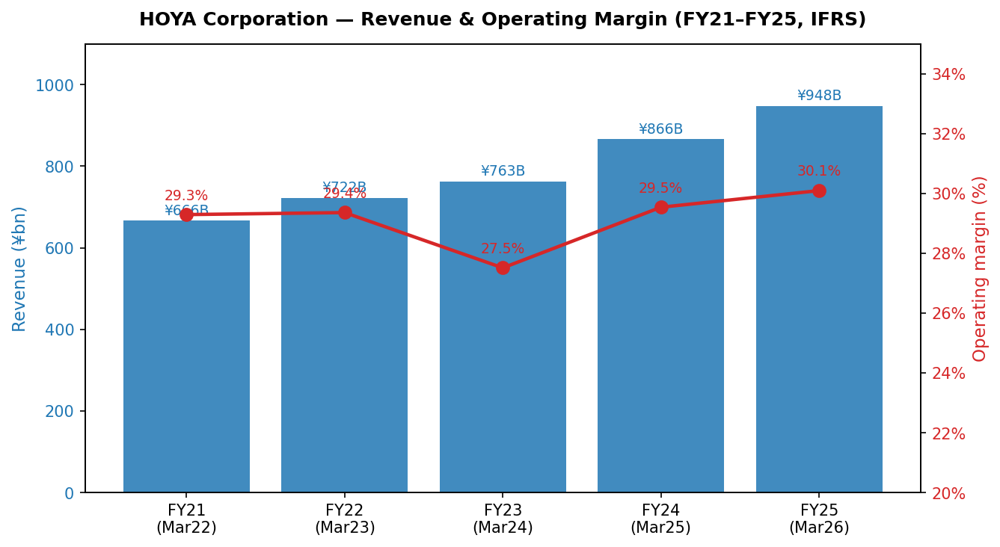
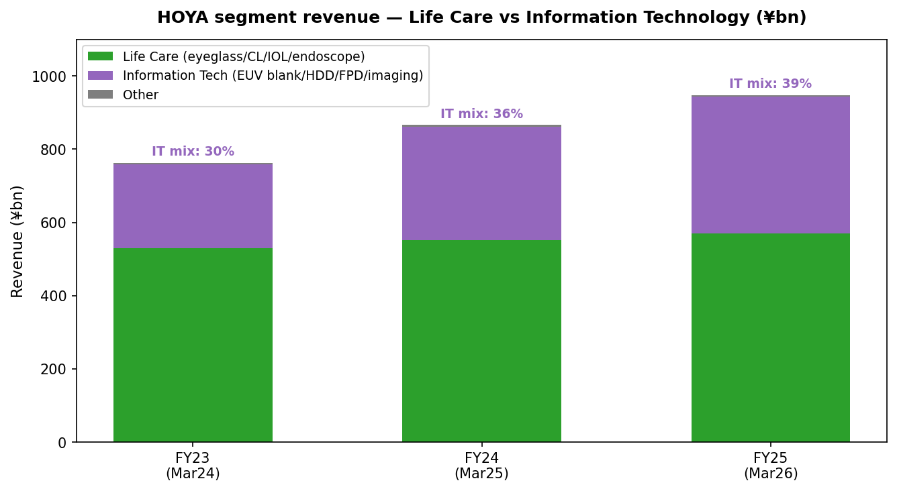
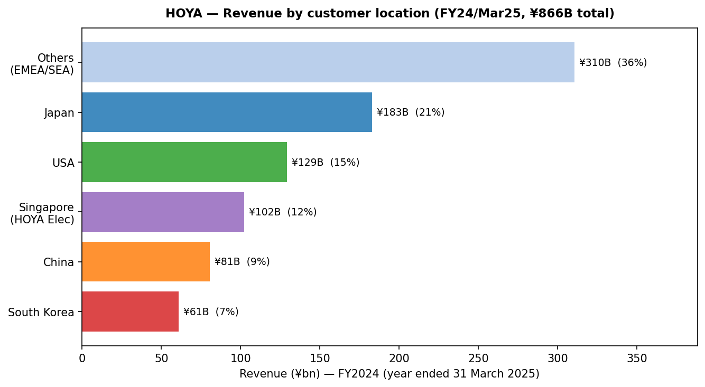
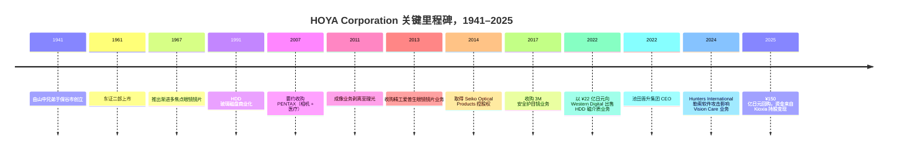
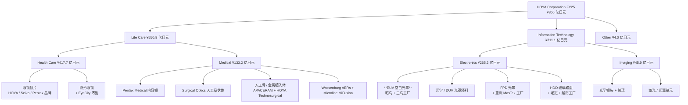
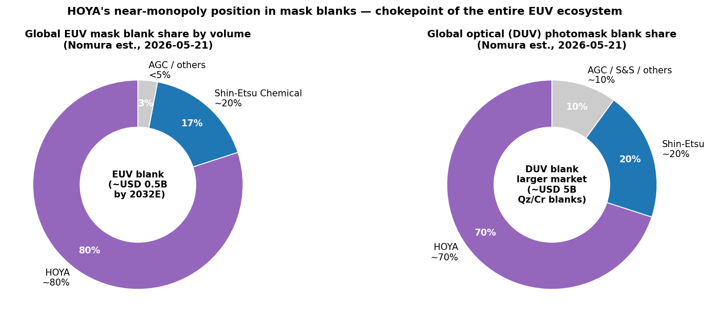
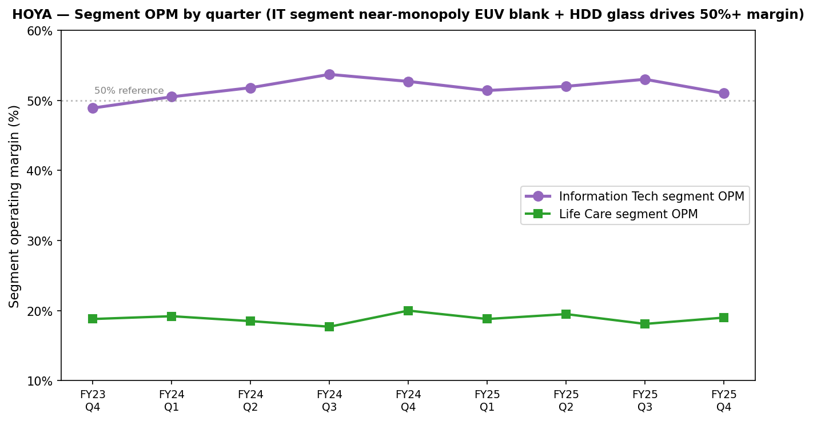
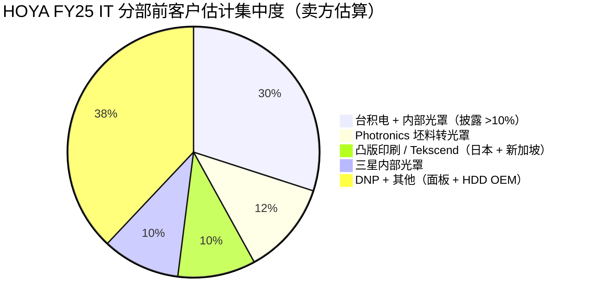

# HOYA Corporation 豪雅株式会社 (TSE: 7741) — 公司研究

*截至 2026-05-26 · 简体中文版报告（日本注册；原始监管披露以日文为主；英文版 IFRS 财报与 FY26 Q2 业绩电话会议英文译本由公司官方公开）*

---

## 目录

1. 公司概览
2. 公司历史
3. 管理团队
4. 产品与服务
5. 客户与上市策略
6. 行业概览
7. 竞争格局
8. 市场机会
9. 风险评估
10. 参考资料
11. 验证日志

---

## 1. 公司概览

HOYA Corporation（豪雅株式会社，下称"HOYA"）是一家总部位于东京的特种光学综合集团，其产品矩阵跨越了上市公司里少见的两个极端：在大楼的一端，HOYA 生产巴黎通勤族鼻梁上戴着的眼镜镜片；在另一端，HOYA 生产光罩坯料 / 空白光罩 (mask blank)，这些 EUV 空白光罩 (EUV mask blank — 全球约 80% 份额) 进入台积电 Fab 18，最终成为每一颗 3 纳米晶体管的图形母版。FY25（即截至 2025 年 3 月 31 日的财年）公司**合计销售额 ¥866.0 亿日元、税前利润 ¥260.0 亿日元**，按两大可报告业务分部拆分为 **Life Care 业务（生命健康，¥550.9 亿日元，占销售 63.6%）和 Information Technology 业务（信息技术，¥311.1 亿日元，占销售 35.9%）**，以及一个 ¥4.0 亿日元的 "Other"（语音合成软件）残余项 ([HOYA Corporation FY25 Consolidated Financial Statements under IFRS, pp. 9, 32–33](https://www.hoya.com/wp-content/uploads/2025/07/Annual-Report-Final-2.pdf))。

HOYA 之所以特殊，也正是它被纳入半导体材料覆盖名单的原因，在于两大分部的经济性极不对称。Life Care 在收入端是较大贡献者，但税前利润反而较少：FY25 Life Care 税前利润为 ¥90.4 亿日元，而信息技术分部却高达 ¥170.4 亿日元——也就是说，**IT 仅以 ~36% 的销售额贡献了 ~65% 的分部税前利润**，分部税前利润率高达 **~54.7%**，相比 Life Care 仅为 16.4% ([HOYA Corporation FY25 IFRS Financial Statements, p. 32](https://www.hoya.com/wp-content/uploads/2025/07/Annual-Report-Final-2.pdf))。FY26 Q2（即截至 2025 年 9 月底的季度）业绩电话会议上披露的数据更加极端——当季信息技术分部经营利润率达 **53.1%**，Life Care 仅为 17.6% ([HOYA FY26 Q2 Earnings Call Transcript, 2025-10-31, pp. 3, 9](https://www.hoya.com/wp-content/uploads/2025/11/FY25-Q2-Earnings-Call-Transcript_E.pdf))。当市场以 ~35× P/E 为 HOYA 定价时，市场买的是 Information Technology，尽管许多读者仍把 HOYA 当成"Pentax 品牌 / 隐形眼镜 / 内窥镜集团"。

Information Technology 内部，最关键的资产是 **Electronics-related products（电子相关产品）**——IFRS 报表将其拆分为 FY25 收入 ¥265.2 亿日元（同比由 ¥189.3 亿日元增长 40.1%），构成包括"**半导体光罩与光罩坯料、FPD 光罩、硬盘玻璃基板**"——再加上一块较小的 **Imaging-related（成像相关）** 业务，FY25 收入 ¥45.9 亿日元（"光学镜头、光学玻璃材料、激光设备、光源"） ([HOYA FY25 IFRS Financial Statements, p. 33](https://www.hoya.com/wp-content/uploads/2025/07/Annual-Report-Final-2.pdf))。Electronics 内部，对半导体投资逻辑最重要的就是 **EUV 空白光罩**，HOYA 在 FY24 综合年报中明确表示其"在光罩坯料市场上长期保持极大份额"，并将"以低缺陷产品和下一代研发的领先地位继续引领行业" ([HOYA Report 2024, p. 102](https://www.hoya.com/ir/2024/en/common/files/review2024.pdf))。*分析师观点：* 野村《大中华半导体 2026–30F》报告（2026-05-21）估算 HOYA 的 EUV 空白光罩份额约 **~80%**、光学光罩坯料 (optical mask blank — 全球约 70% 份额) 份额约 **~70%**，信越化学是唯一具有规模的第二供应商——这些数据为卖方估算，HOYA 并未公开披露份额或单位出货量 ([reports/sector/半导体材料.md, Fig. 35–44](file:///Users/x/projects/financial_agent/reports/sector/半导体材料.md))。

Life Care 分部本身又分为两个截然不同的子业务。**Health Care related products（眼镜镜片与隐形眼镜）** FY25 收入 **¥417.7 亿日元**（约占全集团 48%），使 HOYA 跻身全球前三大眼镜镜片厂商之列，仅次于 EssilorLuxottica 和 Carl Zeiss Vision，旗下自有品牌包括 HOYA、Seiko、Pentax、KONISHI 与 Tokai ([Mordor Intelligence — Spectacle Lens Market](https://www.mordorintelligence.com/industry-reports/spectacle-lens-market))。**Medical related products（医疗相关产品，¥133.2 亿日元，~15%）** 包含 Pentax Medical 软性内窥镜、HOYA Surgical Optics 人工晶状体 (IOL)、Microline 腹腔镜器械、APACERAM 骨科羟基磷灰石植入体、Wassenburg 自动内窥镜清洗机以及色谱填料 ([HOYA FY25 IFRS Financial Statements, p. 31; HOYA Life Care product page](https://www.hoya.com/en/business/lifecare/))。FY25 医疗收入从 FY24 的 ¥136.4 亿日元下滑至 ¥133.2 亿日元，主要受中国 IOL 集采 (VBP, volume-based procurement) 与医疗内窥镜需求疲软拖累，部分被工厂整合所抵消——CEO 池田指出"实质数字效益将在下一个财年第四季度左右显现" ([HOYA FY26 Q2 Earnings Call Transcript, 2025-10-31, pp. 7, 21](https://www.hoya.com/wp-content/uploads/2025/11/FY25-Q2-Earnings-Call-Transcript_E.pdf))。

地域上，FY25 收入构成为 **日本 ¥182.8 亿日元（21.1%）；美国 ¥129.2 亿日元（14.9%）；新加坡 ¥102.2 亿日元（11.8%）；中国 ¥80.6 亿日元（9.3%）；韩国 ¥60.7 亿日元（7.0%）；其他 ¥310.5 亿日元（35.9%）**——其中新加坡占比偏高，是因为 HOYA 的亚太地区财资中心 / 销售总部在此注册，承担了相当比例的亚洲内部电子产品收入 ([HOYA FY25 IFRS Financial Statements, p. 34](https://www.hoya.com/wp-content/uploads/2025/07/Annual-Report-Final-2.pdf))。截至 2025 年 3 月 31 日，集团全球员工 **~37,909 人**，分布在"全球约 160 个办事处与子公司" ([HOYA company profile page, accessed 2026-05](https://www.hoya.com/en/company/profile/))。集团 PP&E 账面价值合计 ¥210.9 亿日元，FY25 资本支出 ¥60.9 亿日元，其中 **60–70% 计划用于 Information Technology 分部**（CFO 广冈在 FY26 Q2 业绩会议上称"包括 LSIs 和 HDD 基板"） ([HOYA FY26 Q2 Earnings Call Transcript, p. 23](https://www.hoya.com/wp-content/uploads/2025/11/FY25-Q2-Earnings-Call-Transcript_E.pdf))。

*资料来源：根据 [HOYA Corporation FY25 IFRS Financial Statements, pp. 9, 32](https://www.hoya.com/wp-content/uploads/2025/07/Annual-Report-Final-2.pdf) 及历年综合报告整理。*

*资料来源：[HOYA FY25 IFRS Financial Statements, p. 33](https://www.hoya.com/wp-content/uploads/2025/07/Annual-Report-Final-2.pdf) — Life Care 63.6%（Health Care 48.2% + Medical 15.4%）、Information Technology 35.9%（Electronics 30.6% + Imaging 5.3%）、Other 0.5%。*

*资料来源：[HOYA FY25 IFRS Financial Statements, p. 34](https://www.hoya.com/wp-content/uploads/2025/07/Annual-Report-Final-2.pdf) — 日本 21.1%、美国 14.9%、新加坡 11.8%、中国 9.3%、韩国 7.0%、其他 35.9%。*

**估值快照（截至 2026 年 5 月底）。** HOYA 股价约 **¥27,575 / 股**，市值约 **¥8.8 万亿日元**（按 JPY/USD 154 折算约 US$57 bn），企业价值 **¥8.28 万亿日元** ([Stockanalysis.com — TYO:7741 statistics, accessed 2026-05](https://stockanalysis.com/quote/tyo/7741/statistics/))。TTM 滚动 P/E 为 **35.4× / 前瞻 P/E 约 34.9×**、P/S 为 **9.3×**、P/B 为 **8.5×**、EV/EBITDA 为 **22.2×**、股息率 **~1.3%**（FY25 全年 DPS ¥110，1H FY26 中期股息提升至 ¥125） ([Yahoo Finance — 7741.T key statistics, accessed 2026-05](https://finance.yahoo.com/quote/7741.T/key-statistics/); [HOYA FY26 Q2 Earnings Call Transcript, p. 14](https://www.hoya.com/wp-content/uploads/2025/11/FY25-Q2-Earnings-Call-Transcript_E.pdf))。**ROE 资本回报率约 25.1%**、ROIC ~48%、净现金 ¥531.9 亿日元——也就是市场正在以 35× P/E 对一个 ROE 25%、几乎零杠杆的资产复利引擎进行定价 ([Stockanalysis.com — TYO:7741, accessed 2026-05](https://stockanalysis.com/quote/tyo/7741/statistics/))。

35× 左右的 TTM P/E **比医疗器械行业中位数 ~25.8× 高出约 35%** ([Gurufocus — Medical Devices industry PE, accessed 2026-05](https://www.wisesheets.io/pe-ratio/ESLOY))，略低于 EssilorLuxottica 的 ~38.8×，明显高于 Carl Zeiss Meditec 的 ~26.2×。*分析师观点：* 这个溢价的最佳解读并非 Life Care 独自支撑（仅 Life Care 大约只能给到 22–25×），而是市场对 Information Technology 利润流单独定价、隐含 ~50× 分部税前——这是对 EUV 空白光罩垄断、HAMR / 玻璃 HDD 基板拐点、以及持续的回购 + 注销引擎的认可（FY25 当年共回购库藏股 ¥150 亿日元、注销 ¥97.9 亿日元） ([HOYA FY25 IFRS Financial Statements, p. 11](https://www.hoya.com/wp-content/uploads/2025/07/Annual-Report-Final-2.pdf))。考虑到该股过去 52 周累计回报已达 **+52.2%**，AI 驱动的半导体设备 / 材料逻辑已经将分部估值充分重估 ([Yahoo Finance — 7741.T, accessed 2026-05](https://finance.yahoo.com/quote/7741.T/))，目前估值倍数已经明显拉伸，EUV 需求出现任何周期性波动（或信越突袭份额）都将构成实质性估值风险——这点将在第 9 章讨论。

---

## 2. 公司历史

HOYA 由 **山中正一与山中茂兄弟** 于 **1941 年 11 月 1 日** 创立，最初在东京西郊的保谷市（今西东京市）建立光学玻璃生产工厂——厂址所在的地名后来便成为了公司名称 ([HOYA Corporation company history page, accessed 2026-05](https://www.hoya.com/en/company/history/); [Companies History — Hoya](https://www.companieshistory.com/hoya/))。公司在 1944 年正式法人化，1945 年战时光学玻璃需求骤减后转入水晶玻璃餐具业务；水晶产品成为 HOYA 第一个产生现金流的业务，为后来切入眼镜镜片提供了资金 ([HOYA Corporation company history page](https://www.hoya.com/en/company/history/))。

公司于 **1961 年 10 月在东京证券交易所二部上市**，1973 年 2 月升至一部，产品线在此期间已扩展到 **渐进多焦点眼镜镜片（1967）、软性隐形眼镜（1972）、人工晶状体（1987）以及硬盘玻璃基板（1991）** ([HOYA Corporation company history page, accessed 2026-05](https://www.hoya.com/en/company/history/); [Companies History — Hoya entry](https://www.companieshistory.com/hoya/))。1984 年公司名称从"保谷硝子工业"简化为"HOYA Corporation"。1980 年代至 2000 年代管理层的战略洞见在于专注**底层材料 / 基板**，而非下游模组——一旦你能制造成为硬盘盘片的玻璃磁盘、成为光罩的光学坯料、或成为隐形眼镜的高分子镜柸，你就坐在一个高利润率的瓶颈环节，那些更显眼的下游组装厂商绕不开你。

两笔收购最为决定性。**2007 年 12 月至 2008 年 4 月的 PENTAX 要约收购** 同时带来两条业务线——消费相机 / 成像板块后来于 2011 年剥离给理光，而 **软性内窥镜业务则一直保留至今，即 Pentax Medical**，为 HOYA 在消化道内窥镜领域奠定了基础地位 ([HOYA Corporation company history page](https://www.hoya.com/en/company/history/); [SafeVision blog — All About HOYA](https://safevision.com/blog/all-about-hoya/))。**2013–14 年的 Seiko Optical Products 系列交易** 收购了精工爱普生的眼镜镜片制造业务，并取得精工镜片销售子公司的控股权——与 HOYA 原有的 Hoya、Pentax、Tokai 品牌合并后，HOYA 跻身全球第二或第三大眼镜镜片厂商，仅次于 EssilorLuxottica，与 Carl Zeiss 平起平坐 ([Nishimura & Asahi — HOYA / Seiko Epson deal advisory, 2014](https://www.nishimura.com/en/experience/work/5321); [PR Newswire — HOYA, Seiko and Epson agreements, 2013](https://www.prnewswire.com/news-releases/hoya-seiko-and-epson-agreements-executed-in-the-field-of-optical-products-business-179637771.html))。

2010 年代和 2020 年代 HOYA 的特征更多是**减法而非加法**。包括 2011 年成像业务剥离给理光；**2022 年以 ¥22 亿日元（约 US$235 m）向 Western Digital 出售磁介质（溅射）业务**——HOYA 保留上游玻璃基板生产，退出利润率较低的镀膜环节；以及最近对医疗内窥镜销售 / 工厂网络的重组（CEO 池田在 FY26 Q2 业绩会议上表示"约 70–80% 的必要决策已经完成，剩下的只是执行问题"） ([HOYA FY26 Q2 Earnings Call Transcript, p. 21](https://www.hoya.com/wp-content/uploads/2025/11/FY25-Q2-Earnings-Call-Transcript_E.pdf); [PR Newswire — Western Digital to acquire HOYA magnetic media, 2009 announcement, 2022 closure](https://www.prnewswire.com/news-releases/western-digitalr-to-acquire-hoyas-magnetic-media-operations-92263279.html))。这些动作反映了一种长期的组合管理哲学：果断退出无法做到行业领先的位置，将获得的资金要么投入扩产（电子业务的昭岛 / 三岛 / 熊本 / 越南 / 老挝 / 重庆工厂），要么进行股票回购。

近期值得关注的两次冲击：**(a) 2024 年 3 月 30 日发现的 Hunters International 勒索软件攻击**，使多家镜片实验室 Vision Care 订单处理系统中断约 4 周，攻击者索要 US$10 m 赎金被 HOYA 拒绝 ([Bleeping Computer — Optics giant Hoya hit with $10M ransomware demand, 2024-04](https://www.bleepingcomputer.com/news/security/optics-giant-hoya-hit-with-10-million-ransomware-demand/); [SecurityWeek — Lens Maker Hoya scrambling to restore systems, 2024-04](https://www.securityweek.com/lens-maker-hoya-scrambling-to-restore-systems-following-cyberattack/))；**(b) 多年期的转让定价税务诉讼** 中，日本国税不服审判所部分撤销了 FY2007–11 的补税评估，HOYA 仍在就剩余部分上诉——已预付的应收款 ¥7.9 亿日元 + ¥4.5 亿日元 + ¥8.0 亿日元在 FY25 审计意见中被列为关键审计事项 ([HOYA FY25 IFRS Financial Statements, p. 4](https://www.hoya.com/wp-content/uploads/2025/07/Annual-Report-Final-2.pdf))。

---

## 3. 管理团队

山中兄弟（正一与茂）早已不在世，HOYA 自 1980 年代以来一直是非家族控股的职业经理人公司——所以今天唯一相关的传记细节是现任集团社长兼 CEO。

**池田英一郎（Eiichiro Ikeda）——代表执行役、社长兼 CEO（自 2022 年 3 月起任）。** 池田是 HOYA 33 年内部老兵，1992 年入职，在每一个主要运营部门历练后晋升至最高职位。他拥有中央大学工学学士学位，担任 CEO 后将办公基地设在 HOYA 新加坡区域总部——这是有意为之的信号，意味着 HOYA 的重心是亚太运营而非东京总部 ([HOYA Corporation Leadership page, accessed 2026-05](https://www.hoya.com/en/company/directors/); [Bloomberg — Eiichiro Ikeda profile](https://www.bloomberg.com/profile/person/18799019); [Equilar ExecAtlas — Eiichiro Ikeda](https://people.equilar.com/bio/person/eiichiro-ikeda-hoya-corporation/39560383))。

池田的三段成型经验恰恰对应于当前驱动股票故事的三个产品业务。**(1) 自 2010 年初担任 Memory Disk Division 联席 CEO 兼 Media 总经理**——即制造 HDD 玻璃基板的部门，他随后通过将磁介质溅射业务出售给 Western Digital 完成重组，同时保留 HOYA 在基板本体上的垄断地位；该交易于 2022 年以 ¥22 亿日元成交 ([Equilar ExecAtlas — Eiichiro Ikeda](https://people.equilar.com/bio/person/eiichiro-ikeda-hoya-corporation/39560383); [PR Newswire — Western Digital to acquire HOYA magnetic media](https://www.prnewswire.com/news-releases/western-digitalr-to-acquire-hoyas-magnetic-media-operations-92263279.html))。**(2) 自 2010 年末起负责 Optical Lens 光学镜片业务**，深入了解全球眼镜镜片的成本结构和 Seiko 整合手册；这一经验奠定了他目前对 Pentax Medical / IOL 工厂网络重组的判断——他正在整合工厂，尽管短期会带来 6–9 个月的利润率压力 ([HOYA FY26 Q2 Earnings Call Transcript, 2025-10-31, p. 21](https://www.hoya.com/wp-content/uploads/2025/11/FY25-Q2-Earnings-Call-Transcript_E.pdf))。**(3) 自 2013 年起任信息技术分部执行役 / COO，2015 年起任集团 CTO，2019 年起任 Eyecare 部门社长**，使他对光罩坯料制造物理和 EUV 工艺控制有直接技术理解 ([Equilar ExecAtlas — Eiichiro Ikeda](https://people.equilar.com/bio/person/eiichiro-ikeda-hoya-corporation/39560383); [Bloomberg — Eiichiro Ikeda profile](https://www.bloomberg.com/profile/person/18799019))。

池田 ~3 年 CEO 任期的特征是 **(a)** 激进的资本回报——FY25 内回购库藏股 ¥150 亿日元、同年注销 ¥97.9 亿日元，2026 年仍在执行追加的 ¥100 亿日元计划——部分资金来自 Kioxia 持股变现；按 CFO 广冈披露，Kioxia 处置款"目前正用于资助持续的股票回购计划" ([HOYA FY25 IFRS Financial Statements, p. 11](https://www.hoya.com/wp-content/uploads/2025/07/Annual-Report-Final-2.pdf); [HOYA FY26 Q2 Earnings Call Transcript, p. 20](https://www.hoya.com/wp-content/uploads/2025/11/FY25-Q2-Earnings-Call-Transcript_E.pdf); [The Globe and Mail / TipRanks — HOYA ends ¥100 bn buyback and cancels 1.06% of shares, 2025](https://www.theglobeandmail.com/investing/markets/markets-news/Tipranks/1638099/hoya-ends-yen100-billion-buyback-and-cancels-1-06-of-its-shares/))；**(b)** 在 EUV 空白光罩和 HDD 基板上有节制但意义重大的产能投资（FY26 ¥55 亿日元资本支出包中 60–70% 投向这两条产品线）；**(c)** 在大宗化的市场上有意识地拒绝追逐份额——FY26 Q2 关于 HDD 玻璃基板定价的评论坦率指出铝基板竞争将限制涨价空间 ([HOYA FY26 Q2 Earnings Call Transcript, pp. 23–24](https://www.hoya.com/wp-content/uploads/2025/11/FY25-Q2-Earnings-Call-Transcript_E.pdf))。

池田个人持股数量在 EDINET 上的有价证券报告书与 HOYA 英文 IR 资料中均未单独披露——日本披露规则仅要求单个董事持股超过 0.1% 才需提示，根据未披露这一事实可推断池田持股低于该阈值。其薪酬结构包含中长期激励组件（绩效股票单位 / PSU），其支付与 ESG 指标部分挂钩——这是首席战略官 (CSO) 中川友子在 FY26 Q2 业绩会议中的说明 ([HOYA FY26 Q2 Earnings Call Transcript, pp. 15, 18](https://www.hoya.com/wp-content/uploads/2025/11/FY25-Q2-Earnings-Call-Transcript_E.pdf))。

---

## 4. 产品与服务 ——"瓶颈"之章

### 4.1 HOYA 自报的产品矩阵

FY25 财报中经过审计的分部附注是产品表的权威来源——其他来源（维基百科、卖方初次覆盖报告、第三方行业调研）都是它的衍生品。该附注将集团划分为两个运营分部和四大产品族（加上一个"Other"残余项），并按 FY25 收入逐行分配。

| 可报告分部 | 子分部 | FY25 收入（¥ 亿日元） | 主要产品与服务（HOYA 自身表述） |
|---|---|---:|---|
| **Life Care 生命健康** | Health Care 健康护理产品 | 417.7 | "眼镜镜片与隐形眼镜" |
| | Medical 医疗相关产品 | 133.2 | "医疗内窥镜、医疗附件、自动内窥镜清洗机 (AERs)、人工晶状体、眼科医疗设备、人工骨、骨科金属植入体、色谱填料" |
| **Information Technology 信息技术** | Electronics 电子相关产品 | 265.2 | "**半导体光罩与光罩坯料、FPD 光罩、硬盘玻璃磁盘**" |
| | Imaging 成像相关产品 | 45.9 | "光学镜头、光学玻璃材料、激光设备、光源" |
| Other | — | 4.0 | "语音合成软件" |
| **合计** | | **866.0** | |

*资料来源：[HOYA FY25 IFRS Consolidated Financial Statements, pp. 31, 33](https://www.hoya.com/wp-content/uploads/2025/07/Annual-Report-Final-2.pdf)——逐字摘录分部定义和按产品族的 FY25 收入。*

### 4.2 综合——四大产品族如何构成股票故事

读者读完第 4 章如果只能记住**一件事**，那应该是：HOYA 是一组**底层基板 / 关键瓶颈业务的组合**——公司制造的是未完成的材料，由别人在其上完成增值的精加工，且在每条业务线上 HOYA 都用几十年时间做到了唯一或主导的合格供应商。EUV 空白光罩流向 Photronics 新竹的"坯料转光罩"工厂、台积电与三星的内部光罩工厂、以及凸版印刷 / 大日本印刷——没有 HOYA 的坯料先到位，这些客户都无法在客户图形上完成光罩写入 ([HOYA Report 2024, pp. 101–102](https://www.hoya.com/ir/2024/en/common/files/review2024.pdf))。HDD 玻璃磁盘流向 Western Digital 和希捷的介质镀膜线；两家公司在近线 (3.5 寸) 驱动器需要它，目前在 HAMR 上需求愈发明显 ([HOYA Report 2024, p. 103](https://www.hoya.com/ir/2024/en/common/files/review2024.pdf); [Semiconductorinsight — Precision glass HDD substrates for AI workloads, 2026](https://semiconductorinsight.com/blog/precision-glass-revolutionizes-hard-disk/))。眼镜镜片柸料流向零售连锁的精加工实验室，经过研磨成处方镜片。IOL 流向眼科外科医生进行植入。每一种情形下，HOYA 都拥有上游的 **玻璃 + 镀膜 + 缺陷控制** 环节——物理难度高、产出率低、客户合格周期 12–24 个月——而由别人去拥有客户关系。

### 4.3 EUV 空白光罩——EUV 生态的核心瓶颈

> **HOYA 综合年报原话：** "我们目前是唯一能为先进 3 纳米代逻辑半导体提供与 EUV 技术兼容光罩坯料的厂商。长期以来这一业绩使本公司得以在光罩坯料市场中保持极大份额。EUV 光罩坯料的竞争预计在中长期内会加剧。HOYA 将依托其低缺陷产品和下一代研发的领先地位，继续引领这一领域。" ([HOYA Report 2024, pp. 101–102](https://www.hoya.com/ir/2024/en/common/files/review2024.pdf))

**通俗解读 / 中文释义：** 一片 EUV 空白光罩是一块 **152 mm × 152 mm × 6.35 mm 厚、由超低热膨胀玻璃（LiTaO₃ 掺杂石英）制成的厚柸**，表面涂覆 **40–50 层钼和硅交替叠加的多层膜（即布拉格反射多层膜 / Bragg reflector）**，上面覆盖一层薄薄的钌保护膜，再加一层吸收层（目前仍为 TaBN；下一代正在转向高密度钌 / 镍系低 n 材料）。每一层只有几纳米。一片 **22 cm² 面积上只要有一个大于 30 nm 的颗粒** 就会被废掉——这颗颗粒会被印刻成永久缺陷，出现在该光罩日后图案的每一片晶圆上。在 EUV 生态系统中，空白光罩是**最上游的合格组件**——ASML 提供扫描机、ZEISS 提供光学、Inpria/JSR/TOK 提供光刻胶、HOYA 提供空白光罩，然后由 Photronics / 台积电内部光罩厂 / 三星内部光罩厂 / DNP / 凸版印刷将其转化为可用光罩。光罩坯料环节是"靠每片缺陷率决生死"的关键节点，HOYA 据称是自 2019 年左右起唯一能在 3 nm 节点规格下持续稳定供应 <30 nm 缺陷坯料的厂家。

*分析师观点：* 野村《大中华半导体 2026–30F》报告引用 HOYA 全球 EUV 坯料份额 **~80%**、DUV / 光学坯料份额 **~70%**，信越化学是唯一另一具备规模的供应商（EUV ~20% 份额）；AGC 有商业 EUV 坯料能力但出货量较低，HOYA 的领先在 **低缺陷 / 高端** 部分——这正是 3 nm 和 2 nm 逻辑工艺所需要的 ([reports/sector/半导体材料.md, Fig. 35–44](file:///Users/x/projects/financial_agent/reports/sector/半导体材料.md); [Semiconductor Engineering — EUV Mask Blank Battle Brewing](https://semiengineering.com/euv-mask-blank-biz-heats-up/))。HOYA 自身在 FY26 Q2 业绩会议上的说法间接印证了定价结构："EUV 和 DUV 都表现出色，两类产品都实现双位数增长。对 EUV 来说，我们正稳固地占领市场，包括在高端产品的客户数量上的增加"，以及"不论应用或所用代工厂，我们的坯料都是首选" ([HOYA FY26 Q2 Earnings Call Transcript, pp. 10, 22](https://www.hoya.com/wp-content/uploads/2025/11/FY25-Q2-Earnings-Call-Transcript_E.pdf))。

*资料来源：按 [Nomura Greater China Semi 2026–30F report, 2026-05-21, Figs 38–39](file:///Users/x/projects/financial_agent/reports/sector/半导体材料.md) 估算并与 [HOYA Report 2024, p. 102](https://www.hoya.com/ir/2024/en/common/files/review2024.pdf) 交叉印证。HOYA 不公开披露单位出货量或份额；此处所示为卖方估算。*

**战略意义。** 3 nm 逻辑工艺使用 EUV 的大规模量产在 2024 年起步，节点节奏将依次缩减至 2 nm（2026–27）与 1.4 nm（2028–29）。预计 **2029–30 年 HVM 量产的 High-NA EUV（NA 0.55）** 将把光罩坯料的质量门槛提高一个数量级——光刻胶厚度从 ~25 nm 降至 <16 nm，**金属氧化物光刻胶 (MOR, metal-oxide-resist)** 成为必选项，意味着吸收层和覆盖层材料都将改变。HOYA 自己的报告明确指出"与未来 High-NA EUV 等先进光刻技术兼容的光罩坯料正在需求扩张" ([HOYA Report 2024, p. 102](https://www.hoya.com/ir/2024/en/common/files/review2024.pdf))。**2020–24 年间在昭岛（研发中心）及其他工厂宣布的 EUV 空白光罩产能扩张**，加上 FY26 Q2 财报所提示的将 60–70% 的资本支出回投到电子业务，正是 HOYA 在 2 nm 节点之前抢先布局产能的明确押注 ([HOYA FY26 Q2 Earnings Call Transcript, p. 23](https://www.hoya.com/wp-content/uploads/2025/11/FY25-Q2-Earnings-Call-Transcript_E.pdf); [Semiconductorinsight — HOYA Expands EUV Photomask Blank Capabilities, 2025](https://semiconductorinsight.com/blog/hoya-expands-euv-photomask-blank-capabilities-strengthening-global-semiconductor-supply-chain/))。

*分析师观点——护城河评估：* **强护城河。** 类型 = **技术 / 知识产权 + 规模 + 15 年合格周期**。第三方进入的门槛不是资本支出（一座坯料厂 ~US$200–300 m 是可承担的），而是**多年缺陷率学习曲线与代工厂合格窗口**——后者每 1–2 个节点才打开一次。最接近的可信竞争产品：信越化学的 EUV 空白光罩，已在多家代工厂获得合格，但历史上更多定位在节点较老、缺陷容忍度略宽的产品上 ([Shin-Etsu Chemical — Photomask blanks product page](https://www.shinetsu.co.jp/en/products/electronics-and-functional-materials-business/photomask-blanks/))。

### 4.4 光学 (DUV / i-line) 光罩坯料

> **HOYA 原话：** "HOYA 在传统光学深紫外 (DUV) 光刻——这一传统光刻技术上——持续保持强势地位。" ([HOYA Report 2024, p. 102](https://www.hoya.com/ir/2024/en/common/files/review2024.pdf))

**通俗解读：** 光学 / DUV 光罩坯料使用**合成熔融石英基板**，配以**铬 / 氧化铬 (Cr/CrOx) 吸收层堆栈**——与 EUV 坯料思路相同，但针对 248 nm (KrF)、193 nm (ArF 干式) 和 193i (ArF 浸没) 波长进行调优。DUV 坯料出货数量远超 EUV 坯料（每一颗逻辑 / DRAM / NAND 芯片的每一层都至少需要一张光罩，但只有少数关键层需要 EUV），因此每片晶圆的金额贡献相近，即使单片售价较低。HOYA ~70% 的 DUV 坯料份额非常稳固——因为全球每一家代工厂都在 2000 年代初的 0.13-µm 与 90-nm 节点斜坡上完成了对 HOYA 坯料的合格；切换到二供需要 ~9 个月的再合格周期，且没有任何经济收益 ([reports/sector/半导体材料.md, Fig. 35–44](file:///Users/x/projects/financial_agent/reports/sector/半导体材料.md))。

*分析师观点——护城河评估：* **中等护城河。** 类型 = **切换成本 + 客户合格存量优势**。比 EUV 略弱，因为该技术已停止前进，竞争对手（信越、AGC）能够交付相当规格的产品——但既有份额仍然黏性极高。

### 4.5 FPD 光罩——面板用光罩

> **HOYA 原话：** HOYA "计划于 2024 年下半年在重庆启动新的 FPD 光罩工厂运营" ([HOYA Report 2024, p. 103](https://www.hoya.com/ir/2024/en/common/files/review2024.pdf))，运营主体为 **重庆 MasTek 电子（HOYA 子公司）**。

**通俗解读：** FPD 光罩是用于印刻 LCD 或 OLED 面板 **TFT (薄膜晶体管) 底板** 的图案掩模——物理上是比半导体光罩大得多的玻璃板（最大可达 G10.5 = 2,940 × 3,370 mm），但特征尺寸较粗（通常 1–3 µm 而非纳米级）。它销售给面板厂（京东方、LGD、三星显示、友达）用于 LCD 和 OLED 生产。重庆工厂明确将 HOYA 嵌入中国面板产业集群——这一点重要，因为中国 G8.6 与 G10.5 LCD 工厂如今是全球主流量产产能。FY26 Q2 业绩会议确认了爬坡进展："大尺寸面板用 FPD 光罩销售增长 5%……我们正在恢复产能，并已回到增长轨道。利用率仍有提升空间。" ([HOYA FY26 Q2 Earnings Call Transcript, p. 11](https://www.hoya.com/wp-content/uploads/2025/11/FY25-Q2-Earnings-Call-Transcript_E.pdf))

*分析师观点——护城河评估：* **部分护城河。** 类型 = **规模 + 中国本地化合格资质**。FPD 光罩面临 LG Innotek、凸版印刷、SK 海力士关联供应商的直接竞争——HOYA 在该领域的份额约 25–30%，远低于其在半导体坯料中的主导地位。

### 4.6 HDD 玻璃基板 (HDD glass substrate)——蓄势待发的"睡美人"

> **HOYA 原话：** "HOYA 是全球唯一的玻璃 HDD 基板厂商，市场占有率 100%。消费产品 (2.5 寸) 基板市场上同时存在铝和玻璃产品。我们估计 HOYA 在该市场的份额约为 40%。" ([HOYA Report 2024, p. 103](https://www.hoya.com/ir/2024/en/common/files/review2024.pdf))

**通俗解读：** HDD 玻璃基板是 **盘状、镜面抛光的玻璃盘片**——经过镀膜伙伴（此前是 HOYA，2022 年溅射业务出售之后改为 Western Digital，外加昭和电工）溅射磁记录层之后即成为录入介质。**玻璃基板在两项 AI 时代近线驱动器关键指标上优于铝基板**：(a) **厚度极薄**——一块玻璃基板能在 95 mm 的盘片上保持 ~50 µm 平整度，使每个驱动器可装入 11+ 张盘片，而铝盘片只能装 ~9 张——这意味着 50 TB 驱动器变得可行；(b) **热稳定性**——这是 **HAMR (Heat-Assisted Magnetic Recording，热辅助磁记录)** 所需要的，在写入时记录磁头会瞬间将盘片表面加热至 ~400°C。HOYA CEO 在 FY26 Q2 会议上对此十分直接：HDD 基板销售"增长 4%……2.5 寸销量大幅下滑，3.5 寸近线产品需求强劲，实现双位数增长……最近有一家 HDD 厂商宣布采用玻璃基板" ([HOYA FY26 Q2 Earnings Call Transcript, p. 12](https://www.hoya.com/wp-content/uploads/2025/11/FY25-Q2-Earnings-Call-Transcript_E.pdf))。

**战略拐点。** 在 2024 年之前，HDD 玻璃基板业务一直被视为永续衰退资产（SSD 蚕食所有消费 / 2.5 寸 HDD 需求）。2025 年的拐点是 **Western Digital 与希捷都将其最高容量的 HAMR 时代近线产品切换至玻璃基板**，这 (a) 将 HOYA 在 3.5 寸玻璃基板的销量从缓慢下降重新拉回中个位数增长；(b) 为玻璃基板成为 >30 TB 驱动器的标准打开大门。在 AI 数据中心近线存储需求 2025–26 年 30%+ 同比增长的背景下 ([Tom's Hardware — High-capacity HDD roadmap, 2025](https://www.tomshardware.com/pc-components/hdds/high-capacity-hdd-roadmap-the-race-to-100tb-and-zettabyte-scale-storage-toshiba-seagate-and-wd-outline-three-distinct-strategies); [Western Digital AI storage supercycle analysis, 2026-04](https://markets.financialcontent.com/stocks/article/finterra-2026-4-7-the-ai-storage-supercycle-a-deep-dive-into-the-new-western-digital-wdc))，HOYA 是唯一在该上游捕获**技术结构变化**而非仅捕获量周期的供应商。CEO 池田："2026 年展望非常积极。2027 年之后较难预测，但至少现在看不到任何需求下降的迹象或趋势。" ([HOYA FY26 Q2 Earnings Call Transcript, p. 21](https://www.hoya.com/wp-content/uploads/2025/11/FY25-Q2-Earnings-Call-Transcript_E.pdf))

*分析师观点——护城河评估：* 3.5 寸 **结构性垄断**；2.5 寸玻璃 vs 铝 **中等**。类型 = **单一供应商合格 + 几十年的薄玻璃抛光知识积累**。最接近的竞争对手产品：日本小原 Inc. 有小规模玻璃基板尝试，但在 HAMR 规格上不构成 Tier-1 可信供应商。

*资料来源：根据 [HOYA Corporation quarterly earnings briefings, FY24 Q1 – FY26 Q2](https://www.hoya.com/en/investor/kessan/) 整理——Information Technology 分部经营利润率连续四个季度维持在 50% 以上，FY26 Q2 达 53.1%，Life Care 为 17.6%。注意 HOYA 按 IFRS 报表，故经营利润率为分部税前利润对分部收入之比。*

### 4.7 Imaging——光学镜头、光学玻璃材料、激光设备、光源

Imaging 子分部（FY25 收入 ¥45.9 亿日元，同比 +17.6%）是 Information Technology 内较小、较低曝光的部分。供应包括 (a) 给工业自动化、半导体检测、机器视觉、投影显示客户的**光学镜片元件**；(b) 卖给镜头组装客户的**散装光学玻璃材料**（著名的 "BSC7"、"BaF10"、E-FDS 等 Schott 对应玻璃型号）；(c) **激光设备**，包括用于半导体检测、面板修复、工业激光处理的 UV / DPSS 激光；(d) **光源单元**，用于投影（LCD/DLP 投影 LED 阵列、光纤耦合照明器）。FY26 Q2 该子分部同比 **+30%**，依靠广泛的非相机应用需求增长——但管理层明确警告："我们预计未来不会持续保持 30% 增长。请注意本季表现略显特殊。" ([HOYA FY26 Q2 Earnings Call Transcript, p. 13](https://www.hoya.com/wp-content/uploads/2025/11/FY25-Q2-Earnings-Call-Transcript_E.pdf))

*分析师观点——护城河评估：* **部分。** 光学玻璃市场竞争激烈（Schott、Ohara、CDGM 成都光明），但 HOYA 在主要投影 / 半导体检测客户（KLA、Lasertec、Camtek）那里取得的合格非常稳定。

### 4.8 Life Care 业务——Health Care（眼镜 + 隐形眼镜）

> **HOYA 原话——眼镜镜片：** FY25 分部附注将 Health Care 产品族简单描述为"眼镜镜片与隐形眼镜" ([HOYA FY25 IFRS Financial Statements, p. 31](https://www.hoya.com/wp-content/uploads/2025/07/Annual-Report-Final-2.pdf))。FY24 综合年报补充：该分部经营 "**HOYA Vision Care**" 业务，覆盖 52 个国家市场，包括儿童近视管理用 **MiYOSMART** 镜片 ([HOYA Report 2024, pp. 92–94](https://www.hoya.com/ir/2024/en/common/files/review2024.pdf))。

**通俗解读。** HOYA 的眼镜镜片业务是全球第二或第三大（仅次于 EssilorLuxottica，与 Carl Zeiss Vision 平起平坐）。自有品牌覆盖 **HOYA**（高端渐进）、**Seiko**（日本市场高端，2013–14 年收购）、**Pentax**（2007–08 年并入）、**KONISHI** 与 **Tokai**。分销路径为**独立视光师实验室 + EyeCity 式自有零售**。旗舰技术专利为 **MiYOSMART**——一种为儿童近视进展控制设计的镜片，采用 D.I.M.S.（Defocus Incorporated Multiple Segments，多区域离焦）光学技术——目前在法国已获得医保报销并在欧洲扩张，部分抵消了中国端的弱化："此前推动产品增长的中国权重正在下降。" ([HOYA FY26 Q2 Earnings Call Transcript, p. 4](https://www.hoya.com/wp-content/uploads/2025/11/FY25-Q2-Earnings-Call-Transcript_E.pdf)) 隐形眼镜零售（日本 **EyeCity** 连锁，FY26 Q2 销售增长 5%，1H FY26 内新开 7 家门店）是稳定但贡献较小的复利型业务 ([HOYA FY26 Q2 Earnings Call Transcript, p. 5](https://www.hoya.com/wp-content/uploads/2025/11/FY25-Q2-Earnings-Call-Transcript_E.pdf))。

*分析师观点——护城河评估：* **眼镜镜片中等护城河；隐形眼镜较弱。** 类型 = **品牌 + 视光师渠道关系 + 制造规模 + IP（MiYOSMART D.I.M.S. 专利）**。竞争方：EssilorLuxottica（全球 #1，~50%+ 份额）、Carl Zeiss Vision (~10%)、Nikon、Rodenstock ([Mordor Intelligence — Spectacle Lens Market](https://www.mordorintelligence.com/industry-reports/spectacle-lens-market))。

### 4.9 Life Care 业务——Medical（Pentax 内窥镜 + Surgical Optics 人工晶状体 + 骨植入体 + AERs）

> **HOYA 原话：** Medical 子分部包括"医疗内窥镜、医疗附件、自动内窥镜清洗机 (AERs)、人工晶状体、眼科医疗设备、人工骨、骨科金属植入体、色谱填料" ([HOYA FY25 IFRS Financial Statements, p. 31](https://www.hoya.com/wp-content/uploads/2025/07/Annual-Report-Final-2.pdf))。

**通俗解读。** 这是 HOYA 的受监管医疗器械组合，主要围绕四个运营子公司：**Pentax Medical**（软性视频消化道内窥镜——胃镜、结肠镜、十二指肠镜，主要竞争对手 Olympus 奥林巴斯、Fujifilm 富士胶片）；**HOYA Surgical Optics**（用于白内障手术的可折叠疏水性人工晶状体——竞争对手 Alcon、J&J Vision、Bausch + Lomb）；**HOYA Technosurgical**（APACERAM 羟基磷灰石合成骨 + 钛骨科植入体）；**Wassenburg Medical**（自动内窥镜清洗机）；**Microline**（MiFusion 热熔合腹腔镜器械）。近期产品亮点为 **DEC™ 十二指肠镜 (ED34-i10T2s)**——这是全球首款获得 FDA 许可、可使用过氧化氢气体等离子体 (STERRAD) 灭菌的 GI 内窥镜 ([PR Newswire — PENTAX Medical FDA clearance, 2024-08](https://www.prnewswire.com/news-releases/pentax-medical-receives-fda-clearance-for-duodenoscope-with-new-sterilization-technology-in-collaboration-with-advanced-sterilization-products-302214258.html))——是对 2015 年后十二指肠镜污染危机的直接回应（该事件对奥林巴斯打击最重）。IOL 业务是目前最弱的一环：中国集采 (VBP) 压缩了价格并重塑了需求结构——"我们当前能在中国市场提供的产品需求疲软，导致收入下降" ([HOYA FY26 Q2 Earnings Call Transcript, p. 7](https://www.hoya.com/wp-content/uploads/2025/11/FY25-Q2-Earnings-Call-Transcript_E.pdf))。

*分析师观点——护城河评估：* **内窥镜部分护城河（位居奥林巴斯、富士胶片之后的 #3 玩家）；IOL 中等；骨科 / AER 较弱。** 类型 = **监管（FDA / PMDA 审批） + 安装基础服务关系**。Pentax of America 过去的标签错配诉讼（以 US$43 m 和解）仍带有遗留声誉拖累 ([Sokolove Law — endoscopy lawsuit settlements](https://www.sokolovelaw.com/product-liability/medical-devices/endoscopy/))。

### 4.10 最近 12 个月的战略行动 / 资本支出 / 产品转换

- **HDD 玻璃基板拿下新客户**——2025 年第二家 HDD 厂商宣布采用玻璃基板；按 CEO 说法，量贡献的时点定在 FY26 Q4（即 1Q 2027 公历年） ([HOYA FY26 Q2 Earnings Call Transcript, pp. 12, 20](https://www.hoya.com/wp-content/uploads/2025/11/FY25-Q2-Earnings-Call-Transcript_E.pdf))。
- **重庆 FPD 光罩工厂爬坡**——2H 2024 启动运营；利用率仍在提升，支撑 HOYA 中国本地化定位 ([HOYA Report 2024, p. 103](https://www.hoya.com/ir/2024/en/common/files/review2024.pdf))。
- **Kioxia 持股变现**——HOYA 在 1H FY26 内出售全部 Kioxia 持股，所得款项约 ¥40 亿日元；CFO 广冈确认资金用于持续回购 ([HOYA FY26 Q2 Earnings Call Transcript, p. 20](https://www.hoya.com/wp-content/uploads/2025/11/FY25-Q2-Earnings-Call-Transcript_E.pdf))。
- **FY26 资本支出预算 ¥55 亿日元**，60–70% 定向投放于电子业务（LSI 光罩坯料 + HDD 基板） ([HOYA FY26 Q2 Earnings Call Transcript, p. 23](https://www.hoya.com/wp-content/uploads/2025/11/FY25-Q2-Earnings-Call-Transcript_E.pdf))。
- **内窥镜重组**——70–80% 决策已完成；工厂整合进行中，预期 FY27 Q4 见到实质利润率改善 ([HOYA FY26 Q2 Earnings Call Transcript, p. 21](https://www.hoya.com/wp-content/uploads/2025/11/FY25-Q2-Earnings-Call-Transcript_E.pdf))。

---

## 5. 客户与上市策略

HOYA 的客户群正好沿分部界线分开。**Information Technology 客户全球约 20 家**——每一家先进逻辑代工厂、每一家面板厂、以及两家 HDD OEM——在多年期合格框架下采购高 ASP / 低批量的基板。**Life Care 客户全球约 50 万家**——独立视光师实验室、零售眼镜连锁、医院采购集团、眼科外科医生、消化道内窥镜科室——在区域分销协议下采购高批量 / 较低 ASP 的耗材与设备。

**客户集中度——披露给出了什么。** HOYA FY25 IFRS 分部附注披露："**Information Technology 分部在截至 2025 年 3 月 31 日的财年内，存在一个对合并收入贡献达到 10% 或以上的客户群。截至 2024 年 3 月 31 日财年，该客户群确认收入为 ¥54,751 m 日元；截至 2025 年 3 月 31 日财年，确认收入为 ¥92,776 m 日元（折合 US$620,489 千）**" ([HOYA FY25 IFRS Financial Statements, p. 34](https://www.hoya.com/wp-content/uploads/2025/07/Annual-Report-Final-2.pdf))。该 ¥92.8 亿日元 = FY25 合并收入的 **10.7%**，且披露用语（"客户群"）暗示是审计师将一家母公司及其附属子公司合并统计。最可能的身份是 **台积电及其内部光罩工厂分支机构**，理由是 (a) 台积电是全球最大的 EUV 光罩消费方；(b) HOYA Information Technology 分部 FY25 收入同比增长 ¥82.8 亿日元（¥311.1 亿 vs ¥228.3 亿），而该客户群同比增长 ¥38.0 亿日元——即 **FY25 IT 分部增长中约一半来自这一家客户关系**。HOYA 在财报中未确认身份，因此这一推断是卖方分析师的解读，并非 HOYA 的披露。

集中度数字从 **FY24 的 7.2% 提升至 FY25 的 10.7%**——明显的攀升，使 HOYA 首次跨过 IFRS 披露门槛。IFRS 8 仅要求披露单个 ≥10% 客户，并未强制披露前五大客户，HOYA 也未主动披露前五大；FY25 的数字是审计财报中唯一量化的客户集中度数据点。*分析师观点：* 鉴于 EUV 空白光罩供应链结构，**前五大可能占 IT 分部收入的 35–45%（即集团收入的 ~13–16%）**，分别由台积电 + Photronics + 凸版 / Tekscend + 三星内部光罩 + DNP 构成——但这是卖方估算，并非披露数据。

*资料来源：根据 [HOYA FY25 IFRS Financial Statements, p. 34](https://www.hoya.com/wp-content/uploads/2025/07/Annual-Report-Final-2.pdf) 披露的 ≥10% 客户群，结合公开光罩工厂产能分配做卖方估算。**非** HOYA 披露。*

**分销渠道。** Information Technology 直接从 HOYA 各工厂（昭岛 R&D 中心 + 三岛 EUV 坯料厂 + 熊本 / 重庆 FPD 光罩厂 + 老挝 / 越南 HDD 玻璃基板厂）发货至客户光罩工厂和 HDD OEM 镀膜线。中间没有分销商——这些是定制化工程出货，规格与客户共同开发，且通常由 HOYA 工程师驻扎客户光罩工厂进行合格。

Life Care 分销层级更复杂。**眼镜镜片**销售给独立视光师实验室（实验室在 HOYA 提供的半成品柸料上研磨处方）和整合零售网络；HOYA 在日本拥有 **EyeCity** 零售连锁（规模小，~270 家门店），其余主要通过第三方零售触达终端消费者。**医疗**通过直销团队（Pentax Medical 在 50+ 国家有直接销售存在）和部分较小区域市场的分销混合销售；IOL 通过眼科手术中心和医院采购集团销售。

**销售周期与合同结构。** Information Technology 客户基于**多年期主供应协议**运作，每年由客户提交订购量预报、每季度调整定价；新一代坯料的合格需要 12–24 个月，客户切换成本相应非常高。**MiYOSMART 眼镜业务** 正在按国家逐一推进监管 + 报销注册，目前已在法国取得医保报销 ([HOYA FY26 Q2 Earnings Call Transcript, p. 4](https://www.hoya.com/wp-content/uploads/2025/11/FY25-Q2-Earnings-Call-Transcript_E.pdf))——CEO 明确表示最初推动 MiYOSMART 增长的中国贡献正在下降，欧洲与日本接棒。

**最近披露的客户进展。** HOYA 不常具名披露客户，但近期两条信息有用：(a) FY26 Q2 业绩会议中提到的 **新 HDD 基板客户**——隐含为 Western Digital、希捷、东芝中的一家——已签约采购 HAMR 时代玻璃基板，量贡献起于 FY26 Q4 ([HOYA FY26 Q2 Earnings Call Transcript, p. 12](https://www.hoya.com/wp-content/uploads/2025/11/FY25-Q2-Earnings-Call-Transcript_E.pdf))；(b) **Pentax Medical DEC™ 十二指肠镜** 与 Advanced Sterilization Products（强生分拆，现为 Fortive 旗下的 Advanced Sterilization Products 业务）合作完成 STERRAD 兼容灭菌流程 ([PR Newswire — PENTAX Medical FDA clearance, 2024-08](https://www.prnewswire.com/news-releases/pentax-medical-receives-fda-clearance-for-duodenoscope-with-new-sterilization-technology-in-collaboration-with-advanced-sterilization-products-302214258.html))。Western Digital 自身也是 HOYA 客户——2022 年磁介质业务出售时，WD 收购 HOYA 的溅射工厂并签订了多年期增量玻璃基板供应协议，将原先的市场化采购关系正式化 ([PR Newswire — Western Digital to acquire HOYA magnetic media operations](https://www.prnewswire.com/news-releases/western-digitalr-to-acquire-hoyas-magnetic-media-operations-92263279.html); [Financial Content — AI storage supercycle: Western Digital, 2026-04](https://markets.financialcontent.com/stocks/article/finterra-2026-4-7-the-ai-storage-supercycle-a-deep-dive-into-the-new-western-digital-wdc))。

---

## 6. 行业概览

HOYA 并不在一个行业里竞争——它在四个松散相关的特种光学 / 特种材料行业中各自竞争，每个行业都有自己的结构动力学。因为对阅读本报告的投资者来说，EUV 空白光罩地位是分析重心，行业分析也相应倾向半导体材料，对其余三个则提供较短的描述。

### 6.1 全球半导体材料——AI 算力供应链的最上游

按野村数据，2025 年全球半导体材料销售额达 **~US$80 亿**，大约按 **60% 晶圆制造材料 / 40% 封装材料** 划分 ([reports/sector/半导体材料.md, Fig. 24–25](file:///Users/x/projects/financial_agent/reports/sector/半导体材料.md))。晶圆制造材料内部产品份额为 **硅片 ~31%、光刻胶 ~13%、光刻胶辅料 ~7%、特种气体 ~13%、CMP 浆料 + 抛光垫 ~7%、溅射靶材 ~3%**，光罩坯料归入"特种光学材料"大类（占 ~5–7%）。地理分布上，半导体材料需求构成为 **台湾 30%、中国大陆 20%、韩国 18%、日本 10%、北美 10%、欧洲 8%**——台湾份额反映了台积电在先进逻辑工艺产能中的支配地位 ([reports/sector/半导体材料.md, Fig. 29–30](file:///Users/x/projects/financial_agent/reports/sector/半导体材料.md))。

在这片市场里，**光罩坯料子领域的金额虽小，但战略重要性远远超出金额比例**——因为这是**单点故障的瓶颈**——没有合格的 EUV 坯料供应，先进逻辑工艺工厂就无法运转。EUV 坯料 TAM 预计 **2024 年 ~US$370 m，到 2032 年升至 ~US$700–900 m**，按 SNS Insider 预测 CAGR 为 15–16% 之间——绝对数字虽小但按野村数据 HOYA 拿走其中 ~80% ([GlobeNewswire / SNS Insider — EUV Mask Blanks Market to surpass USD 689M by 2032, 2025-11](https://www.globenewswire.com/news-release/2025/11/05/3181398/0/en/EUV-Mask-Blanks-Market-Size-to-Surpass-USD-689-06-Million-by-2032-CAGR-of-15-80-SNS-Insider.html))。DUV / 光学坯料 TAM 大约 2–3× 于 EUV，但增速较慢（5–7% CAGR），HOYA 在此 70% 份额产生的稳定年金平滑了 IT 分部的季度波动 ([reports/sector/半导体材料.md, Fig. 35–44](file:///Users/x/projects/financial_agent/reports/sector/半导体材料.md))。

2026–30 年间最关键的行业拐点——由野村锚定报告勾勒——是 **GAA + High-NA EUV + 背面供电 (BPD) + 2.5D/3D 先进封装 + 新基板材料 同时在 2027–30 落地**，造成每片晶圆耗用材料量的一次性阶梯上升 ([reports/sector/半导体材料.md, p. 4](file:///Users/x/projects/financial_agent/reports/sector/半导体材料.md))。对 EUV 坯料的具体影响为：(a) **High-NA EUV（2029–30 HVM）** 缺陷规格比 NA 0.33 严格 2–3×；(b) **MOR（金属氧化物光刻胶）** 改变了吸收层与覆盖层材料，触发新一轮再合格周期——HOYA 处于最佳引领位置；(c) **每颗芯片 EUV 层数从 5 nm 的 ~7 层升至 2 nm 的 ~15+ 层**，单晶圆坯料消耗成倍提升。野村路线图将材料厂"重估窗口"定在 2026–30 年——正是 HOYA 资本支出计划瞄准的窗口 ([reports/sector/半导体材料.md, p. 4–6, 18](file:///Users/x/projects/financial_agent/reports/sector/半导体材料.md))。

台积电资本支出是最大的单一催化剂——野村模型预测台积电资本支出从 **2024 年 ~US$38 bn 升至 2027F ~US$70 bn（资本支出强度 ~50%）**，对应 2 nm 与 1.6 nm HVM 量产爬坡 ([reports/sector/半导体材料.md, p. 13](file:///Users/x/projects/financial_agent/reports/sector/半导体材料.md))。台积电同时推动**供应链本土化**，将台湾本地备品比例从 2017 年的 ~50% 提升至 2030F 的 ~70%，海外工厂（亚利桑那、熊本、德累斯顿）本地内容从 0 提升到 ~60%。日本注册的 HOYA 在熊本工厂直接受益，台湾本地供应商（中砂、Ingentec、AEMC 等）在新竹集群直接受益——HOYA 全球坯料份额支配地位意味着它捕获三个区域产能的所有上升 ([reports/sector/半导体材料.md, p. 12–14](file:///Users/x/projects/financial_agent/reports/sector/半导体材料.md))。

### 6.2 HDD 存储——AI 数据中心近线超级周期

HDD 行业在 2012 年整合为 **Western Digital、希捷、东芝三家寡头格局**，此后稳定在全球 ~250 m 单位 / 年，收入结构从消费 PC 驱动器向数据中心存储用近线（3.5 寸高容量）驱动器转移。截至 2026 年 4 月，Western Digital 在近线市场的份额约 **52%** ([Financial Content — AI storage supercycle: Western Digital, 2026-04](https://markets.financialcontent.com/stocks/article/finterra-2026-4-7-the-ai-storage-supercycle-a-deep-dive-into-the-new-western-digital-wdc))，希捷紧随其后，东芝排第三。技术路线图正向 **HAMR（热辅助磁记录）2025–27 年量产 30–50 TB / 驱动器** 迈进，且 **玻璃基板将成为 HAMR 时代近线驱动器标准**——因为在更高盘片数下，热稳定性和厚度成为限制性指标 ([Tom's Hardware — HDD roadmap: 100TB and zettabyte-scale, 2025](https://www.tomshardware.com/pc-components/hdds/high-capacity-hdd-roadmap-the-race-to-100tb-and-zettabyte-scale-storage-toshiba-seagate-and-wd-outline-three-distinct-strategies); [Semiconductorinsight — Precision glass HDD substrates for AI workloads](https://semiconductorinsight.com/blog/precision-glass-revolutionizes-hard-disk/))。HOYA 是 3.5 寸玻璃基板唯一可信供应商，使 HAMR 转换成为 HOYA 专属的重估事件而非行业普惠事件。投资者解读是 HOYA 同时捕获 **结构变化溢价**（每盘片玻璃基板美元含量从今日 ~$1 升至 HAMR 时代 ~$2 / 盘片，每驱动器盘片数从 9 升至 11+）。

### 6.3 眼镜镜片——慢复利年金

2024 年全球眼镜镜片市场规模约 **US$45 bn**，CAGR ~4–5% ([Mordor Intelligence — Spectacle Lens Market](https://www.mordorintelligence.com/industry-reports/spectacle-lens-market))。增长驱动：(a) 全球近视疫情——估计 2050 年全球近视人口将达 50 亿，相比目前 ~30 亿，由近距用眼 / 屏幕时间增加和户外暴露减少推动 ([HOYA Report 2024, p. 93](https://www.hoya.com/ir/2024/en/common/files/review2024.pdf))；(b) 老龄化推动老花眼与渐进镜片转换；(c) 新兴亚洲可支配收入提升。行业格局上 **EssilorLuxottica 一家独大（通过 Essilor 镜片 + Luxottica 零售合计占全球 ~50% 份额）**、**Carl Zeiss Vision (~10%)**、**HOYA (~10%)**，其余为区域玩家（Nikon、Rodenstock、Shamir）——参见第 7 章 ([Mordor Intelligence](https://www.mordorintelligence.com/industry-reports/spectacle-lens-market))。结构性魅力来自需求复利（镜片每 1–3 年更换）和高端产品（近视控制、防蓝光、变色片）的定价能力。

### 6.4 医疗内窥镜——一个被污染诉讼压力笼罩的日本三巨头格局

全球软性内窥镜市场：**2024 年 ~US$5.5–6 bn，奥林巴斯 ~70%、富士胶片 ~20%、Pentax (HOYA) ~10%**——这是世界其他地方无法攻破的日本三巨头格局 ([Medical Design and Outsourcing — Hoya life care segment Big 100](https://www.medicaldesignandoutsourcing.com/2024-Medical-Design-and-Outsourcing-BIG-100/hoya-life-care-segment/))。结构性问题在于 **2015 年后十二指肠镜感染相关诉讼**——奥林巴斯受打击最严重（2018 年 US$85 m 司法部和解），Pentax of America 次之（US$43 m 司法部和解）——但同时间接加速了单次使用内窥镜（Boston Scientific EXALT）和可灭菌内窥镜（HOYA DEC™ 十二指肠镜）的 R&D 投入 ([PR Newswire — PENTAX Medical FDA clearance, 2024-08](https://www.prnewswire.com/news-releases/pentax-medical-receives-fda-clearance-for-duodenoscope-with-new-sterilization-technology-in-collaboration-with-advanced-sterilization-products-302214258.html); [Sokolove Law — endoscopy lawsuit settlements](https://www.sokolovelaw.com/product-liability/medical-devices/endoscopy/))。Pentax 的 #3 份额给了它两种选择：(a) 从奥林巴斯受损品牌处抢份额，或 (b) 通过缓慢流失放弃业务；目前的策略（工厂整合 + DEC™ 高端定位）暗示管理层目标是利润率纪律而非份额增长。

### 6.5 监管环境

HOYA 四大行业各自面对不同的监管体制。**半导体材料**主要受出口管控制约——美国 BIS 规则限制了 HOYA 可向中国 14 纳米以下工厂出货先进 EUV 坯料的对象，尽管目前中国大部分需求集中在较老节点（28 nm 及以上）的 DUV 坯料，不受限制。**HDD 玻璃基板**不受出口管控。**眼镜镜片 + IOL + 内窥镜**均受 FDA / PMDA / NMPA / CE-Mark 等医疗器械监管；HOYA Pentax Medical 内窥镜曾多次被 FDA 召回（最近一次为 II 类 Pentax 视频结肠镜召回），MAUDE 不良事件报告仍在不断出现 ([FDA MAUDE — Pentax Medical adverse event reports](https://www.accessdata.fda.gov/scripts/cdrh/cfdocs/cfMAUDE/detail.cfm?mdrfoi__id=17263023&pc=FDS))。**中国 VBP（医疗器械集采）** 是 IOL 业务最尖锐的监管风险——根据 CEO 在 FY26 Q2 业绩会议的发言，集采已经实质性下调了中国 IOL 价格 ([HOYA FY26 Q2 Earnings Call Transcript, p. 7](https://www.hoya.com/wp-content/uploads/2025/11/FY25-Q2-Earnings-Call-Transcript_E.pdf))。

### 6.6 行业动力学：进入壁垒 / 供应商议价能力 / 替代品

- **光罩坯料**——进入壁垒极高（15 年缺陷率学习曲线、多年客户合格周期），HOYA 上游供应商议价能力低（合成石英来自 Shin-Etsu Quartz / AGC；Mo 和 Si 来自商品化来源），替代品风险极低（亚 5 nm 逻辑工艺短期内没有 EUV 光刻的替代方案）。
- **HDD 玻璃基板**——壁垒高，3.5 寸近线替代品风险低；但云存储架构向 QLC SSD（>30 TB）演化可能带来一定威胁。
- **眼镜镜片**——壁垒中等（制造规模 + 品牌 + 视光师渠道），部分替代品风险来自屈光手术（LASIK）和隐形眼镜，但近视长期增长仍是更大力量。
- **医疗内窥镜**——监管壁垒高，中度替代品风险来自单次使用内窥镜（Ambu、Boston Scientific），长尾威胁是胶囊内窥镜（Medtronic PillCam）。

---
