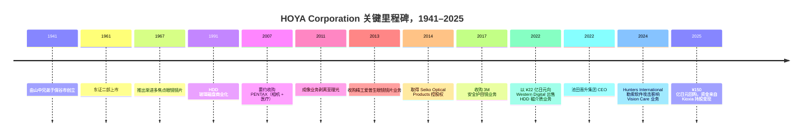

# HOYA Corporation 豪雅株式会社 (TSE: 7741) — 公司研究

*截至 2026-05-26 · 简体中文版报告（日本注册；原始监管披露以日文为主；英文版 IFRS 财报与 FY26 Q2 业绩电话会议英文译本由公司官方公开）*

---

## 目录

1. 公司概览
2. 公司历史
3. 管理团队
4. 产品与服务
5. 客户与上市策略
6. 行业概览
7. 竞争格局
8. 市场机会
9. 风险评估
10. 参考资料
11. 验证日志

---

## 1. 公司概览

HOYA Corporation（豪雅株式会社，下称"HOYA"）是一家总部位于东京的特种光学综合集团，其产品矩阵跨越了上市公司里少见的两个极端：在大楼的一端，HOYA 生产巴黎通勤族鼻梁上戴着的眼镜镜片；在另一端，HOYA 生产光罩坯料 / 空白光罩 (mask blank)，这些 EUV 空白光罩 (EUV mask blank — 全球约 80% 份额) 进入台积电 Fab 18，最终成为每一颗 3 纳米晶体管的图形母版。FY25（即截至 2025 年 3 月 31 日的财年）公司**合计销售额 ¥866.0 亿日元、税前利润 ¥260.0 亿日元**，按两大可报告业务分部拆分为 **Life Care 业务（生命健康，¥550.9 亿日元，占销售 63.6%）和 Information Technology 业务（信息技术，¥311.1 亿日元，占销售 35.9%）**，以及一个 ¥4.0 亿日元的 "Other"（语音合成软件）残余项 ([HOYA Corporation FY25 Consolidated Financial Statements under IFRS, pp. 9, 32–33](https://www.hoya.com/wp-content/uploads/2025/07/Annual-Report-Final-2.pdf))。

HOYA 之所以特殊，也正是它被纳入半导体材料覆盖名单的原因，在于两大分部的经济性极不对称。Life Care 在收入端是较大贡献者，但税前利润反而较少：FY25 Life Care 税前利润为 ¥90.4 亿日元，而信息技术分部却高达 ¥170.4 亿日元——也就是说，**IT 仅以 ~36% 的销售额贡献了 ~65% 的分部税前利润**，分部税前利润率高达 **~54.7%**，相比 Life Care 仅为 16.4% ([HOYA Corporation FY25 IFRS Financial Statements, p. 32](https://www.hoya.com/wp-content/uploads/2025/07/Annual-Report-Final-2.pdf))。FY26 Q2（即截至 2025 年 9 月底的季度）业绩电话会议上披露的数据更加极端——当季信息技术分部经营利润率达 **53.1%**，Life Care 仅为 17.6% ([HOYA FY26 Q2 Earnings Call Transcript, 2025-10-31, pp. 3, 9](https://www.hoya.com/wp-content/uploads/2025/11/FY25-Q2-Earnings-Call-Transcript_E.pdf))。当市场以 ~35× P/E 为 HOYA 定价时，市场买的是 Information Technology，尽管许多读者仍把 HOYA 当成"Pentax 品牌 / 隐形眼镜 / 内窥镜集团"。

Information Technology 内部，最关键的资产是 **Electronics-related products（电子相关产品）**——IFRS 报表将其拆分为 FY25 收入 ¥265.2 亿日元（同比由 ¥189.3 亿日元增长 40.1%），构成包括"**半导体光罩与光罩坯料、FPD 光罩、硬盘玻璃基板**"——再加上一块较小的 **Imaging-related（成像相关）** 业务，FY25 收入 ¥45.9 亿日元（"光学镜头、光学玻璃材料、激光设备、光源"） ([HOYA FY25 IFRS Financial Statements, p. 33](https://www.hoya.com/wp-content/uploads/2025/07/Annual-Report-Final-2.pdf))。Electronics 内部，对半导体投资逻辑最重要的就是 **EUV 空白光罩**，HOYA 在 FY24 综合年报中明确表示其"在光罩坯料市场上长期保持极大份额"，并将"以低缺陷产品和下一代研发的领先地位继续引领行业" ([HOYA Report 2024, p. 102](https://www.hoya.com/ir/2024/en/common/files/review2024.pdf))。*分析师观点：* 野村《大中华半导体 2026–30F》报告（2026-05-21）估算 HOYA 的 EUV 空白光罩份额约 **~80%**、光学光罩坯料 (optical mask blank — 全球约 70% 份额) 份额约 **~70%**，信越化学是唯一具有规模的第二供应商——这些数据为卖方估算，HOYA 并未公开披露份额或单位出货量 ([reports/sector/半导体材料.md, Fig. 35–44](file:///Users/x/projects/financial_agent/reports/sector/半导体材料.md))。

Life Care 分部本身又分为两个截然不同的子业务。**Health Care related products（眼镜镜片与隐形眼镜）** FY25 收入 **¥417.7 亿日元**（约占全集团 48%），使 HOYA 跻身全球前三大眼镜镜片厂商之列，仅次于 EssilorLuxottica 和 Carl Zeiss Vision，旗下自有品牌包括 HOYA、Seiko、Pentax、KONISHI 与 Tokai ([Mordor Intelligence — Spectacle Lens Market](https://www.mordorintelligence.com/industry-reports/spectacle-lens-market))。**Medical related products（医疗相关产品，¥133.2 亿日元，~15%）** 包含 Pentax Medical 软性内窥镜、HOYA Surgical Optics 人工晶状体 (IOL)、Microline 腹腔镜器械、APACERAM 骨科羟基磷灰石植入体、Wassenburg 自动内窥镜清洗机以及色谱填料 ([HOYA FY25 IFRS Financial Statements, p. 31; HOYA Life Care product page](https://www.hoya.com/en/business/lifecare/))。FY25 医疗收入从 FY24 的 ¥136.4 亿日元下滑至 ¥133.2 亿日元，主要受中国 IOL 集采 (VBP, volume-based procurement) 与医疗内窥镜需求疲软拖累，部分被工厂整合所抵消——CEO 池田指出"实质数字效益将在下一个财年第四季度左右显现" ([HOYA FY26 Q2 Earnings Call Transcript, 2025-10-31, pp. 7, 21](https://www.hoya.com/wp-content/uploads/2025/11/FY25-Q2-Earnings-Call-Transcript_E.pdf))。

地域上，FY25 收入构成为 **日本 ¥182.8 亿日元（21.1%）；美国 ¥129.2 亿日元（14.9%）；新加坡 ¥102.2 亿日元（11.8%）；中国 ¥80.6 亿日元（9.3%）；韩国 ¥60.7 亿日元（7.0%）；其他 ¥310.5 亿日元（35.9%）**——其中新加坡占比偏高，是因为 HOYA 的亚太地区财资中心 / 销售总部在此注册，承担了相当比例的亚洲内部电子产品收入 ([HOYA FY25 IFRS Financial Statements, p. 34](https://www.hoya.com/wp-content/uploads/2025/07/Annual-Report-Final-2.pdf))。截至 2025 年 3 月 31 日，集团全球员工 **~37,909 人**，分布在"全球约 160 个办事处与子公司" ([HOYA company profile page, accessed 2026-05](https://www.hoya.com/en/company/profile/))。集团 PP&E 账面价值合计 ¥210.9 亿日元，FY25 资本支出 ¥60.9 亿日元，其中 **60–70% 计划用于 Information Technology 分部**（CFO 广冈在 FY26 Q2 业绩会议上称"包括 LSIs 和 HDD 基板"） ([HOYA FY26 Q2 Earnings Call Transcript, p. 23](https://www.hoya.com/wp-content/uploads/2025/11/FY25-Q2-Earnings-Call-Transcript_E.pdf))。

*资料来源：根据 [HOYA Corporation FY25 IFRS Financial Statements, pp. 9, 32](https://www.hoya.com/wp-content/uploads/2025/07/Annual-Report-Final-2.pdf) 及历年综合报告整理。*

*资料来源：[HOYA FY25 IFRS Financial Statements, p. 33](https://www.hoya.com/wp-content/uploads/2025/07/Annual-Report-Final-2.pdf) — Life Care 63.6%（Health Care 48.2% + Medical 15.4%）、Information Technology 35.9%（Electronics 30.6% + Imaging 5.3%）、Other 0.5%。*

*资料来源：[HOYA FY25 IFRS Financial Statements, p. 34](https://www.hoya.com/wp-content/uploads/2025/07/Annual-Report-Final-2.pdf) — 日本 21.1%、美国 14.9%、新加坡 11.8%、中国 9.3%、韩国 7.0%、其他 35.9%。*

**估值快照（截至 2026 年 5 月底）。** HOYA 股价约 **¥27,575 / 股**，市值约 **¥8.8 万亿日元**（按 JPY/USD 154 折算约 US$57 bn），企业价值 **¥8.28 万亿日元** ([Stockanalysis.com — TYO:7741 statistics, accessed 2026-05](https://stockanalysis.com/quote/tyo/7741/statistics/))。TTM 滚动 P/E 为 **35.4× / 前瞻 P/E 约 34.9×**、P/S 为 **9.3×**、P/B 为 **8.5×**、EV/EBITDA 为 **22.2×**、股息率 **~1.3%**（FY25 全年 DPS ¥110，1H FY26 中期股息提升至 ¥125） ([Yahoo Finance — 7741.T key statistics, accessed 2026-05](https://finance.yahoo.com/quote/7741.T/key-statistics/); [HOYA FY26 Q2 Earnings Call Transcript, p. 14](https://www.hoya.com/wp-content/uploads/2025/11/FY25-Q2-Earnings-Call-Transcript_E.pdf))。**ROE 资本回报率约 25.1%**、ROIC ~48%、净现金 ¥531.9 亿日元——也就是市场正在以 35× P/E 对一个 ROE 25%、几乎零杠杆的资产复利引擎进行定价 ([Stockanalysis.com — TYO:7741, accessed 2026-05](https://stockanalysis.com/quote/tyo/7741/statistics/))。

35× 左右的 TTM P/E **比医疗器械行业中位数 ~25.8× 高出约 35%** ([Gurufocus — Medical Devices industry PE, accessed 2026-05](https://www.wisesheets.io/pe-ratio/ESLOY))，略低于 EssilorLuxottica 的 ~38.8×，明显高于 Carl Zeiss Meditec 的 ~26.2×。*分析师观点：* 这个溢价的最佳解读并非 Life Care 独自支撑（仅 Life Care 大约只能给到 22–25×），而是市场对 Information Technology 利润流单独定价、隐含 ~50× 分部税前——这是对 EUV 空白光罩垄断、HAMR / 玻璃 HDD 基板拐点、以及持续的回购 + 注销引擎的认可（FY25 当年共回购库藏股 ¥150 亿日元、注销 ¥97.9 亿日元） ([HOYA FY25 IFRS Financial Statements, p. 11](https://www.hoya.com/wp-content/uploads/2025/07/Annual-Report-Final-2.pdf))。考虑到该股过去 52 周累计回报已达 **+52.2%**，AI 驱动的半导体设备 / 材料逻辑已经将分部估值充分重估 ([Yahoo Finance — 7741.T, accessed 2026-05](https://finance.yahoo.com/quote/7741.T/))，目前估值倍数已经明显拉伸，EUV 需求出现任何周期性波动（或信越突袭份额）都将构成实质性估值风险——这点将在第 9 章讨论。

---

## 2. 公司历史

HOYA 由 **山中正一与山中茂兄弟** 于 **1941 年 11 月 1 日** 创立，最初在东京西郊的保谷市（今西东京市）建立光学玻璃生产工厂——厂址所在的地名后来便成为了公司名称 ([HOYA Corporation company history page, accessed 2026-05](https://www.hoya.com/en/company/history/); [Companies History — Hoya](https://www.companieshistory.com/hoya/))。公司在 1944 年正式法人化，1945 年战时光学玻璃需求骤减后转入水晶玻璃餐具业务；水晶产品成为 HOYA 第一个产生现金流的业务，为后来切入眼镜镜片提供了资金 ([HOYA Corporation company history page](https://www.hoya.com/en/company/history/))。

公司于 **1961 年 10 月在东京证券交易所二部上市**，1973 年 2 月升至一部，产品线在此期间已扩展到 **渐进多焦点眼镜镜片（1967）、软性隐形眼镜（1972）、人工晶状体（1987）以及硬盘玻璃基板（1991）** ([HOYA Corporation company history page, accessed 2026-05](https://www.hoya.com/en/company/history/); [Companies History — Hoya entry](https://www.companieshistory.com/hoya/))。1984 年公司名称从"保谷硝子工业"简化为"HOYA Corporation"。1980 年代至 2000 年代管理层的战略洞见在于专注**底层材料 / 基板**，而非下游模组——一旦你能制造成为硬盘盘片的玻璃磁盘、成为光罩的光学坯料、或成为隐形眼镜的高分子镜柸，你就坐在一个高利润率的瓶颈环节，那些更显眼的下游组装厂商绕不开你。

两笔收购最为决定性。**2007 年 12 月至 2008 年 4 月的 PENTAX 要约收购** 同时带来两条业务线——消费相机 / 成像板块后来于 2011 年剥离给理光，而 **软性内窥镜业务则一直保留至今，即 Pentax Medical**，为 HOYA 在消化道内窥镜领域奠定了基础地位 ([HOYA Corporation company history page](https://www.hoya.com/en/company/history/); [SafeVision blog — All About HOYA](https://safevision.com/blog/all-about-hoya/))。**2013–14 年的 Seiko Optical Products 系列交易** 收购了精工爱普生的眼镜镜片制造业务，并取得精工镜片销售子公司的控股权——与 HOYA 原有的 Hoya、Pentax、Tokai 品牌合并后，HOYA 跻身全球第二或第三大眼镜镜片厂商，仅次于 EssilorLuxottica，与 Carl Zeiss 平起平坐 ([Nishimura & Asahi — HOYA / Seiko Epson deal advisory, 2014](https://www.nishimura.com/en/experience/work/5321); [PR Newswire — HOYA, Seiko and Epson agreements, 2013](https://www.prnewswire.com/news-releases/hoya-seiko-and-epson-agreements-executed-in-the-field-of-optical-products-business-179637771.html))。

2010 年代和 2020 年代 HOYA 的特征更多是**减法而非加法**。包括 2011 年成像业务剥离给理光；**2022 年以 ¥22 亿日元（约 US$235 m）向 Western Digital 出售磁介质（溅射）业务**——HOYA 保留上游玻璃基板生产，退出利润率较低的镀膜环节；以及最近对医疗内窥镜销售 / 工厂网络的重组（CEO 池田在 FY26 Q2 业绩会议上表示"约 70–80% 的必要决策已经完成，剩下的只是执行问题"） ([HOYA FY26 Q2 Earnings Call Transcript, p. 21](https://www.hoya.com/wp-content/uploads/2025/11/FY25-Q2-Earnings-Call-Transcript_E.pdf); [PR Newswire — Western Digital to acquire HOYA magnetic media, 2009 announcement, 2022 closure](https://www.prnewswire.com/news-releases/western-digitalr-to-acquire-hoyas-magnetic-media-operations-92263279.html))。这些动作反映了一种长期的组合管理哲学：果断退出无法做到行业领先的位置，将获得的资金要么投入扩产（电子业务的昭岛 / 三岛 / 熊本 / 越南 / 老挝 / 重庆工厂），要么进行股票回购。

近期值得关注的两次冲击：**(a) 2024 年 3 月 30 日发现的 Hunters International 勒索软件攻击**，使多家镜片实验室 Vision Care 订单处理系统中断约 4 周，攻击者索要 US$10 m 赎金被 HOYA 拒绝 ([Bleeping Computer — Optics giant Hoya hit with $10M ransomware demand, 2024-04](https://www.bleepingcomputer.com/news/security/optics-giant-hoya-hit-with-10-million-ransomware-demand/); [SecurityWeek — Lens Maker Hoya scrambling to restore systems, 2024-04](https://www.securityweek.com/lens-maker-hoya-scrambling-to-restore-systems-following-cyberattack/))；**(b) 多年期的转让定价税务诉讼** 中，日本国税不服审判所部分撤销了 FY2007–11 的补税评估，HOYA 仍在就剩余部分上诉——已预付的应收款 ¥7.9 亿日元 + ¥4.5 亿日元 + ¥8.0 亿日元在 FY25 审计意见中被列为关键审计事项 ([HOYA FY25 IFRS Financial Statements, p. 4](https://www.hoya.com/wp-content/uploads/2025/07/Annual-Report-Final-2.pdf))。

---

## 3. 管理团队

山中兄弟（正一与茂）早已不在世，HOYA 自 1980 年代以来一直是非家族控股的职业经理人公司——所以今天唯一相关的传记细节是现任集团社长兼 CEO。

**池田英一郎（Eiichiro Ikeda）——代表执行役、社长兼 CEO（自 2022 年 3 月起任）。** 池田是 HOYA 33 年内部老兵，1992 年入职，在每一个主要运营部门历练后晋升至最高职位。他拥有中央大学工学学士学位，担任 CEO 后将办公基地设在 HOYA 新加坡区域总部——这是有意为之的信号，意味着 HOYA 的重心是亚太运营而非东京总部 ([HOYA Corporation Leadership page, accessed 2026-05](https://www.hoya.com/en/company/directors/); [Bloomberg — Eiichiro Ikeda profile](https://www.bloomberg.com/profile/person/18799019); [Equilar ExecAtlas — Eiichiro Ikeda](https://people.equilar.com/bio/person/eiichiro-ikeda-hoya-corporation/39560383))。

池田的三段成型经验恰恰对应于当前驱动股票故事的三个产品业务。**(1) 自 2010 年初担任 Memory Disk Division 联席 CEO 兼 Media 总经理**——即制造 HDD 玻璃基板的部门，他随后通过将磁介质溅射业务出售给 Western Digital 完成重组，同时保留 HOYA 在基板本体上的垄断地位；该交易于 2022 年以 ¥22 亿日元成交 ([Equilar ExecAtlas — Eiichiro Ikeda](https://people.equilar.com/bio/person/eiichiro-ikeda-hoya-corporation/39560383); [PR Newswire — Western Digital to acquire HOYA magnetic media](https://www.prnewswire.com/news-releases/western-digitalr-to-acquire-hoyas-magnetic-media-operations-92263279.html))。**(2) 自 2010 年末起负责 Optical Lens 光学镜片业务**，深入了解全球眼镜镜片的成本结构和 Seiko 整合手册；这一经验奠定了他目前对 Pentax Medical / IOL 工厂网络重组的判断——他正在整合工厂，尽管短期会带来 6–9 个月的利润率压力 ([HOYA FY26 Q2 Earnings Call Transcript, 2025-10-31, p. 21](https://www.hoya.com/wp-content/uploads/2025/11/FY25-Q2-Earnings-Call-Transcript_E.pdf))。**(3) 自 2013 年起任信息技术分部执行役 / COO，2015 年起任集团 CTO，2019 年起任 Eyecare 部门社长**，使他对光罩坯料制造物理和 EUV 工艺控制有直接技术理解 ([Equilar ExecAtlas — Eiichiro Ikeda](https://people.equilar.com/bio/person/eiichiro-ikeda-hoya-corporation/39560383); [Bloomberg — Eiichiro Ikeda profile](https://www.bloomberg.com/profile/person/18799019))。

池田 ~3 年 CEO 任期的特征是 **(a)** 激进的资本回报——FY25 内回购库藏股 ¥150 亿日元、同年注销 ¥97.9 亿日元，2026 年仍在执行追加的 ¥100 亿日元计划——部分资金来自 Kioxia 持股变现；按 CFO 广冈披露，Kioxia 处置款"目前正用于资助持续的股票回购计划" ([HOYA FY25 IFRS Financial Statements, p. 11](https://www.hoya.com/wp-content/uploads/2025/07/Annual-Report-Final-2.pdf); [HOYA FY26 Q2 Earnings Call Transcript, p. 20](https://www.hoya.com/wp-content/uploads/2025/11/FY25-Q2-Earnings-Call-Transcript_E.pdf); [The Globe and Mail / TipRanks — HOYA ends ¥100 bn buyback and cancels 1.06% of shares, 2025](https://www.theglobeandmail.com/investing/markets/markets-news/Tipranks/1638099/hoya-ends-yen100-billion-buyback-and-cancels-1-06-of-its-shares/))；**(b)** 在 EUV 空白光罩和 HDD 基板上有节制但意义重大的产能投资（FY26 ¥55 亿日元资本支出包中 60–70% 投向这两条产品线）；**(c)** 在大宗化的市场上有意识地拒绝追逐份额——FY26 Q2 关于 HDD 玻璃基板定价的评论坦率指出铝基板竞争将限制涨价空间 ([HOYA FY26 Q2 Earnings Call Transcript, pp. 23–24](https://www.hoya.com/wp-content/uploads/2025/11/FY25-Q2-Earnings-Call-Transcript_E.pdf))。

池田个人持股数量在 EDINET 上的有价证券报告书与 HOYA 英文 IR 资料中均未单独披露——日本披露规则仅要求单个董事持股超过 0.1% 才需提示，根据未披露这一事实可推断池田持股低于该阈值。其薪酬结构包含中长期激励组件（绩效股票单位 / PSU），其支付与 ESG 指标部分挂钩——这是首席战略官 (CSO) 中川友子在 FY26 Q2 业绩会议中的说明 ([HOYA FY26 Q2 Earnings Call Transcript, pp. 15, 18](https://www.hoya.com/wp-content/uploads/2025/11/FY25-Q2-Earnings-Call-Transcript_E.pdf))。

---
