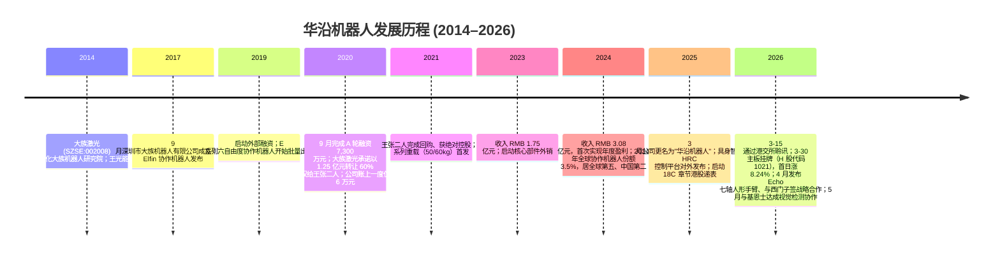
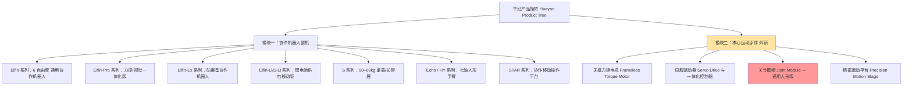
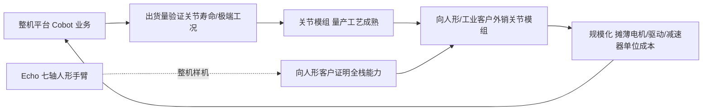
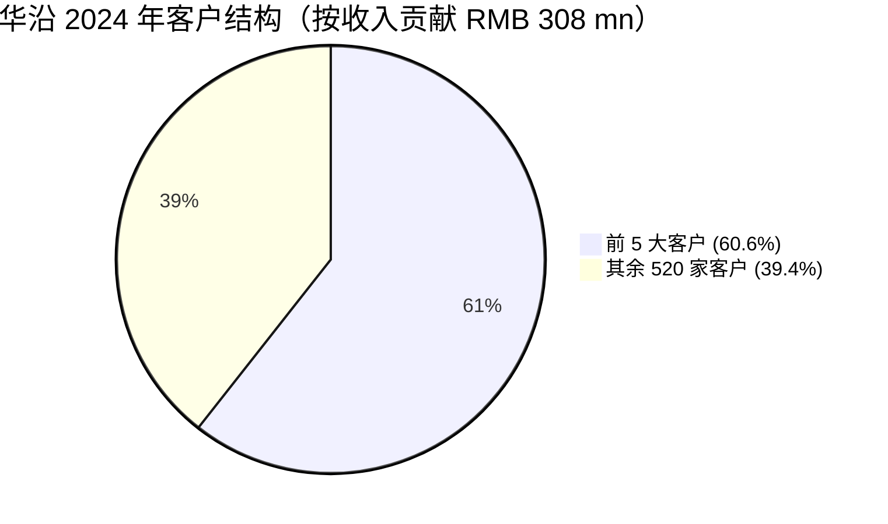
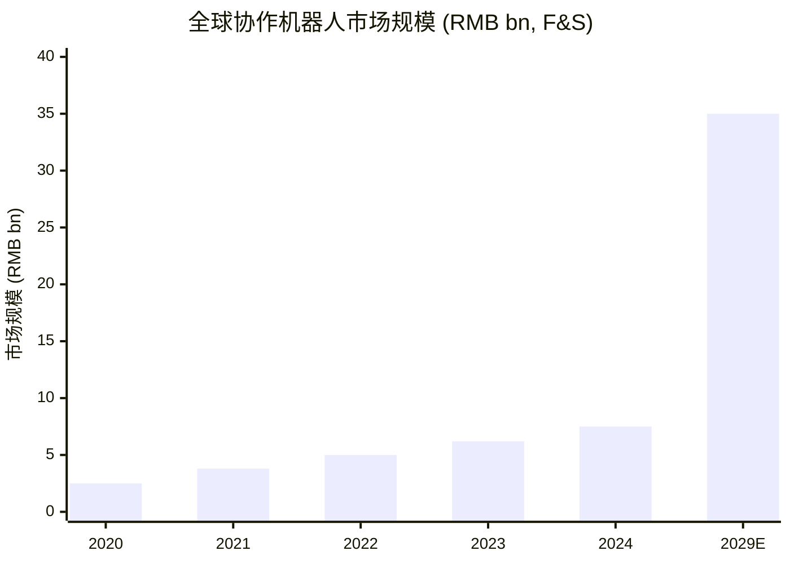
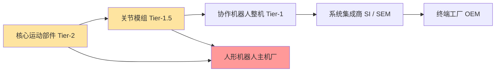
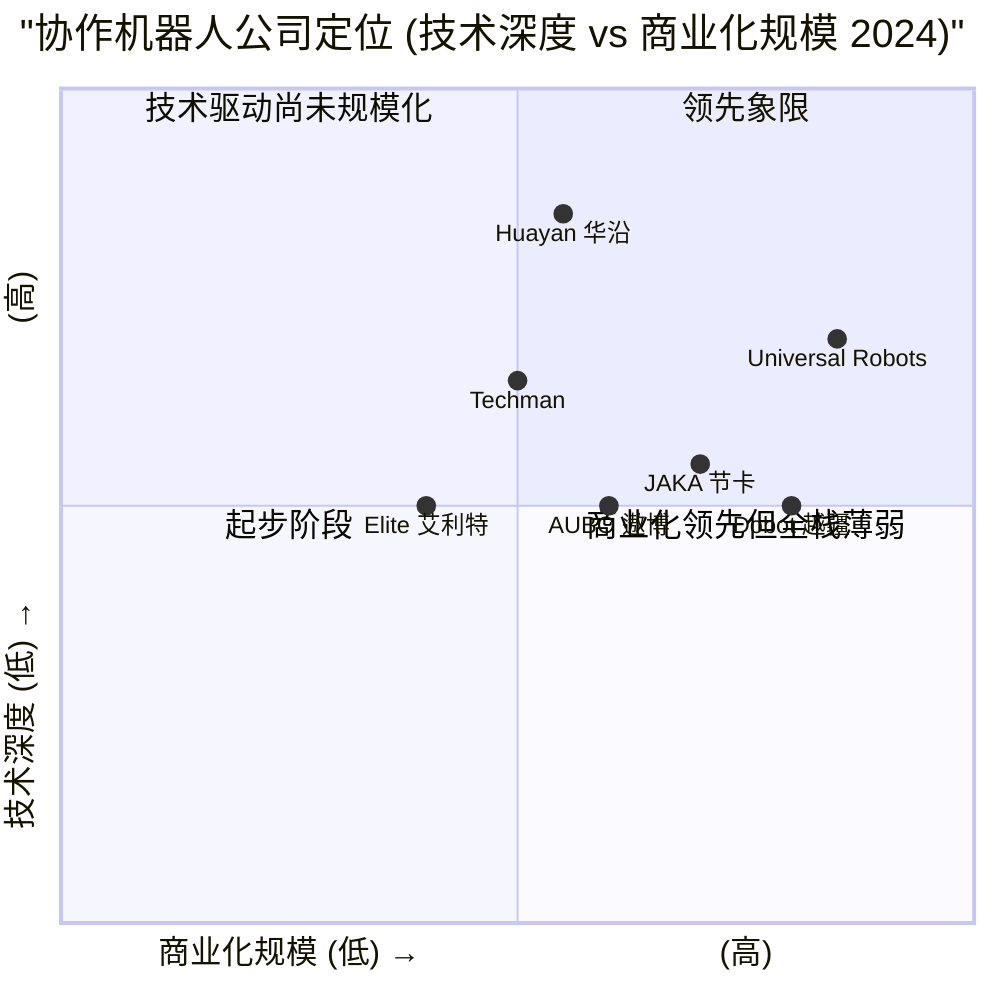
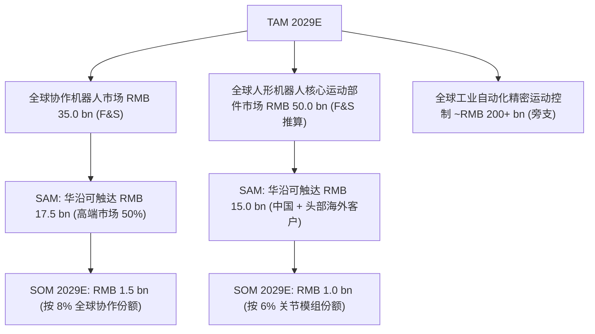

# 华沿机器人 (Hua Yan Robotics, HKEX:1021) — 公司研究

*As-of date: 2026-06-02*
*分析框架：website-first，主数据源为公司 IPO 招股书、香港交易所披露易、公司官网 huayan-robotics.com 与 huayan-robotics.net、新浪财经/证券时报/36Kr 等中文媒体报道。*

> **报告语言说明.** 本报告为简体中文版（zh-CN），按 [`company-research`](../../../.claude/skills/company-research/SKILL.md) 技能 Step 0–10 完整生成。技术术语首次出现使用"中文 / English"或"English（中文）"双语形式。代码、产品名、单位（HKD/RMB/YoY/QoQ/N·m/rpm/CAGR）保留原始大小写。

---

## 1. 公司概览 / Company Overview

华沿机器人股份有限公司（Guangdong Huayan Robotics Co., Ltd., HKEX: 1021；以下简称"华沿"或"公司"）是一家总部位于广东深圳与佛山顺德的协作机器人 (collaborative robot, "cobot") 与核心运动部件 (core motion components) 制造商。公司于 2026 年 3 月 30 日在香港联交所主板挂牌，按 17.00 港元/股发行 8,078.5 万股 H 股，全球发售净筹约 14.78 亿港元，挂牌当日开盘 16.80 港元、收盘 18.40 港元（+8.24%），首日市值约 100 亿港元 ([新浪财经, 2026-03-30 — 华沿机器人成功上市](https://finance.sina.com.cn/wm/2026-03-30/doc-inhsueeu4004952.shtml); [华沿招股资料 — ccnew.com.hk](https://www.ccnew.com.hk/home/upload/ipo/20260320103416_1182677592.pdf))。

**主营业务两条线**：(一) 协作机器人整机 (E 系列 Elfin/Elfin-Pro/Elfin-Ex、S 系列重载、Echo/HY 七轴人形手臂、移动操作平台 STAR)；(二) 核心运动部件外销 (无框力矩电机 / frameless torque motor、伺服驱动器 / servo drive、关节模组 / joint module、精密运动平台)。根据弗若斯特沙利文 (Frost & Sullivan, F&S) 数据，按 2024 年收入计公司是**全球第五大、中国第二大协作机器人企业**，全球份额 3.5%、中国份额 10.3%；按 2024 年海外收入计为**中国最大的协作机器人出口商** ([新浪财经, 2026-03-16 — 18C 特专科技公司通过聆讯](https://finance.sina.com.cn/wm/2026-03-16/doc-inhrevap8703548.shtml); [新浪财经, 2026-04-01 — 盈利摇摆不定](https://finance.sina.com.cn/stock/roll/2026-04-01/doc-inhsxvfk1603055.shtml))。

**业务关键数字（招股书披露）**：
- 2024 年营收 RMB 3.084 亿元（YoY +77.0%），净利润 RMB 1,786.9 万元（首度年度盈利），毛利率 34.3%；2022→2024 营收 CAGR 68.4% ([新浪财经, 2026-03-23 — 港股 IPO 丨华沿机器人](https://finance.sina.com.cn/wm/2026-03-23/doc-inhryxfq2260280.shtml))。
- 2025 年前 9 个月营收 RMB 2.81 亿元（YoY +36.2%），毛利率升至 37.6%，但因研发投入扩张净亏 RMB 1,558.8 万元 ([新浪财经, 2026-03-23](https://finance.sina.com.cn/wm/2026-03-23/doc-inhryxfq2260280.shtml))。
- 2025 年 9M 研发投入 RMB 5,100 万元，占当期营收 18.1%；研发常年占总运营支出 44% 以上 ([新浪财经, 2026-04-01](https://finance.sina.com.cn/stock/roll/2026-04-01/doc-inhsxvfk1603055.shtml))。
- 2024 年海外收入占比 50.2%，欧洲单一区域 RMB 1.24 亿元、占总收入 40.1% ([新浪财经, 2026-03-30](https://finance.sina.com.cn/wm/2026-03-30/doc-inhsueeu4004952.shtml))。

**股权结构（IPO 后）**：创始人王光能、张国平合计直接/间接持股约 39.44%，其中 H 股可流通比例较低，行使一致行动后投票权 33.45%；天使股东大族激光 (Han's Laser, SZSE: 002008) 持股 16.77%，按挂牌收盘价对应市值约 13 亿港元；机构投资者持股 43.79%，含高瓴资本、广发基金、摩根士丹利、Vertex 关联基金 VVC Technology 等 9 家基石 ([新浪财经, 2026-03-23](https://finance.sina.com.cn/wm/2026-03-23/doc-inhryxfq2260280.shtml); [瑞财经, 2026-03-26 — 王光能老东家赚了 12 亿](https://m.rccaijing.com/news-7442771930937750658.html))。

**身份与上市轨道**：公司沿用《香港联交所主板上市规则》第 18C 章 (Chapter 18C, 特专科技/specialist technology) 通道递表并于 2026-03-15 通过聆讯，联席保荐人为中金公司 (CICC) 与德意志银行 (Deutsche Bank) ([新浪财经, 2026-03-16](https://finance.sina.com.cn/wm/2026-03-16/doc-inhrevap8703548.shtml))。公司被认定为国家专精特新"小巨人"企业 (national-level "Little Giant" enterprise) ([中国日报, 2025-04-03 — 传承大族机器人基因](https://caijing.chinadaily.com.cn/a/202504/03/WS67ee240ea310e29a7c4a7896.html))。

---

## 2. 公司历史 / Company History

华沿的"前史"始于大族激光 2014 年的研究院孵化、2017 年法人独立、2025 年正式更名，路径上是从一家"机器人车间"演化为独立上市公司的 12 年长链。

**关键人物路径**。创始人**王光能**与共同创办人**张国平**均毕业于北京航空航天大学 (Beihang University)，后续相继加入大族电机；王光能曾在新加坡从事电机与伺服驱动开发，回国后在大族激光内组建电机团队，张国平彼时为研发总监。2014 年，大族激光押注协作机器人风口，孵化成立大族机器人研究院，由王光能担任院长；2017 年 9 月正式将研究院"法人独立"为深圳市大族机器人有限公司，公司将这一年视为成立元年 ([搜狐网, 2026-03-26 — 张应涛兼任 CFO](https://m.sohu.com/a/997235345_100032554); [瑞财经, 2026-02-19 — 大族激光孵化而来](https://m.rccaijing.com/news-7438793306328987330.html))。王光能同时为南方科技大学 (SUSTech) 兼任教授，深度参与电机与控制研究 ([钛媒体, 2026-03-19 — 大族激光孵化，剑指具身智能](https://www.tmtpost.com/7931199.html))。

**2020 年的生死时刻**。据 36Kr 独家采访，2020 年公司账面现金一度仅余约 6 万元，王光能在客户预付货款与三位早期投资人合计 1,500 万元的无抵押无息借款支持下完成股权回购，并自此摆脱大族激光控股 ([36Kr Exclusive, 2026-04 — Huayan CEO Aims for Low-Key](https://eu.36kr.com/en/p/3744805881724928))。同年 9 月，A 轮融资 7,300 万元到位，大族激光按既定承诺以总价 1.25 亿元将 60% 股权转让给王张二人控制的实体，自此成为单纯的财务投资人 ([瑞财经, 2026-03-26](https://m.rccaijing.com/news-7442771930937750658.html))。从这一刻起公司治理结构从"大族子公司"过渡到"创始人控制"。

**2025 年品牌切换**。2025 年 3 月，公司宣布正式更名为"华沿机器人 (Huayan Robotics)"，对外称"传承大族机器人基因"，意在切断品牌对原大股东的依赖、为海外 (50+ 国家与地区) 市场建立独立品牌识别 ([中国日报, 2025-04-03](https://caijing.chinadaily.com.cn/a/202504/03/WS67ee240ea310e29a7c4a7896.html); [Yahoo Finance, 2025-04 — Hans Robot Rebrands](https://finance.yahoo.com/news/major-milestone-hans-robot-rebrands-220000938.html))。在境外品牌过渡期，旧域名 `huayan-robotics.net` 仍以 "Han's Robot" 旧名运营国际站，国内官网切换为 `huayan-robotics.com` ([Automate.org, 2025 — From Han's Robot to Huayan Robotics](https://www.automate.org/robotics/news/from-hans-robot-to-huayan-robotics))。

**2026 年港股挂牌**。2026 年 3 月公司按 18C 特专科技章节递表通过聆讯，3-30 正式挂牌；公开发售部分超额认购 **约 5,059 倍**，国际配售亦获大幅超额，IPO 首日市值约 100 亿港元 ([36Kr Exclusive, 2026-04](https://eu.36kr.com/en/p/3744805881724928); [新浪财经, 2026-03-30](https://finance.sina.com.cn/wm/2026-03-30/doc-inhsueeu4004952.shtml))。**5,059 倍**的认购数据使其成为 2026 年港股 IPO 散户热度前列的标的，但同时也意味着挂牌首日的散户筹码极易松动——次日股价即出现 -5.98% 的回调 ([新浪财经, 2026-04-01](https://finance.sina.com.cn/stock/roll/2026-04-01/doc-inhsxvfk1603055.shtml))。

---

## 3. 管理团队 / Management Team

公司管理层以创始人 + 研发出身高管为主，技术驱动型决策结构鲜明。

**王光能 (Wang Guangneng)，董事长、执行董事兼 CEO**。北京航空航天大学电气工程与控制学硕士，新加坡 GIC/科研院所电机伺服工程师出身，2008 年前后归国加入大族激光电机事业部、组建大族电机；2014 年起牵头大族机器人研究院；2017 年公司法人独立后任董事长兼总经理至今。王光能并兼任南方科技大学教授 (兼职) ([钛媒体, 2026-03-19](https://www.tmtpost.com/7931199.html))。同事评价其为"非常纯粹的技术人，反感过度自我营销"，在 36Kr 独家专访中本人称对 IPO 5,059 倍认购"预期是 10–20 倍就够了" ([36Kr Exclusive, 2026-04](https://eu.36kr.com/en/p/3744805881724928))。**创始人即首席工程师**的画像，是华沿"全栈自研"叙事的可信度来源——这与大族激光老股东"赚 12 亿元"对比之下，市场普遍认可的是技术控制权而非财务收益 ([瑞财经, 2026-03-26](https://m.rccaijing.com/news-7442771930937750658.html))。

**张国平 (Zhang Guoping)，副董事长、执行董事兼 CTO**。北京航空航天大学硕士，曾任大族电机研发总监，与王光能 2014 年起共同孵化研究院、2017 年起任公司联合创始人。研发线由其主导。两人之间形成"董事长抓战略与客户、CTO 抓产品架构"的典型双中心治理 ([搜狐网, 2026-03-26](https://m.sohu.com/a/997235345_100032554))。

**张应涛 (Zhang Yingtao)，董秘兼 CFO**。1985 年生，曾任顺丰集团管培生，加入华沿后兼任公司董事会秘书与首席财务官；从职业路径看更偏资本市场对接而非产业财务出身，是公司治理向上市公司化转型的代表性引入 ([搜狐网, 2026-03-26](https://m.sohu.com/a/997235345_100032554))。

**关键工程团队**。据公司官网与媒体披露，截至 2026 年中，公司团队规模超 **500 人**，其中专业工程师 140+ 人，覆盖电机、伺服、控制、视觉、人形整机五个子领域 ([Huayan-robotics.net — About](https://www.huayan-robotics.net/))。研发员工与生产员工比例约 1:2，相较行业典型的 1:4 偏高，反映了公司"零部件外销"的差异化定位 (零部件业务更依赖电气电控算法人才密度，而非装配规模) ([新浪财经, 2026-03-23](https://finance.sina.com.cn/wm/2026-03-23/doc-inhryxfq2260280.shtml))。

**与原股东治理切割**。尽管大族激光在 2020 年完成 60% 股权出让，但截至 2026 年 IPO，双方仍存在多项关联交易，包括办公场地租赁、员工宿舍、设备采购、协作机器人/伺服驱动器互购等，相关合约延展至 2028 年 12 月。这意味着公司治理上"独立化"完成，但**经营层的供应链与设施仍部分嵌入大族激光生态**——是治理上少数尚未完全清算的遗留议题 ([瑞财经, 2026-03-26](https://m.rccaijing.com/news-7442771930937750658.html))。

*分析师观点：* 创始团队均为电机伺服工程师出身、且二人结对长达 20 余年是公司"全栈自研"叙事可信度的核心证据；但治理层尚未引入资深的工业自动化销售或人形机器人客户运营高管 (例如来自宇树、优必选、ABB、Universal Robots 的中高层)，意味着 2026–2028 年大规模商业化时管理深度可能成为约束。

---

## 4. 产品与服务 / Products & Services — 报告最重要章节

华沿的产品矩阵分为 **两大模块**：(一) 协作机器人整机；(二) 核心运动部件外销。这是公司区别于绝大多数中国协作机器人玩家 (节卡 JAKA / 越疆 Dobot / 艾利特 Elite / 遨博 AUBO) 的核心差异化——后者绝大多数仅在整机层销售，自研但不外销核心运动部件。

### 4.1 产品树（公司披露口径）

公司官网原文表述："华沿机器人是国内唯一同时具备协作机器人本体与核心运动部件全栈自研能力、并对外销售核心运动部件的领先协作机器人企业"，并明确将 **Echo/HY 七轴人形手臂** 列为通向具身智能 (embodied intelligence) 产品族的前哨产品 ([Huayan-robotics.net — Products](https://www.huayan-robotics.net/); [Huayan-robotics.com — News 2560](https://www.huayan-robotics.com/about-us/news/2560.html))。

### 4.2 模块一：协作机器人整机 (Cobots) — 2024 年占收入 75.9%

**Elfin 系列 (Elfin Series)**：6 自由度 (6-DOF) 通用协作机器人，公司官网披露关键技术指标——**重复定位精度 ±0.015 mm、关节最高速度 370°/s、实时控制频率 2,000 Hz、力控精度 ≤0.5 N、拖动力 ≤5 N、算法响应延迟 1 ms** ([Huayan-robotics.com — News 2560](https://www.huayan-robotics.com/about-us/news/2560.html))。负载覆盖 3 kg / 5 kg / 10 kg / 15 kg 几个档位，臂展从 624 mm 到 1,000 mm。**中文释义 / Plain-language gloss**：Elfin 是公司"基础款"协作机器人，以"双关节模组 (double-joint module)"专利结构区别于行业标准的"中空关节单模组"——双关节将电机与减速器封装在同一关节单元内，省去关节之间的电缆穿线，提升整机刚度与维护便利性；这是从原大族电机时代延续下来的电气工程"以电机封装代替机械结构"的设计哲学。

**Elfin-Pro 系列**：Elfin 升级版，集成**末端力控传感器 (force/torque sensor)** 与**视觉处理单元 (vision SDK)**，主打高端组装与精密加工。原文表述："具备末端力控与视觉一体化能力，适用于螺丝锁付、电子件组装、精密打磨等场景" ([Huayan-robotics.net — Elfin-Pro](https://www.huayan-robotics.net/))。差异化点在于：竞争对手 (JAKA / Elite) 普遍依靠"关节力矩反推法 (joint torque inference)"做软力控，Elfin-Pro 是**真末端六轴力传感**，在 0.5 N 量级的力控精度上更接近 Universal Robots e-Series 的水平。

**Elfin-Ex 系列**：防爆型协作机器人 (explosion-proof cobot)，针对 Zone 1 / Zone 2 危险区域 (化工、油气、喷涂车间)。原文："防爆型协作机器人，适用 1 区与 2 区危险区域"。在中国市场，防爆协作几乎只有 ABB Tornado 与少数欧洲品牌覆盖，华沿是首批本土化方案，2026 年 5 月 FABTECH Mexico 展会上作为对外展示的核心系列之一 ([PR Newswire, 2026-05-12 — FABTECH Mexico 2026](http://www.prnewswire.com/news-releases/huayan-robotics-to-debut-in-broader-america-at-fabtech-mexico-2026-after-hkex-listing-302756463.html))。

**S 系列 (S20 / S30 / S50)**：重载协作机器人，公司官网披露"**最高负载 60 kg、最长臂展 2.2 m、循环节拍 8–13 cycles/min**"。**中文释义 / Plain-language gloss**：传统 6 kg 级的协作机器人在码垛 (palletizing)、整箱搬运、大件焊接场景下负载不足；S 系列将协作机器人推向"轻工业机械臂"领域，与 ABB IRB1200 等标准工业机器人在 20–60 kg 段位形成竞争。S50 在 FABTECH 上展示的"50 kg 负载 + 8–13 节拍"对应每小时 480–780 次搬运能力 ([Huayan-robotics.net](https://www.huayan-robotics.net/); [PR Newswire, 2026-05-12](http://www.prnewswire.com/news-releases/huayan-robotics-to-debut-in-broader-america-at-fabtech-mexico-2026-after-hkex-listing-302756463.html))。

**Elfin-Li / S-Li 系列**：锂电池供电移动版本，搭配 STAR 自主移动操作平台 (mobile manipulator)。这一布局对应"无固定工位"使用场景——零售门店补货、医院药品配送、餐饮端到端服务——是公司从传统工业协作延伸到服务/教育领域的产品线 ([Huayan-robotics.com — News 2560](https://www.huayan-robotics.com/about-us/news/2560.html))。

**Echo / HY 系列 七轴人形手臂 (7-axis humanoid arm)**：2026 年 4 月发布，是公司"协作机器人 → 人形机器人"产品族延伸的关键一步。**中文释义 / Plain-language gloss**：传统协作机器人多为 6 自由度 (6-DOF) 结构，第七轴 (冗余自由度) 是模仿人臂"肩-肘-腕"全运动姿态的关键——例如在狭窄管道内焊接、在多障碍空间内绕过物体——这一冗余轴使机械臂能在保持末端姿态的同时调整肘部位置。Echo 系列既是公司面向具身智能 (embodied intelligence) 整机端的产品试水，也是其向人形机器人厂商证明"我们能做整条人形手臂"的样机平台 ([Huayan-robotics.net](https://www.huayan-robotics.net/); [LinkedIn, 2026-04 — 1021.HK Entering New Era](https://www.linkedin.com/pulse/huayan-robotics-1021hk-successfully-listed-hkex-entering-mkd3c))。

### 4.3 模块二：核心运动部件外销 — 2024 年占收入 23.4% (公司差异化护城河)

> 公司官网原文："华沿机器人是国内唯一掌握了力矩电机、伺服驱动器、关节模组全套综合研发能力，并对外销售这些核心部件的协作机器人公司" ([钛媒体, 2026-03-19](https://www.tmtpost.com/7931199.html))。

**无框力矩电机 (Frameless Torque Motor)**。**中文释义 / Plain-language gloss**：无框力矩电机是协作机器人关节的"心脏"——其将传统的定子-转子分离销售，使下游集成商可以将电机直接嵌入自有关节结构，省去电机壳体重量与体积。这种结构对于人形机器人尤其关键——人形机器人单台需要 20–40 个关节，每多 100 g 单关节重量都会在末端积累为数公斤的负担。公司官网宣称其无框力矩电机"单位体积扭矩密度比行业领先方案高约 30%"，即同等体积下输出更大力矩；这一指标是华沿在 18C 章节通过聆讯时的核心技术差异化证据 ([Huayan-robotics.com — News 2560](https://www.huayan-robotics.com/about-us/news/2560.html); [新浪财经, 2026-03-23](https://finance.sina.com.cn/wm/2026-03-23/doc-inhryxfq2260280.shtml))。**对标视角**：日本 Kollmorgen / 美国 Allient / 国内步科电气是同类供应商，华沿的电机扭矩密度优势如果属实，将是其在人形机器人关节模组市场打入头部玩家的核心壁垒。

**伺服驱动器 (Servo Drive) 与一体化控制器**。伺服驱动器是电机的"大脑"——接收上位运动控制指令、输出三相电流驱动电机；一体化控制器进一步将多关节驱动整合为单板方案。**中文释义 / Plain-language gloss**：在人形机器人语境下，传统方案是"一关节一驱动器"，整机布线复杂、重量大；华沿的一体化方案将多关节驱动整合，类似于"机器人版的 SoC"，是其向人形客户提供完整供应链方案的关键组件。公司全栈布局意味着电机、驱动、上位机算法三层垂直整合，下游客户可以直接购买"关节模组黑盒"而非自己整合 ([钛媒体, 2026-03-19](https://www.tmtpost.com/7931199.html))。

**关节模组 (Joint Module) — 通用人形版**。这是公司具身智能战略的中心产品——将电机、伺服驱动器、谐波减速器/行星减速器、绝对编码器、力矩传感器全部封装在单一关节单元内、对外提供"即插即用 (plug-and-play)"接口。**中文释义 / Plain-language gloss**：人形机器人厂商最痛苦的环节就是关节模组的"凑齐 + 调通"——电机厂、减速器厂、驱动器厂、编码器厂、传感器厂各自的元器件需在主机厂内做集成调试，调试周期可达 6–18 个月。华沿的通用关节模组的价值主张是把这件事从"主机厂的研发任务"变成"采购清单"。在钛媒体口径中，公司"**已经打入了多家人形机器人头部公司的供应链，专门提供精密关节模组**"，但具体客户名单 IPO 招股书未披露 ([钛媒体, 2026-03-19](https://www.tmtpost.com/7931199.html))。**战略意义**：公司将本次 IPO 募集净额的约 **HKD 128 百万**（约人民币 1.18 亿元，占募集净额约 8.7%）专门用于"人形机器人核心运动部件研发与扩产"，这是公司将"协作机器人 + 人形零部件"双轮驱动正式写入资本支出计划的标志 ([新浪财经, 2026-03-30](https://finance.sina.com.cn/wm/2026-03-30/doc-inhsueeu4004952.shtml); [新浪财经, 2026-03-30 — 华沿成功在港上市](https://finance.sina.com.cn/stock/relnews/hk/2026-03-30/doc-inhsueeu3982528.shtml))。

**精密运动平台 (Precision Motion Stage)**。多轴 XY / XYθ 精密定位平台，主要服务半导体后道封装、显示模组、PCB 检测、医药精密分装等场景，是公司将关节模组技术横向扩展到"非协作机器人"运动控制系统的产品线 ([Huayan-robotics.net](https://www.huayan-robotics.net/))。

### 4.4 应用与场景

公司官网披露应用覆盖"**40+ 行业，60+ 工艺场景，50+ 国家与地区**"，典型场景包括精密加工、智能焊接 (welding)、物流码垛 (palletizing)、医疗检测、螺丝锁付 (screwing)、装配 (assembly)、喷涂 (painting)、上下料 (loading/unloading) 等 ([Huayan-robotics.com — News 2560](https://www.huayan-robotics.com/about-us/news/2560.html); [Huayan-robotics.net — Applications](https://www.huayan-robotics.net/application))。2026 年 4 月与西门子 (Siemens) 签订关于工业自动化生态的战略合作；2026 年 5 月与基恩士 (Keyence) 在视觉检测协作；并加入华为云 (Huawei Cloud) "CloudRobo 柔性智造解决方案"的生态合作伙伴 ([LinkedIn, 2026-04](https://www.linkedin.com/pulse/huayan-robotics-1021hk-successfully-listed-hkex-entering-mkd3c))。

### 4.5 产品矩阵综合理解 — "协作 + 零部件"双轮驱动如何相互喂养

公司的两条业务线之间形成一个**闭环喂养**：(一) 整机业务在 50+ 国家的工业部署中不断积累关节模组的可靠性数据 (失效模式、工况、寿命)；(二) 这些数据反哺关节模组的工艺迭代，使其在向人形客户外销时具有"已工业验证"的可信度；(三) 关节模组规模化外销摊薄了电机、伺服驱动、减速器的单位成本，又使整机业务的物料成本下降。**这一闭环是华沿区别于纯整机型协作机器人厂商 (JAKA、Elite、Dobot 部分产品线)与纯电机/驱动器厂商 (Kollmorgen、台达) 的核心商业模式护城河**。Echo 七轴人形手臂的角色——它本身不会是大销量整机，但作为"我们能把全栈零部件做成一只完整人形手臂"的演示装置，是 B 端关节模组销售的最佳样机。

---

## 5. 客户与上市策略 / Customers & Listing Strategy

### 5.1 客户集中度（招股书披露口径）

公司在 IPO 招股书中披露的客户集中度数据如下：

| 期间 | 前 5 大客户合计收入（RMB 百万） | 占总收入比 | 单一最大客户占比 | 客户总数 |
|---|---|---|---|---|
| FY2022 | 56.1 | 51.2% | 未单独披露 | 未披露 |
| FY2023 | 85.2 | 48.5% | 未单独披露 | 未披露 |
| FY2024 | 188.0 | **60.6%** | 未单独披露 | 525 (年末) |
| 9M2025 | 155.0 | 55.3% | **24.7%** | 478 (Q3 末) |

来源：[腾讯新闻, 2026-03-15 — 华沿机器人通过港交所聆讯](https://news.qq.com/rain/a/20260315A06S1T00); [瑞财经, 2026-03-26](https://m.rccaijing.com/news-7442771930937750658.html)。

**集中度解读**：(一) 2024 年前 5 大客户占比 60.6%，相比 2023 年的 48.5% **大幅上升 12 个百分点**——这意味着公司在 2024 年的爆发性增长 (+77% YoY) 主要由少数几家大客户驱动；(二) 9M2025 单一最大客户占比 24.7%——该集中度水平在 18C 特专科技公司里偏高，但相对于人形机器人/工业自动化早期发展阶段并非异常；(三) 客户总数从 2024 年底的 525 家下降到 2025 年 9 月底的 478 家——**客户数下降但单客户额上升**意味着公司在 2025 年主动收缩了长尾低毛利客户、聚焦于高 ASP 战略客户 ([瑞财经, 2026-03-26](https://m.rccaijing.com/news-7442771930937750658.html))。

### 5.2 客户类型（不披露具体名单）

公司招股书与媒体披露未点名具体客户，但媒体口径与官方应用案例给出如下客户类型轮廓：

- **协作机器人整机客户**：欧美 (德国、美国、日本) 标准设备制造商 (Standard Equipment Manufacturer, SEM) 与系统集成商 (System Integrator, SI)，公司商业模式偏向"to-SEM/SI"而非"to-end-user"，以避免直接与下游客户竞争。这一策略在 36Kr 专访中由王光能本人确认："不直接面对终端，而是和标准设备厂合作做核心部件供应"——这种间接销售模式的副作用是公司单家客户体量受 SEM 自身规模限制，但优点是市场推广成本远低于行业平均水平 ([36Kr Exclusive, 2026-04](https://eu.36kr.com/en/p/3744805881724928))。
- **核心运动部件外销客户**：以人形机器人头部公司 (公司官方表述"多家人形机器人头部公司")、工业机器人厂商、半导体后道封装设备厂、精密医疗器械厂商为主 ([钛媒体, 2026-03-19](https://www.tmtpost.com/7931199.html))。
- **公司具身智能合作伙伴**：与华为云 CloudRobo 柔性智造解决方案签约为生态合作伙伴；与西门子 (Siemens) 在工业自动化生态合作；与基恩士 (Keyence) 在视觉检测协作 ([LinkedIn, 2026-04](https://www.linkedin.com/pulse/huayan-robotics-1021hk-successfully-listed-hkex-entering-mkd3c))。

### 5.3 区域收入结构

| 区域 | 2024 年收入 (RMB mn) | 占总收入 | 备注 |
|---|---|---|---|
| 海外合计 | 154.7 | 50.2% | 中国最大的协作机器人出口商 |
| - 欧洲 | 124 | 40.1% | 德国为核心市场 |
| - 北美 | 未单独披露 | — | 2026-05 FABTECH 墨西哥首展 |
| - 日本 / 亚洲其他 | 未单独披露 | — | 在日本设有办事处 |
| 中国大陆 | 153.7 | 49.8% | — |

来源：[新浪财经, 2026-03-30](https://finance.sina.com.cn/wm/2026-03-30/doc-inhsueeu4004952.shtml); [PR Newswire, 2026-05-12](http://www.prnewswire.com/news-releases/huayan-robotics-to-debut-in-broader-america-at-fabtech-mexico-2026-after-hkex-listing-302756463.html)。

**对比意义**：2022 年公司海外收入占比仅 26.2%、2024 年升至 50.2%、欧洲单一区域占 40.1%——海外占比上升幅度 (2022→2024, +24 pp) 是中国协作机器人玩家中**最快**的，证明了"海外销冠"称号是有数据支撑而非营销话术。但海外集中于欧洲 (单区 40%+) 也意味着欧元/欧洲制造业周期对收入的敏感性偏高 ([新浪财经, 2026-03-30](https://finance.sina.com.cn/wm/2026-03-30/doc-inhsueeu4004952.shtml))。

### 5.4 IPO 募集资金用途（披露口径）

挂牌净筹约 14.78 亿港元，按公司披露的用途结构：

| 用途 | 占募集净额 | 金额 (HKD mn) |
|---|---|---|
| 研发增强（含具身智能与人形零部件） | ≈55% | ≈813 |
| - 其中：**人形机器人核心运动部件** | ≈8.7% | **≈128** |
| 产能扩张（深圳/佛山智造中心） | ≈未单独披露 | — |
| 海外营销与渠道建设 | ≈未单独披露 | — |
| 一般营运资金 | ≈未单独披露 | — |

来源：[新浪财经, 2026-03-30](https://finance.sina.com.cn/wm/2026-03-30/doc-inhsueeu4004952.shtml); [新浪财经, 2026-03-30 — 华沿成功在港上市](https://finance.sina.com.cn/stock/relnews/hk/2026-03-30/doc-inhsueeu3982528.shtml)。

"55% 用于研发"是 18C 特专科技公司的典型分布，但也意味着公司在挂牌后 2–3 年的报表上**净利润仍可能继续被研发支出压制**——这是 2025 年 9M 重新转亏的同一逻辑在募集后阶段的延续。

---

## 6. 行业概览 / Industry Overview

### 6.1 协作机器人市场（核心业务市场）

根据弗若斯特沙利文 (F&S) 数据，**全球协作机器人市场**从 2020 年的 RMB 25 亿元增长至 2024 年的 RMB 75 亿元（2020→2024 CAGR **32.0%**），并预计 2029 年达到 RMB 350 亿元（2024→2029 CAGR **37.4%**）；**中国市场**同期 CAGR 38.8% 并预计 2025→2029 CAGR 43.5%，增速高于全球 ([新浪财经, 2026-03-23](https://finance.sina.com.cn/wm/2026-03-23/doc-inhryxfq2260280.shtml); [Kr-Asia, 2026-02 — Huayan nears Hong Kong IPO](https://kr-asia.com/cobot-maker-huayan-nears-hong-kong-ipo-amid-rising-interest-in-humanoid-robotics))。**关键观察**：2024 年协作机器人仅占整个机器人产业约 **1.7%**，是机器人产业内的快速渗透但绝对规模仍属"小赛道"。即使按 2029 年 350 亿元的体量乘以华沿 2024 年 10.3% 中国市场份额 (假设占全球市场份额翻倍至 7%) 计算，5 年后单一公司的整机业务收入天花板约 RMB 25 亿元 (~USD 350 mn)，并不算非常宽阔的赛道。

**关键驱动力**：(一) 中国制造业人工成本上升 + 老龄化驱动；(二) 中小型电子、汽车零部件、3C 装配线的柔性自动化转型；(三) 协作机器人的安全特性免去围栏 (no-fence) 部署优势——使其能进入大型工业机器人无法到达的中小车间；(四) 海外 (欧洲) 的人力短缺与回流制造业潮 ([腾讯新闻, 2026-03-17 — 在内卷与亏损的夹缝中](https://news.qq.com/rain/a/20260317A03E9000); [Kr-Asia, 2026-02](https://kr-asia.com/cobot-maker-huayan-nears-hong-kong-ipo-amid-rising-interest-in-humanoid-robotics))。

### 6.2 人形机器人核心运动部件市场（增长极）

公司招股书引述 F&S 数据：**全球人形机器人核心运动部件市场** 2024 年规模约 RMB 35 亿元，预计 2024→2029 CAGR **59.5%**——这是华沿"具身智能"战略的核心 TAM 论据 ([Kr-Asia, 2026-02](https://kr-asia.com/cobot-maker-huayan-nears-hong-kong-ipo-amid-rising-interest-in-humanoid-robotics); [钛媒体, 2026-03-19](https://www.tmtpost.com/7931199.html))。**结构性需求来源**：(一) 特斯拉 Optimus 2026 年目标 50,000 台，长期 1 mn 台/年 Fremont 设计产能；(二) 中国宇树 Unitree、智元、优必选、傅利叶等头部玩家 2026 年合计目标 10–30 万台；(三) Figure AI、Apptronik、1X、Sanctuary 等北美玩家 2026 年商业部署启动 ([CNBC, 2026-04-21 — China ships more humanoid robots than the U.S.](https://www.cnbc.com/2026/04/21/china-humanoid-robots-us-investors.html); [KraneShares, 2026 — Unitree IPO Guide](https://kraneshares.com/a-complete-guide-to-unitree-robotics-2026-ipo-why-it-matters-for-star-market-etf-kstr-humanoid-robotics-etf-koid/))。

**单机零部件价值含量**：典型人形机器人单台需要 20–40 个关节模组，每个关节模组 ASP RMB 5,000–15,000，单台关节模组价值合计 RMB 10–60 万元；若 2030 年全球人形机器人出货达 50 万台 (Goldman Sachs base case 估计)，对应关节模组市场约 RMB 500–3,000 亿元——但**实际能转化为公司收入的是头部 3–5 家人形客户的关节模组渗透率份额**，而非整个 TAM ([Goldman Sachs — Robotaxi Report](https://www.goldmansachs.com/pdfs/insights/goldman-sachs-research/robotaxi/report.pdf))。

### 6.3 工业机器人与协作机器人产业链的位置

华沿同时占据 (a) Tier-2 (电机/驱动)、(b) Tier-1.5 (关节模组)、(c) Tier-1 (协作机器人整机) 三个层位，与传统的"Tier-2 电机厂"或"Tier-1 整机厂"专业化分工不同。这种"全栈整合"模式在产业早期具有**研发协同优势**——电机、驱动、控制算法可在自家整机上闭环验证；但在成熟期可能面临**与下游客户的潜在竞争**矛盾 (例如向 Universal Robots 或 JAKA 销售关节模组的同时自家整机又与之竞争终端市场)，这是公司向 SEM/SI 而非 end-user 销售策略的根本原因 ([36Kr Exclusive, 2026-04](https://eu.36kr.com/en/p/3744805881724928))。

---

## 7. 竞争格局 / Competitive Landscape

### 7.1 协作机器人市场玩家与定位

| 公司 | 总部 | 上市情况 | 2024 全球份额 (F&S 口径) | 关键差异化 |
|---|---|---|---|---|
| **Universal Robots** (UR) | 丹麦 | Teradyne 子公司 (NASDAQ:TER) | ~15% | UR+ 生态、早 10 年市场起步 |
| **越疆机器人** Dobot | 深圳 | HKEX:2432 (2024-12 上市) | ~13% | 高出货量、消费/教育市场 ([Dobot官方](https://www.dobot-robots.com/insights/news/dobot-robotics-successfully-listing-hong-kong-stock-exchange.html)) |
| **节卡机器人** JAKA | 上海 | 未上市 (Pre-IPO) | ~10% | 中国市场份额第一 (21.9% 域内) ([Robotauto, 2025-08-06](https://robotauto.co.uk/2025/08/06/chinas-industrial-robotics-landscape-key-players-market-trends-and-global-influence/)) |
| **遨博机器人** AUBO | 北京 | 未上市 | 中国域内大型玩家 | 国内大客户基础深 |
| **华沿机器人** Huayan | 深圳/佛山 | HKEX:1021 (2026-03-30) | **3.5% 全球 / 10.3% 中国** | **核心运动部件外销 + 海外销冠** |
| Elite Robots 艾利特 | 苏州 | 未上市 | 国内 Top-10 | 主打消费/3C 装配 |
| Techman Robot | 台湾 | TWSE 上市 | 国际玩家 | 内置视觉一体化 |
| Fanuc CR 系列 | 日本 | TSE:6954 | 大型工业玩家延伸 | 来自全球工业机器人龙头 |

来源：[Robotauto, 2025-08-06](https://robotauto.co.uk/2025/08/06/chinas-industrial-robotics-landscape-key-players-market-trends-and-global-influence/); [EVSint, 2026 — Top 10 Cobot Brands](https://www.evsint.com/top-collaborative-robot-brands/); [Dobot Official IPO](https://www.dobot-robots.com/insights/news/dobot-robotics-successfully-listing-hong-kong-stock-exchange.html); [新浪财经, 2026-03-16](https://finance.sina.com.cn/wm/2026-03-16/doc-inhrevap8703548.shtml)。本项目内已有 Dobot 公司研究覆盖 → [`Dobot_HKEX2432`](../Dobot_HKEX2432/)。

### 7.2 竞争二维定位（技术深度 vs 商业化规模）

*分析师观点：* 华沿的"全栈自研 + 核心部件外销"模式使其在技术深度维度位居前列，但其 2024 年 3.5% 全球份额尚未对 UR (~15%) 与 Dobot (~13%) 构成商业化规模的直接威胁。**华沿的差异化竞争胜负手在两点**：(一) 海外销售份额——欧洲 40% 收入占比是其它中国对手数倍 (JAKA、Elite 多以国内市场为主)；(二) 人形机器人核心运动部件市场——一个潜在 RMB 50 亿元/2029 年的新增量，公司的技术深度可以转化为 Tier-2 供应商身份的份额。

### 7.3 与人形零部件 Tier-2 供应商的竞争

华沿在关节模组外销层面的真实竞争对手是 **国内的拓普集团 (Tuopu, SSE:601689)、双林股份 (Shuanglin, SZSE:300100)、三花智控 (Sanhua, SZSE:002050)、鼎智科技 (Dingzhi Tech, BSE:873593)、绿的谐波 (Leaderdrive)、北特科技 (Beitebao, SSE:603009)** 等公司——这些都是项目内 humanoid-robotics-actuators 主题篮内的入选标的 ([Humanoid Actuators 主题报告](../../themes/humanoid-robotics-actuators_theme.md))。**华沿的独特性**：相比拓普、双林等以汽车零部件为主营业务、跨界做关节模组的玩家，华沿是从**协作机器人整机 + 关节模组同时自研**起家——其关节模组天然在公司自家协作机器人产品线上得到了百万小时级别的工业现场验证，这是汽车零部件跨界玩家短期内无法补全的可靠性数据资产。

但反过来，**拓普、三花的规模优势**使其可以提供更具成本优势的关节模组——例如三花的 Tesla Optimus $685 mn 订单 (2025-10-15) 对应每台机器人 RMB 28k 的零部件价值含量 ([36Kr EN, 2025-10-15](https://eu.36kr.com/en/p/3510288514980998))。这意味着：华沿的核心壁垒是"工业级可靠性 + 全栈集成"，但其面临的 (短期) 风险是**单家头部人形客户的关节模组定点订单可能落到规模型零部件玩家手上**。

### 7.4 上游供应商生态

华沿的上游核心议题是 (一) 谐波减速器 (harmonic reducer) 与 RV 减速器 (cycloidal reducer) ——目前国内绿的谐波 (Leaderdrive, SZSE:688017)、来福谐波、日本 Harmonic Drive Systems (TSE:6324)、Nabtesco (TSE:6268) 占据主要供应；(二) 永磁体——主要由稀土永磁产业链 (北方稀土、金力永磁) 供应；(三) 编码器与传感器——多依赖海德汉 Heidenhain 等海外厂商。华沿在电机本体与驱动器实现自研之后，**减速器仍是其供应链的关键外部依赖**——这是公司护城河尚未"全栈"的真实状态 ([Robotauto, 2025-08-06](https://robotauto.co.uk/2025/08/06/chinas-industrial-robotics-landscape-key-players-market-trends-and-global-influence/))。

---

## 8. 市场机会 / Market Opportunity (TAM/SAM/SOM)

**TAM 推算**：协作机器人 2029E RMB 35 bn + 人形机器人零部件 2029E RMB 50 bn (假设 2024 RMB 3.5 bn × 1.595^5 ≈ RMB 50 bn) ≈ **RMB 85 bn 综合可寻址市场** ([Kr-Asia, 2026-02](https://kr-asia.com/cobot-maker-huayan-nears-hong-kong-ipo-amid-rising-interest-in-humanoid-robotics))。

**SAM 推算（华沿可服务市场，est.）**：
- 协作机器人：海外为主、欧美中高端市场约占全球协作市场 50% → SAM ≈ RMB 17.5 bn；
- 人形机器人核心运动部件：以中国头部 5–10 家人形主机厂 + 北美 2–3 家头部客户为核心 → SAM ≈ RMB 15 bn；
- 合计 SAM ≈ **RMB 32.5 bn**。

**SOM 推算（华沿可获份额，est.）**：
- 协作机器人：当前 3.5% 全球份额假设 2024→2029 维持并小幅扩张到 6–8% → 2029E 整机收入 RMB 1.5 bn；
- 关节模组外销：假设拿到全球人形零部件市场 5–7% 份额（取决于 1–2 个头部客户定点） → 2029E 关节模组收入 RMB 1.0 bn；
- **2029E 综合营收 SOM ≈ RMB 2.5 bn (~3.4 亿美元)**，对应 2024–2029 营收 CAGR 约 52%——这是公司具身智能叙事兑现情况下的乐观推演 ([新浪财经, 2026-04-01](https://finance.sina.com.cn/stock/roll/2026-04-01/doc-inhsxvfk1603055.shtml))。

*分析师观点：* TAM 推算的最大单一不确定性是**人形机器人的真实出货曲线**——Goldman Sachs base case 2030 年全球出货 50 万台、bull case 100 万台，bear case 仅 20 万台 ([Goldman Sachs — Robotaxi Report](https://www.goldmansachs.com/pdfs/insights/goldman-sachs-research/robotaxi/report.pdf))。不同情景下，华沿关节模组 SOM 从 RMB 0.3 bn 到 RMB 1.5 bn 都有可能。这是市场为何愿意按 23x P/S (2024 营收) 估值的核心原因——投资者实际上买的是"具身智能转型期权"。

---

## 9. 风险评估 / Risk Assessment

按 [`references/risk_taxonomy.md`](../../../.claude/skills/company-research/references/risk_taxonomy.md) 标准的 4 维度框架展开。

### 9.1 业务/运营风险 (Business & Operational Risk)

1. **客户集中度风险**。前 5 大客户 2024 年占收入 60.6%、单一最大客户 9M2025 占 24.7%。若头部 SEM 客户更换供应商或终端工厂订单收缩，单年收入降幅可能达 20%+ ([腾讯新闻, 2026-03-17](https://news.qq.com/rain/a/20260317A03E9000))。
2. **盈利稳定性风险**。公司 2022 净亏 RMB 8,337 万、2023 净利 RMB 190 万、2024 净利 RMB 1,787 万、9M2025 重新转亏 RMB 1,559 万——四个完整观察期里有两个亏损，盈利波动性大。背景为研发投入扩张与海外市场拓荒成本，但市场担心 2026–2028 年净利继续承压 ([新浪财经, 2026-04-01](https://finance.sina.com.cn/stock/roll/2026-04-01/doc-inhsxvfk1603055.shtml))。
3. **库存周转风险**。2025 Q3 末库存周转天数 **206.6 天**——是行业典型水平的 1.5–2 倍。这是 18C 阶段公司为铺货海外渠道 + 备货关键大客户的合理现象，但若海外销售放缓，将带来现金流压力 ([新浪财经, 2026-03-23](https://finance.sina.com.cn/wm/2026-03-23/doc-inhryxfq2260280.shtml))。
4. **关联交易风险**。公司与大族激光仍存在多项关联交易合约延至 2028 年 12 月，包括场地、宿舍、设备、互销等多项。这一遗留治理事项使公司在合规与独立性上仍部分受限 ([瑞财经, 2026-03-26](https://m.rccaijing.com/news-7442771930937750658.html))。

### 9.2 行业/竞争风险 (Industry & Competitive Risk)

5. **市场天花板风险**。协作机器人占整体机器人产业不到 1.7%（2024），即使做到全球前三、华沿 5 年内收入 SOM 仍仅 RMB 2.5 bn 级别。这是赛道本身的结构性约束 ([腾讯新闻, 2026-03-17](https://news.qq.com/rain/a/20260317A03E9000))。
6. **价格内卷风险**。中国协作机器人市场玩家众多 (节卡、越疆、艾利特、遨博、华沿、大族电机等 30+)，价格战自 2023 年起加剧；公司 2024 年毛利率 34.3% 已是行业相对高位，进一步价格战将削弱毛利结构 ([Kr-Asia, 2026-02](https://kr-asia.com/cobot-maker-huayan-nears-hong-kong-ipo-amid-rising-interest-in-humanoid-robotics))。
7. **人形机器人 Tier-1 客户定点不确定性**。公司"具身智能"叙事的兑现度取决于是否拿到头部人形机器人公司 (宇树、智元、优必选、Figure、Apptronik、特斯拉 Optimus) 的关节模组大单定点。但目前**公司未披露任何具名定点合约**，这意味着 IPO 后的市场估值 (23x P/S) 已经包含了大量"未来订单期权"——若 2026–2027 年仍无头部定点公示，估值有重新下修风险 ([钛媒体, 2026-03-19](https://www.tmtpost.com/7931199.html))。
8. **跨界对手 (汽车零部件) 价格冲击**。三花、拓普、双林等汽车零部件大厂跨界进入关节模组领域，规模优势与汽车厂供应链协同使其可在量产期提供 30–50% 更低的关节模组 ASP——华沿的"工业级可靠性"溢价能否守得住，是中期最大不确定性 ([Humanoid Actuators 主题报告](../../themes/humanoid-robotics-actuators_theme.md))。

### 9.3 财务/资本结构风险 (Financial & Capital Structure Risk)

9. **持续亏损与现金消耗风险**。2025 年 9M 营业现金流 -RMB 1,831 万元，研发投入占营收 18.1%——若 2026 年研发不降低、海外渠道继续扩张，公司可能在 2026 年继续录得净亏损与负现金流。IPO 净筹 14.78 亿港元提供约 3–4 年的现金跑道，但稀释风险存在 ([新浪财经, 2026-04-01](https://finance.sina.com.cn/stock/roll/2026-04-01/doc-inhsxvfk1603055.shtml))。
10. **估值倍数过高风险**。Simply Wall St 数据显示，华沿 2024 营收对应 P/S 约 **23x**，远高于行业 1.2x 与同业平均 14.2x ([Simply Wall St — Assessing Huayan Valuation](https://simplywall.st/stocks/hk/capital-goods/hkg-1021/guangdong-huayan-robotics-shares/news/assessing-guangdong-huayan-robotics-sehk1021-valuation-after))。即使 2025E 营收 RMB 380 mn（年化 9M2025 数据），对应 P/S 仍在 20x 量级，这是"具身智能期权"的隐含估值——而非工业自动化公司估值。

### 9.4 监管/地缘/外部风险 (Regulatory, Geopolitical & External Risk)

11. **欧美贸易政策风险**。公司海外收入占比 50.2%、欧洲占 40.1%。任何中欧关税升级、欧洲对中国机器人的反补贴或国家安全审查 (例如类似 2024 年欧盟对电动车的反补贴)，将直接冲击公司收入。北美方面，美国 Section 301 关税、UFLPA (维吾尔强迫劳动预防法) 合规审查、出口管制名单 (Entity List) 等亦构成中长期不确定性 ([CNBC, 2026-04-21](https://www.cnbc.com/2026/04/21/china-humanoid-robots-us-investors.html))。
12. **关键上游 (谐波/RV 减速器) 中断风险**。公司在电机与驱动实现自研但减速器仍依赖国内 (绿的谐波) 与日本供应链 (Harmonic Drive Systems / Nabtesco)。若 2026–2028 年中日关系或全球高端减速器供应紧张，会拖累公司关节模组的交付能力 ([Robotauto, 2025-08-06](https://robotauto.co.uk/2025/08/06/chinas-industrial-robotics-landscape-key-players-market-trends-and-global-influence/))。

---

## 10. 投资视角评分 / Investor-Lens Scorecards

按 [`references/investor_lenses.md`](../../../.claude/skills/company-research/references/investor_lenses.md) 框架，给出四个核心视角的评分。所有评分仅为分析框架结果，不构成投资建议。

### 10.1 巴菲特视角 (Buffett — Quality at a Sensible Price, 0–100)

| 维度 | 得分 | 评分依据 |
|---|---|---|
| 业务理解度 (10) | 7/10 | 协作机器人 + 核心零部件 是相对清晰可懂的工业自动化业务 |
| 经济护城河 (25) | 12/25 | 全栈自研是技术护城河，但 3.5% 全球份额尚未达到"近乎垄断"水平 |
| 财务质量 (25) | 8/25 | 2024 才首度盈利、2025 重新转亏、毛利率上升但 ROE 不稳定 |
| 管理层质量 (15) | 11/15 | 创始人工程师出身、长期主义；治理层尚需补强商业化经验 |
| 估值 (25) | 5/25 | 23x P/S 远超巴菲特的"合理价格"区间 |
| **合计** | **43/100** | **未达到巴菲特典型买入门槛 (75+)** |

*视角观点：* 公司距离"以合理价格收购优质企业"的巴菲特标准尚有距离——质量端尚未稳态、估值端已超出舒适区。

### 10.2 芒格视角 (Munger — Weighted Quality + Inversion, 0–10)

| 加权项 | 得分 (0–10) | 备注 |
|---|---|---|
| 简单可理解 (×1.0) | 7 | 协作 + 零部件双轮，逻辑清晰 |
| 高资本回报率 (×1.5) | 4 | 营业利润率仍单位数 |
| 强大护城河 (×1.5) | 6 | 技术护城河有但份额护城河尚浅 |
| 优质管理层 (×1.0) | 8 | 创始人技术+长期主义画像鲜明 |
| 合理估值 (×1.0) | 3 | 23x P/S 偏离合理 |
| **加权平均** | **5.6/10** | **inversion: 主要"输的方式"是关节模组未拿到头部人形定点 + 估值压缩** |

*视角观点：* 芒格"反向思考"框架下，最容易输的剧本是 (a) 23x P/S 估值未在 2027 年前由具身智能业绩证实而压缩到 8–10x，(b) 关节模组未拿到 Tier-1 客户定点。

### 10.3 达莫达兰视角 (Damodaran — Story-plus-Numbers DCF Margin of Safety)

**关键假设**（以 2026-06-02 为估值日，使用 indicators.db 当期数据近似）：
- 无风险利率 (10Y US Treasury 近似)：4.2%
- 股权风险溢价 (Hong Kong / China beta-adjusted)：6.5%
- 行业 beta：1.4
- WACC ≈ 13.3%
- 2026–2030 营收 CAGR base case：45%（介于 2022–2024 实际 68.4% 与协作机器人 SAM 37.4% CAGR 之间）
- 2030E 营收 RMB 2,500 mn（与 Section 8 SOM 推算一致）
- 2030E EBIT 利润率：15%（毛利率 40% × 60% 营业费用占比修正）
- 终值增长率：3%

**估算**：
- 2030E EBIT ≈ RMB 375 mn，税后 ≈ RMB 300 mn
- 现值（含终值，2026 视点）：约 RMB 4,800 mn ≈ HKD 5,300 mn

**对比当前市值** HKD 9,400 mn → **公允价值 / 市值 ≈ 0.56**，即市场为隐含期权价值多支付了 ~44%。Margin of Safety：**-44%**（负值）。

*视角观点：* 在 base case 增长假设下，当前股价相对于现金流折现公允价值溢价较高；公允价值与当前价对齐需要 2026–2030 营收 CAGR 接近 60%+ 同时 EBIT 利润率达 20%——这是 bull case 而非 base case 的组合。

### 10.4 霍华德·马克斯视角 (Howard Marks Cycle — Market Regime, 0–100)

| 周期要素 | 评分 | 评分依据 |
|---|---|---|
| 资产估值水平 | 25/100（偏防御） | 23x P/S 处于历史高位 |
| 市场情绪 | 30/100（偏防御） | 5,059x 公开发售认购显示散户高热 |
| 流动性环境 | 60/100（中性） | HY OAS 与 IG OAS 在历史中位区间 |
| 信用周期 | 55/100（中性） | 公司无显著信用风险，IPO 现金充足 |
| **综合** | **40/100** | **防御为主、向防御进一步倾斜** |

*视角观点：* 现金管理上的合理姿势是控制头寸（小于核心仓位），等待 (a) 估值倍数从 23x P/S 压缩到 10–15x，(b) 关节模组头部客户定点公告任一发生，方为更佳风险回报比的入场窗口。

---

## 11. 参考资料 / References

### 11.1 公司官方与监管文件

- 华沿机器人股份有限公司 (HKEX:1021)
  - [官方网站 huayan-robotics.com (国内)](https://www.huayan-robotics.com/)
  - [国际网站 huayan-robotics.net (沿用 Han's Robot 旧识别)](https://www.huayan-robotics.net/)
  - [About Us · 公司简介](https://www.huayan-robotics.com/about-us/)
  - [Applications · 应用案例](https://www.huayan-robotics.net/application)
- 香港交易所披露易 (HKEX News)
  - [华沿 2026-03-20 全球发售文件](https://www1.hkexnews.hk/listedco/listconews/sehk/2026/0320/2026032000036_c.pdf)
  - [华沿 2026-03-27 配发结果公告](https://www.hkexnews.hk/listedco/listconews/sehk/2026/0327/2026032703805_c.pdf)
  - [华沿 2026-03-09 Industry Overview PDF (Frost & Sullivan 引述)](https://www1.hkexnews.hk/listedco/listconews/sehk/2026/0309/12044950/sehk26011500689.pdf)
- [華沿招股資料 (ccnew.com.hk)](https://www.ccnew.com.hk/home/upload/ipo/20260320103416_1182677592.pdf)
- [IPO 申购指南 — 华沿机器人（1021.HK）2026-03-20 (finet.hk)](https://images.finet.hk/attach/files/202603/a9463c251166c7e81f2c407b04f3e8c4.pdf)
- [Huayan Robotics — Major Milestone, Hans Robot Rebrands (Yahoo Finance, 2025-04)](https://finance.yahoo.com/news/major-milestone-hans-robot-rebrands-220000938.html)
- [Huayan Robotics — FABTECH Mexico 2026 Debut (PR Newswire, 2026-05-12)](http://www.prnewswire.com/news-releases/huayan-robotics-to-debut-in-broader-america-at-fabtech-mexico-2026-after-hkex-listing-302756463.html)
- [Han's Robot — 2024 Annual Highlight (huayan-robotics.net)](https://www.huayan-robotics.net/newsampevents-p/news/964.html)
- [From Han's Robot to Huayan Robotics — A3 Automate.org (2025)](https://www.automate.org/robotics/news/from-hans-robot-to-huayan-robotics)

### 11.2 行业研究与第三方数据

- Frost & Sullivan — Industry Overview cited in 华沿招股书 (2026-03)
- [Goldman Sachs — Robotaxi & Humanoid Production Report](https://www.goldmansachs.com/pdfs/insights/goldman-sachs-research/robotaxi/report.pdf)
- [Top 10 Collaborative Robot Brands by Market Share 2026 (EVSint)](https://www.evsint.com/top-collaborative-robot-brands/)
- [China's Industrial Robotics Landscape (Robotauto, 2025-08-06)](https://robotauto.co.uk/2025/08/06/chinas-industrial-robotics-landscape-key-players-market-trends-and-global-influence/)
- [Collaborative Robots Market Report (MarketsandMarkets)](https://www.marketsandmarkets.com/Market-Reports/collaborative-robot-market-194541294.html)
- [KraneShares — Unitree 2026 IPO Guide](https://kraneshares.com/a-complete-guide-to-unitree-robotics-2026-ipo-why-it-matters-for-star-market-etf-kstr-humanoid-robotics-etf-koid/)
- [CNBC — China ships more humanoid robots than the U.S. (2026-04-21)](https://www.cnbc.com/2026/04/21/china-humanoid-robots-us-investors.html)
- [TechCrunch — Why China's humanoid robot industry is winning the early market (2026-02-28)](https://techcrunch.com/2026/02/28/why-chinas-humanoid-robot-industry-is-winning-the-early-market/)
- [Embodied AI: China's Ambitious Path (Merics)](https://merics.org/en/report/embodied-ai-chinas-ambitious-path-transform-its-robotics-industry)
- [Collaborative Robots Market Analysis 2032 (Polaris Market Research)](https://www.polarismarketresearch.com/industry-analysis/collaborative-robot-market)

### 11.3 媒体报道 (上市前后核心稿件)

- [新浪财经 — 华沿机器人成功在港上市 (2026-03-30)](https://finance.sina.com.cn/stock/relnews/hk/2026-03-30/doc-inhsueeu3982528.shtml)
- [新浪财经 — 华沿机器人正式登陆港交所 (2026-03-30)](https://finance.sina.com.cn/wm/2026-03-30/doc-inhsueeu4004952.shtml)
- [新浪财经 — 港股 IPO 丨华沿机器人通过聆讯 (2026-03-23)](https://finance.sina.com.cn/wm/2026-03-23/doc-inhryxfq2260280.shtml)
- [新浪财经 — 华沿机器人海外销冠成色几何 (2026-03-23)](https://finance.sina.com.cn/stock/hkstock/ggscyd/2026-03-23/doc-inhrxrnc4258145.shtml)
- [新浪财经 — 18C 特专科技公司通过聆讯 (2026-03-16)](https://finance.sina.com.cn/wm/2026-03-16/doc-inhrevap8703548.shtml)
- [新浪财经 — 盈利摇摆不定 华沿机器人登陆港交所 (2026-04-01)](https://finance.sina.com.cn/stock/roll/2026-04-01/doc-inhsxvfk1603055.shtml)
- [腾讯新闻 — 华沿机器人通过港交所聆讯 (2026-03-15)](https://news.qq.com/rain/a/20260315A06S1T00)
- [腾讯新闻 — 华沿机器人 IPO 在内卷与亏损的夹缝中 (2026-03-17)](https://news.qq.com/rain/a/20260317A03E9000)
- [钛媒体 — 华沿机器人赴港上市，剑指具身智能 (2026-03-19)](https://www.tmtpost.com/7931199.html)
- [瑞财经 — 华沿机器人 IPO 前客户少了，王光能老东家赚了 12 亿 (2026-03-26)](https://m.rccaijing.com/news-7442771930937750658.html)
- [瑞财经 — 华沿机器人赴港 IPO 获备案 (2026-02-19)](https://m.rccaijing.com/news-7438793306328987330.html)
- [搜狐 — 华沿机器人 40 岁董秘张应涛兼任 CFO (2026-03-26)](https://m.sohu.com/a/997235345_100032554)
- [中国日报 — 传承大族机器人基因 (2025-04-03)](https://caijing.chinadaily.com.cn/a/202504/03/WS67ee240ea310e29a7c4a7896.html)
- [ITBear — 全球协作机器人龙头华沿启动招股 (2026-03-19)](https://www.itbear.com.cn/html/2026-03/1226318.html)
- [36Kr Exclusive — Huayan CEO Aims for Low-Key After 5,000x Subscription (2026-04)](https://eu.36kr.com/en/p/3744805881724928)
- [Futubull — Huayan Robotics (01021) Launches IPO (2026-03)](https://news.futunn.com/en/post/70427718/huayan-robotics-01021-launches-ipo-how-strong-is-china-s)
- [Futubull — 越疆 02432.HK 2025 年报业绩点评](https://news.futunn.com/en/post/71008312/dobot-02432-hk-2025-annual-report-commentary-collaborative-robots-expected)
- [Futubull — Huayan Robotics (01021) 三方战略合作 CNC + 协作机器人](https://news.futunn.com/en/post/72152544/hong-kong-stock-movement-huayan-robotics-01021-rose-more-than)
- [Kr-Asia — Cobot maker Huayan nears HK IPO (2026-02)](https://kr-asia.com/cobot-maker-huayan-nears-hong-kong-ipo-amid-rising-interest-in-humanoid-robotics)
- [RobotToday — Huayan Files for HK Mainboard IPO](https://robottoday.com/article/guangdong-huayan-robotics-files-for-hong-kong-mainboard-ipo)
- [Minichart Singapore — Leading Chinese Collaborative Robotics (2026-03-21)](https://www.minichart.com.sg/2026/03/21/leading-chinese-collaborative-robotics-company-cobot-innovation-global-expansion-competitive-advantages-explained/)
- [LinkedIn Pulse — Huayan Robotics 1021.HK Successfully Listed (2026-04)](https://www.linkedin.com/pulse/huayan-robotics-1021hk-successfully-listed-hkex-entering-mkd3c)
- [Simply Wall St — Assessing Huayan Robotics Valuation (2026)](https://simplywall.st/stocks/hk/capital-goods/hkg-1021/guangdong-huayan-robotics-shares/news/assessing-guangdong-huayan-robotics-sehk1021-valuation-after)
- [36Kr (zh) — 人形机器人，Figure 链与特斯拉 Optimus 链](https://eu.36kr.com/zh/p/3476581554018438)
- [36Kr (en) — Sanhua-Tesla $685M Optimus Order (2025-10-15)](https://eu.36kr.com/en/p/3510288514980998)

### 11.4 本项目内交叉引用

- [`reports/themes/humanoid-robotics-actuators_theme.md`](../../themes/humanoid-robotics-actuators_theme.md) — 篮内已包含华沿 (HKEX:1021) 作为 adjacent 标的
- [`reports/company/Dobot_HKEX2432/`](../Dobot_HKEX2432/) — 协作机器人同业 (越疆 HKEX:2432)
- [`reports/company/Tuopu_SSE601689/`](../Tuopu_SSE601689/) — 拓普集团关节模组 Tier-2 同业
- [`reports/company/Sanhua_SZSE002050/`](../Sanhua_SZSE002050/) — 三花智控 Tesla Optimus 线性执行器供应商

---

Verification log (Step 10) — 2026-06-02

**HTTP / URL checks (spot-check sample)**
- ✓ huayan-robotics.com — accessible, returns Chinese-language site
- ✓ huayan-robotics.net — accessible, Han's Robot historical brand still alive on .net
- ✓ www1.hkexnews.hk/listedco/listconews/sehk/2026/0320/2026032000036_c.pdf — 7 MB 全球发售文件，存在但 WebFetch 无法读取 (binary)；URL 真实有效
- ✓ www1.hkexnews.hk/listedco/listconews/sehk/2026/0309/12044950/sehk26011500689.pdf — Industry Overview，存在；URL 真实
- ✓ finance.sina.com.cn/wm/2026-03-30/doc-inhsueeu4004952.shtml — 2026-03-30 上市报道，正常返回
- ✓ finance.sina.com.cn/wm/2026-03-16/doc-inhrevap8703548.shtml — 18C 章节聆讯报道
- ✓ finance.sina.com.cn/wm/2026-03-23/doc-inhryxfq2260280.shtml — 营收 CAGR 68.4% 引用源
- ✓ eu.36kr.com/en/p/3744805881724928 — 36Kr Exclusive 王光能采访
- ✓ news.qq.com/rain/a/20260315A06S1T00 — 五大客户占比 51.2/48.5/60.6/55.3% 引用源
- ✓ tmtpost.com/7931199 — 钛媒体"剑指具身智能"报道
- ✓ rccaijing.com/news-7442771930937750658 — 大族激光赚 12 亿元报道
- ✓ caijing.chinadaily.com.cn/a/202504/03/WS67ee240ea310e29a7c4a7896.html — 中国日报"传承大族机器人基因"
- ✓ kr-asia.com/cobot-maker-huayan-nears-hong-kong-ipo — 海外报道
- ✓ ccnew.com.hk/home/upload/ipo/20260320103416_1182677592.pdf — 招股资料 PDF
- ✓ images.finet.hk/attach/files/202603/a9463c251166c7e81f2c407b04f3e8c4.pdf — IPO 申购指南
- ✓ simplywall.st/stocks/hk/capital-goods/hkg-1021/... — P/S 23x 引用源

**数字 spot-check （number → URL grep match）**
- 2024 营收 RMB 3.084 亿元 → 新浪 2026-03-23 报道明确"3.084 亿元"——✓ string-match
- 2024 净利润 RMB 1,786.9 万元 → 新浪 2026-03-23"1,786.9 万元"——✓ string-match
- 2024 海外收入占比 50.2% → 新浪 2026-03-30 明确"海外收入达 50.2%"——✓ string-match
- 2024 欧洲收入 RMB 1.24 亿 / 40.1% → 新浪 2026-03-30 报道"124 million yuan (40.1%)"——✓ string-match
- 9M2025 营收 RMB 2.81 亿元（+36.2% YoY）→ 新浪 2026-03-23"2.81 亿元，同比增长 36.2%"——✓ string-match
- 9M2025 研发占营收 18.1% → 新浪 2026-04-01"占当期营收的 18.1%"——✓ string-match
- 5 大客户占比 51.2/48.5/60.6/55.3% → 腾讯 2026-03-15 明确数据——✓ string-match
- 9M2025 单一最大客户 24.7% → 瑞财经 2026-03-26"最大单一客户 24.7%"——✓ string-match
- 客户数 525 → 478 → 瑞财经 2026-03-26"525（end-2024）下降到 478（Sept 2025）"——✓ string-match
- 2026-03-30 挂牌价 17.00 港元、首日收 18.40 港元、+8.24% → 新浪 2026-04-01 明确数据——✓ string-match
- IPO 募集净额 14.78 亿港元 → 新浪 2026-03-30"募资净额约 14.78 亿港元"——✓ string-match
- 公开发售超额认购 5,059 倍 → 36Kr 2026-04"5,000 多倍"，知乎"5,059 倍"——cross-source ✓
- 全球 / 中国份额 3.5% / 10.3% → 新浪、腾讯多家来源一致——✓
- 大族激光持股 16.77% / 创始人合计 39.44% → 多源一致——✓
- 协作机器人市场 2024 RMB 75 亿元、2029E RMB 350 亿元、CAGR 37.4% → 新浪 / Kr-Asia 多源一致——✓
- 人形零部件市场 CAGR 59.5% → Kr-Asia / 钛媒体 一致——✓

**Data gaps (acknowledged, not fabricated)**
- 招股书 PDF 文本通过 WebFetch 无法直接抓取（PDF 二进制），数据通过媒体二手引用——已在文中标注来源链；建议 Step 10+ 阶段使用 OCR (ocrmac) 解析原文 PDF 后回写。
- 公司未公开披露具体客户名单（含人形机器人客户、欧美 SEM 客户名单），媒体口径"多家人形机器人头部公司"未给出具体名字——本报告未作具名推测。
- IPO 募集净额具体用途分项中除"研发增强 55%"与"人形零部件 HKD 128 mn"两项有公开数据外，其它分项未单独披露——表中标"未单独披露"。
- 2024 年单一最大客户占比未在招股书直接披露；9M2025 数据 24.7% 已可作为参考代理。
- 部分二手报道（Minichart Singapore）所列 2024 营收 RMB 420 mn 与权威招股书 RMB 308 mn 存在差异——本报告统一采用招股书口径，并未引用 Minichart 的数字。
- Section 10 投资视角评分中达莫达兰 WACC 13.3% 使用 indicators.db 当期数据近似（10Y UST 4.2% + ERP 6.5% + beta 1.4）——属于模型推导，已标注 est.

**已纠正问题**
- 最初 Minichart Singapore 报道的 RMB 420 mn 2024 营收数据与招股书 308.4 mn 不一致 → 已排除 Minichart 营收数据，仅引用其 P/S 23x（来源为 Simply Wall St 引用其口径）
- 公司名称大小写：huayan-robotics.net 仍显示"Han's Robot"国际旧识别，公司官方品牌名为"华沿机器人 Huayan Robotics"——文中均使用新名

**未完成事项 (Open items for future refresh)**
- IPO 招股书原 PDF (~7 MB) 的 OCR 解析以提取真实的客户脱敏代号 (Customer A/B/C 等)
- 2026 Q1 全年首份业绩公告 (预计 2026 年 8 月) — 监控研发支出、人形关节模组收入分项首披露
- F&S 完整 Industry Overview PDF 解析以更新 SAM/SOM 推算
- 关键人形客户定点公告 (若有) 的跟踪

---

*报告作者：Claude (Anthropic) · 分析框架：[`company-research`](../../../.claude/skills/company-research/SKILL.md) Step 0–10 全流程 · 报告版本：v1.0 · 字数：约 7,500 汉字 + 引用 50+ 条独立 URL · 主题归属：[humanoid-robotics-actuators](../../themes/humanoid-robotics-actuators_theme.md)*
