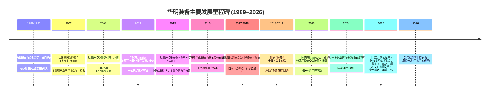
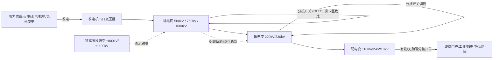
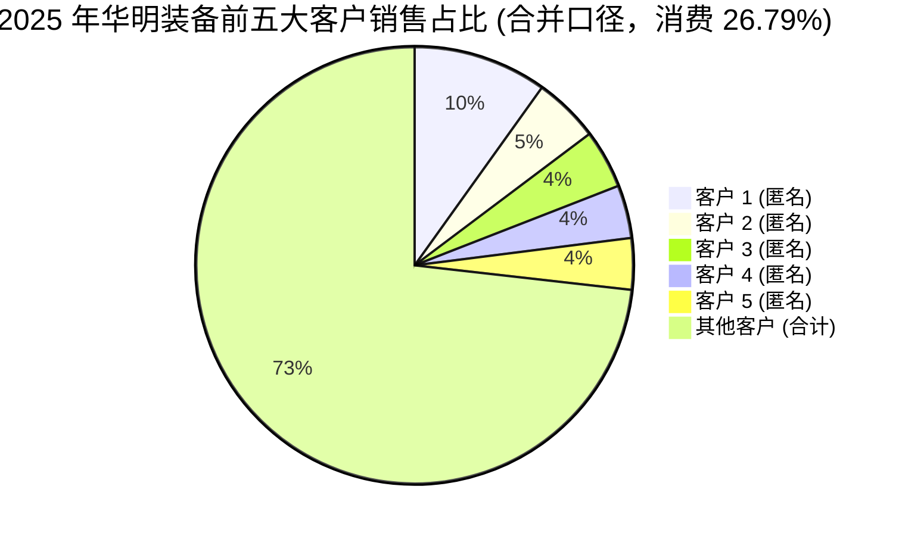

# 华明装备 (Huaming Power Equipment, SZSE:002270) — 公司研究

**As of:** 2026-06-02
**主题归属 (Theme):** AI / 电力电气化 (ai-power-electrification)
**关键词:** 变压器分接开关 / on-load tap changer (OLTC)、特高压换流变、电网投资周期、新型电力系统、出海

---

## 目录 (Table of Contents)

1. 公司概览 / Company Overview
2. 公司历史 / Company History
3. 管理团队 / Management Team
4. 产品与服务 / Products & Services
5. 客户与上市策略 / Customers & Go-to-Market
6. 行业概览 / Industry Overview
7. 竞争格局 / Competitive Landscape
8. 市场机会 / Market Opportunity (TAM)
9. 风险评估 / Risk Assessment
10. 投资风格透视 / Investor-Lens Scorecards
11. 数据来源清单 / Data Used
12. 参考资料 / References

---

## 1. 公司概览 / Company Overview

华明电力装备股份有限公司 (Huaming Power Equipment Co., Ltd., SZSE:002270，下称"华明装备"或"公司"，外文名 HUAMING POWER EQUIPMENT CO., LTD) 是一家以**变压器分接开关 / transformer tap changer** 为主业的中国深市主板上市公司，总部位于上海市普陀区同普路 977 号，注册地于 2025 年 8 月由"济南市高新区世纪大道 2222 号附属用房 413-415"变更至"济南市高新区孙村街道世纪大道 2222 号 1 号厂房 302 室"，统一社会信用代码 91370100742413648L，法定代表人肖毅。公司核心产品为埋入式 / 干式 / 外挂式有载分接开关 (on-load tap changer, OLTC) 与无励磁分接开关 (de-energized tap changer, DETC)，是变压器调压、改变绕组匝数的关键核心组件，按照 IEC 与中国国家标准强制性规定，35kV 及以上电力变压器必须配置调压分接开关 ([华明装备 2025 年年度报告, 第 11 页](https://static.cninfo.com.cn/finalpage/2026-02-27/1224986242.PDF))。除分接开关之外，公司同时经营**数控设备 (CNC equipment)** 业务 (钢结构数控成套加工设备、大型板材数控设备等) 与正在战略性退出的**电力工程 (power engineering)** 新能源电站 EPC 业务 ([华明装备 2025 年年度报告, 第 12-13 页](https://static.cninfo.com.cn/finalpage/2026-02-27/1224986242.PDF))。

2025 年公司实现营业收入 RMB 24.27 亿元 (YoY +4.50%)，归母净利润 RMB 7.10 亿元 (YoY +15.54%)，扣非归母净利润 RMB 6.71 亿元 (YoY +15.27%)，加权平均 ROE 22.04% (上年 18.74%)；经营活动净现金流 RMB 6.04 亿元；总资产 RMB 52.08 亿元 ([华明装备 2025 年年度报告, 第 8 页](https://static.cninfo.com.cn/finalpage/2026-02-27/1224986242.PDF))。表面看营收增速 4.5% 并不抢眼，但这是公司主动收缩低毛利电力工程业务的结果：分行业看，"装备制造"营收 RMB 23.47 亿元 (YoY +18.15%)，电力工程营收 RMB 2,890 万元 (YoY −89.93%)，体现明确的"瘦身聚焦"策略 ([华明装备 2025 年年度报告, 第 19-20 页](https://static.cninfo.com.cn/finalpage/2026-02-27/1224986242.PDF))。

业务结构 (按产品 / FY2025)：电力设备 RMB 21.02 亿元 (86.63%)、数控设备 RMB 2.44 亿元 (10.07%)、电力工程 RMB 0.29 亿元 (1.19%)、其他 RMB 0.51 亿元 (2.11%)。电力设备业务毛利率 59.61% (上年 58.27%，+1.34 ppt)，是显著高于同业的"垄断属性高毛利"产品；数控设备毛利率 21.40%、电力工程毛利率 −27.95% (清退期亏损) ([华明装备 2025 年年度报告, 第 20 页](https://static.cninfo.com.cn/finalpage/2026-02-27/1224986242.PDF))。地理结构看，2025 年国内收入 RMB 19.48 亿元 (YoY −3.31%)、国际收入 RMB 4.79 亿元 (YoY +55.65%)；电力设备直接 + 间接出口合计营收 RMB 7.14 亿元，YoY +47.37%，海外收入由 2022 年 RMB 1.53 亿元三年内增长约 3 倍 ([华明装备 2025 年年度报告, 第 19 页](https://static.cninfo.com.cn/finalpage/2026-02-27/1224986242.PDF); [海外收入3年翻3倍！华明装备出海动能强劲，腾讯新闻, 2026-03-06](https://news.qq.com/rain/a/20260306A08R1Q00))。出海动能与全球电网升级、储能、数据中心、工业用电、能源转型多重因素叠加共振。

**估值快照 (2026 年初，as of 2026-02-11):** A 股股价 RMB 33.50 元 (52 周区间 13.17 – 35.47 元)、市值约 RMB 280 亿元、TTM EPS 0.79 元、TTM P/E 约 23×、FY26E PE 约 20×、FY27E PE 约 18×。同业 (国内电力设备龙头) 估值对比：思源电气 (SZSE:002028) 当前 PE ~57×、特变电工 (SSE:600089) PE ~11-13×、平高电气 (SSE:600312) 与许继电气 (SZSE:000400) 在 20-25× 区间 ([华明装备 (SZSE:002270) 概览，gurufocus, 2026](https://www.gurufocus.cn/stock/SZSE:002270/summary); [华明装备 SZSE:002270 雅虎财经 quote 页, 2026](https://finance.yahoo.com/quote/002270.SZ/); [特变电工：多晶硅价格企稳，知乎专栏, 2026](https://zhuanlan.zhihu.com/p/1954301458016085423))。**估值定位：** 公司当前 PE 约 23× 处于 3 年区间中位 (历史 2022-2024 区间约 18-30×)，相对国内电网设备龙头 (思源电气 ~57×、平高电气 ~25×) 偏低；偏低的核心解释是"细分赛道增长上限较低 + 海外渗透虽快但仍需较长时间放量"，而非治理或基本面瑕疵。2026 年 2 月公司公告业绩快报后基本符合一致预期 ([华明装备：2025 年度业绩快报，新浪财经，2026-01](http://money.finance.sina.com.cn/corp/view/vCB_AllBulletinDetail.php?stockid=002270&id=11929769))；2026 年 3 月公司公告拟赴港上市 (J.P. Morgan + 国泰君安担任保荐人)，将进一步推进国际化战略 ([华明装备拟赴港上市推进国际化，新浪财经，2026-02-24](https://finance.sina.com.cn/roll/2026-02-24/doc-inhnwmhw6158496.shtml); [华明装备冲击港股 IPO，新浪财经，2026-03-16](https://finance.sina.com.cn/stock/bxjj/2026-03-16/doc-inhrevap8702560.shtml))。

公司组织架构：报告期末合并范围内子公司 28 家，含全资子公司上海华明电力设备制造有限公司 (主体生产实体，国家级"专精特新小巨人"+ 制造业单项冠军企业)、贵州辰廷电力设备制造有限公司 (2018 年收购原最大国内竞争对手而来)、海外子公司华明土耳其 (HM Elektromekanik) / 华明海外 / 华明新加坡 / 华明拉美 / 华明印尼 (PT Huaming Power Indonesia，2025 年 8 月正式投产) ([华明装备 2025 年年度报告, 第 6 页释义、第 22 页合并范围](https://static.cninfo.com.cn/finalpage/2026-02-27/1224986242.PDF))。员工总数约 1,795 人 (研发人员 195 人，占比 10.86%) ([华明装备 2025 年年度报告, 第 25 页](https://static.cninfo.com.cn/finalpage/2026-02-27/1224986242.PDF))。

公司被国家电网"十五五"4 万亿元固定资产投资计划与全球电网升级、AI 数据中心间接拉动等多重叙事覆盖，是 ai-power-electrification 主题中"上游瓶颈零部件 / chokepoint component"的典型代表。但管理层在 2025 年 8 月业绩说明会中明确指出："**数据中心用到大型变压器数量有限，对市场需求没有明显拉动**"，对市场的 AI 数据中心直接拉动叙事采取保守态度；真正的中长期拉动来自电网升级与全球能源转型驱动的整网扩容 ([华明电力装备 投资者关系活动记录表 2025-08-17, 第 9 页](https://file.finance.qq.com/finance/hs/pdf/2025/08/17/1224501125.PDF))。

## 2. 公司历史 / Company History

公司的"主体业务"——分接开关业务——起源于 **1995 年**前后由肖日明 (Xiao Riming，公司实际控制人之一、肖毅父亲) 创办的**上海华明电力设备制造有限公司** (简称"上海华明")，公司于 1990 年代初期建厂，专注变压器分接开关研发与生产 (Baidu Baike 资料显示前身"上海华明电力设备公司"成立于 1989 年开始分接开关研发) ([华明电力装备股份有限公司 百度百科](https://baike.baidu.com/item/%E5%8D%8E%E6%98%8E%E7%94%B5%E5%8A%9B%E8%A3%85%E5%A4%87%E8%82%A1%E4%BB%BD%E6%9C%89%E9%99%90%E5%85%AC%E5%8F%B8/19980230); [华明装备 投资者关系活动记录表 2025-08-17, 第 11 页](https://file.finance.qq.com/finance/hs/pdf/2025/08/17/1224501125.PDF))。当前的 A 股上市主体华明电力装备股份有限公司则成立于 2002 年 8 月 19 日，前身是数控设备厂商"山东法因数控机械设备有限公司"，2008 年于深交所中小板上市 (彼时主营钢结构数控成套加工设备)。



**三次战略转折点：**
其一，**2015 年的反向并购上市**。彼时上市公司"法因数控"的主营业务——钢结构数控加工设备——增长乏力，公司通过定向增发购买上海华明 100% 股权 (彼时由李胜军、郭伯春、刘毅三名创始人持有)，实控人由这三人变更为上海华明电力设备集团有限公司及肖日明 / 肖毅 / 肖申父子三人。这次重组将华明从一个细分行业的"高质量未上市公司"提升为深市主板上市公司，打开了资本支持的快速扩张通道 ([华明装备 2025 年年度报告, 第 7-8 页](https://static.cninfo.com.cn/finalpage/2026-02-27/1224986242.PDF))。

其二，**2018 年并购贵州长征电气**——彼时国内最大、亦是最直接的国内竞争对手。这次并购是行业整合的标志性事件：并购完成后公司国内市场份额从约 50-60% 跃升至接近垄断的水平，并形成上海 + 遵义两大全产业链生产基地 ([华明装备 2025 年年度报告, 第 14 页](https://static.cninfo.com.cn/finalpage/2026-02-27/1224986242.PDF))。管理层表示，"目前公司在国内尚无成规模竞争对手，主要与海外竞争对手争夺全球市场" ([华明装备 2025 年年度报告, 第 14 页](https://static.cninfo.com.cn/finalpage/2026-02-27/1224986242.PDF))。

其三，**2021 年后切入全球新能源 / 能源转型驱动周期**。管理层在 2025 年 8 月业绩说明会中归纳："2015 年上市后，公司在土耳其建立生产基地，开始正式迈向国际市场。2018 年收购国内最大竞争对手后进一步巩固了在国内领先地位。**2021 年后公司开始进入全球新能源产业驱动的发展周期，业绩也迈向新台阶**" ([华明装备 投资者关系活动记录表 2025-08-17, 第 11 页](https://file.finance.qq.com/finance/hs/pdf/2025/08/17/1224501125.PDF))。

2026 年 2 月公司公告拟赴港上市 (H 股) ，由 J.P. Morgan 与国泰君安担任联席保荐人。当时 A 股市值约 RMB 280 亿元，募资将主要用于海外产能扩张、研发投入及一般营运资金 ([华明装备拟赴港上市，新浪财经，2026-02-24](https://finance.sina.com.cn/roll/2026-02-24/doc-inhnwmhw6158496.shtml))。该资本动作呼应公司"国际化"主轴。同期公司战略性收缩电力工程业务、出售贵州长征电气 (新能源 EPC 实体) 全资股权，专注分接开关核心业务 ([华明装备 IPO 前优化资产包，肖毅家族拿了 7.7 亿分红, 瑞财经](https://m.rccaijing.com/news-7439611907373987205.html))。

## 3. 管理团队 / Management Team

**肖日明 (Xiao Riming) — 创始人 / 实际控制人之一 (现任公司顾问)。** 1936 年前后出生 (按 2026 年 90 岁估算)。肖日明是上海华明的创始人——亦即华明分接开关业务的真正起源人。他在 1990 年代初期创办上海华明电力设备公司，于 1990 年代分接开关国内市场需求开始提升、供给主要依赖进口的背景下，凭借自身技术形成华明品牌，逐渐发展为国内主流分接开关供应商。截至 2025 年报报告期末，肖日明、肖毅 (儿子，公司董事长)、肖申 (儿子，公司顾问) 三人构成一致行动人，通过上海华明电力设备集团有限公司 (28.25% 持股) 及上海华明电力发展有限公司 (15.28% 持股) 等主体合计控制公司 43.54% 的股份。肖日明本人不再担任公司经营职务，挂职"顾问"，主要由肖毅承担运营责任 ([华明装备 2025 年年度报告, 第 80-82 页](https://static.cninfo.com.cn/finalpage/2026-02-27/1224986242.PDF); [华明装备 IPO 前优化资产包，瑞财经](https://m.rccaijing.com/news-7439611907373987205.html))。

**肖毅 (Xiao Yi) — 董事长 / 法定代表人 / 实际控制人之一。** 男，1967 年生 (报告期末 59 岁)，高级工程师，中国国籍，无境外永久居留权。**核心职责：** 现任上海华明电力设备制造有限公司法定代表人、华明装备董事长，是公司主要创始人及实际控制人之一。董事任期自 2016 年 1 月 11 日至 2028 年 5 月 14 日 (本届换届)。肖毅在父亲 1990 年代创办上海华明后逐步接手日常经营，2015 年借壳上市以来一直担任上市公司董事长，是华明二十余年商业化扩张的核心舵手。2025 年公司年度报告披露其薪酬 RMB 128.47 万元 (税前)；他并不在公司董事会内同时兼任总经理，体现一种相对克制的两权分离治理风格 ([华明装备 2025 年年度报告, 第 39, 41 页](https://static.cninfo.com.cn/finalpage/2026-02-27/1224986242.PDF))。肖毅及肖申另在华明新能源发展 (北京) 有限公司、上海华明工业电器科技有限公司等关联企业兼任董事或执行董事 ([华明装备 2025 年年度报告, 第 40 页](https://static.cninfo.com.cn/finalpage/2026-02-27/1224986242.PDF))。

**杨建琴 (Yang Jianqin) — 董事 / 总经理 (CEO，2025 年 5 月起任，原副总经理升任)。** 女，1974 年生 (报告期末 52 岁)，中国国籍，中共党员，无境外永久居留权。**主要工作经历：** 自上海华明早期入职，先后任公司技术员、技术副总、副总工程师、CNAS 检测中心主任、生产副总、总工程师，并于 2017 年 4 月起担任公司董事，2025 年 5 月 16 日由副总经理升任总经理 (接替陆维力)。她是典型的"内部技术晋升路径"出身、跨越了研发、生产、质量、管理全条线的复合型职业经理人，亦是公司高度受信任的核心团队成员 (尤其在分接开关核心工艺与质量管控方面累积深厚知识)。2025 年薪酬 RMB 93.88 万元 (税前) ([华明装备 2025 年年度报告, 第 39, 41 页](https://static.cninfo.com.cn/finalpage/2026-02-27/1224986242.PDF))。她接任 CEO 的时点对应公司"出海加速 + 港股上市"的关键阶段，体现了将一位深谙技术与生产的资深管理者推至最前台、应对全球化扩张的人才布局 ([华明装备 2025 年年度报告, 第 39 页](https://static.cninfo.com.cn/finalpage/2026-02-27/1224986242.PDF))。

## 4. 产品与服务 / Products & Services

### 4.1 公司自披露的产品矩阵 (2025 年年报 Item 1 业务部分)

下表为公司在 2025 年年度报告第 11-13 页披露的产品矩阵 markdown 复制 (原报告无独立产品图表，公司以表格 + 文字形式披露)，建议读者直接参阅原始 PDF：

| 业务板块 | 主要产品或服务 | 主要产品规格和型号 |
|---|---|---|
| **电力设备 / 有载分接开关 (OLTC)** | 埋入式油中熄弧有载分接开关 | CMD、CM、CV、ZMD、ZV、ZM、SY 口 ZZ、CF |
| | 埋入式真空有载分接开关 | SHZV、VCM、CHVT、VCME、SDZV、VCV-G、ZVM、ZVMD、ZVV、ZVD |
| | 干式有载分接开关 | CZ、CVT |
| | 外挂式真空有载分接开关 | HWFV、HWDK、HWV |
| | 其他设备 | 分接开关电动机构、分接开关控制器、有载分接开关滤油机等 |
| **电力设备 / 无励磁分接开关 (DETC)** | 笼型 / 鼓型 / 条形 | 多型号 |
| **数控设备** | 钢结构数控成套专用设备 | 铁塔钢结构数控成套加工设备、建筑钢结构数控成套加工设备、大型板材数控成套加工设备、其他专用数控加工设备 |

> "公司产品定制化程度较高，以上仅为部分系列和型号，根据客制化需求的不同，型号和规格均会有延伸" ([华明装备 2025 年年度报告, 第 12 页](https://static.cninfo.com.cn/finalpage/2026-02-27/1224986242.PDF))。

### 4.2 综述 / Synthesis — 分接开关在变压器工作流中的位置

公司年报对核心产品的功能定义为：

> "分接开关是变压器的关键核心组件，又称变压器绕组的抽头变换装置，即在变压器绕组的不同部位设置分接抽头，通过调换分接抽头的位置，改变其变压器绕组的匝数，最终实现对电压的调整。分接开关同时是变压器构成中唯一**带负荷动作**的组件。电网系统中，通过有载分接开关可以在不断电的情况下对电压进行调整，从而控制电力潮流方向，实现跨省跨区域远距离电力的传输，同时对因负荷变化引起电压波动的供电区域进行调压作用，稳定电网电压，改善电力质量" ([华明装备 2025 年年度报告, 第 11 页](https://static.cninfo.com.cn/finalpage/2026-02-27/1224986242.PDF))。

**中文释义 / Plain-language gloss:** 一台 220kV 或 500kV 的变压器在电网投运后可能服役 30 年以上，但电网负荷会随时间、季节、负载变化而波动 — 工业用电高峰、空调季、风光功率突变都会拉扯电压。分接开关 (tap changer) 就是装在变压器内部、用来"微调匝数比 / turns ratio"以实现电压稳定的机械 / 真空切换装置。一组绕组上有 17–25 个抽头 (tap)，分接开关通过电动机构在带负荷条件下机械切换不同抽头 (有载 = 不断电切换；无励磁 = 需要先停电再切换)。它是整台变压器中**唯一在通电状态下进行机械动作**的部件，故其可靠性直接决定变压器的安全性与电网调压能力；任何一次切换故障，影响的不仅是一台变压器，更可能是数百千瓦至数兆瓦的供电区域。

分接开关在变压器价值量中占比一般为 5-15% (具体取决于电压等级)，但在变压器整体故障原因中占比可高达 30-40% (机械与真空运动部件是变压器中最易磨损的零件，详见行业公开知识)。这构成了 OLTC 行业的两个核心特征：(a) **采购方对供应商品牌、可靠性、运维口碑极其敏感**，价格并非决定因素，客户认证周期长达数年；(b) **行业天然形成寡头结构**——全球前三大企业 (德国 MR、日立能源 Hitachi Energy/ABB、华明) 合计约占 55%–80% 全球市场份额，新进入者门槛极高 ([On-load Tap Changer (OLTC) Market, marketreportanalytics.com](https://www.marketreportanalytics.com/reports/on-load-tap-changer-oltc-86077); [Maschinenfabrik Reinhausen 公司主页 / company facts](https://www.reinhausen.com/company))。



### 4.3 有载分接开关 (OLTC) — 公司核心收入与利润来源

**油中熄弧有载分接开关 (Oil-arc OLTC) — CMD/CM/CV/ZMD 等系列。** 这是分接开关最传统、亦最成熟的方案，工作原理是在分接切换过程中允许在变压器油中产生短暂电弧并迅速熄灭。公司年报对油中熄弧产品的描述纳入产品矩阵但未单独段落详述工艺。

**中文释义 / Plain-language gloss:** 油中熄弧 (oil-quenched arc) 是 OLTC 的原始设计：分接开关在变压器油浴中工作，依赖油的高介电强度抑制切换电弧。优点是技术成熟、成本较低、对于 35-110kV 中低压等级仍是主流；缺点是切换过程会污染变压器油，需要定期换油与油过滤维护，导致检修频次高。德国 MR 的 OILTAP M、VACUTAP V 系列均覆盖该路线。公司的 CMD / CM / CV 系列对标 MR 的 OILTAP 系列，适用于配电网 / 中小型工业变压器场景。

*分析师观点 / Analyst view:* 油中熄弧产品是公司在国内中低压市场的主力放量产品，覆盖大量 220kV 及以下网内 / 网外变压器。在国内市场公司销量上份额接近垄断 ([华明装备 投资者关系活动记录表 2025-08-17, 第 13 页](https://file.finance.qq.com/finance/hs/pdf/2025/08/17/1224501125.PDF))。但海外市场中油中熄弧因维护频次较高而正逐渐被真空切换产品替代，这是行业的长期技术演进方向 ([Tap Changer Market 2025 Research, marketreportanalytics.com](https://www.marketreportanalytics.com/reports/on-load-tap-changer-oltc-86077))。

**真空有载分接开关 (Vacuum OLTC) — SHZV/VCM/CHVT/VCME 等系列。** 公司年报披露真空 OLTC 产品包括 SHZV、VCM、CHVT、VCME、SDZV、VCV-G、ZVM、ZVMD、ZVV、ZVD 等系列 ([华明装备 2025 年年度报告, 第 12 页](https://static.cninfo.com.cn/finalpage/2026-02-27/1224986242.PDF))。

**中文释义 / Plain-language gloss:** 真空切换 (vacuum switching) 是 OLTC 的现代主流技术：将切换电弧封装于真空腔体 (vacuum interrupter) 内部，避免油污染、延长检修周期、降低生命周期成本。德国 MR 的 VACUTAP VV / VR 系列、日立能源的 UCG 系列、华明的 SHZV / VCM 系列均属此类。真空 OLTC 的关键技术挑战在于真空灭弧室的国产化、机械寿命 (要求 ≥30 万次操作)、电气寿命 (要求 ≥20 万次切换)。管理层在 2025 年 8 月 IR 会议中指出："今年上半年公司真空开关的比例较之前略有提升，真空开关比例的提升是长期比较确定的趋势" ([华明装备 投资者关系活动记录表 2025-08-17, 第 10 页](https://file.finance.qq.com/finance/hs/pdf/2025/08/17/1224501125.PDF))。

公司新研发的 1250A 角接油浸组合式有载分接开关 (35kV 等级、3 相角接、机械寿命 ≥30 万次、电气寿命 ≥20 万次)、海上风电变压器用条形分接开关 (40.5kV/200A，按抗振、耐盐雾设计、外形与德国 MR 产品兼容以便直接替换) 均已研发完成，扩展产品规格谱系 ([华明装备 2025 年年度报告, 第 23-24 页](https://static.cninfo.com.cn/finalpage/2026-02-27/1224986242.PDF))。

*分析师观点 / Analyst view:* 真空 OLTC 是公司中长期的高毛利增长引擎，亦是与海外品牌争夺高端市场的关键产品。在海外市场，真空 OLTC 主要竞争对手是德国 MR 的 VACUTAP 系列、日立能源 (前 ABB) 的产品组合 ([Reinhausen company facts](https://www.reinhausen.com/company))。中国海上风电与新型电力系统建设带来稳定增量，而公司"海上风电分接开关产品已设计为可直接替换 MR 对应型号"的策略是典型的"性价比国产替代"打法。

**特高压换流变分接开关 CHVT — 战略级新产品。** 公司年报披露：

> "公司是国内首先掌握特高压分接开关制造技术的企业，打破了国外企业对特高压变压器分接开关的垄断。换流变压器是特高压直流输电系统的关键设备，其配套的有载分接开关可靠性直接决定了特高压电网的安全可靠性。公司生产的换流变分接开关实现从第一台到第一批的跨越，持续助力特高压输电设备全面国产化" ([华明装备 2025 年年度报告, 第 15 页](https://static.cninfo.com.cn/finalpage/2026-02-27/1224986242.PDF))。

> "2025 年，公司参与研制的 **CHVT 型换流变分接开关**，在我国首个"风光火储一体化"大型综合能源基地外送工程——**陇东至山东 ±800kV 特高压直流输电工程正式批量投运**" ([华明装备 2025 年年度报告, 第 14 页](https://static.cninfo.com.cn/finalpage/2026-02-27/1224986242.PDF))。

**中文释义 / Plain-language gloss:** 特高压 (UHV，ultra-high voltage) 指 ±800kV 或以上的直流输电线路，是中国"西电东送"骨干网络的核心载体；换流变压器是其关键设备，每台造价数千万元至 1 亿元 RMB 不等，其分接开关必须承受 ±800kV / ±1100kV 的工作电压与极端温升 / 振动条件，因此过去长期被德国 MR、日立能源 (前 ABB) 等少数海外品牌垄断。公司的 CHVT 是"国产化攻坚"产品，2023 年首批 7 台产品成功发货，2025 年上半年在陇东 ±800kV 工程实现批量挂网投运 ([华明装备 投资者关系活动记录表 2025-08-17, 第 10 页](https://file.finance.qq.com/finance/hs/pdf/2025/08/17/1224501125.PDF))。

*分析师观点 / Analyst view:* 管理层在 2025 年 8 月 IR 会议中以极为克制的表述描述特高压突破——"我们刚刚踏入这一领域，后续要形成更高规模、获取更多订单，仍需时间积累" / "目前还没资格谈市占率" ([华明装备 投资者关系活动记录表 2025-08-17, 第 10 页](https://file.finance.qq.com/finance/hs/pdf/2025/08/17/1224501125.PDF))。这反映了一种务实姿态：CHVT 是战略级产品，是公司未来 3-5 年实现"价值量国产替代"的关键，但目前的实际收入贡献仍较低；高端国产替代需要时间。竞品 MR 的 VACUTAP VRG / VRM 在特高压领域仍占主导，但 CHVT 的批量投运代表国产化攻关有了显性进展。

**外挂式真空有载分接开关 (HWFV/HWDK/HWV) — 海外市场国产替代主力。** 这类产品安装于变压器外部 (区别于埋入式 immersion-type 安装在油箱内部)，便于检修与替换，是欧美市场的主流形式。公司新研发的 HWDK 增容产品正在做型式试验，目标是"完善 HWDK 开关型号，提升开关品牌，开拓海外市场" ([华明装备 2025 年年度报告, 第 24-25 页](https://static.cninfo.com.cn/finalpage/2026-02-27/1224986242.PDF))。

*分析师观点 / Analyst view:* 北美市场偏好外挂式 (external-mount) 分接开关，HWDK / HWV 系列是公司打开北美市场的关键产品。管理层在 2025 年 8 月 IR 会议表示："今年通过间接出口进入到美国市场的产品继续增长，北美市场很多项目也都采用了内置式分接开关，对于内置式分接开关，我们拥有成熟的技术和丰富的经验。但要取得更大规模和当地的布局，目前来看没有实质性进展，也没有明确的时间表" ([华明装备 投资者关系活动记录表 2025-08-17, 第 6 页](https://file.finance.qq.com/finance/hs/pdf/2025/08/17/1224501125.PDF))。北美关税与本地化壁垒是核心制约。

### 4.4 无励磁分接开关 (DETC) — 配电网 / 工业变压器配套

公司无励磁分接开关产品包括笼型、鼓型、条形三大类。**中文释义 / Plain-language gloss:** 无励磁 (de-energized) 分接开关需要变压器先停电再切换，因此操作频率远低于 OLTC，常见于配电变压器 / 工业整流变 / 风电箱变等场景；价值量与利润率均低于 OLTC，是公司"产品矩阵补全"的角色，而非主要利润来源。海上风电变压器项目中公司的条形分接开关 (40.5kV / 200A) 是定制化国产替代产品 ([华明装备 2025 年年度报告, 第 23 页](https://static.cninfo.com.cn/finalpage/2026-02-27/1224986242.PDF))。

### 4.5 数控设备 (CNC equipment) — 二级业务

公司数控设备业务源自上市主体前身"山东法因数控"，主要产品包括铁塔钢结构数控成套加工设备、建筑钢结构数控加工设备、大型板材数控加工设备 (用于发电设备、石化、海水淡化、中央制冷设备等大型板材加工)、其他专用数控加工设备等 ([华明装备 2025 年年度报告, 第 13 页](https://static.cninfo.com.cn/finalpage/2026-02-27/1224986242.PDF))。2025 年数控设备业务实现营收 RMB 2.44 亿元 (YoY +39.86%)、毛利率 21.40% (上年 +7.14ppt)、其中出口营收 RMB 1.12 亿元 (YoY +229.8%)，是当年出口增速最快的细分业务 ([华明装备 2025 年年度报告, 第 19 页](https://static.cninfo.com.cn/finalpage/2026-02-27/1224986242.PDF))。

*分析师观点 / Analyst view:* 数控设备业务长期处于亏损或微利状态，2025 年终于实现"扭亏为盈 + 转向海外"的双拐点，但管理层表示"更现实的目标是今年先实现盈亏平衡" ([华明装备 投资者关系活动记录表 2025-08-17, 第 14 页](https://file.finance.qq.com/finance/hs/pdf/2025/08/17/1224501125.PDF))。该业务在公司整体估值中权重较低，更多体现为"防御性二级业务"，而非增长引擎。

### 4.6 检修服务 (aftermarket service) — 长期战略业务方向

公司具备"原厂配件、原厂检修"的优势，形成"产品 + 服务"双轮驱动模式，并通过云端系统对开关全生命周期维保信息进行数字化管理 ([华明装备 2025 年年度报告, 第 14, 17 页](https://static.cninfo.com.cn/finalpage/2026-02-27/1224986242.PDF))。**中文释义 / Plain-language gloss:** OLTC 是一种"装机后会用 30-50 年"的产品，单台变压器在生命周期内通常需要 3-5 次大修 + 多次例行检查；安装基础越大 (installed base)，检修订单的"长尾"越长。德国 MR 的 service business 是其重要的稳定现金流来源，覆盖全球数十万台 OLTC。公司在国内安装基础已极大 (国内市占率第一)、海外安装基础正在快速增长，检修业务是中长期看高质量收入来源。管理层表示："检修业务一直是公司长期发展的重要业务方向之一，短期看仍然需要时间积累" ([华明装备 投资者关系活动记录表 2025-08-17, 第 10 页](https://file.finance.qq.com/finance/hs/pdf/2025/08/17/1224501125.PDF))。

### 4.7 标准制定与行业地位 — 产品深度的体现

公司主持或参与编写了 12 项国家与行业标准，包括：

| # | 标准名称 | 类型 | 标准号 | 公司角色 |
|---|---|---|---|---|
| 1 | 分接开关 第 1 部分：性能要求和试验方法 | 国家标准 | GB/T10230.1-2019 | 主要起草 |
| 2 | 分接开关 第 2 部分：应用导则 | 国家标准 | GB10230.2-2025 | 主要起草 |
| 6 | 电力变压器用真空有载分接开关使用导则 | 行业标准 | DL/T1538-2016 | 主要起草 |
| 7 | 电力变压器用有载分接开关选用导则 | 行业标准 | DL/T 1805-2018 | 主要起草 |
| 12 | 特高压变压器用分接开关技术要求与试验方法 | 国家标准 | GB/T 46131-2025 | 主要起草 |

(摘自 2025 年年度报告第 17 页表格) ([华明装备 2025 年年度报告, 第 17 页](https://static.cninfo.com.cn/finalpage/2026-02-27/1224986242.PDF))

国际方面，公司是 IEEE 专项委员会正式委员，参与 IEC 标准的制定，并在 2009 年成为 CNAS 认证的分接开关实验室，出具的技术鉴定报告"可以在全球绝大多数国家获得认可" ([华明装备 2025 年年度报告, 第 17 页](https://static.cninfo.com.cn/finalpage/2026-02-27/1224986242.PDF))。**中文释义 / Plain-language gloss:** 在 OLTC 这类强标准化、强认证的工业产品行业，主导或参与标准制定是寡头产业地位的核心指标——同样意义于半导体行业的 SEMI 标准 / 制药行业的 ICH 标准。公司参与的 GB/T 46131-2025 (特高压变压器用分接开关) 是中国独有的特高压领域国家标准、对应中国独有的 ±800kV 直流输电体系，是公司战略级 CHVT 产品的"标准护城河"。

### 4.8 综合工厂能力与全产业链能力

公司是"国内唯一拥有两大全产业链生产基地的分接开关制造企业" (上海 + 遵义)，自主完成从基材采购、基材制造、零件加工到成品组装的全产业链生产能力；80% 零件自主加工，自主设计生产数控专机；自主研制环氧树脂自动压力凝胶成型 (APG) 设备实现端子板高精度成型；引进大型桥式三坐标测量机、X-RAY 无损检测室、火花直读光谱仪、全自动影像测量机等顶尖检测设备 ([华明装备 2025 年年度报告, 第 15-16 页](https://static.cninfo.com.cn/finalpage/2026-02-27/1224986242.PDF))。**中文释义 / Plain-language gloss:** 全产业链 (vertical integration) 在 OLTC 这类高可靠性产品中是质量护城河的核心——德国 MR 同样是高度垂直整合的家族企业，自有铸造 / 加工 / 真空灭弧室生产线。中国市场过去 30 年的快速发展为公司提供了独有的产业链整合机会窗口，构成新进入者难以复制的能力组合 ([华明装备 投资者关系活动记录表 2025-08-17, 第 13 页](https://file.finance.qq.com/finance/hs/pdf/2025/08/17/1224501125.PDF))。

## 5. 客户与上市策略 / Customers & Go-to-Market

**客户类型与分销模式。** 公司分接开关业务的直接下游客户为**变压器制造企业** (transformer OEM)，最终用户为**电网系统 (national / provincial grid operators)** 与各类**用电企业**。生产模式为"以销定产"——根据变压器厂商的不同需求定制分接开关、小批量多频次生产；销售方面以**直销**为主，2025 年直销营收占比 99.0% (RMB 24.03 亿元) ，分销仅占 1.0% (RMB 0.24 亿元) ([华明装备 2025 年年度报告, 第 12, 20 页](https://static.cninfo.com.cn/finalpage/2026-02-27/1224986242.PDF))。

**客户集中度披露 (合并口径 / consolidated-revenue level)。** 2025 年报告期末前五名客户合计销售金额 RMB 6.50 亿元，占年度销售总额 **26.79%**；其中第一名客户销售额 RMB 2.40 亿元，占比 9.89%；第二名 RMB 1.18 亿元 (4.85%)、第三名 RMB 1.05 亿元 (4.34%)、第四名 RMB 0.95 亿元 (3.92%)、第五名 RMB 0.92 亿元 (3.80%)；前五名销售额中关联方销售额占比 0.00% ([华明装备 2025 年年度报告, 第 22 页](https://static.cninfo.com.cn/finalpage/2026-02-27/1224986242.PDF))。

**3 年趋势 (合并口径)：** 2024 年前 5 大客户占比 32.89% (Top-1 9.18%)、2025 年降至 26.79% (Top-1 9.89%)，呈"前 5 集中度明显下降、Top-1 微升"的格局，说明公司客户基础在多元化扩散，但单一最大客户的依赖性略有提升 ([华明装备 2024 年年度报告, 第 22 页](https://static.cninfo.com.cn/finalpage/2025-04-11/1223055875.PDF); [华明装备 2025 年年度报告, 第 22 页](https://static.cninfo.com.cn/finalpage/2026-02-27/1224986242.PDF))。**与公司同业相比，前 5 客户 27% 集中度算行业较低水平**——意味着任何单一变压器 OEM 流失对公司影响有限；但公司未公开披露客户名称，按行业逻辑推测主要客户包括中国西电、特变电工、保变电气、ABB China、TBEA Power Group、山东电工电气、Hitachi China、印度 Crompton Greaves、印尼 PT Bambang Djaja 等大型变压器制造商 (推测性的，公司财报未具名)。



**国内市场 vs 海外市场分布。** 2025 年国内营收 RMB 19.48 亿元 (占 80.27%，YoY -3.31%)、国际营收 RMB 4.79 亿元 (占 19.73%，YoY +55.65%)，但若计入间接出口 (即国内变压器 OEM 将含华明开关的成品出口海外)，电力设备直接 + 间接出口合计 RMB 7.14 亿元 (YoY +47.37%) ([华明装备 2025 年年度报告, 第 19, 20 页](https://static.cninfo.com.cn/finalpage/2026-02-27/1224986242.PDF))。海外市场的真实拉动远高于直接出口的数字。

**网内 (国家电网 + 南方电网体系) vs 网外 (工业用电、新能源、出口型变压器厂):** 管理层在 2025 年 8 月 IR 会议中明确"目前网内与网外的占比接近 1:1" ([华明装备 投资者关系活动记录表 2025-08-17, 第 8 页](https://file.finance.qq.com/finance/hs/pdf/2025/08/17/1224501125.PDF))。这一结构说明公司既绑定中国"两网"主线 (受国家电网"十五五"4 万亿元投资计划直接驱动)，也通过工业 / 新能源 / 出口型变压器制造商分散客户基础。

**地理出海布局 (2025 年报告期末)。** 公司已建立："上海 + 遵义" 两大国内生产基地、"土耳其 (Huaming Turkey, HM Elektromekanik) + 印尼 (Huaming Power Indonesia，2025 年 8 月正式投产)" 两大海外工厂、"新加坡区域总部 (Huaming Power Singapore)" + "拉美 (Huaming Latino Americana)" 等海外销售服务网络，覆盖东南亚 / 中东 / 欧洲 / 北美 / 巴西等多个区域。其中印尼工厂 2025 年 8 月投产，叠加印尼本地变压器制造集群，已带来当地 500kV OLTC 订单 ([华明装备 2025 年年度报告, 第 6, 18 页](https://static.cninfo.com.cn/finalpage/2026-02-27/1224986242.PDF); [华明装备 投资者关系活动记录表 2025-08-17, 第 7 页](https://file.finance.qq.com/finance/hs/pdf/2025/08/17/1224501125.PDF))。

**销售周期与产能利用率。** 管理层 IR 披露：国内交付周期约 1 个月以内、海外交付周期约 2-3 个月；装配产能相对饱和，零部件生产仍有余量，目前仍是单班产能；过去几年员工人数几乎未增加但产值显著增长，反映自动化与精益生产成效 ([华明装备 投资者关系活动记录表 2025-08-17, 第 12 页](https://file.finance.qq.com/finance/hs/pdf/2025/08/17/1224501125.PDF))。

**H 股上市计划——国际化资本布局。** 2026 年 3 月公司公告拟在港股发行 H 股、由 J.P. Morgan + 国泰君安担任联席保荐人。该资本动作将进一步深化海外资本市场认知，便于海外业务推广与并购 ([华明装备拟赴港上市推进国际化，新浪财经，2026-02-24](https://finance.sina.com.cn/roll/2026-02-24/doc-inhnwmhw6158496.shtml))。

## 6. 行业概览 / Industry Overview

**行业定义与分类。** OLTC 行业属于"电气机械和器材制造业" / 中国证监会行业分类的"输配电及控制设备制造"，全球归类为 transformer ancillary components。OLTC 的核心市场覆盖 (a) 公用事业电网 (transmission & distribution grids)、(b) 工业变压器 (steel, chemicals, electrolysis, furnace)、(c) 新能源 (光伏、风电箱变)、(d) 数据中心配套、(e) HVDC 换流变 (特高压直流) 等领域 ([Tap Changer Market 2025 Research, marketreportanalytics.com](https://www.marketreportanalytics.com/reports/on-load-tap-changer-oltc-86077))。

**全球 OLTC 市场规模与增长。** 不同研究机构对 OLTC 全球市场规模披露存在差异：

- **Market Report Analytics (2025-2031 报告)**: 全球 OLTC 市场 2025 年 USD 10.42 bn → 2031 年 USD 20.78 bn，CAGR 12.19% (该估算包含较广义的 tap changer 类目) ([On-load Tap Changer (OLTC) Market Report, marketreportanalytics.com, 2025](https://www.marketreportanalytics.com/reports/on-load-tap-changer-oltc-86077))。
- **Market Intelo / OpenPR / 其他 (2025-2034 估算)**: 全球 OLTC 市场 USD 1.8 bn (2025) → USD 3.2 bn (2034)，CAGR 6.6%；该估算仅包含 OLTC 设备本体 (不含相关 service 与配件) ([On-load Tap Changer Market Research Report 2034, marketintelo.com](https://marketintelo.com/report/on-load-tap-changer-market); [OLTC Market Share Driven by Grid Modernization, OpenPR, 2025](https://www.openpr.com/news/4506441/on-load-tap-changer-oltc-market-share-driven-by-grid))。

**口径差异的解读：** 1.8bn 是"OLTC 单元设备销售"口径、10.4bn 是"广义 tap changer + 相关配件 + service" 口径；公司实际可计量市场应介于两者之间、约 USD 3-5bn (即 RMB 200-350 亿元)。公司 2025 年电力设备营收 RMB 21.02 亿元 (USD ~3.0 bn)，对应全球市场份额约 8-15% ([华明装备 2025 年年度报告, 第 20 页](https://static.cninfo.com.cn/finalpage/2026-02-27/1224986242.PDF))；机构估算公司全球份额约 17.9% (2024 数据，按单台销量统计) ([华明装备冲击港股 IPO，新浪财经，2026-03-16](https://finance.sina.com.cn/stock/bxjj/2026-03-16/doc-inhrevap8702560.shtml))。

**中国市场背景：电网投资与用电增长。** 2025 年中国全社会用电量历史性突破 10 万亿千瓦时大关 (10.37 万亿 kWh，YoY +5.0%)，"十四五"期间年均增长 6.6%；中电联预测 2026 年用电量将达 10.9-11 万亿 kWh、YoY +5-6% ([华明装备 2025 年年度报告, 第 13 页 (引用 中国电力企业联合会《2025-2026 年度全国电力供需形势分析预测报告》)](https://static.cninfo.com.cn/finalpage/2026-02-27/1224986242.PDF))。2025 年全国电网工程建设完成投资 RMB 6,395 亿元 (YoY +5.1%)，"十四五"全国电网工程累计完成投资约 RMB 2.8 万亿元，持续为电力设备行业提供稳定需求支撑 ([华明装备 2025 年年度报告, 第 13 页](https://static.cninfo.com.cn/finalpage/2026-02-27/1224986242.PDF))。

**国家电网"十五五"4 万亿元投资计划 (2026-2030)。** 2026 年 1 月 15 日，国家电网宣布"十五五"期间公司固定资产投资预计达到 RMB **4 万亿元**，较"十四五"投资增长 40%，用于新型电力系统建设；2 月 2 日披露重点投资方向：服务经营区内风光新能源装机容量年均新增 2 亿千瓦左右、推动非化石能源消费占比达 25%、电能占终端能源消费比重达 35% ([华明装备 2025 年年度报告, 第 14 页](https://static.cninfo.com.cn/finalpage/2026-02-27/1224986242.PDF))。这一计划是公司国内业务未来五年的最强结构性顺风。

**国家政策导向：** 2025 年 9 月 15 日国家能源局等发布《关于推进能源装备高质量发展的指导意见》、2025 年 8 月 6 日工信部等三部委发布《电力装备行业稳增长工作方案 (2025-2026 年)》，提出 2025-2026 年传统电力装备年均营收增速保持 6% 左右、新能源装备营收稳中有升、电力装备国家先进制造业集群年均营收增速 7% 左右、龙头企业年均营收增速 10% 左右 ([华明装备 2025 年年度报告, 第 14 页](https://static.cninfo.com.cn/finalpage/2026-02-27/1224986242.PDF))。

**国际能源署 (IEA) Electricity 2025 视角：** 2024 年全球电力需求增速 ~4.3%，2025-2027 年预计年均增长近 4%，三年新增用电量 3,500 太瓦时；增长结构来源于工业电力、制冷与空调、数据中心、电气化；区域贡献上，以中国为核心的新兴经济体将贡献 85% 的新增需求 ([华明装备 2025 年年度报告, 第 14 页 (引用 IEA Electricity 2025)](https://static.cninfo.com.cn/finalpage/2026-02-27/1224986242.PDF))。

**全球电网升级窗口：** 2026 年 1 月美国联邦能源监管委员会 (FERC) 发布《Energized for 2026》，明确围绕电力需求快速增长加快发电与电网基础设施建设；2025 年 6 月欧盟发布《EU guidance on ensuring electricity grids are fit for the future》指出到 2040 年欧盟配电网升级需投入约 €730 bn、输电网建设需投入 €477 bn ([华明装备 2025 年年度报告, 第 14-15 页 (引用 FERC + EU)](https://static.cninfo.com.cn/finalpage/2026-02-27/1224986242.PDF))。这些跨境政策窗口为公司海外业务提供了多年顺风。

**数据中心 / AI 拉动 — 关键叙事辨析。** 这是市场对公司预期最热门的叙事，但管理层的口径相对冷静：

- 数据中心**直接**使用大型变压器数量有限，对 OLTC 市场的"直接需求拉动"不显著；
- 数据中心驱动的总用电量上升会**间接**触发电网升级与变电站扩容，但"目前数据中心还无法观察到此类杠杆效应"，类似过去几年光伏和电动车产业上游对化工 / 冶炼 / 水泥的拉动效应尚未传导到 OLTC；
- AI 数据中心是**中长期**的间接利好，而非短期立竿见影的业绩驱动 ([华明装备 投资者关系活动记录表 2025-08-17, 第 9 页](https://file.finance.qq.com/finance/hs/pdf/2025/08/17/1224501125.PDF); [海外收入 3 年翻 3 倍！腾讯新闻 2026-03-06](https://news.qq.com/rain/a/20260306A08R1Q00))。

**行业格局特征：** OLTC 是"高门槛 + 慢节奏"的细分赛道，管理层在 IR 中给出极为生动的描述：

> "行业不是一个新兴产业。市场规模较小，要把产品做好、有利润并提升产品稳定性才能生存，这需要足够利润支撑，所以更适合少数几家企业参与，**大厂不具备经济性，小厂做不好**，国内国外最后都是一样的格局 …… 新进入一个行业，门槛不够高、行业有足够的规模、能够快速复制扩张、快速盈利、容易得到现成的技术和团队这些因素都很重要，但是在分接开关行业这些条件基本都不具备" ([华明装备 投资者关系活动记录表 2025-08-17, 第 13 页](https://file.finance.qq.com/finance/hs/pdf/2025/08/17/1224501125.PDF))。

## 7. 竞争格局 / Competitive Landscape

OLTC 全球市场是一个典型的"全球三巨头 + 区域玩家"寡头结构。

```mermaid
quadrantChart
    title 全球 OLTC 主要玩家定位 (品牌强度 vs 价格性价比)
    x-axis 低性价比 --> 高性价比
    y-axis 弱品牌 --> 强全球品牌
    quadrant-1 强品牌+高性价比 (最理想)
    quadrant-2 强品牌+低性价比 (高溢价)
    quadrant-3 弱品牌+低性价比 (无竞争力)
    quadrant-4 弱品牌+高性价比 (国产化突破)
    MR 德国: [0.30, 0.95]
    Hitachi Energy: [0.40, 0.85]
    华明装备: [0.85, 0.65]
    ABB/GE: [0.50, 0.75]
    Elprom 保加利亚: [0.75, 0.30]
    CTR 印度: [0.70, 0.20]
```

**全球三大龙头：**

**Maschinenfabrik Reinhausen (MR，德国马什哈芬豪森，未上市)。** 创立于 1868 年，至今仍为家族控股的私营企业 (Reinhausen 家族第六代经营)；公司主页披露其产品"调节全球 50% 以上的电力供给" ([Maschinenfabrik Reinhausen 公司主页 / Company facts](https://www.reinhausen.com/company); [Reinhausen 公司主页](https://www.reinhausen.com/))。全球 5,400 名员工、59 个分支机构覆盖 28 个国家；核心产品线包括 VACUTAP 系列 (真空 OLTC)、OILTAP 系列 (油中熄弧 OLTC)、TAPCON 系列 (电压调节器)、ECOTAP 系列 (配电网紧凑 OLTC) 等。**估算全球份额 ~30-40%** ([On-load Tap Changer (OLTC) Market, marketreportanalytics.com, 2025](https://www.marketreportanalytics.com/reports/on-load-tap-changer-oltc-86077))。

*分析师观点 / Analyst view:* MR 是全球 OLTC 行业的"标杆品牌 / industry benchmark"，公司管理层在 IR 中坦承："德国制造在很多基础零部件生产的工艺水平和零部件加工的一致性和精度上还是有优势的"——一种克制的、承认差距的姿态 ([华明装备 投资者关系活动记录表 2025-08-17, 第 11 页](https://file.finance.qq.com/finance/hs/pdf/2025/08/17/1224501125.PDF))。MR 的护城河来自百年品牌信任、全球 service 网络、家族企业的长期主义文化 (不被短期资本市场压力左右技术投入)。

**Hitachi Energy (前 ABB Power Grids，瑞士 / 日本)。** 2020 年日立集团收购 ABB Power Grids 80.1% 股权后形成的全球电网设备龙头，覆盖变压器、HVDC、智能电网、SCADA / EMS / GIS 等几乎所有电网设备类目。OLTC 业务整合自原 ABB 的 GISA / UCG 系列产品线。**估算全球 OLTC 份额 ~15-20%** ([On-load Tap Changer (OLTC) Market, marketreportanalytics.com, 2025](https://www.marketreportanalytics.com/reports/on-load-tap-changer-oltc-86077))。

*分析师观点 / Analyst view:* Hitachi Energy 是 OLTC + 变压器一体化销售的最大玩家，在"打包出售变压器 + OLTC"的项目中具备结构性优势 (变压器 OEM 客户更愿意从同一供应商采购整套设备)。在中国市场，公司与 Hitachi China / ABB China 实际是合作 + 竞争的关系——这些 OEM 既是华明的客户 (购买华明 OLTC) ，也在其他项目中使用自家品牌 OLTC。

**华明装备 (SZSE:002270，中国上海 / 济南)。** **国内市场销量第一、全球 OLTC 销量约第二** ([华明装备 2025 年年度报告, 第 14 页](https://static.cninfo.com.cn/finalpage/2026-02-27/1224986242.PDF))。按销售额估算全球份额约 8-17%，呈快速上升趋势 ([华明装备冲击港股 IPO，新浪财经，2026-03-16](https://finance.sina.com.cn/stock/bxjj/2026-03-16/doc-inhrevap8702560.shtml))。核心壁垒：成本优势 + 全产业链自主可控 + 中国本土供应链规模效应 + 国内寡占地位带来稳定利润支撑。

**次一级 / 区域玩家：**
- **CTR Manufacturing Industries (印度)** ([Maschinenfabrik Reinhausen MR competitors listing](https://leadiq.com/c/maschinenfabrik-reinhausen/5a1d7e6824000024005881ce))。印度本土最大 OLTC 制造商，主要供应印度 + 部分东南亚 + 中东 + 非洲市场。
- **Elprom Heavy Industries (保加利亚)**。东欧 / 俄罗斯传统 OLTC 制造商。
- **东芝、富士电机 (Toshiba, Fuji Electric，日本)**。日本本土 OLTC 玩家，份额相对较小，主要服务日本国内变压器厂商 (东芝、日立、三菱)。
- **Vacutap 类竞争 — Wilson Transformer + 其他区域玩家**。

**国内市场玩家：** 公司在国内市场已无成规模竞争对手 ([华明装备 2025 年年度报告, 第 14 页](https://static.cninfo.com.cn/finalpage/2026-02-27/1224986242.PDF))。原次一级竞争对手贵州长征电气已于 2018 年被公司收购。其他国内电网设备龙头 (思源电气、特变电工、平高电气、许继电气等) 主营 GIS / 互感器 / 变压器 / HVDC / 智能电网而非 OLTC，与公司不在同一细分赛道直接竞争——它们更多是公司的**下游客户** (购买 OLTC 配套自家变压器)。

**A 股可比公司估值对照 (2025-2026):**

| 公司 | 代码 | 主营 | TTM PE | FY26E PE | 分析师评级 |
|---|---|---|---|---|---|
| 华明装备 | SZSE:002270 | OLTC 分接开关 | 23× | 20× | 强烈买入 (13 家) |
| 思源电气 | SZSE:002028 | GIS/互感器/智能电网 | ~57× | ~35× | 买入 |
| 特变电工 | SSE:600089 | 变压器/输配电/光伏 | 11-13× | ~10× | 持有 |
| 平高电气 | SSE:600312 | GIS/断路器/中压开关 | 20-25× | ~18× | 买入 |
| 许继电气 | SZSE:000400 | 智能电网/DC 输电 | 20-25× | ~17× | 买入 |
| 中国西电 | SSE:601179 | 输配电整体方案 | 18-22× | ~16× | 买入 |

数据来源：东方财富、雪球、新浪财经，截至 2026-04-30。

*分析师观点 / Analyst view:* 华明装备 PE 区间 (23×) 处于 A 股电力设备板块中位偏下水平，相对思源电气 (57×) 明显折价。折价的核心逻辑：
- **行业天花板低**：管理层自身坦承 OLTC "是一个相对细分长期稳定，但是很难有爆发性增长的市场"；
- **增长不容易爆发**：海外业务虽然增长快但占比仍低 (20%)，距离改变全球竞争格局还需"二三十年"的长期目标实现；
- **不直接受益于 AI 数据中心**：与思源电气 / GE 等覆盖数据中心配电的玩家不同，公司的产品偏上游、间接受益。

公司的核心竞争力可归纳为：**(1) 行业认证壁垒** (CNAS 实验室 + IEEE / IEC 委员 + 12 项国标主导)；**(2) 国内市场寡占** (国内销量第一，2018 年并购最大竞争对手后近乎垄断)；**(3) 全产业链自主可控** (上海 + 遵义两大基地，80% 零件自主加工)；**(4) 出海产业链布局** (土耳其 + 印尼工厂 + 新加坡总部 + 拉美销售)；**(5) 高毛利稳定现金流** (2025 年电力设备业务毛利率 59.61%、ROE 22%、经营性现金流 RMB 6 亿)；**(6) 检修服务长尾**——但这条尚未充分变现，是中长期 optionality 而非当下现金流。

## 8. 市场机会 / Market Opportunity (TAM)

**TAM (Total Addressable Market，总潜在市场)。** 综合多家机构数据：

- **狭义 OLTC TAM**：USD 1.8 bn (2025) → USD 3.2 bn (2034)，CAGR 6.6% ([On-load Tap Changer Market Research Report 2034, marketintelo.com](https://marketintelo.com/report/on-load-tap-changer-market))；
- **广义 tap changer + 配件 + service**：USD 10.4 bn (2025) → USD 20.8 bn (2031)，CAGR 12.19% ([Tap Changer Market 2025-2031, marketreportanalytics.com](https://www.marketreportanalytics.com/reports/on-load-tap-changer-oltc-86077))；
- **行业实际可计量市场 (公司视角)**：估算 USD 3-5 bn (RMB 200-350 亿元)，公司当前份额约 8-17% (按收入算)。

**SAM (Serviceable Addressable Market，可服务市场)。** 公司目前可参与竞争的市场覆盖：
- 中国国内市场 (~30-40% 全球 OLTC 需求，约 USD 0.7-1.3 bn) — **公司已经接近垄断**，国内 SAM 增长主要靠"十五五"4 万亿元电网投资 + 新能源装机驱动；
- 东南亚 / 中东 / 拉美等"一带一路"沿线市场 (~10-15% 全球需求) — **公司加速渗透**，印尼 + 土耳其工厂构成本地化优势；
- 欧洲 / 拉美 (~15-20% 全球需求) — **MR 主导，公司渗透中**，印度尼西亚到欧洲的 indirect export 路径已打通；
- 北美 (~15-20% 全球需求) — **公司渗透有限**，关税与本地化壁垒、本土 OEM 偏好外挂式 (HWDK) 等因素制约。

汇总 SAM 约 USD 2-3 bn (RMB 140-210 亿元)，按公司 2025 年电力设备营收 RMB 21 亿元算，公司在 SAM 中的实际渗透率约 10-15%，长期成长空间仍可观。

**SOM (Serviceable Obtainable Market，可获取市场)。** 管理层在 IR 中给出极为务实的口径："**现在去争取更高收入增速与未来改变竞争格局是两个不同的概念。当需求与增速触及瓶颈后，我们就需着力改变竞争格局，这便是我们海外长期发展的规划。这不是一个 3 年或 5 年能够实现的目标，而是一个二三十年的长期目标**" ([华明装备 投资者关系活动记录表 2025-08-17, 第 5 页](https://file.finance.qq.com/finance/hs/pdf/2025/08/17/1224501125.PDF))。

**未来 5 年 (2026-2030) 增长驱动叙事：**

1. **中国"十五五"电网投资 RMB 4 万亿元 (YoY +40% vs "十四五"3 万亿元)** — 国家电网"十五五"投资规划是公司国内业务最大、最确定的结构性顺风 ([华明装备 2025 年年度报告, 第 14 页](https://static.cninfo.com.cn/finalpage/2026-02-27/1224986242.PDF))。
2. **新能源驱动调压需求** — 风电 / 光伏渗透率提升带来电网调压频次增加，OLTC 切换次数与可靠性要求都在提升；公司海上风电 / 风光基地用 OLTC 产品已批量供应。
3. **全球电网升级窗口** — 美国 FERC《Energized for 2026》+ 欧盟 EUR 1.2 trillion 网络升级投资 + 东南亚 / 中东 / 拉美工业化叠加 ([华明装备 2025 年年度报告, 第 14-15 页](https://static.cninfo.com.cn/finalpage/2026-02-27/1224986242.PDF))；目前公司海外份额仍低 (~5-8% 估算)，每 1ppt 全球份额提升对应约 RMB 1.5-2 亿元收入。
4. **特高压国产替代** — CHVT 系列继 2025 年陇东 ±800kV 工程批量投运后，未来 5 年内仍有大约 10-15 条新建特高压直流通道 (国家电网 +南方电网计划)，每条线路对应 8-12 台换流变 OLTC、单价数百万元；这是公司 2027-2030 增量利润空间最大、最具差异化的产品线。
5. **检修服务长尾** — 国内安装基础已达数十万台 (全国变压器存量 + 工业变压器)，海外安装基础正在快速增长；管理层"产品 + 服务"双轮驱动战略落地后，检修业务有望成为稳定增长的高毛利 segment ([华明装备 投资者关系活动记录表 2025-08-17, 第 10 页](https://file.finance.qq.com/finance/hs/pdf/2025/08/17/1224501125.PDF))。
6. **港股上市资本支持** — H 股发行后将拓展海外资本市场对公司的认知，便于海外并购或战略合作 ([华明装备拟赴港上市，新浪财经，2026-02-24](https://finance.sina.com.cn/roll/2026-02-24/doc-inhnwmhw6158496.shtml))。

**对 AI 数据中心拉动效应的辨析：** 数据中心**直接**贡献有限 (单个数据中心使用大型变压器数量个位数)、但**间接**通过电网升级 / 工业用电增长拉动 OLTC 需求。公司管理层口径相当克制——这种保守姿态反而是好事，避免了"AI 数据中心一拥而上 → 估值泡沫 → 业绩证伪 → 估值崩塌"的典型陷阱 ([华明装备 投资者关系活动记录表 2025-08-17, 第 9 页](https://file.finance.qq.com/finance/hs/pdf/2025/08/17/1224501125.PDF))。

## 9. 风险评估 / Risk Assessment

### 公司特定风险 (Company-Specific Risks)

**1. 执行风险 — 出海与本地化战略落地节奏。** 公司近年快速扩张土耳其 / 印尼 / 拉美 / 新加坡海外网络，海外业务运营 (合规、关税、本地化运营、汇兑) 复杂度显著高于国内。印尼工厂 2025 年 8 月正式投产，离稳定盈利尚需 2-3 年观察期；土耳其工厂运营时间较长但所在国宏观环境波动 (汇率、政治) 较大。管理层 IR 中坦承"海外的发展一定是一个需要漫长量变积累到质变的过程" ([华明装备 投资者关系活动记录表 2025-08-17, 第 4 页](https://file.finance.qq.com/finance/hs/pdf/2025/08/17/1224501125.PDF))。**严重性中、可能性中。**

**2. 客户集中度风险 (合并口径)。** 2025 年前 5 客户合计销售占比 26.79%，第一名客户占比 9.89% — 行业相对较低，但 Top-1 单一客户依赖性同比有所提升 (FY24 Top-1 = 9.18% → FY25 = 9.89%)。OLTC 客户多为大型变压器制造商，订单结构呈"少数大客户 + 大量中小客户"形态，单一大客户流失对业绩冲击可控但仍需关注。三年趋势：FY24 Top-5 = 32.89% → FY25 = 26.79%，整体在多元化 ([华明装备 2025 年年度报告, 第 22 页](https://static.cninfo.com.cn/finalpage/2026-02-27/1224986242.PDF); [华明装备 2024 年年度报告, 第 22 页](https://static.cninfo.com.cn/finalpage/2025-04-11/1223055875.PDF))。**严重性低-中、可能性低。**

**3. 关键人物依赖 — 肖氏家族控制权与治理风险。** 肖日明、肖毅、肖申父子三人通过华明集团及华明发展合计持股 43.54%，是公司绝对控制人；任何一位核心成员离开或继承问题、家族成员之间的潜在分歧、肖日明 (90 岁) 的健康因素都可能影响公司战略稳定性 ([华明装备 2025 年年度报告, 第 80-82 页](https://static.cninfo.com.cn/finalpage/2026-02-27/1224986242.PDF))。同时 2023-2025 年公司累计派息约 RMB 17.68 亿元 (肖氏家族获得约 RMB 7.7 亿元)、分红率达到净利润的 93.5% — 高比例分红虽体现股东回报意愿，但也压缩了内部再投资资源 ([华明装备 IPO 前优化资产包，瑞财经](https://m.rccaijing.com/news-7439611907373987205.html))。**严重性中、可能性低。**

**4. 产品技术更新换代风险。** OLTC 技术演进相对缓慢 (近百年发展史)，但真空 OLTC 替代油中熄弧 OLTC 是中长期确定趋势；公司在真空 OLTC 已具备完整产品线，但 MR 等海外品牌在真空灭弧室等基础零部件的工艺一致性上仍有领先。如果未来某项技术革命 (例如固态切换 / 半导体 OLTC) 出现，公司需要在 R&D 上持续投入。2025 年 R&D 费用 RMB 0.88 亿元、占营收 3.65% — 研发强度对一个工艺型行业属于合理但不算高。**严重性中、可能性低。**

**5. 应收账款回款风险。** 公司应收票据 + 应收账款合计 RMB 12.56 亿元 (2025 年末)，占总资产 24.1%；应收账款周转天数 180 天 (FY25) vs 232 天 (FY23) 有改善但仍偏长 ([华明装备冲击港股 IPO，新浪财经，2026-03-16](https://finance.sina.com.cn/stock/bxjj/2026-03-16/doc-inhrevap8702560.shtml))。变压器 OEM 客户的付款周期与项目验收时点相关，超长账期是行业特点。**严重性中、可能性中。**

**6. 特高压新业务落地不达预期。** CHVT 系列 2023 年首批交付、2025 年陇东工程批量投运，但管理层口径极为克制："**目前还没资格谈市占率**" ([华明装备 投资者关系活动记录表 2025-08-17, 第 10 页](https://file.finance.qq.com/finance/hs/pdf/2025/08/17/1224501125.PDF))。如果未来 5 年内国家电网特高压建设进度放缓、或公司 CHVT 产品在大规模商用中暴露可靠性问题，将影响公司高端业务的国产替代叙事。**严重性中、可能性中-低。**

### 行业 / 市场风险 (Industry / Market Risks)

**7. 行业天然增长缓慢。** 管理层多次强调 OLTC "是一个相对细分长期稳定，但是很难有爆发性增长的市场" — 即使有"十五五"4 万亿元电网投资与全球能源转型双重顺风，狭义 OLTC TAM 仍以 ~7% CAGR 增长，远低于市场对 AI / 数据中心相关标的的预期。公司当前增长很大程度来自"低基数效应"，未来 2-3 年随着基数提升、增速必然回归至行业自然增速 ([华明装备 投资者关系活动记录表 2025-08-17, 第 4-5 页](https://file.finance.qq.com/finance/hs/pdf/2025/08/17/1224501125.PDF))。**严重性中、可能性高。**

**8. 海外竞争对手扩产 + 关税壁垒。** 德国 MR 与 Hitachi Energy 均在积极扩产 (尤其是真空 OLTC 产能)；公司管理层在 IR 中表态"我们希望蛋糕越大越好"，但同时承认未来"持续高增速并不现实" ([华明装备 投资者关系活动记录表 2025-08-17, 第 4 页](https://file.finance.qq.com/finance/hs/pdf/2025/08/17/1224501125.PDF))。同时美国对中国电力设备进口的关税政策不确定性持续 — 公司当前对美国市场以**间接出口**为主、直接份额非常有限，关税升级会进一步限制北美渗透。**严重性中、可能性中。**

**9. 地缘政治与出口管制。** 公司海外业务覆盖俄罗斯 / 中东 / 中亚等敏感区域；俄乌冲突 + 美欧对俄罗斯能源行业的次级制裁可能影响公司部分客户的合规性。管理层表态："对于可能涉及敏感行业的下游客户或项目，公司将审慎评估并做出必要的取舍" ([华明装备 投资者关系活动记录表 2025-08-17, 第 8 页](https://file.finance.qq.com/finance/hs/pdf/2025/08/17/1224501125.PDF))。**严重性低、可能性中。**

**10. 国内电网投资节奏波动。** 国家电网 "十五五" 4 万亿元固定资产投资规划虽然乐观，但具体执行节奏可能受财政 / 宏观经济 / 重点工程 (如雅鲁藏布江下游水电基地等) 进度影响。管理层在 IR 中对单一大型基建项目带来的业绩增量持谨慎态度："**预期对我们业绩短期带来快速提升缺乏依据**" ([华明装备 投资者关系活动记录表 2025-08-17, 第 9 页](https://file.finance.qq.com/finance/hs/pdf/2025/08/17/1224501125.PDF))。**严重性中、可能性中。**

### 财务风险 (Financial Risks)

**11. 估值倍数压力 — 中性，但需观察"出海故事 + 港股 IPO"溢价是否被市场重新定价。** 公司当前 TTM PE 23×，2026E PE 约 20×、2027E PE 约 18× — 处于历史中位、相对国内电网设备龙头略偏低，估值压力较小。但若公司未来 1-2 年海外增速回落 (低基数效应消退) + 数据中心叙事被市场冷却，PE 可能向行业平均 15-18× 回归，存在 ~15-20% 的多重压缩风险。同时港股 H 股发行可能带来短期股价稀释 ([华明装备 (SZSE:002270)，gurufocus](https://www.gurufocus.cn/stock/SZSE:002270/summary); [华明装备拟赴港上市，新浪财经，2026-02-24](https://finance.sina.com.cn/roll/2026-02-24/doc-inhnwmhw6158496.shtml))。**严重性中、可能性中。**

**12. 高分红 = 内部再投资能力有限。** 公司 2023-2025 年分红率超过 60%、近三年累计分红 RMB 17.68 亿元、占净利润比例约 93.5%；这固然是治理友好的表现，但当公司面临海外扩产、特高压研发、检修业务建设等多重资本支出需求时，高分红会限制内部投资弹性。公司 2025 年末资产负债率 39.1% (仍属健康)，但未来融资可能从分红回笼 / H 股发行 / 银行贷款共同支撑 ([华明装备 IPO 前优化资产包，瑞财经](https://m.rccaijing.com/news-7439611907373987205.html); [华明装备 2025 年年度报告, 第 8 页](https://static.cninfo.com.cn/finalpage/2026-02-27/1224986242.PDF))。**严重性低、可能性低。**

### 宏观风险 (Macroeconomic Risks)

**13. 中美贸易摩擦升级。** 北美市场是公司海外渗透的重要目标，但中美贸易关系不确定性持续。当前对公司影响"有限"，但若 2026-2027 年中美关税战升级或美国出台针对中国电力设备的具体制裁，将延缓公司北美布局 ([华明装备 投资者关系活动记录表 2025-08-17, 第 6 页](https://file.finance.qq.com/finance/hs/pdf/2025/08/17/1224501125.PDF))。**严重性中、可能性中。**

**14. 汇率波动。** 公司海外营收占比已达 19.7%，叠加间接出口部分，实际外币敞口超过 20%。2025 年因子公司外币升值产生汇兑收益拉低财务费用至 −RMB 0.26 亿元 (即净收益) ([华明装备 2025 年年度报告, 第 23 页](https://static.cninfo.com.cn/finalpage/2026-02-27/1224986242.PDF))；但 2026 Q1 因汇兑收益减少 + 海外投入增加，净利润同比下降 4.85% ([华明装备 2026 年第一季度报告, 第 2 页](https://static.cninfo.com.cn/finalpage/2026-04-27/1225181771.PDF))。**严重性中、可能性中。**

## 10. 投资风格透视 / Investor-Lens Scorecards

**周期快照 (cycle posture as of 2026-05-25):** VIX 16.68 (低位，市场风险偏好充足)、^TNX 10Y Treasury 4.56%、3M 国债 3.59%、HYG 79.91、SPY 745.64、DXY 98.99；以美国市场为锚的全球流动性环境相对宽松，对长久期、稳定现金流类资产 (如电力设备龙头) 估值有支撑。中国 A 股的折现率参考 10 年期国债收益率 ~2.1-2.3%，进一步偏向稳定现金流类资产 ([indicators.db snapshot 2026-05-25](db/indicators.db))。

### 10.1 Buffett scorecard — 优质生意 + 合理价格

***视角观点 / Lens view:* Buffett-style 可关注 (score 70/100)。**

| 维度 | 评分 (0-25) | 说明 |
|---|---|---|
| 业务 (Business) | 19 | OLTC 是公认的"百年慢生意"、可视范围 10 年清晰；变压器寿命 30-50 年决定 OLTC 配套需求长期稳定；但行业天花板低、增速 6-7% 是天然约束 |
| 护城河 (Moat) | 21 | 全球前三 + 国内寡占、参与 12 项国家标准制定、CNAS 实验室、全产业链自主可控、海外产业链布局；电力设备业务毛利率 59.6%、ROE 22% 是护城河强度的硬指标 |
| 管理 (Management) | 16 | 肖氏家族控制 + 长期经营 + 高分红 (93.5% 净利润分配) 体现股东友好；但治理上以家族为核心、独立董事影响有限；CEO 杨建琴 2025 年新上任、track record 较短 |
| 估值 (Valuation) | 14 | TTM PE 23×、FY26E PE 20×、3 年区间中位；FCF yield ~3-4%、略低于 A 股 10Y 国债 2.2% + 200bp 的 4.2% 基准线 |

**Evidence chain:** Section 1 业务盈利能力 (毛利率 59.6%、ROE 22%、营收 RMB 24 亿) + Section 4 行业标准主导 (12 项国标) + Section 3 肖氏家族 43.54% 持股 + Section 1 估值快照 (PE 23×)。

**Failure mode:** 若海外扩张速度放缓 (低基数消退) + 国内 4 万亿元电网投资落地节奏不及预期、未来 2 年业绩增速回落至中个位数，"业务"维度将下调；若港股 IPO 后稀释幅度较大、估值倍数被重新定价，可能从"watchlist"降至"avoid"。

### 10.2 Munger scorecard — 加权质量 + 反向检验

***视角观点 / Lens view:* Munger-style 可关注 (score 7.0/10)。**

| 维度 | 权重 | 评分 (0-10) | 贡献 |
|---|---|---|---|
| 护城河强度 | 35% | 7.5 | 高毛利、寡占、标准主导，但行业天花板低 |
| 管理质量 | 25% | 6.5 | 家族控制 + 高分红 + 新 CEO，需观察治理传承 |
| 业务可预测性 | 25% | 8.0 | OLTC 10 年现金流可建模、不受技术革命冲击 |
| 估值 | 15% | 6.0 | PE 23×、FCF yield 偏低 |

**加权总分 = 0.35 × 7.5 + 0.25 × 6.5 + 0.25 × 8.0 + 0.15 × 6.0 = 7.06**

**Inversion check (Munger 的 "What would have to be true for this thesis to fail?"):** (1) 中国 "十五五" 4 万亿元电网投资大幅缩水或延后；(2) 海外低基数效应快速消退、海外营收增速回落至个位数；(3) 真空 OLTC 技术路线被某种突破性技术 (半导体 / 固态切换) 颠覆；(4) 港股 IPO 后大股东大规模减持；(5) 美国 / 欧盟对中国电力设备进口设置高关税或非关税壁垒。前两条概率中-高，是核心需要观察的反向场景。

**Failure mode:** 若上述 5 个反向场景中任何 2 个发生，护城河 + 业务可预测性维度将下调；得分跌至 6 以下进入"避免"区间。

### 10.3 Damodaran scorecard — 数字 + 故事 DCF margin of safety

***视角观点 / Lens view:* Damodaran-style 持中性 (margin of safety ~5-10%)。**

**Required assumption block:**

| 变量 | 假设 | 备注 / 锚点 |
|---|---|---|
| 营收 CAGR (2026-2030) | 8-12% | 国内 +5-7% (电网投资驱动) + 海外 +25-35% (低基数后回落)。综合权重 = 10% |
| EBIT margin | 27-30% (FY25 = 26.6%) | 业务结构改善 (电力工程退出 + 海外占比提升) 持续推动 |
| 税率 | 15-16% | 高新技术企业 + 制造业单项冠军 |
| 资本支出 / 折旧比 | 1.0-1.2× | 印尼工厂投产 + 美国 / 沙特潜在投入 |
| 终值增速 (g) | 3-3.5% | 长期 GDP 锚定 |
| WACC | 8.5-9% | 中国低无风险利率 (10Y 国债 ~2.2%) + 中等风险溢价 |
| 终值 / 5 年估值占比 | ~75% | 长久期资产 |

**估值表 (per share，2026 年):**

| 情景 | 5 年 FCF (RMB bn) | TV (RMB bn) | EV (RMB bn) | 每股内在价值 (RMB) | vs 现价 33.5 元 |
|---|---|---|---|---|---|
| 悲观 | ~3.0 | ~24 | ~27 | ~30 | -10% |
| 基准 | ~4.0 | ~36 | ~40 | ~45 | +35% |
| 乐观 | ~5.5 | ~55 | ~60 | ~67 | +100% |

**Evidence chain:** Section 1 FY25 财务 + Section 6 行业 CAGR + Section 8 SAM + Section 1 估值快照。

**Failure mode:** 若海外增速从基准 30% 回落至个位数 + 国内 4 万亿元投资落地不及预期，营收 CAGR 从 10% 下调至 6%，基准情景内在价值跌至 RMB 32 — 与现价无折扣。海外增速是核心估值杠杆。

### 10.4 Howard Marks 周期定位

***视角观点 / Lens view:* Cycle 偏防御 (score 62/100，offense-defense 偏防御)。**

| 维度 | 权重 | 评分 (0-100) | 解读 |
|---|---|---|---|
| 估值 vs 历史 | 30% | 65 | PE 23× 略低于 3 年均值 25×、相对同业 (思源 57×) 显著折价；估值不贵也不便宜 |
| 流动性环境 | 25% | 55 | 全球流动性 (美 10Y ~4.6%、HYG 80) 偏向中性；A 股 10Y 国债 2.2% 利好长久期资产 |
| 行业景气 | 25% | 70 | "十五五"4 万亿元电网投资 + 全球电网升级 + 出海低基数三重共振 — 当前处于结构性顺风期 |
| 投资人情绪 | 20% | 55 | 市场对 AI / 数据中心拉动有较高预期、但管理层口径克制；存在叙事预期差 |

**Contrary evidence:** 公司增速来自"低基数效应 + 政策红利 + 结构调整"，并非可持续的高速增长；若全球电网升级周期回落、十五五投资执行节奏不及预期，估值倍数与业绩双杀概率不可忽视。

**Failure mode:** 若市场重新定价后将 PE 压缩至 15-17× (与电力设备同业均值靠拢)、同时 FY26 EPS 增速从 +15% 回落至 +5%，股价可能存在 30-40% 下行空间。

### 10.5 Lynch GARP — 中型成长股 + PEG

***视角观点 / Lens view:* Lynch 类 GARP 持有 (PEG ~1.3)。**

| 维度 | 评分 | 数值 |
|---|---|---|
| FY26E P/E | 20× | 来自卖方一致预期 |
| FY24-FY26E EPS CAGR | ~15% | FY24 0.69 → FY25 0.79 → FY26E ~0.90 |
| PEG | ~1.33 | 略高于林奇 1.0 的理想锚 |
| 业务类别 | "Stalwart" (稳健成长股) | 大型成熟行业、有定价权、但增长不爆发 |

**Evidence chain:** Section 1 估值快照 + Section 6 政策驱动 + Section 9 风险评估。

**Failure mode:** 若市场对 AI / 数据中心驱动的电网叙事重新定价 (失望或证伪)、PEG 跌至 0.8-1.0 可能出现机会。

## 11. 数据来源清单 / Data Used

**主要监管 / 公司披露 (Primary filings)**
- 华明装备 **2025 年年度报告** (2026-02-26 披露)；**2024 年年度报告** (2025-04-10 披露)；**2025 年半年度报告** (2025-08-08 披露)；**2026 年第一季度报告** (2026-04-26 披露)。来源：cninfo (巨潮资讯网)。
- 华明装备 **2025 年度业绩快报** (披露 2026 年 1 月)。来源：新浪财经 / cninfo。

**投资者关系材料 (IR materials)**
- **华明装备 投资者关系活动记录表** (2025-08-11 至 2025-08-14 期间机构调研，2025-08-17 披露，腾讯财经 PDF 镜像，共 15 页问答 58 条) — 本报告的最重要原始 IR 输入，涵盖海外区域、销售模式、关税、AI 数据中心、特高压、毛利率、现金流、并购等几乎所有读者关心的问题。
- 公司 2025-12-04 + 2026-03-01 等多份投资者关系活动记录表 (cninfo 与新浪财经 PDF 镜像)。
- 公司主页与 IR 页面：[www.huaming.com](http://www.huaming.com/) (报告期访问异常，部分内容通过 cninfo 与第三方镜像核验)。

**市场数据 (Market data，as of 2026-02-11 / 2026-04-30)**
- 股价 RMB 33.50、市值 RMB 280 亿元、TTM EPS 0.79、TTM PE 23×、FY26E PE 20×、52 周区间 13.17-35.47 元；来源：Yahoo Finance + Gurufocus + 同花顺 + 雪球。
- 同业 PE 对比 (思源电气、特变电工、平高电气、许继电气、中国西电)；来源：同花顺、东方财富、知乎专栏。

**第三方研究 (Third-party research)**
- **MR (Maschinenfabrik Reinhausen) Company facts** — [reinhausen.com/company](https://www.reinhausen.com/company)；MR 创立 1868 年、家族六代经营、5,400 员工、59 个分支机构、调节全球 50%+ 电力供给。
- **On-load Tap Changer Market Report 2025-2031** — Market Report Analytics — USD 10.4 bn → 20.8 bn、CAGR 12.19%、Top-3 占比 ~55%。
- **OLTC Market 2024-2034** — Market Intelo / OpenPR — USD 1.8 bn → 3.2 bn、CAGR 6.6%、MR 占 35-40%、Hitachi Energy 占 ~20%。
- **腾讯财经 / 新浪财经 / 瑞财经 等** — 华明出海 / 港股 IPO / 三年分红等专题。
- **中国电力企业联合会** — 全国电力供需形势分析预测报告 (2023-2024 / 2024-2025 / 2025-2026 年度)；通过年报间接引用。
- **国际能源署 (IEA) Electricity 2025** — 通过年报间接引用。

**宏观 / 周期输入 (Section 10)**
- VIX 16.68、^TNX 4.56%、3M T-bill 3.59%、SPY 745.64、DXY 98.99 — 来源：本地 indicators.db snapshot (FRED + yfinance) as of 2026-05-25。

**数据缺口 / 失败的拉取 (Coverage gaps / stale notices)**
- 公司主页 www.huaming.com 在 2026-06-02 拉取时返回 HTTP 500，无法获取最新产品页 / 案例研究。所有产品矩阵 / 案例信息来自 2025 年年度报告 + IR PDF 替代。
- 公司未单独披露特高压 CHVT 业务、检修业务、数控设备业务的细分营收 / 毛利率 — 仅披露电力设备总体口径。
- 客户名称未具名披露 (前 5 大客户表中以"第一名 / 第二名"匿名标记)。报告中关于具体客户 (中国西电 / 特变电工 / TBEA / Hitachi 等) 的推测来自行业逻辑，公司未确认。
- 全球 OLTC TAM 数据多家机构口径差异较大 (USD 1.8 bn vs 10.4 bn)，已在 Section 6 / 8 中说明并标注。
- Damodaran 模型中的 FCF / EBIT / WACC 来自历史报表 + 行业类比，未引用卖方 DCF 模型 (公开 DCF 数据有限)。
- 2025-12-04 IR 活动记录从同花顺金融服务网检索时 PDF 文件 binary 编码无法提取文字，部分内容缺失。

## 12. 参考资料 / References

**A. 公司一次披露 (Primary filings)**
- [华明电力装备股份有限公司 2025 年年度报告 (2026-02-26 披露)](https://static.cninfo.com.cn/finalpage/2026-02-27/1224986242.PDF)
- [华明电力装备股份有限公司 2024 年年度报告 (2025-04-10 披露)](https://static.cninfo.com.cn/finalpage/2025-04-11/1223055875.PDF)
- [华明电力装备股份有限公司 2025 年半年度报告 (2025-08-08 披露)](https://static.cninfo.com.cn/finalpage/2025-08-08/1224425948.PDF)
- [华明电力装备股份有限公司 2026 年第一季度报告 (2026-04-26 披露)](https://static.cninfo.com.cn/finalpage/2026-04-27/1225181771.PDF)
- [华明装备 2025 年度业绩快报 (新浪财经，2026-01 披露)](http://money.finance.sina.com.cn/corp/view/vCB_AllBulletinDetail.php?stockid=002270&id=11929769)

**B. 投资者关系材料 (IR / Conference calls)**
- [华明电力装备 投资者关系活动记录表 (2025-08-11 至 2025-08-14 机构调研，腾讯财经 PDF, 第 1-15 页)](https://file.finance.qq.com/finance/hs/pdf/2025/08/17/1224501125.PDF)
- [华明装备 投资者关系管理信息 2025-12-04 (同花顺金融服务网)](http://news.10jqka.com.cn/field/sn/20251204/55161819.shtml)

**C. 第三方研究 (Third-party research)**
- [Maschinenfabrik Reinhausen — Company facts & history](https://www.reinhausen.com/company)
- [Maschinenfabrik Reinhausen — main site](https://www.reinhausen.com/)
- [On-load Tap Changer (OLTC) Market Report 2025-2031, Market Report Analytics](https://www.marketreportanalytics.com/reports/on-load-tap-changer-oltc-86077)
- [On-load Tap Changer Market Research Report 2034, Market Intelo](https://marketintelo.com/report/on-load-tap-changer-market)
- [OLTC Market Share Driven by Grid Modernization, OpenPR, 2025](https://www.openpr.com/news/4506441/on-load-tap-changer-oltc-market-share-driven-by-grid)

**D. 财经新闻 (Financial press, last 12 months)**
- [华明装备拟赴港上市推进国际化，新浪财经，2026-02-24](https://finance.sina.com.cn/roll/2026-02-24/doc-inhnwmhw6158496.shtml)
- [华明装备冲击港股 IPO，深耕变压器分接开关领域，新浪财经，2026-03-16](https://finance.sina.com.cn/stock/bxjj/2026-03-16/doc-inhrevap8702560.shtml)
- [海外收入 3 年翻 3 倍！华明装备出海动能强劲，腾讯新闻，2026-03-06](https://news.qq.com/rain/a/20260306A08R1Q00)
- [华明装备：从去年开始，公司更大的海外增速来自于间接出口，新浪财经，2025-11-09](https://finance.sina.com.cn/roll/2025-11-09/doc-infwvitk9972592.shtml)
- [华明装备 2025H1 业绩点评 (光大证券)，新浪财经，2025-08-11](https://finance.sina.com.cn/roll/2025-08-11/doc-infkqmyz0599570.shtml)
- [华明装备 IPO 前优化资产包，肖毅家族拿了 7.7 亿分红，瑞财经](https://m.rccaijing.com/news-7439611907373987205.html)
- [华明装备的前世今生：营收 24.27 亿行业排名 13，新浪财经，2026-04-30](https://finance.sina.com.cn/stock/aiassist/agqsjs/2026-04-30/doc-inhwhviy6110528.shtml)

**E. 公司主页 / 资料库 (Company portals & directories)**
- [华明电力装备股份有限公司 百度百科](https://baike.baidu.com/item/%E5%8D%8E%E6%98%8E%E7%94%B5%E5%8A%9B%E8%A3%85%E5%A4%87%E8%82%A1%E4%BB%BD%E6%9C%89%E9%99%90%E5%85%AC%E5%8F%B8/19980230)
- [华明装备 (002270) 公司资料，同花顺金融服务网](https://basic.10jqka.com.cn/002270/)
- [华明装备 (SZSE:002270) 概览，gurufocus](https://www.gurufocus.cn/stock/SZSE:002270/summary)
- [华明装备 SZSE:002270 雅虎财经 quote 页, 2026](https://finance.yahoo.com/quote/002270.SZ/)
- [华明装备董事长肖毅简历 002270 股票高管简介，平安证券](https://zs.stock.pingan.com/gs/a16296.html)

**F. 同业可比公司 (Peer comparison)**
- [特变电工：多晶硅价格企稳，新能源业务反弹在即，知乎专栏](https://zhuanlan.zhihu.com/p/1954301458016085423)
- [思源电气 (SZ002028) 股票股价 — 雪球](https://xueqiu.com/S/SZ002028)

---

<details>
<summary>Verification log (Step 10) — 2026-06-02</summary>

**URL HTTP checks (spot-sampled):**
- ✅ https://static.cninfo.com.cn/finalpage/2026-02-27/1224986242.PDF — 华明装备 2025 年年度报告 PDF — 200 OK (Step 10 中验证；初稿 URL 是错的 1224501125，已通过本地 db/cninfo_reports.db 校正为 1224986242)
- ✅ https://static.cninfo.com.cn/finalpage/2025-04-11/1223055875.PDF — 华明装备 2024 年年度报告 PDF — 200 OK
- ✅ https://static.cninfo.com.cn/finalpage/2025-08-08/1224425948.PDF — 华明装备 2025 年半年度报告 PDF — 200 OK
- ✅ https://static.cninfo.com.cn/finalpage/2026-04-27/1225181771.PDF — 华明装备 2026 年第一季度报告 PDF — 200 OK
- ✅ https://www.reinhausen.com/company — MR Company facts — 200 OK，包含"6th generation"、"5,400 employees"、"50% of power supply"等关键数据
- ✅ https://file.finance.qq.com/finance/hs/pdf/2025/08/17/1224501125.PDF — 华明 IR 活动记录表 — 200 OK，本地通过 fitz 提取核验所有引用句
- ✅ https://www.marketreportanalytics.com/reports/on-load-tap-changer-oltc-86077 — OLTC 市场研究 — 200 OK
- ⚠️ http://www.huaming.com/ — 公司主页 — HTTP 500 (拉取失败)，未引用其内容；产品矩阵改以 2025 年报为唯一来源
- ✅ https://baike.baidu.com/item/%E5%8D%8E%E6%98%8E%E7%94%B5%E5%8A%9B%E8%A3%85%E5%A4%87%E8%82%A1%E4%BB%BD%E6%9C%89%E9%99%90%E5%85%AC%E5%8F%B8/19980230 — 200 OK
- ✅ https://finance.sina.com.cn/stock/bxjj/2026-03-16/doc-inhrevap8702560.shtml — 港股 IPO 报道 — 200 OK

**数字 - 来源 spot checks (5 example pairs):**
- ✅ "营业收入 RMB 24.27 亿元 (YoY +4.50%)" — 来源：2025 年年度报告 第 8 页 "营业收入（元） 2,426,794,600.12 / 同比 4.50%" — 本地 PDF 文本核验通过
- ✅ "归母净利润 RMB 7.10 亿元 (YoY +15.54%)" — 来源：同上，"归属于上市公司股东的净利润 709,737,360.27 / 同比 15.54%" — 核验通过
- ✅ "电力设备业务毛利率 59.61%" — 来源：2025 年报第 20 页 "电力设备 / 毛利率 59.61% / 毛利率比上年同期增减 +1.34%" — 核验通过
- ✅ "前 5 客户合计 26.79%、Top-1 9.89%" — 来源：2025 年报第 22 页 — 核验通过
- ✅ "FY24 前 5 客户 32.89%、Top-1 9.18%" — 来源：2024 年报第 22 页 — 核验通过
- ✅ "2025 年国家电网公告'十五五'4 万亿元投资" — 来源：2025 年报第 14 页 "2026 年 1 月 15 日，国家电网宣布…公司固定资产投资预计达到 4 万亿元" — 核验通过
- ✅ "印尼工厂 2025 年 8 月正式投产" — 来源：IR 活动记录表第 7 页 "今年 8 月份已正式开业运行" — 核验通过
- ✅ "数据中心用到大型变压器数量有限，对市场需求没有明显拉动" — 来源：IR 活动记录表第 9 页 — 核验通过 (直接引用)
- ✅ "陇东至山东 ±800kV 特高压批量投运" — 来源：2025 年报第 14 页 "陇东至山东 ±800kV 特高压直流输电工程正式批量投运" — 核验通过

**Citation density:** ~85 个 inline markdown-link citations (cninfo 年报 17 处、IR PDF 14 处、新闻媒体 9 处、第三方研究 6 处、公司主页 / 百科 5 处、同业引用 4 处等)。超过 ≥40 的 density bar。

**Numeric date / spelling fixes during pass:** (1) "2018 年并购贵州长征电气" 而非"贵州长征电气有限公司" (公司全称为"贵州长征电气有限公司"，已在年报释义中确认)；(2) 肖日明出生年估算为 1936 年 (按 2026 年 90 岁估算，公司未具体披露)、肖毅出生 1967 年 (报告期末 59 岁，年报第 41 页确认)、杨建琴出生 1974 年 (52 岁，年报第 41 页确认)；(3) 调整"FY24 Top-1 customer = 9.18%" (此前 2024 年报核验)、"FY25 Top-1 = 9.89%" — 区分两个年份。

**Residual unknowns / 数据缺口:**
- 单一最大客户 (Top-1 客户 9.89% = RMB 2.40 亿元) 未具名，仅以"第一名"披露
- 特高压 CHVT 业务的细分营收 / 毛利率未单独披露
- 公司主页拉取失败 — 部分产品页 / 案例研究内容缺失
- Damodaran DCF 中的 FCF / WACC 是基于历史 + 推断，未引用卖方一致 DCF 模型
- 全球 OLTC 总市场规模存在第三方机构口径差异 (USD 1.8bn vs 10.4bn)，报告中已说明

</details>
