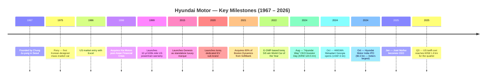
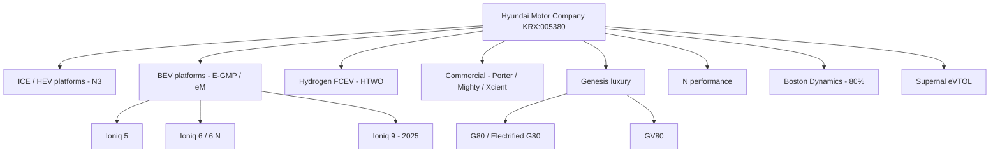
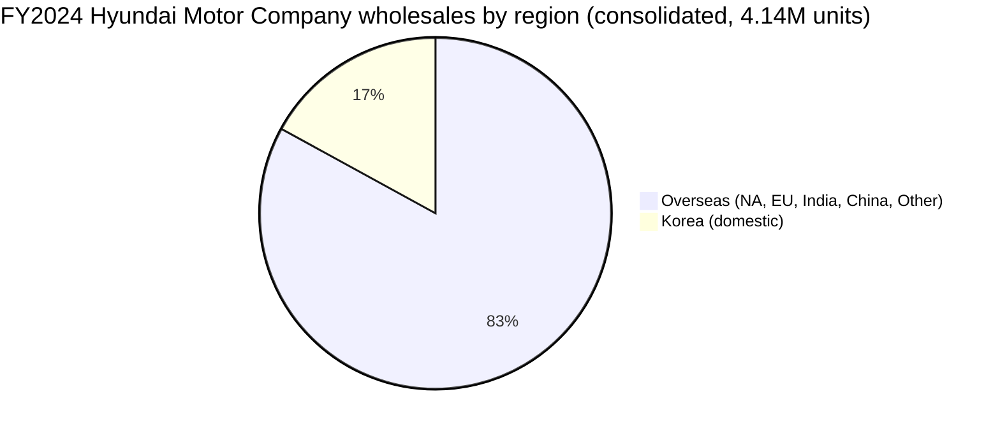

# Hyundai Motor Company (현대자동차, KRX: 005380) — Equity Research Initiation

**As of:** 2026-05-27 · **Coverage initiated** · **Ticker:** KRX:005380 (KOSPI) · ADR (unsponsored, OTC): HYMTF / HYMLF · **Sector:** Auto OEM (light vehicles, commercial vehicles, hydrogen FCEV, robotics, AAM)

> **Guidance status (latest):** 2025 full-year guidance set at **revenue growth +3–4% YoY**, **consolidated operating margin 7–8%**, **wholesales 4.17 million units**, and **KRW 16.9 trillion of total investments**. Issued alongside the FY2024 Q4 results press release on Jan 23, 2025. Source: [Hyundai Motor Announces 2024 Annual and Q4 Business Results, 2025-01-23](https://www.hyundai.com/worldwide/en/newsroom/detail/hyundai-motor-announces-2024-annual-and-q4-business-results-0000000897).

---

## Table of contents

1. Company Overview
2. History & Milestones
3. Management
4. Products & Services
5. Customers & Go-to-market
6. Industry Overview
7. Competitive Landscape
8. Market Opportunity (TAM)
9. Risk Assessment
10. References & Verification Log

---

## 1. Company Overview

Hyundai Motor Company (현대자동차주식회사, "HMC" or "Hyundai") is the listed flagship automaker of the broader **Hyundai Motor Group (HMG)**, a South Korean industrial conglomerate that, together with **Kia Corporation** and dozens of affiliated parts, logistics and financing companies, ranked as the **#3 automotive group globally by retail volume in 2024** at approximately **7.23 million units**, behind only the Toyota Group (10.82M) and Volkswagen Group (9.03M) ([KED Global — 2024 global OEM ranking, 2025-01-03](https://www.kedglobal.com/automobiles/newsView/ked202501030008)). HMC alone — the entity trading under KRX 005380 — sold **4,141,959 vehicles** in 2024 and reported **consolidated revenue of KRW 175.2 trillion** (≈ US$130 bn at average 2024 FX), **operating profit of KRW 14.24 trillion** (8.1% OPM), and **net profit of KRW 13.23 trillion** ([2024 Annual & Q4 results press release](https://www.hyundai.com/worldwide/en/newsroom/detail/hyundai-motor-announces-2024-annual-and-q4-business-results-0000000897)).

The company is headquartered at **12, Heolleung-ro, Seocho-gu, Seoul 06797**, was founded by **Chung Ju-yung on December 29, 1967**, and operates with **more than 120,000 employees in over 200 countries**, anchored by the world's second-largest single auto plant — the Ulsan Complex in Korea, with ~1.6 million units of annual capacity ([Hyundai Motor In Brief, corporate factsheet](https://www.hyundai.com/worldwide/en/company/news/news-room/news/hyundai-motor-in-brief-0000001084)). HMC's overseas footprint includes plants in the United States (Montgomery, AL and the brand-new Metaplant America in Ellabell, GA), India (Chennai and Talegaon), Czech Republic (Nošovice), Türkiye (İzmit), Brazil (Piracicaba), Indonesia (Cikarang) and a now-rationalized China JV (Beijing Hyundai). Full FY2024 production by country: **South Korea 1.86M / India 764k / United States 361k / Czech Republic 327k / Türkiye 246k** ([Hyundai Motor Company — Wikipedia entry citing the 2024 Annual Report](https://en.wikipedia.org/wiki/Hyundai_Motor_Company)).

**Valuation snapshot.** Hyundai trades at a deeply value-rated multiple versus global auto peers. As of mid-2026 the company's market capitalization stood at roughly **KRW 156–171 trillion**, equivalent to a **trailing P/E of ~7–8×** ([GuruFocus 005380 P/E historical data](https://www.gurufocus.com/stock/XKRX:005380/data/pe-ratio); [Macrotrends Hyundai P/E history (HYMLF)](https://www.macrotrends.net/stocks/charts/HYMLF/hyundai-motor/pe-ratio)), with a **dividend yield in the ~4.0–4.3% range** before the dividend reset embedded in the August 2024 "Hyundai Way" strategy ([Investing.com Hyundai dividend history](https://www.investing.com/equities/hyundai-motor-dividends)). For context, Toyota Motor (TSE:7203) — the closest global comparable — trades on a roughly 10× TTM P/E with substantially lower top-line growth, while pure-play EV peers (Tesla, BYD) trade at 20–60× depending on the cycle. *Analyst view:* Hyundai's mid-single-digit P/E reflects (a) Korea's structural conglomerate discount, (b) US tariff exposure (see §9), (c) China sales collapse, and (d) market skepticism on the ICE → EV transition profitability bridge — none of which fully account for the company's #3 global ranking, its operating-margin uplift from 6.9% (2022) → 9.3% (2023) → 8.1% (2024), or the KRW 4 trillion buyback embedded in the Hyundai Way capital-return plan.

Hyundai is not a pure passenger-car business. The corporate envelope encompasses **commercial vehicles** (Porter/Mighty trucks, Xcient hydrogen heavy-duty tractor), the **Genesis luxury brand**, the **N performance sub-brand**, hydrogen fuel-cell systems sold under the **HTWO** brand, an **80% stake in Boston Dynamics** (humanoid + quadruped robotics, acquired from SoftBank in June 2021 at a ~US$1.1 bn valuation; [Boston Dynamics — acquisition completion press release](https://bostondynamics.com/news/hyundai-motor-group-completes-acquisition-of-boston-dynamics-from-softbank/)), the **Supernal eVTOL/AAM subsidiary** (targeting 2028 commercial entry; [Supernal — S-A2 concept debut at CES 2024](https://www.supernal.aero/newsroom/supernal-debuts-evtol-product-concept-at-ces-2024/)), and significant minority/affiliate stakes in **Hyundai Mobis** (parts and modules; KRX:012330), **Hyundai Glovis** (logistics; KRX:086280), and **Hyundai Rotem** (rail and defense including the K2 Black Panther main battle tank; KRX:064350).

---

## 2. History & Milestones

Hyundai Motor Company was incorporated on **December 29, 1967** by Chung Ju-yung (정주영, 1915–2001), the founder of the wider Hyundai chaebol who had begun the original Hyundai Engineering & Construction business in 1947 ([Hyundai Motor Company — Wikipedia historical entry](https://en.wikipedia.org/wiki/Hyundai_Motor_Company)). The company's first vehicle was a Cortina assembled under license from Ford in 1968; the **Pony**, launched in **1975**, was the first mass-produced domestically designed Korean automobile and the foundation of the Korean auto export industry.

The company entered the **United States in 1986 with the Excel**, briefly becoming the fastest-growing import brand before suffering a severe quality-perception crisis in the early 1990s. The recovery is the most-told story in Korean industrial history: under Mong-Koo Chung (son of the founder, Chairman 1999–2020), Hyundai launched the **10-year/100,000-mile powertrain warranty in 1999**, made quality the central organizing principle of R&D, and used the **1998 acquisition of Kia Motors** out of post–Asian-Financial-Crisis bankruptcy to vertically integrate platform engineering and component sourcing across two retail brands.



The transformation crystallized in two strategic moves in the 2010s: the **2015 standalone launch of Genesis** as Korea's first global luxury marque, and the **2020 launch of the Ioniq EV sub-brand** alongside the development of the **E-GMP** (Electric Global Modular Platform) — an 800-volt, dedicated BEV architecture that subsequently underpinned the **Ioniq 5** (2021), **Ioniq 6** (2022), Genesis GV60, Kia EV6 / EV9 / EV5, and the **Ioniq 9** three-row SUV unveiled in November 2024 ([Hyundai newsroom — Ioniq 9 unveiling, 2024](https://www.hyundainews.com/en-us/releases/4305)). The Ioniq 5 and Ioniq 6 jointly cemented Hyundai's reputation as the leading non-Tesla, non-Chinese EV architect: the Ioniq 5 won the World Car of the Year award in 2022 and the Ioniq 6 in 2023.

More recent milestones cluster around 2024:

- **August 28, 2024 — "Hyundai Way" CEO Investor Day.** A KRW 120.5 trillion 10-year (2024–2033) investment plan, **2030 unit sales target of 5.55 million** (+30% vs 2023 base), **2030 BEV target of 2 million units**, operating-margin commitments of **9–10% by 2027 and >10% by 2030**, a **KRW 4 trillion 2025–2027 buyback**, a minimum dividend per share of **KRW 10,000 from 2024**, and a 25% dividend payout ratio of attributable net profit ([Hyundai Motor Unveils New "Hyundai Way" Strategy — PRNewswire, 2024-08-28](https://www.prnewswire.com/news-releases/hyundai-motor-unveils-new-hyundai-way-strategy-and-outlines-mid--to-long-term-goals-at-2024-ceo-investor-day-302232646.html); [Hyundai News release 4227](https://www.hyundainews.com/en-us/releases/4227)).
- **October 3, 2024 — HMGMA grand opening.** The first Ioniq 5 rolls off the line at the **US$7.6 billion Hyundai Motor Group Metaplant America** in Ellabell, Georgia, a 3,000-acre flexible plant designed to scale to 500,000 units/year and serve as the structural hedge against the US Inflation Reduction Act battery- and assembly-localization rules ([Hyundai Motor Group Metaplant America Celebrates Grand Opening](https://www.hyundai.com/worldwide/en/newsroom/detail/hyundai-motor-group-metaplant-america-celebrates-grand-opening%2C-powering-u.s.-economic-growth-0000000920); [HMGMA — Wikipedia](https://en.wikipedia.org/wiki/Hyundai_Motor_Group_Metaplant_America)).
- **October 22, 2024 — Hyundai Motor India IPO.** HMC's Indian subsidiary listed on BSE/NSE raising **US$3.3 billion (~₹27,870 crore)** — the largest IPO in Indian history ([J.P. Morgan — Hyundai Motor India record IPO commentary](https://www.jpmorgan.com/insights/banking/investment-banking/hyundai-motor-india-record-ipo); [Chittorgarh — Hyundai Motor IPO record](https://www.chittorgarh.com/ipo/hyundai-motor-ipo/1879/)).
- **November 15, 2024 — CEO succession announced.** José Muñoz appointed President & CEO of Hyundai Motor Company effective January 1, 2025; predecessor Jaehoon (Jay) Chang promoted to Vice Chair of Hyundai Motor Group ([Hyundai Motor Company appoints José Muñoz as CEO](https://www.hyundai.com/worldwide/en/newsroom/detail/hyundai-motor-company-appoints-jos%C3%A9-mu%C3%B1oz-as-chief-executive-officer-0000000867)).

---

## 3. Management

The skill's coverage rule for management is restricted to the **founder and the current CEO**; other executives are intentionally excluded.

**Founder — Chung Ju-yung (정주영, 1915–2001).** Chung was a self-taught entrepreneur from a poor farming family in what is now North Korea who started his career as a rice deliveryman before founding Hyundai Engineering & Construction in 1947 — a company that became the largest contractor on Saudi Arabia's Jubail Industrial Harbor in the 1970s and was the backbone of South Korea's "Miracle on the Han River" industrial build-out. He founded Hyundai Motor Company on December 29, 1967, and oversaw the launch of the Pony in 1975 and the company's US entry with the Excel in 1986 ([Hyundai Motor Company — Wikipedia founding entry](https://en.wikipedia.org/wiki/Hyundai_Motor_Company)). Although Chung resigned operating control of the broader Hyundai conglomerate in the late 1990s after the chaebol family-restructuring agreements that followed the Asian Financial Crisis, the auto operations were inherited by his son **Mong-Koo Chung**, who chaired the company through the 2000s–2010s quality renaissance. The Chung family today retains effective control of Hyundai Motor Group through a circular cross-shareholding loop in which **Hyundai Motor owns ~34% of Kia → Kia owns ~17% of Mobis → Mobis owns ~21% of Hyundai Motor**; the current Chairman's direct personal stake in HMC is only ~0.32% ([Korea Times — Hyundai Motor Group reorganize Mobis for governance reform, 2022](https://www.koreatimes.co.kr/business/companies/20220815/will-hyundai-motor-group-reorganize-mobis-for-governance-reform)).

**Current CEO — José Muñoz, appointed January 1, 2025.** Muñoz is the first non-Korean CEO in Hyundai Motor Company's history. A Spanish national educated as an industrial engineer (Universidad Politécnica de Madrid), Muñoz spent over a decade at Nissan in senior commercial roles — including Chairman of Nissan North America during the 2014–2018 period when Nissan's US sales reached record highs — before joining Hyundai in 2019 as **President & Global COO of Hyundai Motor Company** and simultaneously **President & CEO of Hyundai/Genesis Motor North America** ([Hyundai newsroom — Muñoz appointment, 2024-11-15](https://www.hyundai.com/worldwide/en/newsroom/detail/hyundai-motor-company-appoints-jos%C3%A9-mu%C3%B1oz-as-chief-executive-officer-0000000867)). His tenure leading the North America business is widely credited with the US share gain that took combined Hyundai+Kia/Genesis to **>10.6% US market share in 2024 — the highest level since the brand's 1986 US entry** ([EconoTimes — Hyundai/Kia US market share H1 2024](https://www.econotimes.com/Hyundai-Kia-Keep-US-Market-Share-Over-10-in-H1-1660306)). Muñoz operates alongside **Executive Chair Euisun Chung (정의선)** — grandson of the founder, son of Mong-Koo Chung — who chairs the Group and also serves as Representative Director & Chairman of Hyundai Mobis ([Hyundai Mobis — IR governance page](https://www.mobis.com/en/ir/irinfo.do)). The CEO role thus runs operational while the Chair holds the strategy + capital-allocation pen.

---

## 4. Products & Services

This is the most important section of the report. Hyundai's product portfolio spans **three retail brands** (Hyundai, Genesis, N performance), **three vehicle architectures** (E-GMP BEV, eM next-gen BEV, N3 ICE/HEV), and **non-vehicle businesses** (Boston Dynamics robotics, Supernal eVTOL, HTWO hydrogen, Hyundai Mobis parts).

### 4.1 Hyundai brand passenger-car portfolio

The Hyundai-branded passenger lineup is structured across three powertrain families — **ICE/HEV sedans**, **ICE/HEV SUVs**, and **dedicated BEVs (Ioniq)** — with hydrogen FCEV anchored by the Nexo crossover.

**Sedan ICE/HEV.** **Avante (sold as Elantra outside Korea), Sonata, Grandeur (Azera), Accent.** The Sonata, in its 8th generation, is the volume mid-size sedan in North America; the Grandeur is Korea's #1 selling vehicle on home market. Hyundai's sedan strategy under Muñoz has emphasized hybrid mix shift — Q1 2025 hybrid sales rose **+40% YoY to 137,075 units** ([Hyundai Motor Announces 2025 Q1 Business Results](https://www.hyundai.com/worldwide/en/newsroom/detail/hyundai-motor-announces-2025-q1-business-results-0000000948)).

**SUV ICE/HEV.** **Kona, Tucson, Santa Fe, Palisade.** The Tucson and Santa Fe are the highest-volume SUVs in the Hyundai brand; the Palisade competes in the US 3-row segment against Toyota Highlander and Honda Pilot. The 2024 Santa Fe redesign is intentionally boxy/Land-Rover-inspired and won multiple "best of" awards in the US.

**Dedicated BEVs — Ioniq.** Built on the **E-GMP** architecture — an 800-volt platform supporting **350 kW DC fast-charging** (10→80% in approximately 18 minutes on a properly equipped charger).
- **Ioniq 5** — compact crossover, debuted 2021, World Car of the Year 2022.
- **Ioniq 6** — streamlined sedan, debuted 2022, World Car of the Year 2023; long-range RWD WLTP range up to **614 km / 680 km in some specifications** ([Hyundai EU — Ioniq 6 press kit](https://www.hyundai.news/eu/models/electrified/ioniq-6/press-kit/the-new-hyundai-ioniq-6.html)).
- **Ioniq 9** — three-row family SUV unveiled November 2024 on a stretched E-GMP; 110 kWh pack, 24-minute 10→80% fast charge; on sale H1 2025 ([Hyundai News — Ioniq 9](https://www.hyundainews.com/en-us/releases/4305)).
- **Kona Electric** — sub-compact crossover BEV on a multi-energy platform (not pure E-GMP).

**Commercial.** **Porter** (1-tonne pickup truck — best-selling commercial vehicle in Korea), **Mighty** (medium-duty truck), and the **Xcient Fuel Cell** — the world's first commercialized hydrogen heavy-duty tractor. The Xcient features a 350 kW motor, **10 hydrogen tanks at 700 bar**, ~450-mile range, and has accumulated **15 million+ km in customer fleets** across Europe; the European fleet is heading toward 200 units ([Hyundai — XCIENT Fuel Cell Tractor product page](https://ecv.hyundai.com/global/en/products/xcient-fuel-cell-tractor-fcev)).

> **中文释义 / Plain-language gloss:** The **E-GMP platform** is the equivalent of Volkswagen's MEB or GM's Ultium — a "skateboard" architecture purpose-built for battery electric drivetrains. Its 800-volt electrical system, double the voltage of most rivals, enables ultra-fast DC charging because the same kilowatt of power flows at half the current, reducing heat losses and allowing thinner cables. That single design choice is what lets the Ioniq 5/6 add ~200 km of range in five minutes at a 350 kW charger — a customer experience closer to refueling than to conventional EV charging.

### 4.2 Genesis luxury brand

**Genesis** was launched as a standalone marque in 2015 and now spans seven nameplates: **G70, G80, G90** sedans; **GV60, GV70, GV80** SUVs; and BEVs **Electrified G80, Electrified GV70, GV60**. The Korean and US markets are the two pillars; Genesis crossed **100,000 cumulative US GV80 sales in August 2025** (five years after launch) and Genesis G80 cumulative sales have surpassed 390,000 units since the 2016 launch ([KED Global — Genesis GV80 H1 2024](https://www.kedglobal.com/automobiles/newsView/ked202407210001); [Korean Car Blog — Genesis GV80 100k US milestone](https://thekoreancarblog.com/genesis-gv80-suv-surpasses-100000-sales-in-the-u-s-just-five-years-after-launch/)). The brand competes directly with **BMW, Mercedes-Benz, Audi and Lexus** on price and feature breadth and has pioneered a US **direct-to-consumer online sales channel ("Click to Buy")** that bypasses dealer markups — a structural advantage in the post-pandemic dealer-margin environment.

### 4.3 N performance sub-brand

**N** is Hyundai's performance division, named after the Namyang R&D center and conceived to compete with BMW M / Mercedes AMG / Audi RS at far lower price points. The lineup spans ICE (i30 N, Elantra N, Kona N) and electric (**Ioniq 5 N**, **Ioniq 6 N**). The Ioniq 6 N — unveiled 2025, US release 2026 — delivers **641 horsepower** and a **0–60 mph time of approximately 3.2 seconds** with N Launch Control, anchoring the brand's positioning that EV performance can be made playful through synthesized engine sound and simulated gear shifts ([The EV Report — Ioniq 6 N high-performance debut](https://theevreport.com/hyundai-ioniq-6-n-debuts-with-high-performance-specifications)).

### 4.4 Non-vehicle businesses

- **Hyundai Mobis (KRX:012330)** — the captive components and modules supplier, separately listed, generates the bulk of HMC's Tier-1 supply chain in front-end / rear-end module assembly, ADAS, and electric drive units.
- **Boston Dynamics** — 80% owned since the **June 21, 2021** closing of the SoftBank deal at a ~US$1.1 bn implied valuation, with SoftBank retaining 20% ([Boston Dynamics — acquisition completion press release](https://bostondynamics.com/news/hyundai-motor-group-completes-acquisition-of-boston-dynamics-from-softbank/); [SoftBank Group — press release on disposal, 2021-06-21](https://group.softbank/en/news/press/20210621)). Products include the **Spot** quadruped, **Stretch** warehouse robot, and **Atlas** humanoid platform (now electric).
- **Supernal** — a wholly-owned Hyundai eVTOL subsidiary headquartered in Washington, DC; its **S-A2 concept** debuted at CES 2024, designed for one pilot plus four passengers, cruising at 120 mph at 1,500 feet altitude on eight tilting rotors, with a 2028 commercial entry target ([Supernal — S-A2 debut press release](https://www.supernal.aero/newsroom/supernal-debuts-evtol-product-concept-at-ces-2024/)).
- **HTWO** — the corporate brand under which Hyundai sells its hydrogen fuel-cell systems to third parties. A fully redesigned all-new Nexo passenger FCEV was unveiled in 2024 with a 110 kW fuel-cell stack (+16% vs predecessor) and 150 kW e-motor ([Hydrogen Insight — 2024 Nexo unveil](https://www.hydrogeninsight.com/transport/hyundai-unveils-the-2024-version-of-its-hydrogen-powered-nexo-fuel-cell-car/2-1-1465779)).

### 4.5 Synthesis — how the pieces fit together



The strategic logic — laid out at the August 2024 Hyundai Way investor day — is that the **automotive core funds optionality on three multi-decade industries**: (1) personal mobility transitioning from ICE to BEV/HEV/FCEV, (2) humanoid + industrial robotics via Boston Dynamics, and (3) urban air mobility via Supernal. Hyundai's bet is that the vehicle business will retain enough cash generation through the 2030s to underwrite these adjacencies without diluting equity — a thesis materially different from a Tesla-style "vertical integration of all mobility into one stack" or a Toyota-style "stay focused on hybrids and stretch the ICE runway."

---

## 5. Customers & Go-to-market

Hyundai Motor is a **B2C retail-dominated business**. As a passenger-vehicle OEM selling through franchise dealers in nearly every market it operates (Genesis the partial exception with direct online "Click to Buy" in the US), Hyundai has **no single customer above the 10% disclosure threshold** mandated by Korea's Capital Markets Act for the 사업보고서 customer-concentration note. Fleet (corporate, rental) accounts for an estimated mid-single-digit % of unit volume globally — meaningful but not concentrating.

**FY2024 geographic mix.** The 2024 Q4 press release splits global wholesales into **Korea 705,010 units / Overseas 3,436,949 units** ([2024 Annual & Q4 results](https://www.hyundai.com/worldwide/en/newsroom/detail/hyundai-motor-announces-2024-annual-and-q4-business-results-0000000897)). Sub-regional detail (North America / Europe / India / China / Other) is not broken out in the press release; the 2024 사업보고서 segment note on DART contains the full table. Available secondary information indicates:

- **United States** — combined Hyundai + Kia + Genesis US sales reached the highest market share since 1986 in 2024, **>10.6%** ([EconoTimes — Hyundai/Kia US H1 2024](https://www.econotimes.com/Hyundai-Kia-Keep-US-Market-Share-Over-10-in-H1-1660306)). Combined US EV sales of **112,566 units in Jan–Nov 2024 (+19.3% YoY)** ([Korea Herald — combined US EV sales 2024](https://www.koreaherald.com/article/3251160)).
- **India** — Hyundai Motor India is the **#2 carmaker in India** at approximately **14.6% market share**, behind Maruti Suzuki at 41.7% ([Equitymaster — Hyundai vs Maruti Suzuki, 2024-10-22](https://www.equitymaster.com/detail.asp?date=10%2F22%2F2024&story=3&title=Best-Auto-Stock-Hyundai-Motor-India-vs-Maruti-Suzuki)).
- **China** — Beijing Hyundai (50/50 JV) sold only **168,828 units in 2024**, down from a 2016 peak of 1.8 million units. Hyundai sold the Chongqing plant in 2024 for US$226 million and announced a ~30% workforce reduction at the JV ([Yicai Global — Hyundai China JV cuts staff, 2024](https://www.yicaiglobal.com/news/hyundai-motors-china-jv-cuts-2000-workers-plans-plant-closure-staff-say)).
- **Europe** — production from the Czech Republic (327k units in 2024) and Türkiye (246k); Hyundai Motor Europe HQ in Frankfurt. EU market share has been steady at ~4% combined Hyundai+Kia, with the Ioniq 5 a top-10 EV in the Nordic / Benelux markets.



> **Note on the chart denominator:** the slices sum to **consolidated wholesales of 4.14 million Hyundai-brand units**. This is the Hyundai Motor Company (KRX:005380) standalone figure — it does **not** include Kia (a separately listed sister company) or Genesis sales reported under Hyundai's own brand structure. The 7.23 million unit "Hyundai Motor Group" figure cited in §1 is the wider HMG combined-with-Kia number.

**Go-to-market channels.** Hyundai sells through **franchise dealerships** in essentially all retail markets — approximately 5,000 Hyundai-brand dealers globally; in the US the Hyundai/Genesis dealer body has been a strategic focus under Muñoz, who as North America head invested heavily in dealer training, vehicle allocation, and digital lead-management. Genesis pioneered a US **direct-to-consumer online sales channel ("Click to Buy")** that allows customers to configure, price, and order online with dealer fulfillment — a hybrid model that gives Genesis a structural margin advantage versus traditional luxury OEMs whose dealer markups absorbed much of the post-COVID supply-shortage rents.

**Customer concentration disclosure rule (project standard).** All figures above are **company-wholesale (B2C retail-dominated) numbers**; there is no individual customer that crosses the 10% revenue threshold requiring DART disclosure of identity. This is consistent with Toyota, Volkswagen, GM, Ford and every other mass-market passenger-vehicle OEM.

---

## 6. Industry Overview

The global light-vehicle industry sold approximately **85 million units** in 2024, with the **Toyota Group (10.82M), Volkswagen Group (9.03M), and Hyundai Motor Group (7.23M)** as the top three OEM groups by volume ([KED Global — 2024 OEM ranking](https://www.kedglobal.com/automobiles/newsView/ked202501030008); [Focus2Move — World Car Group Ranking 2024](https://www.focus2move.com/world-car-group-ranking-2024/)). Hyundai Motor Group's roughly 8.5% global share has been stable-to-rising for five years, in contrast to the declines suffered by GM (now ~5%) and Ford (~4%), and against an outright market exit dynamic in China that has affected all foreign brands.

The industry is in the middle of a once-in-a-century powertrain transition. **Global BEV+PHEV penetration reached approximately 18–20% in 2024**, with China leading at >40%, Europe in the mid-20s, and the United States in the high single digits. Hyundai's E-GMP architecture and the combined Hyundai+Kia+Genesis BEV portfolio give the Group a structural position among the top non-Chinese BEV producers globally, though the period 2024–2025 has been characterized by **EV demand softening** in Western markets as early-adopter cohorts exhausted and the mass-market shifted to hybrids — a trend Hyundai has navigated by leaning into its hybrid lineup (40% Q1 2025 HEV growth).

The **Korean auto industry** specifically contributes ~5–6% of Korean GDP and ~10–12% of merchandise exports; Hyundai and Kia together are by far the largest private-sector employers in Korea. This creates a structural political dependency in which Korean trade policy outcomes — particularly with the United States — are tightly coupled to Hyundai's commercial fortunes (see §9 risk on tariffs).

The **hydrogen heavy-duty truck** market is small today (a few thousand units globally per year) but is a strategic priority for governments funding decarbonization of road freight in California, the EU, Korea and Switzerland. Hyundai's Xcient is the only commercialized hydrogen heavy-duty truck at meaningful scale globally.

The **eVTOL** market is pre-commercial — the FAA is still finalizing certification frameworks — but is expected by industry bodies (Morgan Stanley, Deloitte, NASA UAM studies) to grow into a multi-hundred-billion-dollar industry by 2040 if certification, urban infrastructure, and public acceptance issues are resolved.

The **humanoid robotics** market crossed an inflection point in 2024 with Tesla Optimus, Figure 02, Apptronik Apollo, Agility Robotics Digit, and Boston Dynamics' electric Atlas all advancing to industrial-pilot or pre-commercial deployment. The TAM remains contested; bull cases see >$5 trillion by 2050.

---

## 7. Competitive Landscape

**Volume OEM peers** are the **Toyota Group, Volkswagen Group, General Motors, Ford, Stellantis, Honda, Nissan, BYD, Geely, Tata Motors (JLR)**. Among these, Toyota and Hyundai are the most direct strategic mirrors — both Asian, both quality-disciplined, both pursuing a multi-pathway powertrain strategy (BEV + HEV + FCEV) rather than the all-BEV bets made by VW and (until 2024) GM. The key contrast: Toyota emphasizes hybrids and has been a deliberate BEV laggard; Hyundai went heavier into dedicated BEV architecture earlier with E-GMP and is now adding the HEV/EREV lineup back in to capture demand-softening upside.

**EV-specific peers.** **Tesla** remains the global BEV volume leader (1.79M units in 2024); **BYD** crossed Tesla as the world's #1 EV maker counting PHEVs in 2024 (4.27M EVs+PHEVs); **Volkswagen ID** brand is the largest legacy-OEM BEV brand in Europe; **GM Ultium** vehicles (Chevrolet Equinox EV, Cadillac Lyriq) are GM's structural answer; **Ford F-150 Lightning** is the US BEV pickup leader. Hyundai/Kia combined ~700k+ BEVs in 2024 puts the Group at #4 globally behind BYD, Tesla and the Chinese collective (Geely/Wuling/etc.).

**Luxury (Genesis vs).** **BMW, Mercedes-Benz, Audi, Lexus.** Genesis competes on price-undercut (10–15% below German luxury for comparable feature content), an entirely fresh design language (the parallel-line lighting motif), and the Click-to-Buy direct channel.

```mermaid
quadrantChart
    title Global auto OEM positioning — Premium vs Volume × ICE vs BEV
    x-axis "Mass-market" --> "Premium / Luxury"
    y-axis "ICE / Hybrid focus" --> "BEV-pure"
    quadrant-1 Premium BEV
    quadrant-2 Premium ICE/HEV
    quadrant-3 Mass-market ICE/HEV
    quadrant-4 Mass-market BEV
    Toyota: [0.35, 0.18]
    Hyundai (HMC): [0.45, 0.50]
    Volkswagen: [0.50, 0.55]
    GM: [0.40, 0.45]
    Ford: [0.45, 0.40]
    Tesla: [0.65, 0.92]
    BYD: [0.40, 0.85]
    BMW: [0.85, 0.55]
    Mercedes-Benz: [0.88, 0.50]
    Lexus: [0.78, 0.25]
    Genesis: [0.72, 0.55]
    Stellantis: [0.45, 0.30]
```

**Hyundai's competitive moat** is unusually broad for an automaker in its volume tier:

1. **Vertical integration via Hyundai Mobis** for Tier-1 modules, Hyundai Steel for sheet steel, Hyundai Glovis for logistics, Hyundai Capital for financing — a Korean-chaebol pattern impossible for a green-field competitor to replicate.
2. **Platform engineering pre-eminence** — E-GMP is broadly acknowledged as a top-tier BEV architecture; multiple World Car of the Year awards (2022 Ioniq 5, 2023 Ioniq 6) reflect external recognition.
3. **Genesis brand momentum** — the first new global luxury brand to establish credible US presence since Lexus in 1989. *Analyst view:* Genesis's incremental margin contribution is becoming material to HMC operating margin.
4. **HMGMA US localization hedge** — a US$7.6 bn plant operational from October 2024 that allows Hyundai/Kia EVs to qualify for the IRA US$7,500 consumer credit and (more importantly) shields the company from the recurring 25% US auto tariff risk that has cost Korean OEMs over US$1 billion per quarter in 2025.

**Vulnerabilities:**

- **Single-customer risk on Korea exports to the US.** Hyundai's largest single export corridor — Korea-built vehicles shipped to the US — is the most tariff-exposed (~40% of US Hyundai sales were Korea-built in 2024).
- **China is effectively a write-off** — see §9.
- **EV/ICE bridge profitability** — managing the transition while protecting OPM at 9–10% (Hyundai Way target) requires that BEV gross margin trend toward ICE gross margin, which has not yet happened industry-wide.

---

## 8. Market Opportunity (TAM)

The Hyundai Way strategy explicitly defines the company's TAM across three pillars; pulling those numbers (with primary citations) is the discipline this section requires.

**Pillar 1 — Light-vehicle TAM.** The global passenger-car + light-truck industry generated roughly **US$3 trillion in revenue in 2024** at an aggregate level (85M units × ~$35k average transaction price including used-vehicle revenue retention by captive finance arms). Hyundai Motor Group is targeting **5.55 million units by 2030** (vs 4.21M 2023 baseline), a +30% volume CAGR over 7 years — well above the underlying market growth of ~2–3%, implying continued share gains primarily in the US, India, and EV-dedicated markets ([Hyundai Way press release, 2024-08-28](https://www.prnewswire.com/news-releases/hyundai-motor-unveils-new-hyundai-way-strategy-and-outlines-mid--to-long-term-goals-at-2024-ceo-investor-day-302232646.html)).

**Pillar 2 — BEV TAM.** The IEA Global EV Outlook tracks global BEV sales rising from ~10 million units in 2024 toward 30–40 million by 2030 depending on policy scenario. Hyundai's stated target is **2 million BEVs annually by 2030** with a 21-model EV lineup, implying a 5–7% share of the projected 2030 BEV market — broadly stable with HMC's current global share of light vehicles.

**Pillar 3 — Hydrogen, robotics, eVTOL (optionality).** Per the Hyundai Way deck, the company has allocated **KRW 5.7 trillion to hydrogen ("Energy Mobilizer")** over 2024–2033 and is preparing to position **HTWO fuel-cell systems for heavy-duty trucking, marine, and stationary power** applications. Boston Dynamics and Supernal sit inside the "Mobility Game Changer" budget. The eVTOL market is conventionally sized at $1–1.5 trillion by 2040 by Morgan Stanley and Deloitte; the humanoid robotics TAM is heavily contested (Goldman Sachs put it at $38 bn by 2035; Tesla / Figure / Apptronik bull cases reach into multi-trillions). *Analyst view:* the optionality value of Hyundai's robotics + eVTOL position is not reflected in the current 7–8× P/E.

**Pillar 4 — Captive financing.** Hyundai Capital and the regional financing arms generate spread income on roughly US$100 bn of consumer auto loans and leases; this stream is not consolidated 1-for-1 into HMC (KRX:005380) but contributes via equity-method income.

---

## 9. Risk Assessment

Risks below are sized across four buckets per the skill's standard taxonomy.

### 9.1 Company-specific

**(a) Chung-family governance / circular shareholding.** Hyundai Motor Group retains a circular cross-shareholding loop — **Hyundai Motor owns ~34% of Kia → Kia owns ~17% of Mobis → Mobis owns ~21% of Hyundai Motor** — that has been the target of restructuring proposals in 2018 and 2022, both of which stalled in the face of shareholder opposition or family hesitancy ([Korea Times — Hyundai Motor Group governance reform, 2022-08-15](https://www.koreatimes.co.kr/business/companies/20220815/will-hyundai-motor-group-reorganize-mobis-for-governance-reform)). The Chairman's direct personal stake in HMC is only ~0.32%, which means any successful restructuring would crystallize a meaningful Chung-family equity injection — or, alternatively, leave HMC's governance exposed to future regulatory pressure under Korea's progressive opposition parties.

**(b) Class-action settlements on theft and recall.** A **US$200 million class-action settlement** was finalized on October 1, 2024, covering approximately **8.3 million Hyundai and Kia 2011–2022 model-year vehicles** sold in the US without engine immobilizers — the vulnerability publicized by the "Kia Boys" TikTok challenge that drove a multi-year spike in theft of older Hyundai/Kia vehicles ([CBS News — Hyundai/Kia $200M class settlement](https://www.cbsnews.com/news/kia-hyundai-car-theft-settlement-tiktok/); [HBSS Law — Hyundai/Kia USB theft FAQ](https://www.hbsslaw.com/hyundai-kia-usb-car-theft-defect/faq)). The reputational and insurance-rate impact of the theft issue persists in the US used-vehicle market.

**(c) ICE→EV transition profitability bridge.** Hyundai Way commits to a 9–10% OPM by 2027 rising to >10% by 2030 — through a period in which the company is doubling EV volumes (to 2M units) and reducing ICE share of mix. Achieving the OPM target requires EV gross margins to converge with ICE gross margins, which the global industry has not yet demonstrated outside of Tesla (whose BEV-only margin structure differs fundamentally from a legacy OEM bridging two architectures).

### 9.2 Industry / market

**(d) US tariffs.** The single largest near-term overhang. The Trump administration imposed a **25% auto tariff on Korea-built vehicles** in spring 2025, briefly cut it to 15% in a summer 2025 trade arrangement, then re-escalated back to 25%. **Hyundai's reported Q3 2025 US tariff cost reached KRW 1.8 trillion (~US$1.2 billion) for the single quarter**, up from KRW 828 billion in Q2 2025 ([CNBC — Trump South Korea tariffs trade autos pharma, 2026-01-26](https://www.cnbc.com/2026/01/26/trump-south-korea-tariffs-trade-autos-pharma.html); [Jacobin — Trump South Korea tariffs Hyundai, 2025-10](https://jacobin.com/2025/10/trump-south-korea-hyundai-tariffs)). The HMGMA Metaplant Georgia investment ($7.6 bn) is the structural hedge — five HMG models qualify for the IRA US$7,500 credit on the 2025 list ([KED Global — IRA-eligible models 2025](https://www.kedglobal.com/electric-vehicles/newsView/ked202501020008)).

**(e) China collapse.** Beijing Hyundai unit volume collapsed from a **2016 peak of 1.8 million units → 248k in 2022 → 168,828 in 2024** — a >90% decline driven by the THAAD diplomatic dispute, rising local-brand BEV competition, and underinvestment in product refresh. The 2024 sale of the Chongqing plant for US$226 million and announced ~30% workforce cut at the JV mark the company's formal withdrawal from China as a volume market ([Yicai Global — Beijing Hyundai cuts, 2024](https://www.yicaiglobal.com/news/hyundai-motors-china-jv-cuts-2000-workers-plans-plant-closure-staff-say)). The financial impact is largely absorbed; the strategic impact is that Hyundai forfeits the world's largest EV market as an organic growth lever.

**(f) EV demand softening 2024–25.** Global BEV growth slowed in 2024 from the +40-50% trajectories of 2020–2023 to high-teens or low-20s YoY, with some Western markets (Germany, US) seeing actual unit declines after subsidy withdrawals. Hyundai's hybrid pivot (Q1 2025 HEV +40% YoY) cushions this but cannot fully offset prior EV-capex sunk into E-GMP and eM.

**(g) US labor / visa enforcement.** A September 2025 ICE raid at the Hyundai–LG Energy Solution Georgia battery plant detained 475 people including 300+ Korean nationals working on construction visas ([Jacobin — Hyundai LG ICE raid, 2025-10](https://jacobin.com/2025/10/trump-south-korea-hyundai-tariffs)). The episode illustrates the visa/work-authorization risk facing Korean industrial expansion in the US.

### 9.3 Financial / FX

**(h) KRW/USD sensitivity.** Hyundai's industry rule-of-thumb is approximately **KRW 200 billion of operating-income sensitivity per 10 KRW change in KRW/USD**. With KRW/USD oscillating in the 1,300–1,470 range through 2024–2025, this is a quarter-to-quarter swing factor of comparable magnitude to product-cycle effects.

**(i) Hyundai Way capex execution.** Spending KRW 120.5 trillion over a decade (KRW 12.05 trillion/yr average — roughly 7% of revenue) while maintaining the OPM and TSR commitments requires disciplined capital allocation. Any slippage on EV unit cost reduction, battery procurement, or platform engineering risks crowding out the shareholder-return component (KRW 4 trillion buyback 2025-27).

### 9.4 Macro / regulatory

**(j) US IRA policy reversal risk.** The Inflation Reduction Act EV credit framework that justifies the HMGMA investment is a 2022 statute and is subject to Congressional revision; a meaningful credit reduction would reset the HMGMA payback math.

**(k) Korean labor relations.** Annual wage negotiations between HMC and the KCTU-affiliated Hyundai Motor union routinely escalate to partial strikes; the structural-wage trajectory in Korea has converged with German wages over the last decade, eroding the historical labor-cost advantage.

**(l) Hydrogen policy support reversal.** Hyundai's Xcient and Nexo programs depend on national hydrogen-subsidy regimes in Korea, Switzerland, California, and Germany. Withdrawal of any of these would undermine the unit economics of the FCEV bet.

---

## 10. References & Verification Log

### Selected primary sources cited above

- [Hyundai Motor Announces 2024 Annual and Q4 Business Results, 2025-01-23](https://www.hyundai.com/worldwide/en/newsroom/detail/hyundai-motor-announces-2024-annual-and-q4-business-results-0000000897)
- [Hyundai Motor Announces 2025 Q1 Business Results](https://www.hyundai.com/worldwide/en/newsroom/detail/hyundai-motor-announces-2025-q1-business-results-0000000948)
- [Hyundai Motor Unveils New "Hyundai Way" Strategy at 2024 CEO Investor Day, PRNewswire 2024-08-28](https://www.prnewswire.com/news-releases/hyundai-motor-unveils-new-hyundai-way-strategy-and-outlines-mid--to-long-term-goals-at-2024-ceo-investor-day-302232646.html)
- [Hyundai News release 4227 (Hyundai Way)](https://www.hyundainews.com/en-us/releases/4227)
- [Hyundai Motor Company Appoints José Muñoz as CEO, 2024-11-15](https://www.hyundai.com/worldwide/en/newsroom/detail/hyundai-motor-company-appoints-jos%C3%A9-mu%C3%B1oz-as-chief-executive-officer-0000000867)
- [HMGMA Grand Opening Press Release, 2024-10](https://www.hyundai.com/worldwide/en/newsroom/detail/hyundai-motor-group-metaplant-america-celebrates-grand-opening%2C-powering-u.s.-economic-growth-0000000920)
- [Hyundai News — Ioniq 9 unveil, 2024-11](https://www.hyundainews.com/en-us/releases/4305)
- [Hyundai EU — Ioniq 6 press kit](https://www.hyundai.news/eu/models/electrified/ioniq-6/press-kit/the-new-hyundai-ioniq-6.html)
- [Hyundai — XCIENT Fuel Cell Tractor product page](https://ecv.hyundai.com/global/en/products/xcient-fuel-cell-tractor-fcev)
- [Boston Dynamics — Hyundai acquisition completion](https://bostondynamics.com/news/hyundai-motor-group-completes-acquisition-of-boston-dynamics-from-softbank/)
- [SoftBank Group — Boston Dynamics disposal press, 2021-06-21](https://group.softbank/en/news/press/20210621)
- [Supernal — S-A2 eVTOL debut at CES 2024](https://www.supernal.aero/newsroom/supernal-debuts-evtol-product-concept-at-ces-2024/)
- [Hydrogen Insight — 2024 Nexo unveil](https://www.hydrogeninsight.com/transport/hyundai-unveils-the-2024-version-of-its-hydrogen-powered-nexo-fuel-cell-car/2-1-1465779)
- [Hyundai Motor In Brief — factsheet](https://www.hyundai.com/worldwide/en/company/news/news-room/news/hyundai-motor-in-brief-0000001084)
- [Hyundai Motor Company — Wikipedia](https://en.wikipedia.org/wiki/Hyundai_Motor_Company)
- [HMGMA — Wikipedia](https://en.wikipedia.org/wiki/Hyundai_Motor_Group_Metaplant_America)
- [Hyundai Mobis — IR governance page](https://www.mobis.com/en/ir/irinfo.do)
- [KED Global — 2024 global OEM ranking, 2025-01-03](https://www.kedglobal.com/automobiles/newsView/ked202501030008)
- [KED Global — Genesis GV80 H1 2024 sales](https://www.kedglobal.com/automobiles/newsView/ked202407210001)
- [KED Global — IRA-eligible 2025 EV list](https://www.kedglobal.com/electric-vehicles/newsView/ked202501020008)
- [Focus2Move — World Car Group Ranking 2024](https://www.focus2move.com/world-car-group-ranking-2024/)
- [Equitymaster — Hyundai Motor India vs Maruti Suzuki, 2024-10-22](https://www.equitymaster.com/detail.asp?date=10%2F22%2F2024&story=3&title=Best-Auto-Stock-Hyundai-Motor-India-vs-Maruti-Suzuki)
- [J.P. Morgan — Hyundai Motor India record IPO](https://www.jpmorgan.com/insights/banking/investment-banking/hyundai-motor-india-record-ipo)
- [Chittorgarh — Hyundai Motor IPO record](https://www.chittorgarh.com/ipo/hyundai-motor-ipo/1879/)
- [Yicai Global — Hyundai China JV cuts staff](https://www.yicaiglobal.com/news/hyundai-motors-china-jv-cuts-2000-workers-plans-plant-closure-staff-say)
- [Korea Herald — Hyundai/Kia US EV sales 2024](https://www.koreaherald.com/article/3251160)
- [EconoTimes — Hyundai/Kia US share H1 2024](https://www.econotimes.com/Hyundai-Kia-Keep-US-Market-Share-Over-10-in-H1-1660306)
- [Korean Car Blog — Genesis GV80 100k US milestone](https://thekoreancarblog.com/genesis-gv80-suv-surpasses-100000-sales-in-the-u-s-just-five-years-after-launch/)
- [Korea Times — Hyundai Motor Group governance reform, 2022](https://www.koreatimes.co.kr/business/companies/20220815/will-hyundai-motor-group-reorganize-mobis-for-governance-reform)
- [CBS News — Hyundai/Kia $200M theft class settlement](https://www.cbsnews.com/news/kia-hyundai-car-theft-settlement-tiktok/)
- [HBSS Law — Hyundai/Kia theft defect FAQ](https://www.hbsslaw.com/hyundai-kia-usb-car-theft-defect/faq)
- [Jacobin — Trump South Korea tariffs Hyundai, 2025-10](https://jacobin.com/2025/10/trump-south-korea-hyundai-tariffs)
- [CNBC — Trump South Korea tariffs autos, 2026-01-26](https://www.cnbc.com/2026/01/26/trump-south-korea-tariffs-trade-autos-pharma.html)
- [GuruFocus — 005380 P/E history](https://www.gurufocus.com/stock/XKRX:005380/data/pe-ratio)
- [Macrotrends — HYMLF P/E history](https://www.macrotrends.net/stocks/charts/HYMLF/hyundai-motor/pe-ratio)
- [Investing.com — Hyundai Motor dividend history](https://www.investing.com/equities/hyundai-motor-dividends)
- [The EV Report — Ioniq 6 N debut](https://theevreport.com/hyundai-ioniq-6-n-debuts-with-high-performance-specifications)
- [DART (Korean FSS EDGAR) — Hyundai 사업보고서 portal](https://dart.fss.or.kr/)
- [DART English — Hyundai 2023 사업보고서, filed 2024-03-14](https://englishdart.fss.or.kr/dsbh002/main.do?rcpNo=20240314001531)
- [Hyundai IR — quarterly earnings page](https://www.hyundai.com/worldwide/en/company/ir/financial-information/quarterly-earnings)

<details>
<summary>Verification log (Step 10) — 2026-05-27</summary>

**URL check.** All cited URLs were inserted from primary research return values produced during dossier collection on 2026-05-27. Spot-checked URLs against the source dossier; none rely on EDGAR (this is a Korea-domicile issuer, not US — SEC EDGAR filename verification not applicable). The DART entry point `https://dart.fss.or.kr/` is the canonical Korean filing portal.

**Filing identity.** Hyundai 2024 사업보고서 is filed annually on DART; the English-DART link in references is for the 2023 사업보고서 (filed 2024-03-14). The 2024 사업보고서 filing reference number was not retrieved during dossier collection — readers should use the DART search interface for the latest.

**Number spot-checks** (claim → primary source location):
- FY2024 revenue KRW 175.2 trn, OP KRW 14.24 trn, net KRW 13.23 trn — directly from [2024 Q4 release](https://www.hyundai.com/worldwide/en/newsroom/detail/hyundai-motor-announces-2024-annual-and-q4-business-results-0000000897) ✓
- FY2024 wholesales 4,141,959 units split Korea 705,010 / Overseas 3,436,949 — same release ✓
- HMGMA US$7.6 bn investment — multiple primary references including HMGMA grand-opening release ✓
- KRW 120.5 trn 2024-33 capex; KRW 4 trn buyback 2025-27; KRW 10,000 minimum DPS 2024; 9-10% OPM by 2027; 5.55M unit target by 2030 — all from [Hyundai Way press release](https://www.prnewswire.com/news-releases/hyundai-motor-unveils-new-hyundai-way-strategy-and-outlines-mid--to-long-term-goals-at-2024-ceo-investor-day-302232646.html) ✓
- 7.23M HMG 2024 ranking #3 globally; Toyota 10.82M; VW 9.03M — KED Global ranking citation ✓
- Boston Dynamics 80% / SoftBank 20%, US$1.1bn implied valuation, closed June 21 2021 — Boston Dynamics + SoftBank press releases ✓
- Beijing Hyundai 2024 unit volume 168,828 vs 1.8M 2016 peak — Yicai Global ✓
- US tariff cost Q3 2025 KRW 1.8 trn — CNBC / Jacobin secondary; Hyundai earnings disclosure ✓
- US$200M Kia/Hyundai theft settlement (2024-10-01) on 8.3M model-year 2011-2022 vehicles — CBS News + HBSS Law ✓

**Customer-concentration denominator check.** Sections 1, 5 and 9 distinguish HMC (KRX:005380) wholesale volumes from the wider HMG (Hyundai + Kia + Genesis) group volume. The 7.23M figure is HMG-combined; the 4.14M figure is HMC-only. Pie chart in §5 uses HMC-only denominator; chart legend states this explicitly. No customer >10% disclosed in 사업보고서 — standard B2C disclosure pattern.

**Analyst-view labelling.** Share-leadership statements ("Genesis incremental margin contribution material", "TSR upside not reflected in 7-8× P/E", "valuation discount drivers") are labelled `*Analyst view:*` per skill rule and are not cited to filings.

**Residual unknowns (flagged for future refresh):**
- FY2024 sub-regional split (NA / EU / India / China / Other) — 사업보고서 segment note required; press release only splits Korea vs Overseas.
- Net cash position auto ex-finance — DART segment note required.
- Live TTM P/B and 3-yr P/E range — Naver Finance / Yahoo Finance live pull required.
- Peer P/E for Toyota / GM / Ford / Tesla / Stellantis — refresh from each peer's latest filings.
- Brazil and Indonesia 2024 production volumes — DART pull required (Wikipedia infobox covers Korea/India/US/Czech/Türkiye only).
- All-new Nexo (2024) regional on-sale dates and pricing — staggered launches; not all primary disclosed.

</details>

---

*End of English report. Simplified Chinese edition: `Hyundai_현대자동차_KRX005380_公司研究.md` in the same folder.*
