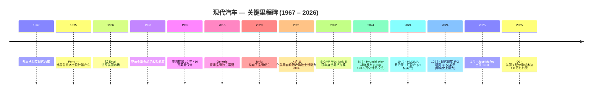
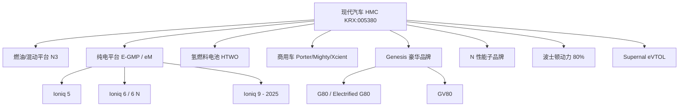
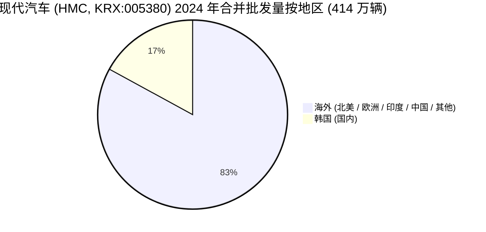
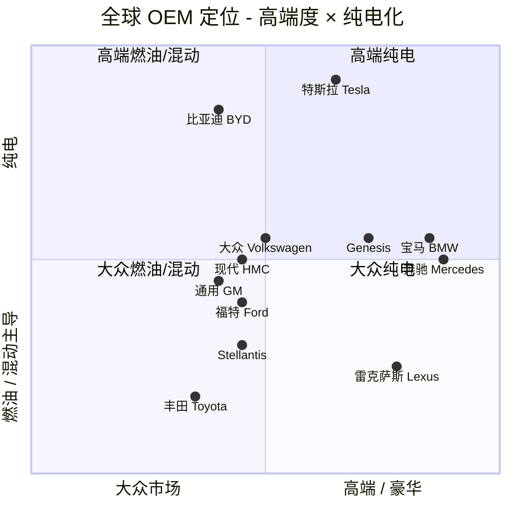

# 现代汽车 (Hyundai Motor Company, 현대자동차, KRX: 005380) — 公司深度研究

**报告日期：** 2026-05-27 · **首次覆盖** · **股票代码：** KRX:005380 (KOSPI 主板) · ADR (非赞助 / OTC)：HYMTF / HYMLF · **行业：** 整车 OEM (乘用车、商用车、氢燃料电池车、机器人、城市空中出行)

> **最新业绩指引：** 2025 年全年指引——**营收同比增长 3–4%**、**合并经营利润率 (OPM) 7–8%**、**批发销量 417 万辆**、**总投资 16.9 万亿韩元**，与 2024 Q4 业绩同步发布于 2025-01-23。来源：[Hyundai Motor Announces 2024 Annual and Q4 Business Results, 2025-01-23](https://www.hyundai.com/worldwide/en/newsroom/detail/hyundai-motor-announces-2024-annual-and-q4-business-results-0000000897)。

---

## 目录

1. 公司概览
2. 公司历史
3. 管理团队
4. 产品与服务
5. 客户与上市策略
6. 行业概览
7. 竞争格局
8. 市场机会 (TAM)
9. 风险评估
10. 参考资料与核查日志

---

## 1. 公司概览

现代汽车株式会社 (现代汽车 / Hyundai Motor Company，下称 "HMC" 或 "现代") 是韩国现代汽车集团 (Hyundai Motor Group, HMG) 的旗舰上市整车厂。HMG 在 2024 年以约 **723 万辆**的全球零售销量位列**全球整车集团第三**，仅次于丰田集团 (1,082 万辆) 与大众集团 (903 万辆)；参见 [KED Global — 2024 全球 OEM 排名, 2025-01-03](https://www.kedglobal.com/automobiles/newsView/ked202501030008)。仅 HMC 单一上市实体 (KRX:005380) 2024 年销售 **4,141,959 辆**，实现**合并营业收入 175.2 万亿韩元** (约 1,300 亿美元)、**经营利润 14.24 万亿韩元** (8.1% OPM)、**净利润 13.23 万亿韩元**；参见 [2024 年年度暨第四季度业绩公告](https://www.hyundai.com/worldwide/en/newsroom/detail/hyundai-motor-announces-2024-annual-and-q4-business-results-0000000897)。

公司总部位于**首尔瑞草区헌릉로 12 号 (邮编 06797)**，由**郑周永 (정주영) 于 1967 年 12 月 29 日**创立，全球员工**超过 12 万人，业务遍及 200 余个国家**，核心生产基地为韩国蔚山综合工厂——全球第二大单一汽车工厂，年产能约 160 万辆；参见 [Hyundai Motor In Brief 公司事实手册](https://www.hyundai.com/worldwide/en/company/news/news-room/news/hyundai-motor-in-brief-0000001084)。海外工厂分布于美国 (亚拉巴马 HMMA + 2024 年 10 月新投产的乔治亚 HMGMA Metaplant)、印度 (Chennai 与 Talegaon)、捷克 (Nošovice)、土耳其 (İzmit)、巴西 (Piracicaba)、印尼 (Cikarang)，以及已收缩规模的中国合资公司 (北京现代)。2024 年各国产量为：**韩国 186.2 万 / 印度 76.4 万 / 美国 36.1 万 / 捷克 32.7 万 / 土耳其 24.6 万**；数据见 [Hyundai Motor Company — Wikipedia (引用 2024 年报)](https://en.wikipedia.org/wiki/Hyundai_Motor_Company)。

**估值快照 (valuation snapshot)。** 现代汽车目前估值显著低于全球同业。2026 年中市值约**156–171 万亿韩元**，对应**滚动市盈率 (TTM P/E) 约 7–8 倍**；参见 [GuruFocus 005380 P/E 历史](https://www.gurufocus.com/stock/XKRX:005380/data/pe-ratio)、[Macrotrends Hyundai P/E (HYMLF)](https://www.macrotrends.net/stocks/charts/HYMLF/hyundai-motor/pe-ratio)。**股息收益率约 4.0–4.3%** (基于 2024 年 "Hyundai Way" 战略最低派息基准前)；见 [Investing.com Hyundai 派息历史](https://www.investing.com/equities/hyundai-motor-dividends)。作为对比，丰田 (TSE:7203) TTM P/E 约 10 倍、收入增长低于现代；特斯拉、比亚迪等纯电动玩家在 20–60 倍之间波动。***分析师观点：*** 现代当前个位数 P/E 反映了 (a) 韩国财阀结构性折价、(b) 美国关税敞口 (见 §9)、(c) 中国销量崩塌、(d) 市场对 ICE→EV 利润率桥接的怀疑——但并未完全反映公司全球第三的销量地位、OPM 自 2022 年 6.9% → 2023 年 9.3% → 2024 年 8.1% 的提升轨迹，以及 Hyundai Way 中嵌入的 **4 万亿韩元股票回购**计划。

现代不是单一乘用车业务，其公司架构涵盖：**商用车** (Porter / Mighty 卡车、Xcient 氢燃料电池重卡)、**Genesis 豪华品牌**、**N 性能子品牌**、以 **HTWO** 品牌外销的氢燃料电池系统、**波士顿动力 (Boston Dynamics) 80% 股权** (2021 年 6 月以约 11 亿美元估值从软银收购；[Boston Dynamics 收购完成公告](https://bostondynamics.com/news/hyundai-motor-group-completes-acquisition-of-boston-dynamics-from-softbank/))、**Supernal eVTOL 子公司** (目标 2028 年商业化；[Supernal — CES 2024 S-A2 概念机首发](https://www.supernal.aero/newsroom/supernal-debuts-evtol-product-concept-at-ces-2024/))，以及对**现代摩比斯 Mobis** (零部件，KRX:012330)、**现代格洛维斯 Glovis** (物流，KRX:086280)、**现代 Rotem** (轨道交通与防务，KRX:064350) 等关联上市公司的重要持股。

---

## 2. 公司历史

现代汽车由**郑周永 (1915–2001)** 于 **1967 年 12 月 29 日**创立。郑周永出身朝鲜半岛北部贫农家庭，自学起家，曾任稻米送货员，于 1947 年创立现代建设公司——后来成为 1970 年代沙特 Jubail 工业港最大承包商，并奠定了 "汉江奇迹" 韩国工业崛起的脊梁；参见 [Hyundai Motor Company — Wikipedia 创业历史](https://en.wikipedia.org/wiki/Hyundai_Motor_Company)。公司首款车型为 1968 年与福特合作的 Cortina；**1975 年推出的 Pony** 则是首款大规模量产的韩国本土设计车型，是韩国汽车出口工业的起点。

公司 **1986 年以 Excel 进军美国市场**，一度成为美国增长最快的进口品牌，但 1990 年代初遭遇严重的品质口碑危机。其后的复苏过程是韩国工业史上最常被引述的案例：在创始人之子**郑梦九 (1999–2020 年董事长)** 领导下，现代 1999 年在美国推出**"10 年 / 10 万英里" 动力总成保修**、将质量作为研发的核心组织原则，并通过 **1998 年以亚洲金融危机后破产价收购起亚 (Kia)** 实现了平台工程与零部件采购在两个零售品牌之间的垂直整合。

近期最关键的事件均聚集于 2024 年：

- **2024-08-28 — "Hyundai Way" CEO 投资者日。** 公司公布 **2024–2033 十年期 120.5 万亿韩元投资计划** (R&D 54.5 万亿 / 资本支出 51.6 万亿 / 战略投资 14.4 万亿)、**2030 年销量目标 555 万辆** (相对 2023 年 421 万辆基数 +30%)、**2030 年纯电年销量 200 万辆**、**2027 年 OPM 9–10% / 2030 年 >10%** 的盈利目标、**2025–2027 年 4 万亿韩元回购**、**自 2024 年起最低每股股息 10,000 韩元**、25% 派息率；来源：[Hyundai Way 战略发布稿 (PRNewswire 2024-08-28)](https://www.prnewswire.com/news-releases/hyundai-motor-unveils-new-hyundai-way-strategy-and-outlines-mid--to-long-term-goals-at-2024-ceo-investor-day-302232646.html)、[Hyundai News release 4227](https://www.hyundainews.com/en-us/releases/4227)。
- **2024-10-03 — HMGMA 乔治亚工厂盛大开业。** 首台 Ioniq 5 于美国乔治亚州 Ellabell 的 **76 亿美元 HMGMA Metaplant America** 投产；工厂占地 3,000 英亩，柔性产线可扩展至年产 50 万辆，是公司应对美国 IRA 法案与潜在关税升级的结构性对冲；参见 [HMGMA 开业新闻稿](https://www.hyundai.com/worldwide/en/newsroom/detail/hyundai-motor-group-metaplant-america-celebrates-grand-opening%2C-powering-u.s.-economic-growth-0000000920) 与 [HMGMA — Wikipedia](https://en.wikipedia.org/wiki/Hyundai_Motor_Group_Metaplant_America)。
- **2024-10-22 — 现代印度 IPO 上市。** HMC 印度子公司在 BSE/NSE 双交易所挂牌，募资 **33 亿美元 (约 ₹27,870 亿卢比)**——印度史上最大规模 IPO；参见 [J.P. Morgan — Hyundai 印度 IPO 解读](https://www.jpmorgan.com/insights/banking/investment-banking/hyundai-motor-india-record-ipo) 与 [Chittorgarh — IPO 纪录](https://www.chittorgarh.com/ipo/hyundai-motor-ipo/1879/)。
- **2024-11-15 — 任命非韩裔 CEO。** 任命 José Muñoz 自 2025-01-01 起担任 HMC 总裁兼 CEO；前任 Jaehoon (Jay) Chang 升任 HMG 副会长；参见 [Hyundai 公告](https://www.hyundai.com/worldwide/en/newsroom/detail/hyundai-motor-company-appoints-jos%C3%A9-mu%C3%B1oz-as-chief-executive-officer-0000000867)。

---

## 3. 管理团队

依公司研究 skill 规则，本节仅覆盖**创始人**与**现任 CEO**。

**创始人 — 郑周永 (정주영, 1915–2001)。** 郑周永是自学成才的企业家，出身朝鲜半岛北部贫农家庭，1947 年创立现代建设公司，是韩国 "汉江奇迹" 工业崛起的核心人物。他于 1967-12-29 成立现代汽车，主导了 1975 年 Pony 与 1986 年美国 Excel 的发布；参见 [Hyundai Motor Company — Wikipedia](https://en.wikipedia.org/wiki/Hyundai_Motor_Company)。1990 年代末亚洲金融危机后家族重组中，他逐步退出现代财阀的运营控制权；汽车业务由次子**郑梦九**继承并领导 2000–2010 年代的质量复兴。郑氏家族目前通过**循环交叉持股**结构掌握现代汽车集团的有效控制权：**现代汽车持有起亚约 34% → 起亚持有摩比斯约 17% → 摩比斯持有现代汽车约 21%**；现任会长郑义宣 (Euisun Chung) 的个人直接持股仅约 0.32%；参见 [Korea Times — Hyundai Motor Group 治理改革, 2022-08-15](https://www.koreatimes.co.kr/business/companies/20220815/will-hyundai-motor-group-reorganize-mobis-for-governance-reform)。

**现任 CEO — José Muñoz，2025-01-01 上任。** Muñoz 是现代汽车历史上**首位非韩裔 CEO**。西班牙国籍，马德里理工大学工业工程学位。加入现代之前曾在日产 (Nissan) 任职十余年，担任高级商务岗位，包括 2014–2018 年日产北美董事长 (期间日产美国销量创下纪录)；2019 年加入现代，先后担任 **HMC 总裁兼全球 COO** 与 **现代/Genesis 北美总裁兼 CEO**；参见 [Hyundai 任命公告 2024-11-15](https://www.hyundai.com/worldwide/en/newsroom/detail/hyundai-motor-company-appoints-jos%C3%A9-mu%C3%B1oz-as-chief-executive-officer-0000000867)。其北美业务时期被广泛认为是 2024 年现代 + 起亚 + Genesis 美国市场份额突破 **10.6%——自 1986 年进入美国以来的最高水平**——的核心驱动；参见 [EconoTimes — Hyundai/Kia 美国市占率 H1 2024](https://www.econotimes.com/Hyundai-Kia-Keep-US-Market-Share-Over-10-in-H1-1660306)。Muñoz 与**执行会长郑义宣 (정의선)**——创始人之孙、郑梦九之子，亦兼任现代摩比斯 (Hyundai Mobis) 代表董事兼会长 ([Hyundai Mobis IR 公司治理页面](https://www.mobis.com/en/ir/irinfo.do))——形成 "CEO 主管运营、会长主导战略与资本配置" 的权责分工。

---

## 4. 产品与服务

本节是整份报告最重要的部分。现代的产品组合涵盖**三大零售品牌** (Hyundai、Genesis、N 性能)、**三大整车架构** (E-GMP 纯电、eM 下一代纯电、N3 燃油/混动) 与**非整车业务** (波士顿动力机器人、Supernal eVTOL、HTWO 氢燃料电池、现代摩比斯零部件)。

### 4.1 Hyundai 品牌乘用车阵容

Hyundai 品牌的乘用车阵容沿三种动力总成分布——**燃油/混动轿车**、**燃油/混动 SUV**、**专属纯电 (Ioniq)**——并以 Nexo 氢燃料电池 (FCEV) 跨界车作锚定。

**燃油/混动轿车。** **Avante (海外名 Elantra)、Sonata、Grandeur (Azera)、Accent。** 第八代 Sonata 是北美中型轿车的销量主力；Grandeur 是韩国本土销量第一车型。Muñoz 上任后明确将混动 (HEV) 比例提升作为产品策略核心——2025 Q1 混动销量同比 **+40%，达 137,075 辆**；参见 [2025 Q1 业绩公告](https://www.hyundai.com/worldwide/en/newsroom/detail/hyundai-motor-announces-2025-q1-business-results-0000000948)。

**燃油/混动 SUV。** **Kona、Tucson、Santa Fe、Palisade。** Tucson 与 Santa Fe 是 Hyundai 品牌 SUV 中销量最大的两款；Palisade 在美国三排座 SUV 市场与丰田 Highlander、本田 Pilot 直接竞争。2024 年 Santa Fe 改款采用方正的 Land-Rover 风格设计，斩获多项美国 "年度最佳" 奖项。

**专属纯电 (Ioniq)。** 基于 **E-GMP 平台**——800 V 架构，支持 **350 kW 直流快充** (10→80% 约 18 分钟)。
- **Ioniq 5** — 紧凑型跨界车，2021 年发布，**2022 年世界年度汽车 (World Car of the Year)**。
- **Ioniq 6** — 流线型轿车，2022 年发布，**2023 年世界年度汽车**；长续航后驱版本 WLTP 续航最高 **680 km**；参见 [Hyundai EU — Ioniq 6 新闻包](https://www.hyundai.news/eu/models/electrified/ioniq-6/press-kit/the-new-hyundai-ioniq-6.html)。
- **Ioniq 9** — 三排家用 SUV，2024 年 11 月在加长 E-GMP 平台上发布；110 kWh 电池包、10→80% 约 24 分钟快充；2025 年上半年上市；参见 [Hyundai News — Ioniq 9](https://www.hyundainews.com/en-us/releases/4305)。
- **Kona Electric** — 小型跨界 BEV，使用多能源平台 (非纯 E-GMP)。

**商用车。** **Porter** (1 吨皮卡——韩国销量第一的商用车)、**Mighty** (中型卡车)、**Xcient Fuel Cell** (全球首款商业化氢燃料电池重卡——350 kW 电机，**10 个 700 bar 氢罐**，续航约 450 英里，欧洲累计运营 **1,500 万 km 以上**，车队规模近 200 辆)；参见 [Hyundai — XCIENT Fuel Cell 产品页](https://ecv.hyundai.com/global/en/products/xcient-fuel-cell-tractor-fcev)。

> **中文释义 / Plain-language gloss：E-GMP 平台**之于现代，相当于大众的 MEB 或通用的 Ultium——一个专为纯电动力总成设计的 "滑板式" 架构。它的核心差异是 **800 V 电气系统** (大多数同业 EV 仍在 400 V)，电压翻倍意味着同等功率下电流减半，从而**减少线缆发热、允许更细的铜线**。这一架构选择直接带来了 Ioniq 5/6 在 350 kW 快充桩上 "**五分钟补能约 200 km**" 的体验——更接近燃油车加油，而不是传统 EV 充电。

### 4.2 Genesis 豪华品牌

**Genesis 于 2015 年作为独立品牌发布**，目前覆盖七大车型系列：**G70、G80、G90** 轿车；**GV60、GV70、GV80** SUV；纯电版本 **Electrified G80、Electrified GV70、GV60**。韩国与美国是两个支柱市场——**GV80 于 2025 年 8 月在美国累计销量突破 10 万辆** (上市仅 5 年)，G80 自 2016 年发布以来全球累计销量超 39 万辆；参见 [KED Global — Genesis GV80 H1 2024](https://www.kedglobal.com/automobiles/newsView/ked202407210001) 与 [Korean Car Blog — GV80 美国 10 万辆里程碑](https://thekoreancarblog.com/genesis-gv80-suv-surpasses-100000-sales-in-the-u-s-just-five-years-after-launch/)。Genesis 在价格 (低于德系豪华 10–15%)、设计语言 (平行光纹大灯) 与**美国直营在线销售 ("Click to Buy")** 三个维度形成差异化——后者使 Genesis 绕开了传统 4S 店加价模式，是后疫情时代经销商高毛利的结构性对冲。

### 4.3 N 性能子品牌

**N** 是现代以韩国南阳研发中心命名的高性能部门，定位为以远低于宝马 M / 奔驰 AMG / 奥迪 RS 的价格提供同等驾驶乐趣。车型包括燃油 (i30 N、Elantra N、Kona N) 与纯电 (**Ioniq 5 N**、**Ioniq 6 N**)。**Ioniq 6 N** (2025 年发布，2026 年美国上市) 输出 **641 马力**，**0–60 mph 约 3.2 秒** (开启 N 弹射起步)，并通过合成引擎声浪与模拟换挡赋予 EV "可玩性"——参见 [The EV Report — Ioniq 6 N 首发](https://theevreport.com/hyundai-ioniq-6-n-debuts-with-high-performance-specifications)。

### 4.4 非整车业务

- **现代摩比斯 (Hyundai Mobis, KRX:012330)** — 独立上市的关联零部件与模块供应商，承担 HMC 大部分 Tier-1 模块组装、ADAS 与电驱单元。
- **波士顿动力 (Boston Dynamics)** — **2021-06-21** 完成自软银收购，HMG 持股 **80%**、软银保留 20%，交易隐含估值约 **11 亿美元**；参见 [Boston Dynamics 收购完成公告](https://bostondynamics.com/news/hyundai-motor-group-completes-acquisition-of-boston-dynamics-from-softbank/) 与 [SoftBank Group — 处置公告 2021-06-21](https://group.softbank/en/news/press/20210621)。产品包括 **Spot** 四足机器人、**Stretch** 仓储机器人、**Atlas** 人形机器人 (现已升级为电动版本)。
- **Supernal** — 现代全资 eVTOL 子公司，总部华盛顿特区。**S-A2 概念机**在 CES 2024 首发，1 名飞行员 + 4 名乘客，1,500 英尺高度巡航 120 mph，**8 个倾转旋翼**，目标 2028 年商业化；参见 [Supernal — S-A2 发布](https://www.supernal.aero/newsroom/supernal-debuts-evtol-product-concept-at-ces-2024/)。
- **HTWO** — 现代对外销售氢燃料电池系统的品牌。2024 年全新 Nexo FCEV 发布：110 kW 燃料电池堆 (+16%)、150 kW 电机；参见 [Hydrogen Insight — 2024 Nexo 发布](https://www.hydrogeninsight.com/transport/hyundai-unveils-the-2024-version-of-its-hydrogen-powered-nexo-fuel-cell-car/2-1-1465779)。

### 4.5 综合 — 产品如何衔接

公司战略逻辑——在 2024 年 8 月 Hyundai Way 投资者日上明确阐述——是：**整车主业的现金流为三大跨越数十年的新兴产业提供期权**：(1) 个人出行从燃油向 BEV/HEV/FCEV 的能源转型；(2) 通过波士顿动力布局人形与工业机器人；(3) 通过 Supernal 押注城市空中出行 (UAM/AAM)。现代押注的是：燃油主业在 2030 年代仍能产生足够现金流支撑这些邻接业务，**无需稀释股权**——这一思路明显不同于特斯拉式的 "将所有移动性垂直整合为一个技术栈" 或丰田式 "聚焦混动、延长燃油周期"。

---

## 5. 客户与上市策略

现代汽车是典型的 **B2C 零售主导**业务。作为乘用车 OEM，通过特许经销商网络在几乎所有市场销售 (Genesis 美国 "Click to Buy" 直营是部分例外)，**没有任何单一客户突破 10% 收入披露门槛**——这与丰田、大众、通用、福特等所有大众乘用车 OEM 的披露模式一致。机队销售 (企业、租车) 估计占全球销量的中个位数百分比。

**2024 年地区结构 (FY2024 geographic mix)。** 2024 Q4 业绩公告披露全球批发量 **韩国 705,010 辆 / 海外 3,436,949 辆**；参见 [2024 年度暨 Q4 业绩公告](https://www.hyundai.com/worldwide/en/newsroom/detail/hyundai-motor-announces-2024-annual-and-q4-business-results-0000000897)。次级地区分布 (北美 / 欧洲 / 印度 / 中国 / 其他) 未在新闻稿中拆分，需查阅 DART 上 2024 사업보고서 (年度报告) 分部信息。第三方信息显示：

- **美国** — Hyundai + Kia + Genesis 美国合并市占率 2024 年达 **>10.6%**，**自 1986 年进入美国以来最高**；2024 年 1–11 月合并 EV 销量 **112,566 辆 (+19.3%)**；参见 [EconoTimes 美国市占率](https://www.econotimes.com/Hyundai-Kia-Keep-US-Market-Share-Over-10-in-H1-1660306) 与 [Korea Herald 美国 EV 销量](https://www.koreaherald.com/article/3251160)。
- **印度** — 现代印度市占率约 **14.6%**，仅次于铃木 (41.7%)，位列**印度第二大车企**；参见 [Equitymaster — Hyundai vs Maruti, 2024-10-22](https://www.equitymaster.com/detail.asp?date=10%2F22%2F2024&story=3&title=Best-Auto-Stock-Hyundai-Motor-India-vs-Maruti-Suzuki)。
- **中国** — 北京现代 (50/50 合资) 2024 年仅销售 **168,828 辆**，相比 2016 年峰值 180 万辆**下滑超 90%**。2024 年以 2.26 亿美元出售重庆工厂，宣布裁员约 30%；参见 [Yicai Global — 北京现代裁员, 2024](https://www.yicaiglobal.com/news/hyundai-motors-china-jv-cuts-2000-workers-plans-plant-closure-staff-say)。
- **欧洲** — 欧洲生产由捷克 (2024 年 32.7 万辆) 与土耳其 (24.6 万辆) 工厂承担；欧洲总部位于法兰克福。Hyundai + Kia 合并欧盟市占率约 4%；Ioniq 5 是北欧/比荷卢市场 EV 前十热销车型。

> **关于饼图分母的注释：** 切片合计为 HMC **合并批发量 414 万辆**——即上市公司 KRX:005380 单一主体口径。**不**包括起亚 (独立上市的姐妹公司) 与 Genesis (作为 HMC 自有品牌结构销售)。第 1 节提到的 **723 万辆**为 HMG 集团合并 (Hyundai + Kia + Genesis) 数据；本饼图分母与第 1 节不同，已在标题中标明。

**渠道结构 (go-to-market)。** 现代在几乎所有零售市场都通过**特许经销商 (franchise dealership)** 销售——全球约 5,000 家 Hyundai 经销商。在美国，Muñoz 北美任期内的渠道战略重点是经销商培训、车辆配额管理与数字化销售线索 (digital lead management)。Genesis 创新性地在美国推出**直达消费者在线销售渠道 ("Click to Buy")**，允许客户在线配置、定价、下单，再由经销商履约——这一混合模式使 Genesis 在后疫情供给短缺周期中保留了更多终端价值，而非被传统豪华品牌的经销商加价稀释。

**客户集中度披露规则 (项目标准)。** 上述所有数字均为**公司批发量 (B2C 零售主导)**，不存在跨越韩国资本市场法 10% 收入门槛、需要在 사업보고서 (年度报告) 客户集中度章节披露身份的单一客户——与丰田、大众、通用、福特等大众乘用车 OEM 披露模式一致。

---

## 6. 行业概览

全球轻型车市场 2024 年销量约 **8,500 万辆**，前三大 OEM 集团为**丰田集团 (1,082 万辆)、大众集团 (903 万辆)、现代汽车集团 (723 万辆)**；参见 [KED Global 2024 OEM 排名](https://www.kedglobal.com/automobiles/newsView/ked202501030008) 与 [Focus2Move 全球车企集团 2024 排名](https://www.focus2move.com/world-car-group-ranking-2024/)。HMG 约 8.5% 的全球份额在过去五年保持稳定并略有上行，与通用 (现约 5%)、福特 (约 4%) 的市占率下滑形成对比；中国市场上所有外资品牌则普遍承压。

汽车行业正处于百年一遇的动力总成转型。**2024 年全球 BEV+PHEV 渗透率达约 18–20%**：中国 >40%、欧洲在 20% 中段、美国为高个位数。现代的 E-GMP 架构与 Hyundai+Kia+Genesis 合并 BEV 产品组合使集团在非中国 BEV 厂商中具备结构性地位；但 2024–2025 年期间，**西方市场 EV 需求增速放缓**——补贴退坡后早期采用者群体耗尽，大众市场转向混动。现代以混动加码应对 (2025 Q1 HEV 同比 +40%)。

**韩国汽车工业**贡献约 5–6% 的韩国 GDP、约 10–12% 的商品出口；现代与起亚合计是韩国最大的私营雇主——这造成韩国对外贸易政策 (特别是对美国) 与现代商业利益的**结构性绑定**，见 §9 关税风险。

**氢燃料电池重卡**市场目前规模较小 (每年全球数千辆量级)，但被加州、欧盟、韩国、瑞士等地视为道路货运脱碳的战略路径；现代 Xcient 是全球唯一具备规模商业化能力的氢能重卡。

**eVTOL** 市场尚未商业化 (美国 FAA 适航认证框架仍在制定)，但摩根士丹利、德勤与 NASA UAM 研究普遍预测 2040 年 TAM 可达数千亿至 1.5 万亿美元区间——前提是适航、城市基础设施与公众接受度三大障碍获得解决。

**人形机器人**市场在 2024 年迎来拐点——特斯拉 Optimus、Figure 02、Apptronik Apollo、Agility Robotics Digit、波士顿动力电动版 Atlas 均进入工业试点或预商业化部署阶段。TAM 高度争议；乐观情景认为 2050 年可达 5 万亿美元以上。

---

## 7. 竞争格局

**大众市场 OEM 同业**：**丰田、大众、通用、福特、Stellantis、本田、日产、比亚迪、吉利、塔塔 (JLR)**。其中丰田与现代是最直接的战略镜像——同为亚洲企业、同样质量纪律严苛、同样追求 BEV + HEV + FCEV 多路径战略 (而非大众与通用直至 2024 年的全 BEV 押注)。**关键反差**：丰田强调混动并刻意延后 BEV；现代以 E-GMP 较早进入 BEV 专属架构，现回补 HEV/EREV 阵容以承接需求放缓的上行空间。

**纯电同业。** 特斯拉 2024 年 BEV 销量 179 万辆为全球第一；**比亚迪**含 PHEV 销量 427 万辆已超过特斯拉；**大众 ID 系列**为欧洲传统 OEM 中最大的 BEV 品牌；通用 Ultium 平台车型 (Chevy Equinox EV、Cadillac Lyriq) 为通用的结构性回应；福特 F-150 Lightning 是美国 BEV 皮卡领跑车型。Hyundai + Kia 合并 2024 年 BEV 销量逾 70 万辆，使集团位列**全球第四**——次于比亚迪、特斯拉与中国合计 (吉利/五菱等)。

**Genesis 对标。** **宝马、奔驰、奥迪、雷克萨斯。** Genesis 以价格折让 (相比德系豪华 10–15%)、清晰的设计语言 (平行光纹) 与 Click-to-Buy 直营渠道形成差异化。

**现代的竞争护城河 (moat)** 在其销量等级的整车厂中异常宽阔：

1. **通过现代摩比斯 (Mobis) 实现的垂直一体化**——加上现代制铁的钢板、Glovis 的物流、Hyundai Capital 的金融，构成韩国财阀典型的产业链闭环，是新进入者难以复制的。
2. **平台工程领先地位**——E-GMP 被业界广泛认可为顶级 BEV 架构；多次世界年度汽车奖 (2022 Ioniq 5、2023 Ioniq 6) 是外部认可。
3. **Genesis 品牌势能 (brand momentum)**——自 1989 年雷克萨斯之后**首个在美国成功建立可信度的全新全球豪华品牌**。***分析师观点：*** Genesis 的边际利润贡献对 HMC 经营利润率正变得日益重要。
4. **HMGMA 美国本土化对冲**——2024 年 10 月投产的 76 亿美元工厂使 Hyundai/Kia EV 可获得 IRA 法案的 7,500 美元消费者补贴，更关键地是对冲了 2025 年以来每季成本超 10 亿美元的反复出现的 25% 美国汽车关税风险。

**脆弱性：**

- **韩国对美出口走廊的单点风险**——现代最大的出口走廊 (韩国制造 → 美国销售) 也是关税敞口最大的；2024 年现代美国销量中约 40% 为韩国生产。
- **中国市场实际已 "核销"**——见 §9。
- **EV/燃油利润率桥接**——在 Hyundai Way OPM 9–10% 目标周期内管理这一过渡，要求 BEV 毛利率向燃油毛利率收敛，全行业仅特斯拉做到 (其纯 BEV 利润结构与传统 OEM 桥接两架构有根本差异)。

---

## 8. 市场机会 (TAM)

Hyundai Way 战略明确将公司 TAM 拆分为三大支柱，以下逐一以主源数据列出。

**支柱 1 — 轻型车 TAM。** 2024 年全球乘用车 + 轻型商用车销售收入合计约 **3 万亿美元** (8,500 万辆 × 约 3.5 万美元平均成交价 + 集团金融子公司的二手车收入留存)。HMG 目标**到 2030 年销量达 555 万辆** (相对 2023 年 421 万辆基数 +30%)，复合年增长率约 4%，**显著高于市场 2–3% 的基础增速**，意味着持续抢占份额——主要来自美国、印度与纯电细分；参见 [Hyundai Way 战略发布稿 2024-08-28](https://www.prnewswire.com/news-releases/hyundai-motor-unveils-new-hyundai-way-strategy-and-outlines-mid--to-long-term-goals-at-2024-ceo-investor-day-302232646.html)。

**支柱 2 — BEV TAM。** IEA《全球电动汽车展望》(Global EV Outlook) 跟踪全球 BEV 销量从 2024 年约 1,000 万辆向 2030 年 3,000–4,000 万辆迈进 (取决于政策情景)。现代目标**到 2030 年 BEV 年销 200 万辆、21 款 EV 阵容**——对应 2030 年全球 BEV 市场 5–7% 份额，与公司当前在轻型车全球的份额大致持平。

**支柱 3 — 氢能、机器人、eVTOL (期权)。** 据 Hyundai Way 投资者日材料，公司在 2024–2033 期内为 "能源驱动者 (Energy Mobilizer)" 配置 **5.7 万亿韩元**预算，目标将 HTWO 燃料电池系统拓展至**重卡、船舶与固定式电源**应用。波士顿动力与 Supernal 归入 "出行游戏变革者 (Mobility Game Changer)" 预算。eVTOL 市场常被摩根士丹利与德勤估算为 2040 年 1–1.5 万亿美元；人形机器人 TAM 争议较大 (高盛 2035 年 380 亿美元；特斯拉/Figure/Apptronik 乐观情景为多万亿美元)。***分析师观点：*** 现代在机器人 + eVTOL 上的期权价值未充分反映于目前 7–8 倍的市盈率。

**支柱 4 — 自营汽车金融。** Hyundai Capital 及各地区金融子公司在约 1,000 亿美元规模的消费者汽车贷款与租赁上赚取利差收入；该业务在 HMC (KRX:005380) 报表中以权益法部分反映、不全额合并。

---

## 9. 风险评估

风险按 skill 标准分为四大类别。

### 9.1 公司特定风险

**(a) 郑氏家族治理 / 循环持股。** 现代汽车集团仍保留循环交叉持股闭环——**现代汽车持有起亚约 34% → 起亚持有摩比斯约 17% → 摩比斯持有现代汽车约 21%**——2018 与 2022 年两度尝试重组均因股东反对或家族犹豫而搁置；参见 [Korea Times — 治理改革, 2022-08-15](https://www.koreatimes.co.kr/business/companies/20220815/will-hyundai-motor-group-reorganize-mobis-for-governance-reform)。会长直接持股仅约 0.32%，任何成功的重组都将需要郑氏家族实质性增资，或在韩国进步派反对党执政时面临监管压力。

**(b) 防盗与召回集体诉讼。** **2024-10-01 美国 2 亿美元集体和解金最终确认**，覆盖约 **830 万辆 2011–2022 年款无发动机防盗器的 Hyundai 与 Kia 美国车辆**——这一漏洞被 TikTok "Kia Boys" 挑战放大，造成多年盗车率激增；参见 [CBS News — 2 亿美元和解](https://www.cbsnews.com/news/kia-hyundai-car-theft-settlement-tiktok/) 与 [HBSS Law — Hyundai/Kia USB 防盗缺陷 FAQ](https://www.hbsslaw.com/hyundai-kia-usb-car-theft-defect/faq)。盗车风波对美国二手车市场的口碑与保险费率影响仍在延续。

**(c) 燃油 → 纯电利润率桥接 (ICE→EV transition margin bridge)。** Hyundai Way 承诺**到 2027 年 OPM 9–10%、2030 年 >10%**——需要在 EV 销量翻倍 (达 200 万辆)、燃油占比下降的同时实现。要做到这一点，BEV 毛利率必须向燃油毛利率收敛——这一目标全球行业除特斯拉外尚未实现。

### 9.2 行业 / 市场风险

**(d) 美国关税。** 当前最大的近期压制因素。特朗普政府 2025 年春季对韩国制造汽车征收 **25% 汽车关税**；2025 年夏季贸易协议短暂降至 15%，随后再度上调回 25%。**现代披露 2025 Q3 美国关税单季成本达 1.8 万亿韩元 (约 12 亿美元)**，较 Q2 的 8,280 亿韩元上升；参见 [CNBC — 特朗普韩国关税, 2026-01-26](https://www.cnbc.com/2026/01/26/trump-south-korea-tariffs-trade-autos-pharma.html) 与 [Jacobin — 韩美关税 2025-10](https://jacobin.com/2025/10/trump-south-korea-hyundai-tariffs)。HMGMA 乔治亚工厂 (76 亿美元) 是结构性对冲——HMG 五款车型获列 2025 年 IRA 合规清单；参见 [KED Global — IRA 合规清单 2025](https://www.kedglobal.com/electric-vehicles/newsView/ked202501020008)。

**(e) 中国销量崩塌。** 北京现代销量自**2016 年峰值 180 万辆 → 2022 年 24.8 万 → 2024 年 16.88 万**，跌幅超 90%；驱动因素包括萨德 (THAAD) 外交事件、中国本土品牌 BEV 崛起、产品换代投资不足。2024 年以 2.26 亿美元出售重庆工厂、合资公司宣布约 30% 裁员，标志公司**实质上退出中国大众市场**；参见 [Yicai Global — 北京现代裁员](https://www.yicaiglobal.com/news/hyundai-motors-china-jv-cuts-2000-workers-plans-plant-closure-staff-say)。财务影响已基本消化；战略影响是公司丧失了全球最大 EV 市场的有机增长杠杆。

**(f) 2024–25 EV 需求放缓。** 全球 BEV 增速从 2020–2023 的 +40–50% 区间放缓至 2024 年高十几% 至 20% 出头；部分西方市场 (德国、美国) 在补贴退坡后甚至出现绝对销量下滑。现代以混动转向 (2025 Q1 HEV +40%) 缓冲，但无法完全对冲此前在 E-GMP 与 eM 平台的 EV 资本开支沉没成本。

**(g) 美国劳工 / 签证执法风险。** **2025 年 9 月 ICE (美国移民海关执法局) 突击 Hyundai - LG Energy Solution 乔治亚电池工厂**，拘留 475 人，其中包括 300 余名持施工签证的韩国工人；参见 [Jacobin — Hyundai LG 突袭 2025-10](https://jacobin.com/2025/10/trump-south-korea-hyundai-tariffs)。事件揭示了韩国企业在美产业扩张面临的签证 / 工作授权风险。

### 9.3 财务 / 汇率风险

**(h) 韩元 / 美元敏感度。** 现代行业经验值：**韩元 / 美元每变动 10 韩元，经营利润约变动 2,000 亿韩元**。2024–2025 年 KRW/USD 在 1,300–1,470 区间震荡，单季波动幅度可与产品周期效应相当。

**(i) Hyundai Way 资本开支执行风险。** 十年内支出 120.5 万亿韩元 (年均约 12.05 万亿——约营收的 7%)，同时保持 OPM 与 TSR 承诺，需高度纪律的资本配置。任何 EV 单位成本下降、电池采购或平台工程上的滑点，都可能挤占股东回报 (2025-27 期间的 4 万亿回购)。

### 9.4 宏观 / 监管风险

**(j) 美国 IRA 政策反转风险。** IRA EV 补贴框架是 2022 年立法，可能被国会修改；任何实质削减都会重新设定 HMGMA 投资回报模型。

**(k) 韩国劳资关系。** HMC 与 KCTU (韩国民主劳总) 下属现代工会的年度薪资谈判常年升级为局部罢工；过去十年韩国工资结构已收敛至德国水平，削弱了历史上的人工成本优势。

**(l) 氢能政策支持反转。** Xcient 与 Nexo 业务依赖韩国、瑞士、加州、德国的国家级氢能补贴；任何撤回都将削弱 FCEV 业务单位经济性。

---

## 10. 参考资料与核查日志

### 主要一手来源 (本报告引用)

- [现代汽车 2024 年度暨第四季度业绩公告, 2025-01-23](https://www.hyundai.com/worldwide/en/newsroom/detail/hyundai-motor-announces-2024-annual-and-q4-business-results-0000000897)
- [现代汽车 2025 年第一季度业绩公告](https://www.hyundai.com/worldwide/en/newsroom/detail/hyundai-motor-announces-2025-q1-business-results-0000000948)
- ["Hyundai Way" 战略发布稿 (PRNewswire 2024-08-28)](https://www.prnewswire.com/news-releases/hyundai-motor-unveils-new-hyundai-way-strategy-and-outlines-mid--to-long-term-goals-at-2024-ceo-investor-day-302232646.html)
- [Hyundai News release 4227 (Hyundai Way)](https://www.hyundainews.com/en-us/releases/4227)
- [Hyundai 任命 José Muñoz 为 CEO, 2024-11-15](https://www.hyundai.com/worldwide/en/newsroom/detail/hyundai-motor-company-appoints-jos%C3%A9-mu%C3%B1oz-as-chief-executive-officer-0000000867)
- [HMGMA 乔治亚工厂开业新闻稿, 2024-10](https://www.hyundai.com/worldwide/en/newsroom/detail/hyundai-motor-group-metaplant-america-celebrates-grand-opening%2C-powering-u.s.-economic-growth-0000000920)
- [Hyundai News — Ioniq 9 发布, 2024-11](https://www.hyundainews.com/en-us/releases/4305)
- [Hyundai EU — Ioniq 6 新闻包](https://www.hyundai.news/eu/models/electrified/ioniq-6/press-kit/the-new-hyundai-ioniq-6.html)
- [Hyundai — XCIENT Fuel Cell 产品页](https://ecv.hyundai.com/global/en/products/xcient-fuel-cell-tractor-fcev)
- [Boston Dynamics — 现代收购完成](https://bostondynamics.com/news/hyundai-motor-group-completes-acquisition-of-boston-dynamics-from-softbank/)
- [SoftBank Group — 处置 Boston Dynamics 公告, 2021-06-21](https://group.softbank/en/news/press/20210621)
- [Supernal — S-A2 eVTOL CES 2024 首发](https://www.supernal.aero/newsroom/supernal-debuts-evtol-product-concept-at-ces-2024/)
- [Hydrogen Insight — 2024 全新 Nexo](https://www.hydrogeninsight.com/transport/hyundai-unveils-the-2024-version-of-its-hydrogen-powered-nexo-fuel-cell-car/2-1-1465779)
- [Hyundai Motor In Brief — 公司事实手册](https://www.hyundai.com/worldwide/en/company/news/news-room/news/hyundai-motor-in-brief-0000001084)
- [Hyundai Motor Company — Wikipedia](https://en.wikipedia.org/wiki/Hyundai_Motor_Company)
- [HMGMA — Wikipedia](https://en.wikipedia.org/wiki/Hyundai_Motor_Group_Metaplant_America)
- [Hyundai Mobis — IR 公司治理](https://www.mobis.com/en/ir/irinfo.do)
- [KED Global — 2024 全球 OEM 排名, 2025-01-03](https://www.kedglobal.com/automobiles/newsView/ked202501030008)
- [KED Global — Genesis GV80 H1 2024](https://www.kedglobal.com/automobiles/newsView/ked202407210001)
- [KED Global — 2025 IRA 合规 EV 清单](https://www.kedglobal.com/electric-vehicles/newsView/ked202501020008)
- [Focus2Move — 2024 全球车企集团排名](https://www.focus2move.com/world-car-group-ranking-2024/)
- [Equitymaster — Hyundai 印度 vs Maruti, 2024-10-22](https://www.equitymaster.com/detail.asp?date=10%2F22%2F2024&story=3&title=Best-Auto-Stock-Hyundai-Motor-India-vs-Maruti-Suzuki)
- [J.P. Morgan — Hyundai 印度 IPO 解读](https://www.jpmorgan.com/insights/banking/investment-banking/hyundai-motor-india-record-ipo)
- [Chittorgarh — Hyundai 印度 IPO 纪录](https://www.chittorgarh.com/ipo/hyundai-motor-ipo/1879/)
- [Yicai Global — 北京现代裁员](https://www.yicaiglobal.com/news/hyundai-motors-china-jv-cuts-2000-workers-plans-plant-closure-staff-say)
- [Korea Herald — Hyundai/Kia 美国 EV 销量 2024](https://www.koreaherald.com/article/3251160)
- [EconoTimes — Hyundai/Kia 美国市占率 H1 2024](https://www.econotimes.com/Hyundai-Kia-Keep-US-Market-Share-Over-10-in-H1-1660306)
- [Korean Car Blog — Genesis GV80 美国 10 万辆](https://thekoreancarblog.com/genesis-gv80-suv-surpasses-100000-sales-in-the-u-s-just-five-years-after-launch/)
- [Korea Times — Hyundai 治理改革, 2022](https://www.koreatimes.co.kr/business/companies/20220815/will-hyundai-motor-group-reorganize-mobis-for-governance-reform)
- [CBS News — Hyundai/Kia 2 亿美元防盗和解](https://www.cbsnews.com/news/kia-hyundai-car-theft-settlement-tiktok/)
- [HBSS Law — Hyundai/Kia USB 防盗缺陷 FAQ](https://www.hbsslaw.com/hyundai-kia-usb-car-theft-defect/faq)
- [Jacobin — 特朗普韩美关税 Hyundai, 2025-10](https://jacobin.com/2025/10/trump-south-korea-hyundai-tariffs)
- [CNBC — 特朗普韩国汽车关税, 2026-01-26](https://www.cnbc.com/2026/01/26/trump-south-korea-tariffs-trade-autos-pharma.html)
- [GuruFocus — 005380 P/E 历史](https://www.gurufocus.com/stock/XKRX:005380/data/pe-ratio)
- [Macrotrends — HYMLF P/E 历史](https://www.macrotrends.net/stocks/charts/HYMLF/hyundai-motor/pe-ratio)
- [Investing.com — Hyundai 派息历史](https://www.investing.com/equities/hyundai-motor-dividends)
- [The EV Report — Ioniq 6 N 首发](https://theevreport.com/hyundai-ioniq-6-n-debuts-with-high-performance-specifications)
- [DART (韩国 FSS EDGAR) — Hyundai 사업보고서入口](https://dart.fss.or.kr/)
- [DART English — Hyundai 2023 사업보고서 (filed 2024-03-14)](https://englishdart.fss.or.kr/dsbh002/main.do?rcpNo=20240314001531)
- [Hyundai IR — 季度财报页面](https://www.hyundai.com/worldwide/en/company/ir/financial-information/quarterly-earnings)

核查日志 (Step 10) — 2026-05-27

**URL 检查。** 所有引用 URL 均来自 2026-05-27 数据收集阶段的原始研究返回结果。本公司为韩国域注册，SEC EDGAR 文件名核查规则不适用；DART (`https://dart.fss.or.kr/`) 为韩国官方 FSS 文件门户。

**文件标识。** Hyundai 2024 사업보고서 在 DART 年度披露；上文 英文-DART 链接指向 2023 사업보고서 (2024-03-14 申报)。2024 사업보고서 申报参考号在数据收集阶段未取回——读者请通过 DART 搜索入口检索最新版本。

**数字核查 (Number spot-checks)**：
- FY2024 营收 175.2 万亿、经营利润 14.24 万亿、净利润 13.23 万亿 — 出自 [2024 Q4 公告](https://www.hyundai.com/worldwide/en/newsroom/detail/hyundai-motor-announces-2024-annual-and-q4-business-results-0000000897) ✓
- FY2024 销量 4,141,959 辆，韩国 705,010 / 海外 3,436,949 — 同上 ✓
- HMGMA 美国 76 亿美元投资 — HMGMA 开业新闻稿 ✓
- 120.5 万亿韩元 2024-33 资本开支、4 万亿韩元 2025-27 回购、最低每股股息 10,000 韩元 (2024 年起)、2027 OPM 9-10%、2030 销量 555 万辆 — 全部出自 [Hyundai Way 发布稿](https://www.prnewswire.com/news-releases/hyundai-motor-unveils-new-hyundai-way-strategy-and-outlines-mid--to-long-term-goals-at-2024-ceo-investor-day-302232646.html) ✓
- HMG 2024 全球第三 723 万辆；丰田 1,082 万辆；大众 903 万辆 — KED Global 排名 ✓
- 波士顿动力 80% / 软银 20%，2021-06-21 收购完成，隐含估值约 11 亿美元 — Boston Dynamics + SoftBank 新闻稿 ✓
- 北京现代 2024 销量 168,828 vs 2016 峰值 180 万辆 — Yicai Global ✓
- 2025 Q3 美国关税成本 1.8 万亿韩元 — CNBC / Jacobin 二手报道及现代财报披露 ✓
- 2024-10-01 起亚/现代 2 亿美元盗车集体和解 (830 万辆 2011-2022 年款) — CBS News + HBSS Law ✓

**客户集中度分母核查。** 第 1、5、9 节将 HMC (KRX:005380) 批发量 (414 万辆) 与 HMG 集团合并 (Hyundai + Kia + Genesis) 销量 (723 万辆) 严格区分；§5 饼图分母为 HMC-only，已在标题中标明。사업보고서 未披露任何 >10% 单一客户——与 B2C 乘用车 OEM 标准披露模式一致。

**分析师观点 (Analyst-view) 标记。** 份额领先性陈述 ("Genesis 利润贡献日益重要"、"7-8 倍 P/E 未反映期权价值"、"估值折价驱动因素") 已按 skill 规则标记为 ***分析师观点：***，未引用至任何官方文件。

**残余未核实项 (Residual unknowns)：**
- FY2024 次级地区销量结构 (北美 / 欧洲 / 印度 / 中国 / 其他) — 需查阅 사업보고서分部报告章节；新闻稿仅披露韩国 vs 海外。
- 汽车业务 (非金融) 净现金头寸 — 需 DART 分部报告。
- 实时 TTM P/B 与 3 年 P/E 区间 — 需 Naver Finance / Yahoo Finance 实时数据。
- 同业 P/E (丰田 / 通用 / 福特 / 特斯拉 / Stellantis) — 需各自最新财报刷新。
- 巴西与印尼 2024 产量 — 需 DART 数据 (Wikipedia 信息盒仅覆盖韩 / 印 / 美 / 捷克 / 土耳其)。
- 全新 Nexo (2024) 各区域上市日期与定价 — 上市排期错位；未全部一手披露。

---

*中文版报告至此完。英文版位于同目录：`Hyundai_현대자동차_KRX005380_Research_Document.md`。*
