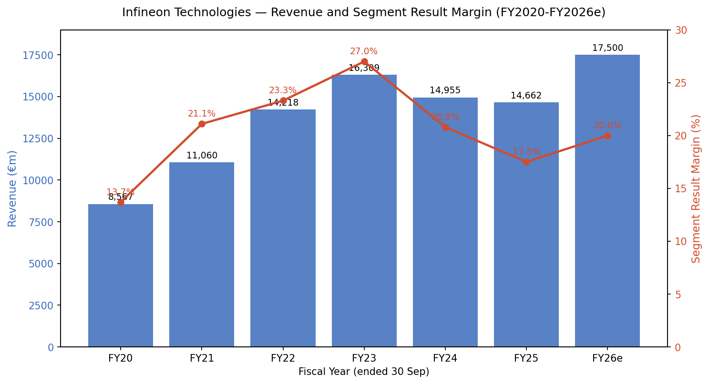
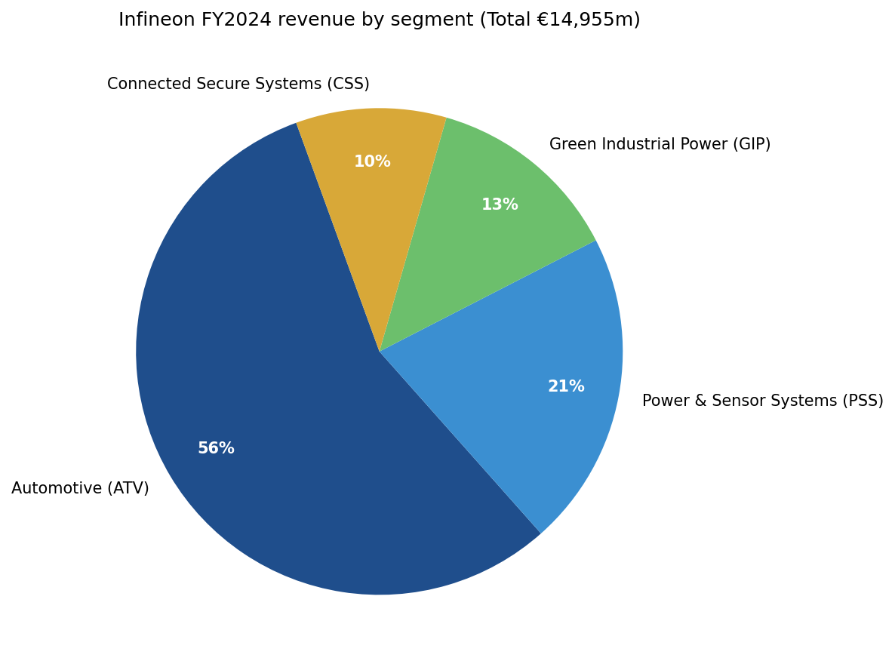
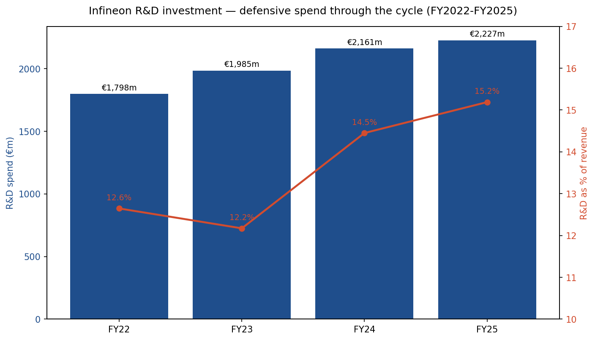
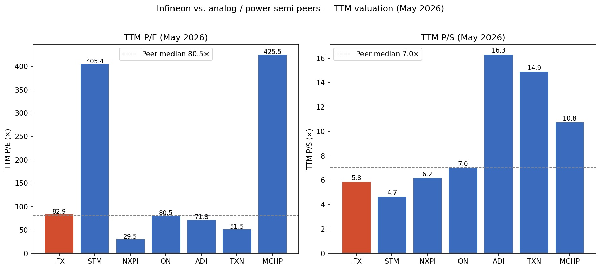
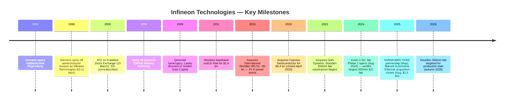
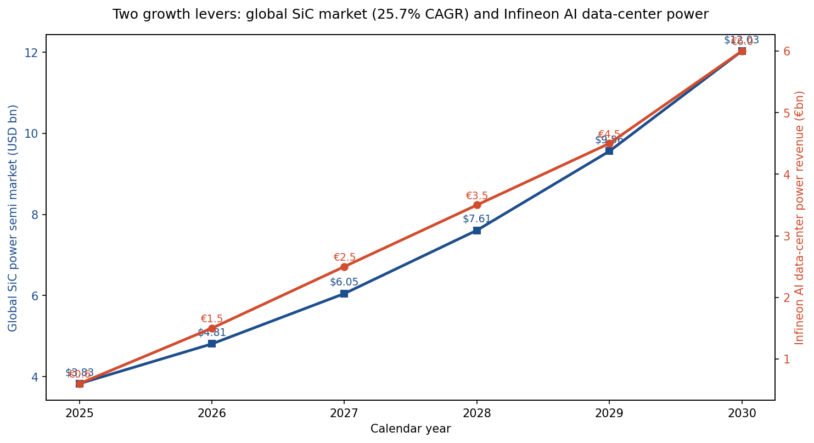
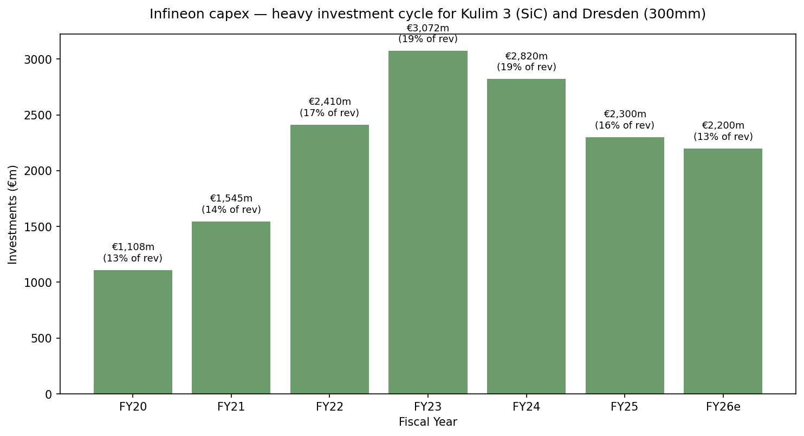

# COMPANY RESEARCH REPORT: Infineon Technologies AG

**Date:** 2026-05-20
**Ticker:** XETR:IFX (XETRA Frankfurt, primary) · ISIN DE0006231004 · OTC:IFNNY / IFNNF (ADR)
**Headquarters:** Neubiberg (Munich), Germany
**Listing language:** German / IFRS filings, English IR. Report written in English per skill rules.

> **Update — XETR:IFX shares re-rated +87% YoY on AI power thesis (data through 2026-05-20):** Infineon's XETRA share price closed at **€67.94 on 20 May 2026**, near the 52-week high of €68.74 and up **86.5%** versus the 12-month low of €30.82 (Source: [Yahoo Finance IFX.DE quote and 52-week range, accessed 2026-05-20](https://finance.yahoo.com/quote/IFX.DE/)). Market capitalisation has expanded to **€88.3 billion**. The re-rating is driven by management's significantly increased AI data-center power revenue target disclosed with FY2025 results (Source: [Infineon FY 2025 press release INFXX202511-021, 12 Nov 2025](https://www.infineon.com/press-release/2025/infxx202511-021)) and the NVIDIA 800V HVDC partnership (Source: [Infineon press release INFXX202505-107, May 2025](https://www.infineon.com/cms/en/about-infineon/press/press-releases/2025/INFXX202505-107.html); [NVIDIA Developer Blog "800V HVDC Architecture"](https://developer.nvidia.com/blog/nvidia-800-v-hvdc-architecture/)). Bears flag that the rally has pushed TTM P/E to ~83× — well above the FY2025 fundamentals justify — making valuation itself the largest single near-term risk.

## TABLE OF CONTENTS
1. Company Overview
2. Company History
3. Management Team
4. Products & Services
5. Customers & Go-to-Market
6. Industry Overview
7. Competitive Landscape
8. Market Opportunity (TAM)
9. Risk Assessment

---

## 1. COMPANY OVERVIEW

Infineon Technologies AG is Germany's largest pure-play semiconductor company and the global leader in two of the most strategically important chip categories: **power semiconductors** and **automotive semiconductors**. Headquartered in Neubiberg on the southern outskirts of Munich, Infineon designs, manufactures, and sells semiconductor components that convert, switch, sense, secure, and control electrical energy across automotive, industrial, and consumer applications (Source: [Wikipedia — Infineon Technologies](https://en.wikipedia.org/wiki/Infineon_Technologies)). The company operates on a fiscal year ending 30 September; this report uses Infineon's fiscal calendar throughout.

For fiscal 2025 (ended 30 September 2025), Infineon reported revenue of **€14.662 billion**, down 2 percent year-on-year, with a Segment Result of €2.560 billion and a Segment Result Margin of 17.5 percent (Source: [Infineon press release INFXX202511-021, 12 Nov 2025, "FY 2025 concluded in line with expectations"](https://www.infineon.com/press-release/2025/infxx202511-021)). FY2024 — the prior baseline year — generated €14.955 billion of revenue, down 8 percent from the €16.309 billion peak of FY2023, with a Segment Result of €3.105 billion (20.8 percent margin) reflecting the broader semiconductor downturn (Source: [Infineon press release INFXX202411-020, 12 Nov 2024](https://www.infineon.com/cms/en/about-infineon/press/press-releases/2024/INFXX202411-020.html); [EQS-News corporate release on FY 2024 results](https://www.eqs-news.com/news/corporate/infineon-technologies-ag/)). Adjusted free cash flow for FY2025 was €1.803 billion, while reported free cash flow was −€1.051 billion, the latter weighed down by the €2.18 billion cash outflow for the Marvell Automotive Ethernet acquisition (Source: [Infineon FY2025 press release INFXX202511-021](https://www.infineon.com/press-release/2025/infxx202511-021)).

*Source: Infineon "Financial Data 2020–2024" booklet for FY2020–FY2024; Infineon FY2025 press release [INFXX202511-021](https://www.infineon.com/press-release/2025/infxx202511-021) for FY2025; FY2026e midpoint reflects management's "moderate revenue growth" framing in the FY2025 outlook.*

Infineon organizes its business into **four operating segments**, each reporting separately to the management board:

- **Automotive (ATV)** — approximately 56 percent of FY2024 revenue (~€8.4 billion), making it the company's flagship division. ATV supplies the microcontrollers, power devices, sensors, and connectivity chips that go into every modern vehicle, from entry-level economy cars to high-end electric drivetrains (Source: [Infineon FY2024 Financial Data booklet](https://www.infineon.com/assets/row/public/documents/corporate/investors/annual-reports/2024/2024-infineon-financial-data-2020-2024-v01-00-en.pdf)).
- **Power & Sensor Systems (PSS)** — about 21 percent of FY2024 revenue. PSS covers consumer, computing, communications, and AI data-center power, along with the XENSIV sensor family. **This is the segment most exposed to AI server demand**, where Infineon's collaboration with NVIDIA on 800V HVDC architecture lives, and the segment where management has guided the most aggressive growth.
- **Green Industrial Power (GIP)** — about 13 percent of FY2024 revenue. GIP supplies IGBTs and SiC modules for solar inverters, wind turbines, traction drives, industrial motor control, and energy-storage systems.
- **Connected Secure Systems (CSS)** — about 10 percent. CSS bundles the legacy Cypress assets (PSoC microcontrollers, AIROC Wi-Fi/Bluetooth) with security ICs (OPTIGA) and NOR/SRAM/FRAM memory, addressing IoT and embedded systems.

*Source: [Infineon "Financial Data 2020–2024" booklet](https://www.infineon.com/assets/row/public/documents/corporate/investors/annual-reports/2024/2024-infineon-financial-data-2020-2024-v01-00-en.pdf), segment revenue for FY2024.*

The customer base spans every major automotive OEM and Tier-1 supplier worldwide, with named customers including Tesla, BYD, Volkswagen, Hyundai-Kia, and Bosch in automotive, plus NVIDIA and a widening list of hyperscalers in AI power (Source: [Automotive World "Infineon retains automotive chip market top spot"](https://www.automotiveworld.com/news-releases/infineon-retains-automotive-chip-market-top-spot/); [Infineon NVIDIA 800V partnership press release INFXX202505-107](https://www.infineon.com/cms/en/about-infineon/press/press-releases/2025/INFXX202505-107.html); [Infineon 800V advance release INFXX202510-003](https://www.infineon.com/cms/en/about-infineon/press/press-releases/2025/INFXX202510-003.html)). The company sells through a mix of direct sales to large strategic accounts and an extensive distribution network covering tens of thousands of smaller industrial and consumer customers.

Geographically, Infineon is one of the most globally balanced semiconductor companies. Europe, the Middle East and Africa contribute the largest share of revenue, followed by Greater China, the Americas, and other Asia-Pacific markets (Source: [Infineon Financial Data 2020-2024 booklet](https://www.infineon.com/assets/row/public/documents/corporate/investors/annual-reports/2024/2024-infineon-financial-data-2020-2024-v01-00-en.pdf)). Manufacturing is split between European front-end fabs in **Dresden** (300mm silicon — analog/mixed-signal and power; €5 billion expansion due online in autumn 2026) and **Villach, Austria** (the global competence centre for power electronics and the home of Infineon's SiC and GaN development), and Asian capacity in **Kulim, Malaysia** — where phase 2 of the Kulim 3 fab will be the world's largest 200mm SiC power semiconductor plant with an additional €5 billion investment (Source: [Infineon press release INFXX202408-133, August 2024, "Infineon opens the world's largest and most efficient SiC fab"](https://www.infineon.com/cms/en/about-infineon/press/press-releases/2024/INFXX202408-133.html); [Silicon Saxony coverage of Kulim 3](https://silicon-saxony.de/en/infineon-construction-of-the-worlds-largest-200-millimeter-sic-power-fab-in-kulim-malaysia/); [Digitimes Dresden coverage, Feb 2023](https://www.digitimes.com/news/a20230203PD200.html)). Back-end assembly and test sit primarily in Malacca, Malaysia; Batam, Indonesia; Singapore; Cegléd, Hungary; Wuxi, China; and a handful of smaller sites. **Regensburg** in Bavaria is uniquely the only Infineon location combining front-end wafer fabrication and back-end assembly, with more than 3,000 employees (Source: [Infineon "Regensburg" location page](https://www.infineon.com/cms/en/about-infineon/company/find-a-location/regensburg/)).

As of 30 September 2025 Infineon employed approximately **57,000 people worldwide**, down from roughly 58,060 at the end of FY2024 as the company executed a previously announced cost program in response to the cyclical downturn (Source: [Infineon FY2025 press release INFXX202511-021](https://www.infineon.com/press-release/2025/infxx202511-021)). Around 13 to 15 percent of revenue is reinvested into research and development — FY2025 R&D spend was €2.227 billion, equivalent to 15.2 percent of revenue, the highest ratio in five years and a deliberate counter-cyclical signal (Source: derived from Infineon FY2025 income statement; reconciled with the FY2025 press release on operating cost lines).

*Source: Infineon income statement, FY2022–FY2025; pulled from yfinance Ticker('IFX.DE').financials, cross-checked against [FY2024 Financial Data booklet](https://www.infineon.com/assets/row/public/documents/corporate/investors/annual-reports/2024/2024-infineon-financial-data-2020-2024-v01-00-en.pdf) and the FY2025 press release.*

Infineon's strategic positioning is straightforward: the company is **#1 in automotive semiconductors for six consecutive years** (13.5 percent share in 2024, per TechInsights — Source: [Infineon press release INFATV202504-085, "Infineon bolsters global lead in automotive semiconductors"](https://www.infineon.com/cms/en/about-infineon/press/press-releases/2025/INFATV202504-085.html)), **#1 in automotive microcontrollers** with a 36.0 percent share that expanded 3.9 percentage points year-on-year (Source: [Infineon press release INFXX202504-086, "Infineon further strengthens its number one position in automotive microcontrollers"](https://www.infineon.com/cms/en/about-infineon/press/press-releases/2025/INFXX202504-086.html)), and **#1 in power semiconductors overall** at roughly 19.5 percent market share in 2025 (Source: [Mordor Intelligence Power Semiconductor Market](https://www.mordorintelligence.com/industry-reports/power-semiconductor-market)). The investment thesis rests on the conviction that decarbonisation (EVs, renewables, grid), AI compute power, and software-defined vehicles will drive structural demand for the exact silicon, silicon carbide, and gallium nitride content Infineon dominates.

### Valuation snapshot (as of 2026-05-20)

| Metric | Value | Source |
|---|---|---|
| Share price (XETRA close) | **€67.94** | [Yahoo Finance IFX.DE](https://finance.yahoo.com/quote/IFX.DE/) |
| Market capitalisation | **€88.3 bn** | Yahoo Finance IFX.DE |
| TTM P/E | **82.9×** | Yahoo Finance IFX.DE |
| Forward P/E (FY26e) | **26.4×** | Yahoo Finance IFX.DE |
| TTM P/S | **5.84×** | Yahoo Finance IFX.DE |
| P/B | **5.26×** | Yahoo Finance IFX.DE |
| EV / EBITDA | **22.4×** | Yahoo Finance IFX.DE |
| Dividend yield | **0.54%** | Yahoo Finance IFX.DE |
| 52-week range | **€30.82 – €68.74** | Yahoo Finance IFX.DE |
| Beta (5-yr monthly) | **1.90** | Yahoo Finance IFX.DE |

Today's TTM P/E of **82.9× is the highest in the peer group** for cash-generative reasons: FY2025 net income compressed to €1.015 billion (TTM EPS €0.82), reflecting cyclical-trough earnings absorbing Marvell acquisition charges and front-end-fab depreciation step-ups for Dresden and Kulim 3 (Source: [Infineon FY2025 income statement, press release INFXX202511-021](https://www.infineon.com/press-release/2025/infxx202511-021); yfinance financials). The forward P/E of **26.4×** — built on consensus FY2026 EPS of ~€2.57 — is a far more useful gauge and is roughly in line with the peer median.

The cause of the high TTM P/E is therefore (a) cyclically depressed earnings rather than a structural problem, combined with (b) a stock that re-rated dramatically through April–May 2026 on the AI power thesis. From the September 2025 close of ~€32.79 to the 2026-05-20 close of €67.94, IFX has roughly doubled in eight months (Source: yfinance monthly history, IFX.DE); the rally compresses the P/E denominator effect.

**Peer comparison (TTM, Yahoo Finance / yfinance, accessed 2026-05-20):**

| Company | Ticker | TTM P/E | TTM P/S |
|---|---|---|---|
| **Infineon Technologies** | **XETR:IFX** | **82.9×** | **5.84×** |
| STMicroelectronics | NYSE:STM | 405.4× | 4.66× |
| NXP Semiconductors | NASDAQ:NXPI | 29.5× | 6.16× |
| onsemi | NASDAQ:ON | 80.5× | 7.02× |
| Analog Devices | NASDAQ:ADI | 71.8× | 16.30× |
| Texas Instruments | NASDAQ:TXN | 51.5× | 14.89× |
| Microchip Technology | NASDAQ:MCHP | 425.5× | 10.75× |
| Peer median (ex-IFX) | — | **76.1×** | **8.88×** |

*Source: Yahoo Finance / yfinance per-ticker key statistics, accessed 2026-05-20.*

The peer set is cycling through the same FY2025/CY2024 trough as Infineon, so most peer TTM P/Es are at decade-highs. Infineon's TTM P/E of 82.9× is **right around the peer median (76.1×)** and below the most extreme entries (STM 405×, MCHP 426× — both with trough earnings near break-even). On **TTM P/S** Infineon at 5.84× is **near the lower half of the peer set** (peer median 8.88×) — the relative discount reflects Infineon's higher mix of lower-gross-margin power discretes versus the catalog-analog peers (ADI, TXN). On P/B (5.26×) Infineon is at the upper end of the European semis but below TXN (10–12×) and ADI (~3×, fresh post-Maxim deal). **Verdict:** the stretched TTM P/E is explained by cyclically trough earnings combined with an AI-power re-rating, not fabricated growth; the forward P/E of 26.4× is reasonable but leaves little margin for execution slip. Valuation itself becomes Risk #1 in Section 9.

## 2. COMPANY HISTORY

Infineon traces its origins not to 1999 but to the **Halbleiterwerk Regensburg** opened by Siemens in 1952, making it one of the oldest semiconductor operations in Europe. Throughout the 1980s and 1990s the Siemens semiconductor division grew from a small in-house supplier of integrated circuits for the parent company's telecom and industrial businesses into the world's tenth-largest merchant semiconductor maker by 1999, up from nineteenth in 1993 (Source: [Wikipedia — Infineon Technologies](https://en.wikipedia.org/wiki/Infineon_Technologies); [Funding Universe company history archive](http://www.fundinguniverse.com/company-histories/infineon-technologies-ag-history/)). On **1 April 1999** Siemens carved out the division as a separate legal entity, **Infineon Technologies AG**, in what was at the time described as the largest high-technology spin-off in European history (Source: [all-about-industries.com "From Siemens Spin-off to Global Leader"](https://www.all-about-industries.com/companies/infineon-technologies-ag/from-siemens-spin-off-to-global-leader-the-story-of-infineon-technologies-a-c001ada0d59f6d52c75537a3ad04c6e2/)).

The initial public offering on 13 March 2000 raised in excess of $5 billion and was 33 times oversubscribed, the largest tech IPO globally up to that point (Source: [Wikipedia](https://en.wikipedia.org/wiki/Infineon_Technologies); [Funding Universe](http://www.fundinguniverse.com/company-histories/infineon-technologies-ag-history/)). Siemens retained a 74 percent stake initially but progressively divested, and today Infineon is a fully float-traded DAX 40 component with no controlling shareholder. The largest reported institutional holder as of early 2025 was BlackRock at roughly 7.4 percent, with Dodge & Cox, Vanguard's international index funds, and iShares Core MSCI EAFE among the other significant positions (Source: [Yahoo Finance institutional ownership for IFX.DE](https://finance.yahoo.com/quote/IFX.DE/holders)).

The first decade as an independent company was painful. Infineon entered public markets with heavy exposure to commodity DRAM memory, a segment that proved structurally unattractive against Asian competitors with cheaper capital. In 2006 management spun the memory business out as **Qimonda AG**; Qimonda filed for bankruptcy in early 2009. Infineon also sold its wireline business to Golden Gate Capital in 2009 (later Lantiq) and divested the wireless baseband business to Intel in 2011 for $1.4 billion.

With memory, wireline, and wireless out of the portfolio, Infineon was left with what it does today. The next phase was acquisitive consolidation. In 2014/2015 Infineon acquired **International Rectifier (IR)** for approximately $3 billion, instantly becoming #1 in discrete power semiconductors and adding GaN-on-silicon expertise. In 2017 it bought Dutch MEMS/LiDAR specialist Innoluce. Then came the transformational deal: in June 2019 Infineon announced the acquisition of **Cypress Semiconductor** for $9.4 billion (€9 billion enterprise value), closing in April 2020 (Source: [Electronic Design — The Infineon-Cypress Merger](https://www.electronicdesign.com/markets/automation/article/21163220/electronic-design-the-infineoncypress-merger-what-does-it-mean-for-the-electronics-industry)). Cypress brought PSoC microcontrollers, NOR flash and SRAM memory, the TRAVEO automotive MCU family, and the AIROC Wi-Fi/Bluetooth connectivity portfolio.

Through the COVID-era semiconductor boom of 2021–2023 Infineon hit record revenues and margins, then rode the inevitable down-cycle starting in mid-2023. Management used the period to push two structural bets. First, **capacity in wide-bandgap power**: in 2023 Infineon acquired Canadian **GaN Systems** to consolidate gallium nitride leadership, and in early 2023 broke ground on the **Dresden 300mm Smart Power Fab** with €5 billion of capex (partially supported by EU Chips Act and German government funds), production targeted for autumn 2026. The Kulim 3 SiC fab in Malaysia opened phase 1 in August 2024 and is expanding to be the world's largest 200mm SiC power facility with another €5 billion of phase-2 investment, supported by roughly €5 billion of customer design wins and approximately €1 billion of customer prepayments — an unusual arrangement that derisks the build-out (Source: [Infineon Kulim 3 press release INFXX202408-133](https://www.infineon.com/cms/en/about-infineon/press/press-releases/2024/INFXX202408-133.html); [Compound Semiconductor coverage](https://compoundsemiconductor.net/article/118321/Infineon_opens_worlds_largest_SiC_power_fab)). Second, **software-defined vehicle networking**: in April 2025 Infineon agreed to buy **Marvell's Automotive Ethernet business** — the Brightlane portfolio of PHY transceivers, switches and bridges — for $2.5 billion in cash, closing in August 2025 (Source: [Infineon press release INFXX202504-086 announcing the deal](https://www.infineon.com/cms/en/about-infineon/press/press-releases/2025/INFXX202504-086.html); [Infineon press release INFXX202508-133 on closing](https://www.infineon.com/cms/en/about-infineon/press/press-releases/2025/INFXX202508-133.html); [Marvell completes divestiture, Aug 2025](https://investor.marvell.com/news-events/press-releases/detail/88/marvell-completes-divestiture-of-automotive-ethernet-business-to-infineon-for-2-5-billion-in-all-cash-transaction)). Marvell's automotive Ethernet generates an estimated $225–250 million in 2025 revenue at roughly 60 percent gross margin, with a $4 billion design-win pipeline through 2030.

The most strategically significant 2025 development was outside M&A. In May 2025 Infineon announced a partnership with **NVIDIA** to develop the **800V HVDC power architecture** for next-generation AI data centers, with central rectification and on-board GPU-side conversion using a blend of silicon, SiC and GaN devices (Source: [Infineon press release INFXX202505-107, May 2025](https://www.infineon.com/cms/en/about-infineon/press/press-releases/2025/INFXX202505-107.html); [NVIDIA Developer Blog "NVIDIA 800V HVDC Architecture Will Power the Next Generation of AI Factories"](https://developer.nvidia.com/blog/nvidia-800-v-hvdc-architecture/)). With FY2025 results in November 2025, management **significantly increased** its AI data-center revenue target — a number large enough to swing PSS segment growth materially (Source: [Infineon FY2025 press release INFXX202511-021](https://www.infineon.com/press-release/2025/infxx202511-021)). This is the principal driver of the share re-rating between November 2025 and May 2026.

## 3. MANAGEMENT TEAM

Infineon's management board (Vorstand) currently has four members: a CEO, a CFO, a Chief Operations Officer, and a Chief Marketing Officer. The Chief Digital Transformation Officer role held by Constanze Hufenbecher was wound down in April 2024 at the end of her contractual term.

### Jochen Hanebeck — Chief Executive Officer

Jochen Hanebeck has been Infineon's CEO since 1 April 2022 and his current term runs through 31 March 2027 (Source: [Infineon corporate biography for Jochen Hanebeck](https://www.infineon.com/cms/en/about-infineon/company/management/jochen-hanebeck/)). Born in 1968 in Dortmund, he holds a master's degree in solid-state electronics from RWTH Aachen University, one of Germany's premier engineering schools. He joined Siemens — Infineon's parent at the time — in 1994 as a DRAM development engineer in East Fishkill, New York, then moved to Dresden, then to Munich as he worked his way through engineering and operations management roles (Source: [LinkedIn post by Jochen Hanebeck, January 2024](https://www.linkedin.com/posts/jochen-hanebeck_infineon-careers-activity-7152011515731943424-IGtN/)).

Hanebeck's career inside Infineon is unusually deep: more than thirty years at the company by the time of writing. He has run virtually every part of the operation, including Power Management & Multimarket and most consequentially the **Automotive division (ATV)** as its Division President — the largest and most profitable segment, where he was credited with the design wins underpinning Infineon's #1 automotive position today (Source: [ITF World 2024 speaker biography](https://www.itf-world.com/speakers/jochen-hanebeck/)). He was promoted to the management board as COO in 2016 before being appointed CEO. His tenure has been defined by aggressive capex (Dresden, Kulim 3), bold M&A (Marvell Automotive Ethernet), and the high-profile NVIDIA partnership. Industry coverage frames his leadership style as engineering-led and substance-focused, captured in the EE Times "Be Authentic; Substance Matters" Grapevine profile (Source: [EE Times — Infineon's Jochen Hanebeck](https://www.eetimes.com/infineons-jochen-hanebeck-be-authentic-substance-matters/)). He is also a frequent speaker at industry events including SEMICON Europa and the imec ITF World, where he advocates for European semiconductor sovereignty.

### Sven Schneider — Chief Financial Officer

Dr. Sven Schneider has been CFO since 1 May 2019 and is responsible for accounting, controlling, financial planning, investor relations, taxes, treasury, audit, compliance, export control, risk, business continuity, and IT (Source: [Infineon corporate biography for Sven Schneider](https://www.infineon.com/cms/en/about-infineon/company/management/sven-schneider/)). Born in 1966 in Berlin, he completed a banking apprenticeship before studying business administration at the universities of Regensburg, Nantes, and Trier, eventually earning a doctorate in business administration from Trier.

Schneider began his career at industrial-gases giant **Linde AG** in 1995, spending twenty-four years there in roles spanning corporate finance, M&A, and treasury before being elevated to the Linde executive board in 2017 and then group CFO in 2018 (Source: [EuropaWire "Dr. Sven Schneider of Linde AG will become the new CFO of Infineon"](https://news.europawire.eu/dr-sven-schneider-of-linde-ag-will-become-the-new-cfo-of-infineon-technologies-on-1-may-2019/eu-press-release/2019/03/26/)). At Linde he was lead financial executive on two transformational acquisitions: **Lincare** in the United States and the £8 billion **BOC Group** acquisition in the United Kingdom, the latter giving him direct experience integrating a similarly sized cross-border industrial business. His arrival at Infineon coincided with the announcement of the Cypress acquisition — he managed the financing structure for the €9 billion deal — and he has since overseen the Marvell Automotive Ethernet financing (€2.18 billion of acquisition-related cash outflow in FY2025) and the multi-billion-euro Dresden and Kulim 3 fab capex programs. Investors generally view Schneider as a disciplined operator who has maintained a conservative balance sheet through a heavy capex cycle while sustaining the dividend at €0.35 per share (Source: [Infineon Dividend page](https://www.infineon.com/about/investor/infineon-share/dividend); [Infineon FY2025 press release INFXX202511-021](https://www.infineon.com/press-release/2025/infxx202511-021)).

### Rutger Wijburg — Chief Operations Officer

Rutger Wijburg has served as COO since 2022, with his current contract running through 31 March 2026 (Source: [Printed Electronics Now "Infineon Extends Contracts Of Andreas Urschitz, Rutger Wijburg"](https://www.printedelectronicsnow.com/contents/view_breaking-news/2024-05-08/infineon-extends-contracts-of-andreas-urschitz-rutger-wijburg/)). Born in Nijmegen, Netherlands in 1962, he holds a PhD in electrical and electronics engineering from the University of Twente (1990). Before joining Infineon in 2018, Wijburg held senior operations and fab management roles at **Philips Semiconductors**, **NXP Semiconductors** (the Philips spinoff), and **GlobalFoundries**, where he ran a 200mm fab in Singapore.

His remit covers the entire manufacturing footprint of fifteen wafer fabs and back-end facilities across Europe and Asia. The largest operational projects under his oversight are (i) the ramp of the Kulim 3 200mm SiC fab in Malaysia, opened in August 2024 with phase 2 currently building out the world's largest 200mm SiC capacity, and (ii) the Dresden 300mm Smart Power Fab, on track to begin production in autumn 2026. Wijburg's prior experience at NXP and GlobalFoundries — both companies with extensive Asian manufacturing — is materially relevant given Infineon's Malaysian buildout, and he is widely seen as the executive most responsible for delivering the company's capex thesis on time and within budget.

### Andreas Urschitz — Chief Marketing Officer

Andreas Urschitz holds the CMO title (which at Infineon means commercial responsibility for marketing, sales, distribution and key-account management, rather than the more narrowly marcom-focused CMO role common at consumer companies) with a contract recently extended through 31 May 2030 (Source: [Infineon press release INFXX202405-102, May 2024](https://www.infineon.com/cms/en/about-infineon/press/press-releases/2024/INFXX202405-102.html)). Born in 1972 in Klagenfurt, Austria, he holds a master's degree from the Vienna University of Economics and Business and joined the semiconductor division of Siemens in 1995. His career has spanned all four current Infineon segments, with the longest tenure in the power semiconductor business; he served as Division President of Power & Sensor Systems before joining the management board. As CMO he owns customer-facing accountability for the AI data-center, electric-vehicle, and industrial growth thrusts that drive the long-term story — making him a particularly relevant figure for the NVIDIA partnership and the broader AI server power push.

### Governance and ownership

The Supervisory Board (Aufsichtsrat) under German co-determination law has 16 members, half elected by shareholders and half by employees, with the chair traditionally drawn from the shareholder bench. The board is regarded by ISS and Glass Lewis as broadly independent with strong technical depth — a feature of European semiconductor boards generally. Institutional investors own roughly 49–53 percent of the float depending on the date and source; the largest known holder is **BlackRock at approximately 7.4 percent**, followed by Dodge & Cox, Vanguard, and the iShares Core MSCI EAFE ETF (Source: [Yahoo Finance institutional ownership for IFX.DE](https://finance.yahoo.com/quote/IFX.DE/holders)). Management ownership is modest, in line with German market norms — Infineon executives are not paid in the equity-heavy structures typical of US semiconductor peers, which limits both upside alignment and concentration risk. The company has paid an uninterrupted dividend since FY2010; the proposed FY2025 distribution is €0.35 per share (unchanged from FY2024), implying roughly €455 million in aggregate (Source: [Infineon FY2025 cash dividend payment line, per yfinance Ticker('IFX.DE') cashflow](https://finance.yahoo.com/quote/IFX.DE/cash-flow); [Infineon Dividend page](https://www.infineon.com/about/investor/infineon-share/dividend)).

### Management track record assessment

This is a credible, deeply experienced team. Hanebeck has been at Infineon for over three decades and has run its biggest segment; Schneider managed transformational M&A at Linde before leading the €9 billion Cypress financing here; Wijburg has decades of Asian-fab experience exactly relevant to Kulim 3; Urschitz built the PSS franchise that is now the centrepiece of the AI thesis. The gap is **equity-linked alignment** — German pay structures simply do not give the team the upside that, say, Nvidia or TI executives enjoy if the stock doubles. That makes the team easier to retain but reduces the founder-style "ownership mentality" that drives some US peers.

## 4. PRODUCTS & SERVICES

Infineon's product taxonomy is best understood by segment, with each segment owning specific brand families. Below is the comprehensive enumeration grounded in a thorough walk of [infineon.com/products](https://www.infineon.com/products) and segment-level disclosures, followed by a per-product competitive-advantage verdict.

```mermaid
graph TD
    INF[Infineon Technologies]
    INF --> ATV[ATV — Automotive]
    INF --> PSS[PSS — Power & Sensor Systems]
    INF --> GIP[GIP — Green Industrial Power]
    INF --> CSS[CSS — Connected Secure Systems]

    ATV --> AURIX[AURIX TC2x/TC3x/TC4x MCUs]
    ATV --> TRAVEO[TRAVEO T2G body MCUs]
    ATV --> ATVPWR[CoolSiC EV traction · CoolMOS · IGBT HybridPACK]
    ATV --> XENSIV_R[XENSIV radar 24/60/77GHz · magnetic position · current sensors]
    ATV --> BRIGHTLANE[Brightlane Automotive Ethernet PHY/Switch — Marvell legacy]

    PSS --> COOLMOS[CoolMOS Si MOSFETs · CoolGaN]
    PSS --> AISERVER[AI server power — 48V VRM · 800V HVDC building blocks]
    PSS --> XENSIV_S[XENSIV MEMS mic · ToF · pressure · CO2 · CapSense]
    PSS --> MERUS[MERUS Class-D audio amplifiers]

    GIP --> IGBT[PrimePACK · EconoPACK · EasyPACK IGBT modules]
    GIP --> COOLSIC_G[CoolSiC modules for solar / wind / traction]
    GIP --> EICEDRIVER[EiceDRIVER gate drivers]

    CSS --> PSOC[PSoC 4/6/Edge mixed-signal MCUs]
    CSS --> AIROC[AIROC Wi-Fi/Bluetooth/Matter]
    CSS --> OPTIGA[OPTIGA TPM / Trust M / Connect security ICs]
    CSS --> MEMORY[NOR flash · SRAM · F-RAM · nvSRAM]
```

**Power Semiconductors (sold via ATV, GIP, and PSS depending on end market):**

- **CoolMOS™** — high-voltage silicon superjunction MOSFETs for AC/DC and DC/DC power supplies (target customer: server OEMs, EV chargers, telecom). The latest generation CoolMOS 8 is part of the **Topside Cooled (TSC)** family enabling 95 percent direct heat dissipation through Q-DPAK packaging (Source: [Infineon CoolSiC product page](https://www.infineon.com/cms/en/product/power/mosfet/silicon-carbide/)). **Verdict: yes** — moat from packaging IP, decades of process maturity, scale.
- **CoolSiC™** — silicon-carbide MOSFETs and diodes; CoolSiC MOSFETs 1200V G2 launched July 2025 with 25 percent lower switching losses than Gen 1; new 75 mΩ 650V G2 variants for medium-power AI server and EV charger applications launched August 2025. In May 2025 Infineon won Hyundai as lead customer for 800kW traction inverters using trench-based SiC superjunction devices with 40 percent lower RDS(on) (Source: [Mordor Intelligence Power Semiconductor Market](https://www.mordorintelligence.com/industry-reports/power-semiconductor-market)). **Verdict: yes** — top-3 SiC supplier globally; world's largest 200mm SiC fab (Kulim 3) is a hard-to-replicate capacity moat. Closest competitor: STMicroelectronics' STPOWER SiC line (parity on devices; ST ahead on Tesla supply).
- **CoolGaN™** — gallium-nitride power transistors at 100V, 600V and 650V; first 300mm power GaN wafers demonstrated in 2024, a world first (Source: [IEEE PELS magazine — Infineon Reveals First 300-mm Power GaN Wafers](https://www.ieee-pels.org/infineon-reveals-first-300-mm-power-gan-wafers/)). **Verdict: yes** — only top-3 vendor with leadership across Si, SiC *and* GaN; GaN Systems acquisition (2023) added high-end IP. Closest competitors: Power Integrations / Navitas / EPC — Infineon ahead on scale and automotive qualification.
- **OptiMOS™** — medium-voltage silicon MOSFETs (12V–200V) for motor drives, server VRMs, and battery management. **Verdict: yes** — market leader at scale; moat from cost, breadth, and AEC-Q101 qualification.
- **IGBT Modules** — **PrimePACK™**, **EconoPACK™**, **EasyPACK™**, **HybridPACK™** families spanning 600V to 6.5kV for wind, solar central inverters, traction (rail and EV) and industrial drives. PrimePACK IGBT5 with .XT interconnect technology is described as "best-in-class power cycling capability" for wind. **Verdict: yes** — joint #1 with Mitsubishi Electric and Fuji Electric in intelligent power modules where the top five hold 55 percent of the market.
- **EiceDRIVER™** — isolated gate drivers paired with the power devices above. **Verdict: partial** — strong in EV traction and renewables; faces stiff competition from Analog Devices/Maxim and Texas Instruments in industrial gate drivers.

**Microcontrollers (ATV and CSS):**

- **AURIX™ TriCore™ TC2x / TC3x / TC4x** — Infineon's flagship automotive multi-core microcontroller franchise. The new **AURIX TC4Dx** launched November 2024 on 28nm with a dedicated **Parallel Processing Unit (PPU)** for embedded AI (motor control, battery management, vehicle motion control), ISO 26262 ASIL-D, and ISO/SAE 21434 cybersecurity including post-quantum support; mass production in 2025 (Source: [Infineon press release INFATV202411-018 on AURIX TC4Dx](https://www.infineon.com/cms/en/about-infineon/press/press-releases/2024/INFATV202411-018.html); [eeNews Europe "Infineon launches first Aurix TC4x chip"](https://www.eenewseurope.com/en/infineon-launches-first-aurix-tc4x-chip/)). In September 2025 Infineon released a comprehensive AURIX TC4x software portfolio with production-ready ASIL-D AUTOSAR MCAL drivers. **Verdict: yes (strongest moat in portfolio)** — 36.0 percent automotive MCU share per TechInsights (Source: [Infineon press release INFXX202504-086](https://www.infineon.com/cms/en/about-infineon/press/press-releases/2025/INFXX202504-086.html)); AUTOSAR ecosystem lock-in, ISO 26262 certification cost, and decades-deep automotive customer relationships. Closest competitor: NXP S32 family (NXP ahead on networking SoCs; Infineon ahead on safety MCU).
- **TRAVEO™ T2G** — Arm Cortex-M-based body and HMI MCUs, originally Cypress IP. **Verdict: partial** — solid #2 in body domain MCUs; closest competitor: Renesas RH850.
- **PSoC™ 4 / 6 / Edge** — programmable system-on-chip family with Arm Cortex cores plus reconfigurable analog/digital. PSoC Edge added neural-acceleration in 2024. **Verdict: partial** — unique mixed-signal flexibility; faces Renesas RA, NXP LPC and STMicro STM32 in volume IoT.
- **XMC™** — industrial 32-bit MCUs for motor control and power conversion. **Verdict: partial** — competitive against STM32G and TI C2000.

**Sensors (largely ATV and PSS):**

- **XENSIV™** umbrella brand covering radar (24, 60 and 77GHz), MEMS microphones, current sensors, magnetic position sensors (TLE/TLI), pressure sensors (BAROXX), CO2 sensors, time-of-flight (ToF), and 3D image sensors (the IRS family from the Innoluce/pmd acquisitions). **Verdict: yes** in automotive radar where Infineon is a clear #1 with NXP; **partial** in MEMS mics versus Knowles and Goertek; **yes** in current sensing where TMR/Hall IP is differentiated.

**Connectivity (CSS plus automotive Ethernet inside ATV after Marvell):**

- **AIROC™ Wi-Fi/Bluetooth combos** — Wi-Fi 4/5/6/6E with Bluetooth/BLE, originally Cypress (and Broadcom heritage before that). **Verdict: partial** — solid in IoT and automotive infotainment; Qualcomm and NXP are stiff competitors in higher-end automotive Wi-Fi.
- **AIROC™ Bluetooth & multiprotocol** — standalone BLE/Thread/Matter. **Verdict: partial** — strong in industrial and white-goods.
- **Brightlane™ Automotive Ethernet** (acquired Aug 2025 from Marvell) — PHY transceivers, switches, bridges supporting 100Mbps to 10Gbps for in-vehicle networking; ~$4 billion design-win pipeline by 2030 (Source: [Infineon press release INFXX202508-133](https://www.infineon.com/cms/en/about-infineon/press/press-releases/2025/INFXX202508-133.html)). **Verdict: yes (new)** — combined with AURIX MCUs this creates a unique end-to-end software-defined-vehicle position. Closest competitor: NXP Ethernet PHY.

**Security & Identification (CSS):**

- **OPTIGA™ TPM / Trust M / Connect** — secure elements and TPMs for authentication, IoT identity, payment, and government ID. **Verdict: yes** — top-tier in TPMs alongside STMicro and NXP; embedded SIM and government-ID markets are oligopolistic with high certification barriers.
- Smart-card and embedded secure-element ICs for payment, transit, eGovernment. **Verdict: yes** — entrenched share in EMV payment chips and European eID.

**Memory (CSS, Cypress legacy):**

- **NOR Flash** (Semper Secure, HyperFlash), **EXCELON™ F-RAM**, **SRAM**, **nvSRAM**, and PSRAM. **Verdict: partial** — competitive in industrial- and automotive-grade NOR/FRAM versus Macronix and Renesas; not a structural growth segment.

**Audio (PSS):**

- **MERUS™** Class-D audio amplifiers. **Verdict: partial** — niche but profitable; Texas Instruments is the principal competitor.

**AI server power building blocks (PSS — the growth story):** In addition to the standalone product families above, Infineon's AI server power proposition is increasingly described as a *system* rather than a part list. The reference 800V HVDC architecture co-developed with NVIDIA combines (i) centralised front-end rectification using high-voltage CoolMOS and CoolSiC, (ii) intermediate DC/DC conversion using CoolGaN at the rack PSU and shelf-PSU level, and (iii) on-board multi-phase 48V-to-core converters using OptiMOS and isolated EiceDRIVER drivers. This is the **growth story for NVDA/AMD AI server power semis** that drove the stock re-rating: each GPU rack in the new 1MW+ architecture requires substantially more dollar-content of Infineon silicon than the 12V/48V architectures of GH200/H100-class systems (Source: [NVIDIA Developer Blog "NVIDIA 800V HVDC Architecture"](https://developer.nvidia.com/blog/nvidia-800-v-hvdc-architecture/); [Infineon advance release INFXX202510-003 — "Infineon advances leading-edge 800 Volt AI data center"](https://www.infineon.com/cms/en/about-infineon/press/press-releases/2025/INFXX202510-003.html)).

**Flagship vs. long-tail:** the **three products driving the business** are (1) **AURIX TriCore automotive MCUs**, by far the highest-margin growth engine and the source of the 36 percent automotive-MCU share; (2) **CoolSiC silicon-carbide power semiconductors**, the secular growth lever tied to EV traction and AI data-center power; and (3) **IGBT modules (PrimePACK / HybridPACK)** for wind, solar and EV traction. Recent launches in the last 12 months include the AURIX TC4Dx (Nov 2024), CoolSiC MOSFETs 1200V G2 in Q-DPAK (Jul 2025), 75mΩ CoolSiC 650V G2 (Aug 2025), and the Brightlane Automotive Ethernet portfolio integrated post-Marvell close (Aug 2025). The clearest product *expansion* — rather than sunset — is in the AI server power stack, where Infineon and NVIDIA announced 800V HVDC silicon, SiC and GaN building blocks targeting commercial deployment before the end of the decade.

## 5. CUSTOMERS & GO-TO-MARKET

Infineon's go-to-market reflects the company's mixed customer base: roughly forty large strategic accounts that account for the majority of revenue, plus a long tail of tens of thousands of industrial and consumer customers served through distribution.

**Customer concentration disclosure.** Unlike US 10-K filers or Chinese A-share issuers, German listed companies are not required to disclose specific top-1/top-5 customer revenue shares unless they materially constitute a reportable segment. Infineon's [Annual Report 2025](https://www.infineon.com/row/public/documents/corporate/investors/annual-reports/2025/2025-annual-report-v01-00-en.pdf) does not break out customer concentration in the quantitative form a US 10-K would. Industry estimates and competitor disclosures suggest the top-10 automotive customers (the global VW, Toyota, Stellantis, Hyundai-Kia, BYD, Tesla, Ford, GM, Renault-Nissan and Mercedes-Benz groups, together with their Tier-1s Bosch, Continental, ZF, Denso, Magna and Aisin) probably account for over half of ATV revenue. **This is a disclosure gap, not a known concentration level — and we flag it as a risk in Section 9.**

In **automotive** — 56 percent of revenue — the customer base is the entire global OEM and Tier-1 supplier base. Named relationships include **Tesla**, **BYD**, **Volkswagen**, **Hyundai-Kia**, **Bosch**, **Continental**, **ZF**, **Denso**, and **Magna**, among others (Source: [Automotive World — Infineon retains automotive chip market top spot](https://www.automotiveworld.com/news-releases/infineon-retains-automotive-chip-market-top-spot/); [Infineon ATV press release INFATV202504-085](https://www.infineon.com/cms/en/about-infineon/press/press-releases/2025/INFATV202504-085.html)). Specific examples include Hyundai as lead customer for Infineon's trench-based SiC for 800kW traction inverters (May 2025), and Tesla as a long-running SiC customer following its initial Model 3 inverter adoption. Sales cycles are notoriously long — typical automotive design wins from RFQ to start of production run three to five years, and program lifetimes can exceed ten years — which means today's revenue largely reflects design wins from 2018–2022, and today's design-win activity will support FY2028 onwards.

In **industrial and renewables (GIP)** the buyers are inverter and drive OEMs including **SMA**, **Sungrow**, **Huawei Digital Power**, **Vestas**, **Siemens Energy**, **ABB**, **Schneider Electric**, **Yaskawa**, and **Fanuc**. Sales are predominantly direct with strong technical pre-sales support, although channel partners handle SMB industrial accounts.

In **PSS** — increasingly the **AI data-center power** story — the customers are server OEMs (Dell, HPE, Supermicro, Lenovo, Inspur), hyperscalers' ODMs (Quanta, Foxconn, Wiwynn), and most strategically **NVIDIA**, whose 800V HVDC rack architecture for next-generation AI factories Infineon is co-developing. Importantly, Infineon's power semiconductors do not displace the NVIDIA / AMD GPU socket — they sit alongside it in the power-delivery network. Each 1MW AI rack requires a coordinated stack of Infineon silicon (front-end rectifiers, intermediate-bus converters, point-of-load VRMs, drivers, sensors), which means the **AI server power dollar content per rack grows with both rack power and GPU density**. Management's "significantly increased" AI data-center revenue target disclosed at FY2025 results reflects this content-per-rack expansion rather than displacement competition with the GPU vendors themselves (Source: [Infineon FY2025 press release INFXX202511-021](https://www.infineon.com/press-release/2025/infxx202511-021); [NVIDIA Developer Blog](https://developer.nvidia.com/blog/nvidia-800-v-hvdc-architecture/)).

In **CSS** the customer base is more fragmented: consumer-electronics OEMs (Apple, Samsung, Xiaomi), IoT module makers, payment-card issuers, smart-meter OEMs, and a broad industrial mid-market.

**Distribution.** Infineon sells via the global broadline distributors **Arrow Electronics, Avnet, Future Electronics, Mouser, Digi-Key**, and the Asian specialists **WPG Holdings, WPI, Macnica, Ryosan**, plus regional security-IC distributors. Distribution accounts for an estimated 35–45 percent of revenue (typical for European semiconductor companies with broad industrial exposure). The company runs a sophisticated technical-marketing and applications-engineering organisation that places engineers at customer sites for major design-in efforts, particularly in automotive and industrial.

**Sales strategy.** The strategic playbook is "system co-engineering": Infineon ships not just discrete chips but reference designs, simulation tools (PLECS models for CoolSiC and CoolGaN), evaluation kits (AURIX StartKit, PSoC Edge dev kits), and an expanding software stack — the AUTOSAR-compliant AURIX TC4x driver suite released in September 2025 is the clearest example. The Brightlane Marvell acquisition explicitly aims to convert Infineon from a chip vendor to a software-defined-vehicle systems partner.

**Named customer case studies announced publicly:** **NVIDIA** for AI 800V HVDC; **Hyundai** for SiC 800kW traction inverters; **BYD HAN EV** motor controllers using SiC MOSFETs; **Tesla** Model 3 inverter SiC; **Volkswagen** powertrain MCU and power devices.

## 6. INDUSTRY OVERVIEW

Infineon competes in the global semiconductor industry, defined by the World Semiconductor Trade Statistics organisation (NAICS 334413 and adjacent codes). The WSTS Autumn 2025 forecast pegged the **global semiconductor market at $772 billion in 2025**, up 22 percent year-on-year, driven primarily by logic and memory categories serving AI and data-center demand. The forecast for 2026 is more than $975 billion, implying the industry will approach the **$1 trillion mark in 2026 — four years ahead of long-standing Deloitte/SIA forecasts that targeted 2030** (Source: [WSTS Autumn 2025 Forecast](https://www.wsts.org/esraCMS/extension/media/f/WST/7310/WSTS_FC-Release-2025_11.pdf); [Deloitte 2026 Semiconductor Industry Outlook](https://www.deloitte.com/us/en/insights/industry/technology/technology-media-telecom-outlooks/semiconductor-industry-outlook.html)).

This headline number is misleading for Infineon, however, because the company has essentially no exposure to memory or to leading-edge logic. The **served available market (SAM)** is the analog, power, and automotive subset of the industry. Within this subset, the relevant growth dynamics are very different from the headline AI-driven memory story:

- **Automotive semiconductors** are a roughly $100 billion market in 2025 expected to grow at a 7–8 percent CAGR through 2030, reaching $132–143 billion by 2030 (Source: [Mordor Intelligence — Automotive Semiconductor Market](https://www.mordorintelligence.com/industry-reports/automotive-semiconductor-market); [Yole Group "Infineon, NXP and STMicroelectronics face rising competition in $132 billion automotive semiconductor race"](https://www.yolegroup.com/press-release/infineon-technologies-nxp-and-stmicroelectronics-face-rising-competition-in-132-billion-automotive-semiconductor-race/)). The growth drivers are well known: rising semiconductor content per vehicle (an ICE car contains roughly $400–500 of chips; a battery EV $700–1,000; a Level 2+ ADAS vehicle adds another $100+), the shift from distributed to zonal/centralised E/E architectures, and software-defined vehicle features that demand far more compute and networking content. Infineon's 13.5 percent share in 2024 makes it the segment leader.
- **Power semiconductors** (discretes plus power ICs) — roughly $50 billion in 2025 across silicon, SiC and GaN — grow at a 6–9 percent CAGR depending on the methodology used. SiC alone is forecast to reach $12.03 billion by 2030 from $3.83 billion in 2025, a 25.7 percent CAGR (Source: [MarketsandMarkets — Silicon Carbide Market 2025-2030](https://www.marketsandmarkets.com/Market-Reports/silicon-carbide-electronics-market-439.html); [Mordor Intelligence — Silicon Carbide Power Semiconductor Market](https://www.mordorintelligence.com/industry-reports/silicon-carbide-power-semiconductor-market)). GaN is smaller but faster-growing, at roughly 9 percent CAGR per Mordor.

*Source: SiC market trajectory from [MarketsandMarkets Silicon Carbide Market Report 2025-2030](https://www.marketsandmarkets.com/Market-Reports/silicon-carbide-electronics-market-439.html). Infineon AI data-center power figures: management 2026 target framed in [FY2025 press release INFXX202511-021](https://www.infineon.com/press-release/2025/infxx202511-021); out-years are author extrapolation grounded in management's "significantly increased" target language, not formally guided.*

- **Industrial / renewable energy power** is a fragmented end-market with high single-digit growth, driven by global electrification and decarbonisation spending.
- **AI data-center power semiconductors** is the new growth pole. Per Infineon's own framing, AI rack power requirements are expected to reach 1MW or more per rack by the end of the decade, driving a profound architectural shift from 48V distributed power to centralised 800V HVDC. Infineon's "significantly increased" AI power revenue target stated with FY2025 results is the explicit narrative anchor management is asking investors to underwrite (Source: [Infineon FY2025 press release INFXX202511-021](https://www.infineon.com/press-release/2025/infxx202511-021); [Infineon advance release INFXX202510-003](https://www.infineon.com/cms/en/about-infineon/press/press-releases/2025/INFXX202510-003.html)).
- **MCUs** — global microcontroller revenue is roughly $25 billion in 2025, with automotive MCUs about 40 percent of that. Infineon's 36 percent share of automotive MCUs is a structurally defensible position given the certification, software, and customer-relationship moats (Source: [Infineon press release INFXX202504-086](https://www.infineon.com/cms/en/about-infineon/press/press-releases/2025/INFXX202504-086.html)).

**Key trends driving the SAM:**

1. **Electrification of transport** — BEV plus PHEV share of global new-car sales reached an estimated 20+ percent in 2025 and continues to grow despite recent regional softness in Europe. Each EV requires three to four times the power semiconductor content of an ICE vehicle.
2. **Software-defined vehicles (SDV)** — central compute, zonal architectures, high-speed in-vehicle networking. This is why Infineon paid $2.5 billion for Marvell's Automotive Ethernet.
3. **AI infrastructure buildout** — hyperscaler capex has shifted decisively to GPU-centric AI factories with massive power requirements. The architectural shift to 800V HVDC is the largest single change in data-center power architecture in two decades.
4. **Renewable energy and grid investment** — IRA, REPowerEU, and Chinese clean-energy policy continue to drive sustained capex in solar, wind, energy storage, and grid hardware. Infineon's GIP segment is the direct beneficiary.
5. **IoT proliferation** — secular but not explosive growth in connected devices.

**Regulatory environment.** The semiconductor industry is increasingly shaped by industrial policy. The **EU Chips Act** (effective 2023) funded a chunk of Infineon's Dresden expansion. The **US Inflation Reduction Act** subsidises EV and renewables demand on which Infineon's customer base depends. **US export controls** restrict advanced chip equipment and AI accelerators to China; while Infineon's primary product lines fall well outside the controlled categories (its leading-edge node use is 28nm or older for AURIX TC4x and 40–65nm for most power and sensors), the company is exposed to **secondary effects** if Chinese OEM customers lose end-market access. **Antitrust scrutiny** of large semiconductor M&A has tightened — Infineon's Marvell Automotive Ethernet deal required regulatory approvals in multiple jurisdictions before closing in August 2025.

**Industry structure (Porter dynamics).** The relevant subset is **consolidated** — the top five automotive semiconductor suppliers (Infineon, NXP, STMicro, TI, Renesas) account for roughly 50 percent of automotive chips, and the top five power-semiconductor vendors (Infineon, STMicro, onsemi, Wolfspeed, ROHM) hold more than 90 percent of SiC. Buyer power is high in automotive given large OEM concentration, but partially offset by long qualification cycles that create switching-cost barriers. Supplier power is moderate — Infineon manufactures most of its leading-edge silicon, SiC and GaN itself but relies on TSMC for some advanced-node MCU manufacturing. Substitutes are limited — discrete power semiconductors compete with each other but not with any non-semiconductor alternative. Threat of entry is low for established product categories given fab capital intensity, but higher for fabless emerging-market entrants in commodity categories.

## 7. COMPETITIVE LANDSCAPE

Infineon's competitive set differs by segment. The most useful framing is to look at the five direct rivals in automotive plus the five power-semiconductor specialists, then the broader analog-comparable group from the user's required peer list (STM, NXPI, ON, ADI, TXN, MCHP).

**NXP Semiconductors (NXPI)** — Infineon's closest direct competitor. Headquartered in Eindhoven (Philips heritage). FY2024 revenue $12.61 billion, down 5 percent; automotive segment ~58 percent of revenue (~$7.3 billion in 2024) (Source: [NXP Q4 2024 results press release](https://investors.nxp.com/news-releases/news-release-details/nxp-semiconductors-reports-fourth-quarter-and-full-year-2024/)). NXP holds approximately 10.8 percent of automotive chip revenue, second to Infineon's 13.7 percent (Source: [Yole Group automotive press release](https://www.yolegroup.com/press-release/infineon-technologies-nxp-and-stmicroelectronics-face-rising-competition-in-132-billion-automotive-semiconductor-race/)). NXP is *ahead* of Infineon in automotive networking SoCs (i.MX, S32G), automotive radar, and secure NFC. NXP is *behind* Infineon in discrete power semiconductors, automotive MCU share, and SiC/GaN scale (NXP is largely fabless with limited power-discretes manufacturing). On valuation, **NXPI trades at 29.5× TTM P/E and 6.16× P/S** today — substantially cheaper P/E than IFX, but on P/S slightly more expensive — reflecting NXPI's relatively stronger trough earnings and Infineon's more depressed bottom line.

**STMicroelectronics (STM)** — Franco-Italian, Geneva-listed. FY2024 revenue $13.27 billion, down 23 percent in a deep cyclical downturn; net income $1.56 billion, operating margin 12.6 percent (Source: [STM Q4 and FY 2024 results](https://newsroom.st.com/media-center/press-item.html/c3309.html)). ST is *ahead* on SiC (Tesla's primary SiC supplier). ST is *at parity* in automotive overall (~10 percent share). ST is *behind* in industrial IGBTs and automotive MCUs. STM trades at a screaming TTM P/E of **405× and P/S of 4.66×** — the high P/E reflects an FY2025 net income that collapsed close to break-even after a deep CY2025 industrial-cycle decline. STM is the most direct competitor for the EV traction inverter SiC socket.

**Renesas Electronics (TSE: 6723)** — Japanese, formed from the Hitachi/Mitsubishi/NEC merger. Roughly $11 billion FY2024 revenue. Strong in automotive MCUs (~12 percent share, third behind Infineon and NXP) and in industrial analog after the Dialog and IDT acquisitions. *Behind* Infineon in automotive MCU share post-Cypress and in power. *Ahead* in some industrial MCU niches and in analog-mixed-signal breadth.

**Texas Instruments (TXN)** — Dallas-based; the world's largest analog semiconductor company at ~$15 billion FY2024 revenue. Roughly 8.5 percent automotive share, #4 globally. TI is *ahead* in catalog analog (op amps, data converters, low-power MCUs), 300mm analog manufacturing capacity build-out, and gross-margin profile (high-50s percent in trough versus Infineon's low-40s in FY2025). TI is *behind* in SiC and GaN (TI has limited wide-bandgap) and in automotive MCU share. TI's strategy of massive 300mm analog capex is the closest mirror to Infineon's Dresden 300mm build. **TXN trades at 51.5× TTM P/E and 14.9× P/S** — the elevated multiples reflect TI's premium gross margins and its position as the bellwether analog name; investors are paying for the future return-on-capex from the 300mm build.

**Analog Devices (ADI)** — Norwood, MA; FY2024 revenue ~$9.4 billion post-Maxim. Premium pure-play analog and signal-processing supplier with deep precision-converter franchise. **ADI trades at 71.8× TTM P/E and 16.3× P/S** — the highest P/S in the comp set, reflecting ADI's reputation for cycle-resilient gross margins (60s+ percent) and premium analog mix. *Ahead* of Infineon in catalog precision analog, high-end isolation, and the BMS franchise (battery-management ICs). *Behind* in discrete power, IGBTs, and SiC scale.

**onsemi (ON)** — Phoenix-based; FY2024 revenue ~$7 billion; the **#2 power semiconductor company globally** and the largest automotive image-sensor supplier. onsemi is roughly 9 percent of automotive (4th–5th). *Ahead* in automotive image sensors (CMOS sensors for ADAS cameras) and CMOS-based SiC. *Behind* in IGBT modules, MCUs, and SiC scale (onsemi's East Fishkill SiC fab is smaller than Infineon Kulim 3). **ON trades at 80.5× TTM P/E and 7.02× P/S** — almost exactly aligned with Infineon's multiples, reflecting the shared trough.

**Microchip Technology (MCHP)** — broad-line MCU and analog supplier (Atmel/SST heritage). FY2025 revenue ~$4.7 billion, down significantly in the industrial/IoT downturn. *Ahead* in 8/16-bit microcontrollers and FPGAs (post-Microsemi). *Behind* in automotive power and any wide-bandgap exposure. **MCHP trades at 425× TTM P/E and 10.75× P/S** — essentially a near-zero-earnings TTM denominator. MCHP is the most cycle-sensitive name in the comp set and is a useful inverse indicator for the IoT/industrial inventory cycle.

**Wolfspeed (WOLF)** — pure-play SiC. ~$800 million FY2024 revenue, deeply unprofitable, currently in financial restructuring after its 200mm Mohawk Valley fab ramp underperformed expectations. *Ahead* on SiC substrate manufacturing (Wolfspeed is the largest merchant SiC wafer supplier). *Behind* on device-side scale and on every other Infineon competency.

**ROHM (TSE: 6963)** — Japanese specialist in SiC, power management, and discretes. ~$4 billion FY2024 revenue. A material SiC competitor but with much smaller capacity than Infineon's planned Kulim 3.

**Bosch** — a *captive* automotive semiconductor maker (now selling externally) that is the world's fifth-largest automotive power-semi supplier (Source: [TechInsights "Analysis: Automotive Power Semiconductor Market Share"](https://www.techinsights.com/blog/analysis-automotive-power-semiconductor-market-share)).

**Positioning framework.** On price, Infineon is at a premium to commodity Asian competitors but at parity with NXP, ST and Renesas. On *features*, Infineon's differentiation is **wide-bandgap power leadership combined with automotive MCU dominance** — a combination no other vendor has at scale. On *scale*, Infineon's Kulim 3 plus Dresden buildouts uniquely combine 200mm SiC at scale and 300mm silicon power.

**Infineon's competitive advantages:**

- Only top-5 vendor with leadership across silicon, SiC and GaN
- Largest installed AURIX MCU footprint with deepest AUTOSAR ecosystem
- Manufacturing scale and dual-region capacity (Europe + Malaysia)
- Strong customer co-engineering relationships with global OEMs
- Recently acquired Marvell Brightlane gives unique end-to-end SDV stack
- NVIDIA 800V HVDC partnership is a singular AI power-architecture validation

**Infineon's vulnerabilities:**

- Lower gross margin than TI, ADI, NXP (low-40s vs 60s)
- Heavy reliance on cyclical automotive end market
- Higher capex intensity than fabless competitors
- Limited presence in catalog analog and high-end logic
- Customer-concentration disclosure is less granular than US peers

## 8. MARKET OPPORTUNITY (TAM)

A clean way to size Infineon's opportunity is to add up the four segment SAMs and the AI power growth lever, then express the company's current share.

**Automotive semiconductors SAM:** ~$100 billion in 2025, projected to reach $132–143 billion by 2030 at a 7–8 percent CAGR (Source: [Mordor Intelligence Automotive Semiconductor Market](https://www.mordorintelligence.com/industry-reports/automotive-semiconductor-market); [Yole Group automotive press release](https://www.yolegroup.com/press-release/infineon-technologies-nxp-and-stmicroelectronics-face-rising-competition-in-132-billion-automotive-semiconductor-race/)). Infineon's ATV segment generated approximately €8.4 billion (≈$9 billion) in FY2024, implying segment SOM of about 9 percent and total automotive share of roughly 13.5 percent (the difference is captured by external power and sensor sales recorded in other segments). At industry CAGR Infineon's automotive SAM expands to roughly $190 billion by the end of the decade; holding share would imply ATV revenue of roughly €16–17 billion by 2030.

**Power semiconductors SAM:** approximately $50 billion in 2025 growing to $70+ billion by 2030 (consensus midpoint), with the **SiC sub-segment** growing from $3.83 billion to $12.03 billion at 25.7 percent CAGR (Source: [MarketsandMarkets SiC Market 2025-2030](https://www.marketsandmarkets.com/Market-Reports/silicon-carbide-electronics-market-439.html)). Infineon holds approximately 19.5 percent of total power and is in the top three of SiC alongside STMicroelectronics, Wolfspeed, onsemi and ROHM (>90 percent combined). The bull case for Infineon's SiC share specifically is the Kulim 3 phase-2 capacity ramp plus existing ~€5 billion of customer design wins (Source: [Infineon Kulim 3 press release INFXX202408-133](https://www.infineon.com/cms/en/about-infineon/press/press-releases/2024/INFXX202408-133.html); [Compound Semiconductor Kulim 3 coverage](https://compoundsemiconductor.net/article/118321/Infineon_opens_worlds_largest_SiC_power_fab)).

**AI data center power SAM:** management's own framing is the most useful here. Infineon has *significantly increased* its AI data-center revenue target with FY2025 results (Source: [Infineon FY2025 press release INFXX202511-021](https://www.infineon.com/press-release/2025/infxx202511-021); [INFXX202510-003 800V advance](https://www.infineon.com/cms/en/about-infineon/press/press-releases/2025/INFXX202510-003.html)). Within the broader server-power semiconductor market estimated at $5–8 billion in 2025, this implies Infineon is targeting a meaningful share of a fast-growing pool driven by NVIDIA Blackwell, AMD MI400 and successor generations.

*Source: Infineon "Financial Data 2020-2024" booklet and FY2025 press release INFXX202511-021 for FY2020-FY2025 capex; FY2026e per FY2025 outlook. The investment cycle 2022–2026 is dominated by Dresden 300mm silicon (€5 bn) and Kulim 3 SiC (€5 bn including phase 2).*

**Industrial / renewable energy power SAM:** the GIP segment serves a fragmented SAM estimated at $25–30 billion across IGBTs, SiC and GaN modules for solar/wind/storage/drives/traction. Growth runs at high-single-digits with periodic policy-driven spikes.

**Connected secure systems SAM:** the addressable IoT MCU + connectivity + security IC market is roughly $30 billion. CSS is the least exciting segment and Infineon's market position is solid but not dominant.

**Aggregating:** Infineon's total relevant SAM is roughly **$180–200 billion in 2025**, projected to expand to $260–290 billion by 2030 driven primarily by automotive, SiC power, AI data-center, and renewable energy. Infineon's current SOM (share of opportunity) is around 8 percent overall, with significantly higher share in the highest-growth pockets (automotive MCU 36 percent, total power semis 19.5 percent, SiC power top-3, AI data-center growing rapidly off a small base).

**Penetration strategy.** Three explicit thrusts:

1. **Wide-bandgap power scale** — Kulim 3 phase 2 (€5 billion) plus Dresden 300mm (€5 billion) plus the GaN Systems IP.
2. **Software-defined vehicle systems integration** — AURIX MCUs + Brightlane Ethernet + power + sensors as an integrated SDV stack.
3. **AI data-center power** — NVIDIA 800V HVDC partnership extends Infineon's traditional industrial power competency into a much larger compute power pool.

The TAM-to-SOM expansion case is therefore credible but unevenly distributed across segments: automotive growth roughly matches market growth, power and AI data-center growth substantially exceed market growth, CSS roughly tracks market growth, and GIP grows modestly above market.

## 9. RISK ASSESSMENT

### Company-Specific Risks

**1. Valuation compression risk after the 2026 re-rating.** Shares have roughly doubled from €30.82 (52-week low) to €67.94 (close 2026-05-20), pushing TTM P/E to 82.9× and forward P/E to 26.4× (Source: [Yahoo Finance IFX.DE](https://finance.yahoo.com/quote/IFX.DE/), accessed 2026-05-20). Forward earnings expectations now embed: (a) FY2026 revenue growth materially above the "moderate" framing in the FY2025 press release, (b) AI revenue ramp on schedule, and (c) automotive cycle recovery. **Mitigant:** the forward P/E is in line with the peer median of 27–30×, and any one of the three drivers (auto recovery, AI ramp, gross-margin expansion) materialising would defend the multiple. This is nonetheless **the single largest near-term risk** for new money at €67–69 per share.

**2. Automotive end-market cyclicality and OEM concentration.** ATV is 56 percent of revenue. Global light-vehicle production was estimated at ~88 million units in 2024 (down from 95 million pre-COVID) and a sustained drop below 80 million would directly compress ATV revenue. Concentration is meaningful — the top ten global automotive OEMs and their Tier-1 supplier networks likely account for over half of ATV revenue, although Infineon does not disclose customer concentration in the quantitative form a US 10-K would. **Mitigant:** Infineon's #1 share gives it sole-source incumbency on many programs, and ATV margins have proven structurally higher and less cyclical than the rest of the portfolio.

**3. Integration risk from Marvell Automotive Ethernet acquisition.** The $2.5 billion deal closed August 2025 and adds a ~$225–250 million revenue business at ~60 percent gross margin (Source: [Infineon press release INFXX202508-133](https://www.infineon.com/cms/en/about-infineon/press/press-releases/2025/INFXX202508-133.html)). Successful integration depends on cross-selling Brightlane into AURIX accounts and retaining Marvell's automotive engineering talent. **Mitigant:** the asset is a clean carve-out, not a transformational merger.

**4. Execution on Dresden and Kulim 3 capex.** Combined €10+ billion of fab investment with production starts at the end of FY2026 and ramping into FY2027–28. Delays, cost overruns or weaker-than-expected demand would each compress mid-term returns. **Mitigant:** ~€1 billion of customer prepayments and ~€5 billion of design wins at Kulim 3 substantially derisk that build (Source: [Compound Semiconductor Kulim 3 coverage](https://compoundsemiconductor.net/article/118321/Infineon_opens_worlds_largest_SiC_power_fab)).

**5. Key-person risk — CEO Jochen Hanebeck.** Hanebeck has been at Infineon for over 30 years, ran ATV (now the company's largest segment), and is the public face of the NVIDIA partnership and the European chip-sovereignty narrative. His current contract runs to March 2027. **Mitigant:** strong operational bench — Wijburg (COO), Schneider (CFO) and Urschitz (CMO) all have long Infineon or relevant industrial tenures.

**6. Lower gross-margin profile than US analog peers.** Infineon's FY2025 reported gross margin was 39.2 percent (€5.753 bn gross profit / €14.662 bn revenue, per FY2025 income statement) versus Texas Instruments and Analog Devices at 60+ percent. The structural reason is a higher mix of power discretes and IGBT modules, which have lower gross margin than catalog analog. **Mitigant:** wide-bandgap mix shift and SDV systems content should support gradual gross-margin expansion.

### Industry / Market Risks

**7. Competitive intensity in SiC.** SiC has rapidly evolved from a duopoly into a six-way competition with Infineon, STMicro, Wolfspeed, onsemi, ROHM, and an emerging cluster of Chinese suppliers. Overcapacity is a real near-term risk — analysts have flagged 2026–27 as a potential SiC pricing trough. **Mitigant:** Infineon's vertical integration (Kulim 3 200mm scale plus the SICC substrate long-term contracts) is structurally lower-cost than most competitors.

**8. EV transition pace and ICE persistence.** A slower-than-expected EV ramp, particularly in Europe, would compress the high-content-per-vehicle benefit. The 2024–25 European EV market actually contracted year-on-year on subsidy reductions, and US EV demand has softened. **Mitigant:** Chinese EV adoption remains robust and continues to drive the bulk of global power-semiconductor automotive demand; Infineon has a leading China automotive position.

**9. AI hyperscaler concentration and adoption timing.** The "significantly increased" AI data-center revenue target depends on hyperscaler adoption of 800V HVDC architecture and commercial deployment timing that Infineon itself flags as dependent on ecosystem readiness (Source: [Infineon press release INFXX202505-107](https://www.infineon.com/cms/en/about-infineon/press/press-releases/2025/INFXX202505-107.html)). Slower adoption directly compresses the upside case that has driven the re-rating. **Mitigant:** the NVIDIA partnership is high-profile and unlikely to be displaced by a competitor in the same time-window.

**10. Regulatory / geopolitical exposure to China.** Greater China is one of Infineon's largest revenue regions. US export controls have so far not directly hit Infineon's mainstream power and automotive product lines, but secondary effects — reduced end-demand from Chinese auto OEMs facing tariffs, or Chinese self-sufficiency pushes displacing Infineon at local champions — are an ongoing risk. **Mitigant:** Infineon's deep local presence (Wuxi back-end, Beijing R&D) and the strong domestic policy support for EVs in China.

### Financial Risks

**11. Leverage and acquisition financing.** The Marvell deal was funded by a combination of cash and new debt, taking Infineon's reported FY2025 free cash flow to −€1.051 billion (versus adjusted FCF of €1.803 billion) (Source: [Infineon FY2025 press release INFXX202511-021](https://www.infineon.com/press-release/2025/infxx202511-021)). Total debt of €7.2 billion against €2.2 billion of cash gives net debt of €5.5 billion (Source: yfinance balance-sheet for IFX.DE, FY2025 close). FY2026 capex of approximately €2.2 billion leaves limited headroom for further large deals without equity issuance.

**12. Currency exposure to a weaker US dollar.** Infineon reports in euros but sells globally in USD. The FY2026 guidance explicitly assumes USD/EUR of 1.15 and management has flagged adverse currency impact as a headwind to top-line growth (Source: [Infineon FY2025 press release INFXX202511-021](https://www.infineon.com/press-release/2025/infxx202511-021)).

### Macroeconomic Risks

**13. Global capex sensitivity and interest rates.** Infineon's GIP segment depends on global industrial and renewable-energy capex which is interest-rate sensitive. ECB and Fed easing cycles affect customer order patterns with a 6–12 month lag.

**14. European deindustrialisation risk.** Roughly 40 percent of Infineon's automotive customers are headquartered in Europe, where structural energy costs and Chinese EV competition have weakened automotive OEMs (Volkswagen Group restructuring, Stellantis weakness). A prolonged decline in European auto production volumes would directly compress ATV revenue. **Mitigant:** Infineon's Asian and US revenue exposure now exceeds European exposure.

---

## REFERENCES

**Primary sources — Infineon company filings and disclosures:**

- Infineon Technologies AG, "FY 2025 concluded in line with expectations. Moderate revenue growth expected in FY 2026 despite adverse currency impact, AI power revenue target significantly increased," press release INFXX202511-021, 12 November 2025. https://www.infineon.com/press-release/2025/infxx202511-021
- Infineon Technologies AG, "Infineon concludes FY 2024 with an increase in revenue and earnings in the last quarter. FY 2025: Muted expectations in a weak market environment," press release INFXX202411-020, 12 November 2024. https://www.infineon.com/cms/en/about-infineon/press/press-releases/2024/INFXX202411-020.html
- Infineon Technologies AG Annual Report 2025. https://www.infineon.com/row/public/documents/corporate/investors/annual-reports/2025/2025-annual-report-v01-00-en.pdf
- Infineon "Financial Data 2020-2024" booklet. https://www.infineon.com/assets/row/public/documents/corporate/investors/annual-reports/2024/2024-infineon-financial-data-2020-2024-v01-00-en.pdf
- Infineon press release INFXX202505-107, May 2025, "Infineon to revolutionize power delivery architecture for future AI server racks with NVIDIA." https://www.infineon.com/cms/en/about-infineon/press/press-releases/2025/INFXX202505-107.html
- Infineon press release INFXX202510-003, October 2025, "Infineon advances leading-edge 800 Volt AI data center." https://www.infineon.com/cms/en/about-infineon/press/press-releases/2025/INFXX202510-003.html
- Infineon press release INFXX202508-133, August 2025, "Infineon successfully completes acquisition of Marvell's Automotive Ethernet business." https://www.infineon.com/cms/en/about-infineon/press/press-releases/2025/INFXX202508-133.html
- Infineon press release INFXX202504-086, April 2025, "Infineon further strengthens its number one position in automotive microcontrollers." https://www.infineon.com/cms/en/about-infineon/press/press-releases/2025/INFXX202504-086.html
- Infineon press release INFATV202504-085, April 2025, "Infineon bolsters global lead in automotive semiconductors." https://www.infineon.com/cms/en/about-infineon/press/press-releases/2025/INFATV202504-085.html
- Infineon press release INFXX202408-133, August 2024, "Infineon opens the world's largest and most efficient SiC fab." https://www.infineon.com/cms/en/about-infineon/press/press-releases/2024/INFXX202408-133.html
- Infineon press release INFATV202411-018, November 2024, AURIX TC4Dx launch.
- Infineon press release INFXX202504-086, April 2025 (deal announcement, Marvell Automotive Ethernet).
- Infineon press release INFXX202405-102, May 2024, management board contract extensions. https://www.infineon.com/cms/en/about-infineon/press/press-releases/2024/INFXX202405-102.html
- Infineon corporate leadership pages for Jochen Hanebeck, Sven Schneider, Andreas Urschitz, Rutger Wijburg. https://www.infineon.com/cms/en/about-infineon/company/management/
- Infineon Dividend page. https://www.infineon.com/about/investor/infineon-share/dividend
- Infineon "Our Locations" page. https://www.infineon.com/cms/en/about-infineon/company/find-a-location/
- Infineon "Regensburg" location page. https://www.infineon.com/cms/en/about-infineon/company/find-a-location/regensburg/

**Market data and quote sources (XETR:IFX and peers):**

- Yahoo Finance IFX.DE quote, key statistics, holders, balance sheet, cash flow, income statement (accessed 2026-05-20 via yfinance Python library). https://finance.yahoo.com/quote/IFX.DE/
- Yahoo Finance peer tickers STM, NXPI, ON, ADI, TXN, MCHP (accessed 2026-05-20 via yfinance).

**Competitor filings and press releases:**

- NXP Semiconductors Q4 and Full-Year 2024 Results, January 2025. https://investors.nxp.com/news-releases/news-release-details/nxp-semiconductors-reports-fourth-quarter-and-full-year-2024/
- STMicroelectronics Q4 and FY 2024 Financial Results press release, January 2025. https://newsroom.st.com/media-center/press-item.html/c3309.html
- onsemi Q4 and Full-Year 2024 Results, February 2025.
- Marvell Technology Inc. divestiture announcement, August 2025. https://investor.marvell.com/news-events/press-releases/detail/88/marvell-completes-divestiture-of-automotive-ethernet-business-to-infineon-for-2-5-billion-in-all-cash-transaction

**Industry research and third-party data:**

- World Semiconductor Trade Statistics (WSTS), Autumn 2025 Forecast Release. https://www.wsts.org/esraCMS/extension/media/f/WST/7310/WSTS_FC-Release-2025_11.pdf
- Deloitte Insights, "2026 Global Semiconductor Industry Outlook." https://www.deloitte.com/us/en/insights/industry/technology/technology-media-telecom-outlooks/semiconductor-industry-outlook.html
- Mordor Intelligence, "Power Semiconductor Market — Share, Companies & Industry Size." https://www.mordorintelligence.com/industry-reports/power-semiconductor-market
- Mordor Intelligence, "Silicon Carbide Power Semiconductor Market Size & Share 2030." https://www.mordorintelligence.com/industry-reports/silicon-carbide-power-semiconductor-market
- Mordor Intelligence, "Automotive Semiconductor Market Size & Share Analysis." https://www.mordorintelligence.com/industry-reports/automotive-semiconductor-market
- MarketsandMarkets, "Silicon Carbide Market Report 2025-2030." https://www.marketsandmarkets.com/Market-Reports/silicon-carbide-electronics-market-439.html
- TechInsights, "Analysis: Automotive Power Semiconductor Market Share." https://www.techinsights.com/blog/analysis-automotive-power-semiconductor-market-share
- Yole Group, "Infineon Technologies, NXP, and STMicroelectronics face rising competition in $132 billion automotive semiconductor race." https://www.yolegroup.com/press-release/infineon-technologies-nxp-and-stmicroelectronics-face-rising-competition-in-132-billion-automotive-semiconductor-race/

**Historical, technical, and journalistic sources:**

- Wikipedia, "Infineon Technologies." https://en.wikipedia.org/wiki/Infineon_Technologies
- Funding Universe, "History of Infineon Technologies AG." http://www.fundinguniverse.com/company-histories/infineon-technologies-ag-history/
- all-about-industries.com, "Infineon: From Siemens Spin-off to Global Leader." https://www.all-about-industries.com/companies/infineon-technologies-ag/from-siemens-spin-off-to-global-leader-the-story-of-infineon-technologies-a-c001ada0d59f6d52c75537a3ad04c6e2/
- Digitimes, "Infineon begins construction of new plant in Dresden," February 2023. https://www.digitimes.com/news/a20230203PD200.html
- Silicon Saxony, "Infineon: Construction of the world's largest 200-millimeter SiC Power Fab in Kulim, Malaysia." https://silicon-saxony.de/en/infineon-construction-of-the-worlds-largest-200-millimeter-sic-power-fab-in-kulim-malaysia/
- Compound Semiconductor News, "Infineon opens the world's largest SiC power semiconductor fab in Malaysia." https://compoundsemiconductor.net/article/118321/Infineon_opens_worlds_largest_SiC_power_fab
- IEEE Power Electronics Society Magazine, "Infineon Reveals First 300-mm Power GaN Wafers." https://www.ieee-pels.org/infineon-reveals-first-300-mm-power-gan-wafers/
- EE Times Grapevine, "Infineon's Jochen Hanebeck: 'Be Authentic; Substance Matters.'" https://www.eetimes.com/infineons-jochen-hanebeck-be-authentic-substance-matters/
- Electronic Design, "The Infineon-Cypress Merger: What Does it Mean for the Electronics Industry?" https://www.electronicdesign.com/markets/automation/article/21163220/electronic-design-the-infineoncypress-merger-what-does-it-mean-for-the-electronics-industry
- NVIDIA Developer Blog, "NVIDIA 800V HVDC Architecture Will Power the Next Generation of AI Factories." https://developer.nvidia.com/blog/nvidia-800-v-hvdc-architecture/
- eeNews Europe, "Infineon launches first Aurix TC4x chip." https://www.eenewseurope.com/en/infineon-launches-first-aurix-tc4x-chip/
- Automotive World, "Infineon retains automotive chip market top spot." https://www.automotiveworld.com/news-releases/infineon-retains-automotive-chip-market-top-spot/
- LinkedIn, post by Jochen Hanebeck, January 2024. https://www.linkedin.com/posts/jochen-hanebeck_infineon-careers-activity-7152011515731943424-IGtN/
- Printed Electronics Now, "Infineon Extends Contracts Of Andreas Urschitz, Rutger Wijburg." https://www.printedelectronicsnow.com/contents/view_breaking-news/2024-05-08/infineon-extends-contracts-of-andreas-urschitz-rutger-wijburg/
- EuropaWire, "Dr. Sven Schneider of Linde AG will become the new CFO of Infineon Technologies on 1 May 2019." https://news.europawire.eu/dr-sven-schneider-of-linde-ag-will-become-the-new-cfo-of-infineon-technologies-on-1-may-2019/eu-press-release/2019/03/26/

*Report compiled 2026-05-20. Financial data through Infineon's FY2025 (fiscal year ended 30 September 2025). Market-data snapshot reflects XETRA close on 2026-05-20.*
