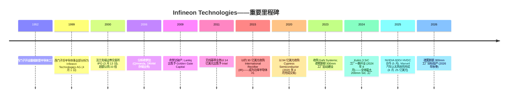

# Infineon Technologies AG (XETR:IFX) — 公司研究报告

**截至日期: 2026-05-20**
**代码: XETR:IFX (法兰克福 XETRA 交易所, 主要上市地) · ISIN DE0006231004 · OTC:IFNNY / IFNNF (ADR)**
**总部: 德国诺伊比贝格 (慕尼黑)**
**上市语种: 德语 / IFRS 财报披露, 英语投资者关系。本报告依技能规则以中文撰写。**
**报告语言: 简体中文 (英文版同时存在于本目录)**

> **更新——XETR:IFX 股价基于 AI 电源逻辑, 同比再估值 +87% (数据截至 2026-05-20):** Infineon 在 XETRA 的收盘价为 **2026 年 5 月 20 日的 67.94 欧元**, 接近 52 周高点 68.74 欧元, 较 12 个月低点 30.82 欧元上涨 **86.5%** (来源: [Yahoo Finance IFX.DE 报价与 52 周区间, 2026-05-20 查询](https://finance.yahoo.com/quote/IFX.DE/))。市值已扩张至 **883 亿欧元**。本次再估值的驱动因素是管理层在 FY2025 业绩发布中显著上调的 AI 数据中心电源营收目标 (来源: [Infineon FY 2025 新闻稿 INFXX202511-021, 2025 年 11 月 12 日](https://www.infineon.com/press-release/2025/infxx202511-021)) 以及 NVIDIA 800V HVDC 合作伙伴关系 (来源: [Infineon 新闻稿 INFXX202505-107, 2025 年 5 月](https://www.infineon.com/cms/en/about-infineon/press/press-releases/2025/INFXX202505-107.html);[NVIDIA 开发者博客《800V HVDC 架构》](https://developer.nvidia.com/blog/nvidia-800-v-hvdc-architecture/))。空头观点指出, 本轮上涨已将 TTM 市盈率推升至约 83 倍——远高于 FY2025 基本面所能合理化的水平——使估值本身成为短期最大的单一风险。

## 目录
1. 公司概览
2. 公司历史
3. 管理团队
4. 产品与服务
5. 客户与上市策略
6. 行业概览
7. 竞争格局
8. 市场机会 (TAM)
9. 风险评估

---

## 1. 公司概览

Infineon Technologies AG 是德国最大的纯半导体公司, 在两个战略最重要的芯片品类——**功率半导体 (power semiconductor)** 和**汽车半导体 (automotive semiconductor)**——上均居全球领导地位。公司总部位于慕尼黑南郊的诺伊比贝格 (Neubiberg), 设计、制造并销售用于汽车、工业及消费应用场景中转换、开关、感测、安全与控制电能的半导体元器件 (来源: [Wikipedia——Infineon Technologies](https://en.wikipedia.org/wiki/Infineon_Technologies))。公司财年截至 9 月 30 日; 本报告全文采用 Infineon 的财年口径。

2025 财年 (截至 2025 年 9 月 30 日), Infineon 录得营业收入 **146.62 亿欧元**, 同比下降 2%, 分部经营业绩 25.60 亿欧元, 分部经营业绩率 17.5% (来源: [Infineon 新闻稿 INFXX202511-021, 2025 年 11 月 12 日, "FY 2025 与预期一致"](https://www.infineon.com/press-release/2025/infxx202511-021))。FY2024 (前一基准年) 营业收入 149.55 亿欧元, 较 FY2023 高点 163.09 亿欧元下滑 8%, 分部经营业绩 31.05 亿欧元 (20.8% 利润率), 反映了更大范围的半导体下行周期 (来源: [Infineon 新闻稿 INFXX202411-020, 2024 年 11 月 12 日](https://www.infineon.com/cms/en/about-infineon/press/press-releases/2024/INFXX202411-020.html);[EQS-News FY 2024 业绩企业披露](https://www.eqs-news.com/news/corporate/infineon-technologies-ag/))。FY2025 调整后自由现金流为 18.03 亿欧元, 而申报口径自由现金流为 -10.51 亿欧元, 后者主要受 Marvell 汽车以太网收购案 21.8 亿欧元现金支出影响 (来源: [Infineon FY2025 新闻稿 INFXX202511-021](https://www.infineon.com/press-release/2025/infxx202511-021))。

*来源: FY2020–FY2024 数据综合自 Infineon《Financial Data 2020–2024》数据手册; FY2025 数据综合自 Infineon FY2025 新闻稿 [INFXX202511-021](https://www.infineon.com/press-release/2025/infxx202511-021); FY2026e 中值反映管理层在 FY2025 展望中"营业收入温和增长"的口径表述。*

Infineon 业务架构由**四大经营分部 (operating segments)** 构成, 各自直接向管理层汇报:

- **汽车 (ATV)**——约占 FY2024 营业收入 56% (约 84 亿欧元), 为公司旗舰分部。ATV 为各类现代车型——从入门级经济车型到高端电动驱动系统——供应微控制器 (MCU)、功率器件、传感器及连接芯片 (来源: [Infineon FY2024 Financial Data 数据手册](https://www.infineon.com/assets/row/public/documents/corporate/investors/annual-reports/2024/2024-infineon-financial-data-2020-2024-v01-00-en.pdf))。
- **电源与传感器系统 (PSS)**——约占 FY2024 营业收入 21%。PSS 覆盖消费、计算、通信及 AI 数据中心电源, 以及 XENSIV 传感器系列。**这是 AI 服务器需求暴露度最高的分部**, 是 Infineon 与 NVIDIA 800V HVDC 架构合作所属的分部, 也是管理层指引最激进增长的分部。
- **绿色工业电源 (GIP)**——约占 FY2024 营业收入 13%。GIP 为光伏逆变器、风电、牵引驱动、工业电机控制及储能系统供应 IGBT 和 SiC 模块。
- **互联安全系统 (CSS)**——约占 10%。CSS 整合 Cypress 遗产资产 (PSoC 微控制器、AIROC Wi-Fi/Bluetooth) 与安全 IC (OPTIGA)、NOR/SRAM/FRAM 存储器, 服务物联网与嵌入式系统。

*来源: [Infineon《Financial Data 2020–2024》数据手册](https://www.infineon.com/assets/row/public/documents/corporate/investors/annual-reports/2024/2024-infineon-financial-data-2020-2024-v01-00-en.pdf), FY2024 分部营业收入。*

公司客户群涵盖全球所有主要汽车 OEM 与 Tier-1 供应商, 公开披露的客户包括汽车领域的 Tesla、BYD、Volkswagen (大众)、Hyundai-Kia (现代起亚) 和 Bosch (博世), 以及 AI 电源领域的 NVIDIA 和不断扩张的超大规模数据中心客户群 (来源: [Automotive World《Infineon retains automotive chip market top spot》](https://www.automotiveworld.com/news-releases/infineon-retains-automotive-chip-market-top-spot/);[Infineon NVIDIA 800V 合作新闻稿 INFXX202505-107](https://www.infineon.com/cms/en/about-infineon/press/press-releases/2025/INFXX202505-107.html);[Infineon 800V 预告新闻稿 INFXX202510-003](https://www.infineon.com/cms/en/about-infineon/press/press-releases/2025/INFXX202510-003.html))。公司通过对大型战略客户直销, 配合覆盖数万家小型工业与消费客户的庞大分销网络相结合的方式销售产品。

在地域分布上, Infineon 是全球分布最均衡的半导体公司之一。欧洲、中东及非洲贡献最大份额, 随后依次为大中华区、美洲及其他亚太市场 (来源: [Infineon Financial Data 2020-2024 数据手册](https://www.infineon.com/assets/row/public/documents/corporate/investors/annual-reports/2024/2024-infineon-financial-data-2020-2024-v01-00-en.pdf))。前道制造分布于欧洲的**德累斯顿** (Dresden, 300mm 硅片——模拟/混合信号与功率器件; 50 亿欧元扩产将于 2026 年秋季投产) 和**奥地利菲拉赫** (Villach, Infineon 功率电子的全球能力中心, 也是公司 SiC 与 GaN 研发所在地), 以及亚洲的**马来西亚居林** (Kulim)——Kulim 3 二期工厂将以再投资 50 亿欧元的规模建成全球最大的 200mm SiC 功率半导体工厂 (来源: [Infineon 新闻稿 INFXX202408-133, 2024 年 8 月,《Infineon 启用全球最大、最高效 SiC 工厂》](https://www.infineon.com/cms/en/about-infineon/press/press-releases/2024/INFXX202408-133.html);[Silicon Saxony 关于 Kulim 3 报道](https://silicon-saxony.de/en/infineon-construction-of-the-worlds-largest-200-millimeter-sic-power-fab-in-kulim-malaysia/);[Digitimes 关于德累斯顿报道, 2023 年 2 月](https://www.digitimes.com/news/a20230203PD200.html))。后道封装与测试主要集中于马来西亚马六甲、印度尼西亚巴淡岛、新加坡、匈牙利采格莱德、中国无锡及若干小型基地。**雷根斯堡** (Regensburg, 巴伐利亚) 是 Infineon 唯一同时具备前道晶圆制造和后道封装的基地, 员工超过 3,000 人 (来源: [Infineon《Regensburg》基地页面](https://www.infineon.com/cms/en/about-infineon/company/find-a-location/regensburg/))。

截至 2025 年 9 月 30 日, Infineon 全球员工约 **5.7 万人**, 较 FY2024 末约 58,060 人有所减少, 反映公司针对周期下行执行先前宣布的成本管控计划 (来源: [Infineon FY2025 新闻稿 INFXX202511-021](https://www.infineon.com/press-release/2025/infxx202511-021))。约 13–15% 的营业收入投入研发——FY2025 研发支出 22.27 亿欧元, 折合营业收入比 15.2%, 为近五年最高比率, 反映出公司有意为之的逆周期信号 (来源: 推导自 Infineon FY2025 损益表; 与 FY2025 新闻稿中的运营成本项核对)。

*来源: Infineon FY2022–FY2025 损益表数据; 通过 yfinance Ticker('IFX.DE').financials 获取, 并与 [FY2024 Financial Data 数据手册](https://www.infineon.com/assets/row/public/documents/corporate/investors/annual-reports/2024/2024-infineon-financial-data-2020-2024-v01-00-en.pdf) 及 FY2025 新闻稿交叉核验。*

Infineon 战略定位非常清晰: 公司**已连续六年蝉联汽车半导体 #1** (2024 年市占 13.5%, 据 TechInsights——来源: [Infineon 新闻稿 INFATV202504-085,《Infineon bolsters global lead in automotive semiconductors》](https://www.infineon.com/cms/en/about-infineon/press/press-releases/2025/INFATV202504-085.html))、**汽车微控制器 #1** (市占 36.0%, 较上年同比扩张 3.9 个百分点) (来源: [Infineon 新闻稿 INFXX202504-086,《Infineon further strengthens its number one position in automotive microcontrollers》](https://www.infineon.com/cms/en/about-infineon/press/press-releases/2025/INFXX202504-086.html))、以及**功率半导体整体 #1** (2025 年市占约 19.5%) (来源: [Mordor Intelligence Power Semiconductor Market](https://www.mordorintelligence.com/industry-reports/power-semiconductor-market))。投资逻辑建立在以下信念之上: 脱碳化 (EV、可再生能源、电网)、AI 计算电源以及软件定义汽车将推动 Infineon 主导的硅、碳化硅 (SiC) 和氮化镓 (GaN) 内容的结构性需求扩张。

### 估值快照 (截至 2026-05-20)

| 指标 | 数值 | 来源 |
|---|---|---|
| 股价 (XETRA 收盘) | **67.94 欧元** | [Yahoo Finance IFX.DE](https://finance.yahoo.com/quote/IFX.DE/) |
| 市值 | **883 亿欧元** | Yahoo Finance IFX.DE |
| TTM 市盈率 (P/E) | **82.9 倍** | Yahoo Finance IFX.DE |
| 前瞻市盈率 (FY26e) | **26.4 倍** | Yahoo Finance IFX.DE |
| TTM 市销率 (P/S) | **5.84 倍** | Yahoo Finance IFX.DE |
| 市净率 (P/B) | **5.26 倍** | Yahoo Finance IFX.DE |
| EV/EBITDA | **22.4 倍** | Yahoo Finance IFX.DE |
| 股息率 | **0.54%** | Yahoo Finance IFX.DE |
| 52 周区间 | **30.82–68.74 欧元** | Yahoo Finance IFX.DE |
| 贝塔系数 (5 年月度) | **1.90** | Yahoo Finance IFX.DE |

当前 TTM 市盈率为 **82.9 倍, 在同业组中最高**, 其原因是: FY2025 净利润压缩至 10.15 亿欧元 (TTM EPS 0.82 欧元), 反映出周期底部盈利吸收了 Marvell 收购的相关费用和德累斯顿及 Kulim 3 前道工厂折旧的阶梯式上升 (来源: [Infineon FY2025 损益表, 新闻稿 INFXX202511-021](https://www.infineon.com/press-release/2025/infxx202511-021); yfinance financials)。前瞻市盈率 **26.4 倍**——基于 FY2026 共识 EPS 约 2.57 欧元——是更有意义的衡量标尺, 大致与同业中位数一致。

因此, 高 TTM 市盈率的成因是 (a) 周期性盈利低位而非结构性问题, 叠加 (b) 受 AI 电源逻辑驱动而在 2026 年 4–5 月期间大幅再估值的股价。从 2025 年 9 月底约 32.79 欧元的收盘价到 2026-05-20 的 67.94 欧元, IFX 在八个月内大致翻倍 (来源: yfinance 月度历史数据, IFX.DE);本轮上涨进一步放大了市盈率分母效应。

**同业可比 (TTM 基础, Yahoo Finance/yfinance, 2026-05-20 查询):**

| 公司 | 代码 | TTM P/E | TTM P/S |
|---|---|---|---|
| **Infineon Technologies** | **XETR:IFX** | **82.9×** | **5.84×** |
| STMicroelectronics | NYSE:STM | 405.4× | 4.66× |
| NXP Semiconductors | NASDAQ:NXPI | 29.5× | 6.16× |
| onsemi | NASDAQ:ON | 80.5× | 7.02× |
| Analog Devices | NASDAQ:ADI | 71.8× | 16.30× |
| Texas Instruments | NASDAQ:TXN | 51.5× | 14.89× |
| Microchip Technology | NASDAQ:MCHP | 425.5× | 10.75× |
| 同业中位数 (除 IFX) | — | **76.1×** | **8.88×** |

*来源: Yahoo Finance/yfinance 各代码关键统计指标, 2026-05-20 查询。*

同业组与 Infineon 同处 FY2025/CY2024 周期底部, 大多数同业 TTM 市盈率均处于十年高点。Infineon 的 82.9 倍 TTM 市盈率**正好处于同业中位数 (76.1 倍) 附近**, 低于最极端的标的 (STM 405 倍、MCHP 426 倍——两家均处近盈亏平衡的底部盈利)。在 **TTM 市销率**层面, Infineon 5.84 倍**位于同业组的偏下位置** (同业中位数 8.88 倍)——相对折价反映了 Infineon 在功率分立器件 (lower-gross-margin power discretes) 的产品结构占比较高, 相对于 ADI、TXN 等目录型模拟 (catalog analog) 厂商而言, 毛利率更低。市净率 5.26 倍位于欧洲半导体厂商的高位, 但低于 TXN (10–12 倍), 高于完成 Maxim 整合后的 ADI (约 3 倍)。**结论:** 拉伸的 TTM 市盈率由周期底部盈利叠加 AI 电源再估值所致, 而非虚构的增长; 26.4 倍的前瞻市盈率合理, 但留给执行偏差的空间不大。估值本身因此成为第 9 章中的风险 #1。

## 2. 公司历史

Infineon 的源头并非 1999 年, 而是西门子 (Siemens) 于 1952 年开设的**雷根斯堡半导体工厂 (Halbleiterwerk Regensburg)**——欧洲最古老的半导体业务之一。整个 1980–1990 年代, 西门子半导体事业部从最初为母公司电信与工业业务提供集成电路的内部小型供应商, 成长为 1999 年全球第十大商用半导体厂商 (1993 年还排名第十九) (来源: [Wikipedia——Infineon Technologies](https://en.wikipedia.org/wiki/Infineon_Technologies);[Funding Universe 公司历史档案](http://www.fundinguniverse.com/company-histories/infineon-technologies-ag-history/))。**1999 年 4 月 1 日**, 西门子将该事业部分拆为独立法人——**Infineon Technologies AG**——在当时被誉为欧洲历史上规模最大的高科技分拆 (来源: [all-about-industries.com《From Siemens Spin-off to Global Leader》](https://www.all-about-industries.com/companies/infineon-technologies-ag/from-siemens-spin-off-to-global-leader-the-story-of-infineon-technologies-a-c001ada0d59f6d52c75537a3ad04c6e2/))。

2000 年 3 月 13 日的首次公开发行募资逾 50 亿美元, 超额认购达 33 倍, 是当时全球史上最大的科技 IPO (来源: [Wikipedia](https://en.wikipedia.org/wiki/Infineon_Technologies);[Funding Universe](http://www.fundinguniverse.com/company-histories/infineon-technologies-ag-history/))。西门子起初保留 74% 股权, 但逐步减持, 如今 Infineon 是完全自由流通的 DAX 40 成份股, 没有控股股东。截至 2025 年初, 最大已披露机构持有人为 BlackRock 约 7.4%, 其余主要持有人包括 Dodge & Cox、Vanguard 国际指数基金及 iShares Core MSCI EAFE (来源: [Yahoo Finance IFX.DE 机构持有人](https://finance.yahoo.com/quote/IFX.DE/holders))。

作为独立公司的第一个十年颇为艰难。Infineon 进入资本市场时存在严重的大宗 DRAM 存储业务暴露, 而该分部相对资本成本更低的亚洲竞争者属结构性不利。2006 年管理层将存储业务剥离为**奇梦达 AG (Qimonda AG)**;奇梦达于 2009 年初申请破产。Infineon 还在 2009 年将有线业务出售给 Golden Gate Capital (后命名 Lantiq), 并于 2011 年将无线基带业务以 14 亿美元出售给 Intel。

存储、有线与无线业务剥离后, Infineon 留下了今天所做的业务。下一阶段是并购式整合。2014/2015 年 Infineon 以约 30 亿美元收购**International Rectifier (IR)**, 一举成为分立功率半导体 #1, 并新增 GaN-on-silicon 专长。2017 年又收购了荷兰 MEMS/LiDAR 专家 Innoluce。然后是变革性的交易: 2019 年 6 月 Infineon 宣布以 94 亿美元 (90 亿欧元企业价值) 收购**Cypress Semiconductor**, 于 2020 年 4 月完成 (来源: [Electronic Design——The Infineon-Cypress Merger](https://www.electronicdesign.com/markets/automation/article/21163220/electronic-design-the-infineoncypress-merger-what-does-it-mean-for-the-electronics-industry))。Cypress 带来了 PSoC 微控制器、NOR 闪存与 SRAM 存储器、TRAVEO 汽车 MCU 系列及 AIROC Wi-Fi/Bluetooth 连接产品组合。

经历 2021–2023 年 COVID 时代的半导体景气, Infineon 创下营收与利润率纪录, 然后随 2023 年中期开始的下行周期回落。管理层利用这段时间推动两项结构性押注。其一, **宽禁带 (wide-bandgap) 功率半导体产能**: 2023 年 Infineon 收购加拿大 **GaN Systems** 巩固氮化镓领导地位, 同年初在德累斯顿动工建设耗资 50 亿欧元 (部分由欧盟《芯片法案》与德国政府基金支持) 的**德累斯顿 300mm 智能功率工厂 (Dresden 300mm Smart Power Fab)**, 计划 2026 年秋季投产。马来西亚 Kulim 3 SiC 工厂一期于 2024 年 8 月开业, 正在以另外 50 亿欧元二期投资扩建为全球最大的 200mm SiC 功率工厂, 已获约 50 亿欧元客户设计赢取 (design win) 以及约 10 亿欧元客户预付款支持——这种安排极不寻常, 显著降低建设风险 (来源: [Infineon Kulim 3 新闻稿 INFXX202408-133](https://www.infineon.com/cms/en/about-infineon/press/press-releases/2024/INFXX202408-133.html);[Compound Semiconductor 报道](https://compoundsemiconductor.net/article/118321/Infineon_opens_worlds_largest_SiC_power_fab))。其二, **软件定义汽车 (Software-Defined Vehicle) 网络**: 2025 年 4 月 Infineon 同意以 25 亿美元现金收购 **Marvell 汽车以太网业务**——Brightlane 系列 PHY 收发器、交换芯片与桥接器——并于 2025 年 8 月完成 (来源: [Infineon 宣布交易新闻稿 INFXX202504-086](https://www.infineon.com/cms/en/about-infineon/press/press-releases/2025/INFXX202504-086.html);[Infineon 交割新闻稿 INFXX202508-133](https://www.infineon.com/cms/en/about-infineon/press/press-releases/2025/INFXX202508-133.html);[Marvell 完成剥离, 2025 年 8 月](https://investor.marvell.com/news-events/press-releases/detail/88/marvell-completes-divestiture-of-automotive-ethernet-business-to-infineon-for-2-5-billion-in-all-cash-transaction))。Marvell 汽车以太网在 2025 年估计实现 2.25–2.5 亿美元营业收入, 毛利率约 60%, 到 2030 年设计赢取管线规模达 40 亿美元。

2025 年最具战略意义的发展并非并购。2025 年 5 月 Infineon 宣布与 **NVIDIA** 合作开发面向下一代 AI 数据中心的 **800V HVDC 电源架构**, 通过中心化整流与 GPU 板上转换, 综合使用硅、SiC 与 GaN 器件 (来源: [Infineon 新闻稿 INFXX202505-107, 2025 年 5 月](https://www.infineon.com/cms/en/about-infineon/press/press-releases/2025/INFXX202505-107.html);[NVIDIA 开发者博客《NVIDIA 800V HVDC Architecture Will Power the Next Generation of AI Factories》](https://developer.nvidia.com/blog/nvidia-800-v-hvdc-architecture/))。配合 2025 年 11 月 FY2025 业绩发布, 管理层**显著上调**其 AI 数据中心营收目标——上调幅度足以实质性影响 PSS 分部增长 (来源: [Infineon FY2025 新闻稿 INFXX202511-021](https://www.infineon.com/press-release/2025/infxx202511-021))。这是 2025 年 11 月至 2026 年 5 月间股价再估值的核心驱动因素。

## 3. 管理团队

Infineon 管理董事会 (Vorstand) 目前由四名成员组成: CEO、CFO、首席运营官 (COO) 与首席营销官 (CMO)。Constanze Hufenbecher 持有的首席数字化转型官 (Chief Digital Transformation Officer) 职位于 2024 年 4 月任期届满后撤销。

### Jochen Hanebeck——首席执行官 (CEO)

Jochen Hanebeck 自 2022 年 4 月 1 日起担任 Infineon CEO, 现任任期至 2027 年 3 月 31 日 (来源: [Infineon Jochen Hanebeck 公司简历](https://www.infineon.com/cms/en/about-infineon/company/management/jochen-hanebeck/))。1968 年出生于多特蒙德, 拥有亚琛工业大学 (RWTH Aachen) ——德国顶尖工程学院之一——固态电子学硕士学位。1994 年加入当时仍为 Infineon 母公司的西门子, 在纽约东菲什基尔担任 DRAM 研发工程师, 后调任德累斯顿, 再到慕尼黑, 一路在工程与运营管理岗位中晋升 (来源: [LinkedIn 上 Jochen Hanebeck 的帖子, 2024 年 1 月](https://www.linkedin.com/posts/jochen-hanebeck_infineon-careers-activity-7152011515731943424-IGtN/))。

Hanebeck 在 Infineon 的资历极为深厚: 截至本报告撰写时, 在公司任职已超过三十年。他几乎执掌过运营的每一个领域, 包括电源管理与多市场 (Power Management & Multimarket), 最关键的是**汽车分部 (ATV)**——作为分部总裁, 该分部是公司规模最大、利润最丰厚的分部, 他被认为是当今 Infineon #1 汽车市占率背后设计赢取的功臣 (来源: [ITF World 2024 演讲嘉宾简历](https://www.itf-world.com/speakers/jochen-hanebeck/))。他在 2016 年晋升为管理董事会 COO, 之后被任命为 CEO。其任期内大幅资本支出 (德累斯顿、Kulim 3)、大胆并购 (Marvell 汽车以太网) 及高调的 NVIDIA 合作伙伴关系是显著标志。行业报道把他的领导风格刻画为工程师导向、注重实质, 这一点也被 EE Times 的"Be Authentic; Substance Matters"专访所捕捉 (来源: [EE Times——Infineon's Jochen Hanebeck](https://www.eetimes.com/infineons-jochen-hanebeck-be-authentic-substance-matters/))。他经常出席行业活动, 包括 SEMICON Europa 与 imec ITF World, 倡导欧洲半导体主权。

### Sven Schneider——首席财务官 (CFO)

Dr. Sven Schneider 自 2019 年 5 月 1 日起担任 CFO, 负责会计、控制、财务规划、投资者关系、税务、资金管理、审计、合规、出口管制、风险、业务连续性及 IT (来源: [Infineon Sven Schneider 公司简历](https://www.infineon.com/cms/en/about-infineon/company/management/sven-schneider/))。1966 年生于柏林, 完成银行学徒后在雷根斯堡、南特 (Nantes, 法国) 及特里尔 (Trier) 大学修读工商管理, 最终在特里尔取得工商管理博士学位。

Schneider 1995 年起在工业气体巨头 **Linde AG** 任职, 在企业财务、并购及资金管理领域工作了 24 年, 2017 年升任 Linde 执行董事会成员, 2018 年升任集团 CFO (来源: [EuropaWire《Dr. Sven Schneider of Linde AG will become the new CFO of Infineon》](https://news.europawire.eu/dr-sven-schneider-of-linde-ag-will-become-the-new-cfo-of-infineon-technologies-on-1-may-2019/eu-press-release/2019/03/26/))。在 Linde 期间, 他曾是两项变革性并购的主导财务高管: 美国的 **Lincare** 收购和英国 80 亿英镑的 **BOC Group** 收购——后者使他对整合规模相当的跨境工业业务有了直接经验。他加入 Infineon 恰逢 Cypress 收购宣布——他主导了 90 亿欧元交易的融资结构——此后又监管了 Marvell 汽车以太网的融资 (FY2025 21.8 亿欧元的并购相关现金流出) 及德累斯顿和 Kulim 3 数十亿欧元的工厂资本开支项目。投资者普遍认为 Schneider 是一位训练有素的运营者, 在重资本开支周期中维持了保守的资产负债表, 同时将股息维持在每股 0.35 欧元 (来源: [Infineon Dividend 页](https://www.infineon.com/about/investor/infineon-share/dividend);[Infineon FY2025 新闻稿 INFXX202511-021](https://www.infineon.com/press-release/2025/infxx202511-021))。

### Rutger Wijburg——首席运营官 (COO)

Rutger Wijburg 自 2022 年起担任 COO, 当前合同至 2026 年 3 月 31 日 (来源: [Printed Electronics Now《Infineon Extends Contracts Of Andreas Urschitz, Rutger Wijburg》](https://www.printedelectronicsnow.com/contents/view_breaking-news/2024-05-08/infineon-extends-contracts-of-andreas-urschitz-rutger-wijburg/))。1962 年生于荷兰奈梅亨, 拥有特温特大学 (University of Twente) 电气电子工程博士学位 (1990 年)。2018 年加入 Infineon 之前, Wijburg 在 **Philips Semiconductors**、**NXP Semiconductors** (Philips 分拆出来) 与 **GlobalFoundries** 担任高级运营与工厂管理职务, 后者负责其新加坡 200mm 工厂。

他的职责涵盖横跨欧亚的十五座晶圆工厂及后道设施的整个制造网络。当前在他监管下的最大运营项目包括: (i) 2024 年 8 月开业的马来西亚 Kulim 3 200mm SiC 工厂的产能爬坡, 二期目前正在建设全球最大的 200mm SiC 产能; (ii) 德累斯顿 300mm 智能功率工厂, 按计划将于 2026 年秋季投产。Wijburg 在 NXP 与 GlobalFoundries 的前期经验——两家公司都有大规模的亚洲制造网络——对于 Infineon 的马来西亚扩张极具相关性, 业界普遍认为他是公司能否按时按预算交付资本开支假说的最关键执行人。

### Andreas Urschitz——首席营销官 (CMO)

Andreas Urschitz 持有 CMO 头衔 (在 Infineon, 该职位的含义是对营销、销售、分销及大客户管理负有商业责任, 而非消费类公司中更狭义的市场传播 CMO 职责), 合同近期续签至 2030 年 5 月 31 日 (来源: [Infineon 新闻稿 INFXX202405-102, 2024 年 5 月](https://www.infineon.com/cms/en/about-infineon/press/press-releases/2024/INFXX202405-102.html))。1972 年生于奥地利克拉根福, 持有维也纳经济与商业大学硕士学位, 1995 年加入西门子半导体事业部。其职业生涯涵盖当前 Infineon 全部四大分部, 在功率半导体业务任职时间最长; 升任管理董事会之前曾任电源与传感器系统 (PSS) 分部总裁。作为 CMO, 他对 AI 数据中心、电动汽车与工业增长方向的客户层面拥有责任——这使他成为 NVIDIA 合作与更广泛的 AI 服务器电源推进中的关键人物。

### 公司治理与持股结构

根据德国共同决定法 (co-determination), 监事会 (Aufsichtsrat) 共 16 名成员, 一半由股东选举, 一半由员工选举, 主席传统上来自股东席位。ISS 和 Glass Lewis 普遍认为该董事会独立性较强, 技术深度突出——这是欧洲半导体公司董事会的普遍特征。机构投资者持股约 49–53%, 取决于日期和数据来源; 已知最大持有人为 **BlackRock 约 7.4%**, 其次为 Dodge & Cox、Vanguard 与 iShares Core MSCI EAFE ETF (来源: [Yahoo Finance IFX.DE 机构持有人](https://finance.yahoo.com/quote/IFX.DE/holders))。管理层持股较温和, 符合德国市场惯例——Infineon 高管不采用美国半导体同业普遍采用的重股权激励结构, 这既限制了上行联动, 也降低了集中度风险。公司自 FY2010 起连续派发股息; 拟定的 FY2025 股息为每股 0.35 欧元 (与 FY2024 持平), 总额约 4.55 亿欧元 (来源: [Infineon FY2025 现金股息支付项, 通过 yfinance Ticker('IFX.DE') 现金流](https://finance.yahoo.com/quote/IFX.DE/cash-flow);[Infineon Dividend 页](https://www.infineon.com/about/investor/infineon-share/dividend))。

### 管理团队履历评估

这是一支高度可信、经验深厚的团队。Hanebeck 在 Infineon 任职已超过三十年, 执掌过公司最大分部; Schneider 在 Linde 主导过变革性并购, 进入 Infineon 后又领导了 90 亿欧元 Cypress 融资; Wijburg 拥有数十年与 Kulim 3 高度相关的亚洲工厂经验; Urschitz 一手打造的 PSS 业务现在已成为 AI 投资逻辑的核心。缺口在于**股权激励的对齐程度**——德国薪酬结构无法给团队提供 Nvidia 或 TI 高管在股价翻倍时享有的上行收益。这使该团队更易于挽留, 但也削弱了部分美国同业所具备的"创始人式所有权心态"驱动力。

## 4. 产品与服务

理解 Infineon 产品分类的最佳方式是按分部划分, 每个分部拥有特定的品牌系列。下文是基于 [infineon.com/products](https://www.infineon.com/products) 详尽走查及分部层面披露的完整产品枚举, 随后是逐一产品的竞争优势判定。

```mermaid
graph TD
    INF[Infineon Technologies]
    INF --> ATV[ATV——汽车]
    INF --> PSS[PSS——电源与传感器系统]
    INF --> GIP[GIP——绿色工业电源]
    INF --> CSS[CSS——互联安全系统]

    ATV --> AURIX[AURIX TC2x/TC3x/TC4x MCU]
    ATV --> TRAVEO[TRAVEO T2G 车身 MCU]
    ATV --> ATVPWR[CoolSiC EV 驱动 · CoolMOS · IGBT HybridPACK]
    ATV --> XENSIV_R[XENSIV 雷达 24/60/77GHz · 磁性位置 · 电流传感器]
    ATV --> BRIGHTLANE[Brightlane 汽车以太网 PHY/Switch——Marvell 遗产]

    PSS --> COOLMOS[CoolMOS Si MOSFETs · CoolGaN]
    PSS --> AISERVER[AI 服务器电源——48V VRM · 800V HVDC 构件]
    PSS --> XENSIV_S[XENSIV MEMS 麦克风 · ToF · 压力 · CO2 · CapSense]
    PSS --> MERUS[MERUS Class-D 音频功放]

    GIP --> IGBT[PrimePACK · EconoPACK · EasyPACK IGBT 模块]
    GIP --> COOLSIC_G[CoolSiC 模块——光伏/风电/牵引]
    GIP --> EICEDRIVER[EiceDRIVER 栅极驱动]

    CSS --> PSOC[PSoC 4/6/Edge 混合信号 MCU]
    CSS --> AIROC[AIROC Wi-Fi/Bluetooth/Matter]
    CSS --> OPTIGA[OPTIGA TPM / Trust M / Connect 安全 IC]
    CSS --> MEMORY[NOR Flash · SRAM · F-RAM · nvSRAM]
```

**功率半导体 (通过 ATV、GIP 和 PSS 销售, 依下游市场而定):**

- **CoolMOS™**——高压硅基超结 MOSFET, 用于 AC/DC 和 DC/DC 电源 (目标客户: 服务器 OEM、EV 充电器、电信)。最新一代 CoolMOS 8 是 **Topside Cooled (TSC) 顶部散热**系列的一部分, 通过 Q-DPAK 封装实现 95% 直接散热 (来源: [Infineon CoolSiC 产品页](https://www.infineon.com/cms/en/product/power/mosfet/silicon-carbide/))。**判定: 是**——护城河来自封装专利、数十年工艺成熟度及规模。
- **CoolSiC™**——碳化硅 MOSFET 与二极管; CoolSiC MOSFETs 1200V G2 于 2025 年 7 月发布, 较第一代降低 25% 开关损耗; 新的 75 mΩ 650V G2 中等功率 AI 服务器与 EV 充电器变体于 2025 年 8 月发布。2025 年 5 月 Infineon 赢得现代汽车 (Hyundai) 作为 800kW 牵引逆变器主供应商, 采用沟槽结构 SiC 超结器件, 其 RDS(on) 降低 40% (来源: [Mordor Intelligence Power Semiconductor Market](https://www.mordorintelligence.com/industry-reports/power-semiconductor-market))。**判定: 是**——全球前三的 SiC 供应商; 全球最大的 200mm SiC 工厂 (Kulim 3) 是难以复制的产能护城河。最接近的竞争对手: STMicroelectronics 的 STPOWER SiC 产品线 (器件层面持平; ST 在 Tesla 供应上领先)。
- **CoolGaN™**——100V、600V 和 650V 氮化镓功率晶体管; 2024 年首次展示 300mm 功率 GaN 晶圆, 全球首例 (来源: [IEEE PELS 杂志——Infineon Reveals First 300-mm Power GaN Wafers](https://www.ieee-pels.org/infineon-reveals-first-300-mm-power-gan-wafers/))。**判定: 是**——唯一同时在硅、SiC *和* GaN 中处于领导地位的前三厂商; GaN Systems 收购 (2023) 增补了高端 IP。最接近的竞争对手: Power Integrations / Navitas / EPC——Infineon 在规模和汽车认证上领先。
- **OptiMOS™**——中压硅 MOSFET (12V–200V), 用于电机驱动、服务器 VRM 和电池管理。**判定: 是**——市场领导者、规模优势; 护城河来自成本、广度和 AEC-Q101 认证。
- **IGBT 模块**——**PrimePACK™**、**EconoPACK™**、**EasyPACK™**、**HybridPACK™** 系列, 跨 600V 至 6.5kV, 用于风电、光伏集中式逆变器、牵引 (轨道交通和 EV) 及工业驱动。PrimePACK IGBT5 配 .XT 互连技术被描述为风电应用的"业内顶级功率循环能力"。**判定: 是**——智能功率模块业内排名联合第一 (与三菱电机、富士电机并列), 该子领域中前五大占 55%。
- **EiceDRIVER™**——配套上述功率器件的隔离栅极驱动器。**判定: 部分**——在 EV 牵引和可再生能源中表现强劲; 在工业栅极驱动方面面临 Analog Devices/Maxim 和 Texas Instruments 的激烈竞争。

**微控制器 (ATV 和 CSS):**

- **AURIX™ TriCore™ TC2x / TC3x / TC4x**——Infineon 的旗舰汽车多核微控制器系列。新的 **AURIX TC4Dx** 于 2024 年 11 月推出, 采用 28nm 工艺, 配备专用的**并行处理单元 (Parallel Processing Unit, PPU)** 用于嵌入式 AI (电机控制、电池管理、整车运动控制)、ISO 26262 ASIL-D, 及 ISO/SAE 21434 网络安全 (含后量子支持); 2025 年量产 (来源: [Infineon AURIX TC4Dx 新闻稿 INFATV202411-018](https://www.infineon.com/cms/en/about-infineon/press/press-releases/2024/INFATV202411-018.html);[eeNews Europe《Infineon launches first Aurix TC4x chip》](https://www.eenewseurope.com/en/infineon-launches-first-aurix-tc4x-chip/))。2025 年 9 月 Infineon 发布完整的 AURIX TC4x 软件组合, 包括量产级 ASIL-D AUTOSAR MCAL 驱动。**判定: 是 (产品组合中最强护城河)**——汽车 MCU 36.0% 市占, TechInsights 数据 (来源: [Infineon 新闻稿 INFXX202504-086](https://www.infineon.com/cms/en/about-infineon/press/press-releases/2025/INFXX202504-086.html)); AUTOSAR 生态锁定、ISO 26262 认证成本及数十年深厚的汽车客户关系。最接近的竞争对手: NXP S32 系列 (NXP 在网络 SoC 上领先; Infineon 在安全 MCU 上领先)。
- **TRAVEO™ T2G**——基于 Arm Cortex-M 的车身与 HMI MCU, 源自 Cypress IP。**判定: 部分**——稳居车身领域 MCU #2; 最接近的竞争对手: 瑞萨 RH850。
- **PSoC™ 4 / 6 / Edge**——可编程片上系统系列, 配 Arm Cortex 核加可重构模拟/数字模块。PSoC Edge 在 2024 年加入了神经加速。**判定: 部分**——独特的混合信号灵活性; 面临瑞萨 RA、NXP LPC 和 STMicro STM32 在大众物联网领域的竞争。
- **XMC™**——工业 32 位 MCU, 用于电机控制和功率转换。**判定: 部分**——在 STM32G 和 TI C2000 面前具备竞争力。

**传感器 (主要为 ATV 和 PSS):**

- **XENSIV™** 伞型品牌涵盖雷达 (24、60 和 77GHz)、MEMS 麦克风、电流传感器、磁性位置传感器 (TLE/TLI)、压力传感器 (BAROXX)、CO2 传感器、飞行时间 (ToF) 及 3D 图像传感器 (源自 Innoluce/pmd 收购的 IRS 系列)。**判定:** 在汽车雷达领域 (Infineon 与 NXP 同为 #1) 为**是**; 在 MEMS 麦克风面对 Knowles 和歌尔为**部分**; 在电流传感器中 (TMR/Hall IP 差异化突出) 为**是**。

**连接 (CSS 加 ATV 中 Marvell 后的汽车以太网):**

- **AIROC™ Wi-Fi/Bluetooth 组合产品**——Wi-Fi 4/5/6/6E 加 Bluetooth/BLE, 源自 Cypress (再前可追溯至 Broadcom)。**判定: 部分**——在物联网和汽车信息娱乐中稳健; Qualcomm 和 NXP 在高端汽车 Wi-Fi 上构成激烈竞争。
- **AIROC™ Bluetooth & 多协议**——独立 BLE/Thread/Matter。**判定: 部分**——在工业和白色家电中表现强劲。
- **Brightlane™ 汽车以太网** (2025 年 8 月从 Marvell 收购)——PHY 收发器、交换机、桥接器, 支持 100Mbps 至 10Gbps 车内网络; 到 2030 年设计赢取管线约 40 亿美元 (来源: [Infineon 新闻稿 INFXX202508-133](https://www.infineon.com/cms/en/about-infineon/press/press-releases/2025/INFXX202508-133.html))。**判定: 是 (新增)**——与 AURIX MCU 组合构成独特的端到端软件定义汽车定位。最接近的竞争对手: NXP 以太网 PHY。

**安全与识别 (CSS):**

- **OPTIGA™ TPM / Trust M / Connect**——用于身份验证、物联网身份、支付和政府 ID 的安全元件和 TPM。**判定: 是**——与 STMicro 和 NXP 同为 TPM 顶级供应商; 嵌入式 SIM 和政府 ID 市场具有高认证门槛的寡头格局。
- 智能卡和嵌入式安全元件 IC, 用于支付、交通、电子政务。**判定: 是**——在 EMV 支付芯片和欧洲电子身份中根基深厚。

**存储 (CSS, Cypress 遗产):**

- **NOR Flash** (Semper Secure, HyperFlash)、**EXCELON™ F-RAM**、**SRAM**、**nvSRAM** 及 PSRAM。**判定: 部分**——在工业级和汽车级 NOR/FRAM 中相对旺宏和瑞萨具备竞争力; 非结构性增长品类。

**音频 (PSS):**

- **MERUS™** Class-D 音频功放。**判定: 部分**——细分但高利润; 主要竞争对手为 Texas Instruments。

**AI 服务器电源构件 (PSS——增长故事):** 除上述独立产品系列外, Infineon 的 AI 服务器电源提案越来越被描述为*系统*而非零件清单。与 NVIDIA 联合开发的 800V HVDC 参考架构包括 (i) 使用高压 CoolMOS 和 CoolSiC 的中心化前端整流, (ii) 在机柜 PSU 和机架 PSU 层使用 CoolGaN 的中间 DC/DC 转换, 以及 (iii) 在板上使用 OptiMOS 和隔离 EiceDRIVER 的多相 48V-to-core 转换。这就是带动股价再估值的 **NVDA/AMD AI 服务器电源半导体增长故事**: 新型 1MW+ 架构中每个 GPU 机柜所需的 Infineon 硅片美元含量, 比 GH200/H100 级系统的 12V/48V 架构大幅增加 (来源: [NVIDIA 开发者博客《NVIDIA 800V HVDC Architecture》](https://developer.nvidia.com/blog/nvidia-800-v-hvdc-architecture/);[Infineon 800V 预告新闻稿 INFXX202510-003——《Infineon advances leading-edge 800 Volt AI data center》](https://www.infineon.com/cms/en/about-infineon/press/press-releases/2025/INFXX202510-003.html))。

**旗舰产品 vs. 长尾产品:** **驱动业务的三大产品**为 (1) **AURIX TriCore 汽车 MCU**, 远为最高利润率的增长引擎及 36% 汽车 MCU 市占的来源; (2) **CoolSiC 碳化硅功率半导体**, 与 EV 牵引和 AI 数据中心电源挂钩的长期增长杠杆; 及 (3) **IGBT 模块 (PrimePACK / HybridPACK)**, 用于风电、光伏和 EV 牵引。过去 12 个月内推出的产品包括 AURIX TC4Dx (2024 年 11 月)、CoolSiC MOSFETs 1200V G2 配 Q-DPAK 封装 (2025 年 7 月)、75mΩ CoolSiC 650V G2 (2025 年 8 月) 及 Marvell 交割后整合的 Brightlane 汽车以太网产品组合 (2025 年 8 月)。最清晰的产品 *扩张* (而非淘汰) 是在 AI 服务器电源堆栈, Infineon 与 NVIDIA 已宣布 800V HVDC 的硅、SiC 与 GaN 构件, 目标在本十年末前商用部署。

## 5. 客户与上市策略

Infineon 的上市策略反映了公司混合型的客户结构: 大约 40 家大型战略客户贡献大部分营业收入, 加上通过分销服务的成千上万家工业与消费长尾客户。

**客户集中度披露。** 与美国 10-K 申报方或中国 A 股发行人不同, 德国上市公司无需披露具体的前一/前五客户营收份额, 除非其实质构成可披露的报告分部。Infineon 的 [2025 年度报告 (Annual Report 2025)](https://www.infineon.com/row/public/documents/corporate/investors/annual-reports/2025/2025-annual-report-v01-00-en.pdf) 未以美国 10-K 的定量形式拆分客户集中度。行业估算与竞争对手披露表明, 全球前十大汽车客户 (Volkswagen、Toyota、Stellantis、Hyundai-Kia、BYD、Tesla、Ford、GM、Renault-Nissan 和 Mercedes-Benz 集团, 以及其 Tier-1 博世、大陆、采埃孚、电装、麦格纳和爱信) 合计可能占 ATV 营业收入一半以上。**这是一个披露缺口, 而非已知集中度——我们在第 9 章将其列为风险。**

在**汽车** (占营业收入 56%) 领域, 客户群涵盖全球所有主要 OEM 和 Tier-1 供应商。已公开命名的合作关系包括 **Tesla**、**BYD (比亚迪)**、**Volkswagen**、**Hyundai-Kia**、**Bosch (博世)**、**Continental (大陆)**、**ZF (采埃孚)**、**Denso (电装)** 和 **Magna (麦格纳)** 等 (来源: [Automotive World——Infineon retains automotive chip market top spot](https://www.automotiveworld.com/news-releases/infineon-retains-automotive-chip-market-top-spot/);[Infineon ATV 新闻稿 INFATV202504-085](https://www.infineon.com/cms/en/about-infineon/press/press-releases/2025/INFATV202504-085.html))。具体例子包括现代汽车作为 Infineon 沟槽结构 SiC 用于 800kW 牵引逆变器的首席客户 (2025 年 5 月), 以及 Tesla 自 Model 3 逆变器采用以来的长期 SiC 客户。设计周期众所周知地漫长——典型的汽车设计赢取从 RFQ (询价) 到 SOP (量产) 需 3 至 5 年, 项目寿命可超 10 年——这意味着当前营业收入主要反映 2018–2022 年的设计赢取, 而当前的设计赢取活动将支撑 FY2028 及以后的营收。

在**工业与可再生能源 (GIP)** 领域, 买家为逆变器与驱动 OEM, 包括 **SMA**、**Sungrow (阳光电源)**、**Huawei Digital Power (华为数字能源)**、**Vestas (维斯塔斯)**、**Siemens Energy (西门子能源)**、**ABB**、**Schneider Electric (施耐德电气)**、**Yaskawa (安川)** 和 **Fanuc (发那科)**。销售以直销为主, 配以强有力的技术售前支持, 但渠道合作伙伴负责中小型工业客户。

在 **PSS** 领域——日益成为 **AI 数据中心电源**故事——客户为服务器 OEM (Dell、HPE、Supermicro、Lenovo、Inspur (浪潮))、超大规模数据中心客户的 ODM (Quanta (广达)、Foxconn (富士康)、Wiwynn (纬颖)), 以及最具战略意义的 **NVIDIA**——其下一代 AI 工厂的 800V HVDC 机柜架构是 Infineon 共同开发的。重要的是, Infineon 的功率半导体不替代 NVIDIA / AMD GPU 插槽——它们位于电源传输网络中, 与 GPU 并列。每个 1MW AI 机柜需要协调一组 Infineon 硅片 (前端整流器、中间总线转换器、负载点 VRM、驱动器、传感器), 这意味着 **AI 服务器电源的每机柜美元含量, 随机柜功率和 GPU 密度同步增长**。管理层在 FY2025 业绩中披露的"显著上调"的 AI 数据中心营收目标反映的是每机柜内容扩张, 而非与 GPU 厂商本身的替代竞争 (来源: [Infineon FY2025 新闻稿 INFXX202511-021](https://www.infineon.com/press-release/2025/infxx202511-021);[NVIDIA 开发者博客](https://developer.nvidia.com/blog/nvidia-800-v-hvdc-architecture/))。

在 **CSS** 领域客户群更为分散: 消费电子 OEM (Apple、Samsung、Xiaomi)、IoT 模块厂、支付卡发卡机构、智能电表 OEM 及广泛的工业中端市场。

**分销。** Infineon 通过全球宽销分销商 **Arrow Electronics、Avnet、Future Electronics、Mouser、Digi-Key** 以及亚洲专业分销商 **WPG Holdings (大联大)、WPI (文晔)、Macnica (麦科技)、Ryosan (菱三)** 销售, 加上区域安全 IC 分销商。分销占营业收入估计 35–45% (对欧洲具有广泛工业暴露的半导体公司而言较为典型)。公司经营一个精密的技术营销与应用工程组织, 在主要设计导入项目上派驻工程师到客户现场, 尤其在汽车和工业领域。

**销售策略。** 战略剧本是"系统协同工程": Infineon 不仅交付分立芯片, 还交付参考设计、仿真工具 (CoolSiC 和 CoolGaN 的 PLECS 模型)、评估套件 (AURIX StartKit、PSoC Edge 开发套件) 以及不断扩张的软件栈——2025 年 9 月发布的 AUTOSAR 合规的 AURIX TC4x 驱动套件是最清晰的例子。Brightlane Marvell 收购明确旨在把 Infineon 从一家芯片供应商转变为软件定义汽车系统合作伙伴。

**已公开披露的命名客户案例:** AI 800V HVDC 的 **NVIDIA**;SiC 800kW 牵引逆变器的**现代汽车**;使用 SiC MOSFET 的**比亚迪 HAN EV** 电机控制器;**Tesla** Model 3 逆变器 SiC;**大众** 动力总成 MCU 和功率器件。

## 6. 行业概览

Infineon 在全球半导体行业中竞争, 该行业由世界半导体贸易统计组织 (WSTS) 定义 (NAICS 334413 及相邻代码)。WSTS 2025 年秋季预测将**全球半导体市场定为 2025 年 7,720 亿美元**, 同比增长 22%, 主要由服务于 AI 和数据中心需求的逻辑与存储类别驱动。2026 年的预测超过 9,750 亿美元, 意味着该行业将**于 2026 年接近 1 万亿美元——比 Deloitte/SIA 长期定为 2030 年的预测提前四年** (来源: [WSTS 2025 年秋季预测](https://www.wsts.org/esraCMS/extension/media/f/WST/7310/WSTS_FC-Release-2025_11.pdf);[Deloitte 2026 半导体行业展望](https://www.deloitte.com/us/en/insights/industry/technology/technology-media-telecom-outlooks/semiconductor-industry-outlook.html))。

但对 Infineon 而言, 这一头条数字具有误导性, 因为公司基本上对存储和先进逻辑无暴露。Infineon 的**可服务市场 (Served Available Market, SAM)** 是该行业的模拟、功率和汽车子集。该子集中相关的增长动态与头条 AI 驱动的存储故事截然不同:

- **汽车半导体**——2025 年约 1,000 亿美元市场, 预计到 2030 年以 7–8% CAGR 增长至 1,320–1,430 亿美元 (来源: [Mordor Intelligence——Automotive Semiconductor Market](https://www.mordorintelligence.com/industry-reports/automotive-semiconductor-market);[Yole Group《Infineon, NXP and STMicroelectronics face rising competition in $132 billion automotive semiconductor race》](https://www.yolegroup.com/press-release/infineon-technologies-nxp-and-stmicroelectronics-face-rising-competition-in-132-billion-automotive-semiconductor-race/))。增长驱动因素众所周知: 每辆车的半导体含量上升 (一辆 ICE 内燃机车包含约 400–500 美元的芯片; 纯电动车 700–1,000 美元; L2+ ADAS 车再增 100+ 美元)、从分布式向区域/中心化 E/E 架构的转变, 以及需要远远更多计算与网络含量的软件定义汽车功能。Infineon 的 2024 年 13.5% 市占使其成为该细分领域的领导者。
- **功率半导体** (分立器件加功率 IC)——2025 年总规模约 500 亿美元 (覆盖硅、SiC 和 GaN), 视方法论不同以 6–9% CAGR 增长。SiC 单独预计从 2025 年 38.3 亿美元到 2030 年达到 120.3 亿美元, 即 25.7% CAGR (来源: [MarketsandMarkets——Silicon Carbide Market 2025-2030](https://www.marketsandmarkets.com/Market-Reports/silicon-carbide-electronics-market-439.html);[Mordor Intelligence——Silicon Carbide Power Semiconductor Market](https://www.mordorintelligence.com/industry-reports/silicon-carbide-power-semiconductor-market))。GaN 规模较小但增速更快, 按 Mordor 数据约为 9% CAGR。

*来源: SiC 市场轨迹源自 [MarketsandMarkets Silicon Carbide Market Report 2025-2030](https://www.marketsandmarkets.com/Market-Reports/silicon-carbide-electronics-market-439.html)。Infineon AI 数据中心电源数据: 2026 年目标管理层口径出自 [FY2025 新闻稿 INFXX202511-021](https://www.infineon.com/press-release/2025/infxx202511-021); 远期数据为作者基于管理层"显著上调"目标语言的推断, 而非正式指引。*

- **工业 / 可再生能源电源**是高个位数增长的分散下游市场, 由全球电气化和脱碳支出驱动。
- **AI 数据中心电源半导体**是新的增长极。按 Infineon 自己的口径, 到本十年末 AI 机柜电源要求预计达到 1MW 或更多, 推动从 48V 分布式电源向中心化 800V HVDC 的深刻架构转变。Infineon 在 FY2025 业绩中表述的"显著上调"的 AI 电源营收目标是管理层要求投资者承销的明确叙事锚 (来源: [Infineon FY2025 新闻稿 INFXX202511-021](https://www.infineon.com/press-release/2025/infxx202511-021);[Infineon 800V 预告 INFXX202510-003](https://www.infineon.com/cms/en/about-infineon/press/press-releases/2025/INFXX202510-003.html))。
- **MCU**——2025 年全球微控制器营收约 250 亿美元, 其中汽车 MCU 约占 40%。Infineon 在汽车 MCU 中 36% 的市占, 鉴于认证、软件和客户关系护城河, 是结构性可防御的位置 (来源: [Infineon 新闻稿 INFXX202504-086](https://www.infineon.com/cms/en/about-infineon/press/press-releases/2025/INFXX202504-086.html))。

**驱动 SAM 的关键趋势:**

1. **交通电气化**——纯电+插混占全球新车销售份额在 2025 年预计达到 20%+, 尽管欧洲存在阶段性需求疲软, 但持续增长。每辆 EV 所需的功率半导体含量是 ICE 车的 3–4 倍。
2. **软件定义汽车 (SDV)**——中央计算、区域架构、高速车内网络。这正是 Infineon 以 25 亿美元收购 Marvell 汽车以太网的原因。
3. **AI 基础设施建设**——超大规模数据中心客户资本支出已果断转向以 GPU 为中心、具有大功率需求的 AI 工厂。向 800V HVDC 的架构转变是 20 年来数据中心电源架构最大的单一变化。
4. **可再生能源与电网投资**——美国《通胀削减法案 (IRA)》、欧洲《REPowerEU》和中国清洁能源政策持续推动光伏、风电、储能和电网硬件的持续资本支出。Infineon 的 GIP 分部是直接受益者。
5. **物联网扩散**——连接设备的长期但非爆发性增长。

**监管环境。** 半导体行业日益受到工业政策的塑造。**欧盟芯片法案 (EU Chips Act)** (2023 年生效) 资助了 Infineon 德累斯顿扩产的一部分。**美国通胀削减法案**补贴 EV 和可再生能源需求, Infineon 客户群依赖这一需求。**美国出口管制**限制先进芯片设备和 AI 加速器出口中国; 虽然 Infineon 的主要产品线远在管制类别之外 (其先进节点使用 AURIX TC4x 为 28nm 或更老, 大部分功率和传感器为 40–65nm), 但若中国 OEM 客户失去终端市场准入, 公司将面临**次级效应**。半导体大宗并购的**反垄断审查**已收紧——Infineon 的 Marvell 汽车以太网交易要求在多个司法管辖区获得监管批准, 最终于 2025 年 8 月完成。

**行业结构 (Porter 五力分析)。** 相关子集为**集中型**——前五大汽车半导体供应商 (Infineon、NXP、STMicro、TI、Renesas) 约占汽车芯片的 50%, 前五大功率半导体厂商 (Infineon、STMicro、onsemi、Wolfspeed、ROHM) 持 SiC 的 90% 以上。鉴于大型 OEM 集中度高, 买方议价能力较强, 但长期认证周期带来的转换成本壁垒部分抵消。供应商议价能力适中——Infineon 自行制造大部分先进硅、SiC 和 GaN, 但部分先进节点 MCU 制造依赖 TSMC。替代品有限——分立功率半导体之间互相竞争, 但与任何非半导体替代品不竞争。鉴于工厂资本密集度, 已建立产品类别的进入威胁较低, 但商品类别的无晶圆厂新兴市场进入者威胁较高。

## 7. 竞争格局

Infineon 的竞争组合因分部不同而不同。最有用的框架是看汽车的五大直接对手, 加上五大功率半导体专家, 然后再看用户要求同业列表中的更广泛的模拟可比组 (STM、NXPI、ON、ADI、TXN、MCHP)。

**NXP Semiconductors (NXPI)**——Infineon 最接近的直接竞争对手。总部位于荷兰埃因霍温 (Philips 遗产)。FY2024 营业收入 126.1 亿美元, 下滑 5%; 汽车分部占约 58% (2024 年约 73 亿美元) (来源: [NXP Q4 2024 业绩新闻稿](https://investors.nxp.com/news-releases/news-release-details/nxp-semiconductors-reports-fourth-quarter-and-full-year-2024/))。NXP 持有约 10.8% 的汽车芯片营收, 仅次于 Infineon 的 13.7% (来源: [Yole Group 汽车新闻稿](https://www.yolegroup.com/press-release/infineon-technologies-nxp-and-stmicroelectronics-face-rising-competition-in-132-billion-automotive-semiconductor-race/))。NXP 在汽车网络 SoC (i.MX、S32G)、汽车雷达和安全 NFC 中*领先*于 Infineon。NXP 在分立功率半导体、汽车 MCU 市占和 SiC/GaN 规模中*落后*于 Infineon (NXP 基本是无晶圆厂, 功率分立器件制造能力有限)。从估值看, **NXPI 当前 TTM 市盈率 29.5 倍, 市销率 6.16 倍**——市盈率远比 IFX 便宜, 但市销率略贵——反映 NXPI 相对更强的底部盈利和 Infineon 更受压的底线。

**STMicroelectronics (STM)**——法意合资, 在日内瓦上市。FY2024 营业收入 132.7 亿美元, 在深度周期下行中下滑 23%; 净利润 15.6 亿美元, 经营利润率 12.6% (来源: [STM Q4 与 FY 2024 业绩](https://newsroom.st.com/media-center/press-item.html/c3309.html))。ST 在 SiC 上*领先* (Tesla 的主要 SiC 供应商)。在汽车整体 (约 10% 市占) 上*持平*。在工业 IGBT 与汽车 MCU 上*落后*。STM 当前 TTM 市盈率高达 **405 倍, 市销率 4.66 倍**——高市盈率反映 FY2025 净利润几乎跌至盈亏平衡, 受 CY2025 深度工业周期下行影响。STM 是 EV 牵引逆变器 SiC 插槽最直接的竞争对手。

**Renesas Electronics (TSE: 6723)**——日本公司, 由日立/三菱/NEC 合并而成。FY2024 营业收入约 110 亿美元。汽车 MCU 市占约 12%, 位居 Infineon 和 NXP 之后第三; Dialog 和 IDT 收购后在工业模拟领域很强。在 Cypress 后的汽车 MCU 市占和功率方面*落后*于 Infineon。在部分工业 MCU 细分领域和模拟混合信号广度上*领先*。

**Texas Instruments (TXN)**——总部位于达拉斯; 全球最大模拟半导体公司, FY2024 营业收入约 150 亿美元。汽车市占约 8.5%, 全球 #4。TI 在目录型模拟 (运放、数据转换器、低功耗 MCU)、300mm 模拟产能扩建及毛利率结构 (底部约 50% 末端, 而 Infineon FY2025 为 40% 出头) 上*领先*。在 SiC 和 GaN 上 *落后* (TI 在宽禁带领域布局有限) 及汽车 MCU 市占。TI 的大规模 300mm 模拟资本开支策略与 Infineon 德累斯顿 300mm 扩产最为相似。**TXN 当前 TTM 市盈率 51.5 倍, 市销率 14.9 倍**——高估值反映 TI 的优质毛利率与作为模拟领头标的的地位; 投资者愿意为 300mm 扩产的未来资本回报付费。

**Analog Devices (ADI)**——总部位于马萨诸塞州诺伍德; FY2024 营业收入完成 Maxim 整合后约 94 亿美元。高端纯模拟和信号处理供应商, 拥有深厚的精密转换器特许经营权。**ADI 当前 TTM 市盈率 71.8 倍, 市销率 16.3 倍**——可比组中最高的市销率, 反映 ADI 高度周期韧性的毛利率 (60%+) 与高端模拟产品结构。在目录精密模拟、高端隔离和 BMS 业务 (电池管理 IC) 上*领先*于 Infineon。在分立功率、IGBT 与 SiC 规模上*落后*。

**onsemi (ON)**——总部位于凤凰城; FY2024 营业收入约 70 亿美元; 全球**#2 功率半导体公司**, 也是最大的汽车图像传感器供应商。onsemi 汽车市占约 9% (第 4–5)。在汽车图像传感器 (ADAS 摄像头的 CMOS 传感器) 和基于 CMOS 的 SiC 上*领先*。在 IGBT 模块、MCU 和 SiC 规模上*落后* (onsemi East Fishkill SiC 工厂小于 Infineon Kulim 3)。**ON 当前 TTM 市盈率 80.5 倍, 市销率 7.02 倍**——几乎与 Infineon 估值完全对齐, 反映两家共有的周期底部。

**Microchip Technology (MCHP)**——广线 MCU 与模拟供应商 (Atmel/SST 遗产)。FY2025 营业收入约 47 亿美元, 在工业/物联网下行中大幅下滑。在 8/16 位微控制器和 FPGA (后 Microsemi 时代) 上*领先*。在汽车功率和任何宽禁带暴露上*落后*。**MCHP 当前 TTM 市盈率 425 倍, 市销率 10.75 倍**——本质上是 TTM 接近零盈利的分母。MCHP 是可比组中周期敏感性最高的标的, 也是物联网/工业库存周期的有用反向指标。

**Wolfspeed (WOLF)**——纯 SiC 厂。FY2024 营业收入约 8 亿美元, 深度亏损, 目前正进行财务重组, 因为其 200mm Mohawk Valley 工厂爬坡未达预期。在 SiC 衬底制造上*领先* (Wolfspeed 是最大的商用 SiC 晶圆供应商)。在器件侧规模上和其他所有 Infineon 能力上*落后*。

**ROHM (TSE: 6963)**——日本 SiC、电源管理及分立器件专家。FY2024 营业收入约 40 亿美元。是有实质意义的 SiC 竞争对手, 但产能远小于 Infineon 计划中的 Kulim 3。

**Bosch (博世)**——一家*自用*汽车半导体制造商 (目前也对外销售), 是全球第五大汽车功率半导体供应商 (来源: [TechInsights《Analysis: Automotive Power Semiconductor Market Share》](https://www.techinsights.com/blog/analysis-automotive-power-semiconductor-market-share))。

**定位框架。** 在价格上, Infineon 相对亚洲商品化对手处于溢价, 但与 NXP、ST 和 Renesas 持平。在*特性*上, Infineon 的差异化在于**宽禁带功率半导体领导地位结合汽车 MCU 主导地位**——这一组合无任何其他厂商能在规模上做到。在*规模*上, Infineon 的 Kulim 3 加德累斯顿扩产独特地结合了 200mm 规模 SiC 和 300mm 硅功率。

**Infineon 的竞争优势:**

- 唯一在硅、SiC 和 GaN 中均处领导地位的前 5 厂商
- 最大 AURIX MCU 装机基础, 最深 AUTOSAR 生态
- 制造规模和双区域产能 (欧洲+马来西亚)
- 与全球 OEM 的深厚客户协同工程关系
- 新近收购 Marvell Brightlane 提供独特的端到端 SDV 堆栈
- NVIDIA 800V HVDC 合作是唯一的 AI 电源架构认证

**Infineon 的弱点:**

- 毛利率低于 TI、ADI、NXP (40% 末端 vs 60%)
- 严重依赖周期性汽车下游市场
- 资本开支强度高于无晶圆厂竞争对手
- 在目录型模拟与高端逻辑中存在感有限
- 客户集中度披露比美国同业粒度更粗

## 8. 市场机会 (TAM)

衡量 Infineon 机会的清晰方式是将四个分部 SAM 与 AI 电源增长杠杆相加, 然后表达公司当前份额。

**汽车半导体 SAM:** 2025 年约 1,000 亿美元, 预计到 2030 年达到 1,320–1,430 亿美元, 7–8% CAGR (来源: [Mordor Intelligence Automotive Semiconductor Market](https://www.mordorintelligence.com/industry-reports/automotive-semiconductor-market);[Yole Group 汽车新闻稿](https://www.yolegroup.com/press-release/infineon-technologies-nxp-and-stmicroelectronics-face-rising-competition-in-132-billion-automotive-semiconductor-race/))。Infineon 的 ATV 分部 FY2024 产生约 84 亿欧元 (约 90 亿美元) 营业收入, 意味着分部 SOM 约 9%, 总汽车市占约 13.5% (差额由其他分部记录的外部功率与传感器销售捕获)。按行业 CAGR, Infineon 的汽车 SAM 到本十年末扩张至约 1,900 亿美元; 保持市占将意味着到 2030 年 ATV 营业收入约 160–170 亿欧元。

**功率半导体 SAM:** 2025 年约 500 亿美元, 到 2030 年增长至 700+ 亿美元 (共识中位数), 其中 **SiC 子分部**从 38.3 亿美元到 120.3 亿美元增长, 25.7% CAGR (来源: [MarketsandMarkets SiC Market 2025-2030](https://www.marketsandmarkets.com/Market-Reports/silicon-carbide-electronics-market-439.html))。Infineon 持总功率约 19.5%, 在 SiC 中位列前三, 与 STMicroelectronics、Wolfspeed、onsemi 和 ROHM 一起 (合计>90%)。Infineon SiC 市占的多头观点具体是: Kulim 3 二期产能爬坡加现有约 50 亿欧元客户设计赢取 (来源: [Infineon Kulim 3 新闻稿 INFXX202408-133](https://www.infineon.com/cms/en/about-infineon/press/press-releases/2024/INFXX202408-133.html);[Compound Semiconductor Kulim 3 报道](https://compoundsemiconductor.net/article/118321/Infineon_opens_worlds_largest_SiC_power_fab))。

**AI 数据中心电源 SAM:** 管理层自身口径最有用。Infineon 在 FY2025 业绩中*显著上调*其 AI 数据中心营收目标 (来源: [Infineon FY2025 新闻稿 INFXX202511-021](https://www.infineon.com/press-release/2025/infxx202511-021);[INFXX202510-003 800V 预告](https://www.infineon.com/cms/en/about-infineon/press/press-releases/2025/INFXX202510-003.html))。在 2025 年估计 50–80 亿美元的更广义服务器电源半导体市场中, 这意味着 Infineon 正瞄准由 NVIDIA Blackwell、AMD MI400 及继任世代驱动的快速增长池中的有意义份额。

*来源: Infineon《Financial Data 2020-2024》数据手册及 FY2025 新闻稿 INFXX202511-021 提供 FY2020–FY2025 资本开支数据; FY2026e 出自 FY2025 展望。2022–2026 投资周期由德累斯顿 300mm 硅 (50 亿欧元) 和 Kulim 3 SiC (含二期共 50 亿欧元) 主导。*

**工业 / 可再生能源电源 SAM:** GIP 分部服务的 SAM 估算约 250–300 亿美元, 涵盖光伏/风电/储能/驱动/牵引应用的 IGBT、SiC 和 GaN 模块。增长率为高个位数, 伴随周期性政策驱动尖峰。

**互联安全系统 SAM:** 可寻址 IoT MCU + 连接 + 安全 IC 市场约 300 亿美元。CSS 是 Infineon 最不具吸引力的分部, 公司市场地位稳固但非主导。

**汇总:** Infineon 的总相关 SAM 2025 年约 **1,800–2,000 亿美元**, 预计到 2030 年扩张至 2,600–2,900 亿美元, 主要由汽车、SiC 功率、AI 数据中心和可再生能源驱动。Infineon 当前整体 SOM (机会份额) 约 8%, 在最高增长领域市占显著更高 (汽车 MCU 36%、总功率半导体 19.5%、SiC 功率前三、AI 数据中心从小基数快速增长)。

**渗透策略。** 三大明确方向:

1. **宽禁带功率半导体规模**——Kulim 3 二期 (50 亿欧元) 加德累斯顿 300mm (50 亿欧元) 加 GaN Systems IP。
2. **软件定义汽车系统整合**——AURIX MCU + Brightlane 以太网 + 功率 + 传感器作为集成 SDV 堆栈。
3. **AI 数据中心电源**——NVIDIA 800V HVDC 合作把 Infineon 传统的工业电源能力延展至远更大的计算电源池。

因此 TAM 到 SOM 的扩张案例可信, 但分布不均: 汽车增长大致与市场增长持平, 功率和 AI 数据中心增长大幅超过市场增长, CSS 大致跟随市场增长, GIP 略高于市场增长。

## 9. 风险评估

### 公司特有风险

**1. 2026 年再估值后的估值压缩风险。** 股价从 52 周低点 30.82 欧元大致翻倍至 67.94 欧元 (2026-05-20 收盘), 推动 TTM 市盈率至 82.9 倍、前瞻市盈率至 26.4 倍 (来源: [Yahoo Finance IFX.DE](https://finance.yahoo.com/quote/IFX.DE/), 2026-05-20 查询)。前瞻盈利预期现已嵌入: (a) FY2026 营业收入增长远高于 FY2025 新闻稿"温和"口径, (b) AI 营收按时爬坡, (c) 汽车周期复苏。**缓解因素:** 前瞻市盈率与同业中位数 27–30 倍一致, 三大驱动因素 (汽车复苏、AI 爬坡、毛利率扩张) 中任一兑现都将防御该倍数。但这是新资金在 67–69 欧元/股下**短期最大的单一风险**。

**2. 汽车下游市场周期性与 OEM 集中度。** ATV 占营业收入 56%。2024 年全球轻型车产量估计约 8,800 万辆 (低于疫情前 9,500 万), 持续跌破 8,000 万将直接压缩 ATV 营业收入。集中度有意义——全球前十大汽车 OEM 及其 Tier-1 网络可能占 ATV 营业收入一半以上, 但 Infineon 并未以美国 10-K 的定量形式披露客户集中度。**缓解因素:** Infineon 的 #1 市占赋予其在许多项目中独家供应地位, 且 ATV 利润率被证明结构上高于、周期性弱于产品组合的其他部分。

**3. Marvell 汽车以太网收购的整合风险。** 25 亿美元交易于 2025 年 8 月完成, 新增约 2.25–2.5 亿美元营业收入业务, 毛利率约 60% (来源: [Infineon 新闻稿 INFXX202508-133](https://www.infineon.com/cms/en/about-infineon/press/press-releases/2025/INFXX202508-133.html))。整合成功取决于将 Brightlane 交叉销售到 AURIX 客户并保留 Marvell 的汽车工程人才。**缓解因素:** 该资产是一项干净的剥离, 而非变革性合并。

**4. 德累斯顿和 Kulim 3 资本开支执行风险。** 总计 100+ 亿欧元工厂投资, 投产期为 FY2026 末, 爬坡至 FY2027–28。延迟、成本超支或需求弱于预期任一情形都将压缩中期回报。**缓解因素:** Kulim 3 的约 10 亿欧元客户预付款和约 50 亿欧元设计赢取大幅降低了该扩产的风险 (来源: [Compound Semiconductor Kulim 3 报道](https://compoundsemiconductor.net/article/118321/Infineon_opens_worlds_largest_SiC_power_fab))。

**5. 关键人物风险——CEO Jochen Hanebeck。** Hanebeck 在 Infineon 任职已超过 30 年, 执掌过 ATV (现公司最大分部), 并是 NVIDIA 合作和欧洲芯片主权叙事的公开形象。其现任合同至 2027 年 3 月。**缓解因素:** 运营层强劲——Wijburg (COO)、Schneider (CFO) 和 Urschitz (CMO) 均在 Infineon 或相关工业领域有长期资历。

**6. 毛利率结构低于美国模拟同业。** Infineon FY2025 申报毛利率为 39.2% (57.53 亿欧元毛利 / 146.62 亿欧元营业收入, 按 FY2025 损益表), 而 Texas Instruments 和 Analog Devices 处于 60%+。结构性原因是功率分立器件和 IGBT 模块占比高, 这些产品毛利率低于目录型模拟。**缓解因素:** 宽禁带产品组合转换和 SDV 系统含量应支持毛利率逐步扩张。

### 行业 / 市场风险

**7. SiC 竞争烈度。** SiC 已从双寡头快速演变为 Infineon、STMicro、Wolfspeed、onsemi、ROHM 加上一批新兴中国供应商的六方竞争。产能过剩是真切的短期风险——分析师标记 2026–27 年为潜在 SiC 定价谷底。**缓解因素:** Infineon 的垂直整合 (Kulim 3 200mm 规模加 SICC 衬底长期合同) 在结构上比大多数竞争对手成本更低。

**8. EV 转型节奏与 ICE 持续性。** EV 爬坡慢于预期, 尤其是欧洲, 将压缩高单车含量的收益。2024–25 年欧洲 EV 市场因补贴削减而同比收缩, 美国 EV 需求也已疲软。**缓解因素:** 中国 EV 渗透率依然坚实, 继续推动全球功率半导体汽车需求的大部分; Infineon 在中国汽车领域具有领先地位。

**9. AI 超大规模数据中心集中度和采用时机。** "显著上调"的 AI 数据中心营收目标取决于超大规模数据中心客户采用 800V HVDC 架构, 以及商业部署时机, Infineon 自身将此标记为依赖生态系统准备就绪 (来源: [Infineon 新闻稿 INFXX202505-107](https://www.infineon.com/cms/en/about-infineon/press/press-releases/2025/INFXX202505-107.html))。较慢的采用直接压缩驱动再估值的上行情景。**缓解因素:** NVIDIA 合作高调, 在相同时间窗口内被竞争对手取代的可能性较低。

**10. 中国监管 / 地缘政治暴露。** 大中华区是 Infineon 最大的营收区域之一。美国出口管制迄今未直接冲击 Infineon 主流功率和汽车产品线, 但次级效应——面临关税的中国车 OEM 终端需求降低, 或中国本土自给自足推动取代本土冠军处的 Infineon——是持续风险。**缓解因素:** Infineon 的深厚本土存在 (无锡后道、北京研发) 和中国对 EV 的强劲政策支持。

### 财务风险

**11. 杠杆与并购融资。** Marvell 交易由现金和新债务组合融资, 使 Infineon FY2025 申报自由现金流降至 -10.51 亿欧元 (相对调整后 FCF 18.03 亿欧元) (来源: [Infineon FY2025 新闻稿 INFXX202511-021](https://www.infineon.com/press-release/2025/infxx202511-021))。总债务 72 亿欧元对应 22 亿欧元现金, 净债务 55 亿欧元 (来源: yfinance IFX.DE 资产负债表, FY2025 收盘)。FY2026 资本开支约 22 亿欧元, 留给进一步大型交易的余地有限, 除非进行股权发行。

**12. 弱美元的汇率暴露。** Infineon 以欧元报告但全球以美元销售。FY2026 指引明确假设 USD/EUR 为 1.15, 管理层将不利汇率影响标记为对营收增长的逆风 (来源: [Infineon FY2025 新闻稿 INFXX202511-021](https://www.infineon.com/press-release/2025/infxx202511-021))。

### 宏观经济风险

**13. 全球资本开支敏感性与利率。** Infineon 的 GIP 分部依赖全球工业和可再生能源资本开支, 而这些对利率敏感。欧洲央行和美联储宽松周期通过 6–12 个月滞后影响客户订单模式。

**14. 欧洲去工业化风险。** Infineon 约 40% 的汽车客户总部位于欧洲, 该地区的结构性能源成本与中国 EV 竞争已削弱汽车 OEM (大众集团重组、Stellantis 疲软)。欧洲汽车产量持续下滑将直接压缩 ATV 营收。**缓解因素:** Infineon 的亚洲和美国营收暴露现已超过欧洲暴露。

---

## 参考资料

**主要来源——Infineon 公司申报与披露:**

- Infineon Technologies AG,《FY 2025 与预期一致。FY 2026 预期营业收入温和增长, 尽管面临不利汇率影响, AI 电源营收目标显著上调》, 新闻稿 INFXX202511-021, 2025 年 11 月 12 日。https://www.infineon.com/press-release/2025/infxx202511-021
- Infineon Technologies AG,《Infineon 在 FY 2024 最后一个季度营业收入和利润均有所增长。FY 2025: 在疲软市场环境中的低预期》, 新闻稿 INFXX202411-020, 2024 年 11 月 12 日。https://www.infineon.com/cms/en/about-infineon/press/press-releases/2024/INFXX202411-020.html
- Infineon Technologies AG 2025 年度报告 (Annual Report 2025)。https://www.infineon.com/row/public/documents/corporate/investors/annual-reports/2025/2025-annual-report-v01-00-en.pdf
- Infineon《Financial Data 2020-2024》数据手册。https://www.infineon.com/assets/row/public/documents/corporate/investors/annual-reports/2024/2024-infineon-financial-data-2020-2024-v01-00-en.pdf
- Infineon 新闻稿 INFXX202505-107, 2025 年 5 月,《Infineon 与 NVIDIA 共同变革未来 AI 服务器机柜的电源传输架构》。https://www.infineon.com/cms/en/about-infineon/press/press-releases/2025/INFXX202505-107.html
- Infineon 新闻稿 INFXX202510-003, 2025 年 10 月,《Infineon 推进领先的 800V AI 数据中心》。https://www.infineon.com/cms/en/about-infineon/press/press-releases/2025/INFXX202510-003.html
- Infineon 新闻稿 INFXX202508-133, 2025 年 8 月,《Infineon 成功完成对 Marvell 汽车以太网业务的收购》。https://www.infineon.com/cms/en/about-infineon/press/press-releases/2025/INFXX202508-133.html
- Infineon 新闻稿 INFXX202504-086, 2025 年 4 月,《Infineon 进一步巩固其在汽车微控制器中的 #1 地位》。https://www.infineon.com/cms/en/about-infineon/press/press-releases/2025/INFXX202504-086.html
- Infineon 新闻稿 INFATV202504-085, 2025 年 4 月,《Infineon 巩固在汽车半导体的全球领导地位》。https://www.infineon.com/cms/en/about-infineon/press/press-releases/2025/INFATV202504-085.html
- Infineon 新闻稿 INFXX202408-133, 2024 年 8 月,《Infineon 启用全球最大、最高效 SiC 工厂》。https://www.infineon.com/cms/en/about-infineon/press/press-releases/2024/INFXX202408-133.html
- Infineon 新闻稿 INFATV202411-018, 2024 年 11 月, AURIX TC4Dx 发布。
- Infineon 新闻稿 INFXX202504-086, 2025 年 4 月 (Marvell 汽车以太网交易宣布)。
- Infineon 新闻稿 INFXX202405-102, 2024 年 5 月, 管理董事会合同续签。https://www.infineon.com/cms/en/about-infineon/press/press-releases/2024/INFXX202405-102.html
- Infineon 公司领导页面: Jochen Hanebeck、Sven Schneider、Andreas Urschitz、Rutger Wijburg。https://www.infineon.com/cms/en/about-infineon/company/management/
- Infineon Dividend 页面。https://www.infineon.com/about/investor/infineon-share/dividend
- Infineon《Our Locations》页面。https://www.infineon.com/cms/en/about-infineon/company/find-a-location/
- Infineon《Regensburg》基地页面。https://www.infineon.com/cms/en/about-infineon/company/find-a-location/regensburg/

**市场数据与报价来源 (XETR:IFX 及同业):**

- Yahoo Finance IFX.DE 报价、关键统计、持有人、资产负债表、现金流、损益表 (2026-05-20 通过 yfinance Python 库查询)。https://finance.yahoo.com/quote/IFX.DE/
- Yahoo Finance 同业代码 STM、NXPI、ON、ADI、TXN、MCHP (2026-05-20 通过 yfinance 查询)。

**竞争对手申报与新闻稿:**

- NXP Semiconductors Q4 与 2024 年度业绩, 2025 年 1 月。https://investors.nxp.com/news-releases/news-release-details/nxp-semiconductors-reports-fourth-quarter-and-full-year-2024/
- STMicroelectronics Q4 与 FY 2024 财务业绩新闻稿, 2025 年 1 月。https://newsroom.st.com/media-center/press-item.html/c3309.html
- onsemi Q4 与 2024 年度业绩, 2025 年 2 月。
- Marvell Technology Inc. 剥离公告, 2025 年 8 月。https://investor.marvell.com/news-events/press-releases/detail/88/marvell-completes-divestiture-of-automotive-ethernet-business-to-infineon-for-2-5-billion-in-all-cash-transaction

**行业研究与第三方数据:**

- 世界半导体贸易统计 (WSTS), 2025 年秋季预测发布。https://www.wsts.org/esraCMS/extension/media/f/WST/7310/WSTS_FC-Release-2025_11.pdf
- Deloitte Insights,《2026 年全球半导体行业展望》。https://www.deloitte.com/us/en/insights/industry/technology/technology-media-telecom-outlooks/semiconductor-industry-outlook.html
- Mordor Intelligence,《功率半导体市场——份额、公司与产业规模》。https://www.mordorintelligence.com/industry-reports/power-semiconductor-market
- Mordor Intelligence,《碳化硅功率半导体市场规模与份额 2030》。https://www.mordorintelligence.com/industry-reports/silicon-carbide-power-semiconductor-market
- Mordor Intelligence,《汽车半导体市场规模与份额分析》。https://www.mordorintelligence.com/industry-reports/automotive-semiconductor-market
- MarketsandMarkets,《碳化硅市场报告 2025-2030》。https://www.marketsandmarkets.com/Market-Reports/silicon-carbide-electronics-market-439.html
- TechInsights,《汽车功率半导体市场份额分析》。https://www.techinsights.com/blog/analysis-automotive-power-semiconductor-market-share
- Yole Group,《Infineon Technologies、NXP 与 STMicroelectronics 在 1,320 亿美元汽车半导体竞赛中面临日益增长的竞争》。https://www.yolegroup.com/press-release/infineon-technologies-nxp-and-stmicroelectronics-face-rising-competition-in-132-billion-automotive-semiconductor-race/

**历史、技术与新闻来源:**

- Wikipedia,《Infineon Technologies》。https://en.wikipedia.org/wiki/Infineon_Technologies
- Funding Universe,《Infineon Technologies AG 历史》。http://www.fundinguniverse.com/company-histories/infineon-technologies-ag-history/
- all-about-industries.com,《Infineon: 从西门子分拆到全球领导者》。https://www.all-about-industries.com/companies/infineon-technologies-ag/from-siemens-spin-off-to-global-leader-the-story-of-infineon-technologies-a-c001ada0d59f6d52c75537a3ad04c6e2/
- Digitimes,《Infineon 在德累斯顿启动新工厂建设》, 2023 年 2 月。https://www.digitimes.com/news/a20230203PD200.html
- Silicon Saxony,《Infineon: 在马来西亚居林建设全球最大 200 毫米 SiC 功率工厂》。https://silicon-saxony.de/en/infineon-construction-of-the-worlds-largest-200-millimeter-sic-power-fab-in-kulim-malaysia/
- Compound Semiconductor News,《Infineon 在马来西亚启用全球最大 SiC 功率半导体工厂》。https://compoundsemiconductor.net/article/118321/Infineon_opens_worlds_largest_SiC_power_fab
- IEEE Power Electronics Society Magazine,《Infineon 公开首个 300mm 功率 GaN 晶圆》。https://www.ieee-pels.org/infineon-reveals-first-300-mm-power-gan-wafers/
- EE Times Grapevine,《Infineon 的 Jochen Hanebeck:"Be Authentic; Substance Matters"》。https://www.eetimes.com/infineons-jochen-hanebeck-be-authentic-substance-matters/
- Electronic Design,《Infineon-Cypress 合并: 对电子行业意味着什么?》。https://www.electronicdesign.com/markets/automation/article/21163220/electronic-design-the-infineoncypress-merger-what-does-it-mean-for-the-electronics-industry
- NVIDIA 开发者博客,《NVIDIA 800V HVDC 架构将驱动下一代 AI 工厂》。https://developer.nvidia.com/blog/nvidia-800-v-hvdc-architecture/
- eeNews Europe,《Infineon 推出首款 Aurix TC4x 芯片》。https://www.eenewseurope.com/en/infineon-launches-first-aurix-tc4x-chip/
- Automotive World,《Infineon 蝉联汽车芯片市场第一》。https://www.automotiveworld.com/news-releases/infineon-retains-automotive-chip-market-top-spot/
- LinkedIn, Jochen Hanebeck 帖子, 2024 年 1 月。https://www.linkedin.com/posts/jochen-hanebeck_infineon-careers-activity-7152011515731943424-IGtN/
- Printed Electronics Now,《Infineon 续签 Andreas Urschitz 和 Rutger Wijburg 合同》。https://www.printedelectronicsnow.com/contents/view_breaking-news/2024-05-08/infineon-extends-contracts-of-andreas-urschitz-rutger-wijburg/
- EuropaWire,《Linde AG 的 Sven Schneider 博士将于 2019 年 5 月 1 日起担任 Infineon Technologies 新任 CFO》。https://news.europawire.eu/dr-sven-schneider-of-linde-ag-will-become-the-new-cfo-of-infineon-technologies-on-1-may-2019/eu-press-release/2019/03/26/

*报告编制于 2026-05-20。财务数据截至 Infineon FY2025 (财年截至 2025 年 9 月 30 日)。市场数据快照反映 2026-05-20 XETRA 收盘价。*
