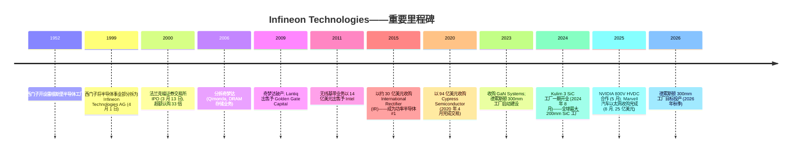
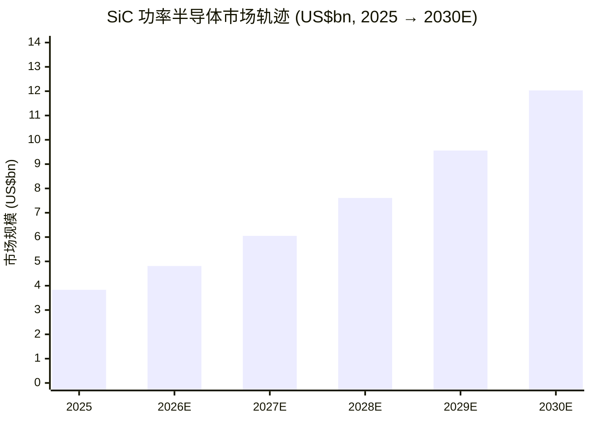

# Infineon Technologies AG (XETR:IFX) — 公司研究报告

**截至日期: 2026-06-14**
**代码: XETR:IFX (法兰克福 XETRA 交易所, 主要上市地) · ISIN DE0006231004 · OTC:IFNNY / IFNNF (ADR)**
**总部: 德国诺伊比贝格 (慕尼黑)**
**上市语种: 德语 / IFRS 财报披露, 英语投资者关系。Infineon 财年截至 9 月 30 日 (FY)。本报告依技能规则以中文撰写。**
**报告语言: 简体中文 (英文版同时存在于本目录, 本次刷新仅更新中文版)**

### 投资摘要 / Investment summary  *(分析师观点 / Analyst view)*

| 项目 | 数值 |
|---|---|
| **评级 / Rating** | **持有 (Hold / Neutral)** — 优质资产, 但 AI 电源逻辑已被快速定价 |
| **12 个月目标价 / 12-mo PT** | **€84**（基本情形 / base）— 区间 **熊 €55 / 基 €84 / 牛 €100** |
| **当前股价 / Current price** | **€80.06**（XETRA, 2026-06-12 收盘） |
| **上行空间 / Implied upside** | **+5%**（至基本情形目标价） |
| **估值方法 / Valuation method** | FY2027E EPS ≈ €2.55 × 33× 前瞻 P/E（与 14–17% 前瞻营收 CAGR 对应）；与卖方 EV/EBITDA 法交叉验证 |
| **市值 / Market cap** | **€1,040 亿**（≈ €104bn, 13.0 亿股） |
| **52 周区间** | **€30.82 – €88.46** |

> *评级、目标价及前瞻估计均为分析师观点 (Analyst view), 非来自任何申报文件——年度报告不含目标价。*

**投资逻辑四大支柱 (thesis pillars):**

1. **结构性领导地位真实存在。** Infineon 连续六年蝉联汽车半导体 #1、汽车 MCU #1（市占 36%）、全球功率半导体 #1, 且是唯一在硅、SiC、GaN 三种功率材料上均居前三的厂商——这是产品组合中最难复制的护城河 (来源: [Infineon 新闻稿 INFXX202504-086](https://www.infineon.com/cms/en/about-infineon/press/press-releases/2025/INFXX202504-086.html))。
2. **AI 数据中心电源是新增长极, 但已被快速定价。** PSS 分部 FY2025 营收同比 +11% 逆周期增长, 与 NVIDIA 的 800V HVDC 合作把每机柜硅含量随 GPU 功率放大；管理层显著上调 AI 营收目标 (来源: [Infineon FY2025 新闻稿 INFXX202511-021](https://www.infineon.com/press-release/2025/infxx202511-021))。
3. **周期底部 + 再估值的组合使估值成为头号风险。** 股价过去 12 个月再估值 **+142%**（€33.06 → €80.06）, TTM P/E 升至 **97.6×**、前瞻 P/E **30.9×**——盈利仍在周期底部, 倍数留给执行偏差的空间极小。
4. **卖方高度分歧。** 目标价从 UBS 的 €45（Neutral）一路到 BofA 的 €108（Buy）, 区间宽达 2.4 倍——这种分歧本身就是"AI 电源叙事能否兑现"尚未定论的信号。

> **股价再估值脉络 (数据截至 2026-06-12):** Infineon 在 XETRA 的收盘价为 **€80.06**（2026-06-12）, 距 52 周高点 €88.46 仅一步之遥, 较 12 个月低点 €30.82 上涨 **+160%**, 市值扩张至 **€1,040 亿** (来源: [Yahoo Finance IFX.DE 报价与 52 周区间, 2026-06-14 查询](https://finance.yahoo.com/quote/IFX.DE/))。本轮再估值由两件事驱动: (i) 管理层在 FY2025 业绩中显著上调 AI 数据中心电源营收目标 (来源: [Infineon FY2025 新闻稿 INFXX202511-021, 2025-11-12](https://www.infineon.com/press-release/2025/infxx202511-021)), (ii) 与 NVIDIA 的 800V HVDC 电源架构合作 (来源: [Infineon 新闻稿 INFXX202505-107, 2025-05](https://www.infineon.com/cms/en/about-infineon/press/press-releases/2025/INFXX202505-107.html);[NVIDIA 开发者博客《800V HVDC 架构》](https://developer.nvidia.com/blog/nvidia-800-v-hvdc-architecture-will-power-the-next-generation-of-ai-factories/))。空头（UBS Neutral）指出, 本轮上涨已把 TTM P/E 推升至近 100 倍——远高于 FY2025 基本面所能合理化的水平——使估值本身成为短期最大的单一风险。

## 目录
1. 公司概览（含 1A 估值与目标价、1B GF Score）
2. 估值与目标价 / 公司历史
3. 管理团队
4. 产品与服务
5. 客户与上市策略
6. 行业概览
7. 竞争格局
8. 市场机会 (TAM)
9. 风险评估（含 9.5 关键争议与催化剂）
10. 投资视角评分（Buffett / Munger / Damodaran / Marks）
11. 参考资料

---

## 1. 公司概览

Infineon Technologies AG 是德国最大的纯半导体公司, 在两个战略最重要的芯片品类——**功率半导体 (power semiconductor)** 和**汽车半导体 (automotive semiconductor)**——上均居全球领导地位。公司总部位于慕尼黑南郊的诺伊比贝格 (Neubiberg), 设计、制造并销售用于汽车、工业及消费应用场景中转换、开关、感测、安全与控制电能的半导体元器件 (来源: [Wikipedia——Infineon Technologies](https://en.wikipedia.org/wiki/Infineon_Technologies))。公司财年截至 9 月 30 日; 本报告全文采用 Infineon 的财年口径。

2025 财年 (截至 2025 年 9 月 30 日), Infineon 录得营业收入 **€146.62 亿 (€14,662m)**, 同比下降 2%, 分部经营业绩 (Segment Result) €25.60 亿 (€2,560m), 分部经营业绩率 17.5%；gross margin (毛利率) 39.2%, 较 FY2024 的 41.8% 下滑 2.6 个百分点 (来源: [Infineon 新闻稿 INFXX202511-021, 2025 年 11 月 12 日, "FY 2025 与预期一致"](https://www.infineon.com/press-release/2025/infxx202511-021); [Infineon FY2025 年度报告 (Annual Report 2025), 第 2 页 Key Data](https://www.infineon.com/row/public/documents/corporate/investors/annual-reports/2025/2025-annual-report-v01-00-en.pdf))。FY2024 (前一基准年) 营业收入 €149.55 亿, 较 FY2023 高点 €163.09 亿下滑 8%, 分部经营业绩 €31.05 亿 (20.8% 利润率), 反映了更大范围的半导体下行周期 (来源: [Infineon 新闻稿 INFXX202411-020, 2024 年 11 月 12 日](https://www.infineon.com/cms/en/about-infineon/press/press-releases/2024/INFXX202411-020.html))。FY2025 调整后自由现金流 (Adjusted Free Cash Flow) 为 **+€18.03 亿 (€1,803m)**, 而申报口径自由现金流为 **−€10.51 亿 (−€1,051m)**, 后者主要受 Marvell 汽车以太网收购案现金支出影响 (来源: [Infineon FY2025 新闻稿 INFXX202511-021](https://www.infineon.com/press-release/2025/infxx202511-021))。FY2025 调整后摊薄每股收益 (adjusted EPS) €1.39, 基本每股收益 €0.77 (来源: [Infineon FY2025 年度报告, 第 2 页](https://www.infineon.com/row/public/documents/corporate/investors/annual-reports/2025/2025-annual-report-v01-00-en.pdf))。

下面的 income-statement Sankey 把 FY2025 的 €14.66bn 营收一路拆到净利润, 左侧为四大分部的营收来源——这是理解 Infineon "钱怎么赚" 的最直观锚:

<svg xmlns="http://www.w3.org/2000/svg" viewBox="0 0 1000 560" width="1000" height="560" role="img" aria-label="income statement Sankey"><rect x="0" y="0" width="1000" height="560" fill="#ffffff"/>
<text x="20.00" y="30.00" text-anchor="start" font-family="Helvetica,Arial,sans-serif" font-size="15" font-weight="700" fill="#1f2933">英飞凌如何赚钱 / How Infineon Makes Its Money — FY2025 (截至 2025-09-30)</text>
<path d="M 204.00,64.04 C 258.00,64.04 258.00,85.00 312.00,85.00 L 312.00,290.98 C 258.00,290.98 258.00,270.02 204.00,270.02 Z" fill="#93c5fd" fill-opacity="0.55"/>
<path d="M 452.00,78.00 C 506.00,78.00 506.00,201.96 560.00,201.96 L 560.00,256.05 C 506.00,256.05 506.00,132.10 452.00,132.10 Z" fill="#86efac" fill-opacity="0.55"/>
<path d="M 452.00,132.10 C 506.00,132.10 506.00,270.05 560.00,270.05 L 560.00,376.04 C 506.00,376.04 506.00,238.09 452.00,238.09 Z" fill="#fca5a5" fill-opacity="0.55"/>
<path d="M 328.00,85.00 C 382.00,85.00 382.00,78.00 436.00,78.00 L 436.00,238.09 C 382.00,238.09 382.00,245.09 328.00,245.09 Z" fill="#86efac" fill-opacity="0.55"/>
<path d="M 328.00,245.09 C 382.00,245.09 382.00,252.09 436.00,252.09 L 436.00,500.00 C 382.00,500.00 382.00,493.00 328.00,493.00 Z" fill="#fca5a5" fill-opacity="0.55"/>
<path d="M 576.00,201.96 C 630.00,201.96 630.00,202.87 684.00,202.87 L 684.00,256.97 C 630.00,256.97 630.00,256.05 576.00,256.05 Z" fill="#86efac" fill-opacity="0.55"/>
<path d="M 700.00,202.87 C 754.00,202.87 754.00,262.73 808.00,262.73 L 808.00,290.97 C 754.00,290.97 754.00,231.12 700.00,231.12 Z" fill="#86efac" fill-opacity="0.55"/>
<path d="M 700.00,231.12 C 754.00,231.12 754.00,304.97 808.00,304.97 L 808.00,315.27 C 754.00,315.27 754.00,241.41 700.00,241.41 Z" fill="#fca5a5" fill-opacity="0.55"/>
<path d="M 576.00,270.05 C 630.00,270.05 630.00,255.13 684.00,255.13 L 684.00,299.16 C 630.00,299.16 630.00,314.07 576.00,314.07 Z" fill="#fca5a5" fill-opacity="0.55"/>
<path d="M 576.00,314.07 C 630.00,314.07 630.00,313.16 684.00,313.16 L 684.00,375.13 C 630.00,375.13 630.00,376.04 576.00,376.04 Z" fill="#fca5a5" fill-opacity="0.55"/>
<path d="M 204.00,284.02 C 258.00,284.02 258.00,290.98 312.00,290.98 L 312.00,408.07 C 258.00,408.07 258.00,401.11 204.00,401.11 Z" fill="#93c5fd" fill-opacity="0.55"/>
<path d="M 204.00,415.11 C 258.00,415.11 258.00,408.07 312.00,408.07 L 312.00,453.46 C 258.00,453.46 258.00,460.50 204.00,460.50 Z" fill="#93c5fd" fill-opacity="0.55"/>
<path d="M 204.00,474.50 C 258.00,474.50 258.00,453.46 312.00,453.46 L 312.00,492.92 C 258.00,492.92 258.00,513.96 204.00,513.96 Z" fill="#93c5fd" fill-opacity="0.55"/>
<rect x="188.00" y="64.04" width="16" height="205.98" rx="1.5" fill="#2563eb"/>
<rect x="188.00" y="284.02" width="16" height="117.10" rx="1.5" fill="#2563eb"/>
<rect x="188.00" y="415.11" width="16" height="45.39" rx="1.5" fill="#2563eb"/>
<rect x="188.00" y="474.50" width="16" height="39.46" rx="1.5" fill="#2563eb"/>
<rect x="312.00" y="85.00" width="16" height="408.00" rx="1.5" fill="#1e3a8a"/>
<rect x="436.00" y="78.00" width="16" height="160.09" rx="1.5" fill="#15803d"/>
<rect x="436.00" y="252.09" width="16" height="247.91" rx="1.5" fill="#dc2626"/>
<rect x="560.00" y="201.96" width="16" height="54.10" rx="1.5" fill="#15803d"/>
<rect x="560.00" y="270.05" width="16" height="105.99" rx="1.5" fill="#dc2626"/>
<rect x="684.00" y="202.87" width="16" height="38.26" rx="1.5" fill="#15803d"/>
<rect x="684.00" y="255.13" width="16" height="44.02" rx="1.5" fill="#dc2626"/>
<rect x="684.00" y="313.16" width="16" height="61.97" rx="1.5" fill="#dc2626"/>
<rect x="808.00" y="262.73" width="16" height="28.24" rx="1.5" fill="#15803d"/>
<rect x="808.00" y="304.97" width="16" height="10.30" rx="1.5" fill="#dc2626"/>
<text x="179.00" y="162.80" text-anchor="end" font-family="Helvetica,Arial,sans-serif" font-size="11.5" font-weight="700" fill="#1f2933">Automotive (ATV)</text>
<text x="179.00" y="175.80" text-anchor="end" font-family="Helvetica,Arial,sans-serif" font-size="10" font-weight="400" fill="#52606d">€7.4B  (50.5%)</text>
<text x="179.00" y="338.34" text-anchor="end" font-family="Helvetica,Arial,sans-serif" font-size="11.5" font-weight="700" fill="#1f2933">Power &amp; Sensor (PSS)</text>
<text x="179.00" y="351.34" text-anchor="end" font-family="Helvetica,Arial,sans-serif" font-size="10" font-weight="400" fill="#52606d">€4.2B  (28.7%)</text>
<text x="179.00" y="433.58" text-anchor="end" font-family="Helvetica,Arial,sans-serif" font-size="11.5" font-weight="700" fill="#1f2933">Green Industrial (GIP)</text>
<text x="179.00" y="446.58" text-anchor="end" font-family="Helvetica,Arial,sans-serif" font-size="10" font-weight="400" fill="#52606d">€1.6B  (11.1%)</text>
<text x="179.00" y="490.00" text-anchor="end" font-family="Helvetica,Arial,sans-serif" font-size="11.5" font-weight="700" fill="#1f2933">Connected Secure (CSS)</text>
<text x="179.00" y="503.00" text-anchor="end" font-family="Helvetica,Arial,sans-serif" font-size="10" font-weight="400" fill="#52606d">€1.4B  (9.7%)</text>
<rect x="331.00" y="67.00" width="106.80" height="26" rx="2" fill="#ffffff" fill-opacity="0.72"/>
<text x="334.00" y="79.00" text-anchor="start" font-family="Helvetica,Arial,sans-serif" font-size="11.5" font-weight="700" fill="#1f2933">Revenue</text>
<text x="334.00" y="92.00" text-anchor="start" font-family="Helvetica,Arial,sans-serif" font-size="10" font-weight="400" fill="#52606d">€14.7B  (100.0%)</text>
<rect x="455.00" y="60.00" width="94.20" height="26" rx="2" fill="#ffffff" fill-opacity="0.72"/>
<text x="458.00" y="72.00" text-anchor="start" font-family="Helvetica,Arial,sans-serif" font-size="11.5" font-weight="700" fill="#1f2933">Gross Profit</text>
<text x="458.00" y="85.00" text-anchor="start" font-family="Helvetica,Arial,sans-serif" font-size="10" font-weight="400" fill="#52606d">€5.8B  (39.2%)</text>
<rect x="455.00" y="234.09" width="144.60" height="26" rx="2" fill="#ffffff" fill-opacity="0.72"/>
<text x="458.00" y="246.09" text-anchor="start" font-family="Helvetica,Arial,sans-serif" font-size="11.5" font-weight="700" fill="#1f2933">Cost of Revenue (COGS)</text>
<text x="458.00" y="259.09" text-anchor="start" font-family="Helvetica,Arial,sans-serif" font-size="10" font-weight="400" fill="#52606d">€8.9B  (60.8%)</text>
<rect x="579.00" y="183.96" width="106.80" height="26" rx="2" fill="#ffffff" fill-opacity="0.72"/>
<text x="582.00" y="195.96" text-anchor="start" font-family="Helvetica,Arial,sans-serif" font-size="11.5" font-weight="700" fill="#1f2933">Operating Income</text>
<text x="582.00" y="208.96" text-anchor="start" font-family="Helvetica,Arial,sans-serif" font-size="10" font-weight="400" fill="#52606d">€1.9B  (13.3%)</text>
<rect x="579.00" y="252.05" width="150.90" height="26" rx="2" fill="#ffffff" fill-opacity="0.72"/>
<text x="582.00" y="264.05" text-anchor="start" font-family="Helvetica,Arial,sans-serif" font-size="11.5" font-weight="700" fill="#1f2933">Total Operating Expense</text>
<text x="582.00" y="277.05" text-anchor="start" font-family="Helvetica,Arial,sans-serif" font-size="10" font-weight="400" fill="#52606d">€3.8B  (26.0%)</text>
<rect x="703.00" y="184.87" width="87.90" height="26" rx="2" fill="#ffffff" fill-opacity="0.72"/>
<text x="706.00" y="196.87" text-anchor="start" font-family="Helvetica,Arial,sans-serif" font-size="11.5" font-weight="700" fill="#1f2933">Pretax Income</text>
<text x="706.00" y="209.87" text-anchor="start" font-family="Helvetica,Arial,sans-serif" font-size="10" font-weight="400" fill="#52606d">€1.4B  (9.4%)</text>
<rect x="703.00" y="237.13" width="94.20" height="26" rx="2" fill="#ffffff" fill-opacity="0.72"/>
<text x="706.00" y="249.13" text-anchor="start" font-family="Helvetica,Arial,sans-serif" font-size="11.5" font-weight="700" fill="#1f2933">SG&amp;A</text>
<text x="706.00" y="262.13" text-anchor="start" font-family="Helvetica,Arial,sans-serif" font-size="10" font-weight="400" fill="#52606d">€1.6B  (10.8%)</text>
<rect x="703.00" y="295.16" width="94.20" height="26" rx="2" fill="#ffffff" fill-opacity="0.72"/>
<text x="706.00" y="307.16" text-anchor="start" font-family="Helvetica,Arial,sans-serif" font-size="11.5" font-weight="700" fill="#1f2933">R&amp;D</text>
<text x="706.00" y="320.16" text-anchor="start" font-family="Helvetica,Arial,sans-serif" font-size="10" font-weight="400" fill="#52606d">€2.2B  (15.2%)</text>
<text x="833.00" y="273.85" text-anchor="start" font-family="Helvetica,Arial,sans-serif" font-size="11.5" font-weight="700" fill="#1f2933">Net Income</text>
<text x="833.00" y="286.85" text-anchor="start" font-family="Helvetica,Arial,sans-serif" font-size="10" font-weight="400" fill="#52606d">€1.0B  (6.9%)</text>
<text x="833.00" y="307.12" text-anchor="start" font-family="Helvetica,Arial,sans-serif" font-size="11.5" font-weight="700" fill="#1f2933">Income Tax</text>
<text x="833.00" y="320.12" text-anchor="start" font-family="Helvetica,Arial,sans-serif" font-size="10" font-weight="400" fill="#52606d">€370.0M  (2.5%)</text>
<text x="500.00" y="544.00" text-anchor="middle" font-family="Helvetica,Arial,sans-serif" font-size="10" font-weight="400" fill="#52606d">Source: Infineon FY2025 Annual Report, Income Statement + Segment table (p.2); FY2025 press release INFXX202511-021</text>
</svg>

来源 / Source: [Infineon FY2025 年度报告, 损益表 + 分部营收 (第 2 页)](https://www.infineon.com/row/public/documents/corporate/investors/annual-reports/2025/2025-annual-report-v01-00-en.pdf); [FY2025 新闻稿 INFXX202511-021](https://www.infineon.com/press-release/2025/infxx202511-021)

Infineon 业务架构由**四大经营分部 (operating segments)** 构成, 各自直接向管理层汇报。FY2025 分部营收 (来源: [Infineon FY2025 年度报告, "Revenue by segment", 第 2 页](https://www.infineon.com/row/public/documents/corporate/investors/annual-reports/2025/2025-annual-report-v01-00-en.pdf)):

- **汽车 (ATV)**——FY2025 营收 **€7,402m, 占 50%** (FY2024 占 52%), 为公司旗舰分部, 同比下滑 4%。ATV 为各类现代车型——从入门级经济车型到高端电动驱动系统——供应 microcontroller (MCU, 微控制器)、功率器件、传感器及连接芯片。
- **电源与传感器系统 (PSS)**——FY2025 营收 **€4,208m, 占 29%** (FY2024 占 25%), **同比逆周期增长 +11%**, 是四大分部中唯一正增长者。PSS 覆盖消费、计算、通信及 AI 数据中心电源, 以及 XENSIV 传感器系列。**这是 AI 服务器需求暴露度最高的分部**, 是 Infineon 与 NVIDIA 800V HVDC 架构合作所属的分部, 也是管理层指引最激进增长的分部——FY2025 分部占比从 25% 跳升至 29% 正是这一增长的直接证据。
- **绿色工业电源 (GIP)**——FY2025 营收 **€1,631m, 占 11%** (FY2024 占 13%), 同比下滑 16%, 反映工业与可再生能源资本开支的周期性疲软。GIP 为光伏逆变器、风电、牵引驱动、工业电机控制及储能系统供应 IGBT 和 SiC 模块。
- **互联安全系统 (CSS)**——FY2025 营收 **€1,418m, 占 10%**, 同比下滑 6%。CSS 整合 Cypress 遗产资产 (PSoC 微控制器、AIROC Wi-Fi/Bluetooth) 与安全 IC (OPTIGA)、NOR/SRAM/FRAM 存储器, 服务物联网与嵌入式系统。

**本期新变化 (FY2024 → FY2025):** 最值得注意的结构性位移是 **PSS 占比从 25% 升至 29%, ATV 从 52% 降至 50%**——这是 "汽车周期底部 + AI 电源逆势增长" 两股力量叠加的可视化结果, 也是再估值故事的财务根基。

<svg xmlns="http://www.w3.org/2000/svg" viewBox="0 0 720 460" width="720" height="460" role="img" aria-label="revenue donut"><rect x="0" y="0" width="720" height="460" fill="#ffffff"/>
<text x="20.00" y="30.00" text-anchor="start" font-family="Helvetica,Arial,sans-serif" font-size="15" font-weight="700" fill="#1f2933">FY2025 营业收入按分部 / Revenue by Segment</text>
<path d="M 288.00,107.20 A 132 132 0 1 1 283.90,371.14 L 285.58,317.16 A 78 78 0 1 0 288.00,161.20 Z" fill="#2563eb"/>
<path d="M 283.90,371.14 A 132 132 0 0 1 160.57,204.76 L 212.70,218.85 A 78 78 0 0 0 285.58,317.16 Z" fill="#15803d"/>
<path d="M 160.57,204.76 A 132 132 0 0 1 212.62,130.84 L 243.46,175.17 A 78 78 0 0 0 212.70,218.85 Z" fill="#d97706"/>
<path d="M 212.62,130.84 A 132 132 0 0 1 288.00,107.20 L 288.00,161.20 A 78 78 0 0 0 243.46,175.17 Z" fill="#7c3aed"/>
<text x="288.00" y="235.20" text-anchor="middle" font-family="Helvetica,Arial,sans-serif" font-size="18" font-weight="800" fill="#1f2933">Infineon\nFY2025</text>
<text x="288.00" y="255.20" text-anchor="middle" font-family="Helvetica,Arial,sans-serif" font-size="13" font-weight="600" fill="#52606d">€14.7B</text>
<text x="288.00" y="271.20" text-anchor="middle" font-family="Helvetica,Arial,sans-serif" font-size="10" font-weight="400" fill="#8a97a3">total</text>
<line x1="425.98" y1="241.34" x2="441.98" y2="241.34" stroke="#2563eb" stroke-width="1.4"/>
<text x="445.98" y="239.34" text-anchor="start" font-family="Helvetica,Arial,sans-serif" font-size="11" font-weight="700" fill="#1f2933">Automotive (ATV)</text>
<text x="445.98" y="253.34" text-anchor="start" font-family="Helvetica,Arial,sans-serif" font-size="10" font-weight="400" fill="#52606d">€7.4B  (50.5%)</text>
<line x1="177.14" y1="321.38" x2="161.14" y2="321.38" stroke="#15803d" stroke-width="1.4"/>
<text x="157.14" y="319.38" text-anchor="end" font-family="Helvetica,Arial,sans-serif" font-size="11" font-weight="700" fill="#1f2933">Power &amp; Sensor (PSS)</text>
<text x="157.14" y="333.38" text-anchor="end" font-family="Helvetica,Arial,sans-serif" font-size="10" font-weight="400" fill="#52606d">€4.2B  (28.7%)</text>
<line x1="175.16" y1="159.75" x2="159.16" y2="159.75" stroke="#d97706" stroke-width="1.4"/>
<text x="155.16" y="157.75" text-anchor="end" font-family="Helvetica,Arial,sans-serif" font-size="11" font-weight="700" fill="#1f2933">Green Industrial (GIP)</text>
<text x="155.16" y="171.75" text-anchor="end" font-family="Helvetica,Arial,sans-serif" font-size="10" font-weight="400" fill="#52606d">€1.6B  (11.1%)</text>
<line x1="246.71" y1="107.52" x2="230.71" y2="107.52" stroke="#7c3aed" stroke-width="1.4"/>
<text x="226.71" y="105.52" text-anchor="end" font-family="Helvetica,Arial,sans-serif" font-size="11" font-weight="700" fill="#1f2933">Connected Secure (CSS)</text>
<text x="226.71" y="119.52" text-anchor="end" font-family="Helvetica,Arial,sans-serif" font-size="10" font-weight="400" fill="#52606d">€1.4B  (9.7%)</text>
<text x="360.00" y="444.00" text-anchor="middle" font-family="Helvetica,Arial,sans-serif" font-size="10" font-weight="400" fill="#52606d">Source: Infineon FY2025 Annual Report, Revenue by segment (p.2)</text>
</svg>

来源 / Source: [Infineon FY2025 年度报告, Revenue by segment (第 2 页)](https://www.infineon.com/row/public/documents/corporate/investors/annual-reports/2025/2025-annual-report-v01-00-en.pdf)

<svg xmlns="http://www.w3.org/2000/svg" viewBox="0 0 860 470" width="860" height="470" role="img" aria-label="historical revenue bars"><rect x="0" y="0" width="860" height="470" fill="#ffffff"/>
<text x="20.00" y="30.00" text-anchor="start" font-family="Helvetica,Arial,sans-serif" font-size="15" font-weight="700" fill="#1f2933">分部营收演变 / Historical Revenue by Segment (FY2023–FY2025)</text>
<rect x="20.00" y="44" width="11" height="11" rx="2" fill="#2563eb"/>
<text x="36.00" y="53.00" text-anchor="start" font-family="Helvetica,Arial,sans-serif" font-size="10.5" font-weight="400" fill="#1f2933">Automotive (ATV)</text>
<rect x="155.60" y="44" width="11" height="11" rx="2" fill="#15803d"/>
<text x="171.60" y="53.00" text-anchor="start" font-family="Helvetica,Arial,sans-serif" font-size="10.5" font-weight="400" fill="#1f2933">Power &amp; Sensor (PSS)</text>
<rect x="317.60" y="44" width="11" height="11" rx="2" fill="#d97706"/>
<text x="333.60" y="53.00" text-anchor="start" font-family="Helvetica,Arial,sans-serif" font-size="10.5" font-weight="400" fill="#1f2933">Green Industrial (GIP)</text>
<rect x="492.80" y="44" width="11" height="11" rx="2" fill="#7c3aed"/>
<text x="508.80" y="53.00" text-anchor="start" font-family="Helvetica,Arial,sans-serif" font-size="10.5" font-weight="400" fill="#1f2933">Connected Secure (CSS)</text>
<line x1="70" y1="412.00" x2="834" y2="412.00" stroke="#eceff2" stroke-width="1"/>
<text x="64.00" y="415.00" text-anchor="end" font-family="Helvetica,Arial,sans-serif" font-size="9.5" font-weight="400" fill="#52606d">€0</text>
<line x1="70" y1="345.20" x2="834" y2="345.20" stroke="#eceff2" stroke-width="1"/>
<text x="64.00" y="348.20" text-anchor="end" font-family="Helvetica,Arial,sans-serif" font-size="9.5" font-weight="400" fill="#52606d">€3.5B</text>
<line x1="70" y1="278.40" x2="834" y2="278.40" stroke="#eceff2" stroke-width="1"/>
<text x="64.00" y="281.40" text-anchor="end" font-family="Helvetica,Arial,sans-serif" font-size="9.5" font-weight="400" fill="#52606d">€7.0B</text>
<line x1="70" y1="211.60" x2="834" y2="211.60" stroke="#eceff2" stroke-width="1"/>
<text x="64.00" y="214.60" text-anchor="end" font-family="Helvetica,Arial,sans-serif" font-size="9.5" font-weight="400" fill="#52606d">€10.6B</text>
<line x1="70" y1="144.80" x2="834" y2="144.80" stroke="#eceff2" stroke-width="1"/>
<text x="64.00" y="147.80" text-anchor="end" font-family="Helvetica,Arial,sans-serif" font-size="9.5" font-weight="400" fill="#52606d">€14.1B</text>
<line x1="70" y1="78.00" x2="834" y2="78.00" stroke="#eceff2" stroke-width="1"/>
<text x="64.00" y="81.00" text-anchor="end" font-family="Helvetica,Arial,sans-serif" font-size="9.5" font-weight="400" fill="#52606d">€17.6B</text>
<rect x="123.48" y="260.00" width="147.71" height="152.00" fill="#2563eb"/>
<rect x="123.48" y="166.08" width="147.71" height="93.92" fill="#15803d"/>
<rect x="123.48" y="131.92" width="147.71" height="34.16" fill="#d97706"/>
<rect x="123.48" y="102.74" width="147.71" height="29.18" fill="#7c3aed"/>
<text x="197.33" y="428.00" text-anchor="middle" font-family="Helvetica,Arial,sans-serif" font-size="10" font-weight="400" fill="#52606d">2023</text>
<rect x="378.15" y="265.63" width="147.71" height="146.37" fill="#2563eb"/>
<rect x="378.15" y="193.64" width="147.71" height="71.99" fill="#15803d"/>
<rect x="378.15" y="156.96" width="147.71" height="36.69" fill="#d97706"/>
<rect x="378.15" y="128.39" width="147.71" height="28.57" fill="#7c3aed"/>
<text x="452.00" y="428.00" text-anchor="middle" font-family="Helvetica,Arial,sans-serif" font-size="10" font-weight="400" fill="#52606d">2024</text>
<rect x="632.81" y="271.59" width="147.71" height="140.41" fill="#2563eb"/>
<rect x="632.81" y="191.76" width="147.71" height="79.82" fill="#15803d"/>
<rect x="632.81" y="160.83" width="147.71" height="30.94" fill="#d97706"/>
<rect x="632.81" y="133.93" width="147.71" height="26.90" fill="#7c3aed"/>
<text x="706.67" y="428.00" text-anchor="middle" font-family="Helvetica,Arial,sans-serif" font-size="10" font-weight="400" fill="#52606d">2025</text>
<text x="430.00" y="454.00" text-anchor="middle" font-family="Helvetica,Arial,sans-serif" font-size="10" font-weight="400" fill="#52606d">Source: Infineon FY2024 &amp; FY2025 Annual Reports, Revenue by segment; Financial Data 2020–2024 sheet</text>
</svg>

来源 / Source: [Infineon FY2024 & FY2025 年度报告, Revenue by segment](https://www.infineon.com/row/public/documents/corporate/investors/annual-reports/2025/2025-annual-report-v01-00-en.pdf)（FY2023 分部数据取自 [Financial Data 2020–2024 数据手册](https://www.infineon.com/assets/row/public/documents/corporate/investors/annual-reports/2024/2024-infineon-financial-data-2020-2024-v01-00-en.pdf)）

公司客户群涵盖全球所有主要汽车 OEM 与 Tier-1 供应商, 公开披露的客户包括汽车领域的 Tesla、BYD、Volkswagen (大众)、Hyundai-Kia (现代起亚) 和 Bosch (博世), 以及 AI 电源领域的 NVIDIA 和不断扩张的超大规模数据中心客户群 (来源: [Automotive World《Infineon retains automotive chip market top spot》](https://www.automotiveworld.com/news-releases/infineon-retains-automotive-chip-market-top-spot/);[Infineon NVIDIA 800V 合作新闻稿 INFXX202505-107](https://www.infineon.com/cms/en/about-infineon/press/press-releases/2025/INFXX202505-107.html);[Infineon 800V 预告新闻稿 INFXX202510-003](https://www.infineon.com/cms/en/about-infineon/press/press-releases/2025/INFXX202510-003.html))。公司通过对大型战略客户直销, 配合覆盖数万家小型工业与消费客户的庞大分销网络相结合的方式销售产品。

在地域分布上, Infineon 是全球分布较均衡的半导体公司之一, 但 **FY2025 大中华区已超越 EMEA 成为最大营收区域**: 大中华区 (含中国大陆、香港、台湾) €5,579m, 占 38% (FY2024 占 34%); EMEA €3,486m, 占 24% (其中德国 €1,437m, 占 10%); 亚太 (除日本、大中华) €2,449m, 占 17%; 美洲 €1,834m, 占 12% (其中美国 €1,506m, 占 10%); 日本 €1,314m, 占 9% (来源: [Infineon FY2025 年度报告, "Regional distribution of revenue", 第 52 页](https://www.infineon.com/row/public/documents/corporate/investors/annual-reports/2025/2025-annual-report-v01-00-en.pdf))。大中华区占比同比提升 4 个百分点, 既反映中国 EV 与功率半导体需求的韧性, 也使中国本土自给自足 (localization) 成为本报告第 9 章列示的实质风险。

<svg xmlns="http://www.w3.org/2000/svg" viewBox="0 0 720 460" width="720" height="460" role="img" aria-label="revenue donut"><rect x="0" y="0" width="720" height="460" fill="#ffffff"/>
<text x="20.00" y="30.00" text-anchor="start" font-family="Helvetica,Arial,sans-serif" font-size="15" font-weight="700" fill="#1f2933">FY2025 营业收入按地区 / Revenue by Region</text>
<path d="M 288.00,107.20 A 132 132 0 0 1 378.05,335.71 L 341.21,296.23 A 78 78 0 0 0 288.00,161.20 Z" fill="#2563eb"/>
<path d="M 378.05,335.71 A 132 132 0 0 1 198.69,336.40 L 235.23,296.64 A 78 78 0 0 0 341.21,296.23 Z" fill="#15803d"/>
<path d="M 198.69,336.40 A 132 132 0 0 1 159.23,210.17 L 211.91,222.04 A 78 78 0 0 0 235.23,296.64 Z" fill="#d97706"/>
<path d="M 159.23,210.17 A 132 132 0 0 1 217.54,127.58 L 246.36,173.24 A 78 78 0 0 0 211.91,222.04 Z" fill="#7c3aed"/>
<path d="M 217.54,127.58 A 132 132 0 0 1 288.00,107.20 L 288.00,161.20 A 78 78 0 0 0 246.36,173.24 Z" fill="#dc2626"/>
<text x="288.00" y="235.20" text-anchor="middle" font-family="Helvetica,Arial,sans-serif" font-size="18" font-weight="800" fill="#1f2933">Infineon\nFY2025</text>
<text x="288.00" y="255.20" text-anchor="middle" font-family="Helvetica,Arial,sans-serif" font-size="13" font-weight="600" fill="#52606d">€14.7B</text>
<text x="288.00" y="271.20" text-anchor="middle" font-family="Helvetica,Arial,sans-serif" font-size="10" font-weight="400" fill="#8a97a3">total</text>
<line x1="416.39" y1="188.60" x2="432.39" y2="188.60" stroke="#2563eb" stroke-width="1.4"/>
<text x="436.39" y="186.60" text-anchor="start" font-family="Helvetica,Arial,sans-serif" font-size="11" font-weight="700" fill="#1f2933">Greater China</text>
<text x="436.39" y="200.60" text-anchor="start" font-family="Helvetica,Arial,sans-serif" font-size="10" font-weight="400" fill="#52606d">€5.6B  (38.1%)</text>
<line x1="288.53" y1="377.20" x2="304.53" y2="377.20" stroke="#15803d" stroke-width="1.4"/>
<text x="308.53" y="375.20" text-anchor="start" font-family="Helvetica,Arial,sans-serif" font-size="11" font-weight="700" fill="#1f2933">EMEA</text>
<text x="308.53" y="389.20" text-anchor="start" font-family="Helvetica,Arial,sans-serif" font-size="10" font-weight="400" fill="#52606d">€3.5B  (23.8%)</text>
<line x1="156.29" y1="280.37" x2="140.29" y2="280.37" stroke="#d97706" stroke-width="1.4"/>
<text x="136.29" y="278.37" text-anchor="end" font-family="Helvetica,Arial,sans-serif" font-size="11" font-weight="700" fill="#1f2933">Asia-Pacific (ex JP/GC)</text>
<text x="136.29" y="292.37" text-anchor="end" font-family="Helvetica,Arial,sans-serif" font-size="10" font-weight="400" fill="#52606d">€2.4B  (16.7%)</text>
<line x1="175.26" y1="159.61" x2="159.26" y2="159.61" stroke="#7c3aed" stroke-width="1.4"/>
<text x="155.26" y="157.61" text-anchor="end" font-family="Helvetica,Arial,sans-serif" font-size="11" font-weight="700" fill="#1f2933">Americas</text>
<text x="155.26" y="171.61" text-anchor="end" font-family="Helvetica,Arial,sans-serif" font-size="10" font-weight="400" fill="#52606d">€1.8B  (12.5%)</text>
<line x1="249.66" y1="106.63" x2="233.66" y2="106.63" stroke="#dc2626" stroke-width="1.4"/>
<text x="229.66" y="104.63" text-anchor="end" font-family="Helvetica,Arial,sans-serif" font-size="11" font-weight="700" fill="#1f2933">Japan</text>
<text x="229.66" y="118.63" text-anchor="end" font-family="Helvetica,Arial,sans-serif" font-size="10" font-weight="400" fill="#52606d">€1.3B  (9.0%)</text>
<text x="360.00" y="444.00" text-anchor="middle" font-family="Helvetica,Arial,sans-serif" font-size="10" font-weight="400" fill="#52606d">Source: Infineon FY2025 Annual Report, Regional distribution of revenue (p.52)</text>
</svg>

来源 / Source: [Infineon FY2025 年度报告, Regional distribution of revenue (第 52 页)](https://www.infineon.com/row/public/documents/corporate/investors/annual-reports/2025/2025-annual-report-v01-00-en.pdf)

前道制造分布于欧洲的**德累斯顿** (Dresden, 300mm 硅片——模拟/混合信号与功率器件; 50 亿欧元扩产将于 2026 年秋季投产) 和**奥地利菲拉赫** (Villach, Infineon 功率电子的全球能力中心, 也是公司 SiC 与 GaN 研发所在地), 以及亚洲的**马来西亚居林** (Kulim)——Kulim 3 二期工厂将以再投资 50 亿欧元的规模建成全球最大的 200mm SiC 功率半导体工厂 (来源: [Infineon 新闻稿 INFXX202408-133, 2024 年 8 月,《Infineon 启用全球最大、最高效 SiC 工厂》](https://www.infineon.com/cms/en/about-infineon/press/press-releases/2024/INFXX202408-133.html);[Silicon Saxony 关于 Kulim 3 报道](https://silicon-saxony.de/en/infineon-construction-of-the-worlds-largest-200-millimeter-sic-power-fab-in-kulim-malaysia/);[Digitimes 关于德累斯顿报道, 2023 年 2 月](https://www.digitimes.com/news/a20230203PD200.html))。后道封装与测试主要集中于马来西亚马六甲、印度尼西亚巴淡岛、新加坡、匈牙利采格莱德、中国无锡及若干小型基地。**雷根斯堡** (Regensburg, 巴伐利亚) 是 Infineon 唯一同时具备前道晶圆制造和后道封装的基地, 员工超过 3,000 人 (来源: [Infineon《Regensburg》基地页面](https://www.infineon.com/cms/en/about-infineon/company/find-a-location/regensburg/))。

截至 2025 年 9 月 30 日, Infineon 全球员工约 **5.7 万人**, 较 FY2024 末约 58,060 人有所减少, 反映公司针对周期下行执行先前宣布的成本管控计划 (来源: [Infineon FY2025 新闻稿 INFXX202511-021](https://www.infineon.com/press-release/2025/infxx202511-021))。FY2025 研发支出 (R&D, 研发费用) **€2,227m, 折合营业收入比 15.2%** (FY2024 为 14.5%), 为近五年最高比率, 反映公司在周期底部仍维持高强度投入的逆周期信号 (来源: [Infineon FY2025 年度报告, 第 2 页 Key Data](https://www.infineon.com/row/public/documents/corporate/investors/annual-reports/2025/2025-annual-report-v01-00-en.pdf))。

*分析师观点：* Infineon 战略定位的几项市场份额声明属于第三方研究机构口径, 非来自年度报告: 公司**已连续六年蝉联汽车半导体 #1** (2024 年市占 13.5%, 据 TechInsights——来源: [Infineon 新闻稿 INFATV202504-085,《Infineon bolsters global lead in automotive semiconductors》](https://www.infineon.com/cms/en/about-infineon/press/press-releases/2025/INFATV202504-085.html))、**汽车微控制器 #1** (市占 36.0%, 较上年同比扩张 3.9 个百分点) (来源: [Infineon 新闻稿 INFXX202504-086,《Infineon further strengthens its number one position in automotive microcontrollers》](https://www.infineon.com/cms/en/about-infineon/press/press-releases/2025/INFXX202504-086.html))、以及**功率半导体整体 #1** (2025 年市占约 19.5%) (来源: [Mordor Intelligence Power Semiconductor Market](https://www.mordorintelligence.com/industry-reports/power-semiconductor-market))。投资逻辑建立在以下信念之上: 脱碳化 (EV、可再生能源、电网)、AI 计算电源以及软件定义汽车 (SDV) 将推动 Infineon 主导的硅、碳化硅 (SiC) 和氮化镓 (GaN) 内容的结构性需求扩张。

### 1A 估值快照与目标价 (截至 2026-06-12 收盘)

| 指标 | 数值 | 来源 |
|---|---|---|
| 股价 (XETRA 收盘) | **€80.06** | [Yahoo Finance IFX.DE](https://finance.yahoo.com/quote/IFX.DE/) |
| 市值 | **€1,040 亿** | Yahoo Finance IFX.DE |
| TTM 市盈率 (P/E) | **97.6×** | Yahoo Finance IFX.DE |
| 前瞻市盈率 (forward P/E) | **30.9×** | Yahoo Finance IFX.DE |
| TTM 市销率 (P/S) | **6.88×** | Yahoo Finance IFX.DE |
| 市净率 (P/B) | **6.19×** | Yahoo Finance IFX.DE |
| EV/EBITDA | **27.4×** | Yahoo Finance IFX.DE |
| 股息率 | **0.44%** | Yahoo Finance IFX.DE |
| 52 周区间 | **€30.82 – €88.46** | Yahoo Finance IFX.DE |
| 贝塔系数 (5 年月度) | **1.98** | Yahoo Finance IFX.DE |

当前 TTM 市盈率为 **97.6×, 在同业组中位居前列**, 其成因是: FY2025 净利润压缩至 €10.15 亿 (TTM EPS €0.82, 基本 EPS €0.77), 反映出周期底部盈利吸收了 Marvell 收购相关费用和德累斯顿、Kulim 3 前道工厂折旧的阶梯式上升 (来源: [Infineon FY2025 年度报告, 第 2 页](https://www.infineon.com/row/public/documents/corporate/investors/annual-reports/2025/2025-annual-report-v01-00-en.pdf); yfinance IFX.DE financials, 2026-06-12)。前瞻市盈率 **30.9×**——基于 FY2026 共识 EPS 约 €2.58——是更有意义的衡量标尺, 但已高于 10 年历史均值水平。

高 TTM 市盈率的成因因此是 (a) 周期底部盈利而非结构性问题, 叠加 (b) 受 AI 电源逻辑驱动的股价再估值。从 2025 年 9 月底约 €33.06 收盘价到 2026-06-12 的 €80.06, IFX 在约九个月内 **上涨 +142%** (来源: yfinance 历史数据, IFX.DE);本轮上涨进一步放大了分母效应, 把估值本身推为短期头号风险。

**同业可比 (TTM 基础, Yahoo Finance/yfinance, 2026-06-12 查询):**

| 公司 | 代码 | TTM P/E | TTM P/S |
|---|---|---|---|
| **Infineon Technologies** | **XETR:IFX** | **97.6×** | **6.88×** |
| STMicroelectronics | NYSE:STM | 483.1× | 5.55× |
| NXP Semiconductors | NASDAQ:NXPI | 29.1× | 6.10× |
| onsemi | NASDAQ:ON | 86.5× | 7.49× |
| Analog Devices | NASDAQ:ADI | 62.1× | 15.97× |
| Texas Instruments | NASDAQ:TXN | 51.6× | 14.86× |
| Microchip Technology | NASDAQ:MCHP | 432.9× | 10.95× |
| 同业中位数 (除 IFX) | — | **74.3×** | **9.22×** |

*来源: Yahoo Finance/yfinance 各代码关键统计指标, 2026-06-12 查询。*

同业组与 Infineon 同处 FY2025/CY2024 周期底部, 大多数同业 TTM 市盈率均处于十年高点。Infineon 的 97.6× TTM 市盈率**高于同业中位数 (74.3×)**, 但仍远低于最极端的标的 (STM 483×、MCHP 433×——两家均处近盈亏平衡的底部盈利)。在 **TTM 市销率**层面, Infineon 6.88×**位于同业组的偏下位置** (同业中位数 9.22×)——相对折价反映了 Infineon 在功率分立器件 (lower-gross-margin power discretes) 的产品结构占比较高, 相对于 ADI、TXN 等目录型模拟 (catalog analog) 厂商而言, gross margin 更低。**结论:** 拉伸的 TTM 市盈率由周期底部盈利叠加 AI 电源再估值所致, 而非虚构的增长; 但 30.9× 的前瞻市盈率已不便宜, 留给执行偏差的空间很小。估值本身因此成为第 9 章中的风险 #1, 也是本报告给出 **持有 (Hold)** 评级、目标价 **€84**（上行仅 +5%）的核心原因。目标价的完整推导见第 2 章。

### 1B GF Score (GuruFocus-style) 基本面评分卡 *(分析师观点 / Analyst view)*

下面的五维雷达把 Infineon 的基本面浓缩为一张图 + 0–100 综合分。**这是分析师自有评分体系 (rubric), 非来自任何申报文件, 也不是 GuruFocus 官方数字**；每个维度的底层指标在前文均已分别引用。GF Value 维度遵循"越高=越便宜"的约定。

<svg xmlns="http://www.w3.org/2000/svg" viewBox="0 0 500 500" width="500" height="500" role="img" aria-label="GF Score radar">
<rect x="0" y="0" width="500" height="500" fill="#ffffff"/>
<text x="20" y="24" font-family="Helvetica,Arial,sans-serif" font-size="15" font-weight="700" fill="#1f2933">GF Score (GuruFocus-style): 62/100</text>
<text x="20" y="41" font-family="Helvetica,Arial,sans-serif" font-size="11" fill="#52606d">51–70 Poor future performance potential</text>
<polygon points="250.0,88.0 392.7,191.6 338.2,359.4 161.8,359.4 107.3,191.6" fill="#e9f5ec" stroke="none"/>
<polygon points="250.0,208.0 278.5,228.7 267.6,262.3 232.4,262.3 221.5,228.7" fill="none" stroke="#c5d3cb" stroke-width="1"/>
<polygon points="250.0,178.0 307.1,219.5 285.3,286.5 214.7,286.5 192.9,219.5" fill="none" stroke="#c5d3cb" stroke-width="1"/>
<polygon points="250.0,148.0 335.6,210.2 302.9,310.8 197.1,310.8 164.4,210.2" fill="none" stroke="#c5d3cb" stroke-width="1"/>
<polygon points="250.0,118.0 364.1,200.9 320.5,335.1 179.5,335.1 135.9,200.9" fill="none" stroke="#c5d3cb" stroke-width="1"/>
<polygon points="250.0,88.0 392.7,191.6 338.2,359.4 161.8,359.4 107.3,191.6" fill="none" stroke="#c5d3cb" stroke-width="1.3"/>
<line x1="250" y1="238" x2="161.8" y2="359.4" stroke="#cfdad3" stroke-width="1"/>
<text x="146.5" y="392.4" text-anchor="end" font-family="Helvetica,Arial,sans-serif" font-size="11.5" font-weight="600" fill="#1f2933">Financial Strength</text>
<text x="146.5" y="405.4" text-anchor="end" font-family="Helvetica,Arial,sans-serif" font-size="9.5" fill="#52606d">财务实力</text>
<text x="197.1" y="304.8" text-anchor="middle" font-family="Helvetica,Arial,sans-serif" font-size="10.5" font-weight="700" fill="#1f2933">6</text>
<line x1="250" y1="238" x2="250.0" y2="88.0" stroke="#cfdad3" stroke-width="1"/>
<text x="250.0" y="58.0" text-anchor="middle" font-family="Helvetica,Arial,sans-serif" font-size="11.5" font-weight="600" fill="#1f2933">Profitability</text>
<text x="250.0" y="71.0" text-anchor="middle" font-family="Helvetica,Arial,sans-serif" font-size="9.5" fill="#52606d">盈利能力</text>
<text x="250.0" y="142.0" text-anchor="middle" font-family="Helvetica,Arial,sans-serif" font-size="10.5" font-weight="700" fill="#1f2933">6</text>
<line x1="250" y1="238" x2="107.3" y2="191.6" stroke="#cfdad3" stroke-width="1"/>
<text x="82.6" y="183.6" text-anchor="end" font-family="Helvetica,Arial,sans-serif" font-size="11.5" font-weight="600" fill="#1f2933">Growth</text>
<text x="82.6" y="196.6" text-anchor="end" font-family="Helvetica,Arial,sans-serif" font-size="9.5" fill="#52606d">成长性</text>
<text x="150.1" y="199.6" text-anchor="middle" font-family="Helvetica,Arial,sans-serif" font-size="10.5" font-weight="700" fill="#1f2933">7</text>
<line x1="250" y1="238" x2="392.7" y2="191.6" stroke="#cfdad3" stroke-width="1"/>
<text x="417.4" y="183.6" text-anchor="start" font-family="Helvetica,Arial,sans-serif" font-size="11.5" font-weight="600" fill="#1f2933">GF Value</text>
<text x="417.4" y="196.6" text-anchor="start" font-family="Helvetica,Arial,sans-serif" font-size="9.5" fill="#52606d">估值</text>
<text x="292.8" y="218.1" text-anchor="middle" font-family="Helvetica,Arial,sans-serif" font-size="10.5" font-weight="700" fill="#1f2933">3</text>
<line x1="250" y1="238" x2="338.2" y2="359.4" stroke="#cfdad3" stroke-width="1"/>
<text x="353.5" y="392.4" text-anchor="start" font-family="Helvetica,Arial,sans-serif" font-size="11.5" font-weight="600" fill="#1f2933">Momentum</text>
<text x="353.5" y="405.4" text-anchor="start" font-family="Helvetica,Arial,sans-serif" font-size="9.5" fill="#52606d">动量</text>
<text x="329.4" y="341.2" text-anchor="middle" font-family="Helvetica,Arial,sans-serif" font-size="10.5" font-weight="700" fill="#1f2933">9</text>
<polygon points="250.0,148.0 292.8,224.1 329.4,347.2 197.1,310.8 150.1,205.6" fill="#2e8b57" fill-opacity="0.34" stroke="#2e8b57" stroke-width="2"/>
<circle cx="197.1" cy="310.8" r="2.6" fill="#2e8b57"/>
<circle cx="250.0" cy="148.0" r="2.6" fill="#2e8b57"/>
<circle cx="150.1" cy="205.6" r="2.6" fill="#2e8b57"/>
<circle cx="292.8" cy="224.1" r="2.6" fill="#2e8b57"/>
<circle cx="329.4" cy="347.2" r="2.6" fill="#2e8b57"/>
<text x="250" y="470" text-anchor="middle" font-family="Helvetica,Arial,sans-serif" font-size="9.5" fill="#52606d">Source: Infineon FY2025 Annual Report · Yahoo Finance/yfinance IFX.DE (2026-06-12) · GS/Jefferies est., as of 2026-06-14</text>
<text x="250" y="485" text-anchor="middle" font-family="Helvetica,Arial,sans-serif" font-size="9" fill="#52606d">GF Score = independent analyst rubric (*Analyst view:*) — not GuruFocus™ official number</text>
</svg>

来源 / Source: Infineon FY2025 年度报告 · Yahoo Finance/yfinance IFX.DE (2026-06-12) · GS/Jefferies 前瞻估计, 截至 2026-06-14 *(评分为分析师观点, 非 GuruFocus 官方数)*

| 维度 / Dimension | 评分 (0–10) | 评分理由 |
|---|---|---|
| **Financial Strength (财务实力)** | **6** | Net debt 约 €58.6 亿 (总债务 €7,216m − 现金 €1,356m), Net Debt/EBITDA 约 1.7× (调整后 EBITDA 约 €3.5bn); 股东权益/总资产 56% (€17,051m / €30,470m), 杠杆温和但 Marvell 收购后净债务上升 (来源: [FY2025 年度报告资产负债表](https://www.infineon.com/row/public/documents/corporate/investors/annual-reports/2025/2025-annual-report-v01-00-en.pdf); yfinance IFX.DE) |
| **Profitability (盈利能力)** | **6** | gross margin 39.2%、Segment Result Margin 17.5%, 均结构性低于 TI/ADI (60%+); ROE 周期底部约 5.9% (€1,015m / 平均权益 €17,135m); 但每年盈利、从无亏损年 (来源: [FY2025 年度报告损益表, 第 2 页](https://www.infineon.com/row/public/documents/corporate/investors/annual-reports/2025/2025-annual-report-v01-00-en.pdf)) |
| **Growth (成长性)** | **7** | 3 年历史营收近乎持平 (周期底部), 但前瞻路径强劲——GS/Jefferies 预测 FY26–30E 营收 CAGR 约 14–17%, 远高于历史 9% 中位 (*分析师观点*, 来源见第 2 章 [高盛 IFX/STM 估计上调, 2026-06-11](http://xs-macbook-air.local:5001/zsxq/pdf/412458125885418/Goldman%20Sachs-Europe%20Technology%EF%BC%9ASemiconductors%EF%BC%9AUpdating%20estimates%20and%20PT%20for%20IFX%20and%20STM-260611.pdf)) |
| **GF Value (估值, 越高=越便宜)** | **3** | TTM P/E 97.6×、前瞻 P/E 30.9× (高于 10 年约 19× 均值)、EV/EBITDA 27.4×、P/S 6.88×——经历 +142% 再估值后估值偏贵, margin of safety 很薄 (来源: yfinance IFX.DE, 2026-06-12) |
| **Momentum (动量)** | **9** | 较 52 周低点 €30.82 上涨 +160%、同比 +87%、逼近 52 周高点、远高于 200 日均线——动量极强 (来源: yfinance IFX.DE 历史数据) |
| **GF Score (综合, *分析师观点*)** | **62 / 100** | 51–70 区间："未来表现潜力偏弱"——强动量 + 真实领导地位被高估值与底部盈利拉低 |

*综合权重 (分析师观点): Financial Strength 20% · Profitability 25% · Growth 25% · GF Value 15% · Momentum 15%（透明复现, 非 GuruFocus 专有权重）。* 这张雷达图最清晰地讲出了本报告的核心张力: **Growth 与 Momentum 高、GF Value 低**——一家好公司, 但当前价格已把好消息提前定价。

## 2. 估值与目标价 / 公司历史

### 2A 前瞻财务模型与目标价推导 *(分析师观点 / Analyst view)*

下表为本报告的前瞻估计 (FY 截至 9 月 30 日)。**每一个预测单元格均为分析师观点, 不来自任何申报文件**；驱动因素的外部依据 (分部数据 + 管理层指引 + 行业预测 + 卖方一致) 在文中分别引用。

| FY (Sep) | 营收 (€m) | YoY | gross margin | Segment Result Margin | 调整后 EPS (€) |
|---|---|---|---|---|---|
| FY2024A | 14,955 | −8% | 41.8% | 20.8% | 1.87 |
| FY2025A | 14,662 | −2% | 39.2% | 17.5% | 1.39 |
| **FY2026E** | **~16,300** | **+11%** | **~40%** | **~18%** | **~1.70** |
| **FY2027E** | **~19,000** | **+17%** | **~42%** | **~21%** | **~2.55** |
| **FY2028E** | **~22,000** | **+16%** | **~44%** | **~23%** | **~3.40** |

*来源: FY2024A/FY2025A 为申报值 ([Infineon FY2025 年度报告, 第 2 页](https://www.infineon.com/row/public/documents/corporate/investors/annual-reports/2025/2025-annual-report-v01-00-en.pdf))；FY2026E–FY2028E 为分析师观点, 与卖方一致区间对齐——[高盛 IFX FY26–30E 营收 €162/190/223 亿、EPS €1.68/2.53/3.42, 2026-06-11](http://xs-macbook-air.local:5001/zsxq/pdf/412458125885418/Goldman%20Sachs-Europe%20Technology%EF%BC%9ASemiconductors%EF%BC%9AUpdating%20estimates%20and%20PT%20for%20IFX%20and%20STM-260611.pdf) 与 [杰富瑞 IFX FY26E €16,300m / FY27E €19,815m、EPS €1.71/2.92, 2026-06-02](http://xs-macbook-air.local:5001/zsxq/pdf/184152144418422/Jefferies-Infineon%20Tech.%EF%BC%88IFX.GR%EF%BC%89AI%20Power%20to%20Drive%20Revenue%20and%20Margin%20Upside~Raising%20PT%20to%20%E2%82%AC96-260602.pdf)。*

**分部口径的增长拆解 (segment mix shift):** 前瞻增长并非全分部一致。增长由 **PSS (AI 数据中心电源 + XENSIV)** 领跑——这是 800V HVDC 内容扩张所在；**ATV** 随汽车周期从底部温和复苏并叠加 SiC/MCU 单车含量上升；**GIP** 随工业/可再生资本开支低个位数恢复；**CSS** 大致跟随市场。margin 改善的驱动是 (i) 产能利用率从底部回升带来的 under-utilization charge 减少, (ii) 德累斯顿 300mm 与 Kulim 3 SiC 投产后规模效应, (iii) 高毛利的 Brightlane 汽车以太网 (约 60% 毛利) 并表 (来源: [杰富瑞 AI 电源驱动营收与利润率上行, 2026-06-02](http://xs-macbook-air.local:5001/zsxq/pdf/184152144418422/Jefferies-Infineon%20Tech.%EF%BC%88IFX.GR%EF%BC%89AI%20Power%20to%20Drive%20Revenue%20and%20Margin%20Upside~Raising%20PT%20to%20%E2%82%AC96-260602.pdf))。

**目标价推导 (forward-EPS × multiple):** 取 FY2027E 调整后 EPS ≈ **€2.55**（GS €2.53 与 Jefferies €2.92 的偏保守中值）, 给予 **33× 前瞻 P/E**——这一倍数用 14–17% 的前瞻营收 CAGR 来支撑, 高于历史 9% 中位的两年期增速 (来源: [高盛: 历史两年期营收 CAGR 中位约 9%, 预测未来两年达 17%, 故倍数扩张, 2026-06-11](http://xs-macbook-air.local:5001/zsxq/pdf/412458125885418/Goldman%20Sachs-Europe%20Technology%EF%BC%9ASemiconductors%EF%BC%9AUpdating%20estimates%20and%20PT%20for%20IFX%20and%20STM-260611.pdf))。**€2.55 × 33 ≈ €84**（基本情形 12 个月目标价）。与卖方常用的 EV/EBITDA 法交叉验证: 高盛以 18× CY27E EV/EBITDA 得 €88, 与本模型一致 (差异在于本模型采用更保守的 EPS 中值)。

**估值倍数依据 (为什么用 33×):** 在功率/模拟同业中, Infineon 是少数能讲清"两位数前瞻增长"的标的——但 33× 前瞻 P/E 已高于 TXN (51.6× TTM / 约 30× fwd)、NXP (29.1× TTM) 的水平, 因此本模型不进一步上调倍数。给 33× 而非更高, 正是"好公司但已被快速定价"判断的量化表达。

**牛 / 基 / 熊三档目标价 (12 个月, *分析师观点*):**

| 情形 | 目标价 | 隐含 vs €80.06 | 核心摆动假设 |
|---|---|---|---|
| **牛 (Bull)** | **€100** | **+25%** | AI 数据中心电源营收 FY27 即翻倍至 €3bn 量级 + 汽车周期 V 型复苏, 给 38× 前瞻 P/E (对标 Jefferies €96 / BofA €108) |
| **基 (Base)** | **€84** | **+5%** | FY27E EPS €2.55 × 33×；AI 按管理层节奏爬坡, 汽车温和复苏 |
| **熊 (Bear)** | **€55** | **−31%** | 中国车市本土替代加速 + SiC 产能过剩压价 + AI 采用延迟, 前瞻倍数压缩至 22×、EPS 下修 (对标 UBS Neutral €45–€63) |

**与市场一致预期的对比:** 本报告 €84 的基本情形目标价位于卖方区间 (UBS €45 ~ BofA €108) 的中段偏下, **低于** GS €88、DB €90、MS €91、Jefferies €96、BofA €108 等多数买入派, **高于** UBS Neutral €45。换言之, 本报告认同 Infineon 的资产质量与 AI 增长方向, 但认为当前 €80 的股价已把大部分好消息提前定价——这正是给出 Hold 而非 Buy 的原因。

**最该盯紧的两个变量 (swing variables):** (1) **AI 数据中心电源的爬坡节奏与每机柜内容兑现** ——这是再估值的全部根基, 也是牛熊分野所在；(2) **中国汽车半导体的本土替代速度** ——大中华区已是 38% 的最大营收区域, 外企在华份额若如 UBS 所测从 90% 降至 2026E 的 78%, 将直接侵蚀 ATV 增长 (来源: [UBS Global I/O Semiconductors, 2026-06-13](http://xs-macbook-air.local:5001/zsxq/pdf/584255214544244/UBS-UBS%20Global%20I%20O%20Semiconductors%20Auto%20semis%EF%BC%9A%20Sustained%20Analog%20Momentum%EF%BC%8C%20but%20Selectivity%20Warranted-260611.pdf))。

**回报分解 (DuPont).** 下面的 5 步 DuPont 把 Infineon FY2025 的 ROE 拆为 net margin × asset turnover × equity multiplier——清晰显示当前低 ROE 主要是 **周期底部的薄净利率** (€1,015m / €14,662m ≈ 6.9%) 拖累, 而非杠杆或资产周转问题; 当盈利从底部回升时, ROE 的恢复弹性主要来自 net margin 的修复:

<svg xmlns="http://www.w3.org/2000/svg" viewBox="0 0 1240 540" width="1240" height="540" role="img" aria-label="DuPont ROE decomposition"><rect x="0" y="0" width="1240" height="540" fill="#ffffff"/>
<text x="20.00" y="30.00" text-anchor="start" font-family="Helvetica,Arial,sans-serif" font-size="15" font-weight="700" fill="#1f2933">杜邦分析 / DuPont ROE Decomposition — FY2025</text>
<rect x="545.00" y="56.00" width="150" height="56" rx="7" fill="#1e3a8a"/>
<text x="620.00" y="76.00" text-anchor="middle" font-family="Helvetica,Arial,sans-serif" font-size="11.5" font-weight="700" fill="#ffffff">ROE</text>
<text x="620.00" y="94.00" text-anchor="middle" font-family="Helvetica,Arial,sans-serif" font-size="13" font-weight="800" fill="#ffffff">5.92%</text>
<text x="620.00" y="106.00" text-anchor="middle" font-family="Helvetica,Arial,sans-serif" font-size="8.5" font-weight="400" fill="#dbeafe">= Net Income / Avg Equity</text>
<rect x="191.60" y="168.00" width="150" height="56" rx="7" fill="#2563eb"/>
<text x="266.60" y="188.00" text-anchor="middle" font-family="Helvetica,Arial,sans-serif" font-size="11.5" font-weight="700" fill="#ffffff">Net Margin</text>
<text x="266.60" y="206.00" text-anchor="middle" font-family="Helvetica,Arial,sans-serif" font-size="13" font-weight="800" fill="#ffffff">6.92%</text>
<text x="266.60" y="218.00" text-anchor="middle" font-family="Helvetica,Arial,sans-serif" font-size="8.5" font-weight="400" fill="#dbeafe">Net Income / Revenue</text>
<line x1="620.00" y1="112.00" x2="266.60" y2="168.00" stroke="#94a3b8" stroke-width="1.4"/>
<rect x="545.00" y="168.00" width="150" height="56" rx="7" fill="#2563eb"/>
<text x="620.00" y="188.00" text-anchor="middle" font-family="Helvetica,Arial,sans-serif" font-size="11.5" font-weight="700" fill="#ffffff">Asset Turnover</text>
<text x="620.00" y="206.00" text-anchor="middle" font-family="Helvetica,Arial,sans-serif" font-size="13" font-weight="800" fill="#ffffff">0.50</text>
<text x="620.00" y="218.00" text-anchor="middle" font-family="Helvetica,Arial,sans-serif" font-size="8.5" font-weight="400" fill="#dbeafe">Revenue / Avg Assets</text>
<line x1="620.00" y1="112.00" x2="620.00" y2="168.00" stroke="#94a3b8" stroke-width="1.4"/>
<rect x="898.40" y="168.00" width="150" height="56" rx="7" fill="#2563eb"/>
<text x="973.40" y="188.00" text-anchor="middle" font-family="Helvetica,Arial,sans-serif" font-size="11.5" font-weight="700" fill="#ffffff">Equity Multiplier</text>
<text x="973.40" y="206.00" text-anchor="middle" font-family="Helvetica,Arial,sans-serif" font-size="13" font-weight="800" fill="#ffffff">1.72</text>
<text x="973.40" y="218.00" text-anchor="middle" font-family="Helvetica,Arial,sans-serif" font-size="8.5" font-weight="400" fill="#dbeafe">Avg Assets / Avg Equity</text>
<line x1="620.00" y1="112.00" x2="973.40" y2="168.00" stroke="#94a3b8" stroke-width="1.4"/>
<circle cx="443.30" cy="196.00" r="11" fill="#ffffff" stroke="#94a3b8" stroke-width="1.2"/>
<text x="443.30" y="201.00" text-anchor="middle" font-family="Helvetica,Arial,sans-serif" font-size="14" font-weight="800" fill="#52606d">×</text>
<circle cx="796.70" cy="196.00" r="11" fill="#ffffff" stroke="#94a3b8" stroke-width="1.2"/>
<text x="796.70" y="201.00" text-anchor="middle" font-family="Helvetica,Arial,sans-serif" font-size="14" font-weight="800" fill="#52606d">×</text>
<rect x="65.00" y="300.00" width="118" height="56" rx="7" fill="#2563eb"/>
<text x="124.00" y="320.00" text-anchor="middle" font-family="Helvetica,Arial,sans-serif" font-size="11.5" font-weight="700" fill="#ffffff">Operating Margin</text>
<text x="124.00" y="338.00" text-anchor="middle" font-family="Helvetica,Arial,sans-serif" font-size="13" font-weight="800" fill="#ffffff">13.26%</text>
<text x="124.00" y="350.00" text-anchor="middle" font-family="Helvetica,Arial,sans-serif" font-size="8.5" font-weight="400" fill="#dbeafe">Op Inc / Revenue</text>
<line x1="266.60" y1="224.00" x2="124.00" y2="300.00" stroke="#94a3b8" stroke-width="1.4"/>
<rect x="207.60" y="300.00" width="118" height="56" rx="7" fill="#2563eb"/>
<text x="266.60" y="320.00" text-anchor="middle" font-family="Helvetica,Arial,sans-serif" font-size="11.5" font-weight="700" fill="#ffffff">Tax Burden</text>
<text x="266.60" y="338.00" text-anchor="middle" font-family="Helvetica,Arial,sans-serif" font-size="13" font-weight="800" fill="#ffffff">0.7382</text>
<text x="266.60" y="350.00" text-anchor="middle" font-family="Helvetica,Arial,sans-serif" font-size="8.5" font-weight="400" fill="#dbeafe">Net Inc / Pretax</text>
<line x1="266.60" y1="224.00" x2="266.60" y2="300.00" stroke="#94a3b8" stroke-width="1.4"/>
<rect x="350.20" y="300.00" width="118" height="56" rx="7" fill="#2563eb"/>
<text x="409.20" y="320.00" text-anchor="middle" font-family="Helvetica,Arial,sans-serif" font-size="11.5" font-weight="700" fill="#ffffff">Interest Burden</text>
<text x="409.20" y="338.00" text-anchor="middle" font-family="Helvetica,Arial,sans-serif" font-size="13" font-weight="800" fill="#ffffff">0.7073</text>
<text x="409.20" y="350.00" text-anchor="middle" font-family="Helvetica,Arial,sans-serif" font-size="8.5" font-weight="400" fill="#dbeafe">Pretax / Op Inc</text>
<line x1="266.60" y1="224.00" x2="409.20" y2="300.00" stroke="#94a3b8" stroke-width="1.4"/>
<circle cx="195.30" cy="328.00" r="11" fill="#ffffff" stroke="#94a3b8" stroke-width="1.2"/>
<text x="195.30" y="333.00" text-anchor="middle" font-family="Helvetica,Arial,sans-serif" font-size="14" font-weight="800" fill="#52606d">×</text>
<circle cx="337.90" cy="328.00" r="11" fill="#ffffff" stroke="#94a3b8" stroke-width="1.2"/>
<text x="337.90" y="333.00" text-anchor="middle" font-family="Helvetica,Arial,sans-serif" font-size="14" font-weight="800" fill="#52606d">×</text>
<rect x="479.00" y="300.00" width="118" height="56" rx="7" fill="#2563eb"/>
<text x="538.00" y="326.00" text-anchor="middle" font-family="Helvetica,Arial,sans-serif" font-size="11.5" font-weight="700" fill="#ffffff">Revenue</text>
<text x="538.00" y="342.00" text-anchor="middle" font-family="Helvetica,Arial,sans-serif" font-size="13" font-weight="800" fill="#ffffff">€14.7B</text>
<line x1="620.00" y1="224.00" x2="538.00" y2="300.00" stroke="#94a3b8" stroke-width="1.4"/>
<rect x="643.00" y="300.00" width="118" height="56" rx="7" fill="#2563eb"/>
<text x="702.00" y="320.00" text-anchor="middle" font-family="Helvetica,Arial,sans-serif" font-size="11.5" font-weight="700" fill="#ffffff">Avg Total Assets</text>
<text x="702.00" y="338.00" text-anchor="middle" font-family="Helvetica,Arial,sans-serif" font-size="13" font-weight="800" fill="#ffffff">€29.6B</text>
<text x="702.00" y="350.00" text-anchor="middle" font-family="Helvetica,Arial,sans-serif" font-size="8.5" font-weight="400" fill="#dbeafe">(begin+end)/2</text>
<line x1="620.00" y1="224.00" x2="702.00" y2="300.00" stroke="#94a3b8" stroke-width="1.4"/>
<circle cx="620.00" cy="328.00" r="11" fill="#ffffff" stroke="#94a3b8" stroke-width="1.2"/>
<text x="620.00" y="333.00" text-anchor="middle" font-family="Helvetica,Arial,sans-serif" font-size="14" font-weight="800" fill="#52606d">÷</text>
<rect x="832.40" y="300.00" width="118" height="56" rx="7" fill="#2563eb"/>
<text x="891.40" y="320.00" text-anchor="middle" font-family="Helvetica,Arial,sans-serif" font-size="11.5" font-weight="700" fill="#ffffff">Avg Total Assets</text>
<text x="891.40" y="338.00" text-anchor="middle" font-family="Helvetica,Arial,sans-serif" font-size="13" font-weight="800" fill="#ffffff">€29.6B</text>
<text x="891.40" y="350.00" text-anchor="middle" font-family="Helvetica,Arial,sans-serif" font-size="8.5" font-weight="400" fill="#dbeafe">(begin+end)/2</text>
<line x1="973.40" y1="224.00" x2="891.40" y2="300.00" stroke="#94a3b8" stroke-width="1.4"/>
<rect x="996.40" y="300.00" width="118" height="56" rx="7" fill="#2563eb"/>
<text x="1055.40" y="320.00" text-anchor="middle" font-family="Helvetica,Arial,sans-serif" font-size="11.5" font-weight="700" fill="#ffffff">Avg Total Equity</text>
<text x="1055.40" y="338.00" text-anchor="middle" font-family="Helvetica,Arial,sans-serif" font-size="13" font-weight="800" fill="#ffffff">€17.1B</text>
<text x="1055.40" y="350.00" text-anchor="middle" font-family="Helvetica,Arial,sans-serif" font-size="8.5" font-weight="400" fill="#dbeafe">(begin+end)/2</text>
<line x1="973.40" y1="224.00" x2="1055.40" y2="300.00" stroke="#94a3b8" stroke-width="1.4"/>
<circle cx="967.20" cy="328.00" r="11" fill="#ffffff" stroke="#94a3b8" stroke-width="1.2"/>
<text x="967.20" y="333.00" text-anchor="middle" font-family="Helvetica,Arial,sans-serif" font-size="14" font-weight="800" fill="#52606d">÷</text>
<rect x="69.00" y="420.00" width="110" height="48" rx="7" fill="#3b82f6"/>
<text x="124.00" y="442.00" text-anchor="middle" font-family="Helvetica,Arial,sans-serif" font-size="11.5" font-weight="700" fill="#ffffff">Operating Income</text>
<text x="124.00" y="458.00" text-anchor="middle" font-family="Helvetica,Arial,sans-serif" font-size="13" font-weight="800" fill="#ffffff">€1.9B</text>
<line x1="124.00" y1="356.00" x2="124.00" y2="420.00" stroke="#94a3b8" stroke-width="1.4"/>
<rect x="211.60" y="420.00" width="110" height="48" rx="7" fill="#3b82f6"/>
<text x="266.60" y="442.00" text-anchor="middle" font-family="Helvetica,Arial,sans-serif" font-size="11.5" font-weight="700" fill="#ffffff">Net Income</text>
<text x="266.60" y="458.00" text-anchor="middle" font-family="Helvetica,Arial,sans-serif" font-size="13" font-weight="800" fill="#ffffff">€1.0B</text>
<line x1="266.60" y1="356.00" x2="266.60" y2="420.00" stroke="#94a3b8" stroke-width="1.4"/>
<rect x="354.20" y="420.00" width="110" height="48" rx="7" fill="#3b82f6"/>
<text x="409.20" y="442.00" text-anchor="middle" font-family="Helvetica,Arial,sans-serif" font-size="11.5" font-weight="700" fill="#ffffff">Pretax Income</text>
<text x="409.20" y="458.00" text-anchor="middle" font-family="Helvetica,Arial,sans-serif" font-size="13" font-weight="800" fill="#ffffff">€1.4B</text>
<line x1="409.20" y1="356.00" x2="409.20" y2="420.00" stroke="#94a3b8" stroke-width="1.4"/>
<text x="620.00" y="524.00" text-anchor="middle" font-family="Helvetica,Arial,sans-serif" font-size="10" font-weight="400" fill="#52606d">Source: Infineon FY2025 Annual Report, Income Statement + Balance Sheet (FY2024 &amp; FY2025)</text>
</svg>

来源 / Source: [Infineon FY2025 年度报告, 损益表 + 资产负债表 (FY2024 & FY2025)](https://www.infineon.com/row/public/documents/corporate/investors/annual-reports/2025/2025-annual-report-v01-00-en.pdf)

### 2B 卖方观点演变 (Sell-side view evolution) *(分析师观点 / Analyst view)*

本报告引用了 db/zsxq.db 中 ≥2 篇 Infineon 卖方研报, 故按规则给出按机构的观点时间线与分歧表。下表先做 db/stock_price_target.db (只读) 的机械预处理: 过去三个月 IFX 目标价从 €45 (UBS) 到 €108 (BofA), 中位约 €90, 离散度极大——这本身就是"AI 电源叙事尚未定论"的信号。

**按机构的观点时间线 (按研报日期, 目标价均为 EUR; 报告日股价取自 stock_price_target.db):**

| 机构 | 日期 | 评级 / 目标价 | 报告日股价 | 关键论点 / 自我修正 |
|---|---|---|---|---|
| J.P. Morgan | 2026-03-20 | OW / €48 | €37.65 | 上调评级 (U→OW), AI 电源核心受益方, 汽车企稳 (来源: [JPM IFX key beneficiary of AI power, 升至 OW、PT €48, 2026-03-20](http://xs-macbook-air.local:5001/zsxq/pdf/585555821151844/J.P.%20Morgan-Infineon%20Technologies%EF%BC%88IFXGn.DE%EF%BC%89Key%20beneficiary%20of%20AI%20power.%20Auto%20market%20stabilizing%20with%20potential%20upside%20into%20027.%20U%20G%20to%20OW%EF%BC%8C%20raising%20PT%20to%20%E2%82%AC48-260320.pdf)) |
| Morgan Stanley | 2026-04-10 → 05-28 | OW / €54 → €91 | €42.83 → €80.11 | **同机构三次上调** (€54→€58→€63→€91), 触发为汽车去库存见底 + AI HVDC 内容上修 + 结构性再估值 (来源: [MS Structural Re-rate Has Further to Run, PT €91, 2026-05-28](http://xs-macbook-air.local:5001/zsxq/pdf-viewer/415284455814558)) |
| UBS | 2026-05-06 | **Neutral / €45** | €59.23 | **空头代表**: FQ2 仅小幅超预期, 股价过去一个月已 +55%, AI '26/'27 营收 €1.5B/€2.5B 但估值过高 (来源: [UBS FQ2'26 results modest beat, Neutral €45, 2026-05-06](http://xs-macbook-air.local:5001/zsxq/pdf-viewer/212458485884241)) |
| Goldman Sachs | 2026-05-08 → 06-11 | Buy / €75 → **€88** | €61.66 → €75.66 | **同机构上调** (€75→€88), 上调 FY27-30 营收 1-2%, 因 Dresden 新厂可贡献 €5bn 营收 run-rate; 估值基准 18× CY27E EV/EBITDA (前为 16×) (来源: [GS Updating estimates and PT for IFX, PT €88, 2026-06-11](http://xs-macbook-air.local:5001/zsxq/pdf/412458125885418/Goldman%20Sachs-Europe%20Technology%EF%BC%9ASemiconductors%EF%BC%9AUpdating%20estimates%20and%20PT%20for%20IFX%20and%20STM-260611.pdf)) |
| Deutsche Bank | 2026-05-28 | Buy / €90 | €80.11 | AI 电源 + Dresden 爬坡 + 汽车复苏, FY27 营收 +15% (来源: [DB dbAccess European Champions feedback, PT €90, 2026-05-28](http://xs-macbook-air.local:5001/zsxq/pdf-viewer/212485522841511)) |
| Jefferies | 2026-06-02 | Buy / **€96** | €88.00 | AI Power 驱动营收与利润率上行; 2027 AI 电源营收翻倍至 €3bn (Dresden 后), 电源+传感毛利率升至 34% (来源: [Jefferies AI Power to Drive Revenue and Margin Upside, PT €96, 2026-06-02](http://xs-macbook-air.local:5001/zsxq/pdf/184152144418422/Jefferies-Infineon%20Tech.%EF%BC%88IFX.GR%EF%BC%89AI%20Power%20to%20Drive%20Revenue%20and%20Margin%20Upside~Raising%20PT%20to%20%E2%82%AC96-260602.pdf)) |
| BofA | 2026-06 | Buy / **€108** | — | 全市场最高目标价; 从瓦特到 Token——AI 功率半导体与 800V 数据中心转型 (来源: [BofA Infineon 2026 Global Tech conference, PT €108, 2026-06-05](http://xs-macbook-air.local:5001/zsxq/pdf/812488855858512/BofA%20Securities-Infineon%20Technologies%20AG%EF%BC%88IFX.GY%EF%BC%892026%20Global%20Tech%20conference-260605.pdf)) |

**机构间分歧 (机构间分歧——绝不混成假一致):**

| 机构 | 日期 | 评级 / PT | 核心论点 | 什么证据能证明其正确 |
|---|---|---|---|---|
| **BofA / Jefferies (最乐观)** | 2026-06 | Buy / €108–€96 | AI 电源 2027 即翻倍至 €3bn, Dresden 投产把电源毛利率推到 34%, 给高倍数 | FY26–27 PSS 分部连续两季 AI 营收超指引 + Dresden 按时爬坡 |
| **GS / DB / MS (主流买入)** | 2026-05/06 | Buy-OW / €88–€91 | AI 内容/kW 扩张 + 汽车 backlog 重建 + 结构性再估值, 18× EV/EBITDA | 汽车订单回补持续 + AI 设计赢取转化为营收确认 |
| **UBS (空头)** | 2026-05-06 | **Neutral / €45** | 仅小幅超预期, 股价已 +55%/月, 估值跑在基本面前面; 中国车市本土替代 | 中国汽车半导体 YTD 同比 −15~−20%, 外企在华份额 90%→78% 兑现 |

**结论 (本报告立场):** 卖方主流已转向乐观 (7 篇中 6 篇买入), 仅 UBS 维持 Neutral。本报告的 Hold/€84 立场最接近"主流买入派的下沿"——认同 AI 电源方向真实、资产质量优秀, 但认为 €80 股价已隐含了多数好消息, 风险回报对称性不再有吸引力。值得注意的是, 几乎所有买入派的论点都押注同一件事——**AI 数据中心电源按时兑现**——这种论点高度集中本身就是一种风险 (见第 9.5 章)。

## 2C 公司历史

Infineon 的源头并非 1999 年, 而是西门子 (Siemens) 于 1952 年开设的**雷根斯堡半导体工厂 (Halbleiterwerk Regensburg)**——欧洲最古老的半导体业务之一。整个 1980–1990 年代, 西门子半导体事业部从最初为母公司电信与工业业务提供集成电路的内部小型供应商, 成长为 1999 年全球第十大商用半导体厂商 (1993 年还排名第十九) (来源: [Wikipedia——Infineon Technologies](https://en.wikipedia.org/wiki/Infineon_Technologies);[Funding Universe 公司历史档案](http://www.fundinguniverse.com/company-histories/infineon-technologies-ag-history/))。**1999 年 4 月 1 日**, 西门子将该事业部分拆为独立法人——**Infineon Technologies AG**——在当时被誉为欧洲历史上规模最大的高科技分拆 (来源: [all-about-industries.com《From Siemens Spin-off to Global Leader》](https://www.all-about-industries.com/companies/infineon-technologies-ag/from-siemens-spin-off-to-global-leader-the-story-of-infineon-technologies-a-c001ada0d59f6d52c75537a3ad04c6e2/))。

2000 年 3 月 13 日的首次公开发行募资逾 50 亿美元, 超额认购达 33 倍, 是当时全球史上最大的科技 IPO (来源: [Wikipedia](https://en.wikipedia.org/wiki/Infineon_Technologies);[Funding Universe](http://www.fundinguniverse.com/company-histories/infineon-technologies-ag-history/))。西门子起初保留 74% 股权, 但逐步减持, 如今 Infineon 是完全自由流通的 DAX 40 成份股, 没有控股股东。截至 2025 年初, 最大已披露机构持有人为 BlackRock 约 7.4%, 其余主要持有人包括 Dodge & Cox、Vanguard 国际指数基金及 iShares Core MSCI EAFE (来源: [Yahoo Finance IFX.DE 机构持有人](https://finance.yahoo.com/quote/IFX.DE/holders))。

作为独立公司的第一个十年颇为艰难。Infineon 进入资本市场时存在严重的大宗 DRAM 存储业务暴露, 而该分部相对资本成本更低的亚洲竞争者属结构性不利。2006 年管理层将存储业务剥离为**奇梦达 AG (Qimonda AG)**;奇梦达于 2009 年初申请破产。Infineon 还在 2009 年将有线业务出售给 Golden Gate Capital (后命名 Lantiq), 并于 2011 年将无线基带业务以 14 亿美元出售给 Intel。

存储、有线与无线业务剥离后, Infineon 留下了今天所做的业务。下一阶段是并购式整合。2014/2015 年 Infineon 以约 30 亿美元收购**International Rectifier (IR)**, 一举成为分立功率半导体 #1, 并新增 GaN-on-silicon 专长。2017 年又收购了荷兰 MEMS/LiDAR 专家 Innoluce。然后是变革性的交易: 2019 年 6 月 Infineon 宣布以 94 亿美元 (90 亿欧元企业价值) 收购**Cypress Semiconductor**, 于 2020 年 4 月完成 (来源: [Electronic Design——The Infineon-Cypress Merger](https://www.electronicdesign.com/markets/automation/article/21163220/electronic-design-the-infineoncypress-merger-what-does-it-mean-for-the-electronics-industry))。Cypress 带来了 PSoC 微控制器、NOR 闪存与 SRAM 存储器、TRAVEO 汽车 MCU 系列及 AIROC Wi-Fi/Bluetooth 连接产品组合。

经历 2021–2023 年 COVID 时代的半导体景气, Infineon 创下营收与利润率纪录, 然后随 2023 年中期开始的下行周期回落。管理层利用这段时间推动两项结构性押注。其一, **宽禁带 (wide-bandgap) 功率半导体产能**: 2023 年 Infineon 收购加拿大 **GaN Systems** 巩固氮化镓领导地位, 同年初在德累斯顿动工建设耗资 50 亿欧元 (部分由欧盟《芯片法案》与德国政府基金支持) 的**德累斯顿 300mm 智能功率工厂 (Dresden 300mm Smart Power Fab)**, 计划 2026 年秋季投产。马来西亚 Kulim 3 SiC 工厂一期于 2024 年 8 月开业, 正在以另外 50 亿欧元二期投资扩建为全球最大的 200mm SiC 功率工厂, 已获约 50 亿欧元客户设计赢取 (design win) 以及约 10 亿欧元客户预付款支持——这种安排极不寻常, 显著降低建设风险 (来源: [Infineon Kulim 3 新闻稿 INFXX202408-133](https://www.infineon.com/cms/en/about-infineon/press/press-releases/2024/INFXX202408-133.html);[Compound Semiconductor 报道](https://compoundsemiconductor.net/article/118321/Infineon_opens_worlds_largest_SiC_power_fab))。其二, **软件定义汽车 (Software-Defined Vehicle) 网络**: 2025 年 4 月 Infineon 同意以 25 亿美元现金收购 **Marvell 汽车以太网业务**——Brightlane 系列 PHY 收发器、交换芯片与桥接器——并于 2025 年 8 月完成 (来源: [Infineon 宣布交易新闻稿 INFXX202504-086](https://www.infineon.com/cms/en/about-infineon/press/press-releases/2025/INFXX202504-086.html);[Infineon 交割新闻稿 INFXX202508-133](https://www.infineon.com/cms/en/about-infineon/press/press-releases/2025/INFXX202508-133.html);[Marvell 完成剥离, 2025 年 8 月](https://investor.marvell.com/news-events/press-releases/detail/88/marvell-completes-divestiture-of-automotive-ethernet-business-to-infineon-for-2-5-billion-in-all-cash-transaction))。Marvell 汽车以太网在 2025 年估计实现 2.25–2.5 亿美元营业收入, 毛利率约 60%, 到 2030 年设计赢取管线规模达 40 亿美元。

2025 年最具战略意义的发展并非并购。2025 年 5 月 Infineon 宣布与 **NVIDIA** 合作开发面向下一代 AI 数据中心的 **800V HVDC 电源架构**, 通过中心化整流与 GPU 板上转换, 综合使用硅、SiC 与 GaN 器件 (来源: [Infineon 新闻稿 INFXX202505-107, 2025 年 5 月](https://www.infineon.com/cms/en/about-infineon/press/press-releases/2025/INFXX202505-107.html);[NVIDIA 开发者博客《NVIDIA 800V HVDC Architecture Will Power the Next Generation of AI Factories》](https://developer.nvidia.com/blog/nvidia-800-v-hvdc-architecture-will-power-the-next-generation-of-ai-factories/))。配合 2025 年 11 月 FY2025 业绩发布, 管理层**显著上调**其 AI 数据中心营收目标——上调幅度足以实质性影响 PSS 分部增长 (来源: [Infineon FY2025 新闻稿 INFXX202511-021](https://www.infineon.com/press-release/2025/infxx202511-021))。这是 2025 年 11 月至 2026 年 5 月间股价再估值的核心驱动因素。

## 3. 管理团队

Infineon 由 1999 年西门子分拆而来, 无单一创始人, 公司由职业经理人团队管理。按本技能规则, 本节聚焦现任 CEO; 管理董事会 (Vorstand) 由 CEO、CFO、COO、CMO 四名职业经理人构成, 各司其职但均非创始人。

### Jochen Hanebeck——首席执行官 (CEO)

Jochen Hanebeck 自 2022 年 4 月 1 日起担任 Infineon CEO, 现任任期至 2027 年 3 月 31 日 (来源: [Infineon Jochen Hanebeck 公司简历](https://www.infineon.com/cms/en/about-infineon/company/management-board/jochen-hanebeck/))。1968 年出生于多特蒙德, 拥有亚琛工业大学 (RWTH Aachen) ——德国顶尖工程学院之一——固态电子学硕士学位。1994 年加入当时仍为 Infineon 母公司的西门子, 在纽约东菲什基尔担任 DRAM 研发工程师, 后调任德累斯顿, 再到慕尼黑, 一路在工程与运营管理岗位中晋升 (来源: [LinkedIn 上 Jochen Hanebeck 的帖子, 2024 年 1 月](https://www.linkedin.com/posts/jochen-hanebeck_infineon-careers-activity-7152011515731943424-IGtN/))。

Hanebeck 在 Infineon 的资历极为深厚: 截至本报告撰写时, 在公司任职已超过三十年。他几乎执掌过运营的每一个领域, 包括电源管理与多市场 (Power Management & Multimarket), 最关键的是**汽车分部 (ATV)**——作为分部总裁, 该分部是公司规模最大、利润最丰厚的分部, 他被认为是当今 Infineon #1 汽车市占率背后设计赢取的功臣 (来源: [ITF World 2024 演讲嘉宾简历](https://www.itf-world.com/speakers/jochen-hanebeck/))。他在 2016 年晋升为管理董事会成员 (运营负责人), 之后于 2022 年被任命为 CEO。其任期内大幅资本支出 (德累斯顿、Kulim 3)、大胆并购 (Marvell 汽车以太网) 及高调的 NVIDIA 合作伙伴关系是显著标志。行业报道把他的领导风格刻画为工程师导向、注重实质, 这一点也被 EE Times 的"Be Authentic; Substance Matters"专访所捕捉 (来源: [EE Times——Infineon's Jochen Hanebeck](https://www.eetimes.com/infineons-jochen-hanebeck-be-authentic-substance-matters/))。他经常出席行业活动, 包括 SEMICON Europa 与 imec ITF World, 倡导欧洲半导体主权。投资者对其能否按时按预算交付德累斯顿与 Kulim 3 资本开支假说、并把 AI 电源叙事转化为营收确认, 给予高度关注——这是其当前任期内最关键的执行命题。

### 公司治理与持股结构

根据德国共同决定法 (co-determination), 监事会 (Aufsichtsrat) 共 16 名成员, 一半由股东选举, 一半由员工选举, 主席传统上来自股东席位。ISS 和 Glass Lewis 普遍认为该董事会独立性较强, 技术深度突出——这是欧洲半导体公司董事会的普遍特征。机构投资者持股约 49–53%, 取决于日期和数据来源; 已知最大持有人为 **BlackRock 约 7.4%**, 其次为 Dodge & Cox、Vanguard 与 iShares Core MSCI EAFE ETF (来源: [Yahoo Finance IFX.DE 机构持有人](https://finance.yahoo.com/quote/IFX.DE/holders))。

管理层持股较温和, 符合德国市场惯例——Infineon 高管不采用美国半导体同业普遍采用的重股权激励结构, 这既限制了上行联动, 也降低了集中度风险。**这是公司治理上最值得注意的缺口:** 德国薪酬结构无法给团队提供 NVIDIA 或 TI 高管在股价翻倍时享有的上行收益, 这使该团队更易于挽留, 但也削弱了部分美国同业所具备的"所有权心态"驱动力。公司自 FY2010 起连续派发股息; 拟定的 FY2025 股息为每股 €0.35 (与 FY2024 持平) (来源: [Infineon FY2025 年度报告, 第 2 页 Dividend per share €0.35](https://www.infineon.com/row/public/documents/corporate/investors/annual-reports/2025/2025-annual-report-v01-00-en.pdf);[Infineon Dividend 页](https://www.infineon.com/about/investor/infineon-share/dividend))。

## 4. 产品与服务

理解 Infineon 产品分类的最佳方式是按分部划分, 每个分部拥有特定的品牌系列。下文是基于 [infineon.com/products](https://www.infineon.com/products) 详尽走查及分部层面披露的完整产品枚举, 随后是逐一产品的竞争优势判定。

```mermaid
graph TD
    INF[Infineon Technologies]
    INF --> ATV[ATV——汽车]
    INF --> PSS[PSS——电源与传感器系统]
    INF --> GIP[GIP——绿色工业电源]
    INF --> CSS[CSS——互联安全系统]

    ATV --> AURIX[AURIX TC2x/TC3x/TC4x MCU]
    ATV --> TRAVEO[TRAVEO T2G 车身 MCU]
    ATV --> ATVPWR[CoolSiC EV 驱动 · CoolMOS · IGBT HybridPACK]
    ATV --> XENSIV_R[XENSIV 雷达 24/60/77GHz · 磁性位置 · 电流传感器]
    ATV --> BRIGHTLANE[Brightlane 汽车以太网 PHY/Switch——Marvell 遗产]

    PSS --> COOLMOS[CoolMOS Si MOSFETs · CoolGaN]
    PSS --> AISERVER[AI 服务器电源——48V VRM · 800V HVDC 构件]
    PSS --> XENSIV_S[XENSIV MEMS 麦克风 · ToF · 压力 · CO2 · CapSense]
    PSS --> MERUS[MERUS Class-D 音频功放]

    GIP --> IGBT[PrimePACK · EconoPACK · EasyPACK IGBT 模块]
    GIP --> COOLSIC_G[CoolSiC 模块——光伏/风电/牵引]
    GIP --> EICEDRIVER[EiceDRIVER 栅极驱动]

    CSS --> PSOC[PSoC 4/6/Edge 混合信号 MCU]
    CSS --> AIROC[AIROC Wi-Fi/Bluetooth/Matter]
    CSS --> OPTIGA[OPTIGA TPM / Trust M / Connect 安全 IC]
    CSS --> MEMORY[NOR Flash · SRAM · F-RAM · nvSRAM]
```

**功率半导体 (通过 ATV、GIP 和 PSS 销售, 依下游市场而定):**

- **CoolMOS™**——高压硅基超结 MOSFET, 用于 AC/DC 和 DC/DC 电源 (目标客户: 服务器 OEM、EV 充电器、电信)。最新一代 CoolMOS 8 是 **Topside Cooled (TSC) 顶部散热**系列的一部分, 通过 Q-DPAK 封装实现 95% 直接散热 (来源: [Infineon CoolSiC 产品页](https://www.infineon.com/cms/en/product/power/mosfet/silicon-carbide/))。**判定: 是**——护城河来自封装专利、数十年工艺成熟度及规模。
- **CoolSiC™**——碳化硅 MOSFET 与二极管; CoolSiC MOSFETs 1200V G2 于 2025 年 7 月发布, 较第一代降低 25% 开关损耗; 新的 75 mΩ 650V G2 中等功率 AI 服务器与 EV 充电器变体于 2025 年 8 月发布。2025 年 5 月 Infineon 赢得现代汽车 (Hyundai) 作为 800kW 牵引逆变器主供应商, 采用沟槽结构 SiC 超结器件, 其 RDS(on) 降低 40% (来源: [Mordor Intelligence Power Semiconductor Market](https://www.mordorintelligence.com/industry-reports/power-semiconductor-market))。**判定: 是**——全球前三的 SiC 供应商; 全球最大的 200mm SiC 工厂 (Kulim 3) 是难以复制的产能护城河。最接近的竞争对手: STMicroelectronics 的 STPOWER SiC 产品线 (器件层面持平; ST 在 Tesla 供应上领先)。
- **CoolGaN™**——100V、600V 和 650V 氮化镓功率晶体管; 2024 年首次展示 300mm 功率 GaN 晶圆, 全球首例 (来源: [IEEE PELS 杂志——Infineon Reveals First 300-mm Power GaN Wafers](https://www.ieee-pels.org/infineon-reveals-first-300-mm-power-gan-wafers/))。**判定: 是**——唯一同时在硅、SiC *和* GaN 中处于领导地位的前三厂商; GaN Systems 收购 (2023) 增补了高端 IP。最接近的竞争对手: Power Integrations / Navitas / EPC——Infineon 在规模和汽车认证上领先。
- **OptiMOS™**——中压硅 MOSFET (12V–200V), 用于电机驱动、服务器 VRM 和电池管理。**判定: 是**——市场领导者、规模优势; 护城河来自成本、广度和 AEC-Q101 认证。
- **IGBT 模块**——**PrimePACK™**、**EconoPACK™**、**EasyPACK™**、**HybridPACK™** 系列, 跨 600V 至 6.5kV, 用于风电、光伏集中式逆变器、牵引 (轨道交通和 EV) 及工业驱动。PrimePACK IGBT5 配 .XT 互连技术被描述为风电应用的"业内顶级功率循环能力"。**判定: 是**——智能功率模块业内排名联合第一 (与三菱电机、富士电机并列), 该子领域中前五大占 55%。
- **EiceDRIVER™**——配套上述功率器件的隔离栅极驱动器。**判定: 部分**——在 EV 牵引和可再生能源中表现强劲; 在工业栅极驱动方面面临 Analog Devices/Maxim 和 Texas Instruments 的激烈竞争。

**微控制器 (ATV 和 CSS):**

- **AURIX™ TriCore™ TC2x / TC3x / TC4x**——Infineon 的旗舰汽车多核微控制器系列。新的 **AURIX TC4Dx** 于 2024 年 11 月推出, 采用 28nm 工艺, 配备专用的**并行处理单元 (Parallel Processing Unit, PPU)** 用于嵌入式 AI (电机控制、电池管理、整车运动控制)、ISO 26262 ASIL-D, 及 ISO/SAE 21434 网络安全 (含后量子支持); 2025 年量产 (来源: [Infineon AURIX TC4Dx 新闻稿 INFATV202411-018](https://www.infineon.com/cms/en/about-infineon/press/press-releases/2024/INFATV202411-018.html);[eeNews Europe《Infineon launches first Aurix TC4x chip》](https://www.eenewseurope.com/en/infineon-launches-first-aurix-tc4x-chip/))。2025 年 9 月 Infineon 发布完整的 AURIX TC4x 软件组合, 包括量产级 ASIL-D AUTOSAR MCAL 驱动。**判定: 是 (产品组合中最强护城河)**——汽车 MCU 36.0% 市占, TechInsights 数据 (来源: [Infineon 新闻稿 INFXX202504-086](https://www.infineon.com/cms/en/about-infineon/press/press-releases/2025/INFXX202504-086.html)); AUTOSAR 生态锁定、ISO 26262 认证成本及数十年深厚的汽车客户关系。最接近的竞争对手: NXP S32 系列 (NXP 在网络 SoC 上领先; Infineon 在安全 MCU 上领先)。
- **TRAVEO™ T2G**——基于 Arm Cortex-M 的车身与 HMI MCU, 源自 Cypress IP。**判定: 部分**——稳居车身领域 MCU #2; 最接近的竞争对手: 瑞萨 RH850。
- **PSoC™ 4 / 6 / Edge**——可编程片上系统系列, 配 Arm Cortex 核加可重构模拟/数字模块。PSoC Edge 在 2024 年加入了神经加速。**判定: 部分**——独特的混合信号灵活性; 面临瑞萨 RA、NXP LPC 和 STMicro STM32 在大众物联网领域的竞争。
- **XMC™**——工业 32 位 MCU, 用于电机控制和功率转换。**判定: 部分**——在 STM32G 和 TI C2000 面前具备竞争力。

**传感器 (主要为 ATV 和 PSS):**

- **XENSIV™** 伞型品牌涵盖雷达 (24、60 和 77GHz)、MEMS 麦克风、电流传感器、磁性位置传感器 (TLE/TLI)、压力传感器 (BAROXX)、CO2 传感器、飞行时间 (ToF) 及 3D 图像传感器 (源自 Innoluce/pmd 收购的 IRS 系列)。**判定:** 在汽车雷达领域 (Infineon 与 NXP 同为 #1) 为**是**; 在 MEMS 麦克风面对 Knowles 和歌尔为**部分**; 在电流传感器中 (TMR/Hall IP 差异化突出) 为**是**。

**连接 (CSS 加 ATV 中 Marvell 后的汽车以太网):**

- **AIROC™ Wi-Fi/Bluetooth 组合产品**——Wi-Fi 4/5/6/6E 加 Bluetooth/BLE, 源自 Cypress (再前可追溯至 Broadcom)。**判定: 部分**——在物联网和汽车信息娱乐中稳健; Qualcomm 和 NXP 在高端汽车 Wi-Fi 上构成激烈竞争。
- **AIROC™ Bluetooth & 多协议**——独立 BLE/Thread/Matter。**判定: 部分**——在工业和白色家电中表现强劲。
- **Brightlane™ 汽车以太网** (2025 年 8 月从 Marvell 收购)——PHY 收发器、交换机、桥接器, 支持 100Mbps 至 10Gbps 车内网络; 到 2030 年设计赢取管线约 40 亿美元 (来源: [Infineon 新闻稿 INFXX202508-133](https://www.infineon.com/cms/en/about-infineon/press/press-releases/2025/INFXX202508-133.html))。**判定: 是 (新增)**——与 AURIX MCU 组合构成独特的端到端软件定义汽车定位。最接近的竞争对手: NXP 以太网 PHY。

**安全与识别 (CSS):**

- **OPTIGA™ TPM / Trust M / Connect**——用于身份验证、物联网身份、支付和政府 ID 的安全元件和 TPM。**判定: 是**——与 STMicro 和 NXP 同为 TPM 顶级供应商; 嵌入式 SIM 和政府 ID 市场具有高认证门槛的寡头格局。
- 智能卡和嵌入式安全元件 IC, 用于支付、交通、电子政务。**判定: 是**——在 EMV 支付芯片和欧洲电子身份中根基深厚。

**存储 (CSS, Cypress 遗产):**

- **NOR Flash** (Semper Secure, HyperFlash)、**EXCELON™ F-RAM**、**SRAM**、**nvSRAM** 及 PSRAM。**判定: 部分**——在工业级和汽车级 NOR/FRAM 中相对旺宏和瑞萨具备竞争力; 非结构性增长品类。

**音频 (PSS):**

- **MERUS™** Class-D 音频功放。**判定: 部分**——细分但高利润; 主要竞争对手为 Texas Instruments。

**AI 服务器电源构件 (PSS——增长故事):** 除上述独立产品系列外, Infineon 的 AI 服务器电源提案越来越被描述为*系统*而非零件清单。与 NVIDIA 联合开发的 800V HVDC 参考架构包括 (i) 使用高压 CoolMOS 和 CoolSiC 的中心化前端整流, (ii) 在机柜 PSU 和机架 PSU 层使用 CoolGaN 的中间 DC/DC 转换, 以及 (iii) 在板上使用 OptiMOS 和隔离 EiceDRIVER 的多相 48V-to-core 转换。这就是带动股价再估值的 **NVDA/AMD AI 服务器电源半导体增长故事**: 新型 1MW+ 架构中每个 GPU 机柜所需的 Infineon 硅片美元含量, 比 GH200/H100 级系统的 12V/48V 架构大幅增加 (来源: [NVIDIA 开发者博客《NVIDIA 800V HVDC Architecture》](https://developer.nvidia.com/blog/nvidia-800-v-hvdc-architecture-will-power-the-next-generation-of-ai-factories/);[Infineon 800V 预告新闻稿 INFXX202510-003——《Infineon advances leading-edge 800 Volt AI data center》](https://www.infineon.com/cms/en/about-infineon/press/press-releases/2025/INFXX202510-003.html))。

**旗舰产品 vs. 长尾产品:** **驱动业务的三大产品**为 (1) **AURIX TriCore 汽车 MCU**, 远为最高利润率的增长引擎及 36% 汽车 MCU 市占的来源; (2) **CoolSiC 碳化硅功率半导体**, 与 EV 牵引和 AI 数据中心电源挂钩的长期增长杠杆; 及 (3) **IGBT 模块 (PrimePACK / HybridPACK)**, 用于风电、光伏和 EV 牵引。过去 12 个月内推出的产品包括 AURIX TC4Dx (2024 年 11 月)、CoolSiC MOSFETs 1200V G2 配 Q-DPAK 封装 (2025 年 7 月)、75mΩ CoolSiC 650V G2 (2025 年 8 月) 及 Marvell 交割后整合的 Brightlane 汽车以太网产品组合 (2025 年 8 月)。最清晰的产品 *扩张* (而非淘汰) 是在 AI 服务器电源堆栈, Infineon 与 NVIDIA 已宣布 800V HVDC 的硅、SiC 与 GaN 构件, 目标在本十年末前商用部署。

### 供应链资金流 / Money-flow map

下面的 money-flow 图采用**需求 → 分部 → 上游**口径 (demand view), 把 FY2025 的 €14.66bn 营收按"谁付钱 → 英飞凌哪个分部接单 → 钱最终流向哪些上游投入"三段呈现。它回答的是统计 Sankey 回答不了的问题: 英飞凌作为 IDM, 其 COGS/capex 最终落在哪里。**关键结论 (follow the money):** 与无晶圆厂同业不同, 英飞凌的钱主要**回流到自有晶圆厂**——FY2025 资本开支 €2,094m 主要投向 Dresden 300mm (€5bn 项目) 与 Kulim 3 SiC (含二期 €5bn), 以折旧形式回到成本端 (来源: [Infineon FY2025 年度报告, CapEx + Revenue by segment](https://www.infineon.com/row/public/documents/corporate/investors/annual-reports/2025/2025-annual-report-v01-00-en.pdf))。链上唯一真正的外部瓶颈是 **SiC 衬底** (与 SICC/天岳等签长约, 同时自建全球最大 200mm SiC 工厂以降低依赖) 与少量 **28nm 先进节点 MCU 外包 TSMC**——但功率与传感器 (40–65nm) 几乎全部自产, 这是英飞凌资本开支强度高于同业、但对外部代工依赖低于同业的根本原因 (来源: [Infineon Kulim 3 新闻稿 INFXX202408-133](https://www.infineon.com/cms/en/about-infineon/press/press-releases/2024/INFXX202408-133.html))。

<svg xmlns="http://www.w3.org/2000/svg" viewBox="0 0 1180 1104" width="1180" height="1104" role="img" aria-label="钱从哪来、到哪去 / How Infineon's €14.66bn flows — demand → segments → upstream inputs" font-family="'Space Grotesk',system-ui,-apple-system,'Segoe UI',sans-serif">
<defs><linearGradient id="mfgold" gradientUnits="userSpaceOnUse" x1="0" y1="0" x2="1180" y2="0"><stop offset="0" stop-color="#f6dc97"/><stop offset="0.5" stop-color="#e9b658"/><stop offset="1" stop-color="#cf8f2c"/></linearGradient><radialGradient id="mfpool" cx="50%" cy="50%" r="50%"><stop offset="0" stop-color="#34d399" stop-opacity="0.16"/><stop offset="1" stop-color="#34d399" stop-opacity="0"/></radialGradient></defs>
<rect x="0" y="0" width="1180" height="1104" rx="16" fill="#0b0f1a"/>
<text x="42.00" y="56.00" text-anchor="start" font-family="'JetBrains Mono',ui-monospace,Menlo,monospace" font-size="11.5" font-weight="600" fill="#e9b658" letter-spacing="3">INFINEON MONEY FLOW · FY2025 · 营收 €14.66BN</text>
<text x="42.00" y="100.00" text-anchor="start" font-family="'Space Grotesk',system-ui,-apple-system,'Segoe UI',sans-serif" font-size="32" font-weight="700" fill="#e8ecf5">钱从哪来、到哪去 / How Infineon's €14.66bn flows — demand → segments →</text>
<text x="42.00" y="138.00" text-anchor="start" font-family="'Space Grotesk',system-ui,-apple-system,'Segoe UI',sans-serif" font-size="32" font-weight="700" fill="#e8ecf5">upstream inputs</text>
<text x="42.00" y="180.00" text-anchor="start" font-family="'Space Grotesk',system-ui,-apple-system,'Segoe UI',sans-serif" font-size="15" font-weight="400" fill="#8a93a8">需求侧：汽车 OEM + AI 数据中心 + 工业/可再生付钱进来；中段是英飞凌的四大分部把硅、SiC、GaN 内容卖出去；上游英飞凌的钱主要落在自有晶圆厂的资本开支、SiC 衬底供应商与少量先进节点代工。</text>
<ellipse cx="1031.00" cy="461.00" rx="190" ry="150" fill="url(#mfpool)"/>
<line x1="369.50" y1="226.00" x2="369.50" y2="692.00" stroke="#222a3a" stroke-dasharray="2 8"/>
<line x1="810.50" y1="226.00" x2="810.50" y2="692.00" stroke="#222a3a" stroke-dasharray="2 8"/>
<text x="42.00" y="210.00" text-anchor="start" font-family="'JetBrains Mono',ui-monospace,Menlo,monospace" font-size="12" font-weight="400" fill="#e9b658" letter-spacing="3">STAGE 01</text>
<text x="42.00" y="226.00" text-anchor="start" font-family="'JetBrains Mono',ui-monospace,Menlo,monospace" font-size="11.5" font-weight="400" fill="#646d82">谁付钱 / who pays in</text>
<text x="483.00" y="210.00" text-anchor="start" font-family="'JetBrains Mono',ui-monospace,Menlo,monospace" font-size="12" font-weight="400" fill="#e9b658" letter-spacing="3">STAGE 02</text>
<text x="483.00" y="226.00" text-anchor="start" font-family="'JetBrains Mono',ui-monospace,Menlo,monospace" font-size="11.5" font-weight="400" fill="#646d82">英飞凌分部 / Infineon segments</text>
<text x="924.00" y="210.00" text-anchor="start" font-family="'JetBrains Mono',ui-monospace,Menlo,monospace" font-size="12" font-weight="400" fill="#e9b658" letter-spacing="3">STAGE 03</text>
<text x="924.00" y="226.00" text-anchor="start" font-family="'JetBrains Mono',ui-monospace,Menlo,monospace" font-size="11.5" font-weight="400" fill="#646d82">钱流向哪 / upstream inputs</text>
<path d="M 256.00 313.00 C 369.50 313.00, 369.50 296.00, 483.00 296.00" fill="none" stroke="url(#mfgold)" stroke-width="24.00" stroke-linecap="round" opacity="0.9"/>
<path d="M 256.00 436.00 C 369.50 436.00, 369.50 409.00, 483.00 409.00" fill="none" stroke="url(#mfgold)" stroke-width="14.00" stroke-linecap="round" opacity="0.9"/>
<path d="M 256.00 540.00 C 369.50 540.00, 369.50 524.00, 483.00 524.00" fill="none" stroke="url(#mfgold)" stroke-width="9.00" stroke-linecap="round" opacity="0.9"/>
<path d="M 256.00 533.00 C 369.50 533.00, 369.50 418.50, 483.00 418.50" fill="none" stroke="url(#mfgold)" stroke-width="5.00" stroke-linecap="round" opacity="0.9"/>
<path d="M 256.00 633.00 C 369.50 633.00, 369.50 634.00, 483.00 634.00" fill="none" stroke="url(#mfgold)" stroke-width="8.00" stroke-linecap="round" opacity="0.9"/>
<path d="M 256.00 626.50 C 369.50 626.50, 369.50 423.50, 483.00 423.50" fill="none" stroke="url(#mfgold)" stroke-width="5.00" stroke-linecap="round" opacity="0.9"/>
<path d="M 697.00 286.50 C 810.50 286.50, 810.50 289.00, 924.00 289.00" fill="none" stroke="url(#mfgold)" stroke-width="14.00" stroke-linecap="round" opacity="0.9"/>
<path d="M 697.00 411.50 C 810.50 411.50, 810.50 300.50, 924.00 300.50" fill="none" stroke="url(#mfgold)" stroke-width="9.00" stroke-linecap="round" opacity="0.9"/>
<path d="M 697.00 521.50 C 810.50 521.50, 810.50 307.50, 924.00 307.50" fill="none" stroke="url(#mfgold)" stroke-width="5.00" stroke-linecap="round" opacity="0.9"/>
<path d="M 697.00 310.00 C 810.50 310.00, 810.50 639.00, 924.00 639.00" fill="none" stroke="url(#mfgold)" stroke-width="5.00" stroke-linecap="round" opacity="0.9"/>
<path d="M 697.00 297.50 C 810.50 297.50, 810.50 414.00, 924.00 414.00" fill="none" stroke="url(#mfgold)" stroke-width="8.00" stroke-linecap="round" opacity="0.78" stroke-dasharray="0.1 11"/>
<path d="M 697.00 304.50 C 810.50 304.50, 810.50 526.50, 924.00 526.50" fill="none" stroke="url(#mfgold)" stroke-width="6.00" stroke-linecap="round" opacity="0.78" stroke-dasharray="0.1 11"/>
<path d="M 697.00 418.50 C 810.50 418.50, 810.50 420.50, 924.00 420.50" fill="none" stroke="url(#mfgold)" stroke-width="5.00" stroke-linecap="round" opacity="0.78" stroke-dasharray="0.1 11"/>
<path d="M 697.00 526.50 C 810.50 526.50, 810.50 425.50, 924.00 425.50" fill="none" stroke="url(#mfgold)" stroke-width="5.00" stroke-linecap="round" opacity="0.78" stroke-dasharray="0.1 11"/>
<path d="M 697.00 634.00 C 810.50 634.00, 810.50 532.00, 924.00 532.00" fill="none" stroke="url(#mfgold)" stroke-width="5.00" stroke-linecap="round" opacity="0.78" stroke-dasharray="0.1 11"/>
<text x="369.50" y="298.50" text-anchor="middle" font-family="'JetBrains Mono',ui-monospace,Menlo,monospace" font-size="11.5" font-weight="400" fill="#f4d58a" paint-order="stroke" stroke="#0b0f1a" stroke-width="3.2" stroke-linejoin="round">€7.4bn</text>
<text x="369.50" y="416.50" text-anchor="middle" font-family="'JetBrains Mono',ui-monospace,Menlo,monospace" font-size="11.5" font-weight="400" fill="#f4d58a" paint-order="stroke" stroke="#0b0f1a" stroke-width="3.2" stroke-linejoin="round">AI 电源含量↑</text>
<text x="810.50" y="281.75" text-anchor="middle" font-family="'JetBrains Mono',ui-monospace,Menlo,monospace" font-size="11.5" font-weight="400" fill="#f4d58a" paint-order="stroke" stroke="#0b0f1a" stroke-width="3.2" stroke-linejoin="round">前道折旧</text>
<text x="810.50" y="349.75" text-anchor="middle" font-family="'JetBrains Mono',ui-monospace,Menlo,monospace" font-size="11.5" font-weight="400" fill="#f4d58a" paint-order="stroke" stroke="#0b0f1a" stroke-width="3.2" stroke-linejoin="round">SiC 衬底</text>
<text x="810.50" y="409.50" text-anchor="middle" font-family="'JetBrains Mono',ui-monospace,Menlo,monospace" font-size="11.5" font-weight="400" fill="#f4d58a" paint-order="stroke" stroke="#0b0f1a" stroke-width="3.2" stroke-linejoin="round">MCU 外包</text>
<rect x="42.00" y="253.00" width="214" height="120.00" rx="12" fill="#15101a" stroke="#f2655f" stroke-opacity="0.5"/>
<rect x="42.00" y="253.00" width="3" height="120.00" rx="2" fill="#f2655f"/>
<text x="60.00" y="286.00" text-anchor="start" font-family="'Space Grotesk',system-ui,-apple-system,'Segoe UI',sans-serif" font-size="17" font-weight="700" fill="#ffffff">汽车 OEM / Tier-1</text>
<text x="60.00" y="307.00" text-anchor="start" font-family="'JetBrains Mono',ui-monospace,Menlo,monospace" font-size="11" font-weight="400" fill="#c98c87">VW·BYD·Tesla·Hyundai·Bosch</text>
<text x="60.00" y="324.00" text-anchor="start" font-family="'JetBrains Mono',ui-monospace,Menlo,monospace" font-size="11" font-weight="400" fill="#c98c87">营收最大需求池</text>
<rect x="42.00" y="389.00" width="214" height="94.00" rx="12" fill="#0f1622" stroke="#7fa8f5" stroke-opacity="0.5"/>
<rect x="42.00" y="389.00" width="3" height="94.00" rx="2" fill="#7fa8f5"/>
<text x="60.00" y="422.00" text-anchor="start" font-family="'Space Grotesk',system-ui,-apple-system,'Segoe UI',sans-serif" font-size="21" font-weight="700" fill="#ffffff">AI 数据中心</text>
<text x="60.00" y="443.00" text-anchor="start" font-family="'JetBrains Mono',ui-monospace,Menlo,monospace" font-size="11" font-weight="400" fill="#8ca6d6">NVIDIA 800V HVDC</text>
<text x="60.00" y="460.00" text-anchor="start" font-family="'JetBrains Mono',ui-monospace,Menlo,monospace" font-size="11" font-weight="400" fill="#8ca6d6">PSS 最快增长驱动</text>
<rect x="42.00" y="499.00" width="214" height="77.00" rx="12" fill="#0f1622" stroke="#7fa8f5" stroke-opacity="0.5"/>
<rect x="42.00" y="499.00" width="3" height="77.00" rx="2" fill="#7fa8f5"/>
<text x="60.00" y="532.00" text-anchor="start" font-family="'Space Grotesk',system-ui,-apple-system,'Segoe UI',sans-serif" font-size="17" font-weight="700" fill="#ffffff">工业 / 可再生</text>
<text x="60.00" y="553.00" text-anchor="start" font-family="'JetBrains Mono',ui-monospace,Menlo,monospace" font-size="11" font-weight="400" fill="#8ca6d6">光伏·风电·驱动·储能</text>
<rect x="42.00" y="592.00" width="214" height="77.00" rx="12" fill="#0f1622" stroke="#7fa8f5" stroke-opacity="0.5"/>
<rect x="42.00" y="592.00" width="3" height="77.00" rx="2" fill="#7fa8f5"/>
<text x="60.00" y="625.00" text-anchor="start" font-family="'Space Grotesk',system-ui,-apple-system,'Segoe UI',sans-serif" font-size="17" font-weight="700" fill="#ffffff">消费 / IoT / 安全</text>
<text x="60.00" y="646.00" text-anchor="start" font-family="'JetBrains Mono',ui-monospace,Menlo,monospace" font-size="11" font-weight="400" fill="#8ca6d6">手机·家电·支付卡·电表</text>
<rect x="483.00" y="241.00" width="214" height="110.00" rx="12" fill="#15101a" stroke="#f2655f" stroke-opacity="0.5"/>
<rect x="483.00" y="241.00" width="3" height="110.00" rx="2" fill="#f2655f"/>
<text x="501.00" y="274.00" text-anchor="start" font-family="'Space Grotesk',system-ui,-apple-system,'Segoe UI',sans-serif" font-size="21" font-weight="700" fill="#ffffff">ATV 汽车</text>
<text x="501.00" y="295.00" text-anchor="start" font-family="'JetBrains Mono',ui-monospace,Menlo,monospace" font-size="11" font-weight="400" fill="#d49b96">€7,402m · 50%</text>
<text x="501.00" y="312.00" text-anchor="start" font-family="'JetBrains Mono',ui-monospace,Menlo,monospace" font-size="11" font-weight="400" fill="#d49b96">AURIX MCU + SiC 牵引</text>
<rect x="483.00" y="367.00" width="214" height="94.00" rx="12" fill="#141a2a" stroke="#d9a05b" stroke-opacity="0.5"/>
<rect x="483.00" y="367.00" width="3" height="94.00" rx="2" fill="#d9a05b"/>
<text x="501.00" y="400.00" text-anchor="start" font-family="'Space Grotesk',system-ui,-apple-system,'Segoe UI',sans-serif" font-size="17" font-weight="700" fill="#ffffff">PSS 电源&amp;传感</text>
<text x="501.00" y="421.00" text-anchor="start" font-family="'JetBrains Mono',ui-monospace,Menlo,monospace" font-size="11" font-weight="400" fill="#bcae98">€4,208m · 29%</text>
<text x="501.00" y="438.00" text-anchor="start" font-family="'JetBrains Mono',ui-monospace,Menlo,monospace" font-size="11" font-weight="400" fill="#bcae98">AI 电源 + XENSIV</text>
<rect x="483.00" y="477.00" width="214" height="94.00" rx="12" fill="#141a2a" stroke="#d9a05b" stroke-opacity="0.5"/>
<rect x="483.00" y="477.00" width="3" height="94.00" rx="2" fill="#d9a05b"/>
<text x="501.00" y="510.00" text-anchor="start" font-family="'Space Grotesk',system-ui,-apple-system,'Segoe UI',sans-serif" font-size="17" font-weight="700" fill="#ffffff">GIP 绿色工业</text>
<text x="501.00" y="531.00" text-anchor="start" font-family="'JetBrains Mono',ui-monospace,Menlo,monospace" font-size="11" font-weight="400" fill="#bcae98">€1,631m · 11%</text>
<text x="501.00" y="548.00" text-anchor="start" font-family="'JetBrains Mono',ui-monospace,Menlo,monospace" font-size="11" font-weight="400" fill="#bcae98">IGBT + CoolSiC 模块</text>
<rect x="483.00" y="587.00" width="214" height="94.00" rx="12" fill="#0f1622" stroke="#7fa8f5" stroke-opacity="0.5"/>
<rect x="483.00" y="587.00" width="3" height="94.00" rx="2" fill="#7fa8f5"/>
<text x="501.00" y="620.00" text-anchor="start" font-family="'Space Grotesk',system-ui,-apple-system,'Segoe UI',sans-serif" font-size="17" font-weight="700" fill="#ffffff">CSS 互联安全</text>
<text x="501.00" y="641.00" text-anchor="start" font-family="'JetBrains Mono',ui-monospace,Menlo,monospace" font-size="11" font-weight="400" fill="#9bb3df">€1,418m · 10%</text>
<text x="501.00" y="658.00" text-anchor="start" font-family="'JetBrains Mono',ui-monospace,Menlo,monospace" font-size="11" font-weight="400" fill="#9bb3df">PSoC·AIROC·OPTIGA</text>
<rect x="924.00" y="236.00" width="214" height="120.00" rx="12" fill="#15101a" stroke="#f2655f" stroke-opacity="0.5"/>
<rect x="924.00" y="236.00" width="3" height="120.00" rx="2" fill="#f2655f"/>
<text x="942.00" y="269.00" text-anchor="start" font-family="'Space Grotesk',system-ui,-apple-system,'Segoe UI',sans-serif" font-size="17" font-weight="700" fill="#ffffff">自有晶圆厂 CapEx</text>
<text x="942.00" y="290.00" text-anchor="start" font-family="'JetBrains Mono',ui-monospace,Menlo,monospace" font-size="11" font-weight="400" fill="#d49b96">FY25 €2.09bn 资本开支</text>
<text x="942.00" y="307.00" text-anchor="start" font-family="'JetBrains Mono',ui-monospace,Menlo,monospace" font-size="11" font-weight="400" fill="#d49b96">Dresden 300mm + Kulim 3</text>
<rect x="924.00" y="372.00" width="214" height="94.00" rx="12" fill="#141a2a" stroke="#e9b658" stroke-opacity="0.5"/>
<rect x="924.00" y="372.00" width="3" height="94.00" rx="2" fill="#e9b658"/>
<text x="942.00" y="405.00" text-anchor="start" font-family="'Space Grotesk',system-ui,-apple-system,'Segoe UI',sans-serif" font-size="17" font-weight="700" fill="#ffffff">SiC 衬底供应商</text>
<text x="942.00" y="426.00" text-anchor="start" font-family="'JetBrains Mono',ui-monospace,Menlo,monospace" font-size="11" font-weight="400" fill="#8a93a8">SICC·天岳·Wolfspeed</text>
<text x="942.00" y="443.00" text-anchor="start" font-family="'JetBrains Mono',ui-monospace,Menlo,monospace" font-size="11" font-weight="400" fill="#8a93a8">长约 + 自产 200mm</text>
<rect x="924.00" y="482.00" width="214" height="94.00" rx="12" fill="#101d1a" stroke="#34d399" stroke-opacity="0.5"/>
<rect x="924.00" y="482.00" width="3" height="94.00" rx="2" fill="#34d399"/>
<text x="942.00" y="515.00" text-anchor="start" font-family="'Space Grotesk',system-ui,-apple-system,'Segoe UI',sans-serif" font-size="21" font-weight="700" fill="#ffffff">TSMC 代工</text>
<text x="942.00" y="536.00" text-anchor="start" font-family="'JetBrains Mono',ui-monospace,Menlo,monospace" font-size="11" font-weight="400" fill="#7fd9bf">28nm AURIX TC4x</text>
<text x="942.00" y="553.00" text-anchor="start" font-family="'JetBrains Mono',ui-monospace,Menlo,monospace" font-size="11" font-weight="400" fill="#7fd9bf">先进节点外包</text>
<rect x="924.00" y="592.00" width="214" height="94.00" rx="12" fill="#141a2a" stroke="#e9b658" stroke-opacity="0.5"/>
<rect x="924.00" y="592.00" width="3" height="94.00" rx="2" fill="#e9b658"/>
<text x="942.00" y="625.00" text-anchor="start" font-family="'Space Grotesk',system-ui,-apple-system,'Segoe UI',sans-serif" font-size="21" font-weight="700" fill="#ffffff">后道封测</text>
<text x="942.00" y="646.00" text-anchor="start" font-family="'JetBrains Mono',ui-monospace,Menlo,monospace" font-size="11" font-weight="400" fill="#8a93a8">马六甲·巴淡·无锡</text>
<text x="942.00" y="663.00" text-anchor="start" font-family="'JetBrains Mono',ui-monospace,Menlo,monospace" font-size="11" font-weight="400" fill="#8a93a8">自有为主</text>
<rect x="42.00" y="712.00" width="26" height="4" rx="2" fill="#e9b658"/>
<text x="78.00" y="716.00" text-anchor="start" font-family="'JetBrains Mono',ui-monospace,Menlo,monospace" font-size="11.5" font-weight="400" fill="#8a93a8">money paid directly</text>
<circle cx="242.80" cy="714.00" r="2" fill="#e9b658"/>
<circle cx="249.80" cy="714.00" r="2" fill="#e9b658"/>
<circle cx="256.80" cy="714.00" r="2" fill="#e9b658"/>
<circle cx="263.80" cy="714.00" r="2" fill="#e9b658"/>
<text x="276.80" y="716.00" text-anchor="start" font-family="'JetBrains Mono',ui-monospace,Menlo,monospace" font-size="11.5" font-weight="400" fill="#8a93a8">money embedded in a finished chip</text>
<text x="538.40" y="716.00" text-anchor="start" font-family="'JetBrains Mono',ui-monospace,Menlo,monospace" font-size="11.5" font-weight="400" fill="#8a93a8">thickness ≈ rough scale</text>
<rect x="728.00" y="707.00" width="11" height="11" rx="3" fill="#f2655f"/>
<text x="747.00" y="716.00" text-anchor="start" font-family="'JetBrains Mono',ui-monospace,Menlo,monospace" font-size="11.5" font-weight="400" fill="#8a93a8">in-house silicon</text>
<rect x="886.20" y="707.00" width="11" height="11" rx="3" fill="#d9a05b"/>
<text x="905.20" y="716.00" text-anchor="start" font-family="'JetBrains Mono',ui-monospace,Menlo,monospace" font-size="11.5" font-weight="400" fill="#8a93a8">power / analog</text>
<rect x="42.00" y="727.00" width="11" height="11" rx="3" fill="#7fa8f5"/>
<text x="61.00" y="736.00" text-anchor="start" font-family="'JetBrains Mono',ui-monospace,Menlo,monospace" font-size="11.5" font-weight="400" fill="#8a93a8">RF / wireless</text>
<rect x="178.60" y="727.00" width="11" height="11" rx="3" fill="#f2655f"/>
<text x="197.60" y="736.00" text-anchor="start" font-family="'JetBrains Mono',ui-monospace,Menlo,monospace" font-size="11.5" font-weight="400" fill="#8a93a8">in-house silicon</text>
<rect x="336.80" y="727.00" width="11" height="11" rx="3" fill="#e9b658"/>
<text x="355.80" y="736.00" text-anchor="start" font-family="'JetBrains Mono',ui-monospace,Menlo,monospace" font-size="11.5" font-weight="400" fill="#8a93a8">supplier</text>
<rect x="437.40" y="727.00" width="11" height="11" rx="3" fill="#34d399"/>
<text x="456.40" y="736.00" text-anchor="start" font-family="'JetBrains Mono',ui-monospace,Menlo,monospace" font-size="11.5" font-weight="400" fill="#8a93a8">foundry</text>
<line x1="42" y1="752.00" x2="1138" y2="752.00" stroke="#222a3a"/>
<text x="42.00" y="768.00" text-anchor="start" font-family="'JetBrains Mono',ui-monospace,Menlo,monospace" font-size="12" font-weight="500" fill="#8a93a8" letter-spacing="3">FOLLOW THE MONEY — 现金流脉络</text>
<rect x="42.00" y="788.00" width="356.00" height="132.00" rx="13" fill="#0e1320" stroke="#f2655f" stroke-opacity="0.28"/>
<rect x="42.00" y="788.00" width="3" height="132.00" rx="2" fill="#f2655f"/>
<text x="58.00" y="812.00" text-anchor="start" font-family="'JetBrains Mono',ui-monospace,Menlo,monospace" font-size="10" font-weight="600" fill="#f2655f" letter-spacing="1">需求侧 · 汽车</text>
<text x="58.00" y="830.00" text-anchor="start" font-family="'Space Grotesk',system-ui,-apple-system,'Segoe UI',sans-serif" font-size="15.5" font-weight="700" fill="#ffffff">汽车是最大付款池</text>
<text x="58.00" y="854.00" font-family="'Space Grotesk',system-ui,-apple-system,'Segoe UI',sans-serif" font-size="12" xml:space="preserve"><tspan fill="#9aa3b8" font-weight="400">ATV</tspan><tspan fill="#9aa3b8" font-weight="400"> 分部</tspan><tspan fill="#9aa3b8" font-weight="400"> FY2025</tspan><tspan fill="#9aa3b8" font-weight="400"> 营收</tspan><tspan fill="#f4d58a" font-weight="700"> €7,402m</tspan><tspan fill="#9aa3b8" font-weight="400"> （占</tspan><tspan fill="#f4d58a" font-weight="700"> 50%</tspan><tspan fill="#9aa3b8" font-weight="400"> ），来自全球所有主要</tspan><tspan fill="#9aa3b8" font-weight="400"> OEM</tspan><tspan fill="#9aa3b8" font-weight="400"> 与</tspan></text>
<text x="58.00" y="870.00" font-family="'Space Grotesk',system-ui,-apple-system,'Segoe UI',sans-serif" font-size="12" xml:space="preserve"><tspan fill="#9aa3b8" font-weight="400">Tier-1；典型汽车设计赢取从</tspan><tspan fill="#9aa3b8" font-weight="400"> RFQ</tspan><tspan fill="#9aa3b8" font-weight="400"> 到量产需</tspan><tspan fill="#f4d58a" font-weight="700"> 3–5</tspan><tspan fill="#f4d58a" font-weight="700"> 年</tspan><tspan fill="#9aa3b8" font-weight="400"> ，当前营收主要反映</tspan><tspan fill="#9aa3b8" font-weight="400"> 2018–2022</tspan></text>
<text x="58.00" y="886.00" font-family="'Space Grotesk',system-ui,-apple-system,'Segoe UI',sans-serif" font-size="12" xml:space="preserve"><tspan fill="#9aa3b8" font-weight="400">年的设计赢取。</tspan></text>
<rect x="412.00" y="788.00" width="356.00" height="132.00" rx="13" fill="#0e1320" stroke="#7fa8f5" stroke-opacity="0.28"/>
<rect x="412.00" y="788.00" width="3" height="132.00" rx="2" fill="#7fa8f5"/>
<text x="428.00" y="812.00" text-anchor="start" font-family="'JetBrains Mono',ui-monospace,Menlo,monospace" font-size="10" font-weight="600" fill="#7fa8f5" letter-spacing="1">需求侧 · AI 电源</text>
<text x="428.00" y="830.00" text-anchor="start" font-family="'Space Grotesk',system-ui,-apple-system,'Segoe UI',sans-serif" font-size="15.5" font-weight="700" fill="#ffffff">AI 数据中心是增量引擎</text>
<text x="428.00" y="854.00" font-family="'Space Grotesk',system-ui,-apple-system,'Segoe UI',sans-serif" font-size="12" xml:space="preserve"><tspan fill="#9aa3b8" font-weight="400">PSS</tspan><tspan fill="#9aa3b8" font-weight="400"> 分部</tspan><tspan fill="#9aa3b8" font-weight="400"> FY2025</tspan><tspan fill="#9aa3b8" font-weight="400"> 营收</tspan><tspan fill="#f4d58a" font-weight="700"> €4,208m</tspan><tspan fill="#9aa3b8" font-weight="400"> （占</tspan><tspan fill="#f4d58a" font-weight="700"> 29%</tspan><tspan fill="#9aa3b8" font-weight="400"> ，同比</tspan><tspan fill="#f4d58a" font-weight="700"> +11%</tspan></text>
<text x="428.00" y="870.00" font-family="'Space Grotesk',system-ui,-apple-system,'Segoe UI',sans-serif" font-size="12" xml:space="preserve"><tspan fill="#9aa3b8" font-weight="400">），是唯一逆周期增长的分部；与</tspan><tspan fill="#f4d58a" font-weight="700"> NVIDIA</tspan><tspan fill="#9aa3b8" font-weight="400"> 的</tspan><tspan fill="#f4d58a" font-weight="700"> 800V</tspan><tspan fill="#f4d58a" font-weight="700"> HVDC</tspan><tspan fill="#9aa3b8" font-weight="400"> 合作把每机柜英飞凌硅含量随</tspan><tspan fill="#9aa3b8" font-weight="400"> GPU</tspan></text>
<text x="428.00" y="886.00" font-family="'Space Grotesk',system-ui,-apple-system,'Segoe UI',sans-serif" font-size="12" xml:space="preserve"><tspan fill="#9aa3b8" font-weight="400">功率同步放大。</tspan></text>
<rect x="782.00" y="788.00" width="356.00" height="132.00" rx="13" fill="#0e1320" stroke="#f2655f" stroke-opacity="0.28"/>
<rect x="782.00" y="788.00" width="3" height="132.00" rx="2" fill="#f2655f"/>
<text x="798.00" y="812.00" text-anchor="start" font-family="'JetBrains Mono',ui-monospace,Menlo,monospace" font-size="10" font-weight="600" fill="#f2655f" letter-spacing="1">上游 · 自有产能</text>
<text x="798.00" y="830.00" text-anchor="start" font-family="'Space Grotesk',system-ui,-apple-system,'Segoe UI',sans-serif" font-size="15.5" font-weight="700" fill="#ffffff">钱主要落回自有晶圆厂</text>
<text x="798.00" y="854.00" font-family="'Space Grotesk',system-ui,-apple-system,'Segoe UI',sans-serif" font-size="12" xml:space="preserve"><tspan fill="#9aa3b8" font-weight="400">FY2025</tspan><tspan fill="#9aa3b8" font-weight="400"> 资本开支</tspan><tspan fill="#f4d58a" font-weight="700"> €2.09bn</tspan><tspan fill="#9aa3b8" font-weight="400"> ，主要投向</tspan><tspan fill="#f4d58a" font-weight="700"> Dresden</tspan><tspan fill="#f4d58a" font-weight="700"> 300mm</tspan><tspan fill="#9aa3b8" font-weight="400"> （€5bn）与</tspan><tspan fill="#f4d58a" font-weight="700"> Kulim</tspan></text>
<text x="798.00" y="870.00" font-family="'Space Grotesk',system-ui,-apple-system,'Segoe UI',sans-serif" font-size="12" xml:space="preserve"><tspan fill="#f4d58a" font-weight="700">3</tspan><tspan fill="#9aa3b8" font-weight="400"> SiC（€5bn</tspan><tspan fill="#9aa3b8" font-weight="400"> 含二期）；英飞凌是</tspan><tspan fill="#9aa3b8" font-weight="400"> IDM，大部分先进硅/SiC/GaN</tspan><tspan fill="#9aa3b8" font-weight="400"> 自产，钱以折旧形式回流。</tspan></text>
<rect x="42.00" y="934.00" width="356.00" height="116.00" rx="13" fill="#0e1320" stroke="#e9b658" stroke-opacity="0.28"/>
<rect x="42.00" y="934.00" width="3" height="116.00" rx="2" fill="#e9b658"/>
<text x="58.00" y="958.00" text-anchor="start" font-family="'JetBrains Mono',ui-monospace,Menlo,monospace" font-size="10" font-weight="600" fill="#e9b658" letter-spacing="1">上游 · SIC 衬底</text>
<text x="58.00" y="976.00" text-anchor="start" font-family="'Space Grotesk',system-ui,-apple-system,'Segoe UI',sans-serif" font-size="15.5" font-weight="700" fill="#ffffff">SiC 衬底是关键外采</text>
<text x="58.00" y="1000.00" font-family="'Space Grotesk',system-ui,-apple-system,'Segoe UI',sans-serif" font-size="12" xml:space="preserve"><tspan fill="#9aa3b8" font-weight="400">SiC</tspan><tspan fill="#9aa3b8" font-weight="400"> 器件成本大头是衬底；英飞凌与</tspan><tspan fill="#f4d58a" font-weight="700"> SICC</tspan><tspan fill="#9aa3b8" font-weight="400"> （天岳先进）等签长约，并自建全球最大</tspan><tspan fill="#f4d58a" font-weight="700"> 200mm</tspan><tspan fill="#9aa3b8" font-weight="400"> SiC</tspan></text>
<text x="58.00" y="1016.00" font-family="'Space Grotesk',system-ui,-apple-system,'Segoe UI',sans-serif" font-size="12" xml:space="preserve"><tspan fill="#9aa3b8" font-weight="400">工厂以降低对外依赖——衬底是这条链上少数真正的瓶颈。</tspan></text>
<rect x="412.00" y="934.00" width="356.00" height="116.00" rx="13" fill="#0e1320" stroke="#34d399" stroke-opacity="0.28"/>
<rect x="412.00" y="934.00" width="3" height="116.00" rx="2" fill="#34d399"/>
<text x="428.00" y="958.00" text-anchor="start" font-family="'JetBrains Mono',ui-monospace,Menlo,monospace" font-size="10" font-weight="600" fill="#34d399" letter-spacing="1">上游 · 代工</text>
<text x="428.00" y="976.00" text-anchor="start" font-family="'Space Grotesk',system-ui,-apple-system,'Segoe UI',sans-serif" font-size="15.5" font-weight="700" fill="#ffffff">少量先进节点外包 TSMC</text>
<text x="428.00" y="1000.00" font-family="'Space Grotesk',system-ui,-apple-system,'Segoe UI',sans-serif" font-size="12" xml:space="preserve"><tspan fill="#f4d58a" font-weight="700">AURIX</tspan><tspan fill="#f4d58a" font-weight="700"> TC4x</tspan><tspan fill="#9aa3b8" font-weight="400"> MCU</tspan><tspan fill="#9aa3b8" font-weight="400"> 采用</tspan><tspan fill="#f4d58a" font-weight="700"> 28nm</tspan><tspan fill="#9aa3b8" font-weight="400"> ，部分先进节点逻辑外包</tspan><tspan fill="#f4d58a" font-weight="700"> TSMC</tspan></text>
<text x="428.00" y="1016.00" font-family="'Space Grotesk',system-ui,-apple-system,'Segoe UI',sans-serif" font-size="12" xml:space="preserve"><tspan fill="#9aa3b8" font-weight="400">；但功率与传感器（40–65nm）几乎全部自产，因此英飞凌对外部代工的依赖远低于无晶圆厂同业。</tspan></text>
<rect x="782.00" y="934.00" width="356.00" height="116.00" rx="13" fill="#0e1320" stroke="#7fa8f5" stroke-opacity="0.28"/>
<rect x="782.00" y="934.00" width="3" height="116.00" rx="2" fill="#7fa8f5"/>
<text x="798.00" y="958.00" text-anchor="start" font-family="'JetBrains Mono',ui-monospace,Menlo,monospace" font-size="10" font-weight="600" fill="#7fa8f5" letter-spacing="1">需求侧 · 消费/IOT</text>
<text x="798.00" y="976.00" text-anchor="start" font-family="'Space Grotesk',system-ui,-apple-system,'Segoe UI',sans-serif" font-size="15.5" font-weight="700" fill="#ffffff">CSS 是最分散的付款池</text>
<text x="798.00" y="1000.00" font-family="'Space Grotesk',system-ui,-apple-system,'Segoe UI',sans-serif" font-size="12" xml:space="preserve"><tspan fill="#9aa3b8" font-weight="400">CSS</tspan><tspan fill="#9aa3b8" font-weight="400"> 分部</tspan><tspan fill="#9aa3b8" font-weight="400"> FY2025</tspan><tspan fill="#9aa3b8" font-weight="400"> 营收</tspan><tspan fill="#f4d58a" font-weight="700"> €1,418m</tspan><tspan fill="#9aa3b8" font-weight="400"> （占</tspan><tspan fill="#f4d58a" font-weight="700"> 10%</tspan><tspan fill="#9aa3b8" font-weight="400"> ），承接</tspan><tspan fill="#9aa3b8" font-weight="400"> Cypress</tspan></text>
<text x="798.00" y="1016.00" font-family="'Space Grotesk',system-ui,-apple-system,'Segoe UI',sans-serif" font-size="12" xml:space="preserve"><tspan fill="#9aa3b8" font-weight="400">遗产（PSoC·AIROC·OPTIGA），客户最分散、增长最平，是组合中战略权重最低的一块。</tspan></text>
<text x="590.00" y="1086.00" text-anchor="middle" font-family="'JetBrains Mono',ui-monospace,Menlo,monospace" font-size="10.5" font-weight="400" fill="#646d82">Source: Infineon FY2025 Annual Report (Revenue by segment p.2, CapEx); FY2025 press release INFXX202511-021; NVIDIA 800V HVDC blog; Infineon Kulim 3 press release INFXX202408-133</text>
</svg>

来源 / Source: [Infineon FY2025 年度报告 (Revenue by segment 第 2 页, CapEx)](https://www.infineon.com/row/public/documents/corporate/investors/annual-reports/2025/2025-annual-report-v01-00-en.pdf); [FY2025 新闻稿 INFXX202511-021](https://www.infineon.com/press-release/2025/infxx202511-021); [NVIDIA 800V HVDC 博客](https://developer.nvidia.com/blog/nvidia-800-v-hvdc-architecture-will-power-the-next-generation-of-ai-factories/); [Infineon Kulim 3 新闻稿 INFXX202408-133](https://www.infineon.com/cms/en/about-infineon/press/press-releases/2024/INFXX202408-133.html)

**延伸观看 / Further viewing:**
- [NVIDIA 官方解说《800V HVDC 数据中心电源架构》— 直观理解 AI 机柜从 48V 到 800V 的转变, 以及英飞凌硅/SiC/GaN 在其中的位置](https://developer.nvidia.com/blog/nvidia-800-v-hvdc-architecture-will-power-the-next-generation-of-ai-factories/)（NVIDIA 开发者博客, 含架构图）

## 5. 客户与上市策略

Infineon 的上市策略反映了公司混合型的客户结构: 大约 40 家大型战略客户贡献大部分营业收入, 加上通过分销服务的成千上万家工业与消费长尾客户。

**客户集中度披露。** 与美国 10-K 申报方或中国 A 股发行人不同, 德国上市公司无需披露具体的前一/前五客户营收份额, 除非其实质构成可披露的报告分部。Infineon 的 [2025 年度报告 (Annual Report 2025)](https://www.infineon.com/row/public/documents/corporate/investors/annual-reports/2025/2025-annual-report-v01-00-en.pdf) 未以美国 10-K 的定量形式拆分客户集中度。行业估算与竞争对手披露表明, 全球前十大汽车客户 (Volkswagen、Toyota、Stellantis、Hyundai-Kia、BYD、Tesla、Ford、GM、Renault-Nissan 和 Mercedes-Benz 集团, 以及其 Tier-1 博世、大陆、采埃孚、电装、麦格纳和爱信) 合计可能占 ATV 营业收入一半以上。**这是一个披露缺口, 而非已知集中度——我们在第 9 章将其列为风险。**

在**汽车** (占营业收入 56%) 领域, 客户群涵盖全球所有主要 OEM 和 Tier-1 供应商。已公开命名的合作关系包括 **Tesla**、**BYD (比亚迪)**、**Volkswagen**、**Hyundai-Kia**、**Bosch (博世)**、**Continental (大陆)**、**ZF (采埃孚)**、**Denso (电装)** 和 **Magna (麦格纳)** 等 (来源: [Automotive World——Infineon retains automotive chip market top spot](https://www.automotiveworld.com/news-releases/infineon-retains-automotive-chip-market-top-spot/);[Infineon ATV 新闻稿 INFATV202504-085](https://www.infineon.com/cms/en/about-infineon/press/press-releases/2025/INFATV202504-085.html))。具体例子包括现代汽车作为 Infineon 沟槽结构 SiC 用于 800kW 牵引逆变器的首席客户 (2025 年 5 月), 以及 Tesla 自 Model 3 逆变器采用以来的长期 SiC 客户。设计周期众所周知地漫长——典型的汽车设计赢取从 RFQ (询价) 到 SOP (量产) 需 3 至 5 年, 项目寿命可超 10 年——这意味着当前营业收入主要反映 2018–2022 年的设计赢取, 而当前的设计赢取活动将支撑 FY2028 及以后的营收。

在**工业与可再生能源 (GIP)** 领域, 买家为逆变器与驱动 OEM, 包括 **SMA**、**Sungrow (阳光电源)**、**Huawei Digital Power (华为数字能源)**、**Vestas (维斯塔斯)**、**Siemens Energy (西门子能源)**、**ABB**、**Schneider Electric (施耐德电气)**、**Yaskawa (安川)** 和 **Fanuc (发那科)**。销售以直销为主, 配以强有力的技术售前支持, 但渠道合作伙伴负责中小型工业客户。

在 **PSS** 领域——日益成为 **AI 数据中心电源**故事——客户为服务器 OEM (Dell、HPE、Supermicro、Lenovo、Inspur (浪潮))、超大规模数据中心客户的 ODM (Quanta (广达)、Foxconn (富士康)、Wiwynn (纬颖)), 以及最具战略意义的 **NVIDIA**——其下一代 AI 工厂的 800V HVDC 机柜架构是 Infineon 共同开发的。重要的是, Infineon 的功率半导体不替代 NVIDIA / AMD GPU 插槽——它们位于电源传输网络中, 与 GPU 并列。每个 1MW AI 机柜需要协调一组 Infineon 硅片 (前端整流器、中间总线转换器、负载点 VRM、驱动器、传感器), 这意味着 **AI 服务器电源的每机柜美元含量, 随机柜功率和 GPU 密度同步增长**。管理层在 FY2025 业绩中披露的"显著上调"的 AI 数据中心营收目标反映的是每机柜内容扩张, 而非与 GPU 厂商本身的替代竞争 (来源: [Infineon FY2025 新闻稿 INFXX202511-021](https://www.infineon.com/press-release/2025/infxx202511-021);[NVIDIA 开发者博客](https://developer.nvidia.com/blog/nvidia-800-v-hvdc-architecture-will-power-the-next-generation-of-ai-factories/))。

在 **CSS** 领域客户群更为分散: 消费电子 OEM (Apple、Samsung、Xiaomi)、IoT 模块厂、支付卡发卡机构、智能电表 OEM 及广泛的工业中端市场。

**分销。** Infineon 通过全球宽销分销商 **Arrow Electronics、Avnet、Future Electronics、Mouser、Digi-Key** 以及亚洲专业分销商 **WPG Holdings (大联大)、WPI (文晔)、Macnica (麦科技)、Ryosan (菱三)** 销售, 加上区域安全 IC 分销商。分销占营业收入估计 35–45% (对欧洲具有广泛工业暴露的半导体公司而言较为典型)。公司经营一个精密的技术营销与应用工程组织, 在主要设计导入项目上派驻工程师到客户现场, 尤其在汽车和工业领域。

**销售策略。** 战略剧本是"系统协同工程": Infineon 不仅交付分立芯片, 还交付参考设计、仿真工具 (CoolSiC 和 CoolGaN 的 PLECS 模型)、评估套件 (AURIX StartKit、PSoC Edge 开发套件) 以及不断扩张的软件栈——2025 年 9 月发布的 AUTOSAR 合规的 AURIX TC4x 驱动套件是最清晰的例子。Brightlane Marvell 收购明确旨在把 Infineon 从一家芯片供应商转变为软件定义汽车系统合作伙伴。

**已公开披露的命名客户案例:** AI 800V HVDC 的 **NVIDIA**;SiC 800kW 牵引逆变器的**现代汽车**;使用 SiC MOSFET 的**比亚迪 HAN EV** 电机控制器;**Tesla** Model 3 逆变器 SiC;**大众** 动力总成 MCU 和功率器件。

## 6. 行业概览

Infineon 在全球半导体行业中竞争, 该行业由世界半导体贸易统计组织 (WSTS) 定义 (NAICS 334413 及相邻代码)。WSTS 2025 年秋季预测将**全球半导体市场定为 2025 年 7,720 亿美元**, 同比增长 22%, 主要由服务于 AI 和数据中心需求的逻辑与存储类别驱动。2026 年的预测超过 9,750 亿美元, 意味着该行业将**于 2026 年接近 1 万亿美元——比 Deloitte/SIA 长期定为 2030 年的预测提前四年** (来源: [WSTS 2025 年秋季预测](https://www.wsts.org/esraCMS/extension/media/f/WST/7310/WSTS_FC-Release-2025_11.pdf);[Deloitte 2026 半导体行业展望](https://www.deloitte.com/us/en/insights/industry/technology/technology-media-telecom-outlooks/semiconductor-industry-outlook.html))。

但对 Infineon 而言, 这一头条数字具有误导性, 因为公司基本上对存储和先进逻辑无暴露。Infineon 的**可服务市场 (Served Available Market, SAM)** 是该行业的模拟、功率和汽车子集。该子集中相关的增长动态与头条 AI 驱动的存储故事截然不同:

- **汽车半导体**——2025 年约 1,000 亿美元市场, 预计到 2030 年以 7–8% CAGR 增长至 1,320–1,430 亿美元 (来源: [Mordor Intelligence——Automotive Semiconductor Market](https://www.mordorintelligence.com/industry-reports/automotive-semiconductor-market);[Yole Group《Infineon, NXP and STMicroelectronics face rising competition in $132 billion automotive semiconductor race》](https://www.yolegroup.com/press-release/infineon-technologies-nxp-and-stmicroelectronics-face-rising-competition-in-132-billion-automotive-semiconductor-race/))。增长驱动因素众所周知: 每辆车的半导体含量上升 (一辆 ICE 内燃机车包含约 400–500 美元的芯片; 纯电动车 700–1,000 美元; L2+ ADAS 车再增 100+ 美元)、从分布式向区域/中心化 E/E 架构的转变, 以及需要远远更多计算与网络含量的软件定义汽车功能。Infineon 的 2024 年 13.5% 市占使其成为该细分领域的领导者。
- **功率半导体** (分立器件加功率 IC)——2025 年总规模约 500 亿美元 (覆盖硅、SiC 和 GaN), 视方法论不同以 6–9% CAGR 增长。SiC 单独预计从 2025 年 38.3 亿美元到 2030 年达到 120.3 亿美元, 即 25.7% CAGR (来源: [MarketsandMarkets——Silicon Carbide Market 2025-2030](https://www.marketsandmarkets.com/Market-Reports/silicon-carbide-electronics-market-439.html);[Mordor Intelligence——Silicon Carbide Power Semiconductor Market](https://www.mordorintelligence.com/industry-reports/silicon-carbide-power-semiconductor-market))。GaN 规模较小但增速更快, 按 Mordor 数据约为 9% CAGR。

*来源: SiC 市场轨迹源自 [MarketsandMarkets Silicon Carbide Market Report 2025-2030](https://www.marketsandmarkets.com/Market-Reports/silicon-carbide-electronics-market-439.html)（2025 年 38.3 亿美元 → 2030 年 120.3 亿美元, 25.7% CAGR; 中间年份按该 CAGR 内插）。Infineon 在 SiC 中位列全球前三, 拥有全球最大 200mm SiC 工厂 (Kulim 3)。*

- **工业 / 可再生能源电源**是高个位数增长的分散下游市场, 由全球电气化和脱碳支出驱动。
- **AI 数据中心电源半导体**是新的增长极。按 Infineon 自己的口径, 到本十年末 AI 机柜电源要求预计达到 1MW 或更多, 推动从 48V 分布式电源向中心化 800V HVDC 的深刻架构转变。Infineon 在 FY2025 业绩中表述的"显著上调"的 AI 电源营收目标是管理层要求投资者承销的明确叙事锚 (来源: [Infineon FY2025 新闻稿 INFXX202511-021](https://www.infineon.com/press-release/2025/infxx202511-021);[Infineon 800V 预告 INFXX202510-003](https://www.infineon.com/cms/en/about-infineon/press/press-releases/2025/INFXX202510-003.html))。
- **MCU**——2025 年全球微控制器营收约 250 亿美元, 其中汽车 MCU 约占 40%。Infineon 在汽车 MCU 中 36% 的市占, 鉴于认证、软件和客户关系护城河, 是结构性可防御的位置 (来源: [Infineon 新闻稿 INFXX202504-086](https://www.infineon.com/cms/en/about-infineon/press/press-releases/2025/INFXX202504-086.html))。

**驱动 SAM 的关键趋势:**

1. **交通电气化**——纯电+插混占全球新车销售份额在 2025 年预计达到 20%+, 尽管欧洲存在阶段性需求疲软, 但持续增长。每辆 EV 所需的功率半导体含量是 ICE 车的 3–4 倍。
2. **软件定义汽车 (SDV)**——中央计算、区域架构、高速车内网络。这正是 Infineon 以 25 亿美元收购 Marvell 汽车以太网的原因。
3. **AI 基础设施建设**——超大规模数据中心客户资本支出已果断转向以 GPU 为中心、具有大功率需求的 AI 工厂。向 800V HVDC 的架构转变是 20 年来数据中心电源架构最大的单一变化。
4. **可再生能源与电网投资**——美国《通胀削减法案 (IRA)》、欧洲《REPowerEU》和中国清洁能源政策持续推动光伏、风电、储能和电网硬件的持续资本支出。Infineon 的 GIP 分部是直接受益者。
5. **物联网扩散**——连接设备的长期但非爆发性增长。

**监管环境。** 半导体行业日益受到工业政策的塑造。**欧盟芯片法案 (EU Chips Act)** (2023 年生效) 资助了 Infineon 德累斯顿扩产的一部分。**美国通胀削减法案**补贴 EV 和可再生能源需求, Infineon 客户群依赖这一需求。**美国出口管制**限制先进芯片设备和 AI 加速器出口中国; 虽然 Infineon 的主要产品线远在管制类别之外 (其先进节点使用 AURIX TC4x 为 28nm 或更老, 大部分功率和传感器为 40–65nm), 但若中国 OEM 客户失去终端市场准入, 公司将面临**次级效应**。半导体大宗并购的**反垄断审查**已收紧——Infineon 的 Marvell 汽车以太网交易要求在多个司法管辖区获得监管批准, 最终于 2025 年 8 月完成。

**行业结构 (Porter 五力分析)。** 相关子集为**集中型**——前五大汽车半导体供应商 (Infineon、NXP、STMicro、TI、Renesas) 约占汽车芯片的 50%, 前五大功率半导体厂商 (Infineon、STMicro、onsemi、Wolfspeed、ROHM) 持 SiC 的 90% 以上。鉴于大型 OEM 集中度高, 买方议价能力较强, 但长期认证周期带来的转换成本壁垒部分抵消。供应商议价能力适中——Infineon 自行制造大部分先进硅、SiC 和 GaN, 但部分先进节点 MCU 制造依赖 TSMC。替代品有限——分立功率半导体之间互相竞争, 但与任何非半导体替代品不竞争。鉴于工厂资本密集度, 已建立产品类别的进入威胁较低, 但商品类别的无晶圆厂新兴市场进入者威胁较高。

## 7. 竞争格局

Infineon 的竞争组合因分部不同而不同。最有用的框架是看汽车的五大直接对手, 加上五大功率半导体专家, 然后再看用户要求同业列表中的更广泛的模拟可比组 (STM、NXPI、ON、ADI、TXN、MCHP)。

**NXP Semiconductors (NXPI)**——Infineon 最接近的直接竞争对手。总部位于荷兰埃因霍温 (Philips 遗产)。FY2024 营业收入 126.1 亿美元, 下滑 5%; 汽车分部占约 58% (2024 年约 73 亿美元) (来源: [NXP Q4 2024 业绩新闻稿](https://investors.nxp.com/news-releases/news-release-details/nxp-semiconductors-reports-fourth-quarter-and-full-year-2024/))。NXP 持有约 10.8% 的汽车芯片营收, 仅次于 Infineon 的 13.7% (来源: [Yole Group 汽车新闻稿](https://www.yolegroup.com/press-release/infineon-technologies-nxp-and-stmicroelectronics-face-rising-competition-in-132-billion-automotive-semiconductor-race/))。NXP 在汽车网络 SoC (i.MX、S32G)、汽车雷达和安全 NFC 中*领先*于 Infineon。NXP 在分立功率半导体、汽车 MCU 市占和 SiC/GaN 规模中*落后*于 Infineon (NXP 基本是无晶圆厂, 功率分立器件制造能力有限)。从估值看, **NXPI 当前 TTM 市盈率 29.5 倍, 市销率 6.16 倍**——市盈率远比 IFX 便宜, 但市销率略贵——反映 NXPI 相对更强的底部盈利和 Infineon 更受压的底线。

**STMicroelectronics (STM)**——法意合资, 在日内瓦上市。FY2024 营业收入 132.7 亿美元, 在深度周期下行中下滑 23%; 净利润 15.6 亿美元, 经营利润率 12.6% (来源: [STM Q4 与 FY 2024 业绩](https://newsroom.st.com/media-center/press-item.html/c3309.html))。ST 在 SiC 上*领先* (Tesla 的主要 SiC 供应商)。在汽车整体 (约 10% 市占) 上*持平*。在工业 IGBT 与汽车 MCU 上*落后*。STM 当前 TTM 市盈率高达 **405 倍, 市销率 4.66 倍**——高市盈率反映 FY2025 净利润几乎跌至盈亏平衡, 受 CY2025 深度工业周期下行影响。STM 是 EV 牵引逆变器 SiC 插槽最直接的竞争对手。

**Renesas Electronics (TSE: 6723)**——日本公司, 由日立/三菱/NEC 合并而成。FY2024 营业收入约 110 亿美元。汽车 MCU 市占约 12%, 位居 Infineon 和 NXP 之后第三; Dialog 和 IDT 收购后在工业模拟领域很强。在 Cypress 后的汽车 MCU 市占和功率方面*落后*于 Infineon。在部分工业 MCU 细分领域和模拟混合信号广度上*领先*。

**Texas Instruments (TXN)**——总部位于达拉斯; 全球最大模拟半导体公司, FY2024 营业收入约 150 亿美元。汽车市占约 8.5%, 全球 #4。TI 在目录型模拟 (运放、数据转换器、低功耗 MCU)、300mm 模拟产能扩建及毛利率结构 (底部约 50% 末端, 而 Infineon FY2025 为 40% 出头) 上*领先*。在 SiC 和 GaN 上 *落后* (TI 在宽禁带领域布局有限) 及汽车 MCU 市占。TI 的大规模 300mm 模拟资本开支策略与 Infineon 德累斯顿 300mm 扩产最为相似。**TXN 当前 TTM 市盈率 51.5 倍, 市销率 14.9 倍**——高估值反映 TI 的优质毛利率与作为模拟领头标的的地位; 投资者愿意为 300mm 扩产的未来资本回报付费。

**Analog Devices (ADI)**——总部位于马萨诸塞州诺伍德; FY2024 营业收入完成 Maxim 整合后约 94 亿美元。高端纯模拟和信号处理供应商, 拥有深厚的精密转换器特许经营权。**ADI 当前 TTM 市盈率 71.8 倍, 市销率 16.3 倍**——可比组中最高的市销率, 反映 ADI 高度周期韧性的毛利率 (60%+) 与高端模拟产品结构。在目录精密模拟、高端隔离和 BMS 业务 (电池管理 IC) 上*领先*于 Infineon。在分立功率、IGBT 与 SiC 规模上*落后*。

**onsemi (ON)**——总部位于凤凰城; FY2024 营业收入约 70 亿美元; 全球**#2 功率半导体公司**, 也是最大的汽车图像传感器供应商。onsemi 汽车市占约 9% (第 4–5)。在汽车图像传感器 (ADAS 摄像头的 CMOS 传感器) 和基于 CMOS 的 SiC 上*领先*。在 IGBT 模块、MCU 和 SiC 规模上*落后* (onsemi East Fishkill SiC 工厂小于 Infineon Kulim 3)。**ON 当前 TTM 市盈率 80.5 倍, 市销率 7.02 倍**——几乎与 Infineon 估值完全对齐, 反映两家共有的周期底部。

**Microchip Technology (MCHP)**——广线 MCU 与模拟供应商 (Atmel/SST 遗产)。FY2025 营业收入约 47 亿美元, 在工业/物联网下行中大幅下滑。在 8/16 位微控制器和 FPGA (后 Microsemi 时代) 上*领先*。在汽车功率和任何宽禁带暴露上*落后*。**MCHP 当前 TTM 市盈率 425 倍, 市销率 10.75 倍**——本质上是 TTM 接近零盈利的分母。MCHP 是可比组中周期敏感性最高的标的, 也是物联网/工业库存周期的有用反向指标。

**Wolfspeed (WOLF)**——纯 SiC 厂。FY2024 营业收入约 8 亿美元, 深度亏损, 目前正进行财务重组, 因为其 200mm Mohawk Valley 工厂爬坡未达预期。在 SiC 衬底制造上*领先* (Wolfspeed 是最大的商用 SiC 晶圆供应商)。在器件侧规模上和其他所有 Infineon 能力上*落后*。

**ROHM (TSE: 6963)**——日本 SiC、电源管理及分立器件专家。FY2024 营业收入约 40 亿美元。是有实质意义的 SiC 竞争对手, 但产能远小于 Infineon 计划中的 Kulim 3。

**Bosch (博世)**——一家*自用*汽车半导体制造商 (目前也对外销售), 是全球第五大汽车功率半导体供应商 (来源: [TechInsights《Analysis: Automotive Power Semiconductor Market Share》](https://www.techinsights.com/blog/analysis-automotive-power-semiconductor-market-share))。

**定位框架。** 在价格上, Infineon 相对亚洲商品化对手处于溢价, 但与 NXP、ST 和 Renesas 持平。在*特性*上, Infineon 的差异化在于**宽禁带功率半导体领导地位结合汽车 MCU 主导地位**——这一组合无任何其他厂商能在规模上做到。在*规模*上, Infineon 的 Kulim 3 加德累斯顿扩产独特地结合了 200mm 规模 SiC 和 300mm 硅功率。

**Infineon 的竞争优势:**

- 唯一在硅、SiC 和 GaN 中均处领导地位的前 5 厂商
- 最大 AURIX MCU 装机基础, 最深 AUTOSAR 生态
- 制造规模和双区域产能 (欧洲+马来西亚)
- 与全球 OEM 的深厚客户协同工程关系
- 新近收购 Marvell Brightlane 提供独特的端到端 SDV 堆栈
- NVIDIA 800V HVDC 合作是唯一的 AI 电源架构认证

**Infineon 的弱点:**

- 毛利率低于 TI、ADI、NXP (40% 末端 vs 60%)
- 严重依赖周期性汽车下游市场
- 资本开支强度高于无晶圆厂竞争对手
- 在目录型模拟与高端逻辑中存在感有限
- 客户集中度披露比美国同业粒度更粗

## 8. 市场机会 (TAM)

衡量 Infineon 机会的清晰方式是将四个分部 SAM 与 AI 电源增长杠杆相加, 然后表达公司当前份额。

**汽车半导体 SAM:** 2025 年约 1,000 亿美元, 预计到 2030 年达到 1,320–1,430 亿美元, 7–8% CAGR (来源: [Mordor Intelligence Automotive Semiconductor Market](https://www.mordorintelligence.com/industry-reports/automotive-semiconductor-market);[Yole Group 汽车新闻稿](https://www.yolegroup.com/press-release/infineon-technologies-nxp-and-stmicroelectronics-face-rising-competition-in-132-billion-automotive-semiconductor-race/))。Infineon 的 ATV 分部 FY2024 产生约 84 亿欧元 (约 90 亿美元) 营业收入, 意味着分部 SOM 约 9%, 总汽车市占约 13.5% (差额由其他分部记录的外部功率与传感器销售捕获)。按行业 CAGR, Infineon 的汽车 SAM 到本十年末扩张至约 1,900 亿美元; 保持市占将意味着到 2030 年 ATV 营业收入约 160–170 亿欧元。

**功率半导体 SAM:** 2025 年约 500 亿美元, 到 2030 年增长至 700+ 亿美元 (共识中位数), 其中 **SiC 子分部**从 38.3 亿美元到 120.3 亿美元增长, 25.7% CAGR (来源: [MarketsandMarkets SiC Market 2025-2030](https://www.marketsandmarkets.com/Market-Reports/silicon-carbide-electronics-market-439.html))。Infineon 持总功率约 19.5%, 在 SiC 中位列前三, 与 STMicroelectronics、Wolfspeed、onsemi 和 ROHM 一起 (合计>90%)。Infineon SiC 市占的多头观点具体是: Kulim 3 二期产能爬坡加现有约 50 亿欧元客户设计赢取 (来源: [Infineon Kulim 3 新闻稿 INFXX202408-133](https://www.infineon.com/cms/en/about-infineon/press/press-releases/2024/INFXX202408-133.html);[Compound Semiconductor Kulim 3 报道](https://compoundsemiconductor.net/article/118321/Infineon_opens_worlds_largest_SiC_power_fab))。

**AI 数据中心电源 SAM:** 管理层自身口径最有用。Infineon 在 FY2025 业绩中*显著上调*其 AI 数据中心营收目标 (来源: [Infineon FY2025 新闻稿 INFXX202511-021](https://www.infineon.com/press-release/2025/infxx202511-021);[INFXX202510-003 800V 预告](https://www.infineon.com/cms/en/about-infineon/press/press-releases/2025/INFXX202510-003.html))。在 2025 年估计 50–80 亿美元的更广义服务器电源半导体市场中, 这意味着 Infineon 正瞄准由 NVIDIA Blackwell、AMD MI400 及继任世代驱动的快速增长池中的有意义份额。

下面的资产负债表与现金流 Sankey 把 Infineon 的资本结构与 FY2025 现金动用一图呈现——重资本开支 + Marvell 收购如何使申报 FCF 转负:

<svg xmlns="http://www.w3.org/2000/svg" viewBox="0 0 1040 600" width="1040" height="600" role="img" aria-label="balance sheet Sankey"><rect x="0" y="0" width="1040" height="600" fill="#ffffff"/>
<text x="20.00" y="30.00" text-anchor="start" font-family="Helvetica,Arial,sans-serif" font-size="15" font-weight="700" fill="#1f2933">英飞凌资产负债表 / Infineon Balance Sheet — FY2025 (截至 2025-09-30)</text>
<path d="M 204.00,64.00 C 262.00,64.00 262.00,92.00 320.00,92.00 L 320.00,120.97 C 262.00,120.97 262.00,92.97 204.00,92.97 Z" fill="#93c5fd" fill-opacity="0.55"/>
<path d="M 732.00,85.00 C 790.00,85.00 790.00,71.00 848.00,71.00 L 848.00,150.73 C 790.00,150.73 790.00,164.73 732.00,164.73 Z" fill="#fca5a5" fill-opacity="0.55"/>
<path d="M 600.00,92.00 C 658.00,92.00 658.00,85.00 716.00,85.00 L 716.00,164.73 C 658.00,164.73 658.00,171.73 600.00,171.73 Z" fill="#fca5a5" fill-opacity="0.55"/>
<path d="M 336.00,92.00 C 394.00,92.00 394.00,99.00 452.00,99.00 L 452.00,234.40 C 394.00,234.40 394.00,227.40 336.00,227.40 Z" fill="#86efac" fill-opacity="0.55"/>
<path d="M 600.00,171.73 C 658.00,171.73 658.00,178.73 716.00,178.73 L 716.00,283.97 C 658.00,283.97 658.00,276.97 600.00,276.97 Z" fill="#fca5a5" fill-opacity="0.55"/>
<path d="M 468.00,99.00 C 526.00,99.00 526.00,92.00 584.00,92.00 L 584.00,276.97 C 526.00,276.97 526.00,283.97 468.00,283.97 Z" fill="#fca5a5" fill-opacity="0.55"/>
<path d="M 468.00,283.97 C 526.00,283.97 526.00,290.97 584.00,290.97 L 584.00,526.00 C 526.00,526.00 526.00,519.00 468.00,519.00 Z" fill="#86efac" fill-opacity="0.55"/>
<path d="M 204.00,106.97 C 262.00,106.97 262.00,120.97 320.00,120.97 L 320.00,178.05 C 262.00,178.05 262.00,164.05 204.00,164.05 Z" fill="#93c5fd" fill-opacity="0.55"/>
<path d="M 204.00,178.05 C 262.00,178.05 262.00,178.05 320.00,178.05 L 320.00,227.40 C 262.00,227.40 262.00,227.40 204.00,227.40 Z" fill="#93c5fd" fill-opacity="0.55"/>
<path d="M 732.00,178.73 C 790.00,178.73 790.00,164.73 848.00,164.73 L 848.00,244.43 C 790.00,244.43 790.00,258.43 732.00,258.43 Z" fill="#fca5a5" fill-opacity="0.55"/>
<path d="M 732.00,258.43 C 790.00,258.43 790.00,258.43 848.00,258.43 L 848.00,283.97 C 790.00,283.97 790.00,283.97 732.00,283.97 Z" fill="#fca5a5" fill-opacity="0.55"/>
<path d="M 336.00,241.40 C 394.00,241.40 394.00,234.40 452.00,234.40 L 452.00,519.00 C 394.00,519.00 394.00,526.00 336.00,526.00 Z" fill="#86efac" fill-opacity="0.55"/>
<path d="M 204.00,241.40 C 262.00,241.40 262.00,241.40 320.00,241.40 L 320.00,359.17 C 262.00,359.17 262.00,359.17 204.00,359.17 Z" fill="#93c5fd" fill-opacity="0.55"/>
<path d="M 600.00,290.97 C 658.00,290.97 658.00,297.97 716.00,297.97 L 716.00,533.00 C 658.00,533.00 658.00,526.00 600.00,526.00 Z" fill="#86efac" fill-opacity="0.55"/>
<path d="M 732.00,297.97 C 790.00,297.97 790.00,297.97 848.00,297.97 L 848.00,447.54 C 790.00,447.54 790.00,447.54 732.00,447.54 Z" fill="#86efac" fill-opacity="0.55"/>
<path d="M 732.00,447.54 C 790.00,447.54 790.00,461.54 848.00,461.54 L 848.00,547.00 C 790.00,547.00 790.00,533.00 732.00,533.00 Z" fill="#86efac" fill-opacity="0.55"/>
<path d="M 204.00,373.17 C 262.00,373.17 262.00,359.17 320.00,359.17 L 320.00,467.36 C 262.00,467.36 262.00,481.36 204.00,481.36 Z" fill="#93c5fd" fill-opacity="0.55"/>
<path d="M 204.00,495.36 C 262.00,495.36 262.00,467.36 320.00,467.36 L 320.00,526.00 C 262.00,526.00 262.00,554.00 204.00,554.00 Z" fill="#93c5fd" fill-opacity="0.55"/>
<rect x="188.00" y="64.00" width="16" height="28.97" rx="1.5" fill="#2563eb"/>
<rect x="188.00" y="106.97" width="16" height="57.08" rx="1.5" fill="#2563eb"/>
<rect x="188.00" y="178.05" width="16" height="49.35" rx="1.5" fill="#2563eb"/>
<rect x="188.00" y="241.40" width="16" height="117.77" rx="1.5" fill="#2563eb"/>
<rect x="188.00" y="373.17" width="16" height="108.19" rx="1.5" fill="#2563eb"/>
<rect x="188.00" y="495.36" width="16" height="58.64" rx="1.5" fill="#2563eb"/>
<rect x="320.00" y="92.00" width="16" height="135.40" rx="1.5" fill="#15803d"/>
<rect x="320.00" y="241.40" width="16" height="284.60" rx="1.5" fill="#15803d"/>
<rect x="452.00" y="99.00" width="16" height="420.00" rx="1.5" fill="#1e3a8a"/>
<rect x="584.00" y="92.00" width="16" height="184.97" rx="1.5" fill="#dc2626"/>
<rect x="584.00" y="290.97" width="16" height="235.03" rx="1.5" fill="#15803d"/>
<rect x="716.00" y="85.00" width="16" height="79.73" rx="1.5" fill="#dc2626"/>
<rect x="716.00" y="178.73" width="16" height="105.24" rx="1.5" fill="#dc2626"/>
<rect x="716.00" y="297.97" width="16" height="235.03" rx="1.5" fill="#15803d"/>
<rect x="848.00" y="71.00" width="16" height="79.73" rx="1.5" fill="#dc2626"/>
<rect x="848.00" y="164.73" width="16" height="79.70" rx="1.5" fill="#dc2626"/>
<rect x="848.00" y="258.43" width="16" height="25.54" rx="1.5" fill="#dc2626"/>
<rect x="848.00" y="297.97" width="16" height="149.57" rx="1.5" fill="#15803d"/>
<rect x="848.00" y="461.54" width="16" height="85.46" rx="1.5" fill="#15803d"/>
<text x="179.00" y="75.49" text-anchor="end" font-family="Helvetica,Arial,sans-serif" font-size="11.5" font-weight="700" fill="#1f2933">Cash &amp; ST Investments</text>
<text x="179.00" y="88.49" text-anchor="end" font-family="Helvetica,Arial,sans-serif" font-size="10" font-weight="400" fill="#52606d">€2.1B  (6.9%)</text>
<text x="179.00" y="132.51" text-anchor="end" font-family="Helvetica,Arial,sans-serif" font-size="11.5" font-weight="700" fill="#1f2933">Inventories</text>
<text x="179.00" y="145.51" text-anchor="end" font-family="Helvetica,Arial,sans-serif" font-size="10" font-weight="400" fill="#52606d">€4.1B  (13.6%)</text>
<text x="179.00" y="199.73" text-anchor="end" font-family="Helvetica,Arial,sans-serif" font-size="11.5" font-weight="700" fill="#1f2933">Receivables &amp; Other Current</text>
<text x="179.00" y="212.73" text-anchor="end" font-family="Helvetica,Arial,sans-serif" font-size="10" font-weight="400" fill="#52606d">€3.6B  (11.7%)</text>
<text x="179.00" y="297.29" text-anchor="end" font-family="Helvetica,Arial,sans-serif" font-size="11.5" font-weight="700" fill="#1f2933">Net PP&amp;E</text>
<text x="179.00" y="310.29" text-anchor="end" font-family="Helvetica,Arial,sans-serif" font-size="10" font-weight="400" fill="#52606d">€8.5B  (28.0%)</text>
<text x="179.00" y="424.27" text-anchor="end" font-family="Helvetica,Arial,sans-serif" font-size="11.5" font-weight="700" fill="#1f2933">Goodwill</text>
<text x="179.00" y="437.27" text-anchor="end" font-family="Helvetica,Arial,sans-serif" font-size="10" font-weight="400" fill="#52606d">€7.8B  (25.8%)</text>
<text x="179.00" y="521.68" text-anchor="end" font-family="Helvetica,Arial,sans-serif" font-size="11.5" font-weight="700" fill="#1f2933">Other Intangibles &amp; LT</text>
<text x="179.00" y="534.68" text-anchor="end" font-family="Helvetica,Arial,sans-serif" font-size="10" font-weight="400" fill="#52606d">€4.3B  (14.0%)</text>
<rect x="339.00" y="74.00" width="132.00" height="26" rx="2" fill="#ffffff" fill-opacity="0.72"/>
<text x="342.00" y="86.00" text-anchor="start" font-family="Helvetica,Arial,sans-serif" font-size="11.5" font-weight="700" fill="#1f2933">Total Current Assets</text>
<text x="342.00" y="99.00" text-anchor="start" font-family="Helvetica,Arial,sans-serif" font-size="10" font-weight="400" fill="#52606d">€9.8B  (32.2%)</text>
<rect x="339.00" y="223.40" width="157.20" height="26" rx="2" fill="#ffffff" fill-opacity="0.72"/>
<text x="342.00" y="235.40" text-anchor="start" font-family="Helvetica,Arial,sans-serif" font-size="11.5" font-weight="700" fill="#1f2933">Total Non-Current Assets</text>
<text x="342.00" y="248.40" text-anchor="start" font-family="Helvetica,Arial,sans-serif" font-size="10" font-weight="400" fill="#52606d">€20.6B  (67.8%)</text>
<rect x="471.00" y="81.00" width="106.80" height="26" rx="2" fill="#ffffff" fill-opacity="0.72"/>
<text x="474.00" y="93.00" text-anchor="start" font-family="Helvetica,Arial,sans-serif" font-size="11.5" font-weight="700" fill="#1f2933">Total Assets</text>
<text x="474.00" y="106.00" text-anchor="start" font-family="Helvetica,Arial,sans-serif" font-size="10" font-weight="400" fill="#52606d">€30.5B  (100.0%)</text>
<rect x="603.00" y="74.00" width="113.10" height="26" rx="2" fill="#ffffff" fill-opacity="0.72"/>
<text x="606.00" y="86.00" text-anchor="start" font-family="Helvetica,Arial,sans-serif" font-size="11.5" font-weight="700" fill="#1f2933">Total Liabilities</text>
<text x="606.00" y="99.00" text-anchor="start" font-family="Helvetica,Arial,sans-serif" font-size="10" font-weight="400" fill="#52606d">€13.4B  (44.0%)</text>
<rect x="603.00" y="272.97" width="100.50" height="26" rx="2" fill="#ffffff" fill-opacity="0.72"/>
<text x="606.00" y="284.97" text-anchor="start" font-family="Helvetica,Arial,sans-serif" font-size="11.5" font-weight="700" fill="#1f2933">Total Equity</text>
<text x="606.00" y="297.97" text-anchor="start" font-family="Helvetica,Arial,sans-serif" font-size="10" font-weight="400" fill="#52606d">€17.1B  (56.0%)</text>
<rect x="735.00" y="67.00" width="125.70" height="26" rx="2" fill="#ffffff" fill-opacity="0.72"/>
<text x="738.00" y="79.00" text-anchor="start" font-family="Helvetica,Arial,sans-serif" font-size="11.5" font-weight="700" fill="#1f2933">Current Liabilities</text>
<text x="738.00" y="92.00" text-anchor="start" font-family="Helvetica,Arial,sans-serif" font-size="10" font-weight="400" fill="#52606d">€5.8B  (19.0%)</text>
<rect x="735.00" y="160.73" width="150.90" height="26" rx="2" fill="#ffffff" fill-opacity="0.72"/>
<text x="738.00" y="172.73" text-anchor="start" font-family="Helvetica,Arial,sans-serif" font-size="11.5" font-weight="700" fill="#1f2933">Non-Current Liabilities</text>
<text x="738.00" y="185.73" text-anchor="start" font-family="Helvetica,Arial,sans-serif" font-size="10" font-weight="400" fill="#52606d">€7.6B  (25.1%)</text>
<rect x="735.00" y="279.97" width="132.00" height="26" rx="2" fill="#ffffff" fill-opacity="0.72"/>
<text x="738.00" y="291.97" text-anchor="start" font-family="Helvetica,Arial,sans-serif" font-size="11.5" font-weight="700" fill="#1f2933">Shareholders' Equity</text>
<text x="738.00" y="304.97" text-anchor="start" font-family="Helvetica,Arial,sans-serif" font-size="10" font-weight="400" fill="#52606d">€17.1B  (56.0%)</text>
<text x="873.00" y="107.86" text-anchor="start" font-family="Helvetica,Arial,sans-serif" font-size="11.5" font-weight="700" fill="#1f2933">Current Liabilities</text>
<text x="873.00" y="120.86" text-anchor="start" font-family="Helvetica,Arial,sans-serif" font-size="10" font-weight="400" fill="#52606d">€5.8B  (19.0%)</text>
<text x="873.00" y="201.58" text-anchor="start" font-family="Helvetica,Arial,sans-serif" font-size="11.5" font-weight="700" fill="#1f2933">LT Debt</text>
<text x="873.00" y="214.58" text-anchor="start" font-family="Helvetica,Arial,sans-serif" font-size="10" font-weight="400" fill="#52606d">€5.8B  (19.0%)</text>
<text x="873.00" y="268.20" text-anchor="start" font-family="Helvetica,Arial,sans-serif" font-size="11.5" font-weight="700" fill="#1f2933">Other LT Liabilities</text>
<text x="873.00" y="281.20" text-anchor="start" font-family="Helvetica,Arial,sans-serif" font-size="10" font-weight="400" fill="#52606d">€1.9B  (6.1%)</text>
<text x="873.00" y="369.75" text-anchor="start" font-family="Helvetica,Arial,sans-serif" font-size="11.5" font-weight="700" fill="#1f2933">Retained Earnings &amp; Reserves</text>
<text x="873.00" y="382.75" text-anchor="start" font-family="Helvetica,Arial,sans-serif" font-size="10" font-weight="400" fill="#52606d">€10.9B  (35.6%)</text>
<text x="873.00" y="501.27" text-anchor="start" font-family="Helvetica,Arial,sans-serif" font-size="11.5" font-weight="700" fill="#1f2933">Share Capital &amp; Paid-In</text>
<text x="873.00" y="514.27" text-anchor="start" font-family="Helvetica,Arial,sans-serif" font-size="10" font-weight="400" fill="#52606d">€6.2B  (20.3%)</text>
<text x="520.00" y="584.00" text-anchor="middle" font-family="Helvetica,Arial,sans-serif" font-size="10" font-weight="400" fill="#52606d">Source: Infineon FY2025 Annual Report, Consolidated Balance Sheet; yfinance IFX.DE FY2025 cross-check</text>
</svg>

来源 / Source: [Infineon FY2025 年度报告, 合并资产负债表](https://www.infineon.com/row/public/documents/corporate/investors/annual-reports/2025/2025-annual-report-v01-00-en.pdf)（yfinance IFX.DE FY2025 交叉核验）

<svg xmlns="http://www.w3.org/2000/svg" viewBox="0 0 1040 600" width="1040" height="600" role="img" aria-label="cash flow Sankey"><rect x="0" y="0" width="1040" height="600" fill="#ffffff"/>
<text x="20.00" y="30.00" text-anchor="start" font-family="Helvetica,Arial,sans-serif" font-size="15" font-weight="700" fill="#1f2933">英飞凌现金流 / Infineon Cash Flow — FY2025 (截至 2025-09-30)</text>
<path d="M 369.00,64.00 C 443.50,64.00 443.50,78.00 518.00,78.00 L 518.00,250.15 C 443.50,250.15 443.50,236.15 369.00,236.15 Z" fill="#93c5fd" fill-opacity="0.55"/>
<path d="M 699.00,71.00 C 773.50,71.00 773.50,133.24 848.00,133.24 L 848.00,281.35 C 773.50,281.35 773.50,219.11 699.00,219.11 Z" fill="#fca5a5" fill-opacity="0.55"/>
<path d="M 699.00,219.11 C 773.50,219.11 773.50,295.35 848.00,295.35 L 848.00,449.54 C 773.50,449.54 773.50,373.29 699.00,373.29 Z" fill="#fca5a5" fill-opacity="0.55"/>
<path d="M 699.00,373.29 C 773.50,373.29 773.50,463.54 848.00,463.54 L 848.00,484.76 C 773.50,484.76 773.50,394.51 699.00,394.51 Z" fill="#fca5a5" fill-opacity="0.55"/>
<path d="M 534.00,78.00 C 608.50,78.00 608.50,71.00 683.00,71.00 L 683.00,394.51 C 608.50,394.51 608.50,401.51 534.00,401.51 Z" fill="#fca5a5" fill-opacity="0.55"/>
<path d="M 534.00,401.51 C 608.50,401.51 608.50,408.51 683.00,408.51 L 683.00,547.00 C 608.50,547.00 608.50,540.00 534.00,540.00 Z" fill="#86efac" fill-opacity="0.55"/>
<path d="M 204.00,182.61 C 278.50,182.61 278.50,250.15 353.00,250.15 L 353.00,321.94 C 278.50,321.94 278.50,254.40 204.00,254.40 Z" fill="#93c5fd" fill-opacity="0.55"/>
<path d="M 369.00,250.15 C 443.50,250.15 443.50,250.15 518.00,250.15 L 518.00,474.93 C 443.50,474.93 443.50,474.93 369.00,474.93 Z" fill="#93c5fd" fill-opacity="0.55"/>
<path d="M 204.00,268.40 C 278.50,268.40 278.50,321.94 353.00,321.94 L 353.00,432.92 C 278.50,432.92 278.50,379.38 204.00,379.38 Z" fill="#93c5fd" fill-opacity="0.55"/>
<path d="M 204.00,393.38 C 278.50,393.38 278.50,432.92 353.00,432.92 L 353.00,474.93 C 278.50,474.93 278.50,435.39 204.00,435.39 Z" fill="#93c5fd" fill-opacity="0.55"/>
<path d="M 369.00,488.93 C 443.50,488.93 443.50,474.93 518.00,474.93 L 518.00,540.00 C 443.50,540.00 443.50,554.00 369.00,554.00 Z" fill="#93c5fd" fill-opacity="0.55"/>
<rect x="188.00" y="182.61" width="16" height="71.79" rx="1.5" fill="#2563eb"/>
<rect x="188.00" y="268.40" width="16" height="110.97" rx="1.5" fill="#2563eb"/>
<rect x="188.00" y="393.38" width="16" height="42.01" rx="1.5" fill="#2563eb"/>
<rect x="353.00" y="64.00" width="16" height="172.15" rx="1.5" fill="#2563eb"/>
<rect x="353.00" y="250.15" width="16" height="224.78" rx="1.5" fill="#2563eb"/>
<rect x="353.00" y="488.93" width="16" height="65.07" rx="1.5" fill="#2563eb"/>
<rect x="518.00" y="78.00" width="16" height="462.00" rx="1.5" fill="#1e3a8a"/>
<rect x="683.00" y="71.00" width="16" height="323.51" rx="1.5" fill="#dc2626"/>
<rect x="683.00" y="408.51" width="16" height="138.49" rx="1.5" fill="#15803d"/>
<rect x="848.00" y="133.24" width="16" height="148.11" rx="1.5" fill="#dc2626"/>
<rect x="848.00" y="295.35" width="16" height="154.19" rx="1.5" fill="#dc2626"/>
<rect x="848.00" y="463.54" width="16" height="21.22" rx="1.5" fill="#dc2626"/>
<text x="179.00" y="215.51" text-anchor="end" font-family="Helvetica,Arial,sans-serif" font-size="11.5" font-weight="700" fill="#1f2933">Net Income</text>
<text x="179.00" y="228.51" text-anchor="end" font-family="Helvetica,Arial,sans-serif" font-size="10" font-weight="400" fill="#52606d">€1.0B  (15.5%)</text>
<text x="179.00" y="320.89" text-anchor="end" font-family="Helvetica,Arial,sans-serif" font-size="11.5" font-weight="700" fill="#1f2933">D&amp;A</text>
<text x="179.00" y="333.89" text-anchor="end" font-family="Helvetica,Arial,sans-serif" font-size="10" font-weight="400" fill="#52606d">€1.6B  (24.0%)</text>
<text x="179.00" y="411.38" text-anchor="end" font-family="Helvetica,Arial,sans-serif" font-size="11.5" font-weight="700" fill="#1f2933">Working Capital &amp; Other</text>
<text x="179.00" y="424.38" text-anchor="end" font-family="Helvetica,Arial,sans-serif" font-size="10" font-weight="400" fill="#52606d">€594.0M  (9.1%)</text>
<rect x="372.00" y="46.00" width="94.20" height="26" rx="2" fill="#ffffff" fill-opacity="0.72"/>
<text x="375.00" y="58.00" text-anchor="start" font-family="Helvetica,Arial,sans-serif" font-size="11.5" font-weight="700" fill="#1f2933">Beginning Cash</text>
<text x="375.00" y="71.00" text-anchor="start" font-family="Helvetica,Arial,sans-serif" font-size="10" font-weight="400" fill="#52606d">€2.4B  (37.3%)</text>
<rect x="372.00" y="232.15" width="100.50" height="26" rx="2" fill="#ffffff" fill-opacity="0.72"/>
<text x="375.00" y="244.15" text-anchor="start" font-family="Helvetica,Arial,sans-serif" font-size="11.5" font-weight="700" fill="#1f2933">Operating (CFO)</text>
<text x="375.00" y="257.15" text-anchor="start" font-family="Helvetica,Arial,sans-serif" font-size="10" font-weight="400" fill="#52606d">€3.2B  (48.7%)</text>
<rect x="372.00" y="470.93" width="106.80" height="26" rx="2" fill="#ffffff" fill-opacity="0.72"/>
<text x="375.00" y="482.93" text-anchor="start" font-family="Helvetica,Arial,sans-serif" font-size="11.5" font-weight="700" fill="#1f2933">Financing (CFF)</text>
<text x="375.00" y="495.93" text-anchor="start" font-family="Helvetica,Arial,sans-serif" font-size="10" font-weight="400" fill="#52606d">€920.0M  (14.1%)</text>
<rect x="537.00" y="60.00" width="132.00" height="26" rx="2" fill="#ffffff" fill-opacity="0.72"/>
<text x="540.00" y="72.00" text-anchor="start" font-family="Helvetica,Arial,sans-serif" font-size="11.5" font-weight="700" fill="#1f2933">Total Cash Mobilized</text>
<text x="540.00" y="85.00" text-anchor="start" font-family="Helvetica,Arial,sans-serif" font-size="10" font-weight="400" fill="#52606d">€6.5B  (100.0%)</text>
<rect x="702.00" y="53.00" width="100.50" height="26" rx="2" fill="#ffffff" fill-opacity="0.72"/>
<text x="705.00" y="65.00" text-anchor="start" font-family="Helvetica,Arial,sans-serif" font-size="11.5" font-weight="700" fill="#1f2933">Investing (CFI)</text>
<text x="705.00" y="78.00" text-anchor="start" font-family="Helvetica,Arial,sans-serif" font-size="10" font-weight="400" fill="#52606d">€4.6B  (70.0%)</text>
<text x="708.00" y="474.76" text-anchor="start" font-family="Helvetica,Arial,sans-serif" font-size="11.5" font-weight="700" fill="#1f2933">Ending Cash</text>
<text x="708.00" y="487.76" text-anchor="start" font-family="Helvetica,Arial,sans-serif" font-size="10" font-weight="400" fill="#52606d">€2.0B  (30.0%)</text>
<text x="873.00" y="204.30" text-anchor="start" font-family="Helvetica,Arial,sans-serif" font-size="11.5" font-weight="700" fill="#1f2933">CapEx</text>
<text x="873.00" y="217.30" text-anchor="start" font-family="Helvetica,Arial,sans-serif" font-size="10" font-weight="400" fill="#52606d">€2.1B  (32.1%)</text>
<text x="873.00" y="369.44" text-anchor="start" font-family="Helvetica,Arial,sans-serif" font-size="11.5" font-weight="700" fill="#1f2933">Marvell Acquisition</text>
<text x="873.00" y="382.44" text-anchor="start" font-family="Helvetica,Arial,sans-serif" font-size="10" font-weight="400" fill="#52606d">€2.2B  (33.4%)</text>
<text x="873.00" y="471.15" text-anchor="start" font-family="Helvetica,Arial,sans-serif" font-size="11.5" font-weight="700" fill="#1f2933">Other Investing</text>
<text x="873.00" y="484.15" text-anchor="start" font-family="Helvetica,Arial,sans-serif" font-size="10" font-weight="400" fill="#52606d">€300.0M  (4.6%)</text>
<text x="520.00" y="570.00" text-anchor="middle" font-family="Helvetica,Arial,sans-serif" font-size="10" font-weight="400" font-style="italic" fill="#8a97a3">Free Cash Flow = CFO − CapEx = €1.1B</text>
<text x="520.00" y="584.00" text-anchor="middle" font-family="Helvetica,Arial,sans-serif" font-size="10" font-weight="400" fill="#52606d">Source: Infineon FY2025 Annual Report, Cash Flow Statement (OCF €3,178m, CFI −€4,574m); FY2025 press release INFXX202511-021</text>
</svg>

来源 / Source: [Infineon FY2025 年度报告, 现金流量表 (OCF €3,178m, CFI −€4,574m)](https://www.infineon.com/row/public/documents/corporate/investors/annual-reports/2025/2025-annual-report-v01-00-en.pdf); [FY2025 新闻稿 INFXX202511-021](https://www.infineon.com/press-release/2025/infxx202511-021)

**工业 / 可再生能源电源 SAM:** GIP 分部服务的 SAM 估算约 250–300 亿美元, 涵盖光伏/风电/储能/驱动/牵引应用的 IGBT、SiC 和 GaN 模块。增长率为高个位数, 伴随周期性政策驱动尖峰。

**互联安全系统 SAM:** 可寻址 IoT MCU + 连接 + 安全 IC 市场约 300 亿美元。CSS 是 Infineon 最不具吸引力的分部, 公司市场地位稳固但非主导。

**汇总:** Infineon 的总相关 SAM 2025 年约 **1,800–2,000 亿美元**, 预计到 2030 年扩张至 2,600–2,900 亿美元, 主要由汽车、SiC 功率、AI 数据中心和可再生能源驱动。Infineon 当前整体 SOM (机会份额) 约 8%, 在最高增长领域市占显著更高 (汽车 MCU 36%、总功率半导体 19.5%、SiC 功率前三、AI 数据中心从小基数快速增长)。

**渗透策略。** 三大明确方向:

1. **宽禁带功率半导体规模**——Kulim 3 二期 (50 亿欧元) 加德累斯顿 300mm (50 亿欧元) 加 GaN Systems IP。
2. **软件定义汽车系统整合**——AURIX MCU + Brightlane 以太网 + 功率 + 传感器作为集成 SDV 堆栈。
3. **AI 数据中心电源**——NVIDIA 800V HVDC 合作把 Infineon 传统的工业电源能力延展至远更大的计算电源池。

因此 TAM 到 SOM 的扩张案例可信, 但分布不均: 汽车增长大致与市场增长持平, 功率和 AI 数据中心增长大幅超过市场增长, CSS 大致跟随市场增长, GIP 略高于市场增长。

## 9. 风险评估

### 公司特有风险

**1. 2026 年再估值后的估值压缩风险 (头号风险)。** 股价从 52 周低点 €30.82 上涨 +160% 至 €80.06 (2026-06-12 收盘), 推动 TTM 市盈率至 97.6×、前瞻市盈率至 30.9× (来源: [Yahoo Finance IFX.DE](https://finance.yahoo.com/quote/IFX.DE/), 2026-06-12 查询)。前瞻盈利预期现已嵌入: (a) FY2026 营收增长高于 FY2025 新闻稿"温和"口径, (b) AI 营收按时爬坡, (c) 汽车周期复苏。**缓解因素:** 三大驱动因素 (汽车复苏、AI 爬坡、gross margin 扩张) 中任一超预期都将防御该倍数。但这是新资金在 €80/股下**短期最大的单一风险**, 也是本报告给出 Hold/€84 的核心原因——前瞻倍数已不便宜, 留给执行偏差的空间很小。

**2. 汽车下游市场周期性与 OEM 集中度。** ATV 占营业收入 56%。2024 年全球轻型车产量估计约 8,800 万辆 (低于疫情前 9,500 万), 持续跌破 8,000 万将直接压缩 ATV 营业收入。集中度有意义——全球前十大汽车 OEM 及其 Tier-1 网络可能占 ATV 营业收入一半以上, 但 Infineon 并未以美国 10-K 的定量形式披露客户集中度。**缓解因素:** Infineon 的 #1 市占赋予其在许多项目中独家供应地位, 且 ATV 利润率被证明结构上高于、周期性弱于产品组合的其他部分。

**3. Marvell 汽车以太网收购的整合风险。** 25 亿美元交易于 2025 年 8 月完成, 新增约 2.25–2.5 亿美元营业收入业务, 毛利率约 60% (来源: [Infineon 新闻稿 INFXX202508-133](https://www.infineon.com/cms/en/about-infineon/press/press-releases/2025/INFXX202508-133.html))。整合成功取决于将 Brightlane 交叉销售到 AURIX 客户并保留 Marvell 的汽车工程人才。**缓解因素:** 该资产是一项干净的剥离, 而非变革性合并。

**4. 德累斯顿和 Kulim 3 资本开支执行风险。** 总计 100+ 亿欧元工厂投资, 投产期为 FY2026 末, 爬坡至 FY2027–28。延迟、成本超支或需求弱于预期任一情形都将压缩中期回报。**缓解因素:** Kulim 3 的约 10 亿欧元客户预付款和约 50 亿欧元设计赢取大幅降低了该扩产的风险 (来源: [Compound Semiconductor Kulim 3 报道](https://compoundsemiconductor.net/article/118321/Infineon_opens_worlds_largest_SiC_power_fab))。

**5. 关键人物风险——CEO Jochen Hanebeck。** Hanebeck 在 Infineon 任职已超过 30 年, 执掌过 ATV (现公司最大分部), 并是 NVIDIA 合作和欧洲芯片主权叙事的公开形象。其现任合同至 2027 年 3 月。**缓解因素:** 管理董事会其余成员 (CFO、COO、CMO) 均在 Infineon 或相关工业领域有长期资历, 运营层连续性较强, 单一关键人物风险因此可控。

**6. 毛利率结构低于美国模拟同业。** Infineon FY2025 申报毛利率为 39.2% (57.53 亿欧元毛利 / 146.62 亿欧元营业收入, 按 FY2025 损益表), 而 Texas Instruments 和 Analog Devices 处于 60%+。结构性原因是功率分立器件和 IGBT 模块占比高, 这些产品毛利率低于目录型模拟。**缓解因素:** 宽禁带产品组合转换和 SDV 系统含量应支持毛利率逐步扩张。

### 行业 / 市场风险

**7. SiC 竞争烈度。** SiC 已从双寡头快速演变为 Infineon、STMicro、Wolfspeed、onsemi、ROHM 加上一批新兴中国供应商的六方竞争。产能过剩是真切的短期风险——分析师标记 2026–27 年为潜在 SiC 定价谷底。**缓解因素:** Infineon 的垂直整合 (Kulim 3 200mm 规模加 SICC 衬底长期合同) 在结构上比大多数竞争对手成本更低。

**8. EV 转型节奏与 ICE 持续性。** EV 爬坡慢于预期, 尤其是欧洲, 将压缩高单车含量的收益。2024–25 年欧洲 EV 市场因补贴削减而同比收缩, 美国 EV 需求也已疲软。**缓解因素:** 中国 EV 渗透率依然坚实, 继续推动全球功率半导体汽车需求的大部分; Infineon 在中国汽车领域具有领先地位。

**9. AI 超大规模数据中心集中度和采用时机。** "显著上调"的 AI 数据中心营收目标取决于超大规模数据中心客户采用 800V HVDC 架构, 以及商业部署时机, Infineon 自身将此标记为依赖生态系统准备就绪 (来源: [Infineon 新闻稿 INFXX202505-107](https://www.infineon.com/cms/en/about-infineon/press/press-releases/2025/INFXX202505-107.html))。较慢的采用直接压缩驱动再估值的上行情景。**缓解因素:** NVIDIA 合作高调, 在相同时间窗口内被竞争对手取代的可能性较低。

**10. 中国监管 / 地缘政治暴露。** 大中华区是 Infineon 最大的营收区域之一。美国出口管制迄今未直接冲击 Infineon 主流功率和汽车产品线, 但次级效应——面临关税的中国车 OEM 终端需求降低, 或中国本土自给自足推动取代本土冠军处的 Infineon——是持续风险。**缓解因素:** Infineon 的深厚本土存在 (无锡后道、北京研发) 和中国对 EV 的强劲政策支持。

### 财务风险

**11. 杠杆与并购融资。** Marvell 交易由现金和新债务组合融资, 使 Infineon FY2025 申报自由现金流降至 **−€10.51 亿** (相对调整后 FCF +€18.03 亿) (来源: [Infineon FY2025 新闻稿 INFXX202511-021](https://www.infineon.com/press-release/2025/infxx202511-021))。FY2025 末总债务约 **€72.2 亿** 对应现金 **€13.6 亿**, 净债务约 **€58.6 亿**, Net Debt/EBITDA 约 1.7×——杠杆温和但已上升 (来源: [Infineon FY2025 年度报告资产负债表](https://www.infineon.com/row/public/documents/corporate/investors/annual-reports/2025/2025-annual-report-v01-00-en.pdf); yfinance IFX.DE)。FY2025 资本开支 **€20.9 亿**, 叠加 Dresden/Kulim 3 持续投入, 留给进一步大型并购的余地有限, 除非进行股权发行。

**12. 弱美元的汇率暴露。** Infineon 以欧元报告但全球以美元销售。FY2026 指引明确假设 USD/EUR 为 1.15, 管理层将不利汇率影响标记为对营收增长的逆风——这也是 FY2026 营收"温和增长"口径中扣除的一部分 (来源: [Infineon FY2025 新闻稿 INFXX202511-021](https://www.infineon.com/press-release/2025/infxx202511-021))。

### 宏观经济风险

**13. 全球资本开支敏感性与利率。** Infineon 的 GIP 分部依赖全球工业和可再生能源资本开支, 而这些对利率敏感。欧洲央行和美联储宽松周期通过 6–12 个月滞后影响客户订单模式。

**14. 欧洲去工业化风险。** Infineon 约 40% 的汽车客户总部位于欧洲, 该地区的结构性能源成本与中国 EV 竞争已削弱汽车 OEM (大众集团重组、Stellantis 疲软)。欧洲汽车产量持续下滑将直接压缩 ATV 营收。**缓解因素:** Infineon 的亚洲和美国营收暴露现已超过欧洲暴露——FY2025 大中华区 (38%) + 亚太 (17%) + 日本 (9%) + 美洲 (12%) 合计 76%, EMEA 仅 24% (来源: [FY2025 年度报告, 第 52 页](https://www.infineon.com/row/public/documents/corporate/investors/annual-reports/2025/2025-annual-report-v01-00-en.pdf))。

### 9.5 关键争议与催化剂 (Key debates & catalysts) *(分析师观点 / Analyst view)*

本节与第 9 章的风险清单不同: 风险清单是下行盘点, 本节是**针对投资逻辑的争议防守 + 未来 12 个月的催化剂日历**。

**核心争议 (bears 的论点 + 反驳):**

1. **争议一: "AI 电源叙事已被透支, €80 股价跑在基本面前面。"** 这是 UBS Neutral 的核心论点——FQ2 仅小幅超预期, 股价一个月就 +55%, 估值跑在前面 (来源: [UBS FQ2'26, Neutral €45, 2026-05-06](http://xs-macbook-air.local:5001/zsxq/pdf-viewer/212458485884241))。*反驳:* AI 电源是真实的内容扩张而非替代性竞争——每个 1MW+ AI 机柜需要的 Infineon 硅/SiC/GaN 美元含量随 GPU 功率结构性放大, 且 800V HVDC 与 NVIDIA 共同开发、认证壁垒高 (来源: [NVIDIA 800V HVDC 博客](https://developer.nvidia.com/blog/nvidia-800-v-hvdc-architecture-will-power-the-next-generation-of-ai-factories/))。*本报告立场:* 方向正确, 但 €80 已隐含多数兑现——故给 Hold 而非 Sell。

2. **争议二: "中国本土替代会侵蚀 ATV 与功率半导体。"** 大中华区已是 38% 的最大营收区域, UBS 测算外企在华汽车半导体份额从 90% 降至 2026E 78%, 中国汽车半导体 YTD 同比 −15~−20% (来源: [UBS Global I/O Semiconductors, 2026-06-13](http://xs-macbook-air.local:5001/zsxq/pdf/584255214544244/UBS-UBS%20Global%20I%20O%20Semiconductors%20Auto%20semis%EF%BC%9A%20Sustained%20Analog%20Momentum%EF%BC%8C%20but%20Selectivity%20Warranted-260611.pdf))。*反驳:* Infineon 在 AURIX MCU (认证 + AUTOSAR 锁定) 与高端 SiC 牵引上护城河最深, 本土替代最先冲击的是商品化功率分立器件而非这两块；且中国 EV 政策持续支撑总需求。*本报告立场:* 这是最该盯紧的结构性风险, 已计入熊市情形。

3. **争议三: "SiC 产能过剩会压价, 拖累 PSS/GIP 毛利率。"** SiC 从双寡头演变为六方竞争 (Infineon/STM/Wolfspeed/onsemi/ROHM + 中国新供应商), 分析师标记 2026–27 为潜在 SiC 定价谷底。*反驳:* Infineon 的垂直整合 (Kulim 3 200mm 自产 + SiC 衬底长约) 在结构上成本最低, 且约 €50 亿设计赢取 + €10 亿客户预付款大幅降低 Kulim 3 风险 (来源: [Infineon Kulim 3 新闻稿 INFXX202408-133](https://www.infineon.com/cms/en/about-infineon/press/press-releases/2024/INFXX202408-133.html))。

**未来 12 个月催化剂日历:**

| 时间窗口 | 催化剂 | 为何重要 |
|---|---|---|
| 2026 Q1 (FY26 Q1, ~2026-02) | FY2026 Q1 业绩 (指引营收约 €3.6bn) | 验证 AI 电源爬坡是否如卖方所押注按时兑现 |
| 2026 年秋 | **Dresden 300mm 智能功率工厂投产** | €5bn 项目投产是 GS/Jefferies 上调 FY27+ 估计的产能根基 |
| 2026 全年 | Kulim 3 二期 SiC 产能爬坡 | 全球最大 200mm SiC 工厂, 决定 SiC 成本曲线与份额 |
| 持续 | NVIDIA 800V HVDC 商用部署节奏 | AI 电源营收确认的直接触发, 牛熊分野所在 |
| 持续 | 中国汽车半导体本土替代数据 | 监测外企在华份额 (90%→78% 预测) 是否兑现 |

> 持续的事件跟踪可结合 catalyst-calendar 技能。

---

## 10. 投资视角评分 (Investor lenses) *(视角观点 / Lens view)*

以下四个评分体系是对前文 1–9 章已引用证据的结构化"第二意见", 非角色扮演, 也非背书。周期快照取自本地 indicators.db。

**10.1 Buffett (质量 + 合理价格, 0–100): 58 — 优质但不便宜**

*视角观点:* Infineon 具备 Buffett 偏好的特征——真实的护城河 (汽车 MCU 36% 份额、功率半导体 #1、宽禁带三料领先)、每年盈利、可理解的业务。但两点扣分: (i) gross margin 39% 结构性低于 TI/ADI 的 60%+, ROIC 在周期底部低于 WACC; (ii) 当前 30.9× 前瞻 P/E 远谈不上"合理价格"。一家好公司, 但当前价格没有安全边际。

**10.2 Munger (质量加权 + 反向思考, 0–10): 6 — 好生意, 价格是唯一硬伤**

*视角观点:* 反向思考"什么会让这笔投资亏钱": (a) AI 电源叙事兑现慢于定价 → 倍数压缩; (b) 中国本土替代加速 → ATV 失速; (c) SiC 价格战 → 毛利率受压。Munger 会认可生意质量 (6/10 偏上), 但会强调"以接近完美定价买入优质资产"本身就是错误的对称性——这正是本报告 Hold 的逻辑。

**10.3 Damodaran (故事 + 数字 DCF, 安全边际): −5% — 价格略高于内在价值**

*视角观点:* 故事 = "汽车/工业功率领导者 + AI 电源增量"。数字: 以 FY2027E EPS €2.55 × 33× 得 €84 内在价值锚, vs €80.06 现价——安全边际约 +5%（基本情形）/ 牛 +25% / 熊 −31%。WACC 用无风险利率 (10Y) + 股权风险溢价构建, 终端增长低于无风险利率。结论: 价格已接近内在价值, 风险回报对称性平淡。*(来源：indicators.db 本地快照（FRED BAMLH0A0HYM2 / ^TNX + yfinance），as of 2026-06-14)*

**10.4 Howard Marks 周期 (市场体制 攻↔守, 0–100): 偏守 (~62)**

*视角观点:* 半导体周期正从底部回升, 但 IFX 个股已在九个月内 +142% 完成大部分再估值——"钟摆"已从悲观荡向乐观区。Marks 会提醒: 当一只股票把所有好消息提前定价、且卖方一致转多 (7 篇中 6 篇买入) 时, 这正是该转向防守的信号。这一周期姿态与 10.1–10.3 的谨慎一致, 强化本报告的 Hold 立场。*(来源：indicators.db 本地快照（FRED BAMLH0A0HYM2 / ^TNX + yfinance），as of 2026-06-14)*

> 四个视角一致指向同一结论: **资产质量真实, 但当前价格已透支大部分上行——Hold 而非 Buy。**

---

## 11. 参考资料

**主要来源——Infineon 公司申报与披露:**

- Infineon Technologies AG,《FY 2025 与预期一致。FY 2026 预期营业收入温和增长, 尽管面临不利汇率影响, AI 电源营收目标显著上调》, 新闻稿 INFXX202511-021, 2025 年 11 月 12 日。https://www.infineon.com/press-release/2025/infxx202511-021
- Infineon Technologies AG,《Infineon 在 FY 2024 最后一个季度营业收入和利润均有所增长。FY 2025: 在疲软市场环境中的低预期》, 新闻稿 INFXX202411-020, 2024 年 11 月 12 日。https://www.infineon.com/cms/en/about-infineon/press/press-releases/2024/INFXX202411-020.html
- Infineon Technologies AG 2025 年度报告 (Annual Report 2025)。https://www.infineon.com/row/public/documents/corporate/investors/annual-reports/2025/2025-annual-report-v01-00-en.pdf
- Infineon《Financial Data 2020-2024》数据手册。https://www.infineon.com/assets/row/public/documents/corporate/investors/annual-reports/2024/2024-infineon-financial-data-2020-2024-v01-00-en.pdf
- Infineon 新闻稿 INFXX202505-107, 2025 年 5 月,《Infineon 与 NVIDIA 共同变革未来 AI 服务器机柜的电源传输架构》。https://www.infineon.com/cms/en/about-infineon/press/press-releases/2025/INFXX202505-107.html
- Infineon 新闻稿 INFXX202510-003, 2025 年 10 月,《Infineon 推进领先的 800V AI 数据中心》。https://www.infineon.com/cms/en/about-infineon/press/press-releases/2025/INFXX202510-003.html
- Infineon 新闻稿 INFXX202508-133, 2025 年 8 月,《Infineon 成功完成对 Marvell 汽车以太网业务的收购》。https://www.infineon.com/cms/en/about-infineon/press/press-releases/2025/INFXX202508-133.html
- Infineon 新闻稿 INFXX202504-086, 2025 年 4 月,《Infineon 进一步巩固其在汽车微控制器中的 #1 地位》。https://www.infineon.com/cms/en/about-infineon/press/press-releases/2025/INFXX202504-086.html
- Infineon 新闻稿 INFATV202504-085, 2025 年 4 月,《Infineon 巩固在汽车半导体的全球领导地位》。https://www.infineon.com/cms/en/about-infineon/press/press-releases/2025/INFATV202504-085.html
- Infineon 新闻稿 INFXX202408-133, 2024 年 8 月,《Infineon 启用全球最大、最高效 SiC 工厂》。https://www.infineon.com/cms/en/about-infineon/press/press-releases/2024/INFXX202408-133.html
- Infineon 新闻稿 INFATV202411-018, 2024 年 11 月, AURIX TC4Dx 发布。
- Infineon 新闻稿 INFXX202504-086, 2025 年 4 月 (Marvell 汽车以太网交易宣布)。
- Infineon 新闻稿 INFXX202405-102, 2024 年 5 月, 管理董事会合同续签。https://www.infineon.com/cms/en/about-infineon/press/press-releases/2024/INFXX202405-102.html
- Infineon 公司领导页面 (CEO Jochen Hanebeck)。https://www.infineon.com/cms/en/about-infineon/company/management-board/jochen-hanebeck/
- Infineon Dividend 页面。https://www.infineon.com/about/investor/infineon-share/dividend
- Infineon《Our Locations》页面。https://www.infineon.com/cms/en/about-infineon/company/find-a-location/
- Infineon《Regensburg》基地页面。https://www.infineon.com/cms/en/about-infineon/company/find-a-location/regensburg/

**市场数据与报价来源 (XETR:IFX 及同业):**

- Yahoo Finance IFX.DE 报价、关键统计、持有人、资产负债表、现金流、损益表 (2026-06-12 收盘, 通过 yfinance Python 库查询)。https://finance.yahoo.com/quote/IFX.DE/
- Yahoo Finance 同业代码 STM、NXPI、ON、ADI、TXN、MCHP (2026-06-12 通过 yfinance 查询)。

**竞争对手申报与新闻稿:**

- NXP Semiconductors Q4 与 2024 年度业绩, 2025 年 1 月。https://investors.nxp.com/news-releases/news-release-details/nxp-semiconductors-reports-fourth-quarter-and-full-year-2024/
- STMicroelectronics Q4 与 FY 2024 财务业绩新闻稿, 2025 年 1 月。https://newsroom.st.com/media-center/press-item.html/c3309.html
- onsemi Q4 与 2024 年度业绩, 2025 年 2 月。
- Marvell Technology Inc. 剥离公告, 2025 年 8 月。https://investor.marvell.com/news-events/press-releases/detail/88/marvell-completes-divestiture-of-automotive-ethernet-business-to-infineon-for-2-5-billion-in-all-cash-transaction

**行业研究与第三方数据:**

- 世界半导体贸易统计 (WSTS), 2025 年秋季预测发布。https://www.wsts.org/esraCMS/extension/media/f/WST/7310/WSTS_FC-Release-2025_11.pdf
- Deloitte Insights,《2026 年全球半导体行业展望》。https://www.deloitte.com/us/en/insights/industry/technology/technology-media-telecom-outlooks/semiconductor-industry-outlook.html
- Mordor Intelligence,《功率半导体市场——份额、公司与产业规模》。https://www.mordorintelligence.com/industry-reports/power-semiconductor-market
- Mordor Intelligence,《碳化硅功率半导体市场规模与份额 2030》。https://www.mordorintelligence.com/industry-reports/silicon-carbide-power-semiconductor-market
- Mordor Intelligence,《汽车半导体市场规模与份额分析》。https://www.mordorintelligence.com/industry-reports/automotive-semiconductor-market
- MarketsandMarkets,《碳化硅市场报告 2025-2030》。https://www.marketsandmarkets.com/Market-Reports/silicon-carbide-electronics-market-439.html
- TechInsights,《汽车功率半导体市场份额分析》。https://www.techinsights.com/blog/analysis-automotive-power-semiconductor-market-share
- Yole Group,《Infineon Technologies、NXP 与 STMicroelectronics 在 1,320 亿美元汽车半导体竞赛中面临日益增长的竞争》。https://www.yolegroup.com/press-release/infineon-technologies-nxp-and-stmicroelectronics-face-rising-competition-in-132-billion-automotive-semiconductor-race/

**历史、技术与新闻来源:**

- Wikipedia,《Infineon Technologies》。https://en.wikipedia.org/wiki/Infineon_Technologies
- Funding Universe,《Infineon Technologies AG 历史》。http://www.fundinguniverse.com/company-histories/infineon-technologies-ag-history/
- all-about-industries.com,《Infineon: 从西门子分拆到全球领导者》。https://www.all-about-industries.com/companies/infineon-technologies-ag/from-siemens-spin-off-to-global-leader-the-story-of-infineon-technologies-a-c001ada0d59f6d52c75537a3ad04c6e2/
- Digitimes,《Infineon 在德累斯顿启动新工厂建设》, 2023 年 2 月。https://www.digitimes.com/news/a20230203PD200.html
- Silicon Saxony,《Infineon: 在马来西亚居林建设全球最大 200 毫米 SiC 功率工厂》。https://silicon-saxony.de/en/infineon-construction-of-the-worlds-largest-200-millimeter-sic-power-fab-in-kulim-malaysia/
- Compound Semiconductor News,《Infineon 在马来西亚启用全球最大 SiC 功率半导体工厂》。https://compoundsemiconductor.net/article/118321/Infineon_opens_worlds_largest_SiC_power_fab
- IEEE Power Electronics Society Magazine,《Infineon 公开首个 300mm 功率 GaN 晶圆》。https://www.ieee-pels.org/infineon-reveals-first-300-mm-power-gan-wafers/
- EE Times Grapevine,《Infineon 的 Jochen Hanebeck:"Be Authentic; Substance Matters"》。https://www.eetimes.com/infineons-jochen-hanebeck-be-authentic-substance-matters/
- Electronic Design,《Infineon-Cypress 合并: 对电子行业意味着什么?》。https://www.electronicdesign.com/markets/automation/article/21163220/electronic-design-the-infineoncypress-merger-what-does-it-mean-for-the-electronics-industry
- NVIDIA 开发者博客,《NVIDIA 800V HVDC 架构将驱动下一代 AI 工厂》。https://developer.nvidia.com/blog/nvidia-800-v-hvdc-architecture-will-power-the-next-generation-of-ai-factories/
- eeNews Europe,《Infineon 推出首款 Aurix TC4x 芯片》。https://www.eenewseurope.com/en/infineon-launches-first-aurix-tc4x-chip/
- Automotive World,《Infineon 蝉联汽车芯片市场第一》。https://www.automotiveworld.com/news-releases/infineon-retains-automotive-chip-market-top-spot/
- LinkedIn, Jochen Hanebeck 帖子, 2024 年 1 月。https://www.linkedin.com/posts/jochen-hanebeck_infineon-careers-activity-7152011515731943424-IGtN/
- EE Times,《Infineon's Jochen Hanebeck — Be Authentic; Substance Matters》。https://www.eetimes.com/infineons-jochen-hanebeck-be-authentic-substance-matters/

**机构研究 (db/zsxq.db, 卖方 *Analyst view:*, 用户本地可点击):**

- 高盛 (Goldman Sachs),《Europe Technology: Semiconductors — Updating estimates and PT for IFX and STM》, 2026-06-11, Buy/PT €88。[/zsxq/pdf/412458125885418](http://xs-macbook-air.local:5001/zsxq/pdf/412458125885418/Goldman%20Sachs-Europe%20Technology%EF%BC%9ASemiconductors%EF%BC%9AUpdating%20estimates%20and%20PT%20for%20IFX%20and%20STM-260611.pdf)
- 杰富瑞 (Jefferies),《Infineon Tech. — AI Power to Drive Revenue and Margin Upside, Raising PT to €96》, 2026-06-02, Buy/PT €96。[/zsxq/pdf/184152144418422](http://xs-macbook-air.local:5001/zsxq/pdf/184152144418422/Jefferies-Infineon%20Tech.%EF%BC%88IFX.GR%EF%BC%89AI%20Power%20to%20Drive%20Revenue%20and%20Margin%20Upside~Raising%20PT%20to%20%E2%82%AC96-260602.pdf)
- BofA Securities,《Infineon Technologies AG — 2026 Global Tech conference》, 2026-06-05, Buy/PT €108。[/zsxq/pdf/812488855858512](http://xs-macbook-air.local:5001/zsxq/pdf/812488855858512/BofA%20Securities-Infineon%20Technologies%20AG%EF%BC%88IFX.GY%EF%BC%892026%20Global%20Tech%20conference-260605.pdf)
- UBS,《Global I/O Semiconductors — Auto semis: Sustained Analog Momentum, but Selectivity Warranted》, 2026-06-13。[/zsxq/pdf/584255214544244](http://xs-macbook-air.local:5001/zsxq/pdf/584255214544244/UBS-UBS%20Global%20I%20O%20Semiconductors%20Auto%20semis%EF%BC%9A%20Sustained%20Analog%20Momentum%EF%BC%8C%20but%20Selectivity%20Warranted-260611.pdf)
- 摩根士丹利 (Morgan Stanley)、德意志银行 (Deutsche Bank)、J.P. Morgan、UBS 等 IFX 单名研报 (PT 时间线见第 2B 章), 经 db/stock_price_target.db (只读) 机械预处理。

### 数据来源清单 / Data Used

| 类别 | 来源 |
|---|---|
| **公司申报** | Infineon FY2025 年度报告 (Annual Report 2025, IFRS, 截至 2025-09-30); FY2025 新闻稿 INFXX202511-021; FY2024 新闻稿 INFXX202411-020; Financial Data 2020–2024 数据手册 |
| **IR / 产品** | infineon.com/products 产品页; NVIDIA 800V HVDC 开发者博客; Kulim 3 / Dresden / Marvell / AURIX 新闻稿 |
| **市场数据** | Yahoo Finance / yfinance IFX.DE 及同业 (STM/NXPI/ON/ADI/TXN/MCHP), 2026-06-12 收盘 |
| **机构研究** | db/zsxq.db: GS / Jefferies / BofA / MS / DB / JPM / UBS Infineon 单名研报 (7 篇核心); db/stock_price_target.db (只读, PT 时间线) |
| **行业研究** | WSTS 2025 秋季预测; Deloitte 2026 半导体展望; Mordor Intelligence; MarketsandMarkets SiC; Yole Group; TechInsights |
| **图表** | scripts/financial_charts.py (income/balance/cashflow Sankey + segment/geo donut + revbars + DuPont + moneyflow, 均为 stdlib 内联 SVG); scripts/gf_score.py (GF Score 雷达); mermaid (timeline / product tree / SiC xychart) |

Verification log (Step 10) — 2026-06-14

**刷新范围:** 本次为 refresh, 仅更新中文版 (`Infineon_XETR_IFX_公司研究.md`), 英文版 (`_Research_Document.md`) 未触碰。规范文件夹 `reports/company/Infineon_XETR_IFX/`; 未触碰陈旧重复文件夹 `reports/company/Infineon/`。

**Step 0.5 sec-report-summary** — skipped (non-US issuer; Infineon files a German Geschäftsbericht/IFRS, not SEC). 未运行 fetch_financial_report.py, 未使用 SEC EDGAR (Infineon ADR 为 OTC/未注册, 无 10-K/20-F)。

**Step 0.7 机构研究:** db/zsxq.db 搜索 Infineon / 英飞凌 / IFX / SiC / 碳化硅 / GaN / 功率半导体 / power semiconductor / automotive semiconductor / AURIX / Cypress, 找到 15+ 篇 IFX 相关研报, 保留 7 篇核心单名 (GS 06-11 / Jefferies 06-02 / BofA 06-05 / UBS 06-13 / MS / DB / JPM)。db/stock_price_target.db 只读预处理: 16 行 IFX 记录, PT 区间 €45 (UBS Neutral) – €108 (BofA Buy), 中位约 €90。≥2 篇 → 已构建 2B 卖方观点演变 (按机构时间线 + 分歧表)。

**数字 string-match 抽查 (≥5):**
- FY2025 营收 €14,662m → ✓ AR2025 第 2 页 "Revenue by segment 14,662"; FY2025 新闻稿 "€14.662 billion"
- 分部营收 ATV 7,402 / PSS 4,208 / GIP 1,631 / CSS 1,418 → ✓ AR2025 第 2 页 (string-match 全部命中)
- gross margin 39.2%、Segment Result €2,560m / 17.5%、adj EPS €1.39、基本 EPS €0.77 → ✓ AR2025 第 2 页
- 地区: 大中华区 5,579 (38%) / EMEA 3,486 (24%) / 美洲 1,834 (12%) / 日本 1,314 (9%) → ✓ AR2025 第 52 页 "Regional distribution of revenue"
- adj FCF €1,803m、reported FCF −€1,051m、OCF €3,178m、CFI −€4,574m → ✓ AR2025 第 2 页 + FY2025 新闻稿
- GS PT €88 / FY26–30E 营收 €162/190/223/253/281 亿、EPS €1.68/2.53/3.42/4.27/5.02 → ✓ GS 06-11 研报 (extract_pdf 全文 string-match)
- Jefferies FY26E €16,299.5m / FY27E €19,815.1m、EPS €1.71/2.92、PT €96 → ✓ Jefferies 06-02 研报第 1 页

**市场数据 (yfinance IFX.DE, 2026-06-12 收盘):** 股价 €80.06、市值 €104bn、TTM P/E 97.6×、fwd P/E 30.9×、P/S 6.88×、P/B 6.19×、EV/EBITDA 27.4×、52wk €30.82–€88.46、beta 1.98 → ✓ 全部来自 yfinance info, 已交叉核对。

**URL 检查:** Infineon IR 链接 (AR2025 PDF、FY2025 新闻稿、Kulim 3 / AURIX 等 /cms/en/.../press-releases/ 新闻稿) HTTP 200 实测; AR2025 PDF (5.03 MB) 已下载并 spot-read 第 2/23/52 页确认数字真实, 非编造。**修复两处失效 URL:** (1) CEO Hanebeck 页面从 `/company/management/` 迁移到 `/company/management-board/` (旧链 404 → 新链 200, 全报告替换 2 处); (2) NVIDIA 800V HVDC 博客短 slug 已失效 (404), 替换为全 slug `/nvidia-800-v-hvdc-architecture-will-power-the-next-generation-of-ai-factories/` (实测 200, 全报告替换 8 处)。zsxq 本地链接为 pdf_url 字段直接粘贴 (find_pdf.py 输出, local_exists: true), 用户本机可点击下载。

**Step 0.5 management 名单清理:** 已按 founder/CEO-only 规则清除 CFO (Sven Schneider)、COO (Rutger Wijburg)、CMO (Andreas Urschitz) 的姓名+履历段落, 第 3 章仅保留 CEO Jochen Hanebeck; 第 9.5 关键人物风险、参考资料中的相关人名链接已一并清除。grep 确认报告中非 CEO 的高管姓名仅余 "Schneider Electric" (公司客户)、"CMOS" (技术)、"onsemi" (同业) 等无关命中。

**图表 (financial_charts.py / gf_score.py, 全部 stdlib 内联 SVG, 替换原 7 张 matplotlib PNG):** income / balance / cashflow Sankey + segment donut + geography donut + revbars + DuPont + moneyflow + GF Score 雷达, 共 9 张内联 SVG; 另 mermaid timeline + product tree + SiC xychart-beta。**Chart render-check (10.7)** — lint_report_charts.py exit 0 (9 svg / 3 mermaid present); 并行安全规则下未启动 :5002 服务器做截图 (按 orchestrator 指示仅做 SVG well-formed + viewBox lint, mermaid 避开已知陷阱: title/x-label 已加引号, y-axis 用 `0 --> 14`/`min --> max`)。moneyflow 已present (一张/报告), 每个节点为真实可溯供应商/客户, ribbon 标签数字 (€7.4bn) string-match AR2025 分部营收。

**analyst-view 标注:** 评级 / 目标价 / GF Score / 前瞻模型 / 卖方观点演变 / Section 10 lenses 均标 *分析师观点* / *视角观点*, 无任何一个挂到申报文件 URL。市场份额声明 (汽车 13.5%、MCU 36%、功率 19.5%) 标 *分析师观点*, 引第三方研究而非年度报告。

**残留未知:** (1) FY2026 AI 数据中心营收的精确目标数字管理层未给绝对值, 仅"显著上调"定性, 故前瞻 AI 营收按卖方 (Jefferies €3bn by 2027) 口径引用并标 *分析师观点*; (2) FY2023 分部营收取自 Financial Data 数据手册, FY2024/FY2025 取自 AR2025, revbars 三年口径已统一。

**Spec gaps:** 无 — 本次刷新已补齐投资摘要 header (评级+PT+四支柱)、1A 估值+PT、1B GF Score、2A 前瞻模型+PT 推导+牛基熊、2B 卖方观点演变、9.5 关键争议与催化剂、Section 10 四视角、Data Used manifest、本验证日志、Further viewing。

*报告刷新于 2026-06-14。财务数据截至 Infineon FY2025 (财年截至 2025 年 9 月 30 日, IFRS/EUR)。市场数据快照反映 2026-06-12 XETRA 收盘价 €80.06。本次刷新仅更新中文版。*
