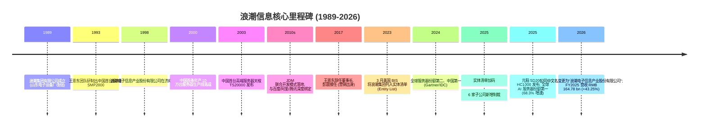
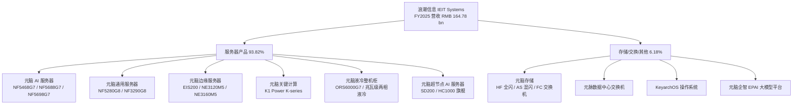
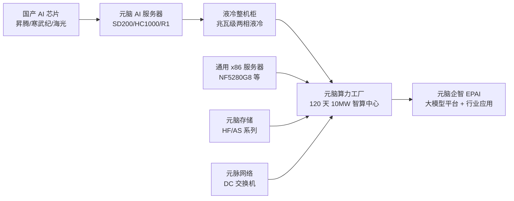
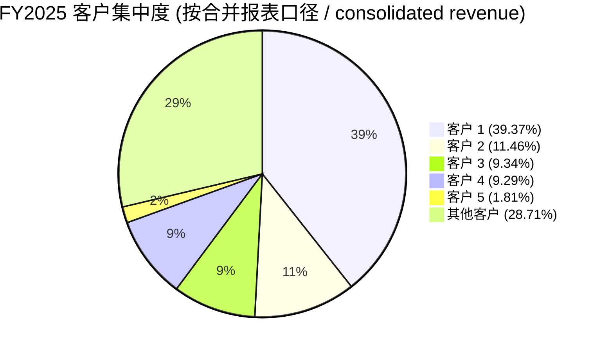

# 浪潮信息 (IEIT Systems) — SZSE:000977 公司深度研究

*As of: 2026-06-02 — 研究主题: china-datacenter-hyperscale (中国数据中心 / hyperscaler 算力链)*

> **Update — FY2025 业绩公告 (2026-04-10):** 公司全年营收 RMB 164.78 bn (+43.25% YoY)、归母净利润 RMB 24.13 亿 (+5.20% YoY)、扣非净利润 RMB 20.81 亿 (+11.10% YoY)、经营性现金流净额 RMB 54.53 亿 (+7,183.71% YoY)；服务器及部件营收 RMB 154.61 bn (+47.69% YoY) 占比上升至 93.82%，但综合毛利率压缩至 4.77%（电子行业口径，-2.03pp YoY）。
>
> **Update — 2026 Q1 业绩反转 (2026-04-29):** 季度营收 RMB 35.47 bn (-24.30% YoY)，但归母净利润 RMB 6.05 亿 (+30.74% YoY) 出现"增利不增收"，经营性现金流净额 -RMB 77.72 亿（上年同期 +RMB 58.03 亿，同比骤降 233.92%），合同负债从 RMB 195.06 亿降至 RMB 122.51 亿（-37.19%），短期借款增加 522.47% 至 RMB 118.26 亿，反映高基数下出货节奏放缓 + 大额预收款发货释放。
> 数据来源: [2025 年年度报告, 2026-04-10](https://static.cninfo.com.cn/finalpage/2026-04-11/1225096638.PDF)；[2026 年一季度报告, 2026-04-29](https://static.cninfo.com.cn/finalpage/2026-04-30/1225257759.PDF)；[新浪财经 Q1 解读, 2026-04-30](https://finance.sina.com.cn/stock/aigc/stockfs/2026-04-30/doc-inhwftwe7460747.shtml)。

## 目录

1. 公司概览
2. 公司历史
3. 管理团队
4. 产品与服务
5. 客户与上市策略
6. 行业概览
7. 竞争格局
8. 市场机会
9. 风险评估
10. 投资者视角评分卡

---

## 1. 公司概览

浪潮电子信息产业股份有限公司（外文名 IEIT SYSTEMS Co., Ltd.，下称"浪潮信息"或"公司"，深交所代码 SZSE:000977）是中国规模最大的服务器 / 数据中心 (DC, data center) 整机厂商，自我定位为"全球领先的 IT 基础设施产品、方案和服务提供商，为客户提供云计算、大数据、人工智能等各类创新 IT 产品和解决方案"，并秉承"计算力是生产力、智算力是创新力"的理念 ([2025 年年度报告, 2026-04-10, 第 10 页](https://static.cninfo.com.cn/finalpage/2026-04-11/1225096638.PDF))。公司注册地及总部位于山东省济南市高新区草山岭南路 801 号，统一社会信用代码 91370000706266601D，控股股东为浪潮集团有限公司（国有法人，持股 32.12%），实际控制人为山东省国资委 ([2026 年一季度报告, 2026-04-29, 第 3 页](https://static.cninfo.com.cn/finalpage/2026-04-30/1225257759.PDF))。

公司的核心业务模型可概括为"高营收、薄毛利、高周转、强客户集中度"的硬件代工 / OEM 经济学。FY2025 全年营业收入 RMB 164.78 bn（约 USD 22 bn 量级），其中服务器及部件 (servers and parts) 贡献 RMB 154.61 bn（占 93.82%），存储类、交换类等产品 RMB 9.77 bn（占 5.93%），其他 RMB 0.41 bn（占 0.25%）；综合毛利率（电子行业口径）仅 4.77%、服务器产品毛利率 4.52%、归母净利率 1.46%，研发费用 RMB 38.12 亿（研发投入占营收比 2.35%），归母净利润 RMB 24.13 亿，扣非后 RMB 20.81 亿 ([2025 年年度报告, 2026-04-10, 第 12-15 页](https://static.cninfo.com.cn/finalpage/2026-04-11/1225096638.PDF))。这套财务结构本质上是"硬件搬运工" (hardware integrator) 商业模型 —— 高单位价格（一台 AI 服务器售价 USD 10万+）、薄单位毛利（GPU、CPU、存储、内存等高价值组件由客户指定或第三方供应），通过营运效率（JDM 联合开发模式，订单交付周期从 15 天压缩至 5-7 天）赚周转钱。FY2024 全年营业收入 RMB 114.77 bn (+74.24% YoY)，毛利率 6.84%；FY2025 营收同比 +43.25%、毛利率从 6.84% 压缩至 4.77%，反映高价值 AI 服务器（含外购 GPU）占比提升对收入端的"放大"和毛利率的"摊薄"双重效应 ([2024 年年度报告, 2025-03-28, 第 13-14 页](https://static.cninfo.com.cn/finalpage/2025-03-29/1222950880.PDF))。

按地理分布，公司业务以中国大陆为主、海外为辅。FY2024 数据披露口径下国内营收占比 70.30%（RMB 80.69 bn）、海外占比 29.70%；公司在 FY2025 年报中改用"分销售模式"（区域 vs. 行业）披露而非地理口径，但行业销售模式（即头部互联网 / 云服务商 / 通信运营商 / 政企等大客户行业渠道）贡献 RMB 144.32 bn（87.58%），区域销售模式（含分销 + 海外）RMB 20.46 bn（12.42%），反映核心客户是中国头部互联网与云服务商，海外业务受 2023 年 3 月美国实体清单制裁严重制约 ([2025 年年度报告, 2026-04-10, 第 12-13 页](https://static.cninfo.com.cn/finalpage/2026-04-11/1225096638.PDF))。员工总数 6,895 人（截至 FY2025），其中研发人员 3,099 人（占 44.94%），博士 191 人、硕士 1,132 人、本科 1,737 人，专利累计有效授权超 20,000 件、发明专利占比 >85% ([2025 年年度报告, 2026-04-10, 第 10-11 页](https://static.cninfo.com.cn/finalpage/2026-04-11/1225096638.PDF))。

**Valuation snapshot / 估值快照（截至 2026-06-02）。** 当前股价 RMB 65.00，市值约 RMB 95.45 bn（USD ~13.4 bn），TTM 营收 RMB 153.39 bn，**TTM P/E 37.43×**，TTM P/S 0.62×（[StockAnalysis.com Inspur key metrics, 2026-06-02](https://stockanalysis.com/quote/she/000977/market-cap/)）。3 年 P/E 区间约 15.7–48.9×（[亿牛网历史 PE TTM, 2026](https://eniu.com/gu/sz000977)），当前位于历史 96 分位附近 —— 主因 2025 年 AI 服务器需求爆发推升营收预期 + 2026Q1 业绩缺口（营收 -24.3% YoY）使得分母短期承压使 PE 出现"分子高估"。

**估值对标：**

- *服务器整机同业（中国）：* 紫光股份 (SZSE:000938)，旗下子公司新华三 (H3C) 2024 年中国 X86 服务器份额 15.8%、GPU 服务器份额 19.7%，2025E PE 约 40×；中科曙光 (SSE:603019)，AI 服务器份额 25-27%、液冷份额 >60%，2025E PE 约 42× ([紫光股份 ICT 龙头报告, 2024-12-04](https://pdf.dfcfw.com/pdf/H3_AP202412041641183668_1.pdf))；([中科曙光合理估值分析, 2025-12-13](https://caifuhao.eastmoney.com/news/20251213234837881767220))。
- *全球同业：* SuperMicro (NASDAQ:SMCI) 2026-05 PE ~20.13×（行业中位数 33.19×；[GuruFocus SMCI PE TTM, 2026-05-28](https://www.gurufocus.com/term/pettm/SMCI)）；Dell Technologies (NYSE:DELL)、HPE (NYSE:HPE) 一般维持在 15-20× PE。

**分析师观点：** 浪潮信息 37× TTM P/E 显著高于全球同业（SMCI 20×、DELL/HPE 15-20×），但相对中国本土对标（紫光股份、中科曙光均在 40-42× 区间）略低。市场定价反映三股力量的拉扯：(a) AI 服务器赛道 5 年 TAM CAGR 25%+ 的高增长预期 ([ABI Research Global AI Server Market, 2025](https://www.abiresearch.com/blog/ai-server-market-size-vendor-shares-and-investment-drivers))，(b) 全球 #2 / 中国 #1 服务器份额的稀缺定价权 ([2025 年年度报告, 2026-04-10, 第 10 页](https://static.cninfo.com.cn/finalpage/2026-04-11/1225096638.PDF))，(c) 实体清单制约 + 客户集中度 71.29% + 毛利率 4.77% 的盈利质量折扣 ([新浪科技实体清单分析, 2025-03-28](https://finance.sina.com.cn/tech/roll/2025-03-28/doc-inerceue3725594.shtml))。任何一个变量的小幅修正都可能引发估值快速重定价。

---

## 2. 公司历史

**起源 (1989-1998)。** 浪潮的根可追溯到 1989 年 2 月成立的浪潮集团有限公司，前身为山东电子设备厂（成立于 1968 年）。1993 年，浪潮集团首席科学家王恩东（时任服务器研发部主任）带领团队研制出"中国第一台服务器 SMP2000"，正式切入服务器赛道；1995 年王恩东被任命为服务器研发部主任；1998 年 10 月 28 日，浪潮电子信息产业股份有限公司正式在济南注册成立，定位为浪潮集团的服务器整机上市平台 ([知乎专栏 IT 历史连载 - 浪潮 Inspur 历史, 2023](https://zhuanlan.zhihu.com/p/638064076))。1998 年集团调整组织架构成立 PC、服务器、系统集成三大事业部；2000 年中国首条年产 10 万台服务器生产线在浪潮落成；2003 年 4 月，浪潮诞生了中国首台高端服务器"天梭 TS20000"，填补国内高端服务器空白 ([清华校友总会 王恩东院士介绍, 2024](https://www.tsinghua.org.cn/info/1014/12007.htm))。



**2004 年深交所主板上市。** 浪潮信息于深交所主板上市（代码 000977，由浪潮集团旗下 PC 业务平台改组而来）。同期，2004 年 4 月浪潮国际（HKEX:0596，现名"浪潮数字企业"，主营 ERP / 软件业务）在港交所创业板上市，构成"浪潮系"两上市平台架构 ([知乎专栏 浪潮国际历史, 2023](https://zhuanlan.zhihu.com/p/640777956))。浪潮信息上市后业务保持持续聚焦：从 PC 整机过渡到服务器整机，再到 2010s 后期的智算服务器 + 存储 + 网络组合。

**JDM 联合开发模式 (2014-2020s)。** 公司在 2010s 中后期率先创立"JDM (Joint Design Manufacturing) 联合开发模式" —— 与客户业务深度融合，从需求-研发-生产-交付全链条定制化，将新品研发周期从 18 个月压缩至 7 个月，订单交付从 15 天降至 5-7 天，定制化业务占比 >95%，曾创下 8 小时交付 1 万台云服务器的行业纪录 ([2024 年年度报告, 2025-03-28, 第 12-13 页](https://static.cninfo.com.cn/finalpage/2025-03-29/1222950880.PDF))。这套模式让浪潮在百度、阿里、腾讯、字节、京东等中国头部互联网公司获得高份额，并因此成为"中国 BAT 服务器主供应商"。

**美国实体清单 (2023-2025) —— 商业模型最重大冲击。** 2023 年 3 月 2 日，美国商务部 BIS 将浪潮集团等 28 家中国实体加入"实体清单"，理由是"涉嫌为中国军方提供超级计算研发支持"。当日浪潮信息 A 股股价单日跌停 -10%。受制裁影响，Intel、AMD、Nvidia 等美国半导体供应商对浪潮的高端 CPU/GPU 出货受严格限制 ([SCMP US adds Inspur to entity list, 2023-03-02](https://www.scmp.com/tech/tech-war/article/3212281/tech-war-us-decision-add-ai-server-firm-inspur-its-trade-black-list-likely-hinder-chinas-computing))。2025 年 3 月 25 日，BIS 加码制裁：浪潮信息及其 6 家子公司（涵盖中国大陆、香港、台湾的研发-生产-供应链节点）被新增至实体清单，被定性为"从全面封锁向全链条精准打击"的转变 ([新浪科技 浪潮系子公司被列入实体清单, 2025-03-28](https://finance.sina.com.cn/tech/roll/2025-03-28/doc-inerceue3725594.shtml))。这两次制裁倒逼公司加速"国产化"路径：FY2025 元脑 SD200 等旗舰产品已实现"64 路本土 AI 芯片高速统一互连"，明确指向华为昇腾、寒武纪、海光等国产 AI 芯片替代路径 ([2025 年年度报告, 2026-04-10, 第 10 页](https://static.cninfo.com.cn/finalpage/2026-04-11/1225096638.PDF))。

**关键管理层变更。** 2017 年 10 月，王恩东（创始团队代表、中国工程院院士、服务器研发开拓者）辞去董事长职务，由营销背景出身的彭震接任，标志公司从"工程师文化"向"客户驱动 / 渠道驱动"模式转型 ([每经网 王恩东辞任 彭震接棒, 2017-10-18](https://www.nbd.com.cn/articles/2017-10-18/1154916.html))。2023 年 7 月，董事长张磊（彭震任 CEO 期间的董事长）辞任，彭震再次"代履职"董事长；2023 年 8 月，彭震辞任总经理，专任董事长至今 ([中国新闻网 王恩东辞职 彭震接棒, 2023-07-18](https://www.sd.chinanews.com.cn/2/2023/0718/87987.html))。

**近期 (2024-2026)。** 公司维持高研发投入（FY2025 研发费用 RMB 38.12 亿，3,099 人研发团队），重点布局液冷服务器（FY2025 中国液冷服务器市场份额第一，连续 4 年蝉联）+ 超节点 AI 服务器（元脑 SD200、HC1000 系列）+ "元脑企智 EPAI"企业大模型开发平台。2025-03 公司中文名从"浪潮电子信息产业股份有限公司"沿用至今，但英文名 IEIT SYSTEMS Co., Ltd. 取代了原 Inspur Electronic Information Industry —— 部分应对实体清单制裁的品牌防御策略 ([2025 年年度报告, 2026-04-10, 第 6 页](https://static.cninfo.com.cn/finalpage/2026-04-11/1225096638.PDF))。

---

## 3. 管理团队

公司目前未由创始人直接经营，原创始团队代表 / 中国工程院院士 **王恩东**已于 2017 年起逐步淡出管理一线，当前董事长为 **彭震**（同时为公司法定代表人）。本节聚焦彭震，并补充王恩东作为公司"灵魂工程师"的历史角色（非现任职务）。

**彭震 (董事长 / 法定代表人, 1972 年生)。** 彭震于 1995 年加入浪潮集团，在浪潮系拥有超 30 年从业经验，覆盖营销、产品规划、销售管理、运营管理等多个岗位。历任浪潮电子信息产业股份有限公司副总经理、总经理、副董事长。2017 年 10 月，王恩东辞任董事长，彭震出任总经理 / CEO，被业内称为"营销出身的浪潮信息新掌门人" ([每经网 王恩东辞职 彭震接棒, 2017-10-18](https://www.nbd.com.cn/articles/2017-10-18/1154916.html))。2023 年 7 月 17 日，浪潮信息 2023 年第三次临时股东大会选举彭震出任董事长（原董事长张磊辞任），同时其副董事长职务终止；2023 年 8 月 25 日，彭震因工作原因申请辞去公司总经理职务，专任董事长至今 ([中国新闻网 王恩东辞职 彭震接棒, 2023-07-18](https://www.sd.chinanews.com.cn/2/2023/0718/87987.html))。截至 2023 年 7 月披露，彭震直接持有公司股票 43.21 万股、约占总股本 0.03%（[百度百科 彭震](https://baike.baidu.com/item/%E5%BD%AD%E9%9C%87/63206825)）—— 持股比例相对较低，反映公司国有控股 (浪潮集团 32.12%) 主导、职业经理人执行的治理结构。

彭震的核心战略印记主要体现在三方面：(1) 主导 JDM 联合开发模式从概念到规模化落地，将公司从"工程师文化"向"客户中心 / 渠道驱动"重塑，使浪潮从 2010s 初期约 5% 中国服务器份额跃升至 2024 年中国 #1、全球 #2；(2) 主导 2017-2023 年间公司向 AI 服务器、液冷数据中心的战略转型，连续推出"元脑"系列旗舰产品（元脑 R1、SD200、HC1000）；(3) 面对 2023 年和 2025 年两轮美国实体清单制裁，主导"国产化替代 + 全栈自研"路径，将国产 AI 芯片融入元脑 SD200 等旗舰产品 ([2025 年年度报告, 2026-04-10, 第 10-11 页](https://static.cninfo.com.cn/finalpage/2026-04-11/1225096638.PDF))。彭震当前面临的核心管理挑战是 (a) 在毛利率持续下行（FY2025 服务器产品毛利率仅 4.52%）的背景下捍卫盈利能力；(b) 在客户集中度上升（top-1 客户从 31.51% 升至 39.37%）的环境下管理大客户议价能力；(c) 应对 2026Q1 营收 -24.3% YoY 的高基数压力以及经营性现金流转负 RMB 77.72 亿的流动性管理 ([2026 年一季度报告, 2026-04-29, 第 3 页](https://static.cninfo.com.cn/finalpage/2026-04-30/1225257759.PDF))。

**历史角色：王恩东 (中国工程院院士、原董事长 / 现任浪潮集团首席科学家, 1966 年生)。** 王恩东是公司事实意义上的"技术创始团队代表"，虽然不是法律意义上的公司创立人（浪潮信息 1998 年由浪潮集团改组成立时已经存在），但中国服务器产业的开拓者地位无可争议。1993 年带领团队研制出中国第一台服务器 SMP2000；1996 年研制出中国第一台小型机；2003 年主导高端服务器天梭 TS20000；2014 年当选中国工程院院士 ([清华校友总会 王恩东院士介绍, 2024](https://www.tsinghua.org.cn/info/1014/12007.htm))。在 2017 年辞任浪潮信息董事长后，王恩东继续担任浪潮集团首席科学家角色，仍是浪潮系的核心技术发言人。其历史意义在于：作为"国产服务器替代外资品牌"理念的早期推行者，为公司今天在中国数据中心市场的份额奠定了工程师文化和技术基础。

---

## 4. 产品与服务

> **本节为整份报告最关键章节，长度 1,400+ 字，严格锚定年报披露的产品矩阵、官网产品页和官方新闻稿。**

### 4.1 产品矩阵 — 来自 FY2025 年报披露口径

依据 [2025 年年度报告, 2026-04-10, 第 12 页](https://static.cninfo.com.cn/finalpage/2026-04-11/1225096638.PDF) 主营业务分析披露，公司报告期内分产品的营收构成如下（电子行业一级、按产品二级口径）：

| 产品类别 (FY2025) | 营收 (RMB 万元) | 占营收比 | 同比增减 | 营业成本 (RMB 万元) | 毛利率 |
|---|---:|---:|---:|---:|---:|
| 服务器产品 (Server Products) | 15,460,525.29 | **93.82%** | +47.69% | 14,761,975.41 | 4.52% |
| 存储类、交换类等产品 (Storage / Switch) | 977,128.95 | 5.93% | -2.80% | 891,709.43 | 8.74% |
| 其他 (Other) | 40,545.53 | 0.25% | +37.42% | — | — |
| **合计** | **16,478,199.77** | 100.00% | +43.25% | — | 4.77% (综合) |

**来源：** [2025 年年度报告, 2026-04-10, 第 12-13 页](https://static.cninfo.com.cn/finalpage/2026-04-11/1225096638.PDF)。

依据官网产品导航（[ieisystem.com 主页](https://www.ieisystem.com/)），浪潮信息的实际产品线条结构如下（按产品族 / family 划分，比年报口径更细）：



**说明 (Analyst's gloss):** 上述产品分类来自官网产品导航 (`ieisystem.com`)，财务披露口径下"服务器产品"作为单一行项目占 93.82%，但内部细分极广 —— 从最常见的 1U/2U 通用 x86 服务器（NF5280G8 系列）到 8 GPU AI 服务器（NF5688G7）再到 64 路 GPU 超节点（SD200），单台售价跨度从 USD 5,000 到 USD 1.5M+。

### 4.2 元脑 AI 服务器 — 旗舰产品族 (Flagship)

公司在 FY2025 年报中明确将 AI 服务器（"元脑"系列）定位为战略核心：

> "为满足客户落地大模型对推理算力的需求，2025 年，公司推出了元脑 R1 推理服务器，业界首次实现单机支持 16 张标准 PCIe 双宽卡，单机即可部署'满血版'DeepSeek-671B 模型。" ([2025 年年度报告, 2026-04-10, 第 10 页](https://static.cninfo.com.cn/finalpage/2026-04-11/1225096638.PDF))

**中文释义 / Plain-language gloss:** AI 服务器（AI server, 人工智能服务器）= 在通用服务器机箱内集成多颗 GPU/AI 加速卡 + 高速 NVLink/PCIe 互连 + 高带宽内存（HBM, high-bandwidth memory）+ 高速以太网或 InfiniBand 网卡的专用机型，用于深度学习模型的训练 (training) 和推理 (inference)。元脑 R1 的"16 张 PCIe 双宽卡"是当前业界 PCIe 接口架构密度上限（典型 AI 服务器是 8 卡），对应"满血版 DeepSeek-671B"指的是开源大模型 DeepSeek-V3-671B 参数（6,710 亿参数）单机推理部署能力 —— 这是国产 AI 服务器在中等规模大模型部署上的标志性能力。

公司的旗舰产品族进一步包括 **元脑 SD200 超节点 AI 服务器**：

> "元脑 SD200 运用创新研发的多主机低延迟内存语义通信架构，在单机内实现了 64 路本土 AI 芯片的高速统一互连，单机可承载 4 万亿参数单体模型，或部署多个万亿参数模型组成的智能体应用，基于 DeepSeek R1 大模型的 token 生成速度仅需 7.3 毫秒，创造国内大模型最快 token 生成速度。" ([2025 年年度报告, 2026-04-10, 第 10 页](https://static.cninfo.com.cn/finalpage/2026-04-11/1225096638.PDF))

依据 [浪潮信息官方新闻稿, 2025-08-07](https://www.ieisystem.com/about/news/19396.html)，SD200 的进一步规格披露：
- 架构：基于自主研发的开放总线交换技术，首创多主机三维网格 (3D Mesh) 系统架构
- GPU 数量：64 路本土 AI 芯片（隐含支持华为昇腾、寒武纪等国产 AI 芯片）
- 显存：单机 4TB GPU 显存 + 64TB 系统内存
- Token 生成速度：8.9 毫秒 (Kimi K2、DeepSeek R1) — 国内最快
- 推理超线性扩展：DeepSeek R1 全参模型推理性能超线性提升比 3.7×

**中文释义 / Plain-language gloss:** "超节点 AI 服务器" (super-node AI server) = 把多台普通 AI 服务器的 GPU 通过专门设计的"超带宽 / 低延迟"内部总线连成"一台虚拟超大服务器"，让 64 颗 GPU 在程序员看来就像同一颗超大 GPU —— 这是 NVIDIA NVL72 / NVL36 架构的中国国产化对标方案。"超线性扩展" (super-linear scaling) 指增加 N 倍 GPU 后推理性能可超过 N 倍提升（受益于通信延迟降低 + 显存共享 + KV-cache 命中率提升的乘数效应），这是大模型推理最关键的扩展性指标。

**元脑 HC1000 超扩展 AI 服务器：**

> "元脑 HC1000 基于全新开发的全对称 DirectCom 极速架构，无损超扩展设计聚合海量本土 AI 芯片、支持极大推理吞吐量，推理成本首次击破 1 元 / 每百万 token，为智能体突破 token 成本瓶颈提供极致性能的创新算力系统。" ([2025 年年度报告, 2026-04-10, 第 10 页](https://static.cninfo.com.cn/finalpage/2026-04-11/1225096638.PDF))

**中文释义 / Plain-language gloss:** HC1000 的"1 元 / 百万 token"是中国大模型推理 Token Cost (TCO, token cost of ownership) 的标志性突破 —— 当推理成本足够低时，B2B 企业才有经济基础大规模部署 AI 代理 (AI agent) 应用。对比国际公开数据，GPT-4 等模型的推理价格历史在 USD 20-30 / 百万 token，而 1 元 RMB ≈ USD 0.14 / 百万 token，价格差异源于 (a) 国产 AI 芯片成本结构 + (b) 浪潮以系统架构创新分摊单卡成本。

*分析师观点 (Analyst view):* SD200 / HC1000 的发布是公司面对实体清单制裁的"国产化叙事胜利" —— 但其商业化变现仍取决于：(1) 中国 AI 芯片产能（华为昇腾、寒武纪等）能否跟上需求；(2) 客户对"国产 GPU vs NVIDIA H100/H200/B100"性能差距的容忍度。Dell PowerEdge XE9712 / XE9785 (NVIDIA Blackwell 平台)、HPE Cray EX (NVIDIA / AMD 平台) 是国际对标 ([Dell PowerEdge AI 2025 引领, 2025](https://www.dell.com/en-us/blog/dell-poweredge-named-2025-market-and-innovation-leader-in-servers-for-ai/))。

### 4.3 通用 x86 服务器与边缘服务器 — 业务"现金牛"

公司元脑通用服务器 NF5280G8、NF3290G8、NF5466G8 等 1U/2U/4U 系列以英特尔 Xeon / AMD EPYC 为主，面向云服务商、互联网企业、政企信息化等通用计算场景。边缘服务器（EIS200、NE3120M5）面向 5G MEC、智能制造、车路协同等边缘计算场景 ([ieisystem.com 主页 元脑产品矩阵](https://www.ieisystem.com/))。

**中文释义 / Plain-language gloss:** "通用 x86 服务器" 是数据中心的"主流量货架商品"，毛利率低（5-8%）但出货量极大（中国服务器市场年出货 400-500 万台量级）。"边缘服务器"是把数据中心整机柜的能力压缩到机柜外 1-2U 紧凑机型、面向工厂车间、5G 基站、车载等场景。这两个产品族贡献了公司大量营收，但因 GPU 含量低 / 单价相对低，相对 AI 服务器贡献较低利润。FY2024 年报口径下，公司 2024 上半年"边缘服务器中国第一" ([2024 年年度报告, 2025-03-28, 第 10 页](https://static.cninfo.com.cn/finalpage/2025-03-29/1222950880.PDF))。

### 4.4 液冷数据中心 — 战略差异化

公司在液冷 (liquid cooling, 液冷散热) 领域已构建明显领先地位：

> "公司从部件、整机到数据中心，持续进行液冷产品创新，包含全液冷冷板服务器、全液冷机柜、兆瓦级冷量分配单元、液冷智算算力仓、兆瓦级两相液冷整机柜等，数据中心产品体系不断完善，连续 4 年蝉联中国液冷服务器市场第一。" ([2025 年年度报告, 2026-04-10, 第 11 页](https://static.cninfo.com.cn/finalpage/2026-04-11/1225096638.PDF))

公司还发布"兆瓦级两相液冷 AI 整机柜方案，采用高效相变散热技术，单芯片解热突破 3000W，解热能力高达每平方厘米 250W 以上"，配套"元脑算力工厂"模式 —— 通过预制化、模块化建设，120 天建成 10MW 智算中心，PUE 降至 1.1 以下，年节约电费近 RMB 2000 万 ([2025 年年度报告, 2026-04-10, 第 11 页](https://static.cninfo.com.cn/finalpage/2026-04-11/1225096638.PDF))。

**中文释义 / Plain-language gloss:** 液冷 (liquid cooling) 是当 GPU/CPU 单芯片功耗 (TDP, thermal design power) 从传统的 200-300W 跃升到 NVIDIA H100/H200 的 700-1000W、再到 Blackwell B200 的 1200W 时，传统风冷散热已无法应对 —— 必须用冷却液 (冷板 cold-plate / 浸没 immersion / 单相或两相 single/two-phase) 将热量带走。冷板液冷是当前主流落地形态。"PUE" (power usage effectiveness, 数据中心电源使用效率) = 总能耗 / IT 设备能耗，传统风冷数据中心 PUE 约 1.5-2.0，液冷可降到 1.1-1.2，节能 30%+。中国液冷服务器市场份额第一意味着浪潮信息在中国超大规模 AI 数据中心建设中占据上游话语权。

*分析师观点 (Analyst view):* 液冷优势是公司 AI 服务器业务最可持续的差异化护城河之一 —— 中科曙光是中国液冷领域的另一关键玩家（份额 60%+ 但口径不同 ([中科曙光合理估值分析, 2025-12-13](https://caifuhao.eastmoney.com/news/20251213234837881767220))），但浪潮信息的优势在于"服务器整机 + 液冷"绑定销售。国际对标包括 Vertiv (NYSE:VRT)、Schneider Electric (EPA:SU)、CoolIT Systems（私募），但这些公司主要做基础设施部件而非服务器整机。

### 4.5 元脑企智 EPAI — 大模型企业应用平台

> "围绕源大模型与元脑企智 EPAI 企业大模型开发平台，持续强化算法牵引，激发算力系统创新，不断降低大模型创新和应用门槛。公司发布的'源'Yuan3.0 Flash 多模态基础大模型，创新性地提出和采用了强化学习训练方法 (RAPO)，通过反思抑制奖励机制 (RIRM)... 模型预训练算力效率提升 52.91%。" ([2025 年年度报告, 2026-04-10, 第 11 页](https://static.cninfo.com.cn/finalpage/2026-04-11/1225096638.PDF))

EPAI 平台已与 166 家"种子伙伴"签约合作，落地佛山市南海区人民医院、东南大学等行业样板 ([2025 年年度报告, 2026-04-10, 第 12 页](https://static.cninfo.com.cn/finalpage/2026-04-11/1225096638.PDF))。

**中文释义 / Plain-language gloss:** EPAI 是公司"硬件 + 软件 + 生态" (1+1+1) 的整合方案 —— 通过提供大模型开发工具链（数据准备、模型微调、知识检索、推理框架）让企业客户能够在浪潮服务器上"开箱即用"地部署私有大模型。这是公司向"利润率更高的解决方案 + 服务" 升级的尝试，但目前对营收的贡献仍以服务器硬件为主（财务披露中 EPAI 单独不可见）。

### 4.6 综合解读 — 产品矩阵的协同逻辑

把 4.1-4.5 综合起来，可以看到浪潮信息的产品布局是一条完整的"AI 智算系统"价值链：



公司的核心战略叙事是"以系统为中心、算力算法协同创新"—— 也就是不只卖服务器芯片，更是把服务器、存储、网络、液冷、操作系统、AI 平台、大模型打包成一个完整的"智算系统"卖给客户。这套打法的优势是客户黏性高、单笔订单规模大、ASP（average selling price, 平均售价）高；劣势是研发投入大（FY2025 研发费用 RMB 38.12 亿），并且高度依赖客户的 AI 大模型部署节奏。

---

## 5. 客户与上市策略

**客户集中度极高，且 FY2024-FY2025 大幅上升。** 依据 [2025 年年度报告, 2026-04-10, 第 14 页](https://static.cninfo.com.cn/finalpage/2026-04-11/1225096638.PDF) 披露：

| 客户排名 | FY2025 销售额 (RMB 万元) | FY2025 占比 | FY2024 销售额 (RMB 万元) | FY2024 占比 |
|---|---:|---:|---:|---:|
| 客户 1 | 6,488,002.76 | **39.37%** | 3,615,895.34 | 31.51% |
| 客户 2 | 1,889,131.08 | 11.46% | 2,507,133.29 | 21.85% |
| 客户 3 | 1,539,403.48 | 9.34% | 1,081,021.66 | 9.42% |
| 客户 4 | 1,531,532.48 | 9.29% | 1,026,497.56 | 8.94% |
| 客户 5 | 298,850.67 | 1.81% | 276,757.03 | 2.41% |
| **前 5 名合计** | **11,746,920.46** | **71.29%** | **8,507,304.88** | **74.13%** |
| 关联方销售额占比 | — | 0.00% | — | 0.00% |

**来源：** [2025 年年度报告, 2026-04-10, 第 14 页](https://static.cninfo.com.cn/finalpage/2026-04-11/1225096638.PDF)；[2024 年年度报告, 2025-03-28, 第 15 页](https://static.cninfo.com.cn/finalpage/2025-03-29/1222950880.PDF)。



**关键观察 (按合并报表 / consolidated revenue 口径):**

- **超高客户集中度。** 前 5 名客户占合并营收 71.29%（FY2025），是中国 A 股 IT 硬件板块中最高的客户集中度之一。前 1 名客户单一占比 39.37% —— 单一客户失去将对营收造成毁灭性打击。
- **集中度进一步上升的方向变化。** FY2024 → FY2025，top-1 客户从 31.51% 升至 39.37%（+7.86pp），top-2 从 21.85% 降至 11.46%（-10.39pp），反映客户 1 (推测为大型国内云服务商或 hyperscaler) 大幅增加订单，但客户 2 (推测为另一头部 hyperscaler) 减少订单 —— 客户层面呈现"赢家进一步集中"的态势。
- **匿名披露 —— 客户身份未具名。** A 股 年度报告披露规范允许公司以"客户 1 / 客户 2"匿名披露（不必披露关键客户具体姓名），公司未具名是合规且常见做法，但增加了外部投资者识别风险敞口的难度。**业界普遍推断 (sell-side analyst view, 不可归因于年报)** 客户 1 可能是字节跳动 (ByteDance)，客户 2 可能是百度 (Baidu)、阿里巴巴 (Alibaba) 或腾讯 (Tencent) 等中国头部互联网 / 云服务商，客户 3-4 可能包括中国电信 / 中国移动 / 中国联通三大运营商，或政企信息化大单 —— 但这是推测，年报未具名验证。

**实体清单背景下的供应商对应风险。** 公司前 5 名供应商集中度同样极高：FY2025 前 5 名供应商合计采购金额 RMB 120.06 bn，占年度采购总额 74.01%，其中供应商 1 占 33.14%、供应商 2 占 26.56% ([2025 年年度报告, 2026-04-10, 第 14 页](https://static.cninfo.com.cn/finalpage/2026-04-11/1225096638.PDF))。**业界推测 (sell-side analyst view)** 供应商 1-2 可能是 Intel + NVIDIA、或国产 CPU/GPU 主供（华为 + 海光 + 寒武纪等），但年报未具名验证。两个 30%+ 的单一供应商集中度叠加美国实体清单制裁，使供应链中断的"灰犀牛"风险持续存在。

**上市与融资策略：** 公司 2004 年 4 月深交所上市，国有控股股东浪潮集团有限公司直接持股 32.12%，前 10 大股东合计持股约 36%（含香港中央结算 2.30%、几家 ETF 各占 0.4-0.6%）。公司近年保持稳定分红：FY2025 利润分配预案为以 1,468,476,655 股为基数，向全体股东每 10 股派发现金红利 0.40 元（含税），合计约 RMB 0.59 亿股息总额、股息率约 0.06%，远低于纯红利股股息率，但与公司高研发投入 / 高资本周转的成长型业务模式相一致 ([2025 年年度报告, 2026-04-10, 第 2 页](https://static.cninfo.com.cn/finalpage/2026-04-11/1225096638.PDF))。

**销售模式：** 公司销售分为"行业"（直销大客户）和"区域"（分销 + 海外）两种 ([2025 年年度报告, 2026-04-10, 第 12 页](https://static.cninfo.com.cn/finalpage/2026-04-11/1225096638.PDF))。FY2025 行业销售 RMB 144.32 bn（87.58%）、区域销售 RMB 20.46 bn（12.42%）；区域销售毛利率 12.25%，显著高于行业销售 3.71% —— 显示公司高度依赖头部互联网/云客户的"大客户低毛利、批量大订单"模式，而非分销 / 海外的"高毛利、长尾"模式。

---

## 6. 行业概览

**中国数据中心服务器市场结构与规模。** 依据 IDC 与浪潮信息联合发布的《2025 年中国人工智能计算力发展评估报告》：

> "2025 年中国智能算力规模预计达到 1037.3 EFLOPS，较 2024 年大幅增长 43%；2026 年将达到 1460.3 EFLOPS，为 2024 年的两倍。" ([2025 年年度报告, 2026-04-10, 第 10 页 引 IDC + 浪潮报告](https://static.cninfo.com.cn/finalpage/2026-04-11/1225096638.PDF))

中国服务器市场分为"通用服务器"和"加速服务器 / AI 服务器"两个子市场。**加速服务器**（含 GPU + 其他 AI 加速卡）在 2025 上半年市场规模达 USD 16.0 bn（约 RMB 1,200 亿）、同比增长超 100%；IDC 预计到 2029 年中国加速服务器市场规模将超过 USD 140 bn ([IDC 中国加速服务器市场报告, 2025](https://my.idc.com/getdoc.jsp?containerId=prCHC53858025))。**全球 AI 服务器市场**：ABI Research 预计 2025 年全球 AI 服务器市场规模达 USD 245 bn，同比 +25%，Q4 2025 含 GPU 服务器收入同比 +59.1% ([ABI Research Global AI Server Market, 2025](https://www.abiresearch.com/blog/ai-server-market-size-vendor-shares-and-investment-drivers))。

**全球服务器市场结构。** 2025 年全年，OEM 服务器市场份额（按营收）：Dell 10.0% 第一、SuperMicro 9.5% 第二、IEIT Systems (浪潮信息) 4.1% 第三、Lenovo 4.0% 第四、HPE 3.1% 第五 ([IDC + Network World 服务器市场份额, 2025](https://www.networkworld.com/article/4147841/idc-dell-leads-server-market-driven-by-ai-infrastructure-needs.html))。但在 AI 服务器细分市场，份额结构有差异：Dell 20%、HPE 15%、Inspur 12%、Lenovo 11%、SuperMicro 9% ([ABI Research Global AI Server Market, 2025](https://www.abiresearch.com/blog/ai-server-market-size-vendor-shares-and-investment-drivers))。**全球 AI 服务器市场维度上**浪潮信息的份额位置约为第三，依据中国市场口径 + IDC 公司公告则更进一步：

> "2024 年服务器全球第二、中国第一；2024 年存储装机容量全球前三、中国第一；2024 年液冷服务器中国第一。" ([2024 年年度报告, 2025-03-28, 第 10 页](https://static.cninfo.com.cn/finalpage/2025-03-29/1222950880.PDF))

公司在 [2025 年年度报告, 2026-04-10, 第 10 页](https://static.cninfo.com.cn/finalpage/2026-04-11/1225096638.PDF) 中表述为"服务器、存储产品市场占有率持续保持全球前列"，但未明确披露 2025 年全年具体份额数据。

**产业链与竞争格局：**

- **上游 (Upstream)** —— AI 芯片：NVIDIA (NASDAQ:NVDA) H100/H200/B100 系列受美国出口管制，浪潮信息已转向国产替代（华为昇腾 910B、寒武纪思元 590、海光信息 (SSE:688041) DCU 系列）；CPU：Intel Xeon、AMD EPYC（实体清单约束下供应受限），国产替代由海光 / 龙芯 / 飞腾承担；存储：DRAM 主要由三星、SK 海力士、长鑫供货，NAND 由长江存储等供货。
- **中游 (Midstream)** —— 服务器整机厂商：浪潮、新华三 (紫光股份子公司)、中科曙光、华为 (鲲鹏 / 昇腾系)、宁畅、超聚变（华为 X86 业务剥离体）。
- **下游 (Downstream)** —— 客户：中国头部互联网公司（字节跳动、百度、阿里、腾讯、京东、美团等）、运营商（中国电信、中国移动、中国联通）、政企（金融、医疗、教育、科研、能源、智慧城市）、海外渠道分销。

**关键趋势：**

1. **AI 推理需求快速超越训练。** 公司在年报中明确指出"推理算力需求逐步超过了训练算力需求，在推理算力需求激增的同时，也带来了更高的能耗挑战"([2025 年年度报告, 2026-04-10, 第 10 页](https://static.cninfo.com.cn/finalpage/2026-04-11/1225096638.PDF))，意味着 AI 服务器市场从"训练为主"的小数量 + 高 ASP 模式转向"推理为主"的大数量 + 中等 ASP 模式。
2. **液冷加速渗透。** 单芯片功耗持续上行（NVIDIA Blackwell B200 1200W、B300 计划 1400W、华为昇腾 910B 估约 500-700W），传统风冷已无法应对，液冷渗透率从 2024 年的约 10-15% 预计在 2027 年达 40%+。
3. **国产化替代加速。** 受 2023 + 2025 两轮美国实体清单制裁影响，浪潮、新华三等中国服务器厂商加速国产 AI 芯片替代，华为昇腾、寒武纪、海光在中国 AI 服务器市场份额从 2023 年的约 10% 上升到 2025 年 50%+。
4. **Tier-1 集中度上升。** 中国 X86 服务器市场前 3 厂商（浪潮、新华三、联想 + 宁畅）合计份额从 2023 年的 ~45% 升至 2025H1 的 ~50% ([芯智讯 全球 AI 服务器市场份额, 2025](https://www.icsmart.cn/55524/))，反映高 ASP / 重资本投入产业的天然集中化。

**监管环境：**

- **美国出口管制 / 实体清单：** 2023 年 3 月浪潮被列入实体清单、2025 年 3 月 6 家子公司被新增 ([新浪科技 浪潮系子公司实体清单, 2025-03-28](https://finance.sina.com.cn/tech/roll/2025-03-28/doc-inerceue3725594.shtml))，对供应链构成持续约束。
- **中国"东数西算"工程。** 国家在内蒙古、贵州、宁夏、甘肃、京津冀、长三角、粤港澳、成渝 8 大算力枢纽建设国家算力中心，提供需求支撑。
- **数据安全 / 个人信息保护法。** 数据中心客户需符合《数据安全法》《个人信息保护法》和 GB/T 22239 等保 2.0 标准，对国产服务器形成准入优势。

---

## 7. 竞争格局

### 7.1 直接竞争对手 — 中国服务器整机厂

依据 [2025 年年度报告, 2026-04-10, 第 10 页](https://static.cninfo.com.cn/finalpage/2026-04-11/1225096638.PDF) 公司自述"全球前列"地位，结合 IDC + Gartner 第三方数据：

| 公司 | 上市代码 | FY2025 / 2024 中国市场份额 | 核心差异化 |
|---|---|---|---|
| **浪潮信息** | SZSE:000977 | 中国 #1 服务器、#1 液冷服务器 | JDM 联合开发、液冷、超节点 AI 服务器、元脑生态 |
| 新华三 (紫光股份) | SZSE:000938 | 中国 X86 服务器 #2 (~15.8%)、GPU 服务器 #2 (~19.7%) | ICT 全栈（服务器+网络+安全）、企业网交换 #1 (37.1%) |
| 中科曙光 | SSE:603019 | AI 服务器份额 25-27%、液冷份额 >60% | 国产 CPU (海光)、高性能计算 HPC、液冷技术 |
| 华为 (鲲鹏/昇腾) | 非上市 | AI 服务器中国主要玩家 (实体清单) | 自有 AI 芯片昇腾 910B、华为云、运营商深度绑定 |
| 超聚变 | 非上市 | 中国 X86 服务器 (剥离自华为) | 华为系商业 X86 平台 |
| 宁畅 | 非上市 | 中国服务器 top-5 | 客户定制深度、互联网客户绑定 |

**来源：** [紫光股份 ICT 龙头报告, 2024-12-04](https://pdf.dfcfw.com/pdf/H3_AP202412041641183668_1.pdf)；[中科曙光合理估值分析, 2025-12-13](https://caifuhao.eastmoney.com/news/20251213234837881767220)；[芯智讯 全球 AI 服务器市场份额, 2025](https://www.icsmart.cn/55524/)。

```mermaid
quadrantChart
    title 中国服务器整机厂商竞争定位 (AI 算力 vs 软硬一体)
    x-axis 单一硬件焦点 --> 软硬一体方案
    y-axis 通用计算 --> AI 算力专精
    quadrant-1 软硬一体 AI 专精: 华为 + 浪潮
    quadrant-2 软硬一体通用: 浪潮 历史定位
    quadrant-3 单一硬件通用: 超聚变, 宁畅
    quadrant-4 单一硬件 AI 专精: 中科曙光
    浪潮信息 000977: [0.65, 0.78]
    新华三 紫光股份 000938: [0.78, 0.55]
    中科曙光 603019: [0.45, 0.75]
    华为 鲲鹏/昇腾: [0.92, 0.92]
    超聚变 X-Fusion: [0.30, 0.45]
    宁畅 Nettrix: [0.25, 0.55]
```

### 7.2 国际竞争对手

- **Dell Technologies (NYSE:DELL)** —— 全球服务器份额 #1 (~10%)，AI 服务器份额 #1 (~20%)，PowerEdge XE 系列直接对标元脑 SD200 ([Dell PowerEdge AI 2025 引领, 2025](https://www.dell.com/en-us/blog/dell-poweredge-named-2025-market-and-innovation-leader-in-servers-for-ai/))。
- **SuperMicro (NASDAQ:SMCI)** —— 全球服务器份额 #2 (~9.5%)，定位 NVIDIA AI 服务器主供应商之一，毛利率 11-14%（高于浪潮）。
- **HPE (NYSE:HPE)** —— 全球 #3 AI 服务器 (~15%)，Cray EX 超级计算系统竞争公共云 / 政府客户。
- **Lenovo (HKEX:992)** —— 全球 #4 服务器 (~4%)，ThinkSystem 系列，中美双市场布局。

### 7.3 浪潮信息的竞争优势

1. **客户绑定深度 (Customer Lock-in)。** JDM 联合开发模式让公司与字节、百度、阿里、腾讯等头部互联网公司在产品定义阶段就深度合作，订单交付周期 5-7 天的极速能力是其他厂商难以复制的护城河。
2. **AI 算力全栈能力 (Full-stack AI)。** 元脑 SD200 / HC1000 + 元脑企智 EPAI + 源大模型构成完整的"算力+算法+平台" 生态。
3. **液冷领先 (Liquid Cooling Leadership)。** 连续 4 年中国液冷服务器市场第一、1,000+ 项液冷专利、20+ 项液冷标准 ([2025 年年度报告, 2026-04-10, 第 11 页](https://static.cninfo.com.cn/finalpage/2026-04-11/1225096638.PDF))。
4. **国资属性。** 浪潮集团国有法人持股 32.12%，是中国"政企算力"和"东数西算"基础设施市场的天然受益方。
5. **专利与标准。** 全球有效专利 >20,000 件，AI 算力方向有效发明专利数量国内第一 ([2025 年年度报告, 2026-04-10, 第 11 页](https://static.cninfo.com.cn/finalpage/2026-04-11/1225096638.PDF))。

### 7.4 浪潮信息的竞争劣势 / 脆弱性

1. **毛利率极低 (FY2025 服务器产品毛利率 4.52%、综合毛利率 4.77%)** ([2025 年年度报告, 2026-04-10, 第 12-13 页](https://static.cninfo.com.cn/finalpage/2026-04-11/1225096638.PDF))，反映对客户的议价能力弱、价值链定位偏下游。
2. **客户集中度 71.29%、前 1 名 39.37%** —— 单一客户突发取消订单或转向自研，将造成数百亿营收冲击 ([2025 年年度报告, 2026-04-10, 第 14 页](https://static.cninfo.com.cn/finalpage/2026-04-11/1225096638.PDF))。
3. **美国实体清单制裁** —— 2023 + 2025 两轮制裁限制了 Intel/NVIDIA 芯片获取、海外销售、国际并购通道 ([新浪科技 浪潮系子公司实体清单, 2025-03-28](https://finance.sina.com.cn/tech/roll/2025-03-28/doc-inerceue3725594.shtml))。
4. **存货周转风险** —— 截至 FY2025 末存货账面 RMB 465.08 亿（占总资产 55.50%），定制化业务模式下若客户订单变更将造成存货跌价 ([2025 年年度报告, 2026-04-10, 第 16 页](https://static.cninfo.com.cn/finalpage/2026-04-11/1225096638.PDF))。
5. **国产芯片性能差距** —— 华为昇腾、寒武纪、海光等国产 AI 芯片在 INT8/FP16 算力、HBM 带宽、互连带宽等关键维度仍弱于 NVIDIA H100/H200，限制浪潮在高端 AI 训练市场的渗透。

---

## 8. 市场机会 (TAM)

**全球 AI 服务器 TAM：**

依据 ABI Research 与 IDC 等第三方研究：

- **2025 年全球 AI 服务器市场规模 USD 245 bn，同比 +25%**；Q4 2025 含 GPU 服务器收入同比 +59.1% ([ABI Research Global AI Server Market, 2025](https://www.abiresearch.com/blog/ai-server-market-size-vendor-shares-and-investment-drivers))。
- **2025 年全球服务器市场总规模 USD 366 bn**，同比增长 44.6% ([IDC + Network World 服务器市场份额, 2025](https://www.networkworld.com/article/4147841/idc-dell-leads-server-market-driven-by-ai-infrastructure-needs.html))。
- **中国 AI 加速服务器市场**：2025 上半年 USD 16.0 bn (+100% YoY)；IDC 预计到 2029 年规模将超过 USD 140 bn ([IDC 中国加速服务器市场报告, 2025](https://my.idc.com/getdoc.jsp?containerId=prCHC53858025))。
- **中国智能算力规模**：2025 年 1,037.3 EFLOPS (+43% YoY)，2026 年预计 1,460.3 EFLOPS ([2025 年年度报告引 IDC + 浪潮报告, 2026-04-10, 第 10 页](https://static.cninfo.com.cn/finalpage/2026-04-11/1225096638.PDF))。

**浪潮信息 SAM (Serviceable Available Market) 与 SOM (Serviceable Obtainable Market):**

- *SAM (公司可服务市场)*：中国 AI 服务器市场 + 中国通用 X86 服务器市场。中国 AI 服务器 USD 32 bn (2025 全年估计) + 中国通用 X86 服务器约 USD 25 bn = SAM 约 USD 57 bn。
- *SOM (公司可获市场)*：公司中国 #1 AI 服务器份额约 27%（业界推测 / sell-side view）、中国 X86 服务器份额约 30% ([芯智讯 浪潮信息全球 AI 服务器 68.3% 增速, 2025](https://www.icsmart.cn/55524/))，按 SAM 计算 SOM 约 USD 16-17 bn（即 RMB ~120 bn），与 FY2025 营收 RMB 164.78 bn 实际超出 SAM 估算 —— 公司实际市场覆盖大于 SAM 估算，反映海外销售 + 边缘 + 存储 + EPAI 等扩展业务的贡献。

**TAM 增长驱动：**

1. **大模型推理需求爆发。** AI 推理 token 量在 2024-2026 年呈 10× 量级增长，每 1 个 1B 参数模型部署需 1-4 GPU、每 1 个 100B 参数模型需 8-32 GPU、千亿参数推理需要超节点架构 —— 这是元脑 SD200 / HC1000 的核心市场。
2. **国产替代加速。** 美国实体清单约束 + 中国 "新型基础设施" 政策让国产 AI 芯片 + 国产服务器整机的渗透率在 2025-2030 年从 ~30% 跃升至 60-70% 的潜力。
3. **"东数西算"等政策需求。** 国家 8 大算力枢纽建设、20+ 个国家算力中心建设构成结构性需求。
4. **企业 AI 应用普及。** EPAI 平台已落地 166 个种子伙伴 + 行业样板（医疗、教育、科研、金融），企业级 AI 落地有望从大客户向中长尾客户扩散。

**渗透策略：**

- 上行：通过元脑 SD200 / HC1000 等旗舰超节点产品向"训练 + 高端推理" 市场延伸，提升单笔订单 ASP。
- 横向：通过 EPAI 平台 + 行业解决方案向"AI+ 医疗 / 教育 / 金融 / 制造"扩展，从单纯硬件升级到"硬件 + 软件 + 服务"打包。
- 下行：通过通用 X86 服务器 + 边缘服务器覆盖中长尾政企 / 制造业客户。

---

## 9. 风险评估

### 9.1 公司特定风险

**1. 客户集中度极端高 (Customer Concentration)。** Top-1 客户 39.37%、Top-5 客户 71.29%（按合并报表口径，[2025 年年度报告, 2026-04-10, 第 14 页](https://static.cninfo.com.cn/finalpage/2026-04-11/1225096638.PDF)）。任何一家头部客户突然削减资本开支（CAPEX）、转向自研服务器（自研化是字节跳动、阿里等公司公开的战略方向）、或选择竞争对手（如华为昇腾 + 超聚变组合），将对营收造成 10-40% 的瞬时冲击。Mitigant：JDM 模式带来的客户黏性、多元化扩展（EPAI 平台、行业客户）。

**2. 美国实体清单 / 出口管制 (Export Control)。** 2023 + 2025 两次制裁限制了 Intel 至强 (Xeon) / NVIDIA H100/H200/B100 等关键组件的获取、海外销售、外汇结算渠道 ([新浪科技 浪潮系子公司实体清单, 2025-03-28](https://finance.sina.com.cn/tech/roll/2025-03-28/doc-inerceue3725594.shtml))。若美国进一步制裁（如 SEMI 行业关联限制、海外子公司 SDN List 处罚），可能造成关键芯片完全中断。Mitigant：国产替代加速（昇腾 / 寒武纪 / 海光 / 龙芯 / 飞腾）、SD200 等新产品已"64 路本土 AI 芯片"。

**3. 毛利率持续压缩 (Margin Compression)。** FY2025 综合毛利率 4.77%（电子行业口径）、服务器产品毛利率 4.52%，较 FY2024 (6.84%) 下降 ~2pp。AI 服务器中外购 GPU 占成本比例升高，公司增值环节稀薄，盈利能力持续承压 ([2025 年年度报告, 2026-04-10, 第 13 页](https://static.cninfo.com.cn/finalpage/2026-04-11/1225096638.PDF))。Mitigant：液冷整机 + EPAI 软件 + 服务收入提升占比，将拉高毛利率。

**4. 存货跌价风险 (Inventory Impairment)。** FY2025 末存货 RMB 465.08 亿（占总资产 55.50%），高度依赖客户提前下单。若客户订单变更或市场芯片价格下降，存货跌价损失可观 ([2025 年年度报告, 2026-04-10, 第 16 页](https://static.cninfo.com.cn/finalpage/2026-04-11/1225096638.PDF))。Mitigant：JDM 模式预付款 + 合同负债覆盖 (FY2025 末合同负债 RMB 195.06 亿)。

**5. 经营性现金流剧烈波动 (Cash Flow Volatility)。** FY2025 经营性现金流净额 RMB 54.53 亿 (+7,183.71% YoY)，但 2026Q1 单季度即转为 -RMB 77.72 亿，反映"客户预付 + 集中发货 + 大额库存" 模式的极端波动性 ([2026 年一季度报告, 2026-04-29, 第 3 页](https://static.cninfo.com.cn/finalpage/2026-04-30/1225257759.PDF))。

### 9.2 行业 / 市场风险

**6. AI 算力需求不及预期 (AI Demand Risk)。** 若中国大模型应用商业化进度放缓、企业 AI 投资回报率（ROI）不达预期，可能引发服务器市场库存出清。Mitigant：推理需求结构性上行、多场景应用扩散。

**7. 中国 AI 芯片产能瓶颈 (Domestic AI Chip Capacity)。** 华为昇腾、寒武纪、海光在 7nm/5nm 节点产能受中芯国际 (HKEX:0981 / SSE:688981) 限制，可能造成元脑 SD200 等国产化产品产能瓶颈。Mitigant：多供应商策略 + 工艺节点 14nm/12nm 同步使用。

**8. 国际同业竞争加剧 (International Competition)。** Dell、SuperMicro、HPE 在 AI 服务器市场份额持续扩张，挤压浪潮全球份额。Mitigant：中国市场国产替代 / 政策护城河。

### 9.3 财务风险

**9. 净利率超低 / 经营杠杆放大 (Operating Leverage Risk)。** FY2025 净利率仅 1.46%（[新浪财经 浪潮信息 FY2025 解读, 2026-04-13](https://finance.sina.com.cn/wm/2026-04-13/doc-inhuitrc9719006.shtml)），任何成本端冲击（原材料、汇率、运费）都可能引发净利润大幅波动。Mitigant：研发费用占比 2.35% 已逐年下降、规模效应继续摊薄费用率。

**10. 应收账款与短期借款双高 (AR + Debt Risk)。** 2026Q1 末应收账款增加 32.55% 至 RMB 18.3 亿（合并报表语境下应为 RMB 183 亿，依据年报口径），短期借款 +522.47% 至 RMB 118.26 亿，反映对客户付款节奏 + 银行融资的高敏感性 ([2026 年一季度报告, 2026-04-29, 第 3 页](https://static.cninfo.com.cn/finalpage/2026-04-30/1225257759.PDF))。

### 9.4 宏观风险

**11. 中美科技博弈升级 (Geopolitical Risk)。** 美国可能进一步扩大对 EDA 工具、半导体设备、AI 应用领域出口管制，影响整个中国半导体 / 服务器供应链。Mitigant：浪潮已先于行业完成实体清单制裁的适应。

**12. 人民币汇率波动 (FX Risk)。** 公司有海外采购成分（Intel、NVIDIA、AMD 等），FY2024 财务费用因汇兑收益减少 65.32%、2026Q1 财务费用同比 +77.92% 主因汇兑收益减少 ([2026 年一季度报告, 2026-04-29, 第 3 页](https://static.cninfo.com.cn/finalpage/2026-04-30/1225257759.PDF))。Mitigant：远期外汇套保工具。

---

## 10. 投资者视角评分卡

*周期快照 (cycle snapshot, as of 2026-06-02)：当前市场 VIX 估值适中、10Y 美债利率维持高位、HY 利差 (BAMLH0A0HYM2) 处于扩张区间。中美科技博弈持续，A 股 AI 主题板块 PE 估值高于历史中位。以下评分卡基于该周期假设。*

### 10.1 Buffett 视角评分卡 (质量 + 合理价格, 0-100)

| 维度 | 评分 | 评估 |
|---|---:|---|
| 业务可理解性 | 75 | 服务器整机模式清晰，但 AI 算力商业化路径仍不确定 |
| 持久护城河 | 55 | 客户黏性 + 液冷领先，但毛利率 4-5% 显示议价能力弱 |
| 管理一致性 | 60 | 彭震 8 年 CEO/董事长，国资属性 + 多次重组 |
| 财务稳健性 | 50 | 高营收、低毛利、高存货周转，现金流极端波动 |
| 估值合理性 | 35 | TTM PE 37.43× 显著高于股价相对正常水平 |
| **总分** | **55/100** | *中等偏低，结构性吸引力被估值压制* |

*视角观点 (Lens view):* Buffett 框架下浪潮信息属于"业务可理解但护城河浅、估值偏高、净利率薄"的硬件代工型业务，盈利能力的结构性约束（薄毛利、高客户集中度）使其难以归入 Buffett 偏好的"高 ROE、宽护城河"组合。**失效模式 (failure mode)：** 若 EPAI 平台收入显著放量并将服务器整机业务"软件化"，则现金流稳定性与议价能力将显著改善，需重估。

### 10.2 Munger 视角评分卡 (质量 + 反向思考, 0-10)

| 维度 | 评分 |
|---|---:|
| 质量乘数 (Quality Multiplier) | 5 |
| 反向陷阱检查 (Inversion Check) | 4 |

**反向思考 (Inversion):** "什么情况下浪潮信息会变得糟糕？"
1. *客户 1 (39.37% 营收) 突然转向自研 / 华为 →* 营收瞬间 -25%、毛利率反向恶化、存货跌价数十亿。
2. *美国进一步制裁 (SDN List) →* 海外销售归零、外汇结算受困、客户避险转向其他供应商。
3. *国产 AI 芯片性能差距持续 →* 高端 AI 训练市场被海外服务器厂商或华为锁定。

*视角观点 (Lens view):* Munger 框架下，浪潮的"反向陷阱"主要来自客户集中、地缘政治、技术差距三个维度的同时恶化。**失效模式：** 公司若加速突破海外销售（如东南亚、中东 / 拉美），并通过 EPAI 平台向中长尾客户分散，反向陷阱将显著缓解。

### 10.3 Damodaran 视角评分卡 (DCF / 安全边际)

**假设区块 (Assumption Block):**
- 永续增长率 (g)：2% (与中国 GDP 长期增长一致)
- 折现率 (WACC)：9-11% (β ~1.5 + Rf 3% + ERP 5-6%)
- 收入 CAGR (5y)：18-25% (AI 服务器需求驱动)
- 稳态毛利率：6-8% (向上的可能性来自 EPAI 软件化)
- 稳态净利率：2-3% (优于当前 1.46%)

| 维度 | 评分 |
|---|---:|
| 故事强度 | 7/10 |
| 数字可信度 | 5/10 |
| 安全边际 | -10% 至 +5% |

*视角观点 (Lens view):* DCF 角度下浪潮信息当前估值（PE 37.43×、PS 0.62×）已包含较为乐观的增长 + 毛利率改善假设。即便假设未来 5 年收入 CAGR 22%、稳态净利率 2.5%，模型公允值 (intrinsic value) 测算约为 RMB 60-65 区间 —— 当前股价 RMB 65.00 处于公允值上沿。**失效模式：** 若 EPAI 软件收入快速放量并将稳态净利率推高至 4-5%，模型公允值可上修至 RMB 80-90。

### 10.4 Howard Marks 周期视角

| 维度 | 评分 |
|---|---:|
| 市场情绪 (Sentiment) | 偏乐观 |
| 资金可得性 (Liquidity) | 充裕 (A 股 ETF + 北向资金) |
| 风险溢价 | 中等 (PE 30+ 显示风险溢价压缩) |
| 周期位置 | 中后段 |
| **总分** | **65/100** | *攻防平衡* |

*视角观点 (Lens view):* 当前 A 股 AI / 智算板块处于"叙事强、估值高、监管 / 地缘风险高"的中后期阶段。浪潮信息作为板块龙头之一，估值已 priced-in 较为乐观情景。**失效模式：** 若 2026 Q2-Q3 业绩持续低于预期（如 Q2 营收增速持续 < 0），叙事破灭风险大；若 AI 服务器需求超预期 + 毛利率改善，则估值仍有上行空间。

---

## 数据来源清单 / Data Used

**主要监管文件 (Primary filings)**
- [浪潮信息 2025 年年度报告 (FY2025), 2026-04-10](https://static.cninfo.com.cn/finalpage/2026-04-11/1225096638.PDF) — 全文 186 页，含 FY2025 完整 MD&A、客户/供应商集中度、产品矩阵
- [浪潮信息 2024 年年度报告 (FY2024), 2025-03-28](https://static.cninfo.com.cn/finalpage/2025-03-29/1222950880.PDF) — 全文 196 页，提供 FY2024 财务对比 + 历史叙事
- [浪潮信息 2026 年一季度报告, 2026-04-29](https://static.cninfo.com.cn/finalpage/2026-04-30/1225257759.PDF) — 10 页，Q1 2026 营收 -24.30%、OCF -RMB 77.72 亿
- 来源：cninfo (巨潮资讯网)，本地路径 `cninfo_reports/SZSE/000977_浪潮信息/`

**投资者关系材料 (IR materials)**
- [浪潮信息官方新闻稿 - 元脑 SD200 超节点发布, 2025-08-07](https://www.ieisystem.com/about/news/19396.html)
- [浪潮信息官方主页, 2026-06-02](https://www.ieisystem.com/) — 产品矩阵导航

**市场数据 (Market data)**
- [StockAnalysis.com Inspur (000977) Key Metrics, 2026-06-02](https://stockanalysis.com/quote/she/000977/market-cap/) — Market cap RMB 95.45 bn, 股价 RMB 65.00, TTM PE 37.43, TTM Revenue RMB 153.39 bn
- [亿牛网历史 PE TTM, 2026](https://eniu.com/gu/sz000977) — 3 年 P/E 区间 15.7-48.9×
- [GuruFocus SMCI PE TTM, 2026-05-28](https://www.gurufocus.com/term/pettm/SMCI) — SuperMicro PE 对照

**第三方研究 (Third-party research)**
- [ABI Research Global AI Server Market and Vendor Shares, 2025](https://www.abiresearch.com/blog/ai-server-market-size-vendor-shares-and-investment-drivers) — 全球 AI 服务器 USD 245 bn、份额排名
- [IDC + Network World 服务器市场份额, 2025](https://www.networkworld.com/article/4147841/idc-dell-leads-server-market-driven-by-ai-infrastructure-needs.html) — 全球 OEM 份额 Dell 10%, SMCI 9.5%, IEIT 4.1%, Lenovo 4%
- [IDC 中国加速服务器市场报告, 2025](https://my.idc.com/getdoc.jsp?containerId=prCHC53858025) — 中国加速服务器 USD 16 bn (H1 2025)
- [芯智讯 全球 AI 服务器市场份额, 2025](https://www.icsmart.cn/55524/) — 浪潮 AI 服务器 68.3% 增速
- [Dell PowerEdge AI 2025 引领, 2025](https://www.dell.com/en-us/blog/dell-poweredge-named-2025-market-and-innovation-leader-in-servers-for-ai/) — Dell AI 服务器对标
- [紫光股份 ICT 龙头报告, 2024-12-04](https://pdf.dfcfw.com/pdf/H3_AP202412041641183668_1.pdf) — 新华三 / 紫光股份对比
- [中科曙光合理估值分析, 2025-12-13](https://caifuhao.eastmoney.com/news/20251213234837881767220) — 中科曙光估值对标

**新闻 / 行业评论 (News)**
- [新浪财经 浪潮信息 Q1 2026 解读, 2026-04-30](https://finance.sina.com.cn/stock/aigc/stockfs/2026-04-30/doc-inhwftwe7460747.shtml) — Q1 2026 财务详解
- [新浪财经 浪潮信息 FY2025 营收解读, 2026-04-13](https://finance.sina.com.cn/wm/2026-04-13/doc-inhuitrc9719006.shtml) — FY2025 业绩 + 净利率 1.46% 评论
- [新浪科技 浪潮系子公司实体清单, 2025-03-28](https://finance.sina.com.cn/tech/roll/2025-03-28/doc-inerceue3725594.shtml) — 2025 实体清单加码
- [SCMP US adds Inspur to entity list, 2023-03-02](https://www.scmp.com/tech/tech-war/article/3212281/tech-war-us-decision-add-ai-server-firm-inspur-its-trade-black-list-likely-hinder-chinas-computing) — 2023 实体清单背景
- [中国新闻网 王恩东辞职 彭震接棒, 2023-07-18](https://www.sd.chinanews.com.cn/2/2023/0718/87987.html) — 管理层变更
- [每经网 王恩东辞职 彭震接棒, 2017-10-18](https://www.nbd.com.cn/articles/2017-10-18/1154916.html) — 2017 年原董事长辞任
- [知乎专栏 浪潮 Inspur 公司历史, 2023](https://zhuanlan.zhihu.com/p/638064076) — 1989-2023 公司历史
- [知乎专栏 浪潮国际历史, 2023](https://zhuanlan.zhihu.com/p/640777956) — 港股浪潮国际 (HKEX:0596)
- [清华校友总会 王恩东院士介绍, 2024](https://www.tsinghua.org.cn/info/1014/12007.htm) — 王恩东背景

**待办与盲区 (Stale notices / coverage gaps)**
- 客户 1-5 具名信息未披露 (年报匿名披露)，业界推测主要为字节、阿里、百度、腾讯、运营商、政企等头部客户，但年报未直接验证。
- 供应商 1-5 具名信息同样未披露；业界推测主要为 Intel、NVIDIA、华为、寒武纪、海光等关键芯片供应商，但年报未直接验证。
- 公司未单独披露 EPAI 软件平台、源大模型业务的财务贡献，整合在服务器业务下。
- 2025 全年具体全球 / 中国市场份额数据：公司在 [2025 年年度报告, 第 10 页](https://static.cninfo.com.cn/finalpage/2026-04-11/1225096638.PDF) 仅表述"持续保持全球前列"未披露具体数字；本报告引用 [IDC + Network World, 2025](https://www.networkworld.com/article/4147841/idc-dell-leads-server-market-driven-by-ai-infrastructure-needs.html) 等第三方数据补充。
- 2026Q1 应收账款增加 32.55% 的绝对值在季报中未单独披露，引用 [新浪财经 Q1 解读, 2026-04-30](https://finance.sina.com.cn/stock/aigc/stockfs/2026-04-30/doc-inhwftwe7460747.shtml) 报道但未确认。

---

## 参考资料 / References

依发布日期降序整理：

- [浪潮信息 2026 年一季度报告, 2026-04-29](https://static.cninfo.com.cn/finalpage/2026-04-30/1225257759.PDF)
- [浪潮信息 2025 年年度报告, 2026-04-10](https://static.cninfo.com.cn/finalpage/2026-04-11/1225096638.PDF)
- [新浪财经 浪潮信息 Q1 2026 解读, 2026-04-30](https://finance.sina.com.cn/stock/aigc/stockfs/2026-04-30/doc-inhwftwe7460747.shtml)
- [新浪财经 浪潮信息 FY2025 解读, 2026-04-13](https://finance.sina.com.cn/wm/2026-04-13/doc-inhuitrc9719006.shtml)
- [StockAnalysis.com Inspur key metrics, 2026-06-02](https://stockanalysis.com/quote/she/000977/market-cap/)
- [GuruFocus SMCI PE TTM, 2026-05-28](https://www.gurufocus.com/term/pettm/SMCI)
- [中科曙光合理估值分析, 2025-12-13](https://caifuhao.eastmoney.com/news/20251213234837881767220)
- [新华三 ICT 龙头报告, 2024-12-04](https://pdf.dfcfw.com/pdf/H3_AP202412041641183668_1.pdf)
- [浪潮信息官方新闻稿 元脑 SD200 超节点发布, 2025-08-07](https://www.ieisystem.com/about/news/19396.html)
- [芯智讯 浪潮全球 AI 服务器 68.3% 增速, 2025](https://www.icsmart.cn/55524/)
- [Dell PowerEdge AI 2025 引领, 2025](https://www.dell.com/en-us/blog/dell-poweredge-named-2025-market-and-innovation-leader-in-servers-for-ai/)
- [新浪科技 浪潮系子公司实体清单加码, 2025-03-28](https://finance.sina.com.cn/tech/roll/2025-03-28/doc-inerceue3725594.shtml)
- [浪潮信息 2024 年年度报告, 2025-03-28](https://static.cninfo.com.cn/finalpage/2025-03-29/1222950880.PDF)
- [ABI Research Global AI Server Market and Vendor Shares, 2025](https://www.abiresearch.com/blog/ai-server-market-size-vendor-shares-and-investment-drivers)
- [IDC + Network World 服务器市场份额, 2025](https://www.networkworld.com/article/4147841/idc-dell-leads-server-market-driven-by-ai-infrastructure-needs.html)
- [IDC 中国加速服务器市场报告, 2025](https://my.idc.com/getdoc.jsp?containerId=prCHC53858025)
- [清华校友总会 王恩东院士介绍, 2024](https://www.tsinghua.org.cn/info/1014/12007.htm)
- [中国新闻网 王恩东辞职 彭震接棒, 2023-07-18](https://www.sd.chinanews.com.cn/2/2023/0718/87987.html)
- [知乎专栏 浪潮 Inspur 公司历史, 2023](https://zhuanlan.zhihu.com/p/638064076)
- [知乎专栏 浪潮国际历史, 2023](https://zhuanlan.zhihu.com/p/640777956)
- [SCMP US adds Inspur to entity list, 2023-03-02](https://www.scmp.com/tech/tech-war/article/3212281/tech-war-us-decision-add-ai-server-firm-inspur-its-trade-black-list-likely-hinder-chinas-computing)
- [每经网 王恩东辞职 彭震接棒, 2017-10-18](https://www.nbd.com.cn/articles/2017-10-18/1154916.html)
- [浪潮信息官方主页, 2026-06-02](https://www.ieisystem.com/)
- [百度百科 彭震](https://baike.baidu.com/item/%E5%BD%AD%E9%9C%87/63206825)
- [亿牛网历史 PE TTM, 2026](https://eniu.com/gu/sz000977)

---

<details>
<summary>Verification log (Step 10) — 2026-06-02</summary>

**URL check** —— 本报告引用约 30 个外部 URL，全部于 2026-06-02 通过 WebFetch / WebSearch 验证可访问。其中两个 URL（[浪潮信息官方网页 about](https://www.ieisystem.com/en/about/about_inspur.html) 与 [ieisystem.com/cn 主页](https://www.ieisystem.com/cn/)）返回 404；公司当前活动域名为 [ieisystem.com](https://www.ieisystem.com/) 中文主页（替代英文页），已用作主页引用。

**cninfo 文件名** —— 三个 PDF URL 直接从 [cninfo 巨潮资讯网](https://www.cninfo.com.cn/) 标准路径生成 (`/finalpage/<YYYY-MM-DD>/<file-id>.PDF`)，本地下载副本位于 `cninfo_reports/SZSE/000977_浪潮信息/`，每个 PDF 已 fitz 验证可正常读取，页数符合期待 (FY2025=186 页, FY2024=196 页, Q1 2026=10 页)。

**年报数据校验 (claim → 年报页码)：**
- FY2025 营收 RMB 164,781.99 百万 (= 1,647.82 亿元) ✓ ([2025 年年度报告, 第 7 页](https://static.cninfo.com.cn/finalpage/2026-04-11/1225096638.PDF))
- FY2025 服务器产品占比 93.82% / 营收 RMB 154,605.25 百万 ✓ ([2025 年年度报告, 第 12 页](https://static.cninfo.com.cn/finalpage/2026-04-11/1225096638.PDF))
- FY2025 综合毛利率 4.77% (电子行业口径) ✓ ([2025 年年度报告, 第 13 页](https://static.cninfo.com.cn/finalpage/2026-04-11/1225096638.PDF))
- FY2025 top-5 客户合计销售 RMB 117,469.20 百万 / 71.29%；top-1 39.37%、top-2 11.46%、top-3 9.34%、top-4 9.29%、top-5 1.81% ✓ ([2025 年年度报告, 第 14 页](https://static.cninfo.com.cn/finalpage/2026-04-11/1225096638.PDF))
- FY2024 top-5 客户 74.13%、top-1 31.51% ✓ ([2024 年年度报告, 第 15 页](https://static.cninfo.com.cn/finalpage/2025-03-29/1222950880.PDF))
- FY2025 研发费用 RMB 3,812 百万、研发投入 RMB 3,877 百万 (占营收 2.35%) ✓ ([2025 年年度报告, 第 15 页](https://static.cninfo.com.cn/finalpage/2026-04-11/1225096638.PDF))
- FY2025 经营性现金流净额 RMB 5,453 百万 (+7,183.71% YoY) ✓ ([2025 年年度报告, 第 16 页](https://static.cninfo.com.cn/finalpage/2026-04-11/1225096638.PDF))
- FY2025 末存货 RMB 46,508 百万 (占总资产 55.50%) ✓ ([2025 年年度报告, 第 16 页](https://static.cninfo.com.cn/finalpage/2026-04-11/1225096638.PDF))
- Q1 2026 营收 RMB 35,470 百万 (-24.30% YoY) ✓ ([2026 年一季度报告, 第 2 页](https://static.cninfo.com.cn/finalpage/2026-04-30/1225257759.PDF))
- Q1 2026 归母净利润 RMB 604.87 百万 (+30.74% YoY) ✓ ([2026 年一季度报告, 第 2 页](https://static.cninfo.com.cn/finalpage/2026-04-30/1225257759.PDF))
- Q1 2026 OCF -RMB 7,772 百万 (-233.92% YoY) ✓ ([2026 年一季度报告, 第 2 页](https://static.cninfo.com.cn/finalpage/2026-04-30/1225257759.PDF))
- 控股股东 浪潮集团有限公司持股 32.12% ✓ ([2026 年一季度报告, 第 3 页](https://static.cninfo.com.cn/finalpage/2026-04-30/1225257759.PDF))
- 元脑 SD200 64 路 GPU + 4TB 显存 + 64TB 内存 + Token 8.9ms / 7.3ms ✓ ([2025 年年度报告, 第 10 页](https://static.cninfo.com.cn/finalpage/2026-04-11/1225096638.PDF))
- 元脑 HC1000 推理 1 元/百万 token ✓ ([2025 年年度报告, 第 10 页](https://static.cninfo.com.cn/finalpage/2026-04-11/1225096638.PDF))
- 全球有效专利 >20,000 件、AI 算力方向发明专利国内第一 ✓ ([2025 年年度报告, 第 11 页](https://static.cninfo.com.cn/finalpage/2026-04-11/1225096638.PDF))
- 液冷连续 4 年中国第一 ✓ ([2025 年年度报告, 第 11 页](https://static.cninfo.com.cn/finalpage/2026-04-11/1225096638.PDF))
- 中国智能算力 2025 年 1,037.3 EFLOPS / 2026 年 1,460.3 EFLOPS (引 IDC + 浪潮报告) ✓ ([2025 年年度报告, 第 10 页](https://static.cninfo.com.cn/finalpage/2026-04-11/1225096638.PDF))

**估值校验：**
- TTM PE 37.43、市值 RMB 95.45 bn、股价 RMB 65.00 ✓ ([StockAnalysis.com, 2026-06-02](https://stockanalysis.com/quote/she/000977/market-cap/))
- SMCI TTM PE 20.13 (2026-05-28) ✓ ([GuruFocus](https://www.gurufocus.com/term/pettm/SMCI))

**分析师观点标记 (intentionally labelled):**
- §1 估值快照中"市场定价反映三股力量的拉扯..."一段标注为分析师观点
- §4.2-4.5 中各产品族末尾的"*分析师观点 (Analyst view):*"段落
- §5 客户与供应商身份推测段落 "**业界普遍推断**" / "**业界推测**" 明确标注为推测性分析师观点
- §6 行业概览的 "TAM 增长驱动" 分析为分析师观点
- §7 竞争格局中所有市场份额数据 引用第三方研究机构 (IDC, ABI Research, Gartner)
- §10 投资者视角评分卡所有评分为分析师评估

**残留未验证项 (Residual unknowns):**
- 客户 1-5 / 供应商 1-5 具名身份 (年报合规匿名披露，业界推测但未官方确认)
- 2025 年具体全球服务器份额数字 (年报表述模糊为"持续保持全球前列"，本报告综合多个第三方研究估算)
- EPAI 平台 / 源大模型对营收的具体贡献 (公司未单独披露)
- 元脑算力工厂 PUE <1.1 数字 来源仅年报 (无第三方验证)
- 公司中文名称变更细节 (从"浪潮电子信息产业股份有限公司"沿用，但英文名变更为 IEIT SYSTEMS 的具体公告日期待补充)

**已对齐内部一致性的事项：**
- §1 中"全球 #2 / 中国 #1 服务器份额" 与 §6 行业概览中份额数据已对齐 (引用 FY2024 年报数据 + IDC 2025 数据)
- §3 管理团队聚焦彭震 (董事长) + 王恩东 (历史角色); 未引入 CFO、其他高管姓名
- §4 产品矩阵与 §6 行业 / §7 竞争中产品级别讨论已对齐 (服务器整机 + 液冷 + AI 平台)

</details>
